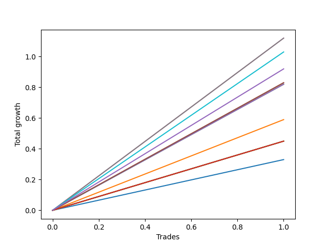

# Long Bernese 003 1v 
- Symbol: QQQ
- Date Range: 05/27/2022 - 09/30/2022
- Trading Period: 7:20-12:30
- Number of Trades: 1



| Name | Win Percent | Profit | Avg Profit / Trade | Avg Time / Trade |      | Name | Win Percent | Profit | Avg Profit / Trade | Avg Time / Trade |
| ---- | ----------- | ------ | ------------------ | ---------------- | ---- | ---- | ----------- | ------ | ------------------ | ---------------- |
| Sorted By <br> Profit | | | | | | Sorted By <br> Win Percentage ||||
| Six | 100.00 | 560.00 | 560.00 | 40:35 |     | Six | 100.00 | 560.00 | 560.00 | 40:35 |
| Five | 100.00 | 560.00 | 560.00 | 40:35 |     | Five | 100.00 | 560.00 | 560.00 | 40:35 |
| Eighty-One | 100.00 | 515.00 | 515.00 | 32:30 |     | Eighty-One | 100.00 | 515.00 | 515.00 | 32:30 |
| NEWFI 0000 | 100.00 | 460.00 | 460.00 | 34:05 |     | NEWFI 0000 | 100.00 | 460.00 | 460.00 | 34:05 |
| Four | 100.00 | 415.00 | 415.00 | 29:40 |     | Four | 100.00 | 415.00 | 415.00 | 29:40 |
| Two_C | 100.00 | 415.00 | 415.00 | 29:40 |     | Two_C | 100.00 | 415.00 | 415.00 | 29:40 |
| Three | 100.00 | 410.00 | 410.00 | 09:35 |     | Three | 100.00 | 410.00 | 410.00 | 09:35 |
| Two | 100.00 | 410.00 | 410.00 | 09:35 |     | Two | 100.00 | 410.00 | 410.00 | 09:35 |
| One | 100.00 | 295.00 | 295.00 | 08:20 |     | One | 100.00 | 295.00 | 295.00 | 08:20 |
| Eighty-Five | 100.00 | 225.00 | 225.00 | 59:55 |     | Eighty-Five | 100.00 | 225.00 | 225.00 | 59:55 |
| Eighty-Four | 100.00 | 225.00 | 225.00 | 59:55 |     | Eighty-Four | 100.00 | 225.00 | 225.00 | 59:55 |
| Eighty-Three | 100.00 | 225.00 | 225.00 | 59:55 |     | Eighty-Three | 100.00 | 225.00 | 225.00 | 59:55 |
| Eighty-Two | 100.00 | 225.00 | 225.00 | 59:55 |     | Eighty-Two | 100.00 | 225.00 | 225.00 | 59:55 |
| Seven | 100.00 | 225.00 | 225.00 | 59:55 |     | Seven | 100.00 | 225.00 | 225.00 | 59:55 |
| Zero | 100.00 | 165.00 | 165.00 | 07:40 |     | Zero | 100.00 | 165.00 | 165.00 | 07:40 |

## NO STOPLOSS

### Test Zero
* Sell when price hits the middle line of the 20p bollinger
* No Stoploss
* Results:
```
Total Trades: 1
Percent Up: 100.00
Percent Down: 0.00
Total Points Moved Up: 0.33
Potential Profit: 165.00
Total Points Ups: 0.33 Count Ups: 1
Total Points Downs: 0.00 Count Downs: 0
```

<details><summary>Trades</summary>

<code>In: 2022-06-29 09:29:00		Out: 2022-06-29 09:36:40		Total Position Time: 07:40		Total Move Up: 0.33		Total to Date: 0.33</code> <br />


</details>

### Test One
* Sell when the price hits the upper line of the 20p 1std bollinger
* No Stoploss
* Results:
```
Total Trades: 1
Percent Up: 100.00
Percent Down: 0.00
Total Points Moved Up: 0.59
Potential Profit: 295.00
Total Points Ups: 0.59 Count Ups: 1
Total Points Downs: 0.00 Count Downs: 0
```

<details><summary>Trades</summary>

<code>In: 2022-06-29 09:29:00		Out: 2022-06-29 09:37:20		Total Position Time: 08:20		Total Move Up: 0.59		Total to Date: 0.59</code> <br />


</details>

### Test Two
* Sell when the price hits the upper line of the 20p 2std bollinger
* No Stoploss
* Results:
```
Total Trades: 1
Percent Up: 100.00
Percent Down: 0.00
Total Points Moved Up: 0.82
Potential Profit: 410.00
Total Points Ups: 0.82 Count Ups: 1
Total Points Downs: 0.00 Count Downs: 0
```

<details><summary>Trades</summary>

<code>In: 2022-06-29 09:29:00		Out: 2022-06-29 09:38:35		Total Position Time: 09:35		Total Move Up: 0.82		Total to Date: 0.82</code> <br />


</details>

### Test Two_C
* Sell when the price hits the upper line of the 20p 2std bollinger
* No Stoploss
* Results:
```
Total Trades: 1
Percent Up: 100.00
Percent Down: 0.00
Total Points Moved Up: 0.83
Potential Profit: 415.00
Total Points Ups: 0.83 Count Ups: 1
Total Points Downs: 0.00 Count Downs: 0
```

<details><summary>Trades</summary>

<code>In: 2022-06-29 09:29:00		Out: 2022-06-29 09:58:40		Total Position Time: 29:40		Total Move Up: 0.83		Total to Date: 0.83</code> <br />


</details>

### Test Three
* Sell when price hits the middle line of the 50p bollinger
* No Stoploss
* Results:
```
Total Trades: 1
Percent Up: 100.00
Percent Down: 0.00
Total Points Moved Up: 0.82
Potential Profit: 410.00
Total Points Ups: 0.82 Count Ups: 1
Total Points Downs: 0.00 Count Downs: 0
```

<details><summary>Trades</summary>

<code>In: 2022-06-29 09:29:00		Out: 2022-06-29 09:38:35		Total Position Time: 09:35		Total Move Up: 0.82		Total to Date: 0.82</code> <br />


</details>

### Test Four
* Sell when the price hits the upper line of the 50p 1std bollinger
* No Stoploss
* Results:
```
Total Trades: 1
Percent Up: 100.00
Percent Down: 0.00
Total Points Moved Up: 0.83
Potential Profit: 415.00
Total Points Ups: 0.83 Count Ups: 1
Total Points Downs: 0.00 Count Downs: 0
```

<details><summary>Trades</summary>

<code>In: 2022-06-29 09:29:00		Out: 2022-06-29 09:58:40		Total Position Time: 29:40		Total Move Up: 0.83		Total to Date: 0.83</code> <br />


</details>

### Test Five
* Sell when the price hits the upper line of the 50p 2std bollinger
* No Stoploss
* Results:
```
Total Trades: 1
Percent Up: 100.00
Percent Down: 0.00
Total Points Moved Up: 1.12
Potential Profit: 560.00
Total Points Ups: 1.12 Count Ups: 1
Total Points Downs: 0.00 Count Downs: 0
```

<details><summary>Trades</summary>

<code>In: 2022-06-29 09:29:00		Out: 2022-06-29 10:09:35		Total Position Time: 40:35		Total Move Up: 1.12		Total to Date: 1.12</code> <br />


</details>

### Test Six
* Sell when the price hits the middle line of the 1std VWAP
* No Stoploss
* Results:
```
Total Trades: 1
Percent Up: 100.00
Percent Down: 0.00
Total Points Moved Up: 1.12
Potential Profit: 560.00
Total Points Ups: 1.12 Count Ups: 1
Total Points Downs: 0.00 Count Downs: 0
```

<details><summary>Trades</summary>

<code>In: 2022-06-29 09:29:00		Out: 2022-06-29 10:09:35		Total Position Time: 40:35		Total Move Up: 1.12		Total to Date: 1.12</code> <br />


</details>

### Test Seven
* Sell when the price hits the upper line of the 1std VWAP
* No Stoploss
* Results:
```
Total Trades: 1
Percent Up: 100.00
Percent Down: 0.00
Total Points Moved Up: 0.45
Potential Profit: 225.00
Total Points Ups: 0.45 Count Ups: 1
Total Points Downs: 0.00 Count Downs: 0
```

<details><summary>Trades</summary>

<code>In: 2022-06-29 09:29:00		Out: 2022-06-29 10:28:55		Total Position Time: 59:55		Total Move Up: 0.45		Total to Date: 0.45</code> <br />


</details>

## TAKE PROFIT

### Test Eighty-One
* Take Profit of 1 Point
* No Stoploss
* Results:
```
Total Trades: 1
Percent Up: 100.00
Percent Down: 0.00
Total Points Moved Up: 1.03
Potential Profit: 515.00
Total Points Ups: 1.03 Count Ups: 1
Total Points Downs: 0.00 Count Downs: 0
```

<details><summary>Trades</summary>

<code>In: 2022-06-29 09:29:00		Out: 2022-06-29 10:01:30		Total Position Time: 32:30		Total Move Up: 1.03		Total to Date: 1.03</code> <br />


</details>

### Test Eighty-Two
* Take Profit of 2 Point
* No Stoploss
* Results:
```
Total Trades: 1
Percent Up: 100.00
Percent Down: 0.00
Total Points Moved Up: 0.45
Potential Profit: 225.00
Total Points Ups: 0.45 Count Ups: 1
Total Points Downs: 0.00 Count Downs: 0
```

<details><summary>Trades</summary>

<code>In: 2022-06-29 09:29:00		Out: 2022-06-29 10:28:55		Total Position Time: 59:55		Total Move Up: 0.45		Total to Date: 0.45</code> <br />


</details>

### Test Eighty-Three
* Take Profit of 3 Point
* No Stoploss
* Results:
```
Total Trades: 1
Percent Up: 100.00
Percent Down: 0.00
Total Points Moved Up: 0.45
Potential Profit: 225.00
Total Points Ups: 0.45 Count Ups: 1
Total Points Downs: 0.00 Count Downs: 0
```

<details><summary>Trades</summary>

<code>In: 2022-06-29 09:29:00		Out: 2022-06-29 10:28:55		Total Position Time: 59:55		Total Move Up: 0.45		Total to Date: 0.45</code> <br />


</details>

### Test Eighty-Four
* Take Profit of 4 Point
* No Stoploss
* Results:
```
Total Trades: 1
Percent Up: 100.00
Percent Down: 0.00
Total Points Moved Up: 0.45
Potential Profit: 225.00
Total Points Ups: 0.45 Count Ups: 1
Total Points Downs: 0.00 Count Downs: 0
```

<details><summary>Trades</summary>

<code>In: 2022-06-29 09:29:00		Out: 2022-06-29 10:28:55		Total Position Time: 59:55		Total Move Up: 0.45		Total to Date: 0.45</code> <br />


</details>

### Test Eighty-Five
* Take Profit of 5 Point
* No Stoploss
* Results:
```
Total Trades: 1
Percent Up: 100.00
Percent Down: 0.00
Total Points Moved Up: 0.45
Potential Profit: 225.00
Total Points Ups: 0.45 Count Ups: 1
Total Points Downs: 0.00 Count Downs: 0
```

<details><summary>Trades</summary>

<code>In: 2022-06-29 09:29:00		Out: 2022-06-29 10:28:55		Total Position Time: 59:55		Total Move Up: 0.45		Total to Date: 0.45</code> <br />


</details>

## Indicator Exits

### Test NEWFI 0000
* Newfi 0000
* No Stoploss
* Results:
```
Total Trades: 1
Percent Up: 100.00
Percent Down: 0.00
Total Points Moved Up: 0.92
Potential Profit: 460.00
Total Points Ups: 0.92 Count Ups: 1
Total Points Downs: 0.00 Count Downs: 0
```

<details><summary>Trades</summary>

<code>In: 2022-06-29 09:29:00		Out: 2022-06-29 10:03:05		Total Position Time: 34:05		Total Move Up: 0.92		Total to Date: 0.92</code> <br />


</details>