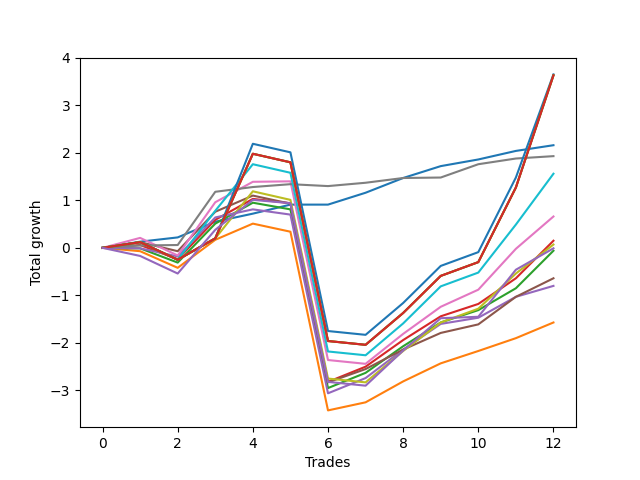

# Long Bernese 003 50 
- Symbol: QQQ
- Date Range: 05/27/2022 - 09/30/2022
- Trading Period: 7:20-12:30
- Number of Trades: 12



| Name | Win Percent | Profit | Avg Profit / Trade | Avg Time / Trade |      | Name | Win Percent | Profit | Avg Profit / Trade | Avg Time / Trade |
| ---- | ----------- | ------ | ------------------ | ---------------- | ---- | ---- | ----------- | ------ | ------------------ | ---------------- |
| Sorted By <br> Profit | | | | | | Sorted By <br> Win Percentage ||||
| Eighty-Two | 66.67 | 1825.00 | 152.08 | 56:12 |     | Zero | 100.00 | 1080.00 | 90.00 | 04:25 |
| Eighty-Five | 66.67 | 1815.00 | 151.25 | 58:40 |     | Six | 91.67 | 965.00 | 80.42 | 04:47 |
| Eighty-Four | 66.67 | 1815.00 | 151.25 | 58:40 |     | Five | 75.00 | 330.00 | 27.50 | 40:50 |
| Eighty-Three | 66.67 | 1815.00 | 151.25 | 58:40 |     | Two_C | 75.00 | 75.00 | 6.25 | 22:30 |
| Zero | 100.00 | 1080.00 | 90.00 | 04:25 |     | Four | 75.00 | -320.00 | -26.67 | 33:37 |
| Six | 91.67 | 965.00 | 80.42 | 04:47 |     | Eighty-Two | 66.67 | 1825.00 | 152.08 | 56:12 |
| Eighty-One | 66.67 | 780.00 | 65.00 | 47:09 |     | Eighty-Five | 66.67 | 1815.00 | 151.25 | 58:40 |
| Five | 75.00 | 330.00 | 27.50 | 40:50 |     | Eighty-Four | 66.67 | 1815.00 | 151.25 | 58:40 |
| Two_C | 75.00 | 75.00 | 6.25 | 22:30 |     | Eighty-Three | 66.67 | 1815.00 | 151.25 | 58:40 |
| Seven | 66.67 | 35.00 | 2.92 | 44:47 |     | Eighty-One | 66.67 | 780.00 | 65.00 | 47:09 |
| NEWFI 0000 | 58.33 | -5.00 | -0.42 | 41:27 |     | Seven | 66.67 | 35.00 | 2.92 | 44:47 |
| Two | 66.67 | -30.00 | -2.50 | 20:29 |     | Two | 66.67 | -30.00 | -2.50 | 20:29 |
| Four | 75.00 | -320.00 | -26.67 | 33:37 |     | Three | 66.67 | -400.00 | -33.33 | 17:19 |
| Three | 66.67 | -400.00 | -33.33 | 17:19 |     | One | 66.67 | -785.00 | -65.42 | 16:04 |
| One | 66.67 | -785.00 | -65.42 | 16:04 |     | NEWFI 0000 | 58.33 | -5.00 | -0.42 | 41:27 |

## NO STOPLOSS

### Test Zero
* Sell when price hits the middle line of the 20p bollinger
* No Stoploss
* Results:
```
Total Trades: 12
Percent Up: 100.00
Percent Down: 0.00
Total Points Moved Up: 2.16
Potential Profit: 1080.00
Total Points Ups: 2.16 Count Ups: 12
Total Points Downs: 0.00 Count Downs: 0
```

<details><summary>Trades</summary>

<code>In: 2022-06-21 09:02:00		Out: 2022-06-21 09:02:25		Total Position Time: 00:25		Total Move Up: 0.13		Total to Date: 0.13</code> <br />
<code>In: 2022-06-21 10:45:00		Out: 2022-06-21 10:50:10		Total Position Time: 05:10		Total Move Up: 0.09		Total to Date: 0.22</code> <br />
<code>In: 2022-06-29 09:29:00		Out: 2022-06-29 09:36:40		Total Position Time: 07:40		Total Move Up: 0.33		Total to Date: 0.55</code> <br />
<code>In: 2022-07-11 09:56:00		Out: 2022-07-11 09:58:15		Total Position Time: 02:15		Total Move Up: 0.17		Total to Date: 0.72</code> <br />
<code>In: 2022-07-15 09:04:00		Out: 2022-07-15 09:04:40		Total Position Time: 00:40		Total Move Up: 0.19		Total to Date: 0.91</code> <br />
<code>In: 2022-07-18 09:57:00		Out: 2022-07-18 10:08:25		Total Position Time: 11:25		Total Move Up: 0.00		Total to Date: 0.91</code> <br />
<code>In: 2022-08-02 12:01:00		Out: 2022-08-02 12:02:00		Total Position Time: 01:00		Total Move Up: 0.25		Total to Date: 1.16</code> <br />
<code>In: 2022-08-10 09:24:00		Out: 2022-08-10 09:32:10		Total Position Time: 08:10		Total Move Up: 0.31		Total to Date: 1.47</code> <br />
<code>In: 2022-08-10 09:25:00		Out: 2022-08-10 09:32:10		Total Position Time: 07:10		Total Move Up: 0.25		Total to Date: 1.72</code> <br />
<code>In: 2022-08-25 09:19:00		Out: 2022-08-25 09:26:05		Total Position Time: 07:05		Total Move Up: 0.14		Total to Date: 1.86</code> <br />
<code>In: 2022-09-09 09:28:00		Out: 2022-09-09 09:28:20		Total Position Time: 00:20		Total Move Up: 0.18		Total to Date: 2.04</code> <br />
<code>In: 2022-09-19 11:26:00		Out: 2022-09-19 11:27:50		Total Position Time: 01:50		Total Move Up: 0.12		Total to Date: 2.16</code> <br />


</details>

### Test One
* Sell when the price hits the upper line of the 20p 1std bollinger
* No Stoploss
* Results:
```
Total Trades: 12
Percent Up: 66.67
Percent Down: 33.33
Total Points Moved Up: -1.57
Potential Profit: -785.00
Total Points Ups: 2.78 Count Ups: 8
Total Points Downs: -4.35 Count Downs: 4
```

<details><summary>Trades</summary>

<code>In: 2022-06-21 09:02:00		Out: 2022-06-21 09:16:20		Total Position Time: 14:20		Total Move Up: -0.07		Total to Date: -0.07</code> <br />
<code>In: 2022-06-21 10:45:00		Out: 2022-06-21 11:18:05		Total Position Time: 33:05		Total Move Up: -0.35		Total to Date: -0.42</code> <br />
<code>In: 2022-06-29 09:29:00		Out: 2022-06-29 09:37:20		Total Position Time: 08:20		Total Move Up: 0.59		Total to Date: 0.17</code> <br />
<code>In: 2022-07-11 09:56:00		Out: 2022-07-11 09:58:50		Total Position Time: 02:50		Total Move Up: 0.34		Total to Date: 0.51</code> <br />
<code>In: 2022-07-15 09:04:00		Out: 2022-07-15 09:23:30		Total Position Time: 19:30		Total Move Up: -0.17		Total to Date: 0.34</code> <br />
<code>In: 2022-07-18 09:57:00		Out: 2022-07-18 10:56:55		Total Position Time: 59:55		Total Move Up: -3.76		Total to Date: -3.42</code> <br />
<code>In: 2022-08-02 12:01:00		Out: 2022-08-02 12:14:25		Total Position Time: 13:25		Total Move Up: 0.17		Total to Date: -3.25</code> <br />
<code>In: 2022-08-10 09:24:00		Out: 2022-08-10 09:35:40		Total Position Time: 11:40		Total Move Up: 0.44		Total to Date: -2.81</code> <br />
<code>In: 2022-08-10 09:25:00		Out: 2022-08-10 09:35:40		Total Position Time: 10:40		Total Move Up: 0.38		Total to Date: -2.43</code> <br />
<code>In: 2022-08-25 09:19:00		Out: 2022-08-25 09:28:25		Total Position Time: 09:25		Total Move Up: 0.26		Total to Date: -2.17</code> <br />
<code>In: 2022-09-09 09:28:00		Out: 2022-09-09 09:33:05		Total Position Time: 05:05		Total Move Up: 0.27		Total to Date: -1.90</code> <br />
<code>In: 2022-09-19 11:26:00		Out: 2022-09-19 11:30:35		Total Position Time: 04:35		Total Move Up: 0.33		Total to Date: -1.57</code> <br />


</details>

### Test Two
* Sell when the price hits the upper line of the 20p 2std bollinger
* No Stoploss
* Results:
```
Total Trades: 12
Percent Up: 66.67
Percent Down: 33.33
Total Points Moved Up: -0.06
Potential Profit: -30.00
Total Points Ups: 4.15 Count Ups: 8
Total Points Downs: -4.21 Count Downs: 4
```

<details><summary>Trades</summary>

<code>In: 2022-06-21 09:02:00		Out: 2022-06-21 09:36:00		Total Position Time: 34:00		Total Move Up: -0.01		Total to Date: -0.01</code> <br />
<code>In: 2022-06-21 10:45:00		Out: 2022-06-21 11:23:00		Total Position Time: 38:00		Total Move Up: -0.30		Total to Date: -0.31</code> <br />
<code>In: 2022-06-29 09:29:00		Out: 2022-06-29 09:38:35		Total Position Time: 09:35		Total Move Up: 0.82		Total to Date: 0.51</code> <br />
<code>In: 2022-07-11 09:56:00		Out: 2022-07-11 10:02:35		Total Position Time: 06:35		Total Move Up: 0.44		Total to Date: 0.95</code> <br />
<code>In: 2022-07-15 09:04:00		Out: 2022-07-15 09:26:15		Total Position Time: 22:15		Total Move Up: -0.14		Total to Date: 0.81</code> <br />
<code>In: 2022-07-18 09:57:00		Out: 2022-07-18 10:56:55		Total Position Time: 59:55		Total Move Up: -3.76		Total to Date: -2.95</code> <br />
<code>In: 2022-08-02 12:01:00		Out: 2022-08-02 12:15:05		Total Position Time: 14:05		Total Move Up: 0.32		Total to Date: -2.63</code> <br />
<code>In: 2022-08-10 09:24:00		Out: 2022-08-10 09:38:35		Total Position Time: 14:35		Total Move Up: 0.56		Total to Date: -2.07</code> <br />
<code>In: 2022-08-10 09:25:00		Out: 2022-08-10 09:38:35		Total Position Time: 13:35		Total Move Up: 0.50		Total to Date: -1.57</code> <br />
<code>In: 2022-08-25 09:19:00		Out: 2022-08-25 09:33:50		Total Position Time: 14:50		Total Move Up: 0.26		Total to Date: -1.31</code> <br />
<code>In: 2022-09-09 09:28:00		Out: 2022-09-09 09:33:55		Total Position Time: 05:55		Total Move Up: 0.46		Total to Date: -0.85</code> <br />
<code>In: 2022-09-19 11:26:00		Out: 2022-09-19 11:38:35		Total Position Time: 12:35		Total Move Up: 0.79		Total to Date: -0.06</code> <br />


</details>

### Test Two_C
* Sell when the price hits the upper line of the 20p 2std bollinger
* No Stoploss
* Results:
```
Total Trades: 12
Percent Up: 75.00
Percent Down: 25.00
Total Points Moved Up: 0.15
Potential Profit: 75.00
Total Points Ups: 4.30 Count Ups: 9
Total Points Downs: -4.15 Count Downs: 3
```

<details><summary>Trades</summary>

<code>In: 2022-06-21 09:02:00		Out: 2022-06-21 09:37:30		Total Position Time: 35:30		Total Move Up: 0.06		Total to Date: 0.06</code> <br />
<code>In: 2022-06-21 10:45:00		Out: 2022-06-21 11:23:00		Total Position Time: 38:00		Total Move Up: -0.30		Total to Date: -0.24</code> <br />
<code>In: 2022-06-29 09:29:00		Out: 2022-06-29 09:58:40		Total Position Time: 29:40		Total Move Up: 0.83		Total to Date: 0.59</code> <br />
<code>In: 2022-07-11 09:56:00		Out: 2022-07-11 10:02:35		Total Position Time: 06:35		Total Move Up: 0.44		Total to Date: 1.03</code> <br />
<code>In: 2022-07-15 09:04:00		Out: 2022-07-15 09:26:25		Total Position Time: 22:25		Total Move Up: -0.09		Total to Date: 0.94</code> <br />
<code>In: 2022-07-18 09:57:00		Out: 2022-07-18 10:56:55		Total Position Time: 59:55		Total Move Up: -3.76		Total to Date: -2.82</code> <br />
<code>In: 2022-08-02 12:01:00		Out: 2022-08-02 12:15:05		Total Position Time: 14:05		Total Move Up: 0.32		Total to Date: -2.50</code> <br />
<code>In: 2022-08-10 09:24:00		Out: 2022-08-10 09:38:35		Total Position Time: 14:35		Total Move Up: 0.56		Total to Date: -1.94</code> <br />
<code>In: 2022-08-10 09:25:00		Out: 2022-08-10 09:38:35		Total Position Time: 13:35		Total Move Up: 0.50		Total to Date: -1.44</code> <br />
<code>In: 2022-08-25 09:19:00		Out: 2022-08-25 09:33:50		Total Position Time: 14:50		Total Move Up: 0.26		Total to Date: -1.18</code> <br />
<code>In: 2022-09-09 09:28:00		Out: 2022-09-09 09:36:20		Total Position Time: 08:20		Total Move Up: 0.54		Total to Date: -0.64</code> <br />
<code>In: 2022-09-19 11:26:00		Out: 2022-09-19 11:38:40		Total Position Time: 12:40		Total Move Up: 0.79		Total to Date: 0.15</code> <br />


</details>

### Test Three
* Sell when price hits the middle line of the 50p bollinger
* No Stoploss
* Results:
```
Total Trades: 12
Percent Up: 66.67
Percent Down: 33.33
Total Points Moved Up: -0.80
Potential Profit: -400.00
Total Points Ups: 3.25 Count Ups: 8
Total Points Downs: -4.05 Count Downs: 4
```

<details><summary>Trades</summary>

<code>In: 2022-06-21 09:02:00		Out: 2022-06-21 09:20:20		Total Position Time: 18:20		Total Move Up: -0.01		Total to Date: -0.01</code> <br />
<code>In: 2022-06-21 10:45:00		Out: 2022-06-21 11:23:10		Total Position Time: 38:10		Total Move Up: -0.17		Total to Date: -0.18</code> <br />
<code>In: 2022-06-29 09:29:00		Out: 2022-06-29 09:38:35		Total Position Time: 09:35		Total Move Up: 0.82		Total to Date: 0.64</code> <br />
<code>In: 2022-07-11 09:56:00		Out: 2022-07-11 09:58:15		Total Position Time: 02:15		Total Move Up: 0.17		Total to Date: 0.81</code> <br />
<code>In: 2022-07-15 09:04:00		Out: 2022-07-15 09:32:05		Total Position Time: 28:05		Total Move Up: -0.11		Total to Date: 0.70</code> <br />
<code>In: 2022-07-18 09:57:00		Out: 2022-07-18 10:56:55		Total Position Time: 59:55		Total Move Up: -3.76		Total to Date: -3.06</code> <br />
<code>In: 2022-08-02 12:01:00		Out: 2022-08-02 12:02:05		Total Position Time: 01:05		Total Move Up: 0.32		Total to Date: -2.74</code> <br />
<code>In: 2022-08-10 09:24:00		Out: 2022-08-10 09:41:55		Total Position Time: 17:55		Total Move Up: 0.60		Total to Date: -2.14</code> <br />
<code>In: 2022-08-10 09:25:00		Out: 2022-08-10 09:41:55		Total Position Time: 16:55		Total Move Up: 0.54		Total to Date: -1.60</code> <br />
<code>In: 2022-08-25 09:19:00		Out: 2022-08-25 09:26:20		Total Position Time: 07:20		Total Move Up: 0.13		Total to Date: -1.47</code> <br />
<code>In: 2022-09-09 09:28:00		Out: 2022-09-09 09:33:25		Total Position Time: 05:25		Total Move Up: 0.44		Total to Date: -1.03</code> <br />
<code>In: 2022-09-19 11:26:00		Out: 2022-09-19 11:28:50		Total Position Time: 02:50		Total Move Up: 0.23		Total to Date: -0.80</code> <br />


</details>

### Test Four
* Sell when the price hits the upper line of the 50p 1std bollinger
* No Stoploss
* Results:
```
Total Trades: 12
Percent Up: 75.00
Percent Down: 25.00
Total Points Moved Up: -0.64
Potential Profit: -320.00
Total Points Ups: 3.48 Count Ups: 9
Total Points Downs: -4.12 Count Downs: 3
```

<details><summary>Trades</summary>

<code>In: 2022-06-21 09:02:00		Out: 2022-06-21 09:37:35		Total Position Time: 35:35		Total Move Up: 0.12		Total to Date: 0.12</code> <br />
<code>In: 2022-06-21 10:45:00		Out: 2022-06-21 11:36:15		Total Position Time: 51:15		Total Move Up: -0.19		Total to Date: -0.07</code> <br />
<code>In: 2022-06-29 09:29:00		Out: 2022-06-29 09:58:40		Total Position Time: 29:40		Total Move Up: 0.83		Total to Date: 0.76</code> <br />
<code>In: 2022-07-11 09:56:00		Out: 2022-07-11 09:58:50		Total Position Time: 02:50		Total Move Up: 0.34		Total to Date: 1.10</code> <br />
<code>In: 2022-07-15 09:04:00		Out: 2022-07-15 09:47:40		Total Position Time: 43:40		Total Move Up: -0.17		Total to Date: 0.93</code> <br />
<code>In: 2022-07-18 09:57:00		Out: 2022-07-18 10:56:55		Total Position Time: 59:55		Total Move Up: -3.76		Total to Date: -2.83</code> <br />
<code>In: 2022-08-02 12:01:00		Out: 2022-08-02 12:36:40		Total Position Time: 35:40		Total Move Up: 0.28		Total to Date: -2.55</code> <br />
<code>In: 2022-08-10 09:24:00		Out: 2022-08-10 10:08:40		Total Position Time: 44:40		Total Move Up: 0.41		Total to Date: -2.14</code> <br />
<code>In: 2022-08-10 09:25:00		Out: 2022-08-10 10:08:40		Total Position Time: 43:40		Total Move Up: 0.35		Total to Date: -1.79</code> <br />
<code>In: 2022-08-25 09:19:00		Out: 2022-08-25 10:01:45		Total Position Time: 42:45		Total Move Up: 0.18		Total to Date: -1.61</code> <br />
<code>In: 2022-09-09 09:28:00		Out: 2022-09-09 09:37:15		Total Position Time: 09:15		Total Move Up: 0.58		Total to Date: -1.03</code> <br />
<code>In: 2022-09-19 11:26:00		Out: 2022-09-19 11:30:40		Total Position Time: 04:40		Total Move Up: 0.39		Total to Date: -0.64</code> <br />


</details>

### Test Five
* Sell when the price hits the upper line of the 50p 2std bollinger
* No Stoploss
* Results:
```
Total Trades: 12
Percent Up: 75.00
Percent Down: 25.00
Total Points Moved Up: 0.66
Potential Profit: 330.00
Total Points Ups: 4.87 Count Ups: 9
Total Points Downs: -4.21 Count Downs: 3
```

<details><summary>Trades</summary>

<code>In: 2022-06-21 09:02:00		Out: 2022-06-21 09:54:55		Total Position Time: 52:55		Total Move Up: 0.21		Total to Date: 0.21</code> <br />
<code>In: 2022-06-21 10:45:00		Out: 2022-06-21 11:44:55		Total Position Time: 59:55		Total Move Up: -0.37		Total to Date: -0.16</code> <br />
<code>In: 2022-06-29 09:29:00		Out: 2022-06-29 10:09:35		Total Position Time: 40:35		Total Move Up: 1.12		Total to Date: 0.96</code> <br />
<code>In: 2022-07-11 09:56:00		Out: 2022-07-11 10:02:40		Total Position Time: 06:40		Total Move Up: 0.43		Total to Date: 1.39</code> <br />
<code>In: 2022-07-15 09:04:00		Out: 2022-07-15 09:49:40		Total Position Time: 45:40		Total Move Up: 0.01		Total to Date: 1.40</code> <br />
<code>In: 2022-07-18 09:57:00		Out: 2022-07-18 10:56:55		Total Position Time: 59:55		Total Move Up: -3.76		Total to Date: -2.36</code> <br />
<code>In: 2022-08-02 12:01:00		Out: 2022-08-02 12:46:00		Total Position Time: 45:00		Total Move Up: -0.08		Total to Date: -2.44</code> <br />
<code>In: 2022-08-10 09:24:00		Out: 2022-08-10 10:12:30		Total Position Time: 48:30		Total Move Up: 0.63		Total to Date: -1.81</code> <br />
<code>In: 2022-08-10 09:25:00		Out: 2022-08-10 10:12:30		Total Position Time: 47:30		Total Move Up: 0.57		Total to Date: -1.24</code> <br />
<code>In: 2022-08-25 09:19:00		Out: 2022-08-25 10:08:55		Total Position Time: 49:55		Total Move Up: 0.36		Total to Date: -0.88</code> <br />
<code>In: 2022-09-09 09:28:00		Out: 2022-09-09 09:48:55		Total Position Time: 20:55		Total Move Up: 0.86		Total to Date: -0.02</code> <br />
<code>In: 2022-09-19 11:26:00		Out: 2022-09-19 11:38:30		Total Position Time: 12:30		Total Move Up: 0.68		Total to Date: 0.66</code> <br />


</details>

### Test Six
* Sell when the price hits the middle line of the 1std VWAP
* No Stoploss
* Results:
```
Total Trades: 12
Percent Up: 91.67
Percent Down: 8.33
Total Points Moved Up: 1.93
Potential Profit: 965.00
Total Points Ups: 1.97 Count Ups: 11
Total Points Downs: -0.04 Count Downs: 1
```

<details><summary>Trades</summary>

<code>In: 2022-06-21 09:02:00		Out: 2022-06-21 09:02:10		Total Position Time: 00:10		Total Move Up: 0.05		Total to Date: 0.05</code> <br />
<code>In: 2022-06-21 10:45:00		Out: 2022-06-21 10:49:20		Total Position Time: 04:20		Total Move Up: 0.01		Total to Date: 0.06</code> <br />
<code>In: 2022-06-29 09:29:00		Out: 2022-06-29 10:09:35		Total Position Time: 40:35		Total Move Up: 1.12		Total to Date: 1.18</code> <br />
<code>In: 2022-07-11 09:56:00		Out: 2022-07-11 09:57:30		Total Position Time: 01:30		Total Move Up: 0.10		Total to Date: 1.28</code> <br />
<code>In: 2022-07-15 09:04:00		Out: 2022-07-15 09:04:10		Total Position Time: 00:10		Total Move Up: 0.06		Total to Date: 1.34</code> <br />
<code>In: 2022-07-18 09:57:00		Out: 2022-07-18 09:57:10		Total Position Time: 00:10		Total Move Up: -0.04		Total to Date: 1.30</code> <br />
<code>In: 2022-08-02 12:01:00		Out: 2022-08-02 12:01:10		Total Position Time: 00:10		Total Move Up: 0.07		Total to Date: 1.37</code> <br />
<code>In: 2022-08-10 09:24:00		Out: 2022-08-10 09:24:10		Total Position Time: 00:10		Total Move Up: 0.10		Total to Date: 1.47</code> <br />
<code>In: 2022-08-10 09:25:00		Out: 2022-08-10 09:25:10		Total Position Time: 00:10		Total Move Up: 0.01		Total to Date: 1.48</code> <br />
<code>In: 2022-08-25 09:19:00		Out: 2022-08-25 09:28:40		Total Position Time: 09:40		Total Move Up: 0.28		Total to Date: 1.76</code> <br />
<code>In: 2022-09-09 09:28:00		Out: 2022-09-09 09:28:10		Total Position Time: 00:10		Total Move Up: 0.12		Total to Date: 1.88</code> <br />
<code>In: 2022-09-19 11:26:00		Out: 2022-09-19 11:26:10		Total Position Time: 00:10		Total Move Up: 0.05		Total to Date: 1.93</code> <br />


</details>

### Test Seven
* Sell when the price hits the upper line of the 1std VWAP
* No Stoploss
* Results:
```
Total Trades: 12
Percent Up: 66.67
Percent Down: 33.33
Total Points Moved Up: 0.07
Potential Profit: 35.00
Total Points Ups: 4.46 Count Ups: 8
Total Points Downs: -4.39 Count Downs: 4
```

<details><summary>Trades</summary>

<code>In: 2022-06-21 09:02:00		Out: 2022-06-21 10:01:55		Total Position Time: 59:55		Total Move Up: 0.12		Total to Date: 0.12</code> <br />
<code>In: 2022-06-21 10:45:00		Out: 2022-06-21 11:44:55		Total Position Time: 59:55		Total Move Up: -0.37		Total to Date: -0.25</code> <br />
<code>In: 2022-06-29 09:29:00		Out: 2022-06-29 10:28:55		Total Position Time: 59:55		Total Move Up: 0.45		Total to Date: 0.20</code> <br />
<code>In: 2022-07-11 09:56:00		Out: 2022-07-11 10:07:30		Total Position Time: 11:30		Total Move Up: 0.99		Total to Date: 1.19</code> <br />
<code>In: 2022-07-15 09:04:00		Out: 2022-07-15 10:03:55		Total Position Time: 59:55		Total Move Up: -0.18		Total to Date: 1.01</code> <br />
<code>In: 2022-07-18 09:57:00		Out: 2022-07-18 10:56:55		Total Position Time: 59:55		Total Move Up: -3.76		Total to Date: -2.75</code> <br />
<code>In: 2022-08-02 12:01:00		Out: 2022-08-02 12:46:00		Total Position Time: 45:00		Total Move Up: -0.08		Total to Date: -2.83</code> <br />
<code>In: 2022-08-10 09:24:00		Out: 2022-08-10 10:12:40		Total Position Time: 48:40		Total Move Up: 0.66		Total to Date: -2.17</code> <br />
<code>In: 2022-08-10 09:25:00		Out: 2022-08-10 10:12:40		Total Position Time: 47:40		Total Move Up: 0.60		Total to Date: -1.57</code> <br />
<code>In: 2022-08-25 09:19:00		Out: 2022-08-25 10:18:55		Total Position Time: 59:55		Total Move Up: 0.29		Total to Date: -1.28</code> <br />
<code>In: 2022-09-09 09:28:00		Out: 2022-09-09 09:41:50		Total Position Time: 13:50		Total Move Up: 0.74		Total to Date: -0.54</code> <br />
<code>In: 2022-09-19 11:26:00		Out: 2022-09-19 11:37:15		Total Position Time: 11:15		Total Move Up: 0.61		Total to Date: 0.07</code> <br />


</details>

## TAKE PROFIT

### Test Eighty-One
* Take Profit of 1 Point
* No Stoploss
* Results:
```
Total Trades: 12
Percent Up: 66.67
Percent Down: 33.33
Total Points Moved Up: 1.56
Potential Profit: 780.00
Total Points Ups: 5.95 Count Ups: 8
Total Points Downs: -4.39 Count Downs: 4
```

<details><summary>Trades</summary>

<code>In: 2022-06-21 09:02:00		Out: 2022-06-21 10:01:55		Total Position Time: 59:55		Total Move Up: 0.12		Total to Date: 0.12</code> <br />
<code>In: 2022-06-21 10:45:00		Out: 2022-06-21 11:44:55		Total Position Time: 59:55		Total Move Up: -0.37		Total to Date: -0.25</code> <br />
<code>In: 2022-06-29 09:29:00		Out: 2022-06-29 10:01:30		Total Position Time: 32:30		Total Move Up: 1.03		Total to Date: 0.78</code> <br />
<code>In: 2022-07-11 09:56:00		Out: 2022-07-11 10:07:35		Total Position Time: 11:35		Total Move Up: 0.98		Total to Date: 1.76</code> <br />
<code>In: 2022-07-15 09:04:00		Out: 2022-07-15 10:03:55		Total Position Time: 59:55		Total Move Up: -0.18		Total to Date: 1.58</code> <br />
<code>In: 2022-07-18 09:57:00		Out: 2022-07-18 10:56:55		Total Position Time: 59:55		Total Move Up: -3.76		Total to Date: -2.18</code> <br />
<code>In: 2022-08-02 12:01:00		Out: 2022-08-02 12:46:00		Total Position Time: 45:00		Total Move Up: -0.08		Total to Date: -2.26</code> <br />
<code>In: 2022-08-10 09:24:00		Out: 2022-08-10 10:23:55		Total Position Time: 59:55		Total Move Up: 0.67		Total to Date: -1.59</code> <br />
<code>In: 2022-08-10 09:25:00		Out: 2022-08-10 10:24:55		Total Position Time: 59:55		Total Move Up: 0.78		Total to Date: -0.81</code> <br />
<code>In: 2022-08-25 09:19:00		Out: 2022-08-25 10:18:55		Total Position Time: 59:55		Total Move Up: 0.29		Total to Date: -0.52</code> <br />
<code>In: 2022-09-09 09:28:00		Out: 2022-09-09 09:50:55		Total Position Time: 22:55		Total Move Up: 1.01		Total to Date: 0.49</code> <br />
<code>In: 2022-09-19 11:26:00		Out: 2022-09-19 12:00:25		Total Position Time: 34:25		Total Move Up: 1.07		Total to Date: 1.56</code> <br />


</details>

### Test Eighty-Two
* Take Profit of 2 Point
* No Stoploss
* Results:
```
Total Trades: 12
Percent Up: 66.67
Percent Down: 33.33
Total Points Moved Up: 3.65
Potential Profit: 1825.00
Total Points Ups: 8.04 Count Ups: 8
Total Points Downs: -4.39 Count Downs: 4
```

<details><summary>Trades</summary>

<code>In: 2022-06-21 09:02:00		Out: 2022-06-21 10:01:55		Total Position Time: 59:55		Total Move Up: 0.12		Total to Date: 0.12</code> <br />
<code>In: 2022-06-21 10:45:00		Out: 2022-06-21 11:44:55		Total Position Time: 59:55		Total Move Up: -0.37		Total to Date: -0.25</code> <br />
<code>In: 2022-06-29 09:29:00		Out: 2022-06-29 10:28:55		Total Position Time: 59:55		Total Move Up: 0.45		Total to Date: 0.20</code> <br />
<code>In: 2022-07-11 09:56:00		Out: 2022-07-11 10:41:15		Total Position Time: 45:15		Total Move Up: 1.99		Total to Date: 2.19</code> <br />
<code>In: 2022-07-15 09:04:00		Out: 2022-07-15 10:03:55		Total Position Time: 59:55		Total Move Up: -0.18		Total to Date: 2.01</code> <br />
<code>In: 2022-07-18 09:57:00		Out: 2022-07-18 10:56:55		Total Position Time: 59:55		Total Move Up: -3.76		Total to Date: -1.75</code> <br />
<code>In: 2022-08-02 12:01:00		Out: 2022-08-02 12:46:00		Total Position Time: 45:00		Total Move Up: -0.08		Total to Date: -1.83</code> <br />
<code>In: 2022-08-10 09:24:00		Out: 2022-08-10 10:23:55		Total Position Time: 59:55		Total Move Up: 0.67		Total to Date: -1.16</code> <br />
<code>In: 2022-08-10 09:25:00		Out: 2022-08-10 10:24:55		Total Position Time: 59:55		Total Move Up: 0.78		Total to Date: -0.38</code> <br />
<code>In: 2022-08-25 09:19:00		Out: 2022-08-25 10:18:55		Total Position Time: 59:55		Total Move Up: 0.29		Total to Date: -0.09</code> <br />
<code>In: 2022-09-09 09:28:00		Out: 2022-09-09 10:27:55		Total Position Time: 59:55		Total Move Up: 1.57		Total to Date: 1.48</code> <br />
<code>In: 2022-09-19 11:26:00		Out: 2022-09-19 12:10:55		Total Position Time: 44:55		Total Move Up: 2.17		Total to Date: 3.65</code> <br />


</details>

### Test Eighty-Three
* Take Profit of 3 Point
* No Stoploss
* Results:
```
Total Trades: 12
Percent Up: 66.67
Percent Down: 33.33
Total Points Moved Up: 3.63
Potential Profit: 1815.00
Total Points Ups: 8.02 Count Ups: 8
Total Points Downs: -4.39 Count Downs: 4
```

<details><summary>Trades</summary>

<code>In: 2022-06-21 09:02:00		Out: 2022-06-21 10:01:55		Total Position Time: 59:55		Total Move Up: 0.12		Total to Date: 0.12</code> <br />
<code>In: 2022-06-21 10:45:00		Out: 2022-06-21 11:44:55		Total Position Time: 59:55		Total Move Up: -0.37		Total to Date: -0.25</code> <br />
<code>In: 2022-06-29 09:29:00		Out: 2022-06-29 10:28:55		Total Position Time: 59:55		Total Move Up: 0.45		Total to Date: 0.20</code> <br />
<code>In: 2022-07-11 09:56:00		Out: 2022-07-11 10:55:55		Total Position Time: 59:55		Total Move Up: 1.78		Total to Date: 1.98</code> <br />
<code>In: 2022-07-15 09:04:00		Out: 2022-07-15 10:03:55		Total Position Time: 59:55		Total Move Up: -0.18		Total to Date: 1.80</code> <br />
<code>In: 2022-07-18 09:57:00		Out: 2022-07-18 10:56:55		Total Position Time: 59:55		Total Move Up: -3.76		Total to Date: -1.96</code> <br />
<code>In: 2022-08-02 12:01:00		Out: 2022-08-02 12:46:00		Total Position Time: 45:00		Total Move Up: -0.08		Total to Date: -2.04</code> <br />
<code>In: 2022-08-10 09:24:00		Out: 2022-08-10 10:23:55		Total Position Time: 59:55		Total Move Up: 0.67		Total to Date: -1.37</code> <br />
<code>In: 2022-08-10 09:25:00		Out: 2022-08-10 10:24:55		Total Position Time: 59:55		Total Move Up: 0.78		Total to Date: -0.59</code> <br />
<code>In: 2022-08-25 09:19:00		Out: 2022-08-25 10:18:55		Total Position Time: 59:55		Total Move Up: 0.29		Total to Date: -0.30</code> <br />
<code>In: 2022-09-09 09:28:00		Out: 2022-09-09 10:27:55		Total Position Time: 59:55		Total Move Up: 1.57		Total to Date: 1.27</code> <br />
<code>In: 2022-09-19 11:26:00		Out: 2022-09-19 12:25:55		Total Position Time: 59:55		Total Move Up: 2.36		Total to Date: 3.63</code> <br />


</details>

### Test Eighty-Four
* Take Profit of 4 Point
* No Stoploss
* Results:
```
Total Trades: 12
Percent Up: 66.67
Percent Down: 33.33
Total Points Moved Up: 3.63
Potential Profit: 1815.00
Total Points Ups: 8.02 Count Ups: 8
Total Points Downs: -4.39 Count Downs: 4
```

<details><summary>Trades</summary>

<code>In: 2022-06-21 09:02:00		Out: 2022-06-21 10:01:55		Total Position Time: 59:55		Total Move Up: 0.12		Total to Date: 0.12</code> <br />
<code>In: 2022-06-21 10:45:00		Out: 2022-06-21 11:44:55		Total Position Time: 59:55		Total Move Up: -0.37		Total to Date: -0.25</code> <br />
<code>In: 2022-06-29 09:29:00		Out: 2022-06-29 10:28:55		Total Position Time: 59:55		Total Move Up: 0.45		Total to Date: 0.20</code> <br />
<code>In: 2022-07-11 09:56:00		Out: 2022-07-11 10:55:55		Total Position Time: 59:55		Total Move Up: 1.78		Total to Date: 1.98</code> <br />
<code>In: 2022-07-15 09:04:00		Out: 2022-07-15 10:03:55		Total Position Time: 59:55		Total Move Up: -0.18		Total to Date: 1.80</code> <br />
<code>In: 2022-07-18 09:57:00		Out: 2022-07-18 10:56:55		Total Position Time: 59:55		Total Move Up: -3.76		Total to Date: -1.96</code> <br />
<code>In: 2022-08-02 12:01:00		Out: 2022-08-02 12:46:00		Total Position Time: 45:00		Total Move Up: -0.08		Total to Date: -2.04</code> <br />
<code>In: 2022-08-10 09:24:00		Out: 2022-08-10 10:23:55		Total Position Time: 59:55		Total Move Up: 0.67		Total to Date: -1.37</code> <br />
<code>In: 2022-08-10 09:25:00		Out: 2022-08-10 10:24:55		Total Position Time: 59:55		Total Move Up: 0.78		Total to Date: -0.59</code> <br />
<code>In: 2022-08-25 09:19:00		Out: 2022-08-25 10:18:55		Total Position Time: 59:55		Total Move Up: 0.29		Total to Date: -0.30</code> <br />
<code>In: 2022-09-09 09:28:00		Out: 2022-09-09 10:27:55		Total Position Time: 59:55		Total Move Up: 1.57		Total to Date: 1.27</code> <br />
<code>In: 2022-09-19 11:26:00		Out: 2022-09-19 12:25:55		Total Position Time: 59:55		Total Move Up: 2.36		Total to Date: 3.63</code> <br />


</details>

### Test Eighty-Five
* Take Profit of 5 Point
* No Stoploss
* Results:
```
Total Trades: 12
Percent Up: 66.67
Percent Down: 33.33
Total Points Moved Up: 3.63
Potential Profit: 1815.00
Total Points Ups: 8.02 Count Ups: 8
Total Points Downs: -4.39 Count Downs: 4
```

<details><summary>Trades</summary>

<code>In: 2022-06-21 09:02:00		Out: 2022-06-21 10:01:55		Total Position Time: 59:55		Total Move Up: 0.12		Total to Date: 0.12</code> <br />
<code>In: 2022-06-21 10:45:00		Out: 2022-06-21 11:44:55		Total Position Time: 59:55		Total Move Up: -0.37		Total to Date: -0.25</code> <br />
<code>In: 2022-06-29 09:29:00		Out: 2022-06-29 10:28:55		Total Position Time: 59:55		Total Move Up: 0.45		Total to Date: 0.20</code> <br />
<code>In: 2022-07-11 09:56:00		Out: 2022-07-11 10:55:55		Total Position Time: 59:55		Total Move Up: 1.78		Total to Date: 1.98</code> <br />
<code>In: 2022-07-15 09:04:00		Out: 2022-07-15 10:03:55		Total Position Time: 59:55		Total Move Up: -0.18		Total to Date: 1.80</code> <br />
<code>In: 2022-07-18 09:57:00		Out: 2022-07-18 10:56:55		Total Position Time: 59:55		Total Move Up: -3.76		Total to Date: -1.96</code> <br />
<code>In: 2022-08-02 12:01:00		Out: 2022-08-02 12:46:00		Total Position Time: 45:00		Total Move Up: -0.08		Total to Date: -2.04</code> <br />
<code>In: 2022-08-10 09:24:00		Out: 2022-08-10 10:23:55		Total Position Time: 59:55		Total Move Up: 0.67		Total to Date: -1.37</code> <br />
<code>In: 2022-08-10 09:25:00		Out: 2022-08-10 10:24:55		Total Position Time: 59:55		Total Move Up: 0.78		Total to Date: -0.59</code> <br />
<code>In: 2022-08-25 09:19:00		Out: 2022-08-25 10:18:55		Total Position Time: 59:55		Total Move Up: 0.29		Total to Date: -0.30</code> <br />
<code>In: 2022-09-09 09:28:00		Out: 2022-09-09 10:27:55		Total Position Time: 59:55		Total Move Up: 1.57		Total to Date: 1.27</code> <br />
<code>In: 2022-09-19 11:26:00		Out: 2022-09-19 12:25:55		Total Position Time: 59:55		Total Move Up: 2.36		Total to Date: 3.63</code> <br />


</details>

## Indicator Exits

### Test NEWFI 0000
* Newfi 0000
* No Stoploss
* Results:
```
Total Trades: 12
Percent Up: 58.33
Percent Down: 41.67
Total Points Moved Up: -0.01
Potential Profit: -5.00
Total Points Ups: 4.44 Count Ups: 7
Total Points Downs: -4.45 Count Downs: 5
```

<details><summary>Trades</summary>

<code>In: 2022-06-21 09:02:00		Out: 2022-06-21 09:48:05		Total Position Time: 46:05		Total Move Up: -0.17		Total to Date: -0.17</code> <br />
<code>In: 2022-06-21 10:45:00		Out: 2022-06-21 11:44:55		Total Position Time: 59:55		Total Move Up: -0.37		Total to Date: -0.54</code> <br />
<code>In: 2022-06-29 09:29:00		Out: 2022-06-29 10:03:05		Total Position Time: 34:05		Total Move Up: 0.92		Total to Date: 0.38</code> <br />
<code>In: 2022-07-11 09:56:00		Out: 2022-07-11 10:06:05		Total Position Time: 10:05		Total Move Up: 0.63		Total to Date: 1.01</code> <br />
<code>In: 2022-07-15 09:04:00		Out: 2022-07-15 09:51:05		Total Position Time: 47:05		Total Move Up: -0.07		Total to Date: 0.94</code> <br />
<code>In: 2022-07-18 09:57:00		Out: 2022-07-18 10:56:55		Total Position Time: 59:55		Total Move Up: -3.76		Total to Date: -2.82</code> <br />
<code>In: 2022-08-02 12:01:00		Out: 2022-08-02 12:46:00		Total Position Time: 45:00		Total Move Up: -0.08		Total to Date: -2.90</code> <br />
<code>In: 2022-08-10 09:24:00		Out: 2022-08-10 10:19:05		Total Position Time: 55:05		Total Move Up: 0.74		Total to Date: -2.16</code> <br />
<code>In: 2022-08-10 09:25:00		Out: 2022-08-10 10:19:05		Total Position Time: 54:05		Total Move Up: 0.68		Total to Date: -1.48</code> <br />
<code>In: 2022-08-25 09:19:00		Out: 2022-08-25 10:10:05		Total Position Time: 51:05		Total Move Up: 0.03		Total to Date: -1.45</code> <br />
<code>In: 2022-09-09 09:28:00		Out: 2022-09-09 09:53:05		Total Position Time: 25:05		Total Move Up: 0.99		Total to Date: -0.46</code> <br />
<code>In: 2022-09-19 11:26:00		Out: 2022-09-19 11:36:05		Total Position Time: 10:05		Total Move Up: 0.45		Total to Date: -0.01</code> <br />


</details>