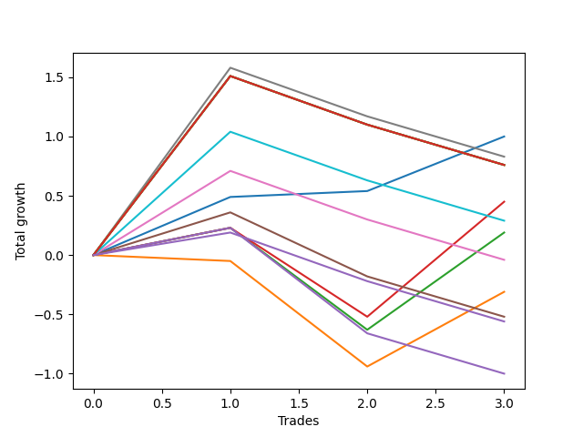

# Short Bernese 001 1v 
- Symbol: QQQ
- Date Range: 05/27/2022 - 09/30/2022
- Trading Period: 7:20-12:30
- Number of Trades: 3



| Name | Win Percent | Profit | Avg Profit / Trade | Avg Time / Trade |      | Name | Win Percent | Profit | Avg Profit / Trade | Avg Time / Trade |
| ---- | ----------- | ------ | ------------------ | ---------------- | ---- | ---- | ----------- | ------ | ------------------ | ---------------- |
| Sorted By <br> Profit | | | | | | Sorted By <br> Win Percentage ||||
| Zero | 100.00 | 500.00 | 166.67 | 06:21 |     | Zero | 100.00 | 500.00 | 166.67 | 06:21 |
| Six | 33.33 | 415.00 | 138.33 | 48:40 |     | Two_C | 66.67 | 225.00 | 75.00 | 33:03 |
| Eighty-Five | 33.33 | 380.00 | 126.67 | 49:56 |     | Two | 66.67 | 95.00 | 31.67 | 32:58 |
| Eighty-Four | 33.33 | 380.00 | 126.67 | 49:56 |     | Six | 33.33 | 415.00 | 138.33 | 48:40 |
| Eighty-Three | 33.33 | 380.00 | 126.67 | 49:56 |     | Eighty-Five | 33.33 | 380.00 | 126.67 | 49:56 |
| Eighty-Two | 33.33 | 380.00 | 126.67 | 49:56 |     | Eighty-Four | 33.33 | 380.00 | 126.67 | 49:56 |
| Seven | 33.33 | 380.00 | 126.67 | 49:56 |     | Eighty-Three | 33.33 | 380.00 | 126.67 | 49:56 |
| Two_C | 66.67 | 225.00 | 75.00 | 33:03 |     | Eighty-Two | 33.33 | 380.00 | 126.67 | 49:56 |
| Eighty-One | 33.33 | 145.00 | 48.33 | 48:10 |     | Seven | 33.33 | 380.00 | 126.67 | 49:56 |
| Two | 66.67 | 95.00 | 31.67 | 32:58 |     | Eighty-One | 33.33 | 145.00 | 48.33 | 48:10 |
| Five | 33.33 | -20.00 | -6.67 | 47:55 |     | Five | 33.33 | -20.00 | -6.67 | 47:55 |
| One | 33.33 | -155.00 | -51.67 | 27:33 |     | One | 33.33 | -155.00 | -51.67 | 27:33 |
| Four | 33.33 | -260.00 | -86.67 | 43:35 |     | Four | 33.33 | -260.00 | -86.67 | 43:35 |
| NEWFI 0000 | 33.33 | -280.00 | -93.33 | 44:40 |     | NEWFI 0000 | 33.33 | -280.00 | -93.33 | 44:40 |
| Three | 33.33 | -500.00 | -166.67 | 39:11 |     | Three | 33.33 | -500.00 | -166.67 | 39:11 |

## NO STOPLOSS

### Test Zero
* Sell when price hits the middle line of the 20p bollinger
* No Stoploss
* Results:
```
Total Trades: 3
Percent Up: 0.00
Percent Down: 100.00
Total Points Moved Down: 1.00
Potential Profit: 500.00
Total Points Ups: 0.00 Count Ups: 0
Total Points Downs: 1.00 Count Downs: 3
```

<details><summary>Trades</summary>

<code>In: 2022-08-17 11:17:00		Out: 2022-08-17 11:21:55		Total Position Time: 04:55		Total Move Down: 0.49		Total to Date: 0.49</code> <br />
<code>In: 2022-09-16 11:31:00		Out: 2022-09-16 11:40:55		Total Position Time: 09:55		Total Move Down: 0.05		Total to Date: 0.54</code> <br />
<code>In: 2022-09-22 12:16:00		Out: 2022-09-22 12:20:15		Total Position Time: 04:15		Total Move Down: 0.46		Total to Date: 1.00</code> <br />


</details>

### Test One
* Sell when the price hits the upper line of the 20p 1std bollinger
* No Stoploss
* Results:
```
Total Trades: 3
Percent Up: 66.67
Percent Down: 33.33
Total Points Moved Down: -0.31
Potential Profit: -155.00
Total Points Ups: 0.94 Count Ups: 2
Total Points Downs: 0.63 Count Downs: 1
```

<details><summary>Trades</summary>

<code>In: 2022-08-17 11:17:00		Out: 2022-08-17 11:46:55		Total Position Time: 29:55		Total Move Down: -0.05		Total to Date: -0.05</code> <br />
<code>In: 2022-09-16 11:31:00		Out: 2022-09-16 12:19:05		Total Position Time: 48:05		Total Move Down: -0.89		Total to Date: -0.94</code> <br />
<code>In: 2022-09-22 12:16:00		Out: 2022-09-22 12:20:40		Total Position Time: 04:40		Total Move Down: 0.63		Total to Date: -0.31</code> <br />


</details>

### Test Two
* Sell when the price hits the upper line of the 20p 2std bollinger
* No Stoploss
* Results:
```
Total Trades: 3
Percent Up: 33.33
Percent Down: 66.67
Total Points Moved Down: 0.19
Potential Profit: 95.00
Total Points Ups: 0.86 Count Ups: 1
Total Points Downs: 1.05 Count Downs: 2
```

<details><summary>Trades</summary>

<code>In: 2022-08-17 11:17:00		Out: 2022-08-17 11:47:45		Total Position Time: 30:45		Total Move Down: 0.23		Total to Date: 0.23</code> <br />
<code>In: 2022-09-16 11:31:00		Out: 2022-09-16 12:27:55		Total Position Time: 56:55		Total Move Down: -0.86		Total to Date: -0.63</code> <br />
<code>In: 2022-09-22 12:16:00		Out: 2022-09-22 12:27:15		Total Position Time: 11:15		Total Move Down: 0.82		Total to Date: 0.19</code> <br />


</details>

### Test Two_C
* Sell when the price hits the upper line of the 20p 2std bollinger
* No Stoploss
* Results:
```
Total Trades: 3
Percent Up: 33.33
Percent Down: 66.67
Total Points Moved Down: 0.45
Potential Profit: 225.00
Total Points Ups: 0.75 Count Ups: 1
Total Points Downs: 1.20 Count Downs: 2
```

<details><summary>Trades</summary>

<code>In: 2022-08-17 11:17:00		Out: 2022-08-17 11:47:45		Total Position Time: 30:45		Total Move Down: 0.23		Total to Date: 0.23</code> <br />
<code>In: 2022-09-16 11:31:00		Out: 2022-09-16 12:28:05		Total Position Time: 57:05		Total Move Down: -0.75		Total to Date: -0.52</code> <br />
<code>In: 2022-09-22 12:16:00		Out: 2022-09-22 12:27:20		Total Position Time: 11:20		Total Move Down: 0.97		Total to Date: 0.45</code> <br />


</details>

### Test Three
* Sell when price hits the middle line of the 50p bollinger
* No Stoploss
* Results:
```
Total Trades: 3
Percent Up: 66.67
Percent Down: 33.33
Total Points Moved Down: -1.00
Potential Profit: -500.00
Total Points Ups: 1.23 Count Ups: 2
Total Points Downs: 0.23 Count Downs: 1
```

<details><summary>Trades</summary>

<code>In: 2022-08-17 11:17:00		Out: 2022-08-17 11:47:45		Total Position Time: 30:45		Total Move Down: 0.23		Total to Date: 0.23</code> <br />
<code>In: 2022-09-16 11:31:00		Out: 2022-09-16 12:27:50		Total Position Time: 56:50		Total Move Down: -0.89		Total to Date: -0.66</code> <br />
<code>In: 2022-09-22 12:16:00		Out: 2022-09-22 12:46:00		Total Position Time: 30:00		Total Move Down: -0.34		Total to Date: -1.00</code> <br />


</details>

### Test Four
* Sell when the price hits the upper line of the 50p 1std bollinger
* No Stoploss
* Results:
```
Total Trades: 3
Percent Up: 66.67
Percent Down: 33.33
Total Points Moved Down: -0.52
Potential Profit: -260.00
Total Points Ups: 0.88 Count Ups: 2
Total Points Downs: 0.36 Count Downs: 1
```

<details><summary>Trades</summary>

<code>In: 2022-08-17 11:17:00		Out: 2022-08-17 11:58:20		Total Position Time: 41:20		Total Move Down: 0.36		Total to Date: 0.36</code> <br />
<code>In: 2022-09-16 11:31:00		Out: 2022-09-16 12:30:25		Total Position Time: 59:25		Total Move Down: -0.54		Total to Date: -0.18</code> <br />
<code>In: 2022-09-22 12:16:00		Out: 2022-09-22 12:46:00		Total Position Time: 30:00		Total Move Down: -0.34		Total to Date: -0.52</code> <br />


</details>

### Test Five
* Sell when the price hits the upper line of the 50p 2std bollinger
* No Stoploss
* Results:
```
Total Trades: 3
Percent Up: 66.67
Percent Down: 33.33
Total Points Moved Down: -0.04
Potential Profit: -20.00
Total Points Ups: 0.75 Count Ups: 2
Total Points Downs: 0.71 Count Downs: 1
```

<details><summary>Trades</summary>

<code>In: 2022-08-17 11:17:00		Out: 2022-08-17 12:10:50		Total Position Time: 53:50		Total Move Down: 0.71		Total to Date: 0.71</code> <br />
<code>In: 2022-09-16 11:31:00		Out: 2022-09-16 12:30:55		Total Position Time: 59:55		Total Move Down: -0.41		Total to Date: 0.30</code> <br />
<code>In: 2022-09-22 12:16:00		Out: 2022-09-22 12:46:00		Total Position Time: 30:00		Total Move Down: -0.34		Total to Date: -0.04</code> <br />


</details>

### Test Six
* Sell when the price hits the middle line of the 1std VWAP
* No Stoploss
* Results:
```
Total Trades: 3
Percent Up: 66.67
Percent Down: 33.33
Total Points Moved Down: 0.83
Potential Profit: 415.00
Total Points Ups: 0.75 Count Ups: 2
Total Points Downs: 1.58 Count Downs: 1
```

<details><summary>Trades</summary>

<code>In: 2022-08-17 11:17:00		Out: 2022-08-17 12:13:05		Total Position Time: 56:05		Total Move Down: 1.58		Total to Date: 1.58</code> <br />
<code>In: 2022-09-16 11:31:00		Out: 2022-09-16 12:30:55		Total Position Time: 59:55		Total Move Down: -0.41		Total to Date: 1.17</code> <br />
<code>In: 2022-09-22 12:16:00		Out: 2022-09-22 12:46:00		Total Position Time: 30:00		Total Move Down: -0.34		Total to Date: 0.83</code> <br />


</details>

### Test Seven
* Sell when the price hits the upper line of the 1std VWAP
* No Stoploss
* Results:
```
Total Trades: 3
Percent Up: 66.67
Percent Down: 33.33
Total Points Moved Down: 0.76
Potential Profit: 380.00
Total Points Ups: 0.75 Count Ups: 2
Total Points Downs: 1.51 Count Downs: 1
```

<details><summary>Trades</summary>

<code>In: 2022-08-17 11:17:00		Out: 2022-08-17 12:16:55		Total Position Time: 59:55		Total Move Down: 1.51		Total to Date: 1.51</code> <br />
<code>In: 2022-09-16 11:31:00		Out: 2022-09-16 12:30:55		Total Position Time: 59:55		Total Move Down: -0.41		Total to Date: 1.10</code> <br />
<code>In: 2022-09-22 12:16:00		Out: 2022-09-22 12:46:00		Total Position Time: 30:00		Total Move Down: -0.34		Total to Date: 0.76</code> <br />


</details>

## TAKE PROFIT

### Test Eighty-One
* Take Profit of 1 Point
* No Stoploss
* Results:
```
Total Trades: 3
Percent Up: 66.67
Percent Down: 33.33
Total Points Moved Down: 0.29
Potential Profit: 145.00
Total Points Ups: 0.75 Count Ups: 2
Total Points Downs: 1.04 Count Downs: 1
```

<details><summary>Trades</summary>

<code>In: 2022-08-17 11:17:00		Out: 2022-08-17 12:11:35		Total Position Time: 54:35		Total Move Down: 1.04		Total to Date: 1.04</code> <br />
<code>In: 2022-09-16 11:31:00		Out: 2022-09-16 12:30:55		Total Position Time: 59:55		Total Move Down: -0.41		Total to Date: 0.63</code> <br />
<code>In: 2022-09-22 12:16:00		Out: 2022-09-22 12:46:00		Total Position Time: 30:00		Total Move Down: -0.34		Total to Date: 0.29</code> <br />


</details>

### Test Eighty-Two
* Take Profit of 2 Point
* No Stoploss
* Results:
```
Total Trades: 3
Percent Up: 66.67
Percent Down: 33.33
Total Points Moved Down: 0.76
Potential Profit: 380.00
Total Points Ups: 0.75 Count Ups: 2
Total Points Downs: 1.51 Count Downs: 1
```

<details><summary>Trades</summary>

<code>In: 2022-08-17 11:17:00		Out: 2022-08-17 12:16:55		Total Position Time: 59:55		Total Move Down: 1.51		Total to Date: 1.51</code> <br />
<code>In: 2022-09-16 11:31:00		Out: 2022-09-16 12:30:55		Total Position Time: 59:55		Total Move Down: -0.41		Total to Date: 1.10</code> <br />
<code>In: 2022-09-22 12:16:00		Out: 2022-09-22 12:46:00		Total Position Time: 30:00		Total Move Down: -0.34		Total to Date: 0.76</code> <br />


</details>

### Test Eighty-Three
* Take Profit of 3 Point
* No Stoploss
* Results:
```
Total Trades: 3
Percent Up: 66.67
Percent Down: 33.33
Total Points Moved Down: 0.76
Potential Profit: 380.00
Total Points Ups: 0.75 Count Ups: 2
Total Points Downs: 1.51 Count Downs: 1
```

<details><summary>Trades</summary>

<code>In: 2022-08-17 11:17:00		Out: 2022-08-17 12:16:55		Total Position Time: 59:55		Total Move Down: 1.51		Total to Date: 1.51</code> <br />
<code>In: 2022-09-16 11:31:00		Out: 2022-09-16 12:30:55		Total Position Time: 59:55		Total Move Down: -0.41		Total to Date: 1.10</code> <br />
<code>In: 2022-09-22 12:16:00		Out: 2022-09-22 12:46:00		Total Position Time: 30:00		Total Move Down: -0.34		Total to Date: 0.76</code> <br />


</details>

### Test Eighty-Four
* Take Profit of 4 Point
* No Stoploss
* Results:
```
Total Trades: 3
Percent Up: 66.67
Percent Down: 33.33
Total Points Moved Down: 0.76
Potential Profit: 380.00
Total Points Ups: 0.75 Count Ups: 2
Total Points Downs: 1.51 Count Downs: 1
```

<details><summary>Trades</summary>

<code>In: 2022-08-17 11:17:00		Out: 2022-08-17 12:16:55		Total Position Time: 59:55		Total Move Down: 1.51		Total to Date: 1.51</code> <br />
<code>In: 2022-09-16 11:31:00		Out: 2022-09-16 12:30:55		Total Position Time: 59:55		Total Move Down: -0.41		Total to Date: 1.10</code> <br />
<code>In: 2022-09-22 12:16:00		Out: 2022-09-22 12:46:00		Total Position Time: 30:00		Total Move Down: -0.34		Total to Date: 0.76</code> <br />


</details>

### Test Eighty-Five
* Take Profit of 5 Point
* No Stoploss
* Results:
```
Total Trades: 3
Percent Up: 66.67
Percent Down: 33.33
Total Points Moved Down: 0.76
Potential Profit: 380.00
Total Points Ups: 0.75 Count Ups: 2
Total Points Downs: 1.51 Count Downs: 1
```

<details><summary>Trades</summary>

<code>In: 2022-08-17 11:17:00		Out: 2022-08-17 12:16:55		Total Position Time: 59:55		Total Move Down: 1.51		Total to Date: 1.51</code> <br />
<code>In: 2022-09-16 11:31:00		Out: 2022-09-16 12:30:55		Total Position Time: 59:55		Total Move Down: -0.41		Total to Date: 1.10</code> <br />
<code>In: 2022-09-22 12:16:00		Out: 2022-09-22 12:46:00		Total Position Time: 30:00		Total Move Down: -0.34		Total to Date: 0.76</code> <br />


</details>

## Indicator Exits

### Test NEWFI 0000
* Newfi 0000
* No Stoploss
* Results:
```
Total Trades: 3
Percent Up: 66.67
Percent Down: 33.33
Total Points Moved Down: -0.56
Potential Profit: -280.00
Total Points Ups: 0.75 Count Ups: 2
Total Points Downs: 0.19 Count Downs: 1
```

<details><summary>Trades</summary>

<code>In: 2022-08-17 11:17:00		Out: 2022-08-17 12:01:05		Total Position Time: 44:05		Total Move Down: 0.19		Total to Date: 0.19</code> <br />
<code>In: 2022-09-16 11:31:00		Out: 2022-09-16 12:30:55		Total Position Time: 59:55		Total Move Down: -0.41		Total to Date: -0.22</code> <br />
<code>In: 2022-09-22 12:16:00		Out: 2022-09-22 12:46:00		Total Position Time: 30:00		Total Move Down: -0.34		Total to Date: -0.56</code> <br />


</details>