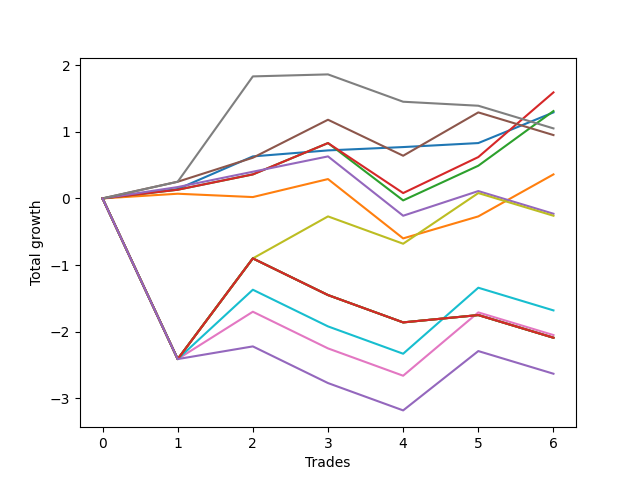

# Short Bernese 001 50 
- Symbol: QQQ
- Date Range: 05/27/2022 - 09/30/2022
- Trading Period: 7:20-12:30
- Number of Trades: 6



| Name | Win Percent | Profit | Avg Profit / Trade | Avg Time / Trade |      | Name | Win Percent | Profit | Avg Profit / Trade | Avg Time / Trade |
| ---- | ----------- | ------ | ------------------ | ---------------- | ---- | ---- | ----------- | ------ | ------------------ | ---------------- |
| Sorted By <br> Profit | | | | | | Sorted By <br> Win Percentage ||||
| Two_C | 83.33 | 795.00 | 132.50 | 24:00 |     | Zero | 100.00 | 645.00 | 107.50 | 04:44 |
| Two | 83.33 | 655.00 | 109.17 | 23:48 |     | Two_C | 83.33 | 795.00 | 132.50 | 24:00 |
| Zero | 100.00 | 645.00 | 107.50 | 04:44 |     | Two | 83.33 | 655.00 | 109.17 | 23:48 |
| Six | 50.00 | 525.00 | 87.50 | 29:19 |     | Four | 66.67 | 475.00 | 79.17 | 30:23 |
| Four | 66.67 | 475.00 | 79.17 | 30:23 |     | One | 66.67 | 180.00 | 30.00 | 18:11 |
| One | 66.67 | 180.00 | 30.00 | 18:11 |     | Three | 66.67 | -115.00 | -19.17 | 22:24 |
| Three | 66.67 | -115.00 | -19.17 | 22:24 |     | Six | 50.00 | 525.00 | 87.50 | 29:19 |
| Seven | 50.00 | -130.00 | -21.67 | 39:23 |     | Seven | 50.00 | -130.00 | -21.67 | 39:23 |
| Eighty-One | 33.33 | -840.00 | -140.00 | 47:10 |     | Eighty-One | 33.33 | -840.00 | -140.00 | 47:10 |
| Five | 33.33 | -1025.00 | -170.83 | 47:02 |     | Five | 33.33 | -1025.00 | -170.83 | 47:02 |
| Eighty-Five | 33.33 | -1045.00 | -174.17 | 54:55 |     | Eighty-Five | 33.33 | -1045.00 | -174.17 | 54:55 |
| Eighty-Four | 33.33 | -1045.00 | -174.17 | 54:55 |     | Eighty-Four | 33.33 | -1045.00 | -174.17 | 54:55 |
| Eighty-Three | 33.33 | -1045.00 | -174.17 | 54:55 |     | Eighty-Three | 33.33 | -1045.00 | -174.17 | 54:55 |
| Eighty-Two | 33.33 | -1045.00 | -174.17 | 54:55 |     | Eighty-Two | 33.33 | -1045.00 | -174.17 | 54:55 |
| NEWFI 0000 | 33.33 | -1315.00 | -219.17 | 45:39 |     | NEWFI 0000 | 33.33 | -1315.00 | -219.17 | 45:39 |

## NO STOPLOSS

### Test Zero
* Sell when price hits the middle line of the 20p bollinger
* No Stoploss
* Results:
```
Total Trades: 6
Percent Up: 0.00
Percent Down: 100.00
Total Points Moved Down: 1.29
Potential Profit: 645.00
Total Points Ups: 0.00 Count Ups: 0
Total Points Downs: 1.29 Count Downs: 6
```

<details><summary>Trades</summary>

<code>In: 2022-08-17 10:33:00		Out: 2022-08-17 10:34:10		Total Position Time: 01:10		Total Move Down: 0.14		Total to Date: 0.14</code> <br />
<code>In: 2022-08-17 11:17:00		Out: 2022-08-17 11:21:55		Total Position Time: 04:55		Total Move Down: 0.49		Total to Date: 0.63</code> <br />
<code>In: 2022-09-16 10:41:00		Out: 2022-09-16 10:44:20		Total Position Time: 03:20		Total Move Down: 0.09		Total to Date: 0.72</code> <br />
<code>In: 2022-09-16 11:31:00		Out: 2022-09-16 11:40:55		Total Position Time: 09:55		Total Move Down: 0.05		Total to Date: 0.77</code> <br />
<code>In: 2022-09-22 10:57:00		Out: 2022-09-22 11:01:50		Total Position Time: 04:50		Total Move Down: 0.06		Total to Date: 0.83</code> <br />
<code>In: 2022-09-22 12:16:00		Out: 2022-09-22 12:20:15		Total Position Time: 04:15		Total Move Down: 0.46		Total to Date: 1.29</code> <br />


</details>

### Test One
* Sell when the price hits the upper line of the 20p 1std bollinger
* No Stoploss
* Results:
```
Total Trades: 6
Percent Up: 33.33
Percent Down: 66.67
Total Points Moved Down: 0.36
Potential Profit: 180.00
Total Points Ups: 0.94 Count Ups: 2
Total Points Downs: 1.30 Count Downs: 4
```

<details><summary>Trades</summary>

<code>In: 2022-08-17 10:33:00		Out: 2022-08-17 10:46:05		Total Position Time: 13:05		Total Move Down: 0.07		Total to Date: 0.07</code> <br />
<code>In: 2022-08-17 11:17:00		Out: 2022-08-17 11:46:55		Total Position Time: 29:55		Total Move Down: -0.05		Total to Date: 0.02</code> <br />
<code>In: 2022-09-16 10:41:00		Out: 2022-09-16 10:47:05		Total Position Time: 06:05		Total Move Down: 0.27		Total to Date: 0.29</code> <br />
<code>In: 2022-09-16 11:31:00		Out: 2022-09-16 12:19:05		Total Position Time: 48:05		Total Move Down: -0.89		Total to Date: -0.60</code> <br />
<code>In: 2022-09-22 10:57:00		Out: 2022-09-22 11:04:20		Total Position Time: 07:20		Total Move Down: 0.33		Total to Date: -0.27</code> <br />
<code>In: 2022-09-22 12:16:00		Out: 2022-09-22 12:20:40		Total Position Time: 04:40		Total Move Down: 0.63		Total to Date: 0.36</code> <br />


</details>

### Test Two
* Sell when the price hits the upper line of the 20p 2std bollinger
* No Stoploss
* Results:
```
Total Trades: 6
Percent Up: 16.67
Percent Down: 83.33
Total Points Moved Down: 1.31
Potential Profit: 655.00
Total Points Ups: 0.86 Count Ups: 1
Total Points Downs: 2.17 Count Downs: 5
```

<details><summary>Trades</summary>

<code>In: 2022-08-17 10:33:00		Out: 2022-08-17 10:56:40		Total Position Time: 23:40		Total Move Down: 0.13		Total to Date: 0.13</code> <br />
<code>In: 2022-08-17 11:17:00		Out: 2022-08-17 11:47:45		Total Position Time: 30:45		Total Move Down: 0.23		Total to Date: 0.36</code> <br />
<code>In: 2022-09-16 10:41:00		Out: 2022-09-16 10:50:15		Total Position Time: 09:15		Total Move Down: 0.47		Total to Date: 0.83</code> <br />
<code>In: 2022-09-16 11:31:00		Out: 2022-09-16 12:27:55		Total Position Time: 56:55		Total Move Down: -0.86		Total to Date: -0.03</code> <br />
<code>In: 2022-09-22 10:57:00		Out: 2022-09-22 11:08:00		Total Position Time: 11:00		Total Move Down: 0.52		Total to Date: 0.49</code> <br />
<code>In: 2022-09-22 12:16:00		Out: 2022-09-22 12:27:15		Total Position Time: 11:15		Total Move Down: 0.82		Total to Date: 1.31</code> <br />


</details>

### Test Two_C
* Sell when the price hits the upper line of the 20p 2std bollinger
* No Stoploss
* Results:
```
Total Trades: 6
Percent Up: 16.67
Percent Down: 83.33
Total Points Moved Down: 1.59
Potential Profit: 795.00
Total Points Ups: 0.75 Count Ups: 1
Total Points Downs: 2.34 Count Downs: 5
```

<details><summary>Trades</summary>

<code>In: 2022-08-17 10:33:00		Out: 2022-08-17 10:56:40		Total Position Time: 23:40		Total Move Down: 0.13		Total to Date: 0.13</code> <br />
<code>In: 2022-08-17 11:17:00		Out: 2022-08-17 11:47:45		Total Position Time: 30:45		Total Move Down: 0.23		Total to Date: 0.36</code> <br />
<code>In: 2022-09-16 10:41:00		Out: 2022-09-16 10:50:15		Total Position Time: 09:15		Total Move Down: 0.47		Total to Date: 0.83</code> <br />
<code>In: 2022-09-16 11:31:00		Out: 2022-09-16 12:28:05		Total Position Time: 57:05		Total Move Down: -0.75		Total to Date: 0.08</code> <br />
<code>In: 2022-09-22 10:57:00		Out: 2022-09-22 11:08:55		Total Position Time: 11:55		Total Move Down: 0.54		Total to Date: 0.62</code> <br />
<code>In: 2022-09-22 12:16:00		Out: 2022-09-22 12:27:20		Total Position Time: 11:20		Total Move Down: 0.97		Total to Date: 1.59</code> <br />


</details>

### Test Three
* Sell when price hits the middle line of the 50p bollinger
* No Stoploss
* Results:
```
Total Trades: 6
Percent Up: 33.33
Percent Down: 66.67
Total Points Moved Down: -0.23
Potential Profit: -115.00
Total Points Ups: 1.23 Count Ups: 2
Total Points Downs: 1.00 Count Downs: 4
```

<details><summary>Trades</summary>

<code>In: 2022-08-17 10:33:00		Out: 2022-08-17 10:36:50		Total Position Time: 03:50		Total Move Down: 0.17		Total to Date: 0.17</code> <br />
<code>In: 2022-08-17 11:17:00		Out: 2022-08-17 11:47:45		Total Position Time: 30:45		Total Move Down: 0.23		Total to Date: 0.40</code> <br />
<code>In: 2022-09-16 10:41:00		Out: 2022-09-16 10:46:05		Total Position Time: 05:05		Total Move Down: 0.23		Total to Date: 0.63</code> <br />
<code>In: 2022-09-16 11:31:00		Out: 2022-09-16 12:27:50		Total Position Time: 56:50		Total Move Down: -0.89		Total to Date: -0.26</code> <br />
<code>In: 2022-09-22 10:57:00		Out: 2022-09-22 11:04:55		Total Position Time: 07:55		Total Move Down: 0.37		Total to Date: 0.11</code> <br />
<code>In: 2022-09-22 12:16:00		Out: 2022-09-22 12:46:00		Total Position Time: 30:00		Total Move Down: -0.34		Total to Date: -0.23</code> <br />


</details>

### Test Four
* Sell when the price hits the upper line of the 50p 1std bollinger
* No Stoploss
* Results:
```
Total Trades: 6
Percent Up: 33.33
Percent Down: 66.67
Total Points Moved Down: 0.95
Potential Profit: 475.00
Total Points Ups: 0.88 Count Ups: 2
Total Points Downs: 1.83 Count Downs: 4
```

<details><summary>Trades</summary>

<code>In: 2022-08-17 10:33:00		Out: 2022-08-17 11:00:50		Total Position Time: 27:50		Total Move Down: 0.25		Total to Date: 0.25</code> <br />
<code>In: 2022-08-17 11:17:00		Out: 2022-08-17 11:58:20		Total Position Time: 41:20		Total Move Down: 0.36		Total to Date: 0.61</code> <br />
<code>In: 2022-09-16 10:41:00		Out: 2022-09-16 10:50:55		Total Position Time: 09:55		Total Move Down: 0.57		Total to Date: 1.18</code> <br />
<code>In: 2022-09-16 11:31:00		Out: 2022-09-16 12:30:25		Total Position Time: 59:25		Total Move Down: -0.54		Total to Date: 0.64</code> <br />
<code>In: 2022-09-22 10:57:00		Out: 2022-09-22 11:10:50		Total Position Time: 13:50		Total Move Down: 0.65		Total to Date: 1.29</code> <br />
<code>In: 2022-09-22 12:16:00		Out: 2022-09-22 12:46:00		Total Position Time: 30:00		Total Move Down: -0.34		Total to Date: 0.95</code> <br />


</details>

### Test Five
* Sell when the price hits the upper line of the 50p 2std bollinger
* No Stoploss
* Results:
```
Total Trades: 6
Percent Up: 66.67
Percent Down: 33.33
Total Points Moved Down: -2.05
Potential Profit: -1025.00
Total Points Ups: 3.71 Count Ups: 4
Total Points Downs: 1.66 Count Downs: 2
```

<details><summary>Trades</summary>

<code>In: 2022-08-17 10:33:00		Out: 2022-08-17 11:32:55		Total Position Time: 59:55		Total Move Down: -2.41		Total to Date: -2.41</code> <br />
<code>In: 2022-08-17 11:17:00		Out: 2022-08-17 12:10:50		Total Position Time: 53:50		Total Move Down: 0.71		Total to Date: -1.70</code> <br />
<code>In: 2022-09-16 10:41:00		Out: 2022-09-16 11:40:55		Total Position Time: 59:55		Total Move Down: -0.55		Total to Date: -2.25</code> <br />
<code>In: 2022-09-16 11:31:00		Out: 2022-09-16 12:30:55		Total Position Time: 59:55		Total Move Down: -0.41		Total to Date: -2.66</code> <br />
<code>In: 2022-09-22 10:57:00		Out: 2022-09-22 11:15:40		Total Position Time: 18:40		Total Move Down: 0.95		Total to Date: -1.71</code> <br />
<code>In: 2022-09-22 12:16:00		Out: 2022-09-22 12:46:00		Total Position Time: 30:00		Total Move Down: -0.34		Total to Date: -2.05</code> <br />


</details>

### Test Six
* Sell when the price hits the middle line of the 1std VWAP
* No Stoploss
* Results:
```
Total Trades: 6
Percent Up: 50.00
Percent Down: 50.00
Total Points Moved Down: 1.05
Potential Profit: 525.00
Total Points Ups: 0.81 Count Ups: 3
Total Points Downs: 1.86 Count Downs: 3
```

<details><summary>Trades</summary>

<code>In: 2022-08-17 10:33:00		Out: 2022-08-17 11:00:50		Total Position Time: 27:50		Total Move Down: 0.25		Total to Date: 0.25</code> <br />
<code>In: 2022-08-17 11:17:00		Out: 2022-08-17 12:13:05		Total Position Time: 56:05		Total Move Down: 1.58		Total to Date: 1.83</code> <br />
<code>In: 2022-09-16 10:41:00		Out: 2022-09-16 10:42:55		Total Position Time: 01:55		Total Move Down: 0.03		Total to Date: 1.86</code> <br />
<code>In: 2022-09-16 11:31:00		Out: 2022-09-16 12:30:55		Total Position Time: 59:55		Total Move Down: -0.41		Total to Date: 1.45</code> <br />
<code>In: 2022-09-22 10:57:00		Out: 2022-09-22 10:57:10		Total Position Time: 00:10		Total Move Down: -0.06		Total to Date: 1.39</code> <br />
<code>In: 2022-09-22 12:16:00		Out: 2022-09-22 12:46:00		Total Position Time: 30:00		Total Move Down: -0.34		Total to Date: 1.05</code> <br />


</details>

### Test Seven
* Sell when the price hits the upper line of the 1std VWAP
* No Stoploss
* Results:
```
Total Trades: 6
Percent Up: 50.00
Percent Down: 50.00
Total Points Moved Down: -0.26
Potential Profit: -130.00
Total Points Ups: 3.16 Count Ups: 3
Total Points Downs: 2.90 Count Downs: 3
```

<details><summary>Trades</summary>

<code>In: 2022-08-17 10:33:00		Out: 2022-08-17 11:32:55		Total Position Time: 59:55		Total Move Down: -2.41		Total to Date: -2.41</code> <br />
<code>In: 2022-08-17 11:17:00		Out: 2022-08-17 12:16:55		Total Position Time: 59:55		Total Move Down: 1.51		Total to Date: -0.90</code> <br />
<code>In: 2022-09-16 10:41:00		Out: 2022-09-16 10:52:10		Total Position Time: 11:10		Total Move Down: 0.63		Total to Date: -0.27</code> <br />
<code>In: 2022-09-16 11:31:00		Out: 2022-09-16 12:30:55		Total Position Time: 59:55		Total Move Down: -0.41		Total to Date: -0.68</code> <br />
<code>In: 2022-09-22 10:57:00		Out: 2022-09-22 11:12:25		Total Position Time: 15:25		Total Move Down: 0.76		Total to Date: 0.08</code> <br />
<code>In: 2022-09-22 12:16:00		Out: 2022-09-22 12:46:00		Total Position Time: 30:00		Total Move Down: -0.34		Total to Date: -0.26</code> <br />


</details>

## TAKE PROFIT

### Test Eighty-One
* Take Profit of 1 Point
* No Stoploss
* Results:
```
Total Trades: 6
Percent Up: 66.67
Percent Down: 33.33
Total Points Moved Down: -1.68
Potential Profit: -840.00
Total Points Ups: 3.71 Count Ups: 4
Total Points Downs: 2.03 Count Downs: 2
```

<details><summary>Trades</summary>

<code>In: 2022-08-17 10:33:00		Out: 2022-08-17 11:32:55		Total Position Time: 59:55		Total Move Down: -2.41		Total to Date: -2.41</code> <br />
<code>In: 2022-08-17 11:17:00		Out: 2022-08-17 12:11:35		Total Position Time: 54:35		Total Move Down: 1.04		Total to Date: -1.37</code> <br />
<code>In: 2022-09-16 10:41:00		Out: 2022-09-16 11:40:55		Total Position Time: 59:55		Total Move Down: -0.55		Total to Date: -1.92</code> <br />
<code>In: 2022-09-16 11:31:00		Out: 2022-09-16 12:30:55		Total Position Time: 59:55		Total Move Down: -0.41		Total to Date: -2.33</code> <br />
<code>In: 2022-09-22 10:57:00		Out: 2022-09-22 11:15:45		Total Position Time: 18:45		Total Move Down: 0.99		Total to Date: -1.34</code> <br />
<code>In: 2022-09-22 12:16:00		Out: 2022-09-22 12:46:00		Total Position Time: 30:00		Total Move Down: -0.34		Total to Date: -1.68</code> <br />


</details>

### Test Eighty-Two
* Take Profit of 2 Point
* No Stoploss
* Results:
```
Total Trades: 6
Percent Up: 66.67
Percent Down: 33.33
Total Points Moved Down: -2.09
Potential Profit: -1045.00
Total Points Ups: 3.71 Count Ups: 4
Total Points Downs: 1.62 Count Downs: 2
```

<details><summary>Trades</summary>

<code>In: 2022-08-17 10:33:00		Out: 2022-08-17 11:32:55		Total Position Time: 59:55		Total Move Down: -2.41		Total to Date: -2.41</code> <br />
<code>In: 2022-08-17 11:17:00		Out: 2022-08-17 12:16:55		Total Position Time: 59:55		Total Move Down: 1.51		Total to Date: -0.90</code> <br />
<code>In: 2022-09-16 10:41:00		Out: 2022-09-16 11:40:55		Total Position Time: 59:55		Total Move Down: -0.55		Total to Date: -1.45</code> <br />
<code>In: 2022-09-16 11:31:00		Out: 2022-09-16 12:30:55		Total Position Time: 59:55		Total Move Down: -0.41		Total to Date: -1.86</code> <br />
<code>In: 2022-09-22 10:57:00		Out: 2022-09-22 11:56:55		Total Position Time: 59:55		Total Move Down: 0.11		Total to Date: -1.75</code> <br />
<code>In: 2022-09-22 12:16:00		Out: 2022-09-22 12:46:00		Total Position Time: 30:00		Total Move Down: -0.34		Total to Date: -2.09</code> <br />


</details>

### Test Eighty-Three
* Take Profit of 3 Point
* No Stoploss
* Results:
```
Total Trades: 6
Percent Up: 66.67
Percent Down: 33.33
Total Points Moved Down: -2.09
Potential Profit: -1045.00
Total Points Ups: 3.71 Count Ups: 4
Total Points Downs: 1.62 Count Downs: 2
```

<details><summary>Trades</summary>

<code>In: 2022-08-17 10:33:00		Out: 2022-08-17 11:32:55		Total Position Time: 59:55		Total Move Down: -2.41		Total to Date: -2.41</code> <br />
<code>In: 2022-08-17 11:17:00		Out: 2022-08-17 12:16:55		Total Position Time: 59:55		Total Move Down: 1.51		Total to Date: -0.90</code> <br />
<code>In: 2022-09-16 10:41:00		Out: 2022-09-16 11:40:55		Total Position Time: 59:55		Total Move Down: -0.55		Total to Date: -1.45</code> <br />
<code>In: 2022-09-16 11:31:00		Out: 2022-09-16 12:30:55		Total Position Time: 59:55		Total Move Down: -0.41		Total to Date: -1.86</code> <br />
<code>In: 2022-09-22 10:57:00		Out: 2022-09-22 11:56:55		Total Position Time: 59:55		Total Move Down: 0.11		Total to Date: -1.75</code> <br />
<code>In: 2022-09-22 12:16:00		Out: 2022-09-22 12:46:00		Total Position Time: 30:00		Total Move Down: -0.34		Total to Date: -2.09</code> <br />


</details>

### Test Eighty-Four
* Take Profit of 4 Point
* No Stoploss
* Results:
```
Total Trades: 6
Percent Up: 66.67
Percent Down: 33.33
Total Points Moved Down: -2.09
Potential Profit: -1045.00
Total Points Ups: 3.71 Count Ups: 4
Total Points Downs: 1.62 Count Downs: 2
```

<details><summary>Trades</summary>

<code>In: 2022-08-17 10:33:00		Out: 2022-08-17 11:32:55		Total Position Time: 59:55		Total Move Down: -2.41		Total to Date: -2.41</code> <br />
<code>In: 2022-08-17 11:17:00		Out: 2022-08-17 12:16:55		Total Position Time: 59:55		Total Move Down: 1.51		Total to Date: -0.90</code> <br />
<code>In: 2022-09-16 10:41:00		Out: 2022-09-16 11:40:55		Total Position Time: 59:55		Total Move Down: -0.55		Total to Date: -1.45</code> <br />
<code>In: 2022-09-16 11:31:00		Out: 2022-09-16 12:30:55		Total Position Time: 59:55		Total Move Down: -0.41		Total to Date: -1.86</code> <br />
<code>In: 2022-09-22 10:57:00		Out: 2022-09-22 11:56:55		Total Position Time: 59:55		Total Move Down: 0.11		Total to Date: -1.75</code> <br />
<code>In: 2022-09-22 12:16:00		Out: 2022-09-22 12:46:00		Total Position Time: 30:00		Total Move Down: -0.34		Total to Date: -2.09</code> <br />


</details>

### Test Eighty-Five
* Take Profit of 5 Point
* No Stoploss
* Results:
```
Total Trades: 6
Percent Up: 66.67
Percent Down: 33.33
Total Points Moved Down: -2.09
Potential Profit: -1045.00
Total Points Ups: 3.71 Count Ups: 4
Total Points Downs: 1.62 Count Downs: 2
```

<details><summary>Trades</summary>

<code>In: 2022-08-17 10:33:00		Out: 2022-08-17 11:32:55		Total Position Time: 59:55		Total Move Down: -2.41		Total to Date: -2.41</code> <br />
<code>In: 2022-08-17 11:17:00		Out: 2022-08-17 12:16:55		Total Position Time: 59:55		Total Move Down: 1.51		Total to Date: -0.90</code> <br />
<code>In: 2022-09-16 10:41:00		Out: 2022-09-16 11:40:55		Total Position Time: 59:55		Total Move Down: -0.55		Total to Date: -1.45</code> <br />
<code>In: 2022-09-16 11:31:00		Out: 2022-09-16 12:30:55		Total Position Time: 59:55		Total Move Down: -0.41		Total to Date: -1.86</code> <br />
<code>In: 2022-09-22 10:57:00		Out: 2022-09-22 11:56:55		Total Position Time: 59:55		Total Move Down: 0.11		Total to Date: -1.75</code> <br />
<code>In: 2022-09-22 12:16:00		Out: 2022-09-22 12:46:00		Total Position Time: 30:00		Total Move Down: -0.34		Total to Date: -2.09</code> <br />


</details>

## Indicator Exits

### Test NEWFI 0000
* Newfi 0000
* No Stoploss
* Results:
```
Total Trades: 6
Percent Up: 66.67
Percent Down: 33.33
Total Points Moved Down: -2.63
Potential Profit: -1315.00
Total Points Ups: 3.71 Count Ups: 4
Total Points Downs: 1.08 Count Downs: 2
```

<details><summary>Trades</summary>

<code>In: 2022-08-17 10:33:00		Out: 2022-08-17 11:32:55		Total Position Time: 59:55		Total Move Down: -2.41		Total to Date: -2.41</code> <br />
<code>In: 2022-08-17 11:17:00		Out: 2022-08-17 12:01:05		Total Position Time: 44:05		Total Move Down: 0.19		Total to Date: -2.22</code> <br />
<code>In: 2022-09-16 10:41:00		Out: 2022-09-16 11:40:55		Total Position Time: 59:55		Total Move Down: -0.55		Total to Date: -2.77</code> <br />
<code>In: 2022-09-16 11:31:00		Out: 2022-09-16 12:30:55		Total Position Time: 59:55		Total Move Down: -0.41		Total to Date: -3.18</code> <br />
<code>In: 2022-09-22 10:57:00		Out: 2022-09-22 11:17:05		Total Position Time: 20:05		Total Move Down: 0.89		Total to Date: -2.29</code> <br />
<code>In: 2022-09-22 12:16:00		Out: 2022-09-22 12:46:00		Total Position Time: 30:00		Total Move Down: -0.34		Total to Date: -2.63</code> <br />


</details>