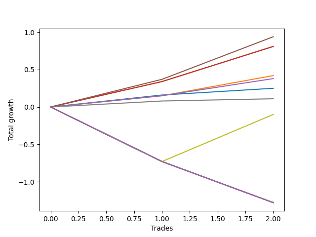

# Short Bernese 002 50 
- Symbol: QQQ
- Date Range: 05/27/2022 - 09/30/2022
- Trading Period: 7:20-12:30
- Number of Trades: 2



| Name | Win Percent | Profit | Avg Profit / Trade | Avg Time / Trade |      | Name | Win Percent | Profit | Avg Profit / Trade | Avg Time / Trade |
| ---- | ----------- | ------ | ------------------ | ---------------- | ---- | ---- | ----------- | ------ | ------------------ | ---------------- |
| Sorted By <br> Profit | | | | | | Sorted By <br> Win Percentage ||||
| Four | 100.00 | 470.00 | 235.00 | 11:55 |     | Four | 100.00 | 470.00 | 235.00 | 11:55 |
| Two_C | 100.00 | 405.00 | 202.50 | 11:32 |     | Two_C | 100.00 | 405.00 | 202.50 | 11:32 |
| Two | 100.00 | 405.00 | 202.50 | 11:32 |     | Two | 100.00 | 405.00 | 202.50 | 11:32 |
| One | 100.00 | 210.00 | 105.00 | 09:37 |     | One | 100.00 | 210.00 | 105.00 | 09:37 |
| Three | 100.00 | 190.00 | 95.00 | 09:07 |     | Three | 100.00 | 190.00 | 95.00 | 09:07 |
| Zero | 100.00 | 125.00 | 62.50 | 02:37 |     | Zero | 100.00 | 125.00 | 62.50 | 02:37 |
| Six | 100.00 | 55.00 | 27.50 | 01:02 |     | Six | 100.00 | 55.00 | 27.50 | 01:02 |
| Seven | 50.00 | -50.00 | -25.00 | 35:32 |     | Seven | 50.00 | -50.00 | -25.00 | 35:32 |
| NEWFI 0000 | 0.00 | -640.00 | -320.00 | 59:55 |     | NEWFI 0000 | 0.00 | -640.00 | -320.00 | 59:55 |
| Eighty-Five | 0.00 | -640.00 | -320.00 | 59:55 |     | Eighty-Five | 0.00 | -640.00 | -320.00 | 59:55 |
| Eighty-Four | 0.00 | -640.00 | -320.00 | 59:55 |     | Eighty-Four | 0.00 | -640.00 | -320.00 | 59:55 |
| Eighty-Three | 0.00 | -640.00 | -320.00 | 59:55 |     | Eighty-Three | 0.00 | -640.00 | -320.00 | 59:55 |
| Eighty-Two | 0.00 | -640.00 | -320.00 | 59:55 |     | Eighty-Two | 0.00 | -640.00 | -320.00 | 59:55 |
| Eighty-One | 0.00 | -640.00 | -320.00 | 59:55 |     | Eighty-One | 0.00 | -640.00 | -320.00 | 59:55 |
| Five | 0.00 | -640.00 | -320.00 | 59:55 |     | Five | 0.00 | -640.00 | -320.00 | 59:55 |

## NO STOPLOSS

### Test Zero
* Sell when price hits the middle line of the 20p bollinger
* No Stoploss
* Results:
```
Total Trades: 2
Percent Up: 0.00
Percent Down: 100.00
Total Points Moved Down: 0.25
Potential Profit: 125.00
Total Points Ups: 0.00 Count Ups: 0
Total Points Downs: 0.25 Count Downs: 2
```

<details><summary>Trades</summary>

<code>In: 2022-07-06 09:39:00		Out: 2022-07-06 09:40:55		Total Position Time: 01:55		Total Move Down: 0.16		Total to Date: 0.16</code> <br />
<code>In: 2022-09-16 10:41:00		Out: 2022-09-16 10:44:20		Total Position Time: 03:20		Total Move Down: 0.09		Total to Date: 0.25</code> <br />


</details>

### Test One
* Sell when the price hits the upper line of the 20p 1std bollinger
* No Stoploss
* Results:
```
Total Trades: 2
Percent Up: 0.00
Percent Down: 100.00
Total Points Moved Down: 0.42
Potential Profit: 210.00
Total Points Ups: 0.00 Count Ups: 0
Total Points Downs: 0.42 Count Downs: 2
```

<details><summary>Trades</summary>

<code>In: 2022-07-06 09:39:00		Out: 2022-07-06 09:52:10		Total Position Time: 13:10		Total Move Down: 0.15		Total to Date: 0.15</code> <br />
<code>In: 2022-09-16 10:41:00		Out: 2022-09-16 10:47:05		Total Position Time: 06:05		Total Move Down: 0.27		Total to Date: 0.42</code> <br />


</details>

### Test Two
* Sell when the price hits the upper line of the 20p 2std bollinger
* No Stoploss
* Results:
```
Total Trades: 2
Percent Up: 0.00
Percent Down: 100.00
Total Points Moved Down: 0.81
Potential Profit: 405.00
Total Points Ups: 0.00 Count Ups: 0
Total Points Downs: 0.81 Count Downs: 2
```

<details><summary>Trades</summary>

<code>In: 2022-07-06 09:39:00		Out: 2022-07-06 09:52:50		Total Position Time: 13:50		Total Move Down: 0.34		Total to Date: 0.34</code> <br />
<code>In: 2022-09-16 10:41:00		Out: 2022-09-16 10:50:15		Total Position Time: 09:15		Total Move Down: 0.47		Total to Date: 0.81</code> <br />


</details>

### Test Two_C
* Sell when the price hits the upper line of the 20p 2std bollinger
* No Stoploss
* Results:
```
Total Trades: 2
Percent Up: 0.00
Percent Down: 100.00
Total Points Moved Down: 0.81
Potential Profit: 405.00
Total Points Ups: 0.00 Count Ups: 0
Total Points Downs: 0.81 Count Downs: 2
```

<details><summary>Trades</summary>

<code>In: 2022-07-06 09:39:00		Out: 2022-07-06 09:52:50		Total Position Time: 13:50		Total Move Down: 0.34		Total to Date: 0.34</code> <br />
<code>In: 2022-09-16 10:41:00		Out: 2022-09-16 10:50:15		Total Position Time: 09:15		Total Move Down: 0.47		Total to Date: 0.81</code> <br />


</details>

### Test Three
* Sell when price hits the middle line of the 50p bollinger
* No Stoploss
* Results:
```
Total Trades: 2
Percent Up: 0.00
Percent Down: 100.00
Total Points Moved Down: 0.38
Potential Profit: 190.00
Total Points Ups: 0.00 Count Ups: 0
Total Points Downs: 0.38 Count Downs: 2
```

<details><summary>Trades</summary>

<code>In: 2022-07-06 09:39:00		Out: 2022-07-06 09:52:10		Total Position Time: 13:10		Total Move Down: 0.15		Total to Date: 0.15</code> <br />
<code>In: 2022-09-16 10:41:00		Out: 2022-09-16 10:46:05		Total Position Time: 05:05		Total Move Down: 0.23		Total to Date: 0.38</code> <br />


</details>

### Test Four
* Sell when the price hits the upper line of the 50p 1std bollinger
* No Stoploss
* Results:
```
Total Trades: 2
Percent Up: 0.00
Percent Down: 100.00
Total Points Moved Down: 0.94
Potential Profit: 470.00
Total Points Ups: 0.00 Count Ups: 0
Total Points Downs: 0.94 Count Downs: 2
```

<details><summary>Trades</summary>

<code>In: 2022-07-06 09:39:00		Out: 2022-07-06 09:52:55		Total Position Time: 13:55		Total Move Down: 0.37		Total to Date: 0.37</code> <br />
<code>In: 2022-09-16 10:41:00		Out: 2022-09-16 10:50:55		Total Position Time: 09:55		Total Move Down: 0.57		Total to Date: 0.94</code> <br />


</details>

### Test Five
* Sell when the price hits the upper line of the 50p 2std bollinger
* No Stoploss
* Results:
```
Total Trades: 2
Percent Up: 100.00
Percent Down: 0.00
Total Points Moved Down: -1.28
Potential Profit: -640.00
Total Points Ups: 1.28 Count Ups: 2
Total Points Downs: 0.00 Count Downs: 0
```

<details><summary>Trades</summary>

<code>In: 2022-07-06 09:39:00		Out: 2022-07-06 10:38:55		Total Position Time: 59:55		Total Move Down: -0.73		Total to Date: -0.73</code> <br />
<code>In: 2022-09-16 10:41:00		Out: 2022-09-16 11:40:55		Total Position Time: 59:55		Total Move Down: -0.55		Total to Date: -1.28</code> <br />


</details>

### Test Six
* Sell when the price hits the middle line of the 1std VWAP
* No Stoploss
* Results:
```
Total Trades: 2
Percent Up: 0.00
Percent Down: 100.00
Total Points Moved Down: 0.11
Potential Profit: 55.00
Total Points Ups: 0.00 Count Ups: 0
Total Points Downs: 0.11 Count Downs: 2
```

<details><summary>Trades</summary>

<code>In: 2022-07-06 09:39:00		Out: 2022-07-06 09:39:10		Total Position Time: 00:10		Total Move Down: 0.08		Total to Date: 0.08</code> <br />
<code>In: 2022-09-16 10:41:00		Out: 2022-09-16 10:42:55		Total Position Time: 01:55		Total Move Down: 0.03		Total to Date: 0.11</code> <br />


</details>

### Test Seven
* Sell when the price hits the upper line of the 1std VWAP
* No Stoploss
* Results:
```
Total Trades: 2
Percent Up: 50.00
Percent Down: 50.00
Total Points Moved Down: -0.10
Potential Profit: -50.00
Total Points Ups: 0.73 Count Ups: 1
Total Points Downs: 0.63 Count Downs: 1
```

<details><summary>Trades</summary>

<code>In: 2022-07-06 09:39:00		Out: 2022-07-06 10:38:55		Total Position Time: 59:55		Total Move Down: -0.73		Total to Date: -0.73</code> <br />
<code>In: 2022-09-16 10:41:00		Out: 2022-09-16 10:52:10		Total Position Time: 11:10		Total Move Down: 0.63		Total to Date: -0.10</code> <br />


</details>

## TAKE PROFIT

### Test Eighty-One
* Take Profit of 1 Point
* No Stoploss
* Results:
```
Total Trades: 2
Percent Up: 100.00
Percent Down: 0.00
Total Points Moved Down: -1.28
Potential Profit: -640.00
Total Points Ups: 1.28 Count Ups: 2
Total Points Downs: 0.00 Count Downs: 0
```

<details><summary>Trades</summary>

<code>In: 2022-07-06 09:39:00		Out: 2022-07-06 10:38:55		Total Position Time: 59:55		Total Move Down: -0.73		Total to Date: -0.73</code> <br />
<code>In: 2022-09-16 10:41:00		Out: 2022-09-16 11:40:55		Total Position Time: 59:55		Total Move Down: -0.55		Total to Date: -1.28</code> <br />


</details>

### Test Eighty-Two
* Take Profit of 2 Point
* No Stoploss
* Results:
```
Total Trades: 2
Percent Up: 100.00
Percent Down: 0.00
Total Points Moved Down: -1.28
Potential Profit: -640.00
Total Points Ups: 1.28 Count Ups: 2
Total Points Downs: 0.00 Count Downs: 0
```

<details><summary>Trades</summary>

<code>In: 2022-07-06 09:39:00		Out: 2022-07-06 10:38:55		Total Position Time: 59:55		Total Move Down: -0.73		Total to Date: -0.73</code> <br />
<code>In: 2022-09-16 10:41:00		Out: 2022-09-16 11:40:55		Total Position Time: 59:55		Total Move Down: -0.55		Total to Date: -1.28</code> <br />


</details>

### Test Eighty-Three
* Take Profit of 3 Point
* No Stoploss
* Results:
```
Total Trades: 2
Percent Up: 100.00
Percent Down: 0.00
Total Points Moved Down: -1.28
Potential Profit: -640.00
Total Points Ups: 1.28 Count Ups: 2
Total Points Downs: 0.00 Count Downs: 0
```

<details><summary>Trades</summary>

<code>In: 2022-07-06 09:39:00		Out: 2022-07-06 10:38:55		Total Position Time: 59:55		Total Move Down: -0.73		Total to Date: -0.73</code> <br />
<code>In: 2022-09-16 10:41:00		Out: 2022-09-16 11:40:55		Total Position Time: 59:55		Total Move Down: -0.55		Total to Date: -1.28</code> <br />


</details>

### Test Eighty-Four
* Take Profit of 4 Point
* No Stoploss
* Results:
```
Total Trades: 2
Percent Up: 100.00
Percent Down: 0.00
Total Points Moved Down: -1.28
Potential Profit: -640.00
Total Points Ups: 1.28 Count Ups: 2
Total Points Downs: 0.00 Count Downs: 0
```

<details><summary>Trades</summary>

<code>In: 2022-07-06 09:39:00		Out: 2022-07-06 10:38:55		Total Position Time: 59:55		Total Move Down: -0.73		Total to Date: -0.73</code> <br />
<code>In: 2022-09-16 10:41:00		Out: 2022-09-16 11:40:55		Total Position Time: 59:55		Total Move Down: -0.55		Total to Date: -1.28</code> <br />


</details>

### Test Eighty-Five
* Take Profit of 5 Point
* No Stoploss
* Results:
```
Total Trades: 2
Percent Up: 100.00
Percent Down: 0.00
Total Points Moved Down: -1.28
Potential Profit: -640.00
Total Points Ups: 1.28 Count Ups: 2
Total Points Downs: 0.00 Count Downs: 0
```

<details><summary>Trades</summary>

<code>In: 2022-07-06 09:39:00		Out: 2022-07-06 10:38:55		Total Position Time: 59:55		Total Move Down: -0.73		Total to Date: -0.73</code> <br />
<code>In: 2022-09-16 10:41:00		Out: 2022-09-16 11:40:55		Total Position Time: 59:55		Total Move Down: -0.55		Total to Date: -1.28</code> <br />


</details>

## Indicator Exits

### Test NEWFI 0000
* Newfi 0000
* No Stoploss
* Results:
```
Total Trades: 2
Percent Up: 100.00
Percent Down: 0.00
Total Points Moved Down: -1.28
Potential Profit: -640.00
Total Points Ups: 1.28 Count Ups: 2
Total Points Downs: 0.00 Count Downs: 0
```

<details><summary>Trades</summary>

<code>In: 2022-07-06 09:39:00		Out: 2022-07-06 10:38:55		Total Position Time: 59:55		Total Move Down: -0.73		Total to Date: -0.73</code> <br />
<code>In: 2022-09-16 10:41:00		Out: 2022-09-16 11:40:55		Total Position Time: 59:55		Total Move Down: -0.55		Total to Date: -1.28</code> <br />


</details>