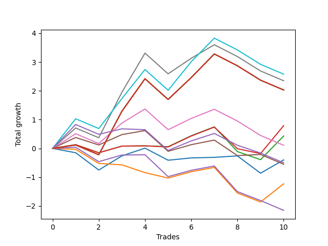

# Short Bernese 003 1v 
- Symbol: QQQ
- Date Range: 05/27/2022 - 09/30/2022
- Trading Period: 7:20-12:30
- Number of Trades: 10



| Name | Win Percent | Profit | Avg Profit / Trade | Avg Time / Trade |      | Name | Win Percent | Profit | Avg Profit / Trade | Avg Time / Trade |
| ---- | ----------- | ------ | ------------------ | ---------------- | ---- | ---- | ----------- | ------ | ------------------ | ---------------- |
| Sorted By <br> Profit | | | | | | Sorted By <br> Win Percentage ||||
| Eighty-One | 50.00 | 1290.00 | 129.00 | 52:21 |     | Two_C | 60.00 | 395.00 | 39.50 | 28:45 |
| Six | 50.00 | 1175.00 | 117.50 | 49:52 |     | Two | 60.00 | 215.00 | 21.50 | 28:41 |
| Eighty-Five | 50.00 | 1015.00 | 101.50 | 56:26 |     | Zero | 60.00 | -200.00 | -20.00 | 11:12 |
| Eighty-Four | 50.00 | 1015.00 | 101.50 | 56:26 |     | Four | 60.00 | -275.00 | -27.50 | 42:01 |
| Eighty-Three | 50.00 | 1015.00 | 101.50 | 56:26 |     | Eighty-One | 50.00 | 1290.00 | 129.00 | 52:21 |
| Eighty-Two | 50.00 | 1015.00 | 101.50 | 56:26 |     | Six | 50.00 | 1175.00 | 117.50 | 49:52 |
| Seven | 50.00 | 1015.00 | 101.50 | 56:26 |     | Eighty-Five | 50.00 | 1015.00 | 101.50 | 56:26 |
| Two_C | 60.00 | 395.00 | 39.50 | 28:45 |     | Eighty-Four | 50.00 | 1015.00 | 101.50 | 56:26 |
| Two | 60.00 | 215.00 | 21.50 | 28:41 |     | Eighty-Three | 50.00 | 1015.00 | 101.50 | 56:26 |
| Five | 50.00 | 55.00 | 5.50 | 49:16 |     | Eighty-Two | 50.00 | 1015.00 | 101.50 | 56:26 |
| Zero | 60.00 | -200.00 | -20.00 | 11:12 |     | Seven | 50.00 | 1015.00 | 101.50 | 56:26 |
| NEWFI 0000 | 40.00 | -250.00 | -25.00 | 47:25 |     | Five | 50.00 | 55.00 | 5.50 | 49:16 |
| Four | 60.00 | -275.00 | -27.50 | 42:01 |     | Three | 50.00 | -1075.00 | -107.50 | 32:54 |
| One | 30.00 | -615.00 | -61.50 | 22:53 |     | NEWFI 0000 | 40.00 | -250.00 | -25.00 | 47:25 |
| Three | 50.00 | -1075.00 | -107.50 | 32:54 |     | One | 30.00 | -615.00 | -61.50 | 22:53 |

## NO STOPLOSS

### Test Zero
* Sell when price hits the middle line of the 20p bollinger
* No Stoploss
* Results:
```
Total Trades: 10
Percent Up: 40.00
Percent Down: 60.00
Total Points Moved Down: -0.40
Potential Profit: -200.00
Total Points Ups: 1.77 Count Ups: 4
Total Points Downs: 1.37 Count Downs: 6
```

<details><summary>Trades</summary>

<code>In: 2022-08-04 09:16:00		Out: 2022-08-04 09:30:55		Total Position Time: 14:55		Total Move Down: -0.15		Total to Date: -0.15</code> <br />
<code>In: 2022-08-16 08:35:00		Out: 2022-08-16 09:07:50		Total Position Time: 32:50		Total Move Down: -0.60		Total to Date: -0.75</code> <br />
<code>In: 2022-08-17 11:17:00		Out: 2022-08-17 11:21:55		Total Position Time: 04:55		Total Move Down: 0.49		Total to Date: -0.26</code> <br />
<code>In: 2022-08-17 11:18:00		Out: 2022-08-17 11:21:55		Total Position Time: 03:55		Total Move Down: 0.27		Total to Date: 0.01</code> <br />
<code>In: 2022-09-01 11:29:00		Out: 2022-09-01 11:44:10		Total Position Time: 15:10		Total Move Down: -0.42		Total to Date: -0.41</code> <br />
<code>In: 2022-09-12 10:32:00		Out: 2022-09-12 10:32:35		Total Position Time: 00:35		Total Move Down: 0.08		Total to Date: -0.33</code> <br />
<code>In: 2022-09-12 10:33:00		Out: 2022-09-12 10:36:55		Total Position Time: 03:55		Total Move Down: 0.02		Total to Date: -0.31</code> <br />
<code>In: 2022-09-16 11:31:00		Out: 2022-09-16 11:40:55		Total Position Time: 09:55		Total Move Down: 0.05		Total to Date: -0.26</code> <br />
<code>In: 2022-09-16 11:51:00		Out: 2022-09-16 12:12:40		Total Position Time: 21:40		Total Move Down: -0.60		Total to Date: -0.86</code> <br />
<code>In: 2022-09-22 12:16:00		Out: 2022-09-22 12:20:15		Total Position Time: 04:15		Total Move Down: 0.46		Total to Date: -0.40</code> <br />


</details>

### Test One
* Sell when the price hits the upper line of the 20p 1std bollinger
* No Stoploss
* Results:
```
Total Trades: 10
Percent Up: 70.00
Percent Down: 30.00
Total Points Moved Down: -1.23
Potential Profit: -615.00
Total Points Ups: 2.23 Count Ups: 7
Total Points Downs: 1.00 Count Downs: 3
```

<details><summary>Trades</summary>

<code>In: 2022-08-04 09:16:00		Out: 2022-08-04 09:33:10		Total Position Time: 17:10		Total Move Down: -0.03		Total to Date: -0.03</code> <br />
<code>In: 2022-08-16 08:35:00		Out: 2022-08-16 09:11:25		Total Position Time: 36:25		Total Move Down: -0.49		Total to Date: -0.52</code> <br />
<code>In: 2022-08-17 11:17:00		Out: 2022-08-17 11:46:55		Total Position Time: 29:55		Total Move Down: -0.05		Total to Date: -0.57</code> <br />
<code>In: 2022-08-17 11:18:00		Out: 2022-08-17 11:46:55		Total Position Time: 28:55		Total Move Down: -0.27		Total to Date: -0.84</code> <br />
<code>In: 2022-09-01 11:29:00		Out: 2022-09-01 11:45:10		Total Position Time: 16:10		Total Move Down: -0.19		Total to Date: -1.03</code> <br />
<code>In: 2022-09-12 10:32:00		Out: 2022-09-12 10:42:15		Total Position Time: 10:15		Total Move Down: 0.22		Total to Date: -0.81</code> <br />
<code>In: 2022-09-12 10:33:00		Out: 2022-09-12 10:42:15		Total Position Time: 09:15		Total Move Down: 0.15		Total to Date: -0.66</code> <br />
<code>In: 2022-09-16 11:31:00		Out: 2022-09-16 12:19:05		Total Position Time: 48:05		Total Move Down: -0.89		Total to Date: -1.55</code> <br />
<code>In: 2022-09-16 11:51:00		Out: 2022-09-16 12:19:05		Total Position Time: 28:05		Total Move Down: -0.31		Total to Date: -1.86</code> <br />
<code>In: 2022-09-22 12:16:00		Out: 2022-09-22 12:20:40		Total Position Time: 04:40		Total Move Down: 0.63		Total to Date: -1.23</code> <br />


</details>

### Test Two
* Sell when the price hits the upper line of the 20p 2std bollinger
* No Stoploss
* Results:
```
Total Trades: 10
Percent Up: 40.00
Percent Down: 60.00
Total Points Moved Down: 0.43
Potential Profit: 215.00
Total Points Ups: 1.45 Count Ups: 4
Total Points Downs: 1.88 Count Downs: 6
```

<details><summary>Trades</summary>

<code>In: 2022-08-04 09:16:00		Out: 2022-08-04 09:41:30		Total Position Time: 25:30		Total Move Down: 0.13		Total to Date: 0.13</code> <br />
<code>In: 2022-08-16 08:35:00		Out: 2022-08-16 09:27:10		Total Position Time: 52:10		Total Move Down: -0.28		Total to Date: -0.15</code> <br />
<code>In: 2022-08-17 11:17:00		Out: 2022-08-17 11:47:45		Total Position Time: 30:45		Total Move Down: 0.23		Total to Date: 0.08</code> <br />
<code>In: 2022-08-17 11:18:00		Out: 2022-08-17 11:47:45		Total Position Time: 29:45		Total Move Down: 0.01		Total to Date: 0.09</code> <br />
<code>In: 2022-09-01 11:29:00		Out: 2022-09-01 11:48:45		Total Position Time: 19:45		Total Move Down: -0.03		Total to Date: 0.06</code> <br />
<code>In: 2022-09-12 10:32:00		Out: 2022-09-12 10:44:25		Total Position Time: 12:25		Total Move Down: 0.38		Total to Date: 0.44</code> <br />
<code>In: 2022-09-12 10:33:00		Out: 2022-09-12 10:44:25		Total Position Time: 11:25		Total Move Down: 0.31		Total to Date: 0.75</code> <br />
<code>In: 2022-09-16 11:31:00		Out: 2022-09-16 12:27:55		Total Position Time: 56:55		Total Move Down: -0.86		Total to Date: -0.11</code> <br />
<code>In: 2022-09-16 11:51:00		Out: 2022-09-16 12:27:55		Total Position Time: 36:55		Total Move Down: -0.28		Total to Date: -0.39</code> <br />
<code>In: 2022-09-22 12:16:00		Out: 2022-09-22 12:27:15		Total Position Time: 11:15		Total Move Down: 0.82		Total to Date: 0.43</code> <br />


</details>

### Test Two_C
* Sell when the price hits the upper line of the 20p 2std bollinger
* No Stoploss
* Results:
```
Total Trades: 10
Percent Up: 40.00
Percent Down: 60.00
Total Points Moved Down: 0.79
Potential Profit: 395.00
Total Points Ups: 1.24 Count Ups: 4
Total Points Downs: 2.03 Count Downs: 6
```

<details><summary>Trades</summary>

<code>In: 2022-08-04 09:16:00		Out: 2022-08-04 09:41:30		Total Position Time: 25:30		Total Move Down: 0.13		Total to Date: 0.13</code> <br />
<code>In: 2022-08-16 08:35:00		Out: 2022-08-16 09:27:10		Total Position Time: 52:10		Total Move Down: -0.28		Total to Date: -0.15</code> <br />
<code>In: 2022-08-17 11:17:00		Out: 2022-08-17 11:47:45		Total Position Time: 30:45		Total Move Down: 0.23		Total to Date: 0.08</code> <br />
<code>In: 2022-08-17 11:18:00		Out: 2022-08-17 11:47:45		Total Position Time: 29:45		Total Move Down: 0.01		Total to Date: 0.09</code> <br />
<code>In: 2022-09-01 11:29:00		Out: 2022-09-01 11:49:05		Total Position Time: 20:05		Total Move Down: -0.04		Total to Date: 0.05</code> <br />
<code>In: 2022-09-12 10:32:00		Out: 2022-09-12 10:44:25		Total Position Time: 12:25		Total Move Down: 0.38		Total to Date: 0.43</code> <br />
<code>In: 2022-09-12 10:33:00		Out: 2022-09-12 10:44:25		Total Position Time: 11:25		Total Move Down: 0.31		Total to Date: 0.74</code> <br />
<code>In: 2022-09-16 11:31:00		Out: 2022-09-16 12:28:05		Total Position Time: 57:05		Total Move Down: -0.75		Total to Date: -0.01</code> <br />
<code>In: 2022-09-16 11:51:00		Out: 2022-09-16 12:28:05		Total Position Time: 37:05		Total Move Down: -0.17		Total to Date: -0.18</code> <br />
<code>In: 2022-09-22 12:16:00		Out: 2022-09-22 12:27:20		Total Position Time: 11:20		Total Move Down: 0.97		Total to Date: 0.79</code> <br />


</details>

### Test Three
* Sell when price hits the middle line of the 50p bollinger
* No Stoploss
* Results:
```
Total Trades: 10
Percent Up: 50.00
Percent Down: 50.00
Total Points Moved Down: -2.15
Potential Profit: -1075.00
Total Points Ups: 2.80 Count Ups: 5
Total Points Downs: 0.65 Count Downs: 5
```

<details><summary>Trades</summary>

<code>In: 2022-08-04 09:16:00		Out: 2022-08-04 09:38:50		Total Position Time: 22:50		Total Move Down: 0.04		Total to Date: 0.04</code> <br />
<code>In: 2022-08-16 08:35:00		Out: 2022-08-16 09:25:30		Total Position Time: 50:30		Total Move Down: -0.50		Total to Date: -0.46</code> <br />
<code>In: 2022-08-17 11:17:00		Out: 2022-08-17 11:47:45		Total Position Time: 30:45		Total Move Down: 0.23		Total to Date: -0.23</code> <br />
<code>In: 2022-08-17 11:18:00		Out: 2022-08-17 11:47:45		Total Position Time: 29:45		Total Move Down: 0.01		Total to Date: -0.22</code> <br />
<code>In: 2022-09-01 11:29:00		Out: 2022-09-01 12:21:00		Total Position Time: 52:00		Total Move Down: -0.76		Total to Date: -0.98</code> <br />
<code>In: 2022-09-12 10:32:00		Out: 2022-09-12 10:42:15		Total Position Time: 10:15		Total Move Down: 0.22		Total to Date: -0.76</code> <br />
<code>In: 2022-09-12 10:33:00		Out: 2022-09-12 10:42:15		Total Position Time: 09:15		Total Move Down: 0.15		Total to Date: -0.61</code> <br />
<code>In: 2022-09-16 11:31:00		Out: 2022-09-16 12:27:50		Total Position Time: 56:50		Total Move Down: -0.89		Total to Date: -1.50</code> <br />
<code>In: 2022-09-16 11:51:00		Out: 2022-09-16 12:27:50		Total Position Time: 36:50		Total Move Down: -0.31		Total to Date: -1.81</code> <br />
<code>In: 2022-09-22 12:16:00		Out: 2022-09-22 12:46:00		Total Position Time: 30:00		Total Move Down: -0.34		Total to Date: -2.15</code> <br />


</details>

### Test Four
* Sell when the price hits the upper line of the 50p 1std bollinger
* No Stoploss
* Results:
```
Total Trades: 10
Percent Up: 40.00
Percent Down: 60.00
Total Points Moved Down: -0.55
Potential Profit: -275.00
Total Points Ups: 1.86 Count Ups: 4
Total Points Downs: 1.31 Count Downs: 6
```

<details><summary>Trades</summary>

<code>In: 2022-08-04 09:16:00		Out: 2022-08-04 09:42:00		Total Position Time: 26:00		Total Move Down: 0.38		Total to Date: 0.38</code> <br />
<code>In: 2022-08-16 08:35:00		Out: 2022-08-16 09:29:10		Total Position Time: 54:10		Total Move Down: -0.26		Total to Date: 0.12</code> <br />
<code>In: 2022-08-17 11:17:00		Out: 2022-08-17 11:58:20		Total Position Time: 41:20		Total Move Down: 0.36		Total to Date: 0.48</code> <br />
<code>In: 2022-08-17 11:18:00		Out: 2022-08-17 11:58:20		Total Position Time: 40:20		Total Move Down: 0.14		Total to Date: 0.62</code> <br />
<code>In: 2022-09-01 11:29:00		Out: 2022-09-01 12:28:55		Total Position Time: 59:55		Total Move Down: -0.72		Total to Date: -0.10</code> <br />
<code>In: 2022-09-12 10:32:00		Out: 2022-09-12 11:07:20		Total Position Time: 35:20		Total Move Down: 0.23		Total to Date: 0.13</code> <br />
<code>In: 2022-09-12 10:33:00		Out: 2022-09-12 11:07:20		Total Position Time: 34:20		Total Move Down: 0.16		Total to Date: 0.29</code> <br />
<code>In: 2022-09-16 11:31:00		Out: 2022-09-16 12:30:25		Total Position Time: 59:25		Total Move Down: -0.54		Total to Date: -0.25</code> <br />
<code>In: 2022-09-16 11:51:00		Out: 2022-09-16 12:30:25		Total Position Time: 39:25		Total Move Down: 0.04		Total to Date: -0.21</code> <br />
<code>In: 2022-09-22 12:16:00		Out: 2022-09-22 12:46:00		Total Position Time: 30:00		Total Move Down: -0.34		Total to Date: -0.55</code> <br />


</details>

### Test Five
* Sell when the price hits the upper line of the 50p 2std bollinger
* No Stoploss
* Results:
```
Total Trades: 10
Percent Up: 50.00
Percent Down: 50.00
Total Points Moved Down: 0.11
Potential Profit: 55.00
Total Points Ups: 2.31 Count Ups: 5
Total Points Downs: 2.42 Count Downs: 5
```

<details><summary>Trades</summary>

<code>In: 2022-08-04 09:16:00		Out: 2022-08-04 09:46:45		Total Position Time: 30:45		Total Move Down: 0.51		Total to Date: 0.51</code> <br />
<code>In: 2022-08-16 08:35:00		Out: 2022-08-16 09:34:55		Total Position Time: 59:55		Total Move Down: -0.34		Total to Date: 0.17</code> <br />
<code>In: 2022-08-17 11:17:00		Out: 2022-08-17 12:10:50		Total Position Time: 53:50		Total Move Down: 0.71		Total to Date: 0.88</code> <br />
<code>In: 2022-08-17 11:18:00		Out: 2022-08-17 12:10:50		Total Position Time: 52:50		Total Move Down: 0.49		Total to Date: 1.37</code> <br />
<code>In: 2022-09-01 11:29:00		Out: 2022-09-01 12:28:55		Total Position Time: 59:55		Total Move Down: -0.72		Total to Date: 0.65</code> <br />
<code>In: 2022-09-12 10:32:00		Out: 2022-09-12 11:17:45		Total Position Time: 45:45		Total Move Down: 0.39		Total to Date: 1.04</code> <br />
<code>In: 2022-09-12 10:33:00		Out: 2022-09-12 11:17:45		Total Position Time: 44:45		Total Move Down: 0.32		Total to Date: 1.36</code> <br />
<code>In: 2022-09-16 11:31:00		Out: 2022-09-16 12:30:55		Total Position Time: 59:55		Total Move Down: -0.41		Total to Date: 0.95</code> <br />
<code>In: 2022-09-16 11:51:00		Out: 2022-09-16 12:46:00		Total Position Time: 55:00		Total Move Down: -0.50		Total to Date: 0.45</code> <br />
<code>In: 2022-09-22 12:16:00		Out: 2022-09-22 12:46:00		Total Position Time: 30:00		Total Move Down: -0.34		Total to Date: 0.11</code> <br />


</details>

### Test Six
* Sell when the price hits the middle line of the 1std VWAP
* No Stoploss
* Results:
```
Total Trades: 10
Percent Up: 50.00
Percent Down: 50.00
Total Points Moved Down: 2.35
Potential Profit: 1175.00
Total Points Ups: 2.31 Count Ups: 5
Total Points Downs: 4.66 Count Downs: 5
```

<details><summary>Trades</summary>

<code>In: 2022-08-04 09:16:00		Out: 2022-08-04 09:47:05		Total Position Time: 31:05		Total Move Down: 0.71		Total to Date: 0.71</code> <br />
<code>In: 2022-08-16 08:35:00		Out: 2022-08-16 09:34:55		Total Position Time: 59:55		Total Move Down: -0.34		Total to Date: 0.37</code> <br />
<code>In: 2022-08-17 11:17:00		Out: 2022-08-17 12:13:05		Total Position Time: 56:05		Total Move Down: 1.58		Total to Date: 1.95</code> <br />
<code>In: 2022-08-17 11:18:00		Out: 2022-08-17 12:13:05		Total Position Time: 55:05		Total Move Down: 1.36		Total to Date: 3.31</code> <br />
<code>In: 2022-09-01 11:29:00		Out: 2022-09-01 12:28:55		Total Position Time: 59:55		Total Move Down: -0.72		Total to Date: 2.59</code> <br />
<code>In: 2022-09-12 10:32:00		Out: 2022-09-12 11:18:20		Total Position Time: 46:20		Total Move Down: 0.54		Total to Date: 3.13</code> <br />
<code>In: 2022-09-12 10:33:00		Out: 2022-09-12 11:18:20		Total Position Time: 45:20		Total Move Down: 0.47		Total to Date: 3.60</code> <br />
<code>In: 2022-09-16 11:31:00		Out: 2022-09-16 12:30:55		Total Position Time: 59:55		Total Move Down: -0.41		Total to Date: 3.19</code> <br />
<code>In: 2022-09-16 11:51:00		Out: 2022-09-16 12:46:00		Total Position Time: 55:00		Total Move Down: -0.50		Total to Date: 2.69</code> <br />
<code>In: 2022-09-22 12:16:00		Out: 2022-09-22 12:46:00		Total Position Time: 30:00		Total Move Down: -0.34		Total to Date: 2.35</code> <br />


</details>

### Test Seven
* Sell when the price hits the upper line of the 1std VWAP
* No Stoploss
* Results:
```
Total Trades: 10
Percent Up: 50.00
Percent Down: 50.00
Total Points Moved Down: 2.03
Potential Profit: 1015.00
Total Points Ups: 2.31 Count Ups: 5
Total Points Downs: 4.34 Count Downs: 5
```

<details><summary>Trades</summary>

<code>In: 2022-08-04 09:16:00		Out: 2022-08-04 10:15:55		Total Position Time: 59:55		Total Move Down: 0.12		Total to Date: 0.12</code> <br />
<code>In: 2022-08-16 08:35:00		Out: 2022-08-16 09:34:55		Total Position Time: 59:55		Total Move Down: -0.34		Total to Date: -0.22</code> <br />
<code>In: 2022-08-17 11:17:00		Out: 2022-08-17 12:16:55		Total Position Time: 59:55		Total Move Down: 1.51		Total to Date: 1.29</code> <br />
<code>In: 2022-08-17 11:18:00		Out: 2022-08-17 12:17:55		Total Position Time: 59:55		Total Move Down: 1.13		Total to Date: 2.42</code> <br />
<code>In: 2022-09-01 11:29:00		Out: 2022-09-01 12:28:55		Total Position Time: 59:55		Total Move Down: -0.72		Total to Date: 1.70</code> <br />
<code>In: 2022-09-12 10:32:00		Out: 2022-09-12 11:31:55		Total Position Time: 59:55		Total Move Down: 0.76		Total to Date: 2.46</code> <br />
<code>In: 2022-09-12 10:33:00		Out: 2022-09-12 11:32:55		Total Position Time: 59:55		Total Move Down: 0.82		Total to Date: 3.28</code> <br />
<code>In: 2022-09-16 11:31:00		Out: 2022-09-16 12:30:55		Total Position Time: 59:55		Total Move Down: -0.41		Total to Date: 2.87</code> <br />
<code>In: 2022-09-16 11:51:00		Out: 2022-09-16 12:46:00		Total Position Time: 55:00		Total Move Down: -0.50		Total to Date: 2.37</code> <br />
<code>In: 2022-09-22 12:16:00		Out: 2022-09-22 12:46:00		Total Position Time: 30:00		Total Move Down: -0.34		Total to Date: 2.03</code> <br />


</details>

## TAKE PROFIT

### Test Eighty-One
* Take Profit of 1 Point
* No Stoploss
* Results:
```
Total Trades: 10
Percent Up: 50.00
Percent Down: 50.00
Total Points Moved Down: 2.58
Potential Profit: 1290.00
Total Points Ups: 2.31 Count Ups: 5
Total Points Downs: 4.89 Count Downs: 5
```

<details><summary>Trades</summary>

<code>In: 2022-08-04 09:16:00		Out: 2022-08-04 09:48:15		Total Position Time: 32:15		Total Move Down: 1.03		Total to Date: 1.03</code> <br />
<code>In: 2022-08-16 08:35:00		Out: 2022-08-16 09:34:55		Total Position Time: 59:55		Total Move Down: -0.34		Total to Date: 0.69</code> <br />
<code>In: 2022-08-17 11:17:00		Out: 2022-08-17 12:11:35		Total Position Time: 54:35		Total Move Down: 1.04		Total to Date: 1.73</code> <br />
<code>In: 2022-08-17 11:18:00		Out: 2022-08-17 12:11:50		Total Position Time: 53:50		Total Move Down: 1.01		Total to Date: 2.74</code> <br />
<code>In: 2022-09-01 11:29:00		Out: 2022-09-01 12:28:55		Total Position Time: 59:55		Total Move Down: -0.72		Total to Date: 2.02</code> <br />
<code>In: 2022-09-12 10:32:00		Out: 2022-09-12 11:30:10		Total Position Time: 58:10		Total Move Down: 0.99		Total to Date: 3.01</code> <br />
<code>In: 2022-09-12 10:33:00		Out: 2022-09-12 11:32:55		Total Position Time: 59:55		Total Move Down: 0.82		Total to Date: 3.83</code> <br />
<code>In: 2022-09-16 11:31:00		Out: 2022-09-16 12:30:55		Total Position Time: 59:55		Total Move Down: -0.41		Total to Date: 3.42</code> <br />
<code>In: 2022-09-16 11:51:00		Out: 2022-09-16 12:46:00		Total Position Time: 55:00		Total Move Down: -0.50		Total to Date: 2.92</code> <br />
<code>In: 2022-09-22 12:16:00		Out: 2022-09-22 12:46:00		Total Position Time: 30:00		Total Move Down: -0.34		Total to Date: 2.58</code> <br />


</details>

### Test Eighty-Two
* Take Profit of 2 Point
* No Stoploss
* Results:
```
Total Trades: 10
Percent Up: 50.00
Percent Down: 50.00
Total Points Moved Down: 2.03
Potential Profit: 1015.00
Total Points Ups: 2.31 Count Ups: 5
Total Points Downs: 4.34 Count Downs: 5
```

<details><summary>Trades</summary>

<code>In: 2022-08-04 09:16:00		Out: 2022-08-04 10:15:55		Total Position Time: 59:55		Total Move Down: 0.12		Total to Date: 0.12</code> <br />
<code>In: 2022-08-16 08:35:00		Out: 2022-08-16 09:34:55		Total Position Time: 59:55		Total Move Down: -0.34		Total to Date: -0.22</code> <br />
<code>In: 2022-08-17 11:17:00		Out: 2022-08-17 12:16:55		Total Position Time: 59:55		Total Move Down: 1.51		Total to Date: 1.29</code> <br />
<code>In: 2022-08-17 11:18:00		Out: 2022-08-17 12:17:55		Total Position Time: 59:55		Total Move Down: 1.13		Total to Date: 2.42</code> <br />
<code>In: 2022-09-01 11:29:00		Out: 2022-09-01 12:28:55		Total Position Time: 59:55		Total Move Down: -0.72		Total to Date: 1.70</code> <br />
<code>In: 2022-09-12 10:32:00		Out: 2022-09-12 11:31:55		Total Position Time: 59:55		Total Move Down: 0.76		Total to Date: 2.46</code> <br />
<code>In: 2022-09-12 10:33:00		Out: 2022-09-12 11:32:55		Total Position Time: 59:55		Total Move Down: 0.82		Total to Date: 3.28</code> <br />
<code>In: 2022-09-16 11:31:00		Out: 2022-09-16 12:30:55		Total Position Time: 59:55		Total Move Down: -0.41		Total to Date: 2.87</code> <br />
<code>In: 2022-09-16 11:51:00		Out: 2022-09-16 12:46:00		Total Position Time: 55:00		Total Move Down: -0.50		Total to Date: 2.37</code> <br />
<code>In: 2022-09-22 12:16:00		Out: 2022-09-22 12:46:00		Total Position Time: 30:00		Total Move Down: -0.34		Total to Date: 2.03</code> <br />


</details>

### Test Eighty-Three
* Take Profit of 3 Point
* No Stoploss
* Results:
```
Total Trades: 10
Percent Up: 50.00
Percent Down: 50.00
Total Points Moved Down: 2.03
Potential Profit: 1015.00
Total Points Ups: 2.31 Count Ups: 5
Total Points Downs: 4.34 Count Downs: 5
```

<details><summary>Trades</summary>

<code>In: 2022-08-04 09:16:00		Out: 2022-08-04 10:15:55		Total Position Time: 59:55		Total Move Down: 0.12		Total to Date: 0.12</code> <br />
<code>In: 2022-08-16 08:35:00		Out: 2022-08-16 09:34:55		Total Position Time: 59:55		Total Move Down: -0.34		Total to Date: -0.22</code> <br />
<code>In: 2022-08-17 11:17:00		Out: 2022-08-17 12:16:55		Total Position Time: 59:55		Total Move Down: 1.51		Total to Date: 1.29</code> <br />
<code>In: 2022-08-17 11:18:00		Out: 2022-08-17 12:17:55		Total Position Time: 59:55		Total Move Down: 1.13		Total to Date: 2.42</code> <br />
<code>In: 2022-09-01 11:29:00		Out: 2022-09-01 12:28:55		Total Position Time: 59:55		Total Move Down: -0.72		Total to Date: 1.70</code> <br />
<code>In: 2022-09-12 10:32:00		Out: 2022-09-12 11:31:55		Total Position Time: 59:55		Total Move Down: 0.76		Total to Date: 2.46</code> <br />
<code>In: 2022-09-12 10:33:00		Out: 2022-09-12 11:32:55		Total Position Time: 59:55		Total Move Down: 0.82		Total to Date: 3.28</code> <br />
<code>In: 2022-09-16 11:31:00		Out: 2022-09-16 12:30:55		Total Position Time: 59:55		Total Move Down: -0.41		Total to Date: 2.87</code> <br />
<code>In: 2022-09-16 11:51:00		Out: 2022-09-16 12:46:00		Total Position Time: 55:00		Total Move Down: -0.50		Total to Date: 2.37</code> <br />
<code>In: 2022-09-22 12:16:00		Out: 2022-09-22 12:46:00		Total Position Time: 30:00		Total Move Down: -0.34		Total to Date: 2.03</code> <br />


</details>

### Test Eighty-Four
* Take Profit of 4 Point
* No Stoploss
* Results:
```
Total Trades: 10
Percent Up: 50.00
Percent Down: 50.00
Total Points Moved Down: 2.03
Potential Profit: 1015.00
Total Points Ups: 2.31 Count Ups: 5
Total Points Downs: 4.34 Count Downs: 5
```

<details><summary>Trades</summary>

<code>In: 2022-08-04 09:16:00		Out: 2022-08-04 10:15:55		Total Position Time: 59:55		Total Move Down: 0.12		Total to Date: 0.12</code> <br />
<code>In: 2022-08-16 08:35:00		Out: 2022-08-16 09:34:55		Total Position Time: 59:55		Total Move Down: -0.34		Total to Date: -0.22</code> <br />
<code>In: 2022-08-17 11:17:00		Out: 2022-08-17 12:16:55		Total Position Time: 59:55		Total Move Down: 1.51		Total to Date: 1.29</code> <br />
<code>In: 2022-08-17 11:18:00		Out: 2022-08-17 12:17:55		Total Position Time: 59:55		Total Move Down: 1.13		Total to Date: 2.42</code> <br />
<code>In: 2022-09-01 11:29:00		Out: 2022-09-01 12:28:55		Total Position Time: 59:55		Total Move Down: -0.72		Total to Date: 1.70</code> <br />
<code>In: 2022-09-12 10:32:00		Out: 2022-09-12 11:31:55		Total Position Time: 59:55		Total Move Down: 0.76		Total to Date: 2.46</code> <br />
<code>In: 2022-09-12 10:33:00		Out: 2022-09-12 11:32:55		Total Position Time: 59:55		Total Move Down: 0.82		Total to Date: 3.28</code> <br />
<code>In: 2022-09-16 11:31:00		Out: 2022-09-16 12:30:55		Total Position Time: 59:55		Total Move Down: -0.41		Total to Date: 2.87</code> <br />
<code>In: 2022-09-16 11:51:00		Out: 2022-09-16 12:46:00		Total Position Time: 55:00		Total Move Down: -0.50		Total to Date: 2.37</code> <br />
<code>In: 2022-09-22 12:16:00		Out: 2022-09-22 12:46:00		Total Position Time: 30:00		Total Move Down: -0.34		Total to Date: 2.03</code> <br />


</details>

### Test Eighty-Five
* Take Profit of 5 Point
* No Stoploss
* Results:
```
Total Trades: 10
Percent Up: 50.00
Percent Down: 50.00
Total Points Moved Down: 2.03
Potential Profit: 1015.00
Total Points Ups: 2.31 Count Ups: 5
Total Points Downs: 4.34 Count Downs: 5
```

<details><summary>Trades</summary>

<code>In: 2022-08-04 09:16:00		Out: 2022-08-04 10:15:55		Total Position Time: 59:55		Total Move Down: 0.12		Total to Date: 0.12</code> <br />
<code>In: 2022-08-16 08:35:00		Out: 2022-08-16 09:34:55		Total Position Time: 59:55		Total Move Down: -0.34		Total to Date: -0.22</code> <br />
<code>In: 2022-08-17 11:17:00		Out: 2022-08-17 12:16:55		Total Position Time: 59:55		Total Move Down: 1.51		Total to Date: 1.29</code> <br />
<code>In: 2022-08-17 11:18:00		Out: 2022-08-17 12:17:55		Total Position Time: 59:55		Total Move Down: 1.13		Total to Date: 2.42</code> <br />
<code>In: 2022-09-01 11:29:00		Out: 2022-09-01 12:28:55		Total Position Time: 59:55		Total Move Down: -0.72		Total to Date: 1.70</code> <br />
<code>In: 2022-09-12 10:32:00		Out: 2022-09-12 11:31:55		Total Position Time: 59:55		Total Move Down: 0.76		Total to Date: 2.46</code> <br />
<code>In: 2022-09-12 10:33:00		Out: 2022-09-12 11:32:55		Total Position Time: 59:55		Total Move Down: 0.82		Total to Date: 3.28</code> <br />
<code>In: 2022-09-16 11:31:00		Out: 2022-09-16 12:30:55		Total Position Time: 59:55		Total Move Down: -0.41		Total to Date: 2.87</code> <br />
<code>In: 2022-09-16 11:51:00		Out: 2022-09-16 12:46:00		Total Position Time: 55:00		Total Move Down: -0.50		Total to Date: 2.37</code> <br />
<code>In: 2022-09-22 12:16:00		Out: 2022-09-22 12:46:00		Total Position Time: 30:00		Total Move Down: -0.34		Total to Date: 2.03</code> <br />


</details>

## Indicator Exits

### Test NEWFI 0000
* Newfi 0000
* No Stoploss
* Results:
```
Total Trades: 10
Percent Up: 60.00
Percent Down: 40.00
Total Points Moved Down: -0.50
Potential Profit: -250.00
Total Points Ups: 2.11 Count Ups: 6
Total Points Downs: 1.61 Count Downs: 4
```

<details><summary>Trades</summary>

<code>In: 2022-08-04 09:16:00		Out: 2022-08-04 09:51:05		Total Position Time: 35:05		Total Move Down: 0.83		Total to Date: 0.83</code> <br />
<code>In: 2022-08-16 08:35:00		Out: 2022-08-16 09:34:55		Total Position Time: 59:55		Total Move Down: -0.34		Total to Date: 0.49</code> <br />
<code>In: 2022-08-17 11:17:00		Out: 2022-08-17 12:01:05		Total Position Time: 44:05		Total Move Down: 0.19		Total to Date: 0.68</code> <br />
<code>In: 2022-08-17 11:18:00		Out: 2022-08-17 12:01:05		Total Position Time: 43:05		Total Move Down: -0.03		Total to Date: 0.65</code> <br />
<code>In: 2022-09-01 11:29:00		Out: 2022-09-01 12:28:55		Total Position Time: 59:55		Total Move Down: -0.72		Total to Date: -0.07</code> <br />
<code>In: 2022-09-12 10:32:00		Out: 2022-09-12 11:21:05		Total Position Time: 49:05		Total Move Down: 0.33		Total to Date: 0.26</code> <br />
<code>In: 2022-09-12 10:33:00		Out: 2022-09-12 11:21:05		Total Position Time: 48:05		Total Move Down: 0.26		Total to Date: 0.52</code> <br />
<code>In: 2022-09-16 11:31:00		Out: 2022-09-16 12:30:55		Total Position Time: 59:55		Total Move Down: -0.41		Total to Date: 0.11</code> <br />
<code>In: 2022-09-16 11:51:00		Out: 2022-09-16 12:36:05		Total Position Time: 45:05		Total Move Down: -0.27		Total to Date: -0.16</code> <br />
<code>In: 2022-09-22 12:16:00		Out: 2022-09-22 12:46:00		Total Position Time: 30:00		Total Move Down: -0.34		Total to Date: -0.50</code> <br />


</details>