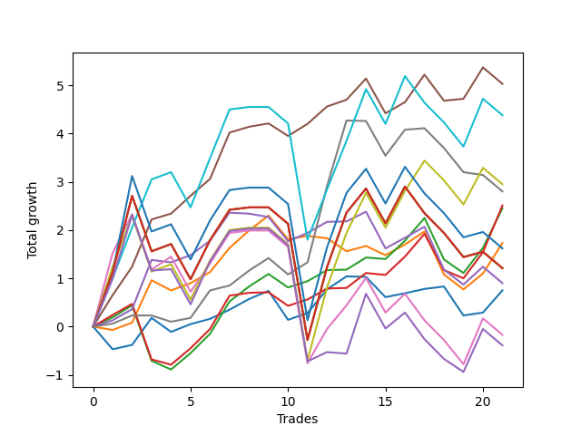

# Short Bernese 003 50 
- Symbol: QQQ
- Date Range: 05/27/2022 - 09/30/2022
- Trading Period: 7:20-12:30
- Number of Trades: 21



| Name | Win Percent | Profit | Avg Profit / Trade | Avg Time / Trade |      | Name | Win Percent | Profit | Avg Profit / Trade | Avg Time / Trade |
| ---- | ----------- | ------ | ------------------ | ---------------- | ---- | ---- | ----------- | ------ | ------------------ | ---------------- |
| Sorted By <br> Profit | | | | | | Sorted By <br> Win Percentage ||||
| Four | 80.95 | 2515.00 | 119.76 | 31:22 |     | Four | 80.95 | 2515.00 | 119.76 | 31:22 |
| Eighty-One | 57.14 | 2190.00 | 104.29 | 43:08 |     | Two_C | 71.43 | 1255.00 | 59.76 | 26:11 |
| Seven | 57.14 | 1475.00 | 70.24 | 46:37 |     | Two | 71.43 | 1225.00 | 58.33 | 22:35 |
| Six | 57.14 | 1400.00 | 66.67 | 23:33 |     | Zero | 71.43 | 375.00 | 17.86 | 07:44 |
| Two_C | 71.43 | 1255.00 | 59.76 | 26:11 |     | One | 61.90 | 865.00 | 41.19 | 16:05 |
| Two | 71.43 | 1225.00 | 58.33 | 22:35 |     | Three | 61.90 | 450.00 | 21.43 | 23:49 |
| One | 61.90 | 865.00 | 41.19 | 16:05 |     | Eighty-One | 57.14 | 2190.00 | 104.29 | 43:08 |
| Eighty-Two | 52.38 | 810.00 | 38.57 | 54:10 |     | Seven | 57.14 | 1475.00 | 70.24 | 46:37 |
| Eighty-Five | 52.38 | 605.00 | 28.81 | 55:16 |     | Six | 57.14 | 1400.00 | 66.67 | 23:33 |
| Eighty-Four | 52.38 | 605.00 | 28.81 | 55:16 |     | Eighty-Two | 52.38 | 810.00 | 38.57 | 54:10 |
| Eighty-Three | 52.38 | 605.00 | 28.81 | 55:16 |     | Eighty-Five | 52.38 | 605.00 | 28.81 | 55:16 |
| Three | 61.90 | 450.00 | 21.43 | 23:49 |     | Eighty-Four | 52.38 | 605.00 | 28.81 | 55:16 |
| Zero | 71.43 | 375.00 | 17.86 | 07:44 |     | Eighty-Three | 52.38 | 605.00 | 28.81 | 55:16 |
| Five | 52.38 | -85.00 | -4.05 | 45:35 |     | Five | 52.38 | -85.00 | -4.05 | 45:35 |
| NEWFI 0000 | 47.62 | -195.00 | -9.29 | 45:00 |     | NEWFI 0000 | 47.62 | -195.00 | -9.29 | 45:00 |

## NO STOPLOSS

### Test Zero
* Sell when price hits the middle line of the 20p bollinger
* No Stoploss
* Results:
```
Total Trades: 21
Percent Up: 28.57
Percent Down: 71.43
Total Points Moved Down: 0.75
Potential Profit: 375.00
Total Points Ups: 2.39 Count Ups: 6
Total Points Downs: 3.14 Count Downs: 15
```

<details><summary>Trades</summary>

<code>In: 2022-06-03 09:59:00		Out: 2022-06-03 10:13:05		Total Position Time: 14:05		Total Move Down: -0.47		Total to Date: -0.47</code> <br />
<code>In: 2022-06-09 10:08:00		Out: 2022-06-09 10:16:15		Total Position Time: 08:15		Total Move Down: 0.09		Total to Date: -0.38</code> <br />
<code>In: 2022-06-13 08:45:00		Out: 2022-06-13 08:47:05		Total Position Time: 02:05		Total Move Down: 0.56		Total to Date: 0.18</code> <br />
<code>In: 2022-06-21 11:58:00		Out: 2022-06-21 12:15:35		Total Position Time: 17:35		Total Move Down: -0.29		Total to Date: -0.11</code> <br />
<code>In: 2022-07-06 09:39:00		Out: 2022-07-06 09:40:55		Total Position Time: 01:55		Total Move Down: 0.16		Total to Date: 0.05</code> <br />
<code>In: 2022-07-12 09:41:00		Out: 2022-07-12 09:44:15		Total Position Time: 03:15		Total Move Down: 0.11		Total to Date: 0.16</code> <br />
<code>In: 2022-08-01 12:18:00		Out: 2022-08-01 12:18:20		Total Position Time: 00:20		Total Move Down: 0.19		Total to Date: 0.35</code> <br />
<code>In: 2022-08-09 11:55:00		Out: 2022-08-09 12:01:40		Total Position Time: 06:40		Total Move Down: 0.22		Total to Date: 0.57</code> <br />
<code>In: 2022-08-09 11:56:00		Out: 2022-08-09 12:01:40		Total Position Time: 05:40		Total Move Down: 0.17		Total to Date: 0.74</code> <br />
<code>In: 2022-08-16 08:35:00		Out: 2022-08-16 09:07:50		Total Position Time: 32:50		Total Move Down: -0.60		Total to Date: 0.14</code> <br />
<code>In: 2022-08-17 10:33:00		Out: 2022-08-17 10:34:10		Total Position Time: 01:10		Total Move Down: 0.14		Total to Date: 0.28</code> <br />
<code>In: 2022-08-17 11:17:00		Out: 2022-08-17 11:21:55		Total Position Time: 04:55		Total Move Down: 0.49		Total to Date: 0.77</code> <br />
<code>In: 2022-08-17 11:18:00		Out: 2022-08-17 11:21:55		Total Position Time: 03:55		Total Move Down: 0.27		Total to Date: 1.04</code> <br />
<code>In: 2022-08-19 10:00:00		Out: 2022-08-19 10:00:10		Total Position Time: 00:10		Total Move Down: -0.01		Total to Date: 1.03</code> <br />
<code>In: 2022-09-01 11:29:00		Out: 2022-09-01 11:44:10		Total Position Time: 15:10		Total Move Down: -0.42		Total to Date: 0.61</code> <br />
<code>In: 2022-09-12 10:32:00		Out: 2022-09-12 10:32:35		Total Position Time: 00:35		Total Move Down: 0.08		Total to Date: 0.69</code> <br />
<code>In: 2022-09-16 10:41:00		Out: 2022-09-16 10:44:20		Total Position Time: 03:20		Total Move Down: 0.09		Total to Date: 0.78</code> <br />
<code>In: 2022-09-16 11:31:00		Out: 2022-09-16 11:40:55		Total Position Time: 09:55		Total Move Down: 0.05		Total to Date: 0.83</code> <br />
<code>In: 2022-09-16 11:51:00		Out: 2022-09-16 12:12:40		Total Position Time: 21:40		Total Move Down: -0.60		Total to Date: 0.23</code> <br />
<code>In: 2022-09-22 10:57:00		Out: 2022-09-22 11:01:50		Total Position Time: 04:50		Total Move Down: 0.06		Total to Date: 0.29</code> <br />
<code>In: 2022-09-22 12:16:00		Out: 2022-09-22 12:20:15		Total Position Time: 04:15		Total Move Down: 0.46		Total to Date: 0.75</code> <br />


</details>

### Test One
* Sell when the price hits the upper line of the 20p 1std bollinger
* No Stoploss
* Results:
```
Total Trades: 21
Percent Up: 38.10
Percent Down: 61.90
Total Points Moved Down: 1.73
Potential Profit: 865.00
Total Points Ups: 2.48 Count Ups: 8
Total Points Downs: 4.21 Count Downs: 13
```

<details><summary>Trades</summary>

<code>In: 2022-06-03 09:59:00		Out: 2022-06-03 10:14:45		Total Position Time: 15:45		Total Move Down: -0.07		Total to Date: -0.07</code> <br />
<code>In: 2022-06-09 10:08:00		Out: 2022-06-09 10:18:45		Total Position Time: 10:45		Total Move Down: 0.15		Total to Date: 0.08</code> <br />
<code>In: 2022-06-13 08:45:00		Out: 2022-06-13 08:52:00		Total Position Time: 07:00		Total Move Down: 0.88		Total to Date: 0.96</code> <br />
<code>In: 2022-06-21 11:58:00		Out: 2022-06-21 12:18:45		Total Position Time: 20:45		Total Move Down: -0.21		Total to Date: 0.75</code> <br />
<code>In: 2022-07-06 09:39:00		Out: 2022-07-06 09:52:10		Total Position Time: 13:10		Total Move Down: 0.15		Total to Date: 0.90</code> <br />
<code>In: 2022-07-12 09:41:00		Out: 2022-07-12 09:51:10		Total Position Time: 10:10		Total Move Down: 0.23		Total to Date: 1.13</code> <br />
<code>In: 2022-08-01 12:18:00		Out: 2022-08-01 12:20:40		Total Position Time: 02:40		Total Move Down: 0.50		Total to Date: 1.63</code> <br />
<code>In: 2022-08-09 11:55:00		Out: 2022-08-09 12:06:05		Total Position Time: 11:05		Total Move Down: 0.36		Total to Date: 1.99</code> <br />
<code>In: 2022-08-09 11:56:00		Out: 2022-08-09 12:06:05		Total Position Time: 10:05		Total Move Down: 0.31		Total to Date: 2.30</code> <br />
<code>In: 2022-08-16 08:35:00		Out: 2022-08-16 09:11:25		Total Position Time: 36:25		Total Move Down: -0.49		Total to Date: 1.81</code> <br />
<code>In: 2022-08-17 10:33:00		Out: 2022-08-17 10:46:05		Total Position Time: 13:05		Total Move Down: 0.07		Total to Date: 1.88</code> <br />
<code>In: 2022-08-17 11:17:00		Out: 2022-08-17 11:46:55		Total Position Time: 29:55		Total Move Down: -0.05		Total to Date: 1.83</code> <br />
<code>In: 2022-08-17 11:18:00		Out: 2022-08-17 11:46:55		Total Position Time: 28:55		Total Move Down: -0.27		Total to Date: 1.56</code> <br />
<code>In: 2022-08-19 10:00:00		Out: 2022-08-19 10:07:40		Total Position Time: 07:40		Total Move Down: 0.11		Total to Date: 1.67</code> <br />
<code>In: 2022-09-01 11:29:00		Out: 2022-09-01 11:45:10		Total Position Time: 16:10		Total Move Down: -0.19		Total to Date: 1.48</code> <br />
<code>In: 2022-09-12 10:32:00		Out: 2022-09-12 10:42:15		Total Position Time: 10:15		Total Move Down: 0.22		Total to Date: 1.70</code> <br />
<code>In: 2022-09-16 10:41:00		Out: 2022-09-16 10:47:05		Total Position Time: 06:05		Total Move Down: 0.27		Total to Date: 1.97</code> <br />
<code>In: 2022-09-16 11:31:00		Out: 2022-09-16 12:19:05		Total Position Time: 48:05		Total Move Down: -0.89		Total to Date: 1.08</code> <br />
<code>In: 2022-09-16 11:51:00		Out: 2022-09-16 12:19:05		Total Position Time: 28:05		Total Move Down: -0.31		Total to Date: 0.77</code> <br />
<code>In: 2022-09-22 10:57:00		Out: 2022-09-22 11:04:20		Total Position Time: 07:20		Total Move Down: 0.33		Total to Date: 1.10</code> <br />
<code>In: 2022-09-22 12:16:00		Out: 2022-09-22 12:20:40		Total Position Time: 04:40		Total Move Down: 0.63		Total to Date: 1.73</code> <br />


</details>

### Test Two
* Sell when the price hits the upper line of the 20p 2std bollinger
* No Stoploss
* Results:
```
Total Trades: 21
Percent Up: 28.57
Percent Down: 71.43
Total Points Moved Down: 2.45
Potential Profit: 1225.00
Total Points Ups: 2.78 Count Ups: 6
Total Points Downs: 5.23 Count Downs: 15
```

<details><summary>Trades</summary>

<code>In: 2022-06-03 09:59:00		Out: 2022-06-03 10:15:50		Total Position Time: 16:50		Total Move Down: 0.19		Total to Date: 0.19</code> <br />
<code>In: 2022-06-09 10:08:00		Out: 2022-06-09 10:21:25		Total Position Time: 13:25		Total Move Down: 0.25		Total to Date: 0.44</code> <br />
<code>In: 2022-06-13 08:45:00		Out: 2022-06-13 09:44:55		Total Position Time: 59:55		Total Move Down: -1.15		Total to Date: -0.71</code> <br />
<code>In: 2022-06-21 11:58:00		Out: 2022-06-21 12:23:10		Total Position Time: 25:10		Total Move Down: -0.18		Total to Date: -0.89</code> <br />
<code>In: 2022-07-06 09:39:00		Out: 2022-07-06 09:52:50		Total Position Time: 13:50		Total Move Down: 0.34		Total to Date: -0.55</code> <br />
<code>In: 2022-07-12 09:41:00		Out: 2022-07-12 09:52:10		Total Position Time: 11:10		Total Move Down: 0.40		Total to Date: -0.15</code> <br />
<code>In: 2022-08-01 12:18:00		Out: 2022-08-01 12:21:55		Total Position Time: 03:55		Total Move Down: 0.67		Total to Date: 0.52</code> <br />
<code>In: 2022-08-09 11:55:00		Out: 2022-08-09 12:08:15		Total Position Time: 13:15		Total Move Down: 0.31		Total to Date: 0.83</code> <br />
<code>In: 2022-08-09 11:56:00		Out: 2022-08-09 12:08:15		Total Position Time: 12:15		Total Move Down: 0.26		Total to Date: 1.09</code> <br />
<code>In: 2022-08-16 08:35:00		Out: 2022-08-16 09:27:10		Total Position Time: 52:10		Total Move Down: -0.28		Total to Date: 0.81</code> <br />
<code>In: 2022-08-17 10:33:00		Out: 2022-08-17 10:56:40		Total Position Time: 23:40		Total Move Down: 0.13		Total to Date: 0.94</code> <br />
<code>In: 2022-08-17 11:17:00		Out: 2022-08-17 11:47:45		Total Position Time: 30:45		Total Move Down: 0.23		Total to Date: 1.17</code> <br />
<code>In: 2022-08-17 11:18:00		Out: 2022-08-17 11:47:45		Total Position Time: 29:45		Total Move Down: 0.01		Total to Date: 1.18</code> <br />
<code>In: 2022-08-19 10:00:00		Out: 2022-08-19 10:10:55		Total Position Time: 10:55		Total Move Down: 0.25		Total to Date: 1.43</code> <br />
<code>In: 2022-09-01 11:29:00		Out: 2022-09-01 11:48:45		Total Position Time: 19:45		Total Move Down: -0.03		Total to Date: 1.40</code> <br />
<code>In: 2022-09-12 10:32:00		Out: 2022-09-12 10:44:25		Total Position Time: 12:25		Total Move Down: 0.38		Total to Date: 1.78</code> <br />
<code>In: 2022-09-16 10:41:00		Out: 2022-09-16 10:50:15		Total Position Time: 09:15		Total Move Down: 0.47		Total to Date: 2.25</code> <br />
<code>In: 2022-09-16 11:31:00		Out: 2022-09-16 12:27:55		Total Position Time: 56:55		Total Move Down: -0.86		Total to Date: 1.39</code> <br />
<code>In: 2022-09-16 11:51:00		Out: 2022-09-16 12:27:55		Total Position Time: 36:55		Total Move Down: -0.28		Total to Date: 1.11</code> <br />
<code>In: 2022-09-22 10:57:00		Out: 2022-09-22 11:08:00		Total Position Time: 11:00		Total Move Down: 0.52		Total to Date: 1.63</code> <br />
<code>In: 2022-09-22 12:16:00		Out: 2022-09-22 12:27:15		Total Position Time: 11:15		Total Move Down: 0.82		Total to Date: 2.45</code> <br />


</details>

### Test Two_C
* Sell when the price hits the upper line of the 20p 2std bollinger
* No Stoploss
* Results:
```
Total Trades: 21
Percent Up: 28.57
Percent Down: 71.43
Total Points Moved Down: 2.51
Potential Profit: 1255.00
Total Points Ups: 2.50 Count Ups: 6
Total Points Downs: 5.01 Count Downs: 15
```

<details><summary>Trades</summary>

<code>In: 2022-06-03 09:59:00		Out: 2022-06-03 10:15:55		Total Position Time: 16:55		Total Move Down: 0.24		Total to Date: 0.24</code> <br />
<code>In: 2022-06-09 10:08:00		Out: 2022-06-09 10:21:30		Total Position Time: 13:30		Total Move Down: 0.23		Total to Date: 0.47</code> <br />
<code>In: 2022-06-13 08:45:00		Out: 2022-06-13 09:44:55		Total Position Time: 59:55		Total Move Down: -1.15		Total to Date: -0.68</code> <br />
<code>In: 2022-06-21 11:58:00		Out: 2022-06-21 12:23:15		Total Position Time: 25:15		Total Move Down: -0.11		Total to Date: -0.79</code> <br />
<code>In: 2022-07-06 09:39:00		Out: 2022-07-06 09:52:50		Total Position Time: 13:50		Total Move Down: 0.34		Total to Date: -0.45</code> <br />
<code>In: 2022-07-12 09:41:00		Out: 2022-07-12 09:52:10		Total Position Time: 11:10		Total Move Down: 0.40		Total to Date: -0.05</code> <br />
<code>In: 2022-08-01 12:18:00		Out: 2022-08-01 12:22:00		Total Position Time: 04:00		Total Move Down: 0.69		Total to Date: 0.64</code> <br />
<code>In: 2022-08-09 11:55:00		Out: 2022-08-09 12:43:35		Total Position Time: 48:35		Total Move Down: 0.06		Total to Date: 0.70</code> <br />
<code>In: 2022-08-09 11:56:00		Out: 2022-08-09 12:43:35		Total Position Time: 47:35		Total Move Down: 0.01		Total to Date: 0.71</code> <br />
<code>In: 2022-08-16 08:35:00		Out: 2022-08-16 09:27:10		Total Position Time: 52:10		Total Move Down: -0.28		Total to Date: 0.43</code> <br />
<code>In: 2022-08-17 10:33:00		Out: 2022-08-17 10:56:40		Total Position Time: 23:40		Total Move Down: 0.13		Total to Date: 0.56</code> <br />
<code>In: 2022-08-17 11:17:00		Out: 2022-08-17 11:47:45		Total Position Time: 30:45		Total Move Down: 0.23		Total to Date: 0.79</code> <br />
<code>In: 2022-08-17 11:18:00		Out: 2022-08-17 11:47:45		Total Position Time: 29:45		Total Move Down: 0.01		Total to Date: 0.80</code> <br />
<code>In: 2022-08-19 10:00:00		Out: 2022-08-19 10:13:40		Total Position Time: 13:40		Total Move Down: 0.31		Total to Date: 1.11</code> <br />
<code>In: 2022-09-01 11:29:00		Out: 2022-09-01 11:49:05		Total Position Time: 20:05		Total Move Down: -0.04		Total to Date: 1.07</code> <br />
<code>In: 2022-09-12 10:32:00		Out: 2022-09-12 10:44:25		Total Position Time: 12:25		Total Move Down: 0.38		Total to Date: 1.45</code> <br />
<code>In: 2022-09-16 10:41:00		Out: 2022-09-16 10:50:15		Total Position Time: 09:15		Total Move Down: 0.47		Total to Date: 1.92</code> <br />
<code>In: 2022-09-16 11:31:00		Out: 2022-09-16 12:28:05		Total Position Time: 57:05		Total Move Down: -0.75		Total to Date: 1.17</code> <br />
<code>In: 2022-09-16 11:51:00		Out: 2022-09-16 12:28:05		Total Position Time: 37:05		Total Move Down: -0.17		Total to Date: 1.00</code> <br />
<code>In: 2022-09-22 10:57:00		Out: 2022-09-22 11:08:55		Total Position Time: 11:55		Total Move Down: 0.54		Total to Date: 1.54</code> <br />
<code>In: 2022-09-22 12:16:00		Out: 2022-09-22 12:27:20		Total Position Time: 11:20		Total Move Down: 0.97		Total to Date: 2.51</code> <br />


</details>

### Test Three
* Sell when price hits the middle line of the 50p bollinger
* No Stoploss
* Results:
```
Total Trades: 21
Percent Up: 38.10
Percent Down: 61.90
Total Points Moved Down: 0.90
Potential Profit: 450.00
Total Points Ups: 2.94 Count Ups: 8
Total Points Downs: 3.84 Count Downs: 13
```

<details><summary>Trades</summary>

<code>In: 2022-06-03 09:59:00		Out: 2022-06-03 10:15:35		Total Position Time: 16:35		Total Move Down: 0.13		Total to Date: 0.13</code> <br />
<code>In: 2022-06-09 10:08:00		Out: 2022-06-09 10:21:30		Total Position Time: 13:30		Total Move Down: 0.23		Total to Date: 0.36</code> <br />
<code>In: 2022-06-13 08:45:00		Out: 2022-06-13 08:53:30		Total Position Time: 08:30		Total Move Down: 1.02		Total to Date: 1.38</code> <br />
<code>In: 2022-06-21 11:58:00		Out: 2022-06-21 12:23:45		Total Position Time: 25:45		Total Move Down: -0.05		Total to Date: 1.33</code> <br />
<code>In: 2022-07-06 09:39:00		Out: 2022-07-06 09:52:10		Total Position Time: 13:10		Total Move Down: 0.15		Total to Date: 1.48</code> <br />
<code>In: 2022-07-12 09:41:00		Out: 2022-07-12 09:51:35		Total Position Time: 10:35		Total Move Down: 0.30		Total to Date: 1.78</code> <br />
<code>In: 2022-08-01 12:18:00		Out: 2022-08-01 12:20:45		Total Position Time: 02:45		Total Move Down: 0.58		Total to Date: 2.36</code> <br />
<code>In: 2022-08-09 11:55:00		Out: 2022-08-09 12:38:50		Total Position Time: 43:50		Total Move Down: -0.02		Total to Date: 2.34</code> <br />
<code>In: 2022-08-09 11:56:00		Out: 2022-08-09 12:38:50		Total Position Time: 42:50		Total Move Down: -0.07		Total to Date: 2.27</code> <br />
<code>In: 2022-08-16 08:35:00		Out: 2022-08-16 09:25:30		Total Position Time: 50:30		Total Move Down: -0.50		Total to Date: 1.77</code> <br />
<code>In: 2022-08-17 10:33:00		Out: 2022-08-17 10:36:50		Total Position Time: 03:50		Total Move Down: 0.17		Total to Date: 1.94</code> <br />
<code>In: 2022-08-17 11:17:00		Out: 2022-08-17 11:47:45		Total Position Time: 30:45		Total Move Down: 0.23		Total to Date: 2.17</code> <br />
<code>In: 2022-08-17 11:18:00		Out: 2022-08-17 11:47:45		Total Position Time: 29:45		Total Move Down: 0.01		Total to Date: 2.18</code> <br />
<code>In: 2022-08-19 10:00:00		Out: 2022-08-19 10:09:05		Total Position Time: 09:05		Total Move Down: 0.20		Total to Date: 2.38</code> <br />
<code>In: 2022-09-01 11:29:00		Out: 2022-09-01 12:21:00		Total Position Time: 52:00		Total Move Down: -0.76		Total to Date: 1.62</code> <br />
<code>In: 2022-09-12 10:32:00		Out: 2022-09-12 10:42:15		Total Position Time: 10:15		Total Move Down: 0.22		Total to Date: 1.84</code> <br />
<code>In: 2022-09-16 10:41:00		Out: 2022-09-16 10:46:05		Total Position Time: 05:05		Total Move Down: 0.23		Total to Date: 2.07</code> <br />
<code>In: 2022-09-16 11:31:00		Out: 2022-09-16 12:27:50		Total Position Time: 56:50		Total Move Down: -0.89		Total to Date: 1.18</code> <br />
<code>In: 2022-09-16 11:51:00		Out: 2022-09-16 12:27:50		Total Position Time: 36:50		Total Move Down: -0.31		Total to Date: 0.87</code> <br />
<code>In: 2022-09-22 10:57:00		Out: 2022-09-22 11:04:55		Total Position Time: 07:55		Total Move Down: 0.37		Total to Date: 1.24</code> <br />
<code>In: 2022-09-22 12:16:00		Out: 2022-09-22 12:46:00		Total Position Time: 30:00		Total Move Down: -0.34		Total to Date: 0.90</code> <br />


</details>

### Test Four
* Sell when the price hits the upper line of the 50p 1std bollinger
* No Stoploss
* Results:
```
Total Trades: 21
Percent Up: 19.05
Percent Down: 80.95
Total Points Moved Down: 5.03
Potential Profit: 2515.00
Total Points Ups: 1.86 Count Ups: 4
Total Points Downs: 6.89 Count Downs: 17
```

<details><summary>Trades</summary>

<code>In: 2022-06-03 09:59:00		Out: 2022-06-03 10:18:25		Total Position Time: 19:25		Total Move Down: 0.65		Total to Date: 0.65</code> <br />
<code>In: 2022-06-09 10:08:00		Out: 2022-06-09 10:23:50		Total Position Time: 15:50		Total Move Down: 0.59		Total to Date: 1.24</code> <br />
<code>In: 2022-06-13 08:45:00		Out: 2022-06-13 09:07:30		Total Position Time: 22:30		Total Move Down: 0.98		Total to Date: 2.22</code> <br />
<code>In: 2022-06-21 11:58:00		Out: 2022-06-21 12:35:25		Total Position Time: 37:25		Total Move Down: 0.12		Total to Date: 2.34</code> <br />
<code>In: 2022-07-06 09:39:00		Out: 2022-07-06 09:52:55		Total Position Time: 13:55		Total Move Down: 0.37		Total to Date: 2.71</code> <br />
<code>In: 2022-07-12 09:41:00		Out: 2022-07-12 10:03:15		Total Position Time: 22:15		Total Move Down: 0.35		Total to Date: 3.06</code> <br />
<code>In: 2022-08-01 12:18:00		Out: 2022-08-01 12:22:55		Total Position Time: 04:55		Total Move Down: 0.96		Total to Date: 4.02</code> <br />
<code>In: 2022-08-09 11:55:00		Out: 2022-08-09 12:43:55		Total Position Time: 48:55		Total Move Down: 0.12		Total to Date: 4.14</code> <br />
<code>In: 2022-08-09 11:56:00		Out: 2022-08-09 12:43:55		Total Position Time: 47:55		Total Move Down: 0.07		Total to Date: 4.21</code> <br />
<code>In: 2022-08-16 08:35:00		Out: 2022-08-16 09:29:10		Total Position Time: 54:10		Total Move Down: -0.26		Total to Date: 3.95</code> <br />
<code>In: 2022-08-17 10:33:00		Out: 2022-08-17 11:00:50		Total Position Time: 27:50		Total Move Down: 0.25		Total to Date: 4.20</code> <br />
<code>In: 2022-08-17 11:17:00		Out: 2022-08-17 11:58:20		Total Position Time: 41:20		Total Move Down: 0.36		Total to Date: 4.56</code> <br />
<code>In: 2022-08-17 11:18:00		Out: 2022-08-17 11:58:20		Total Position Time: 40:20		Total Move Down: 0.14		Total to Date: 4.70</code> <br />
<code>In: 2022-08-19 10:00:00		Out: 2022-08-19 10:14:20		Total Position Time: 14:20		Total Move Down: 0.44		Total to Date: 5.14</code> <br />
<code>In: 2022-09-01 11:29:00		Out: 2022-09-01 12:28:55		Total Position Time: 59:55		Total Move Down: -0.72		Total to Date: 4.42</code> <br />
<code>In: 2022-09-12 10:32:00		Out: 2022-09-12 11:07:20		Total Position Time: 35:20		Total Move Down: 0.23		Total to Date: 4.65</code> <br />
<code>In: 2022-09-16 10:41:00		Out: 2022-09-16 10:50:55		Total Position Time: 09:55		Total Move Down: 0.57		Total to Date: 5.22</code> <br />
<code>In: 2022-09-16 11:31:00		Out: 2022-09-16 12:30:25		Total Position Time: 59:25		Total Move Down: -0.54		Total to Date: 4.68</code> <br />
<code>In: 2022-09-16 11:51:00		Out: 2022-09-16 12:30:25		Total Position Time: 39:25		Total Move Down: 0.04		Total to Date: 4.72</code> <br />
<code>In: 2022-09-22 10:57:00		Out: 2022-09-22 11:10:50		Total Position Time: 13:50		Total Move Down: 0.65		Total to Date: 5.37</code> <br />
<code>In: 2022-09-22 12:16:00		Out: 2022-09-22 12:46:00		Total Position Time: 30:00		Total Move Down: -0.34		Total to Date: 5.03</code> <br />


</details>

### Test Five
* Sell when the price hits the upper line of the 50p 2std bollinger
* No Stoploss
* Results:
```
Total Trades: 21
Percent Up: 47.62
Percent Down: 52.38
Total Points Moved Down: -0.17
Potential Profit: -85.00
Total Points Ups: 7.15 Count Ups: 10
Total Points Downs: 6.98 Count Downs: 11
```

<details><summary>Trades</summary>

<code>In: 2022-06-03 09:59:00		Out: 2022-06-03 10:43:20		Total Position Time: 44:20		Total Move Down: 1.52		Total to Date: 1.52</code> <br />
<code>In: 2022-06-09 10:08:00		Out: 2022-06-09 10:27:25		Total Position Time: 19:25		Total Move Down: 0.81		Total to Date: 2.33</code> <br />
<code>In: 2022-06-13 08:45:00		Out: 2022-06-13 09:44:55		Total Position Time: 59:55		Total Move Down: -1.15		Total to Date: 1.18</code> <br />
<code>In: 2022-06-21 11:58:00		Out: 2022-06-21 12:40:50		Total Position Time: 42:50		Total Move Down: 0.27		Total to Date: 1.45</code> <br />
<code>In: 2022-07-06 09:39:00		Out: 2022-07-06 10:38:55		Total Position Time: 59:55		Total Move Down: -0.73		Total to Date: 0.72</code> <br />
<code>In: 2022-07-12 09:41:00		Out: 2022-07-12 10:04:20		Total Position Time: 23:20		Total Move Down: 0.59		Total to Date: 1.31</code> <br />
<code>In: 2022-08-01 12:18:00		Out: 2022-08-01 12:46:00		Total Position Time: 28:00		Total Move Down: 0.63		Total to Date: 1.94</code> <br />
<code>In: 2022-08-09 11:55:00		Out: 2022-08-09 12:46:00		Total Position Time: 51:00		Total Move Down: 0.05		Total to Date: 1.99</code> <br />
<code>In: 2022-08-09 11:56:00		Out: 2022-08-09 12:46:00		Total Position Time: 50:00		Total Move Down: -0.00		Total to Date: 1.99</code> <br />
<code>In: 2022-08-16 08:35:00		Out: 2022-08-16 09:34:55		Total Position Time: 59:55		Total Move Down: -0.34		Total to Date: 1.65</code> <br />
<code>In: 2022-08-17 10:33:00		Out: 2022-08-17 11:32:55		Total Position Time: 59:55		Total Move Down: -2.41		Total to Date: -0.76</code> <br />
<code>In: 2022-08-17 11:17:00		Out: 2022-08-17 12:10:50		Total Position Time: 53:50		Total Move Down: 0.71		Total to Date: -0.05</code> <br />
<code>In: 2022-08-17 11:18:00		Out: 2022-08-17 12:10:50		Total Position Time: 52:50		Total Move Down: 0.49		Total to Date: 0.44</code> <br />
<code>In: 2022-08-19 10:00:00		Out: 2022-08-19 10:23:05		Total Position Time: 23:05		Total Move Down: 0.57		Total to Date: 1.01</code> <br />
<code>In: 2022-09-01 11:29:00		Out: 2022-09-01 12:28:55		Total Position Time: 59:55		Total Move Down: -0.72		Total to Date: 0.29</code> <br />
<code>In: 2022-09-12 10:32:00		Out: 2022-09-12 11:17:45		Total Position Time: 45:45		Total Move Down: 0.39		Total to Date: 0.68</code> <br />
<code>In: 2022-09-16 10:41:00		Out: 2022-09-16 11:40:55		Total Position Time: 59:55		Total Move Down: -0.55		Total to Date: 0.13</code> <br />
<code>In: 2022-09-16 11:31:00		Out: 2022-09-16 12:30:55		Total Position Time: 59:55		Total Move Down: -0.41		Total to Date: -0.28</code> <br />
<code>In: 2022-09-16 11:51:00		Out: 2022-09-16 12:46:00		Total Position Time: 55:00		Total Move Down: -0.50		Total to Date: -0.78</code> <br />
<code>In: 2022-09-22 10:57:00		Out: 2022-09-22 11:15:40		Total Position Time: 18:40		Total Move Down: 0.95		Total to Date: 0.17</code> <br />
<code>In: 2022-09-22 12:16:00		Out: 2022-09-22 12:46:00		Total Position Time: 30:00		Total Move Down: -0.34		Total to Date: -0.17</code> <br />


</details>

### Test Six
* Sell when the price hits the middle line of the 1std VWAP
* No Stoploss
* Results:
```
Total Trades: 21
Percent Up: 42.86
Percent Down: 57.14
Total Points Moved Down: 2.80
Potential Profit: 1400.00
Total Points Ups: 2.51 Count Ups: 9
Total Points Downs: 5.31 Count Downs: 12
```

<details><summary>Trades</summary>

<code>In: 2022-06-03 09:59:00		Out: 2022-06-03 09:59:10		Total Position Time: 00:10		Total Move Down: 0.06		Total to Date: 0.06</code> <br />
<code>In: 2022-06-09 10:08:00		Out: 2022-06-09 10:16:50		Total Position Time: 08:50		Total Move Down: 0.17		Total to Date: 0.23</code> <br />
<code>In: 2022-06-13 08:45:00		Out: 2022-06-13 08:45:10		Total Position Time: 00:10		Total Move Down: -0.00		Total to Date: 0.23</code> <br />
<code>In: 2022-06-21 11:58:00		Out: 2022-06-21 11:58:10		Total Position Time: 00:10		Total Move Down: -0.13		Total to Date: 0.10</code> <br />
<code>In: 2022-07-06 09:39:00		Out: 2022-07-06 09:39:10		Total Position Time: 00:10		Total Move Down: 0.08		Total to Date: 0.18</code> <br />
<code>In: 2022-07-12 09:41:00		Out: 2022-07-12 09:52:25		Total Position Time: 11:25		Total Move Down: 0.57		Total to Date: 0.75</code> <br />
<code>In: 2022-08-01 12:18:00		Out: 2022-08-01 12:18:10		Total Position Time: 00:10		Total Move Down: 0.10		Total to Date: 0.85</code> <br />
<code>In: 2022-08-09 11:55:00		Out: 2022-08-09 12:06:10		Total Position Time: 11:10		Total Move Down: 0.31		Total to Date: 1.16</code> <br />
<code>In: 2022-08-09 11:56:00		Out: 2022-08-09 12:06:10		Total Position Time: 10:10		Total Move Down: 0.26		Total to Date: 1.42</code> <br />
<code>In: 2022-08-16 08:35:00		Out: 2022-08-16 09:34:55		Total Position Time: 59:55		Total Move Down: -0.34		Total to Date: 1.08</code> <br />
<code>In: 2022-08-17 10:33:00		Out: 2022-08-17 11:00:50		Total Position Time: 27:50		Total Move Down: 0.25		Total to Date: 1.33</code> <br />
<code>In: 2022-08-17 11:17:00		Out: 2022-08-17 12:13:05		Total Position Time: 56:05		Total Move Down: 1.58		Total to Date: 2.91</code> <br />
<code>In: 2022-08-17 11:18:00		Out: 2022-08-17 12:13:05		Total Position Time: 55:05		Total Move Down: 1.36		Total to Date: 4.27</code> <br />
<code>In: 2022-08-19 10:00:00		Out: 2022-08-19 10:00:10		Total Position Time: 00:10		Total Move Down: -0.01		Total to Date: 4.26</code> <br />
<code>In: 2022-09-01 11:29:00		Out: 2022-09-01 12:28:55		Total Position Time: 59:55		Total Move Down: -0.72		Total to Date: 3.54</code> <br />
<code>In: 2022-09-12 10:32:00		Out: 2022-09-12 11:18:20		Total Position Time: 46:20		Total Move Down: 0.54		Total to Date: 4.08</code> <br />
<code>In: 2022-09-16 10:41:00		Out: 2022-09-16 10:42:55		Total Position Time: 01:55		Total Move Down: 0.03		Total to Date: 4.11</code> <br />
<code>In: 2022-09-16 11:31:00		Out: 2022-09-16 12:30:55		Total Position Time: 59:55		Total Move Down: -0.41		Total to Date: 3.70</code> <br />
<code>In: 2022-09-16 11:51:00		Out: 2022-09-16 12:46:00		Total Position Time: 55:00		Total Move Down: -0.50		Total to Date: 3.20</code> <br />
<code>In: 2022-09-22 10:57:00		Out: 2022-09-22 10:57:10		Total Position Time: 00:10		Total Move Down: -0.06		Total to Date: 3.14</code> <br />
<code>In: 2022-09-22 12:16:00		Out: 2022-09-22 12:46:00		Total Position Time: 30:00		Total Move Down: -0.34		Total to Date: 2.80</code> <br />


</details>

### Test Seven
* Sell when the price hits the upper line of the 1std VWAP
* No Stoploss
* Results:
```
Total Trades: 21
Percent Up: 42.86
Percent Down: 57.14
Total Points Moved Down: 2.95
Potential Profit: 1475.00
Total Points Ups: 6.60 Count Ups: 9
Total Points Downs: 9.55 Count Downs: 12
```

<details><summary>Trades</summary>

<code>In: 2022-06-03 09:59:00		Out: 2022-06-03 10:41:55		Total Position Time: 42:55		Total Move Down: 1.24		Total to Date: 1.24</code> <br />
<code>In: 2022-06-09 10:08:00		Out: 2022-06-09 10:29:15		Total Position Time: 21:15		Total Move Down: 1.05		Total to Date: 2.29</code> <br />
<code>In: 2022-06-13 08:45:00		Out: 2022-06-13 09:44:55		Total Position Time: 59:55		Total Move Down: -1.15		Total to Date: 1.14</code> <br />
<code>In: 2022-06-21 11:58:00		Out: 2022-06-21 12:46:00		Total Position Time: 48:00		Total Move Down: 0.15		Total to Date: 1.29</code> <br />
<code>In: 2022-07-06 09:39:00		Out: 2022-07-06 10:38:55		Total Position Time: 59:55		Total Move Down: -0.73		Total to Date: 0.56</code> <br />
<code>In: 2022-07-12 09:41:00		Out: 2022-07-12 10:40:55		Total Position Time: 59:55		Total Move Down: 0.81		Total to Date: 1.37</code> <br />
<code>In: 2022-08-01 12:18:00		Out: 2022-08-01 12:46:00		Total Position Time: 28:00		Total Move Down: 0.63		Total to Date: 2.00</code> <br />
<code>In: 2022-08-09 11:55:00		Out: 2022-08-09 12:46:00		Total Position Time: 51:00		Total Move Down: 0.05		Total to Date: 2.05</code> <br />
<code>In: 2022-08-09 11:56:00		Out: 2022-08-09 12:46:00		Total Position Time: 50:00		Total Move Down: -0.00		Total to Date: 2.05</code> <br />
<code>In: 2022-08-16 08:35:00		Out: 2022-08-16 09:34:55		Total Position Time: 59:55		Total Move Down: -0.34		Total to Date: 1.71</code> <br />
<code>In: 2022-08-17 10:33:00		Out: 2022-08-17 11:32:55		Total Position Time: 59:55		Total Move Down: -2.41		Total to Date: -0.70</code> <br />
<code>In: 2022-08-17 11:17:00		Out: 2022-08-17 12:16:55		Total Position Time: 59:55		Total Move Down: 1.51		Total to Date: 0.81</code> <br />
<code>In: 2022-08-17 11:18:00		Out: 2022-08-17 12:17:55		Total Position Time: 59:55		Total Move Down: 1.13		Total to Date: 1.94</code> <br />
<code>In: 2022-08-19 10:00:00		Out: 2022-08-19 10:27:05		Total Position Time: 27:05		Total Move Down: 0.83		Total to Date: 2.77</code> <br />
<code>In: 2022-09-01 11:29:00		Out: 2022-09-01 12:28:55		Total Position Time: 59:55		Total Move Down: -0.72		Total to Date: 2.05</code> <br />
<code>In: 2022-09-12 10:32:00		Out: 2022-09-12 11:31:55		Total Position Time: 59:55		Total Move Down: 0.76		Total to Date: 2.81</code> <br />
<code>In: 2022-09-16 10:41:00		Out: 2022-09-16 10:52:10		Total Position Time: 11:10		Total Move Down: 0.63		Total to Date: 3.44</code> <br />
<code>In: 2022-09-16 11:31:00		Out: 2022-09-16 12:30:55		Total Position Time: 59:55		Total Move Down: -0.41		Total to Date: 3.03</code> <br />
<code>In: 2022-09-16 11:51:00		Out: 2022-09-16 12:46:00		Total Position Time: 55:00		Total Move Down: -0.50		Total to Date: 2.53</code> <br />
<code>In: 2022-09-22 10:57:00		Out: 2022-09-22 11:12:25		Total Position Time: 15:25		Total Move Down: 0.76		Total to Date: 3.29</code> <br />
<code>In: 2022-09-22 12:16:00		Out: 2022-09-22 12:46:00		Total Position Time: 30:00		Total Move Down: -0.34		Total to Date: 2.95</code> <br />


</details>

## TAKE PROFIT

### Test Eighty-One
* Take Profit of 1 Point
* No Stoploss
* Results:
```
Total Trades: 21
Percent Up: 42.86
Percent Down: 57.14
Total Points Moved Down: 4.38
Potential Profit: 2190.00
Total Points Ups: 6.00 Count Ups: 9
Total Points Downs: 10.38 Count Downs: 12
```

<details><summary>Trades</summary>

<code>In: 2022-06-03 09:59:00		Out: 2022-06-03 10:19:05		Total Position Time: 20:05		Total Move Down: 1.00		Total to Date: 1.00</code> <br />
<code>In: 2022-06-09 10:08:00		Out: 2022-06-09 10:29:15		Total Position Time: 21:15		Total Move Down: 1.05		Total to Date: 2.05</code> <br />
<code>In: 2022-06-13 08:45:00		Out: 2022-06-13 08:53:10		Total Position Time: 08:10		Total Move Down: 1.00		Total to Date: 3.05</code> <br />
<code>In: 2022-06-21 11:58:00		Out: 2022-06-21 12:46:00		Total Position Time: 48:00		Total Move Down: 0.15		Total to Date: 3.20</code> <br />
<code>In: 2022-07-06 09:39:00		Out: 2022-07-06 10:38:55		Total Position Time: 59:55		Total Move Down: -0.73		Total to Date: 2.47</code> <br />
<code>In: 2022-07-12 09:41:00		Out: 2022-07-12 10:20:15		Total Position Time: 39:15		Total Move Down: 1.02		Total to Date: 3.49</code> <br />
<code>In: 2022-08-01 12:18:00		Out: 2022-08-01 12:25:45		Total Position Time: 07:45		Total Move Down: 1.01		Total to Date: 4.50</code> <br />
<code>In: 2022-08-09 11:55:00		Out: 2022-08-09 12:46:00		Total Position Time: 51:00		Total Move Down: 0.05		Total to Date: 4.55</code> <br />
<code>In: 2022-08-09 11:56:00		Out: 2022-08-09 12:46:00		Total Position Time: 50:00		Total Move Down: -0.00		Total to Date: 4.55</code> <br />
<code>In: 2022-08-16 08:35:00		Out: 2022-08-16 09:34:55		Total Position Time: 59:55		Total Move Down: -0.34		Total to Date: 4.21</code> <br />
<code>In: 2022-08-17 10:33:00		Out: 2022-08-17 11:32:55		Total Position Time: 59:55		Total Move Down: -2.41		Total to Date: 1.80</code> <br />
<code>In: 2022-08-17 11:17:00		Out: 2022-08-17 12:11:35		Total Position Time: 54:35		Total Move Down: 1.04		Total to Date: 2.84</code> <br />
<code>In: 2022-08-17 11:18:00		Out: 2022-08-17 12:11:50		Total Position Time: 53:50		Total Move Down: 1.01		Total to Date: 3.85</code> <br />
<code>In: 2022-08-19 10:00:00		Out: 2022-08-19 10:30:30		Total Position Time: 30:30		Total Move Down: 1.07		Total to Date: 4.92</code> <br />
<code>In: 2022-09-01 11:29:00		Out: 2022-09-01 12:28:55		Total Position Time: 59:55		Total Move Down: -0.72		Total to Date: 4.20</code> <br />
<code>In: 2022-09-12 10:32:00		Out: 2022-09-12 11:30:10		Total Position Time: 58:10		Total Move Down: 0.99		Total to Date: 5.19</code> <br />
<code>In: 2022-09-16 10:41:00		Out: 2022-09-16 11:40:55		Total Position Time: 59:55		Total Move Down: -0.55		Total to Date: 4.64</code> <br />
<code>In: 2022-09-16 11:31:00		Out: 2022-09-16 12:30:55		Total Position Time: 59:55		Total Move Down: -0.41		Total to Date: 4.23</code> <br />
<code>In: 2022-09-16 11:51:00		Out: 2022-09-16 12:46:00		Total Position Time: 55:00		Total Move Down: -0.50		Total to Date: 3.73</code> <br />
<code>In: 2022-09-22 10:57:00		Out: 2022-09-22 11:15:45		Total Position Time: 18:45		Total Move Down: 0.99		Total to Date: 4.72</code> <br />
<code>In: 2022-09-22 12:16:00		Out: 2022-09-22 12:46:00		Total Position Time: 30:00		Total Move Down: -0.34		Total to Date: 4.38</code> <br />


</details>

### Test Eighty-Two
* Take Profit of 2 Point
* No Stoploss
* Results:
```
Total Trades: 21
Percent Up: 47.62
Percent Down: 52.38
Total Points Moved Down: 1.62
Potential Profit: 810.00
Total Points Ups: 7.15 Count Ups: 10
Total Points Downs: 8.77 Count Downs: 11
```

<details><summary>Trades</summary>

<code>In: 2022-06-03 09:59:00		Out: 2022-06-03 10:58:55		Total Position Time: 59:55		Total Move Down: 1.12		Total to Date: 1.12</code> <br />
<code>In: 2022-06-09 10:08:00		Out: 2022-06-09 10:44:40		Total Position Time: 36:40		Total Move Down: 2.00		Total to Date: 3.12</code> <br />
<code>In: 2022-06-13 08:45:00		Out: 2022-06-13 09:44:55		Total Position Time: 59:55		Total Move Down: -1.15		Total to Date: 1.97</code> <br />
<code>In: 2022-06-21 11:58:00		Out: 2022-06-21 12:46:00		Total Position Time: 48:00		Total Move Down: 0.15		Total to Date: 2.12</code> <br />
<code>In: 2022-07-06 09:39:00		Out: 2022-07-06 10:38:55		Total Position Time: 59:55		Total Move Down: -0.73		Total to Date: 1.39</code> <br />
<code>In: 2022-07-12 09:41:00		Out: 2022-07-12 10:40:55		Total Position Time: 59:55		Total Move Down: 0.81		Total to Date: 2.20</code> <br />
<code>In: 2022-08-01 12:18:00		Out: 2022-08-01 12:46:00		Total Position Time: 28:00		Total Move Down: 0.63		Total to Date: 2.83</code> <br />
<code>In: 2022-08-09 11:55:00		Out: 2022-08-09 12:46:00		Total Position Time: 51:00		Total Move Down: 0.05		Total to Date: 2.88</code> <br />
<code>In: 2022-08-09 11:56:00		Out: 2022-08-09 12:46:00		Total Position Time: 50:00		Total Move Down: -0.00		Total to Date: 2.88</code> <br />
<code>In: 2022-08-16 08:35:00		Out: 2022-08-16 09:34:55		Total Position Time: 59:55		Total Move Down: -0.34		Total to Date: 2.54</code> <br />
<code>In: 2022-08-17 10:33:00		Out: 2022-08-17 11:32:55		Total Position Time: 59:55		Total Move Down: -2.41		Total to Date: 0.13</code> <br />
<code>In: 2022-08-17 11:17:00		Out: 2022-08-17 12:16:55		Total Position Time: 59:55		Total Move Down: 1.51		Total to Date: 1.64</code> <br />
<code>In: 2022-08-17 11:18:00		Out: 2022-08-17 12:17:55		Total Position Time: 59:55		Total Move Down: 1.13		Total to Date: 2.77</code> <br />
<code>In: 2022-08-19 10:00:00		Out: 2022-08-19 10:59:55		Total Position Time: 59:55		Total Move Down: 0.50		Total to Date: 3.27</code> <br />
<code>In: 2022-09-01 11:29:00		Out: 2022-09-01 12:28:55		Total Position Time: 59:55		Total Move Down: -0.72		Total to Date: 2.55</code> <br />
<code>In: 2022-09-12 10:32:00		Out: 2022-09-12 11:31:55		Total Position Time: 59:55		Total Move Down: 0.76		Total to Date: 3.31</code> <br />
<code>In: 2022-09-16 10:41:00		Out: 2022-09-16 11:40:55		Total Position Time: 59:55		Total Move Down: -0.55		Total to Date: 2.76</code> <br />
<code>In: 2022-09-16 11:31:00		Out: 2022-09-16 12:30:55		Total Position Time: 59:55		Total Move Down: -0.41		Total to Date: 2.35</code> <br />
<code>In: 2022-09-16 11:51:00		Out: 2022-09-16 12:46:00		Total Position Time: 55:00		Total Move Down: -0.50		Total to Date: 1.85</code> <br />
<code>In: 2022-09-22 10:57:00		Out: 2022-09-22 11:56:55		Total Position Time: 59:55		Total Move Down: 0.11		Total to Date: 1.96</code> <br />
<code>In: 2022-09-22 12:16:00		Out: 2022-09-22 12:46:00		Total Position Time: 30:00		Total Move Down: -0.34		Total to Date: 1.62</code> <br />


</details>

### Test Eighty-Three
* Take Profit of 3 Point
* No Stoploss
* Results:
```
Total Trades: 21
Percent Up: 47.62
Percent Down: 52.38
Total Points Moved Down: 1.21
Potential Profit: 605.00
Total Points Ups: 7.15 Count Ups: 10
Total Points Downs: 8.36 Count Downs: 11
```

<details><summary>Trades</summary>

<code>In: 2022-06-03 09:59:00		Out: 2022-06-03 10:58:55		Total Position Time: 59:55		Total Move Down: 1.12		Total to Date: 1.12</code> <br />
<code>In: 2022-06-09 10:08:00		Out: 2022-06-09 11:07:55		Total Position Time: 59:55		Total Move Down: 1.59		Total to Date: 2.71</code> <br />
<code>In: 2022-06-13 08:45:00		Out: 2022-06-13 09:44:55		Total Position Time: 59:55		Total Move Down: -1.15		Total to Date: 1.56</code> <br />
<code>In: 2022-06-21 11:58:00		Out: 2022-06-21 12:46:00		Total Position Time: 48:00		Total Move Down: 0.15		Total to Date: 1.71</code> <br />
<code>In: 2022-07-06 09:39:00		Out: 2022-07-06 10:38:55		Total Position Time: 59:55		Total Move Down: -0.73		Total to Date: 0.98</code> <br />
<code>In: 2022-07-12 09:41:00		Out: 2022-07-12 10:40:55		Total Position Time: 59:55		Total Move Down: 0.81		Total to Date: 1.79</code> <br />
<code>In: 2022-08-01 12:18:00		Out: 2022-08-01 12:46:00		Total Position Time: 28:00		Total Move Down: 0.63		Total to Date: 2.42</code> <br />
<code>In: 2022-08-09 11:55:00		Out: 2022-08-09 12:46:00		Total Position Time: 51:00		Total Move Down: 0.05		Total to Date: 2.47</code> <br />
<code>In: 2022-08-09 11:56:00		Out: 2022-08-09 12:46:00		Total Position Time: 50:00		Total Move Down: -0.00		Total to Date: 2.47</code> <br />
<code>In: 2022-08-16 08:35:00		Out: 2022-08-16 09:34:55		Total Position Time: 59:55		Total Move Down: -0.34		Total to Date: 2.13</code> <br />
<code>In: 2022-08-17 10:33:00		Out: 2022-08-17 11:32:55		Total Position Time: 59:55		Total Move Down: -2.41		Total to Date: -0.28</code> <br />
<code>In: 2022-08-17 11:17:00		Out: 2022-08-17 12:16:55		Total Position Time: 59:55		Total Move Down: 1.51		Total to Date: 1.23</code> <br />
<code>In: 2022-08-17 11:18:00		Out: 2022-08-17 12:17:55		Total Position Time: 59:55		Total Move Down: 1.13		Total to Date: 2.36</code> <br />
<code>In: 2022-08-19 10:00:00		Out: 2022-08-19 10:59:55		Total Position Time: 59:55		Total Move Down: 0.50		Total to Date: 2.86</code> <br />
<code>In: 2022-09-01 11:29:00		Out: 2022-09-01 12:28:55		Total Position Time: 59:55		Total Move Down: -0.72		Total to Date: 2.14</code> <br />
<code>In: 2022-09-12 10:32:00		Out: 2022-09-12 11:31:55		Total Position Time: 59:55		Total Move Down: 0.76		Total to Date: 2.90</code> <br />
<code>In: 2022-09-16 10:41:00		Out: 2022-09-16 11:40:55		Total Position Time: 59:55		Total Move Down: -0.55		Total to Date: 2.35</code> <br />
<code>In: 2022-09-16 11:31:00		Out: 2022-09-16 12:30:55		Total Position Time: 59:55		Total Move Down: -0.41		Total to Date: 1.94</code> <br />
<code>In: 2022-09-16 11:51:00		Out: 2022-09-16 12:46:00		Total Position Time: 55:00		Total Move Down: -0.50		Total to Date: 1.44</code> <br />
<code>In: 2022-09-22 10:57:00		Out: 2022-09-22 11:56:55		Total Position Time: 59:55		Total Move Down: 0.11		Total to Date: 1.55</code> <br />
<code>In: 2022-09-22 12:16:00		Out: 2022-09-22 12:46:00		Total Position Time: 30:00		Total Move Down: -0.34		Total to Date: 1.21</code> <br />


</details>

### Test Eighty-Four
* Take Profit of 4 Point
* No Stoploss
* Results:
```
Total Trades: 21
Percent Up: 47.62
Percent Down: 52.38
Total Points Moved Down: 1.21
Potential Profit: 605.00
Total Points Ups: 7.15 Count Ups: 10
Total Points Downs: 8.36 Count Downs: 11
```

<details><summary>Trades</summary>

<code>In: 2022-06-03 09:59:00		Out: 2022-06-03 10:58:55		Total Position Time: 59:55		Total Move Down: 1.12		Total to Date: 1.12</code> <br />
<code>In: 2022-06-09 10:08:00		Out: 2022-06-09 11:07:55		Total Position Time: 59:55		Total Move Down: 1.59		Total to Date: 2.71</code> <br />
<code>In: 2022-06-13 08:45:00		Out: 2022-06-13 09:44:55		Total Position Time: 59:55		Total Move Down: -1.15		Total to Date: 1.56</code> <br />
<code>In: 2022-06-21 11:58:00		Out: 2022-06-21 12:46:00		Total Position Time: 48:00		Total Move Down: 0.15		Total to Date: 1.71</code> <br />
<code>In: 2022-07-06 09:39:00		Out: 2022-07-06 10:38:55		Total Position Time: 59:55		Total Move Down: -0.73		Total to Date: 0.98</code> <br />
<code>In: 2022-07-12 09:41:00		Out: 2022-07-12 10:40:55		Total Position Time: 59:55		Total Move Down: 0.81		Total to Date: 1.79</code> <br />
<code>In: 2022-08-01 12:18:00		Out: 2022-08-01 12:46:00		Total Position Time: 28:00		Total Move Down: 0.63		Total to Date: 2.42</code> <br />
<code>In: 2022-08-09 11:55:00		Out: 2022-08-09 12:46:00		Total Position Time: 51:00		Total Move Down: 0.05		Total to Date: 2.47</code> <br />
<code>In: 2022-08-09 11:56:00		Out: 2022-08-09 12:46:00		Total Position Time: 50:00		Total Move Down: -0.00		Total to Date: 2.47</code> <br />
<code>In: 2022-08-16 08:35:00		Out: 2022-08-16 09:34:55		Total Position Time: 59:55		Total Move Down: -0.34		Total to Date: 2.13</code> <br />
<code>In: 2022-08-17 10:33:00		Out: 2022-08-17 11:32:55		Total Position Time: 59:55		Total Move Down: -2.41		Total to Date: -0.28</code> <br />
<code>In: 2022-08-17 11:17:00		Out: 2022-08-17 12:16:55		Total Position Time: 59:55		Total Move Down: 1.51		Total to Date: 1.23</code> <br />
<code>In: 2022-08-17 11:18:00		Out: 2022-08-17 12:17:55		Total Position Time: 59:55		Total Move Down: 1.13		Total to Date: 2.36</code> <br />
<code>In: 2022-08-19 10:00:00		Out: 2022-08-19 10:59:55		Total Position Time: 59:55		Total Move Down: 0.50		Total to Date: 2.86</code> <br />
<code>In: 2022-09-01 11:29:00		Out: 2022-09-01 12:28:55		Total Position Time: 59:55		Total Move Down: -0.72		Total to Date: 2.14</code> <br />
<code>In: 2022-09-12 10:32:00		Out: 2022-09-12 11:31:55		Total Position Time: 59:55		Total Move Down: 0.76		Total to Date: 2.90</code> <br />
<code>In: 2022-09-16 10:41:00		Out: 2022-09-16 11:40:55		Total Position Time: 59:55		Total Move Down: -0.55		Total to Date: 2.35</code> <br />
<code>In: 2022-09-16 11:31:00		Out: 2022-09-16 12:30:55		Total Position Time: 59:55		Total Move Down: -0.41		Total to Date: 1.94</code> <br />
<code>In: 2022-09-16 11:51:00		Out: 2022-09-16 12:46:00		Total Position Time: 55:00		Total Move Down: -0.50		Total to Date: 1.44</code> <br />
<code>In: 2022-09-22 10:57:00		Out: 2022-09-22 11:56:55		Total Position Time: 59:55		Total Move Down: 0.11		Total to Date: 1.55</code> <br />
<code>In: 2022-09-22 12:16:00		Out: 2022-09-22 12:46:00		Total Position Time: 30:00		Total Move Down: -0.34		Total to Date: 1.21</code> <br />


</details>

### Test Eighty-Five
* Take Profit of 5 Point
* No Stoploss
* Results:
```
Total Trades: 21
Percent Up: 47.62
Percent Down: 52.38
Total Points Moved Down: 1.21
Potential Profit: 605.00
Total Points Ups: 7.15 Count Ups: 10
Total Points Downs: 8.36 Count Downs: 11
```

<details><summary>Trades</summary>

<code>In: 2022-06-03 09:59:00		Out: 2022-06-03 10:58:55		Total Position Time: 59:55		Total Move Down: 1.12		Total to Date: 1.12</code> <br />
<code>In: 2022-06-09 10:08:00		Out: 2022-06-09 11:07:55		Total Position Time: 59:55		Total Move Down: 1.59		Total to Date: 2.71</code> <br />
<code>In: 2022-06-13 08:45:00		Out: 2022-06-13 09:44:55		Total Position Time: 59:55		Total Move Down: -1.15		Total to Date: 1.56</code> <br />
<code>In: 2022-06-21 11:58:00		Out: 2022-06-21 12:46:00		Total Position Time: 48:00		Total Move Down: 0.15		Total to Date: 1.71</code> <br />
<code>In: 2022-07-06 09:39:00		Out: 2022-07-06 10:38:55		Total Position Time: 59:55		Total Move Down: -0.73		Total to Date: 0.98</code> <br />
<code>In: 2022-07-12 09:41:00		Out: 2022-07-12 10:40:55		Total Position Time: 59:55		Total Move Down: 0.81		Total to Date: 1.79</code> <br />
<code>In: 2022-08-01 12:18:00		Out: 2022-08-01 12:46:00		Total Position Time: 28:00		Total Move Down: 0.63		Total to Date: 2.42</code> <br />
<code>In: 2022-08-09 11:55:00		Out: 2022-08-09 12:46:00		Total Position Time: 51:00		Total Move Down: 0.05		Total to Date: 2.47</code> <br />
<code>In: 2022-08-09 11:56:00		Out: 2022-08-09 12:46:00		Total Position Time: 50:00		Total Move Down: -0.00		Total to Date: 2.47</code> <br />
<code>In: 2022-08-16 08:35:00		Out: 2022-08-16 09:34:55		Total Position Time: 59:55		Total Move Down: -0.34		Total to Date: 2.13</code> <br />
<code>In: 2022-08-17 10:33:00		Out: 2022-08-17 11:32:55		Total Position Time: 59:55		Total Move Down: -2.41		Total to Date: -0.28</code> <br />
<code>In: 2022-08-17 11:17:00		Out: 2022-08-17 12:16:55		Total Position Time: 59:55		Total Move Down: 1.51		Total to Date: 1.23</code> <br />
<code>In: 2022-08-17 11:18:00		Out: 2022-08-17 12:17:55		Total Position Time: 59:55		Total Move Down: 1.13		Total to Date: 2.36</code> <br />
<code>In: 2022-08-19 10:00:00		Out: 2022-08-19 10:59:55		Total Position Time: 59:55		Total Move Down: 0.50		Total to Date: 2.86</code> <br />
<code>In: 2022-09-01 11:29:00		Out: 2022-09-01 12:28:55		Total Position Time: 59:55		Total Move Down: -0.72		Total to Date: 2.14</code> <br />
<code>In: 2022-09-12 10:32:00		Out: 2022-09-12 11:31:55		Total Position Time: 59:55		Total Move Down: 0.76		Total to Date: 2.90</code> <br />
<code>In: 2022-09-16 10:41:00		Out: 2022-09-16 11:40:55		Total Position Time: 59:55		Total Move Down: -0.55		Total to Date: 2.35</code> <br />
<code>In: 2022-09-16 11:31:00		Out: 2022-09-16 12:30:55		Total Position Time: 59:55		Total Move Down: -0.41		Total to Date: 1.94</code> <br />
<code>In: 2022-09-16 11:51:00		Out: 2022-09-16 12:46:00		Total Position Time: 55:00		Total Move Down: -0.50		Total to Date: 1.44</code> <br />
<code>In: 2022-09-22 10:57:00		Out: 2022-09-22 11:56:55		Total Position Time: 59:55		Total Move Down: 0.11		Total to Date: 1.55</code> <br />
<code>In: 2022-09-22 12:16:00		Out: 2022-09-22 12:46:00		Total Position Time: 30:00		Total Move Down: -0.34		Total to Date: 1.21</code> <br />


</details>

## Indicator Exits

### Test NEWFI 0000
* Newfi 0000
* No Stoploss
* Results:
```
Total Trades: 21
Percent Up: 52.38
Percent Down: 47.62
Total Points Moved Down: -0.39
Potential Profit: -195.00
Total Points Ups: 6.95 Count Ups: 11
Total Points Downs: 6.56 Count Downs: 10
```

<details><summary>Trades</summary>

<code>In: 2022-06-03 09:59:00		Out: 2022-06-03 10:33:05		Total Position Time: 34:05		Total Move Down: 0.99		Total to Date: 0.99</code> <br />
<code>In: 2022-06-09 10:08:00		Out: 2022-06-09 10:34:05		Total Position Time: 26:05		Total Move Down: 1.32		Total to Date: 2.31</code> <br />
<code>In: 2022-06-13 08:45:00		Out: 2022-06-13 09:44:55		Total Position Time: 59:55		Total Move Down: -1.15		Total to Date: 1.16</code> <br />
<code>In: 2022-06-21 11:58:00		Out: 2022-06-21 12:39:05		Total Position Time: 41:05		Total Move Down: 0.03		Total to Date: 1.19</code> <br />
<code>In: 2022-07-06 09:39:00		Out: 2022-07-06 10:38:55		Total Position Time: 59:55		Total Move Down: -0.73		Total to Date: 0.46</code> <br />
<code>In: 2022-07-12 09:41:00		Out: 2022-07-12 10:10:05		Total Position Time: 29:05		Total Move Down: 0.89		Total to Date: 1.35</code> <br />
<code>In: 2022-08-01 12:18:00		Out: 2022-08-01 12:46:00		Total Position Time: 28:00		Total Move Down: 0.63		Total to Date: 1.98</code> <br />
<code>In: 2022-08-09 11:55:00		Out: 2022-08-09 12:46:00		Total Position Time: 51:00		Total Move Down: 0.05		Total to Date: 2.03</code> <br />
<code>In: 2022-08-09 11:56:00		Out: 2022-08-09 12:46:00		Total Position Time: 50:00		Total Move Down: -0.00		Total to Date: 2.03</code> <br />
<code>In: 2022-08-16 08:35:00		Out: 2022-08-16 09:34:55		Total Position Time: 59:55		Total Move Down: -0.34		Total to Date: 1.69</code> <br />
<code>In: 2022-08-17 10:33:00		Out: 2022-08-17 11:32:55		Total Position Time: 59:55		Total Move Down: -2.41		Total to Date: -0.72</code> <br />
<code>In: 2022-08-17 11:17:00		Out: 2022-08-17 12:01:05		Total Position Time: 44:05		Total Move Down: 0.19		Total to Date: -0.53</code> <br />
<code>In: 2022-08-17 11:18:00		Out: 2022-08-17 12:01:05		Total Position Time: 43:05		Total Move Down: -0.03		Total to Date: -0.56</code> <br />
<code>In: 2022-08-19 10:00:00		Out: 2022-08-19 10:35:05		Total Position Time: 35:05		Total Move Down: 1.24		Total to Date: 0.68</code> <br />
<code>In: 2022-09-01 11:29:00		Out: 2022-09-01 12:28:55		Total Position Time: 59:55		Total Move Down: -0.72		Total to Date: -0.04</code> <br />
<code>In: 2022-09-12 10:32:00		Out: 2022-09-12 11:21:05		Total Position Time: 49:05		Total Move Down: 0.33		Total to Date: 0.29</code> <br />
<code>In: 2022-09-16 10:41:00		Out: 2022-09-16 11:40:55		Total Position Time: 59:55		Total Move Down: -0.55		Total to Date: -0.26</code> <br />
<code>In: 2022-09-16 11:31:00		Out: 2022-09-16 12:30:55		Total Position Time: 59:55		Total Move Down: -0.41		Total to Date: -0.67</code> <br />
<code>In: 2022-09-16 11:51:00		Out: 2022-09-16 12:36:05		Total Position Time: 45:05		Total Move Down: -0.27		Total to Date: -0.94</code> <br />
<code>In: 2022-09-22 10:57:00		Out: 2022-09-22 11:17:05		Total Position Time: 20:05		Total Move Down: 0.89		Total to Date: -0.05</code> <br />
<code>In: 2022-09-22 12:16:00		Out: 2022-09-22 12:46:00		Total Position Time: 30:00		Total Move Down: -0.34		Total to Date: -0.39</code> <br />


</details>