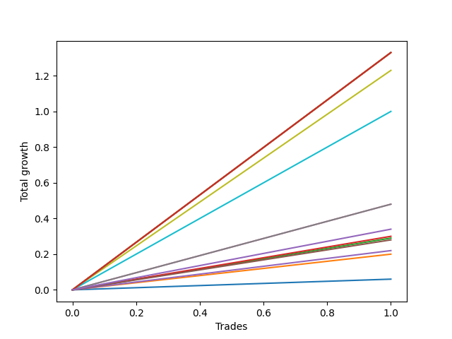

# Short Bernese 005 50 
- Symbol: QQQ
- Date Range: 05/27/2022 - 09/30/2022
- Trading Period: 7:20-12:30
- Number of Trades: 1



| Name | Win Percent | Profit | Avg Profit / Trade | Avg Time / Trade |      | Name | Win Percent | Profit | Avg Profit / Trade | Avg Time / Trade |
| ---- | ----------- | ------ | ------------------ | ---------------- | ---- | ---- | ----------- | ------ | ------------------ | ---------------- |
| Sorted By <br> Profit | | | | | | Sorted By <br> Win Percentage ||||
| Eighty-Five | 100.00 | 665.00 | 665.00 | 59:55 |     | Eighty-Five | 100.00 | 665.00 | 665.00 | 59:55 |
| Eighty-Four | 100.00 | 665.00 | 665.00 | 59:55 |     | Eighty-Four | 100.00 | 665.00 | 665.00 | 59:55 |
| Eighty-Three | 100.00 | 665.00 | 665.00 | 59:55 |     | Eighty-Three | 100.00 | 665.00 | 665.00 | 59:55 |
| Eighty-Two | 100.00 | 665.00 | 665.00 | 59:55 |     | Eighty-Two | 100.00 | 665.00 | 665.00 | 59:55 |
| Seven | 100.00 | 615.00 | 615.00 | 47:45 |     | Seven | 100.00 | 615.00 | 615.00 | 47:45 |
| Eighty-One | 100.00 | 500.00 | 500.00 | 47:30 |     | Eighty-One | 100.00 | 500.00 | 500.00 | 47:30 |
| Six | 100.00 | 240.00 | 240.00 | 30:30 |     | Six | 100.00 | 240.00 | 240.00 | 30:30 |
| Five | 100.00 | 240.00 | 240.00 | 30:30 |     | Five | 100.00 | 240.00 | 240.00 | 30:30 |
| NEWFI 0000 | 100.00 | 170.00 | 170.00 | 32:05 |     | NEWFI 0000 | 100.00 | 170.00 | 170.00 | 32:05 |
| Two_C | 100.00 | 150.00 | 150.00 | 15:30 |     | Two_C | 100.00 | 150.00 | 150.00 | 15:30 |
| Two | 100.00 | 145.00 | 145.00 | 15:10 |     | Two | 100.00 | 145.00 | 145.00 | 15:10 |
| Four | 100.00 | 140.00 | 140.00 | 29:35 |     | Four | 100.00 | 140.00 | 140.00 | 29:35 |
| Three | 100.00 | 110.00 | 110.00 | 22:35 |     | Three | 100.00 | 110.00 | 110.00 | 22:35 |
| One | 100.00 | 100.00 | 100.00 | 07:45 |     | One | 100.00 | 100.00 | 100.00 | 07:45 |
| Zero | 100.00 | 30.00 | 30.00 | 03:15 |     | Zero | 100.00 | 30.00 | 30.00 | 03:15 |

## NO STOPLOSS

### Test Zero
* Sell when price hits the middle line of the 20p bollinger
* No Stoploss
* Results:
```
Total Trades: 1
Percent Up: 0.00
Percent Down: 100.00
Total Points Moved Down: 0.06
Potential Profit: 30.00
Total Points Ups: 0.00 Count Ups: 0
Total Points Downs: 0.06 Count Downs: 1
```

<details><summary>Trades</summary>

<code>In: 2022-07-25 09:52:00		Out: 2022-07-25 09:55:15		Total Position Time: 03:15		Total Move Down: 0.06		Total to Date: 0.06</code> <br />


</details>

### Test One
* Sell when the price hits the upper line of the 20p 1std bollinger
* No Stoploss
* Results:
```
Total Trades: 1
Percent Up: 0.00
Percent Down: 100.00
Total Points Moved Down: 0.20
Potential Profit: 100.00
Total Points Ups: 0.00 Count Ups: 0
Total Points Downs: 0.20 Count Downs: 1
```

<details><summary>Trades</summary>

<code>In: 2022-07-25 09:52:00		Out: 2022-07-25 09:59:45		Total Position Time: 07:45		Total Move Down: 0.20		Total to Date: 0.20</code> <br />


</details>

### Test Two
* Sell when the price hits the upper line of the 20p 2std bollinger
* No Stoploss
* Results:
```
Total Trades: 1
Percent Up: 0.00
Percent Down: 100.00
Total Points Moved Down: 0.29
Potential Profit: 145.00
Total Points Ups: 0.00 Count Ups: 0
Total Points Downs: 0.29 Count Downs: 1
```

<details><summary>Trades</summary>

<code>In: 2022-07-25 09:52:00		Out: 2022-07-25 10:07:10		Total Position Time: 15:10		Total Move Down: 0.29		Total to Date: 0.29</code> <br />


</details>

### Test Two_C
* Sell when the price hits the upper line of the 20p 2std bollinger
* No Stoploss
* Results:
```
Total Trades: 1
Percent Up: 0.00
Percent Down: 100.00
Total Points Moved Down: 0.30
Potential Profit: 150.00
Total Points Ups: 0.00 Count Ups: 0
Total Points Downs: 0.30 Count Downs: 1
```

<details><summary>Trades</summary>

<code>In: 2022-07-25 09:52:00		Out: 2022-07-25 10:07:30		Total Position Time: 15:30		Total Move Down: 0.30		Total to Date: 0.30</code> <br />


</details>

### Test Three
* Sell when price hits the middle line of the 50p bollinger
* No Stoploss
* Results:
```
Total Trades: 1
Percent Up: 0.00
Percent Down: 100.00
Total Points Moved Down: 0.22
Potential Profit: 110.00
Total Points Ups: 0.00 Count Ups: 0
Total Points Downs: 0.22 Count Downs: 1
```

<details><summary>Trades</summary>

<code>In: 2022-07-25 09:52:00		Out: 2022-07-25 10:14:35		Total Position Time: 22:35		Total Move Down: 0.22		Total to Date: 0.22</code> <br />


</details>

### Test Four
* Sell when the price hits the upper line of the 50p 1std bollinger
* No Stoploss
* Results:
```
Total Trades: 1
Percent Up: 0.00
Percent Down: 100.00
Total Points Moved Down: 0.28
Potential Profit: 140.00
Total Points Ups: 0.00 Count Ups: 0
Total Points Downs: 0.28 Count Downs: 1
```

<details><summary>Trades</summary>

<code>In: 2022-07-25 09:52:00		Out: 2022-07-25 10:21:35		Total Position Time: 29:35		Total Move Down: 0.28		Total to Date: 0.28</code> <br />


</details>

### Test Five
* Sell when the price hits the upper line of the 50p 2std bollinger
* No Stoploss
* Results:
```
Total Trades: 1
Percent Up: 0.00
Percent Down: 100.00
Total Points Moved Down: 0.48
Potential Profit: 240.00
Total Points Ups: 0.00 Count Ups: 0
Total Points Downs: 0.48 Count Downs: 1
```

<details><summary>Trades</summary>

<code>In: 2022-07-25 09:52:00		Out: 2022-07-25 10:22:30		Total Position Time: 30:30		Total Move Down: 0.48		Total to Date: 0.48</code> <br />


</details>

### Test Six
* Sell when the price hits the middle line of the 1std VWAP
* No Stoploss
* Results:
```
Total Trades: 1
Percent Up: 0.00
Percent Down: 100.00
Total Points Moved Down: 0.48
Potential Profit: 240.00
Total Points Ups: 0.00 Count Ups: 0
Total Points Downs: 0.48 Count Downs: 1
```

<details><summary>Trades</summary>

<code>In: 2022-07-25 09:52:00		Out: 2022-07-25 10:22:30		Total Position Time: 30:30		Total Move Down: 0.48		Total to Date: 0.48</code> <br />


</details>

### Test Seven
* Sell when the price hits the upper line of the 1std VWAP
* No Stoploss
* Results:
```
Total Trades: 1
Percent Up: 0.00
Percent Down: 100.00
Total Points Moved Down: 1.23
Potential Profit: 615.00
Total Points Ups: 0.00 Count Ups: 0
Total Points Downs: 1.23 Count Downs: 1
```

<details><summary>Trades</summary>

<code>In: 2022-07-25 09:52:00		Out: 2022-07-25 10:39:45		Total Position Time: 47:45		Total Move Down: 1.23		Total to Date: 1.23</code> <br />


</details>

## TAKE PROFIT

### Test Eighty-One
* Take Profit of 1 Point
* No Stoploss
* Results:
```
Total Trades: 1
Percent Up: 0.00
Percent Down: 100.00
Total Points Moved Down: 1.00
Potential Profit: 500.00
Total Points Ups: 0.00 Count Ups: 0
Total Points Downs: 1.00 Count Downs: 1
```

<details><summary>Trades</summary>

<code>In: 2022-07-25 09:52:00		Out: 2022-07-25 10:39:30		Total Position Time: 47:30		Total Move Down: 1.00		Total to Date: 1.00</code> <br />


</details>

### Test Eighty-Two
* Take Profit of 2 Point
* No Stoploss
* Results:
```
Total Trades: 1
Percent Up: 0.00
Percent Down: 100.00
Total Points Moved Down: 1.33
Potential Profit: 665.00
Total Points Ups: 0.00 Count Ups: 0
Total Points Downs: 1.33 Count Downs: 1
```

<details><summary>Trades</summary>

<code>In: 2022-07-25 09:52:00		Out: 2022-07-25 10:51:55		Total Position Time: 59:55		Total Move Down: 1.33		Total to Date: 1.33</code> <br />


</details>

### Test Eighty-Three
* Take Profit of 3 Point
* No Stoploss
* Results:
```
Total Trades: 1
Percent Up: 0.00
Percent Down: 100.00
Total Points Moved Down: 1.33
Potential Profit: 665.00
Total Points Ups: 0.00 Count Ups: 0
Total Points Downs: 1.33 Count Downs: 1
```

<details><summary>Trades</summary>

<code>In: 2022-07-25 09:52:00		Out: 2022-07-25 10:51:55		Total Position Time: 59:55		Total Move Down: 1.33		Total to Date: 1.33</code> <br />


</details>

### Test Eighty-Four
* Take Profit of 4 Point
* No Stoploss
* Results:
```
Total Trades: 1
Percent Up: 0.00
Percent Down: 100.00
Total Points Moved Down: 1.33
Potential Profit: 665.00
Total Points Ups: 0.00 Count Ups: 0
Total Points Downs: 1.33 Count Downs: 1
```

<details><summary>Trades</summary>

<code>In: 2022-07-25 09:52:00		Out: 2022-07-25 10:51:55		Total Position Time: 59:55		Total Move Down: 1.33		Total to Date: 1.33</code> <br />


</details>

### Test Eighty-Five
* Take Profit of 5 Point
* No Stoploss
* Results:
```
Total Trades: 1
Percent Up: 0.00
Percent Down: 100.00
Total Points Moved Down: 1.33
Potential Profit: 665.00
Total Points Ups: 0.00 Count Ups: 0
Total Points Downs: 1.33 Count Downs: 1
```

<details><summary>Trades</summary>

<code>In: 2022-07-25 09:52:00		Out: 2022-07-25 10:51:55		Total Position Time: 59:55		Total Move Down: 1.33		Total to Date: 1.33</code> <br />


</details>

## Indicator Exits

### Test NEWFI 0000
* Newfi 0000
* No Stoploss
* Results:
```
Total Trades: 1
Percent Up: 0.00
Percent Down: 100.00
Total Points Moved Down: 0.34
Potential Profit: 170.00
Total Points Ups: 0.00 Count Ups: 0
Total Points Downs: 0.34 Count Downs: 1
```

<details><summary>Trades</summary>

<code>In: 2022-07-25 09:52:00		Out: 2022-07-25 10:24:05		Total Position Time: 32:05		Total Move Down: 0.34		Total to Date: 0.34</code> <br />


</details>