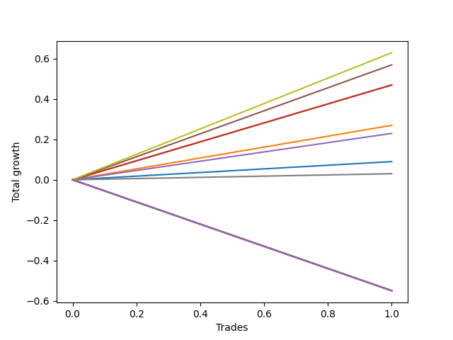

# Short Bernese 009 50 
- Symbol: QQQ
- Date Range: 05/27/2022 - 09/30/2022
- Trading Period: 7:20-12:30
- Number of Trades: 1



| Name | Win Percent | Profit | Avg Profit / Trade | Avg Time / Trade |      | Name | Win Percent | Profit | Avg Profit / Trade | Avg Time / Trade |
| ---- | ----------- | ------ | ------------------ | ---------------- | ---- | ---- | ----------- | ------ | ------------------ | ---------------- |
| Sorted By <br> Profit | | | | | | Sorted By <br> Win Percentage ||||
| Seven | 100.00 | 315.00 | 315.00 | 11:10 |     | Seven | 100.00 | 315.00 | 315.00 | 11:10 |
| Four | 100.00 | 285.00 | 285.00 | 09:55 |     | Four | 100.00 | 285.00 | 285.00 | 09:55 |
| Two_C | 100.00 | 235.00 | 235.00 | 09:15 |     | Two_C | 100.00 | 235.00 | 235.00 | 09:15 |
| Two | 100.00 | 235.00 | 235.00 | 09:15 |     | Two | 100.00 | 235.00 | 235.00 | 09:15 |
| One | 100.00 | 135.00 | 135.00 | 06:05 |     | One | 100.00 | 135.00 | 135.00 | 06:05 |
| Three | 100.00 | 115.00 | 115.00 | 05:05 |     | Three | 100.00 | 115.00 | 115.00 | 05:05 |
| Zero | 100.00 | 45.00 | 45.00 | 03:20 |     | Zero | 100.00 | 45.00 | 45.00 | 03:20 |
| Six | 100.00 | 15.00 | 15.00 | 01:55 |     | Six | 100.00 | 15.00 | 15.00 | 01:55 |
| NEWFI 0000 | 0.00 | -275.00 | -275.00 | 59:55 |     | NEWFI 0000 | 0.00 | -275.00 | -275.00 | 59:55 |
| Eighty-Five | 0.00 | -275.00 | -275.00 | 59:55 |     | Eighty-Five | 0.00 | -275.00 | -275.00 | 59:55 |
| Eighty-Four | 0.00 | -275.00 | -275.00 | 59:55 |     | Eighty-Four | 0.00 | -275.00 | -275.00 | 59:55 |
| Eighty-Three | 0.00 | -275.00 | -275.00 | 59:55 |     | Eighty-Three | 0.00 | -275.00 | -275.00 | 59:55 |
| Eighty-Two | 0.00 | -275.00 | -275.00 | 59:55 |     | Eighty-Two | 0.00 | -275.00 | -275.00 | 59:55 |
| Eighty-One | 0.00 | -275.00 | -275.00 | 59:55 |     | Eighty-One | 0.00 | -275.00 | -275.00 | 59:55 |
| Five | 0.00 | -275.00 | -275.00 | 59:55 |     | Five | 0.00 | -275.00 | -275.00 | 59:55 |

## NO STOPLOSS

### Test Zero
* Sell when price hits the middle line of the 20p bollinger
* No Stoploss
* Results:
```
Total Trades: 1
Percent Up: 0.00
Percent Down: 100.00
Total Points Moved Down: 0.09
Potential Profit: 45.00
Total Points Ups: 0.00 Count Ups: 0
Total Points Downs: 0.09 Count Downs: 1
```

<details><summary>Trades</summary>

<code>In: 2022-09-16 10:41:00		Out: 2022-09-16 10:44:20		Total Position Time: 03:20		Total Move Down: 0.09		Total to Date: 0.09</code> <br />


</details>

### Test One
* Sell when the price hits the upper line of the 20p 1std bollinger
* No Stoploss
* Results:
```
Total Trades: 1
Percent Up: 0.00
Percent Down: 100.00
Total Points Moved Down: 0.27
Potential Profit: 135.00
Total Points Ups: 0.00 Count Ups: 0
Total Points Downs: 0.27 Count Downs: 1
```

<details><summary>Trades</summary>

<code>In: 2022-09-16 10:41:00		Out: 2022-09-16 10:47:05		Total Position Time: 06:05		Total Move Down: 0.27		Total to Date: 0.27</code> <br />


</details>

### Test Two
* Sell when the price hits the upper line of the 20p 2std bollinger
* No Stoploss
* Results:
```
Total Trades: 1
Percent Up: 0.00
Percent Down: 100.00
Total Points Moved Down: 0.47
Potential Profit: 235.00
Total Points Ups: 0.00 Count Ups: 0
Total Points Downs: 0.47 Count Downs: 1
```

<details><summary>Trades</summary>

<code>In: 2022-09-16 10:41:00		Out: 2022-09-16 10:50:15		Total Position Time: 09:15		Total Move Down: 0.47		Total to Date: 0.47</code> <br />


</details>

### Test Two_C
* Sell when the price hits the upper line of the 20p 2std bollinger
* No Stoploss
* Results:
```
Total Trades: 1
Percent Up: 0.00
Percent Down: 100.00
Total Points Moved Down: 0.47
Potential Profit: 235.00
Total Points Ups: 0.00 Count Ups: 0
Total Points Downs: 0.47 Count Downs: 1
```

<details><summary>Trades</summary>

<code>In: 2022-09-16 10:41:00		Out: 2022-09-16 10:50:15		Total Position Time: 09:15		Total Move Down: 0.47		Total to Date: 0.47</code> <br />


</details>

### Test Three
* Sell when price hits the middle line of the 50p bollinger
* No Stoploss
* Results:
```
Total Trades: 1
Percent Up: 0.00
Percent Down: 100.00
Total Points Moved Down: 0.23
Potential Profit: 115.00
Total Points Ups: 0.00 Count Ups: 0
Total Points Downs: 0.23 Count Downs: 1
```

<details><summary>Trades</summary>

<code>In: 2022-09-16 10:41:00		Out: 2022-09-16 10:46:05		Total Position Time: 05:05		Total Move Down: 0.23		Total to Date: 0.23</code> <br />


</details>

### Test Four
* Sell when the price hits the upper line of the 50p 1std bollinger
* No Stoploss
* Results:
```
Total Trades: 1
Percent Up: 0.00
Percent Down: 100.00
Total Points Moved Down: 0.57
Potential Profit: 285.00
Total Points Ups: 0.00 Count Ups: 0
Total Points Downs: 0.57 Count Downs: 1
```

<details><summary>Trades</summary>

<code>In: 2022-09-16 10:41:00		Out: 2022-09-16 10:50:55		Total Position Time: 09:55		Total Move Down: 0.57		Total to Date: 0.57</code> <br />


</details>

### Test Five
* Sell when the price hits the upper line of the 50p 2std bollinger
* No Stoploss
* Results:
```
Total Trades: 1
Percent Up: 100.00
Percent Down: 0.00
Total Points Moved Down: -0.55
Potential Profit: -275.00
Total Points Ups: 0.55 Count Ups: 1
Total Points Downs: 0.00 Count Downs: 0
```

<details><summary>Trades</summary>

<code>In: 2022-09-16 10:41:00		Out: 2022-09-16 11:40:55		Total Position Time: 59:55		Total Move Down: -0.55		Total to Date: -0.55</code> <br />


</details>

### Test Six
* Sell when the price hits the middle line of the 1std VWAP
* No Stoploss
* Results:
```
Total Trades: 1
Percent Up: 0.00
Percent Down: 100.00
Total Points Moved Down: 0.03
Potential Profit: 15.00
Total Points Ups: 0.00 Count Ups: 0
Total Points Downs: 0.03 Count Downs: 1
```

<details><summary>Trades</summary>

<code>In: 2022-09-16 10:41:00		Out: 2022-09-16 10:42:55		Total Position Time: 01:55		Total Move Down: 0.03		Total to Date: 0.03</code> <br />


</details>

### Test Seven
* Sell when the price hits the upper line of the 1std VWAP
* No Stoploss
* Results:
```
Total Trades: 1
Percent Up: 0.00
Percent Down: 100.00
Total Points Moved Down: 0.63
Potential Profit: 315.00
Total Points Ups: 0.00 Count Ups: 0
Total Points Downs: 0.63 Count Downs: 1
```

<details><summary>Trades</summary>

<code>In: 2022-09-16 10:41:00		Out: 2022-09-16 10:52:10		Total Position Time: 11:10		Total Move Down: 0.63		Total to Date: 0.63</code> <br />


</details>

## TAKE PROFIT

### Test Eighty-One
* Take Profit of 1 Point
* No Stoploss
* Results:
```
Total Trades: 1
Percent Up: 100.00
Percent Down: 0.00
Total Points Moved Down: -0.55
Potential Profit: -275.00
Total Points Ups: 0.55 Count Ups: 1
Total Points Downs: 0.00 Count Downs: 0
```

<details><summary>Trades</summary>

<code>In: 2022-09-16 10:41:00		Out: 2022-09-16 11:40:55		Total Position Time: 59:55		Total Move Down: -0.55		Total to Date: -0.55</code> <br />


</details>

### Test Eighty-Two
* Take Profit of 2 Point
* No Stoploss
* Results:
```
Total Trades: 1
Percent Up: 100.00
Percent Down: 0.00
Total Points Moved Down: -0.55
Potential Profit: -275.00
Total Points Ups: 0.55 Count Ups: 1
Total Points Downs: 0.00 Count Downs: 0
```

<details><summary>Trades</summary>

<code>In: 2022-09-16 10:41:00		Out: 2022-09-16 11:40:55		Total Position Time: 59:55		Total Move Down: -0.55		Total to Date: -0.55</code> <br />


</details>

### Test Eighty-Three
* Take Profit of 3 Point
* No Stoploss
* Results:
```
Total Trades: 1
Percent Up: 100.00
Percent Down: 0.00
Total Points Moved Down: -0.55
Potential Profit: -275.00
Total Points Ups: 0.55 Count Ups: 1
Total Points Downs: 0.00 Count Downs: 0
```

<details><summary>Trades</summary>

<code>In: 2022-09-16 10:41:00		Out: 2022-09-16 11:40:55		Total Position Time: 59:55		Total Move Down: -0.55		Total to Date: -0.55</code> <br />


</details>

### Test Eighty-Four
* Take Profit of 4 Point
* No Stoploss
* Results:
```
Total Trades: 1
Percent Up: 100.00
Percent Down: 0.00
Total Points Moved Down: -0.55
Potential Profit: -275.00
Total Points Ups: 0.55 Count Ups: 1
Total Points Downs: 0.00 Count Downs: 0
```

<details><summary>Trades</summary>

<code>In: 2022-09-16 10:41:00		Out: 2022-09-16 11:40:55		Total Position Time: 59:55		Total Move Down: -0.55		Total to Date: -0.55</code> <br />


</details>

### Test Eighty-Five
* Take Profit of 5 Point
* No Stoploss
* Results:
```
Total Trades: 1
Percent Up: 100.00
Percent Down: 0.00
Total Points Moved Down: -0.55
Potential Profit: -275.00
Total Points Ups: 0.55 Count Ups: 1
Total Points Downs: 0.00 Count Downs: 0
```

<details><summary>Trades</summary>

<code>In: 2022-09-16 10:41:00		Out: 2022-09-16 11:40:55		Total Position Time: 59:55		Total Move Down: -0.55		Total to Date: -0.55</code> <br />


</details>

## Indicator Exits

### Test NEWFI 0000
* Newfi 0000
* No Stoploss
* Results:
```
Total Trades: 1
Percent Up: 100.00
Percent Down: 0.00
Total Points Moved Down: -0.55
Potential Profit: -275.00
Total Points Ups: 0.55 Count Ups: 1
Total Points Downs: 0.00 Count Downs: 0
```

<details><summary>Trades</summary>

<code>In: 2022-09-16 10:41:00		Out: 2022-09-16 11:40:55		Total Position Time: 59:55		Total Move Down: -0.55		Total to Date: -0.55</code> <br />


</details>