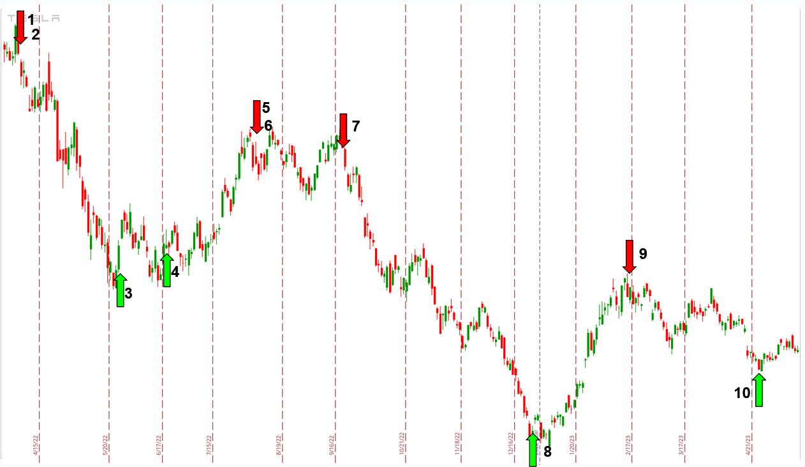

    
 

## SPY Past Indicators

<table class="hits">
    <tr>
        <th>No.</th>
        <th>Direction</th>
        <th>Date</th>
        <th>Absolute Move %</th>
        <th>Cumulative % Gain</th>
        <th>Reinvested % Gain</th>
      </tr>
    <tr>
        <td>1</td>
        <td>Long</td>
        <td>Jun 22 2022 Close</td>
        <td>14.77 %</td>
        <td>14.77 %</td>
        <td>14.77 %</td>
    </tr>
    <tr>
        <td>2</td>
        <td>Short</td>
        <td>Aug 16 2022 Close</td>
        <td>-13.77 %</td>
        <td>28.54 %</td>
        <td>30.58 %</td>
    </tr>
    <tr>
        <td>3</td>
        <td>Long</td>
        <td>Sep 28 2022 Close</td>
        <td>-3.60 %</td>
        <td>24.94 %</td>
        <td>25.87 %</td>
    </tr>
    <tr>
        <td>4</td>
        <td>Long</td>
        <td>Sep 30 2022 Close</td>
        <td>2.64 %</td>
        <td>27.58 %</td>
        <td>29.20 %</td>
    </tr>
    <tr>
        <td>5</td>
        <td>Long</td>
        <td>Oct 03 2022 Close</td>
        <td>3.10 %</td>
        <td>30.68 %</td>
        <td>33.20 %</td>
    </tr>
    <tr>
        <td>6</td>
        <td>Long</td>
        <td>Oct 04 2022 Close</td>
        <td>-3.17 %</td>
        <td>27.50 %</td>
        <td>28.97 %</td>
    </tr>
    <tr>
        <td>7</td>
        <td>Long</td>
        <td>Oct 13 2022 Close</td>
        <td>11.19 %</td>
        <td>38.69 %</td>
        <td>43.40 %</td>
    </tr>
    <tr>
        <td>8</td>
        <td>Short</td>
        <td>Dec 02 2022 Close</td>
        <td>-5.08 %</td>
        <td>43.77 %</td>
        <td>50.69 %</td>
    </tr>
    <tr>
        <td>9</td>
        <td>Long</td>
        <td>Dec 21 2022 Close</td>
        <td>-0.72 %</td>
        <td>43.05 %</td>
        <td>49.60 %</td>
    </tr>
    <tr>
        <td>10</td>
        <td>Long</td>
        <td>Dec 29 2022 Close</td>
        <td>7.54 %</td>
        <td>50.59 %</td>
        <td>60.88 %</td>
    </tr>
    <tr>
        <td>11</td>
        <td>Short</td>
        <td>Feb 03 2023 Close</td>
        <td>-0.41 %</td>
        <td>51.00 %</td>
        <td>61.54 %</td>
    </tr>
    <tr>
        <td>12</td>
        <td>Short</td>
        <td>Feb 08 2023 Close</td>
        <td>-4.61 %</td>
        <td>55.61 %</td>
        <td>68.98 %</td>
    </tr>
    <tr>
        <td>13</td>
        <td>Long</td>
        <td>Mar 14 2023 Close</td>
        <td>12.18 %</td>
        <td>67.79 %</td>
        <td>89.57 %</td>
    </tr>
    <tr>
        <td>14</td>
        <td>Short</td>
        <td>Jun 16 2023 Close</td>
        <td>-0.96 %</td>
        <td>68.76 %</td>
        <td>91.40 %</td>
    </tr>
    
</table>

### Comparative Results

<table class="hits">
    <thead>
        <th>Ticker (Strategy)</th>
        <th>Date Range</th>
        <th>Move % Gain</th>
    </thead>
    <tbody>
        <tr>
            <td>SPY (Buy and Hold)</td>
            <td>2022-06-22 Close <b>-</b> 2023-06-21 Close</td>
            <td>16.25 %</td>
        </tr>
        <tr>
            <td>SPY (HLT Cumulative % Gain)</td>
            <td>2022-06-22 Close <b>-</b> 2023-06-21 Close</td>
            <td>68.76 %</td>
        </tr>
        <tr>
            <td>SPY (HLT Reinvested % Gain)</td>
            <td>2022-06-22 Close <b>-</b> 2023-06-21 Close</td>
            <td>91.40 %</td>
        </tr>
        <tr>
            <td>S&P 500 (Buy and Hold)</td>
            <td>2022-06-22 Close <b>-</b> 2023-06-21 Close</td>
            <td>16.25 %</td>
        </tr>
    </tbody>
</table>
 
 

