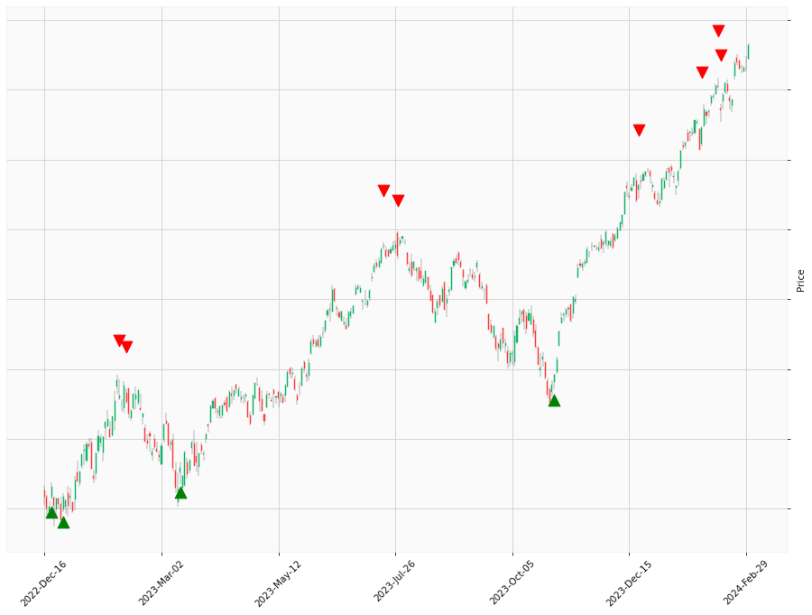

    
# Happy Labz Technologies

<table class="hits">
    <tr>
        <th>Direction</th>
        <th>Date</th>
      </tr>
    <tr>
        <td>Long</td>
        <td>Oct 06 2021 15:00 PST</td>
    </tr>
    <tr>
        <td>Short</td>
        <td>Nov 09 2021 15:00 PST</td>
    </tr>
    <tr>
        <td>Short</td>
        <td>Nov 10 2021 15:00 PST</td>
    </tr>
    <tr>
        <td>Short</td>
        <td>Mar 31 2022 15:00 PST</td>
    </tr>
    <tr>
        <td>Long</td>
        <td>Sep 08 2022 15:00 PST</td>
    </tr>
    <tr>
        <td>Long</td>
        <td>Oct 03 2022 15:00 PST</td>
    </tr>
    <tr>
        <td>Long</td>
        <td>Oct 04 2022 15:00 PST</td>
    </tr>
    <tr>
        <td>Long</td>
        <td>Oct 24 2022 15:00 PST</td>
    </tr>
    <tr>
        <td>Short</td>
        <td>Nov 02 2022 15:00 PST</td>
    </tr>
    <tr>
        <td>Short</td>
        <td>Nov 28 2022 15:00 PST</td>
    </tr>
    <tr>
        <td>Long</td>
        <td>Dec 30 2022 15:00 PST</td>
    </tr>
    <tr>
        <td>Short</td>
        <td>Feb 09 2023 15:00 PST</td>
    </tr>
    <tr>
        <td>Short</td>
        <td>Feb 17 2023 15:00 PST</td>
    </tr>
    <tr>
        <td>Short</td>
        <td>Apr 12 2023 15:00 PST</td>
    </tr>
    <tr>
        <td>Short</td>
        <td>Apr 20 2023 15:00 PST</td>
    </tr>
    
</table>

