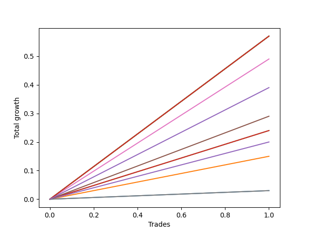

# Long Bernese 001 50 
- Symbol: SPY
- Date Range: 05/27/2022 - 09/30/2022
- Trading Period: 7:20-12:30
- Number of Trades: 1



| Name | Win Percent | Profit | Avg Profit / Trade | Avg Time / Trade |      | Name | Win Percent | Profit | Avg Profit / Trade | Avg Time / Trade |
| ---- | ----------- | ------ | ------------------ | ---------------- | ---- | ---- | ----------- | ------ | ------------------ | ---------------- |
| Sorted By <br> Profit | | | | | | Sorted By <br> Win Percentage ||||
| Eighty-Five | 100.00 | 285.00 | 285.00 | 59:55 |     | Eighty-Five | 100.00 | 285.00 | 285.00 | 59:55 |
| Eighty-Four | 100.00 | 285.00 | 285.00 | 59:55 |     | Eighty-Four | 100.00 | 285.00 | 285.00 | 59:55 |
| Eighty-Three | 100.00 | 285.00 | 285.00 | 59:55 |     | Eighty-Three | 100.00 | 285.00 | 285.00 | 59:55 |
| Eighty-Two | 100.00 | 285.00 | 285.00 | 59:55 |     | Eighty-Two | 100.00 | 285.00 | 285.00 | 59:55 |
| Eighty-One | 100.00 | 285.00 | 285.00 | 59:55 |     | Eighty-One | 100.00 | 285.00 | 285.00 | 59:55 |
| Seven | 100.00 | 285.00 | 285.00 | 59:55 |     | Seven | 100.00 | 285.00 | 285.00 | 59:55 |
| Five | 100.00 | 245.00 | 245.00 | 40:15 |     | Five | 100.00 | 245.00 | 245.00 | 40:15 |
| NEWFI 0000 | 100.00 | 195.00 | 195.00 | 43:05 |     | NEWFI 0000 | 100.00 | 195.00 | 195.00 | 43:05 |
| Four | 100.00 | 145.00 | 145.00 | 38:50 |     | Four | 100.00 | 145.00 | 145.00 | 38:50 |
| Two_C | 100.00 | 120.00 | 120.00 | 22:20 |     | Two_C | 100.00 | 120.00 | 120.00 | 22:20 |
| Two | 100.00 | 120.00 | 120.00 | 22:20 |     | Two | 100.00 | 120.00 | 120.00 | 22:20 |
| Three | 100.00 | 100.00 | 100.00 | 15:05 |     | Three | 100.00 | 100.00 | 100.00 | 15:05 |
| One | 100.00 | 75.00 | 75.00 | 13:25 |     | One | 100.00 | 75.00 | 75.00 | 13:25 |
| Six | 100.00 | 15.00 | 15.00 | 00:10 |     | Six | 100.00 | 15.00 | 15.00 | 00:10 |
| Zero | 100.00 | 15.00 | 15.00 | 12:30 |     | Zero | 100.00 | 15.00 | 15.00 | 12:30 |

## NO STOPLOSS

### Test Zero
* Sell when price hits the middle line of the 20p bollinger
* No Stoploss
* Results:
```
Total Trades: 1
Percent Up: 100.00
Percent Down: 0.00
Total Points Moved Up: 0.03
Potential Profit: 15.00
Total Points Ups: 0.03 Count Ups: 1
Total Points Downs: 0.00 Count Downs: 0
```

<details><summary>Trades</summary>

<code>In: 2022-08-05 11:32:00		Out: 2022-08-05 11:44:30		Total Position Time: 12:30		Total Move Up: 0.03		Total to Date: 0.03</code> <br />


</details>

### Test One
* Sell when the price hits the upper line of the 20p 1std bollinger
* No Stoploss
* Results:
```
Total Trades: 1
Percent Up: 100.00
Percent Down: 0.00
Total Points Moved Up: 0.15
Potential Profit: 75.00
Total Points Ups: 0.15 Count Ups: 1
Total Points Downs: 0.00 Count Downs: 0
```

<details><summary>Trades</summary>

<code>In: 2022-08-05 11:32:00		Out: 2022-08-05 11:45:25		Total Position Time: 13:25		Total Move Up: 0.15		Total to Date: 0.15</code> <br />


</details>

### Test Two
* Sell when the price hits the upper line of the 20p 2std bollinger
* No Stoploss
* Results:
```
Total Trades: 1
Percent Up: 100.00
Percent Down: 0.00
Total Points Moved Up: 0.24
Potential Profit: 120.00
Total Points Ups: 0.24 Count Ups: 1
Total Points Downs: 0.00 Count Downs: 0
```

<details><summary>Trades</summary>

<code>In: 2022-08-05 11:32:00		Out: 2022-08-05 11:54:20		Total Position Time: 22:20		Total Move Up: 0.24		Total to Date: 0.24</code> <br />


</details>

### Test Two_C
* Sell when the price hits the upper line of the 20p 2std bollinger
* No Stoploss
* Results:
```
Total Trades: 1
Percent Up: 100.00
Percent Down: 0.00
Total Points Moved Up: 0.24
Potential Profit: 120.00
Total Points Ups: 0.24 Count Ups: 1
Total Points Downs: 0.00 Count Downs: 0
```

<details><summary>Trades</summary>

<code>In: 2022-08-05 11:32:00		Out: 2022-08-05 11:54:20		Total Position Time: 22:20		Total Move Up: 0.24		Total to Date: 0.24</code> <br />


</details>

### Test Three
* Sell when price hits the middle line of the 50p bollinger
* No Stoploss
* Results:
```
Total Trades: 1
Percent Up: 100.00
Percent Down: 0.00
Total Points Moved Up: 0.20
Potential Profit: 100.00
Total Points Ups: 0.20 Count Ups: 1
Total Points Downs: 0.00 Count Downs: 0
```

<details><summary>Trades</summary>

<code>In: 2022-08-05 11:32:00		Out: 2022-08-05 11:47:05		Total Position Time: 15:05		Total Move Up: 0.20		Total to Date: 0.20</code> <br />


</details>

### Test Four
* Sell when the price hits the upper line of the 50p 1std bollinger
* No Stoploss
* Results:
```
Total Trades: 1
Percent Up: 100.00
Percent Down: 0.00
Total Points Moved Up: 0.29
Potential Profit: 145.00
Total Points Ups: 0.29 Count Ups: 1
Total Points Downs: 0.00 Count Downs: 0
```

<details><summary>Trades</summary>

<code>In: 2022-08-05 11:32:00		Out: 2022-08-05 12:10:50		Total Position Time: 38:50		Total Move Up: 0.29		Total to Date: 0.29</code> <br />


</details>

### Test Five
* Sell when the price hits the upper line of the 50p 2std bollinger
* No Stoploss
* Results:
```
Total Trades: 1
Percent Up: 100.00
Percent Down: 0.00
Total Points Moved Up: 0.49
Potential Profit: 245.00
Total Points Ups: 0.49 Count Ups: 1
Total Points Downs: 0.00 Count Downs: 0
```

<details><summary>Trades</summary>

<code>In: 2022-08-05 11:32:00		Out: 2022-08-05 12:12:15		Total Position Time: 40:15		Total Move Up: 0.49		Total to Date: 0.49</code> <br />


</details>

### Test Six
* Sell when the price hits the middle line of the 1std VWAP
* No Stoploss
* Results:
```
Total Trades: 1
Percent Up: 100.00
Percent Down: 0.00
Total Points Moved Up: 0.03
Potential Profit: 15.00
Total Points Ups: 0.03 Count Ups: 1
Total Points Downs: 0.00 Count Downs: 0
```

<details><summary>Trades</summary>

<code>In: 2022-08-05 11:32:00		Out: 2022-08-05 11:32:10		Total Position Time: 00:10		Total Move Up: 0.03		Total to Date: 0.03</code> <br />


</details>

### Test Seven
* Sell when the price hits the upper line of the 1std VWAP
* No Stoploss
* Results:
```
Total Trades: 1
Percent Up: 100.00
Percent Down: 0.00
Total Points Moved Up: 0.57
Potential Profit: 285.00
Total Points Ups: 0.57 Count Ups: 1
Total Points Downs: 0.00 Count Downs: 0
```

<details><summary>Trades</summary>

<code>In: 2022-08-05 11:32:00		Out: 2022-08-05 12:31:55		Total Position Time: 59:55		Total Move Up: 0.57		Total to Date: 0.57</code> <br />


</details>

## TAKE PROFIT

### Test Eighty-One
* Take Profit of 1 Point
* No Stoploss
* Results:
```
Total Trades: 1
Percent Up: 100.00
Percent Down: 0.00
Total Points Moved Up: 0.57
Potential Profit: 285.00
Total Points Ups: 0.57 Count Ups: 1
Total Points Downs: 0.00 Count Downs: 0
```

<details><summary>Trades</summary>

<code>In: 2022-08-05 11:32:00		Out: 2022-08-05 12:31:55		Total Position Time: 59:55		Total Move Up: 0.57		Total to Date: 0.57</code> <br />


</details>

### Test Eighty-Two
* Take Profit of 2 Point
* No Stoploss
* Results:
```
Total Trades: 1
Percent Up: 100.00
Percent Down: 0.00
Total Points Moved Up: 0.57
Potential Profit: 285.00
Total Points Ups: 0.57 Count Ups: 1
Total Points Downs: 0.00 Count Downs: 0
```

<details><summary>Trades</summary>

<code>In: 2022-08-05 11:32:00		Out: 2022-08-05 12:31:55		Total Position Time: 59:55		Total Move Up: 0.57		Total to Date: 0.57</code> <br />


</details>

### Test Eighty-Three
* Take Profit of 3 Point
* No Stoploss
* Results:
```
Total Trades: 1
Percent Up: 100.00
Percent Down: 0.00
Total Points Moved Up: 0.57
Potential Profit: 285.00
Total Points Ups: 0.57 Count Ups: 1
Total Points Downs: 0.00 Count Downs: 0
```

<details><summary>Trades</summary>

<code>In: 2022-08-05 11:32:00		Out: 2022-08-05 12:31:55		Total Position Time: 59:55		Total Move Up: 0.57		Total to Date: 0.57</code> <br />


</details>

### Test Eighty-Four
* Take Profit of 4 Point
* No Stoploss
* Results:
```
Total Trades: 1
Percent Up: 100.00
Percent Down: 0.00
Total Points Moved Up: 0.57
Potential Profit: 285.00
Total Points Ups: 0.57 Count Ups: 1
Total Points Downs: 0.00 Count Downs: 0
```

<details><summary>Trades</summary>

<code>In: 2022-08-05 11:32:00		Out: 2022-08-05 12:31:55		Total Position Time: 59:55		Total Move Up: 0.57		Total to Date: 0.57</code> <br />


</details>

### Test Eighty-Five
* Take Profit of 5 Point
* No Stoploss
* Results:
```
Total Trades: 1
Percent Up: 100.00
Percent Down: 0.00
Total Points Moved Up: 0.57
Potential Profit: 285.00
Total Points Ups: 0.57 Count Ups: 1
Total Points Downs: 0.00 Count Downs: 0
```

<details><summary>Trades</summary>

<code>In: 2022-08-05 11:32:00		Out: 2022-08-05 12:31:55		Total Position Time: 59:55		Total Move Up: 0.57		Total to Date: 0.57</code> <br />


</details>

## Indicator Exits

### Test NEWFI 0000
* Newfi 0000
* No Stoploss
* Results:
```
Total Trades: 1
Percent Up: 100.00
Percent Down: 0.00
Total Points Moved Up: 0.39
Potential Profit: 195.00
Total Points Ups: 0.39 Count Ups: 1
Total Points Downs: 0.00 Count Downs: 0
```

<details><summary>Trades</summary>

<code>In: 2022-08-05 11:32:00		Out: 2022-08-05 12:15:05		Total Position Time: 43:05		Total Move Up: 0.39		Total to Date: 0.39</code> <br />


</details>