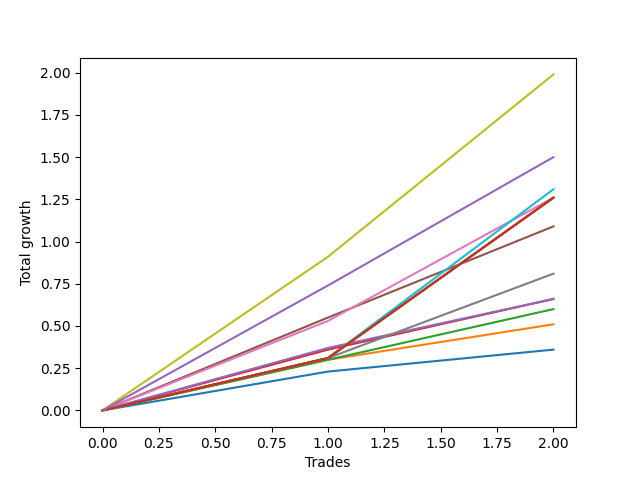

# Long Bernese 002 50 
- Symbol: SPY
- Date Range: 05/27/2022 - 09/30/2022
- Trading Period: 7:20-12:30
- Number of Trades: 2



| Name | Win Percent | Profit | Avg Profit / Trade | Avg Time / Trade |      | Name | Win Percent | Profit | Avg Profit / Trade | Avg Time / Trade |
| ---- | ----------- | ------ | ------------------ | ---------------- | ---- | ---- | ----------- | ------ | ------------------ | ---------------- |
| Sorted By <br> Profit | | | | | | Sorted By <br> Win Percentage ||||
| Seven | 100.00 | 995.00 | 497.50 | 49:45 |     | Seven | 100.00 | 995.00 | 497.50 | 49:45 |
| NEWFI 0000 | 100.00 | 750.00 | 375.00 | 46:35 |     | NEWFI 0000 | 100.00 | 750.00 | 375.00 | 46:35 |
| Eighty-One | 100.00 | 655.00 | 327.50 | 55:05 |     | Eighty-One | 100.00 | 655.00 | 327.50 | 55:05 |
| Eighty-Five | 100.00 | 630.00 | 315.00 | 59:55 |     | Eighty-Five | 100.00 | 630.00 | 315.00 | 59:55 |
| Eighty-Four | 100.00 | 630.00 | 315.00 | 59:55 |     | Eighty-Four | 100.00 | 630.00 | 315.00 | 59:55 |
| Eighty-Three | 100.00 | 630.00 | 315.00 | 59:55 |     | Eighty-Three | 100.00 | 630.00 | 315.00 | 59:55 |
| Eighty-Two | 100.00 | 630.00 | 315.00 | 59:55 |     | Eighty-Two | 100.00 | 630.00 | 315.00 | 59:55 |
| Five | 100.00 | 630.00 | 315.00 | 33:25 |     | Five | 100.00 | 630.00 | 315.00 | 33:25 |
| Four | 100.00 | 545.00 | 272.50 | 19:50 |     | Four | 100.00 | 545.00 | 272.50 | 19:50 |
| Six | 100.00 | 405.00 | 202.50 | 13:35 |     | Six | 100.00 | 405.00 | 202.50 | 13:35 |
| Three | 100.00 | 330.00 | 165.00 | 13:10 |     | Three | 100.00 | 330.00 | 165.00 | 13:10 |
| Two_C | 100.00 | 330.00 | 165.00 | 17:57 |     | Two_C | 100.00 | 330.00 | 165.00 | 17:57 |
| Two | 100.00 | 300.00 | 150.00 | 16:30 |     | Two | 100.00 | 300.00 | 150.00 | 16:30 |
| One | 100.00 | 255.00 | 127.50 | 07:10 |     | One | 100.00 | 255.00 | 127.50 | 07:10 |
| Zero | 100.00 | 180.00 | 90.00 | 01:47 |     | Zero | 100.00 | 180.00 | 90.00 | 01:47 |

## NO STOPLOSS

### Test Zero
* Sell when price hits the middle line of the 20p bollinger
* No Stoploss
* Results:
```
Total Trades: 2
Percent Up: 100.00
Percent Down: 0.00
Total Points Moved Up: 0.36
Potential Profit: 180.00
Total Points Ups: 0.36 Count Ups: 2
Total Points Downs: 0.00 Count Downs: 0
```

<details><summary>Trades</summary>

<code>In: 2022-07-11 08:53:00		Out: 2022-07-11 08:56:05		Total Position Time: 03:05		Total Move Up: 0.23		Total to Date: 0.23</code> <br />
<code>In: 2022-08-18 09:47:00		Out: 2022-08-18 09:47:30		Total Position Time: 00:30		Total Move Up: 0.13		Total to Date: 0.36</code> <br />


</details>

### Test One
* Sell when the price hits the upper line of the 20p 1std bollinger
* No Stoploss
* Results:
```
Total Trades: 2
Percent Up: 100.00
Percent Down: 0.00
Total Points Moved Up: 0.51
Potential Profit: 255.00
Total Points Ups: 0.51 Count Ups: 2
Total Points Downs: 0.00 Count Downs: 0
```

<details><summary>Trades</summary>

<code>In: 2022-07-11 08:53:00		Out: 2022-07-11 08:59:05		Total Position Time: 06:05		Total Move Up: 0.30		Total to Date: 0.30</code> <br />
<code>In: 2022-08-18 09:47:00		Out: 2022-08-18 09:55:15		Total Position Time: 08:15		Total Move Up: 0.21		Total to Date: 0.51</code> <br />


</details>

### Test Two
* Sell when the price hits the upper line of the 20p 2std bollinger
* No Stoploss
* Results:
```
Total Trades: 2
Percent Up: 100.00
Percent Down: 0.00
Total Points Moved Up: 0.60
Potential Profit: 300.00
Total Points Ups: 0.60 Count Ups: 2
Total Points Downs: 0.00 Count Downs: 0
```

<details><summary>Trades</summary>

<code>In: 2022-07-11 08:53:00		Out: 2022-07-11 09:07:00		Total Position Time: 14:00		Total Move Up: 0.30		Total to Date: 0.30</code> <br />
<code>In: 2022-08-18 09:47:00		Out: 2022-08-18 10:06:00		Total Position Time: 19:00		Total Move Up: 0.30		Total to Date: 0.60</code> <br />


</details>

### Test Two_C
* Sell when the price hits the upper line of the 20p 2std bollinger
* No Stoploss
* Results:
```
Total Trades: 2
Percent Up: 100.00
Percent Down: 0.00
Total Points Moved Up: 0.66
Potential Profit: 330.00
Total Points Ups: 0.66 Count Ups: 2
Total Points Downs: 0.00 Count Downs: 0
```

<details><summary>Trades</summary>

<code>In: 2022-07-11 08:53:00		Out: 2022-07-11 09:09:55		Total Position Time: 16:55		Total Move Up: 0.36		Total to Date: 0.36</code> <br />
<code>In: 2022-08-18 09:47:00		Out: 2022-08-18 10:06:00		Total Position Time: 19:00		Total Move Up: 0.30		Total to Date: 0.66</code> <br />


</details>

### Test Three
* Sell when price hits the middle line of the 50p bollinger
* No Stoploss
* Results:
```
Total Trades: 2
Percent Up: 100.00
Percent Down: 0.00
Total Points Moved Up: 0.66
Potential Profit: 330.00
Total Points Ups: 0.66 Count Ups: 2
Total Points Downs: 0.00 Count Downs: 0
```

<details><summary>Trades</summary>

<code>In: 2022-07-11 08:53:00		Out: 2022-07-11 09:00:15		Total Position Time: 07:15		Total Move Up: 0.37		Total to Date: 0.37</code> <br />
<code>In: 2022-08-18 09:47:00		Out: 2022-08-18 10:06:05		Total Position Time: 19:05		Total Move Up: 0.29		Total to Date: 0.66</code> <br />


</details>

### Test Four
* Sell when the price hits the upper line of the 50p 1std bollinger
* No Stoploss
* Results:
```
Total Trades: 2
Percent Up: 100.00
Percent Down: 0.00
Total Points Moved Up: 1.09
Potential Profit: 545.00
Total Points Ups: 1.09 Count Ups: 2
Total Points Downs: 0.00 Count Downs: 0
```

<details><summary>Trades</summary>

<code>In: 2022-07-11 08:53:00		Out: 2022-07-11 09:11:20		Total Position Time: 18:20		Total Move Up: 0.55		Total to Date: 0.55</code> <br />
<code>In: 2022-08-18 09:47:00		Out: 2022-08-18 10:08:20		Total Position Time: 21:20		Total Move Up: 0.54		Total to Date: 1.09</code> <br />


</details>

### Test Five
* Sell when the price hits the upper line of the 50p 2std bollinger
* No Stoploss
* Results:
```
Total Trades: 2
Percent Up: 100.00
Percent Down: 0.00
Total Points Moved Up: 1.26
Potential Profit: 630.00
Total Points Ups: 1.26 Count Ups: 2
Total Points Downs: 0.00 Count Downs: 0
```

<details><summary>Trades</summary>

<code>In: 2022-07-11 08:53:00		Out: 2022-07-11 09:35:10		Total Position Time: 42:10		Total Move Up: 0.53		Total to Date: 0.53</code> <br />
<code>In: 2022-08-18 09:47:00		Out: 2022-08-18 10:11:40		Total Position Time: 24:40		Total Move Up: 0.73		Total to Date: 1.26</code> <br />


</details>

### Test Six
* Sell when the price hits the middle line of the 1std VWAP
* No Stoploss
* Results:
```
Total Trades: 2
Percent Up: 100.00
Percent Down: 0.00
Total Points Moved Up: 0.81
Potential Profit: 405.00
Total Points Ups: 0.81 Count Ups: 2
Total Points Downs: 0.00 Count Downs: 0
```

<details><summary>Trades</summary>

<code>In: 2022-07-11 08:53:00		Out: 2022-07-11 08:59:35		Total Position Time: 06:35		Total Move Up: 0.31		Total to Date: 0.31</code> <br />
<code>In: 2022-08-18 09:47:00		Out: 2022-08-18 10:07:35		Total Position Time: 20:35		Total Move Up: 0.50		Total to Date: 0.81</code> <br />


</details>

### Test Seven
* Sell when the price hits the upper line of the 1std VWAP
* No Stoploss
* Results:
```
Total Trades: 2
Percent Up: 100.00
Percent Down: 0.00
Total Points Moved Up: 1.99
Potential Profit: 995.00
Total Points Ups: 1.99 Count Ups: 2
Total Points Downs: 0.00 Count Downs: 0
```

<details><summary>Trades</summary>

<code>In: 2022-07-11 08:53:00		Out: 2022-07-11 09:39:35		Total Position Time: 46:35		Total Move Up: 0.91		Total to Date: 0.91</code> <br />
<code>In: 2022-08-18 09:47:00		Out: 2022-08-18 10:39:55		Total Position Time: 52:55		Total Move Up: 1.08		Total to Date: 1.99</code> <br />


</details>

## TAKE PROFIT

### Test Eighty-One
* Take Profit of 1 Point
* No Stoploss
* Results:
```
Total Trades: 2
Percent Up: 100.00
Percent Down: 0.00
Total Points Moved Up: 1.31
Potential Profit: 655.00
Total Points Ups: 1.31 Count Ups: 2
Total Points Downs: 0.00 Count Downs: 0
```

<details><summary>Trades</summary>

<code>In: 2022-07-11 08:53:00		Out: 2022-07-11 09:52:55		Total Position Time: 59:55		Total Move Up: 0.31		Total to Date: 0.31</code> <br />
<code>In: 2022-08-18 09:47:00		Out: 2022-08-18 10:37:15		Total Position Time: 50:15		Total Move Up: 1.00		Total to Date: 1.31</code> <br />


</details>

### Test Eighty-Two
* Take Profit of 2 Point
* No Stoploss
* Results:
```
Total Trades: 2
Percent Up: 100.00
Percent Down: 0.00
Total Points Moved Up: 1.26
Potential Profit: 630.00
Total Points Ups: 1.26 Count Ups: 2
Total Points Downs: 0.00 Count Downs: 0
```

<details><summary>Trades</summary>

<code>In: 2022-07-11 08:53:00		Out: 2022-07-11 09:52:55		Total Position Time: 59:55		Total Move Up: 0.31		Total to Date: 0.31</code> <br />
<code>In: 2022-08-18 09:47:00		Out: 2022-08-18 10:46:55		Total Position Time: 59:55		Total Move Up: 0.95		Total to Date: 1.26</code> <br />


</details>

### Test Eighty-Three
* Take Profit of 3 Point
* No Stoploss
* Results:
```
Total Trades: 2
Percent Up: 100.00
Percent Down: 0.00
Total Points Moved Up: 1.26
Potential Profit: 630.00
Total Points Ups: 1.26 Count Ups: 2
Total Points Downs: 0.00 Count Downs: 0
```

<details><summary>Trades</summary>

<code>In: 2022-07-11 08:53:00		Out: 2022-07-11 09:52:55		Total Position Time: 59:55		Total Move Up: 0.31		Total to Date: 0.31</code> <br />
<code>In: 2022-08-18 09:47:00		Out: 2022-08-18 10:46:55		Total Position Time: 59:55		Total Move Up: 0.95		Total to Date: 1.26</code> <br />


</details>

### Test Eighty-Four
* Take Profit of 4 Point
* No Stoploss
* Results:
```
Total Trades: 2
Percent Up: 100.00
Percent Down: 0.00
Total Points Moved Up: 1.26
Potential Profit: 630.00
Total Points Ups: 1.26 Count Ups: 2
Total Points Downs: 0.00 Count Downs: 0
```

<details><summary>Trades</summary>

<code>In: 2022-07-11 08:53:00		Out: 2022-07-11 09:52:55		Total Position Time: 59:55		Total Move Up: 0.31		Total to Date: 0.31</code> <br />
<code>In: 2022-08-18 09:47:00		Out: 2022-08-18 10:46:55		Total Position Time: 59:55		Total Move Up: 0.95		Total to Date: 1.26</code> <br />


</details>

### Test Eighty-Five
* Take Profit of 5 Point
* No Stoploss
* Results:
```
Total Trades: 2
Percent Up: 100.00
Percent Down: 0.00
Total Points Moved Up: 1.26
Potential Profit: 630.00
Total Points Ups: 1.26 Count Ups: 2
Total Points Downs: 0.00 Count Downs: 0
```

<details><summary>Trades</summary>

<code>In: 2022-07-11 08:53:00		Out: 2022-07-11 09:52:55		Total Position Time: 59:55		Total Move Up: 0.31		Total to Date: 0.31</code> <br />
<code>In: 2022-08-18 09:47:00		Out: 2022-08-18 10:46:55		Total Position Time: 59:55		Total Move Up: 0.95		Total to Date: 1.26</code> <br />


</details>

## Indicator Exits

### Test NEWFI 0000
* Newfi 0000
* No Stoploss
* Results:
```
Total Trades: 2
Percent Up: 100.00
Percent Down: 0.00
Total Points Moved Up: 1.50
Potential Profit: 750.00
Total Points Ups: 1.50 Count Ups: 2
Total Points Downs: 0.00 Count Downs: 0
```

<details><summary>Trades</summary>

<code>In: 2022-07-11 08:53:00		Out: 2022-07-11 09:41:05		Total Position Time: 48:05		Total Move Up: 0.74		Total to Date: 0.74</code> <br />
<code>In: 2022-08-18 09:47:00		Out: 2022-08-18 10:32:05		Total Position Time: 45:05		Total Move Up: 0.76		Total to Date: 1.50</code> <br />


</details>