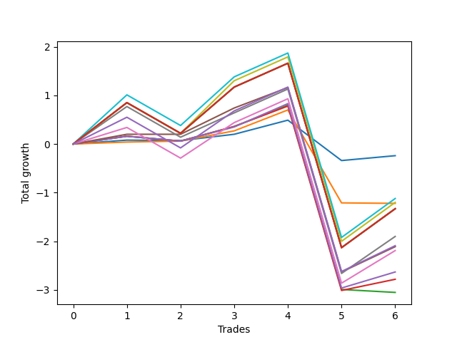

# Long Bernese 003 1v 
- Symbol: SPY
- Date Range: 05/27/2022 - 09/30/2022
- Trading Period: 7:20-12:30
- Number of Trades: 6



| Name | Win Percent | Profit | Avg Profit / Trade | Avg Time / Trade |      | Name | Win Percent | Profit | Avg Profit / Trade | Avg Time / Trade |
| ---- | ----------- | ------ | ------------------ | ---------------- | ---- | ---- | ----------- | ------ | ------------------ | ---------------- |
| Sorted By <br> Profit | | | | | | Sorted By <br> Win Percentage ||||
| Zero | 66.67 | -120.00 | -20.00 | 07:39 |     | Four | 83.33 | -1055.00 | -175.83 | 41:13 |
| Eighty-One | 66.67 | -560.00 | -93.33 | 57:42 |     | Zero | 66.67 | -120.00 | -20.00 | 07:39 |
| Seven | 66.67 | -600.00 | -100.00 | 58:45 |     | Eighty-One | 66.67 | -560.00 | -93.33 | 57:42 |
| One | 66.67 | -610.00 | -101.67 | 18:35 |     | Seven | 66.67 | -600.00 | -100.00 | 58:45 |
| Eighty-Five | 66.67 | -665.00 | -110.83 | 59:55 |     | One | 66.67 | -610.00 | -101.67 | 18:35 |
| Eighty-Four | 66.67 | -665.00 | -110.83 | 59:55 |     | Eighty-Five | 66.67 | -665.00 | -110.83 | 59:55 |
| Eighty-Three | 66.67 | -665.00 | -110.83 | 59:55 |     | Eighty-Four | 66.67 | -665.00 | -110.83 | 59:55 |
| Eighty-Two | 66.67 | -665.00 | -110.83 | 59:55 |     | Eighty-Three | 66.67 | -665.00 | -110.83 | 59:55 |
| Six | 66.67 | -950.00 | -158.33 | 48:58 |     | Eighty-Two | 66.67 | -665.00 | -110.83 | 59:55 |
| NEWFI 0000 | 66.67 | -1045.00 | -174.17 | 52:10 |     | Six | 66.67 | -950.00 | -158.33 | 48:58 |
| Four | 83.33 | -1055.00 | -175.83 | 41:13 |     | NEWFI 0000 | 66.67 | -1045.00 | -174.17 | 52:10 |
| Five | 66.67 | -1095.00 | -182.50 | 48:35 |     | Five | 66.67 | -1095.00 | -182.50 | 48:35 |
| Three | 66.67 | -1315.00 | -219.17 | 29:35 |     | Three | 66.67 | -1315.00 | -219.17 | 29:35 |
| Two_C | 66.67 | -1390.00 | -231.67 | 35:00 |     | Two_C | 66.67 | -1390.00 | -231.67 | 35:00 |
| Two | 50.00 | -1525.00 | -254.17 | 30:01 |     | Two | 50.00 | -1525.00 | -254.17 | 30:01 |

## NO STOPLOSS

### Test Zero
* Sell when price hits the middle line of the 20p bollinger
* No Stoploss
* Results:
```
Total Trades: 6
Percent Up: 66.67
Percent Down: 33.33
Total Points Moved Up: -0.24
Potential Profit: -120.00
Total Points Ups: 0.60 Count Ups: 4
Total Points Downs: -0.84 Count Downs: 2
```

<details><summary>Trades</summary>

<code>In: 2022-07-08 09:45:00		Out: 2022-07-08 09:48:45		Total Position Time: 03:45		Total Move Up: 0.08		Total to Date: 0.08</code> <br />
<code>In: 2022-07-25 10:58:00		Out: 2022-07-25 11:06:20		Total Position Time: 08:20		Total Move Up: -0.01		Total to Date: 0.07</code> <br />
<code>In: 2022-08-18 09:47:00		Out: 2022-08-18 09:47:30		Total Position Time: 00:30		Total Move Up: 0.13		Total to Date: 0.20</code> <br />
<code>In: 2022-08-25 09:19:00		Out: 2022-08-25 09:26:05		Total Position Time: 07:05		Total Move Up: 0.29		Total to Date: 0.49</code> <br />
<code>In: 2022-09-02 09:39:00		Out: 2022-09-02 09:56:40		Total Position Time: 17:40		Total Move Up: -0.83		Total to Date: -0.34</code> <br />
<code>In: 2022-09-12 08:59:00		Out: 2022-09-12 09:07:35		Total Position Time: 08:35		Total Move Up: 0.10		Total to Date: -0.24</code> <br />


</details>

### Test One
* Sell when the price hits the upper line of the 20p 1std bollinger
* No Stoploss
* Results:
```
Total Trades: 6
Percent Up: 66.67
Percent Down: 33.33
Total Points Moved Up: -1.22
Potential Profit: -610.00
Total Points Ups: 0.70 Count Ups: 4
Total Points Downs: -1.92 Count Downs: 2
```

<details><summary>Trades</summary>

<code>In: 2022-07-08 09:45:00		Out: 2022-07-08 10:09:40		Total Position Time: 24:40		Total Move Up: 0.04		Total to Date: 0.04</code> <br />
<code>In: 2022-07-25 10:58:00		Out: 2022-07-25 11:11:20		Total Position Time: 13:20		Total Move Up: 0.02		Total to Date: 0.06</code> <br />
<code>In: 2022-08-18 09:47:00		Out: 2022-08-18 09:55:15		Total Position Time: 08:15		Total Move Up: 0.21		Total to Date: 0.27</code> <br />
<code>In: 2022-08-25 09:19:00		Out: 2022-08-25 09:28:20		Total Position Time: 09:20		Total Move Up: 0.43		Total to Date: 0.70</code> <br />
<code>In: 2022-09-02 09:39:00		Out: 2022-09-02 10:18:40		Total Position Time: 39:40		Total Move Up: -1.91		Total to Date: -1.21</code> <br />
<code>In: 2022-09-12 08:59:00		Out: 2022-09-12 09:15:20		Total Position Time: 16:20		Total Move Up: -0.01		Total to Date: -1.22</code> <br />


</details>

### Test Two
* Sell when the price hits the upper line of the 20p 2std bollinger
* No Stoploss
* Results:
```
Total Trades: 6
Percent Up: 50.00
Percent Down: 50.00
Total Points Moved Up: -3.05
Potential Profit: -1525.00
Total Points Ups: 0.90 Count Ups: 3
Total Points Downs: -3.95 Count Downs: 3
```

<details><summary>Trades</summary>

<code>In: 2022-07-08 09:45:00		Out: 2022-07-08 10:11:10		Total Position Time: 26:10		Total Move Up: 0.16		Total to Date: 0.16</code> <br />
<code>In: 2022-07-25 10:58:00		Out: 2022-07-25 11:35:45		Total Position Time: 37:45		Total Move Up: -0.10		Total to Date: 0.06</code> <br />
<code>In: 2022-08-18 09:47:00		Out: 2022-08-18 10:06:00		Total Position Time: 19:00		Total Move Up: 0.30		Total to Date: 0.36</code> <br />
<code>In: 2022-08-25 09:19:00		Out: 2022-08-25 09:33:55		Total Position Time: 14:55		Total Move Up: 0.44		Total to Date: 0.80</code> <br />
<code>In: 2022-09-02 09:39:00		Out: 2022-09-02 10:38:55		Total Position Time: 59:55		Total Move Up: -3.79		Total to Date: -2.99</code> <br />
<code>In: 2022-09-12 08:59:00		Out: 2022-09-12 09:21:25		Total Position Time: 22:25		Total Move Up: -0.06		Total to Date: -3.05</code> <br />


</details>

### Test Two_C
* Sell when the price hits the upper line of the 20p 2std bollinger
* No Stoploss
* Results:
```
Total Trades: 6
Percent Up: 66.67
Percent Down: 33.33
Total Points Moved Up: -2.78
Potential Profit: -1390.00
Total Points Ups: 1.11 Count Ups: 4
Total Points Downs: -3.89 Count Downs: 2
```

<details><summary>Trades</summary>

<code>In: 2022-07-08 09:45:00		Out: 2022-07-08 10:11:10		Total Position Time: 26:10		Total Move Up: 0.16		Total to Date: 0.16</code> <br />
<code>In: 2022-07-25 10:58:00		Out: 2022-07-25 11:35:45		Total Position Time: 37:45		Total Move Up: -0.10		Total to Date: 0.06</code> <br />
<code>In: 2022-08-18 09:47:00		Out: 2022-08-18 10:06:00		Total Position Time: 19:00		Total Move Up: 0.30		Total to Date: 0.36</code> <br />
<code>In: 2022-08-25 09:19:00		Out: 2022-08-25 10:01:45		Total Position Time: 42:45		Total Move Up: 0.42		Total to Date: 0.78</code> <br />
<code>In: 2022-09-02 09:39:00		Out: 2022-09-02 10:38:55		Total Position Time: 59:55		Total Move Up: -3.79		Total to Date: -3.01</code> <br />
<code>In: 2022-09-12 08:59:00		Out: 2022-09-12 09:23:25		Total Position Time: 24:25		Total Move Up: 0.23		Total to Date: -2.78</code> <br />


</details>

### Test Three
* Sell when price hits the middle line of the 50p bollinger
* No Stoploss
* Results:
```
Total Trades: 6
Percent Up: 66.67
Percent Down: 33.33
Total Points Moved Up: -2.63
Potential Profit: -1315.00
Total Points Ups: 1.26 Count Ups: 4
Total Points Downs: -3.89 Count Downs: 2
```

<details><summary>Trades</summary>

<code>In: 2022-07-08 09:45:00		Out: 2022-07-08 10:11:05		Total Position Time: 26:05		Total Move Up: 0.16		Total to Date: 0.16</code> <br />
<code>In: 2022-07-25 10:58:00		Out: 2022-07-25 11:35:45		Total Position Time: 37:45		Total Move Up: -0.10		Total to Date: 0.06</code> <br />
<code>In: 2022-08-18 09:47:00		Out: 2022-08-18 10:06:05		Total Position Time: 19:05		Total Move Up: 0.29		Total to Date: 0.35</code> <br />
<code>In: 2022-08-25 09:19:00		Out: 2022-08-25 09:28:35		Total Position Time: 09:35		Total Move Up: 0.48		Total to Date: 0.83</code> <br />
<code>In: 2022-09-02 09:39:00		Out: 2022-09-02 10:38:55		Total Position Time: 59:55		Total Move Up: -3.79		Total to Date: -2.96</code> <br />
<code>In: 2022-09-12 08:59:00		Out: 2022-09-12 09:24:05		Total Position Time: 25:05		Total Move Up: 0.33		Total to Date: -2.63</code> <br />


</details>

### Test Four
* Sell when the price hits the upper line of the 50p 1std bollinger
* No Stoploss
* Results:
```
Total Trades: 6
Percent Up: 83.33
Percent Down: 16.67
Total Points Moved Up: -2.11
Potential Profit: -1055.00
Total Points Ups: 1.68 Count Ups: 5
Total Points Downs: -3.79 Count Downs: 1
```

<details><summary>Trades</summary>

<code>In: 2022-07-08 09:45:00		Out: 2022-07-08 10:26:30		Total Position Time: 41:30		Total Move Up: 0.20		Total to Date: 0.20</code> <br />
<code>In: 2022-07-25 10:58:00		Out: 2022-07-25 11:41:00		Total Position Time: 43:00		Total Move Up: 0.00		Total to Date: 0.20</code> <br />
<code>In: 2022-08-18 09:47:00		Out: 2022-08-18 10:08:20		Total Position Time: 21:20		Total Move Up: 0.54		Total to Date: 0.74</code> <br />
<code>In: 2022-08-25 09:19:00		Out: 2022-08-25 10:01:45		Total Position Time: 42:45		Total Move Up: 0.42		Total to Date: 1.16</code> <br />
<code>In: 2022-09-02 09:39:00		Out: 2022-09-02 10:38:55		Total Position Time: 59:55		Total Move Up: -3.79		Total to Date: -2.63</code> <br />
<code>In: 2022-09-12 08:59:00		Out: 2022-09-12 09:37:50		Total Position Time: 38:50		Total Move Up: 0.52		Total to Date: -2.11</code> <br />


</details>

### Test Five
* Sell when the price hits the upper line of the 50p 2std bollinger
* No Stoploss
* Results:
```
Total Trades: 6
Percent Up: 66.67
Percent Down: 33.33
Total Points Moved Up: -2.19
Potential Profit: -1095.00
Total Points Ups: 2.23 Count Ups: 4
Total Points Downs: -4.42 Count Downs: 2
```

<details><summary>Trades</summary>

<code>In: 2022-07-08 09:45:00		Out: 2022-07-08 10:26:55		Total Position Time: 41:55		Total Move Up: 0.34		Total to Date: 0.34</code> <br />
<code>In: 2022-07-25 10:58:00		Out: 2022-07-25 11:57:55		Total Position Time: 59:55		Total Move Up: -0.63		Total to Date: -0.29</code> <br />
<code>In: 2022-08-18 09:47:00		Out: 2022-08-18 10:11:40		Total Position Time: 24:40		Total Move Up: 0.73		Total to Date: 0.44</code> <br />
<code>In: 2022-08-25 09:19:00		Out: 2022-08-25 10:18:55		Total Position Time: 59:55		Total Move Up: 0.49		Total to Date: 0.93</code> <br />
<code>In: 2022-09-02 09:39:00		Out: 2022-09-02 10:38:55		Total Position Time: 59:55		Total Move Up: -3.79		Total to Date: -2.86</code> <br />
<code>In: 2022-09-12 08:59:00		Out: 2022-09-12 09:44:15		Total Position Time: 45:15		Total Move Up: 0.67		Total to Date: -2.19</code> <br />


</details>

### Test Six
* Sell when the price hits the middle line of the 1std VWAP
* No Stoploss
* Results:
```
Total Trades: 6
Percent Up: 66.67
Percent Down: 33.33
Total Points Moved Up: -1.90
Potential Profit: -950.00
Total Points Ups: 2.52 Count Ups: 4
Total Points Downs: -4.42 Count Downs: 2
```

<details><summary>Trades</summary>

<code>In: 2022-07-08 09:45:00		Out: 2022-07-08 10:29:45		Total Position Time: 44:45		Total Move Up: 0.77		Total to Date: 0.77</code> <br />
<code>In: 2022-07-25 10:58:00		Out: 2022-07-25 11:57:55		Total Position Time: 59:55		Total Move Up: -0.63		Total to Date: 0.14</code> <br />
<code>In: 2022-08-18 09:47:00		Out: 2022-08-18 10:07:35		Total Position Time: 20:35		Total Move Up: 0.50		Total to Date: 0.64</code> <br />
<code>In: 2022-08-25 09:19:00		Out: 2022-08-25 10:18:55		Total Position Time: 59:55		Total Move Up: 0.49		Total to Date: 1.13</code> <br />
<code>In: 2022-09-02 09:39:00		Out: 2022-09-02 10:38:55		Total Position Time: 59:55		Total Move Up: -3.79		Total to Date: -2.66</code> <br />
<code>In: 2022-09-12 08:59:00		Out: 2022-09-12 09:47:45		Total Position Time: 48:45		Total Move Up: 0.76		Total to Date: -1.90</code> <br />


</details>

### Test Seven
* Sell when the price hits the upper line of the 1std VWAP
* No Stoploss
* Results:
```
Total Trades: 6
Percent Up: 66.67
Percent Down: 33.33
Total Points Moved Up: -1.20
Potential Profit: -600.00
Total Points Ups: 3.22 Count Ups: 4
Total Points Downs: -4.42 Count Downs: 2
```

<details><summary>Trades</summary>

<code>In: 2022-07-08 09:45:00		Out: 2022-07-08 10:44:55		Total Position Time: 59:55		Total Move Up: 0.85		Total to Date: 0.85</code> <br />
<code>In: 2022-07-25 10:58:00		Out: 2022-07-25 11:57:55		Total Position Time: 59:55		Total Move Up: -0.63		Total to Date: 0.22</code> <br />
<code>In: 2022-08-18 09:47:00		Out: 2022-08-18 10:39:55		Total Position Time: 52:55		Total Move Up: 1.08		Total to Date: 1.30</code> <br />
<code>In: 2022-08-25 09:19:00		Out: 2022-08-25 10:18:55		Total Position Time: 59:55		Total Move Up: 0.49		Total to Date: 1.79</code> <br />
<code>In: 2022-09-02 09:39:00		Out: 2022-09-02 10:38:55		Total Position Time: 59:55		Total Move Up: -3.79		Total to Date: -2.00</code> <br />
<code>In: 2022-09-12 08:59:00		Out: 2022-09-12 09:58:55		Total Position Time: 59:55		Total Move Up: 0.80		Total to Date: -1.20</code> <br />


</details>

## TAKE PROFIT

### Test Eighty-One
* Take Profit of 1 Point
* No Stoploss
* Results:
```
Total Trades: 6
Percent Up: 66.67
Percent Down: 33.33
Total Points Moved Up: -1.12
Potential Profit: -560.00
Total Points Ups: 3.30 Count Ups: 4
Total Points Downs: -4.42 Count Downs: 2
```

<details><summary>Trades</summary>

<code>In: 2022-07-08 09:45:00		Out: 2022-07-08 10:41:20		Total Position Time: 56:20		Total Move Up: 1.01		Total to Date: 1.01</code> <br />
<code>In: 2022-07-25 10:58:00		Out: 2022-07-25 11:57:55		Total Position Time: 59:55		Total Move Up: -0.63		Total to Date: 0.38</code> <br />
<code>In: 2022-08-18 09:47:00		Out: 2022-08-18 10:37:15		Total Position Time: 50:15		Total Move Up: 1.00		Total to Date: 1.38</code> <br />
<code>In: 2022-08-25 09:19:00		Out: 2022-08-25 10:18:55		Total Position Time: 59:55		Total Move Up: 0.49		Total to Date: 1.87</code> <br />
<code>In: 2022-09-02 09:39:00		Out: 2022-09-02 10:38:55		Total Position Time: 59:55		Total Move Up: -3.79		Total to Date: -1.92</code> <br />
<code>In: 2022-09-12 08:59:00		Out: 2022-09-12 09:58:55		Total Position Time: 59:55		Total Move Up: 0.80		Total to Date: -1.12</code> <br />


</details>

### Test Eighty-Two
* Take Profit of 2 Point
* No Stoploss
* Results:
```
Total Trades: 6
Percent Up: 66.67
Percent Down: 33.33
Total Points Moved Up: -1.33
Potential Profit: -665.00
Total Points Ups: 3.09 Count Ups: 4
Total Points Downs: -4.42 Count Downs: 2
```

<details><summary>Trades</summary>

<code>In: 2022-07-08 09:45:00		Out: 2022-07-08 10:44:55		Total Position Time: 59:55		Total Move Up: 0.85		Total to Date: 0.85</code> <br />
<code>In: 2022-07-25 10:58:00		Out: 2022-07-25 11:57:55		Total Position Time: 59:55		Total Move Up: -0.63		Total to Date: 0.22</code> <br />
<code>In: 2022-08-18 09:47:00		Out: 2022-08-18 10:46:55		Total Position Time: 59:55		Total Move Up: 0.95		Total to Date: 1.17</code> <br />
<code>In: 2022-08-25 09:19:00		Out: 2022-08-25 10:18:55		Total Position Time: 59:55		Total Move Up: 0.49		Total to Date: 1.66</code> <br />
<code>In: 2022-09-02 09:39:00		Out: 2022-09-02 10:38:55		Total Position Time: 59:55		Total Move Up: -3.79		Total to Date: -2.13</code> <br />
<code>In: 2022-09-12 08:59:00		Out: 2022-09-12 09:58:55		Total Position Time: 59:55		Total Move Up: 0.80		Total to Date: -1.33</code> <br />


</details>

### Test Eighty-Three
* Take Profit of 3 Point
* No Stoploss
* Results:
```
Total Trades: 6
Percent Up: 66.67
Percent Down: 33.33
Total Points Moved Up: -1.33
Potential Profit: -665.00
Total Points Ups: 3.09 Count Ups: 4
Total Points Downs: -4.42 Count Downs: 2
```

<details><summary>Trades</summary>

<code>In: 2022-07-08 09:45:00		Out: 2022-07-08 10:44:55		Total Position Time: 59:55		Total Move Up: 0.85		Total to Date: 0.85</code> <br />
<code>In: 2022-07-25 10:58:00		Out: 2022-07-25 11:57:55		Total Position Time: 59:55		Total Move Up: -0.63		Total to Date: 0.22</code> <br />
<code>In: 2022-08-18 09:47:00		Out: 2022-08-18 10:46:55		Total Position Time: 59:55		Total Move Up: 0.95		Total to Date: 1.17</code> <br />
<code>In: 2022-08-25 09:19:00		Out: 2022-08-25 10:18:55		Total Position Time: 59:55		Total Move Up: 0.49		Total to Date: 1.66</code> <br />
<code>In: 2022-09-02 09:39:00		Out: 2022-09-02 10:38:55		Total Position Time: 59:55		Total Move Up: -3.79		Total to Date: -2.13</code> <br />
<code>In: 2022-09-12 08:59:00		Out: 2022-09-12 09:58:55		Total Position Time: 59:55		Total Move Up: 0.80		Total to Date: -1.33</code> <br />


</details>

### Test Eighty-Four
* Take Profit of 4 Point
* No Stoploss
* Results:
```
Total Trades: 6
Percent Up: 66.67
Percent Down: 33.33
Total Points Moved Up: -1.33
Potential Profit: -665.00
Total Points Ups: 3.09 Count Ups: 4
Total Points Downs: -4.42 Count Downs: 2
```

<details><summary>Trades</summary>

<code>In: 2022-07-08 09:45:00		Out: 2022-07-08 10:44:55		Total Position Time: 59:55		Total Move Up: 0.85		Total to Date: 0.85</code> <br />
<code>In: 2022-07-25 10:58:00		Out: 2022-07-25 11:57:55		Total Position Time: 59:55		Total Move Up: -0.63		Total to Date: 0.22</code> <br />
<code>In: 2022-08-18 09:47:00		Out: 2022-08-18 10:46:55		Total Position Time: 59:55		Total Move Up: 0.95		Total to Date: 1.17</code> <br />
<code>In: 2022-08-25 09:19:00		Out: 2022-08-25 10:18:55		Total Position Time: 59:55		Total Move Up: 0.49		Total to Date: 1.66</code> <br />
<code>In: 2022-09-02 09:39:00		Out: 2022-09-02 10:38:55		Total Position Time: 59:55		Total Move Up: -3.79		Total to Date: -2.13</code> <br />
<code>In: 2022-09-12 08:59:00		Out: 2022-09-12 09:58:55		Total Position Time: 59:55		Total Move Up: 0.80		Total to Date: -1.33</code> <br />


</details>

### Test Eighty-Five
* Take Profit of 5 Point
* No Stoploss
* Results:
```
Total Trades: 6
Percent Up: 66.67
Percent Down: 33.33
Total Points Moved Up: -1.33
Potential Profit: -665.00
Total Points Ups: 3.09 Count Ups: 4
Total Points Downs: -4.42 Count Downs: 2
```

<details><summary>Trades</summary>

<code>In: 2022-07-08 09:45:00		Out: 2022-07-08 10:44:55		Total Position Time: 59:55		Total Move Up: 0.85		Total to Date: 0.85</code> <br />
<code>In: 2022-07-25 10:58:00		Out: 2022-07-25 11:57:55		Total Position Time: 59:55		Total Move Up: -0.63		Total to Date: 0.22</code> <br />
<code>In: 2022-08-18 09:47:00		Out: 2022-08-18 10:46:55		Total Position Time: 59:55		Total Move Up: 0.95		Total to Date: 1.17</code> <br />
<code>In: 2022-08-25 09:19:00		Out: 2022-08-25 10:18:55		Total Position Time: 59:55		Total Move Up: 0.49		Total to Date: 1.66</code> <br />
<code>In: 2022-09-02 09:39:00		Out: 2022-09-02 10:38:55		Total Position Time: 59:55		Total Move Up: -3.79		Total to Date: -2.13</code> <br />
<code>In: 2022-09-12 08:59:00		Out: 2022-09-12 09:58:55		Total Position Time: 59:55		Total Move Up: 0.80		Total to Date: -1.33</code> <br />


</details>

## Indicator Exits

### Test NEWFI 0000
* Newfi 0000
* No Stoploss
* Results:
```
Total Trades: 6
Percent Up: 66.67
Percent Down: 33.33
Total Points Moved Up: -2.09
Potential Profit: -1045.00
Total Points Ups: 2.33 Count Ups: 4
Total Points Downs: -4.42 Count Downs: 2
```

<details><summary>Trades</summary>

<code>In: 2022-07-08 09:45:00		Out: 2022-07-08 10:31:05		Total Position Time: 46:05		Total Move Up: 0.55		Total to Date: 0.55</code> <br />
<code>In: 2022-07-25 10:58:00		Out: 2022-07-25 11:57:55		Total Position Time: 59:55		Total Move Up: -0.63		Total to Date: -0.08</code> <br />
<code>In: 2022-08-18 09:47:00		Out: 2022-08-18 10:32:05		Total Position Time: 45:05		Total Move Up: 0.76		Total to Date: 0.68</code> <br />
<code>In: 2022-08-25 09:19:00		Out: 2022-08-25 10:18:55		Total Position Time: 59:55		Total Move Up: 0.49		Total to Date: 1.17</code> <br />
<code>In: 2022-09-02 09:39:00		Out: 2022-09-02 10:38:55		Total Position Time: 59:55		Total Move Up: -3.79		Total to Date: -2.62</code> <br />
<code>In: 2022-09-12 08:59:00		Out: 2022-09-12 09:41:05		Total Position Time: 42:05		Total Move Up: 0.53		Total to Date: -2.09</code> <br />


</details>