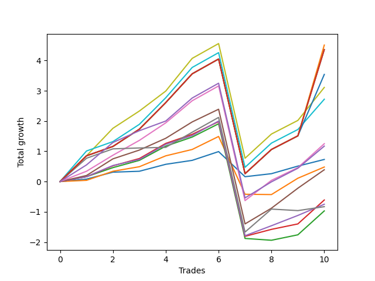

# Long Bernese 003 50 
- Symbol: SPY
- Date Range: 05/27/2022 - 09/30/2022
- Trading Period: 7:20-12:30
- Number of Trades: 10



| Name | Win Percent | Profit | Avg Profit / Trade | Avg Time / Trade |      | Name | Win Percent | Profit | Avg Profit / Trade | Avg Time / Trade |
| ---- | ----------- | ------ | ------------------ | ---------------- | ---- | ---- | ----------- | ------ | ------------------ | ---------------- |
| Sorted By <br> Profit | | | | | | Sorted By <br> Win Percentage ||||
| Eighty-Three | 90.00 | 2255.00 | 225.50 | 58:39 |     | Eighty-Three | 90.00 | 2255.00 | 225.50 | 58:39 |
| Eighty-Five | 90.00 | 2180.00 | 218.00 | 59:55 |     | Eighty-Five | 90.00 | 2180.00 | 218.00 | 59:55 |
| Eighty-Four | 90.00 | 2180.00 | 218.00 | 59:55 |     | Eighty-Four | 90.00 | 2180.00 | 218.00 | 59:55 |
| Eighty-Two | 90.00 | 1770.00 | 177.00 | 57:45 |     | Eighty-Two | 90.00 | 1770.00 | 177.00 | 57:45 |
| Seven | 90.00 | 1555.00 | 155.50 | 54:03 |     | Seven | 90.00 | 1555.00 | 155.50 | 54:03 |
| Eighty-One | 90.00 | 1360.00 | 136.00 | 56:02 |     | Eighty-One | 90.00 | 1360.00 | 136.00 | 56:02 |
| Five | 90.00 | 625.00 | 62.50 | 43:02 |     | Five | 90.00 | 625.00 | 62.50 | 43:02 |
| NEWFI 0000 | 90.00 | 585.00 | 58.50 | 47:20 |     | NEWFI 0000 | 90.00 | 585.00 | 58.50 | 47:20 |
| Zero | 90.00 | 365.00 | 36.50 | 06:16 |     | Zero | 90.00 | 365.00 | 36.50 | 06:16 |
| One | 80.00 | 240.00 | 24.00 | 13:51 |     | Four | 90.00 | 195.00 | 19.50 | 32:27 |
| Four | 90.00 | 195.00 | 19.50 | 32:27 |     | Two_C | 90.00 | -305.00 | -30.50 | 29:18 |
| Two_C | 90.00 | -305.00 | -30.50 | 29:18 |     | Three | 90.00 | -375.00 | -37.50 | 18:56 |
| Three | 90.00 | -375.00 | -37.50 | 18:56 |     | One | 80.00 | 240.00 | 24.00 | 13:51 |
| Six | 80.00 | -415.00 | -41.50 | 24:17 |     | Six | 80.00 | -415.00 | -41.50 | 24:17 |
| Two | 80.00 | -485.00 | -48.50 | 25:53 |     | Two | 80.00 | -485.00 | -48.50 | 25:53 |

## NO STOPLOSS

### Test Zero
* Sell when price hits the middle line of the 20p bollinger
* No Stoploss
* Results:
```
Total Trades: 10
Percent Up: 90.00
Percent Down: 10.00
Total Points Moved Up: 0.73
Potential Profit: 365.00
Total Points Ups: 1.56 Count Ups: 9
Total Points Downs: -0.83 Count Downs: 1
```

<details><summary>Trades</summary>

<code>In: 2022-07-08 09:45:00		Out: 2022-07-08 09:48:45		Total Position Time: 03:45		Total Move Up: 0.08		Total to Date: 0.08</code> <br />
<code>In: 2022-07-11 08:53:00		Out: 2022-07-11 08:56:05		Total Position Time: 03:05		Total Move Up: 0.23		Total to Date: 0.31</code> <br />
<code>In: 2022-08-05 11:32:00		Out: 2022-08-05 11:44:30		Total Position Time: 12:30		Total Move Up: 0.03		Total to Date: 0.34</code> <br />
<code>In: 2022-08-10 09:25:00		Out: 2022-08-10 09:30:05		Total Position Time: 05:05		Total Move Up: 0.23		Total to Date: 0.57</code> <br />
<code>In: 2022-08-18 09:47:00		Out: 2022-08-18 09:47:30		Total Position Time: 00:30		Total Move Up: 0.13		Total to Date: 0.70</code> <br />
<code>In: 2022-08-25 09:19:00		Out: 2022-08-25 09:26:05		Total Position Time: 07:05		Total Move Up: 0.29		Total to Date: 0.99</code> <br />
<code>In: 2022-09-02 09:39:00		Out: 2022-09-02 09:56:40		Total Position Time: 17:40		Total Move Up: -0.83		Total to Date: 0.16</code> <br />
<code>In: 2022-09-12 08:59:00		Out: 2022-09-12 09:07:35		Total Position Time: 08:35		Total Move Up: 0.10		Total to Date: 0.26</code> <br />
<code>In: 2022-09-19 10:40:00		Out: 2022-09-19 10:42:25		Total Position Time: 02:25		Total Move Up: 0.25		Total to Date: 0.51</code> <br />
<code>In: 2022-09-19 11:26:00		Out: 2022-09-19 11:28:05		Total Position Time: 02:05		Total Move Up: 0.22		Total to Date: 0.73</code> <br />


</details>

### Test One
* Sell when the price hits the upper line of the 20p 1std bollinger
* No Stoploss
* Results:
```
Total Trades: 10
Percent Up: 80.00
Percent Down: 20.00
Total Points Moved Up: 0.48
Potential Profit: 240.00
Total Points Ups: 2.40 Count Ups: 8
Total Points Downs: -1.92 Count Downs: 2
```

<details><summary>Trades</summary>

<code>In: 2022-07-08 09:45:00		Out: 2022-07-08 10:09:40		Total Position Time: 24:40		Total Move Up: 0.04		Total to Date: 0.04</code> <br />
<code>In: 2022-07-11 08:53:00		Out: 2022-07-11 08:59:05		Total Position Time: 06:05		Total Move Up: 0.30		Total to Date: 0.34</code> <br />
<code>In: 2022-08-05 11:32:00		Out: 2022-08-05 11:45:25		Total Position Time: 13:25		Total Move Up: 0.15		Total to Date: 0.49</code> <br />
<code>In: 2022-08-10 09:25:00		Out: 2022-08-10 09:34:05		Total Position Time: 09:05		Total Move Up: 0.36		Total to Date: 0.85</code> <br />
<code>In: 2022-08-18 09:47:00		Out: 2022-08-18 09:55:15		Total Position Time: 08:15		Total Move Up: 0.21		Total to Date: 1.06</code> <br />
<code>In: 2022-08-25 09:19:00		Out: 2022-08-25 09:28:20		Total Position Time: 09:20		Total Move Up: 0.43		Total to Date: 1.49</code> <br />
<code>In: 2022-09-02 09:39:00		Out: 2022-09-02 10:18:40		Total Position Time: 39:40		Total Move Up: -1.91		Total to Date: -0.42</code> <br />
<code>In: 2022-09-12 08:59:00		Out: 2022-09-12 09:15:20		Total Position Time: 16:20		Total Move Up: -0.01		Total to Date: -0.43</code> <br />
<code>In: 2022-09-19 10:40:00		Out: 2022-09-19 10:47:05		Total Position Time: 07:05		Total Move Up: 0.54		Total to Date: 0.11</code> <br />
<code>In: 2022-09-19 11:26:00		Out: 2022-09-19 11:30:40		Total Position Time: 04:40		Total Move Up: 0.37		Total to Date: 0.48</code> <br />


</details>

### Test Two
* Sell when the price hits the upper line of the 20p 2std bollinger
* No Stoploss
* Results:
```
Total Trades: 10
Percent Up: 80.00
Percent Down: 20.00
Total Points Moved Up: -0.97
Potential Profit: -485.00
Total Points Ups: 2.88 Count Ups: 8
Total Points Downs: -3.85 Count Downs: 2
```

<details><summary>Trades</summary>

<code>In: 2022-07-08 09:45:00		Out: 2022-07-08 10:11:10		Total Position Time: 26:10		Total Move Up: 0.16		Total to Date: 0.16</code> <br />
<code>In: 2022-07-11 08:53:00		Out: 2022-07-11 09:07:00		Total Position Time: 14:00		Total Move Up: 0.30		Total to Date: 0.46</code> <br />
<code>In: 2022-08-05 11:32:00		Out: 2022-08-05 11:54:20		Total Position Time: 22:20		Total Move Up: 0.24		Total to Date: 0.70</code> <br />
<code>In: 2022-08-10 09:25:00		Out: 2022-08-10 09:54:50		Total Position Time: 29:50		Total Move Up: 0.47		Total to Date: 1.17</code> <br />
<code>In: 2022-08-18 09:47:00		Out: 2022-08-18 10:06:00		Total Position Time: 19:00		Total Move Up: 0.30		Total to Date: 1.47</code> <br />
<code>In: 2022-08-25 09:19:00		Out: 2022-08-25 09:33:55		Total Position Time: 14:55		Total Move Up: 0.44		Total to Date: 1.91</code> <br />
<code>In: 2022-09-02 09:39:00		Out: 2022-09-02 10:38:55		Total Position Time: 59:55		Total Move Up: -3.79		Total to Date: -1.88</code> <br />
<code>In: 2022-09-12 08:59:00		Out: 2022-09-12 09:21:25		Total Position Time: 22:25		Total Move Up: -0.06		Total to Date: -1.94</code> <br />
<code>In: 2022-09-19 10:40:00		Out: 2022-09-19 11:17:40		Total Position Time: 37:40		Total Move Up: 0.18		Total to Date: -1.76</code> <br />
<code>In: 2022-09-19 11:26:00		Out: 2022-09-19 11:38:35		Total Position Time: 12:35		Total Move Up: 0.79		Total to Date: -0.97</code> <br />


</details>

### Test Two_C
* Sell when the price hits the upper line of the 20p 2std bollinger
* No Stoploss
* Results:
```
Total Trades: 10
Percent Up: 90.00
Percent Down: 10.00
Total Points Moved Up: -0.61
Potential Profit: -305.00
Total Points Ups: 3.18 Count Ups: 9
Total Points Downs: -3.79 Count Downs: 1
```

<details><summary>Trades</summary>

<code>In: 2022-07-08 09:45:00		Out: 2022-07-08 10:11:10		Total Position Time: 26:10		Total Move Up: 0.16		Total to Date: 0.16</code> <br />
<code>In: 2022-07-11 08:53:00		Out: 2022-07-11 09:09:55		Total Position Time: 16:55		Total Move Up: 0.36		Total to Date: 0.52</code> <br />
<code>In: 2022-08-05 11:32:00		Out: 2022-08-05 11:54:20		Total Position Time: 22:20		Total Move Up: 0.24		Total to Date: 0.76</code> <br />
<code>In: 2022-08-10 09:25:00		Out: 2022-08-10 09:56:15		Total Position Time: 31:15		Total Move Up: 0.50		Total to Date: 1.26</code> <br />
<code>In: 2022-08-18 09:47:00		Out: 2022-08-18 10:06:00		Total Position Time: 19:00		Total Move Up: 0.30		Total to Date: 1.56</code> <br />
<code>In: 2022-08-25 09:19:00		Out: 2022-08-25 10:01:45		Total Position Time: 42:45		Total Move Up: 0.42		Total to Date: 1.98</code> <br />
<code>In: 2022-09-02 09:39:00		Out: 2022-09-02 10:38:55		Total Position Time: 59:55		Total Move Up: -3.79		Total to Date: -1.81</code> <br />
<code>In: 2022-09-12 08:59:00		Out: 2022-09-12 09:23:25		Total Position Time: 24:25		Total Move Up: 0.23		Total to Date: -1.58</code> <br />
<code>In: 2022-09-19 10:40:00		Out: 2022-09-19 11:17:40		Total Position Time: 37:40		Total Move Up: 0.18		Total to Date: -1.40</code> <br />
<code>In: 2022-09-19 11:26:00		Out: 2022-09-19 11:38:35		Total Position Time: 12:35		Total Move Up: 0.79		Total to Date: -0.61</code> <br />


</details>

### Test Three
* Sell when price hits the middle line of the 50p bollinger
* No Stoploss
* Results:
```
Total Trades: 10
Percent Up: 90.00
Percent Down: 10.00
Total Points Moved Up: -0.75
Potential Profit: -375.00
Total Points Ups: 3.04 Count Ups: 9
Total Points Downs: -3.79 Count Downs: 1
```

<details><summary>Trades</summary>

<code>In: 2022-07-08 09:45:00		Out: 2022-07-08 10:11:05		Total Position Time: 26:05		Total Move Up: 0.16		Total to Date: 0.16</code> <br />
<code>In: 2022-07-11 08:53:00		Out: 2022-07-11 09:00:15		Total Position Time: 07:15		Total Move Up: 0.37		Total to Date: 0.53</code> <br />
<code>In: 2022-08-05 11:32:00		Out: 2022-08-05 11:47:05		Total Position Time: 15:05		Total Move Up: 0.20		Total to Date: 0.73</code> <br />
<code>In: 2022-08-10 09:25:00		Out: 2022-08-10 09:41:55		Total Position Time: 16:55		Total Move Up: 0.50		Total to Date: 1.23</code> <br />
<code>In: 2022-08-18 09:47:00		Out: 2022-08-18 10:06:05		Total Position Time: 19:05		Total Move Up: 0.29		Total to Date: 1.52</code> <br />
<code>In: 2022-08-25 09:19:00		Out: 2022-08-25 09:28:35		Total Position Time: 09:35		Total Move Up: 0.48		Total to Date: 2.00</code> <br />
<code>In: 2022-09-02 09:39:00		Out: 2022-09-02 10:38:55		Total Position Time: 59:55		Total Move Up: -3.79		Total to Date: -1.79</code> <br />
<code>In: 2022-09-12 08:59:00		Out: 2022-09-12 09:24:05		Total Position Time: 25:05		Total Move Up: 0.33		Total to Date: -1.46</code> <br />
<code>In: 2022-09-19 10:40:00		Out: 2022-09-19 10:45:45		Total Position Time: 05:45		Total Move Up: 0.34		Total to Date: -1.12</code> <br />
<code>In: 2022-09-19 11:26:00		Out: 2022-09-19 11:30:40		Total Position Time: 04:40		Total Move Up: 0.37		Total to Date: -0.75</code> <br />


</details>

### Test Four
* Sell when the price hits the upper line of the 50p 1std bollinger
* No Stoploss
* Results:
```
Total Trades: 10
Percent Up: 90.00
Percent Down: 10.00
Total Points Moved Up: 0.39
Potential Profit: 195.00
Total Points Ups: 4.18 Count Ups: 9
Total Points Downs: -3.79 Count Downs: 1
```

<details><summary>Trades</summary>

<code>In: 2022-07-08 09:45:00		Out: 2022-07-08 10:26:30		Total Position Time: 41:30		Total Move Up: 0.20		Total to Date: 0.20</code> <br />
<code>In: 2022-07-11 08:53:00		Out: 2022-07-11 09:11:20		Total Position Time: 18:20		Total Move Up: 0.55		Total to Date: 0.75</code> <br />
<code>In: 2022-08-05 11:32:00		Out: 2022-08-05 12:10:50		Total Position Time: 38:50		Total Move Up: 0.29		Total to Date: 1.04</code> <br />
<code>In: 2022-08-10 09:25:00		Out: 2022-08-10 10:08:05		Total Position Time: 43:05		Total Move Up: 0.39		Total to Date: 1.43</code> <br />
<code>In: 2022-08-18 09:47:00		Out: 2022-08-18 10:08:20		Total Position Time: 21:20		Total Move Up: 0.54		Total to Date: 1.97</code> <br />
<code>In: 2022-08-25 09:19:00		Out: 2022-08-25 10:01:45		Total Position Time: 42:45		Total Move Up: 0.42		Total to Date: 2.39</code> <br />
<code>In: 2022-09-02 09:39:00		Out: 2022-09-02 10:38:55		Total Position Time: 59:55		Total Move Up: -3.79		Total to Date: -1.40</code> <br />
<code>In: 2022-09-12 08:59:00		Out: 2022-09-12 09:37:50		Total Position Time: 38:50		Total Move Up: 0.52		Total to Date: -0.88</code> <br />
<code>In: 2022-09-19 10:40:00		Out: 2022-09-19 10:47:35		Total Position Time: 07:35		Total Move Up: 0.66		Total to Date: -0.22</code> <br />
<code>In: 2022-09-19 11:26:00		Out: 2022-09-19 11:38:25		Total Position Time: 12:25		Total Move Up: 0.61		Total to Date: 0.39</code> <br />


</details>

### Test Five
* Sell when the price hits the upper line of the 50p 2std bollinger
* No Stoploss
* Results:
```
Total Trades: 10
Percent Up: 90.00
Percent Down: 10.00
Total Points Moved Up: 1.25
Potential Profit: 625.00
Total Points Ups: 5.04 Count Ups: 9
Total Points Downs: -3.79 Count Downs: 1
```

<details><summary>Trades</summary>

<code>In: 2022-07-08 09:45:00		Out: 2022-07-08 10:26:55		Total Position Time: 41:55		Total Move Up: 0.34		Total to Date: 0.34</code> <br />
<code>In: 2022-07-11 08:53:00		Out: 2022-07-11 09:35:10		Total Position Time: 42:10		Total Move Up: 0.53		Total to Date: 0.87</code> <br />
<code>In: 2022-08-05 11:32:00		Out: 2022-08-05 12:12:15		Total Position Time: 40:15		Total Move Up: 0.49		Total to Date: 1.36</code> <br />
<code>In: 2022-08-10 09:25:00		Out: 2022-08-10 10:10:10		Total Position Time: 45:10		Total Move Up: 0.58		Total to Date: 1.94</code> <br />
<code>In: 2022-08-18 09:47:00		Out: 2022-08-18 10:11:40		Total Position Time: 24:40		Total Move Up: 0.73		Total to Date: 2.67</code> <br />
<code>In: 2022-08-25 09:19:00		Out: 2022-08-25 10:18:55		Total Position Time: 59:55		Total Move Up: 0.49		Total to Date: 3.16</code> <br />
<code>In: 2022-09-02 09:39:00		Out: 2022-09-02 10:38:55		Total Position Time: 59:55		Total Move Up: -3.79		Total to Date: -0.63</code> <br />
<code>In: 2022-09-12 08:59:00		Out: 2022-09-12 09:44:15		Total Position Time: 45:15		Total Move Up: 0.67		Total to Date: 0.04</code> <br />
<code>In: 2022-09-19 10:40:00		Out: 2022-09-19 11:38:35		Total Position Time: 58:35		Total Move Up: 0.42		Total to Date: 0.46</code> <br />
<code>In: 2022-09-19 11:26:00		Out: 2022-09-19 11:38:35		Total Position Time: 12:35		Total Move Up: 0.79		Total to Date: 1.25</code> <br />


</details>

### Test Six
* Sell when the price hits the middle line of the 1std VWAP
* No Stoploss
* Results:
```
Total Trades: 10
Percent Up: 80.00
Percent Down: 20.00
Total Points Moved Up: -0.83
Potential Profit: -415.00
Total Points Ups: 3.01 Count Ups: 8
Total Points Downs: -3.84 Count Downs: 2
```

<details><summary>Trades</summary>

<code>In: 2022-07-08 09:45:00		Out: 2022-07-08 10:29:45		Total Position Time: 44:45		Total Move Up: 0.77		Total to Date: 0.77</code> <br />
<code>In: 2022-07-11 08:53:00		Out: 2022-07-11 08:59:35		Total Position Time: 06:35		Total Move Up: 0.31		Total to Date: 1.08</code> <br />
<code>In: 2022-08-05 11:32:00		Out: 2022-08-05 11:32:10		Total Position Time: 00:10		Total Move Up: 0.03		Total to Date: 1.11</code> <br />
<code>In: 2022-08-10 09:25:00		Out: 2022-08-10 09:25:10		Total Position Time: 00:10		Total Move Up: 0.02		Total to Date: 1.13</code> <br />
<code>In: 2022-08-18 09:47:00		Out: 2022-08-18 10:07:35		Total Position Time: 20:35		Total Move Up: 0.50		Total to Date: 1.63</code> <br />
<code>In: 2022-08-25 09:19:00		Out: 2022-08-25 10:18:55		Total Position Time: 59:55		Total Move Up: 0.49		Total to Date: 2.12</code> <br />
<code>In: 2022-09-02 09:39:00		Out: 2022-09-02 10:38:55		Total Position Time: 59:55		Total Move Up: -3.79		Total to Date: -1.67</code> <br />
<code>In: 2022-09-12 08:59:00		Out: 2022-09-12 09:47:45		Total Position Time: 48:45		Total Move Up: 0.76		Total to Date: -0.91</code> <br />
<code>In: 2022-09-19 10:40:00		Out: 2022-09-19 10:40:10		Total Position Time: 00:10		Total Move Up: -0.05		Total to Date: -0.96</code> <br />
<code>In: 2022-09-19 11:26:00		Out: 2022-09-19 11:27:50		Total Position Time: 01:50		Total Move Up: 0.13		Total to Date: -0.83</code> <br />


</details>

### Test Seven
* Sell when the price hits the upper line of the 1std VWAP
* No Stoploss
* Results:
```
Total Trades: 10
Percent Up: 90.00
Percent Down: 10.00
Total Points Moved Up: 3.11
Potential Profit: 1555.00
Total Points Ups: 6.90 Count Ups: 9
Total Points Downs: -3.79 Count Downs: 1
```

<details><summary>Trades</summary>

<code>In: 2022-07-08 09:45:00		Out: 2022-07-08 10:44:55		Total Position Time: 59:55		Total Move Up: 0.85		Total to Date: 0.85</code> <br />
<code>In: 2022-07-11 08:53:00		Out: 2022-07-11 09:39:35		Total Position Time: 46:35		Total Move Up: 0.91		Total to Date: 1.76</code> <br />
<code>In: 2022-08-05 11:32:00		Out: 2022-08-05 12:31:55		Total Position Time: 59:55		Total Move Up: 0.57		Total to Date: 2.33</code> <br />
<code>In: 2022-08-10 09:25:00		Out: 2022-08-10 10:12:10		Total Position Time: 47:10		Total Move Up: 0.66		Total to Date: 2.99</code> <br />
<code>In: 2022-08-18 09:47:00		Out: 2022-08-18 10:39:55		Total Position Time: 52:55		Total Move Up: 1.08		Total to Date: 4.07</code> <br />
<code>In: 2022-08-25 09:19:00		Out: 2022-08-25 10:18:55		Total Position Time: 59:55		Total Move Up: 0.49		Total to Date: 4.56</code> <br />
<code>In: 2022-09-02 09:39:00		Out: 2022-09-02 10:38:55		Total Position Time: 59:55		Total Move Up: -3.79		Total to Date: 0.77</code> <br />
<code>In: 2022-09-12 08:59:00		Out: 2022-09-12 09:58:55		Total Position Time: 59:55		Total Move Up: 0.80		Total to Date: 1.57</code> <br />
<code>In: 2022-09-19 10:40:00		Out: 2022-09-19 11:39:55		Total Position Time: 59:55		Total Move Up: 0.45		Total to Date: 2.02</code> <br />
<code>In: 2022-09-19 11:26:00		Out: 2022-09-19 12:00:25		Total Position Time: 34:25		Total Move Up: 1.09		Total to Date: 3.11</code> <br />


</details>

## TAKE PROFIT

### Test Eighty-One
* Take Profit of 1 Point
* No Stoploss
* Results:
```
Total Trades: 10
Percent Up: 90.00
Percent Down: 10.00
Total Points Moved Up: 2.72
Potential Profit: 1360.00
Total Points Ups: 6.51 Count Ups: 9
Total Points Downs: -3.79 Count Downs: 1
```

<details><summary>Trades</summary>

<code>In: 2022-07-08 09:45:00		Out: 2022-07-08 10:41:20		Total Position Time: 56:20		Total Move Up: 1.01		Total to Date: 1.01</code> <br />
<code>In: 2022-07-11 08:53:00		Out: 2022-07-11 09:52:55		Total Position Time: 59:55		Total Move Up: 0.31		Total to Date: 1.32</code> <br />
<code>In: 2022-08-05 11:32:00		Out: 2022-08-05 12:31:55		Total Position Time: 59:55		Total Move Up: 0.57		Total to Date: 1.89</code> <br />
<code>In: 2022-08-10 09:25:00		Out: 2022-08-10 10:24:55		Total Position Time: 59:55		Total Move Up: 0.88		Total to Date: 2.77</code> <br />
<code>In: 2022-08-18 09:47:00		Out: 2022-08-18 10:37:15		Total Position Time: 50:15		Total Move Up: 1.00		Total to Date: 3.77</code> <br />
<code>In: 2022-08-25 09:19:00		Out: 2022-08-25 10:18:55		Total Position Time: 59:55		Total Move Up: 0.49		Total to Date: 4.26</code> <br />
<code>In: 2022-09-02 09:39:00		Out: 2022-09-02 10:38:55		Total Position Time: 59:55		Total Move Up: -3.79		Total to Date: 0.47</code> <br />
<code>In: 2022-09-12 08:59:00		Out: 2022-09-12 09:58:55		Total Position Time: 59:55		Total Move Up: 0.80		Total to Date: 1.27</code> <br />
<code>In: 2022-09-19 10:40:00		Out: 2022-09-19 11:39:55		Total Position Time: 59:55		Total Move Up: 0.45		Total to Date: 1.72</code> <br />
<code>In: 2022-09-19 11:26:00		Out: 2022-09-19 12:00:20		Total Position Time: 34:20		Total Move Up: 1.00		Total to Date: 2.72</code> <br />


</details>

### Test Eighty-Two
* Take Profit of 2 Point
* No Stoploss
* Results:
```
Total Trades: 10
Percent Up: 90.00
Percent Down: 10.00
Total Points Moved Up: 3.54
Potential Profit: 1770.00
Total Points Ups: 7.33 Count Ups: 9
Total Points Downs: -3.79 Count Downs: 1
```

<details><summary>Trades</summary>

<code>In: 2022-07-08 09:45:00		Out: 2022-07-08 10:44:55		Total Position Time: 59:55		Total Move Up: 0.85		Total to Date: 0.85</code> <br />
<code>In: 2022-07-11 08:53:00		Out: 2022-07-11 09:52:55		Total Position Time: 59:55		Total Move Up: 0.31		Total to Date: 1.16</code> <br />
<code>In: 2022-08-05 11:32:00		Out: 2022-08-05 12:31:55		Total Position Time: 59:55		Total Move Up: 0.57		Total to Date: 1.73</code> <br />
<code>In: 2022-08-10 09:25:00		Out: 2022-08-10 10:24:55		Total Position Time: 59:55		Total Move Up: 0.88		Total to Date: 2.61</code> <br />
<code>In: 2022-08-18 09:47:00		Out: 2022-08-18 10:46:55		Total Position Time: 59:55		Total Move Up: 0.95		Total to Date: 3.56</code> <br />
<code>In: 2022-08-25 09:19:00		Out: 2022-08-25 10:18:55		Total Position Time: 59:55		Total Move Up: 0.49		Total to Date: 4.05</code> <br />
<code>In: 2022-09-02 09:39:00		Out: 2022-09-02 10:38:55		Total Position Time: 59:55		Total Move Up: -3.79		Total to Date: 0.26</code> <br />
<code>In: 2022-09-12 08:59:00		Out: 2022-09-12 09:58:55		Total Position Time: 59:55		Total Move Up: 0.80		Total to Date: 1.06</code> <br />
<code>In: 2022-09-19 10:40:00		Out: 2022-09-19 11:39:55		Total Position Time: 59:55		Total Move Up: 0.45		Total to Date: 1.51</code> <br />
<code>In: 2022-09-19 11:26:00		Out: 2022-09-19 12:04:20		Total Position Time: 38:20		Total Move Up: 2.03		Total to Date: 3.54</code> <br />


</details>

### Test Eighty-Three
* Take Profit of 3 Point
* No Stoploss
* Results:
```
Total Trades: 10
Percent Up: 90.00
Percent Down: 10.00
Total Points Moved Up: 4.51
Potential Profit: 2255.00
Total Points Ups: 8.30 Count Ups: 9
Total Points Downs: -3.79 Count Downs: 1
```

<details><summary>Trades</summary>

<code>In: 2022-07-08 09:45:00		Out: 2022-07-08 10:44:55		Total Position Time: 59:55		Total Move Up: 0.85		Total to Date: 0.85</code> <br />
<code>In: 2022-07-11 08:53:00		Out: 2022-07-11 09:52:55		Total Position Time: 59:55		Total Move Up: 0.31		Total to Date: 1.16</code> <br />
<code>In: 2022-08-05 11:32:00		Out: 2022-08-05 12:31:55		Total Position Time: 59:55		Total Move Up: 0.57		Total to Date: 1.73</code> <br />
<code>In: 2022-08-10 09:25:00		Out: 2022-08-10 10:24:55		Total Position Time: 59:55		Total Move Up: 0.88		Total to Date: 2.61</code> <br />
<code>In: 2022-08-18 09:47:00		Out: 2022-08-18 10:46:55		Total Position Time: 59:55		Total Move Up: 0.95		Total to Date: 3.56</code> <br />
<code>In: 2022-08-25 09:19:00		Out: 2022-08-25 10:18:55		Total Position Time: 59:55		Total Move Up: 0.49		Total to Date: 4.05</code> <br />
<code>In: 2022-09-02 09:39:00		Out: 2022-09-02 10:38:55		Total Position Time: 59:55		Total Move Up: -3.79		Total to Date: 0.26</code> <br />
<code>In: 2022-09-12 08:59:00		Out: 2022-09-12 09:58:55		Total Position Time: 59:55		Total Move Up: 0.80		Total to Date: 1.06</code> <br />
<code>In: 2022-09-19 10:40:00		Out: 2022-09-19 11:39:55		Total Position Time: 59:55		Total Move Up: 0.45		Total to Date: 1.51</code> <br />
<code>In: 2022-09-19 11:26:00		Out: 2022-09-19 12:13:15		Total Position Time: 47:15		Total Move Up: 3.00		Total to Date: 4.51</code> <br />


</details>

### Test Eighty-Four
* Take Profit of 4 Point
* No Stoploss
* Results:
```
Total Trades: 10
Percent Up: 90.00
Percent Down: 10.00
Total Points Moved Up: 4.36
Potential Profit: 2180.00
Total Points Ups: 8.15 Count Ups: 9
Total Points Downs: -3.79 Count Downs: 1
```

<details><summary>Trades</summary>

<code>In: 2022-07-08 09:45:00		Out: 2022-07-08 10:44:55		Total Position Time: 59:55		Total Move Up: 0.85		Total to Date: 0.85</code> <br />
<code>In: 2022-07-11 08:53:00		Out: 2022-07-11 09:52:55		Total Position Time: 59:55		Total Move Up: 0.31		Total to Date: 1.16</code> <br />
<code>In: 2022-08-05 11:32:00		Out: 2022-08-05 12:31:55		Total Position Time: 59:55		Total Move Up: 0.57		Total to Date: 1.73</code> <br />
<code>In: 2022-08-10 09:25:00		Out: 2022-08-10 10:24:55		Total Position Time: 59:55		Total Move Up: 0.88		Total to Date: 2.61</code> <br />
<code>In: 2022-08-18 09:47:00		Out: 2022-08-18 10:46:55		Total Position Time: 59:55		Total Move Up: 0.95		Total to Date: 3.56</code> <br />
<code>In: 2022-08-25 09:19:00		Out: 2022-08-25 10:18:55		Total Position Time: 59:55		Total Move Up: 0.49		Total to Date: 4.05</code> <br />
<code>In: 2022-09-02 09:39:00		Out: 2022-09-02 10:38:55		Total Position Time: 59:55		Total Move Up: -3.79		Total to Date: 0.26</code> <br />
<code>In: 2022-09-12 08:59:00		Out: 2022-09-12 09:58:55		Total Position Time: 59:55		Total Move Up: 0.80		Total to Date: 1.06</code> <br />
<code>In: 2022-09-19 10:40:00		Out: 2022-09-19 11:39:55		Total Position Time: 59:55		Total Move Up: 0.45		Total to Date: 1.51</code> <br />
<code>In: 2022-09-19 11:26:00		Out: 2022-09-19 12:25:55		Total Position Time: 59:55		Total Move Up: 2.85		Total to Date: 4.36</code> <br />


</details>

### Test Eighty-Five
* Take Profit of 5 Point
* No Stoploss
* Results:
```
Total Trades: 10
Percent Up: 90.00
Percent Down: 10.00
Total Points Moved Up: 4.36
Potential Profit: 2180.00
Total Points Ups: 8.15 Count Ups: 9
Total Points Downs: -3.79 Count Downs: 1
```

<details><summary>Trades</summary>

<code>In: 2022-07-08 09:45:00		Out: 2022-07-08 10:44:55		Total Position Time: 59:55		Total Move Up: 0.85		Total to Date: 0.85</code> <br />
<code>In: 2022-07-11 08:53:00		Out: 2022-07-11 09:52:55		Total Position Time: 59:55		Total Move Up: 0.31		Total to Date: 1.16</code> <br />
<code>In: 2022-08-05 11:32:00		Out: 2022-08-05 12:31:55		Total Position Time: 59:55		Total Move Up: 0.57		Total to Date: 1.73</code> <br />
<code>In: 2022-08-10 09:25:00		Out: 2022-08-10 10:24:55		Total Position Time: 59:55		Total Move Up: 0.88		Total to Date: 2.61</code> <br />
<code>In: 2022-08-18 09:47:00		Out: 2022-08-18 10:46:55		Total Position Time: 59:55		Total Move Up: 0.95		Total to Date: 3.56</code> <br />
<code>In: 2022-08-25 09:19:00		Out: 2022-08-25 10:18:55		Total Position Time: 59:55		Total Move Up: 0.49		Total to Date: 4.05</code> <br />
<code>In: 2022-09-02 09:39:00		Out: 2022-09-02 10:38:55		Total Position Time: 59:55		Total Move Up: -3.79		Total to Date: 0.26</code> <br />
<code>In: 2022-09-12 08:59:00		Out: 2022-09-12 09:58:55		Total Position Time: 59:55		Total Move Up: 0.80		Total to Date: 1.06</code> <br />
<code>In: 2022-09-19 10:40:00		Out: 2022-09-19 11:39:55		Total Position Time: 59:55		Total Move Up: 0.45		Total to Date: 1.51</code> <br />
<code>In: 2022-09-19 11:26:00		Out: 2022-09-19 12:25:55		Total Position Time: 59:55		Total Move Up: 2.85		Total to Date: 4.36</code> <br />


</details>

## Indicator Exits

### Test NEWFI 0000
* Newfi 0000
* No Stoploss
* Results:
```
Total Trades: 10
Percent Up: 90.00
Percent Down: 10.00
Total Points Moved Up: 1.17
Potential Profit: 585.00
Total Points Ups: 4.96 Count Ups: 9
Total Points Downs: -3.79 Count Downs: 1
```

<details><summary>Trades</summary>

<code>In: 2022-07-08 09:45:00		Out: 2022-07-08 10:31:05		Total Position Time: 46:05		Total Move Up: 0.55		Total to Date: 0.55</code> <br />
<code>In: 2022-07-11 08:53:00		Out: 2022-07-11 09:41:05		Total Position Time: 48:05		Total Move Up: 0.74		Total to Date: 1.29</code> <br />
<code>In: 2022-08-05 11:32:00		Out: 2022-08-05 12:15:05		Total Position Time: 43:05		Total Move Up: 0.39		Total to Date: 1.68</code> <br />
<code>In: 2022-08-10 09:25:00		Out: 2022-08-10 10:01:05		Total Position Time: 36:05		Total Move Up: 0.32		Total to Date: 2.00</code> <br />
<code>In: 2022-08-18 09:47:00		Out: 2022-08-18 10:32:05		Total Position Time: 45:05		Total Move Up: 0.76		Total to Date: 2.76</code> <br />
<code>In: 2022-08-25 09:19:00		Out: 2022-08-25 10:18:55		Total Position Time: 59:55		Total Move Up: 0.49		Total to Date: 3.25</code> <br />
<code>In: 2022-09-02 09:39:00		Out: 2022-09-02 10:38:55		Total Position Time: 59:55		Total Move Up: -3.79		Total to Date: -0.54</code> <br />
<code>In: 2022-09-12 08:59:00		Out: 2022-09-12 09:41:05		Total Position Time: 42:05		Total Move Up: 0.53		Total to Date: -0.01</code> <br />
<code>In: 2022-09-19 10:40:00		Out: 2022-09-19 11:39:55		Total Position Time: 59:55		Total Move Up: 0.45		Total to Date: 0.44</code> <br />
<code>In: 2022-09-19 11:26:00		Out: 2022-09-19 11:59:05		Total Position Time: 33:05		Total Move Up: 0.73		Total to Date: 1.17</code> <br />


</details>