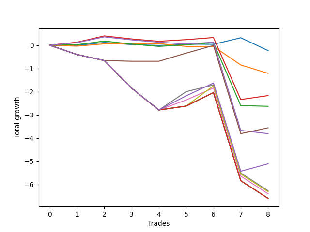

# Long Bernese 005 1v 
- Symbol: SPY
- Date Range: 05/27/2022 - 09/30/2022
- Trading Period: 7:20-12:30
- Number of Trades: 8



| Name | Win Percent | Profit | Avg Profit / Trade | Avg Time / Trade |      | Name | Win Percent | Profit | Avg Profit / Trade | Avg Time / Trade |
| ---- | ----------- | ------ | ------------------ | ---------------- | ---- | ---- | ----------- | ------ | ------------------ | ---------------- |
| Sorted By <br> Profit | | | | | | Sorted By <br> Win Percentage ||||
| Zero | 37.50 | -115.00 | -14.37 | 04:05 |     | Two_C | 62.50 | -1085.00 | -135.63 | 24:22 |
| One | 37.50 | -605.00 | -75.62 | 11:58 |     | Two | 50.00 | -1315.00 | -164.38 | 24:13 |
| Two_C | 62.50 | -1085.00 | -135.63 | 24:22 |     | Four | 50.00 | -1780.00 | -222.50 | 32:58 |
| Two | 50.00 | -1315.00 | -164.38 | 24:13 |     | Zero | 37.50 | -115.00 | -14.37 | 04:05 |
| Four | 50.00 | -1780.00 | -222.50 | 32:58 |     | One | 37.50 | -605.00 | -75.62 | 11:58 |
| Three | 37.50 | -1905.00 | -238.12 | 29:19 |     | Three | 37.50 | -1905.00 | -238.12 | 29:19 |
| NEWFI 0000 | 37.50 | -2555.00 | -319.38 | 45:07 |     | NEWFI 0000 | 37.50 | -2555.00 | -319.38 | 45:07 |
| Six | 25.00 | -3135.00 | -391.87 | 44:55 |     | Six | 25.00 | -3135.00 | -391.87 | 44:55 |
| Seven | 25.00 | -3155.00 | -394.37 | 50:48 |     | Seven | 25.00 | -3155.00 | -394.37 | 50:48 |
| Five | 25.00 | -3200.00 | -400.00 | 44:35 |     | Five | 25.00 | -3200.00 | -400.00 | 44:35 |
| Eighty-Five | 25.00 | -3300.00 | -412.50 | 51:48 |     | Eighty-Five | 25.00 | -3300.00 | -412.50 | 51:48 |
| Eighty-Four | 25.00 | -3300.00 | -412.50 | 51:48 |     | Eighty-Four | 25.00 | -3300.00 | -412.50 | 51:48 |
| Eighty-Three | 25.00 | -3300.00 | -412.50 | 51:48 |     | Eighty-Three | 25.00 | -3300.00 | -412.50 | 51:48 |
| Eighty-Two | 25.00 | -3300.00 | -412.50 | 51:48 |     | Eighty-Two | 25.00 | -3300.00 | -412.50 | 51:48 |
| Eighty-One | 25.00 | -3300.00 | -412.50 | 51:48 |     | Eighty-One | 25.00 | -3300.00 | -412.50 | 51:48 |

## NO STOPLOSS

### Test Zero
* Sell when price hits the middle line of the 20p bollinger
* No Stoploss
* Results:
```
Total Trades: 8
Percent Up: 37.50
Percent Down: 62.50
Total Points Moved Up: -0.23
Potential Profit: -115.00
Total Points Ups: 0.47 Count Ups: 3
Total Points Downs: -0.70 Count Downs: 5
```

<details><summary>Trades</summary>

<code>In: 2022-07-11 12:15:00		Out: 2022-07-11 12:22:10		Total Position Time: 07:10		Total Move Up: -0.01		Total to Date: -0.01</code> <br />
<code>In: 2022-07-11 12:22:00		Out: 2022-07-11 12:22:10		Total Position Time: 00:10		Total Move Up: 0.13		Total to Date: 0.12</code> <br />
<code>In: 2022-07-25 11:07:00		Out: 2022-07-25 11:10:40		Total Position Time: 03:40		Total Move Up: -0.09		Total to Date: 0.03</code> <br />
<code>In: 2022-07-25 11:11:00		Out: 2022-07-25 11:11:10		Total Position Time: 00:10		Total Move Up: -0.04		Total to Date: -0.01</code> <br />
<code>In: 2022-08-05 08:33:00		Out: 2022-08-05 08:36:55		Total Position Time: 03:55		Total Move Up: 0.06		Total to Date: 0.05</code> <br />
<code>In: 2022-08-18 09:48:00		Out: 2022-08-18 09:48:10		Total Position Time: 00:10		Total Move Up: -0.01		Total to Date: 0.04</code> <br />
<code>In: 2022-09-02 09:55:00		Out: 2022-09-02 09:56:40		Total Position Time: 01:40		Total Move Up: 0.28		Total to Date: 0.32</code> <br />
<code>In: 2022-09-14 10:59:00		Out: 2022-09-14 11:14:45		Total Position Time: 15:45		Total Move Up: -0.55		Total to Date: -0.23</code> <br />


</details>

### Test One
* Sell when the price hits the upper line of the 20p 1std bollinger
* No Stoploss
* Results:
```
Total Trades: 8
Percent Up: 37.50
Percent Down: 62.50
Total Points Moved Up: -1.21
Potential Profit: -605.00
Total Points Ups: 0.12 Count Ups: 3
Total Points Downs: -1.33 Count Downs: 5
```

<details><summary>Trades</summary>

<code>In: 2022-07-11 12:15:00		Out: 2022-07-11 12:29:15		Total Position Time: 14:15		Total Move Up: -0.04		Total to Date: -0.04</code> <br />
<code>In: 2022-07-11 12:22:00		Out: 2022-07-11 12:29:15		Total Position Time: 07:15		Total Move Up: 0.10		Total to Date: 0.06</code> <br />
<code>In: 2022-07-25 11:07:00		Out: 2022-07-25 11:11:20		Total Position Time: 04:20		Total Move Up: -0.01		Total to Date: 0.05</code> <br />
<code>In: 2022-07-25 11:11:00		Out: 2022-07-25 11:11:20		Total Position Time: 00:20		Total Move Up: 0.02		Total to Date: 0.07</code> <br />
<code>In: 2022-08-05 08:33:00		Out: 2022-08-05 08:51:30		Total Position Time: 18:30		Total Move Up: -0.12		Total to Date: -0.05</code> <br />
<code>In: 2022-08-18 09:48:00		Out: 2022-08-18 09:55:15		Total Position Time: 07:15		Total Move Up: 0.00		Total to Date: -0.05</code> <br />
<code>In: 2022-09-02 09:55:00		Out: 2022-09-02 10:18:40		Total Position Time: 23:40		Total Move Up: -0.80		Total to Date: -0.85</code> <br />
<code>In: 2022-09-14 10:59:00		Out: 2022-09-14 11:19:10		Total Position Time: 20:10		Total Move Up: -0.36		Total to Date: -1.21</code> <br />


</details>

### Test Two
* Sell when the price hits the upper line of the 20p 2std bollinger
* No Stoploss
* Results:
```
Total Trades: 8
Percent Up: 50.00
Percent Down: 50.00
Total Points Moved Up: -2.63
Potential Profit: -1315.00
Total Points Ups: 0.34 Count Ups: 4
Total Points Downs: -2.97 Count Downs: 4
```

<details><summary>Trades</summary>

<code>In: 2022-07-11 12:15:00		Out: 2022-07-11 12:29:25		Total Position Time: 14:25		Total Move Up: 0.02		Total to Date: 0.02</code> <br />
<code>In: 2022-07-11 12:22:00		Out: 2022-07-11 12:29:25		Total Position Time: 07:25		Total Move Up: 0.16		Total to Date: 0.18</code> <br />
<code>In: 2022-07-25 11:07:00		Out: 2022-07-25 11:35:45		Total Position Time: 28:45		Total Move Up: -0.13		Total to Date: 0.05</code> <br />
<code>In: 2022-07-25 11:11:00		Out: 2022-07-25 11:35:45		Total Position Time: 24:45		Total Move Up: -0.10		Total to Date: -0.05</code> <br />
<code>In: 2022-08-05 08:33:00		Out: 2022-08-05 08:53:25		Total Position Time: 20:25		Total Move Up: 0.07		Total to Date: 0.02</code> <br />
<code>In: 2022-08-18 09:48:00		Out: 2022-08-18 10:06:00		Total Position Time: 18:00		Total Move Up: 0.09		Total to Date: 0.11</code> <br />
<code>In: 2022-09-02 09:55:00		Out: 2022-09-02 10:43:35		Total Position Time: 48:35		Total Move Up: -2.71		Total to Date: -2.60</code> <br />
<code>In: 2022-09-14 10:59:00		Out: 2022-09-14 11:30:30		Total Position Time: 31:30		Total Move Up: -0.03		Total to Date: -2.63</code> <br />


</details>

### Test Two_C
* Sell when the price hits the upper line of the 20p 2std bollinger
* No Stoploss
* Results:
```
Total Trades: 8
Percent Up: 62.50
Percent Down: 37.50
Total Points Moved Up: -2.17
Potential Profit: -1085.00
Total Points Ups: 0.73 Count Ups: 5
Total Points Downs: -2.90 Count Downs: 3
```

<details><summary>Trades</summary>

<code>In: 2022-07-11 12:15:00		Out: 2022-07-11 12:29:40		Total Position Time: 14:40		Total Move Up: 0.13		Total to Date: 0.13</code> <br />
<code>In: 2022-07-11 12:22:00		Out: 2022-07-11 12:29:40		Total Position Time: 07:40		Total Move Up: 0.27		Total to Date: 0.40</code> <br />
<code>In: 2022-07-25 11:07:00		Out: 2022-07-25 11:35:45		Total Position Time: 28:45		Total Move Up: -0.13		Total to Date: 0.27</code> <br />
<code>In: 2022-07-25 11:11:00		Out: 2022-07-25 11:35:45		Total Position Time: 24:45		Total Move Up: -0.10		Total to Date: 0.17</code> <br />
<code>In: 2022-08-05 08:33:00		Out: 2022-08-05 08:53:25		Total Position Time: 20:25		Total Move Up: 0.07		Total to Date: 0.24</code> <br />
<code>In: 2022-08-18 09:48:00		Out: 2022-08-18 10:06:00		Total Position Time: 18:00		Total Move Up: 0.09		Total to Date: 0.33</code> <br />
<code>In: 2022-09-02 09:55:00		Out: 2022-09-02 10:43:45		Total Position Time: 48:45		Total Move Up: -2.67		Total to Date: -2.34</code> <br />
<code>In: 2022-09-14 10:59:00		Out: 2022-09-14 11:31:00		Total Position Time: 32:00		Total Move Up: 0.17		Total to Date: -2.17</code> <br />


</details>

### Test Three
* Sell when price hits the middle line of the 50p bollinger
* No Stoploss
* Results:
```
Total Trades: 8
Percent Up: 37.50
Percent Down: 62.50
Total Points Moved Up: -3.81
Potential Profit: -1905.00
Total Points Ups: 0.44 Count Ups: 3
Total Points Downs: -4.25 Count Downs: 5
```

<details><summary>Trades</summary>

<code>In: 2022-07-11 12:15:00		Out: 2022-07-11 12:40:40		Total Position Time: 25:40		Total Move Up: 0.11		Total to Date: 0.11</code> <br />
<code>In: 2022-07-11 12:22:00		Out: 2022-07-11 12:40:40		Total Position Time: 18:40		Total Move Up: 0.25		Total to Date: 0.36</code> <br />
<code>In: 2022-07-25 11:07:00		Out: 2022-07-25 11:35:45		Total Position Time: 28:45		Total Move Up: -0.13		Total to Date: 0.23</code> <br />
<code>In: 2022-07-25 11:11:00		Out: 2022-07-25 11:35:45		Total Position Time: 24:45		Total Move Up: -0.10		Total to Date: 0.13</code> <br />
<code>In: 2022-08-05 08:33:00		Out: 2022-08-05 09:01:15		Total Position Time: 28:15		Total Move Up: -0.08		Total to Date: 0.05</code> <br />
<code>In: 2022-08-18 09:48:00		Out: 2022-08-18 10:06:05		Total Position Time: 18:05		Total Move Up: 0.08		Total to Date: 0.13</code> <br />
<code>In: 2022-09-02 09:55:00		Out: 2022-09-02 10:54:55		Total Position Time: 59:55		Total Move Up: -3.80		Total to Date: -3.67</code> <br />
<code>In: 2022-09-14 10:59:00		Out: 2022-09-14 11:29:30		Total Position Time: 30:30		Total Move Up: -0.14		Total to Date: -3.81</code> <br />


</details>

### Test Four
* Sell when the price hits the upper line of the 50p 1std bollinger
* No Stoploss
* Results:
```
Total Trades: 8
Percent Up: 50.00
Percent Down: 50.00
Total Points Moved Up: -3.56
Potential Profit: -1780.00
Total Points Ups: 0.93 Count Ups: 4
Total Points Downs: -4.49 Count Downs: 4
```

<details><summary>Trades</summary>

<code>In: 2022-07-11 12:15:00		Out: 2022-07-11 12:46:00		Total Position Time: 31:00		Total Move Up: -0.40		Total to Date: -0.40</code> <br />
<code>In: 2022-07-11 12:22:00		Out: 2022-07-11 12:46:00		Total Position Time: 24:00		Total Move Up: -0.26		Total to Date: -0.66</code> <br />
<code>In: 2022-07-25 11:07:00		Out: 2022-07-25 11:41:00		Total Position Time: 34:00		Total Move Up: -0.03		Total to Date: -0.69</code> <br />
<code>In: 2022-07-25 11:11:00		Out: 2022-07-25 11:41:00		Total Position Time: 30:00		Total Move Up: 0.00		Total to Date: -0.69</code> <br />
<code>In: 2022-08-05 08:33:00		Out: 2022-08-05 09:04:25		Total Position Time: 31:25		Total Move Up: 0.35		Total to Date: -0.34</code> <br />
<code>In: 2022-08-18 09:48:00		Out: 2022-08-18 10:08:20		Total Position Time: 20:20		Total Move Up: 0.33		Total to Date: -0.01</code> <br />
<code>In: 2022-09-02 09:55:00		Out: 2022-09-02 10:54:55		Total Position Time: 59:55		Total Move Up: -3.80		Total to Date: -3.81</code> <br />
<code>In: 2022-09-14 10:59:00		Out: 2022-09-14 11:32:05		Total Position Time: 33:05		Total Move Up: 0.25		Total to Date: -3.56</code> <br />


</details>

### Test Five
* Sell when the price hits the upper line of the 50p 2std bollinger
* No Stoploss
* Results:
```
Total Trades: 8
Percent Up: 25.00
Percent Down: 75.00
Total Points Moved Up: -6.40
Potential Profit: -3200.00
Total Points Ups: 0.95 Count Ups: 2
Total Points Downs: -7.35 Count Downs: 6
```

<details><summary>Trades</summary>

<code>In: 2022-07-11 12:15:00		Out: 2022-07-11 12:46:00		Total Position Time: 31:00		Total Move Up: -0.40		Total to Date: -0.40</code> <br />
<code>In: 2022-07-11 12:22:00		Out: 2022-07-11 12:46:00		Total Position Time: 24:00		Total Move Up: -0.26		Total to Date: -0.66</code> <br />
<code>In: 2022-07-25 11:07:00		Out: 2022-07-25 12:06:55		Total Position Time: 59:55		Total Move Up: -1.19		Total to Date: -1.85</code> <br />
<code>In: 2022-07-25 11:11:00		Out: 2022-07-25 12:10:55		Total Position Time: 59:55		Total Move Up: -0.94		Total to Date: -2.79</code> <br />
<code>In: 2022-08-05 08:33:00		Out: 2022-08-05 09:11:25		Total Position Time: 38:25		Total Move Up: 0.43		Total to Date: -2.36</code> <br />
<code>In: 2022-08-18 09:48:00		Out: 2022-08-18 10:11:40		Total Position Time: 23:40		Total Move Up: 0.52		Total to Date: -1.84</code> <br />
<code>In: 2022-09-02 09:55:00		Out: 2022-09-02 10:54:55		Total Position Time: 59:55		Total Move Up: -3.80		Total to Date: -5.64</code> <br />
<code>In: 2022-09-14 10:59:00		Out: 2022-09-14 11:58:55		Total Position Time: 59:55		Total Move Up: -0.76		Total to Date: -6.40</code> <br />


</details>

### Test Six
* Sell when the price hits the middle line of the 1std VWAP
* No Stoploss
* Results:
```
Total Trades: 8
Percent Up: 25.00
Percent Down: 75.00
Total Points Moved Up: -6.27
Potential Profit: -3135.00
Total Points Ups: 1.08 Count Ups: 2
Total Points Downs: -7.35 Count Downs: 6
```

<details><summary>Trades</summary>

<code>In: 2022-07-11 12:15:00		Out: 2022-07-11 12:46:00		Total Position Time: 31:00		Total Move Up: -0.40		Total to Date: -0.40</code> <br />
<code>In: 2022-07-11 12:22:00		Out: 2022-07-11 12:46:00		Total Position Time: 24:00		Total Move Up: -0.26		Total to Date: -0.66</code> <br />
<code>In: 2022-07-25 11:07:00		Out: 2022-07-25 12:06:55		Total Position Time: 59:55		Total Move Up: -1.19		Total to Date: -1.85</code> <br />
<code>In: 2022-07-25 11:11:00		Out: 2022-07-25 12:10:55		Total Position Time: 59:55		Total Move Up: -0.94		Total to Date: -2.79</code> <br />
<code>In: 2022-08-05 08:33:00		Out: 2022-08-05 09:18:10		Total Position Time: 45:10		Total Move Up: 0.79		Total to Date: -2.00</code> <br />
<code>In: 2022-08-18 09:48:00		Out: 2022-08-18 10:07:35		Total Position Time: 19:35		Total Move Up: 0.29		Total to Date: -1.71</code> <br />
<code>In: 2022-09-02 09:55:00		Out: 2022-09-02 10:54:55		Total Position Time: 59:55		Total Move Up: -3.80		Total to Date: -5.51</code> <br />
<code>In: 2022-09-14 10:59:00		Out: 2022-09-14 11:58:55		Total Position Time: 59:55		Total Move Up: -0.76		Total to Date: -6.27</code> <br />


</details>

### Test Seven
* Sell when the price hits the upper line of the 1std VWAP
* No Stoploss
* Results:
```
Total Trades: 8
Percent Up: 25.00
Percent Down: 75.00
Total Points Moved Up: -6.31
Potential Profit: -3155.00
Total Points Ups: 1.04 Count Ups: 2
Total Points Downs: -7.35 Count Downs: 6
```

<details><summary>Trades</summary>

<code>In: 2022-07-11 12:15:00		Out: 2022-07-11 12:46:00		Total Position Time: 31:00		Total Move Up: -0.40		Total to Date: -0.40</code> <br />
<code>In: 2022-07-11 12:22:00		Out: 2022-07-11 12:46:00		Total Position Time: 24:00		Total Move Up: -0.26		Total to Date: -0.66</code> <br />
<code>In: 2022-07-25 11:07:00		Out: 2022-07-25 12:06:55		Total Position Time: 59:55		Total Move Up: -1.19		Total to Date: -1.85</code> <br />
<code>In: 2022-07-25 11:11:00		Out: 2022-07-25 12:10:55		Total Position Time: 59:55		Total Move Up: -0.94		Total to Date: -2.79</code> <br />
<code>In: 2022-08-05 08:33:00		Out: 2022-08-05 09:32:55		Total Position Time: 59:55		Total Move Up: 0.17		Total to Date: -2.62</code> <br />
<code>In: 2022-08-18 09:48:00		Out: 2022-08-18 10:39:55		Total Position Time: 51:55		Total Move Up: 0.87		Total to Date: -1.75</code> <br />
<code>In: 2022-09-02 09:55:00		Out: 2022-09-02 10:54:55		Total Position Time: 59:55		Total Move Up: -3.80		Total to Date: -5.55</code> <br />
<code>In: 2022-09-14 10:59:00		Out: 2022-09-14 11:58:55		Total Position Time: 59:55		Total Move Up: -0.76		Total to Date: -6.31</code> <br />


</details>

## TAKE PROFIT

### Test Eighty-One
* Take Profit of 1 Point
* No Stoploss
* Results:
```
Total Trades: 8
Percent Up: 25.00
Percent Down: 75.00
Total Points Moved Up: -6.60
Potential Profit: -3300.00
Total Points Ups: 0.75 Count Ups: 2
Total Points Downs: -7.35 Count Downs: 6
```

<details><summary>Trades</summary>

<code>In: 2022-07-11 12:15:00		Out: 2022-07-11 12:46:00		Total Position Time: 31:00		Total Move Up: -0.40		Total to Date: -0.40</code> <br />
<code>In: 2022-07-11 12:22:00		Out: 2022-07-11 12:46:00		Total Position Time: 24:00		Total Move Up: -0.26		Total to Date: -0.66</code> <br />
<code>In: 2022-07-25 11:07:00		Out: 2022-07-25 12:06:55		Total Position Time: 59:55		Total Move Up: -1.19		Total to Date: -1.85</code> <br />
<code>In: 2022-07-25 11:11:00		Out: 2022-07-25 12:10:55		Total Position Time: 59:55		Total Move Up: -0.94		Total to Date: -2.79</code> <br />
<code>In: 2022-08-05 08:33:00		Out: 2022-08-05 09:32:55		Total Position Time: 59:55		Total Move Up: 0.17		Total to Date: -2.62</code> <br />
<code>In: 2022-08-18 09:48:00		Out: 2022-08-18 10:47:55		Total Position Time: 59:55		Total Move Up: 0.58		Total to Date: -2.04</code> <br />
<code>In: 2022-09-02 09:55:00		Out: 2022-09-02 10:54:55		Total Position Time: 59:55		Total Move Up: -3.80		Total to Date: -5.84</code> <br />
<code>In: 2022-09-14 10:59:00		Out: 2022-09-14 11:58:55		Total Position Time: 59:55		Total Move Up: -0.76		Total to Date: -6.60</code> <br />


</details>

### Test Eighty-Two
* Take Profit of 2 Point
* No Stoploss
* Results:
```
Total Trades: 8
Percent Up: 25.00
Percent Down: 75.00
Total Points Moved Up: -6.60
Potential Profit: -3300.00
Total Points Ups: 0.75 Count Ups: 2
Total Points Downs: -7.35 Count Downs: 6
```

<details><summary>Trades</summary>

<code>In: 2022-07-11 12:15:00		Out: 2022-07-11 12:46:00		Total Position Time: 31:00		Total Move Up: -0.40		Total to Date: -0.40</code> <br />
<code>In: 2022-07-11 12:22:00		Out: 2022-07-11 12:46:00		Total Position Time: 24:00		Total Move Up: -0.26		Total to Date: -0.66</code> <br />
<code>In: 2022-07-25 11:07:00		Out: 2022-07-25 12:06:55		Total Position Time: 59:55		Total Move Up: -1.19		Total to Date: -1.85</code> <br />
<code>In: 2022-07-25 11:11:00		Out: 2022-07-25 12:10:55		Total Position Time: 59:55		Total Move Up: -0.94		Total to Date: -2.79</code> <br />
<code>In: 2022-08-05 08:33:00		Out: 2022-08-05 09:32:55		Total Position Time: 59:55		Total Move Up: 0.17		Total to Date: -2.62</code> <br />
<code>In: 2022-08-18 09:48:00		Out: 2022-08-18 10:47:55		Total Position Time: 59:55		Total Move Up: 0.58		Total to Date: -2.04</code> <br />
<code>In: 2022-09-02 09:55:00		Out: 2022-09-02 10:54:55		Total Position Time: 59:55		Total Move Up: -3.80		Total to Date: -5.84</code> <br />
<code>In: 2022-09-14 10:59:00		Out: 2022-09-14 11:58:55		Total Position Time: 59:55		Total Move Up: -0.76		Total to Date: -6.60</code> <br />


</details>

### Test Eighty-Three
* Take Profit of 3 Point
* No Stoploss
* Results:
```
Total Trades: 8
Percent Up: 25.00
Percent Down: 75.00
Total Points Moved Up: -6.60
Potential Profit: -3300.00
Total Points Ups: 0.75 Count Ups: 2
Total Points Downs: -7.35 Count Downs: 6
```

<details><summary>Trades</summary>

<code>In: 2022-07-11 12:15:00		Out: 2022-07-11 12:46:00		Total Position Time: 31:00		Total Move Up: -0.40		Total to Date: -0.40</code> <br />
<code>In: 2022-07-11 12:22:00		Out: 2022-07-11 12:46:00		Total Position Time: 24:00		Total Move Up: -0.26		Total to Date: -0.66</code> <br />
<code>In: 2022-07-25 11:07:00		Out: 2022-07-25 12:06:55		Total Position Time: 59:55		Total Move Up: -1.19		Total to Date: -1.85</code> <br />
<code>In: 2022-07-25 11:11:00		Out: 2022-07-25 12:10:55		Total Position Time: 59:55		Total Move Up: -0.94		Total to Date: -2.79</code> <br />
<code>In: 2022-08-05 08:33:00		Out: 2022-08-05 09:32:55		Total Position Time: 59:55		Total Move Up: 0.17		Total to Date: -2.62</code> <br />
<code>In: 2022-08-18 09:48:00		Out: 2022-08-18 10:47:55		Total Position Time: 59:55		Total Move Up: 0.58		Total to Date: -2.04</code> <br />
<code>In: 2022-09-02 09:55:00		Out: 2022-09-02 10:54:55		Total Position Time: 59:55		Total Move Up: -3.80		Total to Date: -5.84</code> <br />
<code>In: 2022-09-14 10:59:00		Out: 2022-09-14 11:58:55		Total Position Time: 59:55		Total Move Up: -0.76		Total to Date: -6.60</code> <br />


</details>

### Test Eighty-Four
* Take Profit of 4 Point
* No Stoploss
* Results:
```
Total Trades: 8
Percent Up: 25.00
Percent Down: 75.00
Total Points Moved Up: -6.60
Potential Profit: -3300.00
Total Points Ups: 0.75 Count Ups: 2
Total Points Downs: -7.35 Count Downs: 6
```

<details><summary>Trades</summary>

<code>In: 2022-07-11 12:15:00		Out: 2022-07-11 12:46:00		Total Position Time: 31:00		Total Move Up: -0.40		Total to Date: -0.40</code> <br />
<code>In: 2022-07-11 12:22:00		Out: 2022-07-11 12:46:00		Total Position Time: 24:00		Total Move Up: -0.26		Total to Date: -0.66</code> <br />
<code>In: 2022-07-25 11:07:00		Out: 2022-07-25 12:06:55		Total Position Time: 59:55		Total Move Up: -1.19		Total to Date: -1.85</code> <br />
<code>In: 2022-07-25 11:11:00		Out: 2022-07-25 12:10:55		Total Position Time: 59:55		Total Move Up: -0.94		Total to Date: -2.79</code> <br />
<code>In: 2022-08-05 08:33:00		Out: 2022-08-05 09:32:55		Total Position Time: 59:55		Total Move Up: 0.17		Total to Date: -2.62</code> <br />
<code>In: 2022-08-18 09:48:00		Out: 2022-08-18 10:47:55		Total Position Time: 59:55		Total Move Up: 0.58		Total to Date: -2.04</code> <br />
<code>In: 2022-09-02 09:55:00		Out: 2022-09-02 10:54:55		Total Position Time: 59:55		Total Move Up: -3.80		Total to Date: -5.84</code> <br />
<code>In: 2022-09-14 10:59:00		Out: 2022-09-14 11:58:55		Total Position Time: 59:55		Total Move Up: -0.76		Total to Date: -6.60</code> <br />


</details>

### Test Eighty-Five
* Take Profit of 5 Point
* No Stoploss
* Results:
```
Total Trades: 8
Percent Up: 25.00
Percent Down: 75.00
Total Points Moved Up: -6.60
Potential Profit: -3300.00
Total Points Ups: 0.75 Count Ups: 2
Total Points Downs: -7.35 Count Downs: 6
```

<details><summary>Trades</summary>

<code>In: 2022-07-11 12:15:00		Out: 2022-07-11 12:46:00		Total Position Time: 31:00		Total Move Up: -0.40		Total to Date: -0.40</code> <br />
<code>In: 2022-07-11 12:22:00		Out: 2022-07-11 12:46:00		Total Position Time: 24:00		Total Move Up: -0.26		Total to Date: -0.66</code> <br />
<code>In: 2022-07-25 11:07:00		Out: 2022-07-25 12:06:55		Total Position Time: 59:55		Total Move Up: -1.19		Total to Date: -1.85</code> <br />
<code>In: 2022-07-25 11:11:00		Out: 2022-07-25 12:10:55		Total Position Time: 59:55		Total Move Up: -0.94		Total to Date: -2.79</code> <br />
<code>In: 2022-08-05 08:33:00		Out: 2022-08-05 09:32:55		Total Position Time: 59:55		Total Move Up: 0.17		Total to Date: -2.62</code> <br />
<code>In: 2022-08-18 09:48:00		Out: 2022-08-18 10:47:55		Total Position Time: 59:55		Total Move Up: 0.58		Total to Date: -2.04</code> <br />
<code>In: 2022-09-02 09:55:00		Out: 2022-09-02 10:54:55		Total Position Time: 59:55		Total Move Up: -3.80		Total to Date: -5.84</code> <br />
<code>In: 2022-09-14 10:59:00		Out: 2022-09-14 11:58:55		Total Position Time: 59:55		Total Move Up: -0.76		Total to Date: -6.60</code> <br />


</details>

## Indicator Exits

### Test NEWFI 0000
* Newfi 0000
* No Stoploss
* Results:
```
Total Trades: 8
Percent Up: 37.50
Percent Down: 62.50
Total Points Moved Up: -5.11
Potential Profit: -2555.00
Total Points Ups: 1.48 Count Ups: 3
Total Points Downs: -6.59 Count Downs: 5
```

<details><summary>Trades</summary>

<code>In: 2022-07-11 12:15:00		Out: 2022-07-11 12:46:00		Total Position Time: 31:00		Total Move Up: -0.40		Total to Date: -0.40</code> <br />
<code>In: 2022-07-11 12:22:00		Out: 2022-07-11 12:46:00		Total Position Time: 24:00		Total Move Up: -0.26		Total to Date: -0.66</code> <br />
<code>In: 2022-07-25 11:07:00		Out: 2022-07-25 12:06:55		Total Position Time: 59:55		Total Move Up: -1.19		Total to Date: -1.85</code> <br />
<code>In: 2022-07-25 11:11:00		Out: 2022-07-25 12:10:55		Total Position Time: 59:55		Total Move Up: -0.94		Total to Date: -2.79</code> <br />
<code>In: 2022-08-05 08:33:00		Out: 2022-08-05 09:20:05		Total Position Time: 47:05		Total Move Up: 0.61		Total to Date: -2.18</code> <br />
<code>In: 2022-08-18 09:48:00		Out: 2022-08-18 10:32:05		Total Position Time: 44:05		Total Move Up: 0.55		Total to Date: -1.63</code> <br />
<code>In: 2022-09-02 09:55:00		Out: 2022-09-02 10:54:55		Total Position Time: 59:55		Total Move Up: -3.80		Total to Date: -5.43</code> <br />
<code>In: 2022-09-14 10:59:00		Out: 2022-09-14 11:34:05		Total Position Time: 35:05		Total Move Up: 0.32		Total to Date: -5.11</code> <br />


</details>