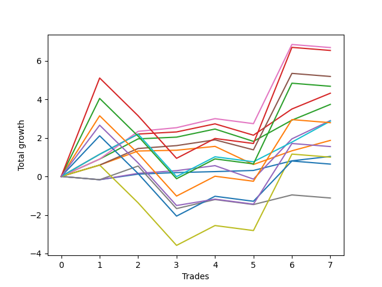

# Short Bernese 001 1v 
- Symbol: SPY
- Date Range: 05/27/2022 - 09/30/2022
- Trading Period: 7:20-12:30
- Number of Trades: 7



| Name | Win Percent | Profit | Avg Profit / Trade | Avg Time / Trade |      | Name | Win Percent | Profit | Avg Profit / Trade | Avg Time / Trade |
| ---- | ----------- | ------ | ------------------ | ---------------- | ---- | ---- | ----------- | ------ | ------------------ | ---------------- |
| Sorted By <br> Profit | | | | | | Sorted By <br> Win Percentage ||||
| Five | 71.43 | 3345.00 | 477.86 | 29:12 |     | Two_C | 85.71 | 2160.00 | 308.57 | 17:52 |
| Eighty-Five | 42.86 | 3270.00 | 467.14 | 48:35 |     | Two | 85.71 | 1870.00 | 267.14 | 17:24 |
| Four | 71.43 | 2595.00 | 370.71 | 24:42 |     | One | 85.71 | 935.00 | 133.57 | 12:24 |
| Eighty-Four | 42.86 | 2340.00 | 334.29 | 46:17 |     | Zero | 85.71 | 520.00 | 74.29 | 02:37 |
| Two_C | 85.71 | 2160.00 | 308.57 | 17:52 |     | Five | 71.43 | 3345.00 | 477.86 | 29:12 |
| Two | 85.71 | 1870.00 | 267.14 | 17:24 |     | Four | 71.43 | 2595.00 | 370.71 | 24:42 |
| Three | 71.43 | 1450.00 | 207.14 | 13:10 |     | Three | 71.43 | 1450.00 | 207.14 | 13:10 |
| Eighty-One | 71.43 | 1435.00 | 205.00 | 26:37 |     | Eighty-One | 71.43 | 1435.00 | 205.00 | 26:37 |
| Eighty-Three | 42.86 | 1395.00 | 199.29 | 42:29 |     | Eighty-Five | 42.86 | 3270.00 | 467.14 | 48:35 |
| One | 85.71 | 935.00 | 133.57 | 12:24 |     | Eighty-Four | 42.86 | 2340.00 | 334.29 | 46:17 |
| NEWFI 0000 | 42.86 | 775.00 | 110.71 | 41:25 |     | Eighty-Three | 42.86 | 1395.00 | 199.29 | 42:29 |
| Zero | 85.71 | 520.00 | 74.29 | 02:37 |     | NEWFI 0000 | 42.86 | 775.00 | 110.71 | 41:25 |
| Seven | 42.86 | 500.00 | 71.43 | 41:58 |     | Seven | 42.86 | 500.00 | 71.43 | 41:58 |
| Eighty-Two | 42.86 | 320.00 | 45.71 | 42:04 |     | Eighty-Two | 42.86 | 320.00 | 45.71 | 42:04 |
| Six | 42.86 | -560.00 | -80.00 | 28:05 |     | Six | 42.86 | -560.00 | -80.00 | 28:05 |

## NO STOPLOSS

### Test Zero
* Sell when price hits the middle line of the 20p bollinger
* No Stoploss
* Results:
```
Total Trades: 7
Percent Up: 14.29
Percent Down: 85.71
Total Points Moved Down: 1.04
Potential Profit: 520.00
Total Points Ups: 0.17 Count Ups: 1
Total Points Downs: 1.21 Count Downs: 6
```

<details><summary>Trades</summary>

<code>In: 2022-06-15 11:02:00		Out: 2022-06-15 11:02:10		Total Position Time: 00:10		Total Move Down: -0.17		Total to Date: -0.17</code> <br />
<code>In: 2022-07-06 11:10:00		Out: 2022-07-06 11:10:10		Total Position Time: 00:10		Total Move Down: 0.29		Total to Date: 0.12</code> <br />
<code>In: 2022-08-17 10:33:00		Out: 2022-08-17 10:34:05		Total Position Time: 01:05		Total Move Down: 0.08		Total to Date: 0.20</code> <br />
<code>In: 2022-09-12 10:33:00		Out: 2022-09-12 10:36:35		Total Position Time: 03:35		Total Move Down: 0.05		Total to Date: 0.25</code> <br />
<code>In: 2022-09-16 11:31:00		Out: 2022-09-16 11:41:05		Total Position Time: 10:05		Total Move Down: 0.06		Total to Date: 0.31</code> <br />
<code>In: 2022-09-21 11:48:00		Out: 2022-09-21 11:48:40		Total Position Time: 00:40		Total Move Down: 0.50		Total to Date: 0.81</code> <br />
<code>In: 2022-09-22 12:16:00		Out: 2022-09-22 12:18:35		Total Position Time: 02:35		Total Move Down: 0.23		Total to Date: 1.04</code> <br />


</details>

### Test One
* Sell when the price hits the upper line of the 20p 1std bollinger
* No Stoploss
* Results:
```
Total Trades: 7
Percent Up: 14.29
Percent Down: 85.71
Total Points Moved Down: 1.87
Potential Profit: 935.00
Total Points Ups: 0.94 Count Ups: 1
Total Points Downs: 2.81 Count Downs: 6
```

<details><summary>Trades</summary>

<code>In: 2022-06-15 11:02:00		Out: 2022-06-15 11:03:05		Total Position Time: 01:05		Total Move Down: 0.59		Total to Date: 0.59</code> <br />
<code>In: 2022-07-06 11:10:00		Out: 2022-07-06 11:11:10		Total Position Time: 01:10		Total Move Down: 0.73		Total to Date: 1.32</code> <br />
<code>In: 2022-08-17 10:33:00		Out: 2022-08-17 10:46:05		Total Position Time: 13:05		Total Move Down: 0.04		Total to Date: 1.36</code> <br />
<code>In: 2022-09-12 10:33:00		Out: 2022-09-12 10:41:30		Total Position Time: 08:30		Total Move Down: 0.20		Total to Date: 1.56</code> <br />
<code>In: 2022-09-16 11:31:00		Out: 2022-09-16 12:14:20		Total Position Time: 43:20		Total Move Down: -0.94		Total to Date: 0.62</code> <br />
<code>In: 2022-09-21 11:48:00		Out: 2022-09-21 12:03:25		Total Position Time: 15:25		Total Move Down: 0.71		Total to Date: 1.33</code> <br />
<code>In: 2022-09-22 12:16:00		Out: 2022-09-22 12:20:15		Total Position Time: 04:15		Total Move Down: 0.54		Total to Date: 1.87</code> <br />


</details>

### Test Two
* Sell when the price hits the upper line of the 20p 2std bollinger
* No Stoploss
* Results:
```
Total Trades: 7
Percent Up: 14.29
Percent Down: 85.71
Total Points Moved Down: 3.74
Potential Profit: 1870.00
Total Points Ups: 0.64 Count Ups: 1
Total Points Downs: 4.38 Count Downs: 6
```

<details><summary>Trades</summary>

<code>In: 2022-06-15 11:02:00		Out: 2022-06-15 11:03:15		Total Position Time: 01:15		Total Move Down: 0.90		Total to Date: 0.90</code> <br />
<code>In: 2022-07-06 11:10:00		Out: 2022-07-06 11:11:45		Total Position Time: 01:45		Total Move Down: 1.05		Total to Date: 1.95</code> <br />
<code>In: 2022-08-17 10:33:00		Out: 2022-08-17 10:56:40		Total Position Time: 23:40		Total Move Down: 0.09		Total to Date: 2.04</code> <br />
<code>In: 2022-09-12 10:33:00		Out: 2022-09-12 10:44:20		Total Position Time: 11:20		Total Move Down: 0.42		Total to Date: 2.46</code> <br />
<code>In: 2022-09-16 11:31:00		Out: 2022-09-16 12:28:25		Total Position Time: 57:25		Total Move Down: -0.64		Total to Date: 1.82</code> <br />
<code>In: 2022-09-21 11:48:00		Out: 2022-09-21 12:09:45		Total Position Time: 21:45		Total Move Down: 1.10		Total to Date: 2.92</code> <br />
<code>In: 2022-09-22 12:16:00		Out: 2022-09-22 12:20:40		Total Position Time: 04:40		Total Move Down: 0.82		Total to Date: 3.74</code> <br />


</details>

### Test Two_C
* Sell when the price hits the upper line of the 20p 2std bollinger
* No Stoploss
* Results:
```
Total Trades: 7
Percent Up: 14.29
Percent Down: 85.71
Total Points Moved Down: 4.32
Potential Profit: 2160.00
Total Points Ups: 0.59 Count Ups: 1
Total Points Downs: 4.91 Count Downs: 6
```

<details><summary>Trades</summary>

<code>In: 2022-06-15 11:02:00		Out: 2022-06-15 11:04:20		Total Position Time: 02:20		Total Move Down: 1.15		Total to Date: 1.15</code> <br />
<code>In: 2022-07-06 11:10:00		Out: 2022-07-06 11:11:45		Total Position Time: 01:45		Total Move Down: 1.05		Total to Date: 2.20</code> <br />
<code>In: 2022-08-17 10:33:00		Out: 2022-08-17 10:57:00		Total Position Time: 24:00		Total Move Down: 0.11		Total to Date: 2.31</code> <br />
<code>In: 2022-09-12 10:33:00		Out: 2022-09-12 10:44:20		Total Position Time: 11:20		Total Move Down: 0.42		Total to Date: 2.73</code> <br />
<code>In: 2022-09-16 11:31:00		Out: 2022-09-16 12:30:10		Total Position Time: 59:10		Total Move Down: -0.59		Total to Date: 2.14</code> <br />
<code>In: 2022-09-21 11:48:00		Out: 2022-09-21 12:09:55		Total Position Time: 21:55		Total Move Down: 1.36		Total to Date: 3.50</code> <br />
<code>In: 2022-09-22 12:16:00		Out: 2022-09-22 12:20:40		Total Position Time: 04:40		Total Move Down: 0.82		Total to Date: 4.32</code> <br />


</details>

### Test Three
* Sell when price hits the middle line of the 50p bollinger
* No Stoploss
* Results:
```
Total Trades: 7
Percent Up: 28.57
Percent Down: 71.43
Total Points Moved Down: 2.90
Potential Profit: 1450.00
Total Points Ups: 0.87 Count Ups: 2
Total Points Downs: 3.77 Count Downs: 5
```

<details><summary>Trades</summary>

<code>In: 2022-06-15 11:02:00		Out: 2022-06-15 11:02:10		Total Position Time: 00:10		Total Move Down: -0.17		Total to Date: -0.17</code> <br />
<code>In: 2022-07-06 11:10:00		Out: 2022-07-06 11:10:20		Total Position Time: 00:20		Total Move Down: 0.33		Total to Date: 0.16</code> <br />
<code>In: 2022-08-17 10:33:00		Out: 2022-08-17 10:34:10		Total Position Time: 01:10		Total Move Down: 0.14		Total to Date: 0.30</code> <br />
<code>In: 2022-09-12 10:33:00		Out: 2022-09-12 10:42:15		Total Position Time: 09:15		Total Move Down: 0.26		Total to Date: 0.56</code> <br />
<code>In: 2022-09-16 11:31:00		Out: 2022-09-16 12:19:05		Total Position Time: 48:05		Total Move Down: -0.70		Total to Date: -0.14</code> <br />
<code>In: 2022-09-21 11:48:00		Out: 2022-09-21 12:10:10		Total Position Time: 22:10		Total Move Down: 2.09		Total to Date: 1.95</code> <br />
<code>In: 2022-09-22 12:16:00		Out: 2022-09-22 12:27:05		Total Position Time: 11:05		Total Move Down: 0.95		Total to Date: 2.90</code> <br />


</details>

### Test Four
* Sell when the price hits the upper line of the 50p 1std bollinger
* No Stoploss
* Results:
```
Total Trades: 7
Percent Up: 28.57
Percent Down: 71.43
Total Points Moved Down: 5.19
Potential Profit: 2595.00
Total Points Ups: 0.68 Count Ups: 2
Total Points Downs: 5.87 Count Downs: 5
```

<details><summary>Trades</summary>

<code>In: 2022-06-15 11:02:00		Out: 2022-06-15 11:03:05		Total Position Time: 01:05		Total Move Down: 0.59		Total to Date: 0.59</code> <br />
<code>In: 2022-07-06 11:10:00		Out: 2022-07-06 11:11:35		Total Position Time: 01:35		Total Move Down: 0.86		Total to Date: 1.45</code> <br />
<code>In: 2022-08-17 10:33:00		Out: 2022-08-17 11:00:50		Total Position Time: 27:50		Total Move Down: 0.15		Total to Date: 1.60</code> <br />
<code>In: 2022-09-12 10:33:00		Out: 2022-09-12 11:03:10		Total Position Time: 30:10		Total Move Down: 0.30		Total to Date: 1.90</code> <br />
<code>In: 2022-09-16 11:31:00		Out: 2022-09-16 12:30:15		Total Position Time: 59:15		Total Move Down: -0.52		Total to Date: 1.38</code> <br />
<code>In: 2022-09-21 11:48:00		Out: 2022-09-21 12:11:05		Total Position Time: 23:05		Total Move Down: 3.97		Total to Date: 5.35</code> <br />
<code>In: 2022-09-22 12:16:00		Out: 2022-09-22 12:46:00		Total Position Time: 30:00		Total Move Down: -0.16		Total to Date: 5.19</code> <br />


</details>

### Test Five
* Sell when the price hits the upper line of the 50p 2std bollinger
* No Stoploss
* Results:
```
Total Trades: 7
Percent Up: 28.57
Percent Down: 71.43
Total Points Moved Down: 6.69
Potential Profit: 3345.00
Total Points Ups: 0.42 Count Ups: 2
Total Points Downs: 7.11 Count Downs: 5
```

<details><summary>Trades</summary>

<code>In: 2022-06-15 11:02:00		Out: 2022-06-15 11:03:15		Total Position Time: 01:15		Total Move Down: 0.90		Total to Date: 0.90</code> <br />
<code>In: 2022-07-06 11:10:00		Out: 2022-07-06 11:12:15		Total Position Time: 02:15		Total Move Down: 1.44		Total to Date: 2.34</code> <br />
<code>In: 2022-08-17 10:33:00		Out: 2022-08-17 11:01:00		Total Position Time: 28:00		Total Move Down: 0.19		Total to Date: 2.53</code> <br />
<code>In: 2022-09-12 10:33:00		Out: 2022-09-12 11:17:45		Total Position Time: 44:45		Total Move Down: 0.47		Total to Date: 3.00</code> <br />
<code>In: 2022-09-16 11:31:00		Out: 2022-09-16 12:30:55		Total Position Time: 59:55		Total Move Down: -0.26		Total to Date: 2.74</code> <br />
<code>In: 2022-09-21 11:48:00		Out: 2022-09-21 12:26:20		Total Position Time: 38:20		Total Move Down: 4.11		Total to Date: 6.85</code> <br />
<code>In: 2022-09-22 12:16:00		Out: 2022-09-22 12:46:00		Total Position Time: 30:00		Total Move Down: -0.16		Total to Date: 6.69</code> <br />


</details>

### Test Six
* Sell when the price hits the middle line of the 1std VWAP
* No Stoploss
* Results:
```
Total Trades: 7
Percent Up: 57.14
Percent Down: 42.86
Total Points Moved Down: -1.12
Potential Profit: -560.00
Total Points Ups: 2.80 Count Ups: 4
Total Points Downs: 1.68 Count Downs: 3
```

<details><summary>Trades</summary>

<code>In: 2022-06-15 11:02:00		Out: 2022-06-15 11:02:10		Total Position Time: 00:10		Total Move Down: -0.17		Total to Date: -0.17</code> <br />
<code>In: 2022-07-06 11:10:00		Out: 2022-07-06 11:11:15		Total Position Time: 01:15		Total Move Down: 0.71		Total to Date: 0.54</code> <br />
<code>In: 2022-08-17 10:33:00		Out: 2022-08-17 11:32:55		Total Position Time: 59:55		Total Move Down: -2.21		Total to Date: -1.67</code> <br />
<code>In: 2022-09-12 10:33:00		Out: 2022-09-12 11:17:45		Total Position Time: 44:45		Total Move Down: 0.47		Total to Date: -1.20</code> <br />
<code>In: 2022-09-16 11:31:00		Out: 2022-09-16 12:30:55		Total Position Time: 59:55		Total Move Down: -0.26		Total to Date: -1.46</code> <br />
<code>In: 2022-09-21 11:48:00		Out: 2022-09-21 11:48:40		Total Position Time: 00:40		Total Move Down: 0.50		Total to Date: -0.96</code> <br />
<code>In: 2022-09-22 12:16:00		Out: 2022-09-22 12:46:00		Total Position Time: 30:00		Total Move Down: -0.16		Total to Date: -1.12</code> <br />


</details>

### Test Seven
* Sell when the price hits the upper line of the 1std VWAP
* No Stoploss
* Results:
```
Total Trades: 7
Percent Up: 57.14
Percent Down: 42.86
Total Points Moved Down: 1.00
Potential Profit: 500.00
Total Points Ups: 4.59 Count Ups: 4
Total Points Downs: 5.59 Count Downs: 3
```

<details><summary>Trades</summary>

<code>In: 2022-06-15 11:02:00		Out: 2022-06-15 11:03:05		Total Position Time: 01:05		Total Move Down: 0.59		Total to Date: 0.59</code> <br />
<code>In: 2022-07-06 11:10:00		Out: 2022-07-06 12:09:55		Total Position Time: 59:55		Total Move Down: -1.96		Total to Date: -1.37</code> <br />
<code>In: 2022-08-17 10:33:00		Out: 2022-08-17 11:32:55		Total Position Time: 59:55		Total Move Down: -2.21		Total to Date: -3.58</code> <br />
<code>In: 2022-09-12 10:33:00		Out: 2022-09-12 11:32:55		Total Position Time: 59:55		Total Move Down: 1.03		Total to Date: -2.55</code> <br />
<code>In: 2022-09-16 11:31:00		Out: 2022-09-16 12:30:55		Total Position Time: 59:55		Total Move Down: -0.26		Total to Date: -2.81</code> <br />
<code>In: 2022-09-21 11:48:00		Out: 2022-09-21 12:11:05		Total Position Time: 23:05		Total Move Down: 3.97		Total to Date: 1.16</code> <br />
<code>In: 2022-09-22 12:16:00		Out: 2022-09-22 12:46:00		Total Position Time: 30:00		Total Move Down: -0.16		Total to Date: 1.00</code> <br />


</details>

## TAKE PROFIT

### Test Eighty-One
* Take Profit of 1 Point
* No Stoploss
* Results:
```
Total Trades: 7
Percent Up: 28.57
Percent Down: 71.43
Total Points Moved Down: 2.87
Potential Profit: 1435.00
Total Points Ups: 2.47 Count Ups: 2
Total Points Downs: 5.34 Count Downs: 5
```

<details><summary>Trades</summary>

<code>In: 2022-06-15 11:02:00		Out: 2022-06-15 11:04:20		Total Position Time: 02:20		Total Move Down: 1.15		Total to Date: 1.15</code> <br />
<code>In: 2022-07-06 11:10:00		Out: 2022-07-06 11:11:45		Total Position Time: 01:45		Total Move Down: 1.05		Total to Date: 2.20</code> <br />
<code>In: 2022-08-17 10:33:00		Out: 2022-08-17 11:32:55		Total Position Time: 59:55		Total Move Down: -2.21		Total to Date: -0.01</code> <br />
<code>In: 2022-09-12 10:33:00		Out: 2022-09-12 11:23:05		Total Position Time: 50:05		Total Move Down: 1.03		Total to Date: 1.02</code> <br />
<code>In: 2022-09-16 11:31:00		Out: 2022-09-16 12:30:55		Total Position Time: 59:55		Total Move Down: -0.26		Total to Date: 0.76</code> <br />
<code>In: 2022-09-21 11:48:00		Out: 2022-09-21 11:49:05		Total Position Time: 01:05		Total Move Down: 1.02		Total to Date: 1.78</code> <br />
<code>In: 2022-09-22 12:16:00		Out: 2022-09-22 12:27:15		Total Position Time: 11:15		Total Move Down: 1.09		Total to Date: 2.87</code> <br />


</details>

### Test Eighty-Two
* Take Profit of 2 Point
* No Stoploss
* Results:
```
Total Trades: 7
Percent Up: 57.14
Percent Down: 42.86
Total Points Moved Down: 0.64
Potential Profit: 320.00
Total Points Ups: 4.59 Count Ups: 4
Total Points Downs: 5.23 Count Downs: 3
```

<details><summary>Trades</summary>

<code>In: 2022-06-15 11:02:00		Out: 2022-06-15 11:04:40		Total Position Time: 02:40		Total Move Down: 2.11		Total to Date: 2.11</code> <br />
<code>In: 2022-07-06 11:10:00		Out: 2022-07-06 12:09:55		Total Position Time: 59:55		Total Move Down: -1.96		Total to Date: 0.15</code> <br />
<code>In: 2022-08-17 10:33:00		Out: 2022-08-17 11:32:55		Total Position Time: 59:55		Total Move Down: -2.21		Total to Date: -2.06</code> <br />
<code>In: 2022-09-12 10:33:00		Out: 2022-09-12 11:32:55		Total Position Time: 59:55		Total Move Down: 1.03		Total to Date: -1.03</code> <br />
<code>In: 2022-09-16 11:31:00		Out: 2022-09-16 12:30:55		Total Position Time: 59:55		Total Move Down: -0.26		Total to Date: -1.29</code> <br />
<code>In: 2022-09-21 11:48:00		Out: 2022-09-21 12:10:10		Total Position Time: 22:10		Total Move Down: 2.09		Total to Date: 0.80</code> <br />
<code>In: 2022-09-22 12:16:00		Out: 2022-09-22 12:46:00		Total Position Time: 30:00		Total Move Down: -0.16		Total to Date: 0.64</code> <br />


</details>

### Test Eighty-Three
* Take Profit of 3 Point
* No Stoploss
* Results:
```
Total Trades: 7
Percent Up: 57.14
Percent Down: 42.86
Total Points Moved Down: 2.79
Potential Profit: 1395.00
Total Points Ups: 4.59 Count Ups: 4
Total Points Downs: 7.38 Count Downs: 3
```

<details><summary>Trades</summary>

<code>In: 2022-06-15 11:02:00		Out: 2022-06-15 11:06:55		Total Position Time: 04:55		Total Move Down: 3.15		Total to Date: 3.15</code> <br />
<code>In: 2022-07-06 11:10:00		Out: 2022-07-06 12:09:55		Total Position Time: 59:55		Total Move Down: -1.96		Total to Date: 1.19</code> <br />
<code>In: 2022-08-17 10:33:00		Out: 2022-08-17 11:32:55		Total Position Time: 59:55		Total Move Down: -2.21		Total to Date: -1.02</code> <br />
<code>In: 2022-09-12 10:33:00		Out: 2022-09-12 11:32:55		Total Position Time: 59:55		Total Move Down: 1.03		Total to Date: 0.01</code> <br />
<code>In: 2022-09-16 11:31:00		Out: 2022-09-16 12:30:55		Total Position Time: 59:55		Total Move Down: -0.26		Total to Date: -0.25</code> <br />
<code>In: 2022-09-21 11:48:00		Out: 2022-09-21 12:10:50		Total Position Time: 22:50		Total Move Down: 3.20		Total to Date: 2.95</code> <br />
<code>In: 2022-09-22 12:16:00		Out: 2022-09-22 12:46:00		Total Position Time: 30:00		Total Move Down: -0.16		Total to Date: 2.79</code> <br />


</details>

### Test Eighty-Four
* Take Profit of 4 Point
* No Stoploss
* Results:
```
Total Trades: 7
Percent Up: 57.14
Percent Down: 42.86
Total Points Moved Down: 4.68
Potential Profit: 2340.00
Total Points Ups: 4.59 Count Ups: 4
Total Points Downs: 9.27 Count Downs: 3
```

<details><summary>Trades</summary>

<code>In: 2022-06-15 11:02:00		Out: 2022-06-15 11:32:20		Total Position Time: 30:20		Total Move Down: 4.05		Total to Date: 4.05</code> <br />
<code>In: 2022-07-06 11:10:00		Out: 2022-07-06 12:09:55		Total Position Time: 59:55		Total Move Down: -1.96		Total to Date: 2.09</code> <br />
<code>In: 2022-08-17 10:33:00		Out: 2022-08-17 11:32:55		Total Position Time: 59:55		Total Move Down: -2.21		Total to Date: -0.12</code> <br />
<code>In: 2022-09-12 10:33:00		Out: 2022-09-12 11:32:55		Total Position Time: 59:55		Total Move Down: 1.03		Total to Date: 0.91</code> <br />
<code>In: 2022-09-16 11:31:00		Out: 2022-09-16 12:30:55		Total Position Time: 59:55		Total Move Down: -0.26		Total to Date: 0.65</code> <br />
<code>In: 2022-09-21 11:48:00		Out: 2022-09-21 12:12:05		Total Position Time: 24:05		Total Move Down: 4.19		Total to Date: 4.84</code> <br />
<code>In: 2022-09-22 12:16:00		Out: 2022-09-22 12:46:00		Total Position Time: 30:00		Total Move Down: -0.16		Total to Date: 4.68</code> <br />


</details>

### Test Eighty-Five
* Take Profit of 5 Point
* No Stoploss
* Results:
```
Total Trades: 7
Percent Up: 57.14
Percent Down: 42.86
Total Points Moved Down: 6.54
Potential Profit: 3270.00
Total Points Ups: 4.59 Count Ups: 4
Total Points Downs: 11.13 Count Downs: 3
```

<details><summary>Trades</summary>

<code>In: 2022-06-15 11:02:00		Out: 2022-06-15 11:33:20		Total Position Time: 31:20		Total Move Down: 5.11		Total to Date: 5.11</code> <br />
<code>In: 2022-07-06 11:10:00		Out: 2022-07-06 12:09:55		Total Position Time: 59:55		Total Move Down: -1.96		Total to Date: 3.15</code> <br />
<code>In: 2022-08-17 10:33:00		Out: 2022-08-17 11:32:55		Total Position Time: 59:55		Total Move Down: -2.21		Total to Date: 0.94</code> <br />
<code>In: 2022-09-12 10:33:00		Out: 2022-09-12 11:32:55		Total Position Time: 59:55		Total Move Down: 1.03		Total to Date: 1.97</code> <br />
<code>In: 2022-09-16 11:31:00		Out: 2022-09-16 12:30:55		Total Position Time: 59:55		Total Move Down: -0.26		Total to Date: 1.71</code> <br />
<code>In: 2022-09-21 11:48:00		Out: 2022-09-21 12:27:05		Total Position Time: 39:05		Total Move Down: 4.99		Total to Date: 6.70</code> <br />
<code>In: 2022-09-22 12:16:00		Out: 2022-09-22 12:46:00		Total Position Time: 30:00		Total Move Down: -0.16		Total to Date: 6.54</code> <br />


</details>

## Indicator Exits

### Test NEWFI 0000
* Newfi 0000
* No Stoploss
* Results:
```
Total Trades: 7
Percent Up: 57.14
Percent Down: 42.86
Total Points Moved Down: 1.55
Potential Profit: 775.00
Total Points Ups: 4.59 Count Ups: 4
Total Points Downs: 6.14 Count Downs: 3
```

<details><summary>Trades</summary>

<code>In: 2022-06-15 11:02:00		Out: 2022-06-15 11:08:05		Total Position Time: 06:05		Total Move Down: 2.66		Total to Date: 2.66</code> <br />
<code>In: 2022-07-06 11:10:00		Out: 2022-07-06 12:09:55		Total Position Time: 59:55		Total Move Down: -1.96		Total to Date: 0.70</code> <br />
<code>In: 2022-08-17 10:33:00		Out: 2022-08-17 11:32:55		Total Position Time: 59:55		Total Move Down: -2.21		Total to Date: -1.51</code> <br />
<code>In: 2022-09-12 10:33:00		Out: 2022-09-12 11:12:05		Total Position Time: 39:05		Total Move Down: 0.33		Total to Date: -1.18</code> <br />
<code>In: 2022-09-16 11:31:00		Out: 2022-09-16 12:30:55		Total Position Time: 59:55		Total Move Down: -0.26		Total to Date: -1.44</code> <br />
<code>In: 2022-09-21 11:48:00		Out: 2022-09-21 12:23:05		Total Position Time: 35:05		Total Move Down: 3.15		Total to Date: 1.71</code> <br />
<code>In: 2022-09-22 12:16:00		Out: 2022-09-22 12:46:00		Total Position Time: 30:00		Total Move Down: -0.16		Total to Date: 1.55</code> <br />


</details>