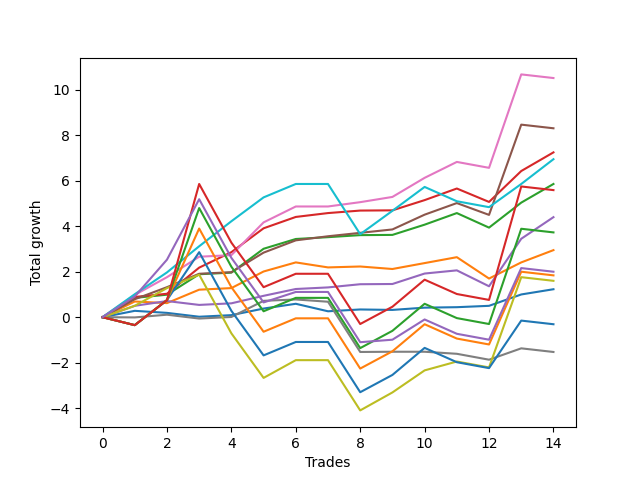

# Short Bernese 001 50 
- Symbol: SPY
- Date Range: 05/27/2022 - 09/30/2022
- Trading Period: 7:20-12:30
- Number of Trades: 14



| Name | Win Percent | Profit | Avg Profit / Trade | Avg Time / Trade |      | Name | Win Percent | Profit | Avg Profit / Trade | Avg Time / Trade |
| ---- | ----------- | ------ | ------------------ | ---------------- | ---- | ---- | ----------- | ------ | ------------------ | ---------------- |
| Sorted By <br> Profit | | | | | | Sorted By <br> Win Percentage ||||
| Five | 78.57 | 5260.00 | 375.71 | 25:53 |     | Two_C | 92.86 | 3625.00 | 258.93 | 17:32 |
| Four | 85.71 | 4155.00 | 296.79 | 21:51 |     | Two | 92.86 | 2930.00 | 209.29 | 17:05 |
| Two_C | 92.86 | 3625.00 | 258.93 | 17:32 |     | Four | 85.71 | 4155.00 | 296.79 | 21:51 |
| Eighty-One | 71.43 | 3475.00 | 248.21 | 31:19 |     | Three | 85.71 | 2200.00 | 157.14 | 13:43 |
| Two | 92.86 | 2930.00 | 209.29 | 17:05 |     | Five | 78.57 | 5260.00 | 375.71 | 25:53 |
| Eighty-Five | 42.86 | 2795.00 | 199.64 | 53:11 |     | Eighty-One | 71.43 | 3475.00 | 248.21 | 31:19 |
| Three | 85.71 | 2200.00 | 157.14 | 13:43 |     | One | 71.43 | 1475.00 | 105.36 | 10:52 |
| Eighty-Four | 42.86 | 1865.00 | 133.21 | 52:02 |     | Zero | 71.43 | 615.00 | 43.93 | 04:40 |
| One | 71.43 | 1475.00 | 105.36 | 10:52 |     | Seven | 57.14 | 800.00 | 57.14 | 35:59 |
| NEWFI 0000 | 50.00 | 1000.00 | 71.43 | 41:26 |     | NEWFI 0000 | 50.00 | 1000.00 | 71.43 | 41:26 |
| Eighty-Three | 42.86 | 920.00 | 65.71 | 50:08 |     | Eighty-Five | 42.86 | 2795.00 | 199.64 | 53:11 |
| Seven | 57.14 | 800.00 | 57.14 | 35:59 |     | Eighty-Four | 42.86 | 1865.00 | 133.21 | 52:02 |
| Zero | 71.43 | 615.00 | 43.93 | 04:40 |     | Eighty-Three | 42.86 | 920.00 | 65.71 | 50:08 |
| Eighty-Two | 42.86 | -155.00 | -11.07 | 49:55 |     | Eighty-Two | 42.86 | -155.00 | -11.07 | 49:55 |
| Six | 42.86 | -765.00 | -54.64 | 10:56 |     | Six | 42.86 | -765.00 | -54.64 | 10:56 |

## NO STOPLOSS

### Test Zero
* Sell when price hits the middle line of the 20p bollinger
* No Stoploss
* Results:
```
Total Trades: 14
Percent Up: 28.57
Percent Down: 71.43
Total Points Moved Down: 1.23
Potential Profit: 615.00
Total Points Ups: 0.61 Count Ups: 4
Total Points Downs: 1.84 Count Downs: 10
```

<details><summary>Trades</summary>

<code>In: 2022-06-09 08:47:00		Out: 2022-06-09 08:48:20		Total Position Time: 01:20		Total Move Down: 0.28		Total to Date: 0.28</code> <br />
<code>In: 2022-06-15 09:19:00		Out: 2022-06-15 09:30:55		Total Position Time: 11:55		Total Move Down: -0.09		Total to Date: 0.19</code> <br />
<code>In: 2022-06-15 11:02:00		Out: 2022-06-15 11:02:10		Total Position Time: 00:10		Total Move Down: -0.17		Total to Date: 0.02</code> <br />
<code>In: 2022-07-06 11:00:00		Out: 2022-07-06 11:00:10		Total Position Time: 00:10		Total Move Down: 0.07		Total to Date: 0.09</code> <br />
<code>In: 2022-07-06 11:10:00		Out: 2022-07-06 11:10:10		Total Position Time: 00:10		Total Move Down: 0.29		Total to Date: 0.38</code> <br />
<code>In: 2022-07-26 10:13:00		Out: 2022-07-26 10:15:10		Total Position Time: 02:10		Total Move Down: 0.21		Total to Date: 0.59</code> <br />
<code>In: 2022-08-01 12:01:00		Out: 2022-08-01 12:20:15		Total Position Time: 19:15		Total Move Down: -0.33		Total to Date: 0.26</code> <br />
<code>In: 2022-08-17 10:33:00		Out: 2022-08-17 10:34:05		Total Position Time: 01:05		Total Move Down: 0.08		Total to Date: 0.34</code> <br />
<code>In: 2022-08-19 09:42:00		Out: 2022-08-19 09:50:05		Total Position Time: 08:05		Total Move Down: -0.02		Total to Date: 0.32</code> <br />
<code>In: 2022-08-31 09:01:00		Out: 2022-08-31 09:04:15		Total Position Time: 03:15		Total Move Down: 0.10		Total to Date: 0.42</code> <br />
<code>In: 2022-09-16 10:41:00		Out: 2022-09-16 10:45:30		Total Position Time: 04:30		Total Move Down: 0.02		Total to Date: 0.44</code> <br />
<code>In: 2022-09-16 11:31:00		Out: 2022-09-16 11:41:05		Total Position Time: 10:05		Total Move Down: 0.06		Total to Date: 0.50</code> <br />
<code>In: 2022-09-21 11:48:00		Out: 2022-09-21 11:48:40		Total Position Time: 00:40		Total Move Down: 0.50		Total to Date: 1.00</code> <br />
<code>In: 2022-09-22 12:16:00		Out: 2022-09-22 12:18:35		Total Position Time: 02:35		Total Move Down: 0.23		Total to Date: 1.23</code> <br />


</details>

### Test One
* Sell when the price hits the upper line of the 20p 1std bollinger
* No Stoploss
* Results:
```
Total Trades: 14
Percent Up: 28.57
Percent Down: 71.43
Total Points Moved Down: 2.95
Potential Profit: 1475.00
Total Points Ups: 1.34 Count Ups: 4
Total Points Downs: 4.29 Count Downs: 10
```

<details><summary>Trades</summary>

<code>In: 2022-06-09 08:47:00		Out: 2022-06-09 08:49:35		Total Position Time: 02:35		Total Move Down: 0.69		Total to Date: 0.69</code> <br />
<code>In: 2022-06-15 09:19:00		Out: 2022-06-15 09:35:10		Total Position Time: 16:10		Total Move Down: -0.07		Total to Date: 0.62</code> <br />
<code>In: 2022-06-15 11:02:00		Out: 2022-06-15 11:03:05		Total Position Time: 01:05		Total Move Down: 0.59		Total to Date: 1.21</code> <br />
<code>In: 2022-07-06 11:00:00		Out: 2022-07-06 11:00:10		Total Position Time: 00:10		Total Move Down: 0.07		Total to Date: 1.28</code> <br />
<code>In: 2022-07-06 11:10:00		Out: 2022-07-06 11:11:10		Total Position Time: 01:10		Total Move Down: 0.73		Total to Date: 2.01</code> <br />
<code>In: 2022-07-26 10:13:00		Out: 2022-07-26 10:17:00		Total Position Time: 04:00		Total Move Down: 0.40		Total to Date: 2.41</code> <br />
<code>In: 2022-08-01 12:01:00		Out: 2022-08-01 12:21:35		Total Position Time: 20:35		Total Move Down: -0.22		Total to Date: 2.19</code> <br />
<code>In: 2022-08-17 10:33:00		Out: 2022-08-17 10:46:05		Total Position Time: 13:05		Total Move Down: 0.04		Total to Date: 2.23</code> <br />
<code>In: 2022-08-19 09:42:00		Out: 2022-08-19 10:01:10		Total Position Time: 19:10		Total Move Down: -0.11		Total to Date: 2.12</code> <br />
<code>In: 2022-08-31 09:01:00		Out: 2022-08-31 09:06:15		Total Position Time: 05:15		Total Move Down: 0.26		Total to Date: 2.38</code> <br />
<code>In: 2022-09-16 10:41:00		Out: 2022-09-16 10:47:05		Total Position Time: 06:05		Total Move Down: 0.26		Total to Date: 2.64</code> <br />
<code>In: 2022-09-16 11:31:00		Out: 2022-09-16 12:14:20		Total Position Time: 43:20		Total Move Down: -0.94		Total to Date: 1.70</code> <br />
<code>In: 2022-09-21 11:48:00		Out: 2022-09-21 12:03:25		Total Position Time: 15:25		Total Move Down: 0.71		Total to Date: 2.41</code> <br />
<code>In: 2022-09-22 12:16:00		Out: 2022-09-22 12:20:15		Total Position Time: 04:15		Total Move Down: 0.54		Total to Date: 2.95</code> <br />


</details>

### Test Two
* Sell when the price hits the upper line of the 20p 2std bollinger
* No Stoploss
* Results:
```
Total Trades: 14
Percent Up: 7.14
Percent Down: 92.86
Total Points Moved Down: 5.86
Potential Profit: 2930.00
Total Points Ups: 0.64 Count Ups: 1
Total Points Downs: 6.50 Count Downs: 13
```

<details><summary>Trades</summary>

<code>In: 2022-06-09 08:47:00		Out: 2022-06-09 09:11:00		Total Position Time: 24:00		Total Move Down: 0.85		Total to Date: 0.85</code> <br />
<code>In: 2022-06-15 09:19:00		Out: 2022-06-15 09:36:10		Total Position Time: 17:10		Total Move Down: 0.14		Total to Date: 0.99</code> <br />
<code>In: 2022-06-15 11:02:00		Out: 2022-06-15 11:03:15		Total Position Time: 01:15		Total Move Down: 0.90		Total to Date: 1.89</code> <br />
<code>In: 2022-07-06 11:00:00		Out: 2022-07-06 11:00:10		Total Position Time: 00:10		Total Move Down: 0.07		Total to Date: 1.96</code> <br />
<code>In: 2022-07-06 11:10:00		Out: 2022-07-06 11:11:45		Total Position Time: 01:45		Total Move Down: 1.05		Total to Date: 3.01</code> <br />
<code>In: 2022-07-26 10:13:00		Out: 2022-07-26 10:32:35		Total Position Time: 19:35		Total Move Down: 0.43		Total to Date: 3.44</code> <br />
<code>In: 2022-08-01 12:01:00		Out: 2022-08-01 12:22:40		Total Position Time: 21:40		Total Move Down: 0.08		Total to Date: 3.52</code> <br />
<code>In: 2022-08-17 10:33:00		Out: 2022-08-17 10:56:40		Total Position Time: 23:40		Total Move Down: 0.09		Total to Date: 3.61</code> <br />
<code>In: 2022-08-19 09:42:00		Out: 2022-08-19 10:13:40		Total Position Time: 31:40		Total Move Down: 0.01		Total to Date: 3.62</code> <br />
<code>In: 2022-08-31 09:01:00		Out: 2022-08-31 09:07:00		Total Position Time: 06:00		Total Move Down: 0.45		Total to Date: 4.07</code> <br />
<code>In: 2022-09-16 10:41:00		Out: 2022-09-16 10:49:25		Total Position Time: 08:25		Total Move Down: 0.51		Total to Date: 4.58</code> <br />
<code>In: 2022-09-16 11:31:00		Out: 2022-09-16 12:28:25		Total Position Time: 57:25		Total Move Down: -0.64		Total to Date: 3.94</code> <br />
<code>In: 2022-09-21 11:48:00		Out: 2022-09-21 12:09:45		Total Position Time: 21:45		Total Move Down: 1.10		Total to Date: 5.04</code> <br />
<code>In: 2022-09-22 12:16:00		Out: 2022-09-22 12:20:40		Total Position Time: 04:40		Total Move Down: 0.82		Total to Date: 5.86</code> <br />


</details>

### Test Two_C
* Sell when the price hits the upper line of the 20p 2std bollinger
* No Stoploss
* Results:
```
Total Trades: 14
Percent Up: 7.14
Percent Down: 92.86
Total Points Moved Down: 7.25
Potential Profit: 3625.00
Total Points Ups: 0.59 Count Ups: 1
Total Points Downs: 7.84 Count Downs: 13
```

<details><summary>Trades</summary>

<code>In: 2022-06-09 08:47:00		Out: 2022-06-09 09:11:05		Total Position Time: 24:05		Total Move Down: 0.89		Total to Date: 0.89</code> <br />
<code>In: 2022-06-15 09:19:00		Out: 2022-06-15 09:36:10		Total Position Time: 17:10		Total Move Down: 0.14		Total to Date: 1.03</code> <br />
<code>In: 2022-06-15 11:02:00		Out: 2022-06-15 11:04:20		Total Position Time: 02:20		Total Move Down: 1.15		Total to Date: 2.18</code> <br />
<code>In: 2022-07-06 11:00:00		Out: 2022-07-06 11:02:25		Total Position Time: 02:25		Total Move Down: 0.68		Total to Date: 2.86</code> <br />
<code>In: 2022-07-06 11:10:00		Out: 2022-07-06 11:11:45		Total Position Time: 01:45		Total Move Down: 1.05		Total to Date: 3.91</code> <br />
<code>In: 2022-07-26 10:13:00		Out: 2022-07-26 10:33:10		Total Position Time: 20:10		Total Move Down: 0.50		Total to Date: 4.41</code> <br />
<code>In: 2022-08-01 12:01:00		Out: 2022-08-01 12:22:55		Total Position Time: 21:55		Total Move Down: 0.17		Total to Date: 4.58</code> <br />
<code>In: 2022-08-17 10:33:00		Out: 2022-08-17 10:57:00		Total Position Time: 24:00		Total Move Down: 0.11		Total to Date: 4.69</code> <br />
<code>In: 2022-08-19 09:42:00		Out: 2022-08-19 10:13:40		Total Position Time: 31:40		Total Move Down: 0.01		Total to Date: 4.70</code> <br />
<code>In: 2022-08-31 09:01:00		Out: 2022-08-31 09:07:00		Total Position Time: 06:00		Total Move Down: 0.45		Total to Date: 5.15</code> <br />
<code>In: 2022-09-16 10:41:00		Out: 2022-09-16 10:49:25		Total Position Time: 08:25		Total Move Down: 0.51		Total to Date: 5.66</code> <br />
<code>In: 2022-09-16 11:31:00		Out: 2022-09-16 12:30:10		Total Position Time: 59:10		Total Move Down: -0.59		Total to Date: 5.07</code> <br />
<code>In: 2022-09-21 11:48:00		Out: 2022-09-21 12:09:55		Total Position Time: 21:55		Total Move Down: 1.36		Total to Date: 6.43</code> <br />
<code>In: 2022-09-22 12:16:00		Out: 2022-09-22 12:20:40		Total Position Time: 04:40		Total Move Down: 0.82		Total to Date: 7.25</code> <br />


</details>

### Test Three
* Sell when price hits the middle line of the 50p bollinger
* No Stoploss
* Results:
```
Total Trades: 14
Percent Up: 14.29
Percent Down: 85.71
Total Points Moved Down: 4.40
Potential Profit: 2200.00
Total Points Ups: 0.87 Count Ups: 2
Total Points Downs: 5.27 Count Downs: 12
```

<details><summary>Trades</summary>

<code>In: 2022-06-09 08:47:00		Out: 2022-06-09 08:48:50		Total Position Time: 01:50		Total Move Down: 0.50		Total to Date: 0.50</code> <br />
<code>In: 2022-06-15 09:19:00		Out: 2022-06-15 09:38:40		Total Position Time: 19:40		Total Move Down: 0.21		Total to Date: 0.71</code> <br />
<code>In: 2022-06-15 11:02:00		Out: 2022-06-15 11:02:10		Total Position Time: 00:10		Total Move Down: -0.17		Total to Date: 0.54</code> <br />
<code>In: 2022-07-06 11:00:00		Out: 2022-07-06 11:00:10		Total Position Time: 00:10		Total Move Down: 0.07		Total to Date: 0.61</code> <br />
<code>In: 2022-07-06 11:10:00		Out: 2022-07-06 11:10:20		Total Position Time: 00:20		Total Move Down: 0.33		Total to Date: 0.94</code> <br />
<code>In: 2022-07-26 10:13:00		Out: 2022-07-26 10:32:25		Total Position Time: 19:25		Total Move Down: 0.30		Total to Date: 1.24</code> <br />
<code>In: 2022-08-01 12:01:00		Out: 2022-08-01 12:22:35		Total Position Time: 21:35		Total Move Down: 0.07		Total to Date: 1.31</code> <br />
<code>In: 2022-08-17 10:33:00		Out: 2022-08-17 10:34:10		Total Position Time: 01:10		Total Move Down: 0.14		Total to Date: 1.45</code> <br />
<code>In: 2022-08-19 09:42:00		Out: 2022-08-19 10:13:40		Total Position Time: 31:40		Total Move Down: 0.01		Total to Date: 1.46</code> <br />
<code>In: 2022-08-31 09:01:00		Out: 2022-08-31 09:10:55		Total Position Time: 09:55		Total Move Down: 0.46		Total to Date: 1.92</code> <br />
<code>In: 2022-09-16 10:41:00		Out: 2022-09-16 10:45:55		Total Position Time: 04:55		Total Move Down: 0.14		Total to Date: 2.06</code> <br />
<code>In: 2022-09-16 11:31:00		Out: 2022-09-16 12:19:05		Total Position Time: 48:05		Total Move Down: -0.70		Total to Date: 1.36</code> <br />
<code>In: 2022-09-21 11:48:00		Out: 2022-09-21 12:10:10		Total Position Time: 22:10		Total Move Down: 2.09		Total to Date: 3.45</code> <br />
<code>In: 2022-09-22 12:16:00		Out: 2022-09-22 12:27:05		Total Position Time: 11:05		Total Move Down: 0.95		Total to Date: 4.40</code> <br />


</details>

### Test Four
* Sell when the price hits the upper line of the 50p 1std bollinger
* No Stoploss
* Results:
```
Total Trades: 14
Percent Up: 14.29
Percent Down: 85.71
Total Points Moved Down: 8.31
Potential Profit: 4155.00
Total Points Ups: 0.68 Count Ups: 2
Total Points Downs: 8.99 Count Downs: 12
```

<details><summary>Trades</summary>

<code>In: 2022-06-09 08:47:00		Out: 2022-06-09 08:50:25		Total Position Time: 03:25		Total Move Down: 0.79		Total to Date: 0.79</code> <br />
<code>In: 2022-06-15 09:19:00		Out: 2022-06-15 09:41:45		Total Position Time: 22:45		Total Move Down: 0.53		Total to Date: 1.32</code> <br />
<code>In: 2022-06-15 11:02:00		Out: 2022-06-15 11:03:05		Total Position Time: 01:05		Total Move Down: 0.59		Total to Date: 1.91</code> <br />
<code>In: 2022-07-06 11:00:00		Out: 2022-07-06 11:00:10		Total Position Time: 00:10		Total Move Down: 0.07		Total to Date: 1.98</code> <br />
<code>In: 2022-07-06 11:10:00		Out: 2022-07-06 11:11:35		Total Position Time: 01:35		Total Move Down: 0.86		Total to Date: 2.84</code> <br />
<code>In: 2022-07-26 10:13:00		Out: 2022-07-26 10:37:45		Total Position Time: 24:45		Total Move Down: 0.54		Total to Date: 3.38</code> <br />
<code>In: 2022-08-01 12:01:00		Out: 2022-08-01 12:43:55		Total Position Time: 42:55		Total Move Down: 0.18		Total to Date: 3.56</code> <br />
<code>In: 2022-08-17 10:33:00		Out: 2022-08-17 11:00:50		Total Position Time: 27:50		Total Move Down: 0.15		Total to Date: 3.71</code> <br />
<code>In: 2022-08-19 09:42:00		Out: 2022-08-19 10:21:00		Total Position Time: 39:00		Total Move Down: 0.15		Total to Date: 3.86</code> <br />
<code>In: 2022-08-31 09:01:00		Out: 2022-08-31 09:22:45		Total Position Time: 21:45		Total Move Down: 0.65		Total to Date: 4.51</code> <br />
<code>In: 2022-09-16 10:41:00		Out: 2022-09-16 10:49:25		Total Position Time: 08:25		Total Move Down: 0.51		Total to Date: 5.02</code> <br />
<code>In: 2022-09-16 11:31:00		Out: 2022-09-16 12:30:15		Total Position Time: 59:15		Total Move Down: -0.52		Total to Date: 4.50</code> <br />
<code>In: 2022-09-21 11:48:00		Out: 2022-09-21 12:11:05		Total Position Time: 23:05		Total Move Down: 3.97		Total to Date: 8.47</code> <br />
<code>In: 2022-09-22 12:16:00		Out: 2022-09-22 12:46:00		Total Position Time: 30:00		Total Move Down: -0.16		Total to Date: 8.31</code> <br />


</details>

### Test Five
* Sell when the price hits the upper line of the 50p 2std bollinger
* No Stoploss
* Results:
```
Total Trades: 14
Percent Up: 21.43
Percent Down: 78.57
Total Points Moved Down: 10.52
Potential Profit: 5260.00
Total Points Ups: 0.42 Count Ups: 3
Total Points Downs: 10.94 Count Downs: 11
```

<details><summary>Trades</summary>

<code>In: 2022-06-09 08:47:00		Out: 2022-06-09 09:11:10		Total Position Time: 24:10		Total Move Down: 0.98		Total to Date: 0.98</code> <br />
<code>In: 2022-06-15 09:19:00		Out: 2022-06-15 09:44:05		Total Position Time: 25:05		Total Move Down: 0.78		Total to Date: 1.76</code> <br />
<code>In: 2022-06-15 11:02:00		Out: 2022-06-15 11:03:15		Total Position Time: 01:15		Total Move Down: 0.90		Total to Date: 2.66</code> <br />
<code>In: 2022-07-06 11:00:00		Out: 2022-07-06 11:00:10		Total Position Time: 00:10		Total Move Down: 0.07		Total to Date: 2.73</code> <br />
<code>In: 2022-07-06 11:10:00		Out: 2022-07-06 11:12:15		Total Position Time: 02:15		Total Move Down: 1.44		Total to Date: 4.17</code> <br />
<code>In: 2022-07-26 10:13:00		Out: 2022-07-26 10:47:00		Total Position Time: 34:00		Total Move Down: 0.70		Total to Date: 4.87</code> <br />
<code>In: 2022-08-01 12:01:00		Out: 2022-08-01 12:46:00		Total Position Time: 45:00		Total Move Down: -0.00		Total to Date: 4.87</code> <br />
<code>In: 2022-08-17 10:33:00		Out: 2022-08-17 11:01:00		Total Position Time: 28:00		Total Move Down: 0.19		Total to Date: 5.06</code> <br />
<code>In: 2022-08-19 09:42:00		Out: 2022-08-19 10:23:40		Total Position Time: 41:40		Total Move Down: 0.23		Total to Date: 5.29</code> <br />
<code>In: 2022-08-31 09:01:00		Out: 2022-08-31 09:23:45		Total Position Time: 22:45		Total Move Down: 0.84		Total to Date: 6.13</code> <br />
<code>In: 2022-09-16 10:41:00		Out: 2022-09-16 10:51:00		Total Position Time: 10:00		Total Move Down: 0.70		Total to Date: 6.83</code> <br />
<code>In: 2022-09-16 11:31:00		Out: 2022-09-16 12:30:55		Total Position Time: 59:55		Total Move Down: -0.26		Total to Date: 6.57</code> <br />
<code>In: 2022-09-21 11:48:00		Out: 2022-09-21 12:26:20		Total Position Time: 38:20		Total Move Down: 4.11		Total to Date: 10.68</code> <br />
<code>In: 2022-09-22 12:16:00		Out: 2022-09-22 12:46:00		Total Position Time: 30:00		Total Move Down: -0.16		Total to Date: 10.52</code> <br />


</details>

### Test Six
* Sell when the price hits the middle line of the 1std VWAP
* No Stoploss
* Results:
```
Total Trades: 14
Percent Up: 57.14
Percent Down: 42.86
Total Points Moved Down: -1.53
Potential Profit: -765.00
Total Points Ups: 3.00 Count Ups: 8
Total Points Downs: 1.47 Count Downs: 6
```

<details><summary>Trades</summary>

<code>In: 2022-06-09 08:47:00		Out: 2022-06-09 08:47:10		Total Position Time: 00:10		Total Move Down: -0.01		Total to Date: -0.01</code> <br />
<code>In: 2022-06-15 09:19:00		Out: 2022-06-15 09:19:10		Total Position Time: 00:10		Total Move Down: 0.12		Total to Date: 0.11</code> <br />
<code>In: 2022-06-15 11:02:00		Out: 2022-06-15 11:02:10		Total Position Time: 00:10		Total Move Down: -0.17		Total to Date: -0.06</code> <br />
<code>In: 2022-07-06 11:00:00		Out: 2022-07-06 11:00:10		Total Position Time: 00:10		Total Move Down: 0.07		Total to Date: 0.01</code> <br />
<code>In: 2022-07-06 11:10:00		Out: 2022-07-06 11:11:15		Total Position Time: 01:15		Total Move Down: 0.71		Total to Date: 0.72</code> <br />
<code>In: 2022-07-26 10:13:00		Out: 2022-07-26 10:13:10		Total Position Time: 00:10		Total Move Down: 0.06		Total to Date: 0.78</code> <br />
<code>In: 2022-08-01 12:01:00		Out: 2022-08-01 12:01:10		Total Position Time: 00:10		Total Move Down: -0.10		Total to Date: 0.68</code> <br />
<code>In: 2022-08-17 10:33:00		Out: 2022-08-17 11:32:55		Total Position Time: 59:55		Total Move Down: -2.21		Total to Date: -1.53</code> <br />
<code>In: 2022-08-19 09:42:00		Out: 2022-08-19 09:42:10		Total Position Time: 00:10		Total Move Down: 0.01		Total to Date: -1.52</code> <br />
<code>In: 2022-08-31 09:01:00		Out: 2022-08-31 09:01:10		Total Position Time: 00:10		Total Move Down: -0.00		Total to Date: -1.52</code> <br />
<code>In: 2022-09-16 10:41:00		Out: 2022-09-16 10:41:10		Total Position Time: 00:10		Total Move Down: -0.09		Total to Date: -1.61</code> <br />
<code>In: 2022-09-16 11:31:00		Out: 2022-09-16 12:30:55		Total Position Time: 59:55		Total Move Down: -0.26		Total to Date: -1.87</code> <br />
<code>In: 2022-09-21 11:48:00		Out: 2022-09-21 11:48:40		Total Position Time: 00:40		Total Move Down: 0.50		Total to Date: -1.37</code> <br />
<code>In: 2022-09-22 12:16:00		Out: 2022-09-22 12:46:00		Total Position Time: 30:00		Total Move Down: -0.16		Total to Date: -1.53</code> <br />


</details>

### Test Seven
* Sell when the price hits the upper line of the 1std VWAP
* No Stoploss
* Results:
```
Total Trades: 14
Percent Up: 42.86
Percent Down: 57.14
Total Points Moved Down: 1.60
Potential Profit: 800.00
Total Points Ups: 7.17 Count Ups: 6
Total Points Downs: 8.77 Count Downs: 8
```

<details><summary>Trades</summary>

<code>In: 2022-06-09 08:47:00		Out: 2022-06-09 08:48:50		Total Position Time: 01:50		Total Move Down: 0.50		Total to Date: 0.50</code> <br />
<code>In: 2022-06-15 09:19:00		Out: 2022-06-15 09:44:05		Total Position Time: 25:05		Total Move Down: 0.78		Total to Date: 1.28</code> <br />
<code>In: 2022-06-15 11:02:00		Out: 2022-06-15 11:03:05		Total Position Time: 01:05		Total Move Down: 0.59		Total to Date: 1.87</code> <br />
<code>In: 2022-07-06 11:00:00		Out: 2022-07-06 11:59:55		Total Position Time: 59:55		Total Move Down: -2.58		Total to Date: -0.71</code> <br />
<code>In: 2022-07-06 11:10:00		Out: 2022-07-06 12:09:55		Total Position Time: 59:55		Total Move Down: -1.96		Total to Date: -2.67</code> <br />
<code>In: 2022-07-26 10:13:00		Out: 2022-07-26 11:10:30		Total Position Time: 57:30		Total Move Down: 0.78		Total to Date: -1.89</code> <br />
<code>In: 2022-08-01 12:01:00		Out: 2022-08-01 12:46:00		Total Position Time: 45:00		Total Move Down: -0.00		Total to Date: -1.89</code> <br />
<code>In: 2022-08-17 10:33:00		Out: 2022-08-17 11:32:55		Total Position Time: 59:55		Total Move Down: -2.21		Total to Date: -4.10</code> <br />
<code>In: 2022-08-19 09:42:00		Out: 2022-08-19 10:31:30		Total Position Time: 49:30		Total Move Down: 0.79		Total to Date: -3.31</code> <br />
<code>In: 2022-08-31 09:01:00		Out: 2022-08-31 09:24:30		Total Position Time: 23:30		Total Move Down: 0.97		Total to Date: -2.34</code> <br />
<code>In: 2022-09-16 10:41:00		Out: 2022-09-16 10:48:35		Total Position Time: 07:35		Total Move Down: 0.39		Total to Date: -1.95</code> <br />
<code>In: 2022-09-16 11:31:00		Out: 2022-09-16 12:30:55		Total Position Time: 59:55		Total Move Down: -0.26		Total to Date: -2.21</code> <br />
<code>In: 2022-09-21 11:48:00		Out: 2022-09-21 12:11:05		Total Position Time: 23:05		Total Move Down: 3.97		Total to Date: 1.76</code> <br />
<code>In: 2022-09-22 12:16:00		Out: 2022-09-22 12:46:00		Total Position Time: 30:00		Total Move Down: -0.16		Total to Date: 1.60</code> <br />


</details>

## TAKE PROFIT

### Test Eighty-One
* Take Profit of 1 Point
* No Stoploss
* Results:
```
Total Trades: 14
Percent Up: 28.57
Percent Down: 71.43
Total Points Moved Down: 6.95
Potential Profit: 3475.00
Total Points Ups: 3.10 Count Ups: 4
Total Points Downs: 10.05 Count Downs: 10
```

<details><summary>Trades</summary>

<code>In: 2022-06-09 08:47:00		Out: 2022-06-09 08:50:40		Total Position Time: 03:40		Total Move Down: 1.01		Total to Date: 1.01</code> <br />
<code>In: 2022-06-15 09:19:00		Out: 2022-06-15 09:52:40		Total Position Time: 33:40		Total Move Down: 0.96		Total to Date: 1.97</code> <br />
<code>In: 2022-06-15 11:02:00		Out: 2022-06-15 11:04:20		Total Position Time: 02:20		Total Move Down: 1.15		Total to Date: 3.12</code> <br />
<code>In: 2022-07-06 11:00:00		Out: 2022-07-06 11:12:15		Total Position Time: 12:15		Total Move Down: 1.10		Total to Date: 4.22</code> <br />
<code>In: 2022-07-06 11:10:00		Out: 2022-07-06 11:11:45		Total Position Time: 01:45		Total Move Down: 1.05		Total to Date: 5.27</code> <br />
<code>In: 2022-07-26 10:13:00		Out: 2022-07-26 11:12:55		Total Position Time: 59:55		Total Move Down: 0.59		Total to Date: 5.86</code> <br />
<code>In: 2022-08-01 12:01:00		Out: 2022-08-01 12:46:00		Total Position Time: 45:00		Total Move Down: -0.00		Total to Date: 5.86</code> <br />
<code>In: 2022-08-17 10:33:00		Out: 2022-08-17 11:32:55		Total Position Time: 59:55		Total Move Down: -2.21		Total to Date: 3.65</code> <br />
<code>In: 2022-08-19 09:42:00		Out: 2022-08-19 10:32:00		Total Position Time: 50:00		Total Move Down: 1.03		Total to Date: 4.68</code> <br />
<code>In: 2022-08-31 09:01:00		Out: 2022-08-31 09:38:50		Total Position Time: 37:50		Total Move Down: 1.05		Total to Date: 5.73</code> <br />
<code>In: 2022-09-16 10:41:00		Out: 2022-09-16 11:40:55		Total Position Time: 59:55		Total Move Down: -0.63		Total to Date: 5.10</code> <br />
<code>In: 2022-09-16 11:31:00		Out: 2022-09-16 12:30:55		Total Position Time: 59:55		Total Move Down: -0.26		Total to Date: 4.84</code> <br />
<code>In: 2022-09-21 11:48:00		Out: 2022-09-21 11:49:05		Total Position Time: 01:05		Total Move Down: 1.02		Total to Date: 5.86</code> <br />
<code>In: 2022-09-22 12:16:00		Out: 2022-09-22 12:27:15		Total Position Time: 11:15		Total Move Down: 1.09		Total to Date: 6.95</code> <br />


</details>

### Test Eighty-Two
* Take Profit of 2 Point
* No Stoploss
* Results:
```
Total Trades: 14
Percent Up: 57.14
Percent Down: 42.86
Total Points Moved Down: -0.31
Potential Profit: -155.00
Total Points Ups: 8.15 Count Ups: 8
Total Points Downs: 7.84 Count Downs: 6
```

<details><summary>Trades</summary>

<code>In: 2022-06-09 08:47:00		Out: 2022-06-09 09:46:55		Total Position Time: 59:55		Total Move Down: -0.35		Total to Date: -0.35</code> <br />
<code>In: 2022-06-15 09:19:00		Out: 2022-06-15 10:18:55		Total Position Time: 59:55		Total Move Down: 1.10		Total to Date: 0.75</code> <br />
<code>In: 2022-06-15 11:02:00		Out: 2022-06-15 11:04:40		Total Position Time: 02:40		Total Move Down: 2.11		Total to Date: 2.86</code> <br />
<code>In: 2022-07-06 11:00:00		Out: 2022-07-06 11:59:55		Total Position Time: 59:55		Total Move Down: -2.58		Total to Date: 0.28</code> <br />
<code>In: 2022-07-06 11:10:00		Out: 2022-07-06 12:09:55		Total Position Time: 59:55		Total Move Down: -1.96		Total to Date: -1.68</code> <br />
<code>In: 2022-07-26 10:13:00		Out: 2022-07-26 11:12:55		Total Position Time: 59:55		Total Move Down: 0.59		Total to Date: -1.09</code> <br />
<code>In: 2022-08-01 12:01:00		Out: 2022-08-01 12:46:00		Total Position Time: 45:00		Total Move Down: -0.00		Total to Date: -1.09</code> <br />
<code>In: 2022-08-17 10:33:00		Out: 2022-08-17 11:32:55		Total Position Time: 59:55		Total Move Down: -2.21		Total to Date: -3.30</code> <br />
<code>In: 2022-08-19 09:42:00		Out: 2022-08-19 10:41:55		Total Position Time: 59:55		Total Move Down: 0.76		Total to Date: -2.54</code> <br />
<code>In: 2022-08-31 09:01:00		Out: 2022-08-31 10:00:55		Total Position Time: 59:55		Total Move Down: 1.19		Total to Date: -1.35</code> <br />
<code>In: 2022-09-16 10:41:00		Out: 2022-09-16 11:40:55		Total Position Time: 59:55		Total Move Down: -0.63		Total to Date: -1.98</code> <br />
<code>In: 2022-09-16 11:31:00		Out: 2022-09-16 12:30:55		Total Position Time: 59:55		Total Move Down: -0.26		Total to Date: -2.24</code> <br />
<code>In: 2022-09-21 11:48:00		Out: 2022-09-21 12:10:10		Total Position Time: 22:10		Total Move Down: 2.09		Total to Date: -0.15</code> <br />
<code>In: 2022-09-22 12:16:00		Out: 2022-09-22 12:46:00		Total Position Time: 30:00		Total Move Down: -0.16		Total to Date: -0.31</code> <br />


</details>

### Test Eighty-Three
* Take Profit of 3 Point
* No Stoploss
* Results:
```
Total Trades: 14
Percent Up: 57.14
Percent Down: 42.86
Total Points Moved Down: 1.84
Potential Profit: 920.00
Total Points Ups: 8.15 Count Ups: 8
Total Points Downs: 9.99 Count Downs: 6
```

<details><summary>Trades</summary>

<code>In: 2022-06-09 08:47:00		Out: 2022-06-09 09:46:55		Total Position Time: 59:55		Total Move Down: -0.35		Total to Date: -0.35</code> <br />
<code>In: 2022-06-15 09:19:00		Out: 2022-06-15 10:18:55		Total Position Time: 59:55		Total Move Down: 1.10		Total to Date: 0.75</code> <br />
<code>In: 2022-06-15 11:02:00		Out: 2022-06-15 11:06:55		Total Position Time: 04:55		Total Move Down: 3.15		Total to Date: 3.90</code> <br />
<code>In: 2022-07-06 11:00:00		Out: 2022-07-06 11:59:55		Total Position Time: 59:55		Total Move Down: -2.58		Total to Date: 1.32</code> <br />
<code>In: 2022-07-06 11:10:00		Out: 2022-07-06 12:09:55		Total Position Time: 59:55		Total Move Down: -1.96		Total to Date: -0.64</code> <br />
<code>In: 2022-07-26 10:13:00		Out: 2022-07-26 11:12:55		Total Position Time: 59:55		Total Move Down: 0.59		Total to Date: -0.05</code> <br />
<code>In: 2022-08-01 12:01:00		Out: 2022-08-01 12:46:00		Total Position Time: 45:00		Total Move Down: -0.00		Total to Date: -0.05</code> <br />
<code>In: 2022-08-17 10:33:00		Out: 2022-08-17 11:32:55		Total Position Time: 59:55		Total Move Down: -2.21		Total to Date: -2.26</code> <br />
<code>In: 2022-08-19 09:42:00		Out: 2022-08-19 10:41:55		Total Position Time: 59:55		Total Move Down: 0.76		Total to Date: -1.50</code> <br />
<code>In: 2022-08-31 09:01:00		Out: 2022-08-31 10:00:55		Total Position Time: 59:55		Total Move Down: 1.19		Total to Date: -0.31</code> <br />
<code>In: 2022-09-16 10:41:00		Out: 2022-09-16 11:40:55		Total Position Time: 59:55		Total Move Down: -0.63		Total to Date: -0.94</code> <br />
<code>In: 2022-09-16 11:31:00		Out: 2022-09-16 12:30:55		Total Position Time: 59:55		Total Move Down: -0.26		Total to Date: -1.20</code> <br />
<code>In: 2022-09-21 11:48:00		Out: 2022-09-21 12:10:50		Total Position Time: 22:50		Total Move Down: 3.20		Total to Date: 2.00</code> <br />
<code>In: 2022-09-22 12:16:00		Out: 2022-09-22 12:46:00		Total Position Time: 30:00		Total Move Down: -0.16		Total to Date: 1.84</code> <br />


</details>

### Test Eighty-Four
* Take Profit of 4 Point
* No Stoploss
* Results:
```
Total Trades: 14
Percent Up: 57.14
Percent Down: 42.86
Total Points Moved Down: 3.73
Potential Profit: 1865.00
Total Points Ups: 8.15 Count Ups: 8
Total Points Downs: 11.88 Count Downs: 6
```

<details><summary>Trades</summary>

<code>In: 2022-06-09 08:47:00		Out: 2022-06-09 09:46:55		Total Position Time: 59:55		Total Move Down: -0.35		Total to Date: -0.35</code> <br />
<code>In: 2022-06-15 09:19:00		Out: 2022-06-15 10:18:55		Total Position Time: 59:55		Total Move Down: 1.10		Total to Date: 0.75</code> <br />
<code>In: 2022-06-15 11:02:00		Out: 2022-06-15 11:32:20		Total Position Time: 30:20		Total Move Down: 4.05		Total to Date: 4.80</code> <br />
<code>In: 2022-07-06 11:00:00		Out: 2022-07-06 11:59:55		Total Position Time: 59:55		Total Move Down: -2.58		Total to Date: 2.22</code> <br />
<code>In: 2022-07-06 11:10:00		Out: 2022-07-06 12:09:55		Total Position Time: 59:55		Total Move Down: -1.96		Total to Date: 0.26</code> <br />
<code>In: 2022-07-26 10:13:00		Out: 2022-07-26 11:12:55		Total Position Time: 59:55		Total Move Down: 0.59		Total to Date: 0.85</code> <br />
<code>In: 2022-08-01 12:01:00		Out: 2022-08-01 12:46:00		Total Position Time: 45:00		Total Move Down: -0.00		Total to Date: 0.85</code> <br />
<code>In: 2022-08-17 10:33:00		Out: 2022-08-17 11:32:55		Total Position Time: 59:55		Total Move Down: -2.21		Total to Date: -1.36</code> <br />
<code>In: 2022-08-19 09:42:00		Out: 2022-08-19 10:41:55		Total Position Time: 59:55		Total Move Down: 0.76		Total to Date: -0.60</code> <br />
<code>In: 2022-08-31 09:01:00		Out: 2022-08-31 10:00:55		Total Position Time: 59:55		Total Move Down: 1.19		Total to Date: 0.59</code> <br />
<code>In: 2022-09-16 10:41:00		Out: 2022-09-16 11:40:55		Total Position Time: 59:55		Total Move Down: -0.63		Total to Date: -0.04</code> <br />
<code>In: 2022-09-16 11:31:00		Out: 2022-09-16 12:30:55		Total Position Time: 59:55		Total Move Down: -0.26		Total to Date: -0.30</code> <br />
<code>In: 2022-09-21 11:48:00		Out: 2022-09-21 12:12:05		Total Position Time: 24:05		Total Move Down: 4.19		Total to Date: 3.89</code> <br />
<code>In: 2022-09-22 12:16:00		Out: 2022-09-22 12:46:00		Total Position Time: 30:00		Total Move Down: -0.16		Total to Date: 3.73</code> <br />


</details>

### Test Eighty-Five
* Take Profit of 5 Point
* No Stoploss
* Results:
```
Total Trades: 14
Percent Up: 57.14
Percent Down: 42.86
Total Points Moved Down: 5.59
Potential Profit: 2795.00
Total Points Ups: 8.15 Count Ups: 8
Total Points Downs: 13.74 Count Downs: 6
```

<details><summary>Trades</summary>

<code>In: 2022-06-09 08:47:00		Out: 2022-06-09 09:46:55		Total Position Time: 59:55		Total Move Down: -0.35		Total to Date: -0.35</code> <br />
<code>In: 2022-06-15 09:19:00		Out: 2022-06-15 10:18:55		Total Position Time: 59:55		Total Move Down: 1.10		Total to Date: 0.75</code> <br />
<code>In: 2022-06-15 11:02:00		Out: 2022-06-15 11:33:20		Total Position Time: 31:20		Total Move Down: 5.11		Total to Date: 5.86</code> <br />
<code>In: 2022-07-06 11:00:00		Out: 2022-07-06 11:59:55		Total Position Time: 59:55		Total Move Down: -2.58		Total to Date: 3.28</code> <br />
<code>In: 2022-07-06 11:10:00		Out: 2022-07-06 12:09:55		Total Position Time: 59:55		Total Move Down: -1.96		Total to Date: 1.32</code> <br />
<code>In: 2022-07-26 10:13:00		Out: 2022-07-26 11:12:55		Total Position Time: 59:55		Total Move Down: 0.59		Total to Date: 1.91</code> <br />
<code>In: 2022-08-01 12:01:00		Out: 2022-08-01 12:46:00		Total Position Time: 45:00		Total Move Down: -0.00		Total to Date: 1.91</code> <br />
<code>In: 2022-08-17 10:33:00		Out: 2022-08-17 11:32:55		Total Position Time: 59:55		Total Move Down: -2.21		Total to Date: -0.30</code> <br />
<code>In: 2022-08-19 09:42:00		Out: 2022-08-19 10:41:55		Total Position Time: 59:55		Total Move Down: 0.76		Total to Date: 0.46</code> <br />
<code>In: 2022-08-31 09:01:00		Out: 2022-08-31 10:00:55		Total Position Time: 59:55		Total Move Down: 1.19		Total to Date: 1.65</code> <br />
<code>In: 2022-09-16 10:41:00		Out: 2022-09-16 11:40:55		Total Position Time: 59:55		Total Move Down: -0.63		Total to Date: 1.02</code> <br />
<code>In: 2022-09-16 11:31:00		Out: 2022-09-16 12:30:55		Total Position Time: 59:55		Total Move Down: -0.26		Total to Date: 0.76</code> <br />
<code>In: 2022-09-21 11:48:00		Out: 2022-09-21 12:27:05		Total Position Time: 39:05		Total Move Down: 4.99		Total to Date: 5.75</code> <br />
<code>In: 2022-09-22 12:16:00		Out: 2022-09-22 12:46:00		Total Position Time: 30:00		Total Move Down: -0.16		Total to Date: 5.59</code> <br />


</details>

## Indicator Exits

### Test NEWFI 0000
* Newfi 0000
* No Stoploss
* Results:
```
Total Trades: 14
Percent Up: 50.00
Percent Down: 50.00
Total Points Moved Down: 2.00
Potential Profit: 1000.00
Total Points Ups: 7.80 Count Ups: 7
Total Points Downs: 9.80 Count Downs: 7
```

<details><summary>Trades</summary>

<code>In: 2022-06-09 08:47:00		Out: 2022-06-09 09:14:05		Total Position Time: 27:05		Total Move Down: 0.91		Total to Date: 0.91</code> <br />
<code>In: 2022-06-15 09:19:00		Out: 2022-06-15 10:01:05		Total Position Time: 42:05		Total Move Down: 1.62		Total to Date: 2.53</code> <br />
<code>In: 2022-06-15 11:02:00		Out: 2022-06-15 11:08:05		Total Position Time: 06:05		Total Move Down: 2.66		Total to Date: 5.19</code> <br />
<code>In: 2022-07-06 11:00:00		Out: 2022-07-06 11:59:55		Total Position Time: 59:55		Total Move Down: -2.58		Total to Date: 2.61</code> <br />
<code>In: 2022-07-06 11:10:00		Out: 2022-07-06 12:09:55		Total Position Time: 59:55		Total Move Down: -1.96		Total to Date: 0.65</code> <br />
<code>In: 2022-07-26 10:13:00		Out: 2022-07-26 10:42:05		Total Position Time: 29:05		Total Move Down: 0.46		Total to Date: 1.11</code> <br />
<code>In: 2022-08-01 12:01:00		Out: 2022-08-01 12:46:00		Total Position Time: 45:00		Total Move Down: -0.00		Total to Date: 1.11</code> <br />
<code>In: 2022-08-17 10:33:00		Out: 2022-08-17 11:32:55		Total Position Time: 59:55		Total Move Down: -2.21		Total to Date: -1.10</code> <br />
<code>In: 2022-08-19 09:42:00		Out: 2022-08-19 10:22:05		Total Position Time: 40:05		Total Move Down: 0.11		Total to Date: -0.99</code> <br />
<code>In: 2022-08-31 09:01:00		Out: 2022-08-31 09:27:05		Total Position Time: 26:05		Total Move Down: 0.89		Total to Date: -0.10</code> <br />
<code>In: 2022-09-16 10:41:00		Out: 2022-09-16 11:40:55		Total Position Time: 59:55		Total Move Down: -0.63		Total to Date: -0.73</code> <br />
<code>In: 2022-09-16 11:31:00		Out: 2022-09-16 12:30:55		Total Position Time: 59:55		Total Move Down: -0.26		Total to Date: -0.99</code> <br />
<code>In: 2022-09-21 11:48:00		Out: 2022-09-21 12:23:05		Total Position Time: 35:05		Total Move Down: 3.15		Total to Date: 2.16</code> <br />
<code>In: 2022-09-22 12:16:00		Out: 2022-09-22 12:46:00		Total Position Time: 30:00		Total Move Down: -0.16		Total to Date: 2.00</code> <br />


</details>