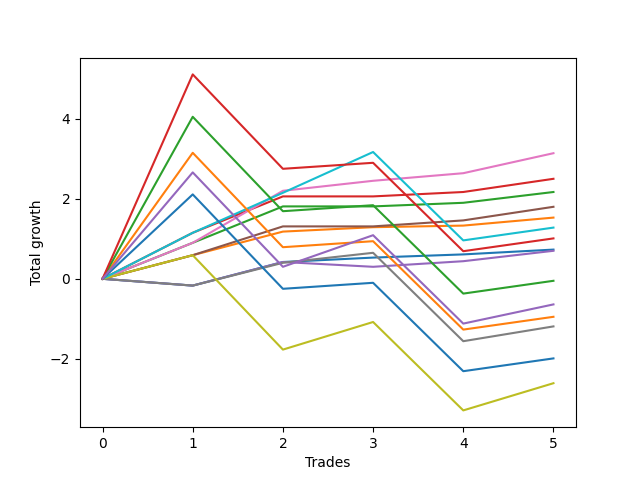

# Short Bernese 002 1v 
- Symbol: SPY
- Date Range: 05/27/2022 - 09/30/2022
- Trading Period: 7:20-12:30
- Number of Trades: 5



| Name | Win Percent | Profit | Avg Profit / Trade | Avg Time / Trade |      | Name | Win Percent | Profit | Avg Profit / Trade | Avg Time / Trade |
| ---- | ----------- | ------ | ------------------ | ---------------- | ---- | ---- | ----------- | ------ | ------------------ | ---------------- |
| Sorted By <br> Profit | | | | | | Sorted By <br> Win Percentage ||||
| Five | 100.00 | 1570.00 | 314.00 | 14:46 |     | Five | 100.00 | 1570.00 | 314.00 | 14:46 |
| Two_C | 80.00 | 1250.00 | 250.00 | 11:52 |     | One | 100.00 | 765.00 | 153.00 | 04:20 |
| Two | 80.00 | 1085.00 | 217.00 | 11:33 |     | Two_C | 80.00 | 1250.00 | 250.00 | 11:52 |
| Four | 80.00 | 900.00 | 180.00 | 13:28 |     | Two | 80.00 | 1085.00 | 217.00 | 11:33 |
| One | 100.00 | 765.00 | 153.00 | 04:20 |     | Four | 80.00 | 900.00 | 180.00 | 13:28 |
| Eighty-One | 80.00 | 640.00 | 128.00 | 31:25 |     | Eighty-One | 80.00 | 640.00 | 128.00 | 31:25 |
| Eighty-Five | 60.00 | 505.00 | 101.00 | 54:12 |     | Zero | 80.00 | 365.00 | 73.00 | 00:45 |
| Zero | 80.00 | 365.00 | 73.00 | 00:45 |     | Eighty-Five | 60.00 | 505.00 | 101.00 | 54:12 |
| Three | 60.00 | 350.00 | 70.00 | 05:58 |     | Three | 60.00 | 350.00 | 70.00 | 05:58 |
| Eighty-Four | 60.00 | -25.00 | -5.00 | 54:00 |     | Eighty-Four | 60.00 | -25.00 | -5.00 | 54:00 |
| NEWFI 0000 | 60.00 | -320.00 | -64.00 | 36:01 |     | NEWFI 0000 | 60.00 | -320.00 | -64.00 | 36:01 |
| Eighty-Three | 60.00 | -475.00 | -95.00 | 48:55 |     | Eighty-Three | 60.00 | -475.00 | -95.00 | 48:55 |
| Six | 60.00 | -595.00 | -119.00 | 20:18 |     | Six | 60.00 | -595.00 | -119.00 | 20:18 |
| Eighty-Two | 60.00 | -995.00 | -199.00 | 48:28 |     | Eighty-Two | 60.00 | -995.00 | -199.00 | 48:28 |
| Seven | 60.00 | -1305.00 | -261.00 | 34:51 |     | Seven | 60.00 | -1305.00 | -261.00 | 34:51 |

## NO STOPLOSS

### Test Zero
* Sell when price hits the middle line of the 20p bollinger
* No Stoploss
* Results:
```
Total Trades: 5
Percent Up: 20.00
Percent Down: 80.00
Total Points Moved Down: 0.73
Potential Profit: 365.00
Total Points Ups: 0.17 Count Ups: 1
Total Points Downs: 0.90 Count Downs: 4
```

<details><summary>Trades</summary>

<code>In: 2022-06-15 11:02:00		Out: 2022-06-15 11:02:10		Total Position Time: 00:10		Total Move Down: -0.17		Total to Date: -0.17</code> <br />
<code>In: 2022-07-06 11:11:00		Out: 2022-07-06 11:11:10		Total Position Time: 00:10		Total Move Down: 0.59		Total to Date: 0.42</code> <br />
<code>In: 2022-08-04 09:16:00		Out: 2022-08-04 09:16:10		Total Position Time: 00:10		Total Move Down: 0.11		Total to Date: 0.53</code> <br />
<code>In: 2022-08-17 10:33:00		Out: 2022-08-17 10:34:05		Total Position Time: 01:05		Total Move Down: 0.08		Total to Date: 0.61</code> <br />
<code>In: 2022-09-21 09:38:00		Out: 2022-09-21 09:40:10		Total Position Time: 02:10		Total Move Down: 0.12		Total to Date: 0.73</code> <br />


</details>

### Test One
* Sell when the price hits the upper line of the 20p 1std bollinger
* No Stoploss
* Results:
```
Total Trades: 5
Percent Up: 0.00
Percent Down: 100.00
Total Points Moved Down: 1.53
Potential Profit: 765.00
Total Points Ups: 0.00 Count Ups: 0
Total Points Downs: 1.53 Count Downs: 5
```

<details><summary>Trades</summary>

<code>In: 2022-06-15 11:02:00		Out: 2022-06-15 11:03:05		Total Position Time: 01:05		Total Move Down: 0.59		Total to Date: 0.59</code> <br />
<code>In: 2022-07-06 11:11:00		Out: 2022-07-06 11:11:10		Total Position Time: 00:10		Total Move Down: 0.59		Total to Date: 1.18</code> <br />
<code>In: 2022-08-04 09:16:00		Out: 2022-08-04 09:16:10		Total Position Time: 00:10		Total Move Down: 0.11		Total to Date: 1.29</code> <br />
<code>In: 2022-08-17 10:33:00		Out: 2022-08-17 10:46:05		Total Position Time: 13:05		Total Move Down: 0.04		Total to Date: 1.33</code> <br />
<code>In: 2022-09-21 09:38:00		Out: 2022-09-21 09:45:10		Total Position Time: 07:10		Total Move Down: 0.20		Total to Date: 1.53</code> <br />


</details>

### Test Two
* Sell when the price hits the upper line of the 20p 2std bollinger
* No Stoploss
* Results:
```
Total Trades: 5
Percent Up: 20.00
Percent Down: 80.00
Total Points Moved Down: 2.17
Potential Profit: 1085.00
Total Points Ups: 0.00 Count Ups: 1
Total Points Downs: 2.17 Count Downs: 4
```

<details><summary>Trades</summary>

<code>In: 2022-06-15 11:02:00		Out: 2022-06-15 11:03:15		Total Position Time: 01:15		Total Move Down: 0.90		Total to Date: 0.90</code> <br />
<code>In: 2022-07-06 11:11:00		Out: 2022-07-06 11:11:45		Total Position Time: 00:45		Total Move Down: 0.91		Total to Date: 1.81</code> <br />
<code>In: 2022-08-04 09:16:00		Out: 2022-08-04 09:38:50		Total Position Time: 22:50		Total Move Down: -0.00		Total to Date: 1.81</code> <br />
<code>In: 2022-08-17 10:33:00		Out: 2022-08-17 10:56:40		Total Position Time: 23:40		Total Move Down: 0.09		Total to Date: 1.90</code> <br />
<code>In: 2022-09-21 09:38:00		Out: 2022-09-21 09:47:15		Total Position Time: 09:15		Total Move Down: 0.27		Total to Date: 2.17</code> <br />


</details>

### Test Two_C
* Sell when the price hits the upper line of the 20p 2std bollinger
* No Stoploss
* Results:
```
Total Trades: 5
Percent Up: 20.00
Percent Down: 80.00
Total Points Moved Down: 2.50
Potential Profit: 1250.00
Total Points Ups: 0.00 Count Ups: 1
Total Points Downs: 2.50 Count Downs: 4
```

<details><summary>Trades</summary>

<code>In: 2022-06-15 11:02:00		Out: 2022-06-15 11:04:20		Total Position Time: 02:20		Total Move Down: 1.15		Total to Date: 1.15</code> <br />
<code>In: 2022-07-06 11:11:00		Out: 2022-07-06 11:11:45		Total Position Time: 00:45		Total Move Down: 0.91		Total to Date: 2.06</code> <br />
<code>In: 2022-08-04 09:16:00		Out: 2022-08-04 09:38:50		Total Position Time: 22:50		Total Move Down: -0.00		Total to Date: 2.06</code> <br />
<code>In: 2022-08-17 10:33:00		Out: 2022-08-17 10:57:00		Total Position Time: 24:00		Total Move Down: 0.11		Total to Date: 2.17</code> <br />
<code>In: 2022-09-21 09:38:00		Out: 2022-09-21 09:47:25		Total Position Time: 09:25		Total Move Down: 0.33		Total to Date: 2.50</code> <br />


</details>

### Test Three
* Sell when price hits the middle line of the 50p bollinger
* No Stoploss
* Results:
```
Total Trades: 5
Percent Up: 40.00
Percent Down: 60.00
Total Points Moved Down: 0.70
Potential Profit: 350.00
Total Points Ups: 0.29 Count Ups: 2
Total Points Downs: 0.99 Count Downs: 3
```

<details><summary>Trades</summary>

<code>In: 2022-06-15 11:02:00		Out: 2022-06-15 11:02:10		Total Position Time: 00:10		Total Move Down: -0.17		Total to Date: -0.17</code> <br />
<code>In: 2022-07-06 11:11:00		Out: 2022-07-06 11:11:10		Total Position Time: 00:10		Total Move Down: 0.59		Total to Date: 0.42</code> <br />
<code>In: 2022-08-04 09:16:00		Out: 2022-08-04 09:36:50		Total Position Time: 20:50		Total Move Down: -0.12		Total to Date: 0.30</code> <br />
<code>In: 2022-08-17 10:33:00		Out: 2022-08-17 10:34:10		Total Position Time: 01:10		Total Move Down: 0.14		Total to Date: 0.44</code> <br />
<code>In: 2022-09-21 09:38:00		Out: 2022-09-21 09:45:30		Total Position Time: 07:30		Total Move Down: 0.26		Total to Date: 0.70</code> <br />


</details>

### Test Four
* Sell when the price hits the upper line of the 50p 1std bollinger
* No Stoploss
* Results:
```
Total Trades: 5
Percent Up: 20.00
Percent Down: 80.00
Total Points Moved Down: 1.80
Potential Profit: 900.00
Total Points Ups: 0.00 Count Ups: 1
Total Points Downs: 1.80 Count Downs: 4
```

<details><summary>Trades</summary>

<code>In: 2022-06-15 11:02:00		Out: 2022-06-15 11:03:05		Total Position Time: 01:05		Total Move Down: 0.59		Total to Date: 0.59</code> <br />
<code>In: 2022-07-06 11:11:00		Out: 2022-07-06 11:11:35		Total Position Time: 00:35		Total Move Down: 0.72		Total to Date: 1.31</code> <br />
<code>In: 2022-08-04 09:16:00		Out: 2022-08-04 09:38:50		Total Position Time: 22:50		Total Move Down: -0.00		Total to Date: 1.31</code> <br />
<code>In: 2022-08-17 10:33:00		Out: 2022-08-17 11:00:50		Total Position Time: 27:50		Total Move Down: 0.15		Total to Date: 1.46</code> <br />
<code>In: 2022-09-21 09:38:00		Out: 2022-09-21 09:53:00		Total Position Time: 15:00		Total Move Down: 0.34		Total to Date: 1.80</code> <br />


</details>

### Test Five
* Sell when the price hits the upper line of the 50p 2std bollinger
* No Stoploss
* Results:
```
Total Trades: 5
Percent Up: 0.00
Percent Down: 100.00
Total Points Moved Down: 3.14
Potential Profit: 1570.00
Total Points Ups: 0.00 Count Ups: 0
Total Points Downs: 3.14 Count Downs: 5
```

<details><summary>Trades</summary>

<code>In: 2022-06-15 11:02:00		Out: 2022-06-15 11:03:15		Total Position Time: 01:15		Total Move Down: 0.90		Total to Date: 0.90</code> <br />
<code>In: 2022-07-06 11:11:00		Out: 2022-07-06 11:12:15		Total Position Time: 01:15		Total Move Down: 1.30		Total to Date: 2.20</code> <br />
<code>In: 2022-08-04 09:16:00		Out: 2022-08-04 09:42:00		Total Position Time: 26:00		Total Move Down: 0.25		Total to Date: 2.45</code> <br />
<code>In: 2022-08-17 10:33:00		Out: 2022-08-17 11:01:00		Total Position Time: 28:00		Total Move Down: 0.19		Total to Date: 2.64</code> <br />
<code>In: 2022-09-21 09:38:00		Out: 2022-09-21 09:55:20		Total Position Time: 17:20		Total Move Down: 0.50		Total to Date: 3.14</code> <br />


</details>

### Test Six
* Sell when the price hits the middle line of the 1std VWAP
* No Stoploss
* Results:
```
Total Trades: 5
Percent Up: 40.00
Percent Down: 60.00
Total Points Moved Down: -1.19
Potential Profit: -595.00
Total Points Ups: 2.38 Count Ups: 2
Total Points Downs: 1.19 Count Downs: 3
```

<details><summary>Trades</summary>

<code>In: 2022-06-15 11:02:00		Out: 2022-06-15 11:02:10		Total Position Time: 00:10		Total Move Down: -0.17		Total to Date: -0.17</code> <br />
<code>In: 2022-07-06 11:11:00		Out: 2022-07-06 11:11:15		Total Position Time: 00:15		Total Move Down: 0.57		Total to Date: 0.40</code> <br />
<code>In: 2022-08-04 09:16:00		Out: 2022-08-04 09:42:00		Total Position Time: 26:00		Total Move Down: 0.25		Total to Date: 0.65</code> <br />
<code>In: 2022-08-17 10:33:00		Out: 2022-08-17 11:32:55		Total Position Time: 59:55		Total Move Down: -2.21		Total to Date: -1.56</code> <br />
<code>In: 2022-09-21 09:38:00		Out: 2022-09-21 09:53:10		Total Position Time: 15:10		Total Move Down: 0.37		Total to Date: -1.19</code> <br />


</details>

### Test Seven
* Sell when the price hits the upper line of the 1std VWAP
* No Stoploss
* Results:
```
Total Trades: 5
Percent Up: 40.00
Percent Down: 60.00
Total Points Moved Down: -2.61
Potential Profit: -1305.00
Total Points Ups: 4.57 Count Ups: 2
Total Points Downs: 1.96 Count Downs: 3
```

<details><summary>Trades</summary>

<code>In: 2022-06-15 11:02:00		Out: 2022-06-15 11:03:05		Total Position Time: 01:05		Total Move Down: 0.59		Total to Date: 0.59</code> <br />
<code>In: 2022-07-06 11:11:00		Out: 2022-07-06 12:10:55		Total Position Time: 59:55		Total Move Down: -2.36		Total to Date: -1.77</code> <br />
<code>In: 2022-08-04 09:16:00		Out: 2022-08-04 09:47:10		Total Position Time: 31:10		Total Move Down: 0.69		Total to Date: -1.08</code> <br />
<code>In: 2022-08-17 10:33:00		Out: 2022-08-17 11:32:55		Total Position Time: 59:55		Total Move Down: -2.21		Total to Date: -3.29</code> <br />
<code>In: 2022-09-21 09:38:00		Out: 2022-09-21 10:00:10		Total Position Time: 22:10		Total Move Down: 0.68		Total to Date: -2.61</code> <br />


</details>

## TAKE PROFIT

### Test Eighty-One
* Take Profit of 1 Point
* No Stoploss
* Results:
```
Total Trades: 5
Percent Up: 20.00
Percent Down: 80.00
Total Points Moved Down: 1.28
Potential Profit: 640.00
Total Points Ups: 2.21 Count Ups: 1
Total Points Downs: 3.49 Count Downs: 4
```

<details><summary>Trades</summary>

<code>In: 2022-06-15 11:02:00		Out: 2022-06-15 11:04:20		Total Position Time: 02:20		Total Move Down: 1.15		Total to Date: 1.15</code> <br />
<code>In: 2022-07-06 11:11:00		Out: 2022-07-06 11:12:05		Total Position Time: 01:05		Total Move Down: 1.00		Total to Date: 2.15</code> <br />
<code>In: 2022-08-04 09:16:00		Out: 2022-08-04 09:49:50		Total Position Time: 33:50		Total Move Down: 1.02		Total to Date: 3.17</code> <br />
<code>In: 2022-08-17 10:33:00		Out: 2022-08-17 11:32:55		Total Position Time: 59:55		Total Move Down: -2.21		Total to Date: 0.96</code> <br />
<code>In: 2022-09-21 09:38:00		Out: 2022-09-21 10:37:55		Total Position Time: 59:55		Total Move Down: 0.32		Total to Date: 1.28</code> <br />


</details>

### Test Eighty-Two
* Take Profit of 2 Point
* No Stoploss
* Results:
```
Total Trades: 5
Percent Up: 40.00
Percent Down: 60.00
Total Points Moved Down: -1.99
Potential Profit: -995.00
Total Points Ups: 4.57 Count Ups: 2
Total Points Downs: 2.58 Count Downs: 3
```

<details><summary>Trades</summary>

<code>In: 2022-06-15 11:02:00		Out: 2022-06-15 11:04:40		Total Position Time: 02:40		Total Move Down: 2.11		Total to Date: 2.11</code> <br />
<code>In: 2022-07-06 11:11:00		Out: 2022-07-06 12:10:55		Total Position Time: 59:55		Total Move Down: -2.36		Total to Date: -0.25</code> <br />
<code>In: 2022-08-04 09:16:00		Out: 2022-08-04 10:15:55		Total Position Time: 59:55		Total Move Down: 0.15		Total to Date: -0.10</code> <br />
<code>In: 2022-08-17 10:33:00		Out: 2022-08-17 11:32:55		Total Position Time: 59:55		Total Move Down: -2.21		Total to Date: -2.31</code> <br />
<code>In: 2022-09-21 09:38:00		Out: 2022-09-21 10:37:55		Total Position Time: 59:55		Total Move Down: 0.32		Total to Date: -1.99</code> <br />


</details>

### Test Eighty-Three
* Take Profit of 3 Point
* No Stoploss
* Results:
```
Total Trades: 5
Percent Up: 40.00
Percent Down: 60.00
Total Points Moved Down: -0.95
Potential Profit: -475.00
Total Points Ups: 4.57 Count Ups: 2
Total Points Downs: 3.62 Count Downs: 3
```

<details><summary>Trades</summary>

<code>In: 2022-06-15 11:02:00		Out: 2022-06-15 11:06:55		Total Position Time: 04:55		Total Move Down: 3.15		Total to Date: 3.15</code> <br />
<code>In: 2022-07-06 11:11:00		Out: 2022-07-06 12:10:55		Total Position Time: 59:55		Total Move Down: -2.36		Total to Date: 0.79</code> <br />
<code>In: 2022-08-04 09:16:00		Out: 2022-08-04 10:15:55		Total Position Time: 59:55		Total Move Down: 0.15		Total to Date: 0.94</code> <br />
<code>In: 2022-08-17 10:33:00		Out: 2022-08-17 11:32:55		Total Position Time: 59:55		Total Move Down: -2.21		Total to Date: -1.27</code> <br />
<code>In: 2022-09-21 09:38:00		Out: 2022-09-21 10:37:55		Total Position Time: 59:55		Total Move Down: 0.32		Total to Date: -0.95</code> <br />


</details>

### Test Eighty-Four
* Take Profit of 4 Point
* No Stoploss
* Results:
```
Total Trades: 5
Percent Up: 40.00
Percent Down: 60.00
Total Points Moved Down: -0.05
Potential Profit: -25.00
Total Points Ups: 4.57 Count Ups: 2
Total Points Downs: 4.52 Count Downs: 3
```

<details><summary>Trades</summary>

<code>In: 2022-06-15 11:02:00		Out: 2022-06-15 11:32:20		Total Position Time: 30:20		Total Move Down: 4.05		Total to Date: 4.05</code> <br />
<code>In: 2022-07-06 11:11:00		Out: 2022-07-06 12:10:55		Total Position Time: 59:55		Total Move Down: -2.36		Total to Date: 1.69</code> <br />
<code>In: 2022-08-04 09:16:00		Out: 2022-08-04 10:15:55		Total Position Time: 59:55		Total Move Down: 0.15		Total to Date: 1.84</code> <br />
<code>In: 2022-08-17 10:33:00		Out: 2022-08-17 11:32:55		Total Position Time: 59:55		Total Move Down: -2.21		Total to Date: -0.37</code> <br />
<code>In: 2022-09-21 09:38:00		Out: 2022-09-21 10:37:55		Total Position Time: 59:55		Total Move Down: 0.32		Total to Date: -0.05</code> <br />


</details>

### Test Eighty-Five
* Take Profit of 5 Point
* No Stoploss
* Results:
```
Total Trades: 5
Percent Up: 40.00
Percent Down: 60.00
Total Points Moved Down: 1.01
Potential Profit: 505.00
Total Points Ups: 4.57 Count Ups: 2
Total Points Downs: 5.58 Count Downs: 3
```

<details><summary>Trades</summary>

<code>In: 2022-06-15 11:02:00		Out: 2022-06-15 11:33:20		Total Position Time: 31:20		Total Move Down: 5.11		Total to Date: 5.11</code> <br />
<code>In: 2022-07-06 11:11:00		Out: 2022-07-06 12:10:55		Total Position Time: 59:55		Total Move Down: -2.36		Total to Date: 2.75</code> <br />
<code>In: 2022-08-04 09:16:00		Out: 2022-08-04 10:15:55		Total Position Time: 59:55		Total Move Down: 0.15		Total to Date: 2.90</code> <br />
<code>In: 2022-08-17 10:33:00		Out: 2022-08-17 11:32:55		Total Position Time: 59:55		Total Move Down: -2.21		Total to Date: 0.69</code> <br />
<code>In: 2022-09-21 09:38:00		Out: 2022-09-21 10:37:55		Total Position Time: 59:55		Total Move Down: 0.32		Total to Date: 1.01</code> <br />


</details>

## Indicator Exits

### Test NEWFI 0000
* Newfi 0000
* No Stoploss
* Results:
```
Total Trades: 5
Percent Up: 40.00
Percent Down: 60.00
Total Points Moved Down: -0.64
Potential Profit: -320.00
Total Points Ups: 4.57 Count Ups: 2
Total Points Downs: 3.93 Count Downs: 3
```

<details><summary>Trades</summary>

<code>In: 2022-06-15 11:02:00		Out: 2022-06-15 11:08:05		Total Position Time: 06:05		Total Move Down: 2.66		Total to Date: 2.66</code> <br />
<code>In: 2022-07-06 11:11:00		Out: 2022-07-06 12:10:55		Total Position Time: 59:55		Total Move Down: -2.36		Total to Date: 0.30</code> <br />
<code>In: 2022-08-04 09:16:00		Out: 2022-08-04 09:51:05		Total Position Time: 35:05		Total Move Down: 0.79		Total to Date: 1.09</code> <br />
<code>In: 2022-08-17 10:33:00		Out: 2022-08-17 11:32:55		Total Position Time: 59:55		Total Move Down: -2.21		Total to Date: -1.12</code> <br />
<code>In: 2022-09-21 09:38:00		Out: 2022-09-21 09:57:05		Total Position Time: 19:05		Total Move Down: 0.48		Total to Date: -0.64</code> <br />


</details>