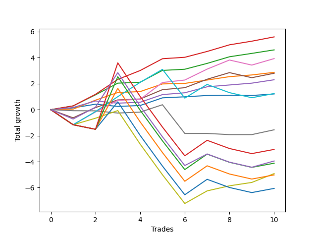

# Short Bernese 002 50 
- Symbol: SPY
- Date Range: 05/27/2022 - 09/30/2022
- Trading Period: 7:20-12:30
- Number of Trades: 10



| Name | Win Percent | Profit | Avg Profit / Trade | Avg Time / Trade |      | Name | Win Percent | Profit | Avg Profit / Trade | Avg Time / Trade |
| ---- | ----------- | ------ | ------------------ | ---------------- | ---- | ---- | ----------- | ------ | ------------------ | ---------------- |
| Sorted By <br> Profit | | | | | | Sorted By <br> Win Percentage ||||
| Two_C | 100.00 | 2800.00 | 280.00 | 09:20 |     | Two_C | 100.00 | 2800.00 | 280.00 | 09:20 |
| Two | 100.00 | 2300.00 | 230.00 | 08:56 |     | Two | 100.00 | 2300.00 | 230.00 | 08:56 |
| Five | 80.00 | 1965.00 | 196.50 | 22:28 |     | One | 100.00 | 1435.00 | 143.50 | 04:52 |
| One | 100.00 | 1435.00 | 143.50 | 04:52 |     | Three | 90.00 | 1150.00 | 115.00 | 03:57 |
| Four | 80.00 | 1400.00 | 140.00 | 19:22 |     | Five | 80.00 | 1965.00 | 196.50 | 22:28 |
| Three | 90.00 | 1150.00 | 115.00 | 03:57 |     | Four | 80.00 | 1400.00 | 140.00 | 19:22 |
| Eighty-One | 60.00 | 620.00 | 62.00 | 35:40 |     | Zero | 80.00 | 605.00 | 60.50 | 01:23 |
| Zero | 80.00 | 605.00 | 60.50 | 01:23 |     | Eighty-One | 60.00 | 620.00 | 62.00 | 35:40 |
| Six | 30.00 | -775.00 | -77.50 | 07:39 |     | Seven | 60.00 | -2460.00 | -246.00 | 30:02 |
| Eighty-Five | 30.00 | -1530.00 | -153.00 | 57:03 |     | NEWFI 0000 | 40.00 | -1975.00 | -197.50 | 43:30 |
| NEWFI 0000 | 40.00 | -1975.00 | -197.50 | 43:30 |     | Six | 30.00 | -775.00 | -77.50 | 07:39 |
| Eighty-Four | 30.00 | -2060.00 | -206.00 | 56:57 |     | Eighty-Five | 30.00 | -1530.00 | -153.00 | 57:03 |
| Seven | 60.00 | -2460.00 | -246.00 | 30:02 |     | Eighty-Four | 30.00 | -2060.00 | -206.00 | 56:57 |
| Eighty-Three | 30.00 | -2510.00 | -251.00 | 54:25 |     | Eighty-Three | 30.00 | -2510.00 | -251.00 | 54:25 |
| Eighty-Two | 30.00 | -3030.00 | -303.00 | 54:11 |     | Eighty-Two | 30.00 | -3030.00 | -303.00 | 54:11 |

## NO STOPLOSS

### Test Zero
* Sell when price hits the middle line of the 20p bollinger
* No Stoploss
* Results:
```
Total Trades: 10
Percent Up: 20.00
Percent Down: 80.00
Total Points Moved Down: 1.21
Potential Profit: 605.00
Total Points Ups: 0.19 Count Ups: 2
Total Points Downs: 1.40 Count Downs: 8
```

<details><summary>Trades</summary>

<code>In: 2022-06-01 11:08:00		Out: 2022-06-01 11:08:45		Total Position Time: 00:45		Total Move Down: 0.14		Total to Date: 0.14</code> <br />
<code>In: 2022-06-09 08:47:00		Out: 2022-06-09 08:48:20		Total Position Time: 01:20		Total Move Down: 0.28		Total to Date: 0.42</code> <br />
<code>In: 2022-06-15 11:02:00		Out: 2022-06-15 11:02:10		Total Position Time: 00:10		Total Move Down: -0.17		Total to Date: 0.25</code> <br />
<code>In: 2022-07-06 11:00:00		Out: 2022-07-06 11:00:10		Total Position Time: 00:10		Total Move Down: 0.07		Total to Date: 0.32</code> <br />
<code>In: 2022-07-06 11:11:00		Out: 2022-07-06 11:11:10		Total Position Time: 00:10		Total Move Down: 0.59		Total to Date: 0.91</code> <br />
<code>In: 2022-08-17 10:33:00		Out: 2022-08-17 10:34:05		Total Position Time: 01:05		Total Move Down: 0.08		Total to Date: 0.99</code> <br />
<code>In: 2022-08-31 09:01:00		Out: 2022-08-31 09:04:15		Total Position Time: 03:15		Total Move Down: 0.10		Total to Date: 1.09</code> <br />
<code>In: 2022-09-16 10:41:00		Out: 2022-09-16 10:45:30		Total Position Time: 04:30		Total Move Down: 0.02		Total to Date: 1.11</code> <br />
<code>In: 2022-09-21 08:47:00		Out: 2022-09-21 08:47:15		Total Position Time: 00:15		Total Move Down: -0.02		Total to Date: 1.09</code> <br />
<code>In: 2022-09-21 09:38:00		Out: 2022-09-21 09:40:10		Total Position Time: 02:10		Total Move Down: 0.12		Total to Date: 1.21</code> <br />


</details>

### Test One
* Sell when the price hits the upper line of the 20p 1std bollinger
* No Stoploss
* Results:
```
Total Trades: 10
Percent Up: 0.00
Percent Down: 100.00
Total Points Moved Down: 2.87
Potential Profit: 1435.00
Total Points Ups: 0.00 Count Ups: 0
Total Points Downs: 2.87 Count Downs: 10
```

<details><summary>Trades</summary>

<code>In: 2022-06-01 11:08:00		Out: 2022-06-01 11:18:10		Total Position Time: 10:10		Total Move Down: 0.04		Total to Date: 0.04</code> <br />
<code>In: 2022-06-09 08:47:00		Out: 2022-06-09 08:49:35		Total Position Time: 02:35		Total Move Down: 0.69		Total to Date: 0.73</code> <br />
<code>In: 2022-06-15 11:02:00		Out: 2022-06-15 11:03:05		Total Position Time: 01:05		Total Move Down: 0.59		Total to Date: 1.32</code> <br />
<code>In: 2022-07-06 11:00:00		Out: 2022-07-06 11:00:10		Total Position Time: 00:10		Total Move Down: 0.07		Total to Date: 1.39</code> <br />
<code>In: 2022-07-06 11:11:00		Out: 2022-07-06 11:11:10		Total Position Time: 00:10		Total Move Down: 0.59		Total to Date: 1.98</code> <br />
<code>In: 2022-08-17 10:33:00		Out: 2022-08-17 10:46:05		Total Position Time: 13:05		Total Move Down: 0.04		Total to Date: 2.02</code> <br />
<code>In: 2022-08-31 09:01:00		Out: 2022-08-31 09:06:15		Total Position Time: 05:15		Total Move Down: 0.26		Total to Date: 2.28</code> <br />
<code>In: 2022-09-16 10:41:00		Out: 2022-09-16 10:47:05		Total Position Time: 06:05		Total Move Down: 0.26		Total to Date: 2.54</code> <br />
<code>In: 2022-09-21 08:47:00		Out: 2022-09-21 08:50:00		Total Position Time: 03:00		Total Move Down: 0.13		Total to Date: 2.67</code> <br />
<code>In: 2022-09-21 09:38:00		Out: 2022-09-21 09:45:10		Total Position Time: 07:10		Total Move Down: 0.20		Total to Date: 2.87</code> <br />


</details>

### Test Two
* Sell when the price hits the upper line of the 20p 2std bollinger
* No Stoploss
* Results:
```
Total Trades: 10
Percent Up: 0.00
Percent Down: 100.00
Total Points Moved Down: 4.60
Potential Profit: 2300.00
Total Points Ups: 0.00 Count Ups: 0
Total Points Downs: 4.60 Count Downs: 10
```

<details><summary>Trades</summary>

<code>In: 2022-06-01 11:08:00		Out: 2022-06-01 11:19:20		Total Position Time: 11:20		Total Move Down: 0.29		Total to Date: 0.29</code> <br />
<code>In: 2022-06-09 08:47:00		Out: 2022-06-09 09:11:00		Total Position Time: 24:00		Total Move Down: 0.85		Total to Date: 1.14</code> <br />
<code>In: 2022-06-15 11:02:00		Out: 2022-06-15 11:03:15		Total Position Time: 01:15		Total Move Down: 0.90		Total to Date: 2.04</code> <br />
<code>In: 2022-07-06 11:00:00		Out: 2022-07-06 11:00:10		Total Position Time: 00:10		Total Move Down: 0.07		Total to Date: 2.11</code> <br />
<code>In: 2022-07-06 11:11:00		Out: 2022-07-06 11:11:45		Total Position Time: 00:45		Total Move Down: 0.91		Total to Date: 3.02</code> <br />
<code>In: 2022-08-17 10:33:00		Out: 2022-08-17 10:56:40		Total Position Time: 23:40		Total Move Down: 0.09		Total to Date: 3.11</code> <br />
<code>In: 2022-08-31 09:01:00		Out: 2022-08-31 09:07:00		Total Position Time: 06:00		Total Move Down: 0.45		Total to Date: 3.56</code> <br />
<code>In: 2022-09-16 10:41:00		Out: 2022-09-16 10:49:25		Total Position Time: 08:25		Total Move Down: 0.51		Total to Date: 4.07</code> <br />
<code>In: 2022-09-21 08:47:00		Out: 2022-09-21 08:51:35		Total Position Time: 04:35		Total Move Down: 0.26		Total to Date: 4.33</code> <br />
<code>In: 2022-09-21 09:38:00		Out: 2022-09-21 09:47:15		Total Position Time: 09:15		Total Move Down: 0.27		Total to Date: 4.60</code> <br />


</details>

### Test Two_C
* Sell when the price hits the upper line of the 20p 2std bollinger
* No Stoploss
* Results:
```
Total Trades: 10
Percent Up: 0.00
Percent Down: 100.00
Total Points Moved Down: 5.60
Potential Profit: 2800.00
Total Points Ups: 0.00 Count Ups: 0
Total Points Downs: 5.60 Count Downs: 10
```

<details><summary>Trades</summary>

<code>In: 2022-06-01 11:08:00		Out: 2022-06-01 11:19:20		Total Position Time: 11:20		Total Move Down: 0.29		Total to Date: 0.29</code> <br />
<code>In: 2022-06-09 08:47:00		Out: 2022-06-09 09:11:05		Total Position Time: 24:05		Total Move Down: 0.89		Total to Date: 1.18</code> <br />
<code>In: 2022-06-15 11:02:00		Out: 2022-06-15 11:04:20		Total Position Time: 02:20		Total Move Down: 1.15		Total to Date: 2.33</code> <br />
<code>In: 2022-07-06 11:00:00		Out: 2022-07-06 11:02:25		Total Position Time: 02:25		Total Move Down: 0.68		Total to Date: 3.01</code> <br />
<code>In: 2022-07-06 11:11:00		Out: 2022-07-06 11:11:45		Total Position Time: 00:45		Total Move Down: 0.91		Total to Date: 3.92</code> <br />
<code>In: 2022-08-17 10:33:00		Out: 2022-08-17 10:57:00		Total Position Time: 24:00		Total Move Down: 0.11		Total to Date: 4.03</code> <br />
<code>In: 2022-08-31 09:01:00		Out: 2022-08-31 09:07:00		Total Position Time: 06:00		Total Move Down: 0.45		Total to Date: 4.48</code> <br />
<code>In: 2022-09-16 10:41:00		Out: 2022-09-16 10:49:25		Total Position Time: 08:25		Total Move Down: 0.51		Total to Date: 4.99</code> <br />
<code>In: 2022-09-21 08:47:00		Out: 2022-09-21 08:51:40		Total Position Time: 04:40		Total Move Down: 0.28		Total to Date: 5.27</code> <br />
<code>In: 2022-09-21 09:38:00		Out: 2022-09-21 09:47:25		Total Position Time: 09:25		Total Move Down: 0.33		Total to Date: 5.60</code> <br />


</details>

### Test Three
* Sell when price hits the middle line of the 50p bollinger
* No Stoploss
* Results:
```
Total Trades: 10
Percent Up: 10.00
Percent Down: 90.00
Total Points Moved Down: 2.30
Potential Profit: 1150.00
Total Points Ups: 0.17 Count Ups: 1
Total Points Downs: 2.47 Count Downs: 9
```

<details><summary>Trades</summary>

<code>In: 2022-06-01 11:08:00		Out: 2022-06-01 11:18:40		Total Position Time: 10:40		Total Move Down: 0.17		Total to Date: 0.17</code> <br />
<code>In: 2022-06-09 08:47:00		Out: 2022-06-09 08:48:50		Total Position Time: 01:50		Total Move Down: 0.50		Total to Date: 0.67</code> <br />
<code>In: 2022-06-15 11:02:00		Out: 2022-06-15 11:02:10		Total Position Time: 00:10		Total Move Down: -0.17		Total to Date: 0.50</code> <br />
<code>In: 2022-07-06 11:00:00		Out: 2022-07-06 11:00:10		Total Position Time: 00:10		Total Move Down: 0.07		Total to Date: 0.57</code> <br />
<code>In: 2022-07-06 11:11:00		Out: 2022-07-06 11:11:10		Total Position Time: 00:10		Total Move Down: 0.59		Total to Date: 1.16</code> <br />
<code>In: 2022-08-17 10:33:00		Out: 2022-08-17 10:34:10		Total Position Time: 01:10		Total Move Down: 0.14		Total to Date: 1.30</code> <br />
<code>In: 2022-08-31 09:01:00		Out: 2022-08-31 09:10:55		Total Position Time: 09:55		Total Move Down: 0.46		Total to Date: 1.76</code> <br />
<code>In: 2022-09-16 10:41:00		Out: 2022-09-16 10:45:55		Total Position Time: 04:55		Total Move Down: 0.14		Total to Date: 1.90</code> <br />
<code>In: 2022-09-21 08:47:00		Out: 2022-09-21 08:50:05		Total Position Time: 03:05		Total Move Down: 0.14		Total to Date: 2.04</code> <br />
<code>In: 2022-09-21 09:38:00		Out: 2022-09-21 09:45:30		Total Position Time: 07:30		Total Move Down: 0.26		Total to Date: 2.30</code> <br />


</details>

### Test Four
* Sell when the price hits the upper line of the 50p 1std bollinger
* No Stoploss
* Results:
```
Total Trades: 10
Percent Up: 20.00
Percent Down: 80.00
Total Points Moved Down: 2.80
Potential Profit: 1400.00
Total Points Ups: 1.02 Count Ups: 2
Total Points Downs: 3.82 Count Downs: 8
```

<details><summary>Trades</summary>

<code>In: 2022-06-01 11:08:00		Out: 2022-06-01 12:03:30		Total Position Time: 55:30		Total Move Down: -0.63		Total to Date: -0.63</code> <br />
<code>In: 2022-06-09 08:47:00		Out: 2022-06-09 08:50:25		Total Position Time: 03:25		Total Move Down: 0.79		Total to Date: 0.16</code> <br />
<code>In: 2022-06-15 11:02:00		Out: 2022-06-15 11:03:05		Total Position Time: 01:05		Total Move Down: 0.59		Total to Date: 0.75</code> <br />
<code>In: 2022-07-06 11:00:00		Out: 2022-07-06 11:00:10		Total Position Time: 00:10		Total Move Down: 0.07		Total to Date: 0.82</code> <br />
<code>In: 2022-07-06 11:11:00		Out: 2022-07-06 11:11:35		Total Position Time: 00:35		Total Move Down: 0.72		Total to Date: 1.54</code> <br />
<code>In: 2022-08-17 10:33:00		Out: 2022-08-17 11:00:50		Total Position Time: 27:50		Total Move Down: 0.15		Total to Date: 1.69</code> <br />
<code>In: 2022-08-31 09:01:00		Out: 2022-08-31 09:22:45		Total Position Time: 21:45		Total Move Down: 0.65		Total to Date: 2.34</code> <br />
<code>In: 2022-09-16 10:41:00		Out: 2022-09-16 10:49:25		Total Position Time: 08:25		Total Move Down: 0.51		Total to Date: 2.85</code> <br />
<code>In: 2022-09-21 08:47:00		Out: 2022-09-21 09:46:55		Total Position Time: 59:55		Total Move Down: -0.39		Total to Date: 2.46</code> <br />
<code>In: 2022-09-21 09:38:00		Out: 2022-09-21 09:53:00		Total Position Time: 15:00		Total Move Down: 0.34		Total to Date: 2.80</code> <br />


</details>

### Test Five
* Sell when the price hits the upper line of the 50p 2std bollinger
* No Stoploss
* Results:
```
Total Trades: 10
Percent Up: 20.00
Percent Down: 80.00
Total Points Moved Down: 3.93
Potential Profit: 1965.00
Total Points Ups: 1.55 Count Ups: 2
Total Points Downs: 5.48 Count Downs: 8
```

<details><summary>Trades</summary>

<code>In: 2022-06-01 11:08:00		Out: 2022-06-01 12:07:55		Total Position Time: 59:55		Total Move Down: -1.16		Total to Date: -1.16</code> <br />
<code>In: 2022-06-09 08:47:00		Out: 2022-06-09 09:11:10		Total Position Time: 24:10		Total Move Down: 0.98		Total to Date: -0.18</code> <br />
<code>In: 2022-06-15 11:02:00		Out: 2022-06-15 11:03:15		Total Position Time: 01:15		Total Move Down: 0.90		Total to Date: 0.72</code> <br />
<code>In: 2022-07-06 11:00:00		Out: 2022-07-06 11:00:10		Total Position Time: 00:10		Total Move Down: 0.07		Total to Date: 0.79</code> <br />
<code>In: 2022-07-06 11:11:00		Out: 2022-07-06 11:12:15		Total Position Time: 01:15		Total Move Down: 1.30		Total to Date: 2.09</code> <br />
<code>In: 2022-08-17 10:33:00		Out: 2022-08-17 11:01:00		Total Position Time: 28:00		Total Move Down: 0.19		Total to Date: 2.28</code> <br />
<code>In: 2022-08-31 09:01:00		Out: 2022-08-31 09:23:45		Total Position Time: 22:45		Total Move Down: 0.84		Total to Date: 3.12</code> <br />
<code>In: 2022-09-16 10:41:00		Out: 2022-09-16 10:51:00		Total Position Time: 10:00		Total Move Down: 0.70		Total to Date: 3.82</code> <br />
<code>In: 2022-09-21 08:47:00		Out: 2022-09-21 09:46:55		Total Position Time: 59:55		Total Move Down: -0.39		Total to Date: 3.43</code> <br />
<code>In: 2022-09-21 09:38:00		Out: 2022-09-21 09:55:20		Total Position Time: 17:20		Total Move Down: 0.50		Total to Date: 3.93</code> <br />


</details>

### Test Six
* Sell when the price hits the middle line of the 1std VWAP
* No Stoploss
* Results:
```
Total Trades: 10
Percent Up: 70.00
Percent Down: 30.00
Total Points Moved Down: -1.55
Potential Profit: -775.00
Total Points Ups: 2.56 Count Ups: 7
Total Points Downs: 1.01 Count Downs: 3
```

<details><summary>Trades</summary>

<code>In: 2022-06-01 11:08:00		Out: 2022-06-01 11:08:10		Total Position Time: 00:10		Total Move Down: -0.08		Total to Date: -0.08</code> <br />
<code>In: 2022-06-09 08:47:00		Out: 2022-06-09 08:47:10		Total Position Time: 00:10		Total Move Down: -0.01		Total to Date: -0.09</code> <br />
<code>In: 2022-06-15 11:02:00		Out: 2022-06-15 11:02:10		Total Position Time: 00:10		Total Move Down: -0.17		Total to Date: -0.26</code> <br />
<code>In: 2022-07-06 11:00:00		Out: 2022-07-06 11:00:10		Total Position Time: 00:10		Total Move Down: 0.07		Total to Date: -0.19</code> <br />
<code>In: 2022-07-06 11:11:00		Out: 2022-07-06 11:11:15		Total Position Time: 00:15		Total Move Down: 0.57		Total to Date: 0.38</code> <br />
<code>In: 2022-08-17 10:33:00		Out: 2022-08-17 11:32:55		Total Position Time: 59:55		Total Move Down: -2.21		Total to Date: -1.83</code> <br />
<code>In: 2022-08-31 09:01:00		Out: 2022-08-31 09:01:10		Total Position Time: 00:10		Total Move Down: -0.00		Total to Date: -1.83</code> <br />
<code>In: 2022-09-16 10:41:00		Out: 2022-09-16 10:41:10		Total Position Time: 00:10		Total Move Down: -0.09		Total to Date: -1.92</code> <br />
<code>In: 2022-09-21 08:47:00		Out: 2022-09-21 08:47:10		Total Position Time: 00:10		Total Move Down: -0.00		Total to Date: -1.92</code> <br />
<code>In: 2022-09-21 09:38:00		Out: 2022-09-21 09:53:10		Total Position Time: 15:10		Total Move Down: 0.37		Total to Date: -1.55</code> <br />


</details>

### Test Seven
* Sell when the price hits the upper line of the 1std VWAP
* No Stoploss
* Results:
```
Total Trades: 10
Percent Up: 40.00
Percent Down: 60.00
Total Points Moved Down: -4.92
Potential Profit: -2460.00
Total Points Ups: 8.31 Count Ups: 4
Total Points Downs: 3.39 Count Downs: 6
```

<details><summary>Trades</summary>

<code>In: 2022-06-01 11:08:00		Out: 2022-06-01 12:07:55		Total Position Time: 59:55		Total Move Down: -1.16		Total to Date: -1.16</code> <br />
<code>In: 2022-06-09 08:47:00		Out: 2022-06-09 08:48:50		Total Position Time: 01:50		Total Move Down: 0.50		Total to Date: -0.66</code> <br />
<code>In: 2022-06-15 11:02:00		Out: 2022-06-15 11:03:05		Total Position Time: 01:05		Total Move Down: 0.59		Total to Date: -0.07</code> <br />
<code>In: 2022-07-06 11:00:00		Out: 2022-07-06 11:59:55		Total Position Time: 59:55		Total Move Down: -2.58		Total to Date: -2.65</code> <br />
<code>In: 2022-07-06 11:11:00		Out: 2022-07-06 12:10:55		Total Position Time: 59:55		Total Move Down: -2.36		Total to Date: -5.01</code> <br />
<code>In: 2022-08-17 10:33:00		Out: 2022-08-17 11:32:55		Total Position Time: 59:55		Total Move Down: -2.21		Total to Date: -7.22</code> <br />
<code>In: 2022-08-31 09:01:00		Out: 2022-08-31 09:24:30		Total Position Time: 23:30		Total Move Down: 0.97		Total to Date: -6.25</code> <br />
<code>In: 2022-09-16 10:41:00		Out: 2022-09-16 10:48:35		Total Position Time: 07:35		Total Move Down: 0.39		Total to Date: -5.86</code> <br />
<code>In: 2022-09-21 08:47:00		Out: 2022-09-21 08:51:35		Total Position Time: 04:35		Total Move Down: 0.26		Total to Date: -5.60</code> <br />
<code>In: 2022-09-21 09:38:00		Out: 2022-09-21 10:00:10		Total Position Time: 22:10		Total Move Down: 0.68		Total to Date: -4.92</code> <br />


</details>

## TAKE PROFIT

### Test Eighty-One
* Take Profit of 1 Point
* No Stoploss
* Results:
```
Total Trades: 10
Percent Up: 40.00
Percent Down: 60.00
Total Points Moved Down: 1.24
Potential Profit: 620.00
Total Points Ups: 4.39 Count Ups: 4
Total Points Downs: 5.63 Count Downs: 6
```

<details><summary>Trades</summary>

<code>In: 2022-06-01 11:08:00		Out: 2022-06-01 12:07:55		Total Position Time: 59:55		Total Move Down: -1.16		Total to Date: -1.16</code> <br />
<code>In: 2022-06-09 08:47:00		Out: 2022-06-09 08:50:40		Total Position Time: 03:40		Total Move Down: 1.01		Total to Date: -0.15</code> <br />
<code>In: 2022-06-15 11:02:00		Out: 2022-06-15 11:04:20		Total Position Time: 02:20		Total Move Down: 1.15		Total to Date: 1.00</code> <br />
<code>In: 2022-07-06 11:00:00		Out: 2022-07-06 11:12:15		Total Position Time: 12:15		Total Move Down: 1.10		Total to Date: 2.10</code> <br />
<code>In: 2022-07-06 11:11:00		Out: 2022-07-06 11:12:05		Total Position Time: 01:05		Total Move Down: 1.00		Total to Date: 3.10</code> <br />
<code>In: 2022-08-17 10:33:00		Out: 2022-08-17 11:32:55		Total Position Time: 59:55		Total Move Down: -2.21		Total to Date: 0.89</code> <br />
<code>In: 2022-08-31 09:01:00		Out: 2022-08-31 09:38:50		Total Position Time: 37:50		Total Move Down: 1.05		Total to Date: 1.94</code> <br />
<code>In: 2022-09-16 10:41:00		Out: 2022-09-16 11:40:55		Total Position Time: 59:55		Total Move Down: -0.63		Total to Date: 1.31</code> <br />
<code>In: 2022-09-21 08:47:00		Out: 2022-09-21 09:46:55		Total Position Time: 59:55		Total Move Down: -0.39		Total to Date: 0.92</code> <br />
<code>In: 2022-09-21 09:38:00		Out: 2022-09-21 10:37:55		Total Position Time: 59:55		Total Move Down: 0.32		Total to Date: 1.24</code> <br />


</details>

### Test Eighty-Two
* Take Profit of 2 Point
* No Stoploss
* Results:
```
Total Trades: 10
Percent Up: 70.00
Percent Down: 30.00
Total Points Moved Down: -6.06
Potential Profit: -3030.00
Total Points Ups: 9.68 Count Ups: 7
Total Points Downs: 3.62 Count Downs: 3
```

<details><summary>Trades</summary>

<code>In: 2022-06-01 11:08:00		Out: 2022-06-01 12:07:55		Total Position Time: 59:55		Total Move Down: -1.16		Total to Date: -1.16</code> <br />
<code>In: 2022-06-09 08:47:00		Out: 2022-06-09 09:46:55		Total Position Time: 59:55		Total Move Down: -0.35		Total to Date: -1.51</code> <br />
<code>In: 2022-06-15 11:02:00		Out: 2022-06-15 11:04:40		Total Position Time: 02:40		Total Move Down: 2.11		Total to Date: 0.60</code> <br />
<code>In: 2022-07-06 11:00:00		Out: 2022-07-06 11:59:55		Total Position Time: 59:55		Total Move Down: -2.58		Total to Date: -1.98</code> <br />
<code>In: 2022-07-06 11:11:00		Out: 2022-07-06 12:10:55		Total Position Time: 59:55		Total Move Down: -2.36		Total to Date: -4.34</code> <br />
<code>In: 2022-08-17 10:33:00		Out: 2022-08-17 11:32:55		Total Position Time: 59:55		Total Move Down: -2.21		Total to Date: -6.55</code> <br />
<code>In: 2022-08-31 09:01:00		Out: 2022-08-31 10:00:55		Total Position Time: 59:55		Total Move Down: 1.19		Total to Date: -5.36</code> <br />
<code>In: 2022-09-16 10:41:00		Out: 2022-09-16 11:40:55		Total Position Time: 59:55		Total Move Down: -0.63		Total to Date: -5.99</code> <br />
<code>In: 2022-09-21 08:47:00		Out: 2022-09-21 09:46:55		Total Position Time: 59:55		Total Move Down: -0.39		Total to Date: -6.38</code> <br />
<code>In: 2022-09-21 09:38:00		Out: 2022-09-21 10:37:55		Total Position Time: 59:55		Total Move Down: 0.32		Total to Date: -6.06</code> <br />


</details>

### Test Eighty-Three
* Take Profit of 3 Point
* No Stoploss
* Results:
```
Total Trades: 10
Percent Up: 70.00
Percent Down: 30.00
Total Points Moved Down: -5.02
Potential Profit: -2510.00
Total Points Ups: 9.68 Count Ups: 7
Total Points Downs: 4.66 Count Downs: 3
```

<details><summary>Trades</summary>

<code>In: 2022-06-01 11:08:00		Out: 2022-06-01 12:07:55		Total Position Time: 59:55		Total Move Down: -1.16		Total to Date: -1.16</code> <br />
<code>In: 2022-06-09 08:47:00		Out: 2022-06-09 09:46:55		Total Position Time: 59:55		Total Move Down: -0.35		Total to Date: -1.51</code> <br />
<code>In: 2022-06-15 11:02:00		Out: 2022-06-15 11:06:55		Total Position Time: 04:55		Total Move Down: 3.15		Total to Date: 1.64</code> <br />
<code>In: 2022-07-06 11:00:00		Out: 2022-07-06 11:59:55		Total Position Time: 59:55		Total Move Down: -2.58		Total to Date: -0.94</code> <br />
<code>In: 2022-07-06 11:11:00		Out: 2022-07-06 12:10:55		Total Position Time: 59:55		Total Move Down: -2.36		Total to Date: -3.30</code> <br />
<code>In: 2022-08-17 10:33:00		Out: 2022-08-17 11:32:55		Total Position Time: 59:55		Total Move Down: -2.21		Total to Date: -5.51</code> <br />
<code>In: 2022-08-31 09:01:00		Out: 2022-08-31 10:00:55		Total Position Time: 59:55		Total Move Down: 1.19		Total to Date: -4.32</code> <br />
<code>In: 2022-09-16 10:41:00		Out: 2022-09-16 11:40:55		Total Position Time: 59:55		Total Move Down: -0.63		Total to Date: -4.95</code> <br />
<code>In: 2022-09-21 08:47:00		Out: 2022-09-21 09:46:55		Total Position Time: 59:55		Total Move Down: -0.39		Total to Date: -5.34</code> <br />
<code>In: 2022-09-21 09:38:00		Out: 2022-09-21 10:37:55		Total Position Time: 59:55		Total Move Down: 0.32		Total to Date: -5.02</code> <br />


</details>

### Test Eighty-Four
* Take Profit of 4 Point
* No Stoploss
* Results:
```
Total Trades: 10
Percent Up: 70.00
Percent Down: 30.00
Total Points Moved Down: -4.12
Potential Profit: -2060.00
Total Points Ups: 9.68 Count Ups: 7
Total Points Downs: 5.56 Count Downs: 3
```

<details><summary>Trades</summary>

<code>In: 2022-06-01 11:08:00		Out: 2022-06-01 12:07:55		Total Position Time: 59:55		Total Move Down: -1.16		Total to Date: -1.16</code> <br />
<code>In: 2022-06-09 08:47:00		Out: 2022-06-09 09:46:55		Total Position Time: 59:55		Total Move Down: -0.35		Total to Date: -1.51</code> <br />
<code>In: 2022-06-15 11:02:00		Out: 2022-06-15 11:32:20		Total Position Time: 30:20		Total Move Down: 4.05		Total to Date: 2.54</code> <br />
<code>In: 2022-07-06 11:00:00		Out: 2022-07-06 11:59:55		Total Position Time: 59:55		Total Move Down: -2.58		Total to Date: -0.04</code> <br />
<code>In: 2022-07-06 11:11:00		Out: 2022-07-06 12:10:55		Total Position Time: 59:55		Total Move Down: -2.36		Total to Date: -2.40</code> <br />
<code>In: 2022-08-17 10:33:00		Out: 2022-08-17 11:32:55		Total Position Time: 59:55		Total Move Down: -2.21		Total to Date: -4.61</code> <br />
<code>In: 2022-08-31 09:01:00		Out: 2022-08-31 10:00:55		Total Position Time: 59:55		Total Move Down: 1.19		Total to Date: -3.42</code> <br />
<code>In: 2022-09-16 10:41:00		Out: 2022-09-16 11:40:55		Total Position Time: 59:55		Total Move Down: -0.63		Total to Date: -4.05</code> <br />
<code>In: 2022-09-21 08:47:00		Out: 2022-09-21 09:46:55		Total Position Time: 59:55		Total Move Down: -0.39		Total to Date: -4.44</code> <br />
<code>In: 2022-09-21 09:38:00		Out: 2022-09-21 10:37:55		Total Position Time: 59:55		Total Move Down: 0.32		Total to Date: -4.12</code> <br />


</details>

### Test Eighty-Five
* Take Profit of 5 Point
* No Stoploss
* Results:
```
Total Trades: 10
Percent Up: 70.00
Percent Down: 30.00
Total Points Moved Down: -3.06
Potential Profit: -1530.00
Total Points Ups: 9.68 Count Ups: 7
Total Points Downs: 6.62 Count Downs: 3
```

<details><summary>Trades</summary>

<code>In: 2022-06-01 11:08:00		Out: 2022-06-01 12:07:55		Total Position Time: 59:55		Total Move Down: -1.16		Total to Date: -1.16</code> <br />
<code>In: 2022-06-09 08:47:00		Out: 2022-06-09 09:46:55		Total Position Time: 59:55		Total Move Down: -0.35		Total to Date: -1.51</code> <br />
<code>In: 2022-06-15 11:02:00		Out: 2022-06-15 11:33:20		Total Position Time: 31:20		Total Move Down: 5.11		Total to Date: 3.60</code> <br />
<code>In: 2022-07-06 11:00:00		Out: 2022-07-06 11:59:55		Total Position Time: 59:55		Total Move Down: -2.58		Total to Date: 1.02</code> <br />
<code>In: 2022-07-06 11:11:00		Out: 2022-07-06 12:10:55		Total Position Time: 59:55		Total Move Down: -2.36		Total to Date: -1.34</code> <br />
<code>In: 2022-08-17 10:33:00		Out: 2022-08-17 11:32:55		Total Position Time: 59:55		Total Move Down: -2.21		Total to Date: -3.55</code> <br />
<code>In: 2022-08-31 09:01:00		Out: 2022-08-31 10:00:55		Total Position Time: 59:55		Total Move Down: 1.19		Total to Date: -2.36</code> <br />
<code>In: 2022-09-16 10:41:00		Out: 2022-09-16 11:40:55		Total Position Time: 59:55		Total Move Down: -0.63		Total to Date: -2.99</code> <br />
<code>In: 2022-09-21 08:47:00		Out: 2022-09-21 09:46:55		Total Position Time: 59:55		Total Move Down: -0.39		Total to Date: -3.38</code> <br />
<code>In: 2022-09-21 09:38:00		Out: 2022-09-21 10:37:55		Total Position Time: 59:55		Total Move Down: 0.32		Total to Date: -3.06</code> <br />


</details>

## Indicator Exits

### Test NEWFI 0000
* Newfi 0000
* No Stoploss
* Results:
```
Total Trades: 10
Percent Up: 60.00
Percent Down: 40.00
Total Points Moved Down: -3.95
Potential Profit: -1975.00
Total Points Ups: 8.89 Count Ups: 6
Total Points Downs: 4.94 Count Downs: 4
```

<details><summary>Trades</summary>

<code>In: 2022-06-01 11:08:00		Out: 2022-06-01 12:05:05		Total Position Time: 57:05		Total Move Down: -0.72		Total to Date: -0.72</code> <br />
<code>In: 2022-06-09 08:47:00		Out: 2022-06-09 09:14:05		Total Position Time: 27:05		Total Move Down: 0.91		Total to Date: 0.19</code> <br />
<code>In: 2022-06-15 11:02:00		Out: 2022-06-15 11:08:05		Total Position Time: 06:05		Total Move Down: 2.66		Total to Date: 2.85</code> <br />
<code>In: 2022-07-06 11:00:00		Out: 2022-07-06 11:59:55		Total Position Time: 59:55		Total Move Down: -2.58		Total to Date: 0.27</code> <br />
<code>In: 2022-07-06 11:11:00		Out: 2022-07-06 12:10:55		Total Position Time: 59:55		Total Move Down: -2.36		Total to Date: -2.09</code> <br />
<code>In: 2022-08-17 10:33:00		Out: 2022-08-17 11:32:55		Total Position Time: 59:55		Total Move Down: -2.21		Total to Date: -4.30</code> <br />
<code>In: 2022-08-31 09:01:00		Out: 2022-08-31 09:27:05		Total Position Time: 26:05		Total Move Down: 0.89		Total to Date: -3.41</code> <br />
<code>In: 2022-09-16 10:41:00		Out: 2022-09-16 11:40:55		Total Position Time: 59:55		Total Move Down: -0.63		Total to Date: -4.04</code> <br />
<code>In: 2022-09-21 08:47:00		Out: 2022-09-21 09:46:55		Total Position Time: 59:55		Total Move Down: -0.39		Total to Date: -4.43</code> <br />
<code>In: 2022-09-21 09:38:00		Out: 2022-09-21 09:57:05		Total Position Time: 19:05		Total Move Down: 0.48		Total to Date: -3.95</code> <br />


</details>