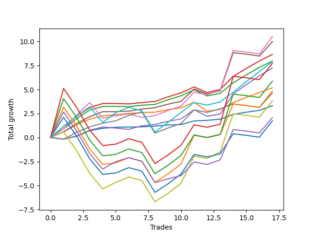

# Short Bernese 003 1v 
- Symbol: SPY
- Date Range: 05/27/2022 - 09/30/2022
- Trading Period: 7:20-12:30
- Number of Trades: 17



| Name | Win Percent | Profit | Avg Profit / Trade | Avg Time / Trade |      | Name | Win Percent | Profit | Avg Profit / Trade | Avg Time / Trade |
| ---- | ----------- | ------ | ------------------ | ---------------- | ---- | ---- | ----------- | ------ | ------------------ | ---------------- |
| Sorted By <br> Profit | | | | | | Sorted By <br> Win Percentage ||||
| Five | 70.59 | 5255.00 | 309.12 | 31:32 |     | One | 94.12 | 2585.00 | 152.06 | 09:30 |
| Four | 76.47 | 4990.00 | 293.53 | 23:44 |     | Zero | 94.12 | 1655.00 | 97.35 | 03:17 |
| Two_C | 82.35 | 4330.00 | 254.71 | 15:32 |     | Two_C | 82.35 | 4330.00 | 254.71 | 15:32 |
| Two | 82.35 | 3980.00 | 234.12 | 15:17 |     | Two | 82.35 | 3980.00 | 234.12 | 15:17 |
| Eighty-One | 76.47 | 3955.00 | 232.65 | 32:28 |     | Four | 76.47 | 4990.00 | 293.53 | 23:44 |
| Eighty-Five | 52.94 | 3865.00 | 227.35 | 53:25 |     | Eighty-One | 76.47 | 3955.00 | 232.65 | 32:28 |
| Three | 76.47 | 3620.00 | 212.94 | 14:02 |     | Three | 76.47 | 3620.00 | 212.94 | 14:02 |
| Eighty-Four | 52.94 | 2935.00 | 172.65 | 52:29 |     | Five | 70.59 | 5255.00 | 309.12 | 31:32 |
| One | 94.12 | 2585.00 | 152.06 | 09:30 |     | Six | 70.59 | 2315.00 | 136.18 | 26:12 |
| Eighty-Three | 52.94 | 2425.00 | 142.65 | 49:44 |     | Eighty-Five | 52.94 | 3865.00 | 227.35 | 53:25 |
| Six | 70.59 | 2315.00 | 136.18 | 26:12 |     | Eighty-Four | 52.94 | 2935.00 | 172.65 | 52:29 |
| Seven | 52.94 | 1910.00 | 112.35 | 45:32 |     | Eighty-Three | 52.94 | 2425.00 | 142.65 | 49:44 |
| Zero | 94.12 | 1655.00 | 97.35 | 03:17 |     | Seven | 52.94 | 1910.00 | 112.35 | 45:32 |
| NEWFI 0000 | 52.94 | 1040.00 | 61.18 | 40:32 |     | NEWFI 0000 | 52.94 | 1040.00 | 61.18 | 40:32 |
| Eighty-Two | 52.94 | 870.00 | 51.18 | 49:07 |     | Eighty-Two | 52.94 | 870.00 | 51.18 | 49:07 |

## NO STOPLOSS

### Test Zero
* Sell when price hits the middle line of the 20p bollinger
* No Stoploss
* Results:
```
Total Trades: 17
Percent Up: 5.88
Percent Down: 94.12
Total Points Moved Down: 3.31
Potential Profit: 1655.00
Total Points Ups: 0.17 Count Ups: 1
Total Points Downs: 3.48 Count Downs: 16
```

<details><summary>Trades</summary>

<code>In: 2022-06-15 11:02:00		Out: 2022-06-15 11:02:10		Total Position Time: 00:10		Total Move Down: -0.17		Total to Date: -0.17</code> <br />
<code>In: 2022-07-06 11:10:00		Out: 2022-07-06 11:10:10		Total Position Time: 00:10		Total Move Down: 0.29		Total to Date: 0.12</code> <br />
<code>In: 2022-07-06 11:11:00		Out: 2022-07-06 11:11:10		Total Position Time: 00:10		Total Move Down: 0.59		Total to Date: 0.71</code> <br />
<code>In: 2022-07-11 09:41:00		Out: 2022-07-11 09:44:20		Total Position Time: 03:20		Total Move Down: 0.25		Total to Date: 0.96</code> <br />
<code>In: 2022-08-04 09:16:00		Out: 2022-08-04 09:16:10		Total Position Time: 00:10		Total Move Down: 0.11		Total to Date: 1.07</code> <br />
<code>In: 2022-08-05 10:10:00		Out: 2022-08-05 10:20:05		Total Position Time: 10:05		Total Move Down: 0.02		Total to Date: 1.09</code> <br />
<code>In: 2022-08-17 09:41:00		Out: 2022-08-17 09:50:20		Total Position Time: 09:20		Total Move Down: 0.02		Total to Date: 1.11</code> <br />
<code>In: 2022-08-17 10:33:00		Out: 2022-08-17 10:34:05		Total Position Time: 01:05		Total Move Down: 0.08		Total to Date: 1.19</code> <br />
<code>In: 2022-09-12 10:32:00		Out: 2022-09-12 10:36:35		Total Position Time: 04:35		Total Move Down: 0.11		Total to Date: 1.30</code> <br />
<code>In: 2022-09-12 10:33:00		Out: 2022-09-12 10:36:35		Total Position Time: 03:35		Total Move Down: 0.05		Total to Date: 1.35</code> <br />
<code>In: 2022-09-15 10:29:00		Out: 2022-09-15 10:30:20		Total Position Time: 01:20		Total Move Down: 0.38		Total to Date: 1.73</code> <br />
<code>In: 2022-09-16 11:31:00		Out: 2022-09-16 11:41:05		Total Position Time: 10:05		Total Move Down: 0.06		Total to Date: 1.79</code> <br />
<code>In: 2022-09-21 09:38:00		Out: 2022-09-21 09:40:10		Total Position Time: 02:10		Total Move Down: 0.12		Total to Date: 1.91</code> <br />
<code>In: 2022-09-21 11:48:00		Out: 2022-09-21 11:48:40		Total Position Time: 00:40		Total Move Down: 0.50		Total to Date: 2.41</code> <br />
<code>In: 2022-09-22 12:16:00		Out: 2022-09-22 12:18:35		Total Position Time: 02:35		Total Move Down: 0.23		Total to Date: 2.64</code> <br />
<code>In: 2022-09-22 12:17:00		Out: 2022-09-22 12:18:35		Total Position Time: 01:35		Total Move Down: 0.19		Total to Date: 2.83</code> <br />
<code>In: 2022-09-29 08:57:00		Out: 2022-09-29 09:01:50		Total Position Time: 04:50		Total Move Down: 0.48		Total to Date: 3.31</code> <br />


</details>

### Test One
* Sell when the price hits the upper line of the 20p 1std bollinger
* No Stoploss
* Results:
```
Total Trades: 17
Percent Up: 5.88
Percent Down: 94.12
Total Points Moved Down: 5.17
Potential Profit: 2585.00
Total Points Ups: 0.94 Count Ups: 1
Total Points Downs: 6.11 Count Downs: 16
```

<details><summary>Trades</summary>

<code>In: 2022-06-15 11:02:00		Out: 2022-06-15 11:03:05		Total Position Time: 01:05		Total Move Down: 0.59		Total to Date: 0.59</code> <br />
<code>In: 2022-07-06 11:10:00		Out: 2022-07-06 11:11:10		Total Position Time: 01:10		Total Move Down: 0.73		Total to Date: 1.32</code> <br />
<code>In: 2022-07-06 11:11:00		Out: 2022-07-06 11:11:10		Total Position Time: 00:10		Total Move Down: 0.59		Total to Date: 1.91</code> <br />
<code>In: 2022-07-11 09:41:00		Out: 2022-07-11 09:50:50		Total Position Time: 09:50		Total Move Down: 0.35		Total to Date: 2.26</code> <br />
<code>In: 2022-08-04 09:16:00		Out: 2022-08-04 09:16:10		Total Position Time: 00:10		Total Move Down: 0.11		Total to Date: 2.37</code> <br />
<code>In: 2022-08-05 10:10:00		Out: 2022-08-05 10:23:10		Total Position Time: 13:10		Total Move Down: 0.14		Total to Date: 2.51</code> <br />
<code>In: 2022-08-17 09:41:00		Out: 2022-08-17 09:55:10		Total Position Time: 14:10		Total Move Down: 0.09		Total to Date: 2.60</code> <br />
<code>In: 2022-08-17 10:33:00		Out: 2022-08-17 10:46:05		Total Position Time: 13:05		Total Move Down: 0.04		Total to Date: 2.64</code> <br />
<code>In: 2022-09-12 10:32:00		Out: 2022-09-12 10:41:30		Total Position Time: 09:30		Total Move Down: 0.26		Total to Date: 2.90</code> <br />
<code>In: 2022-09-12 10:33:00		Out: 2022-09-12 10:41:30		Total Position Time: 08:30		Total Move Down: 0.20		Total to Date: 3.10</code> <br />
<code>In: 2022-09-15 10:29:00		Out: 2022-09-15 10:32:20		Total Position Time: 03:20		Total Move Down: 0.57		Total to Date: 3.67</code> <br />
<code>In: 2022-09-16 11:31:00		Out: 2022-09-16 12:14:20		Total Position Time: 43:20		Total Move Down: -0.94		Total to Date: 2.73</code> <br />
<code>In: 2022-09-21 09:38:00		Out: 2022-09-21 09:45:10		Total Position Time: 07:10		Total Move Down: 0.20		Total to Date: 2.93</code> <br />
<code>In: 2022-09-21 11:48:00		Out: 2022-09-21 12:03:25		Total Position Time: 15:25		Total Move Down: 0.71		Total to Date: 3.64</code> <br />
<code>In: 2022-09-22 12:16:00		Out: 2022-09-22 12:20:15		Total Position Time: 04:15		Total Move Down: 0.54		Total to Date: 4.18</code> <br />
<code>In: 2022-09-22 12:17:00		Out: 2022-09-22 12:20:15		Total Position Time: 03:15		Total Move Down: 0.50		Total to Date: 4.68</code> <br />
<code>In: 2022-09-29 08:57:00		Out: 2022-09-29 09:10:55		Total Position Time: 13:55		Total Move Down: 0.49		Total to Date: 5.17</code> <br />


</details>

### Test Two
* Sell when the price hits the upper line of the 20p 2std bollinger
* No Stoploss
* Results:
```
Total Trades: 17
Percent Up: 17.65
Percent Down: 82.35
Total Points Moved Down: 7.96
Potential Profit: 3980.00
Total Points Ups: 0.66 Count Ups: 3
Total Points Downs: 8.62 Count Downs: 14
```

<details><summary>Trades</summary>

<code>In: 2022-06-15 11:02:00		Out: 2022-06-15 11:03:15		Total Position Time: 01:15		Total Move Down: 0.90		Total to Date: 0.90</code> <br />
<code>In: 2022-07-06 11:10:00		Out: 2022-07-06 11:11:45		Total Position Time: 01:45		Total Move Down: 1.05		Total to Date: 1.95</code> <br />
<code>In: 2022-07-06 11:11:00		Out: 2022-07-06 11:11:45		Total Position Time: 00:45		Total Move Down: 0.91		Total to Date: 2.86</code> <br />
<code>In: 2022-07-11 09:41:00		Out: 2022-07-11 09:51:20		Total Position Time: 10:20		Total Move Down: 0.38		Total to Date: 3.24</code> <br />
<code>In: 2022-08-04 09:16:00		Out: 2022-08-04 09:38:50		Total Position Time: 22:50		Total Move Down: -0.00		Total to Date: 3.24</code> <br />
<code>In: 2022-08-05 10:10:00		Out: 2022-08-05 10:49:30		Total Position Time: 39:30		Total Move Down: -0.02		Total to Date: 3.22</code> <br />
<code>In: 2022-08-17 09:41:00		Out: 2022-08-17 09:58:35		Total Position Time: 17:35		Total Move Down: 0.14		Total to Date: 3.36</code> <br />
<code>In: 2022-08-17 10:33:00		Out: 2022-08-17 10:56:40		Total Position Time: 23:40		Total Move Down: 0.09		Total to Date: 3.45</code> <br />
<code>In: 2022-09-12 10:32:00		Out: 2022-09-12 10:44:20		Total Position Time: 12:20		Total Move Down: 0.48		Total to Date: 3.93</code> <br />
<code>In: 2022-09-12 10:33:00		Out: 2022-09-12 10:44:20		Total Position Time: 11:20		Total Move Down: 0.42		Total to Date: 4.35</code> <br />
<code>In: 2022-09-15 10:29:00		Out: 2022-09-15 10:36:30		Total Position Time: 07:30		Total Move Down: 0.62		Total to Date: 4.97</code> <br />
<code>In: 2022-09-16 11:31:00		Out: 2022-09-16 12:28:25		Total Position Time: 57:25		Total Move Down: -0.64		Total to Date: 4.33</code> <br />
<code>In: 2022-09-21 09:38:00		Out: 2022-09-21 09:47:15		Total Position Time: 09:15		Total Move Down: 0.27		Total to Date: 4.60</code> <br />
<code>In: 2022-09-21 11:48:00		Out: 2022-09-21 12:09:45		Total Position Time: 21:45		Total Move Down: 1.10		Total to Date: 5.70</code> <br />
<code>In: 2022-09-22 12:16:00		Out: 2022-09-22 12:20:40		Total Position Time: 04:40		Total Move Down: 0.82		Total to Date: 6.52</code> <br />
<code>In: 2022-09-22 12:17:00		Out: 2022-09-22 12:20:40		Total Position Time: 03:40		Total Move Down: 0.78		Total to Date: 7.30</code> <br />
<code>In: 2022-09-29 08:57:00		Out: 2022-09-29 09:11:20		Total Position Time: 14:20		Total Move Down: 0.66		Total to Date: 7.96</code> <br />


</details>

### Test Two_C
* Sell when the price hits the upper line of the 20p 2std bollinger
* No Stoploss
* Results:
```
Total Trades: 17
Percent Up: 17.65
Percent Down: 82.35
Total Points Moved Down: 8.66
Potential Profit: 4330.00
Total Points Ups: 0.63 Count Ups: 3
Total Points Downs: 9.29 Count Downs: 14
```

<details><summary>Trades</summary>

<code>In: 2022-06-15 11:02:00		Out: 2022-06-15 11:04:20		Total Position Time: 02:20		Total Move Down: 1.15		Total to Date: 1.15</code> <br />
<code>In: 2022-07-06 11:10:00		Out: 2022-07-06 11:11:45		Total Position Time: 01:45		Total Move Down: 1.05		Total to Date: 2.20</code> <br />
<code>In: 2022-07-06 11:11:00		Out: 2022-07-06 11:11:45		Total Position Time: 00:45		Total Move Down: 0.91		Total to Date: 3.11</code> <br />
<code>In: 2022-07-11 09:41:00		Out: 2022-07-11 09:51:25		Total Position Time: 10:25		Total Move Down: 0.43		Total to Date: 3.54</code> <br />
<code>In: 2022-08-04 09:16:00		Out: 2022-08-04 09:38:50		Total Position Time: 22:50		Total Move Down: -0.00		Total to Date: 3.54</code> <br />
<code>In: 2022-08-05 10:10:00		Out: 2022-08-05 10:50:15		Total Position Time: 40:15		Total Move Down: -0.04		Total to Date: 3.50</code> <br />
<code>In: 2022-08-17 09:41:00		Out: 2022-08-17 09:58:35		Total Position Time: 17:35		Total Move Down: 0.14		Total to Date: 3.64</code> <br />
<code>In: 2022-08-17 10:33:00		Out: 2022-08-17 10:57:00		Total Position Time: 24:00		Total Move Down: 0.11		Total to Date: 3.75</code> <br />
<code>In: 2022-09-12 10:32:00		Out: 2022-09-12 10:44:20		Total Position Time: 12:20		Total Move Down: 0.48		Total to Date: 4.23</code> <br />
<code>In: 2022-09-12 10:33:00		Out: 2022-09-12 10:44:20		Total Position Time: 11:20		Total Move Down: 0.42		Total to Date: 4.65</code> <br />
<code>In: 2022-09-15 10:29:00		Out: 2022-09-15 10:36:30		Total Position Time: 07:30		Total Move Down: 0.62		Total to Date: 5.27</code> <br />
<code>In: 2022-09-16 11:31:00		Out: 2022-09-16 12:30:10		Total Position Time: 59:10		Total Move Down: -0.59		Total to Date: 4.68</code> <br />
<code>In: 2022-09-21 09:38:00		Out: 2022-09-21 09:47:25		Total Position Time: 09:25		Total Move Down: 0.33		Total to Date: 5.01</code> <br />
<code>In: 2022-09-21 11:48:00		Out: 2022-09-21 12:09:55		Total Position Time: 21:55		Total Move Down: 1.36		Total to Date: 6.37</code> <br />
<code>In: 2022-09-22 12:16:00		Out: 2022-09-22 12:20:40		Total Position Time: 04:40		Total Move Down: 0.82		Total to Date: 7.19</code> <br />
<code>In: 2022-09-22 12:17:00		Out: 2022-09-22 12:20:40		Total Position Time: 03:40		Total Move Down: 0.78		Total to Date: 7.97</code> <br />
<code>In: 2022-09-29 08:57:00		Out: 2022-09-29 09:11:25		Total Position Time: 14:25		Total Move Down: 0.69		Total to Date: 8.66</code> <br />


</details>

### Test Three
* Sell when price hits the middle line of the 50p bollinger
* No Stoploss
* Results:
```
Total Trades: 17
Percent Up: 23.53
Percent Down: 76.47
Total Points Moved Down: 7.24
Potential Profit: 3620.00
Total Points Ups: 1.12 Count Ups: 4
Total Points Downs: 8.36 Count Downs: 13
```

<details><summary>Trades</summary>

<code>In: 2022-06-15 11:02:00		Out: 2022-06-15 11:02:10		Total Position Time: 00:10		Total Move Down: -0.17		Total to Date: -0.17</code> <br />
<code>In: 2022-07-06 11:10:00		Out: 2022-07-06 11:10:20		Total Position Time: 00:20		Total Move Down: 0.33		Total to Date: 0.16</code> <br />
<code>In: 2022-07-06 11:11:00		Out: 2022-07-06 11:11:10		Total Position Time: 00:10		Total Move Down: 0.59		Total to Date: 0.75</code> <br />
<code>In: 2022-07-11 09:41:00		Out: 2022-07-11 09:50:50		Total Position Time: 09:50		Total Move Down: 0.35		Total to Date: 1.10</code> <br />
<code>In: 2022-08-04 09:16:00		Out: 2022-08-04 09:36:50		Total Position Time: 20:50		Total Move Down: -0.12		Total to Date: 0.98</code> <br />
<code>In: 2022-08-05 10:10:00		Out: 2022-08-05 10:47:35		Total Position Time: 37:35		Total Move Down: -0.13		Total to Date: 0.85</code> <br />
<code>In: 2022-08-17 09:41:00		Out: 2022-08-17 10:02:15		Total Position Time: 21:15		Total Move Down: 0.37		Total to Date: 1.22</code> <br />
<code>In: 2022-08-17 10:33:00		Out: 2022-08-17 10:34:10		Total Position Time: 01:10		Total Move Down: 0.14		Total to Date: 1.36</code> <br />
<code>In: 2022-09-12 10:32:00		Out: 2022-09-12 10:42:15		Total Position Time: 10:15		Total Move Down: 0.32		Total to Date: 1.68</code> <br />
<code>In: 2022-09-12 10:33:00		Out: 2022-09-12 10:42:15		Total Position Time: 09:15		Total Move Down: 0.26		Total to Date: 1.94</code> <br />
<code>In: 2022-09-15 10:29:00		Out: 2022-09-15 10:38:30		Total Position Time: 09:30		Total Move Down: 0.96		Total to Date: 2.90</code> <br />
<code>In: 2022-09-16 11:31:00		Out: 2022-09-16 12:19:05		Total Position Time: 48:05		Total Move Down: -0.70		Total to Date: 2.20</code> <br />
<code>In: 2022-09-21 09:38:00		Out: 2022-09-21 09:45:30		Total Position Time: 07:30		Total Move Down: 0.26		Total to Date: 2.46</code> <br />
<code>In: 2022-09-21 11:48:00		Out: 2022-09-21 12:10:10		Total Position Time: 22:10		Total Move Down: 2.09		Total to Date: 4.55</code> <br />
<code>In: 2022-09-22 12:16:00		Out: 2022-09-22 12:27:05		Total Position Time: 11:05		Total Move Down: 0.95		Total to Date: 5.50</code> <br />
<code>In: 2022-09-22 12:17:00		Out: 2022-09-22 12:27:05		Total Position Time: 10:05		Total Move Down: 0.91		Total to Date: 6.41</code> <br />
<code>In: 2022-09-29 08:57:00		Out: 2022-09-29 09:16:25		Total Position Time: 19:25		Total Move Down: 0.83		Total to Date: 7.24</code> <br />


</details>

### Test Four
* Sell when the price hits the upper line of the 50p 1std bollinger
* No Stoploss
* Results:
```
Total Trades: 17
Percent Up: 23.53
Percent Down: 76.47
Total Points Moved Down: 9.98
Potential Profit: 4990.00
Total Points Ups: 0.88 Count Ups: 4
Total Points Downs: 10.86 Count Downs: 13
```

<details><summary>Trades</summary>

<code>In: 2022-06-15 11:02:00		Out: 2022-06-15 11:03:05		Total Position Time: 01:05		Total Move Down: 0.59		Total to Date: 0.59</code> <br />
<code>In: 2022-07-06 11:10:00		Out: 2022-07-06 11:11:35		Total Position Time: 01:35		Total Move Down: 0.86		Total to Date: 1.45</code> <br />
<code>In: 2022-07-06 11:11:00		Out: 2022-07-06 11:11:35		Total Position Time: 00:35		Total Move Down: 0.72		Total to Date: 2.17</code> <br />
<code>In: 2022-07-11 09:41:00		Out: 2022-07-11 09:54:05		Total Position Time: 13:05		Total Move Down: 0.52		Total to Date: 2.69</code> <br />
<code>In: 2022-08-04 09:16:00		Out: 2022-08-04 09:38:50		Total Position Time: 22:50		Total Move Down: -0.00		Total to Date: 2.69</code> <br />
<code>In: 2022-08-05 10:10:00		Out: 2022-08-05 10:50:45		Total Position Time: 40:45		Total Move Down: 0.06		Total to Date: 2.75</code> <br />
<code>In: 2022-08-17 09:41:00		Out: 2022-08-17 10:19:35		Total Position Time: 38:35		Total Move Down: 0.21		Total to Date: 2.96</code> <br />
<code>In: 2022-08-17 10:33:00		Out: 2022-08-17 11:00:50		Total Position Time: 27:50		Total Move Down: 0.15		Total to Date: 3.11</code> <br />
<code>In: 2022-09-12 10:32:00		Out: 2022-09-12 11:03:10		Total Position Time: 31:10		Total Move Down: 0.36		Total to Date: 3.47</code> <br />
<code>In: 2022-09-12 10:33:00		Out: 2022-09-12 11:03:10		Total Position Time: 30:10		Total Move Down: 0.30		Total to Date: 3.77</code> <br />
<code>In: 2022-09-15 10:29:00		Out: 2022-09-15 10:46:35		Total Position Time: 17:35		Total Move Down: 1.28		Total to Date: 5.05</code> <br />
<code>In: 2022-09-16 11:31:00		Out: 2022-09-16 12:30:15		Total Position Time: 59:15		Total Move Down: -0.52		Total to Date: 4.53</code> <br />
<code>In: 2022-09-21 09:38:00		Out: 2022-09-21 09:53:00		Total Position Time: 15:00		Total Move Down: 0.34		Total to Date: 4.87</code> <br />
<code>In: 2022-09-21 11:48:00		Out: 2022-09-21 12:11:05		Total Position Time: 23:05		Total Move Down: 3.97		Total to Date: 8.84</code> <br />
<code>In: 2022-09-22 12:16:00		Out: 2022-09-22 12:46:00		Total Position Time: 30:00		Total Move Down: -0.16		Total to Date: 8.68</code> <br />
<code>In: 2022-09-22 12:17:00		Out: 2022-09-22 12:46:00		Total Position Time: 29:00		Total Move Down: -0.20		Total to Date: 8.48</code> <br />
<code>In: 2022-09-29 08:57:00		Out: 2022-09-29 09:19:05		Total Position Time: 22:05		Total Move Down: 1.50		Total to Date: 9.98</code> <br />


</details>

### Test Five
* Sell when the price hits the upper line of the 50p 2std bollinger
* No Stoploss
* Results:
```
Total Trades: 17
Percent Up: 29.41
Percent Down: 70.59
Total Points Moved Down: 10.51
Potential Profit: 5255.00
Total Points Ups: 2.62 Count Ups: 5
Total Points Downs: 13.13 Count Downs: 12
```

<details><summary>Trades</summary>

<code>In: 2022-06-15 11:02:00		Out: 2022-06-15 11:03:15		Total Position Time: 01:15		Total Move Down: 0.90		Total to Date: 0.90</code> <br />
<code>In: 2022-07-06 11:10:00		Out: 2022-07-06 11:12:15		Total Position Time: 02:15		Total Move Down: 1.44		Total to Date: 2.34</code> <br />
<code>In: 2022-07-06 11:11:00		Out: 2022-07-06 11:12:15		Total Position Time: 01:15		Total Move Down: 1.30		Total to Date: 3.64</code> <br />
<code>In: 2022-07-11 09:41:00		Out: 2022-07-11 10:40:55		Total Position Time: 59:55		Total Move Down: -1.63		Total to Date: 2.01</code> <br />
<code>In: 2022-08-04 09:16:00		Out: 2022-08-04 09:42:00		Total Position Time: 26:00		Total Move Down: 0.25		Total to Date: 2.26</code> <br />
<code>In: 2022-08-05 10:10:00		Out: 2022-08-05 10:55:50		Total Position Time: 45:50		Total Move Down: 0.20		Total to Date: 2.46</code> <br />
<code>In: 2022-08-17 09:41:00		Out: 2022-08-17 10:40:55		Total Position Time: 59:55		Total Move Down: -0.37		Total to Date: 2.09</code> <br />
<code>In: 2022-08-17 10:33:00		Out: 2022-08-17 11:01:00		Total Position Time: 28:00		Total Move Down: 0.19		Total to Date: 2.28</code> <br />
<code>In: 2022-09-12 10:32:00		Out: 2022-09-12 11:17:45		Total Position Time: 45:45		Total Move Down: 0.53		Total to Date: 2.81</code> <br />
<code>In: 2022-09-12 10:33:00		Out: 2022-09-12 11:17:45		Total Position Time: 44:45		Total Move Down: 0.47		Total to Date: 3.28</code> <br />
<code>In: 2022-09-15 10:29:00		Out: 2022-09-15 10:50:05		Total Position Time: 21:05		Total Move Down: 1.43		Total to Date: 4.71</code> <br />
<code>In: 2022-09-16 11:31:00		Out: 2022-09-16 12:30:55		Total Position Time: 59:55		Total Move Down: -0.26		Total to Date: 4.45</code> <br />
<code>In: 2022-09-21 09:38:00		Out: 2022-09-21 09:55:20		Total Position Time: 17:20		Total Move Down: 0.50		Total to Date: 4.95</code> <br />
<code>In: 2022-09-21 11:48:00		Out: 2022-09-21 12:26:20		Total Position Time: 38:20		Total Move Down: 4.11		Total to Date: 9.06</code> <br />
<code>In: 2022-09-22 12:16:00		Out: 2022-09-22 12:46:00		Total Position Time: 30:00		Total Move Down: -0.16		Total to Date: 8.90</code> <br />
<code>In: 2022-09-22 12:17:00		Out: 2022-09-22 12:46:00		Total Position Time: 29:00		Total Move Down: -0.20		Total to Date: 8.70</code> <br />
<code>In: 2022-09-29 08:57:00		Out: 2022-09-29 09:22:45		Total Position Time: 25:45		Total Move Down: 1.81		Total to Date: 10.51</code> <br />


</details>

### Test Six
* Sell when the price hits the middle line of the 1std VWAP
* No Stoploss
* Results:
```
Total Trades: 17
Percent Up: 29.41
Percent Down: 70.59
Total Points Moved Down: 4.63
Potential Profit: 2315.00
Total Points Ups: 3.00 Count Ups: 5
Total Points Downs: 7.63 Count Downs: 12
```

<details><summary>Trades</summary>

<code>In: 2022-06-15 11:02:00		Out: 2022-06-15 11:02:10		Total Position Time: 00:10		Total Move Down: -0.17		Total to Date: -0.17</code> <br />
<code>In: 2022-07-06 11:10:00		Out: 2022-07-06 11:11:15		Total Position Time: 01:15		Total Move Down: 0.71		Total to Date: 0.54</code> <br />
<code>In: 2022-07-06 11:11:00		Out: 2022-07-06 11:11:15		Total Position Time: 00:15		Total Move Down: 0.57		Total to Date: 1.11</code> <br />
<code>In: 2022-07-11 09:41:00		Out: 2022-07-11 09:50:55		Total Position Time: 09:55		Total Move Down: 0.38		Total to Date: 1.49</code> <br />
<code>In: 2022-08-04 09:16:00		Out: 2022-08-04 09:42:00		Total Position Time: 26:00		Total Move Down: 0.25		Total to Date: 1.74</code> <br />
<code>In: 2022-08-05 10:10:00		Out: 2022-08-05 11:09:55		Total Position Time: 59:55		Total Move Down: 0.56		Total to Date: 2.30</code> <br />
<code>In: 2022-08-17 09:41:00		Out: 2022-08-17 10:02:15		Total Position Time: 21:15		Total Move Down: 0.37		Total to Date: 2.67</code> <br />
<code>In: 2022-08-17 10:33:00		Out: 2022-08-17 11:32:55		Total Position Time: 59:55		Total Move Down: -2.21		Total to Date: 0.46</code> <br />
<code>In: 2022-09-12 10:32:00		Out: 2022-09-12 11:17:45		Total Position Time: 45:45		Total Move Down: 0.53		Total to Date: 0.99</code> <br />
<code>In: 2022-09-12 10:33:00		Out: 2022-09-12 11:17:45		Total Position Time: 44:45		Total Move Down: 0.47		Total to Date: 1.46</code> <br />
<code>In: 2022-09-15 10:29:00		Out: 2022-09-15 10:48:25		Total Position Time: 19:25		Total Move Down: 1.42		Total to Date: 2.88</code> <br />
<code>In: 2022-09-16 11:31:00		Out: 2022-09-16 12:30:55		Total Position Time: 59:55		Total Move Down: -0.26		Total to Date: 2.62</code> <br />
<code>In: 2022-09-21 09:38:00		Out: 2022-09-21 09:53:10		Total Position Time: 15:10		Total Move Down: 0.37		Total to Date: 2.99</code> <br />
<code>In: 2022-09-21 11:48:00		Out: 2022-09-21 11:48:40		Total Position Time: 00:40		Total Move Down: 0.50		Total to Date: 3.49</code> <br />
<code>In: 2022-09-22 12:16:00		Out: 2022-09-22 12:46:00		Total Position Time: 30:00		Total Move Down: -0.16		Total to Date: 3.33</code> <br />
<code>In: 2022-09-22 12:17:00		Out: 2022-09-22 12:46:00		Total Position Time: 29:00		Total Move Down: -0.20		Total to Date: 3.13</code> <br />
<code>In: 2022-09-29 08:57:00		Out: 2022-09-29 09:19:05		Total Position Time: 22:05		Total Move Down: 1.50		Total to Date: 4.63</code> <br />


</details>

### Test Seven
* Sell when the price hits the upper line of the 1std VWAP
* No Stoploss
* Results:
```
Total Trades: 17
Percent Up: 47.06
Percent Down: 52.94
Total Points Moved Down: 3.82
Potential Profit: 1910.00
Total Points Ups: 9.15 Count Ups: 8
Total Points Downs: 12.97 Count Downs: 9
```

<details><summary>Trades</summary>

<code>In: 2022-06-15 11:02:00		Out: 2022-06-15 11:03:05		Total Position Time: 01:05		Total Move Down: 0.59		Total to Date: 0.59</code> <br />
<code>In: 2022-07-06 11:10:00		Out: 2022-07-06 12:09:55		Total Position Time: 59:55		Total Move Down: -1.96		Total to Date: -1.37</code> <br />
<code>In: 2022-07-06 11:11:00		Out: 2022-07-06 12:10:55		Total Position Time: 59:55		Total Move Down: -2.36		Total to Date: -3.73</code> <br />
<code>In: 2022-07-11 09:41:00		Out: 2022-07-11 10:40:55		Total Position Time: 59:55		Total Move Down: -1.63		Total to Date: -5.36</code> <br />
<code>In: 2022-08-04 09:16:00		Out: 2022-08-04 09:47:10		Total Position Time: 31:10		Total Move Down: 0.69		Total to Date: -4.67</code> <br />
<code>In: 2022-08-05 10:10:00		Out: 2022-08-05 11:09:55		Total Position Time: 59:55		Total Move Down: 0.56		Total to Date: -4.11</code> <br />
<code>In: 2022-08-17 09:41:00		Out: 2022-08-17 10:40:55		Total Position Time: 59:55		Total Move Down: -0.37		Total to Date: -4.48</code> <br />
<code>In: 2022-08-17 10:33:00		Out: 2022-08-17 11:32:55		Total Position Time: 59:55		Total Move Down: -2.21		Total to Date: -6.69</code> <br />
<code>In: 2022-09-12 10:32:00		Out: 2022-09-12 11:31:55		Total Position Time: 59:55		Total Move Down: 0.88		Total to Date: -5.81</code> <br />
<code>In: 2022-09-12 10:33:00		Out: 2022-09-12 11:32:55		Total Position Time: 59:55		Total Move Down: 1.03		Total to Date: -4.78</code> <br />
<code>In: 2022-09-15 10:29:00		Out: 2022-09-15 11:07:40		Total Position Time: 38:40		Total Move Down: 2.86		Total to Date: -1.92</code> <br />
<code>In: 2022-09-16 11:31:00		Out: 2022-09-16 12:30:55		Total Position Time: 59:55		Total Move Down: -0.26		Total to Date: -2.18</code> <br />
<code>In: 2022-09-21 09:38:00		Out: 2022-09-21 10:00:10		Total Position Time: 22:10		Total Move Down: 0.68		Total to Date: -1.50</code> <br />
<code>In: 2022-09-21 11:48:00		Out: 2022-09-21 12:11:05		Total Position Time: 23:05		Total Move Down: 3.97		Total to Date: 2.47</code> <br />
<code>In: 2022-09-22 12:16:00		Out: 2022-09-22 12:46:00		Total Position Time: 30:00		Total Move Down: -0.16		Total to Date: 2.31</code> <br />
<code>In: 2022-09-22 12:17:00		Out: 2022-09-22 12:46:00		Total Position Time: 29:00		Total Move Down: -0.20		Total to Date: 2.11</code> <br />
<code>In: 2022-09-29 08:57:00		Out: 2022-09-29 09:56:55		Total Position Time: 59:55		Total Move Down: 1.71		Total to Date: 3.82</code> <br />


</details>

## TAKE PROFIT

### Test Eighty-One
* Take Profit of 1 Point
* No Stoploss
* Results:
```
Total Trades: 17
Percent Up: 23.53
Percent Down: 76.47
Total Points Moved Down: 7.91
Potential Profit: 3955.00
Total Points Ups: 4.47 Count Ups: 4
Total Points Downs: 12.38 Count Downs: 13
```

<details><summary>Trades</summary>

<code>In: 2022-06-15 11:02:00		Out: 2022-06-15 11:04:20		Total Position Time: 02:20		Total Move Down: 1.15		Total to Date: 1.15</code> <br />
<code>In: 2022-07-06 11:10:00		Out: 2022-07-06 11:11:45		Total Position Time: 01:45		Total Move Down: 1.05		Total to Date: 2.20</code> <br />
<code>In: 2022-07-06 11:11:00		Out: 2022-07-06 11:12:05		Total Position Time: 01:05		Total Move Down: 1.00		Total to Date: 3.20</code> <br />
<code>In: 2022-07-11 09:41:00		Out: 2022-07-11 10:40:55		Total Position Time: 59:55		Total Move Down: -1.63		Total to Date: 1.57</code> <br />
<code>In: 2022-08-04 09:16:00		Out: 2022-08-04 09:49:50		Total Position Time: 33:50		Total Move Down: 1.02		Total to Date: 2.59</code> <br />
<code>In: 2022-08-05 10:10:00		Out: 2022-08-05 11:09:55		Total Position Time: 59:55		Total Move Down: 0.56		Total to Date: 3.15</code> <br />
<code>In: 2022-08-17 09:41:00		Out: 2022-08-17 10:40:55		Total Position Time: 59:55		Total Move Down: -0.37		Total to Date: 2.78</code> <br />
<code>In: 2022-08-17 10:33:00		Out: 2022-08-17 11:32:55		Total Position Time: 59:55		Total Move Down: -2.21		Total to Date: 0.57</code> <br />
<code>In: 2022-09-12 10:32:00		Out: 2022-09-12 11:22:55		Total Position Time: 50:55		Total Move Down: 1.01		Total to Date: 1.58</code> <br />
<code>In: 2022-09-12 10:33:00		Out: 2022-09-12 11:23:05		Total Position Time: 50:05		Total Move Down: 1.03		Total to Date: 2.61</code> <br />
<code>In: 2022-09-15 10:29:00		Out: 2022-09-15 10:38:40		Total Position Time: 09:40		Total Move Down: 1.03		Total to Date: 3.64</code> <br />
<code>In: 2022-09-16 11:31:00		Out: 2022-09-16 12:30:55		Total Position Time: 59:55		Total Move Down: -0.26		Total to Date: 3.38</code> <br />
<code>In: 2022-09-21 09:38:00		Out: 2022-09-21 10:37:55		Total Position Time: 59:55		Total Move Down: 0.32		Total to Date: 3.70</code> <br />
<code>In: 2022-09-21 11:48:00		Out: 2022-09-21 11:49:05		Total Position Time: 01:05		Total Move Down: 1.02		Total to Date: 4.72</code> <br />
<code>In: 2022-09-22 12:16:00		Out: 2022-09-22 12:27:15		Total Position Time: 11:15		Total Move Down: 1.09		Total to Date: 5.81</code> <br />
<code>In: 2022-09-22 12:17:00		Out: 2022-09-22 12:27:15		Total Position Time: 10:15		Total Move Down: 1.05		Total to Date: 6.86</code> <br />
<code>In: 2022-09-29 08:57:00		Out: 2022-09-29 09:17:25		Total Position Time: 20:25		Total Move Down: 1.05		Total to Date: 7.91</code> <br />


</details>

### Test Eighty-Two
* Take Profit of 2 Point
* No Stoploss
* Results:
```
Total Trades: 17
Percent Up: 47.06
Percent Down: 52.94
Total Points Moved Down: 1.74
Potential Profit: 870.00
Total Points Ups: 9.15 Count Ups: 8
Total Points Downs: 10.89 Count Downs: 9
```

<details><summary>Trades</summary>

<code>In: 2022-06-15 11:02:00		Out: 2022-06-15 11:04:40		Total Position Time: 02:40		Total Move Down: 2.11		Total to Date: 2.11</code> <br />
<code>In: 2022-07-06 11:10:00		Out: 2022-07-06 12:09:55		Total Position Time: 59:55		Total Move Down: -1.96		Total to Date: 0.15</code> <br />
<code>In: 2022-07-06 11:11:00		Out: 2022-07-06 12:10:55		Total Position Time: 59:55		Total Move Down: -2.36		Total to Date: -2.21</code> <br />
<code>In: 2022-07-11 09:41:00		Out: 2022-07-11 10:40:55		Total Position Time: 59:55		Total Move Down: -1.63		Total to Date: -3.84</code> <br />
<code>In: 2022-08-04 09:16:00		Out: 2022-08-04 10:15:55		Total Position Time: 59:55		Total Move Down: 0.15		Total to Date: -3.69</code> <br />
<code>In: 2022-08-05 10:10:00		Out: 2022-08-05 11:09:55		Total Position Time: 59:55		Total Move Down: 0.56		Total to Date: -3.13</code> <br />
<code>In: 2022-08-17 09:41:00		Out: 2022-08-17 10:40:55		Total Position Time: 59:55		Total Move Down: -0.37		Total to Date: -3.50</code> <br />
<code>In: 2022-08-17 10:33:00		Out: 2022-08-17 11:32:55		Total Position Time: 59:55		Total Move Down: -2.21		Total to Date: -5.71</code> <br />
<code>In: 2022-09-12 10:32:00		Out: 2022-09-12 11:31:55		Total Position Time: 59:55		Total Move Down: 0.88		Total to Date: -4.83</code> <br />
<code>In: 2022-09-12 10:33:00		Out: 2022-09-12 11:32:55		Total Position Time: 59:55		Total Move Down: 1.03		Total to Date: -3.80</code> <br />
<code>In: 2022-09-15 10:29:00		Out: 2022-09-15 11:01:20		Total Position Time: 32:20		Total Move Down: 2.04		Total to Date: -1.76</code> <br />
<code>In: 2022-09-16 11:31:00		Out: 2022-09-16 12:30:55		Total Position Time: 59:55		Total Move Down: -0.26		Total to Date: -2.02</code> <br />
<code>In: 2022-09-21 09:38:00		Out: 2022-09-21 10:37:55		Total Position Time: 59:55		Total Move Down: 0.32		Total to Date: -1.70</code> <br />
<code>In: 2022-09-21 11:48:00		Out: 2022-09-21 12:10:10		Total Position Time: 22:10		Total Move Down: 2.09		Total to Date: 0.39</code> <br />
<code>In: 2022-09-22 12:16:00		Out: 2022-09-22 12:46:00		Total Position Time: 30:00		Total Move Down: -0.16		Total to Date: 0.23</code> <br />
<code>In: 2022-09-22 12:17:00		Out: 2022-09-22 12:46:00		Total Position Time: 29:00		Total Move Down: -0.20		Total to Date: 0.03</code> <br />
<code>In: 2022-09-29 08:57:00		Out: 2022-09-29 09:56:55		Total Position Time: 59:55		Total Move Down: 1.71		Total to Date: 1.74</code> <br />


</details>

### Test Eighty-Three
* Take Profit of 3 Point
* No Stoploss
* Results:
```
Total Trades: 17
Percent Up: 47.06
Percent Down: 52.94
Total Points Moved Down: 4.85
Potential Profit: 2425.00
Total Points Ups: 9.15 Count Ups: 8
Total Points Downs: 14.00 Count Downs: 9
```

<details><summary>Trades</summary>

<code>In: 2022-06-15 11:02:00		Out: 2022-06-15 11:06:55		Total Position Time: 04:55		Total Move Down: 3.15		Total to Date: 3.15</code> <br />
<code>In: 2022-07-06 11:10:00		Out: 2022-07-06 12:09:55		Total Position Time: 59:55		Total Move Down: -1.96		Total to Date: 1.19</code> <br />
<code>In: 2022-07-06 11:11:00		Out: 2022-07-06 12:10:55		Total Position Time: 59:55		Total Move Down: -2.36		Total to Date: -1.17</code> <br />
<code>In: 2022-07-11 09:41:00		Out: 2022-07-11 10:40:55		Total Position Time: 59:55		Total Move Down: -1.63		Total to Date: -2.80</code> <br />
<code>In: 2022-08-04 09:16:00		Out: 2022-08-04 10:15:55		Total Position Time: 59:55		Total Move Down: 0.15		Total to Date: -2.65</code> <br />
<code>In: 2022-08-05 10:10:00		Out: 2022-08-05 11:09:55		Total Position Time: 59:55		Total Move Down: 0.56		Total to Date: -2.09</code> <br />
<code>In: 2022-08-17 09:41:00		Out: 2022-08-17 10:40:55		Total Position Time: 59:55		Total Move Down: -0.37		Total to Date: -2.46</code> <br />
<code>In: 2022-08-17 10:33:00		Out: 2022-08-17 11:32:55		Total Position Time: 59:55		Total Move Down: -2.21		Total to Date: -4.67</code> <br />
<code>In: 2022-09-12 10:32:00		Out: 2022-09-12 11:31:55		Total Position Time: 59:55		Total Move Down: 0.88		Total to Date: -3.79</code> <br />
<code>In: 2022-09-12 10:33:00		Out: 2022-09-12 11:32:55		Total Position Time: 59:55		Total Move Down: 1.03		Total to Date: -2.76</code> <br />
<code>In: 2022-09-15 10:29:00		Out: 2022-09-15 11:08:55		Total Position Time: 39:55		Total Move Down: 3.00		Total to Date: 0.24</code> <br />
<code>In: 2022-09-16 11:31:00		Out: 2022-09-16 12:30:55		Total Position Time: 59:55		Total Move Down: -0.26		Total to Date: -0.02</code> <br />
<code>In: 2022-09-21 09:38:00		Out: 2022-09-21 10:37:55		Total Position Time: 59:55		Total Move Down: 0.32		Total to Date: 0.30</code> <br />
<code>In: 2022-09-21 11:48:00		Out: 2022-09-21 12:10:50		Total Position Time: 22:50		Total Move Down: 3.20		Total to Date: 3.50</code> <br />
<code>In: 2022-09-22 12:16:00		Out: 2022-09-22 12:46:00		Total Position Time: 30:00		Total Move Down: -0.16		Total to Date: 3.34</code> <br />
<code>In: 2022-09-22 12:17:00		Out: 2022-09-22 12:46:00		Total Position Time: 29:00		Total Move Down: -0.20		Total to Date: 3.14</code> <br />
<code>In: 2022-09-29 08:57:00		Out: 2022-09-29 09:56:55		Total Position Time: 59:55		Total Move Down: 1.71		Total to Date: 4.85</code> <br />


</details>

### Test Eighty-Four
* Take Profit of 4 Point
* No Stoploss
* Results:
```
Total Trades: 17
Percent Up: 47.06
Percent Down: 52.94
Total Points Moved Down: 5.87
Potential Profit: 2935.00
Total Points Ups: 9.15 Count Ups: 8
Total Points Downs: 15.02 Count Downs: 9
```

<details><summary>Trades</summary>

<code>In: 2022-06-15 11:02:00		Out: 2022-06-15 11:32:20		Total Position Time: 30:20		Total Move Down: 4.05		Total to Date: 4.05</code> <br />
<code>In: 2022-07-06 11:10:00		Out: 2022-07-06 12:09:55		Total Position Time: 59:55		Total Move Down: -1.96		Total to Date: 2.09</code> <br />
<code>In: 2022-07-06 11:11:00		Out: 2022-07-06 12:10:55		Total Position Time: 59:55		Total Move Down: -2.36		Total to Date: -0.27</code> <br />
<code>In: 2022-07-11 09:41:00		Out: 2022-07-11 10:40:55		Total Position Time: 59:55		Total Move Down: -1.63		Total to Date: -1.90</code> <br />
<code>In: 2022-08-04 09:16:00		Out: 2022-08-04 10:15:55		Total Position Time: 59:55		Total Move Down: 0.15		Total to Date: -1.75</code> <br />
<code>In: 2022-08-05 10:10:00		Out: 2022-08-05 11:09:55		Total Position Time: 59:55		Total Move Down: 0.56		Total to Date: -1.19</code> <br />
<code>In: 2022-08-17 09:41:00		Out: 2022-08-17 10:40:55		Total Position Time: 59:55		Total Move Down: -0.37		Total to Date: -1.56</code> <br />
<code>In: 2022-08-17 10:33:00		Out: 2022-08-17 11:32:55		Total Position Time: 59:55		Total Move Down: -2.21		Total to Date: -3.77</code> <br />
<code>In: 2022-09-12 10:32:00		Out: 2022-09-12 11:31:55		Total Position Time: 59:55		Total Move Down: 0.88		Total to Date: -2.89</code> <br />
<code>In: 2022-09-12 10:33:00		Out: 2022-09-12 11:32:55		Total Position Time: 59:55		Total Move Down: 1.03		Total to Date: -1.86</code> <br />
<code>In: 2022-09-15 10:29:00		Out: 2022-09-15 11:28:55		Total Position Time: 59:55		Total Move Down: 2.13		Total to Date: 0.27</code> <br />
<code>In: 2022-09-16 11:31:00		Out: 2022-09-16 12:30:55		Total Position Time: 59:55		Total Move Down: -0.26		Total to Date: 0.01</code> <br />
<code>In: 2022-09-21 09:38:00		Out: 2022-09-21 10:37:55		Total Position Time: 59:55		Total Move Down: 0.32		Total to Date: 0.33</code> <br />
<code>In: 2022-09-21 11:48:00		Out: 2022-09-21 12:12:05		Total Position Time: 24:05		Total Move Down: 4.19		Total to Date: 4.52</code> <br />
<code>In: 2022-09-22 12:16:00		Out: 2022-09-22 12:46:00		Total Position Time: 30:00		Total Move Down: -0.16		Total to Date: 4.36</code> <br />
<code>In: 2022-09-22 12:17:00		Out: 2022-09-22 12:46:00		Total Position Time: 29:00		Total Move Down: -0.20		Total to Date: 4.16</code> <br />
<code>In: 2022-09-29 08:57:00		Out: 2022-09-29 09:56:55		Total Position Time: 59:55		Total Move Down: 1.71		Total to Date: 5.87</code> <br />


</details>

### Test Eighty-Five
* Take Profit of 5 Point
* No Stoploss
* Results:
```
Total Trades: 17
Percent Up: 47.06
Percent Down: 52.94
Total Points Moved Down: 7.73
Potential Profit: 3865.00
Total Points Ups: 9.15 Count Ups: 8
Total Points Downs: 16.88 Count Downs: 9
```

<details><summary>Trades</summary>

<code>In: 2022-06-15 11:02:00		Out: 2022-06-15 11:33:20		Total Position Time: 31:20		Total Move Down: 5.11		Total to Date: 5.11</code> <br />
<code>In: 2022-07-06 11:10:00		Out: 2022-07-06 12:09:55		Total Position Time: 59:55		Total Move Down: -1.96		Total to Date: 3.15</code> <br />
<code>In: 2022-07-06 11:11:00		Out: 2022-07-06 12:10:55		Total Position Time: 59:55		Total Move Down: -2.36		Total to Date: 0.79</code> <br />
<code>In: 2022-07-11 09:41:00		Out: 2022-07-11 10:40:55		Total Position Time: 59:55		Total Move Down: -1.63		Total to Date: -0.84</code> <br />
<code>In: 2022-08-04 09:16:00		Out: 2022-08-04 10:15:55		Total Position Time: 59:55		Total Move Down: 0.15		Total to Date: -0.69</code> <br />
<code>In: 2022-08-05 10:10:00		Out: 2022-08-05 11:09:55		Total Position Time: 59:55		Total Move Down: 0.56		Total to Date: -0.13</code> <br />
<code>In: 2022-08-17 09:41:00		Out: 2022-08-17 10:40:55		Total Position Time: 59:55		Total Move Down: -0.37		Total to Date: -0.50</code> <br />
<code>In: 2022-08-17 10:33:00		Out: 2022-08-17 11:32:55		Total Position Time: 59:55		Total Move Down: -2.21		Total to Date: -2.71</code> <br />
<code>In: 2022-09-12 10:32:00		Out: 2022-09-12 11:31:55		Total Position Time: 59:55		Total Move Down: 0.88		Total to Date: -1.83</code> <br />
<code>In: 2022-09-12 10:33:00		Out: 2022-09-12 11:32:55		Total Position Time: 59:55		Total Move Down: 1.03		Total to Date: -0.80</code> <br />
<code>In: 2022-09-15 10:29:00		Out: 2022-09-15 11:28:55		Total Position Time: 59:55		Total Move Down: 2.13		Total to Date: 1.33</code> <br />
<code>In: 2022-09-16 11:31:00		Out: 2022-09-16 12:30:55		Total Position Time: 59:55		Total Move Down: -0.26		Total to Date: 1.07</code> <br />
<code>In: 2022-09-21 09:38:00		Out: 2022-09-21 10:37:55		Total Position Time: 59:55		Total Move Down: 0.32		Total to Date: 1.39</code> <br />
<code>In: 2022-09-21 11:48:00		Out: 2022-09-21 12:27:05		Total Position Time: 39:05		Total Move Down: 4.99		Total to Date: 6.38</code> <br />
<code>In: 2022-09-22 12:16:00		Out: 2022-09-22 12:46:00		Total Position Time: 30:00		Total Move Down: -0.16		Total to Date: 6.22</code> <br />
<code>In: 2022-09-22 12:17:00		Out: 2022-09-22 12:46:00		Total Position Time: 29:00		Total Move Down: -0.20		Total to Date: 6.02</code> <br />
<code>In: 2022-09-29 08:57:00		Out: 2022-09-29 09:56:55		Total Position Time: 59:55		Total Move Down: 1.71		Total to Date: 7.73</code> <br />


</details>

## Indicator Exits

### Test NEWFI 0000
* Newfi 0000
* No Stoploss
* Results:
```
Total Trades: 17
Percent Up: 47.06
Percent Down: 52.94
Total Points Moved Down: 2.08
Potential Profit: 1040.00
Total Points Ups: 9.15 Count Ups: 8
Total Points Downs: 11.23 Count Downs: 9
```

<details><summary>Trades</summary>

<code>In: 2022-06-15 11:02:00		Out: 2022-06-15 11:08:05		Total Position Time: 06:05		Total Move Down: 2.66		Total to Date: 2.66</code> <br />
<code>In: 2022-07-06 11:10:00		Out: 2022-07-06 12:09:55		Total Position Time: 59:55		Total Move Down: -1.96		Total to Date: 0.70</code> <br />
<code>In: 2022-07-06 11:11:00		Out: 2022-07-06 12:10:55		Total Position Time: 59:55		Total Move Down: -2.36		Total to Date: -1.66</code> <br />
<code>In: 2022-07-11 09:41:00		Out: 2022-07-11 10:40:55		Total Position Time: 59:55		Total Move Down: -1.63		Total to Date: -3.29</code> <br />
<code>In: 2022-08-04 09:16:00		Out: 2022-08-04 09:51:05		Total Position Time: 35:05		Total Move Down: 0.79		Total to Date: -2.50</code> <br />
<code>In: 2022-08-05 10:10:00		Out: 2022-08-05 10:58:05		Total Position Time: 48:05		Total Move Down: 0.39		Total to Date: -2.11</code> <br />
<code>In: 2022-08-17 09:41:00		Out: 2022-08-17 10:40:55		Total Position Time: 59:55		Total Move Down: -0.37		Total to Date: -2.48</code> <br />
<code>In: 2022-08-17 10:33:00		Out: 2022-08-17 11:32:55		Total Position Time: 59:55		Total Move Down: -2.21		Total to Date: -4.69</code> <br />
<code>In: 2022-09-12 10:32:00		Out: 2022-09-12 11:12:05		Total Position Time: 40:05		Total Move Down: 0.39		Total to Date: -4.30</code> <br />
<code>In: 2022-09-12 10:33:00		Out: 2022-09-12 11:12:05		Total Position Time: 39:05		Total Move Down: 0.33		Total to Date: -3.97</code> <br />
<code>In: 2022-09-15 10:29:00		Out: 2022-09-15 10:50:05		Total Position Time: 21:05		Total Move Down: 1.43		Total to Date: -2.54</code> <br />
<code>In: 2022-09-16 11:31:00		Out: 2022-09-16 12:30:55		Total Position Time: 59:55		Total Move Down: -0.26		Total to Date: -2.80</code> <br />
<code>In: 2022-09-21 09:38:00		Out: 2022-09-21 09:57:05		Total Position Time: 19:05		Total Move Down: 0.48		Total to Date: -2.32</code> <br />
<code>In: 2022-09-21 11:48:00		Out: 2022-09-21 12:23:05		Total Position Time: 35:05		Total Move Down: 3.15		Total to Date: 0.83</code> <br />
<code>In: 2022-09-22 12:16:00		Out: 2022-09-22 12:46:00		Total Position Time: 30:00		Total Move Down: -0.16		Total to Date: 0.67</code> <br />
<code>In: 2022-09-22 12:17:00		Out: 2022-09-22 12:46:00		Total Position Time: 29:00		Total Move Down: -0.20		Total to Date: 0.47</code> <br />
<code>In: 2022-09-29 08:57:00		Out: 2022-09-29 09:24:05		Total Position Time: 27:05		Total Move Down: 1.61		Total to Date: 2.08</code> <br />


</details>