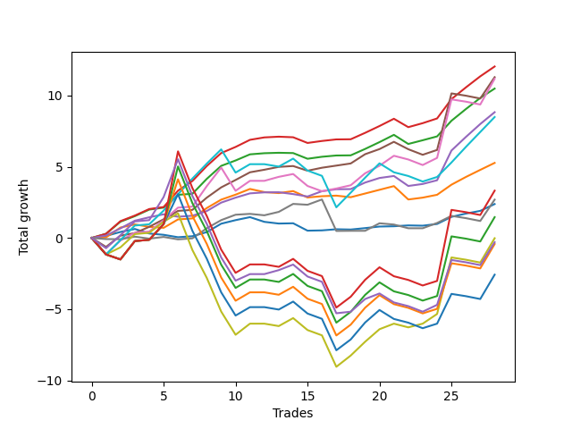

# Short Bernese 003 50 
- Symbol: SPY
- Date Range: 05/27/2022 - 09/30/2022
- Trading Period: 7:20-12:30
- Number of Trades: 28



| Name | Win Percent | Profit | Avg Profit / Trade | Avg Time / Trade |      | Name | Win Percent | Profit | Avg Profit / Trade | Avg Time / Trade |
| ---- | ----------- | ------ | ------------------ | ---------------- | ---- | ---- | ----------- | ------ | ------------------ | ---------------- |
| Sorted By <br> Profit | | | | | | Sorted By <br> Win Percentage ||||
| Two_C | 89.29 | 6020.00 | 215.00 | 15:51 |     | Two_C | 89.29 | 6020.00 | 215.00 | 15:51 |
| Four | 78.57 | 5645.00 | 201.61 | 27:20 |     | Two | 89.29 | 5245.00 | 187.32 | 15:34 |
| Five | 67.86 | 5590.00 | 199.64 | 34:33 |     | Three | 85.71 | 4415.00 | 157.68 | 14:38 |
| Two | 89.29 | 5245.00 | 187.32 | 15:34 |     | Four | 78.57 | 5645.00 | 201.61 | 27:20 |
| Three | 85.71 | 4415.00 | 157.68 | 14:38 |     | One | 75.00 | 2635.00 | 94.11 | 10:40 |
| Eighty-One | 64.29 | 4245.00 | 151.61 | 39:29 |     | Zero | 71.43 | 1190.00 | 42.50 | 05:28 |
| One | 75.00 | 2635.00 | 94.11 | 10:40 |     | Five | 67.86 | 5590.00 | 199.64 | 34:33 |
| Eighty-Five | 42.86 | 1660.00 | 59.29 | 55:26 |     | Eighty-One | 64.29 | 4245.00 | 151.61 | 39:29 |
| Six | 53.57 | 1345.00 | 48.04 | 13:48 |     | Six | 53.57 | 1345.00 | 48.04 | 13:48 |
| Zero | 71.43 | 1190.00 | 42.50 | 05:28 |     | Seven | 53.57 | -10.00 | -0.36 | 42:58 |
| Eighty-Four | 42.86 | 730.00 | 26.07 | 54:52 |     | NEWFI 0000 | 50.00 | -150.00 | -5.36 | 44:39 |
| Seven | 53.57 | -10.00 | -0.36 | 42:58 |     | Eighty-Five | 42.86 | 1660.00 | 59.29 | 55:26 |
| NEWFI 0000 | 50.00 | -150.00 | -5.36 | 44:39 |     | Eighty-Four | 42.86 | 730.00 | 26.07 | 54:52 |
| Eighty-Three | 42.86 | -215.00 | -7.68 | 53:55 |     | Eighty-Three | 42.86 | -215.00 | -7.68 | 53:55 |
| Eighty-Two | 42.86 | -1290.00 | -46.07 | 53:49 |     | Eighty-Two | 42.86 | -1290.00 | -46.07 | 53:49 |

## NO STOPLOSS

### Test Zero
* Sell when price hits the middle line of the 20p bollinger
* No Stoploss
* Results:
```
Total Trades: 28
Percent Up: 28.57
Percent Down: 71.43
Total Points Moved Down: 2.38
Potential Profit: 1190.00
Total Points Ups: 1.59 Count Ups: 8
Total Points Downs: 3.97 Count Downs: 20
```

<details><summary>Trades</summary>

<code>In: 2022-06-01 11:08:00		Out: 2022-06-01 11:08:45		Total Position Time: 00:45		Total Move Down: 0.14		Total to Date: 0.14</code> <br />
<code>In: 2022-06-09 08:47:00		Out: 2022-06-09 08:48:20		Total Position Time: 01:20		Total Move Down: 0.28		Total to Date: 0.42</code> <br />
<code>In: 2022-06-09 09:46:00		Out: 2022-06-09 09:49:20		Total Position Time: 03:20		Total Move Down: 0.21		Total to Date: 0.63</code> <br />
<code>In: 2022-06-10 10:42:00		Out: 2022-06-10 10:54:55		Total Position Time: 12:55		Total Move Down: -0.32		Total to Date: 0.31</code> <br />
<code>In: 2022-06-15 09:19:00		Out: 2022-06-15 09:30:55		Total Position Time: 11:55		Total Move Down: -0.09		Total to Date: 0.22</code> <br />
<code>In: 2022-06-15 11:02:00		Out: 2022-06-15 11:02:10		Total Position Time: 00:10		Total Move Down: -0.17		Total to Date: 0.05</code> <br />
<code>In: 2022-07-06 11:00:00		Out: 2022-07-06 11:00:10		Total Position Time: 00:10		Total Move Down: 0.07		Total to Date: 0.12</code> <br />
<code>In: 2022-07-06 11:10:00		Out: 2022-07-06 11:10:10		Total Position Time: 00:10		Total Move Down: 0.29		Total to Date: 0.41</code> <br />
<code>In: 2022-07-06 11:11:00		Out: 2022-07-06 11:11:10		Total Position Time: 00:10		Total Move Down: 0.59		Total to Date: 1.00</code> <br />
<code>In: 2022-07-11 09:41:00		Out: 2022-07-11 09:44:20		Total Position Time: 03:20		Total Move Down: 0.25		Total to Date: 1.25</code> <br />
<code>In: 2022-07-26 10:13:00		Out: 2022-07-26 10:15:10		Total Position Time: 02:10		Total Move Down: 0.21		Total to Date: 1.46</code> <br />
<code>In: 2022-08-01 12:01:00		Out: 2022-08-01 12:20:15		Total Position Time: 19:15		Total Move Down: -0.33		Total to Date: 1.13</code> <br />
<code>In: 2022-08-04 10:31:00		Out: 2022-08-04 10:43:05		Total Position Time: 12:05		Total Move Down: -0.12		Total to Date: 1.01</code> <br />
<code>In: 2022-08-05 10:10:00		Out: 2022-08-05 10:20:05		Total Position Time: 10:05		Total Move Down: 0.02		Total to Date: 1.03</code> <br />
<code>In: 2022-08-17 09:28:00		Out: 2022-08-17 09:50:20		Total Position Time: 22:20		Total Move Down: -0.52		Total to Date: 0.51</code> <br />
<code>In: 2022-08-17 09:41:00		Out: 2022-08-17 09:50:20		Total Position Time: 09:20		Total Move Down: 0.02		Total to Date: 0.53</code> <br />
<code>In: 2022-08-17 10:33:00		Out: 2022-08-17 10:34:05		Total Position Time: 01:05		Total Move Down: 0.08		Total to Date: 0.61</code> <br />
<code>In: 2022-08-19 09:42:00		Out: 2022-08-19 09:50:05		Total Position Time: 08:05		Total Move Down: -0.02		Total to Date: 0.59</code> <br />
<code>In: 2022-08-31 09:01:00		Out: 2022-08-31 09:04:15		Total Position Time: 03:15		Total Move Down: 0.10		Total to Date: 0.69</code> <br />
<code>In: 2022-09-12 10:32:00		Out: 2022-09-12 10:36:35		Total Position Time: 04:35		Total Move Down: 0.11		Total to Date: 0.80</code> <br />
<code>In: 2022-09-16 10:41:00		Out: 2022-09-16 10:45:30		Total Position Time: 04:30		Total Move Down: 0.02		Total to Date: 0.82</code> <br />
<code>In: 2022-09-16 11:31:00		Out: 2022-09-16 11:41:05		Total Position Time: 10:05		Total Move Down: 0.06		Total to Date: 0.88</code> <br />
<code>In: 2022-09-21 08:47:00		Out: 2022-09-21 08:47:15		Total Position Time: 00:15		Total Move Down: -0.02		Total to Date: 0.86</code> <br />
<code>In: 2022-09-21 09:38:00		Out: 2022-09-21 09:40:10		Total Position Time: 02:10		Total Move Down: 0.12		Total to Date: 0.98</code> <br />
<code>In: 2022-09-21 11:48:00		Out: 2022-09-21 11:48:40		Total Position Time: 00:40		Total Move Down: 0.50		Total to Date: 1.48</code> <br />
<code>In: 2022-09-22 12:16:00		Out: 2022-09-22 12:18:35		Total Position Time: 02:35		Total Move Down: 0.23		Total to Date: 1.71</code> <br />
<code>In: 2022-09-22 12:17:00		Out: 2022-09-22 12:18:35		Total Position Time: 01:35		Total Move Down: 0.19		Total to Date: 1.90</code> <br />
<code>In: 2022-09-29 08:57:00		Out: 2022-09-29 09:01:50		Total Position Time: 04:50		Total Move Down: 0.48		Total to Date: 2.38</code> <br />


</details>

### Test One
* Sell when the price hits the upper line of the 20p 1std bollinger
* No Stoploss
* Results:
```
Total Trades: 28
Percent Up: 25.00
Percent Down: 75.00
Total Points Moved Down: 5.27
Potential Profit: 2635.00
Total Points Ups: 2.03 Count Ups: 7
Total Points Downs: 7.30 Count Downs: 21
```

<details><summary>Trades</summary>

<code>In: 2022-06-01 11:08:00		Out: 2022-06-01 11:18:10		Total Position Time: 10:10		Total Move Down: 0.04		Total to Date: 0.04</code> <br />
<code>In: 2022-06-09 08:47:00		Out: 2022-06-09 08:49:35		Total Position Time: 02:35		Total Move Down: 0.69		Total to Date: 0.73</code> <br />
<code>In: 2022-06-09 09:46:00		Out: 2022-06-09 09:54:45		Total Position Time: 08:45		Total Move Down: 0.22		Total to Date: 0.95</code> <br />
<code>In: 2022-06-10 10:42:00		Out: 2022-06-10 10:56:05		Total Position Time: 14:05		Total Move Down: -0.17		Total to Date: 0.78</code> <br />
<code>In: 2022-06-15 09:19:00		Out: 2022-06-15 09:35:10		Total Position Time: 16:10		Total Move Down: -0.07		Total to Date: 0.71</code> <br />
<code>In: 2022-06-15 11:02:00		Out: 2022-06-15 11:03:05		Total Position Time: 01:05		Total Move Down: 0.59		Total to Date: 1.30</code> <br />
<code>In: 2022-07-06 11:00:00		Out: 2022-07-06 11:00:10		Total Position Time: 00:10		Total Move Down: 0.07		Total to Date: 1.37</code> <br />
<code>In: 2022-07-06 11:10:00		Out: 2022-07-06 11:11:10		Total Position Time: 01:10		Total Move Down: 0.73		Total to Date: 2.10</code> <br />
<code>In: 2022-07-06 11:11:00		Out: 2022-07-06 11:11:10		Total Position Time: 00:10		Total Move Down: 0.59		Total to Date: 2.69</code> <br />
<code>In: 2022-07-11 09:41:00		Out: 2022-07-11 09:50:50		Total Position Time: 09:50		Total Move Down: 0.35		Total to Date: 3.04</code> <br />
<code>In: 2022-07-26 10:13:00		Out: 2022-07-26 10:17:00		Total Position Time: 04:00		Total Move Down: 0.40		Total to Date: 3.44</code> <br />
<code>In: 2022-08-01 12:01:00		Out: 2022-08-01 12:21:35		Total Position Time: 20:35		Total Move Down: -0.22		Total to Date: 3.22</code> <br />
<code>In: 2022-08-04 10:31:00		Out: 2022-08-04 10:43:10		Total Position Time: 12:10		Total Move Down: -0.07		Total to Date: 3.15</code> <br />
<code>In: 2022-08-05 10:10:00		Out: 2022-08-05 10:23:10		Total Position Time: 13:10		Total Move Down: 0.14		Total to Date: 3.29</code> <br />
<code>In: 2022-08-17 09:28:00		Out: 2022-08-17 09:55:10		Total Position Time: 27:10		Total Move Down: -0.45		Total to Date: 2.84</code> <br />
<code>In: 2022-08-17 09:41:00		Out: 2022-08-17 09:55:10		Total Position Time: 14:10		Total Move Down: 0.09		Total to Date: 2.93</code> <br />
<code>In: 2022-08-17 10:33:00		Out: 2022-08-17 10:46:05		Total Position Time: 13:05		Total Move Down: 0.04		Total to Date: 2.97</code> <br />
<code>In: 2022-08-19 09:42:00		Out: 2022-08-19 10:01:10		Total Position Time: 19:10		Total Move Down: -0.11		Total to Date: 2.86</code> <br />
<code>In: 2022-08-31 09:01:00		Out: 2022-08-31 09:06:15		Total Position Time: 05:15		Total Move Down: 0.26		Total to Date: 3.12</code> <br />
<code>In: 2022-09-12 10:32:00		Out: 2022-09-12 10:41:30		Total Position Time: 09:30		Total Move Down: 0.26		Total to Date: 3.38</code> <br />
<code>In: 2022-09-16 10:41:00		Out: 2022-09-16 10:47:05		Total Position Time: 06:05		Total Move Down: 0.26		Total to Date: 3.64</code> <br />
<code>In: 2022-09-16 11:31:00		Out: 2022-09-16 12:14:20		Total Position Time: 43:20		Total Move Down: -0.94		Total to Date: 2.70</code> <br />
<code>In: 2022-09-21 08:47:00		Out: 2022-09-21 08:50:00		Total Position Time: 03:00		Total Move Down: 0.13		Total to Date: 2.83</code> <br />
<code>In: 2022-09-21 09:38:00		Out: 2022-09-21 09:45:10		Total Position Time: 07:10		Total Move Down: 0.20		Total to Date: 3.03</code> <br />
<code>In: 2022-09-21 11:48:00		Out: 2022-09-21 12:03:25		Total Position Time: 15:25		Total Move Down: 0.71		Total to Date: 3.74</code> <br />
<code>In: 2022-09-22 12:16:00		Out: 2022-09-22 12:20:15		Total Position Time: 04:15		Total Move Down: 0.54		Total to Date: 4.28</code> <br />
<code>In: 2022-09-22 12:17:00		Out: 2022-09-22 12:20:15		Total Position Time: 03:15		Total Move Down: 0.50		Total to Date: 4.78</code> <br />
<code>In: 2022-09-29 08:57:00		Out: 2022-09-29 09:10:55		Total Position Time: 13:55		Total Move Down: 0.49		Total to Date: 5.27</code> <br />


</details>

### Test Two
* Sell when the price hits the upper line of the 20p 2std bollinger
* No Stoploss
* Results:
```
Total Trades: 28
Percent Up: 10.71
Percent Down: 89.29
Total Points Moved Down: 10.49
Potential Profit: 5245.00
Total Points Ups: 1.06 Count Ups: 3
Total Points Downs: 11.55 Count Downs: 25
```

<details><summary>Trades</summary>

<code>In: 2022-06-01 11:08:00		Out: 2022-06-01 11:19:20		Total Position Time: 11:20		Total Move Down: 0.29		Total to Date: 0.29</code> <br />
<code>In: 2022-06-09 08:47:00		Out: 2022-06-09 09:11:00		Total Position Time: 24:00		Total Move Down: 0.85		Total to Date: 1.14</code> <br />
<code>In: 2022-06-09 09:46:00		Out: 2022-06-09 09:55:00		Total Position Time: 09:00		Total Move Down: 0.39		Total to Date: 1.53</code> <br />
<code>In: 2022-06-10 10:42:00		Out: 2022-06-10 11:01:15		Total Position Time: 19:15		Total Move Down: 0.46		Total to Date: 1.99</code> <br />
<code>In: 2022-06-15 09:19:00		Out: 2022-06-15 09:36:10		Total Position Time: 17:10		Total Move Down: 0.14		Total to Date: 2.13</code> <br />
<code>In: 2022-06-15 11:02:00		Out: 2022-06-15 11:03:15		Total Position Time: 01:15		Total Move Down: 0.90		Total to Date: 3.03</code> <br />
<code>In: 2022-07-06 11:00:00		Out: 2022-07-06 11:00:10		Total Position Time: 00:10		Total Move Down: 0.07		Total to Date: 3.10</code> <br />
<code>In: 2022-07-06 11:10:00		Out: 2022-07-06 11:11:45		Total Position Time: 01:45		Total Move Down: 1.05		Total to Date: 4.15</code> <br />
<code>In: 2022-07-06 11:11:00		Out: 2022-07-06 11:11:45		Total Position Time: 00:45		Total Move Down: 0.91		Total to Date: 5.06</code> <br />
<code>In: 2022-07-11 09:41:00		Out: 2022-07-11 09:51:20		Total Position Time: 10:20		Total Move Down: 0.38		Total to Date: 5.44</code> <br />
<code>In: 2022-07-26 10:13:00		Out: 2022-07-26 10:32:35		Total Position Time: 19:35		Total Move Down: 0.43		Total to Date: 5.87</code> <br />
<code>In: 2022-08-01 12:01:00		Out: 2022-08-01 12:22:40		Total Position Time: 21:40		Total Move Down: 0.08		Total to Date: 5.95</code> <br />
<code>In: 2022-08-04 10:31:00		Out: 2022-08-04 10:45:25		Total Position Time: 14:25		Total Move Down: 0.03		Total to Date: 5.98</code> <br />
<code>In: 2022-08-05 10:10:00		Out: 2022-08-05 10:49:30		Total Position Time: 39:30		Total Move Down: -0.02		Total to Date: 5.96</code> <br />
<code>In: 2022-08-17 09:28:00		Out: 2022-08-17 09:58:35		Total Position Time: 30:35		Total Move Down: -0.40		Total to Date: 5.56</code> <br />
<code>In: 2022-08-17 09:41:00		Out: 2022-08-17 09:58:35		Total Position Time: 17:35		Total Move Down: 0.14		Total to Date: 5.70</code> <br />
<code>In: 2022-08-17 10:33:00		Out: 2022-08-17 10:56:40		Total Position Time: 23:40		Total Move Down: 0.09		Total to Date: 5.79</code> <br />
<code>In: 2022-08-19 09:42:00		Out: 2022-08-19 10:13:40		Total Position Time: 31:40		Total Move Down: 0.01		Total to Date: 5.80</code> <br />
<code>In: 2022-08-31 09:01:00		Out: 2022-08-31 09:07:00		Total Position Time: 06:00		Total Move Down: 0.45		Total to Date: 6.25</code> <br />
<code>In: 2022-09-12 10:32:00		Out: 2022-09-12 10:44:20		Total Position Time: 12:20		Total Move Down: 0.48		Total to Date: 6.73</code> <br />
<code>In: 2022-09-16 10:41:00		Out: 2022-09-16 10:49:25		Total Position Time: 08:25		Total Move Down: 0.51		Total to Date: 7.24</code> <br />
<code>In: 2022-09-16 11:31:00		Out: 2022-09-16 12:28:25		Total Position Time: 57:25		Total Move Down: -0.64		Total to Date: 6.60</code> <br />
<code>In: 2022-09-21 08:47:00		Out: 2022-09-21 08:51:35		Total Position Time: 04:35		Total Move Down: 0.26		Total to Date: 6.86</code> <br />
<code>In: 2022-09-21 09:38:00		Out: 2022-09-21 09:47:15		Total Position Time: 09:15		Total Move Down: 0.27		Total to Date: 7.13</code> <br />
<code>In: 2022-09-21 11:48:00		Out: 2022-09-21 12:09:45		Total Position Time: 21:45		Total Move Down: 1.10		Total to Date: 8.23</code> <br />
<code>In: 2022-09-22 12:16:00		Out: 2022-09-22 12:20:40		Total Position Time: 04:40		Total Move Down: 0.82		Total to Date: 9.05</code> <br />
<code>In: 2022-09-22 12:17:00		Out: 2022-09-22 12:20:40		Total Position Time: 03:40		Total Move Down: 0.78		Total to Date: 9.83</code> <br />
<code>In: 2022-09-29 08:57:00		Out: 2022-09-29 09:11:20		Total Position Time: 14:20		Total Move Down: 0.66		Total to Date: 10.49</code> <br />


</details>

### Test Two_C
* Sell when the price hits the upper line of the 20p 2std bollinger
* No Stoploss
* Results:
```
Total Trades: 28
Percent Up: 10.71
Percent Down: 89.29
Total Points Moved Down: 12.04
Potential Profit: 6020.00
Total Points Ups: 1.03 Count Ups: 3
Total Points Downs: 13.07 Count Downs: 25
```

<details><summary>Trades</summary>

<code>In: 2022-06-01 11:08:00		Out: 2022-06-01 11:19:20		Total Position Time: 11:20		Total Move Down: 0.29		Total to Date: 0.29</code> <br />
<code>In: 2022-06-09 08:47:00		Out: 2022-06-09 09:11:05		Total Position Time: 24:05		Total Move Down: 0.89		Total to Date: 1.18</code> <br />
<code>In: 2022-06-09 09:46:00		Out: 2022-06-09 09:55:00		Total Position Time: 09:00		Total Move Down: 0.39		Total to Date: 1.57</code> <br />
<code>In: 2022-06-10 10:42:00		Out: 2022-06-10 11:01:15		Total Position Time: 19:15		Total Move Down: 0.46		Total to Date: 2.03</code> <br />
<code>In: 2022-06-15 09:19:00		Out: 2022-06-15 09:36:10		Total Position Time: 17:10		Total Move Down: 0.14		Total to Date: 2.17</code> <br />
<code>In: 2022-06-15 11:02:00		Out: 2022-06-15 11:04:20		Total Position Time: 02:20		Total Move Down: 1.15		Total to Date: 3.32</code> <br />
<code>In: 2022-07-06 11:00:00		Out: 2022-07-06 11:02:25		Total Position Time: 02:25		Total Move Down: 0.68		Total to Date: 4.00</code> <br />
<code>In: 2022-07-06 11:10:00		Out: 2022-07-06 11:11:45		Total Position Time: 01:45		Total Move Down: 1.05		Total to Date: 5.05</code> <br />
<code>In: 2022-07-06 11:11:00		Out: 2022-07-06 11:11:45		Total Position Time: 00:45		Total Move Down: 0.91		Total to Date: 5.96</code> <br />
<code>In: 2022-07-11 09:41:00		Out: 2022-07-11 09:51:25		Total Position Time: 10:25		Total Move Down: 0.43		Total to Date: 6.39</code> <br />
<code>In: 2022-07-26 10:13:00		Out: 2022-07-26 10:33:10		Total Position Time: 20:10		Total Move Down: 0.50		Total to Date: 6.89</code> <br />
<code>In: 2022-08-01 12:01:00		Out: 2022-08-01 12:22:55		Total Position Time: 21:55		Total Move Down: 0.17		Total to Date: 7.06</code> <br />
<code>In: 2022-08-04 10:31:00		Out: 2022-08-04 10:45:30		Total Position Time: 14:30		Total Move Down: 0.05		Total to Date: 7.11</code> <br />
<code>In: 2022-08-05 10:10:00		Out: 2022-08-05 10:50:15		Total Position Time: 40:15		Total Move Down: -0.04		Total to Date: 7.07</code> <br />
<code>In: 2022-08-17 09:28:00		Out: 2022-08-17 09:58:35		Total Position Time: 30:35		Total Move Down: -0.40		Total to Date: 6.67</code> <br />
<code>In: 2022-08-17 09:41:00		Out: 2022-08-17 09:58:35		Total Position Time: 17:35		Total Move Down: 0.14		Total to Date: 6.81</code> <br />
<code>In: 2022-08-17 10:33:00		Out: 2022-08-17 10:57:00		Total Position Time: 24:00		Total Move Down: 0.11		Total to Date: 6.92</code> <br />
<code>In: 2022-08-19 09:42:00		Out: 2022-08-19 10:13:40		Total Position Time: 31:40		Total Move Down: 0.01		Total to Date: 6.93</code> <br />
<code>In: 2022-08-31 09:01:00		Out: 2022-08-31 09:07:00		Total Position Time: 06:00		Total Move Down: 0.45		Total to Date: 7.38</code> <br />
<code>In: 2022-09-12 10:32:00		Out: 2022-09-12 10:44:20		Total Position Time: 12:20		Total Move Down: 0.48		Total to Date: 7.86</code> <br />
<code>In: 2022-09-16 10:41:00		Out: 2022-09-16 10:49:25		Total Position Time: 08:25		Total Move Down: 0.51		Total to Date: 8.37</code> <br />
<code>In: 2022-09-16 11:31:00		Out: 2022-09-16 12:30:10		Total Position Time: 59:10		Total Move Down: -0.59		Total to Date: 7.78</code> <br />
<code>In: 2022-09-21 08:47:00		Out: 2022-09-21 08:51:40		Total Position Time: 04:40		Total Move Down: 0.28		Total to Date: 8.06</code> <br />
<code>In: 2022-09-21 09:38:00		Out: 2022-09-21 09:47:25		Total Position Time: 09:25		Total Move Down: 0.33		Total to Date: 8.39</code> <br />
<code>In: 2022-09-21 11:48:00		Out: 2022-09-21 12:09:55		Total Position Time: 21:55		Total Move Down: 1.36		Total to Date: 9.75</code> <br />
<code>In: 2022-09-22 12:16:00		Out: 2022-09-22 12:20:40		Total Position Time: 04:40		Total Move Down: 0.82		Total to Date: 10.57</code> <br />
<code>In: 2022-09-22 12:17:00		Out: 2022-09-22 12:20:40		Total Position Time: 03:40		Total Move Down: 0.78		Total to Date: 11.35</code> <br />
<code>In: 2022-09-29 08:57:00		Out: 2022-09-29 09:11:25		Total Position Time: 14:25		Total Move Down: 0.69		Total to Date: 12.04</code> <br />


</details>

### Test Three
* Sell when price hits the middle line of the 50p bollinger
* No Stoploss
* Results:
```
Total Trades: 28
Percent Up: 14.29
Percent Down: 85.71
Total Points Moved Down: 8.83
Potential Profit: 4415.00
Total Points Ups: 1.17 Count Ups: 4
Total Points Downs: 10.00 Count Downs: 24
```

<details><summary>Trades</summary>

<code>In: 2022-06-01 11:08:00		Out: 2022-06-01 11:18:40		Total Position Time: 10:40		Total Move Down: 0.17		Total to Date: 0.17</code> <br />
<code>In: 2022-06-09 08:47:00		Out: 2022-06-09 08:48:50		Total Position Time: 01:50		Total Move Down: 0.50		Total to Date: 0.67</code> <br />
<code>In: 2022-06-09 09:46:00		Out: 2022-06-09 09:55:50		Total Position Time: 09:50		Total Move Down: 0.54		Total to Date: 1.21</code> <br />
<code>In: 2022-06-10 10:42:00		Out: 2022-06-10 11:00:50		Total Position Time: 18:50		Total Move Down: 0.24		Total to Date: 1.45</code> <br />
<code>In: 2022-06-15 09:19:00		Out: 2022-06-15 09:38:40		Total Position Time: 19:40		Total Move Down: 0.21		Total to Date: 1.66</code> <br />
<code>In: 2022-06-15 11:02:00		Out: 2022-06-15 11:02:10		Total Position Time: 00:10		Total Move Down: -0.17		Total to Date: 1.49</code> <br />
<code>In: 2022-07-06 11:00:00		Out: 2022-07-06 11:00:10		Total Position Time: 00:10		Total Move Down: 0.07		Total to Date: 1.56</code> <br />
<code>In: 2022-07-06 11:10:00		Out: 2022-07-06 11:10:20		Total Position Time: 00:20		Total Move Down: 0.33		Total to Date: 1.89</code> <br />
<code>In: 2022-07-06 11:11:00		Out: 2022-07-06 11:11:10		Total Position Time: 00:10		Total Move Down: 0.59		Total to Date: 2.48</code> <br />
<code>In: 2022-07-11 09:41:00		Out: 2022-07-11 09:50:50		Total Position Time: 09:50		Total Move Down: 0.35		Total to Date: 2.83</code> <br />
<code>In: 2022-07-26 10:13:00		Out: 2022-07-26 10:32:25		Total Position Time: 19:25		Total Move Down: 0.30		Total to Date: 3.13</code> <br />
<code>In: 2022-08-01 12:01:00		Out: 2022-08-01 12:22:35		Total Position Time: 21:35		Total Move Down: 0.07		Total to Date: 3.20</code> <br />
<code>In: 2022-08-04 10:31:00		Out: 2022-08-04 10:55:50		Total Position Time: 24:50		Total Move Down: 0.01		Total to Date: 3.21</code> <br />
<code>In: 2022-08-05 10:10:00		Out: 2022-08-05 10:47:35		Total Position Time: 37:35		Total Move Down: -0.13		Total to Date: 3.08</code> <br />
<code>In: 2022-08-17 09:28:00		Out: 2022-08-17 10:02:15		Total Position Time: 34:15		Total Move Down: -0.17		Total to Date: 2.91</code> <br />
<code>In: 2022-08-17 09:41:00		Out: 2022-08-17 10:02:15		Total Position Time: 21:15		Total Move Down: 0.37		Total to Date: 3.28</code> <br />
<code>In: 2022-08-17 10:33:00		Out: 2022-08-17 10:34:10		Total Position Time: 01:10		Total Move Down: 0.14		Total to Date: 3.42</code> <br />
<code>In: 2022-08-19 09:42:00		Out: 2022-08-19 10:13:40		Total Position Time: 31:40		Total Move Down: 0.01		Total to Date: 3.43</code> <br />
<code>In: 2022-08-31 09:01:00		Out: 2022-08-31 09:10:55		Total Position Time: 09:55		Total Move Down: 0.46		Total to Date: 3.89</code> <br />
<code>In: 2022-09-12 10:32:00		Out: 2022-09-12 10:42:15		Total Position Time: 10:15		Total Move Down: 0.32		Total to Date: 4.21</code> <br />
<code>In: 2022-09-16 10:41:00		Out: 2022-09-16 10:45:55		Total Position Time: 04:55		Total Move Down: 0.14		Total to Date: 4.35</code> <br />
<code>In: 2022-09-16 11:31:00		Out: 2022-09-16 12:19:05		Total Position Time: 48:05		Total Move Down: -0.70		Total to Date: 3.65</code> <br />
<code>In: 2022-09-21 08:47:00		Out: 2022-09-21 08:50:05		Total Position Time: 03:05		Total Move Down: 0.14		Total to Date: 3.79</code> <br />
<code>In: 2022-09-21 09:38:00		Out: 2022-09-21 09:45:30		Total Position Time: 07:30		Total Move Down: 0.26		Total to Date: 4.05</code> <br />
<code>In: 2022-09-21 11:48:00		Out: 2022-09-21 12:10:10		Total Position Time: 22:10		Total Move Down: 2.09		Total to Date: 6.14</code> <br />
<code>In: 2022-09-22 12:16:00		Out: 2022-09-22 12:27:05		Total Position Time: 11:05		Total Move Down: 0.95		Total to Date: 7.09</code> <br />
<code>In: 2022-09-22 12:17:00		Out: 2022-09-22 12:27:05		Total Position Time: 10:05		Total Move Down: 0.91		Total to Date: 8.00</code> <br />
<code>In: 2022-09-29 08:57:00		Out: 2022-09-29 09:16:25		Total Position Time: 19:25		Total Move Down: 0.83		Total to Date: 8.83</code> <br />


</details>

### Test Four
* Sell when the price hits the upper line of the 50p 1std bollinger
* No Stoploss
* Results:
```
Total Trades: 28
Percent Up: 21.43
Percent Down: 78.57
Total Points Moved Down: 11.29
Potential Profit: 5645.00
Total Points Ups: 2.23 Count Ups: 6
Total Points Downs: 13.52 Count Downs: 22
```

<details><summary>Trades</summary>

<code>In: 2022-06-01 11:08:00		Out: 2022-06-01 12:03:30		Total Position Time: 55:30		Total Move Down: -0.63		Total to Date: -0.63</code> <br />
<code>In: 2022-06-09 08:47:00		Out: 2022-06-09 08:50:25		Total Position Time: 03:25		Total Move Down: 0.79		Total to Date: 0.16</code> <br />
<code>In: 2022-06-09 09:46:00		Out: 2022-06-09 10:23:50		Total Position Time: 37:50		Total Move Down: 0.18		Total to Date: 0.34</code> <br />
<code>In: 2022-06-10 10:42:00		Out: 2022-06-10 11:15:25		Total Position Time: 33:25		Total Move Down: 0.44		Total to Date: 0.78</code> <br />
<code>In: 2022-06-15 09:19:00		Out: 2022-06-15 09:41:45		Total Position Time: 22:45		Total Move Down: 0.53		Total to Date: 1.31</code> <br />
<code>In: 2022-06-15 11:02:00		Out: 2022-06-15 11:03:05		Total Position Time: 01:05		Total Move Down: 0.59		Total to Date: 1.90</code> <br />
<code>In: 2022-07-06 11:00:00		Out: 2022-07-06 11:00:10		Total Position Time: 00:10		Total Move Down: 0.07		Total to Date: 1.97</code> <br />
<code>In: 2022-07-06 11:10:00		Out: 2022-07-06 11:11:35		Total Position Time: 01:35		Total Move Down: 0.86		Total to Date: 2.83</code> <br />
<code>In: 2022-07-06 11:11:00		Out: 2022-07-06 11:11:35		Total Position Time: 00:35		Total Move Down: 0.72		Total to Date: 3.55</code> <br />
<code>In: 2022-07-11 09:41:00		Out: 2022-07-11 09:54:05		Total Position Time: 13:05		Total Move Down: 0.52		Total to Date: 4.07</code> <br />
<code>In: 2022-07-26 10:13:00		Out: 2022-07-26 10:37:45		Total Position Time: 24:45		Total Move Down: 0.54		Total to Date: 4.61</code> <br />
<code>In: 2022-08-01 12:01:00		Out: 2022-08-01 12:43:55		Total Position Time: 42:55		Total Move Down: 0.18		Total to Date: 4.79</code> <br />
<code>In: 2022-08-04 10:31:00		Out: 2022-08-04 11:02:05		Total Position Time: 31:05		Total Move Down: 0.20		Total to Date: 4.99</code> <br />
<code>In: 2022-08-05 10:10:00		Out: 2022-08-05 10:50:45		Total Position Time: 40:45		Total Move Down: 0.06		Total to Date: 5.05</code> <br />
<code>In: 2022-08-17 09:28:00		Out: 2022-08-17 10:19:35		Total Position Time: 51:35		Total Move Down: -0.33		Total to Date: 4.72</code> <br />
<code>In: 2022-08-17 09:41:00		Out: 2022-08-17 10:19:35		Total Position Time: 38:35		Total Move Down: 0.21		Total to Date: 4.93</code> <br />
<code>In: 2022-08-17 10:33:00		Out: 2022-08-17 11:00:50		Total Position Time: 27:50		Total Move Down: 0.15		Total to Date: 5.08</code> <br />
<code>In: 2022-08-19 09:42:00		Out: 2022-08-19 10:21:00		Total Position Time: 39:00		Total Move Down: 0.15		Total to Date: 5.23</code> <br />
<code>In: 2022-08-31 09:01:00		Out: 2022-08-31 09:22:45		Total Position Time: 21:45		Total Move Down: 0.65		Total to Date: 5.88</code> <br />
<code>In: 2022-09-12 10:32:00		Out: 2022-09-12 11:03:10		Total Position Time: 31:10		Total Move Down: 0.36		Total to Date: 6.24</code> <br />
<code>In: 2022-09-16 10:41:00		Out: 2022-09-16 10:49:25		Total Position Time: 08:25		Total Move Down: 0.51		Total to Date: 6.75</code> <br />
<code>In: 2022-09-16 11:31:00		Out: 2022-09-16 12:30:15		Total Position Time: 59:15		Total Move Down: -0.52		Total to Date: 6.23</code> <br />
<code>In: 2022-09-21 08:47:00		Out: 2022-09-21 09:46:55		Total Position Time: 59:55		Total Move Down: -0.39		Total to Date: 5.84</code> <br />
<code>In: 2022-09-21 09:38:00		Out: 2022-09-21 09:53:00		Total Position Time: 15:00		Total Move Down: 0.34		Total to Date: 6.18</code> <br />
<code>In: 2022-09-21 11:48:00		Out: 2022-09-21 12:11:05		Total Position Time: 23:05		Total Move Down: 3.97		Total to Date: 10.15</code> <br />
<code>In: 2022-09-22 12:16:00		Out: 2022-09-22 12:46:00		Total Position Time: 30:00		Total Move Down: -0.16		Total to Date: 9.99</code> <br />
<code>In: 2022-09-22 12:17:00		Out: 2022-09-22 12:46:00		Total Position Time: 29:00		Total Move Down: -0.20		Total to Date: 9.79</code> <br />
<code>In: 2022-09-29 08:57:00		Out: 2022-09-29 09:19:05		Total Position Time: 22:05		Total Move Down: 1.50		Total to Date: 11.29</code> <br />


</details>

### Test Five
* Sell when the price hits the upper line of the 50p 2std bollinger
* No Stoploss
* Results:
```
Total Trades: 28
Percent Up: 32.14
Percent Down: 67.86
Total Points Moved Down: 11.18
Potential Profit: 5590.00
Total Points Ups: 5.01 Count Ups: 9
Total Points Downs: 16.19 Count Downs: 19
```

<details><summary>Trades</summary>

<code>In: 2022-06-01 11:08:00		Out: 2022-06-01 12:07:55		Total Position Time: 59:55		Total Move Down: -1.16		Total to Date: -1.16</code> <br />
<code>In: 2022-06-09 08:47:00		Out: 2022-06-09 09:11:10		Total Position Time: 24:10		Total Move Down: 0.98		Total to Date: -0.18</code> <br />
<code>In: 2022-06-09 09:46:00		Out: 2022-06-09 10:27:20		Total Position Time: 41:20		Total Move Down: 0.54		Total to Date: 0.36</code> <br />
<code>In: 2022-06-10 10:42:00		Out: 2022-06-10 11:41:55		Total Position Time: 59:55		Total Move Down: 0.09		Total to Date: 0.45</code> <br />
<code>In: 2022-06-15 09:19:00		Out: 2022-06-15 09:44:05		Total Position Time: 25:05		Total Move Down: 0.78		Total to Date: 1.23</code> <br />
<code>In: 2022-06-15 11:02:00		Out: 2022-06-15 11:03:15		Total Position Time: 01:15		Total Move Down: 0.90		Total to Date: 2.13</code> <br />
<code>In: 2022-07-06 11:00:00		Out: 2022-07-06 11:00:10		Total Position Time: 00:10		Total Move Down: 0.07		Total to Date: 2.20</code> <br />
<code>In: 2022-07-06 11:10:00		Out: 2022-07-06 11:12:15		Total Position Time: 02:15		Total Move Down: 1.44		Total to Date: 3.64</code> <br />
<code>In: 2022-07-06 11:11:00		Out: 2022-07-06 11:12:15		Total Position Time: 01:15		Total Move Down: 1.30		Total to Date: 4.94</code> <br />
<code>In: 2022-07-11 09:41:00		Out: 2022-07-11 10:40:55		Total Position Time: 59:55		Total Move Down: -1.63		Total to Date: 3.31</code> <br />
<code>In: 2022-07-26 10:13:00		Out: 2022-07-26 10:47:00		Total Position Time: 34:00		Total Move Down: 0.70		Total to Date: 4.01</code> <br />
<code>In: 2022-08-01 12:01:00		Out: 2022-08-01 12:46:00		Total Position Time: 45:00		Total Move Down: -0.00		Total to Date: 4.01</code> <br />
<code>In: 2022-08-04 10:31:00		Out: 2022-08-04 11:10:15		Total Position Time: 39:15		Total Move Down: 0.28		Total to Date: 4.29</code> <br />
<code>In: 2022-08-05 10:10:00		Out: 2022-08-05 10:55:50		Total Position Time: 45:50		Total Move Down: 0.20		Total to Date: 4.49</code> <br />
<code>In: 2022-08-17 09:28:00		Out: 2022-08-17 10:27:55		Total Position Time: 59:55		Total Move Down: -0.84		Total to Date: 3.65</code> <br />
<code>In: 2022-08-17 09:41:00		Out: 2022-08-17 10:40:55		Total Position Time: 59:55		Total Move Down: -0.37		Total to Date: 3.28</code> <br />
<code>In: 2022-08-17 10:33:00		Out: 2022-08-17 11:01:00		Total Position Time: 28:00		Total Move Down: 0.19		Total to Date: 3.47</code> <br />
<code>In: 2022-08-19 09:42:00		Out: 2022-08-19 10:23:40		Total Position Time: 41:40		Total Move Down: 0.23		Total to Date: 3.70</code> <br />
<code>In: 2022-08-31 09:01:00		Out: 2022-08-31 09:23:45		Total Position Time: 22:45		Total Move Down: 0.84		Total to Date: 4.54</code> <br />
<code>In: 2022-09-12 10:32:00		Out: 2022-09-12 11:17:45		Total Position Time: 45:45		Total Move Down: 0.53		Total to Date: 5.07</code> <br />
<code>In: 2022-09-16 10:41:00		Out: 2022-09-16 10:51:00		Total Position Time: 10:00		Total Move Down: 0.70		Total to Date: 5.77</code> <br />
<code>In: 2022-09-16 11:31:00		Out: 2022-09-16 12:30:55		Total Position Time: 59:55		Total Move Down: -0.26		Total to Date: 5.51</code> <br />
<code>In: 2022-09-21 08:47:00		Out: 2022-09-21 09:46:55		Total Position Time: 59:55		Total Move Down: -0.39		Total to Date: 5.12</code> <br />
<code>In: 2022-09-21 09:38:00		Out: 2022-09-21 09:55:20		Total Position Time: 17:20		Total Move Down: 0.50		Total to Date: 5.62</code> <br />
<code>In: 2022-09-21 11:48:00		Out: 2022-09-21 12:26:20		Total Position Time: 38:20		Total Move Down: 4.11		Total to Date: 9.73</code> <br />
<code>In: 2022-09-22 12:16:00		Out: 2022-09-22 12:46:00		Total Position Time: 30:00		Total Move Down: -0.16		Total to Date: 9.57</code> <br />
<code>In: 2022-09-22 12:17:00		Out: 2022-09-22 12:46:00		Total Position Time: 29:00		Total Move Down: -0.20		Total to Date: 9.37</code> <br />
<code>In: 2022-09-29 08:57:00		Out: 2022-09-29 09:22:45		Total Position Time: 25:45		Total Move Down: 1.81		Total to Date: 11.18</code> <br />


</details>

### Test Six
* Sell when the price hits the middle line of the 1std VWAP
* No Stoploss
* Results:
```
Total Trades: 28
Percent Up: 46.43
Percent Down: 53.57
Total Points Moved Down: 2.69
Potential Profit: 1345.00
Total Points Ups: 3.48 Count Ups: 13
Total Points Downs: 6.17 Count Downs: 15
```

<details><summary>Trades</summary>

<code>In: 2022-06-01 11:08:00		Out: 2022-06-01 11:08:10		Total Position Time: 00:10		Total Move Down: -0.08		Total to Date: -0.08</code> <br />
<code>In: 2022-06-09 08:47:00		Out: 2022-06-09 08:47:10		Total Position Time: 00:10		Total Move Down: -0.01		Total to Date: -0.09</code> <br />
<code>In: 2022-06-09 09:46:00		Out: 2022-06-09 09:49:25		Total Position Time: 03:25		Total Move Down: 0.18		Total to Date: 0.09</code> <br />
<code>In: 2022-06-10 10:42:00		Out: 2022-06-10 10:42:10		Total Position Time: 00:10		Total Move Down: -0.14		Total to Date: -0.05</code> <br />
<code>In: 2022-06-15 09:19:00		Out: 2022-06-15 09:19:10		Total Position Time: 00:10		Total Move Down: 0.12		Total to Date: 0.07</code> <br />
<code>In: 2022-06-15 11:02:00		Out: 2022-06-15 11:02:10		Total Position Time: 00:10		Total Move Down: -0.17		Total to Date: -0.10</code> <br />
<code>In: 2022-07-06 11:00:00		Out: 2022-07-06 11:00:10		Total Position Time: 00:10		Total Move Down: 0.07		Total to Date: -0.03</code> <br />
<code>In: 2022-07-06 11:10:00		Out: 2022-07-06 11:11:15		Total Position Time: 01:15		Total Move Down: 0.71		Total to Date: 0.68</code> <br />
<code>In: 2022-07-06 11:11:00		Out: 2022-07-06 11:11:15		Total Position Time: 00:15		Total Move Down: 0.57		Total to Date: 1.25</code> <br />
<code>In: 2022-07-11 09:41:00		Out: 2022-07-11 09:50:55		Total Position Time: 09:55		Total Move Down: 0.38		Total to Date: 1.63</code> <br />
<code>In: 2022-07-26 10:13:00		Out: 2022-07-26 10:13:10		Total Position Time: 00:10		Total Move Down: 0.06		Total to Date: 1.69</code> <br />
<code>In: 2022-08-01 12:01:00		Out: 2022-08-01 12:01:10		Total Position Time: 00:10		Total Move Down: -0.10		Total to Date: 1.59</code> <br />
<code>In: 2022-08-04 10:31:00		Out: 2022-08-04 10:56:50		Total Position Time: 25:50		Total Move Down: 0.24		Total to Date: 1.83</code> <br />
<code>In: 2022-08-05 10:10:00		Out: 2022-08-05 11:09:55		Total Position Time: 59:55		Total Move Down: 0.56		Total to Date: 2.39</code> <br />
<code>In: 2022-08-17 09:28:00		Out: 2022-08-17 09:28:10		Total Position Time: 00:10		Total Move Down: -0.06		Total to Date: 2.33</code> <br />
<code>In: 2022-08-17 09:41:00		Out: 2022-08-17 10:02:15		Total Position Time: 21:15		Total Move Down: 0.37		Total to Date: 2.70</code> <br />
<code>In: 2022-08-17 10:33:00		Out: 2022-08-17 11:32:55		Total Position Time: 59:55		Total Move Down: -2.21		Total to Date: 0.49</code> <br />
<code>In: 2022-08-19 09:42:00		Out: 2022-08-19 09:42:10		Total Position Time: 00:10		Total Move Down: 0.01		Total to Date: 0.50</code> <br />
<code>In: 2022-08-31 09:01:00		Out: 2022-08-31 09:01:10		Total Position Time: 00:10		Total Move Down: -0.00		Total to Date: 0.50</code> <br />
<code>In: 2022-09-12 10:32:00		Out: 2022-09-12 11:17:45		Total Position Time: 45:45		Total Move Down: 0.53		Total to Date: 1.03</code> <br />
<code>In: 2022-09-16 10:41:00		Out: 2022-09-16 10:41:10		Total Position Time: 00:10		Total Move Down: -0.09		Total to Date: 0.94</code> <br />
<code>In: 2022-09-16 11:31:00		Out: 2022-09-16 12:30:55		Total Position Time: 59:55		Total Move Down: -0.26		Total to Date: 0.68</code> <br />
<code>In: 2022-09-21 08:47:00		Out: 2022-09-21 08:47:10		Total Position Time: 00:10		Total Move Down: -0.00		Total to Date: 0.68</code> <br />
<code>In: 2022-09-21 09:38:00		Out: 2022-09-21 09:53:10		Total Position Time: 15:10		Total Move Down: 0.37		Total to Date: 1.05</code> <br />
<code>In: 2022-09-21 11:48:00		Out: 2022-09-21 11:48:40		Total Position Time: 00:40		Total Move Down: 0.50		Total to Date: 1.55</code> <br />
<code>In: 2022-09-22 12:16:00		Out: 2022-09-22 12:46:00		Total Position Time: 30:00		Total Move Down: -0.16		Total to Date: 1.39</code> <br />
<code>In: 2022-09-22 12:17:00		Out: 2022-09-22 12:46:00		Total Position Time: 29:00		Total Move Down: -0.20		Total to Date: 1.19</code> <br />
<code>In: 2022-09-29 08:57:00		Out: 2022-09-29 09:19:05		Total Position Time: 22:05		Total Move Down: 1.50		Total to Date: 2.69</code> <br />


</details>

### Test Seven
* Sell when the price hits the upper line of the 1std VWAP
* No Stoploss
* Results:
```
Total Trades: 28
Percent Up: 46.43
Percent Down: 53.57
Total Points Moved Down: -0.02
Potential Profit: -10.00
Total Points Ups: 13.90 Count Ups: 13
Total Points Downs: 13.88 Count Downs: 15
```

<details><summary>Trades</summary>

<code>In: 2022-06-01 11:08:00		Out: 2022-06-01 12:07:55		Total Position Time: 59:55		Total Move Down: -1.16		Total to Date: -1.16</code> <br />
<code>In: 2022-06-09 08:47:00		Out: 2022-06-09 08:48:50		Total Position Time: 01:50		Total Move Down: 0.50		Total to Date: -0.66</code> <br />
<code>In: 2022-06-09 09:46:00		Out: 2022-06-09 10:30:30		Total Position Time: 44:30		Total Move Down: 0.93		Total to Date: 0.27</code> <br />
<code>In: 2022-06-10 10:42:00		Out: 2022-06-10 11:41:55		Total Position Time: 59:55		Total Move Down: 0.09		Total to Date: 0.36</code> <br />
<code>In: 2022-06-15 09:19:00		Out: 2022-06-15 09:44:05		Total Position Time: 25:05		Total Move Down: 0.78		Total to Date: 1.14</code> <br />
<code>In: 2022-06-15 11:02:00		Out: 2022-06-15 11:03:05		Total Position Time: 01:05		Total Move Down: 0.59		Total to Date: 1.73</code> <br />
<code>In: 2022-07-06 11:00:00		Out: 2022-07-06 11:59:55		Total Position Time: 59:55		Total Move Down: -2.58		Total to Date: -0.85</code> <br />
<code>In: 2022-07-06 11:10:00		Out: 2022-07-06 12:09:55		Total Position Time: 59:55		Total Move Down: -1.96		Total to Date: -2.81</code> <br />
<code>In: 2022-07-06 11:11:00		Out: 2022-07-06 12:10:55		Total Position Time: 59:55		Total Move Down: -2.36		Total to Date: -5.17</code> <br />
<code>In: 2022-07-11 09:41:00		Out: 2022-07-11 10:40:55		Total Position Time: 59:55		Total Move Down: -1.63		Total to Date: -6.80</code> <br />
<code>In: 2022-07-26 10:13:00		Out: 2022-07-26 11:10:30		Total Position Time: 57:30		Total Move Down: 0.78		Total to Date: -6.02</code> <br />
<code>In: 2022-08-01 12:01:00		Out: 2022-08-01 12:46:00		Total Position Time: 45:00		Total Move Down: -0.00		Total to Date: -6.02</code> <br />
<code>In: 2022-08-04 10:31:00		Out: 2022-08-04 11:30:55		Total Position Time: 59:55		Total Move Down: -0.17		Total to Date: -6.19</code> <br />
<code>In: 2022-08-05 10:10:00		Out: 2022-08-05 11:09:55		Total Position Time: 59:55		Total Move Down: 0.56		Total to Date: -5.63</code> <br />
<code>In: 2022-08-17 09:28:00		Out: 2022-08-17 10:27:55		Total Position Time: 59:55		Total Move Down: -0.84		Total to Date: -6.47</code> <br />
<code>In: 2022-08-17 09:41:00		Out: 2022-08-17 10:40:55		Total Position Time: 59:55		Total Move Down: -0.37		Total to Date: -6.84</code> <br />
<code>In: 2022-08-17 10:33:00		Out: 2022-08-17 11:32:55		Total Position Time: 59:55		Total Move Down: -2.21		Total to Date: -9.05</code> <br />
<code>In: 2022-08-19 09:42:00		Out: 2022-08-19 10:31:30		Total Position Time: 49:30		Total Move Down: 0.79		Total to Date: -8.26</code> <br />
<code>In: 2022-08-31 09:01:00		Out: 2022-08-31 09:24:30		Total Position Time: 23:30		Total Move Down: 0.97		Total to Date: -7.29</code> <br />
<code>In: 2022-09-12 10:32:00		Out: 2022-09-12 11:31:55		Total Position Time: 59:55		Total Move Down: 0.88		Total to Date: -6.41</code> <br />
<code>In: 2022-09-16 10:41:00		Out: 2022-09-16 10:48:35		Total Position Time: 07:35		Total Move Down: 0.39		Total to Date: -6.02</code> <br />
<code>In: 2022-09-16 11:31:00		Out: 2022-09-16 12:30:55		Total Position Time: 59:55		Total Move Down: -0.26		Total to Date: -6.28</code> <br />
<code>In: 2022-09-21 08:47:00		Out: 2022-09-21 08:51:35		Total Position Time: 04:35		Total Move Down: 0.26		Total to Date: -6.02</code> <br />
<code>In: 2022-09-21 09:38:00		Out: 2022-09-21 10:00:10		Total Position Time: 22:10		Total Move Down: 0.68		Total to Date: -5.34</code> <br />
<code>In: 2022-09-21 11:48:00		Out: 2022-09-21 12:11:05		Total Position Time: 23:05		Total Move Down: 3.97		Total to Date: -1.37</code> <br />
<code>In: 2022-09-22 12:16:00		Out: 2022-09-22 12:46:00		Total Position Time: 30:00		Total Move Down: -0.16		Total to Date: -1.53</code> <br />
<code>In: 2022-09-22 12:17:00		Out: 2022-09-22 12:46:00		Total Position Time: 29:00		Total Move Down: -0.20		Total to Date: -1.73</code> <br />
<code>In: 2022-09-29 08:57:00		Out: 2022-09-29 09:56:55		Total Position Time: 59:55		Total Move Down: 1.71		Total to Date: -0.02</code> <br />


</details>

## TAKE PROFIT

### Test Eighty-One
* Take Profit of 1 Point
* No Stoploss
* Results:
```
Total Trades: 28
Percent Up: 35.71
Percent Down: 64.29
Total Points Moved Down: 8.49
Potential Profit: 4245.00
Total Points Ups: 7.66 Count Ups: 10
Total Points Downs: 16.15 Count Downs: 18
```

<details><summary>Trades</summary>

<code>In: 2022-06-01 11:08:00		Out: 2022-06-01 12:07:55		Total Position Time: 59:55		Total Move Down: -1.16		Total to Date: -1.16</code> <br />
<code>In: 2022-06-09 08:47:00		Out: 2022-06-09 08:50:40		Total Position Time: 03:40		Total Move Down: 1.01		Total to Date: -0.15</code> <br />
<code>In: 2022-06-09 09:46:00		Out: 2022-06-09 10:31:30		Total Position Time: 45:30		Total Move Down: 1.02		Total to Date: 0.87</code> <br />
<code>In: 2022-06-10 10:42:00		Out: 2022-06-10 11:41:55		Total Position Time: 59:55		Total Move Down: 0.09		Total to Date: 0.96</code> <br />
<code>In: 2022-06-15 09:19:00		Out: 2022-06-15 09:52:40		Total Position Time: 33:40		Total Move Down: 0.96		Total to Date: 1.92</code> <br />
<code>In: 2022-06-15 11:02:00		Out: 2022-06-15 11:04:20		Total Position Time: 02:20		Total Move Down: 1.15		Total to Date: 3.07</code> <br />
<code>In: 2022-07-06 11:00:00		Out: 2022-07-06 11:12:15		Total Position Time: 12:15		Total Move Down: 1.10		Total to Date: 4.17</code> <br />
<code>In: 2022-07-06 11:10:00		Out: 2022-07-06 11:11:45		Total Position Time: 01:45		Total Move Down: 1.05		Total to Date: 5.22</code> <br />
<code>In: 2022-07-06 11:11:00		Out: 2022-07-06 11:12:05		Total Position Time: 01:05		Total Move Down: 1.00		Total to Date: 6.22</code> <br />
<code>In: 2022-07-11 09:41:00		Out: 2022-07-11 10:40:55		Total Position Time: 59:55		Total Move Down: -1.63		Total to Date: 4.59</code> <br />
<code>In: 2022-07-26 10:13:00		Out: 2022-07-26 11:12:55		Total Position Time: 59:55		Total Move Down: 0.59		Total to Date: 5.18</code> <br />
<code>In: 2022-08-01 12:01:00		Out: 2022-08-01 12:46:00		Total Position Time: 45:00		Total Move Down: -0.00		Total to Date: 5.18</code> <br />
<code>In: 2022-08-04 10:31:00		Out: 2022-08-04 11:30:55		Total Position Time: 59:55		Total Move Down: -0.17		Total to Date: 5.01</code> <br />
<code>In: 2022-08-05 10:10:00		Out: 2022-08-05 11:09:55		Total Position Time: 59:55		Total Move Down: 0.56		Total to Date: 5.57</code> <br />
<code>In: 2022-08-17 09:28:00		Out: 2022-08-17 10:27:55		Total Position Time: 59:55		Total Move Down: -0.84		Total to Date: 4.73</code> <br />
<code>In: 2022-08-17 09:41:00		Out: 2022-08-17 10:40:55		Total Position Time: 59:55		Total Move Down: -0.37		Total to Date: 4.36</code> <br />
<code>In: 2022-08-17 10:33:00		Out: 2022-08-17 11:32:55		Total Position Time: 59:55		Total Move Down: -2.21		Total to Date: 2.15</code> <br />
<code>In: 2022-08-19 09:42:00		Out: 2022-08-19 10:32:00		Total Position Time: 50:00		Total Move Down: 1.03		Total to Date: 3.18</code> <br />
<code>In: 2022-08-31 09:01:00		Out: 2022-08-31 09:38:50		Total Position Time: 37:50		Total Move Down: 1.05		Total to Date: 4.23</code> <br />
<code>In: 2022-09-12 10:32:00		Out: 2022-09-12 11:22:55		Total Position Time: 50:55		Total Move Down: 1.01		Total to Date: 5.24</code> <br />
<code>In: 2022-09-16 10:41:00		Out: 2022-09-16 11:40:55		Total Position Time: 59:55		Total Move Down: -0.63		Total to Date: 4.61</code> <br />
<code>In: 2022-09-16 11:31:00		Out: 2022-09-16 12:30:55		Total Position Time: 59:55		Total Move Down: -0.26		Total to Date: 4.35</code> <br />
<code>In: 2022-09-21 08:47:00		Out: 2022-09-21 09:46:55		Total Position Time: 59:55		Total Move Down: -0.39		Total to Date: 3.96</code> <br />
<code>In: 2022-09-21 09:38:00		Out: 2022-09-21 10:37:55		Total Position Time: 59:55		Total Move Down: 0.32		Total to Date: 4.28</code> <br />
<code>In: 2022-09-21 11:48:00		Out: 2022-09-21 11:49:05		Total Position Time: 01:05		Total Move Down: 1.02		Total to Date: 5.30</code> <br />
<code>In: 2022-09-22 12:16:00		Out: 2022-09-22 12:27:15		Total Position Time: 11:15		Total Move Down: 1.09		Total to Date: 6.39</code> <br />
<code>In: 2022-09-22 12:17:00		Out: 2022-09-22 12:27:15		Total Position Time: 10:15		Total Move Down: 1.05		Total to Date: 7.44</code> <br />
<code>In: 2022-09-29 08:57:00		Out: 2022-09-29 09:17:25		Total Position Time: 20:25		Total Move Down: 1.05		Total to Date: 8.49</code> <br />


</details>

### Test Eighty-Two
* Take Profit of 2 Point
* No Stoploss
* Results:
```
Total Trades: 28
Percent Up: 57.14
Percent Down: 42.86
Total Points Moved Down: -2.58
Potential Profit: -1290.00
Total Points Ups: 15.27 Count Ups: 16
Total Points Downs: 12.69 Count Downs: 12
```

<details><summary>Trades</summary>

<code>In: 2022-06-01 11:08:00		Out: 2022-06-01 12:07:55		Total Position Time: 59:55		Total Move Down: -1.16		Total to Date: -1.16</code> <br />
<code>In: 2022-06-09 08:47:00		Out: 2022-06-09 09:46:55		Total Position Time: 59:55		Total Move Down: -0.35		Total to Date: -1.51</code> <br />
<code>In: 2022-06-09 09:46:00		Out: 2022-06-09 10:45:55		Total Position Time: 59:55		Total Move Down: 1.29		Total to Date: -0.22</code> <br />
<code>In: 2022-06-10 10:42:00		Out: 2022-06-10 11:41:55		Total Position Time: 59:55		Total Move Down: 0.09		Total to Date: -0.13</code> <br />
<code>In: 2022-06-15 09:19:00		Out: 2022-06-15 10:18:55		Total Position Time: 59:55		Total Move Down: 1.10		Total to Date: 0.97</code> <br />
<code>In: 2022-06-15 11:02:00		Out: 2022-06-15 11:04:40		Total Position Time: 02:40		Total Move Down: 2.11		Total to Date: 3.08</code> <br />
<code>In: 2022-07-06 11:00:00		Out: 2022-07-06 11:59:55		Total Position Time: 59:55		Total Move Down: -2.58		Total to Date: 0.50</code> <br />
<code>In: 2022-07-06 11:10:00		Out: 2022-07-06 12:09:55		Total Position Time: 59:55		Total Move Down: -1.96		Total to Date: -1.46</code> <br />
<code>In: 2022-07-06 11:11:00		Out: 2022-07-06 12:10:55		Total Position Time: 59:55		Total Move Down: -2.36		Total to Date: -3.82</code> <br />
<code>In: 2022-07-11 09:41:00		Out: 2022-07-11 10:40:55		Total Position Time: 59:55		Total Move Down: -1.63		Total to Date: -5.45</code> <br />
<code>In: 2022-07-26 10:13:00		Out: 2022-07-26 11:12:55		Total Position Time: 59:55		Total Move Down: 0.59		Total to Date: -4.86</code> <br />
<code>In: 2022-08-01 12:01:00		Out: 2022-08-01 12:46:00		Total Position Time: 45:00		Total Move Down: -0.00		Total to Date: -4.86</code> <br />
<code>In: 2022-08-04 10:31:00		Out: 2022-08-04 11:30:55		Total Position Time: 59:55		Total Move Down: -0.17		Total to Date: -5.03</code> <br />
<code>In: 2022-08-05 10:10:00		Out: 2022-08-05 11:09:55		Total Position Time: 59:55		Total Move Down: 0.56		Total to Date: -4.47</code> <br />
<code>In: 2022-08-17 09:28:00		Out: 2022-08-17 10:27:55		Total Position Time: 59:55		Total Move Down: -0.84		Total to Date: -5.31</code> <br />
<code>In: 2022-08-17 09:41:00		Out: 2022-08-17 10:40:55		Total Position Time: 59:55		Total Move Down: -0.37		Total to Date: -5.68</code> <br />
<code>In: 2022-08-17 10:33:00		Out: 2022-08-17 11:32:55		Total Position Time: 59:55		Total Move Down: -2.21		Total to Date: -7.89</code> <br />
<code>In: 2022-08-19 09:42:00		Out: 2022-08-19 10:41:55		Total Position Time: 59:55		Total Move Down: 0.76		Total to Date: -7.13</code> <br />
<code>In: 2022-08-31 09:01:00		Out: 2022-08-31 10:00:55		Total Position Time: 59:55		Total Move Down: 1.19		Total to Date: -5.94</code> <br />
<code>In: 2022-09-12 10:32:00		Out: 2022-09-12 11:31:55		Total Position Time: 59:55		Total Move Down: 0.88		Total to Date: -5.06</code> <br />
<code>In: 2022-09-16 10:41:00		Out: 2022-09-16 11:40:55		Total Position Time: 59:55		Total Move Down: -0.63		Total to Date: -5.69</code> <br />
<code>In: 2022-09-16 11:31:00		Out: 2022-09-16 12:30:55		Total Position Time: 59:55		Total Move Down: -0.26		Total to Date: -5.95</code> <br />
<code>In: 2022-09-21 08:47:00		Out: 2022-09-21 09:46:55		Total Position Time: 59:55		Total Move Down: -0.39		Total to Date: -6.34</code> <br />
<code>In: 2022-09-21 09:38:00		Out: 2022-09-21 10:37:55		Total Position Time: 59:55		Total Move Down: 0.32		Total to Date: -6.02</code> <br />
<code>In: 2022-09-21 11:48:00		Out: 2022-09-21 12:10:10		Total Position Time: 22:10		Total Move Down: 2.09		Total to Date: -3.93</code> <br />
<code>In: 2022-09-22 12:16:00		Out: 2022-09-22 12:46:00		Total Position Time: 30:00		Total Move Down: -0.16		Total to Date: -4.09</code> <br />
<code>In: 2022-09-22 12:17:00		Out: 2022-09-22 12:46:00		Total Position Time: 29:00		Total Move Down: -0.20		Total to Date: -4.29</code> <br />
<code>In: 2022-09-29 08:57:00		Out: 2022-09-29 09:56:55		Total Position Time: 59:55		Total Move Down: 1.71		Total to Date: -2.58</code> <br />


</details>

### Test Eighty-Three
* Take Profit of 3 Point
* No Stoploss
* Results:
```
Total Trades: 28
Percent Up: 57.14
Percent Down: 42.86
Total Points Moved Down: -0.43
Potential Profit: -215.00
Total Points Ups: 15.27 Count Ups: 16
Total Points Downs: 14.84 Count Downs: 12
```

<details><summary>Trades</summary>

<code>In: 2022-06-01 11:08:00		Out: 2022-06-01 12:07:55		Total Position Time: 59:55		Total Move Down: -1.16		Total to Date: -1.16</code> <br />
<code>In: 2022-06-09 08:47:00		Out: 2022-06-09 09:46:55		Total Position Time: 59:55		Total Move Down: -0.35		Total to Date: -1.51</code> <br />
<code>In: 2022-06-09 09:46:00		Out: 2022-06-09 10:45:55		Total Position Time: 59:55		Total Move Down: 1.29		Total to Date: -0.22</code> <br />
<code>In: 2022-06-10 10:42:00		Out: 2022-06-10 11:41:55		Total Position Time: 59:55		Total Move Down: 0.09		Total to Date: -0.13</code> <br />
<code>In: 2022-06-15 09:19:00		Out: 2022-06-15 10:18:55		Total Position Time: 59:55		Total Move Down: 1.10		Total to Date: 0.97</code> <br />
<code>In: 2022-06-15 11:02:00		Out: 2022-06-15 11:06:55		Total Position Time: 04:55		Total Move Down: 3.15		Total to Date: 4.12</code> <br />
<code>In: 2022-07-06 11:00:00		Out: 2022-07-06 11:59:55		Total Position Time: 59:55		Total Move Down: -2.58		Total to Date: 1.54</code> <br />
<code>In: 2022-07-06 11:10:00		Out: 2022-07-06 12:09:55		Total Position Time: 59:55		Total Move Down: -1.96		Total to Date: -0.42</code> <br />
<code>In: 2022-07-06 11:11:00		Out: 2022-07-06 12:10:55		Total Position Time: 59:55		Total Move Down: -2.36		Total to Date: -2.78</code> <br />
<code>In: 2022-07-11 09:41:00		Out: 2022-07-11 10:40:55		Total Position Time: 59:55		Total Move Down: -1.63		Total to Date: -4.41</code> <br />
<code>In: 2022-07-26 10:13:00		Out: 2022-07-26 11:12:55		Total Position Time: 59:55		Total Move Down: 0.59		Total to Date: -3.82</code> <br />
<code>In: 2022-08-01 12:01:00		Out: 2022-08-01 12:46:00		Total Position Time: 45:00		Total Move Down: -0.00		Total to Date: -3.82</code> <br />
<code>In: 2022-08-04 10:31:00		Out: 2022-08-04 11:30:55		Total Position Time: 59:55		Total Move Down: -0.17		Total to Date: -3.99</code> <br />
<code>In: 2022-08-05 10:10:00		Out: 2022-08-05 11:09:55		Total Position Time: 59:55		Total Move Down: 0.56		Total to Date: -3.43</code> <br />
<code>In: 2022-08-17 09:28:00		Out: 2022-08-17 10:27:55		Total Position Time: 59:55		Total Move Down: -0.84		Total to Date: -4.27</code> <br />
<code>In: 2022-08-17 09:41:00		Out: 2022-08-17 10:40:55		Total Position Time: 59:55		Total Move Down: -0.37		Total to Date: -4.64</code> <br />
<code>In: 2022-08-17 10:33:00		Out: 2022-08-17 11:32:55		Total Position Time: 59:55		Total Move Down: -2.21		Total to Date: -6.85</code> <br />
<code>In: 2022-08-19 09:42:00		Out: 2022-08-19 10:41:55		Total Position Time: 59:55		Total Move Down: 0.76		Total to Date: -6.09</code> <br />
<code>In: 2022-08-31 09:01:00		Out: 2022-08-31 10:00:55		Total Position Time: 59:55		Total Move Down: 1.19		Total to Date: -4.90</code> <br />
<code>In: 2022-09-12 10:32:00		Out: 2022-09-12 11:31:55		Total Position Time: 59:55		Total Move Down: 0.88		Total to Date: -4.02</code> <br />
<code>In: 2022-09-16 10:41:00		Out: 2022-09-16 11:40:55		Total Position Time: 59:55		Total Move Down: -0.63		Total to Date: -4.65</code> <br />
<code>In: 2022-09-16 11:31:00		Out: 2022-09-16 12:30:55		Total Position Time: 59:55		Total Move Down: -0.26		Total to Date: -4.91</code> <br />
<code>In: 2022-09-21 08:47:00		Out: 2022-09-21 09:46:55		Total Position Time: 59:55		Total Move Down: -0.39		Total to Date: -5.30</code> <br />
<code>In: 2022-09-21 09:38:00		Out: 2022-09-21 10:37:55		Total Position Time: 59:55		Total Move Down: 0.32		Total to Date: -4.98</code> <br />
<code>In: 2022-09-21 11:48:00		Out: 2022-09-21 12:10:50		Total Position Time: 22:50		Total Move Down: 3.20		Total to Date: -1.78</code> <br />
<code>In: 2022-09-22 12:16:00		Out: 2022-09-22 12:46:00		Total Position Time: 30:00		Total Move Down: -0.16		Total to Date: -1.94</code> <br />
<code>In: 2022-09-22 12:17:00		Out: 2022-09-22 12:46:00		Total Position Time: 29:00		Total Move Down: -0.20		Total to Date: -2.14</code> <br />
<code>In: 2022-09-29 08:57:00		Out: 2022-09-29 09:56:55		Total Position Time: 59:55		Total Move Down: 1.71		Total to Date: -0.43</code> <br />


</details>

### Test Eighty-Four
* Take Profit of 4 Point
* No Stoploss
* Results:
```
Total Trades: 28
Percent Up: 57.14
Percent Down: 42.86
Total Points Moved Down: 1.46
Potential Profit: 730.00
Total Points Ups: 15.27 Count Ups: 16
Total Points Downs: 16.73 Count Downs: 12
```

<details><summary>Trades</summary>

<code>In: 2022-06-01 11:08:00		Out: 2022-06-01 12:07:55		Total Position Time: 59:55		Total Move Down: -1.16		Total to Date: -1.16</code> <br />
<code>In: 2022-06-09 08:47:00		Out: 2022-06-09 09:46:55		Total Position Time: 59:55		Total Move Down: -0.35		Total to Date: -1.51</code> <br />
<code>In: 2022-06-09 09:46:00		Out: 2022-06-09 10:45:55		Total Position Time: 59:55		Total Move Down: 1.29		Total to Date: -0.22</code> <br />
<code>In: 2022-06-10 10:42:00		Out: 2022-06-10 11:41:55		Total Position Time: 59:55		Total Move Down: 0.09		Total to Date: -0.13</code> <br />
<code>In: 2022-06-15 09:19:00		Out: 2022-06-15 10:18:55		Total Position Time: 59:55		Total Move Down: 1.10		Total to Date: 0.97</code> <br />
<code>In: 2022-06-15 11:02:00		Out: 2022-06-15 11:32:20		Total Position Time: 30:20		Total Move Down: 4.05		Total to Date: 5.02</code> <br />
<code>In: 2022-07-06 11:00:00		Out: 2022-07-06 11:59:55		Total Position Time: 59:55		Total Move Down: -2.58		Total to Date: 2.44</code> <br />
<code>In: 2022-07-06 11:10:00		Out: 2022-07-06 12:09:55		Total Position Time: 59:55		Total Move Down: -1.96		Total to Date: 0.48</code> <br />
<code>In: 2022-07-06 11:11:00		Out: 2022-07-06 12:10:55		Total Position Time: 59:55		Total Move Down: -2.36		Total to Date: -1.88</code> <br />
<code>In: 2022-07-11 09:41:00		Out: 2022-07-11 10:40:55		Total Position Time: 59:55		Total Move Down: -1.63		Total to Date: -3.51</code> <br />
<code>In: 2022-07-26 10:13:00		Out: 2022-07-26 11:12:55		Total Position Time: 59:55		Total Move Down: 0.59		Total to Date: -2.92</code> <br />
<code>In: 2022-08-01 12:01:00		Out: 2022-08-01 12:46:00		Total Position Time: 45:00		Total Move Down: -0.00		Total to Date: -2.92</code> <br />
<code>In: 2022-08-04 10:31:00		Out: 2022-08-04 11:30:55		Total Position Time: 59:55		Total Move Down: -0.17		Total to Date: -3.09</code> <br />
<code>In: 2022-08-05 10:10:00		Out: 2022-08-05 11:09:55		Total Position Time: 59:55		Total Move Down: 0.56		Total to Date: -2.53</code> <br />
<code>In: 2022-08-17 09:28:00		Out: 2022-08-17 10:27:55		Total Position Time: 59:55		Total Move Down: -0.84		Total to Date: -3.37</code> <br />
<code>In: 2022-08-17 09:41:00		Out: 2022-08-17 10:40:55		Total Position Time: 59:55		Total Move Down: -0.37		Total to Date: -3.74</code> <br />
<code>In: 2022-08-17 10:33:00		Out: 2022-08-17 11:32:55		Total Position Time: 59:55		Total Move Down: -2.21		Total to Date: -5.95</code> <br />
<code>In: 2022-08-19 09:42:00		Out: 2022-08-19 10:41:55		Total Position Time: 59:55		Total Move Down: 0.76		Total to Date: -5.19</code> <br />
<code>In: 2022-08-31 09:01:00		Out: 2022-08-31 10:00:55		Total Position Time: 59:55		Total Move Down: 1.19		Total to Date: -4.00</code> <br />
<code>In: 2022-09-12 10:32:00		Out: 2022-09-12 11:31:55		Total Position Time: 59:55		Total Move Down: 0.88		Total to Date: -3.12</code> <br />
<code>In: 2022-09-16 10:41:00		Out: 2022-09-16 11:40:55		Total Position Time: 59:55		Total Move Down: -0.63		Total to Date: -3.75</code> <br />
<code>In: 2022-09-16 11:31:00		Out: 2022-09-16 12:30:55		Total Position Time: 59:55		Total Move Down: -0.26		Total to Date: -4.01</code> <br />
<code>In: 2022-09-21 08:47:00		Out: 2022-09-21 09:46:55		Total Position Time: 59:55		Total Move Down: -0.39		Total to Date: -4.40</code> <br />
<code>In: 2022-09-21 09:38:00		Out: 2022-09-21 10:37:55		Total Position Time: 59:55		Total Move Down: 0.32		Total to Date: -4.08</code> <br />
<code>In: 2022-09-21 11:48:00		Out: 2022-09-21 12:12:05		Total Position Time: 24:05		Total Move Down: 4.19		Total to Date: 0.11</code> <br />
<code>In: 2022-09-22 12:16:00		Out: 2022-09-22 12:46:00		Total Position Time: 30:00		Total Move Down: -0.16		Total to Date: -0.05</code> <br />
<code>In: 2022-09-22 12:17:00		Out: 2022-09-22 12:46:00		Total Position Time: 29:00		Total Move Down: -0.20		Total to Date: -0.25</code> <br />
<code>In: 2022-09-29 08:57:00		Out: 2022-09-29 09:56:55		Total Position Time: 59:55		Total Move Down: 1.71		Total to Date: 1.46</code> <br />


</details>

### Test Eighty-Five
* Take Profit of 5 Point
* No Stoploss
* Results:
```
Total Trades: 28
Percent Up: 57.14
Percent Down: 42.86
Total Points Moved Down: 3.32
Potential Profit: 1660.00
Total Points Ups: 15.27 Count Ups: 16
Total Points Downs: 18.59 Count Downs: 12
```

<details><summary>Trades</summary>

<code>In: 2022-06-01 11:08:00		Out: 2022-06-01 12:07:55		Total Position Time: 59:55		Total Move Down: -1.16		Total to Date: -1.16</code> <br />
<code>In: 2022-06-09 08:47:00		Out: 2022-06-09 09:46:55		Total Position Time: 59:55		Total Move Down: -0.35		Total to Date: -1.51</code> <br />
<code>In: 2022-06-09 09:46:00		Out: 2022-06-09 10:45:55		Total Position Time: 59:55		Total Move Down: 1.29		Total to Date: -0.22</code> <br />
<code>In: 2022-06-10 10:42:00		Out: 2022-06-10 11:41:55		Total Position Time: 59:55		Total Move Down: 0.09		Total to Date: -0.13</code> <br />
<code>In: 2022-06-15 09:19:00		Out: 2022-06-15 10:18:55		Total Position Time: 59:55		Total Move Down: 1.10		Total to Date: 0.97</code> <br />
<code>In: 2022-06-15 11:02:00		Out: 2022-06-15 11:33:20		Total Position Time: 31:20		Total Move Down: 5.11		Total to Date: 6.08</code> <br />
<code>In: 2022-07-06 11:00:00		Out: 2022-07-06 11:59:55		Total Position Time: 59:55		Total Move Down: -2.58		Total to Date: 3.50</code> <br />
<code>In: 2022-07-06 11:10:00		Out: 2022-07-06 12:09:55		Total Position Time: 59:55		Total Move Down: -1.96		Total to Date: 1.54</code> <br />
<code>In: 2022-07-06 11:11:00		Out: 2022-07-06 12:10:55		Total Position Time: 59:55		Total Move Down: -2.36		Total to Date: -0.82</code> <br />
<code>In: 2022-07-11 09:41:00		Out: 2022-07-11 10:40:55		Total Position Time: 59:55		Total Move Down: -1.63		Total to Date: -2.45</code> <br />
<code>In: 2022-07-26 10:13:00		Out: 2022-07-26 11:12:55		Total Position Time: 59:55		Total Move Down: 0.59		Total to Date: -1.86</code> <br />
<code>In: 2022-08-01 12:01:00		Out: 2022-08-01 12:46:00		Total Position Time: 45:00		Total Move Down: -0.00		Total to Date: -1.86</code> <br />
<code>In: 2022-08-04 10:31:00		Out: 2022-08-04 11:30:55		Total Position Time: 59:55		Total Move Down: -0.17		Total to Date: -2.03</code> <br />
<code>In: 2022-08-05 10:10:00		Out: 2022-08-05 11:09:55		Total Position Time: 59:55		Total Move Down: 0.56		Total to Date: -1.47</code> <br />
<code>In: 2022-08-17 09:28:00		Out: 2022-08-17 10:27:55		Total Position Time: 59:55		Total Move Down: -0.84		Total to Date: -2.31</code> <br />
<code>In: 2022-08-17 09:41:00		Out: 2022-08-17 10:40:55		Total Position Time: 59:55		Total Move Down: -0.37		Total to Date: -2.68</code> <br />
<code>In: 2022-08-17 10:33:00		Out: 2022-08-17 11:32:55		Total Position Time: 59:55		Total Move Down: -2.21		Total to Date: -4.89</code> <br />
<code>In: 2022-08-19 09:42:00		Out: 2022-08-19 10:41:55		Total Position Time: 59:55		Total Move Down: 0.76		Total to Date: -4.13</code> <br />
<code>In: 2022-08-31 09:01:00		Out: 2022-08-31 10:00:55		Total Position Time: 59:55		Total Move Down: 1.19		Total to Date: -2.94</code> <br />
<code>In: 2022-09-12 10:32:00		Out: 2022-09-12 11:31:55		Total Position Time: 59:55		Total Move Down: 0.88		Total to Date: -2.06</code> <br />
<code>In: 2022-09-16 10:41:00		Out: 2022-09-16 11:40:55		Total Position Time: 59:55		Total Move Down: -0.63		Total to Date: -2.69</code> <br />
<code>In: 2022-09-16 11:31:00		Out: 2022-09-16 12:30:55		Total Position Time: 59:55		Total Move Down: -0.26		Total to Date: -2.95</code> <br />
<code>In: 2022-09-21 08:47:00		Out: 2022-09-21 09:46:55		Total Position Time: 59:55		Total Move Down: -0.39		Total to Date: -3.34</code> <br />
<code>In: 2022-09-21 09:38:00		Out: 2022-09-21 10:37:55		Total Position Time: 59:55		Total Move Down: 0.32		Total to Date: -3.02</code> <br />
<code>In: 2022-09-21 11:48:00		Out: 2022-09-21 12:27:05		Total Position Time: 39:05		Total Move Down: 4.99		Total to Date: 1.97</code> <br />
<code>In: 2022-09-22 12:16:00		Out: 2022-09-22 12:46:00		Total Position Time: 30:00		Total Move Down: -0.16		Total to Date: 1.81</code> <br />
<code>In: 2022-09-22 12:17:00		Out: 2022-09-22 12:46:00		Total Position Time: 29:00		Total Move Down: -0.20		Total to Date: 1.61</code> <br />
<code>In: 2022-09-29 08:57:00		Out: 2022-09-29 09:56:55		Total Position Time: 59:55		Total Move Down: 1.71		Total to Date: 3.32</code> <br />


</details>

## Indicator Exits

### Test NEWFI 0000
* Newfi 0000
* No Stoploss
* Results:
```
Total Trades: 28
Percent Up: 50.00
Percent Down: 50.00
Total Points Moved Down: -0.30
Potential Profit: -150.00
Total Points Ups: 14.31 Count Ups: 14
Total Points Downs: 14.01 Count Downs: 14
```

<details><summary>Trades</summary>

<code>In: 2022-06-01 11:08:00		Out: 2022-06-01 12:05:05		Total Position Time: 57:05		Total Move Down: -0.72		Total to Date: -0.72</code> <br />
<code>In: 2022-06-09 08:47:00		Out: 2022-06-09 09:14:05		Total Position Time: 27:05		Total Move Down: 0.91		Total to Date: 0.19</code> <br />
<code>In: 2022-06-09 09:46:00		Out: 2022-06-09 10:34:05		Total Position Time: 48:05		Total Move Down: 0.97		Total to Date: 1.16</code> <br />
<code>In: 2022-06-10 10:42:00		Out: 2022-06-10 11:41:55		Total Position Time: 59:55		Total Move Down: 0.09		Total to Date: 1.25</code> <br />
<code>In: 2022-06-15 09:19:00		Out: 2022-06-15 10:01:05		Total Position Time: 42:05		Total Move Down: 1.62		Total to Date: 2.87</code> <br />
<code>In: 2022-06-15 11:02:00		Out: 2022-06-15 11:08:05		Total Position Time: 06:05		Total Move Down: 2.66		Total to Date: 5.53</code> <br />
<code>In: 2022-07-06 11:00:00		Out: 2022-07-06 11:59:55		Total Position Time: 59:55		Total Move Down: -2.58		Total to Date: 2.95</code> <br />
<code>In: 2022-07-06 11:10:00		Out: 2022-07-06 12:09:55		Total Position Time: 59:55		Total Move Down: -1.96		Total to Date: 0.99</code> <br />
<code>In: 2022-07-06 11:11:00		Out: 2022-07-06 12:10:55		Total Position Time: 59:55		Total Move Down: -2.36		Total to Date: -1.37</code> <br />
<code>In: 2022-07-11 09:41:00		Out: 2022-07-11 10:40:55		Total Position Time: 59:55		Total Move Down: -1.63		Total to Date: -3.00</code> <br />
<code>In: 2022-07-26 10:13:00		Out: 2022-07-26 10:42:05		Total Position Time: 29:05		Total Move Down: 0.46		Total to Date: -2.54</code> <br />
<code>In: 2022-08-01 12:01:00		Out: 2022-08-01 12:46:00		Total Position Time: 45:00		Total Move Down: -0.00		Total to Date: -2.54</code> <br />
<code>In: 2022-08-04 10:31:00		Out: 2022-08-04 11:13:05		Total Position Time: 42:05		Total Move Down: 0.28		Total to Date: -2.26</code> <br />
<code>In: 2022-08-05 10:10:00		Out: 2022-08-05 10:58:05		Total Position Time: 48:05		Total Move Down: 0.39		Total to Date: -1.87</code> <br />
<code>In: 2022-08-17 09:28:00		Out: 2022-08-17 10:27:55		Total Position Time: 59:55		Total Move Down: -0.84		Total to Date: -2.71</code> <br />
<code>In: 2022-08-17 09:41:00		Out: 2022-08-17 10:40:55		Total Position Time: 59:55		Total Move Down: -0.37		Total to Date: -3.08</code> <br />
<code>In: 2022-08-17 10:33:00		Out: 2022-08-17 11:32:55		Total Position Time: 59:55		Total Move Down: -2.21		Total to Date: -5.29</code> <br />
<code>In: 2022-08-19 09:42:00		Out: 2022-08-19 10:22:05		Total Position Time: 40:05		Total Move Down: 0.11		Total to Date: -5.18</code> <br />
<code>In: 2022-08-31 09:01:00		Out: 2022-08-31 09:27:05		Total Position Time: 26:05		Total Move Down: 0.89		Total to Date: -4.29</code> <br />
<code>In: 2022-09-12 10:32:00		Out: 2022-09-12 11:12:05		Total Position Time: 40:05		Total Move Down: 0.39		Total to Date: -3.90</code> <br />
<code>In: 2022-09-16 10:41:00		Out: 2022-09-16 11:40:55		Total Position Time: 59:55		Total Move Down: -0.63		Total to Date: -4.53</code> <br />
<code>In: 2022-09-16 11:31:00		Out: 2022-09-16 12:30:55		Total Position Time: 59:55		Total Move Down: -0.26		Total to Date: -4.79</code> <br />
<code>In: 2022-09-21 08:47:00		Out: 2022-09-21 09:46:55		Total Position Time: 59:55		Total Move Down: -0.39		Total to Date: -5.18</code> <br />
<code>In: 2022-09-21 09:38:00		Out: 2022-09-21 09:57:05		Total Position Time: 19:05		Total Move Down: 0.48		Total to Date: -4.70</code> <br />
<code>In: 2022-09-21 11:48:00		Out: 2022-09-21 12:23:05		Total Position Time: 35:05		Total Move Down: 3.15		Total to Date: -1.55</code> <br />
<code>In: 2022-09-22 12:16:00		Out: 2022-09-22 12:46:00		Total Position Time: 30:00		Total Move Down: -0.16		Total to Date: -1.71</code> <br />
<code>In: 2022-09-22 12:17:00		Out: 2022-09-22 12:46:00		Total Position Time: 29:00		Total Move Down: -0.20		Total to Date: -1.91</code> <br />
<code>In: 2022-09-29 08:57:00		Out: 2022-09-29 09:24:05		Total Position Time: 27:05		Total Move Down: 1.61		Total to Date: -0.30</code> <br />


</details>