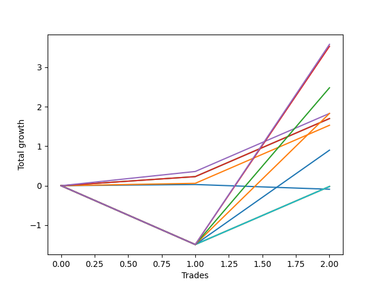

# Short Bernese 005 1v 
- Symbol: SPY
- Date Range: 05/27/2022 - 09/30/2022
- Trading Period: 7:20-12:30
- Number of Trades: 2



| Name | Win Percent | Profit | Avg Profit / Trade | Avg Time / Trade |      | Name | Win Percent | Profit | Avg Profit / Trade | Avg Time / Trade |
| ---- | ----------- | ------ | ------------------ | ---------------- | ---- | ---- | ----------- | ------ | ------------------ | ---------------- |
| Sorted By <br> Profit | | | | | | Sorted By <br> Win Percentage ||||
| NEWFI 0000 | 50.00 | 1790.00 | 895.00 | 35:30 |     | Three | 100.00 | 915.00 | 457.50 | 09:35 |
| Eighty-Five | 50.00 | 1765.00 | 882.50 | 34:47 |     | Two_C | 100.00 | 850.00 | 425.00 | 09:00 |
| Eighty-Four | 50.00 | 1240.00 | 620.00 | 33:02 |     | Two | 100.00 | 850.00 | 425.00 | 09:00 |
| Three | 100.00 | 915.00 | 457.50 | 09:35 |     | One | 100.00 | 765.00 | 382.50 | 07:15 |
| Eighty-Three | 50.00 | 915.00 | 457.50 | 32:57 |     | NEWFI 0000 | 50.00 | 1790.00 | 895.00 | 35:30 |
| Two_C | 100.00 | 850.00 | 425.00 | 09:00 |     | Eighty-Five | 50.00 | 1765.00 | 882.50 | 34:47 |
| Two | 100.00 | 850.00 | 425.00 | 09:00 |     | Eighty-Four | 50.00 | 1240.00 | 620.00 | 33:02 |
| One | 100.00 | 765.00 | 382.50 | 07:15 |     | Eighty-Three | 50.00 | 915.00 | 457.50 | 32:57 |
| Eighty-Two | 50.00 | 450.00 | 225.00 | 32:40 |     | Eighty-Two | 50.00 | 450.00 | 225.00 | 32:40 |
| Eighty-One | 50.00 | -10.00 | -5.00 | 32:30 |     | Eighty-One | 50.00 | -10.00 | -5.00 | 32:30 |
| Seven | 50.00 | -10.00 | -5.00 | 32:30 |     | Seven | 50.00 | -10.00 | -5.00 | 32:30 |
| Six | 50.00 | -10.00 | -5.00 | 32:30 |     | Six | 50.00 | -10.00 | -5.00 | 32:30 |
| Five | 50.00 | -10.00 | -5.00 | 32:30 |     | Five | 50.00 | -10.00 | -5.00 | 32:30 |
| Four | 50.00 | -10.00 | -5.00 | 32:30 |     | Four | 50.00 | -10.00 | -5.00 | 32:30 |
| Zero | 50.00 | -45.00 | -22.50 | 03:52 |     | Zero | 50.00 | -45.00 | -22.50 | 03:52 |

## NO STOPLOSS

### Test Zero
* Sell when price hits the middle line of the 20p bollinger
* No Stoploss
* Results:
```
Total Trades: 2
Percent Up: 50.00
Percent Down: 50.00
Total Points Moved Down: -0.09
Potential Profit: -45.00
Total Points Ups: 0.12 Count Ups: 1
Total Points Downs: 0.03 Count Downs: 1
```

<details><summary>Trades</summary>

<code>In: 2022-07-01 10:55:00		Out: 2022-07-01 10:58:40		Total Position Time: 03:40		Total Move Down: 0.03		Total to Date: 0.03</code> <br />
<code>In: 2022-09-21 10:55:00		Out: 2022-09-21 10:59:05		Total Position Time: 04:05		Total Move Down: -0.12		Total to Date: -0.09</code> <br />


</details>

### Test One
* Sell when the price hits the upper line of the 20p 1std bollinger
* No Stoploss
* Results:
```
Total Trades: 2
Percent Up: 0.00
Percent Down: 100.00
Total Points Moved Down: 1.53
Potential Profit: 765.00
Total Points Ups: 0.00 Count Ups: 0
Total Points Downs: 1.53 Count Downs: 2
```

<details><summary>Trades</summary>

<code>In: 2022-07-01 10:55:00		Out: 2022-07-01 11:04:25		Total Position Time: 09:25		Total Move Down: 0.06		Total to Date: 0.06</code> <br />
<code>In: 2022-09-21 10:55:00		Out: 2022-09-21 11:00:05		Total Position Time: 05:05		Total Move Down: 1.47		Total to Date: 1.53</code> <br />


</details>

### Test Two
* Sell when the price hits the upper line of the 20p 2std bollinger
* No Stoploss
* Results:
```
Total Trades: 2
Percent Up: 0.00
Percent Down: 100.00
Total Points Moved Down: 1.70
Potential Profit: 850.00
Total Points Ups: 0.00 Count Ups: 0
Total Points Downs: 1.70 Count Downs: 2
```

<details><summary>Trades</summary>

<code>In: 2022-07-01 10:55:00		Out: 2022-07-01 11:07:55		Total Position Time: 12:55		Total Move Down: 0.23		Total to Date: 0.23</code> <br />
<code>In: 2022-09-21 10:55:00		Out: 2022-09-21 11:00:05		Total Position Time: 05:05		Total Move Down: 1.47		Total to Date: 1.70</code> <br />


</details>

### Test Two_C
* Sell when the price hits the upper line of the 20p 2std bollinger
* No Stoploss
* Results:
```
Total Trades: 2
Percent Up: 0.00
Percent Down: 100.00
Total Points Moved Down: 1.70
Potential Profit: 850.00
Total Points Ups: 0.00 Count Ups: 0
Total Points Downs: 1.70 Count Downs: 2
```

<details><summary>Trades</summary>

<code>In: 2022-07-01 10:55:00		Out: 2022-07-01 11:07:55		Total Position Time: 12:55		Total Move Down: 0.23		Total to Date: 0.23</code> <br />
<code>In: 2022-09-21 10:55:00		Out: 2022-09-21 11:00:05		Total Position Time: 05:05		Total Move Down: 1.47		Total to Date: 1.70</code> <br />


</details>

### Test Three
* Sell when price hits the middle line of the 50p bollinger
* No Stoploss
* Results:
```
Total Trades: 2
Percent Up: 0.00
Percent Down: 100.00
Total Points Moved Down: 1.83
Potential Profit: 915.00
Total Points Ups: 0.00 Count Ups: 0
Total Points Downs: 1.83 Count Downs: 2
```

<details><summary>Trades</summary>

<code>In: 2022-07-01 10:55:00		Out: 2022-07-01 11:09:05		Total Position Time: 14:05		Total Move Down: 0.36		Total to Date: 0.36</code> <br />
<code>In: 2022-09-21 10:55:00		Out: 2022-09-21 11:00:05		Total Position Time: 05:05		Total Move Down: 1.47		Total to Date: 1.83</code> <br />


</details>

### Test Four
* Sell when the price hits the upper line of the 50p 1std bollinger
* No Stoploss
* Results:
```
Total Trades: 2
Percent Up: 50.00
Percent Down: 50.00
Total Points Moved Down: -0.02
Potential Profit: -10.00
Total Points Ups: 1.49 Count Ups: 1
Total Points Downs: 1.47 Count Downs: 1
```

<details><summary>Trades</summary>

<code>In: 2022-07-01 10:55:00		Out: 2022-07-01 11:54:55		Total Position Time: 59:55		Total Move Down: -1.49		Total to Date: -1.49</code> <br />
<code>In: 2022-09-21 10:55:00		Out: 2022-09-21 11:00:05		Total Position Time: 05:05		Total Move Down: 1.47		Total to Date: -0.02</code> <br />


</details>

### Test Five
* Sell when the price hits the upper line of the 50p 2std bollinger
* No Stoploss
* Results:
```
Total Trades: 2
Percent Up: 50.00
Percent Down: 50.00
Total Points Moved Down: -0.02
Potential Profit: -10.00
Total Points Ups: 1.49 Count Ups: 1
Total Points Downs: 1.47 Count Downs: 1
```

<details><summary>Trades</summary>

<code>In: 2022-07-01 10:55:00		Out: 2022-07-01 11:54:55		Total Position Time: 59:55		Total Move Down: -1.49		Total to Date: -1.49</code> <br />
<code>In: 2022-09-21 10:55:00		Out: 2022-09-21 11:00:05		Total Position Time: 05:05		Total Move Down: 1.47		Total to Date: -0.02</code> <br />


</details>

### Test Six
* Sell when the price hits the middle line of the 1std VWAP
* No Stoploss
* Results:
```
Total Trades: 2
Percent Up: 50.00
Percent Down: 50.00
Total Points Moved Down: -0.02
Potential Profit: -10.00
Total Points Ups: 1.49 Count Ups: 1
Total Points Downs: 1.47 Count Downs: 1
```

<details><summary>Trades</summary>

<code>In: 2022-07-01 10:55:00		Out: 2022-07-01 11:54:55		Total Position Time: 59:55		Total Move Down: -1.49		Total to Date: -1.49</code> <br />
<code>In: 2022-09-21 10:55:00		Out: 2022-09-21 11:00:05		Total Position Time: 05:05		Total Move Down: 1.47		Total to Date: -0.02</code> <br />


</details>

### Test Seven
* Sell when the price hits the upper line of the 1std VWAP
* No Stoploss
* Results:
```
Total Trades: 2
Percent Up: 50.00
Percent Down: 50.00
Total Points Moved Down: -0.02
Potential Profit: -10.00
Total Points Ups: 1.49 Count Ups: 1
Total Points Downs: 1.47 Count Downs: 1
```

<details><summary>Trades</summary>

<code>In: 2022-07-01 10:55:00		Out: 2022-07-01 11:54:55		Total Position Time: 59:55		Total Move Down: -1.49		Total to Date: -1.49</code> <br />
<code>In: 2022-09-21 10:55:00		Out: 2022-09-21 11:00:05		Total Position Time: 05:05		Total Move Down: 1.47		Total to Date: -0.02</code> <br />


</details>

## TAKE PROFIT

### Test Eighty-One
* Take Profit of 1 Point
* No Stoploss
* Results:
```
Total Trades: 2
Percent Up: 50.00
Percent Down: 50.00
Total Points Moved Down: -0.02
Potential Profit: -10.00
Total Points Ups: 1.49 Count Ups: 1
Total Points Downs: 1.47 Count Downs: 1
```

<details><summary>Trades</summary>

<code>In: 2022-07-01 10:55:00		Out: 2022-07-01 11:54:55		Total Position Time: 59:55		Total Move Down: -1.49		Total to Date: -1.49</code> <br />
<code>In: 2022-09-21 10:55:00		Out: 2022-09-21 11:00:05		Total Position Time: 05:05		Total Move Down: 1.47		Total to Date: -0.02</code> <br />


</details>

### Test Eighty-Two
* Take Profit of 2 Point
* No Stoploss
* Results:
```
Total Trades: 2
Percent Up: 50.00
Percent Down: 50.00
Total Points Moved Down: 0.90
Potential Profit: 450.00
Total Points Ups: 1.49 Count Ups: 1
Total Points Downs: 2.39 Count Downs: 1
```

<details><summary>Trades</summary>

<code>In: 2022-07-01 10:55:00		Out: 2022-07-01 11:54:55		Total Position Time: 59:55		Total Move Down: -1.49		Total to Date: -1.49</code> <br />
<code>In: 2022-09-21 10:55:00		Out: 2022-09-21 11:00:25		Total Position Time: 05:25		Total Move Down: 2.39		Total to Date: 0.90</code> <br />


</details>

### Test Eighty-Three
* Take Profit of 3 Point
* No Stoploss
* Results:
```
Total Trades: 2
Percent Up: 50.00
Percent Down: 50.00
Total Points Moved Down: 1.83
Potential Profit: 915.00
Total Points Ups: 1.49 Count Ups: 1
Total Points Downs: 3.32 Count Downs: 1
```

<details><summary>Trades</summary>

<code>In: 2022-07-01 10:55:00		Out: 2022-07-01 11:54:55		Total Position Time: 59:55		Total Move Down: -1.49		Total to Date: -1.49</code> <br />
<code>In: 2022-09-21 10:55:00		Out: 2022-09-21 11:01:00		Total Position Time: 06:00		Total Move Down: 3.32		Total to Date: 1.83</code> <br />


</details>

### Test Eighty-Four
* Take Profit of 4 Point
* No Stoploss
* Results:
```
Total Trades: 2
Percent Up: 50.00
Percent Down: 50.00
Total Points Moved Down: 2.48
Potential Profit: 1240.00
Total Points Ups: 1.49 Count Ups: 1
Total Points Downs: 3.97 Count Downs: 1
```

<details><summary>Trades</summary>

<code>In: 2022-07-01 10:55:00		Out: 2022-07-01 11:54:55		Total Position Time: 59:55		Total Move Down: -1.49		Total to Date: -1.49</code> <br />
<code>In: 2022-09-21 10:55:00		Out: 2022-09-21 11:01:10		Total Position Time: 06:10		Total Move Down: 3.97		Total to Date: 2.48</code> <br />


</details>

### Test Eighty-Five
* Take Profit of 5 Point
* No Stoploss
* Results:
```
Total Trades: 2
Percent Up: 50.00
Percent Down: 50.00
Total Points Moved Down: 3.53
Potential Profit: 1765.00
Total Points Ups: 1.49 Count Ups: 1
Total Points Downs: 5.02 Count Downs: 1
```

<details><summary>Trades</summary>

<code>In: 2022-07-01 10:55:00		Out: 2022-07-01 11:54:55		Total Position Time: 59:55		Total Move Down: -1.49		Total to Date: -1.49</code> <br />
<code>In: 2022-09-21 10:55:00		Out: 2022-09-21 11:04:40		Total Position Time: 09:40		Total Move Down: 5.02		Total to Date: 3.53</code> <br />


</details>

## Indicator Exits

### Test NEWFI 0000
* Newfi 0000
* No Stoploss
* Results:
```
Total Trades: 2
Percent Up: 50.00
Percent Down: 50.00
Total Points Moved Down: 3.58
Potential Profit: 1790.00
Total Points Ups: 1.49 Count Ups: 1
Total Points Downs: 5.07 Count Downs: 1
```

<details><summary>Trades</summary>

<code>In: 2022-07-01 10:55:00		Out: 2022-07-01 11:54:55		Total Position Time: 59:55		Total Move Down: -1.49		Total to Date: -1.49</code> <br />
<code>In: 2022-09-21 10:55:00		Out: 2022-09-21 11:06:05		Total Position Time: 11:05		Total Move Down: 5.07		Total to Date: 3.58</code> <br />


</details>