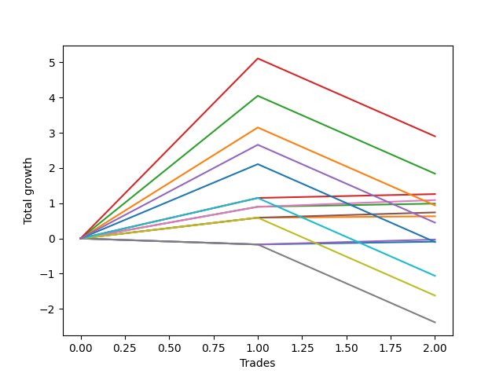

# Short Bernese 009 1v 
- Symbol: SPY
- Date Range: 05/27/2022 - 09/30/2022
- Trading Period: 7:20-12:30
- Number of Trades: 2



| Name | Win Percent | Profit | Avg Profit / Trade | Avg Time / Trade |      | Name | Win Percent | Profit | Avg Profit / Trade | Avg Time / Trade |
| ---- | ----------- | ------ | ------------------ | ---------------- | ---- | ---- | ----------- | ------ | ------------------ | ---------------- |
| Sorted By <br> Profit | | | | | | Sorted By <br> Win Percentage ||||
| Eighty-Five | 50.00 | 1450.00 | 725.00 | 45:37 |     | Two_C | 100.00 | 630.00 | 315.00 | 13:10 |
| Eighty-Four | 50.00 | 920.00 | 460.00 | 45:07 |     | Five | 100.00 | 545.00 | 272.50 | 14:37 |
| Two_C | 100.00 | 630.00 | 315.00 | 13:10 |     | Two | 100.00 | 495.00 | 247.50 | 12:27 |
| Five | 100.00 | 545.00 | 272.50 | 14:37 |     | Four | 100.00 | 370.00 | 185.00 | 14:27 |
| Two | 100.00 | 495.00 | 247.50 | 12:27 |     | One | 100.00 | 315.00 | 157.50 | 07:05 |
| Eighty-Three | 50.00 | 470.00 | 235.00 | 32:25 |     | Eighty-Five | 50.00 | 1450.00 | 725.00 | 45:37 |
| Four | 100.00 | 370.00 | 185.00 | 14:27 |     | Eighty-Four | 50.00 | 920.00 | 460.00 | 45:07 |
| One | 100.00 | 315.00 | 157.50 | 07:05 |     | Eighty-Three | 50.00 | 470.00 | 235.00 | 32:25 |
| NEWFI 0000 | 50.00 | 225.00 | 112.50 | 33:00 |     | NEWFI 0000 | 50.00 | 225.00 | 112.50 | 33:00 |
| Three | 50.00 | -15.00 | -7.50 | 00:40 |     | Three | 50.00 | -15.00 | -7.50 | 00:40 |
| Zero | 50.00 | -45.00 | -22.50 | 00:37 |     | Zero | 50.00 | -45.00 | -22.50 | 00:37 |
| Eighty-Two | 50.00 | -50.00 | -25.00 | 31:17 |     | Eighty-Two | 50.00 | -50.00 | -25.00 | 31:17 |
| Eighty-One | 50.00 | -530.00 | -265.00 | 31:07 |     | Eighty-One | 50.00 | -530.00 | -265.00 | 31:07 |
| Seven | 50.00 | -810.00 | -405.00 | 30:30 |     | Seven | 50.00 | -810.00 | -405.00 | 30:30 |
| Six | 0.00 | -1190.00 | -595.00 | 30:02 |     | Six | 0.00 | -1190.00 | -595.00 | 30:02 |

## NO STOPLOSS

### Test Zero
* Sell when price hits the middle line of the 20p bollinger
* No Stoploss
* Results:
```
Total Trades: 2
Percent Up: 50.00
Percent Down: 50.00
Total Points Moved Down: -0.09
Potential Profit: -45.00
Total Points Ups: 0.17 Count Ups: 1
Total Points Downs: 0.08 Count Downs: 1
```

<details><summary>Trades</summary>

<code>In: 2022-06-15 11:02:00		Out: 2022-06-15 11:02:10		Total Position Time: 00:10		Total Move Down: -0.17		Total to Date: -0.17</code> <br />
<code>In: 2022-08-17 10:33:00		Out: 2022-08-17 10:34:05		Total Position Time: 01:05		Total Move Down: 0.08		Total to Date: -0.09</code> <br />


</details>

### Test One
* Sell when the price hits the upper line of the 20p 1std bollinger
* No Stoploss
* Results:
```
Total Trades: 2
Percent Up: 0.00
Percent Down: 100.00
Total Points Moved Down: 0.63
Potential Profit: 315.00
Total Points Ups: 0.00 Count Ups: 0
Total Points Downs: 0.63 Count Downs: 2
```

<details><summary>Trades</summary>

<code>In: 2022-06-15 11:02:00		Out: 2022-06-15 11:03:05		Total Position Time: 01:05		Total Move Down: 0.59		Total to Date: 0.59</code> <br />
<code>In: 2022-08-17 10:33:00		Out: 2022-08-17 10:46:05		Total Position Time: 13:05		Total Move Down: 0.04		Total to Date: 0.63</code> <br />


</details>

### Test Two
* Sell when the price hits the upper line of the 20p 2std bollinger
* No Stoploss
* Results:
```
Total Trades: 2
Percent Up: 0.00
Percent Down: 100.00
Total Points Moved Down: 0.99
Potential Profit: 495.00
Total Points Ups: 0.00 Count Ups: 0
Total Points Downs: 0.99 Count Downs: 2
```

<details><summary>Trades</summary>

<code>In: 2022-06-15 11:02:00		Out: 2022-06-15 11:03:15		Total Position Time: 01:15		Total Move Down: 0.90		Total to Date: 0.90</code> <br />
<code>In: 2022-08-17 10:33:00		Out: 2022-08-17 10:56:40		Total Position Time: 23:40		Total Move Down: 0.09		Total to Date: 0.99</code> <br />


</details>

### Test Two_C
* Sell when the price hits the upper line of the 20p 2std bollinger
* No Stoploss
* Results:
```
Total Trades: 2
Percent Up: 0.00
Percent Down: 100.00
Total Points Moved Down: 1.26
Potential Profit: 630.00
Total Points Ups: 0.00 Count Ups: 0
Total Points Downs: 1.26 Count Downs: 2
```

<details><summary>Trades</summary>

<code>In: 2022-06-15 11:02:00		Out: 2022-06-15 11:04:20		Total Position Time: 02:20		Total Move Down: 1.15		Total to Date: 1.15</code> <br />
<code>In: 2022-08-17 10:33:00		Out: 2022-08-17 10:57:00		Total Position Time: 24:00		Total Move Down: 0.11		Total to Date: 1.26</code> <br />


</details>

### Test Three
* Sell when price hits the middle line of the 50p bollinger
* No Stoploss
* Results:
```
Total Trades: 2
Percent Up: 50.00
Percent Down: 50.00
Total Points Moved Down: -0.03
Potential Profit: -15.00
Total Points Ups: 0.17 Count Ups: 1
Total Points Downs: 0.14 Count Downs: 1
```

<details><summary>Trades</summary>

<code>In: 2022-06-15 11:02:00		Out: 2022-06-15 11:02:10		Total Position Time: 00:10		Total Move Down: -0.17		Total to Date: -0.17</code> <br />
<code>In: 2022-08-17 10:33:00		Out: 2022-08-17 10:34:10		Total Position Time: 01:10		Total Move Down: 0.14		Total to Date: -0.03</code> <br />


</details>

### Test Four
* Sell when the price hits the upper line of the 50p 1std bollinger
* No Stoploss
* Results:
```
Total Trades: 2
Percent Up: 0.00
Percent Down: 100.00
Total Points Moved Down: 0.74
Potential Profit: 370.00
Total Points Ups: 0.00 Count Ups: 0
Total Points Downs: 0.74 Count Downs: 2
```

<details><summary>Trades</summary>

<code>In: 2022-06-15 11:02:00		Out: 2022-06-15 11:03:05		Total Position Time: 01:05		Total Move Down: 0.59		Total to Date: 0.59</code> <br />
<code>In: 2022-08-17 10:33:00		Out: 2022-08-17 11:00:50		Total Position Time: 27:50		Total Move Down: 0.15		Total to Date: 0.74</code> <br />


</details>

### Test Five
* Sell when the price hits the upper line of the 50p 2std bollinger
* No Stoploss
* Results:
```
Total Trades: 2
Percent Up: 0.00
Percent Down: 100.00
Total Points Moved Down: 1.09
Potential Profit: 545.00
Total Points Ups: 0.00 Count Ups: 0
Total Points Downs: 1.09 Count Downs: 2
```

<details><summary>Trades</summary>

<code>In: 2022-06-15 11:02:00		Out: 2022-06-15 11:03:15		Total Position Time: 01:15		Total Move Down: 0.90		Total to Date: 0.90</code> <br />
<code>In: 2022-08-17 10:33:00		Out: 2022-08-17 11:01:00		Total Position Time: 28:00		Total Move Down: 0.19		Total to Date: 1.09</code> <br />


</details>

### Test Six
* Sell when the price hits the middle line of the 1std VWAP
* No Stoploss
* Results:
```
Total Trades: 2
Percent Up: 100.00
Percent Down: 0.00
Total Points Moved Down: -2.38
Potential Profit: -1190.00
Total Points Ups: 2.38 Count Ups: 2
Total Points Downs: 0.00 Count Downs: 0
```

<details><summary>Trades</summary>

<code>In: 2022-06-15 11:02:00		Out: 2022-06-15 11:02:10		Total Position Time: 00:10		Total Move Down: -0.17		Total to Date: -0.17</code> <br />
<code>In: 2022-08-17 10:33:00		Out: 2022-08-17 11:32:55		Total Position Time: 59:55		Total Move Down: -2.21		Total to Date: -2.38</code> <br />


</details>

### Test Seven
* Sell when the price hits the upper line of the 1std VWAP
* No Stoploss
* Results:
```
Total Trades: 2
Percent Up: 50.00
Percent Down: 50.00
Total Points Moved Down: -1.62
Potential Profit: -810.00
Total Points Ups: 2.21 Count Ups: 1
Total Points Downs: 0.59 Count Downs: 1
```

<details><summary>Trades</summary>

<code>In: 2022-06-15 11:02:00		Out: 2022-06-15 11:03:05		Total Position Time: 01:05		Total Move Down: 0.59		Total to Date: 0.59</code> <br />
<code>In: 2022-08-17 10:33:00		Out: 2022-08-17 11:32:55		Total Position Time: 59:55		Total Move Down: -2.21		Total to Date: -1.62</code> <br />


</details>

## TAKE PROFIT

### Test Eighty-One
* Take Profit of 1 Point
* No Stoploss
* Results:
```
Total Trades: 2
Percent Up: 50.00
Percent Down: 50.00
Total Points Moved Down: -1.06
Potential Profit: -530.00
Total Points Ups: 2.21 Count Ups: 1
Total Points Downs: 1.15 Count Downs: 1
```

<details><summary>Trades</summary>

<code>In: 2022-06-15 11:02:00		Out: 2022-06-15 11:04:20		Total Position Time: 02:20		Total Move Down: 1.15		Total to Date: 1.15</code> <br />
<code>In: 2022-08-17 10:33:00		Out: 2022-08-17 11:32:55		Total Position Time: 59:55		Total Move Down: -2.21		Total to Date: -1.06</code> <br />


</details>

### Test Eighty-Two
* Take Profit of 2 Point
* No Stoploss
* Results:
```
Total Trades: 2
Percent Up: 50.00
Percent Down: 50.00
Total Points Moved Down: -0.10
Potential Profit: -50.00
Total Points Ups: 2.21 Count Ups: 1
Total Points Downs: 2.11 Count Downs: 1
```

<details><summary>Trades</summary>

<code>In: 2022-06-15 11:02:00		Out: 2022-06-15 11:04:40		Total Position Time: 02:40		Total Move Down: 2.11		Total to Date: 2.11</code> <br />
<code>In: 2022-08-17 10:33:00		Out: 2022-08-17 11:32:55		Total Position Time: 59:55		Total Move Down: -2.21		Total to Date: -0.10</code> <br />


</details>

### Test Eighty-Three
* Take Profit of 3 Point
* No Stoploss
* Results:
```
Total Trades: 2
Percent Up: 50.00
Percent Down: 50.00
Total Points Moved Down: 0.94
Potential Profit: 470.00
Total Points Ups: 2.21 Count Ups: 1
Total Points Downs: 3.15 Count Downs: 1
```

<details><summary>Trades</summary>

<code>In: 2022-06-15 11:02:00		Out: 2022-06-15 11:06:55		Total Position Time: 04:55		Total Move Down: 3.15		Total to Date: 3.15</code> <br />
<code>In: 2022-08-17 10:33:00		Out: 2022-08-17 11:32:55		Total Position Time: 59:55		Total Move Down: -2.21		Total to Date: 0.94</code> <br />


</details>

### Test Eighty-Four
* Take Profit of 4 Point
* No Stoploss
* Results:
```
Total Trades: 2
Percent Up: 50.00
Percent Down: 50.00
Total Points Moved Down: 1.84
Potential Profit: 920.00
Total Points Ups: 2.21 Count Ups: 1
Total Points Downs: 4.05 Count Downs: 1
```

<details><summary>Trades</summary>

<code>In: 2022-06-15 11:02:00		Out: 2022-06-15 11:32:20		Total Position Time: 30:20		Total Move Down: 4.05		Total to Date: 4.05</code> <br />
<code>In: 2022-08-17 10:33:00		Out: 2022-08-17 11:32:55		Total Position Time: 59:55		Total Move Down: -2.21		Total to Date: 1.84</code> <br />


</details>

### Test Eighty-Five
* Take Profit of 5 Point
* No Stoploss
* Results:
```
Total Trades: 2
Percent Up: 50.00
Percent Down: 50.00
Total Points Moved Down: 2.90
Potential Profit: 1450.00
Total Points Ups: 2.21 Count Ups: 1
Total Points Downs: 5.11 Count Downs: 1
```

<details><summary>Trades</summary>

<code>In: 2022-06-15 11:02:00		Out: 2022-06-15 11:33:20		Total Position Time: 31:20		Total Move Down: 5.11		Total to Date: 5.11</code> <br />
<code>In: 2022-08-17 10:33:00		Out: 2022-08-17 11:32:55		Total Position Time: 59:55		Total Move Down: -2.21		Total to Date: 2.90</code> <br />


</details>

## Indicator Exits

### Test NEWFI 0000
* Newfi 0000
* No Stoploss
* Results:
```
Total Trades: 2
Percent Up: 50.00
Percent Down: 50.00
Total Points Moved Down: 0.45
Potential Profit: 225.00
Total Points Ups: 2.21 Count Ups: 1
Total Points Downs: 2.66 Count Downs: 1
```

<details><summary>Trades</summary>

<code>In: 2022-06-15 11:02:00		Out: 2022-06-15 11:08:05		Total Position Time: 06:05		Total Move Down: 2.66		Total to Date: 2.66</code> <br />
<code>In: 2022-08-17 10:33:00		Out: 2022-08-17 11:32:55		Total Position Time: 59:55		Total Move Down: -2.21		Total to Date: 0.45</code> <br />


</details>