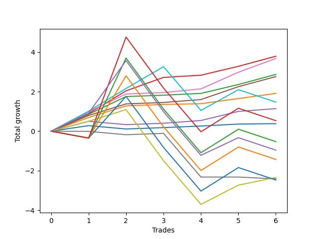

# Short Bernese 009 50 
- Symbol: SPY
- Date Range: 05/27/2022 - 09/30/2022
- Trading Period: 7:20-12:30
- Number of Trades: 6



| Name | Win Percent | Profit | Avg Profit / Trade | Avg Time / Trade |      | Name | Win Percent | Profit | Avg Profit / Trade | Avg Time / Trade |
| ---- | ----------- | ------ | ------------------ | ---------------- | ---- | ---- | ----------- | ------ | ------------------ | ---------------- |
| Sorted By <br> Profit | | | | | | Sorted By <br> Win Percentage ||||
| Two_C | 100.00 | 1895.00 | 315.83 | 11:12 |     | Two_C | 100.00 | 1895.00 | 315.83 | 11:12 |
| Five | 100.00 | 1840.00 | 306.67 | 14:23 |     | Five | 100.00 | 1840.00 | 306.67 | 14:23 |
| Two | 100.00 | 1435.00 | 239.17 | 10:35 |     | Two | 100.00 | 1435.00 | 239.17 | 10:35 |
| Four | 100.00 | 1380.00 | 230.00 | 10:26 |     | Four | 100.00 | 1380.00 | 230.00 | 10:26 |
| One | 100.00 | 955.00 | 159.17 | 04:42 |     | One | 100.00 | 955.00 | 159.17 | 04:42 |
| Eighty-One | 66.67 | 735.00 | 122.50 | 29:19 |     | Three | 83.33 | 570.00 | 95.00 | 03:01 |
| Three | 83.33 | 570.00 | 95.00 | 03:01 |     | Zero | 83.33 | 190.00 | 31.67 | 01:45 |
| Eighty-Five | 33.33 | 265.00 | 44.17 | 55:09 |     | Eighty-One | 66.67 | 735.00 | 122.50 | 29:19 |
| Zero | 83.33 | 190.00 | 31.67 | 01:45 |     | Seven | 66.67 | -1170.00 | -195.00 | 25:38 |
| Eighty-Four | 33.33 | -265.00 | -44.17 | 54:59 |     | NEWFI 0000 | 50.00 | -480.00 | -80.00 | 39:50 |
| NEWFI 0000 | 50.00 | -480.00 | -80.00 | 39:50 |     | Eighty-Five | 33.33 | 265.00 | 44.17 | 55:09 |
| Eighty-Three | 33.33 | -715.00 | -119.17 | 50:45 |     | Eighty-Four | 33.33 | -265.00 | -44.17 | 54:59 |
| Seven | 66.67 | -1170.00 | -195.00 | 25:38 |     | Eighty-Three | 33.33 | -715.00 | -119.17 | 50:45 |
| Six | 16.67 | -1205.00 | -200.83 | 10:07 |     | Eighty-Two | 33.33 | -1235.00 | -205.83 | 50:22 |
| Eighty-Two | 33.33 | -1235.00 | -205.83 | 50:22 |     | Six | 16.67 | -1205.00 | -200.83 | 10:07 |

## NO STOPLOSS

### Test Zero
* Sell when price hits the middle line of the 20p bollinger
* No Stoploss
* Results:
```
Total Trades: 6
Percent Up: 16.67
Percent Down: 83.33
Total Points Moved Down: 0.38
Potential Profit: 190.00
Total Points Ups: 0.17 Count Ups: 1
Total Points Downs: 0.55 Count Downs: 5
```

<details><summary>Trades</summary>

<code>In: 2022-06-09 08:47:00		Out: 2022-06-09 08:48:20		Total Position Time: 01:20		Total Move Down: 0.28		Total to Date: 0.28</code> <br />
<code>In: 2022-06-15 11:02:00		Out: 2022-06-15 11:02:10		Total Position Time: 00:10		Total Move Down: -0.17		Total to Date: 0.11</code> <br />
<code>In: 2022-07-06 11:00:00		Out: 2022-07-06 11:00:10		Total Position Time: 00:10		Total Move Down: 0.07		Total to Date: 0.18</code> <br />
<code>In: 2022-08-17 10:33:00		Out: 2022-08-17 10:34:05		Total Position Time: 01:05		Total Move Down: 0.08		Total to Date: 0.26</code> <br />
<code>In: 2022-08-31 09:01:00		Out: 2022-08-31 09:04:15		Total Position Time: 03:15		Total Move Down: 0.10		Total to Date: 0.36</code> <br />
<code>In: 2022-09-16 10:41:00		Out: 2022-09-16 10:45:30		Total Position Time: 04:30		Total Move Down: 0.02		Total to Date: 0.38</code> <br />


</details>

### Test One
* Sell when the price hits the upper line of the 20p 1std bollinger
* No Stoploss
* Results:
```
Total Trades: 6
Percent Up: 0.00
Percent Down: 100.00
Total Points Moved Down: 1.91
Potential Profit: 955.00
Total Points Ups: 0.00 Count Ups: 0
Total Points Downs: 1.91 Count Downs: 6
```

<details><summary>Trades</summary>

<code>In: 2022-06-09 08:47:00		Out: 2022-06-09 08:49:35		Total Position Time: 02:35		Total Move Down: 0.69		Total to Date: 0.69</code> <br />
<code>In: 2022-06-15 11:02:00		Out: 2022-06-15 11:03:05		Total Position Time: 01:05		Total Move Down: 0.59		Total to Date: 1.28</code> <br />
<code>In: 2022-07-06 11:00:00		Out: 2022-07-06 11:00:10		Total Position Time: 00:10		Total Move Down: 0.07		Total to Date: 1.35</code> <br />
<code>In: 2022-08-17 10:33:00		Out: 2022-08-17 10:46:05		Total Position Time: 13:05		Total Move Down: 0.04		Total to Date: 1.39</code> <br />
<code>In: 2022-08-31 09:01:00		Out: 2022-08-31 09:06:15		Total Position Time: 05:15		Total Move Down: 0.26		Total to Date: 1.65</code> <br />
<code>In: 2022-09-16 10:41:00		Out: 2022-09-16 10:47:05		Total Position Time: 06:05		Total Move Down: 0.26		Total to Date: 1.91</code> <br />


</details>

### Test Two
* Sell when the price hits the upper line of the 20p 2std bollinger
* No Stoploss
* Results:
```
Total Trades: 6
Percent Up: 0.00
Percent Down: 100.00
Total Points Moved Down: 2.87
Potential Profit: 1435.00
Total Points Ups: 0.00 Count Ups: 0
Total Points Downs: 2.87 Count Downs: 6
```

<details><summary>Trades</summary>

<code>In: 2022-06-09 08:47:00		Out: 2022-06-09 09:11:00		Total Position Time: 24:00		Total Move Down: 0.85		Total to Date: 0.85</code> <br />
<code>In: 2022-06-15 11:02:00		Out: 2022-06-15 11:03:15		Total Position Time: 01:15		Total Move Down: 0.90		Total to Date: 1.75</code> <br />
<code>In: 2022-07-06 11:00:00		Out: 2022-07-06 11:00:10		Total Position Time: 00:10		Total Move Down: 0.07		Total to Date: 1.82</code> <br />
<code>In: 2022-08-17 10:33:00		Out: 2022-08-17 10:56:40		Total Position Time: 23:40		Total Move Down: 0.09		Total to Date: 1.91</code> <br />
<code>In: 2022-08-31 09:01:00		Out: 2022-08-31 09:07:00		Total Position Time: 06:00		Total Move Down: 0.45		Total to Date: 2.36</code> <br />
<code>In: 2022-09-16 10:41:00		Out: 2022-09-16 10:49:25		Total Position Time: 08:25		Total Move Down: 0.51		Total to Date: 2.87</code> <br />


</details>

### Test Two_C
* Sell when the price hits the upper line of the 20p 2std bollinger
* No Stoploss
* Results:
```
Total Trades: 6
Percent Up: 0.00
Percent Down: 100.00
Total Points Moved Down: 3.79
Potential Profit: 1895.00
Total Points Ups: 0.00 Count Ups: 0
Total Points Downs: 3.79 Count Downs: 6
```

<details><summary>Trades</summary>

<code>In: 2022-06-09 08:47:00		Out: 2022-06-09 09:11:05		Total Position Time: 24:05		Total Move Down: 0.89		Total to Date: 0.89</code> <br />
<code>In: 2022-06-15 11:02:00		Out: 2022-06-15 11:04:20		Total Position Time: 02:20		Total Move Down: 1.15		Total to Date: 2.04</code> <br />
<code>In: 2022-07-06 11:00:00		Out: 2022-07-06 11:02:25		Total Position Time: 02:25		Total Move Down: 0.68		Total to Date: 2.72</code> <br />
<code>In: 2022-08-17 10:33:00		Out: 2022-08-17 10:57:00		Total Position Time: 24:00		Total Move Down: 0.11		Total to Date: 2.83</code> <br />
<code>In: 2022-08-31 09:01:00		Out: 2022-08-31 09:07:00		Total Position Time: 06:00		Total Move Down: 0.45		Total to Date: 3.28</code> <br />
<code>In: 2022-09-16 10:41:00		Out: 2022-09-16 10:49:25		Total Position Time: 08:25		Total Move Down: 0.51		Total to Date: 3.79</code> <br />


</details>

### Test Three
* Sell when price hits the middle line of the 50p bollinger
* No Stoploss
* Results:
```
Total Trades: 6
Percent Up: 16.67
Percent Down: 83.33
Total Points Moved Down: 1.14
Potential Profit: 570.00
Total Points Ups: 0.17 Count Ups: 1
Total Points Downs: 1.31 Count Downs: 5
```

<details><summary>Trades</summary>

<code>In: 2022-06-09 08:47:00		Out: 2022-06-09 08:48:50		Total Position Time: 01:50		Total Move Down: 0.50		Total to Date: 0.50</code> <br />
<code>In: 2022-06-15 11:02:00		Out: 2022-06-15 11:02:10		Total Position Time: 00:10		Total Move Down: -0.17		Total to Date: 0.33</code> <br />
<code>In: 2022-07-06 11:00:00		Out: 2022-07-06 11:00:10		Total Position Time: 00:10		Total Move Down: 0.07		Total to Date: 0.40</code> <br />
<code>In: 2022-08-17 10:33:00		Out: 2022-08-17 10:34:10		Total Position Time: 01:10		Total Move Down: 0.14		Total to Date: 0.54</code> <br />
<code>In: 2022-08-31 09:01:00		Out: 2022-08-31 09:10:55		Total Position Time: 09:55		Total Move Down: 0.46		Total to Date: 1.00</code> <br />
<code>In: 2022-09-16 10:41:00		Out: 2022-09-16 10:45:55		Total Position Time: 04:55		Total Move Down: 0.14		Total to Date: 1.14</code> <br />


</details>

### Test Four
* Sell when the price hits the upper line of the 50p 1std bollinger
* No Stoploss
* Results:
```
Total Trades: 6
Percent Up: 0.00
Percent Down: 100.00
Total Points Moved Down: 2.76
Potential Profit: 1380.00
Total Points Ups: 0.00 Count Ups: 0
Total Points Downs: 2.76 Count Downs: 6
```

<details><summary>Trades</summary>

<code>In: 2022-06-09 08:47:00		Out: 2022-06-09 08:50:25		Total Position Time: 03:25		Total Move Down: 0.79		Total to Date: 0.79</code> <br />
<code>In: 2022-06-15 11:02:00		Out: 2022-06-15 11:03:05		Total Position Time: 01:05		Total Move Down: 0.59		Total to Date: 1.38</code> <br />
<code>In: 2022-07-06 11:00:00		Out: 2022-07-06 11:00:10		Total Position Time: 00:10		Total Move Down: 0.07		Total to Date: 1.45</code> <br />
<code>In: 2022-08-17 10:33:00		Out: 2022-08-17 11:00:50		Total Position Time: 27:50		Total Move Down: 0.15		Total to Date: 1.60</code> <br />
<code>In: 2022-08-31 09:01:00		Out: 2022-08-31 09:22:45		Total Position Time: 21:45		Total Move Down: 0.65		Total to Date: 2.25</code> <br />
<code>In: 2022-09-16 10:41:00		Out: 2022-09-16 10:49:25		Total Position Time: 08:25		Total Move Down: 0.51		Total to Date: 2.76</code> <br />


</details>

### Test Five
* Sell when the price hits the upper line of the 50p 2std bollinger
* No Stoploss
* Results:
```
Total Trades: 6
Percent Up: 0.00
Percent Down: 100.00
Total Points Moved Down: 3.68
Potential Profit: 1840.00
Total Points Ups: 0.00 Count Ups: 0
Total Points Downs: 3.68 Count Downs: 6
```

<details><summary>Trades</summary>

<code>In: 2022-06-09 08:47:00		Out: 2022-06-09 09:11:10		Total Position Time: 24:10		Total Move Down: 0.98		Total to Date: 0.98</code> <br />
<code>In: 2022-06-15 11:02:00		Out: 2022-06-15 11:03:15		Total Position Time: 01:15		Total Move Down: 0.90		Total to Date: 1.88</code> <br />
<code>In: 2022-07-06 11:00:00		Out: 2022-07-06 11:00:10		Total Position Time: 00:10		Total Move Down: 0.07		Total to Date: 1.95</code> <br />
<code>In: 2022-08-17 10:33:00		Out: 2022-08-17 11:01:00		Total Position Time: 28:00		Total Move Down: 0.19		Total to Date: 2.14</code> <br />
<code>In: 2022-08-31 09:01:00		Out: 2022-08-31 09:23:45		Total Position Time: 22:45		Total Move Down: 0.84		Total to Date: 2.98</code> <br />
<code>In: 2022-09-16 10:41:00		Out: 2022-09-16 10:51:00		Total Position Time: 10:00		Total Move Down: 0.70		Total to Date: 3.68</code> <br />


</details>

### Test Six
* Sell when the price hits the middle line of the 1std VWAP
* No Stoploss
* Results:
```
Total Trades: 6
Percent Up: 83.33
Percent Down: 16.67
Total Points Moved Down: -2.41
Potential Profit: -1205.00
Total Points Ups: 2.48 Count Ups: 5
Total Points Downs: 0.07 Count Downs: 1
```

<details><summary>Trades</summary>

<code>In: 2022-06-09 08:47:00		Out: 2022-06-09 08:47:10		Total Position Time: 00:10		Total Move Down: -0.01		Total to Date: -0.01</code> <br />
<code>In: 2022-06-15 11:02:00		Out: 2022-06-15 11:02:10		Total Position Time: 00:10		Total Move Down: -0.17		Total to Date: -0.18</code> <br />
<code>In: 2022-07-06 11:00:00		Out: 2022-07-06 11:00:10		Total Position Time: 00:10		Total Move Down: 0.07		Total to Date: -0.11</code> <br />
<code>In: 2022-08-17 10:33:00		Out: 2022-08-17 11:32:55		Total Position Time: 59:55		Total Move Down: -2.21		Total to Date: -2.32</code> <br />
<code>In: 2022-08-31 09:01:00		Out: 2022-08-31 09:01:10		Total Position Time: 00:10		Total Move Down: -0.00		Total to Date: -2.32</code> <br />
<code>In: 2022-09-16 10:41:00		Out: 2022-09-16 10:41:10		Total Position Time: 00:10		Total Move Down: -0.09		Total to Date: -2.41</code> <br />


</details>

### Test Seven
* Sell when the price hits the upper line of the 1std VWAP
* No Stoploss
* Results:
```
Total Trades: 6
Percent Up: 33.33
Percent Down: 66.67
Total Points Moved Down: -2.34
Potential Profit: -1170.00
Total Points Ups: 4.79 Count Ups: 2
Total Points Downs: 2.45 Count Downs: 4
```

<details><summary>Trades</summary>

<code>In: 2022-06-09 08:47:00		Out: 2022-06-09 08:48:50		Total Position Time: 01:50		Total Move Down: 0.50		Total to Date: 0.50</code> <br />
<code>In: 2022-06-15 11:02:00		Out: 2022-06-15 11:03:05		Total Position Time: 01:05		Total Move Down: 0.59		Total to Date: 1.09</code> <br />
<code>In: 2022-07-06 11:00:00		Out: 2022-07-06 11:59:55		Total Position Time: 59:55		Total Move Down: -2.58		Total to Date: -1.49</code> <br />
<code>In: 2022-08-17 10:33:00		Out: 2022-08-17 11:32:55		Total Position Time: 59:55		Total Move Down: -2.21		Total to Date: -3.70</code> <br />
<code>In: 2022-08-31 09:01:00		Out: 2022-08-31 09:24:30		Total Position Time: 23:30		Total Move Down: 0.97		Total to Date: -2.73</code> <br />
<code>In: 2022-09-16 10:41:00		Out: 2022-09-16 10:48:35		Total Position Time: 07:35		Total Move Down: 0.39		Total to Date: -2.34</code> <br />


</details>

## TAKE PROFIT

### Test Eighty-One
* Take Profit of 1 Point
* No Stoploss
* Results:
```
Total Trades: 6
Percent Up: 33.33
Percent Down: 66.67
Total Points Moved Down: 1.47
Potential Profit: 735.00
Total Points Ups: 2.84 Count Ups: 2
Total Points Downs: 4.31 Count Downs: 4
```

<details><summary>Trades</summary>

<code>In: 2022-06-09 08:47:00		Out: 2022-06-09 08:50:40		Total Position Time: 03:40		Total Move Down: 1.01		Total to Date: 1.01</code> <br />
<code>In: 2022-06-15 11:02:00		Out: 2022-06-15 11:04:20		Total Position Time: 02:20		Total Move Down: 1.15		Total to Date: 2.16</code> <br />
<code>In: 2022-07-06 11:00:00		Out: 2022-07-06 11:12:15		Total Position Time: 12:15		Total Move Down: 1.10		Total to Date: 3.26</code> <br />
<code>In: 2022-08-17 10:33:00		Out: 2022-08-17 11:32:55		Total Position Time: 59:55		Total Move Down: -2.21		Total to Date: 1.05</code> <br />
<code>In: 2022-08-31 09:01:00		Out: 2022-08-31 09:38:50		Total Position Time: 37:50		Total Move Down: 1.05		Total to Date: 2.10</code> <br />
<code>In: 2022-09-16 10:41:00		Out: 2022-09-16 11:40:55		Total Position Time: 59:55		Total Move Down: -0.63		Total to Date: 1.47</code> <br />


</details>

### Test Eighty-Two
* Take Profit of 2 Point
* No Stoploss
* Results:
```
Total Trades: 6
Percent Up: 66.67
Percent Down: 33.33
Total Points Moved Down: -2.47
Potential Profit: -1235.00
Total Points Ups: 5.77 Count Ups: 4
Total Points Downs: 3.30 Count Downs: 2
```

<details><summary>Trades</summary>

<code>In: 2022-06-09 08:47:00		Out: 2022-06-09 09:46:55		Total Position Time: 59:55		Total Move Down: -0.35		Total to Date: -0.35</code> <br />
<code>In: 2022-06-15 11:02:00		Out: 2022-06-15 11:04:40		Total Position Time: 02:40		Total Move Down: 2.11		Total to Date: 1.76</code> <br />
<code>In: 2022-07-06 11:00:00		Out: 2022-07-06 11:59:55		Total Position Time: 59:55		Total Move Down: -2.58		Total to Date: -0.82</code> <br />
<code>In: 2022-08-17 10:33:00		Out: 2022-08-17 11:32:55		Total Position Time: 59:55		Total Move Down: -2.21		Total to Date: -3.03</code> <br />
<code>In: 2022-08-31 09:01:00		Out: 2022-08-31 10:00:55		Total Position Time: 59:55		Total Move Down: 1.19		Total to Date: -1.84</code> <br />
<code>In: 2022-09-16 10:41:00		Out: 2022-09-16 11:40:55		Total Position Time: 59:55		Total Move Down: -0.63		Total to Date: -2.47</code> <br />


</details>

### Test Eighty-Three
* Take Profit of 3 Point
* No Stoploss
* Results:
```
Total Trades: 6
Percent Up: 66.67
Percent Down: 33.33
Total Points Moved Down: -1.43
Potential Profit: -715.00
Total Points Ups: 5.77 Count Ups: 4
Total Points Downs: 4.34 Count Downs: 2
```

<details><summary>Trades</summary>

<code>In: 2022-06-09 08:47:00		Out: 2022-06-09 09:46:55		Total Position Time: 59:55		Total Move Down: -0.35		Total to Date: -0.35</code> <br />
<code>In: 2022-06-15 11:02:00		Out: 2022-06-15 11:06:55		Total Position Time: 04:55		Total Move Down: 3.15		Total to Date: 2.80</code> <br />
<code>In: 2022-07-06 11:00:00		Out: 2022-07-06 11:59:55		Total Position Time: 59:55		Total Move Down: -2.58		Total to Date: 0.22</code> <br />
<code>In: 2022-08-17 10:33:00		Out: 2022-08-17 11:32:55		Total Position Time: 59:55		Total Move Down: -2.21		Total to Date: -1.99</code> <br />
<code>In: 2022-08-31 09:01:00		Out: 2022-08-31 10:00:55		Total Position Time: 59:55		Total Move Down: 1.19		Total to Date: -0.80</code> <br />
<code>In: 2022-09-16 10:41:00		Out: 2022-09-16 11:40:55		Total Position Time: 59:55		Total Move Down: -0.63		Total to Date: -1.43</code> <br />


</details>

### Test Eighty-Four
* Take Profit of 4 Point
* No Stoploss
* Results:
```
Total Trades: 6
Percent Up: 66.67
Percent Down: 33.33
Total Points Moved Down: -0.53
Potential Profit: -265.00
Total Points Ups: 5.77 Count Ups: 4
Total Points Downs: 5.24 Count Downs: 2
```

<details><summary>Trades</summary>

<code>In: 2022-06-09 08:47:00		Out: 2022-06-09 09:46:55		Total Position Time: 59:55		Total Move Down: -0.35		Total to Date: -0.35</code> <br />
<code>In: 2022-06-15 11:02:00		Out: 2022-06-15 11:32:20		Total Position Time: 30:20		Total Move Down: 4.05		Total to Date: 3.70</code> <br />
<code>In: 2022-07-06 11:00:00		Out: 2022-07-06 11:59:55		Total Position Time: 59:55		Total Move Down: -2.58		Total to Date: 1.12</code> <br />
<code>In: 2022-08-17 10:33:00		Out: 2022-08-17 11:32:55		Total Position Time: 59:55		Total Move Down: -2.21		Total to Date: -1.09</code> <br />
<code>In: 2022-08-31 09:01:00		Out: 2022-08-31 10:00:55		Total Position Time: 59:55		Total Move Down: 1.19		Total to Date: 0.10</code> <br />
<code>In: 2022-09-16 10:41:00		Out: 2022-09-16 11:40:55		Total Position Time: 59:55		Total Move Down: -0.63		Total to Date: -0.53</code> <br />


</details>

### Test Eighty-Five
* Take Profit of 5 Point
* No Stoploss
* Results:
```
Total Trades: 6
Percent Up: 66.67
Percent Down: 33.33
Total Points Moved Down: 0.53
Potential Profit: 265.00
Total Points Ups: 5.77 Count Ups: 4
Total Points Downs: 6.30 Count Downs: 2
```

<details><summary>Trades</summary>

<code>In: 2022-06-09 08:47:00		Out: 2022-06-09 09:46:55		Total Position Time: 59:55		Total Move Down: -0.35		Total to Date: -0.35</code> <br />
<code>In: 2022-06-15 11:02:00		Out: 2022-06-15 11:33:20		Total Position Time: 31:20		Total Move Down: 5.11		Total to Date: 4.76</code> <br />
<code>In: 2022-07-06 11:00:00		Out: 2022-07-06 11:59:55		Total Position Time: 59:55		Total Move Down: -2.58		Total to Date: 2.18</code> <br />
<code>In: 2022-08-17 10:33:00		Out: 2022-08-17 11:32:55		Total Position Time: 59:55		Total Move Down: -2.21		Total to Date: -0.03</code> <br />
<code>In: 2022-08-31 09:01:00		Out: 2022-08-31 10:00:55		Total Position Time: 59:55		Total Move Down: 1.19		Total to Date: 1.16</code> <br />
<code>In: 2022-09-16 10:41:00		Out: 2022-09-16 11:40:55		Total Position Time: 59:55		Total Move Down: -0.63		Total to Date: 0.53</code> <br />


</details>

## Indicator Exits

### Test NEWFI 0000
* Newfi 0000
* No Stoploss
* Results:
```
Total Trades: 6
Percent Up: 50.00
Percent Down: 50.00
Total Points Moved Down: -0.96
Potential Profit: -480.00
Total Points Ups: 5.42 Count Ups: 3
Total Points Downs: 4.46 Count Downs: 3
```

<details><summary>Trades</summary>

<code>In: 2022-06-09 08:47:00		Out: 2022-06-09 09:14:05		Total Position Time: 27:05		Total Move Down: 0.91		Total to Date: 0.91</code> <br />
<code>In: 2022-06-15 11:02:00		Out: 2022-06-15 11:08:05		Total Position Time: 06:05		Total Move Down: 2.66		Total to Date: 3.57</code> <br />
<code>In: 2022-07-06 11:00:00		Out: 2022-07-06 11:59:55		Total Position Time: 59:55		Total Move Down: -2.58		Total to Date: 0.99</code> <br />
<code>In: 2022-08-17 10:33:00		Out: 2022-08-17 11:32:55		Total Position Time: 59:55		Total Move Down: -2.21		Total to Date: -1.22</code> <br />
<code>In: 2022-08-31 09:01:00		Out: 2022-08-31 09:27:05		Total Position Time: 26:05		Total Move Down: 0.89		Total to Date: -0.33</code> <br />
<code>In: 2022-09-16 10:41:00		Out: 2022-09-16 11:40:55		Total Position Time: 59:55		Total Move Down: -0.63		Total to Date: -0.96</code> <br />


</details>