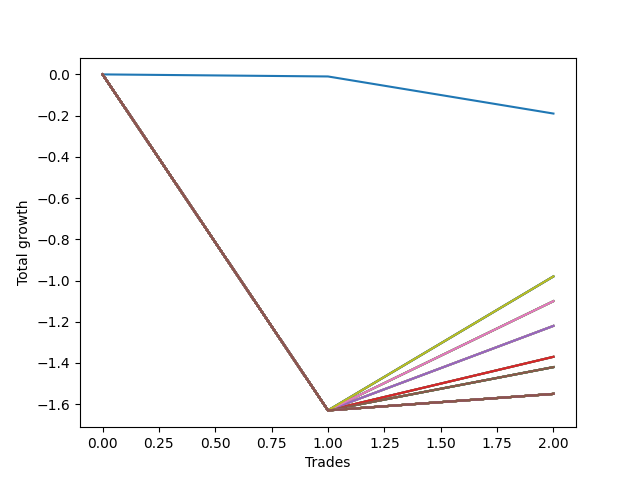

# Long Bulldog 001 
- Symbol: SPY_Unlimited
- Date Range: 03/23/2022 - 07/08/2022
- Trading Period: 7:20-12:30
- Number of Trades: 2



| Name | Win Percent | Profit | Avg Profit / Trade | Avg Time / Trade |      | Name | Win Percent | Profit | Avg Profit / Trade | Avg Time / Trade |
| ---- | ----------- | ------ | ------------------ | ---------------- | ---- | ---- | ----------- | ------ | ------------------ | ---------------- |
| Sorted By <br> Profit | | | | | | Sorted By <br> Win Percentage ||||
| Seventy-Three | 0.00 | -95.00 | -47.50 | 02:05 |     | Seventy | 50.00 | -490.00 | -245.00 | 27:32 |
| Seventy | 50.00 | -490.00 | -245.00 | 27:32 |     | Sixty-Two | 50.00 | -490.00 | -245.00 | 27:32 |
| Sixty-Two | 50.00 | -490.00 | -245.00 | 27:32 |     | Fifty-Four | 50.00 | -490.00 | -245.00 | 27:32 |
| Fifty-Four | 50.00 | -490.00 | -245.00 | 27:32 |     | Forty-Six | 50.00 | -490.00 | -245.00 | 27:32 |
| Forty-Six | 50.00 | -490.00 | -245.00 | 27:32 |     | Six | 50.00 | -490.00 | -245.00 | 27:32 |
| Six | 50.00 | -490.00 | -245.00 | 27:32 |     | Sixty-Eight | 50.00 | -550.00 | -275.00 | 27:30 |
| Sixty-Eight | 50.00 | -550.00 | -275.00 | 27:30 |     | Sixty | 50.00 | -550.00 | -275.00 | 27:30 |
| Sixty | 50.00 | -550.00 | -275.00 | 27:30 |     | Fifty-Two | 50.00 | -550.00 | -275.00 | 27:30 |
| Fifty-Two | 50.00 | -550.00 | -275.00 | 27:30 |     | Forty-Four | 50.00 | -550.00 | -275.00 | 27:30 |
| Forty-Four | 50.00 | -550.00 | -275.00 | 27:30 |     | Four | 50.00 | -550.00 | -275.00 | 27:30 |
| Four | 50.00 | -550.00 | -275.00 | 27:30 |     | Sixty-Six | 50.00 | -610.00 | -305.00 | 19:55 |
| Sixty-Six | 50.00 | -610.00 | -305.00 | 19:55 |     | Fifty-Eight | 50.00 | -610.00 | -305.00 | 19:55 |
| Fifty-Eight | 50.00 | -610.00 | -305.00 | 19:55 |     | Fifty | 50.00 | -610.00 | -305.00 | 19:55 |
| Fifty | 50.00 | -610.00 | -305.00 | 19:55 |     | Forty-Two | 50.00 | -610.00 | -305.00 | 19:55 |
| Forty-Two | 50.00 | -610.00 | -305.00 | 19:55 |     | Two | 50.00 | -610.00 | -305.00 | 19:55 |
| Two | 50.00 | -610.00 | -305.00 | 19:55 |     | Sixty-Five | 50.00 | -685.00 | -342.50 | 19:17 |
| Sixty-Five | 50.00 | -685.00 | -342.50 | 19:17 |     | Fifty-Seven | 50.00 | -685.00 | -342.50 | 19:17 |
| Fifty-Seven | 50.00 | -685.00 | -342.50 | 19:17 |     | Forty-Nine | 50.00 | -685.00 | -342.50 | 19:17 |
| Forty-Nine | 50.00 | -685.00 | -342.50 | 19:17 |     | Forty-One | 50.00 | -685.00 | -342.50 | 19:17 |
| Forty-One | 50.00 | -685.00 | -342.50 | 19:17 |     | One | 50.00 | -685.00 | -342.50 | 19:17 |
| One | 50.00 | -685.00 | -342.50 | 19:17 |     | Sixty-Seven | 50.00 | -710.00 | -355.00 | 27:05 |
| Sixty-Seven | 50.00 | -710.00 | -355.00 | 27:05 |     | Sixty-Four | 50.00 | -710.00 | -355.00 | 15:10 |
| Sixty-Four | 50.00 | -710.00 | -355.00 | 15:10 |     | Fifty-Nine | 50.00 | -710.00 | -355.00 | 27:05 |
| Fifty-Nine | 50.00 | -710.00 | -355.00 | 27:05 |     | Fifty-Six | 50.00 | -710.00 | -355.00 | 15:10 |
| Fifty-Six | 50.00 | -710.00 | -355.00 | 15:10 |     | Fifty-One | 50.00 | -710.00 | -355.00 | 27:05 |
| Fifty-One | 50.00 | -710.00 | -355.00 | 27:05 |     | Forty-Eight | 50.00 | -710.00 | -355.00 | 15:10 |
| Forty-Eight | 50.00 | -710.00 | -355.00 | 15:10 |     | Forty-Three | 50.00 | -710.00 | -355.00 | 27:05 |
| Forty-Three | 50.00 | -710.00 | -355.00 | 27:05 |     | Forty | 50.00 | -710.00 | -355.00 | 15:10 |
| Forty | 50.00 | -710.00 | -355.00 | 15:10 |     | Three | 50.00 | -710.00 | -355.00 | 27:05 |
| Three | 50.00 | -710.00 | -355.00 | 27:05 |     | Zero | 50.00 | -710.00 | -355.00 | 15:10 |
| Zero | 50.00 | -710.00 | -355.00 | 15:10 |     | One Hundred Thirty | 50.00 | -775.00 | -387.50 | 29:55 |
| One Hundred Thirty | 50.00 | -775.00 | -387.50 | 29:55 |     | One Hundred Twenty-Nine | 50.00 | -775.00 | -387.50 | 29:55 |
| One Hundred Twenty-Nine | 50.00 | -775.00 | -387.50 | 29:55 |     | One Hundred Twenty-Eight | 50.00 | -775.00 | -387.50 | 29:55 |
| One Hundred Twenty-Eight | 50.00 | -775.00 | -387.50 | 29:55 |     | One Hundred Twenty-Seven | 50.00 | -775.00 | -387.50 | 29:55 |
| One Hundred Twenty-Seven | 50.00 | -775.00 | -387.50 | 29:55 |     | One Hundred Twenty-Six | 50.00 | -775.00 | -387.50 | 29:55 |
| One Hundred Twenty-Six | 50.00 | -775.00 | -387.50 | 29:55 |     | One Hundred Twenty-Five | 50.00 | -775.00 | -387.50 | 29:55 |
| One Hundred Twenty-Five | 50.00 | -775.00 | -387.50 | 29:55 |     | One Hundred Twenty-Four | 50.00 | -775.00 | -387.50 | 29:55 |
| One Hundred Twenty-Four | 50.00 | -775.00 | -387.50 | 29:55 |     | One Hundred Twenty-Three | 50.00 | -775.00 | -387.50 | 29:55 |
| One Hundred Twenty-Three | 50.00 | -775.00 | -387.50 | 29:55 |     | One Hundred Twenty-Two | 50.00 | -775.00 | -387.50 | 29:55 |
| One Hundred Twenty-Two | 50.00 | -775.00 | -387.50 | 29:55 |     | One Hundred Twenty-One | 50.00 | -775.00 | -387.50 | 29:55 |
| One Hundred Twenty-One | 50.00 | -775.00 | -387.50 | 29:55 |     | One Hundred Twenty | 50.00 | -775.00 | -387.50 | 29:55 |
| One Hundred Twenty | 50.00 | -775.00 | -387.50 | 29:55 |     | One Hundred Ninteen | 50.00 | -775.00 | -387.50 | 29:55 |
| One Hundred Ninteen | 50.00 | -775.00 | -387.50 | 29:55 |     | One Hundred Eighteen | 50.00 | -775.00 | -387.50 | 29:55 |
| One Hundred Eighteen | 50.00 | -775.00 | -387.50 | 29:55 |     | One Hundred Seventeen | 50.00 | -775.00 | -387.50 | 29:55 |
| One Hundred Seventeen | 50.00 | -775.00 | -387.50 | 29:55 |     | One Hundred Sixteen | 50.00 | -775.00 | -387.50 | 29:55 |
| One Hundred Sixteen | 50.00 | -775.00 | -387.50 | 29:55 |     | One Hundred Fifteen | 50.00 | -775.00 | -387.50 | 29:55 |
| One Hundred Fifteen | 50.00 | -775.00 | -387.50 | 29:55 |     | One Hundred Fourteen | 50.00 | -775.00 | -387.50 | 29:55 |
| One Hundred Fourteen | 50.00 | -775.00 | -387.50 | 29:55 |     | One Hundred Thirteen | 50.00 | -775.00 | -387.50 | 29:55 |
| One Hundred Thirteen | 50.00 | -775.00 | -387.50 | 29:55 |     | One Hundred Twelve | 50.00 | -775.00 | -387.50 | 29:55 |
| One Hundred Twelve | 50.00 | -775.00 | -387.50 | 29:55 |     | One Hundred Eleven | 50.00 | -775.00 | -387.50 | 29:55 |
| One Hundred Eleven | 50.00 | -775.00 | -387.50 | 29:55 |     | Eighty-Five | 50.00 | -775.00 | -387.50 | 29:55 |
| Eighty-Five | 50.00 | -775.00 | -387.50 | 29:55 |     | Eighty-Four | 50.00 | -775.00 | -387.50 | 29:55 |
| Eighty-Four | 50.00 | -775.00 | -387.50 | 29:55 |     | Eighty-Three | 50.00 | -775.00 | -387.50 | 29:55 |
| Eighty-Three | 50.00 | -775.00 | -387.50 | 29:55 |     | Eighty-Two | 50.00 | -775.00 | -387.50 | 29:55 |
| Eighty-Two | 50.00 | -775.00 | -387.50 | 29:55 |     | Eighty-One | 50.00 | -775.00 | -387.50 | 29:55 |
| Eighty-One | 50.00 | -775.00 | -387.50 | 29:55 |     | Seventy-One | 50.00 | -775.00 | -387.50 | 29:55 |
| Seventy-One | 50.00 | -775.00 | -387.50 | 29:55 |     | Sixty-Nine | 50.00 | -775.00 | -387.50 | 29:55 |
| Sixty-Nine | 50.00 | -775.00 | -387.50 | 29:55 |     | Sixty-Three | 50.00 | -775.00 | -387.50 | 29:55 |
| Sixty-Three | 50.00 | -775.00 | -387.50 | 29:55 |     | Sixty-One | 50.00 | -775.00 | -387.50 | 29:55 |
| Sixty-One | 50.00 | -775.00 | -387.50 | 29:55 |     | Fifty-Five | 50.00 | -775.00 | -387.50 | 29:55 |
| Fifty-Five | 50.00 | -775.00 | -387.50 | 29:55 |     | Fifty-Three | 50.00 | -775.00 | -387.50 | 29:55 |
| Fifty-Three | 50.00 | -775.00 | -387.50 | 29:55 |     | Forty-Seven | 50.00 | -775.00 | -387.50 | 29:55 |
| Forty-Seven | 50.00 | -775.00 | -387.50 | 29:55 |     | Forty-Five | 50.00 | -775.00 | -387.50 | 29:55 |
| Forty-Five | 50.00 | -775.00 | -387.50 | 29:55 |     | Seven | 50.00 | -775.00 | -387.50 | 29:55 |
| Seven | 50.00 | -775.00 | -387.50 | 29:55 |     | Five | 50.00 | -775.00 | -387.50 | 29:55 |
| Five | 50.00 | -775.00 | -387.50 | 29:55 |     | Seventy-Three | 0.00 | -95.00 | -47.50 | 02:05 |

## NO STOPLOSS

### Test Zero
* Sell when price hits the middle line of the 20p bollinger
* No Stoploss
* Results:
```
Total Trades: 2
Percent Up: 50.00
Percent Down: 50.00
Total Points Moved Up: -1.42
Potential Profit: -710.00
Total Points Ups: 0.21 Count Ups: 1
Total Points Downs: -1.63 Count Downs: 1
```

<details><summary>Trades</summary>

<code>In: 2022-03-28 08:28:00		Out: 2022-03-28 08:57:55		Total Position Time: 29:55		Total Move Up: -1.63		Total to Date: -1.63</code> <br />
<code>In: 2022-07-05 08:08:00		Out: 2022-07-05 08:08:25		Total Position Time: 00:25		Total Move Up: 0.21		Total to Date: -1.42</code> <br />


</details>

### Test One
* Sell when the price hits the upper line of the 20p 1std bollinger
* No Stoploss
* Results:
```
Total Trades: 2
Percent Up: 50.00
Percent Down: 50.00
Total Points Moved Up: -1.37
Potential Profit: -685.00
Total Points Ups: 0.26 Count Ups: 1
Total Points Downs: -1.63 Count Downs: 1
```

<details><summary>Trades</summary>

<code>In: 2022-03-28 08:28:00		Out: 2022-03-28 08:57:55		Total Position Time: 29:55		Total Move Up: -1.63		Total to Date: -1.63</code> <br />
<code>In: 2022-07-05 08:08:00		Out: 2022-07-05 08:16:40		Total Position Time: 08:40		Total Move Up: 0.26		Total to Date: -1.37</code> <br />


</details>

### Test Two
* Sell when the price hits the upper line of the 20p 2std bollinger
* No Stoploss
* Results:
```
Total Trades: 2
Percent Up: 50.00
Percent Down: 50.00
Total Points Moved Up: -1.22
Potential Profit: -610.00
Total Points Ups: 0.41 Count Ups: 1
Total Points Downs: -1.63 Count Downs: 1
```

<details><summary>Trades</summary>

<code>In: 2022-03-28 08:28:00		Out: 2022-03-28 08:57:55		Total Position Time: 29:55		Total Move Up: -1.63		Total to Date: -1.63</code> <br />
<code>In: 2022-07-05 08:08:00		Out: 2022-07-05 08:17:55		Total Position Time: 09:55		Total Move Up: 0.41		Total to Date: -1.22</code> <br />


</details>

### Test Three
* Sell when price hits the middle line of the 50p bollinger
* No Stoploss
* Results:
```
Total Trades: 2
Percent Up: 50.00
Percent Down: 50.00
Total Points Moved Up: -1.42
Potential Profit: -710.00
Total Points Ups: 0.21 Count Ups: 1
Total Points Downs: -1.63 Count Downs: 1
```

<details><summary>Trades</summary>

<code>In: 2022-03-28 08:28:00		Out: 2022-03-28 08:57:55		Total Position Time: 29:55		Total Move Up: -1.63		Total to Date: -1.63</code> <br />
<code>In: 2022-07-05 08:08:00		Out: 2022-07-05 08:32:15		Total Position Time: 24:15		Total Move Up: 0.21		Total to Date: -1.42</code> <br />


</details>

### Test Four
* Sell when the price hits the upper line of the 50p 1std bollinger
* No Stoploss
* Results:
```
Total Trades: 2
Percent Up: 50.00
Percent Down: 50.00
Total Points Moved Up: -1.10
Potential Profit: -550.00
Total Points Ups: 0.53 Count Ups: 1
Total Points Downs: -1.63 Count Downs: 1
```

<details><summary>Trades</summary>

<code>In: 2022-03-28 08:28:00		Out: 2022-03-28 08:57:55		Total Position Time: 29:55		Total Move Up: -1.63		Total to Date: -1.63</code> <br />
<code>In: 2022-07-05 08:08:00		Out: 2022-07-05 08:33:05		Total Position Time: 25:05		Total Move Up: 0.53		Total to Date: -1.10</code> <br />


</details>

### Test Five
* Sell when the price hits the upper line of the 50p 2std bollinger
* No Stoploss
* Results:
```
Total Trades: 2
Percent Up: 50.00
Percent Down: 50.00
Total Points Moved Up: -1.55
Potential Profit: -775.00
Total Points Ups: 0.08 Count Ups: 1
Total Points Downs: -1.63 Count Downs: 1
```

<details><summary>Trades</summary>

<code>In: 2022-03-28 08:28:00		Out: 2022-03-28 08:57:55		Total Position Time: 29:55		Total Move Up: -1.63		Total to Date: -1.63</code> <br />
<code>In: 2022-07-05 08:08:00		Out: 2022-07-05 08:37:55		Total Position Time: 29:55		Total Move Up: 0.08		Total to Date: -1.55</code> <br />


</details>

### Test Six
* Sell when the price hits the middle line of the 1std VWAP
* No Stoploss
* Results:
```
Total Trades: 2
Percent Up: 50.00
Percent Down: 50.00
Total Points Moved Up: -0.98
Potential Profit: -490.00
Total Points Ups: 0.65 Count Ups: 1
Total Points Downs: -1.63 Count Downs: 1
```

<details><summary>Trades</summary>

<code>In: 2022-03-28 08:28:00		Out: 2022-03-28 08:57:55		Total Position Time: 29:55		Total Move Up: -1.63		Total to Date: -1.63</code> <br />
<code>In: 2022-07-05 08:08:00		Out: 2022-07-05 08:33:10		Total Position Time: 25:10		Total Move Up: 0.65		Total to Date: -0.98</code> <br />


</details>

### Test Seven
* Sell when the price hits the upper line of the 1std VWAP
* No Stoploss
* Results:
```
Total Trades: 2
Percent Up: 50.00
Percent Down: 50.00
Total Points Moved Up: -1.55
Potential Profit: -775.00
Total Points Ups: 0.08 Count Ups: 1
Total Points Downs: -1.63 Count Downs: 1
```

<details><summary>Trades</summary>

<code>In: 2022-03-28 08:28:00		Out: 2022-03-28 08:57:55		Total Position Time: 29:55		Total Move Up: -1.63		Total to Date: -1.63</code> <br />
<code>In: 2022-07-05 08:08:00		Out: 2022-07-05 08:37:55		Total Position Time: 29:55		Total Move Up: 0.08		Total to Date: -1.55</code> <br />


</details>

## STOPLOSS OF 5

### Test Forty
* Sell when price hits the middle line of the 20p bollinger
* Stoploss is 5 points
* Results:
```
Total Trades: 2
Percent Up: 50.00
Percent Down: 50.00
Total Points Moved Up: -1.42
Potential Profit: -710.00
Total Points Ups: 0.21 Count Ups: 1
Total Points Downs: -1.63 Count Downs: 1
```

<details><summary>Trades</summary>

<code>In: 2022-03-28 08:28:00		Out: 2022-03-28 08:57:55		Total Position Time: 29:55		Total Move Up: -1.63		Total to Date: -1.63</code> <br />
<code>In: 2022-07-05 08:08:00		Out: 2022-07-05 08:08:25		Total Position Time: 00:25		Total Move Up: 0.21		Total to Date: -1.42</code> <br />


</details>

### Test Forty-One
* Sell when the price hits the upper line of the 20p 1std bollinger
* Stoploss is 5 points
* Results:
```
Total Trades: 2
Percent Up: 50.00
Percent Down: 50.00
Total Points Moved Up: -1.37
Potential Profit: -685.00
Total Points Ups: 0.26 Count Ups: 1
Total Points Downs: -1.63 Count Downs: 1
```

<details><summary>Trades</summary>

<code>In: 2022-03-28 08:28:00		Out: 2022-03-28 08:57:55		Total Position Time: 29:55		Total Move Up: -1.63		Total to Date: -1.63</code> <br />
<code>In: 2022-07-05 08:08:00		Out: 2022-07-05 08:16:40		Total Position Time: 08:40		Total Move Up: 0.26		Total to Date: -1.37</code> <br />


</details>

### Test Forty-Two
* Sell when the price hits the upper line of the 20p 2std bollinger
* Stoploss is 5 points
* Results:
```
Total Trades: 2
Percent Up: 50.00
Percent Down: 50.00
Total Points Moved Up: -1.22
Potential Profit: -610.00
Total Points Ups: 0.41 Count Ups: 1
Total Points Downs: -1.63 Count Downs: 1
```

<details><summary>Trades</summary>

<code>In: 2022-03-28 08:28:00		Out: 2022-03-28 08:57:55		Total Position Time: 29:55		Total Move Up: -1.63		Total to Date: -1.63</code> <br />
<code>In: 2022-07-05 08:08:00		Out: 2022-07-05 08:17:55		Total Position Time: 09:55		Total Move Up: 0.41		Total to Date: -1.22</code> <br />


</details>

### Test Forty-Three
* Sell when price hits the middle line of the 50p bollinger
* Stoploss is 5 points
* Results:
```
Total Trades: 2
Percent Up: 50.00
Percent Down: 50.00
Total Points Moved Up: -1.42
Potential Profit: -710.00
Total Points Ups: 0.21 Count Ups: 1
Total Points Downs: -1.63 Count Downs: 1
```

<details><summary>Trades</summary>

<code>In: 2022-03-28 08:28:00		Out: 2022-03-28 08:57:55		Total Position Time: 29:55		Total Move Up: -1.63		Total to Date: -1.63</code> <br />
<code>In: 2022-07-05 08:08:00		Out: 2022-07-05 08:32:15		Total Position Time: 24:15		Total Move Up: 0.21		Total to Date: -1.42</code> <br />


</details>

### Test Forty-Four
* Sell when the price hits the upper line of the 50p 1std bollinger
* Stoploss is 5 points
* Results:
```
Total Trades: 2
Percent Up: 50.00
Percent Down: 50.00
Total Points Moved Up: -1.10
Potential Profit: -550.00
Total Points Ups: 0.53 Count Ups: 1
Total Points Downs: -1.63 Count Downs: 1
```

<details><summary>Trades</summary>

<code>In: 2022-03-28 08:28:00		Out: 2022-03-28 08:57:55		Total Position Time: 29:55		Total Move Up: -1.63		Total to Date: -1.63</code> <br />
<code>In: 2022-07-05 08:08:00		Out: 2022-07-05 08:33:05		Total Position Time: 25:05		Total Move Up: 0.53		Total to Date: -1.10</code> <br />


</details>

### Test Forty-Five
* Sell when the price hits the upper line of the 50p 2std bollinger
* Stoploss is 5 points
* Results:
```
Total Trades: 2
Percent Up: 50.00
Percent Down: 50.00
Total Points Moved Up: -1.55
Potential Profit: -775.00
Total Points Ups: 0.08 Count Ups: 1
Total Points Downs: -1.63 Count Downs: 1
```

<details><summary>Trades</summary>

<code>In: 2022-03-28 08:28:00		Out: 2022-03-28 08:57:55		Total Position Time: 29:55		Total Move Up: -1.63		Total to Date: -1.63</code> <br />
<code>In: 2022-07-05 08:08:00		Out: 2022-07-05 08:37:55		Total Position Time: 29:55		Total Move Up: 0.08		Total to Date: -1.55</code> <br />


</details>

### Test Forty-Six
* Sell when the price hits the middle line of the 1std VWAP
* Stoploss is 5 points
* Results:
```
Total Trades: 2
Percent Up: 50.00
Percent Down: 50.00
Total Points Moved Up: -0.98
Potential Profit: -490.00
Total Points Ups: 0.65 Count Ups: 1
Total Points Downs: -1.63 Count Downs: 1
```

<details><summary>Trades</summary>

<code>In: 2022-03-28 08:28:00		Out: 2022-03-28 08:57:55		Total Position Time: 29:55		Total Move Up: -1.63		Total to Date: -1.63</code> <br />
<code>In: 2022-07-05 08:08:00		Out: 2022-07-05 08:33:10		Total Position Time: 25:10		Total Move Up: 0.65		Total to Date: -0.98</code> <br />


</details>

### Test Forty-Seven
* Sell when the price hits the upper line of the 1std VWAP
* Stoploss is 5 points
* Results:
```
Total Trades: 2
Percent Up: 50.00
Percent Down: 50.00
Total Points Moved Up: -1.55
Potential Profit: -775.00
Total Points Ups: 0.08 Count Ups: 1
Total Points Downs: -1.63 Count Downs: 1
```

<details><summary>Trades</summary>

<code>In: 2022-03-28 08:28:00		Out: 2022-03-28 08:57:55		Total Position Time: 29:55		Total Move Up: -1.63		Total to Date: -1.63</code> <br />
<code>In: 2022-07-05 08:08:00		Out: 2022-07-05 08:37:55		Total Position Time: 29:55		Total Move Up: 0.08		Total to Date: -1.55</code> <br />


</details>

## TRAIL STOP OF 5

### Test Forty-Eight
* Sell when price hits the middle line of the 20p bollinger
* Trailing Stop is 5 points
* Results:
```
Total Trades: 2
Percent Up: 50.00
Percent Down: 50.00
Total Points Moved Up: -1.42
Potential Profit: -710.00
Total Points Ups: 0.21 Count Ups: 1
Total Points Downs: -1.63 Count Downs: 1
```

<details><summary>Trades</summary>

<code>In: 2022-03-28 08:28:00		Out: 2022-03-28 08:57:55		Total Position Time: 29:55		Total Move Up: -1.63		Total to Date: -1.63</code> <br />
<code>In: 2022-07-05 08:08:00		Out: 2022-07-05 08:08:25		Total Position Time: 00:25		Total Move Up: 0.21		Total to Date: -1.42</code> <br />


</details>

### Test Forty-Nine
* Sell when the price hits the upper line of the 20p 1std bollinger
* Trailing Stop is 5 points
* Results:
```
Total Trades: 2
Percent Up: 50.00
Percent Down: 50.00
Total Points Moved Up: -1.37
Potential Profit: -685.00
Total Points Ups: 0.26 Count Ups: 1
Total Points Downs: -1.63 Count Downs: 1
```

<details><summary>Trades</summary>

<code>In: 2022-03-28 08:28:00		Out: 2022-03-28 08:57:55		Total Position Time: 29:55		Total Move Up: -1.63		Total to Date: -1.63</code> <br />
<code>In: 2022-07-05 08:08:00		Out: 2022-07-05 08:16:40		Total Position Time: 08:40		Total Move Up: 0.26		Total to Date: -1.37</code> <br />


</details>

### Test Fifty
* Sell when the price hits the upper line of the 20p 2std bollinger
* Trailing Stop is 5 points
* Results:
```
Total Trades: 2
Percent Up: 50.00
Percent Down: 50.00
Total Points Moved Up: -1.22
Potential Profit: -610.00
Total Points Ups: 0.41 Count Ups: 1
Total Points Downs: -1.63 Count Downs: 1
```

<details><summary>Trades</summary>

<code>In: 2022-03-28 08:28:00		Out: 2022-03-28 08:57:55		Total Position Time: 29:55		Total Move Up: -1.63		Total to Date: -1.63</code> <br />
<code>In: 2022-07-05 08:08:00		Out: 2022-07-05 08:17:55		Total Position Time: 09:55		Total Move Up: 0.41		Total to Date: -1.22</code> <br />


</details>

### Test Fifty-One
* Sell when price hits the middle line of the 50p bollinger
* Trailing Stop is 5 points
* Results:
```
Total Trades: 2
Percent Up: 50.00
Percent Down: 50.00
Total Points Moved Up: -1.42
Potential Profit: -710.00
Total Points Ups: 0.21 Count Ups: 1
Total Points Downs: -1.63 Count Downs: 1
```

<details><summary>Trades</summary>

<code>In: 2022-03-28 08:28:00		Out: 2022-03-28 08:57:55		Total Position Time: 29:55		Total Move Up: -1.63		Total to Date: -1.63</code> <br />
<code>In: 2022-07-05 08:08:00		Out: 2022-07-05 08:32:15		Total Position Time: 24:15		Total Move Up: 0.21		Total to Date: -1.42</code> <br />


</details>

### Test Fifty-Two
* Sell when the price hits the upper line of the 50p 1std bollinger
* Trailing Stop is 5 points
* Results:
```
Total Trades: 2
Percent Up: 50.00
Percent Down: 50.00
Total Points Moved Up: -1.10
Potential Profit: -550.00
Total Points Ups: 0.53 Count Ups: 1
Total Points Downs: -1.63 Count Downs: 1
```

<details><summary>Trades</summary>

<code>In: 2022-03-28 08:28:00		Out: 2022-03-28 08:57:55		Total Position Time: 29:55		Total Move Up: -1.63		Total to Date: -1.63</code> <br />
<code>In: 2022-07-05 08:08:00		Out: 2022-07-05 08:33:05		Total Position Time: 25:05		Total Move Up: 0.53		Total to Date: -1.10</code> <br />


</details>

### Test Fifty-Three
* Sell when the price hits the upper line of the 50p 2std bollinger
* Trailing Stop is 5 points
* Results:
```
Total Trades: 2
Percent Up: 50.00
Percent Down: 50.00
Total Points Moved Up: -1.55
Potential Profit: -775.00
Total Points Ups: 0.08 Count Ups: 1
Total Points Downs: -1.63 Count Downs: 1
```

<details><summary>Trades</summary>

<code>In: 2022-03-28 08:28:00		Out: 2022-03-28 08:57:55		Total Position Time: 29:55		Total Move Up: -1.63		Total to Date: -1.63</code> <br />
<code>In: 2022-07-05 08:08:00		Out: 2022-07-05 08:37:55		Total Position Time: 29:55		Total Move Up: 0.08		Total to Date: -1.55</code> <br />


</details>

### Test Fifty-Four
* Sell when the price hits the middle line of the 1std VWAP
* Trailing Stop is 5 points
* Results:
```
Total Trades: 2
Percent Up: 50.00
Percent Down: 50.00
Total Points Moved Up: -0.98
Potential Profit: -490.00
Total Points Ups: 0.65 Count Ups: 1
Total Points Downs: -1.63 Count Downs: 1
```

<details><summary>Trades</summary>

<code>In: 2022-03-28 08:28:00		Out: 2022-03-28 08:57:55		Total Position Time: 29:55		Total Move Up: -1.63		Total to Date: -1.63</code> <br />
<code>In: 2022-07-05 08:08:00		Out: 2022-07-05 08:33:10		Total Position Time: 25:10		Total Move Up: 0.65		Total to Date: -0.98</code> <br />


</details>

### Test Fifty-Five
* Sell when the price hits the upper line of the 1std VWAP
* Trailing Stop is 5 points
* Results:
```
Total Trades: 2
Percent Up: 50.00
Percent Down: 50.00
Total Points Moved Up: -1.55
Potential Profit: -775.00
Total Points Ups: 0.08 Count Ups: 1
Total Points Downs: -1.63 Count Downs: 1
```

<details><summary>Trades</summary>

<code>In: 2022-03-28 08:28:00		Out: 2022-03-28 08:57:55		Total Position Time: 29:55		Total Move Up: -1.63		Total to Date: -1.63</code> <br />
<code>In: 2022-07-05 08:08:00		Out: 2022-07-05 08:37:55		Total Position Time: 29:55		Total Move Up: 0.08		Total to Date: -1.55</code> <br />


</details>

## STOPLOSS OF 10

### Test Fifty-Six
* Sell when price hits the middle line of the 20p bollinger
* Stoploss is 10 points
* Results:
```
Total Trades: 2
Percent Up: 50.00
Percent Down: 50.00
Total Points Moved Up: -1.42
Potential Profit: -710.00
Total Points Ups: 0.21 Count Ups: 1
Total Points Downs: -1.63 Count Downs: 1
```

<details><summary>Trades</summary>

<code>In: 2022-03-28 08:28:00		Out: 2022-03-28 08:57:55		Total Position Time: 29:55		Total Move Up: -1.63		Total to Date: -1.63</code> <br />
<code>In: 2022-07-05 08:08:00		Out: 2022-07-05 08:08:25		Total Position Time: 00:25		Total Move Up: 0.21		Total to Date: -1.42</code> <br />


</details>

### Test Fifty-Seven
* Sell when the price hits the upper line of the 20p 1std bollinger
* Stoploss is 10 points
* Results:
```
Total Trades: 2
Percent Up: 50.00
Percent Down: 50.00
Total Points Moved Up: -1.37
Potential Profit: -685.00
Total Points Ups: 0.26 Count Ups: 1
Total Points Downs: -1.63 Count Downs: 1
```

<details><summary>Trades</summary>

<code>In: 2022-03-28 08:28:00		Out: 2022-03-28 08:57:55		Total Position Time: 29:55		Total Move Up: -1.63		Total to Date: -1.63</code> <br />
<code>In: 2022-07-05 08:08:00		Out: 2022-07-05 08:16:40		Total Position Time: 08:40		Total Move Up: 0.26		Total to Date: -1.37</code> <br />


</details>

### Test Fifty-Eight
* Sell when the price hits the upper line of the 20p 2std bollinger
* Stoploss is 10 points
* Results:
```
Total Trades: 2
Percent Up: 50.00
Percent Down: 50.00
Total Points Moved Up: -1.22
Potential Profit: -610.00
Total Points Ups: 0.41 Count Ups: 1
Total Points Downs: -1.63 Count Downs: 1
```

<details><summary>Trades</summary>

<code>In: 2022-03-28 08:28:00		Out: 2022-03-28 08:57:55		Total Position Time: 29:55		Total Move Up: -1.63		Total to Date: -1.63</code> <br />
<code>In: 2022-07-05 08:08:00		Out: 2022-07-05 08:17:55		Total Position Time: 09:55		Total Move Up: 0.41		Total to Date: -1.22</code> <br />


</details>

### Test Fifty-Nine
* Sell when price hits the middle line of the 50p bollinger
* Stoploss is 10 points
* Results:
```
Total Trades: 2
Percent Up: 50.00
Percent Down: 50.00
Total Points Moved Up: -1.42
Potential Profit: -710.00
Total Points Ups: 0.21 Count Ups: 1
Total Points Downs: -1.63 Count Downs: 1
```

<details><summary>Trades</summary>

<code>In: 2022-03-28 08:28:00		Out: 2022-03-28 08:57:55		Total Position Time: 29:55		Total Move Up: -1.63		Total to Date: -1.63</code> <br />
<code>In: 2022-07-05 08:08:00		Out: 2022-07-05 08:32:15		Total Position Time: 24:15		Total Move Up: 0.21		Total to Date: -1.42</code> <br />


</details>

### Test Sixty
* Sell when the price hits the upper line of the 50p 1std bollinger
* Stoploss is 10 points
* Results:
```
Total Trades: 2
Percent Up: 50.00
Percent Down: 50.00
Total Points Moved Up: -1.10
Potential Profit: -550.00
Total Points Ups: 0.53 Count Ups: 1
Total Points Downs: -1.63 Count Downs: 1
```

<details><summary>Trades</summary>

<code>In: 2022-03-28 08:28:00		Out: 2022-03-28 08:57:55		Total Position Time: 29:55		Total Move Up: -1.63		Total to Date: -1.63</code> <br />
<code>In: 2022-07-05 08:08:00		Out: 2022-07-05 08:33:05		Total Position Time: 25:05		Total Move Up: 0.53		Total to Date: -1.10</code> <br />


</details>

### Test Sixty-One
* Sell when the price hits the upper line of the 50p 2std bollinger
* Stoploss is 10 points
* Results:
```
Total Trades: 2
Percent Up: 50.00
Percent Down: 50.00
Total Points Moved Up: -1.55
Potential Profit: -775.00
Total Points Ups: 0.08 Count Ups: 1
Total Points Downs: -1.63 Count Downs: 1
```

<details><summary>Trades</summary>

<code>In: 2022-03-28 08:28:00		Out: 2022-03-28 08:57:55		Total Position Time: 29:55		Total Move Up: -1.63		Total to Date: -1.63</code> <br />
<code>In: 2022-07-05 08:08:00		Out: 2022-07-05 08:37:55		Total Position Time: 29:55		Total Move Up: 0.08		Total to Date: -1.55</code> <br />


</details>

### Test Sixty-Two
* Sell when the price hits the middle line of the 1std VWAP
* Stoploss is 10 points
* Results:
```
Total Trades: 2
Percent Up: 50.00
Percent Down: 50.00
Total Points Moved Up: -0.98
Potential Profit: -490.00
Total Points Ups: 0.65 Count Ups: 1
Total Points Downs: -1.63 Count Downs: 1
```

<details><summary>Trades</summary>

<code>In: 2022-03-28 08:28:00		Out: 2022-03-28 08:57:55		Total Position Time: 29:55		Total Move Up: -1.63		Total to Date: -1.63</code> <br />
<code>In: 2022-07-05 08:08:00		Out: 2022-07-05 08:33:10		Total Position Time: 25:10		Total Move Up: 0.65		Total to Date: -0.98</code> <br />


</details>

### Test Sixty-Three
* Sell when the price hits the upper line of the 1std VWAP
* Stoploss is 10 points
* Results:
```
Total Trades: 2
Percent Up: 50.00
Percent Down: 50.00
Total Points Moved Up: -1.55
Potential Profit: -775.00
Total Points Ups: 0.08 Count Ups: 1
Total Points Downs: -1.63 Count Downs: 1
```

<details><summary>Trades</summary>

<code>In: 2022-03-28 08:28:00		Out: 2022-03-28 08:57:55		Total Position Time: 29:55		Total Move Up: -1.63		Total to Date: -1.63</code> <br />
<code>In: 2022-07-05 08:08:00		Out: 2022-07-05 08:37:55		Total Position Time: 29:55		Total Move Up: 0.08		Total to Date: -1.55</code> <br />


</details>

## TRAIL STOP OF 10

### Test Sixty-Four
* Sell when price hits the middle line of the 20p bollinger
* Trailing Stop is 10 points
* Results:
```
Total Trades: 2
Percent Up: 50.00
Percent Down: 50.00
Total Points Moved Up: -1.42
Potential Profit: -710.00
Total Points Ups: 0.21 Count Ups: 1
Total Points Downs: -1.63 Count Downs: 1
```

<details><summary>Trades</summary>

<code>In: 2022-03-28 08:28:00		Out: 2022-03-28 08:57:55		Total Position Time: 29:55		Total Move Up: -1.63		Total to Date: -1.63</code> <br />
<code>In: 2022-07-05 08:08:00		Out: 2022-07-05 08:08:25		Total Position Time: 00:25		Total Move Up: 0.21		Total to Date: -1.42</code> <br />


</details>

### Test Sixty-Five
* Sell when the price hits the upper line of the 20p 1std bollinger
* Trailing Stop is 10 points
* Results:
```
Total Trades: 2
Percent Up: 50.00
Percent Down: 50.00
Total Points Moved Up: -1.37
Potential Profit: -685.00
Total Points Ups: 0.26 Count Ups: 1
Total Points Downs: -1.63 Count Downs: 1
```

<details><summary>Trades</summary>

<code>In: 2022-03-28 08:28:00		Out: 2022-03-28 08:57:55		Total Position Time: 29:55		Total Move Up: -1.63		Total to Date: -1.63</code> <br />
<code>In: 2022-07-05 08:08:00		Out: 2022-07-05 08:16:40		Total Position Time: 08:40		Total Move Up: 0.26		Total to Date: -1.37</code> <br />


</details>

### Test Sixty-Six
* Sell when the price hits the upper line of the 20p 2std bollinger
* Trailing Stop is 10 points
* Results:
```
Total Trades: 2
Percent Up: 50.00
Percent Down: 50.00
Total Points Moved Up: -1.22
Potential Profit: -610.00
Total Points Ups: 0.41 Count Ups: 1
Total Points Downs: -1.63 Count Downs: 1
```

<details><summary>Trades</summary>

<code>In: 2022-03-28 08:28:00		Out: 2022-03-28 08:57:55		Total Position Time: 29:55		Total Move Up: -1.63		Total to Date: -1.63</code> <br />
<code>In: 2022-07-05 08:08:00		Out: 2022-07-05 08:17:55		Total Position Time: 09:55		Total Move Up: 0.41		Total to Date: -1.22</code> <br />


</details>

### Test Sixty-Seven
* Sell when price hits the middle line of the 50p bollinger
* Trailing Stop is 10 points
* Results:
```
Total Trades: 2
Percent Up: 50.00
Percent Down: 50.00
Total Points Moved Up: -1.42
Potential Profit: -710.00
Total Points Ups: 0.21 Count Ups: 1
Total Points Downs: -1.63 Count Downs: 1
```

<details><summary>Trades</summary>

<code>In: 2022-03-28 08:28:00		Out: 2022-03-28 08:57:55		Total Position Time: 29:55		Total Move Up: -1.63		Total to Date: -1.63</code> <br />
<code>In: 2022-07-05 08:08:00		Out: 2022-07-05 08:32:15		Total Position Time: 24:15		Total Move Up: 0.21		Total to Date: -1.42</code> <br />


</details>

### Test Sixty-Eight
* Sell when the price hits the upper line of the 50p 1std bollinger
* Trailing Stop is 10 points
* Results:
```
Total Trades: 2
Percent Up: 50.00
Percent Down: 50.00
Total Points Moved Up: -1.10
Potential Profit: -550.00
Total Points Ups: 0.53 Count Ups: 1
Total Points Downs: -1.63 Count Downs: 1
```

<details><summary>Trades</summary>

<code>In: 2022-03-28 08:28:00		Out: 2022-03-28 08:57:55		Total Position Time: 29:55		Total Move Up: -1.63		Total to Date: -1.63</code> <br />
<code>In: 2022-07-05 08:08:00		Out: 2022-07-05 08:33:05		Total Position Time: 25:05		Total Move Up: 0.53		Total to Date: -1.10</code> <br />


</details>

### Test Sixty-Nine
* Sell when the price hits the upper line of the 50p 2std bollinger
* Trailing Stop is 10 points
* Results:
```
Total Trades: 2
Percent Up: 50.00
Percent Down: 50.00
Total Points Moved Up: -1.55
Potential Profit: -775.00
Total Points Ups: 0.08 Count Ups: 1
Total Points Downs: -1.63 Count Downs: 1
```

<details><summary>Trades</summary>

<code>In: 2022-03-28 08:28:00		Out: 2022-03-28 08:57:55		Total Position Time: 29:55		Total Move Up: -1.63		Total to Date: -1.63</code> <br />
<code>In: 2022-07-05 08:08:00		Out: 2022-07-05 08:37:55		Total Position Time: 29:55		Total Move Up: 0.08		Total to Date: -1.55</code> <br />


</details>

### Test Seventy
* Sell when the price hits the middle line of the 1std VWAP
* Trailing Stop is 10 points
* Results:
```
Total Trades: 2
Percent Up: 50.00
Percent Down: 50.00
Total Points Moved Up: -0.98
Potential Profit: -490.00
Total Points Ups: 0.65 Count Ups: 1
Total Points Downs: -1.63 Count Downs: 1
```

<details><summary>Trades</summary>

<code>In: 2022-03-28 08:28:00		Out: 2022-03-28 08:57:55		Total Position Time: 29:55		Total Move Up: -1.63		Total to Date: -1.63</code> <br />
<code>In: 2022-07-05 08:08:00		Out: 2022-07-05 08:33:10		Total Position Time: 25:10		Total Move Up: 0.65		Total to Date: -0.98</code> <br />


</details>

### Test Seventy-One
* Sell when the price hits the upper line of the 1std VWAP
* Trailing Stop is 10 points
* Results:
```
Total Trades: 2
Percent Up: 50.00
Percent Down: 50.00
Total Points Moved Up: -1.55
Potential Profit: -775.00
Total Points Ups: 0.08 Count Ups: 1
Total Points Downs: -1.63 Count Downs: 1
```

<details><summary>Trades</summary>

<code>In: 2022-03-28 08:28:00		Out: 2022-03-28 08:57:55		Total Position Time: 29:55		Total Move Up: -1.63		Total to Date: -1.63</code> <br />
<code>In: 2022-07-05 08:08:00		Out: 2022-07-05 08:37:55		Total Position Time: 29:55		Total Move Up: 0.08		Total to Date: -1.55</code> <br />


</details>

## SPECIAL EXIT CONDITIONS 

### Test Seventy-Three
* Sell when the linear regression slope changes to negative
* No Stoploss
* Results:
```
Total Trades: 2
Percent Up: 0.00
Percent Down: 100.00
Total Points Moved Up: -0.19
Potential Profit: -95.00
Total Points Ups: 0.00 Count Ups: 0
Total Points Downs: -0.19 Count Downs: 2
```

<details><summary>Trades</summary>

<code>In: 2022-03-28 08:28:00		Out: 2022-03-28 08:31:05		Total Position Time: 03:05		Total Move Up: -0.01		Total to Date: -0.01</code> <br />
<code>In: 2022-07-05 08:08:00		Out: 2022-07-05 08:09:05		Total Position Time: 01:05		Total Move Up: -0.18		Total to Date: -0.19</code> <br />


</details>

## TAKE PROFIT

### Test Eighty-One
* Take Profit of 1 Point
* No Stoploss
* Results:
```
Total Trades: 2
Percent Up: 50.00
Percent Down: 50.00
Total Points Moved Up: -1.55
Potential Profit: -775.00
Total Points Ups: 0.08 Count Ups: 1
Total Points Downs: -1.63 Count Downs: 1
```

<details><summary>Trades</summary>

<code>In: 2022-03-28 08:28:00		Out: 2022-03-28 08:57:55		Total Position Time: 29:55		Total Move Up: -1.63		Total to Date: -1.63</code> <br />
<code>In: 2022-07-05 08:08:00		Out: 2022-07-05 08:37:55		Total Position Time: 29:55		Total Move Up: 0.08		Total to Date: -1.55</code> <br />


</details>

### Test Eighty-Two
* Take Profit of 2 Point
* No Stoploss
* Results:
```
Total Trades: 2
Percent Up: 50.00
Percent Down: 50.00
Total Points Moved Up: -1.55
Potential Profit: -775.00
Total Points Ups: 0.08 Count Ups: 1
Total Points Downs: -1.63 Count Downs: 1
```

<details><summary>Trades</summary>

<code>In: 2022-03-28 08:28:00		Out: 2022-03-28 08:57:55		Total Position Time: 29:55		Total Move Up: -1.63		Total to Date: -1.63</code> <br />
<code>In: 2022-07-05 08:08:00		Out: 2022-07-05 08:37:55		Total Position Time: 29:55		Total Move Up: 0.08		Total to Date: -1.55</code> <br />


</details>

### Test Eighty-Three
* Take Profit of 3 Point
* No Stoploss
* Results:
```
Total Trades: 2
Percent Up: 50.00
Percent Down: 50.00
Total Points Moved Up: -1.55
Potential Profit: -775.00
Total Points Ups: 0.08 Count Ups: 1
Total Points Downs: -1.63 Count Downs: 1
```

<details><summary>Trades</summary>

<code>In: 2022-03-28 08:28:00		Out: 2022-03-28 08:57:55		Total Position Time: 29:55		Total Move Up: -1.63		Total to Date: -1.63</code> <br />
<code>In: 2022-07-05 08:08:00		Out: 2022-07-05 08:37:55		Total Position Time: 29:55		Total Move Up: 0.08		Total to Date: -1.55</code> <br />


</details>

### Test Eighty-Four
* Take Profit of 4 Point
* No Stoploss
* Results:
```
Total Trades: 2
Percent Up: 50.00
Percent Down: 50.00
Total Points Moved Up: -1.55
Potential Profit: -775.00
Total Points Ups: 0.08 Count Ups: 1
Total Points Downs: -1.63 Count Downs: 1
```

<details><summary>Trades</summary>

<code>In: 2022-03-28 08:28:00		Out: 2022-03-28 08:57:55		Total Position Time: 29:55		Total Move Up: -1.63		Total to Date: -1.63</code> <br />
<code>In: 2022-07-05 08:08:00		Out: 2022-07-05 08:37:55		Total Position Time: 29:55		Total Move Up: 0.08		Total to Date: -1.55</code> <br />


</details>

### Test Eighty-Five
* Take Profit of 5 Point
* No Stoploss
* Results:
```
Total Trades: 2
Percent Up: 50.00
Percent Down: 50.00
Total Points Moved Up: -1.55
Potential Profit: -775.00
Total Points Ups: 0.08 Count Ups: 1
Total Points Downs: -1.63 Count Downs: 1
```

<details><summary>Trades</summary>

<code>In: 2022-03-28 08:28:00		Out: 2022-03-28 08:57:55		Total Position Time: 29:55		Total Move Up: -1.63		Total to Date: -1.63</code> <br />
<code>In: 2022-07-05 08:08:00		Out: 2022-07-05 08:37:55		Total Position Time: 29:55		Total Move Up: 0.08		Total to Date: -1.55</code> <br />


</details>

## TAKE PROFIT Stoploss of Five

### Test One Hundred Eleven
* Take Profit of 1 Point
* Stoploss is 5 points
* Results:
```
Total Trades: 2
Percent Up: 50.00
Percent Down: 50.00
Total Points Moved Up: -1.55
Potential Profit: -775.00
Total Points Ups: 0.08 Count Ups: 1
Total Points Downs: -1.63 Count Downs: 1
```

<details><summary>Trades</summary>

<code>In: 2022-03-28 08:28:00		Out: 2022-03-28 08:57:55		Total Position Time: 29:55		Total Move Up: -1.63		Total to Date: -1.63</code> <br />
<code>In: 2022-07-05 08:08:00		Out: 2022-07-05 08:37:55		Total Position Time: 29:55		Total Move Up: 0.08		Total to Date: -1.55</code> <br />


</details>

### Test One Hundred Twelve
* Take Profit of 2 Point
* Stoploss is 5 points
* Results:
```
Total Trades: 2
Percent Up: 50.00
Percent Down: 50.00
Total Points Moved Up: -1.55
Potential Profit: -775.00
Total Points Ups: 0.08 Count Ups: 1
Total Points Downs: -1.63 Count Downs: 1
```

<details><summary>Trades</summary>

<code>In: 2022-03-28 08:28:00		Out: 2022-03-28 08:57:55		Total Position Time: 29:55		Total Move Up: -1.63		Total to Date: -1.63</code> <br />
<code>In: 2022-07-05 08:08:00		Out: 2022-07-05 08:37:55		Total Position Time: 29:55		Total Move Up: 0.08		Total to Date: -1.55</code> <br />


</details>

### Test One Hundred Thirteen
* Take Profit of 3 Point
* Stoploss is 5 points
* Results:
```
Total Trades: 2
Percent Up: 50.00
Percent Down: 50.00
Total Points Moved Up: -1.55
Potential Profit: -775.00
Total Points Ups: 0.08 Count Ups: 1
Total Points Downs: -1.63 Count Downs: 1
```

<details><summary>Trades</summary>

<code>In: 2022-03-28 08:28:00		Out: 2022-03-28 08:57:55		Total Position Time: 29:55		Total Move Up: -1.63		Total to Date: -1.63</code> <br />
<code>In: 2022-07-05 08:08:00		Out: 2022-07-05 08:37:55		Total Position Time: 29:55		Total Move Up: 0.08		Total to Date: -1.55</code> <br />


</details>

### Test One Hundred Fourteen
* Take Profit of 4 Point
* Stoploss is 5 points
* Results:
```
Total Trades: 2
Percent Up: 50.00
Percent Down: 50.00
Total Points Moved Up: -1.55
Potential Profit: -775.00
Total Points Ups: 0.08 Count Ups: 1
Total Points Downs: -1.63 Count Downs: 1
```

<details><summary>Trades</summary>

<code>In: 2022-03-28 08:28:00		Out: 2022-03-28 08:57:55		Total Position Time: 29:55		Total Move Up: -1.63		Total to Date: -1.63</code> <br />
<code>In: 2022-07-05 08:08:00		Out: 2022-07-05 08:37:55		Total Position Time: 29:55		Total Move Up: 0.08		Total to Date: -1.55</code> <br />


</details>

### Test One Hundred Fifteen
* Take Profit of 5 Point
* Stoploss is 5 points
* Results:
```
Total Trades: 2
Percent Up: 50.00
Percent Down: 50.00
Total Points Moved Up: -1.55
Potential Profit: -775.00
Total Points Ups: 0.08 Count Ups: 1
Total Points Downs: -1.63 Count Downs: 1
```

<details><summary>Trades</summary>

<code>In: 2022-03-28 08:28:00		Out: 2022-03-28 08:57:55		Total Position Time: 29:55		Total Move Up: -1.63		Total to Date: -1.63</code> <br />
<code>In: 2022-07-05 08:08:00		Out: 2022-07-05 08:37:55		Total Position Time: 29:55		Total Move Up: 0.08		Total to Date: -1.55</code> <br />


</details>

## TAKE PROFIT Trailstop of Five

### Test One Hundred Sixteen
* Take Profit of 1 Point
* Trailing stop is 5 points
* Results:
```
Total Trades: 2
Percent Up: 50.00
Percent Down: 50.00
Total Points Moved Up: -1.55
Potential Profit: -775.00
Total Points Ups: 0.08 Count Ups: 1
Total Points Downs: -1.63 Count Downs: 1
```

<details><summary>Trades</summary>

<code>In: 2022-03-28 08:28:00		Out: 2022-03-28 08:57:55		Total Position Time: 29:55		Total Move Up: -1.63		Total to Date: -1.63</code> <br />
<code>In: 2022-07-05 08:08:00		Out: 2022-07-05 08:37:55		Total Position Time: 29:55		Total Move Up: 0.08		Total to Date: -1.55</code> <br />


</details>

### Test One Hundred Seventeen
* Take Profit of 2 Point
* Trailing stop is 5 points
* Results:
```
Total Trades: 2
Percent Up: 50.00
Percent Down: 50.00
Total Points Moved Up: -1.55
Potential Profit: -775.00
Total Points Ups: 0.08 Count Ups: 1
Total Points Downs: -1.63 Count Downs: 1
```

<details><summary>Trades</summary>

<code>In: 2022-03-28 08:28:00		Out: 2022-03-28 08:57:55		Total Position Time: 29:55		Total Move Up: -1.63		Total to Date: -1.63</code> <br />
<code>In: 2022-07-05 08:08:00		Out: 2022-07-05 08:37:55		Total Position Time: 29:55		Total Move Up: 0.08		Total to Date: -1.55</code> <br />


</details>

### Test One Hundred Eighteen
* Take Profit of 3 Point
* Trailing stop is 5 points
* Results:
```
Total Trades: 2
Percent Up: 50.00
Percent Down: 50.00
Total Points Moved Up: -1.55
Potential Profit: -775.00
Total Points Ups: 0.08 Count Ups: 1
Total Points Downs: -1.63 Count Downs: 1
```

<details><summary>Trades</summary>

<code>In: 2022-03-28 08:28:00		Out: 2022-03-28 08:57:55		Total Position Time: 29:55		Total Move Up: -1.63		Total to Date: -1.63</code> <br />
<code>In: 2022-07-05 08:08:00		Out: 2022-07-05 08:37:55		Total Position Time: 29:55		Total Move Up: 0.08		Total to Date: -1.55</code> <br />


</details>

### Test One Hundred Ninteen
* Take Profit of 4 Point
* Trailing stop is 5 points
* Results:
```
Total Trades: 2
Percent Up: 50.00
Percent Down: 50.00
Total Points Moved Up: -1.55
Potential Profit: -775.00
Total Points Ups: 0.08 Count Ups: 1
Total Points Downs: -1.63 Count Downs: 1
```

<details><summary>Trades</summary>

<code>In: 2022-03-28 08:28:00		Out: 2022-03-28 08:57:55		Total Position Time: 29:55		Total Move Up: -1.63		Total to Date: -1.63</code> <br />
<code>In: 2022-07-05 08:08:00		Out: 2022-07-05 08:37:55		Total Position Time: 29:55		Total Move Up: 0.08		Total to Date: -1.55</code> <br />


</details>

### Test One Hundred Twenty
* Take Profit of 5 Point
* Trailing stop is 5 points
* Results:
```
Total Trades: 2
Percent Up: 50.00
Percent Down: 50.00
Total Points Moved Up: -1.55
Potential Profit: -775.00
Total Points Ups: 0.08 Count Ups: 1
Total Points Downs: -1.63 Count Downs: 1
```

<details><summary>Trades</summary>

<code>In: 2022-03-28 08:28:00		Out: 2022-03-28 08:57:55		Total Position Time: 29:55		Total Move Up: -1.63		Total to Date: -1.63</code> <br />
<code>In: 2022-07-05 08:08:00		Out: 2022-07-05 08:37:55		Total Position Time: 29:55		Total Move Up: 0.08		Total to Date: -1.55</code> <br />


</details>

## TAKE PROFIT Stoploss of Ten

### Test One Hundred Twenty-One
* Take Profit of 1 Point
* Stoploss is 10 points
* Results:
```
Total Trades: 2
Percent Up: 50.00
Percent Down: 50.00
Total Points Moved Up: -1.55
Potential Profit: -775.00
Total Points Ups: 0.08 Count Ups: 1
Total Points Downs: -1.63 Count Downs: 1
```

<details><summary>Trades</summary>

<code>In: 2022-03-28 08:28:00		Out: 2022-03-28 08:57:55		Total Position Time: 29:55		Total Move Up: -1.63		Total to Date: -1.63</code> <br />
<code>In: 2022-07-05 08:08:00		Out: 2022-07-05 08:37:55		Total Position Time: 29:55		Total Move Up: 0.08		Total to Date: -1.55</code> <br />


</details>

### Test One Hundred Twenty-Two
* Take Profit of 2 Point
* Stoploss is 10 points
* Results:
```
Total Trades: 2
Percent Up: 50.00
Percent Down: 50.00
Total Points Moved Up: -1.55
Potential Profit: -775.00
Total Points Ups: 0.08 Count Ups: 1
Total Points Downs: -1.63 Count Downs: 1
```

<details><summary>Trades</summary>

<code>In: 2022-03-28 08:28:00		Out: 2022-03-28 08:57:55		Total Position Time: 29:55		Total Move Up: -1.63		Total to Date: -1.63</code> <br />
<code>In: 2022-07-05 08:08:00		Out: 2022-07-05 08:37:55		Total Position Time: 29:55		Total Move Up: 0.08		Total to Date: -1.55</code> <br />


</details>

### Test One Hundred Twenty-Three
* Take Profit of 3 Point
* Stoploss is 10 points
* Results:
```
Total Trades: 2
Percent Up: 50.00
Percent Down: 50.00
Total Points Moved Up: -1.55
Potential Profit: -775.00
Total Points Ups: 0.08 Count Ups: 1
Total Points Downs: -1.63 Count Downs: 1
```

<details><summary>Trades</summary>

<code>In: 2022-03-28 08:28:00		Out: 2022-03-28 08:57:55		Total Position Time: 29:55		Total Move Up: -1.63		Total to Date: -1.63</code> <br />
<code>In: 2022-07-05 08:08:00		Out: 2022-07-05 08:37:55		Total Position Time: 29:55		Total Move Up: 0.08		Total to Date: -1.55</code> <br />


</details>

### Test One Hundred Twenty-Four
* Take Profit of 4 Point
* Stoploss is 10 points
* Results:
```
Total Trades: 2
Percent Up: 50.00
Percent Down: 50.00
Total Points Moved Up: -1.55
Potential Profit: -775.00
Total Points Ups: 0.08 Count Ups: 1
Total Points Downs: -1.63 Count Downs: 1
```

<details><summary>Trades</summary>

<code>In: 2022-03-28 08:28:00		Out: 2022-03-28 08:57:55		Total Position Time: 29:55		Total Move Up: -1.63		Total to Date: -1.63</code> <br />
<code>In: 2022-07-05 08:08:00		Out: 2022-07-05 08:37:55		Total Position Time: 29:55		Total Move Up: 0.08		Total to Date: -1.55</code> <br />


</details>

### Test One Hundred Twenty-Five
* Take Profit of 5 Point
* Stoploss is 10 points
* Results:
```
Total Trades: 2
Percent Up: 50.00
Percent Down: 50.00
Total Points Moved Up: -1.55
Potential Profit: -775.00
Total Points Ups: 0.08 Count Ups: 1
Total Points Downs: -1.63 Count Downs: 1
```

<details><summary>Trades</summary>

<code>In: 2022-03-28 08:28:00		Out: 2022-03-28 08:57:55		Total Position Time: 29:55		Total Move Up: -1.63		Total to Date: -1.63</code> <br />
<code>In: 2022-07-05 08:08:00		Out: 2022-07-05 08:37:55		Total Position Time: 29:55		Total Move Up: 0.08		Total to Date: -1.55</code> <br />


</details>

## TAKE PROFIT Trailstop of Ten

### Test One Hundred Twenty-Six
* Take Profit of 1 Point
* Trailing stop is 10 points
* Results:
```
Total Trades: 2
Percent Up: 50.00
Percent Down: 50.00
Total Points Moved Up: -1.55
Potential Profit: -775.00
Total Points Ups: 0.08 Count Ups: 1
Total Points Downs: -1.63 Count Downs: 1
```

<details><summary>Trades</summary>

<code>In: 2022-03-28 08:28:00		Out: 2022-03-28 08:57:55		Total Position Time: 29:55		Total Move Up: -1.63		Total to Date: -1.63</code> <br />
<code>In: 2022-07-05 08:08:00		Out: 2022-07-05 08:37:55		Total Position Time: 29:55		Total Move Up: 0.08		Total to Date: -1.55</code> <br />


</details>

### Test One Hundred Twenty-Seven
* Take Profit of 2 Point
* Trailing stop is 10 points
* Results:
```
Total Trades: 2
Percent Up: 50.00
Percent Down: 50.00
Total Points Moved Up: -1.55
Potential Profit: -775.00
Total Points Ups: 0.08 Count Ups: 1
Total Points Downs: -1.63 Count Downs: 1
```

<details><summary>Trades</summary>

<code>In: 2022-03-28 08:28:00		Out: 2022-03-28 08:57:55		Total Position Time: 29:55		Total Move Up: -1.63		Total to Date: -1.63</code> <br />
<code>In: 2022-07-05 08:08:00		Out: 2022-07-05 08:37:55		Total Position Time: 29:55		Total Move Up: 0.08		Total to Date: -1.55</code> <br />


</details>

### Test One Hundred Twenty-Eight
* Take Profit of 3 Point
* Trailing stop is 10 points
* Results:
```
Total Trades: 2
Percent Up: 50.00
Percent Down: 50.00
Total Points Moved Up: -1.55
Potential Profit: -775.00
Total Points Ups: 0.08 Count Ups: 1
Total Points Downs: -1.63 Count Downs: 1
```

<details><summary>Trades</summary>

<code>In: 2022-03-28 08:28:00		Out: 2022-03-28 08:57:55		Total Position Time: 29:55		Total Move Up: -1.63		Total to Date: -1.63</code> <br />
<code>In: 2022-07-05 08:08:00		Out: 2022-07-05 08:37:55		Total Position Time: 29:55		Total Move Up: 0.08		Total to Date: -1.55</code> <br />


</details>

### Test One Hundred Twenty-Nine
* Take Profit of 4 Point
* Trailing stop is 10 points
* Results:
```
Total Trades: 2
Percent Up: 50.00
Percent Down: 50.00
Total Points Moved Up: -1.55
Potential Profit: -775.00
Total Points Ups: 0.08 Count Ups: 1
Total Points Downs: -1.63 Count Downs: 1
```

<details><summary>Trades</summary>

<code>In: 2022-03-28 08:28:00		Out: 2022-03-28 08:57:55		Total Position Time: 29:55		Total Move Up: -1.63		Total to Date: -1.63</code> <br />
<code>In: 2022-07-05 08:08:00		Out: 2022-07-05 08:37:55		Total Position Time: 29:55		Total Move Up: 0.08		Total to Date: -1.55</code> <br />


</details>

### Test One Hundred Thirty
* Take Profit of 5 Point
* Trailing stop is 10 points
* Results:
```
Total Trades: 2
Percent Up: 50.00
Percent Down: 50.00
Total Points Moved Up: -1.55
Potential Profit: -775.00
Total Points Ups: 0.08 Count Ups: 1
Total Points Downs: -1.63 Count Downs: 1
```

<details><summary>Trades</summary>

<code>In: 2022-03-28 08:28:00		Out: 2022-03-28 08:57:55		Total Position Time: 29:55		Total Move Up: -1.63		Total to Date: -1.63</code> <br />
<code>In: 2022-07-05 08:08:00		Out: 2022-07-05 08:37:55		Total Position Time: 29:55		Total Move Up: 0.08		Total to Date: -1.55</code> <br />


</details>