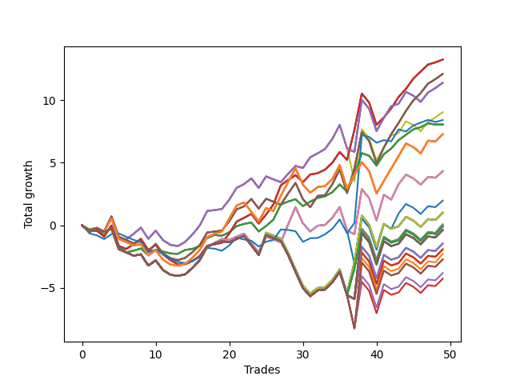

# Long Bulldog 003 
- Symbol: SPY_Unlimited
- Date Range: 03/23/2022 - 07/08/2022
- Trading Period: 7:20-12:30
- Number of Trades: 49



| Name | Win Percent | Profit | Avg Profit / Trade | Avg Time / Trade |      | Name | Win Percent | Profit | Avg Profit / Trade | Avg Time / Trade |
| ---- | ----------- | ------ | ------------------ | ---------------- | ---- | ---- | ----------- | ------ | ------------------ | ---------------- |
| Sorted By <br> Profit | | | | | | Sorted By <br> Win Percentage ||||
| Sixty-Five | 73.47 | 6630.00 | 135.31 | 16:42 |     | Sixty-Five | 73.47 | 6630.00 | 135.31 | 16:42 |
| Fifty-Seven | 73.47 | 6630.00 | 135.31 | 16:42 |     | Fifty-Seven | 73.47 | 6630.00 | 135.31 | 16:42 |
| Forty-Nine | 73.47 | 6630.00 | 135.31 | 16:42 |     | Forty-Nine | 73.47 | 6630.00 | 135.31 | 16:42 |
| Forty-One | 73.47 | 6630.00 | 135.31 | 16:42 |     | Forty-One | 73.47 | 6630.00 | 135.31 | 16:42 |
| One | 73.47 | 6630.00 | 135.31 | 16:42 |     | One | 73.47 | 6630.00 | 135.31 | 16:42 |
| Sixty-Seven | 65.31 | 6055.00 | 123.57 | 21:22 |     | Sixty-Four | 69.39 | 4030.00 | 82.24 | 10:08 |
| Fifty-Nine | 65.31 | 6055.00 | 123.57 | 21:22 |     | Fifty-Six | 69.39 | 4030.00 | 82.24 | 10:08 |
| Fifty-One | 65.31 | 6055.00 | 123.57 | 21:22 |     | Forty-Eight | 69.39 | 4030.00 | 82.24 | 10:08 |
| Forty-Three | 65.31 | 6055.00 | 123.57 | 21:22 |     | Forty | 69.39 | 4030.00 | 82.24 | 10:08 |
| Three | 65.31 | 6055.00 | 123.57 | 21:22 |     | Zero | 69.39 | 4030.00 | 82.24 | 10:08 |
| Sixty-Six | 63.27 | 5700.00 | 116.33 | 21:21 |     | Sixty-Seven | 65.31 | 6055.00 | 123.57 | 21:22 |
| Fifty-Eight | 63.27 | 5700.00 | 116.33 | 21:21 |     | Fifty-Nine | 65.31 | 6055.00 | 123.57 | 21:22 |
| Forty-Two | 63.27 | 5700.00 | 116.33 | 21:21 |     | Fifty-One | 65.31 | 6055.00 | 123.57 | 21:22 |
| Two | 63.27 | 5700.00 | 116.33 | 21:21 |     | Forty-Three | 65.31 | 6055.00 | 123.57 | 21:22 |
| Fifty | 63.27 | 4525.00 | 92.35 | 21:15 |     | Three | 65.31 | 6055.00 | 123.57 | 21:22 |
| Seventy-Three | 48.98 | 4210.00 | 85.92 | 11:23 |     | Sixty-Six | 63.27 | 5700.00 | 116.33 | 21:21 |
| Sixty-Four | 69.39 | 4030.00 | 82.24 | 10:08 |     | Fifty-Eight | 63.27 | 5700.00 | 116.33 | 21:21 |
| Fifty-Six | 69.39 | 4030.00 | 82.24 | 10:08 |     | Forty-Two | 63.27 | 5700.00 | 116.33 | 21:21 |
| Forty-Eight | 69.39 | 4030.00 | 82.24 | 10:08 |     | Two | 63.27 | 5700.00 | 116.33 | 21:21 |
| Forty | 69.39 | 4030.00 | 82.24 | 10:08 |     | Fifty | 63.27 | 4525.00 | 92.35 | 21:15 |
| Zero | 69.39 | 4030.00 | 82.24 | 10:08 |     | One Hundred Twenty-Six | 59.18 | 3645.00 | 74.39 | 23:41 |
| One Hundred Twenty-Six | 59.18 | 3645.00 | 74.39 | 23:41 |     | One Hundred Twenty-One | 59.18 | 3645.00 | 74.39 | 23:41 |
| One Hundred Twenty-One | 59.18 | 3645.00 | 74.39 | 23:41 |     | One Hundred Sixteen | 59.18 | 3645.00 | 74.39 | 23:41 |
| One Hundred Sixteen | 59.18 | 3645.00 | 74.39 | 23:41 |     | One Hundred Eleven | 59.18 | 3645.00 | 74.39 | 23:41 |
| One Hundred Eleven | 59.18 | 3645.00 | 74.39 | 23:41 |     | Eighty-One | 59.18 | 3645.00 | 74.39 | 23:41 |
| Eighty-One | 59.18 | 3645.00 | 74.39 | 23:41 |     | Sixty-Eight | 51.02 | 2160.00 | 44.08 | 27:28 |
| Sixty-Eight | 51.02 | 2160.00 | 44.08 | 27:28 |     | Sixty | 51.02 | 2160.00 | 44.08 | 27:28 |
| Sixty | 51.02 | 2160.00 | 44.08 | 27:28 |     | Forty-Four | 51.02 | 2160.00 | 44.08 | 27:28 |
| Forty-Four | 51.02 | 2160.00 | 44.08 | 27:28 |     | Four | 51.02 | 2160.00 | 44.08 | 27:28 |
| Four | 51.02 | 2160.00 | 44.08 | 27:28 |     | Fifty-Two | 51.02 | 985.00 | 20.10 | 27:23 |
| Fifty-Two | 51.02 | 985.00 | 20.10 | 27:23 |     | Seventy-Three | 48.98 | 4210.00 | 85.92 | 11:23 |
| Seventy | 48.98 | 505.00 | 10.31 | 28:31 |     | Seventy | 48.98 | 505.00 | 10.31 | 28:31 |
| Sixty-Two | 48.98 | 505.00 | 10.31 | 28:31 |     | Sixty-Two | 48.98 | 505.00 | 10.31 | 28:31 |
| Fifty-Four | 48.98 | 505.00 | 10.31 | 28:31 |     | Fifty-Four | 48.98 | 505.00 | 10.31 | 28:31 |
| Forty-Six | 48.98 | 505.00 | 10.31 | 28:31 |     | Forty-Six | 48.98 | 505.00 | 10.31 | 28:31 |
| Six | 48.98 | 505.00 | 10.31 | 28:31 |     | Six | 48.98 | 505.00 | 10.31 | 28:31 |
| Sixty-Nine | 46.94 | 30.00 | 0.61 | 28:58 |     | One Hundred Twenty-Seven | 48.98 | -50.00 | -1.02 | 28:30 |
| Sixty-One | 46.94 | 30.00 | 0.61 | 28:58 |     | One Hundred Twenty-Two | 48.98 | -50.00 | -1.02 | 28:30 |
| Forty-Five | 46.94 | 30.00 | 0.61 | 28:58 |     | One Hundred Seventeen | 48.98 | -50.00 | -1.02 | 28:30 |
| Five | 46.94 | 30.00 | 0.61 | 28:58 |     | One Hundred Twelve | 48.98 | -50.00 | -1.02 | 28:30 |
| One Hundred Twenty-Seven | 48.98 | -50.00 | -1.02 | 28:30 |     | Eighty-Two | 48.98 | -50.00 | -1.02 | 28:30 |
| One Hundred Twenty-Two | 48.98 | -50.00 | -1.02 | 28:30 |     | Sixty-Nine | 46.94 | 30.00 | 0.61 | 28:58 |
| One Hundred Seventeen | 48.98 | -50.00 | -1.02 | 28:30 |     | Sixty-One | 46.94 | 30.00 | 0.61 | 28:58 |
| One Hundred Twelve | 48.98 | -50.00 | -1.02 | 28:30 |     | Forty-Five | 46.94 | 30.00 | 0.61 | 28:58 |
| Eighty-Two | 48.98 | -50.00 | -1.02 | 28:30 |     | Five | 46.94 | 30.00 | 0.61 | 28:58 |
| One Hundred Thirty | 46.94 | -190.00 | -3.88 | 29:00 |     | One Hundred Thirty | 46.94 | -190.00 | -3.88 | 29:00 |
| One Hundred Twenty-Five | 46.94 | -190.00 | -3.88 | 29:00 |     | One Hundred Twenty-Five | 46.94 | -190.00 | -3.88 | 29:00 |
| One Hundred Fifteen | 46.94 | -190.00 | -3.88 | 29:00 |     | One Hundred Fifteen | 46.94 | -190.00 | -3.88 | 29:00 |
| Eighty-Five | 46.94 | -190.00 | -3.88 | 29:00 |     | Eighty-Five | 46.94 | -190.00 | -3.88 | 29:00 |
| Seventy-One | 46.94 | -190.00 | -3.88 | 29:00 |     | Seventy-One | 46.94 | -190.00 | -3.88 | 29:00 |
| Sixty-Three | 46.94 | -190.00 | -3.88 | 29:00 |     | Sixty-Three | 46.94 | -190.00 | -3.88 | 29:00 |
| Forty-Seven | 46.94 | -190.00 | -3.88 | 29:00 |     | Forty-Seven | 46.94 | -190.00 | -3.88 | 29:00 |
| Seven | 46.94 | -190.00 | -3.88 | 29:00 |     | Seven | 46.94 | -190.00 | -3.88 | 29:00 |
| One Hundred Twenty-Nine | 46.94 | -735.00 | -15.00 | 29:00 |     | One Hundred Twenty-Nine | 46.94 | -735.00 | -15.00 | 29:00 |
| One Hundred Twenty-Four | 46.94 | -735.00 | -15.00 | 29:00 |     | One Hundred Twenty-Four | 46.94 | -735.00 | -15.00 | 29:00 |
| One Hundred Fourteen | 46.94 | -735.00 | -15.00 | 29:00 |     | One Hundred Fourteen | 46.94 | -735.00 | -15.00 | 29:00 |
| Eighty-Four | 46.94 | -735.00 | -15.00 | 29:00 |     | Eighty-Four | 46.94 | -735.00 | -15.00 | 29:00 |
| One Hundred Twenty-Eight | 46.94 | -965.00 | -19.69 | 28:59 |     | One Hundred Twenty-Eight | 46.94 | -965.00 | -19.69 | 28:59 |
| One Hundred Twenty-Three | 46.94 | -965.00 | -19.69 | 28:59 |     | One Hundred Twenty-Three | 46.94 | -965.00 | -19.69 | 28:59 |
| One Hundred Thirteen | 46.94 | -965.00 | -19.69 | 28:59 |     | One Hundred Thirteen | 46.94 | -965.00 | -19.69 | 28:59 |
| Eighty-Three | 46.94 | -965.00 | -19.69 | 28:59 |     | Eighty-Three | 46.94 | -965.00 | -19.69 | 28:59 |
| Fifty-Three | 46.94 | -1145.00 | -23.37 | 28:53 |     | Fifty-Three | 46.94 | -1145.00 | -23.37 | 28:53 |
| One Hundred Twenty | 46.94 | -1365.00 | -27.86 | 28:54 |     | One Hundred Twenty | 46.94 | -1365.00 | -27.86 | 28:54 |
| Fifty-Five | 46.94 | -1365.00 | -27.86 | 28:54 |     | Fifty-Five | 46.94 | -1365.00 | -27.86 | 28:54 |
| One Hundred Ninteen | 46.94 | -1910.00 | -38.98 | 28:54 |     | One Hundred Ninteen | 46.94 | -1910.00 | -38.98 | 28:54 |
| One Hundred Eighteen | 46.94 | -2140.00 | -43.67 | 28:53 |     | One Hundred Eighteen | 46.94 | -2140.00 | -43.67 | 28:53 |

## NO STOPLOSS

### Test Zero
* Sell when price hits the middle line of the 20p bollinger
* No Stoploss
* Results:
```
Total Trades: 49
Percent Up: 69.39
Percent Down: 30.61
Total Points Moved Up: 8.06
Potential Profit: 4030.00
Total Points Ups: 15.04 Count Ups: 34
Total Points Downs: -6.98 Count Downs: 15
```

<details><summary>Trades</summary>

<code>In: 2022-03-23 10:23:00		Out: 2022-03-23 10:38:15		Total Position Time: 15:15		Total Move Up: -0.35		Total to Date: -0.35</code> <br />
<code>In: 2022-03-23 10:28:00		Out: 2022-03-23 10:38:15		Total Position Time: 10:15		Total Move Up: 0.14		Total to Date: -0.21</code> <br />
<code>In: 2022-03-25 08:14:00		Out: 2022-03-25 08:36:40		Total Position Time: 22:40		Total Move Up: -0.60		Total to Date: -0.81</code> <br />
<code>In: 2022-03-25 08:29:00		Out: 2022-03-25 08:36:40		Total Position Time: 07:40		Total Move Up: 0.77		Total to Date: -0.04</code> <br />
<code>In: 2022-03-28 08:27:00		Out: 2022-03-28 08:56:55		Total Position Time: 29:55		Total Move Up: -1.64		Total to Date: -1.68</code> <br />
<code>In: 2022-03-28 08:38:00		Out: 2022-03-28 09:01:45		Total Position Time: 23:45		Total Move Up: -0.49		Total to Date: -2.17</code> <br />
<code>In: 2022-03-28 08:51:00		Out: 2022-03-28 09:01:45		Total Position Time: 10:45		Total Move Up: 0.13		Total to Date: -2.04</code> <br />
<code>In: 2022-03-28 08:55:00		Out: 2022-03-28 09:01:45		Total Position Time: 06:45		Total Move Up: 0.18		Total to Date: -1.86</code> <br />
<code>In: 2022-03-30 08:02:00		Out: 2022-03-30 08:19:15		Total Position Time: 17:15		Total Move Up: -0.55		Total to Date: -2.41</code> <br />
<code>In: 2022-03-30 08:13:00		Out: 2022-03-30 08:19:15		Total Position Time: 06:15		Total Move Up: 0.45		Total to Date: -1.96</code> <br />
<code>In: 2022-03-30 12:00:00		Out: 2022-03-30 12:15:25		Total Position Time: 15:25		Total Move Up: -0.15		Total to Date: -2.11</code> <br />
<code>In: 2022-03-30 12:03:00		Out: 2022-03-30 12:15:25		Total Position Time: 12:25		Total Move Up: -0.15		Total to Date: -2.26</code> <br />
<code>In: 2022-03-30 12:06:00		Out: 2022-03-30 12:15:25		Total Position Time: 09:25		Total Move Up: -0.03		Total to Date: -2.29</code> <br />
<code>In: 2022-03-30 12:13:00		Out: 2022-03-30 12:15:25		Total Position Time: 02:25		Total Move Up: 0.31		Total to Date: -1.98</code> <br />
<code>In: 2022-03-30 12:20:00		Out: 2022-03-30 12:28:15		Total Position Time: 08:15		Total Move Up: 0.09		Total to Date: -1.89</code> <br />
<code>In: 2022-03-30 12:22:00		Out: 2022-03-30 12:28:15		Total Position Time: 06:15		Total Move Up: 0.22		Total to Date: -1.67</code> <br />
<code>In: 2022-03-30 12:26:00		Out: 2022-03-30 12:28:15		Total Position Time: 02:15		Total Move Up: 0.64		Total to Date: -1.03</code> <br />
<code>In: 2022-03-31 10:00:00		Out: 2022-03-31 10:04:00		Total Position Time: 04:00		Total Move Up: 0.25		Total to Date: -0.78</code> <br />
<code>In: 2022-03-31 10:11:00		Out: 2022-03-31 10:19:00		Total Position Time: 08:00		Total Move Up: -0.06		Total to Date: -0.84</code> <br />
<code>In: 2022-04-07 07:43:00		Out: 2022-04-07 07:53:05		Total Position Time: 10:05		Total Move Up: 0.28		Total to Date: -0.56</code> <br />
<code>In: 2022-04-07 07:45:00		Out: 2022-04-07 07:53:05		Total Position Time: 08:05		Total Move Up: 0.49		Total to Date: -0.07</code> <br />
<code>In: 2022-04-12 09:28:00		Out: 2022-04-12 09:41:30		Total Position Time: 13:30		Total Move Up: 0.17		Total to Date: 0.10</code> <br />
<code>In: 2022-04-12 11:35:00		Out: 2022-04-12 11:35:45		Total Position Time: 00:45		Total Move Up: 0.12		Total to Date: 0.22</code> <br />
<code>In: 2022-04-18 08:26:00		Out: 2022-04-18 08:54:55		Total Position Time: 28:55		Total Move Up: -0.72		Total to Date: -0.50</code> <br />
<code>In: 2022-04-20 11:58:00		Out: 2022-04-20 12:01:15		Total Position Time: 03:15		Total Move Up: 0.44		Total to Date: -0.06</code> <br />
<code>In: 2022-05-02 10:02:00		Out: 2022-05-02 10:08:15		Total Position Time: 06:15		Total Move Up: 0.51		Total to Date: 0.45</code> <br />
<code>In: 2022-05-02 10:05:00		Out: 2022-05-02 10:08:15		Total Position Time: 03:15		Total Move Up: 1.21		Total to Date: 1.66</code> <br />
<code>In: 2022-05-02 10:48:00		Out: 2022-05-02 10:59:15		Total Position Time: 11:15		Total Move Up: 0.24		Total to Date: 1.90</code> <br />
<code>In: 2022-05-02 10:49:00		Out: 2022-05-02 10:59:15		Total Position Time: 10:15		Total Move Up: 0.18		Total to Date: 2.08</code> <br />
<code>In: 2022-05-11 09:59:00		Out: 2022-05-11 10:15:20		Total Position Time: 16:20		Total Move Up: -0.55		Total to Date: 1.53</code> <br />
<code>In: 2022-05-18 08:32:00		Out: 2022-05-18 08:36:55		Total Position Time: 04:55		Total Move Up: 0.36		Total to Date: 1.89</code> <br />
<code>In: 2022-06-06 08:19:00		Out: 2022-06-06 08:31:35		Total Position Time: 12:35		Total Move Up: 0.29		Total to Date: 2.18</code> <br />
<code>In: 2022-06-08 09:41:00		Out: 2022-06-08 09:53:00		Total Position Time: 12:00		Total Move Up: 0.14		Total to Date: 2.32</code> <br />
<code>In: 2022-06-09 08:06:00		Out: 2022-06-09 08:10:55		Total Position Time: 04:55		Total Move Up: 0.32		Total to Date: 2.64</code> <br />
<code>In: 2022-06-09 08:09:00		Out: 2022-06-09 08:10:55		Total Position Time: 01:55		Total Move Up: 0.63		Total to Date: 3.27</code> <br />
<code>In: 2022-06-09 12:03:00		Out: 2022-06-09 12:19:25		Total Position Time: 16:25		Total Move Up: -0.60		Total to Date: 2.67</code> <br />
<code>In: 2022-06-15 11:08:00		Out: 2022-06-15 11:15:55		Total Position Time: 07:55		Total Move Up: 1.39		Total to Date: 4.06</code> <br />
<code>In: 2022-06-15 11:34:00		Out: 2022-06-15 11:37:20		Total Position Time: 03:20		Total Move Up: 1.71		Total to Date: 5.77</code> <br />
<code>In: 2022-06-16 11:02:00		Out: 2022-06-16 11:14:35		Total Position Time: 12:35		Total Move Up: -0.21		Total to Date: 5.56</code> <br />
<code>In: 2022-06-17 07:24:00		Out: 2022-06-17 07:44:55		Total Position Time: 20:55		Total Move Up: -0.79		Total to Date: 4.77</code> <br />
<code>In: 2022-06-17 07:37:00		Out: 2022-06-17 07:44:55		Total Position Time: 07:55		Total Move Up: 0.91		Total to Date: 5.68</code> <br />
<code>In: 2022-06-23 09:06:00		Out: 2022-06-23 09:14:30		Total Position Time: 08:30		Total Move Up: 0.46		Total to Date: 6.14</code> <br />
<code>In: 2022-06-27 12:07:00		Out: 2022-06-27 12:10:20		Total Position Time: 03:20		Total Move Up: 0.67		Total to Date: 6.81</code> <br />
<code>In: 2022-06-29 09:29:00		Out: 2022-06-29 09:36:40		Total Position Time: 07:40		Total Move Up: 0.43		Total to Date: 7.24</code> <br />
<code>In: 2022-07-06 08:05:00		Out: 2022-07-06 08:14:30		Total Position Time: 09:30		Total Move Up: 0.43		Total to Date: 7.67</code> <br />
<code>In: 2022-07-06 08:06:00		Out: 2022-07-06 08:14:30		Total Position Time: 08:30		Total Move Up: 0.18		Total to Date: 7.85</code> <br />
<code>In: 2022-07-06 08:34:00		Out: 2022-07-06 08:46:05		Total Position Time: 12:05		Total Move Up: 0.30		Total to Date: 8.15</code> <br />
<code>In: 2022-07-06 08:35:00		Out: 2022-07-06 08:46:05		Total Position Time: 11:05		Total Move Up: -0.09		Total to Date: 8.06</code> <br />
<code>In: 2022-07-06 08:46:00		Out: 2022-07-06 08:46:15		Total Position Time: 00:15		Total Move Up: 0.00		Total to Date: 8.06</code> <br />


</details>

### Test One
* Sell when the price hits the upper line of the 20p 1std bollinger
* No Stoploss
* Results:
```
Total Trades: 49
Percent Up: 73.47
Percent Down: 26.53
Total Points Moved Up: 13.26
Potential Profit: 6630.00
Total Points Ups: 23.02 Count Ups: 36
Total Points Downs: -9.76 Count Downs: 13
```

<details><summary>Trades</summary>

<code>In: 2022-03-23 10:23:00		Out: 2022-03-23 10:51:45		Total Position Time: 28:45		Total Move Up: -0.46		Total to Date: -0.46</code> <br />
<code>In: 2022-03-23 10:28:00		Out: 2022-03-23 10:51:45		Total Position Time: 23:45		Total Move Up: 0.03		Total to Date: -0.43</code> <br />
<code>In: 2022-03-25 08:14:00		Out: 2022-03-25 08:41:05		Total Position Time: 27:05		Total Move Up: -0.48		Total to Date: -0.91</code> <br />
<code>In: 2022-03-25 08:29:00		Out: 2022-03-25 08:41:05		Total Position Time: 12:05		Total Move Up: 0.89		Total to Date: -0.02</code> <br />
<code>In: 2022-03-28 08:27:00		Out: 2022-03-28 08:56:55		Total Position Time: 29:55		Total Move Up: -1.64		Total to Date: -1.66</code> <br />
<code>In: 2022-03-28 08:38:00		Out: 2022-03-28 09:04:40		Total Position Time: 26:40		Total Move Up: -0.24		Total to Date: -1.90</code> <br />
<code>In: 2022-03-28 08:51:00		Out: 2022-03-28 09:04:40		Total Position Time: 13:40		Total Move Up: 0.38		Total to Date: -1.52</code> <br />
<code>In: 2022-03-28 08:55:00		Out: 2022-03-28 09:04:40		Total Position Time: 09:40		Total Move Up: 0.43		Total to Date: -1.09</code> <br />
<code>In: 2022-03-30 08:02:00		Out: 2022-03-30 08:31:55		Total Position Time: 29:55		Total Move Up: -0.90		Total to Date: -1.99</code> <br />
<code>In: 2022-03-30 08:13:00		Out: 2022-03-30 08:34:40		Total Position Time: 21:40		Total Move Up: 0.42		Total to Date: -1.57</code> <br />
<code>In: 2022-03-30 12:00:00		Out: 2022-03-30 12:29:55		Total Position Time: 29:55		Total Move Up: -0.76		Total to Date: -2.33</code> <br />
<code>In: 2022-03-30 12:03:00		Out: 2022-03-30 12:32:20		Total Position Time: 29:20		Total Move Up: -0.46		Total to Date: -2.79</code> <br />
<code>In: 2022-03-30 12:06:00		Out: 2022-03-30 12:32:20		Total Position Time: 26:20		Total Move Up: -0.34		Total to Date: -3.13</code> <br />
<code>In: 2022-03-30 12:13:00		Out: 2022-03-30 12:32:20		Total Position Time: 19:20		Total Move Up: 0.00		Total to Date: -3.13</code> <br />
<code>In: 2022-03-30 12:20:00		Out: 2022-03-30 12:32:20		Total Position Time: 12:20		Total Move Up: 0.27		Total to Date: -2.86</code> <br />
<code>In: 2022-03-30 12:22:00		Out: 2022-03-30 12:32:20		Total Position Time: 10:20		Total Move Up: 0.40		Total to Date: -2.46</code> <br />
<code>In: 2022-03-30 12:26:00		Out: 2022-03-30 12:32:20		Total Position Time: 06:20		Total Move Up: 0.82		Total to Date: -1.64</code> <br />
<code>In: 2022-03-31 10:00:00		Out: 2022-03-31 10:19:40		Total Position Time: 19:40		Total Move Up: 0.11		Total to Date: -1.53</code> <br />
<code>In: 2022-03-31 10:11:00		Out: 2022-03-31 10:19:40		Total Position Time: 08:40		Total Move Up: 0.13		Total to Date: -1.40</code> <br />
<code>In: 2022-04-07 07:43:00		Out: 2022-04-07 08:00:05		Total Position Time: 17:05		Total Move Up: 0.74		Total to Date: -0.66</code> <br />
<code>In: 2022-04-07 07:45:00		Out: 2022-04-07 08:00:05		Total Position Time: 15:05		Total Move Up: 0.95		Total to Date: 0.29</code> <br />
<code>In: 2022-04-12 09:28:00		Out: 2022-04-12 09:50:15		Total Position Time: 22:15		Total Move Up: 0.30		Total to Date: 0.59</code> <br />
<code>In: 2022-04-12 11:35:00		Out: 2022-04-12 11:37:25		Total Position Time: 02:25		Total Move Up: 0.32		Total to Date: 0.91</code> <br />
<code>In: 2022-04-18 08:26:00		Out: 2022-04-18 08:55:55		Total Position Time: 29:55		Total Move Up: -0.77		Total to Date: 0.14</code> <br />
<code>In: 2022-04-20 11:58:00		Out: 2022-04-20 12:04:20		Total Position Time: 06:20		Total Move Up: 0.71		Total to Date: 0.85</code> <br />
<code>In: 2022-05-02 10:02:00		Out: 2022-05-02 10:10:55		Total Position Time: 08:55		Total Move Up: 0.82		Total to Date: 1.67</code> <br />
<code>In: 2022-05-02 10:05:00		Out: 2022-05-02 10:10:55		Total Position Time: 05:55		Total Move Up: 1.52		Total to Date: 3.19</code> <br />
<code>In: 2022-05-02 10:48:00		Out: 2022-05-02 11:02:25		Total Position Time: 14:25		Total Move Up: 0.44		Total to Date: 3.63</code> <br />
<code>In: 2022-05-02 10:49:00		Out: 2022-05-02 11:02:25		Total Position Time: 13:25		Total Move Up: 0.38		Total to Date: 4.01</code> <br />
<code>In: 2022-05-11 09:59:00		Out: 2022-05-11 10:24:20		Total Position Time: 25:20		Total Move Up: -0.56		Total to Date: 3.45</code> <br />
<code>In: 2022-05-18 08:32:00		Out: 2022-05-18 08:41:15		Total Position Time: 09:15		Total Move Up: 0.61		Total to Date: 4.06</code> <br />
<code>In: 2022-06-06 08:19:00		Out: 2022-06-06 08:39:15		Total Position Time: 20:15		Total Move Up: 0.10		Total to Date: 4.16</code> <br />
<code>In: 2022-06-08 09:41:00		Out: 2022-06-08 09:59:05		Total Position Time: 18:05		Total Move Up: 0.29		Total to Date: 4.45</code> <br />
<code>In: 2022-06-09 08:06:00		Out: 2022-06-09 08:21:10		Total Position Time: 15:10		Total Move Up: 0.55		Total to Date: 5.00</code> <br />
<code>In: 2022-06-09 08:09:00		Out: 2022-06-09 08:21:10		Total Position Time: 12:10		Total Move Up: 0.86		Total to Date: 5.86</code> <br />
<code>In: 2022-06-09 12:03:00		Out: 2022-06-09 12:24:30		Total Position Time: 21:30		Total Move Up: -0.64		Total to Date: 5.22</code> <br />
<code>In: 2022-06-15 11:08:00		Out: 2022-06-15 11:20:30		Total Position Time: 12:30		Total Move Up: 2.41		Total to Date: 7.63</code> <br />
<code>In: 2022-06-15 11:34:00		Out: 2022-06-15 11:38:05		Total Position Time: 04:05		Total Move Up: 2.91		Total to Date: 10.54</code> <br />
<code>In: 2022-06-16 11:02:00		Out: 2022-06-16 11:31:55		Total Position Time: 29:55		Total Move Up: -0.72		Total to Date: 9.82</code> <br />
<code>In: 2022-06-17 07:24:00		Out: 2022-06-17 07:53:55		Total Position Time: 29:55		Total Move Up: -1.79		Total to Date: 8.03</code> <br />
<code>In: 2022-06-17 07:37:00		Out: 2022-06-17 07:56:15		Total Position Time: 19:15		Total Move Up: 0.60		Total to Date: 8.63</code> <br />
<code>In: 2022-06-23 09:06:00		Out: 2022-06-23 09:18:25		Total Position Time: 12:25		Total Move Up: 0.72		Total to Date: 9.35</code> <br />
<code>In: 2022-06-27 12:07:00		Out: 2022-06-27 12:12:00		Total Position Time: 05:00		Total Move Up: 0.92		Total to Date: 10.27</code> <br />
<code>In: 2022-06-29 09:29:00		Out: 2022-06-29 09:37:15		Total Position Time: 08:15		Total Move Up: 0.64		Total to Date: 10.91</code> <br />
<code>In: 2022-07-06 08:05:00		Out: 2022-07-06 08:17:50		Total Position Time: 12:50		Total Move Up: 0.82		Total to Date: 11.73</code> <br />
<code>In: 2022-07-06 08:06:00		Out: 2022-07-06 08:17:50		Total Position Time: 11:50		Total Move Up: 0.57		Total to Date: 12.30</code> <br />
<code>In: 2022-07-06 08:34:00		Out: 2022-07-06 08:48:10		Total Position Time: 14:10		Total Move Up: 0.56		Total to Date: 12.86</code> <br />
<code>In: 2022-07-06 08:35:00		Out: 2022-07-06 08:48:10		Total Position Time: 13:10		Total Move Up: 0.17		Total to Date: 13.03</code> <br />
<code>In: 2022-07-06 08:46:00		Out: 2022-07-06 08:48:10		Total Position Time: 02:10		Total Move Up: 0.23		Total to Date: 13.26</code> <br />


</details>

### Test Two
* Sell when the price hits the upper line of the 20p 2std bollinger
* No Stoploss
* Results:
```
Total Trades: 49
Percent Up: 63.27
Percent Down: 36.73
Total Points Moved Up: 11.40
Potential Profit: 5700.00
Total Points Ups: 22.96 Count Ups: 31
Total Points Downs: -11.56 Count Downs: 18
```

<details><summary>Trades</summary>

<code>In: 2022-03-23 10:23:00		Out: 2022-03-23 10:52:55		Total Position Time: 29:55		Total Move Up: -0.52		Total to Date: -0.52</code> <br />
<code>In: 2022-03-23 10:28:00		Out: 2022-03-23 10:54:25		Total Position Time: 26:25		Total Move Up: 0.24		Total to Date: -0.28</code> <br />
<code>In: 2022-03-25 08:14:00		Out: 2022-03-25 08:41:45		Total Position Time: 27:45		Total Move Up: -0.21		Total to Date: -0.49</code> <br />
<code>In: 2022-03-25 08:29:00		Out: 2022-03-25 08:41:45		Total Position Time: 12:45		Total Move Up: 1.16		Total to Date: 0.67</code> <br />
<code>In: 2022-03-28 08:27:00		Out: 2022-03-28 08:56:55		Total Position Time: 29:55		Total Move Up: -1.64		Total to Date: -0.97</code> <br />
<code>In: 2022-03-28 08:38:00		Out: 2022-03-28 09:07:15		Total Position Time: 29:15		Total Move Up: -0.17		Total to Date: -1.14</code> <br />
<code>In: 2022-03-28 08:51:00		Out: 2022-03-28 09:07:15		Total Position Time: 16:15		Total Move Up: 0.45		Total to Date: -0.69</code> <br />
<code>In: 2022-03-28 08:55:00		Out: 2022-03-28 09:07:15		Total Position Time: 12:15		Total Move Up: 0.50		Total to Date: -0.19</code> <br />
<code>In: 2022-03-30 08:02:00		Out: 2022-03-30 08:31:55		Total Position Time: 29:55		Total Move Up: -0.90		Total to Date: -1.09</code> <br />
<code>In: 2022-03-30 08:13:00		Out: 2022-03-30 08:35:15		Total Position Time: 22:15		Total Move Up: 0.66		Total to Date: -0.43</code> <br />
<code>In: 2022-03-30 12:00:00		Out: 2022-03-30 12:29:55		Total Position Time: 29:55		Total Move Up: -0.76		Total to Date: -1.19</code> <br />
<code>In: 2022-03-30 12:03:00		Out: 2022-03-30 12:32:55		Total Position Time: 29:55		Total Move Up: -0.38		Total to Date: -1.57</code> <br />
<code>In: 2022-03-30 12:06:00		Out: 2022-03-30 12:35:55		Total Position Time: 29:55		Total Move Up: -0.10		Total to Date: -1.67</code> <br />
<code>In: 2022-03-30 12:13:00		Out: 2022-03-30 12:36:25		Total Position Time: 23:25		Total Move Up: 0.33		Total to Date: -1.34</code> <br />
<code>In: 2022-03-30 12:20:00		Out: 2022-03-30 12:36:25		Total Position Time: 16:25		Total Move Up: 0.60		Total to Date: -0.74</code> <br />
<code>In: 2022-03-30 12:22:00		Out: 2022-03-30 12:36:25		Total Position Time: 14:25		Total Move Up: 0.73		Total to Date: -0.01</code> <br />
<code>In: 2022-03-30 12:26:00		Out: 2022-03-30 12:36:25		Total Position Time: 10:25		Total Move Up: 1.15		Total to Date: 1.14</code> <br />
<code>In: 2022-03-31 10:00:00		Out: 2022-03-31 10:27:25		Total Position Time: 27:25		Total Move Up: 0.07		Total to Date: 1.21</code> <br />
<code>In: 2022-03-31 10:11:00		Out: 2022-03-31 10:27:25		Total Position Time: 16:25		Total Move Up: 0.09		Total to Date: 1.30</code> <br />
<code>In: 2022-04-07 07:43:00		Out: 2022-04-07 08:00:05		Total Position Time: 17:05		Total Move Up: 0.74		Total to Date: 2.04</code> <br />
<code>In: 2022-04-07 07:45:00		Out: 2022-04-07 08:00:05		Total Position Time: 15:05		Total Move Up: 0.95		Total to Date: 2.99</code> <br />
<code>In: 2022-04-12 09:28:00		Out: 2022-04-12 09:50:15		Total Position Time: 22:15		Total Move Up: 0.30		Total to Date: 3.29</code> <br />
<code>In: 2022-04-12 11:35:00		Out: 2022-04-12 11:47:00		Total Position Time: 12:00		Total Move Up: 0.46		Total to Date: 3.75</code> <br />
<code>In: 2022-04-18 08:26:00		Out: 2022-04-18 08:55:55		Total Position Time: 29:55		Total Move Up: -0.77		Total to Date: 2.98</code> <br />
<code>In: 2022-04-20 11:58:00		Out: 2022-04-20 12:12:35		Total Position Time: 14:35		Total Move Up: 0.93		Total to Date: 3.91</code> <br />
<code>In: 2022-05-02 10:02:00		Out: 2022-05-02 10:31:55		Total Position Time: 29:55		Total Move Up: -0.24		Total to Date: 3.67</code> <br />
<code>In: 2022-05-02 10:05:00		Out: 2022-05-02 10:34:55		Total Position Time: 29:55		Total Move Up: -0.23		Total to Date: 3.44</code> <br />
<code>In: 2022-05-02 10:48:00		Out: 2022-05-02 11:03:45		Total Position Time: 15:45		Total Move Up: 0.68		Total to Date: 4.12</code> <br />
<code>In: 2022-05-02 10:49:00		Out: 2022-05-02 11:03:45		Total Position Time: 14:45		Total Move Up: 0.62		Total to Date: 4.74</code> <br />
<code>In: 2022-05-11 09:59:00		Out: 2022-05-11 10:24:50		Total Position Time: 25:50		Total Move Up: -0.16		Total to Date: 4.58</code> <br />
<code>In: 2022-05-18 08:32:00		Out: 2022-05-18 08:42:55		Total Position Time: 10:55		Total Move Up: 0.86		Total to Date: 5.44</code> <br />
<code>In: 2022-06-06 08:19:00		Out: 2022-06-06 08:43:00		Total Position Time: 24:00		Total Move Up: 0.31		Total to Date: 5.75</code> <br />
<code>In: 2022-06-08 09:41:00		Out: 2022-06-08 09:59:15		Total Position Time: 18:15		Total Move Up: 0.35		Total to Date: 6.10</code> <br />
<code>In: 2022-06-09 08:06:00		Out: 2022-06-09 08:22:35		Total Position Time: 16:35		Total Move Up: 0.81		Total to Date: 6.91</code> <br />
<code>In: 2022-06-09 08:09:00		Out: 2022-06-09 08:22:35		Total Position Time: 13:35		Total Move Up: 1.12		Total to Date: 8.03</code> <br />
<code>In: 2022-06-09 12:03:00		Out: 2022-06-09 12:32:55		Total Position Time: 29:55		Total Move Up: -1.88		Total to Date: 6.15</code> <br />
<code>In: 2022-06-15 11:08:00		Out: 2022-06-15 11:37:55		Total Position Time: 29:55		Total Move Up: -0.29		Total to Date: 5.86</code> <br />
<code>In: 2022-06-15 11:34:00		Out: 2022-06-15 11:38:45		Total Position Time: 04:45		Total Move Up: 4.18		Total to Date: 10.04</code> <br />
<code>In: 2022-06-16 11:02:00		Out: 2022-06-16 11:31:55		Total Position Time: 29:55		Total Move Up: -0.72		Total to Date: 9.32</code> <br />
<code>In: 2022-06-17 07:24:00		Out: 2022-06-17 07:53:55		Total Position Time: 29:55		Total Move Up: -1.79		Total to Date: 7.53</code> <br />
<code>In: 2022-06-17 07:37:00		Out: 2022-06-17 08:02:25		Total Position Time: 25:25		Total Move Up: 1.07		Total to Date: 8.60</code> <br />
<code>In: 2022-06-23 09:06:00		Out: 2022-06-23 09:19:05		Total Position Time: 13:05		Total Move Up: 0.93		Total to Date: 9.53</code> <br />
<code>In: 2022-06-27 12:07:00		Out: 2022-06-27 12:36:55		Total Position Time: 29:55		Total Move Up: 0.19		Total to Date: 9.72</code> <br />
<code>In: 2022-06-29 09:29:00		Out: 2022-06-29 09:38:35		Total Position Time: 09:35		Total Move Up: 0.95		Total to Date: 10.67</code> <br />
<code>In: 2022-07-06 08:05:00		Out: 2022-07-06 08:34:55		Total Position Time: 29:55		Total Move Up: -0.30		Total to Date: 10.37</code> <br />
<code>In: 2022-07-06 08:06:00		Out: 2022-07-06 08:35:55		Total Position Time: 29:55		Total Move Up: -0.50		Total to Date: 9.87</code> <br />
<code>In: 2022-07-06 08:34:00		Out: 2022-07-06 08:51:15		Total Position Time: 17:15		Total Move Up: 0.75		Total to Date: 10.62</code> <br />
<code>In: 2022-07-06 08:35:00		Out: 2022-07-06 08:51:15		Total Position Time: 16:15		Total Move Up: 0.36		Total to Date: 10.98</code> <br />
<code>In: 2022-07-06 08:46:00		Out: 2022-07-06 08:51:15		Total Position Time: 05:15		Total Move Up: 0.42		Total to Date: 11.40</code> <br />


</details>

### Test Three
* Sell when price hits the middle line of the 50p bollinger
* No Stoploss
* Results:
```
Total Trades: 49
Percent Up: 65.31
Percent Down: 34.69
Total Points Moved Up: 12.11
Potential Profit: 6055.00
Total Points Ups: 24.85 Count Ups: 32
Total Points Downs: -12.74 Count Downs: 17
```

<details><summary>Trades</summary>

<code>In: 2022-03-23 10:23:00		Out: 2022-03-23 10:52:55		Total Position Time: 29:55		Total Move Up: -0.52		Total to Date: -0.52</code> <br />
<code>In: 2022-03-23 10:28:00		Out: 2022-03-23 10:54:30		Total Position Time: 26:30		Total Move Up: 0.31		Total to Date: -0.21</code> <br />
<code>In: 2022-03-25 08:14:00		Out: 2022-03-25 08:43:55		Total Position Time: 29:55		Total Move Up: -0.28		Total to Date: -0.49</code> <br />
<code>In: 2022-03-25 08:29:00		Out: 2022-03-25 08:52:45		Total Position Time: 23:45		Total Move Up: 1.20		Total to Date: 0.71</code> <br />
<code>In: 2022-03-28 08:27:00		Out: 2022-03-28 08:56:55		Total Position Time: 29:55		Total Move Up: -1.64		Total to Date: -0.93</code> <br />
<code>In: 2022-03-28 08:38:00		Out: 2022-03-28 09:07:55		Total Position Time: 29:55		Total Move Up: -0.25		Total to Date: -1.18</code> <br />
<code>In: 2022-03-28 08:51:00		Out: 2022-03-28 09:20:55		Total Position Time: 29:55		Total Move Up: -0.27		Total to Date: -1.45</code> <br />
<code>In: 2022-03-28 08:55:00		Out: 2022-03-28 09:24:15		Total Position Time: 29:15		Total Move Up: 0.20		Total to Date: -1.25</code> <br />
<code>In: 2022-03-30 08:02:00		Out: 2022-03-30 08:31:55		Total Position Time: 29:55		Total Move Up: -0.90		Total to Date: -2.15</code> <br />
<code>In: 2022-03-30 08:13:00		Out: 2022-03-30 08:35:15		Total Position Time: 22:15		Total Move Up: 0.66		Total to Date: -1.49</code> <br />
<code>In: 2022-03-30 12:00:00		Out: 2022-03-30 12:29:55		Total Position Time: 29:55		Total Move Up: -0.76		Total to Date: -2.25</code> <br />
<code>In: 2022-03-30 12:03:00		Out: 2022-03-30 12:32:55		Total Position Time: 29:55		Total Move Up: -0.38		Total to Date: -2.63</code> <br />
<code>In: 2022-03-30 12:06:00		Out: 2022-03-30 12:33:30		Total Position Time: 27:30		Total Move Up: -0.16		Total to Date: -2.79</code> <br />
<code>In: 2022-03-30 12:13:00		Out: 2022-03-30 12:33:30		Total Position Time: 20:30		Total Move Up: 0.18		Total to Date: -2.61</code> <br />
<code>In: 2022-03-30 12:20:00		Out: 2022-03-30 12:33:30		Total Position Time: 13:30		Total Move Up: 0.45		Total to Date: -2.16</code> <br />
<code>In: 2022-03-30 12:22:00		Out: 2022-03-30 12:33:30		Total Position Time: 11:30		Total Move Up: 0.58		Total to Date: -1.58</code> <br />
<code>In: 2022-03-30 12:26:00		Out: 2022-03-30 12:33:30		Total Position Time: 07:30		Total Move Up: 1.00		Total to Date: -0.58</code> <br />
<code>In: 2022-03-31 10:00:00		Out: 2022-03-31 10:27:25		Total Position Time: 27:25		Total Move Up: 0.07		Total to Date: -0.51</code> <br />
<code>In: 2022-03-31 10:11:00		Out: 2022-03-31 10:27:25		Total Position Time: 16:25		Total Move Up: 0.09		Total to Date: -0.42</code> <br />
<code>In: 2022-04-07 07:43:00		Out: 2022-04-07 08:00:05		Total Position Time: 17:05		Total Move Up: 0.74		Total to Date: 0.32</code> <br />
<code>In: 2022-04-07 07:45:00		Out: 2022-04-07 08:00:05		Total Position Time: 15:05		Total Move Up: 0.95		Total to Date: 1.27</code> <br />
<code>In: 2022-04-12 09:28:00		Out: 2022-04-12 09:57:55		Total Position Time: 29:55		Total Move Up: 0.24		Total to Date: 1.51</code> <br />
<code>In: 2022-04-12 11:35:00		Out: 2022-04-12 11:47:05		Total Position Time: 12:05		Total Move Up: 0.59		Total to Date: 2.10</code> <br />
<code>In: 2022-04-18 08:26:00		Out: 2022-04-18 08:55:55		Total Position Time: 29:55		Total Move Up: -0.77		Total to Date: 1.33</code> <br />
<code>In: 2022-04-20 11:58:00		Out: 2022-04-20 12:10:10		Total Position Time: 12:10		Total Move Up: 0.79		Total to Date: 2.12</code> <br />
<code>In: 2022-05-02 10:02:00		Out: 2022-05-02 10:31:55		Total Position Time: 29:55		Total Move Up: -0.24		Total to Date: 1.88</code> <br />
<code>In: 2022-05-02 10:05:00		Out: 2022-05-02 10:34:55		Total Position Time: 29:55		Total Move Up: -0.23		Total to Date: 1.65</code> <br />
<code>In: 2022-05-02 10:48:00		Out: 2022-05-02 11:04:00		Total Position Time: 16:00		Total Move Up: 0.90		Total to Date: 2.55</code> <br />
<code>In: 2022-05-02 10:49:00		Out: 2022-05-02 11:04:00		Total Position Time: 15:00		Total Move Up: 0.84		Total to Date: 3.39</code> <br />
<code>In: 2022-05-11 09:59:00		Out: 2022-05-11 10:28:55		Total Position Time: 29:55		Total Move Up: -1.30		Total to Date: 2.09</code> <br />
<code>In: 2022-05-18 08:32:00		Out: 2022-05-18 09:01:55		Total Position Time: 29:55		Total Move Up: -0.65		Total to Date: 1.44</code> <br />
<code>In: 2022-06-06 08:19:00		Out: 2022-06-06 08:46:10		Total Position Time: 27:10		Total Move Up: 0.90		Total to Date: 2.34</code> <br />
<code>In: 2022-06-08 09:41:00		Out: 2022-06-08 10:10:55		Total Position Time: 29:55		Total Move Up: 0.07		Total to Date: 2.41</code> <br />
<code>In: 2022-06-09 08:06:00		Out: 2022-06-09 08:22:45		Total Position Time: 16:45		Total Move Up: 0.87		Total to Date: 3.28</code> <br />
<code>In: 2022-06-09 08:09:00		Out: 2022-06-09 08:22:45		Total Position Time: 13:45		Total Move Up: 1.18		Total to Date: 4.46</code> <br />
<code>In: 2022-06-09 12:03:00		Out: 2022-06-09 12:32:55		Total Position Time: 29:55		Total Move Up: -1.88		Total to Date: 2.58</code> <br />
<code>In: 2022-06-15 11:08:00		Out: 2022-06-15 11:16:55		Total Position Time: 08:55		Total Move Up: 1.97		Total to Date: 4.55</code> <br />
<code>In: 2022-06-15 11:34:00		Out: 2022-06-15 11:38:05		Total Position Time: 04:05		Total Move Up: 2.91		Total to Date: 7.46</code> <br />
<code>In: 2022-06-16 11:02:00		Out: 2022-06-16 11:31:55		Total Position Time: 29:55		Total Move Up: -0.72		Total to Date: 6.74</code> <br />
<code>In: 2022-06-17 07:24:00		Out: 2022-06-17 07:53:55		Total Position Time: 29:55		Total Move Up: -1.79		Total to Date: 4.95</code> <br />
<code>In: 2022-06-17 07:37:00		Out: 2022-06-17 08:02:30		Total Position Time: 25:30		Total Move Up: 1.27		Total to Date: 6.22</code> <br />
<code>In: 2022-06-23 09:06:00		Out: 2022-06-23 09:21:10		Total Position Time: 15:10		Total Move Up: 1.07		Total to Date: 7.29</code> <br />
<code>In: 2022-06-27 12:07:00		Out: 2022-06-27 12:10:30		Total Position Time: 03:30		Total Move Up: 0.90		Total to Date: 8.19</code> <br />
<code>In: 2022-06-29 09:29:00		Out: 2022-06-29 09:38:30		Total Position Time: 09:30		Total Move Up: 0.96		Total to Date: 9.15</code> <br />
<code>In: 2022-07-06 08:05:00		Out: 2022-07-06 08:21:30		Total Position Time: 16:30		Total Move Up: 0.84		Total to Date: 9.99</code> <br />
<code>In: 2022-07-06 08:06:00		Out: 2022-07-06 08:21:30		Total Position Time: 15:30		Total Move Up: 0.59		Total to Date: 10.58</code> <br />
<code>In: 2022-07-06 08:34:00		Out: 2022-07-06 08:51:15		Total Position Time: 17:15		Total Move Up: 0.75		Total to Date: 11.33</code> <br />
<code>In: 2022-07-06 08:35:00		Out: 2022-07-06 08:51:15		Total Position Time: 16:15		Total Move Up: 0.36		Total to Date: 11.69</code> <br />
<code>In: 2022-07-06 08:46:00		Out: 2022-07-06 08:51:15		Total Position Time: 05:15		Total Move Up: 0.42		Total to Date: 12.11</code> <br />


</details>

### Test Four
* Sell when the price hits the upper line of the 50p 1std bollinger
* No Stoploss
* Results:
```
Total Trades: 49
Percent Up: 51.02
Percent Down: 48.98
Total Points Moved Up: 4.32
Potential Profit: 2160.00
Total Points Ups: 19.38 Count Ups: 25
Total Points Downs: -15.06 Count Downs: 24
```

<details><summary>Trades</summary>

<code>In: 2022-03-23 10:23:00		Out: 2022-03-23 10:52:55		Total Position Time: 29:55		Total Move Up: -0.52		Total to Date: -0.52</code> <br />
<code>In: 2022-03-23 10:28:00		Out: 2022-03-23 10:57:55		Total Position Time: 29:55		Total Move Up: 0.27		Total to Date: -0.25</code> <br />
<code>In: 2022-03-25 08:14:00		Out: 2022-03-25 08:43:55		Total Position Time: 29:55		Total Move Up: -0.28		Total to Date: -0.53</code> <br />
<code>In: 2022-03-25 08:29:00		Out: 2022-03-25 08:58:55		Total Position Time: 29:55		Total Move Up: 0.25		Total to Date: -0.28</code> <br />
<code>In: 2022-03-28 08:27:00		Out: 2022-03-28 08:56:55		Total Position Time: 29:55		Total Move Up: -1.64		Total to Date: -1.92</code> <br />
<code>In: 2022-03-28 08:38:00		Out: 2022-03-28 09:07:55		Total Position Time: 29:55		Total Move Up: -0.25		Total to Date: -2.17</code> <br />
<code>In: 2022-03-28 08:51:00		Out: 2022-03-28 09:20:55		Total Position Time: 29:55		Total Move Up: -0.27		Total to Date: -2.44</code> <br />
<code>In: 2022-03-28 08:55:00		Out: 2022-03-28 09:24:55		Total Position Time: 29:55		Total Move Up: 0.11		Total to Date: -2.33</code> <br />
<code>In: 2022-03-30 08:02:00		Out: 2022-03-30 08:31:55		Total Position Time: 29:55		Total Move Up: -0.90		Total to Date: -3.23</code> <br />
<code>In: 2022-03-30 08:13:00		Out: 2022-03-30 08:42:55		Total Position Time: 29:55		Total Move Up: 0.41		Total to Date: -2.82</code> <br />
<code>In: 2022-03-30 12:00:00		Out: 2022-03-30 12:29:55		Total Position Time: 29:55		Total Move Up: -0.76		Total to Date: -3.58</code> <br />
<code>In: 2022-03-30 12:03:00		Out: 2022-03-30 12:32:55		Total Position Time: 29:55		Total Move Up: -0.38		Total to Date: -3.96</code> <br />
<code>In: 2022-03-30 12:06:00		Out: 2022-03-30 12:35:55		Total Position Time: 29:55		Total Move Up: -0.10		Total to Date: -4.06</code> <br />
<code>In: 2022-03-30 12:13:00		Out: 2022-03-30 12:42:55		Total Position Time: 29:55		Total Move Up: 0.13		Total to Date: -3.93</code> <br />
<code>In: 2022-03-30 12:20:00		Out: 2022-03-30 12:46:00		Total Position Time: 26:00		Total Move Up: 0.51		Total to Date: -3.42</code> <br />
<code>In: 2022-03-30 12:22:00		Out: 2022-03-30 12:46:00		Total Position Time: 24:00		Total Move Up: 0.64		Total to Date: -2.78</code> <br />
<code>In: 2022-03-30 12:26:00		Out: 2022-03-30 12:46:00		Total Position Time: 20:00		Total Move Up: 1.06		Total to Date: -1.72</code> <br />
<code>In: 2022-03-31 10:00:00		Out: 2022-03-31 10:29:50		Total Position Time: 29:50		Total Move Up: 0.30		Total to Date: -1.42</code> <br />
<code>In: 2022-03-31 10:11:00		Out: 2022-03-31 10:29:50		Total Position Time: 18:50		Total Move Up: 0.32		Total to Date: -1.10</code> <br />
<code>In: 2022-04-07 07:43:00		Out: 2022-04-07 08:12:55		Total Position Time: 29:55		Total Move Up: -0.08		Total to Date: -1.18</code> <br />
<code>In: 2022-04-07 07:45:00		Out: 2022-04-07 08:14:55		Total Position Time: 29:55		Total Move Up: 0.27		Total to Date: -0.91</code> <br />
<code>In: 2022-04-12 09:28:00		Out: 2022-04-12 09:57:55		Total Position Time: 29:55		Total Move Up: 0.24		Total to Date: -0.67</code> <br />
<code>In: 2022-04-12 11:35:00		Out: 2022-04-12 12:04:55		Total Position Time: 29:55		Total Move Up: -0.75		Total to Date: -1.42</code> <br />
<code>In: 2022-04-18 08:26:00		Out: 2022-04-18 08:55:55		Total Position Time: 29:55		Total Move Up: -0.77		Total to Date: -2.19</code> <br />
<code>In: 2022-04-20 11:58:00		Out: 2022-04-20 12:13:35		Total Position Time: 15:35		Total Move Up: 1.29		Total to Date: -0.90</code> <br />
<code>In: 2022-05-02 10:02:00		Out: 2022-05-02 10:31:55		Total Position Time: 29:55		Total Move Up: -0.24		Total to Date: -1.14</code> <br />
<code>In: 2022-05-02 10:05:00		Out: 2022-05-02 10:34:55		Total Position Time: 29:55		Total Move Up: -0.23		Total to Date: -1.37</code> <br />
<code>In: 2022-05-02 10:48:00		Out: 2022-05-02 11:07:10		Total Position Time: 19:10		Total Move Up: 1.44		Total to Date: 0.07</code> <br />
<code>In: 2022-05-02 10:49:00		Out: 2022-05-02 11:07:10		Total Position Time: 18:10		Total Move Up: 1.38		Total to Date: 1.45</code> <br />
<code>In: 2022-05-11 09:59:00		Out: 2022-05-11 10:28:55		Total Position Time: 29:55		Total Move Up: -1.30		Total to Date: 0.15</code> <br />
<code>In: 2022-05-18 08:32:00		Out: 2022-05-18 09:01:55		Total Position Time: 29:55		Total Move Up: -0.65		Total to Date: -0.50</code> <br />
<code>In: 2022-06-06 08:19:00		Out: 2022-06-06 08:48:55		Total Position Time: 29:55		Total Move Up: 0.46		Total to Date: -0.04</code> <br />
<code>In: 2022-06-08 09:41:00		Out: 2022-06-08 10:10:55		Total Position Time: 29:55		Total Move Up: 0.07		Total to Date: 0.03</code> <br />
<code>In: 2022-06-09 08:06:00		Out: 2022-06-09 08:35:55		Total Position Time: 29:55		Total Move Up: 0.57		Total to Date: 0.60</code> <br />
<code>In: 2022-06-09 08:09:00		Out: 2022-06-09 08:38:55		Total Position Time: 29:55		Total Move Up: 0.85		Total to Date: 1.45</code> <br />
<code>In: 2022-06-09 12:03:00		Out: 2022-06-09 12:32:55		Total Position Time: 29:55		Total Move Up: -1.88		Total to Date: -0.43</code> <br />
<code>In: 2022-06-15 11:08:00		Out: 2022-06-15 11:37:55		Total Position Time: 29:55		Total Move Up: -0.29		Total to Date: -0.72</code> <br />
<code>In: 2022-06-15 11:34:00		Out: 2022-06-15 11:38:30		Total Position Time: 04:30		Total Move Up: 3.61		Total to Date: 2.89</code> <br />
<code>In: 2022-06-16 11:02:00		Out: 2022-06-16 11:31:55		Total Position Time: 29:55		Total Move Up: -0.72		Total to Date: 2.17</code> <br />
<code>In: 2022-06-17 07:24:00		Out: 2022-06-17 07:53:55		Total Position Time: 29:55		Total Move Up: -1.79		Total to Date: 0.38</code> <br />
<code>In: 2022-06-17 07:37:00		Out: 2022-06-17 08:04:35		Total Position Time: 27:35		Total Move Up: 2.06		Total to Date: 2.44</code> <br />
<code>In: 2022-06-23 09:06:00		Out: 2022-06-23 09:35:55		Total Position Time: 29:55		Total Move Up: -0.39		Total to Date: 2.05</code> <br />
<code>In: 2022-06-27 12:07:00		Out: 2022-06-27 12:15:20		Total Position Time: 08:20		Total Move Up: 1.24		Total to Date: 3.29</code> <br />
<code>In: 2022-06-29 09:29:00		Out: 2022-06-29 09:58:55		Total Position Time: 29:55		Total Move Up: 0.76		Total to Date: 4.05</code> <br />
<code>In: 2022-07-06 08:05:00		Out: 2022-07-06 08:34:55		Total Position Time: 29:55		Total Move Up: -0.30		Total to Date: 3.75</code> <br />
<code>In: 2022-07-06 08:06:00		Out: 2022-07-06 08:35:55		Total Position Time: 29:55		Total Move Up: -0.50		Total to Date: 3.25</code> <br />
<code>In: 2022-07-06 08:34:00		Out: 2022-07-06 09:03:55		Total Position Time: 29:55		Total Move Up: 0.62		Total to Date: 3.87</code> <br />
<code>In: 2022-07-06 08:35:00		Out: 2022-07-06 09:04:55		Total Position Time: 29:55		Total Move Up: -0.07		Total to Date: 3.80</code> <br />
<code>In: 2022-07-06 08:46:00		Out: 2022-07-06 09:13:30		Total Position Time: 27:30		Total Move Up: 0.52		Total to Date: 4.32</code> <br />


</details>

### Test Five
* Sell when the price hits the upper line of the 50p 2std bollinger
* No Stoploss
* Results:
```
Total Trades: 49
Percent Up: 46.94
Percent Down: 53.06
Total Points Moved Up: 0.06
Potential Profit: 30.00
Total Points Ups: 17.59 Count Ups: 23
Total Points Downs: -17.53 Count Downs: 26
```

<details><summary>Trades</summary>

<code>In: 2022-03-23 10:23:00		Out: 2022-03-23 10:52:55		Total Position Time: 29:55		Total Move Up: -0.52		Total to Date: -0.52</code> <br />
<code>In: 2022-03-23 10:28:00		Out: 2022-03-23 10:57:55		Total Position Time: 29:55		Total Move Up: 0.27		Total to Date: -0.25</code> <br />
<code>In: 2022-03-25 08:14:00		Out: 2022-03-25 08:43:55		Total Position Time: 29:55		Total Move Up: -0.28		Total to Date: -0.53</code> <br />
<code>In: 2022-03-25 08:29:00		Out: 2022-03-25 08:58:55		Total Position Time: 29:55		Total Move Up: 0.25		Total to Date: -0.28</code> <br />
<code>In: 2022-03-28 08:27:00		Out: 2022-03-28 08:56:55		Total Position Time: 29:55		Total Move Up: -1.64		Total to Date: -1.92</code> <br />
<code>In: 2022-03-28 08:38:00		Out: 2022-03-28 09:07:55		Total Position Time: 29:55		Total Move Up: -0.25		Total to Date: -2.17</code> <br />
<code>In: 2022-03-28 08:51:00		Out: 2022-03-28 09:20:55		Total Position Time: 29:55		Total Move Up: -0.27		Total to Date: -2.44</code> <br />
<code>In: 2022-03-28 08:55:00		Out: 2022-03-28 09:24:55		Total Position Time: 29:55		Total Move Up: 0.11		Total to Date: -2.33</code> <br />
<code>In: 2022-03-30 08:02:00		Out: 2022-03-30 08:31:55		Total Position Time: 29:55		Total Move Up: -0.90		Total to Date: -3.23</code> <br />
<code>In: 2022-03-30 08:13:00		Out: 2022-03-30 08:42:55		Total Position Time: 29:55		Total Move Up: 0.41		Total to Date: -2.82</code> <br />
<code>In: 2022-03-30 12:00:00		Out: 2022-03-30 12:29:55		Total Position Time: 29:55		Total Move Up: -0.76		Total to Date: -3.58</code> <br />
<code>In: 2022-03-30 12:03:00		Out: 2022-03-30 12:32:55		Total Position Time: 29:55		Total Move Up: -0.38		Total to Date: -3.96</code> <br />
<code>In: 2022-03-30 12:06:00		Out: 2022-03-30 12:35:55		Total Position Time: 29:55		Total Move Up: -0.10		Total to Date: -4.06</code> <br />
<code>In: 2022-03-30 12:13:00		Out: 2022-03-30 12:42:55		Total Position Time: 29:55		Total Move Up: 0.13		Total to Date: -3.93</code> <br />
<code>In: 2022-03-30 12:20:00		Out: 2022-03-30 12:46:00		Total Position Time: 26:00		Total Move Up: 0.51		Total to Date: -3.42</code> <br />
<code>In: 2022-03-30 12:22:00		Out: 2022-03-30 12:46:00		Total Position Time: 24:00		Total Move Up: 0.64		Total to Date: -2.78</code> <br />
<code>In: 2022-03-30 12:26:00		Out: 2022-03-30 12:46:00		Total Position Time: 20:00		Total Move Up: 1.06		Total to Date: -1.72</code> <br />
<code>In: 2022-03-31 10:00:00		Out: 2022-03-31 10:29:55		Total Position Time: 29:55		Total Move Up: 0.27		Total to Date: -1.45</code> <br />
<code>In: 2022-03-31 10:11:00		Out: 2022-03-31 10:40:55		Total Position Time: 29:55		Total Move Up: 0.16		Total to Date: -1.29</code> <br />
<code>In: 2022-04-07 07:43:00		Out: 2022-04-07 08:12:55		Total Position Time: 29:55		Total Move Up: -0.08		Total to Date: -1.37</code> <br />
<code>In: 2022-04-07 07:45:00		Out: 2022-04-07 08:14:55		Total Position Time: 29:55		Total Move Up: 0.27		Total to Date: -1.10</code> <br />
<code>In: 2022-04-12 09:28:00		Out: 2022-04-12 09:57:55		Total Position Time: 29:55		Total Move Up: 0.24		Total to Date: -0.86</code> <br />
<code>In: 2022-04-12 11:35:00		Out: 2022-04-12 12:04:55		Total Position Time: 29:55		Total Move Up: -0.75		Total to Date: -1.61</code> <br />
<code>In: 2022-04-18 08:26:00		Out: 2022-04-18 08:55:55		Total Position Time: 29:55		Total Move Up: -0.77		Total to Date: -2.38</code> <br />
<code>In: 2022-04-20 11:58:00		Out: 2022-04-20 12:25:45		Total Position Time: 27:45		Total Move Up: 1.61		Total to Date: -0.77</code> <br />
<code>In: 2022-05-02 10:02:00		Out: 2022-05-02 10:31:55		Total Position Time: 29:55		Total Move Up: -0.24		Total to Date: -1.01</code> <br />
<code>In: 2022-05-02 10:05:00		Out: 2022-05-02 10:34:55		Total Position Time: 29:55		Total Move Up: -0.23		Total to Date: -1.24</code> <br />
<code>In: 2022-05-02 10:48:00		Out: 2022-05-02 11:17:55		Total Position Time: 29:55		Total Move Up: -1.14		Total to Date: -2.38</code> <br />
<code>In: 2022-05-02 10:49:00		Out: 2022-05-02 11:18:55		Total Position Time: 29:55		Total Move Up: -1.33		Total to Date: -3.71</code> <br />
<code>In: 2022-05-11 09:59:00		Out: 2022-05-11 10:28:55		Total Position Time: 29:55		Total Move Up: -1.30		Total to Date: -5.01</code> <br />
<code>In: 2022-05-18 08:32:00		Out: 2022-05-18 09:01:55		Total Position Time: 29:55		Total Move Up: -0.65		Total to Date: -5.66</code> <br />
<code>In: 2022-06-06 08:19:00		Out: 2022-06-06 08:48:55		Total Position Time: 29:55		Total Move Up: 0.46		Total to Date: -5.20</code> <br />
<code>In: 2022-06-08 09:41:00		Out: 2022-06-08 10:10:55		Total Position Time: 29:55		Total Move Up: 0.07		Total to Date: -5.13</code> <br />
<code>In: 2022-06-09 08:06:00		Out: 2022-06-09 08:35:55		Total Position Time: 29:55		Total Move Up: 0.57		Total to Date: -4.56</code> <br />
<code>In: 2022-06-09 08:09:00		Out: 2022-06-09 08:38:55		Total Position Time: 29:55		Total Move Up: 0.85		Total to Date: -3.71</code> <br />
<code>In: 2022-06-09 12:03:00		Out: 2022-06-09 12:32:55		Total Position Time: 29:55		Total Move Up: -1.88		Total to Date: -5.59</code> <br />
<code>In: 2022-06-15 11:08:00		Out: 2022-06-15 11:37:55		Total Position Time: 29:55		Total Move Up: -0.29		Total to Date: -5.88</code> <br />
<code>In: 2022-06-15 11:34:00		Out: 2022-06-15 11:40:55		Total Position Time: 06:55		Total Move Up: 5.60		Total to Date: -0.28</code> <br />
<code>In: 2022-06-16 11:02:00		Out: 2022-06-16 11:31:55		Total Position Time: 29:55		Total Move Up: -0.72		Total to Date: -1.00</code> <br />
<code>In: 2022-06-17 07:24:00		Out: 2022-06-17 07:53:55		Total Position Time: 29:55		Total Move Up: -1.79		Total to Date: -2.79</code> <br />
<code>In: 2022-06-17 07:37:00		Out: 2022-06-17 08:06:55		Total Position Time: 29:55		Total Move Up: 1.86		Total to Date: -0.93</code> <br />
<code>In: 2022-06-23 09:06:00		Out: 2022-06-23 09:35:55		Total Position Time: 29:55		Total Move Up: -0.39		Total to Date: -1.32</code> <br />
<code>In: 2022-06-27 12:07:00		Out: 2022-06-27 12:36:55		Total Position Time: 29:55		Total Move Up: 0.19		Total to Date: -1.13</code> <br />
<code>In: 2022-06-29 09:29:00		Out: 2022-06-29 09:58:55		Total Position Time: 29:55		Total Move Up: 0.76		Total to Date: -0.37</code> <br />
<code>In: 2022-07-06 08:05:00		Out: 2022-07-06 08:34:55		Total Position Time: 29:55		Total Move Up: -0.30		Total to Date: -0.67</code> <br />
<code>In: 2022-07-06 08:06:00		Out: 2022-07-06 08:35:55		Total Position Time: 29:55		Total Move Up: -0.50		Total to Date: -1.17</code> <br />
<code>In: 2022-07-06 08:34:00		Out: 2022-07-06 09:03:55		Total Position Time: 29:55		Total Move Up: 0.62		Total to Date: -0.55</code> <br />
<code>In: 2022-07-06 08:35:00		Out: 2022-07-06 09:04:55		Total Position Time: 29:55		Total Move Up: -0.07		Total to Date: -0.62</code> <br />
<code>In: 2022-07-06 08:46:00		Out: 2022-07-06 09:15:05		Total Position Time: 29:05		Total Move Up: 0.68		Total to Date: 0.06</code> <br />


</details>

### Test Six
* Sell when the price hits the middle line of the 1std VWAP
* No Stoploss
* Results:
```
Total Trades: 49
Percent Up: 48.98
Percent Down: 51.02
Total Points Moved Up: 1.01
Potential Profit: 505.00
Total Points Ups: 18.25 Count Ups: 24
Total Points Downs: -17.24 Count Downs: 25
```

<details><summary>Trades</summary>

<code>In: 2022-03-23 10:23:00		Out: 2022-03-23 10:52:55		Total Position Time: 29:55		Total Move Up: -0.52		Total to Date: -0.52</code> <br />
<code>In: 2022-03-23 10:28:00		Out: 2022-03-23 10:57:55		Total Position Time: 29:55		Total Move Up: 0.27		Total to Date: -0.25</code> <br />
<code>In: 2022-03-25 08:14:00		Out: 2022-03-25 08:43:55		Total Position Time: 29:55		Total Move Up: -0.28		Total to Date: -0.53</code> <br />
<code>In: 2022-03-25 08:29:00		Out: 2022-03-25 08:58:55		Total Position Time: 29:55		Total Move Up: 0.25		Total to Date: -0.28</code> <br />
<code>In: 2022-03-28 08:27:00		Out: 2022-03-28 08:56:55		Total Position Time: 29:55		Total Move Up: -1.64		Total to Date: -1.92</code> <br />
<code>In: 2022-03-28 08:38:00		Out: 2022-03-28 09:07:55		Total Position Time: 29:55		Total Move Up: -0.25		Total to Date: -2.17</code> <br />
<code>In: 2022-03-28 08:51:00		Out: 2022-03-28 09:20:55		Total Position Time: 29:55		Total Move Up: -0.27		Total to Date: -2.44</code> <br />
<code>In: 2022-03-28 08:55:00		Out: 2022-03-28 09:24:55		Total Position Time: 29:55		Total Move Up: 0.11		Total to Date: -2.33</code> <br />
<code>In: 2022-03-30 08:02:00		Out: 2022-03-30 08:31:55		Total Position Time: 29:55		Total Move Up: -0.90		Total to Date: -3.23</code> <br />
<code>In: 2022-03-30 08:13:00		Out: 2022-03-30 08:42:55		Total Position Time: 29:55		Total Move Up: 0.41		Total to Date: -2.82</code> <br />
<code>In: 2022-03-30 12:00:00		Out: 2022-03-30 12:29:55		Total Position Time: 29:55		Total Move Up: -0.76		Total to Date: -3.58</code> <br />
<code>In: 2022-03-30 12:03:00		Out: 2022-03-30 12:32:55		Total Position Time: 29:55		Total Move Up: -0.38		Total to Date: -3.96</code> <br />
<code>In: 2022-03-30 12:06:00		Out: 2022-03-30 12:35:55		Total Position Time: 29:55		Total Move Up: -0.10		Total to Date: -4.06</code> <br />
<code>In: 2022-03-30 12:13:00		Out: 2022-03-30 12:42:55		Total Position Time: 29:55		Total Move Up: 0.13		Total to Date: -3.93</code> <br />
<code>In: 2022-03-30 12:20:00		Out: 2022-03-30 12:46:00		Total Position Time: 26:00		Total Move Up: 0.51		Total to Date: -3.42</code> <br />
<code>In: 2022-03-30 12:22:00		Out: 2022-03-30 12:46:00		Total Position Time: 24:00		Total Move Up: 0.64		Total to Date: -2.78</code> <br />
<code>In: 2022-03-30 12:26:00		Out: 2022-03-30 12:46:00		Total Position Time: 20:00		Total Move Up: 1.06		Total to Date: -1.72</code> <br />
<code>In: 2022-03-31 10:00:00		Out: 2022-03-31 10:29:55		Total Position Time: 29:55		Total Move Up: 0.27		Total to Date: -1.45</code> <br />
<code>In: 2022-03-31 10:11:00		Out: 2022-03-31 10:40:55		Total Position Time: 29:55		Total Move Up: 0.16		Total to Date: -1.29</code> <br />
<code>In: 2022-04-07 07:43:00		Out: 2022-04-07 08:12:55		Total Position Time: 29:55		Total Move Up: -0.08		Total to Date: -1.37</code> <br />
<code>In: 2022-04-07 07:45:00		Out: 2022-04-07 08:14:55		Total Position Time: 29:55		Total Move Up: 0.27		Total to Date: -1.10</code> <br />
<code>In: 2022-04-12 09:28:00		Out: 2022-04-12 09:57:55		Total Position Time: 29:55		Total Move Up: 0.24		Total to Date: -0.86</code> <br />
<code>In: 2022-04-12 11:35:00		Out: 2022-04-12 12:04:55		Total Position Time: 29:55		Total Move Up: -0.75		Total to Date: -1.61</code> <br />
<code>In: 2022-04-18 08:26:00		Out: 2022-04-18 08:55:55		Total Position Time: 29:55		Total Move Up: -0.77		Total to Date: -2.38</code> <br />
<code>In: 2022-04-20 11:58:00		Out: 2022-04-20 12:26:10		Total Position Time: 28:10		Total Move Up: 1.79		Total to Date: -0.59</code> <br />
<code>In: 2022-05-02 10:02:00		Out: 2022-05-02 10:31:55		Total Position Time: 29:55		Total Move Up: -0.24		Total to Date: -0.83</code> <br />
<code>In: 2022-05-02 10:05:00		Out: 2022-05-02 10:34:55		Total Position Time: 29:55		Total Move Up: -0.23		Total to Date: -1.06</code> <br />
<code>In: 2022-05-02 10:48:00		Out: 2022-05-02 11:17:55		Total Position Time: 29:55		Total Move Up: -1.14		Total to Date: -2.20</code> <br />
<code>In: 2022-05-02 10:49:00		Out: 2022-05-02 11:18:55		Total Position Time: 29:55		Total Move Up: -1.33		Total to Date: -3.53</code> <br />
<code>In: 2022-05-11 09:59:00		Out: 2022-05-11 10:28:55		Total Position Time: 29:55		Total Move Up: -1.30		Total to Date: -4.83</code> <br />
<code>In: 2022-05-18 08:32:00		Out: 2022-05-18 09:01:55		Total Position Time: 29:55		Total Move Up: -0.65		Total to Date: -5.48</code> <br />
<code>In: 2022-06-06 08:19:00		Out: 2022-06-06 08:48:55		Total Position Time: 29:55		Total Move Up: 0.46		Total to Date: -5.02</code> <br />
<code>In: 2022-06-08 09:41:00		Out: 2022-06-08 10:10:55		Total Position Time: 29:55		Total Move Up: 0.07		Total to Date: -4.95</code> <br />
<code>In: 2022-06-09 08:06:00		Out: 2022-06-09 08:35:55		Total Position Time: 29:55		Total Move Up: 0.57		Total to Date: -4.38</code> <br />
<code>In: 2022-06-09 08:09:00		Out: 2022-06-09 08:38:55		Total Position Time: 29:55		Total Move Up: 0.85		Total to Date: -3.53</code> <br />
<code>In: 2022-06-09 12:03:00		Out: 2022-06-09 12:32:55		Total Position Time: 29:55		Total Move Up: -1.88		Total to Date: -5.41</code> <br />
<code>In: 2022-06-15 11:08:00		Out: 2022-06-15 11:17:05		Total Position Time: 09:05		Total Move Up: 2.45		Total to Date: -2.96</code> <br />
<code>In: 2022-06-15 11:34:00		Out: 2022-06-15 11:38:10		Total Position Time: 04:10		Total Move Up: 3.72		Total to Date: 0.76</code> <br />
<code>In: 2022-06-16 11:02:00		Out: 2022-06-16 11:31:55		Total Position Time: 29:55		Total Move Up: -0.72		Total to Date: 0.04</code> <br />
<code>In: 2022-06-17 07:24:00		Out: 2022-06-17 07:53:55		Total Position Time: 29:55		Total Move Up: -1.79		Total to Date: -1.75</code> <br />
<code>In: 2022-06-17 07:37:00		Out: 2022-06-17 08:06:55		Total Position Time: 29:55		Total Move Up: 1.86		Total to Date: 0.11</code> <br />
<code>In: 2022-06-23 09:06:00		Out: 2022-06-23 09:35:55		Total Position Time: 29:55		Total Move Up: -0.39		Total to Date: -0.28</code> <br />
<code>In: 2022-06-27 12:07:00		Out: 2022-06-27 12:36:55		Total Position Time: 29:55		Total Move Up: 0.19		Total to Date: -0.09</code> <br />
<code>In: 2022-06-29 09:29:00		Out: 2022-06-29 09:58:55		Total Position Time: 29:55		Total Move Up: 0.76		Total to Date: 0.67</code> <br />
<code>In: 2022-07-06 08:05:00		Out: 2022-07-06 08:34:55		Total Position Time: 29:55		Total Move Up: -0.30		Total to Date: 0.37</code> <br />
<code>In: 2022-07-06 08:06:00		Out: 2022-07-06 08:35:55		Total Position Time: 29:55		Total Move Up: -0.50		Total to Date: -0.13</code> <br />
<code>In: 2022-07-06 08:34:00		Out: 2022-07-06 09:03:55		Total Position Time: 29:55		Total Move Up: 0.62		Total to Date: 0.49</code> <br />
<code>In: 2022-07-06 08:35:00		Out: 2022-07-06 09:04:55		Total Position Time: 29:55		Total Move Up: -0.07		Total to Date: 0.42</code> <br />
<code>In: 2022-07-06 08:46:00		Out: 2022-07-06 09:15:55		Total Position Time: 29:55		Total Move Up: 0.59		Total to Date: 1.01</code> <br />


</details>

### Test Seven
* Sell when the price hits the upper line of the 1std VWAP
* No Stoploss
* Results:
```
Total Trades: 49
Percent Up: 46.94
Percent Down: 53.06
Total Points Moved Up: -0.38
Potential Profit: -190.00
Total Points Ups: 17.15 Count Ups: 23
Total Points Downs: -17.53 Count Downs: 26
```

<details><summary>Trades</summary>

<code>In: 2022-03-23 10:23:00		Out: 2022-03-23 10:52:55		Total Position Time: 29:55		Total Move Up: -0.52		Total to Date: -0.52</code> <br />
<code>In: 2022-03-23 10:28:00		Out: 2022-03-23 10:57:55		Total Position Time: 29:55		Total Move Up: 0.27		Total to Date: -0.25</code> <br />
<code>In: 2022-03-25 08:14:00		Out: 2022-03-25 08:43:55		Total Position Time: 29:55		Total Move Up: -0.28		Total to Date: -0.53</code> <br />
<code>In: 2022-03-25 08:29:00		Out: 2022-03-25 08:58:55		Total Position Time: 29:55		Total Move Up: 0.25		Total to Date: -0.28</code> <br />
<code>In: 2022-03-28 08:27:00		Out: 2022-03-28 08:56:55		Total Position Time: 29:55		Total Move Up: -1.64		Total to Date: -1.92</code> <br />
<code>In: 2022-03-28 08:38:00		Out: 2022-03-28 09:07:55		Total Position Time: 29:55		Total Move Up: -0.25		Total to Date: -2.17</code> <br />
<code>In: 2022-03-28 08:51:00		Out: 2022-03-28 09:20:55		Total Position Time: 29:55		Total Move Up: -0.27		Total to Date: -2.44</code> <br />
<code>In: 2022-03-28 08:55:00		Out: 2022-03-28 09:24:55		Total Position Time: 29:55		Total Move Up: 0.11		Total to Date: -2.33</code> <br />
<code>In: 2022-03-30 08:02:00		Out: 2022-03-30 08:31:55		Total Position Time: 29:55		Total Move Up: -0.90		Total to Date: -3.23</code> <br />
<code>In: 2022-03-30 08:13:00		Out: 2022-03-30 08:42:55		Total Position Time: 29:55		Total Move Up: 0.41		Total to Date: -2.82</code> <br />
<code>In: 2022-03-30 12:00:00		Out: 2022-03-30 12:29:55		Total Position Time: 29:55		Total Move Up: -0.76		Total to Date: -3.58</code> <br />
<code>In: 2022-03-30 12:03:00		Out: 2022-03-30 12:32:55		Total Position Time: 29:55		Total Move Up: -0.38		Total to Date: -3.96</code> <br />
<code>In: 2022-03-30 12:06:00		Out: 2022-03-30 12:35:55		Total Position Time: 29:55		Total Move Up: -0.10		Total to Date: -4.06</code> <br />
<code>In: 2022-03-30 12:13:00		Out: 2022-03-30 12:42:55		Total Position Time: 29:55		Total Move Up: 0.13		Total to Date: -3.93</code> <br />
<code>In: 2022-03-30 12:20:00		Out: 2022-03-30 12:46:00		Total Position Time: 26:00		Total Move Up: 0.51		Total to Date: -3.42</code> <br />
<code>In: 2022-03-30 12:22:00		Out: 2022-03-30 12:46:00		Total Position Time: 24:00		Total Move Up: 0.64		Total to Date: -2.78</code> <br />
<code>In: 2022-03-30 12:26:00		Out: 2022-03-30 12:46:00		Total Position Time: 20:00		Total Move Up: 1.06		Total to Date: -1.72</code> <br />
<code>In: 2022-03-31 10:00:00		Out: 2022-03-31 10:29:55		Total Position Time: 29:55		Total Move Up: 0.27		Total to Date: -1.45</code> <br />
<code>In: 2022-03-31 10:11:00		Out: 2022-03-31 10:40:55		Total Position Time: 29:55		Total Move Up: 0.16		Total to Date: -1.29</code> <br />
<code>In: 2022-04-07 07:43:00		Out: 2022-04-07 08:12:55		Total Position Time: 29:55		Total Move Up: -0.08		Total to Date: -1.37</code> <br />
<code>In: 2022-04-07 07:45:00		Out: 2022-04-07 08:14:55		Total Position Time: 29:55		Total Move Up: 0.27		Total to Date: -1.10</code> <br />
<code>In: 2022-04-12 09:28:00		Out: 2022-04-12 09:57:55		Total Position Time: 29:55		Total Move Up: 0.24		Total to Date: -0.86</code> <br />
<code>In: 2022-04-12 11:35:00		Out: 2022-04-12 12:04:55		Total Position Time: 29:55		Total Move Up: -0.75		Total to Date: -1.61</code> <br />
<code>In: 2022-04-18 08:26:00		Out: 2022-04-18 08:55:55		Total Position Time: 29:55		Total Move Up: -0.77		Total to Date: -2.38</code> <br />
<code>In: 2022-04-20 11:58:00		Out: 2022-04-20 12:27:55		Total Position Time: 29:55		Total Move Up: 1.59		Total to Date: -0.79</code> <br />
<code>In: 2022-05-02 10:02:00		Out: 2022-05-02 10:31:55		Total Position Time: 29:55		Total Move Up: -0.24		Total to Date: -1.03</code> <br />
<code>In: 2022-05-02 10:05:00		Out: 2022-05-02 10:34:55		Total Position Time: 29:55		Total Move Up: -0.23		Total to Date: -1.26</code> <br />
<code>In: 2022-05-02 10:48:00		Out: 2022-05-02 11:17:55		Total Position Time: 29:55		Total Move Up: -1.14		Total to Date: -2.40</code> <br />
<code>In: 2022-05-02 10:49:00		Out: 2022-05-02 11:18:55		Total Position Time: 29:55		Total Move Up: -1.33		Total to Date: -3.73</code> <br />
<code>In: 2022-05-11 09:59:00		Out: 2022-05-11 10:28:55		Total Position Time: 29:55		Total Move Up: -1.30		Total to Date: -5.03</code> <br />
<code>In: 2022-05-18 08:32:00		Out: 2022-05-18 09:01:55		Total Position Time: 29:55		Total Move Up: -0.65		Total to Date: -5.68</code> <br />
<code>In: 2022-06-06 08:19:00		Out: 2022-06-06 08:48:55		Total Position Time: 29:55		Total Move Up: 0.46		Total to Date: -5.22</code> <br />
<code>In: 2022-06-08 09:41:00		Out: 2022-06-08 10:10:55		Total Position Time: 29:55		Total Move Up: 0.07		Total to Date: -5.15</code> <br />
<code>In: 2022-06-09 08:06:00		Out: 2022-06-09 08:35:55		Total Position Time: 29:55		Total Move Up: 0.57		Total to Date: -4.58</code> <br />
<code>In: 2022-06-09 08:09:00		Out: 2022-06-09 08:38:55		Total Position Time: 29:55		Total Move Up: 0.85		Total to Date: -3.73</code> <br />
<code>In: 2022-06-09 12:03:00		Out: 2022-06-09 12:32:55		Total Position Time: 29:55		Total Move Up: -1.88		Total to Date: -5.61</code> <br />
<code>In: 2022-06-15 11:08:00		Out: 2022-06-15 11:37:55		Total Position Time: 29:55		Total Move Up: -0.29		Total to Date: -5.90</code> <br />
<code>In: 2022-06-15 11:34:00		Out: 2022-06-15 11:39:00		Total Position Time: 05:00		Total Move Up: 5.27		Total to Date: -0.63</code> <br />
<code>In: 2022-06-16 11:02:00		Out: 2022-06-16 11:31:55		Total Position Time: 29:55		Total Move Up: -0.72		Total to Date: -1.35</code> <br />
<code>In: 2022-06-17 07:24:00		Out: 2022-06-17 07:53:55		Total Position Time: 29:55		Total Move Up: -1.79		Total to Date: -3.14</code> <br />
<code>In: 2022-06-17 07:37:00		Out: 2022-06-17 08:06:55		Total Position Time: 29:55		Total Move Up: 1.86		Total to Date: -1.28</code> <br />
<code>In: 2022-06-23 09:06:00		Out: 2022-06-23 09:35:55		Total Position Time: 29:55		Total Move Up: -0.39		Total to Date: -1.67</code> <br />
<code>In: 2022-06-27 12:07:00		Out: 2022-06-27 12:36:55		Total Position Time: 29:55		Total Move Up: 0.19		Total to Date: -1.48</code> <br />
<code>In: 2022-06-29 09:29:00		Out: 2022-06-29 09:58:55		Total Position Time: 29:55		Total Move Up: 0.76		Total to Date: -0.72</code> <br />
<code>In: 2022-07-06 08:05:00		Out: 2022-07-06 08:34:55		Total Position Time: 29:55		Total Move Up: -0.30		Total to Date: -1.02</code> <br />
<code>In: 2022-07-06 08:06:00		Out: 2022-07-06 08:35:55		Total Position Time: 29:55		Total Move Up: -0.50		Total to Date: -1.52</code> <br />
<code>In: 2022-07-06 08:34:00		Out: 2022-07-06 09:03:55		Total Position Time: 29:55		Total Move Up: 0.62		Total to Date: -0.90</code> <br />
<code>In: 2022-07-06 08:35:00		Out: 2022-07-06 09:04:55		Total Position Time: 29:55		Total Move Up: -0.07		Total to Date: -0.97</code> <br />
<code>In: 2022-07-06 08:46:00		Out: 2022-07-06 09:15:55		Total Position Time: 29:55		Total Move Up: 0.59		Total to Date: -0.38</code> <br />


</details>

## STOPLOSS OF 5

### Test Forty
* Sell when price hits the middle line of the 20p bollinger
* Stoploss is 5 points
* Results:
```
Total Trades: 49
Percent Up: 69.39
Percent Down: 30.61
Total Points Moved Up: 8.06
Potential Profit: 4030.00
Total Points Ups: 15.04 Count Ups: 34
Total Points Downs: -6.98 Count Downs: 15
```

<details><summary>Trades</summary>

<code>In: 2022-03-23 10:23:00		Out: 2022-03-23 10:38:15		Total Position Time: 15:15		Total Move Up: -0.35		Total to Date: -0.35</code> <br />
<code>In: 2022-03-23 10:28:00		Out: 2022-03-23 10:38:15		Total Position Time: 10:15		Total Move Up: 0.14		Total to Date: -0.21</code> <br />
<code>In: 2022-03-25 08:14:00		Out: 2022-03-25 08:36:40		Total Position Time: 22:40		Total Move Up: -0.60		Total to Date: -0.81</code> <br />
<code>In: 2022-03-25 08:29:00		Out: 2022-03-25 08:36:40		Total Position Time: 07:40		Total Move Up: 0.77		Total to Date: -0.04</code> <br />
<code>In: 2022-03-28 08:27:00		Out: 2022-03-28 08:56:55		Total Position Time: 29:55		Total Move Up: -1.64		Total to Date: -1.68</code> <br />
<code>In: 2022-03-28 08:38:00		Out: 2022-03-28 09:01:45		Total Position Time: 23:45		Total Move Up: -0.49		Total to Date: -2.17</code> <br />
<code>In: 2022-03-28 08:51:00		Out: 2022-03-28 09:01:45		Total Position Time: 10:45		Total Move Up: 0.13		Total to Date: -2.04</code> <br />
<code>In: 2022-03-28 08:55:00		Out: 2022-03-28 09:01:45		Total Position Time: 06:45		Total Move Up: 0.18		Total to Date: -1.86</code> <br />
<code>In: 2022-03-30 08:02:00		Out: 2022-03-30 08:19:15		Total Position Time: 17:15		Total Move Up: -0.55		Total to Date: -2.41</code> <br />
<code>In: 2022-03-30 08:13:00		Out: 2022-03-30 08:19:15		Total Position Time: 06:15		Total Move Up: 0.45		Total to Date: -1.96</code> <br />
<code>In: 2022-03-30 12:00:00		Out: 2022-03-30 12:15:25		Total Position Time: 15:25		Total Move Up: -0.15		Total to Date: -2.11</code> <br />
<code>In: 2022-03-30 12:03:00		Out: 2022-03-30 12:15:25		Total Position Time: 12:25		Total Move Up: -0.15		Total to Date: -2.26</code> <br />
<code>In: 2022-03-30 12:06:00		Out: 2022-03-30 12:15:25		Total Position Time: 09:25		Total Move Up: -0.03		Total to Date: -2.29</code> <br />
<code>In: 2022-03-30 12:13:00		Out: 2022-03-30 12:15:25		Total Position Time: 02:25		Total Move Up: 0.31		Total to Date: -1.98</code> <br />
<code>In: 2022-03-30 12:20:00		Out: 2022-03-30 12:28:15		Total Position Time: 08:15		Total Move Up: 0.09		Total to Date: -1.89</code> <br />
<code>In: 2022-03-30 12:22:00		Out: 2022-03-30 12:28:15		Total Position Time: 06:15		Total Move Up: 0.22		Total to Date: -1.67</code> <br />
<code>In: 2022-03-30 12:26:00		Out: 2022-03-30 12:28:15		Total Position Time: 02:15		Total Move Up: 0.64		Total to Date: -1.03</code> <br />
<code>In: 2022-03-31 10:00:00		Out: 2022-03-31 10:04:00		Total Position Time: 04:00		Total Move Up: 0.25		Total to Date: -0.78</code> <br />
<code>In: 2022-03-31 10:11:00		Out: 2022-03-31 10:19:00		Total Position Time: 08:00		Total Move Up: -0.06		Total to Date: -0.84</code> <br />
<code>In: 2022-04-07 07:43:00		Out: 2022-04-07 07:53:05		Total Position Time: 10:05		Total Move Up: 0.28		Total to Date: -0.56</code> <br />
<code>In: 2022-04-07 07:45:00		Out: 2022-04-07 07:53:05		Total Position Time: 08:05		Total Move Up: 0.49		Total to Date: -0.07</code> <br />
<code>In: 2022-04-12 09:28:00		Out: 2022-04-12 09:41:30		Total Position Time: 13:30		Total Move Up: 0.17		Total to Date: 0.10</code> <br />
<code>In: 2022-04-12 11:35:00		Out: 2022-04-12 11:35:45		Total Position Time: 00:45		Total Move Up: 0.12		Total to Date: 0.22</code> <br />
<code>In: 2022-04-18 08:26:00		Out: 2022-04-18 08:54:55		Total Position Time: 28:55		Total Move Up: -0.72		Total to Date: -0.50</code> <br />
<code>In: 2022-04-20 11:58:00		Out: 2022-04-20 12:01:15		Total Position Time: 03:15		Total Move Up: 0.44		Total to Date: -0.06</code> <br />
<code>In: 2022-05-02 10:02:00		Out: 2022-05-02 10:08:15		Total Position Time: 06:15		Total Move Up: 0.51		Total to Date: 0.45</code> <br />
<code>In: 2022-05-02 10:05:00		Out: 2022-05-02 10:08:15		Total Position Time: 03:15		Total Move Up: 1.21		Total to Date: 1.66</code> <br />
<code>In: 2022-05-02 10:48:00		Out: 2022-05-02 10:59:15		Total Position Time: 11:15		Total Move Up: 0.24		Total to Date: 1.90</code> <br />
<code>In: 2022-05-02 10:49:00		Out: 2022-05-02 10:59:15		Total Position Time: 10:15		Total Move Up: 0.18		Total to Date: 2.08</code> <br />
<code>In: 2022-05-11 09:59:00		Out: 2022-05-11 10:15:20		Total Position Time: 16:20		Total Move Up: -0.55		Total to Date: 1.53</code> <br />
<code>In: 2022-05-18 08:32:00		Out: 2022-05-18 08:36:55		Total Position Time: 04:55		Total Move Up: 0.36		Total to Date: 1.89</code> <br />
<code>In: 2022-06-06 08:19:00		Out: 2022-06-06 08:31:35		Total Position Time: 12:35		Total Move Up: 0.29		Total to Date: 2.18</code> <br />
<code>In: 2022-06-08 09:41:00		Out: 2022-06-08 09:53:00		Total Position Time: 12:00		Total Move Up: 0.14		Total to Date: 2.32</code> <br />
<code>In: 2022-06-09 08:06:00		Out: 2022-06-09 08:10:55		Total Position Time: 04:55		Total Move Up: 0.32		Total to Date: 2.64</code> <br />
<code>In: 2022-06-09 08:09:00		Out: 2022-06-09 08:10:55		Total Position Time: 01:55		Total Move Up: 0.63		Total to Date: 3.27</code> <br />
<code>In: 2022-06-09 12:03:00		Out: 2022-06-09 12:19:25		Total Position Time: 16:25		Total Move Up: -0.60		Total to Date: 2.67</code> <br />
<code>In: 2022-06-15 11:08:00		Out: 2022-06-15 11:15:55		Total Position Time: 07:55		Total Move Up: 1.39		Total to Date: 4.06</code> <br />
<code>In: 2022-06-15 11:34:00		Out: 2022-06-15 11:37:20		Total Position Time: 03:20		Total Move Up: 1.71		Total to Date: 5.77</code> <br />
<code>In: 2022-06-16 11:02:00		Out: 2022-06-16 11:14:35		Total Position Time: 12:35		Total Move Up: -0.21		Total to Date: 5.56</code> <br />
<code>In: 2022-06-17 07:24:00		Out: 2022-06-17 07:44:55		Total Position Time: 20:55		Total Move Up: -0.79		Total to Date: 4.77</code> <br />
<code>In: 2022-06-17 07:37:00		Out: 2022-06-17 07:44:55		Total Position Time: 07:55		Total Move Up: 0.91		Total to Date: 5.68</code> <br />
<code>In: 2022-06-23 09:06:00		Out: 2022-06-23 09:14:30		Total Position Time: 08:30		Total Move Up: 0.46		Total to Date: 6.14</code> <br />
<code>In: 2022-06-27 12:07:00		Out: 2022-06-27 12:10:20		Total Position Time: 03:20		Total Move Up: 0.67		Total to Date: 6.81</code> <br />
<code>In: 2022-06-29 09:29:00		Out: 2022-06-29 09:36:40		Total Position Time: 07:40		Total Move Up: 0.43		Total to Date: 7.24</code> <br />
<code>In: 2022-07-06 08:05:00		Out: 2022-07-06 08:14:30		Total Position Time: 09:30		Total Move Up: 0.43		Total to Date: 7.67</code> <br />
<code>In: 2022-07-06 08:06:00		Out: 2022-07-06 08:14:30		Total Position Time: 08:30		Total Move Up: 0.18		Total to Date: 7.85</code> <br />
<code>In: 2022-07-06 08:34:00		Out: 2022-07-06 08:46:05		Total Position Time: 12:05		Total Move Up: 0.30		Total to Date: 8.15</code> <br />
<code>In: 2022-07-06 08:35:00		Out: 2022-07-06 08:46:05		Total Position Time: 11:05		Total Move Up: -0.09		Total to Date: 8.06</code> <br />
<code>In: 2022-07-06 08:46:00		Out: 2022-07-06 08:46:15		Total Position Time: 00:15		Total Move Up: 0.00		Total to Date: 8.06</code> <br />


</details>

### Test Forty-One
* Sell when the price hits the upper line of the 20p 1std bollinger
* Stoploss is 5 points
* Results:
```
Total Trades: 49
Percent Up: 73.47
Percent Down: 26.53
Total Points Moved Up: 13.26
Potential Profit: 6630.00
Total Points Ups: 23.02 Count Ups: 36
Total Points Downs: -9.76 Count Downs: 13
```

<details><summary>Trades</summary>

<code>In: 2022-03-23 10:23:00		Out: 2022-03-23 10:51:45		Total Position Time: 28:45		Total Move Up: -0.46		Total to Date: -0.46</code> <br />
<code>In: 2022-03-23 10:28:00		Out: 2022-03-23 10:51:45		Total Position Time: 23:45		Total Move Up: 0.03		Total to Date: -0.43</code> <br />
<code>In: 2022-03-25 08:14:00		Out: 2022-03-25 08:41:05		Total Position Time: 27:05		Total Move Up: -0.48		Total to Date: -0.91</code> <br />
<code>In: 2022-03-25 08:29:00		Out: 2022-03-25 08:41:05		Total Position Time: 12:05		Total Move Up: 0.89		Total to Date: -0.02</code> <br />
<code>In: 2022-03-28 08:27:00		Out: 2022-03-28 08:56:55		Total Position Time: 29:55		Total Move Up: -1.64		Total to Date: -1.66</code> <br />
<code>In: 2022-03-28 08:38:00		Out: 2022-03-28 09:04:40		Total Position Time: 26:40		Total Move Up: -0.24		Total to Date: -1.90</code> <br />
<code>In: 2022-03-28 08:51:00		Out: 2022-03-28 09:04:40		Total Position Time: 13:40		Total Move Up: 0.38		Total to Date: -1.52</code> <br />
<code>In: 2022-03-28 08:55:00		Out: 2022-03-28 09:04:40		Total Position Time: 09:40		Total Move Up: 0.43		Total to Date: -1.09</code> <br />
<code>In: 2022-03-30 08:02:00		Out: 2022-03-30 08:31:55		Total Position Time: 29:55		Total Move Up: -0.90		Total to Date: -1.99</code> <br />
<code>In: 2022-03-30 08:13:00		Out: 2022-03-30 08:34:40		Total Position Time: 21:40		Total Move Up: 0.42		Total to Date: -1.57</code> <br />
<code>In: 2022-03-30 12:00:00		Out: 2022-03-30 12:29:55		Total Position Time: 29:55		Total Move Up: -0.76		Total to Date: -2.33</code> <br />
<code>In: 2022-03-30 12:03:00		Out: 2022-03-30 12:32:20		Total Position Time: 29:20		Total Move Up: -0.46		Total to Date: -2.79</code> <br />
<code>In: 2022-03-30 12:06:00		Out: 2022-03-30 12:32:20		Total Position Time: 26:20		Total Move Up: -0.34		Total to Date: -3.13</code> <br />
<code>In: 2022-03-30 12:13:00		Out: 2022-03-30 12:32:20		Total Position Time: 19:20		Total Move Up: 0.00		Total to Date: -3.13</code> <br />
<code>In: 2022-03-30 12:20:00		Out: 2022-03-30 12:32:20		Total Position Time: 12:20		Total Move Up: 0.27		Total to Date: -2.86</code> <br />
<code>In: 2022-03-30 12:22:00		Out: 2022-03-30 12:32:20		Total Position Time: 10:20		Total Move Up: 0.40		Total to Date: -2.46</code> <br />
<code>In: 2022-03-30 12:26:00		Out: 2022-03-30 12:32:20		Total Position Time: 06:20		Total Move Up: 0.82		Total to Date: -1.64</code> <br />
<code>In: 2022-03-31 10:00:00		Out: 2022-03-31 10:19:40		Total Position Time: 19:40		Total Move Up: 0.11		Total to Date: -1.53</code> <br />
<code>In: 2022-03-31 10:11:00		Out: 2022-03-31 10:19:40		Total Position Time: 08:40		Total Move Up: 0.13		Total to Date: -1.40</code> <br />
<code>In: 2022-04-07 07:43:00		Out: 2022-04-07 08:00:05		Total Position Time: 17:05		Total Move Up: 0.74		Total to Date: -0.66</code> <br />
<code>In: 2022-04-07 07:45:00		Out: 2022-04-07 08:00:05		Total Position Time: 15:05		Total Move Up: 0.95		Total to Date: 0.29</code> <br />
<code>In: 2022-04-12 09:28:00		Out: 2022-04-12 09:50:15		Total Position Time: 22:15		Total Move Up: 0.30		Total to Date: 0.59</code> <br />
<code>In: 2022-04-12 11:35:00		Out: 2022-04-12 11:37:25		Total Position Time: 02:25		Total Move Up: 0.32		Total to Date: 0.91</code> <br />
<code>In: 2022-04-18 08:26:00		Out: 2022-04-18 08:55:55		Total Position Time: 29:55		Total Move Up: -0.77		Total to Date: 0.14</code> <br />
<code>In: 2022-04-20 11:58:00		Out: 2022-04-20 12:04:20		Total Position Time: 06:20		Total Move Up: 0.71		Total to Date: 0.85</code> <br />
<code>In: 2022-05-02 10:02:00		Out: 2022-05-02 10:10:55		Total Position Time: 08:55		Total Move Up: 0.82		Total to Date: 1.67</code> <br />
<code>In: 2022-05-02 10:05:00		Out: 2022-05-02 10:10:55		Total Position Time: 05:55		Total Move Up: 1.52		Total to Date: 3.19</code> <br />
<code>In: 2022-05-02 10:48:00		Out: 2022-05-02 11:02:25		Total Position Time: 14:25		Total Move Up: 0.44		Total to Date: 3.63</code> <br />
<code>In: 2022-05-02 10:49:00		Out: 2022-05-02 11:02:25		Total Position Time: 13:25		Total Move Up: 0.38		Total to Date: 4.01</code> <br />
<code>In: 2022-05-11 09:59:00		Out: 2022-05-11 10:24:20		Total Position Time: 25:20		Total Move Up: -0.56		Total to Date: 3.45</code> <br />
<code>In: 2022-05-18 08:32:00		Out: 2022-05-18 08:41:15		Total Position Time: 09:15		Total Move Up: 0.61		Total to Date: 4.06</code> <br />
<code>In: 2022-06-06 08:19:00		Out: 2022-06-06 08:39:15		Total Position Time: 20:15		Total Move Up: 0.10		Total to Date: 4.16</code> <br />
<code>In: 2022-06-08 09:41:00		Out: 2022-06-08 09:59:05		Total Position Time: 18:05		Total Move Up: 0.29		Total to Date: 4.45</code> <br />
<code>In: 2022-06-09 08:06:00		Out: 2022-06-09 08:21:10		Total Position Time: 15:10		Total Move Up: 0.55		Total to Date: 5.00</code> <br />
<code>In: 2022-06-09 08:09:00		Out: 2022-06-09 08:21:10		Total Position Time: 12:10		Total Move Up: 0.86		Total to Date: 5.86</code> <br />
<code>In: 2022-06-09 12:03:00		Out: 2022-06-09 12:24:30		Total Position Time: 21:30		Total Move Up: -0.64		Total to Date: 5.22</code> <br />
<code>In: 2022-06-15 11:08:00		Out: 2022-06-15 11:20:30		Total Position Time: 12:30		Total Move Up: 2.41		Total to Date: 7.63</code> <br />
<code>In: 2022-06-15 11:34:00		Out: 2022-06-15 11:38:05		Total Position Time: 04:05		Total Move Up: 2.91		Total to Date: 10.54</code> <br />
<code>In: 2022-06-16 11:02:00		Out: 2022-06-16 11:31:55		Total Position Time: 29:55		Total Move Up: -0.72		Total to Date: 9.82</code> <br />
<code>In: 2022-06-17 07:24:00		Out: 2022-06-17 07:53:55		Total Position Time: 29:55		Total Move Up: -1.79		Total to Date: 8.03</code> <br />
<code>In: 2022-06-17 07:37:00		Out: 2022-06-17 07:56:15		Total Position Time: 19:15		Total Move Up: 0.60		Total to Date: 8.63</code> <br />
<code>In: 2022-06-23 09:06:00		Out: 2022-06-23 09:18:25		Total Position Time: 12:25		Total Move Up: 0.72		Total to Date: 9.35</code> <br />
<code>In: 2022-06-27 12:07:00		Out: 2022-06-27 12:12:00		Total Position Time: 05:00		Total Move Up: 0.92		Total to Date: 10.27</code> <br />
<code>In: 2022-06-29 09:29:00		Out: 2022-06-29 09:37:15		Total Position Time: 08:15		Total Move Up: 0.64		Total to Date: 10.91</code> <br />
<code>In: 2022-07-06 08:05:00		Out: 2022-07-06 08:17:50		Total Position Time: 12:50		Total Move Up: 0.82		Total to Date: 11.73</code> <br />
<code>In: 2022-07-06 08:06:00		Out: 2022-07-06 08:17:50		Total Position Time: 11:50		Total Move Up: 0.57		Total to Date: 12.30</code> <br />
<code>In: 2022-07-06 08:34:00		Out: 2022-07-06 08:48:10		Total Position Time: 14:10		Total Move Up: 0.56		Total to Date: 12.86</code> <br />
<code>In: 2022-07-06 08:35:00		Out: 2022-07-06 08:48:10		Total Position Time: 13:10		Total Move Up: 0.17		Total to Date: 13.03</code> <br />
<code>In: 2022-07-06 08:46:00		Out: 2022-07-06 08:48:10		Total Position Time: 02:10		Total Move Up: 0.23		Total to Date: 13.26</code> <br />


</details>

### Test Forty-Two
* Sell when the price hits the upper line of the 20p 2std bollinger
* Stoploss is 5 points
* Results:
```
Total Trades: 49
Percent Up: 63.27
Percent Down: 36.73
Total Points Moved Up: 11.40
Potential Profit: 5700.00
Total Points Ups: 22.96 Count Ups: 31
Total Points Downs: -11.56 Count Downs: 18
```

<details><summary>Trades</summary>

<code>In: 2022-03-23 10:23:00		Out: 2022-03-23 10:52:55		Total Position Time: 29:55		Total Move Up: -0.52		Total to Date: -0.52</code> <br />
<code>In: 2022-03-23 10:28:00		Out: 2022-03-23 10:54:25		Total Position Time: 26:25		Total Move Up: 0.24		Total to Date: -0.28</code> <br />
<code>In: 2022-03-25 08:14:00		Out: 2022-03-25 08:41:45		Total Position Time: 27:45		Total Move Up: -0.21		Total to Date: -0.49</code> <br />
<code>In: 2022-03-25 08:29:00		Out: 2022-03-25 08:41:45		Total Position Time: 12:45		Total Move Up: 1.16		Total to Date: 0.67</code> <br />
<code>In: 2022-03-28 08:27:00		Out: 2022-03-28 08:56:55		Total Position Time: 29:55		Total Move Up: -1.64		Total to Date: -0.97</code> <br />
<code>In: 2022-03-28 08:38:00		Out: 2022-03-28 09:07:15		Total Position Time: 29:15		Total Move Up: -0.17		Total to Date: -1.14</code> <br />
<code>In: 2022-03-28 08:51:00		Out: 2022-03-28 09:07:15		Total Position Time: 16:15		Total Move Up: 0.45		Total to Date: -0.69</code> <br />
<code>In: 2022-03-28 08:55:00		Out: 2022-03-28 09:07:15		Total Position Time: 12:15		Total Move Up: 0.50		Total to Date: -0.19</code> <br />
<code>In: 2022-03-30 08:02:00		Out: 2022-03-30 08:31:55		Total Position Time: 29:55		Total Move Up: -0.90		Total to Date: -1.09</code> <br />
<code>In: 2022-03-30 08:13:00		Out: 2022-03-30 08:35:15		Total Position Time: 22:15		Total Move Up: 0.66		Total to Date: -0.43</code> <br />
<code>In: 2022-03-30 12:00:00		Out: 2022-03-30 12:29:55		Total Position Time: 29:55		Total Move Up: -0.76		Total to Date: -1.19</code> <br />
<code>In: 2022-03-30 12:03:00		Out: 2022-03-30 12:32:55		Total Position Time: 29:55		Total Move Up: -0.38		Total to Date: -1.57</code> <br />
<code>In: 2022-03-30 12:06:00		Out: 2022-03-30 12:35:55		Total Position Time: 29:55		Total Move Up: -0.10		Total to Date: -1.67</code> <br />
<code>In: 2022-03-30 12:13:00		Out: 2022-03-30 12:36:25		Total Position Time: 23:25		Total Move Up: 0.33		Total to Date: -1.34</code> <br />
<code>In: 2022-03-30 12:20:00		Out: 2022-03-30 12:36:25		Total Position Time: 16:25		Total Move Up: 0.60		Total to Date: -0.74</code> <br />
<code>In: 2022-03-30 12:22:00		Out: 2022-03-30 12:36:25		Total Position Time: 14:25		Total Move Up: 0.73		Total to Date: -0.01</code> <br />
<code>In: 2022-03-30 12:26:00		Out: 2022-03-30 12:36:25		Total Position Time: 10:25		Total Move Up: 1.15		Total to Date: 1.14</code> <br />
<code>In: 2022-03-31 10:00:00		Out: 2022-03-31 10:27:25		Total Position Time: 27:25		Total Move Up: 0.07		Total to Date: 1.21</code> <br />
<code>In: 2022-03-31 10:11:00		Out: 2022-03-31 10:27:25		Total Position Time: 16:25		Total Move Up: 0.09		Total to Date: 1.30</code> <br />
<code>In: 2022-04-07 07:43:00		Out: 2022-04-07 08:00:05		Total Position Time: 17:05		Total Move Up: 0.74		Total to Date: 2.04</code> <br />
<code>In: 2022-04-07 07:45:00		Out: 2022-04-07 08:00:05		Total Position Time: 15:05		Total Move Up: 0.95		Total to Date: 2.99</code> <br />
<code>In: 2022-04-12 09:28:00		Out: 2022-04-12 09:50:15		Total Position Time: 22:15		Total Move Up: 0.30		Total to Date: 3.29</code> <br />
<code>In: 2022-04-12 11:35:00		Out: 2022-04-12 11:47:00		Total Position Time: 12:00		Total Move Up: 0.46		Total to Date: 3.75</code> <br />
<code>In: 2022-04-18 08:26:00		Out: 2022-04-18 08:55:55		Total Position Time: 29:55		Total Move Up: -0.77		Total to Date: 2.98</code> <br />
<code>In: 2022-04-20 11:58:00		Out: 2022-04-20 12:12:35		Total Position Time: 14:35		Total Move Up: 0.93		Total to Date: 3.91</code> <br />
<code>In: 2022-05-02 10:02:00		Out: 2022-05-02 10:31:55		Total Position Time: 29:55		Total Move Up: -0.24		Total to Date: 3.67</code> <br />
<code>In: 2022-05-02 10:05:00		Out: 2022-05-02 10:34:55		Total Position Time: 29:55		Total Move Up: -0.23		Total to Date: 3.44</code> <br />
<code>In: 2022-05-02 10:48:00		Out: 2022-05-02 11:03:45		Total Position Time: 15:45		Total Move Up: 0.68		Total to Date: 4.12</code> <br />
<code>In: 2022-05-02 10:49:00		Out: 2022-05-02 11:03:45		Total Position Time: 14:45		Total Move Up: 0.62		Total to Date: 4.74</code> <br />
<code>In: 2022-05-11 09:59:00		Out: 2022-05-11 10:24:50		Total Position Time: 25:50		Total Move Up: -0.16		Total to Date: 4.58</code> <br />
<code>In: 2022-05-18 08:32:00		Out: 2022-05-18 08:42:55		Total Position Time: 10:55		Total Move Up: 0.86		Total to Date: 5.44</code> <br />
<code>In: 2022-06-06 08:19:00		Out: 2022-06-06 08:43:00		Total Position Time: 24:00		Total Move Up: 0.31		Total to Date: 5.75</code> <br />
<code>In: 2022-06-08 09:41:00		Out: 2022-06-08 09:59:15		Total Position Time: 18:15		Total Move Up: 0.35		Total to Date: 6.10</code> <br />
<code>In: 2022-06-09 08:06:00		Out: 2022-06-09 08:22:35		Total Position Time: 16:35		Total Move Up: 0.81		Total to Date: 6.91</code> <br />
<code>In: 2022-06-09 08:09:00		Out: 2022-06-09 08:22:35		Total Position Time: 13:35		Total Move Up: 1.12		Total to Date: 8.03</code> <br />
<code>In: 2022-06-09 12:03:00		Out: 2022-06-09 12:32:55		Total Position Time: 29:55		Total Move Up: -1.88		Total to Date: 6.15</code> <br />
<code>In: 2022-06-15 11:08:00		Out: 2022-06-15 11:37:55		Total Position Time: 29:55		Total Move Up: -0.29		Total to Date: 5.86</code> <br />
<code>In: 2022-06-15 11:34:00		Out: 2022-06-15 11:38:45		Total Position Time: 04:45		Total Move Up: 4.18		Total to Date: 10.04</code> <br />
<code>In: 2022-06-16 11:02:00		Out: 2022-06-16 11:31:55		Total Position Time: 29:55		Total Move Up: -0.72		Total to Date: 9.32</code> <br />
<code>In: 2022-06-17 07:24:00		Out: 2022-06-17 07:53:55		Total Position Time: 29:55		Total Move Up: -1.79		Total to Date: 7.53</code> <br />
<code>In: 2022-06-17 07:37:00		Out: 2022-06-17 08:02:25		Total Position Time: 25:25		Total Move Up: 1.07		Total to Date: 8.60</code> <br />
<code>In: 2022-06-23 09:06:00		Out: 2022-06-23 09:19:05		Total Position Time: 13:05		Total Move Up: 0.93		Total to Date: 9.53</code> <br />
<code>In: 2022-06-27 12:07:00		Out: 2022-06-27 12:36:55		Total Position Time: 29:55		Total Move Up: 0.19		Total to Date: 9.72</code> <br />
<code>In: 2022-06-29 09:29:00		Out: 2022-06-29 09:38:35		Total Position Time: 09:35		Total Move Up: 0.95		Total to Date: 10.67</code> <br />
<code>In: 2022-07-06 08:05:00		Out: 2022-07-06 08:34:55		Total Position Time: 29:55		Total Move Up: -0.30		Total to Date: 10.37</code> <br />
<code>In: 2022-07-06 08:06:00		Out: 2022-07-06 08:35:55		Total Position Time: 29:55		Total Move Up: -0.50		Total to Date: 9.87</code> <br />
<code>In: 2022-07-06 08:34:00		Out: 2022-07-06 08:51:15		Total Position Time: 17:15		Total Move Up: 0.75		Total to Date: 10.62</code> <br />
<code>In: 2022-07-06 08:35:00		Out: 2022-07-06 08:51:15		Total Position Time: 16:15		Total Move Up: 0.36		Total to Date: 10.98</code> <br />
<code>In: 2022-07-06 08:46:00		Out: 2022-07-06 08:51:15		Total Position Time: 05:15		Total Move Up: 0.42		Total to Date: 11.40</code> <br />


</details>

### Test Forty-Three
* Sell when price hits the middle line of the 50p bollinger
* Stoploss is 5 points
* Results:
```
Total Trades: 49
Percent Up: 65.31
Percent Down: 34.69
Total Points Moved Up: 12.11
Potential Profit: 6055.00
Total Points Ups: 24.85 Count Ups: 32
Total Points Downs: -12.74 Count Downs: 17
```

<details><summary>Trades</summary>

<code>In: 2022-03-23 10:23:00		Out: 2022-03-23 10:52:55		Total Position Time: 29:55		Total Move Up: -0.52		Total to Date: -0.52</code> <br />
<code>In: 2022-03-23 10:28:00		Out: 2022-03-23 10:54:30		Total Position Time: 26:30		Total Move Up: 0.31		Total to Date: -0.21</code> <br />
<code>In: 2022-03-25 08:14:00		Out: 2022-03-25 08:43:55		Total Position Time: 29:55		Total Move Up: -0.28		Total to Date: -0.49</code> <br />
<code>In: 2022-03-25 08:29:00		Out: 2022-03-25 08:52:45		Total Position Time: 23:45		Total Move Up: 1.20		Total to Date: 0.71</code> <br />
<code>In: 2022-03-28 08:27:00		Out: 2022-03-28 08:56:55		Total Position Time: 29:55		Total Move Up: -1.64		Total to Date: -0.93</code> <br />
<code>In: 2022-03-28 08:38:00		Out: 2022-03-28 09:07:55		Total Position Time: 29:55		Total Move Up: -0.25		Total to Date: -1.18</code> <br />
<code>In: 2022-03-28 08:51:00		Out: 2022-03-28 09:20:55		Total Position Time: 29:55		Total Move Up: -0.27		Total to Date: -1.45</code> <br />
<code>In: 2022-03-28 08:55:00		Out: 2022-03-28 09:24:15		Total Position Time: 29:15		Total Move Up: 0.20		Total to Date: -1.25</code> <br />
<code>In: 2022-03-30 08:02:00		Out: 2022-03-30 08:31:55		Total Position Time: 29:55		Total Move Up: -0.90		Total to Date: -2.15</code> <br />
<code>In: 2022-03-30 08:13:00		Out: 2022-03-30 08:35:15		Total Position Time: 22:15		Total Move Up: 0.66		Total to Date: -1.49</code> <br />
<code>In: 2022-03-30 12:00:00		Out: 2022-03-30 12:29:55		Total Position Time: 29:55		Total Move Up: -0.76		Total to Date: -2.25</code> <br />
<code>In: 2022-03-30 12:03:00		Out: 2022-03-30 12:32:55		Total Position Time: 29:55		Total Move Up: -0.38		Total to Date: -2.63</code> <br />
<code>In: 2022-03-30 12:06:00		Out: 2022-03-30 12:33:30		Total Position Time: 27:30		Total Move Up: -0.16		Total to Date: -2.79</code> <br />
<code>In: 2022-03-30 12:13:00		Out: 2022-03-30 12:33:30		Total Position Time: 20:30		Total Move Up: 0.18		Total to Date: -2.61</code> <br />
<code>In: 2022-03-30 12:20:00		Out: 2022-03-30 12:33:30		Total Position Time: 13:30		Total Move Up: 0.45		Total to Date: -2.16</code> <br />
<code>In: 2022-03-30 12:22:00		Out: 2022-03-30 12:33:30		Total Position Time: 11:30		Total Move Up: 0.58		Total to Date: -1.58</code> <br />
<code>In: 2022-03-30 12:26:00		Out: 2022-03-30 12:33:30		Total Position Time: 07:30		Total Move Up: 1.00		Total to Date: -0.58</code> <br />
<code>In: 2022-03-31 10:00:00		Out: 2022-03-31 10:27:25		Total Position Time: 27:25		Total Move Up: 0.07		Total to Date: -0.51</code> <br />
<code>In: 2022-03-31 10:11:00		Out: 2022-03-31 10:27:25		Total Position Time: 16:25		Total Move Up: 0.09		Total to Date: -0.42</code> <br />
<code>In: 2022-04-07 07:43:00		Out: 2022-04-07 08:00:05		Total Position Time: 17:05		Total Move Up: 0.74		Total to Date: 0.32</code> <br />
<code>In: 2022-04-07 07:45:00		Out: 2022-04-07 08:00:05		Total Position Time: 15:05		Total Move Up: 0.95		Total to Date: 1.27</code> <br />
<code>In: 2022-04-12 09:28:00		Out: 2022-04-12 09:57:55		Total Position Time: 29:55		Total Move Up: 0.24		Total to Date: 1.51</code> <br />
<code>In: 2022-04-12 11:35:00		Out: 2022-04-12 11:47:05		Total Position Time: 12:05		Total Move Up: 0.59		Total to Date: 2.10</code> <br />
<code>In: 2022-04-18 08:26:00		Out: 2022-04-18 08:55:55		Total Position Time: 29:55		Total Move Up: -0.77		Total to Date: 1.33</code> <br />
<code>In: 2022-04-20 11:58:00		Out: 2022-04-20 12:10:10		Total Position Time: 12:10		Total Move Up: 0.79		Total to Date: 2.12</code> <br />
<code>In: 2022-05-02 10:02:00		Out: 2022-05-02 10:31:55		Total Position Time: 29:55		Total Move Up: -0.24		Total to Date: 1.88</code> <br />
<code>In: 2022-05-02 10:05:00		Out: 2022-05-02 10:34:55		Total Position Time: 29:55		Total Move Up: -0.23		Total to Date: 1.65</code> <br />
<code>In: 2022-05-02 10:48:00		Out: 2022-05-02 11:04:00		Total Position Time: 16:00		Total Move Up: 0.90		Total to Date: 2.55</code> <br />
<code>In: 2022-05-02 10:49:00		Out: 2022-05-02 11:04:00		Total Position Time: 15:00		Total Move Up: 0.84		Total to Date: 3.39</code> <br />
<code>In: 2022-05-11 09:59:00		Out: 2022-05-11 10:28:55		Total Position Time: 29:55		Total Move Up: -1.30		Total to Date: 2.09</code> <br />
<code>In: 2022-05-18 08:32:00		Out: 2022-05-18 09:01:55		Total Position Time: 29:55		Total Move Up: -0.65		Total to Date: 1.44</code> <br />
<code>In: 2022-06-06 08:19:00		Out: 2022-06-06 08:46:10		Total Position Time: 27:10		Total Move Up: 0.90		Total to Date: 2.34</code> <br />
<code>In: 2022-06-08 09:41:00		Out: 2022-06-08 10:10:55		Total Position Time: 29:55		Total Move Up: 0.07		Total to Date: 2.41</code> <br />
<code>In: 2022-06-09 08:06:00		Out: 2022-06-09 08:22:45		Total Position Time: 16:45		Total Move Up: 0.87		Total to Date: 3.28</code> <br />
<code>In: 2022-06-09 08:09:00		Out: 2022-06-09 08:22:45		Total Position Time: 13:45		Total Move Up: 1.18		Total to Date: 4.46</code> <br />
<code>In: 2022-06-09 12:03:00		Out: 2022-06-09 12:32:55		Total Position Time: 29:55		Total Move Up: -1.88		Total to Date: 2.58</code> <br />
<code>In: 2022-06-15 11:08:00		Out: 2022-06-15 11:16:55		Total Position Time: 08:55		Total Move Up: 1.97		Total to Date: 4.55</code> <br />
<code>In: 2022-06-15 11:34:00		Out: 2022-06-15 11:38:05		Total Position Time: 04:05		Total Move Up: 2.91		Total to Date: 7.46</code> <br />
<code>In: 2022-06-16 11:02:00		Out: 2022-06-16 11:31:55		Total Position Time: 29:55		Total Move Up: -0.72		Total to Date: 6.74</code> <br />
<code>In: 2022-06-17 07:24:00		Out: 2022-06-17 07:53:55		Total Position Time: 29:55		Total Move Up: -1.79		Total to Date: 4.95</code> <br />
<code>In: 2022-06-17 07:37:00		Out: 2022-06-17 08:02:30		Total Position Time: 25:30		Total Move Up: 1.27		Total to Date: 6.22</code> <br />
<code>In: 2022-06-23 09:06:00		Out: 2022-06-23 09:21:10		Total Position Time: 15:10		Total Move Up: 1.07		Total to Date: 7.29</code> <br />
<code>In: 2022-06-27 12:07:00		Out: 2022-06-27 12:10:30		Total Position Time: 03:30		Total Move Up: 0.90		Total to Date: 8.19</code> <br />
<code>In: 2022-06-29 09:29:00		Out: 2022-06-29 09:38:30		Total Position Time: 09:30		Total Move Up: 0.96		Total to Date: 9.15</code> <br />
<code>In: 2022-07-06 08:05:00		Out: 2022-07-06 08:21:30		Total Position Time: 16:30		Total Move Up: 0.84		Total to Date: 9.99</code> <br />
<code>In: 2022-07-06 08:06:00		Out: 2022-07-06 08:21:30		Total Position Time: 15:30		Total Move Up: 0.59		Total to Date: 10.58</code> <br />
<code>In: 2022-07-06 08:34:00		Out: 2022-07-06 08:51:15		Total Position Time: 17:15		Total Move Up: 0.75		Total to Date: 11.33</code> <br />
<code>In: 2022-07-06 08:35:00		Out: 2022-07-06 08:51:15		Total Position Time: 16:15		Total Move Up: 0.36		Total to Date: 11.69</code> <br />
<code>In: 2022-07-06 08:46:00		Out: 2022-07-06 08:51:15		Total Position Time: 05:15		Total Move Up: 0.42		Total to Date: 12.11</code> <br />


</details>

### Test Forty-Four
* Sell when the price hits the upper line of the 50p 1std bollinger
* Stoploss is 5 points
* Results:
```
Total Trades: 49
Percent Up: 51.02
Percent Down: 48.98
Total Points Moved Up: 4.32
Potential Profit: 2160.00
Total Points Ups: 19.38 Count Ups: 25
Total Points Downs: -15.06 Count Downs: 24
```

<details><summary>Trades</summary>

<code>In: 2022-03-23 10:23:00		Out: 2022-03-23 10:52:55		Total Position Time: 29:55		Total Move Up: -0.52		Total to Date: -0.52</code> <br />
<code>In: 2022-03-23 10:28:00		Out: 2022-03-23 10:57:55		Total Position Time: 29:55		Total Move Up: 0.27		Total to Date: -0.25</code> <br />
<code>In: 2022-03-25 08:14:00		Out: 2022-03-25 08:43:55		Total Position Time: 29:55		Total Move Up: -0.28		Total to Date: -0.53</code> <br />
<code>In: 2022-03-25 08:29:00		Out: 2022-03-25 08:58:55		Total Position Time: 29:55		Total Move Up: 0.25		Total to Date: -0.28</code> <br />
<code>In: 2022-03-28 08:27:00		Out: 2022-03-28 08:56:55		Total Position Time: 29:55		Total Move Up: -1.64		Total to Date: -1.92</code> <br />
<code>In: 2022-03-28 08:38:00		Out: 2022-03-28 09:07:55		Total Position Time: 29:55		Total Move Up: -0.25		Total to Date: -2.17</code> <br />
<code>In: 2022-03-28 08:51:00		Out: 2022-03-28 09:20:55		Total Position Time: 29:55		Total Move Up: -0.27		Total to Date: -2.44</code> <br />
<code>In: 2022-03-28 08:55:00		Out: 2022-03-28 09:24:55		Total Position Time: 29:55		Total Move Up: 0.11		Total to Date: -2.33</code> <br />
<code>In: 2022-03-30 08:02:00		Out: 2022-03-30 08:31:55		Total Position Time: 29:55		Total Move Up: -0.90		Total to Date: -3.23</code> <br />
<code>In: 2022-03-30 08:13:00		Out: 2022-03-30 08:42:55		Total Position Time: 29:55		Total Move Up: 0.41		Total to Date: -2.82</code> <br />
<code>In: 2022-03-30 12:00:00		Out: 2022-03-30 12:29:55		Total Position Time: 29:55		Total Move Up: -0.76		Total to Date: -3.58</code> <br />
<code>In: 2022-03-30 12:03:00		Out: 2022-03-30 12:32:55		Total Position Time: 29:55		Total Move Up: -0.38		Total to Date: -3.96</code> <br />
<code>In: 2022-03-30 12:06:00		Out: 2022-03-30 12:35:55		Total Position Time: 29:55		Total Move Up: -0.10		Total to Date: -4.06</code> <br />
<code>In: 2022-03-30 12:13:00		Out: 2022-03-30 12:42:55		Total Position Time: 29:55		Total Move Up: 0.13		Total to Date: -3.93</code> <br />
<code>In: 2022-03-30 12:20:00		Out: 2022-03-30 12:46:00		Total Position Time: 26:00		Total Move Up: 0.51		Total to Date: -3.42</code> <br />
<code>In: 2022-03-30 12:22:00		Out: 2022-03-30 12:46:00		Total Position Time: 24:00		Total Move Up: 0.64		Total to Date: -2.78</code> <br />
<code>In: 2022-03-30 12:26:00		Out: 2022-03-30 12:46:00		Total Position Time: 20:00		Total Move Up: 1.06		Total to Date: -1.72</code> <br />
<code>In: 2022-03-31 10:00:00		Out: 2022-03-31 10:29:50		Total Position Time: 29:50		Total Move Up: 0.30		Total to Date: -1.42</code> <br />
<code>In: 2022-03-31 10:11:00		Out: 2022-03-31 10:29:50		Total Position Time: 18:50		Total Move Up: 0.32		Total to Date: -1.10</code> <br />
<code>In: 2022-04-07 07:43:00		Out: 2022-04-07 08:12:55		Total Position Time: 29:55		Total Move Up: -0.08		Total to Date: -1.18</code> <br />
<code>In: 2022-04-07 07:45:00		Out: 2022-04-07 08:14:55		Total Position Time: 29:55		Total Move Up: 0.27		Total to Date: -0.91</code> <br />
<code>In: 2022-04-12 09:28:00		Out: 2022-04-12 09:57:55		Total Position Time: 29:55		Total Move Up: 0.24		Total to Date: -0.67</code> <br />
<code>In: 2022-04-12 11:35:00		Out: 2022-04-12 12:04:55		Total Position Time: 29:55		Total Move Up: -0.75		Total to Date: -1.42</code> <br />
<code>In: 2022-04-18 08:26:00		Out: 2022-04-18 08:55:55		Total Position Time: 29:55		Total Move Up: -0.77		Total to Date: -2.19</code> <br />
<code>In: 2022-04-20 11:58:00		Out: 2022-04-20 12:13:35		Total Position Time: 15:35		Total Move Up: 1.29		Total to Date: -0.90</code> <br />
<code>In: 2022-05-02 10:02:00		Out: 2022-05-02 10:31:55		Total Position Time: 29:55		Total Move Up: -0.24		Total to Date: -1.14</code> <br />
<code>In: 2022-05-02 10:05:00		Out: 2022-05-02 10:34:55		Total Position Time: 29:55		Total Move Up: -0.23		Total to Date: -1.37</code> <br />
<code>In: 2022-05-02 10:48:00		Out: 2022-05-02 11:07:10		Total Position Time: 19:10		Total Move Up: 1.44		Total to Date: 0.07</code> <br />
<code>In: 2022-05-02 10:49:00		Out: 2022-05-02 11:07:10		Total Position Time: 18:10		Total Move Up: 1.38		Total to Date: 1.45</code> <br />
<code>In: 2022-05-11 09:59:00		Out: 2022-05-11 10:28:55		Total Position Time: 29:55		Total Move Up: -1.30		Total to Date: 0.15</code> <br />
<code>In: 2022-05-18 08:32:00		Out: 2022-05-18 09:01:55		Total Position Time: 29:55		Total Move Up: -0.65		Total to Date: -0.50</code> <br />
<code>In: 2022-06-06 08:19:00		Out: 2022-06-06 08:48:55		Total Position Time: 29:55		Total Move Up: 0.46		Total to Date: -0.04</code> <br />
<code>In: 2022-06-08 09:41:00		Out: 2022-06-08 10:10:55		Total Position Time: 29:55		Total Move Up: 0.07		Total to Date: 0.03</code> <br />
<code>In: 2022-06-09 08:06:00		Out: 2022-06-09 08:35:55		Total Position Time: 29:55		Total Move Up: 0.57		Total to Date: 0.60</code> <br />
<code>In: 2022-06-09 08:09:00		Out: 2022-06-09 08:38:55		Total Position Time: 29:55		Total Move Up: 0.85		Total to Date: 1.45</code> <br />
<code>In: 2022-06-09 12:03:00		Out: 2022-06-09 12:32:55		Total Position Time: 29:55		Total Move Up: -1.88		Total to Date: -0.43</code> <br />
<code>In: 2022-06-15 11:08:00		Out: 2022-06-15 11:37:55		Total Position Time: 29:55		Total Move Up: -0.29		Total to Date: -0.72</code> <br />
<code>In: 2022-06-15 11:34:00		Out: 2022-06-15 11:38:30		Total Position Time: 04:30		Total Move Up: 3.61		Total to Date: 2.89</code> <br />
<code>In: 2022-06-16 11:02:00		Out: 2022-06-16 11:31:55		Total Position Time: 29:55		Total Move Up: -0.72		Total to Date: 2.17</code> <br />
<code>In: 2022-06-17 07:24:00		Out: 2022-06-17 07:53:55		Total Position Time: 29:55		Total Move Up: -1.79		Total to Date: 0.38</code> <br />
<code>In: 2022-06-17 07:37:00		Out: 2022-06-17 08:04:35		Total Position Time: 27:35		Total Move Up: 2.06		Total to Date: 2.44</code> <br />
<code>In: 2022-06-23 09:06:00		Out: 2022-06-23 09:35:55		Total Position Time: 29:55		Total Move Up: -0.39		Total to Date: 2.05</code> <br />
<code>In: 2022-06-27 12:07:00		Out: 2022-06-27 12:15:20		Total Position Time: 08:20		Total Move Up: 1.24		Total to Date: 3.29</code> <br />
<code>In: 2022-06-29 09:29:00		Out: 2022-06-29 09:58:55		Total Position Time: 29:55		Total Move Up: 0.76		Total to Date: 4.05</code> <br />
<code>In: 2022-07-06 08:05:00		Out: 2022-07-06 08:34:55		Total Position Time: 29:55		Total Move Up: -0.30		Total to Date: 3.75</code> <br />
<code>In: 2022-07-06 08:06:00		Out: 2022-07-06 08:35:55		Total Position Time: 29:55		Total Move Up: -0.50		Total to Date: 3.25</code> <br />
<code>In: 2022-07-06 08:34:00		Out: 2022-07-06 09:03:55		Total Position Time: 29:55		Total Move Up: 0.62		Total to Date: 3.87</code> <br />
<code>In: 2022-07-06 08:35:00		Out: 2022-07-06 09:04:55		Total Position Time: 29:55		Total Move Up: -0.07		Total to Date: 3.80</code> <br />
<code>In: 2022-07-06 08:46:00		Out: 2022-07-06 09:13:30		Total Position Time: 27:30		Total Move Up: 0.52		Total to Date: 4.32</code> <br />


</details>

### Test Forty-Five
* Sell when the price hits the upper line of the 50p 2std bollinger
* Stoploss is 5 points
* Results:
```
Total Trades: 49
Percent Up: 46.94
Percent Down: 53.06
Total Points Moved Up: 0.06
Potential Profit: 30.00
Total Points Ups: 17.59 Count Ups: 23
Total Points Downs: -17.53 Count Downs: 26
```

<details><summary>Trades</summary>

<code>In: 2022-03-23 10:23:00		Out: 2022-03-23 10:52:55		Total Position Time: 29:55		Total Move Up: -0.52		Total to Date: -0.52</code> <br />
<code>In: 2022-03-23 10:28:00		Out: 2022-03-23 10:57:55		Total Position Time: 29:55		Total Move Up: 0.27		Total to Date: -0.25</code> <br />
<code>In: 2022-03-25 08:14:00		Out: 2022-03-25 08:43:55		Total Position Time: 29:55		Total Move Up: -0.28		Total to Date: -0.53</code> <br />
<code>In: 2022-03-25 08:29:00		Out: 2022-03-25 08:58:55		Total Position Time: 29:55		Total Move Up: 0.25		Total to Date: -0.28</code> <br />
<code>In: 2022-03-28 08:27:00		Out: 2022-03-28 08:56:55		Total Position Time: 29:55		Total Move Up: -1.64		Total to Date: -1.92</code> <br />
<code>In: 2022-03-28 08:38:00		Out: 2022-03-28 09:07:55		Total Position Time: 29:55		Total Move Up: -0.25		Total to Date: -2.17</code> <br />
<code>In: 2022-03-28 08:51:00		Out: 2022-03-28 09:20:55		Total Position Time: 29:55		Total Move Up: -0.27		Total to Date: -2.44</code> <br />
<code>In: 2022-03-28 08:55:00		Out: 2022-03-28 09:24:55		Total Position Time: 29:55		Total Move Up: 0.11		Total to Date: -2.33</code> <br />
<code>In: 2022-03-30 08:02:00		Out: 2022-03-30 08:31:55		Total Position Time: 29:55		Total Move Up: -0.90		Total to Date: -3.23</code> <br />
<code>In: 2022-03-30 08:13:00		Out: 2022-03-30 08:42:55		Total Position Time: 29:55		Total Move Up: 0.41		Total to Date: -2.82</code> <br />
<code>In: 2022-03-30 12:00:00		Out: 2022-03-30 12:29:55		Total Position Time: 29:55		Total Move Up: -0.76		Total to Date: -3.58</code> <br />
<code>In: 2022-03-30 12:03:00		Out: 2022-03-30 12:32:55		Total Position Time: 29:55		Total Move Up: -0.38		Total to Date: -3.96</code> <br />
<code>In: 2022-03-30 12:06:00		Out: 2022-03-30 12:35:55		Total Position Time: 29:55		Total Move Up: -0.10		Total to Date: -4.06</code> <br />
<code>In: 2022-03-30 12:13:00		Out: 2022-03-30 12:42:55		Total Position Time: 29:55		Total Move Up: 0.13		Total to Date: -3.93</code> <br />
<code>In: 2022-03-30 12:20:00		Out: 2022-03-30 12:46:00		Total Position Time: 26:00		Total Move Up: 0.51		Total to Date: -3.42</code> <br />
<code>In: 2022-03-30 12:22:00		Out: 2022-03-30 12:46:00		Total Position Time: 24:00		Total Move Up: 0.64		Total to Date: -2.78</code> <br />
<code>In: 2022-03-30 12:26:00		Out: 2022-03-30 12:46:00		Total Position Time: 20:00		Total Move Up: 1.06		Total to Date: -1.72</code> <br />
<code>In: 2022-03-31 10:00:00		Out: 2022-03-31 10:29:55		Total Position Time: 29:55		Total Move Up: 0.27		Total to Date: -1.45</code> <br />
<code>In: 2022-03-31 10:11:00		Out: 2022-03-31 10:40:55		Total Position Time: 29:55		Total Move Up: 0.16		Total to Date: -1.29</code> <br />
<code>In: 2022-04-07 07:43:00		Out: 2022-04-07 08:12:55		Total Position Time: 29:55		Total Move Up: -0.08		Total to Date: -1.37</code> <br />
<code>In: 2022-04-07 07:45:00		Out: 2022-04-07 08:14:55		Total Position Time: 29:55		Total Move Up: 0.27		Total to Date: -1.10</code> <br />
<code>In: 2022-04-12 09:28:00		Out: 2022-04-12 09:57:55		Total Position Time: 29:55		Total Move Up: 0.24		Total to Date: -0.86</code> <br />
<code>In: 2022-04-12 11:35:00		Out: 2022-04-12 12:04:55		Total Position Time: 29:55		Total Move Up: -0.75		Total to Date: -1.61</code> <br />
<code>In: 2022-04-18 08:26:00		Out: 2022-04-18 08:55:55		Total Position Time: 29:55		Total Move Up: -0.77		Total to Date: -2.38</code> <br />
<code>In: 2022-04-20 11:58:00		Out: 2022-04-20 12:25:45		Total Position Time: 27:45		Total Move Up: 1.61		Total to Date: -0.77</code> <br />
<code>In: 2022-05-02 10:02:00		Out: 2022-05-02 10:31:55		Total Position Time: 29:55		Total Move Up: -0.24		Total to Date: -1.01</code> <br />
<code>In: 2022-05-02 10:05:00		Out: 2022-05-02 10:34:55		Total Position Time: 29:55		Total Move Up: -0.23		Total to Date: -1.24</code> <br />
<code>In: 2022-05-02 10:48:00		Out: 2022-05-02 11:17:55		Total Position Time: 29:55		Total Move Up: -1.14		Total to Date: -2.38</code> <br />
<code>In: 2022-05-02 10:49:00		Out: 2022-05-02 11:18:55		Total Position Time: 29:55		Total Move Up: -1.33		Total to Date: -3.71</code> <br />
<code>In: 2022-05-11 09:59:00		Out: 2022-05-11 10:28:55		Total Position Time: 29:55		Total Move Up: -1.30		Total to Date: -5.01</code> <br />
<code>In: 2022-05-18 08:32:00		Out: 2022-05-18 09:01:55		Total Position Time: 29:55		Total Move Up: -0.65		Total to Date: -5.66</code> <br />
<code>In: 2022-06-06 08:19:00		Out: 2022-06-06 08:48:55		Total Position Time: 29:55		Total Move Up: 0.46		Total to Date: -5.20</code> <br />
<code>In: 2022-06-08 09:41:00		Out: 2022-06-08 10:10:55		Total Position Time: 29:55		Total Move Up: 0.07		Total to Date: -5.13</code> <br />
<code>In: 2022-06-09 08:06:00		Out: 2022-06-09 08:35:55		Total Position Time: 29:55		Total Move Up: 0.57		Total to Date: -4.56</code> <br />
<code>In: 2022-06-09 08:09:00		Out: 2022-06-09 08:38:55		Total Position Time: 29:55		Total Move Up: 0.85		Total to Date: -3.71</code> <br />
<code>In: 2022-06-09 12:03:00		Out: 2022-06-09 12:32:55		Total Position Time: 29:55		Total Move Up: -1.88		Total to Date: -5.59</code> <br />
<code>In: 2022-06-15 11:08:00		Out: 2022-06-15 11:37:55		Total Position Time: 29:55		Total Move Up: -0.29		Total to Date: -5.88</code> <br />
<code>In: 2022-06-15 11:34:00		Out: 2022-06-15 11:40:55		Total Position Time: 06:55		Total Move Up: 5.60		Total to Date: -0.28</code> <br />
<code>In: 2022-06-16 11:02:00		Out: 2022-06-16 11:31:55		Total Position Time: 29:55		Total Move Up: -0.72		Total to Date: -1.00</code> <br />
<code>In: 2022-06-17 07:24:00		Out: 2022-06-17 07:53:55		Total Position Time: 29:55		Total Move Up: -1.79		Total to Date: -2.79</code> <br />
<code>In: 2022-06-17 07:37:00		Out: 2022-06-17 08:06:55		Total Position Time: 29:55		Total Move Up: 1.86		Total to Date: -0.93</code> <br />
<code>In: 2022-06-23 09:06:00		Out: 2022-06-23 09:35:55		Total Position Time: 29:55		Total Move Up: -0.39		Total to Date: -1.32</code> <br />
<code>In: 2022-06-27 12:07:00		Out: 2022-06-27 12:36:55		Total Position Time: 29:55		Total Move Up: 0.19		Total to Date: -1.13</code> <br />
<code>In: 2022-06-29 09:29:00		Out: 2022-06-29 09:58:55		Total Position Time: 29:55		Total Move Up: 0.76		Total to Date: -0.37</code> <br />
<code>In: 2022-07-06 08:05:00		Out: 2022-07-06 08:34:55		Total Position Time: 29:55		Total Move Up: -0.30		Total to Date: -0.67</code> <br />
<code>In: 2022-07-06 08:06:00		Out: 2022-07-06 08:35:55		Total Position Time: 29:55		Total Move Up: -0.50		Total to Date: -1.17</code> <br />
<code>In: 2022-07-06 08:34:00		Out: 2022-07-06 09:03:55		Total Position Time: 29:55		Total Move Up: 0.62		Total to Date: -0.55</code> <br />
<code>In: 2022-07-06 08:35:00		Out: 2022-07-06 09:04:55		Total Position Time: 29:55		Total Move Up: -0.07		Total to Date: -0.62</code> <br />
<code>In: 2022-07-06 08:46:00		Out: 2022-07-06 09:15:05		Total Position Time: 29:05		Total Move Up: 0.68		Total to Date: 0.06</code> <br />


</details>

### Test Forty-Six
* Sell when the price hits the middle line of the 1std VWAP
* Stoploss is 5 points
* Results:
```
Total Trades: 49
Percent Up: 48.98
Percent Down: 51.02
Total Points Moved Up: 1.01
Potential Profit: 505.00
Total Points Ups: 18.25 Count Ups: 24
Total Points Downs: -17.24 Count Downs: 25
```

<details><summary>Trades</summary>

<code>In: 2022-03-23 10:23:00		Out: 2022-03-23 10:52:55		Total Position Time: 29:55		Total Move Up: -0.52		Total to Date: -0.52</code> <br />
<code>In: 2022-03-23 10:28:00		Out: 2022-03-23 10:57:55		Total Position Time: 29:55		Total Move Up: 0.27		Total to Date: -0.25</code> <br />
<code>In: 2022-03-25 08:14:00		Out: 2022-03-25 08:43:55		Total Position Time: 29:55		Total Move Up: -0.28		Total to Date: -0.53</code> <br />
<code>In: 2022-03-25 08:29:00		Out: 2022-03-25 08:58:55		Total Position Time: 29:55		Total Move Up: 0.25		Total to Date: -0.28</code> <br />
<code>In: 2022-03-28 08:27:00		Out: 2022-03-28 08:56:55		Total Position Time: 29:55		Total Move Up: -1.64		Total to Date: -1.92</code> <br />
<code>In: 2022-03-28 08:38:00		Out: 2022-03-28 09:07:55		Total Position Time: 29:55		Total Move Up: -0.25		Total to Date: -2.17</code> <br />
<code>In: 2022-03-28 08:51:00		Out: 2022-03-28 09:20:55		Total Position Time: 29:55		Total Move Up: -0.27		Total to Date: -2.44</code> <br />
<code>In: 2022-03-28 08:55:00		Out: 2022-03-28 09:24:55		Total Position Time: 29:55		Total Move Up: 0.11		Total to Date: -2.33</code> <br />
<code>In: 2022-03-30 08:02:00		Out: 2022-03-30 08:31:55		Total Position Time: 29:55		Total Move Up: -0.90		Total to Date: -3.23</code> <br />
<code>In: 2022-03-30 08:13:00		Out: 2022-03-30 08:42:55		Total Position Time: 29:55		Total Move Up: 0.41		Total to Date: -2.82</code> <br />
<code>In: 2022-03-30 12:00:00		Out: 2022-03-30 12:29:55		Total Position Time: 29:55		Total Move Up: -0.76		Total to Date: -3.58</code> <br />
<code>In: 2022-03-30 12:03:00		Out: 2022-03-30 12:32:55		Total Position Time: 29:55		Total Move Up: -0.38		Total to Date: -3.96</code> <br />
<code>In: 2022-03-30 12:06:00		Out: 2022-03-30 12:35:55		Total Position Time: 29:55		Total Move Up: -0.10		Total to Date: -4.06</code> <br />
<code>In: 2022-03-30 12:13:00		Out: 2022-03-30 12:42:55		Total Position Time: 29:55		Total Move Up: 0.13		Total to Date: -3.93</code> <br />
<code>In: 2022-03-30 12:20:00		Out: 2022-03-30 12:46:00		Total Position Time: 26:00		Total Move Up: 0.51		Total to Date: -3.42</code> <br />
<code>In: 2022-03-30 12:22:00		Out: 2022-03-30 12:46:00		Total Position Time: 24:00		Total Move Up: 0.64		Total to Date: -2.78</code> <br />
<code>In: 2022-03-30 12:26:00		Out: 2022-03-30 12:46:00		Total Position Time: 20:00		Total Move Up: 1.06		Total to Date: -1.72</code> <br />
<code>In: 2022-03-31 10:00:00		Out: 2022-03-31 10:29:55		Total Position Time: 29:55		Total Move Up: 0.27		Total to Date: -1.45</code> <br />
<code>In: 2022-03-31 10:11:00		Out: 2022-03-31 10:40:55		Total Position Time: 29:55		Total Move Up: 0.16		Total to Date: -1.29</code> <br />
<code>In: 2022-04-07 07:43:00		Out: 2022-04-07 08:12:55		Total Position Time: 29:55		Total Move Up: -0.08		Total to Date: -1.37</code> <br />
<code>In: 2022-04-07 07:45:00		Out: 2022-04-07 08:14:55		Total Position Time: 29:55		Total Move Up: 0.27		Total to Date: -1.10</code> <br />
<code>In: 2022-04-12 09:28:00		Out: 2022-04-12 09:57:55		Total Position Time: 29:55		Total Move Up: 0.24		Total to Date: -0.86</code> <br />
<code>In: 2022-04-12 11:35:00		Out: 2022-04-12 12:04:55		Total Position Time: 29:55		Total Move Up: -0.75		Total to Date: -1.61</code> <br />
<code>In: 2022-04-18 08:26:00		Out: 2022-04-18 08:55:55		Total Position Time: 29:55		Total Move Up: -0.77		Total to Date: -2.38</code> <br />
<code>In: 2022-04-20 11:58:00		Out: 2022-04-20 12:26:10		Total Position Time: 28:10		Total Move Up: 1.79		Total to Date: -0.59</code> <br />
<code>In: 2022-05-02 10:02:00		Out: 2022-05-02 10:31:55		Total Position Time: 29:55		Total Move Up: -0.24		Total to Date: -0.83</code> <br />
<code>In: 2022-05-02 10:05:00		Out: 2022-05-02 10:34:55		Total Position Time: 29:55		Total Move Up: -0.23		Total to Date: -1.06</code> <br />
<code>In: 2022-05-02 10:48:00		Out: 2022-05-02 11:17:55		Total Position Time: 29:55		Total Move Up: -1.14		Total to Date: -2.20</code> <br />
<code>In: 2022-05-02 10:49:00		Out: 2022-05-02 11:18:55		Total Position Time: 29:55		Total Move Up: -1.33		Total to Date: -3.53</code> <br />
<code>In: 2022-05-11 09:59:00		Out: 2022-05-11 10:28:55		Total Position Time: 29:55		Total Move Up: -1.30		Total to Date: -4.83</code> <br />
<code>In: 2022-05-18 08:32:00		Out: 2022-05-18 09:01:55		Total Position Time: 29:55		Total Move Up: -0.65		Total to Date: -5.48</code> <br />
<code>In: 2022-06-06 08:19:00		Out: 2022-06-06 08:48:55		Total Position Time: 29:55		Total Move Up: 0.46		Total to Date: -5.02</code> <br />
<code>In: 2022-06-08 09:41:00		Out: 2022-06-08 10:10:55		Total Position Time: 29:55		Total Move Up: 0.07		Total to Date: -4.95</code> <br />
<code>In: 2022-06-09 08:06:00		Out: 2022-06-09 08:35:55		Total Position Time: 29:55		Total Move Up: 0.57		Total to Date: -4.38</code> <br />
<code>In: 2022-06-09 08:09:00		Out: 2022-06-09 08:38:55		Total Position Time: 29:55		Total Move Up: 0.85		Total to Date: -3.53</code> <br />
<code>In: 2022-06-09 12:03:00		Out: 2022-06-09 12:32:55		Total Position Time: 29:55		Total Move Up: -1.88		Total to Date: -5.41</code> <br />
<code>In: 2022-06-15 11:08:00		Out: 2022-06-15 11:17:05		Total Position Time: 09:05		Total Move Up: 2.45		Total to Date: -2.96</code> <br />
<code>In: 2022-06-15 11:34:00		Out: 2022-06-15 11:38:10		Total Position Time: 04:10		Total Move Up: 3.72		Total to Date: 0.76</code> <br />
<code>In: 2022-06-16 11:02:00		Out: 2022-06-16 11:31:55		Total Position Time: 29:55		Total Move Up: -0.72		Total to Date: 0.04</code> <br />
<code>In: 2022-06-17 07:24:00		Out: 2022-06-17 07:53:55		Total Position Time: 29:55		Total Move Up: -1.79		Total to Date: -1.75</code> <br />
<code>In: 2022-06-17 07:37:00		Out: 2022-06-17 08:06:55		Total Position Time: 29:55		Total Move Up: 1.86		Total to Date: 0.11</code> <br />
<code>In: 2022-06-23 09:06:00		Out: 2022-06-23 09:35:55		Total Position Time: 29:55		Total Move Up: -0.39		Total to Date: -0.28</code> <br />
<code>In: 2022-06-27 12:07:00		Out: 2022-06-27 12:36:55		Total Position Time: 29:55		Total Move Up: 0.19		Total to Date: -0.09</code> <br />
<code>In: 2022-06-29 09:29:00		Out: 2022-06-29 09:58:55		Total Position Time: 29:55		Total Move Up: 0.76		Total to Date: 0.67</code> <br />
<code>In: 2022-07-06 08:05:00		Out: 2022-07-06 08:34:55		Total Position Time: 29:55		Total Move Up: -0.30		Total to Date: 0.37</code> <br />
<code>In: 2022-07-06 08:06:00		Out: 2022-07-06 08:35:55		Total Position Time: 29:55		Total Move Up: -0.50		Total to Date: -0.13</code> <br />
<code>In: 2022-07-06 08:34:00		Out: 2022-07-06 09:03:55		Total Position Time: 29:55		Total Move Up: 0.62		Total to Date: 0.49</code> <br />
<code>In: 2022-07-06 08:35:00		Out: 2022-07-06 09:04:55		Total Position Time: 29:55		Total Move Up: -0.07		Total to Date: 0.42</code> <br />
<code>In: 2022-07-06 08:46:00		Out: 2022-07-06 09:15:55		Total Position Time: 29:55		Total Move Up: 0.59		Total to Date: 1.01</code> <br />


</details>

### Test Forty-Seven
* Sell when the price hits the upper line of the 1std VWAP
* Stoploss is 5 points
* Results:
```
Total Trades: 49
Percent Up: 46.94
Percent Down: 53.06
Total Points Moved Up: -0.38
Potential Profit: -190.00
Total Points Ups: 17.15 Count Ups: 23
Total Points Downs: -17.53 Count Downs: 26
```

<details><summary>Trades</summary>

<code>In: 2022-03-23 10:23:00		Out: 2022-03-23 10:52:55		Total Position Time: 29:55		Total Move Up: -0.52		Total to Date: -0.52</code> <br />
<code>In: 2022-03-23 10:28:00		Out: 2022-03-23 10:57:55		Total Position Time: 29:55		Total Move Up: 0.27		Total to Date: -0.25</code> <br />
<code>In: 2022-03-25 08:14:00		Out: 2022-03-25 08:43:55		Total Position Time: 29:55		Total Move Up: -0.28		Total to Date: -0.53</code> <br />
<code>In: 2022-03-25 08:29:00		Out: 2022-03-25 08:58:55		Total Position Time: 29:55		Total Move Up: 0.25		Total to Date: -0.28</code> <br />
<code>In: 2022-03-28 08:27:00		Out: 2022-03-28 08:56:55		Total Position Time: 29:55		Total Move Up: -1.64		Total to Date: -1.92</code> <br />
<code>In: 2022-03-28 08:38:00		Out: 2022-03-28 09:07:55		Total Position Time: 29:55		Total Move Up: -0.25		Total to Date: -2.17</code> <br />
<code>In: 2022-03-28 08:51:00		Out: 2022-03-28 09:20:55		Total Position Time: 29:55		Total Move Up: -0.27		Total to Date: -2.44</code> <br />
<code>In: 2022-03-28 08:55:00		Out: 2022-03-28 09:24:55		Total Position Time: 29:55		Total Move Up: 0.11		Total to Date: -2.33</code> <br />
<code>In: 2022-03-30 08:02:00		Out: 2022-03-30 08:31:55		Total Position Time: 29:55		Total Move Up: -0.90		Total to Date: -3.23</code> <br />
<code>In: 2022-03-30 08:13:00		Out: 2022-03-30 08:42:55		Total Position Time: 29:55		Total Move Up: 0.41		Total to Date: -2.82</code> <br />
<code>In: 2022-03-30 12:00:00		Out: 2022-03-30 12:29:55		Total Position Time: 29:55		Total Move Up: -0.76		Total to Date: -3.58</code> <br />
<code>In: 2022-03-30 12:03:00		Out: 2022-03-30 12:32:55		Total Position Time: 29:55		Total Move Up: -0.38		Total to Date: -3.96</code> <br />
<code>In: 2022-03-30 12:06:00		Out: 2022-03-30 12:35:55		Total Position Time: 29:55		Total Move Up: -0.10		Total to Date: -4.06</code> <br />
<code>In: 2022-03-30 12:13:00		Out: 2022-03-30 12:42:55		Total Position Time: 29:55		Total Move Up: 0.13		Total to Date: -3.93</code> <br />
<code>In: 2022-03-30 12:20:00		Out: 2022-03-30 12:46:00		Total Position Time: 26:00		Total Move Up: 0.51		Total to Date: -3.42</code> <br />
<code>In: 2022-03-30 12:22:00		Out: 2022-03-30 12:46:00		Total Position Time: 24:00		Total Move Up: 0.64		Total to Date: -2.78</code> <br />
<code>In: 2022-03-30 12:26:00		Out: 2022-03-30 12:46:00		Total Position Time: 20:00		Total Move Up: 1.06		Total to Date: -1.72</code> <br />
<code>In: 2022-03-31 10:00:00		Out: 2022-03-31 10:29:55		Total Position Time: 29:55		Total Move Up: 0.27		Total to Date: -1.45</code> <br />
<code>In: 2022-03-31 10:11:00		Out: 2022-03-31 10:40:55		Total Position Time: 29:55		Total Move Up: 0.16		Total to Date: -1.29</code> <br />
<code>In: 2022-04-07 07:43:00		Out: 2022-04-07 08:12:55		Total Position Time: 29:55		Total Move Up: -0.08		Total to Date: -1.37</code> <br />
<code>In: 2022-04-07 07:45:00		Out: 2022-04-07 08:14:55		Total Position Time: 29:55		Total Move Up: 0.27		Total to Date: -1.10</code> <br />
<code>In: 2022-04-12 09:28:00		Out: 2022-04-12 09:57:55		Total Position Time: 29:55		Total Move Up: 0.24		Total to Date: -0.86</code> <br />
<code>In: 2022-04-12 11:35:00		Out: 2022-04-12 12:04:55		Total Position Time: 29:55		Total Move Up: -0.75		Total to Date: -1.61</code> <br />
<code>In: 2022-04-18 08:26:00		Out: 2022-04-18 08:55:55		Total Position Time: 29:55		Total Move Up: -0.77		Total to Date: -2.38</code> <br />
<code>In: 2022-04-20 11:58:00		Out: 2022-04-20 12:27:55		Total Position Time: 29:55		Total Move Up: 1.59		Total to Date: -0.79</code> <br />
<code>In: 2022-05-02 10:02:00		Out: 2022-05-02 10:31:55		Total Position Time: 29:55		Total Move Up: -0.24		Total to Date: -1.03</code> <br />
<code>In: 2022-05-02 10:05:00		Out: 2022-05-02 10:34:55		Total Position Time: 29:55		Total Move Up: -0.23		Total to Date: -1.26</code> <br />
<code>In: 2022-05-02 10:48:00		Out: 2022-05-02 11:17:55		Total Position Time: 29:55		Total Move Up: -1.14		Total to Date: -2.40</code> <br />
<code>In: 2022-05-02 10:49:00		Out: 2022-05-02 11:18:55		Total Position Time: 29:55		Total Move Up: -1.33		Total to Date: -3.73</code> <br />
<code>In: 2022-05-11 09:59:00		Out: 2022-05-11 10:28:55		Total Position Time: 29:55		Total Move Up: -1.30		Total to Date: -5.03</code> <br />
<code>In: 2022-05-18 08:32:00		Out: 2022-05-18 09:01:55		Total Position Time: 29:55		Total Move Up: -0.65		Total to Date: -5.68</code> <br />
<code>In: 2022-06-06 08:19:00		Out: 2022-06-06 08:48:55		Total Position Time: 29:55		Total Move Up: 0.46		Total to Date: -5.22</code> <br />
<code>In: 2022-06-08 09:41:00		Out: 2022-06-08 10:10:55		Total Position Time: 29:55		Total Move Up: 0.07		Total to Date: -5.15</code> <br />
<code>In: 2022-06-09 08:06:00		Out: 2022-06-09 08:35:55		Total Position Time: 29:55		Total Move Up: 0.57		Total to Date: -4.58</code> <br />
<code>In: 2022-06-09 08:09:00		Out: 2022-06-09 08:38:55		Total Position Time: 29:55		Total Move Up: 0.85		Total to Date: -3.73</code> <br />
<code>In: 2022-06-09 12:03:00		Out: 2022-06-09 12:32:55		Total Position Time: 29:55		Total Move Up: -1.88		Total to Date: -5.61</code> <br />
<code>In: 2022-06-15 11:08:00		Out: 2022-06-15 11:37:55		Total Position Time: 29:55		Total Move Up: -0.29		Total to Date: -5.90</code> <br />
<code>In: 2022-06-15 11:34:00		Out: 2022-06-15 11:39:00		Total Position Time: 05:00		Total Move Up: 5.27		Total to Date: -0.63</code> <br />
<code>In: 2022-06-16 11:02:00		Out: 2022-06-16 11:31:55		Total Position Time: 29:55		Total Move Up: -0.72		Total to Date: -1.35</code> <br />
<code>In: 2022-06-17 07:24:00		Out: 2022-06-17 07:53:55		Total Position Time: 29:55		Total Move Up: -1.79		Total to Date: -3.14</code> <br />
<code>In: 2022-06-17 07:37:00		Out: 2022-06-17 08:06:55		Total Position Time: 29:55		Total Move Up: 1.86		Total to Date: -1.28</code> <br />
<code>In: 2022-06-23 09:06:00		Out: 2022-06-23 09:35:55		Total Position Time: 29:55		Total Move Up: -0.39		Total to Date: -1.67</code> <br />
<code>In: 2022-06-27 12:07:00		Out: 2022-06-27 12:36:55		Total Position Time: 29:55		Total Move Up: 0.19		Total to Date: -1.48</code> <br />
<code>In: 2022-06-29 09:29:00		Out: 2022-06-29 09:58:55		Total Position Time: 29:55		Total Move Up: 0.76		Total to Date: -0.72</code> <br />
<code>In: 2022-07-06 08:05:00		Out: 2022-07-06 08:34:55		Total Position Time: 29:55		Total Move Up: -0.30		Total to Date: -1.02</code> <br />
<code>In: 2022-07-06 08:06:00		Out: 2022-07-06 08:35:55		Total Position Time: 29:55		Total Move Up: -0.50		Total to Date: -1.52</code> <br />
<code>In: 2022-07-06 08:34:00		Out: 2022-07-06 09:03:55		Total Position Time: 29:55		Total Move Up: 0.62		Total to Date: -0.90</code> <br />
<code>In: 2022-07-06 08:35:00		Out: 2022-07-06 09:04:55		Total Position Time: 29:55		Total Move Up: -0.07		Total to Date: -0.97</code> <br />
<code>In: 2022-07-06 08:46:00		Out: 2022-07-06 09:15:55		Total Position Time: 29:55		Total Move Up: 0.59		Total to Date: -0.38</code> <br />


</details>

## TRAIL STOP OF 5

### Test Forty-Eight
* Sell when price hits the middle line of the 20p bollinger
* Trailing Stop is 5 points
* Results:
```
Total Trades: 49
Percent Up: 69.39
Percent Down: 30.61
Total Points Moved Up: 8.06
Potential Profit: 4030.00
Total Points Ups: 15.04 Count Ups: 34
Total Points Downs: -6.98 Count Downs: 15
```

<details><summary>Trades</summary>

<code>In: 2022-03-23 10:23:00		Out: 2022-03-23 10:38:15		Total Position Time: 15:15		Total Move Up: -0.35		Total to Date: -0.35</code> <br />
<code>In: 2022-03-23 10:28:00		Out: 2022-03-23 10:38:15		Total Position Time: 10:15		Total Move Up: 0.14		Total to Date: -0.21</code> <br />
<code>In: 2022-03-25 08:14:00		Out: 2022-03-25 08:36:40		Total Position Time: 22:40		Total Move Up: -0.60		Total to Date: -0.81</code> <br />
<code>In: 2022-03-25 08:29:00		Out: 2022-03-25 08:36:40		Total Position Time: 07:40		Total Move Up: 0.77		Total to Date: -0.04</code> <br />
<code>In: 2022-03-28 08:27:00		Out: 2022-03-28 08:56:55		Total Position Time: 29:55		Total Move Up: -1.64		Total to Date: -1.68</code> <br />
<code>In: 2022-03-28 08:38:00		Out: 2022-03-28 09:01:45		Total Position Time: 23:45		Total Move Up: -0.49		Total to Date: -2.17</code> <br />
<code>In: 2022-03-28 08:51:00		Out: 2022-03-28 09:01:45		Total Position Time: 10:45		Total Move Up: 0.13		Total to Date: -2.04</code> <br />
<code>In: 2022-03-28 08:55:00		Out: 2022-03-28 09:01:45		Total Position Time: 06:45		Total Move Up: 0.18		Total to Date: -1.86</code> <br />
<code>In: 2022-03-30 08:02:00		Out: 2022-03-30 08:19:15		Total Position Time: 17:15		Total Move Up: -0.55		Total to Date: -2.41</code> <br />
<code>In: 2022-03-30 08:13:00		Out: 2022-03-30 08:19:15		Total Position Time: 06:15		Total Move Up: 0.45		Total to Date: -1.96</code> <br />
<code>In: 2022-03-30 12:00:00		Out: 2022-03-30 12:15:25		Total Position Time: 15:25		Total Move Up: -0.15		Total to Date: -2.11</code> <br />
<code>In: 2022-03-30 12:03:00		Out: 2022-03-30 12:15:25		Total Position Time: 12:25		Total Move Up: -0.15		Total to Date: -2.26</code> <br />
<code>In: 2022-03-30 12:06:00		Out: 2022-03-30 12:15:25		Total Position Time: 09:25		Total Move Up: -0.03		Total to Date: -2.29</code> <br />
<code>In: 2022-03-30 12:13:00		Out: 2022-03-30 12:15:25		Total Position Time: 02:25		Total Move Up: 0.31		Total to Date: -1.98</code> <br />
<code>In: 2022-03-30 12:20:00		Out: 2022-03-30 12:28:15		Total Position Time: 08:15		Total Move Up: 0.09		Total to Date: -1.89</code> <br />
<code>In: 2022-03-30 12:22:00		Out: 2022-03-30 12:28:15		Total Position Time: 06:15		Total Move Up: 0.22		Total to Date: -1.67</code> <br />
<code>In: 2022-03-30 12:26:00		Out: 2022-03-30 12:28:15		Total Position Time: 02:15		Total Move Up: 0.64		Total to Date: -1.03</code> <br />
<code>In: 2022-03-31 10:00:00		Out: 2022-03-31 10:04:00		Total Position Time: 04:00		Total Move Up: 0.25		Total to Date: -0.78</code> <br />
<code>In: 2022-03-31 10:11:00		Out: 2022-03-31 10:19:00		Total Position Time: 08:00		Total Move Up: -0.06		Total to Date: -0.84</code> <br />
<code>In: 2022-04-07 07:43:00		Out: 2022-04-07 07:53:05		Total Position Time: 10:05		Total Move Up: 0.28		Total to Date: -0.56</code> <br />
<code>In: 2022-04-07 07:45:00		Out: 2022-04-07 07:53:05		Total Position Time: 08:05		Total Move Up: 0.49		Total to Date: -0.07</code> <br />
<code>In: 2022-04-12 09:28:00		Out: 2022-04-12 09:41:30		Total Position Time: 13:30		Total Move Up: 0.17		Total to Date: 0.10</code> <br />
<code>In: 2022-04-12 11:35:00		Out: 2022-04-12 11:35:45		Total Position Time: 00:45		Total Move Up: 0.12		Total to Date: 0.22</code> <br />
<code>In: 2022-04-18 08:26:00		Out: 2022-04-18 08:54:55		Total Position Time: 28:55		Total Move Up: -0.72		Total to Date: -0.50</code> <br />
<code>In: 2022-04-20 11:58:00		Out: 2022-04-20 12:01:15		Total Position Time: 03:15		Total Move Up: 0.44		Total to Date: -0.06</code> <br />
<code>In: 2022-05-02 10:02:00		Out: 2022-05-02 10:08:15		Total Position Time: 06:15		Total Move Up: 0.51		Total to Date: 0.45</code> <br />
<code>In: 2022-05-02 10:05:00		Out: 2022-05-02 10:08:15		Total Position Time: 03:15		Total Move Up: 1.21		Total to Date: 1.66</code> <br />
<code>In: 2022-05-02 10:48:00		Out: 2022-05-02 10:59:15		Total Position Time: 11:15		Total Move Up: 0.24		Total to Date: 1.90</code> <br />
<code>In: 2022-05-02 10:49:00		Out: 2022-05-02 10:59:15		Total Position Time: 10:15		Total Move Up: 0.18		Total to Date: 2.08</code> <br />
<code>In: 2022-05-11 09:59:00		Out: 2022-05-11 10:15:20		Total Position Time: 16:20		Total Move Up: -0.55		Total to Date: 1.53</code> <br />
<code>In: 2022-05-18 08:32:00		Out: 2022-05-18 08:36:55		Total Position Time: 04:55		Total Move Up: 0.36		Total to Date: 1.89</code> <br />
<code>In: 2022-06-06 08:19:00		Out: 2022-06-06 08:31:35		Total Position Time: 12:35		Total Move Up: 0.29		Total to Date: 2.18</code> <br />
<code>In: 2022-06-08 09:41:00		Out: 2022-06-08 09:53:00		Total Position Time: 12:00		Total Move Up: 0.14		Total to Date: 2.32</code> <br />
<code>In: 2022-06-09 08:06:00		Out: 2022-06-09 08:10:55		Total Position Time: 04:55		Total Move Up: 0.32		Total to Date: 2.64</code> <br />
<code>In: 2022-06-09 08:09:00		Out: 2022-06-09 08:10:55		Total Position Time: 01:55		Total Move Up: 0.63		Total to Date: 3.27</code> <br />
<code>In: 2022-06-09 12:03:00		Out: 2022-06-09 12:19:25		Total Position Time: 16:25		Total Move Up: -0.60		Total to Date: 2.67</code> <br />
<code>In: 2022-06-15 11:08:00		Out: 2022-06-15 11:15:55		Total Position Time: 07:55		Total Move Up: 1.39		Total to Date: 4.06</code> <br />
<code>In: 2022-06-15 11:34:00		Out: 2022-06-15 11:37:20		Total Position Time: 03:20		Total Move Up: 1.71		Total to Date: 5.77</code> <br />
<code>In: 2022-06-16 11:02:00		Out: 2022-06-16 11:14:35		Total Position Time: 12:35		Total Move Up: -0.21		Total to Date: 5.56</code> <br />
<code>In: 2022-06-17 07:24:00		Out: 2022-06-17 07:44:55		Total Position Time: 20:55		Total Move Up: -0.79		Total to Date: 4.77</code> <br />
<code>In: 2022-06-17 07:37:00		Out: 2022-06-17 07:44:55		Total Position Time: 07:55		Total Move Up: 0.91		Total to Date: 5.68</code> <br />
<code>In: 2022-06-23 09:06:00		Out: 2022-06-23 09:14:30		Total Position Time: 08:30		Total Move Up: 0.46		Total to Date: 6.14</code> <br />
<code>In: 2022-06-27 12:07:00		Out: 2022-06-27 12:10:20		Total Position Time: 03:20		Total Move Up: 0.67		Total to Date: 6.81</code> <br />
<code>In: 2022-06-29 09:29:00		Out: 2022-06-29 09:36:40		Total Position Time: 07:40		Total Move Up: 0.43		Total to Date: 7.24</code> <br />
<code>In: 2022-07-06 08:05:00		Out: 2022-07-06 08:14:30		Total Position Time: 09:30		Total Move Up: 0.43		Total to Date: 7.67</code> <br />
<code>In: 2022-07-06 08:06:00		Out: 2022-07-06 08:14:30		Total Position Time: 08:30		Total Move Up: 0.18		Total to Date: 7.85</code> <br />
<code>In: 2022-07-06 08:34:00		Out: 2022-07-06 08:46:05		Total Position Time: 12:05		Total Move Up: 0.30		Total to Date: 8.15</code> <br />
<code>In: 2022-07-06 08:35:00		Out: 2022-07-06 08:46:05		Total Position Time: 11:05		Total Move Up: -0.09		Total to Date: 8.06</code> <br />
<code>In: 2022-07-06 08:46:00		Out: 2022-07-06 08:46:15		Total Position Time: 00:15		Total Move Up: 0.00		Total to Date: 8.06</code> <br />


</details>

### Test Forty-Nine
* Sell when the price hits the upper line of the 20p 1std bollinger
* Trailing Stop is 5 points
* Results:
```
Total Trades: 49
Percent Up: 73.47
Percent Down: 26.53
Total Points Moved Up: 13.26
Potential Profit: 6630.00
Total Points Ups: 23.02 Count Ups: 36
Total Points Downs: -9.76 Count Downs: 13
```

<details><summary>Trades</summary>

<code>In: 2022-03-23 10:23:00		Out: 2022-03-23 10:51:45		Total Position Time: 28:45		Total Move Up: -0.46		Total to Date: -0.46</code> <br />
<code>In: 2022-03-23 10:28:00		Out: 2022-03-23 10:51:45		Total Position Time: 23:45		Total Move Up: 0.03		Total to Date: -0.43</code> <br />
<code>In: 2022-03-25 08:14:00		Out: 2022-03-25 08:41:05		Total Position Time: 27:05		Total Move Up: -0.48		Total to Date: -0.91</code> <br />
<code>In: 2022-03-25 08:29:00		Out: 2022-03-25 08:41:05		Total Position Time: 12:05		Total Move Up: 0.89		Total to Date: -0.02</code> <br />
<code>In: 2022-03-28 08:27:00		Out: 2022-03-28 08:56:55		Total Position Time: 29:55		Total Move Up: -1.64		Total to Date: -1.66</code> <br />
<code>In: 2022-03-28 08:38:00		Out: 2022-03-28 09:04:40		Total Position Time: 26:40		Total Move Up: -0.24		Total to Date: -1.90</code> <br />
<code>In: 2022-03-28 08:51:00		Out: 2022-03-28 09:04:40		Total Position Time: 13:40		Total Move Up: 0.38		Total to Date: -1.52</code> <br />
<code>In: 2022-03-28 08:55:00		Out: 2022-03-28 09:04:40		Total Position Time: 09:40		Total Move Up: 0.43		Total to Date: -1.09</code> <br />
<code>In: 2022-03-30 08:02:00		Out: 2022-03-30 08:31:55		Total Position Time: 29:55		Total Move Up: -0.90		Total to Date: -1.99</code> <br />
<code>In: 2022-03-30 08:13:00		Out: 2022-03-30 08:34:40		Total Position Time: 21:40		Total Move Up: 0.42		Total to Date: -1.57</code> <br />
<code>In: 2022-03-30 12:00:00		Out: 2022-03-30 12:29:55		Total Position Time: 29:55		Total Move Up: -0.76		Total to Date: -2.33</code> <br />
<code>In: 2022-03-30 12:03:00		Out: 2022-03-30 12:32:20		Total Position Time: 29:20		Total Move Up: -0.46		Total to Date: -2.79</code> <br />
<code>In: 2022-03-30 12:06:00		Out: 2022-03-30 12:32:20		Total Position Time: 26:20		Total Move Up: -0.34		Total to Date: -3.13</code> <br />
<code>In: 2022-03-30 12:13:00		Out: 2022-03-30 12:32:20		Total Position Time: 19:20		Total Move Up: 0.00		Total to Date: -3.13</code> <br />
<code>In: 2022-03-30 12:20:00		Out: 2022-03-30 12:32:20		Total Position Time: 12:20		Total Move Up: 0.27		Total to Date: -2.86</code> <br />
<code>In: 2022-03-30 12:22:00		Out: 2022-03-30 12:32:20		Total Position Time: 10:20		Total Move Up: 0.40		Total to Date: -2.46</code> <br />
<code>In: 2022-03-30 12:26:00		Out: 2022-03-30 12:32:20		Total Position Time: 06:20		Total Move Up: 0.82		Total to Date: -1.64</code> <br />
<code>In: 2022-03-31 10:00:00		Out: 2022-03-31 10:19:40		Total Position Time: 19:40		Total Move Up: 0.11		Total to Date: -1.53</code> <br />
<code>In: 2022-03-31 10:11:00		Out: 2022-03-31 10:19:40		Total Position Time: 08:40		Total Move Up: 0.13		Total to Date: -1.40</code> <br />
<code>In: 2022-04-07 07:43:00		Out: 2022-04-07 08:00:05		Total Position Time: 17:05		Total Move Up: 0.74		Total to Date: -0.66</code> <br />
<code>In: 2022-04-07 07:45:00		Out: 2022-04-07 08:00:05		Total Position Time: 15:05		Total Move Up: 0.95		Total to Date: 0.29</code> <br />
<code>In: 2022-04-12 09:28:00		Out: 2022-04-12 09:50:15		Total Position Time: 22:15		Total Move Up: 0.30		Total to Date: 0.59</code> <br />
<code>In: 2022-04-12 11:35:00		Out: 2022-04-12 11:37:25		Total Position Time: 02:25		Total Move Up: 0.32		Total to Date: 0.91</code> <br />
<code>In: 2022-04-18 08:26:00		Out: 2022-04-18 08:55:55		Total Position Time: 29:55		Total Move Up: -0.77		Total to Date: 0.14</code> <br />
<code>In: 2022-04-20 11:58:00		Out: 2022-04-20 12:04:20		Total Position Time: 06:20		Total Move Up: 0.71		Total to Date: 0.85</code> <br />
<code>In: 2022-05-02 10:02:00		Out: 2022-05-02 10:10:55		Total Position Time: 08:55		Total Move Up: 0.82		Total to Date: 1.67</code> <br />
<code>In: 2022-05-02 10:05:00		Out: 2022-05-02 10:10:55		Total Position Time: 05:55		Total Move Up: 1.52		Total to Date: 3.19</code> <br />
<code>In: 2022-05-02 10:48:00		Out: 2022-05-02 11:02:25		Total Position Time: 14:25		Total Move Up: 0.44		Total to Date: 3.63</code> <br />
<code>In: 2022-05-02 10:49:00		Out: 2022-05-02 11:02:25		Total Position Time: 13:25		Total Move Up: 0.38		Total to Date: 4.01</code> <br />
<code>In: 2022-05-11 09:59:00		Out: 2022-05-11 10:24:20		Total Position Time: 25:20		Total Move Up: -0.56		Total to Date: 3.45</code> <br />
<code>In: 2022-05-18 08:32:00		Out: 2022-05-18 08:41:15		Total Position Time: 09:15		Total Move Up: 0.61		Total to Date: 4.06</code> <br />
<code>In: 2022-06-06 08:19:00		Out: 2022-06-06 08:39:15		Total Position Time: 20:15		Total Move Up: 0.10		Total to Date: 4.16</code> <br />
<code>In: 2022-06-08 09:41:00		Out: 2022-06-08 09:59:05		Total Position Time: 18:05		Total Move Up: 0.29		Total to Date: 4.45</code> <br />
<code>In: 2022-06-09 08:06:00		Out: 2022-06-09 08:21:10		Total Position Time: 15:10		Total Move Up: 0.55		Total to Date: 5.00</code> <br />
<code>In: 2022-06-09 08:09:00		Out: 2022-06-09 08:21:10		Total Position Time: 12:10		Total Move Up: 0.86		Total to Date: 5.86</code> <br />
<code>In: 2022-06-09 12:03:00		Out: 2022-06-09 12:24:30		Total Position Time: 21:30		Total Move Up: -0.64		Total to Date: 5.22</code> <br />
<code>In: 2022-06-15 11:08:00		Out: 2022-06-15 11:20:30		Total Position Time: 12:30		Total Move Up: 2.41		Total to Date: 7.63</code> <br />
<code>In: 2022-06-15 11:34:00		Out: 2022-06-15 11:38:05		Total Position Time: 04:05		Total Move Up: 2.91		Total to Date: 10.54</code> <br />
<code>In: 2022-06-16 11:02:00		Out: 2022-06-16 11:31:55		Total Position Time: 29:55		Total Move Up: -0.72		Total to Date: 9.82</code> <br />
<code>In: 2022-06-17 07:24:00		Out: 2022-06-17 07:53:55		Total Position Time: 29:55		Total Move Up: -1.79		Total to Date: 8.03</code> <br />
<code>In: 2022-06-17 07:37:00		Out: 2022-06-17 07:56:15		Total Position Time: 19:15		Total Move Up: 0.60		Total to Date: 8.63</code> <br />
<code>In: 2022-06-23 09:06:00		Out: 2022-06-23 09:18:25		Total Position Time: 12:25		Total Move Up: 0.72		Total to Date: 9.35</code> <br />
<code>In: 2022-06-27 12:07:00		Out: 2022-06-27 12:12:00		Total Position Time: 05:00		Total Move Up: 0.92		Total to Date: 10.27</code> <br />
<code>In: 2022-06-29 09:29:00		Out: 2022-06-29 09:37:15		Total Position Time: 08:15		Total Move Up: 0.64		Total to Date: 10.91</code> <br />
<code>In: 2022-07-06 08:05:00		Out: 2022-07-06 08:17:50		Total Position Time: 12:50		Total Move Up: 0.82		Total to Date: 11.73</code> <br />
<code>In: 2022-07-06 08:06:00		Out: 2022-07-06 08:17:50		Total Position Time: 11:50		Total Move Up: 0.57		Total to Date: 12.30</code> <br />
<code>In: 2022-07-06 08:34:00		Out: 2022-07-06 08:48:10		Total Position Time: 14:10		Total Move Up: 0.56		Total to Date: 12.86</code> <br />
<code>In: 2022-07-06 08:35:00		Out: 2022-07-06 08:48:10		Total Position Time: 13:10		Total Move Up: 0.17		Total to Date: 13.03</code> <br />
<code>In: 2022-07-06 08:46:00		Out: 2022-07-06 08:48:10		Total Position Time: 02:10		Total Move Up: 0.23		Total to Date: 13.26</code> <br />


</details>

### Test Fifty
* Sell when the price hits the upper line of the 20p 2std bollinger
* Trailing Stop is 5 points
* Results:
```
Total Trades: 49
Percent Up: 63.27
Percent Down: 36.73
Total Points Moved Up: 9.05
Potential Profit: 4525.00
Total Points Ups: 22.96 Count Ups: 31
Total Points Downs: -13.91 Count Downs: 18
```

<details><summary>Trades</summary>

<code>In: 2022-03-23 10:23:00		Out: 2022-03-23 10:52:55		Total Position Time: 29:55		Total Move Up: -0.52		Total to Date: -0.52</code> <br />
<code>In: 2022-03-23 10:28:00		Out: 2022-03-23 10:54:25		Total Position Time: 26:25		Total Move Up: 0.24		Total to Date: -0.28</code> <br />
<code>In: 2022-03-25 08:14:00		Out: 2022-03-25 08:41:45		Total Position Time: 27:45		Total Move Up: -0.21		Total to Date: -0.49</code> <br />
<code>In: 2022-03-25 08:29:00		Out: 2022-03-25 08:41:45		Total Position Time: 12:45		Total Move Up: 1.16		Total to Date: 0.67</code> <br />
<code>In: 2022-03-28 08:27:00		Out: 2022-03-28 08:56:55		Total Position Time: 29:55		Total Move Up: -1.64		Total to Date: -0.97</code> <br />
<code>In: 2022-03-28 08:38:00		Out: 2022-03-28 09:07:15		Total Position Time: 29:15		Total Move Up: -0.17		Total to Date: -1.14</code> <br />
<code>In: 2022-03-28 08:51:00		Out: 2022-03-28 09:07:15		Total Position Time: 16:15		Total Move Up: 0.45		Total to Date: -0.69</code> <br />
<code>In: 2022-03-28 08:55:00		Out: 2022-03-28 09:07:15		Total Position Time: 12:15		Total Move Up: 0.50		Total to Date: -0.19</code> <br />
<code>In: 2022-03-30 08:02:00		Out: 2022-03-30 08:31:55		Total Position Time: 29:55		Total Move Up: -0.90		Total to Date: -1.09</code> <br />
<code>In: 2022-03-30 08:13:00		Out: 2022-03-30 08:35:15		Total Position Time: 22:15		Total Move Up: 0.66		Total to Date: -0.43</code> <br />
<code>In: 2022-03-30 12:00:00		Out: 2022-03-30 12:29:55		Total Position Time: 29:55		Total Move Up: -0.76		Total to Date: -1.19</code> <br />
<code>In: 2022-03-30 12:03:00		Out: 2022-03-30 12:32:55		Total Position Time: 29:55		Total Move Up: -0.38		Total to Date: -1.57</code> <br />
<code>In: 2022-03-30 12:06:00		Out: 2022-03-30 12:35:55		Total Position Time: 29:55		Total Move Up: -0.10		Total to Date: -1.67</code> <br />
<code>In: 2022-03-30 12:13:00		Out: 2022-03-30 12:36:25		Total Position Time: 23:25		Total Move Up: 0.33		Total to Date: -1.34</code> <br />
<code>In: 2022-03-30 12:20:00		Out: 2022-03-30 12:36:25		Total Position Time: 16:25		Total Move Up: 0.60		Total to Date: -0.74</code> <br />
<code>In: 2022-03-30 12:22:00		Out: 2022-03-30 12:36:25		Total Position Time: 14:25		Total Move Up: 0.73		Total to Date: -0.01</code> <br />
<code>In: 2022-03-30 12:26:00		Out: 2022-03-30 12:36:25		Total Position Time: 10:25		Total Move Up: 1.15		Total to Date: 1.14</code> <br />
<code>In: 2022-03-31 10:00:00		Out: 2022-03-31 10:27:25		Total Position Time: 27:25		Total Move Up: 0.07		Total to Date: 1.21</code> <br />
<code>In: 2022-03-31 10:11:00		Out: 2022-03-31 10:27:25		Total Position Time: 16:25		Total Move Up: 0.09		Total to Date: 1.30</code> <br />
<code>In: 2022-04-07 07:43:00		Out: 2022-04-07 08:00:05		Total Position Time: 17:05		Total Move Up: 0.74		Total to Date: 2.04</code> <br />
<code>In: 2022-04-07 07:45:00		Out: 2022-04-07 08:00:05		Total Position Time: 15:05		Total Move Up: 0.95		Total to Date: 2.99</code> <br />
<code>In: 2022-04-12 09:28:00		Out: 2022-04-12 09:50:15		Total Position Time: 22:15		Total Move Up: 0.30		Total to Date: 3.29</code> <br />
<code>In: 2022-04-12 11:35:00		Out: 2022-04-12 11:47:00		Total Position Time: 12:00		Total Move Up: 0.46		Total to Date: 3.75</code> <br />
<code>In: 2022-04-18 08:26:00		Out: 2022-04-18 08:55:55		Total Position Time: 29:55		Total Move Up: -0.77		Total to Date: 2.98</code> <br />
<code>In: 2022-04-20 11:58:00		Out: 2022-04-20 12:12:35		Total Position Time: 14:35		Total Move Up: 0.93		Total to Date: 3.91</code> <br />
<code>In: 2022-05-02 10:02:00		Out: 2022-05-02 10:31:55		Total Position Time: 29:55		Total Move Up: -0.24		Total to Date: 3.67</code> <br />
<code>In: 2022-05-02 10:05:00		Out: 2022-05-02 10:34:55		Total Position Time: 29:55		Total Move Up: -0.23		Total to Date: 3.44</code> <br />
<code>In: 2022-05-02 10:48:00		Out: 2022-05-02 11:03:45		Total Position Time: 15:45		Total Move Up: 0.68		Total to Date: 4.12</code> <br />
<code>In: 2022-05-02 10:49:00		Out: 2022-05-02 11:03:45		Total Position Time: 14:45		Total Move Up: 0.62		Total to Date: 4.74</code> <br />
<code>In: 2022-05-11 09:59:00		Out: 2022-05-11 10:24:50		Total Position Time: 25:50		Total Move Up: -0.16		Total to Date: 4.58</code> <br />
<code>In: 2022-05-18 08:32:00		Out: 2022-05-18 08:42:55		Total Position Time: 10:55		Total Move Up: 0.86		Total to Date: 5.44</code> <br />
<code>In: 2022-06-06 08:19:00		Out: 2022-06-06 08:43:00		Total Position Time: 24:00		Total Move Up: 0.31		Total to Date: 5.75</code> <br />
<code>In: 2022-06-08 09:41:00		Out: 2022-06-08 09:59:15		Total Position Time: 18:15		Total Move Up: 0.35		Total to Date: 6.10</code> <br />
<code>In: 2022-06-09 08:06:00		Out: 2022-06-09 08:22:35		Total Position Time: 16:35		Total Move Up: 0.81		Total to Date: 6.91</code> <br />
<code>In: 2022-06-09 08:09:00		Out: 2022-06-09 08:22:35		Total Position Time: 13:35		Total Move Up: 1.12		Total to Date: 8.03</code> <br />
<code>In: 2022-06-09 12:03:00		Out: 2022-06-09 12:32:55		Total Position Time: 29:55		Total Move Up: -1.88		Total to Date: 6.15</code> <br />
<code>In: 2022-06-15 11:08:00		Out: 2022-06-15 11:33:20		Total Position Time: 25:20		Total Move Up: -2.64		Total to Date: 3.51</code> <br />
<code>In: 2022-06-15 11:34:00		Out: 2022-06-15 11:38:45		Total Position Time: 04:45		Total Move Up: 4.18		Total to Date: 7.69</code> <br />
<code>In: 2022-06-16 11:02:00		Out: 2022-06-16 11:31:55		Total Position Time: 29:55		Total Move Up: -0.72		Total to Date: 6.97</code> <br />
<code>In: 2022-06-17 07:24:00		Out: 2022-06-17 07:53:55		Total Position Time: 29:55		Total Move Up: -1.79		Total to Date: 5.18</code> <br />
<code>In: 2022-06-17 07:37:00		Out: 2022-06-17 08:02:25		Total Position Time: 25:25		Total Move Up: 1.07		Total to Date: 6.25</code> <br />
<code>In: 2022-06-23 09:06:00		Out: 2022-06-23 09:19:05		Total Position Time: 13:05		Total Move Up: 0.93		Total to Date: 7.18</code> <br />
<code>In: 2022-06-27 12:07:00		Out: 2022-06-27 12:36:55		Total Position Time: 29:55		Total Move Up: 0.19		Total to Date: 7.37</code> <br />
<code>In: 2022-06-29 09:29:00		Out: 2022-06-29 09:38:35		Total Position Time: 09:35		Total Move Up: 0.95		Total to Date: 8.32</code> <br />
<code>In: 2022-07-06 08:05:00		Out: 2022-07-06 08:34:55		Total Position Time: 29:55		Total Move Up: -0.30		Total to Date: 8.02</code> <br />
<code>In: 2022-07-06 08:06:00		Out: 2022-07-06 08:35:55		Total Position Time: 29:55		Total Move Up: -0.50		Total to Date: 7.52</code> <br />
<code>In: 2022-07-06 08:34:00		Out: 2022-07-06 08:51:15		Total Position Time: 17:15		Total Move Up: 0.75		Total to Date: 8.27</code> <br />
<code>In: 2022-07-06 08:35:00		Out: 2022-07-06 08:51:15		Total Position Time: 16:15		Total Move Up: 0.36		Total to Date: 8.63</code> <br />
<code>In: 2022-07-06 08:46:00		Out: 2022-07-06 08:51:15		Total Position Time: 05:15		Total Move Up: 0.42		Total to Date: 9.05</code> <br />


</details>

### Test Fifty-One
* Sell when price hits the middle line of the 50p bollinger
* Trailing Stop is 5 points
* Results:
```
Total Trades: 49
Percent Up: 65.31
Percent Down: 34.69
Total Points Moved Up: 12.11
Potential Profit: 6055.00
Total Points Ups: 24.85 Count Ups: 32
Total Points Downs: -12.74 Count Downs: 17
```

<details><summary>Trades</summary>

<code>In: 2022-03-23 10:23:00		Out: 2022-03-23 10:52:55		Total Position Time: 29:55		Total Move Up: -0.52		Total to Date: -0.52</code> <br />
<code>In: 2022-03-23 10:28:00		Out: 2022-03-23 10:54:30		Total Position Time: 26:30		Total Move Up: 0.31		Total to Date: -0.21</code> <br />
<code>In: 2022-03-25 08:14:00		Out: 2022-03-25 08:43:55		Total Position Time: 29:55		Total Move Up: -0.28		Total to Date: -0.49</code> <br />
<code>In: 2022-03-25 08:29:00		Out: 2022-03-25 08:52:45		Total Position Time: 23:45		Total Move Up: 1.20		Total to Date: 0.71</code> <br />
<code>In: 2022-03-28 08:27:00		Out: 2022-03-28 08:56:55		Total Position Time: 29:55		Total Move Up: -1.64		Total to Date: -0.93</code> <br />
<code>In: 2022-03-28 08:38:00		Out: 2022-03-28 09:07:55		Total Position Time: 29:55		Total Move Up: -0.25		Total to Date: -1.18</code> <br />
<code>In: 2022-03-28 08:51:00		Out: 2022-03-28 09:20:55		Total Position Time: 29:55		Total Move Up: -0.27		Total to Date: -1.45</code> <br />
<code>In: 2022-03-28 08:55:00		Out: 2022-03-28 09:24:15		Total Position Time: 29:15		Total Move Up: 0.20		Total to Date: -1.25</code> <br />
<code>In: 2022-03-30 08:02:00		Out: 2022-03-30 08:31:55		Total Position Time: 29:55		Total Move Up: -0.90		Total to Date: -2.15</code> <br />
<code>In: 2022-03-30 08:13:00		Out: 2022-03-30 08:35:15		Total Position Time: 22:15		Total Move Up: 0.66		Total to Date: -1.49</code> <br />
<code>In: 2022-03-30 12:00:00		Out: 2022-03-30 12:29:55		Total Position Time: 29:55		Total Move Up: -0.76		Total to Date: -2.25</code> <br />
<code>In: 2022-03-30 12:03:00		Out: 2022-03-30 12:32:55		Total Position Time: 29:55		Total Move Up: -0.38		Total to Date: -2.63</code> <br />
<code>In: 2022-03-30 12:06:00		Out: 2022-03-30 12:33:30		Total Position Time: 27:30		Total Move Up: -0.16		Total to Date: -2.79</code> <br />
<code>In: 2022-03-30 12:13:00		Out: 2022-03-30 12:33:30		Total Position Time: 20:30		Total Move Up: 0.18		Total to Date: -2.61</code> <br />
<code>In: 2022-03-30 12:20:00		Out: 2022-03-30 12:33:30		Total Position Time: 13:30		Total Move Up: 0.45		Total to Date: -2.16</code> <br />
<code>In: 2022-03-30 12:22:00		Out: 2022-03-30 12:33:30		Total Position Time: 11:30		Total Move Up: 0.58		Total to Date: -1.58</code> <br />
<code>In: 2022-03-30 12:26:00		Out: 2022-03-30 12:33:30		Total Position Time: 07:30		Total Move Up: 1.00		Total to Date: -0.58</code> <br />
<code>In: 2022-03-31 10:00:00		Out: 2022-03-31 10:27:25		Total Position Time: 27:25		Total Move Up: 0.07		Total to Date: -0.51</code> <br />
<code>In: 2022-03-31 10:11:00		Out: 2022-03-31 10:27:25		Total Position Time: 16:25		Total Move Up: 0.09		Total to Date: -0.42</code> <br />
<code>In: 2022-04-07 07:43:00		Out: 2022-04-07 08:00:05		Total Position Time: 17:05		Total Move Up: 0.74		Total to Date: 0.32</code> <br />
<code>In: 2022-04-07 07:45:00		Out: 2022-04-07 08:00:05		Total Position Time: 15:05		Total Move Up: 0.95		Total to Date: 1.27</code> <br />
<code>In: 2022-04-12 09:28:00		Out: 2022-04-12 09:57:55		Total Position Time: 29:55		Total Move Up: 0.24		Total to Date: 1.51</code> <br />
<code>In: 2022-04-12 11:35:00		Out: 2022-04-12 11:47:05		Total Position Time: 12:05		Total Move Up: 0.59		Total to Date: 2.10</code> <br />
<code>In: 2022-04-18 08:26:00		Out: 2022-04-18 08:55:55		Total Position Time: 29:55		Total Move Up: -0.77		Total to Date: 1.33</code> <br />
<code>In: 2022-04-20 11:58:00		Out: 2022-04-20 12:10:10		Total Position Time: 12:10		Total Move Up: 0.79		Total to Date: 2.12</code> <br />
<code>In: 2022-05-02 10:02:00		Out: 2022-05-02 10:31:55		Total Position Time: 29:55		Total Move Up: -0.24		Total to Date: 1.88</code> <br />
<code>In: 2022-05-02 10:05:00		Out: 2022-05-02 10:34:55		Total Position Time: 29:55		Total Move Up: -0.23		Total to Date: 1.65</code> <br />
<code>In: 2022-05-02 10:48:00		Out: 2022-05-02 11:04:00		Total Position Time: 16:00		Total Move Up: 0.90		Total to Date: 2.55</code> <br />
<code>In: 2022-05-02 10:49:00		Out: 2022-05-02 11:04:00		Total Position Time: 15:00		Total Move Up: 0.84		Total to Date: 3.39</code> <br />
<code>In: 2022-05-11 09:59:00		Out: 2022-05-11 10:28:55		Total Position Time: 29:55		Total Move Up: -1.30		Total to Date: 2.09</code> <br />
<code>In: 2022-05-18 08:32:00		Out: 2022-05-18 09:01:55		Total Position Time: 29:55		Total Move Up: -0.65		Total to Date: 1.44</code> <br />
<code>In: 2022-06-06 08:19:00		Out: 2022-06-06 08:46:10		Total Position Time: 27:10		Total Move Up: 0.90		Total to Date: 2.34</code> <br />
<code>In: 2022-06-08 09:41:00		Out: 2022-06-08 10:10:55		Total Position Time: 29:55		Total Move Up: 0.07		Total to Date: 2.41</code> <br />
<code>In: 2022-06-09 08:06:00		Out: 2022-06-09 08:22:45		Total Position Time: 16:45		Total Move Up: 0.87		Total to Date: 3.28</code> <br />
<code>In: 2022-06-09 08:09:00		Out: 2022-06-09 08:22:45		Total Position Time: 13:45		Total Move Up: 1.18		Total to Date: 4.46</code> <br />
<code>In: 2022-06-09 12:03:00		Out: 2022-06-09 12:32:55		Total Position Time: 29:55		Total Move Up: -1.88		Total to Date: 2.58</code> <br />
<code>In: 2022-06-15 11:08:00		Out: 2022-06-15 11:16:55		Total Position Time: 08:55		Total Move Up: 1.97		Total to Date: 4.55</code> <br />
<code>In: 2022-06-15 11:34:00		Out: 2022-06-15 11:38:05		Total Position Time: 04:05		Total Move Up: 2.91		Total to Date: 7.46</code> <br />
<code>In: 2022-06-16 11:02:00		Out: 2022-06-16 11:31:55		Total Position Time: 29:55		Total Move Up: -0.72		Total to Date: 6.74</code> <br />
<code>In: 2022-06-17 07:24:00		Out: 2022-06-17 07:53:55		Total Position Time: 29:55		Total Move Up: -1.79		Total to Date: 4.95</code> <br />
<code>In: 2022-06-17 07:37:00		Out: 2022-06-17 08:02:30		Total Position Time: 25:30		Total Move Up: 1.27		Total to Date: 6.22</code> <br />
<code>In: 2022-06-23 09:06:00		Out: 2022-06-23 09:21:10		Total Position Time: 15:10		Total Move Up: 1.07		Total to Date: 7.29</code> <br />
<code>In: 2022-06-27 12:07:00		Out: 2022-06-27 12:10:30		Total Position Time: 03:30		Total Move Up: 0.90		Total to Date: 8.19</code> <br />
<code>In: 2022-06-29 09:29:00		Out: 2022-06-29 09:38:30		Total Position Time: 09:30		Total Move Up: 0.96		Total to Date: 9.15</code> <br />
<code>In: 2022-07-06 08:05:00		Out: 2022-07-06 08:21:30		Total Position Time: 16:30		Total Move Up: 0.84		Total to Date: 9.99</code> <br />
<code>In: 2022-07-06 08:06:00		Out: 2022-07-06 08:21:30		Total Position Time: 15:30		Total Move Up: 0.59		Total to Date: 10.58</code> <br />
<code>In: 2022-07-06 08:34:00		Out: 2022-07-06 08:51:15		Total Position Time: 17:15		Total Move Up: 0.75		Total to Date: 11.33</code> <br />
<code>In: 2022-07-06 08:35:00		Out: 2022-07-06 08:51:15		Total Position Time: 16:15		Total Move Up: 0.36		Total to Date: 11.69</code> <br />
<code>In: 2022-07-06 08:46:00		Out: 2022-07-06 08:51:15		Total Position Time: 05:15		Total Move Up: 0.42		Total to Date: 12.11</code> <br />


</details>

### Test Fifty-Two
* Sell when the price hits the upper line of the 50p 1std bollinger
* Trailing Stop is 5 points
* Results:
```
Total Trades: 49
Percent Up: 51.02
Percent Down: 48.98
Total Points Moved Up: 1.97
Potential Profit: 985.00
Total Points Ups: 19.38 Count Ups: 25
Total Points Downs: -17.41 Count Downs: 24
```

<details><summary>Trades</summary>

<code>In: 2022-03-23 10:23:00		Out: 2022-03-23 10:52:55		Total Position Time: 29:55		Total Move Up: -0.52		Total to Date: -0.52</code> <br />
<code>In: 2022-03-23 10:28:00		Out: 2022-03-23 10:57:55		Total Position Time: 29:55		Total Move Up: 0.27		Total to Date: -0.25</code> <br />
<code>In: 2022-03-25 08:14:00		Out: 2022-03-25 08:43:55		Total Position Time: 29:55		Total Move Up: -0.28		Total to Date: -0.53</code> <br />
<code>In: 2022-03-25 08:29:00		Out: 2022-03-25 08:58:55		Total Position Time: 29:55		Total Move Up: 0.25		Total to Date: -0.28</code> <br />
<code>In: 2022-03-28 08:27:00		Out: 2022-03-28 08:56:55		Total Position Time: 29:55		Total Move Up: -1.64		Total to Date: -1.92</code> <br />
<code>In: 2022-03-28 08:38:00		Out: 2022-03-28 09:07:55		Total Position Time: 29:55		Total Move Up: -0.25		Total to Date: -2.17</code> <br />
<code>In: 2022-03-28 08:51:00		Out: 2022-03-28 09:20:55		Total Position Time: 29:55		Total Move Up: -0.27		Total to Date: -2.44</code> <br />
<code>In: 2022-03-28 08:55:00		Out: 2022-03-28 09:24:55		Total Position Time: 29:55		Total Move Up: 0.11		Total to Date: -2.33</code> <br />
<code>In: 2022-03-30 08:02:00		Out: 2022-03-30 08:31:55		Total Position Time: 29:55		Total Move Up: -0.90		Total to Date: -3.23</code> <br />
<code>In: 2022-03-30 08:13:00		Out: 2022-03-30 08:42:55		Total Position Time: 29:55		Total Move Up: 0.41		Total to Date: -2.82</code> <br />
<code>In: 2022-03-30 12:00:00		Out: 2022-03-30 12:29:55		Total Position Time: 29:55		Total Move Up: -0.76		Total to Date: -3.58</code> <br />
<code>In: 2022-03-30 12:03:00		Out: 2022-03-30 12:32:55		Total Position Time: 29:55		Total Move Up: -0.38		Total to Date: -3.96</code> <br />
<code>In: 2022-03-30 12:06:00		Out: 2022-03-30 12:35:55		Total Position Time: 29:55		Total Move Up: -0.10		Total to Date: -4.06</code> <br />
<code>In: 2022-03-30 12:13:00		Out: 2022-03-30 12:42:55		Total Position Time: 29:55		Total Move Up: 0.13		Total to Date: -3.93</code> <br />
<code>In: 2022-03-30 12:20:00		Out: 2022-03-30 12:46:00		Total Position Time: 26:00		Total Move Up: 0.51		Total to Date: -3.42</code> <br />
<code>In: 2022-03-30 12:22:00		Out: 2022-03-30 12:46:00		Total Position Time: 24:00		Total Move Up: 0.64		Total to Date: -2.78</code> <br />
<code>In: 2022-03-30 12:26:00		Out: 2022-03-30 12:46:00		Total Position Time: 20:00		Total Move Up: 1.06		Total to Date: -1.72</code> <br />
<code>In: 2022-03-31 10:00:00		Out: 2022-03-31 10:29:50		Total Position Time: 29:50		Total Move Up: 0.30		Total to Date: -1.42</code> <br />
<code>In: 2022-03-31 10:11:00		Out: 2022-03-31 10:29:50		Total Position Time: 18:50		Total Move Up: 0.32		Total to Date: -1.10</code> <br />
<code>In: 2022-04-07 07:43:00		Out: 2022-04-07 08:12:55		Total Position Time: 29:55		Total Move Up: -0.08		Total to Date: -1.18</code> <br />
<code>In: 2022-04-07 07:45:00		Out: 2022-04-07 08:14:55		Total Position Time: 29:55		Total Move Up: 0.27		Total to Date: -0.91</code> <br />
<code>In: 2022-04-12 09:28:00		Out: 2022-04-12 09:57:55		Total Position Time: 29:55		Total Move Up: 0.24		Total to Date: -0.67</code> <br />
<code>In: 2022-04-12 11:35:00		Out: 2022-04-12 12:04:55		Total Position Time: 29:55		Total Move Up: -0.75		Total to Date: -1.42</code> <br />
<code>In: 2022-04-18 08:26:00		Out: 2022-04-18 08:55:55		Total Position Time: 29:55		Total Move Up: -0.77		Total to Date: -2.19</code> <br />
<code>In: 2022-04-20 11:58:00		Out: 2022-04-20 12:13:35		Total Position Time: 15:35		Total Move Up: 1.29		Total to Date: -0.90</code> <br />
<code>In: 2022-05-02 10:02:00		Out: 2022-05-02 10:31:55		Total Position Time: 29:55		Total Move Up: -0.24		Total to Date: -1.14</code> <br />
<code>In: 2022-05-02 10:05:00		Out: 2022-05-02 10:34:55		Total Position Time: 29:55		Total Move Up: -0.23		Total to Date: -1.37</code> <br />
<code>In: 2022-05-02 10:48:00		Out: 2022-05-02 11:07:10		Total Position Time: 19:10		Total Move Up: 1.44		Total to Date: 0.07</code> <br />
<code>In: 2022-05-02 10:49:00		Out: 2022-05-02 11:07:10		Total Position Time: 18:10		Total Move Up: 1.38		Total to Date: 1.45</code> <br />
<code>In: 2022-05-11 09:59:00		Out: 2022-05-11 10:28:55		Total Position Time: 29:55		Total Move Up: -1.30		Total to Date: 0.15</code> <br />
<code>In: 2022-05-18 08:32:00		Out: 2022-05-18 09:01:55		Total Position Time: 29:55		Total Move Up: -0.65		Total to Date: -0.50</code> <br />
<code>In: 2022-06-06 08:19:00		Out: 2022-06-06 08:48:55		Total Position Time: 29:55		Total Move Up: 0.46		Total to Date: -0.04</code> <br />
<code>In: 2022-06-08 09:41:00		Out: 2022-06-08 10:10:55		Total Position Time: 29:55		Total Move Up: 0.07		Total to Date: 0.03</code> <br />
<code>In: 2022-06-09 08:06:00		Out: 2022-06-09 08:35:55		Total Position Time: 29:55		Total Move Up: 0.57		Total to Date: 0.60</code> <br />
<code>In: 2022-06-09 08:09:00		Out: 2022-06-09 08:38:55		Total Position Time: 29:55		Total Move Up: 0.85		Total to Date: 1.45</code> <br />
<code>In: 2022-06-09 12:03:00		Out: 2022-06-09 12:32:55		Total Position Time: 29:55		Total Move Up: -1.88		Total to Date: -0.43</code> <br />
<code>In: 2022-06-15 11:08:00		Out: 2022-06-15 11:33:20		Total Position Time: 25:20		Total Move Up: -2.64		Total to Date: -3.07</code> <br />
<code>In: 2022-06-15 11:34:00		Out: 2022-06-15 11:38:30		Total Position Time: 04:30		Total Move Up: 3.61		Total to Date: 0.54</code> <br />
<code>In: 2022-06-16 11:02:00		Out: 2022-06-16 11:31:55		Total Position Time: 29:55		Total Move Up: -0.72		Total to Date: -0.18</code> <br />
<code>In: 2022-06-17 07:24:00		Out: 2022-06-17 07:53:55		Total Position Time: 29:55		Total Move Up: -1.79		Total to Date: -1.97</code> <br />
<code>In: 2022-06-17 07:37:00		Out: 2022-06-17 08:04:35		Total Position Time: 27:35		Total Move Up: 2.06		Total to Date: 0.09</code> <br />
<code>In: 2022-06-23 09:06:00		Out: 2022-06-23 09:35:55		Total Position Time: 29:55		Total Move Up: -0.39		Total to Date: -0.30</code> <br />
<code>In: 2022-06-27 12:07:00		Out: 2022-06-27 12:15:20		Total Position Time: 08:20		Total Move Up: 1.24		Total to Date: 0.94</code> <br />
<code>In: 2022-06-29 09:29:00		Out: 2022-06-29 09:58:55		Total Position Time: 29:55		Total Move Up: 0.76		Total to Date: 1.70</code> <br />
<code>In: 2022-07-06 08:05:00		Out: 2022-07-06 08:34:55		Total Position Time: 29:55		Total Move Up: -0.30		Total to Date: 1.40</code> <br />
<code>In: 2022-07-06 08:06:00		Out: 2022-07-06 08:35:55		Total Position Time: 29:55		Total Move Up: -0.50		Total to Date: 0.90</code> <br />
<code>In: 2022-07-06 08:34:00		Out: 2022-07-06 09:03:55		Total Position Time: 29:55		Total Move Up: 0.62		Total to Date: 1.52</code> <br />
<code>In: 2022-07-06 08:35:00		Out: 2022-07-06 09:04:55		Total Position Time: 29:55		Total Move Up: -0.07		Total to Date: 1.45</code> <br />
<code>In: 2022-07-06 08:46:00		Out: 2022-07-06 09:13:30		Total Position Time: 27:30		Total Move Up: 0.52		Total to Date: 1.97</code> <br />


</details>

### Test Fifty-Three
* Sell when the price hits the upper line of the 50p 2std bollinger
* Trailing Stop is 5 points
* Results:
```
Total Trades: 49
Percent Up: 46.94
Percent Down: 53.06
Total Points Moved Up: -2.29
Potential Profit: -1145.00
Total Points Ups: 17.59 Count Ups: 23
Total Points Downs: -19.88 Count Downs: 26
```

<details><summary>Trades</summary>

<code>In: 2022-03-23 10:23:00		Out: 2022-03-23 10:52:55		Total Position Time: 29:55		Total Move Up: -0.52		Total to Date: -0.52</code> <br />
<code>In: 2022-03-23 10:28:00		Out: 2022-03-23 10:57:55		Total Position Time: 29:55		Total Move Up: 0.27		Total to Date: -0.25</code> <br />
<code>In: 2022-03-25 08:14:00		Out: 2022-03-25 08:43:55		Total Position Time: 29:55		Total Move Up: -0.28		Total to Date: -0.53</code> <br />
<code>In: 2022-03-25 08:29:00		Out: 2022-03-25 08:58:55		Total Position Time: 29:55		Total Move Up: 0.25		Total to Date: -0.28</code> <br />
<code>In: 2022-03-28 08:27:00		Out: 2022-03-28 08:56:55		Total Position Time: 29:55		Total Move Up: -1.64		Total to Date: -1.92</code> <br />
<code>In: 2022-03-28 08:38:00		Out: 2022-03-28 09:07:55		Total Position Time: 29:55		Total Move Up: -0.25		Total to Date: -2.17</code> <br />
<code>In: 2022-03-28 08:51:00		Out: 2022-03-28 09:20:55		Total Position Time: 29:55		Total Move Up: -0.27		Total to Date: -2.44</code> <br />
<code>In: 2022-03-28 08:55:00		Out: 2022-03-28 09:24:55		Total Position Time: 29:55		Total Move Up: 0.11		Total to Date: -2.33</code> <br />
<code>In: 2022-03-30 08:02:00		Out: 2022-03-30 08:31:55		Total Position Time: 29:55		Total Move Up: -0.90		Total to Date: -3.23</code> <br />
<code>In: 2022-03-30 08:13:00		Out: 2022-03-30 08:42:55		Total Position Time: 29:55		Total Move Up: 0.41		Total to Date: -2.82</code> <br />
<code>In: 2022-03-30 12:00:00		Out: 2022-03-30 12:29:55		Total Position Time: 29:55		Total Move Up: -0.76		Total to Date: -3.58</code> <br />
<code>In: 2022-03-30 12:03:00		Out: 2022-03-30 12:32:55		Total Position Time: 29:55		Total Move Up: -0.38		Total to Date: -3.96</code> <br />
<code>In: 2022-03-30 12:06:00		Out: 2022-03-30 12:35:55		Total Position Time: 29:55		Total Move Up: -0.10		Total to Date: -4.06</code> <br />
<code>In: 2022-03-30 12:13:00		Out: 2022-03-30 12:42:55		Total Position Time: 29:55		Total Move Up: 0.13		Total to Date: -3.93</code> <br />
<code>In: 2022-03-30 12:20:00		Out: 2022-03-30 12:46:00		Total Position Time: 26:00		Total Move Up: 0.51		Total to Date: -3.42</code> <br />
<code>In: 2022-03-30 12:22:00		Out: 2022-03-30 12:46:00		Total Position Time: 24:00		Total Move Up: 0.64		Total to Date: -2.78</code> <br />
<code>In: 2022-03-30 12:26:00		Out: 2022-03-30 12:46:00		Total Position Time: 20:00		Total Move Up: 1.06		Total to Date: -1.72</code> <br />
<code>In: 2022-03-31 10:00:00		Out: 2022-03-31 10:29:55		Total Position Time: 29:55		Total Move Up: 0.27		Total to Date: -1.45</code> <br />
<code>In: 2022-03-31 10:11:00		Out: 2022-03-31 10:40:55		Total Position Time: 29:55		Total Move Up: 0.16		Total to Date: -1.29</code> <br />
<code>In: 2022-04-07 07:43:00		Out: 2022-04-07 08:12:55		Total Position Time: 29:55		Total Move Up: -0.08		Total to Date: -1.37</code> <br />
<code>In: 2022-04-07 07:45:00		Out: 2022-04-07 08:14:55		Total Position Time: 29:55		Total Move Up: 0.27		Total to Date: -1.10</code> <br />
<code>In: 2022-04-12 09:28:00		Out: 2022-04-12 09:57:55		Total Position Time: 29:55		Total Move Up: 0.24		Total to Date: -0.86</code> <br />
<code>In: 2022-04-12 11:35:00		Out: 2022-04-12 12:04:55		Total Position Time: 29:55		Total Move Up: -0.75		Total to Date: -1.61</code> <br />
<code>In: 2022-04-18 08:26:00		Out: 2022-04-18 08:55:55		Total Position Time: 29:55		Total Move Up: -0.77		Total to Date: -2.38</code> <br />
<code>In: 2022-04-20 11:58:00		Out: 2022-04-20 12:25:45		Total Position Time: 27:45		Total Move Up: 1.61		Total to Date: -0.77</code> <br />
<code>In: 2022-05-02 10:02:00		Out: 2022-05-02 10:31:55		Total Position Time: 29:55		Total Move Up: -0.24		Total to Date: -1.01</code> <br />
<code>In: 2022-05-02 10:05:00		Out: 2022-05-02 10:34:55		Total Position Time: 29:55		Total Move Up: -0.23		Total to Date: -1.24</code> <br />
<code>In: 2022-05-02 10:48:00		Out: 2022-05-02 11:17:55		Total Position Time: 29:55		Total Move Up: -1.14		Total to Date: -2.38</code> <br />
<code>In: 2022-05-02 10:49:00		Out: 2022-05-02 11:18:55		Total Position Time: 29:55		Total Move Up: -1.33		Total to Date: -3.71</code> <br />
<code>In: 2022-05-11 09:59:00		Out: 2022-05-11 10:28:55		Total Position Time: 29:55		Total Move Up: -1.30		Total to Date: -5.01</code> <br />
<code>In: 2022-05-18 08:32:00		Out: 2022-05-18 09:01:55		Total Position Time: 29:55		Total Move Up: -0.65		Total to Date: -5.66</code> <br />
<code>In: 2022-06-06 08:19:00		Out: 2022-06-06 08:48:55		Total Position Time: 29:55		Total Move Up: 0.46		Total to Date: -5.20</code> <br />
<code>In: 2022-06-08 09:41:00		Out: 2022-06-08 10:10:55		Total Position Time: 29:55		Total Move Up: 0.07		Total to Date: -5.13</code> <br />
<code>In: 2022-06-09 08:06:00		Out: 2022-06-09 08:35:55		Total Position Time: 29:55		Total Move Up: 0.57		Total to Date: -4.56</code> <br />
<code>In: 2022-06-09 08:09:00		Out: 2022-06-09 08:38:55		Total Position Time: 29:55		Total Move Up: 0.85		Total to Date: -3.71</code> <br />
<code>In: 2022-06-09 12:03:00		Out: 2022-06-09 12:32:55		Total Position Time: 29:55		Total Move Up: -1.88		Total to Date: -5.59</code> <br />
<code>In: 2022-06-15 11:08:00		Out: 2022-06-15 11:33:20		Total Position Time: 25:20		Total Move Up: -2.64		Total to Date: -8.23</code> <br />
<code>In: 2022-06-15 11:34:00		Out: 2022-06-15 11:40:55		Total Position Time: 06:55		Total Move Up: 5.60		Total to Date: -2.63</code> <br />
<code>In: 2022-06-16 11:02:00		Out: 2022-06-16 11:31:55		Total Position Time: 29:55		Total Move Up: -0.72		Total to Date: -3.35</code> <br />
<code>In: 2022-06-17 07:24:00		Out: 2022-06-17 07:53:55		Total Position Time: 29:55		Total Move Up: -1.79		Total to Date: -5.14</code> <br />
<code>In: 2022-06-17 07:37:00		Out: 2022-06-17 08:06:55		Total Position Time: 29:55		Total Move Up: 1.86		Total to Date: -3.28</code> <br />
<code>In: 2022-06-23 09:06:00		Out: 2022-06-23 09:35:55		Total Position Time: 29:55		Total Move Up: -0.39		Total to Date: -3.67</code> <br />
<code>In: 2022-06-27 12:07:00		Out: 2022-06-27 12:36:55		Total Position Time: 29:55		Total Move Up: 0.19		Total to Date: -3.48</code> <br />
<code>In: 2022-06-29 09:29:00		Out: 2022-06-29 09:58:55		Total Position Time: 29:55		Total Move Up: 0.76		Total to Date: -2.72</code> <br />
<code>In: 2022-07-06 08:05:00		Out: 2022-07-06 08:34:55		Total Position Time: 29:55		Total Move Up: -0.30		Total to Date: -3.02</code> <br />
<code>In: 2022-07-06 08:06:00		Out: 2022-07-06 08:35:55		Total Position Time: 29:55		Total Move Up: -0.50		Total to Date: -3.52</code> <br />
<code>In: 2022-07-06 08:34:00		Out: 2022-07-06 09:03:55		Total Position Time: 29:55		Total Move Up: 0.62		Total to Date: -2.90</code> <br />
<code>In: 2022-07-06 08:35:00		Out: 2022-07-06 09:04:55		Total Position Time: 29:55		Total Move Up: -0.07		Total to Date: -2.97</code> <br />
<code>In: 2022-07-06 08:46:00		Out: 2022-07-06 09:15:05		Total Position Time: 29:05		Total Move Up: 0.68		Total to Date: -2.29</code> <br />


</details>

### Test Fifty-Four
* Sell when the price hits the middle line of the 1std VWAP
* Trailing Stop is 5 points
* Results:
```
Total Trades: 49
Percent Up: 48.98
Percent Down: 51.02
Total Points Moved Up: 1.01
Potential Profit: 505.00
Total Points Ups: 18.25 Count Ups: 24
Total Points Downs: -17.24 Count Downs: 25
```

<details><summary>Trades</summary>

<code>In: 2022-03-23 10:23:00		Out: 2022-03-23 10:52:55		Total Position Time: 29:55		Total Move Up: -0.52		Total to Date: -0.52</code> <br />
<code>In: 2022-03-23 10:28:00		Out: 2022-03-23 10:57:55		Total Position Time: 29:55		Total Move Up: 0.27		Total to Date: -0.25</code> <br />
<code>In: 2022-03-25 08:14:00		Out: 2022-03-25 08:43:55		Total Position Time: 29:55		Total Move Up: -0.28		Total to Date: -0.53</code> <br />
<code>In: 2022-03-25 08:29:00		Out: 2022-03-25 08:58:55		Total Position Time: 29:55		Total Move Up: 0.25		Total to Date: -0.28</code> <br />
<code>In: 2022-03-28 08:27:00		Out: 2022-03-28 08:56:55		Total Position Time: 29:55		Total Move Up: -1.64		Total to Date: -1.92</code> <br />
<code>In: 2022-03-28 08:38:00		Out: 2022-03-28 09:07:55		Total Position Time: 29:55		Total Move Up: -0.25		Total to Date: -2.17</code> <br />
<code>In: 2022-03-28 08:51:00		Out: 2022-03-28 09:20:55		Total Position Time: 29:55		Total Move Up: -0.27		Total to Date: -2.44</code> <br />
<code>In: 2022-03-28 08:55:00		Out: 2022-03-28 09:24:55		Total Position Time: 29:55		Total Move Up: 0.11		Total to Date: -2.33</code> <br />
<code>In: 2022-03-30 08:02:00		Out: 2022-03-30 08:31:55		Total Position Time: 29:55		Total Move Up: -0.90		Total to Date: -3.23</code> <br />
<code>In: 2022-03-30 08:13:00		Out: 2022-03-30 08:42:55		Total Position Time: 29:55		Total Move Up: 0.41		Total to Date: -2.82</code> <br />
<code>In: 2022-03-30 12:00:00		Out: 2022-03-30 12:29:55		Total Position Time: 29:55		Total Move Up: -0.76		Total to Date: -3.58</code> <br />
<code>In: 2022-03-30 12:03:00		Out: 2022-03-30 12:32:55		Total Position Time: 29:55		Total Move Up: -0.38		Total to Date: -3.96</code> <br />
<code>In: 2022-03-30 12:06:00		Out: 2022-03-30 12:35:55		Total Position Time: 29:55		Total Move Up: -0.10		Total to Date: -4.06</code> <br />
<code>In: 2022-03-30 12:13:00		Out: 2022-03-30 12:42:55		Total Position Time: 29:55		Total Move Up: 0.13		Total to Date: -3.93</code> <br />
<code>In: 2022-03-30 12:20:00		Out: 2022-03-30 12:46:00		Total Position Time: 26:00		Total Move Up: 0.51		Total to Date: -3.42</code> <br />
<code>In: 2022-03-30 12:22:00		Out: 2022-03-30 12:46:00		Total Position Time: 24:00		Total Move Up: 0.64		Total to Date: -2.78</code> <br />
<code>In: 2022-03-30 12:26:00		Out: 2022-03-30 12:46:00		Total Position Time: 20:00		Total Move Up: 1.06		Total to Date: -1.72</code> <br />
<code>In: 2022-03-31 10:00:00		Out: 2022-03-31 10:29:55		Total Position Time: 29:55		Total Move Up: 0.27		Total to Date: -1.45</code> <br />
<code>In: 2022-03-31 10:11:00		Out: 2022-03-31 10:40:55		Total Position Time: 29:55		Total Move Up: 0.16		Total to Date: -1.29</code> <br />
<code>In: 2022-04-07 07:43:00		Out: 2022-04-07 08:12:55		Total Position Time: 29:55		Total Move Up: -0.08		Total to Date: -1.37</code> <br />
<code>In: 2022-04-07 07:45:00		Out: 2022-04-07 08:14:55		Total Position Time: 29:55		Total Move Up: 0.27		Total to Date: -1.10</code> <br />
<code>In: 2022-04-12 09:28:00		Out: 2022-04-12 09:57:55		Total Position Time: 29:55		Total Move Up: 0.24		Total to Date: -0.86</code> <br />
<code>In: 2022-04-12 11:35:00		Out: 2022-04-12 12:04:55		Total Position Time: 29:55		Total Move Up: -0.75		Total to Date: -1.61</code> <br />
<code>In: 2022-04-18 08:26:00		Out: 2022-04-18 08:55:55		Total Position Time: 29:55		Total Move Up: -0.77		Total to Date: -2.38</code> <br />
<code>In: 2022-04-20 11:58:00		Out: 2022-04-20 12:26:10		Total Position Time: 28:10		Total Move Up: 1.79		Total to Date: -0.59</code> <br />
<code>In: 2022-05-02 10:02:00		Out: 2022-05-02 10:31:55		Total Position Time: 29:55		Total Move Up: -0.24		Total to Date: -0.83</code> <br />
<code>In: 2022-05-02 10:05:00		Out: 2022-05-02 10:34:55		Total Position Time: 29:55		Total Move Up: -0.23		Total to Date: -1.06</code> <br />
<code>In: 2022-05-02 10:48:00		Out: 2022-05-02 11:17:55		Total Position Time: 29:55		Total Move Up: -1.14		Total to Date: -2.20</code> <br />
<code>In: 2022-05-02 10:49:00		Out: 2022-05-02 11:18:55		Total Position Time: 29:55		Total Move Up: -1.33		Total to Date: -3.53</code> <br />
<code>In: 2022-05-11 09:59:00		Out: 2022-05-11 10:28:55		Total Position Time: 29:55		Total Move Up: -1.30		Total to Date: -4.83</code> <br />
<code>In: 2022-05-18 08:32:00		Out: 2022-05-18 09:01:55		Total Position Time: 29:55		Total Move Up: -0.65		Total to Date: -5.48</code> <br />
<code>In: 2022-06-06 08:19:00		Out: 2022-06-06 08:48:55		Total Position Time: 29:55		Total Move Up: 0.46		Total to Date: -5.02</code> <br />
<code>In: 2022-06-08 09:41:00		Out: 2022-06-08 10:10:55		Total Position Time: 29:55		Total Move Up: 0.07		Total to Date: -4.95</code> <br />
<code>In: 2022-06-09 08:06:00		Out: 2022-06-09 08:35:55		Total Position Time: 29:55		Total Move Up: 0.57		Total to Date: -4.38</code> <br />
<code>In: 2022-06-09 08:09:00		Out: 2022-06-09 08:38:55		Total Position Time: 29:55		Total Move Up: 0.85		Total to Date: -3.53</code> <br />
<code>In: 2022-06-09 12:03:00		Out: 2022-06-09 12:32:55		Total Position Time: 29:55		Total Move Up: -1.88		Total to Date: -5.41</code> <br />
<code>In: 2022-06-15 11:08:00		Out: 2022-06-15 11:17:05		Total Position Time: 09:05		Total Move Up: 2.45		Total to Date: -2.96</code> <br />
<code>In: 2022-06-15 11:34:00		Out: 2022-06-15 11:38:10		Total Position Time: 04:10		Total Move Up: 3.72		Total to Date: 0.76</code> <br />
<code>In: 2022-06-16 11:02:00		Out: 2022-06-16 11:31:55		Total Position Time: 29:55		Total Move Up: -0.72		Total to Date: 0.04</code> <br />
<code>In: 2022-06-17 07:24:00		Out: 2022-06-17 07:53:55		Total Position Time: 29:55		Total Move Up: -1.79		Total to Date: -1.75</code> <br />
<code>In: 2022-06-17 07:37:00		Out: 2022-06-17 08:06:55		Total Position Time: 29:55		Total Move Up: 1.86		Total to Date: 0.11</code> <br />
<code>In: 2022-06-23 09:06:00		Out: 2022-06-23 09:35:55		Total Position Time: 29:55		Total Move Up: -0.39		Total to Date: -0.28</code> <br />
<code>In: 2022-06-27 12:07:00		Out: 2022-06-27 12:36:55		Total Position Time: 29:55		Total Move Up: 0.19		Total to Date: -0.09</code> <br />
<code>In: 2022-06-29 09:29:00		Out: 2022-06-29 09:58:55		Total Position Time: 29:55		Total Move Up: 0.76		Total to Date: 0.67</code> <br />
<code>In: 2022-07-06 08:05:00		Out: 2022-07-06 08:34:55		Total Position Time: 29:55		Total Move Up: -0.30		Total to Date: 0.37</code> <br />
<code>In: 2022-07-06 08:06:00		Out: 2022-07-06 08:35:55		Total Position Time: 29:55		Total Move Up: -0.50		Total to Date: -0.13</code> <br />
<code>In: 2022-07-06 08:34:00		Out: 2022-07-06 09:03:55		Total Position Time: 29:55		Total Move Up: 0.62		Total to Date: 0.49</code> <br />
<code>In: 2022-07-06 08:35:00		Out: 2022-07-06 09:04:55		Total Position Time: 29:55		Total Move Up: -0.07		Total to Date: 0.42</code> <br />
<code>In: 2022-07-06 08:46:00		Out: 2022-07-06 09:15:55		Total Position Time: 29:55		Total Move Up: 0.59		Total to Date: 1.01</code> <br />


</details>

### Test Fifty-Five
* Sell when the price hits the upper line of the 1std VWAP
* Trailing Stop is 5 points
* Results:
```
Total Trades: 49
Percent Up: 46.94
Percent Down: 53.06
Total Points Moved Up: -2.73
Potential Profit: -1365.00
Total Points Ups: 17.15 Count Ups: 23
Total Points Downs: -19.88 Count Downs: 26
```

<details><summary>Trades</summary>

<code>In: 2022-03-23 10:23:00		Out: 2022-03-23 10:52:55		Total Position Time: 29:55		Total Move Up: -0.52		Total to Date: -0.52</code> <br />
<code>In: 2022-03-23 10:28:00		Out: 2022-03-23 10:57:55		Total Position Time: 29:55		Total Move Up: 0.27		Total to Date: -0.25</code> <br />
<code>In: 2022-03-25 08:14:00		Out: 2022-03-25 08:43:55		Total Position Time: 29:55		Total Move Up: -0.28		Total to Date: -0.53</code> <br />
<code>In: 2022-03-25 08:29:00		Out: 2022-03-25 08:58:55		Total Position Time: 29:55		Total Move Up: 0.25		Total to Date: -0.28</code> <br />
<code>In: 2022-03-28 08:27:00		Out: 2022-03-28 08:56:55		Total Position Time: 29:55		Total Move Up: -1.64		Total to Date: -1.92</code> <br />
<code>In: 2022-03-28 08:38:00		Out: 2022-03-28 09:07:55		Total Position Time: 29:55		Total Move Up: -0.25		Total to Date: -2.17</code> <br />
<code>In: 2022-03-28 08:51:00		Out: 2022-03-28 09:20:55		Total Position Time: 29:55		Total Move Up: -0.27		Total to Date: -2.44</code> <br />
<code>In: 2022-03-28 08:55:00		Out: 2022-03-28 09:24:55		Total Position Time: 29:55		Total Move Up: 0.11		Total to Date: -2.33</code> <br />
<code>In: 2022-03-30 08:02:00		Out: 2022-03-30 08:31:55		Total Position Time: 29:55		Total Move Up: -0.90		Total to Date: -3.23</code> <br />
<code>In: 2022-03-30 08:13:00		Out: 2022-03-30 08:42:55		Total Position Time: 29:55		Total Move Up: 0.41		Total to Date: -2.82</code> <br />
<code>In: 2022-03-30 12:00:00		Out: 2022-03-30 12:29:55		Total Position Time: 29:55		Total Move Up: -0.76		Total to Date: -3.58</code> <br />
<code>In: 2022-03-30 12:03:00		Out: 2022-03-30 12:32:55		Total Position Time: 29:55		Total Move Up: -0.38		Total to Date: -3.96</code> <br />
<code>In: 2022-03-30 12:06:00		Out: 2022-03-30 12:35:55		Total Position Time: 29:55		Total Move Up: -0.10		Total to Date: -4.06</code> <br />
<code>In: 2022-03-30 12:13:00		Out: 2022-03-30 12:42:55		Total Position Time: 29:55		Total Move Up: 0.13		Total to Date: -3.93</code> <br />
<code>In: 2022-03-30 12:20:00		Out: 2022-03-30 12:46:00		Total Position Time: 26:00		Total Move Up: 0.51		Total to Date: -3.42</code> <br />
<code>In: 2022-03-30 12:22:00		Out: 2022-03-30 12:46:00		Total Position Time: 24:00		Total Move Up: 0.64		Total to Date: -2.78</code> <br />
<code>In: 2022-03-30 12:26:00		Out: 2022-03-30 12:46:00		Total Position Time: 20:00		Total Move Up: 1.06		Total to Date: -1.72</code> <br />
<code>In: 2022-03-31 10:00:00		Out: 2022-03-31 10:29:55		Total Position Time: 29:55		Total Move Up: 0.27		Total to Date: -1.45</code> <br />
<code>In: 2022-03-31 10:11:00		Out: 2022-03-31 10:40:55		Total Position Time: 29:55		Total Move Up: 0.16		Total to Date: -1.29</code> <br />
<code>In: 2022-04-07 07:43:00		Out: 2022-04-07 08:12:55		Total Position Time: 29:55		Total Move Up: -0.08		Total to Date: -1.37</code> <br />
<code>In: 2022-04-07 07:45:00		Out: 2022-04-07 08:14:55		Total Position Time: 29:55		Total Move Up: 0.27		Total to Date: -1.10</code> <br />
<code>In: 2022-04-12 09:28:00		Out: 2022-04-12 09:57:55		Total Position Time: 29:55		Total Move Up: 0.24		Total to Date: -0.86</code> <br />
<code>In: 2022-04-12 11:35:00		Out: 2022-04-12 12:04:55		Total Position Time: 29:55		Total Move Up: -0.75		Total to Date: -1.61</code> <br />
<code>In: 2022-04-18 08:26:00		Out: 2022-04-18 08:55:55		Total Position Time: 29:55		Total Move Up: -0.77		Total to Date: -2.38</code> <br />
<code>In: 2022-04-20 11:58:00		Out: 2022-04-20 12:27:55		Total Position Time: 29:55		Total Move Up: 1.59		Total to Date: -0.79</code> <br />
<code>In: 2022-05-02 10:02:00		Out: 2022-05-02 10:31:55		Total Position Time: 29:55		Total Move Up: -0.24		Total to Date: -1.03</code> <br />
<code>In: 2022-05-02 10:05:00		Out: 2022-05-02 10:34:55		Total Position Time: 29:55		Total Move Up: -0.23		Total to Date: -1.26</code> <br />
<code>In: 2022-05-02 10:48:00		Out: 2022-05-02 11:17:55		Total Position Time: 29:55		Total Move Up: -1.14		Total to Date: -2.40</code> <br />
<code>In: 2022-05-02 10:49:00		Out: 2022-05-02 11:18:55		Total Position Time: 29:55		Total Move Up: -1.33		Total to Date: -3.73</code> <br />
<code>In: 2022-05-11 09:59:00		Out: 2022-05-11 10:28:55		Total Position Time: 29:55		Total Move Up: -1.30		Total to Date: -5.03</code> <br />
<code>In: 2022-05-18 08:32:00		Out: 2022-05-18 09:01:55		Total Position Time: 29:55		Total Move Up: -0.65		Total to Date: -5.68</code> <br />
<code>In: 2022-06-06 08:19:00		Out: 2022-06-06 08:48:55		Total Position Time: 29:55		Total Move Up: 0.46		Total to Date: -5.22</code> <br />
<code>In: 2022-06-08 09:41:00		Out: 2022-06-08 10:10:55		Total Position Time: 29:55		Total Move Up: 0.07		Total to Date: -5.15</code> <br />
<code>In: 2022-06-09 08:06:00		Out: 2022-06-09 08:35:55		Total Position Time: 29:55		Total Move Up: 0.57		Total to Date: -4.58</code> <br />
<code>In: 2022-06-09 08:09:00		Out: 2022-06-09 08:38:55		Total Position Time: 29:55		Total Move Up: 0.85		Total to Date: -3.73</code> <br />
<code>In: 2022-06-09 12:03:00		Out: 2022-06-09 12:32:55		Total Position Time: 29:55		Total Move Up: -1.88		Total to Date: -5.61</code> <br />
<code>In: 2022-06-15 11:08:00		Out: 2022-06-15 11:33:20		Total Position Time: 25:20		Total Move Up: -2.64		Total to Date: -8.25</code> <br />
<code>In: 2022-06-15 11:34:00		Out: 2022-06-15 11:39:00		Total Position Time: 05:00		Total Move Up: 5.27		Total to Date: -2.98</code> <br />
<code>In: 2022-06-16 11:02:00		Out: 2022-06-16 11:31:55		Total Position Time: 29:55		Total Move Up: -0.72		Total to Date: -3.70</code> <br />
<code>In: 2022-06-17 07:24:00		Out: 2022-06-17 07:53:55		Total Position Time: 29:55		Total Move Up: -1.79		Total to Date: -5.49</code> <br />
<code>In: 2022-06-17 07:37:00		Out: 2022-06-17 08:06:55		Total Position Time: 29:55		Total Move Up: 1.86		Total to Date: -3.63</code> <br />
<code>In: 2022-06-23 09:06:00		Out: 2022-06-23 09:35:55		Total Position Time: 29:55		Total Move Up: -0.39		Total to Date: -4.02</code> <br />
<code>In: 2022-06-27 12:07:00		Out: 2022-06-27 12:36:55		Total Position Time: 29:55		Total Move Up: 0.19		Total to Date: -3.83</code> <br />
<code>In: 2022-06-29 09:29:00		Out: 2022-06-29 09:58:55		Total Position Time: 29:55		Total Move Up: 0.76		Total to Date: -3.07</code> <br />
<code>In: 2022-07-06 08:05:00		Out: 2022-07-06 08:34:55		Total Position Time: 29:55		Total Move Up: -0.30		Total to Date: -3.37</code> <br />
<code>In: 2022-07-06 08:06:00		Out: 2022-07-06 08:35:55		Total Position Time: 29:55		Total Move Up: -0.50		Total to Date: -3.87</code> <br />
<code>In: 2022-07-06 08:34:00		Out: 2022-07-06 09:03:55		Total Position Time: 29:55		Total Move Up: 0.62		Total to Date: -3.25</code> <br />
<code>In: 2022-07-06 08:35:00		Out: 2022-07-06 09:04:55		Total Position Time: 29:55		Total Move Up: -0.07		Total to Date: -3.32</code> <br />
<code>In: 2022-07-06 08:46:00		Out: 2022-07-06 09:15:55		Total Position Time: 29:55		Total Move Up: 0.59		Total to Date: -2.73</code> <br />


</details>

## STOPLOSS OF 10

### Test Fifty-Six
* Sell when price hits the middle line of the 20p bollinger
* Stoploss is 10 points
* Results:
```
Total Trades: 49
Percent Up: 69.39
Percent Down: 30.61
Total Points Moved Up: 8.06
Potential Profit: 4030.00
Total Points Ups: 15.04 Count Ups: 34
Total Points Downs: -6.98 Count Downs: 15
```

<details><summary>Trades</summary>

<code>In: 2022-03-23 10:23:00		Out: 2022-03-23 10:38:15		Total Position Time: 15:15		Total Move Up: -0.35		Total to Date: -0.35</code> <br />
<code>In: 2022-03-23 10:28:00		Out: 2022-03-23 10:38:15		Total Position Time: 10:15		Total Move Up: 0.14		Total to Date: -0.21</code> <br />
<code>In: 2022-03-25 08:14:00		Out: 2022-03-25 08:36:40		Total Position Time: 22:40		Total Move Up: -0.60		Total to Date: -0.81</code> <br />
<code>In: 2022-03-25 08:29:00		Out: 2022-03-25 08:36:40		Total Position Time: 07:40		Total Move Up: 0.77		Total to Date: -0.04</code> <br />
<code>In: 2022-03-28 08:27:00		Out: 2022-03-28 08:56:55		Total Position Time: 29:55		Total Move Up: -1.64		Total to Date: -1.68</code> <br />
<code>In: 2022-03-28 08:38:00		Out: 2022-03-28 09:01:45		Total Position Time: 23:45		Total Move Up: -0.49		Total to Date: -2.17</code> <br />
<code>In: 2022-03-28 08:51:00		Out: 2022-03-28 09:01:45		Total Position Time: 10:45		Total Move Up: 0.13		Total to Date: -2.04</code> <br />
<code>In: 2022-03-28 08:55:00		Out: 2022-03-28 09:01:45		Total Position Time: 06:45		Total Move Up: 0.18		Total to Date: -1.86</code> <br />
<code>In: 2022-03-30 08:02:00		Out: 2022-03-30 08:19:15		Total Position Time: 17:15		Total Move Up: -0.55		Total to Date: -2.41</code> <br />
<code>In: 2022-03-30 08:13:00		Out: 2022-03-30 08:19:15		Total Position Time: 06:15		Total Move Up: 0.45		Total to Date: -1.96</code> <br />
<code>In: 2022-03-30 12:00:00		Out: 2022-03-30 12:15:25		Total Position Time: 15:25		Total Move Up: -0.15		Total to Date: -2.11</code> <br />
<code>In: 2022-03-30 12:03:00		Out: 2022-03-30 12:15:25		Total Position Time: 12:25		Total Move Up: -0.15		Total to Date: -2.26</code> <br />
<code>In: 2022-03-30 12:06:00		Out: 2022-03-30 12:15:25		Total Position Time: 09:25		Total Move Up: -0.03		Total to Date: -2.29</code> <br />
<code>In: 2022-03-30 12:13:00		Out: 2022-03-30 12:15:25		Total Position Time: 02:25		Total Move Up: 0.31		Total to Date: -1.98</code> <br />
<code>In: 2022-03-30 12:20:00		Out: 2022-03-30 12:28:15		Total Position Time: 08:15		Total Move Up: 0.09		Total to Date: -1.89</code> <br />
<code>In: 2022-03-30 12:22:00		Out: 2022-03-30 12:28:15		Total Position Time: 06:15		Total Move Up: 0.22		Total to Date: -1.67</code> <br />
<code>In: 2022-03-30 12:26:00		Out: 2022-03-30 12:28:15		Total Position Time: 02:15		Total Move Up: 0.64		Total to Date: -1.03</code> <br />
<code>In: 2022-03-31 10:00:00		Out: 2022-03-31 10:04:00		Total Position Time: 04:00		Total Move Up: 0.25		Total to Date: -0.78</code> <br />
<code>In: 2022-03-31 10:11:00		Out: 2022-03-31 10:19:00		Total Position Time: 08:00		Total Move Up: -0.06		Total to Date: -0.84</code> <br />
<code>In: 2022-04-07 07:43:00		Out: 2022-04-07 07:53:05		Total Position Time: 10:05		Total Move Up: 0.28		Total to Date: -0.56</code> <br />
<code>In: 2022-04-07 07:45:00		Out: 2022-04-07 07:53:05		Total Position Time: 08:05		Total Move Up: 0.49		Total to Date: -0.07</code> <br />
<code>In: 2022-04-12 09:28:00		Out: 2022-04-12 09:41:30		Total Position Time: 13:30		Total Move Up: 0.17		Total to Date: 0.10</code> <br />
<code>In: 2022-04-12 11:35:00		Out: 2022-04-12 11:35:45		Total Position Time: 00:45		Total Move Up: 0.12		Total to Date: 0.22</code> <br />
<code>In: 2022-04-18 08:26:00		Out: 2022-04-18 08:54:55		Total Position Time: 28:55		Total Move Up: -0.72		Total to Date: -0.50</code> <br />
<code>In: 2022-04-20 11:58:00		Out: 2022-04-20 12:01:15		Total Position Time: 03:15		Total Move Up: 0.44		Total to Date: -0.06</code> <br />
<code>In: 2022-05-02 10:02:00		Out: 2022-05-02 10:08:15		Total Position Time: 06:15		Total Move Up: 0.51		Total to Date: 0.45</code> <br />
<code>In: 2022-05-02 10:05:00		Out: 2022-05-02 10:08:15		Total Position Time: 03:15		Total Move Up: 1.21		Total to Date: 1.66</code> <br />
<code>In: 2022-05-02 10:48:00		Out: 2022-05-02 10:59:15		Total Position Time: 11:15		Total Move Up: 0.24		Total to Date: 1.90</code> <br />
<code>In: 2022-05-02 10:49:00		Out: 2022-05-02 10:59:15		Total Position Time: 10:15		Total Move Up: 0.18		Total to Date: 2.08</code> <br />
<code>In: 2022-05-11 09:59:00		Out: 2022-05-11 10:15:20		Total Position Time: 16:20		Total Move Up: -0.55		Total to Date: 1.53</code> <br />
<code>In: 2022-05-18 08:32:00		Out: 2022-05-18 08:36:55		Total Position Time: 04:55		Total Move Up: 0.36		Total to Date: 1.89</code> <br />
<code>In: 2022-06-06 08:19:00		Out: 2022-06-06 08:31:35		Total Position Time: 12:35		Total Move Up: 0.29		Total to Date: 2.18</code> <br />
<code>In: 2022-06-08 09:41:00		Out: 2022-06-08 09:53:00		Total Position Time: 12:00		Total Move Up: 0.14		Total to Date: 2.32</code> <br />
<code>In: 2022-06-09 08:06:00		Out: 2022-06-09 08:10:55		Total Position Time: 04:55		Total Move Up: 0.32		Total to Date: 2.64</code> <br />
<code>In: 2022-06-09 08:09:00		Out: 2022-06-09 08:10:55		Total Position Time: 01:55		Total Move Up: 0.63		Total to Date: 3.27</code> <br />
<code>In: 2022-06-09 12:03:00		Out: 2022-06-09 12:19:25		Total Position Time: 16:25		Total Move Up: -0.60		Total to Date: 2.67</code> <br />
<code>In: 2022-06-15 11:08:00		Out: 2022-06-15 11:15:55		Total Position Time: 07:55		Total Move Up: 1.39		Total to Date: 4.06</code> <br />
<code>In: 2022-06-15 11:34:00		Out: 2022-06-15 11:37:20		Total Position Time: 03:20		Total Move Up: 1.71		Total to Date: 5.77</code> <br />
<code>In: 2022-06-16 11:02:00		Out: 2022-06-16 11:14:35		Total Position Time: 12:35		Total Move Up: -0.21		Total to Date: 5.56</code> <br />
<code>In: 2022-06-17 07:24:00		Out: 2022-06-17 07:44:55		Total Position Time: 20:55		Total Move Up: -0.79		Total to Date: 4.77</code> <br />
<code>In: 2022-06-17 07:37:00		Out: 2022-06-17 07:44:55		Total Position Time: 07:55		Total Move Up: 0.91		Total to Date: 5.68</code> <br />
<code>In: 2022-06-23 09:06:00		Out: 2022-06-23 09:14:30		Total Position Time: 08:30		Total Move Up: 0.46		Total to Date: 6.14</code> <br />
<code>In: 2022-06-27 12:07:00		Out: 2022-06-27 12:10:20		Total Position Time: 03:20		Total Move Up: 0.67		Total to Date: 6.81</code> <br />
<code>In: 2022-06-29 09:29:00		Out: 2022-06-29 09:36:40		Total Position Time: 07:40		Total Move Up: 0.43		Total to Date: 7.24</code> <br />
<code>In: 2022-07-06 08:05:00		Out: 2022-07-06 08:14:30		Total Position Time: 09:30		Total Move Up: 0.43		Total to Date: 7.67</code> <br />
<code>In: 2022-07-06 08:06:00		Out: 2022-07-06 08:14:30		Total Position Time: 08:30		Total Move Up: 0.18		Total to Date: 7.85</code> <br />
<code>In: 2022-07-06 08:34:00		Out: 2022-07-06 08:46:05		Total Position Time: 12:05		Total Move Up: 0.30		Total to Date: 8.15</code> <br />
<code>In: 2022-07-06 08:35:00		Out: 2022-07-06 08:46:05		Total Position Time: 11:05		Total Move Up: -0.09		Total to Date: 8.06</code> <br />
<code>In: 2022-07-06 08:46:00		Out: 2022-07-06 08:46:15		Total Position Time: 00:15		Total Move Up: 0.00		Total to Date: 8.06</code> <br />


</details>

### Test Fifty-Seven
* Sell when the price hits the upper line of the 20p 1std bollinger
* Stoploss is 10 points
* Results:
```
Total Trades: 49
Percent Up: 73.47
Percent Down: 26.53
Total Points Moved Up: 13.26
Potential Profit: 6630.00
Total Points Ups: 23.02 Count Ups: 36
Total Points Downs: -9.76 Count Downs: 13
```

<details><summary>Trades</summary>

<code>In: 2022-03-23 10:23:00		Out: 2022-03-23 10:51:45		Total Position Time: 28:45		Total Move Up: -0.46		Total to Date: -0.46</code> <br />
<code>In: 2022-03-23 10:28:00		Out: 2022-03-23 10:51:45		Total Position Time: 23:45		Total Move Up: 0.03		Total to Date: -0.43</code> <br />
<code>In: 2022-03-25 08:14:00		Out: 2022-03-25 08:41:05		Total Position Time: 27:05		Total Move Up: -0.48		Total to Date: -0.91</code> <br />
<code>In: 2022-03-25 08:29:00		Out: 2022-03-25 08:41:05		Total Position Time: 12:05		Total Move Up: 0.89		Total to Date: -0.02</code> <br />
<code>In: 2022-03-28 08:27:00		Out: 2022-03-28 08:56:55		Total Position Time: 29:55		Total Move Up: -1.64		Total to Date: -1.66</code> <br />
<code>In: 2022-03-28 08:38:00		Out: 2022-03-28 09:04:40		Total Position Time: 26:40		Total Move Up: -0.24		Total to Date: -1.90</code> <br />
<code>In: 2022-03-28 08:51:00		Out: 2022-03-28 09:04:40		Total Position Time: 13:40		Total Move Up: 0.38		Total to Date: -1.52</code> <br />
<code>In: 2022-03-28 08:55:00		Out: 2022-03-28 09:04:40		Total Position Time: 09:40		Total Move Up: 0.43		Total to Date: -1.09</code> <br />
<code>In: 2022-03-30 08:02:00		Out: 2022-03-30 08:31:55		Total Position Time: 29:55		Total Move Up: -0.90		Total to Date: -1.99</code> <br />
<code>In: 2022-03-30 08:13:00		Out: 2022-03-30 08:34:40		Total Position Time: 21:40		Total Move Up: 0.42		Total to Date: -1.57</code> <br />
<code>In: 2022-03-30 12:00:00		Out: 2022-03-30 12:29:55		Total Position Time: 29:55		Total Move Up: -0.76		Total to Date: -2.33</code> <br />
<code>In: 2022-03-30 12:03:00		Out: 2022-03-30 12:32:20		Total Position Time: 29:20		Total Move Up: -0.46		Total to Date: -2.79</code> <br />
<code>In: 2022-03-30 12:06:00		Out: 2022-03-30 12:32:20		Total Position Time: 26:20		Total Move Up: -0.34		Total to Date: -3.13</code> <br />
<code>In: 2022-03-30 12:13:00		Out: 2022-03-30 12:32:20		Total Position Time: 19:20		Total Move Up: 0.00		Total to Date: -3.13</code> <br />
<code>In: 2022-03-30 12:20:00		Out: 2022-03-30 12:32:20		Total Position Time: 12:20		Total Move Up: 0.27		Total to Date: -2.86</code> <br />
<code>In: 2022-03-30 12:22:00		Out: 2022-03-30 12:32:20		Total Position Time: 10:20		Total Move Up: 0.40		Total to Date: -2.46</code> <br />
<code>In: 2022-03-30 12:26:00		Out: 2022-03-30 12:32:20		Total Position Time: 06:20		Total Move Up: 0.82		Total to Date: -1.64</code> <br />
<code>In: 2022-03-31 10:00:00		Out: 2022-03-31 10:19:40		Total Position Time: 19:40		Total Move Up: 0.11		Total to Date: -1.53</code> <br />
<code>In: 2022-03-31 10:11:00		Out: 2022-03-31 10:19:40		Total Position Time: 08:40		Total Move Up: 0.13		Total to Date: -1.40</code> <br />
<code>In: 2022-04-07 07:43:00		Out: 2022-04-07 08:00:05		Total Position Time: 17:05		Total Move Up: 0.74		Total to Date: -0.66</code> <br />
<code>In: 2022-04-07 07:45:00		Out: 2022-04-07 08:00:05		Total Position Time: 15:05		Total Move Up: 0.95		Total to Date: 0.29</code> <br />
<code>In: 2022-04-12 09:28:00		Out: 2022-04-12 09:50:15		Total Position Time: 22:15		Total Move Up: 0.30		Total to Date: 0.59</code> <br />
<code>In: 2022-04-12 11:35:00		Out: 2022-04-12 11:37:25		Total Position Time: 02:25		Total Move Up: 0.32		Total to Date: 0.91</code> <br />
<code>In: 2022-04-18 08:26:00		Out: 2022-04-18 08:55:55		Total Position Time: 29:55		Total Move Up: -0.77		Total to Date: 0.14</code> <br />
<code>In: 2022-04-20 11:58:00		Out: 2022-04-20 12:04:20		Total Position Time: 06:20		Total Move Up: 0.71		Total to Date: 0.85</code> <br />
<code>In: 2022-05-02 10:02:00		Out: 2022-05-02 10:10:55		Total Position Time: 08:55		Total Move Up: 0.82		Total to Date: 1.67</code> <br />
<code>In: 2022-05-02 10:05:00		Out: 2022-05-02 10:10:55		Total Position Time: 05:55		Total Move Up: 1.52		Total to Date: 3.19</code> <br />
<code>In: 2022-05-02 10:48:00		Out: 2022-05-02 11:02:25		Total Position Time: 14:25		Total Move Up: 0.44		Total to Date: 3.63</code> <br />
<code>In: 2022-05-02 10:49:00		Out: 2022-05-02 11:02:25		Total Position Time: 13:25		Total Move Up: 0.38		Total to Date: 4.01</code> <br />
<code>In: 2022-05-11 09:59:00		Out: 2022-05-11 10:24:20		Total Position Time: 25:20		Total Move Up: -0.56		Total to Date: 3.45</code> <br />
<code>In: 2022-05-18 08:32:00		Out: 2022-05-18 08:41:15		Total Position Time: 09:15		Total Move Up: 0.61		Total to Date: 4.06</code> <br />
<code>In: 2022-06-06 08:19:00		Out: 2022-06-06 08:39:15		Total Position Time: 20:15		Total Move Up: 0.10		Total to Date: 4.16</code> <br />
<code>In: 2022-06-08 09:41:00		Out: 2022-06-08 09:59:05		Total Position Time: 18:05		Total Move Up: 0.29		Total to Date: 4.45</code> <br />
<code>In: 2022-06-09 08:06:00		Out: 2022-06-09 08:21:10		Total Position Time: 15:10		Total Move Up: 0.55		Total to Date: 5.00</code> <br />
<code>In: 2022-06-09 08:09:00		Out: 2022-06-09 08:21:10		Total Position Time: 12:10		Total Move Up: 0.86		Total to Date: 5.86</code> <br />
<code>In: 2022-06-09 12:03:00		Out: 2022-06-09 12:24:30		Total Position Time: 21:30		Total Move Up: -0.64		Total to Date: 5.22</code> <br />
<code>In: 2022-06-15 11:08:00		Out: 2022-06-15 11:20:30		Total Position Time: 12:30		Total Move Up: 2.41		Total to Date: 7.63</code> <br />
<code>In: 2022-06-15 11:34:00		Out: 2022-06-15 11:38:05		Total Position Time: 04:05		Total Move Up: 2.91		Total to Date: 10.54</code> <br />
<code>In: 2022-06-16 11:02:00		Out: 2022-06-16 11:31:55		Total Position Time: 29:55		Total Move Up: -0.72		Total to Date: 9.82</code> <br />
<code>In: 2022-06-17 07:24:00		Out: 2022-06-17 07:53:55		Total Position Time: 29:55		Total Move Up: -1.79		Total to Date: 8.03</code> <br />
<code>In: 2022-06-17 07:37:00		Out: 2022-06-17 07:56:15		Total Position Time: 19:15		Total Move Up: 0.60		Total to Date: 8.63</code> <br />
<code>In: 2022-06-23 09:06:00		Out: 2022-06-23 09:18:25		Total Position Time: 12:25		Total Move Up: 0.72		Total to Date: 9.35</code> <br />
<code>In: 2022-06-27 12:07:00		Out: 2022-06-27 12:12:00		Total Position Time: 05:00		Total Move Up: 0.92		Total to Date: 10.27</code> <br />
<code>In: 2022-06-29 09:29:00		Out: 2022-06-29 09:37:15		Total Position Time: 08:15		Total Move Up: 0.64		Total to Date: 10.91</code> <br />
<code>In: 2022-07-06 08:05:00		Out: 2022-07-06 08:17:50		Total Position Time: 12:50		Total Move Up: 0.82		Total to Date: 11.73</code> <br />
<code>In: 2022-07-06 08:06:00		Out: 2022-07-06 08:17:50		Total Position Time: 11:50		Total Move Up: 0.57		Total to Date: 12.30</code> <br />
<code>In: 2022-07-06 08:34:00		Out: 2022-07-06 08:48:10		Total Position Time: 14:10		Total Move Up: 0.56		Total to Date: 12.86</code> <br />
<code>In: 2022-07-06 08:35:00		Out: 2022-07-06 08:48:10		Total Position Time: 13:10		Total Move Up: 0.17		Total to Date: 13.03</code> <br />
<code>In: 2022-07-06 08:46:00		Out: 2022-07-06 08:48:10		Total Position Time: 02:10		Total Move Up: 0.23		Total to Date: 13.26</code> <br />


</details>

### Test Fifty-Eight
* Sell when the price hits the upper line of the 20p 2std bollinger
* Stoploss is 10 points
* Results:
```
Total Trades: 49
Percent Up: 63.27
Percent Down: 36.73
Total Points Moved Up: 11.40
Potential Profit: 5700.00
Total Points Ups: 22.96 Count Ups: 31
Total Points Downs: -11.56 Count Downs: 18
```

<details><summary>Trades</summary>

<code>In: 2022-03-23 10:23:00		Out: 2022-03-23 10:52:55		Total Position Time: 29:55		Total Move Up: -0.52		Total to Date: -0.52</code> <br />
<code>In: 2022-03-23 10:28:00		Out: 2022-03-23 10:54:25		Total Position Time: 26:25		Total Move Up: 0.24		Total to Date: -0.28</code> <br />
<code>In: 2022-03-25 08:14:00		Out: 2022-03-25 08:41:45		Total Position Time: 27:45		Total Move Up: -0.21		Total to Date: -0.49</code> <br />
<code>In: 2022-03-25 08:29:00		Out: 2022-03-25 08:41:45		Total Position Time: 12:45		Total Move Up: 1.16		Total to Date: 0.67</code> <br />
<code>In: 2022-03-28 08:27:00		Out: 2022-03-28 08:56:55		Total Position Time: 29:55		Total Move Up: -1.64		Total to Date: -0.97</code> <br />
<code>In: 2022-03-28 08:38:00		Out: 2022-03-28 09:07:15		Total Position Time: 29:15		Total Move Up: -0.17		Total to Date: -1.14</code> <br />
<code>In: 2022-03-28 08:51:00		Out: 2022-03-28 09:07:15		Total Position Time: 16:15		Total Move Up: 0.45		Total to Date: -0.69</code> <br />
<code>In: 2022-03-28 08:55:00		Out: 2022-03-28 09:07:15		Total Position Time: 12:15		Total Move Up: 0.50		Total to Date: -0.19</code> <br />
<code>In: 2022-03-30 08:02:00		Out: 2022-03-30 08:31:55		Total Position Time: 29:55		Total Move Up: -0.90		Total to Date: -1.09</code> <br />
<code>In: 2022-03-30 08:13:00		Out: 2022-03-30 08:35:15		Total Position Time: 22:15		Total Move Up: 0.66		Total to Date: -0.43</code> <br />
<code>In: 2022-03-30 12:00:00		Out: 2022-03-30 12:29:55		Total Position Time: 29:55		Total Move Up: -0.76		Total to Date: -1.19</code> <br />
<code>In: 2022-03-30 12:03:00		Out: 2022-03-30 12:32:55		Total Position Time: 29:55		Total Move Up: -0.38		Total to Date: -1.57</code> <br />
<code>In: 2022-03-30 12:06:00		Out: 2022-03-30 12:35:55		Total Position Time: 29:55		Total Move Up: -0.10		Total to Date: -1.67</code> <br />
<code>In: 2022-03-30 12:13:00		Out: 2022-03-30 12:36:25		Total Position Time: 23:25		Total Move Up: 0.33		Total to Date: -1.34</code> <br />
<code>In: 2022-03-30 12:20:00		Out: 2022-03-30 12:36:25		Total Position Time: 16:25		Total Move Up: 0.60		Total to Date: -0.74</code> <br />
<code>In: 2022-03-30 12:22:00		Out: 2022-03-30 12:36:25		Total Position Time: 14:25		Total Move Up: 0.73		Total to Date: -0.01</code> <br />
<code>In: 2022-03-30 12:26:00		Out: 2022-03-30 12:36:25		Total Position Time: 10:25		Total Move Up: 1.15		Total to Date: 1.14</code> <br />
<code>In: 2022-03-31 10:00:00		Out: 2022-03-31 10:27:25		Total Position Time: 27:25		Total Move Up: 0.07		Total to Date: 1.21</code> <br />
<code>In: 2022-03-31 10:11:00		Out: 2022-03-31 10:27:25		Total Position Time: 16:25		Total Move Up: 0.09		Total to Date: 1.30</code> <br />
<code>In: 2022-04-07 07:43:00		Out: 2022-04-07 08:00:05		Total Position Time: 17:05		Total Move Up: 0.74		Total to Date: 2.04</code> <br />
<code>In: 2022-04-07 07:45:00		Out: 2022-04-07 08:00:05		Total Position Time: 15:05		Total Move Up: 0.95		Total to Date: 2.99</code> <br />
<code>In: 2022-04-12 09:28:00		Out: 2022-04-12 09:50:15		Total Position Time: 22:15		Total Move Up: 0.30		Total to Date: 3.29</code> <br />
<code>In: 2022-04-12 11:35:00		Out: 2022-04-12 11:47:00		Total Position Time: 12:00		Total Move Up: 0.46		Total to Date: 3.75</code> <br />
<code>In: 2022-04-18 08:26:00		Out: 2022-04-18 08:55:55		Total Position Time: 29:55		Total Move Up: -0.77		Total to Date: 2.98</code> <br />
<code>In: 2022-04-20 11:58:00		Out: 2022-04-20 12:12:35		Total Position Time: 14:35		Total Move Up: 0.93		Total to Date: 3.91</code> <br />
<code>In: 2022-05-02 10:02:00		Out: 2022-05-02 10:31:55		Total Position Time: 29:55		Total Move Up: -0.24		Total to Date: 3.67</code> <br />
<code>In: 2022-05-02 10:05:00		Out: 2022-05-02 10:34:55		Total Position Time: 29:55		Total Move Up: -0.23		Total to Date: 3.44</code> <br />
<code>In: 2022-05-02 10:48:00		Out: 2022-05-02 11:03:45		Total Position Time: 15:45		Total Move Up: 0.68		Total to Date: 4.12</code> <br />
<code>In: 2022-05-02 10:49:00		Out: 2022-05-02 11:03:45		Total Position Time: 14:45		Total Move Up: 0.62		Total to Date: 4.74</code> <br />
<code>In: 2022-05-11 09:59:00		Out: 2022-05-11 10:24:50		Total Position Time: 25:50		Total Move Up: -0.16		Total to Date: 4.58</code> <br />
<code>In: 2022-05-18 08:32:00		Out: 2022-05-18 08:42:55		Total Position Time: 10:55		Total Move Up: 0.86		Total to Date: 5.44</code> <br />
<code>In: 2022-06-06 08:19:00		Out: 2022-06-06 08:43:00		Total Position Time: 24:00		Total Move Up: 0.31		Total to Date: 5.75</code> <br />
<code>In: 2022-06-08 09:41:00		Out: 2022-06-08 09:59:15		Total Position Time: 18:15		Total Move Up: 0.35		Total to Date: 6.10</code> <br />
<code>In: 2022-06-09 08:06:00		Out: 2022-06-09 08:22:35		Total Position Time: 16:35		Total Move Up: 0.81		Total to Date: 6.91</code> <br />
<code>In: 2022-06-09 08:09:00		Out: 2022-06-09 08:22:35		Total Position Time: 13:35		Total Move Up: 1.12		Total to Date: 8.03</code> <br />
<code>In: 2022-06-09 12:03:00		Out: 2022-06-09 12:32:55		Total Position Time: 29:55		Total Move Up: -1.88		Total to Date: 6.15</code> <br />
<code>In: 2022-06-15 11:08:00		Out: 2022-06-15 11:37:55		Total Position Time: 29:55		Total Move Up: -0.29		Total to Date: 5.86</code> <br />
<code>In: 2022-06-15 11:34:00		Out: 2022-06-15 11:38:45		Total Position Time: 04:45		Total Move Up: 4.18		Total to Date: 10.04</code> <br />
<code>In: 2022-06-16 11:02:00		Out: 2022-06-16 11:31:55		Total Position Time: 29:55		Total Move Up: -0.72		Total to Date: 9.32</code> <br />
<code>In: 2022-06-17 07:24:00		Out: 2022-06-17 07:53:55		Total Position Time: 29:55		Total Move Up: -1.79		Total to Date: 7.53</code> <br />
<code>In: 2022-06-17 07:37:00		Out: 2022-06-17 08:02:25		Total Position Time: 25:25		Total Move Up: 1.07		Total to Date: 8.60</code> <br />
<code>In: 2022-06-23 09:06:00		Out: 2022-06-23 09:19:05		Total Position Time: 13:05		Total Move Up: 0.93		Total to Date: 9.53</code> <br />
<code>In: 2022-06-27 12:07:00		Out: 2022-06-27 12:36:55		Total Position Time: 29:55		Total Move Up: 0.19		Total to Date: 9.72</code> <br />
<code>In: 2022-06-29 09:29:00		Out: 2022-06-29 09:38:35		Total Position Time: 09:35		Total Move Up: 0.95		Total to Date: 10.67</code> <br />
<code>In: 2022-07-06 08:05:00		Out: 2022-07-06 08:34:55		Total Position Time: 29:55		Total Move Up: -0.30		Total to Date: 10.37</code> <br />
<code>In: 2022-07-06 08:06:00		Out: 2022-07-06 08:35:55		Total Position Time: 29:55		Total Move Up: -0.50		Total to Date: 9.87</code> <br />
<code>In: 2022-07-06 08:34:00		Out: 2022-07-06 08:51:15		Total Position Time: 17:15		Total Move Up: 0.75		Total to Date: 10.62</code> <br />
<code>In: 2022-07-06 08:35:00		Out: 2022-07-06 08:51:15		Total Position Time: 16:15		Total Move Up: 0.36		Total to Date: 10.98</code> <br />
<code>In: 2022-07-06 08:46:00		Out: 2022-07-06 08:51:15		Total Position Time: 05:15		Total Move Up: 0.42		Total to Date: 11.40</code> <br />


</details>

### Test Fifty-Nine
* Sell when price hits the middle line of the 50p bollinger
* Stoploss is 10 points
* Results:
```
Total Trades: 49
Percent Up: 65.31
Percent Down: 34.69
Total Points Moved Up: 12.11
Potential Profit: 6055.00
Total Points Ups: 24.85 Count Ups: 32
Total Points Downs: -12.74 Count Downs: 17
```

<details><summary>Trades</summary>

<code>In: 2022-03-23 10:23:00		Out: 2022-03-23 10:52:55		Total Position Time: 29:55		Total Move Up: -0.52		Total to Date: -0.52</code> <br />
<code>In: 2022-03-23 10:28:00		Out: 2022-03-23 10:54:30		Total Position Time: 26:30		Total Move Up: 0.31		Total to Date: -0.21</code> <br />
<code>In: 2022-03-25 08:14:00		Out: 2022-03-25 08:43:55		Total Position Time: 29:55		Total Move Up: -0.28		Total to Date: -0.49</code> <br />
<code>In: 2022-03-25 08:29:00		Out: 2022-03-25 08:52:45		Total Position Time: 23:45		Total Move Up: 1.20		Total to Date: 0.71</code> <br />
<code>In: 2022-03-28 08:27:00		Out: 2022-03-28 08:56:55		Total Position Time: 29:55		Total Move Up: -1.64		Total to Date: -0.93</code> <br />
<code>In: 2022-03-28 08:38:00		Out: 2022-03-28 09:07:55		Total Position Time: 29:55		Total Move Up: -0.25		Total to Date: -1.18</code> <br />
<code>In: 2022-03-28 08:51:00		Out: 2022-03-28 09:20:55		Total Position Time: 29:55		Total Move Up: -0.27		Total to Date: -1.45</code> <br />
<code>In: 2022-03-28 08:55:00		Out: 2022-03-28 09:24:15		Total Position Time: 29:15		Total Move Up: 0.20		Total to Date: -1.25</code> <br />
<code>In: 2022-03-30 08:02:00		Out: 2022-03-30 08:31:55		Total Position Time: 29:55		Total Move Up: -0.90		Total to Date: -2.15</code> <br />
<code>In: 2022-03-30 08:13:00		Out: 2022-03-30 08:35:15		Total Position Time: 22:15		Total Move Up: 0.66		Total to Date: -1.49</code> <br />
<code>In: 2022-03-30 12:00:00		Out: 2022-03-30 12:29:55		Total Position Time: 29:55		Total Move Up: -0.76		Total to Date: -2.25</code> <br />
<code>In: 2022-03-30 12:03:00		Out: 2022-03-30 12:32:55		Total Position Time: 29:55		Total Move Up: -0.38		Total to Date: -2.63</code> <br />
<code>In: 2022-03-30 12:06:00		Out: 2022-03-30 12:33:30		Total Position Time: 27:30		Total Move Up: -0.16		Total to Date: -2.79</code> <br />
<code>In: 2022-03-30 12:13:00		Out: 2022-03-30 12:33:30		Total Position Time: 20:30		Total Move Up: 0.18		Total to Date: -2.61</code> <br />
<code>In: 2022-03-30 12:20:00		Out: 2022-03-30 12:33:30		Total Position Time: 13:30		Total Move Up: 0.45		Total to Date: -2.16</code> <br />
<code>In: 2022-03-30 12:22:00		Out: 2022-03-30 12:33:30		Total Position Time: 11:30		Total Move Up: 0.58		Total to Date: -1.58</code> <br />
<code>In: 2022-03-30 12:26:00		Out: 2022-03-30 12:33:30		Total Position Time: 07:30		Total Move Up: 1.00		Total to Date: -0.58</code> <br />
<code>In: 2022-03-31 10:00:00		Out: 2022-03-31 10:27:25		Total Position Time: 27:25		Total Move Up: 0.07		Total to Date: -0.51</code> <br />
<code>In: 2022-03-31 10:11:00		Out: 2022-03-31 10:27:25		Total Position Time: 16:25		Total Move Up: 0.09		Total to Date: -0.42</code> <br />
<code>In: 2022-04-07 07:43:00		Out: 2022-04-07 08:00:05		Total Position Time: 17:05		Total Move Up: 0.74		Total to Date: 0.32</code> <br />
<code>In: 2022-04-07 07:45:00		Out: 2022-04-07 08:00:05		Total Position Time: 15:05		Total Move Up: 0.95		Total to Date: 1.27</code> <br />
<code>In: 2022-04-12 09:28:00		Out: 2022-04-12 09:57:55		Total Position Time: 29:55		Total Move Up: 0.24		Total to Date: 1.51</code> <br />
<code>In: 2022-04-12 11:35:00		Out: 2022-04-12 11:47:05		Total Position Time: 12:05		Total Move Up: 0.59		Total to Date: 2.10</code> <br />
<code>In: 2022-04-18 08:26:00		Out: 2022-04-18 08:55:55		Total Position Time: 29:55		Total Move Up: -0.77		Total to Date: 1.33</code> <br />
<code>In: 2022-04-20 11:58:00		Out: 2022-04-20 12:10:10		Total Position Time: 12:10		Total Move Up: 0.79		Total to Date: 2.12</code> <br />
<code>In: 2022-05-02 10:02:00		Out: 2022-05-02 10:31:55		Total Position Time: 29:55		Total Move Up: -0.24		Total to Date: 1.88</code> <br />
<code>In: 2022-05-02 10:05:00		Out: 2022-05-02 10:34:55		Total Position Time: 29:55		Total Move Up: -0.23		Total to Date: 1.65</code> <br />
<code>In: 2022-05-02 10:48:00		Out: 2022-05-02 11:04:00		Total Position Time: 16:00		Total Move Up: 0.90		Total to Date: 2.55</code> <br />
<code>In: 2022-05-02 10:49:00		Out: 2022-05-02 11:04:00		Total Position Time: 15:00		Total Move Up: 0.84		Total to Date: 3.39</code> <br />
<code>In: 2022-05-11 09:59:00		Out: 2022-05-11 10:28:55		Total Position Time: 29:55		Total Move Up: -1.30		Total to Date: 2.09</code> <br />
<code>In: 2022-05-18 08:32:00		Out: 2022-05-18 09:01:55		Total Position Time: 29:55		Total Move Up: -0.65		Total to Date: 1.44</code> <br />
<code>In: 2022-06-06 08:19:00		Out: 2022-06-06 08:46:10		Total Position Time: 27:10		Total Move Up: 0.90		Total to Date: 2.34</code> <br />
<code>In: 2022-06-08 09:41:00		Out: 2022-06-08 10:10:55		Total Position Time: 29:55		Total Move Up: 0.07		Total to Date: 2.41</code> <br />
<code>In: 2022-06-09 08:06:00		Out: 2022-06-09 08:22:45		Total Position Time: 16:45		Total Move Up: 0.87		Total to Date: 3.28</code> <br />
<code>In: 2022-06-09 08:09:00		Out: 2022-06-09 08:22:45		Total Position Time: 13:45		Total Move Up: 1.18		Total to Date: 4.46</code> <br />
<code>In: 2022-06-09 12:03:00		Out: 2022-06-09 12:32:55		Total Position Time: 29:55		Total Move Up: -1.88		Total to Date: 2.58</code> <br />
<code>In: 2022-06-15 11:08:00		Out: 2022-06-15 11:16:55		Total Position Time: 08:55		Total Move Up: 1.97		Total to Date: 4.55</code> <br />
<code>In: 2022-06-15 11:34:00		Out: 2022-06-15 11:38:05		Total Position Time: 04:05		Total Move Up: 2.91		Total to Date: 7.46</code> <br />
<code>In: 2022-06-16 11:02:00		Out: 2022-06-16 11:31:55		Total Position Time: 29:55		Total Move Up: -0.72		Total to Date: 6.74</code> <br />
<code>In: 2022-06-17 07:24:00		Out: 2022-06-17 07:53:55		Total Position Time: 29:55		Total Move Up: -1.79		Total to Date: 4.95</code> <br />
<code>In: 2022-06-17 07:37:00		Out: 2022-06-17 08:02:30		Total Position Time: 25:30		Total Move Up: 1.27		Total to Date: 6.22</code> <br />
<code>In: 2022-06-23 09:06:00		Out: 2022-06-23 09:21:10		Total Position Time: 15:10		Total Move Up: 1.07		Total to Date: 7.29</code> <br />
<code>In: 2022-06-27 12:07:00		Out: 2022-06-27 12:10:30		Total Position Time: 03:30		Total Move Up: 0.90		Total to Date: 8.19</code> <br />
<code>In: 2022-06-29 09:29:00		Out: 2022-06-29 09:38:30		Total Position Time: 09:30		Total Move Up: 0.96		Total to Date: 9.15</code> <br />
<code>In: 2022-07-06 08:05:00		Out: 2022-07-06 08:21:30		Total Position Time: 16:30		Total Move Up: 0.84		Total to Date: 9.99</code> <br />
<code>In: 2022-07-06 08:06:00		Out: 2022-07-06 08:21:30		Total Position Time: 15:30		Total Move Up: 0.59		Total to Date: 10.58</code> <br />
<code>In: 2022-07-06 08:34:00		Out: 2022-07-06 08:51:15		Total Position Time: 17:15		Total Move Up: 0.75		Total to Date: 11.33</code> <br />
<code>In: 2022-07-06 08:35:00		Out: 2022-07-06 08:51:15		Total Position Time: 16:15		Total Move Up: 0.36		Total to Date: 11.69</code> <br />
<code>In: 2022-07-06 08:46:00		Out: 2022-07-06 08:51:15		Total Position Time: 05:15		Total Move Up: 0.42		Total to Date: 12.11</code> <br />


</details>

### Test Sixty
* Sell when the price hits the upper line of the 50p 1std bollinger
* Stoploss is 10 points
* Results:
```
Total Trades: 49
Percent Up: 51.02
Percent Down: 48.98
Total Points Moved Up: 4.32
Potential Profit: 2160.00
Total Points Ups: 19.38 Count Ups: 25
Total Points Downs: -15.06 Count Downs: 24
```

<details><summary>Trades</summary>

<code>In: 2022-03-23 10:23:00		Out: 2022-03-23 10:52:55		Total Position Time: 29:55		Total Move Up: -0.52		Total to Date: -0.52</code> <br />
<code>In: 2022-03-23 10:28:00		Out: 2022-03-23 10:57:55		Total Position Time: 29:55		Total Move Up: 0.27		Total to Date: -0.25</code> <br />
<code>In: 2022-03-25 08:14:00		Out: 2022-03-25 08:43:55		Total Position Time: 29:55		Total Move Up: -0.28		Total to Date: -0.53</code> <br />
<code>In: 2022-03-25 08:29:00		Out: 2022-03-25 08:58:55		Total Position Time: 29:55		Total Move Up: 0.25		Total to Date: -0.28</code> <br />
<code>In: 2022-03-28 08:27:00		Out: 2022-03-28 08:56:55		Total Position Time: 29:55		Total Move Up: -1.64		Total to Date: -1.92</code> <br />
<code>In: 2022-03-28 08:38:00		Out: 2022-03-28 09:07:55		Total Position Time: 29:55		Total Move Up: -0.25		Total to Date: -2.17</code> <br />
<code>In: 2022-03-28 08:51:00		Out: 2022-03-28 09:20:55		Total Position Time: 29:55		Total Move Up: -0.27		Total to Date: -2.44</code> <br />
<code>In: 2022-03-28 08:55:00		Out: 2022-03-28 09:24:55		Total Position Time: 29:55		Total Move Up: 0.11		Total to Date: -2.33</code> <br />
<code>In: 2022-03-30 08:02:00		Out: 2022-03-30 08:31:55		Total Position Time: 29:55		Total Move Up: -0.90		Total to Date: -3.23</code> <br />
<code>In: 2022-03-30 08:13:00		Out: 2022-03-30 08:42:55		Total Position Time: 29:55		Total Move Up: 0.41		Total to Date: -2.82</code> <br />
<code>In: 2022-03-30 12:00:00		Out: 2022-03-30 12:29:55		Total Position Time: 29:55		Total Move Up: -0.76		Total to Date: -3.58</code> <br />
<code>In: 2022-03-30 12:03:00		Out: 2022-03-30 12:32:55		Total Position Time: 29:55		Total Move Up: -0.38		Total to Date: -3.96</code> <br />
<code>In: 2022-03-30 12:06:00		Out: 2022-03-30 12:35:55		Total Position Time: 29:55		Total Move Up: -0.10		Total to Date: -4.06</code> <br />
<code>In: 2022-03-30 12:13:00		Out: 2022-03-30 12:42:55		Total Position Time: 29:55		Total Move Up: 0.13		Total to Date: -3.93</code> <br />
<code>In: 2022-03-30 12:20:00		Out: 2022-03-30 12:46:00		Total Position Time: 26:00		Total Move Up: 0.51		Total to Date: -3.42</code> <br />
<code>In: 2022-03-30 12:22:00		Out: 2022-03-30 12:46:00		Total Position Time: 24:00		Total Move Up: 0.64		Total to Date: -2.78</code> <br />
<code>In: 2022-03-30 12:26:00		Out: 2022-03-30 12:46:00		Total Position Time: 20:00		Total Move Up: 1.06		Total to Date: -1.72</code> <br />
<code>In: 2022-03-31 10:00:00		Out: 2022-03-31 10:29:50		Total Position Time: 29:50		Total Move Up: 0.30		Total to Date: -1.42</code> <br />
<code>In: 2022-03-31 10:11:00		Out: 2022-03-31 10:29:50		Total Position Time: 18:50		Total Move Up: 0.32		Total to Date: -1.10</code> <br />
<code>In: 2022-04-07 07:43:00		Out: 2022-04-07 08:12:55		Total Position Time: 29:55		Total Move Up: -0.08		Total to Date: -1.18</code> <br />
<code>In: 2022-04-07 07:45:00		Out: 2022-04-07 08:14:55		Total Position Time: 29:55		Total Move Up: 0.27		Total to Date: -0.91</code> <br />
<code>In: 2022-04-12 09:28:00		Out: 2022-04-12 09:57:55		Total Position Time: 29:55		Total Move Up: 0.24		Total to Date: -0.67</code> <br />
<code>In: 2022-04-12 11:35:00		Out: 2022-04-12 12:04:55		Total Position Time: 29:55		Total Move Up: -0.75		Total to Date: -1.42</code> <br />
<code>In: 2022-04-18 08:26:00		Out: 2022-04-18 08:55:55		Total Position Time: 29:55		Total Move Up: -0.77		Total to Date: -2.19</code> <br />
<code>In: 2022-04-20 11:58:00		Out: 2022-04-20 12:13:35		Total Position Time: 15:35		Total Move Up: 1.29		Total to Date: -0.90</code> <br />
<code>In: 2022-05-02 10:02:00		Out: 2022-05-02 10:31:55		Total Position Time: 29:55		Total Move Up: -0.24		Total to Date: -1.14</code> <br />
<code>In: 2022-05-02 10:05:00		Out: 2022-05-02 10:34:55		Total Position Time: 29:55		Total Move Up: -0.23		Total to Date: -1.37</code> <br />
<code>In: 2022-05-02 10:48:00		Out: 2022-05-02 11:07:10		Total Position Time: 19:10		Total Move Up: 1.44		Total to Date: 0.07</code> <br />
<code>In: 2022-05-02 10:49:00		Out: 2022-05-02 11:07:10		Total Position Time: 18:10		Total Move Up: 1.38		Total to Date: 1.45</code> <br />
<code>In: 2022-05-11 09:59:00		Out: 2022-05-11 10:28:55		Total Position Time: 29:55		Total Move Up: -1.30		Total to Date: 0.15</code> <br />
<code>In: 2022-05-18 08:32:00		Out: 2022-05-18 09:01:55		Total Position Time: 29:55		Total Move Up: -0.65		Total to Date: -0.50</code> <br />
<code>In: 2022-06-06 08:19:00		Out: 2022-06-06 08:48:55		Total Position Time: 29:55		Total Move Up: 0.46		Total to Date: -0.04</code> <br />
<code>In: 2022-06-08 09:41:00		Out: 2022-06-08 10:10:55		Total Position Time: 29:55		Total Move Up: 0.07		Total to Date: 0.03</code> <br />
<code>In: 2022-06-09 08:06:00		Out: 2022-06-09 08:35:55		Total Position Time: 29:55		Total Move Up: 0.57		Total to Date: 0.60</code> <br />
<code>In: 2022-06-09 08:09:00		Out: 2022-06-09 08:38:55		Total Position Time: 29:55		Total Move Up: 0.85		Total to Date: 1.45</code> <br />
<code>In: 2022-06-09 12:03:00		Out: 2022-06-09 12:32:55		Total Position Time: 29:55		Total Move Up: -1.88		Total to Date: -0.43</code> <br />
<code>In: 2022-06-15 11:08:00		Out: 2022-06-15 11:37:55		Total Position Time: 29:55		Total Move Up: -0.29		Total to Date: -0.72</code> <br />
<code>In: 2022-06-15 11:34:00		Out: 2022-06-15 11:38:30		Total Position Time: 04:30		Total Move Up: 3.61		Total to Date: 2.89</code> <br />
<code>In: 2022-06-16 11:02:00		Out: 2022-06-16 11:31:55		Total Position Time: 29:55		Total Move Up: -0.72		Total to Date: 2.17</code> <br />
<code>In: 2022-06-17 07:24:00		Out: 2022-06-17 07:53:55		Total Position Time: 29:55		Total Move Up: -1.79		Total to Date: 0.38</code> <br />
<code>In: 2022-06-17 07:37:00		Out: 2022-06-17 08:04:35		Total Position Time: 27:35		Total Move Up: 2.06		Total to Date: 2.44</code> <br />
<code>In: 2022-06-23 09:06:00		Out: 2022-06-23 09:35:55		Total Position Time: 29:55		Total Move Up: -0.39		Total to Date: 2.05</code> <br />
<code>In: 2022-06-27 12:07:00		Out: 2022-06-27 12:15:20		Total Position Time: 08:20		Total Move Up: 1.24		Total to Date: 3.29</code> <br />
<code>In: 2022-06-29 09:29:00		Out: 2022-06-29 09:58:55		Total Position Time: 29:55		Total Move Up: 0.76		Total to Date: 4.05</code> <br />
<code>In: 2022-07-06 08:05:00		Out: 2022-07-06 08:34:55		Total Position Time: 29:55		Total Move Up: -0.30		Total to Date: 3.75</code> <br />
<code>In: 2022-07-06 08:06:00		Out: 2022-07-06 08:35:55		Total Position Time: 29:55		Total Move Up: -0.50		Total to Date: 3.25</code> <br />
<code>In: 2022-07-06 08:34:00		Out: 2022-07-06 09:03:55		Total Position Time: 29:55		Total Move Up: 0.62		Total to Date: 3.87</code> <br />
<code>In: 2022-07-06 08:35:00		Out: 2022-07-06 09:04:55		Total Position Time: 29:55		Total Move Up: -0.07		Total to Date: 3.80</code> <br />
<code>In: 2022-07-06 08:46:00		Out: 2022-07-06 09:13:30		Total Position Time: 27:30		Total Move Up: 0.52		Total to Date: 4.32</code> <br />


</details>

### Test Sixty-One
* Sell when the price hits the upper line of the 50p 2std bollinger
* Stoploss is 10 points
* Results:
```
Total Trades: 49
Percent Up: 46.94
Percent Down: 53.06
Total Points Moved Up: 0.06
Potential Profit: 30.00
Total Points Ups: 17.59 Count Ups: 23
Total Points Downs: -17.53 Count Downs: 26
```

<details><summary>Trades</summary>

<code>In: 2022-03-23 10:23:00		Out: 2022-03-23 10:52:55		Total Position Time: 29:55		Total Move Up: -0.52		Total to Date: -0.52</code> <br />
<code>In: 2022-03-23 10:28:00		Out: 2022-03-23 10:57:55		Total Position Time: 29:55		Total Move Up: 0.27		Total to Date: -0.25</code> <br />
<code>In: 2022-03-25 08:14:00		Out: 2022-03-25 08:43:55		Total Position Time: 29:55		Total Move Up: -0.28		Total to Date: -0.53</code> <br />
<code>In: 2022-03-25 08:29:00		Out: 2022-03-25 08:58:55		Total Position Time: 29:55		Total Move Up: 0.25		Total to Date: -0.28</code> <br />
<code>In: 2022-03-28 08:27:00		Out: 2022-03-28 08:56:55		Total Position Time: 29:55		Total Move Up: -1.64		Total to Date: -1.92</code> <br />
<code>In: 2022-03-28 08:38:00		Out: 2022-03-28 09:07:55		Total Position Time: 29:55		Total Move Up: -0.25		Total to Date: -2.17</code> <br />
<code>In: 2022-03-28 08:51:00		Out: 2022-03-28 09:20:55		Total Position Time: 29:55		Total Move Up: -0.27		Total to Date: -2.44</code> <br />
<code>In: 2022-03-28 08:55:00		Out: 2022-03-28 09:24:55		Total Position Time: 29:55		Total Move Up: 0.11		Total to Date: -2.33</code> <br />
<code>In: 2022-03-30 08:02:00		Out: 2022-03-30 08:31:55		Total Position Time: 29:55		Total Move Up: -0.90		Total to Date: -3.23</code> <br />
<code>In: 2022-03-30 08:13:00		Out: 2022-03-30 08:42:55		Total Position Time: 29:55		Total Move Up: 0.41		Total to Date: -2.82</code> <br />
<code>In: 2022-03-30 12:00:00		Out: 2022-03-30 12:29:55		Total Position Time: 29:55		Total Move Up: -0.76		Total to Date: -3.58</code> <br />
<code>In: 2022-03-30 12:03:00		Out: 2022-03-30 12:32:55		Total Position Time: 29:55		Total Move Up: -0.38		Total to Date: -3.96</code> <br />
<code>In: 2022-03-30 12:06:00		Out: 2022-03-30 12:35:55		Total Position Time: 29:55		Total Move Up: -0.10		Total to Date: -4.06</code> <br />
<code>In: 2022-03-30 12:13:00		Out: 2022-03-30 12:42:55		Total Position Time: 29:55		Total Move Up: 0.13		Total to Date: -3.93</code> <br />
<code>In: 2022-03-30 12:20:00		Out: 2022-03-30 12:46:00		Total Position Time: 26:00		Total Move Up: 0.51		Total to Date: -3.42</code> <br />
<code>In: 2022-03-30 12:22:00		Out: 2022-03-30 12:46:00		Total Position Time: 24:00		Total Move Up: 0.64		Total to Date: -2.78</code> <br />
<code>In: 2022-03-30 12:26:00		Out: 2022-03-30 12:46:00		Total Position Time: 20:00		Total Move Up: 1.06		Total to Date: -1.72</code> <br />
<code>In: 2022-03-31 10:00:00		Out: 2022-03-31 10:29:55		Total Position Time: 29:55		Total Move Up: 0.27		Total to Date: -1.45</code> <br />
<code>In: 2022-03-31 10:11:00		Out: 2022-03-31 10:40:55		Total Position Time: 29:55		Total Move Up: 0.16		Total to Date: -1.29</code> <br />
<code>In: 2022-04-07 07:43:00		Out: 2022-04-07 08:12:55		Total Position Time: 29:55		Total Move Up: -0.08		Total to Date: -1.37</code> <br />
<code>In: 2022-04-07 07:45:00		Out: 2022-04-07 08:14:55		Total Position Time: 29:55		Total Move Up: 0.27		Total to Date: -1.10</code> <br />
<code>In: 2022-04-12 09:28:00		Out: 2022-04-12 09:57:55		Total Position Time: 29:55		Total Move Up: 0.24		Total to Date: -0.86</code> <br />
<code>In: 2022-04-12 11:35:00		Out: 2022-04-12 12:04:55		Total Position Time: 29:55		Total Move Up: -0.75		Total to Date: -1.61</code> <br />
<code>In: 2022-04-18 08:26:00		Out: 2022-04-18 08:55:55		Total Position Time: 29:55		Total Move Up: -0.77		Total to Date: -2.38</code> <br />
<code>In: 2022-04-20 11:58:00		Out: 2022-04-20 12:25:45		Total Position Time: 27:45		Total Move Up: 1.61		Total to Date: -0.77</code> <br />
<code>In: 2022-05-02 10:02:00		Out: 2022-05-02 10:31:55		Total Position Time: 29:55		Total Move Up: -0.24		Total to Date: -1.01</code> <br />
<code>In: 2022-05-02 10:05:00		Out: 2022-05-02 10:34:55		Total Position Time: 29:55		Total Move Up: -0.23		Total to Date: -1.24</code> <br />
<code>In: 2022-05-02 10:48:00		Out: 2022-05-02 11:17:55		Total Position Time: 29:55		Total Move Up: -1.14		Total to Date: -2.38</code> <br />
<code>In: 2022-05-02 10:49:00		Out: 2022-05-02 11:18:55		Total Position Time: 29:55		Total Move Up: -1.33		Total to Date: -3.71</code> <br />
<code>In: 2022-05-11 09:59:00		Out: 2022-05-11 10:28:55		Total Position Time: 29:55		Total Move Up: -1.30		Total to Date: -5.01</code> <br />
<code>In: 2022-05-18 08:32:00		Out: 2022-05-18 09:01:55		Total Position Time: 29:55		Total Move Up: -0.65		Total to Date: -5.66</code> <br />
<code>In: 2022-06-06 08:19:00		Out: 2022-06-06 08:48:55		Total Position Time: 29:55		Total Move Up: 0.46		Total to Date: -5.20</code> <br />
<code>In: 2022-06-08 09:41:00		Out: 2022-06-08 10:10:55		Total Position Time: 29:55		Total Move Up: 0.07		Total to Date: -5.13</code> <br />
<code>In: 2022-06-09 08:06:00		Out: 2022-06-09 08:35:55		Total Position Time: 29:55		Total Move Up: 0.57		Total to Date: -4.56</code> <br />
<code>In: 2022-06-09 08:09:00		Out: 2022-06-09 08:38:55		Total Position Time: 29:55		Total Move Up: 0.85		Total to Date: -3.71</code> <br />
<code>In: 2022-06-09 12:03:00		Out: 2022-06-09 12:32:55		Total Position Time: 29:55		Total Move Up: -1.88		Total to Date: -5.59</code> <br />
<code>In: 2022-06-15 11:08:00		Out: 2022-06-15 11:37:55		Total Position Time: 29:55		Total Move Up: -0.29		Total to Date: -5.88</code> <br />
<code>In: 2022-06-15 11:34:00		Out: 2022-06-15 11:40:55		Total Position Time: 06:55		Total Move Up: 5.60		Total to Date: -0.28</code> <br />
<code>In: 2022-06-16 11:02:00		Out: 2022-06-16 11:31:55		Total Position Time: 29:55		Total Move Up: -0.72		Total to Date: -1.00</code> <br />
<code>In: 2022-06-17 07:24:00		Out: 2022-06-17 07:53:55		Total Position Time: 29:55		Total Move Up: -1.79		Total to Date: -2.79</code> <br />
<code>In: 2022-06-17 07:37:00		Out: 2022-06-17 08:06:55		Total Position Time: 29:55		Total Move Up: 1.86		Total to Date: -0.93</code> <br />
<code>In: 2022-06-23 09:06:00		Out: 2022-06-23 09:35:55		Total Position Time: 29:55		Total Move Up: -0.39		Total to Date: -1.32</code> <br />
<code>In: 2022-06-27 12:07:00		Out: 2022-06-27 12:36:55		Total Position Time: 29:55		Total Move Up: 0.19		Total to Date: -1.13</code> <br />
<code>In: 2022-06-29 09:29:00		Out: 2022-06-29 09:58:55		Total Position Time: 29:55		Total Move Up: 0.76		Total to Date: -0.37</code> <br />
<code>In: 2022-07-06 08:05:00		Out: 2022-07-06 08:34:55		Total Position Time: 29:55		Total Move Up: -0.30		Total to Date: -0.67</code> <br />
<code>In: 2022-07-06 08:06:00		Out: 2022-07-06 08:35:55		Total Position Time: 29:55		Total Move Up: -0.50		Total to Date: -1.17</code> <br />
<code>In: 2022-07-06 08:34:00		Out: 2022-07-06 09:03:55		Total Position Time: 29:55		Total Move Up: 0.62		Total to Date: -0.55</code> <br />
<code>In: 2022-07-06 08:35:00		Out: 2022-07-06 09:04:55		Total Position Time: 29:55		Total Move Up: -0.07		Total to Date: -0.62</code> <br />
<code>In: 2022-07-06 08:46:00		Out: 2022-07-06 09:15:05		Total Position Time: 29:05		Total Move Up: 0.68		Total to Date: 0.06</code> <br />


</details>

### Test Sixty-Two
* Sell when the price hits the middle line of the 1std VWAP
* Stoploss is 10 points
* Results:
```
Total Trades: 49
Percent Up: 48.98
Percent Down: 51.02
Total Points Moved Up: 1.01
Potential Profit: 505.00
Total Points Ups: 18.25 Count Ups: 24
Total Points Downs: -17.24 Count Downs: 25
```

<details><summary>Trades</summary>

<code>In: 2022-03-23 10:23:00		Out: 2022-03-23 10:52:55		Total Position Time: 29:55		Total Move Up: -0.52		Total to Date: -0.52</code> <br />
<code>In: 2022-03-23 10:28:00		Out: 2022-03-23 10:57:55		Total Position Time: 29:55		Total Move Up: 0.27		Total to Date: -0.25</code> <br />
<code>In: 2022-03-25 08:14:00		Out: 2022-03-25 08:43:55		Total Position Time: 29:55		Total Move Up: -0.28		Total to Date: -0.53</code> <br />
<code>In: 2022-03-25 08:29:00		Out: 2022-03-25 08:58:55		Total Position Time: 29:55		Total Move Up: 0.25		Total to Date: -0.28</code> <br />
<code>In: 2022-03-28 08:27:00		Out: 2022-03-28 08:56:55		Total Position Time: 29:55		Total Move Up: -1.64		Total to Date: -1.92</code> <br />
<code>In: 2022-03-28 08:38:00		Out: 2022-03-28 09:07:55		Total Position Time: 29:55		Total Move Up: -0.25		Total to Date: -2.17</code> <br />
<code>In: 2022-03-28 08:51:00		Out: 2022-03-28 09:20:55		Total Position Time: 29:55		Total Move Up: -0.27		Total to Date: -2.44</code> <br />
<code>In: 2022-03-28 08:55:00		Out: 2022-03-28 09:24:55		Total Position Time: 29:55		Total Move Up: 0.11		Total to Date: -2.33</code> <br />
<code>In: 2022-03-30 08:02:00		Out: 2022-03-30 08:31:55		Total Position Time: 29:55		Total Move Up: -0.90		Total to Date: -3.23</code> <br />
<code>In: 2022-03-30 08:13:00		Out: 2022-03-30 08:42:55		Total Position Time: 29:55		Total Move Up: 0.41		Total to Date: -2.82</code> <br />
<code>In: 2022-03-30 12:00:00		Out: 2022-03-30 12:29:55		Total Position Time: 29:55		Total Move Up: -0.76		Total to Date: -3.58</code> <br />
<code>In: 2022-03-30 12:03:00		Out: 2022-03-30 12:32:55		Total Position Time: 29:55		Total Move Up: -0.38		Total to Date: -3.96</code> <br />
<code>In: 2022-03-30 12:06:00		Out: 2022-03-30 12:35:55		Total Position Time: 29:55		Total Move Up: -0.10		Total to Date: -4.06</code> <br />
<code>In: 2022-03-30 12:13:00		Out: 2022-03-30 12:42:55		Total Position Time: 29:55		Total Move Up: 0.13		Total to Date: -3.93</code> <br />
<code>In: 2022-03-30 12:20:00		Out: 2022-03-30 12:46:00		Total Position Time: 26:00		Total Move Up: 0.51		Total to Date: -3.42</code> <br />
<code>In: 2022-03-30 12:22:00		Out: 2022-03-30 12:46:00		Total Position Time: 24:00		Total Move Up: 0.64		Total to Date: -2.78</code> <br />
<code>In: 2022-03-30 12:26:00		Out: 2022-03-30 12:46:00		Total Position Time: 20:00		Total Move Up: 1.06		Total to Date: -1.72</code> <br />
<code>In: 2022-03-31 10:00:00		Out: 2022-03-31 10:29:55		Total Position Time: 29:55		Total Move Up: 0.27		Total to Date: -1.45</code> <br />
<code>In: 2022-03-31 10:11:00		Out: 2022-03-31 10:40:55		Total Position Time: 29:55		Total Move Up: 0.16		Total to Date: -1.29</code> <br />
<code>In: 2022-04-07 07:43:00		Out: 2022-04-07 08:12:55		Total Position Time: 29:55		Total Move Up: -0.08		Total to Date: -1.37</code> <br />
<code>In: 2022-04-07 07:45:00		Out: 2022-04-07 08:14:55		Total Position Time: 29:55		Total Move Up: 0.27		Total to Date: -1.10</code> <br />
<code>In: 2022-04-12 09:28:00		Out: 2022-04-12 09:57:55		Total Position Time: 29:55		Total Move Up: 0.24		Total to Date: -0.86</code> <br />
<code>In: 2022-04-12 11:35:00		Out: 2022-04-12 12:04:55		Total Position Time: 29:55		Total Move Up: -0.75		Total to Date: -1.61</code> <br />
<code>In: 2022-04-18 08:26:00		Out: 2022-04-18 08:55:55		Total Position Time: 29:55		Total Move Up: -0.77		Total to Date: -2.38</code> <br />
<code>In: 2022-04-20 11:58:00		Out: 2022-04-20 12:26:10		Total Position Time: 28:10		Total Move Up: 1.79		Total to Date: -0.59</code> <br />
<code>In: 2022-05-02 10:02:00		Out: 2022-05-02 10:31:55		Total Position Time: 29:55		Total Move Up: -0.24		Total to Date: -0.83</code> <br />
<code>In: 2022-05-02 10:05:00		Out: 2022-05-02 10:34:55		Total Position Time: 29:55		Total Move Up: -0.23		Total to Date: -1.06</code> <br />
<code>In: 2022-05-02 10:48:00		Out: 2022-05-02 11:17:55		Total Position Time: 29:55		Total Move Up: -1.14		Total to Date: -2.20</code> <br />
<code>In: 2022-05-02 10:49:00		Out: 2022-05-02 11:18:55		Total Position Time: 29:55		Total Move Up: -1.33		Total to Date: -3.53</code> <br />
<code>In: 2022-05-11 09:59:00		Out: 2022-05-11 10:28:55		Total Position Time: 29:55		Total Move Up: -1.30		Total to Date: -4.83</code> <br />
<code>In: 2022-05-18 08:32:00		Out: 2022-05-18 09:01:55		Total Position Time: 29:55		Total Move Up: -0.65		Total to Date: -5.48</code> <br />
<code>In: 2022-06-06 08:19:00		Out: 2022-06-06 08:48:55		Total Position Time: 29:55		Total Move Up: 0.46		Total to Date: -5.02</code> <br />
<code>In: 2022-06-08 09:41:00		Out: 2022-06-08 10:10:55		Total Position Time: 29:55		Total Move Up: 0.07		Total to Date: -4.95</code> <br />
<code>In: 2022-06-09 08:06:00		Out: 2022-06-09 08:35:55		Total Position Time: 29:55		Total Move Up: 0.57		Total to Date: -4.38</code> <br />
<code>In: 2022-06-09 08:09:00		Out: 2022-06-09 08:38:55		Total Position Time: 29:55		Total Move Up: 0.85		Total to Date: -3.53</code> <br />
<code>In: 2022-06-09 12:03:00		Out: 2022-06-09 12:32:55		Total Position Time: 29:55		Total Move Up: -1.88		Total to Date: -5.41</code> <br />
<code>In: 2022-06-15 11:08:00		Out: 2022-06-15 11:17:05		Total Position Time: 09:05		Total Move Up: 2.45		Total to Date: -2.96</code> <br />
<code>In: 2022-06-15 11:34:00		Out: 2022-06-15 11:38:10		Total Position Time: 04:10		Total Move Up: 3.72		Total to Date: 0.76</code> <br />
<code>In: 2022-06-16 11:02:00		Out: 2022-06-16 11:31:55		Total Position Time: 29:55		Total Move Up: -0.72		Total to Date: 0.04</code> <br />
<code>In: 2022-06-17 07:24:00		Out: 2022-06-17 07:53:55		Total Position Time: 29:55		Total Move Up: -1.79		Total to Date: -1.75</code> <br />
<code>In: 2022-06-17 07:37:00		Out: 2022-06-17 08:06:55		Total Position Time: 29:55		Total Move Up: 1.86		Total to Date: 0.11</code> <br />
<code>In: 2022-06-23 09:06:00		Out: 2022-06-23 09:35:55		Total Position Time: 29:55		Total Move Up: -0.39		Total to Date: -0.28</code> <br />
<code>In: 2022-06-27 12:07:00		Out: 2022-06-27 12:36:55		Total Position Time: 29:55		Total Move Up: 0.19		Total to Date: -0.09</code> <br />
<code>In: 2022-06-29 09:29:00		Out: 2022-06-29 09:58:55		Total Position Time: 29:55		Total Move Up: 0.76		Total to Date: 0.67</code> <br />
<code>In: 2022-07-06 08:05:00		Out: 2022-07-06 08:34:55		Total Position Time: 29:55		Total Move Up: -0.30		Total to Date: 0.37</code> <br />
<code>In: 2022-07-06 08:06:00		Out: 2022-07-06 08:35:55		Total Position Time: 29:55		Total Move Up: -0.50		Total to Date: -0.13</code> <br />
<code>In: 2022-07-06 08:34:00		Out: 2022-07-06 09:03:55		Total Position Time: 29:55		Total Move Up: 0.62		Total to Date: 0.49</code> <br />
<code>In: 2022-07-06 08:35:00		Out: 2022-07-06 09:04:55		Total Position Time: 29:55		Total Move Up: -0.07		Total to Date: 0.42</code> <br />
<code>In: 2022-07-06 08:46:00		Out: 2022-07-06 09:15:55		Total Position Time: 29:55		Total Move Up: 0.59		Total to Date: 1.01</code> <br />


</details>

### Test Sixty-Three
* Sell when the price hits the upper line of the 1std VWAP
* Stoploss is 10 points
* Results:
```
Total Trades: 49
Percent Up: 46.94
Percent Down: 53.06
Total Points Moved Up: -0.38
Potential Profit: -190.00
Total Points Ups: 17.15 Count Ups: 23
Total Points Downs: -17.53 Count Downs: 26
```

<details><summary>Trades</summary>

<code>In: 2022-03-23 10:23:00		Out: 2022-03-23 10:52:55		Total Position Time: 29:55		Total Move Up: -0.52		Total to Date: -0.52</code> <br />
<code>In: 2022-03-23 10:28:00		Out: 2022-03-23 10:57:55		Total Position Time: 29:55		Total Move Up: 0.27		Total to Date: -0.25</code> <br />
<code>In: 2022-03-25 08:14:00		Out: 2022-03-25 08:43:55		Total Position Time: 29:55		Total Move Up: -0.28		Total to Date: -0.53</code> <br />
<code>In: 2022-03-25 08:29:00		Out: 2022-03-25 08:58:55		Total Position Time: 29:55		Total Move Up: 0.25		Total to Date: -0.28</code> <br />
<code>In: 2022-03-28 08:27:00		Out: 2022-03-28 08:56:55		Total Position Time: 29:55		Total Move Up: -1.64		Total to Date: -1.92</code> <br />
<code>In: 2022-03-28 08:38:00		Out: 2022-03-28 09:07:55		Total Position Time: 29:55		Total Move Up: -0.25		Total to Date: -2.17</code> <br />
<code>In: 2022-03-28 08:51:00		Out: 2022-03-28 09:20:55		Total Position Time: 29:55		Total Move Up: -0.27		Total to Date: -2.44</code> <br />
<code>In: 2022-03-28 08:55:00		Out: 2022-03-28 09:24:55		Total Position Time: 29:55		Total Move Up: 0.11		Total to Date: -2.33</code> <br />
<code>In: 2022-03-30 08:02:00		Out: 2022-03-30 08:31:55		Total Position Time: 29:55		Total Move Up: -0.90		Total to Date: -3.23</code> <br />
<code>In: 2022-03-30 08:13:00		Out: 2022-03-30 08:42:55		Total Position Time: 29:55		Total Move Up: 0.41		Total to Date: -2.82</code> <br />
<code>In: 2022-03-30 12:00:00		Out: 2022-03-30 12:29:55		Total Position Time: 29:55		Total Move Up: -0.76		Total to Date: -3.58</code> <br />
<code>In: 2022-03-30 12:03:00		Out: 2022-03-30 12:32:55		Total Position Time: 29:55		Total Move Up: -0.38		Total to Date: -3.96</code> <br />
<code>In: 2022-03-30 12:06:00		Out: 2022-03-30 12:35:55		Total Position Time: 29:55		Total Move Up: -0.10		Total to Date: -4.06</code> <br />
<code>In: 2022-03-30 12:13:00		Out: 2022-03-30 12:42:55		Total Position Time: 29:55		Total Move Up: 0.13		Total to Date: -3.93</code> <br />
<code>In: 2022-03-30 12:20:00		Out: 2022-03-30 12:46:00		Total Position Time: 26:00		Total Move Up: 0.51		Total to Date: -3.42</code> <br />
<code>In: 2022-03-30 12:22:00		Out: 2022-03-30 12:46:00		Total Position Time: 24:00		Total Move Up: 0.64		Total to Date: -2.78</code> <br />
<code>In: 2022-03-30 12:26:00		Out: 2022-03-30 12:46:00		Total Position Time: 20:00		Total Move Up: 1.06		Total to Date: -1.72</code> <br />
<code>In: 2022-03-31 10:00:00		Out: 2022-03-31 10:29:55		Total Position Time: 29:55		Total Move Up: 0.27		Total to Date: -1.45</code> <br />
<code>In: 2022-03-31 10:11:00		Out: 2022-03-31 10:40:55		Total Position Time: 29:55		Total Move Up: 0.16		Total to Date: -1.29</code> <br />
<code>In: 2022-04-07 07:43:00		Out: 2022-04-07 08:12:55		Total Position Time: 29:55		Total Move Up: -0.08		Total to Date: -1.37</code> <br />
<code>In: 2022-04-07 07:45:00		Out: 2022-04-07 08:14:55		Total Position Time: 29:55		Total Move Up: 0.27		Total to Date: -1.10</code> <br />
<code>In: 2022-04-12 09:28:00		Out: 2022-04-12 09:57:55		Total Position Time: 29:55		Total Move Up: 0.24		Total to Date: -0.86</code> <br />
<code>In: 2022-04-12 11:35:00		Out: 2022-04-12 12:04:55		Total Position Time: 29:55		Total Move Up: -0.75		Total to Date: -1.61</code> <br />
<code>In: 2022-04-18 08:26:00		Out: 2022-04-18 08:55:55		Total Position Time: 29:55		Total Move Up: -0.77		Total to Date: -2.38</code> <br />
<code>In: 2022-04-20 11:58:00		Out: 2022-04-20 12:27:55		Total Position Time: 29:55		Total Move Up: 1.59		Total to Date: -0.79</code> <br />
<code>In: 2022-05-02 10:02:00		Out: 2022-05-02 10:31:55		Total Position Time: 29:55		Total Move Up: -0.24		Total to Date: -1.03</code> <br />
<code>In: 2022-05-02 10:05:00		Out: 2022-05-02 10:34:55		Total Position Time: 29:55		Total Move Up: -0.23		Total to Date: -1.26</code> <br />
<code>In: 2022-05-02 10:48:00		Out: 2022-05-02 11:17:55		Total Position Time: 29:55		Total Move Up: -1.14		Total to Date: -2.40</code> <br />
<code>In: 2022-05-02 10:49:00		Out: 2022-05-02 11:18:55		Total Position Time: 29:55		Total Move Up: -1.33		Total to Date: -3.73</code> <br />
<code>In: 2022-05-11 09:59:00		Out: 2022-05-11 10:28:55		Total Position Time: 29:55		Total Move Up: -1.30		Total to Date: -5.03</code> <br />
<code>In: 2022-05-18 08:32:00		Out: 2022-05-18 09:01:55		Total Position Time: 29:55		Total Move Up: -0.65		Total to Date: -5.68</code> <br />
<code>In: 2022-06-06 08:19:00		Out: 2022-06-06 08:48:55		Total Position Time: 29:55		Total Move Up: 0.46		Total to Date: -5.22</code> <br />
<code>In: 2022-06-08 09:41:00		Out: 2022-06-08 10:10:55		Total Position Time: 29:55		Total Move Up: 0.07		Total to Date: -5.15</code> <br />
<code>In: 2022-06-09 08:06:00		Out: 2022-06-09 08:35:55		Total Position Time: 29:55		Total Move Up: 0.57		Total to Date: -4.58</code> <br />
<code>In: 2022-06-09 08:09:00		Out: 2022-06-09 08:38:55		Total Position Time: 29:55		Total Move Up: 0.85		Total to Date: -3.73</code> <br />
<code>In: 2022-06-09 12:03:00		Out: 2022-06-09 12:32:55		Total Position Time: 29:55		Total Move Up: -1.88		Total to Date: -5.61</code> <br />
<code>In: 2022-06-15 11:08:00		Out: 2022-06-15 11:37:55		Total Position Time: 29:55		Total Move Up: -0.29		Total to Date: -5.90</code> <br />
<code>In: 2022-06-15 11:34:00		Out: 2022-06-15 11:39:00		Total Position Time: 05:00		Total Move Up: 5.27		Total to Date: -0.63</code> <br />
<code>In: 2022-06-16 11:02:00		Out: 2022-06-16 11:31:55		Total Position Time: 29:55		Total Move Up: -0.72		Total to Date: -1.35</code> <br />
<code>In: 2022-06-17 07:24:00		Out: 2022-06-17 07:53:55		Total Position Time: 29:55		Total Move Up: -1.79		Total to Date: -3.14</code> <br />
<code>In: 2022-06-17 07:37:00		Out: 2022-06-17 08:06:55		Total Position Time: 29:55		Total Move Up: 1.86		Total to Date: -1.28</code> <br />
<code>In: 2022-06-23 09:06:00		Out: 2022-06-23 09:35:55		Total Position Time: 29:55		Total Move Up: -0.39		Total to Date: -1.67</code> <br />
<code>In: 2022-06-27 12:07:00		Out: 2022-06-27 12:36:55		Total Position Time: 29:55		Total Move Up: 0.19		Total to Date: -1.48</code> <br />
<code>In: 2022-06-29 09:29:00		Out: 2022-06-29 09:58:55		Total Position Time: 29:55		Total Move Up: 0.76		Total to Date: -0.72</code> <br />
<code>In: 2022-07-06 08:05:00		Out: 2022-07-06 08:34:55		Total Position Time: 29:55		Total Move Up: -0.30		Total to Date: -1.02</code> <br />
<code>In: 2022-07-06 08:06:00		Out: 2022-07-06 08:35:55		Total Position Time: 29:55		Total Move Up: -0.50		Total to Date: -1.52</code> <br />
<code>In: 2022-07-06 08:34:00		Out: 2022-07-06 09:03:55		Total Position Time: 29:55		Total Move Up: 0.62		Total to Date: -0.90</code> <br />
<code>In: 2022-07-06 08:35:00		Out: 2022-07-06 09:04:55		Total Position Time: 29:55		Total Move Up: -0.07		Total to Date: -0.97</code> <br />
<code>In: 2022-07-06 08:46:00		Out: 2022-07-06 09:15:55		Total Position Time: 29:55		Total Move Up: 0.59		Total to Date: -0.38</code> <br />


</details>

## TRAIL STOP OF 10

### Test Sixty-Four
* Sell when price hits the middle line of the 20p bollinger
* Trailing Stop is 10 points
* Results:
```
Total Trades: 49
Percent Up: 69.39
Percent Down: 30.61
Total Points Moved Up: 8.06
Potential Profit: 4030.00
Total Points Ups: 15.04 Count Ups: 34
Total Points Downs: -6.98 Count Downs: 15
```

<details><summary>Trades</summary>

<code>In: 2022-03-23 10:23:00		Out: 2022-03-23 10:38:15		Total Position Time: 15:15		Total Move Up: -0.35		Total to Date: -0.35</code> <br />
<code>In: 2022-03-23 10:28:00		Out: 2022-03-23 10:38:15		Total Position Time: 10:15		Total Move Up: 0.14		Total to Date: -0.21</code> <br />
<code>In: 2022-03-25 08:14:00		Out: 2022-03-25 08:36:40		Total Position Time: 22:40		Total Move Up: -0.60		Total to Date: -0.81</code> <br />
<code>In: 2022-03-25 08:29:00		Out: 2022-03-25 08:36:40		Total Position Time: 07:40		Total Move Up: 0.77		Total to Date: -0.04</code> <br />
<code>In: 2022-03-28 08:27:00		Out: 2022-03-28 08:56:55		Total Position Time: 29:55		Total Move Up: -1.64		Total to Date: -1.68</code> <br />
<code>In: 2022-03-28 08:38:00		Out: 2022-03-28 09:01:45		Total Position Time: 23:45		Total Move Up: -0.49		Total to Date: -2.17</code> <br />
<code>In: 2022-03-28 08:51:00		Out: 2022-03-28 09:01:45		Total Position Time: 10:45		Total Move Up: 0.13		Total to Date: -2.04</code> <br />
<code>In: 2022-03-28 08:55:00		Out: 2022-03-28 09:01:45		Total Position Time: 06:45		Total Move Up: 0.18		Total to Date: -1.86</code> <br />
<code>In: 2022-03-30 08:02:00		Out: 2022-03-30 08:19:15		Total Position Time: 17:15		Total Move Up: -0.55		Total to Date: -2.41</code> <br />
<code>In: 2022-03-30 08:13:00		Out: 2022-03-30 08:19:15		Total Position Time: 06:15		Total Move Up: 0.45		Total to Date: -1.96</code> <br />
<code>In: 2022-03-30 12:00:00		Out: 2022-03-30 12:15:25		Total Position Time: 15:25		Total Move Up: -0.15		Total to Date: -2.11</code> <br />
<code>In: 2022-03-30 12:03:00		Out: 2022-03-30 12:15:25		Total Position Time: 12:25		Total Move Up: -0.15		Total to Date: -2.26</code> <br />
<code>In: 2022-03-30 12:06:00		Out: 2022-03-30 12:15:25		Total Position Time: 09:25		Total Move Up: -0.03		Total to Date: -2.29</code> <br />
<code>In: 2022-03-30 12:13:00		Out: 2022-03-30 12:15:25		Total Position Time: 02:25		Total Move Up: 0.31		Total to Date: -1.98</code> <br />
<code>In: 2022-03-30 12:20:00		Out: 2022-03-30 12:28:15		Total Position Time: 08:15		Total Move Up: 0.09		Total to Date: -1.89</code> <br />
<code>In: 2022-03-30 12:22:00		Out: 2022-03-30 12:28:15		Total Position Time: 06:15		Total Move Up: 0.22		Total to Date: -1.67</code> <br />
<code>In: 2022-03-30 12:26:00		Out: 2022-03-30 12:28:15		Total Position Time: 02:15		Total Move Up: 0.64		Total to Date: -1.03</code> <br />
<code>In: 2022-03-31 10:00:00		Out: 2022-03-31 10:04:00		Total Position Time: 04:00		Total Move Up: 0.25		Total to Date: -0.78</code> <br />
<code>In: 2022-03-31 10:11:00		Out: 2022-03-31 10:19:00		Total Position Time: 08:00		Total Move Up: -0.06		Total to Date: -0.84</code> <br />
<code>In: 2022-04-07 07:43:00		Out: 2022-04-07 07:53:05		Total Position Time: 10:05		Total Move Up: 0.28		Total to Date: -0.56</code> <br />
<code>In: 2022-04-07 07:45:00		Out: 2022-04-07 07:53:05		Total Position Time: 08:05		Total Move Up: 0.49		Total to Date: -0.07</code> <br />
<code>In: 2022-04-12 09:28:00		Out: 2022-04-12 09:41:30		Total Position Time: 13:30		Total Move Up: 0.17		Total to Date: 0.10</code> <br />
<code>In: 2022-04-12 11:35:00		Out: 2022-04-12 11:35:45		Total Position Time: 00:45		Total Move Up: 0.12		Total to Date: 0.22</code> <br />
<code>In: 2022-04-18 08:26:00		Out: 2022-04-18 08:54:55		Total Position Time: 28:55		Total Move Up: -0.72		Total to Date: -0.50</code> <br />
<code>In: 2022-04-20 11:58:00		Out: 2022-04-20 12:01:15		Total Position Time: 03:15		Total Move Up: 0.44		Total to Date: -0.06</code> <br />
<code>In: 2022-05-02 10:02:00		Out: 2022-05-02 10:08:15		Total Position Time: 06:15		Total Move Up: 0.51		Total to Date: 0.45</code> <br />
<code>In: 2022-05-02 10:05:00		Out: 2022-05-02 10:08:15		Total Position Time: 03:15		Total Move Up: 1.21		Total to Date: 1.66</code> <br />
<code>In: 2022-05-02 10:48:00		Out: 2022-05-02 10:59:15		Total Position Time: 11:15		Total Move Up: 0.24		Total to Date: 1.90</code> <br />
<code>In: 2022-05-02 10:49:00		Out: 2022-05-02 10:59:15		Total Position Time: 10:15		Total Move Up: 0.18		Total to Date: 2.08</code> <br />
<code>In: 2022-05-11 09:59:00		Out: 2022-05-11 10:15:20		Total Position Time: 16:20		Total Move Up: -0.55		Total to Date: 1.53</code> <br />
<code>In: 2022-05-18 08:32:00		Out: 2022-05-18 08:36:55		Total Position Time: 04:55		Total Move Up: 0.36		Total to Date: 1.89</code> <br />
<code>In: 2022-06-06 08:19:00		Out: 2022-06-06 08:31:35		Total Position Time: 12:35		Total Move Up: 0.29		Total to Date: 2.18</code> <br />
<code>In: 2022-06-08 09:41:00		Out: 2022-06-08 09:53:00		Total Position Time: 12:00		Total Move Up: 0.14		Total to Date: 2.32</code> <br />
<code>In: 2022-06-09 08:06:00		Out: 2022-06-09 08:10:55		Total Position Time: 04:55		Total Move Up: 0.32		Total to Date: 2.64</code> <br />
<code>In: 2022-06-09 08:09:00		Out: 2022-06-09 08:10:55		Total Position Time: 01:55		Total Move Up: 0.63		Total to Date: 3.27</code> <br />
<code>In: 2022-06-09 12:03:00		Out: 2022-06-09 12:19:25		Total Position Time: 16:25		Total Move Up: -0.60		Total to Date: 2.67</code> <br />
<code>In: 2022-06-15 11:08:00		Out: 2022-06-15 11:15:55		Total Position Time: 07:55		Total Move Up: 1.39		Total to Date: 4.06</code> <br />
<code>In: 2022-06-15 11:34:00		Out: 2022-06-15 11:37:20		Total Position Time: 03:20		Total Move Up: 1.71		Total to Date: 5.77</code> <br />
<code>In: 2022-06-16 11:02:00		Out: 2022-06-16 11:14:35		Total Position Time: 12:35		Total Move Up: -0.21		Total to Date: 5.56</code> <br />
<code>In: 2022-06-17 07:24:00		Out: 2022-06-17 07:44:55		Total Position Time: 20:55		Total Move Up: -0.79		Total to Date: 4.77</code> <br />
<code>In: 2022-06-17 07:37:00		Out: 2022-06-17 07:44:55		Total Position Time: 07:55		Total Move Up: 0.91		Total to Date: 5.68</code> <br />
<code>In: 2022-06-23 09:06:00		Out: 2022-06-23 09:14:30		Total Position Time: 08:30		Total Move Up: 0.46		Total to Date: 6.14</code> <br />
<code>In: 2022-06-27 12:07:00		Out: 2022-06-27 12:10:20		Total Position Time: 03:20		Total Move Up: 0.67		Total to Date: 6.81</code> <br />
<code>In: 2022-06-29 09:29:00		Out: 2022-06-29 09:36:40		Total Position Time: 07:40		Total Move Up: 0.43		Total to Date: 7.24</code> <br />
<code>In: 2022-07-06 08:05:00		Out: 2022-07-06 08:14:30		Total Position Time: 09:30		Total Move Up: 0.43		Total to Date: 7.67</code> <br />
<code>In: 2022-07-06 08:06:00		Out: 2022-07-06 08:14:30		Total Position Time: 08:30		Total Move Up: 0.18		Total to Date: 7.85</code> <br />
<code>In: 2022-07-06 08:34:00		Out: 2022-07-06 08:46:05		Total Position Time: 12:05		Total Move Up: 0.30		Total to Date: 8.15</code> <br />
<code>In: 2022-07-06 08:35:00		Out: 2022-07-06 08:46:05		Total Position Time: 11:05		Total Move Up: -0.09		Total to Date: 8.06</code> <br />
<code>In: 2022-07-06 08:46:00		Out: 2022-07-06 08:46:15		Total Position Time: 00:15		Total Move Up: 0.00		Total to Date: 8.06</code> <br />


</details>

### Test Sixty-Five
* Sell when the price hits the upper line of the 20p 1std bollinger
* Trailing Stop is 10 points
* Results:
```
Total Trades: 49
Percent Up: 73.47
Percent Down: 26.53
Total Points Moved Up: 13.26
Potential Profit: 6630.00
Total Points Ups: 23.02 Count Ups: 36
Total Points Downs: -9.76 Count Downs: 13
```

<details><summary>Trades</summary>

<code>In: 2022-03-23 10:23:00		Out: 2022-03-23 10:51:45		Total Position Time: 28:45		Total Move Up: -0.46		Total to Date: -0.46</code> <br />
<code>In: 2022-03-23 10:28:00		Out: 2022-03-23 10:51:45		Total Position Time: 23:45		Total Move Up: 0.03		Total to Date: -0.43</code> <br />
<code>In: 2022-03-25 08:14:00		Out: 2022-03-25 08:41:05		Total Position Time: 27:05		Total Move Up: -0.48		Total to Date: -0.91</code> <br />
<code>In: 2022-03-25 08:29:00		Out: 2022-03-25 08:41:05		Total Position Time: 12:05		Total Move Up: 0.89		Total to Date: -0.02</code> <br />
<code>In: 2022-03-28 08:27:00		Out: 2022-03-28 08:56:55		Total Position Time: 29:55		Total Move Up: -1.64		Total to Date: -1.66</code> <br />
<code>In: 2022-03-28 08:38:00		Out: 2022-03-28 09:04:40		Total Position Time: 26:40		Total Move Up: -0.24		Total to Date: -1.90</code> <br />
<code>In: 2022-03-28 08:51:00		Out: 2022-03-28 09:04:40		Total Position Time: 13:40		Total Move Up: 0.38		Total to Date: -1.52</code> <br />
<code>In: 2022-03-28 08:55:00		Out: 2022-03-28 09:04:40		Total Position Time: 09:40		Total Move Up: 0.43		Total to Date: -1.09</code> <br />
<code>In: 2022-03-30 08:02:00		Out: 2022-03-30 08:31:55		Total Position Time: 29:55		Total Move Up: -0.90		Total to Date: -1.99</code> <br />
<code>In: 2022-03-30 08:13:00		Out: 2022-03-30 08:34:40		Total Position Time: 21:40		Total Move Up: 0.42		Total to Date: -1.57</code> <br />
<code>In: 2022-03-30 12:00:00		Out: 2022-03-30 12:29:55		Total Position Time: 29:55		Total Move Up: -0.76		Total to Date: -2.33</code> <br />
<code>In: 2022-03-30 12:03:00		Out: 2022-03-30 12:32:20		Total Position Time: 29:20		Total Move Up: -0.46		Total to Date: -2.79</code> <br />
<code>In: 2022-03-30 12:06:00		Out: 2022-03-30 12:32:20		Total Position Time: 26:20		Total Move Up: -0.34		Total to Date: -3.13</code> <br />
<code>In: 2022-03-30 12:13:00		Out: 2022-03-30 12:32:20		Total Position Time: 19:20		Total Move Up: 0.00		Total to Date: -3.13</code> <br />
<code>In: 2022-03-30 12:20:00		Out: 2022-03-30 12:32:20		Total Position Time: 12:20		Total Move Up: 0.27		Total to Date: -2.86</code> <br />
<code>In: 2022-03-30 12:22:00		Out: 2022-03-30 12:32:20		Total Position Time: 10:20		Total Move Up: 0.40		Total to Date: -2.46</code> <br />
<code>In: 2022-03-30 12:26:00		Out: 2022-03-30 12:32:20		Total Position Time: 06:20		Total Move Up: 0.82		Total to Date: -1.64</code> <br />
<code>In: 2022-03-31 10:00:00		Out: 2022-03-31 10:19:40		Total Position Time: 19:40		Total Move Up: 0.11		Total to Date: -1.53</code> <br />
<code>In: 2022-03-31 10:11:00		Out: 2022-03-31 10:19:40		Total Position Time: 08:40		Total Move Up: 0.13		Total to Date: -1.40</code> <br />
<code>In: 2022-04-07 07:43:00		Out: 2022-04-07 08:00:05		Total Position Time: 17:05		Total Move Up: 0.74		Total to Date: -0.66</code> <br />
<code>In: 2022-04-07 07:45:00		Out: 2022-04-07 08:00:05		Total Position Time: 15:05		Total Move Up: 0.95		Total to Date: 0.29</code> <br />
<code>In: 2022-04-12 09:28:00		Out: 2022-04-12 09:50:15		Total Position Time: 22:15		Total Move Up: 0.30		Total to Date: 0.59</code> <br />
<code>In: 2022-04-12 11:35:00		Out: 2022-04-12 11:37:25		Total Position Time: 02:25		Total Move Up: 0.32		Total to Date: 0.91</code> <br />
<code>In: 2022-04-18 08:26:00		Out: 2022-04-18 08:55:55		Total Position Time: 29:55		Total Move Up: -0.77		Total to Date: 0.14</code> <br />
<code>In: 2022-04-20 11:58:00		Out: 2022-04-20 12:04:20		Total Position Time: 06:20		Total Move Up: 0.71		Total to Date: 0.85</code> <br />
<code>In: 2022-05-02 10:02:00		Out: 2022-05-02 10:10:55		Total Position Time: 08:55		Total Move Up: 0.82		Total to Date: 1.67</code> <br />
<code>In: 2022-05-02 10:05:00		Out: 2022-05-02 10:10:55		Total Position Time: 05:55		Total Move Up: 1.52		Total to Date: 3.19</code> <br />
<code>In: 2022-05-02 10:48:00		Out: 2022-05-02 11:02:25		Total Position Time: 14:25		Total Move Up: 0.44		Total to Date: 3.63</code> <br />
<code>In: 2022-05-02 10:49:00		Out: 2022-05-02 11:02:25		Total Position Time: 13:25		Total Move Up: 0.38		Total to Date: 4.01</code> <br />
<code>In: 2022-05-11 09:59:00		Out: 2022-05-11 10:24:20		Total Position Time: 25:20		Total Move Up: -0.56		Total to Date: 3.45</code> <br />
<code>In: 2022-05-18 08:32:00		Out: 2022-05-18 08:41:15		Total Position Time: 09:15		Total Move Up: 0.61		Total to Date: 4.06</code> <br />
<code>In: 2022-06-06 08:19:00		Out: 2022-06-06 08:39:15		Total Position Time: 20:15		Total Move Up: 0.10		Total to Date: 4.16</code> <br />
<code>In: 2022-06-08 09:41:00		Out: 2022-06-08 09:59:05		Total Position Time: 18:05		Total Move Up: 0.29		Total to Date: 4.45</code> <br />
<code>In: 2022-06-09 08:06:00		Out: 2022-06-09 08:21:10		Total Position Time: 15:10		Total Move Up: 0.55		Total to Date: 5.00</code> <br />
<code>In: 2022-06-09 08:09:00		Out: 2022-06-09 08:21:10		Total Position Time: 12:10		Total Move Up: 0.86		Total to Date: 5.86</code> <br />
<code>In: 2022-06-09 12:03:00		Out: 2022-06-09 12:24:30		Total Position Time: 21:30		Total Move Up: -0.64		Total to Date: 5.22</code> <br />
<code>In: 2022-06-15 11:08:00		Out: 2022-06-15 11:20:30		Total Position Time: 12:30		Total Move Up: 2.41		Total to Date: 7.63</code> <br />
<code>In: 2022-06-15 11:34:00		Out: 2022-06-15 11:38:05		Total Position Time: 04:05		Total Move Up: 2.91		Total to Date: 10.54</code> <br />
<code>In: 2022-06-16 11:02:00		Out: 2022-06-16 11:31:55		Total Position Time: 29:55		Total Move Up: -0.72		Total to Date: 9.82</code> <br />
<code>In: 2022-06-17 07:24:00		Out: 2022-06-17 07:53:55		Total Position Time: 29:55		Total Move Up: -1.79		Total to Date: 8.03</code> <br />
<code>In: 2022-06-17 07:37:00		Out: 2022-06-17 07:56:15		Total Position Time: 19:15		Total Move Up: 0.60		Total to Date: 8.63</code> <br />
<code>In: 2022-06-23 09:06:00		Out: 2022-06-23 09:18:25		Total Position Time: 12:25		Total Move Up: 0.72		Total to Date: 9.35</code> <br />
<code>In: 2022-06-27 12:07:00		Out: 2022-06-27 12:12:00		Total Position Time: 05:00		Total Move Up: 0.92		Total to Date: 10.27</code> <br />
<code>In: 2022-06-29 09:29:00		Out: 2022-06-29 09:37:15		Total Position Time: 08:15		Total Move Up: 0.64		Total to Date: 10.91</code> <br />
<code>In: 2022-07-06 08:05:00		Out: 2022-07-06 08:17:50		Total Position Time: 12:50		Total Move Up: 0.82		Total to Date: 11.73</code> <br />
<code>In: 2022-07-06 08:06:00		Out: 2022-07-06 08:17:50		Total Position Time: 11:50		Total Move Up: 0.57		Total to Date: 12.30</code> <br />
<code>In: 2022-07-06 08:34:00		Out: 2022-07-06 08:48:10		Total Position Time: 14:10		Total Move Up: 0.56		Total to Date: 12.86</code> <br />
<code>In: 2022-07-06 08:35:00		Out: 2022-07-06 08:48:10		Total Position Time: 13:10		Total Move Up: 0.17		Total to Date: 13.03</code> <br />
<code>In: 2022-07-06 08:46:00		Out: 2022-07-06 08:48:10		Total Position Time: 02:10		Total Move Up: 0.23		Total to Date: 13.26</code> <br />


</details>

### Test Sixty-Six
* Sell when the price hits the upper line of the 20p 2std bollinger
* Trailing Stop is 10 points
* Results:
```
Total Trades: 49
Percent Up: 63.27
Percent Down: 36.73
Total Points Moved Up: 11.40
Potential Profit: 5700.00
Total Points Ups: 22.96 Count Ups: 31
Total Points Downs: -11.56 Count Downs: 18
```

<details><summary>Trades</summary>

<code>In: 2022-03-23 10:23:00		Out: 2022-03-23 10:52:55		Total Position Time: 29:55		Total Move Up: -0.52		Total to Date: -0.52</code> <br />
<code>In: 2022-03-23 10:28:00		Out: 2022-03-23 10:54:25		Total Position Time: 26:25		Total Move Up: 0.24		Total to Date: -0.28</code> <br />
<code>In: 2022-03-25 08:14:00		Out: 2022-03-25 08:41:45		Total Position Time: 27:45		Total Move Up: -0.21		Total to Date: -0.49</code> <br />
<code>In: 2022-03-25 08:29:00		Out: 2022-03-25 08:41:45		Total Position Time: 12:45		Total Move Up: 1.16		Total to Date: 0.67</code> <br />
<code>In: 2022-03-28 08:27:00		Out: 2022-03-28 08:56:55		Total Position Time: 29:55		Total Move Up: -1.64		Total to Date: -0.97</code> <br />
<code>In: 2022-03-28 08:38:00		Out: 2022-03-28 09:07:15		Total Position Time: 29:15		Total Move Up: -0.17		Total to Date: -1.14</code> <br />
<code>In: 2022-03-28 08:51:00		Out: 2022-03-28 09:07:15		Total Position Time: 16:15		Total Move Up: 0.45		Total to Date: -0.69</code> <br />
<code>In: 2022-03-28 08:55:00		Out: 2022-03-28 09:07:15		Total Position Time: 12:15		Total Move Up: 0.50		Total to Date: -0.19</code> <br />
<code>In: 2022-03-30 08:02:00		Out: 2022-03-30 08:31:55		Total Position Time: 29:55		Total Move Up: -0.90		Total to Date: -1.09</code> <br />
<code>In: 2022-03-30 08:13:00		Out: 2022-03-30 08:35:15		Total Position Time: 22:15		Total Move Up: 0.66		Total to Date: -0.43</code> <br />
<code>In: 2022-03-30 12:00:00		Out: 2022-03-30 12:29:55		Total Position Time: 29:55		Total Move Up: -0.76		Total to Date: -1.19</code> <br />
<code>In: 2022-03-30 12:03:00		Out: 2022-03-30 12:32:55		Total Position Time: 29:55		Total Move Up: -0.38		Total to Date: -1.57</code> <br />
<code>In: 2022-03-30 12:06:00		Out: 2022-03-30 12:35:55		Total Position Time: 29:55		Total Move Up: -0.10		Total to Date: -1.67</code> <br />
<code>In: 2022-03-30 12:13:00		Out: 2022-03-30 12:36:25		Total Position Time: 23:25		Total Move Up: 0.33		Total to Date: -1.34</code> <br />
<code>In: 2022-03-30 12:20:00		Out: 2022-03-30 12:36:25		Total Position Time: 16:25		Total Move Up: 0.60		Total to Date: -0.74</code> <br />
<code>In: 2022-03-30 12:22:00		Out: 2022-03-30 12:36:25		Total Position Time: 14:25		Total Move Up: 0.73		Total to Date: -0.01</code> <br />
<code>In: 2022-03-30 12:26:00		Out: 2022-03-30 12:36:25		Total Position Time: 10:25		Total Move Up: 1.15		Total to Date: 1.14</code> <br />
<code>In: 2022-03-31 10:00:00		Out: 2022-03-31 10:27:25		Total Position Time: 27:25		Total Move Up: 0.07		Total to Date: 1.21</code> <br />
<code>In: 2022-03-31 10:11:00		Out: 2022-03-31 10:27:25		Total Position Time: 16:25		Total Move Up: 0.09		Total to Date: 1.30</code> <br />
<code>In: 2022-04-07 07:43:00		Out: 2022-04-07 08:00:05		Total Position Time: 17:05		Total Move Up: 0.74		Total to Date: 2.04</code> <br />
<code>In: 2022-04-07 07:45:00		Out: 2022-04-07 08:00:05		Total Position Time: 15:05		Total Move Up: 0.95		Total to Date: 2.99</code> <br />
<code>In: 2022-04-12 09:28:00		Out: 2022-04-12 09:50:15		Total Position Time: 22:15		Total Move Up: 0.30		Total to Date: 3.29</code> <br />
<code>In: 2022-04-12 11:35:00		Out: 2022-04-12 11:47:00		Total Position Time: 12:00		Total Move Up: 0.46		Total to Date: 3.75</code> <br />
<code>In: 2022-04-18 08:26:00		Out: 2022-04-18 08:55:55		Total Position Time: 29:55		Total Move Up: -0.77		Total to Date: 2.98</code> <br />
<code>In: 2022-04-20 11:58:00		Out: 2022-04-20 12:12:35		Total Position Time: 14:35		Total Move Up: 0.93		Total to Date: 3.91</code> <br />
<code>In: 2022-05-02 10:02:00		Out: 2022-05-02 10:31:55		Total Position Time: 29:55		Total Move Up: -0.24		Total to Date: 3.67</code> <br />
<code>In: 2022-05-02 10:05:00		Out: 2022-05-02 10:34:55		Total Position Time: 29:55		Total Move Up: -0.23		Total to Date: 3.44</code> <br />
<code>In: 2022-05-02 10:48:00		Out: 2022-05-02 11:03:45		Total Position Time: 15:45		Total Move Up: 0.68		Total to Date: 4.12</code> <br />
<code>In: 2022-05-02 10:49:00		Out: 2022-05-02 11:03:45		Total Position Time: 14:45		Total Move Up: 0.62		Total to Date: 4.74</code> <br />
<code>In: 2022-05-11 09:59:00		Out: 2022-05-11 10:24:50		Total Position Time: 25:50		Total Move Up: -0.16		Total to Date: 4.58</code> <br />
<code>In: 2022-05-18 08:32:00		Out: 2022-05-18 08:42:55		Total Position Time: 10:55		Total Move Up: 0.86		Total to Date: 5.44</code> <br />
<code>In: 2022-06-06 08:19:00		Out: 2022-06-06 08:43:00		Total Position Time: 24:00		Total Move Up: 0.31		Total to Date: 5.75</code> <br />
<code>In: 2022-06-08 09:41:00		Out: 2022-06-08 09:59:15		Total Position Time: 18:15		Total Move Up: 0.35		Total to Date: 6.10</code> <br />
<code>In: 2022-06-09 08:06:00		Out: 2022-06-09 08:22:35		Total Position Time: 16:35		Total Move Up: 0.81		Total to Date: 6.91</code> <br />
<code>In: 2022-06-09 08:09:00		Out: 2022-06-09 08:22:35		Total Position Time: 13:35		Total Move Up: 1.12		Total to Date: 8.03</code> <br />
<code>In: 2022-06-09 12:03:00		Out: 2022-06-09 12:32:55		Total Position Time: 29:55		Total Move Up: -1.88		Total to Date: 6.15</code> <br />
<code>In: 2022-06-15 11:08:00		Out: 2022-06-15 11:37:55		Total Position Time: 29:55		Total Move Up: -0.29		Total to Date: 5.86</code> <br />
<code>In: 2022-06-15 11:34:00		Out: 2022-06-15 11:38:45		Total Position Time: 04:45		Total Move Up: 4.18		Total to Date: 10.04</code> <br />
<code>In: 2022-06-16 11:02:00		Out: 2022-06-16 11:31:55		Total Position Time: 29:55		Total Move Up: -0.72		Total to Date: 9.32</code> <br />
<code>In: 2022-06-17 07:24:00		Out: 2022-06-17 07:53:55		Total Position Time: 29:55		Total Move Up: -1.79		Total to Date: 7.53</code> <br />
<code>In: 2022-06-17 07:37:00		Out: 2022-06-17 08:02:25		Total Position Time: 25:25		Total Move Up: 1.07		Total to Date: 8.60</code> <br />
<code>In: 2022-06-23 09:06:00		Out: 2022-06-23 09:19:05		Total Position Time: 13:05		Total Move Up: 0.93		Total to Date: 9.53</code> <br />
<code>In: 2022-06-27 12:07:00		Out: 2022-06-27 12:36:55		Total Position Time: 29:55		Total Move Up: 0.19		Total to Date: 9.72</code> <br />
<code>In: 2022-06-29 09:29:00		Out: 2022-06-29 09:38:35		Total Position Time: 09:35		Total Move Up: 0.95		Total to Date: 10.67</code> <br />
<code>In: 2022-07-06 08:05:00		Out: 2022-07-06 08:34:55		Total Position Time: 29:55		Total Move Up: -0.30		Total to Date: 10.37</code> <br />
<code>In: 2022-07-06 08:06:00		Out: 2022-07-06 08:35:55		Total Position Time: 29:55		Total Move Up: -0.50		Total to Date: 9.87</code> <br />
<code>In: 2022-07-06 08:34:00		Out: 2022-07-06 08:51:15		Total Position Time: 17:15		Total Move Up: 0.75		Total to Date: 10.62</code> <br />
<code>In: 2022-07-06 08:35:00		Out: 2022-07-06 08:51:15		Total Position Time: 16:15		Total Move Up: 0.36		Total to Date: 10.98</code> <br />
<code>In: 2022-07-06 08:46:00		Out: 2022-07-06 08:51:15		Total Position Time: 05:15		Total Move Up: 0.42		Total to Date: 11.40</code> <br />


</details>

### Test Sixty-Seven
* Sell when price hits the middle line of the 50p bollinger
* Trailing Stop is 10 points
* Results:
```
Total Trades: 49
Percent Up: 65.31
Percent Down: 34.69
Total Points Moved Up: 12.11
Potential Profit: 6055.00
Total Points Ups: 24.85 Count Ups: 32
Total Points Downs: -12.74 Count Downs: 17
```

<details><summary>Trades</summary>

<code>In: 2022-03-23 10:23:00		Out: 2022-03-23 10:52:55		Total Position Time: 29:55		Total Move Up: -0.52		Total to Date: -0.52</code> <br />
<code>In: 2022-03-23 10:28:00		Out: 2022-03-23 10:54:30		Total Position Time: 26:30		Total Move Up: 0.31		Total to Date: -0.21</code> <br />
<code>In: 2022-03-25 08:14:00		Out: 2022-03-25 08:43:55		Total Position Time: 29:55		Total Move Up: -0.28		Total to Date: -0.49</code> <br />
<code>In: 2022-03-25 08:29:00		Out: 2022-03-25 08:52:45		Total Position Time: 23:45		Total Move Up: 1.20		Total to Date: 0.71</code> <br />
<code>In: 2022-03-28 08:27:00		Out: 2022-03-28 08:56:55		Total Position Time: 29:55		Total Move Up: -1.64		Total to Date: -0.93</code> <br />
<code>In: 2022-03-28 08:38:00		Out: 2022-03-28 09:07:55		Total Position Time: 29:55		Total Move Up: -0.25		Total to Date: -1.18</code> <br />
<code>In: 2022-03-28 08:51:00		Out: 2022-03-28 09:20:55		Total Position Time: 29:55		Total Move Up: -0.27		Total to Date: -1.45</code> <br />
<code>In: 2022-03-28 08:55:00		Out: 2022-03-28 09:24:15		Total Position Time: 29:15		Total Move Up: 0.20		Total to Date: -1.25</code> <br />
<code>In: 2022-03-30 08:02:00		Out: 2022-03-30 08:31:55		Total Position Time: 29:55		Total Move Up: -0.90		Total to Date: -2.15</code> <br />
<code>In: 2022-03-30 08:13:00		Out: 2022-03-30 08:35:15		Total Position Time: 22:15		Total Move Up: 0.66		Total to Date: -1.49</code> <br />
<code>In: 2022-03-30 12:00:00		Out: 2022-03-30 12:29:55		Total Position Time: 29:55		Total Move Up: -0.76		Total to Date: -2.25</code> <br />
<code>In: 2022-03-30 12:03:00		Out: 2022-03-30 12:32:55		Total Position Time: 29:55		Total Move Up: -0.38		Total to Date: -2.63</code> <br />
<code>In: 2022-03-30 12:06:00		Out: 2022-03-30 12:33:30		Total Position Time: 27:30		Total Move Up: -0.16		Total to Date: -2.79</code> <br />
<code>In: 2022-03-30 12:13:00		Out: 2022-03-30 12:33:30		Total Position Time: 20:30		Total Move Up: 0.18		Total to Date: -2.61</code> <br />
<code>In: 2022-03-30 12:20:00		Out: 2022-03-30 12:33:30		Total Position Time: 13:30		Total Move Up: 0.45		Total to Date: -2.16</code> <br />
<code>In: 2022-03-30 12:22:00		Out: 2022-03-30 12:33:30		Total Position Time: 11:30		Total Move Up: 0.58		Total to Date: -1.58</code> <br />
<code>In: 2022-03-30 12:26:00		Out: 2022-03-30 12:33:30		Total Position Time: 07:30		Total Move Up: 1.00		Total to Date: -0.58</code> <br />
<code>In: 2022-03-31 10:00:00		Out: 2022-03-31 10:27:25		Total Position Time: 27:25		Total Move Up: 0.07		Total to Date: -0.51</code> <br />
<code>In: 2022-03-31 10:11:00		Out: 2022-03-31 10:27:25		Total Position Time: 16:25		Total Move Up: 0.09		Total to Date: -0.42</code> <br />
<code>In: 2022-04-07 07:43:00		Out: 2022-04-07 08:00:05		Total Position Time: 17:05		Total Move Up: 0.74		Total to Date: 0.32</code> <br />
<code>In: 2022-04-07 07:45:00		Out: 2022-04-07 08:00:05		Total Position Time: 15:05		Total Move Up: 0.95		Total to Date: 1.27</code> <br />
<code>In: 2022-04-12 09:28:00		Out: 2022-04-12 09:57:55		Total Position Time: 29:55		Total Move Up: 0.24		Total to Date: 1.51</code> <br />
<code>In: 2022-04-12 11:35:00		Out: 2022-04-12 11:47:05		Total Position Time: 12:05		Total Move Up: 0.59		Total to Date: 2.10</code> <br />
<code>In: 2022-04-18 08:26:00		Out: 2022-04-18 08:55:55		Total Position Time: 29:55		Total Move Up: -0.77		Total to Date: 1.33</code> <br />
<code>In: 2022-04-20 11:58:00		Out: 2022-04-20 12:10:10		Total Position Time: 12:10		Total Move Up: 0.79		Total to Date: 2.12</code> <br />
<code>In: 2022-05-02 10:02:00		Out: 2022-05-02 10:31:55		Total Position Time: 29:55		Total Move Up: -0.24		Total to Date: 1.88</code> <br />
<code>In: 2022-05-02 10:05:00		Out: 2022-05-02 10:34:55		Total Position Time: 29:55		Total Move Up: -0.23		Total to Date: 1.65</code> <br />
<code>In: 2022-05-02 10:48:00		Out: 2022-05-02 11:04:00		Total Position Time: 16:00		Total Move Up: 0.90		Total to Date: 2.55</code> <br />
<code>In: 2022-05-02 10:49:00		Out: 2022-05-02 11:04:00		Total Position Time: 15:00		Total Move Up: 0.84		Total to Date: 3.39</code> <br />
<code>In: 2022-05-11 09:59:00		Out: 2022-05-11 10:28:55		Total Position Time: 29:55		Total Move Up: -1.30		Total to Date: 2.09</code> <br />
<code>In: 2022-05-18 08:32:00		Out: 2022-05-18 09:01:55		Total Position Time: 29:55		Total Move Up: -0.65		Total to Date: 1.44</code> <br />
<code>In: 2022-06-06 08:19:00		Out: 2022-06-06 08:46:10		Total Position Time: 27:10		Total Move Up: 0.90		Total to Date: 2.34</code> <br />
<code>In: 2022-06-08 09:41:00		Out: 2022-06-08 10:10:55		Total Position Time: 29:55		Total Move Up: 0.07		Total to Date: 2.41</code> <br />
<code>In: 2022-06-09 08:06:00		Out: 2022-06-09 08:22:45		Total Position Time: 16:45		Total Move Up: 0.87		Total to Date: 3.28</code> <br />
<code>In: 2022-06-09 08:09:00		Out: 2022-06-09 08:22:45		Total Position Time: 13:45		Total Move Up: 1.18		Total to Date: 4.46</code> <br />
<code>In: 2022-06-09 12:03:00		Out: 2022-06-09 12:32:55		Total Position Time: 29:55		Total Move Up: -1.88		Total to Date: 2.58</code> <br />
<code>In: 2022-06-15 11:08:00		Out: 2022-06-15 11:16:55		Total Position Time: 08:55		Total Move Up: 1.97		Total to Date: 4.55</code> <br />
<code>In: 2022-06-15 11:34:00		Out: 2022-06-15 11:38:05		Total Position Time: 04:05		Total Move Up: 2.91		Total to Date: 7.46</code> <br />
<code>In: 2022-06-16 11:02:00		Out: 2022-06-16 11:31:55		Total Position Time: 29:55		Total Move Up: -0.72		Total to Date: 6.74</code> <br />
<code>In: 2022-06-17 07:24:00		Out: 2022-06-17 07:53:55		Total Position Time: 29:55		Total Move Up: -1.79		Total to Date: 4.95</code> <br />
<code>In: 2022-06-17 07:37:00		Out: 2022-06-17 08:02:30		Total Position Time: 25:30		Total Move Up: 1.27		Total to Date: 6.22</code> <br />
<code>In: 2022-06-23 09:06:00		Out: 2022-06-23 09:21:10		Total Position Time: 15:10		Total Move Up: 1.07		Total to Date: 7.29</code> <br />
<code>In: 2022-06-27 12:07:00		Out: 2022-06-27 12:10:30		Total Position Time: 03:30		Total Move Up: 0.90		Total to Date: 8.19</code> <br />
<code>In: 2022-06-29 09:29:00		Out: 2022-06-29 09:38:30		Total Position Time: 09:30		Total Move Up: 0.96		Total to Date: 9.15</code> <br />
<code>In: 2022-07-06 08:05:00		Out: 2022-07-06 08:21:30		Total Position Time: 16:30		Total Move Up: 0.84		Total to Date: 9.99</code> <br />
<code>In: 2022-07-06 08:06:00		Out: 2022-07-06 08:21:30		Total Position Time: 15:30		Total Move Up: 0.59		Total to Date: 10.58</code> <br />
<code>In: 2022-07-06 08:34:00		Out: 2022-07-06 08:51:15		Total Position Time: 17:15		Total Move Up: 0.75		Total to Date: 11.33</code> <br />
<code>In: 2022-07-06 08:35:00		Out: 2022-07-06 08:51:15		Total Position Time: 16:15		Total Move Up: 0.36		Total to Date: 11.69</code> <br />
<code>In: 2022-07-06 08:46:00		Out: 2022-07-06 08:51:15		Total Position Time: 05:15		Total Move Up: 0.42		Total to Date: 12.11</code> <br />


</details>

### Test Sixty-Eight
* Sell when the price hits the upper line of the 50p 1std bollinger
* Trailing Stop is 10 points
* Results:
```
Total Trades: 49
Percent Up: 51.02
Percent Down: 48.98
Total Points Moved Up: 4.32
Potential Profit: 2160.00
Total Points Ups: 19.38 Count Ups: 25
Total Points Downs: -15.06 Count Downs: 24
```

<details><summary>Trades</summary>

<code>In: 2022-03-23 10:23:00		Out: 2022-03-23 10:52:55		Total Position Time: 29:55		Total Move Up: -0.52		Total to Date: -0.52</code> <br />
<code>In: 2022-03-23 10:28:00		Out: 2022-03-23 10:57:55		Total Position Time: 29:55		Total Move Up: 0.27		Total to Date: -0.25</code> <br />
<code>In: 2022-03-25 08:14:00		Out: 2022-03-25 08:43:55		Total Position Time: 29:55		Total Move Up: -0.28		Total to Date: -0.53</code> <br />
<code>In: 2022-03-25 08:29:00		Out: 2022-03-25 08:58:55		Total Position Time: 29:55		Total Move Up: 0.25		Total to Date: -0.28</code> <br />
<code>In: 2022-03-28 08:27:00		Out: 2022-03-28 08:56:55		Total Position Time: 29:55		Total Move Up: -1.64		Total to Date: -1.92</code> <br />
<code>In: 2022-03-28 08:38:00		Out: 2022-03-28 09:07:55		Total Position Time: 29:55		Total Move Up: -0.25		Total to Date: -2.17</code> <br />
<code>In: 2022-03-28 08:51:00		Out: 2022-03-28 09:20:55		Total Position Time: 29:55		Total Move Up: -0.27		Total to Date: -2.44</code> <br />
<code>In: 2022-03-28 08:55:00		Out: 2022-03-28 09:24:55		Total Position Time: 29:55		Total Move Up: 0.11		Total to Date: -2.33</code> <br />
<code>In: 2022-03-30 08:02:00		Out: 2022-03-30 08:31:55		Total Position Time: 29:55		Total Move Up: -0.90		Total to Date: -3.23</code> <br />
<code>In: 2022-03-30 08:13:00		Out: 2022-03-30 08:42:55		Total Position Time: 29:55		Total Move Up: 0.41		Total to Date: -2.82</code> <br />
<code>In: 2022-03-30 12:00:00		Out: 2022-03-30 12:29:55		Total Position Time: 29:55		Total Move Up: -0.76		Total to Date: -3.58</code> <br />
<code>In: 2022-03-30 12:03:00		Out: 2022-03-30 12:32:55		Total Position Time: 29:55		Total Move Up: -0.38		Total to Date: -3.96</code> <br />
<code>In: 2022-03-30 12:06:00		Out: 2022-03-30 12:35:55		Total Position Time: 29:55		Total Move Up: -0.10		Total to Date: -4.06</code> <br />
<code>In: 2022-03-30 12:13:00		Out: 2022-03-30 12:42:55		Total Position Time: 29:55		Total Move Up: 0.13		Total to Date: -3.93</code> <br />
<code>In: 2022-03-30 12:20:00		Out: 2022-03-30 12:46:00		Total Position Time: 26:00		Total Move Up: 0.51		Total to Date: -3.42</code> <br />
<code>In: 2022-03-30 12:22:00		Out: 2022-03-30 12:46:00		Total Position Time: 24:00		Total Move Up: 0.64		Total to Date: -2.78</code> <br />
<code>In: 2022-03-30 12:26:00		Out: 2022-03-30 12:46:00		Total Position Time: 20:00		Total Move Up: 1.06		Total to Date: -1.72</code> <br />
<code>In: 2022-03-31 10:00:00		Out: 2022-03-31 10:29:50		Total Position Time: 29:50		Total Move Up: 0.30		Total to Date: -1.42</code> <br />
<code>In: 2022-03-31 10:11:00		Out: 2022-03-31 10:29:50		Total Position Time: 18:50		Total Move Up: 0.32		Total to Date: -1.10</code> <br />
<code>In: 2022-04-07 07:43:00		Out: 2022-04-07 08:12:55		Total Position Time: 29:55		Total Move Up: -0.08		Total to Date: -1.18</code> <br />
<code>In: 2022-04-07 07:45:00		Out: 2022-04-07 08:14:55		Total Position Time: 29:55		Total Move Up: 0.27		Total to Date: -0.91</code> <br />
<code>In: 2022-04-12 09:28:00		Out: 2022-04-12 09:57:55		Total Position Time: 29:55		Total Move Up: 0.24		Total to Date: -0.67</code> <br />
<code>In: 2022-04-12 11:35:00		Out: 2022-04-12 12:04:55		Total Position Time: 29:55		Total Move Up: -0.75		Total to Date: -1.42</code> <br />
<code>In: 2022-04-18 08:26:00		Out: 2022-04-18 08:55:55		Total Position Time: 29:55		Total Move Up: -0.77		Total to Date: -2.19</code> <br />
<code>In: 2022-04-20 11:58:00		Out: 2022-04-20 12:13:35		Total Position Time: 15:35		Total Move Up: 1.29		Total to Date: -0.90</code> <br />
<code>In: 2022-05-02 10:02:00		Out: 2022-05-02 10:31:55		Total Position Time: 29:55		Total Move Up: -0.24		Total to Date: -1.14</code> <br />
<code>In: 2022-05-02 10:05:00		Out: 2022-05-02 10:34:55		Total Position Time: 29:55		Total Move Up: -0.23		Total to Date: -1.37</code> <br />
<code>In: 2022-05-02 10:48:00		Out: 2022-05-02 11:07:10		Total Position Time: 19:10		Total Move Up: 1.44		Total to Date: 0.07</code> <br />
<code>In: 2022-05-02 10:49:00		Out: 2022-05-02 11:07:10		Total Position Time: 18:10		Total Move Up: 1.38		Total to Date: 1.45</code> <br />
<code>In: 2022-05-11 09:59:00		Out: 2022-05-11 10:28:55		Total Position Time: 29:55		Total Move Up: -1.30		Total to Date: 0.15</code> <br />
<code>In: 2022-05-18 08:32:00		Out: 2022-05-18 09:01:55		Total Position Time: 29:55		Total Move Up: -0.65		Total to Date: -0.50</code> <br />
<code>In: 2022-06-06 08:19:00		Out: 2022-06-06 08:48:55		Total Position Time: 29:55		Total Move Up: 0.46		Total to Date: -0.04</code> <br />
<code>In: 2022-06-08 09:41:00		Out: 2022-06-08 10:10:55		Total Position Time: 29:55		Total Move Up: 0.07		Total to Date: 0.03</code> <br />
<code>In: 2022-06-09 08:06:00		Out: 2022-06-09 08:35:55		Total Position Time: 29:55		Total Move Up: 0.57		Total to Date: 0.60</code> <br />
<code>In: 2022-06-09 08:09:00		Out: 2022-06-09 08:38:55		Total Position Time: 29:55		Total Move Up: 0.85		Total to Date: 1.45</code> <br />
<code>In: 2022-06-09 12:03:00		Out: 2022-06-09 12:32:55		Total Position Time: 29:55		Total Move Up: -1.88		Total to Date: -0.43</code> <br />
<code>In: 2022-06-15 11:08:00		Out: 2022-06-15 11:37:55		Total Position Time: 29:55		Total Move Up: -0.29		Total to Date: -0.72</code> <br />
<code>In: 2022-06-15 11:34:00		Out: 2022-06-15 11:38:30		Total Position Time: 04:30		Total Move Up: 3.61		Total to Date: 2.89</code> <br />
<code>In: 2022-06-16 11:02:00		Out: 2022-06-16 11:31:55		Total Position Time: 29:55		Total Move Up: -0.72		Total to Date: 2.17</code> <br />
<code>In: 2022-06-17 07:24:00		Out: 2022-06-17 07:53:55		Total Position Time: 29:55		Total Move Up: -1.79		Total to Date: 0.38</code> <br />
<code>In: 2022-06-17 07:37:00		Out: 2022-06-17 08:04:35		Total Position Time: 27:35		Total Move Up: 2.06		Total to Date: 2.44</code> <br />
<code>In: 2022-06-23 09:06:00		Out: 2022-06-23 09:35:55		Total Position Time: 29:55		Total Move Up: -0.39		Total to Date: 2.05</code> <br />
<code>In: 2022-06-27 12:07:00		Out: 2022-06-27 12:15:20		Total Position Time: 08:20		Total Move Up: 1.24		Total to Date: 3.29</code> <br />
<code>In: 2022-06-29 09:29:00		Out: 2022-06-29 09:58:55		Total Position Time: 29:55		Total Move Up: 0.76		Total to Date: 4.05</code> <br />
<code>In: 2022-07-06 08:05:00		Out: 2022-07-06 08:34:55		Total Position Time: 29:55		Total Move Up: -0.30		Total to Date: 3.75</code> <br />
<code>In: 2022-07-06 08:06:00		Out: 2022-07-06 08:35:55		Total Position Time: 29:55		Total Move Up: -0.50		Total to Date: 3.25</code> <br />
<code>In: 2022-07-06 08:34:00		Out: 2022-07-06 09:03:55		Total Position Time: 29:55		Total Move Up: 0.62		Total to Date: 3.87</code> <br />
<code>In: 2022-07-06 08:35:00		Out: 2022-07-06 09:04:55		Total Position Time: 29:55		Total Move Up: -0.07		Total to Date: 3.80</code> <br />
<code>In: 2022-07-06 08:46:00		Out: 2022-07-06 09:13:30		Total Position Time: 27:30		Total Move Up: 0.52		Total to Date: 4.32</code> <br />


</details>

### Test Sixty-Nine
* Sell when the price hits the upper line of the 50p 2std bollinger
* Trailing Stop is 10 points
* Results:
```
Total Trades: 49
Percent Up: 46.94
Percent Down: 53.06
Total Points Moved Up: 0.06
Potential Profit: 30.00
Total Points Ups: 17.59 Count Ups: 23
Total Points Downs: -17.53 Count Downs: 26
```

<details><summary>Trades</summary>

<code>In: 2022-03-23 10:23:00		Out: 2022-03-23 10:52:55		Total Position Time: 29:55		Total Move Up: -0.52		Total to Date: -0.52</code> <br />
<code>In: 2022-03-23 10:28:00		Out: 2022-03-23 10:57:55		Total Position Time: 29:55		Total Move Up: 0.27		Total to Date: -0.25</code> <br />
<code>In: 2022-03-25 08:14:00		Out: 2022-03-25 08:43:55		Total Position Time: 29:55		Total Move Up: -0.28		Total to Date: -0.53</code> <br />
<code>In: 2022-03-25 08:29:00		Out: 2022-03-25 08:58:55		Total Position Time: 29:55		Total Move Up: 0.25		Total to Date: -0.28</code> <br />
<code>In: 2022-03-28 08:27:00		Out: 2022-03-28 08:56:55		Total Position Time: 29:55		Total Move Up: -1.64		Total to Date: -1.92</code> <br />
<code>In: 2022-03-28 08:38:00		Out: 2022-03-28 09:07:55		Total Position Time: 29:55		Total Move Up: -0.25		Total to Date: -2.17</code> <br />
<code>In: 2022-03-28 08:51:00		Out: 2022-03-28 09:20:55		Total Position Time: 29:55		Total Move Up: -0.27		Total to Date: -2.44</code> <br />
<code>In: 2022-03-28 08:55:00		Out: 2022-03-28 09:24:55		Total Position Time: 29:55		Total Move Up: 0.11		Total to Date: -2.33</code> <br />
<code>In: 2022-03-30 08:02:00		Out: 2022-03-30 08:31:55		Total Position Time: 29:55		Total Move Up: -0.90		Total to Date: -3.23</code> <br />
<code>In: 2022-03-30 08:13:00		Out: 2022-03-30 08:42:55		Total Position Time: 29:55		Total Move Up: 0.41		Total to Date: -2.82</code> <br />
<code>In: 2022-03-30 12:00:00		Out: 2022-03-30 12:29:55		Total Position Time: 29:55		Total Move Up: -0.76		Total to Date: -3.58</code> <br />
<code>In: 2022-03-30 12:03:00		Out: 2022-03-30 12:32:55		Total Position Time: 29:55		Total Move Up: -0.38		Total to Date: -3.96</code> <br />
<code>In: 2022-03-30 12:06:00		Out: 2022-03-30 12:35:55		Total Position Time: 29:55		Total Move Up: -0.10		Total to Date: -4.06</code> <br />
<code>In: 2022-03-30 12:13:00		Out: 2022-03-30 12:42:55		Total Position Time: 29:55		Total Move Up: 0.13		Total to Date: -3.93</code> <br />
<code>In: 2022-03-30 12:20:00		Out: 2022-03-30 12:46:00		Total Position Time: 26:00		Total Move Up: 0.51		Total to Date: -3.42</code> <br />
<code>In: 2022-03-30 12:22:00		Out: 2022-03-30 12:46:00		Total Position Time: 24:00		Total Move Up: 0.64		Total to Date: -2.78</code> <br />
<code>In: 2022-03-30 12:26:00		Out: 2022-03-30 12:46:00		Total Position Time: 20:00		Total Move Up: 1.06		Total to Date: -1.72</code> <br />
<code>In: 2022-03-31 10:00:00		Out: 2022-03-31 10:29:55		Total Position Time: 29:55		Total Move Up: 0.27		Total to Date: -1.45</code> <br />
<code>In: 2022-03-31 10:11:00		Out: 2022-03-31 10:40:55		Total Position Time: 29:55		Total Move Up: 0.16		Total to Date: -1.29</code> <br />
<code>In: 2022-04-07 07:43:00		Out: 2022-04-07 08:12:55		Total Position Time: 29:55		Total Move Up: -0.08		Total to Date: -1.37</code> <br />
<code>In: 2022-04-07 07:45:00		Out: 2022-04-07 08:14:55		Total Position Time: 29:55		Total Move Up: 0.27		Total to Date: -1.10</code> <br />
<code>In: 2022-04-12 09:28:00		Out: 2022-04-12 09:57:55		Total Position Time: 29:55		Total Move Up: 0.24		Total to Date: -0.86</code> <br />
<code>In: 2022-04-12 11:35:00		Out: 2022-04-12 12:04:55		Total Position Time: 29:55		Total Move Up: -0.75		Total to Date: -1.61</code> <br />
<code>In: 2022-04-18 08:26:00		Out: 2022-04-18 08:55:55		Total Position Time: 29:55		Total Move Up: -0.77		Total to Date: -2.38</code> <br />
<code>In: 2022-04-20 11:58:00		Out: 2022-04-20 12:25:45		Total Position Time: 27:45		Total Move Up: 1.61		Total to Date: -0.77</code> <br />
<code>In: 2022-05-02 10:02:00		Out: 2022-05-02 10:31:55		Total Position Time: 29:55		Total Move Up: -0.24		Total to Date: -1.01</code> <br />
<code>In: 2022-05-02 10:05:00		Out: 2022-05-02 10:34:55		Total Position Time: 29:55		Total Move Up: -0.23		Total to Date: -1.24</code> <br />
<code>In: 2022-05-02 10:48:00		Out: 2022-05-02 11:17:55		Total Position Time: 29:55		Total Move Up: -1.14		Total to Date: -2.38</code> <br />
<code>In: 2022-05-02 10:49:00		Out: 2022-05-02 11:18:55		Total Position Time: 29:55		Total Move Up: -1.33		Total to Date: -3.71</code> <br />
<code>In: 2022-05-11 09:59:00		Out: 2022-05-11 10:28:55		Total Position Time: 29:55		Total Move Up: -1.30		Total to Date: -5.01</code> <br />
<code>In: 2022-05-18 08:32:00		Out: 2022-05-18 09:01:55		Total Position Time: 29:55		Total Move Up: -0.65		Total to Date: -5.66</code> <br />
<code>In: 2022-06-06 08:19:00		Out: 2022-06-06 08:48:55		Total Position Time: 29:55		Total Move Up: 0.46		Total to Date: -5.20</code> <br />
<code>In: 2022-06-08 09:41:00		Out: 2022-06-08 10:10:55		Total Position Time: 29:55		Total Move Up: 0.07		Total to Date: -5.13</code> <br />
<code>In: 2022-06-09 08:06:00		Out: 2022-06-09 08:35:55		Total Position Time: 29:55		Total Move Up: 0.57		Total to Date: -4.56</code> <br />
<code>In: 2022-06-09 08:09:00		Out: 2022-06-09 08:38:55		Total Position Time: 29:55		Total Move Up: 0.85		Total to Date: -3.71</code> <br />
<code>In: 2022-06-09 12:03:00		Out: 2022-06-09 12:32:55		Total Position Time: 29:55		Total Move Up: -1.88		Total to Date: -5.59</code> <br />
<code>In: 2022-06-15 11:08:00		Out: 2022-06-15 11:37:55		Total Position Time: 29:55		Total Move Up: -0.29		Total to Date: -5.88</code> <br />
<code>In: 2022-06-15 11:34:00		Out: 2022-06-15 11:40:55		Total Position Time: 06:55		Total Move Up: 5.60		Total to Date: -0.28</code> <br />
<code>In: 2022-06-16 11:02:00		Out: 2022-06-16 11:31:55		Total Position Time: 29:55		Total Move Up: -0.72		Total to Date: -1.00</code> <br />
<code>In: 2022-06-17 07:24:00		Out: 2022-06-17 07:53:55		Total Position Time: 29:55		Total Move Up: -1.79		Total to Date: -2.79</code> <br />
<code>In: 2022-06-17 07:37:00		Out: 2022-06-17 08:06:55		Total Position Time: 29:55		Total Move Up: 1.86		Total to Date: -0.93</code> <br />
<code>In: 2022-06-23 09:06:00		Out: 2022-06-23 09:35:55		Total Position Time: 29:55		Total Move Up: -0.39		Total to Date: -1.32</code> <br />
<code>In: 2022-06-27 12:07:00		Out: 2022-06-27 12:36:55		Total Position Time: 29:55		Total Move Up: 0.19		Total to Date: -1.13</code> <br />
<code>In: 2022-06-29 09:29:00		Out: 2022-06-29 09:58:55		Total Position Time: 29:55		Total Move Up: 0.76		Total to Date: -0.37</code> <br />
<code>In: 2022-07-06 08:05:00		Out: 2022-07-06 08:34:55		Total Position Time: 29:55		Total Move Up: -0.30		Total to Date: -0.67</code> <br />
<code>In: 2022-07-06 08:06:00		Out: 2022-07-06 08:35:55		Total Position Time: 29:55		Total Move Up: -0.50		Total to Date: -1.17</code> <br />
<code>In: 2022-07-06 08:34:00		Out: 2022-07-06 09:03:55		Total Position Time: 29:55		Total Move Up: 0.62		Total to Date: -0.55</code> <br />
<code>In: 2022-07-06 08:35:00		Out: 2022-07-06 09:04:55		Total Position Time: 29:55		Total Move Up: -0.07		Total to Date: -0.62</code> <br />
<code>In: 2022-07-06 08:46:00		Out: 2022-07-06 09:15:05		Total Position Time: 29:05		Total Move Up: 0.68		Total to Date: 0.06</code> <br />


</details>

### Test Seventy
* Sell when the price hits the middle line of the 1std VWAP
* Trailing Stop is 10 points
* Results:
```
Total Trades: 49
Percent Up: 48.98
Percent Down: 51.02
Total Points Moved Up: 1.01
Potential Profit: 505.00
Total Points Ups: 18.25 Count Ups: 24
Total Points Downs: -17.24 Count Downs: 25
```

<details><summary>Trades</summary>

<code>In: 2022-03-23 10:23:00		Out: 2022-03-23 10:52:55		Total Position Time: 29:55		Total Move Up: -0.52		Total to Date: -0.52</code> <br />
<code>In: 2022-03-23 10:28:00		Out: 2022-03-23 10:57:55		Total Position Time: 29:55		Total Move Up: 0.27		Total to Date: -0.25</code> <br />
<code>In: 2022-03-25 08:14:00		Out: 2022-03-25 08:43:55		Total Position Time: 29:55		Total Move Up: -0.28		Total to Date: -0.53</code> <br />
<code>In: 2022-03-25 08:29:00		Out: 2022-03-25 08:58:55		Total Position Time: 29:55		Total Move Up: 0.25		Total to Date: -0.28</code> <br />
<code>In: 2022-03-28 08:27:00		Out: 2022-03-28 08:56:55		Total Position Time: 29:55		Total Move Up: -1.64		Total to Date: -1.92</code> <br />
<code>In: 2022-03-28 08:38:00		Out: 2022-03-28 09:07:55		Total Position Time: 29:55		Total Move Up: -0.25		Total to Date: -2.17</code> <br />
<code>In: 2022-03-28 08:51:00		Out: 2022-03-28 09:20:55		Total Position Time: 29:55		Total Move Up: -0.27		Total to Date: -2.44</code> <br />
<code>In: 2022-03-28 08:55:00		Out: 2022-03-28 09:24:55		Total Position Time: 29:55		Total Move Up: 0.11		Total to Date: -2.33</code> <br />
<code>In: 2022-03-30 08:02:00		Out: 2022-03-30 08:31:55		Total Position Time: 29:55		Total Move Up: -0.90		Total to Date: -3.23</code> <br />
<code>In: 2022-03-30 08:13:00		Out: 2022-03-30 08:42:55		Total Position Time: 29:55		Total Move Up: 0.41		Total to Date: -2.82</code> <br />
<code>In: 2022-03-30 12:00:00		Out: 2022-03-30 12:29:55		Total Position Time: 29:55		Total Move Up: -0.76		Total to Date: -3.58</code> <br />
<code>In: 2022-03-30 12:03:00		Out: 2022-03-30 12:32:55		Total Position Time: 29:55		Total Move Up: -0.38		Total to Date: -3.96</code> <br />
<code>In: 2022-03-30 12:06:00		Out: 2022-03-30 12:35:55		Total Position Time: 29:55		Total Move Up: -0.10		Total to Date: -4.06</code> <br />
<code>In: 2022-03-30 12:13:00		Out: 2022-03-30 12:42:55		Total Position Time: 29:55		Total Move Up: 0.13		Total to Date: -3.93</code> <br />
<code>In: 2022-03-30 12:20:00		Out: 2022-03-30 12:46:00		Total Position Time: 26:00		Total Move Up: 0.51		Total to Date: -3.42</code> <br />
<code>In: 2022-03-30 12:22:00		Out: 2022-03-30 12:46:00		Total Position Time: 24:00		Total Move Up: 0.64		Total to Date: -2.78</code> <br />
<code>In: 2022-03-30 12:26:00		Out: 2022-03-30 12:46:00		Total Position Time: 20:00		Total Move Up: 1.06		Total to Date: -1.72</code> <br />
<code>In: 2022-03-31 10:00:00		Out: 2022-03-31 10:29:55		Total Position Time: 29:55		Total Move Up: 0.27		Total to Date: -1.45</code> <br />
<code>In: 2022-03-31 10:11:00		Out: 2022-03-31 10:40:55		Total Position Time: 29:55		Total Move Up: 0.16		Total to Date: -1.29</code> <br />
<code>In: 2022-04-07 07:43:00		Out: 2022-04-07 08:12:55		Total Position Time: 29:55		Total Move Up: -0.08		Total to Date: -1.37</code> <br />
<code>In: 2022-04-07 07:45:00		Out: 2022-04-07 08:14:55		Total Position Time: 29:55		Total Move Up: 0.27		Total to Date: -1.10</code> <br />
<code>In: 2022-04-12 09:28:00		Out: 2022-04-12 09:57:55		Total Position Time: 29:55		Total Move Up: 0.24		Total to Date: -0.86</code> <br />
<code>In: 2022-04-12 11:35:00		Out: 2022-04-12 12:04:55		Total Position Time: 29:55		Total Move Up: -0.75		Total to Date: -1.61</code> <br />
<code>In: 2022-04-18 08:26:00		Out: 2022-04-18 08:55:55		Total Position Time: 29:55		Total Move Up: -0.77		Total to Date: -2.38</code> <br />
<code>In: 2022-04-20 11:58:00		Out: 2022-04-20 12:26:10		Total Position Time: 28:10		Total Move Up: 1.79		Total to Date: -0.59</code> <br />
<code>In: 2022-05-02 10:02:00		Out: 2022-05-02 10:31:55		Total Position Time: 29:55		Total Move Up: -0.24		Total to Date: -0.83</code> <br />
<code>In: 2022-05-02 10:05:00		Out: 2022-05-02 10:34:55		Total Position Time: 29:55		Total Move Up: -0.23		Total to Date: -1.06</code> <br />
<code>In: 2022-05-02 10:48:00		Out: 2022-05-02 11:17:55		Total Position Time: 29:55		Total Move Up: -1.14		Total to Date: -2.20</code> <br />
<code>In: 2022-05-02 10:49:00		Out: 2022-05-02 11:18:55		Total Position Time: 29:55		Total Move Up: -1.33		Total to Date: -3.53</code> <br />
<code>In: 2022-05-11 09:59:00		Out: 2022-05-11 10:28:55		Total Position Time: 29:55		Total Move Up: -1.30		Total to Date: -4.83</code> <br />
<code>In: 2022-05-18 08:32:00		Out: 2022-05-18 09:01:55		Total Position Time: 29:55		Total Move Up: -0.65		Total to Date: -5.48</code> <br />
<code>In: 2022-06-06 08:19:00		Out: 2022-06-06 08:48:55		Total Position Time: 29:55		Total Move Up: 0.46		Total to Date: -5.02</code> <br />
<code>In: 2022-06-08 09:41:00		Out: 2022-06-08 10:10:55		Total Position Time: 29:55		Total Move Up: 0.07		Total to Date: -4.95</code> <br />
<code>In: 2022-06-09 08:06:00		Out: 2022-06-09 08:35:55		Total Position Time: 29:55		Total Move Up: 0.57		Total to Date: -4.38</code> <br />
<code>In: 2022-06-09 08:09:00		Out: 2022-06-09 08:38:55		Total Position Time: 29:55		Total Move Up: 0.85		Total to Date: -3.53</code> <br />
<code>In: 2022-06-09 12:03:00		Out: 2022-06-09 12:32:55		Total Position Time: 29:55		Total Move Up: -1.88		Total to Date: -5.41</code> <br />
<code>In: 2022-06-15 11:08:00		Out: 2022-06-15 11:17:05		Total Position Time: 09:05		Total Move Up: 2.45		Total to Date: -2.96</code> <br />
<code>In: 2022-06-15 11:34:00		Out: 2022-06-15 11:38:10		Total Position Time: 04:10		Total Move Up: 3.72		Total to Date: 0.76</code> <br />
<code>In: 2022-06-16 11:02:00		Out: 2022-06-16 11:31:55		Total Position Time: 29:55		Total Move Up: -0.72		Total to Date: 0.04</code> <br />
<code>In: 2022-06-17 07:24:00		Out: 2022-06-17 07:53:55		Total Position Time: 29:55		Total Move Up: -1.79		Total to Date: -1.75</code> <br />
<code>In: 2022-06-17 07:37:00		Out: 2022-06-17 08:06:55		Total Position Time: 29:55		Total Move Up: 1.86		Total to Date: 0.11</code> <br />
<code>In: 2022-06-23 09:06:00		Out: 2022-06-23 09:35:55		Total Position Time: 29:55		Total Move Up: -0.39		Total to Date: -0.28</code> <br />
<code>In: 2022-06-27 12:07:00		Out: 2022-06-27 12:36:55		Total Position Time: 29:55		Total Move Up: 0.19		Total to Date: -0.09</code> <br />
<code>In: 2022-06-29 09:29:00		Out: 2022-06-29 09:58:55		Total Position Time: 29:55		Total Move Up: 0.76		Total to Date: 0.67</code> <br />
<code>In: 2022-07-06 08:05:00		Out: 2022-07-06 08:34:55		Total Position Time: 29:55		Total Move Up: -0.30		Total to Date: 0.37</code> <br />
<code>In: 2022-07-06 08:06:00		Out: 2022-07-06 08:35:55		Total Position Time: 29:55		Total Move Up: -0.50		Total to Date: -0.13</code> <br />
<code>In: 2022-07-06 08:34:00		Out: 2022-07-06 09:03:55		Total Position Time: 29:55		Total Move Up: 0.62		Total to Date: 0.49</code> <br />
<code>In: 2022-07-06 08:35:00		Out: 2022-07-06 09:04:55		Total Position Time: 29:55		Total Move Up: -0.07		Total to Date: 0.42</code> <br />
<code>In: 2022-07-06 08:46:00		Out: 2022-07-06 09:15:55		Total Position Time: 29:55		Total Move Up: 0.59		Total to Date: 1.01</code> <br />


</details>

### Test Seventy-One
* Sell when the price hits the upper line of the 1std VWAP
* Trailing Stop is 10 points
* Results:
```
Total Trades: 49
Percent Up: 46.94
Percent Down: 53.06
Total Points Moved Up: -0.38
Potential Profit: -190.00
Total Points Ups: 17.15 Count Ups: 23
Total Points Downs: -17.53 Count Downs: 26
```

<details><summary>Trades</summary>

<code>In: 2022-03-23 10:23:00		Out: 2022-03-23 10:52:55		Total Position Time: 29:55		Total Move Up: -0.52		Total to Date: -0.52</code> <br />
<code>In: 2022-03-23 10:28:00		Out: 2022-03-23 10:57:55		Total Position Time: 29:55		Total Move Up: 0.27		Total to Date: -0.25</code> <br />
<code>In: 2022-03-25 08:14:00		Out: 2022-03-25 08:43:55		Total Position Time: 29:55		Total Move Up: -0.28		Total to Date: -0.53</code> <br />
<code>In: 2022-03-25 08:29:00		Out: 2022-03-25 08:58:55		Total Position Time: 29:55		Total Move Up: 0.25		Total to Date: -0.28</code> <br />
<code>In: 2022-03-28 08:27:00		Out: 2022-03-28 08:56:55		Total Position Time: 29:55		Total Move Up: -1.64		Total to Date: -1.92</code> <br />
<code>In: 2022-03-28 08:38:00		Out: 2022-03-28 09:07:55		Total Position Time: 29:55		Total Move Up: -0.25		Total to Date: -2.17</code> <br />
<code>In: 2022-03-28 08:51:00		Out: 2022-03-28 09:20:55		Total Position Time: 29:55		Total Move Up: -0.27		Total to Date: -2.44</code> <br />
<code>In: 2022-03-28 08:55:00		Out: 2022-03-28 09:24:55		Total Position Time: 29:55		Total Move Up: 0.11		Total to Date: -2.33</code> <br />
<code>In: 2022-03-30 08:02:00		Out: 2022-03-30 08:31:55		Total Position Time: 29:55		Total Move Up: -0.90		Total to Date: -3.23</code> <br />
<code>In: 2022-03-30 08:13:00		Out: 2022-03-30 08:42:55		Total Position Time: 29:55		Total Move Up: 0.41		Total to Date: -2.82</code> <br />
<code>In: 2022-03-30 12:00:00		Out: 2022-03-30 12:29:55		Total Position Time: 29:55		Total Move Up: -0.76		Total to Date: -3.58</code> <br />
<code>In: 2022-03-30 12:03:00		Out: 2022-03-30 12:32:55		Total Position Time: 29:55		Total Move Up: -0.38		Total to Date: -3.96</code> <br />
<code>In: 2022-03-30 12:06:00		Out: 2022-03-30 12:35:55		Total Position Time: 29:55		Total Move Up: -0.10		Total to Date: -4.06</code> <br />
<code>In: 2022-03-30 12:13:00		Out: 2022-03-30 12:42:55		Total Position Time: 29:55		Total Move Up: 0.13		Total to Date: -3.93</code> <br />
<code>In: 2022-03-30 12:20:00		Out: 2022-03-30 12:46:00		Total Position Time: 26:00		Total Move Up: 0.51		Total to Date: -3.42</code> <br />
<code>In: 2022-03-30 12:22:00		Out: 2022-03-30 12:46:00		Total Position Time: 24:00		Total Move Up: 0.64		Total to Date: -2.78</code> <br />
<code>In: 2022-03-30 12:26:00		Out: 2022-03-30 12:46:00		Total Position Time: 20:00		Total Move Up: 1.06		Total to Date: -1.72</code> <br />
<code>In: 2022-03-31 10:00:00		Out: 2022-03-31 10:29:55		Total Position Time: 29:55		Total Move Up: 0.27		Total to Date: -1.45</code> <br />
<code>In: 2022-03-31 10:11:00		Out: 2022-03-31 10:40:55		Total Position Time: 29:55		Total Move Up: 0.16		Total to Date: -1.29</code> <br />
<code>In: 2022-04-07 07:43:00		Out: 2022-04-07 08:12:55		Total Position Time: 29:55		Total Move Up: -0.08		Total to Date: -1.37</code> <br />
<code>In: 2022-04-07 07:45:00		Out: 2022-04-07 08:14:55		Total Position Time: 29:55		Total Move Up: 0.27		Total to Date: -1.10</code> <br />
<code>In: 2022-04-12 09:28:00		Out: 2022-04-12 09:57:55		Total Position Time: 29:55		Total Move Up: 0.24		Total to Date: -0.86</code> <br />
<code>In: 2022-04-12 11:35:00		Out: 2022-04-12 12:04:55		Total Position Time: 29:55		Total Move Up: -0.75		Total to Date: -1.61</code> <br />
<code>In: 2022-04-18 08:26:00		Out: 2022-04-18 08:55:55		Total Position Time: 29:55		Total Move Up: -0.77		Total to Date: -2.38</code> <br />
<code>In: 2022-04-20 11:58:00		Out: 2022-04-20 12:27:55		Total Position Time: 29:55		Total Move Up: 1.59		Total to Date: -0.79</code> <br />
<code>In: 2022-05-02 10:02:00		Out: 2022-05-02 10:31:55		Total Position Time: 29:55		Total Move Up: -0.24		Total to Date: -1.03</code> <br />
<code>In: 2022-05-02 10:05:00		Out: 2022-05-02 10:34:55		Total Position Time: 29:55		Total Move Up: -0.23		Total to Date: -1.26</code> <br />
<code>In: 2022-05-02 10:48:00		Out: 2022-05-02 11:17:55		Total Position Time: 29:55		Total Move Up: -1.14		Total to Date: -2.40</code> <br />
<code>In: 2022-05-02 10:49:00		Out: 2022-05-02 11:18:55		Total Position Time: 29:55		Total Move Up: -1.33		Total to Date: -3.73</code> <br />
<code>In: 2022-05-11 09:59:00		Out: 2022-05-11 10:28:55		Total Position Time: 29:55		Total Move Up: -1.30		Total to Date: -5.03</code> <br />
<code>In: 2022-05-18 08:32:00		Out: 2022-05-18 09:01:55		Total Position Time: 29:55		Total Move Up: -0.65		Total to Date: -5.68</code> <br />
<code>In: 2022-06-06 08:19:00		Out: 2022-06-06 08:48:55		Total Position Time: 29:55		Total Move Up: 0.46		Total to Date: -5.22</code> <br />
<code>In: 2022-06-08 09:41:00		Out: 2022-06-08 10:10:55		Total Position Time: 29:55		Total Move Up: 0.07		Total to Date: -5.15</code> <br />
<code>In: 2022-06-09 08:06:00		Out: 2022-06-09 08:35:55		Total Position Time: 29:55		Total Move Up: 0.57		Total to Date: -4.58</code> <br />
<code>In: 2022-06-09 08:09:00		Out: 2022-06-09 08:38:55		Total Position Time: 29:55		Total Move Up: 0.85		Total to Date: -3.73</code> <br />
<code>In: 2022-06-09 12:03:00		Out: 2022-06-09 12:32:55		Total Position Time: 29:55		Total Move Up: -1.88		Total to Date: -5.61</code> <br />
<code>In: 2022-06-15 11:08:00		Out: 2022-06-15 11:37:55		Total Position Time: 29:55		Total Move Up: -0.29		Total to Date: -5.90</code> <br />
<code>In: 2022-06-15 11:34:00		Out: 2022-06-15 11:39:00		Total Position Time: 05:00		Total Move Up: 5.27		Total to Date: -0.63</code> <br />
<code>In: 2022-06-16 11:02:00		Out: 2022-06-16 11:31:55		Total Position Time: 29:55		Total Move Up: -0.72		Total to Date: -1.35</code> <br />
<code>In: 2022-06-17 07:24:00		Out: 2022-06-17 07:53:55		Total Position Time: 29:55		Total Move Up: -1.79		Total to Date: -3.14</code> <br />
<code>In: 2022-06-17 07:37:00		Out: 2022-06-17 08:06:55		Total Position Time: 29:55		Total Move Up: 1.86		Total to Date: -1.28</code> <br />
<code>In: 2022-06-23 09:06:00		Out: 2022-06-23 09:35:55		Total Position Time: 29:55		Total Move Up: -0.39		Total to Date: -1.67</code> <br />
<code>In: 2022-06-27 12:07:00		Out: 2022-06-27 12:36:55		Total Position Time: 29:55		Total Move Up: 0.19		Total to Date: -1.48</code> <br />
<code>In: 2022-06-29 09:29:00		Out: 2022-06-29 09:58:55		Total Position Time: 29:55		Total Move Up: 0.76		Total to Date: -0.72</code> <br />
<code>In: 2022-07-06 08:05:00		Out: 2022-07-06 08:34:55		Total Position Time: 29:55		Total Move Up: -0.30		Total to Date: -1.02</code> <br />
<code>In: 2022-07-06 08:06:00		Out: 2022-07-06 08:35:55		Total Position Time: 29:55		Total Move Up: -0.50		Total to Date: -1.52</code> <br />
<code>In: 2022-07-06 08:34:00		Out: 2022-07-06 09:03:55		Total Position Time: 29:55		Total Move Up: 0.62		Total to Date: -0.90</code> <br />
<code>In: 2022-07-06 08:35:00		Out: 2022-07-06 09:04:55		Total Position Time: 29:55		Total Move Up: -0.07		Total to Date: -0.97</code> <br />
<code>In: 2022-07-06 08:46:00		Out: 2022-07-06 09:15:55		Total Position Time: 29:55		Total Move Up: 0.59		Total to Date: -0.38</code> <br />


</details>

## SPECIAL EXIT CONDITIONS 

### Test Seventy-Three
* Sell when the linear regression slope changes to negative
* No Stoploss
* Results:
```
Total Trades: 49
Percent Up: 48.98
Percent Down: 51.02
Total Points Moved Up: 8.42
Potential Profit: 4210.00
Total Points Ups: 16.18 Count Ups: 24
Total Points Downs: -7.76 Count Downs: 25
```

<details><summary>Trades</summary>

<code>In: 2022-03-23 10:23:00		Out: 2022-03-23 10:41:05		Total Position Time: 18:05		Total Move Up: -0.65		Total to Date: -0.65</code> <br />
<code>In: 2022-03-23 10:28:00		Out: 2022-03-23 10:41:05		Total Position Time: 13:05		Total Move Up: -0.16		Total to Date: -0.81</code> <br />
<code>In: 2022-03-25 08:14:00		Out: 2022-03-25 08:24:05		Total Position Time: 10:05		Total Move Up: -0.30		Total to Date: -1.11</code> <br />
<code>In: 2022-03-25 08:29:00		Out: 2022-03-25 08:32:05		Total Position Time: 03:05		Total Move Up: 0.39		Total to Date: -0.72</code> <br />
<code>In: 2022-03-28 08:27:00		Out: 2022-03-28 08:31:05		Total Position Time: 04:05		Total Move Up: 0.06		Total to Date: -0.66</code> <br />
<code>In: 2022-03-28 08:38:00		Out: 2022-03-28 08:47:05		Total Position Time: 09:05		Total Move Up: -0.27		Total to Date: -0.93</code> <br />
<code>In: 2022-03-28 08:51:00		Out: 2022-03-28 09:00:05		Total Position Time: 09:05		Total Move Up: -0.24		Total to Date: -1.17</code> <br />
<code>In: 2022-03-28 08:55:00		Out: 2022-03-28 09:00:05		Total Position Time: 05:05		Total Move Up: -0.19		Total to Date: -1.36</code> <br />
<code>In: 2022-03-30 08:02:00		Out: 2022-03-30 08:26:05		Total Position Time: 24:05		Total Move Up: -0.80		Total to Date: -2.16</code> <br />
<code>In: 2022-03-30 08:13:00		Out: 2022-03-30 08:26:05		Total Position Time: 13:05		Total Move Up: 0.20		Total to Date: -1.96</code> <br />
<code>In: 2022-03-30 12:00:00		Out: 2022-03-30 12:11:05		Total Position Time: 11:05		Total Move Up: -0.36		Total to Date: -2.32</code> <br />
<code>In: 2022-03-30 12:03:00		Out: 2022-03-30 12:11:05		Total Position Time: 08:05		Total Move Up: -0.36		Total to Date: -2.68</code> <br />
<code>In: 2022-03-30 12:06:00		Out: 2022-03-30 12:11:05		Total Position Time: 05:05		Total Move Up: -0.24		Total to Date: -2.92</code> <br />
<code>In: 2022-03-30 12:13:00		Out: 2022-03-30 12:17:05		Total Position Time: 04:05		Total Move Up: -0.12		Total to Date: -3.04</code> <br />
<code>In: 2022-03-30 12:20:00		Out: 2022-03-30 12:39:05		Total Position Time: 19:05		Total Move Up: 0.18		Total to Date: -2.86</code> <br />
<code>In: 2022-03-30 12:22:00		Out: 2022-03-30 12:39:05		Total Position Time: 17:05		Total Move Up: 0.31		Total to Date: -2.55</code> <br />
<code>In: 2022-03-30 12:26:00		Out: 2022-03-30 12:39:05		Total Position Time: 13:05		Total Move Up: 0.73		Total to Date: -1.82</code> <br />
<code>In: 2022-03-31 10:00:00		Out: 2022-03-31 10:07:05		Total Position Time: 07:05		Total Move Up: -0.06		Total to Date: -1.88</code> <br />
<code>In: 2022-03-31 10:11:00		Out: 2022-03-31 10:12:05		Total Position Time: 01:05		Total Move Up: -0.16		Total to Date: -2.04</code> <br />
<code>In: 2022-04-07 07:43:00		Out: 2022-04-07 08:04:05		Total Position Time: 21:05		Total Move Up: 0.42		Total to Date: -1.62</code> <br />
<code>In: 2022-04-07 07:45:00		Out: 2022-04-07 08:04:05		Total Position Time: 19:05		Total Move Up: 0.63		Total to Date: -0.99</code> <br />
<code>In: 2022-04-12 09:28:00		Out: 2022-04-12 09:35:05		Total Position Time: 07:05		Total Move Up: -0.15		Total to Date: -1.14</code> <br />
<code>In: 2022-04-12 11:35:00		Out: 2022-04-12 11:41:05		Total Position Time: 06:05		Total Move Up: -0.10		Total to Date: -1.24</code> <br />
<code>In: 2022-04-18 08:26:00		Out: 2022-04-18 08:37:05		Total Position Time: 11:05		Total Move Up: -0.47		Total to Date: -1.71</code> <br />
<code>In: 2022-04-20 11:58:00		Out: 2022-04-20 12:09:05		Total Position Time: 11:05		Total Move Up: 0.39		Total to Date: -1.32</code> <br />
<code>In: 2022-05-02 10:02:00		Out: 2022-05-02 10:17:05		Total Position Time: 15:05		Total Move Up: 0.14		Total to Date: -1.18</code> <br />
<code>In: 2022-05-02 10:05:00		Out: 2022-05-02 10:17:05		Total Position Time: 12:05		Total Move Up: 0.84		Total to Date: -0.34</code> <br />
<code>In: 2022-05-02 10:48:00		Out: 2022-05-02 11:01:05		Total Position Time: 13:05		Total Move Up: -0.04		Total to Date: -0.38</code> <br />
<code>In: 2022-05-02 10:49:00		Out: 2022-05-02 11:01:05		Total Position Time: 12:05		Total Move Up: -0.10		Total to Date: -0.48</code> <br />
<code>In: 2022-05-11 09:59:00		Out: 2022-05-11 10:20:05		Total Position Time: 21:05		Total Move Up: -0.85		Total to Date: -1.33</code> <br />
<code>In: 2022-05-18 08:32:00		Out: 2022-05-18 08:46:05		Total Position Time: 14:05		Total Move Up: 0.29		Total to Date: -1.04</code> <br />
<code>In: 2022-06-06 08:19:00		Out: 2022-06-06 08:34:05		Total Position Time: 15:05		Total Move Up: 0.02		Total to Date: -1.02</code> <br />
<code>In: 2022-06-08 09:41:00		Out: 2022-06-08 09:59:05		Total Position Time: 18:05		Total Move Up: 0.29		Total to Date: -0.73</code> <br />
<code>In: 2022-06-09 08:06:00		Out: 2022-06-09 08:21:05		Total Position Time: 15:05		Total Move Up: 0.44		Total to Date: -0.29</code> <br />
<code>In: 2022-06-09 08:09:00		Out: 2022-06-09 08:21:05		Total Position Time: 12:05		Total Move Up: 0.75		Total to Date: 0.46</code> <br />
<code>In: 2022-06-09 12:03:00		Out: 2022-06-09 12:14:05		Total Position Time: 11:05		Total Move Up: -1.10		Total to Date: -0.64</code> <br />
<code>In: 2022-06-15 11:08:00		Out: 2022-06-15 11:23:05		Total Position Time: 15:05		Total Move Up: 0.82		Total to Date: 0.18</code> <br />
<code>In: 2022-06-15 11:34:00		Out: 2022-06-15 11:48:05		Total Position Time: 14:05		Total Move Up: 7.02		Total to Date: 7.20</code> <br />
<code>In: 2022-06-16 11:02:00		Out: 2022-06-16 11:05:05		Total Position Time: 03:05		Total Move Up: -0.13		Total to Date: 7.07</code> <br />
<code>In: 2022-06-17 07:24:00		Out: 2022-06-17 07:32:05		Total Position Time: 08:05		Total Move Up: -0.47		Total to Date: 6.60</code> <br />
<code>In: 2022-06-17 07:37:00		Out: 2022-06-17 07:41:05		Total Position Time: 04:05		Total Move Up: 0.21		Total to Date: 6.81</code> <br />
<code>In: 2022-06-23 09:06:00		Out: 2022-06-23 09:12:05		Total Position Time: 06:05		Total Move Up: -0.10		Total to Date: 6.71</code> <br />
<code>In: 2022-06-27 12:07:00		Out: 2022-06-27 12:21:05		Total Position Time: 14:05		Total Move Up: 0.96		Total to Date: 7.67</code> <br />
<code>In: 2022-06-29 09:29:00		Out: 2022-06-29 09:34:05		Total Position Time: 05:05		Total Move Up: -0.17		Total to Date: 7.50</code> <br />
<code>In: 2022-07-06 08:05:00		Out: 2022-07-06 08:23:05		Total Position Time: 18:05		Total Move Up: 0.48		Total to Date: 7.98</code> <br />
<code>In: 2022-07-06 08:06:00		Out: 2022-07-06 08:23:05		Total Position Time: 17:05		Total Move Up: 0.23		Total to Date: 8.21</code> <br />
<code>In: 2022-07-06 08:34:00		Out: 2022-07-06 08:42:05		Total Position Time: 08:05		Total Move Up: 0.22		Total to Date: 8.43</code> <br />
<code>In: 2022-07-06 08:35:00		Out: 2022-07-06 08:42:05		Total Position Time: 07:05		Total Move Up: -0.17		Total to Date: 8.26</code> <br />
<code>In: 2022-07-06 08:46:00		Out: 2022-07-06 08:55:05		Total Position Time: 09:05		Total Move Up: 0.16		Total to Date: 8.42</code> <br />


</details>

## TAKE PROFIT

### Test Eighty-One
* Take Profit of 1 Point
* No Stoploss
* Results:
```
Total Trades: 49
Percent Up: 59.18
Percent Down: 40.82
Total Points Moved Up: 7.29
Potential Profit: 3645.00
Total Points Ups: 21.36 Count Ups: 29
Total Points Downs: -14.07 Count Downs: 20
```

<details><summary>Trades</summary>

<code>In: 2022-03-23 10:23:00		Out: 2022-03-23 10:52:55		Total Position Time: 29:55		Total Move Up: -0.52		Total to Date: -0.52</code> <br />
<code>In: 2022-03-23 10:28:00		Out: 2022-03-23 10:57:55		Total Position Time: 29:55		Total Move Up: 0.27		Total to Date: -0.25</code> <br />
<code>In: 2022-03-25 08:14:00		Out: 2022-03-25 08:43:55		Total Position Time: 29:55		Total Move Up: -0.28		Total to Date: -0.53</code> <br />
<code>In: 2022-03-25 08:29:00		Out: 2022-03-25 08:41:20		Total Position Time: 12:20		Total Move Up: 1.07		Total to Date: 0.54</code> <br />
<code>In: 2022-03-28 08:27:00		Out: 2022-03-28 08:56:55		Total Position Time: 29:55		Total Move Up: -1.64		Total to Date: -1.10</code> <br />
<code>In: 2022-03-28 08:38:00		Out: 2022-03-28 09:07:55		Total Position Time: 29:55		Total Move Up: -0.25		Total to Date: -1.35</code> <br />
<code>In: 2022-03-28 08:51:00		Out: 2022-03-28 09:20:55		Total Position Time: 29:55		Total Move Up: -0.27		Total to Date: -1.62</code> <br />
<code>In: 2022-03-28 08:55:00		Out: 2022-03-28 09:24:55		Total Position Time: 29:55		Total Move Up: 0.11		Total to Date: -1.51</code> <br />
<code>In: 2022-03-30 08:02:00		Out: 2022-03-30 08:31:55		Total Position Time: 29:55		Total Move Up: -0.90		Total to Date: -2.41</code> <br />
<code>In: 2022-03-30 08:13:00		Out: 2022-03-30 08:42:55		Total Position Time: 29:55		Total Move Up: 0.41		Total to Date: -2.00</code> <br />
<code>In: 2022-03-30 12:00:00		Out: 2022-03-30 12:29:55		Total Position Time: 29:55		Total Move Up: -0.76		Total to Date: -2.76</code> <br />
<code>In: 2022-03-30 12:03:00		Out: 2022-03-30 12:32:55		Total Position Time: 29:55		Total Move Up: -0.38		Total to Date: -3.14</code> <br />
<code>In: 2022-03-30 12:06:00		Out: 2022-03-30 12:35:55		Total Position Time: 29:55		Total Move Up: -0.10		Total to Date: -3.24</code> <br />
<code>In: 2022-03-30 12:13:00		Out: 2022-03-30 12:42:55		Total Position Time: 29:55		Total Move Up: 0.13		Total to Date: -3.11</code> <br />
<code>In: 2022-03-30 12:20:00		Out: 2022-03-30 12:46:00		Total Position Time: 26:00		Total Move Up: 0.51		Total to Date: -2.60</code> <br />
<code>In: 2022-03-30 12:22:00		Out: 2022-03-30 12:46:00		Total Position Time: 24:00		Total Move Up: 0.64		Total to Date: -1.96</code> <br />
<code>In: 2022-03-30 12:26:00		Out: 2022-03-30 12:33:25		Total Position Time: 07:25		Total Move Up: 1.01		Total to Date: -0.95</code> <br />
<code>In: 2022-03-31 10:00:00		Out: 2022-03-31 10:29:55		Total Position Time: 29:55		Total Move Up: 0.27		Total to Date: -0.68</code> <br />
<code>In: 2022-03-31 10:11:00		Out: 2022-03-31 10:40:55		Total Position Time: 29:55		Total Move Up: 0.16		Total to Date: -0.52</code> <br />
<code>In: 2022-04-07 07:43:00		Out: 2022-04-07 08:01:10		Total Position Time: 18:10		Total Move Up: 1.06		Total to Date: 0.54</code> <br />
<code>In: 2022-04-07 07:45:00		Out: 2022-04-07 08:00:10		Total Position Time: 15:10		Total Move Up: 1.04		Total to Date: 1.58</code> <br />
<code>In: 2022-04-12 09:28:00		Out: 2022-04-12 09:57:55		Total Position Time: 29:55		Total Move Up: 0.24		Total to Date: 1.82</code> <br />
<code>In: 2022-04-12 11:35:00		Out: 2022-04-12 12:04:55		Total Position Time: 29:55		Total Move Up: -0.75		Total to Date: 1.07</code> <br />
<code>In: 2022-04-18 08:26:00		Out: 2022-04-18 08:55:55		Total Position Time: 29:55		Total Move Up: -0.77		Total to Date: 0.30</code> <br />
<code>In: 2022-04-20 11:58:00		Out: 2022-04-20 12:12:50		Total Position Time: 14:50		Total Move Up: 1.08		Total to Date: 1.38</code> <br />
<code>In: 2022-05-02 10:02:00		Out: 2022-05-02 10:31:55		Total Position Time: 29:55		Total Move Up: -0.24		Total to Date: 1.14</code> <br />
<code>In: 2022-05-02 10:05:00		Out: 2022-05-02 10:08:15		Total Position Time: 03:15		Total Move Up: 1.21		Total to Date: 2.35</code> <br />
<code>In: 2022-05-02 10:48:00		Out: 2022-05-02 11:05:00		Total Position Time: 17:00		Total Move Up: 1.13		Total to Date: 3.48</code> <br />
<code>In: 2022-05-02 10:49:00		Out: 2022-05-02 11:05:00		Total Position Time: 16:00		Total Move Up: 1.07		Total to Date: 4.55</code> <br />
<code>In: 2022-05-11 09:59:00		Out: 2022-05-11 10:28:55		Total Position Time: 29:55		Total Move Up: -1.30		Total to Date: 3.25</code> <br />
<code>In: 2022-05-18 08:32:00		Out: 2022-05-18 09:01:55		Total Position Time: 29:55		Total Move Up: -0.65		Total to Date: 2.60</code> <br />
<code>In: 2022-06-06 08:19:00		Out: 2022-06-06 08:48:55		Total Position Time: 29:55		Total Move Up: 0.46		Total to Date: 3.06</code> <br />
<code>In: 2022-06-08 09:41:00		Out: 2022-06-08 10:10:55		Total Position Time: 29:55		Total Move Up: 0.07		Total to Date: 3.13</code> <br />
<code>In: 2022-06-09 08:06:00		Out: 2022-06-09 08:35:55		Total Position Time: 29:55		Total Move Up: 0.57		Total to Date: 3.70</code> <br />
<code>In: 2022-06-09 08:09:00		Out: 2022-06-09 08:22:35		Total Position Time: 13:35		Total Move Up: 1.12		Total to Date: 4.82</code> <br />
<code>In: 2022-06-09 12:03:00		Out: 2022-06-09 12:32:55		Total Position Time: 29:55		Total Move Up: -1.88		Total to Date: 2.94</code> <br />
<code>In: 2022-06-15 11:08:00		Out: 2022-06-15 11:09:55		Total Position Time: 01:55		Total Move Up: 1.09		Total to Date: 4.03</code> <br />
<code>In: 2022-06-15 11:34:00		Out: 2022-06-15 11:34:45		Total Position Time: 00:45		Total Move Up: 1.02		Total to Date: 5.05</code> <br />
<code>In: 2022-06-16 11:02:00		Out: 2022-06-16 11:31:55		Total Position Time: 29:55		Total Move Up: -0.72		Total to Date: 4.33</code> <br />
<code>In: 2022-06-17 07:24:00		Out: 2022-06-17 07:53:55		Total Position Time: 29:55		Total Move Up: -1.79		Total to Date: 2.54</code> <br />
<code>In: 2022-06-17 07:37:00		Out: 2022-06-17 07:38:35		Total Position Time: 01:35		Total Move Up: 1.01		Total to Date: 3.55</code> <br />
<code>In: 2022-06-23 09:06:00		Out: 2022-06-23 09:21:00		Total Position Time: 15:00		Total Move Up: 0.99		Total to Date: 4.54</code> <br />
<code>In: 2022-06-27 12:07:00		Out: 2022-06-27 12:12:10		Total Position Time: 05:10		Total Move Up: 0.99		Total to Date: 5.53</code> <br />
<code>In: 2022-06-29 09:29:00		Out: 2022-06-29 09:46:10		Total Position Time: 17:10		Total Move Up: 1.02		Total to Date: 6.55</code> <br />
<code>In: 2022-07-06 08:05:00		Out: 2022-07-06 08:34:55		Total Position Time: 29:55		Total Move Up: -0.30		Total to Date: 6.25</code> <br />
<code>In: 2022-07-06 08:06:00		Out: 2022-07-06 08:35:55		Total Position Time: 29:55		Total Move Up: -0.50		Total to Date: 5.75</code> <br />
<code>In: 2022-07-06 08:34:00		Out: 2022-07-06 08:58:20		Total Position Time: 24:20		Total Move Up: 1.02		Total to Date: 6.77</code> <br />
<code>In: 2022-07-06 08:35:00		Out: 2022-07-06 09:04:55		Total Position Time: 29:55		Total Move Up: -0.07		Total to Date: 6.70</code> <br />
<code>In: 2022-07-06 08:46:00		Out: 2022-07-06 09:15:55		Total Position Time: 29:55		Total Move Up: 0.59		Total to Date: 7.29</code> <br />


</details>

### Test Eighty-Two
* Take Profit of 2 Point
* No Stoploss
* Results:
```
Total Trades: 49
Percent Up: 48.98
Percent Down: 51.02
Total Points Moved Up: -0.10
Potential Profit: -50.00
Total Points Ups: 17.14 Count Ups: 24
Total Points Downs: -17.24 Count Downs: 25
```

<details><summary>Trades</summary>

<code>In: 2022-03-23 10:23:00		Out: 2022-03-23 10:52:55		Total Position Time: 29:55		Total Move Up: -0.52		Total to Date: -0.52</code> <br />
<code>In: 2022-03-23 10:28:00		Out: 2022-03-23 10:57:55		Total Position Time: 29:55		Total Move Up: 0.27		Total to Date: -0.25</code> <br />
<code>In: 2022-03-25 08:14:00		Out: 2022-03-25 08:43:55		Total Position Time: 29:55		Total Move Up: -0.28		Total to Date: -0.53</code> <br />
<code>In: 2022-03-25 08:29:00		Out: 2022-03-25 08:58:55		Total Position Time: 29:55		Total Move Up: 0.25		Total to Date: -0.28</code> <br />
<code>In: 2022-03-28 08:27:00		Out: 2022-03-28 08:56:55		Total Position Time: 29:55		Total Move Up: -1.64		Total to Date: -1.92</code> <br />
<code>In: 2022-03-28 08:38:00		Out: 2022-03-28 09:07:55		Total Position Time: 29:55		Total Move Up: -0.25		Total to Date: -2.17</code> <br />
<code>In: 2022-03-28 08:51:00		Out: 2022-03-28 09:20:55		Total Position Time: 29:55		Total Move Up: -0.27		Total to Date: -2.44</code> <br />
<code>In: 2022-03-28 08:55:00		Out: 2022-03-28 09:24:55		Total Position Time: 29:55		Total Move Up: 0.11		Total to Date: -2.33</code> <br />
<code>In: 2022-03-30 08:02:00		Out: 2022-03-30 08:31:55		Total Position Time: 29:55		Total Move Up: -0.90		Total to Date: -3.23</code> <br />
<code>In: 2022-03-30 08:13:00		Out: 2022-03-30 08:42:55		Total Position Time: 29:55		Total Move Up: 0.41		Total to Date: -2.82</code> <br />
<code>In: 2022-03-30 12:00:00		Out: 2022-03-30 12:29:55		Total Position Time: 29:55		Total Move Up: -0.76		Total to Date: -3.58</code> <br />
<code>In: 2022-03-30 12:03:00		Out: 2022-03-30 12:32:55		Total Position Time: 29:55		Total Move Up: -0.38		Total to Date: -3.96</code> <br />
<code>In: 2022-03-30 12:06:00		Out: 2022-03-30 12:35:55		Total Position Time: 29:55		Total Move Up: -0.10		Total to Date: -4.06</code> <br />
<code>In: 2022-03-30 12:13:00		Out: 2022-03-30 12:42:55		Total Position Time: 29:55		Total Move Up: 0.13		Total to Date: -3.93</code> <br />
<code>In: 2022-03-30 12:20:00		Out: 2022-03-30 12:46:00		Total Position Time: 26:00		Total Move Up: 0.51		Total to Date: -3.42</code> <br />
<code>In: 2022-03-30 12:22:00		Out: 2022-03-30 12:46:00		Total Position Time: 24:00		Total Move Up: 0.64		Total to Date: -2.78</code> <br />
<code>In: 2022-03-30 12:26:00		Out: 2022-03-30 12:46:00		Total Position Time: 20:00		Total Move Up: 1.06		Total to Date: -1.72</code> <br />
<code>In: 2022-03-31 10:00:00		Out: 2022-03-31 10:29:55		Total Position Time: 29:55		Total Move Up: 0.27		Total to Date: -1.45</code> <br />
<code>In: 2022-03-31 10:11:00		Out: 2022-03-31 10:40:55		Total Position Time: 29:55		Total Move Up: 0.16		Total to Date: -1.29</code> <br />
<code>In: 2022-04-07 07:43:00		Out: 2022-04-07 08:12:55		Total Position Time: 29:55		Total Move Up: -0.08		Total to Date: -1.37</code> <br />
<code>In: 2022-04-07 07:45:00		Out: 2022-04-07 08:14:55		Total Position Time: 29:55		Total Move Up: 0.27		Total to Date: -1.10</code> <br />
<code>In: 2022-04-12 09:28:00		Out: 2022-04-12 09:57:55		Total Position Time: 29:55		Total Move Up: 0.24		Total to Date: -0.86</code> <br />
<code>In: 2022-04-12 11:35:00		Out: 2022-04-12 12:04:55		Total Position Time: 29:55		Total Move Up: -0.75		Total to Date: -1.61</code> <br />
<code>In: 2022-04-18 08:26:00		Out: 2022-04-18 08:55:55		Total Position Time: 29:55		Total Move Up: -0.77		Total to Date: -2.38</code> <br />
<code>In: 2022-04-20 11:58:00		Out: 2022-04-20 12:27:55		Total Position Time: 29:55		Total Move Up: 1.59		Total to Date: -0.79</code> <br />
<code>In: 2022-05-02 10:02:00		Out: 2022-05-02 10:31:55		Total Position Time: 29:55		Total Move Up: -0.24		Total to Date: -1.03</code> <br />
<code>In: 2022-05-02 10:05:00		Out: 2022-05-02 10:34:55		Total Position Time: 29:55		Total Move Up: -0.23		Total to Date: -1.26</code> <br />
<code>In: 2022-05-02 10:48:00		Out: 2022-05-02 11:17:55		Total Position Time: 29:55		Total Move Up: -1.14		Total to Date: -2.40</code> <br />
<code>In: 2022-05-02 10:49:00		Out: 2022-05-02 11:18:55		Total Position Time: 29:55		Total Move Up: -1.33		Total to Date: -3.73</code> <br />
<code>In: 2022-05-11 09:59:00		Out: 2022-05-11 10:28:55		Total Position Time: 29:55		Total Move Up: -1.30		Total to Date: -5.03</code> <br />
<code>In: 2022-05-18 08:32:00		Out: 2022-05-18 09:01:55		Total Position Time: 29:55		Total Move Up: -0.65		Total to Date: -5.68</code> <br />
<code>In: 2022-06-06 08:19:00		Out: 2022-06-06 08:48:55		Total Position Time: 29:55		Total Move Up: 0.46		Total to Date: -5.22</code> <br />
<code>In: 2022-06-08 09:41:00		Out: 2022-06-08 10:10:55		Total Position Time: 29:55		Total Move Up: 0.07		Total to Date: -5.15</code> <br />
<code>In: 2022-06-09 08:06:00		Out: 2022-06-09 08:35:55		Total Position Time: 29:55		Total Move Up: 0.57		Total to Date: -4.58</code> <br />
<code>In: 2022-06-09 08:09:00		Out: 2022-06-09 08:38:55		Total Position Time: 29:55		Total Move Up: 0.85		Total to Date: -3.73</code> <br />
<code>In: 2022-06-09 12:03:00		Out: 2022-06-09 12:32:55		Total Position Time: 29:55		Total Move Up: -1.88		Total to Date: -5.61</code> <br />
<code>In: 2022-06-15 11:08:00		Out: 2022-06-15 11:17:00		Total Position Time: 09:00		Total Move Up: 2.15		Total to Date: -3.46</code> <br />
<code>In: 2022-06-15 11:34:00		Out: 2022-06-15 11:38:05		Total Position Time: 04:05		Total Move Up: 2.91		Total to Date: -0.55</code> <br />
<code>In: 2022-06-16 11:02:00		Out: 2022-06-16 11:31:55		Total Position Time: 29:55		Total Move Up: -0.72		Total to Date: -1.27</code> <br />
<code>In: 2022-06-17 07:24:00		Out: 2022-06-17 07:53:55		Total Position Time: 29:55		Total Move Up: -1.79		Total to Date: -3.06</code> <br />
<code>In: 2022-06-17 07:37:00		Out: 2022-06-17 08:04:35		Total Position Time: 27:35		Total Move Up: 2.06		Total to Date: -1.00</code> <br />
<code>In: 2022-06-23 09:06:00		Out: 2022-06-23 09:35:55		Total Position Time: 29:55		Total Move Up: -0.39		Total to Date: -1.39</code> <br />
<code>In: 2022-06-27 12:07:00		Out: 2022-06-27 12:36:55		Total Position Time: 29:55		Total Move Up: 0.19		Total to Date: -1.20</code> <br />
<code>In: 2022-06-29 09:29:00		Out: 2022-06-29 09:58:55		Total Position Time: 29:55		Total Move Up: 0.76		Total to Date: -0.44</code> <br />
<code>In: 2022-07-06 08:05:00		Out: 2022-07-06 08:34:55		Total Position Time: 29:55		Total Move Up: -0.30		Total to Date: -0.74</code> <br />
<code>In: 2022-07-06 08:06:00		Out: 2022-07-06 08:35:55		Total Position Time: 29:55		Total Move Up: -0.50		Total to Date: -1.24</code> <br />
<code>In: 2022-07-06 08:34:00		Out: 2022-07-06 09:03:55		Total Position Time: 29:55		Total Move Up: 0.62		Total to Date: -0.62</code> <br />
<code>In: 2022-07-06 08:35:00		Out: 2022-07-06 09:04:55		Total Position Time: 29:55		Total Move Up: -0.07		Total to Date: -0.69</code> <br />
<code>In: 2022-07-06 08:46:00		Out: 2022-07-06 09:15:55		Total Position Time: 29:55		Total Move Up: 0.59		Total to Date: -0.10</code> <br />


</details>

### Test Eighty-Three
* Take Profit of 3 Point
* No Stoploss
* Results:
```
Total Trades: 49
Percent Up: 46.94
Percent Down: 53.06
Total Points Moved Up: -1.93
Potential Profit: -965.00
Total Points Ups: 15.60 Count Ups: 23
Total Points Downs: -17.53 Count Downs: 26
```

<details><summary>Trades</summary>

<code>In: 2022-03-23 10:23:00		Out: 2022-03-23 10:52:55		Total Position Time: 29:55		Total Move Up: -0.52		Total to Date: -0.52</code> <br />
<code>In: 2022-03-23 10:28:00		Out: 2022-03-23 10:57:55		Total Position Time: 29:55		Total Move Up: 0.27		Total to Date: -0.25</code> <br />
<code>In: 2022-03-25 08:14:00		Out: 2022-03-25 08:43:55		Total Position Time: 29:55		Total Move Up: -0.28		Total to Date: -0.53</code> <br />
<code>In: 2022-03-25 08:29:00		Out: 2022-03-25 08:58:55		Total Position Time: 29:55		Total Move Up: 0.25		Total to Date: -0.28</code> <br />
<code>In: 2022-03-28 08:27:00		Out: 2022-03-28 08:56:55		Total Position Time: 29:55		Total Move Up: -1.64		Total to Date: -1.92</code> <br />
<code>In: 2022-03-28 08:38:00		Out: 2022-03-28 09:07:55		Total Position Time: 29:55		Total Move Up: -0.25		Total to Date: -2.17</code> <br />
<code>In: 2022-03-28 08:51:00		Out: 2022-03-28 09:20:55		Total Position Time: 29:55		Total Move Up: -0.27		Total to Date: -2.44</code> <br />
<code>In: 2022-03-28 08:55:00		Out: 2022-03-28 09:24:55		Total Position Time: 29:55		Total Move Up: 0.11		Total to Date: -2.33</code> <br />
<code>In: 2022-03-30 08:02:00		Out: 2022-03-30 08:31:55		Total Position Time: 29:55		Total Move Up: -0.90		Total to Date: -3.23</code> <br />
<code>In: 2022-03-30 08:13:00		Out: 2022-03-30 08:42:55		Total Position Time: 29:55		Total Move Up: 0.41		Total to Date: -2.82</code> <br />
<code>In: 2022-03-30 12:00:00		Out: 2022-03-30 12:29:55		Total Position Time: 29:55		Total Move Up: -0.76		Total to Date: -3.58</code> <br />
<code>In: 2022-03-30 12:03:00		Out: 2022-03-30 12:32:55		Total Position Time: 29:55		Total Move Up: -0.38		Total to Date: -3.96</code> <br />
<code>In: 2022-03-30 12:06:00		Out: 2022-03-30 12:35:55		Total Position Time: 29:55		Total Move Up: -0.10		Total to Date: -4.06</code> <br />
<code>In: 2022-03-30 12:13:00		Out: 2022-03-30 12:42:55		Total Position Time: 29:55		Total Move Up: 0.13		Total to Date: -3.93</code> <br />
<code>In: 2022-03-30 12:20:00		Out: 2022-03-30 12:46:00		Total Position Time: 26:00		Total Move Up: 0.51		Total to Date: -3.42</code> <br />
<code>In: 2022-03-30 12:22:00		Out: 2022-03-30 12:46:00		Total Position Time: 24:00		Total Move Up: 0.64		Total to Date: -2.78</code> <br />
<code>In: 2022-03-30 12:26:00		Out: 2022-03-30 12:46:00		Total Position Time: 20:00		Total Move Up: 1.06		Total to Date: -1.72</code> <br />
<code>In: 2022-03-31 10:00:00		Out: 2022-03-31 10:29:55		Total Position Time: 29:55		Total Move Up: 0.27		Total to Date: -1.45</code> <br />
<code>In: 2022-03-31 10:11:00		Out: 2022-03-31 10:40:55		Total Position Time: 29:55		Total Move Up: 0.16		Total to Date: -1.29</code> <br />
<code>In: 2022-04-07 07:43:00		Out: 2022-04-07 08:12:55		Total Position Time: 29:55		Total Move Up: -0.08		Total to Date: -1.37</code> <br />
<code>In: 2022-04-07 07:45:00		Out: 2022-04-07 08:14:55		Total Position Time: 29:55		Total Move Up: 0.27		Total to Date: -1.10</code> <br />
<code>In: 2022-04-12 09:28:00		Out: 2022-04-12 09:57:55		Total Position Time: 29:55		Total Move Up: 0.24		Total to Date: -0.86</code> <br />
<code>In: 2022-04-12 11:35:00		Out: 2022-04-12 12:04:55		Total Position Time: 29:55		Total Move Up: -0.75		Total to Date: -1.61</code> <br />
<code>In: 2022-04-18 08:26:00		Out: 2022-04-18 08:55:55		Total Position Time: 29:55		Total Move Up: -0.77		Total to Date: -2.38</code> <br />
<code>In: 2022-04-20 11:58:00		Out: 2022-04-20 12:27:55		Total Position Time: 29:55		Total Move Up: 1.59		Total to Date: -0.79</code> <br />
<code>In: 2022-05-02 10:02:00		Out: 2022-05-02 10:31:55		Total Position Time: 29:55		Total Move Up: -0.24		Total to Date: -1.03</code> <br />
<code>In: 2022-05-02 10:05:00		Out: 2022-05-02 10:34:55		Total Position Time: 29:55		Total Move Up: -0.23		Total to Date: -1.26</code> <br />
<code>In: 2022-05-02 10:48:00		Out: 2022-05-02 11:17:55		Total Position Time: 29:55		Total Move Up: -1.14		Total to Date: -2.40</code> <br />
<code>In: 2022-05-02 10:49:00		Out: 2022-05-02 11:18:55		Total Position Time: 29:55		Total Move Up: -1.33		Total to Date: -3.73</code> <br />
<code>In: 2022-05-11 09:59:00		Out: 2022-05-11 10:28:55		Total Position Time: 29:55		Total Move Up: -1.30		Total to Date: -5.03</code> <br />
<code>In: 2022-05-18 08:32:00		Out: 2022-05-18 09:01:55		Total Position Time: 29:55		Total Move Up: -0.65		Total to Date: -5.68</code> <br />
<code>In: 2022-06-06 08:19:00		Out: 2022-06-06 08:48:55		Total Position Time: 29:55		Total Move Up: 0.46		Total to Date: -5.22</code> <br />
<code>In: 2022-06-08 09:41:00		Out: 2022-06-08 10:10:55		Total Position Time: 29:55		Total Move Up: 0.07		Total to Date: -5.15</code> <br />
<code>In: 2022-06-09 08:06:00		Out: 2022-06-09 08:35:55		Total Position Time: 29:55		Total Move Up: 0.57		Total to Date: -4.58</code> <br />
<code>In: 2022-06-09 08:09:00		Out: 2022-06-09 08:38:55		Total Position Time: 29:55		Total Move Up: 0.85		Total to Date: -3.73</code> <br />
<code>In: 2022-06-09 12:03:00		Out: 2022-06-09 12:32:55		Total Position Time: 29:55		Total Move Up: -1.88		Total to Date: -5.61</code> <br />
<code>In: 2022-06-15 11:08:00		Out: 2022-06-15 11:37:55		Total Position Time: 29:55		Total Move Up: -0.29		Total to Date: -5.90</code> <br />
<code>In: 2022-06-15 11:34:00		Out: 2022-06-15 11:38:10		Total Position Time: 04:10		Total Move Up: 3.72		Total to Date: -2.18</code> <br />
<code>In: 2022-06-16 11:02:00		Out: 2022-06-16 11:31:55		Total Position Time: 29:55		Total Move Up: -0.72		Total to Date: -2.90</code> <br />
<code>In: 2022-06-17 07:24:00		Out: 2022-06-17 07:53:55		Total Position Time: 29:55		Total Move Up: -1.79		Total to Date: -4.69</code> <br />
<code>In: 2022-06-17 07:37:00		Out: 2022-06-17 08:06:55		Total Position Time: 29:55		Total Move Up: 1.86		Total to Date: -2.83</code> <br />
<code>In: 2022-06-23 09:06:00		Out: 2022-06-23 09:35:55		Total Position Time: 29:55		Total Move Up: -0.39		Total to Date: -3.22</code> <br />
<code>In: 2022-06-27 12:07:00		Out: 2022-06-27 12:36:55		Total Position Time: 29:55		Total Move Up: 0.19		Total to Date: -3.03</code> <br />
<code>In: 2022-06-29 09:29:00		Out: 2022-06-29 09:58:55		Total Position Time: 29:55		Total Move Up: 0.76		Total to Date: -2.27</code> <br />
<code>In: 2022-07-06 08:05:00		Out: 2022-07-06 08:34:55		Total Position Time: 29:55		Total Move Up: -0.30		Total to Date: -2.57</code> <br />
<code>In: 2022-07-06 08:06:00		Out: 2022-07-06 08:35:55		Total Position Time: 29:55		Total Move Up: -0.50		Total to Date: -3.07</code> <br />
<code>In: 2022-07-06 08:34:00		Out: 2022-07-06 09:03:55		Total Position Time: 29:55		Total Move Up: 0.62		Total to Date: -2.45</code> <br />
<code>In: 2022-07-06 08:35:00		Out: 2022-07-06 09:04:55		Total Position Time: 29:55		Total Move Up: -0.07		Total to Date: -2.52</code> <br />
<code>In: 2022-07-06 08:46:00		Out: 2022-07-06 09:15:55		Total Position Time: 29:55		Total Move Up: 0.59		Total to Date: -1.93</code> <br />


</details>

### Test Eighty-Four
* Take Profit of 4 Point
* No Stoploss
* Results:
```
Total Trades: 49
Percent Up: 46.94
Percent Down: 53.06
Total Points Moved Up: -1.47
Potential Profit: -735.00
Total Points Ups: 16.06 Count Ups: 23
Total Points Downs: -17.53 Count Downs: 26
```

<details><summary>Trades</summary>

<code>In: 2022-03-23 10:23:00		Out: 2022-03-23 10:52:55		Total Position Time: 29:55		Total Move Up: -0.52		Total to Date: -0.52</code> <br />
<code>In: 2022-03-23 10:28:00		Out: 2022-03-23 10:57:55		Total Position Time: 29:55		Total Move Up: 0.27		Total to Date: -0.25</code> <br />
<code>In: 2022-03-25 08:14:00		Out: 2022-03-25 08:43:55		Total Position Time: 29:55		Total Move Up: -0.28		Total to Date: -0.53</code> <br />
<code>In: 2022-03-25 08:29:00		Out: 2022-03-25 08:58:55		Total Position Time: 29:55		Total Move Up: 0.25		Total to Date: -0.28</code> <br />
<code>In: 2022-03-28 08:27:00		Out: 2022-03-28 08:56:55		Total Position Time: 29:55		Total Move Up: -1.64		Total to Date: -1.92</code> <br />
<code>In: 2022-03-28 08:38:00		Out: 2022-03-28 09:07:55		Total Position Time: 29:55		Total Move Up: -0.25		Total to Date: -2.17</code> <br />
<code>In: 2022-03-28 08:51:00		Out: 2022-03-28 09:20:55		Total Position Time: 29:55		Total Move Up: -0.27		Total to Date: -2.44</code> <br />
<code>In: 2022-03-28 08:55:00		Out: 2022-03-28 09:24:55		Total Position Time: 29:55		Total Move Up: 0.11		Total to Date: -2.33</code> <br />
<code>In: 2022-03-30 08:02:00		Out: 2022-03-30 08:31:55		Total Position Time: 29:55		Total Move Up: -0.90		Total to Date: -3.23</code> <br />
<code>In: 2022-03-30 08:13:00		Out: 2022-03-30 08:42:55		Total Position Time: 29:55		Total Move Up: 0.41		Total to Date: -2.82</code> <br />
<code>In: 2022-03-30 12:00:00		Out: 2022-03-30 12:29:55		Total Position Time: 29:55		Total Move Up: -0.76		Total to Date: -3.58</code> <br />
<code>In: 2022-03-30 12:03:00		Out: 2022-03-30 12:32:55		Total Position Time: 29:55		Total Move Up: -0.38		Total to Date: -3.96</code> <br />
<code>In: 2022-03-30 12:06:00		Out: 2022-03-30 12:35:55		Total Position Time: 29:55		Total Move Up: -0.10		Total to Date: -4.06</code> <br />
<code>In: 2022-03-30 12:13:00		Out: 2022-03-30 12:42:55		Total Position Time: 29:55		Total Move Up: 0.13		Total to Date: -3.93</code> <br />
<code>In: 2022-03-30 12:20:00		Out: 2022-03-30 12:46:00		Total Position Time: 26:00		Total Move Up: 0.51		Total to Date: -3.42</code> <br />
<code>In: 2022-03-30 12:22:00		Out: 2022-03-30 12:46:00		Total Position Time: 24:00		Total Move Up: 0.64		Total to Date: -2.78</code> <br />
<code>In: 2022-03-30 12:26:00		Out: 2022-03-30 12:46:00		Total Position Time: 20:00		Total Move Up: 1.06		Total to Date: -1.72</code> <br />
<code>In: 2022-03-31 10:00:00		Out: 2022-03-31 10:29:55		Total Position Time: 29:55		Total Move Up: 0.27		Total to Date: -1.45</code> <br />
<code>In: 2022-03-31 10:11:00		Out: 2022-03-31 10:40:55		Total Position Time: 29:55		Total Move Up: 0.16		Total to Date: -1.29</code> <br />
<code>In: 2022-04-07 07:43:00		Out: 2022-04-07 08:12:55		Total Position Time: 29:55		Total Move Up: -0.08		Total to Date: -1.37</code> <br />
<code>In: 2022-04-07 07:45:00		Out: 2022-04-07 08:14:55		Total Position Time: 29:55		Total Move Up: 0.27		Total to Date: -1.10</code> <br />
<code>In: 2022-04-12 09:28:00		Out: 2022-04-12 09:57:55		Total Position Time: 29:55		Total Move Up: 0.24		Total to Date: -0.86</code> <br />
<code>In: 2022-04-12 11:35:00		Out: 2022-04-12 12:04:55		Total Position Time: 29:55		Total Move Up: -0.75		Total to Date: -1.61</code> <br />
<code>In: 2022-04-18 08:26:00		Out: 2022-04-18 08:55:55		Total Position Time: 29:55		Total Move Up: -0.77		Total to Date: -2.38</code> <br />
<code>In: 2022-04-20 11:58:00		Out: 2022-04-20 12:27:55		Total Position Time: 29:55		Total Move Up: 1.59		Total to Date: -0.79</code> <br />
<code>In: 2022-05-02 10:02:00		Out: 2022-05-02 10:31:55		Total Position Time: 29:55		Total Move Up: -0.24		Total to Date: -1.03</code> <br />
<code>In: 2022-05-02 10:05:00		Out: 2022-05-02 10:34:55		Total Position Time: 29:55		Total Move Up: -0.23		Total to Date: -1.26</code> <br />
<code>In: 2022-05-02 10:48:00		Out: 2022-05-02 11:17:55		Total Position Time: 29:55		Total Move Up: -1.14		Total to Date: -2.40</code> <br />
<code>In: 2022-05-02 10:49:00		Out: 2022-05-02 11:18:55		Total Position Time: 29:55		Total Move Up: -1.33		Total to Date: -3.73</code> <br />
<code>In: 2022-05-11 09:59:00		Out: 2022-05-11 10:28:55		Total Position Time: 29:55		Total Move Up: -1.30		Total to Date: -5.03</code> <br />
<code>In: 2022-05-18 08:32:00		Out: 2022-05-18 09:01:55		Total Position Time: 29:55		Total Move Up: -0.65		Total to Date: -5.68</code> <br />
<code>In: 2022-06-06 08:19:00		Out: 2022-06-06 08:48:55		Total Position Time: 29:55		Total Move Up: 0.46		Total to Date: -5.22</code> <br />
<code>In: 2022-06-08 09:41:00		Out: 2022-06-08 10:10:55		Total Position Time: 29:55		Total Move Up: 0.07		Total to Date: -5.15</code> <br />
<code>In: 2022-06-09 08:06:00		Out: 2022-06-09 08:35:55		Total Position Time: 29:55		Total Move Up: 0.57		Total to Date: -4.58</code> <br />
<code>In: 2022-06-09 08:09:00		Out: 2022-06-09 08:38:55		Total Position Time: 29:55		Total Move Up: 0.85		Total to Date: -3.73</code> <br />
<code>In: 2022-06-09 12:03:00		Out: 2022-06-09 12:32:55		Total Position Time: 29:55		Total Move Up: -1.88		Total to Date: -5.61</code> <br />
<code>In: 2022-06-15 11:08:00		Out: 2022-06-15 11:37:55		Total Position Time: 29:55		Total Move Up: -0.29		Total to Date: -5.90</code> <br />
<code>In: 2022-06-15 11:34:00		Out: 2022-06-15 11:38:45		Total Position Time: 04:45		Total Move Up: 4.18		Total to Date: -1.72</code> <br />
<code>In: 2022-06-16 11:02:00		Out: 2022-06-16 11:31:55		Total Position Time: 29:55		Total Move Up: -0.72		Total to Date: -2.44</code> <br />
<code>In: 2022-06-17 07:24:00		Out: 2022-06-17 07:53:55		Total Position Time: 29:55		Total Move Up: -1.79		Total to Date: -4.23</code> <br />
<code>In: 2022-06-17 07:37:00		Out: 2022-06-17 08:06:55		Total Position Time: 29:55		Total Move Up: 1.86		Total to Date: -2.37</code> <br />
<code>In: 2022-06-23 09:06:00		Out: 2022-06-23 09:35:55		Total Position Time: 29:55		Total Move Up: -0.39		Total to Date: -2.76</code> <br />
<code>In: 2022-06-27 12:07:00		Out: 2022-06-27 12:36:55		Total Position Time: 29:55		Total Move Up: 0.19		Total to Date: -2.57</code> <br />
<code>In: 2022-06-29 09:29:00		Out: 2022-06-29 09:58:55		Total Position Time: 29:55		Total Move Up: 0.76		Total to Date: -1.81</code> <br />
<code>In: 2022-07-06 08:05:00		Out: 2022-07-06 08:34:55		Total Position Time: 29:55		Total Move Up: -0.30		Total to Date: -2.11</code> <br />
<code>In: 2022-07-06 08:06:00		Out: 2022-07-06 08:35:55		Total Position Time: 29:55		Total Move Up: -0.50		Total to Date: -2.61</code> <br />
<code>In: 2022-07-06 08:34:00		Out: 2022-07-06 09:03:55		Total Position Time: 29:55		Total Move Up: 0.62		Total to Date: -1.99</code> <br />
<code>In: 2022-07-06 08:35:00		Out: 2022-07-06 09:04:55		Total Position Time: 29:55		Total Move Up: -0.07		Total to Date: -2.06</code> <br />
<code>In: 2022-07-06 08:46:00		Out: 2022-07-06 09:15:55		Total Position Time: 29:55		Total Move Up: 0.59		Total to Date: -1.47</code> <br />


</details>

### Test Eighty-Five
* Take Profit of 5 Point
* No Stoploss
* Results:
```
Total Trades: 49
Percent Up: 46.94
Percent Down: 53.06
Total Points Moved Up: -0.38
Potential Profit: -190.00
Total Points Ups: 17.15 Count Ups: 23
Total Points Downs: -17.53 Count Downs: 26
```

<details><summary>Trades</summary>

<code>In: 2022-03-23 10:23:00		Out: 2022-03-23 10:52:55		Total Position Time: 29:55		Total Move Up: -0.52		Total to Date: -0.52</code> <br />
<code>In: 2022-03-23 10:28:00		Out: 2022-03-23 10:57:55		Total Position Time: 29:55		Total Move Up: 0.27		Total to Date: -0.25</code> <br />
<code>In: 2022-03-25 08:14:00		Out: 2022-03-25 08:43:55		Total Position Time: 29:55		Total Move Up: -0.28		Total to Date: -0.53</code> <br />
<code>In: 2022-03-25 08:29:00		Out: 2022-03-25 08:58:55		Total Position Time: 29:55		Total Move Up: 0.25		Total to Date: -0.28</code> <br />
<code>In: 2022-03-28 08:27:00		Out: 2022-03-28 08:56:55		Total Position Time: 29:55		Total Move Up: -1.64		Total to Date: -1.92</code> <br />
<code>In: 2022-03-28 08:38:00		Out: 2022-03-28 09:07:55		Total Position Time: 29:55		Total Move Up: -0.25		Total to Date: -2.17</code> <br />
<code>In: 2022-03-28 08:51:00		Out: 2022-03-28 09:20:55		Total Position Time: 29:55		Total Move Up: -0.27		Total to Date: -2.44</code> <br />
<code>In: 2022-03-28 08:55:00		Out: 2022-03-28 09:24:55		Total Position Time: 29:55		Total Move Up: 0.11		Total to Date: -2.33</code> <br />
<code>In: 2022-03-30 08:02:00		Out: 2022-03-30 08:31:55		Total Position Time: 29:55		Total Move Up: -0.90		Total to Date: -3.23</code> <br />
<code>In: 2022-03-30 08:13:00		Out: 2022-03-30 08:42:55		Total Position Time: 29:55		Total Move Up: 0.41		Total to Date: -2.82</code> <br />
<code>In: 2022-03-30 12:00:00		Out: 2022-03-30 12:29:55		Total Position Time: 29:55		Total Move Up: -0.76		Total to Date: -3.58</code> <br />
<code>In: 2022-03-30 12:03:00		Out: 2022-03-30 12:32:55		Total Position Time: 29:55		Total Move Up: -0.38		Total to Date: -3.96</code> <br />
<code>In: 2022-03-30 12:06:00		Out: 2022-03-30 12:35:55		Total Position Time: 29:55		Total Move Up: -0.10		Total to Date: -4.06</code> <br />
<code>In: 2022-03-30 12:13:00		Out: 2022-03-30 12:42:55		Total Position Time: 29:55		Total Move Up: 0.13		Total to Date: -3.93</code> <br />
<code>In: 2022-03-30 12:20:00		Out: 2022-03-30 12:46:00		Total Position Time: 26:00		Total Move Up: 0.51		Total to Date: -3.42</code> <br />
<code>In: 2022-03-30 12:22:00		Out: 2022-03-30 12:46:00		Total Position Time: 24:00		Total Move Up: 0.64		Total to Date: -2.78</code> <br />
<code>In: 2022-03-30 12:26:00		Out: 2022-03-30 12:46:00		Total Position Time: 20:00		Total Move Up: 1.06		Total to Date: -1.72</code> <br />
<code>In: 2022-03-31 10:00:00		Out: 2022-03-31 10:29:55		Total Position Time: 29:55		Total Move Up: 0.27		Total to Date: -1.45</code> <br />
<code>In: 2022-03-31 10:11:00		Out: 2022-03-31 10:40:55		Total Position Time: 29:55		Total Move Up: 0.16		Total to Date: -1.29</code> <br />
<code>In: 2022-04-07 07:43:00		Out: 2022-04-07 08:12:55		Total Position Time: 29:55		Total Move Up: -0.08		Total to Date: -1.37</code> <br />
<code>In: 2022-04-07 07:45:00		Out: 2022-04-07 08:14:55		Total Position Time: 29:55		Total Move Up: 0.27		Total to Date: -1.10</code> <br />
<code>In: 2022-04-12 09:28:00		Out: 2022-04-12 09:57:55		Total Position Time: 29:55		Total Move Up: 0.24		Total to Date: -0.86</code> <br />
<code>In: 2022-04-12 11:35:00		Out: 2022-04-12 12:04:55		Total Position Time: 29:55		Total Move Up: -0.75		Total to Date: -1.61</code> <br />
<code>In: 2022-04-18 08:26:00		Out: 2022-04-18 08:55:55		Total Position Time: 29:55		Total Move Up: -0.77		Total to Date: -2.38</code> <br />
<code>In: 2022-04-20 11:58:00		Out: 2022-04-20 12:27:55		Total Position Time: 29:55		Total Move Up: 1.59		Total to Date: -0.79</code> <br />
<code>In: 2022-05-02 10:02:00		Out: 2022-05-02 10:31:55		Total Position Time: 29:55		Total Move Up: -0.24		Total to Date: -1.03</code> <br />
<code>In: 2022-05-02 10:05:00		Out: 2022-05-02 10:34:55		Total Position Time: 29:55		Total Move Up: -0.23		Total to Date: -1.26</code> <br />
<code>In: 2022-05-02 10:48:00		Out: 2022-05-02 11:17:55		Total Position Time: 29:55		Total Move Up: -1.14		Total to Date: -2.40</code> <br />
<code>In: 2022-05-02 10:49:00		Out: 2022-05-02 11:18:55		Total Position Time: 29:55		Total Move Up: -1.33		Total to Date: -3.73</code> <br />
<code>In: 2022-05-11 09:59:00		Out: 2022-05-11 10:28:55		Total Position Time: 29:55		Total Move Up: -1.30		Total to Date: -5.03</code> <br />
<code>In: 2022-05-18 08:32:00		Out: 2022-05-18 09:01:55		Total Position Time: 29:55		Total Move Up: -0.65		Total to Date: -5.68</code> <br />
<code>In: 2022-06-06 08:19:00		Out: 2022-06-06 08:48:55		Total Position Time: 29:55		Total Move Up: 0.46		Total to Date: -5.22</code> <br />
<code>In: 2022-06-08 09:41:00		Out: 2022-06-08 10:10:55		Total Position Time: 29:55		Total Move Up: 0.07		Total to Date: -5.15</code> <br />
<code>In: 2022-06-09 08:06:00		Out: 2022-06-09 08:35:55		Total Position Time: 29:55		Total Move Up: 0.57		Total to Date: -4.58</code> <br />
<code>In: 2022-06-09 08:09:00		Out: 2022-06-09 08:38:55		Total Position Time: 29:55		Total Move Up: 0.85		Total to Date: -3.73</code> <br />
<code>In: 2022-06-09 12:03:00		Out: 2022-06-09 12:32:55		Total Position Time: 29:55		Total Move Up: -1.88		Total to Date: -5.61</code> <br />
<code>In: 2022-06-15 11:08:00		Out: 2022-06-15 11:37:55		Total Position Time: 29:55		Total Move Up: -0.29		Total to Date: -5.90</code> <br />
<code>In: 2022-06-15 11:34:00		Out: 2022-06-15 11:39:00		Total Position Time: 05:00		Total Move Up: 5.27		Total to Date: -0.63</code> <br />
<code>In: 2022-06-16 11:02:00		Out: 2022-06-16 11:31:55		Total Position Time: 29:55		Total Move Up: -0.72		Total to Date: -1.35</code> <br />
<code>In: 2022-06-17 07:24:00		Out: 2022-06-17 07:53:55		Total Position Time: 29:55		Total Move Up: -1.79		Total to Date: -3.14</code> <br />
<code>In: 2022-06-17 07:37:00		Out: 2022-06-17 08:06:55		Total Position Time: 29:55		Total Move Up: 1.86		Total to Date: -1.28</code> <br />
<code>In: 2022-06-23 09:06:00		Out: 2022-06-23 09:35:55		Total Position Time: 29:55		Total Move Up: -0.39		Total to Date: -1.67</code> <br />
<code>In: 2022-06-27 12:07:00		Out: 2022-06-27 12:36:55		Total Position Time: 29:55		Total Move Up: 0.19		Total to Date: -1.48</code> <br />
<code>In: 2022-06-29 09:29:00		Out: 2022-06-29 09:58:55		Total Position Time: 29:55		Total Move Up: 0.76		Total to Date: -0.72</code> <br />
<code>In: 2022-07-06 08:05:00		Out: 2022-07-06 08:34:55		Total Position Time: 29:55		Total Move Up: -0.30		Total to Date: -1.02</code> <br />
<code>In: 2022-07-06 08:06:00		Out: 2022-07-06 08:35:55		Total Position Time: 29:55		Total Move Up: -0.50		Total to Date: -1.52</code> <br />
<code>In: 2022-07-06 08:34:00		Out: 2022-07-06 09:03:55		Total Position Time: 29:55		Total Move Up: 0.62		Total to Date: -0.90</code> <br />
<code>In: 2022-07-06 08:35:00		Out: 2022-07-06 09:04:55		Total Position Time: 29:55		Total Move Up: -0.07		Total to Date: -0.97</code> <br />
<code>In: 2022-07-06 08:46:00		Out: 2022-07-06 09:15:55		Total Position Time: 29:55		Total Move Up: 0.59		Total to Date: -0.38</code> <br />


</details>

## TAKE PROFIT Stoploss of Five

### Test One Hundred Eleven
* Take Profit of 1 Point
* Stoploss is 5 points
* Results:
```
Total Trades: 49
Percent Up: 59.18
Percent Down: 40.82
Total Points Moved Up: 7.29
Potential Profit: 3645.00
Total Points Ups: 21.36 Count Ups: 29
Total Points Downs: -14.07 Count Downs: 20
```

<details><summary>Trades</summary>

<code>In: 2022-03-23 10:23:00		Out: 2022-03-23 10:52:55		Total Position Time: 29:55		Total Move Up: -0.52		Total to Date: -0.52</code> <br />
<code>In: 2022-03-23 10:28:00		Out: 2022-03-23 10:57:55		Total Position Time: 29:55		Total Move Up: 0.27		Total to Date: -0.25</code> <br />
<code>In: 2022-03-25 08:14:00		Out: 2022-03-25 08:43:55		Total Position Time: 29:55		Total Move Up: -0.28		Total to Date: -0.53</code> <br />
<code>In: 2022-03-25 08:29:00		Out: 2022-03-25 08:41:20		Total Position Time: 12:20		Total Move Up: 1.07		Total to Date: 0.54</code> <br />
<code>In: 2022-03-28 08:27:00		Out: 2022-03-28 08:56:55		Total Position Time: 29:55		Total Move Up: -1.64		Total to Date: -1.10</code> <br />
<code>In: 2022-03-28 08:38:00		Out: 2022-03-28 09:07:55		Total Position Time: 29:55		Total Move Up: -0.25		Total to Date: -1.35</code> <br />
<code>In: 2022-03-28 08:51:00		Out: 2022-03-28 09:20:55		Total Position Time: 29:55		Total Move Up: -0.27		Total to Date: -1.62</code> <br />
<code>In: 2022-03-28 08:55:00		Out: 2022-03-28 09:24:55		Total Position Time: 29:55		Total Move Up: 0.11		Total to Date: -1.51</code> <br />
<code>In: 2022-03-30 08:02:00		Out: 2022-03-30 08:31:55		Total Position Time: 29:55		Total Move Up: -0.90		Total to Date: -2.41</code> <br />
<code>In: 2022-03-30 08:13:00		Out: 2022-03-30 08:42:55		Total Position Time: 29:55		Total Move Up: 0.41		Total to Date: -2.00</code> <br />
<code>In: 2022-03-30 12:00:00		Out: 2022-03-30 12:29:55		Total Position Time: 29:55		Total Move Up: -0.76		Total to Date: -2.76</code> <br />
<code>In: 2022-03-30 12:03:00		Out: 2022-03-30 12:32:55		Total Position Time: 29:55		Total Move Up: -0.38		Total to Date: -3.14</code> <br />
<code>In: 2022-03-30 12:06:00		Out: 2022-03-30 12:35:55		Total Position Time: 29:55		Total Move Up: -0.10		Total to Date: -3.24</code> <br />
<code>In: 2022-03-30 12:13:00		Out: 2022-03-30 12:42:55		Total Position Time: 29:55		Total Move Up: 0.13		Total to Date: -3.11</code> <br />
<code>In: 2022-03-30 12:20:00		Out: 2022-03-30 12:46:00		Total Position Time: 26:00		Total Move Up: 0.51		Total to Date: -2.60</code> <br />
<code>In: 2022-03-30 12:22:00		Out: 2022-03-30 12:46:00		Total Position Time: 24:00		Total Move Up: 0.64		Total to Date: -1.96</code> <br />
<code>In: 2022-03-30 12:26:00		Out: 2022-03-30 12:33:25		Total Position Time: 07:25		Total Move Up: 1.01		Total to Date: -0.95</code> <br />
<code>In: 2022-03-31 10:00:00		Out: 2022-03-31 10:29:55		Total Position Time: 29:55		Total Move Up: 0.27		Total to Date: -0.68</code> <br />
<code>In: 2022-03-31 10:11:00		Out: 2022-03-31 10:40:55		Total Position Time: 29:55		Total Move Up: 0.16		Total to Date: -0.52</code> <br />
<code>In: 2022-04-07 07:43:00		Out: 2022-04-07 08:01:10		Total Position Time: 18:10		Total Move Up: 1.06		Total to Date: 0.54</code> <br />
<code>In: 2022-04-07 07:45:00		Out: 2022-04-07 08:00:10		Total Position Time: 15:10		Total Move Up: 1.04		Total to Date: 1.58</code> <br />
<code>In: 2022-04-12 09:28:00		Out: 2022-04-12 09:57:55		Total Position Time: 29:55		Total Move Up: 0.24		Total to Date: 1.82</code> <br />
<code>In: 2022-04-12 11:35:00		Out: 2022-04-12 12:04:55		Total Position Time: 29:55		Total Move Up: -0.75		Total to Date: 1.07</code> <br />
<code>In: 2022-04-18 08:26:00		Out: 2022-04-18 08:55:55		Total Position Time: 29:55		Total Move Up: -0.77		Total to Date: 0.30</code> <br />
<code>In: 2022-04-20 11:58:00		Out: 2022-04-20 12:12:50		Total Position Time: 14:50		Total Move Up: 1.08		Total to Date: 1.38</code> <br />
<code>In: 2022-05-02 10:02:00		Out: 2022-05-02 10:31:55		Total Position Time: 29:55		Total Move Up: -0.24		Total to Date: 1.14</code> <br />
<code>In: 2022-05-02 10:05:00		Out: 2022-05-02 10:08:15		Total Position Time: 03:15		Total Move Up: 1.21		Total to Date: 2.35</code> <br />
<code>In: 2022-05-02 10:48:00		Out: 2022-05-02 11:05:00		Total Position Time: 17:00		Total Move Up: 1.13		Total to Date: 3.48</code> <br />
<code>In: 2022-05-02 10:49:00		Out: 2022-05-02 11:05:00		Total Position Time: 16:00		Total Move Up: 1.07		Total to Date: 4.55</code> <br />
<code>In: 2022-05-11 09:59:00		Out: 2022-05-11 10:28:55		Total Position Time: 29:55		Total Move Up: -1.30		Total to Date: 3.25</code> <br />
<code>In: 2022-05-18 08:32:00		Out: 2022-05-18 09:01:55		Total Position Time: 29:55		Total Move Up: -0.65		Total to Date: 2.60</code> <br />
<code>In: 2022-06-06 08:19:00		Out: 2022-06-06 08:48:55		Total Position Time: 29:55		Total Move Up: 0.46		Total to Date: 3.06</code> <br />
<code>In: 2022-06-08 09:41:00		Out: 2022-06-08 10:10:55		Total Position Time: 29:55		Total Move Up: 0.07		Total to Date: 3.13</code> <br />
<code>In: 2022-06-09 08:06:00		Out: 2022-06-09 08:35:55		Total Position Time: 29:55		Total Move Up: 0.57		Total to Date: 3.70</code> <br />
<code>In: 2022-06-09 08:09:00		Out: 2022-06-09 08:22:35		Total Position Time: 13:35		Total Move Up: 1.12		Total to Date: 4.82</code> <br />
<code>In: 2022-06-09 12:03:00		Out: 2022-06-09 12:32:55		Total Position Time: 29:55		Total Move Up: -1.88		Total to Date: 2.94</code> <br />
<code>In: 2022-06-15 11:08:00		Out: 2022-06-15 11:09:55		Total Position Time: 01:55		Total Move Up: 1.09		Total to Date: 4.03</code> <br />
<code>In: 2022-06-15 11:34:00		Out: 2022-06-15 11:34:45		Total Position Time: 00:45		Total Move Up: 1.02		Total to Date: 5.05</code> <br />
<code>In: 2022-06-16 11:02:00		Out: 2022-06-16 11:31:55		Total Position Time: 29:55		Total Move Up: -0.72		Total to Date: 4.33</code> <br />
<code>In: 2022-06-17 07:24:00		Out: 2022-06-17 07:53:55		Total Position Time: 29:55		Total Move Up: -1.79		Total to Date: 2.54</code> <br />
<code>In: 2022-06-17 07:37:00		Out: 2022-06-17 07:38:35		Total Position Time: 01:35		Total Move Up: 1.01		Total to Date: 3.55</code> <br />
<code>In: 2022-06-23 09:06:00		Out: 2022-06-23 09:21:00		Total Position Time: 15:00		Total Move Up: 0.99		Total to Date: 4.54</code> <br />
<code>In: 2022-06-27 12:07:00		Out: 2022-06-27 12:12:10		Total Position Time: 05:10		Total Move Up: 0.99		Total to Date: 5.53</code> <br />
<code>In: 2022-06-29 09:29:00		Out: 2022-06-29 09:46:10		Total Position Time: 17:10		Total Move Up: 1.02		Total to Date: 6.55</code> <br />
<code>In: 2022-07-06 08:05:00		Out: 2022-07-06 08:34:55		Total Position Time: 29:55		Total Move Up: -0.30		Total to Date: 6.25</code> <br />
<code>In: 2022-07-06 08:06:00		Out: 2022-07-06 08:35:55		Total Position Time: 29:55		Total Move Up: -0.50		Total to Date: 5.75</code> <br />
<code>In: 2022-07-06 08:34:00		Out: 2022-07-06 08:58:20		Total Position Time: 24:20		Total Move Up: 1.02		Total to Date: 6.77</code> <br />
<code>In: 2022-07-06 08:35:00		Out: 2022-07-06 09:04:55		Total Position Time: 29:55		Total Move Up: -0.07		Total to Date: 6.70</code> <br />
<code>In: 2022-07-06 08:46:00		Out: 2022-07-06 09:15:55		Total Position Time: 29:55		Total Move Up: 0.59		Total to Date: 7.29</code> <br />


</details>

### Test One Hundred Twelve
* Take Profit of 2 Point
* Stoploss is 5 points
* Results:
```
Total Trades: 49
Percent Up: 48.98
Percent Down: 51.02
Total Points Moved Up: -0.10
Potential Profit: -50.00
Total Points Ups: 17.14 Count Ups: 24
Total Points Downs: -17.24 Count Downs: 25
```

<details><summary>Trades</summary>

<code>In: 2022-03-23 10:23:00		Out: 2022-03-23 10:52:55		Total Position Time: 29:55		Total Move Up: -0.52		Total to Date: -0.52</code> <br />
<code>In: 2022-03-23 10:28:00		Out: 2022-03-23 10:57:55		Total Position Time: 29:55		Total Move Up: 0.27		Total to Date: -0.25</code> <br />
<code>In: 2022-03-25 08:14:00		Out: 2022-03-25 08:43:55		Total Position Time: 29:55		Total Move Up: -0.28		Total to Date: -0.53</code> <br />
<code>In: 2022-03-25 08:29:00		Out: 2022-03-25 08:58:55		Total Position Time: 29:55		Total Move Up: 0.25		Total to Date: -0.28</code> <br />
<code>In: 2022-03-28 08:27:00		Out: 2022-03-28 08:56:55		Total Position Time: 29:55		Total Move Up: -1.64		Total to Date: -1.92</code> <br />
<code>In: 2022-03-28 08:38:00		Out: 2022-03-28 09:07:55		Total Position Time: 29:55		Total Move Up: -0.25		Total to Date: -2.17</code> <br />
<code>In: 2022-03-28 08:51:00		Out: 2022-03-28 09:20:55		Total Position Time: 29:55		Total Move Up: -0.27		Total to Date: -2.44</code> <br />
<code>In: 2022-03-28 08:55:00		Out: 2022-03-28 09:24:55		Total Position Time: 29:55		Total Move Up: 0.11		Total to Date: -2.33</code> <br />
<code>In: 2022-03-30 08:02:00		Out: 2022-03-30 08:31:55		Total Position Time: 29:55		Total Move Up: -0.90		Total to Date: -3.23</code> <br />
<code>In: 2022-03-30 08:13:00		Out: 2022-03-30 08:42:55		Total Position Time: 29:55		Total Move Up: 0.41		Total to Date: -2.82</code> <br />
<code>In: 2022-03-30 12:00:00		Out: 2022-03-30 12:29:55		Total Position Time: 29:55		Total Move Up: -0.76		Total to Date: -3.58</code> <br />
<code>In: 2022-03-30 12:03:00		Out: 2022-03-30 12:32:55		Total Position Time: 29:55		Total Move Up: -0.38		Total to Date: -3.96</code> <br />
<code>In: 2022-03-30 12:06:00		Out: 2022-03-30 12:35:55		Total Position Time: 29:55		Total Move Up: -0.10		Total to Date: -4.06</code> <br />
<code>In: 2022-03-30 12:13:00		Out: 2022-03-30 12:42:55		Total Position Time: 29:55		Total Move Up: 0.13		Total to Date: -3.93</code> <br />
<code>In: 2022-03-30 12:20:00		Out: 2022-03-30 12:46:00		Total Position Time: 26:00		Total Move Up: 0.51		Total to Date: -3.42</code> <br />
<code>In: 2022-03-30 12:22:00		Out: 2022-03-30 12:46:00		Total Position Time: 24:00		Total Move Up: 0.64		Total to Date: -2.78</code> <br />
<code>In: 2022-03-30 12:26:00		Out: 2022-03-30 12:46:00		Total Position Time: 20:00		Total Move Up: 1.06		Total to Date: -1.72</code> <br />
<code>In: 2022-03-31 10:00:00		Out: 2022-03-31 10:29:55		Total Position Time: 29:55		Total Move Up: 0.27		Total to Date: -1.45</code> <br />
<code>In: 2022-03-31 10:11:00		Out: 2022-03-31 10:40:55		Total Position Time: 29:55		Total Move Up: 0.16		Total to Date: -1.29</code> <br />
<code>In: 2022-04-07 07:43:00		Out: 2022-04-07 08:12:55		Total Position Time: 29:55		Total Move Up: -0.08		Total to Date: -1.37</code> <br />
<code>In: 2022-04-07 07:45:00		Out: 2022-04-07 08:14:55		Total Position Time: 29:55		Total Move Up: 0.27		Total to Date: -1.10</code> <br />
<code>In: 2022-04-12 09:28:00		Out: 2022-04-12 09:57:55		Total Position Time: 29:55		Total Move Up: 0.24		Total to Date: -0.86</code> <br />
<code>In: 2022-04-12 11:35:00		Out: 2022-04-12 12:04:55		Total Position Time: 29:55		Total Move Up: -0.75		Total to Date: -1.61</code> <br />
<code>In: 2022-04-18 08:26:00		Out: 2022-04-18 08:55:55		Total Position Time: 29:55		Total Move Up: -0.77		Total to Date: -2.38</code> <br />
<code>In: 2022-04-20 11:58:00		Out: 2022-04-20 12:27:55		Total Position Time: 29:55		Total Move Up: 1.59		Total to Date: -0.79</code> <br />
<code>In: 2022-05-02 10:02:00		Out: 2022-05-02 10:31:55		Total Position Time: 29:55		Total Move Up: -0.24		Total to Date: -1.03</code> <br />
<code>In: 2022-05-02 10:05:00		Out: 2022-05-02 10:34:55		Total Position Time: 29:55		Total Move Up: -0.23		Total to Date: -1.26</code> <br />
<code>In: 2022-05-02 10:48:00		Out: 2022-05-02 11:17:55		Total Position Time: 29:55		Total Move Up: -1.14		Total to Date: -2.40</code> <br />
<code>In: 2022-05-02 10:49:00		Out: 2022-05-02 11:18:55		Total Position Time: 29:55		Total Move Up: -1.33		Total to Date: -3.73</code> <br />
<code>In: 2022-05-11 09:59:00		Out: 2022-05-11 10:28:55		Total Position Time: 29:55		Total Move Up: -1.30		Total to Date: -5.03</code> <br />
<code>In: 2022-05-18 08:32:00		Out: 2022-05-18 09:01:55		Total Position Time: 29:55		Total Move Up: -0.65		Total to Date: -5.68</code> <br />
<code>In: 2022-06-06 08:19:00		Out: 2022-06-06 08:48:55		Total Position Time: 29:55		Total Move Up: 0.46		Total to Date: -5.22</code> <br />
<code>In: 2022-06-08 09:41:00		Out: 2022-06-08 10:10:55		Total Position Time: 29:55		Total Move Up: 0.07		Total to Date: -5.15</code> <br />
<code>In: 2022-06-09 08:06:00		Out: 2022-06-09 08:35:55		Total Position Time: 29:55		Total Move Up: 0.57		Total to Date: -4.58</code> <br />
<code>In: 2022-06-09 08:09:00		Out: 2022-06-09 08:38:55		Total Position Time: 29:55		Total Move Up: 0.85		Total to Date: -3.73</code> <br />
<code>In: 2022-06-09 12:03:00		Out: 2022-06-09 12:32:55		Total Position Time: 29:55		Total Move Up: -1.88		Total to Date: -5.61</code> <br />
<code>In: 2022-06-15 11:08:00		Out: 2022-06-15 11:17:00		Total Position Time: 09:00		Total Move Up: 2.15		Total to Date: -3.46</code> <br />
<code>In: 2022-06-15 11:34:00		Out: 2022-06-15 11:38:05		Total Position Time: 04:05		Total Move Up: 2.91		Total to Date: -0.55</code> <br />
<code>In: 2022-06-16 11:02:00		Out: 2022-06-16 11:31:55		Total Position Time: 29:55		Total Move Up: -0.72		Total to Date: -1.27</code> <br />
<code>In: 2022-06-17 07:24:00		Out: 2022-06-17 07:53:55		Total Position Time: 29:55		Total Move Up: -1.79		Total to Date: -3.06</code> <br />
<code>In: 2022-06-17 07:37:00		Out: 2022-06-17 08:04:35		Total Position Time: 27:35		Total Move Up: 2.06		Total to Date: -1.00</code> <br />
<code>In: 2022-06-23 09:06:00		Out: 2022-06-23 09:35:55		Total Position Time: 29:55		Total Move Up: -0.39		Total to Date: -1.39</code> <br />
<code>In: 2022-06-27 12:07:00		Out: 2022-06-27 12:36:55		Total Position Time: 29:55		Total Move Up: 0.19		Total to Date: -1.20</code> <br />
<code>In: 2022-06-29 09:29:00		Out: 2022-06-29 09:58:55		Total Position Time: 29:55		Total Move Up: 0.76		Total to Date: -0.44</code> <br />
<code>In: 2022-07-06 08:05:00		Out: 2022-07-06 08:34:55		Total Position Time: 29:55		Total Move Up: -0.30		Total to Date: -0.74</code> <br />
<code>In: 2022-07-06 08:06:00		Out: 2022-07-06 08:35:55		Total Position Time: 29:55		Total Move Up: -0.50		Total to Date: -1.24</code> <br />
<code>In: 2022-07-06 08:34:00		Out: 2022-07-06 09:03:55		Total Position Time: 29:55		Total Move Up: 0.62		Total to Date: -0.62</code> <br />
<code>In: 2022-07-06 08:35:00		Out: 2022-07-06 09:04:55		Total Position Time: 29:55		Total Move Up: -0.07		Total to Date: -0.69</code> <br />
<code>In: 2022-07-06 08:46:00		Out: 2022-07-06 09:15:55		Total Position Time: 29:55		Total Move Up: 0.59		Total to Date: -0.10</code> <br />


</details>

### Test One Hundred Thirteen
* Take Profit of 3 Point
* Stoploss is 5 points
* Results:
```
Total Trades: 49
Percent Up: 46.94
Percent Down: 53.06
Total Points Moved Up: -1.93
Potential Profit: -965.00
Total Points Ups: 15.60 Count Ups: 23
Total Points Downs: -17.53 Count Downs: 26
```

<details><summary>Trades</summary>

<code>In: 2022-03-23 10:23:00		Out: 2022-03-23 10:52:55		Total Position Time: 29:55		Total Move Up: -0.52		Total to Date: -0.52</code> <br />
<code>In: 2022-03-23 10:28:00		Out: 2022-03-23 10:57:55		Total Position Time: 29:55		Total Move Up: 0.27		Total to Date: -0.25</code> <br />
<code>In: 2022-03-25 08:14:00		Out: 2022-03-25 08:43:55		Total Position Time: 29:55		Total Move Up: -0.28		Total to Date: -0.53</code> <br />
<code>In: 2022-03-25 08:29:00		Out: 2022-03-25 08:58:55		Total Position Time: 29:55		Total Move Up: 0.25		Total to Date: -0.28</code> <br />
<code>In: 2022-03-28 08:27:00		Out: 2022-03-28 08:56:55		Total Position Time: 29:55		Total Move Up: -1.64		Total to Date: -1.92</code> <br />
<code>In: 2022-03-28 08:38:00		Out: 2022-03-28 09:07:55		Total Position Time: 29:55		Total Move Up: -0.25		Total to Date: -2.17</code> <br />
<code>In: 2022-03-28 08:51:00		Out: 2022-03-28 09:20:55		Total Position Time: 29:55		Total Move Up: -0.27		Total to Date: -2.44</code> <br />
<code>In: 2022-03-28 08:55:00		Out: 2022-03-28 09:24:55		Total Position Time: 29:55		Total Move Up: 0.11		Total to Date: -2.33</code> <br />
<code>In: 2022-03-30 08:02:00		Out: 2022-03-30 08:31:55		Total Position Time: 29:55		Total Move Up: -0.90		Total to Date: -3.23</code> <br />
<code>In: 2022-03-30 08:13:00		Out: 2022-03-30 08:42:55		Total Position Time: 29:55		Total Move Up: 0.41		Total to Date: -2.82</code> <br />
<code>In: 2022-03-30 12:00:00		Out: 2022-03-30 12:29:55		Total Position Time: 29:55		Total Move Up: -0.76		Total to Date: -3.58</code> <br />
<code>In: 2022-03-30 12:03:00		Out: 2022-03-30 12:32:55		Total Position Time: 29:55		Total Move Up: -0.38		Total to Date: -3.96</code> <br />
<code>In: 2022-03-30 12:06:00		Out: 2022-03-30 12:35:55		Total Position Time: 29:55		Total Move Up: -0.10		Total to Date: -4.06</code> <br />
<code>In: 2022-03-30 12:13:00		Out: 2022-03-30 12:42:55		Total Position Time: 29:55		Total Move Up: 0.13		Total to Date: -3.93</code> <br />
<code>In: 2022-03-30 12:20:00		Out: 2022-03-30 12:46:00		Total Position Time: 26:00		Total Move Up: 0.51		Total to Date: -3.42</code> <br />
<code>In: 2022-03-30 12:22:00		Out: 2022-03-30 12:46:00		Total Position Time: 24:00		Total Move Up: 0.64		Total to Date: -2.78</code> <br />
<code>In: 2022-03-30 12:26:00		Out: 2022-03-30 12:46:00		Total Position Time: 20:00		Total Move Up: 1.06		Total to Date: -1.72</code> <br />
<code>In: 2022-03-31 10:00:00		Out: 2022-03-31 10:29:55		Total Position Time: 29:55		Total Move Up: 0.27		Total to Date: -1.45</code> <br />
<code>In: 2022-03-31 10:11:00		Out: 2022-03-31 10:40:55		Total Position Time: 29:55		Total Move Up: 0.16		Total to Date: -1.29</code> <br />
<code>In: 2022-04-07 07:43:00		Out: 2022-04-07 08:12:55		Total Position Time: 29:55		Total Move Up: -0.08		Total to Date: -1.37</code> <br />
<code>In: 2022-04-07 07:45:00		Out: 2022-04-07 08:14:55		Total Position Time: 29:55		Total Move Up: 0.27		Total to Date: -1.10</code> <br />
<code>In: 2022-04-12 09:28:00		Out: 2022-04-12 09:57:55		Total Position Time: 29:55		Total Move Up: 0.24		Total to Date: -0.86</code> <br />
<code>In: 2022-04-12 11:35:00		Out: 2022-04-12 12:04:55		Total Position Time: 29:55		Total Move Up: -0.75		Total to Date: -1.61</code> <br />
<code>In: 2022-04-18 08:26:00		Out: 2022-04-18 08:55:55		Total Position Time: 29:55		Total Move Up: -0.77		Total to Date: -2.38</code> <br />
<code>In: 2022-04-20 11:58:00		Out: 2022-04-20 12:27:55		Total Position Time: 29:55		Total Move Up: 1.59		Total to Date: -0.79</code> <br />
<code>In: 2022-05-02 10:02:00		Out: 2022-05-02 10:31:55		Total Position Time: 29:55		Total Move Up: -0.24		Total to Date: -1.03</code> <br />
<code>In: 2022-05-02 10:05:00		Out: 2022-05-02 10:34:55		Total Position Time: 29:55		Total Move Up: -0.23		Total to Date: -1.26</code> <br />
<code>In: 2022-05-02 10:48:00		Out: 2022-05-02 11:17:55		Total Position Time: 29:55		Total Move Up: -1.14		Total to Date: -2.40</code> <br />
<code>In: 2022-05-02 10:49:00		Out: 2022-05-02 11:18:55		Total Position Time: 29:55		Total Move Up: -1.33		Total to Date: -3.73</code> <br />
<code>In: 2022-05-11 09:59:00		Out: 2022-05-11 10:28:55		Total Position Time: 29:55		Total Move Up: -1.30		Total to Date: -5.03</code> <br />
<code>In: 2022-05-18 08:32:00		Out: 2022-05-18 09:01:55		Total Position Time: 29:55		Total Move Up: -0.65		Total to Date: -5.68</code> <br />
<code>In: 2022-06-06 08:19:00		Out: 2022-06-06 08:48:55		Total Position Time: 29:55		Total Move Up: 0.46		Total to Date: -5.22</code> <br />
<code>In: 2022-06-08 09:41:00		Out: 2022-06-08 10:10:55		Total Position Time: 29:55		Total Move Up: 0.07		Total to Date: -5.15</code> <br />
<code>In: 2022-06-09 08:06:00		Out: 2022-06-09 08:35:55		Total Position Time: 29:55		Total Move Up: 0.57		Total to Date: -4.58</code> <br />
<code>In: 2022-06-09 08:09:00		Out: 2022-06-09 08:38:55		Total Position Time: 29:55		Total Move Up: 0.85		Total to Date: -3.73</code> <br />
<code>In: 2022-06-09 12:03:00		Out: 2022-06-09 12:32:55		Total Position Time: 29:55		Total Move Up: -1.88		Total to Date: -5.61</code> <br />
<code>In: 2022-06-15 11:08:00		Out: 2022-06-15 11:37:55		Total Position Time: 29:55		Total Move Up: -0.29		Total to Date: -5.90</code> <br />
<code>In: 2022-06-15 11:34:00		Out: 2022-06-15 11:38:10		Total Position Time: 04:10		Total Move Up: 3.72		Total to Date: -2.18</code> <br />
<code>In: 2022-06-16 11:02:00		Out: 2022-06-16 11:31:55		Total Position Time: 29:55		Total Move Up: -0.72		Total to Date: -2.90</code> <br />
<code>In: 2022-06-17 07:24:00		Out: 2022-06-17 07:53:55		Total Position Time: 29:55		Total Move Up: -1.79		Total to Date: -4.69</code> <br />
<code>In: 2022-06-17 07:37:00		Out: 2022-06-17 08:06:55		Total Position Time: 29:55		Total Move Up: 1.86		Total to Date: -2.83</code> <br />
<code>In: 2022-06-23 09:06:00		Out: 2022-06-23 09:35:55		Total Position Time: 29:55		Total Move Up: -0.39		Total to Date: -3.22</code> <br />
<code>In: 2022-06-27 12:07:00		Out: 2022-06-27 12:36:55		Total Position Time: 29:55		Total Move Up: 0.19		Total to Date: -3.03</code> <br />
<code>In: 2022-06-29 09:29:00		Out: 2022-06-29 09:58:55		Total Position Time: 29:55		Total Move Up: 0.76		Total to Date: -2.27</code> <br />
<code>In: 2022-07-06 08:05:00		Out: 2022-07-06 08:34:55		Total Position Time: 29:55		Total Move Up: -0.30		Total to Date: -2.57</code> <br />
<code>In: 2022-07-06 08:06:00		Out: 2022-07-06 08:35:55		Total Position Time: 29:55		Total Move Up: -0.50		Total to Date: -3.07</code> <br />
<code>In: 2022-07-06 08:34:00		Out: 2022-07-06 09:03:55		Total Position Time: 29:55		Total Move Up: 0.62		Total to Date: -2.45</code> <br />
<code>In: 2022-07-06 08:35:00		Out: 2022-07-06 09:04:55		Total Position Time: 29:55		Total Move Up: -0.07		Total to Date: -2.52</code> <br />
<code>In: 2022-07-06 08:46:00		Out: 2022-07-06 09:15:55		Total Position Time: 29:55		Total Move Up: 0.59		Total to Date: -1.93</code> <br />


</details>

### Test One Hundred Fourteen
* Take Profit of 4 Point
* Stoploss is 5 points
* Results:
```
Total Trades: 49
Percent Up: 46.94
Percent Down: 53.06
Total Points Moved Up: -1.47
Potential Profit: -735.00
Total Points Ups: 16.06 Count Ups: 23
Total Points Downs: -17.53 Count Downs: 26
```

<details><summary>Trades</summary>

<code>In: 2022-03-23 10:23:00		Out: 2022-03-23 10:52:55		Total Position Time: 29:55		Total Move Up: -0.52		Total to Date: -0.52</code> <br />
<code>In: 2022-03-23 10:28:00		Out: 2022-03-23 10:57:55		Total Position Time: 29:55		Total Move Up: 0.27		Total to Date: -0.25</code> <br />
<code>In: 2022-03-25 08:14:00		Out: 2022-03-25 08:43:55		Total Position Time: 29:55		Total Move Up: -0.28		Total to Date: -0.53</code> <br />
<code>In: 2022-03-25 08:29:00		Out: 2022-03-25 08:58:55		Total Position Time: 29:55		Total Move Up: 0.25		Total to Date: -0.28</code> <br />
<code>In: 2022-03-28 08:27:00		Out: 2022-03-28 08:56:55		Total Position Time: 29:55		Total Move Up: -1.64		Total to Date: -1.92</code> <br />
<code>In: 2022-03-28 08:38:00		Out: 2022-03-28 09:07:55		Total Position Time: 29:55		Total Move Up: -0.25		Total to Date: -2.17</code> <br />
<code>In: 2022-03-28 08:51:00		Out: 2022-03-28 09:20:55		Total Position Time: 29:55		Total Move Up: -0.27		Total to Date: -2.44</code> <br />
<code>In: 2022-03-28 08:55:00		Out: 2022-03-28 09:24:55		Total Position Time: 29:55		Total Move Up: 0.11		Total to Date: -2.33</code> <br />
<code>In: 2022-03-30 08:02:00		Out: 2022-03-30 08:31:55		Total Position Time: 29:55		Total Move Up: -0.90		Total to Date: -3.23</code> <br />
<code>In: 2022-03-30 08:13:00		Out: 2022-03-30 08:42:55		Total Position Time: 29:55		Total Move Up: 0.41		Total to Date: -2.82</code> <br />
<code>In: 2022-03-30 12:00:00		Out: 2022-03-30 12:29:55		Total Position Time: 29:55		Total Move Up: -0.76		Total to Date: -3.58</code> <br />
<code>In: 2022-03-30 12:03:00		Out: 2022-03-30 12:32:55		Total Position Time: 29:55		Total Move Up: -0.38		Total to Date: -3.96</code> <br />
<code>In: 2022-03-30 12:06:00		Out: 2022-03-30 12:35:55		Total Position Time: 29:55		Total Move Up: -0.10		Total to Date: -4.06</code> <br />
<code>In: 2022-03-30 12:13:00		Out: 2022-03-30 12:42:55		Total Position Time: 29:55		Total Move Up: 0.13		Total to Date: -3.93</code> <br />
<code>In: 2022-03-30 12:20:00		Out: 2022-03-30 12:46:00		Total Position Time: 26:00		Total Move Up: 0.51		Total to Date: -3.42</code> <br />
<code>In: 2022-03-30 12:22:00		Out: 2022-03-30 12:46:00		Total Position Time: 24:00		Total Move Up: 0.64		Total to Date: -2.78</code> <br />
<code>In: 2022-03-30 12:26:00		Out: 2022-03-30 12:46:00		Total Position Time: 20:00		Total Move Up: 1.06		Total to Date: -1.72</code> <br />
<code>In: 2022-03-31 10:00:00		Out: 2022-03-31 10:29:55		Total Position Time: 29:55		Total Move Up: 0.27		Total to Date: -1.45</code> <br />
<code>In: 2022-03-31 10:11:00		Out: 2022-03-31 10:40:55		Total Position Time: 29:55		Total Move Up: 0.16		Total to Date: -1.29</code> <br />
<code>In: 2022-04-07 07:43:00		Out: 2022-04-07 08:12:55		Total Position Time: 29:55		Total Move Up: -0.08		Total to Date: -1.37</code> <br />
<code>In: 2022-04-07 07:45:00		Out: 2022-04-07 08:14:55		Total Position Time: 29:55		Total Move Up: 0.27		Total to Date: -1.10</code> <br />
<code>In: 2022-04-12 09:28:00		Out: 2022-04-12 09:57:55		Total Position Time: 29:55		Total Move Up: 0.24		Total to Date: -0.86</code> <br />
<code>In: 2022-04-12 11:35:00		Out: 2022-04-12 12:04:55		Total Position Time: 29:55		Total Move Up: -0.75		Total to Date: -1.61</code> <br />
<code>In: 2022-04-18 08:26:00		Out: 2022-04-18 08:55:55		Total Position Time: 29:55		Total Move Up: -0.77		Total to Date: -2.38</code> <br />
<code>In: 2022-04-20 11:58:00		Out: 2022-04-20 12:27:55		Total Position Time: 29:55		Total Move Up: 1.59		Total to Date: -0.79</code> <br />
<code>In: 2022-05-02 10:02:00		Out: 2022-05-02 10:31:55		Total Position Time: 29:55		Total Move Up: -0.24		Total to Date: -1.03</code> <br />
<code>In: 2022-05-02 10:05:00		Out: 2022-05-02 10:34:55		Total Position Time: 29:55		Total Move Up: -0.23		Total to Date: -1.26</code> <br />
<code>In: 2022-05-02 10:48:00		Out: 2022-05-02 11:17:55		Total Position Time: 29:55		Total Move Up: -1.14		Total to Date: -2.40</code> <br />
<code>In: 2022-05-02 10:49:00		Out: 2022-05-02 11:18:55		Total Position Time: 29:55		Total Move Up: -1.33		Total to Date: -3.73</code> <br />
<code>In: 2022-05-11 09:59:00		Out: 2022-05-11 10:28:55		Total Position Time: 29:55		Total Move Up: -1.30		Total to Date: -5.03</code> <br />
<code>In: 2022-05-18 08:32:00		Out: 2022-05-18 09:01:55		Total Position Time: 29:55		Total Move Up: -0.65		Total to Date: -5.68</code> <br />
<code>In: 2022-06-06 08:19:00		Out: 2022-06-06 08:48:55		Total Position Time: 29:55		Total Move Up: 0.46		Total to Date: -5.22</code> <br />
<code>In: 2022-06-08 09:41:00		Out: 2022-06-08 10:10:55		Total Position Time: 29:55		Total Move Up: 0.07		Total to Date: -5.15</code> <br />
<code>In: 2022-06-09 08:06:00		Out: 2022-06-09 08:35:55		Total Position Time: 29:55		Total Move Up: 0.57		Total to Date: -4.58</code> <br />
<code>In: 2022-06-09 08:09:00		Out: 2022-06-09 08:38:55		Total Position Time: 29:55		Total Move Up: 0.85		Total to Date: -3.73</code> <br />
<code>In: 2022-06-09 12:03:00		Out: 2022-06-09 12:32:55		Total Position Time: 29:55		Total Move Up: -1.88		Total to Date: -5.61</code> <br />
<code>In: 2022-06-15 11:08:00		Out: 2022-06-15 11:37:55		Total Position Time: 29:55		Total Move Up: -0.29		Total to Date: -5.90</code> <br />
<code>In: 2022-06-15 11:34:00		Out: 2022-06-15 11:38:45		Total Position Time: 04:45		Total Move Up: 4.18		Total to Date: -1.72</code> <br />
<code>In: 2022-06-16 11:02:00		Out: 2022-06-16 11:31:55		Total Position Time: 29:55		Total Move Up: -0.72		Total to Date: -2.44</code> <br />
<code>In: 2022-06-17 07:24:00		Out: 2022-06-17 07:53:55		Total Position Time: 29:55		Total Move Up: -1.79		Total to Date: -4.23</code> <br />
<code>In: 2022-06-17 07:37:00		Out: 2022-06-17 08:06:55		Total Position Time: 29:55		Total Move Up: 1.86		Total to Date: -2.37</code> <br />
<code>In: 2022-06-23 09:06:00		Out: 2022-06-23 09:35:55		Total Position Time: 29:55		Total Move Up: -0.39		Total to Date: -2.76</code> <br />
<code>In: 2022-06-27 12:07:00		Out: 2022-06-27 12:36:55		Total Position Time: 29:55		Total Move Up: 0.19		Total to Date: -2.57</code> <br />
<code>In: 2022-06-29 09:29:00		Out: 2022-06-29 09:58:55		Total Position Time: 29:55		Total Move Up: 0.76		Total to Date: -1.81</code> <br />
<code>In: 2022-07-06 08:05:00		Out: 2022-07-06 08:34:55		Total Position Time: 29:55		Total Move Up: -0.30		Total to Date: -2.11</code> <br />
<code>In: 2022-07-06 08:06:00		Out: 2022-07-06 08:35:55		Total Position Time: 29:55		Total Move Up: -0.50		Total to Date: -2.61</code> <br />
<code>In: 2022-07-06 08:34:00		Out: 2022-07-06 09:03:55		Total Position Time: 29:55		Total Move Up: 0.62		Total to Date: -1.99</code> <br />
<code>In: 2022-07-06 08:35:00		Out: 2022-07-06 09:04:55		Total Position Time: 29:55		Total Move Up: -0.07		Total to Date: -2.06</code> <br />
<code>In: 2022-07-06 08:46:00		Out: 2022-07-06 09:15:55		Total Position Time: 29:55		Total Move Up: 0.59		Total to Date: -1.47</code> <br />


</details>

### Test One Hundred Fifteen
* Take Profit of 5 Point
* Stoploss is 5 points
* Results:
```
Total Trades: 49
Percent Up: 46.94
Percent Down: 53.06
Total Points Moved Up: -0.38
Potential Profit: -190.00
Total Points Ups: 17.15 Count Ups: 23
Total Points Downs: -17.53 Count Downs: 26
```

<details><summary>Trades</summary>

<code>In: 2022-03-23 10:23:00		Out: 2022-03-23 10:52:55		Total Position Time: 29:55		Total Move Up: -0.52		Total to Date: -0.52</code> <br />
<code>In: 2022-03-23 10:28:00		Out: 2022-03-23 10:57:55		Total Position Time: 29:55		Total Move Up: 0.27		Total to Date: -0.25</code> <br />
<code>In: 2022-03-25 08:14:00		Out: 2022-03-25 08:43:55		Total Position Time: 29:55		Total Move Up: -0.28		Total to Date: -0.53</code> <br />
<code>In: 2022-03-25 08:29:00		Out: 2022-03-25 08:58:55		Total Position Time: 29:55		Total Move Up: 0.25		Total to Date: -0.28</code> <br />
<code>In: 2022-03-28 08:27:00		Out: 2022-03-28 08:56:55		Total Position Time: 29:55		Total Move Up: -1.64		Total to Date: -1.92</code> <br />
<code>In: 2022-03-28 08:38:00		Out: 2022-03-28 09:07:55		Total Position Time: 29:55		Total Move Up: -0.25		Total to Date: -2.17</code> <br />
<code>In: 2022-03-28 08:51:00		Out: 2022-03-28 09:20:55		Total Position Time: 29:55		Total Move Up: -0.27		Total to Date: -2.44</code> <br />
<code>In: 2022-03-28 08:55:00		Out: 2022-03-28 09:24:55		Total Position Time: 29:55		Total Move Up: 0.11		Total to Date: -2.33</code> <br />
<code>In: 2022-03-30 08:02:00		Out: 2022-03-30 08:31:55		Total Position Time: 29:55		Total Move Up: -0.90		Total to Date: -3.23</code> <br />
<code>In: 2022-03-30 08:13:00		Out: 2022-03-30 08:42:55		Total Position Time: 29:55		Total Move Up: 0.41		Total to Date: -2.82</code> <br />
<code>In: 2022-03-30 12:00:00		Out: 2022-03-30 12:29:55		Total Position Time: 29:55		Total Move Up: -0.76		Total to Date: -3.58</code> <br />
<code>In: 2022-03-30 12:03:00		Out: 2022-03-30 12:32:55		Total Position Time: 29:55		Total Move Up: -0.38		Total to Date: -3.96</code> <br />
<code>In: 2022-03-30 12:06:00		Out: 2022-03-30 12:35:55		Total Position Time: 29:55		Total Move Up: -0.10		Total to Date: -4.06</code> <br />
<code>In: 2022-03-30 12:13:00		Out: 2022-03-30 12:42:55		Total Position Time: 29:55		Total Move Up: 0.13		Total to Date: -3.93</code> <br />
<code>In: 2022-03-30 12:20:00		Out: 2022-03-30 12:46:00		Total Position Time: 26:00		Total Move Up: 0.51		Total to Date: -3.42</code> <br />
<code>In: 2022-03-30 12:22:00		Out: 2022-03-30 12:46:00		Total Position Time: 24:00		Total Move Up: 0.64		Total to Date: -2.78</code> <br />
<code>In: 2022-03-30 12:26:00		Out: 2022-03-30 12:46:00		Total Position Time: 20:00		Total Move Up: 1.06		Total to Date: -1.72</code> <br />
<code>In: 2022-03-31 10:00:00		Out: 2022-03-31 10:29:55		Total Position Time: 29:55		Total Move Up: 0.27		Total to Date: -1.45</code> <br />
<code>In: 2022-03-31 10:11:00		Out: 2022-03-31 10:40:55		Total Position Time: 29:55		Total Move Up: 0.16		Total to Date: -1.29</code> <br />
<code>In: 2022-04-07 07:43:00		Out: 2022-04-07 08:12:55		Total Position Time: 29:55		Total Move Up: -0.08		Total to Date: -1.37</code> <br />
<code>In: 2022-04-07 07:45:00		Out: 2022-04-07 08:14:55		Total Position Time: 29:55		Total Move Up: 0.27		Total to Date: -1.10</code> <br />
<code>In: 2022-04-12 09:28:00		Out: 2022-04-12 09:57:55		Total Position Time: 29:55		Total Move Up: 0.24		Total to Date: -0.86</code> <br />
<code>In: 2022-04-12 11:35:00		Out: 2022-04-12 12:04:55		Total Position Time: 29:55		Total Move Up: -0.75		Total to Date: -1.61</code> <br />
<code>In: 2022-04-18 08:26:00		Out: 2022-04-18 08:55:55		Total Position Time: 29:55		Total Move Up: -0.77		Total to Date: -2.38</code> <br />
<code>In: 2022-04-20 11:58:00		Out: 2022-04-20 12:27:55		Total Position Time: 29:55		Total Move Up: 1.59		Total to Date: -0.79</code> <br />
<code>In: 2022-05-02 10:02:00		Out: 2022-05-02 10:31:55		Total Position Time: 29:55		Total Move Up: -0.24		Total to Date: -1.03</code> <br />
<code>In: 2022-05-02 10:05:00		Out: 2022-05-02 10:34:55		Total Position Time: 29:55		Total Move Up: -0.23		Total to Date: -1.26</code> <br />
<code>In: 2022-05-02 10:48:00		Out: 2022-05-02 11:17:55		Total Position Time: 29:55		Total Move Up: -1.14		Total to Date: -2.40</code> <br />
<code>In: 2022-05-02 10:49:00		Out: 2022-05-02 11:18:55		Total Position Time: 29:55		Total Move Up: -1.33		Total to Date: -3.73</code> <br />
<code>In: 2022-05-11 09:59:00		Out: 2022-05-11 10:28:55		Total Position Time: 29:55		Total Move Up: -1.30		Total to Date: -5.03</code> <br />
<code>In: 2022-05-18 08:32:00		Out: 2022-05-18 09:01:55		Total Position Time: 29:55		Total Move Up: -0.65		Total to Date: -5.68</code> <br />
<code>In: 2022-06-06 08:19:00		Out: 2022-06-06 08:48:55		Total Position Time: 29:55		Total Move Up: 0.46		Total to Date: -5.22</code> <br />
<code>In: 2022-06-08 09:41:00		Out: 2022-06-08 10:10:55		Total Position Time: 29:55		Total Move Up: 0.07		Total to Date: -5.15</code> <br />
<code>In: 2022-06-09 08:06:00		Out: 2022-06-09 08:35:55		Total Position Time: 29:55		Total Move Up: 0.57		Total to Date: -4.58</code> <br />
<code>In: 2022-06-09 08:09:00		Out: 2022-06-09 08:38:55		Total Position Time: 29:55		Total Move Up: 0.85		Total to Date: -3.73</code> <br />
<code>In: 2022-06-09 12:03:00		Out: 2022-06-09 12:32:55		Total Position Time: 29:55		Total Move Up: -1.88		Total to Date: -5.61</code> <br />
<code>In: 2022-06-15 11:08:00		Out: 2022-06-15 11:37:55		Total Position Time: 29:55		Total Move Up: -0.29		Total to Date: -5.90</code> <br />
<code>In: 2022-06-15 11:34:00		Out: 2022-06-15 11:39:00		Total Position Time: 05:00		Total Move Up: 5.27		Total to Date: -0.63</code> <br />
<code>In: 2022-06-16 11:02:00		Out: 2022-06-16 11:31:55		Total Position Time: 29:55		Total Move Up: -0.72		Total to Date: -1.35</code> <br />
<code>In: 2022-06-17 07:24:00		Out: 2022-06-17 07:53:55		Total Position Time: 29:55		Total Move Up: -1.79		Total to Date: -3.14</code> <br />
<code>In: 2022-06-17 07:37:00		Out: 2022-06-17 08:06:55		Total Position Time: 29:55		Total Move Up: 1.86		Total to Date: -1.28</code> <br />
<code>In: 2022-06-23 09:06:00		Out: 2022-06-23 09:35:55		Total Position Time: 29:55		Total Move Up: -0.39		Total to Date: -1.67</code> <br />
<code>In: 2022-06-27 12:07:00		Out: 2022-06-27 12:36:55		Total Position Time: 29:55		Total Move Up: 0.19		Total to Date: -1.48</code> <br />
<code>In: 2022-06-29 09:29:00		Out: 2022-06-29 09:58:55		Total Position Time: 29:55		Total Move Up: 0.76		Total to Date: -0.72</code> <br />
<code>In: 2022-07-06 08:05:00		Out: 2022-07-06 08:34:55		Total Position Time: 29:55		Total Move Up: -0.30		Total to Date: -1.02</code> <br />
<code>In: 2022-07-06 08:06:00		Out: 2022-07-06 08:35:55		Total Position Time: 29:55		Total Move Up: -0.50		Total to Date: -1.52</code> <br />
<code>In: 2022-07-06 08:34:00		Out: 2022-07-06 09:03:55		Total Position Time: 29:55		Total Move Up: 0.62		Total to Date: -0.90</code> <br />
<code>In: 2022-07-06 08:35:00		Out: 2022-07-06 09:04:55		Total Position Time: 29:55		Total Move Up: -0.07		Total to Date: -0.97</code> <br />
<code>In: 2022-07-06 08:46:00		Out: 2022-07-06 09:15:55		Total Position Time: 29:55		Total Move Up: 0.59		Total to Date: -0.38</code> <br />


</details>

## TAKE PROFIT Trailstop of Five

### Test One Hundred Sixteen
* Take Profit of 1 Point
* Trailing stop is 5 points
* Results:
```
Total Trades: 49
Percent Up: 59.18
Percent Down: 40.82
Total Points Moved Up: 7.29
Potential Profit: 3645.00
Total Points Ups: 21.36 Count Ups: 29
Total Points Downs: -14.07 Count Downs: 20
```

<details><summary>Trades</summary>

<code>In: 2022-03-23 10:23:00		Out: 2022-03-23 10:52:55		Total Position Time: 29:55		Total Move Up: -0.52		Total to Date: -0.52</code> <br />
<code>In: 2022-03-23 10:28:00		Out: 2022-03-23 10:57:55		Total Position Time: 29:55		Total Move Up: 0.27		Total to Date: -0.25</code> <br />
<code>In: 2022-03-25 08:14:00		Out: 2022-03-25 08:43:55		Total Position Time: 29:55		Total Move Up: -0.28		Total to Date: -0.53</code> <br />
<code>In: 2022-03-25 08:29:00		Out: 2022-03-25 08:41:20		Total Position Time: 12:20		Total Move Up: 1.07		Total to Date: 0.54</code> <br />
<code>In: 2022-03-28 08:27:00		Out: 2022-03-28 08:56:55		Total Position Time: 29:55		Total Move Up: -1.64		Total to Date: -1.10</code> <br />
<code>In: 2022-03-28 08:38:00		Out: 2022-03-28 09:07:55		Total Position Time: 29:55		Total Move Up: -0.25		Total to Date: -1.35</code> <br />
<code>In: 2022-03-28 08:51:00		Out: 2022-03-28 09:20:55		Total Position Time: 29:55		Total Move Up: -0.27		Total to Date: -1.62</code> <br />
<code>In: 2022-03-28 08:55:00		Out: 2022-03-28 09:24:55		Total Position Time: 29:55		Total Move Up: 0.11		Total to Date: -1.51</code> <br />
<code>In: 2022-03-30 08:02:00		Out: 2022-03-30 08:31:55		Total Position Time: 29:55		Total Move Up: -0.90		Total to Date: -2.41</code> <br />
<code>In: 2022-03-30 08:13:00		Out: 2022-03-30 08:42:55		Total Position Time: 29:55		Total Move Up: 0.41		Total to Date: -2.00</code> <br />
<code>In: 2022-03-30 12:00:00		Out: 2022-03-30 12:29:55		Total Position Time: 29:55		Total Move Up: -0.76		Total to Date: -2.76</code> <br />
<code>In: 2022-03-30 12:03:00		Out: 2022-03-30 12:32:55		Total Position Time: 29:55		Total Move Up: -0.38		Total to Date: -3.14</code> <br />
<code>In: 2022-03-30 12:06:00		Out: 2022-03-30 12:35:55		Total Position Time: 29:55		Total Move Up: -0.10		Total to Date: -3.24</code> <br />
<code>In: 2022-03-30 12:13:00		Out: 2022-03-30 12:42:55		Total Position Time: 29:55		Total Move Up: 0.13		Total to Date: -3.11</code> <br />
<code>In: 2022-03-30 12:20:00		Out: 2022-03-30 12:46:00		Total Position Time: 26:00		Total Move Up: 0.51		Total to Date: -2.60</code> <br />
<code>In: 2022-03-30 12:22:00		Out: 2022-03-30 12:46:00		Total Position Time: 24:00		Total Move Up: 0.64		Total to Date: -1.96</code> <br />
<code>In: 2022-03-30 12:26:00		Out: 2022-03-30 12:33:25		Total Position Time: 07:25		Total Move Up: 1.01		Total to Date: -0.95</code> <br />
<code>In: 2022-03-31 10:00:00		Out: 2022-03-31 10:29:55		Total Position Time: 29:55		Total Move Up: 0.27		Total to Date: -0.68</code> <br />
<code>In: 2022-03-31 10:11:00		Out: 2022-03-31 10:40:55		Total Position Time: 29:55		Total Move Up: 0.16		Total to Date: -0.52</code> <br />
<code>In: 2022-04-07 07:43:00		Out: 2022-04-07 08:01:10		Total Position Time: 18:10		Total Move Up: 1.06		Total to Date: 0.54</code> <br />
<code>In: 2022-04-07 07:45:00		Out: 2022-04-07 08:00:10		Total Position Time: 15:10		Total Move Up: 1.04		Total to Date: 1.58</code> <br />
<code>In: 2022-04-12 09:28:00		Out: 2022-04-12 09:57:55		Total Position Time: 29:55		Total Move Up: 0.24		Total to Date: 1.82</code> <br />
<code>In: 2022-04-12 11:35:00		Out: 2022-04-12 12:04:55		Total Position Time: 29:55		Total Move Up: -0.75		Total to Date: 1.07</code> <br />
<code>In: 2022-04-18 08:26:00		Out: 2022-04-18 08:55:55		Total Position Time: 29:55		Total Move Up: -0.77		Total to Date: 0.30</code> <br />
<code>In: 2022-04-20 11:58:00		Out: 2022-04-20 12:12:50		Total Position Time: 14:50		Total Move Up: 1.08		Total to Date: 1.38</code> <br />
<code>In: 2022-05-02 10:02:00		Out: 2022-05-02 10:31:55		Total Position Time: 29:55		Total Move Up: -0.24		Total to Date: 1.14</code> <br />
<code>In: 2022-05-02 10:05:00		Out: 2022-05-02 10:08:15		Total Position Time: 03:15		Total Move Up: 1.21		Total to Date: 2.35</code> <br />
<code>In: 2022-05-02 10:48:00		Out: 2022-05-02 11:05:00		Total Position Time: 17:00		Total Move Up: 1.13		Total to Date: 3.48</code> <br />
<code>In: 2022-05-02 10:49:00		Out: 2022-05-02 11:05:00		Total Position Time: 16:00		Total Move Up: 1.07		Total to Date: 4.55</code> <br />
<code>In: 2022-05-11 09:59:00		Out: 2022-05-11 10:28:55		Total Position Time: 29:55		Total Move Up: -1.30		Total to Date: 3.25</code> <br />
<code>In: 2022-05-18 08:32:00		Out: 2022-05-18 09:01:55		Total Position Time: 29:55		Total Move Up: -0.65		Total to Date: 2.60</code> <br />
<code>In: 2022-06-06 08:19:00		Out: 2022-06-06 08:48:55		Total Position Time: 29:55		Total Move Up: 0.46		Total to Date: 3.06</code> <br />
<code>In: 2022-06-08 09:41:00		Out: 2022-06-08 10:10:55		Total Position Time: 29:55		Total Move Up: 0.07		Total to Date: 3.13</code> <br />
<code>In: 2022-06-09 08:06:00		Out: 2022-06-09 08:35:55		Total Position Time: 29:55		Total Move Up: 0.57		Total to Date: 3.70</code> <br />
<code>In: 2022-06-09 08:09:00		Out: 2022-06-09 08:22:35		Total Position Time: 13:35		Total Move Up: 1.12		Total to Date: 4.82</code> <br />
<code>In: 2022-06-09 12:03:00		Out: 2022-06-09 12:32:55		Total Position Time: 29:55		Total Move Up: -1.88		Total to Date: 2.94</code> <br />
<code>In: 2022-06-15 11:08:00		Out: 2022-06-15 11:09:55		Total Position Time: 01:55		Total Move Up: 1.09		Total to Date: 4.03</code> <br />
<code>In: 2022-06-15 11:34:00		Out: 2022-06-15 11:34:45		Total Position Time: 00:45		Total Move Up: 1.02		Total to Date: 5.05</code> <br />
<code>In: 2022-06-16 11:02:00		Out: 2022-06-16 11:31:55		Total Position Time: 29:55		Total Move Up: -0.72		Total to Date: 4.33</code> <br />
<code>In: 2022-06-17 07:24:00		Out: 2022-06-17 07:53:55		Total Position Time: 29:55		Total Move Up: -1.79		Total to Date: 2.54</code> <br />
<code>In: 2022-06-17 07:37:00		Out: 2022-06-17 07:38:35		Total Position Time: 01:35		Total Move Up: 1.01		Total to Date: 3.55</code> <br />
<code>In: 2022-06-23 09:06:00		Out: 2022-06-23 09:21:00		Total Position Time: 15:00		Total Move Up: 0.99		Total to Date: 4.54</code> <br />
<code>In: 2022-06-27 12:07:00		Out: 2022-06-27 12:12:10		Total Position Time: 05:10		Total Move Up: 0.99		Total to Date: 5.53</code> <br />
<code>In: 2022-06-29 09:29:00		Out: 2022-06-29 09:46:10		Total Position Time: 17:10		Total Move Up: 1.02		Total to Date: 6.55</code> <br />
<code>In: 2022-07-06 08:05:00		Out: 2022-07-06 08:34:55		Total Position Time: 29:55		Total Move Up: -0.30		Total to Date: 6.25</code> <br />
<code>In: 2022-07-06 08:06:00		Out: 2022-07-06 08:35:55		Total Position Time: 29:55		Total Move Up: -0.50		Total to Date: 5.75</code> <br />
<code>In: 2022-07-06 08:34:00		Out: 2022-07-06 08:58:20		Total Position Time: 24:20		Total Move Up: 1.02		Total to Date: 6.77</code> <br />
<code>In: 2022-07-06 08:35:00		Out: 2022-07-06 09:04:55		Total Position Time: 29:55		Total Move Up: -0.07		Total to Date: 6.70</code> <br />
<code>In: 2022-07-06 08:46:00		Out: 2022-07-06 09:15:55		Total Position Time: 29:55		Total Move Up: 0.59		Total to Date: 7.29</code> <br />


</details>

### Test One Hundred Seventeen
* Take Profit of 2 Point
* Trailing stop is 5 points
* Results:
```
Total Trades: 49
Percent Up: 48.98
Percent Down: 51.02
Total Points Moved Up: -0.10
Potential Profit: -50.00
Total Points Ups: 17.14 Count Ups: 24
Total Points Downs: -17.24 Count Downs: 25
```

<details><summary>Trades</summary>

<code>In: 2022-03-23 10:23:00		Out: 2022-03-23 10:52:55		Total Position Time: 29:55		Total Move Up: -0.52		Total to Date: -0.52</code> <br />
<code>In: 2022-03-23 10:28:00		Out: 2022-03-23 10:57:55		Total Position Time: 29:55		Total Move Up: 0.27		Total to Date: -0.25</code> <br />
<code>In: 2022-03-25 08:14:00		Out: 2022-03-25 08:43:55		Total Position Time: 29:55		Total Move Up: -0.28		Total to Date: -0.53</code> <br />
<code>In: 2022-03-25 08:29:00		Out: 2022-03-25 08:58:55		Total Position Time: 29:55		Total Move Up: 0.25		Total to Date: -0.28</code> <br />
<code>In: 2022-03-28 08:27:00		Out: 2022-03-28 08:56:55		Total Position Time: 29:55		Total Move Up: -1.64		Total to Date: -1.92</code> <br />
<code>In: 2022-03-28 08:38:00		Out: 2022-03-28 09:07:55		Total Position Time: 29:55		Total Move Up: -0.25		Total to Date: -2.17</code> <br />
<code>In: 2022-03-28 08:51:00		Out: 2022-03-28 09:20:55		Total Position Time: 29:55		Total Move Up: -0.27		Total to Date: -2.44</code> <br />
<code>In: 2022-03-28 08:55:00		Out: 2022-03-28 09:24:55		Total Position Time: 29:55		Total Move Up: 0.11		Total to Date: -2.33</code> <br />
<code>In: 2022-03-30 08:02:00		Out: 2022-03-30 08:31:55		Total Position Time: 29:55		Total Move Up: -0.90		Total to Date: -3.23</code> <br />
<code>In: 2022-03-30 08:13:00		Out: 2022-03-30 08:42:55		Total Position Time: 29:55		Total Move Up: 0.41		Total to Date: -2.82</code> <br />
<code>In: 2022-03-30 12:00:00		Out: 2022-03-30 12:29:55		Total Position Time: 29:55		Total Move Up: -0.76		Total to Date: -3.58</code> <br />
<code>In: 2022-03-30 12:03:00		Out: 2022-03-30 12:32:55		Total Position Time: 29:55		Total Move Up: -0.38		Total to Date: -3.96</code> <br />
<code>In: 2022-03-30 12:06:00		Out: 2022-03-30 12:35:55		Total Position Time: 29:55		Total Move Up: -0.10		Total to Date: -4.06</code> <br />
<code>In: 2022-03-30 12:13:00		Out: 2022-03-30 12:42:55		Total Position Time: 29:55		Total Move Up: 0.13		Total to Date: -3.93</code> <br />
<code>In: 2022-03-30 12:20:00		Out: 2022-03-30 12:46:00		Total Position Time: 26:00		Total Move Up: 0.51		Total to Date: -3.42</code> <br />
<code>In: 2022-03-30 12:22:00		Out: 2022-03-30 12:46:00		Total Position Time: 24:00		Total Move Up: 0.64		Total to Date: -2.78</code> <br />
<code>In: 2022-03-30 12:26:00		Out: 2022-03-30 12:46:00		Total Position Time: 20:00		Total Move Up: 1.06		Total to Date: -1.72</code> <br />
<code>In: 2022-03-31 10:00:00		Out: 2022-03-31 10:29:55		Total Position Time: 29:55		Total Move Up: 0.27		Total to Date: -1.45</code> <br />
<code>In: 2022-03-31 10:11:00		Out: 2022-03-31 10:40:55		Total Position Time: 29:55		Total Move Up: 0.16		Total to Date: -1.29</code> <br />
<code>In: 2022-04-07 07:43:00		Out: 2022-04-07 08:12:55		Total Position Time: 29:55		Total Move Up: -0.08		Total to Date: -1.37</code> <br />
<code>In: 2022-04-07 07:45:00		Out: 2022-04-07 08:14:55		Total Position Time: 29:55		Total Move Up: 0.27		Total to Date: -1.10</code> <br />
<code>In: 2022-04-12 09:28:00		Out: 2022-04-12 09:57:55		Total Position Time: 29:55		Total Move Up: 0.24		Total to Date: -0.86</code> <br />
<code>In: 2022-04-12 11:35:00		Out: 2022-04-12 12:04:55		Total Position Time: 29:55		Total Move Up: -0.75		Total to Date: -1.61</code> <br />
<code>In: 2022-04-18 08:26:00		Out: 2022-04-18 08:55:55		Total Position Time: 29:55		Total Move Up: -0.77		Total to Date: -2.38</code> <br />
<code>In: 2022-04-20 11:58:00		Out: 2022-04-20 12:27:55		Total Position Time: 29:55		Total Move Up: 1.59		Total to Date: -0.79</code> <br />
<code>In: 2022-05-02 10:02:00		Out: 2022-05-02 10:31:55		Total Position Time: 29:55		Total Move Up: -0.24		Total to Date: -1.03</code> <br />
<code>In: 2022-05-02 10:05:00		Out: 2022-05-02 10:34:55		Total Position Time: 29:55		Total Move Up: -0.23		Total to Date: -1.26</code> <br />
<code>In: 2022-05-02 10:48:00		Out: 2022-05-02 11:17:55		Total Position Time: 29:55		Total Move Up: -1.14		Total to Date: -2.40</code> <br />
<code>In: 2022-05-02 10:49:00		Out: 2022-05-02 11:18:55		Total Position Time: 29:55		Total Move Up: -1.33		Total to Date: -3.73</code> <br />
<code>In: 2022-05-11 09:59:00		Out: 2022-05-11 10:28:55		Total Position Time: 29:55		Total Move Up: -1.30		Total to Date: -5.03</code> <br />
<code>In: 2022-05-18 08:32:00		Out: 2022-05-18 09:01:55		Total Position Time: 29:55		Total Move Up: -0.65		Total to Date: -5.68</code> <br />
<code>In: 2022-06-06 08:19:00		Out: 2022-06-06 08:48:55		Total Position Time: 29:55		Total Move Up: 0.46		Total to Date: -5.22</code> <br />
<code>In: 2022-06-08 09:41:00		Out: 2022-06-08 10:10:55		Total Position Time: 29:55		Total Move Up: 0.07		Total to Date: -5.15</code> <br />
<code>In: 2022-06-09 08:06:00		Out: 2022-06-09 08:35:55		Total Position Time: 29:55		Total Move Up: 0.57		Total to Date: -4.58</code> <br />
<code>In: 2022-06-09 08:09:00		Out: 2022-06-09 08:38:55		Total Position Time: 29:55		Total Move Up: 0.85		Total to Date: -3.73</code> <br />
<code>In: 2022-06-09 12:03:00		Out: 2022-06-09 12:32:55		Total Position Time: 29:55		Total Move Up: -1.88		Total to Date: -5.61</code> <br />
<code>In: 2022-06-15 11:08:00		Out: 2022-06-15 11:17:00		Total Position Time: 09:00		Total Move Up: 2.15		Total to Date: -3.46</code> <br />
<code>In: 2022-06-15 11:34:00		Out: 2022-06-15 11:38:05		Total Position Time: 04:05		Total Move Up: 2.91		Total to Date: -0.55</code> <br />
<code>In: 2022-06-16 11:02:00		Out: 2022-06-16 11:31:55		Total Position Time: 29:55		Total Move Up: -0.72		Total to Date: -1.27</code> <br />
<code>In: 2022-06-17 07:24:00		Out: 2022-06-17 07:53:55		Total Position Time: 29:55		Total Move Up: -1.79		Total to Date: -3.06</code> <br />
<code>In: 2022-06-17 07:37:00		Out: 2022-06-17 08:04:35		Total Position Time: 27:35		Total Move Up: 2.06		Total to Date: -1.00</code> <br />
<code>In: 2022-06-23 09:06:00		Out: 2022-06-23 09:35:55		Total Position Time: 29:55		Total Move Up: -0.39		Total to Date: -1.39</code> <br />
<code>In: 2022-06-27 12:07:00		Out: 2022-06-27 12:36:55		Total Position Time: 29:55		Total Move Up: 0.19		Total to Date: -1.20</code> <br />
<code>In: 2022-06-29 09:29:00		Out: 2022-06-29 09:58:55		Total Position Time: 29:55		Total Move Up: 0.76		Total to Date: -0.44</code> <br />
<code>In: 2022-07-06 08:05:00		Out: 2022-07-06 08:34:55		Total Position Time: 29:55		Total Move Up: -0.30		Total to Date: -0.74</code> <br />
<code>In: 2022-07-06 08:06:00		Out: 2022-07-06 08:35:55		Total Position Time: 29:55		Total Move Up: -0.50		Total to Date: -1.24</code> <br />
<code>In: 2022-07-06 08:34:00		Out: 2022-07-06 09:03:55		Total Position Time: 29:55		Total Move Up: 0.62		Total to Date: -0.62</code> <br />
<code>In: 2022-07-06 08:35:00		Out: 2022-07-06 09:04:55		Total Position Time: 29:55		Total Move Up: -0.07		Total to Date: -0.69</code> <br />
<code>In: 2022-07-06 08:46:00		Out: 2022-07-06 09:15:55		Total Position Time: 29:55		Total Move Up: 0.59		Total to Date: -0.10</code> <br />


</details>

### Test One Hundred Eighteen
* Take Profit of 3 Point
* Trailing stop is 5 points
* Results:
```
Total Trades: 49
Percent Up: 46.94
Percent Down: 53.06
Total Points Moved Up: -4.28
Potential Profit: -2140.00
Total Points Ups: 15.60 Count Ups: 23
Total Points Downs: -19.88 Count Downs: 26
```

<details><summary>Trades</summary>

<code>In: 2022-03-23 10:23:00		Out: 2022-03-23 10:52:55		Total Position Time: 29:55		Total Move Up: -0.52		Total to Date: -0.52</code> <br />
<code>In: 2022-03-23 10:28:00		Out: 2022-03-23 10:57:55		Total Position Time: 29:55		Total Move Up: 0.27		Total to Date: -0.25</code> <br />
<code>In: 2022-03-25 08:14:00		Out: 2022-03-25 08:43:55		Total Position Time: 29:55		Total Move Up: -0.28		Total to Date: -0.53</code> <br />
<code>In: 2022-03-25 08:29:00		Out: 2022-03-25 08:58:55		Total Position Time: 29:55		Total Move Up: 0.25		Total to Date: -0.28</code> <br />
<code>In: 2022-03-28 08:27:00		Out: 2022-03-28 08:56:55		Total Position Time: 29:55		Total Move Up: -1.64		Total to Date: -1.92</code> <br />
<code>In: 2022-03-28 08:38:00		Out: 2022-03-28 09:07:55		Total Position Time: 29:55		Total Move Up: -0.25		Total to Date: -2.17</code> <br />
<code>In: 2022-03-28 08:51:00		Out: 2022-03-28 09:20:55		Total Position Time: 29:55		Total Move Up: -0.27		Total to Date: -2.44</code> <br />
<code>In: 2022-03-28 08:55:00		Out: 2022-03-28 09:24:55		Total Position Time: 29:55		Total Move Up: 0.11		Total to Date: -2.33</code> <br />
<code>In: 2022-03-30 08:02:00		Out: 2022-03-30 08:31:55		Total Position Time: 29:55		Total Move Up: -0.90		Total to Date: -3.23</code> <br />
<code>In: 2022-03-30 08:13:00		Out: 2022-03-30 08:42:55		Total Position Time: 29:55		Total Move Up: 0.41		Total to Date: -2.82</code> <br />
<code>In: 2022-03-30 12:00:00		Out: 2022-03-30 12:29:55		Total Position Time: 29:55		Total Move Up: -0.76		Total to Date: -3.58</code> <br />
<code>In: 2022-03-30 12:03:00		Out: 2022-03-30 12:32:55		Total Position Time: 29:55		Total Move Up: -0.38		Total to Date: -3.96</code> <br />
<code>In: 2022-03-30 12:06:00		Out: 2022-03-30 12:35:55		Total Position Time: 29:55		Total Move Up: -0.10		Total to Date: -4.06</code> <br />
<code>In: 2022-03-30 12:13:00		Out: 2022-03-30 12:42:55		Total Position Time: 29:55		Total Move Up: 0.13		Total to Date: -3.93</code> <br />
<code>In: 2022-03-30 12:20:00		Out: 2022-03-30 12:46:00		Total Position Time: 26:00		Total Move Up: 0.51		Total to Date: -3.42</code> <br />
<code>In: 2022-03-30 12:22:00		Out: 2022-03-30 12:46:00		Total Position Time: 24:00		Total Move Up: 0.64		Total to Date: -2.78</code> <br />
<code>In: 2022-03-30 12:26:00		Out: 2022-03-30 12:46:00		Total Position Time: 20:00		Total Move Up: 1.06		Total to Date: -1.72</code> <br />
<code>In: 2022-03-31 10:00:00		Out: 2022-03-31 10:29:55		Total Position Time: 29:55		Total Move Up: 0.27		Total to Date: -1.45</code> <br />
<code>In: 2022-03-31 10:11:00		Out: 2022-03-31 10:40:55		Total Position Time: 29:55		Total Move Up: 0.16		Total to Date: -1.29</code> <br />
<code>In: 2022-04-07 07:43:00		Out: 2022-04-07 08:12:55		Total Position Time: 29:55		Total Move Up: -0.08		Total to Date: -1.37</code> <br />
<code>In: 2022-04-07 07:45:00		Out: 2022-04-07 08:14:55		Total Position Time: 29:55		Total Move Up: 0.27		Total to Date: -1.10</code> <br />
<code>In: 2022-04-12 09:28:00		Out: 2022-04-12 09:57:55		Total Position Time: 29:55		Total Move Up: 0.24		Total to Date: -0.86</code> <br />
<code>In: 2022-04-12 11:35:00		Out: 2022-04-12 12:04:55		Total Position Time: 29:55		Total Move Up: -0.75		Total to Date: -1.61</code> <br />
<code>In: 2022-04-18 08:26:00		Out: 2022-04-18 08:55:55		Total Position Time: 29:55		Total Move Up: -0.77		Total to Date: -2.38</code> <br />
<code>In: 2022-04-20 11:58:00		Out: 2022-04-20 12:27:55		Total Position Time: 29:55		Total Move Up: 1.59		Total to Date: -0.79</code> <br />
<code>In: 2022-05-02 10:02:00		Out: 2022-05-02 10:31:55		Total Position Time: 29:55		Total Move Up: -0.24		Total to Date: -1.03</code> <br />
<code>In: 2022-05-02 10:05:00		Out: 2022-05-02 10:34:55		Total Position Time: 29:55		Total Move Up: -0.23		Total to Date: -1.26</code> <br />
<code>In: 2022-05-02 10:48:00		Out: 2022-05-02 11:17:55		Total Position Time: 29:55		Total Move Up: -1.14		Total to Date: -2.40</code> <br />
<code>In: 2022-05-02 10:49:00		Out: 2022-05-02 11:18:55		Total Position Time: 29:55		Total Move Up: -1.33		Total to Date: -3.73</code> <br />
<code>In: 2022-05-11 09:59:00		Out: 2022-05-11 10:28:55		Total Position Time: 29:55		Total Move Up: -1.30		Total to Date: -5.03</code> <br />
<code>In: 2022-05-18 08:32:00		Out: 2022-05-18 09:01:55		Total Position Time: 29:55		Total Move Up: -0.65		Total to Date: -5.68</code> <br />
<code>In: 2022-06-06 08:19:00		Out: 2022-06-06 08:48:55		Total Position Time: 29:55		Total Move Up: 0.46		Total to Date: -5.22</code> <br />
<code>In: 2022-06-08 09:41:00		Out: 2022-06-08 10:10:55		Total Position Time: 29:55		Total Move Up: 0.07		Total to Date: -5.15</code> <br />
<code>In: 2022-06-09 08:06:00		Out: 2022-06-09 08:35:55		Total Position Time: 29:55		Total Move Up: 0.57		Total to Date: -4.58</code> <br />
<code>In: 2022-06-09 08:09:00		Out: 2022-06-09 08:38:55		Total Position Time: 29:55		Total Move Up: 0.85		Total to Date: -3.73</code> <br />
<code>In: 2022-06-09 12:03:00		Out: 2022-06-09 12:32:55		Total Position Time: 29:55		Total Move Up: -1.88		Total to Date: -5.61</code> <br />
<code>In: 2022-06-15 11:08:00		Out: 2022-06-15 11:33:20		Total Position Time: 25:20		Total Move Up: -2.64		Total to Date: -8.25</code> <br />
<code>In: 2022-06-15 11:34:00		Out: 2022-06-15 11:38:10		Total Position Time: 04:10		Total Move Up: 3.72		Total to Date: -4.53</code> <br />
<code>In: 2022-06-16 11:02:00		Out: 2022-06-16 11:31:55		Total Position Time: 29:55		Total Move Up: -0.72		Total to Date: -5.25</code> <br />
<code>In: 2022-06-17 07:24:00		Out: 2022-06-17 07:53:55		Total Position Time: 29:55		Total Move Up: -1.79		Total to Date: -7.04</code> <br />
<code>In: 2022-06-17 07:37:00		Out: 2022-06-17 08:06:55		Total Position Time: 29:55		Total Move Up: 1.86		Total to Date: -5.18</code> <br />
<code>In: 2022-06-23 09:06:00		Out: 2022-06-23 09:35:55		Total Position Time: 29:55		Total Move Up: -0.39		Total to Date: -5.57</code> <br />
<code>In: 2022-06-27 12:07:00		Out: 2022-06-27 12:36:55		Total Position Time: 29:55		Total Move Up: 0.19		Total to Date: -5.38</code> <br />
<code>In: 2022-06-29 09:29:00		Out: 2022-06-29 09:58:55		Total Position Time: 29:55		Total Move Up: 0.76		Total to Date: -4.62</code> <br />
<code>In: 2022-07-06 08:05:00		Out: 2022-07-06 08:34:55		Total Position Time: 29:55		Total Move Up: -0.30		Total to Date: -4.92</code> <br />
<code>In: 2022-07-06 08:06:00		Out: 2022-07-06 08:35:55		Total Position Time: 29:55		Total Move Up: -0.50		Total to Date: -5.42</code> <br />
<code>In: 2022-07-06 08:34:00		Out: 2022-07-06 09:03:55		Total Position Time: 29:55		Total Move Up: 0.62		Total to Date: -4.80</code> <br />
<code>In: 2022-07-06 08:35:00		Out: 2022-07-06 09:04:55		Total Position Time: 29:55		Total Move Up: -0.07		Total to Date: -4.87</code> <br />
<code>In: 2022-07-06 08:46:00		Out: 2022-07-06 09:15:55		Total Position Time: 29:55		Total Move Up: 0.59		Total to Date: -4.28</code> <br />


</details>

### Test One Hundred Ninteen
* Take Profit of 4 Point
* Trailing stop is 5 points
* Results:
```
Total Trades: 49
Percent Up: 46.94
Percent Down: 53.06
Total Points Moved Up: -3.82
Potential Profit: -1910.00
Total Points Ups: 16.06 Count Ups: 23
Total Points Downs: -19.88 Count Downs: 26
```

<details><summary>Trades</summary>

<code>In: 2022-03-23 10:23:00		Out: 2022-03-23 10:52:55		Total Position Time: 29:55		Total Move Up: -0.52		Total to Date: -0.52</code> <br />
<code>In: 2022-03-23 10:28:00		Out: 2022-03-23 10:57:55		Total Position Time: 29:55		Total Move Up: 0.27		Total to Date: -0.25</code> <br />
<code>In: 2022-03-25 08:14:00		Out: 2022-03-25 08:43:55		Total Position Time: 29:55		Total Move Up: -0.28		Total to Date: -0.53</code> <br />
<code>In: 2022-03-25 08:29:00		Out: 2022-03-25 08:58:55		Total Position Time: 29:55		Total Move Up: 0.25		Total to Date: -0.28</code> <br />
<code>In: 2022-03-28 08:27:00		Out: 2022-03-28 08:56:55		Total Position Time: 29:55		Total Move Up: -1.64		Total to Date: -1.92</code> <br />
<code>In: 2022-03-28 08:38:00		Out: 2022-03-28 09:07:55		Total Position Time: 29:55		Total Move Up: -0.25		Total to Date: -2.17</code> <br />
<code>In: 2022-03-28 08:51:00		Out: 2022-03-28 09:20:55		Total Position Time: 29:55		Total Move Up: -0.27		Total to Date: -2.44</code> <br />
<code>In: 2022-03-28 08:55:00		Out: 2022-03-28 09:24:55		Total Position Time: 29:55		Total Move Up: 0.11		Total to Date: -2.33</code> <br />
<code>In: 2022-03-30 08:02:00		Out: 2022-03-30 08:31:55		Total Position Time: 29:55		Total Move Up: -0.90		Total to Date: -3.23</code> <br />
<code>In: 2022-03-30 08:13:00		Out: 2022-03-30 08:42:55		Total Position Time: 29:55		Total Move Up: 0.41		Total to Date: -2.82</code> <br />
<code>In: 2022-03-30 12:00:00		Out: 2022-03-30 12:29:55		Total Position Time: 29:55		Total Move Up: -0.76		Total to Date: -3.58</code> <br />
<code>In: 2022-03-30 12:03:00		Out: 2022-03-30 12:32:55		Total Position Time: 29:55		Total Move Up: -0.38		Total to Date: -3.96</code> <br />
<code>In: 2022-03-30 12:06:00		Out: 2022-03-30 12:35:55		Total Position Time: 29:55		Total Move Up: -0.10		Total to Date: -4.06</code> <br />
<code>In: 2022-03-30 12:13:00		Out: 2022-03-30 12:42:55		Total Position Time: 29:55		Total Move Up: 0.13		Total to Date: -3.93</code> <br />
<code>In: 2022-03-30 12:20:00		Out: 2022-03-30 12:46:00		Total Position Time: 26:00		Total Move Up: 0.51		Total to Date: -3.42</code> <br />
<code>In: 2022-03-30 12:22:00		Out: 2022-03-30 12:46:00		Total Position Time: 24:00		Total Move Up: 0.64		Total to Date: -2.78</code> <br />
<code>In: 2022-03-30 12:26:00		Out: 2022-03-30 12:46:00		Total Position Time: 20:00		Total Move Up: 1.06		Total to Date: -1.72</code> <br />
<code>In: 2022-03-31 10:00:00		Out: 2022-03-31 10:29:55		Total Position Time: 29:55		Total Move Up: 0.27		Total to Date: -1.45</code> <br />
<code>In: 2022-03-31 10:11:00		Out: 2022-03-31 10:40:55		Total Position Time: 29:55		Total Move Up: 0.16		Total to Date: -1.29</code> <br />
<code>In: 2022-04-07 07:43:00		Out: 2022-04-07 08:12:55		Total Position Time: 29:55		Total Move Up: -0.08		Total to Date: -1.37</code> <br />
<code>In: 2022-04-07 07:45:00		Out: 2022-04-07 08:14:55		Total Position Time: 29:55		Total Move Up: 0.27		Total to Date: -1.10</code> <br />
<code>In: 2022-04-12 09:28:00		Out: 2022-04-12 09:57:55		Total Position Time: 29:55		Total Move Up: 0.24		Total to Date: -0.86</code> <br />
<code>In: 2022-04-12 11:35:00		Out: 2022-04-12 12:04:55		Total Position Time: 29:55		Total Move Up: -0.75		Total to Date: -1.61</code> <br />
<code>In: 2022-04-18 08:26:00		Out: 2022-04-18 08:55:55		Total Position Time: 29:55		Total Move Up: -0.77		Total to Date: -2.38</code> <br />
<code>In: 2022-04-20 11:58:00		Out: 2022-04-20 12:27:55		Total Position Time: 29:55		Total Move Up: 1.59		Total to Date: -0.79</code> <br />
<code>In: 2022-05-02 10:02:00		Out: 2022-05-02 10:31:55		Total Position Time: 29:55		Total Move Up: -0.24		Total to Date: -1.03</code> <br />
<code>In: 2022-05-02 10:05:00		Out: 2022-05-02 10:34:55		Total Position Time: 29:55		Total Move Up: -0.23		Total to Date: -1.26</code> <br />
<code>In: 2022-05-02 10:48:00		Out: 2022-05-02 11:17:55		Total Position Time: 29:55		Total Move Up: -1.14		Total to Date: -2.40</code> <br />
<code>In: 2022-05-02 10:49:00		Out: 2022-05-02 11:18:55		Total Position Time: 29:55		Total Move Up: -1.33		Total to Date: -3.73</code> <br />
<code>In: 2022-05-11 09:59:00		Out: 2022-05-11 10:28:55		Total Position Time: 29:55		Total Move Up: -1.30		Total to Date: -5.03</code> <br />
<code>In: 2022-05-18 08:32:00		Out: 2022-05-18 09:01:55		Total Position Time: 29:55		Total Move Up: -0.65		Total to Date: -5.68</code> <br />
<code>In: 2022-06-06 08:19:00		Out: 2022-06-06 08:48:55		Total Position Time: 29:55		Total Move Up: 0.46		Total to Date: -5.22</code> <br />
<code>In: 2022-06-08 09:41:00		Out: 2022-06-08 10:10:55		Total Position Time: 29:55		Total Move Up: 0.07		Total to Date: -5.15</code> <br />
<code>In: 2022-06-09 08:06:00		Out: 2022-06-09 08:35:55		Total Position Time: 29:55		Total Move Up: 0.57		Total to Date: -4.58</code> <br />
<code>In: 2022-06-09 08:09:00		Out: 2022-06-09 08:38:55		Total Position Time: 29:55		Total Move Up: 0.85		Total to Date: -3.73</code> <br />
<code>In: 2022-06-09 12:03:00		Out: 2022-06-09 12:32:55		Total Position Time: 29:55		Total Move Up: -1.88		Total to Date: -5.61</code> <br />
<code>In: 2022-06-15 11:08:00		Out: 2022-06-15 11:33:20		Total Position Time: 25:20		Total Move Up: -2.64		Total to Date: -8.25</code> <br />
<code>In: 2022-06-15 11:34:00		Out: 2022-06-15 11:38:45		Total Position Time: 04:45		Total Move Up: 4.18		Total to Date: -4.07</code> <br />
<code>In: 2022-06-16 11:02:00		Out: 2022-06-16 11:31:55		Total Position Time: 29:55		Total Move Up: -0.72		Total to Date: -4.79</code> <br />
<code>In: 2022-06-17 07:24:00		Out: 2022-06-17 07:53:55		Total Position Time: 29:55		Total Move Up: -1.79		Total to Date: -6.58</code> <br />
<code>In: 2022-06-17 07:37:00		Out: 2022-06-17 08:06:55		Total Position Time: 29:55		Total Move Up: 1.86		Total to Date: -4.72</code> <br />
<code>In: 2022-06-23 09:06:00		Out: 2022-06-23 09:35:55		Total Position Time: 29:55		Total Move Up: -0.39		Total to Date: -5.11</code> <br />
<code>In: 2022-06-27 12:07:00		Out: 2022-06-27 12:36:55		Total Position Time: 29:55		Total Move Up: 0.19		Total to Date: -4.92</code> <br />
<code>In: 2022-06-29 09:29:00		Out: 2022-06-29 09:58:55		Total Position Time: 29:55		Total Move Up: 0.76		Total to Date: -4.16</code> <br />
<code>In: 2022-07-06 08:05:00		Out: 2022-07-06 08:34:55		Total Position Time: 29:55		Total Move Up: -0.30		Total to Date: -4.46</code> <br />
<code>In: 2022-07-06 08:06:00		Out: 2022-07-06 08:35:55		Total Position Time: 29:55		Total Move Up: -0.50		Total to Date: -4.96</code> <br />
<code>In: 2022-07-06 08:34:00		Out: 2022-07-06 09:03:55		Total Position Time: 29:55		Total Move Up: 0.62		Total to Date: -4.34</code> <br />
<code>In: 2022-07-06 08:35:00		Out: 2022-07-06 09:04:55		Total Position Time: 29:55		Total Move Up: -0.07		Total to Date: -4.41</code> <br />
<code>In: 2022-07-06 08:46:00		Out: 2022-07-06 09:15:55		Total Position Time: 29:55		Total Move Up: 0.59		Total to Date: -3.82</code> <br />


</details>

### Test One Hundred Twenty
* Take Profit of 5 Point
* Trailing stop is 5 points
* Results:
```
Total Trades: 49
Percent Up: 46.94
Percent Down: 53.06
Total Points Moved Up: -2.73
Potential Profit: -1365.00
Total Points Ups: 17.15 Count Ups: 23
Total Points Downs: -19.88 Count Downs: 26
```

<details><summary>Trades</summary>

<code>In: 2022-03-23 10:23:00		Out: 2022-03-23 10:52:55		Total Position Time: 29:55		Total Move Up: -0.52		Total to Date: -0.52</code> <br />
<code>In: 2022-03-23 10:28:00		Out: 2022-03-23 10:57:55		Total Position Time: 29:55		Total Move Up: 0.27		Total to Date: -0.25</code> <br />
<code>In: 2022-03-25 08:14:00		Out: 2022-03-25 08:43:55		Total Position Time: 29:55		Total Move Up: -0.28		Total to Date: -0.53</code> <br />
<code>In: 2022-03-25 08:29:00		Out: 2022-03-25 08:58:55		Total Position Time: 29:55		Total Move Up: 0.25		Total to Date: -0.28</code> <br />
<code>In: 2022-03-28 08:27:00		Out: 2022-03-28 08:56:55		Total Position Time: 29:55		Total Move Up: -1.64		Total to Date: -1.92</code> <br />
<code>In: 2022-03-28 08:38:00		Out: 2022-03-28 09:07:55		Total Position Time: 29:55		Total Move Up: -0.25		Total to Date: -2.17</code> <br />
<code>In: 2022-03-28 08:51:00		Out: 2022-03-28 09:20:55		Total Position Time: 29:55		Total Move Up: -0.27		Total to Date: -2.44</code> <br />
<code>In: 2022-03-28 08:55:00		Out: 2022-03-28 09:24:55		Total Position Time: 29:55		Total Move Up: 0.11		Total to Date: -2.33</code> <br />
<code>In: 2022-03-30 08:02:00		Out: 2022-03-30 08:31:55		Total Position Time: 29:55		Total Move Up: -0.90		Total to Date: -3.23</code> <br />
<code>In: 2022-03-30 08:13:00		Out: 2022-03-30 08:42:55		Total Position Time: 29:55		Total Move Up: 0.41		Total to Date: -2.82</code> <br />
<code>In: 2022-03-30 12:00:00		Out: 2022-03-30 12:29:55		Total Position Time: 29:55		Total Move Up: -0.76		Total to Date: -3.58</code> <br />
<code>In: 2022-03-30 12:03:00		Out: 2022-03-30 12:32:55		Total Position Time: 29:55		Total Move Up: -0.38		Total to Date: -3.96</code> <br />
<code>In: 2022-03-30 12:06:00		Out: 2022-03-30 12:35:55		Total Position Time: 29:55		Total Move Up: -0.10		Total to Date: -4.06</code> <br />
<code>In: 2022-03-30 12:13:00		Out: 2022-03-30 12:42:55		Total Position Time: 29:55		Total Move Up: 0.13		Total to Date: -3.93</code> <br />
<code>In: 2022-03-30 12:20:00		Out: 2022-03-30 12:46:00		Total Position Time: 26:00		Total Move Up: 0.51		Total to Date: -3.42</code> <br />
<code>In: 2022-03-30 12:22:00		Out: 2022-03-30 12:46:00		Total Position Time: 24:00		Total Move Up: 0.64		Total to Date: -2.78</code> <br />
<code>In: 2022-03-30 12:26:00		Out: 2022-03-30 12:46:00		Total Position Time: 20:00		Total Move Up: 1.06		Total to Date: -1.72</code> <br />
<code>In: 2022-03-31 10:00:00		Out: 2022-03-31 10:29:55		Total Position Time: 29:55		Total Move Up: 0.27		Total to Date: -1.45</code> <br />
<code>In: 2022-03-31 10:11:00		Out: 2022-03-31 10:40:55		Total Position Time: 29:55		Total Move Up: 0.16		Total to Date: -1.29</code> <br />
<code>In: 2022-04-07 07:43:00		Out: 2022-04-07 08:12:55		Total Position Time: 29:55		Total Move Up: -0.08		Total to Date: -1.37</code> <br />
<code>In: 2022-04-07 07:45:00		Out: 2022-04-07 08:14:55		Total Position Time: 29:55		Total Move Up: 0.27		Total to Date: -1.10</code> <br />
<code>In: 2022-04-12 09:28:00		Out: 2022-04-12 09:57:55		Total Position Time: 29:55		Total Move Up: 0.24		Total to Date: -0.86</code> <br />
<code>In: 2022-04-12 11:35:00		Out: 2022-04-12 12:04:55		Total Position Time: 29:55		Total Move Up: -0.75		Total to Date: -1.61</code> <br />
<code>In: 2022-04-18 08:26:00		Out: 2022-04-18 08:55:55		Total Position Time: 29:55		Total Move Up: -0.77		Total to Date: -2.38</code> <br />
<code>In: 2022-04-20 11:58:00		Out: 2022-04-20 12:27:55		Total Position Time: 29:55		Total Move Up: 1.59		Total to Date: -0.79</code> <br />
<code>In: 2022-05-02 10:02:00		Out: 2022-05-02 10:31:55		Total Position Time: 29:55		Total Move Up: -0.24		Total to Date: -1.03</code> <br />
<code>In: 2022-05-02 10:05:00		Out: 2022-05-02 10:34:55		Total Position Time: 29:55		Total Move Up: -0.23		Total to Date: -1.26</code> <br />
<code>In: 2022-05-02 10:48:00		Out: 2022-05-02 11:17:55		Total Position Time: 29:55		Total Move Up: -1.14		Total to Date: -2.40</code> <br />
<code>In: 2022-05-02 10:49:00		Out: 2022-05-02 11:18:55		Total Position Time: 29:55		Total Move Up: -1.33		Total to Date: -3.73</code> <br />
<code>In: 2022-05-11 09:59:00		Out: 2022-05-11 10:28:55		Total Position Time: 29:55		Total Move Up: -1.30		Total to Date: -5.03</code> <br />
<code>In: 2022-05-18 08:32:00		Out: 2022-05-18 09:01:55		Total Position Time: 29:55		Total Move Up: -0.65		Total to Date: -5.68</code> <br />
<code>In: 2022-06-06 08:19:00		Out: 2022-06-06 08:48:55		Total Position Time: 29:55		Total Move Up: 0.46		Total to Date: -5.22</code> <br />
<code>In: 2022-06-08 09:41:00		Out: 2022-06-08 10:10:55		Total Position Time: 29:55		Total Move Up: 0.07		Total to Date: -5.15</code> <br />
<code>In: 2022-06-09 08:06:00		Out: 2022-06-09 08:35:55		Total Position Time: 29:55		Total Move Up: 0.57		Total to Date: -4.58</code> <br />
<code>In: 2022-06-09 08:09:00		Out: 2022-06-09 08:38:55		Total Position Time: 29:55		Total Move Up: 0.85		Total to Date: -3.73</code> <br />
<code>In: 2022-06-09 12:03:00		Out: 2022-06-09 12:32:55		Total Position Time: 29:55		Total Move Up: -1.88		Total to Date: -5.61</code> <br />
<code>In: 2022-06-15 11:08:00		Out: 2022-06-15 11:33:20		Total Position Time: 25:20		Total Move Up: -2.64		Total to Date: -8.25</code> <br />
<code>In: 2022-06-15 11:34:00		Out: 2022-06-15 11:39:00		Total Position Time: 05:00		Total Move Up: 5.27		Total to Date: -2.98</code> <br />
<code>In: 2022-06-16 11:02:00		Out: 2022-06-16 11:31:55		Total Position Time: 29:55		Total Move Up: -0.72		Total to Date: -3.70</code> <br />
<code>In: 2022-06-17 07:24:00		Out: 2022-06-17 07:53:55		Total Position Time: 29:55		Total Move Up: -1.79		Total to Date: -5.49</code> <br />
<code>In: 2022-06-17 07:37:00		Out: 2022-06-17 08:06:55		Total Position Time: 29:55		Total Move Up: 1.86		Total to Date: -3.63</code> <br />
<code>In: 2022-06-23 09:06:00		Out: 2022-06-23 09:35:55		Total Position Time: 29:55		Total Move Up: -0.39		Total to Date: -4.02</code> <br />
<code>In: 2022-06-27 12:07:00		Out: 2022-06-27 12:36:55		Total Position Time: 29:55		Total Move Up: 0.19		Total to Date: -3.83</code> <br />
<code>In: 2022-06-29 09:29:00		Out: 2022-06-29 09:58:55		Total Position Time: 29:55		Total Move Up: 0.76		Total to Date: -3.07</code> <br />
<code>In: 2022-07-06 08:05:00		Out: 2022-07-06 08:34:55		Total Position Time: 29:55		Total Move Up: -0.30		Total to Date: -3.37</code> <br />
<code>In: 2022-07-06 08:06:00		Out: 2022-07-06 08:35:55		Total Position Time: 29:55		Total Move Up: -0.50		Total to Date: -3.87</code> <br />
<code>In: 2022-07-06 08:34:00		Out: 2022-07-06 09:03:55		Total Position Time: 29:55		Total Move Up: 0.62		Total to Date: -3.25</code> <br />
<code>In: 2022-07-06 08:35:00		Out: 2022-07-06 09:04:55		Total Position Time: 29:55		Total Move Up: -0.07		Total to Date: -3.32</code> <br />
<code>In: 2022-07-06 08:46:00		Out: 2022-07-06 09:15:55		Total Position Time: 29:55		Total Move Up: 0.59		Total to Date: -2.73</code> <br />


</details>

## TAKE PROFIT Stoploss of Ten

### Test One Hundred Twenty-One
* Take Profit of 1 Point
* Stoploss is 10 points
* Results:
```
Total Trades: 49
Percent Up: 59.18
Percent Down: 40.82
Total Points Moved Up: 7.29
Potential Profit: 3645.00
Total Points Ups: 21.36 Count Ups: 29
Total Points Downs: -14.07 Count Downs: 20
```

<details><summary>Trades</summary>

<code>In: 2022-03-23 10:23:00		Out: 2022-03-23 10:52:55		Total Position Time: 29:55		Total Move Up: -0.52		Total to Date: -0.52</code> <br />
<code>In: 2022-03-23 10:28:00		Out: 2022-03-23 10:57:55		Total Position Time: 29:55		Total Move Up: 0.27		Total to Date: -0.25</code> <br />
<code>In: 2022-03-25 08:14:00		Out: 2022-03-25 08:43:55		Total Position Time: 29:55		Total Move Up: -0.28		Total to Date: -0.53</code> <br />
<code>In: 2022-03-25 08:29:00		Out: 2022-03-25 08:41:20		Total Position Time: 12:20		Total Move Up: 1.07		Total to Date: 0.54</code> <br />
<code>In: 2022-03-28 08:27:00		Out: 2022-03-28 08:56:55		Total Position Time: 29:55		Total Move Up: -1.64		Total to Date: -1.10</code> <br />
<code>In: 2022-03-28 08:38:00		Out: 2022-03-28 09:07:55		Total Position Time: 29:55		Total Move Up: -0.25		Total to Date: -1.35</code> <br />
<code>In: 2022-03-28 08:51:00		Out: 2022-03-28 09:20:55		Total Position Time: 29:55		Total Move Up: -0.27		Total to Date: -1.62</code> <br />
<code>In: 2022-03-28 08:55:00		Out: 2022-03-28 09:24:55		Total Position Time: 29:55		Total Move Up: 0.11		Total to Date: -1.51</code> <br />
<code>In: 2022-03-30 08:02:00		Out: 2022-03-30 08:31:55		Total Position Time: 29:55		Total Move Up: -0.90		Total to Date: -2.41</code> <br />
<code>In: 2022-03-30 08:13:00		Out: 2022-03-30 08:42:55		Total Position Time: 29:55		Total Move Up: 0.41		Total to Date: -2.00</code> <br />
<code>In: 2022-03-30 12:00:00		Out: 2022-03-30 12:29:55		Total Position Time: 29:55		Total Move Up: -0.76		Total to Date: -2.76</code> <br />
<code>In: 2022-03-30 12:03:00		Out: 2022-03-30 12:32:55		Total Position Time: 29:55		Total Move Up: -0.38		Total to Date: -3.14</code> <br />
<code>In: 2022-03-30 12:06:00		Out: 2022-03-30 12:35:55		Total Position Time: 29:55		Total Move Up: -0.10		Total to Date: -3.24</code> <br />
<code>In: 2022-03-30 12:13:00		Out: 2022-03-30 12:42:55		Total Position Time: 29:55		Total Move Up: 0.13		Total to Date: -3.11</code> <br />
<code>In: 2022-03-30 12:20:00		Out: 2022-03-30 12:46:00		Total Position Time: 26:00		Total Move Up: 0.51		Total to Date: -2.60</code> <br />
<code>In: 2022-03-30 12:22:00		Out: 2022-03-30 12:46:00		Total Position Time: 24:00		Total Move Up: 0.64		Total to Date: -1.96</code> <br />
<code>In: 2022-03-30 12:26:00		Out: 2022-03-30 12:33:25		Total Position Time: 07:25		Total Move Up: 1.01		Total to Date: -0.95</code> <br />
<code>In: 2022-03-31 10:00:00		Out: 2022-03-31 10:29:55		Total Position Time: 29:55		Total Move Up: 0.27		Total to Date: -0.68</code> <br />
<code>In: 2022-03-31 10:11:00		Out: 2022-03-31 10:40:55		Total Position Time: 29:55		Total Move Up: 0.16		Total to Date: -0.52</code> <br />
<code>In: 2022-04-07 07:43:00		Out: 2022-04-07 08:01:10		Total Position Time: 18:10		Total Move Up: 1.06		Total to Date: 0.54</code> <br />
<code>In: 2022-04-07 07:45:00		Out: 2022-04-07 08:00:10		Total Position Time: 15:10		Total Move Up: 1.04		Total to Date: 1.58</code> <br />
<code>In: 2022-04-12 09:28:00		Out: 2022-04-12 09:57:55		Total Position Time: 29:55		Total Move Up: 0.24		Total to Date: 1.82</code> <br />
<code>In: 2022-04-12 11:35:00		Out: 2022-04-12 12:04:55		Total Position Time: 29:55		Total Move Up: -0.75		Total to Date: 1.07</code> <br />
<code>In: 2022-04-18 08:26:00		Out: 2022-04-18 08:55:55		Total Position Time: 29:55		Total Move Up: -0.77		Total to Date: 0.30</code> <br />
<code>In: 2022-04-20 11:58:00		Out: 2022-04-20 12:12:50		Total Position Time: 14:50		Total Move Up: 1.08		Total to Date: 1.38</code> <br />
<code>In: 2022-05-02 10:02:00		Out: 2022-05-02 10:31:55		Total Position Time: 29:55		Total Move Up: -0.24		Total to Date: 1.14</code> <br />
<code>In: 2022-05-02 10:05:00		Out: 2022-05-02 10:08:15		Total Position Time: 03:15		Total Move Up: 1.21		Total to Date: 2.35</code> <br />
<code>In: 2022-05-02 10:48:00		Out: 2022-05-02 11:05:00		Total Position Time: 17:00		Total Move Up: 1.13		Total to Date: 3.48</code> <br />
<code>In: 2022-05-02 10:49:00		Out: 2022-05-02 11:05:00		Total Position Time: 16:00		Total Move Up: 1.07		Total to Date: 4.55</code> <br />
<code>In: 2022-05-11 09:59:00		Out: 2022-05-11 10:28:55		Total Position Time: 29:55		Total Move Up: -1.30		Total to Date: 3.25</code> <br />
<code>In: 2022-05-18 08:32:00		Out: 2022-05-18 09:01:55		Total Position Time: 29:55		Total Move Up: -0.65		Total to Date: 2.60</code> <br />
<code>In: 2022-06-06 08:19:00		Out: 2022-06-06 08:48:55		Total Position Time: 29:55		Total Move Up: 0.46		Total to Date: 3.06</code> <br />
<code>In: 2022-06-08 09:41:00		Out: 2022-06-08 10:10:55		Total Position Time: 29:55		Total Move Up: 0.07		Total to Date: 3.13</code> <br />
<code>In: 2022-06-09 08:06:00		Out: 2022-06-09 08:35:55		Total Position Time: 29:55		Total Move Up: 0.57		Total to Date: 3.70</code> <br />
<code>In: 2022-06-09 08:09:00		Out: 2022-06-09 08:22:35		Total Position Time: 13:35		Total Move Up: 1.12		Total to Date: 4.82</code> <br />
<code>In: 2022-06-09 12:03:00		Out: 2022-06-09 12:32:55		Total Position Time: 29:55		Total Move Up: -1.88		Total to Date: 2.94</code> <br />
<code>In: 2022-06-15 11:08:00		Out: 2022-06-15 11:09:55		Total Position Time: 01:55		Total Move Up: 1.09		Total to Date: 4.03</code> <br />
<code>In: 2022-06-15 11:34:00		Out: 2022-06-15 11:34:45		Total Position Time: 00:45		Total Move Up: 1.02		Total to Date: 5.05</code> <br />
<code>In: 2022-06-16 11:02:00		Out: 2022-06-16 11:31:55		Total Position Time: 29:55		Total Move Up: -0.72		Total to Date: 4.33</code> <br />
<code>In: 2022-06-17 07:24:00		Out: 2022-06-17 07:53:55		Total Position Time: 29:55		Total Move Up: -1.79		Total to Date: 2.54</code> <br />
<code>In: 2022-06-17 07:37:00		Out: 2022-06-17 07:38:35		Total Position Time: 01:35		Total Move Up: 1.01		Total to Date: 3.55</code> <br />
<code>In: 2022-06-23 09:06:00		Out: 2022-06-23 09:21:00		Total Position Time: 15:00		Total Move Up: 0.99		Total to Date: 4.54</code> <br />
<code>In: 2022-06-27 12:07:00		Out: 2022-06-27 12:12:10		Total Position Time: 05:10		Total Move Up: 0.99		Total to Date: 5.53</code> <br />
<code>In: 2022-06-29 09:29:00		Out: 2022-06-29 09:46:10		Total Position Time: 17:10		Total Move Up: 1.02		Total to Date: 6.55</code> <br />
<code>In: 2022-07-06 08:05:00		Out: 2022-07-06 08:34:55		Total Position Time: 29:55		Total Move Up: -0.30		Total to Date: 6.25</code> <br />
<code>In: 2022-07-06 08:06:00		Out: 2022-07-06 08:35:55		Total Position Time: 29:55		Total Move Up: -0.50		Total to Date: 5.75</code> <br />
<code>In: 2022-07-06 08:34:00		Out: 2022-07-06 08:58:20		Total Position Time: 24:20		Total Move Up: 1.02		Total to Date: 6.77</code> <br />
<code>In: 2022-07-06 08:35:00		Out: 2022-07-06 09:04:55		Total Position Time: 29:55		Total Move Up: -0.07		Total to Date: 6.70</code> <br />
<code>In: 2022-07-06 08:46:00		Out: 2022-07-06 09:15:55		Total Position Time: 29:55		Total Move Up: 0.59		Total to Date: 7.29</code> <br />


</details>

### Test One Hundred Twenty-Two
* Take Profit of 2 Point
* Stoploss is 10 points
* Results:
```
Total Trades: 49
Percent Up: 48.98
Percent Down: 51.02
Total Points Moved Up: -0.10
Potential Profit: -50.00
Total Points Ups: 17.14 Count Ups: 24
Total Points Downs: -17.24 Count Downs: 25
```

<details><summary>Trades</summary>

<code>In: 2022-03-23 10:23:00		Out: 2022-03-23 10:52:55		Total Position Time: 29:55		Total Move Up: -0.52		Total to Date: -0.52</code> <br />
<code>In: 2022-03-23 10:28:00		Out: 2022-03-23 10:57:55		Total Position Time: 29:55		Total Move Up: 0.27		Total to Date: -0.25</code> <br />
<code>In: 2022-03-25 08:14:00		Out: 2022-03-25 08:43:55		Total Position Time: 29:55		Total Move Up: -0.28		Total to Date: -0.53</code> <br />
<code>In: 2022-03-25 08:29:00		Out: 2022-03-25 08:58:55		Total Position Time: 29:55		Total Move Up: 0.25		Total to Date: -0.28</code> <br />
<code>In: 2022-03-28 08:27:00		Out: 2022-03-28 08:56:55		Total Position Time: 29:55		Total Move Up: -1.64		Total to Date: -1.92</code> <br />
<code>In: 2022-03-28 08:38:00		Out: 2022-03-28 09:07:55		Total Position Time: 29:55		Total Move Up: -0.25		Total to Date: -2.17</code> <br />
<code>In: 2022-03-28 08:51:00		Out: 2022-03-28 09:20:55		Total Position Time: 29:55		Total Move Up: -0.27		Total to Date: -2.44</code> <br />
<code>In: 2022-03-28 08:55:00		Out: 2022-03-28 09:24:55		Total Position Time: 29:55		Total Move Up: 0.11		Total to Date: -2.33</code> <br />
<code>In: 2022-03-30 08:02:00		Out: 2022-03-30 08:31:55		Total Position Time: 29:55		Total Move Up: -0.90		Total to Date: -3.23</code> <br />
<code>In: 2022-03-30 08:13:00		Out: 2022-03-30 08:42:55		Total Position Time: 29:55		Total Move Up: 0.41		Total to Date: -2.82</code> <br />
<code>In: 2022-03-30 12:00:00		Out: 2022-03-30 12:29:55		Total Position Time: 29:55		Total Move Up: -0.76		Total to Date: -3.58</code> <br />
<code>In: 2022-03-30 12:03:00		Out: 2022-03-30 12:32:55		Total Position Time: 29:55		Total Move Up: -0.38		Total to Date: -3.96</code> <br />
<code>In: 2022-03-30 12:06:00		Out: 2022-03-30 12:35:55		Total Position Time: 29:55		Total Move Up: -0.10		Total to Date: -4.06</code> <br />
<code>In: 2022-03-30 12:13:00		Out: 2022-03-30 12:42:55		Total Position Time: 29:55		Total Move Up: 0.13		Total to Date: -3.93</code> <br />
<code>In: 2022-03-30 12:20:00		Out: 2022-03-30 12:46:00		Total Position Time: 26:00		Total Move Up: 0.51		Total to Date: -3.42</code> <br />
<code>In: 2022-03-30 12:22:00		Out: 2022-03-30 12:46:00		Total Position Time: 24:00		Total Move Up: 0.64		Total to Date: -2.78</code> <br />
<code>In: 2022-03-30 12:26:00		Out: 2022-03-30 12:46:00		Total Position Time: 20:00		Total Move Up: 1.06		Total to Date: -1.72</code> <br />
<code>In: 2022-03-31 10:00:00		Out: 2022-03-31 10:29:55		Total Position Time: 29:55		Total Move Up: 0.27		Total to Date: -1.45</code> <br />
<code>In: 2022-03-31 10:11:00		Out: 2022-03-31 10:40:55		Total Position Time: 29:55		Total Move Up: 0.16		Total to Date: -1.29</code> <br />
<code>In: 2022-04-07 07:43:00		Out: 2022-04-07 08:12:55		Total Position Time: 29:55		Total Move Up: -0.08		Total to Date: -1.37</code> <br />
<code>In: 2022-04-07 07:45:00		Out: 2022-04-07 08:14:55		Total Position Time: 29:55		Total Move Up: 0.27		Total to Date: -1.10</code> <br />
<code>In: 2022-04-12 09:28:00		Out: 2022-04-12 09:57:55		Total Position Time: 29:55		Total Move Up: 0.24		Total to Date: -0.86</code> <br />
<code>In: 2022-04-12 11:35:00		Out: 2022-04-12 12:04:55		Total Position Time: 29:55		Total Move Up: -0.75		Total to Date: -1.61</code> <br />
<code>In: 2022-04-18 08:26:00		Out: 2022-04-18 08:55:55		Total Position Time: 29:55		Total Move Up: -0.77		Total to Date: -2.38</code> <br />
<code>In: 2022-04-20 11:58:00		Out: 2022-04-20 12:27:55		Total Position Time: 29:55		Total Move Up: 1.59		Total to Date: -0.79</code> <br />
<code>In: 2022-05-02 10:02:00		Out: 2022-05-02 10:31:55		Total Position Time: 29:55		Total Move Up: -0.24		Total to Date: -1.03</code> <br />
<code>In: 2022-05-02 10:05:00		Out: 2022-05-02 10:34:55		Total Position Time: 29:55		Total Move Up: -0.23		Total to Date: -1.26</code> <br />
<code>In: 2022-05-02 10:48:00		Out: 2022-05-02 11:17:55		Total Position Time: 29:55		Total Move Up: -1.14		Total to Date: -2.40</code> <br />
<code>In: 2022-05-02 10:49:00		Out: 2022-05-02 11:18:55		Total Position Time: 29:55		Total Move Up: -1.33		Total to Date: -3.73</code> <br />
<code>In: 2022-05-11 09:59:00		Out: 2022-05-11 10:28:55		Total Position Time: 29:55		Total Move Up: -1.30		Total to Date: -5.03</code> <br />
<code>In: 2022-05-18 08:32:00		Out: 2022-05-18 09:01:55		Total Position Time: 29:55		Total Move Up: -0.65		Total to Date: -5.68</code> <br />
<code>In: 2022-06-06 08:19:00		Out: 2022-06-06 08:48:55		Total Position Time: 29:55		Total Move Up: 0.46		Total to Date: -5.22</code> <br />
<code>In: 2022-06-08 09:41:00		Out: 2022-06-08 10:10:55		Total Position Time: 29:55		Total Move Up: 0.07		Total to Date: -5.15</code> <br />
<code>In: 2022-06-09 08:06:00		Out: 2022-06-09 08:35:55		Total Position Time: 29:55		Total Move Up: 0.57		Total to Date: -4.58</code> <br />
<code>In: 2022-06-09 08:09:00		Out: 2022-06-09 08:38:55		Total Position Time: 29:55		Total Move Up: 0.85		Total to Date: -3.73</code> <br />
<code>In: 2022-06-09 12:03:00		Out: 2022-06-09 12:32:55		Total Position Time: 29:55		Total Move Up: -1.88		Total to Date: -5.61</code> <br />
<code>In: 2022-06-15 11:08:00		Out: 2022-06-15 11:17:00		Total Position Time: 09:00		Total Move Up: 2.15		Total to Date: -3.46</code> <br />
<code>In: 2022-06-15 11:34:00		Out: 2022-06-15 11:38:05		Total Position Time: 04:05		Total Move Up: 2.91		Total to Date: -0.55</code> <br />
<code>In: 2022-06-16 11:02:00		Out: 2022-06-16 11:31:55		Total Position Time: 29:55		Total Move Up: -0.72		Total to Date: -1.27</code> <br />
<code>In: 2022-06-17 07:24:00		Out: 2022-06-17 07:53:55		Total Position Time: 29:55		Total Move Up: -1.79		Total to Date: -3.06</code> <br />
<code>In: 2022-06-17 07:37:00		Out: 2022-06-17 08:04:35		Total Position Time: 27:35		Total Move Up: 2.06		Total to Date: -1.00</code> <br />
<code>In: 2022-06-23 09:06:00		Out: 2022-06-23 09:35:55		Total Position Time: 29:55		Total Move Up: -0.39		Total to Date: -1.39</code> <br />
<code>In: 2022-06-27 12:07:00		Out: 2022-06-27 12:36:55		Total Position Time: 29:55		Total Move Up: 0.19		Total to Date: -1.20</code> <br />
<code>In: 2022-06-29 09:29:00		Out: 2022-06-29 09:58:55		Total Position Time: 29:55		Total Move Up: 0.76		Total to Date: -0.44</code> <br />
<code>In: 2022-07-06 08:05:00		Out: 2022-07-06 08:34:55		Total Position Time: 29:55		Total Move Up: -0.30		Total to Date: -0.74</code> <br />
<code>In: 2022-07-06 08:06:00		Out: 2022-07-06 08:35:55		Total Position Time: 29:55		Total Move Up: -0.50		Total to Date: -1.24</code> <br />
<code>In: 2022-07-06 08:34:00		Out: 2022-07-06 09:03:55		Total Position Time: 29:55		Total Move Up: 0.62		Total to Date: -0.62</code> <br />
<code>In: 2022-07-06 08:35:00		Out: 2022-07-06 09:04:55		Total Position Time: 29:55		Total Move Up: -0.07		Total to Date: -0.69</code> <br />
<code>In: 2022-07-06 08:46:00		Out: 2022-07-06 09:15:55		Total Position Time: 29:55		Total Move Up: 0.59		Total to Date: -0.10</code> <br />


</details>

### Test One Hundred Twenty-Three
* Take Profit of 3 Point
* Stoploss is 10 points
* Results:
```
Total Trades: 49
Percent Up: 46.94
Percent Down: 53.06
Total Points Moved Up: -1.93
Potential Profit: -965.00
Total Points Ups: 15.60 Count Ups: 23
Total Points Downs: -17.53 Count Downs: 26
```

<details><summary>Trades</summary>

<code>In: 2022-03-23 10:23:00		Out: 2022-03-23 10:52:55		Total Position Time: 29:55		Total Move Up: -0.52		Total to Date: -0.52</code> <br />
<code>In: 2022-03-23 10:28:00		Out: 2022-03-23 10:57:55		Total Position Time: 29:55		Total Move Up: 0.27		Total to Date: -0.25</code> <br />
<code>In: 2022-03-25 08:14:00		Out: 2022-03-25 08:43:55		Total Position Time: 29:55		Total Move Up: -0.28		Total to Date: -0.53</code> <br />
<code>In: 2022-03-25 08:29:00		Out: 2022-03-25 08:58:55		Total Position Time: 29:55		Total Move Up: 0.25		Total to Date: -0.28</code> <br />
<code>In: 2022-03-28 08:27:00		Out: 2022-03-28 08:56:55		Total Position Time: 29:55		Total Move Up: -1.64		Total to Date: -1.92</code> <br />
<code>In: 2022-03-28 08:38:00		Out: 2022-03-28 09:07:55		Total Position Time: 29:55		Total Move Up: -0.25		Total to Date: -2.17</code> <br />
<code>In: 2022-03-28 08:51:00		Out: 2022-03-28 09:20:55		Total Position Time: 29:55		Total Move Up: -0.27		Total to Date: -2.44</code> <br />
<code>In: 2022-03-28 08:55:00		Out: 2022-03-28 09:24:55		Total Position Time: 29:55		Total Move Up: 0.11		Total to Date: -2.33</code> <br />
<code>In: 2022-03-30 08:02:00		Out: 2022-03-30 08:31:55		Total Position Time: 29:55		Total Move Up: -0.90		Total to Date: -3.23</code> <br />
<code>In: 2022-03-30 08:13:00		Out: 2022-03-30 08:42:55		Total Position Time: 29:55		Total Move Up: 0.41		Total to Date: -2.82</code> <br />
<code>In: 2022-03-30 12:00:00		Out: 2022-03-30 12:29:55		Total Position Time: 29:55		Total Move Up: -0.76		Total to Date: -3.58</code> <br />
<code>In: 2022-03-30 12:03:00		Out: 2022-03-30 12:32:55		Total Position Time: 29:55		Total Move Up: -0.38		Total to Date: -3.96</code> <br />
<code>In: 2022-03-30 12:06:00		Out: 2022-03-30 12:35:55		Total Position Time: 29:55		Total Move Up: -0.10		Total to Date: -4.06</code> <br />
<code>In: 2022-03-30 12:13:00		Out: 2022-03-30 12:42:55		Total Position Time: 29:55		Total Move Up: 0.13		Total to Date: -3.93</code> <br />
<code>In: 2022-03-30 12:20:00		Out: 2022-03-30 12:46:00		Total Position Time: 26:00		Total Move Up: 0.51		Total to Date: -3.42</code> <br />
<code>In: 2022-03-30 12:22:00		Out: 2022-03-30 12:46:00		Total Position Time: 24:00		Total Move Up: 0.64		Total to Date: -2.78</code> <br />
<code>In: 2022-03-30 12:26:00		Out: 2022-03-30 12:46:00		Total Position Time: 20:00		Total Move Up: 1.06		Total to Date: -1.72</code> <br />
<code>In: 2022-03-31 10:00:00		Out: 2022-03-31 10:29:55		Total Position Time: 29:55		Total Move Up: 0.27		Total to Date: -1.45</code> <br />
<code>In: 2022-03-31 10:11:00		Out: 2022-03-31 10:40:55		Total Position Time: 29:55		Total Move Up: 0.16		Total to Date: -1.29</code> <br />
<code>In: 2022-04-07 07:43:00		Out: 2022-04-07 08:12:55		Total Position Time: 29:55		Total Move Up: -0.08		Total to Date: -1.37</code> <br />
<code>In: 2022-04-07 07:45:00		Out: 2022-04-07 08:14:55		Total Position Time: 29:55		Total Move Up: 0.27		Total to Date: -1.10</code> <br />
<code>In: 2022-04-12 09:28:00		Out: 2022-04-12 09:57:55		Total Position Time: 29:55		Total Move Up: 0.24		Total to Date: -0.86</code> <br />
<code>In: 2022-04-12 11:35:00		Out: 2022-04-12 12:04:55		Total Position Time: 29:55		Total Move Up: -0.75		Total to Date: -1.61</code> <br />
<code>In: 2022-04-18 08:26:00		Out: 2022-04-18 08:55:55		Total Position Time: 29:55		Total Move Up: -0.77		Total to Date: -2.38</code> <br />
<code>In: 2022-04-20 11:58:00		Out: 2022-04-20 12:27:55		Total Position Time: 29:55		Total Move Up: 1.59		Total to Date: -0.79</code> <br />
<code>In: 2022-05-02 10:02:00		Out: 2022-05-02 10:31:55		Total Position Time: 29:55		Total Move Up: -0.24		Total to Date: -1.03</code> <br />
<code>In: 2022-05-02 10:05:00		Out: 2022-05-02 10:34:55		Total Position Time: 29:55		Total Move Up: -0.23		Total to Date: -1.26</code> <br />
<code>In: 2022-05-02 10:48:00		Out: 2022-05-02 11:17:55		Total Position Time: 29:55		Total Move Up: -1.14		Total to Date: -2.40</code> <br />
<code>In: 2022-05-02 10:49:00		Out: 2022-05-02 11:18:55		Total Position Time: 29:55		Total Move Up: -1.33		Total to Date: -3.73</code> <br />
<code>In: 2022-05-11 09:59:00		Out: 2022-05-11 10:28:55		Total Position Time: 29:55		Total Move Up: -1.30		Total to Date: -5.03</code> <br />
<code>In: 2022-05-18 08:32:00		Out: 2022-05-18 09:01:55		Total Position Time: 29:55		Total Move Up: -0.65		Total to Date: -5.68</code> <br />
<code>In: 2022-06-06 08:19:00		Out: 2022-06-06 08:48:55		Total Position Time: 29:55		Total Move Up: 0.46		Total to Date: -5.22</code> <br />
<code>In: 2022-06-08 09:41:00		Out: 2022-06-08 10:10:55		Total Position Time: 29:55		Total Move Up: 0.07		Total to Date: -5.15</code> <br />
<code>In: 2022-06-09 08:06:00		Out: 2022-06-09 08:35:55		Total Position Time: 29:55		Total Move Up: 0.57		Total to Date: -4.58</code> <br />
<code>In: 2022-06-09 08:09:00		Out: 2022-06-09 08:38:55		Total Position Time: 29:55		Total Move Up: 0.85		Total to Date: -3.73</code> <br />
<code>In: 2022-06-09 12:03:00		Out: 2022-06-09 12:32:55		Total Position Time: 29:55		Total Move Up: -1.88		Total to Date: -5.61</code> <br />
<code>In: 2022-06-15 11:08:00		Out: 2022-06-15 11:37:55		Total Position Time: 29:55		Total Move Up: -0.29		Total to Date: -5.90</code> <br />
<code>In: 2022-06-15 11:34:00		Out: 2022-06-15 11:38:10		Total Position Time: 04:10		Total Move Up: 3.72		Total to Date: -2.18</code> <br />
<code>In: 2022-06-16 11:02:00		Out: 2022-06-16 11:31:55		Total Position Time: 29:55		Total Move Up: -0.72		Total to Date: -2.90</code> <br />
<code>In: 2022-06-17 07:24:00		Out: 2022-06-17 07:53:55		Total Position Time: 29:55		Total Move Up: -1.79		Total to Date: -4.69</code> <br />
<code>In: 2022-06-17 07:37:00		Out: 2022-06-17 08:06:55		Total Position Time: 29:55		Total Move Up: 1.86		Total to Date: -2.83</code> <br />
<code>In: 2022-06-23 09:06:00		Out: 2022-06-23 09:35:55		Total Position Time: 29:55		Total Move Up: -0.39		Total to Date: -3.22</code> <br />
<code>In: 2022-06-27 12:07:00		Out: 2022-06-27 12:36:55		Total Position Time: 29:55		Total Move Up: 0.19		Total to Date: -3.03</code> <br />
<code>In: 2022-06-29 09:29:00		Out: 2022-06-29 09:58:55		Total Position Time: 29:55		Total Move Up: 0.76		Total to Date: -2.27</code> <br />
<code>In: 2022-07-06 08:05:00		Out: 2022-07-06 08:34:55		Total Position Time: 29:55		Total Move Up: -0.30		Total to Date: -2.57</code> <br />
<code>In: 2022-07-06 08:06:00		Out: 2022-07-06 08:35:55		Total Position Time: 29:55		Total Move Up: -0.50		Total to Date: -3.07</code> <br />
<code>In: 2022-07-06 08:34:00		Out: 2022-07-06 09:03:55		Total Position Time: 29:55		Total Move Up: 0.62		Total to Date: -2.45</code> <br />
<code>In: 2022-07-06 08:35:00		Out: 2022-07-06 09:04:55		Total Position Time: 29:55		Total Move Up: -0.07		Total to Date: -2.52</code> <br />
<code>In: 2022-07-06 08:46:00		Out: 2022-07-06 09:15:55		Total Position Time: 29:55		Total Move Up: 0.59		Total to Date: -1.93</code> <br />


</details>

### Test One Hundred Twenty-Four
* Take Profit of 4 Point
* Stoploss is 10 points
* Results:
```
Total Trades: 49
Percent Up: 46.94
Percent Down: 53.06
Total Points Moved Up: -1.47
Potential Profit: -735.00
Total Points Ups: 16.06 Count Ups: 23
Total Points Downs: -17.53 Count Downs: 26
```

<details><summary>Trades</summary>

<code>In: 2022-03-23 10:23:00		Out: 2022-03-23 10:52:55		Total Position Time: 29:55		Total Move Up: -0.52		Total to Date: -0.52</code> <br />
<code>In: 2022-03-23 10:28:00		Out: 2022-03-23 10:57:55		Total Position Time: 29:55		Total Move Up: 0.27		Total to Date: -0.25</code> <br />
<code>In: 2022-03-25 08:14:00		Out: 2022-03-25 08:43:55		Total Position Time: 29:55		Total Move Up: -0.28		Total to Date: -0.53</code> <br />
<code>In: 2022-03-25 08:29:00		Out: 2022-03-25 08:58:55		Total Position Time: 29:55		Total Move Up: 0.25		Total to Date: -0.28</code> <br />
<code>In: 2022-03-28 08:27:00		Out: 2022-03-28 08:56:55		Total Position Time: 29:55		Total Move Up: -1.64		Total to Date: -1.92</code> <br />
<code>In: 2022-03-28 08:38:00		Out: 2022-03-28 09:07:55		Total Position Time: 29:55		Total Move Up: -0.25		Total to Date: -2.17</code> <br />
<code>In: 2022-03-28 08:51:00		Out: 2022-03-28 09:20:55		Total Position Time: 29:55		Total Move Up: -0.27		Total to Date: -2.44</code> <br />
<code>In: 2022-03-28 08:55:00		Out: 2022-03-28 09:24:55		Total Position Time: 29:55		Total Move Up: 0.11		Total to Date: -2.33</code> <br />
<code>In: 2022-03-30 08:02:00		Out: 2022-03-30 08:31:55		Total Position Time: 29:55		Total Move Up: -0.90		Total to Date: -3.23</code> <br />
<code>In: 2022-03-30 08:13:00		Out: 2022-03-30 08:42:55		Total Position Time: 29:55		Total Move Up: 0.41		Total to Date: -2.82</code> <br />
<code>In: 2022-03-30 12:00:00		Out: 2022-03-30 12:29:55		Total Position Time: 29:55		Total Move Up: -0.76		Total to Date: -3.58</code> <br />
<code>In: 2022-03-30 12:03:00		Out: 2022-03-30 12:32:55		Total Position Time: 29:55		Total Move Up: -0.38		Total to Date: -3.96</code> <br />
<code>In: 2022-03-30 12:06:00		Out: 2022-03-30 12:35:55		Total Position Time: 29:55		Total Move Up: -0.10		Total to Date: -4.06</code> <br />
<code>In: 2022-03-30 12:13:00		Out: 2022-03-30 12:42:55		Total Position Time: 29:55		Total Move Up: 0.13		Total to Date: -3.93</code> <br />
<code>In: 2022-03-30 12:20:00		Out: 2022-03-30 12:46:00		Total Position Time: 26:00		Total Move Up: 0.51		Total to Date: -3.42</code> <br />
<code>In: 2022-03-30 12:22:00		Out: 2022-03-30 12:46:00		Total Position Time: 24:00		Total Move Up: 0.64		Total to Date: -2.78</code> <br />
<code>In: 2022-03-30 12:26:00		Out: 2022-03-30 12:46:00		Total Position Time: 20:00		Total Move Up: 1.06		Total to Date: -1.72</code> <br />
<code>In: 2022-03-31 10:00:00		Out: 2022-03-31 10:29:55		Total Position Time: 29:55		Total Move Up: 0.27		Total to Date: -1.45</code> <br />
<code>In: 2022-03-31 10:11:00		Out: 2022-03-31 10:40:55		Total Position Time: 29:55		Total Move Up: 0.16		Total to Date: -1.29</code> <br />
<code>In: 2022-04-07 07:43:00		Out: 2022-04-07 08:12:55		Total Position Time: 29:55		Total Move Up: -0.08		Total to Date: -1.37</code> <br />
<code>In: 2022-04-07 07:45:00		Out: 2022-04-07 08:14:55		Total Position Time: 29:55		Total Move Up: 0.27		Total to Date: -1.10</code> <br />
<code>In: 2022-04-12 09:28:00		Out: 2022-04-12 09:57:55		Total Position Time: 29:55		Total Move Up: 0.24		Total to Date: -0.86</code> <br />
<code>In: 2022-04-12 11:35:00		Out: 2022-04-12 12:04:55		Total Position Time: 29:55		Total Move Up: -0.75		Total to Date: -1.61</code> <br />
<code>In: 2022-04-18 08:26:00		Out: 2022-04-18 08:55:55		Total Position Time: 29:55		Total Move Up: -0.77		Total to Date: -2.38</code> <br />
<code>In: 2022-04-20 11:58:00		Out: 2022-04-20 12:27:55		Total Position Time: 29:55		Total Move Up: 1.59		Total to Date: -0.79</code> <br />
<code>In: 2022-05-02 10:02:00		Out: 2022-05-02 10:31:55		Total Position Time: 29:55		Total Move Up: -0.24		Total to Date: -1.03</code> <br />
<code>In: 2022-05-02 10:05:00		Out: 2022-05-02 10:34:55		Total Position Time: 29:55		Total Move Up: -0.23		Total to Date: -1.26</code> <br />
<code>In: 2022-05-02 10:48:00		Out: 2022-05-02 11:17:55		Total Position Time: 29:55		Total Move Up: -1.14		Total to Date: -2.40</code> <br />
<code>In: 2022-05-02 10:49:00		Out: 2022-05-02 11:18:55		Total Position Time: 29:55		Total Move Up: -1.33		Total to Date: -3.73</code> <br />
<code>In: 2022-05-11 09:59:00		Out: 2022-05-11 10:28:55		Total Position Time: 29:55		Total Move Up: -1.30		Total to Date: -5.03</code> <br />
<code>In: 2022-05-18 08:32:00		Out: 2022-05-18 09:01:55		Total Position Time: 29:55		Total Move Up: -0.65		Total to Date: -5.68</code> <br />
<code>In: 2022-06-06 08:19:00		Out: 2022-06-06 08:48:55		Total Position Time: 29:55		Total Move Up: 0.46		Total to Date: -5.22</code> <br />
<code>In: 2022-06-08 09:41:00		Out: 2022-06-08 10:10:55		Total Position Time: 29:55		Total Move Up: 0.07		Total to Date: -5.15</code> <br />
<code>In: 2022-06-09 08:06:00		Out: 2022-06-09 08:35:55		Total Position Time: 29:55		Total Move Up: 0.57		Total to Date: -4.58</code> <br />
<code>In: 2022-06-09 08:09:00		Out: 2022-06-09 08:38:55		Total Position Time: 29:55		Total Move Up: 0.85		Total to Date: -3.73</code> <br />
<code>In: 2022-06-09 12:03:00		Out: 2022-06-09 12:32:55		Total Position Time: 29:55		Total Move Up: -1.88		Total to Date: -5.61</code> <br />
<code>In: 2022-06-15 11:08:00		Out: 2022-06-15 11:37:55		Total Position Time: 29:55		Total Move Up: -0.29		Total to Date: -5.90</code> <br />
<code>In: 2022-06-15 11:34:00		Out: 2022-06-15 11:38:45		Total Position Time: 04:45		Total Move Up: 4.18		Total to Date: -1.72</code> <br />
<code>In: 2022-06-16 11:02:00		Out: 2022-06-16 11:31:55		Total Position Time: 29:55		Total Move Up: -0.72		Total to Date: -2.44</code> <br />
<code>In: 2022-06-17 07:24:00		Out: 2022-06-17 07:53:55		Total Position Time: 29:55		Total Move Up: -1.79		Total to Date: -4.23</code> <br />
<code>In: 2022-06-17 07:37:00		Out: 2022-06-17 08:06:55		Total Position Time: 29:55		Total Move Up: 1.86		Total to Date: -2.37</code> <br />
<code>In: 2022-06-23 09:06:00		Out: 2022-06-23 09:35:55		Total Position Time: 29:55		Total Move Up: -0.39		Total to Date: -2.76</code> <br />
<code>In: 2022-06-27 12:07:00		Out: 2022-06-27 12:36:55		Total Position Time: 29:55		Total Move Up: 0.19		Total to Date: -2.57</code> <br />
<code>In: 2022-06-29 09:29:00		Out: 2022-06-29 09:58:55		Total Position Time: 29:55		Total Move Up: 0.76		Total to Date: -1.81</code> <br />
<code>In: 2022-07-06 08:05:00		Out: 2022-07-06 08:34:55		Total Position Time: 29:55		Total Move Up: -0.30		Total to Date: -2.11</code> <br />
<code>In: 2022-07-06 08:06:00		Out: 2022-07-06 08:35:55		Total Position Time: 29:55		Total Move Up: -0.50		Total to Date: -2.61</code> <br />
<code>In: 2022-07-06 08:34:00		Out: 2022-07-06 09:03:55		Total Position Time: 29:55		Total Move Up: 0.62		Total to Date: -1.99</code> <br />
<code>In: 2022-07-06 08:35:00		Out: 2022-07-06 09:04:55		Total Position Time: 29:55		Total Move Up: -0.07		Total to Date: -2.06</code> <br />
<code>In: 2022-07-06 08:46:00		Out: 2022-07-06 09:15:55		Total Position Time: 29:55		Total Move Up: 0.59		Total to Date: -1.47</code> <br />


</details>

### Test One Hundred Twenty-Five
* Take Profit of 5 Point
* Stoploss is 10 points
* Results:
```
Total Trades: 49
Percent Up: 46.94
Percent Down: 53.06
Total Points Moved Up: -0.38
Potential Profit: -190.00
Total Points Ups: 17.15 Count Ups: 23
Total Points Downs: -17.53 Count Downs: 26
```

<details><summary>Trades</summary>

<code>In: 2022-03-23 10:23:00		Out: 2022-03-23 10:52:55		Total Position Time: 29:55		Total Move Up: -0.52		Total to Date: -0.52</code> <br />
<code>In: 2022-03-23 10:28:00		Out: 2022-03-23 10:57:55		Total Position Time: 29:55		Total Move Up: 0.27		Total to Date: -0.25</code> <br />
<code>In: 2022-03-25 08:14:00		Out: 2022-03-25 08:43:55		Total Position Time: 29:55		Total Move Up: -0.28		Total to Date: -0.53</code> <br />
<code>In: 2022-03-25 08:29:00		Out: 2022-03-25 08:58:55		Total Position Time: 29:55		Total Move Up: 0.25		Total to Date: -0.28</code> <br />
<code>In: 2022-03-28 08:27:00		Out: 2022-03-28 08:56:55		Total Position Time: 29:55		Total Move Up: -1.64		Total to Date: -1.92</code> <br />
<code>In: 2022-03-28 08:38:00		Out: 2022-03-28 09:07:55		Total Position Time: 29:55		Total Move Up: -0.25		Total to Date: -2.17</code> <br />
<code>In: 2022-03-28 08:51:00		Out: 2022-03-28 09:20:55		Total Position Time: 29:55		Total Move Up: -0.27		Total to Date: -2.44</code> <br />
<code>In: 2022-03-28 08:55:00		Out: 2022-03-28 09:24:55		Total Position Time: 29:55		Total Move Up: 0.11		Total to Date: -2.33</code> <br />
<code>In: 2022-03-30 08:02:00		Out: 2022-03-30 08:31:55		Total Position Time: 29:55		Total Move Up: -0.90		Total to Date: -3.23</code> <br />
<code>In: 2022-03-30 08:13:00		Out: 2022-03-30 08:42:55		Total Position Time: 29:55		Total Move Up: 0.41		Total to Date: -2.82</code> <br />
<code>In: 2022-03-30 12:00:00		Out: 2022-03-30 12:29:55		Total Position Time: 29:55		Total Move Up: -0.76		Total to Date: -3.58</code> <br />
<code>In: 2022-03-30 12:03:00		Out: 2022-03-30 12:32:55		Total Position Time: 29:55		Total Move Up: -0.38		Total to Date: -3.96</code> <br />
<code>In: 2022-03-30 12:06:00		Out: 2022-03-30 12:35:55		Total Position Time: 29:55		Total Move Up: -0.10		Total to Date: -4.06</code> <br />
<code>In: 2022-03-30 12:13:00		Out: 2022-03-30 12:42:55		Total Position Time: 29:55		Total Move Up: 0.13		Total to Date: -3.93</code> <br />
<code>In: 2022-03-30 12:20:00		Out: 2022-03-30 12:46:00		Total Position Time: 26:00		Total Move Up: 0.51		Total to Date: -3.42</code> <br />
<code>In: 2022-03-30 12:22:00		Out: 2022-03-30 12:46:00		Total Position Time: 24:00		Total Move Up: 0.64		Total to Date: -2.78</code> <br />
<code>In: 2022-03-30 12:26:00		Out: 2022-03-30 12:46:00		Total Position Time: 20:00		Total Move Up: 1.06		Total to Date: -1.72</code> <br />
<code>In: 2022-03-31 10:00:00		Out: 2022-03-31 10:29:55		Total Position Time: 29:55		Total Move Up: 0.27		Total to Date: -1.45</code> <br />
<code>In: 2022-03-31 10:11:00		Out: 2022-03-31 10:40:55		Total Position Time: 29:55		Total Move Up: 0.16		Total to Date: -1.29</code> <br />
<code>In: 2022-04-07 07:43:00		Out: 2022-04-07 08:12:55		Total Position Time: 29:55		Total Move Up: -0.08		Total to Date: -1.37</code> <br />
<code>In: 2022-04-07 07:45:00		Out: 2022-04-07 08:14:55		Total Position Time: 29:55		Total Move Up: 0.27		Total to Date: -1.10</code> <br />
<code>In: 2022-04-12 09:28:00		Out: 2022-04-12 09:57:55		Total Position Time: 29:55		Total Move Up: 0.24		Total to Date: -0.86</code> <br />
<code>In: 2022-04-12 11:35:00		Out: 2022-04-12 12:04:55		Total Position Time: 29:55		Total Move Up: -0.75		Total to Date: -1.61</code> <br />
<code>In: 2022-04-18 08:26:00		Out: 2022-04-18 08:55:55		Total Position Time: 29:55		Total Move Up: -0.77		Total to Date: -2.38</code> <br />
<code>In: 2022-04-20 11:58:00		Out: 2022-04-20 12:27:55		Total Position Time: 29:55		Total Move Up: 1.59		Total to Date: -0.79</code> <br />
<code>In: 2022-05-02 10:02:00		Out: 2022-05-02 10:31:55		Total Position Time: 29:55		Total Move Up: -0.24		Total to Date: -1.03</code> <br />
<code>In: 2022-05-02 10:05:00		Out: 2022-05-02 10:34:55		Total Position Time: 29:55		Total Move Up: -0.23		Total to Date: -1.26</code> <br />
<code>In: 2022-05-02 10:48:00		Out: 2022-05-02 11:17:55		Total Position Time: 29:55		Total Move Up: -1.14		Total to Date: -2.40</code> <br />
<code>In: 2022-05-02 10:49:00		Out: 2022-05-02 11:18:55		Total Position Time: 29:55		Total Move Up: -1.33		Total to Date: -3.73</code> <br />
<code>In: 2022-05-11 09:59:00		Out: 2022-05-11 10:28:55		Total Position Time: 29:55		Total Move Up: -1.30		Total to Date: -5.03</code> <br />
<code>In: 2022-05-18 08:32:00		Out: 2022-05-18 09:01:55		Total Position Time: 29:55		Total Move Up: -0.65		Total to Date: -5.68</code> <br />
<code>In: 2022-06-06 08:19:00		Out: 2022-06-06 08:48:55		Total Position Time: 29:55		Total Move Up: 0.46		Total to Date: -5.22</code> <br />
<code>In: 2022-06-08 09:41:00		Out: 2022-06-08 10:10:55		Total Position Time: 29:55		Total Move Up: 0.07		Total to Date: -5.15</code> <br />
<code>In: 2022-06-09 08:06:00		Out: 2022-06-09 08:35:55		Total Position Time: 29:55		Total Move Up: 0.57		Total to Date: -4.58</code> <br />
<code>In: 2022-06-09 08:09:00		Out: 2022-06-09 08:38:55		Total Position Time: 29:55		Total Move Up: 0.85		Total to Date: -3.73</code> <br />
<code>In: 2022-06-09 12:03:00		Out: 2022-06-09 12:32:55		Total Position Time: 29:55		Total Move Up: -1.88		Total to Date: -5.61</code> <br />
<code>In: 2022-06-15 11:08:00		Out: 2022-06-15 11:37:55		Total Position Time: 29:55		Total Move Up: -0.29		Total to Date: -5.90</code> <br />
<code>In: 2022-06-15 11:34:00		Out: 2022-06-15 11:39:00		Total Position Time: 05:00		Total Move Up: 5.27		Total to Date: -0.63</code> <br />
<code>In: 2022-06-16 11:02:00		Out: 2022-06-16 11:31:55		Total Position Time: 29:55		Total Move Up: -0.72		Total to Date: -1.35</code> <br />
<code>In: 2022-06-17 07:24:00		Out: 2022-06-17 07:53:55		Total Position Time: 29:55		Total Move Up: -1.79		Total to Date: -3.14</code> <br />
<code>In: 2022-06-17 07:37:00		Out: 2022-06-17 08:06:55		Total Position Time: 29:55		Total Move Up: 1.86		Total to Date: -1.28</code> <br />
<code>In: 2022-06-23 09:06:00		Out: 2022-06-23 09:35:55		Total Position Time: 29:55		Total Move Up: -0.39		Total to Date: -1.67</code> <br />
<code>In: 2022-06-27 12:07:00		Out: 2022-06-27 12:36:55		Total Position Time: 29:55		Total Move Up: 0.19		Total to Date: -1.48</code> <br />
<code>In: 2022-06-29 09:29:00		Out: 2022-06-29 09:58:55		Total Position Time: 29:55		Total Move Up: 0.76		Total to Date: -0.72</code> <br />
<code>In: 2022-07-06 08:05:00		Out: 2022-07-06 08:34:55		Total Position Time: 29:55		Total Move Up: -0.30		Total to Date: -1.02</code> <br />
<code>In: 2022-07-06 08:06:00		Out: 2022-07-06 08:35:55		Total Position Time: 29:55		Total Move Up: -0.50		Total to Date: -1.52</code> <br />
<code>In: 2022-07-06 08:34:00		Out: 2022-07-06 09:03:55		Total Position Time: 29:55		Total Move Up: 0.62		Total to Date: -0.90</code> <br />
<code>In: 2022-07-06 08:35:00		Out: 2022-07-06 09:04:55		Total Position Time: 29:55		Total Move Up: -0.07		Total to Date: -0.97</code> <br />
<code>In: 2022-07-06 08:46:00		Out: 2022-07-06 09:15:55		Total Position Time: 29:55		Total Move Up: 0.59		Total to Date: -0.38</code> <br />


</details>

## TAKE PROFIT Trailstop of Ten

### Test One Hundred Twenty-Six
* Take Profit of 1 Point
* Trailing stop is 10 points
* Results:
```
Total Trades: 49
Percent Up: 59.18
Percent Down: 40.82
Total Points Moved Up: 7.29
Potential Profit: 3645.00
Total Points Ups: 21.36 Count Ups: 29
Total Points Downs: -14.07 Count Downs: 20
```

<details><summary>Trades</summary>

<code>In: 2022-03-23 10:23:00		Out: 2022-03-23 10:52:55		Total Position Time: 29:55		Total Move Up: -0.52		Total to Date: -0.52</code> <br />
<code>In: 2022-03-23 10:28:00		Out: 2022-03-23 10:57:55		Total Position Time: 29:55		Total Move Up: 0.27		Total to Date: -0.25</code> <br />
<code>In: 2022-03-25 08:14:00		Out: 2022-03-25 08:43:55		Total Position Time: 29:55		Total Move Up: -0.28		Total to Date: -0.53</code> <br />
<code>In: 2022-03-25 08:29:00		Out: 2022-03-25 08:41:20		Total Position Time: 12:20		Total Move Up: 1.07		Total to Date: 0.54</code> <br />
<code>In: 2022-03-28 08:27:00		Out: 2022-03-28 08:56:55		Total Position Time: 29:55		Total Move Up: -1.64		Total to Date: -1.10</code> <br />
<code>In: 2022-03-28 08:38:00		Out: 2022-03-28 09:07:55		Total Position Time: 29:55		Total Move Up: -0.25		Total to Date: -1.35</code> <br />
<code>In: 2022-03-28 08:51:00		Out: 2022-03-28 09:20:55		Total Position Time: 29:55		Total Move Up: -0.27		Total to Date: -1.62</code> <br />
<code>In: 2022-03-28 08:55:00		Out: 2022-03-28 09:24:55		Total Position Time: 29:55		Total Move Up: 0.11		Total to Date: -1.51</code> <br />
<code>In: 2022-03-30 08:02:00		Out: 2022-03-30 08:31:55		Total Position Time: 29:55		Total Move Up: -0.90		Total to Date: -2.41</code> <br />
<code>In: 2022-03-30 08:13:00		Out: 2022-03-30 08:42:55		Total Position Time: 29:55		Total Move Up: 0.41		Total to Date: -2.00</code> <br />
<code>In: 2022-03-30 12:00:00		Out: 2022-03-30 12:29:55		Total Position Time: 29:55		Total Move Up: -0.76		Total to Date: -2.76</code> <br />
<code>In: 2022-03-30 12:03:00		Out: 2022-03-30 12:32:55		Total Position Time: 29:55		Total Move Up: -0.38		Total to Date: -3.14</code> <br />
<code>In: 2022-03-30 12:06:00		Out: 2022-03-30 12:35:55		Total Position Time: 29:55		Total Move Up: -0.10		Total to Date: -3.24</code> <br />
<code>In: 2022-03-30 12:13:00		Out: 2022-03-30 12:42:55		Total Position Time: 29:55		Total Move Up: 0.13		Total to Date: -3.11</code> <br />
<code>In: 2022-03-30 12:20:00		Out: 2022-03-30 12:46:00		Total Position Time: 26:00		Total Move Up: 0.51		Total to Date: -2.60</code> <br />
<code>In: 2022-03-30 12:22:00		Out: 2022-03-30 12:46:00		Total Position Time: 24:00		Total Move Up: 0.64		Total to Date: -1.96</code> <br />
<code>In: 2022-03-30 12:26:00		Out: 2022-03-30 12:33:25		Total Position Time: 07:25		Total Move Up: 1.01		Total to Date: -0.95</code> <br />
<code>In: 2022-03-31 10:00:00		Out: 2022-03-31 10:29:55		Total Position Time: 29:55		Total Move Up: 0.27		Total to Date: -0.68</code> <br />
<code>In: 2022-03-31 10:11:00		Out: 2022-03-31 10:40:55		Total Position Time: 29:55		Total Move Up: 0.16		Total to Date: -0.52</code> <br />
<code>In: 2022-04-07 07:43:00		Out: 2022-04-07 08:01:10		Total Position Time: 18:10		Total Move Up: 1.06		Total to Date: 0.54</code> <br />
<code>In: 2022-04-07 07:45:00		Out: 2022-04-07 08:00:10		Total Position Time: 15:10		Total Move Up: 1.04		Total to Date: 1.58</code> <br />
<code>In: 2022-04-12 09:28:00		Out: 2022-04-12 09:57:55		Total Position Time: 29:55		Total Move Up: 0.24		Total to Date: 1.82</code> <br />
<code>In: 2022-04-12 11:35:00		Out: 2022-04-12 12:04:55		Total Position Time: 29:55		Total Move Up: -0.75		Total to Date: 1.07</code> <br />
<code>In: 2022-04-18 08:26:00		Out: 2022-04-18 08:55:55		Total Position Time: 29:55		Total Move Up: -0.77		Total to Date: 0.30</code> <br />
<code>In: 2022-04-20 11:58:00		Out: 2022-04-20 12:12:50		Total Position Time: 14:50		Total Move Up: 1.08		Total to Date: 1.38</code> <br />
<code>In: 2022-05-02 10:02:00		Out: 2022-05-02 10:31:55		Total Position Time: 29:55		Total Move Up: -0.24		Total to Date: 1.14</code> <br />
<code>In: 2022-05-02 10:05:00		Out: 2022-05-02 10:08:15		Total Position Time: 03:15		Total Move Up: 1.21		Total to Date: 2.35</code> <br />
<code>In: 2022-05-02 10:48:00		Out: 2022-05-02 11:05:00		Total Position Time: 17:00		Total Move Up: 1.13		Total to Date: 3.48</code> <br />
<code>In: 2022-05-02 10:49:00		Out: 2022-05-02 11:05:00		Total Position Time: 16:00		Total Move Up: 1.07		Total to Date: 4.55</code> <br />
<code>In: 2022-05-11 09:59:00		Out: 2022-05-11 10:28:55		Total Position Time: 29:55		Total Move Up: -1.30		Total to Date: 3.25</code> <br />
<code>In: 2022-05-18 08:32:00		Out: 2022-05-18 09:01:55		Total Position Time: 29:55		Total Move Up: -0.65		Total to Date: 2.60</code> <br />
<code>In: 2022-06-06 08:19:00		Out: 2022-06-06 08:48:55		Total Position Time: 29:55		Total Move Up: 0.46		Total to Date: 3.06</code> <br />
<code>In: 2022-06-08 09:41:00		Out: 2022-06-08 10:10:55		Total Position Time: 29:55		Total Move Up: 0.07		Total to Date: 3.13</code> <br />
<code>In: 2022-06-09 08:06:00		Out: 2022-06-09 08:35:55		Total Position Time: 29:55		Total Move Up: 0.57		Total to Date: 3.70</code> <br />
<code>In: 2022-06-09 08:09:00		Out: 2022-06-09 08:22:35		Total Position Time: 13:35		Total Move Up: 1.12		Total to Date: 4.82</code> <br />
<code>In: 2022-06-09 12:03:00		Out: 2022-06-09 12:32:55		Total Position Time: 29:55		Total Move Up: -1.88		Total to Date: 2.94</code> <br />
<code>In: 2022-06-15 11:08:00		Out: 2022-06-15 11:09:55		Total Position Time: 01:55		Total Move Up: 1.09		Total to Date: 4.03</code> <br />
<code>In: 2022-06-15 11:34:00		Out: 2022-06-15 11:34:45		Total Position Time: 00:45		Total Move Up: 1.02		Total to Date: 5.05</code> <br />
<code>In: 2022-06-16 11:02:00		Out: 2022-06-16 11:31:55		Total Position Time: 29:55		Total Move Up: -0.72		Total to Date: 4.33</code> <br />
<code>In: 2022-06-17 07:24:00		Out: 2022-06-17 07:53:55		Total Position Time: 29:55		Total Move Up: -1.79		Total to Date: 2.54</code> <br />
<code>In: 2022-06-17 07:37:00		Out: 2022-06-17 07:38:35		Total Position Time: 01:35		Total Move Up: 1.01		Total to Date: 3.55</code> <br />
<code>In: 2022-06-23 09:06:00		Out: 2022-06-23 09:21:00		Total Position Time: 15:00		Total Move Up: 0.99		Total to Date: 4.54</code> <br />
<code>In: 2022-06-27 12:07:00		Out: 2022-06-27 12:12:10		Total Position Time: 05:10		Total Move Up: 0.99		Total to Date: 5.53</code> <br />
<code>In: 2022-06-29 09:29:00		Out: 2022-06-29 09:46:10		Total Position Time: 17:10		Total Move Up: 1.02		Total to Date: 6.55</code> <br />
<code>In: 2022-07-06 08:05:00		Out: 2022-07-06 08:34:55		Total Position Time: 29:55		Total Move Up: -0.30		Total to Date: 6.25</code> <br />
<code>In: 2022-07-06 08:06:00		Out: 2022-07-06 08:35:55		Total Position Time: 29:55		Total Move Up: -0.50		Total to Date: 5.75</code> <br />
<code>In: 2022-07-06 08:34:00		Out: 2022-07-06 08:58:20		Total Position Time: 24:20		Total Move Up: 1.02		Total to Date: 6.77</code> <br />
<code>In: 2022-07-06 08:35:00		Out: 2022-07-06 09:04:55		Total Position Time: 29:55		Total Move Up: -0.07		Total to Date: 6.70</code> <br />
<code>In: 2022-07-06 08:46:00		Out: 2022-07-06 09:15:55		Total Position Time: 29:55		Total Move Up: 0.59		Total to Date: 7.29</code> <br />


</details>

### Test One Hundred Twenty-Seven
* Take Profit of 2 Point
* Trailing stop is 10 points
* Results:
```
Total Trades: 49
Percent Up: 48.98
Percent Down: 51.02
Total Points Moved Up: -0.10
Potential Profit: -50.00
Total Points Ups: 17.14 Count Ups: 24
Total Points Downs: -17.24 Count Downs: 25
```

<details><summary>Trades</summary>

<code>In: 2022-03-23 10:23:00		Out: 2022-03-23 10:52:55		Total Position Time: 29:55		Total Move Up: -0.52		Total to Date: -0.52</code> <br />
<code>In: 2022-03-23 10:28:00		Out: 2022-03-23 10:57:55		Total Position Time: 29:55		Total Move Up: 0.27		Total to Date: -0.25</code> <br />
<code>In: 2022-03-25 08:14:00		Out: 2022-03-25 08:43:55		Total Position Time: 29:55		Total Move Up: -0.28		Total to Date: -0.53</code> <br />
<code>In: 2022-03-25 08:29:00		Out: 2022-03-25 08:58:55		Total Position Time: 29:55		Total Move Up: 0.25		Total to Date: -0.28</code> <br />
<code>In: 2022-03-28 08:27:00		Out: 2022-03-28 08:56:55		Total Position Time: 29:55		Total Move Up: -1.64		Total to Date: -1.92</code> <br />
<code>In: 2022-03-28 08:38:00		Out: 2022-03-28 09:07:55		Total Position Time: 29:55		Total Move Up: -0.25		Total to Date: -2.17</code> <br />
<code>In: 2022-03-28 08:51:00		Out: 2022-03-28 09:20:55		Total Position Time: 29:55		Total Move Up: -0.27		Total to Date: -2.44</code> <br />
<code>In: 2022-03-28 08:55:00		Out: 2022-03-28 09:24:55		Total Position Time: 29:55		Total Move Up: 0.11		Total to Date: -2.33</code> <br />
<code>In: 2022-03-30 08:02:00		Out: 2022-03-30 08:31:55		Total Position Time: 29:55		Total Move Up: -0.90		Total to Date: -3.23</code> <br />
<code>In: 2022-03-30 08:13:00		Out: 2022-03-30 08:42:55		Total Position Time: 29:55		Total Move Up: 0.41		Total to Date: -2.82</code> <br />
<code>In: 2022-03-30 12:00:00		Out: 2022-03-30 12:29:55		Total Position Time: 29:55		Total Move Up: -0.76		Total to Date: -3.58</code> <br />
<code>In: 2022-03-30 12:03:00		Out: 2022-03-30 12:32:55		Total Position Time: 29:55		Total Move Up: -0.38		Total to Date: -3.96</code> <br />
<code>In: 2022-03-30 12:06:00		Out: 2022-03-30 12:35:55		Total Position Time: 29:55		Total Move Up: -0.10		Total to Date: -4.06</code> <br />
<code>In: 2022-03-30 12:13:00		Out: 2022-03-30 12:42:55		Total Position Time: 29:55		Total Move Up: 0.13		Total to Date: -3.93</code> <br />
<code>In: 2022-03-30 12:20:00		Out: 2022-03-30 12:46:00		Total Position Time: 26:00		Total Move Up: 0.51		Total to Date: -3.42</code> <br />
<code>In: 2022-03-30 12:22:00		Out: 2022-03-30 12:46:00		Total Position Time: 24:00		Total Move Up: 0.64		Total to Date: -2.78</code> <br />
<code>In: 2022-03-30 12:26:00		Out: 2022-03-30 12:46:00		Total Position Time: 20:00		Total Move Up: 1.06		Total to Date: -1.72</code> <br />
<code>In: 2022-03-31 10:00:00		Out: 2022-03-31 10:29:55		Total Position Time: 29:55		Total Move Up: 0.27		Total to Date: -1.45</code> <br />
<code>In: 2022-03-31 10:11:00		Out: 2022-03-31 10:40:55		Total Position Time: 29:55		Total Move Up: 0.16		Total to Date: -1.29</code> <br />
<code>In: 2022-04-07 07:43:00		Out: 2022-04-07 08:12:55		Total Position Time: 29:55		Total Move Up: -0.08		Total to Date: -1.37</code> <br />
<code>In: 2022-04-07 07:45:00		Out: 2022-04-07 08:14:55		Total Position Time: 29:55		Total Move Up: 0.27		Total to Date: -1.10</code> <br />
<code>In: 2022-04-12 09:28:00		Out: 2022-04-12 09:57:55		Total Position Time: 29:55		Total Move Up: 0.24		Total to Date: -0.86</code> <br />
<code>In: 2022-04-12 11:35:00		Out: 2022-04-12 12:04:55		Total Position Time: 29:55		Total Move Up: -0.75		Total to Date: -1.61</code> <br />
<code>In: 2022-04-18 08:26:00		Out: 2022-04-18 08:55:55		Total Position Time: 29:55		Total Move Up: -0.77		Total to Date: -2.38</code> <br />
<code>In: 2022-04-20 11:58:00		Out: 2022-04-20 12:27:55		Total Position Time: 29:55		Total Move Up: 1.59		Total to Date: -0.79</code> <br />
<code>In: 2022-05-02 10:02:00		Out: 2022-05-02 10:31:55		Total Position Time: 29:55		Total Move Up: -0.24		Total to Date: -1.03</code> <br />
<code>In: 2022-05-02 10:05:00		Out: 2022-05-02 10:34:55		Total Position Time: 29:55		Total Move Up: -0.23		Total to Date: -1.26</code> <br />
<code>In: 2022-05-02 10:48:00		Out: 2022-05-02 11:17:55		Total Position Time: 29:55		Total Move Up: -1.14		Total to Date: -2.40</code> <br />
<code>In: 2022-05-02 10:49:00		Out: 2022-05-02 11:18:55		Total Position Time: 29:55		Total Move Up: -1.33		Total to Date: -3.73</code> <br />
<code>In: 2022-05-11 09:59:00		Out: 2022-05-11 10:28:55		Total Position Time: 29:55		Total Move Up: -1.30		Total to Date: -5.03</code> <br />
<code>In: 2022-05-18 08:32:00		Out: 2022-05-18 09:01:55		Total Position Time: 29:55		Total Move Up: -0.65		Total to Date: -5.68</code> <br />
<code>In: 2022-06-06 08:19:00		Out: 2022-06-06 08:48:55		Total Position Time: 29:55		Total Move Up: 0.46		Total to Date: -5.22</code> <br />
<code>In: 2022-06-08 09:41:00		Out: 2022-06-08 10:10:55		Total Position Time: 29:55		Total Move Up: 0.07		Total to Date: -5.15</code> <br />
<code>In: 2022-06-09 08:06:00		Out: 2022-06-09 08:35:55		Total Position Time: 29:55		Total Move Up: 0.57		Total to Date: -4.58</code> <br />
<code>In: 2022-06-09 08:09:00		Out: 2022-06-09 08:38:55		Total Position Time: 29:55		Total Move Up: 0.85		Total to Date: -3.73</code> <br />
<code>In: 2022-06-09 12:03:00		Out: 2022-06-09 12:32:55		Total Position Time: 29:55		Total Move Up: -1.88		Total to Date: -5.61</code> <br />
<code>In: 2022-06-15 11:08:00		Out: 2022-06-15 11:17:00		Total Position Time: 09:00		Total Move Up: 2.15		Total to Date: -3.46</code> <br />
<code>In: 2022-06-15 11:34:00		Out: 2022-06-15 11:38:05		Total Position Time: 04:05		Total Move Up: 2.91		Total to Date: -0.55</code> <br />
<code>In: 2022-06-16 11:02:00		Out: 2022-06-16 11:31:55		Total Position Time: 29:55		Total Move Up: -0.72		Total to Date: -1.27</code> <br />
<code>In: 2022-06-17 07:24:00		Out: 2022-06-17 07:53:55		Total Position Time: 29:55		Total Move Up: -1.79		Total to Date: -3.06</code> <br />
<code>In: 2022-06-17 07:37:00		Out: 2022-06-17 08:04:35		Total Position Time: 27:35		Total Move Up: 2.06		Total to Date: -1.00</code> <br />
<code>In: 2022-06-23 09:06:00		Out: 2022-06-23 09:35:55		Total Position Time: 29:55		Total Move Up: -0.39		Total to Date: -1.39</code> <br />
<code>In: 2022-06-27 12:07:00		Out: 2022-06-27 12:36:55		Total Position Time: 29:55		Total Move Up: 0.19		Total to Date: -1.20</code> <br />
<code>In: 2022-06-29 09:29:00		Out: 2022-06-29 09:58:55		Total Position Time: 29:55		Total Move Up: 0.76		Total to Date: -0.44</code> <br />
<code>In: 2022-07-06 08:05:00		Out: 2022-07-06 08:34:55		Total Position Time: 29:55		Total Move Up: -0.30		Total to Date: -0.74</code> <br />
<code>In: 2022-07-06 08:06:00		Out: 2022-07-06 08:35:55		Total Position Time: 29:55		Total Move Up: -0.50		Total to Date: -1.24</code> <br />
<code>In: 2022-07-06 08:34:00		Out: 2022-07-06 09:03:55		Total Position Time: 29:55		Total Move Up: 0.62		Total to Date: -0.62</code> <br />
<code>In: 2022-07-06 08:35:00		Out: 2022-07-06 09:04:55		Total Position Time: 29:55		Total Move Up: -0.07		Total to Date: -0.69</code> <br />
<code>In: 2022-07-06 08:46:00		Out: 2022-07-06 09:15:55		Total Position Time: 29:55		Total Move Up: 0.59		Total to Date: -0.10</code> <br />


</details>

### Test One Hundred Twenty-Eight
* Take Profit of 3 Point
* Trailing stop is 10 points
* Results:
```
Total Trades: 49
Percent Up: 46.94
Percent Down: 53.06
Total Points Moved Up: -1.93
Potential Profit: -965.00
Total Points Ups: 15.60 Count Ups: 23
Total Points Downs: -17.53 Count Downs: 26
```

<details><summary>Trades</summary>

<code>In: 2022-03-23 10:23:00		Out: 2022-03-23 10:52:55		Total Position Time: 29:55		Total Move Up: -0.52		Total to Date: -0.52</code> <br />
<code>In: 2022-03-23 10:28:00		Out: 2022-03-23 10:57:55		Total Position Time: 29:55		Total Move Up: 0.27		Total to Date: -0.25</code> <br />
<code>In: 2022-03-25 08:14:00		Out: 2022-03-25 08:43:55		Total Position Time: 29:55		Total Move Up: -0.28		Total to Date: -0.53</code> <br />
<code>In: 2022-03-25 08:29:00		Out: 2022-03-25 08:58:55		Total Position Time: 29:55		Total Move Up: 0.25		Total to Date: -0.28</code> <br />
<code>In: 2022-03-28 08:27:00		Out: 2022-03-28 08:56:55		Total Position Time: 29:55		Total Move Up: -1.64		Total to Date: -1.92</code> <br />
<code>In: 2022-03-28 08:38:00		Out: 2022-03-28 09:07:55		Total Position Time: 29:55		Total Move Up: -0.25		Total to Date: -2.17</code> <br />
<code>In: 2022-03-28 08:51:00		Out: 2022-03-28 09:20:55		Total Position Time: 29:55		Total Move Up: -0.27		Total to Date: -2.44</code> <br />
<code>In: 2022-03-28 08:55:00		Out: 2022-03-28 09:24:55		Total Position Time: 29:55		Total Move Up: 0.11		Total to Date: -2.33</code> <br />
<code>In: 2022-03-30 08:02:00		Out: 2022-03-30 08:31:55		Total Position Time: 29:55		Total Move Up: -0.90		Total to Date: -3.23</code> <br />
<code>In: 2022-03-30 08:13:00		Out: 2022-03-30 08:42:55		Total Position Time: 29:55		Total Move Up: 0.41		Total to Date: -2.82</code> <br />
<code>In: 2022-03-30 12:00:00		Out: 2022-03-30 12:29:55		Total Position Time: 29:55		Total Move Up: -0.76		Total to Date: -3.58</code> <br />
<code>In: 2022-03-30 12:03:00		Out: 2022-03-30 12:32:55		Total Position Time: 29:55		Total Move Up: -0.38		Total to Date: -3.96</code> <br />
<code>In: 2022-03-30 12:06:00		Out: 2022-03-30 12:35:55		Total Position Time: 29:55		Total Move Up: -0.10		Total to Date: -4.06</code> <br />
<code>In: 2022-03-30 12:13:00		Out: 2022-03-30 12:42:55		Total Position Time: 29:55		Total Move Up: 0.13		Total to Date: -3.93</code> <br />
<code>In: 2022-03-30 12:20:00		Out: 2022-03-30 12:46:00		Total Position Time: 26:00		Total Move Up: 0.51		Total to Date: -3.42</code> <br />
<code>In: 2022-03-30 12:22:00		Out: 2022-03-30 12:46:00		Total Position Time: 24:00		Total Move Up: 0.64		Total to Date: -2.78</code> <br />
<code>In: 2022-03-30 12:26:00		Out: 2022-03-30 12:46:00		Total Position Time: 20:00		Total Move Up: 1.06		Total to Date: -1.72</code> <br />
<code>In: 2022-03-31 10:00:00		Out: 2022-03-31 10:29:55		Total Position Time: 29:55		Total Move Up: 0.27		Total to Date: -1.45</code> <br />
<code>In: 2022-03-31 10:11:00		Out: 2022-03-31 10:40:55		Total Position Time: 29:55		Total Move Up: 0.16		Total to Date: -1.29</code> <br />
<code>In: 2022-04-07 07:43:00		Out: 2022-04-07 08:12:55		Total Position Time: 29:55		Total Move Up: -0.08		Total to Date: -1.37</code> <br />
<code>In: 2022-04-07 07:45:00		Out: 2022-04-07 08:14:55		Total Position Time: 29:55		Total Move Up: 0.27		Total to Date: -1.10</code> <br />
<code>In: 2022-04-12 09:28:00		Out: 2022-04-12 09:57:55		Total Position Time: 29:55		Total Move Up: 0.24		Total to Date: -0.86</code> <br />
<code>In: 2022-04-12 11:35:00		Out: 2022-04-12 12:04:55		Total Position Time: 29:55		Total Move Up: -0.75		Total to Date: -1.61</code> <br />
<code>In: 2022-04-18 08:26:00		Out: 2022-04-18 08:55:55		Total Position Time: 29:55		Total Move Up: -0.77		Total to Date: -2.38</code> <br />
<code>In: 2022-04-20 11:58:00		Out: 2022-04-20 12:27:55		Total Position Time: 29:55		Total Move Up: 1.59		Total to Date: -0.79</code> <br />
<code>In: 2022-05-02 10:02:00		Out: 2022-05-02 10:31:55		Total Position Time: 29:55		Total Move Up: -0.24		Total to Date: -1.03</code> <br />
<code>In: 2022-05-02 10:05:00		Out: 2022-05-02 10:34:55		Total Position Time: 29:55		Total Move Up: -0.23		Total to Date: -1.26</code> <br />
<code>In: 2022-05-02 10:48:00		Out: 2022-05-02 11:17:55		Total Position Time: 29:55		Total Move Up: -1.14		Total to Date: -2.40</code> <br />
<code>In: 2022-05-02 10:49:00		Out: 2022-05-02 11:18:55		Total Position Time: 29:55		Total Move Up: -1.33		Total to Date: -3.73</code> <br />
<code>In: 2022-05-11 09:59:00		Out: 2022-05-11 10:28:55		Total Position Time: 29:55		Total Move Up: -1.30		Total to Date: -5.03</code> <br />
<code>In: 2022-05-18 08:32:00		Out: 2022-05-18 09:01:55		Total Position Time: 29:55		Total Move Up: -0.65		Total to Date: -5.68</code> <br />
<code>In: 2022-06-06 08:19:00		Out: 2022-06-06 08:48:55		Total Position Time: 29:55		Total Move Up: 0.46		Total to Date: -5.22</code> <br />
<code>In: 2022-06-08 09:41:00		Out: 2022-06-08 10:10:55		Total Position Time: 29:55		Total Move Up: 0.07		Total to Date: -5.15</code> <br />
<code>In: 2022-06-09 08:06:00		Out: 2022-06-09 08:35:55		Total Position Time: 29:55		Total Move Up: 0.57		Total to Date: -4.58</code> <br />
<code>In: 2022-06-09 08:09:00		Out: 2022-06-09 08:38:55		Total Position Time: 29:55		Total Move Up: 0.85		Total to Date: -3.73</code> <br />
<code>In: 2022-06-09 12:03:00		Out: 2022-06-09 12:32:55		Total Position Time: 29:55		Total Move Up: -1.88		Total to Date: -5.61</code> <br />
<code>In: 2022-06-15 11:08:00		Out: 2022-06-15 11:37:55		Total Position Time: 29:55		Total Move Up: -0.29		Total to Date: -5.90</code> <br />
<code>In: 2022-06-15 11:34:00		Out: 2022-06-15 11:38:10		Total Position Time: 04:10		Total Move Up: 3.72		Total to Date: -2.18</code> <br />
<code>In: 2022-06-16 11:02:00		Out: 2022-06-16 11:31:55		Total Position Time: 29:55		Total Move Up: -0.72		Total to Date: -2.90</code> <br />
<code>In: 2022-06-17 07:24:00		Out: 2022-06-17 07:53:55		Total Position Time: 29:55		Total Move Up: -1.79		Total to Date: -4.69</code> <br />
<code>In: 2022-06-17 07:37:00		Out: 2022-06-17 08:06:55		Total Position Time: 29:55		Total Move Up: 1.86		Total to Date: -2.83</code> <br />
<code>In: 2022-06-23 09:06:00		Out: 2022-06-23 09:35:55		Total Position Time: 29:55		Total Move Up: -0.39		Total to Date: -3.22</code> <br />
<code>In: 2022-06-27 12:07:00		Out: 2022-06-27 12:36:55		Total Position Time: 29:55		Total Move Up: 0.19		Total to Date: -3.03</code> <br />
<code>In: 2022-06-29 09:29:00		Out: 2022-06-29 09:58:55		Total Position Time: 29:55		Total Move Up: 0.76		Total to Date: -2.27</code> <br />
<code>In: 2022-07-06 08:05:00		Out: 2022-07-06 08:34:55		Total Position Time: 29:55		Total Move Up: -0.30		Total to Date: -2.57</code> <br />
<code>In: 2022-07-06 08:06:00		Out: 2022-07-06 08:35:55		Total Position Time: 29:55		Total Move Up: -0.50		Total to Date: -3.07</code> <br />
<code>In: 2022-07-06 08:34:00		Out: 2022-07-06 09:03:55		Total Position Time: 29:55		Total Move Up: 0.62		Total to Date: -2.45</code> <br />
<code>In: 2022-07-06 08:35:00		Out: 2022-07-06 09:04:55		Total Position Time: 29:55		Total Move Up: -0.07		Total to Date: -2.52</code> <br />
<code>In: 2022-07-06 08:46:00		Out: 2022-07-06 09:15:55		Total Position Time: 29:55		Total Move Up: 0.59		Total to Date: -1.93</code> <br />


</details>

### Test One Hundred Twenty-Nine
* Take Profit of 4 Point
* Trailing stop is 10 points
* Results:
```
Total Trades: 49
Percent Up: 46.94
Percent Down: 53.06
Total Points Moved Up: -1.47
Potential Profit: -735.00
Total Points Ups: 16.06 Count Ups: 23
Total Points Downs: -17.53 Count Downs: 26
```

<details><summary>Trades</summary>

<code>In: 2022-03-23 10:23:00		Out: 2022-03-23 10:52:55		Total Position Time: 29:55		Total Move Up: -0.52		Total to Date: -0.52</code> <br />
<code>In: 2022-03-23 10:28:00		Out: 2022-03-23 10:57:55		Total Position Time: 29:55		Total Move Up: 0.27		Total to Date: -0.25</code> <br />
<code>In: 2022-03-25 08:14:00		Out: 2022-03-25 08:43:55		Total Position Time: 29:55		Total Move Up: -0.28		Total to Date: -0.53</code> <br />
<code>In: 2022-03-25 08:29:00		Out: 2022-03-25 08:58:55		Total Position Time: 29:55		Total Move Up: 0.25		Total to Date: -0.28</code> <br />
<code>In: 2022-03-28 08:27:00		Out: 2022-03-28 08:56:55		Total Position Time: 29:55		Total Move Up: -1.64		Total to Date: -1.92</code> <br />
<code>In: 2022-03-28 08:38:00		Out: 2022-03-28 09:07:55		Total Position Time: 29:55		Total Move Up: -0.25		Total to Date: -2.17</code> <br />
<code>In: 2022-03-28 08:51:00		Out: 2022-03-28 09:20:55		Total Position Time: 29:55		Total Move Up: -0.27		Total to Date: -2.44</code> <br />
<code>In: 2022-03-28 08:55:00		Out: 2022-03-28 09:24:55		Total Position Time: 29:55		Total Move Up: 0.11		Total to Date: -2.33</code> <br />
<code>In: 2022-03-30 08:02:00		Out: 2022-03-30 08:31:55		Total Position Time: 29:55		Total Move Up: -0.90		Total to Date: -3.23</code> <br />
<code>In: 2022-03-30 08:13:00		Out: 2022-03-30 08:42:55		Total Position Time: 29:55		Total Move Up: 0.41		Total to Date: -2.82</code> <br />
<code>In: 2022-03-30 12:00:00		Out: 2022-03-30 12:29:55		Total Position Time: 29:55		Total Move Up: -0.76		Total to Date: -3.58</code> <br />
<code>In: 2022-03-30 12:03:00		Out: 2022-03-30 12:32:55		Total Position Time: 29:55		Total Move Up: -0.38		Total to Date: -3.96</code> <br />
<code>In: 2022-03-30 12:06:00		Out: 2022-03-30 12:35:55		Total Position Time: 29:55		Total Move Up: -0.10		Total to Date: -4.06</code> <br />
<code>In: 2022-03-30 12:13:00		Out: 2022-03-30 12:42:55		Total Position Time: 29:55		Total Move Up: 0.13		Total to Date: -3.93</code> <br />
<code>In: 2022-03-30 12:20:00		Out: 2022-03-30 12:46:00		Total Position Time: 26:00		Total Move Up: 0.51		Total to Date: -3.42</code> <br />
<code>In: 2022-03-30 12:22:00		Out: 2022-03-30 12:46:00		Total Position Time: 24:00		Total Move Up: 0.64		Total to Date: -2.78</code> <br />
<code>In: 2022-03-30 12:26:00		Out: 2022-03-30 12:46:00		Total Position Time: 20:00		Total Move Up: 1.06		Total to Date: -1.72</code> <br />
<code>In: 2022-03-31 10:00:00		Out: 2022-03-31 10:29:55		Total Position Time: 29:55		Total Move Up: 0.27		Total to Date: -1.45</code> <br />
<code>In: 2022-03-31 10:11:00		Out: 2022-03-31 10:40:55		Total Position Time: 29:55		Total Move Up: 0.16		Total to Date: -1.29</code> <br />
<code>In: 2022-04-07 07:43:00		Out: 2022-04-07 08:12:55		Total Position Time: 29:55		Total Move Up: -0.08		Total to Date: -1.37</code> <br />
<code>In: 2022-04-07 07:45:00		Out: 2022-04-07 08:14:55		Total Position Time: 29:55		Total Move Up: 0.27		Total to Date: -1.10</code> <br />
<code>In: 2022-04-12 09:28:00		Out: 2022-04-12 09:57:55		Total Position Time: 29:55		Total Move Up: 0.24		Total to Date: -0.86</code> <br />
<code>In: 2022-04-12 11:35:00		Out: 2022-04-12 12:04:55		Total Position Time: 29:55		Total Move Up: -0.75		Total to Date: -1.61</code> <br />
<code>In: 2022-04-18 08:26:00		Out: 2022-04-18 08:55:55		Total Position Time: 29:55		Total Move Up: -0.77		Total to Date: -2.38</code> <br />
<code>In: 2022-04-20 11:58:00		Out: 2022-04-20 12:27:55		Total Position Time: 29:55		Total Move Up: 1.59		Total to Date: -0.79</code> <br />
<code>In: 2022-05-02 10:02:00		Out: 2022-05-02 10:31:55		Total Position Time: 29:55		Total Move Up: -0.24		Total to Date: -1.03</code> <br />
<code>In: 2022-05-02 10:05:00		Out: 2022-05-02 10:34:55		Total Position Time: 29:55		Total Move Up: -0.23		Total to Date: -1.26</code> <br />
<code>In: 2022-05-02 10:48:00		Out: 2022-05-02 11:17:55		Total Position Time: 29:55		Total Move Up: -1.14		Total to Date: -2.40</code> <br />
<code>In: 2022-05-02 10:49:00		Out: 2022-05-02 11:18:55		Total Position Time: 29:55		Total Move Up: -1.33		Total to Date: -3.73</code> <br />
<code>In: 2022-05-11 09:59:00		Out: 2022-05-11 10:28:55		Total Position Time: 29:55		Total Move Up: -1.30		Total to Date: -5.03</code> <br />
<code>In: 2022-05-18 08:32:00		Out: 2022-05-18 09:01:55		Total Position Time: 29:55		Total Move Up: -0.65		Total to Date: -5.68</code> <br />
<code>In: 2022-06-06 08:19:00		Out: 2022-06-06 08:48:55		Total Position Time: 29:55		Total Move Up: 0.46		Total to Date: -5.22</code> <br />
<code>In: 2022-06-08 09:41:00		Out: 2022-06-08 10:10:55		Total Position Time: 29:55		Total Move Up: 0.07		Total to Date: -5.15</code> <br />
<code>In: 2022-06-09 08:06:00		Out: 2022-06-09 08:35:55		Total Position Time: 29:55		Total Move Up: 0.57		Total to Date: -4.58</code> <br />
<code>In: 2022-06-09 08:09:00		Out: 2022-06-09 08:38:55		Total Position Time: 29:55		Total Move Up: 0.85		Total to Date: -3.73</code> <br />
<code>In: 2022-06-09 12:03:00		Out: 2022-06-09 12:32:55		Total Position Time: 29:55		Total Move Up: -1.88		Total to Date: -5.61</code> <br />
<code>In: 2022-06-15 11:08:00		Out: 2022-06-15 11:37:55		Total Position Time: 29:55		Total Move Up: -0.29		Total to Date: -5.90</code> <br />
<code>In: 2022-06-15 11:34:00		Out: 2022-06-15 11:38:45		Total Position Time: 04:45		Total Move Up: 4.18		Total to Date: -1.72</code> <br />
<code>In: 2022-06-16 11:02:00		Out: 2022-06-16 11:31:55		Total Position Time: 29:55		Total Move Up: -0.72		Total to Date: -2.44</code> <br />
<code>In: 2022-06-17 07:24:00		Out: 2022-06-17 07:53:55		Total Position Time: 29:55		Total Move Up: -1.79		Total to Date: -4.23</code> <br />
<code>In: 2022-06-17 07:37:00		Out: 2022-06-17 08:06:55		Total Position Time: 29:55		Total Move Up: 1.86		Total to Date: -2.37</code> <br />
<code>In: 2022-06-23 09:06:00		Out: 2022-06-23 09:35:55		Total Position Time: 29:55		Total Move Up: -0.39		Total to Date: -2.76</code> <br />
<code>In: 2022-06-27 12:07:00		Out: 2022-06-27 12:36:55		Total Position Time: 29:55		Total Move Up: 0.19		Total to Date: -2.57</code> <br />
<code>In: 2022-06-29 09:29:00		Out: 2022-06-29 09:58:55		Total Position Time: 29:55		Total Move Up: 0.76		Total to Date: -1.81</code> <br />
<code>In: 2022-07-06 08:05:00		Out: 2022-07-06 08:34:55		Total Position Time: 29:55		Total Move Up: -0.30		Total to Date: -2.11</code> <br />
<code>In: 2022-07-06 08:06:00		Out: 2022-07-06 08:35:55		Total Position Time: 29:55		Total Move Up: -0.50		Total to Date: -2.61</code> <br />
<code>In: 2022-07-06 08:34:00		Out: 2022-07-06 09:03:55		Total Position Time: 29:55		Total Move Up: 0.62		Total to Date: -1.99</code> <br />
<code>In: 2022-07-06 08:35:00		Out: 2022-07-06 09:04:55		Total Position Time: 29:55		Total Move Up: -0.07		Total to Date: -2.06</code> <br />
<code>In: 2022-07-06 08:46:00		Out: 2022-07-06 09:15:55		Total Position Time: 29:55		Total Move Up: 0.59		Total to Date: -1.47</code> <br />


</details>

### Test One Hundred Thirty
* Take Profit of 5 Point
* Trailing stop is 10 points
* Results:
```
Total Trades: 49
Percent Up: 46.94
Percent Down: 53.06
Total Points Moved Up: -0.38
Potential Profit: -190.00
Total Points Ups: 17.15 Count Ups: 23
Total Points Downs: -17.53 Count Downs: 26
```

<details><summary>Trades</summary>

<code>In: 2022-03-23 10:23:00		Out: 2022-03-23 10:52:55		Total Position Time: 29:55		Total Move Up: -0.52		Total to Date: -0.52</code> <br />
<code>In: 2022-03-23 10:28:00		Out: 2022-03-23 10:57:55		Total Position Time: 29:55		Total Move Up: 0.27		Total to Date: -0.25</code> <br />
<code>In: 2022-03-25 08:14:00		Out: 2022-03-25 08:43:55		Total Position Time: 29:55		Total Move Up: -0.28		Total to Date: -0.53</code> <br />
<code>In: 2022-03-25 08:29:00		Out: 2022-03-25 08:58:55		Total Position Time: 29:55		Total Move Up: 0.25		Total to Date: -0.28</code> <br />
<code>In: 2022-03-28 08:27:00		Out: 2022-03-28 08:56:55		Total Position Time: 29:55		Total Move Up: -1.64		Total to Date: -1.92</code> <br />
<code>In: 2022-03-28 08:38:00		Out: 2022-03-28 09:07:55		Total Position Time: 29:55		Total Move Up: -0.25		Total to Date: -2.17</code> <br />
<code>In: 2022-03-28 08:51:00		Out: 2022-03-28 09:20:55		Total Position Time: 29:55		Total Move Up: -0.27		Total to Date: -2.44</code> <br />
<code>In: 2022-03-28 08:55:00		Out: 2022-03-28 09:24:55		Total Position Time: 29:55		Total Move Up: 0.11		Total to Date: -2.33</code> <br />
<code>In: 2022-03-30 08:02:00		Out: 2022-03-30 08:31:55		Total Position Time: 29:55		Total Move Up: -0.90		Total to Date: -3.23</code> <br />
<code>In: 2022-03-30 08:13:00		Out: 2022-03-30 08:42:55		Total Position Time: 29:55		Total Move Up: 0.41		Total to Date: -2.82</code> <br />
<code>In: 2022-03-30 12:00:00		Out: 2022-03-30 12:29:55		Total Position Time: 29:55		Total Move Up: -0.76		Total to Date: -3.58</code> <br />
<code>In: 2022-03-30 12:03:00		Out: 2022-03-30 12:32:55		Total Position Time: 29:55		Total Move Up: -0.38		Total to Date: -3.96</code> <br />
<code>In: 2022-03-30 12:06:00		Out: 2022-03-30 12:35:55		Total Position Time: 29:55		Total Move Up: -0.10		Total to Date: -4.06</code> <br />
<code>In: 2022-03-30 12:13:00		Out: 2022-03-30 12:42:55		Total Position Time: 29:55		Total Move Up: 0.13		Total to Date: -3.93</code> <br />
<code>In: 2022-03-30 12:20:00		Out: 2022-03-30 12:46:00		Total Position Time: 26:00		Total Move Up: 0.51		Total to Date: -3.42</code> <br />
<code>In: 2022-03-30 12:22:00		Out: 2022-03-30 12:46:00		Total Position Time: 24:00		Total Move Up: 0.64		Total to Date: -2.78</code> <br />
<code>In: 2022-03-30 12:26:00		Out: 2022-03-30 12:46:00		Total Position Time: 20:00		Total Move Up: 1.06		Total to Date: -1.72</code> <br />
<code>In: 2022-03-31 10:00:00		Out: 2022-03-31 10:29:55		Total Position Time: 29:55		Total Move Up: 0.27		Total to Date: -1.45</code> <br />
<code>In: 2022-03-31 10:11:00		Out: 2022-03-31 10:40:55		Total Position Time: 29:55		Total Move Up: 0.16		Total to Date: -1.29</code> <br />
<code>In: 2022-04-07 07:43:00		Out: 2022-04-07 08:12:55		Total Position Time: 29:55		Total Move Up: -0.08		Total to Date: -1.37</code> <br />
<code>In: 2022-04-07 07:45:00		Out: 2022-04-07 08:14:55		Total Position Time: 29:55		Total Move Up: 0.27		Total to Date: -1.10</code> <br />
<code>In: 2022-04-12 09:28:00		Out: 2022-04-12 09:57:55		Total Position Time: 29:55		Total Move Up: 0.24		Total to Date: -0.86</code> <br />
<code>In: 2022-04-12 11:35:00		Out: 2022-04-12 12:04:55		Total Position Time: 29:55		Total Move Up: -0.75		Total to Date: -1.61</code> <br />
<code>In: 2022-04-18 08:26:00		Out: 2022-04-18 08:55:55		Total Position Time: 29:55		Total Move Up: -0.77		Total to Date: -2.38</code> <br />
<code>In: 2022-04-20 11:58:00		Out: 2022-04-20 12:27:55		Total Position Time: 29:55		Total Move Up: 1.59		Total to Date: -0.79</code> <br />
<code>In: 2022-05-02 10:02:00		Out: 2022-05-02 10:31:55		Total Position Time: 29:55		Total Move Up: -0.24		Total to Date: -1.03</code> <br />
<code>In: 2022-05-02 10:05:00		Out: 2022-05-02 10:34:55		Total Position Time: 29:55		Total Move Up: -0.23		Total to Date: -1.26</code> <br />
<code>In: 2022-05-02 10:48:00		Out: 2022-05-02 11:17:55		Total Position Time: 29:55		Total Move Up: -1.14		Total to Date: -2.40</code> <br />
<code>In: 2022-05-02 10:49:00		Out: 2022-05-02 11:18:55		Total Position Time: 29:55		Total Move Up: -1.33		Total to Date: -3.73</code> <br />
<code>In: 2022-05-11 09:59:00		Out: 2022-05-11 10:28:55		Total Position Time: 29:55		Total Move Up: -1.30		Total to Date: -5.03</code> <br />
<code>In: 2022-05-18 08:32:00		Out: 2022-05-18 09:01:55		Total Position Time: 29:55		Total Move Up: -0.65		Total to Date: -5.68</code> <br />
<code>In: 2022-06-06 08:19:00		Out: 2022-06-06 08:48:55		Total Position Time: 29:55		Total Move Up: 0.46		Total to Date: -5.22</code> <br />
<code>In: 2022-06-08 09:41:00		Out: 2022-06-08 10:10:55		Total Position Time: 29:55		Total Move Up: 0.07		Total to Date: -5.15</code> <br />
<code>In: 2022-06-09 08:06:00		Out: 2022-06-09 08:35:55		Total Position Time: 29:55		Total Move Up: 0.57		Total to Date: -4.58</code> <br />
<code>In: 2022-06-09 08:09:00		Out: 2022-06-09 08:38:55		Total Position Time: 29:55		Total Move Up: 0.85		Total to Date: -3.73</code> <br />
<code>In: 2022-06-09 12:03:00		Out: 2022-06-09 12:32:55		Total Position Time: 29:55		Total Move Up: -1.88		Total to Date: -5.61</code> <br />
<code>In: 2022-06-15 11:08:00		Out: 2022-06-15 11:37:55		Total Position Time: 29:55		Total Move Up: -0.29		Total to Date: -5.90</code> <br />
<code>In: 2022-06-15 11:34:00		Out: 2022-06-15 11:39:00		Total Position Time: 05:00		Total Move Up: 5.27		Total to Date: -0.63</code> <br />
<code>In: 2022-06-16 11:02:00		Out: 2022-06-16 11:31:55		Total Position Time: 29:55		Total Move Up: -0.72		Total to Date: -1.35</code> <br />
<code>In: 2022-06-17 07:24:00		Out: 2022-06-17 07:53:55		Total Position Time: 29:55		Total Move Up: -1.79		Total to Date: -3.14</code> <br />
<code>In: 2022-06-17 07:37:00		Out: 2022-06-17 08:06:55		Total Position Time: 29:55		Total Move Up: 1.86		Total to Date: -1.28</code> <br />
<code>In: 2022-06-23 09:06:00		Out: 2022-06-23 09:35:55		Total Position Time: 29:55		Total Move Up: -0.39		Total to Date: -1.67</code> <br />
<code>In: 2022-06-27 12:07:00		Out: 2022-06-27 12:36:55		Total Position Time: 29:55		Total Move Up: 0.19		Total to Date: -1.48</code> <br />
<code>In: 2022-06-29 09:29:00		Out: 2022-06-29 09:58:55		Total Position Time: 29:55		Total Move Up: 0.76		Total to Date: -0.72</code> <br />
<code>In: 2022-07-06 08:05:00		Out: 2022-07-06 08:34:55		Total Position Time: 29:55		Total Move Up: -0.30		Total to Date: -1.02</code> <br />
<code>In: 2022-07-06 08:06:00		Out: 2022-07-06 08:35:55		Total Position Time: 29:55		Total Move Up: -0.50		Total to Date: -1.52</code> <br />
<code>In: 2022-07-06 08:34:00		Out: 2022-07-06 09:03:55		Total Position Time: 29:55		Total Move Up: 0.62		Total to Date: -0.90</code> <br />
<code>In: 2022-07-06 08:35:00		Out: 2022-07-06 09:04:55		Total Position Time: 29:55		Total Move Up: -0.07		Total to Date: -0.97</code> <br />
<code>In: 2022-07-06 08:46:00		Out: 2022-07-06 09:15:55		Total Position Time: 29:55		Total Move Up: 0.59		Total to Date: -0.38</code> <br />


</details>