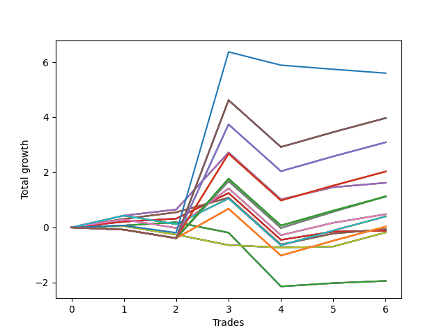

# Long Bulldog 004 
- Symbol: SPY_Unlimited
- Date Range: 03/23/2022 - 07/08/2022
- Trading Period: 7:20-12:30
- Number of Trades: 6



| Name | Win Percent | Profit | Avg Profit / Trade | Avg Time / Trade |      | Name | Win Percent | Profit | Avg Profit / Trade | Avg Time / Trade |
| ---- | ----------- | ------ | ------------------ | ---------------- | ---- | ---- | ----------- | ------ | ------------------ | ---------------- |
| Sorted By <br> Profit | | | | | | Sorted By <br> Win Percentage ||||
| Seventy-Three | 33.33 | 2800.00 | 466.67 | 08:25 |     | Sixty-Six | 83.33 | 810.00 | 135.00 | 13:25 |
| One Hundred Thirty | 50.00 | 1985.00 | 330.83 | 26:37 |     | Fifty-Eight | 83.33 | 810.00 | 135.00 | 13:25 |
| One Hundred Twenty-Five | 50.00 | 1985.00 | 330.83 | 26:37 |     | Fifty | 83.33 | 810.00 | 135.00 | 13:25 |
| One Hundred Twenty | 50.00 | 1985.00 | 330.83 | 26:37 |     | Forty-Two | 83.33 | 810.00 | 135.00 | 13:25 |
| One Hundred Fifteen | 50.00 | 1985.00 | 330.83 | 26:37 |     | Two | 83.33 | 810.00 | 135.00 | 13:25 |
| Eighty-Five | 50.00 | 1985.00 | 330.83 | 26:37 |     | Sixty-Seven | 83.33 | -30.00 | -5.00 | 13:03 |
| One Hundred Twenty-Nine | 50.00 | 1545.00 | 257.50 | 26:35 |     | Fifty-Nine | 83.33 | -30.00 | -5.00 | 13:03 |
| One Hundred Twenty-Four | 50.00 | 1545.00 | 257.50 | 26:35 |     | Fifty-One | 83.33 | -30.00 | -5.00 | 13:03 |
| One Hundred Ninteen | 50.00 | 1545.00 | 257.50 | 26:35 |     | Forty-Three | 83.33 | -30.00 | -5.00 | 13:03 |
| One Hundred Fourteen | 50.00 | 1545.00 | 257.50 | 26:35 |     | Three | 83.33 | -30.00 | -5.00 | 13:03 |
| Eighty-Four | 50.00 | 1545.00 | 257.50 | 26:35 |     | Sixty-Five | 83.33 | -60.00 | -10.00 | 10:16 |
| One Hundred Twenty-Eight | 50.00 | 1015.00 | 169.17 | 26:08 |     | Fifty-Seven | 83.33 | -60.00 | -10.00 | 10:16 |
| One Hundred Twenty-Three | 50.00 | 1015.00 | 169.17 | 26:08 |     | Forty-Nine | 83.33 | -60.00 | -10.00 | 10:16 |
| One Hundred Eighteen | 50.00 | 1015.00 | 169.17 | 26:08 |     | Forty-One | 83.33 | -60.00 | -10.00 | 10:16 |
| One Hundred Thirteen | 50.00 | 1015.00 | 169.17 | 26:08 |     | One | 83.33 | -60.00 | -10.00 | 10:16 |
| Eighty-Three | 50.00 | 1015.00 | 169.17 | 26:08 |     | Sixty-Eight | 66.67 | 240.00 | 40.00 | 22:45 |
| Sixty-Six | 83.33 | 810.00 | 135.00 | 13:25 |     | Sixty | 66.67 | 240.00 | 40.00 | 22:45 |
| Fifty-Eight | 83.33 | 810.00 | 135.00 | 13:25 |     | Fifty-Two | 66.67 | 240.00 | 40.00 | 22:45 |
| Fifty | 83.33 | 810.00 | 135.00 | 13:25 |     | Forty-Four | 66.67 | 240.00 | 40.00 | 22:45 |
| Forty-Two | 83.33 | 810.00 | 135.00 | 13:25 |     | Four | 66.67 | 240.00 | 40.00 | 22:45 |
| Two | 83.33 | 810.00 | 135.00 | 13:25 |     | Seventy-One | 66.67 | 200.00 | 33.33 | 21:14 |
| Sixty-Nine | 50.00 | 565.00 | 94.17 | 24:58 |     | Sixty-Three | 66.67 | 200.00 | 33.33 | 21:14 |
| Sixty-One | 50.00 | 565.00 | 94.17 | 24:58 |     | Fifty-Five | 66.67 | 200.00 | 33.33 | 21:14 |
| Fifty-Three | 50.00 | 565.00 | 94.17 | 24:58 |     | Forty-Seven | 66.67 | 200.00 | 33.33 | 21:14 |
| Forty-Five | 50.00 | 565.00 | 94.17 | 24:58 |     | Seven | 66.67 | 200.00 | 33.33 | 21:14 |
| Five | 50.00 | 565.00 | 94.17 | 24:58 |     | Sixty-Four | 66.67 | -970.00 | -161.67 | 05:30 |
| One Hundred Twenty-Seven | 50.00 | 560.00 | 93.33 | 26:02 |     | Fifty-Six | 66.67 | -970.00 | -161.67 | 05:30 |
| One Hundred Twenty-Two | 50.00 | 560.00 | 93.33 | 26:02 |     | Forty-Eight | 66.67 | -970.00 | -161.67 | 05:30 |
| One Hundred Seventeen | 50.00 | 560.00 | 93.33 | 26:02 |     | Forty | 66.67 | -970.00 | -161.67 | 05:30 |
| One Hundred Twelve | 50.00 | 560.00 | 93.33 | 26:02 |     | Zero | 66.67 | -970.00 | -161.67 | 05:30 |
| Eighty-Two | 50.00 | 560.00 | 93.33 | 26:02 |     | One Hundred Thirty | 50.00 | 1985.00 | 330.83 | 26:37 |
| Sixty-Eight | 66.67 | 240.00 | 40.00 | 22:45 |     | One Hundred Twenty-Five | 50.00 | 1985.00 | 330.83 | 26:37 |
| Sixty | 66.67 | 240.00 | 40.00 | 22:45 |     | One Hundred Twenty | 50.00 | 1985.00 | 330.83 | 26:37 |
| Fifty-Two | 66.67 | 240.00 | 40.00 | 22:45 |     | One Hundred Fifteen | 50.00 | 1985.00 | 330.83 | 26:37 |
| Forty-Four | 66.67 | 240.00 | 40.00 | 22:45 |     | Eighty-Five | 50.00 | 1985.00 | 330.83 | 26:37 |
| Four | 66.67 | 240.00 | 40.00 | 22:45 |     | One Hundred Twenty-Nine | 50.00 | 1545.00 | 257.50 | 26:35 |
| Seventy-One | 66.67 | 200.00 | 33.33 | 21:14 |     | One Hundred Twenty-Four | 50.00 | 1545.00 | 257.50 | 26:35 |
| Sixty-Three | 66.67 | 200.00 | 33.33 | 21:14 |     | One Hundred Ninteen | 50.00 | 1545.00 | 257.50 | 26:35 |
| Fifty-Five | 66.67 | 200.00 | 33.33 | 21:14 |     | One Hundred Fourteen | 50.00 | 1545.00 | 257.50 | 26:35 |
| Forty-Seven | 66.67 | 200.00 | 33.33 | 21:14 |     | Eighty-Four | 50.00 | 1545.00 | 257.50 | 26:35 |
| Seven | 66.67 | 200.00 | 33.33 | 21:14 |     | One Hundred Twenty-Eight | 50.00 | 1015.00 | 169.17 | 26:08 |
| One Hundred Twenty-Six | 50.00 | 15.00 | 2.50 | 25:42 |     | One Hundred Twenty-Three | 50.00 | 1015.00 | 169.17 | 26:08 |
| One Hundred Twenty-One | 50.00 | 15.00 | 2.50 | 25:42 |     | One Hundred Eighteen | 50.00 | 1015.00 | 169.17 | 26:08 |
| One Hundred Sixteen | 50.00 | 15.00 | 2.50 | 25:42 |     | One Hundred Thirteen | 50.00 | 1015.00 | 169.17 | 26:08 |
| One Hundred Eleven | 50.00 | 15.00 | 2.50 | 25:42 |     | Eighty-Three | 50.00 | 1015.00 | 169.17 | 26:08 |
| Eighty-One | 50.00 | 15.00 | 2.50 | 25:42 |     | Sixty-Nine | 50.00 | 565.00 | 94.17 | 24:58 |
| Sixty-Seven | 83.33 | -30.00 | -5.00 | 13:03 |     | Sixty-One | 50.00 | 565.00 | 94.17 | 24:58 |
| Fifty-Nine | 83.33 | -30.00 | -5.00 | 13:03 |     | Fifty-Three | 50.00 | 565.00 | 94.17 | 24:58 |
| Fifty-One | 83.33 | -30.00 | -5.00 | 13:03 |     | Forty-Five | 50.00 | 565.00 | 94.17 | 24:58 |
| Forty-Three | 83.33 | -30.00 | -5.00 | 13:03 |     | Five | 50.00 | 565.00 | 94.17 | 24:58 |
| Three | 83.33 | -30.00 | -5.00 | 13:03 |     | One Hundred Twenty-Seven | 50.00 | 560.00 | 93.33 | 26:02 |
| Sixty-Five | 83.33 | -60.00 | -10.00 | 10:16 |     | One Hundred Twenty-Two | 50.00 | 560.00 | 93.33 | 26:02 |
| Fifty-Seven | 83.33 | -60.00 | -10.00 | 10:16 |     | One Hundred Seventeen | 50.00 | 560.00 | 93.33 | 26:02 |
| Forty-Nine | 83.33 | -60.00 | -10.00 | 10:16 |     | One Hundred Twelve | 50.00 | 560.00 | 93.33 | 26:02 |
| Forty-One | 83.33 | -60.00 | -10.00 | 10:16 |     | Eighty-Two | 50.00 | 560.00 | 93.33 | 26:02 |
| One | 83.33 | -60.00 | -10.00 | 10:16 |     | One Hundred Twenty-Six | 50.00 | 15.00 | 2.50 | 25:42 |
| Seventy | 50.00 | -90.00 | -15.00 | 10:13 |     | One Hundred Twenty-One | 50.00 | 15.00 | 2.50 | 25:42 |
| Sixty-Two | 50.00 | -90.00 | -15.00 | 10:13 |     | One Hundred Sixteen | 50.00 | 15.00 | 2.50 | 25:42 |
| Fifty-Four | 50.00 | -90.00 | -15.00 | 10:13 |     | One Hundred Eleven | 50.00 | 15.00 | 2.50 | 25:42 |
| Forty-Six | 50.00 | -90.00 | -15.00 | 10:13 |     | Eighty-One | 50.00 | 15.00 | 2.50 | 25:42 |
| Six | 50.00 | -90.00 | -15.00 | 10:13 |     | Seventy | 50.00 | -90.00 | -15.00 | 10:13 |
| Sixty-Four | 66.67 | -970.00 | -161.67 | 05:30 |     | Sixty-Two | 50.00 | -90.00 | -15.00 | 10:13 |
| Fifty-Six | 66.67 | -970.00 | -161.67 | 05:30 |     | Fifty-Four | 50.00 | -90.00 | -15.00 | 10:13 |
| Forty-Eight | 66.67 | -970.00 | -161.67 | 05:30 |     | Forty-Six | 50.00 | -90.00 | -15.00 | 10:13 |
| Forty | 66.67 | -970.00 | -161.67 | 05:30 |     | Six | 50.00 | -90.00 | -15.00 | 10:13 |
| Zero | 66.67 | -970.00 | -161.67 | 05:30 |     | Seventy-Three | 33.33 | 2800.00 | 466.67 | 08:25 |

## NO STOPLOSS

### Test Zero
* Sell when price hits the middle line of the 20p bollinger
* No Stoploss
* Results:
```
Total Trades: 6
Percent Up: 66.67
Percent Down: 33.33
Total Points Moved Up: -1.94
Potential Profit: -970.00
Total Points Ups: 0.39 Count Ups: 4
Total Points Downs: -2.33 Count Downs: 2
```

<details><summary>Trades</summary>

<code>In: 2022-03-31 08:38:00		Out: 2022-03-31 08:38:15		Total Position Time: 00:15		Total Move Up: 0.07		Total to Date: 0.07</code> <br />
<code>In: 2022-03-31 09:31:00		Out: 2022-03-31 09:32:25		Total Position Time: 01:25		Total Move Up: 0.12		Total to Date: 0.19</code> <br />
<code>In: 2022-05-04 11:37:00		Out: 2022-05-04 11:37:10		Total Position Time: 00:10		Total Move Up: -0.38		Total to Date: -0.19</code> <br />
<code>In: 2022-05-13 10:50:00		Out: 2022-05-13 11:19:15		Total Position Time: 29:15		Total Move Up: -1.95		Total to Date: -2.14</code> <br />
<code>In: 2022-06-21 11:06:00		Out: 2022-06-21 11:07:45		Total Position Time: 01:45		Total Move Up: 0.12		Total to Date: -2.02</code> <br />
<code>In: 2022-06-27 10:51:00		Out: 2022-06-27 10:51:15		Total Position Time: 00:15		Total Move Up: 0.08		Total to Date: -1.94</code> <br />


</details>

### Test One
* Sell when the price hits the upper line of the 20p 1std bollinger
* No Stoploss
* Results:
```
Total Trades: 6
Percent Up: 83.33
Percent Down: 16.67
Total Points Moved Up: -0.12
Potential Profit: -60.00
Total Points Ups: 1.58 Count Ups: 5
Total Points Downs: -1.70 Count Downs: 1
```

<details><summary>Trades</summary>

<code>In: 2022-03-31 08:38:00		Out: 2022-03-31 08:40:35		Total Position Time: 02:35		Total Move Up: 0.21		Total to Date: 0.21</code> <br />
<code>In: 2022-03-31 09:31:00		Out: 2022-03-31 09:40:45		Total Position Time: 09:45		Total Move Up: 0.11		Total to Date: 0.32</code> <br />
<code>In: 2022-05-04 11:37:00		Out: 2022-05-04 11:41:35		Total Position Time: 04:35		Total Move Up: 0.93		Total to Date: 1.25</code> <br />
<code>In: 2022-05-13 10:50:00		Out: 2022-05-13 11:19:55		Total Position Time: 29:55		Total Move Up: -1.70		Total to Date: -0.45</code> <br />
<code>In: 2022-06-21 11:06:00		Out: 2022-06-21 11:08:35		Total Position Time: 02:35		Total Move Up: 0.30		Total to Date: -0.15</code> <br />
<code>In: 2022-06-27 10:51:00		Out: 2022-06-27 11:03:15		Total Position Time: 12:15		Total Move Up: 0.03		Total to Date: -0.12</code> <br />


</details>

### Test Two
* Sell when the price hits the upper line of the 20p 2std bollinger
* No Stoploss
* Results:
```
Total Trades: 6
Percent Up: 83.33
Percent Down: 16.67
Total Points Moved Up: 1.62
Potential Profit: 810.00
Total Points Ups: 3.32 Count Ups: 5
Total Points Downs: -1.70 Count Downs: 1
```

<details><summary>Trades</summary>

<code>In: 2022-03-31 08:38:00		Out: 2022-03-31 08:41:10		Total Position Time: 03:10		Total Move Up: 0.43		Total to Date: 0.43</code> <br />
<code>In: 2022-03-31 09:31:00		Out: 2022-03-31 09:44:20		Total Position Time: 13:20		Total Move Up: 0.22		Total to Date: 0.65</code> <br />
<code>In: 2022-05-04 11:37:00		Out: 2022-05-04 11:43:45		Total Position Time: 06:45		Total Move Up: 2.07		Total to Date: 2.72</code> <br />
<code>In: 2022-05-13 10:50:00		Out: 2022-05-13 11:19:55		Total Position Time: 29:55		Total Move Up: -1.70		Total to Date: 1.02</code> <br />
<code>In: 2022-06-21 11:06:00		Out: 2022-06-21 11:10:45		Total Position Time: 04:45		Total Move Up: 0.44		Total to Date: 1.46</code> <br />
<code>In: 2022-06-27 10:51:00		Out: 2022-06-27 11:13:35		Total Position Time: 22:35		Total Move Up: 0.16		Total to Date: 1.62</code> <br />


</details>

### Test Three
* Sell when price hits the middle line of the 50p bollinger
* No Stoploss
* Results:
```
Total Trades: 6
Percent Up: 83.33
Percent Down: 16.67
Total Points Moved Up: -0.06
Potential Profit: -30.00
Total Points Ups: 1.64 Count Ups: 5
Total Points Downs: -1.70 Count Downs: 1
```

<details><summary>Trades</summary>

<code>In: 2022-03-31 08:38:00		Out: 2022-03-31 08:41:05		Total Position Time: 03:05		Total Move Up: 0.31		Total to Date: 0.31</code> <br />
<code>In: 2022-03-31 09:31:00		Out: 2022-03-31 09:45:10		Total Position Time: 14:10		Total Move Up: 0.24		Total to Date: 0.55</code> <br />
<code>In: 2022-05-04 11:37:00		Out: 2022-05-04 11:41:15		Total Position Time: 04:15		Total Move Up: 0.53		Total to Date: 1.08</code> <br />
<code>In: 2022-05-13 10:50:00		Out: 2022-05-13 11:19:55		Total Position Time: 29:55		Total Move Up: -1.70		Total to Date: -0.62</code> <br />
<code>In: 2022-06-21 11:06:00		Out: 2022-06-21 11:10:20		Total Position Time: 04:20		Total Move Up: 0.40		Total to Date: -0.22</code> <br />
<code>In: 2022-06-27 10:51:00		Out: 2022-06-27 11:13:35		Total Position Time: 22:35		Total Move Up: 0.16		Total to Date: -0.06</code> <br />


</details>

### Test Four
* Sell when the price hits the upper line of the 50p 1std bollinger
* No Stoploss
* Results:
```
Total Trades: 6
Percent Up: 66.67
Percent Down: 33.33
Total Points Moved Up: 0.48
Potential Profit: 240.00
Total Points Ups: 2.49 Count Ups: 4
Total Points Downs: -2.01 Count Downs: 2
```

<details><summary>Trades</summary>

<code>In: 2022-03-31 08:38:00		Out: 2022-03-31 09:00:15		Total Position Time: 22:15		Total Move Up: 0.29		Total to Date: 0.29</code> <br />
<code>In: 2022-03-31 09:31:00		Out: 2022-03-31 10:00:55		Total Position Time: 29:55		Total Move Up: -0.31		Total to Date: -0.02</code> <br />
<code>In: 2022-05-04 11:37:00		Out: 2022-05-04 11:42:00		Total Position Time: 05:00		Total Move Up: 1.44		Total to Date: 1.42</code> <br />
<code>In: 2022-05-13 10:50:00		Out: 2022-05-13 11:19:55		Total Position Time: 29:55		Total Move Up: -1.70		Total to Date: -0.28</code> <br />
<code>In: 2022-06-21 11:06:00		Out: 2022-06-21 11:29:15		Total Position Time: 23:15		Total Move Up: 0.45		Total to Date: 0.17</code> <br />
<code>In: 2022-06-27 10:51:00		Out: 2022-06-27 11:17:10		Total Position Time: 26:10		Total Move Up: 0.31		Total to Date: 0.48</code> <br />


</details>

### Test Five
* Sell when the price hits the upper line of the 50p 2std bollinger
* No Stoploss
* Results:
```
Total Trades: 6
Percent Up: 50.00
Percent Down: 50.00
Total Points Moved Up: 1.13
Potential Profit: 565.00
Total Points Ups: 3.22 Count Ups: 3
Total Points Downs: -2.09 Count Downs: 3
```

<details><summary>Trades</summary>

<code>In: 2022-03-31 08:38:00		Out: 2022-03-31 09:07:55		Total Position Time: 29:55		Total Move Up: -0.08		Total to Date: -0.08</code> <br />
<code>In: 2022-03-31 09:31:00		Out: 2022-03-31 10:00:55		Total Position Time: 29:55		Total Move Up: -0.31		Total to Date: -0.39</code> <br />
<code>In: 2022-05-04 11:37:00		Out: 2022-05-04 11:43:45		Total Position Time: 06:45		Total Move Up: 2.07		Total to Date: 1.68</code> <br />
<code>In: 2022-05-13 10:50:00		Out: 2022-05-13 11:19:55		Total Position Time: 29:55		Total Move Up: -1.70		Total to Date: -0.02</code> <br />
<code>In: 2022-06-21 11:06:00		Out: 2022-06-21 11:30:15		Total Position Time: 24:15		Total Move Up: 0.59		Total to Date: 0.57</code> <br />
<code>In: 2022-06-27 10:51:00		Out: 2022-06-27 11:20:05		Total Position Time: 29:05		Total Move Up: 0.56		Total to Date: 1.13</code> <br />


</details>

### Test Six
* Sell when the price hits the middle line of the 1std VWAP
* No Stoploss
* Results:
```
Total Trades: 6
Percent Up: 50.00
Percent Down: 50.00
Total Points Moved Up: -0.18
Potential Profit: -90.00
Total Points Ups: 0.60 Count Ups: 3
Total Points Downs: -0.78 Count Downs: 3
```

<details><summary>Trades</summary>

<code>In: 2022-03-31 08:38:00		Out: 2022-03-31 08:38:10		Total Position Time: 00:10		Total Move Up: 0.05		Total to Date: 0.05</code> <br />
<code>In: 2022-03-31 09:31:00		Out: 2022-03-31 10:00:55		Total Position Time: 29:55		Total Move Up: -0.31		Total to Date: -0.26</code> <br />
<code>In: 2022-05-04 11:37:00		Out: 2022-05-04 11:37:10		Total Position Time: 00:10		Total Move Up: -0.38		Total to Date: -0.64</code> <br />
<code>In: 2022-05-13 10:50:00		Out: 2022-05-13 10:51:00		Total Position Time: 01:00		Total Move Up: -0.09		Total to Date: -0.73</code> <br />
<code>In: 2022-06-21 11:06:00		Out: 2022-06-21 11:06:10		Total Position Time: 00:10		Total Move Up: 0.04		Total to Date: -0.69</code> <br />
<code>In: 2022-06-27 10:51:00		Out: 2022-06-27 11:20:55		Total Position Time: 29:55		Total Move Up: 0.51		Total to Date: -0.18</code> <br />


</details>

### Test Seven
* Sell when the price hits the upper line of the 1std VWAP
* No Stoploss
* Results:
```
Total Trades: 6
Percent Up: 66.67
Percent Down: 33.33
Total Points Moved Up: 0.40
Potential Profit: 200.00
Total Points Ups: 2.41 Count Ups: 4
Total Points Downs: -2.01 Count Downs: 2
```

<details><summary>Trades</summary>

<code>In: 2022-03-31 08:38:00		Out: 2022-03-31 08:41:10		Total Position Time: 03:10		Total Move Up: 0.43		Total to Date: 0.43</code> <br />
<code>In: 2022-03-31 09:31:00		Out: 2022-03-31 10:00:55		Total Position Time: 29:55		Total Move Up: -0.31		Total to Date: 0.12</code> <br />
<code>In: 2022-05-04 11:37:00		Out: 2022-05-04 11:41:35		Total Position Time: 04:35		Total Move Up: 0.93		Total to Date: 1.05</code> <br />
<code>In: 2022-05-13 10:50:00		Out: 2022-05-13 11:19:55		Total Position Time: 29:55		Total Move Up: -1.70		Total to Date: -0.65</code> <br />
<code>In: 2022-06-21 11:06:00		Out: 2022-06-21 11:35:55		Total Position Time: 29:55		Total Move Up: 0.54		Total to Date: -0.11</code> <br />
<code>In: 2022-06-27 10:51:00		Out: 2022-06-27 11:20:55		Total Position Time: 29:55		Total Move Up: 0.51		Total to Date: 0.40</code> <br />


</details>

## STOPLOSS OF 5

### Test Forty
* Sell when price hits the middle line of the 20p bollinger
* Stoploss is 5 points
* Results:
```
Total Trades: 6
Percent Up: 66.67
Percent Down: 33.33
Total Points Moved Up: -1.94
Potential Profit: -970.00
Total Points Ups: 0.39 Count Ups: 4
Total Points Downs: -2.33 Count Downs: 2
```

<details><summary>Trades</summary>

<code>In: 2022-03-31 08:38:00		Out: 2022-03-31 08:38:15		Total Position Time: 00:15		Total Move Up: 0.07		Total to Date: 0.07</code> <br />
<code>In: 2022-03-31 09:31:00		Out: 2022-03-31 09:32:25		Total Position Time: 01:25		Total Move Up: 0.12		Total to Date: 0.19</code> <br />
<code>In: 2022-05-04 11:37:00		Out: 2022-05-04 11:37:10		Total Position Time: 00:10		Total Move Up: -0.38		Total to Date: -0.19</code> <br />
<code>In: 2022-05-13 10:50:00		Out: 2022-05-13 11:19:15		Total Position Time: 29:15		Total Move Up: -1.95		Total to Date: -2.14</code> <br />
<code>In: 2022-06-21 11:06:00		Out: 2022-06-21 11:07:45		Total Position Time: 01:45		Total Move Up: 0.12		Total to Date: -2.02</code> <br />
<code>In: 2022-06-27 10:51:00		Out: 2022-06-27 10:51:15		Total Position Time: 00:15		Total Move Up: 0.08		Total to Date: -1.94</code> <br />


</details>

### Test Forty-One
* Sell when the price hits the upper line of the 20p 1std bollinger
* Stoploss is 5 points
* Results:
```
Total Trades: 6
Percent Up: 83.33
Percent Down: 16.67
Total Points Moved Up: -0.12
Potential Profit: -60.00
Total Points Ups: 1.58 Count Ups: 5
Total Points Downs: -1.70 Count Downs: 1
```

<details><summary>Trades</summary>

<code>In: 2022-03-31 08:38:00		Out: 2022-03-31 08:40:35		Total Position Time: 02:35		Total Move Up: 0.21		Total to Date: 0.21</code> <br />
<code>In: 2022-03-31 09:31:00		Out: 2022-03-31 09:40:45		Total Position Time: 09:45		Total Move Up: 0.11		Total to Date: 0.32</code> <br />
<code>In: 2022-05-04 11:37:00		Out: 2022-05-04 11:41:35		Total Position Time: 04:35		Total Move Up: 0.93		Total to Date: 1.25</code> <br />
<code>In: 2022-05-13 10:50:00		Out: 2022-05-13 11:19:55		Total Position Time: 29:55		Total Move Up: -1.70		Total to Date: -0.45</code> <br />
<code>In: 2022-06-21 11:06:00		Out: 2022-06-21 11:08:35		Total Position Time: 02:35		Total Move Up: 0.30		Total to Date: -0.15</code> <br />
<code>In: 2022-06-27 10:51:00		Out: 2022-06-27 11:03:15		Total Position Time: 12:15		Total Move Up: 0.03		Total to Date: -0.12</code> <br />


</details>

### Test Forty-Two
* Sell when the price hits the upper line of the 20p 2std bollinger
* Stoploss is 5 points
* Results:
```
Total Trades: 6
Percent Up: 83.33
Percent Down: 16.67
Total Points Moved Up: 1.62
Potential Profit: 810.00
Total Points Ups: 3.32 Count Ups: 5
Total Points Downs: -1.70 Count Downs: 1
```

<details><summary>Trades</summary>

<code>In: 2022-03-31 08:38:00		Out: 2022-03-31 08:41:10		Total Position Time: 03:10		Total Move Up: 0.43		Total to Date: 0.43</code> <br />
<code>In: 2022-03-31 09:31:00		Out: 2022-03-31 09:44:20		Total Position Time: 13:20		Total Move Up: 0.22		Total to Date: 0.65</code> <br />
<code>In: 2022-05-04 11:37:00		Out: 2022-05-04 11:43:45		Total Position Time: 06:45		Total Move Up: 2.07		Total to Date: 2.72</code> <br />
<code>In: 2022-05-13 10:50:00		Out: 2022-05-13 11:19:55		Total Position Time: 29:55		Total Move Up: -1.70		Total to Date: 1.02</code> <br />
<code>In: 2022-06-21 11:06:00		Out: 2022-06-21 11:10:45		Total Position Time: 04:45		Total Move Up: 0.44		Total to Date: 1.46</code> <br />
<code>In: 2022-06-27 10:51:00		Out: 2022-06-27 11:13:35		Total Position Time: 22:35		Total Move Up: 0.16		Total to Date: 1.62</code> <br />


</details>

### Test Forty-Three
* Sell when price hits the middle line of the 50p bollinger
* Stoploss is 5 points
* Results:
```
Total Trades: 6
Percent Up: 83.33
Percent Down: 16.67
Total Points Moved Up: -0.06
Potential Profit: -30.00
Total Points Ups: 1.64 Count Ups: 5
Total Points Downs: -1.70 Count Downs: 1
```

<details><summary>Trades</summary>

<code>In: 2022-03-31 08:38:00		Out: 2022-03-31 08:41:05		Total Position Time: 03:05		Total Move Up: 0.31		Total to Date: 0.31</code> <br />
<code>In: 2022-03-31 09:31:00		Out: 2022-03-31 09:45:10		Total Position Time: 14:10		Total Move Up: 0.24		Total to Date: 0.55</code> <br />
<code>In: 2022-05-04 11:37:00		Out: 2022-05-04 11:41:15		Total Position Time: 04:15		Total Move Up: 0.53		Total to Date: 1.08</code> <br />
<code>In: 2022-05-13 10:50:00		Out: 2022-05-13 11:19:55		Total Position Time: 29:55		Total Move Up: -1.70		Total to Date: -0.62</code> <br />
<code>In: 2022-06-21 11:06:00		Out: 2022-06-21 11:10:20		Total Position Time: 04:20		Total Move Up: 0.40		Total to Date: -0.22</code> <br />
<code>In: 2022-06-27 10:51:00		Out: 2022-06-27 11:13:35		Total Position Time: 22:35		Total Move Up: 0.16		Total to Date: -0.06</code> <br />


</details>

### Test Forty-Four
* Sell when the price hits the upper line of the 50p 1std bollinger
* Stoploss is 5 points
* Results:
```
Total Trades: 6
Percent Up: 66.67
Percent Down: 33.33
Total Points Moved Up: 0.48
Potential Profit: 240.00
Total Points Ups: 2.49 Count Ups: 4
Total Points Downs: -2.01 Count Downs: 2
```

<details><summary>Trades</summary>

<code>In: 2022-03-31 08:38:00		Out: 2022-03-31 09:00:15		Total Position Time: 22:15		Total Move Up: 0.29		Total to Date: 0.29</code> <br />
<code>In: 2022-03-31 09:31:00		Out: 2022-03-31 10:00:55		Total Position Time: 29:55		Total Move Up: -0.31		Total to Date: -0.02</code> <br />
<code>In: 2022-05-04 11:37:00		Out: 2022-05-04 11:42:00		Total Position Time: 05:00		Total Move Up: 1.44		Total to Date: 1.42</code> <br />
<code>In: 2022-05-13 10:50:00		Out: 2022-05-13 11:19:55		Total Position Time: 29:55		Total Move Up: -1.70		Total to Date: -0.28</code> <br />
<code>In: 2022-06-21 11:06:00		Out: 2022-06-21 11:29:15		Total Position Time: 23:15		Total Move Up: 0.45		Total to Date: 0.17</code> <br />
<code>In: 2022-06-27 10:51:00		Out: 2022-06-27 11:17:10		Total Position Time: 26:10		Total Move Up: 0.31		Total to Date: 0.48</code> <br />


</details>

### Test Forty-Five
* Sell when the price hits the upper line of the 50p 2std bollinger
* Stoploss is 5 points
* Results:
```
Total Trades: 6
Percent Up: 50.00
Percent Down: 50.00
Total Points Moved Up: 1.13
Potential Profit: 565.00
Total Points Ups: 3.22 Count Ups: 3
Total Points Downs: -2.09 Count Downs: 3
```

<details><summary>Trades</summary>

<code>In: 2022-03-31 08:38:00		Out: 2022-03-31 09:07:55		Total Position Time: 29:55		Total Move Up: -0.08		Total to Date: -0.08</code> <br />
<code>In: 2022-03-31 09:31:00		Out: 2022-03-31 10:00:55		Total Position Time: 29:55		Total Move Up: -0.31		Total to Date: -0.39</code> <br />
<code>In: 2022-05-04 11:37:00		Out: 2022-05-04 11:43:45		Total Position Time: 06:45		Total Move Up: 2.07		Total to Date: 1.68</code> <br />
<code>In: 2022-05-13 10:50:00		Out: 2022-05-13 11:19:55		Total Position Time: 29:55		Total Move Up: -1.70		Total to Date: -0.02</code> <br />
<code>In: 2022-06-21 11:06:00		Out: 2022-06-21 11:30:15		Total Position Time: 24:15		Total Move Up: 0.59		Total to Date: 0.57</code> <br />
<code>In: 2022-06-27 10:51:00		Out: 2022-06-27 11:20:05		Total Position Time: 29:05		Total Move Up: 0.56		Total to Date: 1.13</code> <br />


</details>

### Test Forty-Six
* Sell when the price hits the middle line of the 1std VWAP
* Stoploss is 5 points
* Results:
```
Total Trades: 6
Percent Up: 50.00
Percent Down: 50.00
Total Points Moved Up: -0.18
Potential Profit: -90.00
Total Points Ups: 0.60 Count Ups: 3
Total Points Downs: -0.78 Count Downs: 3
```

<details><summary>Trades</summary>

<code>In: 2022-03-31 08:38:00		Out: 2022-03-31 08:38:10		Total Position Time: 00:10		Total Move Up: 0.05		Total to Date: 0.05</code> <br />
<code>In: 2022-03-31 09:31:00		Out: 2022-03-31 10:00:55		Total Position Time: 29:55		Total Move Up: -0.31		Total to Date: -0.26</code> <br />
<code>In: 2022-05-04 11:37:00		Out: 2022-05-04 11:37:10		Total Position Time: 00:10		Total Move Up: -0.38		Total to Date: -0.64</code> <br />
<code>In: 2022-05-13 10:50:00		Out: 2022-05-13 10:51:00		Total Position Time: 01:00		Total Move Up: -0.09		Total to Date: -0.73</code> <br />
<code>In: 2022-06-21 11:06:00		Out: 2022-06-21 11:06:10		Total Position Time: 00:10		Total Move Up: 0.04		Total to Date: -0.69</code> <br />
<code>In: 2022-06-27 10:51:00		Out: 2022-06-27 11:20:55		Total Position Time: 29:55		Total Move Up: 0.51		Total to Date: -0.18</code> <br />


</details>

### Test Forty-Seven
* Sell when the price hits the upper line of the 1std VWAP
* Stoploss is 5 points
* Results:
```
Total Trades: 6
Percent Up: 66.67
Percent Down: 33.33
Total Points Moved Up: 0.40
Potential Profit: 200.00
Total Points Ups: 2.41 Count Ups: 4
Total Points Downs: -2.01 Count Downs: 2
```

<details><summary>Trades</summary>

<code>In: 2022-03-31 08:38:00		Out: 2022-03-31 08:41:10		Total Position Time: 03:10		Total Move Up: 0.43		Total to Date: 0.43</code> <br />
<code>In: 2022-03-31 09:31:00		Out: 2022-03-31 10:00:55		Total Position Time: 29:55		Total Move Up: -0.31		Total to Date: 0.12</code> <br />
<code>In: 2022-05-04 11:37:00		Out: 2022-05-04 11:41:35		Total Position Time: 04:35		Total Move Up: 0.93		Total to Date: 1.05</code> <br />
<code>In: 2022-05-13 10:50:00		Out: 2022-05-13 11:19:55		Total Position Time: 29:55		Total Move Up: -1.70		Total to Date: -0.65</code> <br />
<code>In: 2022-06-21 11:06:00		Out: 2022-06-21 11:35:55		Total Position Time: 29:55		Total Move Up: 0.54		Total to Date: -0.11</code> <br />
<code>In: 2022-06-27 10:51:00		Out: 2022-06-27 11:20:55		Total Position Time: 29:55		Total Move Up: 0.51		Total to Date: 0.40</code> <br />


</details>

## TRAIL STOP OF 5

### Test Forty-Eight
* Sell when price hits the middle line of the 20p bollinger
* Trailing Stop is 5 points
* Results:
```
Total Trades: 6
Percent Up: 66.67
Percent Down: 33.33
Total Points Moved Up: -1.94
Potential Profit: -970.00
Total Points Ups: 0.39 Count Ups: 4
Total Points Downs: -2.33 Count Downs: 2
```

<details><summary>Trades</summary>

<code>In: 2022-03-31 08:38:00		Out: 2022-03-31 08:38:15		Total Position Time: 00:15		Total Move Up: 0.07		Total to Date: 0.07</code> <br />
<code>In: 2022-03-31 09:31:00		Out: 2022-03-31 09:32:25		Total Position Time: 01:25		Total Move Up: 0.12		Total to Date: 0.19</code> <br />
<code>In: 2022-05-04 11:37:00		Out: 2022-05-04 11:37:10		Total Position Time: 00:10		Total Move Up: -0.38		Total to Date: -0.19</code> <br />
<code>In: 2022-05-13 10:50:00		Out: 2022-05-13 11:19:15		Total Position Time: 29:15		Total Move Up: -1.95		Total to Date: -2.14</code> <br />
<code>In: 2022-06-21 11:06:00		Out: 2022-06-21 11:07:45		Total Position Time: 01:45		Total Move Up: 0.12		Total to Date: -2.02</code> <br />
<code>In: 2022-06-27 10:51:00		Out: 2022-06-27 10:51:15		Total Position Time: 00:15		Total Move Up: 0.08		Total to Date: -1.94</code> <br />


</details>

### Test Forty-Nine
* Sell when the price hits the upper line of the 20p 1std bollinger
* Trailing Stop is 5 points
* Results:
```
Total Trades: 6
Percent Up: 83.33
Percent Down: 16.67
Total Points Moved Up: -0.12
Potential Profit: -60.00
Total Points Ups: 1.58 Count Ups: 5
Total Points Downs: -1.70 Count Downs: 1
```

<details><summary>Trades</summary>

<code>In: 2022-03-31 08:38:00		Out: 2022-03-31 08:40:35		Total Position Time: 02:35		Total Move Up: 0.21		Total to Date: 0.21</code> <br />
<code>In: 2022-03-31 09:31:00		Out: 2022-03-31 09:40:45		Total Position Time: 09:45		Total Move Up: 0.11		Total to Date: 0.32</code> <br />
<code>In: 2022-05-04 11:37:00		Out: 2022-05-04 11:41:35		Total Position Time: 04:35		Total Move Up: 0.93		Total to Date: 1.25</code> <br />
<code>In: 2022-05-13 10:50:00		Out: 2022-05-13 11:19:55		Total Position Time: 29:55		Total Move Up: -1.70		Total to Date: -0.45</code> <br />
<code>In: 2022-06-21 11:06:00		Out: 2022-06-21 11:08:35		Total Position Time: 02:35		Total Move Up: 0.30		Total to Date: -0.15</code> <br />
<code>In: 2022-06-27 10:51:00		Out: 2022-06-27 11:03:15		Total Position Time: 12:15		Total Move Up: 0.03		Total to Date: -0.12</code> <br />


</details>

### Test Fifty
* Sell when the price hits the upper line of the 20p 2std bollinger
* Trailing Stop is 5 points
* Results:
```
Total Trades: 6
Percent Up: 83.33
Percent Down: 16.67
Total Points Moved Up: 1.62
Potential Profit: 810.00
Total Points Ups: 3.32 Count Ups: 5
Total Points Downs: -1.70 Count Downs: 1
```

<details><summary>Trades</summary>

<code>In: 2022-03-31 08:38:00		Out: 2022-03-31 08:41:10		Total Position Time: 03:10		Total Move Up: 0.43		Total to Date: 0.43</code> <br />
<code>In: 2022-03-31 09:31:00		Out: 2022-03-31 09:44:20		Total Position Time: 13:20		Total Move Up: 0.22		Total to Date: 0.65</code> <br />
<code>In: 2022-05-04 11:37:00		Out: 2022-05-04 11:43:45		Total Position Time: 06:45		Total Move Up: 2.07		Total to Date: 2.72</code> <br />
<code>In: 2022-05-13 10:50:00		Out: 2022-05-13 11:19:55		Total Position Time: 29:55		Total Move Up: -1.70		Total to Date: 1.02</code> <br />
<code>In: 2022-06-21 11:06:00		Out: 2022-06-21 11:10:45		Total Position Time: 04:45		Total Move Up: 0.44		Total to Date: 1.46</code> <br />
<code>In: 2022-06-27 10:51:00		Out: 2022-06-27 11:13:35		Total Position Time: 22:35		Total Move Up: 0.16		Total to Date: 1.62</code> <br />


</details>

### Test Fifty-One
* Sell when price hits the middle line of the 50p bollinger
* Trailing Stop is 5 points
* Results:
```
Total Trades: 6
Percent Up: 83.33
Percent Down: 16.67
Total Points Moved Up: -0.06
Potential Profit: -30.00
Total Points Ups: 1.64 Count Ups: 5
Total Points Downs: -1.70 Count Downs: 1
```

<details><summary>Trades</summary>

<code>In: 2022-03-31 08:38:00		Out: 2022-03-31 08:41:05		Total Position Time: 03:05		Total Move Up: 0.31		Total to Date: 0.31</code> <br />
<code>In: 2022-03-31 09:31:00		Out: 2022-03-31 09:45:10		Total Position Time: 14:10		Total Move Up: 0.24		Total to Date: 0.55</code> <br />
<code>In: 2022-05-04 11:37:00		Out: 2022-05-04 11:41:15		Total Position Time: 04:15		Total Move Up: 0.53		Total to Date: 1.08</code> <br />
<code>In: 2022-05-13 10:50:00		Out: 2022-05-13 11:19:55		Total Position Time: 29:55		Total Move Up: -1.70		Total to Date: -0.62</code> <br />
<code>In: 2022-06-21 11:06:00		Out: 2022-06-21 11:10:20		Total Position Time: 04:20		Total Move Up: 0.40		Total to Date: -0.22</code> <br />
<code>In: 2022-06-27 10:51:00		Out: 2022-06-27 11:13:35		Total Position Time: 22:35		Total Move Up: 0.16		Total to Date: -0.06</code> <br />


</details>

### Test Fifty-Two
* Sell when the price hits the upper line of the 50p 1std bollinger
* Trailing Stop is 5 points
* Results:
```
Total Trades: 6
Percent Up: 66.67
Percent Down: 33.33
Total Points Moved Up: 0.48
Potential Profit: 240.00
Total Points Ups: 2.49 Count Ups: 4
Total Points Downs: -2.01 Count Downs: 2
```

<details><summary>Trades</summary>

<code>In: 2022-03-31 08:38:00		Out: 2022-03-31 09:00:15		Total Position Time: 22:15		Total Move Up: 0.29		Total to Date: 0.29</code> <br />
<code>In: 2022-03-31 09:31:00		Out: 2022-03-31 10:00:55		Total Position Time: 29:55		Total Move Up: -0.31		Total to Date: -0.02</code> <br />
<code>In: 2022-05-04 11:37:00		Out: 2022-05-04 11:42:00		Total Position Time: 05:00		Total Move Up: 1.44		Total to Date: 1.42</code> <br />
<code>In: 2022-05-13 10:50:00		Out: 2022-05-13 11:19:55		Total Position Time: 29:55		Total Move Up: -1.70		Total to Date: -0.28</code> <br />
<code>In: 2022-06-21 11:06:00		Out: 2022-06-21 11:29:15		Total Position Time: 23:15		Total Move Up: 0.45		Total to Date: 0.17</code> <br />
<code>In: 2022-06-27 10:51:00		Out: 2022-06-27 11:17:10		Total Position Time: 26:10		Total Move Up: 0.31		Total to Date: 0.48</code> <br />


</details>

### Test Fifty-Three
* Sell when the price hits the upper line of the 50p 2std bollinger
* Trailing Stop is 5 points
* Results:
```
Total Trades: 6
Percent Up: 50.00
Percent Down: 50.00
Total Points Moved Up: 1.13
Potential Profit: 565.00
Total Points Ups: 3.22 Count Ups: 3
Total Points Downs: -2.09 Count Downs: 3
```

<details><summary>Trades</summary>

<code>In: 2022-03-31 08:38:00		Out: 2022-03-31 09:07:55		Total Position Time: 29:55		Total Move Up: -0.08		Total to Date: -0.08</code> <br />
<code>In: 2022-03-31 09:31:00		Out: 2022-03-31 10:00:55		Total Position Time: 29:55		Total Move Up: -0.31		Total to Date: -0.39</code> <br />
<code>In: 2022-05-04 11:37:00		Out: 2022-05-04 11:43:45		Total Position Time: 06:45		Total Move Up: 2.07		Total to Date: 1.68</code> <br />
<code>In: 2022-05-13 10:50:00		Out: 2022-05-13 11:19:55		Total Position Time: 29:55		Total Move Up: -1.70		Total to Date: -0.02</code> <br />
<code>In: 2022-06-21 11:06:00		Out: 2022-06-21 11:30:15		Total Position Time: 24:15		Total Move Up: 0.59		Total to Date: 0.57</code> <br />
<code>In: 2022-06-27 10:51:00		Out: 2022-06-27 11:20:05		Total Position Time: 29:05		Total Move Up: 0.56		Total to Date: 1.13</code> <br />


</details>

### Test Fifty-Four
* Sell when the price hits the middle line of the 1std VWAP
* Trailing Stop is 5 points
* Results:
```
Total Trades: 6
Percent Up: 50.00
Percent Down: 50.00
Total Points Moved Up: -0.18
Potential Profit: -90.00
Total Points Ups: 0.60 Count Ups: 3
Total Points Downs: -0.78 Count Downs: 3
```

<details><summary>Trades</summary>

<code>In: 2022-03-31 08:38:00		Out: 2022-03-31 08:38:10		Total Position Time: 00:10		Total Move Up: 0.05		Total to Date: 0.05</code> <br />
<code>In: 2022-03-31 09:31:00		Out: 2022-03-31 10:00:55		Total Position Time: 29:55		Total Move Up: -0.31		Total to Date: -0.26</code> <br />
<code>In: 2022-05-04 11:37:00		Out: 2022-05-04 11:37:10		Total Position Time: 00:10		Total Move Up: -0.38		Total to Date: -0.64</code> <br />
<code>In: 2022-05-13 10:50:00		Out: 2022-05-13 10:51:00		Total Position Time: 01:00		Total Move Up: -0.09		Total to Date: -0.73</code> <br />
<code>In: 2022-06-21 11:06:00		Out: 2022-06-21 11:06:10		Total Position Time: 00:10		Total Move Up: 0.04		Total to Date: -0.69</code> <br />
<code>In: 2022-06-27 10:51:00		Out: 2022-06-27 11:20:55		Total Position Time: 29:55		Total Move Up: 0.51		Total to Date: -0.18</code> <br />


</details>

### Test Fifty-Five
* Sell when the price hits the upper line of the 1std VWAP
* Trailing Stop is 5 points
* Results:
```
Total Trades: 6
Percent Up: 66.67
Percent Down: 33.33
Total Points Moved Up: 0.40
Potential Profit: 200.00
Total Points Ups: 2.41 Count Ups: 4
Total Points Downs: -2.01 Count Downs: 2
```

<details><summary>Trades</summary>

<code>In: 2022-03-31 08:38:00		Out: 2022-03-31 08:41:10		Total Position Time: 03:10		Total Move Up: 0.43		Total to Date: 0.43</code> <br />
<code>In: 2022-03-31 09:31:00		Out: 2022-03-31 10:00:55		Total Position Time: 29:55		Total Move Up: -0.31		Total to Date: 0.12</code> <br />
<code>In: 2022-05-04 11:37:00		Out: 2022-05-04 11:41:35		Total Position Time: 04:35		Total Move Up: 0.93		Total to Date: 1.05</code> <br />
<code>In: 2022-05-13 10:50:00		Out: 2022-05-13 11:19:55		Total Position Time: 29:55		Total Move Up: -1.70		Total to Date: -0.65</code> <br />
<code>In: 2022-06-21 11:06:00		Out: 2022-06-21 11:35:55		Total Position Time: 29:55		Total Move Up: 0.54		Total to Date: -0.11</code> <br />
<code>In: 2022-06-27 10:51:00		Out: 2022-06-27 11:20:55		Total Position Time: 29:55		Total Move Up: 0.51		Total to Date: 0.40</code> <br />


</details>

## STOPLOSS OF 10

### Test Fifty-Six
* Sell when price hits the middle line of the 20p bollinger
* Stoploss is 10 points
* Results:
```
Total Trades: 6
Percent Up: 66.67
Percent Down: 33.33
Total Points Moved Up: -1.94
Potential Profit: -970.00
Total Points Ups: 0.39 Count Ups: 4
Total Points Downs: -2.33 Count Downs: 2
```

<details><summary>Trades</summary>

<code>In: 2022-03-31 08:38:00		Out: 2022-03-31 08:38:15		Total Position Time: 00:15		Total Move Up: 0.07		Total to Date: 0.07</code> <br />
<code>In: 2022-03-31 09:31:00		Out: 2022-03-31 09:32:25		Total Position Time: 01:25		Total Move Up: 0.12		Total to Date: 0.19</code> <br />
<code>In: 2022-05-04 11:37:00		Out: 2022-05-04 11:37:10		Total Position Time: 00:10		Total Move Up: -0.38		Total to Date: -0.19</code> <br />
<code>In: 2022-05-13 10:50:00		Out: 2022-05-13 11:19:15		Total Position Time: 29:15		Total Move Up: -1.95		Total to Date: -2.14</code> <br />
<code>In: 2022-06-21 11:06:00		Out: 2022-06-21 11:07:45		Total Position Time: 01:45		Total Move Up: 0.12		Total to Date: -2.02</code> <br />
<code>In: 2022-06-27 10:51:00		Out: 2022-06-27 10:51:15		Total Position Time: 00:15		Total Move Up: 0.08		Total to Date: -1.94</code> <br />


</details>

### Test Fifty-Seven
* Sell when the price hits the upper line of the 20p 1std bollinger
* Stoploss is 10 points
* Results:
```
Total Trades: 6
Percent Up: 83.33
Percent Down: 16.67
Total Points Moved Up: -0.12
Potential Profit: -60.00
Total Points Ups: 1.58 Count Ups: 5
Total Points Downs: -1.70 Count Downs: 1
```

<details><summary>Trades</summary>

<code>In: 2022-03-31 08:38:00		Out: 2022-03-31 08:40:35		Total Position Time: 02:35		Total Move Up: 0.21		Total to Date: 0.21</code> <br />
<code>In: 2022-03-31 09:31:00		Out: 2022-03-31 09:40:45		Total Position Time: 09:45		Total Move Up: 0.11		Total to Date: 0.32</code> <br />
<code>In: 2022-05-04 11:37:00		Out: 2022-05-04 11:41:35		Total Position Time: 04:35		Total Move Up: 0.93		Total to Date: 1.25</code> <br />
<code>In: 2022-05-13 10:50:00		Out: 2022-05-13 11:19:55		Total Position Time: 29:55		Total Move Up: -1.70		Total to Date: -0.45</code> <br />
<code>In: 2022-06-21 11:06:00		Out: 2022-06-21 11:08:35		Total Position Time: 02:35		Total Move Up: 0.30		Total to Date: -0.15</code> <br />
<code>In: 2022-06-27 10:51:00		Out: 2022-06-27 11:03:15		Total Position Time: 12:15		Total Move Up: 0.03		Total to Date: -0.12</code> <br />


</details>

### Test Fifty-Eight
* Sell when the price hits the upper line of the 20p 2std bollinger
* Stoploss is 10 points
* Results:
```
Total Trades: 6
Percent Up: 83.33
Percent Down: 16.67
Total Points Moved Up: 1.62
Potential Profit: 810.00
Total Points Ups: 3.32 Count Ups: 5
Total Points Downs: -1.70 Count Downs: 1
```

<details><summary>Trades</summary>

<code>In: 2022-03-31 08:38:00		Out: 2022-03-31 08:41:10		Total Position Time: 03:10		Total Move Up: 0.43		Total to Date: 0.43</code> <br />
<code>In: 2022-03-31 09:31:00		Out: 2022-03-31 09:44:20		Total Position Time: 13:20		Total Move Up: 0.22		Total to Date: 0.65</code> <br />
<code>In: 2022-05-04 11:37:00		Out: 2022-05-04 11:43:45		Total Position Time: 06:45		Total Move Up: 2.07		Total to Date: 2.72</code> <br />
<code>In: 2022-05-13 10:50:00		Out: 2022-05-13 11:19:55		Total Position Time: 29:55		Total Move Up: -1.70		Total to Date: 1.02</code> <br />
<code>In: 2022-06-21 11:06:00		Out: 2022-06-21 11:10:45		Total Position Time: 04:45		Total Move Up: 0.44		Total to Date: 1.46</code> <br />
<code>In: 2022-06-27 10:51:00		Out: 2022-06-27 11:13:35		Total Position Time: 22:35		Total Move Up: 0.16		Total to Date: 1.62</code> <br />


</details>

### Test Fifty-Nine
* Sell when price hits the middle line of the 50p bollinger
* Stoploss is 10 points
* Results:
```
Total Trades: 6
Percent Up: 83.33
Percent Down: 16.67
Total Points Moved Up: -0.06
Potential Profit: -30.00
Total Points Ups: 1.64 Count Ups: 5
Total Points Downs: -1.70 Count Downs: 1
```

<details><summary>Trades</summary>

<code>In: 2022-03-31 08:38:00		Out: 2022-03-31 08:41:05		Total Position Time: 03:05		Total Move Up: 0.31		Total to Date: 0.31</code> <br />
<code>In: 2022-03-31 09:31:00		Out: 2022-03-31 09:45:10		Total Position Time: 14:10		Total Move Up: 0.24		Total to Date: 0.55</code> <br />
<code>In: 2022-05-04 11:37:00		Out: 2022-05-04 11:41:15		Total Position Time: 04:15		Total Move Up: 0.53		Total to Date: 1.08</code> <br />
<code>In: 2022-05-13 10:50:00		Out: 2022-05-13 11:19:55		Total Position Time: 29:55		Total Move Up: -1.70		Total to Date: -0.62</code> <br />
<code>In: 2022-06-21 11:06:00		Out: 2022-06-21 11:10:20		Total Position Time: 04:20		Total Move Up: 0.40		Total to Date: -0.22</code> <br />
<code>In: 2022-06-27 10:51:00		Out: 2022-06-27 11:13:35		Total Position Time: 22:35		Total Move Up: 0.16		Total to Date: -0.06</code> <br />


</details>

### Test Sixty
* Sell when the price hits the upper line of the 50p 1std bollinger
* Stoploss is 10 points
* Results:
```
Total Trades: 6
Percent Up: 66.67
Percent Down: 33.33
Total Points Moved Up: 0.48
Potential Profit: 240.00
Total Points Ups: 2.49 Count Ups: 4
Total Points Downs: -2.01 Count Downs: 2
```

<details><summary>Trades</summary>

<code>In: 2022-03-31 08:38:00		Out: 2022-03-31 09:00:15		Total Position Time: 22:15		Total Move Up: 0.29		Total to Date: 0.29</code> <br />
<code>In: 2022-03-31 09:31:00		Out: 2022-03-31 10:00:55		Total Position Time: 29:55		Total Move Up: -0.31		Total to Date: -0.02</code> <br />
<code>In: 2022-05-04 11:37:00		Out: 2022-05-04 11:42:00		Total Position Time: 05:00		Total Move Up: 1.44		Total to Date: 1.42</code> <br />
<code>In: 2022-05-13 10:50:00		Out: 2022-05-13 11:19:55		Total Position Time: 29:55		Total Move Up: -1.70		Total to Date: -0.28</code> <br />
<code>In: 2022-06-21 11:06:00		Out: 2022-06-21 11:29:15		Total Position Time: 23:15		Total Move Up: 0.45		Total to Date: 0.17</code> <br />
<code>In: 2022-06-27 10:51:00		Out: 2022-06-27 11:17:10		Total Position Time: 26:10		Total Move Up: 0.31		Total to Date: 0.48</code> <br />


</details>

### Test Sixty-One
* Sell when the price hits the upper line of the 50p 2std bollinger
* Stoploss is 10 points
* Results:
```
Total Trades: 6
Percent Up: 50.00
Percent Down: 50.00
Total Points Moved Up: 1.13
Potential Profit: 565.00
Total Points Ups: 3.22 Count Ups: 3
Total Points Downs: -2.09 Count Downs: 3
```

<details><summary>Trades</summary>

<code>In: 2022-03-31 08:38:00		Out: 2022-03-31 09:07:55		Total Position Time: 29:55		Total Move Up: -0.08		Total to Date: -0.08</code> <br />
<code>In: 2022-03-31 09:31:00		Out: 2022-03-31 10:00:55		Total Position Time: 29:55		Total Move Up: -0.31		Total to Date: -0.39</code> <br />
<code>In: 2022-05-04 11:37:00		Out: 2022-05-04 11:43:45		Total Position Time: 06:45		Total Move Up: 2.07		Total to Date: 1.68</code> <br />
<code>In: 2022-05-13 10:50:00		Out: 2022-05-13 11:19:55		Total Position Time: 29:55		Total Move Up: -1.70		Total to Date: -0.02</code> <br />
<code>In: 2022-06-21 11:06:00		Out: 2022-06-21 11:30:15		Total Position Time: 24:15		Total Move Up: 0.59		Total to Date: 0.57</code> <br />
<code>In: 2022-06-27 10:51:00		Out: 2022-06-27 11:20:05		Total Position Time: 29:05		Total Move Up: 0.56		Total to Date: 1.13</code> <br />


</details>

### Test Sixty-Two
* Sell when the price hits the middle line of the 1std VWAP
* Stoploss is 10 points
* Results:
```
Total Trades: 6
Percent Up: 50.00
Percent Down: 50.00
Total Points Moved Up: -0.18
Potential Profit: -90.00
Total Points Ups: 0.60 Count Ups: 3
Total Points Downs: -0.78 Count Downs: 3
```

<details><summary>Trades</summary>

<code>In: 2022-03-31 08:38:00		Out: 2022-03-31 08:38:10		Total Position Time: 00:10		Total Move Up: 0.05		Total to Date: 0.05</code> <br />
<code>In: 2022-03-31 09:31:00		Out: 2022-03-31 10:00:55		Total Position Time: 29:55		Total Move Up: -0.31		Total to Date: -0.26</code> <br />
<code>In: 2022-05-04 11:37:00		Out: 2022-05-04 11:37:10		Total Position Time: 00:10		Total Move Up: -0.38		Total to Date: -0.64</code> <br />
<code>In: 2022-05-13 10:50:00		Out: 2022-05-13 10:51:00		Total Position Time: 01:00		Total Move Up: -0.09		Total to Date: -0.73</code> <br />
<code>In: 2022-06-21 11:06:00		Out: 2022-06-21 11:06:10		Total Position Time: 00:10		Total Move Up: 0.04		Total to Date: -0.69</code> <br />
<code>In: 2022-06-27 10:51:00		Out: 2022-06-27 11:20:55		Total Position Time: 29:55		Total Move Up: 0.51		Total to Date: -0.18</code> <br />


</details>

### Test Sixty-Three
* Sell when the price hits the upper line of the 1std VWAP
* Stoploss is 10 points
* Results:
```
Total Trades: 6
Percent Up: 66.67
Percent Down: 33.33
Total Points Moved Up: 0.40
Potential Profit: 200.00
Total Points Ups: 2.41 Count Ups: 4
Total Points Downs: -2.01 Count Downs: 2
```

<details><summary>Trades</summary>

<code>In: 2022-03-31 08:38:00		Out: 2022-03-31 08:41:10		Total Position Time: 03:10		Total Move Up: 0.43		Total to Date: 0.43</code> <br />
<code>In: 2022-03-31 09:31:00		Out: 2022-03-31 10:00:55		Total Position Time: 29:55		Total Move Up: -0.31		Total to Date: 0.12</code> <br />
<code>In: 2022-05-04 11:37:00		Out: 2022-05-04 11:41:35		Total Position Time: 04:35		Total Move Up: 0.93		Total to Date: 1.05</code> <br />
<code>In: 2022-05-13 10:50:00		Out: 2022-05-13 11:19:55		Total Position Time: 29:55		Total Move Up: -1.70		Total to Date: -0.65</code> <br />
<code>In: 2022-06-21 11:06:00		Out: 2022-06-21 11:35:55		Total Position Time: 29:55		Total Move Up: 0.54		Total to Date: -0.11</code> <br />
<code>In: 2022-06-27 10:51:00		Out: 2022-06-27 11:20:55		Total Position Time: 29:55		Total Move Up: 0.51		Total to Date: 0.40</code> <br />


</details>

## TRAIL STOP OF 10

### Test Sixty-Four
* Sell when price hits the middle line of the 20p bollinger
* Trailing Stop is 10 points
* Results:
```
Total Trades: 6
Percent Up: 66.67
Percent Down: 33.33
Total Points Moved Up: -1.94
Potential Profit: -970.00
Total Points Ups: 0.39 Count Ups: 4
Total Points Downs: -2.33 Count Downs: 2
```

<details><summary>Trades</summary>

<code>In: 2022-03-31 08:38:00		Out: 2022-03-31 08:38:15		Total Position Time: 00:15		Total Move Up: 0.07		Total to Date: 0.07</code> <br />
<code>In: 2022-03-31 09:31:00		Out: 2022-03-31 09:32:25		Total Position Time: 01:25		Total Move Up: 0.12		Total to Date: 0.19</code> <br />
<code>In: 2022-05-04 11:37:00		Out: 2022-05-04 11:37:10		Total Position Time: 00:10		Total Move Up: -0.38		Total to Date: -0.19</code> <br />
<code>In: 2022-05-13 10:50:00		Out: 2022-05-13 11:19:15		Total Position Time: 29:15		Total Move Up: -1.95		Total to Date: -2.14</code> <br />
<code>In: 2022-06-21 11:06:00		Out: 2022-06-21 11:07:45		Total Position Time: 01:45		Total Move Up: 0.12		Total to Date: -2.02</code> <br />
<code>In: 2022-06-27 10:51:00		Out: 2022-06-27 10:51:15		Total Position Time: 00:15		Total Move Up: 0.08		Total to Date: -1.94</code> <br />


</details>

### Test Sixty-Five
* Sell when the price hits the upper line of the 20p 1std bollinger
* Trailing Stop is 10 points
* Results:
```
Total Trades: 6
Percent Up: 83.33
Percent Down: 16.67
Total Points Moved Up: -0.12
Potential Profit: -60.00
Total Points Ups: 1.58 Count Ups: 5
Total Points Downs: -1.70 Count Downs: 1
```

<details><summary>Trades</summary>

<code>In: 2022-03-31 08:38:00		Out: 2022-03-31 08:40:35		Total Position Time: 02:35		Total Move Up: 0.21		Total to Date: 0.21</code> <br />
<code>In: 2022-03-31 09:31:00		Out: 2022-03-31 09:40:45		Total Position Time: 09:45		Total Move Up: 0.11		Total to Date: 0.32</code> <br />
<code>In: 2022-05-04 11:37:00		Out: 2022-05-04 11:41:35		Total Position Time: 04:35		Total Move Up: 0.93		Total to Date: 1.25</code> <br />
<code>In: 2022-05-13 10:50:00		Out: 2022-05-13 11:19:55		Total Position Time: 29:55		Total Move Up: -1.70		Total to Date: -0.45</code> <br />
<code>In: 2022-06-21 11:06:00		Out: 2022-06-21 11:08:35		Total Position Time: 02:35		Total Move Up: 0.30		Total to Date: -0.15</code> <br />
<code>In: 2022-06-27 10:51:00		Out: 2022-06-27 11:03:15		Total Position Time: 12:15		Total Move Up: 0.03		Total to Date: -0.12</code> <br />


</details>

### Test Sixty-Six
* Sell when the price hits the upper line of the 20p 2std bollinger
* Trailing Stop is 10 points
* Results:
```
Total Trades: 6
Percent Up: 83.33
Percent Down: 16.67
Total Points Moved Up: 1.62
Potential Profit: 810.00
Total Points Ups: 3.32 Count Ups: 5
Total Points Downs: -1.70 Count Downs: 1
```

<details><summary>Trades</summary>

<code>In: 2022-03-31 08:38:00		Out: 2022-03-31 08:41:10		Total Position Time: 03:10		Total Move Up: 0.43		Total to Date: 0.43</code> <br />
<code>In: 2022-03-31 09:31:00		Out: 2022-03-31 09:44:20		Total Position Time: 13:20		Total Move Up: 0.22		Total to Date: 0.65</code> <br />
<code>In: 2022-05-04 11:37:00		Out: 2022-05-04 11:43:45		Total Position Time: 06:45		Total Move Up: 2.07		Total to Date: 2.72</code> <br />
<code>In: 2022-05-13 10:50:00		Out: 2022-05-13 11:19:55		Total Position Time: 29:55		Total Move Up: -1.70		Total to Date: 1.02</code> <br />
<code>In: 2022-06-21 11:06:00		Out: 2022-06-21 11:10:45		Total Position Time: 04:45		Total Move Up: 0.44		Total to Date: 1.46</code> <br />
<code>In: 2022-06-27 10:51:00		Out: 2022-06-27 11:13:35		Total Position Time: 22:35		Total Move Up: 0.16		Total to Date: 1.62</code> <br />


</details>

### Test Sixty-Seven
* Sell when price hits the middle line of the 50p bollinger
* Trailing Stop is 10 points
* Results:
```
Total Trades: 6
Percent Up: 83.33
Percent Down: 16.67
Total Points Moved Up: -0.06
Potential Profit: -30.00
Total Points Ups: 1.64 Count Ups: 5
Total Points Downs: -1.70 Count Downs: 1
```

<details><summary>Trades</summary>

<code>In: 2022-03-31 08:38:00		Out: 2022-03-31 08:41:05		Total Position Time: 03:05		Total Move Up: 0.31		Total to Date: 0.31</code> <br />
<code>In: 2022-03-31 09:31:00		Out: 2022-03-31 09:45:10		Total Position Time: 14:10		Total Move Up: 0.24		Total to Date: 0.55</code> <br />
<code>In: 2022-05-04 11:37:00		Out: 2022-05-04 11:41:15		Total Position Time: 04:15		Total Move Up: 0.53		Total to Date: 1.08</code> <br />
<code>In: 2022-05-13 10:50:00		Out: 2022-05-13 11:19:55		Total Position Time: 29:55		Total Move Up: -1.70		Total to Date: -0.62</code> <br />
<code>In: 2022-06-21 11:06:00		Out: 2022-06-21 11:10:20		Total Position Time: 04:20		Total Move Up: 0.40		Total to Date: -0.22</code> <br />
<code>In: 2022-06-27 10:51:00		Out: 2022-06-27 11:13:35		Total Position Time: 22:35		Total Move Up: 0.16		Total to Date: -0.06</code> <br />


</details>

### Test Sixty-Eight
* Sell when the price hits the upper line of the 50p 1std bollinger
* Trailing Stop is 10 points
* Results:
```
Total Trades: 6
Percent Up: 66.67
Percent Down: 33.33
Total Points Moved Up: 0.48
Potential Profit: 240.00
Total Points Ups: 2.49 Count Ups: 4
Total Points Downs: -2.01 Count Downs: 2
```

<details><summary>Trades</summary>

<code>In: 2022-03-31 08:38:00		Out: 2022-03-31 09:00:15		Total Position Time: 22:15		Total Move Up: 0.29		Total to Date: 0.29</code> <br />
<code>In: 2022-03-31 09:31:00		Out: 2022-03-31 10:00:55		Total Position Time: 29:55		Total Move Up: -0.31		Total to Date: -0.02</code> <br />
<code>In: 2022-05-04 11:37:00		Out: 2022-05-04 11:42:00		Total Position Time: 05:00		Total Move Up: 1.44		Total to Date: 1.42</code> <br />
<code>In: 2022-05-13 10:50:00		Out: 2022-05-13 11:19:55		Total Position Time: 29:55		Total Move Up: -1.70		Total to Date: -0.28</code> <br />
<code>In: 2022-06-21 11:06:00		Out: 2022-06-21 11:29:15		Total Position Time: 23:15		Total Move Up: 0.45		Total to Date: 0.17</code> <br />
<code>In: 2022-06-27 10:51:00		Out: 2022-06-27 11:17:10		Total Position Time: 26:10		Total Move Up: 0.31		Total to Date: 0.48</code> <br />


</details>

### Test Sixty-Nine
* Sell when the price hits the upper line of the 50p 2std bollinger
* Trailing Stop is 10 points
* Results:
```
Total Trades: 6
Percent Up: 50.00
Percent Down: 50.00
Total Points Moved Up: 1.13
Potential Profit: 565.00
Total Points Ups: 3.22 Count Ups: 3
Total Points Downs: -2.09 Count Downs: 3
```

<details><summary>Trades</summary>

<code>In: 2022-03-31 08:38:00		Out: 2022-03-31 09:07:55		Total Position Time: 29:55		Total Move Up: -0.08		Total to Date: -0.08</code> <br />
<code>In: 2022-03-31 09:31:00		Out: 2022-03-31 10:00:55		Total Position Time: 29:55		Total Move Up: -0.31		Total to Date: -0.39</code> <br />
<code>In: 2022-05-04 11:37:00		Out: 2022-05-04 11:43:45		Total Position Time: 06:45		Total Move Up: 2.07		Total to Date: 1.68</code> <br />
<code>In: 2022-05-13 10:50:00		Out: 2022-05-13 11:19:55		Total Position Time: 29:55		Total Move Up: -1.70		Total to Date: -0.02</code> <br />
<code>In: 2022-06-21 11:06:00		Out: 2022-06-21 11:30:15		Total Position Time: 24:15		Total Move Up: 0.59		Total to Date: 0.57</code> <br />
<code>In: 2022-06-27 10:51:00		Out: 2022-06-27 11:20:05		Total Position Time: 29:05		Total Move Up: 0.56		Total to Date: 1.13</code> <br />


</details>

### Test Seventy
* Sell when the price hits the middle line of the 1std VWAP
* Trailing Stop is 10 points
* Results:
```
Total Trades: 6
Percent Up: 50.00
Percent Down: 50.00
Total Points Moved Up: -0.18
Potential Profit: -90.00
Total Points Ups: 0.60 Count Ups: 3
Total Points Downs: -0.78 Count Downs: 3
```

<details><summary>Trades</summary>

<code>In: 2022-03-31 08:38:00		Out: 2022-03-31 08:38:10		Total Position Time: 00:10		Total Move Up: 0.05		Total to Date: 0.05</code> <br />
<code>In: 2022-03-31 09:31:00		Out: 2022-03-31 10:00:55		Total Position Time: 29:55		Total Move Up: -0.31		Total to Date: -0.26</code> <br />
<code>In: 2022-05-04 11:37:00		Out: 2022-05-04 11:37:10		Total Position Time: 00:10		Total Move Up: -0.38		Total to Date: -0.64</code> <br />
<code>In: 2022-05-13 10:50:00		Out: 2022-05-13 10:51:00		Total Position Time: 01:00		Total Move Up: -0.09		Total to Date: -0.73</code> <br />
<code>In: 2022-06-21 11:06:00		Out: 2022-06-21 11:06:10		Total Position Time: 00:10		Total Move Up: 0.04		Total to Date: -0.69</code> <br />
<code>In: 2022-06-27 10:51:00		Out: 2022-06-27 11:20:55		Total Position Time: 29:55		Total Move Up: 0.51		Total to Date: -0.18</code> <br />


</details>

### Test Seventy-One
* Sell when the price hits the upper line of the 1std VWAP
* Trailing Stop is 10 points
* Results:
```
Total Trades: 6
Percent Up: 66.67
Percent Down: 33.33
Total Points Moved Up: 0.40
Potential Profit: 200.00
Total Points Ups: 2.41 Count Ups: 4
Total Points Downs: -2.01 Count Downs: 2
```

<details><summary>Trades</summary>

<code>In: 2022-03-31 08:38:00		Out: 2022-03-31 08:41:10		Total Position Time: 03:10		Total Move Up: 0.43		Total to Date: 0.43</code> <br />
<code>In: 2022-03-31 09:31:00		Out: 2022-03-31 10:00:55		Total Position Time: 29:55		Total Move Up: -0.31		Total to Date: 0.12</code> <br />
<code>In: 2022-05-04 11:37:00		Out: 2022-05-04 11:41:35		Total Position Time: 04:35		Total Move Up: 0.93		Total to Date: 1.05</code> <br />
<code>In: 2022-05-13 10:50:00		Out: 2022-05-13 11:19:55		Total Position Time: 29:55		Total Move Up: -1.70		Total to Date: -0.65</code> <br />
<code>In: 2022-06-21 11:06:00		Out: 2022-06-21 11:35:55		Total Position Time: 29:55		Total Move Up: 0.54		Total to Date: -0.11</code> <br />
<code>In: 2022-06-27 10:51:00		Out: 2022-06-27 11:20:55		Total Position Time: 29:55		Total Move Up: 0.51		Total to Date: 0.40</code> <br />


</details>

## SPECIAL EXIT CONDITIONS 

### Test Seventy-Three
* Sell when the linear regression slope changes to negative
* No Stoploss
* Results:
```
Total Trades: 6
Percent Up: 33.33
Percent Down: 66.67
Total Points Moved Up: 5.60
Potential Profit: 2800.00
Total Points Ups: 6.63 Count Ups: 2
Total Points Downs: -1.03 Count Downs: 4
```

<details><summary>Trades</summary>

<code>In: 2022-03-31 08:38:00		Out: 2022-03-31 08:48:05		Total Position Time: 10:05		Total Move Up: 0.07		Total to Date: 0.07</code> <br />
<code>In: 2022-03-31 09:31:00		Out: 2022-03-31 09:35:05		Total Position Time: 04:05		Total Move Up: -0.26		Total to Date: -0.19</code> <br />
<code>In: 2022-05-04 11:37:00		Out: 2022-05-04 11:59:05		Total Position Time: 22:05		Total Move Up: 6.56		Total to Date: 6.37</code> <br />
<code>In: 2022-05-13 10:50:00		Out: 2022-05-13 10:54:05		Total Position Time: 04:05		Total Move Up: -0.48		Total to Date: 5.89</code> <br />
<code>In: 2022-06-21 11:06:00		Out: 2022-06-21 11:07:05		Total Position Time: 01:05		Total Move Up: -0.15		Total to Date: 5.74</code> <br />
<code>In: 2022-06-27 10:51:00		Out: 2022-06-27 11:00:05		Total Position Time: 09:05		Total Move Up: -0.14		Total to Date: 5.60</code> <br />


</details>

## TAKE PROFIT

### Test Eighty-One
* Take Profit of 1 Point
* No Stoploss
* Results:
```
Total Trades: 6
Percent Up: 50.00
Percent Down: 50.00
Total Points Moved Up: 0.03
Potential Profit: 15.00
Total Points Ups: 2.12 Count Ups: 3
Total Points Downs: -2.09 Count Downs: 3
```

<details><summary>Trades</summary>

<code>In: 2022-03-31 08:38:00		Out: 2022-03-31 09:07:55		Total Position Time: 29:55		Total Move Up: -0.08		Total to Date: -0.08</code> <br />
<code>In: 2022-03-31 09:31:00		Out: 2022-03-31 10:00:55		Total Position Time: 29:55		Total Move Up: -0.31		Total to Date: -0.39</code> <br />
<code>In: 2022-05-04 11:37:00		Out: 2022-05-04 11:41:40		Total Position Time: 04:40		Total Move Up: 1.07		Total to Date: 0.68</code> <br />
<code>In: 2022-05-13 10:50:00		Out: 2022-05-13 11:19:55		Total Position Time: 29:55		Total Move Up: -1.70		Total to Date: -1.02</code> <br />
<code>In: 2022-06-21 11:06:00		Out: 2022-06-21 11:35:55		Total Position Time: 29:55		Total Move Up: 0.54		Total to Date: -0.48</code> <br />
<code>In: 2022-06-27 10:51:00		Out: 2022-06-27 11:20:55		Total Position Time: 29:55		Total Move Up: 0.51		Total to Date: 0.03</code> <br />


</details>

### Test Eighty-Two
* Take Profit of 2 Point
* No Stoploss
* Results:
```
Total Trades: 6
Percent Up: 50.00
Percent Down: 50.00
Total Points Moved Up: 1.12
Potential Profit: 560.00
Total Points Ups: 3.21 Count Ups: 3
Total Points Downs: -2.09 Count Downs: 3
```

<details><summary>Trades</summary>

<code>In: 2022-03-31 08:38:00		Out: 2022-03-31 09:07:55		Total Position Time: 29:55		Total Move Up: -0.08		Total to Date: -0.08</code> <br />
<code>In: 2022-03-31 09:31:00		Out: 2022-03-31 10:00:55		Total Position Time: 29:55		Total Move Up: -0.31		Total to Date: -0.39</code> <br />
<code>In: 2022-05-04 11:37:00		Out: 2022-05-04 11:43:40		Total Position Time: 06:40		Total Move Up: 2.16		Total to Date: 1.77</code> <br />
<code>In: 2022-05-13 10:50:00		Out: 2022-05-13 11:19:55		Total Position Time: 29:55		Total Move Up: -1.70		Total to Date: 0.07</code> <br />
<code>In: 2022-06-21 11:06:00		Out: 2022-06-21 11:35:55		Total Position Time: 29:55		Total Move Up: 0.54		Total to Date: 0.61</code> <br />
<code>In: 2022-06-27 10:51:00		Out: 2022-06-27 11:20:55		Total Position Time: 29:55		Total Move Up: 0.51		Total to Date: 1.12</code> <br />


</details>

### Test Eighty-Three
* Take Profit of 3 Point
* No Stoploss
* Results:
```
Total Trades: 6
Percent Up: 50.00
Percent Down: 50.00
Total Points Moved Up: 2.03
Potential Profit: 1015.00
Total Points Ups: 4.12 Count Ups: 3
Total Points Downs: -2.09 Count Downs: 3
```

<details><summary>Trades</summary>

<code>In: 2022-03-31 08:38:00		Out: 2022-03-31 09:07:55		Total Position Time: 29:55		Total Move Up: -0.08		Total to Date: -0.08</code> <br />
<code>In: 2022-03-31 09:31:00		Out: 2022-03-31 10:00:55		Total Position Time: 29:55		Total Move Up: -0.31		Total to Date: -0.39</code> <br />
<code>In: 2022-05-04 11:37:00		Out: 2022-05-04 11:44:15		Total Position Time: 07:15		Total Move Up: 3.07		Total to Date: 2.68</code> <br />
<code>In: 2022-05-13 10:50:00		Out: 2022-05-13 11:19:55		Total Position Time: 29:55		Total Move Up: -1.70		Total to Date: 0.98</code> <br />
<code>In: 2022-06-21 11:06:00		Out: 2022-06-21 11:35:55		Total Position Time: 29:55		Total Move Up: 0.54		Total to Date: 1.52</code> <br />
<code>In: 2022-06-27 10:51:00		Out: 2022-06-27 11:20:55		Total Position Time: 29:55		Total Move Up: 0.51		Total to Date: 2.03</code> <br />


</details>

### Test Eighty-Four
* Take Profit of 4 Point
* No Stoploss
* Results:
```
Total Trades: 6
Percent Up: 50.00
Percent Down: 50.00
Total Points Moved Up: 3.09
Potential Profit: 1545.00
Total Points Ups: 5.18 Count Ups: 3
Total Points Downs: -2.09 Count Downs: 3
```

<details><summary>Trades</summary>

<code>In: 2022-03-31 08:38:00		Out: 2022-03-31 09:07:55		Total Position Time: 29:55		Total Move Up: -0.08		Total to Date: -0.08</code> <br />
<code>In: 2022-03-31 09:31:00		Out: 2022-03-31 10:00:55		Total Position Time: 29:55		Total Move Up: -0.31		Total to Date: -0.39</code> <br />
<code>In: 2022-05-04 11:37:00		Out: 2022-05-04 11:46:55		Total Position Time: 09:55		Total Move Up: 4.13		Total to Date: 3.74</code> <br />
<code>In: 2022-05-13 10:50:00		Out: 2022-05-13 11:19:55		Total Position Time: 29:55		Total Move Up: -1.70		Total to Date: 2.04</code> <br />
<code>In: 2022-06-21 11:06:00		Out: 2022-06-21 11:35:55		Total Position Time: 29:55		Total Move Up: 0.54		Total to Date: 2.58</code> <br />
<code>In: 2022-06-27 10:51:00		Out: 2022-06-27 11:20:55		Total Position Time: 29:55		Total Move Up: 0.51		Total to Date: 3.09</code> <br />


</details>

### Test Eighty-Five
* Take Profit of 5 Point
* No Stoploss
* Results:
```
Total Trades: 6
Percent Up: 50.00
Percent Down: 50.00
Total Points Moved Up: 3.97
Potential Profit: 1985.00
Total Points Ups: 6.06 Count Ups: 3
Total Points Downs: -2.09 Count Downs: 3
```

<details><summary>Trades</summary>

<code>In: 2022-03-31 08:38:00		Out: 2022-03-31 09:07:55		Total Position Time: 29:55		Total Move Up: -0.08		Total to Date: -0.08</code> <br />
<code>In: 2022-03-31 09:31:00		Out: 2022-03-31 10:00:55		Total Position Time: 29:55		Total Move Up: -0.31		Total to Date: -0.39</code> <br />
<code>In: 2022-05-04 11:37:00		Out: 2022-05-04 11:47:10		Total Position Time: 10:10		Total Move Up: 5.01		Total to Date: 4.62</code> <br />
<code>In: 2022-05-13 10:50:00		Out: 2022-05-13 11:19:55		Total Position Time: 29:55		Total Move Up: -1.70		Total to Date: 2.92</code> <br />
<code>In: 2022-06-21 11:06:00		Out: 2022-06-21 11:35:55		Total Position Time: 29:55		Total Move Up: 0.54		Total to Date: 3.46</code> <br />
<code>In: 2022-06-27 10:51:00		Out: 2022-06-27 11:20:55		Total Position Time: 29:55		Total Move Up: 0.51		Total to Date: 3.97</code> <br />


</details>

## TAKE PROFIT Stoploss of Five

### Test One Hundred Eleven
* Take Profit of 1 Point
* Stoploss is 5 points
* Results:
```
Total Trades: 6
Percent Up: 50.00
Percent Down: 50.00
Total Points Moved Up: 0.03
Potential Profit: 15.00
Total Points Ups: 2.12 Count Ups: 3
Total Points Downs: -2.09 Count Downs: 3
```

<details><summary>Trades</summary>

<code>In: 2022-03-31 08:38:00		Out: 2022-03-31 09:07:55		Total Position Time: 29:55		Total Move Up: -0.08		Total to Date: -0.08</code> <br />
<code>In: 2022-03-31 09:31:00		Out: 2022-03-31 10:00:55		Total Position Time: 29:55		Total Move Up: -0.31		Total to Date: -0.39</code> <br />
<code>In: 2022-05-04 11:37:00		Out: 2022-05-04 11:41:40		Total Position Time: 04:40		Total Move Up: 1.07		Total to Date: 0.68</code> <br />
<code>In: 2022-05-13 10:50:00		Out: 2022-05-13 11:19:55		Total Position Time: 29:55		Total Move Up: -1.70		Total to Date: -1.02</code> <br />
<code>In: 2022-06-21 11:06:00		Out: 2022-06-21 11:35:55		Total Position Time: 29:55		Total Move Up: 0.54		Total to Date: -0.48</code> <br />
<code>In: 2022-06-27 10:51:00		Out: 2022-06-27 11:20:55		Total Position Time: 29:55		Total Move Up: 0.51		Total to Date: 0.03</code> <br />


</details>

### Test One Hundred Twelve
* Take Profit of 2 Point
* Stoploss is 5 points
* Results:
```
Total Trades: 6
Percent Up: 50.00
Percent Down: 50.00
Total Points Moved Up: 1.12
Potential Profit: 560.00
Total Points Ups: 3.21 Count Ups: 3
Total Points Downs: -2.09 Count Downs: 3
```

<details><summary>Trades</summary>

<code>In: 2022-03-31 08:38:00		Out: 2022-03-31 09:07:55		Total Position Time: 29:55		Total Move Up: -0.08		Total to Date: -0.08</code> <br />
<code>In: 2022-03-31 09:31:00		Out: 2022-03-31 10:00:55		Total Position Time: 29:55		Total Move Up: -0.31		Total to Date: -0.39</code> <br />
<code>In: 2022-05-04 11:37:00		Out: 2022-05-04 11:43:40		Total Position Time: 06:40		Total Move Up: 2.16		Total to Date: 1.77</code> <br />
<code>In: 2022-05-13 10:50:00		Out: 2022-05-13 11:19:55		Total Position Time: 29:55		Total Move Up: -1.70		Total to Date: 0.07</code> <br />
<code>In: 2022-06-21 11:06:00		Out: 2022-06-21 11:35:55		Total Position Time: 29:55		Total Move Up: 0.54		Total to Date: 0.61</code> <br />
<code>In: 2022-06-27 10:51:00		Out: 2022-06-27 11:20:55		Total Position Time: 29:55		Total Move Up: 0.51		Total to Date: 1.12</code> <br />


</details>

### Test One Hundred Thirteen
* Take Profit of 3 Point
* Stoploss is 5 points
* Results:
```
Total Trades: 6
Percent Up: 50.00
Percent Down: 50.00
Total Points Moved Up: 2.03
Potential Profit: 1015.00
Total Points Ups: 4.12 Count Ups: 3
Total Points Downs: -2.09 Count Downs: 3
```

<details><summary>Trades</summary>

<code>In: 2022-03-31 08:38:00		Out: 2022-03-31 09:07:55		Total Position Time: 29:55		Total Move Up: -0.08		Total to Date: -0.08</code> <br />
<code>In: 2022-03-31 09:31:00		Out: 2022-03-31 10:00:55		Total Position Time: 29:55		Total Move Up: -0.31		Total to Date: -0.39</code> <br />
<code>In: 2022-05-04 11:37:00		Out: 2022-05-04 11:44:15		Total Position Time: 07:15		Total Move Up: 3.07		Total to Date: 2.68</code> <br />
<code>In: 2022-05-13 10:50:00		Out: 2022-05-13 11:19:55		Total Position Time: 29:55		Total Move Up: -1.70		Total to Date: 0.98</code> <br />
<code>In: 2022-06-21 11:06:00		Out: 2022-06-21 11:35:55		Total Position Time: 29:55		Total Move Up: 0.54		Total to Date: 1.52</code> <br />
<code>In: 2022-06-27 10:51:00		Out: 2022-06-27 11:20:55		Total Position Time: 29:55		Total Move Up: 0.51		Total to Date: 2.03</code> <br />


</details>

### Test One Hundred Fourteen
* Take Profit of 4 Point
* Stoploss is 5 points
* Results:
```
Total Trades: 6
Percent Up: 50.00
Percent Down: 50.00
Total Points Moved Up: 3.09
Potential Profit: 1545.00
Total Points Ups: 5.18 Count Ups: 3
Total Points Downs: -2.09 Count Downs: 3
```

<details><summary>Trades</summary>

<code>In: 2022-03-31 08:38:00		Out: 2022-03-31 09:07:55		Total Position Time: 29:55		Total Move Up: -0.08		Total to Date: -0.08</code> <br />
<code>In: 2022-03-31 09:31:00		Out: 2022-03-31 10:00:55		Total Position Time: 29:55		Total Move Up: -0.31		Total to Date: -0.39</code> <br />
<code>In: 2022-05-04 11:37:00		Out: 2022-05-04 11:46:55		Total Position Time: 09:55		Total Move Up: 4.13		Total to Date: 3.74</code> <br />
<code>In: 2022-05-13 10:50:00		Out: 2022-05-13 11:19:55		Total Position Time: 29:55		Total Move Up: -1.70		Total to Date: 2.04</code> <br />
<code>In: 2022-06-21 11:06:00		Out: 2022-06-21 11:35:55		Total Position Time: 29:55		Total Move Up: 0.54		Total to Date: 2.58</code> <br />
<code>In: 2022-06-27 10:51:00		Out: 2022-06-27 11:20:55		Total Position Time: 29:55		Total Move Up: 0.51		Total to Date: 3.09</code> <br />


</details>

### Test One Hundred Fifteen
* Take Profit of 5 Point
* Stoploss is 5 points
* Results:
```
Total Trades: 6
Percent Up: 50.00
Percent Down: 50.00
Total Points Moved Up: 3.97
Potential Profit: 1985.00
Total Points Ups: 6.06 Count Ups: 3
Total Points Downs: -2.09 Count Downs: 3
```

<details><summary>Trades</summary>

<code>In: 2022-03-31 08:38:00		Out: 2022-03-31 09:07:55		Total Position Time: 29:55		Total Move Up: -0.08		Total to Date: -0.08</code> <br />
<code>In: 2022-03-31 09:31:00		Out: 2022-03-31 10:00:55		Total Position Time: 29:55		Total Move Up: -0.31		Total to Date: -0.39</code> <br />
<code>In: 2022-05-04 11:37:00		Out: 2022-05-04 11:47:10		Total Position Time: 10:10		Total Move Up: 5.01		Total to Date: 4.62</code> <br />
<code>In: 2022-05-13 10:50:00		Out: 2022-05-13 11:19:55		Total Position Time: 29:55		Total Move Up: -1.70		Total to Date: 2.92</code> <br />
<code>In: 2022-06-21 11:06:00		Out: 2022-06-21 11:35:55		Total Position Time: 29:55		Total Move Up: 0.54		Total to Date: 3.46</code> <br />
<code>In: 2022-06-27 10:51:00		Out: 2022-06-27 11:20:55		Total Position Time: 29:55		Total Move Up: 0.51		Total to Date: 3.97</code> <br />


</details>

## TAKE PROFIT Trailstop of Five

### Test One Hundred Sixteen
* Take Profit of 1 Point
* Trailing stop is 5 points
* Results:
```
Total Trades: 6
Percent Up: 50.00
Percent Down: 50.00
Total Points Moved Up: 0.03
Potential Profit: 15.00
Total Points Ups: 2.12 Count Ups: 3
Total Points Downs: -2.09 Count Downs: 3
```

<details><summary>Trades</summary>

<code>In: 2022-03-31 08:38:00		Out: 2022-03-31 09:07:55		Total Position Time: 29:55		Total Move Up: -0.08		Total to Date: -0.08</code> <br />
<code>In: 2022-03-31 09:31:00		Out: 2022-03-31 10:00:55		Total Position Time: 29:55		Total Move Up: -0.31		Total to Date: -0.39</code> <br />
<code>In: 2022-05-04 11:37:00		Out: 2022-05-04 11:41:40		Total Position Time: 04:40		Total Move Up: 1.07		Total to Date: 0.68</code> <br />
<code>In: 2022-05-13 10:50:00		Out: 2022-05-13 11:19:55		Total Position Time: 29:55		Total Move Up: -1.70		Total to Date: -1.02</code> <br />
<code>In: 2022-06-21 11:06:00		Out: 2022-06-21 11:35:55		Total Position Time: 29:55		Total Move Up: 0.54		Total to Date: -0.48</code> <br />
<code>In: 2022-06-27 10:51:00		Out: 2022-06-27 11:20:55		Total Position Time: 29:55		Total Move Up: 0.51		Total to Date: 0.03</code> <br />


</details>

### Test One Hundred Seventeen
* Take Profit of 2 Point
* Trailing stop is 5 points
* Results:
```
Total Trades: 6
Percent Up: 50.00
Percent Down: 50.00
Total Points Moved Up: 1.12
Potential Profit: 560.00
Total Points Ups: 3.21 Count Ups: 3
Total Points Downs: -2.09 Count Downs: 3
```

<details><summary>Trades</summary>

<code>In: 2022-03-31 08:38:00		Out: 2022-03-31 09:07:55		Total Position Time: 29:55		Total Move Up: -0.08		Total to Date: -0.08</code> <br />
<code>In: 2022-03-31 09:31:00		Out: 2022-03-31 10:00:55		Total Position Time: 29:55		Total Move Up: -0.31		Total to Date: -0.39</code> <br />
<code>In: 2022-05-04 11:37:00		Out: 2022-05-04 11:43:40		Total Position Time: 06:40		Total Move Up: 2.16		Total to Date: 1.77</code> <br />
<code>In: 2022-05-13 10:50:00		Out: 2022-05-13 11:19:55		Total Position Time: 29:55		Total Move Up: -1.70		Total to Date: 0.07</code> <br />
<code>In: 2022-06-21 11:06:00		Out: 2022-06-21 11:35:55		Total Position Time: 29:55		Total Move Up: 0.54		Total to Date: 0.61</code> <br />
<code>In: 2022-06-27 10:51:00		Out: 2022-06-27 11:20:55		Total Position Time: 29:55		Total Move Up: 0.51		Total to Date: 1.12</code> <br />


</details>

### Test One Hundred Eighteen
* Take Profit of 3 Point
* Trailing stop is 5 points
* Results:
```
Total Trades: 6
Percent Up: 50.00
Percent Down: 50.00
Total Points Moved Up: 2.03
Potential Profit: 1015.00
Total Points Ups: 4.12 Count Ups: 3
Total Points Downs: -2.09 Count Downs: 3
```

<details><summary>Trades</summary>

<code>In: 2022-03-31 08:38:00		Out: 2022-03-31 09:07:55		Total Position Time: 29:55		Total Move Up: -0.08		Total to Date: -0.08</code> <br />
<code>In: 2022-03-31 09:31:00		Out: 2022-03-31 10:00:55		Total Position Time: 29:55		Total Move Up: -0.31		Total to Date: -0.39</code> <br />
<code>In: 2022-05-04 11:37:00		Out: 2022-05-04 11:44:15		Total Position Time: 07:15		Total Move Up: 3.07		Total to Date: 2.68</code> <br />
<code>In: 2022-05-13 10:50:00		Out: 2022-05-13 11:19:55		Total Position Time: 29:55		Total Move Up: -1.70		Total to Date: 0.98</code> <br />
<code>In: 2022-06-21 11:06:00		Out: 2022-06-21 11:35:55		Total Position Time: 29:55		Total Move Up: 0.54		Total to Date: 1.52</code> <br />
<code>In: 2022-06-27 10:51:00		Out: 2022-06-27 11:20:55		Total Position Time: 29:55		Total Move Up: 0.51		Total to Date: 2.03</code> <br />


</details>

### Test One Hundred Ninteen
* Take Profit of 4 Point
* Trailing stop is 5 points
* Results:
```
Total Trades: 6
Percent Up: 50.00
Percent Down: 50.00
Total Points Moved Up: 3.09
Potential Profit: 1545.00
Total Points Ups: 5.18 Count Ups: 3
Total Points Downs: -2.09 Count Downs: 3
```

<details><summary>Trades</summary>

<code>In: 2022-03-31 08:38:00		Out: 2022-03-31 09:07:55		Total Position Time: 29:55		Total Move Up: -0.08		Total to Date: -0.08</code> <br />
<code>In: 2022-03-31 09:31:00		Out: 2022-03-31 10:00:55		Total Position Time: 29:55		Total Move Up: -0.31		Total to Date: -0.39</code> <br />
<code>In: 2022-05-04 11:37:00		Out: 2022-05-04 11:46:55		Total Position Time: 09:55		Total Move Up: 4.13		Total to Date: 3.74</code> <br />
<code>In: 2022-05-13 10:50:00		Out: 2022-05-13 11:19:55		Total Position Time: 29:55		Total Move Up: -1.70		Total to Date: 2.04</code> <br />
<code>In: 2022-06-21 11:06:00		Out: 2022-06-21 11:35:55		Total Position Time: 29:55		Total Move Up: 0.54		Total to Date: 2.58</code> <br />
<code>In: 2022-06-27 10:51:00		Out: 2022-06-27 11:20:55		Total Position Time: 29:55		Total Move Up: 0.51		Total to Date: 3.09</code> <br />


</details>

### Test One Hundred Twenty
* Take Profit of 5 Point
* Trailing stop is 5 points
* Results:
```
Total Trades: 6
Percent Up: 50.00
Percent Down: 50.00
Total Points Moved Up: 3.97
Potential Profit: 1985.00
Total Points Ups: 6.06 Count Ups: 3
Total Points Downs: -2.09 Count Downs: 3
```

<details><summary>Trades</summary>

<code>In: 2022-03-31 08:38:00		Out: 2022-03-31 09:07:55		Total Position Time: 29:55		Total Move Up: -0.08		Total to Date: -0.08</code> <br />
<code>In: 2022-03-31 09:31:00		Out: 2022-03-31 10:00:55		Total Position Time: 29:55		Total Move Up: -0.31		Total to Date: -0.39</code> <br />
<code>In: 2022-05-04 11:37:00		Out: 2022-05-04 11:47:10		Total Position Time: 10:10		Total Move Up: 5.01		Total to Date: 4.62</code> <br />
<code>In: 2022-05-13 10:50:00		Out: 2022-05-13 11:19:55		Total Position Time: 29:55		Total Move Up: -1.70		Total to Date: 2.92</code> <br />
<code>In: 2022-06-21 11:06:00		Out: 2022-06-21 11:35:55		Total Position Time: 29:55		Total Move Up: 0.54		Total to Date: 3.46</code> <br />
<code>In: 2022-06-27 10:51:00		Out: 2022-06-27 11:20:55		Total Position Time: 29:55		Total Move Up: 0.51		Total to Date: 3.97</code> <br />


</details>

## TAKE PROFIT Stoploss of Ten

### Test One Hundred Twenty-One
* Take Profit of 1 Point
* Stoploss is 10 points
* Results:
```
Total Trades: 6
Percent Up: 50.00
Percent Down: 50.00
Total Points Moved Up: 0.03
Potential Profit: 15.00
Total Points Ups: 2.12 Count Ups: 3
Total Points Downs: -2.09 Count Downs: 3
```

<details><summary>Trades</summary>

<code>In: 2022-03-31 08:38:00		Out: 2022-03-31 09:07:55		Total Position Time: 29:55		Total Move Up: -0.08		Total to Date: -0.08</code> <br />
<code>In: 2022-03-31 09:31:00		Out: 2022-03-31 10:00:55		Total Position Time: 29:55		Total Move Up: -0.31		Total to Date: -0.39</code> <br />
<code>In: 2022-05-04 11:37:00		Out: 2022-05-04 11:41:40		Total Position Time: 04:40		Total Move Up: 1.07		Total to Date: 0.68</code> <br />
<code>In: 2022-05-13 10:50:00		Out: 2022-05-13 11:19:55		Total Position Time: 29:55		Total Move Up: -1.70		Total to Date: -1.02</code> <br />
<code>In: 2022-06-21 11:06:00		Out: 2022-06-21 11:35:55		Total Position Time: 29:55		Total Move Up: 0.54		Total to Date: -0.48</code> <br />
<code>In: 2022-06-27 10:51:00		Out: 2022-06-27 11:20:55		Total Position Time: 29:55		Total Move Up: 0.51		Total to Date: 0.03</code> <br />


</details>

### Test One Hundred Twenty-Two
* Take Profit of 2 Point
* Stoploss is 10 points
* Results:
```
Total Trades: 6
Percent Up: 50.00
Percent Down: 50.00
Total Points Moved Up: 1.12
Potential Profit: 560.00
Total Points Ups: 3.21 Count Ups: 3
Total Points Downs: -2.09 Count Downs: 3
```

<details><summary>Trades</summary>

<code>In: 2022-03-31 08:38:00		Out: 2022-03-31 09:07:55		Total Position Time: 29:55		Total Move Up: -0.08		Total to Date: -0.08</code> <br />
<code>In: 2022-03-31 09:31:00		Out: 2022-03-31 10:00:55		Total Position Time: 29:55		Total Move Up: -0.31		Total to Date: -0.39</code> <br />
<code>In: 2022-05-04 11:37:00		Out: 2022-05-04 11:43:40		Total Position Time: 06:40		Total Move Up: 2.16		Total to Date: 1.77</code> <br />
<code>In: 2022-05-13 10:50:00		Out: 2022-05-13 11:19:55		Total Position Time: 29:55		Total Move Up: -1.70		Total to Date: 0.07</code> <br />
<code>In: 2022-06-21 11:06:00		Out: 2022-06-21 11:35:55		Total Position Time: 29:55		Total Move Up: 0.54		Total to Date: 0.61</code> <br />
<code>In: 2022-06-27 10:51:00		Out: 2022-06-27 11:20:55		Total Position Time: 29:55		Total Move Up: 0.51		Total to Date: 1.12</code> <br />


</details>

### Test One Hundred Twenty-Three
* Take Profit of 3 Point
* Stoploss is 10 points
* Results:
```
Total Trades: 6
Percent Up: 50.00
Percent Down: 50.00
Total Points Moved Up: 2.03
Potential Profit: 1015.00
Total Points Ups: 4.12 Count Ups: 3
Total Points Downs: -2.09 Count Downs: 3
```

<details><summary>Trades</summary>

<code>In: 2022-03-31 08:38:00		Out: 2022-03-31 09:07:55		Total Position Time: 29:55		Total Move Up: -0.08		Total to Date: -0.08</code> <br />
<code>In: 2022-03-31 09:31:00		Out: 2022-03-31 10:00:55		Total Position Time: 29:55		Total Move Up: -0.31		Total to Date: -0.39</code> <br />
<code>In: 2022-05-04 11:37:00		Out: 2022-05-04 11:44:15		Total Position Time: 07:15		Total Move Up: 3.07		Total to Date: 2.68</code> <br />
<code>In: 2022-05-13 10:50:00		Out: 2022-05-13 11:19:55		Total Position Time: 29:55		Total Move Up: -1.70		Total to Date: 0.98</code> <br />
<code>In: 2022-06-21 11:06:00		Out: 2022-06-21 11:35:55		Total Position Time: 29:55		Total Move Up: 0.54		Total to Date: 1.52</code> <br />
<code>In: 2022-06-27 10:51:00		Out: 2022-06-27 11:20:55		Total Position Time: 29:55		Total Move Up: 0.51		Total to Date: 2.03</code> <br />


</details>

### Test One Hundred Twenty-Four
* Take Profit of 4 Point
* Stoploss is 10 points
* Results:
```
Total Trades: 6
Percent Up: 50.00
Percent Down: 50.00
Total Points Moved Up: 3.09
Potential Profit: 1545.00
Total Points Ups: 5.18 Count Ups: 3
Total Points Downs: -2.09 Count Downs: 3
```

<details><summary>Trades</summary>

<code>In: 2022-03-31 08:38:00		Out: 2022-03-31 09:07:55		Total Position Time: 29:55		Total Move Up: -0.08		Total to Date: -0.08</code> <br />
<code>In: 2022-03-31 09:31:00		Out: 2022-03-31 10:00:55		Total Position Time: 29:55		Total Move Up: -0.31		Total to Date: -0.39</code> <br />
<code>In: 2022-05-04 11:37:00		Out: 2022-05-04 11:46:55		Total Position Time: 09:55		Total Move Up: 4.13		Total to Date: 3.74</code> <br />
<code>In: 2022-05-13 10:50:00		Out: 2022-05-13 11:19:55		Total Position Time: 29:55		Total Move Up: -1.70		Total to Date: 2.04</code> <br />
<code>In: 2022-06-21 11:06:00		Out: 2022-06-21 11:35:55		Total Position Time: 29:55		Total Move Up: 0.54		Total to Date: 2.58</code> <br />
<code>In: 2022-06-27 10:51:00		Out: 2022-06-27 11:20:55		Total Position Time: 29:55		Total Move Up: 0.51		Total to Date: 3.09</code> <br />


</details>

### Test One Hundred Twenty-Five
* Take Profit of 5 Point
* Stoploss is 10 points
* Results:
```
Total Trades: 6
Percent Up: 50.00
Percent Down: 50.00
Total Points Moved Up: 3.97
Potential Profit: 1985.00
Total Points Ups: 6.06 Count Ups: 3
Total Points Downs: -2.09 Count Downs: 3
```

<details><summary>Trades</summary>

<code>In: 2022-03-31 08:38:00		Out: 2022-03-31 09:07:55		Total Position Time: 29:55		Total Move Up: -0.08		Total to Date: -0.08</code> <br />
<code>In: 2022-03-31 09:31:00		Out: 2022-03-31 10:00:55		Total Position Time: 29:55		Total Move Up: -0.31		Total to Date: -0.39</code> <br />
<code>In: 2022-05-04 11:37:00		Out: 2022-05-04 11:47:10		Total Position Time: 10:10		Total Move Up: 5.01		Total to Date: 4.62</code> <br />
<code>In: 2022-05-13 10:50:00		Out: 2022-05-13 11:19:55		Total Position Time: 29:55		Total Move Up: -1.70		Total to Date: 2.92</code> <br />
<code>In: 2022-06-21 11:06:00		Out: 2022-06-21 11:35:55		Total Position Time: 29:55		Total Move Up: 0.54		Total to Date: 3.46</code> <br />
<code>In: 2022-06-27 10:51:00		Out: 2022-06-27 11:20:55		Total Position Time: 29:55		Total Move Up: 0.51		Total to Date: 3.97</code> <br />


</details>

## TAKE PROFIT Trailstop of Ten

### Test One Hundred Twenty-Six
* Take Profit of 1 Point
* Trailing stop is 10 points
* Results:
```
Total Trades: 6
Percent Up: 50.00
Percent Down: 50.00
Total Points Moved Up: 0.03
Potential Profit: 15.00
Total Points Ups: 2.12 Count Ups: 3
Total Points Downs: -2.09 Count Downs: 3
```

<details><summary>Trades</summary>

<code>In: 2022-03-31 08:38:00		Out: 2022-03-31 09:07:55		Total Position Time: 29:55		Total Move Up: -0.08		Total to Date: -0.08</code> <br />
<code>In: 2022-03-31 09:31:00		Out: 2022-03-31 10:00:55		Total Position Time: 29:55		Total Move Up: -0.31		Total to Date: -0.39</code> <br />
<code>In: 2022-05-04 11:37:00		Out: 2022-05-04 11:41:40		Total Position Time: 04:40		Total Move Up: 1.07		Total to Date: 0.68</code> <br />
<code>In: 2022-05-13 10:50:00		Out: 2022-05-13 11:19:55		Total Position Time: 29:55		Total Move Up: -1.70		Total to Date: -1.02</code> <br />
<code>In: 2022-06-21 11:06:00		Out: 2022-06-21 11:35:55		Total Position Time: 29:55		Total Move Up: 0.54		Total to Date: -0.48</code> <br />
<code>In: 2022-06-27 10:51:00		Out: 2022-06-27 11:20:55		Total Position Time: 29:55		Total Move Up: 0.51		Total to Date: 0.03</code> <br />


</details>

### Test One Hundred Twenty-Seven
* Take Profit of 2 Point
* Trailing stop is 10 points
* Results:
```
Total Trades: 6
Percent Up: 50.00
Percent Down: 50.00
Total Points Moved Up: 1.12
Potential Profit: 560.00
Total Points Ups: 3.21 Count Ups: 3
Total Points Downs: -2.09 Count Downs: 3
```

<details><summary>Trades</summary>

<code>In: 2022-03-31 08:38:00		Out: 2022-03-31 09:07:55		Total Position Time: 29:55		Total Move Up: -0.08		Total to Date: -0.08</code> <br />
<code>In: 2022-03-31 09:31:00		Out: 2022-03-31 10:00:55		Total Position Time: 29:55		Total Move Up: -0.31		Total to Date: -0.39</code> <br />
<code>In: 2022-05-04 11:37:00		Out: 2022-05-04 11:43:40		Total Position Time: 06:40		Total Move Up: 2.16		Total to Date: 1.77</code> <br />
<code>In: 2022-05-13 10:50:00		Out: 2022-05-13 11:19:55		Total Position Time: 29:55		Total Move Up: -1.70		Total to Date: 0.07</code> <br />
<code>In: 2022-06-21 11:06:00		Out: 2022-06-21 11:35:55		Total Position Time: 29:55		Total Move Up: 0.54		Total to Date: 0.61</code> <br />
<code>In: 2022-06-27 10:51:00		Out: 2022-06-27 11:20:55		Total Position Time: 29:55		Total Move Up: 0.51		Total to Date: 1.12</code> <br />


</details>

### Test One Hundred Twenty-Eight
* Take Profit of 3 Point
* Trailing stop is 10 points
* Results:
```
Total Trades: 6
Percent Up: 50.00
Percent Down: 50.00
Total Points Moved Up: 2.03
Potential Profit: 1015.00
Total Points Ups: 4.12 Count Ups: 3
Total Points Downs: -2.09 Count Downs: 3
```

<details><summary>Trades</summary>

<code>In: 2022-03-31 08:38:00		Out: 2022-03-31 09:07:55		Total Position Time: 29:55		Total Move Up: -0.08		Total to Date: -0.08</code> <br />
<code>In: 2022-03-31 09:31:00		Out: 2022-03-31 10:00:55		Total Position Time: 29:55		Total Move Up: -0.31		Total to Date: -0.39</code> <br />
<code>In: 2022-05-04 11:37:00		Out: 2022-05-04 11:44:15		Total Position Time: 07:15		Total Move Up: 3.07		Total to Date: 2.68</code> <br />
<code>In: 2022-05-13 10:50:00		Out: 2022-05-13 11:19:55		Total Position Time: 29:55		Total Move Up: -1.70		Total to Date: 0.98</code> <br />
<code>In: 2022-06-21 11:06:00		Out: 2022-06-21 11:35:55		Total Position Time: 29:55		Total Move Up: 0.54		Total to Date: 1.52</code> <br />
<code>In: 2022-06-27 10:51:00		Out: 2022-06-27 11:20:55		Total Position Time: 29:55		Total Move Up: 0.51		Total to Date: 2.03</code> <br />


</details>

### Test One Hundred Twenty-Nine
* Take Profit of 4 Point
* Trailing stop is 10 points
* Results:
```
Total Trades: 6
Percent Up: 50.00
Percent Down: 50.00
Total Points Moved Up: 3.09
Potential Profit: 1545.00
Total Points Ups: 5.18 Count Ups: 3
Total Points Downs: -2.09 Count Downs: 3
```

<details><summary>Trades</summary>

<code>In: 2022-03-31 08:38:00		Out: 2022-03-31 09:07:55		Total Position Time: 29:55		Total Move Up: -0.08		Total to Date: -0.08</code> <br />
<code>In: 2022-03-31 09:31:00		Out: 2022-03-31 10:00:55		Total Position Time: 29:55		Total Move Up: -0.31		Total to Date: -0.39</code> <br />
<code>In: 2022-05-04 11:37:00		Out: 2022-05-04 11:46:55		Total Position Time: 09:55		Total Move Up: 4.13		Total to Date: 3.74</code> <br />
<code>In: 2022-05-13 10:50:00		Out: 2022-05-13 11:19:55		Total Position Time: 29:55		Total Move Up: -1.70		Total to Date: 2.04</code> <br />
<code>In: 2022-06-21 11:06:00		Out: 2022-06-21 11:35:55		Total Position Time: 29:55		Total Move Up: 0.54		Total to Date: 2.58</code> <br />
<code>In: 2022-06-27 10:51:00		Out: 2022-06-27 11:20:55		Total Position Time: 29:55		Total Move Up: 0.51		Total to Date: 3.09</code> <br />


</details>

### Test One Hundred Thirty
* Take Profit of 5 Point
* Trailing stop is 10 points
* Results:
```
Total Trades: 6
Percent Up: 50.00
Percent Down: 50.00
Total Points Moved Up: 3.97
Potential Profit: 1985.00
Total Points Ups: 6.06 Count Ups: 3
Total Points Downs: -2.09 Count Downs: 3
```

<details><summary>Trades</summary>

<code>In: 2022-03-31 08:38:00		Out: 2022-03-31 09:07:55		Total Position Time: 29:55		Total Move Up: -0.08		Total to Date: -0.08</code> <br />
<code>In: 2022-03-31 09:31:00		Out: 2022-03-31 10:00:55		Total Position Time: 29:55		Total Move Up: -0.31		Total to Date: -0.39</code> <br />
<code>In: 2022-05-04 11:37:00		Out: 2022-05-04 11:47:10		Total Position Time: 10:10		Total Move Up: 5.01		Total to Date: 4.62</code> <br />
<code>In: 2022-05-13 10:50:00		Out: 2022-05-13 11:19:55		Total Position Time: 29:55		Total Move Up: -1.70		Total to Date: 2.92</code> <br />
<code>In: 2022-06-21 11:06:00		Out: 2022-06-21 11:35:55		Total Position Time: 29:55		Total Move Up: 0.54		Total to Date: 3.46</code> <br />
<code>In: 2022-06-27 10:51:00		Out: 2022-06-27 11:20:55		Total Position Time: 29:55		Total Move Up: 0.51		Total to Date: 3.97</code> <br />


</details>