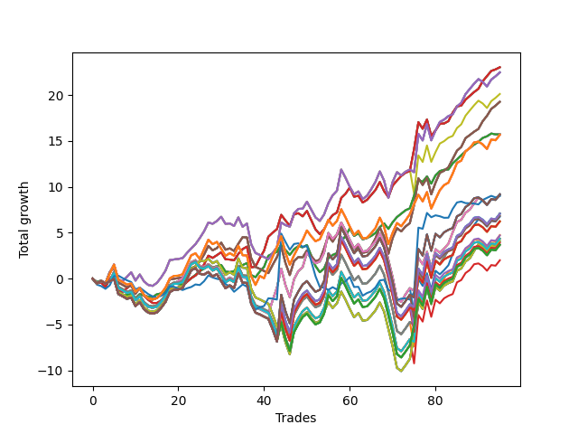

# Long Bulldog 005 
- Symbol: SPY_Unlimited
- Date Range: 03/23/2022 - 07/08/2022
- Trading Period: 7:20-12:30
- Number of Trades: 95



| Name | Win Percent | Profit | Avg Profit / Trade | Avg Time / Trade |      | Name | Win Percent | Profit | Avg Profit / Trade | Avg Time / Trade |
| ---- | ----------- | ------ | ------------------ | ---------------- | ---- | ---- | ----------- | ------ | ------------------ | ---------------- |
| Sorted By <br> Profit | | | | | | Sorted By <br> Win Percentage ||||
| Sixty-Five | 73.68 | 11515.00 | 121.21 | 15:27 |     | Sixty-Five | 73.68 | 11515.00 | 121.21 | 15:27 |
| Fifty-Seven | 73.68 | 11515.00 | 121.21 | 15:27 |     | Fifty-Seven | 73.68 | 11515.00 | 121.21 | 15:27 |
| Forty-Nine | 73.68 | 11515.00 | 121.21 | 15:27 |     | Forty-Nine | 73.68 | 11515.00 | 121.21 | 15:27 |
| Forty-One | 73.68 | 11515.00 | 121.21 | 15:27 |     | Forty-One | 73.68 | 11515.00 | 121.21 | 15:27 |
| One | 73.68 | 11515.00 | 121.21 | 15:27 |     | One | 73.68 | 11515.00 | 121.21 | 15:27 |
| Sixty-Six | 64.21 | 11235.00 | 118.26 | 20:18 |     | Sixty-Four | 71.58 | 7860.00 | 82.74 | 09:29 |
| Fifty-Eight | 64.21 | 11235.00 | 118.26 | 20:18 |     | Fifty-Six | 71.58 | 7860.00 | 82.74 | 09:29 |
| Forty-Two | 64.21 | 11235.00 | 118.26 | 20:18 |     | Forty-Eight | 71.58 | 7860.00 | 82.74 | 09:29 |
| Two | 64.21 | 11235.00 | 118.26 | 20:18 |     | Forty | 71.58 | 7860.00 | 82.74 | 09:29 |
| Fifty | 64.21 | 10060.00 | 105.89 | 20:15 |     | Zero | 71.58 | 7860.00 | 82.74 | 09:29 |
| Sixty-Seven | 65.26 | 9635.00 | 101.42 | 21:08 |     | Sixty-Seven | 65.26 | 9635.00 | 101.42 | 21:08 |
| Fifty-Nine | 65.26 | 9635.00 | 101.42 | 21:08 |     | Fifty-Nine | 65.26 | 9635.00 | 101.42 | 21:08 |
| Fifty-One | 65.26 | 9635.00 | 101.42 | 21:08 |     | Fifty-One | 65.26 | 9635.00 | 101.42 | 21:08 |
| Forty-Three | 65.26 | 9635.00 | 101.42 | 21:08 |     | Forty-Three | 65.26 | 9635.00 | 101.42 | 21:08 |
| Three | 65.26 | 9635.00 | 101.42 | 21:08 |     | Three | 65.26 | 9635.00 | 101.42 | 21:08 |
| Sixty-Four | 71.58 | 7860.00 | 82.74 | 09:29 |     | Sixty-Six | 64.21 | 11235.00 | 118.26 | 20:18 |
| Fifty-Six | 71.58 | 7860.00 | 82.74 | 09:29 |     | Fifty-Eight | 64.21 | 11235.00 | 118.26 | 20:18 |
| Forty-Eight | 71.58 | 7860.00 | 82.74 | 09:29 |     | Forty-Two | 64.21 | 11235.00 | 118.26 | 20:18 |
| Forty | 71.58 | 7860.00 | 82.74 | 09:29 |     | Two | 64.21 | 11235.00 | 118.26 | 20:18 |
| Zero | 71.58 | 7860.00 | 82.74 | 09:29 |     | Fifty | 64.21 | 10060.00 | 105.89 | 20:15 |
| One Hundred Twenty-Six | 62.11 | 7835.00 | 82.47 | 23:53 |     | One Hundred Twenty-Six | 62.11 | 7835.00 | 82.47 | 23:53 |
| One Hundred Twenty-One | 62.11 | 7835.00 | 82.47 | 23:53 |     | One Hundred Twenty-One | 62.11 | 7835.00 | 82.47 | 23:53 |
| One Hundred Sixteen | 62.11 | 7835.00 | 82.47 | 23:53 |     | One Hundred Sixteen | 62.11 | 7835.00 | 82.47 | 23:53 |
| One Hundred Eleven | 62.11 | 7835.00 | 82.47 | 23:53 |     | One Hundred Eleven | 62.11 | 7835.00 | 82.47 | 23:53 |
| Eighty-One | 62.11 | 7835.00 | 82.47 | 23:53 |     | Eighty-One | 62.11 | 7835.00 | 82.47 | 23:53 |
| One Hundred Thirty | 52.63 | 4595.00 | 48.37 | 29:14 |     | Sixty-Eight | 54.74 | 4545.00 | 47.84 | 26:50 |
| One Hundred Twenty-Five | 52.63 | 4595.00 | 48.37 | 29:14 |     | Sixty | 54.74 | 4545.00 | 47.84 | 26:50 |
| One Hundred Fifteen | 52.63 | 4595.00 | 48.37 | 29:14 |     | Forty-Four | 54.74 | 4545.00 | 47.84 | 26:50 |
| Eighty-Five | 52.63 | 4595.00 | 48.37 | 29:14 |     | Four | 54.74 | 4545.00 | 47.84 | 26:50 |
| Sixty-Eight | 54.74 | 4545.00 | 47.84 | 26:50 |     | Fifty-Two | 54.74 | 3370.00 | 35.47 | 26:48 |
| Sixty | 54.74 | 4545.00 | 47.84 | 26:50 |     | Seventy | 54.74 | 2045.00 | 21.53 | 27:33 |
| Forty-Four | 54.74 | 4545.00 | 47.84 | 26:50 |     | Sixty-Two | 54.74 | 2045.00 | 21.53 | 27:33 |
| Four | 54.74 | 4545.00 | 47.84 | 26:50 |     | Fifty-Four | 54.74 | 2045.00 | 21.53 | 27:33 |
| Seventy-Three | 47.37 | 4505.00 | 47.42 | 11:18 |     | Forty-Six | 54.74 | 2045.00 | 21.53 | 27:33 |
| Sixty-Nine | 52.63 | 3545.00 | 37.32 | 28:22 |     | Six | 54.74 | 2045.00 | 21.53 | 27:33 |
| Sixty-One | 52.63 | 3545.00 | 37.32 | 28:22 |     | One Hundred Twenty-Seven | 53.68 | 1845.00 | 19.42 | 28:18 |
| Forty-Five | 52.63 | 3545.00 | 37.32 | 28:22 |     | One Hundred Twenty-Two | 53.68 | 1845.00 | 19.42 | 28:18 |
| Five | 52.63 | 3545.00 | 37.32 | 28:22 |     | One Hundred Seventeen | 53.68 | 1845.00 | 19.42 | 28:18 |
| One Hundred Twenty-Nine | 52.63 | 3530.00 | 37.16 | 29:13 |     | One Hundred Twelve | 53.68 | 1845.00 | 19.42 | 28:18 |
| One Hundred Twenty-Four | 52.63 | 3530.00 | 37.16 | 29:13 |     | Eighty-Two | 53.68 | 1845.00 | 19.42 | 28:18 |
| One Hundred Fourteen | 52.63 | 3530.00 | 37.16 | 29:13 |     | One Hundred Thirty | 52.63 | 4595.00 | 48.37 | 29:14 |
| Eighty-Four | 52.63 | 3530.00 | 37.16 | 29:13 |     | One Hundred Twenty-Five | 52.63 | 4595.00 | 48.37 | 29:14 |
| One Hundred Twenty | 52.63 | 3420.00 | 36.00 | 29:11 |     | One Hundred Fifteen | 52.63 | 4595.00 | 48.37 | 29:14 |
| Fifty-Two | 54.74 | 3370.00 | 35.47 | 26:48 |     | Eighty-Five | 52.63 | 4595.00 | 48.37 | 29:14 |
| One Hundred Twenty-Eight | 52.63 | 3120.00 | 32.84 | 28:58 |     | Sixty-Nine | 52.63 | 3545.00 | 37.32 | 28:22 |
| One Hundred Twenty-Three | 52.63 | 3120.00 | 32.84 | 28:58 |     | Sixty-One | 52.63 | 3545.00 | 37.32 | 28:22 |
| One Hundred Thirteen | 52.63 | 3120.00 | 32.84 | 28:58 |     | Forty-Five | 52.63 | 3545.00 | 37.32 | 28:22 |
| Eighty-Three | 52.63 | 3120.00 | 32.84 | 28:58 |     | Five | 52.63 | 3545.00 | 37.32 | 28:22 |
| Fifty-Three | 52.63 | 2370.00 | 24.95 | 28:19 |     | One Hundred Twenty-Nine | 52.63 | 3530.00 | 37.16 | 29:13 |
| One Hundred Ninteen | 52.63 | 2355.00 | 24.79 | 29:10 |     | One Hundred Twenty-Four | 52.63 | 3530.00 | 37.16 | 29:13 |
| Seventy-One | 52.63 | 2175.00 | 22.89 | 28:35 |     | One Hundred Fourteen | 52.63 | 3530.00 | 37.16 | 29:13 |
| Sixty-Three | 52.63 | 2175.00 | 22.89 | 28:35 |     | Eighty-Four | 52.63 | 3530.00 | 37.16 | 29:13 |
| Forty-Seven | 52.63 | 2175.00 | 22.89 | 28:35 |     | One Hundred Twenty | 52.63 | 3420.00 | 36.00 | 29:11 |
| Seven | 52.63 | 2175.00 | 22.89 | 28:35 |     | One Hundred Twenty-Eight | 52.63 | 3120.00 | 32.84 | 28:58 |
| Seventy | 54.74 | 2045.00 | 21.53 | 27:33 |     | One Hundred Twenty-Three | 52.63 | 3120.00 | 32.84 | 28:58 |
| Sixty-Two | 54.74 | 2045.00 | 21.53 | 27:33 |     | One Hundred Thirteen | 52.63 | 3120.00 | 32.84 | 28:58 |
| Fifty-Four | 54.74 | 2045.00 | 21.53 | 27:33 |     | Eighty-Three | 52.63 | 3120.00 | 32.84 | 28:58 |
| Forty-Six | 54.74 | 2045.00 | 21.53 | 27:33 |     | Fifty-Three | 52.63 | 2370.00 | 24.95 | 28:19 |
| Six | 54.74 | 2045.00 | 21.53 | 27:33 |     | One Hundred Ninteen | 52.63 | 2355.00 | 24.79 | 29:10 |
| One Hundred Eighteen | 52.63 | 1945.00 | 20.47 | 28:55 |     | Seventy-One | 52.63 | 2175.00 | 22.89 | 28:35 |
| One Hundred Twenty-Seven | 53.68 | 1845.00 | 19.42 | 28:18 |     | Sixty-Three | 52.63 | 2175.00 | 22.89 | 28:35 |
| One Hundred Twenty-Two | 53.68 | 1845.00 | 19.42 | 28:18 |     | Forty-Seven | 52.63 | 2175.00 | 22.89 | 28:35 |
| One Hundred Seventeen | 53.68 | 1845.00 | 19.42 | 28:18 |     | Seven | 52.63 | 2175.00 | 22.89 | 28:35 |
| One Hundred Twelve | 53.68 | 1845.00 | 19.42 | 28:18 |     | One Hundred Eighteen | 52.63 | 1945.00 | 20.47 | 28:55 |
| Eighty-Two | 53.68 | 1845.00 | 19.42 | 28:18 |     | Fifty-Five | 52.63 | 1000.00 | 10.53 | 28:32 |
| Fifty-Five | 52.63 | 1000.00 | 10.53 | 28:32 |     | Seventy-Three | 47.37 | 4505.00 | 47.42 | 11:18 |

## NO STOPLOSS

### Test Zero
* Sell when price hits the middle line of the 20p bollinger
* No Stoploss
* Results:
```
Total Trades: 95
Percent Up: 71.58
Percent Down: 28.42
Total Points Moved Up: 15.72
Potential Profit: 7860.00
Total Points Ups: 29.91 Count Ups: 68
Total Points Downs: -14.19 Count Downs: 27
```

<details><summary>Trades</summary>

<code>In: 2022-03-23 10:23:00		Out: 2022-03-23 10:38:15		Total Position Time: 15:15		Total Move Up: -0.35		Total to Date: -0.35</code> <br />
<code>In: 2022-03-23 10:28:00		Out: 2022-03-23 10:38:15		Total Position Time: 10:15		Total Move Up: 0.14		Total to Date: -0.21</code> <br />
<code>In: 2022-03-25 08:14:00		Out: 2022-03-25 08:36:40		Total Position Time: 22:40		Total Move Up: -0.60		Total to Date: -0.81</code> <br />
<code>In: 2022-03-25 08:29:00		Out: 2022-03-25 08:36:40		Total Position Time: 07:40		Total Move Up: 0.77		Total to Date: -0.04</code> <br />
<code>In: 2022-03-28 07:39:00		Out: 2022-03-28 07:42:50		Total Position Time: 03:50		Total Move Up: 0.28		Total to Date: 0.24</code> <br />
<code>In: 2022-03-28 08:27:00		Out: 2022-03-28 08:56:55		Total Position Time: 29:55		Total Move Up: -1.64		Total to Date: -1.40</code> <br />
<code>In: 2022-03-28 08:38:00		Out: 2022-03-28 09:01:45		Total Position Time: 23:45		Total Move Up: -0.49		Total to Date: -1.89</code> <br />
<code>In: 2022-03-28 08:51:00		Out: 2022-03-28 09:01:45		Total Position Time: 10:45		Total Move Up: 0.13		Total to Date: -1.76</code> <br />
<code>In: 2022-03-28 08:55:00		Out: 2022-03-28 09:01:45		Total Position Time: 06:45		Total Move Up: 0.18		Total to Date: -1.58</code> <br />
<code>In: 2022-03-30 08:02:00		Out: 2022-03-30 08:19:15		Total Position Time: 17:15		Total Move Up: -0.55		Total to Date: -2.13</code> <br />
<code>In: 2022-03-30 08:13:00		Out: 2022-03-30 08:19:15		Total Position Time: 06:15		Total Move Up: 0.45		Total to Date: -1.68</code> <br />
<code>In: 2022-03-30 12:00:00		Out: 2022-03-30 12:15:25		Total Position Time: 15:25		Total Move Up: -0.15		Total to Date: -1.83</code> <br />
<code>In: 2022-03-30 12:03:00		Out: 2022-03-30 12:15:25		Total Position Time: 12:25		Total Move Up: -0.15		Total to Date: -1.98</code> <br />
<code>In: 2022-03-30 12:06:00		Out: 2022-03-30 12:15:25		Total Position Time: 09:25		Total Move Up: -0.03		Total to Date: -2.01</code> <br />
<code>In: 2022-03-30 12:13:00		Out: 2022-03-30 12:15:25		Total Position Time: 02:25		Total Move Up: 0.31		Total to Date: -1.70</code> <br />
<code>In: 2022-03-30 12:20:00		Out: 2022-03-30 12:28:15		Total Position Time: 08:15		Total Move Up: 0.09		Total to Date: -1.61</code> <br />
<code>In: 2022-03-30 12:22:00		Out: 2022-03-30 12:28:15		Total Position Time: 06:15		Total Move Up: 0.22		Total to Date: -1.39</code> <br />
<code>In: 2022-03-30 12:26:00		Out: 2022-03-30 12:28:15		Total Position Time: 02:15		Total Move Up: 0.64		Total to Date: -0.75</code> <br />
<code>In: 2022-03-31 10:00:00		Out: 2022-03-31 10:04:00		Total Position Time: 04:00		Total Move Up: 0.25		Total to Date: -0.50</code> <br />
<code>In: 2022-03-31 10:08:00		Out: 2022-03-31 10:19:00		Total Position Time: 11:00		Total Move Up: -0.09		Total to Date: -0.59</code> <br />
<code>In: 2022-03-31 10:11:00		Out: 2022-03-31 10:19:00		Total Position Time: 08:00		Total Move Up: -0.06		Total to Date: -0.65</code> <br />
<code>In: 2022-04-01 07:23:00		Out: 2022-04-01 07:34:30		Total Position Time: 11:30		Total Move Up: 0.37		Total to Date: -0.28</code> <br />
<code>In: 2022-04-01 07:24:00		Out: 2022-04-01 07:34:30		Total Position Time: 10:30		Total Move Up: 0.32		Total to Date: 0.04</code> <br />
<code>In: 2022-04-06 09:22:00		Out: 2022-04-06 09:31:15		Total Position Time: 09:15		Total Move Up: 0.37		Total to Date: 0.41</code> <br />
<code>In: 2022-04-07 07:23:00		Out: 2022-04-07 07:25:15		Total Position Time: 02:15		Total Move Up: 0.41		Total to Date: 0.82</code> <br />
<code>In: 2022-04-07 07:43:00		Out: 2022-04-07 07:53:05		Total Position Time: 10:05		Total Move Up: 0.28		Total to Date: 1.10</code> <br />
<code>In: 2022-04-07 07:45:00		Out: 2022-04-07 07:53:05		Total Position Time: 08:05		Total Move Up: 0.49		Total to Date: 1.59</code> <br />
<code>In: 2022-04-11 07:30:00		Out: 2022-04-11 07:51:10		Total Position Time: 21:10		Total Move Up: -0.39		Total to Date: 1.20</code> <br />
<code>In: 2022-04-12 09:28:00		Out: 2022-04-12 09:41:30		Total Position Time: 13:30		Total Move Up: 0.17		Total to Date: 1.37</code> <br />
<code>In: 2022-04-12 11:35:00		Out: 2022-04-12 11:35:45		Total Position Time: 00:45		Total Move Up: 0.12		Total to Date: 1.49</code> <br />
<code>In: 2022-04-18 08:26:00		Out: 2022-04-18 08:54:55		Total Position Time: 28:55		Total Move Up: -0.72		Total to Date: 0.77</code> <br />
<code>In: 2022-04-18 09:17:00		Out: 2022-04-18 09:32:05		Total Position Time: 15:05		Total Move Up: -0.06		Total to Date: 0.71</code> <br />
<code>In: 2022-04-20 11:38:00		Out: 2022-04-20 11:48:15		Total Position Time: 10:15		Total Move Up: 0.11		Total to Date: 0.82</code> <br />
<code>In: 2022-04-20 11:58:00		Out: 2022-04-20 12:01:15		Total Position Time: 03:15		Total Move Up: 0.44		Total to Date: 1.26</code> <br />
<code>In: 2022-04-21 07:22:00		Out: 2022-04-21 07:28:20		Total Position Time: 06:20		Total Move Up: 0.22		Total to Date: 1.48</code> <br />
<code>In: 2022-04-21 07:50:00		Out: 2022-04-21 08:01:10		Total Position Time: 11:10		Total Move Up: 0.21		Total to Date: 1.69</code> <br />
<code>In: 2022-04-29 07:22:00		Out: 2022-04-29 07:44:45		Total Position Time: 22:45		Total Move Up: -1.30		Total to Date: 0.39</code> <br />
<code>In: 2022-05-02 09:56:00		Out: 2022-05-02 10:08:15		Total Position Time: 12:15		Total Move Up: -0.23		Total to Date: 0.16</code> <br />
<code>In: 2022-05-02 10:01:00		Out: 2022-05-02 10:08:15		Total Position Time: 07:15		Total Move Up: 0.61		Total to Date: 0.77</code> <br />
<code>In: 2022-05-02 10:02:00		Out: 2022-05-02 10:08:15		Total Position Time: 06:15		Total Move Up: 0.51		Total to Date: 1.28</code> <br />
<code>In: 2022-05-02 10:05:00		Out: 2022-05-02 10:08:15		Total Position Time: 03:15		Total Move Up: 1.21		Total to Date: 2.49</code> <br />
<code>In: 2022-05-02 10:48:00		Out: 2022-05-02 10:59:15		Total Position Time: 11:15		Total Move Up: 0.24		Total to Date: 2.73</code> <br />
<code>In: 2022-05-02 10:49:00		Out: 2022-05-02 10:59:15		Total Position Time: 10:15		Total Move Up: 0.18		Total to Date: 2.91</code> <br />
<code>In: 2022-05-04 11:36:00		Out: 2022-05-04 11:36:40		Total Position Time: 00:40		Total Move Up: 0.80		Total to Date: 3.71</code> <br />
<code>In: 2022-05-09 07:26:00		Out: 2022-05-09 07:42:30		Total Position Time: 16:30		Total Move Up: -0.58		Total to Date: 3.13</code> <br />
<code>In: 2022-05-11 09:59:00		Out: 2022-05-11 10:15:20		Total Position Time: 16:20		Total Move Up: -0.55		Total to Date: 2.58</code> <br />
<code>In: 2022-05-11 11:00:00		Out: 2022-05-11 11:00:40		Total Position Time: 00:40		Total Move Up: 0.63		Total to Date: 3.21</code> <br />
<code>In: 2022-05-12 11:34:00		Out: 2022-05-12 11:45:20		Total Position Time: 11:20		Total Move Up: 0.33		Total to Date: 3.54</code> <br />
<code>In: 2022-05-12 11:35:00		Out: 2022-05-12 11:45:20		Total Position Time: 10:20		Total Move Up: -0.12		Total to Date: 3.42</code> <br />
<code>In: 2022-05-13 11:07:00		Out: 2022-05-13 11:19:15		Total Position Time: 12:15		Total Move Up: 0.24		Total to Date: 3.66</code> <br />
<code>In: 2022-05-17 07:31:00		Out: 2022-05-17 07:55:10		Total Position Time: 24:10		Total Move Up: -1.14		Total to Date: 2.52</code> <br />
<code>In: 2022-05-17 07:33:00		Out: 2022-05-17 07:55:10		Total Position Time: 22:10		Total Move Up: -1.15		Total to Date: 1.37</code> <br />
<code>In: 2022-05-17 07:38:00		Out: 2022-05-17 07:55:10		Total Position Time: 17:10		Total Move Up: -0.67		Total to Date: 0.70</code> <br />
<code>In: 2022-05-17 07:47:00		Out: 2022-05-17 07:55:10		Total Position Time: 08:10		Total Move Up: 0.41		Total to Date: 1.11</code> <br />
<code>In: 2022-05-17 11:24:00		Out: 2022-05-17 11:27:25		Total Position Time: 03:25		Total Move Up: 1.11		Total to Date: 2.22</code> <br />
<code>In: 2022-05-18 08:32:00		Out: 2022-05-18 08:36:55		Total Position Time: 04:55		Total Move Up: 0.36		Total to Date: 2.58</code> <br />
<code>In: 2022-05-25 09:29:00		Out: 2022-05-25 09:38:55		Total Position Time: 09:55		Total Move Up: 0.20		Total to Date: 2.78</code> <br />
<code>In: 2022-05-25 11:09:00		Out: 2022-05-25 11:10:20		Total Position Time: 01:20		Total Move Up: 1.28		Total to Date: 4.06</code> <br />
<code>In: 2022-06-03 07:40:00		Out: 2022-06-03 07:46:35		Total Position Time: 06:35		Total Move Up: 0.59		Total to Date: 4.65</code> <br />
<code>In: 2022-06-03 07:42:00		Out: 2022-06-03 07:46:35		Total Position Time: 04:35		Total Move Up: 0.82		Total to Date: 5.47</code> <br />
<code>In: 2022-06-06 08:14:00		Out: 2022-06-06 08:31:35		Total Position Time: 17:35		Total Move Up: -0.82		Total to Date: 4.65</code> <br />
<code>In: 2022-06-06 08:19:00		Out: 2022-06-06 08:31:35		Total Position Time: 12:35		Total Move Up: 0.29		Total to Date: 4.94</code> <br />
<code>In: 2022-06-06 09:06:00		Out: 2022-06-06 09:26:35		Total Position Time: 20:35		Total Move Up: -0.66		Total to Date: 4.28</code> <br />
<code>In: 2022-06-08 09:41:00		Out: 2022-06-08 09:53:00		Total Position Time: 12:00		Total Move Up: 0.14		Total to Date: 4.42</code> <br />
<code>In: 2022-06-08 10:35:00		Out: 2022-06-08 10:42:15		Total Position Time: 07:15		Total Move Up: 0.24		Total to Date: 4.66</code> <br />
<code>In: 2022-06-09 08:06:00		Out: 2022-06-09 08:10:55		Total Position Time: 04:55		Total Move Up: 0.32		Total to Date: 4.98</code> <br />
<code>In: 2022-06-09 08:09:00		Out: 2022-06-09 08:10:55		Total Position Time: 01:55		Total Move Up: 0.63		Total to Date: 5.61</code> <br />
<code>In: 2022-06-09 11:26:00		Out: 2022-06-09 11:28:10		Total Position Time: 02:10		Total Move Up: 0.41		Total to Date: 6.02</code> <br />
<code>In: 2022-06-09 12:03:00		Out: 2022-06-09 12:19:25		Total Position Time: 16:25		Total Move Up: -0.60		Total to Date: 5.42</code> <br />
<code>In: 2022-06-13 12:15:00		Out: 2022-06-13 12:16:50		Total Position Time: 01:50		Total Move Up: 0.73		Total to Date: 6.15</code> <br />
<code>In: 2022-06-13 12:17:00		Out: 2022-06-13 12:17:10		Total Position Time: 00:10		Total Move Up: 0.56		Total to Date: 6.71</code> <br />
<code>In: 2022-06-15 07:57:00		Out: 2022-06-15 07:58:55		Total Position Time: 01:55		Total Move Up: 0.37		Total to Date: 7.08</code> <br />
<code>In: 2022-06-15 08:15:00		Out: 2022-06-15 08:24:20		Total Position Time: 09:20		Total Move Up: 0.37		Total to Date: 7.45</code> <br />
<code>In: 2022-06-15 08:16:00		Out: 2022-06-15 08:24:20		Total Position Time: 08:20		Total Move Up: 0.21		Total to Date: 7.66</code> <br />
<code>In: 2022-06-15 11:08:00		Out: 2022-06-15 11:15:55		Total Position Time: 07:55		Total Move Up: 1.39		Total to Date: 9.05</code> <br />
<code>In: 2022-06-15 11:34:00		Out: 2022-06-15 11:37:20		Total Position Time: 03:20		Total Move Up: 1.71		Total to Date: 10.76</code> <br />
<code>In: 2022-06-16 11:02:00		Out: 2022-06-16 11:14:35		Total Position Time: 12:35		Total Move Up: -0.21		Total to Date: 10.55</code> <br />
<code>In: 2022-06-16 11:51:00		Out: 2022-06-16 12:00:20		Total Position Time: 09:20		Total Move Up: 0.59		Total to Date: 11.14</code> <br />
<code>In: 2022-06-17 07:24:00		Out: 2022-06-17 07:44:55		Total Position Time: 20:55		Total Move Up: -0.79		Total to Date: 10.35</code> <br />
<code>In: 2022-06-17 07:37:00		Out: 2022-06-17 07:44:55		Total Position Time: 07:55		Total Move Up: 0.91		Total to Date: 11.26</code> <br />
<code>In: 2022-06-23 09:06:00		Out: 2022-06-23 09:14:30		Total Position Time: 08:30		Total Move Up: 0.46		Total to Date: 11.72</code> <br />
<code>In: 2022-06-23 09:54:00		Out: 2022-06-23 09:54:10		Total Position Time: 00:10		Total Move Up: 0.14		Total to Date: 11.86</code> <br />
<code>In: 2022-06-27 11:02:00		Out: 2022-06-27 11:02:45		Total Position Time: 00:45		Total Move Up: 0.03		Total to Date: 11.89</code> <br />
<code>In: 2022-06-27 12:07:00		Out: 2022-06-27 12:10:20		Total Position Time: 03:20		Total Move Up: 0.67		Total to Date: 12.56</code> <br />
<code>In: 2022-06-29 08:25:00		Out: 2022-06-29 08:28:25		Total Position Time: 03:25		Total Move Up: 0.43		Total to Date: 12.99</code> <br />
<code>In: 2022-06-29 09:15:00		Out: 2022-06-29 09:21:05		Total Position Time: 06:05		Total Move Up: 0.45		Total to Date: 13.44</code> <br />
<code>In: 2022-06-29 09:29:00		Out: 2022-06-29 09:36:40		Total Position Time: 07:40		Total Move Up: 0.43		Total to Date: 13.87</code> <br />
<code>In: 2022-07-05 08:02:00		Out: 2022-07-05 08:08:25		Total Position Time: 06:25		Total Move Up: 0.37		Total to Date: 14.24</code> <br />
<code>In: 2022-07-05 08:04:00		Out: 2022-07-05 08:08:25		Total Position Time: 04:25		Total Move Up: 0.36		Total to Date: 14.60</code> <br />
<code>In: 2022-07-05 08:07:00		Out: 2022-07-05 08:08:25		Total Position Time: 01:25		Total Move Up: 0.30		Total to Date: 14.90</code> <br />
<code>In: 2022-07-06 08:05:00		Out: 2022-07-06 08:14:30		Total Position Time: 09:30		Total Move Up: 0.43		Total to Date: 15.33</code> <br />
<code>In: 2022-07-06 08:06:00		Out: 2022-07-06 08:14:30		Total Position Time: 08:30		Total Move Up: 0.18		Total to Date: 15.51</code> <br />
<code>In: 2022-07-06 08:34:00		Out: 2022-07-06 08:46:05		Total Position Time: 12:05		Total Move Up: 0.30		Total to Date: 15.81</code> <br />
<code>In: 2022-07-06 08:35:00		Out: 2022-07-06 08:46:05		Total Position Time: 11:05		Total Move Up: -0.09		Total to Date: 15.72</code> <br />
<code>In: 2022-07-06 08:46:00		Out: 2022-07-06 08:46:15		Total Position Time: 00:15		Total Move Up: 0.00		Total to Date: 15.72</code> <br />


</details>

### Test One
* Sell when the price hits the upper line of the 20p 1std bollinger
* No Stoploss
* Results:
```
Total Trades: 95
Percent Up: 73.68
Percent Down: 26.32
Total Points Moved Up: 23.03
Potential Profit: 11515.00
Total Points Ups: 41.66 Count Ups: 70
Total Points Downs: -18.63 Count Downs: 25
```

<details><summary>Trades</summary>

<code>In: 2022-03-23 10:23:00		Out: 2022-03-23 10:51:45		Total Position Time: 28:45		Total Move Up: -0.46		Total to Date: -0.46</code> <br />
<code>In: 2022-03-23 10:28:00		Out: 2022-03-23 10:51:45		Total Position Time: 23:45		Total Move Up: 0.03		Total to Date: -0.43</code> <br />
<code>In: 2022-03-25 08:14:00		Out: 2022-03-25 08:41:05		Total Position Time: 27:05		Total Move Up: -0.48		Total to Date: -0.91</code> <br />
<code>In: 2022-03-25 08:29:00		Out: 2022-03-25 08:41:05		Total Position Time: 12:05		Total Move Up: 0.89		Total to Date: -0.02</code> <br />
<code>In: 2022-03-28 07:39:00		Out: 2022-03-28 07:44:55		Total Position Time: 05:55		Total Move Up: 0.48		Total to Date: 0.46</code> <br />
<code>In: 2022-03-28 08:27:00		Out: 2022-03-28 08:56:55		Total Position Time: 29:55		Total Move Up: -1.64		Total to Date: -1.18</code> <br />
<code>In: 2022-03-28 08:38:00		Out: 2022-03-28 09:04:40		Total Position Time: 26:40		Total Move Up: -0.24		Total to Date: -1.42</code> <br />
<code>In: 2022-03-28 08:51:00		Out: 2022-03-28 09:04:40		Total Position Time: 13:40		Total Move Up: 0.38		Total to Date: -1.04</code> <br />
<code>In: 2022-03-28 08:55:00		Out: 2022-03-28 09:04:40		Total Position Time: 09:40		Total Move Up: 0.43		Total to Date: -0.61</code> <br />
<code>In: 2022-03-30 08:02:00		Out: 2022-03-30 08:31:55		Total Position Time: 29:55		Total Move Up: -0.90		Total to Date: -1.51</code> <br />
<code>In: 2022-03-30 08:13:00		Out: 2022-03-30 08:34:40		Total Position Time: 21:40		Total Move Up: 0.42		Total to Date: -1.09</code> <br />
<code>In: 2022-03-30 12:00:00		Out: 2022-03-30 12:29:55		Total Position Time: 29:55		Total Move Up: -0.76		Total to Date: -1.85</code> <br />
<code>In: 2022-03-30 12:03:00		Out: 2022-03-30 12:32:20		Total Position Time: 29:20		Total Move Up: -0.46		Total to Date: -2.31</code> <br />
<code>In: 2022-03-30 12:06:00		Out: 2022-03-30 12:32:20		Total Position Time: 26:20		Total Move Up: -0.34		Total to Date: -2.65</code> <br />
<code>In: 2022-03-30 12:13:00		Out: 2022-03-30 12:32:20		Total Position Time: 19:20		Total Move Up: 0.00		Total to Date: -2.65</code> <br />
<code>In: 2022-03-30 12:20:00		Out: 2022-03-30 12:32:20		Total Position Time: 12:20		Total Move Up: 0.27		Total to Date: -2.38</code> <br />
<code>In: 2022-03-30 12:22:00		Out: 2022-03-30 12:32:20		Total Position Time: 10:20		Total Move Up: 0.40		Total to Date: -1.98</code> <br />
<code>In: 2022-03-30 12:26:00		Out: 2022-03-30 12:32:20		Total Position Time: 06:20		Total Move Up: 0.82		Total to Date: -1.16</code> <br />
<code>In: 2022-03-31 10:00:00		Out: 2022-03-31 10:19:40		Total Position Time: 19:40		Total Move Up: 0.11		Total to Date: -1.05</code> <br />
<code>In: 2022-03-31 10:08:00		Out: 2022-03-31 10:19:40		Total Position Time: 11:40		Total Move Up: 0.10		Total to Date: -0.95</code> <br />
<code>In: 2022-03-31 10:11:00		Out: 2022-03-31 10:19:40		Total Position Time: 08:40		Total Move Up: 0.13		Total to Date: -0.82</code> <br />
<code>In: 2022-04-01 07:23:00		Out: 2022-04-01 07:38:20		Total Position Time: 15:20		Total Move Up: 0.46		Total to Date: -0.36</code> <br />
<code>In: 2022-04-01 07:24:00		Out: 2022-04-01 07:38:20		Total Position Time: 14:20		Total Move Up: 0.41		Total to Date: 0.05</code> <br />
<code>In: 2022-04-06 09:22:00		Out: 2022-04-06 09:33:05		Total Position Time: 11:05		Total Move Up: 0.29		Total to Date: 0.34</code> <br />
<code>In: 2022-04-07 07:23:00		Out: 2022-04-07 07:31:05		Total Position Time: 08:05		Total Move Up: 0.47		Total to Date: 0.81</code> <br />
<code>In: 2022-04-07 07:43:00		Out: 2022-04-07 08:00:05		Total Position Time: 17:05		Total Move Up: 0.74		Total to Date: 1.55</code> <br />
<code>In: 2022-04-07 07:45:00		Out: 2022-04-07 08:00:05		Total Position Time: 15:05		Total Move Up: 0.95		Total to Date: 2.50</code> <br />
<code>In: 2022-04-11 07:30:00		Out: 2022-04-11 07:52:00		Total Position Time: 22:00		Total Move Up: -0.24		Total to Date: 2.26</code> <br />
<code>In: 2022-04-12 09:28:00		Out: 2022-04-12 09:50:15		Total Position Time: 22:15		Total Move Up: 0.30		Total to Date: 2.56</code> <br />
<code>In: 2022-04-12 11:35:00		Out: 2022-04-12 11:37:25		Total Position Time: 02:25		Total Move Up: 0.32		Total to Date: 2.88</code> <br />
<code>In: 2022-04-18 08:26:00		Out: 2022-04-18 08:55:55		Total Position Time: 29:55		Total Move Up: -0.77		Total to Date: 2.11</code> <br />
<code>In: 2022-04-18 09:17:00		Out: 2022-04-18 09:35:10		Total Position Time: 18:10		Total Move Up: -0.03		Total to Date: 2.08</code> <br />
<code>In: 2022-04-20 11:38:00		Out: 2022-04-20 12:04:20		Total Position Time: 26:20		Total Move Up: -0.09		Total to Date: 1.99</code> <br />
<code>In: 2022-04-20 11:58:00		Out: 2022-04-20 12:04:20		Total Position Time: 06:20		Total Move Up: 0.71		Total to Date: 2.70</code> <br />
<code>In: 2022-04-21 07:22:00		Out: 2022-04-21 07:29:20		Total Position Time: 07:20		Total Move Up: 0.52		Total to Date: 3.22</code> <br />
<code>In: 2022-04-21 07:50:00		Out: 2022-04-21 08:05:05		Total Position Time: 15:05		Total Move Up: 0.27		Total to Date: 3.49</code> <br />
<code>In: 2022-04-29 07:22:00		Out: 2022-04-29 07:51:55		Total Position Time: 29:55		Total Move Up: -2.26		Total to Date: 1.23</code> <br />
<code>In: 2022-05-02 09:56:00		Out: 2022-05-02 10:10:55		Total Position Time: 14:55		Total Move Up: 0.08		Total to Date: 1.31</code> <br />
<code>In: 2022-05-02 10:01:00		Out: 2022-05-02 10:10:55		Total Position Time: 09:55		Total Move Up: 0.92		Total to Date: 2.23</code> <br />
<code>In: 2022-05-02 10:02:00		Out: 2022-05-02 10:10:55		Total Position Time: 08:55		Total Move Up: 0.82		Total to Date: 3.05</code> <br />
<code>In: 2022-05-02 10:05:00		Out: 2022-05-02 10:10:55		Total Position Time: 05:55		Total Move Up: 1.52		Total to Date: 4.57</code> <br />
<code>In: 2022-05-02 10:48:00		Out: 2022-05-02 11:02:25		Total Position Time: 14:25		Total Move Up: 0.44		Total to Date: 5.01</code> <br />
<code>In: 2022-05-02 10:49:00		Out: 2022-05-02 11:02:25		Total Position Time: 13:25		Total Move Up: 0.38		Total to Date: 5.39</code> <br />
<code>In: 2022-05-04 11:36:00		Out: 2022-05-04 11:41:35		Total Position Time: 05:35		Total Move Up: 1.56		Total to Date: 6.95</code> <br />
<code>In: 2022-05-09 07:26:00		Out: 2022-05-09 07:45:10		Total Position Time: 19:10		Total Move Up: -0.62		Total to Date: 6.33</code> <br />
<code>In: 2022-05-11 09:59:00		Out: 2022-05-11 10:24:20		Total Position Time: 25:20		Total Move Up: -0.56		Total to Date: 5.77</code> <br />
<code>In: 2022-05-11 11:00:00		Out: 2022-05-11 11:01:20		Total Position Time: 01:20		Total Move Up: 1.25		Total to Date: 7.02</code> <br />
<code>In: 2022-05-12 11:34:00		Out: 2022-05-12 11:52:05		Total Position Time: 18:05		Total Move Up: 0.11		Total to Date: 7.13</code> <br />
<code>In: 2022-05-12 11:35:00		Out: 2022-05-12 11:52:05		Total Position Time: 17:05		Total Move Up: -0.34		Total to Date: 6.79</code> <br />
<code>In: 2022-05-13 11:07:00		Out: 2022-05-13 11:20:00		Total Position Time: 13:00		Total Move Up: 0.59		Total to Date: 7.38</code> <br />
<code>In: 2022-05-17 07:31:00		Out: 2022-05-17 07:58:50		Total Position Time: 27:50		Total Move Up: -1.00		Total to Date: 6.38</code> <br />
<code>In: 2022-05-17 07:33:00		Out: 2022-05-17 07:58:50		Total Position Time: 25:50		Total Move Up: -1.01		Total to Date: 5.37</code> <br />
<code>In: 2022-05-17 07:38:00		Out: 2022-05-17 07:58:50		Total Position Time: 20:50		Total Move Up: -0.53		Total to Date: 4.84</code> <br />
<code>In: 2022-05-17 07:47:00		Out: 2022-05-17 07:58:50		Total Position Time: 11:50		Total Move Up: 0.55		Total to Date: 5.39</code> <br />
<code>In: 2022-05-17 11:24:00		Out: 2022-05-17 11:37:35		Total Position Time: 13:35		Total Move Up: 0.92		Total to Date: 6.31</code> <br />
<code>In: 2022-05-18 08:32:00		Out: 2022-05-18 08:41:15		Total Position Time: 09:15		Total Move Up: 0.61		Total to Date: 6.92</code> <br />
<code>In: 2022-05-25 09:29:00		Out: 2022-05-25 09:44:25		Total Position Time: 15:25		Total Move Up: 0.29		Total to Date: 7.21</code> <br />
<code>In: 2022-05-25 11:09:00		Out: 2022-05-25 11:10:25		Total Position Time: 01:25		Total Move Up: 1.58		Total to Date: 8.79</code> <br />
<code>In: 2022-06-03 07:40:00		Out: 2022-06-03 07:58:10		Total Position Time: 18:10		Total Move Up: 0.46		Total to Date: 9.25</code> <br />
<code>In: 2022-06-03 07:42:00		Out: 2022-06-03 07:58:10		Total Position Time: 16:10		Total Move Up: 0.69		Total to Date: 9.94</code> <br />
<code>In: 2022-06-06 08:14:00		Out: 2022-06-06 08:39:15		Total Position Time: 25:15		Total Move Up: -1.01		Total to Date: 8.93</code> <br />
<code>In: 2022-06-06 08:19:00		Out: 2022-06-06 08:39:15		Total Position Time: 20:15		Total Move Up: 0.10		Total to Date: 9.03</code> <br />
<code>In: 2022-06-06 09:06:00		Out: 2022-06-06 09:35:30		Total Position Time: 29:30		Total Move Up: -0.74		Total to Date: 8.29</code> <br />
<code>In: 2022-06-08 09:41:00		Out: 2022-06-08 09:59:05		Total Position Time: 18:05		Total Move Up: 0.29		Total to Date: 8.58</code> <br />
<code>In: 2022-06-08 10:35:00		Out: 2022-06-08 10:47:05		Total Position Time: 12:05		Total Move Up: 0.54		Total to Date: 9.12</code> <br />
<code>In: 2022-06-09 08:06:00		Out: 2022-06-09 08:21:10		Total Position Time: 15:10		Total Move Up: 0.55		Total to Date: 9.67</code> <br />
<code>In: 2022-06-09 08:09:00		Out: 2022-06-09 08:21:10		Total Position Time: 12:10		Total Move Up: 0.86		Total to Date: 10.53</code> <br />
<code>In: 2022-06-09 11:26:00		Out: 2022-06-09 11:55:55		Total Position Time: 29:55		Total Move Up: -1.00		Total to Date: 9.53</code> <br />
<code>In: 2022-06-09 12:03:00		Out: 2022-06-09 12:24:30		Total Position Time: 21:30		Total Move Up: -0.64		Total to Date: 8.89</code> <br />
<code>In: 2022-06-13 12:15:00		Out: 2022-06-13 12:17:10		Total Position Time: 02:10		Total Move Up: 1.24		Total to Date: 10.13</code> <br />
<code>In: 2022-06-13 12:17:00		Out: 2022-06-13 12:17:10		Total Position Time: 00:10		Total Move Up: 0.56		Total to Date: 10.69</code> <br />
<code>In: 2022-06-15 07:57:00		Out: 2022-06-15 08:07:20		Total Position Time: 10:20		Total Move Up: 0.50		Total to Date: 11.19</code> <br />
<code>In: 2022-06-15 08:15:00		Out: 2022-06-15 08:29:05		Total Position Time: 14:05		Total Move Up: 0.35		Total to Date: 11.54</code> <br />
<code>In: 2022-06-15 08:16:00		Out: 2022-06-15 08:29:05		Total Position Time: 13:05		Total Move Up: 0.19		Total to Date: 11.73</code> <br />
<code>In: 2022-06-15 11:08:00		Out: 2022-06-15 11:20:30		Total Position Time: 12:30		Total Move Up: 2.41		Total to Date: 14.14</code> <br />
<code>In: 2022-06-15 11:34:00		Out: 2022-06-15 11:38:05		Total Position Time: 04:05		Total Move Up: 2.91		Total to Date: 17.05</code> <br />
<code>In: 2022-06-16 11:02:00		Out: 2022-06-16 11:31:55		Total Position Time: 29:55		Total Move Up: -0.72		Total to Date: 16.33</code> <br />
<code>In: 2022-06-16 11:51:00		Out: 2022-06-16 12:01:05		Total Position Time: 10:05		Total Move Up: 1.01		Total to Date: 17.34</code> <br />
<code>In: 2022-06-17 07:24:00		Out: 2022-06-17 07:53:55		Total Position Time: 29:55		Total Move Up: -1.79		Total to Date: 15.55</code> <br />
<code>In: 2022-06-17 07:37:00		Out: 2022-06-17 07:56:15		Total Position Time: 19:15		Total Move Up: 0.60		Total to Date: 16.15</code> <br />
<code>In: 2022-06-23 09:06:00		Out: 2022-06-23 09:18:25		Total Position Time: 12:25		Total Move Up: 0.72		Total to Date: 16.87</code> <br />
<code>In: 2022-06-23 09:54:00		Out: 2022-06-23 09:54:15		Total Position Time: 00:15		Total Move Up: 0.04		Total to Date: 16.91</code> <br />
<code>In: 2022-06-27 11:02:00		Out: 2022-06-27 11:03:15		Total Position Time: 01:15		Total Move Up: 0.25		Total to Date: 17.16</code> <br />
<code>In: 2022-06-27 12:07:00		Out: 2022-06-27 12:12:00		Total Position Time: 05:00		Total Move Up: 0.92		Total to Date: 18.08</code> <br />
<code>In: 2022-06-29 08:25:00		Out: 2022-06-29 08:32:20		Total Position Time: 07:20		Total Move Up: 0.69		Total to Date: 18.77</code> <br />
<code>In: 2022-06-29 09:15:00		Out: 2022-06-29 09:37:15		Total Position Time: 22:15		Total Move Up: 0.09		Total to Date: 18.86</code> <br />
<code>In: 2022-06-29 09:29:00		Out: 2022-06-29 09:37:15		Total Position Time: 08:15		Total Move Up: 0.64		Total to Date: 19.50</code> <br />
<code>In: 2022-07-05 08:02:00		Out: 2022-07-05 08:16:40		Total Position Time: 14:40		Total Move Up: 0.42		Total to Date: 19.92</code> <br />
<code>In: 2022-07-05 08:04:00		Out: 2022-07-05 08:16:40		Total Position Time: 12:40		Total Move Up: 0.41		Total to Date: 20.33</code> <br />
<code>In: 2022-07-05 08:07:00		Out: 2022-07-05 08:16:40		Total Position Time: 09:40		Total Move Up: 0.35		Total to Date: 20.68</code> <br />
<code>In: 2022-07-06 08:05:00		Out: 2022-07-06 08:17:50		Total Position Time: 12:50		Total Move Up: 0.82		Total to Date: 21.50</code> <br />
<code>In: 2022-07-06 08:06:00		Out: 2022-07-06 08:17:50		Total Position Time: 11:50		Total Move Up: 0.57		Total to Date: 22.07</code> <br />
<code>In: 2022-07-06 08:34:00		Out: 2022-07-06 08:48:10		Total Position Time: 14:10		Total Move Up: 0.56		Total to Date: 22.63</code> <br />
<code>In: 2022-07-06 08:35:00		Out: 2022-07-06 08:48:10		Total Position Time: 13:10		Total Move Up: 0.17		Total to Date: 22.80</code> <br />
<code>In: 2022-07-06 08:46:00		Out: 2022-07-06 08:48:10		Total Position Time: 02:10		Total Move Up: 0.23		Total to Date: 23.03</code> <br />


</details>

### Test Two
* Sell when the price hits the upper line of the 20p 2std bollinger
* No Stoploss
* Results:
```
Total Trades: 95
Percent Up: 64.21
Percent Down: 35.79
Total Points Moved Up: 22.47
Potential Profit: 11235.00
Total Points Ups: 46.13 Count Ups: 61
Total Points Downs: -23.66 Count Downs: 34
```

<details><summary>Trades</summary>

<code>In: 2022-03-23 10:23:00		Out: 2022-03-23 10:52:55		Total Position Time: 29:55		Total Move Up: -0.52		Total to Date: -0.52</code> <br />
<code>In: 2022-03-23 10:28:00		Out: 2022-03-23 10:54:25		Total Position Time: 26:25		Total Move Up: 0.24		Total to Date: -0.28</code> <br />
<code>In: 2022-03-25 08:14:00		Out: 2022-03-25 08:41:45		Total Position Time: 27:45		Total Move Up: -0.21		Total to Date: -0.49</code> <br />
<code>In: 2022-03-25 08:29:00		Out: 2022-03-25 08:41:45		Total Position Time: 12:45		Total Move Up: 1.16		Total to Date: 0.67</code> <br />
<code>In: 2022-03-28 07:39:00		Out: 2022-03-28 07:48:05		Total Position Time: 09:05		Total Move Up: 0.88		Total to Date: 1.55</code> <br />
<code>In: 2022-03-28 08:27:00		Out: 2022-03-28 08:56:55		Total Position Time: 29:55		Total Move Up: -1.64		Total to Date: -0.09</code> <br />
<code>In: 2022-03-28 08:38:00		Out: 2022-03-28 09:07:15		Total Position Time: 29:15		Total Move Up: -0.17		Total to Date: -0.26</code> <br />
<code>In: 2022-03-28 08:51:00		Out: 2022-03-28 09:07:15		Total Position Time: 16:15		Total Move Up: 0.45		Total to Date: 0.19</code> <br />
<code>In: 2022-03-28 08:55:00		Out: 2022-03-28 09:07:15		Total Position Time: 12:15		Total Move Up: 0.50		Total to Date: 0.69</code> <br />
<code>In: 2022-03-30 08:02:00		Out: 2022-03-30 08:31:55		Total Position Time: 29:55		Total Move Up: -0.90		Total to Date: -0.21</code> <br />
<code>In: 2022-03-30 08:13:00		Out: 2022-03-30 08:35:15		Total Position Time: 22:15		Total Move Up: 0.66		Total to Date: 0.45</code> <br />
<code>In: 2022-03-30 12:00:00		Out: 2022-03-30 12:29:55		Total Position Time: 29:55		Total Move Up: -0.76		Total to Date: -0.31</code> <br />
<code>In: 2022-03-30 12:03:00		Out: 2022-03-30 12:32:55		Total Position Time: 29:55		Total Move Up: -0.38		Total to Date: -0.69</code> <br />
<code>In: 2022-03-30 12:06:00		Out: 2022-03-30 12:35:55		Total Position Time: 29:55		Total Move Up: -0.10		Total to Date: -0.79</code> <br />
<code>In: 2022-03-30 12:13:00		Out: 2022-03-30 12:36:25		Total Position Time: 23:25		Total Move Up: 0.33		Total to Date: -0.46</code> <br />
<code>In: 2022-03-30 12:20:00		Out: 2022-03-30 12:36:25		Total Position Time: 16:25		Total Move Up: 0.60		Total to Date: 0.14</code> <br />
<code>In: 2022-03-30 12:22:00		Out: 2022-03-30 12:36:25		Total Position Time: 14:25		Total Move Up: 0.73		Total to Date: 0.87</code> <br />
<code>In: 2022-03-30 12:26:00		Out: 2022-03-30 12:36:25		Total Position Time: 10:25		Total Move Up: 1.15		Total to Date: 2.02</code> <br />
<code>In: 2022-03-31 10:00:00		Out: 2022-03-31 10:27:25		Total Position Time: 27:25		Total Move Up: 0.07		Total to Date: 2.09</code> <br />
<code>In: 2022-03-31 10:08:00		Out: 2022-03-31 10:27:25		Total Position Time: 19:25		Total Move Up: 0.06		Total to Date: 2.15</code> <br />
<code>In: 2022-03-31 10:11:00		Out: 2022-03-31 10:27:25		Total Position Time: 16:25		Total Move Up: 0.09		Total to Date: 2.24</code> <br />
<code>In: 2022-04-01 07:23:00		Out: 2022-04-01 07:46:55		Total Position Time: 23:55		Total Move Up: 0.55		Total to Date: 2.79</code> <br />
<code>In: 2022-04-01 07:24:00		Out: 2022-04-01 07:46:55		Total Position Time: 22:55		Total Move Up: 0.50		Total to Date: 3.29</code> <br />
<code>In: 2022-04-06 09:22:00		Out: 2022-04-06 09:34:25		Total Position Time: 12:25		Total Move Up: 0.47		Total to Date: 3.76</code> <br />
<code>In: 2022-04-07 07:23:00		Out: 2022-04-07 07:35:40		Total Position Time: 12:40		Total Move Up: 0.66		Total to Date: 4.42</code> <br />
<code>In: 2022-04-07 07:43:00		Out: 2022-04-07 08:00:05		Total Position Time: 17:05		Total Move Up: 0.74		Total to Date: 5.16</code> <br />
<code>In: 2022-04-07 07:45:00		Out: 2022-04-07 08:00:05		Total Position Time: 15:05		Total Move Up: 0.95		Total to Date: 6.11</code> <br />
<code>In: 2022-04-11 07:30:00		Out: 2022-04-11 07:54:25		Total Position Time: 24:25		Total Move Up: -0.13		Total to Date: 5.98</code> <br />
<code>In: 2022-04-12 09:28:00		Out: 2022-04-12 09:50:15		Total Position Time: 22:15		Total Move Up: 0.30		Total to Date: 6.28</code> <br />
<code>In: 2022-04-12 11:35:00		Out: 2022-04-12 11:47:00		Total Position Time: 12:00		Total Move Up: 0.46		Total to Date: 6.74</code> <br />
<code>In: 2022-04-18 08:26:00		Out: 2022-04-18 08:55:55		Total Position Time: 29:55		Total Move Up: -0.77		Total to Date: 5.97</code> <br />
<code>In: 2022-04-18 09:17:00		Out: 2022-04-18 09:35:25		Total Position Time: 18:25		Total Move Up: 0.05		Total to Date: 6.02</code> <br />
<code>In: 2022-04-20 11:38:00		Out: 2022-04-20 12:07:55		Total Position Time: 29:55		Total Move Up: -0.28		Total to Date: 5.74</code> <br />
<code>In: 2022-04-20 11:58:00		Out: 2022-04-20 12:12:35		Total Position Time: 14:35		Total Move Up: 0.93		Total to Date: 6.67</code> <br />
<code>In: 2022-04-21 07:22:00		Out: 2022-04-21 07:51:55		Total Position Time: 29:55		Total Move Up: -1.02		Total to Date: 5.65</code> <br />
<code>In: 2022-04-21 07:50:00		Out: 2022-04-21 08:11:45		Total Position Time: 21:45		Total Move Up: 0.36		Total to Date: 6.01</code> <br />
<code>In: 2022-04-29 07:22:00		Out: 2022-04-29 07:51:55		Total Position Time: 29:55		Total Move Up: -2.26		Total to Date: 3.75</code> <br />
<code>In: 2022-05-02 09:56:00		Out: 2022-05-02 10:25:55		Total Position Time: 29:55		Total Move Up: -0.96		Total to Date: 2.79</code> <br />
<code>In: 2022-05-02 10:01:00		Out: 2022-05-02 10:30:55		Total Position Time: 29:55		Total Move Up: -0.20		Total to Date: 2.59</code> <br />
<code>In: 2022-05-02 10:02:00		Out: 2022-05-02 10:31:55		Total Position Time: 29:55		Total Move Up: -0.24		Total to Date: 2.35</code> <br />
<code>In: 2022-05-02 10:05:00		Out: 2022-05-02 10:34:55		Total Position Time: 29:55		Total Move Up: -0.23		Total to Date: 2.12</code> <br />
<code>In: 2022-05-02 10:48:00		Out: 2022-05-02 11:03:45		Total Position Time: 15:45		Total Move Up: 0.68		Total to Date: 2.80</code> <br />
<code>In: 2022-05-02 10:49:00		Out: 2022-05-02 11:03:45		Total Position Time: 14:45		Total Move Up: 0.62		Total to Date: 3.42</code> <br />
<code>In: 2022-05-04 11:36:00		Out: 2022-05-04 11:43:45		Total Position Time: 07:45		Total Move Up: 2.70		Total to Date: 6.12</code> <br />
<code>In: 2022-05-09 07:26:00		Out: 2022-05-09 07:48:05		Total Position Time: 22:05		Total Move Up: -0.29		Total to Date: 5.83</code> <br />
<code>In: 2022-05-11 09:59:00		Out: 2022-05-11 10:24:50		Total Position Time: 25:50		Total Move Up: -0.16		Total to Date: 5.67</code> <br />
<code>In: 2022-05-11 11:00:00		Out: 2022-05-11 11:04:20		Total Position Time: 04:20		Total Move Up: 1.46		Total to Date: 7.13</code> <br />
<code>In: 2022-05-12 11:34:00		Out: 2022-05-12 11:53:00		Total Position Time: 19:00		Total Move Up: 0.47		Total to Date: 7.60</code> <br />
<code>In: 2022-05-12 11:35:00		Out: 2022-05-12 11:53:00		Total Position Time: 18:00		Total Move Up: 0.02		Total to Date: 7.62</code> <br />
<code>In: 2022-05-13 11:07:00		Out: 2022-05-13 11:31:20		Total Position Time: 24:20		Total Move Up: 0.76		Total to Date: 8.38</code> <br />
<code>In: 2022-05-17 07:31:00		Out: 2022-05-17 07:59:25		Total Position Time: 28:25		Total Move Up: -0.85		Total to Date: 7.53</code> <br />
<code>In: 2022-05-17 07:33:00		Out: 2022-05-17 07:59:25		Total Position Time: 26:25		Total Move Up: -0.86		Total to Date: 6.67</code> <br />
<code>In: 2022-05-17 07:38:00		Out: 2022-05-17 07:59:25		Total Position Time: 21:25		Total Move Up: -0.38		Total to Date: 6.29</code> <br />
<code>In: 2022-05-17 07:47:00		Out: 2022-05-17 07:59:25		Total Position Time: 12:25		Total Move Up: 0.70		Total to Date: 6.99</code> <br />
<code>In: 2022-05-17 11:24:00		Out: 2022-05-17 11:40:00		Total Position Time: 16:00		Total Move Up: 1.23		Total to Date: 8.22</code> <br />
<code>In: 2022-05-18 08:32:00		Out: 2022-05-18 08:42:55		Total Position Time: 10:55		Total Move Up: 0.86		Total to Date: 9.08</code> <br />
<code>In: 2022-05-25 09:29:00		Out: 2022-05-25 09:45:20		Total Position Time: 16:20		Total Move Up: 0.50		Total to Date: 9.58</code> <br />
<code>In: 2022-05-25 11:09:00		Out: 2022-05-25 11:16:50		Total Position Time: 07:50		Total Move Up: 2.30		Total to Date: 11.88</code> <br />
<code>In: 2022-06-03 07:40:00		Out: 2022-06-03 08:09:55		Total Position Time: 29:55		Total Move Up: -0.89		Total to Date: 10.99</code> <br />
<code>In: 2022-06-03 07:42:00		Out: 2022-06-03 08:11:55		Total Position Time: 29:55		Total Move Up: -1.00		Total to Date: 9.99</code> <br />
<code>In: 2022-06-06 08:14:00		Out: 2022-06-06 08:43:00		Total Position Time: 29:00		Total Move Up: -0.80		Total to Date: 9.19</code> <br />
<code>In: 2022-06-06 08:19:00		Out: 2022-06-06 08:43:00		Total Position Time: 24:00		Total Move Up: 0.31		Total to Date: 9.50</code> <br />
<code>In: 2022-06-06 09:06:00		Out: 2022-06-06 09:35:55		Total Position Time: 29:55		Total Move Up: -0.83		Total to Date: 8.67</code> <br />
<code>In: 2022-06-08 09:41:00		Out: 2022-06-08 09:59:15		Total Position Time: 18:15		Total Move Up: 0.35		Total to Date: 9.02</code> <br />
<code>In: 2022-06-08 10:35:00		Out: 2022-06-08 11:03:45		Total Position Time: 28:45		Total Move Up: 0.73		Total to Date: 9.75</code> <br />
<code>In: 2022-06-09 08:06:00		Out: 2022-06-09 08:22:35		Total Position Time: 16:35		Total Move Up: 0.81		Total to Date: 10.56</code> <br />
<code>In: 2022-06-09 08:09:00		Out: 2022-06-09 08:22:35		Total Position Time: 13:35		Total Move Up: 1.12		Total to Date: 11.68</code> <br />
<code>In: 2022-06-09 11:26:00		Out: 2022-06-09 11:55:55		Total Position Time: 29:55		Total Move Up: -1.00		Total to Date: 10.68</code> <br />
<code>In: 2022-06-09 12:03:00		Out: 2022-06-09 12:32:55		Total Position Time: 29:55		Total Move Up: -1.88		Total to Date: 8.80</code> <br />
<code>In: 2022-06-13 12:15:00		Out: 2022-06-13 12:17:15		Total Position Time: 02:15		Total Move Up: 1.74		Total to Date: 10.54</code> <br />
<code>In: 2022-06-13 12:17:00		Out: 2022-06-13 12:17:15		Total Position Time: 00:15		Total Move Up: 1.06		Total to Date: 11.60</code> <br />
<code>In: 2022-06-15 07:57:00		Out: 2022-06-15 08:26:55		Total Position Time: 29:55		Total Move Up: -0.35		Total to Date: 11.25</code> <br />
<code>In: 2022-06-15 08:15:00		Out: 2022-06-15 08:31:50		Total Position Time: 16:50		Total Move Up: 0.40		Total to Date: 11.65</code> <br />
<code>In: 2022-06-15 08:16:00		Out: 2022-06-15 08:31:50		Total Position Time: 15:50		Total Move Up: 0.24		Total to Date: 11.89</code> <br />
<code>In: 2022-06-15 11:08:00		Out: 2022-06-15 11:37:55		Total Position Time: 29:55		Total Move Up: -0.29		Total to Date: 11.60</code> <br />
<code>In: 2022-06-15 11:34:00		Out: 2022-06-15 11:38:45		Total Position Time: 04:45		Total Move Up: 4.18		Total to Date: 15.78</code> <br />
<code>In: 2022-06-16 11:02:00		Out: 2022-06-16 11:31:55		Total Position Time: 29:55		Total Move Up: -0.72		Total to Date: 15.06</code> <br />
<code>In: 2022-06-16 11:51:00		Out: 2022-06-16 12:04:25		Total Position Time: 13:25		Total Move Up: 1.80		Total to Date: 16.86</code> <br />
<code>In: 2022-06-17 07:24:00		Out: 2022-06-17 07:53:55		Total Position Time: 29:55		Total Move Up: -1.79		Total to Date: 15.07</code> <br />
<code>In: 2022-06-17 07:37:00		Out: 2022-06-17 08:02:25		Total Position Time: 25:25		Total Move Up: 1.07		Total to Date: 16.14</code> <br />
<code>In: 2022-06-23 09:06:00		Out: 2022-06-23 09:19:05		Total Position Time: 13:05		Total Move Up: 0.93		Total to Date: 17.07</code> <br />
<code>In: 2022-06-23 09:54:00		Out: 2022-06-23 09:56:50		Total Position Time: 02:50		Total Move Up: 0.26		Total to Date: 17.33</code> <br />
<code>In: 2022-06-27 11:02:00		Out: 2022-06-27 11:13:35		Total Position Time: 11:35		Total Move Up: 0.38		Total to Date: 17.71</code> <br />
<code>In: 2022-06-27 12:07:00		Out: 2022-06-27 12:36:55		Total Position Time: 29:55		Total Move Up: 0.19		Total to Date: 17.90</code> <br />
<code>In: 2022-06-29 08:25:00		Out: 2022-06-29 08:34:40		Total Position Time: 09:40		Total Move Up: 0.86		Total to Date: 18.76</code> <br />
<code>In: 2022-06-29 09:15:00		Out: 2022-06-29 09:38:35		Total Position Time: 23:35		Total Move Up: 0.40		Total to Date: 19.16</code> <br />
<code>In: 2022-06-29 09:29:00		Out: 2022-06-29 09:38:35		Total Position Time: 09:35		Total Move Up: 0.95		Total to Date: 20.11</code> <br />
<code>In: 2022-07-05 08:02:00		Out: 2022-07-05 08:17:55		Total Position Time: 15:55		Total Move Up: 0.57		Total to Date: 20.68</code> <br />
<code>In: 2022-07-05 08:04:00		Out: 2022-07-05 08:17:55		Total Position Time: 13:55		Total Move Up: 0.56		Total to Date: 21.24</code> <br />
<code>In: 2022-07-05 08:07:00		Out: 2022-07-05 08:17:55		Total Position Time: 10:55		Total Move Up: 0.50		Total to Date: 21.74</code> <br />
<code>In: 2022-07-06 08:05:00		Out: 2022-07-06 08:34:55		Total Position Time: 29:55		Total Move Up: -0.30		Total to Date: 21.44</code> <br />
<code>In: 2022-07-06 08:06:00		Out: 2022-07-06 08:35:55		Total Position Time: 29:55		Total Move Up: -0.50		Total to Date: 20.94</code> <br />
<code>In: 2022-07-06 08:34:00		Out: 2022-07-06 08:51:15		Total Position Time: 17:15		Total Move Up: 0.75		Total to Date: 21.69</code> <br />
<code>In: 2022-07-06 08:35:00		Out: 2022-07-06 08:51:15		Total Position Time: 16:15		Total Move Up: 0.36		Total to Date: 22.05</code> <br />
<code>In: 2022-07-06 08:46:00		Out: 2022-07-06 08:51:15		Total Position Time: 05:15		Total Move Up: 0.42		Total to Date: 22.47</code> <br />


</details>

### Test Three
* Sell when price hits the middle line of the 50p bollinger
* No Stoploss
* Results:
```
Total Trades: 95
Percent Up: 65.26
Percent Down: 34.74
Total Points Moved Up: 19.27
Potential Profit: 9635.00
Total Points Ups: 44.21 Count Ups: 62
Total Points Downs: -24.94 Count Downs: 33
```

<details><summary>Trades</summary>

<code>In: 2022-03-23 10:23:00		Out: 2022-03-23 10:52:55		Total Position Time: 29:55		Total Move Up: -0.52		Total to Date: -0.52</code> <br />
<code>In: 2022-03-23 10:28:00		Out: 2022-03-23 10:54:30		Total Position Time: 26:30		Total Move Up: 0.31		Total to Date: -0.21</code> <br />
<code>In: 2022-03-25 08:14:00		Out: 2022-03-25 08:43:55		Total Position Time: 29:55		Total Move Up: -0.28		Total to Date: -0.49</code> <br />
<code>In: 2022-03-25 08:29:00		Out: 2022-03-25 08:52:45		Total Position Time: 23:45		Total Move Up: 1.20		Total to Date: 0.71</code> <br />
<code>In: 2022-03-28 07:39:00		Out: 2022-03-28 07:45:05		Total Position Time: 06:05		Total Move Up: 0.50		Total to Date: 1.21</code> <br />
<code>In: 2022-03-28 08:27:00		Out: 2022-03-28 08:56:55		Total Position Time: 29:55		Total Move Up: -1.64		Total to Date: -0.43</code> <br />
<code>In: 2022-03-28 08:38:00		Out: 2022-03-28 09:07:55		Total Position Time: 29:55		Total Move Up: -0.25		Total to Date: -0.68</code> <br />
<code>In: 2022-03-28 08:51:00		Out: 2022-03-28 09:20:55		Total Position Time: 29:55		Total Move Up: -0.27		Total to Date: -0.95</code> <br />
<code>In: 2022-03-28 08:55:00		Out: 2022-03-28 09:24:15		Total Position Time: 29:15		Total Move Up: 0.20		Total to Date: -0.75</code> <br />
<code>In: 2022-03-30 08:02:00		Out: 2022-03-30 08:31:55		Total Position Time: 29:55		Total Move Up: -0.90		Total to Date: -1.65</code> <br />
<code>In: 2022-03-30 08:13:00		Out: 2022-03-30 08:35:15		Total Position Time: 22:15		Total Move Up: 0.66		Total to Date: -0.99</code> <br />
<code>In: 2022-03-30 12:00:00		Out: 2022-03-30 12:29:55		Total Position Time: 29:55		Total Move Up: -0.76		Total to Date: -1.75</code> <br />
<code>In: 2022-03-30 12:03:00		Out: 2022-03-30 12:32:55		Total Position Time: 29:55		Total Move Up: -0.38		Total to Date: -2.13</code> <br />
<code>In: 2022-03-30 12:06:00		Out: 2022-03-30 12:33:30		Total Position Time: 27:30		Total Move Up: -0.16		Total to Date: -2.29</code> <br />
<code>In: 2022-03-30 12:13:00		Out: 2022-03-30 12:33:30		Total Position Time: 20:30		Total Move Up: 0.18		Total to Date: -2.11</code> <br />
<code>In: 2022-03-30 12:20:00		Out: 2022-03-30 12:33:30		Total Position Time: 13:30		Total Move Up: 0.45		Total to Date: -1.66</code> <br />
<code>In: 2022-03-30 12:22:00		Out: 2022-03-30 12:33:30		Total Position Time: 11:30		Total Move Up: 0.58		Total to Date: -1.08</code> <br />
<code>In: 2022-03-30 12:26:00		Out: 2022-03-30 12:33:30		Total Position Time: 07:30		Total Move Up: 1.00		Total to Date: -0.08</code> <br />
<code>In: 2022-03-31 10:00:00		Out: 2022-03-31 10:27:25		Total Position Time: 27:25		Total Move Up: 0.07		Total to Date: -0.01</code> <br />
<code>In: 2022-03-31 10:08:00		Out: 2022-03-31 10:27:25		Total Position Time: 19:25		Total Move Up: 0.06		Total to Date: 0.05</code> <br />
<code>In: 2022-03-31 10:11:00		Out: 2022-03-31 10:27:25		Total Position Time: 16:25		Total Move Up: 0.09		Total to Date: 0.14</code> <br />
<code>In: 2022-04-01 07:23:00		Out: 2022-04-01 07:46:45		Total Position Time: 23:45		Total Move Up: 0.52		Total to Date: 0.66</code> <br />
<code>In: 2022-04-01 07:24:00		Out: 2022-04-01 07:46:45		Total Position Time: 22:45		Total Move Up: 0.47		Total to Date: 1.13</code> <br />
<code>In: 2022-04-06 09:22:00		Out: 2022-04-06 09:51:55		Total Position Time: 29:55		Total Move Up: 0.22		Total to Date: 1.35</code> <br />
<code>In: 2022-04-07 07:23:00		Out: 2022-04-07 07:35:05		Total Position Time: 12:05		Total Move Up: 0.53		Total to Date: 1.88</code> <br />
<code>In: 2022-04-07 07:43:00		Out: 2022-04-07 08:00:05		Total Position Time: 17:05		Total Move Up: 0.74		Total to Date: 2.62</code> <br />
<code>In: 2022-04-07 07:45:00		Out: 2022-04-07 08:00:05		Total Position Time: 15:05		Total Move Up: 0.95		Total to Date: 3.57</code> <br />
<code>In: 2022-04-11 07:30:00		Out: 2022-04-11 07:59:55		Total Position Time: 29:55		Total Move Up: -0.48		Total to Date: 3.09</code> <br />
<code>In: 2022-04-12 09:28:00		Out: 2022-04-12 09:57:55		Total Position Time: 29:55		Total Move Up: 0.24		Total to Date: 3.33</code> <br />
<code>In: 2022-04-12 11:35:00		Out: 2022-04-12 11:47:05		Total Position Time: 12:05		Total Move Up: 0.59		Total to Date: 3.92</code> <br />
<code>In: 2022-04-18 08:26:00		Out: 2022-04-18 08:55:55		Total Position Time: 29:55		Total Move Up: -0.77		Total to Date: 3.15</code> <br />
<code>In: 2022-04-18 09:17:00		Out: 2022-04-18 09:45:10		Total Position Time: 28:10		Total Move Up: 0.15		Total to Date: 3.30</code> <br />
<code>In: 2022-04-20 11:38:00		Out: 2022-04-20 12:07:55		Total Position Time: 29:55		Total Move Up: -0.28		Total to Date: 3.02</code> <br />
<code>In: 2022-04-20 11:58:00		Out: 2022-04-20 12:10:10		Total Position Time: 12:10		Total Move Up: 0.79		Total to Date: 3.81</code> <br />
<code>In: 2022-04-21 07:22:00		Out: 2022-04-21 07:35:05		Total Position Time: 13:05		Total Move Up: 0.71		Total to Date: 4.52</code> <br />
<code>In: 2022-04-21 07:50:00		Out: 2022-04-21 08:19:55		Total Position Time: 29:55		Total Move Up: -0.03		Total to Date: 4.49</code> <br />
<code>In: 2022-04-29 07:22:00		Out: 2022-04-29 07:51:55		Total Position Time: 29:55		Total Move Up: -2.26		Total to Date: 2.23</code> <br />
<code>In: 2022-05-02 09:56:00		Out: 2022-05-02 10:25:55		Total Position Time: 29:55		Total Move Up: -0.96		Total to Date: 1.27</code> <br />
<code>In: 2022-05-02 10:01:00		Out: 2022-05-02 10:30:55		Total Position Time: 29:55		Total Move Up: -0.20		Total to Date: 1.07</code> <br />
<code>In: 2022-05-02 10:02:00		Out: 2022-05-02 10:31:55		Total Position Time: 29:55		Total Move Up: -0.24		Total to Date: 0.83</code> <br />
<code>In: 2022-05-02 10:05:00		Out: 2022-05-02 10:34:55		Total Position Time: 29:55		Total Move Up: -0.23		Total to Date: 0.60</code> <br />
<code>In: 2022-05-02 10:48:00		Out: 2022-05-02 11:04:00		Total Position Time: 16:00		Total Move Up: 0.90		Total to Date: 1.50</code> <br />
<code>In: 2022-05-02 10:49:00		Out: 2022-05-02 11:04:00		Total Position Time: 15:00		Total Move Up: 0.84		Total to Date: 2.34</code> <br />
<code>In: 2022-05-04 11:36:00		Out: 2022-05-04 11:41:15		Total Position Time: 05:15		Total Move Up: 1.16		Total to Date: 3.50</code> <br />
<code>In: 2022-05-09 07:26:00		Out: 2022-05-09 07:55:55		Total Position Time: 29:55		Total Move Up: -1.81		Total to Date: 1.69</code> <br />
<code>In: 2022-05-11 09:59:00		Out: 2022-05-11 10:28:55		Total Position Time: 29:55		Total Move Up: -1.30		Total to Date: 0.39</code> <br />
<code>In: 2022-05-11 11:00:00		Out: 2022-05-11 11:04:45		Total Position Time: 04:45		Total Move Up: 1.54		Total to Date: 1.93</code> <br />
<code>In: 2022-05-12 11:34:00		Out: 2022-05-12 11:53:05		Total Position Time: 19:05		Total Move Up: 0.42		Total to Date: 2.35</code> <br />
<code>In: 2022-05-12 11:35:00		Out: 2022-05-12 11:53:05		Total Position Time: 18:05		Total Move Up: -0.03		Total to Date: 2.32</code> <br />
<code>In: 2022-05-13 11:07:00		Out: 2022-05-13 11:31:20		Total Position Time: 24:20		Total Move Up: 0.76		Total to Date: 3.08</code> <br />
<code>In: 2022-05-17 07:31:00		Out: 2022-05-17 08:00:55		Total Position Time: 29:55		Total Move Up: -0.64		Total to Date: 2.44</code> <br />
<code>In: 2022-05-17 07:33:00		Out: 2022-05-17 08:02:55		Total Position Time: 29:55		Total Move Up: -0.53		Total to Date: 1.91</code> <br />
<code>In: 2022-05-17 07:38:00		Out: 2022-05-17 08:04:10		Total Position Time: 26:10		Total Move Up: 0.15		Total to Date: 2.06</code> <br />
<code>In: 2022-05-17 07:47:00		Out: 2022-05-17 08:04:10		Total Position Time: 17:10		Total Move Up: 1.23		Total to Date: 3.29</code> <br />
<code>In: 2022-05-17 11:24:00		Out: 2022-05-17 11:40:05		Total Position Time: 16:05		Total Move Up: 1.39		Total to Date: 4.68</code> <br />
<code>In: 2022-05-18 08:32:00		Out: 2022-05-18 09:01:55		Total Position Time: 29:55		Total Move Up: -0.65		Total to Date: 4.03</code> <br />
<code>In: 2022-05-25 09:29:00		Out: 2022-05-25 09:49:05		Total Position Time: 20:05		Total Move Up: 0.77		Total to Date: 4.80</code> <br />
<code>In: 2022-05-25 11:09:00		Out: 2022-05-25 11:10:15		Total Position Time: 01:15		Total Move Up: 0.76		Total to Date: 5.56</code> <br />
<code>In: 2022-06-03 07:40:00		Out: 2022-06-03 08:09:55		Total Position Time: 29:55		Total Move Up: -0.89		Total to Date: 4.67</code> <br />
<code>In: 2022-06-03 07:42:00		Out: 2022-06-03 08:11:55		Total Position Time: 29:55		Total Move Up: -1.00		Total to Date: 3.67</code> <br />
<code>In: 2022-06-06 08:14:00		Out: 2022-06-06 08:43:55		Total Position Time: 29:55		Total Move Up: -0.91		Total to Date: 2.76</code> <br />
<code>In: 2022-06-06 08:19:00		Out: 2022-06-06 08:46:10		Total Position Time: 27:10		Total Move Up: 0.90		Total to Date: 3.66</code> <br />
<code>In: 2022-06-06 09:06:00		Out: 2022-06-06 09:35:55		Total Position Time: 29:55		Total Move Up: -0.83		Total to Date: 2.83</code> <br />
<code>In: 2022-06-08 09:41:00		Out: 2022-06-08 10:10:55		Total Position Time: 29:55		Total Move Up: 0.07		Total to Date: 2.90</code> <br />
<code>In: 2022-06-08 10:35:00		Out: 2022-06-08 10:47:20		Total Position Time: 12:20		Total Move Up: 0.63		Total to Date: 3.53</code> <br />
<code>In: 2022-06-09 08:06:00		Out: 2022-06-09 08:22:45		Total Position Time: 16:45		Total Move Up: 0.87		Total to Date: 4.40</code> <br />
<code>In: 2022-06-09 08:09:00		Out: 2022-06-09 08:22:45		Total Position Time: 13:45		Total Move Up: 1.18		Total to Date: 5.58</code> <br />
<code>In: 2022-06-09 11:26:00		Out: 2022-06-09 11:55:55		Total Position Time: 29:55		Total Move Up: -1.00		Total to Date: 4.58</code> <br />
<code>In: 2022-06-09 12:03:00		Out: 2022-06-09 12:32:55		Total Position Time: 29:55		Total Move Up: -1.88		Total to Date: 2.70</code> <br />
<code>In: 2022-06-13 12:15:00		Out: 2022-06-13 12:17:15		Total Position Time: 02:15		Total Move Up: 1.74		Total to Date: 4.44</code> <br />
<code>In: 2022-06-13 12:17:00		Out: 2022-06-13 12:17:15		Total Position Time: 00:15		Total Move Up: 1.06		Total to Date: 5.50</code> <br />
<code>In: 2022-06-15 07:57:00		Out: 2022-06-15 08:26:55		Total Position Time: 29:55		Total Move Up: -0.35		Total to Date: 5.15</code> <br />
<code>In: 2022-06-15 08:15:00		Out: 2022-06-15 08:34:25		Total Position Time: 19:25		Total Move Up: 0.53		Total to Date: 5.68</code> <br />
<code>In: 2022-06-15 08:16:00		Out: 2022-06-15 08:34:25		Total Position Time: 18:25		Total Move Up: 0.37		Total to Date: 6.05</code> <br />
<code>In: 2022-06-15 11:08:00		Out: 2022-06-15 11:16:55		Total Position Time: 08:55		Total Move Up: 1.97		Total to Date: 8.02</code> <br />
<code>In: 2022-06-15 11:34:00		Out: 2022-06-15 11:38:05		Total Position Time: 04:05		Total Move Up: 2.91		Total to Date: 10.93</code> <br />
<code>In: 2022-06-16 11:02:00		Out: 2022-06-16 11:31:55		Total Position Time: 29:55		Total Move Up: -0.72		Total to Date: 10.21</code> <br />
<code>In: 2022-06-16 11:51:00		Out: 2022-06-16 12:00:25		Total Position Time: 09:25		Total Move Up: 0.77		Total to Date: 10.98</code> <br />
<code>In: 2022-06-17 07:24:00		Out: 2022-06-17 07:53:55		Total Position Time: 29:55		Total Move Up: -1.79		Total to Date: 9.19</code> <br />
<code>In: 2022-06-17 07:37:00		Out: 2022-06-17 08:02:30		Total Position Time: 25:30		Total Move Up: 1.27		Total to Date: 10.46</code> <br />
<code>In: 2022-06-23 09:06:00		Out: 2022-06-23 09:21:10		Total Position Time: 15:10		Total Move Up: 1.07		Total to Date: 11.53</code> <br />
<code>In: 2022-06-23 09:54:00		Out: 2022-06-23 10:07:35		Total Position Time: 13:35		Total Move Up: 0.23		Total to Date: 11.76</code> <br />
<code>In: 2022-06-27 11:02:00		Out: 2022-06-27 11:13:35		Total Position Time: 11:35		Total Move Up: 0.38		Total to Date: 12.14</code> <br />
<code>In: 2022-06-27 12:07:00		Out: 2022-06-27 12:10:30		Total Position Time: 03:30		Total Move Up: 0.90		Total to Date: 13.04</code> <br />
<code>In: 2022-06-29 08:25:00		Out: 2022-06-29 08:35:10		Total Position Time: 10:10		Total Move Up: 0.90		Total to Date: 13.94</code> <br />
<code>In: 2022-06-29 09:15:00		Out: 2022-06-29 09:38:30		Total Position Time: 23:30		Total Move Up: 0.41		Total to Date: 14.35</code> <br />
<code>In: 2022-06-29 09:29:00		Out: 2022-06-29 09:38:30		Total Position Time: 09:30		Total Move Up: 0.96		Total to Date: 15.31</code> <br />
<code>In: 2022-07-05 08:02:00		Out: 2022-07-05 08:31:55		Total Position Time: 29:55		Total Move Up: 0.34		Total to Date: 15.65</code> <br />
<code>In: 2022-07-05 08:04:00		Out: 2022-07-05 08:32:15		Total Position Time: 28:15		Total Move Up: 0.36		Total to Date: 16.01</code> <br />
<code>In: 2022-07-05 08:07:00		Out: 2022-07-05 08:32:15		Total Position Time: 25:15		Total Move Up: 0.30		Total to Date: 16.31</code> <br />
<code>In: 2022-07-06 08:05:00		Out: 2022-07-06 08:21:30		Total Position Time: 16:30		Total Move Up: 0.84		Total to Date: 17.15</code> <br />
<code>In: 2022-07-06 08:06:00		Out: 2022-07-06 08:21:30		Total Position Time: 15:30		Total Move Up: 0.59		Total to Date: 17.74</code> <br />
<code>In: 2022-07-06 08:34:00		Out: 2022-07-06 08:51:15		Total Position Time: 17:15		Total Move Up: 0.75		Total to Date: 18.49</code> <br />
<code>In: 2022-07-06 08:35:00		Out: 2022-07-06 08:51:15		Total Position Time: 16:15		Total Move Up: 0.36		Total to Date: 18.85</code> <br />
<code>In: 2022-07-06 08:46:00		Out: 2022-07-06 08:51:15		Total Position Time: 05:15		Total Move Up: 0.42		Total to Date: 19.27</code> <br />


</details>

### Test Four
* Sell when the price hits the upper line of the 50p 1std bollinger
* No Stoploss
* Results:
```
Total Trades: 95
Percent Up: 54.74
Percent Down: 45.26
Total Points Moved Up: 9.09
Potential Profit: 4545.00
Total Points Ups: 42.20 Count Ups: 52
Total Points Downs: -33.11 Count Downs: 43
```

<details><summary>Trades</summary>

<code>In: 2022-03-23 10:23:00		Out: 2022-03-23 10:52:55		Total Position Time: 29:55		Total Move Up: -0.52		Total to Date: -0.52</code> <br />
<code>In: 2022-03-23 10:28:00		Out: 2022-03-23 10:57:55		Total Position Time: 29:55		Total Move Up: 0.27		Total to Date: -0.25</code> <br />
<code>In: 2022-03-25 08:14:00		Out: 2022-03-25 08:43:55		Total Position Time: 29:55		Total Move Up: -0.28		Total to Date: -0.53</code> <br />
<code>In: 2022-03-25 08:29:00		Out: 2022-03-25 08:58:55		Total Position Time: 29:55		Total Move Up: 0.25		Total to Date: -0.28</code> <br />
<code>In: 2022-03-28 07:39:00		Out: 2022-03-28 07:48:05		Total Position Time: 09:05		Total Move Up: 0.88		Total to Date: 0.60</code> <br />
<code>In: 2022-03-28 08:27:00		Out: 2022-03-28 08:56:55		Total Position Time: 29:55		Total Move Up: -1.64		Total to Date: -1.04</code> <br />
<code>In: 2022-03-28 08:38:00		Out: 2022-03-28 09:07:55		Total Position Time: 29:55		Total Move Up: -0.25		Total to Date: -1.29</code> <br />
<code>In: 2022-03-28 08:51:00		Out: 2022-03-28 09:20:55		Total Position Time: 29:55		Total Move Up: -0.27		Total to Date: -1.56</code> <br />
<code>In: 2022-03-28 08:55:00		Out: 2022-03-28 09:24:55		Total Position Time: 29:55		Total Move Up: 0.11		Total to Date: -1.45</code> <br />
<code>In: 2022-03-30 08:02:00		Out: 2022-03-30 08:31:55		Total Position Time: 29:55		Total Move Up: -0.90		Total to Date: -2.35</code> <br />
<code>In: 2022-03-30 08:13:00		Out: 2022-03-30 08:42:55		Total Position Time: 29:55		Total Move Up: 0.41		Total to Date: -1.94</code> <br />
<code>In: 2022-03-30 12:00:00		Out: 2022-03-30 12:29:55		Total Position Time: 29:55		Total Move Up: -0.76		Total to Date: -2.70</code> <br />
<code>In: 2022-03-30 12:03:00		Out: 2022-03-30 12:32:55		Total Position Time: 29:55		Total Move Up: -0.38		Total to Date: -3.08</code> <br />
<code>In: 2022-03-30 12:06:00		Out: 2022-03-30 12:35:55		Total Position Time: 29:55		Total Move Up: -0.10		Total to Date: -3.18</code> <br />
<code>In: 2022-03-30 12:13:00		Out: 2022-03-30 12:42:55		Total Position Time: 29:55		Total Move Up: 0.13		Total to Date: -3.05</code> <br />
<code>In: 2022-03-30 12:20:00		Out: 2022-03-30 12:46:00		Total Position Time: 26:00		Total Move Up: 0.51		Total to Date: -2.54</code> <br />
<code>In: 2022-03-30 12:22:00		Out: 2022-03-30 12:46:00		Total Position Time: 24:00		Total Move Up: 0.64		Total to Date: -1.90</code> <br />
<code>In: 2022-03-30 12:26:00		Out: 2022-03-30 12:46:00		Total Position Time: 20:00		Total Move Up: 1.06		Total to Date: -0.84</code> <br />
<code>In: 2022-03-31 10:00:00		Out: 2022-03-31 10:29:50		Total Position Time: 29:50		Total Move Up: 0.30		Total to Date: -0.54</code> <br />
<code>In: 2022-03-31 10:08:00		Out: 2022-03-31 10:29:50		Total Position Time: 21:50		Total Move Up: 0.29		Total to Date: -0.25</code> <br />
<code>In: 2022-03-31 10:11:00		Out: 2022-03-31 10:29:50		Total Position Time: 18:50		Total Move Up: 0.32		Total to Date: 0.07</code> <br />
<code>In: 2022-04-01 07:23:00		Out: 2022-04-01 07:51:55		Total Position Time: 28:55		Total Move Up: 0.89		Total to Date: 0.96</code> <br />
<code>In: 2022-04-01 07:24:00		Out: 2022-04-01 07:51:55		Total Position Time: 27:55		Total Move Up: 0.84		Total to Date: 1.80</code> <br />
<code>In: 2022-04-06 09:22:00		Out: 2022-04-06 09:51:55		Total Position Time: 29:55		Total Move Up: 0.22		Total to Date: 2.02</code> <br />
<code>In: 2022-04-07 07:23:00		Out: 2022-04-07 07:52:55		Total Position Time: 29:55		Total Move Up: -0.62		Total to Date: 1.40</code> <br />
<code>In: 2022-04-07 07:43:00		Out: 2022-04-07 08:12:55		Total Position Time: 29:55		Total Move Up: -0.08		Total to Date: 1.32</code> <br />
<code>In: 2022-04-07 07:45:00		Out: 2022-04-07 08:14:55		Total Position Time: 29:55		Total Move Up: 0.27		Total to Date: 1.59</code> <br />
<code>In: 2022-04-11 07:30:00		Out: 2022-04-11 07:59:55		Total Position Time: 29:55		Total Move Up: -0.48		Total to Date: 1.11</code> <br />
<code>In: 2022-04-12 09:28:00		Out: 2022-04-12 09:57:55		Total Position Time: 29:55		Total Move Up: 0.24		Total to Date: 1.35</code> <br />
<code>In: 2022-04-12 11:35:00		Out: 2022-04-12 12:04:55		Total Position Time: 29:55		Total Move Up: -0.75		Total to Date: 0.60</code> <br />
<code>In: 2022-04-18 08:26:00		Out: 2022-04-18 08:55:55		Total Position Time: 29:55		Total Move Up: -0.77		Total to Date: -0.17</code> <br />
<code>In: 2022-04-18 09:17:00		Out: 2022-04-18 09:46:55		Total Position Time: 29:55		Total Move Up: 0.30		Total to Date: 0.13</code> <br />
<code>In: 2022-04-20 11:38:00		Out: 2022-04-20 12:07:55		Total Position Time: 29:55		Total Move Up: -0.28		Total to Date: -0.15</code> <br />
<code>In: 2022-04-20 11:58:00		Out: 2022-04-20 12:13:35		Total Position Time: 15:35		Total Move Up: 1.29		Total to Date: 1.14</code> <br />
<code>In: 2022-04-21 07:22:00		Out: 2022-04-21 07:51:55		Total Position Time: 29:55		Total Move Up: -1.02		Total to Date: 0.12</code> <br />
<code>In: 2022-04-21 07:50:00		Out: 2022-04-21 08:19:55		Total Position Time: 29:55		Total Move Up: -0.03		Total to Date: 0.09</code> <br />
<code>In: 2022-04-29 07:22:00		Out: 2022-04-29 07:51:55		Total Position Time: 29:55		Total Move Up: -2.26		Total to Date: -2.17</code> <br />
<code>In: 2022-05-02 09:56:00		Out: 2022-05-02 10:25:55		Total Position Time: 29:55		Total Move Up: -0.96		Total to Date: -3.13</code> <br />
<code>In: 2022-05-02 10:01:00		Out: 2022-05-02 10:30:55		Total Position Time: 29:55		Total Move Up: -0.20		Total to Date: -3.33</code> <br />
<code>In: 2022-05-02 10:02:00		Out: 2022-05-02 10:31:55		Total Position Time: 29:55		Total Move Up: -0.24		Total to Date: -3.57</code> <br />
<code>In: 2022-05-02 10:05:00		Out: 2022-05-02 10:34:55		Total Position Time: 29:55		Total Move Up: -0.23		Total to Date: -3.80</code> <br />
<code>In: 2022-05-02 10:48:00		Out: 2022-05-02 11:07:10		Total Position Time: 19:10		Total Move Up: 1.44		Total to Date: -2.36</code> <br />
<code>In: 2022-05-02 10:49:00		Out: 2022-05-02 11:07:10		Total Position Time: 18:10		Total Move Up: 1.38		Total to Date: -0.98</code> <br />
<code>In: 2022-05-04 11:36:00		Out: 2022-05-04 11:42:00		Total Position Time: 06:00		Total Move Up: 2.07		Total to Date: 1.09</code> <br />
<code>In: 2022-05-09 07:26:00		Out: 2022-05-09 07:55:55		Total Position Time: 29:55		Total Move Up: -1.81		Total to Date: -0.72</code> <br />
<code>In: 2022-05-11 09:59:00		Out: 2022-05-11 10:28:55		Total Position Time: 29:55		Total Move Up: -1.30		Total to Date: -2.02</code> <br />
<code>In: 2022-05-11 11:00:00		Out: 2022-05-11 11:18:15		Total Position Time: 18:15		Total Move Up: 1.96		Total to Date: -0.06</code> <br />
<code>In: 2022-05-12 11:34:00		Out: 2022-05-12 12:03:55		Total Position Time: 29:55		Total Move Up: 0.88		Total to Date: 0.82</code> <br />
<code>In: 2022-05-12 11:35:00		Out: 2022-05-12 12:03:55		Total Position Time: 28:55		Total Move Up: 0.43		Total to Date: 1.25</code> <br />
<code>In: 2022-05-13 11:07:00		Out: 2022-05-13 11:32:00		Total Position Time: 25:00		Total Move Up: 1.58		Total to Date: 2.83</code> <br />
<code>In: 2022-05-17 07:31:00		Out: 2022-05-17 08:00:55		Total Position Time: 29:55		Total Move Up: -0.64		Total to Date: 2.19</code> <br />
<code>In: 2022-05-17 07:33:00		Out: 2022-05-17 08:02:55		Total Position Time: 29:55		Total Move Up: -0.53		Total to Date: 1.66</code> <br />
<code>In: 2022-05-17 07:38:00		Out: 2022-05-17 08:07:55		Total Position Time: 29:55		Total Move Up: 0.21		Total to Date: 1.87</code> <br />
<code>In: 2022-05-17 07:47:00		Out: 2022-05-17 08:16:55		Total Position Time: 29:55		Total Move Up: 0.95		Total to Date: 2.82</code> <br />
<code>In: 2022-05-17 11:24:00		Out: 2022-05-17 11:44:30		Total Position Time: 20:30		Total Move Up: 2.16		Total to Date: 4.98</code> <br />
<code>In: 2022-05-18 08:32:00		Out: 2022-05-18 09:01:55		Total Position Time: 29:55		Total Move Up: -0.65		Total to Date: 4.33</code> <br />
<code>In: 2022-05-25 09:29:00		Out: 2022-05-25 09:58:55		Total Position Time: 29:55		Total Move Up: 0.51		Total to Date: 4.84</code> <br />
<code>In: 2022-05-25 11:09:00		Out: 2022-05-25 11:10:20		Total Position Time: 01:20		Total Move Up: 1.28		Total to Date: 6.12</code> <br />
<code>In: 2022-06-03 07:40:00		Out: 2022-06-03 08:09:55		Total Position Time: 29:55		Total Move Up: -0.89		Total to Date: 5.23</code> <br />
<code>In: 2022-06-03 07:42:00		Out: 2022-06-03 08:11:55		Total Position Time: 29:55		Total Move Up: -1.00		Total to Date: 4.23</code> <br />
<code>In: 2022-06-06 08:14:00		Out: 2022-06-06 08:43:55		Total Position Time: 29:55		Total Move Up: -0.91		Total to Date: 3.32</code> <br />
<code>In: 2022-06-06 08:19:00		Out: 2022-06-06 08:48:55		Total Position Time: 29:55		Total Move Up: 0.46		Total to Date: 3.78</code> <br />
<code>In: 2022-06-06 09:06:00		Out: 2022-06-06 09:35:55		Total Position Time: 29:55		Total Move Up: -0.83		Total to Date: 2.95</code> <br />
<code>In: 2022-06-08 09:41:00		Out: 2022-06-08 10:10:55		Total Position Time: 29:55		Total Move Up: 0.07		Total to Date: 3.02</code> <br />
<code>In: 2022-06-08 10:35:00		Out: 2022-06-08 11:04:55		Total Position Time: 29:55		Total Move Up: 0.49		Total to Date: 3.51</code> <br />
<code>In: 2022-06-09 08:06:00		Out: 2022-06-09 08:35:55		Total Position Time: 29:55		Total Move Up: 0.57		Total to Date: 4.08</code> <br />
<code>In: 2022-06-09 08:09:00		Out: 2022-06-09 08:38:55		Total Position Time: 29:55		Total Move Up: 0.85		Total to Date: 4.93</code> <br />
<code>In: 2022-06-09 11:26:00		Out: 2022-06-09 11:55:55		Total Position Time: 29:55		Total Move Up: -1.00		Total to Date: 3.93</code> <br />
<code>In: 2022-06-09 12:03:00		Out: 2022-06-09 12:32:55		Total Position Time: 29:55		Total Move Up: -1.88		Total to Date: 2.05</code> <br />
<code>In: 2022-06-13 12:15:00		Out: 2022-06-13 12:44:55		Total Position Time: 29:55		Total Move Up: -1.93		Total to Date: 0.12</code> <br />
<code>In: 2022-06-13 12:17:00		Out: 2022-06-13 12:46:00		Total Position Time: 29:00		Total Move Up: -2.31		Total to Date: -2.19</code> <br />
<code>In: 2022-06-15 07:57:00		Out: 2022-06-15 08:26:55		Total Position Time: 29:55		Total Move Up: -0.35		Total to Date: -2.54</code> <br />
<code>In: 2022-06-15 08:15:00		Out: 2022-06-15 08:38:55		Total Position Time: 23:55		Total Move Up: 0.83		Total to Date: -1.71</code> <br />
<code>In: 2022-06-15 08:16:00		Out: 2022-06-15 08:38:55		Total Position Time: 22:55		Total Move Up: 0.67		Total to Date: -1.04</code> <br />
<code>In: 2022-06-15 11:08:00		Out: 2022-06-15 11:37:55		Total Position Time: 29:55		Total Move Up: -0.29		Total to Date: -1.33</code> <br />
<code>In: 2022-06-15 11:34:00		Out: 2022-06-15 11:38:30		Total Position Time: 04:30		Total Move Up: 3.61		Total to Date: 2.28</code> <br />
<code>In: 2022-06-16 11:02:00		Out: 2022-06-16 11:31:55		Total Position Time: 29:55		Total Move Up: -0.72		Total to Date: 1.56</code> <br />
<code>In: 2022-06-16 11:51:00		Out: 2022-06-16 12:01:45		Total Position Time: 10:45		Total Move Up: 1.38		Total to Date: 2.94</code> <br />
<code>In: 2022-06-17 07:24:00		Out: 2022-06-17 07:53:55		Total Position Time: 29:55		Total Move Up: -1.79		Total to Date: 1.15</code> <br />
<code>In: 2022-06-17 07:37:00		Out: 2022-06-17 08:04:35		Total Position Time: 27:35		Total Move Up: 2.06		Total to Date: 3.21</code> <br />
<code>In: 2022-06-23 09:06:00		Out: 2022-06-23 09:35:55		Total Position Time: 29:55		Total Move Up: -0.39		Total to Date: 2.82</code> <br />
<code>In: 2022-06-23 09:54:00		Out: 2022-06-23 10:17:35		Total Position Time: 23:35		Total Move Up: 0.46		Total to Date: 3.28</code> <br />
<code>In: 2022-06-27 11:02:00		Out: 2022-06-27 11:17:10		Total Position Time: 15:10		Total Move Up: 0.53		Total to Date: 3.81</code> <br />
<code>In: 2022-06-27 12:07:00		Out: 2022-06-27 12:15:20		Total Position Time: 08:20		Total Move Up: 1.24		Total to Date: 5.05</code> <br />
<code>In: 2022-06-29 08:25:00		Out: 2022-06-29 08:53:10		Total Position Time: 28:10		Total Move Up: 1.12		Total to Date: 6.17</code> <br />
<code>In: 2022-06-29 09:15:00		Out: 2022-06-29 09:44:55		Total Position Time: 29:55		Total Move Up: 0.25		Total to Date: 6.42</code> <br />
<code>In: 2022-06-29 09:29:00		Out: 2022-06-29 09:58:55		Total Position Time: 29:55		Total Move Up: 0.76		Total to Date: 7.18</code> <br />
<code>In: 2022-07-05 08:02:00		Out: 2022-07-05 08:31:55		Total Position Time: 29:55		Total Move Up: 0.34		Total to Date: 7.52</code> <br />
<code>In: 2022-07-05 08:04:00		Out: 2022-07-05 08:33:05		Total Position Time: 29:05		Total Move Up: 0.68		Total to Date: 8.20</code> <br />
<code>In: 2022-07-05 08:07:00		Out: 2022-07-05 08:33:05		Total Position Time: 26:05		Total Move Up: 0.62		Total to Date: 8.82</code> <br />
<code>In: 2022-07-06 08:05:00		Out: 2022-07-06 08:34:55		Total Position Time: 29:55		Total Move Up: -0.30		Total to Date: 8.52</code> <br />
<code>In: 2022-07-06 08:06:00		Out: 2022-07-06 08:35:55		Total Position Time: 29:55		Total Move Up: -0.50		Total to Date: 8.02</code> <br />
<code>In: 2022-07-06 08:34:00		Out: 2022-07-06 09:03:55		Total Position Time: 29:55		Total Move Up: 0.62		Total to Date: 8.64</code> <br />
<code>In: 2022-07-06 08:35:00		Out: 2022-07-06 09:04:55		Total Position Time: 29:55		Total Move Up: -0.07		Total to Date: 8.57</code> <br />
<code>In: 2022-07-06 08:46:00		Out: 2022-07-06 09:13:30		Total Position Time: 27:30		Total Move Up: 0.52		Total to Date: 9.09</code> <br />


</details>

### Test Five
* Sell when the price hits the upper line of the 50p 2std bollinger
* No Stoploss
* Results:
```
Total Trades: 95
Percent Up: 52.63
Percent Down: 47.37
Total Points Moved Up: 7.09
Potential Profit: 3545.00
Total Points Ups: 42.67 Count Ups: 50
Total Points Downs: -35.58 Count Downs: 45
```

<details><summary>Trades</summary>

<code>In: 2022-03-23 10:23:00		Out: 2022-03-23 10:52:55		Total Position Time: 29:55		Total Move Up: -0.52		Total to Date: -0.52</code> <br />
<code>In: 2022-03-23 10:28:00		Out: 2022-03-23 10:57:55		Total Position Time: 29:55		Total Move Up: 0.27		Total to Date: -0.25</code> <br />
<code>In: 2022-03-25 08:14:00		Out: 2022-03-25 08:43:55		Total Position Time: 29:55		Total Move Up: -0.28		Total to Date: -0.53</code> <br />
<code>In: 2022-03-25 08:29:00		Out: 2022-03-25 08:58:55		Total Position Time: 29:55		Total Move Up: 0.25		Total to Date: -0.28</code> <br />
<code>In: 2022-03-28 07:39:00		Out: 2022-03-28 07:48:40		Total Position Time: 09:40		Total Move Up: 1.03		Total to Date: 0.75</code> <br />
<code>In: 2022-03-28 08:27:00		Out: 2022-03-28 08:56:55		Total Position Time: 29:55		Total Move Up: -1.64		Total to Date: -0.89</code> <br />
<code>In: 2022-03-28 08:38:00		Out: 2022-03-28 09:07:55		Total Position Time: 29:55		Total Move Up: -0.25		Total to Date: -1.14</code> <br />
<code>In: 2022-03-28 08:51:00		Out: 2022-03-28 09:20:55		Total Position Time: 29:55		Total Move Up: -0.27		Total to Date: -1.41</code> <br />
<code>In: 2022-03-28 08:55:00		Out: 2022-03-28 09:24:55		Total Position Time: 29:55		Total Move Up: 0.11		Total to Date: -1.30</code> <br />
<code>In: 2022-03-30 08:02:00		Out: 2022-03-30 08:31:55		Total Position Time: 29:55		Total Move Up: -0.90		Total to Date: -2.20</code> <br />
<code>In: 2022-03-30 08:13:00		Out: 2022-03-30 08:42:55		Total Position Time: 29:55		Total Move Up: 0.41		Total to Date: -1.79</code> <br />
<code>In: 2022-03-30 12:00:00		Out: 2022-03-30 12:29:55		Total Position Time: 29:55		Total Move Up: -0.76		Total to Date: -2.55</code> <br />
<code>In: 2022-03-30 12:03:00		Out: 2022-03-30 12:32:55		Total Position Time: 29:55		Total Move Up: -0.38		Total to Date: -2.93</code> <br />
<code>In: 2022-03-30 12:06:00		Out: 2022-03-30 12:35:55		Total Position Time: 29:55		Total Move Up: -0.10		Total to Date: -3.03</code> <br />
<code>In: 2022-03-30 12:13:00		Out: 2022-03-30 12:42:55		Total Position Time: 29:55		Total Move Up: 0.13		Total to Date: -2.90</code> <br />
<code>In: 2022-03-30 12:20:00		Out: 2022-03-30 12:46:00		Total Position Time: 26:00		Total Move Up: 0.51		Total to Date: -2.39</code> <br />
<code>In: 2022-03-30 12:22:00		Out: 2022-03-30 12:46:00		Total Position Time: 24:00		Total Move Up: 0.64		Total to Date: -1.75</code> <br />
<code>In: 2022-03-30 12:26:00		Out: 2022-03-30 12:46:00		Total Position Time: 20:00		Total Move Up: 1.06		Total to Date: -0.69</code> <br />
<code>In: 2022-03-31 10:00:00		Out: 2022-03-31 10:29:55		Total Position Time: 29:55		Total Move Up: 0.27		Total to Date: -0.42</code> <br />
<code>In: 2022-03-31 10:08:00		Out: 2022-03-31 10:37:55		Total Position Time: 29:55		Total Move Up: 0.02		Total to Date: -0.40</code> <br />
<code>In: 2022-03-31 10:11:00		Out: 2022-03-31 10:40:55		Total Position Time: 29:55		Total Move Up: 0.16		Total to Date: -0.24</code> <br />
<code>In: 2022-04-01 07:23:00		Out: 2022-04-01 07:52:55		Total Position Time: 29:55		Total Move Up: 0.97		Total to Date: 0.73</code> <br />
<code>In: 2022-04-01 07:24:00		Out: 2022-04-01 07:53:55		Total Position Time: 29:55		Total Move Up: 0.98		Total to Date: 1.71</code> <br />
<code>In: 2022-04-06 09:22:00		Out: 2022-04-06 09:51:55		Total Position Time: 29:55		Total Move Up: 0.22		Total to Date: 1.93</code> <br />
<code>In: 2022-04-07 07:23:00		Out: 2022-04-07 07:52:55		Total Position Time: 29:55		Total Move Up: -0.62		Total to Date: 1.31</code> <br />
<code>In: 2022-04-07 07:43:00		Out: 2022-04-07 08:12:55		Total Position Time: 29:55		Total Move Up: -0.08		Total to Date: 1.23</code> <br />
<code>In: 2022-04-07 07:45:00		Out: 2022-04-07 08:14:55		Total Position Time: 29:55		Total Move Up: 0.27		Total to Date: 1.50</code> <br />
<code>In: 2022-04-11 07:30:00		Out: 2022-04-11 07:59:55		Total Position Time: 29:55		Total Move Up: -0.48		Total to Date: 1.02</code> <br />
<code>In: 2022-04-12 09:28:00		Out: 2022-04-12 09:57:55		Total Position Time: 29:55		Total Move Up: 0.24		Total to Date: 1.26</code> <br />
<code>In: 2022-04-12 11:35:00		Out: 2022-04-12 12:04:55		Total Position Time: 29:55		Total Move Up: -0.75		Total to Date: 0.51</code> <br />
<code>In: 2022-04-18 08:26:00		Out: 2022-04-18 08:55:55		Total Position Time: 29:55		Total Move Up: -0.77		Total to Date: -0.26</code> <br />
<code>In: 2022-04-18 09:17:00		Out: 2022-04-18 09:46:55		Total Position Time: 29:55		Total Move Up: 0.30		Total to Date: 0.04</code> <br />
<code>In: 2022-04-20 11:38:00		Out: 2022-04-20 12:07:55		Total Position Time: 29:55		Total Move Up: -0.28		Total to Date: -0.24</code> <br />
<code>In: 2022-04-20 11:58:00		Out: 2022-04-20 12:25:45		Total Position Time: 27:45		Total Move Up: 1.61		Total to Date: 1.37</code> <br />
<code>In: 2022-04-21 07:22:00		Out: 2022-04-21 07:51:55		Total Position Time: 29:55		Total Move Up: -1.02		Total to Date: 0.35</code> <br />
<code>In: 2022-04-21 07:50:00		Out: 2022-04-21 08:19:55		Total Position Time: 29:55		Total Move Up: -0.03		Total to Date: 0.32</code> <br />
<code>In: 2022-04-29 07:22:00		Out: 2022-04-29 07:51:55		Total Position Time: 29:55		Total Move Up: -2.26		Total to Date: -1.94</code> <br />
<code>In: 2022-05-02 09:56:00		Out: 2022-05-02 10:25:55		Total Position Time: 29:55		Total Move Up: -0.96		Total to Date: -2.90</code> <br />
<code>In: 2022-05-02 10:01:00		Out: 2022-05-02 10:30:55		Total Position Time: 29:55		Total Move Up: -0.20		Total to Date: -3.10</code> <br />
<code>In: 2022-05-02 10:02:00		Out: 2022-05-02 10:31:55		Total Position Time: 29:55		Total Move Up: -0.24		Total to Date: -3.34</code> <br />
<code>In: 2022-05-02 10:05:00		Out: 2022-05-02 10:34:55		Total Position Time: 29:55		Total Move Up: -0.23		Total to Date: -3.57</code> <br />
<code>In: 2022-05-02 10:48:00		Out: 2022-05-02 11:17:55		Total Position Time: 29:55		Total Move Up: -1.14		Total to Date: -4.71</code> <br />
<code>In: 2022-05-02 10:49:00		Out: 2022-05-02 11:18:55		Total Position Time: 29:55		Total Move Up: -1.33		Total to Date: -6.04</code> <br />
<code>In: 2022-05-04 11:36:00		Out: 2022-05-04 11:43:45		Total Position Time: 07:45		Total Move Up: 2.70		Total to Date: -3.34</code> <br />
<code>In: 2022-05-09 07:26:00		Out: 2022-05-09 07:55:55		Total Position Time: 29:55		Total Move Up: -1.81		Total to Date: -5.15</code> <br />
<code>In: 2022-05-11 09:59:00		Out: 2022-05-11 10:28:55		Total Position Time: 29:55		Total Move Up: -1.30		Total to Date: -6.45</code> <br />
<code>In: 2022-05-11 11:00:00		Out: 2022-05-11 11:23:40		Total Position Time: 23:40		Total Move Up: 2.48		Total to Date: -3.97</code> <br />
<code>In: 2022-05-12 11:34:00		Out: 2022-05-12 12:03:55		Total Position Time: 29:55		Total Move Up: 0.88		Total to Date: -3.09</code> <br />
<code>In: 2022-05-12 11:35:00		Out: 2022-05-12 12:04:55		Total Position Time: 29:55		Total Move Up: 0.76		Total to Date: -2.33</code> <br />
<code>In: 2022-05-13 11:07:00		Out: 2022-05-13 11:36:55		Total Position Time: 29:55		Total Move Up: 0.38		Total to Date: -1.95</code> <br />
<code>In: 2022-05-17 07:31:00		Out: 2022-05-17 08:00:55		Total Position Time: 29:55		Total Move Up: -0.64		Total to Date: -2.59</code> <br />
<code>In: 2022-05-17 07:33:00		Out: 2022-05-17 08:02:55		Total Position Time: 29:55		Total Move Up: -0.53		Total to Date: -3.12</code> <br />
<code>In: 2022-05-17 07:38:00		Out: 2022-05-17 08:07:55		Total Position Time: 29:55		Total Move Up: 0.21		Total to Date: -2.91</code> <br />
<code>In: 2022-05-17 07:47:00		Out: 2022-05-17 08:16:55		Total Position Time: 29:55		Total Move Up: 0.95		Total to Date: -1.96</code> <br />
<code>In: 2022-05-17 11:24:00		Out: 2022-05-17 11:48:40		Total Position Time: 24:40		Total Move Up: 3.03		Total to Date: 1.07</code> <br />
<code>In: 2022-05-18 08:32:00		Out: 2022-05-18 09:01:55		Total Position Time: 29:55		Total Move Up: -0.65		Total to Date: 0.42</code> <br />
<code>In: 2022-05-25 09:29:00		Out: 2022-05-25 09:58:55		Total Position Time: 29:55		Total Move Up: 0.51		Total to Date: 0.93</code> <br />
<code>In: 2022-05-25 11:09:00		Out: 2022-05-25 11:16:05		Total Position Time: 07:05		Total Move Up: 1.68		Total to Date: 2.61</code> <br />
<code>In: 2022-06-03 07:40:00		Out: 2022-06-03 08:09:55		Total Position Time: 29:55		Total Move Up: -0.89		Total to Date: 1.72</code> <br />
<code>In: 2022-06-03 07:42:00		Out: 2022-06-03 08:11:55		Total Position Time: 29:55		Total Move Up: -1.00		Total to Date: 0.72</code> <br />
<code>In: 2022-06-06 08:14:00		Out: 2022-06-06 08:43:55		Total Position Time: 29:55		Total Move Up: -0.91		Total to Date: -0.19</code> <br />
<code>In: 2022-06-06 08:19:00		Out: 2022-06-06 08:48:55		Total Position Time: 29:55		Total Move Up: 0.46		Total to Date: 0.27</code> <br />
<code>In: 2022-06-06 09:06:00		Out: 2022-06-06 09:35:55		Total Position Time: 29:55		Total Move Up: -0.83		Total to Date: -0.56</code> <br />
<code>In: 2022-06-08 09:41:00		Out: 2022-06-08 10:10:55		Total Position Time: 29:55		Total Move Up: 0.07		Total to Date: -0.49</code> <br />
<code>In: 2022-06-08 10:35:00		Out: 2022-06-08 11:04:55		Total Position Time: 29:55		Total Move Up: 0.49		Total to Date: 0.00</code> <br />
<code>In: 2022-06-09 08:06:00		Out: 2022-06-09 08:35:55		Total Position Time: 29:55		Total Move Up: 0.57		Total to Date: 0.57</code> <br />
<code>In: 2022-06-09 08:09:00		Out: 2022-06-09 08:38:55		Total Position Time: 29:55		Total Move Up: 0.85		Total to Date: 1.42</code> <br />
<code>In: 2022-06-09 11:26:00		Out: 2022-06-09 11:55:55		Total Position Time: 29:55		Total Move Up: -1.00		Total to Date: 0.42</code> <br />
<code>In: 2022-06-09 12:03:00		Out: 2022-06-09 12:32:55		Total Position Time: 29:55		Total Move Up: -1.88		Total to Date: -1.46</code> <br />
<code>In: 2022-06-13 12:15:00		Out: 2022-06-13 12:44:55		Total Position Time: 29:55		Total Move Up: -1.93		Total to Date: -3.39</code> <br />
<code>In: 2022-06-13 12:17:00		Out: 2022-06-13 12:46:00		Total Position Time: 29:00		Total Move Up: -2.31		Total to Date: -5.70</code> <br />
<code>In: 2022-06-15 07:57:00		Out: 2022-06-15 08:26:55		Total Position Time: 29:55		Total Move Up: -0.35		Total to Date: -6.05</code> <br />
<code>In: 2022-06-15 08:15:00		Out: 2022-06-15 08:44:55		Total Position Time: 29:55		Total Move Up: 0.63		Total to Date: -5.42</code> <br />
<code>In: 2022-06-15 08:16:00		Out: 2022-06-15 08:45:55		Total Position Time: 29:55		Total Move Up: 0.69		Total to Date: -4.73</code> <br />
<code>In: 2022-06-15 11:08:00		Out: 2022-06-15 11:37:55		Total Position Time: 29:55		Total Move Up: -0.29		Total to Date: -5.02</code> <br />
<code>In: 2022-06-15 11:34:00		Out: 2022-06-15 11:40:55		Total Position Time: 06:55		Total Move Up: 5.60		Total to Date: 0.58</code> <br />
<code>In: 2022-06-16 11:02:00		Out: 2022-06-16 11:31:55		Total Position Time: 29:55		Total Move Up: -0.72		Total to Date: -0.14</code> <br />
<code>In: 2022-06-16 11:51:00		Out: 2022-06-16 12:09:35		Total Position Time: 18:35		Total Move Up: 2.04		Total to Date: 1.90</code> <br />
<code>In: 2022-06-17 07:24:00		Out: 2022-06-17 07:53:55		Total Position Time: 29:55		Total Move Up: -1.79		Total to Date: 0.11</code> <br />
<code>In: 2022-06-17 07:37:00		Out: 2022-06-17 08:06:55		Total Position Time: 29:55		Total Move Up: 1.86		Total to Date: 1.97</code> <br />
<code>In: 2022-06-23 09:06:00		Out: 2022-06-23 09:35:55		Total Position Time: 29:55		Total Move Up: -0.39		Total to Date: 1.58</code> <br />
<code>In: 2022-06-23 09:54:00		Out: 2022-06-23 10:23:20		Total Position Time: 29:20		Total Move Up: 0.77		Total to Date: 2.35</code> <br />
<code>In: 2022-06-27 11:02:00		Out: 2022-06-27 11:20:05		Total Position Time: 18:05		Total Move Up: 0.78		Total to Date: 3.13</code> <br />
<code>In: 2022-06-27 12:07:00		Out: 2022-06-27 12:36:55		Total Position Time: 29:55		Total Move Up: 0.19		Total to Date: 3.32</code> <br />
<code>In: 2022-06-29 08:25:00		Out: 2022-06-29 08:54:55		Total Position Time: 29:55		Total Move Up: 1.28		Total to Date: 4.60</code> <br />
<code>In: 2022-06-29 09:15:00		Out: 2022-06-29 09:44:55		Total Position Time: 29:55		Total Move Up: 0.25		Total to Date: 4.85</code> <br />
<code>In: 2022-06-29 09:29:00		Out: 2022-06-29 09:58:55		Total Position Time: 29:55		Total Move Up: 0.76		Total to Date: 5.61</code> <br />
<code>In: 2022-07-05 08:02:00		Out: 2022-07-05 08:31:55		Total Position Time: 29:55		Total Move Up: 0.34		Total to Date: 5.95</code> <br />
<code>In: 2022-07-05 08:04:00		Out: 2022-07-05 08:33:55		Total Position Time: 29:55		Total Move Up: 0.62		Total to Date: 6.57</code> <br />
<code>In: 2022-07-05 08:07:00		Out: 2022-07-05 08:36:55		Total Position Time: 29:55		Total Move Up: 0.09		Total to Date: 6.66</code> <br />
<code>In: 2022-07-06 08:05:00		Out: 2022-07-06 08:34:55		Total Position Time: 29:55		Total Move Up: -0.30		Total to Date: 6.36</code> <br />
<code>In: 2022-07-06 08:06:00		Out: 2022-07-06 08:35:55		Total Position Time: 29:55		Total Move Up: -0.50		Total to Date: 5.86</code> <br />
<code>In: 2022-07-06 08:34:00		Out: 2022-07-06 09:03:55		Total Position Time: 29:55		Total Move Up: 0.62		Total to Date: 6.48</code> <br />
<code>In: 2022-07-06 08:35:00		Out: 2022-07-06 09:04:55		Total Position Time: 29:55		Total Move Up: -0.07		Total to Date: 6.41</code> <br />
<code>In: 2022-07-06 08:46:00		Out: 2022-07-06 09:15:05		Total Position Time: 29:05		Total Move Up: 0.68		Total to Date: 7.09</code> <br />


</details>

### Test Six
* Sell when the price hits the middle line of the 1std VWAP
* No Stoploss
* Results:
```
Total Trades: 95
Percent Up: 54.74
Percent Down: 45.26
Total Points Moved Up: 4.09
Potential Profit: 2045.00
Total Points Ups: 38.76 Count Ups: 52
Total Points Downs: -34.67 Count Downs: 43
```

<details><summary>Trades</summary>

<code>In: 2022-03-23 10:23:00		Out: 2022-03-23 10:52:55		Total Position Time: 29:55		Total Move Up: -0.52		Total to Date: -0.52</code> <br />
<code>In: 2022-03-23 10:28:00		Out: 2022-03-23 10:57:55		Total Position Time: 29:55		Total Move Up: 0.27		Total to Date: -0.25</code> <br />
<code>In: 2022-03-25 08:14:00		Out: 2022-03-25 08:43:55		Total Position Time: 29:55		Total Move Up: -0.28		Total to Date: -0.53</code> <br />
<code>In: 2022-03-25 08:29:00		Out: 2022-03-25 08:58:55		Total Position Time: 29:55		Total Move Up: 0.25		Total to Date: -0.28</code> <br />
<code>In: 2022-03-28 07:39:00		Out: 2022-03-28 07:43:15		Total Position Time: 04:15		Total Move Up: 0.47		Total to Date: 0.19</code> <br />
<code>In: 2022-03-28 08:27:00		Out: 2022-03-28 08:56:55		Total Position Time: 29:55		Total Move Up: -1.64		Total to Date: -1.45</code> <br />
<code>In: 2022-03-28 08:38:00		Out: 2022-03-28 09:07:55		Total Position Time: 29:55		Total Move Up: -0.25		Total to Date: -1.70</code> <br />
<code>In: 2022-03-28 08:51:00		Out: 2022-03-28 09:20:55		Total Position Time: 29:55		Total Move Up: -0.27		Total to Date: -1.97</code> <br />
<code>In: 2022-03-28 08:55:00		Out: 2022-03-28 09:24:55		Total Position Time: 29:55		Total Move Up: 0.11		Total to Date: -1.86</code> <br />
<code>In: 2022-03-30 08:02:00		Out: 2022-03-30 08:31:55		Total Position Time: 29:55		Total Move Up: -0.90		Total to Date: -2.76</code> <br />
<code>In: 2022-03-30 08:13:00		Out: 2022-03-30 08:42:55		Total Position Time: 29:55		Total Move Up: 0.41		Total to Date: -2.35</code> <br />
<code>In: 2022-03-30 12:00:00		Out: 2022-03-30 12:29:55		Total Position Time: 29:55		Total Move Up: -0.76		Total to Date: -3.11</code> <br />
<code>In: 2022-03-30 12:03:00		Out: 2022-03-30 12:32:55		Total Position Time: 29:55		Total Move Up: -0.38		Total to Date: -3.49</code> <br />
<code>In: 2022-03-30 12:06:00		Out: 2022-03-30 12:35:55		Total Position Time: 29:55		Total Move Up: -0.10		Total to Date: -3.59</code> <br />
<code>In: 2022-03-30 12:13:00		Out: 2022-03-30 12:42:55		Total Position Time: 29:55		Total Move Up: 0.13		Total to Date: -3.46</code> <br />
<code>In: 2022-03-30 12:20:00		Out: 2022-03-30 12:46:00		Total Position Time: 26:00		Total Move Up: 0.51		Total to Date: -2.95</code> <br />
<code>In: 2022-03-30 12:22:00		Out: 2022-03-30 12:46:00		Total Position Time: 24:00		Total Move Up: 0.64		Total to Date: -2.31</code> <br />
<code>In: 2022-03-30 12:26:00		Out: 2022-03-30 12:46:00		Total Position Time: 20:00		Total Move Up: 1.06		Total to Date: -1.25</code> <br />
<code>In: 2022-03-31 10:00:00		Out: 2022-03-31 10:29:55		Total Position Time: 29:55		Total Move Up: 0.27		Total to Date: -0.98</code> <br />
<code>In: 2022-03-31 10:08:00		Out: 2022-03-31 10:37:55		Total Position Time: 29:55		Total Move Up: 0.02		Total to Date: -0.96</code> <br />
<code>In: 2022-03-31 10:11:00		Out: 2022-03-31 10:40:55		Total Position Time: 29:55		Total Move Up: 0.16		Total to Date: -0.80</code> <br />
<code>In: 2022-04-01 07:23:00		Out: 2022-04-01 07:51:50		Total Position Time: 28:50		Total Move Up: 0.97		Total to Date: 0.17</code> <br />
<code>In: 2022-04-01 07:24:00		Out: 2022-04-01 07:51:50		Total Position Time: 27:50		Total Move Up: 0.92		Total to Date: 1.09</code> <br />
<code>In: 2022-04-06 09:22:00		Out: 2022-04-06 09:51:55		Total Position Time: 29:55		Total Move Up: 0.22		Total to Date: 1.31</code> <br />
<code>In: 2022-04-07 07:23:00		Out: 2022-04-07 07:35:40		Total Position Time: 12:40		Total Move Up: 0.66		Total to Date: 1.97</code> <br />
<code>In: 2022-04-07 07:43:00		Out: 2022-04-07 08:12:55		Total Position Time: 29:55		Total Move Up: -0.08		Total to Date: 1.89</code> <br />
<code>In: 2022-04-07 07:45:00		Out: 2022-04-07 08:14:55		Total Position Time: 29:55		Total Move Up: 0.27		Total to Date: 2.16</code> <br />
<code>In: 2022-04-11 07:30:00		Out: 2022-04-11 07:59:55		Total Position Time: 29:55		Total Move Up: -0.48		Total to Date: 1.68</code> <br />
<code>In: 2022-04-12 09:28:00		Out: 2022-04-12 09:57:55		Total Position Time: 29:55		Total Move Up: 0.24		Total to Date: 1.92</code> <br />
<code>In: 2022-04-12 11:35:00		Out: 2022-04-12 12:04:55		Total Position Time: 29:55		Total Move Up: -0.75		Total to Date: 1.17</code> <br />
<code>In: 2022-04-18 08:26:00		Out: 2022-04-18 08:55:55		Total Position Time: 29:55		Total Move Up: -0.77		Total to Date: 0.40</code> <br />
<code>In: 2022-04-18 09:17:00		Out: 2022-04-18 09:46:55		Total Position Time: 29:55		Total Move Up: 0.30		Total to Date: 0.70</code> <br />
<code>In: 2022-04-20 11:38:00		Out: 2022-04-20 12:07:55		Total Position Time: 29:55		Total Move Up: -0.28		Total to Date: 0.42</code> <br />
<code>In: 2022-04-20 11:58:00		Out: 2022-04-20 12:26:10		Total Position Time: 28:10		Total Move Up: 1.79		Total to Date: 2.21</code> <br />
<code>In: 2022-04-21 07:22:00		Out: 2022-04-21 07:51:55		Total Position Time: 29:55		Total Move Up: -1.02		Total to Date: 1.19</code> <br />
<code>In: 2022-04-21 07:50:00		Out: 2022-04-21 08:19:55		Total Position Time: 29:55		Total Move Up: -0.03		Total to Date: 1.16</code> <br />
<code>In: 2022-04-29 07:22:00		Out: 2022-04-29 07:51:55		Total Position Time: 29:55		Total Move Up: -2.26		Total to Date: -1.10</code> <br />
<code>In: 2022-05-02 09:56:00		Out: 2022-05-02 10:25:55		Total Position Time: 29:55		Total Move Up: -0.96		Total to Date: -2.06</code> <br />
<code>In: 2022-05-02 10:01:00		Out: 2022-05-02 10:30:55		Total Position Time: 29:55		Total Move Up: -0.20		Total to Date: -2.26</code> <br />
<code>In: 2022-05-02 10:02:00		Out: 2022-05-02 10:31:55		Total Position Time: 29:55		Total Move Up: -0.24		Total to Date: -2.50</code> <br />
<code>In: 2022-05-02 10:05:00		Out: 2022-05-02 10:34:55		Total Position Time: 29:55		Total Move Up: -0.23		Total to Date: -2.73</code> <br />
<code>In: 2022-05-02 10:48:00		Out: 2022-05-02 11:17:55		Total Position Time: 29:55		Total Move Up: -1.14		Total to Date: -3.87</code> <br />
<code>In: 2022-05-02 10:49:00		Out: 2022-05-02 11:18:55		Total Position Time: 29:55		Total Move Up: -1.33		Total to Date: -5.20</code> <br />
<code>In: 2022-05-04 11:36:00		Out: 2022-05-04 11:36:10		Total Position Time: 00:10		Total Move Up: 0.06		Total to Date: -5.14</code> <br />
<code>In: 2022-05-09 07:26:00		Out: 2022-05-09 07:55:55		Total Position Time: 29:55		Total Move Up: -1.81		Total to Date: -6.95</code> <br />
<code>In: 2022-05-11 09:59:00		Out: 2022-05-11 10:28:55		Total Position Time: 29:55		Total Move Up: -1.30		Total to Date: -8.25</code> <br />
<code>In: 2022-05-11 11:00:00		Out: 2022-05-11 11:29:55		Total Position Time: 29:55		Total Move Up: 2.58		Total to Date: -5.67</code> <br />
<code>In: 2022-05-12 11:34:00		Out: 2022-05-12 12:03:55		Total Position Time: 29:55		Total Move Up: 0.88		Total to Date: -4.79</code> <br />
<code>In: 2022-05-12 11:35:00		Out: 2022-05-12 12:04:55		Total Position Time: 29:55		Total Move Up: 0.76		Total to Date: -4.03</code> <br />
<code>In: 2022-05-13 11:07:00		Out: 2022-05-13 11:36:55		Total Position Time: 29:55		Total Move Up: 0.38		Total to Date: -3.65</code> <br />
<code>In: 2022-05-17 07:31:00		Out: 2022-05-17 08:00:55		Total Position Time: 29:55		Total Move Up: -0.64		Total to Date: -4.29</code> <br />
<code>In: 2022-05-17 07:33:00		Out: 2022-05-17 08:02:55		Total Position Time: 29:55		Total Move Up: -0.53		Total to Date: -4.82</code> <br />
<code>In: 2022-05-17 07:38:00		Out: 2022-05-17 08:07:55		Total Position Time: 29:55		Total Move Up: 0.21		Total to Date: -4.61</code> <br />
<code>In: 2022-05-17 07:47:00		Out: 2022-05-17 08:16:55		Total Position Time: 29:55		Total Move Up: 0.95		Total to Date: -3.66</code> <br />
<code>In: 2022-05-17 11:24:00		Out: 2022-05-17 11:27:25		Total Position Time: 03:25		Total Move Up: 1.11		Total to Date: -2.55</code> <br />
<code>In: 2022-05-18 08:32:00		Out: 2022-05-18 09:01:55		Total Position Time: 29:55		Total Move Up: -0.65		Total to Date: -3.20</code> <br />
<code>In: 2022-05-25 09:29:00		Out: 2022-05-25 09:58:55		Total Position Time: 29:55		Total Move Up: 0.51		Total to Date: -2.69</code> <br />
<code>In: 2022-05-25 11:09:00		Out: 2022-05-25 11:10:20		Total Position Time: 01:20		Total Move Up: 1.28		Total to Date: -1.41</code> <br />
<code>In: 2022-06-03 07:40:00		Out: 2022-06-03 08:09:55		Total Position Time: 29:55		Total Move Up: -0.89		Total to Date: -2.30</code> <br />
<code>In: 2022-06-03 07:42:00		Out: 2022-06-03 08:11:55		Total Position Time: 29:55		Total Move Up: -1.00		Total to Date: -3.30</code> <br />
<code>In: 2022-06-06 08:14:00		Out: 2022-06-06 08:43:55		Total Position Time: 29:55		Total Move Up: -0.91		Total to Date: -4.21</code> <br />
<code>In: 2022-06-06 08:19:00		Out: 2022-06-06 08:48:55		Total Position Time: 29:55		Total Move Up: 0.46		Total to Date: -3.75</code> <br />
<code>In: 2022-06-06 09:06:00		Out: 2022-06-06 09:35:55		Total Position Time: 29:55		Total Move Up: -0.83		Total to Date: -4.58</code> <br />
<code>In: 2022-06-08 09:41:00		Out: 2022-06-08 10:10:55		Total Position Time: 29:55		Total Move Up: 0.07		Total to Date: -4.51</code> <br />
<code>In: 2022-06-08 10:35:00		Out: 2022-06-08 11:04:55		Total Position Time: 29:55		Total Move Up: 0.49		Total to Date: -4.02</code> <br />
<code>In: 2022-06-09 08:06:00		Out: 2022-06-09 08:35:55		Total Position Time: 29:55		Total Move Up: 0.57		Total to Date: -3.45</code> <br />
<code>In: 2022-06-09 08:09:00		Out: 2022-06-09 08:38:55		Total Position Time: 29:55		Total Move Up: 0.85		Total to Date: -2.60</code> <br />
<code>In: 2022-06-09 11:26:00		Out: 2022-06-09 11:55:55		Total Position Time: 29:55		Total Move Up: -1.00		Total to Date: -3.60</code> <br />
<code>In: 2022-06-09 12:03:00		Out: 2022-06-09 12:32:55		Total Position Time: 29:55		Total Move Up: -1.88		Total to Date: -5.48</code> <br />
<code>In: 2022-06-13 12:15:00		Out: 2022-06-13 12:44:55		Total Position Time: 29:55		Total Move Up: -1.93		Total to Date: -7.41</code> <br />
<code>In: 2022-06-13 12:17:00		Out: 2022-06-13 12:46:00		Total Position Time: 29:00		Total Move Up: -2.31		Total to Date: -9.72</code> <br />
<code>In: 2022-06-15 07:57:00		Out: 2022-06-15 08:26:55		Total Position Time: 29:55		Total Move Up: -0.35		Total to Date: -10.07</code> <br />
<code>In: 2022-06-15 08:15:00		Out: 2022-06-15 08:44:55		Total Position Time: 29:55		Total Move Up: 0.63		Total to Date: -9.44</code> <br />
<code>In: 2022-06-15 08:16:00		Out: 2022-06-15 08:45:55		Total Position Time: 29:55		Total Move Up: 0.69		Total to Date: -8.75</code> <br />
<code>In: 2022-06-15 11:08:00		Out: 2022-06-15 11:17:05		Total Position Time: 09:05		Total Move Up: 2.45		Total to Date: -6.30</code> <br />
<code>In: 2022-06-15 11:34:00		Out: 2022-06-15 11:38:10		Total Position Time: 04:10		Total Move Up: 3.72		Total to Date: -2.58</code> <br />
<code>In: 2022-06-16 11:02:00		Out: 2022-06-16 11:31:55		Total Position Time: 29:55		Total Move Up: -0.72		Total to Date: -3.30</code> <br />
<code>In: 2022-06-16 11:51:00		Out: 2022-06-16 12:20:55		Total Position Time: 29:55		Total Move Up: 2.31		Total to Date: -0.99</code> <br />
<code>In: 2022-06-17 07:24:00		Out: 2022-06-17 07:53:55		Total Position Time: 29:55		Total Move Up: -1.79		Total to Date: -2.78</code> <br />
<code>In: 2022-06-17 07:37:00		Out: 2022-06-17 08:06:55		Total Position Time: 29:55		Total Move Up: 1.86		Total to Date: -0.92</code> <br />
<code>In: 2022-06-23 09:06:00		Out: 2022-06-23 09:35:55		Total Position Time: 29:55		Total Move Up: -0.39		Total to Date: -1.31</code> <br />
<code>In: 2022-06-23 09:54:00		Out: 2022-06-23 10:23:55		Total Position Time: 29:55		Total Move Up: 0.55		Total to Date: -0.76</code> <br />
<code>In: 2022-06-27 11:02:00		Out: 2022-06-27 11:31:55		Total Position Time: 29:55		Total Move Up: 0.27		Total to Date: -0.49</code> <br />
<code>In: 2022-06-27 12:07:00		Out: 2022-06-27 12:36:55		Total Position Time: 29:55		Total Move Up: 0.19		Total to Date: -0.30</code> <br />
<code>In: 2022-06-29 08:25:00		Out: 2022-06-29 08:35:35		Total Position Time: 10:35		Total Move Up: 1.16		Total to Date: 0.86</code> <br />
<code>In: 2022-06-29 09:15:00		Out: 2022-06-29 09:44:55		Total Position Time: 29:55		Total Move Up: 0.25		Total to Date: 1.11</code> <br />
<code>In: 2022-06-29 09:29:00		Out: 2022-06-29 09:58:55		Total Position Time: 29:55		Total Move Up: 0.76		Total to Date: 1.87</code> <br />
<code>In: 2022-07-05 08:02:00		Out: 2022-07-05 08:31:55		Total Position Time: 29:55		Total Move Up: 0.34		Total to Date: 2.21</code> <br />
<code>In: 2022-07-05 08:04:00		Out: 2022-07-05 08:33:10		Total Position Time: 29:10		Total Move Up: 0.80		Total to Date: 3.01</code> <br />
<code>In: 2022-07-05 08:07:00		Out: 2022-07-05 08:33:10		Total Position Time: 26:10		Total Move Up: 0.74		Total to Date: 3.75</code> <br />
<code>In: 2022-07-06 08:05:00		Out: 2022-07-06 08:34:55		Total Position Time: 29:55		Total Move Up: -0.30		Total to Date: 3.45</code> <br />
<code>In: 2022-07-06 08:06:00		Out: 2022-07-06 08:35:55		Total Position Time: 29:55		Total Move Up: -0.50		Total to Date: 2.95</code> <br />
<code>In: 2022-07-06 08:34:00		Out: 2022-07-06 09:03:55		Total Position Time: 29:55		Total Move Up: 0.62		Total to Date: 3.57</code> <br />
<code>In: 2022-07-06 08:35:00		Out: 2022-07-06 09:04:55		Total Position Time: 29:55		Total Move Up: -0.07		Total to Date: 3.50</code> <br />
<code>In: 2022-07-06 08:46:00		Out: 2022-07-06 09:15:55		Total Position Time: 29:55		Total Move Up: 0.59		Total to Date: 4.09</code> <br />


</details>

### Test Seven
* Sell when the price hits the upper line of the 1std VWAP
* No Stoploss
* Results:
```
Total Trades: 95
Percent Up: 52.63
Percent Down: 47.37
Total Points Moved Up: 4.35
Potential Profit: 2175.00
Total Points Ups: 39.93 Count Ups: 50
Total Points Downs: -35.58 Count Downs: 45
```

<details><summary>Trades</summary>

<code>In: 2022-03-23 10:23:00		Out: 2022-03-23 10:52:55		Total Position Time: 29:55		Total Move Up: -0.52		Total to Date: -0.52</code> <br />
<code>In: 2022-03-23 10:28:00		Out: 2022-03-23 10:57:55		Total Position Time: 29:55		Total Move Up: 0.27		Total to Date: -0.25</code> <br />
<code>In: 2022-03-25 08:14:00		Out: 2022-03-25 08:43:55		Total Position Time: 29:55		Total Move Up: -0.28		Total to Date: -0.53</code> <br />
<code>In: 2022-03-25 08:29:00		Out: 2022-03-25 08:58:55		Total Position Time: 29:55		Total Move Up: 0.25		Total to Date: -0.28</code> <br />
<code>In: 2022-03-28 07:39:00		Out: 2022-03-28 07:48:05		Total Position Time: 09:05		Total Move Up: 0.88		Total to Date: 0.60</code> <br />
<code>In: 2022-03-28 08:27:00		Out: 2022-03-28 08:56:55		Total Position Time: 29:55		Total Move Up: -1.64		Total to Date: -1.04</code> <br />
<code>In: 2022-03-28 08:38:00		Out: 2022-03-28 09:07:55		Total Position Time: 29:55		Total Move Up: -0.25		Total to Date: -1.29</code> <br />
<code>In: 2022-03-28 08:51:00		Out: 2022-03-28 09:20:55		Total Position Time: 29:55		Total Move Up: -0.27		Total to Date: -1.56</code> <br />
<code>In: 2022-03-28 08:55:00		Out: 2022-03-28 09:24:55		Total Position Time: 29:55		Total Move Up: 0.11		Total to Date: -1.45</code> <br />
<code>In: 2022-03-30 08:02:00		Out: 2022-03-30 08:31:55		Total Position Time: 29:55		Total Move Up: -0.90		Total to Date: -2.35</code> <br />
<code>In: 2022-03-30 08:13:00		Out: 2022-03-30 08:42:55		Total Position Time: 29:55		Total Move Up: 0.41		Total to Date: -1.94</code> <br />
<code>In: 2022-03-30 12:00:00		Out: 2022-03-30 12:29:55		Total Position Time: 29:55		Total Move Up: -0.76		Total to Date: -2.70</code> <br />
<code>In: 2022-03-30 12:03:00		Out: 2022-03-30 12:32:55		Total Position Time: 29:55		Total Move Up: -0.38		Total to Date: -3.08</code> <br />
<code>In: 2022-03-30 12:06:00		Out: 2022-03-30 12:35:55		Total Position Time: 29:55		Total Move Up: -0.10		Total to Date: -3.18</code> <br />
<code>In: 2022-03-30 12:13:00		Out: 2022-03-30 12:42:55		Total Position Time: 29:55		Total Move Up: 0.13		Total to Date: -3.05</code> <br />
<code>In: 2022-03-30 12:20:00		Out: 2022-03-30 12:46:00		Total Position Time: 26:00		Total Move Up: 0.51		Total to Date: -2.54</code> <br />
<code>In: 2022-03-30 12:22:00		Out: 2022-03-30 12:46:00		Total Position Time: 24:00		Total Move Up: 0.64		Total to Date: -1.90</code> <br />
<code>In: 2022-03-30 12:26:00		Out: 2022-03-30 12:46:00		Total Position Time: 20:00		Total Move Up: 1.06		Total to Date: -0.84</code> <br />
<code>In: 2022-03-31 10:00:00		Out: 2022-03-31 10:29:55		Total Position Time: 29:55		Total Move Up: 0.27		Total to Date: -0.57</code> <br />
<code>In: 2022-03-31 10:08:00		Out: 2022-03-31 10:37:55		Total Position Time: 29:55		Total Move Up: 0.02		Total to Date: -0.55</code> <br />
<code>In: 2022-03-31 10:11:00		Out: 2022-03-31 10:40:55		Total Position Time: 29:55		Total Move Up: 0.16		Total to Date: -0.39</code> <br />
<code>In: 2022-04-01 07:23:00		Out: 2022-04-01 07:52:55		Total Position Time: 29:55		Total Move Up: 0.97		Total to Date: 0.58</code> <br />
<code>In: 2022-04-01 07:24:00		Out: 2022-04-01 07:53:55		Total Position Time: 29:55		Total Move Up: 0.98		Total to Date: 1.56</code> <br />
<code>In: 2022-04-06 09:22:00		Out: 2022-04-06 09:51:55		Total Position Time: 29:55		Total Move Up: 0.22		Total to Date: 1.78</code> <br />
<code>In: 2022-04-07 07:23:00		Out: 2022-04-07 07:52:55		Total Position Time: 29:55		Total Move Up: -0.62		Total to Date: 1.16</code> <br />
<code>In: 2022-04-07 07:43:00		Out: 2022-04-07 08:12:55		Total Position Time: 29:55		Total Move Up: -0.08		Total to Date: 1.08</code> <br />
<code>In: 2022-04-07 07:45:00		Out: 2022-04-07 08:14:55		Total Position Time: 29:55		Total Move Up: 0.27		Total to Date: 1.35</code> <br />
<code>In: 2022-04-11 07:30:00		Out: 2022-04-11 07:59:55		Total Position Time: 29:55		Total Move Up: -0.48		Total to Date: 0.87</code> <br />
<code>In: 2022-04-12 09:28:00		Out: 2022-04-12 09:57:55		Total Position Time: 29:55		Total Move Up: 0.24		Total to Date: 1.11</code> <br />
<code>In: 2022-04-12 11:35:00		Out: 2022-04-12 12:04:55		Total Position Time: 29:55		Total Move Up: -0.75		Total to Date: 0.36</code> <br />
<code>In: 2022-04-18 08:26:00		Out: 2022-04-18 08:55:55		Total Position Time: 29:55		Total Move Up: -0.77		Total to Date: -0.41</code> <br />
<code>In: 2022-04-18 09:17:00		Out: 2022-04-18 09:46:55		Total Position Time: 29:55		Total Move Up: 0.30		Total to Date: -0.11</code> <br />
<code>In: 2022-04-20 11:38:00		Out: 2022-04-20 12:07:55		Total Position Time: 29:55		Total Move Up: -0.28		Total to Date: -0.39</code> <br />
<code>In: 2022-04-20 11:58:00		Out: 2022-04-20 12:27:55		Total Position Time: 29:55		Total Move Up: 1.59		Total to Date: 1.20</code> <br />
<code>In: 2022-04-21 07:22:00		Out: 2022-04-21 07:51:55		Total Position Time: 29:55		Total Move Up: -1.02		Total to Date: 0.18</code> <br />
<code>In: 2022-04-21 07:50:00		Out: 2022-04-21 08:19:55		Total Position Time: 29:55		Total Move Up: -0.03		Total to Date: 0.15</code> <br />
<code>In: 2022-04-29 07:22:00		Out: 2022-04-29 07:51:55		Total Position Time: 29:55		Total Move Up: -2.26		Total to Date: -2.11</code> <br />
<code>In: 2022-05-02 09:56:00		Out: 2022-05-02 10:25:55		Total Position Time: 29:55		Total Move Up: -0.96		Total to Date: -3.07</code> <br />
<code>In: 2022-05-02 10:01:00		Out: 2022-05-02 10:30:55		Total Position Time: 29:55		Total Move Up: -0.20		Total to Date: -3.27</code> <br />
<code>In: 2022-05-02 10:02:00		Out: 2022-05-02 10:31:55		Total Position Time: 29:55		Total Move Up: -0.24		Total to Date: -3.51</code> <br />
<code>In: 2022-05-02 10:05:00		Out: 2022-05-02 10:34:55		Total Position Time: 29:55		Total Move Up: -0.23		Total to Date: -3.74</code> <br />
<code>In: 2022-05-02 10:48:00		Out: 2022-05-02 11:17:55		Total Position Time: 29:55		Total Move Up: -1.14		Total to Date: -4.88</code> <br />
<code>In: 2022-05-02 10:49:00		Out: 2022-05-02 11:18:55		Total Position Time: 29:55		Total Move Up: -1.33		Total to Date: -6.21</code> <br />
<code>In: 2022-05-04 11:36:00		Out: 2022-05-04 11:41:35		Total Position Time: 05:35		Total Move Up: 1.56		Total to Date: -4.65</code> <br />
<code>In: 2022-05-09 07:26:00		Out: 2022-05-09 07:55:55		Total Position Time: 29:55		Total Move Up: -1.81		Total to Date: -6.46</code> <br />
<code>In: 2022-05-11 09:59:00		Out: 2022-05-11 10:28:55		Total Position Time: 29:55		Total Move Up: -1.30		Total to Date: -7.76</code> <br />
<code>In: 2022-05-11 11:00:00		Out: 2022-05-11 11:29:55		Total Position Time: 29:55		Total Move Up: 2.58		Total to Date: -5.18</code> <br />
<code>In: 2022-05-12 11:34:00		Out: 2022-05-12 12:03:55		Total Position Time: 29:55		Total Move Up: 0.88		Total to Date: -4.30</code> <br />
<code>In: 2022-05-12 11:35:00		Out: 2022-05-12 12:04:55		Total Position Time: 29:55		Total Move Up: 0.76		Total to Date: -3.54</code> <br />
<code>In: 2022-05-13 11:07:00		Out: 2022-05-13 11:36:55		Total Position Time: 29:55		Total Move Up: 0.38		Total to Date: -3.16</code> <br />
<code>In: 2022-05-17 07:31:00		Out: 2022-05-17 08:00:55		Total Position Time: 29:55		Total Move Up: -0.64		Total to Date: -3.80</code> <br />
<code>In: 2022-05-17 07:33:00		Out: 2022-05-17 08:02:55		Total Position Time: 29:55		Total Move Up: -0.53		Total to Date: -4.33</code> <br />
<code>In: 2022-05-17 07:38:00		Out: 2022-05-17 08:07:55		Total Position Time: 29:55		Total Move Up: 0.21		Total to Date: -4.12</code> <br />
<code>In: 2022-05-17 07:47:00		Out: 2022-05-17 08:16:55		Total Position Time: 29:55		Total Move Up: 0.95		Total to Date: -3.17</code> <br />
<code>In: 2022-05-17 11:24:00		Out: 2022-05-17 11:40:25		Total Position Time: 16:25		Total Move Up: 1.91		Total to Date: -1.26</code> <br />
<code>In: 2022-05-18 08:32:00		Out: 2022-05-18 09:01:55		Total Position Time: 29:55		Total Move Up: -0.65		Total to Date: -1.91</code> <br />
<code>In: 2022-05-25 09:29:00		Out: 2022-05-25 09:58:55		Total Position Time: 29:55		Total Move Up: 0.51		Total to Date: -1.40</code> <br />
<code>In: 2022-05-25 11:09:00		Out: 2022-05-25 11:16:30		Total Position Time: 07:30		Total Move Up: 2.15		Total to Date: 0.75</code> <br />
<code>In: 2022-06-03 07:40:00		Out: 2022-06-03 08:09:55		Total Position Time: 29:55		Total Move Up: -0.89		Total to Date: -0.14</code> <br />
<code>In: 2022-06-03 07:42:00		Out: 2022-06-03 08:11:55		Total Position Time: 29:55		Total Move Up: -1.00		Total to Date: -1.14</code> <br />
<code>In: 2022-06-06 08:14:00		Out: 2022-06-06 08:43:55		Total Position Time: 29:55		Total Move Up: -0.91		Total to Date: -2.05</code> <br />
<code>In: 2022-06-06 08:19:00		Out: 2022-06-06 08:48:55		Total Position Time: 29:55		Total Move Up: 0.46		Total to Date: -1.59</code> <br />
<code>In: 2022-06-06 09:06:00		Out: 2022-06-06 09:35:55		Total Position Time: 29:55		Total Move Up: -0.83		Total to Date: -2.42</code> <br />
<code>In: 2022-06-08 09:41:00		Out: 2022-06-08 10:10:55		Total Position Time: 29:55		Total Move Up: 0.07		Total to Date: -2.35</code> <br />
<code>In: 2022-06-08 10:35:00		Out: 2022-06-08 11:04:55		Total Position Time: 29:55		Total Move Up: 0.49		Total to Date: -1.86</code> <br />
<code>In: 2022-06-09 08:06:00		Out: 2022-06-09 08:35:55		Total Position Time: 29:55		Total Move Up: 0.57		Total to Date: -1.29</code> <br />
<code>In: 2022-06-09 08:09:00		Out: 2022-06-09 08:38:55		Total Position Time: 29:55		Total Move Up: 0.85		Total to Date: -0.44</code> <br />
<code>In: 2022-06-09 11:26:00		Out: 2022-06-09 11:55:55		Total Position Time: 29:55		Total Move Up: -1.00		Total to Date: -1.44</code> <br />
<code>In: 2022-06-09 12:03:00		Out: 2022-06-09 12:32:55		Total Position Time: 29:55		Total Move Up: -1.88		Total to Date: -3.32</code> <br />
<code>In: 2022-06-13 12:15:00		Out: 2022-06-13 12:44:55		Total Position Time: 29:55		Total Move Up: -1.93		Total to Date: -5.25</code> <br />
<code>In: 2022-06-13 12:17:00		Out: 2022-06-13 12:46:00		Total Position Time: 29:00		Total Move Up: -2.31		Total to Date: -7.56</code> <br />
<code>In: 2022-06-15 07:57:00		Out: 2022-06-15 08:26:55		Total Position Time: 29:55		Total Move Up: -0.35		Total to Date: -7.91</code> <br />
<code>In: 2022-06-15 08:15:00		Out: 2022-06-15 08:44:55		Total Position Time: 29:55		Total Move Up: 0.63		Total to Date: -7.28</code> <br />
<code>In: 2022-06-15 08:16:00		Out: 2022-06-15 08:45:55		Total Position Time: 29:55		Total Move Up: 0.69		Total to Date: -6.59</code> <br />
<code>In: 2022-06-15 11:08:00		Out: 2022-06-15 11:37:55		Total Position Time: 29:55		Total Move Up: -0.29		Total to Date: -6.88</code> <br />
<code>In: 2022-06-15 11:34:00		Out: 2022-06-15 11:39:00		Total Position Time: 05:00		Total Move Up: 5.27		Total to Date: -1.61</code> <br />
<code>In: 2022-06-16 11:02:00		Out: 2022-06-16 11:31:55		Total Position Time: 29:55		Total Move Up: -0.72		Total to Date: -2.33</code> <br />
<code>In: 2022-06-16 11:51:00		Out: 2022-06-16 12:20:55		Total Position Time: 29:55		Total Move Up: 2.31		Total to Date: -0.02</code> <br />
<code>In: 2022-06-17 07:24:00		Out: 2022-06-17 07:53:55		Total Position Time: 29:55		Total Move Up: -1.79		Total to Date: -1.81</code> <br />
<code>In: 2022-06-17 07:37:00		Out: 2022-06-17 08:06:55		Total Position Time: 29:55		Total Move Up: 1.86		Total to Date: 0.05</code> <br />
<code>In: 2022-06-23 09:06:00		Out: 2022-06-23 09:35:55		Total Position Time: 29:55		Total Move Up: -0.39		Total to Date: -0.34</code> <br />
<code>In: 2022-06-23 09:54:00		Out: 2022-06-23 10:23:55		Total Position Time: 29:55		Total Move Up: 0.55		Total to Date: 0.21</code> <br />
<code>In: 2022-06-27 11:02:00		Out: 2022-06-27 11:31:55		Total Position Time: 29:55		Total Move Up: 0.27		Total to Date: 0.48</code> <br />
<code>In: 2022-06-27 12:07:00		Out: 2022-06-27 12:36:55		Total Position Time: 29:55		Total Move Up: 0.19		Total to Date: 0.67</code> <br />
<code>In: 2022-06-29 08:25:00		Out: 2022-06-29 08:54:55		Total Position Time: 29:55		Total Move Up: 1.28		Total to Date: 1.95</code> <br />
<code>In: 2022-06-29 09:15:00		Out: 2022-06-29 09:44:55		Total Position Time: 29:55		Total Move Up: 0.25		Total to Date: 2.20</code> <br />
<code>In: 2022-06-29 09:29:00		Out: 2022-06-29 09:58:55		Total Position Time: 29:55		Total Move Up: 0.76		Total to Date: 2.96</code> <br />
<code>In: 2022-07-05 08:02:00		Out: 2022-07-05 08:31:55		Total Position Time: 29:55		Total Move Up: 0.34		Total to Date: 3.30</code> <br />
<code>In: 2022-07-05 08:04:00		Out: 2022-07-05 08:33:55		Total Position Time: 29:55		Total Move Up: 0.62		Total to Date: 3.92</code> <br />
<code>In: 2022-07-05 08:07:00		Out: 2022-07-05 08:36:55		Total Position Time: 29:55		Total Move Up: 0.09		Total to Date: 4.01</code> <br />
<code>In: 2022-07-06 08:05:00		Out: 2022-07-06 08:34:55		Total Position Time: 29:55		Total Move Up: -0.30		Total to Date: 3.71</code> <br />
<code>In: 2022-07-06 08:06:00		Out: 2022-07-06 08:35:55		Total Position Time: 29:55		Total Move Up: -0.50		Total to Date: 3.21</code> <br />
<code>In: 2022-07-06 08:34:00		Out: 2022-07-06 09:03:55		Total Position Time: 29:55		Total Move Up: 0.62		Total to Date: 3.83</code> <br />
<code>In: 2022-07-06 08:35:00		Out: 2022-07-06 09:04:55		Total Position Time: 29:55		Total Move Up: -0.07		Total to Date: 3.76</code> <br />
<code>In: 2022-07-06 08:46:00		Out: 2022-07-06 09:15:55		Total Position Time: 29:55		Total Move Up: 0.59		Total to Date: 4.35</code> <br />


</details>

## STOPLOSS OF 5

### Test Forty
* Sell when price hits the middle line of the 20p bollinger
* Stoploss is 5 points
* Results:
```
Total Trades: 95
Percent Up: 71.58
Percent Down: 28.42
Total Points Moved Up: 15.72
Potential Profit: 7860.00
Total Points Ups: 29.91 Count Ups: 68
Total Points Downs: -14.19 Count Downs: 27
```

<details><summary>Trades</summary>

<code>In: 2022-03-23 10:23:00		Out: 2022-03-23 10:38:15		Total Position Time: 15:15		Total Move Up: -0.35		Total to Date: -0.35</code> <br />
<code>In: 2022-03-23 10:28:00		Out: 2022-03-23 10:38:15		Total Position Time: 10:15		Total Move Up: 0.14		Total to Date: -0.21</code> <br />
<code>In: 2022-03-25 08:14:00		Out: 2022-03-25 08:36:40		Total Position Time: 22:40		Total Move Up: -0.60		Total to Date: -0.81</code> <br />
<code>In: 2022-03-25 08:29:00		Out: 2022-03-25 08:36:40		Total Position Time: 07:40		Total Move Up: 0.77		Total to Date: -0.04</code> <br />
<code>In: 2022-03-28 07:39:00		Out: 2022-03-28 07:42:50		Total Position Time: 03:50		Total Move Up: 0.28		Total to Date: 0.24</code> <br />
<code>In: 2022-03-28 08:27:00		Out: 2022-03-28 08:56:55		Total Position Time: 29:55		Total Move Up: -1.64		Total to Date: -1.40</code> <br />
<code>In: 2022-03-28 08:38:00		Out: 2022-03-28 09:01:45		Total Position Time: 23:45		Total Move Up: -0.49		Total to Date: -1.89</code> <br />
<code>In: 2022-03-28 08:51:00		Out: 2022-03-28 09:01:45		Total Position Time: 10:45		Total Move Up: 0.13		Total to Date: -1.76</code> <br />
<code>In: 2022-03-28 08:55:00		Out: 2022-03-28 09:01:45		Total Position Time: 06:45		Total Move Up: 0.18		Total to Date: -1.58</code> <br />
<code>In: 2022-03-30 08:02:00		Out: 2022-03-30 08:19:15		Total Position Time: 17:15		Total Move Up: -0.55		Total to Date: -2.13</code> <br />
<code>In: 2022-03-30 08:13:00		Out: 2022-03-30 08:19:15		Total Position Time: 06:15		Total Move Up: 0.45		Total to Date: -1.68</code> <br />
<code>In: 2022-03-30 12:00:00		Out: 2022-03-30 12:15:25		Total Position Time: 15:25		Total Move Up: -0.15		Total to Date: -1.83</code> <br />
<code>In: 2022-03-30 12:03:00		Out: 2022-03-30 12:15:25		Total Position Time: 12:25		Total Move Up: -0.15		Total to Date: -1.98</code> <br />
<code>In: 2022-03-30 12:06:00		Out: 2022-03-30 12:15:25		Total Position Time: 09:25		Total Move Up: -0.03		Total to Date: -2.01</code> <br />
<code>In: 2022-03-30 12:13:00		Out: 2022-03-30 12:15:25		Total Position Time: 02:25		Total Move Up: 0.31		Total to Date: -1.70</code> <br />
<code>In: 2022-03-30 12:20:00		Out: 2022-03-30 12:28:15		Total Position Time: 08:15		Total Move Up: 0.09		Total to Date: -1.61</code> <br />
<code>In: 2022-03-30 12:22:00		Out: 2022-03-30 12:28:15		Total Position Time: 06:15		Total Move Up: 0.22		Total to Date: -1.39</code> <br />
<code>In: 2022-03-30 12:26:00		Out: 2022-03-30 12:28:15		Total Position Time: 02:15		Total Move Up: 0.64		Total to Date: -0.75</code> <br />
<code>In: 2022-03-31 10:00:00		Out: 2022-03-31 10:04:00		Total Position Time: 04:00		Total Move Up: 0.25		Total to Date: -0.50</code> <br />
<code>In: 2022-03-31 10:08:00		Out: 2022-03-31 10:19:00		Total Position Time: 11:00		Total Move Up: -0.09		Total to Date: -0.59</code> <br />
<code>In: 2022-03-31 10:11:00		Out: 2022-03-31 10:19:00		Total Position Time: 08:00		Total Move Up: -0.06		Total to Date: -0.65</code> <br />
<code>In: 2022-04-01 07:23:00		Out: 2022-04-01 07:34:30		Total Position Time: 11:30		Total Move Up: 0.37		Total to Date: -0.28</code> <br />
<code>In: 2022-04-01 07:24:00		Out: 2022-04-01 07:34:30		Total Position Time: 10:30		Total Move Up: 0.32		Total to Date: 0.04</code> <br />
<code>In: 2022-04-06 09:22:00		Out: 2022-04-06 09:31:15		Total Position Time: 09:15		Total Move Up: 0.37		Total to Date: 0.41</code> <br />
<code>In: 2022-04-07 07:23:00		Out: 2022-04-07 07:25:15		Total Position Time: 02:15		Total Move Up: 0.41		Total to Date: 0.82</code> <br />
<code>In: 2022-04-07 07:43:00		Out: 2022-04-07 07:53:05		Total Position Time: 10:05		Total Move Up: 0.28		Total to Date: 1.10</code> <br />
<code>In: 2022-04-07 07:45:00		Out: 2022-04-07 07:53:05		Total Position Time: 08:05		Total Move Up: 0.49		Total to Date: 1.59</code> <br />
<code>In: 2022-04-11 07:30:00		Out: 2022-04-11 07:51:10		Total Position Time: 21:10		Total Move Up: -0.39		Total to Date: 1.20</code> <br />
<code>In: 2022-04-12 09:28:00		Out: 2022-04-12 09:41:30		Total Position Time: 13:30		Total Move Up: 0.17		Total to Date: 1.37</code> <br />
<code>In: 2022-04-12 11:35:00		Out: 2022-04-12 11:35:45		Total Position Time: 00:45		Total Move Up: 0.12		Total to Date: 1.49</code> <br />
<code>In: 2022-04-18 08:26:00		Out: 2022-04-18 08:54:55		Total Position Time: 28:55		Total Move Up: -0.72		Total to Date: 0.77</code> <br />
<code>In: 2022-04-18 09:17:00		Out: 2022-04-18 09:32:05		Total Position Time: 15:05		Total Move Up: -0.06		Total to Date: 0.71</code> <br />
<code>In: 2022-04-20 11:38:00		Out: 2022-04-20 11:48:15		Total Position Time: 10:15		Total Move Up: 0.11		Total to Date: 0.82</code> <br />
<code>In: 2022-04-20 11:58:00		Out: 2022-04-20 12:01:15		Total Position Time: 03:15		Total Move Up: 0.44		Total to Date: 1.26</code> <br />
<code>In: 2022-04-21 07:22:00		Out: 2022-04-21 07:28:20		Total Position Time: 06:20		Total Move Up: 0.22		Total to Date: 1.48</code> <br />
<code>In: 2022-04-21 07:50:00		Out: 2022-04-21 08:01:10		Total Position Time: 11:10		Total Move Up: 0.21		Total to Date: 1.69</code> <br />
<code>In: 2022-04-29 07:22:00		Out: 2022-04-29 07:44:45		Total Position Time: 22:45		Total Move Up: -1.30		Total to Date: 0.39</code> <br />
<code>In: 2022-05-02 09:56:00		Out: 2022-05-02 10:08:15		Total Position Time: 12:15		Total Move Up: -0.23		Total to Date: 0.16</code> <br />
<code>In: 2022-05-02 10:01:00		Out: 2022-05-02 10:08:15		Total Position Time: 07:15		Total Move Up: 0.61		Total to Date: 0.77</code> <br />
<code>In: 2022-05-02 10:02:00		Out: 2022-05-02 10:08:15		Total Position Time: 06:15		Total Move Up: 0.51		Total to Date: 1.28</code> <br />
<code>In: 2022-05-02 10:05:00		Out: 2022-05-02 10:08:15		Total Position Time: 03:15		Total Move Up: 1.21		Total to Date: 2.49</code> <br />
<code>In: 2022-05-02 10:48:00		Out: 2022-05-02 10:59:15		Total Position Time: 11:15		Total Move Up: 0.24		Total to Date: 2.73</code> <br />
<code>In: 2022-05-02 10:49:00		Out: 2022-05-02 10:59:15		Total Position Time: 10:15		Total Move Up: 0.18		Total to Date: 2.91</code> <br />
<code>In: 2022-05-04 11:36:00		Out: 2022-05-04 11:36:40		Total Position Time: 00:40		Total Move Up: 0.80		Total to Date: 3.71</code> <br />
<code>In: 2022-05-09 07:26:00		Out: 2022-05-09 07:42:30		Total Position Time: 16:30		Total Move Up: -0.58		Total to Date: 3.13</code> <br />
<code>In: 2022-05-11 09:59:00		Out: 2022-05-11 10:15:20		Total Position Time: 16:20		Total Move Up: -0.55		Total to Date: 2.58</code> <br />
<code>In: 2022-05-11 11:00:00		Out: 2022-05-11 11:00:40		Total Position Time: 00:40		Total Move Up: 0.63		Total to Date: 3.21</code> <br />
<code>In: 2022-05-12 11:34:00		Out: 2022-05-12 11:45:20		Total Position Time: 11:20		Total Move Up: 0.33		Total to Date: 3.54</code> <br />
<code>In: 2022-05-12 11:35:00		Out: 2022-05-12 11:45:20		Total Position Time: 10:20		Total Move Up: -0.12		Total to Date: 3.42</code> <br />
<code>In: 2022-05-13 11:07:00		Out: 2022-05-13 11:19:15		Total Position Time: 12:15		Total Move Up: 0.24		Total to Date: 3.66</code> <br />
<code>In: 2022-05-17 07:31:00		Out: 2022-05-17 07:55:10		Total Position Time: 24:10		Total Move Up: -1.14		Total to Date: 2.52</code> <br />
<code>In: 2022-05-17 07:33:00		Out: 2022-05-17 07:55:10		Total Position Time: 22:10		Total Move Up: -1.15		Total to Date: 1.37</code> <br />
<code>In: 2022-05-17 07:38:00		Out: 2022-05-17 07:55:10		Total Position Time: 17:10		Total Move Up: -0.67		Total to Date: 0.70</code> <br />
<code>In: 2022-05-17 07:47:00		Out: 2022-05-17 07:55:10		Total Position Time: 08:10		Total Move Up: 0.41		Total to Date: 1.11</code> <br />
<code>In: 2022-05-17 11:24:00		Out: 2022-05-17 11:27:25		Total Position Time: 03:25		Total Move Up: 1.11		Total to Date: 2.22</code> <br />
<code>In: 2022-05-18 08:32:00		Out: 2022-05-18 08:36:55		Total Position Time: 04:55		Total Move Up: 0.36		Total to Date: 2.58</code> <br />
<code>In: 2022-05-25 09:29:00		Out: 2022-05-25 09:38:55		Total Position Time: 09:55		Total Move Up: 0.20		Total to Date: 2.78</code> <br />
<code>In: 2022-05-25 11:09:00		Out: 2022-05-25 11:10:20		Total Position Time: 01:20		Total Move Up: 1.28		Total to Date: 4.06</code> <br />
<code>In: 2022-06-03 07:40:00		Out: 2022-06-03 07:46:35		Total Position Time: 06:35		Total Move Up: 0.59		Total to Date: 4.65</code> <br />
<code>In: 2022-06-03 07:42:00		Out: 2022-06-03 07:46:35		Total Position Time: 04:35		Total Move Up: 0.82		Total to Date: 5.47</code> <br />
<code>In: 2022-06-06 08:14:00		Out: 2022-06-06 08:31:35		Total Position Time: 17:35		Total Move Up: -0.82		Total to Date: 4.65</code> <br />
<code>In: 2022-06-06 08:19:00		Out: 2022-06-06 08:31:35		Total Position Time: 12:35		Total Move Up: 0.29		Total to Date: 4.94</code> <br />
<code>In: 2022-06-06 09:06:00		Out: 2022-06-06 09:26:35		Total Position Time: 20:35		Total Move Up: -0.66		Total to Date: 4.28</code> <br />
<code>In: 2022-06-08 09:41:00		Out: 2022-06-08 09:53:00		Total Position Time: 12:00		Total Move Up: 0.14		Total to Date: 4.42</code> <br />
<code>In: 2022-06-08 10:35:00		Out: 2022-06-08 10:42:15		Total Position Time: 07:15		Total Move Up: 0.24		Total to Date: 4.66</code> <br />
<code>In: 2022-06-09 08:06:00		Out: 2022-06-09 08:10:55		Total Position Time: 04:55		Total Move Up: 0.32		Total to Date: 4.98</code> <br />
<code>In: 2022-06-09 08:09:00		Out: 2022-06-09 08:10:55		Total Position Time: 01:55		Total Move Up: 0.63		Total to Date: 5.61</code> <br />
<code>In: 2022-06-09 11:26:00		Out: 2022-06-09 11:28:10		Total Position Time: 02:10		Total Move Up: 0.41		Total to Date: 6.02</code> <br />
<code>In: 2022-06-09 12:03:00		Out: 2022-06-09 12:19:25		Total Position Time: 16:25		Total Move Up: -0.60		Total to Date: 5.42</code> <br />
<code>In: 2022-06-13 12:15:00		Out: 2022-06-13 12:16:50		Total Position Time: 01:50		Total Move Up: 0.73		Total to Date: 6.15</code> <br />
<code>In: 2022-06-13 12:17:00		Out: 2022-06-13 12:17:10		Total Position Time: 00:10		Total Move Up: 0.56		Total to Date: 6.71</code> <br />
<code>In: 2022-06-15 07:57:00		Out: 2022-06-15 07:58:55		Total Position Time: 01:55		Total Move Up: 0.37		Total to Date: 7.08</code> <br />
<code>In: 2022-06-15 08:15:00		Out: 2022-06-15 08:24:20		Total Position Time: 09:20		Total Move Up: 0.37		Total to Date: 7.45</code> <br />
<code>In: 2022-06-15 08:16:00		Out: 2022-06-15 08:24:20		Total Position Time: 08:20		Total Move Up: 0.21		Total to Date: 7.66</code> <br />
<code>In: 2022-06-15 11:08:00		Out: 2022-06-15 11:15:55		Total Position Time: 07:55		Total Move Up: 1.39		Total to Date: 9.05</code> <br />
<code>In: 2022-06-15 11:34:00		Out: 2022-06-15 11:37:20		Total Position Time: 03:20		Total Move Up: 1.71		Total to Date: 10.76</code> <br />
<code>In: 2022-06-16 11:02:00		Out: 2022-06-16 11:14:35		Total Position Time: 12:35		Total Move Up: -0.21		Total to Date: 10.55</code> <br />
<code>In: 2022-06-16 11:51:00		Out: 2022-06-16 12:00:20		Total Position Time: 09:20		Total Move Up: 0.59		Total to Date: 11.14</code> <br />
<code>In: 2022-06-17 07:24:00		Out: 2022-06-17 07:44:55		Total Position Time: 20:55		Total Move Up: -0.79		Total to Date: 10.35</code> <br />
<code>In: 2022-06-17 07:37:00		Out: 2022-06-17 07:44:55		Total Position Time: 07:55		Total Move Up: 0.91		Total to Date: 11.26</code> <br />
<code>In: 2022-06-23 09:06:00		Out: 2022-06-23 09:14:30		Total Position Time: 08:30		Total Move Up: 0.46		Total to Date: 11.72</code> <br />
<code>In: 2022-06-23 09:54:00		Out: 2022-06-23 09:54:10		Total Position Time: 00:10		Total Move Up: 0.14		Total to Date: 11.86</code> <br />
<code>In: 2022-06-27 11:02:00		Out: 2022-06-27 11:02:45		Total Position Time: 00:45		Total Move Up: 0.03		Total to Date: 11.89</code> <br />
<code>In: 2022-06-27 12:07:00		Out: 2022-06-27 12:10:20		Total Position Time: 03:20		Total Move Up: 0.67		Total to Date: 12.56</code> <br />
<code>In: 2022-06-29 08:25:00		Out: 2022-06-29 08:28:25		Total Position Time: 03:25		Total Move Up: 0.43		Total to Date: 12.99</code> <br />
<code>In: 2022-06-29 09:15:00		Out: 2022-06-29 09:21:05		Total Position Time: 06:05		Total Move Up: 0.45		Total to Date: 13.44</code> <br />
<code>In: 2022-06-29 09:29:00		Out: 2022-06-29 09:36:40		Total Position Time: 07:40		Total Move Up: 0.43		Total to Date: 13.87</code> <br />
<code>In: 2022-07-05 08:02:00		Out: 2022-07-05 08:08:25		Total Position Time: 06:25		Total Move Up: 0.37		Total to Date: 14.24</code> <br />
<code>In: 2022-07-05 08:04:00		Out: 2022-07-05 08:08:25		Total Position Time: 04:25		Total Move Up: 0.36		Total to Date: 14.60</code> <br />
<code>In: 2022-07-05 08:07:00		Out: 2022-07-05 08:08:25		Total Position Time: 01:25		Total Move Up: 0.30		Total to Date: 14.90</code> <br />
<code>In: 2022-07-06 08:05:00		Out: 2022-07-06 08:14:30		Total Position Time: 09:30		Total Move Up: 0.43		Total to Date: 15.33</code> <br />
<code>In: 2022-07-06 08:06:00		Out: 2022-07-06 08:14:30		Total Position Time: 08:30		Total Move Up: 0.18		Total to Date: 15.51</code> <br />
<code>In: 2022-07-06 08:34:00		Out: 2022-07-06 08:46:05		Total Position Time: 12:05		Total Move Up: 0.30		Total to Date: 15.81</code> <br />
<code>In: 2022-07-06 08:35:00		Out: 2022-07-06 08:46:05		Total Position Time: 11:05		Total Move Up: -0.09		Total to Date: 15.72</code> <br />
<code>In: 2022-07-06 08:46:00		Out: 2022-07-06 08:46:15		Total Position Time: 00:15		Total Move Up: 0.00		Total to Date: 15.72</code> <br />


</details>

### Test Forty-One
* Sell when the price hits the upper line of the 20p 1std bollinger
* Stoploss is 5 points
* Results:
```
Total Trades: 95
Percent Up: 73.68
Percent Down: 26.32
Total Points Moved Up: 23.03
Potential Profit: 11515.00
Total Points Ups: 41.66 Count Ups: 70
Total Points Downs: -18.63 Count Downs: 25
```

<details><summary>Trades</summary>

<code>In: 2022-03-23 10:23:00		Out: 2022-03-23 10:51:45		Total Position Time: 28:45		Total Move Up: -0.46		Total to Date: -0.46</code> <br />
<code>In: 2022-03-23 10:28:00		Out: 2022-03-23 10:51:45		Total Position Time: 23:45		Total Move Up: 0.03		Total to Date: -0.43</code> <br />
<code>In: 2022-03-25 08:14:00		Out: 2022-03-25 08:41:05		Total Position Time: 27:05		Total Move Up: -0.48		Total to Date: -0.91</code> <br />
<code>In: 2022-03-25 08:29:00		Out: 2022-03-25 08:41:05		Total Position Time: 12:05		Total Move Up: 0.89		Total to Date: -0.02</code> <br />
<code>In: 2022-03-28 07:39:00		Out: 2022-03-28 07:44:55		Total Position Time: 05:55		Total Move Up: 0.48		Total to Date: 0.46</code> <br />
<code>In: 2022-03-28 08:27:00		Out: 2022-03-28 08:56:55		Total Position Time: 29:55		Total Move Up: -1.64		Total to Date: -1.18</code> <br />
<code>In: 2022-03-28 08:38:00		Out: 2022-03-28 09:04:40		Total Position Time: 26:40		Total Move Up: -0.24		Total to Date: -1.42</code> <br />
<code>In: 2022-03-28 08:51:00		Out: 2022-03-28 09:04:40		Total Position Time: 13:40		Total Move Up: 0.38		Total to Date: -1.04</code> <br />
<code>In: 2022-03-28 08:55:00		Out: 2022-03-28 09:04:40		Total Position Time: 09:40		Total Move Up: 0.43		Total to Date: -0.61</code> <br />
<code>In: 2022-03-30 08:02:00		Out: 2022-03-30 08:31:55		Total Position Time: 29:55		Total Move Up: -0.90		Total to Date: -1.51</code> <br />
<code>In: 2022-03-30 08:13:00		Out: 2022-03-30 08:34:40		Total Position Time: 21:40		Total Move Up: 0.42		Total to Date: -1.09</code> <br />
<code>In: 2022-03-30 12:00:00		Out: 2022-03-30 12:29:55		Total Position Time: 29:55		Total Move Up: -0.76		Total to Date: -1.85</code> <br />
<code>In: 2022-03-30 12:03:00		Out: 2022-03-30 12:32:20		Total Position Time: 29:20		Total Move Up: -0.46		Total to Date: -2.31</code> <br />
<code>In: 2022-03-30 12:06:00		Out: 2022-03-30 12:32:20		Total Position Time: 26:20		Total Move Up: -0.34		Total to Date: -2.65</code> <br />
<code>In: 2022-03-30 12:13:00		Out: 2022-03-30 12:32:20		Total Position Time: 19:20		Total Move Up: 0.00		Total to Date: -2.65</code> <br />
<code>In: 2022-03-30 12:20:00		Out: 2022-03-30 12:32:20		Total Position Time: 12:20		Total Move Up: 0.27		Total to Date: -2.38</code> <br />
<code>In: 2022-03-30 12:22:00		Out: 2022-03-30 12:32:20		Total Position Time: 10:20		Total Move Up: 0.40		Total to Date: -1.98</code> <br />
<code>In: 2022-03-30 12:26:00		Out: 2022-03-30 12:32:20		Total Position Time: 06:20		Total Move Up: 0.82		Total to Date: -1.16</code> <br />
<code>In: 2022-03-31 10:00:00		Out: 2022-03-31 10:19:40		Total Position Time: 19:40		Total Move Up: 0.11		Total to Date: -1.05</code> <br />
<code>In: 2022-03-31 10:08:00		Out: 2022-03-31 10:19:40		Total Position Time: 11:40		Total Move Up: 0.10		Total to Date: -0.95</code> <br />
<code>In: 2022-03-31 10:11:00		Out: 2022-03-31 10:19:40		Total Position Time: 08:40		Total Move Up: 0.13		Total to Date: -0.82</code> <br />
<code>In: 2022-04-01 07:23:00		Out: 2022-04-01 07:38:20		Total Position Time: 15:20		Total Move Up: 0.46		Total to Date: -0.36</code> <br />
<code>In: 2022-04-01 07:24:00		Out: 2022-04-01 07:38:20		Total Position Time: 14:20		Total Move Up: 0.41		Total to Date: 0.05</code> <br />
<code>In: 2022-04-06 09:22:00		Out: 2022-04-06 09:33:05		Total Position Time: 11:05		Total Move Up: 0.29		Total to Date: 0.34</code> <br />
<code>In: 2022-04-07 07:23:00		Out: 2022-04-07 07:31:05		Total Position Time: 08:05		Total Move Up: 0.47		Total to Date: 0.81</code> <br />
<code>In: 2022-04-07 07:43:00		Out: 2022-04-07 08:00:05		Total Position Time: 17:05		Total Move Up: 0.74		Total to Date: 1.55</code> <br />
<code>In: 2022-04-07 07:45:00		Out: 2022-04-07 08:00:05		Total Position Time: 15:05		Total Move Up: 0.95		Total to Date: 2.50</code> <br />
<code>In: 2022-04-11 07:30:00		Out: 2022-04-11 07:52:00		Total Position Time: 22:00		Total Move Up: -0.24		Total to Date: 2.26</code> <br />
<code>In: 2022-04-12 09:28:00		Out: 2022-04-12 09:50:15		Total Position Time: 22:15		Total Move Up: 0.30		Total to Date: 2.56</code> <br />
<code>In: 2022-04-12 11:35:00		Out: 2022-04-12 11:37:25		Total Position Time: 02:25		Total Move Up: 0.32		Total to Date: 2.88</code> <br />
<code>In: 2022-04-18 08:26:00		Out: 2022-04-18 08:55:55		Total Position Time: 29:55		Total Move Up: -0.77		Total to Date: 2.11</code> <br />
<code>In: 2022-04-18 09:17:00		Out: 2022-04-18 09:35:10		Total Position Time: 18:10		Total Move Up: -0.03		Total to Date: 2.08</code> <br />
<code>In: 2022-04-20 11:38:00		Out: 2022-04-20 12:04:20		Total Position Time: 26:20		Total Move Up: -0.09		Total to Date: 1.99</code> <br />
<code>In: 2022-04-20 11:58:00		Out: 2022-04-20 12:04:20		Total Position Time: 06:20		Total Move Up: 0.71		Total to Date: 2.70</code> <br />
<code>In: 2022-04-21 07:22:00		Out: 2022-04-21 07:29:20		Total Position Time: 07:20		Total Move Up: 0.52		Total to Date: 3.22</code> <br />
<code>In: 2022-04-21 07:50:00		Out: 2022-04-21 08:05:05		Total Position Time: 15:05		Total Move Up: 0.27		Total to Date: 3.49</code> <br />
<code>In: 2022-04-29 07:22:00		Out: 2022-04-29 07:51:55		Total Position Time: 29:55		Total Move Up: -2.26		Total to Date: 1.23</code> <br />
<code>In: 2022-05-02 09:56:00		Out: 2022-05-02 10:10:55		Total Position Time: 14:55		Total Move Up: 0.08		Total to Date: 1.31</code> <br />
<code>In: 2022-05-02 10:01:00		Out: 2022-05-02 10:10:55		Total Position Time: 09:55		Total Move Up: 0.92		Total to Date: 2.23</code> <br />
<code>In: 2022-05-02 10:02:00		Out: 2022-05-02 10:10:55		Total Position Time: 08:55		Total Move Up: 0.82		Total to Date: 3.05</code> <br />
<code>In: 2022-05-02 10:05:00		Out: 2022-05-02 10:10:55		Total Position Time: 05:55		Total Move Up: 1.52		Total to Date: 4.57</code> <br />
<code>In: 2022-05-02 10:48:00		Out: 2022-05-02 11:02:25		Total Position Time: 14:25		Total Move Up: 0.44		Total to Date: 5.01</code> <br />
<code>In: 2022-05-02 10:49:00		Out: 2022-05-02 11:02:25		Total Position Time: 13:25		Total Move Up: 0.38		Total to Date: 5.39</code> <br />
<code>In: 2022-05-04 11:36:00		Out: 2022-05-04 11:41:35		Total Position Time: 05:35		Total Move Up: 1.56		Total to Date: 6.95</code> <br />
<code>In: 2022-05-09 07:26:00		Out: 2022-05-09 07:45:10		Total Position Time: 19:10		Total Move Up: -0.62		Total to Date: 6.33</code> <br />
<code>In: 2022-05-11 09:59:00		Out: 2022-05-11 10:24:20		Total Position Time: 25:20		Total Move Up: -0.56		Total to Date: 5.77</code> <br />
<code>In: 2022-05-11 11:00:00		Out: 2022-05-11 11:01:20		Total Position Time: 01:20		Total Move Up: 1.25		Total to Date: 7.02</code> <br />
<code>In: 2022-05-12 11:34:00		Out: 2022-05-12 11:52:05		Total Position Time: 18:05		Total Move Up: 0.11		Total to Date: 7.13</code> <br />
<code>In: 2022-05-12 11:35:00		Out: 2022-05-12 11:52:05		Total Position Time: 17:05		Total Move Up: -0.34		Total to Date: 6.79</code> <br />
<code>In: 2022-05-13 11:07:00		Out: 2022-05-13 11:20:00		Total Position Time: 13:00		Total Move Up: 0.59		Total to Date: 7.38</code> <br />
<code>In: 2022-05-17 07:31:00		Out: 2022-05-17 07:58:50		Total Position Time: 27:50		Total Move Up: -1.00		Total to Date: 6.38</code> <br />
<code>In: 2022-05-17 07:33:00		Out: 2022-05-17 07:58:50		Total Position Time: 25:50		Total Move Up: -1.01		Total to Date: 5.37</code> <br />
<code>In: 2022-05-17 07:38:00		Out: 2022-05-17 07:58:50		Total Position Time: 20:50		Total Move Up: -0.53		Total to Date: 4.84</code> <br />
<code>In: 2022-05-17 07:47:00		Out: 2022-05-17 07:58:50		Total Position Time: 11:50		Total Move Up: 0.55		Total to Date: 5.39</code> <br />
<code>In: 2022-05-17 11:24:00		Out: 2022-05-17 11:37:35		Total Position Time: 13:35		Total Move Up: 0.92		Total to Date: 6.31</code> <br />
<code>In: 2022-05-18 08:32:00		Out: 2022-05-18 08:41:15		Total Position Time: 09:15		Total Move Up: 0.61		Total to Date: 6.92</code> <br />
<code>In: 2022-05-25 09:29:00		Out: 2022-05-25 09:44:25		Total Position Time: 15:25		Total Move Up: 0.29		Total to Date: 7.21</code> <br />
<code>In: 2022-05-25 11:09:00		Out: 2022-05-25 11:10:25		Total Position Time: 01:25		Total Move Up: 1.58		Total to Date: 8.79</code> <br />
<code>In: 2022-06-03 07:40:00		Out: 2022-06-03 07:58:10		Total Position Time: 18:10		Total Move Up: 0.46		Total to Date: 9.25</code> <br />
<code>In: 2022-06-03 07:42:00		Out: 2022-06-03 07:58:10		Total Position Time: 16:10		Total Move Up: 0.69		Total to Date: 9.94</code> <br />
<code>In: 2022-06-06 08:14:00		Out: 2022-06-06 08:39:15		Total Position Time: 25:15		Total Move Up: -1.01		Total to Date: 8.93</code> <br />
<code>In: 2022-06-06 08:19:00		Out: 2022-06-06 08:39:15		Total Position Time: 20:15		Total Move Up: 0.10		Total to Date: 9.03</code> <br />
<code>In: 2022-06-06 09:06:00		Out: 2022-06-06 09:35:30		Total Position Time: 29:30		Total Move Up: -0.74		Total to Date: 8.29</code> <br />
<code>In: 2022-06-08 09:41:00		Out: 2022-06-08 09:59:05		Total Position Time: 18:05		Total Move Up: 0.29		Total to Date: 8.58</code> <br />
<code>In: 2022-06-08 10:35:00		Out: 2022-06-08 10:47:05		Total Position Time: 12:05		Total Move Up: 0.54		Total to Date: 9.12</code> <br />
<code>In: 2022-06-09 08:06:00		Out: 2022-06-09 08:21:10		Total Position Time: 15:10		Total Move Up: 0.55		Total to Date: 9.67</code> <br />
<code>In: 2022-06-09 08:09:00		Out: 2022-06-09 08:21:10		Total Position Time: 12:10		Total Move Up: 0.86		Total to Date: 10.53</code> <br />
<code>In: 2022-06-09 11:26:00		Out: 2022-06-09 11:55:55		Total Position Time: 29:55		Total Move Up: -1.00		Total to Date: 9.53</code> <br />
<code>In: 2022-06-09 12:03:00		Out: 2022-06-09 12:24:30		Total Position Time: 21:30		Total Move Up: -0.64		Total to Date: 8.89</code> <br />
<code>In: 2022-06-13 12:15:00		Out: 2022-06-13 12:17:10		Total Position Time: 02:10		Total Move Up: 1.24		Total to Date: 10.13</code> <br />
<code>In: 2022-06-13 12:17:00		Out: 2022-06-13 12:17:10		Total Position Time: 00:10		Total Move Up: 0.56		Total to Date: 10.69</code> <br />
<code>In: 2022-06-15 07:57:00		Out: 2022-06-15 08:07:20		Total Position Time: 10:20		Total Move Up: 0.50		Total to Date: 11.19</code> <br />
<code>In: 2022-06-15 08:15:00		Out: 2022-06-15 08:29:05		Total Position Time: 14:05		Total Move Up: 0.35		Total to Date: 11.54</code> <br />
<code>In: 2022-06-15 08:16:00		Out: 2022-06-15 08:29:05		Total Position Time: 13:05		Total Move Up: 0.19		Total to Date: 11.73</code> <br />
<code>In: 2022-06-15 11:08:00		Out: 2022-06-15 11:20:30		Total Position Time: 12:30		Total Move Up: 2.41		Total to Date: 14.14</code> <br />
<code>In: 2022-06-15 11:34:00		Out: 2022-06-15 11:38:05		Total Position Time: 04:05		Total Move Up: 2.91		Total to Date: 17.05</code> <br />
<code>In: 2022-06-16 11:02:00		Out: 2022-06-16 11:31:55		Total Position Time: 29:55		Total Move Up: -0.72		Total to Date: 16.33</code> <br />
<code>In: 2022-06-16 11:51:00		Out: 2022-06-16 12:01:05		Total Position Time: 10:05		Total Move Up: 1.01		Total to Date: 17.34</code> <br />
<code>In: 2022-06-17 07:24:00		Out: 2022-06-17 07:53:55		Total Position Time: 29:55		Total Move Up: -1.79		Total to Date: 15.55</code> <br />
<code>In: 2022-06-17 07:37:00		Out: 2022-06-17 07:56:15		Total Position Time: 19:15		Total Move Up: 0.60		Total to Date: 16.15</code> <br />
<code>In: 2022-06-23 09:06:00		Out: 2022-06-23 09:18:25		Total Position Time: 12:25		Total Move Up: 0.72		Total to Date: 16.87</code> <br />
<code>In: 2022-06-23 09:54:00		Out: 2022-06-23 09:54:15		Total Position Time: 00:15		Total Move Up: 0.04		Total to Date: 16.91</code> <br />
<code>In: 2022-06-27 11:02:00		Out: 2022-06-27 11:03:15		Total Position Time: 01:15		Total Move Up: 0.25		Total to Date: 17.16</code> <br />
<code>In: 2022-06-27 12:07:00		Out: 2022-06-27 12:12:00		Total Position Time: 05:00		Total Move Up: 0.92		Total to Date: 18.08</code> <br />
<code>In: 2022-06-29 08:25:00		Out: 2022-06-29 08:32:20		Total Position Time: 07:20		Total Move Up: 0.69		Total to Date: 18.77</code> <br />
<code>In: 2022-06-29 09:15:00		Out: 2022-06-29 09:37:15		Total Position Time: 22:15		Total Move Up: 0.09		Total to Date: 18.86</code> <br />
<code>In: 2022-06-29 09:29:00		Out: 2022-06-29 09:37:15		Total Position Time: 08:15		Total Move Up: 0.64		Total to Date: 19.50</code> <br />
<code>In: 2022-07-05 08:02:00		Out: 2022-07-05 08:16:40		Total Position Time: 14:40		Total Move Up: 0.42		Total to Date: 19.92</code> <br />
<code>In: 2022-07-05 08:04:00		Out: 2022-07-05 08:16:40		Total Position Time: 12:40		Total Move Up: 0.41		Total to Date: 20.33</code> <br />
<code>In: 2022-07-05 08:07:00		Out: 2022-07-05 08:16:40		Total Position Time: 09:40		Total Move Up: 0.35		Total to Date: 20.68</code> <br />
<code>In: 2022-07-06 08:05:00		Out: 2022-07-06 08:17:50		Total Position Time: 12:50		Total Move Up: 0.82		Total to Date: 21.50</code> <br />
<code>In: 2022-07-06 08:06:00		Out: 2022-07-06 08:17:50		Total Position Time: 11:50		Total Move Up: 0.57		Total to Date: 22.07</code> <br />
<code>In: 2022-07-06 08:34:00		Out: 2022-07-06 08:48:10		Total Position Time: 14:10		Total Move Up: 0.56		Total to Date: 22.63</code> <br />
<code>In: 2022-07-06 08:35:00		Out: 2022-07-06 08:48:10		Total Position Time: 13:10		Total Move Up: 0.17		Total to Date: 22.80</code> <br />
<code>In: 2022-07-06 08:46:00		Out: 2022-07-06 08:48:10		Total Position Time: 02:10		Total Move Up: 0.23		Total to Date: 23.03</code> <br />


</details>

### Test Forty-Two
* Sell when the price hits the upper line of the 20p 2std bollinger
* Stoploss is 5 points
* Results:
```
Total Trades: 95
Percent Up: 64.21
Percent Down: 35.79
Total Points Moved Up: 22.47
Potential Profit: 11235.00
Total Points Ups: 46.13 Count Ups: 61
Total Points Downs: -23.66 Count Downs: 34
```

<details><summary>Trades</summary>

<code>In: 2022-03-23 10:23:00		Out: 2022-03-23 10:52:55		Total Position Time: 29:55		Total Move Up: -0.52		Total to Date: -0.52</code> <br />
<code>In: 2022-03-23 10:28:00		Out: 2022-03-23 10:54:25		Total Position Time: 26:25		Total Move Up: 0.24		Total to Date: -0.28</code> <br />
<code>In: 2022-03-25 08:14:00		Out: 2022-03-25 08:41:45		Total Position Time: 27:45		Total Move Up: -0.21		Total to Date: -0.49</code> <br />
<code>In: 2022-03-25 08:29:00		Out: 2022-03-25 08:41:45		Total Position Time: 12:45		Total Move Up: 1.16		Total to Date: 0.67</code> <br />
<code>In: 2022-03-28 07:39:00		Out: 2022-03-28 07:48:05		Total Position Time: 09:05		Total Move Up: 0.88		Total to Date: 1.55</code> <br />
<code>In: 2022-03-28 08:27:00		Out: 2022-03-28 08:56:55		Total Position Time: 29:55		Total Move Up: -1.64		Total to Date: -0.09</code> <br />
<code>In: 2022-03-28 08:38:00		Out: 2022-03-28 09:07:15		Total Position Time: 29:15		Total Move Up: -0.17		Total to Date: -0.26</code> <br />
<code>In: 2022-03-28 08:51:00		Out: 2022-03-28 09:07:15		Total Position Time: 16:15		Total Move Up: 0.45		Total to Date: 0.19</code> <br />
<code>In: 2022-03-28 08:55:00		Out: 2022-03-28 09:07:15		Total Position Time: 12:15		Total Move Up: 0.50		Total to Date: 0.69</code> <br />
<code>In: 2022-03-30 08:02:00		Out: 2022-03-30 08:31:55		Total Position Time: 29:55		Total Move Up: -0.90		Total to Date: -0.21</code> <br />
<code>In: 2022-03-30 08:13:00		Out: 2022-03-30 08:35:15		Total Position Time: 22:15		Total Move Up: 0.66		Total to Date: 0.45</code> <br />
<code>In: 2022-03-30 12:00:00		Out: 2022-03-30 12:29:55		Total Position Time: 29:55		Total Move Up: -0.76		Total to Date: -0.31</code> <br />
<code>In: 2022-03-30 12:03:00		Out: 2022-03-30 12:32:55		Total Position Time: 29:55		Total Move Up: -0.38		Total to Date: -0.69</code> <br />
<code>In: 2022-03-30 12:06:00		Out: 2022-03-30 12:35:55		Total Position Time: 29:55		Total Move Up: -0.10		Total to Date: -0.79</code> <br />
<code>In: 2022-03-30 12:13:00		Out: 2022-03-30 12:36:25		Total Position Time: 23:25		Total Move Up: 0.33		Total to Date: -0.46</code> <br />
<code>In: 2022-03-30 12:20:00		Out: 2022-03-30 12:36:25		Total Position Time: 16:25		Total Move Up: 0.60		Total to Date: 0.14</code> <br />
<code>In: 2022-03-30 12:22:00		Out: 2022-03-30 12:36:25		Total Position Time: 14:25		Total Move Up: 0.73		Total to Date: 0.87</code> <br />
<code>In: 2022-03-30 12:26:00		Out: 2022-03-30 12:36:25		Total Position Time: 10:25		Total Move Up: 1.15		Total to Date: 2.02</code> <br />
<code>In: 2022-03-31 10:00:00		Out: 2022-03-31 10:27:25		Total Position Time: 27:25		Total Move Up: 0.07		Total to Date: 2.09</code> <br />
<code>In: 2022-03-31 10:08:00		Out: 2022-03-31 10:27:25		Total Position Time: 19:25		Total Move Up: 0.06		Total to Date: 2.15</code> <br />
<code>In: 2022-03-31 10:11:00		Out: 2022-03-31 10:27:25		Total Position Time: 16:25		Total Move Up: 0.09		Total to Date: 2.24</code> <br />
<code>In: 2022-04-01 07:23:00		Out: 2022-04-01 07:46:55		Total Position Time: 23:55		Total Move Up: 0.55		Total to Date: 2.79</code> <br />
<code>In: 2022-04-01 07:24:00		Out: 2022-04-01 07:46:55		Total Position Time: 22:55		Total Move Up: 0.50		Total to Date: 3.29</code> <br />
<code>In: 2022-04-06 09:22:00		Out: 2022-04-06 09:34:25		Total Position Time: 12:25		Total Move Up: 0.47		Total to Date: 3.76</code> <br />
<code>In: 2022-04-07 07:23:00		Out: 2022-04-07 07:35:40		Total Position Time: 12:40		Total Move Up: 0.66		Total to Date: 4.42</code> <br />
<code>In: 2022-04-07 07:43:00		Out: 2022-04-07 08:00:05		Total Position Time: 17:05		Total Move Up: 0.74		Total to Date: 5.16</code> <br />
<code>In: 2022-04-07 07:45:00		Out: 2022-04-07 08:00:05		Total Position Time: 15:05		Total Move Up: 0.95		Total to Date: 6.11</code> <br />
<code>In: 2022-04-11 07:30:00		Out: 2022-04-11 07:54:25		Total Position Time: 24:25		Total Move Up: -0.13		Total to Date: 5.98</code> <br />
<code>In: 2022-04-12 09:28:00		Out: 2022-04-12 09:50:15		Total Position Time: 22:15		Total Move Up: 0.30		Total to Date: 6.28</code> <br />
<code>In: 2022-04-12 11:35:00		Out: 2022-04-12 11:47:00		Total Position Time: 12:00		Total Move Up: 0.46		Total to Date: 6.74</code> <br />
<code>In: 2022-04-18 08:26:00		Out: 2022-04-18 08:55:55		Total Position Time: 29:55		Total Move Up: -0.77		Total to Date: 5.97</code> <br />
<code>In: 2022-04-18 09:17:00		Out: 2022-04-18 09:35:25		Total Position Time: 18:25		Total Move Up: 0.05		Total to Date: 6.02</code> <br />
<code>In: 2022-04-20 11:38:00		Out: 2022-04-20 12:07:55		Total Position Time: 29:55		Total Move Up: -0.28		Total to Date: 5.74</code> <br />
<code>In: 2022-04-20 11:58:00		Out: 2022-04-20 12:12:35		Total Position Time: 14:35		Total Move Up: 0.93		Total to Date: 6.67</code> <br />
<code>In: 2022-04-21 07:22:00		Out: 2022-04-21 07:51:55		Total Position Time: 29:55		Total Move Up: -1.02		Total to Date: 5.65</code> <br />
<code>In: 2022-04-21 07:50:00		Out: 2022-04-21 08:11:45		Total Position Time: 21:45		Total Move Up: 0.36		Total to Date: 6.01</code> <br />
<code>In: 2022-04-29 07:22:00		Out: 2022-04-29 07:51:55		Total Position Time: 29:55		Total Move Up: -2.26		Total to Date: 3.75</code> <br />
<code>In: 2022-05-02 09:56:00		Out: 2022-05-02 10:25:55		Total Position Time: 29:55		Total Move Up: -0.96		Total to Date: 2.79</code> <br />
<code>In: 2022-05-02 10:01:00		Out: 2022-05-02 10:30:55		Total Position Time: 29:55		Total Move Up: -0.20		Total to Date: 2.59</code> <br />
<code>In: 2022-05-02 10:02:00		Out: 2022-05-02 10:31:55		Total Position Time: 29:55		Total Move Up: -0.24		Total to Date: 2.35</code> <br />
<code>In: 2022-05-02 10:05:00		Out: 2022-05-02 10:34:55		Total Position Time: 29:55		Total Move Up: -0.23		Total to Date: 2.12</code> <br />
<code>In: 2022-05-02 10:48:00		Out: 2022-05-02 11:03:45		Total Position Time: 15:45		Total Move Up: 0.68		Total to Date: 2.80</code> <br />
<code>In: 2022-05-02 10:49:00		Out: 2022-05-02 11:03:45		Total Position Time: 14:45		Total Move Up: 0.62		Total to Date: 3.42</code> <br />
<code>In: 2022-05-04 11:36:00		Out: 2022-05-04 11:43:45		Total Position Time: 07:45		Total Move Up: 2.70		Total to Date: 6.12</code> <br />
<code>In: 2022-05-09 07:26:00		Out: 2022-05-09 07:48:05		Total Position Time: 22:05		Total Move Up: -0.29		Total to Date: 5.83</code> <br />
<code>In: 2022-05-11 09:59:00		Out: 2022-05-11 10:24:50		Total Position Time: 25:50		Total Move Up: -0.16		Total to Date: 5.67</code> <br />
<code>In: 2022-05-11 11:00:00		Out: 2022-05-11 11:04:20		Total Position Time: 04:20		Total Move Up: 1.46		Total to Date: 7.13</code> <br />
<code>In: 2022-05-12 11:34:00		Out: 2022-05-12 11:53:00		Total Position Time: 19:00		Total Move Up: 0.47		Total to Date: 7.60</code> <br />
<code>In: 2022-05-12 11:35:00		Out: 2022-05-12 11:53:00		Total Position Time: 18:00		Total Move Up: 0.02		Total to Date: 7.62</code> <br />
<code>In: 2022-05-13 11:07:00		Out: 2022-05-13 11:31:20		Total Position Time: 24:20		Total Move Up: 0.76		Total to Date: 8.38</code> <br />
<code>In: 2022-05-17 07:31:00		Out: 2022-05-17 07:59:25		Total Position Time: 28:25		Total Move Up: -0.85		Total to Date: 7.53</code> <br />
<code>In: 2022-05-17 07:33:00		Out: 2022-05-17 07:59:25		Total Position Time: 26:25		Total Move Up: -0.86		Total to Date: 6.67</code> <br />
<code>In: 2022-05-17 07:38:00		Out: 2022-05-17 07:59:25		Total Position Time: 21:25		Total Move Up: -0.38		Total to Date: 6.29</code> <br />
<code>In: 2022-05-17 07:47:00		Out: 2022-05-17 07:59:25		Total Position Time: 12:25		Total Move Up: 0.70		Total to Date: 6.99</code> <br />
<code>In: 2022-05-17 11:24:00		Out: 2022-05-17 11:40:00		Total Position Time: 16:00		Total Move Up: 1.23		Total to Date: 8.22</code> <br />
<code>In: 2022-05-18 08:32:00		Out: 2022-05-18 08:42:55		Total Position Time: 10:55		Total Move Up: 0.86		Total to Date: 9.08</code> <br />
<code>In: 2022-05-25 09:29:00		Out: 2022-05-25 09:45:20		Total Position Time: 16:20		Total Move Up: 0.50		Total to Date: 9.58</code> <br />
<code>In: 2022-05-25 11:09:00		Out: 2022-05-25 11:16:50		Total Position Time: 07:50		Total Move Up: 2.30		Total to Date: 11.88</code> <br />
<code>In: 2022-06-03 07:40:00		Out: 2022-06-03 08:09:55		Total Position Time: 29:55		Total Move Up: -0.89		Total to Date: 10.99</code> <br />
<code>In: 2022-06-03 07:42:00		Out: 2022-06-03 08:11:55		Total Position Time: 29:55		Total Move Up: -1.00		Total to Date: 9.99</code> <br />
<code>In: 2022-06-06 08:14:00		Out: 2022-06-06 08:43:00		Total Position Time: 29:00		Total Move Up: -0.80		Total to Date: 9.19</code> <br />
<code>In: 2022-06-06 08:19:00		Out: 2022-06-06 08:43:00		Total Position Time: 24:00		Total Move Up: 0.31		Total to Date: 9.50</code> <br />
<code>In: 2022-06-06 09:06:00		Out: 2022-06-06 09:35:55		Total Position Time: 29:55		Total Move Up: -0.83		Total to Date: 8.67</code> <br />
<code>In: 2022-06-08 09:41:00		Out: 2022-06-08 09:59:15		Total Position Time: 18:15		Total Move Up: 0.35		Total to Date: 9.02</code> <br />
<code>In: 2022-06-08 10:35:00		Out: 2022-06-08 11:03:45		Total Position Time: 28:45		Total Move Up: 0.73		Total to Date: 9.75</code> <br />
<code>In: 2022-06-09 08:06:00		Out: 2022-06-09 08:22:35		Total Position Time: 16:35		Total Move Up: 0.81		Total to Date: 10.56</code> <br />
<code>In: 2022-06-09 08:09:00		Out: 2022-06-09 08:22:35		Total Position Time: 13:35		Total Move Up: 1.12		Total to Date: 11.68</code> <br />
<code>In: 2022-06-09 11:26:00		Out: 2022-06-09 11:55:55		Total Position Time: 29:55		Total Move Up: -1.00		Total to Date: 10.68</code> <br />
<code>In: 2022-06-09 12:03:00		Out: 2022-06-09 12:32:55		Total Position Time: 29:55		Total Move Up: -1.88		Total to Date: 8.80</code> <br />
<code>In: 2022-06-13 12:15:00		Out: 2022-06-13 12:17:15		Total Position Time: 02:15		Total Move Up: 1.74		Total to Date: 10.54</code> <br />
<code>In: 2022-06-13 12:17:00		Out: 2022-06-13 12:17:15		Total Position Time: 00:15		Total Move Up: 1.06		Total to Date: 11.60</code> <br />
<code>In: 2022-06-15 07:57:00		Out: 2022-06-15 08:26:55		Total Position Time: 29:55		Total Move Up: -0.35		Total to Date: 11.25</code> <br />
<code>In: 2022-06-15 08:15:00		Out: 2022-06-15 08:31:50		Total Position Time: 16:50		Total Move Up: 0.40		Total to Date: 11.65</code> <br />
<code>In: 2022-06-15 08:16:00		Out: 2022-06-15 08:31:50		Total Position Time: 15:50		Total Move Up: 0.24		Total to Date: 11.89</code> <br />
<code>In: 2022-06-15 11:08:00		Out: 2022-06-15 11:37:55		Total Position Time: 29:55		Total Move Up: -0.29		Total to Date: 11.60</code> <br />
<code>In: 2022-06-15 11:34:00		Out: 2022-06-15 11:38:45		Total Position Time: 04:45		Total Move Up: 4.18		Total to Date: 15.78</code> <br />
<code>In: 2022-06-16 11:02:00		Out: 2022-06-16 11:31:55		Total Position Time: 29:55		Total Move Up: -0.72		Total to Date: 15.06</code> <br />
<code>In: 2022-06-16 11:51:00		Out: 2022-06-16 12:04:25		Total Position Time: 13:25		Total Move Up: 1.80		Total to Date: 16.86</code> <br />
<code>In: 2022-06-17 07:24:00		Out: 2022-06-17 07:53:55		Total Position Time: 29:55		Total Move Up: -1.79		Total to Date: 15.07</code> <br />
<code>In: 2022-06-17 07:37:00		Out: 2022-06-17 08:02:25		Total Position Time: 25:25		Total Move Up: 1.07		Total to Date: 16.14</code> <br />
<code>In: 2022-06-23 09:06:00		Out: 2022-06-23 09:19:05		Total Position Time: 13:05		Total Move Up: 0.93		Total to Date: 17.07</code> <br />
<code>In: 2022-06-23 09:54:00		Out: 2022-06-23 09:56:50		Total Position Time: 02:50		Total Move Up: 0.26		Total to Date: 17.33</code> <br />
<code>In: 2022-06-27 11:02:00		Out: 2022-06-27 11:13:35		Total Position Time: 11:35		Total Move Up: 0.38		Total to Date: 17.71</code> <br />
<code>In: 2022-06-27 12:07:00		Out: 2022-06-27 12:36:55		Total Position Time: 29:55		Total Move Up: 0.19		Total to Date: 17.90</code> <br />
<code>In: 2022-06-29 08:25:00		Out: 2022-06-29 08:34:40		Total Position Time: 09:40		Total Move Up: 0.86		Total to Date: 18.76</code> <br />
<code>In: 2022-06-29 09:15:00		Out: 2022-06-29 09:38:35		Total Position Time: 23:35		Total Move Up: 0.40		Total to Date: 19.16</code> <br />
<code>In: 2022-06-29 09:29:00		Out: 2022-06-29 09:38:35		Total Position Time: 09:35		Total Move Up: 0.95		Total to Date: 20.11</code> <br />
<code>In: 2022-07-05 08:02:00		Out: 2022-07-05 08:17:55		Total Position Time: 15:55		Total Move Up: 0.57		Total to Date: 20.68</code> <br />
<code>In: 2022-07-05 08:04:00		Out: 2022-07-05 08:17:55		Total Position Time: 13:55		Total Move Up: 0.56		Total to Date: 21.24</code> <br />
<code>In: 2022-07-05 08:07:00		Out: 2022-07-05 08:17:55		Total Position Time: 10:55		Total Move Up: 0.50		Total to Date: 21.74</code> <br />
<code>In: 2022-07-06 08:05:00		Out: 2022-07-06 08:34:55		Total Position Time: 29:55		Total Move Up: -0.30		Total to Date: 21.44</code> <br />
<code>In: 2022-07-06 08:06:00		Out: 2022-07-06 08:35:55		Total Position Time: 29:55		Total Move Up: -0.50		Total to Date: 20.94</code> <br />
<code>In: 2022-07-06 08:34:00		Out: 2022-07-06 08:51:15		Total Position Time: 17:15		Total Move Up: 0.75		Total to Date: 21.69</code> <br />
<code>In: 2022-07-06 08:35:00		Out: 2022-07-06 08:51:15		Total Position Time: 16:15		Total Move Up: 0.36		Total to Date: 22.05</code> <br />
<code>In: 2022-07-06 08:46:00		Out: 2022-07-06 08:51:15		Total Position Time: 05:15		Total Move Up: 0.42		Total to Date: 22.47</code> <br />


</details>

### Test Forty-Three
* Sell when price hits the middle line of the 50p bollinger
* Stoploss is 5 points
* Results:
```
Total Trades: 95
Percent Up: 65.26
Percent Down: 34.74
Total Points Moved Up: 19.27
Potential Profit: 9635.00
Total Points Ups: 44.21 Count Ups: 62
Total Points Downs: -24.94 Count Downs: 33
```

<details><summary>Trades</summary>

<code>In: 2022-03-23 10:23:00		Out: 2022-03-23 10:52:55		Total Position Time: 29:55		Total Move Up: -0.52		Total to Date: -0.52</code> <br />
<code>In: 2022-03-23 10:28:00		Out: 2022-03-23 10:54:30		Total Position Time: 26:30		Total Move Up: 0.31		Total to Date: -0.21</code> <br />
<code>In: 2022-03-25 08:14:00		Out: 2022-03-25 08:43:55		Total Position Time: 29:55		Total Move Up: -0.28		Total to Date: -0.49</code> <br />
<code>In: 2022-03-25 08:29:00		Out: 2022-03-25 08:52:45		Total Position Time: 23:45		Total Move Up: 1.20		Total to Date: 0.71</code> <br />
<code>In: 2022-03-28 07:39:00		Out: 2022-03-28 07:45:05		Total Position Time: 06:05		Total Move Up: 0.50		Total to Date: 1.21</code> <br />
<code>In: 2022-03-28 08:27:00		Out: 2022-03-28 08:56:55		Total Position Time: 29:55		Total Move Up: -1.64		Total to Date: -0.43</code> <br />
<code>In: 2022-03-28 08:38:00		Out: 2022-03-28 09:07:55		Total Position Time: 29:55		Total Move Up: -0.25		Total to Date: -0.68</code> <br />
<code>In: 2022-03-28 08:51:00		Out: 2022-03-28 09:20:55		Total Position Time: 29:55		Total Move Up: -0.27		Total to Date: -0.95</code> <br />
<code>In: 2022-03-28 08:55:00		Out: 2022-03-28 09:24:15		Total Position Time: 29:15		Total Move Up: 0.20		Total to Date: -0.75</code> <br />
<code>In: 2022-03-30 08:02:00		Out: 2022-03-30 08:31:55		Total Position Time: 29:55		Total Move Up: -0.90		Total to Date: -1.65</code> <br />
<code>In: 2022-03-30 08:13:00		Out: 2022-03-30 08:35:15		Total Position Time: 22:15		Total Move Up: 0.66		Total to Date: -0.99</code> <br />
<code>In: 2022-03-30 12:00:00		Out: 2022-03-30 12:29:55		Total Position Time: 29:55		Total Move Up: -0.76		Total to Date: -1.75</code> <br />
<code>In: 2022-03-30 12:03:00		Out: 2022-03-30 12:32:55		Total Position Time: 29:55		Total Move Up: -0.38		Total to Date: -2.13</code> <br />
<code>In: 2022-03-30 12:06:00		Out: 2022-03-30 12:33:30		Total Position Time: 27:30		Total Move Up: -0.16		Total to Date: -2.29</code> <br />
<code>In: 2022-03-30 12:13:00		Out: 2022-03-30 12:33:30		Total Position Time: 20:30		Total Move Up: 0.18		Total to Date: -2.11</code> <br />
<code>In: 2022-03-30 12:20:00		Out: 2022-03-30 12:33:30		Total Position Time: 13:30		Total Move Up: 0.45		Total to Date: -1.66</code> <br />
<code>In: 2022-03-30 12:22:00		Out: 2022-03-30 12:33:30		Total Position Time: 11:30		Total Move Up: 0.58		Total to Date: -1.08</code> <br />
<code>In: 2022-03-30 12:26:00		Out: 2022-03-30 12:33:30		Total Position Time: 07:30		Total Move Up: 1.00		Total to Date: -0.08</code> <br />
<code>In: 2022-03-31 10:00:00		Out: 2022-03-31 10:27:25		Total Position Time: 27:25		Total Move Up: 0.07		Total to Date: -0.01</code> <br />
<code>In: 2022-03-31 10:08:00		Out: 2022-03-31 10:27:25		Total Position Time: 19:25		Total Move Up: 0.06		Total to Date: 0.05</code> <br />
<code>In: 2022-03-31 10:11:00		Out: 2022-03-31 10:27:25		Total Position Time: 16:25		Total Move Up: 0.09		Total to Date: 0.14</code> <br />
<code>In: 2022-04-01 07:23:00		Out: 2022-04-01 07:46:45		Total Position Time: 23:45		Total Move Up: 0.52		Total to Date: 0.66</code> <br />
<code>In: 2022-04-01 07:24:00		Out: 2022-04-01 07:46:45		Total Position Time: 22:45		Total Move Up: 0.47		Total to Date: 1.13</code> <br />
<code>In: 2022-04-06 09:22:00		Out: 2022-04-06 09:51:55		Total Position Time: 29:55		Total Move Up: 0.22		Total to Date: 1.35</code> <br />
<code>In: 2022-04-07 07:23:00		Out: 2022-04-07 07:35:05		Total Position Time: 12:05		Total Move Up: 0.53		Total to Date: 1.88</code> <br />
<code>In: 2022-04-07 07:43:00		Out: 2022-04-07 08:00:05		Total Position Time: 17:05		Total Move Up: 0.74		Total to Date: 2.62</code> <br />
<code>In: 2022-04-07 07:45:00		Out: 2022-04-07 08:00:05		Total Position Time: 15:05		Total Move Up: 0.95		Total to Date: 3.57</code> <br />
<code>In: 2022-04-11 07:30:00		Out: 2022-04-11 07:59:55		Total Position Time: 29:55		Total Move Up: -0.48		Total to Date: 3.09</code> <br />
<code>In: 2022-04-12 09:28:00		Out: 2022-04-12 09:57:55		Total Position Time: 29:55		Total Move Up: 0.24		Total to Date: 3.33</code> <br />
<code>In: 2022-04-12 11:35:00		Out: 2022-04-12 11:47:05		Total Position Time: 12:05		Total Move Up: 0.59		Total to Date: 3.92</code> <br />
<code>In: 2022-04-18 08:26:00		Out: 2022-04-18 08:55:55		Total Position Time: 29:55		Total Move Up: -0.77		Total to Date: 3.15</code> <br />
<code>In: 2022-04-18 09:17:00		Out: 2022-04-18 09:45:10		Total Position Time: 28:10		Total Move Up: 0.15		Total to Date: 3.30</code> <br />
<code>In: 2022-04-20 11:38:00		Out: 2022-04-20 12:07:55		Total Position Time: 29:55		Total Move Up: -0.28		Total to Date: 3.02</code> <br />
<code>In: 2022-04-20 11:58:00		Out: 2022-04-20 12:10:10		Total Position Time: 12:10		Total Move Up: 0.79		Total to Date: 3.81</code> <br />
<code>In: 2022-04-21 07:22:00		Out: 2022-04-21 07:35:05		Total Position Time: 13:05		Total Move Up: 0.71		Total to Date: 4.52</code> <br />
<code>In: 2022-04-21 07:50:00		Out: 2022-04-21 08:19:55		Total Position Time: 29:55		Total Move Up: -0.03		Total to Date: 4.49</code> <br />
<code>In: 2022-04-29 07:22:00		Out: 2022-04-29 07:51:55		Total Position Time: 29:55		Total Move Up: -2.26		Total to Date: 2.23</code> <br />
<code>In: 2022-05-02 09:56:00		Out: 2022-05-02 10:25:55		Total Position Time: 29:55		Total Move Up: -0.96		Total to Date: 1.27</code> <br />
<code>In: 2022-05-02 10:01:00		Out: 2022-05-02 10:30:55		Total Position Time: 29:55		Total Move Up: -0.20		Total to Date: 1.07</code> <br />
<code>In: 2022-05-02 10:02:00		Out: 2022-05-02 10:31:55		Total Position Time: 29:55		Total Move Up: -0.24		Total to Date: 0.83</code> <br />
<code>In: 2022-05-02 10:05:00		Out: 2022-05-02 10:34:55		Total Position Time: 29:55		Total Move Up: -0.23		Total to Date: 0.60</code> <br />
<code>In: 2022-05-02 10:48:00		Out: 2022-05-02 11:04:00		Total Position Time: 16:00		Total Move Up: 0.90		Total to Date: 1.50</code> <br />
<code>In: 2022-05-02 10:49:00		Out: 2022-05-02 11:04:00		Total Position Time: 15:00		Total Move Up: 0.84		Total to Date: 2.34</code> <br />
<code>In: 2022-05-04 11:36:00		Out: 2022-05-04 11:41:15		Total Position Time: 05:15		Total Move Up: 1.16		Total to Date: 3.50</code> <br />
<code>In: 2022-05-09 07:26:00		Out: 2022-05-09 07:55:55		Total Position Time: 29:55		Total Move Up: -1.81		Total to Date: 1.69</code> <br />
<code>In: 2022-05-11 09:59:00		Out: 2022-05-11 10:28:55		Total Position Time: 29:55		Total Move Up: -1.30		Total to Date: 0.39</code> <br />
<code>In: 2022-05-11 11:00:00		Out: 2022-05-11 11:04:45		Total Position Time: 04:45		Total Move Up: 1.54		Total to Date: 1.93</code> <br />
<code>In: 2022-05-12 11:34:00		Out: 2022-05-12 11:53:05		Total Position Time: 19:05		Total Move Up: 0.42		Total to Date: 2.35</code> <br />
<code>In: 2022-05-12 11:35:00		Out: 2022-05-12 11:53:05		Total Position Time: 18:05		Total Move Up: -0.03		Total to Date: 2.32</code> <br />
<code>In: 2022-05-13 11:07:00		Out: 2022-05-13 11:31:20		Total Position Time: 24:20		Total Move Up: 0.76		Total to Date: 3.08</code> <br />
<code>In: 2022-05-17 07:31:00		Out: 2022-05-17 08:00:55		Total Position Time: 29:55		Total Move Up: -0.64		Total to Date: 2.44</code> <br />
<code>In: 2022-05-17 07:33:00		Out: 2022-05-17 08:02:55		Total Position Time: 29:55		Total Move Up: -0.53		Total to Date: 1.91</code> <br />
<code>In: 2022-05-17 07:38:00		Out: 2022-05-17 08:04:10		Total Position Time: 26:10		Total Move Up: 0.15		Total to Date: 2.06</code> <br />
<code>In: 2022-05-17 07:47:00		Out: 2022-05-17 08:04:10		Total Position Time: 17:10		Total Move Up: 1.23		Total to Date: 3.29</code> <br />
<code>In: 2022-05-17 11:24:00		Out: 2022-05-17 11:40:05		Total Position Time: 16:05		Total Move Up: 1.39		Total to Date: 4.68</code> <br />
<code>In: 2022-05-18 08:32:00		Out: 2022-05-18 09:01:55		Total Position Time: 29:55		Total Move Up: -0.65		Total to Date: 4.03</code> <br />
<code>In: 2022-05-25 09:29:00		Out: 2022-05-25 09:49:05		Total Position Time: 20:05		Total Move Up: 0.77		Total to Date: 4.80</code> <br />
<code>In: 2022-05-25 11:09:00		Out: 2022-05-25 11:10:15		Total Position Time: 01:15		Total Move Up: 0.76		Total to Date: 5.56</code> <br />
<code>In: 2022-06-03 07:40:00		Out: 2022-06-03 08:09:55		Total Position Time: 29:55		Total Move Up: -0.89		Total to Date: 4.67</code> <br />
<code>In: 2022-06-03 07:42:00		Out: 2022-06-03 08:11:55		Total Position Time: 29:55		Total Move Up: -1.00		Total to Date: 3.67</code> <br />
<code>In: 2022-06-06 08:14:00		Out: 2022-06-06 08:43:55		Total Position Time: 29:55		Total Move Up: -0.91		Total to Date: 2.76</code> <br />
<code>In: 2022-06-06 08:19:00		Out: 2022-06-06 08:46:10		Total Position Time: 27:10		Total Move Up: 0.90		Total to Date: 3.66</code> <br />
<code>In: 2022-06-06 09:06:00		Out: 2022-06-06 09:35:55		Total Position Time: 29:55		Total Move Up: -0.83		Total to Date: 2.83</code> <br />
<code>In: 2022-06-08 09:41:00		Out: 2022-06-08 10:10:55		Total Position Time: 29:55		Total Move Up: 0.07		Total to Date: 2.90</code> <br />
<code>In: 2022-06-08 10:35:00		Out: 2022-06-08 10:47:20		Total Position Time: 12:20		Total Move Up: 0.63		Total to Date: 3.53</code> <br />
<code>In: 2022-06-09 08:06:00		Out: 2022-06-09 08:22:45		Total Position Time: 16:45		Total Move Up: 0.87		Total to Date: 4.40</code> <br />
<code>In: 2022-06-09 08:09:00		Out: 2022-06-09 08:22:45		Total Position Time: 13:45		Total Move Up: 1.18		Total to Date: 5.58</code> <br />
<code>In: 2022-06-09 11:26:00		Out: 2022-06-09 11:55:55		Total Position Time: 29:55		Total Move Up: -1.00		Total to Date: 4.58</code> <br />
<code>In: 2022-06-09 12:03:00		Out: 2022-06-09 12:32:55		Total Position Time: 29:55		Total Move Up: -1.88		Total to Date: 2.70</code> <br />
<code>In: 2022-06-13 12:15:00		Out: 2022-06-13 12:17:15		Total Position Time: 02:15		Total Move Up: 1.74		Total to Date: 4.44</code> <br />
<code>In: 2022-06-13 12:17:00		Out: 2022-06-13 12:17:15		Total Position Time: 00:15		Total Move Up: 1.06		Total to Date: 5.50</code> <br />
<code>In: 2022-06-15 07:57:00		Out: 2022-06-15 08:26:55		Total Position Time: 29:55		Total Move Up: -0.35		Total to Date: 5.15</code> <br />
<code>In: 2022-06-15 08:15:00		Out: 2022-06-15 08:34:25		Total Position Time: 19:25		Total Move Up: 0.53		Total to Date: 5.68</code> <br />
<code>In: 2022-06-15 08:16:00		Out: 2022-06-15 08:34:25		Total Position Time: 18:25		Total Move Up: 0.37		Total to Date: 6.05</code> <br />
<code>In: 2022-06-15 11:08:00		Out: 2022-06-15 11:16:55		Total Position Time: 08:55		Total Move Up: 1.97		Total to Date: 8.02</code> <br />
<code>In: 2022-06-15 11:34:00		Out: 2022-06-15 11:38:05		Total Position Time: 04:05		Total Move Up: 2.91		Total to Date: 10.93</code> <br />
<code>In: 2022-06-16 11:02:00		Out: 2022-06-16 11:31:55		Total Position Time: 29:55		Total Move Up: -0.72		Total to Date: 10.21</code> <br />
<code>In: 2022-06-16 11:51:00		Out: 2022-06-16 12:00:25		Total Position Time: 09:25		Total Move Up: 0.77		Total to Date: 10.98</code> <br />
<code>In: 2022-06-17 07:24:00		Out: 2022-06-17 07:53:55		Total Position Time: 29:55		Total Move Up: -1.79		Total to Date: 9.19</code> <br />
<code>In: 2022-06-17 07:37:00		Out: 2022-06-17 08:02:30		Total Position Time: 25:30		Total Move Up: 1.27		Total to Date: 10.46</code> <br />
<code>In: 2022-06-23 09:06:00		Out: 2022-06-23 09:21:10		Total Position Time: 15:10		Total Move Up: 1.07		Total to Date: 11.53</code> <br />
<code>In: 2022-06-23 09:54:00		Out: 2022-06-23 10:07:35		Total Position Time: 13:35		Total Move Up: 0.23		Total to Date: 11.76</code> <br />
<code>In: 2022-06-27 11:02:00		Out: 2022-06-27 11:13:35		Total Position Time: 11:35		Total Move Up: 0.38		Total to Date: 12.14</code> <br />
<code>In: 2022-06-27 12:07:00		Out: 2022-06-27 12:10:30		Total Position Time: 03:30		Total Move Up: 0.90		Total to Date: 13.04</code> <br />
<code>In: 2022-06-29 08:25:00		Out: 2022-06-29 08:35:10		Total Position Time: 10:10		Total Move Up: 0.90		Total to Date: 13.94</code> <br />
<code>In: 2022-06-29 09:15:00		Out: 2022-06-29 09:38:30		Total Position Time: 23:30		Total Move Up: 0.41		Total to Date: 14.35</code> <br />
<code>In: 2022-06-29 09:29:00		Out: 2022-06-29 09:38:30		Total Position Time: 09:30		Total Move Up: 0.96		Total to Date: 15.31</code> <br />
<code>In: 2022-07-05 08:02:00		Out: 2022-07-05 08:31:55		Total Position Time: 29:55		Total Move Up: 0.34		Total to Date: 15.65</code> <br />
<code>In: 2022-07-05 08:04:00		Out: 2022-07-05 08:32:15		Total Position Time: 28:15		Total Move Up: 0.36		Total to Date: 16.01</code> <br />
<code>In: 2022-07-05 08:07:00		Out: 2022-07-05 08:32:15		Total Position Time: 25:15		Total Move Up: 0.30		Total to Date: 16.31</code> <br />
<code>In: 2022-07-06 08:05:00		Out: 2022-07-06 08:21:30		Total Position Time: 16:30		Total Move Up: 0.84		Total to Date: 17.15</code> <br />
<code>In: 2022-07-06 08:06:00		Out: 2022-07-06 08:21:30		Total Position Time: 15:30		Total Move Up: 0.59		Total to Date: 17.74</code> <br />
<code>In: 2022-07-06 08:34:00		Out: 2022-07-06 08:51:15		Total Position Time: 17:15		Total Move Up: 0.75		Total to Date: 18.49</code> <br />
<code>In: 2022-07-06 08:35:00		Out: 2022-07-06 08:51:15		Total Position Time: 16:15		Total Move Up: 0.36		Total to Date: 18.85</code> <br />
<code>In: 2022-07-06 08:46:00		Out: 2022-07-06 08:51:15		Total Position Time: 05:15		Total Move Up: 0.42		Total to Date: 19.27</code> <br />


</details>

### Test Forty-Four
* Sell when the price hits the upper line of the 50p 1std bollinger
* Stoploss is 5 points
* Results:
```
Total Trades: 95
Percent Up: 54.74
Percent Down: 45.26
Total Points Moved Up: 9.09
Potential Profit: 4545.00
Total Points Ups: 42.20 Count Ups: 52
Total Points Downs: -33.11 Count Downs: 43
```

<details><summary>Trades</summary>

<code>In: 2022-03-23 10:23:00		Out: 2022-03-23 10:52:55		Total Position Time: 29:55		Total Move Up: -0.52		Total to Date: -0.52</code> <br />
<code>In: 2022-03-23 10:28:00		Out: 2022-03-23 10:57:55		Total Position Time: 29:55		Total Move Up: 0.27		Total to Date: -0.25</code> <br />
<code>In: 2022-03-25 08:14:00		Out: 2022-03-25 08:43:55		Total Position Time: 29:55		Total Move Up: -0.28		Total to Date: -0.53</code> <br />
<code>In: 2022-03-25 08:29:00		Out: 2022-03-25 08:58:55		Total Position Time: 29:55		Total Move Up: 0.25		Total to Date: -0.28</code> <br />
<code>In: 2022-03-28 07:39:00		Out: 2022-03-28 07:48:05		Total Position Time: 09:05		Total Move Up: 0.88		Total to Date: 0.60</code> <br />
<code>In: 2022-03-28 08:27:00		Out: 2022-03-28 08:56:55		Total Position Time: 29:55		Total Move Up: -1.64		Total to Date: -1.04</code> <br />
<code>In: 2022-03-28 08:38:00		Out: 2022-03-28 09:07:55		Total Position Time: 29:55		Total Move Up: -0.25		Total to Date: -1.29</code> <br />
<code>In: 2022-03-28 08:51:00		Out: 2022-03-28 09:20:55		Total Position Time: 29:55		Total Move Up: -0.27		Total to Date: -1.56</code> <br />
<code>In: 2022-03-28 08:55:00		Out: 2022-03-28 09:24:55		Total Position Time: 29:55		Total Move Up: 0.11		Total to Date: -1.45</code> <br />
<code>In: 2022-03-30 08:02:00		Out: 2022-03-30 08:31:55		Total Position Time: 29:55		Total Move Up: -0.90		Total to Date: -2.35</code> <br />
<code>In: 2022-03-30 08:13:00		Out: 2022-03-30 08:42:55		Total Position Time: 29:55		Total Move Up: 0.41		Total to Date: -1.94</code> <br />
<code>In: 2022-03-30 12:00:00		Out: 2022-03-30 12:29:55		Total Position Time: 29:55		Total Move Up: -0.76		Total to Date: -2.70</code> <br />
<code>In: 2022-03-30 12:03:00		Out: 2022-03-30 12:32:55		Total Position Time: 29:55		Total Move Up: -0.38		Total to Date: -3.08</code> <br />
<code>In: 2022-03-30 12:06:00		Out: 2022-03-30 12:35:55		Total Position Time: 29:55		Total Move Up: -0.10		Total to Date: -3.18</code> <br />
<code>In: 2022-03-30 12:13:00		Out: 2022-03-30 12:42:55		Total Position Time: 29:55		Total Move Up: 0.13		Total to Date: -3.05</code> <br />
<code>In: 2022-03-30 12:20:00		Out: 2022-03-30 12:46:00		Total Position Time: 26:00		Total Move Up: 0.51		Total to Date: -2.54</code> <br />
<code>In: 2022-03-30 12:22:00		Out: 2022-03-30 12:46:00		Total Position Time: 24:00		Total Move Up: 0.64		Total to Date: -1.90</code> <br />
<code>In: 2022-03-30 12:26:00		Out: 2022-03-30 12:46:00		Total Position Time: 20:00		Total Move Up: 1.06		Total to Date: -0.84</code> <br />
<code>In: 2022-03-31 10:00:00		Out: 2022-03-31 10:29:50		Total Position Time: 29:50		Total Move Up: 0.30		Total to Date: -0.54</code> <br />
<code>In: 2022-03-31 10:08:00		Out: 2022-03-31 10:29:50		Total Position Time: 21:50		Total Move Up: 0.29		Total to Date: -0.25</code> <br />
<code>In: 2022-03-31 10:11:00		Out: 2022-03-31 10:29:50		Total Position Time: 18:50		Total Move Up: 0.32		Total to Date: 0.07</code> <br />
<code>In: 2022-04-01 07:23:00		Out: 2022-04-01 07:51:55		Total Position Time: 28:55		Total Move Up: 0.89		Total to Date: 0.96</code> <br />
<code>In: 2022-04-01 07:24:00		Out: 2022-04-01 07:51:55		Total Position Time: 27:55		Total Move Up: 0.84		Total to Date: 1.80</code> <br />
<code>In: 2022-04-06 09:22:00		Out: 2022-04-06 09:51:55		Total Position Time: 29:55		Total Move Up: 0.22		Total to Date: 2.02</code> <br />
<code>In: 2022-04-07 07:23:00		Out: 2022-04-07 07:52:55		Total Position Time: 29:55		Total Move Up: -0.62		Total to Date: 1.40</code> <br />
<code>In: 2022-04-07 07:43:00		Out: 2022-04-07 08:12:55		Total Position Time: 29:55		Total Move Up: -0.08		Total to Date: 1.32</code> <br />
<code>In: 2022-04-07 07:45:00		Out: 2022-04-07 08:14:55		Total Position Time: 29:55		Total Move Up: 0.27		Total to Date: 1.59</code> <br />
<code>In: 2022-04-11 07:30:00		Out: 2022-04-11 07:59:55		Total Position Time: 29:55		Total Move Up: -0.48		Total to Date: 1.11</code> <br />
<code>In: 2022-04-12 09:28:00		Out: 2022-04-12 09:57:55		Total Position Time: 29:55		Total Move Up: 0.24		Total to Date: 1.35</code> <br />
<code>In: 2022-04-12 11:35:00		Out: 2022-04-12 12:04:55		Total Position Time: 29:55		Total Move Up: -0.75		Total to Date: 0.60</code> <br />
<code>In: 2022-04-18 08:26:00		Out: 2022-04-18 08:55:55		Total Position Time: 29:55		Total Move Up: -0.77		Total to Date: -0.17</code> <br />
<code>In: 2022-04-18 09:17:00		Out: 2022-04-18 09:46:55		Total Position Time: 29:55		Total Move Up: 0.30		Total to Date: 0.13</code> <br />
<code>In: 2022-04-20 11:38:00		Out: 2022-04-20 12:07:55		Total Position Time: 29:55		Total Move Up: -0.28		Total to Date: -0.15</code> <br />
<code>In: 2022-04-20 11:58:00		Out: 2022-04-20 12:13:35		Total Position Time: 15:35		Total Move Up: 1.29		Total to Date: 1.14</code> <br />
<code>In: 2022-04-21 07:22:00		Out: 2022-04-21 07:51:55		Total Position Time: 29:55		Total Move Up: -1.02		Total to Date: 0.12</code> <br />
<code>In: 2022-04-21 07:50:00		Out: 2022-04-21 08:19:55		Total Position Time: 29:55		Total Move Up: -0.03		Total to Date: 0.09</code> <br />
<code>In: 2022-04-29 07:22:00		Out: 2022-04-29 07:51:55		Total Position Time: 29:55		Total Move Up: -2.26		Total to Date: -2.17</code> <br />
<code>In: 2022-05-02 09:56:00		Out: 2022-05-02 10:25:55		Total Position Time: 29:55		Total Move Up: -0.96		Total to Date: -3.13</code> <br />
<code>In: 2022-05-02 10:01:00		Out: 2022-05-02 10:30:55		Total Position Time: 29:55		Total Move Up: -0.20		Total to Date: -3.33</code> <br />
<code>In: 2022-05-02 10:02:00		Out: 2022-05-02 10:31:55		Total Position Time: 29:55		Total Move Up: -0.24		Total to Date: -3.57</code> <br />
<code>In: 2022-05-02 10:05:00		Out: 2022-05-02 10:34:55		Total Position Time: 29:55		Total Move Up: -0.23		Total to Date: -3.80</code> <br />
<code>In: 2022-05-02 10:48:00		Out: 2022-05-02 11:07:10		Total Position Time: 19:10		Total Move Up: 1.44		Total to Date: -2.36</code> <br />
<code>In: 2022-05-02 10:49:00		Out: 2022-05-02 11:07:10		Total Position Time: 18:10		Total Move Up: 1.38		Total to Date: -0.98</code> <br />
<code>In: 2022-05-04 11:36:00		Out: 2022-05-04 11:42:00		Total Position Time: 06:00		Total Move Up: 2.07		Total to Date: 1.09</code> <br />
<code>In: 2022-05-09 07:26:00		Out: 2022-05-09 07:55:55		Total Position Time: 29:55		Total Move Up: -1.81		Total to Date: -0.72</code> <br />
<code>In: 2022-05-11 09:59:00		Out: 2022-05-11 10:28:55		Total Position Time: 29:55		Total Move Up: -1.30		Total to Date: -2.02</code> <br />
<code>In: 2022-05-11 11:00:00		Out: 2022-05-11 11:18:15		Total Position Time: 18:15		Total Move Up: 1.96		Total to Date: -0.06</code> <br />
<code>In: 2022-05-12 11:34:00		Out: 2022-05-12 12:03:55		Total Position Time: 29:55		Total Move Up: 0.88		Total to Date: 0.82</code> <br />
<code>In: 2022-05-12 11:35:00		Out: 2022-05-12 12:03:55		Total Position Time: 28:55		Total Move Up: 0.43		Total to Date: 1.25</code> <br />
<code>In: 2022-05-13 11:07:00		Out: 2022-05-13 11:32:00		Total Position Time: 25:00		Total Move Up: 1.58		Total to Date: 2.83</code> <br />
<code>In: 2022-05-17 07:31:00		Out: 2022-05-17 08:00:55		Total Position Time: 29:55		Total Move Up: -0.64		Total to Date: 2.19</code> <br />
<code>In: 2022-05-17 07:33:00		Out: 2022-05-17 08:02:55		Total Position Time: 29:55		Total Move Up: -0.53		Total to Date: 1.66</code> <br />
<code>In: 2022-05-17 07:38:00		Out: 2022-05-17 08:07:55		Total Position Time: 29:55		Total Move Up: 0.21		Total to Date: 1.87</code> <br />
<code>In: 2022-05-17 07:47:00		Out: 2022-05-17 08:16:55		Total Position Time: 29:55		Total Move Up: 0.95		Total to Date: 2.82</code> <br />
<code>In: 2022-05-17 11:24:00		Out: 2022-05-17 11:44:30		Total Position Time: 20:30		Total Move Up: 2.16		Total to Date: 4.98</code> <br />
<code>In: 2022-05-18 08:32:00		Out: 2022-05-18 09:01:55		Total Position Time: 29:55		Total Move Up: -0.65		Total to Date: 4.33</code> <br />
<code>In: 2022-05-25 09:29:00		Out: 2022-05-25 09:58:55		Total Position Time: 29:55		Total Move Up: 0.51		Total to Date: 4.84</code> <br />
<code>In: 2022-05-25 11:09:00		Out: 2022-05-25 11:10:20		Total Position Time: 01:20		Total Move Up: 1.28		Total to Date: 6.12</code> <br />
<code>In: 2022-06-03 07:40:00		Out: 2022-06-03 08:09:55		Total Position Time: 29:55		Total Move Up: -0.89		Total to Date: 5.23</code> <br />
<code>In: 2022-06-03 07:42:00		Out: 2022-06-03 08:11:55		Total Position Time: 29:55		Total Move Up: -1.00		Total to Date: 4.23</code> <br />
<code>In: 2022-06-06 08:14:00		Out: 2022-06-06 08:43:55		Total Position Time: 29:55		Total Move Up: -0.91		Total to Date: 3.32</code> <br />
<code>In: 2022-06-06 08:19:00		Out: 2022-06-06 08:48:55		Total Position Time: 29:55		Total Move Up: 0.46		Total to Date: 3.78</code> <br />
<code>In: 2022-06-06 09:06:00		Out: 2022-06-06 09:35:55		Total Position Time: 29:55		Total Move Up: -0.83		Total to Date: 2.95</code> <br />
<code>In: 2022-06-08 09:41:00		Out: 2022-06-08 10:10:55		Total Position Time: 29:55		Total Move Up: 0.07		Total to Date: 3.02</code> <br />
<code>In: 2022-06-08 10:35:00		Out: 2022-06-08 11:04:55		Total Position Time: 29:55		Total Move Up: 0.49		Total to Date: 3.51</code> <br />
<code>In: 2022-06-09 08:06:00		Out: 2022-06-09 08:35:55		Total Position Time: 29:55		Total Move Up: 0.57		Total to Date: 4.08</code> <br />
<code>In: 2022-06-09 08:09:00		Out: 2022-06-09 08:38:55		Total Position Time: 29:55		Total Move Up: 0.85		Total to Date: 4.93</code> <br />
<code>In: 2022-06-09 11:26:00		Out: 2022-06-09 11:55:55		Total Position Time: 29:55		Total Move Up: -1.00		Total to Date: 3.93</code> <br />
<code>In: 2022-06-09 12:03:00		Out: 2022-06-09 12:32:55		Total Position Time: 29:55		Total Move Up: -1.88		Total to Date: 2.05</code> <br />
<code>In: 2022-06-13 12:15:00		Out: 2022-06-13 12:44:55		Total Position Time: 29:55		Total Move Up: -1.93		Total to Date: 0.12</code> <br />
<code>In: 2022-06-13 12:17:00		Out: 2022-06-13 12:46:00		Total Position Time: 29:00		Total Move Up: -2.31		Total to Date: -2.19</code> <br />
<code>In: 2022-06-15 07:57:00		Out: 2022-06-15 08:26:55		Total Position Time: 29:55		Total Move Up: -0.35		Total to Date: -2.54</code> <br />
<code>In: 2022-06-15 08:15:00		Out: 2022-06-15 08:38:55		Total Position Time: 23:55		Total Move Up: 0.83		Total to Date: -1.71</code> <br />
<code>In: 2022-06-15 08:16:00		Out: 2022-06-15 08:38:55		Total Position Time: 22:55		Total Move Up: 0.67		Total to Date: -1.04</code> <br />
<code>In: 2022-06-15 11:08:00		Out: 2022-06-15 11:37:55		Total Position Time: 29:55		Total Move Up: -0.29		Total to Date: -1.33</code> <br />
<code>In: 2022-06-15 11:34:00		Out: 2022-06-15 11:38:30		Total Position Time: 04:30		Total Move Up: 3.61		Total to Date: 2.28</code> <br />
<code>In: 2022-06-16 11:02:00		Out: 2022-06-16 11:31:55		Total Position Time: 29:55		Total Move Up: -0.72		Total to Date: 1.56</code> <br />
<code>In: 2022-06-16 11:51:00		Out: 2022-06-16 12:01:45		Total Position Time: 10:45		Total Move Up: 1.38		Total to Date: 2.94</code> <br />
<code>In: 2022-06-17 07:24:00		Out: 2022-06-17 07:53:55		Total Position Time: 29:55		Total Move Up: -1.79		Total to Date: 1.15</code> <br />
<code>In: 2022-06-17 07:37:00		Out: 2022-06-17 08:04:35		Total Position Time: 27:35		Total Move Up: 2.06		Total to Date: 3.21</code> <br />
<code>In: 2022-06-23 09:06:00		Out: 2022-06-23 09:35:55		Total Position Time: 29:55		Total Move Up: -0.39		Total to Date: 2.82</code> <br />
<code>In: 2022-06-23 09:54:00		Out: 2022-06-23 10:17:35		Total Position Time: 23:35		Total Move Up: 0.46		Total to Date: 3.28</code> <br />
<code>In: 2022-06-27 11:02:00		Out: 2022-06-27 11:17:10		Total Position Time: 15:10		Total Move Up: 0.53		Total to Date: 3.81</code> <br />
<code>In: 2022-06-27 12:07:00		Out: 2022-06-27 12:15:20		Total Position Time: 08:20		Total Move Up: 1.24		Total to Date: 5.05</code> <br />
<code>In: 2022-06-29 08:25:00		Out: 2022-06-29 08:53:10		Total Position Time: 28:10		Total Move Up: 1.12		Total to Date: 6.17</code> <br />
<code>In: 2022-06-29 09:15:00		Out: 2022-06-29 09:44:55		Total Position Time: 29:55		Total Move Up: 0.25		Total to Date: 6.42</code> <br />
<code>In: 2022-06-29 09:29:00		Out: 2022-06-29 09:58:55		Total Position Time: 29:55		Total Move Up: 0.76		Total to Date: 7.18</code> <br />
<code>In: 2022-07-05 08:02:00		Out: 2022-07-05 08:31:55		Total Position Time: 29:55		Total Move Up: 0.34		Total to Date: 7.52</code> <br />
<code>In: 2022-07-05 08:04:00		Out: 2022-07-05 08:33:05		Total Position Time: 29:05		Total Move Up: 0.68		Total to Date: 8.20</code> <br />
<code>In: 2022-07-05 08:07:00		Out: 2022-07-05 08:33:05		Total Position Time: 26:05		Total Move Up: 0.62		Total to Date: 8.82</code> <br />
<code>In: 2022-07-06 08:05:00		Out: 2022-07-06 08:34:55		Total Position Time: 29:55		Total Move Up: -0.30		Total to Date: 8.52</code> <br />
<code>In: 2022-07-06 08:06:00		Out: 2022-07-06 08:35:55		Total Position Time: 29:55		Total Move Up: -0.50		Total to Date: 8.02</code> <br />
<code>In: 2022-07-06 08:34:00		Out: 2022-07-06 09:03:55		Total Position Time: 29:55		Total Move Up: 0.62		Total to Date: 8.64</code> <br />
<code>In: 2022-07-06 08:35:00		Out: 2022-07-06 09:04:55		Total Position Time: 29:55		Total Move Up: -0.07		Total to Date: 8.57</code> <br />
<code>In: 2022-07-06 08:46:00		Out: 2022-07-06 09:13:30		Total Position Time: 27:30		Total Move Up: 0.52		Total to Date: 9.09</code> <br />


</details>

### Test Forty-Five
* Sell when the price hits the upper line of the 50p 2std bollinger
* Stoploss is 5 points
* Results:
```
Total Trades: 95
Percent Up: 52.63
Percent Down: 47.37
Total Points Moved Up: 7.09
Potential Profit: 3545.00
Total Points Ups: 42.67 Count Ups: 50
Total Points Downs: -35.58 Count Downs: 45
```

<details><summary>Trades</summary>

<code>In: 2022-03-23 10:23:00		Out: 2022-03-23 10:52:55		Total Position Time: 29:55		Total Move Up: -0.52		Total to Date: -0.52</code> <br />
<code>In: 2022-03-23 10:28:00		Out: 2022-03-23 10:57:55		Total Position Time: 29:55		Total Move Up: 0.27		Total to Date: -0.25</code> <br />
<code>In: 2022-03-25 08:14:00		Out: 2022-03-25 08:43:55		Total Position Time: 29:55		Total Move Up: -0.28		Total to Date: -0.53</code> <br />
<code>In: 2022-03-25 08:29:00		Out: 2022-03-25 08:58:55		Total Position Time: 29:55		Total Move Up: 0.25		Total to Date: -0.28</code> <br />
<code>In: 2022-03-28 07:39:00		Out: 2022-03-28 07:48:40		Total Position Time: 09:40		Total Move Up: 1.03		Total to Date: 0.75</code> <br />
<code>In: 2022-03-28 08:27:00		Out: 2022-03-28 08:56:55		Total Position Time: 29:55		Total Move Up: -1.64		Total to Date: -0.89</code> <br />
<code>In: 2022-03-28 08:38:00		Out: 2022-03-28 09:07:55		Total Position Time: 29:55		Total Move Up: -0.25		Total to Date: -1.14</code> <br />
<code>In: 2022-03-28 08:51:00		Out: 2022-03-28 09:20:55		Total Position Time: 29:55		Total Move Up: -0.27		Total to Date: -1.41</code> <br />
<code>In: 2022-03-28 08:55:00		Out: 2022-03-28 09:24:55		Total Position Time: 29:55		Total Move Up: 0.11		Total to Date: -1.30</code> <br />
<code>In: 2022-03-30 08:02:00		Out: 2022-03-30 08:31:55		Total Position Time: 29:55		Total Move Up: -0.90		Total to Date: -2.20</code> <br />
<code>In: 2022-03-30 08:13:00		Out: 2022-03-30 08:42:55		Total Position Time: 29:55		Total Move Up: 0.41		Total to Date: -1.79</code> <br />
<code>In: 2022-03-30 12:00:00		Out: 2022-03-30 12:29:55		Total Position Time: 29:55		Total Move Up: -0.76		Total to Date: -2.55</code> <br />
<code>In: 2022-03-30 12:03:00		Out: 2022-03-30 12:32:55		Total Position Time: 29:55		Total Move Up: -0.38		Total to Date: -2.93</code> <br />
<code>In: 2022-03-30 12:06:00		Out: 2022-03-30 12:35:55		Total Position Time: 29:55		Total Move Up: -0.10		Total to Date: -3.03</code> <br />
<code>In: 2022-03-30 12:13:00		Out: 2022-03-30 12:42:55		Total Position Time: 29:55		Total Move Up: 0.13		Total to Date: -2.90</code> <br />
<code>In: 2022-03-30 12:20:00		Out: 2022-03-30 12:46:00		Total Position Time: 26:00		Total Move Up: 0.51		Total to Date: -2.39</code> <br />
<code>In: 2022-03-30 12:22:00		Out: 2022-03-30 12:46:00		Total Position Time: 24:00		Total Move Up: 0.64		Total to Date: -1.75</code> <br />
<code>In: 2022-03-30 12:26:00		Out: 2022-03-30 12:46:00		Total Position Time: 20:00		Total Move Up: 1.06		Total to Date: -0.69</code> <br />
<code>In: 2022-03-31 10:00:00		Out: 2022-03-31 10:29:55		Total Position Time: 29:55		Total Move Up: 0.27		Total to Date: -0.42</code> <br />
<code>In: 2022-03-31 10:08:00		Out: 2022-03-31 10:37:55		Total Position Time: 29:55		Total Move Up: 0.02		Total to Date: -0.40</code> <br />
<code>In: 2022-03-31 10:11:00		Out: 2022-03-31 10:40:55		Total Position Time: 29:55		Total Move Up: 0.16		Total to Date: -0.24</code> <br />
<code>In: 2022-04-01 07:23:00		Out: 2022-04-01 07:52:55		Total Position Time: 29:55		Total Move Up: 0.97		Total to Date: 0.73</code> <br />
<code>In: 2022-04-01 07:24:00		Out: 2022-04-01 07:53:55		Total Position Time: 29:55		Total Move Up: 0.98		Total to Date: 1.71</code> <br />
<code>In: 2022-04-06 09:22:00		Out: 2022-04-06 09:51:55		Total Position Time: 29:55		Total Move Up: 0.22		Total to Date: 1.93</code> <br />
<code>In: 2022-04-07 07:23:00		Out: 2022-04-07 07:52:55		Total Position Time: 29:55		Total Move Up: -0.62		Total to Date: 1.31</code> <br />
<code>In: 2022-04-07 07:43:00		Out: 2022-04-07 08:12:55		Total Position Time: 29:55		Total Move Up: -0.08		Total to Date: 1.23</code> <br />
<code>In: 2022-04-07 07:45:00		Out: 2022-04-07 08:14:55		Total Position Time: 29:55		Total Move Up: 0.27		Total to Date: 1.50</code> <br />
<code>In: 2022-04-11 07:30:00		Out: 2022-04-11 07:59:55		Total Position Time: 29:55		Total Move Up: -0.48		Total to Date: 1.02</code> <br />
<code>In: 2022-04-12 09:28:00		Out: 2022-04-12 09:57:55		Total Position Time: 29:55		Total Move Up: 0.24		Total to Date: 1.26</code> <br />
<code>In: 2022-04-12 11:35:00		Out: 2022-04-12 12:04:55		Total Position Time: 29:55		Total Move Up: -0.75		Total to Date: 0.51</code> <br />
<code>In: 2022-04-18 08:26:00		Out: 2022-04-18 08:55:55		Total Position Time: 29:55		Total Move Up: -0.77		Total to Date: -0.26</code> <br />
<code>In: 2022-04-18 09:17:00		Out: 2022-04-18 09:46:55		Total Position Time: 29:55		Total Move Up: 0.30		Total to Date: 0.04</code> <br />
<code>In: 2022-04-20 11:38:00		Out: 2022-04-20 12:07:55		Total Position Time: 29:55		Total Move Up: -0.28		Total to Date: -0.24</code> <br />
<code>In: 2022-04-20 11:58:00		Out: 2022-04-20 12:25:45		Total Position Time: 27:45		Total Move Up: 1.61		Total to Date: 1.37</code> <br />
<code>In: 2022-04-21 07:22:00		Out: 2022-04-21 07:51:55		Total Position Time: 29:55		Total Move Up: -1.02		Total to Date: 0.35</code> <br />
<code>In: 2022-04-21 07:50:00		Out: 2022-04-21 08:19:55		Total Position Time: 29:55		Total Move Up: -0.03		Total to Date: 0.32</code> <br />
<code>In: 2022-04-29 07:22:00		Out: 2022-04-29 07:51:55		Total Position Time: 29:55		Total Move Up: -2.26		Total to Date: -1.94</code> <br />
<code>In: 2022-05-02 09:56:00		Out: 2022-05-02 10:25:55		Total Position Time: 29:55		Total Move Up: -0.96		Total to Date: -2.90</code> <br />
<code>In: 2022-05-02 10:01:00		Out: 2022-05-02 10:30:55		Total Position Time: 29:55		Total Move Up: -0.20		Total to Date: -3.10</code> <br />
<code>In: 2022-05-02 10:02:00		Out: 2022-05-02 10:31:55		Total Position Time: 29:55		Total Move Up: -0.24		Total to Date: -3.34</code> <br />
<code>In: 2022-05-02 10:05:00		Out: 2022-05-02 10:34:55		Total Position Time: 29:55		Total Move Up: -0.23		Total to Date: -3.57</code> <br />
<code>In: 2022-05-02 10:48:00		Out: 2022-05-02 11:17:55		Total Position Time: 29:55		Total Move Up: -1.14		Total to Date: -4.71</code> <br />
<code>In: 2022-05-02 10:49:00		Out: 2022-05-02 11:18:55		Total Position Time: 29:55		Total Move Up: -1.33		Total to Date: -6.04</code> <br />
<code>In: 2022-05-04 11:36:00		Out: 2022-05-04 11:43:45		Total Position Time: 07:45		Total Move Up: 2.70		Total to Date: -3.34</code> <br />
<code>In: 2022-05-09 07:26:00		Out: 2022-05-09 07:55:55		Total Position Time: 29:55		Total Move Up: -1.81		Total to Date: -5.15</code> <br />
<code>In: 2022-05-11 09:59:00		Out: 2022-05-11 10:28:55		Total Position Time: 29:55		Total Move Up: -1.30		Total to Date: -6.45</code> <br />
<code>In: 2022-05-11 11:00:00		Out: 2022-05-11 11:23:40		Total Position Time: 23:40		Total Move Up: 2.48		Total to Date: -3.97</code> <br />
<code>In: 2022-05-12 11:34:00		Out: 2022-05-12 12:03:55		Total Position Time: 29:55		Total Move Up: 0.88		Total to Date: -3.09</code> <br />
<code>In: 2022-05-12 11:35:00		Out: 2022-05-12 12:04:55		Total Position Time: 29:55		Total Move Up: 0.76		Total to Date: -2.33</code> <br />
<code>In: 2022-05-13 11:07:00		Out: 2022-05-13 11:36:55		Total Position Time: 29:55		Total Move Up: 0.38		Total to Date: -1.95</code> <br />
<code>In: 2022-05-17 07:31:00		Out: 2022-05-17 08:00:55		Total Position Time: 29:55		Total Move Up: -0.64		Total to Date: -2.59</code> <br />
<code>In: 2022-05-17 07:33:00		Out: 2022-05-17 08:02:55		Total Position Time: 29:55		Total Move Up: -0.53		Total to Date: -3.12</code> <br />
<code>In: 2022-05-17 07:38:00		Out: 2022-05-17 08:07:55		Total Position Time: 29:55		Total Move Up: 0.21		Total to Date: -2.91</code> <br />
<code>In: 2022-05-17 07:47:00		Out: 2022-05-17 08:16:55		Total Position Time: 29:55		Total Move Up: 0.95		Total to Date: -1.96</code> <br />
<code>In: 2022-05-17 11:24:00		Out: 2022-05-17 11:48:40		Total Position Time: 24:40		Total Move Up: 3.03		Total to Date: 1.07</code> <br />
<code>In: 2022-05-18 08:32:00		Out: 2022-05-18 09:01:55		Total Position Time: 29:55		Total Move Up: -0.65		Total to Date: 0.42</code> <br />
<code>In: 2022-05-25 09:29:00		Out: 2022-05-25 09:58:55		Total Position Time: 29:55		Total Move Up: 0.51		Total to Date: 0.93</code> <br />
<code>In: 2022-05-25 11:09:00		Out: 2022-05-25 11:16:05		Total Position Time: 07:05		Total Move Up: 1.68		Total to Date: 2.61</code> <br />
<code>In: 2022-06-03 07:40:00		Out: 2022-06-03 08:09:55		Total Position Time: 29:55		Total Move Up: -0.89		Total to Date: 1.72</code> <br />
<code>In: 2022-06-03 07:42:00		Out: 2022-06-03 08:11:55		Total Position Time: 29:55		Total Move Up: -1.00		Total to Date: 0.72</code> <br />
<code>In: 2022-06-06 08:14:00		Out: 2022-06-06 08:43:55		Total Position Time: 29:55		Total Move Up: -0.91		Total to Date: -0.19</code> <br />
<code>In: 2022-06-06 08:19:00		Out: 2022-06-06 08:48:55		Total Position Time: 29:55		Total Move Up: 0.46		Total to Date: 0.27</code> <br />
<code>In: 2022-06-06 09:06:00		Out: 2022-06-06 09:35:55		Total Position Time: 29:55		Total Move Up: -0.83		Total to Date: -0.56</code> <br />
<code>In: 2022-06-08 09:41:00		Out: 2022-06-08 10:10:55		Total Position Time: 29:55		Total Move Up: 0.07		Total to Date: -0.49</code> <br />
<code>In: 2022-06-08 10:35:00		Out: 2022-06-08 11:04:55		Total Position Time: 29:55		Total Move Up: 0.49		Total to Date: 0.00</code> <br />
<code>In: 2022-06-09 08:06:00		Out: 2022-06-09 08:35:55		Total Position Time: 29:55		Total Move Up: 0.57		Total to Date: 0.57</code> <br />
<code>In: 2022-06-09 08:09:00		Out: 2022-06-09 08:38:55		Total Position Time: 29:55		Total Move Up: 0.85		Total to Date: 1.42</code> <br />
<code>In: 2022-06-09 11:26:00		Out: 2022-06-09 11:55:55		Total Position Time: 29:55		Total Move Up: -1.00		Total to Date: 0.42</code> <br />
<code>In: 2022-06-09 12:03:00		Out: 2022-06-09 12:32:55		Total Position Time: 29:55		Total Move Up: -1.88		Total to Date: -1.46</code> <br />
<code>In: 2022-06-13 12:15:00		Out: 2022-06-13 12:44:55		Total Position Time: 29:55		Total Move Up: -1.93		Total to Date: -3.39</code> <br />
<code>In: 2022-06-13 12:17:00		Out: 2022-06-13 12:46:00		Total Position Time: 29:00		Total Move Up: -2.31		Total to Date: -5.70</code> <br />
<code>In: 2022-06-15 07:57:00		Out: 2022-06-15 08:26:55		Total Position Time: 29:55		Total Move Up: -0.35		Total to Date: -6.05</code> <br />
<code>In: 2022-06-15 08:15:00		Out: 2022-06-15 08:44:55		Total Position Time: 29:55		Total Move Up: 0.63		Total to Date: -5.42</code> <br />
<code>In: 2022-06-15 08:16:00		Out: 2022-06-15 08:45:55		Total Position Time: 29:55		Total Move Up: 0.69		Total to Date: -4.73</code> <br />
<code>In: 2022-06-15 11:08:00		Out: 2022-06-15 11:37:55		Total Position Time: 29:55		Total Move Up: -0.29		Total to Date: -5.02</code> <br />
<code>In: 2022-06-15 11:34:00		Out: 2022-06-15 11:40:55		Total Position Time: 06:55		Total Move Up: 5.60		Total to Date: 0.58</code> <br />
<code>In: 2022-06-16 11:02:00		Out: 2022-06-16 11:31:55		Total Position Time: 29:55		Total Move Up: -0.72		Total to Date: -0.14</code> <br />
<code>In: 2022-06-16 11:51:00		Out: 2022-06-16 12:09:35		Total Position Time: 18:35		Total Move Up: 2.04		Total to Date: 1.90</code> <br />
<code>In: 2022-06-17 07:24:00		Out: 2022-06-17 07:53:55		Total Position Time: 29:55		Total Move Up: -1.79		Total to Date: 0.11</code> <br />
<code>In: 2022-06-17 07:37:00		Out: 2022-06-17 08:06:55		Total Position Time: 29:55		Total Move Up: 1.86		Total to Date: 1.97</code> <br />
<code>In: 2022-06-23 09:06:00		Out: 2022-06-23 09:35:55		Total Position Time: 29:55		Total Move Up: -0.39		Total to Date: 1.58</code> <br />
<code>In: 2022-06-23 09:54:00		Out: 2022-06-23 10:23:20		Total Position Time: 29:20		Total Move Up: 0.77		Total to Date: 2.35</code> <br />
<code>In: 2022-06-27 11:02:00		Out: 2022-06-27 11:20:05		Total Position Time: 18:05		Total Move Up: 0.78		Total to Date: 3.13</code> <br />
<code>In: 2022-06-27 12:07:00		Out: 2022-06-27 12:36:55		Total Position Time: 29:55		Total Move Up: 0.19		Total to Date: 3.32</code> <br />
<code>In: 2022-06-29 08:25:00		Out: 2022-06-29 08:54:55		Total Position Time: 29:55		Total Move Up: 1.28		Total to Date: 4.60</code> <br />
<code>In: 2022-06-29 09:15:00		Out: 2022-06-29 09:44:55		Total Position Time: 29:55		Total Move Up: 0.25		Total to Date: 4.85</code> <br />
<code>In: 2022-06-29 09:29:00		Out: 2022-06-29 09:58:55		Total Position Time: 29:55		Total Move Up: 0.76		Total to Date: 5.61</code> <br />
<code>In: 2022-07-05 08:02:00		Out: 2022-07-05 08:31:55		Total Position Time: 29:55		Total Move Up: 0.34		Total to Date: 5.95</code> <br />
<code>In: 2022-07-05 08:04:00		Out: 2022-07-05 08:33:55		Total Position Time: 29:55		Total Move Up: 0.62		Total to Date: 6.57</code> <br />
<code>In: 2022-07-05 08:07:00		Out: 2022-07-05 08:36:55		Total Position Time: 29:55		Total Move Up: 0.09		Total to Date: 6.66</code> <br />
<code>In: 2022-07-06 08:05:00		Out: 2022-07-06 08:34:55		Total Position Time: 29:55		Total Move Up: -0.30		Total to Date: 6.36</code> <br />
<code>In: 2022-07-06 08:06:00		Out: 2022-07-06 08:35:55		Total Position Time: 29:55		Total Move Up: -0.50		Total to Date: 5.86</code> <br />
<code>In: 2022-07-06 08:34:00		Out: 2022-07-06 09:03:55		Total Position Time: 29:55		Total Move Up: 0.62		Total to Date: 6.48</code> <br />
<code>In: 2022-07-06 08:35:00		Out: 2022-07-06 09:04:55		Total Position Time: 29:55		Total Move Up: -0.07		Total to Date: 6.41</code> <br />
<code>In: 2022-07-06 08:46:00		Out: 2022-07-06 09:15:05		Total Position Time: 29:05		Total Move Up: 0.68		Total to Date: 7.09</code> <br />


</details>

### Test Forty-Six
* Sell when the price hits the middle line of the 1std VWAP
* Stoploss is 5 points
* Results:
```
Total Trades: 95
Percent Up: 54.74
Percent Down: 45.26
Total Points Moved Up: 4.09
Potential Profit: 2045.00
Total Points Ups: 38.76 Count Ups: 52
Total Points Downs: -34.67 Count Downs: 43
```

<details><summary>Trades</summary>

<code>In: 2022-03-23 10:23:00		Out: 2022-03-23 10:52:55		Total Position Time: 29:55		Total Move Up: -0.52		Total to Date: -0.52</code> <br />
<code>In: 2022-03-23 10:28:00		Out: 2022-03-23 10:57:55		Total Position Time: 29:55		Total Move Up: 0.27		Total to Date: -0.25</code> <br />
<code>In: 2022-03-25 08:14:00		Out: 2022-03-25 08:43:55		Total Position Time: 29:55		Total Move Up: -0.28		Total to Date: -0.53</code> <br />
<code>In: 2022-03-25 08:29:00		Out: 2022-03-25 08:58:55		Total Position Time: 29:55		Total Move Up: 0.25		Total to Date: -0.28</code> <br />
<code>In: 2022-03-28 07:39:00		Out: 2022-03-28 07:43:15		Total Position Time: 04:15		Total Move Up: 0.47		Total to Date: 0.19</code> <br />
<code>In: 2022-03-28 08:27:00		Out: 2022-03-28 08:56:55		Total Position Time: 29:55		Total Move Up: -1.64		Total to Date: -1.45</code> <br />
<code>In: 2022-03-28 08:38:00		Out: 2022-03-28 09:07:55		Total Position Time: 29:55		Total Move Up: -0.25		Total to Date: -1.70</code> <br />
<code>In: 2022-03-28 08:51:00		Out: 2022-03-28 09:20:55		Total Position Time: 29:55		Total Move Up: -0.27		Total to Date: -1.97</code> <br />
<code>In: 2022-03-28 08:55:00		Out: 2022-03-28 09:24:55		Total Position Time: 29:55		Total Move Up: 0.11		Total to Date: -1.86</code> <br />
<code>In: 2022-03-30 08:02:00		Out: 2022-03-30 08:31:55		Total Position Time: 29:55		Total Move Up: -0.90		Total to Date: -2.76</code> <br />
<code>In: 2022-03-30 08:13:00		Out: 2022-03-30 08:42:55		Total Position Time: 29:55		Total Move Up: 0.41		Total to Date: -2.35</code> <br />
<code>In: 2022-03-30 12:00:00		Out: 2022-03-30 12:29:55		Total Position Time: 29:55		Total Move Up: -0.76		Total to Date: -3.11</code> <br />
<code>In: 2022-03-30 12:03:00		Out: 2022-03-30 12:32:55		Total Position Time: 29:55		Total Move Up: -0.38		Total to Date: -3.49</code> <br />
<code>In: 2022-03-30 12:06:00		Out: 2022-03-30 12:35:55		Total Position Time: 29:55		Total Move Up: -0.10		Total to Date: -3.59</code> <br />
<code>In: 2022-03-30 12:13:00		Out: 2022-03-30 12:42:55		Total Position Time: 29:55		Total Move Up: 0.13		Total to Date: -3.46</code> <br />
<code>In: 2022-03-30 12:20:00		Out: 2022-03-30 12:46:00		Total Position Time: 26:00		Total Move Up: 0.51		Total to Date: -2.95</code> <br />
<code>In: 2022-03-30 12:22:00		Out: 2022-03-30 12:46:00		Total Position Time: 24:00		Total Move Up: 0.64		Total to Date: -2.31</code> <br />
<code>In: 2022-03-30 12:26:00		Out: 2022-03-30 12:46:00		Total Position Time: 20:00		Total Move Up: 1.06		Total to Date: -1.25</code> <br />
<code>In: 2022-03-31 10:00:00		Out: 2022-03-31 10:29:55		Total Position Time: 29:55		Total Move Up: 0.27		Total to Date: -0.98</code> <br />
<code>In: 2022-03-31 10:08:00		Out: 2022-03-31 10:37:55		Total Position Time: 29:55		Total Move Up: 0.02		Total to Date: -0.96</code> <br />
<code>In: 2022-03-31 10:11:00		Out: 2022-03-31 10:40:55		Total Position Time: 29:55		Total Move Up: 0.16		Total to Date: -0.80</code> <br />
<code>In: 2022-04-01 07:23:00		Out: 2022-04-01 07:51:50		Total Position Time: 28:50		Total Move Up: 0.97		Total to Date: 0.17</code> <br />
<code>In: 2022-04-01 07:24:00		Out: 2022-04-01 07:51:50		Total Position Time: 27:50		Total Move Up: 0.92		Total to Date: 1.09</code> <br />
<code>In: 2022-04-06 09:22:00		Out: 2022-04-06 09:51:55		Total Position Time: 29:55		Total Move Up: 0.22		Total to Date: 1.31</code> <br />
<code>In: 2022-04-07 07:23:00		Out: 2022-04-07 07:35:40		Total Position Time: 12:40		Total Move Up: 0.66		Total to Date: 1.97</code> <br />
<code>In: 2022-04-07 07:43:00		Out: 2022-04-07 08:12:55		Total Position Time: 29:55		Total Move Up: -0.08		Total to Date: 1.89</code> <br />
<code>In: 2022-04-07 07:45:00		Out: 2022-04-07 08:14:55		Total Position Time: 29:55		Total Move Up: 0.27		Total to Date: 2.16</code> <br />
<code>In: 2022-04-11 07:30:00		Out: 2022-04-11 07:59:55		Total Position Time: 29:55		Total Move Up: -0.48		Total to Date: 1.68</code> <br />
<code>In: 2022-04-12 09:28:00		Out: 2022-04-12 09:57:55		Total Position Time: 29:55		Total Move Up: 0.24		Total to Date: 1.92</code> <br />
<code>In: 2022-04-12 11:35:00		Out: 2022-04-12 12:04:55		Total Position Time: 29:55		Total Move Up: -0.75		Total to Date: 1.17</code> <br />
<code>In: 2022-04-18 08:26:00		Out: 2022-04-18 08:55:55		Total Position Time: 29:55		Total Move Up: -0.77		Total to Date: 0.40</code> <br />
<code>In: 2022-04-18 09:17:00		Out: 2022-04-18 09:46:55		Total Position Time: 29:55		Total Move Up: 0.30		Total to Date: 0.70</code> <br />
<code>In: 2022-04-20 11:38:00		Out: 2022-04-20 12:07:55		Total Position Time: 29:55		Total Move Up: -0.28		Total to Date: 0.42</code> <br />
<code>In: 2022-04-20 11:58:00		Out: 2022-04-20 12:26:10		Total Position Time: 28:10		Total Move Up: 1.79		Total to Date: 2.21</code> <br />
<code>In: 2022-04-21 07:22:00		Out: 2022-04-21 07:51:55		Total Position Time: 29:55		Total Move Up: -1.02		Total to Date: 1.19</code> <br />
<code>In: 2022-04-21 07:50:00		Out: 2022-04-21 08:19:55		Total Position Time: 29:55		Total Move Up: -0.03		Total to Date: 1.16</code> <br />
<code>In: 2022-04-29 07:22:00		Out: 2022-04-29 07:51:55		Total Position Time: 29:55		Total Move Up: -2.26		Total to Date: -1.10</code> <br />
<code>In: 2022-05-02 09:56:00		Out: 2022-05-02 10:25:55		Total Position Time: 29:55		Total Move Up: -0.96		Total to Date: -2.06</code> <br />
<code>In: 2022-05-02 10:01:00		Out: 2022-05-02 10:30:55		Total Position Time: 29:55		Total Move Up: -0.20		Total to Date: -2.26</code> <br />
<code>In: 2022-05-02 10:02:00		Out: 2022-05-02 10:31:55		Total Position Time: 29:55		Total Move Up: -0.24		Total to Date: -2.50</code> <br />
<code>In: 2022-05-02 10:05:00		Out: 2022-05-02 10:34:55		Total Position Time: 29:55		Total Move Up: -0.23		Total to Date: -2.73</code> <br />
<code>In: 2022-05-02 10:48:00		Out: 2022-05-02 11:17:55		Total Position Time: 29:55		Total Move Up: -1.14		Total to Date: -3.87</code> <br />
<code>In: 2022-05-02 10:49:00		Out: 2022-05-02 11:18:55		Total Position Time: 29:55		Total Move Up: -1.33		Total to Date: -5.20</code> <br />
<code>In: 2022-05-04 11:36:00		Out: 2022-05-04 11:36:10		Total Position Time: 00:10		Total Move Up: 0.06		Total to Date: -5.14</code> <br />
<code>In: 2022-05-09 07:26:00		Out: 2022-05-09 07:55:55		Total Position Time: 29:55		Total Move Up: -1.81		Total to Date: -6.95</code> <br />
<code>In: 2022-05-11 09:59:00		Out: 2022-05-11 10:28:55		Total Position Time: 29:55		Total Move Up: -1.30		Total to Date: -8.25</code> <br />
<code>In: 2022-05-11 11:00:00		Out: 2022-05-11 11:29:55		Total Position Time: 29:55		Total Move Up: 2.58		Total to Date: -5.67</code> <br />
<code>In: 2022-05-12 11:34:00		Out: 2022-05-12 12:03:55		Total Position Time: 29:55		Total Move Up: 0.88		Total to Date: -4.79</code> <br />
<code>In: 2022-05-12 11:35:00		Out: 2022-05-12 12:04:55		Total Position Time: 29:55		Total Move Up: 0.76		Total to Date: -4.03</code> <br />
<code>In: 2022-05-13 11:07:00		Out: 2022-05-13 11:36:55		Total Position Time: 29:55		Total Move Up: 0.38		Total to Date: -3.65</code> <br />
<code>In: 2022-05-17 07:31:00		Out: 2022-05-17 08:00:55		Total Position Time: 29:55		Total Move Up: -0.64		Total to Date: -4.29</code> <br />
<code>In: 2022-05-17 07:33:00		Out: 2022-05-17 08:02:55		Total Position Time: 29:55		Total Move Up: -0.53		Total to Date: -4.82</code> <br />
<code>In: 2022-05-17 07:38:00		Out: 2022-05-17 08:07:55		Total Position Time: 29:55		Total Move Up: 0.21		Total to Date: -4.61</code> <br />
<code>In: 2022-05-17 07:47:00		Out: 2022-05-17 08:16:55		Total Position Time: 29:55		Total Move Up: 0.95		Total to Date: -3.66</code> <br />
<code>In: 2022-05-17 11:24:00		Out: 2022-05-17 11:27:25		Total Position Time: 03:25		Total Move Up: 1.11		Total to Date: -2.55</code> <br />
<code>In: 2022-05-18 08:32:00		Out: 2022-05-18 09:01:55		Total Position Time: 29:55		Total Move Up: -0.65		Total to Date: -3.20</code> <br />
<code>In: 2022-05-25 09:29:00		Out: 2022-05-25 09:58:55		Total Position Time: 29:55		Total Move Up: 0.51		Total to Date: -2.69</code> <br />
<code>In: 2022-05-25 11:09:00		Out: 2022-05-25 11:10:20		Total Position Time: 01:20		Total Move Up: 1.28		Total to Date: -1.41</code> <br />
<code>In: 2022-06-03 07:40:00		Out: 2022-06-03 08:09:55		Total Position Time: 29:55		Total Move Up: -0.89		Total to Date: -2.30</code> <br />
<code>In: 2022-06-03 07:42:00		Out: 2022-06-03 08:11:55		Total Position Time: 29:55		Total Move Up: -1.00		Total to Date: -3.30</code> <br />
<code>In: 2022-06-06 08:14:00		Out: 2022-06-06 08:43:55		Total Position Time: 29:55		Total Move Up: -0.91		Total to Date: -4.21</code> <br />
<code>In: 2022-06-06 08:19:00		Out: 2022-06-06 08:48:55		Total Position Time: 29:55		Total Move Up: 0.46		Total to Date: -3.75</code> <br />
<code>In: 2022-06-06 09:06:00		Out: 2022-06-06 09:35:55		Total Position Time: 29:55		Total Move Up: -0.83		Total to Date: -4.58</code> <br />
<code>In: 2022-06-08 09:41:00		Out: 2022-06-08 10:10:55		Total Position Time: 29:55		Total Move Up: 0.07		Total to Date: -4.51</code> <br />
<code>In: 2022-06-08 10:35:00		Out: 2022-06-08 11:04:55		Total Position Time: 29:55		Total Move Up: 0.49		Total to Date: -4.02</code> <br />
<code>In: 2022-06-09 08:06:00		Out: 2022-06-09 08:35:55		Total Position Time: 29:55		Total Move Up: 0.57		Total to Date: -3.45</code> <br />
<code>In: 2022-06-09 08:09:00		Out: 2022-06-09 08:38:55		Total Position Time: 29:55		Total Move Up: 0.85		Total to Date: -2.60</code> <br />
<code>In: 2022-06-09 11:26:00		Out: 2022-06-09 11:55:55		Total Position Time: 29:55		Total Move Up: -1.00		Total to Date: -3.60</code> <br />
<code>In: 2022-06-09 12:03:00		Out: 2022-06-09 12:32:55		Total Position Time: 29:55		Total Move Up: -1.88		Total to Date: -5.48</code> <br />
<code>In: 2022-06-13 12:15:00		Out: 2022-06-13 12:44:55		Total Position Time: 29:55		Total Move Up: -1.93		Total to Date: -7.41</code> <br />
<code>In: 2022-06-13 12:17:00		Out: 2022-06-13 12:46:00		Total Position Time: 29:00		Total Move Up: -2.31		Total to Date: -9.72</code> <br />
<code>In: 2022-06-15 07:57:00		Out: 2022-06-15 08:26:55		Total Position Time: 29:55		Total Move Up: -0.35		Total to Date: -10.07</code> <br />
<code>In: 2022-06-15 08:15:00		Out: 2022-06-15 08:44:55		Total Position Time: 29:55		Total Move Up: 0.63		Total to Date: -9.44</code> <br />
<code>In: 2022-06-15 08:16:00		Out: 2022-06-15 08:45:55		Total Position Time: 29:55		Total Move Up: 0.69		Total to Date: -8.75</code> <br />
<code>In: 2022-06-15 11:08:00		Out: 2022-06-15 11:17:05		Total Position Time: 09:05		Total Move Up: 2.45		Total to Date: -6.30</code> <br />
<code>In: 2022-06-15 11:34:00		Out: 2022-06-15 11:38:10		Total Position Time: 04:10		Total Move Up: 3.72		Total to Date: -2.58</code> <br />
<code>In: 2022-06-16 11:02:00		Out: 2022-06-16 11:31:55		Total Position Time: 29:55		Total Move Up: -0.72		Total to Date: -3.30</code> <br />
<code>In: 2022-06-16 11:51:00		Out: 2022-06-16 12:20:55		Total Position Time: 29:55		Total Move Up: 2.31		Total to Date: -0.99</code> <br />
<code>In: 2022-06-17 07:24:00		Out: 2022-06-17 07:53:55		Total Position Time: 29:55		Total Move Up: -1.79		Total to Date: -2.78</code> <br />
<code>In: 2022-06-17 07:37:00		Out: 2022-06-17 08:06:55		Total Position Time: 29:55		Total Move Up: 1.86		Total to Date: -0.92</code> <br />
<code>In: 2022-06-23 09:06:00		Out: 2022-06-23 09:35:55		Total Position Time: 29:55		Total Move Up: -0.39		Total to Date: -1.31</code> <br />
<code>In: 2022-06-23 09:54:00		Out: 2022-06-23 10:23:55		Total Position Time: 29:55		Total Move Up: 0.55		Total to Date: -0.76</code> <br />
<code>In: 2022-06-27 11:02:00		Out: 2022-06-27 11:31:55		Total Position Time: 29:55		Total Move Up: 0.27		Total to Date: -0.49</code> <br />
<code>In: 2022-06-27 12:07:00		Out: 2022-06-27 12:36:55		Total Position Time: 29:55		Total Move Up: 0.19		Total to Date: -0.30</code> <br />
<code>In: 2022-06-29 08:25:00		Out: 2022-06-29 08:35:35		Total Position Time: 10:35		Total Move Up: 1.16		Total to Date: 0.86</code> <br />
<code>In: 2022-06-29 09:15:00		Out: 2022-06-29 09:44:55		Total Position Time: 29:55		Total Move Up: 0.25		Total to Date: 1.11</code> <br />
<code>In: 2022-06-29 09:29:00		Out: 2022-06-29 09:58:55		Total Position Time: 29:55		Total Move Up: 0.76		Total to Date: 1.87</code> <br />
<code>In: 2022-07-05 08:02:00		Out: 2022-07-05 08:31:55		Total Position Time: 29:55		Total Move Up: 0.34		Total to Date: 2.21</code> <br />
<code>In: 2022-07-05 08:04:00		Out: 2022-07-05 08:33:10		Total Position Time: 29:10		Total Move Up: 0.80		Total to Date: 3.01</code> <br />
<code>In: 2022-07-05 08:07:00		Out: 2022-07-05 08:33:10		Total Position Time: 26:10		Total Move Up: 0.74		Total to Date: 3.75</code> <br />
<code>In: 2022-07-06 08:05:00		Out: 2022-07-06 08:34:55		Total Position Time: 29:55		Total Move Up: -0.30		Total to Date: 3.45</code> <br />
<code>In: 2022-07-06 08:06:00		Out: 2022-07-06 08:35:55		Total Position Time: 29:55		Total Move Up: -0.50		Total to Date: 2.95</code> <br />
<code>In: 2022-07-06 08:34:00		Out: 2022-07-06 09:03:55		Total Position Time: 29:55		Total Move Up: 0.62		Total to Date: 3.57</code> <br />
<code>In: 2022-07-06 08:35:00		Out: 2022-07-06 09:04:55		Total Position Time: 29:55		Total Move Up: -0.07		Total to Date: 3.50</code> <br />
<code>In: 2022-07-06 08:46:00		Out: 2022-07-06 09:15:55		Total Position Time: 29:55		Total Move Up: 0.59		Total to Date: 4.09</code> <br />


</details>

### Test Forty-Seven
* Sell when the price hits the upper line of the 1std VWAP
* Stoploss is 5 points
* Results:
```
Total Trades: 95
Percent Up: 52.63
Percent Down: 47.37
Total Points Moved Up: 4.35
Potential Profit: 2175.00
Total Points Ups: 39.93 Count Ups: 50
Total Points Downs: -35.58 Count Downs: 45
```

<details><summary>Trades</summary>

<code>In: 2022-03-23 10:23:00		Out: 2022-03-23 10:52:55		Total Position Time: 29:55		Total Move Up: -0.52		Total to Date: -0.52</code> <br />
<code>In: 2022-03-23 10:28:00		Out: 2022-03-23 10:57:55		Total Position Time: 29:55		Total Move Up: 0.27		Total to Date: -0.25</code> <br />
<code>In: 2022-03-25 08:14:00		Out: 2022-03-25 08:43:55		Total Position Time: 29:55		Total Move Up: -0.28		Total to Date: -0.53</code> <br />
<code>In: 2022-03-25 08:29:00		Out: 2022-03-25 08:58:55		Total Position Time: 29:55		Total Move Up: 0.25		Total to Date: -0.28</code> <br />
<code>In: 2022-03-28 07:39:00		Out: 2022-03-28 07:48:05		Total Position Time: 09:05		Total Move Up: 0.88		Total to Date: 0.60</code> <br />
<code>In: 2022-03-28 08:27:00		Out: 2022-03-28 08:56:55		Total Position Time: 29:55		Total Move Up: -1.64		Total to Date: -1.04</code> <br />
<code>In: 2022-03-28 08:38:00		Out: 2022-03-28 09:07:55		Total Position Time: 29:55		Total Move Up: -0.25		Total to Date: -1.29</code> <br />
<code>In: 2022-03-28 08:51:00		Out: 2022-03-28 09:20:55		Total Position Time: 29:55		Total Move Up: -0.27		Total to Date: -1.56</code> <br />
<code>In: 2022-03-28 08:55:00		Out: 2022-03-28 09:24:55		Total Position Time: 29:55		Total Move Up: 0.11		Total to Date: -1.45</code> <br />
<code>In: 2022-03-30 08:02:00		Out: 2022-03-30 08:31:55		Total Position Time: 29:55		Total Move Up: -0.90		Total to Date: -2.35</code> <br />
<code>In: 2022-03-30 08:13:00		Out: 2022-03-30 08:42:55		Total Position Time: 29:55		Total Move Up: 0.41		Total to Date: -1.94</code> <br />
<code>In: 2022-03-30 12:00:00		Out: 2022-03-30 12:29:55		Total Position Time: 29:55		Total Move Up: -0.76		Total to Date: -2.70</code> <br />
<code>In: 2022-03-30 12:03:00		Out: 2022-03-30 12:32:55		Total Position Time: 29:55		Total Move Up: -0.38		Total to Date: -3.08</code> <br />
<code>In: 2022-03-30 12:06:00		Out: 2022-03-30 12:35:55		Total Position Time: 29:55		Total Move Up: -0.10		Total to Date: -3.18</code> <br />
<code>In: 2022-03-30 12:13:00		Out: 2022-03-30 12:42:55		Total Position Time: 29:55		Total Move Up: 0.13		Total to Date: -3.05</code> <br />
<code>In: 2022-03-30 12:20:00		Out: 2022-03-30 12:46:00		Total Position Time: 26:00		Total Move Up: 0.51		Total to Date: -2.54</code> <br />
<code>In: 2022-03-30 12:22:00		Out: 2022-03-30 12:46:00		Total Position Time: 24:00		Total Move Up: 0.64		Total to Date: -1.90</code> <br />
<code>In: 2022-03-30 12:26:00		Out: 2022-03-30 12:46:00		Total Position Time: 20:00		Total Move Up: 1.06		Total to Date: -0.84</code> <br />
<code>In: 2022-03-31 10:00:00		Out: 2022-03-31 10:29:55		Total Position Time: 29:55		Total Move Up: 0.27		Total to Date: -0.57</code> <br />
<code>In: 2022-03-31 10:08:00		Out: 2022-03-31 10:37:55		Total Position Time: 29:55		Total Move Up: 0.02		Total to Date: -0.55</code> <br />
<code>In: 2022-03-31 10:11:00		Out: 2022-03-31 10:40:55		Total Position Time: 29:55		Total Move Up: 0.16		Total to Date: -0.39</code> <br />
<code>In: 2022-04-01 07:23:00		Out: 2022-04-01 07:52:55		Total Position Time: 29:55		Total Move Up: 0.97		Total to Date: 0.58</code> <br />
<code>In: 2022-04-01 07:24:00		Out: 2022-04-01 07:53:55		Total Position Time: 29:55		Total Move Up: 0.98		Total to Date: 1.56</code> <br />
<code>In: 2022-04-06 09:22:00		Out: 2022-04-06 09:51:55		Total Position Time: 29:55		Total Move Up: 0.22		Total to Date: 1.78</code> <br />
<code>In: 2022-04-07 07:23:00		Out: 2022-04-07 07:52:55		Total Position Time: 29:55		Total Move Up: -0.62		Total to Date: 1.16</code> <br />
<code>In: 2022-04-07 07:43:00		Out: 2022-04-07 08:12:55		Total Position Time: 29:55		Total Move Up: -0.08		Total to Date: 1.08</code> <br />
<code>In: 2022-04-07 07:45:00		Out: 2022-04-07 08:14:55		Total Position Time: 29:55		Total Move Up: 0.27		Total to Date: 1.35</code> <br />
<code>In: 2022-04-11 07:30:00		Out: 2022-04-11 07:59:55		Total Position Time: 29:55		Total Move Up: -0.48		Total to Date: 0.87</code> <br />
<code>In: 2022-04-12 09:28:00		Out: 2022-04-12 09:57:55		Total Position Time: 29:55		Total Move Up: 0.24		Total to Date: 1.11</code> <br />
<code>In: 2022-04-12 11:35:00		Out: 2022-04-12 12:04:55		Total Position Time: 29:55		Total Move Up: -0.75		Total to Date: 0.36</code> <br />
<code>In: 2022-04-18 08:26:00		Out: 2022-04-18 08:55:55		Total Position Time: 29:55		Total Move Up: -0.77		Total to Date: -0.41</code> <br />
<code>In: 2022-04-18 09:17:00		Out: 2022-04-18 09:46:55		Total Position Time: 29:55		Total Move Up: 0.30		Total to Date: -0.11</code> <br />
<code>In: 2022-04-20 11:38:00		Out: 2022-04-20 12:07:55		Total Position Time: 29:55		Total Move Up: -0.28		Total to Date: -0.39</code> <br />
<code>In: 2022-04-20 11:58:00		Out: 2022-04-20 12:27:55		Total Position Time: 29:55		Total Move Up: 1.59		Total to Date: 1.20</code> <br />
<code>In: 2022-04-21 07:22:00		Out: 2022-04-21 07:51:55		Total Position Time: 29:55		Total Move Up: -1.02		Total to Date: 0.18</code> <br />
<code>In: 2022-04-21 07:50:00		Out: 2022-04-21 08:19:55		Total Position Time: 29:55		Total Move Up: -0.03		Total to Date: 0.15</code> <br />
<code>In: 2022-04-29 07:22:00		Out: 2022-04-29 07:51:55		Total Position Time: 29:55		Total Move Up: -2.26		Total to Date: -2.11</code> <br />
<code>In: 2022-05-02 09:56:00		Out: 2022-05-02 10:25:55		Total Position Time: 29:55		Total Move Up: -0.96		Total to Date: -3.07</code> <br />
<code>In: 2022-05-02 10:01:00		Out: 2022-05-02 10:30:55		Total Position Time: 29:55		Total Move Up: -0.20		Total to Date: -3.27</code> <br />
<code>In: 2022-05-02 10:02:00		Out: 2022-05-02 10:31:55		Total Position Time: 29:55		Total Move Up: -0.24		Total to Date: -3.51</code> <br />
<code>In: 2022-05-02 10:05:00		Out: 2022-05-02 10:34:55		Total Position Time: 29:55		Total Move Up: -0.23		Total to Date: -3.74</code> <br />
<code>In: 2022-05-02 10:48:00		Out: 2022-05-02 11:17:55		Total Position Time: 29:55		Total Move Up: -1.14		Total to Date: -4.88</code> <br />
<code>In: 2022-05-02 10:49:00		Out: 2022-05-02 11:18:55		Total Position Time: 29:55		Total Move Up: -1.33		Total to Date: -6.21</code> <br />
<code>In: 2022-05-04 11:36:00		Out: 2022-05-04 11:41:35		Total Position Time: 05:35		Total Move Up: 1.56		Total to Date: -4.65</code> <br />
<code>In: 2022-05-09 07:26:00		Out: 2022-05-09 07:55:55		Total Position Time: 29:55		Total Move Up: -1.81		Total to Date: -6.46</code> <br />
<code>In: 2022-05-11 09:59:00		Out: 2022-05-11 10:28:55		Total Position Time: 29:55		Total Move Up: -1.30		Total to Date: -7.76</code> <br />
<code>In: 2022-05-11 11:00:00		Out: 2022-05-11 11:29:55		Total Position Time: 29:55		Total Move Up: 2.58		Total to Date: -5.18</code> <br />
<code>In: 2022-05-12 11:34:00		Out: 2022-05-12 12:03:55		Total Position Time: 29:55		Total Move Up: 0.88		Total to Date: -4.30</code> <br />
<code>In: 2022-05-12 11:35:00		Out: 2022-05-12 12:04:55		Total Position Time: 29:55		Total Move Up: 0.76		Total to Date: -3.54</code> <br />
<code>In: 2022-05-13 11:07:00		Out: 2022-05-13 11:36:55		Total Position Time: 29:55		Total Move Up: 0.38		Total to Date: -3.16</code> <br />
<code>In: 2022-05-17 07:31:00		Out: 2022-05-17 08:00:55		Total Position Time: 29:55		Total Move Up: -0.64		Total to Date: -3.80</code> <br />
<code>In: 2022-05-17 07:33:00		Out: 2022-05-17 08:02:55		Total Position Time: 29:55		Total Move Up: -0.53		Total to Date: -4.33</code> <br />
<code>In: 2022-05-17 07:38:00		Out: 2022-05-17 08:07:55		Total Position Time: 29:55		Total Move Up: 0.21		Total to Date: -4.12</code> <br />
<code>In: 2022-05-17 07:47:00		Out: 2022-05-17 08:16:55		Total Position Time: 29:55		Total Move Up: 0.95		Total to Date: -3.17</code> <br />
<code>In: 2022-05-17 11:24:00		Out: 2022-05-17 11:40:25		Total Position Time: 16:25		Total Move Up: 1.91		Total to Date: -1.26</code> <br />
<code>In: 2022-05-18 08:32:00		Out: 2022-05-18 09:01:55		Total Position Time: 29:55		Total Move Up: -0.65		Total to Date: -1.91</code> <br />
<code>In: 2022-05-25 09:29:00		Out: 2022-05-25 09:58:55		Total Position Time: 29:55		Total Move Up: 0.51		Total to Date: -1.40</code> <br />
<code>In: 2022-05-25 11:09:00		Out: 2022-05-25 11:16:30		Total Position Time: 07:30		Total Move Up: 2.15		Total to Date: 0.75</code> <br />
<code>In: 2022-06-03 07:40:00		Out: 2022-06-03 08:09:55		Total Position Time: 29:55		Total Move Up: -0.89		Total to Date: -0.14</code> <br />
<code>In: 2022-06-03 07:42:00		Out: 2022-06-03 08:11:55		Total Position Time: 29:55		Total Move Up: -1.00		Total to Date: -1.14</code> <br />
<code>In: 2022-06-06 08:14:00		Out: 2022-06-06 08:43:55		Total Position Time: 29:55		Total Move Up: -0.91		Total to Date: -2.05</code> <br />
<code>In: 2022-06-06 08:19:00		Out: 2022-06-06 08:48:55		Total Position Time: 29:55		Total Move Up: 0.46		Total to Date: -1.59</code> <br />
<code>In: 2022-06-06 09:06:00		Out: 2022-06-06 09:35:55		Total Position Time: 29:55		Total Move Up: -0.83		Total to Date: -2.42</code> <br />
<code>In: 2022-06-08 09:41:00		Out: 2022-06-08 10:10:55		Total Position Time: 29:55		Total Move Up: 0.07		Total to Date: -2.35</code> <br />
<code>In: 2022-06-08 10:35:00		Out: 2022-06-08 11:04:55		Total Position Time: 29:55		Total Move Up: 0.49		Total to Date: -1.86</code> <br />
<code>In: 2022-06-09 08:06:00		Out: 2022-06-09 08:35:55		Total Position Time: 29:55		Total Move Up: 0.57		Total to Date: -1.29</code> <br />
<code>In: 2022-06-09 08:09:00		Out: 2022-06-09 08:38:55		Total Position Time: 29:55		Total Move Up: 0.85		Total to Date: -0.44</code> <br />
<code>In: 2022-06-09 11:26:00		Out: 2022-06-09 11:55:55		Total Position Time: 29:55		Total Move Up: -1.00		Total to Date: -1.44</code> <br />
<code>In: 2022-06-09 12:03:00		Out: 2022-06-09 12:32:55		Total Position Time: 29:55		Total Move Up: -1.88		Total to Date: -3.32</code> <br />
<code>In: 2022-06-13 12:15:00		Out: 2022-06-13 12:44:55		Total Position Time: 29:55		Total Move Up: -1.93		Total to Date: -5.25</code> <br />
<code>In: 2022-06-13 12:17:00		Out: 2022-06-13 12:46:00		Total Position Time: 29:00		Total Move Up: -2.31		Total to Date: -7.56</code> <br />
<code>In: 2022-06-15 07:57:00		Out: 2022-06-15 08:26:55		Total Position Time: 29:55		Total Move Up: -0.35		Total to Date: -7.91</code> <br />
<code>In: 2022-06-15 08:15:00		Out: 2022-06-15 08:44:55		Total Position Time: 29:55		Total Move Up: 0.63		Total to Date: -7.28</code> <br />
<code>In: 2022-06-15 08:16:00		Out: 2022-06-15 08:45:55		Total Position Time: 29:55		Total Move Up: 0.69		Total to Date: -6.59</code> <br />
<code>In: 2022-06-15 11:08:00		Out: 2022-06-15 11:37:55		Total Position Time: 29:55		Total Move Up: -0.29		Total to Date: -6.88</code> <br />
<code>In: 2022-06-15 11:34:00		Out: 2022-06-15 11:39:00		Total Position Time: 05:00		Total Move Up: 5.27		Total to Date: -1.61</code> <br />
<code>In: 2022-06-16 11:02:00		Out: 2022-06-16 11:31:55		Total Position Time: 29:55		Total Move Up: -0.72		Total to Date: -2.33</code> <br />
<code>In: 2022-06-16 11:51:00		Out: 2022-06-16 12:20:55		Total Position Time: 29:55		Total Move Up: 2.31		Total to Date: -0.02</code> <br />
<code>In: 2022-06-17 07:24:00		Out: 2022-06-17 07:53:55		Total Position Time: 29:55		Total Move Up: -1.79		Total to Date: -1.81</code> <br />
<code>In: 2022-06-17 07:37:00		Out: 2022-06-17 08:06:55		Total Position Time: 29:55		Total Move Up: 1.86		Total to Date: 0.05</code> <br />
<code>In: 2022-06-23 09:06:00		Out: 2022-06-23 09:35:55		Total Position Time: 29:55		Total Move Up: -0.39		Total to Date: -0.34</code> <br />
<code>In: 2022-06-23 09:54:00		Out: 2022-06-23 10:23:55		Total Position Time: 29:55		Total Move Up: 0.55		Total to Date: 0.21</code> <br />
<code>In: 2022-06-27 11:02:00		Out: 2022-06-27 11:31:55		Total Position Time: 29:55		Total Move Up: 0.27		Total to Date: 0.48</code> <br />
<code>In: 2022-06-27 12:07:00		Out: 2022-06-27 12:36:55		Total Position Time: 29:55		Total Move Up: 0.19		Total to Date: 0.67</code> <br />
<code>In: 2022-06-29 08:25:00		Out: 2022-06-29 08:54:55		Total Position Time: 29:55		Total Move Up: 1.28		Total to Date: 1.95</code> <br />
<code>In: 2022-06-29 09:15:00		Out: 2022-06-29 09:44:55		Total Position Time: 29:55		Total Move Up: 0.25		Total to Date: 2.20</code> <br />
<code>In: 2022-06-29 09:29:00		Out: 2022-06-29 09:58:55		Total Position Time: 29:55		Total Move Up: 0.76		Total to Date: 2.96</code> <br />
<code>In: 2022-07-05 08:02:00		Out: 2022-07-05 08:31:55		Total Position Time: 29:55		Total Move Up: 0.34		Total to Date: 3.30</code> <br />
<code>In: 2022-07-05 08:04:00		Out: 2022-07-05 08:33:55		Total Position Time: 29:55		Total Move Up: 0.62		Total to Date: 3.92</code> <br />
<code>In: 2022-07-05 08:07:00		Out: 2022-07-05 08:36:55		Total Position Time: 29:55		Total Move Up: 0.09		Total to Date: 4.01</code> <br />
<code>In: 2022-07-06 08:05:00		Out: 2022-07-06 08:34:55		Total Position Time: 29:55		Total Move Up: -0.30		Total to Date: 3.71</code> <br />
<code>In: 2022-07-06 08:06:00		Out: 2022-07-06 08:35:55		Total Position Time: 29:55		Total Move Up: -0.50		Total to Date: 3.21</code> <br />
<code>In: 2022-07-06 08:34:00		Out: 2022-07-06 09:03:55		Total Position Time: 29:55		Total Move Up: 0.62		Total to Date: 3.83</code> <br />
<code>In: 2022-07-06 08:35:00		Out: 2022-07-06 09:04:55		Total Position Time: 29:55		Total Move Up: -0.07		Total to Date: 3.76</code> <br />
<code>In: 2022-07-06 08:46:00		Out: 2022-07-06 09:15:55		Total Position Time: 29:55		Total Move Up: 0.59		Total to Date: 4.35</code> <br />


</details>

## TRAIL STOP OF 5

### Test Forty-Eight
* Sell when price hits the middle line of the 20p bollinger
* Trailing Stop is 5 points
* Results:
```
Total Trades: 95
Percent Up: 71.58
Percent Down: 28.42
Total Points Moved Up: 15.72
Potential Profit: 7860.00
Total Points Ups: 29.91 Count Ups: 68
Total Points Downs: -14.19 Count Downs: 27
```

<details><summary>Trades</summary>

<code>In: 2022-03-23 10:23:00		Out: 2022-03-23 10:38:15		Total Position Time: 15:15		Total Move Up: -0.35		Total to Date: -0.35</code> <br />
<code>In: 2022-03-23 10:28:00		Out: 2022-03-23 10:38:15		Total Position Time: 10:15		Total Move Up: 0.14		Total to Date: -0.21</code> <br />
<code>In: 2022-03-25 08:14:00		Out: 2022-03-25 08:36:40		Total Position Time: 22:40		Total Move Up: -0.60		Total to Date: -0.81</code> <br />
<code>In: 2022-03-25 08:29:00		Out: 2022-03-25 08:36:40		Total Position Time: 07:40		Total Move Up: 0.77		Total to Date: -0.04</code> <br />
<code>In: 2022-03-28 07:39:00		Out: 2022-03-28 07:42:50		Total Position Time: 03:50		Total Move Up: 0.28		Total to Date: 0.24</code> <br />
<code>In: 2022-03-28 08:27:00		Out: 2022-03-28 08:56:55		Total Position Time: 29:55		Total Move Up: -1.64		Total to Date: -1.40</code> <br />
<code>In: 2022-03-28 08:38:00		Out: 2022-03-28 09:01:45		Total Position Time: 23:45		Total Move Up: -0.49		Total to Date: -1.89</code> <br />
<code>In: 2022-03-28 08:51:00		Out: 2022-03-28 09:01:45		Total Position Time: 10:45		Total Move Up: 0.13		Total to Date: -1.76</code> <br />
<code>In: 2022-03-28 08:55:00		Out: 2022-03-28 09:01:45		Total Position Time: 06:45		Total Move Up: 0.18		Total to Date: -1.58</code> <br />
<code>In: 2022-03-30 08:02:00		Out: 2022-03-30 08:19:15		Total Position Time: 17:15		Total Move Up: -0.55		Total to Date: -2.13</code> <br />
<code>In: 2022-03-30 08:13:00		Out: 2022-03-30 08:19:15		Total Position Time: 06:15		Total Move Up: 0.45		Total to Date: -1.68</code> <br />
<code>In: 2022-03-30 12:00:00		Out: 2022-03-30 12:15:25		Total Position Time: 15:25		Total Move Up: -0.15		Total to Date: -1.83</code> <br />
<code>In: 2022-03-30 12:03:00		Out: 2022-03-30 12:15:25		Total Position Time: 12:25		Total Move Up: -0.15		Total to Date: -1.98</code> <br />
<code>In: 2022-03-30 12:06:00		Out: 2022-03-30 12:15:25		Total Position Time: 09:25		Total Move Up: -0.03		Total to Date: -2.01</code> <br />
<code>In: 2022-03-30 12:13:00		Out: 2022-03-30 12:15:25		Total Position Time: 02:25		Total Move Up: 0.31		Total to Date: -1.70</code> <br />
<code>In: 2022-03-30 12:20:00		Out: 2022-03-30 12:28:15		Total Position Time: 08:15		Total Move Up: 0.09		Total to Date: -1.61</code> <br />
<code>In: 2022-03-30 12:22:00		Out: 2022-03-30 12:28:15		Total Position Time: 06:15		Total Move Up: 0.22		Total to Date: -1.39</code> <br />
<code>In: 2022-03-30 12:26:00		Out: 2022-03-30 12:28:15		Total Position Time: 02:15		Total Move Up: 0.64		Total to Date: -0.75</code> <br />
<code>In: 2022-03-31 10:00:00		Out: 2022-03-31 10:04:00		Total Position Time: 04:00		Total Move Up: 0.25		Total to Date: -0.50</code> <br />
<code>In: 2022-03-31 10:08:00		Out: 2022-03-31 10:19:00		Total Position Time: 11:00		Total Move Up: -0.09		Total to Date: -0.59</code> <br />
<code>In: 2022-03-31 10:11:00		Out: 2022-03-31 10:19:00		Total Position Time: 08:00		Total Move Up: -0.06		Total to Date: -0.65</code> <br />
<code>In: 2022-04-01 07:23:00		Out: 2022-04-01 07:34:30		Total Position Time: 11:30		Total Move Up: 0.37		Total to Date: -0.28</code> <br />
<code>In: 2022-04-01 07:24:00		Out: 2022-04-01 07:34:30		Total Position Time: 10:30		Total Move Up: 0.32		Total to Date: 0.04</code> <br />
<code>In: 2022-04-06 09:22:00		Out: 2022-04-06 09:31:15		Total Position Time: 09:15		Total Move Up: 0.37		Total to Date: 0.41</code> <br />
<code>In: 2022-04-07 07:23:00		Out: 2022-04-07 07:25:15		Total Position Time: 02:15		Total Move Up: 0.41		Total to Date: 0.82</code> <br />
<code>In: 2022-04-07 07:43:00		Out: 2022-04-07 07:53:05		Total Position Time: 10:05		Total Move Up: 0.28		Total to Date: 1.10</code> <br />
<code>In: 2022-04-07 07:45:00		Out: 2022-04-07 07:53:05		Total Position Time: 08:05		Total Move Up: 0.49		Total to Date: 1.59</code> <br />
<code>In: 2022-04-11 07:30:00		Out: 2022-04-11 07:51:10		Total Position Time: 21:10		Total Move Up: -0.39		Total to Date: 1.20</code> <br />
<code>In: 2022-04-12 09:28:00		Out: 2022-04-12 09:41:30		Total Position Time: 13:30		Total Move Up: 0.17		Total to Date: 1.37</code> <br />
<code>In: 2022-04-12 11:35:00		Out: 2022-04-12 11:35:45		Total Position Time: 00:45		Total Move Up: 0.12		Total to Date: 1.49</code> <br />
<code>In: 2022-04-18 08:26:00		Out: 2022-04-18 08:54:55		Total Position Time: 28:55		Total Move Up: -0.72		Total to Date: 0.77</code> <br />
<code>In: 2022-04-18 09:17:00		Out: 2022-04-18 09:32:05		Total Position Time: 15:05		Total Move Up: -0.06		Total to Date: 0.71</code> <br />
<code>In: 2022-04-20 11:38:00		Out: 2022-04-20 11:48:15		Total Position Time: 10:15		Total Move Up: 0.11		Total to Date: 0.82</code> <br />
<code>In: 2022-04-20 11:58:00		Out: 2022-04-20 12:01:15		Total Position Time: 03:15		Total Move Up: 0.44		Total to Date: 1.26</code> <br />
<code>In: 2022-04-21 07:22:00		Out: 2022-04-21 07:28:20		Total Position Time: 06:20		Total Move Up: 0.22		Total to Date: 1.48</code> <br />
<code>In: 2022-04-21 07:50:00		Out: 2022-04-21 08:01:10		Total Position Time: 11:10		Total Move Up: 0.21		Total to Date: 1.69</code> <br />
<code>In: 2022-04-29 07:22:00		Out: 2022-04-29 07:44:45		Total Position Time: 22:45		Total Move Up: -1.30		Total to Date: 0.39</code> <br />
<code>In: 2022-05-02 09:56:00		Out: 2022-05-02 10:08:15		Total Position Time: 12:15		Total Move Up: -0.23		Total to Date: 0.16</code> <br />
<code>In: 2022-05-02 10:01:00		Out: 2022-05-02 10:08:15		Total Position Time: 07:15		Total Move Up: 0.61		Total to Date: 0.77</code> <br />
<code>In: 2022-05-02 10:02:00		Out: 2022-05-02 10:08:15		Total Position Time: 06:15		Total Move Up: 0.51		Total to Date: 1.28</code> <br />
<code>In: 2022-05-02 10:05:00		Out: 2022-05-02 10:08:15		Total Position Time: 03:15		Total Move Up: 1.21		Total to Date: 2.49</code> <br />
<code>In: 2022-05-02 10:48:00		Out: 2022-05-02 10:59:15		Total Position Time: 11:15		Total Move Up: 0.24		Total to Date: 2.73</code> <br />
<code>In: 2022-05-02 10:49:00		Out: 2022-05-02 10:59:15		Total Position Time: 10:15		Total Move Up: 0.18		Total to Date: 2.91</code> <br />
<code>In: 2022-05-04 11:36:00		Out: 2022-05-04 11:36:40		Total Position Time: 00:40		Total Move Up: 0.80		Total to Date: 3.71</code> <br />
<code>In: 2022-05-09 07:26:00		Out: 2022-05-09 07:42:30		Total Position Time: 16:30		Total Move Up: -0.58		Total to Date: 3.13</code> <br />
<code>In: 2022-05-11 09:59:00		Out: 2022-05-11 10:15:20		Total Position Time: 16:20		Total Move Up: -0.55		Total to Date: 2.58</code> <br />
<code>In: 2022-05-11 11:00:00		Out: 2022-05-11 11:00:40		Total Position Time: 00:40		Total Move Up: 0.63		Total to Date: 3.21</code> <br />
<code>In: 2022-05-12 11:34:00		Out: 2022-05-12 11:45:20		Total Position Time: 11:20		Total Move Up: 0.33		Total to Date: 3.54</code> <br />
<code>In: 2022-05-12 11:35:00		Out: 2022-05-12 11:45:20		Total Position Time: 10:20		Total Move Up: -0.12		Total to Date: 3.42</code> <br />
<code>In: 2022-05-13 11:07:00		Out: 2022-05-13 11:19:15		Total Position Time: 12:15		Total Move Up: 0.24		Total to Date: 3.66</code> <br />
<code>In: 2022-05-17 07:31:00		Out: 2022-05-17 07:55:10		Total Position Time: 24:10		Total Move Up: -1.14		Total to Date: 2.52</code> <br />
<code>In: 2022-05-17 07:33:00		Out: 2022-05-17 07:55:10		Total Position Time: 22:10		Total Move Up: -1.15		Total to Date: 1.37</code> <br />
<code>In: 2022-05-17 07:38:00		Out: 2022-05-17 07:55:10		Total Position Time: 17:10		Total Move Up: -0.67		Total to Date: 0.70</code> <br />
<code>In: 2022-05-17 07:47:00		Out: 2022-05-17 07:55:10		Total Position Time: 08:10		Total Move Up: 0.41		Total to Date: 1.11</code> <br />
<code>In: 2022-05-17 11:24:00		Out: 2022-05-17 11:27:25		Total Position Time: 03:25		Total Move Up: 1.11		Total to Date: 2.22</code> <br />
<code>In: 2022-05-18 08:32:00		Out: 2022-05-18 08:36:55		Total Position Time: 04:55		Total Move Up: 0.36		Total to Date: 2.58</code> <br />
<code>In: 2022-05-25 09:29:00		Out: 2022-05-25 09:38:55		Total Position Time: 09:55		Total Move Up: 0.20		Total to Date: 2.78</code> <br />
<code>In: 2022-05-25 11:09:00		Out: 2022-05-25 11:10:20		Total Position Time: 01:20		Total Move Up: 1.28		Total to Date: 4.06</code> <br />
<code>In: 2022-06-03 07:40:00		Out: 2022-06-03 07:46:35		Total Position Time: 06:35		Total Move Up: 0.59		Total to Date: 4.65</code> <br />
<code>In: 2022-06-03 07:42:00		Out: 2022-06-03 07:46:35		Total Position Time: 04:35		Total Move Up: 0.82		Total to Date: 5.47</code> <br />
<code>In: 2022-06-06 08:14:00		Out: 2022-06-06 08:31:35		Total Position Time: 17:35		Total Move Up: -0.82		Total to Date: 4.65</code> <br />
<code>In: 2022-06-06 08:19:00		Out: 2022-06-06 08:31:35		Total Position Time: 12:35		Total Move Up: 0.29		Total to Date: 4.94</code> <br />
<code>In: 2022-06-06 09:06:00		Out: 2022-06-06 09:26:35		Total Position Time: 20:35		Total Move Up: -0.66		Total to Date: 4.28</code> <br />
<code>In: 2022-06-08 09:41:00		Out: 2022-06-08 09:53:00		Total Position Time: 12:00		Total Move Up: 0.14		Total to Date: 4.42</code> <br />
<code>In: 2022-06-08 10:35:00		Out: 2022-06-08 10:42:15		Total Position Time: 07:15		Total Move Up: 0.24		Total to Date: 4.66</code> <br />
<code>In: 2022-06-09 08:06:00		Out: 2022-06-09 08:10:55		Total Position Time: 04:55		Total Move Up: 0.32		Total to Date: 4.98</code> <br />
<code>In: 2022-06-09 08:09:00		Out: 2022-06-09 08:10:55		Total Position Time: 01:55		Total Move Up: 0.63		Total to Date: 5.61</code> <br />
<code>In: 2022-06-09 11:26:00		Out: 2022-06-09 11:28:10		Total Position Time: 02:10		Total Move Up: 0.41		Total to Date: 6.02</code> <br />
<code>In: 2022-06-09 12:03:00		Out: 2022-06-09 12:19:25		Total Position Time: 16:25		Total Move Up: -0.60		Total to Date: 5.42</code> <br />
<code>In: 2022-06-13 12:15:00		Out: 2022-06-13 12:16:50		Total Position Time: 01:50		Total Move Up: 0.73		Total to Date: 6.15</code> <br />
<code>In: 2022-06-13 12:17:00		Out: 2022-06-13 12:17:10		Total Position Time: 00:10		Total Move Up: 0.56		Total to Date: 6.71</code> <br />
<code>In: 2022-06-15 07:57:00		Out: 2022-06-15 07:58:55		Total Position Time: 01:55		Total Move Up: 0.37		Total to Date: 7.08</code> <br />
<code>In: 2022-06-15 08:15:00		Out: 2022-06-15 08:24:20		Total Position Time: 09:20		Total Move Up: 0.37		Total to Date: 7.45</code> <br />
<code>In: 2022-06-15 08:16:00		Out: 2022-06-15 08:24:20		Total Position Time: 08:20		Total Move Up: 0.21		Total to Date: 7.66</code> <br />
<code>In: 2022-06-15 11:08:00		Out: 2022-06-15 11:15:55		Total Position Time: 07:55		Total Move Up: 1.39		Total to Date: 9.05</code> <br />
<code>In: 2022-06-15 11:34:00		Out: 2022-06-15 11:37:20		Total Position Time: 03:20		Total Move Up: 1.71		Total to Date: 10.76</code> <br />
<code>In: 2022-06-16 11:02:00		Out: 2022-06-16 11:14:35		Total Position Time: 12:35		Total Move Up: -0.21		Total to Date: 10.55</code> <br />
<code>In: 2022-06-16 11:51:00		Out: 2022-06-16 12:00:20		Total Position Time: 09:20		Total Move Up: 0.59		Total to Date: 11.14</code> <br />
<code>In: 2022-06-17 07:24:00		Out: 2022-06-17 07:44:55		Total Position Time: 20:55		Total Move Up: -0.79		Total to Date: 10.35</code> <br />
<code>In: 2022-06-17 07:37:00		Out: 2022-06-17 07:44:55		Total Position Time: 07:55		Total Move Up: 0.91		Total to Date: 11.26</code> <br />
<code>In: 2022-06-23 09:06:00		Out: 2022-06-23 09:14:30		Total Position Time: 08:30		Total Move Up: 0.46		Total to Date: 11.72</code> <br />
<code>In: 2022-06-23 09:54:00		Out: 2022-06-23 09:54:10		Total Position Time: 00:10		Total Move Up: 0.14		Total to Date: 11.86</code> <br />
<code>In: 2022-06-27 11:02:00		Out: 2022-06-27 11:02:45		Total Position Time: 00:45		Total Move Up: 0.03		Total to Date: 11.89</code> <br />
<code>In: 2022-06-27 12:07:00		Out: 2022-06-27 12:10:20		Total Position Time: 03:20		Total Move Up: 0.67		Total to Date: 12.56</code> <br />
<code>In: 2022-06-29 08:25:00		Out: 2022-06-29 08:28:25		Total Position Time: 03:25		Total Move Up: 0.43		Total to Date: 12.99</code> <br />
<code>In: 2022-06-29 09:15:00		Out: 2022-06-29 09:21:05		Total Position Time: 06:05		Total Move Up: 0.45		Total to Date: 13.44</code> <br />
<code>In: 2022-06-29 09:29:00		Out: 2022-06-29 09:36:40		Total Position Time: 07:40		Total Move Up: 0.43		Total to Date: 13.87</code> <br />
<code>In: 2022-07-05 08:02:00		Out: 2022-07-05 08:08:25		Total Position Time: 06:25		Total Move Up: 0.37		Total to Date: 14.24</code> <br />
<code>In: 2022-07-05 08:04:00		Out: 2022-07-05 08:08:25		Total Position Time: 04:25		Total Move Up: 0.36		Total to Date: 14.60</code> <br />
<code>In: 2022-07-05 08:07:00		Out: 2022-07-05 08:08:25		Total Position Time: 01:25		Total Move Up: 0.30		Total to Date: 14.90</code> <br />
<code>In: 2022-07-06 08:05:00		Out: 2022-07-06 08:14:30		Total Position Time: 09:30		Total Move Up: 0.43		Total to Date: 15.33</code> <br />
<code>In: 2022-07-06 08:06:00		Out: 2022-07-06 08:14:30		Total Position Time: 08:30		Total Move Up: 0.18		Total to Date: 15.51</code> <br />
<code>In: 2022-07-06 08:34:00		Out: 2022-07-06 08:46:05		Total Position Time: 12:05		Total Move Up: 0.30		Total to Date: 15.81</code> <br />
<code>In: 2022-07-06 08:35:00		Out: 2022-07-06 08:46:05		Total Position Time: 11:05		Total Move Up: -0.09		Total to Date: 15.72</code> <br />
<code>In: 2022-07-06 08:46:00		Out: 2022-07-06 08:46:15		Total Position Time: 00:15		Total Move Up: 0.00		Total to Date: 15.72</code> <br />


</details>

### Test Forty-Nine
* Sell when the price hits the upper line of the 20p 1std bollinger
* Trailing Stop is 5 points
* Results:
```
Total Trades: 95
Percent Up: 73.68
Percent Down: 26.32
Total Points Moved Up: 23.03
Potential Profit: 11515.00
Total Points Ups: 41.66 Count Ups: 70
Total Points Downs: -18.63 Count Downs: 25
```

<details><summary>Trades</summary>

<code>In: 2022-03-23 10:23:00		Out: 2022-03-23 10:51:45		Total Position Time: 28:45		Total Move Up: -0.46		Total to Date: -0.46</code> <br />
<code>In: 2022-03-23 10:28:00		Out: 2022-03-23 10:51:45		Total Position Time: 23:45		Total Move Up: 0.03		Total to Date: -0.43</code> <br />
<code>In: 2022-03-25 08:14:00		Out: 2022-03-25 08:41:05		Total Position Time: 27:05		Total Move Up: -0.48		Total to Date: -0.91</code> <br />
<code>In: 2022-03-25 08:29:00		Out: 2022-03-25 08:41:05		Total Position Time: 12:05		Total Move Up: 0.89		Total to Date: -0.02</code> <br />
<code>In: 2022-03-28 07:39:00		Out: 2022-03-28 07:44:55		Total Position Time: 05:55		Total Move Up: 0.48		Total to Date: 0.46</code> <br />
<code>In: 2022-03-28 08:27:00		Out: 2022-03-28 08:56:55		Total Position Time: 29:55		Total Move Up: -1.64		Total to Date: -1.18</code> <br />
<code>In: 2022-03-28 08:38:00		Out: 2022-03-28 09:04:40		Total Position Time: 26:40		Total Move Up: -0.24		Total to Date: -1.42</code> <br />
<code>In: 2022-03-28 08:51:00		Out: 2022-03-28 09:04:40		Total Position Time: 13:40		Total Move Up: 0.38		Total to Date: -1.04</code> <br />
<code>In: 2022-03-28 08:55:00		Out: 2022-03-28 09:04:40		Total Position Time: 09:40		Total Move Up: 0.43		Total to Date: -0.61</code> <br />
<code>In: 2022-03-30 08:02:00		Out: 2022-03-30 08:31:55		Total Position Time: 29:55		Total Move Up: -0.90		Total to Date: -1.51</code> <br />
<code>In: 2022-03-30 08:13:00		Out: 2022-03-30 08:34:40		Total Position Time: 21:40		Total Move Up: 0.42		Total to Date: -1.09</code> <br />
<code>In: 2022-03-30 12:00:00		Out: 2022-03-30 12:29:55		Total Position Time: 29:55		Total Move Up: -0.76		Total to Date: -1.85</code> <br />
<code>In: 2022-03-30 12:03:00		Out: 2022-03-30 12:32:20		Total Position Time: 29:20		Total Move Up: -0.46		Total to Date: -2.31</code> <br />
<code>In: 2022-03-30 12:06:00		Out: 2022-03-30 12:32:20		Total Position Time: 26:20		Total Move Up: -0.34		Total to Date: -2.65</code> <br />
<code>In: 2022-03-30 12:13:00		Out: 2022-03-30 12:32:20		Total Position Time: 19:20		Total Move Up: 0.00		Total to Date: -2.65</code> <br />
<code>In: 2022-03-30 12:20:00		Out: 2022-03-30 12:32:20		Total Position Time: 12:20		Total Move Up: 0.27		Total to Date: -2.38</code> <br />
<code>In: 2022-03-30 12:22:00		Out: 2022-03-30 12:32:20		Total Position Time: 10:20		Total Move Up: 0.40		Total to Date: -1.98</code> <br />
<code>In: 2022-03-30 12:26:00		Out: 2022-03-30 12:32:20		Total Position Time: 06:20		Total Move Up: 0.82		Total to Date: -1.16</code> <br />
<code>In: 2022-03-31 10:00:00		Out: 2022-03-31 10:19:40		Total Position Time: 19:40		Total Move Up: 0.11		Total to Date: -1.05</code> <br />
<code>In: 2022-03-31 10:08:00		Out: 2022-03-31 10:19:40		Total Position Time: 11:40		Total Move Up: 0.10		Total to Date: -0.95</code> <br />
<code>In: 2022-03-31 10:11:00		Out: 2022-03-31 10:19:40		Total Position Time: 08:40		Total Move Up: 0.13		Total to Date: -0.82</code> <br />
<code>In: 2022-04-01 07:23:00		Out: 2022-04-01 07:38:20		Total Position Time: 15:20		Total Move Up: 0.46		Total to Date: -0.36</code> <br />
<code>In: 2022-04-01 07:24:00		Out: 2022-04-01 07:38:20		Total Position Time: 14:20		Total Move Up: 0.41		Total to Date: 0.05</code> <br />
<code>In: 2022-04-06 09:22:00		Out: 2022-04-06 09:33:05		Total Position Time: 11:05		Total Move Up: 0.29		Total to Date: 0.34</code> <br />
<code>In: 2022-04-07 07:23:00		Out: 2022-04-07 07:31:05		Total Position Time: 08:05		Total Move Up: 0.47		Total to Date: 0.81</code> <br />
<code>In: 2022-04-07 07:43:00		Out: 2022-04-07 08:00:05		Total Position Time: 17:05		Total Move Up: 0.74		Total to Date: 1.55</code> <br />
<code>In: 2022-04-07 07:45:00		Out: 2022-04-07 08:00:05		Total Position Time: 15:05		Total Move Up: 0.95		Total to Date: 2.50</code> <br />
<code>In: 2022-04-11 07:30:00		Out: 2022-04-11 07:52:00		Total Position Time: 22:00		Total Move Up: -0.24		Total to Date: 2.26</code> <br />
<code>In: 2022-04-12 09:28:00		Out: 2022-04-12 09:50:15		Total Position Time: 22:15		Total Move Up: 0.30		Total to Date: 2.56</code> <br />
<code>In: 2022-04-12 11:35:00		Out: 2022-04-12 11:37:25		Total Position Time: 02:25		Total Move Up: 0.32		Total to Date: 2.88</code> <br />
<code>In: 2022-04-18 08:26:00		Out: 2022-04-18 08:55:55		Total Position Time: 29:55		Total Move Up: -0.77		Total to Date: 2.11</code> <br />
<code>In: 2022-04-18 09:17:00		Out: 2022-04-18 09:35:10		Total Position Time: 18:10		Total Move Up: -0.03		Total to Date: 2.08</code> <br />
<code>In: 2022-04-20 11:38:00		Out: 2022-04-20 12:04:20		Total Position Time: 26:20		Total Move Up: -0.09		Total to Date: 1.99</code> <br />
<code>In: 2022-04-20 11:58:00		Out: 2022-04-20 12:04:20		Total Position Time: 06:20		Total Move Up: 0.71		Total to Date: 2.70</code> <br />
<code>In: 2022-04-21 07:22:00		Out: 2022-04-21 07:29:20		Total Position Time: 07:20		Total Move Up: 0.52		Total to Date: 3.22</code> <br />
<code>In: 2022-04-21 07:50:00		Out: 2022-04-21 08:05:05		Total Position Time: 15:05		Total Move Up: 0.27		Total to Date: 3.49</code> <br />
<code>In: 2022-04-29 07:22:00		Out: 2022-04-29 07:51:55		Total Position Time: 29:55		Total Move Up: -2.26		Total to Date: 1.23</code> <br />
<code>In: 2022-05-02 09:56:00		Out: 2022-05-02 10:10:55		Total Position Time: 14:55		Total Move Up: 0.08		Total to Date: 1.31</code> <br />
<code>In: 2022-05-02 10:01:00		Out: 2022-05-02 10:10:55		Total Position Time: 09:55		Total Move Up: 0.92		Total to Date: 2.23</code> <br />
<code>In: 2022-05-02 10:02:00		Out: 2022-05-02 10:10:55		Total Position Time: 08:55		Total Move Up: 0.82		Total to Date: 3.05</code> <br />
<code>In: 2022-05-02 10:05:00		Out: 2022-05-02 10:10:55		Total Position Time: 05:55		Total Move Up: 1.52		Total to Date: 4.57</code> <br />
<code>In: 2022-05-02 10:48:00		Out: 2022-05-02 11:02:25		Total Position Time: 14:25		Total Move Up: 0.44		Total to Date: 5.01</code> <br />
<code>In: 2022-05-02 10:49:00		Out: 2022-05-02 11:02:25		Total Position Time: 13:25		Total Move Up: 0.38		Total to Date: 5.39</code> <br />
<code>In: 2022-05-04 11:36:00		Out: 2022-05-04 11:41:35		Total Position Time: 05:35		Total Move Up: 1.56		Total to Date: 6.95</code> <br />
<code>In: 2022-05-09 07:26:00		Out: 2022-05-09 07:45:10		Total Position Time: 19:10		Total Move Up: -0.62		Total to Date: 6.33</code> <br />
<code>In: 2022-05-11 09:59:00		Out: 2022-05-11 10:24:20		Total Position Time: 25:20		Total Move Up: -0.56		Total to Date: 5.77</code> <br />
<code>In: 2022-05-11 11:00:00		Out: 2022-05-11 11:01:20		Total Position Time: 01:20		Total Move Up: 1.25		Total to Date: 7.02</code> <br />
<code>In: 2022-05-12 11:34:00		Out: 2022-05-12 11:52:05		Total Position Time: 18:05		Total Move Up: 0.11		Total to Date: 7.13</code> <br />
<code>In: 2022-05-12 11:35:00		Out: 2022-05-12 11:52:05		Total Position Time: 17:05		Total Move Up: -0.34		Total to Date: 6.79</code> <br />
<code>In: 2022-05-13 11:07:00		Out: 2022-05-13 11:20:00		Total Position Time: 13:00		Total Move Up: 0.59		Total to Date: 7.38</code> <br />
<code>In: 2022-05-17 07:31:00		Out: 2022-05-17 07:58:50		Total Position Time: 27:50		Total Move Up: -1.00		Total to Date: 6.38</code> <br />
<code>In: 2022-05-17 07:33:00		Out: 2022-05-17 07:58:50		Total Position Time: 25:50		Total Move Up: -1.01		Total to Date: 5.37</code> <br />
<code>In: 2022-05-17 07:38:00		Out: 2022-05-17 07:58:50		Total Position Time: 20:50		Total Move Up: -0.53		Total to Date: 4.84</code> <br />
<code>In: 2022-05-17 07:47:00		Out: 2022-05-17 07:58:50		Total Position Time: 11:50		Total Move Up: 0.55		Total to Date: 5.39</code> <br />
<code>In: 2022-05-17 11:24:00		Out: 2022-05-17 11:37:35		Total Position Time: 13:35		Total Move Up: 0.92		Total to Date: 6.31</code> <br />
<code>In: 2022-05-18 08:32:00		Out: 2022-05-18 08:41:15		Total Position Time: 09:15		Total Move Up: 0.61		Total to Date: 6.92</code> <br />
<code>In: 2022-05-25 09:29:00		Out: 2022-05-25 09:44:25		Total Position Time: 15:25		Total Move Up: 0.29		Total to Date: 7.21</code> <br />
<code>In: 2022-05-25 11:09:00		Out: 2022-05-25 11:10:25		Total Position Time: 01:25		Total Move Up: 1.58		Total to Date: 8.79</code> <br />
<code>In: 2022-06-03 07:40:00		Out: 2022-06-03 07:58:10		Total Position Time: 18:10		Total Move Up: 0.46		Total to Date: 9.25</code> <br />
<code>In: 2022-06-03 07:42:00		Out: 2022-06-03 07:58:10		Total Position Time: 16:10		Total Move Up: 0.69		Total to Date: 9.94</code> <br />
<code>In: 2022-06-06 08:14:00		Out: 2022-06-06 08:39:15		Total Position Time: 25:15		Total Move Up: -1.01		Total to Date: 8.93</code> <br />
<code>In: 2022-06-06 08:19:00		Out: 2022-06-06 08:39:15		Total Position Time: 20:15		Total Move Up: 0.10		Total to Date: 9.03</code> <br />
<code>In: 2022-06-06 09:06:00		Out: 2022-06-06 09:35:30		Total Position Time: 29:30		Total Move Up: -0.74		Total to Date: 8.29</code> <br />
<code>In: 2022-06-08 09:41:00		Out: 2022-06-08 09:59:05		Total Position Time: 18:05		Total Move Up: 0.29		Total to Date: 8.58</code> <br />
<code>In: 2022-06-08 10:35:00		Out: 2022-06-08 10:47:05		Total Position Time: 12:05		Total Move Up: 0.54		Total to Date: 9.12</code> <br />
<code>In: 2022-06-09 08:06:00		Out: 2022-06-09 08:21:10		Total Position Time: 15:10		Total Move Up: 0.55		Total to Date: 9.67</code> <br />
<code>In: 2022-06-09 08:09:00		Out: 2022-06-09 08:21:10		Total Position Time: 12:10		Total Move Up: 0.86		Total to Date: 10.53</code> <br />
<code>In: 2022-06-09 11:26:00		Out: 2022-06-09 11:55:55		Total Position Time: 29:55		Total Move Up: -1.00		Total to Date: 9.53</code> <br />
<code>In: 2022-06-09 12:03:00		Out: 2022-06-09 12:24:30		Total Position Time: 21:30		Total Move Up: -0.64		Total to Date: 8.89</code> <br />
<code>In: 2022-06-13 12:15:00		Out: 2022-06-13 12:17:10		Total Position Time: 02:10		Total Move Up: 1.24		Total to Date: 10.13</code> <br />
<code>In: 2022-06-13 12:17:00		Out: 2022-06-13 12:17:10		Total Position Time: 00:10		Total Move Up: 0.56		Total to Date: 10.69</code> <br />
<code>In: 2022-06-15 07:57:00		Out: 2022-06-15 08:07:20		Total Position Time: 10:20		Total Move Up: 0.50		Total to Date: 11.19</code> <br />
<code>In: 2022-06-15 08:15:00		Out: 2022-06-15 08:29:05		Total Position Time: 14:05		Total Move Up: 0.35		Total to Date: 11.54</code> <br />
<code>In: 2022-06-15 08:16:00		Out: 2022-06-15 08:29:05		Total Position Time: 13:05		Total Move Up: 0.19		Total to Date: 11.73</code> <br />
<code>In: 2022-06-15 11:08:00		Out: 2022-06-15 11:20:30		Total Position Time: 12:30		Total Move Up: 2.41		Total to Date: 14.14</code> <br />
<code>In: 2022-06-15 11:34:00		Out: 2022-06-15 11:38:05		Total Position Time: 04:05		Total Move Up: 2.91		Total to Date: 17.05</code> <br />
<code>In: 2022-06-16 11:02:00		Out: 2022-06-16 11:31:55		Total Position Time: 29:55		Total Move Up: -0.72		Total to Date: 16.33</code> <br />
<code>In: 2022-06-16 11:51:00		Out: 2022-06-16 12:01:05		Total Position Time: 10:05		Total Move Up: 1.01		Total to Date: 17.34</code> <br />
<code>In: 2022-06-17 07:24:00		Out: 2022-06-17 07:53:55		Total Position Time: 29:55		Total Move Up: -1.79		Total to Date: 15.55</code> <br />
<code>In: 2022-06-17 07:37:00		Out: 2022-06-17 07:56:15		Total Position Time: 19:15		Total Move Up: 0.60		Total to Date: 16.15</code> <br />
<code>In: 2022-06-23 09:06:00		Out: 2022-06-23 09:18:25		Total Position Time: 12:25		Total Move Up: 0.72		Total to Date: 16.87</code> <br />
<code>In: 2022-06-23 09:54:00		Out: 2022-06-23 09:54:15		Total Position Time: 00:15		Total Move Up: 0.04		Total to Date: 16.91</code> <br />
<code>In: 2022-06-27 11:02:00		Out: 2022-06-27 11:03:15		Total Position Time: 01:15		Total Move Up: 0.25		Total to Date: 17.16</code> <br />
<code>In: 2022-06-27 12:07:00		Out: 2022-06-27 12:12:00		Total Position Time: 05:00		Total Move Up: 0.92		Total to Date: 18.08</code> <br />
<code>In: 2022-06-29 08:25:00		Out: 2022-06-29 08:32:20		Total Position Time: 07:20		Total Move Up: 0.69		Total to Date: 18.77</code> <br />
<code>In: 2022-06-29 09:15:00		Out: 2022-06-29 09:37:15		Total Position Time: 22:15		Total Move Up: 0.09		Total to Date: 18.86</code> <br />
<code>In: 2022-06-29 09:29:00		Out: 2022-06-29 09:37:15		Total Position Time: 08:15		Total Move Up: 0.64		Total to Date: 19.50</code> <br />
<code>In: 2022-07-05 08:02:00		Out: 2022-07-05 08:16:40		Total Position Time: 14:40		Total Move Up: 0.42		Total to Date: 19.92</code> <br />
<code>In: 2022-07-05 08:04:00		Out: 2022-07-05 08:16:40		Total Position Time: 12:40		Total Move Up: 0.41		Total to Date: 20.33</code> <br />
<code>In: 2022-07-05 08:07:00		Out: 2022-07-05 08:16:40		Total Position Time: 09:40		Total Move Up: 0.35		Total to Date: 20.68</code> <br />
<code>In: 2022-07-06 08:05:00		Out: 2022-07-06 08:17:50		Total Position Time: 12:50		Total Move Up: 0.82		Total to Date: 21.50</code> <br />
<code>In: 2022-07-06 08:06:00		Out: 2022-07-06 08:17:50		Total Position Time: 11:50		Total Move Up: 0.57		Total to Date: 22.07</code> <br />
<code>In: 2022-07-06 08:34:00		Out: 2022-07-06 08:48:10		Total Position Time: 14:10		Total Move Up: 0.56		Total to Date: 22.63</code> <br />
<code>In: 2022-07-06 08:35:00		Out: 2022-07-06 08:48:10		Total Position Time: 13:10		Total Move Up: 0.17		Total to Date: 22.80</code> <br />
<code>In: 2022-07-06 08:46:00		Out: 2022-07-06 08:48:10		Total Position Time: 02:10		Total Move Up: 0.23		Total to Date: 23.03</code> <br />


</details>

### Test Fifty
* Sell when the price hits the upper line of the 20p 2std bollinger
* Trailing Stop is 5 points
* Results:
```
Total Trades: 95
Percent Up: 64.21
Percent Down: 35.79
Total Points Moved Up: 20.12
Potential Profit: 10060.00
Total Points Ups: 46.13 Count Ups: 61
Total Points Downs: -26.01 Count Downs: 34
```

<details><summary>Trades</summary>

<code>In: 2022-03-23 10:23:00		Out: 2022-03-23 10:52:55		Total Position Time: 29:55		Total Move Up: -0.52		Total to Date: -0.52</code> <br />
<code>In: 2022-03-23 10:28:00		Out: 2022-03-23 10:54:25		Total Position Time: 26:25		Total Move Up: 0.24		Total to Date: -0.28</code> <br />
<code>In: 2022-03-25 08:14:00		Out: 2022-03-25 08:41:45		Total Position Time: 27:45		Total Move Up: -0.21		Total to Date: -0.49</code> <br />
<code>In: 2022-03-25 08:29:00		Out: 2022-03-25 08:41:45		Total Position Time: 12:45		Total Move Up: 1.16		Total to Date: 0.67</code> <br />
<code>In: 2022-03-28 07:39:00		Out: 2022-03-28 07:48:05		Total Position Time: 09:05		Total Move Up: 0.88		Total to Date: 1.55</code> <br />
<code>In: 2022-03-28 08:27:00		Out: 2022-03-28 08:56:55		Total Position Time: 29:55		Total Move Up: -1.64		Total to Date: -0.09</code> <br />
<code>In: 2022-03-28 08:38:00		Out: 2022-03-28 09:07:15		Total Position Time: 29:15		Total Move Up: -0.17		Total to Date: -0.26</code> <br />
<code>In: 2022-03-28 08:51:00		Out: 2022-03-28 09:07:15		Total Position Time: 16:15		Total Move Up: 0.45		Total to Date: 0.19</code> <br />
<code>In: 2022-03-28 08:55:00		Out: 2022-03-28 09:07:15		Total Position Time: 12:15		Total Move Up: 0.50		Total to Date: 0.69</code> <br />
<code>In: 2022-03-30 08:02:00		Out: 2022-03-30 08:31:55		Total Position Time: 29:55		Total Move Up: -0.90		Total to Date: -0.21</code> <br />
<code>In: 2022-03-30 08:13:00		Out: 2022-03-30 08:35:15		Total Position Time: 22:15		Total Move Up: 0.66		Total to Date: 0.45</code> <br />
<code>In: 2022-03-30 12:00:00		Out: 2022-03-30 12:29:55		Total Position Time: 29:55		Total Move Up: -0.76		Total to Date: -0.31</code> <br />
<code>In: 2022-03-30 12:03:00		Out: 2022-03-30 12:32:55		Total Position Time: 29:55		Total Move Up: -0.38		Total to Date: -0.69</code> <br />
<code>In: 2022-03-30 12:06:00		Out: 2022-03-30 12:35:55		Total Position Time: 29:55		Total Move Up: -0.10		Total to Date: -0.79</code> <br />
<code>In: 2022-03-30 12:13:00		Out: 2022-03-30 12:36:25		Total Position Time: 23:25		Total Move Up: 0.33		Total to Date: -0.46</code> <br />
<code>In: 2022-03-30 12:20:00		Out: 2022-03-30 12:36:25		Total Position Time: 16:25		Total Move Up: 0.60		Total to Date: 0.14</code> <br />
<code>In: 2022-03-30 12:22:00		Out: 2022-03-30 12:36:25		Total Position Time: 14:25		Total Move Up: 0.73		Total to Date: 0.87</code> <br />
<code>In: 2022-03-30 12:26:00		Out: 2022-03-30 12:36:25		Total Position Time: 10:25		Total Move Up: 1.15		Total to Date: 2.02</code> <br />
<code>In: 2022-03-31 10:00:00		Out: 2022-03-31 10:27:25		Total Position Time: 27:25		Total Move Up: 0.07		Total to Date: 2.09</code> <br />
<code>In: 2022-03-31 10:08:00		Out: 2022-03-31 10:27:25		Total Position Time: 19:25		Total Move Up: 0.06		Total to Date: 2.15</code> <br />
<code>In: 2022-03-31 10:11:00		Out: 2022-03-31 10:27:25		Total Position Time: 16:25		Total Move Up: 0.09		Total to Date: 2.24</code> <br />
<code>In: 2022-04-01 07:23:00		Out: 2022-04-01 07:46:55		Total Position Time: 23:55		Total Move Up: 0.55		Total to Date: 2.79</code> <br />
<code>In: 2022-04-01 07:24:00		Out: 2022-04-01 07:46:55		Total Position Time: 22:55		Total Move Up: 0.50		Total to Date: 3.29</code> <br />
<code>In: 2022-04-06 09:22:00		Out: 2022-04-06 09:34:25		Total Position Time: 12:25		Total Move Up: 0.47		Total to Date: 3.76</code> <br />
<code>In: 2022-04-07 07:23:00		Out: 2022-04-07 07:35:40		Total Position Time: 12:40		Total Move Up: 0.66		Total to Date: 4.42</code> <br />
<code>In: 2022-04-07 07:43:00		Out: 2022-04-07 08:00:05		Total Position Time: 17:05		Total Move Up: 0.74		Total to Date: 5.16</code> <br />
<code>In: 2022-04-07 07:45:00		Out: 2022-04-07 08:00:05		Total Position Time: 15:05		Total Move Up: 0.95		Total to Date: 6.11</code> <br />
<code>In: 2022-04-11 07:30:00		Out: 2022-04-11 07:54:25		Total Position Time: 24:25		Total Move Up: -0.13		Total to Date: 5.98</code> <br />
<code>In: 2022-04-12 09:28:00		Out: 2022-04-12 09:50:15		Total Position Time: 22:15		Total Move Up: 0.30		Total to Date: 6.28</code> <br />
<code>In: 2022-04-12 11:35:00		Out: 2022-04-12 11:47:00		Total Position Time: 12:00		Total Move Up: 0.46		Total to Date: 6.74</code> <br />
<code>In: 2022-04-18 08:26:00		Out: 2022-04-18 08:55:55		Total Position Time: 29:55		Total Move Up: -0.77		Total to Date: 5.97</code> <br />
<code>In: 2022-04-18 09:17:00		Out: 2022-04-18 09:35:25		Total Position Time: 18:25		Total Move Up: 0.05		Total to Date: 6.02</code> <br />
<code>In: 2022-04-20 11:38:00		Out: 2022-04-20 12:07:55		Total Position Time: 29:55		Total Move Up: -0.28		Total to Date: 5.74</code> <br />
<code>In: 2022-04-20 11:58:00		Out: 2022-04-20 12:12:35		Total Position Time: 14:35		Total Move Up: 0.93		Total to Date: 6.67</code> <br />
<code>In: 2022-04-21 07:22:00		Out: 2022-04-21 07:51:55		Total Position Time: 29:55		Total Move Up: -1.02		Total to Date: 5.65</code> <br />
<code>In: 2022-04-21 07:50:00		Out: 2022-04-21 08:11:45		Total Position Time: 21:45		Total Move Up: 0.36		Total to Date: 6.01</code> <br />
<code>In: 2022-04-29 07:22:00		Out: 2022-04-29 07:51:55		Total Position Time: 29:55		Total Move Up: -2.26		Total to Date: 3.75</code> <br />
<code>In: 2022-05-02 09:56:00		Out: 2022-05-02 10:25:55		Total Position Time: 29:55		Total Move Up: -0.96		Total to Date: 2.79</code> <br />
<code>In: 2022-05-02 10:01:00		Out: 2022-05-02 10:30:55		Total Position Time: 29:55		Total Move Up: -0.20		Total to Date: 2.59</code> <br />
<code>In: 2022-05-02 10:02:00		Out: 2022-05-02 10:31:55		Total Position Time: 29:55		Total Move Up: -0.24		Total to Date: 2.35</code> <br />
<code>In: 2022-05-02 10:05:00		Out: 2022-05-02 10:34:55		Total Position Time: 29:55		Total Move Up: -0.23		Total to Date: 2.12</code> <br />
<code>In: 2022-05-02 10:48:00		Out: 2022-05-02 11:03:45		Total Position Time: 15:45		Total Move Up: 0.68		Total to Date: 2.80</code> <br />
<code>In: 2022-05-02 10:49:00		Out: 2022-05-02 11:03:45		Total Position Time: 14:45		Total Move Up: 0.62		Total to Date: 3.42</code> <br />
<code>In: 2022-05-04 11:36:00		Out: 2022-05-04 11:43:45		Total Position Time: 07:45		Total Move Up: 2.70		Total to Date: 6.12</code> <br />
<code>In: 2022-05-09 07:26:00		Out: 2022-05-09 07:48:05		Total Position Time: 22:05		Total Move Up: -0.29		Total to Date: 5.83</code> <br />
<code>In: 2022-05-11 09:59:00		Out: 2022-05-11 10:24:50		Total Position Time: 25:50		Total Move Up: -0.16		Total to Date: 5.67</code> <br />
<code>In: 2022-05-11 11:00:00		Out: 2022-05-11 11:04:20		Total Position Time: 04:20		Total Move Up: 1.46		Total to Date: 7.13</code> <br />
<code>In: 2022-05-12 11:34:00		Out: 2022-05-12 11:53:00		Total Position Time: 19:00		Total Move Up: 0.47		Total to Date: 7.60</code> <br />
<code>In: 2022-05-12 11:35:00		Out: 2022-05-12 11:53:00		Total Position Time: 18:00		Total Move Up: 0.02		Total to Date: 7.62</code> <br />
<code>In: 2022-05-13 11:07:00		Out: 2022-05-13 11:31:20		Total Position Time: 24:20		Total Move Up: 0.76		Total to Date: 8.38</code> <br />
<code>In: 2022-05-17 07:31:00		Out: 2022-05-17 07:59:25		Total Position Time: 28:25		Total Move Up: -0.85		Total to Date: 7.53</code> <br />
<code>In: 2022-05-17 07:33:00		Out: 2022-05-17 07:59:25		Total Position Time: 26:25		Total Move Up: -0.86		Total to Date: 6.67</code> <br />
<code>In: 2022-05-17 07:38:00		Out: 2022-05-17 07:59:25		Total Position Time: 21:25		Total Move Up: -0.38		Total to Date: 6.29</code> <br />
<code>In: 2022-05-17 07:47:00		Out: 2022-05-17 07:59:25		Total Position Time: 12:25		Total Move Up: 0.70		Total to Date: 6.99</code> <br />
<code>In: 2022-05-17 11:24:00		Out: 2022-05-17 11:40:00		Total Position Time: 16:00		Total Move Up: 1.23		Total to Date: 8.22</code> <br />
<code>In: 2022-05-18 08:32:00		Out: 2022-05-18 08:42:55		Total Position Time: 10:55		Total Move Up: 0.86		Total to Date: 9.08</code> <br />
<code>In: 2022-05-25 09:29:00		Out: 2022-05-25 09:45:20		Total Position Time: 16:20		Total Move Up: 0.50		Total to Date: 9.58</code> <br />
<code>In: 2022-05-25 11:09:00		Out: 2022-05-25 11:16:50		Total Position Time: 07:50		Total Move Up: 2.30		Total to Date: 11.88</code> <br />
<code>In: 2022-06-03 07:40:00		Out: 2022-06-03 08:09:55		Total Position Time: 29:55		Total Move Up: -0.89		Total to Date: 10.99</code> <br />
<code>In: 2022-06-03 07:42:00		Out: 2022-06-03 08:11:55		Total Position Time: 29:55		Total Move Up: -1.00		Total to Date: 9.99</code> <br />
<code>In: 2022-06-06 08:14:00		Out: 2022-06-06 08:43:00		Total Position Time: 29:00		Total Move Up: -0.80		Total to Date: 9.19</code> <br />
<code>In: 2022-06-06 08:19:00		Out: 2022-06-06 08:43:00		Total Position Time: 24:00		Total Move Up: 0.31		Total to Date: 9.50</code> <br />
<code>In: 2022-06-06 09:06:00		Out: 2022-06-06 09:35:55		Total Position Time: 29:55		Total Move Up: -0.83		Total to Date: 8.67</code> <br />
<code>In: 2022-06-08 09:41:00		Out: 2022-06-08 09:59:15		Total Position Time: 18:15		Total Move Up: 0.35		Total to Date: 9.02</code> <br />
<code>In: 2022-06-08 10:35:00		Out: 2022-06-08 11:03:45		Total Position Time: 28:45		Total Move Up: 0.73		Total to Date: 9.75</code> <br />
<code>In: 2022-06-09 08:06:00		Out: 2022-06-09 08:22:35		Total Position Time: 16:35		Total Move Up: 0.81		Total to Date: 10.56</code> <br />
<code>In: 2022-06-09 08:09:00		Out: 2022-06-09 08:22:35		Total Position Time: 13:35		Total Move Up: 1.12		Total to Date: 11.68</code> <br />
<code>In: 2022-06-09 11:26:00		Out: 2022-06-09 11:55:55		Total Position Time: 29:55		Total Move Up: -1.00		Total to Date: 10.68</code> <br />
<code>In: 2022-06-09 12:03:00		Out: 2022-06-09 12:32:55		Total Position Time: 29:55		Total Move Up: -1.88		Total to Date: 8.80</code> <br />
<code>In: 2022-06-13 12:15:00		Out: 2022-06-13 12:17:15		Total Position Time: 02:15		Total Move Up: 1.74		Total to Date: 10.54</code> <br />
<code>In: 2022-06-13 12:17:00		Out: 2022-06-13 12:17:15		Total Position Time: 00:15		Total Move Up: 1.06		Total to Date: 11.60</code> <br />
<code>In: 2022-06-15 07:57:00		Out: 2022-06-15 08:26:55		Total Position Time: 29:55		Total Move Up: -0.35		Total to Date: 11.25</code> <br />
<code>In: 2022-06-15 08:15:00		Out: 2022-06-15 08:31:50		Total Position Time: 16:50		Total Move Up: 0.40		Total to Date: 11.65</code> <br />
<code>In: 2022-06-15 08:16:00		Out: 2022-06-15 08:31:50		Total Position Time: 15:50		Total Move Up: 0.24		Total to Date: 11.89</code> <br />
<code>In: 2022-06-15 11:08:00		Out: 2022-06-15 11:33:20		Total Position Time: 25:20		Total Move Up: -2.64		Total to Date: 9.25</code> <br />
<code>In: 2022-06-15 11:34:00		Out: 2022-06-15 11:38:45		Total Position Time: 04:45		Total Move Up: 4.18		Total to Date: 13.43</code> <br />
<code>In: 2022-06-16 11:02:00		Out: 2022-06-16 11:31:55		Total Position Time: 29:55		Total Move Up: -0.72		Total to Date: 12.71</code> <br />
<code>In: 2022-06-16 11:51:00		Out: 2022-06-16 12:04:25		Total Position Time: 13:25		Total Move Up: 1.80		Total to Date: 14.51</code> <br />
<code>In: 2022-06-17 07:24:00		Out: 2022-06-17 07:53:55		Total Position Time: 29:55		Total Move Up: -1.79		Total to Date: 12.72</code> <br />
<code>In: 2022-06-17 07:37:00		Out: 2022-06-17 08:02:25		Total Position Time: 25:25		Total Move Up: 1.07		Total to Date: 13.79</code> <br />
<code>In: 2022-06-23 09:06:00		Out: 2022-06-23 09:19:05		Total Position Time: 13:05		Total Move Up: 0.93		Total to Date: 14.72</code> <br />
<code>In: 2022-06-23 09:54:00		Out: 2022-06-23 09:56:50		Total Position Time: 02:50		Total Move Up: 0.26		Total to Date: 14.98</code> <br />
<code>In: 2022-06-27 11:02:00		Out: 2022-06-27 11:13:35		Total Position Time: 11:35		Total Move Up: 0.38		Total to Date: 15.36</code> <br />
<code>In: 2022-06-27 12:07:00		Out: 2022-06-27 12:36:55		Total Position Time: 29:55		Total Move Up: 0.19		Total to Date: 15.55</code> <br />
<code>In: 2022-06-29 08:25:00		Out: 2022-06-29 08:34:40		Total Position Time: 09:40		Total Move Up: 0.86		Total to Date: 16.41</code> <br />
<code>In: 2022-06-29 09:15:00		Out: 2022-06-29 09:38:35		Total Position Time: 23:35		Total Move Up: 0.40		Total to Date: 16.81</code> <br />
<code>In: 2022-06-29 09:29:00		Out: 2022-06-29 09:38:35		Total Position Time: 09:35		Total Move Up: 0.95		Total to Date: 17.76</code> <br />
<code>In: 2022-07-05 08:02:00		Out: 2022-07-05 08:17:55		Total Position Time: 15:55		Total Move Up: 0.57		Total to Date: 18.33</code> <br />
<code>In: 2022-07-05 08:04:00		Out: 2022-07-05 08:17:55		Total Position Time: 13:55		Total Move Up: 0.56		Total to Date: 18.89</code> <br />
<code>In: 2022-07-05 08:07:00		Out: 2022-07-05 08:17:55		Total Position Time: 10:55		Total Move Up: 0.50		Total to Date: 19.39</code> <br />
<code>In: 2022-07-06 08:05:00		Out: 2022-07-06 08:34:55		Total Position Time: 29:55		Total Move Up: -0.30		Total to Date: 19.09</code> <br />
<code>In: 2022-07-06 08:06:00		Out: 2022-07-06 08:35:55		Total Position Time: 29:55		Total Move Up: -0.50		Total to Date: 18.59</code> <br />
<code>In: 2022-07-06 08:34:00		Out: 2022-07-06 08:51:15		Total Position Time: 17:15		Total Move Up: 0.75		Total to Date: 19.34</code> <br />
<code>In: 2022-07-06 08:35:00		Out: 2022-07-06 08:51:15		Total Position Time: 16:15		Total Move Up: 0.36		Total to Date: 19.70</code> <br />
<code>In: 2022-07-06 08:46:00		Out: 2022-07-06 08:51:15		Total Position Time: 05:15		Total Move Up: 0.42		Total to Date: 20.12</code> <br />


</details>

### Test Fifty-One
* Sell when price hits the middle line of the 50p bollinger
* Trailing Stop is 5 points
* Results:
```
Total Trades: 95
Percent Up: 65.26
Percent Down: 34.74
Total Points Moved Up: 19.27
Potential Profit: 9635.00
Total Points Ups: 44.21 Count Ups: 62
Total Points Downs: -24.94 Count Downs: 33
```

<details><summary>Trades</summary>

<code>In: 2022-03-23 10:23:00		Out: 2022-03-23 10:52:55		Total Position Time: 29:55		Total Move Up: -0.52		Total to Date: -0.52</code> <br />
<code>In: 2022-03-23 10:28:00		Out: 2022-03-23 10:54:30		Total Position Time: 26:30		Total Move Up: 0.31		Total to Date: -0.21</code> <br />
<code>In: 2022-03-25 08:14:00		Out: 2022-03-25 08:43:55		Total Position Time: 29:55		Total Move Up: -0.28		Total to Date: -0.49</code> <br />
<code>In: 2022-03-25 08:29:00		Out: 2022-03-25 08:52:45		Total Position Time: 23:45		Total Move Up: 1.20		Total to Date: 0.71</code> <br />
<code>In: 2022-03-28 07:39:00		Out: 2022-03-28 07:45:05		Total Position Time: 06:05		Total Move Up: 0.50		Total to Date: 1.21</code> <br />
<code>In: 2022-03-28 08:27:00		Out: 2022-03-28 08:56:55		Total Position Time: 29:55		Total Move Up: -1.64		Total to Date: -0.43</code> <br />
<code>In: 2022-03-28 08:38:00		Out: 2022-03-28 09:07:55		Total Position Time: 29:55		Total Move Up: -0.25		Total to Date: -0.68</code> <br />
<code>In: 2022-03-28 08:51:00		Out: 2022-03-28 09:20:55		Total Position Time: 29:55		Total Move Up: -0.27		Total to Date: -0.95</code> <br />
<code>In: 2022-03-28 08:55:00		Out: 2022-03-28 09:24:15		Total Position Time: 29:15		Total Move Up: 0.20		Total to Date: -0.75</code> <br />
<code>In: 2022-03-30 08:02:00		Out: 2022-03-30 08:31:55		Total Position Time: 29:55		Total Move Up: -0.90		Total to Date: -1.65</code> <br />
<code>In: 2022-03-30 08:13:00		Out: 2022-03-30 08:35:15		Total Position Time: 22:15		Total Move Up: 0.66		Total to Date: -0.99</code> <br />
<code>In: 2022-03-30 12:00:00		Out: 2022-03-30 12:29:55		Total Position Time: 29:55		Total Move Up: -0.76		Total to Date: -1.75</code> <br />
<code>In: 2022-03-30 12:03:00		Out: 2022-03-30 12:32:55		Total Position Time: 29:55		Total Move Up: -0.38		Total to Date: -2.13</code> <br />
<code>In: 2022-03-30 12:06:00		Out: 2022-03-30 12:33:30		Total Position Time: 27:30		Total Move Up: -0.16		Total to Date: -2.29</code> <br />
<code>In: 2022-03-30 12:13:00		Out: 2022-03-30 12:33:30		Total Position Time: 20:30		Total Move Up: 0.18		Total to Date: -2.11</code> <br />
<code>In: 2022-03-30 12:20:00		Out: 2022-03-30 12:33:30		Total Position Time: 13:30		Total Move Up: 0.45		Total to Date: -1.66</code> <br />
<code>In: 2022-03-30 12:22:00		Out: 2022-03-30 12:33:30		Total Position Time: 11:30		Total Move Up: 0.58		Total to Date: -1.08</code> <br />
<code>In: 2022-03-30 12:26:00		Out: 2022-03-30 12:33:30		Total Position Time: 07:30		Total Move Up: 1.00		Total to Date: -0.08</code> <br />
<code>In: 2022-03-31 10:00:00		Out: 2022-03-31 10:27:25		Total Position Time: 27:25		Total Move Up: 0.07		Total to Date: -0.01</code> <br />
<code>In: 2022-03-31 10:08:00		Out: 2022-03-31 10:27:25		Total Position Time: 19:25		Total Move Up: 0.06		Total to Date: 0.05</code> <br />
<code>In: 2022-03-31 10:11:00		Out: 2022-03-31 10:27:25		Total Position Time: 16:25		Total Move Up: 0.09		Total to Date: 0.14</code> <br />
<code>In: 2022-04-01 07:23:00		Out: 2022-04-01 07:46:45		Total Position Time: 23:45		Total Move Up: 0.52		Total to Date: 0.66</code> <br />
<code>In: 2022-04-01 07:24:00		Out: 2022-04-01 07:46:45		Total Position Time: 22:45		Total Move Up: 0.47		Total to Date: 1.13</code> <br />
<code>In: 2022-04-06 09:22:00		Out: 2022-04-06 09:51:55		Total Position Time: 29:55		Total Move Up: 0.22		Total to Date: 1.35</code> <br />
<code>In: 2022-04-07 07:23:00		Out: 2022-04-07 07:35:05		Total Position Time: 12:05		Total Move Up: 0.53		Total to Date: 1.88</code> <br />
<code>In: 2022-04-07 07:43:00		Out: 2022-04-07 08:00:05		Total Position Time: 17:05		Total Move Up: 0.74		Total to Date: 2.62</code> <br />
<code>In: 2022-04-07 07:45:00		Out: 2022-04-07 08:00:05		Total Position Time: 15:05		Total Move Up: 0.95		Total to Date: 3.57</code> <br />
<code>In: 2022-04-11 07:30:00		Out: 2022-04-11 07:59:55		Total Position Time: 29:55		Total Move Up: -0.48		Total to Date: 3.09</code> <br />
<code>In: 2022-04-12 09:28:00		Out: 2022-04-12 09:57:55		Total Position Time: 29:55		Total Move Up: 0.24		Total to Date: 3.33</code> <br />
<code>In: 2022-04-12 11:35:00		Out: 2022-04-12 11:47:05		Total Position Time: 12:05		Total Move Up: 0.59		Total to Date: 3.92</code> <br />
<code>In: 2022-04-18 08:26:00		Out: 2022-04-18 08:55:55		Total Position Time: 29:55		Total Move Up: -0.77		Total to Date: 3.15</code> <br />
<code>In: 2022-04-18 09:17:00		Out: 2022-04-18 09:45:10		Total Position Time: 28:10		Total Move Up: 0.15		Total to Date: 3.30</code> <br />
<code>In: 2022-04-20 11:38:00		Out: 2022-04-20 12:07:55		Total Position Time: 29:55		Total Move Up: -0.28		Total to Date: 3.02</code> <br />
<code>In: 2022-04-20 11:58:00		Out: 2022-04-20 12:10:10		Total Position Time: 12:10		Total Move Up: 0.79		Total to Date: 3.81</code> <br />
<code>In: 2022-04-21 07:22:00		Out: 2022-04-21 07:35:05		Total Position Time: 13:05		Total Move Up: 0.71		Total to Date: 4.52</code> <br />
<code>In: 2022-04-21 07:50:00		Out: 2022-04-21 08:19:55		Total Position Time: 29:55		Total Move Up: -0.03		Total to Date: 4.49</code> <br />
<code>In: 2022-04-29 07:22:00		Out: 2022-04-29 07:51:55		Total Position Time: 29:55		Total Move Up: -2.26		Total to Date: 2.23</code> <br />
<code>In: 2022-05-02 09:56:00		Out: 2022-05-02 10:25:55		Total Position Time: 29:55		Total Move Up: -0.96		Total to Date: 1.27</code> <br />
<code>In: 2022-05-02 10:01:00		Out: 2022-05-02 10:30:55		Total Position Time: 29:55		Total Move Up: -0.20		Total to Date: 1.07</code> <br />
<code>In: 2022-05-02 10:02:00		Out: 2022-05-02 10:31:55		Total Position Time: 29:55		Total Move Up: -0.24		Total to Date: 0.83</code> <br />
<code>In: 2022-05-02 10:05:00		Out: 2022-05-02 10:34:55		Total Position Time: 29:55		Total Move Up: -0.23		Total to Date: 0.60</code> <br />
<code>In: 2022-05-02 10:48:00		Out: 2022-05-02 11:04:00		Total Position Time: 16:00		Total Move Up: 0.90		Total to Date: 1.50</code> <br />
<code>In: 2022-05-02 10:49:00		Out: 2022-05-02 11:04:00		Total Position Time: 15:00		Total Move Up: 0.84		Total to Date: 2.34</code> <br />
<code>In: 2022-05-04 11:36:00		Out: 2022-05-04 11:41:15		Total Position Time: 05:15		Total Move Up: 1.16		Total to Date: 3.50</code> <br />
<code>In: 2022-05-09 07:26:00		Out: 2022-05-09 07:55:55		Total Position Time: 29:55		Total Move Up: -1.81		Total to Date: 1.69</code> <br />
<code>In: 2022-05-11 09:59:00		Out: 2022-05-11 10:28:55		Total Position Time: 29:55		Total Move Up: -1.30		Total to Date: 0.39</code> <br />
<code>In: 2022-05-11 11:00:00		Out: 2022-05-11 11:04:45		Total Position Time: 04:45		Total Move Up: 1.54		Total to Date: 1.93</code> <br />
<code>In: 2022-05-12 11:34:00		Out: 2022-05-12 11:53:05		Total Position Time: 19:05		Total Move Up: 0.42		Total to Date: 2.35</code> <br />
<code>In: 2022-05-12 11:35:00		Out: 2022-05-12 11:53:05		Total Position Time: 18:05		Total Move Up: -0.03		Total to Date: 2.32</code> <br />
<code>In: 2022-05-13 11:07:00		Out: 2022-05-13 11:31:20		Total Position Time: 24:20		Total Move Up: 0.76		Total to Date: 3.08</code> <br />
<code>In: 2022-05-17 07:31:00		Out: 2022-05-17 08:00:55		Total Position Time: 29:55		Total Move Up: -0.64		Total to Date: 2.44</code> <br />
<code>In: 2022-05-17 07:33:00		Out: 2022-05-17 08:02:55		Total Position Time: 29:55		Total Move Up: -0.53		Total to Date: 1.91</code> <br />
<code>In: 2022-05-17 07:38:00		Out: 2022-05-17 08:04:10		Total Position Time: 26:10		Total Move Up: 0.15		Total to Date: 2.06</code> <br />
<code>In: 2022-05-17 07:47:00		Out: 2022-05-17 08:04:10		Total Position Time: 17:10		Total Move Up: 1.23		Total to Date: 3.29</code> <br />
<code>In: 2022-05-17 11:24:00		Out: 2022-05-17 11:40:05		Total Position Time: 16:05		Total Move Up: 1.39		Total to Date: 4.68</code> <br />
<code>In: 2022-05-18 08:32:00		Out: 2022-05-18 09:01:55		Total Position Time: 29:55		Total Move Up: -0.65		Total to Date: 4.03</code> <br />
<code>In: 2022-05-25 09:29:00		Out: 2022-05-25 09:49:05		Total Position Time: 20:05		Total Move Up: 0.77		Total to Date: 4.80</code> <br />
<code>In: 2022-05-25 11:09:00		Out: 2022-05-25 11:10:15		Total Position Time: 01:15		Total Move Up: 0.76		Total to Date: 5.56</code> <br />
<code>In: 2022-06-03 07:40:00		Out: 2022-06-03 08:09:55		Total Position Time: 29:55		Total Move Up: -0.89		Total to Date: 4.67</code> <br />
<code>In: 2022-06-03 07:42:00		Out: 2022-06-03 08:11:55		Total Position Time: 29:55		Total Move Up: -1.00		Total to Date: 3.67</code> <br />
<code>In: 2022-06-06 08:14:00		Out: 2022-06-06 08:43:55		Total Position Time: 29:55		Total Move Up: -0.91		Total to Date: 2.76</code> <br />
<code>In: 2022-06-06 08:19:00		Out: 2022-06-06 08:46:10		Total Position Time: 27:10		Total Move Up: 0.90		Total to Date: 3.66</code> <br />
<code>In: 2022-06-06 09:06:00		Out: 2022-06-06 09:35:55		Total Position Time: 29:55		Total Move Up: -0.83		Total to Date: 2.83</code> <br />
<code>In: 2022-06-08 09:41:00		Out: 2022-06-08 10:10:55		Total Position Time: 29:55		Total Move Up: 0.07		Total to Date: 2.90</code> <br />
<code>In: 2022-06-08 10:35:00		Out: 2022-06-08 10:47:20		Total Position Time: 12:20		Total Move Up: 0.63		Total to Date: 3.53</code> <br />
<code>In: 2022-06-09 08:06:00		Out: 2022-06-09 08:22:45		Total Position Time: 16:45		Total Move Up: 0.87		Total to Date: 4.40</code> <br />
<code>In: 2022-06-09 08:09:00		Out: 2022-06-09 08:22:45		Total Position Time: 13:45		Total Move Up: 1.18		Total to Date: 5.58</code> <br />
<code>In: 2022-06-09 11:26:00		Out: 2022-06-09 11:55:55		Total Position Time: 29:55		Total Move Up: -1.00		Total to Date: 4.58</code> <br />
<code>In: 2022-06-09 12:03:00		Out: 2022-06-09 12:32:55		Total Position Time: 29:55		Total Move Up: -1.88		Total to Date: 2.70</code> <br />
<code>In: 2022-06-13 12:15:00		Out: 2022-06-13 12:17:15		Total Position Time: 02:15		Total Move Up: 1.74		Total to Date: 4.44</code> <br />
<code>In: 2022-06-13 12:17:00		Out: 2022-06-13 12:17:15		Total Position Time: 00:15		Total Move Up: 1.06		Total to Date: 5.50</code> <br />
<code>In: 2022-06-15 07:57:00		Out: 2022-06-15 08:26:55		Total Position Time: 29:55		Total Move Up: -0.35		Total to Date: 5.15</code> <br />
<code>In: 2022-06-15 08:15:00		Out: 2022-06-15 08:34:25		Total Position Time: 19:25		Total Move Up: 0.53		Total to Date: 5.68</code> <br />
<code>In: 2022-06-15 08:16:00		Out: 2022-06-15 08:34:25		Total Position Time: 18:25		Total Move Up: 0.37		Total to Date: 6.05</code> <br />
<code>In: 2022-06-15 11:08:00		Out: 2022-06-15 11:16:55		Total Position Time: 08:55		Total Move Up: 1.97		Total to Date: 8.02</code> <br />
<code>In: 2022-06-15 11:34:00		Out: 2022-06-15 11:38:05		Total Position Time: 04:05		Total Move Up: 2.91		Total to Date: 10.93</code> <br />
<code>In: 2022-06-16 11:02:00		Out: 2022-06-16 11:31:55		Total Position Time: 29:55		Total Move Up: -0.72		Total to Date: 10.21</code> <br />
<code>In: 2022-06-16 11:51:00		Out: 2022-06-16 12:00:25		Total Position Time: 09:25		Total Move Up: 0.77		Total to Date: 10.98</code> <br />
<code>In: 2022-06-17 07:24:00		Out: 2022-06-17 07:53:55		Total Position Time: 29:55		Total Move Up: -1.79		Total to Date: 9.19</code> <br />
<code>In: 2022-06-17 07:37:00		Out: 2022-06-17 08:02:30		Total Position Time: 25:30		Total Move Up: 1.27		Total to Date: 10.46</code> <br />
<code>In: 2022-06-23 09:06:00		Out: 2022-06-23 09:21:10		Total Position Time: 15:10		Total Move Up: 1.07		Total to Date: 11.53</code> <br />
<code>In: 2022-06-23 09:54:00		Out: 2022-06-23 10:07:35		Total Position Time: 13:35		Total Move Up: 0.23		Total to Date: 11.76</code> <br />
<code>In: 2022-06-27 11:02:00		Out: 2022-06-27 11:13:35		Total Position Time: 11:35		Total Move Up: 0.38		Total to Date: 12.14</code> <br />
<code>In: 2022-06-27 12:07:00		Out: 2022-06-27 12:10:30		Total Position Time: 03:30		Total Move Up: 0.90		Total to Date: 13.04</code> <br />
<code>In: 2022-06-29 08:25:00		Out: 2022-06-29 08:35:10		Total Position Time: 10:10		Total Move Up: 0.90		Total to Date: 13.94</code> <br />
<code>In: 2022-06-29 09:15:00		Out: 2022-06-29 09:38:30		Total Position Time: 23:30		Total Move Up: 0.41		Total to Date: 14.35</code> <br />
<code>In: 2022-06-29 09:29:00		Out: 2022-06-29 09:38:30		Total Position Time: 09:30		Total Move Up: 0.96		Total to Date: 15.31</code> <br />
<code>In: 2022-07-05 08:02:00		Out: 2022-07-05 08:31:55		Total Position Time: 29:55		Total Move Up: 0.34		Total to Date: 15.65</code> <br />
<code>In: 2022-07-05 08:04:00		Out: 2022-07-05 08:32:15		Total Position Time: 28:15		Total Move Up: 0.36		Total to Date: 16.01</code> <br />
<code>In: 2022-07-05 08:07:00		Out: 2022-07-05 08:32:15		Total Position Time: 25:15		Total Move Up: 0.30		Total to Date: 16.31</code> <br />
<code>In: 2022-07-06 08:05:00		Out: 2022-07-06 08:21:30		Total Position Time: 16:30		Total Move Up: 0.84		Total to Date: 17.15</code> <br />
<code>In: 2022-07-06 08:06:00		Out: 2022-07-06 08:21:30		Total Position Time: 15:30		Total Move Up: 0.59		Total to Date: 17.74</code> <br />
<code>In: 2022-07-06 08:34:00		Out: 2022-07-06 08:51:15		Total Position Time: 17:15		Total Move Up: 0.75		Total to Date: 18.49</code> <br />
<code>In: 2022-07-06 08:35:00		Out: 2022-07-06 08:51:15		Total Position Time: 16:15		Total Move Up: 0.36		Total to Date: 18.85</code> <br />
<code>In: 2022-07-06 08:46:00		Out: 2022-07-06 08:51:15		Total Position Time: 05:15		Total Move Up: 0.42		Total to Date: 19.27</code> <br />


</details>

### Test Fifty-Two
* Sell when the price hits the upper line of the 50p 1std bollinger
* Trailing Stop is 5 points
* Results:
```
Total Trades: 95
Percent Up: 54.74
Percent Down: 45.26
Total Points Moved Up: 6.74
Potential Profit: 3370.00
Total Points Ups: 42.20 Count Ups: 52
Total Points Downs: -35.46 Count Downs: 43
```

<details><summary>Trades</summary>

<code>In: 2022-03-23 10:23:00		Out: 2022-03-23 10:52:55		Total Position Time: 29:55		Total Move Up: -0.52		Total to Date: -0.52</code> <br />
<code>In: 2022-03-23 10:28:00		Out: 2022-03-23 10:57:55		Total Position Time: 29:55		Total Move Up: 0.27		Total to Date: -0.25</code> <br />
<code>In: 2022-03-25 08:14:00		Out: 2022-03-25 08:43:55		Total Position Time: 29:55		Total Move Up: -0.28		Total to Date: -0.53</code> <br />
<code>In: 2022-03-25 08:29:00		Out: 2022-03-25 08:58:55		Total Position Time: 29:55		Total Move Up: 0.25		Total to Date: -0.28</code> <br />
<code>In: 2022-03-28 07:39:00		Out: 2022-03-28 07:48:05		Total Position Time: 09:05		Total Move Up: 0.88		Total to Date: 0.60</code> <br />
<code>In: 2022-03-28 08:27:00		Out: 2022-03-28 08:56:55		Total Position Time: 29:55		Total Move Up: -1.64		Total to Date: -1.04</code> <br />
<code>In: 2022-03-28 08:38:00		Out: 2022-03-28 09:07:55		Total Position Time: 29:55		Total Move Up: -0.25		Total to Date: -1.29</code> <br />
<code>In: 2022-03-28 08:51:00		Out: 2022-03-28 09:20:55		Total Position Time: 29:55		Total Move Up: -0.27		Total to Date: -1.56</code> <br />
<code>In: 2022-03-28 08:55:00		Out: 2022-03-28 09:24:55		Total Position Time: 29:55		Total Move Up: 0.11		Total to Date: -1.45</code> <br />
<code>In: 2022-03-30 08:02:00		Out: 2022-03-30 08:31:55		Total Position Time: 29:55		Total Move Up: -0.90		Total to Date: -2.35</code> <br />
<code>In: 2022-03-30 08:13:00		Out: 2022-03-30 08:42:55		Total Position Time: 29:55		Total Move Up: 0.41		Total to Date: -1.94</code> <br />
<code>In: 2022-03-30 12:00:00		Out: 2022-03-30 12:29:55		Total Position Time: 29:55		Total Move Up: -0.76		Total to Date: -2.70</code> <br />
<code>In: 2022-03-30 12:03:00		Out: 2022-03-30 12:32:55		Total Position Time: 29:55		Total Move Up: -0.38		Total to Date: -3.08</code> <br />
<code>In: 2022-03-30 12:06:00		Out: 2022-03-30 12:35:55		Total Position Time: 29:55		Total Move Up: -0.10		Total to Date: -3.18</code> <br />
<code>In: 2022-03-30 12:13:00		Out: 2022-03-30 12:42:55		Total Position Time: 29:55		Total Move Up: 0.13		Total to Date: -3.05</code> <br />
<code>In: 2022-03-30 12:20:00		Out: 2022-03-30 12:46:00		Total Position Time: 26:00		Total Move Up: 0.51		Total to Date: -2.54</code> <br />
<code>In: 2022-03-30 12:22:00		Out: 2022-03-30 12:46:00		Total Position Time: 24:00		Total Move Up: 0.64		Total to Date: -1.90</code> <br />
<code>In: 2022-03-30 12:26:00		Out: 2022-03-30 12:46:00		Total Position Time: 20:00		Total Move Up: 1.06		Total to Date: -0.84</code> <br />
<code>In: 2022-03-31 10:00:00		Out: 2022-03-31 10:29:50		Total Position Time: 29:50		Total Move Up: 0.30		Total to Date: -0.54</code> <br />
<code>In: 2022-03-31 10:08:00		Out: 2022-03-31 10:29:50		Total Position Time: 21:50		Total Move Up: 0.29		Total to Date: -0.25</code> <br />
<code>In: 2022-03-31 10:11:00		Out: 2022-03-31 10:29:50		Total Position Time: 18:50		Total Move Up: 0.32		Total to Date: 0.07</code> <br />
<code>In: 2022-04-01 07:23:00		Out: 2022-04-01 07:51:55		Total Position Time: 28:55		Total Move Up: 0.89		Total to Date: 0.96</code> <br />
<code>In: 2022-04-01 07:24:00		Out: 2022-04-01 07:51:55		Total Position Time: 27:55		Total Move Up: 0.84		Total to Date: 1.80</code> <br />
<code>In: 2022-04-06 09:22:00		Out: 2022-04-06 09:51:55		Total Position Time: 29:55		Total Move Up: 0.22		Total to Date: 2.02</code> <br />
<code>In: 2022-04-07 07:23:00		Out: 2022-04-07 07:52:55		Total Position Time: 29:55		Total Move Up: -0.62		Total to Date: 1.40</code> <br />
<code>In: 2022-04-07 07:43:00		Out: 2022-04-07 08:12:55		Total Position Time: 29:55		Total Move Up: -0.08		Total to Date: 1.32</code> <br />
<code>In: 2022-04-07 07:45:00		Out: 2022-04-07 08:14:55		Total Position Time: 29:55		Total Move Up: 0.27		Total to Date: 1.59</code> <br />
<code>In: 2022-04-11 07:30:00		Out: 2022-04-11 07:59:55		Total Position Time: 29:55		Total Move Up: -0.48		Total to Date: 1.11</code> <br />
<code>In: 2022-04-12 09:28:00		Out: 2022-04-12 09:57:55		Total Position Time: 29:55		Total Move Up: 0.24		Total to Date: 1.35</code> <br />
<code>In: 2022-04-12 11:35:00		Out: 2022-04-12 12:04:55		Total Position Time: 29:55		Total Move Up: -0.75		Total to Date: 0.60</code> <br />
<code>In: 2022-04-18 08:26:00		Out: 2022-04-18 08:55:55		Total Position Time: 29:55		Total Move Up: -0.77		Total to Date: -0.17</code> <br />
<code>In: 2022-04-18 09:17:00		Out: 2022-04-18 09:46:55		Total Position Time: 29:55		Total Move Up: 0.30		Total to Date: 0.13</code> <br />
<code>In: 2022-04-20 11:38:00		Out: 2022-04-20 12:07:55		Total Position Time: 29:55		Total Move Up: -0.28		Total to Date: -0.15</code> <br />
<code>In: 2022-04-20 11:58:00		Out: 2022-04-20 12:13:35		Total Position Time: 15:35		Total Move Up: 1.29		Total to Date: 1.14</code> <br />
<code>In: 2022-04-21 07:22:00		Out: 2022-04-21 07:51:55		Total Position Time: 29:55		Total Move Up: -1.02		Total to Date: 0.12</code> <br />
<code>In: 2022-04-21 07:50:00		Out: 2022-04-21 08:19:55		Total Position Time: 29:55		Total Move Up: -0.03		Total to Date: 0.09</code> <br />
<code>In: 2022-04-29 07:22:00		Out: 2022-04-29 07:51:55		Total Position Time: 29:55		Total Move Up: -2.26		Total to Date: -2.17</code> <br />
<code>In: 2022-05-02 09:56:00		Out: 2022-05-02 10:25:55		Total Position Time: 29:55		Total Move Up: -0.96		Total to Date: -3.13</code> <br />
<code>In: 2022-05-02 10:01:00		Out: 2022-05-02 10:30:55		Total Position Time: 29:55		Total Move Up: -0.20		Total to Date: -3.33</code> <br />
<code>In: 2022-05-02 10:02:00		Out: 2022-05-02 10:31:55		Total Position Time: 29:55		Total Move Up: -0.24		Total to Date: -3.57</code> <br />
<code>In: 2022-05-02 10:05:00		Out: 2022-05-02 10:34:55		Total Position Time: 29:55		Total Move Up: -0.23		Total to Date: -3.80</code> <br />
<code>In: 2022-05-02 10:48:00		Out: 2022-05-02 11:07:10		Total Position Time: 19:10		Total Move Up: 1.44		Total to Date: -2.36</code> <br />
<code>In: 2022-05-02 10:49:00		Out: 2022-05-02 11:07:10		Total Position Time: 18:10		Total Move Up: 1.38		Total to Date: -0.98</code> <br />
<code>In: 2022-05-04 11:36:00		Out: 2022-05-04 11:42:00		Total Position Time: 06:00		Total Move Up: 2.07		Total to Date: 1.09</code> <br />
<code>In: 2022-05-09 07:26:00		Out: 2022-05-09 07:55:55		Total Position Time: 29:55		Total Move Up: -1.81		Total to Date: -0.72</code> <br />
<code>In: 2022-05-11 09:59:00		Out: 2022-05-11 10:28:55		Total Position Time: 29:55		Total Move Up: -1.30		Total to Date: -2.02</code> <br />
<code>In: 2022-05-11 11:00:00		Out: 2022-05-11 11:18:15		Total Position Time: 18:15		Total Move Up: 1.96		Total to Date: -0.06</code> <br />
<code>In: 2022-05-12 11:34:00		Out: 2022-05-12 12:03:55		Total Position Time: 29:55		Total Move Up: 0.88		Total to Date: 0.82</code> <br />
<code>In: 2022-05-12 11:35:00		Out: 2022-05-12 12:03:55		Total Position Time: 28:55		Total Move Up: 0.43		Total to Date: 1.25</code> <br />
<code>In: 2022-05-13 11:07:00		Out: 2022-05-13 11:32:00		Total Position Time: 25:00		Total Move Up: 1.58		Total to Date: 2.83</code> <br />
<code>In: 2022-05-17 07:31:00		Out: 2022-05-17 08:00:55		Total Position Time: 29:55		Total Move Up: -0.64		Total to Date: 2.19</code> <br />
<code>In: 2022-05-17 07:33:00		Out: 2022-05-17 08:02:55		Total Position Time: 29:55		Total Move Up: -0.53		Total to Date: 1.66</code> <br />
<code>In: 2022-05-17 07:38:00		Out: 2022-05-17 08:07:55		Total Position Time: 29:55		Total Move Up: 0.21		Total to Date: 1.87</code> <br />
<code>In: 2022-05-17 07:47:00		Out: 2022-05-17 08:16:55		Total Position Time: 29:55		Total Move Up: 0.95		Total to Date: 2.82</code> <br />
<code>In: 2022-05-17 11:24:00		Out: 2022-05-17 11:44:30		Total Position Time: 20:30		Total Move Up: 2.16		Total to Date: 4.98</code> <br />
<code>In: 2022-05-18 08:32:00		Out: 2022-05-18 09:01:55		Total Position Time: 29:55		Total Move Up: -0.65		Total to Date: 4.33</code> <br />
<code>In: 2022-05-25 09:29:00		Out: 2022-05-25 09:58:55		Total Position Time: 29:55		Total Move Up: 0.51		Total to Date: 4.84</code> <br />
<code>In: 2022-05-25 11:09:00		Out: 2022-05-25 11:10:20		Total Position Time: 01:20		Total Move Up: 1.28		Total to Date: 6.12</code> <br />
<code>In: 2022-06-03 07:40:00		Out: 2022-06-03 08:09:55		Total Position Time: 29:55		Total Move Up: -0.89		Total to Date: 5.23</code> <br />
<code>In: 2022-06-03 07:42:00		Out: 2022-06-03 08:11:55		Total Position Time: 29:55		Total Move Up: -1.00		Total to Date: 4.23</code> <br />
<code>In: 2022-06-06 08:14:00		Out: 2022-06-06 08:43:55		Total Position Time: 29:55		Total Move Up: -0.91		Total to Date: 3.32</code> <br />
<code>In: 2022-06-06 08:19:00		Out: 2022-06-06 08:48:55		Total Position Time: 29:55		Total Move Up: 0.46		Total to Date: 3.78</code> <br />
<code>In: 2022-06-06 09:06:00		Out: 2022-06-06 09:35:55		Total Position Time: 29:55		Total Move Up: -0.83		Total to Date: 2.95</code> <br />
<code>In: 2022-06-08 09:41:00		Out: 2022-06-08 10:10:55		Total Position Time: 29:55		Total Move Up: 0.07		Total to Date: 3.02</code> <br />
<code>In: 2022-06-08 10:35:00		Out: 2022-06-08 11:04:55		Total Position Time: 29:55		Total Move Up: 0.49		Total to Date: 3.51</code> <br />
<code>In: 2022-06-09 08:06:00		Out: 2022-06-09 08:35:55		Total Position Time: 29:55		Total Move Up: 0.57		Total to Date: 4.08</code> <br />
<code>In: 2022-06-09 08:09:00		Out: 2022-06-09 08:38:55		Total Position Time: 29:55		Total Move Up: 0.85		Total to Date: 4.93</code> <br />
<code>In: 2022-06-09 11:26:00		Out: 2022-06-09 11:55:55		Total Position Time: 29:55		Total Move Up: -1.00		Total to Date: 3.93</code> <br />
<code>In: 2022-06-09 12:03:00		Out: 2022-06-09 12:32:55		Total Position Time: 29:55		Total Move Up: -1.88		Total to Date: 2.05</code> <br />
<code>In: 2022-06-13 12:15:00		Out: 2022-06-13 12:44:55		Total Position Time: 29:55		Total Move Up: -1.93		Total to Date: 0.12</code> <br />
<code>In: 2022-06-13 12:17:00		Out: 2022-06-13 12:46:00		Total Position Time: 29:00		Total Move Up: -2.31		Total to Date: -2.19</code> <br />
<code>In: 2022-06-15 07:57:00		Out: 2022-06-15 08:26:55		Total Position Time: 29:55		Total Move Up: -0.35		Total to Date: -2.54</code> <br />
<code>In: 2022-06-15 08:15:00		Out: 2022-06-15 08:38:55		Total Position Time: 23:55		Total Move Up: 0.83		Total to Date: -1.71</code> <br />
<code>In: 2022-06-15 08:16:00		Out: 2022-06-15 08:38:55		Total Position Time: 22:55		Total Move Up: 0.67		Total to Date: -1.04</code> <br />
<code>In: 2022-06-15 11:08:00		Out: 2022-06-15 11:33:20		Total Position Time: 25:20		Total Move Up: -2.64		Total to Date: -3.68</code> <br />
<code>In: 2022-06-15 11:34:00		Out: 2022-06-15 11:38:30		Total Position Time: 04:30		Total Move Up: 3.61		Total to Date: -0.07</code> <br />
<code>In: 2022-06-16 11:02:00		Out: 2022-06-16 11:31:55		Total Position Time: 29:55		Total Move Up: -0.72		Total to Date: -0.79</code> <br />
<code>In: 2022-06-16 11:51:00		Out: 2022-06-16 12:01:45		Total Position Time: 10:45		Total Move Up: 1.38		Total to Date: 0.59</code> <br />
<code>In: 2022-06-17 07:24:00		Out: 2022-06-17 07:53:55		Total Position Time: 29:55		Total Move Up: -1.79		Total to Date: -1.20</code> <br />
<code>In: 2022-06-17 07:37:00		Out: 2022-06-17 08:04:35		Total Position Time: 27:35		Total Move Up: 2.06		Total to Date: 0.86</code> <br />
<code>In: 2022-06-23 09:06:00		Out: 2022-06-23 09:35:55		Total Position Time: 29:55		Total Move Up: -0.39		Total to Date: 0.47</code> <br />
<code>In: 2022-06-23 09:54:00		Out: 2022-06-23 10:17:35		Total Position Time: 23:35		Total Move Up: 0.46		Total to Date: 0.93</code> <br />
<code>In: 2022-06-27 11:02:00		Out: 2022-06-27 11:17:10		Total Position Time: 15:10		Total Move Up: 0.53		Total to Date: 1.46</code> <br />
<code>In: 2022-06-27 12:07:00		Out: 2022-06-27 12:15:20		Total Position Time: 08:20		Total Move Up: 1.24		Total to Date: 2.70</code> <br />
<code>In: 2022-06-29 08:25:00		Out: 2022-06-29 08:53:10		Total Position Time: 28:10		Total Move Up: 1.12		Total to Date: 3.82</code> <br />
<code>In: 2022-06-29 09:15:00		Out: 2022-06-29 09:44:55		Total Position Time: 29:55		Total Move Up: 0.25		Total to Date: 4.07</code> <br />
<code>In: 2022-06-29 09:29:00		Out: 2022-06-29 09:58:55		Total Position Time: 29:55		Total Move Up: 0.76		Total to Date: 4.83</code> <br />
<code>In: 2022-07-05 08:02:00		Out: 2022-07-05 08:31:55		Total Position Time: 29:55		Total Move Up: 0.34		Total to Date: 5.17</code> <br />
<code>In: 2022-07-05 08:04:00		Out: 2022-07-05 08:33:05		Total Position Time: 29:05		Total Move Up: 0.68		Total to Date: 5.85</code> <br />
<code>In: 2022-07-05 08:07:00		Out: 2022-07-05 08:33:05		Total Position Time: 26:05		Total Move Up: 0.62		Total to Date: 6.47</code> <br />
<code>In: 2022-07-06 08:05:00		Out: 2022-07-06 08:34:55		Total Position Time: 29:55		Total Move Up: -0.30		Total to Date: 6.17</code> <br />
<code>In: 2022-07-06 08:06:00		Out: 2022-07-06 08:35:55		Total Position Time: 29:55		Total Move Up: -0.50		Total to Date: 5.67</code> <br />
<code>In: 2022-07-06 08:34:00		Out: 2022-07-06 09:03:55		Total Position Time: 29:55		Total Move Up: 0.62		Total to Date: 6.29</code> <br />
<code>In: 2022-07-06 08:35:00		Out: 2022-07-06 09:04:55		Total Position Time: 29:55		Total Move Up: -0.07		Total to Date: 6.22</code> <br />
<code>In: 2022-07-06 08:46:00		Out: 2022-07-06 09:13:30		Total Position Time: 27:30		Total Move Up: 0.52		Total to Date: 6.74</code> <br />


</details>

### Test Fifty-Three
* Sell when the price hits the upper line of the 50p 2std bollinger
* Trailing Stop is 5 points
* Results:
```
Total Trades: 95
Percent Up: 52.63
Percent Down: 47.37
Total Points Moved Up: 4.74
Potential Profit: 2370.00
Total Points Ups: 42.67 Count Ups: 50
Total Points Downs: -37.93 Count Downs: 45
```

<details><summary>Trades</summary>

<code>In: 2022-03-23 10:23:00		Out: 2022-03-23 10:52:55		Total Position Time: 29:55		Total Move Up: -0.52		Total to Date: -0.52</code> <br />
<code>In: 2022-03-23 10:28:00		Out: 2022-03-23 10:57:55		Total Position Time: 29:55		Total Move Up: 0.27		Total to Date: -0.25</code> <br />
<code>In: 2022-03-25 08:14:00		Out: 2022-03-25 08:43:55		Total Position Time: 29:55		Total Move Up: -0.28		Total to Date: -0.53</code> <br />
<code>In: 2022-03-25 08:29:00		Out: 2022-03-25 08:58:55		Total Position Time: 29:55		Total Move Up: 0.25		Total to Date: -0.28</code> <br />
<code>In: 2022-03-28 07:39:00		Out: 2022-03-28 07:48:40		Total Position Time: 09:40		Total Move Up: 1.03		Total to Date: 0.75</code> <br />
<code>In: 2022-03-28 08:27:00		Out: 2022-03-28 08:56:55		Total Position Time: 29:55		Total Move Up: -1.64		Total to Date: -0.89</code> <br />
<code>In: 2022-03-28 08:38:00		Out: 2022-03-28 09:07:55		Total Position Time: 29:55		Total Move Up: -0.25		Total to Date: -1.14</code> <br />
<code>In: 2022-03-28 08:51:00		Out: 2022-03-28 09:20:55		Total Position Time: 29:55		Total Move Up: -0.27		Total to Date: -1.41</code> <br />
<code>In: 2022-03-28 08:55:00		Out: 2022-03-28 09:24:55		Total Position Time: 29:55		Total Move Up: 0.11		Total to Date: -1.30</code> <br />
<code>In: 2022-03-30 08:02:00		Out: 2022-03-30 08:31:55		Total Position Time: 29:55		Total Move Up: -0.90		Total to Date: -2.20</code> <br />
<code>In: 2022-03-30 08:13:00		Out: 2022-03-30 08:42:55		Total Position Time: 29:55		Total Move Up: 0.41		Total to Date: -1.79</code> <br />
<code>In: 2022-03-30 12:00:00		Out: 2022-03-30 12:29:55		Total Position Time: 29:55		Total Move Up: -0.76		Total to Date: -2.55</code> <br />
<code>In: 2022-03-30 12:03:00		Out: 2022-03-30 12:32:55		Total Position Time: 29:55		Total Move Up: -0.38		Total to Date: -2.93</code> <br />
<code>In: 2022-03-30 12:06:00		Out: 2022-03-30 12:35:55		Total Position Time: 29:55		Total Move Up: -0.10		Total to Date: -3.03</code> <br />
<code>In: 2022-03-30 12:13:00		Out: 2022-03-30 12:42:55		Total Position Time: 29:55		Total Move Up: 0.13		Total to Date: -2.90</code> <br />
<code>In: 2022-03-30 12:20:00		Out: 2022-03-30 12:46:00		Total Position Time: 26:00		Total Move Up: 0.51		Total to Date: -2.39</code> <br />
<code>In: 2022-03-30 12:22:00		Out: 2022-03-30 12:46:00		Total Position Time: 24:00		Total Move Up: 0.64		Total to Date: -1.75</code> <br />
<code>In: 2022-03-30 12:26:00		Out: 2022-03-30 12:46:00		Total Position Time: 20:00		Total Move Up: 1.06		Total to Date: -0.69</code> <br />
<code>In: 2022-03-31 10:00:00		Out: 2022-03-31 10:29:55		Total Position Time: 29:55		Total Move Up: 0.27		Total to Date: -0.42</code> <br />
<code>In: 2022-03-31 10:08:00		Out: 2022-03-31 10:37:55		Total Position Time: 29:55		Total Move Up: 0.02		Total to Date: -0.40</code> <br />
<code>In: 2022-03-31 10:11:00		Out: 2022-03-31 10:40:55		Total Position Time: 29:55		Total Move Up: 0.16		Total to Date: -0.24</code> <br />
<code>In: 2022-04-01 07:23:00		Out: 2022-04-01 07:52:55		Total Position Time: 29:55		Total Move Up: 0.97		Total to Date: 0.73</code> <br />
<code>In: 2022-04-01 07:24:00		Out: 2022-04-01 07:53:55		Total Position Time: 29:55		Total Move Up: 0.98		Total to Date: 1.71</code> <br />
<code>In: 2022-04-06 09:22:00		Out: 2022-04-06 09:51:55		Total Position Time: 29:55		Total Move Up: 0.22		Total to Date: 1.93</code> <br />
<code>In: 2022-04-07 07:23:00		Out: 2022-04-07 07:52:55		Total Position Time: 29:55		Total Move Up: -0.62		Total to Date: 1.31</code> <br />
<code>In: 2022-04-07 07:43:00		Out: 2022-04-07 08:12:55		Total Position Time: 29:55		Total Move Up: -0.08		Total to Date: 1.23</code> <br />
<code>In: 2022-04-07 07:45:00		Out: 2022-04-07 08:14:55		Total Position Time: 29:55		Total Move Up: 0.27		Total to Date: 1.50</code> <br />
<code>In: 2022-04-11 07:30:00		Out: 2022-04-11 07:59:55		Total Position Time: 29:55		Total Move Up: -0.48		Total to Date: 1.02</code> <br />
<code>In: 2022-04-12 09:28:00		Out: 2022-04-12 09:57:55		Total Position Time: 29:55		Total Move Up: 0.24		Total to Date: 1.26</code> <br />
<code>In: 2022-04-12 11:35:00		Out: 2022-04-12 12:04:55		Total Position Time: 29:55		Total Move Up: -0.75		Total to Date: 0.51</code> <br />
<code>In: 2022-04-18 08:26:00		Out: 2022-04-18 08:55:55		Total Position Time: 29:55		Total Move Up: -0.77		Total to Date: -0.26</code> <br />
<code>In: 2022-04-18 09:17:00		Out: 2022-04-18 09:46:55		Total Position Time: 29:55		Total Move Up: 0.30		Total to Date: 0.04</code> <br />
<code>In: 2022-04-20 11:38:00		Out: 2022-04-20 12:07:55		Total Position Time: 29:55		Total Move Up: -0.28		Total to Date: -0.24</code> <br />
<code>In: 2022-04-20 11:58:00		Out: 2022-04-20 12:25:45		Total Position Time: 27:45		Total Move Up: 1.61		Total to Date: 1.37</code> <br />
<code>In: 2022-04-21 07:22:00		Out: 2022-04-21 07:51:55		Total Position Time: 29:55		Total Move Up: -1.02		Total to Date: 0.35</code> <br />
<code>In: 2022-04-21 07:50:00		Out: 2022-04-21 08:19:55		Total Position Time: 29:55		Total Move Up: -0.03		Total to Date: 0.32</code> <br />
<code>In: 2022-04-29 07:22:00		Out: 2022-04-29 07:51:55		Total Position Time: 29:55		Total Move Up: -2.26		Total to Date: -1.94</code> <br />
<code>In: 2022-05-02 09:56:00		Out: 2022-05-02 10:25:55		Total Position Time: 29:55		Total Move Up: -0.96		Total to Date: -2.90</code> <br />
<code>In: 2022-05-02 10:01:00		Out: 2022-05-02 10:30:55		Total Position Time: 29:55		Total Move Up: -0.20		Total to Date: -3.10</code> <br />
<code>In: 2022-05-02 10:02:00		Out: 2022-05-02 10:31:55		Total Position Time: 29:55		Total Move Up: -0.24		Total to Date: -3.34</code> <br />
<code>In: 2022-05-02 10:05:00		Out: 2022-05-02 10:34:55		Total Position Time: 29:55		Total Move Up: -0.23		Total to Date: -3.57</code> <br />
<code>In: 2022-05-02 10:48:00		Out: 2022-05-02 11:17:55		Total Position Time: 29:55		Total Move Up: -1.14		Total to Date: -4.71</code> <br />
<code>In: 2022-05-02 10:49:00		Out: 2022-05-02 11:18:55		Total Position Time: 29:55		Total Move Up: -1.33		Total to Date: -6.04</code> <br />
<code>In: 2022-05-04 11:36:00		Out: 2022-05-04 11:43:45		Total Position Time: 07:45		Total Move Up: 2.70		Total to Date: -3.34</code> <br />
<code>In: 2022-05-09 07:26:00		Out: 2022-05-09 07:55:55		Total Position Time: 29:55		Total Move Up: -1.81		Total to Date: -5.15</code> <br />
<code>In: 2022-05-11 09:59:00		Out: 2022-05-11 10:28:55		Total Position Time: 29:55		Total Move Up: -1.30		Total to Date: -6.45</code> <br />
<code>In: 2022-05-11 11:00:00		Out: 2022-05-11 11:23:40		Total Position Time: 23:40		Total Move Up: 2.48		Total to Date: -3.97</code> <br />
<code>In: 2022-05-12 11:34:00		Out: 2022-05-12 12:03:55		Total Position Time: 29:55		Total Move Up: 0.88		Total to Date: -3.09</code> <br />
<code>In: 2022-05-12 11:35:00		Out: 2022-05-12 12:04:55		Total Position Time: 29:55		Total Move Up: 0.76		Total to Date: -2.33</code> <br />
<code>In: 2022-05-13 11:07:00		Out: 2022-05-13 11:36:55		Total Position Time: 29:55		Total Move Up: 0.38		Total to Date: -1.95</code> <br />
<code>In: 2022-05-17 07:31:00		Out: 2022-05-17 08:00:55		Total Position Time: 29:55		Total Move Up: -0.64		Total to Date: -2.59</code> <br />
<code>In: 2022-05-17 07:33:00		Out: 2022-05-17 08:02:55		Total Position Time: 29:55		Total Move Up: -0.53		Total to Date: -3.12</code> <br />
<code>In: 2022-05-17 07:38:00		Out: 2022-05-17 08:07:55		Total Position Time: 29:55		Total Move Up: 0.21		Total to Date: -2.91</code> <br />
<code>In: 2022-05-17 07:47:00		Out: 2022-05-17 08:16:55		Total Position Time: 29:55		Total Move Up: 0.95		Total to Date: -1.96</code> <br />
<code>In: 2022-05-17 11:24:00		Out: 2022-05-17 11:48:40		Total Position Time: 24:40		Total Move Up: 3.03		Total to Date: 1.07</code> <br />
<code>In: 2022-05-18 08:32:00		Out: 2022-05-18 09:01:55		Total Position Time: 29:55		Total Move Up: -0.65		Total to Date: 0.42</code> <br />
<code>In: 2022-05-25 09:29:00		Out: 2022-05-25 09:58:55		Total Position Time: 29:55		Total Move Up: 0.51		Total to Date: 0.93</code> <br />
<code>In: 2022-05-25 11:09:00		Out: 2022-05-25 11:16:05		Total Position Time: 07:05		Total Move Up: 1.68		Total to Date: 2.61</code> <br />
<code>In: 2022-06-03 07:40:00		Out: 2022-06-03 08:09:55		Total Position Time: 29:55		Total Move Up: -0.89		Total to Date: 1.72</code> <br />
<code>In: 2022-06-03 07:42:00		Out: 2022-06-03 08:11:55		Total Position Time: 29:55		Total Move Up: -1.00		Total to Date: 0.72</code> <br />
<code>In: 2022-06-06 08:14:00		Out: 2022-06-06 08:43:55		Total Position Time: 29:55		Total Move Up: -0.91		Total to Date: -0.19</code> <br />
<code>In: 2022-06-06 08:19:00		Out: 2022-06-06 08:48:55		Total Position Time: 29:55		Total Move Up: 0.46		Total to Date: 0.27</code> <br />
<code>In: 2022-06-06 09:06:00		Out: 2022-06-06 09:35:55		Total Position Time: 29:55		Total Move Up: -0.83		Total to Date: -0.56</code> <br />
<code>In: 2022-06-08 09:41:00		Out: 2022-06-08 10:10:55		Total Position Time: 29:55		Total Move Up: 0.07		Total to Date: -0.49</code> <br />
<code>In: 2022-06-08 10:35:00		Out: 2022-06-08 11:04:55		Total Position Time: 29:55		Total Move Up: 0.49		Total to Date: 0.00</code> <br />
<code>In: 2022-06-09 08:06:00		Out: 2022-06-09 08:35:55		Total Position Time: 29:55		Total Move Up: 0.57		Total to Date: 0.57</code> <br />
<code>In: 2022-06-09 08:09:00		Out: 2022-06-09 08:38:55		Total Position Time: 29:55		Total Move Up: 0.85		Total to Date: 1.42</code> <br />
<code>In: 2022-06-09 11:26:00		Out: 2022-06-09 11:55:55		Total Position Time: 29:55		Total Move Up: -1.00		Total to Date: 0.42</code> <br />
<code>In: 2022-06-09 12:03:00		Out: 2022-06-09 12:32:55		Total Position Time: 29:55		Total Move Up: -1.88		Total to Date: -1.46</code> <br />
<code>In: 2022-06-13 12:15:00		Out: 2022-06-13 12:44:55		Total Position Time: 29:55		Total Move Up: -1.93		Total to Date: -3.39</code> <br />
<code>In: 2022-06-13 12:17:00		Out: 2022-06-13 12:46:00		Total Position Time: 29:00		Total Move Up: -2.31		Total to Date: -5.70</code> <br />
<code>In: 2022-06-15 07:57:00		Out: 2022-06-15 08:26:55		Total Position Time: 29:55		Total Move Up: -0.35		Total to Date: -6.05</code> <br />
<code>In: 2022-06-15 08:15:00		Out: 2022-06-15 08:44:55		Total Position Time: 29:55		Total Move Up: 0.63		Total to Date: -5.42</code> <br />
<code>In: 2022-06-15 08:16:00		Out: 2022-06-15 08:45:55		Total Position Time: 29:55		Total Move Up: 0.69		Total to Date: -4.73</code> <br />
<code>In: 2022-06-15 11:08:00		Out: 2022-06-15 11:33:20		Total Position Time: 25:20		Total Move Up: -2.64		Total to Date: -7.37</code> <br />
<code>In: 2022-06-15 11:34:00		Out: 2022-06-15 11:40:55		Total Position Time: 06:55		Total Move Up: 5.60		Total to Date: -1.77</code> <br />
<code>In: 2022-06-16 11:02:00		Out: 2022-06-16 11:31:55		Total Position Time: 29:55		Total Move Up: -0.72		Total to Date: -2.49</code> <br />
<code>In: 2022-06-16 11:51:00		Out: 2022-06-16 12:09:35		Total Position Time: 18:35		Total Move Up: 2.04		Total to Date: -0.45</code> <br />
<code>In: 2022-06-17 07:24:00		Out: 2022-06-17 07:53:55		Total Position Time: 29:55		Total Move Up: -1.79		Total to Date: -2.24</code> <br />
<code>In: 2022-06-17 07:37:00		Out: 2022-06-17 08:06:55		Total Position Time: 29:55		Total Move Up: 1.86		Total to Date: -0.38</code> <br />
<code>In: 2022-06-23 09:06:00		Out: 2022-06-23 09:35:55		Total Position Time: 29:55		Total Move Up: -0.39		Total to Date: -0.77</code> <br />
<code>In: 2022-06-23 09:54:00		Out: 2022-06-23 10:23:20		Total Position Time: 29:20		Total Move Up: 0.77		Total to Date: 0.00</code> <br />
<code>In: 2022-06-27 11:02:00		Out: 2022-06-27 11:20:05		Total Position Time: 18:05		Total Move Up: 0.78		Total to Date: 0.78</code> <br />
<code>In: 2022-06-27 12:07:00		Out: 2022-06-27 12:36:55		Total Position Time: 29:55		Total Move Up: 0.19		Total to Date: 0.97</code> <br />
<code>In: 2022-06-29 08:25:00		Out: 2022-06-29 08:54:55		Total Position Time: 29:55		Total Move Up: 1.28		Total to Date: 2.25</code> <br />
<code>In: 2022-06-29 09:15:00		Out: 2022-06-29 09:44:55		Total Position Time: 29:55		Total Move Up: 0.25		Total to Date: 2.50</code> <br />
<code>In: 2022-06-29 09:29:00		Out: 2022-06-29 09:58:55		Total Position Time: 29:55		Total Move Up: 0.76		Total to Date: 3.26</code> <br />
<code>In: 2022-07-05 08:02:00		Out: 2022-07-05 08:31:55		Total Position Time: 29:55		Total Move Up: 0.34		Total to Date: 3.60</code> <br />
<code>In: 2022-07-05 08:04:00		Out: 2022-07-05 08:33:55		Total Position Time: 29:55		Total Move Up: 0.62		Total to Date: 4.22</code> <br />
<code>In: 2022-07-05 08:07:00		Out: 2022-07-05 08:36:55		Total Position Time: 29:55		Total Move Up: 0.09		Total to Date: 4.31</code> <br />
<code>In: 2022-07-06 08:05:00		Out: 2022-07-06 08:34:55		Total Position Time: 29:55		Total Move Up: -0.30		Total to Date: 4.01</code> <br />
<code>In: 2022-07-06 08:06:00		Out: 2022-07-06 08:35:55		Total Position Time: 29:55		Total Move Up: -0.50		Total to Date: 3.51</code> <br />
<code>In: 2022-07-06 08:34:00		Out: 2022-07-06 09:03:55		Total Position Time: 29:55		Total Move Up: 0.62		Total to Date: 4.13</code> <br />
<code>In: 2022-07-06 08:35:00		Out: 2022-07-06 09:04:55		Total Position Time: 29:55		Total Move Up: -0.07		Total to Date: 4.06</code> <br />
<code>In: 2022-07-06 08:46:00		Out: 2022-07-06 09:15:05		Total Position Time: 29:05		Total Move Up: 0.68		Total to Date: 4.74</code> <br />


</details>

### Test Fifty-Four
* Sell when the price hits the middle line of the 1std VWAP
* Trailing Stop is 5 points
* Results:
```
Total Trades: 95
Percent Up: 54.74
Percent Down: 45.26
Total Points Moved Up: 4.09
Potential Profit: 2045.00
Total Points Ups: 38.76 Count Ups: 52
Total Points Downs: -34.67 Count Downs: 43
```

<details><summary>Trades</summary>

<code>In: 2022-03-23 10:23:00		Out: 2022-03-23 10:52:55		Total Position Time: 29:55		Total Move Up: -0.52		Total to Date: -0.52</code> <br />
<code>In: 2022-03-23 10:28:00		Out: 2022-03-23 10:57:55		Total Position Time: 29:55		Total Move Up: 0.27		Total to Date: -0.25</code> <br />
<code>In: 2022-03-25 08:14:00		Out: 2022-03-25 08:43:55		Total Position Time: 29:55		Total Move Up: -0.28		Total to Date: -0.53</code> <br />
<code>In: 2022-03-25 08:29:00		Out: 2022-03-25 08:58:55		Total Position Time: 29:55		Total Move Up: 0.25		Total to Date: -0.28</code> <br />
<code>In: 2022-03-28 07:39:00		Out: 2022-03-28 07:43:15		Total Position Time: 04:15		Total Move Up: 0.47		Total to Date: 0.19</code> <br />
<code>In: 2022-03-28 08:27:00		Out: 2022-03-28 08:56:55		Total Position Time: 29:55		Total Move Up: -1.64		Total to Date: -1.45</code> <br />
<code>In: 2022-03-28 08:38:00		Out: 2022-03-28 09:07:55		Total Position Time: 29:55		Total Move Up: -0.25		Total to Date: -1.70</code> <br />
<code>In: 2022-03-28 08:51:00		Out: 2022-03-28 09:20:55		Total Position Time: 29:55		Total Move Up: -0.27		Total to Date: -1.97</code> <br />
<code>In: 2022-03-28 08:55:00		Out: 2022-03-28 09:24:55		Total Position Time: 29:55		Total Move Up: 0.11		Total to Date: -1.86</code> <br />
<code>In: 2022-03-30 08:02:00		Out: 2022-03-30 08:31:55		Total Position Time: 29:55		Total Move Up: -0.90		Total to Date: -2.76</code> <br />
<code>In: 2022-03-30 08:13:00		Out: 2022-03-30 08:42:55		Total Position Time: 29:55		Total Move Up: 0.41		Total to Date: -2.35</code> <br />
<code>In: 2022-03-30 12:00:00		Out: 2022-03-30 12:29:55		Total Position Time: 29:55		Total Move Up: -0.76		Total to Date: -3.11</code> <br />
<code>In: 2022-03-30 12:03:00		Out: 2022-03-30 12:32:55		Total Position Time: 29:55		Total Move Up: -0.38		Total to Date: -3.49</code> <br />
<code>In: 2022-03-30 12:06:00		Out: 2022-03-30 12:35:55		Total Position Time: 29:55		Total Move Up: -0.10		Total to Date: -3.59</code> <br />
<code>In: 2022-03-30 12:13:00		Out: 2022-03-30 12:42:55		Total Position Time: 29:55		Total Move Up: 0.13		Total to Date: -3.46</code> <br />
<code>In: 2022-03-30 12:20:00		Out: 2022-03-30 12:46:00		Total Position Time: 26:00		Total Move Up: 0.51		Total to Date: -2.95</code> <br />
<code>In: 2022-03-30 12:22:00		Out: 2022-03-30 12:46:00		Total Position Time: 24:00		Total Move Up: 0.64		Total to Date: -2.31</code> <br />
<code>In: 2022-03-30 12:26:00		Out: 2022-03-30 12:46:00		Total Position Time: 20:00		Total Move Up: 1.06		Total to Date: -1.25</code> <br />
<code>In: 2022-03-31 10:00:00		Out: 2022-03-31 10:29:55		Total Position Time: 29:55		Total Move Up: 0.27		Total to Date: -0.98</code> <br />
<code>In: 2022-03-31 10:08:00		Out: 2022-03-31 10:37:55		Total Position Time: 29:55		Total Move Up: 0.02		Total to Date: -0.96</code> <br />
<code>In: 2022-03-31 10:11:00		Out: 2022-03-31 10:40:55		Total Position Time: 29:55		Total Move Up: 0.16		Total to Date: -0.80</code> <br />
<code>In: 2022-04-01 07:23:00		Out: 2022-04-01 07:51:50		Total Position Time: 28:50		Total Move Up: 0.97		Total to Date: 0.17</code> <br />
<code>In: 2022-04-01 07:24:00		Out: 2022-04-01 07:51:50		Total Position Time: 27:50		Total Move Up: 0.92		Total to Date: 1.09</code> <br />
<code>In: 2022-04-06 09:22:00		Out: 2022-04-06 09:51:55		Total Position Time: 29:55		Total Move Up: 0.22		Total to Date: 1.31</code> <br />
<code>In: 2022-04-07 07:23:00		Out: 2022-04-07 07:35:40		Total Position Time: 12:40		Total Move Up: 0.66		Total to Date: 1.97</code> <br />
<code>In: 2022-04-07 07:43:00		Out: 2022-04-07 08:12:55		Total Position Time: 29:55		Total Move Up: -0.08		Total to Date: 1.89</code> <br />
<code>In: 2022-04-07 07:45:00		Out: 2022-04-07 08:14:55		Total Position Time: 29:55		Total Move Up: 0.27		Total to Date: 2.16</code> <br />
<code>In: 2022-04-11 07:30:00		Out: 2022-04-11 07:59:55		Total Position Time: 29:55		Total Move Up: -0.48		Total to Date: 1.68</code> <br />
<code>In: 2022-04-12 09:28:00		Out: 2022-04-12 09:57:55		Total Position Time: 29:55		Total Move Up: 0.24		Total to Date: 1.92</code> <br />
<code>In: 2022-04-12 11:35:00		Out: 2022-04-12 12:04:55		Total Position Time: 29:55		Total Move Up: -0.75		Total to Date: 1.17</code> <br />
<code>In: 2022-04-18 08:26:00		Out: 2022-04-18 08:55:55		Total Position Time: 29:55		Total Move Up: -0.77		Total to Date: 0.40</code> <br />
<code>In: 2022-04-18 09:17:00		Out: 2022-04-18 09:46:55		Total Position Time: 29:55		Total Move Up: 0.30		Total to Date: 0.70</code> <br />
<code>In: 2022-04-20 11:38:00		Out: 2022-04-20 12:07:55		Total Position Time: 29:55		Total Move Up: -0.28		Total to Date: 0.42</code> <br />
<code>In: 2022-04-20 11:58:00		Out: 2022-04-20 12:26:10		Total Position Time: 28:10		Total Move Up: 1.79		Total to Date: 2.21</code> <br />
<code>In: 2022-04-21 07:22:00		Out: 2022-04-21 07:51:55		Total Position Time: 29:55		Total Move Up: -1.02		Total to Date: 1.19</code> <br />
<code>In: 2022-04-21 07:50:00		Out: 2022-04-21 08:19:55		Total Position Time: 29:55		Total Move Up: -0.03		Total to Date: 1.16</code> <br />
<code>In: 2022-04-29 07:22:00		Out: 2022-04-29 07:51:55		Total Position Time: 29:55		Total Move Up: -2.26		Total to Date: -1.10</code> <br />
<code>In: 2022-05-02 09:56:00		Out: 2022-05-02 10:25:55		Total Position Time: 29:55		Total Move Up: -0.96		Total to Date: -2.06</code> <br />
<code>In: 2022-05-02 10:01:00		Out: 2022-05-02 10:30:55		Total Position Time: 29:55		Total Move Up: -0.20		Total to Date: -2.26</code> <br />
<code>In: 2022-05-02 10:02:00		Out: 2022-05-02 10:31:55		Total Position Time: 29:55		Total Move Up: -0.24		Total to Date: -2.50</code> <br />
<code>In: 2022-05-02 10:05:00		Out: 2022-05-02 10:34:55		Total Position Time: 29:55		Total Move Up: -0.23		Total to Date: -2.73</code> <br />
<code>In: 2022-05-02 10:48:00		Out: 2022-05-02 11:17:55		Total Position Time: 29:55		Total Move Up: -1.14		Total to Date: -3.87</code> <br />
<code>In: 2022-05-02 10:49:00		Out: 2022-05-02 11:18:55		Total Position Time: 29:55		Total Move Up: -1.33		Total to Date: -5.20</code> <br />
<code>In: 2022-05-04 11:36:00		Out: 2022-05-04 11:36:10		Total Position Time: 00:10		Total Move Up: 0.06		Total to Date: -5.14</code> <br />
<code>In: 2022-05-09 07:26:00		Out: 2022-05-09 07:55:55		Total Position Time: 29:55		Total Move Up: -1.81		Total to Date: -6.95</code> <br />
<code>In: 2022-05-11 09:59:00		Out: 2022-05-11 10:28:55		Total Position Time: 29:55		Total Move Up: -1.30		Total to Date: -8.25</code> <br />
<code>In: 2022-05-11 11:00:00		Out: 2022-05-11 11:29:55		Total Position Time: 29:55		Total Move Up: 2.58		Total to Date: -5.67</code> <br />
<code>In: 2022-05-12 11:34:00		Out: 2022-05-12 12:03:55		Total Position Time: 29:55		Total Move Up: 0.88		Total to Date: -4.79</code> <br />
<code>In: 2022-05-12 11:35:00		Out: 2022-05-12 12:04:55		Total Position Time: 29:55		Total Move Up: 0.76		Total to Date: -4.03</code> <br />
<code>In: 2022-05-13 11:07:00		Out: 2022-05-13 11:36:55		Total Position Time: 29:55		Total Move Up: 0.38		Total to Date: -3.65</code> <br />
<code>In: 2022-05-17 07:31:00		Out: 2022-05-17 08:00:55		Total Position Time: 29:55		Total Move Up: -0.64		Total to Date: -4.29</code> <br />
<code>In: 2022-05-17 07:33:00		Out: 2022-05-17 08:02:55		Total Position Time: 29:55		Total Move Up: -0.53		Total to Date: -4.82</code> <br />
<code>In: 2022-05-17 07:38:00		Out: 2022-05-17 08:07:55		Total Position Time: 29:55		Total Move Up: 0.21		Total to Date: -4.61</code> <br />
<code>In: 2022-05-17 07:47:00		Out: 2022-05-17 08:16:55		Total Position Time: 29:55		Total Move Up: 0.95		Total to Date: -3.66</code> <br />
<code>In: 2022-05-17 11:24:00		Out: 2022-05-17 11:27:25		Total Position Time: 03:25		Total Move Up: 1.11		Total to Date: -2.55</code> <br />
<code>In: 2022-05-18 08:32:00		Out: 2022-05-18 09:01:55		Total Position Time: 29:55		Total Move Up: -0.65		Total to Date: -3.20</code> <br />
<code>In: 2022-05-25 09:29:00		Out: 2022-05-25 09:58:55		Total Position Time: 29:55		Total Move Up: 0.51		Total to Date: -2.69</code> <br />
<code>In: 2022-05-25 11:09:00		Out: 2022-05-25 11:10:20		Total Position Time: 01:20		Total Move Up: 1.28		Total to Date: -1.41</code> <br />
<code>In: 2022-06-03 07:40:00		Out: 2022-06-03 08:09:55		Total Position Time: 29:55		Total Move Up: -0.89		Total to Date: -2.30</code> <br />
<code>In: 2022-06-03 07:42:00		Out: 2022-06-03 08:11:55		Total Position Time: 29:55		Total Move Up: -1.00		Total to Date: -3.30</code> <br />
<code>In: 2022-06-06 08:14:00		Out: 2022-06-06 08:43:55		Total Position Time: 29:55		Total Move Up: -0.91		Total to Date: -4.21</code> <br />
<code>In: 2022-06-06 08:19:00		Out: 2022-06-06 08:48:55		Total Position Time: 29:55		Total Move Up: 0.46		Total to Date: -3.75</code> <br />
<code>In: 2022-06-06 09:06:00		Out: 2022-06-06 09:35:55		Total Position Time: 29:55		Total Move Up: -0.83		Total to Date: -4.58</code> <br />
<code>In: 2022-06-08 09:41:00		Out: 2022-06-08 10:10:55		Total Position Time: 29:55		Total Move Up: 0.07		Total to Date: -4.51</code> <br />
<code>In: 2022-06-08 10:35:00		Out: 2022-06-08 11:04:55		Total Position Time: 29:55		Total Move Up: 0.49		Total to Date: -4.02</code> <br />
<code>In: 2022-06-09 08:06:00		Out: 2022-06-09 08:35:55		Total Position Time: 29:55		Total Move Up: 0.57		Total to Date: -3.45</code> <br />
<code>In: 2022-06-09 08:09:00		Out: 2022-06-09 08:38:55		Total Position Time: 29:55		Total Move Up: 0.85		Total to Date: -2.60</code> <br />
<code>In: 2022-06-09 11:26:00		Out: 2022-06-09 11:55:55		Total Position Time: 29:55		Total Move Up: -1.00		Total to Date: -3.60</code> <br />
<code>In: 2022-06-09 12:03:00		Out: 2022-06-09 12:32:55		Total Position Time: 29:55		Total Move Up: -1.88		Total to Date: -5.48</code> <br />
<code>In: 2022-06-13 12:15:00		Out: 2022-06-13 12:44:55		Total Position Time: 29:55		Total Move Up: -1.93		Total to Date: -7.41</code> <br />
<code>In: 2022-06-13 12:17:00		Out: 2022-06-13 12:46:00		Total Position Time: 29:00		Total Move Up: -2.31		Total to Date: -9.72</code> <br />
<code>In: 2022-06-15 07:57:00		Out: 2022-06-15 08:26:55		Total Position Time: 29:55		Total Move Up: -0.35		Total to Date: -10.07</code> <br />
<code>In: 2022-06-15 08:15:00		Out: 2022-06-15 08:44:55		Total Position Time: 29:55		Total Move Up: 0.63		Total to Date: -9.44</code> <br />
<code>In: 2022-06-15 08:16:00		Out: 2022-06-15 08:45:55		Total Position Time: 29:55		Total Move Up: 0.69		Total to Date: -8.75</code> <br />
<code>In: 2022-06-15 11:08:00		Out: 2022-06-15 11:17:05		Total Position Time: 09:05		Total Move Up: 2.45		Total to Date: -6.30</code> <br />
<code>In: 2022-06-15 11:34:00		Out: 2022-06-15 11:38:10		Total Position Time: 04:10		Total Move Up: 3.72		Total to Date: -2.58</code> <br />
<code>In: 2022-06-16 11:02:00		Out: 2022-06-16 11:31:55		Total Position Time: 29:55		Total Move Up: -0.72		Total to Date: -3.30</code> <br />
<code>In: 2022-06-16 11:51:00		Out: 2022-06-16 12:20:55		Total Position Time: 29:55		Total Move Up: 2.31		Total to Date: -0.99</code> <br />
<code>In: 2022-06-17 07:24:00		Out: 2022-06-17 07:53:55		Total Position Time: 29:55		Total Move Up: -1.79		Total to Date: -2.78</code> <br />
<code>In: 2022-06-17 07:37:00		Out: 2022-06-17 08:06:55		Total Position Time: 29:55		Total Move Up: 1.86		Total to Date: -0.92</code> <br />
<code>In: 2022-06-23 09:06:00		Out: 2022-06-23 09:35:55		Total Position Time: 29:55		Total Move Up: -0.39		Total to Date: -1.31</code> <br />
<code>In: 2022-06-23 09:54:00		Out: 2022-06-23 10:23:55		Total Position Time: 29:55		Total Move Up: 0.55		Total to Date: -0.76</code> <br />
<code>In: 2022-06-27 11:02:00		Out: 2022-06-27 11:31:55		Total Position Time: 29:55		Total Move Up: 0.27		Total to Date: -0.49</code> <br />
<code>In: 2022-06-27 12:07:00		Out: 2022-06-27 12:36:55		Total Position Time: 29:55		Total Move Up: 0.19		Total to Date: -0.30</code> <br />
<code>In: 2022-06-29 08:25:00		Out: 2022-06-29 08:35:35		Total Position Time: 10:35		Total Move Up: 1.16		Total to Date: 0.86</code> <br />
<code>In: 2022-06-29 09:15:00		Out: 2022-06-29 09:44:55		Total Position Time: 29:55		Total Move Up: 0.25		Total to Date: 1.11</code> <br />
<code>In: 2022-06-29 09:29:00		Out: 2022-06-29 09:58:55		Total Position Time: 29:55		Total Move Up: 0.76		Total to Date: 1.87</code> <br />
<code>In: 2022-07-05 08:02:00		Out: 2022-07-05 08:31:55		Total Position Time: 29:55		Total Move Up: 0.34		Total to Date: 2.21</code> <br />
<code>In: 2022-07-05 08:04:00		Out: 2022-07-05 08:33:10		Total Position Time: 29:10		Total Move Up: 0.80		Total to Date: 3.01</code> <br />
<code>In: 2022-07-05 08:07:00		Out: 2022-07-05 08:33:10		Total Position Time: 26:10		Total Move Up: 0.74		Total to Date: 3.75</code> <br />
<code>In: 2022-07-06 08:05:00		Out: 2022-07-06 08:34:55		Total Position Time: 29:55		Total Move Up: -0.30		Total to Date: 3.45</code> <br />
<code>In: 2022-07-06 08:06:00		Out: 2022-07-06 08:35:55		Total Position Time: 29:55		Total Move Up: -0.50		Total to Date: 2.95</code> <br />
<code>In: 2022-07-06 08:34:00		Out: 2022-07-06 09:03:55		Total Position Time: 29:55		Total Move Up: 0.62		Total to Date: 3.57</code> <br />
<code>In: 2022-07-06 08:35:00		Out: 2022-07-06 09:04:55		Total Position Time: 29:55		Total Move Up: -0.07		Total to Date: 3.50</code> <br />
<code>In: 2022-07-06 08:46:00		Out: 2022-07-06 09:15:55		Total Position Time: 29:55		Total Move Up: 0.59		Total to Date: 4.09</code> <br />


</details>

### Test Fifty-Five
* Sell when the price hits the upper line of the 1std VWAP
* Trailing Stop is 5 points
* Results:
```
Total Trades: 95
Percent Up: 52.63
Percent Down: 47.37
Total Points Moved Up: 2.00
Potential Profit: 1000.00
Total Points Ups: 39.93 Count Ups: 50
Total Points Downs: -37.93 Count Downs: 45
```

<details><summary>Trades</summary>

<code>In: 2022-03-23 10:23:00		Out: 2022-03-23 10:52:55		Total Position Time: 29:55		Total Move Up: -0.52		Total to Date: -0.52</code> <br />
<code>In: 2022-03-23 10:28:00		Out: 2022-03-23 10:57:55		Total Position Time: 29:55		Total Move Up: 0.27		Total to Date: -0.25</code> <br />
<code>In: 2022-03-25 08:14:00		Out: 2022-03-25 08:43:55		Total Position Time: 29:55		Total Move Up: -0.28		Total to Date: -0.53</code> <br />
<code>In: 2022-03-25 08:29:00		Out: 2022-03-25 08:58:55		Total Position Time: 29:55		Total Move Up: 0.25		Total to Date: -0.28</code> <br />
<code>In: 2022-03-28 07:39:00		Out: 2022-03-28 07:48:05		Total Position Time: 09:05		Total Move Up: 0.88		Total to Date: 0.60</code> <br />
<code>In: 2022-03-28 08:27:00		Out: 2022-03-28 08:56:55		Total Position Time: 29:55		Total Move Up: -1.64		Total to Date: -1.04</code> <br />
<code>In: 2022-03-28 08:38:00		Out: 2022-03-28 09:07:55		Total Position Time: 29:55		Total Move Up: -0.25		Total to Date: -1.29</code> <br />
<code>In: 2022-03-28 08:51:00		Out: 2022-03-28 09:20:55		Total Position Time: 29:55		Total Move Up: -0.27		Total to Date: -1.56</code> <br />
<code>In: 2022-03-28 08:55:00		Out: 2022-03-28 09:24:55		Total Position Time: 29:55		Total Move Up: 0.11		Total to Date: -1.45</code> <br />
<code>In: 2022-03-30 08:02:00		Out: 2022-03-30 08:31:55		Total Position Time: 29:55		Total Move Up: -0.90		Total to Date: -2.35</code> <br />
<code>In: 2022-03-30 08:13:00		Out: 2022-03-30 08:42:55		Total Position Time: 29:55		Total Move Up: 0.41		Total to Date: -1.94</code> <br />
<code>In: 2022-03-30 12:00:00		Out: 2022-03-30 12:29:55		Total Position Time: 29:55		Total Move Up: -0.76		Total to Date: -2.70</code> <br />
<code>In: 2022-03-30 12:03:00		Out: 2022-03-30 12:32:55		Total Position Time: 29:55		Total Move Up: -0.38		Total to Date: -3.08</code> <br />
<code>In: 2022-03-30 12:06:00		Out: 2022-03-30 12:35:55		Total Position Time: 29:55		Total Move Up: -0.10		Total to Date: -3.18</code> <br />
<code>In: 2022-03-30 12:13:00		Out: 2022-03-30 12:42:55		Total Position Time: 29:55		Total Move Up: 0.13		Total to Date: -3.05</code> <br />
<code>In: 2022-03-30 12:20:00		Out: 2022-03-30 12:46:00		Total Position Time: 26:00		Total Move Up: 0.51		Total to Date: -2.54</code> <br />
<code>In: 2022-03-30 12:22:00		Out: 2022-03-30 12:46:00		Total Position Time: 24:00		Total Move Up: 0.64		Total to Date: -1.90</code> <br />
<code>In: 2022-03-30 12:26:00		Out: 2022-03-30 12:46:00		Total Position Time: 20:00		Total Move Up: 1.06		Total to Date: -0.84</code> <br />
<code>In: 2022-03-31 10:00:00		Out: 2022-03-31 10:29:55		Total Position Time: 29:55		Total Move Up: 0.27		Total to Date: -0.57</code> <br />
<code>In: 2022-03-31 10:08:00		Out: 2022-03-31 10:37:55		Total Position Time: 29:55		Total Move Up: 0.02		Total to Date: -0.55</code> <br />
<code>In: 2022-03-31 10:11:00		Out: 2022-03-31 10:40:55		Total Position Time: 29:55		Total Move Up: 0.16		Total to Date: -0.39</code> <br />
<code>In: 2022-04-01 07:23:00		Out: 2022-04-01 07:52:55		Total Position Time: 29:55		Total Move Up: 0.97		Total to Date: 0.58</code> <br />
<code>In: 2022-04-01 07:24:00		Out: 2022-04-01 07:53:55		Total Position Time: 29:55		Total Move Up: 0.98		Total to Date: 1.56</code> <br />
<code>In: 2022-04-06 09:22:00		Out: 2022-04-06 09:51:55		Total Position Time: 29:55		Total Move Up: 0.22		Total to Date: 1.78</code> <br />
<code>In: 2022-04-07 07:23:00		Out: 2022-04-07 07:52:55		Total Position Time: 29:55		Total Move Up: -0.62		Total to Date: 1.16</code> <br />
<code>In: 2022-04-07 07:43:00		Out: 2022-04-07 08:12:55		Total Position Time: 29:55		Total Move Up: -0.08		Total to Date: 1.08</code> <br />
<code>In: 2022-04-07 07:45:00		Out: 2022-04-07 08:14:55		Total Position Time: 29:55		Total Move Up: 0.27		Total to Date: 1.35</code> <br />
<code>In: 2022-04-11 07:30:00		Out: 2022-04-11 07:59:55		Total Position Time: 29:55		Total Move Up: -0.48		Total to Date: 0.87</code> <br />
<code>In: 2022-04-12 09:28:00		Out: 2022-04-12 09:57:55		Total Position Time: 29:55		Total Move Up: 0.24		Total to Date: 1.11</code> <br />
<code>In: 2022-04-12 11:35:00		Out: 2022-04-12 12:04:55		Total Position Time: 29:55		Total Move Up: -0.75		Total to Date: 0.36</code> <br />
<code>In: 2022-04-18 08:26:00		Out: 2022-04-18 08:55:55		Total Position Time: 29:55		Total Move Up: -0.77		Total to Date: -0.41</code> <br />
<code>In: 2022-04-18 09:17:00		Out: 2022-04-18 09:46:55		Total Position Time: 29:55		Total Move Up: 0.30		Total to Date: -0.11</code> <br />
<code>In: 2022-04-20 11:38:00		Out: 2022-04-20 12:07:55		Total Position Time: 29:55		Total Move Up: -0.28		Total to Date: -0.39</code> <br />
<code>In: 2022-04-20 11:58:00		Out: 2022-04-20 12:27:55		Total Position Time: 29:55		Total Move Up: 1.59		Total to Date: 1.20</code> <br />
<code>In: 2022-04-21 07:22:00		Out: 2022-04-21 07:51:55		Total Position Time: 29:55		Total Move Up: -1.02		Total to Date: 0.18</code> <br />
<code>In: 2022-04-21 07:50:00		Out: 2022-04-21 08:19:55		Total Position Time: 29:55		Total Move Up: -0.03		Total to Date: 0.15</code> <br />
<code>In: 2022-04-29 07:22:00		Out: 2022-04-29 07:51:55		Total Position Time: 29:55		Total Move Up: -2.26		Total to Date: -2.11</code> <br />
<code>In: 2022-05-02 09:56:00		Out: 2022-05-02 10:25:55		Total Position Time: 29:55		Total Move Up: -0.96		Total to Date: -3.07</code> <br />
<code>In: 2022-05-02 10:01:00		Out: 2022-05-02 10:30:55		Total Position Time: 29:55		Total Move Up: -0.20		Total to Date: -3.27</code> <br />
<code>In: 2022-05-02 10:02:00		Out: 2022-05-02 10:31:55		Total Position Time: 29:55		Total Move Up: -0.24		Total to Date: -3.51</code> <br />
<code>In: 2022-05-02 10:05:00		Out: 2022-05-02 10:34:55		Total Position Time: 29:55		Total Move Up: -0.23		Total to Date: -3.74</code> <br />
<code>In: 2022-05-02 10:48:00		Out: 2022-05-02 11:17:55		Total Position Time: 29:55		Total Move Up: -1.14		Total to Date: -4.88</code> <br />
<code>In: 2022-05-02 10:49:00		Out: 2022-05-02 11:18:55		Total Position Time: 29:55		Total Move Up: -1.33		Total to Date: -6.21</code> <br />
<code>In: 2022-05-04 11:36:00		Out: 2022-05-04 11:41:35		Total Position Time: 05:35		Total Move Up: 1.56		Total to Date: -4.65</code> <br />
<code>In: 2022-05-09 07:26:00		Out: 2022-05-09 07:55:55		Total Position Time: 29:55		Total Move Up: -1.81		Total to Date: -6.46</code> <br />
<code>In: 2022-05-11 09:59:00		Out: 2022-05-11 10:28:55		Total Position Time: 29:55		Total Move Up: -1.30		Total to Date: -7.76</code> <br />
<code>In: 2022-05-11 11:00:00		Out: 2022-05-11 11:29:55		Total Position Time: 29:55		Total Move Up: 2.58		Total to Date: -5.18</code> <br />
<code>In: 2022-05-12 11:34:00		Out: 2022-05-12 12:03:55		Total Position Time: 29:55		Total Move Up: 0.88		Total to Date: -4.30</code> <br />
<code>In: 2022-05-12 11:35:00		Out: 2022-05-12 12:04:55		Total Position Time: 29:55		Total Move Up: 0.76		Total to Date: -3.54</code> <br />
<code>In: 2022-05-13 11:07:00		Out: 2022-05-13 11:36:55		Total Position Time: 29:55		Total Move Up: 0.38		Total to Date: -3.16</code> <br />
<code>In: 2022-05-17 07:31:00		Out: 2022-05-17 08:00:55		Total Position Time: 29:55		Total Move Up: -0.64		Total to Date: -3.80</code> <br />
<code>In: 2022-05-17 07:33:00		Out: 2022-05-17 08:02:55		Total Position Time: 29:55		Total Move Up: -0.53		Total to Date: -4.33</code> <br />
<code>In: 2022-05-17 07:38:00		Out: 2022-05-17 08:07:55		Total Position Time: 29:55		Total Move Up: 0.21		Total to Date: -4.12</code> <br />
<code>In: 2022-05-17 07:47:00		Out: 2022-05-17 08:16:55		Total Position Time: 29:55		Total Move Up: 0.95		Total to Date: -3.17</code> <br />
<code>In: 2022-05-17 11:24:00		Out: 2022-05-17 11:40:25		Total Position Time: 16:25		Total Move Up: 1.91		Total to Date: -1.26</code> <br />
<code>In: 2022-05-18 08:32:00		Out: 2022-05-18 09:01:55		Total Position Time: 29:55		Total Move Up: -0.65		Total to Date: -1.91</code> <br />
<code>In: 2022-05-25 09:29:00		Out: 2022-05-25 09:58:55		Total Position Time: 29:55		Total Move Up: 0.51		Total to Date: -1.40</code> <br />
<code>In: 2022-05-25 11:09:00		Out: 2022-05-25 11:16:30		Total Position Time: 07:30		Total Move Up: 2.15		Total to Date: 0.75</code> <br />
<code>In: 2022-06-03 07:40:00		Out: 2022-06-03 08:09:55		Total Position Time: 29:55		Total Move Up: -0.89		Total to Date: -0.14</code> <br />
<code>In: 2022-06-03 07:42:00		Out: 2022-06-03 08:11:55		Total Position Time: 29:55		Total Move Up: -1.00		Total to Date: -1.14</code> <br />
<code>In: 2022-06-06 08:14:00		Out: 2022-06-06 08:43:55		Total Position Time: 29:55		Total Move Up: -0.91		Total to Date: -2.05</code> <br />
<code>In: 2022-06-06 08:19:00		Out: 2022-06-06 08:48:55		Total Position Time: 29:55		Total Move Up: 0.46		Total to Date: -1.59</code> <br />
<code>In: 2022-06-06 09:06:00		Out: 2022-06-06 09:35:55		Total Position Time: 29:55		Total Move Up: -0.83		Total to Date: -2.42</code> <br />
<code>In: 2022-06-08 09:41:00		Out: 2022-06-08 10:10:55		Total Position Time: 29:55		Total Move Up: 0.07		Total to Date: -2.35</code> <br />
<code>In: 2022-06-08 10:35:00		Out: 2022-06-08 11:04:55		Total Position Time: 29:55		Total Move Up: 0.49		Total to Date: -1.86</code> <br />
<code>In: 2022-06-09 08:06:00		Out: 2022-06-09 08:35:55		Total Position Time: 29:55		Total Move Up: 0.57		Total to Date: -1.29</code> <br />
<code>In: 2022-06-09 08:09:00		Out: 2022-06-09 08:38:55		Total Position Time: 29:55		Total Move Up: 0.85		Total to Date: -0.44</code> <br />
<code>In: 2022-06-09 11:26:00		Out: 2022-06-09 11:55:55		Total Position Time: 29:55		Total Move Up: -1.00		Total to Date: -1.44</code> <br />
<code>In: 2022-06-09 12:03:00		Out: 2022-06-09 12:32:55		Total Position Time: 29:55		Total Move Up: -1.88		Total to Date: -3.32</code> <br />
<code>In: 2022-06-13 12:15:00		Out: 2022-06-13 12:44:55		Total Position Time: 29:55		Total Move Up: -1.93		Total to Date: -5.25</code> <br />
<code>In: 2022-06-13 12:17:00		Out: 2022-06-13 12:46:00		Total Position Time: 29:00		Total Move Up: -2.31		Total to Date: -7.56</code> <br />
<code>In: 2022-06-15 07:57:00		Out: 2022-06-15 08:26:55		Total Position Time: 29:55		Total Move Up: -0.35		Total to Date: -7.91</code> <br />
<code>In: 2022-06-15 08:15:00		Out: 2022-06-15 08:44:55		Total Position Time: 29:55		Total Move Up: 0.63		Total to Date: -7.28</code> <br />
<code>In: 2022-06-15 08:16:00		Out: 2022-06-15 08:45:55		Total Position Time: 29:55		Total Move Up: 0.69		Total to Date: -6.59</code> <br />
<code>In: 2022-06-15 11:08:00		Out: 2022-06-15 11:33:20		Total Position Time: 25:20		Total Move Up: -2.64		Total to Date: -9.23</code> <br />
<code>In: 2022-06-15 11:34:00		Out: 2022-06-15 11:39:00		Total Position Time: 05:00		Total Move Up: 5.27		Total to Date: -3.96</code> <br />
<code>In: 2022-06-16 11:02:00		Out: 2022-06-16 11:31:55		Total Position Time: 29:55		Total Move Up: -0.72		Total to Date: -4.68</code> <br />
<code>In: 2022-06-16 11:51:00		Out: 2022-06-16 12:20:55		Total Position Time: 29:55		Total Move Up: 2.31		Total to Date: -2.37</code> <br />
<code>In: 2022-06-17 07:24:00		Out: 2022-06-17 07:53:55		Total Position Time: 29:55		Total Move Up: -1.79		Total to Date: -4.16</code> <br />
<code>In: 2022-06-17 07:37:00		Out: 2022-06-17 08:06:55		Total Position Time: 29:55		Total Move Up: 1.86		Total to Date: -2.30</code> <br />
<code>In: 2022-06-23 09:06:00		Out: 2022-06-23 09:35:55		Total Position Time: 29:55		Total Move Up: -0.39		Total to Date: -2.69</code> <br />
<code>In: 2022-06-23 09:54:00		Out: 2022-06-23 10:23:55		Total Position Time: 29:55		Total Move Up: 0.55		Total to Date: -2.14</code> <br />
<code>In: 2022-06-27 11:02:00		Out: 2022-06-27 11:31:55		Total Position Time: 29:55		Total Move Up: 0.27		Total to Date: -1.87</code> <br />
<code>In: 2022-06-27 12:07:00		Out: 2022-06-27 12:36:55		Total Position Time: 29:55		Total Move Up: 0.19		Total to Date: -1.68</code> <br />
<code>In: 2022-06-29 08:25:00		Out: 2022-06-29 08:54:55		Total Position Time: 29:55		Total Move Up: 1.28		Total to Date: -0.40</code> <br />
<code>In: 2022-06-29 09:15:00		Out: 2022-06-29 09:44:55		Total Position Time: 29:55		Total Move Up: 0.25		Total to Date: -0.15</code> <br />
<code>In: 2022-06-29 09:29:00		Out: 2022-06-29 09:58:55		Total Position Time: 29:55		Total Move Up: 0.76		Total to Date: 0.61</code> <br />
<code>In: 2022-07-05 08:02:00		Out: 2022-07-05 08:31:55		Total Position Time: 29:55		Total Move Up: 0.34		Total to Date: 0.95</code> <br />
<code>In: 2022-07-05 08:04:00		Out: 2022-07-05 08:33:55		Total Position Time: 29:55		Total Move Up: 0.62		Total to Date: 1.57</code> <br />
<code>In: 2022-07-05 08:07:00		Out: 2022-07-05 08:36:55		Total Position Time: 29:55		Total Move Up: 0.09		Total to Date: 1.66</code> <br />
<code>In: 2022-07-06 08:05:00		Out: 2022-07-06 08:34:55		Total Position Time: 29:55		Total Move Up: -0.30		Total to Date: 1.36</code> <br />
<code>In: 2022-07-06 08:06:00		Out: 2022-07-06 08:35:55		Total Position Time: 29:55		Total Move Up: -0.50		Total to Date: 0.86</code> <br />
<code>In: 2022-07-06 08:34:00		Out: 2022-07-06 09:03:55		Total Position Time: 29:55		Total Move Up: 0.62		Total to Date: 1.48</code> <br />
<code>In: 2022-07-06 08:35:00		Out: 2022-07-06 09:04:55		Total Position Time: 29:55		Total Move Up: -0.07		Total to Date: 1.41</code> <br />
<code>In: 2022-07-06 08:46:00		Out: 2022-07-06 09:15:55		Total Position Time: 29:55		Total Move Up: 0.59		Total to Date: 2.00</code> <br />


</details>

## STOPLOSS OF 10

### Test Fifty-Six
* Sell when price hits the middle line of the 20p bollinger
* Stoploss is 10 points
* Results:
```
Total Trades: 95
Percent Up: 71.58
Percent Down: 28.42
Total Points Moved Up: 15.72
Potential Profit: 7860.00
Total Points Ups: 29.91 Count Ups: 68
Total Points Downs: -14.19 Count Downs: 27
```

<details><summary>Trades</summary>

<code>In: 2022-03-23 10:23:00		Out: 2022-03-23 10:38:15		Total Position Time: 15:15		Total Move Up: -0.35		Total to Date: -0.35</code> <br />
<code>In: 2022-03-23 10:28:00		Out: 2022-03-23 10:38:15		Total Position Time: 10:15		Total Move Up: 0.14		Total to Date: -0.21</code> <br />
<code>In: 2022-03-25 08:14:00		Out: 2022-03-25 08:36:40		Total Position Time: 22:40		Total Move Up: -0.60		Total to Date: -0.81</code> <br />
<code>In: 2022-03-25 08:29:00		Out: 2022-03-25 08:36:40		Total Position Time: 07:40		Total Move Up: 0.77		Total to Date: -0.04</code> <br />
<code>In: 2022-03-28 07:39:00		Out: 2022-03-28 07:42:50		Total Position Time: 03:50		Total Move Up: 0.28		Total to Date: 0.24</code> <br />
<code>In: 2022-03-28 08:27:00		Out: 2022-03-28 08:56:55		Total Position Time: 29:55		Total Move Up: -1.64		Total to Date: -1.40</code> <br />
<code>In: 2022-03-28 08:38:00		Out: 2022-03-28 09:01:45		Total Position Time: 23:45		Total Move Up: -0.49		Total to Date: -1.89</code> <br />
<code>In: 2022-03-28 08:51:00		Out: 2022-03-28 09:01:45		Total Position Time: 10:45		Total Move Up: 0.13		Total to Date: -1.76</code> <br />
<code>In: 2022-03-28 08:55:00		Out: 2022-03-28 09:01:45		Total Position Time: 06:45		Total Move Up: 0.18		Total to Date: -1.58</code> <br />
<code>In: 2022-03-30 08:02:00		Out: 2022-03-30 08:19:15		Total Position Time: 17:15		Total Move Up: -0.55		Total to Date: -2.13</code> <br />
<code>In: 2022-03-30 08:13:00		Out: 2022-03-30 08:19:15		Total Position Time: 06:15		Total Move Up: 0.45		Total to Date: -1.68</code> <br />
<code>In: 2022-03-30 12:00:00		Out: 2022-03-30 12:15:25		Total Position Time: 15:25		Total Move Up: -0.15		Total to Date: -1.83</code> <br />
<code>In: 2022-03-30 12:03:00		Out: 2022-03-30 12:15:25		Total Position Time: 12:25		Total Move Up: -0.15		Total to Date: -1.98</code> <br />
<code>In: 2022-03-30 12:06:00		Out: 2022-03-30 12:15:25		Total Position Time: 09:25		Total Move Up: -0.03		Total to Date: -2.01</code> <br />
<code>In: 2022-03-30 12:13:00		Out: 2022-03-30 12:15:25		Total Position Time: 02:25		Total Move Up: 0.31		Total to Date: -1.70</code> <br />
<code>In: 2022-03-30 12:20:00		Out: 2022-03-30 12:28:15		Total Position Time: 08:15		Total Move Up: 0.09		Total to Date: -1.61</code> <br />
<code>In: 2022-03-30 12:22:00		Out: 2022-03-30 12:28:15		Total Position Time: 06:15		Total Move Up: 0.22		Total to Date: -1.39</code> <br />
<code>In: 2022-03-30 12:26:00		Out: 2022-03-30 12:28:15		Total Position Time: 02:15		Total Move Up: 0.64		Total to Date: -0.75</code> <br />
<code>In: 2022-03-31 10:00:00		Out: 2022-03-31 10:04:00		Total Position Time: 04:00		Total Move Up: 0.25		Total to Date: -0.50</code> <br />
<code>In: 2022-03-31 10:08:00		Out: 2022-03-31 10:19:00		Total Position Time: 11:00		Total Move Up: -0.09		Total to Date: -0.59</code> <br />
<code>In: 2022-03-31 10:11:00		Out: 2022-03-31 10:19:00		Total Position Time: 08:00		Total Move Up: -0.06		Total to Date: -0.65</code> <br />
<code>In: 2022-04-01 07:23:00		Out: 2022-04-01 07:34:30		Total Position Time: 11:30		Total Move Up: 0.37		Total to Date: -0.28</code> <br />
<code>In: 2022-04-01 07:24:00		Out: 2022-04-01 07:34:30		Total Position Time: 10:30		Total Move Up: 0.32		Total to Date: 0.04</code> <br />
<code>In: 2022-04-06 09:22:00		Out: 2022-04-06 09:31:15		Total Position Time: 09:15		Total Move Up: 0.37		Total to Date: 0.41</code> <br />
<code>In: 2022-04-07 07:23:00		Out: 2022-04-07 07:25:15		Total Position Time: 02:15		Total Move Up: 0.41		Total to Date: 0.82</code> <br />
<code>In: 2022-04-07 07:43:00		Out: 2022-04-07 07:53:05		Total Position Time: 10:05		Total Move Up: 0.28		Total to Date: 1.10</code> <br />
<code>In: 2022-04-07 07:45:00		Out: 2022-04-07 07:53:05		Total Position Time: 08:05		Total Move Up: 0.49		Total to Date: 1.59</code> <br />
<code>In: 2022-04-11 07:30:00		Out: 2022-04-11 07:51:10		Total Position Time: 21:10		Total Move Up: -0.39		Total to Date: 1.20</code> <br />
<code>In: 2022-04-12 09:28:00		Out: 2022-04-12 09:41:30		Total Position Time: 13:30		Total Move Up: 0.17		Total to Date: 1.37</code> <br />
<code>In: 2022-04-12 11:35:00		Out: 2022-04-12 11:35:45		Total Position Time: 00:45		Total Move Up: 0.12		Total to Date: 1.49</code> <br />
<code>In: 2022-04-18 08:26:00		Out: 2022-04-18 08:54:55		Total Position Time: 28:55		Total Move Up: -0.72		Total to Date: 0.77</code> <br />
<code>In: 2022-04-18 09:17:00		Out: 2022-04-18 09:32:05		Total Position Time: 15:05		Total Move Up: -0.06		Total to Date: 0.71</code> <br />
<code>In: 2022-04-20 11:38:00		Out: 2022-04-20 11:48:15		Total Position Time: 10:15		Total Move Up: 0.11		Total to Date: 0.82</code> <br />
<code>In: 2022-04-20 11:58:00		Out: 2022-04-20 12:01:15		Total Position Time: 03:15		Total Move Up: 0.44		Total to Date: 1.26</code> <br />
<code>In: 2022-04-21 07:22:00		Out: 2022-04-21 07:28:20		Total Position Time: 06:20		Total Move Up: 0.22		Total to Date: 1.48</code> <br />
<code>In: 2022-04-21 07:50:00		Out: 2022-04-21 08:01:10		Total Position Time: 11:10		Total Move Up: 0.21		Total to Date: 1.69</code> <br />
<code>In: 2022-04-29 07:22:00		Out: 2022-04-29 07:44:45		Total Position Time: 22:45		Total Move Up: -1.30		Total to Date: 0.39</code> <br />
<code>In: 2022-05-02 09:56:00		Out: 2022-05-02 10:08:15		Total Position Time: 12:15		Total Move Up: -0.23		Total to Date: 0.16</code> <br />
<code>In: 2022-05-02 10:01:00		Out: 2022-05-02 10:08:15		Total Position Time: 07:15		Total Move Up: 0.61		Total to Date: 0.77</code> <br />
<code>In: 2022-05-02 10:02:00		Out: 2022-05-02 10:08:15		Total Position Time: 06:15		Total Move Up: 0.51		Total to Date: 1.28</code> <br />
<code>In: 2022-05-02 10:05:00		Out: 2022-05-02 10:08:15		Total Position Time: 03:15		Total Move Up: 1.21		Total to Date: 2.49</code> <br />
<code>In: 2022-05-02 10:48:00		Out: 2022-05-02 10:59:15		Total Position Time: 11:15		Total Move Up: 0.24		Total to Date: 2.73</code> <br />
<code>In: 2022-05-02 10:49:00		Out: 2022-05-02 10:59:15		Total Position Time: 10:15		Total Move Up: 0.18		Total to Date: 2.91</code> <br />
<code>In: 2022-05-04 11:36:00		Out: 2022-05-04 11:36:40		Total Position Time: 00:40		Total Move Up: 0.80		Total to Date: 3.71</code> <br />
<code>In: 2022-05-09 07:26:00		Out: 2022-05-09 07:42:30		Total Position Time: 16:30		Total Move Up: -0.58		Total to Date: 3.13</code> <br />
<code>In: 2022-05-11 09:59:00		Out: 2022-05-11 10:15:20		Total Position Time: 16:20		Total Move Up: -0.55		Total to Date: 2.58</code> <br />
<code>In: 2022-05-11 11:00:00		Out: 2022-05-11 11:00:40		Total Position Time: 00:40		Total Move Up: 0.63		Total to Date: 3.21</code> <br />
<code>In: 2022-05-12 11:34:00		Out: 2022-05-12 11:45:20		Total Position Time: 11:20		Total Move Up: 0.33		Total to Date: 3.54</code> <br />
<code>In: 2022-05-12 11:35:00		Out: 2022-05-12 11:45:20		Total Position Time: 10:20		Total Move Up: -0.12		Total to Date: 3.42</code> <br />
<code>In: 2022-05-13 11:07:00		Out: 2022-05-13 11:19:15		Total Position Time: 12:15		Total Move Up: 0.24		Total to Date: 3.66</code> <br />
<code>In: 2022-05-17 07:31:00		Out: 2022-05-17 07:55:10		Total Position Time: 24:10		Total Move Up: -1.14		Total to Date: 2.52</code> <br />
<code>In: 2022-05-17 07:33:00		Out: 2022-05-17 07:55:10		Total Position Time: 22:10		Total Move Up: -1.15		Total to Date: 1.37</code> <br />
<code>In: 2022-05-17 07:38:00		Out: 2022-05-17 07:55:10		Total Position Time: 17:10		Total Move Up: -0.67		Total to Date: 0.70</code> <br />
<code>In: 2022-05-17 07:47:00		Out: 2022-05-17 07:55:10		Total Position Time: 08:10		Total Move Up: 0.41		Total to Date: 1.11</code> <br />
<code>In: 2022-05-17 11:24:00		Out: 2022-05-17 11:27:25		Total Position Time: 03:25		Total Move Up: 1.11		Total to Date: 2.22</code> <br />
<code>In: 2022-05-18 08:32:00		Out: 2022-05-18 08:36:55		Total Position Time: 04:55		Total Move Up: 0.36		Total to Date: 2.58</code> <br />
<code>In: 2022-05-25 09:29:00		Out: 2022-05-25 09:38:55		Total Position Time: 09:55		Total Move Up: 0.20		Total to Date: 2.78</code> <br />
<code>In: 2022-05-25 11:09:00		Out: 2022-05-25 11:10:20		Total Position Time: 01:20		Total Move Up: 1.28		Total to Date: 4.06</code> <br />
<code>In: 2022-06-03 07:40:00		Out: 2022-06-03 07:46:35		Total Position Time: 06:35		Total Move Up: 0.59		Total to Date: 4.65</code> <br />
<code>In: 2022-06-03 07:42:00		Out: 2022-06-03 07:46:35		Total Position Time: 04:35		Total Move Up: 0.82		Total to Date: 5.47</code> <br />
<code>In: 2022-06-06 08:14:00		Out: 2022-06-06 08:31:35		Total Position Time: 17:35		Total Move Up: -0.82		Total to Date: 4.65</code> <br />
<code>In: 2022-06-06 08:19:00		Out: 2022-06-06 08:31:35		Total Position Time: 12:35		Total Move Up: 0.29		Total to Date: 4.94</code> <br />
<code>In: 2022-06-06 09:06:00		Out: 2022-06-06 09:26:35		Total Position Time: 20:35		Total Move Up: -0.66		Total to Date: 4.28</code> <br />
<code>In: 2022-06-08 09:41:00		Out: 2022-06-08 09:53:00		Total Position Time: 12:00		Total Move Up: 0.14		Total to Date: 4.42</code> <br />
<code>In: 2022-06-08 10:35:00		Out: 2022-06-08 10:42:15		Total Position Time: 07:15		Total Move Up: 0.24		Total to Date: 4.66</code> <br />
<code>In: 2022-06-09 08:06:00		Out: 2022-06-09 08:10:55		Total Position Time: 04:55		Total Move Up: 0.32		Total to Date: 4.98</code> <br />
<code>In: 2022-06-09 08:09:00		Out: 2022-06-09 08:10:55		Total Position Time: 01:55		Total Move Up: 0.63		Total to Date: 5.61</code> <br />
<code>In: 2022-06-09 11:26:00		Out: 2022-06-09 11:28:10		Total Position Time: 02:10		Total Move Up: 0.41		Total to Date: 6.02</code> <br />
<code>In: 2022-06-09 12:03:00		Out: 2022-06-09 12:19:25		Total Position Time: 16:25		Total Move Up: -0.60		Total to Date: 5.42</code> <br />
<code>In: 2022-06-13 12:15:00		Out: 2022-06-13 12:16:50		Total Position Time: 01:50		Total Move Up: 0.73		Total to Date: 6.15</code> <br />
<code>In: 2022-06-13 12:17:00		Out: 2022-06-13 12:17:10		Total Position Time: 00:10		Total Move Up: 0.56		Total to Date: 6.71</code> <br />
<code>In: 2022-06-15 07:57:00		Out: 2022-06-15 07:58:55		Total Position Time: 01:55		Total Move Up: 0.37		Total to Date: 7.08</code> <br />
<code>In: 2022-06-15 08:15:00		Out: 2022-06-15 08:24:20		Total Position Time: 09:20		Total Move Up: 0.37		Total to Date: 7.45</code> <br />
<code>In: 2022-06-15 08:16:00		Out: 2022-06-15 08:24:20		Total Position Time: 08:20		Total Move Up: 0.21		Total to Date: 7.66</code> <br />
<code>In: 2022-06-15 11:08:00		Out: 2022-06-15 11:15:55		Total Position Time: 07:55		Total Move Up: 1.39		Total to Date: 9.05</code> <br />
<code>In: 2022-06-15 11:34:00		Out: 2022-06-15 11:37:20		Total Position Time: 03:20		Total Move Up: 1.71		Total to Date: 10.76</code> <br />
<code>In: 2022-06-16 11:02:00		Out: 2022-06-16 11:14:35		Total Position Time: 12:35		Total Move Up: -0.21		Total to Date: 10.55</code> <br />
<code>In: 2022-06-16 11:51:00		Out: 2022-06-16 12:00:20		Total Position Time: 09:20		Total Move Up: 0.59		Total to Date: 11.14</code> <br />
<code>In: 2022-06-17 07:24:00		Out: 2022-06-17 07:44:55		Total Position Time: 20:55		Total Move Up: -0.79		Total to Date: 10.35</code> <br />
<code>In: 2022-06-17 07:37:00		Out: 2022-06-17 07:44:55		Total Position Time: 07:55		Total Move Up: 0.91		Total to Date: 11.26</code> <br />
<code>In: 2022-06-23 09:06:00		Out: 2022-06-23 09:14:30		Total Position Time: 08:30		Total Move Up: 0.46		Total to Date: 11.72</code> <br />
<code>In: 2022-06-23 09:54:00		Out: 2022-06-23 09:54:10		Total Position Time: 00:10		Total Move Up: 0.14		Total to Date: 11.86</code> <br />
<code>In: 2022-06-27 11:02:00		Out: 2022-06-27 11:02:45		Total Position Time: 00:45		Total Move Up: 0.03		Total to Date: 11.89</code> <br />
<code>In: 2022-06-27 12:07:00		Out: 2022-06-27 12:10:20		Total Position Time: 03:20		Total Move Up: 0.67		Total to Date: 12.56</code> <br />
<code>In: 2022-06-29 08:25:00		Out: 2022-06-29 08:28:25		Total Position Time: 03:25		Total Move Up: 0.43		Total to Date: 12.99</code> <br />
<code>In: 2022-06-29 09:15:00		Out: 2022-06-29 09:21:05		Total Position Time: 06:05		Total Move Up: 0.45		Total to Date: 13.44</code> <br />
<code>In: 2022-06-29 09:29:00		Out: 2022-06-29 09:36:40		Total Position Time: 07:40		Total Move Up: 0.43		Total to Date: 13.87</code> <br />
<code>In: 2022-07-05 08:02:00		Out: 2022-07-05 08:08:25		Total Position Time: 06:25		Total Move Up: 0.37		Total to Date: 14.24</code> <br />
<code>In: 2022-07-05 08:04:00		Out: 2022-07-05 08:08:25		Total Position Time: 04:25		Total Move Up: 0.36		Total to Date: 14.60</code> <br />
<code>In: 2022-07-05 08:07:00		Out: 2022-07-05 08:08:25		Total Position Time: 01:25		Total Move Up: 0.30		Total to Date: 14.90</code> <br />
<code>In: 2022-07-06 08:05:00		Out: 2022-07-06 08:14:30		Total Position Time: 09:30		Total Move Up: 0.43		Total to Date: 15.33</code> <br />
<code>In: 2022-07-06 08:06:00		Out: 2022-07-06 08:14:30		Total Position Time: 08:30		Total Move Up: 0.18		Total to Date: 15.51</code> <br />
<code>In: 2022-07-06 08:34:00		Out: 2022-07-06 08:46:05		Total Position Time: 12:05		Total Move Up: 0.30		Total to Date: 15.81</code> <br />
<code>In: 2022-07-06 08:35:00		Out: 2022-07-06 08:46:05		Total Position Time: 11:05		Total Move Up: -0.09		Total to Date: 15.72</code> <br />
<code>In: 2022-07-06 08:46:00		Out: 2022-07-06 08:46:15		Total Position Time: 00:15		Total Move Up: 0.00		Total to Date: 15.72</code> <br />


</details>

### Test Fifty-Seven
* Sell when the price hits the upper line of the 20p 1std bollinger
* Stoploss is 10 points
* Results:
```
Total Trades: 95
Percent Up: 73.68
Percent Down: 26.32
Total Points Moved Up: 23.03
Potential Profit: 11515.00
Total Points Ups: 41.66 Count Ups: 70
Total Points Downs: -18.63 Count Downs: 25
```

<details><summary>Trades</summary>

<code>In: 2022-03-23 10:23:00		Out: 2022-03-23 10:51:45		Total Position Time: 28:45		Total Move Up: -0.46		Total to Date: -0.46</code> <br />
<code>In: 2022-03-23 10:28:00		Out: 2022-03-23 10:51:45		Total Position Time: 23:45		Total Move Up: 0.03		Total to Date: -0.43</code> <br />
<code>In: 2022-03-25 08:14:00		Out: 2022-03-25 08:41:05		Total Position Time: 27:05		Total Move Up: -0.48		Total to Date: -0.91</code> <br />
<code>In: 2022-03-25 08:29:00		Out: 2022-03-25 08:41:05		Total Position Time: 12:05		Total Move Up: 0.89		Total to Date: -0.02</code> <br />
<code>In: 2022-03-28 07:39:00		Out: 2022-03-28 07:44:55		Total Position Time: 05:55		Total Move Up: 0.48		Total to Date: 0.46</code> <br />
<code>In: 2022-03-28 08:27:00		Out: 2022-03-28 08:56:55		Total Position Time: 29:55		Total Move Up: -1.64		Total to Date: -1.18</code> <br />
<code>In: 2022-03-28 08:38:00		Out: 2022-03-28 09:04:40		Total Position Time: 26:40		Total Move Up: -0.24		Total to Date: -1.42</code> <br />
<code>In: 2022-03-28 08:51:00		Out: 2022-03-28 09:04:40		Total Position Time: 13:40		Total Move Up: 0.38		Total to Date: -1.04</code> <br />
<code>In: 2022-03-28 08:55:00		Out: 2022-03-28 09:04:40		Total Position Time: 09:40		Total Move Up: 0.43		Total to Date: -0.61</code> <br />
<code>In: 2022-03-30 08:02:00		Out: 2022-03-30 08:31:55		Total Position Time: 29:55		Total Move Up: -0.90		Total to Date: -1.51</code> <br />
<code>In: 2022-03-30 08:13:00		Out: 2022-03-30 08:34:40		Total Position Time: 21:40		Total Move Up: 0.42		Total to Date: -1.09</code> <br />
<code>In: 2022-03-30 12:00:00		Out: 2022-03-30 12:29:55		Total Position Time: 29:55		Total Move Up: -0.76		Total to Date: -1.85</code> <br />
<code>In: 2022-03-30 12:03:00		Out: 2022-03-30 12:32:20		Total Position Time: 29:20		Total Move Up: -0.46		Total to Date: -2.31</code> <br />
<code>In: 2022-03-30 12:06:00		Out: 2022-03-30 12:32:20		Total Position Time: 26:20		Total Move Up: -0.34		Total to Date: -2.65</code> <br />
<code>In: 2022-03-30 12:13:00		Out: 2022-03-30 12:32:20		Total Position Time: 19:20		Total Move Up: 0.00		Total to Date: -2.65</code> <br />
<code>In: 2022-03-30 12:20:00		Out: 2022-03-30 12:32:20		Total Position Time: 12:20		Total Move Up: 0.27		Total to Date: -2.38</code> <br />
<code>In: 2022-03-30 12:22:00		Out: 2022-03-30 12:32:20		Total Position Time: 10:20		Total Move Up: 0.40		Total to Date: -1.98</code> <br />
<code>In: 2022-03-30 12:26:00		Out: 2022-03-30 12:32:20		Total Position Time: 06:20		Total Move Up: 0.82		Total to Date: -1.16</code> <br />
<code>In: 2022-03-31 10:00:00		Out: 2022-03-31 10:19:40		Total Position Time: 19:40		Total Move Up: 0.11		Total to Date: -1.05</code> <br />
<code>In: 2022-03-31 10:08:00		Out: 2022-03-31 10:19:40		Total Position Time: 11:40		Total Move Up: 0.10		Total to Date: -0.95</code> <br />
<code>In: 2022-03-31 10:11:00		Out: 2022-03-31 10:19:40		Total Position Time: 08:40		Total Move Up: 0.13		Total to Date: -0.82</code> <br />
<code>In: 2022-04-01 07:23:00		Out: 2022-04-01 07:38:20		Total Position Time: 15:20		Total Move Up: 0.46		Total to Date: -0.36</code> <br />
<code>In: 2022-04-01 07:24:00		Out: 2022-04-01 07:38:20		Total Position Time: 14:20		Total Move Up: 0.41		Total to Date: 0.05</code> <br />
<code>In: 2022-04-06 09:22:00		Out: 2022-04-06 09:33:05		Total Position Time: 11:05		Total Move Up: 0.29		Total to Date: 0.34</code> <br />
<code>In: 2022-04-07 07:23:00		Out: 2022-04-07 07:31:05		Total Position Time: 08:05		Total Move Up: 0.47		Total to Date: 0.81</code> <br />
<code>In: 2022-04-07 07:43:00		Out: 2022-04-07 08:00:05		Total Position Time: 17:05		Total Move Up: 0.74		Total to Date: 1.55</code> <br />
<code>In: 2022-04-07 07:45:00		Out: 2022-04-07 08:00:05		Total Position Time: 15:05		Total Move Up: 0.95		Total to Date: 2.50</code> <br />
<code>In: 2022-04-11 07:30:00		Out: 2022-04-11 07:52:00		Total Position Time: 22:00		Total Move Up: -0.24		Total to Date: 2.26</code> <br />
<code>In: 2022-04-12 09:28:00		Out: 2022-04-12 09:50:15		Total Position Time: 22:15		Total Move Up: 0.30		Total to Date: 2.56</code> <br />
<code>In: 2022-04-12 11:35:00		Out: 2022-04-12 11:37:25		Total Position Time: 02:25		Total Move Up: 0.32		Total to Date: 2.88</code> <br />
<code>In: 2022-04-18 08:26:00		Out: 2022-04-18 08:55:55		Total Position Time: 29:55		Total Move Up: -0.77		Total to Date: 2.11</code> <br />
<code>In: 2022-04-18 09:17:00		Out: 2022-04-18 09:35:10		Total Position Time: 18:10		Total Move Up: -0.03		Total to Date: 2.08</code> <br />
<code>In: 2022-04-20 11:38:00		Out: 2022-04-20 12:04:20		Total Position Time: 26:20		Total Move Up: -0.09		Total to Date: 1.99</code> <br />
<code>In: 2022-04-20 11:58:00		Out: 2022-04-20 12:04:20		Total Position Time: 06:20		Total Move Up: 0.71		Total to Date: 2.70</code> <br />
<code>In: 2022-04-21 07:22:00		Out: 2022-04-21 07:29:20		Total Position Time: 07:20		Total Move Up: 0.52		Total to Date: 3.22</code> <br />
<code>In: 2022-04-21 07:50:00		Out: 2022-04-21 08:05:05		Total Position Time: 15:05		Total Move Up: 0.27		Total to Date: 3.49</code> <br />
<code>In: 2022-04-29 07:22:00		Out: 2022-04-29 07:51:55		Total Position Time: 29:55		Total Move Up: -2.26		Total to Date: 1.23</code> <br />
<code>In: 2022-05-02 09:56:00		Out: 2022-05-02 10:10:55		Total Position Time: 14:55		Total Move Up: 0.08		Total to Date: 1.31</code> <br />
<code>In: 2022-05-02 10:01:00		Out: 2022-05-02 10:10:55		Total Position Time: 09:55		Total Move Up: 0.92		Total to Date: 2.23</code> <br />
<code>In: 2022-05-02 10:02:00		Out: 2022-05-02 10:10:55		Total Position Time: 08:55		Total Move Up: 0.82		Total to Date: 3.05</code> <br />
<code>In: 2022-05-02 10:05:00		Out: 2022-05-02 10:10:55		Total Position Time: 05:55		Total Move Up: 1.52		Total to Date: 4.57</code> <br />
<code>In: 2022-05-02 10:48:00		Out: 2022-05-02 11:02:25		Total Position Time: 14:25		Total Move Up: 0.44		Total to Date: 5.01</code> <br />
<code>In: 2022-05-02 10:49:00		Out: 2022-05-02 11:02:25		Total Position Time: 13:25		Total Move Up: 0.38		Total to Date: 5.39</code> <br />
<code>In: 2022-05-04 11:36:00		Out: 2022-05-04 11:41:35		Total Position Time: 05:35		Total Move Up: 1.56		Total to Date: 6.95</code> <br />
<code>In: 2022-05-09 07:26:00		Out: 2022-05-09 07:45:10		Total Position Time: 19:10		Total Move Up: -0.62		Total to Date: 6.33</code> <br />
<code>In: 2022-05-11 09:59:00		Out: 2022-05-11 10:24:20		Total Position Time: 25:20		Total Move Up: -0.56		Total to Date: 5.77</code> <br />
<code>In: 2022-05-11 11:00:00		Out: 2022-05-11 11:01:20		Total Position Time: 01:20		Total Move Up: 1.25		Total to Date: 7.02</code> <br />
<code>In: 2022-05-12 11:34:00		Out: 2022-05-12 11:52:05		Total Position Time: 18:05		Total Move Up: 0.11		Total to Date: 7.13</code> <br />
<code>In: 2022-05-12 11:35:00		Out: 2022-05-12 11:52:05		Total Position Time: 17:05		Total Move Up: -0.34		Total to Date: 6.79</code> <br />
<code>In: 2022-05-13 11:07:00		Out: 2022-05-13 11:20:00		Total Position Time: 13:00		Total Move Up: 0.59		Total to Date: 7.38</code> <br />
<code>In: 2022-05-17 07:31:00		Out: 2022-05-17 07:58:50		Total Position Time: 27:50		Total Move Up: -1.00		Total to Date: 6.38</code> <br />
<code>In: 2022-05-17 07:33:00		Out: 2022-05-17 07:58:50		Total Position Time: 25:50		Total Move Up: -1.01		Total to Date: 5.37</code> <br />
<code>In: 2022-05-17 07:38:00		Out: 2022-05-17 07:58:50		Total Position Time: 20:50		Total Move Up: -0.53		Total to Date: 4.84</code> <br />
<code>In: 2022-05-17 07:47:00		Out: 2022-05-17 07:58:50		Total Position Time: 11:50		Total Move Up: 0.55		Total to Date: 5.39</code> <br />
<code>In: 2022-05-17 11:24:00		Out: 2022-05-17 11:37:35		Total Position Time: 13:35		Total Move Up: 0.92		Total to Date: 6.31</code> <br />
<code>In: 2022-05-18 08:32:00		Out: 2022-05-18 08:41:15		Total Position Time: 09:15		Total Move Up: 0.61		Total to Date: 6.92</code> <br />
<code>In: 2022-05-25 09:29:00		Out: 2022-05-25 09:44:25		Total Position Time: 15:25		Total Move Up: 0.29		Total to Date: 7.21</code> <br />
<code>In: 2022-05-25 11:09:00		Out: 2022-05-25 11:10:25		Total Position Time: 01:25		Total Move Up: 1.58		Total to Date: 8.79</code> <br />
<code>In: 2022-06-03 07:40:00		Out: 2022-06-03 07:58:10		Total Position Time: 18:10		Total Move Up: 0.46		Total to Date: 9.25</code> <br />
<code>In: 2022-06-03 07:42:00		Out: 2022-06-03 07:58:10		Total Position Time: 16:10		Total Move Up: 0.69		Total to Date: 9.94</code> <br />
<code>In: 2022-06-06 08:14:00		Out: 2022-06-06 08:39:15		Total Position Time: 25:15		Total Move Up: -1.01		Total to Date: 8.93</code> <br />
<code>In: 2022-06-06 08:19:00		Out: 2022-06-06 08:39:15		Total Position Time: 20:15		Total Move Up: 0.10		Total to Date: 9.03</code> <br />
<code>In: 2022-06-06 09:06:00		Out: 2022-06-06 09:35:30		Total Position Time: 29:30		Total Move Up: -0.74		Total to Date: 8.29</code> <br />
<code>In: 2022-06-08 09:41:00		Out: 2022-06-08 09:59:05		Total Position Time: 18:05		Total Move Up: 0.29		Total to Date: 8.58</code> <br />
<code>In: 2022-06-08 10:35:00		Out: 2022-06-08 10:47:05		Total Position Time: 12:05		Total Move Up: 0.54		Total to Date: 9.12</code> <br />
<code>In: 2022-06-09 08:06:00		Out: 2022-06-09 08:21:10		Total Position Time: 15:10		Total Move Up: 0.55		Total to Date: 9.67</code> <br />
<code>In: 2022-06-09 08:09:00		Out: 2022-06-09 08:21:10		Total Position Time: 12:10		Total Move Up: 0.86		Total to Date: 10.53</code> <br />
<code>In: 2022-06-09 11:26:00		Out: 2022-06-09 11:55:55		Total Position Time: 29:55		Total Move Up: -1.00		Total to Date: 9.53</code> <br />
<code>In: 2022-06-09 12:03:00		Out: 2022-06-09 12:24:30		Total Position Time: 21:30		Total Move Up: -0.64		Total to Date: 8.89</code> <br />
<code>In: 2022-06-13 12:15:00		Out: 2022-06-13 12:17:10		Total Position Time: 02:10		Total Move Up: 1.24		Total to Date: 10.13</code> <br />
<code>In: 2022-06-13 12:17:00		Out: 2022-06-13 12:17:10		Total Position Time: 00:10		Total Move Up: 0.56		Total to Date: 10.69</code> <br />
<code>In: 2022-06-15 07:57:00		Out: 2022-06-15 08:07:20		Total Position Time: 10:20		Total Move Up: 0.50		Total to Date: 11.19</code> <br />
<code>In: 2022-06-15 08:15:00		Out: 2022-06-15 08:29:05		Total Position Time: 14:05		Total Move Up: 0.35		Total to Date: 11.54</code> <br />
<code>In: 2022-06-15 08:16:00		Out: 2022-06-15 08:29:05		Total Position Time: 13:05		Total Move Up: 0.19		Total to Date: 11.73</code> <br />
<code>In: 2022-06-15 11:08:00		Out: 2022-06-15 11:20:30		Total Position Time: 12:30		Total Move Up: 2.41		Total to Date: 14.14</code> <br />
<code>In: 2022-06-15 11:34:00		Out: 2022-06-15 11:38:05		Total Position Time: 04:05		Total Move Up: 2.91		Total to Date: 17.05</code> <br />
<code>In: 2022-06-16 11:02:00		Out: 2022-06-16 11:31:55		Total Position Time: 29:55		Total Move Up: -0.72		Total to Date: 16.33</code> <br />
<code>In: 2022-06-16 11:51:00		Out: 2022-06-16 12:01:05		Total Position Time: 10:05		Total Move Up: 1.01		Total to Date: 17.34</code> <br />
<code>In: 2022-06-17 07:24:00		Out: 2022-06-17 07:53:55		Total Position Time: 29:55		Total Move Up: -1.79		Total to Date: 15.55</code> <br />
<code>In: 2022-06-17 07:37:00		Out: 2022-06-17 07:56:15		Total Position Time: 19:15		Total Move Up: 0.60		Total to Date: 16.15</code> <br />
<code>In: 2022-06-23 09:06:00		Out: 2022-06-23 09:18:25		Total Position Time: 12:25		Total Move Up: 0.72		Total to Date: 16.87</code> <br />
<code>In: 2022-06-23 09:54:00		Out: 2022-06-23 09:54:15		Total Position Time: 00:15		Total Move Up: 0.04		Total to Date: 16.91</code> <br />
<code>In: 2022-06-27 11:02:00		Out: 2022-06-27 11:03:15		Total Position Time: 01:15		Total Move Up: 0.25		Total to Date: 17.16</code> <br />
<code>In: 2022-06-27 12:07:00		Out: 2022-06-27 12:12:00		Total Position Time: 05:00		Total Move Up: 0.92		Total to Date: 18.08</code> <br />
<code>In: 2022-06-29 08:25:00		Out: 2022-06-29 08:32:20		Total Position Time: 07:20		Total Move Up: 0.69		Total to Date: 18.77</code> <br />
<code>In: 2022-06-29 09:15:00		Out: 2022-06-29 09:37:15		Total Position Time: 22:15		Total Move Up: 0.09		Total to Date: 18.86</code> <br />
<code>In: 2022-06-29 09:29:00		Out: 2022-06-29 09:37:15		Total Position Time: 08:15		Total Move Up: 0.64		Total to Date: 19.50</code> <br />
<code>In: 2022-07-05 08:02:00		Out: 2022-07-05 08:16:40		Total Position Time: 14:40		Total Move Up: 0.42		Total to Date: 19.92</code> <br />
<code>In: 2022-07-05 08:04:00		Out: 2022-07-05 08:16:40		Total Position Time: 12:40		Total Move Up: 0.41		Total to Date: 20.33</code> <br />
<code>In: 2022-07-05 08:07:00		Out: 2022-07-05 08:16:40		Total Position Time: 09:40		Total Move Up: 0.35		Total to Date: 20.68</code> <br />
<code>In: 2022-07-06 08:05:00		Out: 2022-07-06 08:17:50		Total Position Time: 12:50		Total Move Up: 0.82		Total to Date: 21.50</code> <br />
<code>In: 2022-07-06 08:06:00		Out: 2022-07-06 08:17:50		Total Position Time: 11:50		Total Move Up: 0.57		Total to Date: 22.07</code> <br />
<code>In: 2022-07-06 08:34:00		Out: 2022-07-06 08:48:10		Total Position Time: 14:10		Total Move Up: 0.56		Total to Date: 22.63</code> <br />
<code>In: 2022-07-06 08:35:00		Out: 2022-07-06 08:48:10		Total Position Time: 13:10		Total Move Up: 0.17		Total to Date: 22.80</code> <br />
<code>In: 2022-07-06 08:46:00		Out: 2022-07-06 08:48:10		Total Position Time: 02:10		Total Move Up: 0.23		Total to Date: 23.03</code> <br />


</details>

### Test Fifty-Eight
* Sell when the price hits the upper line of the 20p 2std bollinger
* Stoploss is 10 points
* Results:
```
Total Trades: 95
Percent Up: 64.21
Percent Down: 35.79
Total Points Moved Up: 22.47
Potential Profit: 11235.00
Total Points Ups: 46.13 Count Ups: 61
Total Points Downs: -23.66 Count Downs: 34
```

<details><summary>Trades</summary>

<code>In: 2022-03-23 10:23:00		Out: 2022-03-23 10:52:55		Total Position Time: 29:55		Total Move Up: -0.52		Total to Date: -0.52</code> <br />
<code>In: 2022-03-23 10:28:00		Out: 2022-03-23 10:54:25		Total Position Time: 26:25		Total Move Up: 0.24		Total to Date: -0.28</code> <br />
<code>In: 2022-03-25 08:14:00		Out: 2022-03-25 08:41:45		Total Position Time: 27:45		Total Move Up: -0.21		Total to Date: -0.49</code> <br />
<code>In: 2022-03-25 08:29:00		Out: 2022-03-25 08:41:45		Total Position Time: 12:45		Total Move Up: 1.16		Total to Date: 0.67</code> <br />
<code>In: 2022-03-28 07:39:00		Out: 2022-03-28 07:48:05		Total Position Time: 09:05		Total Move Up: 0.88		Total to Date: 1.55</code> <br />
<code>In: 2022-03-28 08:27:00		Out: 2022-03-28 08:56:55		Total Position Time: 29:55		Total Move Up: -1.64		Total to Date: -0.09</code> <br />
<code>In: 2022-03-28 08:38:00		Out: 2022-03-28 09:07:15		Total Position Time: 29:15		Total Move Up: -0.17		Total to Date: -0.26</code> <br />
<code>In: 2022-03-28 08:51:00		Out: 2022-03-28 09:07:15		Total Position Time: 16:15		Total Move Up: 0.45		Total to Date: 0.19</code> <br />
<code>In: 2022-03-28 08:55:00		Out: 2022-03-28 09:07:15		Total Position Time: 12:15		Total Move Up: 0.50		Total to Date: 0.69</code> <br />
<code>In: 2022-03-30 08:02:00		Out: 2022-03-30 08:31:55		Total Position Time: 29:55		Total Move Up: -0.90		Total to Date: -0.21</code> <br />
<code>In: 2022-03-30 08:13:00		Out: 2022-03-30 08:35:15		Total Position Time: 22:15		Total Move Up: 0.66		Total to Date: 0.45</code> <br />
<code>In: 2022-03-30 12:00:00		Out: 2022-03-30 12:29:55		Total Position Time: 29:55		Total Move Up: -0.76		Total to Date: -0.31</code> <br />
<code>In: 2022-03-30 12:03:00		Out: 2022-03-30 12:32:55		Total Position Time: 29:55		Total Move Up: -0.38		Total to Date: -0.69</code> <br />
<code>In: 2022-03-30 12:06:00		Out: 2022-03-30 12:35:55		Total Position Time: 29:55		Total Move Up: -0.10		Total to Date: -0.79</code> <br />
<code>In: 2022-03-30 12:13:00		Out: 2022-03-30 12:36:25		Total Position Time: 23:25		Total Move Up: 0.33		Total to Date: -0.46</code> <br />
<code>In: 2022-03-30 12:20:00		Out: 2022-03-30 12:36:25		Total Position Time: 16:25		Total Move Up: 0.60		Total to Date: 0.14</code> <br />
<code>In: 2022-03-30 12:22:00		Out: 2022-03-30 12:36:25		Total Position Time: 14:25		Total Move Up: 0.73		Total to Date: 0.87</code> <br />
<code>In: 2022-03-30 12:26:00		Out: 2022-03-30 12:36:25		Total Position Time: 10:25		Total Move Up: 1.15		Total to Date: 2.02</code> <br />
<code>In: 2022-03-31 10:00:00		Out: 2022-03-31 10:27:25		Total Position Time: 27:25		Total Move Up: 0.07		Total to Date: 2.09</code> <br />
<code>In: 2022-03-31 10:08:00		Out: 2022-03-31 10:27:25		Total Position Time: 19:25		Total Move Up: 0.06		Total to Date: 2.15</code> <br />
<code>In: 2022-03-31 10:11:00		Out: 2022-03-31 10:27:25		Total Position Time: 16:25		Total Move Up: 0.09		Total to Date: 2.24</code> <br />
<code>In: 2022-04-01 07:23:00		Out: 2022-04-01 07:46:55		Total Position Time: 23:55		Total Move Up: 0.55		Total to Date: 2.79</code> <br />
<code>In: 2022-04-01 07:24:00		Out: 2022-04-01 07:46:55		Total Position Time: 22:55		Total Move Up: 0.50		Total to Date: 3.29</code> <br />
<code>In: 2022-04-06 09:22:00		Out: 2022-04-06 09:34:25		Total Position Time: 12:25		Total Move Up: 0.47		Total to Date: 3.76</code> <br />
<code>In: 2022-04-07 07:23:00		Out: 2022-04-07 07:35:40		Total Position Time: 12:40		Total Move Up: 0.66		Total to Date: 4.42</code> <br />
<code>In: 2022-04-07 07:43:00		Out: 2022-04-07 08:00:05		Total Position Time: 17:05		Total Move Up: 0.74		Total to Date: 5.16</code> <br />
<code>In: 2022-04-07 07:45:00		Out: 2022-04-07 08:00:05		Total Position Time: 15:05		Total Move Up: 0.95		Total to Date: 6.11</code> <br />
<code>In: 2022-04-11 07:30:00		Out: 2022-04-11 07:54:25		Total Position Time: 24:25		Total Move Up: -0.13		Total to Date: 5.98</code> <br />
<code>In: 2022-04-12 09:28:00		Out: 2022-04-12 09:50:15		Total Position Time: 22:15		Total Move Up: 0.30		Total to Date: 6.28</code> <br />
<code>In: 2022-04-12 11:35:00		Out: 2022-04-12 11:47:00		Total Position Time: 12:00		Total Move Up: 0.46		Total to Date: 6.74</code> <br />
<code>In: 2022-04-18 08:26:00		Out: 2022-04-18 08:55:55		Total Position Time: 29:55		Total Move Up: -0.77		Total to Date: 5.97</code> <br />
<code>In: 2022-04-18 09:17:00		Out: 2022-04-18 09:35:25		Total Position Time: 18:25		Total Move Up: 0.05		Total to Date: 6.02</code> <br />
<code>In: 2022-04-20 11:38:00		Out: 2022-04-20 12:07:55		Total Position Time: 29:55		Total Move Up: -0.28		Total to Date: 5.74</code> <br />
<code>In: 2022-04-20 11:58:00		Out: 2022-04-20 12:12:35		Total Position Time: 14:35		Total Move Up: 0.93		Total to Date: 6.67</code> <br />
<code>In: 2022-04-21 07:22:00		Out: 2022-04-21 07:51:55		Total Position Time: 29:55		Total Move Up: -1.02		Total to Date: 5.65</code> <br />
<code>In: 2022-04-21 07:50:00		Out: 2022-04-21 08:11:45		Total Position Time: 21:45		Total Move Up: 0.36		Total to Date: 6.01</code> <br />
<code>In: 2022-04-29 07:22:00		Out: 2022-04-29 07:51:55		Total Position Time: 29:55		Total Move Up: -2.26		Total to Date: 3.75</code> <br />
<code>In: 2022-05-02 09:56:00		Out: 2022-05-02 10:25:55		Total Position Time: 29:55		Total Move Up: -0.96		Total to Date: 2.79</code> <br />
<code>In: 2022-05-02 10:01:00		Out: 2022-05-02 10:30:55		Total Position Time: 29:55		Total Move Up: -0.20		Total to Date: 2.59</code> <br />
<code>In: 2022-05-02 10:02:00		Out: 2022-05-02 10:31:55		Total Position Time: 29:55		Total Move Up: -0.24		Total to Date: 2.35</code> <br />
<code>In: 2022-05-02 10:05:00		Out: 2022-05-02 10:34:55		Total Position Time: 29:55		Total Move Up: -0.23		Total to Date: 2.12</code> <br />
<code>In: 2022-05-02 10:48:00		Out: 2022-05-02 11:03:45		Total Position Time: 15:45		Total Move Up: 0.68		Total to Date: 2.80</code> <br />
<code>In: 2022-05-02 10:49:00		Out: 2022-05-02 11:03:45		Total Position Time: 14:45		Total Move Up: 0.62		Total to Date: 3.42</code> <br />
<code>In: 2022-05-04 11:36:00		Out: 2022-05-04 11:43:45		Total Position Time: 07:45		Total Move Up: 2.70		Total to Date: 6.12</code> <br />
<code>In: 2022-05-09 07:26:00		Out: 2022-05-09 07:48:05		Total Position Time: 22:05		Total Move Up: -0.29		Total to Date: 5.83</code> <br />
<code>In: 2022-05-11 09:59:00		Out: 2022-05-11 10:24:50		Total Position Time: 25:50		Total Move Up: -0.16		Total to Date: 5.67</code> <br />
<code>In: 2022-05-11 11:00:00		Out: 2022-05-11 11:04:20		Total Position Time: 04:20		Total Move Up: 1.46		Total to Date: 7.13</code> <br />
<code>In: 2022-05-12 11:34:00		Out: 2022-05-12 11:53:00		Total Position Time: 19:00		Total Move Up: 0.47		Total to Date: 7.60</code> <br />
<code>In: 2022-05-12 11:35:00		Out: 2022-05-12 11:53:00		Total Position Time: 18:00		Total Move Up: 0.02		Total to Date: 7.62</code> <br />
<code>In: 2022-05-13 11:07:00		Out: 2022-05-13 11:31:20		Total Position Time: 24:20		Total Move Up: 0.76		Total to Date: 8.38</code> <br />
<code>In: 2022-05-17 07:31:00		Out: 2022-05-17 07:59:25		Total Position Time: 28:25		Total Move Up: -0.85		Total to Date: 7.53</code> <br />
<code>In: 2022-05-17 07:33:00		Out: 2022-05-17 07:59:25		Total Position Time: 26:25		Total Move Up: -0.86		Total to Date: 6.67</code> <br />
<code>In: 2022-05-17 07:38:00		Out: 2022-05-17 07:59:25		Total Position Time: 21:25		Total Move Up: -0.38		Total to Date: 6.29</code> <br />
<code>In: 2022-05-17 07:47:00		Out: 2022-05-17 07:59:25		Total Position Time: 12:25		Total Move Up: 0.70		Total to Date: 6.99</code> <br />
<code>In: 2022-05-17 11:24:00		Out: 2022-05-17 11:40:00		Total Position Time: 16:00		Total Move Up: 1.23		Total to Date: 8.22</code> <br />
<code>In: 2022-05-18 08:32:00		Out: 2022-05-18 08:42:55		Total Position Time: 10:55		Total Move Up: 0.86		Total to Date: 9.08</code> <br />
<code>In: 2022-05-25 09:29:00		Out: 2022-05-25 09:45:20		Total Position Time: 16:20		Total Move Up: 0.50		Total to Date: 9.58</code> <br />
<code>In: 2022-05-25 11:09:00		Out: 2022-05-25 11:16:50		Total Position Time: 07:50		Total Move Up: 2.30		Total to Date: 11.88</code> <br />
<code>In: 2022-06-03 07:40:00		Out: 2022-06-03 08:09:55		Total Position Time: 29:55		Total Move Up: -0.89		Total to Date: 10.99</code> <br />
<code>In: 2022-06-03 07:42:00		Out: 2022-06-03 08:11:55		Total Position Time: 29:55		Total Move Up: -1.00		Total to Date: 9.99</code> <br />
<code>In: 2022-06-06 08:14:00		Out: 2022-06-06 08:43:00		Total Position Time: 29:00		Total Move Up: -0.80		Total to Date: 9.19</code> <br />
<code>In: 2022-06-06 08:19:00		Out: 2022-06-06 08:43:00		Total Position Time: 24:00		Total Move Up: 0.31		Total to Date: 9.50</code> <br />
<code>In: 2022-06-06 09:06:00		Out: 2022-06-06 09:35:55		Total Position Time: 29:55		Total Move Up: -0.83		Total to Date: 8.67</code> <br />
<code>In: 2022-06-08 09:41:00		Out: 2022-06-08 09:59:15		Total Position Time: 18:15		Total Move Up: 0.35		Total to Date: 9.02</code> <br />
<code>In: 2022-06-08 10:35:00		Out: 2022-06-08 11:03:45		Total Position Time: 28:45		Total Move Up: 0.73		Total to Date: 9.75</code> <br />
<code>In: 2022-06-09 08:06:00		Out: 2022-06-09 08:22:35		Total Position Time: 16:35		Total Move Up: 0.81		Total to Date: 10.56</code> <br />
<code>In: 2022-06-09 08:09:00		Out: 2022-06-09 08:22:35		Total Position Time: 13:35		Total Move Up: 1.12		Total to Date: 11.68</code> <br />
<code>In: 2022-06-09 11:26:00		Out: 2022-06-09 11:55:55		Total Position Time: 29:55		Total Move Up: -1.00		Total to Date: 10.68</code> <br />
<code>In: 2022-06-09 12:03:00		Out: 2022-06-09 12:32:55		Total Position Time: 29:55		Total Move Up: -1.88		Total to Date: 8.80</code> <br />
<code>In: 2022-06-13 12:15:00		Out: 2022-06-13 12:17:15		Total Position Time: 02:15		Total Move Up: 1.74		Total to Date: 10.54</code> <br />
<code>In: 2022-06-13 12:17:00		Out: 2022-06-13 12:17:15		Total Position Time: 00:15		Total Move Up: 1.06		Total to Date: 11.60</code> <br />
<code>In: 2022-06-15 07:57:00		Out: 2022-06-15 08:26:55		Total Position Time: 29:55		Total Move Up: -0.35		Total to Date: 11.25</code> <br />
<code>In: 2022-06-15 08:15:00		Out: 2022-06-15 08:31:50		Total Position Time: 16:50		Total Move Up: 0.40		Total to Date: 11.65</code> <br />
<code>In: 2022-06-15 08:16:00		Out: 2022-06-15 08:31:50		Total Position Time: 15:50		Total Move Up: 0.24		Total to Date: 11.89</code> <br />
<code>In: 2022-06-15 11:08:00		Out: 2022-06-15 11:37:55		Total Position Time: 29:55		Total Move Up: -0.29		Total to Date: 11.60</code> <br />
<code>In: 2022-06-15 11:34:00		Out: 2022-06-15 11:38:45		Total Position Time: 04:45		Total Move Up: 4.18		Total to Date: 15.78</code> <br />
<code>In: 2022-06-16 11:02:00		Out: 2022-06-16 11:31:55		Total Position Time: 29:55		Total Move Up: -0.72		Total to Date: 15.06</code> <br />
<code>In: 2022-06-16 11:51:00		Out: 2022-06-16 12:04:25		Total Position Time: 13:25		Total Move Up: 1.80		Total to Date: 16.86</code> <br />
<code>In: 2022-06-17 07:24:00		Out: 2022-06-17 07:53:55		Total Position Time: 29:55		Total Move Up: -1.79		Total to Date: 15.07</code> <br />
<code>In: 2022-06-17 07:37:00		Out: 2022-06-17 08:02:25		Total Position Time: 25:25		Total Move Up: 1.07		Total to Date: 16.14</code> <br />
<code>In: 2022-06-23 09:06:00		Out: 2022-06-23 09:19:05		Total Position Time: 13:05		Total Move Up: 0.93		Total to Date: 17.07</code> <br />
<code>In: 2022-06-23 09:54:00		Out: 2022-06-23 09:56:50		Total Position Time: 02:50		Total Move Up: 0.26		Total to Date: 17.33</code> <br />
<code>In: 2022-06-27 11:02:00		Out: 2022-06-27 11:13:35		Total Position Time: 11:35		Total Move Up: 0.38		Total to Date: 17.71</code> <br />
<code>In: 2022-06-27 12:07:00		Out: 2022-06-27 12:36:55		Total Position Time: 29:55		Total Move Up: 0.19		Total to Date: 17.90</code> <br />
<code>In: 2022-06-29 08:25:00		Out: 2022-06-29 08:34:40		Total Position Time: 09:40		Total Move Up: 0.86		Total to Date: 18.76</code> <br />
<code>In: 2022-06-29 09:15:00		Out: 2022-06-29 09:38:35		Total Position Time: 23:35		Total Move Up: 0.40		Total to Date: 19.16</code> <br />
<code>In: 2022-06-29 09:29:00		Out: 2022-06-29 09:38:35		Total Position Time: 09:35		Total Move Up: 0.95		Total to Date: 20.11</code> <br />
<code>In: 2022-07-05 08:02:00		Out: 2022-07-05 08:17:55		Total Position Time: 15:55		Total Move Up: 0.57		Total to Date: 20.68</code> <br />
<code>In: 2022-07-05 08:04:00		Out: 2022-07-05 08:17:55		Total Position Time: 13:55		Total Move Up: 0.56		Total to Date: 21.24</code> <br />
<code>In: 2022-07-05 08:07:00		Out: 2022-07-05 08:17:55		Total Position Time: 10:55		Total Move Up: 0.50		Total to Date: 21.74</code> <br />
<code>In: 2022-07-06 08:05:00		Out: 2022-07-06 08:34:55		Total Position Time: 29:55		Total Move Up: -0.30		Total to Date: 21.44</code> <br />
<code>In: 2022-07-06 08:06:00		Out: 2022-07-06 08:35:55		Total Position Time: 29:55		Total Move Up: -0.50		Total to Date: 20.94</code> <br />
<code>In: 2022-07-06 08:34:00		Out: 2022-07-06 08:51:15		Total Position Time: 17:15		Total Move Up: 0.75		Total to Date: 21.69</code> <br />
<code>In: 2022-07-06 08:35:00		Out: 2022-07-06 08:51:15		Total Position Time: 16:15		Total Move Up: 0.36		Total to Date: 22.05</code> <br />
<code>In: 2022-07-06 08:46:00		Out: 2022-07-06 08:51:15		Total Position Time: 05:15		Total Move Up: 0.42		Total to Date: 22.47</code> <br />


</details>

### Test Fifty-Nine
* Sell when price hits the middle line of the 50p bollinger
* Stoploss is 10 points
* Results:
```
Total Trades: 95
Percent Up: 65.26
Percent Down: 34.74
Total Points Moved Up: 19.27
Potential Profit: 9635.00
Total Points Ups: 44.21 Count Ups: 62
Total Points Downs: -24.94 Count Downs: 33
```

<details><summary>Trades</summary>

<code>In: 2022-03-23 10:23:00		Out: 2022-03-23 10:52:55		Total Position Time: 29:55		Total Move Up: -0.52		Total to Date: -0.52</code> <br />
<code>In: 2022-03-23 10:28:00		Out: 2022-03-23 10:54:30		Total Position Time: 26:30		Total Move Up: 0.31		Total to Date: -0.21</code> <br />
<code>In: 2022-03-25 08:14:00		Out: 2022-03-25 08:43:55		Total Position Time: 29:55		Total Move Up: -0.28		Total to Date: -0.49</code> <br />
<code>In: 2022-03-25 08:29:00		Out: 2022-03-25 08:52:45		Total Position Time: 23:45		Total Move Up: 1.20		Total to Date: 0.71</code> <br />
<code>In: 2022-03-28 07:39:00		Out: 2022-03-28 07:45:05		Total Position Time: 06:05		Total Move Up: 0.50		Total to Date: 1.21</code> <br />
<code>In: 2022-03-28 08:27:00		Out: 2022-03-28 08:56:55		Total Position Time: 29:55		Total Move Up: -1.64		Total to Date: -0.43</code> <br />
<code>In: 2022-03-28 08:38:00		Out: 2022-03-28 09:07:55		Total Position Time: 29:55		Total Move Up: -0.25		Total to Date: -0.68</code> <br />
<code>In: 2022-03-28 08:51:00		Out: 2022-03-28 09:20:55		Total Position Time: 29:55		Total Move Up: -0.27		Total to Date: -0.95</code> <br />
<code>In: 2022-03-28 08:55:00		Out: 2022-03-28 09:24:15		Total Position Time: 29:15		Total Move Up: 0.20		Total to Date: -0.75</code> <br />
<code>In: 2022-03-30 08:02:00		Out: 2022-03-30 08:31:55		Total Position Time: 29:55		Total Move Up: -0.90		Total to Date: -1.65</code> <br />
<code>In: 2022-03-30 08:13:00		Out: 2022-03-30 08:35:15		Total Position Time: 22:15		Total Move Up: 0.66		Total to Date: -0.99</code> <br />
<code>In: 2022-03-30 12:00:00		Out: 2022-03-30 12:29:55		Total Position Time: 29:55		Total Move Up: -0.76		Total to Date: -1.75</code> <br />
<code>In: 2022-03-30 12:03:00		Out: 2022-03-30 12:32:55		Total Position Time: 29:55		Total Move Up: -0.38		Total to Date: -2.13</code> <br />
<code>In: 2022-03-30 12:06:00		Out: 2022-03-30 12:33:30		Total Position Time: 27:30		Total Move Up: -0.16		Total to Date: -2.29</code> <br />
<code>In: 2022-03-30 12:13:00		Out: 2022-03-30 12:33:30		Total Position Time: 20:30		Total Move Up: 0.18		Total to Date: -2.11</code> <br />
<code>In: 2022-03-30 12:20:00		Out: 2022-03-30 12:33:30		Total Position Time: 13:30		Total Move Up: 0.45		Total to Date: -1.66</code> <br />
<code>In: 2022-03-30 12:22:00		Out: 2022-03-30 12:33:30		Total Position Time: 11:30		Total Move Up: 0.58		Total to Date: -1.08</code> <br />
<code>In: 2022-03-30 12:26:00		Out: 2022-03-30 12:33:30		Total Position Time: 07:30		Total Move Up: 1.00		Total to Date: -0.08</code> <br />
<code>In: 2022-03-31 10:00:00		Out: 2022-03-31 10:27:25		Total Position Time: 27:25		Total Move Up: 0.07		Total to Date: -0.01</code> <br />
<code>In: 2022-03-31 10:08:00		Out: 2022-03-31 10:27:25		Total Position Time: 19:25		Total Move Up: 0.06		Total to Date: 0.05</code> <br />
<code>In: 2022-03-31 10:11:00		Out: 2022-03-31 10:27:25		Total Position Time: 16:25		Total Move Up: 0.09		Total to Date: 0.14</code> <br />
<code>In: 2022-04-01 07:23:00		Out: 2022-04-01 07:46:45		Total Position Time: 23:45		Total Move Up: 0.52		Total to Date: 0.66</code> <br />
<code>In: 2022-04-01 07:24:00		Out: 2022-04-01 07:46:45		Total Position Time: 22:45		Total Move Up: 0.47		Total to Date: 1.13</code> <br />
<code>In: 2022-04-06 09:22:00		Out: 2022-04-06 09:51:55		Total Position Time: 29:55		Total Move Up: 0.22		Total to Date: 1.35</code> <br />
<code>In: 2022-04-07 07:23:00		Out: 2022-04-07 07:35:05		Total Position Time: 12:05		Total Move Up: 0.53		Total to Date: 1.88</code> <br />
<code>In: 2022-04-07 07:43:00		Out: 2022-04-07 08:00:05		Total Position Time: 17:05		Total Move Up: 0.74		Total to Date: 2.62</code> <br />
<code>In: 2022-04-07 07:45:00		Out: 2022-04-07 08:00:05		Total Position Time: 15:05		Total Move Up: 0.95		Total to Date: 3.57</code> <br />
<code>In: 2022-04-11 07:30:00		Out: 2022-04-11 07:59:55		Total Position Time: 29:55		Total Move Up: -0.48		Total to Date: 3.09</code> <br />
<code>In: 2022-04-12 09:28:00		Out: 2022-04-12 09:57:55		Total Position Time: 29:55		Total Move Up: 0.24		Total to Date: 3.33</code> <br />
<code>In: 2022-04-12 11:35:00		Out: 2022-04-12 11:47:05		Total Position Time: 12:05		Total Move Up: 0.59		Total to Date: 3.92</code> <br />
<code>In: 2022-04-18 08:26:00		Out: 2022-04-18 08:55:55		Total Position Time: 29:55		Total Move Up: -0.77		Total to Date: 3.15</code> <br />
<code>In: 2022-04-18 09:17:00		Out: 2022-04-18 09:45:10		Total Position Time: 28:10		Total Move Up: 0.15		Total to Date: 3.30</code> <br />
<code>In: 2022-04-20 11:38:00		Out: 2022-04-20 12:07:55		Total Position Time: 29:55		Total Move Up: -0.28		Total to Date: 3.02</code> <br />
<code>In: 2022-04-20 11:58:00		Out: 2022-04-20 12:10:10		Total Position Time: 12:10		Total Move Up: 0.79		Total to Date: 3.81</code> <br />
<code>In: 2022-04-21 07:22:00		Out: 2022-04-21 07:35:05		Total Position Time: 13:05		Total Move Up: 0.71		Total to Date: 4.52</code> <br />
<code>In: 2022-04-21 07:50:00		Out: 2022-04-21 08:19:55		Total Position Time: 29:55		Total Move Up: -0.03		Total to Date: 4.49</code> <br />
<code>In: 2022-04-29 07:22:00		Out: 2022-04-29 07:51:55		Total Position Time: 29:55		Total Move Up: -2.26		Total to Date: 2.23</code> <br />
<code>In: 2022-05-02 09:56:00		Out: 2022-05-02 10:25:55		Total Position Time: 29:55		Total Move Up: -0.96		Total to Date: 1.27</code> <br />
<code>In: 2022-05-02 10:01:00		Out: 2022-05-02 10:30:55		Total Position Time: 29:55		Total Move Up: -0.20		Total to Date: 1.07</code> <br />
<code>In: 2022-05-02 10:02:00		Out: 2022-05-02 10:31:55		Total Position Time: 29:55		Total Move Up: -0.24		Total to Date: 0.83</code> <br />
<code>In: 2022-05-02 10:05:00		Out: 2022-05-02 10:34:55		Total Position Time: 29:55		Total Move Up: -0.23		Total to Date: 0.60</code> <br />
<code>In: 2022-05-02 10:48:00		Out: 2022-05-02 11:04:00		Total Position Time: 16:00		Total Move Up: 0.90		Total to Date: 1.50</code> <br />
<code>In: 2022-05-02 10:49:00		Out: 2022-05-02 11:04:00		Total Position Time: 15:00		Total Move Up: 0.84		Total to Date: 2.34</code> <br />
<code>In: 2022-05-04 11:36:00		Out: 2022-05-04 11:41:15		Total Position Time: 05:15		Total Move Up: 1.16		Total to Date: 3.50</code> <br />
<code>In: 2022-05-09 07:26:00		Out: 2022-05-09 07:55:55		Total Position Time: 29:55		Total Move Up: -1.81		Total to Date: 1.69</code> <br />
<code>In: 2022-05-11 09:59:00		Out: 2022-05-11 10:28:55		Total Position Time: 29:55		Total Move Up: -1.30		Total to Date: 0.39</code> <br />
<code>In: 2022-05-11 11:00:00		Out: 2022-05-11 11:04:45		Total Position Time: 04:45		Total Move Up: 1.54		Total to Date: 1.93</code> <br />
<code>In: 2022-05-12 11:34:00		Out: 2022-05-12 11:53:05		Total Position Time: 19:05		Total Move Up: 0.42		Total to Date: 2.35</code> <br />
<code>In: 2022-05-12 11:35:00		Out: 2022-05-12 11:53:05		Total Position Time: 18:05		Total Move Up: -0.03		Total to Date: 2.32</code> <br />
<code>In: 2022-05-13 11:07:00		Out: 2022-05-13 11:31:20		Total Position Time: 24:20		Total Move Up: 0.76		Total to Date: 3.08</code> <br />
<code>In: 2022-05-17 07:31:00		Out: 2022-05-17 08:00:55		Total Position Time: 29:55		Total Move Up: -0.64		Total to Date: 2.44</code> <br />
<code>In: 2022-05-17 07:33:00		Out: 2022-05-17 08:02:55		Total Position Time: 29:55		Total Move Up: -0.53		Total to Date: 1.91</code> <br />
<code>In: 2022-05-17 07:38:00		Out: 2022-05-17 08:04:10		Total Position Time: 26:10		Total Move Up: 0.15		Total to Date: 2.06</code> <br />
<code>In: 2022-05-17 07:47:00		Out: 2022-05-17 08:04:10		Total Position Time: 17:10		Total Move Up: 1.23		Total to Date: 3.29</code> <br />
<code>In: 2022-05-17 11:24:00		Out: 2022-05-17 11:40:05		Total Position Time: 16:05		Total Move Up: 1.39		Total to Date: 4.68</code> <br />
<code>In: 2022-05-18 08:32:00		Out: 2022-05-18 09:01:55		Total Position Time: 29:55		Total Move Up: -0.65		Total to Date: 4.03</code> <br />
<code>In: 2022-05-25 09:29:00		Out: 2022-05-25 09:49:05		Total Position Time: 20:05		Total Move Up: 0.77		Total to Date: 4.80</code> <br />
<code>In: 2022-05-25 11:09:00		Out: 2022-05-25 11:10:15		Total Position Time: 01:15		Total Move Up: 0.76		Total to Date: 5.56</code> <br />
<code>In: 2022-06-03 07:40:00		Out: 2022-06-03 08:09:55		Total Position Time: 29:55		Total Move Up: -0.89		Total to Date: 4.67</code> <br />
<code>In: 2022-06-03 07:42:00		Out: 2022-06-03 08:11:55		Total Position Time: 29:55		Total Move Up: -1.00		Total to Date: 3.67</code> <br />
<code>In: 2022-06-06 08:14:00		Out: 2022-06-06 08:43:55		Total Position Time: 29:55		Total Move Up: -0.91		Total to Date: 2.76</code> <br />
<code>In: 2022-06-06 08:19:00		Out: 2022-06-06 08:46:10		Total Position Time: 27:10		Total Move Up: 0.90		Total to Date: 3.66</code> <br />
<code>In: 2022-06-06 09:06:00		Out: 2022-06-06 09:35:55		Total Position Time: 29:55		Total Move Up: -0.83		Total to Date: 2.83</code> <br />
<code>In: 2022-06-08 09:41:00		Out: 2022-06-08 10:10:55		Total Position Time: 29:55		Total Move Up: 0.07		Total to Date: 2.90</code> <br />
<code>In: 2022-06-08 10:35:00		Out: 2022-06-08 10:47:20		Total Position Time: 12:20		Total Move Up: 0.63		Total to Date: 3.53</code> <br />
<code>In: 2022-06-09 08:06:00		Out: 2022-06-09 08:22:45		Total Position Time: 16:45		Total Move Up: 0.87		Total to Date: 4.40</code> <br />
<code>In: 2022-06-09 08:09:00		Out: 2022-06-09 08:22:45		Total Position Time: 13:45		Total Move Up: 1.18		Total to Date: 5.58</code> <br />
<code>In: 2022-06-09 11:26:00		Out: 2022-06-09 11:55:55		Total Position Time: 29:55		Total Move Up: -1.00		Total to Date: 4.58</code> <br />
<code>In: 2022-06-09 12:03:00		Out: 2022-06-09 12:32:55		Total Position Time: 29:55		Total Move Up: -1.88		Total to Date: 2.70</code> <br />
<code>In: 2022-06-13 12:15:00		Out: 2022-06-13 12:17:15		Total Position Time: 02:15		Total Move Up: 1.74		Total to Date: 4.44</code> <br />
<code>In: 2022-06-13 12:17:00		Out: 2022-06-13 12:17:15		Total Position Time: 00:15		Total Move Up: 1.06		Total to Date: 5.50</code> <br />
<code>In: 2022-06-15 07:57:00		Out: 2022-06-15 08:26:55		Total Position Time: 29:55		Total Move Up: -0.35		Total to Date: 5.15</code> <br />
<code>In: 2022-06-15 08:15:00		Out: 2022-06-15 08:34:25		Total Position Time: 19:25		Total Move Up: 0.53		Total to Date: 5.68</code> <br />
<code>In: 2022-06-15 08:16:00		Out: 2022-06-15 08:34:25		Total Position Time: 18:25		Total Move Up: 0.37		Total to Date: 6.05</code> <br />
<code>In: 2022-06-15 11:08:00		Out: 2022-06-15 11:16:55		Total Position Time: 08:55		Total Move Up: 1.97		Total to Date: 8.02</code> <br />
<code>In: 2022-06-15 11:34:00		Out: 2022-06-15 11:38:05		Total Position Time: 04:05		Total Move Up: 2.91		Total to Date: 10.93</code> <br />
<code>In: 2022-06-16 11:02:00		Out: 2022-06-16 11:31:55		Total Position Time: 29:55		Total Move Up: -0.72		Total to Date: 10.21</code> <br />
<code>In: 2022-06-16 11:51:00		Out: 2022-06-16 12:00:25		Total Position Time: 09:25		Total Move Up: 0.77		Total to Date: 10.98</code> <br />
<code>In: 2022-06-17 07:24:00		Out: 2022-06-17 07:53:55		Total Position Time: 29:55		Total Move Up: -1.79		Total to Date: 9.19</code> <br />
<code>In: 2022-06-17 07:37:00		Out: 2022-06-17 08:02:30		Total Position Time: 25:30		Total Move Up: 1.27		Total to Date: 10.46</code> <br />
<code>In: 2022-06-23 09:06:00		Out: 2022-06-23 09:21:10		Total Position Time: 15:10		Total Move Up: 1.07		Total to Date: 11.53</code> <br />
<code>In: 2022-06-23 09:54:00		Out: 2022-06-23 10:07:35		Total Position Time: 13:35		Total Move Up: 0.23		Total to Date: 11.76</code> <br />
<code>In: 2022-06-27 11:02:00		Out: 2022-06-27 11:13:35		Total Position Time: 11:35		Total Move Up: 0.38		Total to Date: 12.14</code> <br />
<code>In: 2022-06-27 12:07:00		Out: 2022-06-27 12:10:30		Total Position Time: 03:30		Total Move Up: 0.90		Total to Date: 13.04</code> <br />
<code>In: 2022-06-29 08:25:00		Out: 2022-06-29 08:35:10		Total Position Time: 10:10		Total Move Up: 0.90		Total to Date: 13.94</code> <br />
<code>In: 2022-06-29 09:15:00		Out: 2022-06-29 09:38:30		Total Position Time: 23:30		Total Move Up: 0.41		Total to Date: 14.35</code> <br />
<code>In: 2022-06-29 09:29:00		Out: 2022-06-29 09:38:30		Total Position Time: 09:30		Total Move Up: 0.96		Total to Date: 15.31</code> <br />
<code>In: 2022-07-05 08:02:00		Out: 2022-07-05 08:31:55		Total Position Time: 29:55		Total Move Up: 0.34		Total to Date: 15.65</code> <br />
<code>In: 2022-07-05 08:04:00		Out: 2022-07-05 08:32:15		Total Position Time: 28:15		Total Move Up: 0.36		Total to Date: 16.01</code> <br />
<code>In: 2022-07-05 08:07:00		Out: 2022-07-05 08:32:15		Total Position Time: 25:15		Total Move Up: 0.30		Total to Date: 16.31</code> <br />
<code>In: 2022-07-06 08:05:00		Out: 2022-07-06 08:21:30		Total Position Time: 16:30		Total Move Up: 0.84		Total to Date: 17.15</code> <br />
<code>In: 2022-07-06 08:06:00		Out: 2022-07-06 08:21:30		Total Position Time: 15:30		Total Move Up: 0.59		Total to Date: 17.74</code> <br />
<code>In: 2022-07-06 08:34:00		Out: 2022-07-06 08:51:15		Total Position Time: 17:15		Total Move Up: 0.75		Total to Date: 18.49</code> <br />
<code>In: 2022-07-06 08:35:00		Out: 2022-07-06 08:51:15		Total Position Time: 16:15		Total Move Up: 0.36		Total to Date: 18.85</code> <br />
<code>In: 2022-07-06 08:46:00		Out: 2022-07-06 08:51:15		Total Position Time: 05:15		Total Move Up: 0.42		Total to Date: 19.27</code> <br />


</details>

### Test Sixty
* Sell when the price hits the upper line of the 50p 1std bollinger
* Stoploss is 10 points
* Results:
```
Total Trades: 95
Percent Up: 54.74
Percent Down: 45.26
Total Points Moved Up: 9.09
Potential Profit: 4545.00
Total Points Ups: 42.20 Count Ups: 52
Total Points Downs: -33.11 Count Downs: 43
```

<details><summary>Trades</summary>

<code>In: 2022-03-23 10:23:00		Out: 2022-03-23 10:52:55		Total Position Time: 29:55		Total Move Up: -0.52		Total to Date: -0.52</code> <br />
<code>In: 2022-03-23 10:28:00		Out: 2022-03-23 10:57:55		Total Position Time: 29:55		Total Move Up: 0.27		Total to Date: -0.25</code> <br />
<code>In: 2022-03-25 08:14:00		Out: 2022-03-25 08:43:55		Total Position Time: 29:55		Total Move Up: -0.28		Total to Date: -0.53</code> <br />
<code>In: 2022-03-25 08:29:00		Out: 2022-03-25 08:58:55		Total Position Time: 29:55		Total Move Up: 0.25		Total to Date: -0.28</code> <br />
<code>In: 2022-03-28 07:39:00		Out: 2022-03-28 07:48:05		Total Position Time: 09:05		Total Move Up: 0.88		Total to Date: 0.60</code> <br />
<code>In: 2022-03-28 08:27:00		Out: 2022-03-28 08:56:55		Total Position Time: 29:55		Total Move Up: -1.64		Total to Date: -1.04</code> <br />
<code>In: 2022-03-28 08:38:00		Out: 2022-03-28 09:07:55		Total Position Time: 29:55		Total Move Up: -0.25		Total to Date: -1.29</code> <br />
<code>In: 2022-03-28 08:51:00		Out: 2022-03-28 09:20:55		Total Position Time: 29:55		Total Move Up: -0.27		Total to Date: -1.56</code> <br />
<code>In: 2022-03-28 08:55:00		Out: 2022-03-28 09:24:55		Total Position Time: 29:55		Total Move Up: 0.11		Total to Date: -1.45</code> <br />
<code>In: 2022-03-30 08:02:00		Out: 2022-03-30 08:31:55		Total Position Time: 29:55		Total Move Up: -0.90		Total to Date: -2.35</code> <br />
<code>In: 2022-03-30 08:13:00		Out: 2022-03-30 08:42:55		Total Position Time: 29:55		Total Move Up: 0.41		Total to Date: -1.94</code> <br />
<code>In: 2022-03-30 12:00:00		Out: 2022-03-30 12:29:55		Total Position Time: 29:55		Total Move Up: -0.76		Total to Date: -2.70</code> <br />
<code>In: 2022-03-30 12:03:00		Out: 2022-03-30 12:32:55		Total Position Time: 29:55		Total Move Up: -0.38		Total to Date: -3.08</code> <br />
<code>In: 2022-03-30 12:06:00		Out: 2022-03-30 12:35:55		Total Position Time: 29:55		Total Move Up: -0.10		Total to Date: -3.18</code> <br />
<code>In: 2022-03-30 12:13:00		Out: 2022-03-30 12:42:55		Total Position Time: 29:55		Total Move Up: 0.13		Total to Date: -3.05</code> <br />
<code>In: 2022-03-30 12:20:00		Out: 2022-03-30 12:46:00		Total Position Time: 26:00		Total Move Up: 0.51		Total to Date: -2.54</code> <br />
<code>In: 2022-03-30 12:22:00		Out: 2022-03-30 12:46:00		Total Position Time: 24:00		Total Move Up: 0.64		Total to Date: -1.90</code> <br />
<code>In: 2022-03-30 12:26:00		Out: 2022-03-30 12:46:00		Total Position Time: 20:00		Total Move Up: 1.06		Total to Date: -0.84</code> <br />
<code>In: 2022-03-31 10:00:00		Out: 2022-03-31 10:29:50		Total Position Time: 29:50		Total Move Up: 0.30		Total to Date: -0.54</code> <br />
<code>In: 2022-03-31 10:08:00		Out: 2022-03-31 10:29:50		Total Position Time: 21:50		Total Move Up: 0.29		Total to Date: -0.25</code> <br />
<code>In: 2022-03-31 10:11:00		Out: 2022-03-31 10:29:50		Total Position Time: 18:50		Total Move Up: 0.32		Total to Date: 0.07</code> <br />
<code>In: 2022-04-01 07:23:00		Out: 2022-04-01 07:51:55		Total Position Time: 28:55		Total Move Up: 0.89		Total to Date: 0.96</code> <br />
<code>In: 2022-04-01 07:24:00		Out: 2022-04-01 07:51:55		Total Position Time: 27:55		Total Move Up: 0.84		Total to Date: 1.80</code> <br />
<code>In: 2022-04-06 09:22:00		Out: 2022-04-06 09:51:55		Total Position Time: 29:55		Total Move Up: 0.22		Total to Date: 2.02</code> <br />
<code>In: 2022-04-07 07:23:00		Out: 2022-04-07 07:52:55		Total Position Time: 29:55		Total Move Up: -0.62		Total to Date: 1.40</code> <br />
<code>In: 2022-04-07 07:43:00		Out: 2022-04-07 08:12:55		Total Position Time: 29:55		Total Move Up: -0.08		Total to Date: 1.32</code> <br />
<code>In: 2022-04-07 07:45:00		Out: 2022-04-07 08:14:55		Total Position Time: 29:55		Total Move Up: 0.27		Total to Date: 1.59</code> <br />
<code>In: 2022-04-11 07:30:00		Out: 2022-04-11 07:59:55		Total Position Time: 29:55		Total Move Up: -0.48		Total to Date: 1.11</code> <br />
<code>In: 2022-04-12 09:28:00		Out: 2022-04-12 09:57:55		Total Position Time: 29:55		Total Move Up: 0.24		Total to Date: 1.35</code> <br />
<code>In: 2022-04-12 11:35:00		Out: 2022-04-12 12:04:55		Total Position Time: 29:55		Total Move Up: -0.75		Total to Date: 0.60</code> <br />
<code>In: 2022-04-18 08:26:00		Out: 2022-04-18 08:55:55		Total Position Time: 29:55		Total Move Up: -0.77		Total to Date: -0.17</code> <br />
<code>In: 2022-04-18 09:17:00		Out: 2022-04-18 09:46:55		Total Position Time: 29:55		Total Move Up: 0.30		Total to Date: 0.13</code> <br />
<code>In: 2022-04-20 11:38:00		Out: 2022-04-20 12:07:55		Total Position Time: 29:55		Total Move Up: -0.28		Total to Date: -0.15</code> <br />
<code>In: 2022-04-20 11:58:00		Out: 2022-04-20 12:13:35		Total Position Time: 15:35		Total Move Up: 1.29		Total to Date: 1.14</code> <br />
<code>In: 2022-04-21 07:22:00		Out: 2022-04-21 07:51:55		Total Position Time: 29:55		Total Move Up: -1.02		Total to Date: 0.12</code> <br />
<code>In: 2022-04-21 07:50:00		Out: 2022-04-21 08:19:55		Total Position Time: 29:55		Total Move Up: -0.03		Total to Date: 0.09</code> <br />
<code>In: 2022-04-29 07:22:00		Out: 2022-04-29 07:51:55		Total Position Time: 29:55		Total Move Up: -2.26		Total to Date: -2.17</code> <br />
<code>In: 2022-05-02 09:56:00		Out: 2022-05-02 10:25:55		Total Position Time: 29:55		Total Move Up: -0.96		Total to Date: -3.13</code> <br />
<code>In: 2022-05-02 10:01:00		Out: 2022-05-02 10:30:55		Total Position Time: 29:55		Total Move Up: -0.20		Total to Date: -3.33</code> <br />
<code>In: 2022-05-02 10:02:00		Out: 2022-05-02 10:31:55		Total Position Time: 29:55		Total Move Up: -0.24		Total to Date: -3.57</code> <br />
<code>In: 2022-05-02 10:05:00		Out: 2022-05-02 10:34:55		Total Position Time: 29:55		Total Move Up: -0.23		Total to Date: -3.80</code> <br />
<code>In: 2022-05-02 10:48:00		Out: 2022-05-02 11:07:10		Total Position Time: 19:10		Total Move Up: 1.44		Total to Date: -2.36</code> <br />
<code>In: 2022-05-02 10:49:00		Out: 2022-05-02 11:07:10		Total Position Time: 18:10		Total Move Up: 1.38		Total to Date: -0.98</code> <br />
<code>In: 2022-05-04 11:36:00		Out: 2022-05-04 11:42:00		Total Position Time: 06:00		Total Move Up: 2.07		Total to Date: 1.09</code> <br />
<code>In: 2022-05-09 07:26:00		Out: 2022-05-09 07:55:55		Total Position Time: 29:55		Total Move Up: -1.81		Total to Date: -0.72</code> <br />
<code>In: 2022-05-11 09:59:00		Out: 2022-05-11 10:28:55		Total Position Time: 29:55		Total Move Up: -1.30		Total to Date: -2.02</code> <br />
<code>In: 2022-05-11 11:00:00		Out: 2022-05-11 11:18:15		Total Position Time: 18:15		Total Move Up: 1.96		Total to Date: -0.06</code> <br />
<code>In: 2022-05-12 11:34:00		Out: 2022-05-12 12:03:55		Total Position Time: 29:55		Total Move Up: 0.88		Total to Date: 0.82</code> <br />
<code>In: 2022-05-12 11:35:00		Out: 2022-05-12 12:03:55		Total Position Time: 28:55		Total Move Up: 0.43		Total to Date: 1.25</code> <br />
<code>In: 2022-05-13 11:07:00		Out: 2022-05-13 11:32:00		Total Position Time: 25:00		Total Move Up: 1.58		Total to Date: 2.83</code> <br />
<code>In: 2022-05-17 07:31:00		Out: 2022-05-17 08:00:55		Total Position Time: 29:55		Total Move Up: -0.64		Total to Date: 2.19</code> <br />
<code>In: 2022-05-17 07:33:00		Out: 2022-05-17 08:02:55		Total Position Time: 29:55		Total Move Up: -0.53		Total to Date: 1.66</code> <br />
<code>In: 2022-05-17 07:38:00		Out: 2022-05-17 08:07:55		Total Position Time: 29:55		Total Move Up: 0.21		Total to Date: 1.87</code> <br />
<code>In: 2022-05-17 07:47:00		Out: 2022-05-17 08:16:55		Total Position Time: 29:55		Total Move Up: 0.95		Total to Date: 2.82</code> <br />
<code>In: 2022-05-17 11:24:00		Out: 2022-05-17 11:44:30		Total Position Time: 20:30		Total Move Up: 2.16		Total to Date: 4.98</code> <br />
<code>In: 2022-05-18 08:32:00		Out: 2022-05-18 09:01:55		Total Position Time: 29:55		Total Move Up: -0.65		Total to Date: 4.33</code> <br />
<code>In: 2022-05-25 09:29:00		Out: 2022-05-25 09:58:55		Total Position Time: 29:55		Total Move Up: 0.51		Total to Date: 4.84</code> <br />
<code>In: 2022-05-25 11:09:00		Out: 2022-05-25 11:10:20		Total Position Time: 01:20		Total Move Up: 1.28		Total to Date: 6.12</code> <br />
<code>In: 2022-06-03 07:40:00		Out: 2022-06-03 08:09:55		Total Position Time: 29:55		Total Move Up: -0.89		Total to Date: 5.23</code> <br />
<code>In: 2022-06-03 07:42:00		Out: 2022-06-03 08:11:55		Total Position Time: 29:55		Total Move Up: -1.00		Total to Date: 4.23</code> <br />
<code>In: 2022-06-06 08:14:00		Out: 2022-06-06 08:43:55		Total Position Time: 29:55		Total Move Up: -0.91		Total to Date: 3.32</code> <br />
<code>In: 2022-06-06 08:19:00		Out: 2022-06-06 08:48:55		Total Position Time: 29:55		Total Move Up: 0.46		Total to Date: 3.78</code> <br />
<code>In: 2022-06-06 09:06:00		Out: 2022-06-06 09:35:55		Total Position Time: 29:55		Total Move Up: -0.83		Total to Date: 2.95</code> <br />
<code>In: 2022-06-08 09:41:00		Out: 2022-06-08 10:10:55		Total Position Time: 29:55		Total Move Up: 0.07		Total to Date: 3.02</code> <br />
<code>In: 2022-06-08 10:35:00		Out: 2022-06-08 11:04:55		Total Position Time: 29:55		Total Move Up: 0.49		Total to Date: 3.51</code> <br />
<code>In: 2022-06-09 08:06:00		Out: 2022-06-09 08:35:55		Total Position Time: 29:55		Total Move Up: 0.57		Total to Date: 4.08</code> <br />
<code>In: 2022-06-09 08:09:00		Out: 2022-06-09 08:38:55		Total Position Time: 29:55		Total Move Up: 0.85		Total to Date: 4.93</code> <br />
<code>In: 2022-06-09 11:26:00		Out: 2022-06-09 11:55:55		Total Position Time: 29:55		Total Move Up: -1.00		Total to Date: 3.93</code> <br />
<code>In: 2022-06-09 12:03:00		Out: 2022-06-09 12:32:55		Total Position Time: 29:55		Total Move Up: -1.88		Total to Date: 2.05</code> <br />
<code>In: 2022-06-13 12:15:00		Out: 2022-06-13 12:44:55		Total Position Time: 29:55		Total Move Up: -1.93		Total to Date: 0.12</code> <br />
<code>In: 2022-06-13 12:17:00		Out: 2022-06-13 12:46:00		Total Position Time: 29:00		Total Move Up: -2.31		Total to Date: -2.19</code> <br />
<code>In: 2022-06-15 07:57:00		Out: 2022-06-15 08:26:55		Total Position Time: 29:55		Total Move Up: -0.35		Total to Date: -2.54</code> <br />
<code>In: 2022-06-15 08:15:00		Out: 2022-06-15 08:38:55		Total Position Time: 23:55		Total Move Up: 0.83		Total to Date: -1.71</code> <br />
<code>In: 2022-06-15 08:16:00		Out: 2022-06-15 08:38:55		Total Position Time: 22:55		Total Move Up: 0.67		Total to Date: -1.04</code> <br />
<code>In: 2022-06-15 11:08:00		Out: 2022-06-15 11:37:55		Total Position Time: 29:55		Total Move Up: -0.29		Total to Date: -1.33</code> <br />
<code>In: 2022-06-15 11:34:00		Out: 2022-06-15 11:38:30		Total Position Time: 04:30		Total Move Up: 3.61		Total to Date: 2.28</code> <br />
<code>In: 2022-06-16 11:02:00		Out: 2022-06-16 11:31:55		Total Position Time: 29:55		Total Move Up: -0.72		Total to Date: 1.56</code> <br />
<code>In: 2022-06-16 11:51:00		Out: 2022-06-16 12:01:45		Total Position Time: 10:45		Total Move Up: 1.38		Total to Date: 2.94</code> <br />
<code>In: 2022-06-17 07:24:00		Out: 2022-06-17 07:53:55		Total Position Time: 29:55		Total Move Up: -1.79		Total to Date: 1.15</code> <br />
<code>In: 2022-06-17 07:37:00		Out: 2022-06-17 08:04:35		Total Position Time: 27:35		Total Move Up: 2.06		Total to Date: 3.21</code> <br />
<code>In: 2022-06-23 09:06:00		Out: 2022-06-23 09:35:55		Total Position Time: 29:55		Total Move Up: -0.39		Total to Date: 2.82</code> <br />
<code>In: 2022-06-23 09:54:00		Out: 2022-06-23 10:17:35		Total Position Time: 23:35		Total Move Up: 0.46		Total to Date: 3.28</code> <br />
<code>In: 2022-06-27 11:02:00		Out: 2022-06-27 11:17:10		Total Position Time: 15:10		Total Move Up: 0.53		Total to Date: 3.81</code> <br />
<code>In: 2022-06-27 12:07:00		Out: 2022-06-27 12:15:20		Total Position Time: 08:20		Total Move Up: 1.24		Total to Date: 5.05</code> <br />
<code>In: 2022-06-29 08:25:00		Out: 2022-06-29 08:53:10		Total Position Time: 28:10		Total Move Up: 1.12		Total to Date: 6.17</code> <br />
<code>In: 2022-06-29 09:15:00		Out: 2022-06-29 09:44:55		Total Position Time: 29:55		Total Move Up: 0.25		Total to Date: 6.42</code> <br />
<code>In: 2022-06-29 09:29:00		Out: 2022-06-29 09:58:55		Total Position Time: 29:55		Total Move Up: 0.76		Total to Date: 7.18</code> <br />
<code>In: 2022-07-05 08:02:00		Out: 2022-07-05 08:31:55		Total Position Time: 29:55		Total Move Up: 0.34		Total to Date: 7.52</code> <br />
<code>In: 2022-07-05 08:04:00		Out: 2022-07-05 08:33:05		Total Position Time: 29:05		Total Move Up: 0.68		Total to Date: 8.20</code> <br />
<code>In: 2022-07-05 08:07:00		Out: 2022-07-05 08:33:05		Total Position Time: 26:05		Total Move Up: 0.62		Total to Date: 8.82</code> <br />
<code>In: 2022-07-06 08:05:00		Out: 2022-07-06 08:34:55		Total Position Time: 29:55		Total Move Up: -0.30		Total to Date: 8.52</code> <br />
<code>In: 2022-07-06 08:06:00		Out: 2022-07-06 08:35:55		Total Position Time: 29:55		Total Move Up: -0.50		Total to Date: 8.02</code> <br />
<code>In: 2022-07-06 08:34:00		Out: 2022-07-06 09:03:55		Total Position Time: 29:55		Total Move Up: 0.62		Total to Date: 8.64</code> <br />
<code>In: 2022-07-06 08:35:00		Out: 2022-07-06 09:04:55		Total Position Time: 29:55		Total Move Up: -0.07		Total to Date: 8.57</code> <br />
<code>In: 2022-07-06 08:46:00		Out: 2022-07-06 09:13:30		Total Position Time: 27:30		Total Move Up: 0.52		Total to Date: 9.09</code> <br />


</details>

### Test Sixty-One
* Sell when the price hits the upper line of the 50p 2std bollinger
* Stoploss is 10 points
* Results:
```
Total Trades: 95
Percent Up: 52.63
Percent Down: 47.37
Total Points Moved Up: 7.09
Potential Profit: 3545.00
Total Points Ups: 42.67 Count Ups: 50
Total Points Downs: -35.58 Count Downs: 45
```

<details><summary>Trades</summary>

<code>In: 2022-03-23 10:23:00		Out: 2022-03-23 10:52:55		Total Position Time: 29:55		Total Move Up: -0.52		Total to Date: -0.52</code> <br />
<code>In: 2022-03-23 10:28:00		Out: 2022-03-23 10:57:55		Total Position Time: 29:55		Total Move Up: 0.27		Total to Date: -0.25</code> <br />
<code>In: 2022-03-25 08:14:00		Out: 2022-03-25 08:43:55		Total Position Time: 29:55		Total Move Up: -0.28		Total to Date: -0.53</code> <br />
<code>In: 2022-03-25 08:29:00		Out: 2022-03-25 08:58:55		Total Position Time: 29:55		Total Move Up: 0.25		Total to Date: -0.28</code> <br />
<code>In: 2022-03-28 07:39:00		Out: 2022-03-28 07:48:40		Total Position Time: 09:40		Total Move Up: 1.03		Total to Date: 0.75</code> <br />
<code>In: 2022-03-28 08:27:00		Out: 2022-03-28 08:56:55		Total Position Time: 29:55		Total Move Up: -1.64		Total to Date: -0.89</code> <br />
<code>In: 2022-03-28 08:38:00		Out: 2022-03-28 09:07:55		Total Position Time: 29:55		Total Move Up: -0.25		Total to Date: -1.14</code> <br />
<code>In: 2022-03-28 08:51:00		Out: 2022-03-28 09:20:55		Total Position Time: 29:55		Total Move Up: -0.27		Total to Date: -1.41</code> <br />
<code>In: 2022-03-28 08:55:00		Out: 2022-03-28 09:24:55		Total Position Time: 29:55		Total Move Up: 0.11		Total to Date: -1.30</code> <br />
<code>In: 2022-03-30 08:02:00		Out: 2022-03-30 08:31:55		Total Position Time: 29:55		Total Move Up: -0.90		Total to Date: -2.20</code> <br />
<code>In: 2022-03-30 08:13:00		Out: 2022-03-30 08:42:55		Total Position Time: 29:55		Total Move Up: 0.41		Total to Date: -1.79</code> <br />
<code>In: 2022-03-30 12:00:00		Out: 2022-03-30 12:29:55		Total Position Time: 29:55		Total Move Up: -0.76		Total to Date: -2.55</code> <br />
<code>In: 2022-03-30 12:03:00		Out: 2022-03-30 12:32:55		Total Position Time: 29:55		Total Move Up: -0.38		Total to Date: -2.93</code> <br />
<code>In: 2022-03-30 12:06:00		Out: 2022-03-30 12:35:55		Total Position Time: 29:55		Total Move Up: -0.10		Total to Date: -3.03</code> <br />
<code>In: 2022-03-30 12:13:00		Out: 2022-03-30 12:42:55		Total Position Time: 29:55		Total Move Up: 0.13		Total to Date: -2.90</code> <br />
<code>In: 2022-03-30 12:20:00		Out: 2022-03-30 12:46:00		Total Position Time: 26:00		Total Move Up: 0.51		Total to Date: -2.39</code> <br />
<code>In: 2022-03-30 12:22:00		Out: 2022-03-30 12:46:00		Total Position Time: 24:00		Total Move Up: 0.64		Total to Date: -1.75</code> <br />
<code>In: 2022-03-30 12:26:00		Out: 2022-03-30 12:46:00		Total Position Time: 20:00		Total Move Up: 1.06		Total to Date: -0.69</code> <br />
<code>In: 2022-03-31 10:00:00		Out: 2022-03-31 10:29:55		Total Position Time: 29:55		Total Move Up: 0.27		Total to Date: -0.42</code> <br />
<code>In: 2022-03-31 10:08:00		Out: 2022-03-31 10:37:55		Total Position Time: 29:55		Total Move Up: 0.02		Total to Date: -0.40</code> <br />
<code>In: 2022-03-31 10:11:00		Out: 2022-03-31 10:40:55		Total Position Time: 29:55		Total Move Up: 0.16		Total to Date: -0.24</code> <br />
<code>In: 2022-04-01 07:23:00		Out: 2022-04-01 07:52:55		Total Position Time: 29:55		Total Move Up: 0.97		Total to Date: 0.73</code> <br />
<code>In: 2022-04-01 07:24:00		Out: 2022-04-01 07:53:55		Total Position Time: 29:55		Total Move Up: 0.98		Total to Date: 1.71</code> <br />
<code>In: 2022-04-06 09:22:00		Out: 2022-04-06 09:51:55		Total Position Time: 29:55		Total Move Up: 0.22		Total to Date: 1.93</code> <br />
<code>In: 2022-04-07 07:23:00		Out: 2022-04-07 07:52:55		Total Position Time: 29:55		Total Move Up: -0.62		Total to Date: 1.31</code> <br />
<code>In: 2022-04-07 07:43:00		Out: 2022-04-07 08:12:55		Total Position Time: 29:55		Total Move Up: -0.08		Total to Date: 1.23</code> <br />
<code>In: 2022-04-07 07:45:00		Out: 2022-04-07 08:14:55		Total Position Time: 29:55		Total Move Up: 0.27		Total to Date: 1.50</code> <br />
<code>In: 2022-04-11 07:30:00		Out: 2022-04-11 07:59:55		Total Position Time: 29:55		Total Move Up: -0.48		Total to Date: 1.02</code> <br />
<code>In: 2022-04-12 09:28:00		Out: 2022-04-12 09:57:55		Total Position Time: 29:55		Total Move Up: 0.24		Total to Date: 1.26</code> <br />
<code>In: 2022-04-12 11:35:00		Out: 2022-04-12 12:04:55		Total Position Time: 29:55		Total Move Up: -0.75		Total to Date: 0.51</code> <br />
<code>In: 2022-04-18 08:26:00		Out: 2022-04-18 08:55:55		Total Position Time: 29:55		Total Move Up: -0.77		Total to Date: -0.26</code> <br />
<code>In: 2022-04-18 09:17:00		Out: 2022-04-18 09:46:55		Total Position Time: 29:55		Total Move Up: 0.30		Total to Date: 0.04</code> <br />
<code>In: 2022-04-20 11:38:00		Out: 2022-04-20 12:07:55		Total Position Time: 29:55		Total Move Up: -0.28		Total to Date: -0.24</code> <br />
<code>In: 2022-04-20 11:58:00		Out: 2022-04-20 12:25:45		Total Position Time: 27:45		Total Move Up: 1.61		Total to Date: 1.37</code> <br />
<code>In: 2022-04-21 07:22:00		Out: 2022-04-21 07:51:55		Total Position Time: 29:55		Total Move Up: -1.02		Total to Date: 0.35</code> <br />
<code>In: 2022-04-21 07:50:00		Out: 2022-04-21 08:19:55		Total Position Time: 29:55		Total Move Up: -0.03		Total to Date: 0.32</code> <br />
<code>In: 2022-04-29 07:22:00		Out: 2022-04-29 07:51:55		Total Position Time: 29:55		Total Move Up: -2.26		Total to Date: -1.94</code> <br />
<code>In: 2022-05-02 09:56:00		Out: 2022-05-02 10:25:55		Total Position Time: 29:55		Total Move Up: -0.96		Total to Date: -2.90</code> <br />
<code>In: 2022-05-02 10:01:00		Out: 2022-05-02 10:30:55		Total Position Time: 29:55		Total Move Up: -0.20		Total to Date: -3.10</code> <br />
<code>In: 2022-05-02 10:02:00		Out: 2022-05-02 10:31:55		Total Position Time: 29:55		Total Move Up: -0.24		Total to Date: -3.34</code> <br />
<code>In: 2022-05-02 10:05:00		Out: 2022-05-02 10:34:55		Total Position Time: 29:55		Total Move Up: -0.23		Total to Date: -3.57</code> <br />
<code>In: 2022-05-02 10:48:00		Out: 2022-05-02 11:17:55		Total Position Time: 29:55		Total Move Up: -1.14		Total to Date: -4.71</code> <br />
<code>In: 2022-05-02 10:49:00		Out: 2022-05-02 11:18:55		Total Position Time: 29:55		Total Move Up: -1.33		Total to Date: -6.04</code> <br />
<code>In: 2022-05-04 11:36:00		Out: 2022-05-04 11:43:45		Total Position Time: 07:45		Total Move Up: 2.70		Total to Date: -3.34</code> <br />
<code>In: 2022-05-09 07:26:00		Out: 2022-05-09 07:55:55		Total Position Time: 29:55		Total Move Up: -1.81		Total to Date: -5.15</code> <br />
<code>In: 2022-05-11 09:59:00		Out: 2022-05-11 10:28:55		Total Position Time: 29:55		Total Move Up: -1.30		Total to Date: -6.45</code> <br />
<code>In: 2022-05-11 11:00:00		Out: 2022-05-11 11:23:40		Total Position Time: 23:40		Total Move Up: 2.48		Total to Date: -3.97</code> <br />
<code>In: 2022-05-12 11:34:00		Out: 2022-05-12 12:03:55		Total Position Time: 29:55		Total Move Up: 0.88		Total to Date: -3.09</code> <br />
<code>In: 2022-05-12 11:35:00		Out: 2022-05-12 12:04:55		Total Position Time: 29:55		Total Move Up: 0.76		Total to Date: -2.33</code> <br />
<code>In: 2022-05-13 11:07:00		Out: 2022-05-13 11:36:55		Total Position Time: 29:55		Total Move Up: 0.38		Total to Date: -1.95</code> <br />
<code>In: 2022-05-17 07:31:00		Out: 2022-05-17 08:00:55		Total Position Time: 29:55		Total Move Up: -0.64		Total to Date: -2.59</code> <br />
<code>In: 2022-05-17 07:33:00		Out: 2022-05-17 08:02:55		Total Position Time: 29:55		Total Move Up: -0.53		Total to Date: -3.12</code> <br />
<code>In: 2022-05-17 07:38:00		Out: 2022-05-17 08:07:55		Total Position Time: 29:55		Total Move Up: 0.21		Total to Date: -2.91</code> <br />
<code>In: 2022-05-17 07:47:00		Out: 2022-05-17 08:16:55		Total Position Time: 29:55		Total Move Up: 0.95		Total to Date: -1.96</code> <br />
<code>In: 2022-05-17 11:24:00		Out: 2022-05-17 11:48:40		Total Position Time: 24:40		Total Move Up: 3.03		Total to Date: 1.07</code> <br />
<code>In: 2022-05-18 08:32:00		Out: 2022-05-18 09:01:55		Total Position Time: 29:55		Total Move Up: -0.65		Total to Date: 0.42</code> <br />
<code>In: 2022-05-25 09:29:00		Out: 2022-05-25 09:58:55		Total Position Time: 29:55		Total Move Up: 0.51		Total to Date: 0.93</code> <br />
<code>In: 2022-05-25 11:09:00		Out: 2022-05-25 11:16:05		Total Position Time: 07:05		Total Move Up: 1.68		Total to Date: 2.61</code> <br />
<code>In: 2022-06-03 07:40:00		Out: 2022-06-03 08:09:55		Total Position Time: 29:55		Total Move Up: -0.89		Total to Date: 1.72</code> <br />
<code>In: 2022-06-03 07:42:00		Out: 2022-06-03 08:11:55		Total Position Time: 29:55		Total Move Up: -1.00		Total to Date: 0.72</code> <br />
<code>In: 2022-06-06 08:14:00		Out: 2022-06-06 08:43:55		Total Position Time: 29:55		Total Move Up: -0.91		Total to Date: -0.19</code> <br />
<code>In: 2022-06-06 08:19:00		Out: 2022-06-06 08:48:55		Total Position Time: 29:55		Total Move Up: 0.46		Total to Date: 0.27</code> <br />
<code>In: 2022-06-06 09:06:00		Out: 2022-06-06 09:35:55		Total Position Time: 29:55		Total Move Up: -0.83		Total to Date: -0.56</code> <br />
<code>In: 2022-06-08 09:41:00		Out: 2022-06-08 10:10:55		Total Position Time: 29:55		Total Move Up: 0.07		Total to Date: -0.49</code> <br />
<code>In: 2022-06-08 10:35:00		Out: 2022-06-08 11:04:55		Total Position Time: 29:55		Total Move Up: 0.49		Total to Date: 0.00</code> <br />
<code>In: 2022-06-09 08:06:00		Out: 2022-06-09 08:35:55		Total Position Time: 29:55		Total Move Up: 0.57		Total to Date: 0.57</code> <br />
<code>In: 2022-06-09 08:09:00		Out: 2022-06-09 08:38:55		Total Position Time: 29:55		Total Move Up: 0.85		Total to Date: 1.42</code> <br />
<code>In: 2022-06-09 11:26:00		Out: 2022-06-09 11:55:55		Total Position Time: 29:55		Total Move Up: -1.00		Total to Date: 0.42</code> <br />
<code>In: 2022-06-09 12:03:00		Out: 2022-06-09 12:32:55		Total Position Time: 29:55		Total Move Up: -1.88		Total to Date: -1.46</code> <br />
<code>In: 2022-06-13 12:15:00		Out: 2022-06-13 12:44:55		Total Position Time: 29:55		Total Move Up: -1.93		Total to Date: -3.39</code> <br />
<code>In: 2022-06-13 12:17:00		Out: 2022-06-13 12:46:00		Total Position Time: 29:00		Total Move Up: -2.31		Total to Date: -5.70</code> <br />
<code>In: 2022-06-15 07:57:00		Out: 2022-06-15 08:26:55		Total Position Time: 29:55		Total Move Up: -0.35		Total to Date: -6.05</code> <br />
<code>In: 2022-06-15 08:15:00		Out: 2022-06-15 08:44:55		Total Position Time: 29:55		Total Move Up: 0.63		Total to Date: -5.42</code> <br />
<code>In: 2022-06-15 08:16:00		Out: 2022-06-15 08:45:55		Total Position Time: 29:55		Total Move Up: 0.69		Total to Date: -4.73</code> <br />
<code>In: 2022-06-15 11:08:00		Out: 2022-06-15 11:37:55		Total Position Time: 29:55		Total Move Up: -0.29		Total to Date: -5.02</code> <br />
<code>In: 2022-06-15 11:34:00		Out: 2022-06-15 11:40:55		Total Position Time: 06:55		Total Move Up: 5.60		Total to Date: 0.58</code> <br />
<code>In: 2022-06-16 11:02:00		Out: 2022-06-16 11:31:55		Total Position Time: 29:55		Total Move Up: -0.72		Total to Date: -0.14</code> <br />
<code>In: 2022-06-16 11:51:00		Out: 2022-06-16 12:09:35		Total Position Time: 18:35		Total Move Up: 2.04		Total to Date: 1.90</code> <br />
<code>In: 2022-06-17 07:24:00		Out: 2022-06-17 07:53:55		Total Position Time: 29:55		Total Move Up: -1.79		Total to Date: 0.11</code> <br />
<code>In: 2022-06-17 07:37:00		Out: 2022-06-17 08:06:55		Total Position Time: 29:55		Total Move Up: 1.86		Total to Date: 1.97</code> <br />
<code>In: 2022-06-23 09:06:00		Out: 2022-06-23 09:35:55		Total Position Time: 29:55		Total Move Up: -0.39		Total to Date: 1.58</code> <br />
<code>In: 2022-06-23 09:54:00		Out: 2022-06-23 10:23:20		Total Position Time: 29:20		Total Move Up: 0.77		Total to Date: 2.35</code> <br />
<code>In: 2022-06-27 11:02:00		Out: 2022-06-27 11:20:05		Total Position Time: 18:05		Total Move Up: 0.78		Total to Date: 3.13</code> <br />
<code>In: 2022-06-27 12:07:00		Out: 2022-06-27 12:36:55		Total Position Time: 29:55		Total Move Up: 0.19		Total to Date: 3.32</code> <br />
<code>In: 2022-06-29 08:25:00		Out: 2022-06-29 08:54:55		Total Position Time: 29:55		Total Move Up: 1.28		Total to Date: 4.60</code> <br />
<code>In: 2022-06-29 09:15:00		Out: 2022-06-29 09:44:55		Total Position Time: 29:55		Total Move Up: 0.25		Total to Date: 4.85</code> <br />
<code>In: 2022-06-29 09:29:00		Out: 2022-06-29 09:58:55		Total Position Time: 29:55		Total Move Up: 0.76		Total to Date: 5.61</code> <br />
<code>In: 2022-07-05 08:02:00		Out: 2022-07-05 08:31:55		Total Position Time: 29:55		Total Move Up: 0.34		Total to Date: 5.95</code> <br />
<code>In: 2022-07-05 08:04:00		Out: 2022-07-05 08:33:55		Total Position Time: 29:55		Total Move Up: 0.62		Total to Date: 6.57</code> <br />
<code>In: 2022-07-05 08:07:00		Out: 2022-07-05 08:36:55		Total Position Time: 29:55		Total Move Up: 0.09		Total to Date: 6.66</code> <br />
<code>In: 2022-07-06 08:05:00		Out: 2022-07-06 08:34:55		Total Position Time: 29:55		Total Move Up: -0.30		Total to Date: 6.36</code> <br />
<code>In: 2022-07-06 08:06:00		Out: 2022-07-06 08:35:55		Total Position Time: 29:55		Total Move Up: -0.50		Total to Date: 5.86</code> <br />
<code>In: 2022-07-06 08:34:00		Out: 2022-07-06 09:03:55		Total Position Time: 29:55		Total Move Up: 0.62		Total to Date: 6.48</code> <br />
<code>In: 2022-07-06 08:35:00		Out: 2022-07-06 09:04:55		Total Position Time: 29:55		Total Move Up: -0.07		Total to Date: 6.41</code> <br />
<code>In: 2022-07-06 08:46:00		Out: 2022-07-06 09:15:05		Total Position Time: 29:05		Total Move Up: 0.68		Total to Date: 7.09</code> <br />


</details>

### Test Sixty-Two
* Sell when the price hits the middle line of the 1std VWAP
* Stoploss is 10 points
* Results:
```
Total Trades: 95
Percent Up: 54.74
Percent Down: 45.26
Total Points Moved Up: 4.09
Potential Profit: 2045.00
Total Points Ups: 38.76 Count Ups: 52
Total Points Downs: -34.67 Count Downs: 43
```

<details><summary>Trades</summary>

<code>In: 2022-03-23 10:23:00		Out: 2022-03-23 10:52:55		Total Position Time: 29:55		Total Move Up: -0.52		Total to Date: -0.52</code> <br />
<code>In: 2022-03-23 10:28:00		Out: 2022-03-23 10:57:55		Total Position Time: 29:55		Total Move Up: 0.27		Total to Date: -0.25</code> <br />
<code>In: 2022-03-25 08:14:00		Out: 2022-03-25 08:43:55		Total Position Time: 29:55		Total Move Up: -0.28		Total to Date: -0.53</code> <br />
<code>In: 2022-03-25 08:29:00		Out: 2022-03-25 08:58:55		Total Position Time: 29:55		Total Move Up: 0.25		Total to Date: -0.28</code> <br />
<code>In: 2022-03-28 07:39:00		Out: 2022-03-28 07:43:15		Total Position Time: 04:15		Total Move Up: 0.47		Total to Date: 0.19</code> <br />
<code>In: 2022-03-28 08:27:00		Out: 2022-03-28 08:56:55		Total Position Time: 29:55		Total Move Up: -1.64		Total to Date: -1.45</code> <br />
<code>In: 2022-03-28 08:38:00		Out: 2022-03-28 09:07:55		Total Position Time: 29:55		Total Move Up: -0.25		Total to Date: -1.70</code> <br />
<code>In: 2022-03-28 08:51:00		Out: 2022-03-28 09:20:55		Total Position Time: 29:55		Total Move Up: -0.27		Total to Date: -1.97</code> <br />
<code>In: 2022-03-28 08:55:00		Out: 2022-03-28 09:24:55		Total Position Time: 29:55		Total Move Up: 0.11		Total to Date: -1.86</code> <br />
<code>In: 2022-03-30 08:02:00		Out: 2022-03-30 08:31:55		Total Position Time: 29:55		Total Move Up: -0.90		Total to Date: -2.76</code> <br />
<code>In: 2022-03-30 08:13:00		Out: 2022-03-30 08:42:55		Total Position Time: 29:55		Total Move Up: 0.41		Total to Date: -2.35</code> <br />
<code>In: 2022-03-30 12:00:00		Out: 2022-03-30 12:29:55		Total Position Time: 29:55		Total Move Up: -0.76		Total to Date: -3.11</code> <br />
<code>In: 2022-03-30 12:03:00		Out: 2022-03-30 12:32:55		Total Position Time: 29:55		Total Move Up: -0.38		Total to Date: -3.49</code> <br />
<code>In: 2022-03-30 12:06:00		Out: 2022-03-30 12:35:55		Total Position Time: 29:55		Total Move Up: -0.10		Total to Date: -3.59</code> <br />
<code>In: 2022-03-30 12:13:00		Out: 2022-03-30 12:42:55		Total Position Time: 29:55		Total Move Up: 0.13		Total to Date: -3.46</code> <br />
<code>In: 2022-03-30 12:20:00		Out: 2022-03-30 12:46:00		Total Position Time: 26:00		Total Move Up: 0.51		Total to Date: -2.95</code> <br />
<code>In: 2022-03-30 12:22:00		Out: 2022-03-30 12:46:00		Total Position Time: 24:00		Total Move Up: 0.64		Total to Date: -2.31</code> <br />
<code>In: 2022-03-30 12:26:00		Out: 2022-03-30 12:46:00		Total Position Time: 20:00		Total Move Up: 1.06		Total to Date: -1.25</code> <br />
<code>In: 2022-03-31 10:00:00		Out: 2022-03-31 10:29:55		Total Position Time: 29:55		Total Move Up: 0.27		Total to Date: -0.98</code> <br />
<code>In: 2022-03-31 10:08:00		Out: 2022-03-31 10:37:55		Total Position Time: 29:55		Total Move Up: 0.02		Total to Date: -0.96</code> <br />
<code>In: 2022-03-31 10:11:00		Out: 2022-03-31 10:40:55		Total Position Time: 29:55		Total Move Up: 0.16		Total to Date: -0.80</code> <br />
<code>In: 2022-04-01 07:23:00		Out: 2022-04-01 07:51:50		Total Position Time: 28:50		Total Move Up: 0.97		Total to Date: 0.17</code> <br />
<code>In: 2022-04-01 07:24:00		Out: 2022-04-01 07:51:50		Total Position Time: 27:50		Total Move Up: 0.92		Total to Date: 1.09</code> <br />
<code>In: 2022-04-06 09:22:00		Out: 2022-04-06 09:51:55		Total Position Time: 29:55		Total Move Up: 0.22		Total to Date: 1.31</code> <br />
<code>In: 2022-04-07 07:23:00		Out: 2022-04-07 07:35:40		Total Position Time: 12:40		Total Move Up: 0.66		Total to Date: 1.97</code> <br />
<code>In: 2022-04-07 07:43:00		Out: 2022-04-07 08:12:55		Total Position Time: 29:55		Total Move Up: -0.08		Total to Date: 1.89</code> <br />
<code>In: 2022-04-07 07:45:00		Out: 2022-04-07 08:14:55		Total Position Time: 29:55		Total Move Up: 0.27		Total to Date: 2.16</code> <br />
<code>In: 2022-04-11 07:30:00		Out: 2022-04-11 07:59:55		Total Position Time: 29:55		Total Move Up: -0.48		Total to Date: 1.68</code> <br />
<code>In: 2022-04-12 09:28:00		Out: 2022-04-12 09:57:55		Total Position Time: 29:55		Total Move Up: 0.24		Total to Date: 1.92</code> <br />
<code>In: 2022-04-12 11:35:00		Out: 2022-04-12 12:04:55		Total Position Time: 29:55		Total Move Up: -0.75		Total to Date: 1.17</code> <br />
<code>In: 2022-04-18 08:26:00		Out: 2022-04-18 08:55:55		Total Position Time: 29:55		Total Move Up: -0.77		Total to Date: 0.40</code> <br />
<code>In: 2022-04-18 09:17:00		Out: 2022-04-18 09:46:55		Total Position Time: 29:55		Total Move Up: 0.30		Total to Date: 0.70</code> <br />
<code>In: 2022-04-20 11:38:00		Out: 2022-04-20 12:07:55		Total Position Time: 29:55		Total Move Up: -0.28		Total to Date: 0.42</code> <br />
<code>In: 2022-04-20 11:58:00		Out: 2022-04-20 12:26:10		Total Position Time: 28:10		Total Move Up: 1.79		Total to Date: 2.21</code> <br />
<code>In: 2022-04-21 07:22:00		Out: 2022-04-21 07:51:55		Total Position Time: 29:55		Total Move Up: -1.02		Total to Date: 1.19</code> <br />
<code>In: 2022-04-21 07:50:00		Out: 2022-04-21 08:19:55		Total Position Time: 29:55		Total Move Up: -0.03		Total to Date: 1.16</code> <br />
<code>In: 2022-04-29 07:22:00		Out: 2022-04-29 07:51:55		Total Position Time: 29:55		Total Move Up: -2.26		Total to Date: -1.10</code> <br />
<code>In: 2022-05-02 09:56:00		Out: 2022-05-02 10:25:55		Total Position Time: 29:55		Total Move Up: -0.96		Total to Date: -2.06</code> <br />
<code>In: 2022-05-02 10:01:00		Out: 2022-05-02 10:30:55		Total Position Time: 29:55		Total Move Up: -0.20		Total to Date: -2.26</code> <br />
<code>In: 2022-05-02 10:02:00		Out: 2022-05-02 10:31:55		Total Position Time: 29:55		Total Move Up: -0.24		Total to Date: -2.50</code> <br />
<code>In: 2022-05-02 10:05:00		Out: 2022-05-02 10:34:55		Total Position Time: 29:55		Total Move Up: -0.23		Total to Date: -2.73</code> <br />
<code>In: 2022-05-02 10:48:00		Out: 2022-05-02 11:17:55		Total Position Time: 29:55		Total Move Up: -1.14		Total to Date: -3.87</code> <br />
<code>In: 2022-05-02 10:49:00		Out: 2022-05-02 11:18:55		Total Position Time: 29:55		Total Move Up: -1.33		Total to Date: -5.20</code> <br />
<code>In: 2022-05-04 11:36:00		Out: 2022-05-04 11:36:10		Total Position Time: 00:10		Total Move Up: 0.06		Total to Date: -5.14</code> <br />
<code>In: 2022-05-09 07:26:00		Out: 2022-05-09 07:55:55		Total Position Time: 29:55		Total Move Up: -1.81		Total to Date: -6.95</code> <br />
<code>In: 2022-05-11 09:59:00		Out: 2022-05-11 10:28:55		Total Position Time: 29:55		Total Move Up: -1.30		Total to Date: -8.25</code> <br />
<code>In: 2022-05-11 11:00:00		Out: 2022-05-11 11:29:55		Total Position Time: 29:55		Total Move Up: 2.58		Total to Date: -5.67</code> <br />
<code>In: 2022-05-12 11:34:00		Out: 2022-05-12 12:03:55		Total Position Time: 29:55		Total Move Up: 0.88		Total to Date: -4.79</code> <br />
<code>In: 2022-05-12 11:35:00		Out: 2022-05-12 12:04:55		Total Position Time: 29:55		Total Move Up: 0.76		Total to Date: -4.03</code> <br />
<code>In: 2022-05-13 11:07:00		Out: 2022-05-13 11:36:55		Total Position Time: 29:55		Total Move Up: 0.38		Total to Date: -3.65</code> <br />
<code>In: 2022-05-17 07:31:00		Out: 2022-05-17 08:00:55		Total Position Time: 29:55		Total Move Up: -0.64		Total to Date: -4.29</code> <br />
<code>In: 2022-05-17 07:33:00		Out: 2022-05-17 08:02:55		Total Position Time: 29:55		Total Move Up: -0.53		Total to Date: -4.82</code> <br />
<code>In: 2022-05-17 07:38:00		Out: 2022-05-17 08:07:55		Total Position Time: 29:55		Total Move Up: 0.21		Total to Date: -4.61</code> <br />
<code>In: 2022-05-17 07:47:00		Out: 2022-05-17 08:16:55		Total Position Time: 29:55		Total Move Up: 0.95		Total to Date: -3.66</code> <br />
<code>In: 2022-05-17 11:24:00		Out: 2022-05-17 11:27:25		Total Position Time: 03:25		Total Move Up: 1.11		Total to Date: -2.55</code> <br />
<code>In: 2022-05-18 08:32:00		Out: 2022-05-18 09:01:55		Total Position Time: 29:55		Total Move Up: -0.65		Total to Date: -3.20</code> <br />
<code>In: 2022-05-25 09:29:00		Out: 2022-05-25 09:58:55		Total Position Time: 29:55		Total Move Up: 0.51		Total to Date: -2.69</code> <br />
<code>In: 2022-05-25 11:09:00		Out: 2022-05-25 11:10:20		Total Position Time: 01:20		Total Move Up: 1.28		Total to Date: -1.41</code> <br />
<code>In: 2022-06-03 07:40:00		Out: 2022-06-03 08:09:55		Total Position Time: 29:55		Total Move Up: -0.89		Total to Date: -2.30</code> <br />
<code>In: 2022-06-03 07:42:00		Out: 2022-06-03 08:11:55		Total Position Time: 29:55		Total Move Up: -1.00		Total to Date: -3.30</code> <br />
<code>In: 2022-06-06 08:14:00		Out: 2022-06-06 08:43:55		Total Position Time: 29:55		Total Move Up: -0.91		Total to Date: -4.21</code> <br />
<code>In: 2022-06-06 08:19:00		Out: 2022-06-06 08:48:55		Total Position Time: 29:55		Total Move Up: 0.46		Total to Date: -3.75</code> <br />
<code>In: 2022-06-06 09:06:00		Out: 2022-06-06 09:35:55		Total Position Time: 29:55		Total Move Up: -0.83		Total to Date: -4.58</code> <br />
<code>In: 2022-06-08 09:41:00		Out: 2022-06-08 10:10:55		Total Position Time: 29:55		Total Move Up: 0.07		Total to Date: -4.51</code> <br />
<code>In: 2022-06-08 10:35:00		Out: 2022-06-08 11:04:55		Total Position Time: 29:55		Total Move Up: 0.49		Total to Date: -4.02</code> <br />
<code>In: 2022-06-09 08:06:00		Out: 2022-06-09 08:35:55		Total Position Time: 29:55		Total Move Up: 0.57		Total to Date: -3.45</code> <br />
<code>In: 2022-06-09 08:09:00		Out: 2022-06-09 08:38:55		Total Position Time: 29:55		Total Move Up: 0.85		Total to Date: -2.60</code> <br />
<code>In: 2022-06-09 11:26:00		Out: 2022-06-09 11:55:55		Total Position Time: 29:55		Total Move Up: -1.00		Total to Date: -3.60</code> <br />
<code>In: 2022-06-09 12:03:00		Out: 2022-06-09 12:32:55		Total Position Time: 29:55		Total Move Up: -1.88		Total to Date: -5.48</code> <br />
<code>In: 2022-06-13 12:15:00		Out: 2022-06-13 12:44:55		Total Position Time: 29:55		Total Move Up: -1.93		Total to Date: -7.41</code> <br />
<code>In: 2022-06-13 12:17:00		Out: 2022-06-13 12:46:00		Total Position Time: 29:00		Total Move Up: -2.31		Total to Date: -9.72</code> <br />
<code>In: 2022-06-15 07:57:00		Out: 2022-06-15 08:26:55		Total Position Time: 29:55		Total Move Up: -0.35		Total to Date: -10.07</code> <br />
<code>In: 2022-06-15 08:15:00		Out: 2022-06-15 08:44:55		Total Position Time: 29:55		Total Move Up: 0.63		Total to Date: -9.44</code> <br />
<code>In: 2022-06-15 08:16:00		Out: 2022-06-15 08:45:55		Total Position Time: 29:55		Total Move Up: 0.69		Total to Date: -8.75</code> <br />
<code>In: 2022-06-15 11:08:00		Out: 2022-06-15 11:17:05		Total Position Time: 09:05		Total Move Up: 2.45		Total to Date: -6.30</code> <br />
<code>In: 2022-06-15 11:34:00		Out: 2022-06-15 11:38:10		Total Position Time: 04:10		Total Move Up: 3.72		Total to Date: -2.58</code> <br />
<code>In: 2022-06-16 11:02:00		Out: 2022-06-16 11:31:55		Total Position Time: 29:55		Total Move Up: -0.72		Total to Date: -3.30</code> <br />
<code>In: 2022-06-16 11:51:00		Out: 2022-06-16 12:20:55		Total Position Time: 29:55		Total Move Up: 2.31		Total to Date: -0.99</code> <br />
<code>In: 2022-06-17 07:24:00		Out: 2022-06-17 07:53:55		Total Position Time: 29:55		Total Move Up: -1.79		Total to Date: -2.78</code> <br />
<code>In: 2022-06-17 07:37:00		Out: 2022-06-17 08:06:55		Total Position Time: 29:55		Total Move Up: 1.86		Total to Date: -0.92</code> <br />
<code>In: 2022-06-23 09:06:00		Out: 2022-06-23 09:35:55		Total Position Time: 29:55		Total Move Up: -0.39		Total to Date: -1.31</code> <br />
<code>In: 2022-06-23 09:54:00		Out: 2022-06-23 10:23:55		Total Position Time: 29:55		Total Move Up: 0.55		Total to Date: -0.76</code> <br />
<code>In: 2022-06-27 11:02:00		Out: 2022-06-27 11:31:55		Total Position Time: 29:55		Total Move Up: 0.27		Total to Date: -0.49</code> <br />
<code>In: 2022-06-27 12:07:00		Out: 2022-06-27 12:36:55		Total Position Time: 29:55		Total Move Up: 0.19		Total to Date: -0.30</code> <br />
<code>In: 2022-06-29 08:25:00		Out: 2022-06-29 08:35:35		Total Position Time: 10:35		Total Move Up: 1.16		Total to Date: 0.86</code> <br />
<code>In: 2022-06-29 09:15:00		Out: 2022-06-29 09:44:55		Total Position Time: 29:55		Total Move Up: 0.25		Total to Date: 1.11</code> <br />
<code>In: 2022-06-29 09:29:00		Out: 2022-06-29 09:58:55		Total Position Time: 29:55		Total Move Up: 0.76		Total to Date: 1.87</code> <br />
<code>In: 2022-07-05 08:02:00		Out: 2022-07-05 08:31:55		Total Position Time: 29:55		Total Move Up: 0.34		Total to Date: 2.21</code> <br />
<code>In: 2022-07-05 08:04:00		Out: 2022-07-05 08:33:10		Total Position Time: 29:10		Total Move Up: 0.80		Total to Date: 3.01</code> <br />
<code>In: 2022-07-05 08:07:00		Out: 2022-07-05 08:33:10		Total Position Time: 26:10		Total Move Up: 0.74		Total to Date: 3.75</code> <br />
<code>In: 2022-07-06 08:05:00		Out: 2022-07-06 08:34:55		Total Position Time: 29:55		Total Move Up: -0.30		Total to Date: 3.45</code> <br />
<code>In: 2022-07-06 08:06:00		Out: 2022-07-06 08:35:55		Total Position Time: 29:55		Total Move Up: -0.50		Total to Date: 2.95</code> <br />
<code>In: 2022-07-06 08:34:00		Out: 2022-07-06 09:03:55		Total Position Time: 29:55		Total Move Up: 0.62		Total to Date: 3.57</code> <br />
<code>In: 2022-07-06 08:35:00		Out: 2022-07-06 09:04:55		Total Position Time: 29:55		Total Move Up: -0.07		Total to Date: 3.50</code> <br />
<code>In: 2022-07-06 08:46:00		Out: 2022-07-06 09:15:55		Total Position Time: 29:55		Total Move Up: 0.59		Total to Date: 4.09</code> <br />


</details>

### Test Sixty-Three
* Sell when the price hits the upper line of the 1std VWAP
* Stoploss is 10 points
* Results:
```
Total Trades: 95
Percent Up: 52.63
Percent Down: 47.37
Total Points Moved Up: 4.35
Potential Profit: 2175.00
Total Points Ups: 39.93 Count Ups: 50
Total Points Downs: -35.58 Count Downs: 45
```

<details><summary>Trades</summary>

<code>In: 2022-03-23 10:23:00		Out: 2022-03-23 10:52:55		Total Position Time: 29:55		Total Move Up: -0.52		Total to Date: -0.52</code> <br />
<code>In: 2022-03-23 10:28:00		Out: 2022-03-23 10:57:55		Total Position Time: 29:55		Total Move Up: 0.27		Total to Date: -0.25</code> <br />
<code>In: 2022-03-25 08:14:00		Out: 2022-03-25 08:43:55		Total Position Time: 29:55		Total Move Up: -0.28		Total to Date: -0.53</code> <br />
<code>In: 2022-03-25 08:29:00		Out: 2022-03-25 08:58:55		Total Position Time: 29:55		Total Move Up: 0.25		Total to Date: -0.28</code> <br />
<code>In: 2022-03-28 07:39:00		Out: 2022-03-28 07:48:05		Total Position Time: 09:05		Total Move Up: 0.88		Total to Date: 0.60</code> <br />
<code>In: 2022-03-28 08:27:00		Out: 2022-03-28 08:56:55		Total Position Time: 29:55		Total Move Up: -1.64		Total to Date: -1.04</code> <br />
<code>In: 2022-03-28 08:38:00		Out: 2022-03-28 09:07:55		Total Position Time: 29:55		Total Move Up: -0.25		Total to Date: -1.29</code> <br />
<code>In: 2022-03-28 08:51:00		Out: 2022-03-28 09:20:55		Total Position Time: 29:55		Total Move Up: -0.27		Total to Date: -1.56</code> <br />
<code>In: 2022-03-28 08:55:00		Out: 2022-03-28 09:24:55		Total Position Time: 29:55		Total Move Up: 0.11		Total to Date: -1.45</code> <br />
<code>In: 2022-03-30 08:02:00		Out: 2022-03-30 08:31:55		Total Position Time: 29:55		Total Move Up: -0.90		Total to Date: -2.35</code> <br />
<code>In: 2022-03-30 08:13:00		Out: 2022-03-30 08:42:55		Total Position Time: 29:55		Total Move Up: 0.41		Total to Date: -1.94</code> <br />
<code>In: 2022-03-30 12:00:00		Out: 2022-03-30 12:29:55		Total Position Time: 29:55		Total Move Up: -0.76		Total to Date: -2.70</code> <br />
<code>In: 2022-03-30 12:03:00		Out: 2022-03-30 12:32:55		Total Position Time: 29:55		Total Move Up: -0.38		Total to Date: -3.08</code> <br />
<code>In: 2022-03-30 12:06:00		Out: 2022-03-30 12:35:55		Total Position Time: 29:55		Total Move Up: -0.10		Total to Date: -3.18</code> <br />
<code>In: 2022-03-30 12:13:00		Out: 2022-03-30 12:42:55		Total Position Time: 29:55		Total Move Up: 0.13		Total to Date: -3.05</code> <br />
<code>In: 2022-03-30 12:20:00		Out: 2022-03-30 12:46:00		Total Position Time: 26:00		Total Move Up: 0.51		Total to Date: -2.54</code> <br />
<code>In: 2022-03-30 12:22:00		Out: 2022-03-30 12:46:00		Total Position Time: 24:00		Total Move Up: 0.64		Total to Date: -1.90</code> <br />
<code>In: 2022-03-30 12:26:00		Out: 2022-03-30 12:46:00		Total Position Time: 20:00		Total Move Up: 1.06		Total to Date: -0.84</code> <br />
<code>In: 2022-03-31 10:00:00		Out: 2022-03-31 10:29:55		Total Position Time: 29:55		Total Move Up: 0.27		Total to Date: -0.57</code> <br />
<code>In: 2022-03-31 10:08:00		Out: 2022-03-31 10:37:55		Total Position Time: 29:55		Total Move Up: 0.02		Total to Date: -0.55</code> <br />
<code>In: 2022-03-31 10:11:00		Out: 2022-03-31 10:40:55		Total Position Time: 29:55		Total Move Up: 0.16		Total to Date: -0.39</code> <br />
<code>In: 2022-04-01 07:23:00		Out: 2022-04-01 07:52:55		Total Position Time: 29:55		Total Move Up: 0.97		Total to Date: 0.58</code> <br />
<code>In: 2022-04-01 07:24:00		Out: 2022-04-01 07:53:55		Total Position Time: 29:55		Total Move Up: 0.98		Total to Date: 1.56</code> <br />
<code>In: 2022-04-06 09:22:00		Out: 2022-04-06 09:51:55		Total Position Time: 29:55		Total Move Up: 0.22		Total to Date: 1.78</code> <br />
<code>In: 2022-04-07 07:23:00		Out: 2022-04-07 07:52:55		Total Position Time: 29:55		Total Move Up: -0.62		Total to Date: 1.16</code> <br />
<code>In: 2022-04-07 07:43:00		Out: 2022-04-07 08:12:55		Total Position Time: 29:55		Total Move Up: -0.08		Total to Date: 1.08</code> <br />
<code>In: 2022-04-07 07:45:00		Out: 2022-04-07 08:14:55		Total Position Time: 29:55		Total Move Up: 0.27		Total to Date: 1.35</code> <br />
<code>In: 2022-04-11 07:30:00		Out: 2022-04-11 07:59:55		Total Position Time: 29:55		Total Move Up: -0.48		Total to Date: 0.87</code> <br />
<code>In: 2022-04-12 09:28:00		Out: 2022-04-12 09:57:55		Total Position Time: 29:55		Total Move Up: 0.24		Total to Date: 1.11</code> <br />
<code>In: 2022-04-12 11:35:00		Out: 2022-04-12 12:04:55		Total Position Time: 29:55		Total Move Up: -0.75		Total to Date: 0.36</code> <br />
<code>In: 2022-04-18 08:26:00		Out: 2022-04-18 08:55:55		Total Position Time: 29:55		Total Move Up: -0.77		Total to Date: -0.41</code> <br />
<code>In: 2022-04-18 09:17:00		Out: 2022-04-18 09:46:55		Total Position Time: 29:55		Total Move Up: 0.30		Total to Date: -0.11</code> <br />
<code>In: 2022-04-20 11:38:00		Out: 2022-04-20 12:07:55		Total Position Time: 29:55		Total Move Up: -0.28		Total to Date: -0.39</code> <br />
<code>In: 2022-04-20 11:58:00		Out: 2022-04-20 12:27:55		Total Position Time: 29:55		Total Move Up: 1.59		Total to Date: 1.20</code> <br />
<code>In: 2022-04-21 07:22:00		Out: 2022-04-21 07:51:55		Total Position Time: 29:55		Total Move Up: -1.02		Total to Date: 0.18</code> <br />
<code>In: 2022-04-21 07:50:00		Out: 2022-04-21 08:19:55		Total Position Time: 29:55		Total Move Up: -0.03		Total to Date: 0.15</code> <br />
<code>In: 2022-04-29 07:22:00		Out: 2022-04-29 07:51:55		Total Position Time: 29:55		Total Move Up: -2.26		Total to Date: -2.11</code> <br />
<code>In: 2022-05-02 09:56:00		Out: 2022-05-02 10:25:55		Total Position Time: 29:55		Total Move Up: -0.96		Total to Date: -3.07</code> <br />
<code>In: 2022-05-02 10:01:00		Out: 2022-05-02 10:30:55		Total Position Time: 29:55		Total Move Up: -0.20		Total to Date: -3.27</code> <br />
<code>In: 2022-05-02 10:02:00		Out: 2022-05-02 10:31:55		Total Position Time: 29:55		Total Move Up: -0.24		Total to Date: -3.51</code> <br />
<code>In: 2022-05-02 10:05:00		Out: 2022-05-02 10:34:55		Total Position Time: 29:55		Total Move Up: -0.23		Total to Date: -3.74</code> <br />
<code>In: 2022-05-02 10:48:00		Out: 2022-05-02 11:17:55		Total Position Time: 29:55		Total Move Up: -1.14		Total to Date: -4.88</code> <br />
<code>In: 2022-05-02 10:49:00		Out: 2022-05-02 11:18:55		Total Position Time: 29:55		Total Move Up: -1.33		Total to Date: -6.21</code> <br />
<code>In: 2022-05-04 11:36:00		Out: 2022-05-04 11:41:35		Total Position Time: 05:35		Total Move Up: 1.56		Total to Date: -4.65</code> <br />
<code>In: 2022-05-09 07:26:00		Out: 2022-05-09 07:55:55		Total Position Time: 29:55		Total Move Up: -1.81		Total to Date: -6.46</code> <br />
<code>In: 2022-05-11 09:59:00		Out: 2022-05-11 10:28:55		Total Position Time: 29:55		Total Move Up: -1.30		Total to Date: -7.76</code> <br />
<code>In: 2022-05-11 11:00:00		Out: 2022-05-11 11:29:55		Total Position Time: 29:55		Total Move Up: 2.58		Total to Date: -5.18</code> <br />
<code>In: 2022-05-12 11:34:00		Out: 2022-05-12 12:03:55		Total Position Time: 29:55		Total Move Up: 0.88		Total to Date: -4.30</code> <br />
<code>In: 2022-05-12 11:35:00		Out: 2022-05-12 12:04:55		Total Position Time: 29:55		Total Move Up: 0.76		Total to Date: -3.54</code> <br />
<code>In: 2022-05-13 11:07:00		Out: 2022-05-13 11:36:55		Total Position Time: 29:55		Total Move Up: 0.38		Total to Date: -3.16</code> <br />
<code>In: 2022-05-17 07:31:00		Out: 2022-05-17 08:00:55		Total Position Time: 29:55		Total Move Up: -0.64		Total to Date: -3.80</code> <br />
<code>In: 2022-05-17 07:33:00		Out: 2022-05-17 08:02:55		Total Position Time: 29:55		Total Move Up: -0.53		Total to Date: -4.33</code> <br />
<code>In: 2022-05-17 07:38:00		Out: 2022-05-17 08:07:55		Total Position Time: 29:55		Total Move Up: 0.21		Total to Date: -4.12</code> <br />
<code>In: 2022-05-17 07:47:00		Out: 2022-05-17 08:16:55		Total Position Time: 29:55		Total Move Up: 0.95		Total to Date: -3.17</code> <br />
<code>In: 2022-05-17 11:24:00		Out: 2022-05-17 11:40:25		Total Position Time: 16:25		Total Move Up: 1.91		Total to Date: -1.26</code> <br />
<code>In: 2022-05-18 08:32:00		Out: 2022-05-18 09:01:55		Total Position Time: 29:55		Total Move Up: -0.65		Total to Date: -1.91</code> <br />
<code>In: 2022-05-25 09:29:00		Out: 2022-05-25 09:58:55		Total Position Time: 29:55		Total Move Up: 0.51		Total to Date: -1.40</code> <br />
<code>In: 2022-05-25 11:09:00		Out: 2022-05-25 11:16:30		Total Position Time: 07:30		Total Move Up: 2.15		Total to Date: 0.75</code> <br />
<code>In: 2022-06-03 07:40:00		Out: 2022-06-03 08:09:55		Total Position Time: 29:55		Total Move Up: -0.89		Total to Date: -0.14</code> <br />
<code>In: 2022-06-03 07:42:00		Out: 2022-06-03 08:11:55		Total Position Time: 29:55		Total Move Up: -1.00		Total to Date: -1.14</code> <br />
<code>In: 2022-06-06 08:14:00		Out: 2022-06-06 08:43:55		Total Position Time: 29:55		Total Move Up: -0.91		Total to Date: -2.05</code> <br />
<code>In: 2022-06-06 08:19:00		Out: 2022-06-06 08:48:55		Total Position Time: 29:55		Total Move Up: 0.46		Total to Date: -1.59</code> <br />
<code>In: 2022-06-06 09:06:00		Out: 2022-06-06 09:35:55		Total Position Time: 29:55		Total Move Up: -0.83		Total to Date: -2.42</code> <br />
<code>In: 2022-06-08 09:41:00		Out: 2022-06-08 10:10:55		Total Position Time: 29:55		Total Move Up: 0.07		Total to Date: -2.35</code> <br />
<code>In: 2022-06-08 10:35:00		Out: 2022-06-08 11:04:55		Total Position Time: 29:55		Total Move Up: 0.49		Total to Date: -1.86</code> <br />
<code>In: 2022-06-09 08:06:00		Out: 2022-06-09 08:35:55		Total Position Time: 29:55		Total Move Up: 0.57		Total to Date: -1.29</code> <br />
<code>In: 2022-06-09 08:09:00		Out: 2022-06-09 08:38:55		Total Position Time: 29:55		Total Move Up: 0.85		Total to Date: -0.44</code> <br />
<code>In: 2022-06-09 11:26:00		Out: 2022-06-09 11:55:55		Total Position Time: 29:55		Total Move Up: -1.00		Total to Date: -1.44</code> <br />
<code>In: 2022-06-09 12:03:00		Out: 2022-06-09 12:32:55		Total Position Time: 29:55		Total Move Up: -1.88		Total to Date: -3.32</code> <br />
<code>In: 2022-06-13 12:15:00		Out: 2022-06-13 12:44:55		Total Position Time: 29:55		Total Move Up: -1.93		Total to Date: -5.25</code> <br />
<code>In: 2022-06-13 12:17:00		Out: 2022-06-13 12:46:00		Total Position Time: 29:00		Total Move Up: -2.31		Total to Date: -7.56</code> <br />
<code>In: 2022-06-15 07:57:00		Out: 2022-06-15 08:26:55		Total Position Time: 29:55		Total Move Up: -0.35		Total to Date: -7.91</code> <br />
<code>In: 2022-06-15 08:15:00		Out: 2022-06-15 08:44:55		Total Position Time: 29:55		Total Move Up: 0.63		Total to Date: -7.28</code> <br />
<code>In: 2022-06-15 08:16:00		Out: 2022-06-15 08:45:55		Total Position Time: 29:55		Total Move Up: 0.69		Total to Date: -6.59</code> <br />
<code>In: 2022-06-15 11:08:00		Out: 2022-06-15 11:37:55		Total Position Time: 29:55		Total Move Up: -0.29		Total to Date: -6.88</code> <br />
<code>In: 2022-06-15 11:34:00		Out: 2022-06-15 11:39:00		Total Position Time: 05:00		Total Move Up: 5.27		Total to Date: -1.61</code> <br />
<code>In: 2022-06-16 11:02:00		Out: 2022-06-16 11:31:55		Total Position Time: 29:55		Total Move Up: -0.72		Total to Date: -2.33</code> <br />
<code>In: 2022-06-16 11:51:00		Out: 2022-06-16 12:20:55		Total Position Time: 29:55		Total Move Up: 2.31		Total to Date: -0.02</code> <br />
<code>In: 2022-06-17 07:24:00		Out: 2022-06-17 07:53:55		Total Position Time: 29:55		Total Move Up: -1.79		Total to Date: -1.81</code> <br />
<code>In: 2022-06-17 07:37:00		Out: 2022-06-17 08:06:55		Total Position Time: 29:55		Total Move Up: 1.86		Total to Date: 0.05</code> <br />
<code>In: 2022-06-23 09:06:00		Out: 2022-06-23 09:35:55		Total Position Time: 29:55		Total Move Up: -0.39		Total to Date: -0.34</code> <br />
<code>In: 2022-06-23 09:54:00		Out: 2022-06-23 10:23:55		Total Position Time: 29:55		Total Move Up: 0.55		Total to Date: 0.21</code> <br />
<code>In: 2022-06-27 11:02:00		Out: 2022-06-27 11:31:55		Total Position Time: 29:55		Total Move Up: 0.27		Total to Date: 0.48</code> <br />
<code>In: 2022-06-27 12:07:00		Out: 2022-06-27 12:36:55		Total Position Time: 29:55		Total Move Up: 0.19		Total to Date: 0.67</code> <br />
<code>In: 2022-06-29 08:25:00		Out: 2022-06-29 08:54:55		Total Position Time: 29:55		Total Move Up: 1.28		Total to Date: 1.95</code> <br />
<code>In: 2022-06-29 09:15:00		Out: 2022-06-29 09:44:55		Total Position Time: 29:55		Total Move Up: 0.25		Total to Date: 2.20</code> <br />
<code>In: 2022-06-29 09:29:00		Out: 2022-06-29 09:58:55		Total Position Time: 29:55		Total Move Up: 0.76		Total to Date: 2.96</code> <br />
<code>In: 2022-07-05 08:02:00		Out: 2022-07-05 08:31:55		Total Position Time: 29:55		Total Move Up: 0.34		Total to Date: 3.30</code> <br />
<code>In: 2022-07-05 08:04:00		Out: 2022-07-05 08:33:55		Total Position Time: 29:55		Total Move Up: 0.62		Total to Date: 3.92</code> <br />
<code>In: 2022-07-05 08:07:00		Out: 2022-07-05 08:36:55		Total Position Time: 29:55		Total Move Up: 0.09		Total to Date: 4.01</code> <br />
<code>In: 2022-07-06 08:05:00		Out: 2022-07-06 08:34:55		Total Position Time: 29:55		Total Move Up: -0.30		Total to Date: 3.71</code> <br />
<code>In: 2022-07-06 08:06:00		Out: 2022-07-06 08:35:55		Total Position Time: 29:55		Total Move Up: -0.50		Total to Date: 3.21</code> <br />
<code>In: 2022-07-06 08:34:00		Out: 2022-07-06 09:03:55		Total Position Time: 29:55		Total Move Up: 0.62		Total to Date: 3.83</code> <br />
<code>In: 2022-07-06 08:35:00		Out: 2022-07-06 09:04:55		Total Position Time: 29:55		Total Move Up: -0.07		Total to Date: 3.76</code> <br />
<code>In: 2022-07-06 08:46:00		Out: 2022-07-06 09:15:55		Total Position Time: 29:55		Total Move Up: 0.59		Total to Date: 4.35</code> <br />


</details>

## TRAIL STOP OF 10

### Test Sixty-Four
* Sell when price hits the middle line of the 20p bollinger
* Trailing Stop is 10 points
* Results:
```
Total Trades: 95
Percent Up: 71.58
Percent Down: 28.42
Total Points Moved Up: 15.72
Potential Profit: 7860.00
Total Points Ups: 29.91 Count Ups: 68
Total Points Downs: -14.19 Count Downs: 27
```

<details><summary>Trades</summary>

<code>In: 2022-03-23 10:23:00		Out: 2022-03-23 10:38:15		Total Position Time: 15:15		Total Move Up: -0.35		Total to Date: -0.35</code> <br />
<code>In: 2022-03-23 10:28:00		Out: 2022-03-23 10:38:15		Total Position Time: 10:15		Total Move Up: 0.14		Total to Date: -0.21</code> <br />
<code>In: 2022-03-25 08:14:00		Out: 2022-03-25 08:36:40		Total Position Time: 22:40		Total Move Up: -0.60		Total to Date: -0.81</code> <br />
<code>In: 2022-03-25 08:29:00		Out: 2022-03-25 08:36:40		Total Position Time: 07:40		Total Move Up: 0.77		Total to Date: -0.04</code> <br />
<code>In: 2022-03-28 07:39:00		Out: 2022-03-28 07:42:50		Total Position Time: 03:50		Total Move Up: 0.28		Total to Date: 0.24</code> <br />
<code>In: 2022-03-28 08:27:00		Out: 2022-03-28 08:56:55		Total Position Time: 29:55		Total Move Up: -1.64		Total to Date: -1.40</code> <br />
<code>In: 2022-03-28 08:38:00		Out: 2022-03-28 09:01:45		Total Position Time: 23:45		Total Move Up: -0.49		Total to Date: -1.89</code> <br />
<code>In: 2022-03-28 08:51:00		Out: 2022-03-28 09:01:45		Total Position Time: 10:45		Total Move Up: 0.13		Total to Date: -1.76</code> <br />
<code>In: 2022-03-28 08:55:00		Out: 2022-03-28 09:01:45		Total Position Time: 06:45		Total Move Up: 0.18		Total to Date: -1.58</code> <br />
<code>In: 2022-03-30 08:02:00		Out: 2022-03-30 08:19:15		Total Position Time: 17:15		Total Move Up: -0.55		Total to Date: -2.13</code> <br />
<code>In: 2022-03-30 08:13:00		Out: 2022-03-30 08:19:15		Total Position Time: 06:15		Total Move Up: 0.45		Total to Date: -1.68</code> <br />
<code>In: 2022-03-30 12:00:00		Out: 2022-03-30 12:15:25		Total Position Time: 15:25		Total Move Up: -0.15		Total to Date: -1.83</code> <br />
<code>In: 2022-03-30 12:03:00		Out: 2022-03-30 12:15:25		Total Position Time: 12:25		Total Move Up: -0.15		Total to Date: -1.98</code> <br />
<code>In: 2022-03-30 12:06:00		Out: 2022-03-30 12:15:25		Total Position Time: 09:25		Total Move Up: -0.03		Total to Date: -2.01</code> <br />
<code>In: 2022-03-30 12:13:00		Out: 2022-03-30 12:15:25		Total Position Time: 02:25		Total Move Up: 0.31		Total to Date: -1.70</code> <br />
<code>In: 2022-03-30 12:20:00		Out: 2022-03-30 12:28:15		Total Position Time: 08:15		Total Move Up: 0.09		Total to Date: -1.61</code> <br />
<code>In: 2022-03-30 12:22:00		Out: 2022-03-30 12:28:15		Total Position Time: 06:15		Total Move Up: 0.22		Total to Date: -1.39</code> <br />
<code>In: 2022-03-30 12:26:00		Out: 2022-03-30 12:28:15		Total Position Time: 02:15		Total Move Up: 0.64		Total to Date: -0.75</code> <br />
<code>In: 2022-03-31 10:00:00		Out: 2022-03-31 10:04:00		Total Position Time: 04:00		Total Move Up: 0.25		Total to Date: -0.50</code> <br />
<code>In: 2022-03-31 10:08:00		Out: 2022-03-31 10:19:00		Total Position Time: 11:00		Total Move Up: -0.09		Total to Date: -0.59</code> <br />
<code>In: 2022-03-31 10:11:00		Out: 2022-03-31 10:19:00		Total Position Time: 08:00		Total Move Up: -0.06		Total to Date: -0.65</code> <br />
<code>In: 2022-04-01 07:23:00		Out: 2022-04-01 07:34:30		Total Position Time: 11:30		Total Move Up: 0.37		Total to Date: -0.28</code> <br />
<code>In: 2022-04-01 07:24:00		Out: 2022-04-01 07:34:30		Total Position Time: 10:30		Total Move Up: 0.32		Total to Date: 0.04</code> <br />
<code>In: 2022-04-06 09:22:00		Out: 2022-04-06 09:31:15		Total Position Time: 09:15		Total Move Up: 0.37		Total to Date: 0.41</code> <br />
<code>In: 2022-04-07 07:23:00		Out: 2022-04-07 07:25:15		Total Position Time: 02:15		Total Move Up: 0.41		Total to Date: 0.82</code> <br />
<code>In: 2022-04-07 07:43:00		Out: 2022-04-07 07:53:05		Total Position Time: 10:05		Total Move Up: 0.28		Total to Date: 1.10</code> <br />
<code>In: 2022-04-07 07:45:00		Out: 2022-04-07 07:53:05		Total Position Time: 08:05		Total Move Up: 0.49		Total to Date: 1.59</code> <br />
<code>In: 2022-04-11 07:30:00		Out: 2022-04-11 07:51:10		Total Position Time: 21:10		Total Move Up: -0.39		Total to Date: 1.20</code> <br />
<code>In: 2022-04-12 09:28:00		Out: 2022-04-12 09:41:30		Total Position Time: 13:30		Total Move Up: 0.17		Total to Date: 1.37</code> <br />
<code>In: 2022-04-12 11:35:00		Out: 2022-04-12 11:35:45		Total Position Time: 00:45		Total Move Up: 0.12		Total to Date: 1.49</code> <br />
<code>In: 2022-04-18 08:26:00		Out: 2022-04-18 08:54:55		Total Position Time: 28:55		Total Move Up: -0.72		Total to Date: 0.77</code> <br />
<code>In: 2022-04-18 09:17:00		Out: 2022-04-18 09:32:05		Total Position Time: 15:05		Total Move Up: -0.06		Total to Date: 0.71</code> <br />
<code>In: 2022-04-20 11:38:00		Out: 2022-04-20 11:48:15		Total Position Time: 10:15		Total Move Up: 0.11		Total to Date: 0.82</code> <br />
<code>In: 2022-04-20 11:58:00		Out: 2022-04-20 12:01:15		Total Position Time: 03:15		Total Move Up: 0.44		Total to Date: 1.26</code> <br />
<code>In: 2022-04-21 07:22:00		Out: 2022-04-21 07:28:20		Total Position Time: 06:20		Total Move Up: 0.22		Total to Date: 1.48</code> <br />
<code>In: 2022-04-21 07:50:00		Out: 2022-04-21 08:01:10		Total Position Time: 11:10		Total Move Up: 0.21		Total to Date: 1.69</code> <br />
<code>In: 2022-04-29 07:22:00		Out: 2022-04-29 07:44:45		Total Position Time: 22:45		Total Move Up: -1.30		Total to Date: 0.39</code> <br />
<code>In: 2022-05-02 09:56:00		Out: 2022-05-02 10:08:15		Total Position Time: 12:15		Total Move Up: -0.23		Total to Date: 0.16</code> <br />
<code>In: 2022-05-02 10:01:00		Out: 2022-05-02 10:08:15		Total Position Time: 07:15		Total Move Up: 0.61		Total to Date: 0.77</code> <br />
<code>In: 2022-05-02 10:02:00		Out: 2022-05-02 10:08:15		Total Position Time: 06:15		Total Move Up: 0.51		Total to Date: 1.28</code> <br />
<code>In: 2022-05-02 10:05:00		Out: 2022-05-02 10:08:15		Total Position Time: 03:15		Total Move Up: 1.21		Total to Date: 2.49</code> <br />
<code>In: 2022-05-02 10:48:00		Out: 2022-05-02 10:59:15		Total Position Time: 11:15		Total Move Up: 0.24		Total to Date: 2.73</code> <br />
<code>In: 2022-05-02 10:49:00		Out: 2022-05-02 10:59:15		Total Position Time: 10:15		Total Move Up: 0.18		Total to Date: 2.91</code> <br />
<code>In: 2022-05-04 11:36:00		Out: 2022-05-04 11:36:40		Total Position Time: 00:40		Total Move Up: 0.80		Total to Date: 3.71</code> <br />
<code>In: 2022-05-09 07:26:00		Out: 2022-05-09 07:42:30		Total Position Time: 16:30		Total Move Up: -0.58		Total to Date: 3.13</code> <br />
<code>In: 2022-05-11 09:59:00		Out: 2022-05-11 10:15:20		Total Position Time: 16:20		Total Move Up: -0.55		Total to Date: 2.58</code> <br />
<code>In: 2022-05-11 11:00:00		Out: 2022-05-11 11:00:40		Total Position Time: 00:40		Total Move Up: 0.63		Total to Date: 3.21</code> <br />
<code>In: 2022-05-12 11:34:00		Out: 2022-05-12 11:45:20		Total Position Time: 11:20		Total Move Up: 0.33		Total to Date: 3.54</code> <br />
<code>In: 2022-05-12 11:35:00		Out: 2022-05-12 11:45:20		Total Position Time: 10:20		Total Move Up: -0.12		Total to Date: 3.42</code> <br />
<code>In: 2022-05-13 11:07:00		Out: 2022-05-13 11:19:15		Total Position Time: 12:15		Total Move Up: 0.24		Total to Date: 3.66</code> <br />
<code>In: 2022-05-17 07:31:00		Out: 2022-05-17 07:55:10		Total Position Time: 24:10		Total Move Up: -1.14		Total to Date: 2.52</code> <br />
<code>In: 2022-05-17 07:33:00		Out: 2022-05-17 07:55:10		Total Position Time: 22:10		Total Move Up: -1.15		Total to Date: 1.37</code> <br />
<code>In: 2022-05-17 07:38:00		Out: 2022-05-17 07:55:10		Total Position Time: 17:10		Total Move Up: -0.67		Total to Date: 0.70</code> <br />
<code>In: 2022-05-17 07:47:00		Out: 2022-05-17 07:55:10		Total Position Time: 08:10		Total Move Up: 0.41		Total to Date: 1.11</code> <br />
<code>In: 2022-05-17 11:24:00		Out: 2022-05-17 11:27:25		Total Position Time: 03:25		Total Move Up: 1.11		Total to Date: 2.22</code> <br />
<code>In: 2022-05-18 08:32:00		Out: 2022-05-18 08:36:55		Total Position Time: 04:55		Total Move Up: 0.36		Total to Date: 2.58</code> <br />
<code>In: 2022-05-25 09:29:00		Out: 2022-05-25 09:38:55		Total Position Time: 09:55		Total Move Up: 0.20		Total to Date: 2.78</code> <br />
<code>In: 2022-05-25 11:09:00		Out: 2022-05-25 11:10:20		Total Position Time: 01:20		Total Move Up: 1.28		Total to Date: 4.06</code> <br />
<code>In: 2022-06-03 07:40:00		Out: 2022-06-03 07:46:35		Total Position Time: 06:35		Total Move Up: 0.59		Total to Date: 4.65</code> <br />
<code>In: 2022-06-03 07:42:00		Out: 2022-06-03 07:46:35		Total Position Time: 04:35		Total Move Up: 0.82		Total to Date: 5.47</code> <br />
<code>In: 2022-06-06 08:14:00		Out: 2022-06-06 08:31:35		Total Position Time: 17:35		Total Move Up: -0.82		Total to Date: 4.65</code> <br />
<code>In: 2022-06-06 08:19:00		Out: 2022-06-06 08:31:35		Total Position Time: 12:35		Total Move Up: 0.29		Total to Date: 4.94</code> <br />
<code>In: 2022-06-06 09:06:00		Out: 2022-06-06 09:26:35		Total Position Time: 20:35		Total Move Up: -0.66		Total to Date: 4.28</code> <br />
<code>In: 2022-06-08 09:41:00		Out: 2022-06-08 09:53:00		Total Position Time: 12:00		Total Move Up: 0.14		Total to Date: 4.42</code> <br />
<code>In: 2022-06-08 10:35:00		Out: 2022-06-08 10:42:15		Total Position Time: 07:15		Total Move Up: 0.24		Total to Date: 4.66</code> <br />
<code>In: 2022-06-09 08:06:00		Out: 2022-06-09 08:10:55		Total Position Time: 04:55		Total Move Up: 0.32		Total to Date: 4.98</code> <br />
<code>In: 2022-06-09 08:09:00		Out: 2022-06-09 08:10:55		Total Position Time: 01:55		Total Move Up: 0.63		Total to Date: 5.61</code> <br />
<code>In: 2022-06-09 11:26:00		Out: 2022-06-09 11:28:10		Total Position Time: 02:10		Total Move Up: 0.41		Total to Date: 6.02</code> <br />
<code>In: 2022-06-09 12:03:00		Out: 2022-06-09 12:19:25		Total Position Time: 16:25		Total Move Up: -0.60		Total to Date: 5.42</code> <br />
<code>In: 2022-06-13 12:15:00		Out: 2022-06-13 12:16:50		Total Position Time: 01:50		Total Move Up: 0.73		Total to Date: 6.15</code> <br />
<code>In: 2022-06-13 12:17:00		Out: 2022-06-13 12:17:10		Total Position Time: 00:10		Total Move Up: 0.56		Total to Date: 6.71</code> <br />
<code>In: 2022-06-15 07:57:00		Out: 2022-06-15 07:58:55		Total Position Time: 01:55		Total Move Up: 0.37		Total to Date: 7.08</code> <br />
<code>In: 2022-06-15 08:15:00		Out: 2022-06-15 08:24:20		Total Position Time: 09:20		Total Move Up: 0.37		Total to Date: 7.45</code> <br />
<code>In: 2022-06-15 08:16:00		Out: 2022-06-15 08:24:20		Total Position Time: 08:20		Total Move Up: 0.21		Total to Date: 7.66</code> <br />
<code>In: 2022-06-15 11:08:00		Out: 2022-06-15 11:15:55		Total Position Time: 07:55		Total Move Up: 1.39		Total to Date: 9.05</code> <br />
<code>In: 2022-06-15 11:34:00		Out: 2022-06-15 11:37:20		Total Position Time: 03:20		Total Move Up: 1.71		Total to Date: 10.76</code> <br />
<code>In: 2022-06-16 11:02:00		Out: 2022-06-16 11:14:35		Total Position Time: 12:35		Total Move Up: -0.21		Total to Date: 10.55</code> <br />
<code>In: 2022-06-16 11:51:00		Out: 2022-06-16 12:00:20		Total Position Time: 09:20		Total Move Up: 0.59		Total to Date: 11.14</code> <br />
<code>In: 2022-06-17 07:24:00		Out: 2022-06-17 07:44:55		Total Position Time: 20:55		Total Move Up: -0.79		Total to Date: 10.35</code> <br />
<code>In: 2022-06-17 07:37:00		Out: 2022-06-17 07:44:55		Total Position Time: 07:55		Total Move Up: 0.91		Total to Date: 11.26</code> <br />
<code>In: 2022-06-23 09:06:00		Out: 2022-06-23 09:14:30		Total Position Time: 08:30		Total Move Up: 0.46		Total to Date: 11.72</code> <br />
<code>In: 2022-06-23 09:54:00		Out: 2022-06-23 09:54:10		Total Position Time: 00:10		Total Move Up: 0.14		Total to Date: 11.86</code> <br />
<code>In: 2022-06-27 11:02:00		Out: 2022-06-27 11:02:45		Total Position Time: 00:45		Total Move Up: 0.03		Total to Date: 11.89</code> <br />
<code>In: 2022-06-27 12:07:00		Out: 2022-06-27 12:10:20		Total Position Time: 03:20		Total Move Up: 0.67		Total to Date: 12.56</code> <br />
<code>In: 2022-06-29 08:25:00		Out: 2022-06-29 08:28:25		Total Position Time: 03:25		Total Move Up: 0.43		Total to Date: 12.99</code> <br />
<code>In: 2022-06-29 09:15:00		Out: 2022-06-29 09:21:05		Total Position Time: 06:05		Total Move Up: 0.45		Total to Date: 13.44</code> <br />
<code>In: 2022-06-29 09:29:00		Out: 2022-06-29 09:36:40		Total Position Time: 07:40		Total Move Up: 0.43		Total to Date: 13.87</code> <br />
<code>In: 2022-07-05 08:02:00		Out: 2022-07-05 08:08:25		Total Position Time: 06:25		Total Move Up: 0.37		Total to Date: 14.24</code> <br />
<code>In: 2022-07-05 08:04:00		Out: 2022-07-05 08:08:25		Total Position Time: 04:25		Total Move Up: 0.36		Total to Date: 14.60</code> <br />
<code>In: 2022-07-05 08:07:00		Out: 2022-07-05 08:08:25		Total Position Time: 01:25		Total Move Up: 0.30		Total to Date: 14.90</code> <br />
<code>In: 2022-07-06 08:05:00		Out: 2022-07-06 08:14:30		Total Position Time: 09:30		Total Move Up: 0.43		Total to Date: 15.33</code> <br />
<code>In: 2022-07-06 08:06:00		Out: 2022-07-06 08:14:30		Total Position Time: 08:30		Total Move Up: 0.18		Total to Date: 15.51</code> <br />
<code>In: 2022-07-06 08:34:00		Out: 2022-07-06 08:46:05		Total Position Time: 12:05		Total Move Up: 0.30		Total to Date: 15.81</code> <br />
<code>In: 2022-07-06 08:35:00		Out: 2022-07-06 08:46:05		Total Position Time: 11:05		Total Move Up: -0.09		Total to Date: 15.72</code> <br />
<code>In: 2022-07-06 08:46:00		Out: 2022-07-06 08:46:15		Total Position Time: 00:15		Total Move Up: 0.00		Total to Date: 15.72</code> <br />


</details>

### Test Sixty-Five
* Sell when the price hits the upper line of the 20p 1std bollinger
* Trailing Stop is 10 points
* Results:
```
Total Trades: 95
Percent Up: 73.68
Percent Down: 26.32
Total Points Moved Up: 23.03
Potential Profit: 11515.00
Total Points Ups: 41.66 Count Ups: 70
Total Points Downs: -18.63 Count Downs: 25
```

<details><summary>Trades</summary>

<code>In: 2022-03-23 10:23:00		Out: 2022-03-23 10:51:45		Total Position Time: 28:45		Total Move Up: -0.46		Total to Date: -0.46</code> <br />
<code>In: 2022-03-23 10:28:00		Out: 2022-03-23 10:51:45		Total Position Time: 23:45		Total Move Up: 0.03		Total to Date: -0.43</code> <br />
<code>In: 2022-03-25 08:14:00		Out: 2022-03-25 08:41:05		Total Position Time: 27:05		Total Move Up: -0.48		Total to Date: -0.91</code> <br />
<code>In: 2022-03-25 08:29:00		Out: 2022-03-25 08:41:05		Total Position Time: 12:05		Total Move Up: 0.89		Total to Date: -0.02</code> <br />
<code>In: 2022-03-28 07:39:00		Out: 2022-03-28 07:44:55		Total Position Time: 05:55		Total Move Up: 0.48		Total to Date: 0.46</code> <br />
<code>In: 2022-03-28 08:27:00		Out: 2022-03-28 08:56:55		Total Position Time: 29:55		Total Move Up: -1.64		Total to Date: -1.18</code> <br />
<code>In: 2022-03-28 08:38:00		Out: 2022-03-28 09:04:40		Total Position Time: 26:40		Total Move Up: -0.24		Total to Date: -1.42</code> <br />
<code>In: 2022-03-28 08:51:00		Out: 2022-03-28 09:04:40		Total Position Time: 13:40		Total Move Up: 0.38		Total to Date: -1.04</code> <br />
<code>In: 2022-03-28 08:55:00		Out: 2022-03-28 09:04:40		Total Position Time: 09:40		Total Move Up: 0.43		Total to Date: -0.61</code> <br />
<code>In: 2022-03-30 08:02:00		Out: 2022-03-30 08:31:55		Total Position Time: 29:55		Total Move Up: -0.90		Total to Date: -1.51</code> <br />
<code>In: 2022-03-30 08:13:00		Out: 2022-03-30 08:34:40		Total Position Time: 21:40		Total Move Up: 0.42		Total to Date: -1.09</code> <br />
<code>In: 2022-03-30 12:00:00		Out: 2022-03-30 12:29:55		Total Position Time: 29:55		Total Move Up: -0.76		Total to Date: -1.85</code> <br />
<code>In: 2022-03-30 12:03:00		Out: 2022-03-30 12:32:20		Total Position Time: 29:20		Total Move Up: -0.46		Total to Date: -2.31</code> <br />
<code>In: 2022-03-30 12:06:00		Out: 2022-03-30 12:32:20		Total Position Time: 26:20		Total Move Up: -0.34		Total to Date: -2.65</code> <br />
<code>In: 2022-03-30 12:13:00		Out: 2022-03-30 12:32:20		Total Position Time: 19:20		Total Move Up: 0.00		Total to Date: -2.65</code> <br />
<code>In: 2022-03-30 12:20:00		Out: 2022-03-30 12:32:20		Total Position Time: 12:20		Total Move Up: 0.27		Total to Date: -2.38</code> <br />
<code>In: 2022-03-30 12:22:00		Out: 2022-03-30 12:32:20		Total Position Time: 10:20		Total Move Up: 0.40		Total to Date: -1.98</code> <br />
<code>In: 2022-03-30 12:26:00		Out: 2022-03-30 12:32:20		Total Position Time: 06:20		Total Move Up: 0.82		Total to Date: -1.16</code> <br />
<code>In: 2022-03-31 10:00:00		Out: 2022-03-31 10:19:40		Total Position Time: 19:40		Total Move Up: 0.11		Total to Date: -1.05</code> <br />
<code>In: 2022-03-31 10:08:00		Out: 2022-03-31 10:19:40		Total Position Time: 11:40		Total Move Up: 0.10		Total to Date: -0.95</code> <br />
<code>In: 2022-03-31 10:11:00		Out: 2022-03-31 10:19:40		Total Position Time: 08:40		Total Move Up: 0.13		Total to Date: -0.82</code> <br />
<code>In: 2022-04-01 07:23:00		Out: 2022-04-01 07:38:20		Total Position Time: 15:20		Total Move Up: 0.46		Total to Date: -0.36</code> <br />
<code>In: 2022-04-01 07:24:00		Out: 2022-04-01 07:38:20		Total Position Time: 14:20		Total Move Up: 0.41		Total to Date: 0.05</code> <br />
<code>In: 2022-04-06 09:22:00		Out: 2022-04-06 09:33:05		Total Position Time: 11:05		Total Move Up: 0.29		Total to Date: 0.34</code> <br />
<code>In: 2022-04-07 07:23:00		Out: 2022-04-07 07:31:05		Total Position Time: 08:05		Total Move Up: 0.47		Total to Date: 0.81</code> <br />
<code>In: 2022-04-07 07:43:00		Out: 2022-04-07 08:00:05		Total Position Time: 17:05		Total Move Up: 0.74		Total to Date: 1.55</code> <br />
<code>In: 2022-04-07 07:45:00		Out: 2022-04-07 08:00:05		Total Position Time: 15:05		Total Move Up: 0.95		Total to Date: 2.50</code> <br />
<code>In: 2022-04-11 07:30:00		Out: 2022-04-11 07:52:00		Total Position Time: 22:00		Total Move Up: -0.24		Total to Date: 2.26</code> <br />
<code>In: 2022-04-12 09:28:00		Out: 2022-04-12 09:50:15		Total Position Time: 22:15		Total Move Up: 0.30		Total to Date: 2.56</code> <br />
<code>In: 2022-04-12 11:35:00		Out: 2022-04-12 11:37:25		Total Position Time: 02:25		Total Move Up: 0.32		Total to Date: 2.88</code> <br />
<code>In: 2022-04-18 08:26:00		Out: 2022-04-18 08:55:55		Total Position Time: 29:55		Total Move Up: -0.77		Total to Date: 2.11</code> <br />
<code>In: 2022-04-18 09:17:00		Out: 2022-04-18 09:35:10		Total Position Time: 18:10		Total Move Up: -0.03		Total to Date: 2.08</code> <br />
<code>In: 2022-04-20 11:38:00		Out: 2022-04-20 12:04:20		Total Position Time: 26:20		Total Move Up: -0.09		Total to Date: 1.99</code> <br />
<code>In: 2022-04-20 11:58:00		Out: 2022-04-20 12:04:20		Total Position Time: 06:20		Total Move Up: 0.71		Total to Date: 2.70</code> <br />
<code>In: 2022-04-21 07:22:00		Out: 2022-04-21 07:29:20		Total Position Time: 07:20		Total Move Up: 0.52		Total to Date: 3.22</code> <br />
<code>In: 2022-04-21 07:50:00		Out: 2022-04-21 08:05:05		Total Position Time: 15:05		Total Move Up: 0.27		Total to Date: 3.49</code> <br />
<code>In: 2022-04-29 07:22:00		Out: 2022-04-29 07:51:55		Total Position Time: 29:55		Total Move Up: -2.26		Total to Date: 1.23</code> <br />
<code>In: 2022-05-02 09:56:00		Out: 2022-05-02 10:10:55		Total Position Time: 14:55		Total Move Up: 0.08		Total to Date: 1.31</code> <br />
<code>In: 2022-05-02 10:01:00		Out: 2022-05-02 10:10:55		Total Position Time: 09:55		Total Move Up: 0.92		Total to Date: 2.23</code> <br />
<code>In: 2022-05-02 10:02:00		Out: 2022-05-02 10:10:55		Total Position Time: 08:55		Total Move Up: 0.82		Total to Date: 3.05</code> <br />
<code>In: 2022-05-02 10:05:00		Out: 2022-05-02 10:10:55		Total Position Time: 05:55		Total Move Up: 1.52		Total to Date: 4.57</code> <br />
<code>In: 2022-05-02 10:48:00		Out: 2022-05-02 11:02:25		Total Position Time: 14:25		Total Move Up: 0.44		Total to Date: 5.01</code> <br />
<code>In: 2022-05-02 10:49:00		Out: 2022-05-02 11:02:25		Total Position Time: 13:25		Total Move Up: 0.38		Total to Date: 5.39</code> <br />
<code>In: 2022-05-04 11:36:00		Out: 2022-05-04 11:41:35		Total Position Time: 05:35		Total Move Up: 1.56		Total to Date: 6.95</code> <br />
<code>In: 2022-05-09 07:26:00		Out: 2022-05-09 07:45:10		Total Position Time: 19:10		Total Move Up: -0.62		Total to Date: 6.33</code> <br />
<code>In: 2022-05-11 09:59:00		Out: 2022-05-11 10:24:20		Total Position Time: 25:20		Total Move Up: -0.56		Total to Date: 5.77</code> <br />
<code>In: 2022-05-11 11:00:00		Out: 2022-05-11 11:01:20		Total Position Time: 01:20		Total Move Up: 1.25		Total to Date: 7.02</code> <br />
<code>In: 2022-05-12 11:34:00		Out: 2022-05-12 11:52:05		Total Position Time: 18:05		Total Move Up: 0.11		Total to Date: 7.13</code> <br />
<code>In: 2022-05-12 11:35:00		Out: 2022-05-12 11:52:05		Total Position Time: 17:05		Total Move Up: -0.34		Total to Date: 6.79</code> <br />
<code>In: 2022-05-13 11:07:00		Out: 2022-05-13 11:20:00		Total Position Time: 13:00		Total Move Up: 0.59		Total to Date: 7.38</code> <br />
<code>In: 2022-05-17 07:31:00		Out: 2022-05-17 07:58:50		Total Position Time: 27:50		Total Move Up: -1.00		Total to Date: 6.38</code> <br />
<code>In: 2022-05-17 07:33:00		Out: 2022-05-17 07:58:50		Total Position Time: 25:50		Total Move Up: -1.01		Total to Date: 5.37</code> <br />
<code>In: 2022-05-17 07:38:00		Out: 2022-05-17 07:58:50		Total Position Time: 20:50		Total Move Up: -0.53		Total to Date: 4.84</code> <br />
<code>In: 2022-05-17 07:47:00		Out: 2022-05-17 07:58:50		Total Position Time: 11:50		Total Move Up: 0.55		Total to Date: 5.39</code> <br />
<code>In: 2022-05-17 11:24:00		Out: 2022-05-17 11:37:35		Total Position Time: 13:35		Total Move Up: 0.92		Total to Date: 6.31</code> <br />
<code>In: 2022-05-18 08:32:00		Out: 2022-05-18 08:41:15		Total Position Time: 09:15		Total Move Up: 0.61		Total to Date: 6.92</code> <br />
<code>In: 2022-05-25 09:29:00		Out: 2022-05-25 09:44:25		Total Position Time: 15:25		Total Move Up: 0.29		Total to Date: 7.21</code> <br />
<code>In: 2022-05-25 11:09:00		Out: 2022-05-25 11:10:25		Total Position Time: 01:25		Total Move Up: 1.58		Total to Date: 8.79</code> <br />
<code>In: 2022-06-03 07:40:00		Out: 2022-06-03 07:58:10		Total Position Time: 18:10		Total Move Up: 0.46		Total to Date: 9.25</code> <br />
<code>In: 2022-06-03 07:42:00		Out: 2022-06-03 07:58:10		Total Position Time: 16:10		Total Move Up: 0.69		Total to Date: 9.94</code> <br />
<code>In: 2022-06-06 08:14:00		Out: 2022-06-06 08:39:15		Total Position Time: 25:15		Total Move Up: -1.01		Total to Date: 8.93</code> <br />
<code>In: 2022-06-06 08:19:00		Out: 2022-06-06 08:39:15		Total Position Time: 20:15		Total Move Up: 0.10		Total to Date: 9.03</code> <br />
<code>In: 2022-06-06 09:06:00		Out: 2022-06-06 09:35:30		Total Position Time: 29:30		Total Move Up: -0.74		Total to Date: 8.29</code> <br />
<code>In: 2022-06-08 09:41:00		Out: 2022-06-08 09:59:05		Total Position Time: 18:05		Total Move Up: 0.29		Total to Date: 8.58</code> <br />
<code>In: 2022-06-08 10:35:00		Out: 2022-06-08 10:47:05		Total Position Time: 12:05		Total Move Up: 0.54		Total to Date: 9.12</code> <br />
<code>In: 2022-06-09 08:06:00		Out: 2022-06-09 08:21:10		Total Position Time: 15:10		Total Move Up: 0.55		Total to Date: 9.67</code> <br />
<code>In: 2022-06-09 08:09:00		Out: 2022-06-09 08:21:10		Total Position Time: 12:10		Total Move Up: 0.86		Total to Date: 10.53</code> <br />
<code>In: 2022-06-09 11:26:00		Out: 2022-06-09 11:55:55		Total Position Time: 29:55		Total Move Up: -1.00		Total to Date: 9.53</code> <br />
<code>In: 2022-06-09 12:03:00		Out: 2022-06-09 12:24:30		Total Position Time: 21:30		Total Move Up: -0.64		Total to Date: 8.89</code> <br />
<code>In: 2022-06-13 12:15:00		Out: 2022-06-13 12:17:10		Total Position Time: 02:10		Total Move Up: 1.24		Total to Date: 10.13</code> <br />
<code>In: 2022-06-13 12:17:00		Out: 2022-06-13 12:17:10		Total Position Time: 00:10		Total Move Up: 0.56		Total to Date: 10.69</code> <br />
<code>In: 2022-06-15 07:57:00		Out: 2022-06-15 08:07:20		Total Position Time: 10:20		Total Move Up: 0.50		Total to Date: 11.19</code> <br />
<code>In: 2022-06-15 08:15:00		Out: 2022-06-15 08:29:05		Total Position Time: 14:05		Total Move Up: 0.35		Total to Date: 11.54</code> <br />
<code>In: 2022-06-15 08:16:00		Out: 2022-06-15 08:29:05		Total Position Time: 13:05		Total Move Up: 0.19		Total to Date: 11.73</code> <br />
<code>In: 2022-06-15 11:08:00		Out: 2022-06-15 11:20:30		Total Position Time: 12:30		Total Move Up: 2.41		Total to Date: 14.14</code> <br />
<code>In: 2022-06-15 11:34:00		Out: 2022-06-15 11:38:05		Total Position Time: 04:05		Total Move Up: 2.91		Total to Date: 17.05</code> <br />
<code>In: 2022-06-16 11:02:00		Out: 2022-06-16 11:31:55		Total Position Time: 29:55		Total Move Up: -0.72		Total to Date: 16.33</code> <br />
<code>In: 2022-06-16 11:51:00		Out: 2022-06-16 12:01:05		Total Position Time: 10:05		Total Move Up: 1.01		Total to Date: 17.34</code> <br />
<code>In: 2022-06-17 07:24:00		Out: 2022-06-17 07:53:55		Total Position Time: 29:55		Total Move Up: -1.79		Total to Date: 15.55</code> <br />
<code>In: 2022-06-17 07:37:00		Out: 2022-06-17 07:56:15		Total Position Time: 19:15		Total Move Up: 0.60		Total to Date: 16.15</code> <br />
<code>In: 2022-06-23 09:06:00		Out: 2022-06-23 09:18:25		Total Position Time: 12:25		Total Move Up: 0.72		Total to Date: 16.87</code> <br />
<code>In: 2022-06-23 09:54:00		Out: 2022-06-23 09:54:15		Total Position Time: 00:15		Total Move Up: 0.04		Total to Date: 16.91</code> <br />
<code>In: 2022-06-27 11:02:00		Out: 2022-06-27 11:03:15		Total Position Time: 01:15		Total Move Up: 0.25		Total to Date: 17.16</code> <br />
<code>In: 2022-06-27 12:07:00		Out: 2022-06-27 12:12:00		Total Position Time: 05:00		Total Move Up: 0.92		Total to Date: 18.08</code> <br />
<code>In: 2022-06-29 08:25:00		Out: 2022-06-29 08:32:20		Total Position Time: 07:20		Total Move Up: 0.69		Total to Date: 18.77</code> <br />
<code>In: 2022-06-29 09:15:00		Out: 2022-06-29 09:37:15		Total Position Time: 22:15		Total Move Up: 0.09		Total to Date: 18.86</code> <br />
<code>In: 2022-06-29 09:29:00		Out: 2022-06-29 09:37:15		Total Position Time: 08:15		Total Move Up: 0.64		Total to Date: 19.50</code> <br />
<code>In: 2022-07-05 08:02:00		Out: 2022-07-05 08:16:40		Total Position Time: 14:40		Total Move Up: 0.42		Total to Date: 19.92</code> <br />
<code>In: 2022-07-05 08:04:00		Out: 2022-07-05 08:16:40		Total Position Time: 12:40		Total Move Up: 0.41		Total to Date: 20.33</code> <br />
<code>In: 2022-07-05 08:07:00		Out: 2022-07-05 08:16:40		Total Position Time: 09:40		Total Move Up: 0.35		Total to Date: 20.68</code> <br />
<code>In: 2022-07-06 08:05:00		Out: 2022-07-06 08:17:50		Total Position Time: 12:50		Total Move Up: 0.82		Total to Date: 21.50</code> <br />
<code>In: 2022-07-06 08:06:00		Out: 2022-07-06 08:17:50		Total Position Time: 11:50		Total Move Up: 0.57		Total to Date: 22.07</code> <br />
<code>In: 2022-07-06 08:34:00		Out: 2022-07-06 08:48:10		Total Position Time: 14:10		Total Move Up: 0.56		Total to Date: 22.63</code> <br />
<code>In: 2022-07-06 08:35:00		Out: 2022-07-06 08:48:10		Total Position Time: 13:10		Total Move Up: 0.17		Total to Date: 22.80</code> <br />
<code>In: 2022-07-06 08:46:00		Out: 2022-07-06 08:48:10		Total Position Time: 02:10		Total Move Up: 0.23		Total to Date: 23.03</code> <br />


</details>

### Test Sixty-Six
* Sell when the price hits the upper line of the 20p 2std bollinger
* Trailing Stop is 10 points
* Results:
```
Total Trades: 95
Percent Up: 64.21
Percent Down: 35.79
Total Points Moved Up: 22.47
Potential Profit: 11235.00
Total Points Ups: 46.13 Count Ups: 61
Total Points Downs: -23.66 Count Downs: 34
```

<details><summary>Trades</summary>

<code>In: 2022-03-23 10:23:00		Out: 2022-03-23 10:52:55		Total Position Time: 29:55		Total Move Up: -0.52		Total to Date: -0.52</code> <br />
<code>In: 2022-03-23 10:28:00		Out: 2022-03-23 10:54:25		Total Position Time: 26:25		Total Move Up: 0.24		Total to Date: -0.28</code> <br />
<code>In: 2022-03-25 08:14:00		Out: 2022-03-25 08:41:45		Total Position Time: 27:45		Total Move Up: -0.21		Total to Date: -0.49</code> <br />
<code>In: 2022-03-25 08:29:00		Out: 2022-03-25 08:41:45		Total Position Time: 12:45		Total Move Up: 1.16		Total to Date: 0.67</code> <br />
<code>In: 2022-03-28 07:39:00		Out: 2022-03-28 07:48:05		Total Position Time: 09:05		Total Move Up: 0.88		Total to Date: 1.55</code> <br />
<code>In: 2022-03-28 08:27:00		Out: 2022-03-28 08:56:55		Total Position Time: 29:55		Total Move Up: -1.64		Total to Date: -0.09</code> <br />
<code>In: 2022-03-28 08:38:00		Out: 2022-03-28 09:07:15		Total Position Time: 29:15		Total Move Up: -0.17		Total to Date: -0.26</code> <br />
<code>In: 2022-03-28 08:51:00		Out: 2022-03-28 09:07:15		Total Position Time: 16:15		Total Move Up: 0.45		Total to Date: 0.19</code> <br />
<code>In: 2022-03-28 08:55:00		Out: 2022-03-28 09:07:15		Total Position Time: 12:15		Total Move Up: 0.50		Total to Date: 0.69</code> <br />
<code>In: 2022-03-30 08:02:00		Out: 2022-03-30 08:31:55		Total Position Time: 29:55		Total Move Up: -0.90		Total to Date: -0.21</code> <br />
<code>In: 2022-03-30 08:13:00		Out: 2022-03-30 08:35:15		Total Position Time: 22:15		Total Move Up: 0.66		Total to Date: 0.45</code> <br />
<code>In: 2022-03-30 12:00:00		Out: 2022-03-30 12:29:55		Total Position Time: 29:55		Total Move Up: -0.76		Total to Date: -0.31</code> <br />
<code>In: 2022-03-30 12:03:00		Out: 2022-03-30 12:32:55		Total Position Time: 29:55		Total Move Up: -0.38		Total to Date: -0.69</code> <br />
<code>In: 2022-03-30 12:06:00		Out: 2022-03-30 12:35:55		Total Position Time: 29:55		Total Move Up: -0.10		Total to Date: -0.79</code> <br />
<code>In: 2022-03-30 12:13:00		Out: 2022-03-30 12:36:25		Total Position Time: 23:25		Total Move Up: 0.33		Total to Date: -0.46</code> <br />
<code>In: 2022-03-30 12:20:00		Out: 2022-03-30 12:36:25		Total Position Time: 16:25		Total Move Up: 0.60		Total to Date: 0.14</code> <br />
<code>In: 2022-03-30 12:22:00		Out: 2022-03-30 12:36:25		Total Position Time: 14:25		Total Move Up: 0.73		Total to Date: 0.87</code> <br />
<code>In: 2022-03-30 12:26:00		Out: 2022-03-30 12:36:25		Total Position Time: 10:25		Total Move Up: 1.15		Total to Date: 2.02</code> <br />
<code>In: 2022-03-31 10:00:00		Out: 2022-03-31 10:27:25		Total Position Time: 27:25		Total Move Up: 0.07		Total to Date: 2.09</code> <br />
<code>In: 2022-03-31 10:08:00		Out: 2022-03-31 10:27:25		Total Position Time: 19:25		Total Move Up: 0.06		Total to Date: 2.15</code> <br />
<code>In: 2022-03-31 10:11:00		Out: 2022-03-31 10:27:25		Total Position Time: 16:25		Total Move Up: 0.09		Total to Date: 2.24</code> <br />
<code>In: 2022-04-01 07:23:00		Out: 2022-04-01 07:46:55		Total Position Time: 23:55		Total Move Up: 0.55		Total to Date: 2.79</code> <br />
<code>In: 2022-04-01 07:24:00		Out: 2022-04-01 07:46:55		Total Position Time: 22:55		Total Move Up: 0.50		Total to Date: 3.29</code> <br />
<code>In: 2022-04-06 09:22:00		Out: 2022-04-06 09:34:25		Total Position Time: 12:25		Total Move Up: 0.47		Total to Date: 3.76</code> <br />
<code>In: 2022-04-07 07:23:00		Out: 2022-04-07 07:35:40		Total Position Time: 12:40		Total Move Up: 0.66		Total to Date: 4.42</code> <br />
<code>In: 2022-04-07 07:43:00		Out: 2022-04-07 08:00:05		Total Position Time: 17:05		Total Move Up: 0.74		Total to Date: 5.16</code> <br />
<code>In: 2022-04-07 07:45:00		Out: 2022-04-07 08:00:05		Total Position Time: 15:05		Total Move Up: 0.95		Total to Date: 6.11</code> <br />
<code>In: 2022-04-11 07:30:00		Out: 2022-04-11 07:54:25		Total Position Time: 24:25		Total Move Up: -0.13		Total to Date: 5.98</code> <br />
<code>In: 2022-04-12 09:28:00		Out: 2022-04-12 09:50:15		Total Position Time: 22:15		Total Move Up: 0.30		Total to Date: 6.28</code> <br />
<code>In: 2022-04-12 11:35:00		Out: 2022-04-12 11:47:00		Total Position Time: 12:00		Total Move Up: 0.46		Total to Date: 6.74</code> <br />
<code>In: 2022-04-18 08:26:00		Out: 2022-04-18 08:55:55		Total Position Time: 29:55		Total Move Up: -0.77		Total to Date: 5.97</code> <br />
<code>In: 2022-04-18 09:17:00		Out: 2022-04-18 09:35:25		Total Position Time: 18:25		Total Move Up: 0.05		Total to Date: 6.02</code> <br />
<code>In: 2022-04-20 11:38:00		Out: 2022-04-20 12:07:55		Total Position Time: 29:55		Total Move Up: -0.28		Total to Date: 5.74</code> <br />
<code>In: 2022-04-20 11:58:00		Out: 2022-04-20 12:12:35		Total Position Time: 14:35		Total Move Up: 0.93		Total to Date: 6.67</code> <br />
<code>In: 2022-04-21 07:22:00		Out: 2022-04-21 07:51:55		Total Position Time: 29:55		Total Move Up: -1.02		Total to Date: 5.65</code> <br />
<code>In: 2022-04-21 07:50:00		Out: 2022-04-21 08:11:45		Total Position Time: 21:45		Total Move Up: 0.36		Total to Date: 6.01</code> <br />
<code>In: 2022-04-29 07:22:00		Out: 2022-04-29 07:51:55		Total Position Time: 29:55		Total Move Up: -2.26		Total to Date: 3.75</code> <br />
<code>In: 2022-05-02 09:56:00		Out: 2022-05-02 10:25:55		Total Position Time: 29:55		Total Move Up: -0.96		Total to Date: 2.79</code> <br />
<code>In: 2022-05-02 10:01:00		Out: 2022-05-02 10:30:55		Total Position Time: 29:55		Total Move Up: -0.20		Total to Date: 2.59</code> <br />
<code>In: 2022-05-02 10:02:00		Out: 2022-05-02 10:31:55		Total Position Time: 29:55		Total Move Up: -0.24		Total to Date: 2.35</code> <br />
<code>In: 2022-05-02 10:05:00		Out: 2022-05-02 10:34:55		Total Position Time: 29:55		Total Move Up: -0.23		Total to Date: 2.12</code> <br />
<code>In: 2022-05-02 10:48:00		Out: 2022-05-02 11:03:45		Total Position Time: 15:45		Total Move Up: 0.68		Total to Date: 2.80</code> <br />
<code>In: 2022-05-02 10:49:00		Out: 2022-05-02 11:03:45		Total Position Time: 14:45		Total Move Up: 0.62		Total to Date: 3.42</code> <br />
<code>In: 2022-05-04 11:36:00		Out: 2022-05-04 11:43:45		Total Position Time: 07:45		Total Move Up: 2.70		Total to Date: 6.12</code> <br />
<code>In: 2022-05-09 07:26:00		Out: 2022-05-09 07:48:05		Total Position Time: 22:05		Total Move Up: -0.29		Total to Date: 5.83</code> <br />
<code>In: 2022-05-11 09:59:00		Out: 2022-05-11 10:24:50		Total Position Time: 25:50		Total Move Up: -0.16		Total to Date: 5.67</code> <br />
<code>In: 2022-05-11 11:00:00		Out: 2022-05-11 11:04:20		Total Position Time: 04:20		Total Move Up: 1.46		Total to Date: 7.13</code> <br />
<code>In: 2022-05-12 11:34:00		Out: 2022-05-12 11:53:00		Total Position Time: 19:00		Total Move Up: 0.47		Total to Date: 7.60</code> <br />
<code>In: 2022-05-12 11:35:00		Out: 2022-05-12 11:53:00		Total Position Time: 18:00		Total Move Up: 0.02		Total to Date: 7.62</code> <br />
<code>In: 2022-05-13 11:07:00		Out: 2022-05-13 11:31:20		Total Position Time: 24:20		Total Move Up: 0.76		Total to Date: 8.38</code> <br />
<code>In: 2022-05-17 07:31:00		Out: 2022-05-17 07:59:25		Total Position Time: 28:25		Total Move Up: -0.85		Total to Date: 7.53</code> <br />
<code>In: 2022-05-17 07:33:00		Out: 2022-05-17 07:59:25		Total Position Time: 26:25		Total Move Up: -0.86		Total to Date: 6.67</code> <br />
<code>In: 2022-05-17 07:38:00		Out: 2022-05-17 07:59:25		Total Position Time: 21:25		Total Move Up: -0.38		Total to Date: 6.29</code> <br />
<code>In: 2022-05-17 07:47:00		Out: 2022-05-17 07:59:25		Total Position Time: 12:25		Total Move Up: 0.70		Total to Date: 6.99</code> <br />
<code>In: 2022-05-17 11:24:00		Out: 2022-05-17 11:40:00		Total Position Time: 16:00		Total Move Up: 1.23		Total to Date: 8.22</code> <br />
<code>In: 2022-05-18 08:32:00		Out: 2022-05-18 08:42:55		Total Position Time: 10:55		Total Move Up: 0.86		Total to Date: 9.08</code> <br />
<code>In: 2022-05-25 09:29:00		Out: 2022-05-25 09:45:20		Total Position Time: 16:20		Total Move Up: 0.50		Total to Date: 9.58</code> <br />
<code>In: 2022-05-25 11:09:00		Out: 2022-05-25 11:16:50		Total Position Time: 07:50		Total Move Up: 2.30		Total to Date: 11.88</code> <br />
<code>In: 2022-06-03 07:40:00		Out: 2022-06-03 08:09:55		Total Position Time: 29:55		Total Move Up: -0.89		Total to Date: 10.99</code> <br />
<code>In: 2022-06-03 07:42:00		Out: 2022-06-03 08:11:55		Total Position Time: 29:55		Total Move Up: -1.00		Total to Date: 9.99</code> <br />
<code>In: 2022-06-06 08:14:00		Out: 2022-06-06 08:43:00		Total Position Time: 29:00		Total Move Up: -0.80		Total to Date: 9.19</code> <br />
<code>In: 2022-06-06 08:19:00		Out: 2022-06-06 08:43:00		Total Position Time: 24:00		Total Move Up: 0.31		Total to Date: 9.50</code> <br />
<code>In: 2022-06-06 09:06:00		Out: 2022-06-06 09:35:55		Total Position Time: 29:55		Total Move Up: -0.83		Total to Date: 8.67</code> <br />
<code>In: 2022-06-08 09:41:00		Out: 2022-06-08 09:59:15		Total Position Time: 18:15		Total Move Up: 0.35		Total to Date: 9.02</code> <br />
<code>In: 2022-06-08 10:35:00		Out: 2022-06-08 11:03:45		Total Position Time: 28:45		Total Move Up: 0.73		Total to Date: 9.75</code> <br />
<code>In: 2022-06-09 08:06:00		Out: 2022-06-09 08:22:35		Total Position Time: 16:35		Total Move Up: 0.81		Total to Date: 10.56</code> <br />
<code>In: 2022-06-09 08:09:00		Out: 2022-06-09 08:22:35		Total Position Time: 13:35		Total Move Up: 1.12		Total to Date: 11.68</code> <br />
<code>In: 2022-06-09 11:26:00		Out: 2022-06-09 11:55:55		Total Position Time: 29:55		Total Move Up: -1.00		Total to Date: 10.68</code> <br />
<code>In: 2022-06-09 12:03:00		Out: 2022-06-09 12:32:55		Total Position Time: 29:55		Total Move Up: -1.88		Total to Date: 8.80</code> <br />
<code>In: 2022-06-13 12:15:00		Out: 2022-06-13 12:17:15		Total Position Time: 02:15		Total Move Up: 1.74		Total to Date: 10.54</code> <br />
<code>In: 2022-06-13 12:17:00		Out: 2022-06-13 12:17:15		Total Position Time: 00:15		Total Move Up: 1.06		Total to Date: 11.60</code> <br />
<code>In: 2022-06-15 07:57:00		Out: 2022-06-15 08:26:55		Total Position Time: 29:55		Total Move Up: -0.35		Total to Date: 11.25</code> <br />
<code>In: 2022-06-15 08:15:00		Out: 2022-06-15 08:31:50		Total Position Time: 16:50		Total Move Up: 0.40		Total to Date: 11.65</code> <br />
<code>In: 2022-06-15 08:16:00		Out: 2022-06-15 08:31:50		Total Position Time: 15:50		Total Move Up: 0.24		Total to Date: 11.89</code> <br />
<code>In: 2022-06-15 11:08:00		Out: 2022-06-15 11:37:55		Total Position Time: 29:55		Total Move Up: -0.29		Total to Date: 11.60</code> <br />
<code>In: 2022-06-15 11:34:00		Out: 2022-06-15 11:38:45		Total Position Time: 04:45		Total Move Up: 4.18		Total to Date: 15.78</code> <br />
<code>In: 2022-06-16 11:02:00		Out: 2022-06-16 11:31:55		Total Position Time: 29:55		Total Move Up: -0.72		Total to Date: 15.06</code> <br />
<code>In: 2022-06-16 11:51:00		Out: 2022-06-16 12:04:25		Total Position Time: 13:25		Total Move Up: 1.80		Total to Date: 16.86</code> <br />
<code>In: 2022-06-17 07:24:00		Out: 2022-06-17 07:53:55		Total Position Time: 29:55		Total Move Up: -1.79		Total to Date: 15.07</code> <br />
<code>In: 2022-06-17 07:37:00		Out: 2022-06-17 08:02:25		Total Position Time: 25:25		Total Move Up: 1.07		Total to Date: 16.14</code> <br />
<code>In: 2022-06-23 09:06:00		Out: 2022-06-23 09:19:05		Total Position Time: 13:05		Total Move Up: 0.93		Total to Date: 17.07</code> <br />
<code>In: 2022-06-23 09:54:00		Out: 2022-06-23 09:56:50		Total Position Time: 02:50		Total Move Up: 0.26		Total to Date: 17.33</code> <br />
<code>In: 2022-06-27 11:02:00		Out: 2022-06-27 11:13:35		Total Position Time: 11:35		Total Move Up: 0.38		Total to Date: 17.71</code> <br />
<code>In: 2022-06-27 12:07:00		Out: 2022-06-27 12:36:55		Total Position Time: 29:55		Total Move Up: 0.19		Total to Date: 17.90</code> <br />
<code>In: 2022-06-29 08:25:00		Out: 2022-06-29 08:34:40		Total Position Time: 09:40		Total Move Up: 0.86		Total to Date: 18.76</code> <br />
<code>In: 2022-06-29 09:15:00		Out: 2022-06-29 09:38:35		Total Position Time: 23:35		Total Move Up: 0.40		Total to Date: 19.16</code> <br />
<code>In: 2022-06-29 09:29:00		Out: 2022-06-29 09:38:35		Total Position Time: 09:35		Total Move Up: 0.95		Total to Date: 20.11</code> <br />
<code>In: 2022-07-05 08:02:00		Out: 2022-07-05 08:17:55		Total Position Time: 15:55		Total Move Up: 0.57		Total to Date: 20.68</code> <br />
<code>In: 2022-07-05 08:04:00		Out: 2022-07-05 08:17:55		Total Position Time: 13:55		Total Move Up: 0.56		Total to Date: 21.24</code> <br />
<code>In: 2022-07-05 08:07:00		Out: 2022-07-05 08:17:55		Total Position Time: 10:55		Total Move Up: 0.50		Total to Date: 21.74</code> <br />
<code>In: 2022-07-06 08:05:00		Out: 2022-07-06 08:34:55		Total Position Time: 29:55		Total Move Up: -0.30		Total to Date: 21.44</code> <br />
<code>In: 2022-07-06 08:06:00		Out: 2022-07-06 08:35:55		Total Position Time: 29:55		Total Move Up: -0.50		Total to Date: 20.94</code> <br />
<code>In: 2022-07-06 08:34:00		Out: 2022-07-06 08:51:15		Total Position Time: 17:15		Total Move Up: 0.75		Total to Date: 21.69</code> <br />
<code>In: 2022-07-06 08:35:00		Out: 2022-07-06 08:51:15		Total Position Time: 16:15		Total Move Up: 0.36		Total to Date: 22.05</code> <br />
<code>In: 2022-07-06 08:46:00		Out: 2022-07-06 08:51:15		Total Position Time: 05:15		Total Move Up: 0.42		Total to Date: 22.47</code> <br />


</details>

### Test Sixty-Seven
* Sell when price hits the middle line of the 50p bollinger
* Trailing Stop is 10 points
* Results:
```
Total Trades: 95
Percent Up: 65.26
Percent Down: 34.74
Total Points Moved Up: 19.27
Potential Profit: 9635.00
Total Points Ups: 44.21 Count Ups: 62
Total Points Downs: -24.94 Count Downs: 33
```

<details><summary>Trades</summary>

<code>In: 2022-03-23 10:23:00		Out: 2022-03-23 10:52:55		Total Position Time: 29:55		Total Move Up: -0.52		Total to Date: -0.52</code> <br />
<code>In: 2022-03-23 10:28:00		Out: 2022-03-23 10:54:30		Total Position Time: 26:30		Total Move Up: 0.31		Total to Date: -0.21</code> <br />
<code>In: 2022-03-25 08:14:00		Out: 2022-03-25 08:43:55		Total Position Time: 29:55		Total Move Up: -0.28		Total to Date: -0.49</code> <br />
<code>In: 2022-03-25 08:29:00		Out: 2022-03-25 08:52:45		Total Position Time: 23:45		Total Move Up: 1.20		Total to Date: 0.71</code> <br />
<code>In: 2022-03-28 07:39:00		Out: 2022-03-28 07:45:05		Total Position Time: 06:05		Total Move Up: 0.50		Total to Date: 1.21</code> <br />
<code>In: 2022-03-28 08:27:00		Out: 2022-03-28 08:56:55		Total Position Time: 29:55		Total Move Up: -1.64		Total to Date: -0.43</code> <br />
<code>In: 2022-03-28 08:38:00		Out: 2022-03-28 09:07:55		Total Position Time: 29:55		Total Move Up: -0.25		Total to Date: -0.68</code> <br />
<code>In: 2022-03-28 08:51:00		Out: 2022-03-28 09:20:55		Total Position Time: 29:55		Total Move Up: -0.27		Total to Date: -0.95</code> <br />
<code>In: 2022-03-28 08:55:00		Out: 2022-03-28 09:24:15		Total Position Time: 29:15		Total Move Up: 0.20		Total to Date: -0.75</code> <br />
<code>In: 2022-03-30 08:02:00		Out: 2022-03-30 08:31:55		Total Position Time: 29:55		Total Move Up: -0.90		Total to Date: -1.65</code> <br />
<code>In: 2022-03-30 08:13:00		Out: 2022-03-30 08:35:15		Total Position Time: 22:15		Total Move Up: 0.66		Total to Date: -0.99</code> <br />
<code>In: 2022-03-30 12:00:00		Out: 2022-03-30 12:29:55		Total Position Time: 29:55		Total Move Up: -0.76		Total to Date: -1.75</code> <br />
<code>In: 2022-03-30 12:03:00		Out: 2022-03-30 12:32:55		Total Position Time: 29:55		Total Move Up: -0.38		Total to Date: -2.13</code> <br />
<code>In: 2022-03-30 12:06:00		Out: 2022-03-30 12:33:30		Total Position Time: 27:30		Total Move Up: -0.16		Total to Date: -2.29</code> <br />
<code>In: 2022-03-30 12:13:00		Out: 2022-03-30 12:33:30		Total Position Time: 20:30		Total Move Up: 0.18		Total to Date: -2.11</code> <br />
<code>In: 2022-03-30 12:20:00		Out: 2022-03-30 12:33:30		Total Position Time: 13:30		Total Move Up: 0.45		Total to Date: -1.66</code> <br />
<code>In: 2022-03-30 12:22:00		Out: 2022-03-30 12:33:30		Total Position Time: 11:30		Total Move Up: 0.58		Total to Date: -1.08</code> <br />
<code>In: 2022-03-30 12:26:00		Out: 2022-03-30 12:33:30		Total Position Time: 07:30		Total Move Up: 1.00		Total to Date: -0.08</code> <br />
<code>In: 2022-03-31 10:00:00		Out: 2022-03-31 10:27:25		Total Position Time: 27:25		Total Move Up: 0.07		Total to Date: -0.01</code> <br />
<code>In: 2022-03-31 10:08:00		Out: 2022-03-31 10:27:25		Total Position Time: 19:25		Total Move Up: 0.06		Total to Date: 0.05</code> <br />
<code>In: 2022-03-31 10:11:00		Out: 2022-03-31 10:27:25		Total Position Time: 16:25		Total Move Up: 0.09		Total to Date: 0.14</code> <br />
<code>In: 2022-04-01 07:23:00		Out: 2022-04-01 07:46:45		Total Position Time: 23:45		Total Move Up: 0.52		Total to Date: 0.66</code> <br />
<code>In: 2022-04-01 07:24:00		Out: 2022-04-01 07:46:45		Total Position Time: 22:45		Total Move Up: 0.47		Total to Date: 1.13</code> <br />
<code>In: 2022-04-06 09:22:00		Out: 2022-04-06 09:51:55		Total Position Time: 29:55		Total Move Up: 0.22		Total to Date: 1.35</code> <br />
<code>In: 2022-04-07 07:23:00		Out: 2022-04-07 07:35:05		Total Position Time: 12:05		Total Move Up: 0.53		Total to Date: 1.88</code> <br />
<code>In: 2022-04-07 07:43:00		Out: 2022-04-07 08:00:05		Total Position Time: 17:05		Total Move Up: 0.74		Total to Date: 2.62</code> <br />
<code>In: 2022-04-07 07:45:00		Out: 2022-04-07 08:00:05		Total Position Time: 15:05		Total Move Up: 0.95		Total to Date: 3.57</code> <br />
<code>In: 2022-04-11 07:30:00		Out: 2022-04-11 07:59:55		Total Position Time: 29:55		Total Move Up: -0.48		Total to Date: 3.09</code> <br />
<code>In: 2022-04-12 09:28:00		Out: 2022-04-12 09:57:55		Total Position Time: 29:55		Total Move Up: 0.24		Total to Date: 3.33</code> <br />
<code>In: 2022-04-12 11:35:00		Out: 2022-04-12 11:47:05		Total Position Time: 12:05		Total Move Up: 0.59		Total to Date: 3.92</code> <br />
<code>In: 2022-04-18 08:26:00		Out: 2022-04-18 08:55:55		Total Position Time: 29:55		Total Move Up: -0.77		Total to Date: 3.15</code> <br />
<code>In: 2022-04-18 09:17:00		Out: 2022-04-18 09:45:10		Total Position Time: 28:10		Total Move Up: 0.15		Total to Date: 3.30</code> <br />
<code>In: 2022-04-20 11:38:00		Out: 2022-04-20 12:07:55		Total Position Time: 29:55		Total Move Up: -0.28		Total to Date: 3.02</code> <br />
<code>In: 2022-04-20 11:58:00		Out: 2022-04-20 12:10:10		Total Position Time: 12:10		Total Move Up: 0.79		Total to Date: 3.81</code> <br />
<code>In: 2022-04-21 07:22:00		Out: 2022-04-21 07:35:05		Total Position Time: 13:05		Total Move Up: 0.71		Total to Date: 4.52</code> <br />
<code>In: 2022-04-21 07:50:00		Out: 2022-04-21 08:19:55		Total Position Time: 29:55		Total Move Up: -0.03		Total to Date: 4.49</code> <br />
<code>In: 2022-04-29 07:22:00		Out: 2022-04-29 07:51:55		Total Position Time: 29:55		Total Move Up: -2.26		Total to Date: 2.23</code> <br />
<code>In: 2022-05-02 09:56:00		Out: 2022-05-02 10:25:55		Total Position Time: 29:55		Total Move Up: -0.96		Total to Date: 1.27</code> <br />
<code>In: 2022-05-02 10:01:00		Out: 2022-05-02 10:30:55		Total Position Time: 29:55		Total Move Up: -0.20		Total to Date: 1.07</code> <br />
<code>In: 2022-05-02 10:02:00		Out: 2022-05-02 10:31:55		Total Position Time: 29:55		Total Move Up: -0.24		Total to Date: 0.83</code> <br />
<code>In: 2022-05-02 10:05:00		Out: 2022-05-02 10:34:55		Total Position Time: 29:55		Total Move Up: -0.23		Total to Date: 0.60</code> <br />
<code>In: 2022-05-02 10:48:00		Out: 2022-05-02 11:04:00		Total Position Time: 16:00		Total Move Up: 0.90		Total to Date: 1.50</code> <br />
<code>In: 2022-05-02 10:49:00		Out: 2022-05-02 11:04:00		Total Position Time: 15:00		Total Move Up: 0.84		Total to Date: 2.34</code> <br />
<code>In: 2022-05-04 11:36:00		Out: 2022-05-04 11:41:15		Total Position Time: 05:15		Total Move Up: 1.16		Total to Date: 3.50</code> <br />
<code>In: 2022-05-09 07:26:00		Out: 2022-05-09 07:55:55		Total Position Time: 29:55		Total Move Up: -1.81		Total to Date: 1.69</code> <br />
<code>In: 2022-05-11 09:59:00		Out: 2022-05-11 10:28:55		Total Position Time: 29:55		Total Move Up: -1.30		Total to Date: 0.39</code> <br />
<code>In: 2022-05-11 11:00:00		Out: 2022-05-11 11:04:45		Total Position Time: 04:45		Total Move Up: 1.54		Total to Date: 1.93</code> <br />
<code>In: 2022-05-12 11:34:00		Out: 2022-05-12 11:53:05		Total Position Time: 19:05		Total Move Up: 0.42		Total to Date: 2.35</code> <br />
<code>In: 2022-05-12 11:35:00		Out: 2022-05-12 11:53:05		Total Position Time: 18:05		Total Move Up: -0.03		Total to Date: 2.32</code> <br />
<code>In: 2022-05-13 11:07:00		Out: 2022-05-13 11:31:20		Total Position Time: 24:20		Total Move Up: 0.76		Total to Date: 3.08</code> <br />
<code>In: 2022-05-17 07:31:00		Out: 2022-05-17 08:00:55		Total Position Time: 29:55		Total Move Up: -0.64		Total to Date: 2.44</code> <br />
<code>In: 2022-05-17 07:33:00		Out: 2022-05-17 08:02:55		Total Position Time: 29:55		Total Move Up: -0.53		Total to Date: 1.91</code> <br />
<code>In: 2022-05-17 07:38:00		Out: 2022-05-17 08:04:10		Total Position Time: 26:10		Total Move Up: 0.15		Total to Date: 2.06</code> <br />
<code>In: 2022-05-17 07:47:00		Out: 2022-05-17 08:04:10		Total Position Time: 17:10		Total Move Up: 1.23		Total to Date: 3.29</code> <br />
<code>In: 2022-05-17 11:24:00		Out: 2022-05-17 11:40:05		Total Position Time: 16:05		Total Move Up: 1.39		Total to Date: 4.68</code> <br />
<code>In: 2022-05-18 08:32:00		Out: 2022-05-18 09:01:55		Total Position Time: 29:55		Total Move Up: -0.65		Total to Date: 4.03</code> <br />
<code>In: 2022-05-25 09:29:00		Out: 2022-05-25 09:49:05		Total Position Time: 20:05		Total Move Up: 0.77		Total to Date: 4.80</code> <br />
<code>In: 2022-05-25 11:09:00		Out: 2022-05-25 11:10:15		Total Position Time: 01:15		Total Move Up: 0.76		Total to Date: 5.56</code> <br />
<code>In: 2022-06-03 07:40:00		Out: 2022-06-03 08:09:55		Total Position Time: 29:55		Total Move Up: -0.89		Total to Date: 4.67</code> <br />
<code>In: 2022-06-03 07:42:00		Out: 2022-06-03 08:11:55		Total Position Time: 29:55		Total Move Up: -1.00		Total to Date: 3.67</code> <br />
<code>In: 2022-06-06 08:14:00		Out: 2022-06-06 08:43:55		Total Position Time: 29:55		Total Move Up: -0.91		Total to Date: 2.76</code> <br />
<code>In: 2022-06-06 08:19:00		Out: 2022-06-06 08:46:10		Total Position Time: 27:10		Total Move Up: 0.90		Total to Date: 3.66</code> <br />
<code>In: 2022-06-06 09:06:00		Out: 2022-06-06 09:35:55		Total Position Time: 29:55		Total Move Up: -0.83		Total to Date: 2.83</code> <br />
<code>In: 2022-06-08 09:41:00		Out: 2022-06-08 10:10:55		Total Position Time: 29:55		Total Move Up: 0.07		Total to Date: 2.90</code> <br />
<code>In: 2022-06-08 10:35:00		Out: 2022-06-08 10:47:20		Total Position Time: 12:20		Total Move Up: 0.63		Total to Date: 3.53</code> <br />
<code>In: 2022-06-09 08:06:00		Out: 2022-06-09 08:22:45		Total Position Time: 16:45		Total Move Up: 0.87		Total to Date: 4.40</code> <br />
<code>In: 2022-06-09 08:09:00		Out: 2022-06-09 08:22:45		Total Position Time: 13:45		Total Move Up: 1.18		Total to Date: 5.58</code> <br />
<code>In: 2022-06-09 11:26:00		Out: 2022-06-09 11:55:55		Total Position Time: 29:55		Total Move Up: -1.00		Total to Date: 4.58</code> <br />
<code>In: 2022-06-09 12:03:00		Out: 2022-06-09 12:32:55		Total Position Time: 29:55		Total Move Up: -1.88		Total to Date: 2.70</code> <br />
<code>In: 2022-06-13 12:15:00		Out: 2022-06-13 12:17:15		Total Position Time: 02:15		Total Move Up: 1.74		Total to Date: 4.44</code> <br />
<code>In: 2022-06-13 12:17:00		Out: 2022-06-13 12:17:15		Total Position Time: 00:15		Total Move Up: 1.06		Total to Date: 5.50</code> <br />
<code>In: 2022-06-15 07:57:00		Out: 2022-06-15 08:26:55		Total Position Time: 29:55		Total Move Up: -0.35		Total to Date: 5.15</code> <br />
<code>In: 2022-06-15 08:15:00		Out: 2022-06-15 08:34:25		Total Position Time: 19:25		Total Move Up: 0.53		Total to Date: 5.68</code> <br />
<code>In: 2022-06-15 08:16:00		Out: 2022-06-15 08:34:25		Total Position Time: 18:25		Total Move Up: 0.37		Total to Date: 6.05</code> <br />
<code>In: 2022-06-15 11:08:00		Out: 2022-06-15 11:16:55		Total Position Time: 08:55		Total Move Up: 1.97		Total to Date: 8.02</code> <br />
<code>In: 2022-06-15 11:34:00		Out: 2022-06-15 11:38:05		Total Position Time: 04:05		Total Move Up: 2.91		Total to Date: 10.93</code> <br />
<code>In: 2022-06-16 11:02:00		Out: 2022-06-16 11:31:55		Total Position Time: 29:55		Total Move Up: -0.72		Total to Date: 10.21</code> <br />
<code>In: 2022-06-16 11:51:00		Out: 2022-06-16 12:00:25		Total Position Time: 09:25		Total Move Up: 0.77		Total to Date: 10.98</code> <br />
<code>In: 2022-06-17 07:24:00		Out: 2022-06-17 07:53:55		Total Position Time: 29:55		Total Move Up: -1.79		Total to Date: 9.19</code> <br />
<code>In: 2022-06-17 07:37:00		Out: 2022-06-17 08:02:30		Total Position Time: 25:30		Total Move Up: 1.27		Total to Date: 10.46</code> <br />
<code>In: 2022-06-23 09:06:00		Out: 2022-06-23 09:21:10		Total Position Time: 15:10		Total Move Up: 1.07		Total to Date: 11.53</code> <br />
<code>In: 2022-06-23 09:54:00		Out: 2022-06-23 10:07:35		Total Position Time: 13:35		Total Move Up: 0.23		Total to Date: 11.76</code> <br />
<code>In: 2022-06-27 11:02:00		Out: 2022-06-27 11:13:35		Total Position Time: 11:35		Total Move Up: 0.38		Total to Date: 12.14</code> <br />
<code>In: 2022-06-27 12:07:00		Out: 2022-06-27 12:10:30		Total Position Time: 03:30		Total Move Up: 0.90		Total to Date: 13.04</code> <br />
<code>In: 2022-06-29 08:25:00		Out: 2022-06-29 08:35:10		Total Position Time: 10:10		Total Move Up: 0.90		Total to Date: 13.94</code> <br />
<code>In: 2022-06-29 09:15:00		Out: 2022-06-29 09:38:30		Total Position Time: 23:30		Total Move Up: 0.41		Total to Date: 14.35</code> <br />
<code>In: 2022-06-29 09:29:00		Out: 2022-06-29 09:38:30		Total Position Time: 09:30		Total Move Up: 0.96		Total to Date: 15.31</code> <br />
<code>In: 2022-07-05 08:02:00		Out: 2022-07-05 08:31:55		Total Position Time: 29:55		Total Move Up: 0.34		Total to Date: 15.65</code> <br />
<code>In: 2022-07-05 08:04:00		Out: 2022-07-05 08:32:15		Total Position Time: 28:15		Total Move Up: 0.36		Total to Date: 16.01</code> <br />
<code>In: 2022-07-05 08:07:00		Out: 2022-07-05 08:32:15		Total Position Time: 25:15		Total Move Up: 0.30		Total to Date: 16.31</code> <br />
<code>In: 2022-07-06 08:05:00		Out: 2022-07-06 08:21:30		Total Position Time: 16:30		Total Move Up: 0.84		Total to Date: 17.15</code> <br />
<code>In: 2022-07-06 08:06:00		Out: 2022-07-06 08:21:30		Total Position Time: 15:30		Total Move Up: 0.59		Total to Date: 17.74</code> <br />
<code>In: 2022-07-06 08:34:00		Out: 2022-07-06 08:51:15		Total Position Time: 17:15		Total Move Up: 0.75		Total to Date: 18.49</code> <br />
<code>In: 2022-07-06 08:35:00		Out: 2022-07-06 08:51:15		Total Position Time: 16:15		Total Move Up: 0.36		Total to Date: 18.85</code> <br />
<code>In: 2022-07-06 08:46:00		Out: 2022-07-06 08:51:15		Total Position Time: 05:15		Total Move Up: 0.42		Total to Date: 19.27</code> <br />


</details>

### Test Sixty-Eight
* Sell when the price hits the upper line of the 50p 1std bollinger
* Trailing Stop is 10 points
* Results:
```
Total Trades: 95
Percent Up: 54.74
Percent Down: 45.26
Total Points Moved Up: 9.09
Potential Profit: 4545.00
Total Points Ups: 42.20 Count Ups: 52
Total Points Downs: -33.11 Count Downs: 43
```

<details><summary>Trades</summary>

<code>In: 2022-03-23 10:23:00		Out: 2022-03-23 10:52:55		Total Position Time: 29:55		Total Move Up: -0.52		Total to Date: -0.52</code> <br />
<code>In: 2022-03-23 10:28:00		Out: 2022-03-23 10:57:55		Total Position Time: 29:55		Total Move Up: 0.27		Total to Date: -0.25</code> <br />
<code>In: 2022-03-25 08:14:00		Out: 2022-03-25 08:43:55		Total Position Time: 29:55		Total Move Up: -0.28		Total to Date: -0.53</code> <br />
<code>In: 2022-03-25 08:29:00		Out: 2022-03-25 08:58:55		Total Position Time: 29:55		Total Move Up: 0.25		Total to Date: -0.28</code> <br />
<code>In: 2022-03-28 07:39:00		Out: 2022-03-28 07:48:05		Total Position Time: 09:05		Total Move Up: 0.88		Total to Date: 0.60</code> <br />
<code>In: 2022-03-28 08:27:00		Out: 2022-03-28 08:56:55		Total Position Time: 29:55		Total Move Up: -1.64		Total to Date: -1.04</code> <br />
<code>In: 2022-03-28 08:38:00		Out: 2022-03-28 09:07:55		Total Position Time: 29:55		Total Move Up: -0.25		Total to Date: -1.29</code> <br />
<code>In: 2022-03-28 08:51:00		Out: 2022-03-28 09:20:55		Total Position Time: 29:55		Total Move Up: -0.27		Total to Date: -1.56</code> <br />
<code>In: 2022-03-28 08:55:00		Out: 2022-03-28 09:24:55		Total Position Time: 29:55		Total Move Up: 0.11		Total to Date: -1.45</code> <br />
<code>In: 2022-03-30 08:02:00		Out: 2022-03-30 08:31:55		Total Position Time: 29:55		Total Move Up: -0.90		Total to Date: -2.35</code> <br />
<code>In: 2022-03-30 08:13:00		Out: 2022-03-30 08:42:55		Total Position Time: 29:55		Total Move Up: 0.41		Total to Date: -1.94</code> <br />
<code>In: 2022-03-30 12:00:00		Out: 2022-03-30 12:29:55		Total Position Time: 29:55		Total Move Up: -0.76		Total to Date: -2.70</code> <br />
<code>In: 2022-03-30 12:03:00		Out: 2022-03-30 12:32:55		Total Position Time: 29:55		Total Move Up: -0.38		Total to Date: -3.08</code> <br />
<code>In: 2022-03-30 12:06:00		Out: 2022-03-30 12:35:55		Total Position Time: 29:55		Total Move Up: -0.10		Total to Date: -3.18</code> <br />
<code>In: 2022-03-30 12:13:00		Out: 2022-03-30 12:42:55		Total Position Time: 29:55		Total Move Up: 0.13		Total to Date: -3.05</code> <br />
<code>In: 2022-03-30 12:20:00		Out: 2022-03-30 12:46:00		Total Position Time: 26:00		Total Move Up: 0.51		Total to Date: -2.54</code> <br />
<code>In: 2022-03-30 12:22:00		Out: 2022-03-30 12:46:00		Total Position Time: 24:00		Total Move Up: 0.64		Total to Date: -1.90</code> <br />
<code>In: 2022-03-30 12:26:00		Out: 2022-03-30 12:46:00		Total Position Time: 20:00		Total Move Up: 1.06		Total to Date: -0.84</code> <br />
<code>In: 2022-03-31 10:00:00		Out: 2022-03-31 10:29:50		Total Position Time: 29:50		Total Move Up: 0.30		Total to Date: -0.54</code> <br />
<code>In: 2022-03-31 10:08:00		Out: 2022-03-31 10:29:50		Total Position Time: 21:50		Total Move Up: 0.29		Total to Date: -0.25</code> <br />
<code>In: 2022-03-31 10:11:00		Out: 2022-03-31 10:29:50		Total Position Time: 18:50		Total Move Up: 0.32		Total to Date: 0.07</code> <br />
<code>In: 2022-04-01 07:23:00		Out: 2022-04-01 07:51:55		Total Position Time: 28:55		Total Move Up: 0.89		Total to Date: 0.96</code> <br />
<code>In: 2022-04-01 07:24:00		Out: 2022-04-01 07:51:55		Total Position Time: 27:55		Total Move Up: 0.84		Total to Date: 1.80</code> <br />
<code>In: 2022-04-06 09:22:00		Out: 2022-04-06 09:51:55		Total Position Time: 29:55		Total Move Up: 0.22		Total to Date: 2.02</code> <br />
<code>In: 2022-04-07 07:23:00		Out: 2022-04-07 07:52:55		Total Position Time: 29:55		Total Move Up: -0.62		Total to Date: 1.40</code> <br />
<code>In: 2022-04-07 07:43:00		Out: 2022-04-07 08:12:55		Total Position Time: 29:55		Total Move Up: -0.08		Total to Date: 1.32</code> <br />
<code>In: 2022-04-07 07:45:00		Out: 2022-04-07 08:14:55		Total Position Time: 29:55		Total Move Up: 0.27		Total to Date: 1.59</code> <br />
<code>In: 2022-04-11 07:30:00		Out: 2022-04-11 07:59:55		Total Position Time: 29:55		Total Move Up: -0.48		Total to Date: 1.11</code> <br />
<code>In: 2022-04-12 09:28:00		Out: 2022-04-12 09:57:55		Total Position Time: 29:55		Total Move Up: 0.24		Total to Date: 1.35</code> <br />
<code>In: 2022-04-12 11:35:00		Out: 2022-04-12 12:04:55		Total Position Time: 29:55		Total Move Up: -0.75		Total to Date: 0.60</code> <br />
<code>In: 2022-04-18 08:26:00		Out: 2022-04-18 08:55:55		Total Position Time: 29:55		Total Move Up: -0.77		Total to Date: -0.17</code> <br />
<code>In: 2022-04-18 09:17:00		Out: 2022-04-18 09:46:55		Total Position Time: 29:55		Total Move Up: 0.30		Total to Date: 0.13</code> <br />
<code>In: 2022-04-20 11:38:00		Out: 2022-04-20 12:07:55		Total Position Time: 29:55		Total Move Up: -0.28		Total to Date: -0.15</code> <br />
<code>In: 2022-04-20 11:58:00		Out: 2022-04-20 12:13:35		Total Position Time: 15:35		Total Move Up: 1.29		Total to Date: 1.14</code> <br />
<code>In: 2022-04-21 07:22:00		Out: 2022-04-21 07:51:55		Total Position Time: 29:55		Total Move Up: -1.02		Total to Date: 0.12</code> <br />
<code>In: 2022-04-21 07:50:00		Out: 2022-04-21 08:19:55		Total Position Time: 29:55		Total Move Up: -0.03		Total to Date: 0.09</code> <br />
<code>In: 2022-04-29 07:22:00		Out: 2022-04-29 07:51:55		Total Position Time: 29:55		Total Move Up: -2.26		Total to Date: -2.17</code> <br />
<code>In: 2022-05-02 09:56:00		Out: 2022-05-02 10:25:55		Total Position Time: 29:55		Total Move Up: -0.96		Total to Date: -3.13</code> <br />
<code>In: 2022-05-02 10:01:00		Out: 2022-05-02 10:30:55		Total Position Time: 29:55		Total Move Up: -0.20		Total to Date: -3.33</code> <br />
<code>In: 2022-05-02 10:02:00		Out: 2022-05-02 10:31:55		Total Position Time: 29:55		Total Move Up: -0.24		Total to Date: -3.57</code> <br />
<code>In: 2022-05-02 10:05:00		Out: 2022-05-02 10:34:55		Total Position Time: 29:55		Total Move Up: -0.23		Total to Date: -3.80</code> <br />
<code>In: 2022-05-02 10:48:00		Out: 2022-05-02 11:07:10		Total Position Time: 19:10		Total Move Up: 1.44		Total to Date: -2.36</code> <br />
<code>In: 2022-05-02 10:49:00		Out: 2022-05-02 11:07:10		Total Position Time: 18:10		Total Move Up: 1.38		Total to Date: -0.98</code> <br />
<code>In: 2022-05-04 11:36:00		Out: 2022-05-04 11:42:00		Total Position Time: 06:00		Total Move Up: 2.07		Total to Date: 1.09</code> <br />
<code>In: 2022-05-09 07:26:00		Out: 2022-05-09 07:55:55		Total Position Time: 29:55		Total Move Up: -1.81		Total to Date: -0.72</code> <br />
<code>In: 2022-05-11 09:59:00		Out: 2022-05-11 10:28:55		Total Position Time: 29:55		Total Move Up: -1.30		Total to Date: -2.02</code> <br />
<code>In: 2022-05-11 11:00:00		Out: 2022-05-11 11:18:15		Total Position Time: 18:15		Total Move Up: 1.96		Total to Date: -0.06</code> <br />
<code>In: 2022-05-12 11:34:00		Out: 2022-05-12 12:03:55		Total Position Time: 29:55		Total Move Up: 0.88		Total to Date: 0.82</code> <br />
<code>In: 2022-05-12 11:35:00		Out: 2022-05-12 12:03:55		Total Position Time: 28:55		Total Move Up: 0.43		Total to Date: 1.25</code> <br />
<code>In: 2022-05-13 11:07:00		Out: 2022-05-13 11:32:00		Total Position Time: 25:00		Total Move Up: 1.58		Total to Date: 2.83</code> <br />
<code>In: 2022-05-17 07:31:00		Out: 2022-05-17 08:00:55		Total Position Time: 29:55		Total Move Up: -0.64		Total to Date: 2.19</code> <br />
<code>In: 2022-05-17 07:33:00		Out: 2022-05-17 08:02:55		Total Position Time: 29:55		Total Move Up: -0.53		Total to Date: 1.66</code> <br />
<code>In: 2022-05-17 07:38:00		Out: 2022-05-17 08:07:55		Total Position Time: 29:55		Total Move Up: 0.21		Total to Date: 1.87</code> <br />
<code>In: 2022-05-17 07:47:00		Out: 2022-05-17 08:16:55		Total Position Time: 29:55		Total Move Up: 0.95		Total to Date: 2.82</code> <br />
<code>In: 2022-05-17 11:24:00		Out: 2022-05-17 11:44:30		Total Position Time: 20:30		Total Move Up: 2.16		Total to Date: 4.98</code> <br />
<code>In: 2022-05-18 08:32:00		Out: 2022-05-18 09:01:55		Total Position Time: 29:55		Total Move Up: -0.65		Total to Date: 4.33</code> <br />
<code>In: 2022-05-25 09:29:00		Out: 2022-05-25 09:58:55		Total Position Time: 29:55		Total Move Up: 0.51		Total to Date: 4.84</code> <br />
<code>In: 2022-05-25 11:09:00		Out: 2022-05-25 11:10:20		Total Position Time: 01:20		Total Move Up: 1.28		Total to Date: 6.12</code> <br />
<code>In: 2022-06-03 07:40:00		Out: 2022-06-03 08:09:55		Total Position Time: 29:55		Total Move Up: -0.89		Total to Date: 5.23</code> <br />
<code>In: 2022-06-03 07:42:00		Out: 2022-06-03 08:11:55		Total Position Time: 29:55		Total Move Up: -1.00		Total to Date: 4.23</code> <br />
<code>In: 2022-06-06 08:14:00		Out: 2022-06-06 08:43:55		Total Position Time: 29:55		Total Move Up: -0.91		Total to Date: 3.32</code> <br />
<code>In: 2022-06-06 08:19:00		Out: 2022-06-06 08:48:55		Total Position Time: 29:55		Total Move Up: 0.46		Total to Date: 3.78</code> <br />
<code>In: 2022-06-06 09:06:00		Out: 2022-06-06 09:35:55		Total Position Time: 29:55		Total Move Up: -0.83		Total to Date: 2.95</code> <br />
<code>In: 2022-06-08 09:41:00		Out: 2022-06-08 10:10:55		Total Position Time: 29:55		Total Move Up: 0.07		Total to Date: 3.02</code> <br />
<code>In: 2022-06-08 10:35:00		Out: 2022-06-08 11:04:55		Total Position Time: 29:55		Total Move Up: 0.49		Total to Date: 3.51</code> <br />
<code>In: 2022-06-09 08:06:00		Out: 2022-06-09 08:35:55		Total Position Time: 29:55		Total Move Up: 0.57		Total to Date: 4.08</code> <br />
<code>In: 2022-06-09 08:09:00		Out: 2022-06-09 08:38:55		Total Position Time: 29:55		Total Move Up: 0.85		Total to Date: 4.93</code> <br />
<code>In: 2022-06-09 11:26:00		Out: 2022-06-09 11:55:55		Total Position Time: 29:55		Total Move Up: -1.00		Total to Date: 3.93</code> <br />
<code>In: 2022-06-09 12:03:00		Out: 2022-06-09 12:32:55		Total Position Time: 29:55		Total Move Up: -1.88		Total to Date: 2.05</code> <br />
<code>In: 2022-06-13 12:15:00		Out: 2022-06-13 12:44:55		Total Position Time: 29:55		Total Move Up: -1.93		Total to Date: 0.12</code> <br />
<code>In: 2022-06-13 12:17:00		Out: 2022-06-13 12:46:00		Total Position Time: 29:00		Total Move Up: -2.31		Total to Date: -2.19</code> <br />
<code>In: 2022-06-15 07:57:00		Out: 2022-06-15 08:26:55		Total Position Time: 29:55		Total Move Up: -0.35		Total to Date: -2.54</code> <br />
<code>In: 2022-06-15 08:15:00		Out: 2022-06-15 08:38:55		Total Position Time: 23:55		Total Move Up: 0.83		Total to Date: -1.71</code> <br />
<code>In: 2022-06-15 08:16:00		Out: 2022-06-15 08:38:55		Total Position Time: 22:55		Total Move Up: 0.67		Total to Date: -1.04</code> <br />
<code>In: 2022-06-15 11:08:00		Out: 2022-06-15 11:37:55		Total Position Time: 29:55		Total Move Up: -0.29		Total to Date: -1.33</code> <br />
<code>In: 2022-06-15 11:34:00		Out: 2022-06-15 11:38:30		Total Position Time: 04:30		Total Move Up: 3.61		Total to Date: 2.28</code> <br />
<code>In: 2022-06-16 11:02:00		Out: 2022-06-16 11:31:55		Total Position Time: 29:55		Total Move Up: -0.72		Total to Date: 1.56</code> <br />
<code>In: 2022-06-16 11:51:00		Out: 2022-06-16 12:01:45		Total Position Time: 10:45		Total Move Up: 1.38		Total to Date: 2.94</code> <br />
<code>In: 2022-06-17 07:24:00		Out: 2022-06-17 07:53:55		Total Position Time: 29:55		Total Move Up: -1.79		Total to Date: 1.15</code> <br />
<code>In: 2022-06-17 07:37:00		Out: 2022-06-17 08:04:35		Total Position Time: 27:35		Total Move Up: 2.06		Total to Date: 3.21</code> <br />
<code>In: 2022-06-23 09:06:00		Out: 2022-06-23 09:35:55		Total Position Time: 29:55		Total Move Up: -0.39		Total to Date: 2.82</code> <br />
<code>In: 2022-06-23 09:54:00		Out: 2022-06-23 10:17:35		Total Position Time: 23:35		Total Move Up: 0.46		Total to Date: 3.28</code> <br />
<code>In: 2022-06-27 11:02:00		Out: 2022-06-27 11:17:10		Total Position Time: 15:10		Total Move Up: 0.53		Total to Date: 3.81</code> <br />
<code>In: 2022-06-27 12:07:00		Out: 2022-06-27 12:15:20		Total Position Time: 08:20		Total Move Up: 1.24		Total to Date: 5.05</code> <br />
<code>In: 2022-06-29 08:25:00		Out: 2022-06-29 08:53:10		Total Position Time: 28:10		Total Move Up: 1.12		Total to Date: 6.17</code> <br />
<code>In: 2022-06-29 09:15:00		Out: 2022-06-29 09:44:55		Total Position Time: 29:55		Total Move Up: 0.25		Total to Date: 6.42</code> <br />
<code>In: 2022-06-29 09:29:00		Out: 2022-06-29 09:58:55		Total Position Time: 29:55		Total Move Up: 0.76		Total to Date: 7.18</code> <br />
<code>In: 2022-07-05 08:02:00		Out: 2022-07-05 08:31:55		Total Position Time: 29:55		Total Move Up: 0.34		Total to Date: 7.52</code> <br />
<code>In: 2022-07-05 08:04:00		Out: 2022-07-05 08:33:05		Total Position Time: 29:05		Total Move Up: 0.68		Total to Date: 8.20</code> <br />
<code>In: 2022-07-05 08:07:00		Out: 2022-07-05 08:33:05		Total Position Time: 26:05		Total Move Up: 0.62		Total to Date: 8.82</code> <br />
<code>In: 2022-07-06 08:05:00		Out: 2022-07-06 08:34:55		Total Position Time: 29:55		Total Move Up: -0.30		Total to Date: 8.52</code> <br />
<code>In: 2022-07-06 08:06:00		Out: 2022-07-06 08:35:55		Total Position Time: 29:55		Total Move Up: -0.50		Total to Date: 8.02</code> <br />
<code>In: 2022-07-06 08:34:00		Out: 2022-07-06 09:03:55		Total Position Time: 29:55		Total Move Up: 0.62		Total to Date: 8.64</code> <br />
<code>In: 2022-07-06 08:35:00		Out: 2022-07-06 09:04:55		Total Position Time: 29:55		Total Move Up: -0.07		Total to Date: 8.57</code> <br />
<code>In: 2022-07-06 08:46:00		Out: 2022-07-06 09:13:30		Total Position Time: 27:30		Total Move Up: 0.52		Total to Date: 9.09</code> <br />


</details>

### Test Sixty-Nine
* Sell when the price hits the upper line of the 50p 2std bollinger
* Trailing Stop is 10 points
* Results:
```
Total Trades: 95
Percent Up: 52.63
Percent Down: 47.37
Total Points Moved Up: 7.09
Potential Profit: 3545.00
Total Points Ups: 42.67 Count Ups: 50
Total Points Downs: -35.58 Count Downs: 45
```

<details><summary>Trades</summary>

<code>In: 2022-03-23 10:23:00		Out: 2022-03-23 10:52:55		Total Position Time: 29:55		Total Move Up: -0.52		Total to Date: -0.52</code> <br />
<code>In: 2022-03-23 10:28:00		Out: 2022-03-23 10:57:55		Total Position Time: 29:55		Total Move Up: 0.27		Total to Date: -0.25</code> <br />
<code>In: 2022-03-25 08:14:00		Out: 2022-03-25 08:43:55		Total Position Time: 29:55		Total Move Up: -0.28		Total to Date: -0.53</code> <br />
<code>In: 2022-03-25 08:29:00		Out: 2022-03-25 08:58:55		Total Position Time: 29:55		Total Move Up: 0.25		Total to Date: -0.28</code> <br />
<code>In: 2022-03-28 07:39:00		Out: 2022-03-28 07:48:40		Total Position Time: 09:40		Total Move Up: 1.03		Total to Date: 0.75</code> <br />
<code>In: 2022-03-28 08:27:00		Out: 2022-03-28 08:56:55		Total Position Time: 29:55		Total Move Up: -1.64		Total to Date: -0.89</code> <br />
<code>In: 2022-03-28 08:38:00		Out: 2022-03-28 09:07:55		Total Position Time: 29:55		Total Move Up: -0.25		Total to Date: -1.14</code> <br />
<code>In: 2022-03-28 08:51:00		Out: 2022-03-28 09:20:55		Total Position Time: 29:55		Total Move Up: -0.27		Total to Date: -1.41</code> <br />
<code>In: 2022-03-28 08:55:00		Out: 2022-03-28 09:24:55		Total Position Time: 29:55		Total Move Up: 0.11		Total to Date: -1.30</code> <br />
<code>In: 2022-03-30 08:02:00		Out: 2022-03-30 08:31:55		Total Position Time: 29:55		Total Move Up: -0.90		Total to Date: -2.20</code> <br />
<code>In: 2022-03-30 08:13:00		Out: 2022-03-30 08:42:55		Total Position Time: 29:55		Total Move Up: 0.41		Total to Date: -1.79</code> <br />
<code>In: 2022-03-30 12:00:00		Out: 2022-03-30 12:29:55		Total Position Time: 29:55		Total Move Up: -0.76		Total to Date: -2.55</code> <br />
<code>In: 2022-03-30 12:03:00		Out: 2022-03-30 12:32:55		Total Position Time: 29:55		Total Move Up: -0.38		Total to Date: -2.93</code> <br />
<code>In: 2022-03-30 12:06:00		Out: 2022-03-30 12:35:55		Total Position Time: 29:55		Total Move Up: -0.10		Total to Date: -3.03</code> <br />
<code>In: 2022-03-30 12:13:00		Out: 2022-03-30 12:42:55		Total Position Time: 29:55		Total Move Up: 0.13		Total to Date: -2.90</code> <br />
<code>In: 2022-03-30 12:20:00		Out: 2022-03-30 12:46:00		Total Position Time: 26:00		Total Move Up: 0.51		Total to Date: -2.39</code> <br />
<code>In: 2022-03-30 12:22:00		Out: 2022-03-30 12:46:00		Total Position Time: 24:00		Total Move Up: 0.64		Total to Date: -1.75</code> <br />
<code>In: 2022-03-30 12:26:00		Out: 2022-03-30 12:46:00		Total Position Time: 20:00		Total Move Up: 1.06		Total to Date: -0.69</code> <br />
<code>In: 2022-03-31 10:00:00		Out: 2022-03-31 10:29:55		Total Position Time: 29:55		Total Move Up: 0.27		Total to Date: -0.42</code> <br />
<code>In: 2022-03-31 10:08:00		Out: 2022-03-31 10:37:55		Total Position Time: 29:55		Total Move Up: 0.02		Total to Date: -0.40</code> <br />
<code>In: 2022-03-31 10:11:00		Out: 2022-03-31 10:40:55		Total Position Time: 29:55		Total Move Up: 0.16		Total to Date: -0.24</code> <br />
<code>In: 2022-04-01 07:23:00		Out: 2022-04-01 07:52:55		Total Position Time: 29:55		Total Move Up: 0.97		Total to Date: 0.73</code> <br />
<code>In: 2022-04-01 07:24:00		Out: 2022-04-01 07:53:55		Total Position Time: 29:55		Total Move Up: 0.98		Total to Date: 1.71</code> <br />
<code>In: 2022-04-06 09:22:00		Out: 2022-04-06 09:51:55		Total Position Time: 29:55		Total Move Up: 0.22		Total to Date: 1.93</code> <br />
<code>In: 2022-04-07 07:23:00		Out: 2022-04-07 07:52:55		Total Position Time: 29:55		Total Move Up: -0.62		Total to Date: 1.31</code> <br />
<code>In: 2022-04-07 07:43:00		Out: 2022-04-07 08:12:55		Total Position Time: 29:55		Total Move Up: -0.08		Total to Date: 1.23</code> <br />
<code>In: 2022-04-07 07:45:00		Out: 2022-04-07 08:14:55		Total Position Time: 29:55		Total Move Up: 0.27		Total to Date: 1.50</code> <br />
<code>In: 2022-04-11 07:30:00		Out: 2022-04-11 07:59:55		Total Position Time: 29:55		Total Move Up: -0.48		Total to Date: 1.02</code> <br />
<code>In: 2022-04-12 09:28:00		Out: 2022-04-12 09:57:55		Total Position Time: 29:55		Total Move Up: 0.24		Total to Date: 1.26</code> <br />
<code>In: 2022-04-12 11:35:00		Out: 2022-04-12 12:04:55		Total Position Time: 29:55		Total Move Up: -0.75		Total to Date: 0.51</code> <br />
<code>In: 2022-04-18 08:26:00		Out: 2022-04-18 08:55:55		Total Position Time: 29:55		Total Move Up: -0.77		Total to Date: -0.26</code> <br />
<code>In: 2022-04-18 09:17:00		Out: 2022-04-18 09:46:55		Total Position Time: 29:55		Total Move Up: 0.30		Total to Date: 0.04</code> <br />
<code>In: 2022-04-20 11:38:00		Out: 2022-04-20 12:07:55		Total Position Time: 29:55		Total Move Up: -0.28		Total to Date: -0.24</code> <br />
<code>In: 2022-04-20 11:58:00		Out: 2022-04-20 12:25:45		Total Position Time: 27:45		Total Move Up: 1.61		Total to Date: 1.37</code> <br />
<code>In: 2022-04-21 07:22:00		Out: 2022-04-21 07:51:55		Total Position Time: 29:55		Total Move Up: -1.02		Total to Date: 0.35</code> <br />
<code>In: 2022-04-21 07:50:00		Out: 2022-04-21 08:19:55		Total Position Time: 29:55		Total Move Up: -0.03		Total to Date: 0.32</code> <br />
<code>In: 2022-04-29 07:22:00		Out: 2022-04-29 07:51:55		Total Position Time: 29:55		Total Move Up: -2.26		Total to Date: -1.94</code> <br />
<code>In: 2022-05-02 09:56:00		Out: 2022-05-02 10:25:55		Total Position Time: 29:55		Total Move Up: -0.96		Total to Date: -2.90</code> <br />
<code>In: 2022-05-02 10:01:00		Out: 2022-05-02 10:30:55		Total Position Time: 29:55		Total Move Up: -0.20		Total to Date: -3.10</code> <br />
<code>In: 2022-05-02 10:02:00		Out: 2022-05-02 10:31:55		Total Position Time: 29:55		Total Move Up: -0.24		Total to Date: -3.34</code> <br />
<code>In: 2022-05-02 10:05:00		Out: 2022-05-02 10:34:55		Total Position Time: 29:55		Total Move Up: -0.23		Total to Date: -3.57</code> <br />
<code>In: 2022-05-02 10:48:00		Out: 2022-05-02 11:17:55		Total Position Time: 29:55		Total Move Up: -1.14		Total to Date: -4.71</code> <br />
<code>In: 2022-05-02 10:49:00		Out: 2022-05-02 11:18:55		Total Position Time: 29:55		Total Move Up: -1.33		Total to Date: -6.04</code> <br />
<code>In: 2022-05-04 11:36:00		Out: 2022-05-04 11:43:45		Total Position Time: 07:45		Total Move Up: 2.70		Total to Date: -3.34</code> <br />
<code>In: 2022-05-09 07:26:00		Out: 2022-05-09 07:55:55		Total Position Time: 29:55		Total Move Up: -1.81		Total to Date: -5.15</code> <br />
<code>In: 2022-05-11 09:59:00		Out: 2022-05-11 10:28:55		Total Position Time: 29:55		Total Move Up: -1.30		Total to Date: -6.45</code> <br />
<code>In: 2022-05-11 11:00:00		Out: 2022-05-11 11:23:40		Total Position Time: 23:40		Total Move Up: 2.48		Total to Date: -3.97</code> <br />
<code>In: 2022-05-12 11:34:00		Out: 2022-05-12 12:03:55		Total Position Time: 29:55		Total Move Up: 0.88		Total to Date: -3.09</code> <br />
<code>In: 2022-05-12 11:35:00		Out: 2022-05-12 12:04:55		Total Position Time: 29:55		Total Move Up: 0.76		Total to Date: -2.33</code> <br />
<code>In: 2022-05-13 11:07:00		Out: 2022-05-13 11:36:55		Total Position Time: 29:55		Total Move Up: 0.38		Total to Date: -1.95</code> <br />
<code>In: 2022-05-17 07:31:00		Out: 2022-05-17 08:00:55		Total Position Time: 29:55		Total Move Up: -0.64		Total to Date: -2.59</code> <br />
<code>In: 2022-05-17 07:33:00		Out: 2022-05-17 08:02:55		Total Position Time: 29:55		Total Move Up: -0.53		Total to Date: -3.12</code> <br />
<code>In: 2022-05-17 07:38:00		Out: 2022-05-17 08:07:55		Total Position Time: 29:55		Total Move Up: 0.21		Total to Date: -2.91</code> <br />
<code>In: 2022-05-17 07:47:00		Out: 2022-05-17 08:16:55		Total Position Time: 29:55		Total Move Up: 0.95		Total to Date: -1.96</code> <br />
<code>In: 2022-05-17 11:24:00		Out: 2022-05-17 11:48:40		Total Position Time: 24:40		Total Move Up: 3.03		Total to Date: 1.07</code> <br />
<code>In: 2022-05-18 08:32:00		Out: 2022-05-18 09:01:55		Total Position Time: 29:55		Total Move Up: -0.65		Total to Date: 0.42</code> <br />
<code>In: 2022-05-25 09:29:00		Out: 2022-05-25 09:58:55		Total Position Time: 29:55		Total Move Up: 0.51		Total to Date: 0.93</code> <br />
<code>In: 2022-05-25 11:09:00		Out: 2022-05-25 11:16:05		Total Position Time: 07:05		Total Move Up: 1.68		Total to Date: 2.61</code> <br />
<code>In: 2022-06-03 07:40:00		Out: 2022-06-03 08:09:55		Total Position Time: 29:55		Total Move Up: -0.89		Total to Date: 1.72</code> <br />
<code>In: 2022-06-03 07:42:00		Out: 2022-06-03 08:11:55		Total Position Time: 29:55		Total Move Up: -1.00		Total to Date: 0.72</code> <br />
<code>In: 2022-06-06 08:14:00		Out: 2022-06-06 08:43:55		Total Position Time: 29:55		Total Move Up: -0.91		Total to Date: -0.19</code> <br />
<code>In: 2022-06-06 08:19:00		Out: 2022-06-06 08:48:55		Total Position Time: 29:55		Total Move Up: 0.46		Total to Date: 0.27</code> <br />
<code>In: 2022-06-06 09:06:00		Out: 2022-06-06 09:35:55		Total Position Time: 29:55		Total Move Up: -0.83		Total to Date: -0.56</code> <br />
<code>In: 2022-06-08 09:41:00		Out: 2022-06-08 10:10:55		Total Position Time: 29:55		Total Move Up: 0.07		Total to Date: -0.49</code> <br />
<code>In: 2022-06-08 10:35:00		Out: 2022-06-08 11:04:55		Total Position Time: 29:55		Total Move Up: 0.49		Total to Date: 0.00</code> <br />
<code>In: 2022-06-09 08:06:00		Out: 2022-06-09 08:35:55		Total Position Time: 29:55		Total Move Up: 0.57		Total to Date: 0.57</code> <br />
<code>In: 2022-06-09 08:09:00		Out: 2022-06-09 08:38:55		Total Position Time: 29:55		Total Move Up: 0.85		Total to Date: 1.42</code> <br />
<code>In: 2022-06-09 11:26:00		Out: 2022-06-09 11:55:55		Total Position Time: 29:55		Total Move Up: -1.00		Total to Date: 0.42</code> <br />
<code>In: 2022-06-09 12:03:00		Out: 2022-06-09 12:32:55		Total Position Time: 29:55		Total Move Up: -1.88		Total to Date: -1.46</code> <br />
<code>In: 2022-06-13 12:15:00		Out: 2022-06-13 12:44:55		Total Position Time: 29:55		Total Move Up: -1.93		Total to Date: -3.39</code> <br />
<code>In: 2022-06-13 12:17:00		Out: 2022-06-13 12:46:00		Total Position Time: 29:00		Total Move Up: -2.31		Total to Date: -5.70</code> <br />
<code>In: 2022-06-15 07:57:00		Out: 2022-06-15 08:26:55		Total Position Time: 29:55		Total Move Up: -0.35		Total to Date: -6.05</code> <br />
<code>In: 2022-06-15 08:15:00		Out: 2022-06-15 08:44:55		Total Position Time: 29:55		Total Move Up: 0.63		Total to Date: -5.42</code> <br />
<code>In: 2022-06-15 08:16:00		Out: 2022-06-15 08:45:55		Total Position Time: 29:55		Total Move Up: 0.69		Total to Date: -4.73</code> <br />
<code>In: 2022-06-15 11:08:00		Out: 2022-06-15 11:37:55		Total Position Time: 29:55		Total Move Up: -0.29		Total to Date: -5.02</code> <br />
<code>In: 2022-06-15 11:34:00		Out: 2022-06-15 11:40:55		Total Position Time: 06:55		Total Move Up: 5.60		Total to Date: 0.58</code> <br />
<code>In: 2022-06-16 11:02:00		Out: 2022-06-16 11:31:55		Total Position Time: 29:55		Total Move Up: -0.72		Total to Date: -0.14</code> <br />
<code>In: 2022-06-16 11:51:00		Out: 2022-06-16 12:09:35		Total Position Time: 18:35		Total Move Up: 2.04		Total to Date: 1.90</code> <br />
<code>In: 2022-06-17 07:24:00		Out: 2022-06-17 07:53:55		Total Position Time: 29:55		Total Move Up: -1.79		Total to Date: 0.11</code> <br />
<code>In: 2022-06-17 07:37:00		Out: 2022-06-17 08:06:55		Total Position Time: 29:55		Total Move Up: 1.86		Total to Date: 1.97</code> <br />
<code>In: 2022-06-23 09:06:00		Out: 2022-06-23 09:35:55		Total Position Time: 29:55		Total Move Up: -0.39		Total to Date: 1.58</code> <br />
<code>In: 2022-06-23 09:54:00		Out: 2022-06-23 10:23:20		Total Position Time: 29:20		Total Move Up: 0.77		Total to Date: 2.35</code> <br />
<code>In: 2022-06-27 11:02:00		Out: 2022-06-27 11:20:05		Total Position Time: 18:05		Total Move Up: 0.78		Total to Date: 3.13</code> <br />
<code>In: 2022-06-27 12:07:00		Out: 2022-06-27 12:36:55		Total Position Time: 29:55		Total Move Up: 0.19		Total to Date: 3.32</code> <br />
<code>In: 2022-06-29 08:25:00		Out: 2022-06-29 08:54:55		Total Position Time: 29:55		Total Move Up: 1.28		Total to Date: 4.60</code> <br />
<code>In: 2022-06-29 09:15:00		Out: 2022-06-29 09:44:55		Total Position Time: 29:55		Total Move Up: 0.25		Total to Date: 4.85</code> <br />
<code>In: 2022-06-29 09:29:00		Out: 2022-06-29 09:58:55		Total Position Time: 29:55		Total Move Up: 0.76		Total to Date: 5.61</code> <br />
<code>In: 2022-07-05 08:02:00		Out: 2022-07-05 08:31:55		Total Position Time: 29:55		Total Move Up: 0.34		Total to Date: 5.95</code> <br />
<code>In: 2022-07-05 08:04:00		Out: 2022-07-05 08:33:55		Total Position Time: 29:55		Total Move Up: 0.62		Total to Date: 6.57</code> <br />
<code>In: 2022-07-05 08:07:00		Out: 2022-07-05 08:36:55		Total Position Time: 29:55		Total Move Up: 0.09		Total to Date: 6.66</code> <br />
<code>In: 2022-07-06 08:05:00		Out: 2022-07-06 08:34:55		Total Position Time: 29:55		Total Move Up: -0.30		Total to Date: 6.36</code> <br />
<code>In: 2022-07-06 08:06:00		Out: 2022-07-06 08:35:55		Total Position Time: 29:55		Total Move Up: -0.50		Total to Date: 5.86</code> <br />
<code>In: 2022-07-06 08:34:00		Out: 2022-07-06 09:03:55		Total Position Time: 29:55		Total Move Up: 0.62		Total to Date: 6.48</code> <br />
<code>In: 2022-07-06 08:35:00		Out: 2022-07-06 09:04:55		Total Position Time: 29:55		Total Move Up: -0.07		Total to Date: 6.41</code> <br />
<code>In: 2022-07-06 08:46:00		Out: 2022-07-06 09:15:05		Total Position Time: 29:05		Total Move Up: 0.68		Total to Date: 7.09</code> <br />


</details>

### Test Seventy
* Sell when the price hits the middle line of the 1std VWAP
* Trailing Stop is 10 points
* Results:
```
Total Trades: 95
Percent Up: 54.74
Percent Down: 45.26
Total Points Moved Up: 4.09
Potential Profit: 2045.00
Total Points Ups: 38.76 Count Ups: 52
Total Points Downs: -34.67 Count Downs: 43
```

<details><summary>Trades</summary>

<code>In: 2022-03-23 10:23:00		Out: 2022-03-23 10:52:55		Total Position Time: 29:55		Total Move Up: -0.52		Total to Date: -0.52</code> <br />
<code>In: 2022-03-23 10:28:00		Out: 2022-03-23 10:57:55		Total Position Time: 29:55		Total Move Up: 0.27		Total to Date: -0.25</code> <br />
<code>In: 2022-03-25 08:14:00		Out: 2022-03-25 08:43:55		Total Position Time: 29:55		Total Move Up: -0.28		Total to Date: -0.53</code> <br />
<code>In: 2022-03-25 08:29:00		Out: 2022-03-25 08:58:55		Total Position Time: 29:55		Total Move Up: 0.25		Total to Date: -0.28</code> <br />
<code>In: 2022-03-28 07:39:00		Out: 2022-03-28 07:43:15		Total Position Time: 04:15		Total Move Up: 0.47		Total to Date: 0.19</code> <br />
<code>In: 2022-03-28 08:27:00		Out: 2022-03-28 08:56:55		Total Position Time: 29:55		Total Move Up: -1.64		Total to Date: -1.45</code> <br />
<code>In: 2022-03-28 08:38:00		Out: 2022-03-28 09:07:55		Total Position Time: 29:55		Total Move Up: -0.25		Total to Date: -1.70</code> <br />
<code>In: 2022-03-28 08:51:00		Out: 2022-03-28 09:20:55		Total Position Time: 29:55		Total Move Up: -0.27		Total to Date: -1.97</code> <br />
<code>In: 2022-03-28 08:55:00		Out: 2022-03-28 09:24:55		Total Position Time: 29:55		Total Move Up: 0.11		Total to Date: -1.86</code> <br />
<code>In: 2022-03-30 08:02:00		Out: 2022-03-30 08:31:55		Total Position Time: 29:55		Total Move Up: -0.90		Total to Date: -2.76</code> <br />
<code>In: 2022-03-30 08:13:00		Out: 2022-03-30 08:42:55		Total Position Time: 29:55		Total Move Up: 0.41		Total to Date: -2.35</code> <br />
<code>In: 2022-03-30 12:00:00		Out: 2022-03-30 12:29:55		Total Position Time: 29:55		Total Move Up: -0.76		Total to Date: -3.11</code> <br />
<code>In: 2022-03-30 12:03:00		Out: 2022-03-30 12:32:55		Total Position Time: 29:55		Total Move Up: -0.38		Total to Date: -3.49</code> <br />
<code>In: 2022-03-30 12:06:00		Out: 2022-03-30 12:35:55		Total Position Time: 29:55		Total Move Up: -0.10		Total to Date: -3.59</code> <br />
<code>In: 2022-03-30 12:13:00		Out: 2022-03-30 12:42:55		Total Position Time: 29:55		Total Move Up: 0.13		Total to Date: -3.46</code> <br />
<code>In: 2022-03-30 12:20:00		Out: 2022-03-30 12:46:00		Total Position Time: 26:00		Total Move Up: 0.51		Total to Date: -2.95</code> <br />
<code>In: 2022-03-30 12:22:00		Out: 2022-03-30 12:46:00		Total Position Time: 24:00		Total Move Up: 0.64		Total to Date: -2.31</code> <br />
<code>In: 2022-03-30 12:26:00		Out: 2022-03-30 12:46:00		Total Position Time: 20:00		Total Move Up: 1.06		Total to Date: -1.25</code> <br />
<code>In: 2022-03-31 10:00:00		Out: 2022-03-31 10:29:55		Total Position Time: 29:55		Total Move Up: 0.27		Total to Date: -0.98</code> <br />
<code>In: 2022-03-31 10:08:00		Out: 2022-03-31 10:37:55		Total Position Time: 29:55		Total Move Up: 0.02		Total to Date: -0.96</code> <br />
<code>In: 2022-03-31 10:11:00		Out: 2022-03-31 10:40:55		Total Position Time: 29:55		Total Move Up: 0.16		Total to Date: -0.80</code> <br />
<code>In: 2022-04-01 07:23:00		Out: 2022-04-01 07:51:50		Total Position Time: 28:50		Total Move Up: 0.97		Total to Date: 0.17</code> <br />
<code>In: 2022-04-01 07:24:00		Out: 2022-04-01 07:51:50		Total Position Time: 27:50		Total Move Up: 0.92		Total to Date: 1.09</code> <br />
<code>In: 2022-04-06 09:22:00		Out: 2022-04-06 09:51:55		Total Position Time: 29:55		Total Move Up: 0.22		Total to Date: 1.31</code> <br />
<code>In: 2022-04-07 07:23:00		Out: 2022-04-07 07:35:40		Total Position Time: 12:40		Total Move Up: 0.66		Total to Date: 1.97</code> <br />
<code>In: 2022-04-07 07:43:00		Out: 2022-04-07 08:12:55		Total Position Time: 29:55		Total Move Up: -0.08		Total to Date: 1.89</code> <br />
<code>In: 2022-04-07 07:45:00		Out: 2022-04-07 08:14:55		Total Position Time: 29:55		Total Move Up: 0.27		Total to Date: 2.16</code> <br />
<code>In: 2022-04-11 07:30:00		Out: 2022-04-11 07:59:55		Total Position Time: 29:55		Total Move Up: -0.48		Total to Date: 1.68</code> <br />
<code>In: 2022-04-12 09:28:00		Out: 2022-04-12 09:57:55		Total Position Time: 29:55		Total Move Up: 0.24		Total to Date: 1.92</code> <br />
<code>In: 2022-04-12 11:35:00		Out: 2022-04-12 12:04:55		Total Position Time: 29:55		Total Move Up: -0.75		Total to Date: 1.17</code> <br />
<code>In: 2022-04-18 08:26:00		Out: 2022-04-18 08:55:55		Total Position Time: 29:55		Total Move Up: -0.77		Total to Date: 0.40</code> <br />
<code>In: 2022-04-18 09:17:00		Out: 2022-04-18 09:46:55		Total Position Time: 29:55		Total Move Up: 0.30		Total to Date: 0.70</code> <br />
<code>In: 2022-04-20 11:38:00		Out: 2022-04-20 12:07:55		Total Position Time: 29:55		Total Move Up: -0.28		Total to Date: 0.42</code> <br />
<code>In: 2022-04-20 11:58:00		Out: 2022-04-20 12:26:10		Total Position Time: 28:10		Total Move Up: 1.79		Total to Date: 2.21</code> <br />
<code>In: 2022-04-21 07:22:00		Out: 2022-04-21 07:51:55		Total Position Time: 29:55		Total Move Up: -1.02		Total to Date: 1.19</code> <br />
<code>In: 2022-04-21 07:50:00		Out: 2022-04-21 08:19:55		Total Position Time: 29:55		Total Move Up: -0.03		Total to Date: 1.16</code> <br />
<code>In: 2022-04-29 07:22:00		Out: 2022-04-29 07:51:55		Total Position Time: 29:55		Total Move Up: -2.26		Total to Date: -1.10</code> <br />
<code>In: 2022-05-02 09:56:00		Out: 2022-05-02 10:25:55		Total Position Time: 29:55		Total Move Up: -0.96		Total to Date: -2.06</code> <br />
<code>In: 2022-05-02 10:01:00		Out: 2022-05-02 10:30:55		Total Position Time: 29:55		Total Move Up: -0.20		Total to Date: -2.26</code> <br />
<code>In: 2022-05-02 10:02:00		Out: 2022-05-02 10:31:55		Total Position Time: 29:55		Total Move Up: -0.24		Total to Date: -2.50</code> <br />
<code>In: 2022-05-02 10:05:00		Out: 2022-05-02 10:34:55		Total Position Time: 29:55		Total Move Up: -0.23		Total to Date: -2.73</code> <br />
<code>In: 2022-05-02 10:48:00		Out: 2022-05-02 11:17:55		Total Position Time: 29:55		Total Move Up: -1.14		Total to Date: -3.87</code> <br />
<code>In: 2022-05-02 10:49:00		Out: 2022-05-02 11:18:55		Total Position Time: 29:55		Total Move Up: -1.33		Total to Date: -5.20</code> <br />
<code>In: 2022-05-04 11:36:00		Out: 2022-05-04 11:36:10		Total Position Time: 00:10		Total Move Up: 0.06		Total to Date: -5.14</code> <br />
<code>In: 2022-05-09 07:26:00		Out: 2022-05-09 07:55:55		Total Position Time: 29:55		Total Move Up: -1.81		Total to Date: -6.95</code> <br />
<code>In: 2022-05-11 09:59:00		Out: 2022-05-11 10:28:55		Total Position Time: 29:55		Total Move Up: -1.30		Total to Date: -8.25</code> <br />
<code>In: 2022-05-11 11:00:00		Out: 2022-05-11 11:29:55		Total Position Time: 29:55		Total Move Up: 2.58		Total to Date: -5.67</code> <br />
<code>In: 2022-05-12 11:34:00		Out: 2022-05-12 12:03:55		Total Position Time: 29:55		Total Move Up: 0.88		Total to Date: -4.79</code> <br />
<code>In: 2022-05-12 11:35:00		Out: 2022-05-12 12:04:55		Total Position Time: 29:55		Total Move Up: 0.76		Total to Date: -4.03</code> <br />
<code>In: 2022-05-13 11:07:00		Out: 2022-05-13 11:36:55		Total Position Time: 29:55		Total Move Up: 0.38		Total to Date: -3.65</code> <br />
<code>In: 2022-05-17 07:31:00		Out: 2022-05-17 08:00:55		Total Position Time: 29:55		Total Move Up: -0.64		Total to Date: -4.29</code> <br />
<code>In: 2022-05-17 07:33:00		Out: 2022-05-17 08:02:55		Total Position Time: 29:55		Total Move Up: -0.53		Total to Date: -4.82</code> <br />
<code>In: 2022-05-17 07:38:00		Out: 2022-05-17 08:07:55		Total Position Time: 29:55		Total Move Up: 0.21		Total to Date: -4.61</code> <br />
<code>In: 2022-05-17 07:47:00		Out: 2022-05-17 08:16:55		Total Position Time: 29:55		Total Move Up: 0.95		Total to Date: -3.66</code> <br />
<code>In: 2022-05-17 11:24:00		Out: 2022-05-17 11:27:25		Total Position Time: 03:25		Total Move Up: 1.11		Total to Date: -2.55</code> <br />
<code>In: 2022-05-18 08:32:00		Out: 2022-05-18 09:01:55		Total Position Time: 29:55		Total Move Up: -0.65		Total to Date: -3.20</code> <br />
<code>In: 2022-05-25 09:29:00		Out: 2022-05-25 09:58:55		Total Position Time: 29:55		Total Move Up: 0.51		Total to Date: -2.69</code> <br />
<code>In: 2022-05-25 11:09:00		Out: 2022-05-25 11:10:20		Total Position Time: 01:20		Total Move Up: 1.28		Total to Date: -1.41</code> <br />
<code>In: 2022-06-03 07:40:00		Out: 2022-06-03 08:09:55		Total Position Time: 29:55		Total Move Up: -0.89		Total to Date: -2.30</code> <br />
<code>In: 2022-06-03 07:42:00		Out: 2022-06-03 08:11:55		Total Position Time: 29:55		Total Move Up: -1.00		Total to Date: -3.30</code> <br />
<code>In: 2022-06-06 08:14:00		Out: 2022-06-06 08:43:55		Total Position Time: 29:55		Total Move Up: -0.91		Total to Date: -4.21</code> <br />
<code>In: 2022-06-06 08:19:00		Out: 2022-06-06 08:48:55		Total Position Time: 29:55		Total Move Up: 0.46		Total to Date: -3.75</code> <br />
<code>In: 2022-06-06 09:06:00		Out: 2022-06-06 09:35:55		Total Position Time: 29:55		Total Move Up: -0.83		Total to Date: -4.58</code> <br />
<code>In: 2022-06-08 09:41:00		Out: 2022-06-08 10:10:55		Total Position Time: 29:55		Total Move Up: 0.07		Total to Date: -4.51</code> <br />
<code>In: 2022-06-08 10:35:00		Out: 2022-06-08 11:04:55		Total Position Time: 29:55		Total Move Up: 0.49		Total to Date: -4.02</code> <br />
<code>In: 2022-06-09 08:06:00		Out: 2022-06-09 08:35:55		Total Position Time: 29:55		Total Move Up: 0.57		Total to Date: -3.45</code> <br />
<code>In: 2022-06-09 08:09:00		Out: 2022-06-09 08:38:55		Total Position Time: 29:55		Total Move Up: 0.85		Total to Date: -2.60</code> <br />
<code>In: 2022-06-09 11:26:00		Out: 2022-06-09 11:55:55		Total Position Time: 29:55		Total Move Up: -1.00		Total to Date: -3.60</code> <br />
<code>In: 2022-06-09 12:03:00		Out: 2022-06-09 12:32:55		Total Position Time: 29:55		Total Move Up: -1.88		Total to Date: -5.48</code> <br />
<code>In: 2022-06-13 12:15:00		Out: 2022-06-13 12:44:55		Total Position Time: 29:55		Total Move Up: -1.93		Total to Date: -7.41</code> <br />
<code>In: 2022-06-13 12:17:00		Out: 2022-06-13 12:46:00		Total Position Time: 29:00		Total Move Up: -2.31		Total to Date: -9.72</code> <br />
<code>In: 2022-06-15 07:57:00		Out: 2022-06-15 08:26:55		Total Position Time: 29:55		Total Move Up: -0.35		Total to Date: -10.07</code> <br />
<code>In: 2022-06-15 08:15:00		Out: 2022-06-15 08:44:55		Total Position Time: 29:55		Total Move Up: 0.63		Total to Date: -9.44</code> <br />
<code>In: 2022-06-15 08:16:00		Out: 2022-06-15 08:45:55		Total Position Time: 29:55		Total Move Up: 0.69		Total to Date: -8.75</code> <br />
<code>In: 2022-06-15 11:08:00		Out: 2022-06-15 11:17:05		Total Position Time: 09:05		Total Move Up: 2.45		Total to Date: -6.30</code> <br />
<code>In: 2022-06-15 11:34:00		Out: 2022-06-15 11:38:10		Total Position Time: 04:10		Total Move Up: 3.72		Total to Date: -2.58</code> <br />
<code>In: 2022-06-16 11:02:00		Out: 2022-06-16 11:31:55		Total Position Time: 29:55		Total Move Up: -0.72		Total to Date: -3.30</code> <br />
<code>In: 2022-06-16 11:51:00		Out: 2022-06-16 12:20:55		Total Position Time: 29:55		Total Move Up: 2.31		Total to Date: -0.99</code> <br />
<code>In: 2022-06-17 07:24:00		Out: 2022-06-17 07:53:55		Total Position Time: 29:55		Total Move Up: -1.79		Total to Date: -2.78</code> <br />
<code>In: 2022-06-17 07:37:00		Out: 2022-06-17 08:06:55		Total Position Time: 29:55		Total Move Up: 1.86		Total to Date: -0.92</code> <br />
<code>In: 2022-06-23 09:06:00		Out: 2022-06-23 09:35:55		Total Position Time: 29:55		Total Move Up: -0.39		Total to Date: -1.31</code> <br />
<code>In: 2022-06-23 09:54:00		Out: 2022-06-23 10:23:55		Total Position Time: 29:55		Total Move Up: 0.55		Total to Date: -0.76</code> <br />
<code>In: 2022-06-27 11:02:00		Out: 2022-06-27 11:31:55		Total Position Time: 29:55		Total Move Up: 0.27		Total to Date: -0.49</code> <br />
<code>In: 2022-06-27 12:07:00		Out: 2022-06-27 12:36:55		Total Position Time: 29:55		Total Move Up: 0.19		Total to Date: -0.30</code> <br />
<code>In: 2022-06-29 08:25:00		Out: 2022-06-29 08:35:35		Total Position Time: 10:35		Total Move Up: 1.16		Total to Date: 0.86</code> <br />
<code>In: 2022-06-29 09:15:00		Out: 2022-06-29 09:44:55		Total Position Time: 29:55		Total Move Up: 0.25		Total to Date: 1.11</code> <br />
<code>In: 2022-06-29 09:29:00		Out: 2022-06-29 09:58:55		Total Position Time: 29:55		Total Move Up: 0.76		Total to Date: 1.87</code> <br />
<code>In: 2022-07-05 08:02:00		Out: 2022-07-05 08:31:55		Total Position Time: 29:55		Total Move Up: 0.34		Total to Date: 2.21</code> <br />
<code>In: 2022-07-05 08:04:00		Out: 2022-07-05 08:33:10		Total Position Time: 29:10		Total Move Up: 0.80		Total to Date: 3.01</code> <br />
<code>In: 2022-07-05 08:07:00		Out: 2022-07-05 08:33:10		Total Position Time: 26:10		Total Move Up: 0.74		Total to Date: 3.75</code> <br />
<code>In: 2022-07-06 08:05:00		Out: 2022-07-06 08:34:55		Total Position Time: 29:55		Total Move Up: -0.30		Total to Date: 3.45</code> <br />
<code>In: 2022-07-06 08:06:00		Out: 2022-07-06 08:35:55		Total Position Time: 29:55		Total Move Up: -0.50		Total to Date: 2.95</code> <br />
<code>In: 2022-07-06 08:34:00		Out: 2022-07-06 09:03:55		Total Position Time: 29:55		Total Move Up: 0.62		Total to Date: 3.57</code> <br />
<code>In: 2022-07-06 08:35:00		Out: 2022-07-06 09:04:55		Total Position Time: 29:55		Total Move Up: -0.07		Total to Date: 3.50</code> <br />
<code>In: 2022-07-06 08:46:00		Out: 2022-07-06 09:15:55		Total Position Time: 29:55		Total Move Up: 0.59		Total to Date: 4.09</code> <br />


</details>

### Test Seventy-One
* Sell when the price hits the upper line of the 1std VWAP
* Trailing Stop is 10 points
* Results:
```
Total Trades: 95
Percent Up: 52.63
Percent Down: 47.37
Total Points Moved Up: 4.35
Potential Profit: 2175.00
Total Points Ups: 39.93 Count Ups: 50
Total Points Downs: -35.58 Count Downs: 45
```

<details><summary>Trades</summary>

<code>In: 2022-03-23 10:23:00		Out: 2022-03-23 10:52:55		Total Position Time: 29:55		Total Move Up: -0.52		Total to Date: -0.52</code> <br />
<code>In: 2022-03-23 10:28:00		Out: 2022-03-23 10:57:55		Total Position Time: 29:55		Total Move Up: 0.27		Total to Date: -0.25</code> <br />
<code>In: 2022-03-25 08:14:00		Out: 2022-03-25 08:43:55		Total Position Time: 29:55		Total Move Up: -0.28		Total to Date: -0.53</code> <br />
<code>In: 2022-03-25 08:29:00		Out: 2022-03-25 08:58:55		Total Position Time: 29:55		Total Move Up: 0.25		Total to Date: -0.28</code> <br />
<code>In: 2022-03-28 07:39:00		Out: 2022-03-28 07:48:05		Total Position Time: 09:05		Total Move Up: 0.88		Total to Date: 0.60</code> <br />
<code>In: 2022-03-28 08:27:00		Out: 2022-03-28 08:56:55		Total Position Time: 29:55		Total Move Up: -1.64		Total to Date: -1.04</code> <br />
<code>In: 2022-03-28 08:38:00		Out: 2022-03-28 09:07:55		Total Position Time: 29:55		Total Move Up: -0.25		Total to Date: -1.29</code> <br />
<code>In: 2022-03-28 08:51:00		Out: 2022-03-28 09:20:55		Total Position Time: 29:55		Total Move Up: -0.27		Total to Date: -1.56</code> <br />
<code>In: 2022-03-28 08:55:00		Out: 2022-03-28 09:24:55		Total Position Time: 29:55		Total Move Up: 0.11		Total to Date: -1.45</code> <br />
<code>In: 2022-03-30 08:02:00		Out: 2022-03-30 08:31:55		Total Position Time: 29:55		Total Move Up: -0.90		Total to Date: -2.35</code> <br />
<code>In: 2022-03-30 08:13:00		Out: 2022-03-30 08:42:55		Total Position Time: 29:55		Total Move Up: 0.41		Total to Date: -1.94</code> <br />
<code>In: 2022-03-30 12:00:00		Out: 2022-03-30 12:29:55		Total Position Time: 29:55		Total Move Up: -0.76		Total to Date: -2.70</code> <br />
<code>In: 2022-03-30 12:03:00		Out: 2022-03-30 12:32:55		Total Position Time: 29:55		Total Move Up: -0.38		Total to Date: -3.08</code> <br />
<code>In: 2022-03-30 12:06:00		Out: 2022-03-30 12:35:55		Total Position Time: 29:55		Total Move Up: -0.10		Total to Date: -3.18</code> <br />
<code>In: 2022-03-30 12:13:00		Out: 2022-03-30 12:42:55		Total Position Time: 29:55		Total Move Up: 0.13		Total to Date: -3.05</code> <br />
<code>In: 2022-03-30 12:20:00		Out: 2022-03-30 12:46:00		Total Position Time: 26:00		Total Move Up: 0.51		Total to Date: -2.54</code> <br />
<code>In: 2022-03-30 12:22:00		Out: 2022-03-30 12:46:00		Total Position Time: 24:00		Total Move Up: 0.64		Total to Date: -1.90</code> <br />
<code>In: 2022-03-30 12:26:00		Out: 2022-03-30 12:46:00		Total Position Time: 20:00		Total Move Up: 1.06		Total to Date: -0.84</code> <br />
<code>In: 2022-03-31 10:00:00		Out: 2022-03-31 10:29:55		Total Position Time: 29:55		Total Move Up: 0.27		Total to Date: -0.57</code> <br />
<code>In: 2022-03-31 10:08:00		Out: 2022-03-31 10:37:55		Total Position Time: 29:55		Total Move Up: 0.02		Total to Date: -0.55</code> <br />
<code>In: 2022-03-31 10:11:00		Out: 2022-03-31 10:40:55		Total Position Time: 29:55		Total Move Up: 0.16		Total to Date: -0.39</code> <br />
<code>In: 2022-04-01 07:23:00		Out: 2022-04-01 07:52:55		Total Position Time: 29:55		Total Move Up: 0.97		Total to Date: 0.58</code> <br />
<code>In: 2022-04-01 07:24:00		Out: 2022-04-01 07:53:55		Total Position Time: 29:55		Total Move Up: 0.98		Total to Date: 1.56</code> <br />
<code>In: 2022-04-06 09:22:00		Out: 2022-04-06 09:51:55		Total Position Time: 29:55		Total Move Up: 0.22		Total to Date: 1.78</code> <br />
<code>In: 2022-04-07 07:23:00		Out: 2022-04-07 07:52:55		Total Position Time: 29:55		Total Move Up: -0.62		Total to Date: 1.16</code> <br />
<code>In: 2022-04-07 07:43:00		Out: 2022-04-07 08:12:55		Total Position Time: 29:55		Total Move Up: -0.08		Total to Date: 1.08</code> <br />
<code>In: 2022-04-07 07:45:00		Out: 2022-04-07 08:14:55		Total Position Time: 29:55		Total Move Up: 0.27		Total to Date: 1.35</code> <br />
<code>In: 2022-04-11 07:30:00		Out: 2022-04-11 07:59:55		Total Position Time: 29:55		Total Move Up: -0.48		Total to Date: 0.87</code> <br />
<code>In: 2022-04-12 09:28:00		Out: 2022-04-12 09:57:55		Total Position Time: 29:55		Total Move Up: 0.24		Total to Date: 1.11</code> <br />
<code>In: 2022-04-12 11:35:00		Out: 2022-04-12 12:04:55		Total Position Time: 29:55		Total Move Up: -0.75		Total to Date: 0.36</code> <br />
<code>In: 2022-04-18 08:26:00		Out: 2022-04-18 08:55:55		Total Position Time: 29:55		Total Move Up: -0.77		Total to Date: -0.41</code> <br />
<code>In: 2022-04-18 09:17:00		Out: 2022-04-18 09:46:55		Total Position Time: 29:55		Total Move Up: 0.30		Total to Date: -0.11</code> <br />
<code>In: 2022-04-20 11:38:00		Out: 2022-04-20 12:07:55		Total Position Time: 29:55		Total Move Up: -0.28		Total to Date: -0.39</code> <br />
<code>In: 2022-04-20 11:58:00		Out: 2022-04-20 12:27:55		Total Position Time: 29:55		Total Move Up: 1.59		Total to Date: 1.20</code> <br />
<code>In: 2022-04-21 07:22:00		Out: 2022-04-21 07:51:55		Total Position Time: 29:55		Total Move Up: -1.02		Total to Date: 0.18</code> <br />
<code>In: 2022-04-21 07:50:00		Out: 2022-04-21 08:19:55		Total Position Time: 29:55		Total Move Up: -0.03		Total to Date: 0.15</code> <br />
<code>In: 2022-04-29 07:22:00		Out: 2022-04-29 07:51:55		Total Position Time: 29:55		Total Move Up: -2.26		Total to Date: -2.11</code> <br />
<code>In: 2022-05-02 09:56:00		Out: 2022-05-02 10:25:55		Total Position Time: 29:55		Total Move Up: -0.96		Total to Date: -3.07</code> <br />
<code>In: 2022-05-02 10:01:00		Out: 2022-05-02 10:30:55		Total Position Time: 29:55		Total Move Up: -0.20		Total to Date: -3.27</code> <br />
<code>In: 2022-05-02 10:02:00		Out: 2022-05-02 10:31:55		Total Position Time: 29:55		Total Move Up: -0.24		Total to Date: -3.51</code> <br />
<code>In: 2022-05-02 10:05:00		Out: 2022-05-02 10:34:55		Total Position Time: 29:55		Total Move Up: -0.23		Total to Date: -3.74</code> <br />
<code>In: 2022-05-02 10:48:00		Out: 2022-05-02 11:17:55		Total Position Time: 29:55		Total Move Up: -1.14		Total to Date: -4.88</code> <br />
<code>In: 2022-05-02 10:49:00		Out: 2022-05-02 11:18:55		Total Position Time: 29:55		Total Move Up: -1.33		Total to Date: -6.21</code> <br />
<code>In: 2022-05-04 11:36:00		Out: 2022-05-04 11:41:35		Total Position Time: 05:35		Total Move Up: 1.56		Total to Date: -4.65</code> <br />
<code>In: 2022-05-09 07:26:00		Out: 2022-05-09 07:55:55		Total Position Time: 29:55		Total Move Up: -1.81		Total to Date: -6.46</code> <br />
<code>In: 2022-05-11 09:59:00		Out: 2022-05-11 10:28:55		Total Position Time: 29:55		Total Move Up: -1.30		Total to Date: -7.76</code> <br />
<code>In: 2022-05-11 11:00:00		Out: 2022-05-11 11:29:55		Total Position Time: 29:55		Total Move Up: 2.58		Total to Date: -5.18</code> <br />
<code>In: 2022-05-12 11:34:00		Out: 2022-05-12 12:03:55		Total Position Time: 29:55		Total Move Up: 0.88		Total to Date: -4.30</code> <br />
<code>In: 2022-05-12 11:35:00		Out: 2022-05-12 12:04:55		Total Position Time: 29:55		Total Move Up: 0.76		Total to Date: -3.54</code> <br />
<code>In: 2022-05-13 11:07:00		Out: 2022-05-13 11:36:55		Total Position Time: 29:55		Total Move Up: 0.38		Total to Date: -3.16</code> <br />
<code>In: 2022-05-17 07:31:00		Out: 2022-05-17 08:00:55		Total Position Time: 29:55		Total Move Up: -0.64		Total to Date: -3.80</code> <br />
<code>In: 2022-05-17 07:33:00		Out: 2022-05-17 08:02:55		Total Position Time: 29:55		Total Move Up: -0.53		Total to Date: -4.33</code> <br />
<code>In: 2022-05-17 07:38:00		Out: 2022-05-17 08:07:55		Total Position Time: 29:55		Total Move Up: 0.21		Total to Date: -4.12</code> <br />
<code>In: 2022-05-17 07:47:00		Out: 2022-05-17 08:16:55		Total Position Time: 29:55		Total Move Up: 0.95		Total to Date: -3.17</code> <br />
<code>In: 2022-05-17 11:24:00		Out: 2022-05-17 11:40:25		Total Position Time: 16:25		Total Move Up: 1.91		Total to Date: -1.26</code> <br />
<code>In: 2022-05-18 08:32:00		Out: 2022-05-18 09:01:55		Total Position Time: 29:55		Total Move Up: -0.65		Total to Date: -1.91</code> <br />
<code>In: 2022-05-25 09:29:00		Out: 2022-05-25 09:58:55		Total Position Time: 29:55		Total Move Up: 0.51		Total to Date: -1.40</code> <br />
<code>In: 2022-05-25 11:09:00		Out: 2022-05-25 11:16:30		Total Position Time: 07:30		Total Move Up: 2.15		Total to Date: 0.75</code> <br />
<code>In: 2022-06-03 07:40:00		Out: 2022-06-03 08:09:55		Total Position Time: 29:55		Total Move Up: -0.89		Total to Date: -0.14</code> <br />
<code>In: 2022-06-03 07:42:00		Out: 2022-06-03 08:11:55		Total Position Time: 29:55		Total Move Up: -1.00		Total to Date: -1.14</code> <br />
<code>In: 2022-06-06 08:14:00		Out: 2022-06-06 08:43:55		Total Position Time: 29:55		Total Move Up: -0.91		Total to Date: -2.05</code> <br />
<code>In: 2022-06-06 08:19:00		Out: 2022-06-06 08:48:55		Total Position Time: 29:55		Total Move Up: 0.46		Total to Date: -1.59</code> <br />
<code>In: 2022-06-06 09:06:00		Out: 2022-06-06 09:35:55		Total Position Time: 29:55		Total Move Up: -0.83		Total to Date: -2.42</code> <br />
<code>In: 2022-06-08 09:41:00		Out: 2022-06-08 10:10:55		Total Position Time: 29:55		Total Move Up: 0.07		Total to Date: -2.35</code> <br />
<code>In: 2022-06-08 10:35:00		Out: 2022-06-08 11:04:55		Total Position Time: 29:55		Total Move Up: 0.49		Total to Date: -1.86</code> <br />
<code>In: 2022-06-09 08:06:00		Out: 2022-06-09 08:35:55		Total Position Time: 29:55		Total Move Up: 0.57		Total to Date: -1.29</code> <br />
<code>In: 2022-06-09 08:09:00		Out: 2022-06-09 08:38:55		Total Position Time: 29:55		Total Move Up: 0.85		Total to Date: -0.44</code> <br />
<code>In: 2022-06-09 11:26:00		Out: 2022-06-09 11:55:55		Total Position Time: 29:55		Total Move Up: -1.00		Total to Date: -1.44</code> <br />
<code>In: 2022-06-09 12:03:00		Out: 2022-06-09 12:32:55		Total Position Time: 29:55		Total Move Up: -1.88		Total to Date: -3.32</code> <br />
<code>In: 2022-06-13 12:15:00		Out: 2022-06-13 12:44:55		Total Position Time: 29:55		Total Move Up: -1.93		Total to Date: -5.25</code> <br />
<code>In: 2022-06-13 12:17:00		Out: 2022-06-13 12:46:00		Total Position Time: 29:00		Total Move Up: -2.31		Total to Date: -7.56</code> <br />
<code>In: 2022-06-15 07:57:00		Out: 2022-06-15 08:26:55		Total Position Time: 29:55		Total Move Up: -0.35		Total to Date: -7.91</code> <br />
<code>In: 2022-06-15 08:15:00		Out: 2022-06-15 08:44:55		Total Position Time: 29:55		Total Move Up: 0.63		Total to Date: -7.28</code> <br />
<code>In: 2022-06-15 08:16:00		Out: 2022-06-15 08:45:55		Total Position Time: 29:55		Total Move Up: 0.69		Total to Date: -6.59</code> <br />
<code>In: 2022-06-15 11:08:00		Out: 2022-06-15 11:37:55		Total Position Time: 29:55		Total Move Up: -0.29		Total to Date: -6.88</code> <br />
<code>In: 2022-06-15 11:34:00		Out: 2022-06-15 11:39:00		Total Position Time: 05:00		Total Move Up: 5.27		Total to Date: -1.61</code> <br />
<code>In: 2022-06-16 11:02:00		Out: 2022-06-16 11:31:55		Total Position Time: 29:55		Total Move Up: -0.72		Total to Date: -2.33</code> <br />
<code>In: 2022-06-16 11:51:00		Out: 2022-06-16 12:20:55		Total Position Time: 29:55		Total Move Up: 2.31		Total to Date: -0.02</code> <br />
<code>In: 2022-06-17 07:24:00		Out: 2022-06-17 07:53:55		Total Position Time: 29:55		Total Move Up: -1.79		Total to Date: -1.81</code> <br />
<code>In: 2022-06-17 07:37:00		Out: 2022-06-17 08:06:55		Total Position Time: 29:55		Total Move Up: 1.86		Total to Date: 0.05</code> <br />
<code>In: 2022-06-23 09:06:00		Out: 2022-06-23 09:35:55		Total Position Time: 29:55		Total Move Up: -0.39		Total to Date: -0.34</code> <br />
<code>In: 2022-06-23 09:54:00		Out: 2022-06-23 10:23:55		Total Position Time: 29:55		Total Move Up: 0.55		Total to Date: 0.21</code> <br />
<code>In: 2022-06-27 11:02:00		Out: 2022-06-27 11:31:55		Total Position Time: 29:55		Total Move Up: 0.27		Total to Date: 0.48</code> <br />
<code>In: 2022-06-27 12:07:00		Out: 2022-06-27 12:36:55		Total Position Time: 29:55		Total Move Up: 0.19		Total to Date: 0.67</code> <br />
<code>In: 2022-06-29 08:25:00		Out: 2022-06-29 08:54:55		Total Position Time: 29:55		Total Move Up: 1.28		Total to Date: 1.95</code> <br />
<code>In: 2022-06-29 09:15:00		Out: 2022-06-29 09:44:55		Total Position Time: 29:55		Total Move Up: 0.25		Total to Date: 2.20</code> <br />
<code>In: 2022-06-29 09:29:00		Out: 2022-06-29 09:58:55		Total Position Time: 29:55		Total Move Up: 0.76		Total to Date: 2.96</code> <br />
<code>In: 2022-07-05 08:02:00		Out: 2022-07-05 08:31:55		Total Position Time: 29:55		Total Move Up: 0.34		Total to Date: 3.30</code> <br />
<code>In: 2022-07-05 08:04:00		Out: 2022-07-05 08:33:55		Total Position Time: 29:55		Total Move Up: 0.62		Total to Date: 3.92</code> <br />
<code>In: 2022-07-05 08:07:00		Out: 2022-07-05 08:36:55		Total Position Time: 29:55		Total Move Up: 0.09		Total to Date: 4.01</code> <br />
<code>In: 2022-07-06 08:05:00		Out: 2022-07-06 08:34:55		Total Position Time: 29:55		Total Move Up: -0.30		Total to Date: 3.71</code> <br />
<code>In: 2022-07-06 08:06:00		Out: 2022-07-06 08:35:55		Total Position Time: 29:55		Total Move Up: -0.50		Total to Date: 3.21</code> <br />
<code>In: 2022-07-06 08:34:00		Out: 2022-07-06 09:03:55		Total Position Time: 29:55		Total Move Up: 0.62		Total to Date: 3.83</code> <br />
<code>In: 2022-07-06 08:35:00		Out: 2022-07-06 09:04:55		Total Position Time: 29:55		Total Move Up: -0.07		Total to Date: 3.76</code> <br />
<code>In: 2022-07-06 08:46:00		Out: 2022-07-06 09:15:55		Total Position Time: 29:55		Total Move Up: 0.59		Total to Date: 4.35</code> <br />


</details>

## SPECIAL EXIT CONDITIONS 

### Test Seventy-Three
* Sell when the linear regression slope changes to negative
* No Stoploss
* Results:
```
Total Trades: 95
Percent Up: 47.37
Percent Down: 52.63
Total Points Moved Up: 9.01
Potential Profit: 4505.00
Total Points Ups: 30.76 Count Ups: 45
Total Points Downs: -21.75 Count Downs: 50
```

<details><summary>Trades</summary>

<code>In: 2022-03-23 10:23:00		Out: 2022-03-23 10:41:05		Total Position Time: 18:05		Total Move Up: -0.65		Total to Date: -0.65</code> <br />
<code>In: 2022-03-23 10:28:00		Out: 2022-03-23 10:41:05		Total Position Time: 13:05		Total Move Up: -0.16		Total to Date: -0.81</code> <br />
<code>In: 2022-03-25 08:14:00		Out: 2022-03-25 08:24:05		Total Position Time: 10:05		Total Move Up: -0.30		Total to Date: -1.11</code> <br />
<code>In: 2022-03-25 08:29:00		Out: 2022-03-25 08:32:05		Total Position Time: 03:05		Total Move Up: 0.39		Total to Date: -0.72</code> <br />
<code>In: 2022-03-28 07:39:00		Out: 2022-03-28 07:57:05		Total Position Time: 18:05		Total Move Up: 0.99		Total to Date: 0.27</code> <br />
<code>In: 2022-03-28 08:27:00		Out: 2022-03-28 08:31:05		Total Position Time: 04:05		Total Move Up: 0.06		Total to Date: 0.33</code> <br />
<code>In: 2022-03-28 08:38:00		Out: 2022-03-28 08:47:05		Total Position Time: 09:05		Total Move Up: -0.27		Total to Date: 0.06</code> <br />
<code>In: 2022-03-28 08:51:00		Out: 2022-03-28 09:00:05		Total Position Time: 09:05		Total Move Up: -0.24		Total to Date: -0.18</code> <br />
<code>In: 2022-03-28 08:55:00		Out: 2022-03-28 09:00:05		Total Position Time: 05:05		Total Move Up: -0.19		Total to Date: -0.37</code> <br />
<code>In: 2022-03-30 08:02:00		Out: 2022-03-30 08:26:05		Total Position Time: 24:05		Total Move Up: -0.80		Total to Date: -1.17</code> <br />
<code>In: 2022-03-30 08:13:00		Out: 2022-03-30 08:26:05		Total Position Time: 13:05		Total Move Up: 0.20		Total to Date: -0.97</code> <br />
<code>In: 2022-03-30 12:00:00		Out: 2022-03-30 12:11:05		Total Position Time: 11:05		Total Move Up: -0.36		Total to Date: -1.33</code> <br />
<code>In: 2022-03-30 12:03:00		Out: 2022-03-30 12:11:05		Total Position Time: 08:05		Total Move Up: -0.36		Total to Date: -1.69</code> <br />
<code>In: 2022-03-30 12:06:00		Out: 2022-03-30 12:11:05		Total Position Time: 05:05		Total Move Up: -0.24		Total to Date: -1.93</code> <br />
<code>In: 2022-03-30 12:13:00		Out: 2022-03-30 12:17:05		Total Position Time: 04:05		Total Move Up: -0.12		Total to Date: -2.05</code> <br />
<code>In: 2022-03-30 12:20:00		Out: 2022-03-30 12:39:05		Total Position Time: 19:05		Total Move Up: 0.18		Total to Date: -1.87</code> <br />
<code>In: 2022-03-30 12:22:00		Out: 2022-03-30 12:39:05		Total Position Time: 17:05		Total Move Up: 0.31		Total to Date: -1.56</code> <br />
<code>In: 2022-03-30 12:26:00		Out: 2022-03-30 12:39:05		Total Position Time: 13:05		Total Move Up: 0.73		Total to Date: -0.83</code> <br />
<code>In: 2022-03-31 10:00:00		Out: 2022-03-31 10:07:05		Total Position Time: 07:05		Total Move Up: -0.06		Total to Date: -0.89</code> <br />
<code>In: 2022-03-31 10:08:00		Out: 2022-03-31 10:12:05		Total Position Time: 04:05		Total Move Up: -0.19		Total to Date: -1.08</code> <br />
<code>In: 2022-03-31 10:11:00		Out: 2022-03-31 10:12:05		Total Position Time: 01:05		Total Move Up: -0.16		Total to Date: -1.24</code> <br />
<code>In: 2022-04-01 07:23:00		Out: 2022-04-01 07:40:05		Total Position Time: 17:05		Total Move Up: 0.19		Total to Date: -1.05</code> <br />
<code>In: 2022-04-01 07:24:00		Out: 2022-04-01 07:40:05		Total Position Time: 16:05		Total Move Up: 0.14		Total to Date: -0.91</code> <br />
<code>In: 2022-04-06 09:22:00		Out: 2022-04-06 09:36:05		Total Position Time: 14:05		Total Move Up: 0.28		Total to Date: -0.63</code> <br />
<code>In: 2022-04-07 07:23:00		Out: 2022-04-07 07:30:05		Total Position Time: 07:05		Total Move Up: -0.07		Total to Date: -0.70</code> <br />
<code>In: 2022-04-07 07:43:00		Out: 2022-04-07 08:04:05		Total Position Time: 21:05		Total Move Up: 0.42		Total to Date: -0.28</code> <br />
<code>In: 2022-04-07 07:45:00		Out: 2022-04-07 08:04:05		Total Position Time: 19:05		Total Move Up: 0.63		Total to Date: 0.35</code> <br />
<code>In: 2022-04-11 07:30:00		Out: 2022-04-11 07:36:05		Total Position Time: 06:05		Total Move Up: -0.22		Total to Date: 0.13</code> <br />
<code>In: 2022-04-12 09:28:00		Out: 2022-04-12 09:35:05		Total Position Time: 07:05		Total Move Up: -0.15		Total to Date: -0.02</code> <br />
<code>In: 2022-04-12 11:35:00		Out: 2022-04-12 11:41:05		Total Position Time: 06:05		Total Move Up: -0.10		Total to Date: -0.12</code> <br />
<code>In: 2022-04-18 08:26:00		Out: 2022-04-18 08:37:05		Total Position Time: 11:05		Total Move Up: -0.47		Total to Date: -0.59</code> <br />
<code>In: 2022-04-18 09:17:00		Out: 2022-04-18 09:26:05		Total Position Time: 09:05		Total Move Up: -0.26		Total to Date: -0.85</code> <br />
<code>In: 2022-04-20 11:38:00		Out: 2022-04-20 11:52:05		Total Position Time: 14:05		Total Move Up: -0.58		Total to Date: -1.43</code> <br />
<code>In: 2022-04-20 11:58:00		Out: 2022-04-20 12:09:05		Total Position Time: 11:05		Total Move Up: 0.39		Total to Date: -1.04</code> <br />
<code>In: 2022-04-21 07:22:00		Out: 2022-04-21 07:37:05		Total Position Time: 15:05		Total Move Up: 0.41		Total to Date: -0.63</code> <br />
<code>In: 2022-04-21 07:50:00		Out: 2022-04-21 08:06:05		Total Position Time: 16:05		Total Move Up: -0.24		Total to Date: -0.87</code> <br />
<code>In: 2022-04-29 07:22:00		Out: 2022-04-29 07:42:05		Total Position Time: 20:05		Total Move Up: -1.89		Total to Date: -2.76</code> <br />
<code>In: 2022-05-02 09:56:00		Out: 2022-05-02 10:17:05		Total Position Time: 21:05		Total Move Up: -0.60		Total to Date: -3.36</code> <br />
<code>In: 2022-05-02 10:01:00		Out: 2022-05-02 10:17:05		Total Position Time: 16:05		Total Move Up: 0.24		Total to Date: -3.12</code> <br />
<code>In: 2022-05-02 10:02:00		Out: 2022-05-02 10:17:05		Total Position Time: 15:05		Total Move Up: 0.14		Total to Date: -2.98</code> <br />
<code>In: 2022-05-02 10:05:00		Out: 2022-05-02 10:17:05		Total Position Time: 12:05		Total Move Up: 0.84		Total to Date: -2.14</code> <br />
<code>In: 2022-05-02 10:48:00		Out: 2022-05-02 11:01:05		Total Position Time: 13:05		Total Move Up: -0.04		Total to Date: -2.18</code> <br />
<code>In: 2022-05-02 10:49:00		Out: 2022-05-02 11:01:05		Total Position Time: 12:05		Total Move Up: -0.10		Total to Date: -2.28</code> <br />
<code>In: 2022-05-04 11:36:00		Out: 2022-05-04 11:59:05		Total Position Time: 23:05		Total Move Up: 7.19		Total to Date: 4.91</code> <br />
<code>In: 2022-05-09 07:26:00		Out: 2022-05-09 07:37:05		Total Position Time: 11:05		Total Move Up: -0.91		Total to Date: 4.00</code> <br />
<code>In: 2022-05-11 09:59:00		Out: 2022-05-11 10:20:05		Total Position Time: 21:05		Total Move Up: -0.85		Total to Date: 3.15</code> <br />
<code>In: 2022-05-11 11:00:00		Out: 2022-05-11 11:10:05		Total Position Time: 10:05		Total Move Up: 0.63		Total to Date: 3.78</code> <br />
<code>In: 2022-05-12 11:34:00		Out: 2022-05-12 11:36:05		Total Position Time: 02:05		Total Move Up: 0.07		Total to Date: 3.85</code> <br />
<code>In: 2022-05-12 11:35:00		Out: 2022-05-12 11:36:05		Total Position Time: 01:05		Total Move Up: -0.38		Total to Date: 3.47</code> <br />
<code>In: 2022-05-13 11:07:00		Out: 2022-05-13 11:18:05		Total Position Time: 11:05		Total Move Up: 0.08		Total to Date: 3.55</code> <br />
<code>In: 2022-05-17 07:31:00		Out: 2022-05-17 07:51:05		Total Position Time: 20:05		Total Move Up: -1.64		Total to Date: 1.91</code> <br />
<code>In: 2022-05-17 07:33:00		Out: 2022-05-17 07:51:05		Total Position Time: 18:05		Total Move Up: -1.65		Total to Date: 0.26</code> <br />
<code>In: 2022-05-17 07:38:00		Out: 2022-05-17 07:51:05		Total Position Time: 13:05		Total Move Up: -1.17		Total to Date: -0.91</code> <br />
<code>In: 2022-05-17 07:47:00		Out: 2022-05-17 07:51:05		Total Position Time: 04:05		Total Move Up: -0.09		Total to Date: -1.00</code> <br />
<code>In: 2022-05-17 11:24:00		Out: 2022-05-17 11:35:05		Total Position Time: 11:05		Total Move Up: -0.22		Total to Date: -1.22</code> <br />
<code>In: 2022-05-18 08:32:00		Out: 2022-05-18 08:46:05		Total Position Time: 14:05		Total Move Up: 0.29		Total to Date: -0.93</code> <br />
<code>In: 2022-05-25 09:29:00		Out: 2022-05-25 09:36:05		Total Position Time: 07:05		Total Move Up: -0.26		Total to Date: -1.19</code> <br />
<code>In: 2022-05-25 11:09:00		Out: 2022-05-25 11:12:05		Total Position Time: 03:05		Total Move Up: 0.66		Total to Date: -0.53</code> <br />
<code>In: 2022-06-03 07:40:00		Out: 2022-06-03 07:55:05		Total Position Time: 15:05		Total Move Up: 0.24		Total to Date: -0.29</code> <br />
<code>In: 2022-06-03 07:42:00		Out: 2022-06-03 07:55:05		Total Position Time: 13:05		Total Move Up: 0.47		Total to Date: 0.18</code> <br />
<code>In: 2022-06-06 08:14:00		Out: 2022-06-06 08:34:05		Total Position Time: 20:05		Total Move Up: -1.09		Total to Date: -0.91</code> <br />
<code>In: 2022-06-06 08:19:00		Out: 2022-06-06 08:34:05		Total Position Time: 15:05		Total Move Up: 0.02		Total to Date: -0.89</code> <br />
<code>In: 2022-06-06 09:06:00		Out: 2022-06-06 09:16:05		Total Position Time: 10:05		Total Move Up: -0.97		Total to Date: -1.86</code> <br />
<code>In: 2022-06-08 09:41:00		Out: 2022-06-08 09:59:05		Total Position Time: 18:05		Total Move Up: 0.29		Total to Date: -1.57</code> <br />
<code>In: 2022-06-08 10:35:00		Out: 2022-06-08 10:52:05		Total Position Time: 17:05		Total Move Up: 0.18		Total to Date: -1.39</code> <br />
<code>In: 2022-06-09 08:06:00		Out: 2022-06-09 08:21:05		Total Position Time: 15:05		Total Move Up: 0.44		Total to Date: -0.95</code> <br />
<code>In: 2022-06-09 08:09:00		Out: 2022-06-09 08:21:05		Total Position Time: 12:05		Total Move Up: 0.75		Total to Date: -0.20</code> <br />
<code>In: 2022-06-09 11:26:00		Out: 2022-06-09 11:31:05		Total Position Time: 05:05		Total Move Up: 0.08		Total to Date: -0.12</code> <br />
<code>In: 2022-06-09 12:03:00		Out: 2022-06-09 12:14:05		Total Position Time: 11:05		Total Move Up: -1.10		Total to Date: -1.22</code> <br />
<code>In: 2022-06-13 12:15:00		Out: 2022-06-13 12:23:05		Total Position Time: 08:05		Total Move Up: -0.22		Total to Date: -1.44</code> <br />
<code>In: 2022-06-13 12:17:00		Out: 2022-06-13 12:23:05		Total Position Time: 06:05		Total Move Up: -0.90		Total to Date: -2.34</code> <br />
<code>In: 2022-06-15 07:57:00		Out: 2022-06-15 08:09:05		Total Position Time: 12:05		Total Move Up: 0.16		Total to Date: -2.18</code> <br />
<code>In: 2022-06-15 08:15:00		Out: 2022-06-15 08:20:05		Total Position Time: 05:05		Total Move Up: 0.03		Total to Date: -2.15</code> <br />
<code>In: 2022-06-15 08:16:00		Out: 2022-06-15 08:20:05		Total Position Time: 04:05		Total Move Up: -0.13		Total to Date: -2.28</code> <br />
<code>In: 2022-06-15 11:08:00		Out: 2022-06-15 11:23:05		Total Position Time: 15:05		Total Move Up: 0.82		Total to Date: -1.46</code> <br />
<code>In: 2022-06-15 11:34:00		Out: 2022-06-15 11:48:05		Total Position Time: 14:05		Total Move Up: 7.02		Total to Date: 5.56</code> <br />
<code>In: 2022-06-16 11:02:00		Out: 2022-06-16 11:05:05		Total Position Time: 03:05		Total Move Up: -0.13		Total to Date: 5.43</code> <br />
<code>In: 2022-06-16 11:51:00		Out: 2022-06-16 12:13:05		Total Position Time: 22:05		Total Move Up: 1.73		Total to Date: 7.16</code> <br />
<code>In: 2022-06-17 07:24:00		Out: 2022-06-17 07:32:05		Total Position Time: 08:05		Total Move Up: -0.47		Total to Date: 6.69</code> <br />
<code>In: 2022-06-17 07:37:00		Out: 2022-06-17 07:41:05		Total Position Time: 04:05		Total Move Up: 0.21		Total to Date: 6.90</code> <br />
<code>In: 2022-06-23 09:06:00		Out: 2022-06-23 09:12:05		Total Position Time: 06:05		Total Move Up: -0.10		Total to Date: 6.80</code> <br />
<code>In: 2022-06-23 09:54:00		Out: 2022-06-23 09:58:05		Total Position Time: 04:05		Total Move Up: -0.17		Total to Date: 6.63</code> <br />
<code>In: 2022-06-27 11:02:00		Out: 2022-06-27 11:06:05		Total Position Time: 04:05		Total Move Up: 0.01		Total to Date: 6.64</code> <br />
<code>In: 2022-06-27 12:07:00		Out: 2022-06-27 12:21:05		Total Position Time: 14:05		Total Move Up: 0.96		Total to Date: 7.60</code> <br />
<code>In: 2022-06-29 08:25:00		Out: 2022-06-29 08:43:05		Total Position Time: 18:05		Total Move Up: 0.70		Total to Date: 8.30</code> <br />
<code>In: 2022-06-29 09:15:00		Out: 2022-06-29 09:23:05		Total Position Time: 08:05		Total Move Up: 0.10		Total to Date: 8.40</code> <br />
<code>In: 2022-06-29 09:29:00		Out: 2022-06-29 09:34:05		Total Position Time: 05:05		Total Move Up: -0.17		Total to Date: 8.23</code> <br />
<code>In: 2022-07-05 08:02:00		Out: 2022-07-05 08:09:05		Total Position Time: 07:05		Total Move Up: -0.02		Total to Date: 8.21</code> <br />
<code>In: 2022-07-05 08:04:00		Out: 2022-07-05 08:09:05		Total Position Time: 05:05		Total Move Up: -0.03		Total to Date: 8.18</code> <br />
<code>In: 2022-07-05 08:07:00		Out: 2022-07-05 08:09:05		Total Position Time: 02:05		Total Move Up: -0.09		Total to Date: 8.09</code> <br />
<code>In: 2022-07-06 08:05:00		Out: 2022-07-06 08:23:05		Total Position Time: 18:05		Total Move Up: 0.48		Total to Date: 8.57</code> <br />
<code>In: 2022-07-06 08:06:00		Out: 2022-07-06 08:23:05		Total Position Time: 17:05		Total Move Up: 0.23		Total to Date: 8.80</code> <br />
<code>In: 2022-07-06 08:34:00		Out: 2022-07-06 08:42:05		Total Position Time: 08:05		Total Move Up: 0.22		Total to Date: 9.02</code> <br />
<code>In: 2022-07-06 08:35:00		Out: 2022-07-06 08:42:05		Total Position Time: 07:05		Total Move Up: -0.17		Total to Date: 8.85</code> <br />
<code>In: 2022-07-06 08:46:00		Out: 2022-07-06 08:55:05		Total Position Time: 09:05		Total Move Up: 0.16		Total to Date: 9.01</code> <br />


</details>

## TAKE PROFIT

### Test Eighty-One
* Take Profit of 1 Point
* No Stoploss
* Results:
```
Total Trades: 95
Percent Up: 62.11
Percent Down: 37.89
Total Points Moved Up: 15.67
Potential Profit: 7835.00
Total Points Ups: 43.35 Count Ups: 59
Total Points Downs: -27.68 Count Downs: 36
```

<details><summary>Trades</summary>

<code>In: 2022-03-23 10:23:00		Out: 2022-03-23 10:52:55		Total Position Time: 29:55		Total Move Up: -0.52		Total to Date: -0.52</code> <br />
<code>In: 2022-03-23 10:28:00		Out: 2022-03-23 10:57:55		Total Position Time: 29:55		Total Move Up: 0.27		Total to Date: -0.25</code> <br />
<code>In: 2022-03-25 08:14:00		Out: 2022-03-25 08:43:55		Total Position Time: 29:55		Total Move Up: -0.28		Total to Date: -0.53</code> <br />
<code>In: 2022-03-25 08:29:00		Out: 2022-03-25 08:41:20		Total Position Time: 12:20		Total Move Up: 1.07		Total to Date: 0.54</code> <br />
<code>In: 2022-03-28 07:39:00		Out: 2022-03-28 07:48:20		Total Position Time: 09:20		Total Move Up: 0.98		Total to Date: 1.52</code> <br />
<code>In: 2022-03-28 08:27:00		Out: 2022-03-28 08:56:55		Total Position Time: 29:55		Total Move Up: -1.64		Total to Date: -0.12</code> <br />
<code>In: 2022-03-28 08:38:00		Out: 2022-03-28 09:07:55		Total Position Time: 29:55		Total Move Up: -0.25		Total to Date: -0.37</code> <br />
<code>In: 2022-03-28 08:51:00		Out: 2022-03-28 09:20:55		Total Position Time: 29:55		Total Move Up: -0.27		Total to Date: -0.64</code> <br />
<code>In: 2022-03-28 08:55:00		Out: 2022-03-28 09:24:55		Total Position Time: 29:55		Total Move Up: 0.11		Total to Date: -0.53</code> <br />
<code>In: 2022-03-30 08:02:00		Out: 2022-03-30 08:31:55		Total Position Time: 29:55		Total Move Up: -0.90		Total to Date: -1.43</code> <br />
<code>In: 2022-03-30 08:13:00		Out: 2022-03-30 08:42:55		Total Position Time: 29:55		Total Move Up: 0.41		Total to Date: -1.02</code> <br />
<code>In: 2022-03-30 12:00:00		Out: 2022-03-30 12:29:55		Total Position Time: 29:55		Total Move Up: -0.76		Total to Date: -1.78</code> <br />
<code>In: 2022-03-30 12:03:00		Out: 2022-03-30 12:32:55		Total Position Time: 29:55		Total Move Up: -0.38		Total to Date: -2.16</code> <br />
<code>In: 2022-03-30 12:06:00		Out: 2022-03-30 12:35:55		Total Position Time: 29:55		Total Move Up: -0.10		Total to Date: -2.26</code> <br />
<code>In: 2022-03-30 12:13:00		Out: 2022-03-30 12:42:55		Total Position Time: 29:55		Total Move Up: 0.13		Total to Date: -2.13</code> <br />
<code>In: 2022-03-30 12:20:00		Out: 2022-03-30 12:46:00		Total Position Time: 26:00		Total Move Up: 0.51		Total to Date: -1.62</code> <br />
<code>In: 2022-03-30 12:22:00		Out: 2022-03-30 12:46:00		Total Position Time: 24:00		Total Move Up: 0.64		Total to Date: -0.98</code> <br />
<code>In: 2022-03-30 12:26:00		Out: 2022-03-30 12:33:25		Total Position Time: 07:25		Total Move Up: 1.01		Total to Date: 0.03</code> <br />
<code>In: 2022-03-31 10:00:00		Out: 2022-03-31 10:29:55		Total Position Time: 29:55		Total Move Up: 0.27		Total to Date: 0.30</code> <br />
<code>In: 2022-03-31 10:08:00		Out: 2022-03-31 10:37:55		Total Position Time: 29:55		Total Move Up: 0.02		Total to Date: 0.32</code> <br />
<code>In: 2022-03-31 10:11:00		Out: 2022-03-31 10:40:55		Total Position Time: 29:55		Total Move Up: 0.16		Total to Date: 0.48</code> <br />
<code>In: 2022-04-01 07:23:00		Out: 2022-04-01 07:52:25		Total Position Time: 29:25		Total Move Up: 1.03		Total to Date: 1.51</code> <br />
<code>In: 2022-04-01 07:24:00		Out: 2022-04-01 07:53:10		Total Position Time: 29:10		Total Move Up: 1.03		Total to Date: 2.54</code> <br />
<code>In: 2022-04-06 09:22:00		Out: 2022-04-06 09:51:55		Total Position Time: 29:55		Total Move Up: 0.22		Total to Date: 2.76</code> <br />
<code>In: 2022-04-07 07:23:00		Out: 2022-04-07 07:52:55		Total Position Time: 29:55		Total Move Up: -0.62		Total to Date: 2.14</code> <br />
<code>In: 2022-04-07 07:43:00		Out: 2022-04-07 08:01:10		Total Position Time: 18:10		Total Move Up: 1.06		Total to Date: 3.20</code> <br />
<code>In: 2022-04-07 07:45:00		Out: 2022-04-07 08:00:10		Total Position Time: 15:10		Total Move Up: 1.04		Total to Date: 4.24</code> <br />
<code>In: 2022-04-11 07:30:00		Out: 2022-04-11 07:59:55		Total Position Time: 29:55		Total Move Up: -0.48		Total to Date: 3.76</code> <br />
<code>In: 2022-04-12 09:28:00		Out: 2022-04-12 09:57:55		Total Position Time: 29:55		Total Move Up: 0.24		Total to Date: 4.00</code> <br />
<code>In: 2022-04-12 11:35:00		Out: 2022-04-12 12:04:55		Total Position Time: 29:55		Total Move Up: -0.75		Total to Date: 3.25</code> <br />
<code>In: 2022-04-18 08:26:00		Out: 2022-04-18 08:55:55		Total Position Time: 29:55		Total Move Up: -0.77		Total to Date: 2.48</code> <br />
<code>In: 2022-04-18 09:17:00		Out: 2022-04-18 09:46:55		Total Position Time: 29:55		Total Move Up: 0.30		Total to Date: 2.78</code> <br />
<code>In: 2022-04-20 11:38:00		Out: 2022-04-20 12:07:55		Total Position Time: 29:55		Total Move Up: -0.28		Total to Date: 2.50</code> <br />
<code>In: 2022-04-20 11:58:00		Out: 2022-04-20 12:12:50		Total Position Time: 14:50		Total Move Up: 1.08		Total to Date: 3.58</code> <br />
<code>In: 2022-04-21 07:22:00		Out: 2022-04-21 07:51:55		Total Position Time: 29:55		Total Move Up: -1.02		Total to Date: 2.56</code> <br />
<code>In: 2022-04-21 07:50:00		Out: 2022-04-21 08:19:55		Total Position Time: 29:55		Total Move Up: -0.03		Total to Date: 2.53</code> <br />
<code>In: 2022-04-29 07:22:00		Out: 2022-04-29 07:51:55		Total Position Time: 29:55		Total Move Up: -2.26		Total to Date: 0.27</code> <br />
<code>In: 2022-05-02 09:56:00		Out: 2022-05-02 10:25:55		Total Position Time: 29:55		Total Move Up: -0.96		Total to Date: -0.69</code> <br />
<code>In: 2022-05-02 10:01:00		Out: 2022-05-02 10:11:00		Total Position Time: 10:00		Total Move Up: 0.98		Total to Date: 0.29</code> <br />
<code>In: 2022-05-02 10:02:00		Out: 2022-05-02 10:31:55		Total Position Time: 29:55		Total Move Up: -0.24		Total to Date: 0.05</code> <br />
<code>In: 2022-05-02 10:05:00		Out: 2022-05-02 10:08:15		Total Position Time: 03:15		Total Move Up: 1.21		Total to Date: 1.26</code> <br />
<code>In: 2022-05-02 10:48:00		Out: 2022-05-02 11:05:00		Total Position Time: 17:00		Total Move Up: 1.13		Total to Date: 2.39</code> <br />
<code>In: 2022-05-02 10:49:00		Out: 2022-05-02 11:05:00		Total Position Time: 16:00		Total Move Up: 1.07		Total to Date: 3.46</code> <br />
<code>In: 2022-05-04 11:36:00		Out: 2022-05-04 11:41:15		Total Position Time: 05:15		Total Move Up: 1.16		Total to Date: 4.62</code> <br />
<code>In: 2022-05-09 07:26:00		Out: 2022-05-09 07:55:55		Total Position Time: 29:55		Total Move Up: -1.81		Total to Date: 2.81</code> <br />
<code>In: 2022-05-11 09:59:00		Out: 2022-05-11 10:28:55		Total Position Time: 29:55		Total Move Up: -1.30		Total to Date: 1.51</code> <br />
<code>In: 2022-05-11 11:00:00		Out: 2022-05-11 11:01:15		Total Position Time: 01:15		Total Move Up: 1.05		Total to Date: 2.56</code> <br />
<code>In: 2022-05-12 11:34:00		Out: 2022-05-12 12:03:55		Total Position Time: 29:55		Total Move Up: 0.88		Total to Date: 3.44</code> <br />
<code>In: 2022-05-12 11:35:00		Out: 2022-05-12 12:04:55		Total Position Time: 29:55		Total Move Up: 0.76		Total to Date: 4.20</code> <br />
<code>In: 2022-05-13 11:07:00		Out: 2022-05-13 11:31:30		Total Position Time: 24:30		Total Move Up: 1.05		Total to Date: 5.25</code> <br />
<code>In: 2022-05-17 07:31:00		Out: 2022-05-17 08:00:55		Total Position Time: 29:55		Total Move Up: -0.64		Total to Date: 4.61</code> <br />
<code>In: 2022-05-17 07:33:00		Out: 2022-05-17 08:02:55		Total Position Time: 29:55		Total Move Up: -0.53		Total to Date: 4.08</code> <br />
<code>In: 2022-05-17 07:38:00		Out: 2022-05-17 08:07:55		Total Position Time: 29:55		Total Move Up: 0.21		Total to Date: 4.29</code> <br />
<code>In: 2022-05-17 07:47:00		Out: 2022-05-17 08:01:15		Total Position Time: 14:15		Total Move Up: 1.02		Total to Date: 5.31</code> <br />
<code>In: 2022-05-17 11:24:00		Out: 2022-05-17 11:27:25		Total Position Time: 03:25		Total Move Up: 1.11		Total to Date: 6.42</code> <br />
<code>In: 2022-05-18 08:32:00		Out: 2022-05-18 09:01:55		Total Position Time: 29:55		Total Move Up: -0.65		Total to Date: 5.77</code> <br />
<code>In: 2022-05-25 09:29:00		Out: 2022-05-25 09:58:55		Total Position Time: 29:55		Total Move Up: 0.51		Total to Date: 6.28</code> <br />
<code>In: 2022-05-25 11:09:00		Out: 2022-05-25 11:10:20		Total Position Time: 01:20		Total Move Up: 1.28		Total to Date: 7.56</code> <br />
<code>In: 2022-06-03 07:40:00		Out: 2022-06-03 08:09:55		Total Position Time: 29:55		Total Move Up: -0.89		Total to Date: 6.67</code> <br />
<code>In: 2022-06-03 07:42:00		Out: 2022-06-03 08:11:55		Total Position Time: 29:55		Total Move Up: -1.00		Total to Date: 5.67</code> <br />
<code>In: 2022-06-06 08:14:00		Out: 2022-06-06 08:43:55		Total Position Time: 29:55		Total Move Up: -0.91		Total to Date: 4.76</code> <br />
<code>In: 2022-06-06 08:19:00		Out: 2022-06-06 08:48:55		Total Position Time: 29:55		Total Move Up: 0.46		Total to Date: 5.22</code> <br />
<code>In: 2022-06-06 09:06:00		Out: 2022-06-06 09:35:55		Total Position Time: 29:55		Total Move Up: -0.83		Total to Date: 4.39</code> <br />
<code>In: 2022-06-08 09:41:00		Out: 2022-06-08 10:10:55		Total Position Time: 29:55		Total Move Up: 0.07		Total to Date: 4.46</code> <br />
<code>In: 2022-06-08 10:35:00		Out: 2022-06-08 11:04:55		Total Position Time: 29:55		Total Move Up: 0.49		Total to Date: 4.95</code> <br />
<code>In: 2022-06-09 08:06:00		Out: 2022-06-09 08:35:55		Total Position Time: 29:55		Total Move Up: 0.57		Total to Date: 5.52</code> <br />
<code>In: 2022-06-09 08:09:00		Out: 2022-06-09 08:22:35		Total Position Time: 13:35		Total Move Up: 1.12		Total to Date: 6.64</code> <br />
<code>In: 2022-06-09 11:26:00		Out: 2022-06-09 11:55:55		Total Position Time: 29:55		Total Move Up: -1.00		Total to Date: 5.64</code> <br />
<code>In: 2022-06-09 12:03:00		Out: 2022-06-09 12:32:55		Total Position Time: 29:55		Total Move Up: -1.88		Total to Date: 3.76</code> <br />
<code>In: 2022-06-13 12:15:00		Out: 2022-06-13 12:17:10		Total Position Time: 02:10		Total Move Up: 1.24		Total to Date: 5.00</code> <br />
<code>In: 2022-06-13 12:17:00		Out: 2022-06-13 12:17:15		Total Position Time: 00:15		Total Move Up: 1.06		Total to Date: 6.06</code> <br />
<code>In: 2022-06-15 07:57:00		Out: 2022-06-15 08:26:55		Total Position Time: 29:55		Total Move Up: -0.35		Total to Date: 5.71</code> <br />
<code>In: 2022-06-15 08:15:00		Out: 2022-06-15 08:44:55		Total Position Time: 29:55		Total Move Up: 0.63		Total to Date: 6.34</code> <br />
<code>In: 2022-06-15 08:16:00		Out: 2022-06-15 08:45:55		Total Position Time: 29:55		Total Move Up: 0.69		Total to Date: 7.03</code> <br />
<code>In: 2022-06-15 11:08:00		Out: 2022-06-15 11:09:55		Total Position Time: 01:55		Total Move Up: 1.09		Total to Date: 8.12</code> <br />
<code>In: 2022-06-15 11:34:00		Out: 2022-06-15 11:34:45		Total Position Time: 00:45		Total Move Up: 1.02		Total to Date: 9.14</code> <br />
<code>In: 2022-06-16 11:02:00		Out: 2022-06-16 11:31:55		Total Position Time: 29:55		Total Move Up: -0.72		Total to Date: 8.42</code> <br />
<code>In: 2022-06-16 11:51:00		Out: 2022-06-16 12:01:00		Total Position Time: 10:00		Total Move Up: 1.01		Total to Date: 9.43</code> <br />
<code>In: 2022-06-17 07:24:00		Out: 2022-06-17 07:53:55		Total Position Time: 29:55		Total Move Up: -1.79		Total to Date: 7.64</code> <br />
<code>In: 2022-06-17 07:37:00		Out: 2022-06-17 07:38:35		Total Position Time: 01:35		Total Move Up: 1.01		Total to Date: 8.65</code> <br />
<code>In: 2022-06-23 09:06:00		Out: 2022-06-23 09:21:00		Total Position Time: 15:00		Total Move Up: 0.99		Total to Date: 9.64</code> <br />
<code>In: 2022-06-23 09:54:00		Out: 2022-06-23 10:23:55		Total Position Time: 29:55		Total Move Up: 0.55		Total to Date: 10.19</code> <br />
<code>In: 2022-06-27 11:02:00		Out: 2022-06-27 11:31:55		Total Position Time: 29:55		Total Move Up: 0.27		Total to Date: 10.46</code> <br />
<code>In: 2022-06-27 12:07:00		Out: 2022-06-27 12:12:10		Total Position Time: 05:10		Total Move Up: 0.99		Total to Date: 11.45</code> <br />
<code>In: 2022-06-29 08:25:00		Out: 2022-06-29 08:35:35		Total Position Time: 10:35		Total Move Up: 1.16		Total to Date: 12.61</code> <br />
<code>In: 2022-06-29 09:15:00		Out: 2022-06-29 09:44:55		Total Position Time: 29:55		Total Move Up: 0.25		Total to Date: 12.86</code> <br />
<code>In: 2022-06-29 09:29:00		Out: 2022-06-29 09:46:10		Total Position Time: 17:10		Total Move Up: 1.02		Total to Date: 13.88</code> <br />
<code>In: 2022-07-05 08:02:00		Out: 2022-07-05 08:31:55		Total Position Time: 29:55		Total Move Up: 0.34		Total to Date: 14.22</code> <br />
<code>In: 2022-07-05 08:04:00		Out: 2022-07-05 08:33:55		Total Position Time: 29:55		Total Move Up: 0.62		Total to Date: 14.84</code> <br />
<code>In: 2022-07-05 08:07:00		Out: 2022-07-05 08:36:55		Total Position Time: 29:55		Total Move Up: 0.09		Total to Date: 14.93</code> <br />
<code>In: 2022-07-06 08:05:00		Out: 2022-07-06 08:34:55		Total Position Time: 29:55		Total Move Up: -0.30		Total to Date: 14.63</code> <br />
<code>In: 2022-07-06 08:06:00		Out: 2022-07-06 08:35:55		Total Position Time: 29:55		Total Move Up: -0.50		Total to Date: 14.13</code> <br />
<code>In: 2022-07-06 08:34:00		Out: 2022-07-06 08:58:20		Total Position Time: 24:20		Total Move Up: 1.02		Total to Date: 15.15</code> <br />
<code>In: 2022-07-06 08:35:00		Out: 2022-07-06 09:04:55		Total Position Time: 29:55		Total Move Up: -0.07		Total to Date: 15.08</code> <br />
<code>In: 2022-07-06 08:46:00		Out: 2022-07-06 09:15:55		Total Position Time: 29:55		Total Move Up: 0.59		Total to Date: 15.67</code> <br />


</details>

### Test Eighty-Two
* Take Profit of 2 Point
* No Stoploss
* Results:
```
Total Trades: 95
Percent Up: 53.68
Percent Down: 46.32
Total Points Moved Up: 3.69
Potential Profit: 1845.00
Total Points Ups: 38.98 Count Ups: 51
Total Points Downs: -35.29 Count Downs: 44
```

<details><summary>Trades</summary>

<code>In: 2022-03-23 10:23:00		Out: 2022-03-23 10:52:55		Total Position Time: 29:55		Total Move Up: -0.52		Total to Date: -0.52</code> <br />
<code>In: 2022-03-23 10:28:00		Out: 2022-03-23 10:57:55		Total Position Time: 29:55		Total Move Up: 0.27		Total to Date: -0.25</code> <br />
<code>In: 2022-03-25 08:14:00		Out: 2022-03-25 08:43:55		Total Position Time: 29:55		Total Move Up: -0.28		Total to Date: -0.53</code> <br />
<code>In: 2022-03-25 08:29:00		Out: 2022-03-25 08:58:55		Total Position Time: 29:55		Total Move Up: 0.25		Total to Date: -0.28</code> <br />
<code>In: 2022-03-28 07:39:00		Out: 2022-03-28 08:08:55		Total Position Time: 29:55		Total Move Up: 0.25		Total to Date: -0.03</code> <br />
<code>In: 2022-03-28 08:27:00		Out: 2022-03-28 08:56:55		Total Position Time: 29:55		Total Move Up: -1.64		Total to Date: -1.67</code> <br />
<code>In: 2022-03-28 08:38:00		Out: 2022-03-28 09:07:55		Total Position Time: 29:55		Total Move Up: -0.25		Total to Date: -1.92</code> <br />
<code>In: 2022-03-28 08:51:00		Out: 2022-03-28 09:20:55		Total Position Time: 29:55		Total Move Up: -0.27		Total to Date: -2.19</code> <br />
<code>In: 2022-03-28 08:55:00		Out: 2022-03-28 09:24:55		Total Position Time: 29:55		Total Move Up: 0.11		Total to Date: -2.08</code> <br />
<code>In: 2022-03-30 08:02:00		Out: 2022-03-30 08:31:55		Total Position Time: 29:55		Total Move Up: -0.90		Total to Date: -2.98</code> <br />
<code>In: 2022-03-30 08:13:00		Out: 2022-03-30 08:42:55		Total Position Time: 29:55		Total Move Up: 0.41		Total to Date: -2.57</code> <br />
<code>In: 2022-03-30 12:00:00		Out: 2022-03-30 12:29:55		Total Position Time: 29:55		Total Move Up: -0.76		Total to Date: -3.33</code> <br />
<code>In: 2022-03-30 12:03:00		Out: 2022-03-30 12:32:55		Total Position Time: 29:55		Total Move Up: -0.38		Total to Date: -3.71</code> <br />
<code>In: 2022-03-30 12:06:00		Out: 2022-03-30 12:35:55		Total Position Time: 29:55		Total Move Up: -0.10		Total to Date: -3.81</code> <br />
<code>In: 2022-03-30 12:13:00		Out: 2022-03-30 12:42:55		Total Position Time: 29:55		Total Move Up: 0.13		Total to Date: -3.68</code> <br />
<code>In: 2022-03-30 12:20:00		Out: 2022-03-30 12:46:00		Total Position Time: 26:00		Total Move Up: 0.51		Total to Date: -3.17</code> <br />
<code>In: 2022-03-30 12:22:00		Out: 2022-03-30 12:46:00		Total Position Time: 24:00		Total Move Up: 0.64		Total to Date: -2.53</code> <br />
<code>In: 2022-03-30 12:26:00		Out: 2022-03-30 12:46:00		Total Position Time: 20:00		Total Move Up: 1.06		Total to Date: -1.47</code> <br />
<code>In: 2022-03-31 10:00:00		Out: 2022-03-31 10:29:55		Total Position Time: 29:55		Total Move Up: 0.27		Total to Date: -1.20</code> <br />
<code>In: 2022-03-31 10:08:00		Out: 2022-03-31 10:37:55		Total Position Time: 29:55		Total Move Up: 0.02		Total to Date: -1.18</code> <br />
<code>In: 2022-03-31 10:11:00		Out: 2022-03-31 10:40:55		Total Position Time: 29:55		Total Move Up: 0.16		Total to Date: -1.02</code> <br />
<code>In: 2022-04-01 07:23:00		Out: 2022-04-01 07:52:55		Total Position Time: 29:55		Total Move Up: 0.97		Total to Date: -0.05</code> <br />
<code>In: 2022-04-01 07:24:00		Out: 2022-04-01 07:53:55		Total Position Time: 29:55		Total Move Up: 0.98		Total to Date: 0.93</code> <br />
<code>In: 2022-04-06 09:22:00		Out: 2022-04-06 09:51:55		Total Position Time: 29:55		Total Move Up: 0.22		Total to Date: 1.15</code> <br />
<code>In: 2022-04-07 07:23:00		Out: 2022-04-07 07:52:55		Total Position Time: 29:55		Total Move Up: -0.62		Total to Date: 0.53</code> <br />
<code>In: 2022-04-07 07:43:00		Out: 2022-04-07 08:12:55		Total Position Time: 29:55		Total Move Up: -0.08		Total to Date: 0.45</code> <br />
<code>In: 2022-04-07 07:45:00		Out: 2022-04-07 08:14:55		Total Position Time: 29:55		Total Move Up: 0.27		Total to Date: 0.72</code> <br />
<code>In: 2022-04-11 07:30:00		Out: 2022-04-11 07:59:55		Total Position Time: 29:55		Total Move Up: -0.48		Total to Date: 0.24</code> <br />
<code>In: 2022-04-12 09:28:00		Out: 2022-04-12 09:57:55		Total Position Time: 29:55		Total Move Up: 0.24		Total to Date: 0.48</code> <br />
<code>In: 2022-04-12 11:35:00		Out: 2022-04-12 12:04:55		Total Position Time: 29:55		Total Move Up: -0.75		Total to Date: -0.27</code> <br />
<code>In: 2022-04-18 08:26:00		Out: 2022-04-18 08:55:55		Total Position Time: 29:55		Total Move Up: -0.77		Total to Date: -1.04</code> <br />
<code>In: 2022-04-18 09:17:00		Out: 2022-04-18 09:46:55		Total Position Time: 29:55		Total Move Up: 0.30		Total to Date: -0.74</code> <br />
<code>In: 2022-04-20 11:38:00		Out: 2022-04-20 12:07:55		Total Position Time: 29:55		Total Move Up: -0.28		Total to Date: -1.02</code> <br />
<code>In: 2022-04-20 11:58:00		Out: 2022-04-20 12:27:55		Total Position Time: 29:55		Total Move Up: 1.59		Total to Date: 0.57</code> <br />
<code>In: 2022-04-21 07:22:00		Out: 2022-04-21 07:51:55		Total Position Time: 29:55		Total Move Up: -1.02		Total to Date: -0.45</code> <br />
<code>In: 2022-04-21 07:50:00		Out: 2022-04-21 08:19:55		Total Position Time: 29:55		Total Move Up: -0.03		Total to Date: -0.48</code> <br />
<code>In: 2022-04-29 07:22:00		Out: 2022-04-29 07:51:55		Total Position Time: 29:55		Total Move Up: -2.26		Total to Date: -2.74</code> <br />
<code>In: 2022-05-02 09:56:00		Out: 2022-05-02 10:25:55		Total Position Time: 29:55		Total Move Up: -0.96		Total to Date: -3.70</code> <br />
<code>In: 2022-05-02 10:01:00		Out: 2022-05-02 10:30:55		Total Position Time: 29:55		Total Move Up: -0.20		Total to Date: -3.90</code> <br />
<code>In: 2022-05-02 10:02:00		Out: 2022-05-02 10:31:55		Total Position Time: 29:55		Total Move Up: -0.24		Total to Date: -4.14</code> <br />
<code>In: 2022-05-02 10:05:00		Out: 2022-05-02 10:34:55		Total Position Time: 29:55		Total Move Up: -0.23		Total to Date: -4.37</code> <br />
<code>In: 2022-05-02 10:48:00		Out: 2022-05-02 11:17:55		Total Position Time: 29:55		Total Move Up: -1.14		Total to Date: -5.51</code> <br />
<code>In: 2022-05-02 10:49:00		Out: 2022-05-02 11:18:55		Total Position Time: 29:55		Total Move Up: -1.33		Total to Date: -6.84</code> <br />
<code>In: 2022-05-04 11:36:00		Out: 2022-05-04 11:42:00		Total Position Time: 06:00		Total Move Up: 2.07		Total to Date: -4.77</code> <br />
<code>In: 2022-05-09 07:26:00		Out: 2022-05-09 07:55:55		Total Position Time: 29:55		Total Move Up: -1.81		Total to Date: -6.58</code> <br />
<code>In: 2022-05-11 09:59:00		Out: 2022-05-11 10:28:55		Total Position Time: 29:55		Total Move Up: -1.30		Total to Date: -7.88</code> <br />
<code>In: 2022-05-11 11:00:00		Out: 2022-05-11 11:18:20		Total Position Time: 18:20		Total Move Up: 2.05		Total to Date: -5.83</code> <br />
<code>In: 2022-05-12 11:34:00		Out: 2022-05-12 12:03:55		Total Position Time: 29:55		Total Move Up: 0.88		Total to Date: -4.95</code> <br />
<code>In: 2022-05-12 11:35:00		Out: 2022-05-12 12:04:55		Total Position Time: 29:55		Total Move Up: 0.76		Total to Date: -4.19</code> <br />
<code>In: 2022-05-13 11:07:00		Out: 2022-05-13 11:36:55		Total Position Time: 29:55		Total Move Up: 0.38		Total to Date: -3.81</code> <br />
<code>In: 2022-05-17 07:31:00		Out: 2022-05-17 08:00:55		Total Position Time: 29:55		Total Move Up: -0.64		Total to Date: -4.45</code> <br />
<code>In: 2022-05-17 07:33:00		Out: 2022-05-17 08:02:55		Total Position Time: 29:55		Total Move Up: -0.53		Total to Date: -4.98</code> <br />
<code>In: 2022-05-17 07:38:00		Out: 2022-05-17 08:07:55		Total Position Time: 29:55		Total Move Up: 0.21		Total to Date: -4.77</code> <br />
<code>In: 2022-05-17 07:47:00		Out: 2022-05-17 08:16:55		Total Position Time: 29:55		Total Move Up: 0.95		Total to Date: -3.82</code> <br />
<code>In: 2022-05-17 11:24:00		Out: 2022-05-17 11:40:20		Total Position Time: 16:20		Total Move Up: 2.03		Total to Date: -1.79</code> <br />
<code>In: 2022-05-18 08:32:00		Out: 2022-05-18 09:01:55		Total Position Time: 29:55		Total Move Up: -0.65		Total to Date: -2.44</code> <br />
<code>In: 2022-05-25 09:29:00		Out: 2022-05-25 09:58:55		Total Position Time: 29:55		Total Move Up: 0.51		Total to Date: -1.93</code> <br />
<code>In: 2022-05-25 11:09:00		Out: 2022-05-25 11:16:25		Total Position Time: 07:25		Total Move Up: 2.01		Total to Date: 0.08</code> <br />
<code>In: 2022-06-03 07:40:00		Out: 2022-06-03 08:09:55		Total Position Time: 29:55		Total Move Up: -0.89		Total to Date: -0.81</code> <br />
<code>In: 2022-06-03 07:42:00		Out: 2022-06-03 08:11:55		Total Position Time: 29:55		Total Move Up: -1.00		Total to Date: -1.81</code> <br />
<code>In: 2022-06-06 08:14:00		Out: 2022-06-06 08:43:55		Total Position Time: 29:55		Total Move Up: -0.91		Total to Date: -2.72</code> <br />
<code>In: 2022-06-06 08:19:00		Out: 2022-06-06 08:48:55		Total Position Time: 29:55		Total Move Up: 0.46		Total to Date: -2.26</code> <br />
<code>In: 2022-06-06 09:06:00		Out: 2022-06-06 09:35:55		Total Position Time: 29:55		Total Move Up: -0.83		Total to Date: -3.09</code> <br />
<code>In: 2022-06-08 09:41:00		Out: 2022-06-08 10:10:55		Total Position Time: 29:55		Total Move Up: 0.07		Total to Date: -3.02</code> <br />
<code>In: 2022-06-08 10:35:00		Out: 2022-06-08 11:04:55		Total Position Time: 29:55		Total Move Up: 0.49		Total to Date: -2.53</code> <br />
<code>In: 2022-06-09 08:06:00		Out: 2022-06-09 08:35:55		Total Position Time: 29:55		Total Move Up: 0.57		Total to Date: -1.96</code> <br />
<code>In: 2022-06-09 08:09:00		Out: 2022-06-09 08:38:55		Total Position Time: 29:55		Total Move Up: 0.85		Total to Date: -1.11</code> <br />
<code>In: 2022-06-09 11:26:00		Out: 2022-06-09 11:55:55		Total Position Time: 29:55		Total Move Up: -1.00		Total to Date: -2.11</code> <br />
<code>In: 2022-06-09 12:03:00		Out: 2022-06-09 12:32:55		Total Position Time: 29:55		Total Move Up: -1.88		Total to Date: -3.99</code> <br />
<code>In: 2022-06-13 12:15:00		Out: 2022-06-13 12:44:55		Total Position Time: 29:55		Total Move Up: -1.93		Total to Date: -5.92</code> <br />
<code>In: 2022-06-13 12:17:00		Out: 2022-06-13 12:46:00		Total Position Time: 29:00		Total Move Up: -2.31		Total to Date: -8.23</code> <br />
<code>In: 2022-06-15 07:57:00		Out: 2022-06-15 08:26:55		Total Position Time: 29:55		Total Move Up: -0.35		Total to Date: -8.58</code> <br />
<code>In: 2022-06-15 08:15:00		Out: 2022-06-15 08:44:55		Total Position Time: 29:55		Total Move Up: 0.63		Total to Date: -7.95</code> <br />
<code>In: 2022-06-15 08:16:00		Out: 2022-06-15 08:45:55		Total Position Time: 29:55		Total Move Up: 0.69		Total to Date: -7.26</code> <br />
<code>In: 2022-06-15 11:08:00		Out: 2022-06-15 11:17:00		Total Position Time: 09:00		Total Move Up: 2.15		Total to Date: -5.11</code> <br />
<code>In: 2022-06-15 11:34:00		Out: 2022-06-15 11:38:05		Total Position Time: 04:05		Total Move Up: 2.91		Total to Date: -2.20</code> <br />
<code>In: 2022-06-16 11:02:00		Out: 2022-06-16 11:31:55		Total Position Time: 29:55		Total Move Up: -0.72		Total to Date: -2.92</code> <br />
<code>In: 2022-06-16 11:51:00		Out: 2022-06-16 12:09:35		Total Position Time: 18:35		Total Move Up: 2.04		Total to Date: -0.88</code> <br />
<code>In: 2022-06-17 07:24:00		Out: 2022-06-17 07:53:55		Total Position Time: 29:55		Total Move Up: -1.79		Total to Date: -2.67</code> <br />
<code>In: 2022-06-17 07:37:00		Out: 2022-06-17 08:04:35		Total Position Time: 27:35		Total Move Up: 2.06		Total to Date: -0.61</code> <br />
<code>In: 2022-06-23 09:06:00		Out: 2022-06-23 09:35:55		Total Position Time: 29:55		Total Move Up: -0.39		Total to Date: -1.00</code> <br />
<code>In: 2022-06-23 09:54:00		Out: 2022-06-23 10:23:55		Total Position Time: 29:55		Total Move Up: 0.55		Total to Date: -0.45</code> <br />
<code>In: 2022-06-27 11:02:00		Out: 2022-06-27 11:31:55		Total Position Time: 29:55		Total Move Up: 0.27		Total to Date: -0.18</code> <br />
<code>In: 2022-06-27 12:07:00		Out: 2022-06-27 12:36:55		Total Position Time: 29:55		Total Move Up: 0.19		Total to Date: 0.01</code> <br />
<code>In: 2022-06-29 08:25:00		Out: 2022-06-29 08:54:55		Total Position Time: 29:55		Total Move Up: 1.28		Total to Date: 1.29</code> <br />
<code>In: 2022-06-29 09:15:00		Out: 2022-06-29 09:44:55		Total Position Time: 29:55		Total Move Up: 0.25		Total to Date: 1.54</code> <br />
<code>In: 2022-06-29 09:29:00		Out: 2022-06-29 09:58:55		Total Position Time: 29:55		Total Move Up: 0.76		Total to Date: 2.30</code> <br />
<code>In: 2022-07-05 08:02:00		Out: 2022-07-05 08:31:55		Total Position Time: 29:55		Total Move Up: 0.34		Total to Date: 2.64</code> <br />
<code>In: 2022-07-05 08:04:00		Out: 2022-07-05 08:33:55		Total Position Time: 29:55		Total Move Up: 0.62		Total to Date: 3.26</code> <br />
<code>In: 2022-07-05 08:07:00		Out: 2022-07-05 08:36:55		Total Position Time: 29:55		Total Move Up: 0.09		Total to Date: 3.35</code> <br />
<code>In: 2022-07-06 08:05:00		Out: 2022-07-06 08:34:55		Total Position Time: 29:55		Total Move Up: -0.30		Total to Date: 3.05</code> <br />
<code>In: 2022-07-06 08:06:00		Out: 2022-07-06 08:35:55		Total Position Time: 29:55		Total Move Up: -0.50		Total to Date: 2.55</code> <br />
<code>In: 2022-07-06 08:34:00		Out: 2022-07-06 09:03:55		Total Position Time: 29:55		Total Move Up: 0.62		Total to Date: 3.17</code> <br />
<code>In: 2022-07-06 08:35:00		Out: 2022-07-06 09:04:55		Total Position Time: 29:55		Total Move Up: -0.07		Total to Date: 3.10</code> <br />
<code>In: 2022-07-06 08:46:00		Out: 2022-07-06 09:15:55		Total Position Time: 29:55		Total Move Up: 0.59		Total to Date: 3.69</code> <br />


</details>

### Test Eighty-Three
* Take Profit of 3 Point
* No Stoploss
* Results:
```
Total Trades: 95
Percent Up: 52.63
Percent Down: 47.37
Total Points Moved Up: 6.24
Potential Profit: 3120.00
Total Points Ups: 41.82 Count Ups: 50
Total Points Downs: -35.58 Count Downs: 45
```

<details><summary>Trades</summary>

<code>In: 2022-03-23 10:23:00		Out: 2022-03-23 10:52:55		Total Position Time: 29:55		Total Move Up: -0.52		Total to Date: -0.52</code> <br />
<code>In: 2022-03-23 10:28:00		Out: 2022-03-23 10:57:55		Total Position Time: 29:55		Total Move Up: 0.27		Total to Date: -0.25</code> <br />
<code>In: 2022-03-25 08:14:00		Out: 2022-03-25 08:43:55		Total Position Time: 29:55		Total Move Up: -0.28		Total to Date: -0.53</code> <br />
<code>In: 2022-03-25 08:29:00		Out: 2022-03-25 08:58:55		Total Position Time: 29:55		Total Move Up: 0.25		Total to Date: -0.28</code> <br />
<code>In: 2022-03-28 07:39:00		Out: 2022-03-28 08:08:55		Total Position Time: 29:55		Total Move Up: 0.25		Total to Date: -0.03</code> <br />
<code>In: 2022-03-28 08:27:00		Out: 2022-03-28 08:56:55		Total Position Time: 29:55		Total Move Up: -1.64		Total to Date: -1.67</code> <br />
<code>In: 2022-03-28 08:38:00		Out: 2022-03-28 09:07:55		Total Position Time: 29:55		Total Move Up: -0.25		Total to Date: -1.92</code> <br />
<code>In: 2022-03-28 08:51:00		Out: 2022-03-28 09:20:55		Total Position Time: 29:55		Total Move Up: -0.27		Total to Date: -2.19</code> <br />
<code>In: 2022-03-28 08:55:00		Out: 2022-03-28 09:24:55		Total Position Time: 29:55		Total Move Up: 0.11		Total to Date: -2.08</code> <br />
<code>In: 2022-03-30 08:02:00		Out: 2022-03-30 08:31:55		Total Position Time: 29:55		Total Move Up: -0.90		Total to Date: -2.98</code> <br />
<code>In: 2022-03-30 08:13:00		Out: 2022-03-30 08:42:55		Total Position Time: 29:55		Total Move Up: 0.41		Total to Date: -2.57</code> <br />
<code>In: 2022-03-30 12:00:00		Out: 2022-03-30 12:29:55		Total Position Time: 29:55		Total Move Up: -0.76		Total to Date: -3.33</code> <br />
<code>In: 2022-03-30 12:03:00		Out: 2022-03-30 12:32:55		Total Position Time: 29:55		Total Move Up: -0.38		Total to Date: -3.71</code> <br />
<code>In: 2022-03-30 12:06:00		Out: 2022-03-30 12:35:55		Total Position Time: 29:55		Total Move Up: -0.10		Total to Date: -3.81</code> <br />
<code>In: 2022-03-30 12:13:00		Out: 2022-03-30 12:42:55		Total Position Time: 29:55		Total Move Up: 0.13		Total to Date: -3.68</code> <br />
<code>In: 2022-03-30 12:20:00		Out: 2022-03-30 12:46:00		Total Position Time: 26:00		Total Move Up: 0.51		Total to Date: -3.17</code> <br />
<code>In: 2022-03-30 12:22:00		Out: 2022-03-30 12:46:00		Total Position Time: 24:00		Total Move Up: 0.64		Total to Date: -2.53</code> <br />
<code>In: 2022-03-30 12:26:00		Out: 2022-03-30 12:46:00		Total Position Time: 20:00		Total Move Up: 1.06		Total to Date: -1.47</code> <br />
<code>In: 2022-03-31 10:00:00		Out: 2022-03-31 10:29:55		Total Position Time: 29:55		Total Move Up: 0.27		Total to Date: -1.20</code> <br />
<code>In: 2022-03-31 10:08:00		Out: 2022-03-31 10:37:55		Total Position Time: 29:55		Total Move Up: 0.02		Total to Date: -1.18</code> <br />
<code>In: 2022-03-31 10:11:00		Out: 2022-03-31 10:40:55		Total Position Time: 29:55		Total Move Up: 0.16		Total to Date: -1.02</code> <br />
<code>In: 2022-04-01 07:23:00		Out: 2022-04-01 07:52:55		Total Position Time: 29:55		Total Move Up: 0.97		Total to Date: -0.05</code> <br />
<code>In: 2022-04-01 07:24:00		Out: 2022-04-01 07:53:55		Total Position Time: 29:55		Total Move Up: 0.98		Total to Date: 0.93</code> <br />
<code>In: 2022-04-06 09:22:00		Out: 2022-04-06 09:51:55		Total Position Time: 29:55		Total Move Up: 0.22		Total to Date: 1.15</code> <br />
<code>In: 2022-04-07 07:23:00		Out: 2022-04-07 07:52:55		Total Position Time: 29:55		Total Move Up: -0.62		Total to Date: 0.53</code> <br />
<code>In: 2022-04-07 07:43:00		Out: 2022-04-07 08:12:55		Total Position Time: 29:55		Total Move Up: -0.08		Total to Date: 0.45</code> <br />
<code>In: 2022-04-07 07:45:00		Out: 2022-04-07 08:14:55		Total Position Time: 29:55		Total Move Up: 0.27		Total to Date: 0.72</code> <br />
<code>In: 2022-04-11 07:30:00		Out: 2022-04-11 07:59:55		Total Position Time: 29:55		Total Move Up: -0.48		Total to Date: 0.24</code> <br />
<code>In: 2022-04-12 09:28:00		Out: 2022-04-12 09:57:55		Total Position Time: 29:55		Total Move Up: 0.24		Total to Date: 0.48</code> <br />
<code>In: 2022-04-12 11:35:00		Out: 2022-04-12 12:04:55		Total Position Time: 29:55		Total Move Up: -0.75		Total to Date: -0.27</code> <br />
<code>In: 2022-04-18 08:26:00		Out: 2022-04-18 08:55:55		Total Position Time: 29:55		Total Move Up: -0.77		Total to Date: -1.04</code> <br />
<code>In: 2022-04-18 09:17:00		Out: 2022-04-18 09:46:55		Total Position Time: 29:55		Total Move Up: 0.30		Total to Date: -0.74</code> <br />
<code>In: 2022-04-20 11:38:00		Out: 2022-04-20 12:07:55		Total Position Time: 29:55		Total Move Up: -0.28		Total to Date: -1.02</code> <br />
<code>In: 2022-04-20 11:58:00		Out: 2022-04-20 12:27:55		Total Position Time: 29:55		Total Move Up: 1.59		Total to Date: 0.57</code> <br />
<code>In: 2022-04-21 07:22:00		Out: 2022-04-21 07:51:55		Total Position Time: 29:55		Total Move Up: -1.02		Total to Date: -0.45</code> <br />
<code>In: 2022-04-21 07:50:00		Out: 2022-04-21 08:19:55		Total Position Time: 29:55		Total Move Up: -0.03		Total to Date: -0.48</code> <br />
<code>In: 2022-04-29 07:22:00		Out: 2022-04-29 07:51:55		Total Position Time: 29:55		Total Move Up: -2.26		Total to Date: -2.74</code> <br />
<code>In: 2022-05-02 09:56:00		Out: 2022-05-02 10:25:55		Total Position Time: 29:55		Total Move Up: -0.96		Total to Date: -3.70</code> <br />
<code>In: 2022-05-02 10:01:00		Out: 2022-05-02 10:30:55		Total Position Time: 29:55		Total Move Up: -0.20		Total to Date: -3.90</code> <br />
<code>In: 2022-05-02 10:02:00		Out: 2022-05-02 10:31:55		Total Position Time: 29:55		Total Move Up: -0.24		Total to Date: -4.14</code> <br />
<code>In: 2022-05-02 10:05:00		Out: 2022-05-02 10:34:55		Total Position Time: 29:55		Total Move Up: -0.23		Total to Date: -4.37</code> <br />
<code>In: 2022-05-02 10:48:00		Out: 2022-05-02 11:17:55		Total Position Time: 29:55		Total Move Up: -1.14		Total to Date: -5.51</code> <br />
<code>In: 2022-05-02 10:49:00		Out: 2022-05-02 11:18:55		Total Position Time: 29:55		Total Move Up: -1.33		Total to Date: -6.84</code> <br />
<code>In: 2022-05-04 11:36:00		Out: 2022-05-04 11:43:55		Total Position Time: 07:55		Total Move Up: 3.19		Total to Date: -3.65</code> <br />
<code>In: 2022-05-09 07:26:00		Out: 2022-05-09 07:55:55		Total Position Time: 29:55		Total Move Up: -1.81		Total to Date: -5.46</code> <br />
<code>In: 2022-05-11 09:59:00		Out: 2022-05-11 10:28:55		Total Position Time: 29:55		Total Move Up: -1.30		Total to Date: -6.76</code> <br />
<code>In: 2022-05-11 11:00:00		Out: 2022-05-11 11:25:25		Total Position Time: 25:25		Total Move Up: 3.06		Total to Date: -3.70</code> <br />
<code>In: 2022-05-12 11:34:00		Out: 2022-05-12 12:03:55		Total Position Time: 29:55		Total Move Up: 0.88		Total to Date: -2.82</code> <br />
<code>In: 2022-05-12 11:35:00		Out: 2022-05-12 12:04:55		Total Position Time: 29:55		Total Move Up: 0.76		Total to Date: -2.06</code> <br />
<code>In: 2022-05-13 11:07:00		Out: 2022-05-13 11:36:55		Total Position Time: 29:55		Total Move Up: 0.38		Total to Date: -1.68</code> <br />
<code>In: 2022-05-17 07:31:00		Out: 2022-05-17 08:00:55		Total Position Time: 29:55		Total Move Up: -0.64		Total to Date: -2.32</code> <br />
<code>In: 2022-05-17 07:33:00		Out: 2022-05-17 08:02:55		Total Position Time: 29:55		Total Move Up: -0.53		Total to Date: -2.85</code> <br />
<code>In: 2022-05-17 07:38:00		Out: 2022-05-17 08:07:55		Total Position Time: 29:55		Total Move Up: 0.21		Total to Date: -2.64</code> <br />
<code>In: 2022-05-17 07:47:00		Out: 2022-05-17 08:16:55		Total Position Time: 29:55		Total Move Up: 0.95		Total to Date: -1.69</code> <br />
<code>In: 2022-05-17 11:24:00		Out: 2022-05-17 11:48:40		Total Position Time: 24:40		Total Move Up: 3.03		Total to Date: 1.34</code> <br />
<code>In: 2022-05-18 08:32:00		Out: 2022-05-18 09:01:55		Total Position Time: 29:55		Total Move Up: -0.65		Total to Date: 0.69</code> <br />
<code>In: 2022-05-25 09:29:00		Out: 2022-05-25 09:58:55		Total Position Time: 29:55		Total Move Up: 0.51		Total to Date: 1.20</code> <br />
<code>In: 2022-05-25 11:09:00		Out: 2022-05-25 11:27:15		Total Position Time: 18:15		Total Move Up: 2.99		Total to Date: 4.19</code> <br />
<code>In: 2022-06-03 07:40:00		Out: 2022-06-03 08:09:55		Total Position Time: 29:55		Total Move Up: -0.89		Total to Date: 3.30</code> <br />
<code>In: 2022-06-03 07:42:00		Out: 2022-06-03 08:11:55		Total Position Time: 29:55		Total Move Up: -1.00		Total to Date: 2.30</code> <br />
<code>In: 2022-06-06 08:14:00		Out: 2022-06-06 08:43:55		Total Position Time: 29:55		Total Move Up: -0.91		Total to Date: 1.39</code> <br />
<code>In: 2022-06-06 08:19:00		Out: 2022-06-06 08:48:55		Total Position Time: 29:55		Total Move Up: 0.46		Total to Date: 1.85</code> <br />
<code>In: 2022-06-06 09:06:00		Out: 2022-06-06 09:35:55		Total Position Time: 29:55		Total Move Up: -0.83		Total to Date: 1.02</code> <br />
<code>In: 2022-06-08 09:41:00		Out: 2022-06-08 10:10:55		Total Position Time: 29:55		Total Move Up: 0.07		Total to Date: 1.09</code> <br />
<code>In: 2022-06-08 10:35:00		Out: 2022-06-08 11:04:55		Total Position Time: 29:55		Total Move Up: 0.49		Total to Date: 1.58</code> <br />
<code>In: 2022-06-09 08:06:00		Out: 2022-06-09 08:35:55		Total Position Time: 29:55		Total Move Up: 0.57		Total to Date: 2.15</code> <br />
<code>In: 2022-06-09 08:09:00		Out: 2022-06-09 08:38:55		Total Position Time: 29:55		Total Move Up: 0.85		Total to Date: 3.00</code> <br />
<code>In: 2022-06-09 11:26:00		Out: 2022-06-09 11:55:55		Total Position Time: 29:55		Total Move Up: -1.00		Total to Date: 2.00</code> <br />
<code>In: 2022-06-09 12:03:00		Out: 2022-06-09 12:32:55		Total Position Time: 29:55		Total Move Up: -1.88		Total to Date: 0.12</code> <br />
<code>In: 2022-06-13 12:15:00		Out: 2022-06-13 12:44:55		Total Position Time: 29:55		Total Move Up: -1.93		Total to Date: -1.81</code> <br />
<code>In: 2022-06-13 12:17:00		Out: 2022-06-13 12:46:00		Total Position Time: 29:00		Total Move Up: -2.31		Total to Date: -4.12</code> <br />
<code>In: 2022-06-15 07:57:00		Out: 2022-06-15 08:26:55		Total Position Time: 29:55		Total Move Up: -0.35		Total to Date: -4.47</code> <br />
<code>In: 2022-06-15 08:15:00		Out: 2022-06-15 08:44:55		Total Position Time: 29:55		Total Move Up: 0.63		Total to Date: -3.84</code> <br />
<code>In: 2022-06-15 08:16:00		Out: 2022-06-15 08:45:55		Total Position Time: 29:55		Total Move Up: 0.69		Total to Date: -3.15</code> <br />
<code>In: 2022-06-15 11:08:00		Out: 2022-06-15 11:37:55		Total Position Time: 29:55		Total Move Up: -0.29		Total to Date: -3.44</code> <br />
<code>In: 2022-06-15 11:34:00		Out: 2022-06-15 11:38:10		Total Position Time: 04:10		Total Move Up: 3.72		Total to Date: 0.28</code> <br />
<code>In: 2022-06-16 11:02:00		Out: 2022-06-16 11:31:55		Total Position Time: 29:55		Total Move Up: -0.72		Total to Date: -0.44</code> <br />
<code>In: 2022-06-16 11:51:00		Out: 2022-06-16 12:20:55		Total Position Time: 29:55		Total Move Up: 2.31		Total to Date: 1.87</code> <br />
<code>In: 2022-06-17 07:24:00		Out: 2022-06-17 07:53:55		Total Position Time: 29:55		Total Move Up: -1.79		Total to Date: 0.08</code> <br />
<code>In: 2022-06-17 07:37:00		Out: 2022-06-17 08:06:55		Total Position Time: 29:55		Total Move Up: 1.86		Total to Date: 1.94</code> <br />
<code>In: 2022-06-23 09:06:00		Out: 2022-06-23 09:35:55		Total Position Time: 29:55		Total Move Up: -0.39		Total to Date: 1.55</code> <br />
<code>In: 2022-06-23 09:54:00		Out: 2022-06-23 10:23:55		Total Position Time: 29:55		Total Move Up: 0.55		Total to Date: 2.10</code> <br />
<code>In: 2022-06-27 11:02:00		Out: 2022-06-27 11:31:55		Total Position Time: 29:55		Total Move Up: 0.27		Total to Date: 2.37</code> <br />
<code>In: 2022-06-27 12:07:00		Out: 2022-06-27 12:36:55		Total Position Time: 29:55		Total Move Up: 0.19		Total to Date: 2.56</code> <br />
<code>In: 2022-06-29 08:25:00		Out: 2022-06-29 08:54:55		Total Position Time: 29:55		Total Move Up: 1.28		Total to Date: 3.84</code> <br />
<code>In: 2022-06-29 09:15:00		Out: 2022-06-29 09:44:55		Total Position Time: 29:55		Total Move Up: 0.25		Total to Date: 4.09</code> <br />
<code>In: 2022-06-29 09:29:00		Out: 2022-06-29 09:58:55		Total Position Time: 29:55		Total Move Up: 0.76		Total to Date: 4.85</code> <br />
<code>In: 2022-07-05 08:02:00		Out: 2022-07-05 08:31:55		Total Position Time: 29:55		Total Move Up: 0.34		Total to Date: 5.19</code> <br />
<code>In: 2022-07-05 08:04:00		Out: 2022-07-05 08:33:55		Total Position Time: 29:55		Total Move Up: 0.62		Total to Date: 5.81</code> <br />
<code>In: 2022-07-05 08:07:00		Out: 2022-07-05 08:36:55		Total Position Time: 29:55		Total Move Up: 0.09		Total to Date: 5.90</code> <br />
<code>In: 2022-07-06 08:05:00		Out: 2022-07-06 08:34:55		Total Position Time: 29:55		Total Move Up: -0.30		Total to Date: 5.60</code> <br />
<code>In: 2022-07-06 08:06:00		Out: 2022-07-06 08:35:55		Total Position Time: 29:55		Total Move Up: -0.50		Total to Date: 5.10</code> <br />
<code>In: 2022-07-06 08:34:00		Out: 2022-07-06 09:03:55		Total Position Time: 29:55		Total Move Up: 0.62		Total to Date: 5.72</code> <br />
<code>In: 2022-07-06 08:35:00		Out: 2022-07-06 09:04:55		Total Position Time: 29:55		Total Move Up: -0.07		Total to Date: 5.65</code> <br />
<code>In: 2022-07-06 08:46:00		Out: 2022-07-06 09:15:55		Total Position Time: 29:55		Total Move Up: 0.59		Total to Date: 6.24</code> <br />


</details>

### Test Eighty-Four
* Take Profit of 4 Point
* No Stoploss
* Results:
```
Total Trades: 95
Percent Up: 52.63
Percent Down: 47.37
Total Points Moved Up: 7.06
Potential Profit: 3530.00
Total Points Ups: 42.64 Count Ups: 50
Total Points Downs: -35.58 Count Downs: 45
```

<details><summary>Trades</summary>

<code>In: 2022-03-23 10:23:00		Out: 2022-03-23 10:52:55		Total Position Time: 29:55		Total Move Up: -0.52		Total to Date: -0.52</code> <br />
<code>In: 2022-03-23 10:28:00		Out: 2022-03-23 10:57:55		Total Position Time: 29:55		Total Move Up: 0.27		Total to Date: -0.25</code> <br />
<code>In: 2022-03-25 08:14:00		Out: 2022-03-25 08:43:55		Total Position Time: 29:55		Total Move Up: -0.28		Total to Date: -0.53</code> <br />
<code>In: 2022-03-25 08:29:00		Out: 2022-03-25 08:58:55		Total Position Time: 29:55		Total Move Up: 0.25		Total to Date: -0.28</code> <br />
<code>In: 2022-03-28 07:39:00		Out: 2022-03-28 08:08:55		Total Position Time: 29:55		Total Move Up: 0.25		Total to Date: -0.03</code> <br />
<code>In: 2022-03-28 08:27:00		Out: 2022-03-28 08:56:55		Total Position Time: 29:55		Total Move Up: -1.64		Total to Date: -1.67</code> <br />
<code>In: 2022-03-28 08:38:00		Out: 2022-03-28 09:07:55		Total Position Time: 29:55		Total Move Up: -0.25		Total to Date: -1.92</code> <br />
<code>In: 2022-03-28 08:51:00		Out: 2022-03-28 09:20:55		Total Position Time: 29:55		Total Move Up: -0.27		Total to Date: -2.19</code> <br />
<code>In: 2022-03-28 08:55:00		Out: 2022-03-28 09:24:55		Total Position Time: 29:55		Total Move Up: 0.11		Total to Date: -2.08</code> <br />
<code>In: 2022-03-30 08:02:00		Out: 2022-03-30 08:31:55		Total Position Time: 29:55		Total Move Up: -0.90		Total to Date: -2.98</code> <br />
<code>In: 2022-03-30 08:13:00		Out: 2022-03-30 08:42:55		Total Position Time: 29:55		Total Move Up: 0.41		Total to Date: -2.57</code> <br />
<code>In: 2022-03-30 12:00:00		Out: 2022-03-30 12:29:55		Total Position Time: 29:55		Total Move Up: -0.76		Total to Date: -3.33</code> <br />
<code>In: 2022-03-30 12:03:00		Out: 2022-03-30 12:32:55		Total Position Time: 29:55		Total Move Up: -0.38		Total to Date: -3.71</code> <br />
<code>In: 2022-03-30 12:06:00		Out: 2022-03-30 12:35:55		Total Position Time: 29:55		Total Move Up: -0.10		Total to Date: -3.81</code> <br />
<code>In: 2022-03-30 12:13:00		Out: 2022-03-30 12:42:55		Total Position Time: 29:55		Total Move Up: 0.13		Total to Date: -3.68</code> <br />
<code>In: 2022-03-30 12:20:00		Out: 2022-03-30 12:46:00		Total Position Time: 26:00		Total Move Up: 0.51		Total to Date: -3.17</code> <br />
<code>In: 2022-03-30 12:22:00		Out: 2022-03-30 12:46:00		Total Position Time: 24:00		Total Move Up: 0.64		Total to Date: -2.53</code> <br />
<code>In: 2022-03-30 12:26:00		Out: 2022-03-30 12:46:00		Total Position Time: 20:00		Total Move Up: 1.06		Total to Date: -1.47</code> <br />
<code>In: 2022-03-31 10:00:00		Out: 2022-03-31 10:29:55		Total Position Time: 29:55		Total Move Up: 0.27		Total to Date: -1.20</code> <br />
<code>In: 2022-03-31 10:08:00		Out: 2022-03-31 10:37:55		Total Position Time: 29:55		Total Move Up: 0.02		Total to Date: -1.18</code> <br />
<code>In: 2022-03-31 10:11:00		Out: 2022-03-31 10:40:55		Total Position Time: 29:55		Total Move Up: 0.16		Total to Date: -1.02</code> <br />
<code>In: 2022-04-01 07:23:00		Out: 2022-04-01 07:52:55		Total Position Time: 29:55		Total Move Up: 0.97		Total to Date: -0.05</code> <br />
<code>In: 2022-04-01 07:24:00		Out: 2022-04-01 07:53:55		Total Position Time: 29:55		Total Move Up: 0.98		Total to Date: 0.93</code> <br />
<code>In: 2022-04-06 09:22:00		Out: 2022-04-06 09:51:55		Total Position Time: 29:55		Total Move Up: 0.22		Total to Date: 1.15</code> <br />
<code>In: 2022-04-07 07:23:00		Out: 2022-04-07 07:52:55		Total Position Time: 29:55		Total Move Up: -0.62		Total to Date: 0.53</code> <br />
<code>In: 2022-04-07 07:43:00		Out: 2022-04-07 08:12:55		Total Position Time: 29:55		Total Move Up: -0.08		Total to Date: 0.45</code> <br />
<code>In: 2022-04-07 07:45:00		Out: 2022-04-07 08:14:55		Total Position Time: 29:55		Total Move Up: 0.27		Total to Date: 0.72</code> <br />
<code>In: 2022-04-11 07:30:00		Out: 2022-04-11 07:59:55		Total Position Time: 29:55		Total Move Up: -0.48		Total to Date: 0.24</code> <br />
<code>In: 2022-04-12 09:28:00		Out: 2022-04-12 09:57:55		Total Position Time: 29:55		Total Move Up: 0.24		Total to Date: 0.48</code> <br />
<code>In: 2022-04-12 11:35:00		Out: 2022-04-12 12:04:55		Total Position Time: 29:55		Total Move Up: -0.75		Total to Date: -0.27</code> <br />
<code>In: 2022-04-18 08:26:00		Out: 2022-04-18 08:55:55		Total Position Time: 29:55		Total Move Up: -0.77		Total to Date: -1.04</code> <br />
<code>In: 2022-04-18 09:17:00		Out: 2022-04-18 09:46:55		Total Position Time: 29:55		Total Move Up: 0.30		Total to Date: -0.74</code> <br />
<code>In: 2022-04-20 11:38:00		Out: 2022-04-20 12:07:55		Total Position Time: 29:55		Total Move Up: -0.28		Total to Date: -1.02</code> <br />
<code>In: 2022-04-20 11:58:00		Out: 2022-04-20 12:27:55		Total Position Time: 29:55		Total Move Up: 1.59		Total to Date: 0.57</code> <br />
<code>In: 2022-04-21 07:22:00		Out: 2022-04-21 07:51:55		Total Position Time: 29:55		Total Move Up: -1.02		Total to Date: -0.45</code> <br />
<code>In: 2022-04-21 07:50:00		Out: 2022-04-21 08:19:55		Total Position Time: 29:55		Total Move Up: -0.03		Total to Date: -0.48</code> <br />
<code>In: 2022-04-29 07:22:00		Out: 2022-04-29 07:51:55		Total Position Time: 29:55		Total Move Up: -2.26		Total to Date: -2.74</code> <br />
<code>In: 2022-05-02 09:56:00		Out: 2022-05-02 10:25:55		Total Position Time: 29:55		Total Move Up: -0.96		Total to Date: -3.70</code> <br />
<code>In: 2022-05-02 10:01:00		Out: 2022-05-02 10:30:55		Total Position Time: 29:55		Total Move Up: -0.20		Total to Date: -3.90</code> <br />
<code>In: 2022-05-02 10:02:00		Out: 2022-05-02 10:31:55		Total Position Time: 29:55		Total Move Up: -0.24		Total to Date: -4.14</code> <br />
<code>In: 2022-05-02 10:05:00		Out: 2022-05-02 10:34:55		Total Position Time: 29:55		Total Move Up: -0.23		Total to Date: -4.37</code> <br />
<code>In: 2022-05-02 10:48:00		Out: 2022-05-02 11:17:55		Total Position Time: 29:55		Total Move Up: -1.14		Total to Date: -5.51</code> <br />
<code>In: 2022-05-02 10:49:00		Out: 2022-05-02 11:18:55		Total Position Time: 29:55		Total Move Up: -1.33		Total to Date: -6.84</code> <br />
<code>In: 2022-05-04 11:36:00		Out: 2022-05-04 11:45:30		Total Position Time: 09:30		Total Move Up: 4.05		Total to Date: -2.79</code> <br />
<code>In: 2022-05-09 07:26:00		Out: 2022-05-09 07:55:55		Total Position Time: 29:55		Total Move Up: -1.81		Total to Date: -4.60</code> <br />
<code>In: 2022-05-11 09:59:00		Out: 2022-05-11 10:28:55		Total Position Time: 29:55		Total Move Up: -1.30		Total to Date: -5.90</code> <br />
<code>In: 2022-05-11 11:00:00		Out: 2022-05-11 11:29:55		Total Position Time: 29:55		Total Move Up: 2.58		Total to Date: -3.32</code> <br />
<code>In: 2022-05-12 11:34:00		Out: 2022-05-12 12:03:55		Total Position Time: 29:55		Total Move Up: 0.88		Total to Date: -2.44</code> <br />
<code>In: 2022-05-12 11:35:00		Out: 2022-05-12 12:04:55		Total Position Time: 29:55		Total Move Up: 0.76		Total to Date: -1.68</code> <br />
<code>In: 2022-05-13 11:07:00		Out: 2022-05-13 11:36:55		Total Position Time: 29:55		Total Move Up: 0.38		Total to Date: -1.30</code> <br />
<code>In: 2022-05-17 07:31:00		Out: 2022-05-17 08:00:55		Total Position Time: 29:55		Total Move Up: -0.64		Total to Date: -1.94</code> <br />
<code>In: 2022-05-17 07:33:00		Out: 2022-05-17 08:02:55		Total Position Time: 29:55		Total Move Up: -0.53		Total to Date: -2.47</code> <br />
<code>In: 2022-05-17 07:38:00		Out: 2022-05-17 08:07:55		Total Position Time: 29:55		Total Move Up: 0.21		Total to Date: -2.26</code> <br />
<code>In: 2022-05-17 07:47:00		Out: 2022-05-17 08:16:55		Total Position Time: 29:55		Total Move Up: 0.95		Total to Date: -1.31</code> <br />
<code>In: 2022-05-17 11:24:00		Out: 2022-05-17 11:53:55		Total Position Time: 29:55		Total Move Up: 3.02		Total to Date: 1.71</code> <br />
<code>In: 2022-05-18 08:32:00		Out: 2022-05-18 09:01:55		Total Position Time: 29:55		Total Move Up: -0.65		Total to Date: 1.06</code> <br />
<code>In: 2022-05-25 09:29:00		Out: 2022-05-25 09:58:55		Total Position Time: 29:55		Total Move Up: 0.51		Total to Date: 1.57</code> <br />
<code>In: 2022-05-25 11:09:00		Out: 2022-05-25 11:38:55		Total Position Time: 29:55		Total Move Up: 2.98		Total to Date: 4.55</code> <br />
<code>In: 2022-06-03 07:40:00		Out: 2022-06-03 08:09:55		Total Position Time: 29:55		Total Move Up: -0.89		Total to Date: 3.66</code> <br />
<code>In: 2022-06-03 07:42:00		Out: 2022-06-03 08:11:55		Total Position Time: 29:55		Total Move Up: -1.00		Total to Date: 2.66</code> <br />
<code>In: 2022-06-06 08:14:00		Out: 2022-06-06 08:43:55		Total Position Time: 29:55		Total Move Up: -0.91		Total to Date: 1.75</code> <br />
<code>In: 2022-06-06 08:19:00		Out: 2022-06-06 08:48:55		Total Position Time: 29:55		Total Move Up: 0.46		Total to Date: 2.21</code> <br />
<code>In: 2022-06-06 09:06:00		Out: 2022-06-06 09:35:55		Total Position Time: 29:55		Total Move Up: -0.83		Total to Date: 1.38</code> <br />
<code>In: 2022-06-08 09:41:00		Out: 2022-06-08 10:10:55		Total Position Time: 29:55		Total Move Up: 0.07		Total to Date: 1.45</code> <br />
<code>In: 2022-06-08 10:35:00		Out: 2022-06-08 11:04:55		Total Position Time: 29:55		Total Move Up: 0.49		Total to Date: 1.94</code> <br />
<code>In: 2022-06-09 08:06:00		Out: 2022-06-09 08:35:55		Total Position Time: 29:55		Total Move Up: 0.57		Total to Date: 2.51</code> <br />
<code>In: 2022-06-09 08:09:00		Out: 2022-06-09 08:38:55		Total Position Time: 29:55		Total Move Up: 0.85		Total to Date: 3.36</code> <br />
<code>In: 2022-06-09 11:26:00		Out: 2022-06-09 11:55:55		Total Position Time: 29:55		Total Move Up: -1.00		Total to Date: 2.36</code> <br />
<code>In: 2022-06-09 12:03:00		Out: 2022-06-09 12:32:55		Total Position Time: 29:55		Total Move Up: -1.88		Total to Date: 0.48</code> <br />
<code>In: 2022-06-13 12:15:00		Out: 2022-06-13 12:44:55		Total Position Time: 29:55		Total Move Up: -1.93		Total to Date: -1.45</code> <br />
<code>In: 2022-06-13 12:17:00		Out: 2022-06-13 12:46:00		Total Position Time: 29:00		Total Move Up: -2.31		Total to Date: -3.76</code> <br />
<code>In: 2022-06-15 07:57:00		Out: 2022-06-15 08:26:55		Total Position Time: 29:55		Total Move Up: -0.35		Total to Date: -4.11</code> <br />
<code>In: 2022-06-15 08:15:00		Out: 2022-06-15 08:44:55		Total Position Time: 29:55		Total Move Up: 0.63		Total to Date: -3.48</code> <br />
<code>In: 2022-06-15 08:16:00		Out: 2022-06-15 08:45:55		Total Position Time: 29:55		Total Move Up: 0.69		Total to Date: -2.79</code> <br />
<code>In: 2022-06-15 11:08:00		Out: 2022-06-15 11:37:55		Total Position Time: 29:55		Total Move Up: -0.29		Total to Date: -3.08</code> <br />
<code>In: 2022-06-15 11:34:00		Out: 2022-06-15 11:38:45		Total Position Time: 04:45		Total Move Up: 4.18		Total to Date: 1.10</code> <br />
<code>In: 2022-06-16 11:02:00		Out: 2022-06-16 11:31:55		Total Position Time: 29:55		Total Move Up: -0.72		Total to Date: 0.38</code> <br />
<code>In: 2022-06-16 11:51:00		Out: 2022-06-16 12:20:55		Total Position Time: 29:55		Total Move Up: 2.31		Total to Date: 2.69</code> <br />
<code>In: 2022-06-17 07:24:00		Out: 2022-06-17 07:53:55		Total Position Time: 29:55		Total Move Up: -1.79		Total to Date: 0.90</code> <br />
<code>In: 2022-06-17 07:37:00		Out: 2022-06-17 08:06:55		Total Position Time: 29:55		Total Move Up: 1.86		Total to Date: 2.76</code> <br />
<code>In: 2022-06-23 09:06:00		Out: 2022-06-23 09:35:55		Total Position Time: 29:55		Total Move Up: -0.39		Total to Date: 2.37</code> <br />
<code>In: 2022-06-23 09:54:00		Out: 2022-06-23 10:23:55		Total Position Time: 29:55		Total Move Up: 0.55		Total to Date: 2.92</code> <br />
<code>In: 2022-06-27 11:02:00		Out: 2022-06-27 11:31:55		Total Position Time: 29:55		Total Move Up: 0.27		Total to Date: 3.19</code> <br />
<code>In: 2022-06-27 12:07:00		Out: 2022-06-27 12:36:55		Total Position Time: 29:55		Total Move Up: 0.19		Total to Date: 3.38</code> <br />
<code>In: 2022-06-29 08:25:00		Out: 2022-06-29 08:54:55		Total Position Time: 29:55		Total Move Up: 1.28		Total to Date: 4.66</code> <br />
<code>In: 2022-06-29 09:15:00		Out: 2022-06-29 09:44:55		Total Position Time: 29:55		Total Move Up: 0.25		Total to Date: 4.91</code> <br />
<code>In: 2022-06-29 09:29:00		Out: 2022-06-29 09:58:55		Total Position Time: 29:55		Total Move Up: 0.76		Total to Date: 5.67</code> <br />
<code>In: 2022-07-05 08:02:00		Out: 2022-07-05 08:31:55		Total Position Time: 29:55		Total Move Up: 0.34		Total to Date: 6.01</code> <br />
<code>In: 2022-07-05 08:04:00		Out: 2022-07-05 08:33:55		Total Position Time: 29:55		Total Move Up: 0.62		Total to Date: 6.63</code> <br />
<code>In: 2022-07-05 08:07:00		Out: 2022-07-05 08:36:55		Total Position Time: 29:55		Total Move Up: 0.09		Total to Date: 6.72</code> <br />
<code>In: 2022-07-06 08:05:00		Out: 2022-07-06 08:34:55		Total Position Time: 29:55		Total Move Up: -0.30		Total to Date: 6.42</code> <br />
<code>In: 2022-07-06 08:06:00		Out: 2022-07-06 08:35:55		Total Position Time: 29:55		Total Move Up: -0.50		Total to Date: 5.92</code> <br />
<code>In: 2022-07-06 08:34:00		Out: 2022-07-06 09:03:55		Total Position Time: 29:55		Total Move Up: 0.62		Total to Date: 6.54</code> <br />
<code>In: 2022-07-06 08:35:00		Out: 2022-07-06 09:04:55		Total Position Time: 29:55		Total Move Up: -0.07		Total to Date: 6.47</code> <br />
<code>In: 2022-07-06 08:46:00		Out: 2022-07-06 09:15:55		Total Position Time: 29:55		Total Move Up: 0.59		Total to Date: 7.06</code> <br />


</details>

### Test Eighty-Five
* Take Profit of 5 Point
* No Stoploss
* Results:
```
Total Trades: 95
Percent Up: 52.63
Percent Down: 47.37
Total Points Moved Up: 9.19
Potential Profit: 4595.00
Total Points Ups: 44.77 Count Ups: 50
Total Points Downs: -35.58 Count Downs: 45
```

<details><summary>Trades</summary>

<code>In: 2022-03-23 10:23:00		Out: 2022-03-23 10:52:55		Total Position Time: 29:55		Total Move Up: -0.52		Total to Date: -0.52</code> <br />
<code>In: 2022-03-23 10:28:00		Out: 2022-03-23 10:57:55		Total Position Time: 29:55		Total Move Up: 0.27		Total to Date: -0.25</code> <br />
<code>In: 2022-03-25 08:14:00		Out: 2022-03-25 08:43:55		Total Position Time: 29:55		Total Move Up: -0.28		Total to Date: -0.53</code> <br />
<code>In: 2022-03-25 08:29:00		Out: 2022-03-25 08:58:55		Total Position Time: 29:55		Total Move Up: 0.25		Total to Date: -0.28</code> <br />
<code>In: 2022-03-28 07:39:00		Out: 2022-03-28 08:08:55		Total Position Time: 29:55		Total Move Up: 0.25		Total to Date: -0.03</code> <br />
<code>In: 2022-03-28 08:27:00		Out: 2022-03-28 08:56:55		Total Position Time: 29:55		Total Move Up: -1.64		Total to Date: -1.67</code> <br />
<code>In: 2022-03-28 08:38:00		Out: 2022-03-28 09:07:55		Total Position Time: 29:55		Total Move Up: -0.25		Total to Date: -1.92</code> <br />
<code>In: 2022-03-28 08:51:00		Out: 2022-03-28 09:20:55		Total Position Time: 29:55		Total Move Up: -0.27		Total to Date: -2.19</code> <br />
<code>In: 2022-03-28 08:55:00		Out: 2022-03-28 09:24:55		Total Position Time: 29:55		Total Move Up: 0.11		Total to Date: -2.08</code> <br />
<code>In: 2022-03-30 08:02:00		Out: 2022-03-30 08:31:55		Total Position Time: 29:55		Total Move Up: -0.90		Total to Date: -2.98</code> <br />
<code>In: 2022-03-30 08:13:00		Out: 2022-03-30 08:42:55		Total Position Time: 29:55		Total Move Up: 0.41		Total to Date: -2.57</code> <br />
<code>In: 2022-03-30 12:00:00		Out: 2022-03-30 12:29:55		Total Position Time: 29:55		Total Move Up: -0.76		Total to Date: -3.33</code> <br />
<code>In: 2022-03-30 12:03:00		Out: 2022-03-30 12:32:55		Total Position Time: 29:55		Total Move Up: -0.38		Total to Date: -3.71</code> <br />
<code>In: 2022-03-30 12:06:00		Out: 2022-03-30 12:35:55		Total Position Time: 29:55		Total Move Up: -0.10		Total to Date: -3.81</code> <br />
<code>In: 2022-03-30 12:13:00		Out: 2022-03-30 12:42:55		Total Position Time: 29:55		Total Move Up: 0.13		Total to Date: -3.68</code> <br />
<code>In: 2022-03-30 12:20:00		Out: 2022-03-30 12:46:00		Total Position Time: 26:00		Total Move Up: 0.51		Total to Date: -3.17</code> <br />
<code>In: 2022-03-30 12:22:00		Out: 2022-03-30 12:46:00		Total Position Time: 24:00		Total Move Up: 0.64		Total to Date: -2.53</code> <br />
<code>In: 2022-03-30 12:26:00		Out: 2022-03-30 12:46:00		Total Position Time: 20:00		Total Move Up: 1.06		Total to Date: -1.47</code> <br />
<code>In: 2022-03-31 10:00:00		Out: 2022-03-31 10:29:55		Total Position Time: 29:55		Total Move Up: 0.27		Total to Date: -1.20</code> <br />
<code>In: 2022-03-31 10:08:00		Out: 2022-03-31 10:37:55		Total Position Time: 29:55		Total Move Up: 0.02		Total to Date: -1.18</code> <br />
<code>In: 2022-03-31 10:11:00		Out: 2022-03-31 10:40:55		Total Position Time: 29:55		Total Move Up: 0.16		Total to Date: -1.02</code> <br />
<code>In: 2022-04-01 07:23:00		Out: 2022-04-01 07:52:55		Total Position Time: 29:55		Total Move Up: 0.97		Total to Date: -0.05</code> <br />
<code>In: 2022-04-01 07:24:00		Out: 2022-04-01 07:53:55		Total Position Time: 29:55		Total Move Up: 0.98		Total to Date: 0.93</code> <br />
<code>In: 2022-04-06 09:22:00		Out: 2022-04-06 09:51:55		Total Position Time: 29:55		Total Move Up: 0.22		Total to Date: 1.15</code> <br />
<code>In: 2022-04-07 07:23:00		Out: 2022-04-07 07:52:55		Total Position Time: 29:55		Total Move Up: -0.62		Total to Date: 0.53</code> <br />
<code>In: 2022-04-07 07:43:00		Out: 2022-04-07 08:12:55		Total Position Time: 29:55		Total Move Up: -0.08		Total to Date: 0.45</code> <br />
<code>In: 2022-04-07 07:45:00		Out: 2022-04-07 08:14:55		Total Position Time: 29:55		Total Move Up: 0.27		Total to Date: 0.72</code> <br />
<code>In: 2022-04-11 07:30:00		Out: 2022-04-11 07:59:55		Total Position Time: 29:55		Total Move Up: -0.48		Total to Date: 0.24</code> <br />
<code>In: 2022-04-12 09:28:00		Out: 2022-04-12 09:57:55		Total Position Time: 29:55		Total Move Up: 0.24		Total to Date: 0.48</code> <br />
<code>In: 2022-04-12 11:35:00		Out: 2022-04-12 12:04:55		Total Position Time: 29:55		Total Move Up: -0.75		Total to Date: -0.27</code> <br />
<code>In: 2022-04-18 08:26:00		Out: 2022-04-18 08:55:55		Total Position Time: 29:55		Total Move Up: -0.77		Total to Date: -1.04</code> <br />
<code>In: 2022-04-18 09:17:00		Out: 2022-04-18 09:46:55		Total Position Time: 29:55		Total Move Up: 0.30		Total to Date: -0.74</code> <br />
<code>In: 2022-04-20 11:38:00		Out: 2022-04-20 12:07:55		Total Position Time: 29:55		Total Move Up: -0.28		Total to Date: -1.02</code> <br />
<code>In: 2022-04-20 11:58:00		Out: 2022-04-20 12:27:55		Total Position Time: 29:55		Total Move Up: 1.59		Total to Date: 0.57</code> <br />
<code>In: 2022-04-21 07:22:00		Out: 2022-04-21 07:51:55		Total Position Time: 29:55		Total Move Up: -1.02		Total to Date: -0.45</code> <br />
<code>In: 2022-04-21 07:50:00		Out: 2022-04-21 08:19:55		Total Position Time: 29:55		Total Move Up: -0.03		Total to Date: -0.48</code> <br />
<code>In: 2022-04-29 07:22:00		Out: 2022-04-29 07:51:55		Total Position Time: 29:55		Total Move Up: -2.26		Total to Date: -2.74</code> <br />
<code>In: 2022-05-02 09:56:00		Out: 2022-05-02 10:25:55		Total Position Time: 29:55		Total Move Up: -0.96		Total to Date: -3.70</code> <br />
<code>In: 2022-05-02 10:01:00		Out: 2022-05-02 10:30:55		Total Position Time: 29:55		Total Move Up: -0.20		Total to Date: -3.90</code> <br />
<code>In: 2022-05-02 10:02:00		Out: 2022-05-02 10:31:55		Total Position Time: 29:55		Total Move Up: -0.24		Total to Date: -4.14</code> <br />
<code>In: 2022-05-02 10:05:00		Out: 2022-05-02 10:34:55		Total Position Time: 29:55		Total Move Up: -0.23		Total to Date: -4.37</code> <br />
<code>In: 2022-05-02 10:48:00		Out: 2022-05-02 11:17:55		Total Position Time: 29:55		Total Move Up: -1.14		Total to Date: -5.51</code> <br />
<code>In: 2022-05-02 10:49:00		Out: 2022-05-02 11:18:55		Total Position Time: 29:55		Total Move Up: -1.33		Total to Date: -6.84</code> <br />
<code>In: 2022-05-04 11:36:00		Out: 2022-05-04 11:47:00		Total Position Time: 11:00		Total Move Up: 5.09		Total to Date: -1.75</code> <br />
<code>In: 2022-05-09 07:26:00		Out: 2022-05-09 07:55:55		Total Position Time: 29:55		Total Move Up: -1.81		Total to Date: -3.56</code> <br />
<code>In: 2022-05-11 09:59:00		Out: 2022-05-11 10:28:55		Total Position Time: 29:55		Total Move Up: -1.30		Total to Date: -4.86</code> <br />
<code>In: 2022-05-11 11:00:00		Out: 2022-05-11 11:29:55		Total Position Time: 29:55		Total Move Up: 2.58		Total to Date: -2.28</code> <br />
<code>In: 2022-05-12 11:34:00		Out: 2022-05-12 12:03:55		Total Position Time: 29:55		Total Move Up: 0.88		Total to Date: -1.40</code> <br />
<code>In: 2022-05-12 11:35:00		Out: 2022-05-12 12:04:55		Total Position Time: 29:55		Total Move Up: 0.76		Total to Date: -0.64</code> <br />
<code>In: 2022-05-13 11:07:00		Out: 2022-05-13 11:36:55		Total Position Time: 29:55		Total Move Up: 0.38		Total to Date: -0.26</code> <br />
<code>In: 2022-05-17 07:31:00		Out: 2022-05-17 08:00:55		Total Position Time: 29:55		Total Move Up: -0.64		Total to Date: -0.90</code> <br />
<code>In: 2022-05-17 07:33:00		Out: 2022-05-17 08:02:55		Total Position Time: 29:55		Total Move Up: -0.53		Total to Date: -1.43</code> <br />
<code>In: 2022-05-17 07:38:00		Out: 2022-05-17 08:07:55		Total Position Time: 29:55		Total Move Up: 0.21		Total to Date: -1.22</code> <br />
<code>In: 2022-05-17 07:47:00		Out: 2022-05-17 08:16:55		Total Position Time: 29:55		Total Move Up: 0.95		Total to Date: -0.27</code> <br />
<code>In: 2022-05-17 11:24:00		Out: 2022-05-17 11:53:55		Total Position Time: 29:55		Total Move Up: 3.02		Total to Date: 2.75</code> <br />
<code>In: 2022-05-18 08:32:00		Out: 2022-05-18 09:01:55		Total Position Time: 29:55		Total Move Up: -0.65		Total to Date: 2.10</code> <br />
<code>In: 2022-05-25 09:29:00		Out: 2022-05-25 09:58:55		Total Position Time: 29:55		Total Move Up: 0.51		Total to Date: 2.61</code> <br />
<code>In: 2022-05-25 11:09:00		Out: 2022-05-25 11:38:55		Total Position Time: 29:55		Total Move Up: 2.98		Total to Date: 5.59</code> <br />
<code>In: 2022-06-03 07:40:00		Out: 2022-06-03 08:09:55		Total Position Time: 29:55		Total Move Up: -0.89		Total to Date: 4.70</code> <br />
<code>In: 2022-06-03 07:42:00		Out: 2022-06-03 08:11:55		Total Position Time: 29:55		Total Move Up: -1.00		Total to Date: 3.70</code> <br />
<code>In: 2022-06-06 08:14:00		Out: 2022-06-06 08:43:55		Total Position Time: 29:55		Total Move Up: -0.91		Total to Date: 2.79</code> <br />
<code>In: 2022-06-06 08:19:00		Out: 2022-06-06 08:48:55		Total Position Time: 29:55		Total Move Up: 0.46		Total to Date: 3.25</code> <br />
<code>In: 2022-06-06 09:06:00		Out: 2022-06-06 09:35:55		Total Position Time: 29:55		Total Move Up: -0.83		Total to Date: 2.42</code> <br />
<code>In: 2022-06-08 09:41:00		Out: 2022-06-08 10:10:55		Total Position Time: 29:55		Total Move Up: 0.07		Total to Date: 2.49</code> <br />
<code>In: 2022-06-08 10:35:00		Out: 2022-06-08 11:04:55		Total Position Time: 29:55		Total Move Up: 0.49		Total to Date: 2.98</code> <br />
<code>In: 2022-06-09 08:06:00		Out: 2022-06-09 08:35:55		Total Position Time: 29:55		Total Move Up: 0.57		Total to Date: 3.55</code> <br />
<code>In: 2022-06-09 08:09:00		Out: 2022-06-09 08:38:55		Total Position Time: 29:55		Total Move Up: 0.85		Total to Date: 4.40</code> <br />
<code>In: 2022-06-09 11:26:00		Out: 2022-06-09 11:55:55		Total Position Time: 29:55		Total Move Up: -1.00		Total to Date: 3.40</code> <br />
<code>In: 2022-06-09 12:03:00		Out: 2022-06-09 12:32:55		Total Position Time: 29:55		Total Move Up: -1.88		Total to Date: 1.52</code> <br />
<code>In: 2022-06-13 12:15:00		Out: 2022-06-13 12:44:55		Total Position Time: 29:55		Total Move Up: -1.93		Total to Date: -0.41</code> <br />
<code>In: 2022-06-13 12:17:00		Out: 2022-06-13 12:46:00		Total Position Time: 29:00		Total Move Up: -2.31		Total to Date: -2.72</code> <br />
<code>In: 2022-06-15 07:57:00		Out: 2022-06-15 08:26:55		Total Position Time: 29:55		Total Move Up: -0.35		Total to Date: -3.07</code> <br />
<code>In: 2022-06-15 08:15:00		Out: 2022-06-15 08:44:55		Total Position Time: 29:55		Total Move Up: 0.63		Total to Date: -2.44</code> <br />
<code>In: 2022-06-15 08:16:00		Out: 2022-06-15 08:45:55		Total Position Time: 29:55		Total Move Up: 0.69		Total to Date: -1.75</code> <br />
<code>In: 2022-06-15 11:08:00		Out: 2022-06-15 11:37:55		Total Position Time: 29:55		Total Move Up: -0.29		Total to Date: -2.04</code> <br />
<code>In: 2022-06-15 11:34:00		Out: 2022-06-15 11:39:00		Total Position Time: 05:00		Total Move Up: 5.27		Total to Date: 3.23</code> <br />
<code>In: 2022-06-16 11:02:00		Out: 2022-06-16 11:31:55		Total Position Time: 29:55		Total Move Up: -0.72		Total to Date: 2.51</code> <br />
<code>In: 2022-06-16 11:51:00		Out: 2022-06-16 12:20:55		Total Position Time: 29:55		Total Move Up: 2.31		Total to Date: 4.82</code> <br />
<code>In: 2022-06-17 07:24:00		Out: 2022-06-17 07:53:55		Total Position Time: 29:55		Total Move Up: -1.79		Total to Date: 3.03</code> <br />
<code>In: 2022-06-17 07:37:00		Out: 2022-06-17 08:06:55		Total Position Time: 29:55		Total Move Up: 1.86		Total to Date: 4.89</code> <br />
<code>In: 2022-06-23 09:06:00		Out: 2022-06-23 09:35:55		Total Position Time: 29:55		Total Move Up: -0.39		Total to Date: 4.50</code> <br />
<code>In: 2022-06-23 09:54:00		Out: 2022-06-23 10:23:55		Total Position Time: 29:55		Total Move Up: 0.55		Total to Date: 5.05</code> <br />
<code>In: 2022-06-27 11:02:00		Out: 2022-06-27 11:31:55		Total Position Time: 29:55		Total Move Up: 0.27		Total to Date: 5.32</code> <br />
<code>In: 2022-06-27 12:07:00		Out: 2022-06-27 12:36:55		Total Position Time: 29:55		Total Move Up: 0.19		Total to Date: 5.51</code> <br />
<code>In: 2022-06-29 08:25:00		Out: 2022-06-29 08:54:55		Total Position Time: 29:55		Total Move Up: 1.28		Total to Date: 6.79</code> <br />
<code>In: 2022-06-29 09:15:00		Out: 2022-06-29 09:44:55		Total Position Time: 29:55		Total Move Up: 0.25		Total to Date: 7.04</code> <br />
<code>In: 2022-06-29 09:29:00		Out: 2022-06-29 09:58:55		Total Position Time: 29:55		Total Move Up: 0.76		Total to Date: 7.80</code> <br />
<code>In: 2022-07-05 08:02:00		Out: 2022-07-05 08:31:55		Total Position Time: 29:55		Total Move Up: 0.34		Total to Date: 8.14</code> <br />
<code>In: 2022-07-05 08:04:00		Out: 2022-07-05 08:33:55		Total Position Time: 29:55		Total Move Up: 0.62		Total to Date: 8.76</code> <br />
<code>In: 2022-07-05 08:07:00		Out: 2022-07-05 08:36:55		Total Position Time: 29:55		Total Move Up: 0.09		Total to Date: 8.85</code> <br />
<code>In: 2022-07-06 08:05:00		Out: 2022-07-06 08:34:55		Total Position Time: 29:55		Total Move Up: -0.30		Total to Date: 8.55</code> <br />
<code>In: 2022-07-06 08:06:00		Out: 2022-07-06 08:35:55		Total Position Time: 29:55		Total Move Up: -0.50		Total to Date: 8.05</code> <br />
<code>In: 2022-07-06 08:34:00		Out: 2022-07-06 09:03:55		Total Position Time: 29:55		Total Move Up: 0.62		Total to Date: 8.67</code> <br />
<code>In: 2022-07-06 08:35:00		Out: 2022-07-06 09:04:55		Total Position Time: 29:55		Total Move Up: -0.07		Total to Date: 8.60</code> <br />
<code>In: 2022-07-06 08:46:00		Out: 2022-07-06 09:15:55		Total Position Time: 29:55		Total Move Up: 0.59		Total to Date: 9.19</code> <br />


</details>

## TAKE PROFIT Stoploss of Five

### Test One Hundred Eleven
* Take Profit of 1 Point
* Stoploss is 5 points
* Results:
```
Total Trades: 95
Percent Up: 62.11
Percent Down: 37.89
Total Points Moved Up: 15.67
Potential Profit: 7835.00
Total Points Ups: 43.35 Count Ups: 59
Total Points Downs: -27.68 Count Downs: 36
```

<details><summary>Trades</summary>

<code>In: 2022-03-23 10:23:00		Out: 2022-03-23 10:52:55		Total Position Time: 29:55		Total Move Up: -0.52		Total to Date: -0.52</code> <br />
<code>In: 2022-03-23 10:28:00		Out: 2022-03-23 10:57:55		Total Position Time: 29:55		Total Move Up: 0.27		Total to Date: -0.25</code> <br />
<code>In: 2022-03-25 08:14:00		Out: 2022-03-25 08:43:55		Total Position Time: 29:55		Total Move Up: -0.28		Total to Date: -0.53</code> <br />
<code>In: 2022-03-25 08:29:00		Out: 2022-03-25 08:41:20		Total Position Time: 12:20		Total Move Up: 1.07		Total to Date: 0.54</code> <br />
<code>In: 2022-03-28 07:39:00		Out: 2022-03-28 07:48:20		Total Position Time: 09:20		Total Move Up: 0.98		Total to Date: 1.52</code> <br />
<code>In: 2022-03-28 08:27:00		Out: 2022-03-28 08:56:55		Total Position Time: 29:55		Total Move Up: -1.64		Total to Date: -0.12</code> <br />
<code>In: 2022-03-28 08:38:00		Out: 2022-03-28 09:07:55		Total Position Time: 29:55		Total Move Up: -0.25		Total to Date: -0.37</code> <br />
<code>In: 2022-03-28 08:51:00		Out: 2022-03-28 09:20:55		Total Position Time: 29:55		Total Move Up: -0.27		Total to Date: -0.64</code> <br />
<code>In: 2022-03-28 08:55:00		Out: 2022-03-28 09:24:55		Total Position Time: 29:55		Total Move Up: 0.11		Total to Date: -0.53</code> <br />
<code>In: 2022-03-30 08:02:00		Out: 2022-03-30 08:31:55		Total Position Time: 29:55		Total Move Up: -0.90		Total to Date: -1.43</code> <br />
<code>In: 2022-03-30 08:13:00		Out: 2022-03-30 08:42:55		Total Position Time: 29:55		Total Move Up: 0.41		Total to Date: -1.02</code> <br />
<code>In: 2022-03-30 12:00:00		Out: 2022-03-30 12:29:55		Total Position Time: 29:55		Total Move Up: -0.76		Total to Date: -1.78</code> <br />
<code>In: 2022-03-30 12:03:00		Out: 2022-03-30 12:32:55		Total Position Time: 29:55		Total Move Up: -0.38		Total to Date: -2.16</code> <br />
<code>In: 2022-03-30 12:06:00		Out: 2022-03-30 12:35:55		Total Position Time: 29:55		Total Move Up: -0.10		Total to Date: -2.26</code> <br />
<code>In: 2022-03-30 12:13:00		Out: 2022-03-30 12:42:55		Total Position Time: 29:55		Total Move Up: 0.13		Total to Date: -2.13</code> <br />
<code>In: 2022-03-30 12:20:00		Out: 2022-03-30 12:46:00		Total Position Time: 26:00		Total Move Up: 0.51		Total to Date: -1.62</code> <br />
<code>In: 2022-03-30 12:22:00		Out: 2022-03-30 12:46:00		Total Position Time: 24:00		Total Move Up: 0.64		Total to Date: -0.98</code> <br />
<code>In: 2022-03-30 12:26:00		Out: 2022-03-30 12:33:25		Total Position Time: 07:25		Total Move Up: 1.01		Total to Date: 0.03</code> <br />
<code>In: 2022-03-31 10:00:00		Out: 2022-03-31 10:29:55		Total Position Time: 29:55		Total Move Up: 0.27		Total to Date: 0.30</code> <br />
<code>In: 2022-03-31 10:08:00		Out: 2022-03-31 10:37:55		Total Position Time: 29:55		Total Move Up: 0.02		Total to Date: 0.32</code> <br />
<code>In: 2022-03-31 10:11:00		Out: 2022-03-31 10:40:55		Total Position Time: 29:55		Total Move Up: 0.16		Total to Date: 0.48</code> <br />
<code>In: 2022-04-01 07:23:00		Out: 2022-04-01 07:52:25		Total Position Time: 29:25		Total Move Up: 1.03		Total to Date: 1.51</code> <br />
<code>In: 2022-04-01 07:24:00		Out: 2022-04-01 07:53:10		Total Position Time: 29:10		Total Move Up: 1.03		Total to Date: 2.54</code> <br />
<code>In: 2022-04-06 09:22:00		Out: 2022-04-06 09:51:55		Total Position Time: 29:55		Total Move Up: 0.22		Total to Date: 2.76</code> <br />
<code>In: 2022-04-07 07:23:00		Out: 2022-04-07 07:52:55		Total Position Time: 29:55		Total Move Up: -0.62		Total to Date: 2.14</code> <br />
<code>In: 2022-04-07 07:43:00		Out: 2022-04-07 08:01:10		Total Position Time: 18:10		Total Move Up: 1.06		Total to Date: 3.20</code> <br />
<code>In: 2022-04-07 07:45:00		Out: 2022-04-07 08:00:10		Total Position Time: 15:10		Total Move Up: 1.04		Total to Date: 4.24</code> <br />
<code>In: 2022-04-11 07:30:00		Out: 2022-04-11 07:59:55		Total Position Time: 29:55		Total Move Up: -0.48		Total to Date: 3.76</code> <br />
<code>In: 2022-04-12 09:28:00		Out: 2022-04-12 09:57:55		Total Position Time: 29:55		Total Move Up: 0.24		Total to Date: 4.00</code> <br />
<code>In: 2022-04-12 11:35:00		Out: 2022-04-12 12:04:55		Total Position Time: 29:55		Total Move Up: -0.75		Total to Date: 3.25</code> <br />
<code>In: 2022-04-18 08:26:00		Out: 2022-04-18 08:55:55		Total Position Time: 29:55		Total Move Up: -0.77		Total to Date: 2.48</code> <br />
<code>In: 2022-04-18 09:17:00		Out: 2022-04-18 09:46:55		Total Position Time: 29:55		Total Move Up: 0.30		Total to Date: 2.78</code> <br />
<code>In: 2022-04-20 11:38:00		Out: 2022-04-20 12:07:55		Total Position Time: 29:55		Total Move Up: -0.28		Total to Date: 2.50</code> <br />
<code>In: 2022-04-20 11:58:00		Out: 2022-04-20 12:12:50		Total Position Time: 14:50		Total Move Up: 1.08		Total to Date: 3.58</code> <br />
<code>In: 2022-04-21 07:22:00		Out: 2022-04-21 07:51:55		Total Position Time: 29:55		Total Move Up: -1.02		Total to Date: 2.56</code> <br />
<code>In: 2022-04-21 07:50:00		Out: 2022-04-21 08:19:55		Total Position Time: 29:55		Total Move Up: -0.03		Total to Date: 2.53</code> <br />
<code>In: 2022-04-29 07:22:00		Out: 2022-04-29 07:51:55		Total Position Time: 29:55		Total Move Up: -2.26		Total to Date: 0.27</code> <br />
<code>In: 2022-05-02 09:56:00		Out: 2022-05-02 10:25:55		Total Position Time: 29:55		Total Move Up: -0.96		Total to Date: -0.69</code> <br />
<code>In: 2022-05-02 10:01:00		Out: 2022-05-02 10:11:00		Total Position Time: 10:00		Total Move Up: 0.98		Total to Date: 0.29</code> <br />
<code>In: 2022-05-02 10:02:00		Out: 2022-05-02 10:31:55		Total Position Time: 29:55		Total Move Up: -0.24		Total to Date: 0.05</code> <br />
<code>In: 2022-05-02 10:05:00		Out: 2022-05-02 10:08:15		Total Position Time: 03:15		Total Move Up: 1.21		Total to Date: 1.26</code> <br />
<code>In: 2022-05-02 10:48:00		Out: 2022-05-02 11:05:00		Total Position Time: 17:00		Total Move Up: 1.13		Total to Date: 2.39</code> <br />
<code>In: 2022-05-02 10:49:00		Out: 2022-05-02 11:05:00		Total Position Time: 16:00		Total Move Up: 1.07		Total to Date: 3.46</code> <br />
<code>In: 2022-05-04 11:36:00		Out: 2022-05-04 11:41:15		Total Position Time: 05:15		Total Move Up: 1.16		Total to Date: 4.62</code> <br />
<code>In: 2022-05-09 07:26:00		Out: 2022-05-09 07:55:55		Total Position Time: 29:55		Total Move Up: -1.81		Total to Date: 2.81</code> <br />
<code>In: 2022-05-11 09:59:00		Out: 2022-05-11 10:28:55		Total Position Time: 29:55		Total Move Up: -1.30		Total to Date: 1.51</code> <br />
<code>In: 2022-05-11 11:00:00		Out: 2022-05-11 11:01:15		Total Position Time: 01:15		Total Move Up: 1.05		Total to Date: 2.56</code> <br />
<code>In: 2022-05-12 11:34:00		Out: 2022-05-12 12:03:55		Total Position Time: 29:55		Total Move Up: 0.88		Total to Date: 3.44</code> <br />
<code>In: 2022-05-12 11:35:00		Out: 2022-05-12 12:04:55		Total Position Time: 29:55		Total Move Up: 0.76		Total to Date: 4.20</code> <br />
<code>In: 2022-05-13 11:07:00		Out: 2022-05-13 11:31:30		Total Position Time: 24:30		Total Move Up: 1.05		Total to Date: 5.25</code> <br />
<code>In: 2022-05-17 07:31:00		Out: 2022-05-17 08:00:55		Total Position Time: 29:55		Total Move Up: -0.64		Total to Date: 4.61</code> <br />
<code>In: 2022-05-17 07:33:00		Out: 2022-05-17 08:02:55		Total Position Time: 29:55		Total Move Up: -0.53		Total to Date: 4.08</code> <br />
<code>In: 2022-05-17 07:38:00		Out: 2022-05-17 08:07:55		Total Position Time: 29:55		Total Move Up: 0.21		Total to Date: 4.29</code> <br />
<code>In: 2022-05-17 07:47:00		Out: 2022-05-17 08:01:15		Total Position Time: 14:15		Total Move Up: 1.02		Total to Date: 5.31</code> <br />
<code>In: 2022-05-17 11:24:00		Out: 2022-05-17 11:27:25		Total Position Time: 03:25		Total Move Up: 1.11		Total to Date: 6.42</code> <br />
<code>In: 2022-05-18 08:32:00		Out: 2022-05-18 09:01:55		Total Position Time: 29:55		Total Move Up: -0.65		Total to Date: 5.77</code> <br />
<code>In: 2022-05-25 09:29:00		Out: 2022-05-25 09:58:55		Total Position Time: 29:55		Total Move Up: 0.51		Total to Date: 6.28</code> <br />
<code>In: 2022-05-25 11:09:00		Out: 2022-05-25 11:10:20		Total Position Time: 01:20		Total Move Up: 1.28		Total to Date: 7.56</code> <br />
<code>In: 2022-06-03 07:40:00		Out: 2022-06-03 08:09:55		Total Position Time: 29:55		Total Move Up: -0.89		Total to Date: 6.67</code> <br />
<code>In: 2022-06-03 07:42:00		Out: 2022-06-03 08:11:55		Total Position Time: 29:55		Total Move Up: -1.00		Total to Date: 5.67</code> <br />
<code>In: 2022-06-06 08:14:00		Out: 2022-06-06 08:43:55		Total Position Time: 29:55		Total Move Up: -0.91		Total to Date: 4.76</code> <br />
<code>In: 2022-06-06 08:19:00		Out: 2022-06-06 08:48:55		Total Position Time: 29:55		Total Move Up: 0.46		Total to Date: 5.22</code> <br />
<code>In: 2022-06-06 09:06:00		Out: 2022-06-06 09:35:55		Total Position Time: 29:55		Total Move Up: -0.83		Total to Date: 4.39</code> <br />
<code>In: 2022-06-08 09:41:00		Out: 2022-06-08 10:10:55		Total Position Time: 29:55		Total Move Up: 0.07		Total to Date: 4.46</code> <br />
<code>In: 2022-06-08 10:35:00		Out: 2022-06-08 11:04:55		Total Position Time: 29:55		Total Move Up: 0.49		Total to Date: 4.95</code> <br />
<code>In: 2022-06-09 08:06:00		Out: 2022-06-09 08:35:55		Total Position Time: 29:55		Total Move Up: 0.57		Total to Date: 5.52</code> <br />
<code>In: 2022-06-09 08:09:00		Out: 2022-06-09 08:22:35		Total Position Time: 13:35		Total Move Up: 1.12		Total to Date: 6.64</code> <br />
<code>In: 2022-06-09 11:26:00		Out: 2022-06-09 11:55:55		Total Position Time: 29:55		Total Move Up: -1.00		Total to Date: 5.64</code> <br />
<code>In: 2022-06-09 12:03:00		Out: 2022-06-09 12:32:55		Total Position Time: 29:55		Total Move Up: -1.88		Total to Date: 3.76</code> <br />
<code>In: 2022-06-13 12:15:00		Out: 2022-06-13 12:17:10		Total Position Time: 02:10		Total Move Up: 1.24		Total to Date: 5.00</code> <br />
<code>In: 2022-06-13 12:17:00		Out: 2022-06-13 12:17:15		Total Position Time: 00:15		Total Move Up: 1.06		Total to Date: 6.06</code> <br />
<code>In: 2022-06-15 07:57:00		Out: 2022-06-15 08:26:55		Total Position Time: 29:55		Total Move Up: -0.35		Total to Date: 5.71</code> <br />
<code>In: 2022-06-15 08:15:00		Out: 2022-06-15 08:44:55		Total Position Time: 29:55		Total Move Up: 0.63		Total to Date: 6.34</code> <br />
<code>In: 2022-06-15 08:16:00		Out: 2022-06-15 08:45:55		Total Position Time: 29:55		Total Move Up: 0.69		Total to Date: 7.03</code> <br />
<code>In: 2022-06-15 11:08:00		Out: 2022-06-15 11:09:55		Total Position Time: 01:55		Total Move Up: 1.09		Total to Date: 8.12</code> <br />
<code>In: 2022-06-15 11:34:00		Out: 2022-06-15 11:34:45		Total Position Time: 00:45		Total Move Up: 1.02		Total to Date: 9.14</code> <br />
<code>In: 2022-06-16 11:02:00		Out: 2022-06-16 11:31:55		Total Position Time: 29:55		Total Move Up: -0.72		Total to Date: 8.42</code> <br />
<code>In: 2022-06-16 11:51:00		Out: 2022-06-16 12:01:00		Total Position Time: 10:00		Total Move Up: 1.01		Total to Date: 9.43</code> <br />
<code>In: 2022-06-17 07:24:00		Out: 2022-06-17 07:53:55		Total Position Time: 29:55		Total Move Up: -1.79		Total to Date: 7.64</code> <br />
<code>In: 2022-06-17 07:37:00		Out: 2022-06-17 07:38:35		Total Position Time: 01:35		Total Move Up: 1.01		Total to Date: 8.65</code> <br />
<code>In: 2022-06-23 09:06:00		Out: 2022-06-23 09:21:00		Total Position Time: 15:00		Total Move Up: 0.99		Total to Date: 9.64</code> <br />
<code>In: 2022-06-23 09:54:00		Out: 2022-06-23 10:23:55		Total Position Time: 29:55		Total Move Up: 0.55		Total to Date: 10.19</code> <br />
<code>In: 2022-06-27 11:02:00		Out: 2022-06-27 11:31:55		Total Position Time: 29:55		Total Move Up: 0.27		Total to Date: 10.46</code> <br />
<code>In: 2022-06-27 12:07:00		Out: 2022-06-27 12:12:10		Total Position Time: 05:10		Total Move Up: 0.99		Total to Date: 11.45</code> <br />
<code>In: 2022-06-29 08:25:00		Out: 2022-06-29 08:35:35		Total Position Time: 10:35		Total Move Up: 1.16		Total to Date: 12.61</code> <br />
<code>In: 2022-06-29 09:15:00		Out: 2022-06-29 09:44:55		Total Position Time: 29:55		Total Move Up: 0.25		Total to Date: 12.86</code> <br />
<code>In: 2022-06-29 09:29:00		Out: 2022-06-29 09:46:10		Total Position Time: 17:10		Total Move Up: 1.02		Total to Date: 13.88</code> <br />
<code>In: 2022-07-05 08:02:00		Out: 2022-07-05 08:31:55		Total Position Time: 29:55		Total Move Up: 0.34		Total to Date: 14.22</code> <br />
<code>In: 2022-07-05 08:04:00		Out: 2022-07-05 08:33:55		Total Position Time: 29:55		Total Move Up: 0.62		Total to Date: 14.84</code> <br />
<code>In: 2022-07-05 08:07:00		Out: 2022-07-05 08:36:55		Total Position Time: 29:55		Total Move Up: 0.09		Total to Date: 14.93</code> <br />
<code>In: 2022-07-06 08:05:00		Out: 2022-07-06 08:34:55		Total Position Time: 29:55		Total Move Up: -0.30		Total to Date: 14.63</code> <br />
<code>In: 2022-07-06 08:06:00		Out: 2022-07-06 08:35:55		Total Position Time: 29:55		Total Move Up: -0.50		Total to Date: 14.13</code> <br />
<code>In: 2022-07-06 08:34:00		Out: 2022-07-06 08:58:20		Total Position Time: 24:20		Total Move Up: 1.02		Total to Date: 15.15</code> <br />
<code>In: 2022-07-06 08:35:00		Out: 2022-07-06 09:04:55		Total Position Time: 29:55		Total Move Up: -0.07		Total to Date: 15.08</code> <br />
<code>In: 2022-07-06 08:46:00		Out: 2022-07-06 09:15:55		Total Position Time: 29:55		Total Move Up: 0.59		Total to Date: 15.67</code> <br />


</details>

### Test One Hundred Twelve
* Take Profit of 2 Point
* Stoploss is 5 points
* Results:
```
Total Trades: 95
Percent Up: 53.68
Percent Down: 46.32
Total Points Moved Up: 3.69
Potential Profit: 1845.00
Total Points Ups: 38.98 Count Ups: 51
Total Points Downs: -35.29 Count Downs: 44
```

<details><summary>Trades</summary>

<code>In: 2022-03-23 10:23:00		Out: 2022-03-23 10:52:55		Total Position Time: 29:55		Total Move Up: -0.52		Total to Date: -0.52</code> <br />
<code>In: 2022-03-23 10:28:00		Out: 2022-03-23 10:57:55		Total Position Time: 29:55		Total Move Up: 0.27		Total to Date: -0.25</code> <br />
<code>In: 2022-03-25 08:14:00		Out: 2022-03-25 08:43:55		Total Position Time: 29:55		Total Move Up: -0.28		Total to Date: -0.53</code> <br />
<code>In: 2022-03-25 08:29:00		Out: 2022-03-25 08:58:55		Total Position Time: 29:55		Total Move Up: 0.25		Total to Date: -0.28</code> <br />
<code>In: 2022-03-28 07:39:00		Out: 2022-03-28 08:08:55		Total Position Time: 29:55		Total Move Up: 0.25		Total to Date: -0.03</code> <br />
<code>In: 2022-03-28 08:27:00		Out: 2022-03-28 08:56:55		Total Position Time: 29:55		Total Move Up: -1.64		Total to Date: -1.67</code> <br />
<code>In: 2022-03-28 08:38:00		Out: 2022-03-28 09:07:55		Total Position Time: 29:55		Total Move Up: -0.25		Total to Date: -1.92</code> <br />
<code>In: 2022-03-28 08:51:00		Out: 2022-03-28 09:20:55		Total Position Time: 29:55		Total Move Up: -0.27		Total to Date: -2.19</code> <br />
<code>In: 2022-03-28 08:55:00		Out: 2022-03-28 09:24:55		Total Position Time: 29:55		Total Move Up: 0.11		Total to Date: -2.08</code> <br />
<code>In: 2022-03-30 08:02:00		Out: 2022-03-30 08:31:55		Total Position Time: 29:55		Total Move Up: -0.90		Total to Date: -2.98</code> <br />
<code>In: 2022-03-30 08:13:00		Out: 2022-03-30 08:42:55		Total Position Time: 29:55		Total Move Up: 0.41		Total to Date: -2.57</code> <br />
<code>In: 2022-03-30 12:00:00		Out: 2022-03-30 12:29:55		Total Position Time: 29:55		Total Move Up: -0.76		Total to Date: -3.33</code> <br />
<code>In: 2022-03-30 12:03:00		Out: 2022-03-30 12:32:55		Total Position Time: 29:55		Total Move Up: -0.38		Total to Date: -3.71</code> <br />
<code>In: 2022-03-30 12:06:00		Out: 2022-03-30 12:35:55		Total Position Time: 29:55		Total Move Up: -0.10		Total to Date: -3.81</code> <br />
<code>In: 2022-03-30 12:13:00		Out: 2022-03-30 12:42:55		Total Position Time: 29:55		Total Move Up: 0.13		Total to Date: -3.68</code> <br />
<code>In: 2022-03-30 12:20:00		Out: 2022-03-30 12:46:00		Total Position Time: 26:00		Total Move Up: 0.51		Total to Date: -3.17</code> <br />
<code>In: 2022-03-30 12:22:00		Out: 2022-03-30 12:46:00		Total Position Time: 24:00		Total Move Up: 0.64		Total to Date: -2.53</code> <br />
<code>In: 2022-03-30 12:26:00		Out: 2022-03-30 12:46:00		Total Position Time: 20:00		Total Move Up: 1.06		Total to Date: -1.47</code> <br />
<code>In: 2022-03-31 10:00:00		Out: 2022-03-31 10:29:55		Total Position Time: 29:55		Total Move Up: 0.27		Total to Date: -1.20</code> <br />
<code>In: 2022-03-31 10:08:00		Out: 2022-03-31 10:37:55		Total Position Time: 29:55		Total Move Up: 0.02		Total to Date: -1.18</code> <br />
<code>In: 2022-03-31 10:11:00		Out: 2022-03-31 10:40:55		Total Position Time: 29:55		Total Move Up: 0.16		Total to Date: -1.02</code> <br />
<code>In: 2022-04-01 07:23:00		Out: 2022-04-01 07:52:55		Total Position Time: 29:55		Total Move Up: 0.97		Total to Date: -0.05</code> <br />
<code>In: 2022-04-01 07:24:00		Out: 2022-04-01 07:53:55		Total Position Time: 29:55		Total Move Up: 0.98		Total to Date: 0.93</code> <br />
<code>In: 2022-04-06 09:22:00		Out: 2022-04-06 09:51:55		Total Position Time: 29:55		Total Move Up: 0.22		Total to Date: 1.15</code> <br />
<code>In: 2022-04-07 07:23:00		Out: 2022-04-07 07:52:55		Total Position Time: 29:55		Total Move Up: -0.62		Total to Date: 0.53</code> <br />
<code>In: 2022-04-07 07:43:00		Out: 2022-04-07 08:12:55		Total Position Time: 29:55		Total Move Up: -0.08		Total to Date: 0.45</code> <br />
<code>In: 2022-04-07 07:45:00		Out: 2022-04-07 08:14:55		Total Position Time: 29:55		Total Move Up: 0.27		Total to Date: 0.72</code> <br />
<code>In: 2022-04-11 07:30:00		Out: 2022-04-11 07:59:55		Total Position Time: 29:55		Total Move Up: -0.48		Total to Date: 0.24</code> <br />
<code>In: 2022-04-12 09:28:00		Out: 2022-04-12 09:57:55		Total Position Time: 29:55		Total Move Up: 0.24		Total to Date: 0.48</code> <br />
<code>In: 2022-04-12 11:35:00		Out: 2022-04-12 12:04:55		Total Position Time: 29:55		Total Move Up: -0.75		Total to Date: -0.27</code> <br />
<code>In: 2022-04-18 08:26:00		Out: 2022-04-18 08:55:55		Total Position Time: 29:55		Total Move Up: -0.77		Total to Date: -1.04</code> <br />
<code>In: 2022-04-18 09:17:00		Out: 2022-04-18 09:46:55		Total Position Time: 29:55		Total Move Up: 0.30		Total to Date: -0.74</code> <br />
<code>In: 2022-04-20 11:38:00		Out: 2022-04-20 12:07:55		Total Position Time: 29:55		Total Move Up: -0.28		Total to Date: -1.02</code> <br />
<code>In: 2022-04-20 11:58:00		Out: 2022-04-20 12:27:55		Total Position Time: 29:55		Total Move Up: 1.59		Total to Date: 0.57</code> <br />
<code>In: 2022-04-21 07:22:00		Out: 2022-04-21 07:51:55		Total Position Time: 29:55		Total Move Up: -1.02		Total to Date: -0.45</code> <br />
<code>In: 2022-04-21 07:50:00		Out: 2022-04-21 08:19:55		Total Position Time: 29:55		Total Move Up: -0.03		Total to Date: -0.48</code> <br />
<code>In: 2022-04-29 07:22:00		Out: 2022-04-29 07:51:55		Total Position Time: 29:55		Total Move Up: -2.26		Total to Date: -2.74</code> <br />
<code>In: 2022-05-02 09:56:00		Out: 2022-05-02 10:25:55		Total Position Time: 29:55		Total Move Up: -0.96		Total to Date: -3.70</code> <br />
<code>In: 2022-05-02 10:01:00		Out: 2022-05-02 10:30:55		Total Position Time: 29:55		Total Move Up: -0.20		Total to Date: -3.90</code> <br />
<code>In: 2022-05-02 10:02:00		Out: 2022-05-02 10:31:55		Total Position Time: 29:55		Total Move Up: -0.24		Total to Date: -4.14</code> <br />
<code>In: 2022-05-02 10:05:00		Out: 2022-05-02 10:34:55		Total Position Time: 29:55		Total Move Up: -0.23		Total to Date: -4.37</code> <br />
<code>In: 2022-05-02 10:48:00		Out: 2022-05-02 11:17:55		Total Position Time: 29:55		Total Move Up: -1.14		Total to Date: -5.51</code> <br />
<code>In: 2022-05-02 10:49:00		Out: 2022-05-02 11:18:55		Total Position Time: 29:55		Total Move Up: -1.33		Total to Date: -6.84</code> <br />
<code>In: 2022-05-04 11:36:00		Out: 2022-05-04 11:42:00		Total Position Time: 06:00		Total Move Up: 2.07		Total to Date: -4.77</code> <br />
<code>In: 2022-05-09 07:26:00		Out: 2022-05-09 07:55:55		Total Position Time: 29:55		Total Move Up: -1.81		Total to Date: -6.58</code> <br />
<code>In: 2022-05-11 09:59:00		Out: 2022-05-11 10:28:55		Total Position Time: 29:55		Total Move Up: -1.30		Total to Date: -7.88</code> <br />
<code>In: 2022-05-11 11:00:00		Out: 2022-05-11 11:18:20		Total Position Time: 18:20		Total Move Up: 2.05		Total to Date: -5.83</code> <br />
<code>In: 2022-05-12 11:34:00		Out: 2022-05-12 12:03:55		Total Position Time: 29:55		Total Move Up: 0.88		Total to Date: -4.95</code> <br />
<code>In: 2022-05-12 11:35:00		Out: 2022-05-12 12:04:55		Total Position Time: 29:55		Total Move Up: 0.76		Total to Date: -4.19</code> <br />
<code>In: 2022-05-13 11:07:00		Out: 2022-05-13 11:36:55		Total Position Time: 29:55		Total Move Up: 0.38		Total to Date: -3.81</code> <br />
<code>In: 2022-05-17 07:31:00		Out: 2022-05-17 08:00:55		Total Position Time: 29:55		Total Move Up: -0.64		Total to Date: -4.45</code> <br />
<code>In: 2022-05-17 07:33:00		Out: 2022-05-17 08:02:55		Total Position Time: 29:55		Total Move Up: -0.53		Total to Date: -4.98</code> <br />
<code>In: 2022-05-17 07:38:00		Out: 2022-05-17 08:07:55		Total Position Time: 29:55		Total Move Up: 0.21		Total to Date: -4.77</code> <br />
<code>In: 2022-05-17 07:47:00		Out: 2022-05-17 08:16:55		Total Position Time: 29:55		Total Move Up: 0.95		Total to Date: -3.82</code> <br />
<code>In: 2022-05-17 11:24:00		Out: 2022-05-17 11:40:20		Total Position Time: 16:20		Total Move Up: 2.03		Total to Date: -1.79</code> <br />
<code>In: 2022-05-18 08:32:00		Out: 2022-05-18 09:01:55		Total Position Time: 29:55		Total Move Up: -0.65		Total to Date: -2.44</code> <br />
<code>In: 2022-05-25 09:29:00		Out: 2022-05-25 09:58:55		Total Position Time: 29:55		Total Move Up: 0.51		Total to Date: -1.93</code> <br />
<code>In: 2022-05-25 11:09:00		Out: 2022-05-25 11:16:25		Total Position Time: 07:25		Total Move Up: 2.01		Total to Date: 0.08</code> <br />
<code>In: 2022-06-03 07:40:00		Out: 2022-06-03 08:09:55		Total Position Time: 29:55		Total Move Up: -0.89		Total to Date: -0.81</code> <br />
<code>In: 2022-06-03 07:42:00		Out: 2022-06-03 08:11:55		Total Position Time: 29:55		Total Move Up: -1.00		Total to Date: -1.81</code> <br />
<code>In: 2022-06-06 08:14:00		Out: 2022-06-06 08:43:55		Total Position Time: 29:55		Total Move Up: -0.91		Total to Date: -2.72</code> <br />
<code>In: 2022-06-06 08:19:00		Out: 2022-06-06 08:48:55		Total Position Time: 29:55		Total Move Up: 0.46		Total to Date: -2.26</code> <br />
<code>In: 2022-06-06 09:06:00		Out: 2022-06-06 09:35:55		Total Position Time: 29:55		Total Move Up: -0.83		Total to Date: -3.09</code> <br />
<code>In: 2022-06-08 09:41:00		Out: 2022-06-08 10:10:55		Total Position Time: 29:55		Total Move Up: 0.07		Total to Date: -3.02</code> <br />
<code>In: 2022-06-08 10:35:00		Out: 2022-06-08 11:04:55		Total Position Time: 29:55		Total Move Up: 0.49		Total to Date: -2.53</code> <br />
<code>In: 2022-06-09 08:06:00		Out: 2022-06-09 08:35:55		Total Position Time: 29:55		Total Move Up: 0.57		Total to Date: -1.96</code> <br />
<code>In: 2022-06-09 08:09:00		Out: 2022-06-09 08:38:55		Total Position Time: 29:55		Total Move Up: 0.85		Total to Date: -1.11</code> <br />
<code>In: 2022-06-09 11:26:00		Out: 2022-06-09 11:55:55		Total Position Time: 29:55		Total Move Up: -1.00		Total to Date: -2.11</code> <br />
<code>In: 2022-06-09 12:03:00		Out: 2022-06-09 12:32:55		Total Position Time: 29:55		Total Move Up: -1.88		Total to Date: -3.99</code> <br />
<code>In: 2022-06-13 12:15:00		Out: 2022-06-13 12:44:55		Total Position Time: 29:55		Total Move Up: -1.93		Total to Date: -5.92</code> <br />
<code>In: 2022-06-13 12:17:00		Out: 2022-06-13 12:46:00		Total Position Time: 29:00		Total Move Up: -2.31		Total to Date: -8.23</code> <br />
<code>In: 2022-06-15 07:57:00		Out: 2022-06-15 08:26:55		Total Position Time: 29:55		Total Move Up: -0.35		Total to Date: -8.58</code> <br />
<code>In: 2022-06-15 08:15:00		Out: 2022-06-15 08:44:55		Total Position Time: 29:55		Total Move Up: 0.63		Total to Date: -7.95</code> <br />
<code>In: 2022-06-15 08:16:00		Out: 2022-06-15 08:45:55		Total Position Time: 29:55		Total Move Up: 0.69		Total to Date: -7.26</code> <br />
<code>In: 2022-06-15 11:08:00		Out: 2022-06-15 11:17:00		Total Position Time: 09:00		Total Move Up: 2.15		Total to Date: -5.11</code> <br />
<code>In: 2022-06-15 11:34:00		Out: 2022-06-15 11:38:05		Total Position Time: 04:05		Total Move Up: 2.91		Total to Date: -2.20</code> <br />
<code>In: 2022-06-16 11:02:00		Out: 2022-06-16 11:31:55		Total Position Time: 29:55		Total Move Up: -0.72		Total to Date: -2.92</code> <br />
<code>In: 2022-06-16 11:51:00		Out: 2022-06-16 12:09:35		Total Position Time: 18:35		Total Move Up: 2.04		Total to Date: -0.88</code> <br />
<code>In: 2022-06-17 07:24:00		Out: 2022-06-17 07:53:55		Total Position Time: 29:55		Total Move Up: -1.79		Total to Date: -2.67</code> <br />
<code>In: 2022-06-17 07:37:00		Out: 2022-06-17 08:04:35		Total Position Time: 27:35		Total Move Up: 2.06		Total to Date: -0.61</code> <br />
<code>In: 2022-06-23 09:06:00		Out: 2022-06-23 09:35:55		Total Position Time: 29:55		Total Move Up: -0.39		Total to Date: -1.00</code> <br />
<code>In: 2022-06-23 09:54:00		Out: 2022-06-23 10:23:55		Total Position Time: 29:55		Total Move Up: 0.55		Total to Date: -0.45</code> <br />
<code>In: 2022-06-27 11:02:00		Out: 2022-06-27 11:31:55		Total Position Time: 29:55		Total Move Up: 0.27		Total to Date: -0.18</code> <br />
<code>In: 2022-06-27 12:07:00		Out: 2022-06-27 12:36:55		Total Position Time: 29:55		Total Move Up: 0.19		Total to Date: 0.01</code> <br />
<code>In: 2022-06-29 08:25:00		Out: 2022-06-29 08:54:55		Total Position Time: 29:55		Total Move Up: 1.28		Total to Date: 1.29</code> <br />
<code>In: 2022-06-29 09:15:00		Out: 2022-06-29 09:44:55		Total Position Time: 29:55		Total Move Up: 0.25		Total to Date: 1.54</code> <br />
<code>In: 2022-06-29 09:29:00		Out: 2022-06-29 09:58:55		Total Position Time: 29:55		Total Move Up: 0.76		Total to Date: 2.30</code> <br />
<code>In: 2022-07-05 08:02:00		Out: 2022-07-05 08:31:55		Total Position Time: 29:55		Total Move Up: 0.34		Total to Date: 2.64</code> <br />
<code>In: 2022-07-05 08:04:00		Out: 2022-07-05 08:33:55		Total Position Time: 29:55		Total Move Up: 0.62		Total to Date: 3.26</code> <br />
<code>In: 2022-07-05 08:07:00		Out: 2022-07-05 08:36:55		Total Position Time: 29:55		Total Move Up: 0.09		Total to Date: 3.35</code> <br />
<code>In: 2022-07-06 08:05:00		Out: 2022-07-06 08:34:55		Total Position Time: 29:55		Total Move Up: -0.30		Total to Date: 3.05</code> <br />
<code>In: 2022-07-06 08:06:00		Out: 2022-07-06 08:35:55		Total Position Time: 29:55		Total Move Up: -0.50		Total to Date: 2.55</code> <br />
<code>In: 2022-07-06 08:34:00		Out: 2022-07-06 09:03:55		Total Position Time: 29:55		Total Move Up: 0.62		Total to Date: 3.17</code> <br />
<code>In: 2022-07-06 08:35:00		Out: 2022-07-06 09:04:55		Total Position Time: 29:55		Total Move Up: -0.07		Total to Date: 3.10</code> <br />
<code>In: 2022-07-06 08:46:00		Out: 2022-07-06 09:15:55		Total Position Time: 29:55		Total Move Up: 0.59		Total to Date: 3.69</code> <br />


</details>

### Test One Hundred Thirteen
* Take Profit of 3 Point
* Stoploss is 5 points
* Results:
```
Total Trades: 95
Percent Up: 52.63
Percent Down: 47.37
Total Points Moved Up: 6.24
Potential Profit: 3120.00
Total Points Ups: 41.82 Count Ups: 50
Total Points Downs: -35.58 Count Downs: 45
```

<details><summary>Trades</summary>

<code>In: 2022-03-23 10:23:00		Out: 2022-03-23 10:52:55		Total Position Time: 29:55		Total Move Up: -0.52		Total to Date: -0.52</code> <br />
<code>In: 2022-03-23 10:28:00		Out: 2022-03-23 10:57:55		Total Position Time: 29:55		Total Move Up: 0.27		Total to Date: -0.25</code> <br />
<code>In: 2022-03-25 08:14:00		Out: 2022-03-25 08:43:55		Total Position Time: 29:55		Total Move Up: -0.28		Total to Date: -0.53</code> <br />
<code>In: 2022-03-25 08:29:00		Out: 2022-03-25 08:58:55		Total Position Time: 29:55		Total Move Up: 0.25		Total to Date: -0.28</code> <br />
<code>In: 2022-03-28 07:39:00		Out: 2022-03-28 08:08:55		Total Position Time: 29:55		Total Move Up: 0.25		Total to Date: -0.03</code> <br />
<code>In: 2022-03-28 08:27:00		Out: 2022-03-28 08:56:55		Total Position Time: 29:55		Total Move Up: -1.64		Total to Date: -1.67</code> <br />
<code>In: 2022-03-28 08:38:00		Out: 2022-03-28 09:07:55		Total Position Time: 29:55		Total Move Up: -0.25		Total to Date: -1.92</code> <br />
<code>In: 2022-03-28 08:51:00		Out: 2022-03-28 09:20:55		Total Position Time: 29:55		Total Move Up: -0.27		Total to Date: -2.19</code> <br />
<code>In: 2022-03-28 08:55:00		Out: 2022-03-28 09:24:55		Total Position Time: 29:55		Total Move Up: 0.11		Total to Date: -2.08</code> <br />
<code>In: 2022-03-30 08:02:00		Out: 2022-03-30 08:31:55		Total Position Time: 29:55		Total Move Up: -0.90		Total to Date: -2.98</code> <br />
<code>In: 2022-03-30 08:13:00		Out: 2022-03-30 08:42:55		Total Position Time: 29:55		Total Move Up: 0.41		Total to Date: -2.57</code> <br />
<code>In: 2022-03-30 12:00:00		Out: 2022-03-30 12:29:55		Total Position Time: 29:55		Total Move Up: -0.76		Total to Date: -3.33</code> <br />
<code>In: 2022-03-30 12:03:00		Out: 2022-03-30 12:32:55		Total Position Time: 29:55		Total Move Up: -0.38		Total to Date: -3.71</code> <br />
<code>In: 2022-03-30 12:06:00		Out: 2022-03-30 12:35:55		Total Position Time: 29:55		Total Move Up: -0.10		Total to Date: -3.81</code> <br />
<code>In: 2022-03-30 12:13:00		Out: 2022-03-30 12:42:55		Total Position Time: 29:55		Total Move Up: 0.13		Total to Date: -3.68</code> <br />
<code>In: 2022-03-30 12:20:00		Out: 2022-03-30 12:46:00		Total Position Time: 26:00		Total Move Up: 0.51		Total to Date: -3.17</code> <br />
<code>In: 2022-03-30 12:22:00		Out: 2022-03-30 12:46:00		Total Position Time: 24:00		Total Move Up: 0.64		Total to Date: -2.53</code> <br />
<code>In: 2022-03-30 12:26:00		Out: 2022-03-30 12:46:00		Total Position Time: 20:00		Total Move Up: 1.06		Total to Date: -1.47</code> <br />
<code>In: 2022-03-31 10:00:00		Out: 2022-03-31 10:29:55		Total Position Time: 29:55		Total Move Up: 0.27		Total to Date: -1.20</code> <br />
<code>In: 2022-03-31 10:08:00		Out: 2022-03-31 10:37:55		Total Position Time: 29:55		Total Move Up: 0.02		Total to Date: -1.18</code> <br />
<code>In: 2022-03-31 10:11:00		Out: 2022-03-31 10:40:55		Total Position Time: 29:55		Total Move Up: 0.16		Total to Date: -1.02</code> <br />
<code>In: 2022-04-01 07:23:00		Out: 2022-04-01 07:52:55		Total Position Time: 29:55		Total Move Up: 0.97		Total to Date: -0.05</code> <br />
<code>In: 2022-04-01 07:24:00		Out: 2022-04-01 07:53:55		Total Position Time: 29:55		Total Move Up: 0.98		Total to Date: 0.93</code> <br />
<code>In: 2022-04-06 09:22:00		Out: 2022-04-06 09:51:55		Total Position Time: 29:55		Total Move Up: 0.22		Total to Date: 1.15</code> <br />
<code>In: 2022-04-07 07:23:00		Out: 2022-04-07 07:52:55		Total Position Time: 29:55		Total Move Up: -0.62		Total to Date: 0.53</code> <br />
<code>In: 2022-04-07 07:43:00		Out: 2022-04-07 08:12:55		Total Position Time: 29:55		Total Move Up: -0.08		Total to Date: 0.45</code> <br />
<code>In: 2022-04-07 07:45:00		Out: 2022-04-07 08:14:55		Total Position Time: 29:55		Total Move Up: 0.27		Total to Date: 0.72</code> <br />
<code>In: 2022-04-11 07:30:00		Out: 2022-04-11 07:59:55		Total Position Time: 29:55		Total Move Up: -0.48		Total to Date: 0.24</code> <br />
<code>In: 2022-04-12 09:28:00		Out: 2022-04-12 09:57:55		Total Position Time: 29:55		Total Move Up: 0.24		Total to Date: 0.48</code> <br />
<code>In: 2022-04-12 11:35:00		Out: 2022-04-12 12:04:55		Total Position Time: 29:55		Total Move Up: -0.75		Total to Date: -0.27</code> <br />
<code>In: 2022-04-18 08:26:00		Out: 2022-04-18 08:55:55		Total Position Time: 29:55		Total Move Up: -0.77		Total to Date: -1.04</code> <br />
<code>In: 2022-04-18 09:17:00		Out: 2022-04-18 09:46:55		Total Position Time: 29:55		Total Move Up: 0.30		Total to Date: -0.74</code> <br />
<code>In: 2022-04-20 11:38:00		Out: 2022-04-20 12:07:55		Total Position Time: 29:55		Total Move Up: -0.28		Total to Date: -1.02</code> <br />
<code>In: 2022-04-20 11:58:00		Out: 2022-04-20 12:27:55		Total Position Time: 29:55		Total Move Up: 1.59		Total to Date: 0.57</code> <br />
<code>In: 2022-04-21 07:22:00		Out: 2022-04-21 07:51:55		Total Position Time: 29:55		Total Move Up: -1.02		Total to Date: -0.45</code> <br />
<code>In: 2022-04-21 07:50:00		Out: 2022-04-21 08:19:55		Total Position Time: 29:55		Total Move Up: -0.03		Total to Date: -0.48</code> <br />
<code>In: 2022-04-29 07:22:00		Out: 2022-04-29 07:51:55		Total Position Time: 29:55		Total Move Up: -2.26		Total to Date: -2.74</code> <br />
<code>In: 2022-05-02 09:56:00		Out: 2022-05-02 10:25:55		Total Position Time: 29:55		Total Move Up: -0.96		Total to Date: -3.70</code> <br />
<code>In: 2022-05-02 10:01:00		Out: 2022-05-02 10:30:55		Total Position Time: 29:55		Total Move Up: -0.20		Total to Date: -3.90</code> <br />
<code>In: 2022-05-02 10:02:00		Out: 2022-05-02 10:31:55		Total Position Time: 29:55		Total Move Up: -0.24		Total to Date: -4.14</code> <br />
<code>In: 2022-05-02 10:05:00		Out: 2022-05-02 10:34:55		Total Position Time: 29:55		Total Move Up: -0.23		Total to Date: -4.37</code> <br />
<code>In: 2022-05-02 10:48:00		Out: 2022-05-02 11:17:55		Total Position Time: 29:55		Total Move Up: -1.14		Total to Date: -5.51</code> <br />
<code>In: 2022-05-02 10:49:00		Out: 2022-05-02 11:18:55		Total Position Time: 29:55		Total Move Up: -1.33		Total to Date: -6.84</code> <br />
<code>In: 2022-05-04 11:36:00		Out: 2022-05-04 11:43:55		Total Position Time: 07:55		Total Move Up: 3.19		Total to Date: -3.65</code> <br />
<code>In: 2022-05-09 07:26:00		Out: 2022-05-09 07:55:55		Total Position Time: 29:55		Total Move Up: -1.81		Total to Date: -5.46</code> <br />
<code>In: 2022-05-11 09:59:00		Out: 2022-05-11 10:28:55		Total Position Time: 29:55		Total Move Up: -1.30		Total to Date: -6.76</code> <br />
<code>In: 2022-05-11 11:00:00		Out: 2022-05-11 11:25:25		Total Position Time: 25:25		Total Move Up: 3.06		Total to Date: -3.70</code> <br />
<code>In: 2022-05-12 11:34:00		Out: 2022-05-12 12:03:55		Total Position Time: 29:55		Total Move Up: 0.88		Total to Date: -2.82</code> <br />
<code>In: 2022-05-12 11:35:00		Out: 2022-05-12 12:04:55		Total Position Time: 29:55		Total Move Up: 0.76		Total to Date: -2.06</code> <br />
<code>In: 2022-05-13 11:07:00		Out: 2022-05-13 11:36:55		Total Position Time: 29:55		Total Move Up: 0.38		Total to Date: -1.68</code> <br />
<code>In: 2022-05-17 07:31:00		Out: 2022-05-17 08:00:55		Total Position Time: 29:55		Total Move Up: -0.64		Total to Date: -2.32</code> <br />
<code>In: 2022-05-17 07:33:00		Out: 2022-05-17 08:02:55		Total Position Time: 29:55		Total Move Up: -0.53		Total to Date: -2.85</code> <br />
<code>In: 2022-05-17 07:38:00		Out: 2022-05-17 08:07:55		Total Position Time: 29:55		Total Move Up: 0.21		Total to Date: -2.64</code> <br />
<code>In: 2022-05-17 07:47:00		Out: 2022-05-17 08:16:55		Total Position Time: 29:55		Total Move Up: 0.95		Total to Date: -1.69</code> <br />
<code>In: 2022-05-17 11:24:00		Out: 2022-05-17 11:48:40		Total Position Time: 24:40		Total Move Up: 3.03		Total to Date: 1.34</code> <br />
<code>In: 2022-05-18 08:32:00		Out: 2022-05-18 09:01:55		Total Position Time: 29:55		Total Move Up: -0.65		Total to Date: 0.69</code> <br />
<code>In: 2022-05-25 09:29:00		Out: 2022-05-25 09:58:55		Total Position Time: 29:55		Total Move Up: 0.51		Total to Date: 1.20</code> <br />
<code>In: 2022-05-25 11:09:00		Out: 2022-05-25 11:27:15		Total Position Time: 18:15		Total Move Up: 2.99		Total to Date: 4.19</code> <br />
<code>In: 2022-06-03 07:40:00		Out: 2022-06-03 08:09:55		Total Position Time: 29:55		Total Move Up: -0.89		Total to Date: 3.30</code> <br />
<code>In: 2022-06-03 07:42:00		Out: 2022-06-03 08:11:55		Total Position Time: 29:55		Total Move Up: -1.00		Total to Date: 2.30</code> <br />
<code>In: 2022-06-06 08:14:00		Out: 2022-06-06 08:43:55		Total Position Time: 29:55		Total Move Up: -0.91		Total to Date: 1.39</code> <br />
<code>In: 2022-06-06 08:19:00		Out: 2022-06-06 08:48:55		Total Position Time: 29:55		Total Move Up: 0.46		Total to Date: 1.85</code> <br />
<code>In: 2022-06-06 09:06:00		Out: 2022-06-06 09:35:55		Total Position Time: 29:55		Total Move Up: -0.83		Total to Date: 1.02</code> <br />
<code>In: 2022-06-08 09:41:00		Out: 2022-06-08 10:10:55		Total Position Time: 29:55		Total Move Up: 0.07		Total to Date: 1.09</code> <br />
<code>In: 2022-06-08 10:35:00		Out: 2022-06-08 11:04:55		Total Position Time: 29:55		Total Move Up: 0.49		Total to Date: 1.58</code> <br />
<code>In: 2022-06-09 08:06:00		Out: 2022-06-09 08:35:55		Total Position Time: 29:55		Total Move Up: 0.57		Total to Date: 2.15</code> <br />
<code>In: 2022-06-09 08:09:00		Out: 2022-06-09 08:38:55		Total Position Time: 29:55		Total Move Up: 0.85		Total to Date: 3.00</code> <br />
<code>In: 2022-06-09 11:26:00		Out: 2022-06-09 11:55:55		Total Position Time: 29:55		Total Move Up: -1.00		Total to Date: 2.00</code> <br />
<code>In: 2022-06-09 12:03:00		Out: 2022-06-09 12:32:55		Total Position Time: 29:55		Total Move Up: -1.88		Total to Date: 0.12</code> <br />
<code>In: 2022-06-13 12:15:00		Out: 2022-06-13 12:44:55		Total Position Time: 29:55		Total Move Up: -1.93		Total to Date: -1.81</code> <br />
<code>In: 2022-06-13 12:17:00		Out: 2022-06-13 12:46:00		Total Position Time: 29:00		Total Move Up: -2.31		Total to Date: -4.12</code> <br />
<code>In: 2022-06-15 07:57:00		Out: 2022-06-15 08:26:55		Total Position Time: 29:55		Total Move Up: -0.35		Total to Date: -4.47</code> <br />
<code>In: 2022-06-15 08:15:00		Out: 2022-06-15 08:44:55		Total Position Time: 29:55		Total Move Up: 0.63		Total to Date: -3.84</code> <br />
<code>In: 2022-06-15 08:16:00		Out: 2022-06-15 08:45:55		Total Position Time: 29:55		Total Move Up: 0.69		Total to Date: -3.15</code> <br />
<code>In: 2022-06-15 11:08:00		Out: 2022-06-15 11:37:55		Total Position Time: 29:55		Total Move Up: -0.29		Total to Date: -3.44</code> <br />
<code>In: 2022-06-15 11:34:00		Out: 2022-06-15 11:38:10		Total Position Time: 04:10		Total Move Up: 3.72		Total to Date: 0.28</code> <br />
<code>In: 2022-06-16 11:02:00		Out: 2022-06-16 11:31:55		Total Position Time: 29:55		Total Move Up: -0.72		Total to Date: -0.44</code> <br />
<code>In: 2022-06-16 11:51:00		Out: 2022-06-16 12:20:55		Total Position Time: 29:55		Total Move Up: 2.31		Total to Date: 1.87</code> <br />
<code>In: 2022-06-17 07:24:00		Out: 2022-06-17 07:53:55		Total Position Time: 29:55		Total Move Up: -1.79		Total to Date: 0.08</code> <br />
<code>In: 2022-06-17 07:37:00		Out: 2022-06-17 08:06:55		Total Position Time: 29:55		Total Move Up: 1.86		Total to Date: 1.94</code> <br />
<code>In: 2022-06-23 09:06:00		Out: 2022-06-23 09:35:55		Total Position Time: 29:55		Total Move Up: -0.39		Total to Date: 1.55</code> <br />
<code>In: 2022-06-23 09:54:00		Out: 2022-06-23 10:23:55		Total Position Time: 29:55		Total Move Up: 0.55		Total to Date: 2.10</code> <br />
<code>In: 2022-06-27 11:02:00		Out: 2022-06-27 11:31:55		Total Position Time: 29:55		Total Move Up: 0.27		Total to Date: 2.37</code> <br />
<code>In: 2022-06-27 12:07:00		Out: 2022-06-27 12:36:55		Total Position Time: 29:55		Total Move Up: 0.19		Total to Date: 2.56</code> <br />
<code>In: 2022-06-29 08:25:00		Out: 2022-06-29 08:54:55		Total Position Time: 29:55		Total Move Up: 1.28		Total to Date: 3.84</code> <br />
<code>In: 2022-06-29 09:15:00		Out: 2022-06-29 09:44:55		Total Position Time: 29:55		Total Move Up: 0.25		Total to Date: 4.09</code> <br />
<code>In: 2022-06-29 09:29:00		Out: 2022-06-29 09:58:55		Total Position Time: 29:55		Total Move Up: 0.76		Total to Date: 4.85</code> <br />
<code>In: 2022-07-05 08:02:00		Out: 2022-07-05 08:31:55		Total Position Time: 29:55		Total Move Up: 0.34		Total to Date: 5.19</code> <br />
<code>In: 2022-07-05 08:04:00		Out: 2022-07-05 08:33:55		Total Position Time: 29:55		Total Move Up: 0.62		Total to Date: 5.81</code> <br />
<code>In: 2022-07-05 08:07:00		Out: 2022-07-05 08:36:55		Total Position Time: 29:55		Total Move Up: 0.09		Total to Date: 5.90</code> <br />
<code>In: 2022-07-06 08:05:00		Out: 2022-07-06 08:34:55		Total Position Time: 29:55		Total Move Up: -0.30		Total to Date: 5.60</code> <br />
<code>In: 2022-07-06 08:06:00		Out: 2022-07-06 08:35:55		Total Position Time: 29:55		Total Move Up: -0.50		Total to Date: 5.10</code> <br />
<code>In: 2022-07-06 08:34:00		Out: 2022-07-06 09:03:55		Total Position Time: 29:55		Total Move Up: 0.62		Total to Date: 5.72</code> <br />
<code>In: 2022-07-06 08:35:00		Out: 2022-07-06 09:04:55		Total Position Time: 29:55		Total Move Up: -0.07		Total to Date: 5.65</code> <br />
<code>In: 2022-07-06 08:46:00		Out: 2022-07-06 09:15:55		Total Position Time: 29:55		Total Move Up: 0.59		Total to Date: 6.24</code> <br />


</details>

### Test One Hundred Fourteen
* Take Profit of 4 Point
* Stoploss is 5 points
* Results:
```
Total Trades: 95
Percent Up: 52.63
Percent Down: 47.37
Total Points Moved Up: 7.06
Potential Profit: 3530.00
Total Points Ups: 42.64 Count Ups: 50
Total Points Downs: -35.58 Count Downs: 45
```

<details><summary>Trades</summary>

<code>In: 2022-03-23 10:23:00		Out: 2022-03-23 10:52:55		Total Position Time: 29:55		Total Move Up: -0.52		Total to Date: -0.52</code> <br />
<code>In: 2022-03-23 10:28:00		Out: 2022-03-23 10:57:55		Total Position Time: 29:55		Total Move Up: 0.27		Total to Date: -0.25</code> <br />
<code>In: 2022-03-25 08:14:00		Out: 2022-03-25 08:43:55		Total Position Time: 29:55		Total Move Up: -0.28		Total to Date: -0.53</code> <br />
<code>In: 2022-03-25 08:29:00		Out: 2022-03-25 08:58:55		Total Position Time: 29:55		Total Move Up: 0.25		Total to Date: -0.28</code> <br />
<code>In: 2022-03-28 07:39:00		Out: 2022-03-28 08:08:55		Total Position Time: 29:55		Total Move Up: 0.25		Total to Date: -0.03</code> <br />
<code>In: 2022-03-28 08:27:00		Out: 2022-03-28 08:56:55		Total Position Time: 29:55		Total Move Up: -1.64		Total to Date: -1.67</code> <br />
<code>In: 2022-03-28 08:38:00		Out: 2022-03-28 09:07:55		Total Position Time: 29:55		Total Move Up: -0.25		Total to Date: -1.92</code> <br />
<code>In: 2022-03-28 08:51:00		Out: 2022-03-28 09:20:55		Total Position Time: 29:55		Total Move Up: -0.27		Total to Date: -2.19</code> <br />
<code>In: 2022-03-28 08:55:00		Out: 2022-03-28 09:24:55		Total Position Time: 29:55		Total Move Up: 0.11		Total to Date: -2.08</code> <br />
<code>In: 2022-03-30 08:02:00		Out: 2022-03-30 08:31:55		Total Position Time: 29:55		Total Move Up: -0.90		Total to Date: -2.98</code> <br />
<code>In: 2022-03-30 08:13:00		Out: 2022-03-30 08:42:55		Total Position Time: 29:55		Total Move Up: 0.41		Total to Date: -2.57</code> <br />
<code>In: 2022-03-30 12:00:00		Out: 2022-03-30 12:29:55		Total Position Time: 29:55		Total Move Up: -0.76		Total to Date: -3.33</code> <br />
<code>In: 2022-03-30 12:03:00		Out: 2022-03-30 12:32:55		Total Position Time: 29:55		Total Move Up: -0.38		Total to Date: -3.71</code> <br />
<code>In: 2022-03-30 12:06:00		Out: 2022-03-30 12:35:55		Total Position Time: 29:55		Total Move Up: -0.10		Total to Date: -3.81</code> <br />
<code>In: 2022-03-30 12:13:00		Out: 2022-03-30 12:42:55		Total Position Time: 29:55		Total Move Up: 0.13		Total to Date: -3.68</code> <br />
<code>In: 2022-03-30 12:20:00		Out: 2022-03-30 12:46:00		Total Position Time: 26:00		Total Move Up: 0.51		Total to Date: -3.17</code> <br />
<code>In: 2022-03-30 12:22:00		Out: 2022-03-30 12:46:00		Total Position Time: 24:00		Total Move Up: 0.64		Total to Date: -2.53</code> <br />
<code>In: 2022-03-30 12:26:00		Out: 2022-03-30 12:46:00		Total Position Time: 20:00		Total Move Up: 1.06		Total to Date: -1.47</code> <br />
<code>In: 2022-03-31 10:00:00		Out: 2022-03-31 10:29:55		Total Position Time: 29:55		Total Move Up: 0.27		Total to Date: -1.20</code> <br />
<code>In: 2022-03-31 10:08:00		Out: 2022-03-31 10:37:55		Total Position Time: 29:55		Total Move Up: 0.02		Total to Date: -1.18</code> <br />
<code>In: 2022-03-31 10:11:00		Out: 2022-03-31 10:40:55		Total Position Time: 29:55		Total Move Up: 0.16		Total to Date: -1.02</code> <br />
<code>In: 2022-04-01 07:23:00		Out: 2022-04-01 07:52:55		Total Position Time: 29:55		Total Move Up: 0.97		Total to Date: -0.05</code> <br />
<code>In: 2022-04-01 07:24:00		Out: 2022-04-01 07:53:55		Total Position Time: 29:55		Total Move Up: 0.98		Total to Date: 0.93</code> <br />
<code>In: 2022-04-06 09:22:00		Out: 2022-04-06 09:51:55		Total Position Time: 29:55		Total Move Up: 0.22		Total to Date: 1.15</code> <br />
<code>In: 2022-04-07 07:23:00		Out: 2022-04-07 07:52:55		Total Position Time: 29:55		Total Move Up: -0.62		Total to Date: 0.53</code> <br />
<code>In: 2022-04-07 07:43:00		Out: 2022-04-07 08:12:55		Total Position Time: 29:55		Total Move Up: -0.08		Total to Date: 0.45</code> <br />
<code>In: 2022-04-07 07:45:00		Out: 2022-04-07 08:14:55		Total Position Time: 29:55		Total Move Up: 0.27		Total to Date: 0.72</code> <br />
<code>In: 2022-04-11 07:30:00		Out: 2022-04-11 07:59:55		Total Position Time: 29:55		Total Move Up: -0.48		Total to Date: 0.24</code> <br />
<code>In: 2022-04-12 09:28:00		Out: 2022-04-12 09:57:55		Total Position Time: 29:55		Total Move Up: 0.24		Total to Date: 0.48</code> <br />
<code>In: 2022-04-12 11:35:00		Out: 2022-04-12 12:04:55		Total Position Time: 29:55		Total Move Up: -0.75		Total to Date: -0.27</code> <br />
<code>In: 2022-04-18 08:26:00		Out: 2022-04-18 08:55:55		Total Position Time: 29:55		Total Move Up: -0.77		Total to Date: -1.04</code> <br />
<code>In: 2022-04-18 09:17:00		Out: 2022-04-18 09:46:55		Total Position Time: 29:55		Total Move Up: 0.30		Total to Date: -0.74</code> <br />
<code>In: 2022-04-20 11:38:00		Out: 2022-04-20 12:07:55		Total Position Time: 29:55		Total Move Up: -0.28		Total to Date: -1.02</code> <br />
<code>In: 2022-04-20 11:58:00		Out: 2022-04-20 12:27:55		Total Position Time: 29:55		Total Move Up: 1.59		Total to Date: 0.57</code> <br />
<code>In: 2022-04-21 07:22:00		Out: 2022-04-21 07:51:55		Total Position Time: 29:55		Total Move Up: -1.02		Total to Date: -0.45</code> <br />
<code>In: 2022-04-21 07:50:00		Out: 2022-04-21 08:19:55		Total Position Time: 29:55		Total Move Up: -0.03		Total to Date: -0.48</code> <br />
<code>In: 2022-04-29 07:22:00		Out: 2022-04-29 07:51:55		Total Position Time: 29:55		Total Move Up: -2.26		Total to Date: -2.74</code> <br />
<code>In: 2022-05-02 09:56:00		Out: 2022-05-02 10:25:55		Total Position Time: 29:55		Total Move Up: -0.96		Total to Date: -3.70</code> <br />
<code>In: 2022-05-02 10:01:00		Out: 2022-05-02 10:30:55		Total Position Time: 29:55		Total Move Up: -0.20		Total to Date: -3.90</code> <br />
<code>In: 2022-05-02 10:02:00		Out: 2022-05-02 10:31:55		Total Position Time: 29:55		Total Move Up: -0.24		Total to Date: -4.14</code> <br />
<code>In: 2022-05-02 10:05:00		Out: 2022-05-02 10:34:55		Total Position Time: 29:55		Total Move Up: -0.23		Total to Date: -4.37</code> <br />
<code>In: 2022-05-02 10:48:00		Out: 2022-05-02 11:17:55		Total Position Time: 29:55		Total Move Up: -1.14		Total to Date: -5.51</code> <br />
<code>In: 2022-05-02 10:49:00		Out: 2022-05-02 11:18:55		Total Position Time: 29:55		Total Move Up: -1.33		Total to Date: -6.84</code> <br />
<code>In: 2022-05-04 11:36:00		Out: 2022-05-04 11:45:30		Total Position Time: 09:30		Total Move Up: 4.05		Total to Date: -2.79</code> <br />
<code>In: 2022-05-09 07:26:00		Out: 2022-05-09 07:55:55		Total Position Time: 29:55		Total Move Up: -1.81		Total to Date: -4.60</code> <br />
<code>In: 2022-05-11 09:59:00		Out: 2022-05-11 10:28:55		Total Position Time: 29:55		Total Move Up: -1.30		Total to Date: -5.90</code> <br />
<code>In: 2022-05-11 11:00:00		Out: 2022-05-11 11:29:55		Total Position Time: 29:55		Total Move Up: 2.58		Total to Date: -3.32</code> <br />
<code>In: 2022-05-12 11:34:00		Out: 2022-05-12 12:03:55		Total Position Time: 29:55		Total Move Up: 0.88		Total to Date: -2.44</code> <br />
<code>In: 2022-05-12 11:35:00		Out: 2022-05-12 12:04:55		Total Position Time: 29:55		Total Move Up: 0.76		Total to Date: -1.68</code> <br />
<code>In: 2022-05-13 11:07:00		Out: 2022-05-13 11:36:55		Total Position Time: 29:55		Total Move Up: 0.38		Total to Date: -1.30</code> <br />
<code>In: 2022-05-17 07:31:00		Out: 2022-05-17 08:00:55		Total Position Time: 29:55		Total Move Up: -0.64		Total to Date: -1.94</code> <br />
<code>In: 2022-05-17 07:33:00		Out: 2022-05-17 08:02:55		Total Position Time: 29:55		Total Move Up: -0.53		Total to Date: -2.47</code> <br />
<code>In: 2022-05-17 07:38:00		Out: 2022-05-17 08:07:55		Total Position Time: 29:55		Total Move Up: 0.21		Total to Date: -2.26</code> <br />
<code>In: 2022-05-17 07:47:00		Out: 2022-05-17 08:16:55		Total Position Time: 29:55		Total Move Up: 0.95		Total to Date: -1.31</code> <br />
<code>In: 2022-05-17 11:24:00		Out: 2022-05-17 11:53:55		Total Position Time: 29:55		Total Move Up: 3.02		Total to Date: 1.71</code> <br />
<code>In: 2022-05-18 08:32:00		Out: 2022-05-18 09:01:55		Total Position Time: 29:55		Total Move Up: -0.65		Total to Date: 1.06</code> <br />
<code>In: 2022-05-25 09:29:00		Out: 2022-05-25 09:58:55		Total Position Time: 29:55		Total Move Up: 0.51		Total to Date: 1.57</code> <br />
<code>In: 2022-05-25 11:09:00		Out: 2022-05-25 11:38:55		Total Position Time: 29:55		Total Move Up: 2.98		Total to Date: 4.55</code> <br />
<code>In: 2022-06-03 07:40:00		Out: 2022-06-03 08:09:55		Total Position Time: 29:55		Total Move Up: -0.89		Total to Date: 3.66</code> <br />
<code>In: 2022-06-03 07:42:00		Out: 2022-06-03 08:11:55		Total Position Time: 29:55		Total Move Up: -1.00		Total to Date: 2.66</code> <br />
<code>In: 2022-06-06 08:14:00		Out: 2022-06-06 08:43:55		Total Position Time: 29:55		Total Move Up: -0.91		Total to Date: 1.75</code> <br />
<code>In: 2022-06-06 08:19:00		Out: 2022-06-06 08:48:55		Total Position Time: 29:55		Total Move Up: 0.46		Total to Date: 2.21</code> <br />
<code>In: 2022-06-06 09:06:00		Out: 2022-06-06 09:35:55		Total Position Time: 29:55		Total Move Up: -0.83		Total to Date: 1.38</code> <br />
<code>In: 2022-06-08 09:41:00		Out: 2022-06-08 10:10:55		Total Position Time: 29:55		Total Move Up: 0.07		Total to Date: 1.45</code> <br />
<code>In: 2022-06-08 10:35:00		Out: 2022-06-08 11:04:55		Total Position Time: 29:55		Total Move Up: 0.49		Total to Date: 1.94</code> <br />
<code>In: 2022-06-09 08:06:00		Out: 2022-06-09 08:35:55		Total Position Time: 29:55		Total Move Up: 0.57		Total to Date: 2.51</code> <br />
<code>In: 2022-06-09 08:09:00		Out: 2022-06-09 08:38:55		Total Position Time: 29:55		Total Move Up: 0.85		Total to Date: 3.36</code> <br />
<code>In: 2022-06-09 11:26:00		Out: 2022-06-09 11:55:55		Total Position Time: 29:55		Total Move Up: -1.00		Total to Date: 2.36</code> <br />
<code>In: 2022-06-09 12:03:00		Out: 2022-06-09 12:32:55		Total Position Time: 29:55		Total Move Up: -1.88		Total to Date: 0.48</code> <br />
<code>In: 2022-06-13 12:15:00		Out: 2022-06-13 12:44:55		Total Position Time: 29:55		Total Move Up: -1.93		Total to Date: -1.45</code> <br />
<code>In: 2022-06-13 12:17:00		Out: 2022-06-13 12:46:00		Total Position Time: 29:00		Total Move Up: -2.31		Total to Date: -3.76</code> <br />
<code>In: 2022-06-15 07:57:00		Out: 2022-06-15 08:26:55		Total Position Time: 29:55		Total Move Up: -0.35		Total to Date: -4.11</code> <br />
<code>In: 2022-06-15 08:15:00		Out: 2022-06-15 08:44:55		Total Position Time: 29:55		Total Move Up: 0.63		Total to Date: -3.48</code> <br />
<code>In: 2022-06-15 08:16:00		Out: 2022-06-15 08:45:55		Total Position Time: 29:55		Total Move Up: 0.69		Total to Date: -2.79</code> <br />
<code>In: 2022-06-15 11:08:00		Out: 2022-06-15 11:37:55		Total Position Time: 29:55		Total Move Up: -0.29		Total to Date: -3.08</code> <br />
<code>In: 2022-06-15 11:34:00		Out: 2022-06-15 11:38:45		Total Position Time: 04:45		Total Move Up: 4.18		Total to Date: 1.10</code> <br />
<code>In: 2022-06-16 11:02:00		Out: 2022-06-16 11:31:55		Total Position Time: 29:55		Total Move Up: -0.72		Total to Date: 0.38</code> <br />
<code>In: 2022-06-16 11:51:00		Out: 2022-06-16 12:20:55		Total Position Time: 29:55		Total Move Up: 2.31		Total to Date: 2.69</code> <br />
<code>In: 2022-06-17 07:24:00		Out: 2022-06-17 07:53:55		Total Position Time: 29:55		Total Move Up: -1.79		Total to Date: 0.90</code> <br />
<code>In: 2022-06-17 07:37:00		Out: 2022-06-17 08:06:55		Total Position Time: 29:55		Total Move Up: 1.86		Total to Date: 2.76</code> <br />
<code>In: 2022-06-23 09:06:00		Out: 2022-06-23 09:35:55		Total Position Time: 29:55		Total Move Up: -0.39		Total to Date: 2.37</code> <br />
<code>In: 2022-06-23 09:54:00		Out: 2022-06-23 10:23:55		Total Position Time: 29:55		Total Move Up: 0.55		Total to Date: 2.92</code> <br />
<code>In: 2022-06-27 11:02:00		Out: 2022-06-27 11:31:55		Total Position Time: 29:55		Total Move Up: 0.27		Total to Date: 3.19</code> <br />
<code>In: 2022-06-27 12:07:00		Out: 2022-06-27 12:36:55		Total Position Time: 29:55		Total Move Up: 0.19		Total to Date: 3.38</code> <br />
<code>In: 2022-06-29 08:25:00		Out: 2022-06-29 08:54:55		Total Position Time: 29:55		Total Move Up: 1.28		Total to Date: 4.66</code> <br />
<code>In: 2022-06-29 09:15:00		Out: 2022-06-29 09:44:55		Total Position Time: 29:55		Total Move Up: 0.25		Total to Date: 4.91</code> <br />
<code>In: 2022-06-29 09:29:00		Out: 2022-06-29 09:58:55		Total Position Time: 29:55		Total Move Up: 0.76		Total to Date: 5.67</code> <br />
<code>In: 2022-07-05 08:02:00		Out: 2022-07-05 08:31:55		Total Position Time: 29:55		Total Move Up: 0.34		Total to Date: 6.01</code> <br />
<code>In: 2022-07-05 08:04:00		Out: 2022-07-05 08:33:55		Total Position Time: 29:55		Total Move Up: 0.62		Total to Date: 6.63</code> <br />
<code>In: 2022-07-05 08:07:00		Out: 2022-07-05 08:36:55		Total Position Time: 29:55		Total Move Up: 0.09		Total to Date: 6.72</code> <br />
<code>In: 2022-07-06 08:05:00		Out: 2022-07-06 08:34:55		Total Position Time: 29:55		Total Move Up: -0.30		Total to Date: 6.42</code> <br />
<code>In: 2022-07-06 08:06:00		Out: 2022-07-06 08:35:55		Total Position Time: 29:55		Total Move Up: -0.50		Total to Date: 5.92</code> <br />
<code>In: 2022-07-06 08:34:00		Out: 2022-07-06 09:03:55		Total Position Time: 29:55		Total Move Up: 0.62		Total to Date: 6.54</code> <br />
<code>In: 2022-07-06 08:35:00		Out: 2022-07-06 09:04:55		Total Position Time: 29:55		Total Move Up: -0.07		Total to Date: 6.47</code> <br />
<code>In: 2022-07-06 08:46:00		Out: 2022-07-06 09:15:55		Total Position Time: 29:55		Total Move Up: 0.59		Total to Date: 7.06</code> <br />


</details>

### Test One Hundred Fifteen
* Take Profit of 5 Point
* Stoploss is 5 points
* Results:
```
Total Trades: 95
Percent Up: 52.63
Percent Down: 47.37
Total Points Moved Up: 9.19
Potential Profit: 4595.00
Total Points Ups: 44.77 Count Ups: 50
Total Points Downs: -35.58 Count Downs: 45
```

<details><summary>Trades</summary>

<code>In: 2022-03-23 10:23:00		Out: 2022-03-23 10:52:55		Total Position Time: 29:55		Total Move Up: -0.52		Total to Date: -0.52</code> <br />
<code>In: 2022-03-23 10:28:00		Out: 2022-03-23 10:57:55		Total Position Time: 29:55		Total Move Up: 0.27		Total to Date: -0.25</code> <br />
<code>In: 2022-03-25 08:14:00		Out: 2022-03-25 08:43:55		Total Position Time: 29:55		Total Move Up: -0.28		Total to Date: -0.53</code> <br />
<code>In: 2022-03-25 08:29:00		Out: 2022-03-25 08:58:55		Total Position Time: 29:55		Total Move Up: 0.25		Total to Date: -0.28</code> <br />
<code>In: 2022-03-28 07:39:00		Out: 2022-03-28 08:08:55		Total Position Time: 29:55		Total Move Up: 0.25		Total to Date: -0.03</code> <br />
<code>In: 2022-03-28 08:27:00		Out: 2022-03-28 08:56:55		Total Position Time: 29:55		Total Move Up: -1.64		Total to Date: -1.67</code> <br />
<code>In: 2022-03-28 08:38:00		Out: 2022-03-28 09:07:55		Total Position Time: 29:55		Total Move Up: -0.25		Total to Date: -1.92</code> <br />
<code>In: 2022-03-28 08:51:00		Out: 2022-03-28 09:20:55		Total Position Time: 29:55		Total Move Up: -0.27		Total to Date: -2.19</code> <br />
<code>In: 2022-03-28 08:55:00		Out: 2022-03-28 09:24:55		Total Position Time: 29:55		Total Move Up: 0.11		Total to Date: -2.08</code> <br />
<code>In: 2022-03-30 08:02:00		Out: 2022-03-30 08:31:55		Total Position Time: 29:55		Total Move Up: -0.90		Total to Date: -2.98</code> <br />
<code>In: 2022-03-30 08:13:00		Out: 2022-03-30 08:42:55		Total Position Time: 29:55		Total Move Up: 0.41		Total to Date: -2.57</code> <br />
<code>In: 2022-03-30 12:00:00		Out: 2022-03-30 12:29:55		Total Position Time: 29:55		Total Move Up: -0.76		Total to Date: -3.33</code> <br />
<code>In: 2022-03-30 12:03:00		Out: 2022-03-30 12:32:55		Total Position Time: 29:55		Total Move Up: -0.38		Total to Date: -3.71</code> <br />
<code>In: 2022-03-30 12:06:00		Out: 2022-03-30 12:35:55		Total Position Time: 29:55		Total Move Up: -0.10		Total to Date: -3.81</code> <br />
<code>In: 2022-03-30 12:13:00		Out: 2022-03-30 12:42:55		Total Position Time: 29:55		Total Move Up: 0.13		Total to Date: -3.68</code> <br />
<code>In: 2022-03-30 12:20:00		Out: 2022-03-30 12:46:00		Total Position Time: 26:00		Total Move Up: 0.51		Total to Date: -3.17</code> <br />
<code>In: 2022-03-30 12:22:00		Out: 2022-03-30 12:46:00		Total Position Time: 24:00		Total Move Up: 0.64		Total to Date: -2.53</code> <br />
<code>In: 2022-03-30 12:26:00		Out: 2022-03-30 12:46:00		Total Position Time: 20:00		Total Move Up: 1.06		Total to Date: -1.47</code> <br />
<code>In: 2022-03-31 10:00:00		Out: 2022-03-31 10:29:55		Total Position Time: 29:55		Total Move Up: 0.27		Total to Date: -1.20</code> <br />
<code>In: 2022-03-31 10:08:00		Out: 2022-03-31 10:37:55		Total Position Time: 29:55		Total Move Up: 0.02		Total to Date: -1.18</code> <br />
<code>In: 2022-03-31 10:11:00		Out: 2022-03-31 10:40:55		Total Position Time: 29:55		Total Move Up: 0.16		Total to Date: -1.02</code> <br />
<code>In: 2022-04-01 07:23:00		Out: 2022-04-01 07:52:55		Total Position Time: 29:55		Total Move Up: 0.97		Total to Date: -0.05</code> <br />
<code>In: 2022-04-01 07:24:00		Out: 2022-04-01 07:53:55		Total Position Time: 29:55		Total Move Up: 0.98		Total to Date: 0.93</code> <br />
<code>In: 2022-04-06 09:22:00		Out: 2022-04-06 09:51:55		Total Position Time: 29:55		Total Move Up: 0.22		Total to Date: 1.15</code> <br />
<code>In: 2022-04-07 07:23:00		Out: 2022-04-07 07:52:55		Total Position Time: 29:55		Total Move Up: -0.62		Total to Date: 0.53</code> <br />
<code>In: 2022-04-07 07:43:00		Out: 2022-04-07 08:12:55		Total Position Time: 29:55		Total Move Up: -0.08		Total to Date: 0.45</code> <br />
<code>In: 2022-04-07 07:45:00		Out: 2022-04-07 08:14:55		Total Position Time: 29:55		Total Move Up: 0.27		Total to Date: 0.72</code> <br />
<code>In: 2022-04-11 07:30:00		Out: 2022-04-11 07:59:55		Total Position Time: 29:55		Total Move Up: -0.48		Total to Date: 0.24</code> <br />
<code>In: 2022-04-12 09:28:00		Out: 2022-04-12 09:57:55		Total Position Time: 29:55		Total Move Up: 0.24		Total to Date: 0.48</code> <br />
<code>In: 2022-04-12 11:35:00		Out: 2022-04-12 12:04:55		Total Position Time: 29:55		Total Move Up: -0.75		Total to Date: -0.27</code> <br />
<code>In: 2022-04-18 08:26:00		Out: 2022-04-18 08:55:55		Total Position Time: 29:55		Total Move Up: -0.77		Total to Date: -1.04</code> <br />
<code>In: 2022-04-18 09:17:00		Out: 2022-04-18 09:46:55		Total Position Time: 29:55		Total Move Up: 0.30		Total to Date: -0.74</code> <br />
<code>In: 2022-04-20 11:38:00		Out: 2022-04-20 12:07:55		Total Position Time: 29:55		Total Move Up: -0.28		Total to Date: -1.02</code> <br />
<code>In: 2022-04-20 11:58:00		Out: 2022-04-20 12:27:55		Total Position Time: 29:55		Total Move Up: 1.59		Total to Date: 0.57</code> <br />
<code>In: 2022-04-21 07:22:00		Out: 2022-04-21 07:51:55		Total Position Time: 29:55		Total Move Up: -1.02		Total to Date: -0.45</code> <br />
<code>In: 2022-04-21 07:50:00		Out: 2022-04-21 08:19:55		Total Position Time: 29:55		Total Move Up: -0.03		Total to Date: -0.48</code> <br />
<code>In: 2022-04-29 07:22:00		Out: 2022-04-29 07:51:55		Total Position Time: 29:55		Total Move Up: -2.26		Total to Date: -2.74</code> <br />
<code>In: 2022-05-02 09:56:00		Out: 2022-05-02 10:25:55		Total Position Time: 29:55		Total Move Up: -0.96		Total to Date: -3.70</code> <br />
<code>In: 2022-05-02 10:01:00		Out: 2022-05-02 10:30:55		Total Position Time: 29:55		Total Move Up: -0.20		Total to Date: -3.90</code> <br />
<code>In: 2022-05-02 10:02:00		Out: 2022-05-02 10:31:55		Total Position Time: 29:55		Total Move Up: -0.24		Total to Date: -4.14</code> <br />
<code>In: 2022-05-02 10:05:00		Out: 2022-05-02 10:34:55		Total Position Time: 29:55		Total Move Up: -0.23		Total to Date: -4.37</code> <br />
<code>In: 2022-05-02 10:48:00		Out: 2022-05-02 11:17:55		Total Position Time: 29:55		Total Move Up: -1.14		Total to Date: -5.51</code> <br />
<code>In: 2022-05-02 10:49:00		Out: 2022-05-02 11:18:55		Total Position Time: 29:55		Total Move Up: -1.33		Total to Date: -6.84</code> <br />
<code>In: 2022-05-04 11:36:00		Out: 2022-05-04 11:47:00		Total Position Time: 11:00		Total Move Up: 5.09		Total to Date: -1.75</code> <br />
<code>In: 2022-05-09 07:26:00		Out: 2022-05-09 07:55:55		Total Position Time: 29:55		Total Move Up: -1.81		Total to Date: -3.56</code> <br />
<code>In: 2022-05-11 09:59:00		Out: 2022-05-11 10:28:55		Total Position Time: 29:55		Total Move Up: -1.30		Total to Date: -4.86</code> <br />
<code>In: 2022-05-11 11:00:00		Out: 2022-05-11 11:29:55		Total Position Time: 29:55		Total Move Up: 2.58		Total to Date: -2.28</code> <br />
<code>In: 2022-05-12 11:34:00		Out: 2022-05-12 12:03:55		Total Position Time: 29:55		Total Move Up: 0.88		Total to Date: -1.40</code> <br />
<code>In: 2022-05-12 11:35:00		Out: 2022-05-12 12:04:55		Total Position Time: 29:55		Total Move Up: 0.76		Total to Date: -0.64</code> <br />
<code>In: 2022-05-13 11:07:00		Out: 2022-05-13 11:36:55		Total Position Time: 29:55		Total Move Up: 0.38		Total to Date: -0.26</code> <br />
<code>In: 2022-05-17 07:31:00		Out: 2022-05-17 08:00:55		Total Position Time: 29:55		Total Move Up: -0.64		Total to Date: -0.90</code> <br />
<code>In: 2022-05-17 07:33:00		Out: 2022-05-17 08:02:55		Total Position Time: 29:55		Total Move Up: -0.53		Total to Date: -1.43</code> <br />
<code>In: 2022-05-17 07:38:00		Out: 2022-05-17 08:07:55		Total Position Time: 29:55		Total Move Up: 0.21		Total to Date: -1.22</code> <br />
<code>In: 2022-05-17 07:47:00		Out: 2022-05-17 08:16:55		Total Position Time: 29:55		Total Move Up: 0.95		Total to Date: -0.27</code> <br />
<code>In: 2022-05-17 11:24:00		Out: 2022-05-17 11:53:55		Total Position Time: 29:55		Total Move Up: 3.02		Total to Date: 2.75</code> <br />
<code>In: 2022-05-18 08:32:00		Out: 2022-05-18 09:01:55		Total Position Time: 29:55		Total Move Up: -0.65		Total to Date: 2.10</code> <br />
<code>In: 2022-05-25 09:29:00		Out: 2022-05-25 09:58:55		Total Position Time: 29:55		Total Move Up: 0.51		Total to Date: 2.61</code> <br />
<code>In: 2022-05-25 11:09:00		Out: 2022-05-25 11:38:55		Total Position Time: 29:55		Total Move Up: 2.98		Total to Date: 5.59</code> <br />
<code>In: 2022-06-03 07:40:00		Out: 2022-06-03 08:09:55		Total Position Time: 29:55		Total Move Up: -0.89		Total to Date: 4.70</code> <br />
<code>In: 2022-06-03 07:42:00		Out: 2022-06-03 08:11:55		Total Position Time: 29:55		Total Move Up: -1.00		Total to Date: 3.70</code> <br />
<code>In: 2022-06-06 08:14:00		Out: 2022-06-06 08:43:55		Total Position Time: 29:55		Total Move Up: -0.91		Total to Date: 2.79</code> <br />
<code>In: 2022-06-06 08:19:00		Out: 2022-06-06 08:48:55		Total Position Time: 29:55		Total Move Up: 0.46		Total to Date: 3.25</code> <br />
<code>In: 2022-06-06 09:06:00		Out: 2022-06-06 09:35:55		Total Position Time: 29:55		Total Move Up: -0.83		Total to Date: 2.42</code> <br />
<code>In: 2022-06-08 09:41:00		Out: 2022-06-08 10:10:55		Total Position Time: 29:55		Total Move Up: 0.07		Total to Date: 2.49</code> <br />
<code>In: 2022-06-08 10:35:00		Out: 2022-06-08 11:04:55		Total Position Time: 29:55		Total Move Up: 0.49		Total to Date: 2.98</code> <br />
<code>In: 2022-06-09 08:06:00		Out: 2022-06-09 08:35:55		Total Position Time: 29:55		Total Move Up: 0.57		Total to Date: 3.55</code> <br />
<code>In: 2022-06-09 08:09:00		Out: 2022-06-09 08:38:55		Total Position Time: 29:55		Total Move Up: 0.85		Total to Date: 4.40</code> <br />
<code>In: 2022-06-09 11:26:00		Out: 2022-06-09 11:55:55		Total Position Time: 29:55		Total Move Up: -1.00		Total to Date: 3.40</code> <br />
<code>In: 2022-06-09 12:03:00		Out: 2022-06-09 12:32:55		Total Position Time: 29:55		Total Move Up: -1.88		Total to Date: 1.52</code> <br />
<code>In: 2022-06-13 12:15:00		Out: 2022-06-13 12:44:55		Total Position Time: 29:55		Total Move Up: -1.93		Total to Date: -0.41</code> <br />
<code>In: 2022-06-13 12:17:00		Out: 2022-06-13 12:46:00		Total Position Time: 29:00		Total Move Up: -2.31		Total to Date: -2.72</code> <br />
<code>In: 2022-06-15 07:57:00		Out: 2022-06-15 08:26:55		Total Position Time: 29:55		Total Move Up: -0.35		Total to Date: -3.07</code> <br />
<code>In: 2022-06-15 08:15:00		Out: 2022-06-15 08:44:55		Total Position Time: 29:55		Total Move Up: 0.63		Total to Date: -2.44</code> <br />
<code>In: 2022-06-15 08:16:00		Out: 2022-06-15 08:45:55		Total Position Time: 29:55		Total Move Up: 0.69		Total to Date: -1.75</code> <br />
<code>In: 2022-06-15 11:08:00		Out: 2022-06-15 11:37:55		Total Position Time: 29:55		Total Move Up: -0.29		Total to Date: -2.04</code> <br />
<code>In: 2022-06-15 11:34:00		Out: 2022-06-15 11:39:00		Total Position Time: 05:00		Total Move Up: 5.27		Total to Date: 3.23</code> <br />
<code>In: 2022-06-16 11:02:00		Out: 2022-06-16 11:31:55		Total Position Time: 29:55		Total Move Up: -0.72		Total to Date: 2.51</code> <br />
<code>In: 2022-06-16 11:51:00		Out: 2022-06-16 12:20:55		Total Position Time: 29:55		Total Move Up: 2.31		Total to Date: 4.82</code> <br />
<code>In: 2022-06-17 07:24:00		Out: 2022-06-17 07:53:55		Total Position Time: 29:55		Total Move Up: -1.79		Total to Date: 3.03</code> <br />
<code>In: 2022-06-17 07:37:00		Out: 2022-06-17 08:06:55		Total Position Time: 29:55		Total Move Up: 1.86		Total to Date: 4.89</code> <br />
<code>In: 2022-06-23 09:06:00		Out: 2022-06-23 09:35:55		Total Position Time: 29:55		Total Move Up: -0.39		Total to Date: 4.50</code> <br />
<code>In: 2022-06-23 09:54:00		Out: 2022-06-23 10:23:55		Total Position Time: 29:55		Total Move Up: 0.55		Total to Date: 5.05</code> <br />
<code>In: 2022-06-27 11:02:00		Out: 2022-06-27 11:31:55		Total Position Time: 29:55		Total Move Up: 0.27		Total to Date: 5.32</code> <br />
<code>In: 2022-06-27 12:07:00		Out: 2022-06-27 12:36:55		Total Position Time: 29:55		Total Move Up: 0.19		Total to Date: 5.51</code> <br />
<code>In: 2022-06-29 08:25:00		Out: 2022-06-29 08:54:55		Total Position Time: 29:55		Total Move Up: 1.28		Total to Date: 6.79</code> <br />
<code>In: 2022-06-29 09:15:00		Out: 2022-06-29 09:44:55		Total Position Time: 29:55		Total Move Up: 0.25		Total to Date: 7.04</code> <br />
<code>In: 2022-06-29 09:29:00		Out: 2022-06-29 09:58:55		Total Position Time: 29:55		Total Move Up: 0.76		Total to Date: 7.80</code> <br />
<code>In: 2022-07-05 08:02:00		Out: 2022-07-05 08:31:55		Total Position Time: 29:55		Total Move Up: 0.34		Total to Date: 8.14</code> <br />
<code>In: 2022-07-05 08:04:00		Out: 2022-07-05 08:33:55		Total Position Time: 29:55		Total Move Up: 0.62		Total to Date: 8.76</code> <br />
<code>In: 2022-07-05 08:07:00		Out: 2022-07-05 08:36:55		Total Position Time: 29:55		Total Move Up: 0.09		Total to Date: 8.85</code> <br />
<code>In: 2022-07-06 08:05:00		Out: 2022-07-06 08:34:55		Total Position Time: 29:55		Total Move Up: -0.30		Total to Date: 8.55</code> <br />
<code>In: 2022-07-06 08:06:00		Out: 2022-07-06 08:35:55		Total Position Time: 29:55		Total Move Up: -0.50		Total to Date: 8.05</code> <br />
<code>In: 2022-07-06 08:34:00		Out: 2022-07-06 09:03:55		Total Position Time: 29:55		Total Move Up: 0.62		Total to Date: 8.67</code> <br />
<code>In: 2022-07-06 08:35:00		Out: 2022-07-06 09:04:55		Total Position Time: 29:55		Total Move Up: -0.07		Total to Date: 8.60</code> <br />
<code>In: 2022-07-06 08:46:00		Out: 2022-07-06 09:15:55		Total Position Time: 29:55		Total Move Up: 0.59		Total to Date: 9.19</code> <br />


</details>

## TAKE PROFIT Trailstop of Five

### Test One Hundred Sixteen
* Take Profit of 1 Point
* Trailing stop is 5 points
* Results:
```
Total Trades: 95
Percent Up: 62.11
Percent Down: 37.89
Total Points Moved Up: 15.67
Potential Profit: 7835.00
Total Points Ups: 43.35 Count Ups: 59
Total Points Downs: -27.68 Count Downs: 36
```

<details><summary>Trades</summary>

<code>In: 2022-03-23 10:23:00		Out: 2022-03-23 10:52:55		Total Position Time: 29:55		Total Move Up: -0.52		Total to Date: -0.52</code> <br />
<code>In: 2022-03-23 10:28:00		Out: 2022-03-23 10:57:55		Total Position Time: 29:55		Total Move Up: 0.27		Total to Date: -0.25</code> <br />
<code>In: 2022-03-25 08:14:00		Out: 2022-03-25 08:43:55		Total Position Time: 29:55		Total Move Up: -0.28		Total to Date: -0.53</code> <br />
<code>In: 2022-03-25 08:29:00		Out: 2022-03-25 08:41:20		Total Position Time: 12:20		Total Move Up: 1.07		Total to Date: 0.54</code> <br />
<code>In: 2022-03-28 07:39:00		Out: 2022-03-28 07:48:20		Total Position Time: 09:20		Total Move Up: 0.98		Total to Date: 1.52</code> <br />
<code>In: 2022-03-28 08:27:00		Out: 2022-03-28 08:56:55		Total Position Time: 29:55		Total Move Up: -1.64		Total to Date: -0.12</code> <br />
<code>In: 2022-03-28 08:38:00		Out: 2022-03-28 09:07:55		Total Position Time: 29:55		Total Move Up: -0.25		Total to Date: -0.37</code> <br />
<code>In: 2022-03-28 08:51:00		Out: 2022-03-28 09:20:55		Total Position Time: 29:55		Total Move Up: -0.27		Total to Date: -0.64</code> <br />
<code>In: 2022-03-28 08:55:00		Out: 2022-03-28 09:24:55		Total Position Time: 29:55		Total Move Up: 0.11		Total to Date: -0.53</code> <br />
<code>In: 2022-03-30 08:02:00		Out: 2022-03-30 08:31:55		Total Position Time: 29:55		Total Move Up: -0.90		Total to Date: -1.43</code> <br />
<code>In: 2022-03-30 08:13:00		Out: 2022-03-30 08:42:55		Total Position Time: 29:55		Total Move Up: 0.41		Total to Date: -1.02</code> <br />
<code>In: 2022-03-30 12:00:00		Out: 2022-03-30 12:29:55		Total Position Time: 29:55		Total Move Up: -0.76		Total to Date: -1.78</code> <br />
<code>In: 2022-03-30 12:03:00		Out: 2022-03-30 12:32:55		Total Position Time: 29:55		Total Move Up: -0.38		Total to Date: -2.16</code> <br />
<code>In: 2022-03-30 12:06:00		Out: 2022-03-30 12:35:55		Total Position Time: 29:55		Total Move Up: -0.10		Total to Date: -2.26</code> <br />
<code>In: 2022-03-30 12:13:00		Out: 2022-03-30 12:42:55		Total Position Time: 29:55		Total Move Up: 0.13		Total to Date: -2.13</code> <br />
<code>In: 2022-03-30 12:20:00		Out: 2022-03-30 12:46:00		Total Position Time: 26:00		Total Move Up: 0.51		Total to Date: -1.62</code> <br />
<code>In: 2022-03-30 12:22:00		Out: 2022-03-30 12:46:00		Total Position Time: 24:00		Total Move Up: 0.64		Total to Date: -0.98</code> <br />
<code>In: 2022-03-30 12:26:00		Out: 2022-03-30 12:33:25		Total Position Time: 07:25		Total Move Up: 1.01		Total to Date: 0.03</code> <br />
<code>In: 2022-03-31 10:00:00		Out: 2022-03-31 10:29:55		Total Position Time: 29:55		Total Move Up: 0.27		Total to Date: 0.30</code> <br />
<code>In: 2022-03-31 10:08:00		Out: 2022-03-31 10:37:55		Total Position Time: 29:55		Total Move Up: 0.02		Total to Date: 0.32</code> <br />
<code>In: 2022-03-31 10:11:00		Out: 2022-03-31 10:40:55		Total Position Time: 29:55		Total Move Up: 0.16		Total to Date: 0.48</code> <br />
<code>In: 2022-04-01 07:23:00		Out: 2022-04-01 07:52:25		Total Position Time: 29:25		Total Move Up: 1.03		Total to Date: 1.51</code> <br />
<code>In: 2022-04-01 07:24:00		Out: 2022-04-01 07:53:10		Total Position Time: 29:10		Total Move Up: 1.03		Total to Date: 2.54</code> <br />
<code>In: 2022-04-06 09:22:00		Out: 2022-04-06 09:51:55		Total Position Time: 29:55		Total Move Up: 0.22		Total to Date: 2.76</code> <br />
<code>In: 2022-04-07 07:23:00		Out: 2022-04-07 07:52:55		Total Position Time: 29:55		Total Move Up: -0.62		Total to Date: 2.14</code> <br />
<code>In: 2022-04-07 07:43:00		Out: 2022-04-07 08:01:10		Total Position Time: 18:10		Total Move Up: 1.06		Total to Date: 3.20</code> <br />
<code>In: 2022-04-07 07:45:00		Out: 2022-04-07 08:00:10		Total Position Time: 15:10		Total Move Up: 1.04		Total to Date: 4.24</code> <br />
<code>In: 2022-04-11 07:30:00		Out: 2022-04-11 07:59:55		Total Position Time: 29:55		Total Move Up: -0.48		Total to Date: 3.76</code> <br />
<code>In: 2022-04-12 09:28:00		Out: 2022-04-12 09:57:55		Total Position Time: 29:55		Total Move Up: 0.24		Total to Date: 4.00</code> <br />
<code>In: 2022-04-12 11:35:00		Out: 2022-04-12 12:04:55		Total Position Time: 29:55		Total Move Up: -0.75		Total to Date: 3.25</code> <br />
<code>In: 2022-04-18 08:26:00		Out: 2022-04-18 08:55:55		Total Position Time: 29:55		Total Move Up: -0.77		Total to Date: 2.48</code> <br />
<code>In: 2022-04-18 09:17:00		Out: 2022-04-18 09:46:55		Total Position Time: 29:55		Total Move Up: 0.30		Total to Date: 2.78</code> <br />
<code>In: 2022-04-20 11:38:00		Out: 2022-04-20 12:07:55		Total Position Time: 29:55		Total Move Up: -0.28		Total to Date: 2.50</code> <br />
<code>In: 2022-04-20 11:58:00		Out: 2022-04-20 12:12:50		Total Position Time: 14:50		Total Move Up: 1.08		Total to Date: 3.58</code> <br />
<code>In: 2022-04-21 07:22:00		Out: 2022-04-21 07:51:55		Total Position Time: 29:55		Total Move Up: -1.02		Total to Date: 2.56</code> <br />
<code>In: 2022-04-21 07:50:00		Out: 2022-04-21 08:19:55		Total Position Time: 29:55		Total Move Up: -0.03		Total to Date: 2.53</code> <br />
<code>In: 2022-04-29 07:22:00		Out: 2022-04-29 07:51:55		Total Position Time: 29:55		Total Move Up: -2.26		Total to Date: 0.27</code> <br />
<code>In: 2022-05-02 09:56:00		Out: 2022-05-02 10:25:55		Total Position Time: 29:55		Total Move Up: -0.96		Total to Date: -0.69</code> <br />
<code>In: 2022-05-02 10:01:00		Out: 2022-05-02 10:11:00		Total Position Time: 10:00		Total Move Up: 0.98		Total to Date: 0.29</code> <br />
<code>In: 2022-05-02 10:02:00		Out: 2022-05-02 10:31:55		Total Position Time: 29:55		Total Move Up: -0.24		Total to Date: 0.05</code> <br />
<code>In: 2022-05-02 10:05:00		Out: 2022-05-02 10:08:15		Total Position Time: 03:15		Total Move Up: 1.21		Total to Date: 1.26</code> <br />
<code>In: 2022-05-02 10:48:00		Out: 2022-05-02 11:05:00		Total Position Time: 17:00		Total Move Up: 1.13		Total to Date: 2.39</code> <br />
<code>In: 2022-05-02 10:49:00		Out: 2022-05-02 11:05:00		Total Position Time: 16:00		Total Move Up: 1.07		Total to Date: 3.46</code> <br />
<code>In: 2022-05-04 11:36:00		Out: 2022-05-04 11:41:15		Total Position Time: 05:15		Total Move Up: 1.16		Total to Date: 4.62</code> <br />
<code>In: 2022-05-09 07:26:00		Out: 2022-05-09 07:55:55		Total Position Time: 29:55		Total Move Up: -1.81		Total to Date: 2.81</code> <br />
<code>In: 2022-05-11 09:59:00		Out: 2022-05-11 10:28:55		Total Position Time: 29:55		Total Move Up: -1.30		Total to Date: 1.51</code> <br />
<code>In: 2022-05-11 11:00:00		Out: 2022-05-11 11:01:15		Total Position Time: 01:15		Total Move Up: 1.05		Total to Date: 2.56</code> <br />
<code>In: 2022-05-12 11:34:00		Out: 2022-05-12 12:03:55		Total Position Time: 29:55		Total Move Up: 0.88		Total to Date: 3.44</code> <br />
<code>In: 2022-05-12 11:35:00		Out: 2022-05-12 12:04:55		Total Position Time: 29:55		Total Move Up: 0.76		Total to Date: 4.20</code> <br />
<code>In: 2022-05-13 11:07:00		Out: 2022-05-13 11:31:30		Total Position Time: 24:30		Total Move Up: 1.05		Total to Date: 5.25</code> <br />
<code>In: 2022-05-17 07:31:00		Out: 2022-05-17 08:00:55		Total Position Time: 29:55		Total Move Up: -0.64		Total to Date: 4.61</code> <br />
<code>In: 2022-05-17 07:33:00		Out: 2022-05-17 08:02:55		Total Position Time: 29:55		Total Move Up: -0.53		Total to Date: 4.08</code> <br />
<code>In: 2022-05-17 07:38:00		Out: 2022-05-17 08:07:55		Total Position Time: 29:55		Total Move Up: 0.21		Total to Date: 4.29</code> <br />
<code>In: 2022-05-17 07:47:00		Out: 2022-05-17 08:01:15		Total Position Time: 14:15		Total Move Up: 1.02		Total to Date: 5.31</code> <br />
<code>In: 2022-05-17 11:24:00		Out: 2022-05-17 11:27:25		Total Position Time: 03:25		Total Move Up: 1.11		Total to Date: 6.42</code> <br />
<code>In: 2022-05-18 08:32:00		Out: 2022-05-18 09:01:55		Total Position Time: 29:55		Total Move Up: -0.65		Total to Date: 5.77</code> <br />
<code>In: 2022-05-25 09:29:00		Out: 2022-05-25 09:58:55		Total Position Time: 29:55		Total Move Up: 0.51		Total to Date: 6.28</code> <br />
<code>In: 2022-05-25 11:09:00		Out: 2022-05-25 11:10:20		Total Position Time: 01:20		Total Move Up: 1.28		Total to Date: 7.56</code> <br />
<code>In: 2022-06-03 07:40:00		Out: 2022-06-03 08:09:55		Total Position Time: 29:55		Total Move Up: -0.89		Total to Date: 6.67</code> <br />
<code>In: 2022-06-03 07:42:00		Out: 2022-06-03 08:11:55		Total Position Time: 29:55		Total Move Up: -1.00		Total to Date: 5.67</code> <br />
<code>In: 2022-06-06 08:14:00		Out: 2022-06-06 08:43:55		Total Position Time: 29:55		Total Move Up: -0.91		Total to Date: 4.76</code> <br />
<code>In: 2022-06-06 08:19:00		Out: 2022-06-06 08:48:55		Total Position Time: 29:55		Total Move Up: 0.46		Total to Date: 5.22</code> <br />
<code>In: 2022-06-06 09:06:00		Out: 2022-06-06 09:35:55		Total Position Time: 29:55		Total Move Up: -0.83		Total to Date: 4.39</code> <br />
<code>In: 2022-06-08 09:41:00		Out: 2022-06-08 10:10:55		Total Position Time: 29:55		Total Move Up: 0.07		Total to Date: 4.46</code> <br />
<code>In: 2022-06-08 10:35:00		Out: 2022-06-08 11:04:55		Total Position Time: 29:55		Total Move Up: 0.49		Total to Date: 4.95</code> <br />
<code>In: 2022-06-09 08:06:00		Out: 2022-06-09 08:35:55		Total Position Time: 29:55		Total Move Up: 0.57		Total to Date: 5.52</code> <br />
<code>In: 2022-06-09 08:09:00		Out: 2022-06-09 08:22:35		Total Position Time: 13:35		Total Move Up: 1.12		Total to Date: 6.64</code> <br />
<code>In: 2022-06-09 11:26:00		Out: 2022-06-09 11:55:55		Total Position Time: 29:55		Total Move Up: -1.00		Total to Date: 5.64</code> <br />
<code>In: 2022-06-09 12:03:00		Out: 2022-06-09 12:32:55		Total Position Time: 29:55		Total Move Up: -1.88		Total to Date: 3.76</code> <br />
<code>In: 2022-06-13 12:15:00		Out: 2022-06-13 12:17:10		Total Position Time: 02:10		Total Move Up: 1.24		Total to Date: 5.00</code> <br />
<code>In: 2022-06-13 12:17:00		Out: 2022-06-13 12:17:15		Total Position Time: 00:15		Total Move Up: 1.06		Total to Date: 6.06</code> <br />
<code>In: 2022-06-15 07:57:00		Out: 2022-06-15 08:26:55		Total Position Time: 29:55		Total Move Up: -0.35		Total to Date: 5.71</code> <br />
<code>In: 2022-06-15 08:15:00		Out: 2022-06-15 08:44:55		Total Position Time: 29:55		Total Move Up: 0.63		Total to Date: 6.34</code> <br />
<code>In: 2022-06-15 08:16:00		Out: 2022-06-15 08:45:55		Total Position Time: 29:55		Total Move Up: 0.69		Total to Date: 7.03</code> <br />
<code>In: 2022-06-15 11:08:00		Out: 2022-06-15 11:09:55		Total Position Time: 01:55		Total Move Up: 1.09		Total to Date: 8.12</code> <br />
<code>In: 2022-06-15 11:34:00		Out: 2022-06-15 11:34:45		Total Position Time: 00:45		Total Move Up: 1.02		Total to Date: 9.14</code> <br />
<code>In: 2022-06-16 11:02:00		Out: 2022-06-16 11:31:55		Total Position Time: 29:55		Total Move Up: -0.72		Total to Date: 8.42</code> <br />
<code>In: 2022-06-16 11:51:00		Out: 2022-06-16 12:01:00		Total Position Time: 10:00		Total Move Up: 1.01		Total to Date: 9.43</code> <br />
<code>In: 2022-06-17 07:24:00		Out: 2022-06-17 07:53:55		Total Position Time: 29:55		Total Move Up: -1.79		Total to Date: 7.64</code> <br />
<code>In: 2022-06-17 07:37:00		Out: 2022-06-17 07:38:35		Total Position Time: 01:35		Total Move Up: 1.01		Total to Date: 8.65</code> <br />
<code>In: 2022-06-23 09:06:00		Out: 2022-06-23 09:21:00		Total Position Time: 15:00		Total Move Up: 0.99		Total to Date: 9.64</code> <br />
<code>In: 2022-06-23 09:54:00		Out: 2022-06-23 10:23:55		Total Position Time: 29:55		Total Move Up: 0.55		Total to Date: 10.19</code> <br />
<code>In: 2022-06-27 11:02:00		Out: 2022-06-27 11:31:55		Total Position Time: 29:55		Total Move Up: 0.27		Total to Date: 10.46</code> <br />
<code>In: 2022-06-27 12:07:00		Out: 2022-06-27 12:12:10		Total Position Time: 05:10		Total Move Up: 0.99		Total to Date: 11.45</code> <br />
<code>In: 2022-06-29 08:25:00		Out: 2022-06-29 08:35:35		Total Position Time: 10:35		Total Move Up: 1.16		Total to Date: 12.61</code> <br />
<code>In: 2022-06-29 09:15:00		Out: 2022-06-29 09:44:55		Total Position Time: 29:55		Total Move Up: 0.25		Total to Date: 12.86</code> <br />
<code>In: 2022-06-29 09:29:00		Out: 2022-06-29 09:46:10		Total Position Time: 17:10		Total Move Up: 1.02		Total to Date: 13.88</code> <br />
<code>In: 2022-07-05 08:02:00		Out: 2022-07-05 08:31:55		Total Position Time: 29:55		Total Move Up: 0.34		Total to Date: 14.22</code> <br />
<code>In: 2022-07-05 08:04:00		Out: 2022-07-05 08:33:55		Total Position Time: 29:55		Total Move Up: 0.62		Total to Date: 14.84</code> <br />
<code>In: 2022-07-05 08:07:00		Out: 2022-07-05 08:36:55		Total Position Time: 29:55		Total Move Up: 0.09		Total to Date: 14.93</code> <br />
<code>In: 2022-07-06 08:05:00		Out: 2022-07-06 08:34:55		Total Position Time: 29:55		Total Move Up: -0.30		Total to Date: 14.63</code> <br />
<code>In: 2022-07-06 08:06:00		Out: 2022-07-06 08:35:55		Total Position Time: 29:55		Total Move Up: -0.50		Total to Date: 14.13</code> <br />
<code>In: 2022-07-06 08:34:00		Out: 2022-07-06 08:58:20		Total Position Time: 24:20		Total Move Up: 1.02		Total to Date: 15.15</code> <br />
<code>In: 2022-07-06 08:35:00		Out: 2022-07-06 09:04:55		Total Position Time: 29:55		Total Move Up: -0.07		Total to Date: 15.08</code> <br />
<code>In: 2022-07-06 08:46:00		Out: 2022-07-06 09:15:55		Total Position Time: 29:55		Total Move Up: 0.59		Total to Date: 15.67</code> <br />


</details>

### Test One Hundred Seventeen
* Take Profit of 2 Point
* Trailing stop is 5 points
* Results:
```
Total Trades: 95
Percent Up: 53.68
Percent Down: 46.32
Total Points Moved Up: 3.69
Potential Profit: 1845.00
Total Points Ups: 38.98 Count Ups: 51
Total Points Downs: -35.29 Count Downs: 44
```

<details><summary>Trades</summary>

<code>In: 2022-03-23 10:23:00		Out: 2022-03-23 10:52:55		Total Position Time: 29:55		Total Move Up: -0.52		Total to Date: -0.52</code> <br />
<code>In: 2022-03-23 10:28:00		Out: 2022-03-23 10:57:55		Total Position Time: 29:55		Total Move Up: 0.27		Total to Date: -0.25</code> <br />
<code>In: 2022-03-25 08:14:00		Out: 2022-03-25 08:43:55		Total Position Time: 29:55		Total Move Up: -0.28		Total to Date: -0.53</code> <br />
<code>In: 2022-03-25 08:29:00		Out: 2022-03-25 08:58:55		Total Position Time: 29:55		Total Move Up: 0.25		Total to Date: -0.28</code> <br />
<code>In: 2022-03-28 07:39:00		Out: 2022-03-28 08:08:55		Total Position Time: 29:55		Total Move Up: 0.25		Total to Date: -0.03</code> <br />
<code>In: 2022-03-28 08:27:00		Out: 2022-03-28 08:56:55		Total Position Time: 29:55		Total Move Up: -1.64		Total to Date: -1.67</code> <br />
<code>In: 2022-03-28 08:38:00		Out: 2022-03-28 09:07:55		Total Position Time: 29:55		Total Move Up: -0.25		Total to Date: -1.92</code> <br />
<code>In: 2022-03-28 08:51:00		Out: 2022-03-28 09:20:55		Total Position Time: 29:55		Total Move Up: -0.27		Total to Date: -2.19</code> <br />
<code>In: 2022-03-28 08:55:00		Out: 2022-03-28 09:24:55		Total Position Time: 29:55		Total Move Up: 0.11		Total to Date: -2.08</code> <br />
<code>In: 2022-03-30 08:02:00		Out: 2022-03-30 08:31:55		Total Position Time: 29:55		Total Move Up: -0.90		Total to Date: -2.98</code> <br />
<code>In: 2022-03-30 08:13:00		Out: 2022-03-30 08:42:55		Total Position Time: 29:55		Total Move Up: 0.41		Total to Date: -2.57</code> <br />
<code>In: 2022-03-30 12:00:00		Out: 2022-03-30 12:29:55		Total Position Time: 29:55		Total Move Up: -0.76		Total to Date: -3.33</code> <br />
<code>In: 2022-03-30 12:03:00		Out: 2022-03-30 12:32:55		Total Position Time: 29:55		Total Move Up: -0.38		Total to Date: -3.71</code> <br />
<code>In: 2022-03-30 12:06:00		Out: 2022-03-30 12:35:55		Total Position Time: 29:55		Total Move Up: -0.10		Total to Date: -3.81</code> <br />
<code>In: 2022-03-30 12:13:00		Out: 2022-03-30 12:42:55		Total Position Time: 29:55		Total Move Up: 0.13		Total to Date: -3.68</code> <br />
<code>In: 2022-03-30 12:20:00		Out: 2022-03-30 12:46:00		Total Position Time: 26:00		Total Move Up: 0.51		Total to Date: -3.17</code> <br />
<code>In: 2022-03-30 12:22:00		Out: 2022-03-30 12:46:00		Total Position Time: 24:00		Total Move Up: 0.64		Total to Date: -2.53</code> <br />
<code>In: 2022-03-30 12:26:00		Out: 2022-03-30 12:46:00		Total Position Time: 20:00		Total Move Up: 1.06		Total to Date: -1.47</code> <br />
<code>In: 2022-03-31 10:00:00		Out: 2022-03-31 10:29:55		Total Position Time: 29:55		Total Move Up: 0.27		Total to Date: -1.20</code> <br />
<code>In: 2022-03-31 10:08:00		Out: 2022-03-31 10:37:55		Total Position Time: 29:55		Total Move Up: 0.02		Total to Date: -1.18</code> <br />
<code>In: 2022-03-31 10:11:00		Out: 2022-03-31 10:40:55		Total Position Time: 29:55		Total Move Up: 0.16		Total to Date: -1.02</code> <br />
<code>In: 2022-04-01 07:23:00		Out: 2022-04-01 07:52:55		Total Position Time: 29:55		Total Move Up: 0.97		Total to Date: -0.05</code> <br />
<code>In: 2022-04-01 07:24:00		Out: 2022-04-01 07:53:55		Total Position Time: 29:55		Total Move Up: 0.98		Total to Date: 0.93</code> <br />
<code>In: 2022-04-06 09:22:00		Out: 2022-04-06 09:51:55		Total Position Time: 29:55		Total Move Up: 0.22		Total to Date: 1.15</code> <br />
<code>In: 2022-04-07 07:23:00		Out: 2022-04-07 07:52:55		Total Position Time: 29:55		Total Move Up: -0.62		Total to Date: 0.53</code> <br />
<code>In: 2022-04-07 07:43:00		Out: 2022-04-07 08:12:55		Total Position Time: 29:55		Total Move Up: -0.08		Total to Date: 0.45</code> <br />
<code>In: 2022-04-07 07:45:00		Out: 2022-04-07 08:14:55		Total Position Time: 29:55		Total Move Up: 0.27		Total to Date: 0.72</code> <br />
<code>In: 2022-04-11 07:30:00		Out: 2022-04-11 07:59:55		Total Position Time: 29:55		Total Move Up: -0.48		Total to Date: 0.24</code> <br />
<code>In: 2022-04-12 09:28:00		Out: 2022-04-12 09:57:55		Total Position Time: 29:55		Total Move Up: 0.24		Total to Date: 0.48</code> <br />
<code>In: 2022-04-12 11:35:00		Out: 2022-04-12 12:04:55		Total Position Time: 29:55		Total Move Up: -0.75		Total to Date: -0.27</code> <br />
<code>In: 2022-04-18 08:26:00		Out: 2022-04-18 08:55:55		Total Position Time: 29:55		Total Move Up: -0.77		Total to Date: -1.04</code> <br />
<code>In: 2022-04-18 09:17:00		Out: 2022-04-18 09:46:55		Total Position Time: 29:55		Total Move Up: 0.30		Total to Date: -0.74</code> <br />
<code>In: 2022-04-20 11:38:00		Out: 2022-04-20 12:07:55		Total Position Time: 29:55		Total Move Up: -0.28		Total to Date: -1.02</code> <br />
<code>In: 2022-04-20 11:58:00		Out: 2022-04-20 12:27:55		Total Position Time: 29:55		Total Move Up: 1.59		Total to Date: 0.57</code> <br />
<code>In: 2022-04-21 07:22:00		Out: 2022-04-21 07:51:55		Total Position Time: 29:55		Total Move Up: -1.02		Total to Date: -0.45</code> <br />
<code>In: 2022-04-21 07:50:00		Out: 2022-04-21 08:19:55		Total Position Time: 29:55		Total Move Up: -0.03		Total to Date: -0.48</code> <br />
<code>In: 2022-04-29 07:22:00		Out: 2022-04-29 07:51:55		Total Position Time: 29:55		Total Move Up: -2.26		Total to Date: -2.74</code> <br />
<code>In: 2022-05-02 09:56:00		Out: 2022-05-02 10:25:55		Total Position Time: 29:55		Total Move Up: -0.96		Total to Date: -3.70</code> <br />
<code>In: 2022-05-02 10:01:00		Out: 2022-05-02 10:30:55		Total Position Time: 29:55		Total Move Up: -0.20		Total to Date: -3.90</code> <br />
<code>In: 2022-05-02 10:02:00		Out: 2022-05-02 10:31:55		Total Position Time: 29:55		Total Move Up: -0.24		Total to Date: -4.14</code> <br />
<code>In: 2022-05-02 10:05:00		Out: 2022-05-02 10:34:55		Total Position Time: 29:55		Total Move Up: -0.23		Total to Date: -4.37</code> <br />
<code>In: 2022-05-02 10:48:00		Out: 2022-05-02 11:17:55		Total Position Time: 29:55		Total Move Up: -1.14		Total to Date: -5.51</code> <br />
<code>In: 2022-05-02 10:49:00		Out: 2022-05-02 11:18:55		Total Position Time: 29:55		Total Move Up: -1.33		Total to Date: -6.84</code> <br />
<code>In: 2022-05-04 11:36:00		Out: 2022-05-04 11:42:00		Total Position Time: 06:00		Total Move Up: 2.07		Total to Date: -4.77</code> <br />
<code>In: 2022-05-09 07:26:00		Out: 2022-05-09 07:55:55		Total Position Time: 29:55		Total Move Up: -1.81		Total to Date: -6.58</code> <br />
<code>In: 2022-05-11 09:59:00		Out: 2022-05-11 10:28:55		Total Position Time: 29:55		Total Move Up: -1.30		Total to Date: -7.88</code> <br />
<code>In: 2022-05-11 11:00:00		Out: 2022-05-11 11:18:20		Total Position Time: 18:20		Total Move Up: 2.05		Total to Date: -5.83</code> <br />
<code>In: 2022-05-12 11:34:00		Out: 2022-05-12 12:03:55		Total Position Time: 29:55		Total Move Up: 0.88		Total to Date: -4.95</code> <br />
<code>In: 2022-05-12 11:35:00		Out: 2022-05-12 12:04:55		Total Position Time: 29:55		Total Move Up: 0.76		Total to Date: -4.19</code> <br />
<code>In: 2022-05-13 11:07:00		Out: 2022-05-13 11:36:55		Total Position Time: 29:55		Total Move Up: 0.38		Total to Date: -3.81</code> <br />
<code>In: 2022-05-17 07:31:00		Out: 2022-05-17 08:00:55		Total Position Time: 29:55		Total Move Up: -0.64		Total to Date: -4.45</code> <br />
<code>In: 2022-05-17 07:33:00		Out: 2022-05-17 08:02:55		Total Position Time: 29:55		Total Move Up: -0.53		Total to Date: -4.98</code> <br />
<code>In: 2022-05-17 07:38:00		Out: 2022-05-17 08:07:55		Total Position Time: 29:55		Total Move Up: 0.21		Total to Date: -4.77</code> <br />
<code>In: 2022-05-17 07:47:00		Out: 2022-05-17 08:16:55		Total Position Time: 29:55		Total Move Up: 0.95		Total to Date: -3.82</code> <br />
<code>In: 2022-05-17 11:24:00		Out: 2022-05-17 11:40:20		Total Position Time: 16:20		Total Move Up: 2.03		Total to Date: -1.79</code> <br />
<code>In: 2022-05-18 08:32:00		Out: 2022-05-18 09:01:55		Total Position Time: 29:55		Total Move Up: -0.65		Total to Date: -2.44</code> <br />
<code>In: 2022-05-25 09:29:00		Out: 2022-05-25 09:58:55		Total Position Time: 29:55		Total Move Up: 0.51		Total to Date: -1.93</code> <br />
<code>In: 2022-05-25 11:09:00		Out: 2022-05-25 11:16:25		Total Position Time: 07:25		Total Move Up: 2.01		Total to Date: 0.08</code> <br />
<code>In: 2022-06-03 07:40:00		Out: 2022-06-03 08:09:55		Total Position Time: 29:55		Total Move Up: -0.89		Total to Date: -0.81</code> <br />
<code>In: 2022-06-03 07:42:00		Out: 2022-06-03 08:11:55		Total Position Time: 29:55		Total Move Up: -1.00		Total to Date: -1.81</code> <br />
<code>In: 2022-06-06 08:14:00		Out: 2022-06-06 08:43:55		Total Position Time: 29:55		Total Move Up: -0.91		Total to Date: -2.72</code> <br />
<code>In: 2022-06-06 08:19:00		Out: 2022-06-06 08:48:55		Total Position Time: 29:55		Total Move Up: 0.46		Total to Date: -2.26</code> <br />
<code>In: 2022-06-06 09:06:00		Out: 2022-06-06 09:35:55		Total Position Time: 29:55		Total Move Up: -0.83		Total to Date: -3.09</code> <br />
<code>In: 2022-06-08 09:41:00		Out: 2022-06-08 10:10:55		Total Position Time: 29:55		Total Move Up: 0.07		Total to Date: -3.02</code> <br />
<code>In: 2022-06-08 10:35:00		Out: 2022-06-08 11:04:55		Total Position Time: 29:55		Total Move Up: 0.49		Total to Date: -2.53</code> <br />
<code>In: 2022-06-09 08:06:00		Out: 2022-06-09 08:35:55		Total Position Time: 29:55		Total Move Up: 0.57		Total to Date: -1.96</code> <br />
<code>In: 2022-06-09 08:09:00		Out: 2022-06-09 08:38:55		Total Position Time: 29:55		Total Move Up: 0.85		Total to Date: -1.11</code> <br />
<code>In: 2022-06-09 11:26:00		Out: 2022-06-09 11:55:55		Total Position Time: 29:55		Total Move Up: -1.00		Total to Date: -2.11</code> <br />
<code>In: 2022-06-09 12:03:00		Out: 2022-06-09 12:32:55		Total Position Time: 29:55		Total Move Up: -1.88		Total to Date: -3.99</code> <br />
<code>In: 2022-06-13 12:15:00		Out: 2022-06-13 12:44:55		Total Position Time: 29:55		Total Move Up: -1.93		Total to Date: -5.92</code> <br />
<code>In: 2022-06-13 12:17:00		Out: 2022-06-13 12:46:00		Total Position Time: 29:00		Total Move Up: -2.31		Total to Date: -8.23</code> <br />
<code>In: 2022-06-15 07:57:00		Out: 2022-06-15 08:26:55		Total Position Time: 29:55		Total Move Up: -0.35		Total to Date: -8.58</code> <br />
<code>In: 2022-06-15 08:15:00		Out: 2022-06-15 08:44:55		Total Position Time: 29:55		Total Move Up: 0.63		Total to Date: -7.95</code> <br />
<code>In: 2022-06-15 08:16:00		Out: 2022-06-15 08:45:55		Total Position Time: 29:55		Total Move Up: 0.69		Total to Date: -7.26</code> <br />
<code>In: 2022-06-15 11:08:00		Out: 2022-06-15 11:17:00		Total Position Time: 09:00		Total Move Up: 2.15		Total to Date: -5.11</code> <br />
<code>In: 2022-06-15 11:34:00		Out: 2022-06-15 11:38:05		Total Position Time: 04:05		Total Move Up: 2.91		Total to Date: -2.20</code> <br />
<code>In: 2022-06-16 11:02:00		Out: 2022-06-16 11:31:55		Total Position Time: 29:55		Total Move Up: -0.72		Total to Date: -2.92</code> <br />
<code>In: 2022-06-16 11:51:00		Out: 2022-06-16 12:09:35		Total Position Time: 18:35		Total Move Up: 2.04		Total to Date: -0.88</code> <br />
<code>In: 2022-06-17 07:24:00		Out: 2022-06-17 07:53:55		Total Position Time: 29:55		Total Move Up: -1.79		Total to Date: -2.67</code> <br />
<code>In: 2022-06-17 07:37:00		Out: 2022-06-17 08:04:35		Total Position Time: 27:35		Total Move Up: 2.06		Total to Date: -0.61</code> <br />
<code>In: 2022-06-23 09:06:00		Out: 2022-06-23 09:35:55		Total Position Time: 29:55		Total Move Up: -0.39		Total to Date: -1.00</code> <br />
<code>In: 2022-06-23 09:54:00		Out: 2022-06-23 10:23:55		Total Position Time: 29:55		Total Move Up: 0.55		Total to Date: -0.45</code> <br />
<code>In: 2022-06-27 11:02:00		Out: 2022-06-27 11:31:55		Total Position Time: 29:55		Total Move Up: 0.27		Total to Date: -0.18</code> <br />
<code>In: 2022-06-27 12:07:00		Out: 2022-06-27 12:36:55		Total Position Time: 29:55		Total Move Up: 0.19		Total to Date: 0.01</code> <br />
<code>In: 2022-06-29 08:25:00		Out: 2022-06-29 08:54:55		Total Position Time: 29:55		Total Move Up: 1.28		Total to Date: 1.29</code> <br />
<code>In: 2022-06-29 09:15:00		Out: 2022-06-29 09:44:55		Total Position Time: 29:55		Total Move Up: 0.25		Total to Date: 1.54</code> <br />
<code>In: 2022-06-29 09:29:00		Out: 2022-06-29 09:58:55		Total Position Time: 29:55		Total Move Up: 0.76		Total to Date: 2.30</code> <br />
<code>In: 2022-07-05 08:02:00		Out: 2022-07-05 08:31:55		Total Position Time: 29:55		Total Move Up: 0.34		Total to Date: 2.64</code> <br />
<code>In: 2022-07-05 08:04:00		Out: 2022-07-05 08:33:55		Total Position Time: 29:55		Total Move Up: 0.62		Total to Date: 3.26</code> <br />
<code>In: 2022-07-05 08:07:00		Out: 2022-07-05 08:36:55		Total Position Time: 29:55		Total Move Up: 0.09		Total to Date: 3.35</code> <br />
<code>In: 2022-07-06 08:05:00		Out: 2022-07-06 08:34:55		Total Position Time: 29:55		Total Move Up: -0.30		Total to Date: 3.05</code> <br />
<code>In: 2022-07-06 08:06:00		Out: 2022-07-06 08:35:55		Total Position Time: 29:55		Total Move Up: -0.50		Total to Date: 2.55</code> <br />
<code>In: 2022-07-06 08:34:00		Out: 2022-07-06 09:03:55		Total Position Time: 29:55		Total Move Up: 0.62		Total to Date: 3.17</code> <br />
<code>In: 2022-07-06 08:35:00		Out: 2022-07-06 09:04:55		Total Position Time: 29:55		Total Move Up: -0.07		Total to Date: 3.10</code> <br />
<code>In: 2022-07-06 08:46:00		Out: 2022-07-06 09:15:55		Total Position Time: 29:55		Total Move Up: 0.59		Total to Date: 3.69</code> <br />


</details>

### Test One Hundred Eighteen
* Take Profit of 3 Point
* Trailing stop is 5 points
* Results:
```
Total Trades: 95
Percent Up: 52.63
Percent Down: 47.37
Total Points Moved Up: 3.89
Potential Profit: 1945.00
Total Points Ups: 41.82 Count Ups: 50
Total Points Downs: -37.93 Count Downs: 45
```

<details><summary>Trades</summary>

<code>In: 2022-03-23 10:23:00		Out: 2022-03-23 10:52:55		Total Position Time: 29:55		Total Move Up: -0.52		Total to Date: -0.52</code> <br />
<code>In: 2022-03-23 10:28:00		Out: 2022-03-23 10:57:55		Total Position Time: 29:55		Total Move Up: 0.27		Total to Date: -0.25</code> <br />
<code>In: 2022-03-25 08:14:00		Out: 2022-03-25 08:43:55		Total Position Time: 29:55		Total Move Up: -0.28		Total to Date: -0.53</code> <br />
<code>In: 2022-03-25 08:29:00		Out: 2022-03-25 08:58:55		Total Position Time: 29:55		Total Move Up: 0.25		Total to Date: -0.28</code> <br />
<code>In: 2022-03-28 07:39:00		Out: 2022-03-28 08:08:55		Total Position Time: 29:55		Total Move Up: 0.25		Total to Date: -0.03</code> <br />
<code>In: 2022-03-28 08:27:00		Out: 2022-03-28 08:56:55		Total Position Time: 29:55		Total Move Up: -1.64		Total to Date: -1.67</code> <br />
<code>In: 2022-03-28 08:38:00		Out: 2022-03-28 09:07:55		Total Position Time: 29:55		Total Move Up: -0.25		Total to Date: -1.92</code> <br />
<code>In: 2022-03-28 08:51:00		Out: 2022-03-28 09:20:55		Total Position Time: 29:55		Total Move Up: -0.27		Total to Date: -2.19</code> <br />
<code>In: 2022-03-28 08:55:00		Out: 2022-03-28 09:24:55		Total Position Time: 29:55		Total Move Up: 0.11		Total to Date: -2.08</code> <br />
<code>In: 2022-03-30 08:02:00		Out: 2022-03-30 08:31:55		Total Position Time: 29:55		Total Move Up: -0.90		Total to Date: -2.98</code> <br />
<code>In: 2022-03-30 08:13:00		Out: 2022-03-30 08:42:55		Total Position Time: 29:55		Total Move Up: 0.41		Total to Date: -2.57</code> <br />
<code>In: 2022-03-30 12:00:00		Out: 2022-03-30 12:29:55		Total Position Time: 29:55		Total Move Up: -0.76		Total to Date: -3.33</code> <br />
<code>In: 2022-03-30 12:03:00		Out: 2022-03-30 12:32:55		Total Position Time: 29:55		Total Move Up: -0.38		Total to Date: -3.71</code> <br />
<code>In: 2022-03-30 12:06:00		Out: 2022-03-30 12:35:55		Total Position Time: 29:55		Total Move Up: -0.10		Total to Date: -3.81</code> <br />
<code>In: 2022-03-30 12:13:00		Out: 2022-03-30 12:42:55		Total Position Time: 29:55		Total Move Up: 0.13		Total to Date: -3.68</code> <br />
<code>In: 2022-03-30 12:20:00		Out: 2022-03-30 12:46:00		Total Position Time: 26:00		Total Move Up: 0.51		Total to Date: -3.17</code> <br />
<code>In: 2022-03-30 12:22:00		Out: 2022-03-30 12:46:00		Total Position Time: 24:00		Total Move Up: 0.64		Total to Date: -2.53</code> <br />
<code>In: 2022-03-30 12:26:00		Out: 2022-03-30 12:46:00		Total Position Time: 20:00		Total Move Up: 1.06		Total to Date: -1.47</code> <br />
<code>In: 2022-03-31 10:00:00		Out: 2022-03-31 10:29:55		Total Position Time: 29:55		Total Move Up: 0.27		Total to Date: -1.20</code> <br />
<code>In: 2022-03-31 10:08:00		Out: 2022-03-31 10:37:55		Total Position Time: 29:55		Total Move Up: 0.02		Total to Date: -1.18</code> <br />
<code>In: 2022-03-31 10:11:00		Out: 2022-03-31 10:40:55		Total Position Time: 29:55		Total Move Up: 0.16		Total to Date: -1.02</code> <br />
<code>In: 2022-04-01 07:23:00		Out: 2022-04-01 07:52:55		Total Position Time: 29:55		Total Move Up: 0.97		Total to Date: -0.05</code> <br />
<code>In: 2022-04-01 07:24:00		Out: 2022-04-01 07:53:55		Total Position Time: 29:55		Total Move Up: 0.98		Total to Date: 0.93</code> <br />
<code>In: 2022-04-06 09:22:00		Out: 2022-04-06 09:51:55		Total Position Time: 29:55		Total Move Up: 0.22		Total to Date: 1.15</code> <br />
<code>In: 2022-04-07 07:23:00		Out: 2022-04-07 07:52:55		Total Position Time: 29:55		Total Move Up: -0.62		Total to Date: 0.53</code> <br />
<code>In: 2022-04-07 07:43:00		Out: 2022-04-07 08:12:55		Total Position Time: 29:55		Total Move Up: -0.08		Total to Date: 0.45</code> <br />
<code>In: 2022-04-07 07:45:00		Out: 2022-04-07 08:14:55		Total Position Time: 29:55		Total Move Up: 0.27		Total to Date: 0.72</code> <br />
<code>In: 2022-04-11 07:30:00		Out: 2022-04-11 07:59:55		Total Position Time: 29:55		Total Move Up: -0.48		Total to Date: 0.24</code> <br />
<code>In: 2022-04-12 09:28:00		Out: 2022-04-12 09:57:55		Total Position Time: 29:55		Total Move Up: 0.24		Total to Date: 0.48</code> <br />
<code>In: 2022-04-12 11:35:00		Out: 2022-04-12 12:04:55		Total Position Time: 29:55		Total Move Up: -0.75		Total to Date: -0.27</code> <br />
<code>In: 2022-04-18 08:26:00		Out: 2022-04-18 08:55:55		Total Position Time: 29:55		Total Move Up: -0.77		Total to Date: -1.04</code> <br />
<code>In: 2022-04-18 09:17:00		Out: 2022-04-18 09:46:55		Total Position Time: 29:55		Total Move Up: 0.30		Total to Date: -0.74</code> <br />
<code>In: 2022-04-20 11:38:00		Out: 2022-04-20 12:07:55		Total Position Time: 29:55		Total Move Up: -0.28		Total to Date: -1.02</code> <br />
<code>In: 2022-04-20 11:58:00		Out: 2022-04-20 12:27:55		Total Position Time: 29:55		Total Move Up: 1.59		Total to Date: 0.57</code> <br />
<code>In: 2022-04-21 07:22:00		Out: 2022-04-21 07:51:55		Total Position Time: 29:55		Total Move Up: -1.02		Total to Date: -0.45</code> <br />
<code>In: 2022-04-21 07:50:00		Out: 2022-04-21 08:19:55		Total Position Time: 29:55		Total Move Up: -0.03		Total to Date: -0.48</code> <br />
<code>In: 2022-04-29 07:22:00		Out: 2022-04-29 07:51:55		Total Position Time: 29:55		Total Move Up: -2.26		Total to Date: -2.74</code> <br />
<code>In: 2022-05-02 09:56:00		Out: 2022-05-02 10:25:55		Total Position Time: 29:55		Total Move Up: -0.96		Total to Date: -3.70</code> <br />
<code>In: 2022-05-02 10:01:00		Out: 2022-05-02 10:30:55		Total Position Time: 29:55		Total Move Up: -0.20		Total to Date: -3.90</code> <br />
<code>In: 2022-05-02 10:02:00		Out: 2022-05-02 10:31:55		Total Position Time: 29:55		Total Move Up: -0.24		Total to Date: -4.14</code> <br />
<code>In: 2022-05-02 10:05:00		Out: 2022-05-02 10:34:55		Total Position Time: 29:55		Total Move Up: -0.23		Total to Date: -4.37</code> <br />
<code>In: 2022-05-02 10:48:00		Out: 2022-05-02 11:17:55		Total Position Time: 29:55		Total Move Up: -1.14		Total to Date: -5.51</code> <br />
<code>In: 2022-05-02 10:49:00		Out: 2022-05-02 11:18:55		Total Position Time: 29:55		Total Move Up: -1.33		Total to Date: -6.84</code> <br />
<code>In: 2022-05-04 11:36:00		Out: 2022-05-04 11:43:55		Total Position Time: 07:55		Total Move Up: 3.19		Total to Date: -3.65</code> <br />
<code>In: 2022-05-09 07:26:00		Out: 2022-05-09 07:55:55		Total Position Time: 29:55		Total Move Up: -1.81		Total to Date: -5.46</code> <br />
<code>In: 2022-05-11 09:59:00		Out: 2022-05-11 10:28:55		Total Position Time: 29:55		Total Move Up: -1.30		Total to Date: -6.76</code> <br />
<code>In: 2022-05-11 11:00:00		Out: 2022-05-11 11:25:25		Total Position Time: 25:25		Total Move Up: 3.06		Total to Date: -3.70</code> <br />
<code>In: 2022-05-12 11:34:00		Out: 2022-05-12 12:03:55		Total Position Time: 29:55		Total Move Up: 0.88		Total to Date: -2.82</code> <br />
<code>In: 2022-05-12 11:35:00		Out: 2022-05-12 12:04:55		Total Position Time: 29:55		Total Move Up: 0.76		Total to Date: -2.06</code> <br />
<code>In: 2022-05-13 11:07:00		Out: 2022-05-13 11:36:55		Total Position Time: 29:55		Total Move Up: 0.38		Total to Date: -1.68</code> <br />
<code>In: 2022-05-17 07:31:00		Out: 2022-05-17 08:00:55		Total Position Time: 29:55		Total Move Up: -0.64		Total to Date: -2.32</code> <br />
<code>In: 2022-05-17 07:33:00		Out: 2022-05-17 08:02:55		Total Position Time: 29:55		Total Move Up: -0.53		Total to Date: -2.85</code> <br />
<code>In: 2022-05-17 07:38:00		Out: 2022-05-17 08:07:55		Total Position Time: 29:55		Total Move Up: 0.21		Total to Date: -2.64</code> <br />
<code>In: 2022-05-17 07:47:00		Out: 2022-05-17 08:16:55		Total Position Time: 29:55		Total Move Up: 0.95		Total to Date: -1.69</code> <br />
<code>In: 2022-05-17 11:24:00		Out: 2022-05-17 11:48:40		Total Position Time: 24:40		Total Move Up: 3.03		Total to Date: 1.34</code> <br />
<code>In: 2022-05-18 08:32:00		Out: 2022-05-18 09:01:55		Total Position Time: 29:55		Total Move Up: -0.65		Total to Date: 0.69</code> <br />
<code>In: 2022-05-25 09:29:00		Out: 2022-05-25 09:58:55		Total Position Time: 29:55		Total Move Up: 0.51		Total to Date: 1.20</code> <br />
<code>In: 2022-05-25 11:09:00		Out: 2022-05-25 11:27:15		Total Position Time: 18:15		Total Move Up: 2.99		Total to Date: 4.19</code> <br />
<code>In: 2022-06-03 07:40:00		Out: 2022-06-03 08:09:55		Total Position Time: 29:55		Total Move Up: -0.89		Total to Date: 3.30</code> <br />
<code>In: 2022-06-03 07:42:00		Out: 2022-06-03 08:11:55		Total Position Time: 29:55		Total Move Up: -1.00		Total to Date: 2.30</code> <br />
<code>In: 2022-06-06 08:14:00		Out: 2022-06-06 08:43:55		Total Position Time: 29:55		Total Move Up: -0.91		Total to Date: 1.39</code> <br />
<code>In: 2022-06-06 08:19:00		Out: 2022-06-06 08:48:55		Total Position Time: 29:55		Total Move Up: 0.46		Total to Date: 1.85</code> <br />
<code>In: 2022-06-06 09:06:00		Out: 2022-06-06 09:35:55		Total Position Time: 29:55		Total Move Up: -0.83		Total to Date: 1.02</code> <br />
<code>In: 2022-06-08 09:41:00		Out: 2022-06-08 10:10:55		Total Position Time: 29:55		Total Move Up: 0.07		Total to Date: 1.09</code> <br />
<code>In: 2022-06-08 10:35:00		Out: 2022-06-08 11:04:55		Total Position Time: 29:55		Total Move Up: 0.49		Total to Date: 1.58</code> <br />
<code>In: 2022-06-09 08:06:00		Out: 2022-06-09 08:35:55		Total Position Time: 29:55		Total Move Up: 0.57		Total to Date: 2.15</code> <br />
<code>In: 2022-06-09 08:09:00		Out: 2022-06-09 08:38:55		Total Position Time: 29:55		Total Move Up: 0.85		Total to Date: 3.00</code> <br />
<code>In: 2022-06-09 11:26:00		Out: 2022-06-09 11:55:55		Total Position Time: 29:55		Total Move Up: -1.00		Total to Date: 2.00</code> <br />
<code>In: 2022-06-09 12:03:00		Out: 2022-06-09 12:32:55		Total Position Time: 29:55		Total Move Up: -1.88		Total to Date: 0.12</code> <br />
<code>In: 2022-06-13 12:15:00		Out: 2022-06-13 12:44:55		Total Position Time: 29:55		Total Move Up: -1.93		Total to Date: -1.81</code> <br />
<code>In: 2022-06-13 12:17:00		Out: 2022-06-13 12:46:00		Total Position Time: 29:00		Total Move Up: -2.31		Total to Date: -4.12</code> <br />
<code>In: 2022-06-15 07:57:00		Out: 2022-06-15 08:26:55		Total Position Time: 29:55		Total Move Up: -0.35		Total to Date: -4.47</code> <br />
<code>In: 2022-06-15 08:15:00		Out: 2022-06-15 08:44:55		Total Position Time: 29:55		Total Move Up: 0.63		Total to Date: -3.84</code> <br />
<code>In: 2022-06-15 08:16:00		Out: 2022-06-15 08:45:55		Total Position Time: 29:55		Total Move Up: 0.69		Total to Date: -3.15</code> <br />
<code>In: 2022-06-15 11:08:00		Out: 2022-06-15 11:33:20		Total Position Time: 25:20		Total Move Up: -2.64		Total to Date: -5.79</code> <br />
<code>In: 2022-06-15 11:34:00		Out: 2022-06-15 11:38:10		Total Position Time: 04:10		Total Move Up: 3.72		Total to Date: -2.07</code> <br />
<code>In: 2022-06-16 11:02:00		Out: 2022-06-16 11:31:55		Total Position Time: 29:55		Total Move Up: -0.72		Total to Date: -2.79</code> <br />
<code>In: 2022-06-16 11:51:00		Out: 2022-06-16 12:20:55		Total Position Time: 29:55		Total Move Up: 2.31		Total to Date: -0.48</code> <br />
<code>In: 2022-06-17 07:24:00		Out: 2022-06-17 07:53:55		Total Position Time: 29:55		Total Move Up: -1.79		Total to Date: -2.27</code> <br />
<code>In: 2022-06-17 07:37:00		Out: 2022-06-17 08:06:55		Total Position Time: 29:55		Total Move Up: 1.86		Total to Date: -0.41</code> <br />
<code>In: 2022-06-23 09:06:00		Out: 2022-06-23 09:35:55		Total Position Time: 29:55		Total Move Up: -0.39		Total to Date: -0.80</code> <br />
<code>In: 2022-06-23 09:54:00		Out: 2022-06-23 10:23:55		Total Position Time: 29:55		Total Move Up: 0.55		Total to Date: -0.25</code> <br />
<code>In: 2022-06-27 11:02:00		Out: 2022-06-27 11:31:55		Total Position Time: 29:55		Total Move Up: 0.27		Total to Date: 0.02</code> <br />
<code>In: 2022-06-27 12:07:00		Out: 2022-06-27 12:36:55		Total Position Time: 29:55		Total Move Up: 0.19		Total to Date: 0.21</code> <br />
<code>In: 2022-06-29 08:25:00		Out: 2022-06-29 08:54:55		Total Position Time: 29:55		Total Move Up: 1.28		Total to Date: 1.49</code> <br />
<code>In: 2022-06-29 09:15:00		Out: 2022-06-29 09:44:55		Total Position Time: 29:55		Total Move Up: 0.25		Total to Date: 1.74</code> <br />
<code>In: 2022-06-29 09:29:00		Out: 2022-06-29 09:58:55		Total Position Time: 29:55		Total Move Up: 0.76		Total to Date: 2.50</code> <br />
<code>In: 2022-07-05 08:02:00		Out: 2022-07-05 08:31:55		Total Position Time: 29:55		Total Move Up: 0.34		Total to Date: 2.84</code> <br />
<code>In: 2022-07-05 08:04:00		Out: 2022-07-05 08:33:55		Total Position Time: 29:55		Total Move Up: 0.62		Total to Date: 3.46</code> <br />
<code>In: 2022-07-05 08:07:00		Out: 2022-07-05 08:36:55		Total Position Time: 29:55		Total Move Up: 0.09		Total to Date: 3.55</code> <br />
<code>In: 2022-07-06 08:05:00		Out: 2022-07-06 08:34:55		Total Position Time: 29:55		Total Move Up: -0.30		Total to Date: 3.25</code> <br />
<code>In: 2022-07-06 08:06:00		Out: 2022-07-06 08:35:55		Total Position Time: 29:55		Total Move Up: -0.50		Total to Date: 2.75</code> <br />
<code>In: 2022-07-06 08:34:00		Out: 2022-07-06 09:03:55		Total Position Time: 29:55		Total Move Up: 0.62		Total to Date: 3.37</code> <br />
<code>In: 2022-07-06 08:35:00		Out: 2022-07-06 09:04:55		Total Position Time: 29:55		Total Move Up: -0.07		Total to Date: 3.30</code> <br />
<code>In: 2022-07-06 08:46:00		Out: 2022-07-06 09:15:55		Total Position Time: 29:55		Total Move Up: 0.59		Total to Date: 3.89</code> <br />


</details>

### Test One Hundred Ninteen
* Take Profit of 4 Point
* Trailing stop is 5 points
* Results:
```
Total Trades: 95
Percent Up: 52.63
Percent Down: 47.37
Total Points Moved Up: 4.71
Potential Profit: 2355.00
Total Points Ups: 42.64 Count Ups: 50
Total Points Downs: -37.93 Count Downs: 45
```

<details><summary>Trades</summary>

<code>In: 2022-03-23 10:23:00		Out: 2022-03-23 10:52:55		Total Position Time: 29:55		Total Move Up: -0.52		Total to Date: -0.52</code> <br />
<code>In: 2022-03-23 10:28:00		Out: 2022-03-23 10:57:55		Total Position Time: 29:55		Total Move Up: 0.27		Total to Date: -0.25</code> <br />
<code>In: 2022-03-25 08:14:00		Out: 2022-03-25 08:43:55		Total Position Time: 29:55		Total Move Up: -0.28		Total to Date: -0.53</code> <br />
<code>In: 2022-03-25 08:29:00		Out: 2022-03-25 08:58:55		Total Position Time: 29:55		Total Move Up: 0.25		Total to Date: -0.28</code> <br />
<code>In: 2022-03-28 07:39:00		Out: 2022-03-28 08:08:55		Total Position Time: 29:55		Total Move Up: 0.25		Total to Date: -0.03</code> <br />
<code>In: 2022-03-28 08:27:00		Out: 2022-03-28 08:56:55		Total Position Time: 29:55		Total Move Up: -1.64		Total to Date: -1.67</code> <br />
<code>In: 2022-03-28 08:38:00		Out: 2022-03-28 09:07:55		Total Position Time: 29:55		Total Move Up: -0.25		Total to Date: -1.92</code> <br />
<code>In: 2022-03-28 08:51:00		Out: 2022-03-28 09:20:55		Total Position Time: 29:55		Total Move Up: -0.27		Total to Date: -2.19</code> <br />
<code>In: 2022-03-28 08:55:00		Out: 2022-03-28 09:24:55		Total Position Time: 29:55		Total Move Up: 0.11		Total to Date: -2.08</code> <br />
<code>In: 2022-03-30 08:02:00		Out: 2022-03-30 08:31:55		Total Position Time: 29:55		Total Move Up: -0.90		Total to Date: -2.98</code> <br />
<code>In: 2022-03-30 08:13:00		Out: 2022-03-30 08:42:55		Total Position Time: 29:55		Total Move Up: 0.41		Total to Date: -2.57</code> <br />
<code>In: 2022-03-30 12:00:00		Out: 2022-03-30 12:29:55		Total Position Time: 29:55		Total Move Up: -0.76		Total to Date: -3.33</code> <br />
<code>In: 2022-03-30 12:03:00		Out: 2022-03-30 12:32:55		Total Position Time: 29:55		Total Move Up: -0.38		Total to Date: -3.71</code> <br />
<code>In: 2022-03-30 12:06:00		Out: 2022-03-30 12:35:55		Total Position Time: 29:55		Total Move Up: -0.10		Total to Date: -3.81</code> <br />
<code>In: 2022-03-30 12:13:00		Out: 2022-03-30 12:42:55		Total Position Time: 29:55		Total Move Up: 0.13		Total to Date: -3.68</code> <br />
<code>In: 2022-03-30 12:20:00		Out: 2022-03-30 12:46:00		Total Position Time: 26:00		Total Move Up: 0.51		Total to Date: -3.17</code> <br />
<code>In: 2022-03-30 12:22:00		Out: 2022-03-30 12:46:00		Total Position Time: 24:00		Total Move Up: 0.64		Total to Date: -2.53</code> <br />
<code>In: 2022-03-30 12:26:00		Out: 2022-03-30 12:46:00		Total Position Time: 20:00		Total Move Up: 1.06		Total to Date: -1.47</code> <br />
<code>In: 2022-03-31 10:00:00		Out: 2022-03-31 10:29:55		Total Position Time: 29:55		Total Move Up: 0.27		Total to Date: -1.20</code> <br />
<code>In: 2022-03-31 10:08:00		Out: 2022-03-31 10:37:55		Total Position Time: 29:55		Total Move Up: 0.02		Total to Date: -1.18</code> <br />
<code>In: 2022-03-31 10:11:00		Out: 2022-03-31 10:40:55		Total Position Time: 29:55		Total Move Up: 0.16		Total to Date: -1.02</code> <br />
<code>In: 2022-04-01 07:23:00		Out: 2022-04-01 07:52:55		Total Position Time: 29:55		Total Move Up: 0.97		Total to Date: -0.05</code> <br />
<code>In: 2022-04-01 07:24:00		Out: 2022-04-01 07:53:55		Total Position Time: 29:55		Total Move Up: 0.98		Total to Date: 0.93</code> <br />
<code>In: 2022-04-06 09:22:00		Out: 2022-04-06 09:51:55		Total Position Time: 29:55		Total Move Up: 0.22		Total to Date: 1.15</code> <br />
<code>In: 2022-04-07 07:23:00		Out: 2022-04-07 07:52:55		Total Position Time: 29:55		Total Move Up: -0.62		Total to Date: 0.53</code> <br />
<code>In: 2022-04-07 07:43:00		Out: 2022-04-07 08:12:55		Total Position Time: 29:55		Total Move Up: -0.08		Total to Date: 0.45</code> <br />
<code>In: 2022-04-07 07:45:00		Out: 2022-04-07 08:14:55		Total Position Time: 29:55		Total Move Up: 0.27		Total to Date: 0.72</code> <br />
<code>In: 2022-04-11 07:30:00		Out: 2022-04-11 07:59:55		Total Position Time: 29:55		Total Move Up: -0.48		Total to Date: 0.24</code> <br />
<code>In: 2022-04-12 09:28:00		Out: 2022-04-12 09:57:55		Total Position Time: 29:55		Total Move Up: 0.24		Total to Date: 0.48</code> <br />
<code>In: 2022-04-12 11:35:00		Out: 2022-04-12 12:04:55		Total Position Time: 29:55		Total Move Up: -0.75		Total to Date: -0.27</code> <br />
<code>In: 2022-04-18 08:26:00		Out: 2022-04-18 08:55:55		Total Position Time: 29:55		Total Move Up: -0.77		Total to Date: -1.04</code> <br />
<code>In: 2022-04-18 09:17:00		Out: 2022-04-18 09:46:55		Total Position Time: 29:55		Total Move Up: 0.30		Total to Date: -0.74</code> <br />
<code>In: 2022-04-20 11:38:00		Out: 2022-04-20 12:07:55		Total Position Time: 29:55		Total Move Up: -0.28		Total to Date: -1.02</code> <br />
<code>In: 2022-04-20 11:58:00		Out: 2022-04-20 12:27:55		Total Position Time: 29:55		Total Move Up: 1.59		Total to Date: 0.57</code> <br />
<code>In: 2022-04-21 07:22:00		Out: 2022-04-21 07:51:55		Total Position Time: 29:55		Total Move Up: -1.02		Total to Date: -0.45</code> <br />
<code>In: 2022-04-21 07:50:00		Out: 2022-04-21 08:19:55		Total Position Time: 29:55		Total Move Up: -0.03		Total to Date: -0.48</code> <br />
<code>In: 2022-04-29 07:22:00		Out: 2022-04-29 07:51:55		Total Position Time: 29:55		Total Move Up: -2.26		Total to Date: -2.74</code> <br />
<code>In: 2022-05-02 09:56:00		Out: 2022-05-02 10:25:55		Total Position Time: 29:55		Total Move Up: -0.96		Total to Date: -3.70</code> <br />
<code>In: 2022-05-02 10:01:00		Out: 2022-05-02 10:30:55		Total Position Time: 29:55		Total Move Up: -0.20		Total to Date: -3.90</code> <br />
<code>In: 2022-05-02 10:02:00		Out: 2022-05-02 10:31:55		Total Position Time: 29:55		Total Move Up: -0.24		Total to Date: -4.14</code> <br />
<code>In: 2022-05-02 10:05:00		Out: 2022-05-02 10:34:55		Total Position Time: 29:55		Total Move Up: -0.23		Total to Date: -4.37</code> <br />
<code>In: 2022-05-02 10:48:00		Out: 2022-05-02 11:17:55		Total Position Time: 29:55		Total Move Up: -1.14		Total to Date: -5.51</code> <br />
<code>In: 2022-05-02 10:49:00		Out: 2022-05-02 11:18:55		Total Position Time: 29:55		Total Move Up: -1.33		Total to Date: -6.84</code> <br />
<code>In: 2022-05-04 11:36:00		Out: 2022-05-04 11:45:30		Total Position Time: 09:30		Total Move Up: 4.05		Total to Date: -2.79</code> <br />
<code>In: 2022-05-09 07:26:00		Out: 2022-05-09 07:55:55		Total Position Time: 29:55		Total Move Up: -1.81		Total to Date: -4.60</code> <br />
<code>In: 2022-05-11 09:59:00		Out: 2022-05-11 10:28:55		Total Position Time: 29:55		Total Move Up: -1.30		Total to Date: -5.90</code> <br />
<code>In: 2022-05-11 11:00:00		Out: 2022-05-11 11:29:55		Total Position Time: 29:55		Total Move Up: 2.58		Total to Date: -3.32</code> <br />
<code>In: 2022-05-12 11:34:00		Out: 2022-05-12 12:03:55		Total Position Time: 29:55		Total Move Up: 0.88		Total to Date: -2.44</code> <br />
<code>In: 2022-05-12 11:35:00		Out: 2022-05-12 12:04:55		Total Position Time: 29:55		Total Move Up: 0.76		Total to Date: -1.68</code> <br />
<code>In: 2022-05-13 11:07:00		Out: 2022-05-13 11:36:55		Total Position Time: 29:55		Total Move Up: 0.38		Total to Date: -1.30</code> <br />
<code>In: 2022-05-17 07:31:00		Out: 2022-05-17 08:00:55		Total Position Time: 29:55		Total Move Up: -0.64		Total to Date: -1.94</code> <br />
<code>In: 2022-05-17 07:33:00		Out: 2022-05-17 08:02:55		Total Position Time: 29:55		Total Move Up: -0.53		Total to Date: -2.47</code> <br />
<code>In: 2022-05-17 07:38:00		Out: 2022-05-17 08:07:55		Total Position Time: 29:55		Total Move Up: 0.21		Total to Date: -2.26</code> <br />
<code>In: 2022-05-17 07:47:00		Out: 2022-05-17 08:16:55		Total Position Time: 29:55		Total Move Up: 0.95		Total to Date: -1.31</code> <br />
<code>In: 2022-05-17 11:24:00		Out: 2022-05-17 11:53:55		Total Position Time: 29:55		Total Move Up: 3.02		Total to Date: 1.71</code> <br />
<code>In: 2022-05-18 08:32:00		Out: 2022-05-18 09:01:55		Total Position Time: 29:55		Total Move Up: -0.65		Total to Date: 1.06</code> <br />
<code>In: 2022-05-25 09:29:00		Out: 2022-05-25 09:58:55		Total Position Time: 29:55		Total Move Up: 0.51		Total to Date: 1.57</code> <br />
<code>In: 2022-05-25 11:09:00		Out: 2022-05-25 11:38:55		Total Position Time: 29:55		Total Move Up: 2.98		Total to Date: 4.55</code> <br />
<code>In: 2022-06-03 07:40:00		Out: 2022-06-03 08:09:55		Total Position Time: 29:55		Total Move Up: -0.89		Total to Date: 3.66</code> <br />
<code>In: 2022-06-03 07:42:00		Out: 2022-06-03 08:11:55		Total Position Time: 29:55		Total Move Up: -1.00		Total to Date: 2.66</code> <br />
<code>In: 2022-06-06 08:14:00		Out: 2022-06-06 08:43:55		Total Position Time: 29:55		Total Move Up: -0.91		Total to Date: 1.75</code> <br />
<code>In: 2022-06-06 08:19:00		Out: 2022-06-06 08:48:55		Total Position Time: 29:55		Total Move Up: 0.46		Total to Date: 2.21</code> <br />
<code>In: 2022-06-06 09:06:00		Out: 2022-06-06 09:35:55		Total Position Time: 29:55		Total Move Up: -0.83		Total to Date: 1.38</code> <br />
<code>In: 2022-06-08 09:41:00		Out: 2022-06-08 10:10:55		Total Position Time: 29:55		Total Move Up: 0.07		Total to Date: 1.45</code> <br />
<code>In: 2022-06-08 10:35:00		Out: 2022-06-08 11:04:55		Total Position Time: 29:55		Total Move Up: 0.49		Total to Date: 1.94</code> <br />
<code>In: 2022-06-09 08:06:00		Out: 2022-06-09 08:35:55		Total Position Time: 29:55		Total Move Up: 0.57		Total to Date: 2.51</code> <br />
<code>In: 2022-06-09 08:09:00		Out: 2022-06-09 08:38:55		Total Position Time: 29:55		Total Move Up: 0.85		Total to Date: 3.36</code> <br />
<code>In: 2022-06-09 11:26:00		Out: 2022-06-09 11:55:55		Total Position Time: 29:55		Total Move Up: -1.00		Total to Date: 2.36</code> <br />
<code>In: 2022-06-09 12:03:00		Out: 2022-06-09 12:32:55		Total Position Time: 29:55		Total Move Up: -1.88		Total to Date: 0.48</code> <br />
<code>In: 2022-06-13 12:15:00		Out: 2022-06-13 12:44:55		Total Position Time: 29:55		Total Move Up: -1.93		Total to Date: -1.45</code> <br />
<code>In: 2022-06-13 12:17:00		Out: 2022-06-13 12:46:00		Total Position Time: 29:00		Total Move Up: -2.31		Total to Date: -3.76</code> <br />
<code>In: 2022-06-15 07:57:00		Out: 2022-06-15 08:26:55		Total Position Time: 29:55		Total Move Up: -0.35		Total to Date: -4.11</code> <br />
<code>In: 2022-06-15 08:15:00		Out: 2022-06-15 08:44:55		Total Position Time: 29:55		Total Move Up: 0.63		Total to Date: -3.48</code> <br />
<code>In: 2022-06-15 08:16:00		Out: 2022-06-15 08:45:55		Total Position Time: 29:55		Total Move Up: 0.69		Total to Date: -2.79</code> <br />
<code>In: 2022-06-15 11:08:00		Out: 2022-06-15 11:33:20		Total Position Time: 25:20		Total Move Up: -2.64		Total to Date: -5.43</code> <br />
<code>In: 2022-06-15 11:34:00		Out: 2022-06-15 11:38:45		Total Position Time: 04:45		Total Move Up: 4.18		Total to Date: -1.25</code> <br />
<code>In: 2022-06-16 11:02:00		Out: 2022-06-16 11:31:55		Total Position Time: 29:55		Total Move Up: -0.72		Total to Date: -1.97</code> <br />
<code>In: 2022-06-16 11:51:00		Out: 2022-06-16 12:20:55		Total Position Time: 29:55		Total Move Up: 2.31		Total to Date: 0.34</code> <br />
<code>In: 2022-06-17 07:24:00		Out: 2022-06-17 07:53:55		Total Position Time: 29:55		Total Move Up: -1.79		Total to Date: -1.45</code> <br />
<code>In: 2022-06-17 07:37:00		Out: 2022-06-17 08:06:55		Total Position Time: 29:55		Total Move Up: 1.86		Total to Date: 0.41</code> <br />
<code>In: 2022-06-23 09:06:00		Out: 2022-06-23 09:35:55		Total Position Time: 29:55		Total Move Up: -0.39		Total to Date: 0.02</code> <br />
<code>In: 2022-06-23 09:54:00		Out: 2022-06-23 10:23:55		Total Position Time: 29:55		Total Move Up: 0.55		Total to Date: 0.57</code> <br />
<code>In: 2022-06-27 11:02:00		Out: 2022-06-27 11:31:55		Total Position Time: 29:55		Total Move Up: 0.27		Total to Date: 0.84</code> <br />
<code>In: 2022-06-27 12:07:00		Out: 2022-06-27 12:36:55		Total Position Time: 29:55		Total Move Up: 0.19		Total to Date: 1.03</code> <br />
<code>In: 2022-06-29 08:25:00		Out: 2022-06-29 08:54:55		Total Position Time: 29:55		Total Move Up: 1.28		Total to Date: 2.31</code> <br />
<code>In: 2022-06-29 09:15:00		Out: 2022-06-29 09:44:55		Total Position Time: 29:55		Total Move Up: 0.25		Total to Date: 2.56</code> <br />
<code>In: 2022-06-29 09:29:00		Out: 2022-06-29 09:58:55		Total Position Time: 29:55		Total Move Up: 0.76		Total to Date: 3.32</code> <br />
<code>In: 2022-07-05 08:02:00		Out: 2022-07-05 08:31:55		Total Position Time: 29:55		Total Move Up: 0.34		Total to Date: 3.66</code> <br />
<code>In: 2022-07-05 08:04:00		Out: 2022-07-05 08:33:55		Total Position Time: 29:55		Total Move Up: 0.62		Total to Date: 4.28</code> <br />
<code>In: 2022-07-05 08:07:00		Out: 2022-07-05 08:36:55		Total Position Time: 29:55		Total Move Up: 0.09		Total to Date: 4.37</code> <br />
<code>In: 2022-07-06 08:05:00		Out: 2022-07-06 08:34:55		Total Position Time: 29:55		Total Move Up: -0.30		Total to Date: 4.07</code> <br />
<code>In: 2022-07-06 08:06:00		Out: 2022-07-06 08:35:55		Total Position Time: 29:55		Total Move Up: -0.50		Total to Date: 3.57</code> <br />
<code>In: 2022-07-06 08:34:00		Out: 2022-07-06 09:03:55		Total Position Time: 29:55		Total Move Up: 0.62		Total to Date: 4.19</code> <br />
<code>In: 2022-07-06 08:35:00		Out: 2022-07-06 09:04:55		Total Position Time: 29:55		Total Move Up: -0.07		Total to Date: 4.12</code> <br />
<code>In: 2022-07-06 08:46:00		Out: 2022-07-06 09:15:55		Total Position Time: 29:55		Total Move Up: 0.59		Total to Date: 4.71</code> <br />


</details>

### Test One Hundred Twenty
* Take Profit of 5 Point
* Trailing stop is 5 points
* Results:
```
Total Trades: 95
Percent Up: 52.63
Percent Down: 47.37
Total Points Moved Up: 6.84
Potential Profit: 3420.00
Total Points Ups: 44.77 Count Ups: 50
Total Points Downs: -37.93 Count Downs: 45
```

<details><summary>Trades</summary>

<code>In: 2022-03-23 10:23:00		Out: 2022-03-23 10:52:55		Total Position Time: 29:55		Total Move Up: -0.52		Total to Date: -0.52</code> <br />
<code>In: 2022-03-23 10:28:00		Out: 2022-03-23 10:57:55		Total Position Time: 29:55		Total Move Up: 0.27		Total to Date: -0.25</code> <br />
<code>In: 2022-03-25 08:14:00		Out: 2022-03-25 08:43:55		Total Position Time: 29:55		Total Move Up: -0.28		Total to Date: -0.53</code> <br />
<code>In: 2022-03-25 08:29:00		Out: 2022-03-25 08:58:55		Total Position Time: 29:55		Total Move Up: 0.25		Total to Date: -0.28</code> <br />
<code>In: 2022-03-28 07:39:00		Out: 2022-03-28 08:08:55		Total Position Time: 29:55		Total Move Up: 0.25		Total to Date: -0.03</code> <br />
<code>In: 2022-03-28 08:27:00		Out: 2022-03-28 08:56:55		Total Position Time: 29:55		Total Move Up: -1.64		Total to Date: -1.67</code> <br />
<code>In: 2022-03-28 08:38:00		Out: 2022-03-28 09:07:55		Total Position Time: 29:55		Total Move Up: -0.25		Total to Date: -1.92</code> <br />
<code>In: 2022-03-28 08:51:00		Out: 2022-03-28 09:20:55		Total Position Time: 29:55		Total Move Up: -0.27		Total to Date: -2.19</code> <br />
<code>In: 2022-03-28 08:55:00		Out: 2022-03-28 09:24:55		Total Position Time: 29:55		Total Move Up: 0.11		Total to Date: -2.08</code> <br />
<code>In: 2022-03-30 08:02:00		Out: 2022-03-30 08:31:55		Total Position Time: 29:55		Total Move Up: -0.90		Total to Date: -2.98</code> <br />
<code>In: 2022-03-30 08:13:00		Out: 2022-03-30 08:42:55		Total Position Time: 29:55		Total Move Up: 0.41		Total to Date: -2.57</code> <br />
<code>In: 2022-03-30 12:00:00		Out: 2022-03-30 12:29:55		Total Position Time: 29:55		Total Move Up: -0.76		Total to Date: -3.33</code> <br />
<code>In: 2022-03-30 12:03:00		Out: 2022-03-30 12:32:55		Total Position Time: 29:55		Total Move Up: -0.38		Total to Date: -3.71</code> <br />
<code>In: 2022-03-30 12:06:00		Out: 2022-03-30 12:35:55		Total Position Time: 29:55		Total Move Up: -0.10		Total to Date: -3.81</code> <br />
<code>In: 2022-03-30 12:13:00		Out: 2022-03-30 12:42:55		Total Position Time: 29:55		Total Move Up: 0.13		Total to Date: -3.68</code> <br />
<code>In: 2022-03-30 12:20:00		Out: 2022-03-30 12:46:00		Total Position Time: 26:00		Total Move Up: 0.51		Total to Date: -3.17</code> <br />
<code>In: 2022-03-30 12:22:00		Out: 2022-03-30 12:46:00		Total Position Time: 24:00		Total Move Up: 0.64		Total to Date: -2.53</code> <br />
<code>In: 2022-03-30 12:26:00		Out: 2022-03-30 12:46:00		Total Position Time: 20:00		Total Move Up: 1.06		Total to Date: -1.47</code> <br />
<code>In: 2022-03-31 10:00:00		Out: 2022-03-31 10:29:55		Total Position Time: 29:55		Total Move Up: 0.27		Total to Date: -1.20</code> <br />
<code>In: 2022-03-31 10:08:00		Out: 2022-03-31 10:37:55		Total Position Time: 29:55		Total Move Up: 0.02		Total to Date: -1.18</code> <br />
<code>In: 2022-03-31 10:11:00		Out: 2022-03-31 10:40:55		Total Position Time: 29:55		Total Move Up: 0.16		Total to Date: -1.02</code> <br />
<code>In: 2022-04-01 07:23:00		Out: 2022-04-01 07:52:55		Total Position Time: 29:55		Total Move Up: 0.97		Total to Date: -0.05</code> <br />
<code>In: 2022-04-01 07:24:00		Out: 2022-04-01 07:53:55		Total Position Time: 29:55		Total Move Up: 0.98		Total to Date: 0.93</code> <br />
<code>In: 2022-04-06 09:22:00		Out: 2022-04-06 09:51:55		Total Position Time: 29:55		Total Move Up: 0.22		Total to Date: 1.15</code> <br />
<code>In: 2022-04-07 07:23:00		Out: 2022-04-07 07:52:55		Total Position Time: 29:55		Total Move Up: -0.62		Total to Date: 0.53</code> <br />
<code>In: 2022-04-07 07:43:00		Out: 2022-04-07 08:12:55		Total Position Time: 29:55		Total Move Up: -0.08		Total to Date: 0.45</code> <br />
<code>In: 2022-04-07 07:45:00		Out: 2022-04-07 08:14:55		Total Position Time: 29:55		Total Move Up: 0.27		Total to Date: 0.72</code> <br />
<code>In: 2022-04-11 07:30:00		Out: 2022-04-11 07:59:55		Total Position Time: 29:55		Total Move Up: -0.48		Total to Date: 0.24</code> <br />
<code>In: 2022-04-12 09:28:00		Out: 2022-04-12 09:57:55		Total Position Time: 29:55		Total Move Up: 0.24		Total to Date: 0.48</code> <br />
<code>In: 2022-04-12 11:35:00		Out: 2022-04-12 12:04:55		Total Position Time: 29:55		Total Move Up: -0.75		Total to Date: -0.27</code> <br />
<code>In: 2022-04-18 08:26:00		Out: 2022-04-18 08:55:55		Total Position Time: 29:55		Total Move Up: -0.77		Total to Date: -1.04</code> <br />
<code>In: 2022-04-18 09:17:00		Out: 2022-04-18 09:46:55		Total Position Time: 29:55		Total Move Up: 0.30		Total to Date: -0.74</code> <br />
<code>In: 2022-04-20 11:38:00		Out: 2022-04-20 12:07:55		Total Position Time: 29:55		Total Move Up: -0.28		Total to Date: -1.02</code> <br />
<code>In: 2022-04-20 11:58:00		Out: 2022-04-20 12:27:55		Total Position Time: 29:55		Total Move Up: 1.59		Total to Date: 0.57</code> <br />
<code>In: 2022-04-21 07:22:00		Out: 2022-04-21 07:51:55		Total Position Time: 29:55		Total Move Up: -1.02		Total to Date: -0.45</code> <br />
<code>In: 2022-04-21 07:50:00		Out: 2022-04-21 08:19:55		Total Position Time: 29:55		Total Move Up: -0.03		Total to Date: -0.48</code> <br />
<code>In: 2022-04-29 07:22:00		Out: 2022-04-29 07:51:55		Total Position Time: 29:55		Total Move Up: -2.26		Total to Date: -2.74</code> <br />
<code>In: 2022-05-02 09:56:00		Out: 2022-05-02 10:25:55		Total Position Time: 29:55		Total Move Up: -0.96		Total to Date: -3.70</code> <br />
<code>In: 2022-05-02 10:01:00		Out: 2022-05-02 10:30:55		Total Position Time: 29:55		Total Move Up: -0.20		Total to Date: -3.90</code> <br />
<code>In: 2022-05-02 10:02:00		Out: 2022-05-02 10:31:55		Total Position Time: 29:55		Total Move Up: -0.24		Total to Date: -4.14</code> <br />
<code>In: 2022-05-02 10:05:00		Out: 2022-05-02 10:34:55		Total Position Time: 29:55		Total Move Up: -0.23		Total to Date: -4.37</code> <br />
<code>In: 2022-05-02 10:48:00		Out: 2022-05-02 11:17:55		Total Position Time: 29:55		Total Move Up: -1.14		Total to Date: -5.51</code> <br />
<code>In: 2022-05-02 10:49:00		Out: 2022-05-02 11:18:55		Total Position Time: 29:55		Total Move Up: -1.33		Total to Date: -6.84</code> <br />
<code>In: 2022-05-04 11:36:00		Out: 2022-05-04 11:47:00		Total Position Time: 11:00		Total Move Up: 5.09		Total to Date: -1.75</code> <br />
<code>In: 2022-05-09 07:26:00		Out: 2022-05-09 07:55:55		Total Position Time: 29:55		Total Move Up: -1.81		Total to Date: -3.56</code> <br />
<code>In: 2022-05-11 09:59:00		Out: 2022-05-11 10:28:55		Total Position Time: 29:55		Total Move Up: -1.30		Total to Date: -4.86</code> <br />
<code>In: 2022-05-11 11:00:00		Out: 2022-05-11 11:29:55		Total Position Time: 29:55		Total Move Up: 2.58		Total to Date: -2.28</code> <br />
<code>In: 2022-05-12 11:34:00		Out: 2022-05-12 12:03:55		Total Position Time: 29:55		Total Move Up: 0.88		Total to Date: -1.40</code> <br />
<code>In: 2022-05-12 11:35:00		Out: 2022-05-12 12:04:55		Total Position Time: 29:55		Total Move Up: 0.76		Total to Date: -0.64</code> <br />
<code>In: 2022-05-13 11:07:00		Out: 2022-05-13 11:36:55		Total Position Time: 29:55		Total Move Up: 0.38		Total to Date: -0.26</code> <br />
<code>In: 2022-05-17 07:31:00		Out: 2022-05-17 08:00:55		Total Position Time: 29:55		Total Move Up: -0.64		Total to Date: -0.90</code> <br />
<code>In: 2022-05-17 07:33:00		Out: 2022-05-17 08:02:55		Total Position Time: 29:55		Total Move Up: -0.53		Total to Date: -1.43</code> <br />
<code>In: 2022-05-17 07:38:00		Out: 2022-05-17 08:07:55		Total Position Time: 29:55		Total Move Up: 0.21		Total to Date: -1.22</code> <br />
<code>In: 2022-05-17 07:47:00		Out: 2022-05-17 08:16:55		Total Position Time: 29:55		Total Move Up: 0.95		Total to Date: -0.27</code> <br />
<code>In: 2022-05-17 11:24:00		Out: 2022-05-17 11:53:55		Total Position Time: 29:55		Total Move Up: 3.02		Total to Date: 2.75</code> <br />
<code>In: 2022-05-18 08:32:00		Out: 2022-05-18 09:01:55		Total Position Time: 29:55		Total Move Up: -0.65		Total to Date: 2.10</code> <br />
<code>In: 2022-05-25 09:29:00		Out: 2022-05-25 09:58:55		Total Position Time: 29:55		Total Move Up: 0.51		Total to Date: 2.61</code> <br />
<code>In: 2022-05-25 11:09:00		Out: 2022-05-25 11:38:55		Total Position Time: 29:55		Total Move Up: 2.98		Total to Date: 5.59</code> <br />
<code>In: 2022-06-03 07:40:00		Out: 2022-06-03 08:09:55		Total Position Time: 29:55		Total Move Up: -0.89		Total to Date: 4.70</code> <br />
<code>In: 2022-06-03 07:42:00		Out: 2022-06-03 08:11:55		Total Position Time: 29:55		Total Move Up: -1.00		Total to Date: 3.70</code> <br />
<code>In: 2022-06-06 08:14:00		Out: 2022-06-06 08:43:55		Total Position Time: 29:55		Total Move Up: -0.91		Total to Date: 2.79</code> <br />
<code>In: 2022-06-06 08:19:00		Out: 2022-06-06 08:48:55		Total Position Time: 29:55		Total Move Up: 0.46		Total to Date: 3.25</code> <br />
<code>In: 2022-06-06 09:06:00		Out: 2022-06-06 09:35:55		Total Position Time: 29:55		Total Move Up: -0.83		Total to Date: 2.42</code> <br />
<code>In: 2022-06-08 09:41:00		Out: 2022-06-08 10:10:55		Total Position Time: 29:55		Total Move Up: 0.07		Total to Date: 2.49</code> <br />
<code>In: 2022-06-08 10:35:00		Out: 2022-06-08 11:04:55		Total Position Time: 29:55		Total Move Up: 0.49		Total to Date: 2.98</code> <br />
<code>In: 2022-06-09 08:06:00		Out: 2022-06-09 08:35:55		Total Position Time: 29:55		Total Move Up: 0.57		Total to Date: 3.55</code> <br />
<code>In: 2022-06-09 08:09:00		Out: 2022-06-09 08:38:55		Total Position Time: 29:55		Total Move Up: 0.85		Total to Date: 4.40</code> <br />
<code>In: 2022-06-09 11:26:00		Out: 2022-06-09 11:55:55		Total Position Time: 29:55		Total Move Up: -1.00		Total to Date: 3.40</code> <br />
<code>In: 2022-06-09 12:03:00		Out: 2022-06-09 12:32:55		Total Position Time: 29:55		Total Move Up: -1.88		Total to Date: 1.52</code> <br />
<code>In: 2022-06-13 12:15:00		Out: 2022-06-13 12:44:55		Total Position Time: 29:55		Total Move Up: -1.93		Total to Date: -0.41</code> <br />
<code>In: 2022-06-13 12:17:00		Out: 2022-06-13 12:46:00		Total Position Time: 29:00		Total Move Up: -2.31		Total to Date: -2.72</code> <br />
<code>In: 2022-06-15 07:57:00		Out: 2022-06-15 08:26:55		Total Position Time: 29:55		Total Move Up: -0.35		Total to Date: -3.07</code> <br />
<code>In: 2022-06-15 08:15:00		Out: 2022-06-15 08:44:55		Total Position Time: 29:55		Total Move Up: 0.63		Total to Date: -2.44</code> <br />
<code>In: 2022-06-15 08:16:00		Out: 2022-06-15 08:45:55		Total Position Time: 29:55		Total Move Up: 0.69		Total to Date: -1.75</code> <br />
<code>In: 2022-06-15 11:08:00		Out: 2022-06-15 11:33:20		Total Position Time: 25:20		Total Move Up: -2.64		Total to Date: -4.39</code> <br />
<code>In: 2022-06-15 11:34:00		Out: 2022-06-15 11:39:00		Total Position Time: 05:00		Total Move Up: 5.27		Total to Date: 0.88</code> <br />
<code>In: 2022-06-16 11:02:00		Out: 2022-06-16 11:31:55		Total Position Time: 29:55		Total Move Up: -0.72		Total to Date: 0.16</code> <br />
<code>In: 2022-06-16 11:51:00		Out: 2022-06-16 12:20:55		Total Position Time: 29:55		Total Move Up: 2.31		Total to Date: 2.47</code> <br />
<code>In: 2022-06-17 07:24:00		Out: 2022-06-17 07:53:55		Total Position Time: 29:55		Total Move Up: -1.79		Total to Date: 0.68</code> <br />
<code>In: 2022-06-17 07:37:00		Out: 2022-06-17 08:06:55		Total Position Time: 29:55		Total Move Up: 1.86		Total to Date: 2.54</code> <br />
<code>In: 2022-06-23 09:06:00		Out: 2022-06-23 09:35:55		Total Position Time: 29:55		Total Move Up: -0.39		Total to Date: 2.15</code> <br />
<code>In: 2022-06-23 09:54:00		Out: 2022-06-23 10:23:55		Total Position Time: 29:55		Total Move Up: 0.55		Total to Date: 2.70</code> <br />
<code>In: 2022-06-27 11:02:00		Out: 2022-06-27 11:31:55		Total Position Time: 29:55		Total Move Up: 0.27		Total to Date: 2.97</code> <br />
<code>In: 2022-06-27 12:07:00		Out: 2022-06-27 12:36:55		Total Position Time: 29:55		Total Move Up: 0.19		Total to Date: 3.16</code> <br />
<code>In: 2022-06-29 08:25:00		Out: 2022-06-29 08:54:55		Total Position Time: 29:55		Total Move Up: 1.28		Total to Date: 4.44</code> <br />
<code>In: 2022-06-29 09:15:00		Out: 2022-06-29 09:44:55		Total Position Time: 29:55		Total Move Up: 0.25		Total to Date: 4.69</code> <br />
<code>In: 2022-06-29 09:29:00		Out: 2022-06-29 09:58:55		Total Position Time: 29:55		Total Move Up: 0.76		Total to Date: 5.45</code> <br />
<code>In: 2022-07-05 08:02:00		Out: 2022-07-05 08:31:55		Total Position Time: 29:55		Total Move Up: 0.34		Total to Date: 5.79</code> <br />
<code>In: 2022-07-05 08:04:00		Out: 2022-07-05 08:33:55		Total Position Time: 29:55		Total Move Up: 0.62		Total to Date: 6.41</code> <br />
<code>In: 2022-07-05 08:07:00		Out: 2022-07-05 08:36:55		Total Position Time: 29:55		Total Move Up: 0.09		Total to Date: 6.50</code> <br />
<code>In: 2022-07-06 08:05:00		Out: 2022-07-06 08:34:55		Total Position Time: 29:55		Total Move Up: -0.30		Total to Date: 6.20</code> <br />
<code>In: 2022-07-06 08:06:00		Out: 2022-07-06 08:35:55		Total Position Time: 29:55		Total Move Up: -0.50		Total to Date: 5.70</code> <br />
<code>In: 2022-07-06 08:34:00		Out: 2022-07-06 09:03:55		Total Position Time: 29:55		Total Move Up: 0.62		Total to Date: 6.32</code> <br />
<code>In: 2022-07-06 08:35:00		Out: 2022-07-06 09:04:55		Total Position Time: 29:55		Total Move Up: -0.07		Total to Date: 6.25</code> <br />
<code>In: 2022-07-06 08:46:00		Out: 2022-07-06 09:15:55		Total Position Time: 29:55		Total Move Up: 0.59		Total to Date: 6.84</code> <br />


</details>

## TAKE PROFIT Stoploss of Ten

### Test One Hundred Twenty-One
* Take Profit of 1 Point
* Stoploss is 10 points
* Results:
```
Total Trades: 95
Percent Up: 62.11
Percent Down: 37.89
Total Points Moved Up: 15.67
Potential Profit: 7835.00
Total Points Ups: 43.35 Count Ups: 59
Total Points Downs: -27.68 Count Downs: 36
```

<details><summary>Trades</summary>

<code>In: 2022-03-23 10:23:00		Out: 2022-03-23 10:52:55		Total Position Time: 29:55		Total Move Up: -0.52		Total to Date: -0.52</code> <br />
<code>In: 2022-03-23 10:28:00		Out: 2022-03-23 10:57:55		Total Position Time: 29:55		Total Move Up: 0.27		Total to Date: -0.25</code> <br />
<code>In: 2022-03-25 08:14:00		Out: 2022-03-25 08:43:55		Total Position Time: 29:55		Total Move Up: -0.28		Total to Date: -0.53</code> <br />
<code>In: 2022-03-25 08:29:00		Out: 2022-03-25 08:41:20		Total Position Time: 12:20		Total Move Up: 1.07		Total to Date: 0.54</code> <br />
<code>In: 2022-03-28 07:39:00		Out: 2022-03-28 07:48:20		Total Position Time: 09:20		Total Move Up: 0.98		Total to Date: 1.52</code> <br />
<code>In: 2022-03-28 08:27:00		Out: 2022-03-28 08:56:55		Total Position Time: 29:55		Total Move Up: -1.64		Total to Date: -0.12</code> <br />
<code>In: 2022-03-28 08:38:00		Out: 2022-03-28 09:07:55		Total Position Time: 29:55		Total Move Up: -0.25		Total to Date: -0.37</code> <br />
<code>In: 2022-03-28 08:51:00		Out: 2022-03-28 09:20:55		Total Position Time: 29:55		Total Move Up: -0.27		Total to Date: -0.64</code> <br />
<code>In: 2022-03-28 08:55:00		Out: 2022-03-28 09:24:55		Total Position Time: 29:55		Total Move Up: 0.11		Total to Date: -0.53</code> <br />
<code>In: 2022-03-30 08:02:00		Out: 2022-03-30 08:31:55		Total Position Time: 29:55		Total Move Up: -0.90		Total to Date: -1.43</code> <br />
<code>In: 2022-03-30 08:13:00		Out: 2022-03-30 08:42:55		Total Position Time: 29:55		Total Move Up: 0.41		Total to Date: -1.02</code> <br />
<code>In: 2022-03-30 12:00:00		Out: 2022-03-30 12:29:55		Total Position Time: 29:55		Total Move Up: -0.76		Total to Date: -1.78</code> <br />
<code>In: 2022-03-30 12:03:00		Out: 2022-03-30 12:32:55		Total Position Time: 29:55		Total Move Up: -0.38		Total to Date: -2.16</code> <br />
<code>In: 2022-03-30 12:06:00		Out: 2022-03-30 12:35:55		Total Position Time: 29:55		Total Move Up: -0.10		Total to Date: -2.26</code> <br />
<code>In: 2022-03-30 12:13:00		Out: 2022-03-30 12:42:55		Total Position Time: 29:55		Total Move Up: 0.13		Total to Date: -2.13</code> <br />
<code>In: 2022-03-30 12:20:00		Out: 2022-03-30 12:46:00		Total Position Time: 26:00		Total Move Up: 0.51		Total to Date: -1.62</code> <br />
<code>In: 2022-03-30 12:22:00		Out: 2022-03-30 12:46:00		Total Position Time: 24:00		Total Move Up: 0.64		Total to Date: -0.98</code> <br />
<code>In: 2022-03-30 12:26:00		Out: 2022-03-30 12:33:25		Total Position Time: 07:25		Total Move Up: 1.01		Total to Date: 0.03</code> <br />
<code>In: 2022-03-31 10:00:00		Out: 2022-03-31 10:29:55		Total Position Time: 29:55		Total Move Up: 0.27		Total to Date: 0.30</code> <br />
<code>In: 2022-03-31 10:08:00		Out: 2022-03-31 10:37:55		Total Position Time: 29:55		Total Move Up: 0.02		Total to Date: 0.32</code> <br />
<code>In: 2022-03-31 10:11:00		Out: 2022-03-31 10:40:55		Total Position Time: 29:55		Total Move Up: 0.16		Total to Date: 0.48</code> <br />
<code>In: 2022-04-01 07:23:00		Out: 2022-04-01 07:52:25		Total Position Time: 29:25		Total Move Up: 1.03		Total to Date: 1.51</code> <br />
<code>In: 2022-04-01 07:24:00		Out: 2022-04-01 07:53:10		Total Position Time: 29:10		Total Move Up: 1.03		Total to Date: 2.54</code> <br />
<code>In: 2022-04-06 09:22:00		Out: 2022-04-06 09:51:55		Total Position Time: 29:55		Total Move Up: 0.22		Total to Date: 2.76</code> <br />
<code>In: 2022-04-07 07:23:00		Out: 2022-04-07 07:52:55		Total Position Time: 29:55		Total Move Up: -0.62		Total to Date: 2.14</code> <br />
<code>In: 2022-04-07 07:43:00		Out: 2022-04-07 08:01:10		Total Position Time: 18:10		Total Move Up: 1.06		Total to Date: 3.20</code> <br />
<code>In: 2022-04-07 07:45:00		Out: 2022-04-07 08:00:10		Total Position Time: 15:10		Total Move Up: 1.04		Total to Date: 4.24</code> <br />
<code>In: 2022-04-11 07:30:00		Out: 2022-04-11 07:59:55		Total Position Time: 29:55		Total Move Up: -0.48		Total to Date: 3.76</code> <br />
<code>In: 2022-04-12 09:28:00		Out: 2022-04-12 09:57:55		Total Position Time: 29:55		Total Move Up: 0.24		Total to Date: 4.00</code> <br />
<code>In: 2022-04-12 11:35:00		Out: 2022-04-12 12:04:55		Total Position Time: 29:55		Total Move Up: -0.75		Total to Date: 3.25</code> <br />
<code>In: 2022-04-18 08:26:00		Out: 2022-04-18 08:55:55		Total Position Time: 29:55		Total Move Up: -0.77		Total to Date: 2.48</code> <br />
<code>In: 2022-04-18 09:17:00		Out: 2022-04-18 09:46:55		Total Position Time: 29:55		Total Move Up: 0.30		Total to Date: 2.78</code> <br />
<code>In: 2022-04-20 11:38:00		Out: 2022-04-20 12:07:55		Total Position Time: 29:55		Total Move Up: -0.28		Total to Date: 2.50</code> <br />
<code>In: 2022-04-20 11:58:00		Out: 2022-04-20 12:12:50		Total Position Time: 14:50		Total Move Up: 1.08		Total to Date: 3.58</code> <br />
<code>In: 2022-04-21 07:22:00		Out: 2022-04-21 07:51:55		Total Position Time: 29:55		Total Move Up: -1.02		Total to Date: 2.56</code> <br />
<code>In: 2022-04-21 07:50:00		Out: 2022-04-21 08:19:55		Total Position Time: 29:55		Total Move Up: -0.03		Total to Date: 2.53</code> <br />
<code>In: 2022-04-29 07:22:00		Out: 2022-04-29 07:51:55		Total Position Time: 29:55		Total Move Up: -2.26		Total to Date: 0.27</code> <br />
<code>In: 2022-05-02 09:56:00		Out: 2022-05-02 10:25:55		Total Position Time: 29:55		Total Move Up: -0.96		Total to Date: -0.69</code> <br />
<code>In: 2022-05-02 10:01:00		Out: 2022-05-02 10:11:00		Total Position Time: 10:00		Total Move Up: 0.98		Total to Date: 0.29</code> <br />
<code>In: 2022-05-02 10:02:00		Out: 2022-05-02 10:31:55		Total Position Time: 29:55		Total Move Up: -0.24		Total to Date: 0.05</code> <br />
<code>In: 2022-05-02 10:05:00		Out: 2022-05-02 10:08:15		Total Position Time: 03:15		Total Move Up: 1.21		Total to Date: 1.26</code> <br />
<code>In: 2022-05-02 10:48:00		Out: 2022-05-02 11:05:00		Total Position Time: 17:00		Total Move Up: 1.13		Total to Date: 2.39</code> <br />
<code>In: 2022-05-02 10:49:00		Out: 2022-05-02 11:05:00		Total Position Time: 16:00		Total Move Up: 1.07		Total to Date: 3.46</code> <br />
<code>In: 2022-05-04 11:36:00		Out: 2022-05-04 11:41:15		Total Position Time: 05:15		Total Move Up: 1.16		Total to Date: 4.62</code> <br />
<code>In: 2022-05-09 07:26:00		Out: 2022-05-09 07:55:55		Total Position Time: 29:55		Total Move Up: -1.81		Total to Date: 2.81</code> <br />
<code>In: 2022-05-11 09:59:00		Out: 2022-05-11 10:28:55		Total Position Time: 29:55		Total Move Up: -1.30		Total to Date: 1.51</code> <br />
<code>In: 2022-05-11 11:00:00		Out: 2022-05-11 11:01:15		Total Position Time: 01:15		Total Move Up: 1.05		Total to Date: 2.56</code> <br />
<code>In: 2022-05-12 11:34:00		Out: 2022-05-12 12:03:55		Total Position Time: 29:55		Total Move Up: 0.88		Total to Date: 3.44</code> <br />
<code>In: 2022-05-12 11:35:00		Out: 2022-05-12 12:04:55		Total Position Time: 29:55		Total Move Up: 0.76		Total to Date: 4.20</code> <br />
<code>In: 2022-05-13 11:07:00		Out: 2022-05-13 11:31:30		Total Position Time: 24:30		Total Move Up: 1.05		Total to Date: 5.25</code> <br />
<code>In: 2022-05-17 07:31:00		Out: 2022-05-17 08:00:55		Total Position Time: 29:55		Total Move Up: -0.64		Total to Date: 4.61</code> <br />
<code>In: 2022-05-17 07:33:00		Out: 2022-05-17 08:02:55		Total Position Time: 29:55		Total Move Up: -0.53		Total to Date: 4.08</code> <br />
<code>In: 2022-05-17 07:38:00		Out: 2022-05-17 08:07:55		Total Position Time: 29:55		Total Move Up: 0.21		Total to Date: 4.29</code> <br />
<code>In: 2022-05-17 07:47:00		Out: 2022-05-17 08:01:15		Total Position Time: 14:15		Total Move Up: 1.02		Total to Date: 5.31</code> <br />
<code>In: 2022-05-17 11:24:00		Out: 2022-05-17 11:27:25		Total Position Time: 03:25		Total Move Up: 1.11		Total to Date: 6.42</code> <br />
<code>In: 2022-05-18 08:32:00		Out: 2022-05-18 09:01:55		Total Position Time: 29:55		Total Move Up: -0.65		Total to Date: 5.77</code> <br />
<code>In: 2022-05-25 09:29:00		Out: 2022-05-25 09:58:55		Total Position Time: 29:55		Total Move Up: 0.51		Total to Date: 6.28</code> <br />
<code>In: 2022-05-25 11:09:00		Out: 2022-05-25 11:10:20		Total Position Time: 01:20		Total Move Up: 1.28		Total to Date: 7.56</code> <br />
<code>In: 2022-06-03 07:40:00		Out: 2022-06-03 08:09:55		Total Position Time: 29:55		Total Move Up: -0.89		Total to Date: 6.67</code> <br />
<code>In: 2022-06-03 07:42:00		Out: 2022-06-03 08:11:55		Total Position Time: 29:55		Total Move Up: -1.00		Total to Date: 5.67</code> <br />
<code>In: 2022-06-06 08:14:00		Out: 2022-06-06 08:43:55		Total Position Time: 29:55		Total Move Up: -0.91		Total to Date: 4.76</code> <br />
<code>In: 2022-06-06 08:19:00		Out: 2022-06-06 08:48:55		Total Position Time: 29:55		Total Move Up: 0.46		Total to Date: 5.22</code> <br />
<code>In: 2022-06-06 09:06:00		Out: 2022-06-06 09:35:55		Total Position Time: 29:55		Total Move Up: -0.83		Total to Date: 4.39</code> <br />
<code>In: 2022-06-08 09:41:00		Out: 2022-06-08 10:10:55		Total Position Time: 29:55		Total Move Up: 0.07		Total to Date: 4.46</code> <br />
<code>In: 2022-06-08 10:35:00		Out: 2022-06-08 11:04:55		Total Position Time: 29:55		Total Move Up: 0.49		Total to Date: 4.95</code> <br />
<code>In: 2022-06-09 08:06:00		Out: 2022-06-09 08:35:55		Total Position Time: 29:55		Total Move Up: 0.57		Total to Date: 5.52</code> <br />
<code>In: 2022-06-09 08:09:00		Out: 2022-06-09 08:22:35		Total Position Time: 13:35		Total Move Up: 1.12		Total to Date: 6.64</code> <br />
<code>In: 2022-06-09 11:26:00		Out: 2022-06-09 11:55:55		Total Position Time: 29:55		Total Move Up: -1.00		Total to Date: 5.64</code> <br />
<code>In: 2022-06-09 12:03:00		Out: 2022-06-09 12:32:55		Total Position Time: 29:55		Total Move Up: -1.88		Total to Date: 3.76</code> <br />
<code>In: 2022-06-13 12:15:00		Out: 2022-06-13 12:17:10		Total Position Time: 02:10		Total Move Up: 1.24		Total to Date: 5.00</code> <br />
<code>In: 2022-06-13 12:17:00		Out: 2022-06-13 12:17:15		Total Position Time: 00:15		Total Move Up: 1.06		Total to Date: 6.06</code> <br />
<code>In: 2022-06-15 07:57:00		Out: 2022-06-15 08:26:55		Total Position Time: 29:55		Total Move Up: -0.35		Total to Date: 5.71</code> <br />
<code>In: 2022-06-15 08:15:00		Out: 2022-06-15 08:44:55		Total Position Time: 29:55		Total Move Up: 0.63		Total to Date: 6.34</code> <br />
<code>In: 2022-06-15 08:16:00		Out: 2022-06-15 08:45:55		Total Position Time: 29:55		Total Move Up: 0.69		Total to Date: 7.03</code> <br />
<code>In: 2022-06-15 11:08:00		Out: 2022-06-15 11:09:55		Total Position Time: 01:55		Total Move Up: 1.09		Total to Date: 8.12</code> <br />
<code>In: 2022-06-15 11:34:00		Out: 2022-06-15 11:34:45		Total Position Time: 00:45		Total Move Up: 1.02		Total to Date: 9.14</code> <br />
<code>In: 2022-06-16 11:02:00		Out: 2022-06-16 11:31:55		Total Position Time: 29:55		Total Move Up: -0.72		Total to Date: 8.42</code> <br />
<code>In: 2022-06-16 11:51:00		Out: 2022-06-16 12:01:00		Total Position Time: 10:00		Total Move Up: 1.01		Total to Date: 9.43</code> <br />
<code>In: 2022-06-17 07:24:00		Out: 2022-06-17 07:53:55		Total Position Time: 29:55		Total Move Up: -1.79		Total to Date: 7.64</code> <br />
<code>In: 2022-06-17 07:37:00		Out: 2022-06-17 07:38:35		Total Position Time: 01:35		Total Move Up: 1.01		Total to Date: 8.65</code> <br />
<code>In: 2022-06-23 09:06:00		Out: 2022-06-23 09:21:00		Total Position Time: 15:00		Total Move Up: 0.99		Total to Date: 9.64</code> <br />
<code>In: 2022-06-23 09:54:00		Out: 2022-06-23 10:23:55		Total Position Time: 29:55		Total Move Up: 0.55		Total to Date: 10.19</code> <br />
<code>In: 2022-06-27 11:02:00		Out: 2022-06-27 11:31:55		Total Position Time: 29:55		Total Move Up: 0.27		Total to Date: 10.46</code> <br />
<code>In: 2022-06-27 12:07:00		Out: 2022-06-27 12:12:10		Total Position Time: 05:10		Total Move Up: 0.99		Total to Date: 11.45</code> <br />
<code>In: 2022-06-29 08:25:00		Out: 2022-06-29 08:35:35		Total Position Time: 10:35		Total Move Up: 1.16		Total to Date: 12.61</code> <br />
<code>In: 2022-06-29 09:15:00		Out: 2022-06-29 09:44:55		Total Position Time: 29:55		Total Move Up: 0.25		Total to Date: 12.86</code> <br />
<code>In: 2022-06-29 09:29:00		Out: 2022-06-29 09:46:10		Total Position Time: 17:10		Total Move Up: 1.02		Total to Date: 13.88</code> <br />
<code>In: 2022-07-05 08:02:00		Out: 2022-07-05 08:31:55		Total Position Time: 29:55		Total Move Up: 0.34		Total to Date: 14.22</code> <br />
<code>In: 2022-07-05 08:04:00		Out: 2022-07-05 08:33:55		Total Position Time: 29:55		Total Move Up: 0.62		Total to Date: 14.84</code> <br />
<code>In: 2022-07-05 08:07:00		Out: 2022-07-05 08:36:55		Total Position Time: 29:55		Total Move Up: 0.09		Total to Date: 14.93</code> <br />
<code>In: 2022-07-06 08:05:00		Out: 2022-07-06 08:34:55		Total Position Time: 29:55		Total Move Up: -0.30		Total to Date: 14.63</code> <br />
<code>In: 2022-07-06 08:06:00		Out: 2022-07-06 08:35:55		Total Position Time: 29:55		Total Move Up: -0.50		Total to Date: 14.13</code> <br />
<code>In: 2022-07-06 08:34:00		Out: 2022-07-06 08:58:20		Total Position Time: 24:20		Total Move Up: 1.02		Total to Date: 15.15</code> <br />
<code>In: 2022-07-06 08:35:00		Out: 2022-07-06 09:04:55		Total Position Time: 29:55		Total Move Up: -0.07		Total to Date: 15.08</code> <br />
<code>In: 2022-07-06 08:46:00		Out: 2022-07-06 09:15:55		Total Position Time: 29:55		Total Move Up: 0.59		Total to Date: 15.67</code> <br />


</details>

### Test One Hundred Twenty-Two
* Take Profit of 2 Point
* Stoploss is 10 points
* Results:
```
Total Trades: 95
Percent Up: 53.68
Percent Down: 46.32
Total Points Moved Up: 3.69
Potential Profit: 1845.00
Total Points Ups: 38.98 Count Ups: 51
Total Points Downs: -35.29 Count Downs: 44
```

<details><summary>Trades</summary>

<code>In: 2022-03-23 10:23:00		Out: 2022-03-23 10:52:55		Total Position Time: 29:55		Total Move Up: -0.52		Total to Date: -0.52</code> <br />
<code>In: 2022-03-23 10:28:00		Out: 2022-03-23 10:57:55		Total Position Time: 29:55		Total Move Up: 0.27		Total to Date: -0.25</code> <br />
<code>In: 2022-03-25 08:14:00		Out: 2022-03-25 08:43:55		Total Position Time: 29:55		Total Move Up: -0.28		Total to Date: -0.53</code> <br />
<code>In: 2022-03-25 08:29:00		Out: 2022-03-25 08:58:55		Total Position Time: 29:55		Total Move Up: 0.25		Total to Date: -0.28</code> <br />
<code>In: 2022-03-28 07:39:00		Out: 2022-03-28 08:08:55		Total Position Time: 29:55		Total Move Up: 0.25		Total to Date: -0.03</code> <br />
<code>In: 2022-03-28 08:27:00		Out: 2022-03-28 08:56:55		Total Position Time: 29:55		Total Move Up: -1.64		Total to Date: -1.67</code> <br />
<code>In: 2022-03-28 08:38:00		Out: 2022-03-28 09:07:55		Total Position Time: 29:55		Total Move Up: -0.25		Total to Date: -1.92</code> <br />
<code>In: 2022-03-28 08:51:00		Out: 2022-03-28 09:20:55		Total Position Time: 29:55		Total Move Up: -0.27		Total to Date: -2.19</code> <br />
<code>In: 2022-03-28 08:55:00		Out: 2022-03-28 09:24:55		Total Position Time: 29:55		Total Move Up: 0.11		Total to Date: -2.08</code> <br />
<code>In: 2022-03-30 08:02:00		Out: 2022-03-30 08:31:55		Total Position Time: 29:55		Total Move Up: -0.90		Total to Date: -2.98</code> <br />
<code>In: 2022-03-30 08:13:00		Out: 2022-03-30 08:42:55		Total Position Time: 29:55		Total Move Up: 0.41		Total to Date: -2.57</code> <br />
<code>In: 2022-03-30 12:00:00		Out: 2022-03-30 12:29:55		Total Position Time: 29:55		Total Move Up: -0.76		Total to Date: -3.33</code> <br />
<code>In: 2022-03-30 12:03:00		Out: 2022-03-30 12:32:55		Total Position Time: 29:55		Total Move Up: -0.38		Total to Date: -3.71</code> <br />
<code>In: 2022-03-30 12:06:00		Out: 2022-03-30 12:35:55		Total Position Time: 29:55		Total Move Up: -0.10		Total to Date: -3.81</code> <br />
<code>In: 2022-03-30 12:13:00		Out: 2022-03-30 12:42:55		Total Position Time: 29:55		Total Move Up: 0.13		Total to Date: -3.68</code> <br />
<code>In: 2022-03-30 12:20:00		Out: 2022-03-30 12:46:00		Total Position Time: 26:00		Total Move Up: 0.51		Total to Date: -3.17</code> <br />
<code>In: 2022-03-30 12:22:00		Out: 2022-03-30 12:46:00		Total Position Time: 24:00		Total Move Up: 0.64		Total to Date: -2.53</code> <br />
<code>In: 2022-03-30 12:26:00		Out: 2022-03-30 12:46:00		Total Position Time: 20:00		Total Move Up: 1.06		Total to Date: -1.47</code> <br />
<code>In: 2022-03-31 10:00:00		Out: 2022-03-31 10:29:55		Total Position Time: 29:55		Total Move Up: 0.27		Total to Date: -1.20</code> <br />
<code>In: 2022-03-31 10:08:00		Out: 2022-03-31 10:37:55		Total Position Time: 29:55		Total Move Up: 0.02		Total to Date: -1.18</code> <br />
<code>In: 2022-03-31 10:11:00		Out: 2022-03-31 10:40:55		Total Position Time: 29:55		Total Move Up: 0.16		Total to Date: -1.02</code> <br />
<code>In: 2022-04-01 07:23:00		Out: 2022-04-01 07:52:55		Total Position Time: 29:55		Total Move Up: 0.97		Total to Date: -0.05</code> <br />
<code>In: 2022-04-01 07:24:00		Out: 2022-04-01 07:53:55		Total Position Time: 29:55		Total Move Up: 0.98		Total to Date: 0.93</code> <br />
<code>In: 2022-04-06 09:22:00		Out: 2022-04-06 09:51:55		Total Position Time: 29:55		Total Move Up: 0.22		Total to Date: 1.15</code> <br />
<code>In: 2022-04-07 07:23:00		Out: 2022-04-07 07:52:55		Total Position Time: 29:55		Total Move Up: -0.62		Total to Date: 0.53</code> <br />
<code>In: 2022-04-07 07:43:00		Out: 2022-04-07 08:12:55		Total Position Time: 29:55		Total Move Up: -0.08		Total to Date: 0.45</code> <br />
<code>In: 2022-04-07 07:45:00		Out: 2022-04-07 08:14:55		Total Position Time: 29:55		Total Move Up: 0.27		Total to Date: 0.72</code> <br />
<code>In: 2022-04-11 07:30:00		Out: 2022-04-11 07:59:55		Total Position Time: 29:55		Total Move Up: -0.48		Total to Date: 0.24</code> <br />
<code>In: 2022-04-12 09:28:00		Out: 2022-04-12 09:57:55		Total Position Time: 29:55		Total Move Up: 0.24		Total to Date: 0.48</code> <br />
<code>In: 2022-04-12 11:35:00		Out: 2022-04-12 12:04:55		Total Position Time: 29:55		Total Move Up: -0.75		Total to Date: -0.27</code> <br />
<code>In: 2022-04-18 08:26:00		Out: 2022-04-18 08:55:55		Total Position Time: 29:55		Total Move Up: -0.77		Total to Date: -1.04</code> <br />
<code>In: 2022-04-18 09:17:00		Out: 2022-04-18 09:46:55		Total Position Time: 29:55		Total Move Up: 0.30		Total to Date: -0.74</code> <br />
<code>In: 2022-04-20 11:38:00		Out: 2022-04-20 12:07:55		Total Position Time: 29:55		Total Move Up: -0.28		Total to Date: -1.02</code> <br />
<code>In: 2022-04-20 11:58:00		Out: 2022-04-20 12:27:55		Total Position Time: 29:55		Total Move Up: 1.59		Total to Date: 0.57</code> <br />
<code>In: 2022-04-21 07:22:00		Out: 2022-04-21 07:51:55		Total Position Time: 29:55		Total Move Up: -1.02		Total to Date: -0.45</code> <br />
<code>In: 2022-04-21 07:50:00		Out: 2022-04-21 08:19:55		Total Position Time: 29:55		Total Move Up: -0.03		Total to Date: -0.48</code> <br />
<code>In: 2022-04-29 07:22:00		Out: 2022-04-29 07:51:55		Total Position Time: 29:55		Total Move Up: -2.26		Total to Date: -2.74</code> <br />
<code>In: 2022-05-02 09:56:00		Out: 2022-05-02 10:25:55		Total Position Time: 29:55		Total Move Up: -0.96		Total to Date: -3.70</code> <br />
<code>In: 2022-05-02 10:01:00		Out: 2022-05-02 10:30:55		Total Position Time: 29:55		Total Move Up: -0.20		Total to Date: -3.90</code> <br />
<code>In: 2022-05-02 10:02:00		Out: 2022-05-02 10:31:55		Total Position Time: 29:55		Total Move Up: -0.24		Total to Date: -4.14</code> <br />
<code>In: 2022-05-02 10:05:00		Out: 2022-05-02 10:34:55		Total Position Time: 29:55		Total Move Up: -0.23		Total to Date: -4.37</code> <br />
<code>In: 2022-05-02 10:48:00		Out: 2022-05-02 11:17:55		Total Position Time: 29:55		Total Move Up: -1.14		Total to Date: -5.51</code> <br />
<code>In: 2022-05-02 10:49:00		Out: 2022-05-02 11:18:55		Total Position Time: 29:55		Total Move Up: -1.33		Total to Date: -6.84</code> <br />
<code>In: 2022-05-04 11:36:00		Out: 2022-05-04 11:42:00		Total Position Time: 06:00		Total Move Up: 2.07		Total to Date: -4.77</code> <br />
<code>In: 2022-05-09 07:26:00		Out: 2022-05-09 07:55:55		Total Position Time: 29:55		Total Move Up: -1.81		Total to Date: -6.58</code> <br />
<code>In: 2022-05-11 09:59:00		Out: 2022-05-11 10:28:55		Total Position Time: 29:55		Total Move Up: -1.30		Total to Date: -7.88</code> <br />
<code>In: 2022-05-11 11:00:00		Out: 2022-05-11 11:18:20		Total Position Time: 18:20		Total Move Up: 2.05		Total to Date: -5.83</code> <br />
<code>In: 2022-05-12 11:34:00		Out: 2022-05-12 12:03:55		Total Position Time: 29:55		Total Move Up: 0.88		Total to Date: -4.95</code> <br />
<code>In: 2022-05-12 11:35:00		Out: 2022-05-12 12:04:55		Total Position Time: 29:55		Total Move Up: 0.76		Total to Date: -4.19</code> <br />
<code>In: 2022-05-13 11:07:00		Out: 2022-05-13 11:36:55		Total Position Time: 29:55		Total Move Up: 0.38		Total to Date: -3.81</code> <br />
<code>In: 2022-05-17 07:31:00		Out: 2022-05-17 08:00:55		Total Position Time: 29:55		Total Move Up: -0.64		Total to Date: -4.45</code> <br />
<code>In: 2022-05-17 07:33:00		Out: 2022-05-17 08:02:55		Total Position Time: 29:55		Total Move Up: -0.53		Total to Date: -4.98</code> <br />
<code>In: 2022-05-17 07:38:00		Out: 2022-05-17 08:07:55		Total Position Time: 29:55		Total Move Up: 0.21		Total to Date: -4.77</code> <br />
<code>In: 2022-05-17 07:47:00		Out: 2022-05-17 08:16:55		Total Position Time: 29:55		Total Move Up: 0.95		Total to Date: -3.82</code> <br />
<code>In: 2022-05-17 11:24:00		Out: 2022-05-17 11:40:20		Total Position Time: 16:20		Total Move Up: 2.03		Total to Date: -1.79</code> <br />
<code>In: 2022-05-18 08:32:00		Out: 2022-05-18 09:01:55		Total Position Time: 29:55		Total Move Up: -0.65		Total to Date: -2.44</code> <br />
<code>In: 2022-05-25 09:29:00		Out: 2022-05-25 09:58:55		Total Position Time: 29:55		Total Move Up: 0.51		Total to Date: -1.93</code> <br />
<code>In: 2022-05-25 11:09:00		Out: 2022-05-25 11:16:25		Total Position Time: 07:25		Total Move Up: 2.01		Total to Date: 0.08</code> <br />
<code>In: 2022-06-03 07:40:00		Out: 2022-06-03 08:09:55		Total Position Time: 29:55		Total Move Up: -0.89		Total to Date: -0.81</code> <br />
<code>In: 2022-06-03 07:42:00		Out: 2022-06-03 08:11:55		Total Position Time: 29:55		Total Move Up: -1.00		Total to Date: -1.81</code> <br />
<code>In: 2022-06-06 08:14:00		Out: 2022-06-06 08:43:55		Total Position Time: 29:55		Total Move Up: -0.91		Total to Date: -2.72</code> <br />
<code>In: 2022-06-06 08:19:00		Out: 2022-06-06 08:48:55		Total Position Time: 29:55		Total Move Up: 0.46		Total to Date: -2.26</code> <br />
<code>In: 2022-06-06 09:06:00		Out: 2022-06-06 09:35:55		Total Position Time: 29:55		Total Move Up: -0.83		Total to Date: -3.09</code> <br />
<code>In: 2022-06-08 09:41:00		Out: 2022-06-08 10:10:55		Total Position Time: 29:55		Total Move Up: 0.07		Total to Date: -3.02</code> <br />
<code>In: 2022-06-08 10:35:00		Out: 2022-06-08 11:04:55		Total Position Time: 29:55		Total Move Up: 0.49		Total to Date: -2.53</code> <br />
<code>In: 2022-06-09 08:06:00		Out: 2022-06-09 08:35:55		Total Position Time: 29:55		Total Move Up: 0.57		Total to Date: -1.96</code> <br />
<code>In: 2022-06-09 08:09:00		Out: 2022-06-09 08:38:55		Total Position Time: 29:55		Total Move Up: 0.85		Total to Date: -1.11</code> <br />
<code>In: 2022-06-09 11:26:00		Out: 2022-06-09 11:55:55		Total Position Time: 29:55		Total Move Up: -1.00		Total to Date: -2.11</code> <br />
<code>In: 2022-06-09 12:03:00		Out: 2022-06-09 12:32:55		Total Position Time: 29:55		Total Move Up: -1.88		Total to Date: -3.99</code> <br />
<code>In: 2022-06-13 12:15:00		Out: 2022-06-13 12:44:55		Total Position Time: 29:55		Total Move Up: -1.93		Total to Date: -5.92</code> <br />
<code>In: 2022-06-13 12:17:00		Out: 2022-06-13 12:46:00		Total Position Time: 29:00		Total Move Up: -2.31		Total to Date: -8.23</code> <br />
<code>In: 2022-06-15 07:57:00		Out: 2022-06-15 08:26:55		Total Position Time: 29:55		Total Move Up: -0.35		Total to Date: -8.58</code> <br />
<code>In: 2022-06-15 08:15:00		Out: 2022-06-15 08:44:55		Total Position Time: 29:55		Total Move Up: 0.63		Total to Date: -7.95</code> <br />
<code>In: 2022-06-15 08:16:00		Out: 2022-06-15 08:45:55		Total Position Time: 29:55		Total Move Up: 0.69		Total to Date: -7.26</code> <br />
<code>In: 2022-06-15 11:08:00		Out: 2022-06-15 11:17:00		Total Position Time: 09:00		Total Move Up: 2.15		Total to Date: -5.11</code> <br />
<code>In: 2022-06-15 11:34:00		Out: 2022-06-15 11:38:05		Total Position Time: 04:05		Total Move Up: 2.91		Total to Date: -2.20</code> <br />
<code>In: 2022-06-16 11:02:00		Out: 2022-06-16 11:31:55		Total Position Time: 29:55		Total Move Up: -0.72		Total to Date: -2.92</code> <br />
<code>In: 2022-06-16 11:51:00		Out: 2022-06-16 12:09:35		Total Position Time: 18:35		Total Move Up: 2.04		Total to Date: -0.88</code> <br />
<code>In: 2022-06-17 07:24:00		Out: 2022-06-17 07:53:55		Total Position Time: 29:55		Total Move Up: -1.79		Total to Date: -2.67</code> <br />
<code>In: 2022-06-17 07:37:00		Out: 2022-06-17 08:04:35		Total Position Time: 27:35		Total Move Up: 2.06		Total to Date: -0.61</code> <br />
<code>In: 2022-06-23 09:06:00		Out: 2022-06-23 09:35:55		Total Position Time: 29:55		Total Move Up: -0.39		Total to Date: -1.00</code> <br />
<code>In: 2022-06-23 09:54:00		Out: 2022-06-23 10:23:55		Total Position Time: 29:55		Total Move Up: 0.55		Total to Date: -0.45</code> <br />
<code>In: 2022-06-27 11:02:00		Out: 2022-06-27 11:31:55		Total Position Time: 29:55		Total Move Up: 0.27		Total to Date: -0.18</code> <br />
<code>In: 2022-06-27 12:07:00		Out: 2022-06-27 12:36:55		Total Position Time: 29:55		Total Move Up: 0.19		Total to Date: 0.01</code> <br />
<code>In: 2022-06-29 08:25:00		Out: 2022-06-29 08:54:55		Total Position Time: 29:55		Total Move Up: 1.28		Total to Date: 1.29</code> <br />
<code>In: 2022-06-29 09:15:00		Out: 2022-06-29 09:44:55		Total Position Time: 29:55		Total Move Up: 0.25		Total to Date: 1.54</code> <br />
<code>In: 2022-06-29 09:29:00		Out: 2022-06-29 09:58:55		Total Position Time: 29:55		Total Move Up: 0.76		Total to Date: 2.30</code> <br />
<code>In: 2022-07-05 08:02:00		Out: 2022-07-05 08:31:55		Total Position Time: 29:55		Total Move Up: 0.34		Total to Date: 2.64</code> <br />
<code>In: 2022-07-05 08:04:00		Out: 2022-07-05 08:33:55		Total Position Time: 29:55		Total Move Up: 0.62		Total to Date: 3.26</code> <br />
<code>In: 2022-07-05 08:07:00		Out: 2022-07-05 08:36:55		Total Position Time: 29:55		Total Move Up: 0.09		Total to Date: 3.35</code> <br />
<code>In: 2022-07-06 08:05:00		Out: 2022-07-06 08:34:55		Total Position Time: 29:55		Total Move Up: -0.30		Total to Date: 3.05</code> <br />
<code>In: 2022-07-06 08:06:00		Out: 2022-07-06 08:35:55		Total Position Time: 29:55		Total Move Up: -0.50		Total to Date: 2.55</code> <br />
<code>In: 2022-07-06 08:34:00		Out: 2022-07-06 09:03:55		Total Position Time: 29:55		Total Move Up: 0.62		Total to Date: 3.17</code> <br />
<code>In: 2022-07-06 08:35:00		Out: 2022-07-06 09:04:55		Total Position Time: 29:55		Total Move Up: -0.07		Total to Date: 3.10</code> <br />
<code>In: 2022-07-06 08:46:00		Out: 2022-07-06 09:15:55		Total Position Time: 29:55		Total Move Up: 0.59		Total to Date: 3.69</code> <br />


</details>

### Test One Hundred Twenty-Three
* Take Profit of 3 Point
* Stoploss is 10 points
* Results:
```
Total Trades: 95
Percent Up: 52.63
Percent Down: 47.37
Total Points Moved Up: 6.24
Potential Profit: 3120.00
Total Points Ups: 41.82 Count Ups: 50
Total Points Downs: -35.58 Count Downs: 45
```

<details><summary>Trades</summary>

<code>In: 2022-03-23 10:23:00		Out: 2022-03-23 10:52:55		Total Position Time: 29:55		Total Move Up: -0.52		Total to Date: -0.52</code> <br />
<code>In: 2022-03-23 10:28:00		Out: 2022-03-23 10:57:55		Total Position Time: 29:55		Total Move Up: 0.27		Total to Date: -0.25</code> <br />
<code>In: 2022-03-25 08:14:00		Out: 2022-03-25 08:43:55		Total Position Time: 29:55		Total Move Up: -0.28		Total to Date: -0.53</code> <br />
<code>In: 2022-03-25 08:29:00		Out: 2022-03-25 08:58:55		Total Position Time: 29:55		Total Move Up: 0.25		Total to Date: -0.28</code> <br />
<code>In: 2022-03-28 07:39:00		Out: 2022-03-28 08:08:55		Total Position Time: 29:55		Total Move Up: 0.25		Total to Date: -0.03</code> <br />
<code>In: 2022-03-28 08:27:00		Out: 2022-03-28 08:56:55		Total Position Time: 29:55		Total Move Up: -1.64		Total to Date: -1.67</code> <br />
<code>In: 2022-03-28 08:38:00		Out: 2022-03-28 09:07:55		Total Position Time: 29:55		Total Move Up: -0.25		Total to Date: -1.92</code> <br />
<code>In: 2022-03-28 08:51:00		Out: 2022-03-28 09:20:55		Total Position Time: 29:55		Total Move Up: -0.27		Total to Date: -2.19</code> <br />
<code>In: 2022-03-28 08:55:00		Out: 2022-03-28 09:24:55		Total Position Time: 29:55		Total Move Up: 0.11		Total to Date: -2.08</code> <br />
<code>In: 2022-03-30 08:02:00		Out: 2022-03-30 08:31:55		Total Position Time: 29:55		Total Move Up: -0.90		Total to Date: -2.98</code> <br />
<code>In: 2022-03-30 08:13:00		Out: 2022-03-30 08:42:55		Total Position Time: 29:55		Total Move Up: 0.41		Total to Date: -2.57</code> <br />
<code>In: 2022-03-30 12:00:00		Out: 2022-03-30 12:29:55		Total Position Time: 29:55		Total Move Up: -0.76		Total to Date: -3.33</code> <br />
<code>In: 2022-03-30 12:03:00		Out: 2022-03-30 12:32:55		Total Position Time: 29:55		Total Move Up: -0.38		Total to Date: -3.71</code> <br />
<code>In: 2022-03-30 12:06:00		Out: 2022-03-30 12:35:55		Total Position Time: 29:55		Total Move Up: -0.10		Total to Date: -3.81</code> <br />
<code>In: 2022-03-30 12:13:00		Out: 2022-03-30 12:42:55		Total Position Time: 29:55		Total Move Up: 0.13		Total to Date: -3.68</code> <br />
<code>In: 2022-03-30 12:20:00		Out: 2022-03-30 12:46:00		Total Position Time: 26:00		Total Move Up: 0.51		Total to Date: -3.17</code> <br />
<code>In: 2022-03-30 12:22:00		Out: 2022-03-30 12:46:00		Total Position Time: 24:00		Total Move Up: 0.64		Total to Date: -2.53</code> <br />
<code>In: 2022-03-30 12:26:00		Out: 2022-03-30 12:46:00		Total Position Time: 20:00		Total Move Up: 1.06		Total to Date: -1.47</code> <br />
<code>In: 2022-03-31 10:00:00		Out: 2022-03-31 10:29:55		Total Position Time: 29:55		Total Move Up: 0.27		Total to Date: -1.20</code> <br />
<code>In: 2022-03-31 10:08:00		Out: 2022-03-31 10:37:55		Total Position Time: 29:55		Total Move Up: 0.02		Total to Date: -1.18</code> <br />
<code>In: 2022-03-31 10:11:00		Out: 2022-03-31 10:40:55		Total Position Time: 29:55		Total Move Up: 0.16		Total to Date: -1.02</code> <br />
<code>In: 2022-04-01 07:23:00		Out: 2022-04-01 07:52:55		Total Position Time: 29:55		Total Move Up: 0.97		Total to Date: -0.05</code> <br />
<code>In: 2022-04-01 07:24:00		Out: 2022-04-01 07:53:55		Total Position Time: 29:55		Total Move Up: 0.98		Total to Date: 0.93</code> <br />
<code>In: 2022-04-06 09:22:00		Out: 2022-04-06 09:51:55		Total Position Time: 29:55		Total Move Up: 0.22		Total to Date: 1.15</code> <br />
<code>In: 2022-04-07 07:23:00		Out: 2022-04-07 07:52:55		Total Position Time: 29:55		Total Move Up: -0.62		Total to Date: 0.53</code> <br />
<code>In: 2022-04-07 07:43:00		Out: 2022-04-07 08:12:55		Total Position Time: 29:55		Total Move Up: -0.08		Total to Date: 0.45</code> <br />
<code>In: 2022-04-07 07:45:00		Out: 2022-04-07 08:14:55		Total Position Time: 29:55		Total Move Up: 0.27		Total to Date: 0.72</code> <br />
<code>In: 2022-04-11 07:30:00		Out: 2022-04-11 07:59:55		Total Position Time: 29:55		Total Move Up: -0.48		Total to Date: 0.24</code> <br />
<code>In: 2022-04-12 09:28:00		Out: 2022-04-12 09:57:55		Total Position Time: 29:55		Total Move Up: 0.24		Total to Date: 0.48</code> <br />
<code>In: 2022-04-12 11:35:00		Out: 2022-04-12 12:04:55		Total Position Time: 29:55		Total Move Up: -0.75		Total to Date: -0.27</code> <br />
<code>In: 2022-04-18 08:26:00		Out: 2022-04-18 08:55:55		Total Position Time: 29:55		Total Move Up: -0.77		Total to Date: -1.04</code> <br />
<code>In: 2022-04-18 09:17:00		Out: 2022-04-18 09:46:55		Total Position Time: 29:55		Total Move Up: 0.30		Total to Date: -0.74</code> <br />
<code>In: 2022-04-20 11:38:00		Out: 2022-04-20 12:07:55		Total Position Time: 29:55		Total Move Up: -0.28		Total to Date: -1.02</code> <br />
<code>In: 2022-04-20 11:58:00		Out: 2022-04-20 12:27:55		Total Position Time: 29:55		Total Move Up: 1.59		Total to Date: 0.57</code> <br />
<code>In: 2022-04-21 07:22:00		Out: 2022-04-21 07:51:55		Total Position Time: 29:55		Total Move Up: -1.02		Total to Date: -0.45</code> <br />
<code>In: 2022-04-21 07:50:00		Out: 2022-04-21 08:19:55		Total Position Time: 29:55		Total Move Up: -0.03		Total to Date: -0.48</code> <br />
<code>In: 2022-04-29 07:22:00		Out: 2022-04-29 07:51:55		Total Position Time: 29:55		Total Move Up: -2.26		Total to Date: -2.74</code> <br />
<code>In: 2022-05-02 09:56:00		Out: 2022-05-02 10:25:55		Total Position Time: 29:55		Total Move Up: -0.96		Total to Date: -3.70</code> <br />
<code>In: 2022-05-02 10:01:00		Out: 2022-05-02 10:30:55		Total Position Time: 29:55		Total Move Up: -0.20		Total to Date: -3.90</code> <br />
<code>In: 2022-05-02 10:02:00		Out: 2022-05-02 10:31:55		Total Position Time: 29:55		Total Move Up: -0.24		Total to Date: -4.14</code> <br />
<code>In: 2022-05-02 10:05:00		Out: 2022-05-02 10:34:55		Total Position Time: 29:55		Total Move Up: -0.23		Total to Date: -4.37</code> <br />
<code>In: 2022-05-02 10:48:00		Out: 2022-05-02 11:17:55		Total Position Time: 29:55		Total Move Up: -1.14		Total to Date: -5.51</code> <br />
<code>In: 2022-05-02 10:49:00		Out: 2022-05-02 11:18:55		Total Position Time: 29:55		Total Move Up: -1.33		Total to Date: -6.84</code> <br />
<code>In: 2022-05-04 11:36:00		Out: 2022-05-04 11:43:55		Total Position Time: 07:55		Total Move Up: 3.19		Total to Date: -3.65</code> <br />
<code>In: 2022-05-09 07:26:00		Out: 2022-05-09 07:55:55		Total Position Time: 29:55		Total Move Up: -1.81		Total to Date: -5.46</code> <br />
<code>In: 2022-05-11 09:59:00		Out: 2022-05-11 10:28:55		Total Position Time: 29:55		Total Move Up: -1.30		Total to Date: -6.76</code> <br />
<code>In: 2022-05-11 11:00:00		Out: 2022-05-11 11:25:25		Total Position Time: 25:25		Total Move Up: 3.06		Total to Date: -3.70</code> <br />
<code>In: 2022-05-12 11:34:00		Out: 2022-05-12 12:03:55		Total Position Time: 29:55		Total Move Up: 0.88		Total to Date: -2.82</code> <br />
<code>In: 2022-05-12 11:35:00		Out: 2022-05-12 12:04:55		Total Position Time: 29:55		Total Move Up: 0.76		Total to Date: -2.06</code> <br />
<code>In: 2022-05-13 11:07:00		Out: 2022-05-13 11:36:55		Total Position Time: 29:55		Total Move Up: 0.38		Total to Date: -1.68</code> <br />
<code>In: 2022-05-17 07:31:00		Out: 2022-05-17 08:00:55		Total Position Time: 29:55		Total Move Up: -0.64		Total to Date: -2.32</code> <br />
<code>In: 2022-05-17 07:33:00		Out: 2022-05-17 08:02:55		Total Position Time: 29:55		Total Move Up: -0.53		Total to Date: -2.85</code> <br />
<code>In: 2022-05-17 07:38:00		Out: 2022-05-17 08:07:55		Total Position Time: 29:55		Total Move Up: 0.21		Total to Date: -2.64</code> <br />
<code>In: 2022-05-17 07:47:00		Out: 2022-05-17 08:16:55		Total Position Time: 29:55		Total Move Up: 0.95		Total to Date: -1.69</code> <br />
<code>In: 2022-05-17 11:24:00		Out: 2022-05-17 11:48:40		Total Position Time: 24:40		Total Move Up: 3.03		Total to Date: 1.34</code> <br />
<code>In: 2022-05-18 08:32:00		Out: 2022-05-18 09:01:55		Total Position Time: 29:55		Total Move Up: -0.65		Total to Date: 0.69</code> <br />
<code>In: 2022-05-25 09:29:00		Out: 2022-05-25 09:58:55		Total Position Time: 29:55		Total Move Up: 0.51		Total to Date: 1.20</code> <br />
<code>In: 2022-05-25 11:09:00		Out: 2022-05-25 11:27:15		Total Position Time: 18:15		Total Move Up: 2.99		Total to Date: 4.19</code> <br />
<code>In: 2022-06-03 07:40:00		Out: 2022-06-03 08:09:55		Total Position Time: 29:55		Total Move Up: -0.89		Total to Date: 3.30</code> <br />
<code>In: 2022-06-03 07:42:00		Out: 2022-06-03 08:11:55		Total Position Time: 29:55		Total Move Up: -1.00		Total to Date: 2.30</code> <br />
<code>In: 2022-06-06 08:14:00		Out: 2022-06-06 08:43:55		Total Position Time: 29:55		Total Move Up: -0.91		Total to Date: 1.39</code> <br />
<code>In: 2022-06-06 08:19:00		Out: 2022-06-06 08:48:55		Total Position Time: 29:55		Total Move Up: 0.46		Total to Date: 1.85</code> <br />
<code>In: 2022-06-06 09:06:00		Out: 2022-06-06 09:35:55		Total Position Time: 29:55		Total Move Up: -0.83		Total to Date: 1.02</code> <br />
<code>In: 2022-06-08 09:41:00		Out: 2022-06-08 10:10:55		Total Position Time: 29:55		Total Move Up: 0.07		Total to Date: 1.09</code> <br />
<code>In: 2022-06-08 10:35:00		Out: 2022-06-08 11:04:55		Total Position Time: 29:55		Total Move Up: 0.49		Total to Date: 1.58</code> <br />
<code>In: 2022-06-09 08:06:00		Out: 2022-06-09 08:35:55		Total Position Time: 29:55		Total Move Up: 0.57		Total to Date: 2.15</code> <br />
<code>In: 2022-06-09 08:09:00		Out: 2022-06-09 08:38:55		Total Position Time: 29:55		Total Move Up: 0.85		Total to Date: 3.00</code> <br />
<code>In: 2022-06-09 11:26:00		Out: 2022-06-09 11:55:55		Total Position Time: 29:55		Total Move Up: -1.00		Total to Date: 2.00</code> <br />
<code>In: 2022-06-09 12:03:00		Out: 2022-06-09 12:32:55		Total Position Time: 29:55		Total Move Up: -1.88		Total to Date: 0.12</code> <br />
<code>In: 2022-06-13 12:15:00		Out: 2022-06-13 12:44:55		Total Position Time: 29:55		Total Move Up: -1.93		Total to Date: -1.81</code> <br />
<code>In: 2022-06-13 12:17:00		Out: 2022-06-13 12:46:00		Total Position Time: 29:00		Total Move Up: -2.31		Total to Date: -4.12</code> <br />
<code>In: 2022-06-15 07:57:00		Out: 2022-06-15 08:26:55		Total Position Time: 29:55		Total Move Up: -0.35		Total to Date: -4.47</code> <br />
<code>In: 2022-06-15 08:15:00		Out: 2022-06-15 08:44:55		Total Position Time: 29:55		Total Move Up: 0.63		Total to Date: -3.84</code> <br />
<code>In: 2022-06-15 08:16:00		Out: 2022-06-15 08:45:55		Total Position Time: 29:55		Total Move Up: 0.69		Total to Date: -3.15</code> <br />
<code>In: 2022-06-15 11:08:00		Out: 2022-06-15 11:37:55		Total Position Time: 29:55		Total Move Up: -0.29		Total to Date: -3.44</code> <br />
<code>In: 2022-06-15 11:34:00		Out: 2022-06-15 11:38:10		Total Position Time: 04:10		Total Move Up: 3.72		Total to Date: 0.28</code> <br />
<code>In: 2022-06-16 11:02:00		Out: 2022-06-16 11:31:55		Total Position Time: 29:55		Total Move Up: -0.72		Total to Date: -0.44</code> <br />
<code>In: 2022-06-16 11:51:00		Out: 2022-06-16 12:20:55		Total Position Time: 29:55		Total Move Up: 2.31		Total to Date: 1.87</code> <br />
<code>In: 2022-06-17 07:24:00		Out: 2022-06-17 07:53:55		Total Position Time: 29:55		Total Move Up: -1.79		Total to Date: 0.08</code> <br />
<code>In: 2022-06-17 07:37:00		Out: 2022-06-17 08:06:55		Total Position Time: 29:55		Total Move Up: 1.86		Total to Date: 1.94</code> <br />
<code>In: 2022-06-23 09:06:00		Out: 2022-06-23 09:35:55		Total Position Time: 29:55		Total Move Up: -0.39		Total to Date: 1.55</code> <br />
<code>In: 2022-06-23 09:54:00		Out: 2022-06-23 10:23:55		Total Position Time: 29:55		Total Move Up: 0.55		Total to Date: 2.10</code> <br />
<code>In: 2022-06-27 11:02:00		Out: 2022-06-27 11:31:55		Total Position Time: 29:55		Total Move Up: 0.27		Total to Date: 2.37</code> <br />
<code>In: 2022-06-27 12:07:00		Out: 2022-06-27 12:36:55		Total Position Time: 29:55		Total Move Up: 0.19		Total to Date: 2.56</code> <br />
<code>In: 2022-06-29 08:25:00		Out: 2022-06-29 08:54:55		Total Position Time: 29:55		Total Move Up: 1.28		Total to Date: 3.84</code> <br />
<code>In: 2022-06-29 09:15:00		Out: 2022-06-29 09:44:55		Total Position Time: 29:55		Total Move Up: 0.25		Total to Date: 4.09</code> <br />
<code>In: 2022-06-29 09:29:00		Out: 2022-06-29 09:58:55		Total Position Time: 29:55		Total Move Up: 0.76		Total to Date: 4.85</code> <br />
<code>In: 2022-07-05 08:02:00		Out: 2022-07-05 08:31:55		Total Position Time: 29:55		Total Move Up: 0.34		Total to Date: 5.19</code> <br />
<code>In: 2022-07-05 08:04:00		Out: 2022-07-05 08:33:55		Total Position Time: 29:55		Total Move Up: 0.62		Total to Date: 5.81</code> <br />
<code>In: 2022-07-05 08:07:00		Out: 2022-07-05 08:36:55		Total Position Time: 29:55		Total Move Up: 0.09		Total to Date: 5.90</code> <br />
<code>In: 2022-07-06 08:05:00		Out: 2022-07-06 08:34:55		Total Position Time: 29:55		Total Move Up: -0.30		Total to Date: 5.60</code> <br />
<code>In: 2022-07-06 08:06:00		Out: 2022-07-06 08:35:55		Total Position Time: 29:55		Total Move Up: -0.50		Total to Date: 5.10</code> <br />
<code>In: 2022-07-06 08:34:00		Out: 2022-07-06 09:03:55		Total Position Time: 29:55		Total Move Up: 0.62		Total to Date: 5.72</code> <br />
<code>In: 2022-07-06 08:35:00		Out: 2022-07-06 09:04:55		Total Position Time: 29:55		Total Move Up: -0.07		Total to Date: 5.65</code> <br />
<code>In: 2022-07-06 08:46:00		Out: 2022-07-06 09:15:55		Total Position Time: 29:55		Total Move Up: 0.59		Total to Date: 6.24</code> <br />


</details>

### Test One Hundred Twenty-Four
* Take Profit of 4 Point
* Stoploss is 10 points
* Results:
```
Total Trades: 95
Percent Up: 52.63
Percent Down: 47.37
Total Points Moved Up: 7.06
Potential Profit: 3530.00
Total Points Ups: 42.64 Count Ups: 50
Total Points Downs: -35.58 Count Downs: 45
```

<details><summary>Trades</summary>

<code>In: 2022-03-23 10:23:00		Out: 2022-03-23 10:52:55		Total Position Time: 29:55		Total Move Up: -0.52		Total to Date: -0.52</code> <br />
<code>In: 2022-03-23 10:28:00		Out: 2022-03-23 10:57:55		Total Position Time: 29:55		Total Move Up: 0.27		Total to Date: -0.25</code> <br />
<code>In: 2022-03-25 08:14:00		Out: 2022-03-25 08:43:55		Total Position Time: 29:55		Total Move Up: -0.28		Total to Date: -0.53</code> <br />
<code>In: 2022-03-25 08:29:00		Out: 2022-03-25 08:58:55		Total Position Time: 29:55		Total Move Up: 0.25		Total to Date: -0.28</code> <br />
<code>In: 2022-03-28 07:39:00		Out: 2022-03-28 08:08:55		Total Position Time: 29:55		Total Move Up: 0.25		Total to Date: -0.03</code> <br />
<code>In: 2022-03-28 08:27:00		Out: 2022-03-28 08:56:55		Total Position Time: 29:55		Total Move Up: -1.64		Total to Date: -1.67</code> <br />
<code>In: 2022-03-28 08:38:00		Out: 2022-03-28 09:07:55		Total Position Time: 29:55		Total Move Up: -0.25		Total to Date: -1.92</code> <br />
<code>In: 2022-03-28 08:51:00		Out: 2022-03-28 09:20:55		Total Position Time: 29:55		Total Move Up: -0.27		Total to Date: -2.19</code> <br />
<code>In: 2022-03-28 08:55:00		Out: 2022-03-28 09:24:55		Total Position Time: 29:55		Total Move Up: 0.11		Total to Date: -2.08</code> <br />
<code>In: 2022-03-30 08:02:00		Out: 2022-03-30 08:31:55		Total Position Time: 29:55		Total Move Up: -0.90		Total to Date: -2.98</code> <br />
<code>In: 2022-03-30 08:13:00		Out: 2022-03-30 08:42:55		Total Position Time: 29:55		Total Move Up: 0.41		Total to Date: -2.57</code> <br />
<code>In: 2022-03-30 12:00:00		Out: 2022-03-30 12:29:55		Total Position Time: 29:55		Total Move Up: -0.76		Total to Date: -3.33</code> <br />
<code>In: 2022-03-30 12:03:00		Out: 2022-03-30 12:32:55		Total Position Time: 29:55		Total Move Up: -0.38		Total to Date: -3.71</code> <br />
<code>In: 2022-03-30 12:06:00		Out: 2022-03-30 12:35:55		Total Position Time: 29:55		Total Move Up: -0.10		Total to Date: -3.81</code> <br />
<code>In: 2022-03-30 12:13:00		Out: 2022-03-30 12:42:55		Total Position Time: 29:55		Total Move Up: 0.13		Total to Date: -3.68</code> <br />
<code>In: 2022-03-30 12:20:00		Out: 2022-03-30 12:46:00		Total Position Time: 26:00		Total Move Up: 0.51		Total to Date: -3.17</code> <br />
<code>In: 2022-03-30 12:22:00		Out: 2022-03-30 12:46:00		Total Position Time: 24:00		Total Move Up: 0.64		Total to Date: -2.53</code> <br />
<code>In: 2022-03-30 12:26:00		Out: 2022-03-30 12:46:00		Total Position Time: 20:00		Total Move Up: 1.06		Total to Date: -1.47</code> <br />
<code>In: 2022-03-31 10:00:00		Out: 2022-03-31 10:29:55		Total Position Time: 29:55		Total Move Up: 0.27		Total to Date: -1.20</code> <br />
<code>In: 2022-03-31 10:08:00		Out: 2022-03-31 10:37:55		Total Position Time: 29:55		Total Move Up: 0.02		Total to Date: -1.18</code> <br />
<code>In: 2022-03-31 10:11:00		Out: 2022-03-31 10:40:55		Total Position Time: 29:55		Total Move Up: 0.16		Total to Date: -1.02</code> <br />
<code>In: 2022-04-01 07:23:00		Out: 2022-04-01 07:52:55		Total Position Time: 29:55		Total Move Up: 0.97		Total to Date: -0.05</code> <br />
<code>In: 2022-04-01 07:24:00		Out: 2022-04-01 07:53:55		Total Position Time: 29:55		Total Move Up: 0.98		Total to Date: 0.93</code> <br />
<code>In: 2022-04-06 09:22:00		Out: 2022-04-06 09:51:55		Total Position Time: 29:55		Total Move Up: 0.22		Total to Date: 1.15</code> <br />
<code>In: 2022-04-07 07:23:00		Out: 2022-04-07 07:52:55		Total Position Time: 29:55		Total Move Up: -0.62		Total to Date: 0.53</code> <br />
<code>In: 2022-04-07 07:43:00		Out: 2022-04-07 08:12:55		Total Position Time: 29:55		Total Move Up: -0.08		Total to Date: 0.45</code> <br />
<code>In: 2022-04-07 07:45:00		Out: 2022-04-07 08:14:55		Total Position Time: 29:55		Total Move Up: 0.27		Total to Date: 0.72</code> <br />
<code>In: 2022-04-11 07:30:00		Out: 2022-04-11 07:59:55		Total Position Time: 29:55		Total Move Up: -0.48		Total to Date: 0.24</code> <br />
<code>In: 2022-04-12 09:28:00		Out: 2022-04-12 09:57:55		Total Position Time: 29:55		Total Move Up: 0.24		Total to Date: 0.48</code> <br />
<code>In: 2022-04-12 11:35:00		Out: 2022-04-12 12:04:55		Total Position Time: 29:55		Total Move Up: -0.75		Total to Date: -0.27</code> <br />
<code>In: 2022-04-18 08:26:00		Out: 2022-04-18 08:55:55		Total Position Time: 29:55		Total Move Up: -0.77		Total to Date: -1.04</code> <br />
<code>In: 2022-04-18 09:17:00		Out: 2022-04-18 09:46:55		Total Position Time: 29:55		Total Move Up: 0.30		Total to Date: -0.74</code> <br />
<code>In: 2022-04-20 11:38:00		Out: 2022-04-20 12:07:55		Total Position Time: 29:55		Total Move Up: -0.28		Total to Date: -1.02</code> <br />
<code>In: 2022-04-20 11:58:00		Out: 2022-04-20 12:27:55		Total Position Time: 29:55		Total Move Up: 1.59		Total to Date: 0.57</code> <br />
<code>In: 2022-04-21 07:22:00		Out: 2022-04-21 07:51:55		Total Position Time: 29:55		Total Move Up: -1.02		Total to Date: -0.45</code> <br />
<code>In: 2022-04-21 07:50:00		Out: 2022-04-21 08:19:55		Total Position Time: 29:55		Total Move Up: -0.03		Total to Date: -0.48</code> <br />
<code>In: 2022-04-29 07:22:00		Out: 2022-04-29 07:51:55		Total Position Time: 29:55		Total Move Up: -2.26		Total to Date: -2.74</code> <br />
<code>In: 2022-05-02 09:56:00		Out: 2022-05-02 10:25:55		Total Position Time: 29:55		Total Move Up: -0.96		Total to Date: -3.70</code> <br />
<code>In: 2022-05-02 10:01:00		Out: 2022-05-02 10:30:55		Total Position Time: 29:55		Total Move Up: -0.20		Total to Date: -3.90</code> <br />
<code>In: 2022-05-02 10:02:00		Out: 2022-05-02 10:31:55		Total Position Time: 29:55		Total Move Up: -0.24		Total to Date: -4.14</code> <br />
<code>In: 2022-05-02 10:05:00		Out: 2022-05-02 10:34:55		Total Position Time: 29:55		Total Move Up: -0.23		Total to Date: -4.37</code> <br />
<code>In: 2022-05-02 10:48:00		Out: 2022-05-02 11:17:55		Total Position Time: 29:55		Total Move Up: -1.14		Total to Date: -5.51</code> <br />
<code>In: 2022-05-02 10:49:00		Out: 2022-05-02 11:18:55		Total Position Time: 29:55		Total Move Up: -1.33		Total to Date: -6.84</code> <br />
<code>In: 2022-05-04 11:36:00		Out: 2022-05-04 11:45:30		Total Position Time: 09:30		Total Move Up: 4.05		Total to Date: -2.79</code> <br />
<code>In: 2022-05-09 07:26:00		Out: 2022-05-09 07:55:55		Total Position Time: 29:55		Total Move Up: -1.81		Total to Date: -4.60</code> <br />
<code>In: 2022-05-11 09:59:00		Out: 2022-05-11 10:28:55		Total Position Time: 29:55		Total Move Up: -1.30		Total to Date: -5.90</code> <br />
<code>In: 2022-05-11 11:00:00		Out: 2022-05-11 11:29:55		Total Position Time: 29:55		Total Move Up: 2.58		Total to Date: -3.32</code> <br />
<code>In: 2022-05-12 11:34:00		Out: 2022-05-12 12:03:55		Total Position Time: 29:55		Total Move Up: 0.88		Total to Date: -2.44</code> <br />
<code>In: 2022-05-12 11:35:00		Out: 2022-05-12 12:04:55		Total Position Time: 29:55		Total Move Up: 0.76		Total to Date: -1.68</code> <br />
<code>In: 2022-05-13 11:07:00		Out: 2022-05-13 11:36:55		Total Position Time: 29:55		Total Move Up: 0.38		Total to Date: -1.30</code> <br />
<code>In: 2022-05-17 07:31:00		Out: 2022-05-17 08:00:55		Total Position Time: 29:55		Total Move Up: -0.64		Total to Date: -1.94</code> <br />
<code>In: 2022-05-17 07:33:00		Out: 2022-05-17 08:02:55		Total Position Time: 29:55		Total Move Up: -0.53		Total to Date: -2.47</code> <br />
<code>In: 2022-05-17 07:38:00		Out: 2022-05-17 08:07:55		Total Position Time: 29:55		Total Move Up: 0.21		Total to Date: -2.26</code> <br />
<code>In: 2022-05-17 07:47:00		Out: 2022-05-17 08:16:55		Total Position Time: 29:55		Total Move Up: 0.95		Total to Date: -1.31</code> <br />
<code>In: 2022-05-17 11:24:00		Out: 2022-05-17 11:53:55		Total Position Time: 29:55		Total Move Up: 3.02		Total to Date: 1.71</code> <br />
<code>In: 2022-05-18 08:32:00		Out: 2022-05-18 09:01:55		Total Position Time: 29:55		Total Move Up: -0.65		Total to Date: 1.06</code> <br />
<code>In: 2022-05-25 09:29:00		Out: 2022-05-25 09:58:55		Total Position Time: 29:55		Total Move Up: 0.51		Total to Date: 1.57</code> <br />
<code>In: 2022-05-25 11:09:00		Out: 2022-05-25 11:38:55		Total Position Time: 29:55		Total Move Up: 2.98		Total to Date: 4.55</code> <br />
<code>In: 2022-06-03 07:40:00		Out: 2022-06-03 08:09:55		Total Position Time: 29:55		Total Move Up: -0.89		Total to Date: 3.66</code> <br />
<code>In: 2022-06-03 07:42:00		Out: 2022-06-03 08:11:55		Total Position Time: 29:55		Total Move Up: -1.00		Total to Date: 2.66</code> <br />
<code>In: 2022-06-06 08:14:00		Out: 2022-06-06 08:43:55		Total Position Time: 29:55		Total Move Up: -0.91		Total to Date: 1.75</code> <br />
<code>In: 2022-06-06 08:19:00		Out: 2022-06-06 08:48:55		Total Position Time: 29:55		Total Move Up: 0.46		Total to Date: 2.21</code> <br />
<code>In: 2022-06-06 09:06:00		Out: 2022-06-06 09:35:55		Total Position Time: 29:55		Total Move Up: -0.83		Total to Date: 1.38</code> <br />
<code>In: 2022-06-08 09:41:00		Out: 2022-06-08 10:10:55		Total Position Time: 29:55		Total Move Up: 0.07		Total to Date: 1.45</code> <br />
<code>In: 2022-06-08 10:35:00		Out: 2022-06-08 11:04:55		Total Position Time: 29:55		Total Move Up: 0.49		Total to Date: 1.94</code> <br />
<code>In: 2022-06-09 08:06:00		Out: 2022-06-09 08:35:55		Total Position Time: 29:55		Total Move Up: 0.57		Total to Date: 2.51</code> <br />
<code>In: 2022-06-09 08:09:00		Out: 2022-06-09 08:38:55		Total Position Time: 29:55		Total Move Up: 0.85		Total to Date: 3.36</code> <br />
<code>In: 2022-06-09 11:26:00		Out: 2022-06-09 11:55:55		Total Position Time: 29:55		Total Move Up: -1.00		Total to Date: 2.36</code> <br />
<code>In: 2022-06-09 12:03:00		Out: 2022-06-09 12:32:55		Total Position Time: 29:55		Total Move Up: -1.88		Total to Date: 0.48</code> <br />
<code>In: 2022-06-13 12:15:00		Out: 2022-06-13 12:44:55		Total Position Time: 29:55		Total Move Up: -1.93		Total to Date: -1.45</code> <br />
<code>In: 2022-06-13 12:17:00		Out: 2022-06-13 12:46:00		Total Position Time: 29:00		Total Move Up: -2.31		Total to Date: -3.76</code> <br />
<code>In: 2022-06-15 07:57:00		Out: 2022-06-15 08:26:55		Total Position Time: 29:55		Total Move Up: -0.35		Total to Date: -4.11</code> <br />
<code>In: 2022-06-15 08:15:00		Out: 2022-06-15 08:44:55		Total Position Time: 29:55		Total Move Up: 0.63		Total to Date: -3.48</code> <br />
<code>In: 2022-06-15 08:16:00		Out: 2022-06-15 08:45:55		Total Position Time: 29:55		Total Move Up: 0.69		Total to Date: -2.79</code> <br />
<code>In: 2022-06-15 11:08:00		Out: 2022-06-15 11:37:55		Total Position Time: 29:55		Total Move Up: -0.29		Total to Date: -3.08</code> <br />
<code>In: 2022-06-15 11:34:00		Out: 2022-06-15 11:38:45		Total Position Time: 04:45		Total Move Up: 4.18		Total to Date: 1.10</code> <br />
<code>In: 2022-06-16 11:02:00		Out: 2022-06-16 11:31:55		Total Position Time: 29:55		Total Move Up: -0.72		Total to Date: 0.38</code> <br />
<code>In: 2022-06-16 11:51:00		Out: 2022-06-16 12:20:55		Total Position Time: 29:55		Total Move Up: 2.31		Total to Date: 2.69</code> <br />
<code>In: 2022-06-17 07:24:00		Out: 2022-06-17 07:53:55		Total Position Time: 29:55		Total Move Up: -1.79		Total to Date: 0.90</code> <br />
<code>In: 2022-06-17 07:37:00		Out: 2022-06-17 08:06:55		Total Position Time: 29:55		Total Move Up: 1.86		Total to Date: 2.76</code> <br />
<code>In: 2022-06-23 09:06:00		Out: 2022-06-23 09:35:55		Total Position Time: 29:55		Total Move Up: -0.39		Total to Date: 2.37</code> <br />
<code>In: 2022-06-23 09:54:00		Out: 2022-06-23 10:23:55		Total Position Time: 29:55		Total Move Up: 0.55		Total to Date: 2.92</code> <br />
<code>In: 2022-06-27 11:02:00		Out: 2022-06-27 11:31:55		Total Position Time: 29:55		Total Move Up: 0.27		Total to Date: 3.19</code> <br />
<code>In: 2022-06-27 12:07:00		Out: 2022-06-27 12:36:55		Total Position Time: 29:55		Total Move Up: 0.19		Total to Date: 3.38</code> <br />
<code>In: 2022-06-29 08:25:00		Out: 2022-06-29 08:54:55		Total Position Time: 29:55		Total Move Up: 1.28		Total to Date: 4.66</code> <br />
<code>In: 2022-06-29 09:15:00		Out: 2022-06-29 09:44:55		Total Position Time: 29:55		Total Move Up: 0.25		Total to Date: 4.91</code> <br />
<code>In: 2022-06-29 09:29:00		Out: 2022-06-29 09:58:55		Total Position Time: 29:55		Total Move Up: 0.76		Total to Date: 5.67</code> <br />
<code>In: 2022-07-05 08:02:00		Out: 2022-07-05 08:31:55		Total Position Time: 29:55		Total Move Up: 0.34		Total to Date: 6.01</code> <br />
<code>In: 2022-07-05 08:04:00		Out: 2022-07-05 08:33:55		Total Position Time: 29:55		Total Move Up: 0.62		Total to Date: 6.63</code> <br />
<code>In: 2022-07-05 08:07:00		Out: 2022-07-05 08:36:55		Total Position Time: 29:55		Total Move Up: 0.09		Total to Date: 6.72</code> <br />
<code>In: 2022-07-06 08:05:00		Out: 2022-07-06 08:34:55		Total Position Time: 29:55		Total Move Up: -0.30		Total to Date: 6.42</code> <br />
<code>In: 2022-07-06 08:06:00		Out: 2022-07-06 08:35:55		Total Position Time: 29:55		Total Move Up: -0.50		Total to Date: 5.92</code> <br />
<code>In: 2022-07-06 08:34:00		Out: 2022-07-06 09:03:55		Total Position Time: 29:55		Total Move Up: 0.62		Total to Date: 6.54</code> <br />
<code>In: 2022-07-06 08:35:00		Out: 2022-07-06 09:04:55		Total Position Time: 29:55		Total Move Up: -0.07		Total to Date: 6.47</code> <br />
<code>In: 2022-07-06 08:46:00		Out: 2022-07-06 09:15:55		Total Position Time: 29:55		Total Move Up: 0.59		Total to Date: 7.06</code> <br />


</details>

### Test One Hundred Twenty-Five
* Take Profit of 5 Point
* Stoploss is 10 points
* Results:
```
Total Trades: 95
Percent Up: 52.63
Percent Down: 47.37
Total Points Moved Up: 9.19
Potential Profit: 4595.00
Total Points Ups: 44.77 Count Ups: 50
Total Points Downs: -35.58 Count Downs: 45
```

<details><summary>Trades</summary>

<code>In: 2022-03-23 10:23:00		Out: 2022-03-23 10:52:55		Total Position Time: 29:55		Total Move Up: -0.52		Total to Date: -0.52</code> <br />
<code>In: 2022-03-23 10:28:00		Out: 2022-03-23 10:57:55		Total Position Time: 29:55		Total Move Up: 0.27		Total to Date: -0.25</code> <br />
<code>In: 2022-03-25 08:14:00		Out: 2022-03-25 08:43:55		Total Position Time: 29:55		Total Move Up: -0.28		Total to Date: -0.53</code> <br />
<code>In: 2022-03-25 08:29:00		Out: 2022-03-25 08:58:55		Total Position Time: 29:55		Total Move Up: 0.25		Total to Date: -0.28</code> <br />
<code>In: 2022-03-28 07:39:00		Out: 2022-03-28 08:08:55		Total Position Time: 29:55		Total Move Up: 0.25		Total to Date: -0.03</code> <br />
<code>In: 2022-03-28 08:27:00		Out: 2022-03-28 08:56:55		Total Position Time: 29:55		Total Move Up: -1.64		Total to Date: -1.67</code> <br />
<code>In: 2022-03-28 08:38:00		Out: 2022-03-28 09:07:55		Total Position Time: 29:55		Total Move Up: -0.25		Total to Date: -1.92</code> <br />
<code>In: 2022-03-28 08:51:00		Out: 2022-03-28 09:20:55		Total Position Time: 29:55		Total Move Up: -0.27		Total to Date: -2.19</code> <br />
<code>In: 2022-03-28 08:55:00		Out: 2022-03-28 09:24:55		Total Position Time: 29:55		Total Move Up: 0.11		Total to Date: -2.08</code> <br />
<code>In: 2022-03-30 08:02:00		Out: 2022-03-30 08:31:55		Total Position Time: 29:55		Total Move Up: -0.90		Total to Date: -2.98</code> <br />
<code>In: 2022-03-30 08:13:00		Out: 2022-03-30 08:42:55		Total Position Time: 29:55		Total Move Up: 0.41		Total to Date: -2.57</code> <br />
<code>In: 2022-03-30 12:00:00		Out: 2022-03-30 12:29:55		Total Position Time: 29:55		Total Move Up: -0.76		Total to Date: -3.33</code> <br />
<code>In: 2022-03-30 12:03:00		Out: 2022-03-30 12:32:55		Total Position Time: 29:55		Total Move Up: -0.38		Total to Date: -3.71</code> <br />
<code>In: 2022-03-30 12:06:00		Out: 2022-03-30 12:35:55		Total Position Time: 29:55		Total Move Up: -0.10		Total to Date: -3.81</code> <br />
<code>In: 2022-03-30 12:13:00		Out: 2022-03-30 12:42:55		Total Position Time: 29:55		Total Move Up: 0.13		Total to Date: -3.68</code> <br />
<code>In: 2022-03-30 12:20:00		Out: 2022-03-30 12:46:00		Total Position Time: 26:00		Total Move Up: 0.51		Total to Date: -3.17</code> <br />
<code>In: 2022-03-30 12:22:00		Out: 2022-03-30 12:46:00		Total Position Time: 24:00		Total Move Up: 0.64		Total to Date: -2.53</code> <br />
<code>In: 2022-03-30 12:26:00		Out: 2022-03-30 12:46:00		Total Position Time: 20:00		Total Move Up: 1.06		Total to Date: -1.47</code> <br />
<code>In: 2022-03-31 10:00:00		Out: 2022-03-31 10:29:55		Total Position Time: 29:55		Total Move Up: 0.27		Total to Date: -1.20</code> <br />
<code>In: 2022-03-31 10:08:00		Out: 2022-03-31 10:37:55		Total Position Time: 29:55		Total Move Up: 0.02		Total to Date: -1.18</code> <br />
<code>In: 2022-03-31 10:11:00		Out: 2022-03-31 10:40:55		Total Position Time: 29:55		Total Move Up: 0.16		Total to Date: -1.02</code> <br />
<code>In: 2022-04-01 07:23:00		Out: 2022-04-01 07:52:55		Total Position Time: 29:55		Total Move Up: 0.97		Total to Date: -0.05</code> <br />
<code>In: 2022-04-01 07:24:00		Out: 2022-04-01 07:53:55		Total Position Time: 29:55		Total Move Up: 0.98		Total to Date: 0.93</code> <br />
<code>In: 2022-04-06 09:22:00		Out: 2022-04-06 09:51:55		Total Position Time: 29:55		Total Move Up: 0.22		Total to Date: 1.15</code> <br />
<code>In: 2022-04-07 07:23:00		Out: 2022-04-07 07:52:55		Total Position Time: 29:55		Total Move Up: -0.62		Total to Date: 0.53</code> <br />
<code>In: 2022-04-07 07:43:00		Out: 2022-04-07 08:12:55		Total Position Time: 29:55		Total Move Up: -0.08		Total to Date: 0.45</code> <br />
<code>In: 2022-04-07 07:45:00		Out: 2022-04-07 08:14:55		Total Position Time: 29:55		Total Move Up: 0.27		Total to Date: 0.72</code> <br />
<code>In: 2022-04-11 07:30:00		Out: 2022-04-11 07:59:55		Total Position Time: 29:55		Total Move Up: -0.48		Total to Date: 0.24</code> <br />
<code>In: 2022-04-12 09:28:00		Out: 2022-04-12 09:57:55		Total Position Time: 29:55		Total Move Up: 0.24		Total to Date: 0.48</code> <br />
<code>In: 2022-04-12 11:35:00		Out: 2022-04-12 12:04:55		Total Position Time: 29:55		Total Move Up: -0.75		Total to Date: -0.27</code> <br />
<code>In: 2022-04-18 08:26:00		Out: 2022-04-18 08:55:55		Total Position Time: 29:55		Total Move Up: -0.77		Total to Date: -1.04</code> <br />
<code>In: 2022-04-18 09:17:00		Out: 2022-04-18 09:46:55		Total Position Time: 29:55		Total Move Up: 0.30		Total to Date: -0.74</code> <br />
<code>In: 2022-04-20 11:38:00		Out: 2022-04-20 12:07:55		Total Position Time: 29:55		Total Move Up: -0.28		Total to Date: -1.02</code> <br />
<code>In: 2022-04-20 11:58:00		Out: 2022-04-20 12:27:55		Total Position Time: 29:55		Total Move Up: 1.59		Total to Date: 0.57</code> <br />
<code>In: 2022-04-21 07:22:00		Out: 2022-04-21 07:51:55		Total Position Time: 29:55		Total Move Up: -1.02		Total to Date: -0.45</code> <br />
<code>In: 2022-04-21 07:50:00		Out: 2022-04-21 08:19:55		Total Position Time: 29:55		Total Move Up: -0.03		Total to Date: -0.48</code> <br />
<code>In: 2022-04-29 07:22:00		Out: 2022-04-29 07:51:55		Total Position Time: 29:55		Total Move Up: -2.26		Total to Date: -2.74</code> <br />
<code>In: 2022-05-02 09:56:00		Out: 2022-05-02 10:25:55		Total Position Time: 29:55		Total Move Up: -0.96		Total to Date: -3.70</code> <br />
<code>In: 2022-05-02 10:01:00		Out: 2022-05-02 10:30:55		Total Position Time: 29:55		Total Move Up: -0.20		Total to Date: -3.90</code> <br />
<code>In: 2022-05-02 10:02:00		Out: 2022-05-02 10:31:55		Total Position Time: 29:55		Total Move Up: -0.24		Total to Date: -4.14</code> <br />
<code>In: 2022-05-02 10:05:00		Out: 2022-05-02 10:34:55		Total Position Time: 29:55		Total Move Up: -0.23		Total to Date: -4.37</code> <br />
<code>In: 2022-05-02 10:48:00		Out: 2022-05-02 11:17:55		Total Position Time: 29:55		Total Move Up: -1.14		Total to Date: -5.51</code> <br />
<code>In: 2022-05-02 10:49:00		Out: 2022-05-02 11:18:55		Total Position Time: 29:55		Total Move Up: -1.33		Total to Date: -6.84</code> <br />
<code>In: 2022-05-04 11:36:00		Out: 2022-05-04 11:47:00		Total Position Time: 11:00		Total Move Up: 5.09		Total to Date: -1.75</code> <br />
<code>In: 2022-05-09 07:26:00		Out: 2022-05-09 07:55:55		Total Position Time: 29:55		Total Move Up: -1.81		Total to Date: -3.56</code> <br />
<code>In: 2022-05-11 09:59:00		Out: 2022-05-11 10:28:55		Total Position Time: 29:55		Total Move Up: -1.30		Total to Date: -4.86</code> <br />
<code>In: 2022-05-11 11:00:00		Out: 2022-05-11 11:29:55		Total Position Time: 29:55		Total Move Up: 2.58		Total to Date: -2.28</code> <br />
<code>In: 2022-05-12 11:34:00		Out: 2022-05-12 12:03:55		Total Position Time: 29:55		Total Move Up: 0.88		Total to Date: -1.40</code> <br />
<code>In: 2022-05-12 11:35:00		Out: 2022-05-12 12:04:55		Total Position Time: 29:55		Total Move Up: 0.76		Total to Date: -0.64</code> <br />
<code>In: 2022-05-13 11:07:00		Out: 2022-05-13 11:36:55		Total Position Time: 29:55		Total Move Up: 0.38		Total to Date: -0.26</code> <br />
<code>In: 2022-05-17 07:31:00		Out: 2022-05-17 08:00:55		Total Position Time: 29:55		Total Move Up: -0.64		Total to Date: -0.90</code> <br />
<code>In: 2022-05-17 07:33:00		Out: 2022-05-17 08:02:55		Total Position Time: 29:55		Total Move Up: -0.53		Total to Date: -1.43</code> <br />
<code>In: 2022-05-17 07:38:00		Out: 2022-05-17 08:07:55		Total Position Time: 29:55		Total Move Up: 0.21		Total to Date: -1.22</code> <br />
<code>In: 2022-05-17 07:47:00		Out: 2022-05-17 08:16:55		Total Position Time: 29:55		Total Move Up: 0.95		Total to Date: -0.27</code> <br />
<code>In: 2022-05-17 11:24:00		Out: 2022-05-17 11:53:55		Total Position Time: 29:55		Total Move Up: 3.02		Total to Date: 2.75</code> <br />
<code>In: 2022-05-18 08:32:00		Out: 2022-05-18 09:01:55		Total Position Time: 29:55		Total Move Up: -0.65		Total to Date: 2.10</code> <br />
<code>In: 2022-05-25 09:29:00		Out: 2022-05-25 09:58:55		Total Position Time: 29:55		Total Move Up: 0.51		Total to Date: 2.61</code> <br />
<code>In: 2022-05-25 11:09:00		Out: 2022-05-25 11:38:55		Total Position Time: 29:55		Total Move Up: 2.98		Total to Date: 5.59</code> <br />
<code>In: 2022-06-03 07:40:00		Out: 2022-06-03 08:09:55		Total Position Time: 29:55		Total Move Up: -0.89		Total to Date: 4.70</code> <br />
<code>In: 2022-06-03 07:42:00		Out: 2022-06-03 08:11:55		Total Position Time: 29:55		Total Move Up: -1.00		Total to Date: 3.70</code> <br />
<code>In: 2022-06-06 08:14:00		Out: 2022-06-06 08:43:55		Total Position Time: 29:55		Total Move Up: -0.91		Total to Date: 2.79</code> <br />
<code>In: 2022-06-06 08:19:00		Out: 2022-06-06 08:48:55		Total Position Time: 29:55		Total Move Up: 0.46		Total to Date: 3.25</code> <br />
<code>In: 2022-06-06 09:06:00		Out: 2022-06-06 09:35:55		Total Position Time: 29:55		Total Move Up: -0.83		Total to Date: 2.42</code> <br />
<code>In: 2022-06-08 09:41:00		Out: 2022-06-08 10:10:55		Total Position Time: 29:55		Total Move Up: 0.07		Total to Date: 2.49</code> <br />
<code>In: 2022-06-08 10:35:00		Out: 2022-06-08 11:04:55		Total Position Time: 29:55		Total Move Up: 0.49		Total to Date: 2.98</code> <br />
<code>In: 2022-06-09 08:06:00		Out: 2022-06-09 08:35:55		Total Position Time: 29:55		Total Move Up: 0.57		Total to Date: 3.55</code> <br />
<code>In: 2022-06-09 08:09:00		Out: 2022-06-09 08:38:55		Total Position Time: 29:55		Total Move Up: 0.85		Total to Date: 4.40</code> <br />
<code>In: 2022-06-09 11:26:00		Out: 2022-06-09 11:55:55		Total Position Time: 29:55		Total Move Up: -1.00		Total to Date: 3.40</code> <br />
<code>In: 2022-06-09 12:03:00		Out: 2022-06-09 12:32:55		Total Position Time: 29:55		Total Move Up: -1.88		Total to Date: 1.52</code> <br />
<code>In: 2022-06-13 12:15:00		Out: 2022-06-13 12:44:55		Total Position Time: 29:55		Total Move Up: -1.93		Total to Date: -0.41</code> <br />
<code>In: 2022-06-13 12:17:00		Out: 2022-06-13 12:46:00		Total Position Time: 29:00		Total Move Up: -2.31		Total to Date: -2.72</code> <br />
<code>In: 2022-06-15 07:57:00		Out: 2022-06-15 08:26:55		Total Position Time: 29:55		Total Move Up: -0.35		Total to Date: -3.07</code> <br />
<code>In: 2022-06-15 08:15:00		Out: 2022-06-15 08:44:55		Total Position Time: 29:55		Total Move Up: 0.63		Total to Date: -2.44</code> <br />
<code>In: 2022-06-15 08:16:00		Out: 2022-06-15 08:45:55		Total Position Time: 29:55		Total Move Up: 0.69		Total to Date: -1.75</code> <br />
<code>In: 2022-06-15 11:08:00		Out: 2022-06-15 11:37:55		Total Position Time: 29:55		Total Move Up: -0.29		Total to Date: -2.04</code> <br />
<code>In: 2022-06-15 11:34:00		Out: 2022-06-15 11:39:00		Total Position Time: 05:00		Total Move Up: 5.27		Total to Date: 3.23</code> <br />
<code>In: 2022-06-16 11:02:00		Out: 2022-06-16 11:31:55		Total Position Time: 29:55		Total Move Up: -0.72		Total to Date: 2.51</code> <br />
<code>In: 2022-06-16 11:51:00		Out: 2022-06-16 12:20:55		Total Position Time: 29:55		Total Move Up: 2.31		Total to Date: 4.82</code> <br />
<code>In: 2022-06-17 07:24:00		Out: 2022-06-17 07:53:55		Total Position Time: 29:55		Total Move Up: -1.79		Total to Date: 3.03</code> <br />
<code>In: 2022-06-17 07:37:00		Out: 2022-06-17 08:06:55		Total Position Time: 29:55		Total Move Up: 1.86		Total to Date: 4.89</code> <br />
<code>In: 2022-06-23 09:06:00		Out: 2022-06-23 09:35:55		Total Position Time: 29:55		Total Move Up: -0.39		Total to Date: 4.50</code> <br />
<code>In: 2022-06-23 09:54:00		Out: 2022-06-23 10:23:55		Total Position Time: 29:55		Total Move Up: 0.55		Total to Date: 5.05</code> <br />
<code>In: 2022-06-27 11:02:00		Out: 2022-06-27 11:31:55		Total Position Time: 29:55		Total Move Up: 0.27		Total to Date: 5.32</code> <br />
<code>In: 2022-06-27 12:07:00		Out: 2022-06-27 12:36:55		Total Position Time: 29:55		Total Move Up: 0.19		Total to Date: 5.51</code> <br />
<code>In: 2022-06-29 08:25:00		Out: 2022-06-29 08:54:55		Total Position Time: 29:55		Total Move Up: 1.28		Total to Date: 6.79</code> <br />
<code>In: 2022-06-29 09:15:00		Out: 2022-06-29 09:44:55		Total Position Time: 29:55		Total Move Up: 0.25		Total to Date: 7.04</code> <br />
<code>In: 2022-06-29 09:29:00		Out: 2022-06-29 09:58:55		Total Position Time: 29:55		Total Move Up: 0.76		Total to Date: 7.80</code> <br />
<code>In: 2022-07-05 08:02:00		Out: 2022-07-05 08:31:55		Total Position Time: 29:55		Total Move Up: 0.34		Total to Date: 8.14</code> <br />
<code>In: 2022-07-05 08:04:00		Out: 2022-07-05 08:33:55		Total Position Time: 29:55		Total Move Up: 0.62		Total to Date: 8.76</code> <br />
<code>In: 2022-07-05 08:07:00		Out: 2022-07-05 08:36:55		Total Position Time: 29:55		Total Move Up: 0.09		Total to Date: 8.85</code> <br />
<code>In: 2022-07-06 08:05:00		Out: 2022-07-06 08:34:55		Total Position Time: 29:55		Total Move Up: -0.30		Total to Date: 8.55</code> <br />
<code>In: 2022-07-06 08:06:00		Out: 2022-07-06 08:35:55		Total Position Time: 29:55		Total Move Up: -0.50		Total to Date: 8.05</code> <br />
<code>In: 2022-07-06 08:34:00		Out: 2022-07-06 09:03:55		Total Position Time: 29:55		Total Move Up: 0.62		Total to Date: 8.67</code> <br />
<code>In: 2022-07-06 08:35:00		Out: 2022-07-06 09:04:55		Total Position Time: 29:55		Total Move Up: -0.07		Total to Date: 8.60</code> <br />
<code>In: 2022-07-06 08:46:00		Out: 2022-07-06 09:15:55		Total Position Time: 29:55		Total Move Up: 0.59		Total to Date: 9.19</code> <br />


</details>

## TAKE PROFIT Trailstop of Ten

### Test One Hundred Twenty-Six
* Take Profit of 1 Point
* Trailing stop is 10 points
* Results:
```
Total Trades: 95
Percent Up: 62.11
Percent Down: 37.89
Total Points Moved Up: 15.67
Potential Profit: 7835.00
Total Points Ups: 43.35 Count Ups: 59
Total Points Downs: -27.68 Count Downs: 36
```

<details><summary>Trades</summary>

<code>In: 2022-03-23 10:23:00		Out: 2022-03-23 10:52:55		Total Position Time: 29:55		Total Move Up: -0.52		Total to Date: -0.52</code> <br />
<code>In: 2022-03-23 10:28:00		Out: 2022-03-23 10:57:55		Total Position Time: 29:55		Total Move Up: 0.27		Total to Date: -0.25</code> <br />
<code>In: 2022-03-25 08:14:00		Out: 2022-03-25 08:43:55		Total Position Time: 29:55		Total Move Up: -0.28		Total to Date: -0.53</code> <br />
<code>In: 2022-03-25 08:29:00		Out: 2022-03-25 08:41:20		Total Position Time: 12:20		Total Move Up: 1.07		Total to Date: 0.54</code> <br />
<code>In: 2022-03-28 07:39:00		Out: 2022-03-28 07:48:20		Total Position Time: 09:20		Total Move Up: 0.98		Total to Date: 1.52</code> <br />
<code>In: 2022-03-28 08:27:00		Out: 2022-03-28 08:56:55		Total Position Time: 29:55		Total Move Up: -1.64		Total to Date: -0.12</code> <br />
<code>In: 2022-03-28 08:38:00		Out: 2022-03-28 09:07:55		Total Position Time: 29:55		Total Move Up: -0.25		Total to Date: -0.37</code> <br />
<code>In: 2022-03-28 08:51:00		Out: 2022-03-28 09:20:55		Total Position Time: 29:55		Total Move Up: -0.27		Total to Date: -0.64</code> <br />
<code>In: 2022-03-28 08:55:00		Out: 2022-03-28 09:24:55		Total Position Time: 29:55		Total Move Up: 0.11		Total to Date: -0.53</code> <br />
<code>In: 2022-03-30 08:02:00		Out: 2022-03-30 08:31:55		Total Position Time: 29:55		Total Move Up: -0.90		Total to Date: -1.43</code> <br />
<code>In: 2022-03-30 08:13:00		Out: 2022-03-30 08:42:55		Total Position Time: 29:55		Total Move Up: 0.41		Total to Date: -1.02</code> <br />
<code>In: 2022-03-30 12:00:00		Out: 2022-03-30 12:29:55		Total Position Time: 29:55		Total Move Up: -0.76		Total to Date: -1.78</code> <br />
<code>In: 2022-03-30 12:03:00		Out: 2022-03-30 12:32:55		Total Position Time: 29:55		Total Move Up: -0.38		Total to Date: -2.16</code> <br />
<code>In: 2022-03-30 12:06:00		Out: 2022-03-30 12:35:55		Total Position Time: 29:55		Total Move Up: -0.10		Total to Date: -2.26</code> <br />
<code>In: 2022-03-30 12:13:00		Out: 2022-03-30 12:42:55		Total Position Time: 29:55		Total Move Up: 0.13		Total to Date: -2.13</code> <br />
<code>In: 2022-03-30 12:20:00		Out: 2022-03-30 12:46:00		Total Position Time: 26:00		Total Move Up: 0.51		Total to Date: -1.62</code> <br />
<code>In: 2022-03-30 12:22:00		Out: 2022-03-30 12:46:00		Total Position Time: 24:00		Total Move Up: 0.64		Total to Date: -0.98</code> <br />
<code>In: 2022-03-30 12:26:00		Out: 2022-03-30 12:33:25		Total Position Time: 07:25		Total Move Up: 1.01		Total to Date: 0.03</code> <br />
<code>In: 2022-03-31 10:00:00		Out: 2022-03-31 10:29:55		Total Position Time: 29:55		Total Move Up: 0.27		Total to Date: 0.30</code> <br />
<code>In: 2022-03-31 10:08:00		Out: 2022-03-31 10:37:55		Total Position Time: 29:55		Total Move Up: 0.02		Total to Date: 0.32</code> <br />
<code>In: 2022-03-31 10:11:00		Out: 2022-03-31 10:40:55		Total Position Time: 29:55		Total Move Up: 0.16		Total to Date: 0.48</code> <br />
<code>In: 2022-04-01 07:23:00		Out: 2022-04-01 07:52:25		Total Position Time: 29:25		Total Move Up: 1.03		Total to Date: 1.51</code> <br />
<code>In: 2022-04-01 07:24:00		Out: 2022-04-01 07:53:10		Total Position Time: 29:10		Total Move Up: 1.03		Total to Date: 2.54</code> <br />
<code>In: 2022-04-06 09:22:00		Out: 2022-04-06 09:51:55		Total Position Time: 29:55		Total Move Up: 0.22		Total to Date: 2.76</code> <br />
<code>In: 2022-04-07 07:23:00		Out: 2022-04-07 07:52:55		Total Position Time: 29:55		Total Move Up: -0.62		Total to Date: 2.14</code> <br />
<code>In: 2022-04-07 07:43:00		Out: 2022-04-07 08:01:10		Total Position Time: 18:10		Total Move Up: 1.06		Total to Date: 3.20</code> <br />
<code>In: 2022-04-07 07:45:00		Out: 2022-04-07 08:00:10		Total Position Time: 15:10		Total Move Up: 1.04		Total to Date: 4.24</code> <br />
<code>In: 2022-04-11 07:30:00		Out: 2022-04-11 07:59:55		Total Position Time: 29:55		Total Move Up: -0.48		Total to Date: 3.76</code> <br />
<code>In: 2022-04-12 09:28:00		Out: 2022-04-12 09:57:55		Total Position Time: 29:55		Total Move Up: 0.24		Total to Date: 4.00</code> <br />
<code>In: 2022-04-12 11:35:00		Out: 2022-04-12 12:04:55		Total Position Time: 29:55		Total Move Up: -0.75		Total to Date: 3.25</code> <br />
<code>In: 2022-04-18 08:26:00		Out: 2022-04-18 08:55:55		Total Position Time: 29:55		Total Move Up: -0.77		Total to Date: 2.48</code> <br />
<code>In: 2022-04-18 09:17:00		Out: 2022-04-18 09:46:55		Total Position Time: 29:55		Total Move Up: 0.30		Total to Date: 2.78</code> <br />
<code>In: 2022-04-20 11:38:00		Out: 2022-04-20 12:07:55		Total Position Time: 29:55		Total Move Up: -0.28		Total to Date: 2.50</code> <br />
<code>In: 2022-04-20 11:58:00		Out: 2022-04-20 12:12:50		Total Position Time: 14:50		Total Move Up: 1.08		Total to Date: 3.58</code> <br />
<code>In: 2022-04-21 07:22:00		Out: 2022-04-21 07:51:55		Total Position Time: 29:55		Total Move Up: -1.02		Total to Date: 2.56</code> <br />
<code>In: 2022-04-21 07:50:00		Out: 2022-04-21 08:19:55		Total Position Time: 29:55		Total Move Up: -0.03		Total to Date: 2.53</code> <br />
<code>In: 2022-04-29 07:22:00		Out: 2022-04-29 07:51:55		Total Position Time: 29:55		Total Move Up: -2.26		Total to Date: 0.27</code> <br />
<code>In: 2022-05-02 09:56:00		Out: 2022-05-02 10:25:55		Total Position Time: 29:55		Total Move Up: -0.96		Total to Date: -0.69</code> <br />
<code>In: 2022-05-02 10:01:00		Out: 2022-05-02 10:11:00		Total Position Time: 10:00		Total Move Up: 0.98		Total to Date: 0.29</code> <br />
<code>In: 2022-05-02 10:02:00		Out: 2022-05-02 10:31:55		Total Position Time: 29:55		Total Move Up: -0.24		Total to Date: 0.05</code> <br />
<code>In: 2022-05-02 10:05:00		Out: 2022-05-02 10:08:15		Total Position Time: 03:15		Total Move Up: 1.21		Total to Date: 1.26</code> <br />
<code>In: 2022-05-02 10:48:00		Out: 2022-05-02 11:05:00		Total Position Time: 17:00		Total Move Up: 1.13		Total to Date: 2.39</code> <br />
<code>In: 2022-05-02 10:49:00		Out: 2022-05-02 11:05:00		Total Position Time: 16:00		Total Move Up: 1.07		Total to Date: 3.46</code> <br />
<code>In: 2022-05-04 11:36:00		Out: 2022-05-04 11:41:15		Total Position Time: 05:15		Total Move Up: 1.16		Total to Date: 4.62</code> <br />
<code>In: 2022-05-09 07:26:00		Out: 2022-05-09 07:55:55		Total Position Time: 29:55		Total Move Up: -1.81		Total to Date: 2.81</code> <br />
<code>In: 2022-05-11 09:59:00		Out: 2022-05-11 10:28:55		Total Position Time: 29:55		Total Move Up: -1.30		Total to Date: 1.51</code> <br />
<code>In: 2022-05-11 11:00:00		Out: 2022-05-11 11:01:15		Total Position Time: 01:15		Total Move Up: 1.05		Total to Date: 2.56</code> <br />
<code>In: 2022-05-12 11:34:00		Out: 2022-05-12 12:03:55		Total Position Time: 29:55		Total Move Up: 0.88		Total to Date: 3.44</code> <br />
<code>In: 2022-05-12 11:35:00		Out: 2022-05-12 12:04:55		Total Position Time: 29:55		Total Move Up: 0.76		Total to Date: 4.20</code> <br />
<code>In: 2022-05-13 11:07:00		Out: 2022-05-13 11:31:30		Total Position Time: 24:30		Total Move Up: 1.05		Total to Date: 5.25</code> <br />
<code>In: 2022-05-17 07:31:00		Out: 2022-05-17 08:00:55		Total Position Time: 29:55		Total Move Up: -0.64		Total to Date: 4.61</code> <br />
<code>In: 2022-05-17 07:33:00		Out: 2022-05-17 08:02:55		Total Position Time: 29:55		Total Move Up: -0.53		Total to Date: 4.08</code> <br />
<code>In: 2022-05-17 07:38:00		Out: 2022-05-17 08:07:55		Total Position Time: 29:55		Total Move Up: 0.21		Total to Date: 4.29</code> <br />
<code>In: 2022-05-17 07:47:00		Out: 2022-05-17 08:01:15		Total Position Time: 14:15		Total Move Up: 1.02		Total to Date: 5.31</code> <br />
<code>In: 2022-05-17 11:24:00		Out: 2022-05-17 11:27:25		Total Position Time: 03:25		Total Move Up: 1.11		Total to Date: 6.42</code> <br />
<code>In: 2022-05-18 08:32:00		Out: 2022-05-18 09:01:55		Total Position Time: 29:55		Total Move Up: -0.65		Total to Date: 5.77</code> <br />
<code>In: 2022-05-25 09:29:00		Out: 2022-05-25 09:58:55		Total Position Time: 29:55		Total Move Up: 0.51		Total to Date: 6.28</code> <br />
<code>In: 2022-05-25 11:09:00		Out: 2022-05-25 11:10:20		Total Position Time: 01:20		Total Move Up: 1.28		Total to Date: 7.56</code> <br />
<code>In: 2022-06-03 07:40:00		Out: 2022-06-03 08:09:55		Total Position Time: 29:55		Total Move Up: -0.89		Total to Date: 6.67</code> <br />
<code>In: 2022-06-03 07:42:00		Out: 2022-06-03 08:11:55		Total Position Time: 29:55		Total Move Up: -1.00		Total to Date: 5.67</code> <br />
<code>In: 2022-06-06 08:14:00		Out: 2022-06-06 08:43:55		Total Position Time: 29:55		Total Move Up: -0.91		Total to Date: 4.76</code> <br />
<code>In: 2022-06-06 08:19:00		Out: 2022-06-06 08:48:55		Total Position Time: 29:55		Total Move Up: 0.46		Total to Date: 5.22</code> <br />
<code>In: 2022-06-06 09:06:00		Out: 2022-06-06 09:35:55		Total Position Time: 29:55		Total Move Up: -0.83		Total to Date: 4.39</code> <br />
<code>In: 2022-06-08 09:41:00		Out: 2022-06-08 10:10:55		Total Position Time: 29:55		Total Move Up: 0.07		Total to Date: 4.46</code> <br />
<code>In: 2022-06-08 10:35:00		Out: 2022-06-08 11:04:55		Total Position Time: 29:55		Total Move Up: 0.49		Total to Date: 4.95</code> <br />
<code>In: 2022-06-09 08:06:00		Out: 2022-06-09 08:35:55		Total Position Time: 29:55		Total Move Up: 0.57		Total to Date: 5.52</code> <br />
<code>In: 2022-06-09 08:09:00		Out: 2022-06-09 08:22:35		Total Position Time: 13:35		Total Move Up: 1.12		Total to Date: 6.64</code> <br />
<code>In: 2022-06-09 11:26:00		Out: 2022-06-09 11:55:55		Total Position Time: 29:55		Total Move Up: -1.00		Total to Date: 5.64</code> <br />
<code>In: 2022-06-09 12:03:00		Out: 2022-06-09 12:32:55		Total Position Time: 29:55		Total Move Up: -1.88		Total to Date: 3.76</code> <br />
<code>In: 2022-06-13 12:15:00		Out: 2022-06-13 12:17:10		Total Position Time: 02:10		Total Move Up: 1.24		Total to Date: 5.00</code> <br />
<code>In: 2022-06-13 12:17:00		Out: 2022-06-13 12:17:15		Total Position Time: 00:15		Total Move Up: 1.06		Total to Date: 6.06</code> <br />
<code>In: 2022-06-15 07:57:00		Out: 2022-06-15 08:26:55		Total Position Time: 29:55		Total Move Up: -0.35		Total to Date: 5.71</code> <br />
<code>In: 2022-06-15 08:15:00		Out: 2022-06-15 08:44:55		Total Position Time: 29:55		Total Move Up: 0.63		Total to Date: 6.34</code> <br />
<code>In: 2022-06-15 08:16:00		Out: 2022-06-15 08:45:55		Total Position Time: 29:55		Total Move Up: 0.69		Total to Date: 7.03</code> <br />
<code>In: 2022-06-15 11:08:00		Out: 2022-06-15 11:09:55		Total Position Time: 01:55		Total Move Up: 1.09		Total to Date: 8.12</code> <br />
<code>In: 2022-06-15 11:34:00		Out: 2022-06-15 11:34:45		Total Position Time: 00:45		Total Move Up: 1.02		Total to Date: 9.14</code> <br />
<code>In: 2022-06-16 11:02:00		Out: 2022-06-16 11:31:55		Total Position Time: 29:55		Total Move Up: -0.72		Total to Date: 8.42</code> <br />
<code>In: 2022-06-16 11:51:00		Out: 2022-06-16 12:01:00		Total Position Time: 10:00		Total Move Up: 1.01		Total to Date: 9.43</code> <br />
<code>In: 2022-06-17 07:24:00		Out: 2022-06-17 07:53:55		Total Position Time: 29:55		Total Move Up: -1.79		Total to Date: 7.64</code> <br />
<code>In: 2022-06-17 07:37:00		Out: 2022-06-17 07:38:35		Total Position Time: 01:35		Total Move Up: 1.01		Total to Date: 8.65</code> <br />
<code>In: 2022-06-23 09:06:00		Out: 2022-06-23 09:21:00		Total Position Time: 15:00		Total Move Up: 0.99		Total to Date: 9.64</code> <br />
<code>In: 2022-06-23 09:54:00		Out: 2022-06-23 10:23:55		Total Position Time: 29:55		Total Move Up: 0.55		Total to Date: 10.19</code> <br />
<code>In: 2022-06-27 11:02:00		Out: 2022-06-27 11:31:55		Total Position Time: 29:55		Total Move Up: 0.27		Total to Date: 10.46</code> <br />
<code>In: 2022-06-27 12:07:00		Out: 2022-06-27 12:12:10		Total Position Time: 05:10		Total Move Up: 0.99		Total to Date: 11.45</code> <br />
<code>In: 2022-06-29 08:25:00		Out: 2022-06-29 08:35:35		Total Position Time: 10:35		Total Move Up: 1.16		Total to Date: 12.61</code> <br />
<code>In: 2022-06-29 09:15:00		Out: 2022-06-29 09:44:55		Total Position Time: 29:55		Total Move Up: 0.25		Total to Date: 12.86</code> <br />
<code>In: 2022-06-29 09:29:00		Out: 2022-06-29 09:46:10		Total Position Time: 17:10		Total Move Up: 1.02		Total to Date: 13.88</code> <br />
<code>In: 2022-07-05 08:02:00		Out: 2022-07-05 08:31:55		Total Position Time: 29:55		Total Move Up: 0.34		Total to Date: 14.22</code> <br />
<code>In: 2022-07-05 08:04:00		Out: 2022-07-05 08:33:55		Total Position Time: 29:55		Total Move Up: 0.62		Total to Date: 14.84</code> <br />
<code>In: 2022-07-05 08:07:00		Out: 2022-07-05 08:36:55		Total Position Time: 29:55		Total Move Up: 0.09		Total to Date: 14.93</code> <br />
<code>In: 2022-07-06 08:05:00		Out: 2022-07-06 08:34:55		Total Position Time: 29:55		Total Move Up: -0.30		Total to Date: 14.63</code> <br />
<code>In: 2022-07-06 08:06:00		Out: 2022-07-06 08:35:55		Total Position Time: 29:55		Total Move Up: -0.50		Total to Date: 14.13</code> <br />
<code>In: 2022-07-06 08:34:00		Out: 2022-07-06 08:58:20		Total Position Time: 24:20		Total Move Up: 1.02		Total to Date: 15.15</code> <br />
<code>In: 2022-07-06 08:35:00		Out: 2022-07-06 09:04:55		Total Position Time: 29:55		Total Move Up: -0.07		Total to Date: 15.08</code> <br />
<code>In: 2022-07-06 08:46:00		Out: 2022-07-06 09:15:55		Total Position Time: 29:55		Total Move Up: 0.59		Total to Date: 15.67</code> <br />


</details>

### Test One Hundred Twenty-Seven
* Take Profit of 2 Point
* Trailing stop is 10 points
* Results:
```
Total Trades: 95
Percent Up: 53.68
Percent Down: 46.32
Total Points Moved Up: 3.69
Potential Profit: 1845.00
Total Points Ups: 38.98 Count Ups: 51
Total Points Downs: -35.29 Count Downs: 44
```

<details><summary>Trades</summary>

<code>In: 2022-03-23 10:23:00		Out: 2022-03-23 10:52:55		Total Position Time: 29:55		Total Move Up: -0.52		Total to Date: -0.52</code> <br />
<code>In: 2022-03-23 10:28:00		Out: 2022-03-23 10:57:55		Total Position Time: 29:55		Total Move Up: 0.27		Total to Date: -0.25</code> <br />
<code>In: 2022-03-25 08:14:00		Out: 2022-03-25 08:43:55		Total Position Time: 29:55		Total Move Up: -0.28		Total to Date: -0.53</code> <br />
<code>In: 2022-03-25 08:29:00		Out: 2022-03-25 08:58:55		Total Position Time: 29:55		Total Move Up: 0.25		Total to Date: -0.28</code> <br />
<code>In: 2022-03-28 07:39:00		Out: 2022-03-28 08:08:55		Total Position Time: 29:55		Total Move Up: 0.25		Total to Date: -0.03</code> <br />
<code>In: 2022-03-28 08:27:00		Out: 2022-03-28 08:56:55		Total Position Time: 29:55		Total Move Up: -1.64		Total to Date: -1.67</code> <br />
<code>In: 2022-03-28 08:38:00		Out: 2022-03-28 09:07:55		Total Position Time: 29:55		Total Move Up: -0.25		Total to Date: -1.92</code> <br />
<code>In: 2022-03-28 08:51:00		Out: 2022-03-28 09:20:55		Total Position Time: 29:55		Total Move Up: -0.27		Total to Date: -2.19</code> <br />
<code>In: 2022-03-28 08:55:00		Out: 2022-03-28 09:24:55		Total Position Time: 29:55		Total Move Up: 0.11		Total to Date: -2.08</code> <br />
<code>In: 2022-03-30 08:02:00		Out: 2022-03-30 08:31:55		Total Position Time: 29:55		Total Move Up: -0.90		Total to Date: -2.98</code> <br />
<code>In: 2022-03-30 08:13:00		Out: 2022-03-30 08:42:55		Total Position Time: 29:55		Total Move Up: 0.41		Total to Date: -2.57</code> <br />
<code>In: 2022-03-30 12:00:00		Out: 2022-03-30 12:29:55		Total Position Time: 29:55		Total Move Up: -0.76		Total to Date: -3.33</code> <br />
<code>In: 2022-03-30 12:03:00		Out: 2022-03-30 12:32:55		Total Position Time: 29:55		Total Move Up: -0.38		Total to Date: -3.71</code> <br />
<code>In: 2022-03-30 12:06:00		Out: 2022-03-30 12:35:55		Total Position Time: 29:55		Total Move Up: -0.10		Total to Date: -3.81</code> <br />
<code>In: 2022-03-30 12:13:00		Out: 2022-03-30 12:42:55		Total Position Time: 29:55		Total Move Up: 0.13		Total to Date: -3.68</code> <br />
<code>In: 2022-03-30 12:20:00		Out: 2022-03-30 12:46:00		Total Position Time: 26:00		Total Move Up: 0.51		Total to Date: -3.17</code> <br />
<code>In: 2022-03-30 12:22:00		Out: 2022-03-30 12:46:00		Total Position Time: 24:00		Total Move Up: 0.64		Total to Date: -2.53</code> <br />
<code>In: 2022-03-30 12:26:00		Out: 2022-03-30 12:46:00		Total Position Time: 20:00		Total Move Up: 1.06		Total to Date: -1.47</code> <br />
<code>In: 2022-03-31 10:00:00		Out: 2022-03-31 10:29:55		Total Position Time: 29:55		Total Move Up: 0.27		Total to Date: -1.20</code> <br />
<code>In: 2022-03-31 10:08:00		Out: 2022-03-31 10:37:55		Total Position Time: 29:55		Total Move Up: 0.02		Total to Date: -1.18</code> <br />
<code>In: 2022-03-31 10:11:00		Out: 2022-03-31 10:40:55		Total Position Time: 29:55		Total Move Up: 0.16		Total to Date: -1.02</code> <br />
<code>In: 2022-04-01 07:23:00		Out: 2022-04-01 07:52:55		Total Position Time: 29:55		Total Move Up: 0.97		Total to Date: -0.05</code> <br />
<code>In: 2022-04-01 07:24:00		Out: 2022-04-01 07:53:55		Total Position Time: 29:55		Total Move Up: 0.98		Total to Date: 0.93</code> <br />
<code>In: 2022-04-06 09:22:00		Out: 2022-04-06 09:51:55		Total Position Time: 29:55		Total Move Up: 0.22		Total to Date: 1.15</code> <br />
<code>In: 2022-04-07 07:23:00		Out: 2022-04-07 07:52:55		Total Position Time: 29:55		Total Move Up: -0.62		Total to Date: 0.53</code> <br />
<code>In: 2022-04-07 07:43:00		Out: 2022-04-07 08:12:55		Total Position Time: 29:55		Total Move Up: -0.08		Total to Date: 0.45</code> <br />
<code>In: 2022-04-07 07:45:00		Out: 2022-04-07 08:14:55		Total Position Time: 29:55		Total Move Up: 0.27		Total to Date: 0.72</code> <br />
<code>In: 2022-04-11 07:30:00		Out: 2022-04-11 07:59:55		Total Position Time: 29:55		Total Move Up: -0.48		Total to Date: 0.24</code> <br />
<code>In: 2022-04-12 09:28:00		Out: 2022-04-12 09:57:55		Total Position Time: 29:55		Total Move Up: 0.24		Total to Date: 0.48</code> <br />
<code>In: 2022-04-12 11:35:00		Out: 2022-04-12 12:04:55		Total Position Time: 29:55		Total Move Up: -0.75		Total to Date: -0.27</code> <br />
<code>In: 2022-04-18 08:26:00		Out: 2022-04-18 08:55:55		Total Position Time: 29:55		Total Move Up: -0.77		Total to Date: -1.04</code> <br />
<code>In: 2022-04-18 09:17:00		Out: 2022-04-18 09:46:55		Total Position Time: 29:55		Total Move Up: 0.30		Total to Date: -0.74</code> <br />
<code>In: 2022-04-20 11:38:00		Out: 2022-04-20 12:07:55		Total Position Time: 29:55		Total Move Up: -0.28		Total to Date: -1.02</code> <br />
<code>In: 2022-04-20 11:58:00		Out: 2022-04-20 12:27:55		Total Position Time: 29:55		Total Move Up: 1.59		Total to Date: 0.57</code> <br />
<code>In: 2022-04-21 07:22:00		Out: 2022-04-21 07:51:55		Total Position Time: 29:55		Total Move Up: -1.02		Total to Date: -0.45</code> <br />
<code>In: 2022-04-21 07:50:00		Out: 2022-04-21 08:19:55		Total Position Time: 29:55		Total Move Up: -0.03		Total to Date: -0.48</code> <br />
<code>In: 2022-04-29 07:22:00		Out: 2022-04-29 07:51:55		Total Position Time: 29:55		Total Move Up: -2.26		Total to Date: -2.74</code> <br />
<code>In: 2022-05-02 09:56:00		Out: 2022-05-02 10:25:55		Total Position Time: 29:55		Total Move Up: -0.96		Total to Date: -3.70</code> <br />
<code>In: 2022-05-02 10:01:00		Out: 2022-05-02 10:30:55		Total Position Time: 29:55		Total Move Up: -0.20		Total to Date: -3.90</code> <br />
<code>In: 2022-05-02 10:02:00		Out: 2022-05-02 10:31:55		Total Position Time: 29:55		Total Move Up: -0.24		Total to Date: -4.14</code> <br />
<code>In: 2022-05-02 10:05:00		Out: 2022-05-02 10:34:55		Total Position Time: 29:55		Total Move Up: -0.23		Total to Date: -4.37</code> <br />
<code>In: 2022-05-02 10:48:00		Out: 2022-05-02 11:17:55		Total Position Time: 29:55		Total Move Up: -1.14		Total to Date: -5.51</code> <br />
<code>In: 2022-05-02 10:49:00		Out: 2022-05-02 11:18:55		Total Position Time: 29:55		Total Move Up: -1.33		Total to Date: -6.84</code> <br />
<code>In: 2022-05-04 11:36:00		Out: 2022-05-04 11:42:00		Total Position Time: 06:00		Total Move Up: 2.07		Total to Date: -4.77</code> <br />
<code>In: 2022-05-09 07:26:00		Out: 2022-05-09 07:55:55		Total Position Time: 29:55		Total Move Up: -1.81		Total to Date: -6.58</code> <br />
<code>In: 2022-05-11 09:59:00		Out: 2022-05-11 10:28:55		Total Position Time: 29:55		Total Move Up: -1.30		Total to Date: -7.88</code> <br />
<code>In: 2022-05-11 11:00:00		Out: 2022-05-11 11:18:20		Total Position Time: 18:20		Total Move Up: 2.05		Total to Date: -5.83</code> <br />
<code>In: 2022-05-12 11:34:00		Out: 2022-05-12 12:03:55		Total Position Time: 29:55		Total Move Up: 0.88		Total to Date: -4.95</code> <br />
<code>In: 2022-05-12 11:35:00		Out: 2022-05-12 12:04:55		Total Position Time: 29:55		Total Move Up: 0.76		Total to Date: -4.19</code> <br />
<code>In: 2022-05-13 11:07:00		Out: 2022-05-13 11:36:55		Total Position Time: 29:55		Total Move Up: 0.38		Total to Date: -3.81</code> <br />
<code>In: 2022-05-17 07:31:00		Out: 2022-05-17 08:00:55		Total Position Time: 29:55		Total Move Up: -0.64		Total to Date: -4.45</code> <br />
<code>In: 2022-05-17 07:33:00		Out: 2022-05-17 08:02:55		Total Position Time: 29:55		Total Move Up: -0.53		Total to Date: -4.98</code> <br />
<code>In: 2022-05-17 07:38:00		Out: 2022-05-17 08:07:55		Total Position Time: 29:55		Total Move Up: 0.21		Total to Date: -4.77</code> <br />
<code>In: 2022-05-17 07:47:00		Out: 2022-05-17 08:16:55		Total Position Time: 29:55		Total Move Up: 0.95		Total to Date: -3.82</code> <br />
<code>In: 2022-05-17 11:24:00		Out: 2022-05-17 11:40:20		Total Position Time: 16:20		Total Move Up: 2.03		Total to Date: -1.79</code> <br />
<code>In: 2022-05-18 08:32:00		Out: 2022-05-18 09:01:55		Total Position Time: 29:55		Total Move Up: -0.65		Total to Date: -2.44</code> <br />
<code>In: 2022-05-25 09:29:00		Out: 2022-05-25 09:58:55		Total Position Time: 29:55		Total Move Up: 0.51		Total to Date: -1.93</code> <br />
<code>In: 2022-05-25 11:09:00		Out: 2022-05-25 11:16:25		Total Position Time: 07:25		Total Move Up: 2.01		Total to Date: 0.08</code> <br />
<code>In: 2022-06-03 07:40:00		Out: 2022-06-03 08:09:55		Total Position Time: 29:55		Total Move Up: -0.89		Total to Date: -0.81</code> <br />
<code>In: 2022-06-03 07:42:00		Out: 2022-06-03 08:11:55		Total Position Time: 29:55		Total Move Up: -1.00		Total to Date: -1.81</code> <br />
<code>In: 2022-06-06 08:14:00		Out: 2022-06-06 08:43:55		Total Position Time: 29:55		Total Move Up: -0.91		Total to Date: -2.72</code> <br />
<code>In: 2022-06-06 08:19:00		Out: 2022-06-06 08:48:55		Total Position Time: 29:55		Total Move Up: 0.46		Total to Date: -2.26</code> <br />
<code>In: 2022-06-06 09:06:00		Out: 2022-06-06 09:35:55		Total Position Time: 29:55		Total Move Up: -0.83		Total to Date: -3.09</code> <br />
<code>In: 2022-06-08 09:41:00		Out: 2022-06-08 10:10:55		Total Position Time: 29:55		Total Move Up: 0.07		Total to Date: -3.02</code> <br />
<code>In: 2022-06-08 10:35:00		Out: 2022-06-08 11:04:55		Total Position Time: 29:55		Total Move Up: 0.49		Total to Date: -2.53</code> <br />
<code>In: 2022-06-09 08:06:00		Out: 2022-06-09 08:35:55		Total Position Time: 29:55		Total Move Up: 0.57		Total to Date: -1.96</code> <br />
<code>In: 2022-06-09 08:09:00		Out: 2022-06-09 08:38:55		Total Position Time: 29:55		Total Move Up: 0.85		Total to Date: -1.11</code> <br />
<code>In: 2022-06-09 11:26:00		Out: 2022-06-09 11:55:55		Total Position Time: 29:55		Total Move Up: -1.00		Total to Date: -2.11</code> <br />
<code>In: 2022-06-09 12:03:00		Out: 2022-06-09 12:32:55		Total Position Time: 29:55		Total Move Up: -1.88		Total to Date: -3.99</code> <br />
<code>In: 2022-06-13 12:15:00		Out: 2022-06-13 12:44:55		Total Position Time: 29:55		Total Move Up: -1.93		Total to Date: -5.92</code> <br />
<code>In: 2022-06-13 12:17:00		Out: 2022-06-13 12:46:00		Total Position Time: 29:00		Total Move Up: -2.31		Total to Date: -8.23</code> <br />
<code>In: 2022-06-15 07:57:00		Out: 2022-06-15 08:26:55		Total Position Time: 29:55		Total Move Up: -0.35		Total to Date: -8.58</code> <br />
<code>In: 2022-06-15 08:15:00		Out: 2022-06-15 08:44:55		Total Position Time: 29:55		Total Move Up: 0.63		Total to Date: -7.95</code> <br />
<code>In: 2022-06-15 08:16:00		Out: 2022-06-15 08:45:55		Total Position Time: 29:55		Total Move Up: 0.69		Total to Date: -7.26</code> <br />
<code>In: 2022-06-15 11:08:00		Out: 2022-06-15 11:17:00		Total Position Time: 09:00		Total Move Up: 2.15		Total to Date: -5.11</code> <br />
<code>In: 2022-06-15 11:34:00		Out: 2022-06-15 11:38:05		Total Position Time: 04:05		Total Move Up: 2.91		Total to Date: -2.20</code> <br />
<code>In: 2022-06-16 11:02:00		Out: 2022-06-16 11:31:55		Total Position Time: 29:55		Total Move Up: -0.72		Total to Date: -2.92</code> <br />
<code>In: 2022-06-16 11:51:00		Out: 2022-06-16 12:09:35		Total Position Time: 18:35		Total Move Up: 2.04		Total to Date: -0.88</code> <br />
<code>In: 2022-06-17 07:24:00		Out: 2022-06-17 07:53:55		Total Position Time: 29:55		Total Move Up: -1.79		Total to Date: -2.67</code> <br />
<code>In: 2022-06-17 07:37:00		Out: 2022-06-17 08:04:35		Total Position Time: 27:35		Total Move Up: 2.06		Total to Date: -0.61</code> <br />
<code>In: 2022-06-23 09:06:00		Out: 2022-06-23 09:35:55		Total Position Time: 29:55		Total Move Up: -0.39		Total to Date: -1.00</code> <br />
<code>In: 2022-06-23 09:54:00		Out: 2022-06-23 10:23:55		Total Position Time: 29:55		Total Move Up: 0.55		Total to Date: -0.45</code> <br />
<code>In: 2022-06-27 11:02:00		Out: 2022-06-27 11:31:55		Total Position Time: 29:55		Total Move Up: 0.27		Total to Date: -0.18</code> <br />
<code>In: 2022-06-27 12:07:00		Out: 2022-06-27 12:36:55		Total Position Time: 29:55		Total Move Up: 0.19		Total to Date: 0.01</code> <br />
<code>In: 2022-06-29 08:25:00		Out: 2022-06-29 08:54:55		Total Position Time: 29:55		Total Move Up: 1.28		Total to Date: 1.29</code> <br />
<code>In: 2022-06-29 09:15:00		Out: 2022-06-29 09:44:55		Total Position Time: 29:55		Total Move Up: 0.25		Total to Date: 1.54</code> <br />
<code>In: 2022-06-29 09:29:00		Out: 2022-06-29 09:58:55		Total Position Time: 29:55		Total Move Up: 0.76		Total to Date: 2.30</code> <br />
<code>In: 2022-07-05 08:02:00		Out: 2022-07-05 08:31:55		Total Position Time: 29:55		Total Move Up: 0.34		Total to Date: 2.64</code> <br />
<code>In: 2022-07-05 08:04:00		Out: 2022-07-05 08:33:55		Total Position Time: 29:55		Total Move Up: 0.62		Total to Date: 3.26</code> <br />
<code>In: 2022-07-05 08:07:00		Out: 2022-07-05 08:36:55		Total Position Time: 29:55		Total Move Up: 0.09		Total to Date: 3.35</code> <br />
<code>In: 2022-07-06 08:05:00		Out: 2022-07-06 08:34:55		Total Position Time: 29:55		Total Move Up: -0.30		Total to Date: 3.05</code> <br />
<code>In: 2022-07-06 08:06:00		Out: 2022-07-06 08:35:55		Total Position Time: 29:55		Total Move Up: -0.50		Total to Date: 2.55</code> <br />
<code>In: 2022-07-06 08:34:00		Out: 2022-07-06 09:03:55		Total Position Time: 29:55		Total Move Up: 0.62		Total to Date: 3.17</code> <br />
<code>In: 2022-07-06 08:35:00		Out: 2022-07-06 09:04:55		Total Position Time: 29:55		Total Move Up: -0.07		Total to Date: 3.10</code> <br />
<code>In: 2022-07-06 08:46:00		Out: 2022-07-06 09:15:55		Total Position Time: 29:55		Total Move Up: 0.59		Total to Date: 3.69</code> <br />


</details>

### Test One Hundred Twenty-Eight
* Take Profit of 3 Point
* Trailing stop is 10 points
* Results:
```
Total Trades: 95
Percent Up: 52.63
Percent Down: 47.37
Total Points Moved Up: 6.24
Potential Profit: 3120.00
Total Points Ups: 41.82 Count Ups: 50
Total Points Downs: -35.58 Count Downs: 45
```

<details><summary>Trades</summary>

<code>In: 2022-03-23 10:23:00		Out: 2022-03-23 10:52:55		Total Position Time: 29:55		Total Move Up: -0.52		Total to Date: -0.52</code> <br />
<code>In: 2022-03-23 10:28:00		Out: 2022-03-23 10:57:55		Total Position Time: 29:55		Total Move Up: 0.27		Total to Date: -0.25</code> <br />
<code>In: 2022-03-25 08:14:00		Out: 2022-03-25 08:43:55		Total Position Time: 29:55		Total Move Up: -0.28		Total to Date: -0.53</code> <br />
<code>In: 2022-03-25 08:29:00		Out: 2022-03-25 08:58:55		Total Position Time: 29:55		Total Move Up: 0.25		Total to Date: -0.28</code> <br />
<code>In: 2022-03-28 07:39:00		Out: 2022-03-28 08:08:55		Total Position Time: 29:55		Total Move Up: 0.25		Total to Date: -0.03</code> <br />
<code>In: 2022-03-28 08:27:00		Out: 2022-03-28 08:56:55		Total Position Time: 29:55		Total Move Up: -1.64		Total to Date: -1.67</code> <br />
<code>In: 2022-03-28 08:38:00		Out: 2022-03-28 09:07:55		Total Position Time: 29:55		Total Move Up: -0.25		Total to Date: -1.92</code> <br />
<code>In: 2022-03-28 08:51:00		Out: 2022-03-28 09:20:55		Total Position Time: 29:55		Total Move Up: -0.27		Total to Date: -2.19</code> <br />
<code>In: 2022-03-28 08:55:00		Out: 2022-03-28 09:24:55		Total Position Time: 29:55		Total Move Up: 0.11		Total to Date: -2.08</code> <br />
<code>In: 2022-03-30 08:02:00		Out: 2022-03-30 08:31:55		Total Position Time: 29:55		Total Move Up: -0.90		Total to Date: -2.98</code> <br />
<code>In: 2022-03-30 08:13:00		Out: 2022-03-30 08:42:55		Total Position Time: 29:55		Total Move Up: 0.41		Total to Date: -2.57</code> <br />
<code>In: 2022-03-30 12:00:00		Out: 2022-03-30 12:29:55		Total Position Time: 29:55		Total Move Up: -0.76		Total to Date: -3.33</code> <br />
<code>In: 2022-03-30 12:03:00		Out: 2022-03-30 12:32:55		Total Position Time: 29:55		Total Move Up: -0.38		Total to Date: -3.71</code> <br />
<code>In: 2022-03-30 12:06:00		Out: 2022-03-30 12:35:55		Total Position Time: 29:55		Total Move Up: -0.10		Total to Date: -3.81</code> <br />
<code>In: 2022-03-30 12:13:00		Out: 2022-03-30 12:42:55		Total Position Time: 29:55		Total Move Up: 0.13		Total to Date: -3.68</code> <br />
<code>In: 2022-03-30 12:20:00		Out: 2022-03-30 12:46:00		Total Position Time: 26:00		Total Move Up: 0.51		Total to Date: -3.17</code> <br />
<code>In: 2022-03-30 12:22:00		Out: 2022-03-30 12:46:00		Total Position Time: 24:00		Total Move Up: 0.64		Total to Date: -2.53</code> <br />
<code>In: 2022-03-30 12:26:00		Out: 2022-03-30 12:46:00		Total Position Time: 20:00		Total Move Up: 1.06		Total to Date: -1.47</code> <br />
<code>In: 2022-03-31 10:00:00		Out: 2022-03-31 10:29:55		Total Position Time: 29:55		Total Move Up: 0.27		Total to Date: -1.20</code> <br />
<code>In: 2022-03-31 10:08:00		Out: 2022-03-31 10:37:55		Total Position Time: 29:55		Total Move Up: 0.02		Total to Date: -1.18</code> <br />
<code>In: 2022-03-31 10:11:00		Out: 2022-03-31 10:40:55		Total Position Time: 29:55		Total Move Up: 0.16		Total to Date: -1.02</code> <br />
<code>In: 2022-04-01 07:23:00		Out: 2022-04-01 07:52:55		Total Position Time: 29:55		Total Move Up: 0.97		Total to Date: -0.05</code> <br />
<code>In: 2022-04-01 07:24:00		Out: 2022-04-01 07:53:55		Total Position Time: 29:55		Total Move Up: 0.98		Total to Date: 0.93</code> <br />
<code>In: 2022-04-06 09:22:00		Out: 2022-04-06 09:51:55		Total Position Time: 29:55		Total Move Up: 0.22		Total to Date: 1.15</code> <br />
<code>In: 2022-04-07 07:23:00		Out: 2022-04-07 07:52:55		Total Position Time: 29:55		Total Move Up: -0.62		Total to Date: 0.53</code> <br />
<code>In: 2022-04-07 07:43:00		Out: 2022-04-07 08:12:55		Total Position Time: 29:55		Total Move Up: -0.08		Total to Date: 0.45</code> <br />
<code>In: 2022-04-07 07:45:00		Out: 2022-04-07 08:14:55		Total Position Time: 29:55		Total Move Up: 0.27		Total to Date: 0.72</code> <br />
<code>In: 2022-04-11 07:30:00		Out: 2022-04-11 07:59:55		Total Position Time: 29:55		Total Move Up: -0.48		Total to Date: 0.24</code> <br />
<code>In: 2022-04-12 09:28:00		Out: 2022-04-12 09:57:55		Total Position Time: 29:55		Total Move Up: 0.24		Total to Date: 0.48</code> <br />
<code>In: 2022-04-12 11:35:00		Out: 2022-04-12 12:04:55		Total Position Time: 29:55		Total Move Up: -0.75		Total to Date: -0.27</code> <br />
<code>In: 2022-04-18 08:26:00		Out: 2022-04-18 08:55:55		Total Position Time: 29:55		Total Move Up: -0.77		Total to Date: -1.04</code> <br />
<code>In: 2022-04-18 09:17:00		Out: 2022-04-18 09:46:55		Total Position Time: 29:55		Total Move Up: 0.30		Total to Date: -0.74</code> <br />
<code>In: 2022-04-20 11:38:00		Out: 2022-04-20 12:07:55		Total Position Time: 29:55		Total Move Up: -0.28		Total to Date: -1.02</code> <br />
<code>In: 2022-04-20 11:58:00		Out: 2022-04-20 12:27:55		Total Position Time: 29:55		Total Move Up: 1.59		Total to Date: 0.57</code> <br />
<code>In: 2022-04-21 07:22:00		Out: 2022-04-21 07:51:55		Total Position Time: 29:55		Total Move Up: -1.02		Total to Date: -0.45</code> <br />
<code>In: 2022-04-21 07:50:00		Out: 2022-04-21 08:19:55		Total Position Time: 29:55		Total Move Up: -0.03		Total to Date: -0.48</code> <br />
<code>In: 2022-04-29 07:22:00		Out: 2022-04-29 07:51:55		Total Position Time: 29:55		Total Move Up: -2.26		Total to Date: -2.74</code> <br />
<code>In: 2022-05-02 09:56:00		Out: 2022-05-02 10:25:55		Total Position Time: 29:55		Total Move Up: -0.96		Total to Date: -3.70</code> <br />
<code>In: 2022-05-02 10:01:00		Out: 2022-05-02 10:30:55		Total Position Time: 29:55		Total Move Up: -0.20		Total to Date: -3.90</code> <br />
<code>In: 2022-05-02 10:02:00		Out: 2022-05-02 10:31:55		Total Position Time: 29:55		Total Move Up: -0.24		Total to Date: -4.14</code> <br />
<code>In: 2022-05-02 10:05:00		Out: 2022-05-02 10:34:55		Total Position Time: 29:55		Total Move Up: -0.23		Total to Date: -4.37</code> <br />
<code>In: 2022-05-02 10:48:00		Out: 2022-05-02 11:17:55		Total Position Time: 29:55		Total Move Up: -1.14		Total to Date: -5.51</code> <br />
<code>In: 2022-05-02 10:49:00		Out: 2022-05-02 11:18:55		Total Position Time: 29:55		Total Move Up: -1.33		Total to Date: -6.84</code> <br />
<code>In: 2022-05-04 11:36:00		Out: 2022-05-04 11:43:55		Total Position Time: 07:55		Total Move Up: 3.19		Total to Date: -3.65</code> <br />
<code>In: 2022-05-09 07:26:00		Out: 2022-05-09 07:55:55		Total Position Time: 29:55		Total Move Up: -1.81		Total to Date: -5.46</code> <br />
<code>In: 2022-05-11 09:59:00		Out: 2022-05-11 10:28:55		Total Position Time: 29:55		Total Move Up: -1.30		Total to Date: -6.76</code> <br />
<code>In: 2022-05-11 11:00:00		Out: 2022-05-11 11:25:25		Total Position Time: 25:25		Total Move Up: 3.06		Total to Date: -3.70</code> <br />
<code>In: 2022-05-12 11:34:00		Out: 2022-05-12 12:03:55		Total Position Time: 29:55		Total Move Up: 0.88		Total to Date: -2.82</code> <br />
<code>In: 2022-05-12 11:35:00		Out: 2022-05-12 12:04:55		Total Position Time: 29:55		Total Move Up: 0.76		Total to Date: -2.06</code> <br />
<code>In: 2022-05-13 11:07:00		Out: 2022-05-13 11:36:55		Total Position Time: 29:55		Total Move Up: 0.38		Total to Date: -1.68</code> <br />
<code>In: 2022-05-17 07:31:00		Out: 2022-05-17 08:00:55		Total Position Time: 29:55		Total Move Up: -0.64		Total to Date: -2.32</code> <br />
<code>In: 2022-05-17 07:33:00		Out: 2022-05-17 08:02:55		Total Position Time: 29:55		Total Move Up: -0.53		Total to Date: -2.85</code> <br />
<code>In: 2022-05-17 07:38:00		Out: 2022-05-17 08:07:55		Total Position Time: 29:55		Total Move Up: 0.21		Total to Date: -2.64</code> <br />
<code>In: 2022-05-17 07:47:00		Out: 2022-05-17 08:16:55		Total Position Time: 29:55		Total Move Up: 0.95		Total to Date: -1.69</code> <br />
<code>In: 2022-05-17 11:24:00		Out: 2022-05-17 11:48:40		Total Position Time: 24:40		Total Move Up: 3.03		Total to Date: 1.34</code> <br />
<code>In: 2022-05-18 08:32:00		Out: 2022-05-18 09:01:55		Total Position Time: 29:55		Total Move Up: -0.65		Total to Date: 0.69</code> <br />
<code>In: 2022-05-25 09:29:00		Out: 2022-05-25 09:58:55		Total Position Time: 29:55		Total Move Up: 0.51		Total to Date: 1.20</code> <br />
<code>In: 2022-05-25 11:09:00		Out: 2022-05-25 11:27:15		Total Position Time: 18:15		Total Move Up: 2.99		Total to Date: 4.19</code> <br />
<code>In: 2022-06-03 07:40:00		Out: 2022-06-03 08:09:55		Total Position Time: 29:55		Total Move Up: -0.89		Total to Date: 3.30</code> <br />
<code>In: 2022-06-03 07:42:00		Out: 2022-06-03 08:11:55		Total Position Time: 29:55		Total Move Up: -1.00		Total to Date: 2.30</code> <br />
<code>In: 2022-06-06 08:14:00		Out: 2022-06-06 08:43:55		Total Position Time: 29:55		Total Move Up: -0.91		Total to Date: 1.39</code> <br />
<code>In: 2022-06-06 08:19:00		Out: 2022-06-06 08:48:55		Total Position Time: 29:55		Total Move Up: 0.46		Total to Date: 1.85</code> <br />
<code>In: 2022-06-06 09:06:00		Out: 2022-06-06 09:35:55		Total Position Time: 29:55		Total Move Up: -0.83		Total to Date: 1.02</code> <br />
<code>In: 2022-06-08 09:41:00		Out: 2022-06-08 10:10:55		Total Position Time: 29:55		Total Move Up: 0.07		Total to Date: 1.09</code> <br />
<code>In: 2022-06-08 10:35:00		Out: 2022-06-08 11:04:55		Total Position Time: 29:55		Total Move Up: 0.49		Total to Date: 1.58</code> <br />
<code>In: 2022-06-09 08:06:00		Out: 2022-06-09 08:35:55		Total Position Time: 29:55		Total Move Up: 0.57		Total to Date: 2.15</code> <br />
<code>In: 2022-06-09 08:09:00		Out: 2022-06-09 08:38:55		Total Position Time: 29:55		Total Move Up: 0.85		Total to Date: 3.00</code> <br />
<code>In: 2022-06-09 11:26:00		Out: 2022-06-09 11:55:55		Total Position Time: 29:55		Total Move Up: -1.00		Total to Date: 2.00</code> <br />
<code>In: 2022-06-09 12:03:00		Out: 2022-06-09 12:32:55		Total Position Time: 29:55		Total Move Up: -1.88		Total to Date: 0.12</code> <br />
<code>In: 2022-06-13 12:15:00		Out: 2022-06-13 12:44:55		Total Position Time: 29:55		Total Move Up: -1.93		Total to Date: -1.81</code> <br />
<code>In: 2022-06-13 12:17:00		Out: 2022-06-13 12:46:00		Total Position Time: 29:00		Total Move Up: -2.31		Total to Date: -4.12</code> <br />
<code>In: 2022-06-15 07:57:00		Out: 2022-06-15 08:26:55		Total Position Time: 29:55		Total Move Up: -0.35		Total to Date: -4.47</code> <br />
<code>In: 2022-06-15 08:15:00		Out: 2022-06-15 08:44:55		Total Position Time: 29:55		Total Move Up: 0.63		Total to Date: -3.84</code> <br />
<code>In: 2022-06-15 08:16:00		Out: 2022-06-15 08:45:55		Total Position Time: 29:55		Total Move Up: 0.69		Total to Date: -3.15</code> <br />
<code>In: 2022-06-15 11:08:00		Out: 2022-06-15 11:37:55		Total Position Time: 29:55		Total Move Up: -0.29		Total to Date: -3.44</code> <br />
<code>In: 2022-06-15 11:34:00		Out: 2022-06-15 11:38:10		Total Position Time: 04:10		Total Move Up: 3.72		Total to Date: 0.28</code> <br />
<code>In: 2022-06-16 11:02:00		Out: 2022-06-16 11:31:55		Total Position Time: 29:55		Total Move Up: -0.72		Total to Date: -0.44</code> <br />
<code>In: 2022-06-16 11:51:00		Out: 2022-06-16 12:20:55		Total Position Time: 29:55		Total Move Up: 2.31		Total to Date: 1.87</code> <br />
<code>In: 2022-06-17 07:24:00		Out: 2022-06-17 07:53:55		Total Position Time: 29:55		Total Move Up: -1.79		Total to Date: 0.08</code> <br />
<code>In: 2022-06-17 07:37:00		Out: 2022-06-17 08:06:55		Total Position Time: 29:55		Total Move Up: 1.86		Total to Date: 1.94</code> <br />
<code>In: 2022-06-23 09:06:00		Out: 2022-06-23 09:35:55		Total Position Time: 29:55		Total Move Up: -0.39		Total to Date: 1.55</code> <br />
<code>In: 2022-06-23 09:54:00		Out: 2022-06-23 10:23:55		Total Position Time: 29:55		Total Move Up: 0.55		Total to Date: 2.10</code> <br />
<code>In: 2022-06-27 11:02:00		Out: 2022-06-27 11:31:55		Total Position Time: 29:55		Total Move Up: 0.27		Total to Date: 2.37</code> <br />
<code>In: 2022-06-27 12:07:00		Out: 2022-06-27 12:36:55		Total Position Time: 29:55		Total Move Up: 0.19		Total to Date: 2.56</code> <br />
<code>In: 2022-06-29 08:25:00		Out: 2022-06-29 08:54:55		Total Position Time: 29:55		Total Move Up: 1.28		Total to Date: 3.84</code> <br />
<code>In: 2022-06-29 09:15:00		Out: 2022-06-29 09:44:55		Total Position Time: 29:55		Total Move Up: 0.25		Total to Date: 4.09</code> <br />
<code>In: 2022-06-29 09:29:00		Out: 2022-06-29 09:58:55		Total Position Time: 29:55		Total Move Up: 0.76		Total to Date: 4.85</code> <br />
<code>In: 2022-07-05 08:02:00		Out: 2022-07-05 08:31:55		Total Position Time: 29:55		Total Move Up: 0.34		Total to Date: 5.19</code> <br />
<code>In: 2022-07-05 08:04:00		Out: 2022-07-05 08:33:55		Total Position Time: 29:55		Total Move Up: 0.62		Total to Date: 5.81</code> <br />
<code>In: 2022-07-05 08:07:00		Out: 2022-07-05 08:36:55		Total Position Time: 29:55		Total Move Up: 0.09		Total to Date: 5.90</code> <br />
<code>In: 2022-07-06 08:05:00		Out: 2022-07-06 08:34:55		Total Position Time: 29:55		Total Move Up: -0.30		Total to Date: 5.60</code> <br />
<code>In: 2022-07-06 08:06:00		Out: 2022-07-06 08:35:55		Total Position Time: 29:55		Total Move Up: -0.50		Total to Date: 5.10</code> <br />
<code>In: 2022-07-06 08:34:00		Out: 2022-07-06 09:03:55		Total Position Time: 29:55		Total Move Up: 0.62		Total to Date: 5.72</code> <br />
<code>In: 2022-07-06 08:35:00		Out: 2022-07-06 09:04:55		Total Position Time: 29:55		Total Move Up: -0.07		Total to Date: 5.65</code> <br />
<code>In: 2022-07-06 08:46:00		Out: 2022-07-06 09:15:55		Total Position Time: 29:55		Total Move Up: 0.59		Total to Date: 6.24</code> <br />


</details>

### Test One Hundred Twenty-Nine
* Take Profit of 4 Point
* Trailing stop is 10 points
* Results:
```
Total Trades: 95
Percent Up: 52.63
Percent Down: 47.37
Total Points Moved Up: 7.06
Potential Profit: 3530.00
Total Points Ups: 42.64 Count Ups: 50
Total Points Downs: -35.58 Count Downs: 45
```

<details><summary>Trades</summary>

<code>In: 2022-03-23 10:23:00		Out: 2022-03-23 10:52:55		Total Position Time: 29:55		Total Move Up: -0.52		Total to Date: -0.52</code> <br />
<code>In: 2022-03-23 10:28:00		Out: 2022-03-23 10:57:55		Total Position Time: 29:55		Total Move Up: 0.27		Total to Date: -0.25</code> <br />
<code>In: 2022-03-25 08:14:00		Out: 2022-03-25 08:43:55		Total Position Time: 29:55		Total Move Up: -0.28		Total to Date: -0.53</code> <br />
<code>In: 2022-03-25 08:29:00		Out: 2022-03-25 08:58:55		Total Position Time: 29:55		Total Move Up: 0.25		Total to Date: -0.28</code> <br />
<code>In: 2022-03-28 07:39:00		Out: 2022-03-28 08:08:55		Total Position Time: 29:55		Total Move Up: 0.25		Total to Date: -0.03</code> <br />
<code>In: 2022-03-28 08:27:00		Out: 2022-03-28 08:56:55		Total Position Time: 29:55		Total Move Up: -1.64		Total to Date: -1.67</code> <br />
<code>In: 2022-03-28 08:38:00		Out: 2022-03-28 09:07:55		Total Position Time: 29:55		Total Move Up: -0.25		Total to Date: -1.92</code> <br />
<code>In: 2022-03-28 08:51:00		Out: 2022-03-28 09:20:55		Total Position Time: 29:55		Total Move Up: -0.27		Total to Date: -2.19</code> <br />
<code>In: 2022-03-28 08:55:00		Out: 2022-03-28 09:24:55		Total Position Time: 29:55		Total Move Up: 0.11		Total to Date: -2.08</code> <br />
<code>In: 2022-03-30 08:02:00		Out: 2022-03-30 08:31:55		Total Position Time: 29:55		Total Move Up: -0.90		Total to Date: -2.98</code> <br />
<code>In: 2022-03-30 08:13:00		Out: 2022-03-30 08:42:55		Total Position Time: 29:55		Total Move Up: 0.41		Total to Date: -2.57</code> <br />
<code>In: 2022-03-30 12:00:00		Out: 2022-03-30 12:29:55		Total Position Time: 29:55		Total Move Up: -0.76		Total to Date: -3.33</code> <br />
<code>In: 2022-03-30 12:03:00		Out: 2022-03-30 12:32:55		Total Position Time: 29:55		Total Move Up: -0.38		Total to Date: -3.71</code> <br />
<code>In: 2022-03-30 12:06:00		Out: 2022-03-30 12:35:55		Total Position Time: 29:55		Total Move Up: -0.10		Total to Date: -3.81</code> <br />
<code>In: 2022-03-30 12:13:00		Out: 2022-03-30 12:42:55		Total Position Time: 29:55		Total Move Up: 0.13		Total to Date: -3.68</code> <br />
<code>In: 2022-03-30 12:20:00		Out: 2022-03-30 12:46:00		Total Position Time: 26:00		Total Move Up: 0.51		Total to Date: -3.17</code> <br />
<code>In: 2022-03-30 12:22:00		Out: 2022-03-30 12:46:00		Total Position Time: 24:00		Total Move Up: 0.64		Total to Date: -2.53</code> <br />
<code>In: 2022-03-30 12:26:00		Out: 2022-03-30 12:46:00		Total Position Time: 20:00		Total Move Up: 1.06		Total to Date: -1.47</code> <br />
<code>In: 2022-03-31 10:00:00		Out: 2022-03-31 10:29:55		Total Position Time: 29:55		Total Move Up: 0.27		Total to Date: -1.20</code> <br />
<code>In: 2022-03-31 10:08:00		Out: 2022-03-31 10:37:55		Total Position Time: 29:55		Total Move Up: 0.02		Total to Date: -1.18</code> <br />
<code>In: 2022-03-31 10:11:00		Out: 2022-03-31 10:40:55		Total Position Time: 29:55		Total Move Up: 0.16		Total to Date: -1.02</code> <br />
<code>In: 2022-04-01 07:23:00		Out: 2022-04-01 07:52:55		Total Position Time: 29:55		Total Move Up: 0.97		Total to Date: -0.05</code> <br />
<code>In: 2022-04-01 07:24:00		Out: 2022-04-01 07:53:55		Total Position Time: 29:55		Total Move Up: 0.98		Total to Date: 0.93</code> <br />
<code>In: 2022-04-06 09:22:00		Out: 2022-04-06 09:51:55		Total Position Time: 29:55		Total Move Up: 0.22		Total to Date: 1.15</code> <br />
<code>In: 2022-04-07 07:23:00		Out: 2022-04-07 07:52:55		Total Position Time: 29:55		Total Move Up: -0.62		Total to Date: 0.53</code> <br />
<code>In: 2022-04-07 07:43:00		Out: 2022-04-07 08:12:55		Total Position Time: 29:55		Total Move Up: -0.08		Total to Date: 0.45</code> <br />
<code>In: 2022-04-07 07:45:00		Out: 2022-04-07 08:14:55		Total Position Time: 29:55		Total Move Up: 0.27		Total to Date: 0.72</code> <br />
<code>In: 2022-04-11 07:30:00		Out: 2022-04-11 07:59:55		Total Position Time: 29:55		Total Move Up: -0.48		Total to Date: 0.24</code> <br />
<code>In: 2022-04-12 09:28:00		Out: 2022-04-12 09:57:55		Total Position Time: 29:55		Total Move Up: 0.24		Total to Date: 0.48</code> <br />
<code>In: 2022-04-12 11:35:00		Out: 2022-04-12 12:04:55		Total Position Time: 29:55		Total Move Up: -0.75		Total to Date: -0.27</code> <br />
<code>In: 2022-04-18 08:26:00		Out: 2022-04-18 08:55:55		Total Position Time: 29:55		Total Move Up: -0.77		Total to Date: -1.04</code> <br />
<code>In: 2022-04-18 09:17:00		Out: 2022-04-18 09:46:55		Total Position Time: 29:55		Total Move Up: 0.30		Total to Date: -0.74</code> <br />
<code>In: 2022-04-20 11:38:00		Out: 2022-04-20 12:07:55		Total Position Time: 29:55		Total Move Up: -0.28		Total to Date: -1.02</code> <br />
<code>In: 2022-04-20 11:58:00		Out: 2022-04-20 12:27:55		Total Position Time: 29:55		Total Move Up: 1.59		Total to Date: 0.57</code> <br />
<code>In: 2022-04-21 07:22:00		Out: 2022-04-21 07:51:55		Total Position Time: 29:55		Total Move Up: -1.02		Total to Date: -0.45</code> <br />
<code>In: 2022-04-21 07:50:00		Out: 2022-04-21 08:19:55		Total Position Time: 29:55		Total Move Up: -0.03		Total to Date: -0.48</code> <br />
<code>In: 2022-04-29 07:22:00		Out: 2022-04-29 07:51:55		Total Position Time: 29:55		Total Move Up: -2.26		Total to Date: -2.74</code> <br />
<code>In: 2022-05-02 09:56:00		Out: 2022-05-02 10:25:55		Total Position Time: 29:55		Total Move Up: -0.96		Total to Date: -3.70</code> <br />
<code>In: 2022-05-02 10:01:00		Out: 2022-05-02 10:30:55		Total Position Time: 29:55		Total Move Up: -0.20		Total to Date: -3.90</code> <br />
<code>In: 2022-05-02 10:02:00		Out: 2022-05-02 10:31:55		Total Position Time: 29:55		Total Move Up: -0.24		Total to Date: -4.14</code> <br />
<code>In: 2022-05-02 10:05:00		Out: 2022-05-02 10:34:55		Total Position Time: 29:55		Total Move Up: -0.23		Total to Date: -4.37</code> <br />
<code>In: 2022-05-02 10:48:00		Out: 2022-05-02 11:17:55		Total Position Time: 29:55		Total Move Up: -1.14		Total to Date: -5.51</code> <br />
<code>In: 2022-05-02 10:49:00		Out: 2022-05-02 11:18:55		Total Position Time: 29:55		Total Move Up: -1.33		Total to Date: -6.84</code> <br />
<code>In: 2022-05-04 11:36:00		Out: 2022-05-04 11:45:30		Total Position Time: 09:30		Total Move Up: 4.05		Total to Date: -2.79</code> <br />
<code>In: 2022-05-09 07:26:00		Out: 2022-05-09 07:55:55		Total Position Time: 29:55		Total Move Up: -1.81		Total to Date: -4.60</code> <br />
<code>In: 2022-05-11 09:59:00		Out: 2022-05-11 10:28:55		Total Position Time: 29:55		Total Move Up: -1.30		Total to Date: -5.90</code> <br />
<code>In: 2022-05-11 11:00:00		Out: 2022-05-11 11:29:55		Total Position Time: 29:55		Total Move Up: 2.58		Total to Date: -3.32</code> <br />
<code>In: 2022-05-12 11:34:00		Out: 2022-05-12 12:03:55		Total Position Time: 29:55		Total Move Up: 0.88		Total to Date: -2.44</code> <br />
<code>In: 2022-05-12 11:35:00		Out: 2022-05-12 12:04:55		Total Position Time: 29:55		Total Move Up: 0.76		Total to Date: -1.68</code> <br />
<code>In: 2022-05-13 11:07:00		Out: 2022-05-13 11:36:55		Total Position Time: 29:55		Total Move Up: 0.38		Total to Date: -1.30</code> <br />
<code>In: 2022-05-17 07:31:00		Out: 2022-05-17 08:00:55		Total Position Time: 29:55		Total Move Up: -0.64		Total to Date: -1.94</code> <br />
<code>In: 2022-05-17 07:33:00		Out: 2022-05-17 08:02:55		Total Position Time: 29:55		Total Move Up: -0.53		Total to Date: -2.47</code> <br />
<code>In: 2022-05-17 07:38:00		Out: 2022-05-17 08:07:55		Total Position Time: 29:55		Total Move Up: 0.21		Total to Date: -2.26</code> <br />
<code>In: 2022-05-17 07:47:00		Out: 2022-05-17 08:16:55		Total Position Time: 29:55		Total Move Up: 0.95		Total to Date: -1.31</code> <br />
<code>In: 2022-05-17 11:24:00		Out: 2022-05-17 11:53:55		Total Position Time: 29:55		Total Move Up: 3.02		Total to Date: 1.71</code> <br />
<code>In: 2022-05-18 08:32:00		Out: 2022-05-18 09:01:55		Total Position Time: 29:55		Total Move Up: -0.65		Total to Date: 1.06</code> <br />
<code>In: 2022-05-25 09:29:00		Out: 2022-05-25 09:58:55		Total Position Time: 29:55		Total Move Up: 0.51		Total to Date: 1.57</code> <br />
<code>In: 2022-05-25 11:09:00		Out: 2022-05-25 11:38:55		Total Position Time: 29:55		Total Move Up: 2.98		Total to Date: 4.55</code> <br />
<code>In: 2022-06-03 07:40:00		Out: 2022-06-03 08:09:55		Total Position Time: 29:55		Total Move Up: -0.89		Total to Date: 3.66</code> <br />
<code>In: 2022-06-03 07:42:00		Out: 2022-06-03 08:11:55		Total Position Time: 29:55		Total Move Up: -1.00		Total to Date: 2.66</code> <br />
<code>In: 2022-06-06 08:14:00		Out: 2022-06-06 08:43:55		Total Position Time: 29:55		Total Move Up: -0.91		Total to Date: 1.75</code> <br />
<code>In: 2022-06-06 08:19:00		Out: 2022-06-06 08:48:55		Total Position Time: 29:55		Total Move Up: 0.46		Total to Date: 2.21</code> <br />
<code>In: 2022-06-06 09:06:00		Out: 2022-06-06 09:35:55		Total Position Time: 29:55		Total Move Up: -0.83		Total to Date: 1.38</code> <br />
<code>In: 2022-06-08 09:41:00		Out: 2022-06-08 10:10:55		Total Position Time: 29:55		Total Move Up: 0.07		Total to Date: 1.45</code> <br />
<code>In: 2022-06-08 10:35:00		Out: 2022-06-08 11:04:55		Total Position Time: 29:55		Total Move Up: 0.49		Total to Date: 1.94</code> <br />
<code>In: 2022-06-09 08:06:00		Out: 2022-06-09 08:35:55		Total Position Time: 29:55		Total Move Up: 0.57		Total to Date: 2.51</code> <br />
<code>In: 2022-06-09 08:09:00		Out: 2022-06-09 08:38:55		Total Position Time: 29:55		Total Move Up: 0.85		Total to Date: 3.36</code> <br />
<code>In: 2022-06-09 11:26:00		Out: 2022-06-09 11:55:55		Total Position Time: 29:55		Total Move Up: -1.00		Total to Date: 2.36</code> <br />
<code>In: 2022-06-09 12:03:00		Out: 2022-06-09 12:32:55		Total Position Time: 29:55		Total Move Up: -1.88		Total to Date: 0.48</code> <br />
<code>In: 2022-06-13 12:15:00		Out: 2022-06-13 12:44:55		Total Position Time: 29:55		Total Move Up: -1.93		Total to Date: -1.45</code> <br />
<code>In: 2022-06-13 12:17:00		Out: 2022-06-13 12:46:00		Total Position Time: 29:00		Total Move Up: -2.31		Total to Date: -3.76</code> <br />
<code>In: 2022-06-15 07:57:00		Out: 2022-06-15 08:26:55		Total Position Time: 29:55		Total Move Up: -0.35		Total to Date: -4.11</code> <br />
<code>In: 2022-06-15 08:15:00		Out: 2022-06-15 08:44:55		Total Position Time: 29:55		Total Move Up: 0.63		Total to Date: -3.48</code> <br />
<code>In: 2022-06-15 08:16:00		Out: 2022-06-15 08:45:55		Total Position Time: 29:55		Total Move Up: 0.69		Total to Date: -2.79</code> <br />
<code>In: 2022-06-15 11:08:00		Out: 2022-06-15 11:37:55		Total Position Time: 29:55		Total Move Up: -0.29		Total to Date: -3.08</code> <br />
<code>In: 2022-06-15 11:34:00		Out: 2022-06-15 11:38:45		Total Position Time: 04:45		Total Move Up: 4.18		Total to Date: 1.10</code> <br />
<code>In: 2022-06-16 11:02:00		Out: 2022-06-16 11:31:55		Total Position Time: 29:55		Total Move Up: -0.72		Total to Date: 0.38</code> <br />
<code>In: 2022-06-16 11:51:00		Out: 2022-06-16 12:20:55		Total Position Time: 29:55		Total Move Up: 2.31		Total to Date: 2.69</code> <br />
<code>In: 2022-06-17 07:24:00		Out: 2022-06-17 07:53:55		Total Position Time: 29:55		Total Move Up: -1.79		Total to Date: 0.90</code> <br />
<code>In: 2022-06-17 07:37:00		Out: 2022-06-17 08:06:55		Total Position Time: 29:55		Total Move Up: 1.86		Total to Date: 2.76</code> <br />
<code>In: 2022-06-23 09:06:00		Out: 2022-06-23 09:35:55		Total Position Time: 29:55		Total Move Up: -0.39		Total to Date: 2.37</code> <br />
<code>In: 2022-06-23 09:54:00		Out: 2022-06-23 10:23:55		Total Position Time: 29:55		Total Move Up: 0.55		Total to Date: 2.92</code> <br />
<code>In: 2022-06-27 11:02:00		Out: 2022-06-27 11:31:55		Total Position Time: 29:55		Total Move Up: 0.27		Total to Date: 3.19</code> <br />
<code>In: 2022-06-27 12:07:00		Out: 2022-06-27 12:36:55		Total Position Time: 29:55		Total Move Up: 0.19		Total to Date: 3.38</code> <br />
<code>In: 2022-06-29 08:25:00		Out: 2022-06-29 08:54:55		Total Position Time: 29:55		Total Move Up: 1.28		Total to Date: 4.66</code> <br />
<code>In: 2022-06-29 09:15:00		Out: 2022-06-29 09:44:55		Total Position Time: 29:55		Total Move Up: 0.25		Total to Date: 4.91</code> <br />
<code>In: 2022-06-29 09:29:00		Out: 2022-06-29 09:58:55		Total Position Time: 29:55		Total Move Up: 0.76		Total to Date: 5.67</code> <br />
<code>In: 2022-07-05 08:02:00		Out: 2022-07-05 08:31:55		Total Position Time: 29:55		Total Move Up: 0.34		Total to Date: 6.01</code> <br />
<code>In: 2022-07-05 08:04:00		Out: 2022-07-05 08:33:55		Total Position Time: 29:55		Total Move Up: 0.62		Total to Date: 6.63</code> <br />
<code>In: 2022-07-05 08:07:00		Out: 2022-07-05 08:36:55		Total Position Time: 29:55		Total Move Up: 0.09		Total to Date: 6.72</code> <br />
<code>In: 2022-07-06 08:05:00		Out: 2022-07-06 08:34:55		Total Position Time: 29:55		Total Move Up: -0.30		Total to Date: 6.42</code> <br />
<code>In: 2022-07-06 08:06:00		Out: 2022-07-06 08:35:55		Total Position Time: 29:55		Total Move Up: -0.50		Total to Date: 5.92</code> <br />
<code>In: 2022-07-06 08:34:00		Out: 2022-07-06 09:03:55		Total Position Time: 29:55		Total Move Up: 0.62		Total to Date: 6.54</code> <br />
<code>In: 2022-07-06 08:35:00		Out: 2022-07-06 09:04:55		Total Position Time: 29:55		Total Move Up: -0.07		Total to Date: 6.47</code> <br />
<code>In: 2022-07-06 08:46:00		Out: 2022-07-06 09:15:55		Total Position Time: 29:55		Total Move Up: 0.59		Total to Date: 7.06</code> <br />


</details>

### Test One Hundred Thirty
* Take Profit of 5 Point
* Trailing stop is 10 points
* Results:
```
Total Trades: 95
Percent Up: 52.63
Percent Down: 47.37
Total Points Moved Up: 9.19
Potential Profit: 4595.00
Total Points Ups: 44.77 Count Ups: 50
Total Points Downs: -35.58 Count Downs: 45
```

<details><summary>Trades</summary>

<code>In: 2022-03-23 10:23:00		Out: 2022-03-23 10:52:55		Total Position Time: 29:55		Total Move Up: -0.52		Total to Date: -0.52</code> <br />
<code>In: 2022-03-23 10:28:00		Out: 2022-03-23 10:57:55		Total Position Time: 29:55		Total Move Up: 0.27		Total to Date: -0.25</code> <br />
<code>In: 2022-03-25 08:14:00		Out: 2022-03-25 08:43:55		Total Position Time: 29:55		Total Move Up: -0.28		Total to Date: -0.53</code> <br />
<code>In: 2022-03-25 08:29:00		Out: 2022-03-25 08:58:55		Total Position Time: 29:55		Total Move Up: 0.25		Total to Date: -0.28</code> <br />
<code>In: 2022-03-28 07:39:00		Out: 2022-03-28 08:08:55		Total Position Time: 29:55		Total Move Up: 0.25		Total to Date: -0.03</code> <br />
<code>In: 2022-03-28 08:27:00		Out: 2022-03-28 08:56:55		Total Position Time: 29:55		Total Move Up: -1.64		Total to Date: -1.67</code> <br />
<code>In: 2022-03-28 08:38:00		Out: 2022-03-28 09:07:55		Total Position Time: 29:55		Total Move Up: -0.25		Total to Date: -1.92</code> <br />
<code>In: 2022-03-28 08:51:00		Out: 2022-03-28 09:20:55		Total Position Time: 29:55		Total Move Up: -0.27		Total to Date: -2.19</code> <br />
<code>In: 2022-03-28 08:55:00		Out: 2022-03-28 09:24:55		Total Position Time: 29:55		Total Move Up: 0.11		Total to Date: -2.08</code> <br />
<code>In: 2022-03-30 08:02:00		Out: 2022-03-30 08:31:55		Total Position Time: 29:55		Total Move Up: -0.90		Total to Date: -2.98</code> <br />
<code>In: 2022-03-30 08:13:00		Out: 2022-03-30 08:42:55		Total Position Time: 29:55		Total Move Up: 0.41		Total to Date: -2.57</code> <br />
<code>In: 2022-03-30 12:00:00		Out: 2022-03-30 12:29:55		Total Position Time: 29:55		Total Move Up: -0.76		Total to Date: -3.33</code> <br />
<code>In: 2022-03-30 12:03:00		Out: 2022-03-30 12:32:55		Total Position Time: 29:55		Total Move Up: -0.38		Total to Date: -3.71</code> <br />
<code>In: 2022-03-30 12:06:00		Out: 2022-03-30 12:35:55		Total Position Time: 29:55		Total Move Up: -0.10		Total to Date: -3.81</code> <br />
<code>In: 2022-03-30 12:13:00		Out: 2022-03-30 12:42:55		Total Position Time: 29:55		Total Move Up: 0.13		Total to Date: -3.68</code> <br />
<code>In: 2022-03-30 12:20:00		Out: 2022-03-30 12:46:00		Total Position Time: 26:00		Total Move Up: 0.51		Total to Date: -3.17</code> <br />
<code>In: 2022-03-30 12:22:00		Out: 2022-03-30 12:46:00		Total Position Time: 24:00		Total Move Up: 0.64		Total to Date: -2.53</code> <br />
<code>In: 2022-03-30 12:26:00		Out: 2022-03-30 12:46:00		Total Position Time: 20:00		Total Move Up: 1.06		Total to Date: -1.47</code> <br />
<code>In: 2022-03-31 10:00:00		Out: 2022-03-31 10:29:55		Total Position Time: 29:55		Total Move Up: 0.27		Total to Date: -1.20</code> <br />
<code>In: 2022-03-31 10:08:00		Out: 2022-03-31 10:37:55		Total Position Time: 29:55		Total Move Up: 0.02		Total to Date: -1.18</code> <br />
<code>In: 2022-03-31 10:11:00		Out: 2022-03-31 10:40:55		Total Position Time: 29:55		Total Move Up: 0.16		Total to Date: -1.02</code> <br />
<code>In: 2022-04-01 07:23:00		Out: 2022-04-01 07:52:55		Total Position Time: 29:55		Total Move Up: 0.97		Total to Date: -0.05</code> <br />
<code>In: 2022-04-01 07:24:00		Out: 2022-04-01 07:53:55		Total Position Time: 29:55		Total Move Up: 0.98		Total to Date: 0.93</code> <br />
<code>In: 2022-04-06 09:22:00		Out: 2022-04-06 09:51:55		Total Position Time: 29:55		Total Move Up: 0.22		Total to Date: 1.15</code> <br />
<code>In: 2022-04-07 07:23:00		Out: 2022-04-07 07:52:55		Total Position Time: 29:55		Total Move Up: -0.62		Total to Date: 0.53</code> <br />
<code>In: 2022-04-07 07:43:00		Out: 2022-04-07 08:12:55		Total Position Time: 29:55		Total Move Up: -0.08		Total to Date: 0.45</code> <br />
<code>In: 2022-04-07 07:45:00		Out: 2022-04-07 08:14:55		Total Position Time: 29:55		Total Move Up: 0.27		Total to Date: 0.72</code> <br />
<code>In: 2022-04-11 07:30:00		Out: 2022-04-11 07:59:55		Total Position Time: 29:55		Total Move Up: -0.48		Total to Date: 0.24</code> <br />
<code>In: 2022-04-12 09:28:00		Out: 2022-04-12 09:57:55		Total Position Time: 29:55		Total Move Up: 0.24		Total to Date: 0.48</code> <br />
<code>In: 2022-04-12 11:35:00		Out: 2022-04-12 12:04:55		Total Position Time: 29:55		Total Move Up: -0.75		Total to Date: -0.27</code> <br />
<code>In: 2022-04-18 08:26:00		Out: 2022-04-18 08:55:55		Total Position Time: 29:55		Total Move Up: -0.77		Total to Date: -1.04</code> <br />
<code>In: 2022-04-18 09:17:00		Out: 2022-04-18 09:46:55		Total Position Time: 29:55		Total Move Up: 0.30		Total to Date: -0.74</code> <br />
<code>In: 2022-04-20 11:38:00		Out: 2022-04-20 12:07:55		Total Position Time: 29:55		Total Move Up: -0.28		Total to Date: -1.02</code> <br />
<code>In: 2022-04-20 11:58:00		Out: 2022-04-20 12:27:55		Total Position Time: 29:55		Total Move Up: 1.59		Total to Date: 0.57</code> <br />
<code>In: 2022-04-21 07:22:00		Out: 2022-04-21 07:51:55		Total Position Time: 29:55		Total Move Up: -1.02		Total to Date: -0.45</code> <br />
<code>In: 2022-04-21 07:50:00		Out: 2022-04-21 08:19:55		Total Position Time: 29:55		Total Move Up: -0.03		Total to Date: -0.48</code> <br />
<code>In: 2022-04-29 07:22:00		Out: 2022-04-29 07:51:55		Total Position Time: 29:55		Total Move Up: -2.26		Total to Date: -2.74</code> <br />
<code>In: 2022-05-02 09:56:00		Out: 2022-05-02 10:25:55		Total Position Time: 29:55		Total Move Up: -0.96		Total to Date: -3.70</code> <br />
<code>In: 2022-05-02 10:01:00		Out: 2022-05-02 10:30:55		Total Position Time: 29:55		Total Move Up: -0.20		Total to Date: -3.90</code> <br />
<code>In: 2022-05-02 10:02:00		Out: 2022-05-02 10:31:55		Total Position Time: 29:55		Total Move Up: -0.24		Total to Date: -4.14</code> <br />
<code>In: 2022-05-02 10:05:00		Out: 2022-05-02 10:34:55		Total Position Time: 29:55		Total Move Up: -0.23		Total to Date: -4.37</code> <br />
<code>In: 2022-05-02 10:48:00		Out: 2022-05-02 11:17:55		Total Position Time: 29:55		Total Move Up: -1.14		Total to Date: -5.51</code> <br />
<code>In: 2022-05-02 10:49:00		Out: 2022-05-02 11:18:55		Total Position Time: 29:55		Total Move Up: -1.33		Total to Date: -6.84</code> <br />
<code>In: 2022-05-04 11:36:00		Out: 2022-05-04 11:47:00		Total Position Time: 11:00		Total Move Up: 5.09		Total to Date: -1.75</code> <br />
<code>In: 2022-05-09 07:26:00		Out: 2022-05-09 07:55:55		Total Position Time: 29:55		Total Move Up: -1.81		Total to Date: -3.56</code> <br />
<code>In: 2022-05-11 09:59:00		Out: 2022-05-11 10:28:55		Total Position Time: 29:55		Total Move Up: -1.30		Total to Date: -4.86</code> <br />
<code>In: 2022-05-11 11:00:00		Out: 2022-05-11 11:29:55		Total Position Time: 29:55		Total Move Up: 2.58		Total to Date: -2.28</code> <br />
<code>In: 2022-05-12 11:34:00		Out: 2022-05-12 12:03:55		Total Position Time: 29:55		Total Move Up: 0.88		Total to Date: -1.40</code> <br />
<code>In: 2022-05-12 11:35:00		Out: 2022-05-12 12:04:55		Total Position Time: 29:55		Total Move Up: 0.76		Total to Date: -0.64</code> <br />
<code>In: 2022-05-13 11:07:00		Out: 2022-05-13 11:36:55		Total Position Time: 29:55		Total Move Up: 0.38		Total to Date: -0.26</code> <br />
<code>In: 2022-05-17 07:31:00		Out: 2022-05-17 08:00:55		Total Position Time: 29:55		Total Move Up: -0.64		Total to Date: -0.90</code> <br />
<code>In: 2022-05-17 07:33:00		Out: 2022-05-17 08:02:55		Total Position Time: 29:55		Total Move Up: -0.53		Total to Date: -1.43</code> <br />
<code>In: 2022-05-17 07:38:00		Out: 2022-05-17 08:07:55		Total Position Time: 29:55		Total Move Up: 0.21		Total to Date: -1.22</code> <br />
<code>In: 2022-05-17 07:47:00		Out: 2022-05-17 08:16:55		Total Position Time: 29:55		Total Move Up: 0.95		Total to Date: -0.27</code> <br />
<code>In: 2022-05-17 11:24:00		Out: 2022-05-17 11:53:55		Total Position Time: 29:55		Total Move Up: 3.02		Total to Date: 2.75</code> <br />
<code>In: 2022-05-18 08:32:00		Out: 2022-05-18 09:01:55		Total Position Time: 29:55		Total Move Up: -0.65		Total to Date: 2.10</code> <br />
<code>In: 2022-05-25 09:29:00		Out: 2022-05-25 09:58:55		Total Position Time: 29:55		Total Move Up: 0.51		Total to Date: 2.61</code> <br />
<code>In: 2022-05-25 11:09:00		Out: 2022-05-25 11:38:55		Total Position Time: 29:55		Total Move Up: 2.98		Total to Date: 5.59</code> <br />
<code>In: 2022-06-03 07:40:00		Out: 2022-06-03 08:09:55		Total Position Time: 29:55		Total Move Up: -0.89		Total to Date: 4.70</code> <br />
<code>In: 2022-06-03 07:42:00		Out: 2022-06-03 08:11:55		Total Position Time: 29:55		Total Move Up: -1.00		Total to Date: 3.70</code> <br />
<code>In: 2022-06-06 08:14:00		Out: 2022-06-06 08:43:55		Total Position Time: 29:55		Total Move Up: -0.91		Total to Date: 2.79</code> <br />
<code>In: 2022-06-06 08:19:00		Out: 2022-06-06 08:48:55		Total Position Time: 29:55		Total Move Up: 0.46		Total to Date: 3.25</code> <br />
<code>In: 2022-06-06 09:06:00		Out: 2022-06-06 09:35:55		Total Position Time: 29:55		Total Move Up: -0.83		Total to Date: 2.42</code> <br />
<code>In: 2022-06-08 09:41:00		Out: 2022-06-08 10:10:55		Total Position Time: 29:55		Total Move Up: 0.07		Total to Date: 2.49</code> <br />
<code>In: 2022-06-08 10:35:00		Out: 2022-06-08 11:04:55		Total Position Time: 29:55		Total Move Up: 0.49		Total to Date: 2.98</code> <br />
<code>In: 2022-06-09 08:06:00		Out: 2022-06-09 08:35:55		Total Position Time: 29:55		Total Move Up: 0.57		Total to Date: 3.55</code> <br />
<code>In: 2022-06-09 08:09:00		Out: 2022-06-09 08:38:55		Total Position Time: 29:55		Total Move Up: 0.85		Total to Date: 4.40</code> <br />
<code>In: 2022-06-09 11:26:00		Out: 2022-06-09 11:55:55		Total Position Time: 29:55		Total Move Up: -1.00		Total to Date: 3.40</code> <br />
<code>In: 2022-06-09 12:03:00		Out: 2022-06-09 12:32:55		Total Position Time: 29:55		Total Move Up: -1.88		Total to Date: 1.52</code> <br />
<code>In: 2022-06-13 12:15:00		Out: 2022-06-13 12:44:55		Total Position Time: 29:55		Total Move Up: -1.93		Total to Date: -0.41</code> <br />
<code>In: 2022-06-13 12:17:00		Out: 2022-06-13 12:46:00		Total Position Time: 29:00		Total Move Up: -2.31		Total to Date: -2.72</code> <br />
<code>In: 2022-06-15 07:57:00		Out: 2022-06-15 08:26:55		Total Position Time: 29:55		Total Move Up: -0.35		Total to Date: -3.07</code> <br />
<code>In: 2022-06-15 08:15:00		Out: 2022-06-15 08:44:55		Total Position Time: 29:55		Total Move Up: 0.63		Total to Date: -2.44</code> <br />
<code>In: 2022-06-15 08:16:00		Out: 2022-06-15 08:45:55		Total Position Time: 29:55		Total Move Up: 0.69		Total to Date: -1.75</code> <br />
<code>In: 2022-06-15 11:08:00		Out: 2022-06-15 11:37:55		Total Position Time: 29:55		Total Move Up: -0.29		Total to Date: -2.04</code> <br />
<code>In: 2022-06-15 11:34:00		Out: 2022-06-15 11:39:00		Total Position Time: 05:00		Total Move Up: 5.27		Total to Date: 3.23</code> <br />
<code>In: 2022-06-16 11:02:00		Out: 2022-06-16 11:31:55		Total Position Time: 29:55		Total Move Up: -0.72		Total to Date: 2.51</code> <br />
<code>In: 2022-06-16 11:51:00		Out: 2022-06-16 12:20:55		Total Position Time: 29:55		Total Move Up: 2.31		Total to Date: 4.82</code> <br />
<code>In: 2022-06-17 07:24:00		Out: 2022-06-17 07:53:55		Total Position Time: 29:55		Total Move Up: -1.79		Total to Date: 3.03</code> <br />
<code>In: 2022-06-17 07:37:00		Out: 2022-06-17 08:06:55		Total Position Time: 29:55		Total Move Up: 1.86		Total to Date: 4.89</code> <br />
<code>In: 2022-06-23 09:06:00		Out: 2022-06-23 09:35:55		Total Position Time: 29:55		Total Move Up: -0.39		Total to Date: 4.50</code> <br />
<code>In: 2022-06-23 09:54:00		Out: 2022-06-23 10:23:55		Total Position Time: 29:55		Total Move Up: 0.55		Total to Date: 5.05</code> <br />
<code>In: 2022-06-27 11:02:00		Out: 2022-06-27 11:31:55		Total Position Time: 29:55		Total Move Up: 0.27		Total to Date: 5.32</code> <br />
<code>In: 2022-06-27 12:07:00		Out: 2022-06-27 12:36:55		Total Position Time: 29:55		Total Move Up: 0.19		Total to Date: 5.51</code> <br />
<code>In: 2022-06-29 08:25:00		Out: 2022-06-29 08:54:55		Total Position Time: 29:55		Total Move Up: 1.28		Total to Date: 6.79</code> <br />
<code>In: 2022-06-29 09:15:00		Out: 2022-06-29 09:44:55		Total Position Time: 29:55		Total Move Up: 0.25		Total to Date: 7.04</code> <br />
<code>In: 2022-06-29 09:29:00		Out: 2022-06-29 09:58:55		Total Position Time: 29:55		Total Move Up: 0.76		Total to Date: 7.80</code> <br />
<code>In: 2022-07-05 08:02:00		Out: 2022-07-05 08:31:55		Total Position Time: 29:55		Total Move Up: 0.34		Total to Date: 8.14</code> <br />
<code>In: 2022-07-05 08:04:00		Out: 2022-07-05 08:33:55		Total Position Time: 29:55		Total Move Up: 0.62		Total to Date: 8.76</code> <br />
<code>In: 2022-07-05 08:07:00		Out: 2022-07-05 08:36:55		Total Position Time: 29:55		Total Move Up: 0.09		Total to Date: 8.85</code> <br />
<code>In: 2022-07-06 08:05:00		Out: 2022-07-06 08:34:55		Total Position Time: 29:55		Total Move Up: -0.30		Total to Date: 8.55</code> <br />
<code>In: 2022-07-06 08:06:00		Out: 2022-07-06 08:35:55		Total Position Time: 29:55		Total Move Up: -0.50		Total to Date: 8.05</code> <br />
<code>In: 2022-07-06 08:34:00		Out: 2022-07-06 09:03:55		Total Position Time: 29:55		Total Move Up: 0.62		Total to Date: 8.67</code> <br />
<code>In: 2022-07-06 08:35:00		Out: 2022-07-06 09:04:55		Total Position Time: 29:55		Total Move Up: -0.07		Total to Date: 8.60</code> <br />
<code>In: 2022-07-06 08:46:00		Out: 2022-07-06 09:15:55		Total Position Time: 29:55		Total Move Up: 0.59		Total to Date: 9.19</code> <br />


</details>