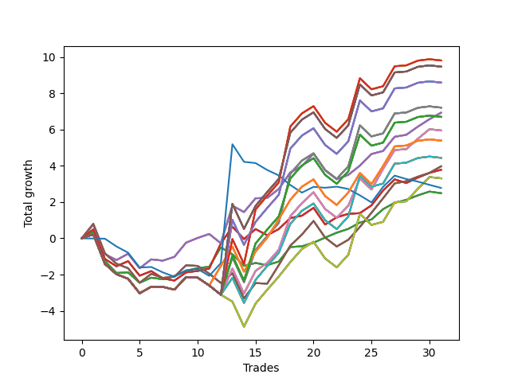

# Long Bulldog 006 
- Symbol: SPY_Unlimited
- Date Range: 03/23/2022 - 07/08/2022
- Trading Period: 7:20-12:30
- Number of Trades: 31



| Name | Win Percent | Profit | Avg Profit / Trade | Avg Time / Trade |      | Name | Win Percent | Profit | Avg Profit / Trade | Avg Time / Trade |
| ---- | ----------- | ------ | ------------------ | ---------------- | ---- | ---- | ----------- | ------ | ------------------ | ---------------- |
| Sorted By <br> Profit | | | | | | Sorted By <br> Win Percentage ||||
| One Hundred Twenty-Eight | 54.84 | 4905.00 | 158.23 | 28:31 |     | Sixty-Six | 74.19 | 3465.00 | 111.77 | 18:34 |
| One Hundred Twenty-Three | 54.84 | 4905.00 | 158.23 | 28:31 |     | Fifty-Eight | 74.19 | 3465.00 | 111.77 | 18:34 |
| One Hundred Eighteen | 54.84 | 4905.00 | 158.23 | 28:31 |     | Fifty | 74.19 | 3465.00 | 111.77 | 18:34 |
| One Hundred Thirteen | 54.84 | 4905.00 | 158.23 | 28:31 |     | Forty-Two | 74.19 | 3465.00 | 111.77 | 18:34 |
| Eighty-Three | 54.84 | 4905.00 | 158.23 | 28:31 |     | Two | 74.19 | 3465.00 | 111.77 | 18:34 |
| One Hundred Thirty | 54.84 | 4735.00 | 152.74 | 28:55 |     | Sixty-Four | 74.19 | 1245.00 | 40.16 | 07:00 |
| One Hundred Twenty-Five | 54.84 | 4735.00 | 152.74 | 28:55 |     | Fifty-Six | 74.19 | 1245.00 | 40.16 | 07:00 |
| One Hundred Twenty | 54.84 | 4735.00 | 152.74 | 28:55 |     | Forty-Eight | 74.19 | 1245.00 | 40.16 | 07:00 |
| One Hundred Fifteen | 54.84 | 4735.00 | 152.74 | 28:55 |     | Forty | 74.19 | 1245.00 | 40.16 | 07:00 |
| Eighty-Five | 54.84 | 4735.00 | 152.74 | 28:55 |     | Zero | 74.19 | 1245.00 | 40.16 | 07:00 |
| One Hundred Twenty-Nine | 54.84 | 4295.00 | 138.55 | 28:55 |     | Sixty-Five | 70.97 | 1890.00 | 60.97 | 14:19 |
| One Hundred Twenty-Four | 54.84 | 4295.00 | 138.55 | 28:55 |     | Fifty-Seven | 70.97 | 1890.00 | 60.97 | 14:19 |
| One Hundred Ninteen | 54.84 | 4295.00 | 138.55 | 28:55 |     | Forty-Nine | 70.97 | 1890.00 | 60.97 | 14:19 |
| One Hundred Fourteen | 54.84 | 4295.00 | 138.55 | 28:55 |     | Forty-One | 70.97 | 1890.00 | 60.97 | 14:19 |
| Eighty-Four | 54.84 | 4295.00 | 138.55 | 28:55 |     | One | 70.97 | 1890.00 | 60.97 | 14:19 |
| Sixty-Nine | 54.84 | 3605.00 | 116.29 | 28:22 |     | Sixty-Seven | 61.29 | 1985.00 | 64.03 | 20:46 |
| Sixty-One | 54.84 | 3605.00 | 116.29 | 28:22 |     | Fifty-Nine | 61.29 | 1985.00 | 64.03 | 20:46 |
| Fifty-Three | 54.84 | 3605.00 | 116.29 | 28:22 |     | Fifty-One | 61.29 | 1985.00 | 64.03 | 20:46 |
| Forty-Five | 54.84 | 3605.00 | 116.29 | 28:22 |     | Forty-Three | 61.29 | 1985.00 | 64.03 | 20:46 |
| Five | 54.84 | 3605.00 | 116.29 | 28:22 |     | Three | 61.29 | 1985.00 | 64.03 | 20:46 |
| Sixty-Six | 74.19 | 3465.00 | 111.77 | 18:34 |     | One Hundred Twenty-Six | 58.06 | 2695.00 | 86.94 | 24:30 |
| Fifty-Eight | 74.19 | 3465.00 | 111.77 | 18:34 |     | One Hundred Twenty-One | 58.06 | 2695.00 | 86.94 | 24:30 |
| Fifty | 74.19 | 3465.00 | 111.77 | 18:34 |     | One Hundred Sixteen | 58.06 | 2695.00 | 86.94 | 24:30 |
| Forty-Two | 74.19 | 3465.00 | 111.77 | 18:34 |     | One Hundred Eleven | 58.06 | 2695.00 | 86.94 | 24:30 |
| Two | 74.19 | 3465.00 | 111.77 | 18:34 |     | Eighty-One | 58.06 | 2695.00 | 86.94 | 24:30 |
| One Hundred Twenty-Seven | 54.84 | 3350.00 | 108.06 | 28:20 |     | One Hundred Twenty-Eight | 54.84 | 4905.00 | 158.23 | 28:31 |
| One Hundred Twenty-Two | 54.84 | 3350.00 | 108.06 | 28:20 |     | One Hundred Twenty-Three | 54.84 | 4905.00 | 158.23 | 28:31 |
| One Hundred Seventeen | 54.84 | 3350.00 | 108.06 | 28:20 |     | One Hundred Eighteen | 54.84 | 4905.00 | 158.23 | 28:31 |
| One Hundred Twelve | 54.84 | 3350.00 | 108.06 | 28:20 |     | One Hundred Thirteen | 54.84 | 4905.00 | 158.23 | 28:31 |
| Eighty-Two | 54.84 | 3350.00 | 108.06 | 28:20 |     | Eighty-Three | 54.84 | 4905.00 | 158.23 | 28:31 |
| Sixty-Eight | 54.84 | 2975.00 | 95.97 | 26:36 |     | One Hundred Thirty | 54.84 | 4735.00 | 152.74 | 28:55 |
| Sixty | 54.84 | 2975.00 | 95.97 | 26:36 |     | One Hundred Twenty-Five | 54.84 | 4735.00 | 152.74 | 28:55 |
| Fifty-Two | 54.84 | 2975.00 | 95.97 | 26:36 |     | One Hundred Twenty | 54.84 | 4735.00 | 152.74 | 28:55 |
| Forty-Four | 54.84 | 2975.00 | 95.97 | 26:36 |     | One Hundred Fifteen | 54.84 | 4735.00 | 152.74 | 28:55 |
| Four | 54.84 | 2975.00 | 95.97 | 26:36 |     | Eighty-Five | 54.84 | 4735.00 | 152.74 | 28:55 |
| One Hundred Twenty-Six | 58.06 | 2695.00 | 86.94 | 24:30 |     | One Hundred Twenty-Nine | 54.84 | 4295.00 | 138.55 | 28:55 |
| One Hundred Twenty-One | 58.06 | 2695.00 | 86.94 | 24:30 |     | One Hundred Twenty-Four | 54.84 | 4295.00 | 138.55 | 28:55 |
| One Hundred Sixteen | 58.06 | 2695.00 | 86.94 | 24:30 |     | One Hundred Ninteen | 54.84 | 4295.00 | 138.55 | 28:55 |
| One Hundred Eleven | 58.06 | 2695.00 | 86.94 | 24:30 |     | One Hundred Fourteen | 54.84 | 4295.00 | 138.55 | 28:55 |
| Eighty-One | 58.06 | 2695.00 | 86.94 | 24:30 |     | Eighty-Four | 54.84 | 4295.00 | 138.55 | 28:55 |
| Seventy-One | 54.84 | 2220.00 | 71.61 | 28:16 |     | Sixty-Nine | 54.84 | 3605.00 | 116.29 | 28:22 |
| Sixty-Three | 54.84 | 2220.00 | 71.61 | 28:16 |     | Sixty-One | 54.84 | 3605.00 | 116.29 | 28:22 |
| Fifty-Five | 54.84 | 2220.00 | 71.61 | 28:16 |     | Fifty-Three | 54.84 | 3605.00 | 116.29 | 28:22 |
| Forty-Seven | 54.84 | 2220.00 | 71.61 | 28:16 |     | Forty-Five | 54.84 | 3605.00 | 116.29 | 28:22 |
| Seven | 54.84 | 2220.00 | 71.61 | 28:16 |     | Five | 54.84 | 3605.00 | 116.29 | 28:22 |
| Sixty-Seven | 61.29 | 1985.00 | 64.03 | 20:46 |     | One Hundred Twenty-Seven | 54.84 | 3350.00 | 108.06 | 28:20 |
| Fifty-Nine | 61.29 | 1985.00 | 64.03 | 20:46 |     | One Hundred Twenty-Two | 54.84 | 3350.00 | 108.06 | 28:20 |
| Fifty-One | 61.29 | 1985.00 | 64.03 | 20:46 |     | One Hundred Seventeen | 54.84 | 3350.00 | 108.06 | 28:20 |
| Forty-Three | 61.29 | 1985.00 | 64.03 | 20:46 |     | One Hundred Twelve | 54.84 | 3350.00 | 108.06 | 28:20 |
| Three | 61.29 | 1985.00 | 64.03 | 20:46 |     | Eighty-Two | 54.84 | 3350.00 | 108.06 | 28:20 |
| Sixty-Five | 70.97 | 1890.00 | 60.97 | 14:19 |     | Sixty-Eight | 54.84 | 2975.00 | 95.97 | 26:36 |
| Fifty-Seven | 70.97 | 1890.00 | 60.97 | 14:19 |     | Sixty | 54.84 | 2975.00 | 95.97 | 26:36 |
| Forty-Nine | 70.97 | 1890.00 | 60.97 | 14:19 |     | Fifty-Two | 54.84 | 2975.00 | 95.97 | 26:36 |
| Forty-One | 70.97 | 1890.00 | 60.97 | 14:19 |     | Forty-Four | 54.84 | 2975.00 | 95.97 | 26:36 |
| One | 70.97 | 1890.00 | 60.97 | 14:19 |     | Four | 54.84 | 2975.00 | 95.97 | 26:36 |
| Seventy | 51.61 | 1655.00 | 53.39 | 26:51 |     | Seventy-One | 54.84 | 2220.00 | 71.61 | 28:16 |
| Sixty-Two | 51.61 | 1655.00 | 53.39 | 26:51 |     | Sixty-Three | 54.84 | 2220.00 | 71.61 | 28:16 |
| Fifty-Four | 51.61 | 1655.00 | 53.39 | 26:51 |     | Fifty-Five | 54.84 | 2220.00 | 71.61 | 28:16 |
| Forty-Six | 51.61 | 1655.00 | 53.39 | 26:51 |     | Forty-Seven | 54.84 | 2220.00 | 71.61 | 28:16 |
| Six | 51.61 | 1655.00 | 53.39 | 26:51 |     | Seven | 54.84 | 2220.00 | 71.61 | 28:16 |
| Seventy-Three | 29.03 | 1390.00 | 44.84 | 08:32 |     | Seventy | 51.61 | 1655.00 | 53.39 | 26:51 |
| Sixty-Four | 74.19 | 1245.00 | 40.16 | 07:00 |     | Sixty-Two | 51.61 | 1655.00 | 53.39 | 26:51 |
| Fifty-Six | 74.19 | 1245.00 | 40.16 | 07:00 |     | Fifty-Four | 51.61 | 1655.00 | 53.39 | 26:51 |
| Forty-Eight | 74.19 | 1245.00 | 40.16 | 07:00 |     | Forty-Six | 51.61 | 1655.00 | 53.39 | 26:51 |
| Forty | 74.19 | 1245.00 | 40.16 | 07:00 |     | Six | 51.61 | 1655.00 | 53.39 | 26:51 |
| Zero | 74.19 | 1245.00 | 40.16 | 07:00 |     | Seventy-Three | 29.03 | 1390.00 | 44.84 | 08:32 |

## NO STOPLOSS

### Test Zero
* Sell when price hits the middle line of the 20p bollinger
* No Stoploss
* Results:
```
Total Trades: 31
Percent Up: 74.19
Percent Down: 25.81
Total Points Moved Up: 2.49
Potential Profit: 1245.00
Total Points Ups: 6.66 Count Ups: 23
Total Points Downs: -4.17 Count Downs: 8
```

<details><summary>Trades</summary>

<code>In: 2022-03-25 08:30:00		Out: 2022-03-25 08:36:40		Total Position Time: 06:40		Total Move Up: 0.37		Total to Date: 0.37</code> <br />
<code>In: 2022-03-28 08:28:00		Out: 2022-03-28 08:57:55		Total Position Time: 29:55		Total Move Up: -1.63		Total to Date: -1.26</code> <br />
<code>In: 2022-03-28 08:39:00		Out: 2022-03-28 09:01:45		Total Position Time: 22:45		Total Move Up: -0.65		Total to Date: -1.91</code> <br />
<code>In: 2022-03-28 08:52:00		Out: 2022-03-28 09:01:45		Total Position Time: 09:45		Total Move Up: 0.03		Total to Date: -1.88</code> <br />
<code>In: 2022-03-30 08:03:00		Out: 2022-03-30 08:19:15		Total Position Time: 16:15		Total Move Up: -0.57		Total to Date: -2.45</code> <br />
<code>In: 2022-03-30 08:14:00		Out: 2022-03-30 08:19:15		Total Position Time: 05:15		Total Move Up: 0.28		Total to Date: -2.17</code> <br />
<code>In: 2022-03-30 12:07:00		Out: 2022-03-30 12:15:25		Total Position Time: 08:25		Total Move Up: -0.09		Total to Date: -2.26</code> <br />
<code>In: 2022-03-30 12:14:00		Out: 2022-03-30 12:15:25		Total Position Time: 01:25		Total Move Up: 0.19		Total to Date: -2.07</code> <br />
<code>In: 2022-03-30 12:27:00		Out: 2022-03-30 12:28:15		Total Position Time: 01:15		Total Move Up: 0.27		Total to Date: -1.80</code> <br />
<code>In: 2022-04-06 09:23:00		Out: 2022-04-06 09:31:15		Total Position Time: 08:15		Total Move Up: 0.16		Total to Date: -1.64</code> <br />
<code>In: 2022-04-21 07:51:00		Out: 2022-04-21 08:01:10		Total Position Time: 10:10		Total Move Up: 0.07		Total to Date: -1.57</code> <br />
<code>In: 2022-05-02 10:06:00		Out: 2022-05-02 10:08:15		Total Position Time: 02:15		Total Move Up: 1.07		Total to Date: -0.50</code> <br />
<code>In: 2022-05-04 11:37:00		Out: 2022-05-04 11:37:10		Total Position Time: 00:10		Total Move Up: -0.38		Total to Date: -0.88</code> <br />
<code>In: 2022-05-09 07:27:00		Out: 2022-05-09 07:42:30		Total Position Time: 15:30		Total Move Up: -0.64		Total to Date: -1.52</code> <br />
<code>In: 2022-05-11 11:01:00		Out: 2022-05-11 11:01:10		Total Position Time: 00:10		Total Move Up: 0.16		Total to Date: -1.36</code> <br />
<code>In: 2022-05-12 11:35:00		Out: 2022-05-12 11:45:20		Total Position Time: 10:20		Total Move Up: -0.12		Total to Date: -1.48</code> <br />
<code>In: 2022-05-17 07:48:00		Out: 2022-05-17 07:55:10		Total Position Time: 07:10		Total Move Up: 0.20		Total to Date: -1.28</code> <br />
<code>In: 2022-05-17 11:25:00		Out: 2022-05-17 11:27:25		Total Position Time: 02:25		Total Move Up: 0.80		Total to Date: -0.48</code> <br />
<code>In: 2022-05-25 09:30:00		Out: 2022-05-25 09:38:55		Total Position Time: 08:55		Total Move Up: 0.04		Total to Date: -0.44</code> <br />
<code>In: 2022-06-09 08:10:00		Out: 2022-06-09 08:10:55		Total Position Time: 00:55		Total Move Up: 0.20		Total to Date: -0.24</code> <br />
<code>In: 2022-06-09 11:27:00		Out: 2022-06-09 11:28:10		Total Position Time: 01:10		Total Move Up: 0.28		Total to Date: 0.04</code> <br />
<code>In: 2022-06-15 07:58:00		Out: 2022-06-15 07:58:55		Total Position Time: 00:55		Total Move Up: 0.27		Total to Date: 0.31</code> <br />
<code>In: 2022-06-15 08:16:00		Out: 2022-06-15 08:24:20		Total Position Time: 08:20		Total Move Up: 0.21		Total to Date: 0.52</code> <br />
<code>In: 2022-06-17 07:38:00		Out: 2022-06-17 07:44:55		Total Position Time: 06:55		Total Move Up: 0.35		Total to Date: 0.87</code> <br />
<code>In: 2022-06-23 09:07:00		Out: 2022-06-23 09:14:30		Total Position Time: 07:30		Total Move Up: 0.17		Total to Date: 1.04</code> <br />
<code>In: 2022-06-27 12:08:00		Out: 2022-06-27 12:10:20		Total Position Time: 02:20		Total Move Up: 0.57		Total to Date: 1.61</code> <br />
<code>In: 2022-06-29 08:26:00		Out: 2022-06-29 08:28:25		Total Position Time: 02:25		Total Move Up: 0.35		Total to Date: 1.96</code> <br />
<code>In: 2022-06-29 09:16:00		Out: 2022-06-29 09:21:05		Total Position Time: 05:05		Total Move Up: 0.16		Total to Date: 2.12</code> <br />
<code>In: 2022-07-05 08:05:00		Out: 2022-07-05 08:08:25		Total Position Time: 03:25		Total Move Up: 0.25		Total to Date: 2.37</code> <br />
<code>In: 2022-07-05 08:08:00		Out: 2022-07-05 08:08:25		Total Position Time: 00:25		Total Move Up: 0.21		Total to Date: 2.58</code> <br />
<code>In: 2022-07-06 08:35:00		Out: 2022-07-06 08:46:05		Total Position Time: 11:05		Total Move Up: -0.09		Total to Date: 2.49</code> <br />


</details>

### Test One
* Sell when the price hits the upper line of the 20p 1std bollinger
* No Stoploss
* Results:
```
Total Trades: 31
Percent Up: 70.97
Percent Down: 29.03
Total Points Moved Up: 3.78
Potential Profit: 1890.00
Total Points Ups: 9.27 Count Ups: 22
Total Points Downs: -5.49 Count Downs: 9
```

<details><summary>Trades</summary>

<code>In: 2022-03-25 08:30:00		Out: 2022-03-25 08:41:05		Total Position Time: 11:05		Total Move Up: 0.49		Total to Date: 0.49</code> <br />
<code>In: 2022-03-28 08:28:00		Out: 2022-03-28 08:57:55		Total Position Time: 29:55		Total Move Up: -1.63		Total to Date: -1.14</code> <br />
<code>In: 2022-03-28 08:39:00		Out: 2022-03-28 09:04:40		Total Position Time: 25:40		Total Move Up: -0.40		Total to Date: -1.54</code> <br />
<code>In: 2022-03-28 08:52:00		Out: 2022-03-28 09:04:40		Total Position Time: 12:40		Total Move Up: 0.28		Total to Date: -1.26</code> <br />
<code>In: 2022-03-30 08:03:00		Out: 2022-03-30 08:32:55		Total Position Time: 29:55		Total Move Up: -0.80		Total to Date: -2.06</code> <br />
<code>In: 2022-03-30 08:14:00		Out: 2022-03-30 08:34:40		Total Position Time: 20:40		Total Move Up: 0.25		Total to Date: -1.81</code> <br />
<code>In: 2022-03-30 12:07:00		Out: 2022-03-30 12:32:20		Total Position Time: 25:20		Total Move Up: -0.40		Total to Date: -2.21</code> <br />
<code>In: 2022-03-30 12:14:00		Out: 2022-03-30 12:32:20		Total Position Time: 18:20		Total Move Up: -0.12		Total to Date: -2.33</code> <br />
<code>In: 2022-03-30 12:27:00		Out: 2022-03-30 12:32:20		Total Position Time: 05:20		Total Move Up: 0.45		Total to Date: -1.88</code> <br />
<code>In: 2022-04-06 09:23:00		Out: 2022-04-06 09:33:05		Total Position Time: 10:05		Total Move Up: 0.08		Total to Date: -1.80</code> <br />
<code>In: 2022-04-21 07:51:00		Out: 2022-04-21 08:05:05		Total Position Time: 14:05		Total Move Up: 0.13		Total to Date: -1.67</code> <br />
<code>In: 2022-05-02 10:06:00		Out: 2022-05-02 10:10:55		Total Position Time: 04:55		Total Move Up: 1.38		Total to Date: -0.29</code> <br />
<code>In: 2022-05-04 11:37:00		Out: 2022-05-04 11:41:35		Total Position Time: 04:35		Total Move Up: 0.93		Total to Date: 0.64</code> <br />
<code>In: 2022-05-09 07:27:00		Out: 2022-05-09 07:45:10		Total Position Time: 18:10		Total Move Up: -0.68		Total to Date: -0.04</code> <br />
<code>In: 2022-05-11 11:01:00		Out: 2022-05-11 11:01:20		Total Position Time: 00:20		Total Move Up: 0.55		Total to Date: 0.51</code> <br />
<code>In: 2022-05-12 11:35:00		Out: 2022-05-12 11:52:05		Total Position Time: 17:05		Total Move Up: -0.34		Total to Date: 0.17</code> <br />
<code>In: 2022-05-17 07:48:00		Out: 2022-05-17 07:58:50		Total Position Time: 10:50		Total Move Up: 0.34		Total to Date: 0.51</code> <br />
<code>In: 2022-05-17 11:25:00		Out: 2022-05-17 11:37:35		Total Position Time: 12:35		Total Move Up: 0.61		Total to Date: 1.12</code> <br />
<code>In: 2022-05-25 09:30:00		Out: 2022-05-25 09:44:25		Total Position Time: 14:25		Total Move Up: 0.13		Total to Date: 1.25</code> <br />
<code>In: 2022-06-09 08:10:00		Out: 2022-06-09 08:21:10		Total Position Time: 11:10		Total Move Up: 0.43		Total to Date: 1.68</code> <br />
<code>In: 2022-06-09 11:27:00		Out: 2022-06-09 11:56:55		Total Position Time: 29:55		Total Move Up: -0.92		Total to Date: 0.76</code> <br />
<code>In: 2022-06-15 07:58:00		Out: 2022-06-15 08:07:20		Total Position Time: 09:20		Total Move Up: 0.40		Total to Date: 1.16</code> <br />
<code>In: 2022-06-15 08:16:00		Out: 2022-06-15 08:29:05		Total Position Time: 13:05		Total Move Up: 0.19		Total to Date: 1.35</code> <br />
<code>In: 2022-06-17 07:38:00		Out: 2022-06-17 07:56:15		Total Position Time: 18:15		Total Move Up: 0.04		Total to Date: 1.39</code> <br />
<code>In: 2022-06-23 09:07:00		Out: 2022-06-23 09:18:25		Total Position Time: 11:25		Total Move Up: 0.43		Total to Date: 1.82</code> <br />
<code>In: 2022-06-27 12:08:00		Out: 2022-06-27 12:12:00		Total Position Time: 04:00		Total Move Up: 0.82		Total to Date: 2.64</code> <br />
<code>In: 2022-06-29 08:26:00		Out: 2022-06-29 08:32:20		Total Position Time: 06:20		Total Move Up: 0.61		Total to Date: 3.25</code> <br />
<code>In: 2022-06-29 09:16:00		Out: 2022-06-29 09:37:15		Total Position Time: 21:15		Total Move Up: -0.20		Total to Date: 3.05</code> <br />
<code>In: 2022-07-05 08:05:00		Out: 2022-07-05 08:16:40		Total Position Time: 11:40		Total Move Up: 0.30		Total to Date: 3.35</code> <br />
<code>In: 2022-07-05 08:08:00		Out: 2022-07-05 08:16:40		Total Position Time: 08:40		Total Move Up: 0.26		Total to Date: 3.61</code> <br />
<code>In: 2022-07-06 08:35:00		Out: 2022-07-06 08:48:10		Total Position Time: 13:10		Total Move Up: 0.17		Total to Date: 3.78</code> <br />


</details>

### Test Two
* Sell when the price hits the upper line of the 20p 2std bollinger
* No Stoploss
* Results:
```
Total Trades: 31
Percent Up: 74.19
Percent Down: 25.81
Total Points Moved Up: 6.93
Potential Profit: 3465.00
Total Points Ups: 12.03 Count Ups: 23
Total Points Downs: -5.10 Count Downs: 8
```

<details><summary>Trades</summary>

<code>In: 2022-03-25 08:30:00		Out: 2022-03-25 08:41:45		Total Position Time: 11:45		Total Move Up: 0.76		Total to Date: 0.76</code> <br />
<code>In: 2022-03-28 08:28:00		Out: 2022-03-28 08:57:55		Total Position Time: 29:55		Total Move Up: -1.63		Total to Date: -0.87</code> <br />
<code>In: 2022-03-28 08:39:00		Out: 2022-03-28 09:07:15		Total Position Time: 28:15		Total Move Up: -0.33		Total to Date: -1.20</code> <br />
<code>In: 2022-03-28 08:52:00		Out: 2022-03-28 09:07:15		Total Position Time: 15:15		Total Move Up: 0.35		Total to Date: -0.85</code> <br />
<code>In: 2022-03-30 08:03:00		Out: 2022-03-30 08:32:55		Total Position Time: 29:55		Total Move Up: -0.80		Total to Date: -1.65</code> <br />
<code>In: 2022-03-30 08:14:00		Out: 2022-03-30 08:35:15		Total Position Time: 21:15		Total Move Up: 0.49		Total to Date: -1.16</code> <br />
<code>In: 2022-03-30 12:07:00		Out: 2022-03-30 12:36:25		Total Position Time: 29:25		Total Move Up: -0.07		Total to Date: -1.23</code> <br />
<code>In: 2022-03-30 12:14:00		Out: 2022-03-30 12:36:25		Total Position Time: 22:25		Total Move Up: 0.21		Total to Date: -1.02</code> <br />
<code>In: 2022-03-30 12:27:00		Out: 2022-03-30 12:36:25		Total Position Time: 09:25		Total Move Up: 0.78		Total to Date: -0.24</code> <br />
<code>In: 2022-04-06 09:23:00		Out: 2022-04-06 09:34:25		Total Position Time: 11:25		Total Move Up: 0.26		Total to Date: 0.02</code> <br />
<code>In: 2022-04-21 07:51:00		Out: 2022-04-21 08:11:45		Total Position Time: 20:45		Total Move Up: 0.22		Total to Date: 0.24</code> <br />
<code>In: 2022-05-02 10:06:00		Out: 2022-05-02 10:35:55		Total Position Time: 29:55		Total Move Up: -0.51		Total to Date: -0.27</code> <br />
<code>In: 2022-05-04 11:37:00		Out: 2022-05-04 11:43:45		Total Position Time: 06:45		Total Move Up: 2.07		Total to Date: 1.80</code> <br />
<code>In: 2022-05-09 07:27:00		Out: 2022-05-09 07:48:05		Total Position Time: 21:05		Total Move Up: -0.35		Total to Date: 1.45</code> <br />
<code>In: 2022-05-11 11:01:00		Out: 2022-05-11 11:04:20		Total Position Time: 03:20		Total Move Up: 0.76		Total to Date: 2.21</code> <br />
<code>In: 2022-05-12 11:35:00		Out: 2022-05-12 11:53:00		Total Position Time: 18:00		Total Move Up: 0.02		Total to Date: 2.23</code> <br />
<code>In: 2022-05-17 07:48:00		Out: 2022-05-17 07:59:25		Total Position Time: 11:25		Total Move Up: 0.49		Total to Date: 2.72</code> <br />
<code>In: 2022-05-17 11:25:00		Out: 2022-05-17 11:40:00		Total Position Time: 15:00		Total Move Up: 0.92		Total to Date: 3.64</code> <br />
<code>In: 2022-05-25 09:30:00		Out: 2022-05-25 09:45:20		Total Position Time: 15:20		Total Move Up: 0.34		Total to Date: 3.98</code> <br />
<code>In: 2022-06-09 08:10:00		Out: 2022-06-09 08:22:35		Total Position Time: 12:35		Total Move Up: 0.69		Total to Date: 4.67</code> <br />
<code>In: 2022-06-09 11:27:00		Out: 2022-06-09 11:56:55		Total Position Time: 29:55		Total Move Up: -0.92		Total to Date: 3.75</code> <br />
<code>In: 2022-06-15 07:58:00		Out: 2022-06-15 08:27:55		Total Position Time: 29:55		Total Move Up: -0.49		Total to Date: 3.26</code> <br />
<code>In: 2022-06-15 08:16:00		Out: 2022-06-15 08:31:50		Total Position Time: 15:50		Total Move Up: 0.24		Total to Date: 3.50</code> <br />
<code>In: 2022-06-17 07:38:00		Out: 2022-06-17 08:02:25		Total Position Time: 24:25		Total Move Up: 0.51		Total to Date: 4.01</code> <br />
<code>In: 2022-06-23 09:07:00		Out: 2022-06-23 09:19:05		Total Position Time: 12:05		Total Move Up: 0.64		Total to Date: 4.65</code> <br />
<code>In: 2022-06-27 12:08:00		Out: 2022-06-27 12:37:55		Total Position Time: 29:55		Total Move Up: 0.17		Total to Date: 4.82</code> <br />
<code>In: 2022-06-29 08:26:00		Out: 2022-06-29 08:34:40		Total Position Time: 08:40		Total Move Up: 0.78		Total to Date: 5.60</code> <br />
<code>In: 2022-06-29 09:16:00		Out: 2022-06-29 09:38:35		Total Position Time: 22:35		Total Move Up: 0.11		Total to Date: 5.71</code> <br />
<code>In: 2022-07-05 08:05:00		Out: 2022-07-05 08:17:55		Total Position Time: 12:55		Total Move Up: 0.45		Total to Date: 6.16</code> <br />
<code>In: 2022-07-05 08:08:00		Out: 2022-07-05 08:17:55		Total Position Time: 09:55		Total Move Up: 0.41		Total to Date: 6.57</code> <br />
<code>In: 2022-07-06 08:35:00		Out: 2022-07-06 08:51:15		Total Position Time: 16:15		Total Move Up: 0.36		Total to Date: 6.93</code> <br />


</details>

### Test Three
* Sell when price hits the middle line of the 50p bollinger
* No Stoploss
* Results:
```
Total Trades: 31
Percent Up: 61.29
Percent Down: 38.71
Total Points Moved Up: 3.97
Potential Profit: 1985.00
Total Points Ups: 11.23 Count Ups: 19
Total Points Downs: -7.26 Count Downs: 12
```

<details><summary>Trades</summary>

<code>In: 2022-03-25 08:30:00		Out: 2022-03-25 08:52:45		Total Position Time: 22:45		Total Move Up: 0.80		Total to Date: 0.80</code> <br />
<code>In: 2022-03-28 08:28:00		Out: 2022-03-28 08:57:55		Total Position Time: 29:55		Total Move Up: -1.63		Total to Date: -0.83</code> <br />
<code>In: 2022-03-28 08:39:00		Out: 2022-03-28 09:08:55		Total Position Time: 29:55		Total Move Up: -0.57		Total to Date: -1.40</code> <br />
<code>In: 2022-03-28 08:52:00		Out: 2022-03-28 09:21:55		Total Position Time: 29:55		Total Move Up: -0.25		Total to Date: -1.65</code> <br />
<code>In: 2022-03-30 08:03:00		Out: 2022-03-30 08:32:55		Total Position Time: 29:55		Total Move Up: -0.80		Total to Date: -2.45</code> <br />
<code>In: 2022-03-30 08:14:00		Out: 2022-03-30 08:35:15		Total Position Time: 21:15		Total Move Up: 0.49		Total to Date: -1.96</code> <br />
<code>In: 2022-03-30 12:07:00		Out: 2022-03-30 12:33:30		Total Position Time: 26:30		Total Move Up: -0.22		Total to Date: -2.18</code> <br />
<code>In: 2022-03-30 12:14:00		Out: 2022-03-30 12:33:30		Total Position Time: 19:30		Total Move Up: 0.06		Total to Date: -2.12</code> <br />
<code>In: 2022-03-30 12:27:00		Out: 2022-03-30 12:33:30		Total Position Time: 06:30		Total Move Up: 0.63		Total to Date: -1.49</code> <br />
<code>In: 2022-04-06 09:23:00		Out: 2022-04-06 09:52:55		Total Position Time: 29:55		Total Move Up: -0.03		Total to Date: -1.52</code> <br />
<code>In: 2022-04-21 07:51:00		Out: 2022-04-21 08:20:55		Total Position Time: 29:55		Total Move Up: -0.43		Total to Date: -1.95</code> <br />
<code>In: 2022-05-02 10:06:00		Out: 2022-05-02 10:35:55		Total Position Time: 29:55		Total Move Up: -0.51		Total to Date: -2.46</code> <br />
<code>In: 2022-05-04 11:37:00		Out: 2022-05-04 11:41:15		Total Position Time: 04:15		Total Move Up: 0.53		Total to Date: -1.93</code> <br />
<code>In: 2022-05-09 07:27:00		Out: 2022-05-09 07:56:55		Total Position Time: 29:55		Total Move Up: -1.38		Total to Date: -3.31</code> <br />
<code>In: 2022-05-11 11:01:00		Out: 2022-05-11 11:04:45		Total Position Time: 03:45		Total Move Up: 0.84		Total to Date: -2.47</code> <br />
<code>In: 2022-05-12 11:35:00		Out: 2022-05-12 11:53:05		Total Position Time: 18:05		Total Move Up: -0.03		Total to Date: -2.50</code> <br />
<code>In: 2022-05-17 07:48:00		Out: 2022-05-17 08:04:10		Total Position Time: 16:10		Total Move Up: 1.02		Total to Date: -1.48</code> <br />
<code>In: 2022-05-17 11:25:00		Out: 2022-05-17 11:40:05		Total Position Time: 15:05		Total Move Up: 1.08		Total to Date: -0.40</code> <br />
<code>In: 2022-05-25 09:30:00		Out: 2022-05-25 09:49:05		Total Position Time: 19:05		Total Move Up: 0.61		Total to Date: 0.21</code> <br />
<code>In: 2022-06-09 08:10:00		Out: 2022-06-09 08:22:45		Total Position Time: 12:45		Total Move Up: 0.75		Total to Date: 0.96</code> <br />
<code>In: 2022-06-09 11:27:00		Out: 2022-06-09 11:56:55		Total Position Time: 29:55		Total Move Up: -0.92		Total to Date: 0.04</code> <br />
<code>In: 2022-06-15 07:58:00		Out: 2022-06-15 08:27:55		Total Position Time: 29:55		Total Move Up: -0.49		Total to Date: -0.45</code> <br />
<code>In: 2022-06-15 08:16:00		Out: 2022-06-15 08:34:25		Total Position Time: 18:25		Total Move Up: 0.37		Total to Date: -0.08</code> <br />
<code>In: 2022-06-17 07:38:00		Out: 2022-06-17 08:02:30		Total Position Time: 24:30		Total Move Up: 0.71		Total to Date: 0.63</code> <br />
<code>In: 2022-06-23 09:07:00		Out: 2022-06-23 09:21:10		Total Position Time: 14:10		Total Move Up: 0.78		Total to Date: 1.41</code> <br />
<code>In: 2022-06-27 12:08:00		Out: 2022-06-27 12:10:30		Total Position Time: 02:30		Total Move Up: 0.80		Total to Date: 2.21</code> <br />
<code>In: 2022-06-29 08:26:00		Out: 2022-06-29 08:35:10		Total Position Time: 09:10		Total Move Up: 0.82		Total to Date: 3.03</code> <br />
<code>In: 2022-06-29 09:16:00		Out: 2022-06-29 09:38:30		Total Position Time: 22:30		Total Move Up: 0.12		Total to Date: 3.15</code> <br />
<code>In: 2022-07-05 08:05:00		Out: 2022-07-05 08:32:15		Total Position Time: 27:15		Total Move Up: 0.25		Total to Date: 3.40</code> <br />
<code>In: 2022-07-05 08:08:00		Out: 2022-07-05 08:32:15		Total Position Time: 24:15		Total Move Up: 0.21		Total to Date: 3.61</code> <br />
<code>In: 2022-07-06 08:35:00		Out: 2022-07-06 08:51:15		Total Position Time: 16:15		Total Move Up: 0.36		Total to Date: 3.97</code> <br />


</details>

### Test Four
* Sell when the price hits the upper line of the 50p 1std bollinger
* No Stoploss
* Results:
```
Total Trades: 31
Percent Up: 54.84
Percent Down: 45.16
Total Points Moved Up: 5.95
Potential Profit: 2975.00
Total Points Ups: 13.80 Count Ups: 17
Total Points Downs: -7.85 Count Downs: 14
```

<details><summary>Trades</summary>

<code>In: 2022-03-25 08:30:00		Out: 2022-03-25 08:59:55		Total Position Time: 29:55		Total Move Up: 0.22		Total to Date: 0.22</code> <br />
<code>In: 2022-03-28 08:28:00		Out: 2022-03-28 08:57:55		Total Position Time: 29:55		Total Move Up: -1.63		Total to Date: -1.41</code> <br />
<code>In: 2022-03-28 08:39:00		Out: 2022-03-28 09:08:55		Total Position Time: 29:55		Total Move Up: -0.57		Total to Date: -1.98</code> <br />
<code>In: 2022-03-28 08:52:00		Out: 2022-03-28 09:21:55		Total Position Time: 29:55		Total Move Up: -0.25		Total to Date: -2.23</code> <br />
<code>In: 2022-03-30 08:03:00		Out: 2022-03-30 08:32:55		Total Position Time: 29:55		Total Move Up: -0.80		Total to Date: -3.03</code> <br />
<code>In: 2022-03-30 08:14:00		Out: 2022-03-30 08:43:55		Total Position Time: 29:55		Total Move Up: 0.36		Total to Date: -2.67</code> <br />
<code>In: 2022-03-30 12:07:00		Out: 2022-03-30 12:36:55		Total Position Time: 29:55		Total Move Up: -0.01		Total to Date: -2.68</code> <br />
<code>In: 2022-03-30 12:14:00		Out: 2022-03-30 12:43:55		Total Position Time: 29:55		Total Move Up: -0.15		Total to Date: -2.83</code> <br />
<code>In: 2022-03-30 12:27:00		Out: 2022-03-30 12:46:00		Total Position Time: 19:00		Total Move Up: 0.69		Total to Date: -2.14</code> <br />
<code>In: 2022-04-06 09:23:00		Out: 2022-04-06 09:52:55		Total Position Time: 29:55		Total Move Up: -0.03		Total to Date: -2.17</code> <br />
<code>In: 2022-04-21 07:51:00		Out: 2022-04-21 08:20:55		Total Position Time: 29:55		Total Move Up: -0.43		Total to Date: -2.60</code> <br />
<code>In: 2022-05-02 10:06:00		Out: 2022-05-02 10:35:55		Total Position Time: 29:55		Total Move Up: -0.51		Total to Date: -3.11</code> <br />
<code>In: 2022-05-04 11:37:00		Out: 2022-05-04 11:42:00		Total Position Time: 05:00		Total Move Up: 1.44		Total to Date: -1.67</code> <br />
<code>In: 2022-05-09 07:27:00		Out: 2022-05-09 07:56:55		Total Position Time: 29:55		Total Move Up: -1.38		Total to Date: -3.05</code> <br />
<code>In: 2022-05-11 11:01:00		Out: 2022-05-11 11:18:15		Total Position Time: 17:15		Total Move Up: 1.26		Total to Date: -1.79</code> <br />
<code>In: 2022-05-12 11:35:00		Out: 2022-05-12 12:03:55		Total Position Time: 28:55		Total Move Up: 0.43		Total to Date: -1.36</code> <br />
<code>In: 2022-05-17 07:48:00		Out: 2022-05-17 08:17:55		Total Position Time: 29:55		Total Move Up: 0.73		Total to Date: -0.63</code> <br />
<code>In: 2022-05-17 11:25:00		Out: 2022-05-17 11:44:30		Total Position Time: 19:30		Total Move Up: 1.85		Total to Date: 1.22</code> <br />
<code>In: 2022-05-25 09:30:00		Out: 2022-05-25 09:59:55		Total Position Time: 29:55		Total Move Up: 0.72		Total to Date: 1.94</code> <br />
<code>In: 2022-06-09 08:10:00		Out: 2022-06-09 08:39:45		Total Position Time: 29:45		Total Move Up: 0.60		Total to Date: 2.54</code> <br />
<code>In: 2022-06-09 11:27:00		Out: 2022-06-09 11:56:55		Total Position Time: 29:55		Total Move Up: -0.92		Total to Date: 1.62</code> <br />
<code>In: 2022-06-15 07:58:00		Out: 2022-06-15 08:27:55		Total Position Time: 29:55		Total Move Up: -0.49		Total to Date: 1.13</code> <br />
<code>In: 2022-06-15 08:16:00		Out: 2022-06-15 08:38:55		Total Position Time: 22:55		Total Move Up: 0.67		Total to Date: 1.80</code> <br />
<code>In: 2022-06-17 07:38:00		Out: 2022-06-17 08:04:35		Total Position Time: 26:35		Total Move Up: 1.50		Total to Date: 3.30</code> <br />
<code>In: 2022-06-23 09:07:00		Out: 2022-06-23 09:36:55		Total Position Time: 29:55		Total Move Up: -0.61		Total to Date: 2.69</code> <br />
<code>In: 2022-06-27 12:08:00		Out: 2022-06-27 12:15:20		Total Position Time: 07:20		Total Move Up: 1.14		Total to Date: 3.83</code> <br />
<code>In: 2022-06-29 08:26:00		Out: 2022-06-29 08:53:10		Total Position Time: 27:10		Total Move Up: 1.04		Total to Date: 4.87</code> <br />
<code>In: 2022-06-29 09:16:00		Out: 2022-06-29 09:45:55		Total Position Time: 29:55		Total Move Up: 0.05		Total to Date: 4.92</code> <br />
<code>In: 2022-07-05 08:05:00		Out: 2022-07-05 08:33:05		Total Position Time: 28:05		Total Move Up: 0.57		Total to Date: 5.49</code> <br />
<code>In: 2022-07-05 08:08:00		Out: 2022-07-05 08:33:05		Total Position Time: 25:05		Total Move Up: 0.53		Total to Date: 6.02</code> <br />
<code>In: 2022-07-06 08:35:00		Out: 2022-07-06 09:04:55		Total Position Time: 29:55		Total Move Up: -0.07		Total to Date: 5.95</code> <br />


</details>

### Test Five
* Sell when the price hits the upper line of the 50p 2std bollinger
* No Stoploss
* Results:
```
Total Trades: 31
Percent Up: 54.84
Percent Down: 45.16
Total Points Moved Up: 7.21
Potential Profit: 3605.00
Total Points Ups: 15.06 Count Ups: 17
Total Points Downs: -7.85 Count Downs: 14
```

<details><summary>Trades</summary>

<code>In: 2022-03-25 08:30:00		Out: 2022-03-25 08:59:55		Total Position Time: 29:55		Total Move Up: 0.22		Total to Date: 0.22</code> <br />
<code>In: 2022-03-28 08:28:00		Out: 2022-03-28 08:57:55		Total Position Time: 29:55		Total Move Up: -1.63		Total to Date: -1.41</code> <br />
<code>In: 2022-03-28 08:39:00		Out: 2022-03-28 09:08:55		Total Position Time: 29:55		Total Move Up: -0.57		Total to Date: -1.98</code> <br />
<code>In: 2022-03-28 08:52:00		Out: 2022-03-28 09:21:55		Total Position Time: 29:55		Total Move Up: -0.25		Total to Date: -2.23</code> <br />
<code>In: 2022-03-30 08:03:00		Out: 2022-03-30 08:32:55		Total Position Time: 29:55		Total Move Up: -0.80		Total to Date: -3.03</code> <br />
<code>In: 2022-03-30 08:14:00		Out: 2022-03-30 08:43:55		Total Position Time: 29:55		Total Move Up: 0.36		Total to Date: -2.67</code> <br />
<code>In: 2022-03-30 12:07:00		Out: 2022-03-30 12:36:55		Total Position Time: 29:55		Total Move Up: -0.01		Total to Date: -2.68</code> <br />
<code>In: 2022-03-30 12:14:00		Out: 2022-03-30 12:43:55		Total Position Time: 29:55		Total Move Up: -0.15		Total to Date: -2.83</code> <br />
<code>In: 2022-03-30 12:27:00		Out: 2022-03-30 12:46:00		Total Position Time: 19:00		Total Move Up: 0.69		Total to Date: -2.14</code> <br />
<code>In: 2022-04-06 09:23:00		Out: 2022-04-06 09:52:55		Total Position Time: 29:55		Total Move Up: -0.03		Total to Date: -2.17</code> <br />
<code>In: 2022-04-21 07:51:00		Out: 2022-04-21 08:20:55		Total Position Time: 29:55		Total Move Up: -0.43		Total to Date: -2.60</code> <br />
<code>In: 2022-05-02 10:06:00		Out: 2022-05-02 10:35:55		Total Position Time: 29:55		Total Move Up: -0.51		Total to Date: -3.11</code> <br />
<code>In: 2022-05-04 11:37:00		Out: 2022-05-04 11:43:45		Total Position Time: 06:45		Total Move Up: 2.07		Total to Date: -1.04</code> <br />
<code>In: 2022-05-09 07:27:00		Out: 2022-05-09 07:56:55		Total Position Time: 29:55		Total Move Up: -1.38		Total to Date: -2.42</code> <br />
<code>In: 2022-05-11 11:01:00		Out: 2022-05-11 11:23:40		Total Position Time: 22:40		Total Move Up: 1.78		Total to Date: -0.64</code> <br />
<code>In: 2022-05-12 11:35:00		Out: 2022-05-12 12:04:55		Total Position Time: 29:55		Total Move Up: 0.76		Total to Date: 0.12</code> <br />
<code>In: 2022-05-17 07:48:00		Out: 2022-05-17 08:17:55		Total Position Time: 29:55		Total Move Up: 0.73		Total to Date: 0.85</code> <br />
<code>In: 2022-05-17 11:25:00		Out: 2022-05-17 11:48:40		Total Position Time: 23:40		Total Move Up: 2.72		Total to Date: 3.57</code> <br />
<code>In: 2022-05-25 09:30:00		Out: 2022-05-25 09:59:55		Total Position Time: 29:55		Total Move Up: 0.72		Total to Date: 4.29</code> <br />
<code>In: 2022-06-09 08:10:00		Out: 2022-06-09 08:39:55		Total Position Time: 29:55		Total Move Up: 0.40		Total to Date: 4.69</code> <br />
<code>In: 2022-06-09 11:27:00		Out: 2022-06-09 11:56:55		Total Position Time: 29:55		Total Move Up: -0.92		Total to Date: 3.77</code> <br />
<code>In: 2022-06-15 07:58:00		Out: 2022-06-15 08:27:55		Total Position Time: 29:55		Total Move Up: -0.49		Total to Date: 3.28</code> <br />
<code>In: 2022-06-15 08:16:00		Out: 2022-06-15 08:45:55		Total Position Time: 29:55		Total Move Up: 0.69		Total to Date: 3.97</code> <br />
<code>In: 2022-06-17 07:38:00		Out: 2022-06-17 08:07:55		Total Position Time: 29:55		Total Move Up: 2.26		Total to Date: 6.23</code> <br />
<code>In: 2022-06-23 09:07:00		Out: 2022-06-23 09:36:55		Total Position Time: 29:55		Total Move Up: -0.61		Total to Date: 5.62</code> <br />
<code>In: 2022-06-27 12:08:00		Out: 2022-06-27 12:37:55		Total Position Time: 29:55		Total Move Up: 0.17		Total to Date: 5.79</code> <br />
<code>In: 2022-06-29 08:26:00		Out: 2022-06-29 08:55:55		Total Position Time: 29:55		Total Move Up: 1.10		Total to Date: 6.89</code> <br />
<code>In: 2022-06-29 09:16:00		Out: 2022-06-29 09:45:55		Total Position Time: 29:55		Total Move Up: 0.05		Total to Date: 6.94</code> <br />
<code>In: 2022-07-05 08:05:00		Out: 2022-07-05 08:34:55		Total Position Time: 29:55		Total Move Up: 0.26		Total to Date: 7.20</code> <br />
<code>In: 2022-07-05 08:08:00		Out: 2022-07-05 08:37:55		Total Position Time: 29:55		Total Move Up: 0.08		Total to Date: 7.28</code> <br />
<code>In: 2022-07-06 08:35:00		Out: 2022-07-06 09:04:55		Total Position Time: 29:55		Total Move Up: -0.07		Total to Date: 7.21</code> <br />


</details>

### Test Six
* Sell when the price hits the middle line of the 1std VWAP
* No Stoploss
* Results:
```
Total Trades: 31
Percent Up: 51.61
Percent Down: 48.39
Total Points Moved Up: 3.31
Potential Profit: 1655.00
Total Points Ups: 11.54 Count Ups: 16
Total Points Downs: -8.23 Count Downs: 15
```

<details><summary>Trades</summary>

<code>In: 2022-03-25 08:30:00		Out: 2022-03-25 08:59:55		Total Position Time: 29:55		Total Move Up: 0.22		Total to Date: 0.22</code> <br />
<code>In: 2022-03-28 08:28:00		Out: 2022-03-28 08:57:55		Total Position Time: 29:55		Total Move Up: -1.63		Total to Date: -1.41</code> <br />
<code>In: 2022-03-28 08:39:00		Out: 2022-03-28 09:08:55		Total Position Time: 29:55		Total Move Up: -0.57		Total to Date: -1.98</code> <br />
<code>In: 2022-03-28 08:52:00		Out: 2022-03-28 09:21:55		Total Position Time: 29:55		Total Move Up: -0.25		Total to Date: -2.23</code> <br />
<code>In: 2022-03-30 08:03:00		Out: 2022-03-30 08:32:55		Total Position Time: 29:55		Total Move Up: -0.80		Total to Date: -3.03</code> <br />
<code>In: 2022-03-30 08:14:00		Out: 2022-03-30 08:43:55		Total Position Time: 29:55		Total Move Up: 0.36		Total to Date: -2.67</code> <br />
<code>In: 2022-03-30 12:07:00		Out: 2022-03-30 12:36:55		Total Position Time: 29:55		Total Move Up: -0.01		Total to Date: -2.68</code> <br />
<code>In: 2022-03-30 12:14:00		Out: 2022-03-30 12:43:55		Total Position Time: 29:55		Total Move Up: -0.15		Total to Date: -2.83</code> <br />
<code>In: 2022-03-30 12:27:00		Out: 2022-03-30 12:46:00		Total Position Time: 19:00		Total Move Up: 0.69		Total to Date: -2.14</code> <br />
<code>In: 2022-04-06 09:23:00		Out: 2022-04-06 09:52:55		Total Position Time: 29:55		Total Move Up: -0.03		Total to Date: -2.17</code> <br />
<code>In: 2022-04-21 07:51:00		Out: 2022-04-21 08:20:55		Total Position Time: 29:55		Total Move Up: -0.43		Total to Date: -2.60</code> <br />
<code>In: 2022-05-02 10:06:00		Out: 2022-05-02 10:35:55		Total Position Time: 29:55		Total Move Up: -0.51		Total to Date: -3.11</code> <br />
<code>In: 2022-05-04 11:37:00		Out: 2022-05-04 11:37:10		Total Position Time: 00:10		Total Move Up: -0.38		Total to Date: -3.49</code> <br />
<code>In: 2022-05-09 07:27:00		Out: 2022-05-09 07:56:55		Total Position Time: 29:55		Total Move Up: -1.38		Total to Date: -4.87</code> <br />
<code>In: 2022-05-11 11:01:00		Out: 2022-05-11 11:30:55		Total Position Time: 29:55		Total Move Up: 1.27		Total to Date: -3.60</code> <br />
<code>In: 2022-05-12 11:35:00		Out: 2022-05-12 12:04:55		Total Position Time: 29:55		Total Move Up: 0.76		Total to Date: -2.84</code> <br />
<code>In: 2022-05-17 07:48:00		Out: 2022-05-17 08:17:55		Total Position Time: 29:55		Total Move Up: 0.73		Total to Date: -2.11</code> <br />
<code>In: 2022-05-17 11:25:00		Out: 2022-05-17 11:27:25		Total Position Time: 02:25		Total Move Up: 0.80		Total to Date: -1.31</code> <br />
<code>In: 2022-05-25 09:30:00		Out: 2022-05-25 09:59:55		Total Position Time: 29:55		Total Move Up: 0.72		Total to Date: -0.59</code> <br />
<code>In: 2022-06-09 08:10:00		Out: 2022-06-09 08:39:55		Total Position Time: 29:55		Total Move Up: 0.40		Total to Date: -0.19</code> <br />
<code>In: 2022-06-09 11:27:00		Out: 2022-06-09 11:56:55		Total Position Time: 29:55		Total Move Up: -0.92		Total to Date: -1.11</code> <br />
<code>In: 2022-06-15 07:58:00		Out: 2022-06-15 08:27:55		Total Position Time: 29:55		Total Move Up: -0.49		Total to Date: -1.60</code> <br />
<code>In: 2022-06-15 08:16:00		Out: 2022-06-15 08:45:55		Total Position Time: 29:55		Total Move Up: 0.69		Total to Date: -0.91</code> <br />
<code>In: 2022-06-17 07:38:00		Out: 2022-06-17 08:07:55		Total Position Time: 29:55		Total Move Up: 2.26		Total to Date: 1.35</code> <br />
<code>In: 2022-06-23 09:07:00		Out: 2022-06-23 09:36:55		Total Position Time: 29:55		Total Move Up: -0.61		Total to Date: 0.74</code> <br />
<code>In: 2022-06-27 12:08:00		Out: 2022-06-27 12:37:55		Total Position Time: 29:55		Total Move Up: 0.17		Total to Date: 0.91</code> <br />
<code>In: 2022-06-29 08:26:00		Out: 2022-06-29 08:35:35		Total Position Time: 09:35		Total Move Up: 1.08		Total to Date: 1.99</code> <br />
<code>In: 2022-06-29 09:16:00		Out: 2022-06-29 09:45:55		Total Position Time: 29:55		Total Move Up: 0.05		Total to Date: 2.04</code> <br />
<code>In: 2022-07-05 08:05:00		Out: 2022-07-05 08:33:10		Total Position Time: 28:10		Total Move Up: 0.69		Total to Date: 2.73</code> <br />
<code>In: 2022-07-05 08:08:00		Out: 2022-07-05 08:33:10		Total Position Time: 25:10		Total Move Up: 0.65		Total to Date: 3.38</code> <br />
<code>In: 2022-07-06 08:35:00		Out: 2022-07-06 09:04:55		Total Position Time: 29:55		Total Move Up: -0.07		Total to Date: 3.31</code> <br />


</details>

### Test Seven
* Sell when the price hits the upper line of the 1std VWAP
* No Stoploss
* Results:
```
Total Trades: 31
Percent Up: 54.84
Percent Down: 45.16
Total Points Moved Up: 4.44
Potential Profit: 2220.00
Total Points Ups: 12.29 Count Ups: 17
Total Points Downs: -7.85 Count Downs: 14
```

<details><summary>Trades</summary>

<code>In: 2022-03-25 08:30:00		Out: 2022-03-25 08:59:55		Total Position Time: 29:55		Total Move Up: 0.22		Total to Date: 0.22</code> <br />
<code>In: 2022-03-28 08:28:00		Out: 2022-03-28 08:57:55		Total Position Time: 29:55		Total Move Up: -1.63		Total to Date: -1.41</code> <br />
<code>In: 2022-03-28 08:39:00		Out: 2022-03-28 09:08:55		Total Position Time: 29:55		Total Move Up: -0.57		Total to Date: -1.98</code> <br />
<code>In: 2022-03-28 08:52:00		Out: 2022-03-28 09:21:55		Total Position Time: 29:55		Total Move Up: -0.25		Total to Date: -2.23</code> <br />
<code>In: 2022-03-30 08:03:00		Out: 2022-03-30 08:32:55		Total Position Time: 29:55		Total Move Up: -0.80		Total to Date: -3.03</code> <br />
<code>In: 2022-03-30 08:14:00		Out: 2022-03-30 08:43:55		Total Position Time: 29:55		Total Move Up: 0.36		Total to Date: -2.67</code> <br />
<code>In: 2022-03-30 12:07:00		Out: 2022-03-30 12:36:55		Total Position Time: 29:55		Total Move Up: -0.01		Total to Date: -2.68</code> <br />
<code>In: 2022-03-30 12:14:00		Out: 2022-03-30 12:43:55		Total Position Time: 29:55		Total Move Up: -0.15		Total to Date: -2.83</code> <br />
<code>In: 2022-03-30 12:27:00		Out: 2022-03-30 12:46:00		Total Position Time: 19:00		Total Move Up: 0.69		Total to Date: -2.14</code> <br />
<code>In: 2022-04-06 09:23:00		Out: 2022-04-06 09:52:55		Total Position Time: 29:55		Total Move Up: -0.03		Total to Date: -2.17</code> <br />
<code>In: 2022-04-21 07:51:00		Out: 2022-04-21 08:20:55		Total Position Time: 29:55		Total Move Up: -0.43		Total to Date: -2.60</code> <br />
<code>In: 2022-05-02 10:06:00		Out: 2022-05-02 10:35:55		Total Position Time: 29:55		Total Move Up: -0.51		Total to Date: -3.11</code> <br />
<code>In: 2022-05-04 11:37:00		Out: 2022-05-04 11:41:35		Total Position Time: 04:35		Total Move Up: 0.93		Total to Date: -2.18</code> <br />
<code>In: 2022-05-09 07:27:00		Out: 2022-05-09 07:56:55		Total Position Time: 29:55		Total Move Up: -1.38		Total to Date: -3.56</code> <br />
<code>In: 2022-05-11 11:01:00		Out: 2022-05-11 11:30:55		Total Position Time: 29:55		Total Move Up: 1.27		Total to Date: -2.29</code> <br />
<code>In: 2022-05-12 11:35:00		Out: 2022-05-12 12:04:55		Total Position Time: 29:55		Total Move Up: 0.76		Total to Date: -1.53</code> <br />
<code>In: 2022-05-17 07:48:00		Out: 2022-05-17 08:17:55		Total Position Time: 29:55		Total Move Up: 0.73		Total to Date: -0.80</code> <br />
<code>In: 2022-05-17 11:25:00		Out: 2022-05-17 11:40:25		Total Position Time: 15:25		Total Move Up: 1.60		Total to Date: 0.80</code> <br />
<code>In: 2022-05-25 09:30:00		Out: 2022-05-25 09:59:55		Total Position Time: 29:55		Total Move Up: 0.72		Total to Date: 1.52</code> <br />
<code>In: 2022-06-09 08:10:00		Out: 2022-06-09 08:39:55		Total Position Time: 29:55		Total Move Up: 0.40		Total to Date: 1.92</code> <br />
<code>In: 2022-06-09 11:27:00		Out: 2022-06-09 11:56:55		Total Position Time: 29:55		Total Move Up: -0.92		Total to Date: 1.00</code> <br />
<code>In: 2022-06-15 07:58:00		Out: 2022-06-15 08:27:55		Total Position Time: 29:55		Total Move Up: -0.49		Total to Date: 0.51</code> <br />
<code>In: 2022-06-15 08:16:00		Out: 2022-06-15 08:45:55		Total Position Time: 29:55		Total Move Up: 0.69		Total to Date: 1.20</code> <br />
<code>In: 2022-06-17 07:38:00		Out: 2022-06-17 08:07:55		Total Position Time: 29:55		Total Move Up: 2.26		Total to Date: 3.46</code> <br />
<code>In: 2022-06-23 09:07:00		Out: 2022-06-23 09:36:55		Total Position Time: 29:55		Total Move Up: -0.61		Total to Date: 2.85</code> <br />
<code>In: 2022-06-27 12:08:00		Out: 2022-06-27 12:37:55		Total Position Time: 29:55		Total Move Up: 0.17		Total to Date: 3.02</code> <br />
<code>In: 2022-06-29 08:26:00		Out: 2022-06-29 08:55:55		Total Position Time: 29:55		Total Move Up: 1.10		Total to Date: 4.12</code> <br />
<code>In: 2022-06-29 09:16:00		Out: 2022-06-29 09:45:55		Total Position Time: 29:55		Total Move Up: 0.05		Total to Date: 4.17</code> <br />
<code>In: 2022-07-05 08:05:00		Out: 2022-07-05 08:34:55		Total Position Time: 29:55		Total Move Up: 0.26		Total to Date: 4.43</code> <br />
<code>In: 2022-07-05 08:08:00		Out: 2022-07-05 08:37:55		Total Position Time: 29:55		Total Move Up: 0.08		Total to Date: 4.51</code> <br />
<code>In: 2022-07-06 08:35:00		Out: 2022-07-06 09:04:55		Total Position Time: 29:55		Total Move Up: -0.07		Total to Date: 4.44</code> <br />


</details>

## STOPLOSS OF 5

### Test Forty
* Sell when price hits the middle line of the 20p bollinger
* Stoploss is 5 points
* Results:
```
Total Trades: 31
Percent Up: 74.19
Percent Down: 25.81
Total Points Moved Up: 2.49
Potential Profit: 1245.00
Total Points Ups: 6.66 Count Ups: 23
Total Points Downs: -4.17 Count Downs: 8
```

<details><summary>Trades</summary>

<code>In: 2022-03-25 08:30:00		Out: 2022-03-25 08:36:40		Total Position Time: 06:40		Total Move Up: 0.37		Total to Date: 0.37</code> <br />
<code>In: 2022-03-28 08:28:00		Out: 2022-03-28 08:57:55		Total Position Time: 29:55		Total Move Up: -1.63		Total to Date: -1.26</code> <br />
<code>In: 2022-03-28 08:39:00		Out: 2022-03-28 09:01:45		Total Position Time: 22:45		Total Move Up: -0.65		Total to Date: -1.91</code> <br />
<code>In: 2022-03-28 08:52:00		Out: 2022-03-28 09:01:45		Total Position Time: 09:45		Total Move Up: 0.03		Total to Date: -1.88</code> <br />
<code>In: 2022-03-30 08:03:00		Out: 2022-03-30 08:19:15		Total Position Time: 16:15		Total Move Up: -0.57		Total to Date: -2.45</code> <br />
<code>In: 2022-03-30 08:14:00		Out: 2022-03-30 08:19:15		Total Position Time: 05:15		Total Move Up: 0.28		Total to Date: -2.17</code> <br />
<code>In: 2022-03-30 12:07:00		Out: 2022-03-30 12:15:25		Total Position Time: 08:25		Total Move Up: -0.09		Total to Date: -2.26</code> <br />
<code>In: 2022-03-30 12:14:00		Out: 2022-03-30 12:15:25		Total Position Time: 01:25		Total Move Up: 0.19		Total to Date: -2.07</code> <br />
<code>In: 2022-03-30 12:27:00		Out: 2022-03-30 12:28:15		Total Position Time: 01:15		Total Move Up: 0.27		Total to Date: -1.80</code> <br />
<code>In: 2022-04-06 09:23:00		Out: 2022-04-06 09:31:15		Total Position Time: 08:15		Total Move Up: 0.16		Total to Date: -1.64</code> <br />
<code>In: 2022-04-21 07:51:00		Out: 2022-04-21 08:01:10		Total Position Time: 10:10		Total Move Up: 0.07		Total to Date: -1.57</code> <br />
<code>In: 2022-05-02 10:06:00		Out: 2022-05-02 10:08:15		Total Position Time: 02:15		Total Move Up: 1.07		Total to Date: -0.50</code> <br />
<code>In: 2022-05-04 11:37:00		Out: 2022-05-04 11:37:10		Total Position Time: 00:10		Total Move Up: -0.38		Total to Date: -0.88</code> <br />
<code>In: 2022-05-09 07:27:00		Out: 2022-05-09 07:42:30		Total Position Time: 15:30		Total Move Up: -0.64		Total to Date: -1.52</code> <br />
<code>In: 2022-05-11 11:01:00		Out: 2022-05-11 11:01:10		Total Position Time: 00:10		Total Move Up: 0.16		Total to Date: -1.36</code> <br />
<code>In: 2022-05-12 11:35:00		Out: 2022-05-12 11:45:20		Total Position Time: 10:20		Total Move Up: -0.12		Total to Date: -1.48</code> <br />
<code>In: 2022-05-17 07:48:00		Out: 2022-05-17 07:55:10		Total Position Time: 07:10		Total Move Up: 0.20		Total to Date: -1.28</code> <br />
<code>In: 2022-05-17 11:25:00		Out: 2022-05-17 11:27:25		Total Position Time: 02:25		Total Move Up: 0.80		Total to Date: -0.48</code> <br />
<code>In: 2022-05-25 09:30:00		Out: 2022-05-25 09:38:55		Total Position Time: 08:55		Total Move Up: 0.04		Total to Date: -0.44</code> <br />
<code>In: 2022-06-09 08:10:00		Out: 2022-06-09 08:10:55		Total Position Time: 00:55		Total Move Up: 0.20		Total to Date: -0.24</code> <br />
<code>In: 2022-06-09 11:27:00		Out: 2022-06-09 11:28:10		Total Position Time: 01:10		Total Move Up: 0.28		Total to Date: 0.04</code> <br />
<code>In: 2022-06-15 07:58:00		Out: 2022-06-15 07:58:55		Total Position Time: 00:55		Total Move Up: 0.27		Total to Date: 0.31</code> <br />
<code>In: 2022-06-15 08:16:00		Out: 2022-06-15 08:24:20		Total Position Time: 08:20		Total Move Up: 0.21		Total to Date: 0.52</code> <br />
<code>In: 2022-06-17 07:38:00		Out: 2022-06-17 07:44:55		Total Position Time: 06:55		Total Move Up: 0.35		Total to Date: 0.87</code> <br />
<code>In: 2022-06-23 09:07:00		Out: 2022-06-23 09:14:30		Total Position Time: 07:30		Total Move Up: 0.17		Total to Date: 1.04</code> <br />
<code>In: 2022-06-27 12:08:00		Out: 2022-06-27 12:10:20		Total Position Time: 02:20		Total Move Up: 0.57		Total to Date: 1.61</code> <br />
<code>In: 2022-06-29 08:26:00		Out: 2022-06-29 08:28:25		Total Position Time: 02:25		Total Move Up: 0.35		Total to Date: 1.96</code> <br />
<code>In: 2022-06-29 09:16:00		Out: 2022-06-29 09:21:05		Total Position Time: 05:05		Total Move Up: 0.16		Total to Date: 2.12</code> <br />
<code>In: 2022-07-05 08:05:00		Out: 2022-07-05 08:08:25		Total Position Time: 03:25		Total Move Up: 0.25		Total to Date: 2.37</code> <br />
<code>In: 2022-07-05 08:08:00		Out: 2022-07-05 08:08:25		Total Position Time: 00:25		Total Move Up: 0.21		Total to Date: 2.58</code> <br />
<code>In: 2022-07-06 08:35:00		Out: 2022-07-06 08:46:05		Total Position Time: 11:05		Total Move Up: -0.09		Total to Date: 2.49</code> <br />


</details>

### Test Forty-One
* Sell when the price hits the upper line of the 20p 1std bollinger
* Stoploss is 5 points
* Results:
```
Total Trades: 31
Percent Up: 70.97
Percent Down: 29.03
Total Points Moved Up: 3.78
Potential Profit: 1890.00
Total Points Ups: 9.27 Count Ups: 22
Total Points Downs: -5.49 Count Downs: 9
```

<details><summary>Trades</summary>

<code>In: 2022-03-25 08:30:00		Out: 2022-03-25 08:41:05		Total Position Time: 11:05		Total Move Up: 0.49		Total to Date: 0.49</code> <br />
<code>In: 2022-03-28 08:28:00		Out: 2022-03-28 08:57:55		Total Position Time: 29:55		Total Move Up: -1.63		Total to Date: -1.14</code> <br />
<code>In: 2022-03-28 08:39:00		Out: 2022-03-28 09:04:40		Total Position Time: 25:40		Total Move Up: -0.40		Total to Date: -1.54</code> <br />
<code>In: 2022-03-28 08:52:00		Out: 2022-03-28 09:04:40		Total Position Time: 12:40		Total Move Up: 0.28		Total to Date: -1.26</code> <br />
<code>In: 2022-03-30 08:03:00		Out: 2022-03-30 08:32:55		Total Position Time: 29:55		Total Move Up: -0.80		Total to Date: -2.06</code> <br />
<code>In: 2022-03-30 08:14:00		Out: 2022-03-30 08:34:40		Total Position Time: 20:40		Total Move Up: 0.25		Total to Date: -1.81</code> <br />
<code>In: 2022-03-30 12:07:00		Out: 2022-03-30 12:32:20		Total Position Time: 25:20		Total Move Up: -0.40		Total to Date: -2.21</code> <br />
<code>In: 2022-03-30 12:14:00		Out: 2022-03-30 12:32:20		Total Position Time: 18:20		Total Move Up: -0.12		Total to Date: -2.33</code> <br />
<code>In: 2022-03-30 12:27:00		Out: 2022-03-30 12:32:20		Total Position Time: 05:20		Total Move Up: 0.45		Total to Date: -1.88</code> <br />
<code>In: 2022-04-06 09:23:00		Out: 2022-04-06 09:33:05		Total Position Time: 10:05		Total Move Up: 0.08		Total to Date: -1.80</code> <br />
<code>In: 2022-04-21 07:51:00		Out: 2022-04-21 08:05:05		Total Position Time: 14:05		Total Move Up: 0.13		Total to Date: -1.67</code> <br />
<code>In: 2022-05-02 10:06:00		Out: 2022-05-02 10:10:55		Total Position Time: 04:55		Total Move Up: 1.38		Total to Date: -0.29</code> <br />
<code>In: 2022-05-04 11:37:00		Out: 2022-05-04 11:41:35		Total Position Time: 04:35		Total Move Up: 0.93		Total to Date: 0.64</code> <br />
<code>In: 2022-05-09 07:27:00		Out: 2022-05-09 07:45:10		Total Position Time: 18:10		Total Move Up: -0.68		Total to Date: -0.04</code> <br />
<code>In: 2022-05-11 11:01:00		Out: 2022-05-11 11:01:20		Total Position Time: 00:20		Total Move Up: 0.55		Total to Date: 0.51</code> <br />
<code>In: 2022-05-12 11:35:00		Out: 2022-05-12 11:52:05		Total Position Time: 17:05		Total Move Up: -0.34		Total to Date: 0.17</code> <br />
<code>In: 2022-05-17 07:48:00		Out: 2022-05-17 07:58:50		Total Position Time: 10:50		Total Move Up: 0.34		Total to Date: 0.51</code> <br />
<code>In: 2022-05-17 11:25:00		Out: 2022-05-17 11:37:35		Total Position Time: 12:35		Total Move Up: 0.61		Total to Date: 1.12</code> <br />
<code>In: 2022-05-25 09:30:00		Out: 2022-05-25 09:44:25		Total Position Time: 14:25		Total Move Up: 0.13		Total to Date: 1.25</code> <br />
<code>In: 2022-06-09 08:10:00		Out: 2022-06-09 08:21:10		Total Position Time: 11:10		Total Move Up: 0.43		Total to Date: 1.68</code> <br />
<code>In: 2022-06-09 11:27:00		Out: 2022-06-09 11:56:55		Total Position Time: 29:55		Total Move Up: -0.92		Total to Date: 0.76</code> <br />
<code>In: 2022-06-15 07:58:00		Out: 2022-06-15 08:07:20		Total Position Time: 09:20		Total Move Up: 0.40		Total to Date: 1.16</code> <br />
<code>In: 2022-06-15 08:16:00		Out: 2022-06-15 08:29:05		Total Position Time: 13:05		Total Move Up: 0.19		Total to Date: 1.35</code> <br />
<code>In: 2022-06-17 07:38:00		Out: 2022-06-17 07:56:15		Total Position Time: 18:15		Total Move Up: 0.04		Total to Date: 1.39</code> <br />
<code>In: 2022-06-23 09:07:00		Out: 2022-06-23 09:18:25		Total Position Time: 11:25		Total Move Up: 0.43		Total to Date: 1.82</code> <br />
<code>In: 2022-06-27 12:08:00		Out: 2022-06-27 12:12:00		Total Position Time: 04:00		Total Move Up: 0.82		Total to Date: 2.64</code> <br />
<code>In: 2022-06-29 08:26:00		Out: 2022-06-29 08:32:20		Total Position Time: 06:20		Total Move Up: 0.61		Total to Date: 3.25</code> <br />
<code>In: 2022-06-29 09:16:00		Out: 2022-06-29 09:37:15		Total Position Time: 21:15		Total Move Up: -0.20		Total to Date: 3.05</code> <br />
<code>In: 2022-07-05 08:05:00		Out: 2022-07-05 08:16:40		Total Position Time: 11:40		Total Move Up: 0.30		Total to Date: 3.35</code> <br />
<code>In: 2022-07-05 08:08:00		Out: 2022-07-05 08:16:40		Total Position Time: 08:40		Total Move Up: 0.26		Total to Date: 3.61</code> <br />
<code>In: 2022-07-06 08:35:00		Out: 2022-07-06 08:48:10		Total Position Time: 13:10		Total Move Up: 0.17		Total to Date: 3.78</code> <br />


</details>

### Test Forty-Two
* Sell when the price hits the upper line of the 20p 2std bollinger
* Stoploss is 5 points
* Results:
```
Total Trades: 31
Percent Up: 74.19
Percent Down: 25.81
Total Points Moved Up: 6.93
Potential Profit: 3465.00
Total Points Ups: 12.03 Count Ups: 23
Total Points Downs: -5.10 Count Downs: 8
```

<details><summary>Trades</summary>

<code>In: 2022-03-25 08:30:00		Out: 2022-03-25 08:41:45		Total Position Time: 11:45		Total Move Up: 0.76		Total to Date: 0.76</code> <br />
<code>In: 2022-03-28 08:28:00		Out: 2022-03-28 08:57:55		Total Position Time: 29:55		Total Move Up: -1.63		Total to Date: -0.87</code> <br />
<code>In: 2022-03-28 08:39:00		Out: 2022-03-28 09:07:15		Total Position Time: 28:15		Total Move Up: -0.33		Total to Date: -1.20</code> <br />
<code>In: 2022-03-28 08:52:00		Out: 2022-03-28 09:07:15		Total Position Time: 15:15		Total Move Up: 0.35		Total to Date: -0.85</code> <br />
<code>In: 2022-03-30 08:03:00		Out: 2022-03-30 08:32:55		Total Position Time: 29:55		Total Move Up: -0.80		Total to Date: -1.65</code> <br />
<code>In: 2022-03-30 08:14:00		Out: 2022-03-30 08:35:15		Total Position Time: 21:15		Total Move Up: 0.49		Total to Date: -1.16</code> <br />
<code>In: 2022-03-30 12:07:00		Out: 2022-03-30 12:36:25		Total Position Time: 29:25		Total Move Up: -0.07		Total to Date: -1.23</code> <br />
<code>In: 2022-03-30 12:14:00		Out: 2022-03-30 12:36:25		Total Position Time: 22:25		Total Move Up: 0.21		Total to Date: -1.02</code> <br />
<code>In: 2022-03-30 12:27:00		Out: 2022-03-30 12:36:25		Total Position Time: 09:25		Total Move Up: 0.78		Total to Date: -0.24</code> <br />
<code>In: 2022-04-06 09:23:00		Out: 2022-04-06 09:34:25		Total Position Time: 11:25		Total Move Up: 0.26		Total to Date: 0.02</code> <br />
<code>In: 2022-04-21 07:51:00		Out: 2022-04-21 08:11:45		Total Position Time: 20:45		Total Move Up: 0.22		Total to Date: 0.24</code> <br />
<code>In: 2022-05-02 10:06:00		Out: 2022-05-02 10:35:55		Total Position Time: 29:55		Total Move Up: -0.51		Total to Date: -0.27</code> <br />
<code>In: 2022-05-04 11:37:00		Out: 2022-05-04 11:43:45		Total Position Time: 06:45		Total Move Up: 2.07		Total to Date: 1.80</code> <br />
<code>In: 2022-05-09 07:27:00		Out: 2022-05-09 07:48:05		Total Position Time: 21:05		Total Move Up: -0.35		Total to Date: 1.45</code> <br />
<code>In: 2022-05-11 11:01:00		Out: 2022-05-11 11:04:20		Total Position Time: 03:20		Total Move Up: 0.76		Total to Date: 2.21</code> <br />
<code>In: 2022-05-12 11:35:00		Out: 2022-05-12 11:53:00		Total Position Time: 18:00		Total Move Up: 0.02		Total to Date: 2.23</code> <br />
<code>In: 2022-05-17 07:48:00		Out: 2022-05-17 07:59:25		Total Position Time: 11:25		Total Move Up: 0.49		Total to Date: 2.72</code> <br />
<code>In: 2022-05-17 11:25:00		Out: 2022-05-17 11:40:00		Total Position Time: 15:00		Total Move Up: 0.92		Total to Date: 3.64</code> <br />
<code>In: 2022-05-25 09:30:00		Out: 2022-05-25 09:45:20		Total Position Time: 15:20		Total Move Up: 0.34		Total to Date: 3.98</code> <br />
<code>In: 2022-06-09 08:10:00		Out: 2022-06-09 08:22:35		Total Position Time: 12:35		Total Move Up: 0.69		Total to Date: 4.67</code> <br />
<code>In: 2022-06-09 11:27:00		Out: 2022-06-09 11:56:55		Total Position Time: 29:55		Total Move Up: -0.92		Total to Date: 3.75</code> <br />
<code>In: 2022-06-15 07:58:00		Out: 2022-06-15 08:27:55		Total Position Time: 29:55		Total Move Up: -0.49		Total to Date: 3.26</code> <br />
<code>In: 2022-06-15 08:16:00		Out: 2022-06-15 08:31:50		Total Position Time: 15:50		Total Move Up: 0.24		Total to Date: 3.50</code> <br />
<code>In: 2022-06-17 07:38:00		Out: 2022-06-17 08:02:25		Total Position Time: 24:25		Total Move Up: 0.51		Total to Date: 4.01</code> <br />
<code>In: 2022-06-23 09:07:00		Out: 2022-06-23 09:19:05		Total Position Time: 12:05		Total Move Up: 0.64		Total to Date: 4.65</code> <br />
<code>In: 2022-06-27 12:08:00		Out: 2022-06-27 12:37:55		Total Position Time: 29:55		Total Move Up: 0.17		Total to Date: 4.82</code> <br />
<code>In: 2022-06-29 08:26:00		Out: 2022-06-29 08:34:40		Total Position Time: 08:40		Total Move Up: 0.78		Total to Date: 5.60</code> <br />
<code>In: 2022-06-29 09:16:00		Out: 2022-06-29 09:38:35		Total Position Time: 22:35		Total Move Up: 0.11		Total to Date: 5.71</code> <br />
<code>In: 2022-07-05 08:05:00		Out: 2022-07-05 08:17:55		Total Position Time: 12:55		Total Move Up: 0.45		Total to Date: 6.16</code> <br />
<code>In: 2022-07-05 08:08:00		Out: 2022-07-05 08:17:55		Total Position Time: 09:55		Total Move Up: 0.41		Total to Date: 6.57</code> <br />
<code>In: 2022-07-06 08:35:00		Out: 2022-07-06 08:51:15		Total Position Time: 16:15		Total Move Up: 0.36		Total to Date: 6.93</code> <br />


</details>

### Test Forty-Three
* Sell when price hits the middle line of the 50p bollinger
* Stoploss is 5 points
* Results:
```
Total Trades: 31
Percent Up: 61.29
Percent Down: 38.71
Total Points Moved Up: 3.97
Potential Profit: 1985.00
Total Points Ups: 11.23 Count Ups: 19
Total Points Downs: -7.26 Count Downs: 12
```

<details><summary>Trades</summary>

<code>In: 2022-03-25 08:30:00		Out: 2022-03-25 08:52:45		Total Position Time: 22:45		Total Move Up: 0.80		Total to Date: 0.80</code> <br />
<code>In: 2022-03-28 08:28:00		Out: 2022-03-28 08:57:55		Total Position Time: 29:55		Total Move Up: -1.63		Total to Date: -0.83</code> <br />
<code>In: 2022-03-28 08:39:00		Out: 2022-03-28 09:08:55		Total Position Time: 29:55		Total Move Up: -0.57		Total to Date: -1.40</code> <br />
<code>In: 2022-03-28 08:52:00		Out: 2022-03-28 09:21:55		Total Position Time: 29:55		Total Move Up: -0.25		Total to Date: -1.65</code> <br />
<code>In: 2022-03-30 08:03:00		Out: 2022-03-30 08:32:55		Total Position Time: 29:55		Total Move Up: -0.80		Total to Date: -2.45</code> <br />
<code>In: 2022-03-30 08:14:00		Out: 2022-03-30 08:35:15		Total Position Time: 21:15		Total Move Up: 0.49		Total to Date: -1.96</code> <br />
<code>In: 2022-03-30 12:07:00		Out: 2022-03-30 12:33:30		Total Position Time: 26:30		Total Move Up: -0.22		Total to Date: -2.18</code> <br />
<code>In: 2022-03-30 12:14:00		Out: 2022-03-30 12:33:30		Total Position Time: 19:30		Total Move Up: 0.06		Total to Date: -2.12</code> <br />
<code>In: 2022-03-30 12:27:00		Out: 2022-03-30 12:33:30		Total Position Time: 06:30		Total Move Up: 0.63		Total to Date: -1.49</code> <br />
<code>In: 2022-04-06 09:23:00		Out: 2022-04-06 09:52:55		Total Position Time: 29:55		Total Move Up: -0.03		Total to Date: -1.52</code> <br />
<code>In: 2022-04-21 07:51:00		Out: 2022-04-21 08:20:55		Total Position Time: 29:55		Total Move Up: -0.43		Total to Date: -1.95</code> <br />
<code>In: 2022-05-02 10:06:00		Out: 2022-05-02 10:35:55		Total Position Time: 29:55		Total Move Up: -0.51		Total to Date: -2.46</code> <br />
<code>In: 2022-05-04 11:37:00		Out: 2022-05-04 11:41:15		Total Position Time: 04:15		Total Move Up: 0.53		Total to Date: -1.93</code> <br />
<code>In: 2022-05-09 07:27:00		Out: 2022-05-09 07:56:55		Total Position Time: 29:55		Total Move Up: -1.38		Total to Date: -3.31</code> <br />
<code>In: 2022-05-11 11:01:00		Out: 2022-05-11 11:04:45		Total Position Time: 03:45		Total Move Up: 0.84		Total to Date: -2.47</code> <br />
<code>In: 2022-05-12 11:35:00		Out: 2022-05-12 11:53:05		Total Position Time: 18:05		Total Move Up: -0.03		Total to Date: -2.50</code> <br />
<code>In: 2022-05-17 07:48:00		Out: 2022-05-17 08:04:10		Total Position Time: 16:10		Total Move Up: 1.02		Total to Date: -1.48</code> <br />
<code>In: 2022-05-17 11:25:00		Out: 2022-05-17 11:40:05		Total Position Time: 15:05		Total Move Up: 1.08		Total to Date: -0.40</code> <br />
<code>In: 2022-05-25 09:30:00		Out: 2022-05-25 09:49:05		Total Position Time: 19:05		Total Move Up: 0.61		Total to Date: 0.21</code> <br />
<code>In: 2022-06-09 08:10:00		Out: 2022-06-09 08:22:45		Total Position Time: 12:45		Total Move Up: 0.75		Total to Date: 0.96</code> <br />
<code>In: 2022-06-09 11:27:00		Out: 2022-06-09 11:56:55		Total Position Time: 29:55		Total Move Up: -0.92		Total to Date: 0.04</code> <br />
<code>In: 2022-06-15 07:58:00		Out: 2022-06-15 08:27:55		Total Position Time: 29:55		Total Move Up: -0.49		Total to Date: -0.45</code> <br />
<code>In: 2022-06-15 08:16:00		Out: 2022-06-15 08:34:25		Total Position Time: 18:25		Total Move Up: 0.37		Total to Date: -0.08</code> <br />
<code>In: 2022-06-17 07:38:00		Out: 2022-06-17 08:02:30		Total Position Time: 24:30		Total Move Up: 0.71		Total to Date: 0.63</code> <br />
<code>In: 2022-06-23 09:07:00		Out: 2022-06-23 09:21:10		Total Position Time: 14:10		Total Move Up: 0.78		Total to Date: 1.41</code> <br />
<code>In: 2022-06-27 12:08:00		Out: 2022-06-27 12:10:30		Total Position Time: 02:30		Total Move Up: 0.80		Total to Date: 2.21</code> <br />
<code>In: 2022-06-29 08:26:00		Out: 2022-06-29 08:35:10		Total Position Time: 09:10		Total Move Up: 0.82		Total to Date: 3.03</code> <br />
<code>In: 2022-06-29 09:16:00		Out: 2022-06-29 09:38:30		Total Position Time: 22:30		Total Move Up: 0.12		Total to Date: 3.15</code> <br />
<code>In: 2022-07-05 08:05:00		Out: 2022-07-05 08:32:15		Total Position Time: 27:15		Total Move Up: 0.25		Total to Date: 3.40</code> <br />
<code>In: 2022-07-05 08:08:00		Out: 2022-07-05 08:32:15		Total Position Time: 24:15		Total Move Up: 0.21		Total to Date: 3.61</code> <br />
<code>In: 2022-07-06 08:35:00		Out: 2022-07-06 08:51:15		Total Position Time: 16:15		Total Move Up: 0.36		Total to Date: 3.97</code> <br />


</details>

### Test Forty-Four
* Sell when the price hits the upper line of the 50p 1std bollinger
* Stoploss is 5 points
* Results:
```
Total Trades: 31
Percent Up: 54.84
Percent Down: 45.16
Total Points Moved Up: 5.95
Potential Profit: 2975.00
Total Points Ups: 13.80 Count Ups: 17
Total Points Downs: -7.85 Count Downs: 14
```

<details><summary>Trades</summary>

<code>In: 2022-03-25 08:30:00		Out: 2022-03-25 08:59:55		Total Position Time: 29:55		Total Move Up: 0.22		Total to Date: 0.22</code> <br />
<code>In: 2022-03-28 08:28:00		Out: 2022-03-28 08:57:55		Total Position Time: 29:55		Total Move Up: -1.63		Total to Date: -1.41</code> <br />
<code>In: 2022-03-28 08:39:00		Out: 2022-03-28 09:08:55		Total Position Time: 29:55		Total Move Up: -0.57		Total to Date: -1.98</code> <br />
<code>In: 2022-03-28 08:52:00		Out: 2022-03-28 09:21:55		Total Position Time: 29:55		Total Move Up: -0.25		Total to Date: -2.23</code> <br />
<code>In: 2022-03-30 08:03:00		Out: 2022-03-30 08:32:55		Total Position Time: 29:55		Total Move Up: -0.80		Total to Date: -3.03</code> <br />
<code>In: 2022-03-30 08:14:00		Out: 2022-03-30 08:43:55		Total Position Time: 29:55		Total Move Up: 0.36		Total to Date: -2.67</code> <br />
<code>In: 2022-03-30 12:07:00		Out: 2022-03-30 12:36:55		Total Position Time: 29:55		Total Move Up: -0.01		Total to Date: -2.68</code> <br />
<code>In: 2022-03-30 12:14:00		Out: 2022-03-30 12:43:55		Total Position Time: 29:55		Total Move Up: -0.15		Total to Date: -2.83</code> <br />
<code>In: 2022-03-30 12:27:00		Out: 2022-03-30 12:46:00		Total Position Time: 19:00		Total Move Up: 0.69		Total to Date: -2.14</code> <br />
<code>In: 2022-04-06 09:23:00		Out: 2022-04-06 09:52:55		Total Position Time: 29:55		Total Move Up: -0.03		Total to Date: -2.17</code> <br />
<code>In: 2022-04-21 07:51:00		Out: 2022-04-21 08:20:55		Total Position Time: 29:55		Total Move Up: -0.43		Total to Date: -2.60</code> <br />
<code>In: 2022-05-02 10:06:00		Out: 2022-05-02 10:35:55		Total Position Time: 29:55		Total Move Up: -0.51		Total to Date: -3.11</code> <br />
<code>In: 2022-05-04 11:37:00		Out: 2022-05-04 11:42:00		Total Position Time: 05:00		Total Move Up: 1.44		Total to Date: -1.67</code> <br />
<code>In: 2022-05-09 07:27:00		Out: 2022-05-09 07:56:55		Total Position Time: 29:55		Total Move Up: -1.38		Total to Date: -3.05</code> <br />
<code>In: 2022-05-11 11:01:00		Out: 2022-05-11 11:18:15		Total Position Time: 17:15		Total Move Up: 1.26		Total to Date: -1.79</code> <br />
<code>In: 2022-05-12 11:35:00		Out: 2022-05-12 12:03:55		Total Position Time: 28:55		Total Move Up: 0.43		Total to Date: -1.36</code> <br />
<code>In: 2022-05-17 07:48:00		Out: 2022-05-17 08:17:55		Total Position Time: 29:55		Total Move Up: 0.73		Total to Date: -0.63</code> <br />
<code>In: 2022-05-17 11:25:00		Out: 2022-05-17 11:44:30		Total Position Time: 19:30		Total Move Up: 1.85		Total to Date: 1.22</code> <br />
<code>In: 2022-05-25 09:30:00		Out: 2022-05-25 09:59:55		Total Position Time: 29:55		Total Move Up: 0.72		Total to Date: 1.94</code> <br />
<code>In: 2022-06-09 08:10:00		Out: 2022-06-09 08:39:45		Total Position Time: 29:45		Total Move Up: 0.60		Total to Date: 2.54</code> <br />
<code>In: 2022-06-09 11:27:00		Out: 2022-06-09 11:56:55		Total Position Time: 29:55		Total Move Up: -0.92		Total to Date: 1.62</code> <br />
<code>In: 2022-06-15 07:58:00		Out: 2022-06-15 08:27:55		Total Position Time: 29:55		Total Move Up: -0.49		Total to Date: 1.13</code> <br />
<code>In: 2022-06-15 08:16:00		Out: 2022-06-15 08:38:55		Total Position Time: 22:55		Total Move Up: 0.67		Total to Date: 1.80</code> <br />
<code>In: 2022-06-17 07:38:00		Out: 2022-06-17 08:04:35		Total Position Time: 26:35		Total Move Up: 1.50		Total to Date: 3.30</code> <br />
<code>In: 2022-06-23 09:07:00		Out: 2022-06-23 09:36:55		Total Position Time: 29:55		Total Move Up: -0.61		Total to Date: 2.69</code> <br />
<code>In: 2022-06-27 12:08:00		Out: 2022-06-27 12:15:20		Total Position Time: 07:20		Total Move Up: 1.14		Total to Date: 3.83</code> <br />
<code>In: 2022-06-29 08:26:00		Out: 2022-06-29 08:53:10		Total Position Time: 27:10		Total Move Up: 1.04		Total to Date: 4.87</code> <br />
<code>In: 2022-06-29 09:16:00		Out: 2022-06-29 09:45:55		Total Position Time: 29:55		Total Move Up: 0.05		Total to Date: 4.92</code> <br />
<code>In: 2022-07-05 08:05:00		Out: 2022-07-05 08:33:05		Total Position Time: 28:05		Total Move Up: 0.57		Total to Date: 5.49</code> <br />
<code>In: 2022-07-05 08:08:00		Out: 2022-07-05 08:33:05		Total Position Time: 25:05		Total Move Up: 0.53		Total to Date: 6.02</code> <br />
<code>In: 2022-07-06 08:35:00		Out: 2022-07-06 09:04:55		Total Position Time: 29:55		Total Move Up: -0.07		Total to Date: 5.95</code> <br />


</details>

### Test Forty-Five
* Sell when the price hits the upper line of the 50p 2std bollinger
* Stoploss is 5 points
* Results:
```
Total Trades: 31
Percent Up: 54.84
Percent Down: 45.16
Total Points Moved Up: 7.21
Potential Profit: 3605.00
Total Points Ups: 15.06 Count Ups: 17
Total Points Downs: -7.85 Count Downs: 14
```

<details><summary>Trades</summary>

<code>In: 2022-03-25 08:30:00		Out: 2022-03-25 08:59:55		Total Position Time: 29:55		Total Move Up: 0.22		Total to Date: 0.22</code> <br />
<code>In: 2022-03-28 08:28:00		Out: 2022-03-28 08:57:55		Total Position Time: 29:55		Total Move Up: -1.63		Total to Date: -1.41</code> <br />
<code>In: 2022-03-28 08:39:00		Out: 2022-03-28 09:08:55		Total Position Time: 29:55		Total Move Up: -0.57		Total to Date: -1.98</code> <br />
<code>In: 2022-03-28 08:52:00		Out: 2022-03-28 09:21:55		Total Position Time: 29:55		Total Move Up: -0.25		Total to Date: -2.23</code> <br />
<code>In: 2022-03-30 08:03:00		Out: 2022-03-30 08:32:55		Total Position Time: 29:55		Total Move Up: -0.80		Total to Date: -3.03</code> <br />
<code>In: 2022-03-30 08:14:00		Out: 2022-03-30 08:43:55		Total Position Time: 29:55		Total Move Up: 0.36		Total to Date: -2.67</code> <br />
<code>In: 2022-03-30 12:07:00		Out: 2022-03-30 12:36:55		Total Position Time: 29:55		Total Move Up: -0.01		Total to Date: -2.68</code> <br />
<code>In: 2022-03-30 12:14:00		Out: 2022-03-30 12:43:55		Total Position Time: 29:55		Total Move Up: -0.15		Total to Date: -2.83</code> <br />
<code>In: 2022-03-30 12:27:00		Out: 2022-03-30 12:46:00		Total Position Time: 19:00		Total Move Up: 0.69		Total to Date: -2.14</code> <br />
<code>In: 2022-04-06 09:23:00		Out: 2022-04-06 09:52:55		Total Position Time: 29:55		Total Move Up: -0.03		Total to Date: -2.17</code> <br />
<code>In: 2022-04-21 07:51:00		Out: 2022-04-21 08:20:55		Total Position Time: 29:55		Total Move Up: -0.43		Total to Date: -2.60</code> <br />
<code>In: 2022-05-02 10:06:00		Out: 2022-05-02 10:35:55		Total Position Time: 29:55		Total Move Up: -0.51		Total to Date: -3.11</code> <br />
<code>In: 2022-05-04 11:37:00		Out: 2022-05-04 11:43:45		Total Position Time: 06:45		Total Move Up: 2.07		Total to Date: -1.04</code> <br />
<code>In: 2022-05-09 07:27:00		Out: 2022-05-09 07:56:55		Total Position Time: 29:55		Total Move Up: -1.38		Total to Date: -2.42</code> <br />
<code>In: 2022-05-11 11:01:00		Out: 2022-05-11 11:23:40		Total Position Time: 22:40		Total Move Up: 1.78		Total to Date: -0.64</code> <br />
<code>In: 2022-05-12 11:35:00		Out: 2022-05-12 12:04:55		Total Position Time: 29:55		Total Move Up: 0.76		Total to Date: 0.12</code> <br />
<code>In: 2022-05-17 07:48:00		Out: 2022-05-17 08:17:55		Total Position Time: 29:55		Total Move Up: 0.73		Total to Date: 0.85</code> <br />
<code>In: 2022-05-17 11:25:00		Out: 2022-05-17 11:48:40		Total Position Time: 23:40		Total Move Up: 2.72		Total to Date: 3.57</code> <br />
<code>In: 2022-05-25 09:30:00		Out: 2022-05-25 09:59:55		Total Position Time: 29:55		Total Move Up: 0.72		Total to Date: 4.29</code> <br />
<code>In: 2022-06-09 08:10:00		Out: 2022-06-09 08:39:55		Total Position Time: 29:55		Total Move Up: 0.40		Total to Date: 4.69</code> <br />
<code>In: 2022-06-09 11:27:00		Out: 2022-06-09 11:56:55		Total Position Time: 29:55		Total Move Up: -0.92		Total to Date: 3.77</code> <br />
<code>In: 2022-06-15 07:58:00		Out: 2022-06-15 08:27:55		Total Position Time: 29:55		Total Move Up: -0.49		Total to Date: 3.28</code> <br />
<code>In: 2022-06-15 08:16:00		Out: 2022-06-15 08:45:55		Total Position Time: 29:55		Total Move Up: 0.69		Total to Date: 3.97</code> <br />
<code>In: 2022-06-17 07:38:00		Out: 2022-06-17 08:07:55		Total Position Time: 29:55		Total Move Up: 2.26		Total to Date: 6.23</code> <br />
<code>In: 2022-06-23 09:07:00		Out: 2022-06-23 09:36:55		Total Position Time: 29:55		Total Move Up: -0.61		Total to Date: 5.62</code> <br />
<code>In: 2022-06-27 12:08:00		Out: 2022-06-27 12:37:55		Total Position Time: 29:55		Total Move Up: 0.17		Total to Date: 5.79</code> <br />
<code>In: 2022-06-29 08:26:00		Out: 2022-06-29 08:55:55		Total Position Time: 29:55		Total Move Up: 1.10		Total to Date: 6.89</code> <br />
<code>In: 2022-06-29 09:16:00		Out: 2022-06-29 09:45:55		Total Position Time: 29:55		Total Move Up: 0.05		Total to Date: 6.94</code> <br />
<code>In: 2022-07-05 08:05:00		Out: 2022-07-05 08:34:55		Total Position Time: 29:55		Total Move Up: 0.26		Total to Date: 7.20</code> <br />
<code>In: 2022-07-05 08:08:00		Out: 2022-07-05 08:37:55		Total Position Time: 29:55		Total Move Up: 0.08		Total to Date: 7.28</code> <br />
<code>In: 2022-07-06 08:35:00		Out: 2022-07-06 09:04:55		Total Position Time: 29:55		Total Move Up: -0.07		Total to Date: 7.21</code> <br />


</details>

### Test Forty-Six
* Sell when the price hits the middle line of the 1std VWAP
* Stoploss is 5 points
* Results:
```
Total Trades: 31
Percent Up: 51.61
Percent Down: 48.39
Total Points Moved Up: 3.31
Potential Profit: 1655.00
Total Points Ups: 11.54 Count Ups: 16
Total Points Downs: -8.23 Count Downs: 15
```

<details><summary>Trades</summary>

<code>In: 2022-03-25 08:30:00		Out: 2022-03-25 08:59:55		Total Position Time: 29:55		Total Move Up: 0.22		Total to Date: 0.22</code> <br />
<code>In: 2022-03-28 08:28:00		Out: 2022-03-28 08:57:55		Total Position Time: 29:55		Total Move Up: -1.63		Total to Date: -1.41</code> <br />
<code>In: 2022-03-28 08:39:00		Out: 2022-03-28 09:08:55		Total Position Time: 29:55		Total Move Up: -0.57		Total to Date: -1.98</code> <br />
<code>In: 2022-03-28 08:52:00		Out: 2022-03-28 09:21:55		Total Position Time: 29:55		Total Move Up: -0.25		Total to Date: -2.23</code> <br />
<code>In: 2022-03-30 08:03:00		Out: 2022-03-30 08:32:55		Total Position Time: 29:55		Total Move Up: -0.80		Total to Date: -3.03</code> <br />
<code>In: 2022-03-30 08:14:00		Out: 2022-03-30 08:43:55		Total Position Time: 29:55		Total Move Up: 0.36		Total to Date: -2.67</code> <br />
<code>In: 2022-03-30 12:07:00		Out: 2022-03-30 12:36:55		Total Position Time: 29:55		Total Move Up: -0.01		Total to Date: -2.68</code> <br />
<code>In: 2022-03-30 12:14:00		Out: 2022-03-30 12:43:55		Total Position Time: 29:55		Total Move Up: -0.15		Total to Date: -2.83</code> <br />
<code>In: 2022-03-30 12:27:00		Out: 2022-03-30 12:46:00		Total Position Time: 19:00		Total Move Up: 0.69		Total to Date: -2.14</code> <br />
<code>In: 2022-04-06 09:23:00		Out: 2022-04-06 09:52:55		Total Position Time: 29:55		Total Move Up: -0.03		Total to Date: -2.17</code> <br />
<code>In: 2022-04-21 07:51:00		Out: 2022-04-21 08:20:55		Total Position Time: 29:55		Total Move Up: -0.43		Total to Date: -2.60</code> <br />
<code>In: 2022-05-02 10:06:00		Out: 2022-05-02 10:35:55		Total Position Time: 29:55		Total Move Up: -0.51		Total to Date: -3.11</code> <br />
<code>In: 2022-05-04 11:37:00		Out: 2022-05-04 11:37:10		Total Position Time: 00:10		Total Move Up: -0.38		Total to Date: -3.49</code> <br />
<code>In: 2022-05-09 07:27:00		Out: 2022-05-09 07:56:55		Total Position Time: 29:55		Total Move Up: -1.38		Total to Date: -4.87</code> <br />
<code>In: 2022-05-11 11:01:00		Out: 2022-05-11 11:30:55		Total Position Time: 29:55		Total Move Up: 1.27		Total to Date: -3.60</code> <br />
<code>In: 2022-05-12 11:35:00		Out: 2022-05-12 12:04:55		Total Position Time: 29:55		Total Move Up: 0.76		Total to Date: -2.84</code> <br />
<code>In: 2022-05-17 07:48:00		Out: 2022-05-17 08:17:55		Total Position Time: 29:55		Total Move Up: 0.73		Total to Date: -2.11</code> <br />
<code>In: 2022-05-17 11:25:00		Out: 2022-05-17 11:27:25		Total Position Time: 02:25		Total Move Up: 0.80		Total to Date: -1.31</code> <br />
<code>In: 2022-05-25 09:30:00		Out: 2022-05-25 09:59:55		Total Position Time: 29:55		Total Move Up: 0.72		Total to Date: -0.59</code> <br />
<code>In: 2022-06-09 08:10:00		Out: 2022-06-09 08:39:55		Total Position Time: 29:55		Total Move Up: 0.40		Total to Date: -0.19</code> <br />
<code>In: 2022-06-09 11:27:00		Out: 2022-06-09 11:56:55		Total Position Time: 29:55		Total Move Up: -0.92		Total to Date: -1.11</code> <br />
<code>In: 2022-06-15 07:58:00		Out: 2022-06-15 08:27:55		Total Position Time: 29:55		Total Move Up: -0.49		Total to Date: -1.60</code> <br />
<code>In: 2022-06-15 08:16:00		Out: 2022-06-15 08:45:55		Total Position Time: 29:55		Total Move Up: 0.69		Total to Date: -0.91</code> <br />
<code>In: 2022-06-17 07:38:00		Out: 2022-06-17 08:07:55		Total Position Time: 29:55		Total Move Up: 2.26		Total to Date: 1.35</code> <br />
<code>In: 2022-06-23 09:07:00		Out: 2022-06-23 09:36:55		Total Position Time: 29:55		Total Move Up: -0.61		Total to Date: 0.74</code> <br />
<code>In: 2022-06-27 12:08:00		Out: 2022-06-27 12:37:55		Total Position Time: 29:55		Total Move Up: 0.17		Total to Date: 0.91</code> <br />
<code>In: 2022-06-29 08:26:00		Out: 2022-06-29 08:35:35		Total Position Time: 09:35		Total Move Up: 1.08		Total to Date: 1.99</code> <br />
<code>In: 2022-06-29 09:16:00		Out: 2022-06-29 09:45:55		Total Position Time: 29:55		Total Move Up: 0.05		Total to Date: 2.04</code> <br />
<code>In: 2022-07-05 08:05:00		Out: 2022-07-05 08:33:10		Total Position Time: 28:10		Total Move Up: 0.69		Total to Date: 2.73</code> <br />
<code>In: 2022-07-05 08:08:00		Out: 2022-07-05 08:33:10		Total Position Time: 25:10		Total Move Up: 0.65		Total to Date: 3.38</code> <br />
<code>In: 2022-07-06 08:35:00		Out: 2022-07-06 09:04:55		Total Position Time: 29:55		Total Move Up: -0.07		Total to Date: 3.31</code> <br />


</details>

### Test Forty-Seven
* Sell when the price hits the upper line of the 1std VWAP
* Stoploss is 5 points
* Results:
```
Total Trades: 31
Percent Up: 54.84
Percent Down: 45.16
Total Points Moved Up: 4.44
Potential Profit: 2220.00
Total Points Ups: 12.29 Count Ups: 17
Total Points Downs: -7.85 Count Downs: 14
```

<details><summary>Trades</summary>

<code>In: 2022-03-25 08:30:00		Out: 2022-03-25 08:59:55		Total Position Time: 29:55		Total Move Up: 0.22		Total to Date: 0.22</code> <br />
<code>In: 2022-03-28 08:28:00		Out: 2022-03-28 08:57:55		Total Position Time: 29:55		Total Move Up: -1.63		Total to Date: -1.41</code> <br />
<code>In: 2022-03-28 08:39:00		Out: 2022-03-28 09:08:55		Total Position Time: 29:55		Total Move Up: -0.57		Total to Date: -1.98</code> <br />
<code>In: 2022-03-28 08:52:00		Out: 2022-03-28 09:21:55		Total Position Time: 29:55		Total Move Up: -0.25		Total to Date: -2.23</code> <br />
<code>In: 2022-03-30 08:03:00		Out: 2022-03-30 08:32:55		Total Position Time: 29:55		Total Move Up: -0.80		Total to Date: -3.03</code> <br />
<code>In: 2022-03-30 08:14:00		Out: 2022-03-30 08:43:55		Total Position Time: 29:55		Total Move Up: 0.36		Total to Date: -2.67</code> <br />
<code>In: 2022-03-30 12:07:00		Out: 2022-03-30 12:36:55		Total Position Time: 29:55		Total Move Up: -0.01		Total to Date: -2.68</code> <br />
<code>In: 2022-03-30 12:14:00		Out: 2022-03-30 12:43:55		Total Position Time: 29:55		Total Move Up: -0.15		Total to Date: -2.83</code> <br />
<code>In: 2022-03-30 12:27:00		Out: 2022-03-30 12:46:00		Total Position Time: 19:00		Total Move Up: 0.69		Total to Date: -2.14</code> <br />
<code>In: 2022-04-06 09:23:00		Out: 2022-04-06 09:52:55		Total Position Time: 29:55		Total Move Up: -0.03		Total to Date: -2.17</code> <br />
<code>In: 2022-04-21 07:51:00		Out: 2022-04-21 08:20:55		Total Position Time: 29:55		Total Move Up: -0.43		Total to Date: -2.60</code> <br />
<code>In: 2022-05-02 10:06:00		Out: 2022-05-02 10:35:55		Total Position Time: 29:55		Total Move Up: -0.51		Total to Date: -3.11</code> <br />
<code>In: 2022-05-04 11:37:00		Out: 2022-05-04 11:41:35		Total Position Time: 04:35		Total Move Up: 0.93		Total to Date: -2.18</code> <br />
<code>In: 2022-05-09 07:27:00		Out: 2022-05-09 07:56:55		Total Position Time: 29:55		Total Move Up: -1.38		Total to Date: -3.56</code> <br />
<code>In: 2022-05-11 11:01:00		Out: 2022-05-11 11:30:55		Total Position Time: 29:55		Total Move Up: 1.27		Total to Date: -2.29</code> <br />
<code>In: 2022-05-12 11:35:00		Out: 2022-05-12 12:04:55		Total Position Time: 29:55		Total Move Up: 0.76		Total to Date: -1.53</code> <br />
<code>In: 2022-05-17 07:48:00		Out: 2022-05-17 08:17:55		Total Position Time: 29:55		Total Move Up: 0.73		Total to Date: -0.80</code> <br />
<code>In: 2022-05-17 11:25:00		Out: 2022-05-17 11:40:25		Total Position Time: 15:25		Total Move Up: 1.60		Total to Date: 0.80</code> <br />
<code>In: 2022-05-25 09:30:00		Out: 2022-05-25 09:59:55		Total Position Time: 29:55		Total Move Up: 0.72		Total to Date: 1.52</code> <br />
<code>In: 2022-06-09 08:10:00		Out: 2022-06-09 08:39:55		Total Position Time: 29:55		Total Move Up: 0.40		Total to Date: 1.92</code> <br />
<code>In: 2022-06-09 11:27:00		Out: 2022-06-09 11:56:55		Total Position Time: 29:55		Total Move Up: -0.92		Total to Date: 1.00</code> <br />
<code>In: 2022-06-15 07:58:00		Out: 2022-06-15 08:27:55		Total Position Time: 29:55		Total Move Up: -0.49		Total to Date: 0.51</code> <br />
<code>In: 2022-06-15 08:16:00		Out: 2022-06-15 08:45:55		Total Position Time: 29:55		Total Move Up: 0.69		Total to Date: 1.20</code> <br />
<code>In: 2022-06-17 07:38:00		Out: 2022-06-17 08:07:55		Total Position Time: 29:55		Total Move Up: 2.26		Total to Date: 3.46</code> <br />
<code>In: 2022-06-23 09:07:00		Out: 2022-06-23 09:36:55		Total Position Time: 29:55		Total Move Up: -0.61		Total to Date: 2.85</code> <br />
<code>In: 2022-06-27 12:08:00		Out: 2022-06-27 12:37:55		Total Position Time: 29:55		Total Move Up: 0.17		Total to Date: 3.02</code> <br />
<code>In: 2022-06-29 08:26:00		Out: 2022-06-29 08:55:55		Total Position Time: 29:55		Total Move Up: 1.10		Total to Date: 4.12</code> <br />
<code>In: 2022-06-29 09:16:00		Out: 2022-06-29 09:45:55		Total Position Time: 29:55		Total Move Up: 0.05		Total to Date: 4.17</code> <br />
<code>In: 2022-07-05 08:05:00		Out: 2022-07-05 08:34:55		Total Position Time: 29:55		Total Move Up: 0.26		Total to Date: 4.43</code> <br />
<code>In: 2022-07-05 08:08:00		Out: 2022-07-05 08:37:55		Total Position Time: 29:55		Total Move Up: 0.08		Total to Date: 4.51</code> <br />
<code>In: 2022-07-06 08:35:00		Out: 2022-07-06 09:04:55		Total Position Time: 29:55		Total Move Up: -0.07		Total to Date: 4.44</code> <br />


</details>

## TRAIL STOP OF 5

### Test Forty-Eight
* Sell when price hits the middle line of the 20p bollinger
* Trailing Stop is 5 points
* Results:
```
Total Trades: 31
Percent Up: 74.19
Percent Down: 25.81
Total Points Moved Up: 2.49
Potential Profit: 1245.00
Total Points Ups: 6.66 Count Ups: 23
Total Points Downs: -4.17 Count Downs: 8
```

<details><summary>Trades</summary>

<code>In: 2022-03-25 08:30:00		Out: 2022-03-25 08:36:40		Total Position Time: 06:40		Total Move Up: 0.37		Total to Date: 0.37</code> <br />
<code>In: 2022-03-28 08:28:00		Out: 2022-03-28 08:57:55		Total Position Time: 29:55		Total Move Up: -1.63		Total to Date: -1.26</code> <br />
<code>In: 2022-03-28 08:39:00		Out: 2022-03-28 09:01:45		Total Position Time: 22:45		Total Move Up: -0.65		Total to Date: -1.91</code> <br />
<code>In: 2022-03-28 08:52:00		Out: 2022-03-28 09:01:45		Total Position Time: 09:45		Total Move Up: 0.03		Total to Date: -1.88</code> <br />
<code>In: 2022-03-30 08:03:00		Out: 2022-03-30 08:19:15		Total Position Time: 16:15		Total Move Up: -0.57		Total to Date: -2.45</code> <br />
<code>In: 2022-03-30 08:14:00		Out: 2022-03-30 08:19:15		Total Position Time: 05:15		Total Move Up: 0.28		Total to Date: -2.17</code> <br />
<code>In: 2022-03-30 12:07:00		Out: 2022-03-30 12:15:25		Total Position Time: 08:25		Total Move Up: -0.09		Total to Date: -2.26</code> <br />
<code>In: 2022-03-30 12:14:00		Out: 2022-03-30 12:15:25		Total Position Time: 01:25		Total Move Up: 0.19		Total to Date: -2.07</code> <br />
<code>In: 2022-03-30 12:27:00		Out: 2022-03-30 12:28:15		Total Position Time: 01:15		Total Move Up: 0.27		Total to Date: -1.80</code> <br />
<code>In: 2022-04-06 09:23:00		Out: 2022-04-06 09:31:15		Total Position Time: 08:15		Total Move Up: 0.16		Total to Date: -1.64</code> <br />
<code>In: 2022-04-21 07:51:00		Out: 2022-04-21 08:01:10		Total Position Time: 10:10		Total Move Up: 0.07		Total to Date: -1.57</code> <br />
<code>In: 2022-05-02 10:06:00		Out: 2022-05-02 10:08:15		Total Position Time: 02:15		Total Move Up: 1.07		Total to Date: -0.50</code> <br />
<code>In: 2022-05-04 11:37:00		Out: 2022-05-04 11:37:10		Total Position Time: 00:10		Total Move Up: -0.38		Total to Date: -0.88</code> <br />
<code>In: 2022-05-09 07:27:00		Out: 2022-05-09 07:42:30		Total Position Time: 15:30		Total Move Up: -0.64		Total to Date: -1.52</code> <br />
<code>In: 2022-05-11 11:01:00		Out: 2022-05-11 11:01:10		Total Position Time: 00:10		Total Move Up: 0.16		Total to Date: -1.36</code> <br />
<code>In: 2022-05-12 11:35:00		Out: 2022-05-12 11:45:20		Total Position Time: 10:20		Total Move Up: -0.12		Total to Date: -1.48</code> <br />
<code>In: 2022-05-17 07:48:00		Out: 2022-05-17 07:55:10		Total Position Time: 07:10		Total Move Up: 0.20		Total to Date: -1.28</code> <br />
<code>In: 2022-05-17 11:25:00		Out: 2022-05-17 11:27:25		Total Position Time: 02:25		Total Move Up: 0.80		Total to Date: -0.48</code> <br />
<code>In: 2022-05-25 09:30:00		Out: 2022-05-25 09:38:55		Total Position Time: 08:55		Total Move Up: 0.04		Total to Date: -0.44</code> <br />
<code>In: 2022-06-09 08:10:00		Out: 2022-06-09 08:10:55		Total Position Time: 00:55		Total Move Up: 0.20		Total to Date: -0.24</code> <br />
<code>In: 2022-06-09 11:27:00		Out: 2022-06-09 11:28:10		Total Position Time: 01:10		Total Move Up: 0.28		Total to Date: 0.04</code> <br />
<code>In: 2022-06-15 07:58:00		Out: 2022-06-15 07:58:55		Total Position Time: 00:55		Total Move Up: 0.27		Total to Date: 0.31</code> <br />
<code>In: 2022-06-15 08:16:00		Out: 2022-06-15 08:24:20		Total Position Time: 08:20		Total Move Up: 0.21		Total to Date: 0.52</code> <br />
<code>In: 2022-06-17 07:38:00		Out: 2022-06-17 07:44:55		Total Position Time: 06:55		Total Move Up: 0.35		Total to Date: 0.87</code> <br />
<code>In: 2022-06-23 09:07:00		Out: 2022-06-23 09:14:30		Total Position Time: 07:30		Total Move Up: 0.17		Total to Date: 1.04</code> <br />
<code>In: 2022-06-27 12:08:00		Out: 2022-06-27 12:10:20		Total Position Time: 02:20		Total Move Up: 0.57		Total to Date: 1.61</code> <br />
<code>In: 2022-06-29 08:26:00		Out: 2022-06-29 08:28:25		Total Position Time: 02:25		Total Move Up: 0.35		Total to Date: 1.96</code> <br />
<code>In: 2022-06-29 09:16:00		Out: 2022-06-29 09:21:05		Total Position Time: 05:05		Total Move Up: 0.16		Total to Date: 2.12</code> <br />
<code>In: 2022-07-05 08:05:00		Out: 2022-07-05 08:08:25		Total Position Time: 03:25		Total Move Up: 0.25		Total to Date: 2.37</code> <br />
<code>In: 2022-07-05 08:08:00		Out: 2022-07-05 08:08:25		Total Position Time: 00:25		Total Move Up: 0.21		Total to Date: 2.58</code> <br />
<code>In: 2022-07-06 08:35:00		Out: 2022-07-06 08:46:05		Total Position Time: 11:05		Total Move Up: -0.09		Total to Date: 2.49</code> <br />


</details>

### Test Forty-Nine
* Sell when the price hits the upper line of the 20p 1std bollinger
* Trailing Stop is 5 points
* Results:
```
Total Trades: 31
Percent Up: 70.97
Percent Down: 29.03
Total Points Moved Up: 3.78
Potential Profit: 1890.00
Total Points Ups: 9.27 Count Ups: 22
Total Points Downs: -5.49 Count Downs: 9
```

<details><summary>Trades</summary>

<code>In: 2022-03-25 08:30:00		Out: 2022-03-25 08:41:05		Total Position Time: 11:05		Total Move Up: 0.49		Total to Date: 0.49</code> <br />
<code>In: 2022-03-28 08:28:00		Out: 2022-03-28 08:57:55		Total Position Time: 29:55		Total Move Up: -1.63		Total to Date: -1.14</code> <br />
<code>In: 2022-03-28 08:39:00		Out: 2022-03-28 09:04:40		Total Position Time: 25:40		Total Move Up: -0.40		Total to Date: -1.54</code> <br />
<code>In: 2022-03-28 08:52:00		Out: 2022-03-28 09:04:40		Total Position Time: 12:40		Total Move Up: 0.28		Total to Date: -1.26</code> <br />
<code>In: 2022-03-30 08:03:00		Out: 2022-03-30 08:32:55		Total Position Time: 29:55		Total Move Up: -0.80		Total to Date: -2.06</code> <br />
<code>In: 2022-03-30 08:14:00		Out: 2022-03-30 08:34:40		Total Position Time: 20:40		Total Move Up: 0.25		Total to Date: -1.81</code> <br />
<code>In: 2022-03-30 12:07:00		Out: 2022-03-30 12:32:20		Total Position Time: 25:20		Total Move Up: -0.40		Total to Date: -2.21</code> <br />
<code>In: 2022-03-30 12:14:00		Out: 2022-03-30 12:32:20		Total Position Time: 18:20		Total Move Up: -0.12		Total to Date: -2.33</code> <br />
<code>In: 2022-03-30 12:27:00		Out: 2022-03-30 12:32:20		Total Position Time: 05:20		Total Move Up: 0.45		Total to Date: -1.88</code> <br />
<code>In: 2022-04-06 09:23:00		Out: 2022-04-06 09:33:05		Total Position Time: 10:05		Total Move Up: 0.08		Total to Date: -1.80</code> <br />
<code>In: 2022-04-21 07:51:00		Out: 2022-04-21 08:05:05		Total Position Time: 14:05		Total Move Up: 0.13		Total to Date: -1.67</code> <br />
<code>In: 2022-05-02 10:06:00		Out: 2022-05-02 10:10:55		Total Position Time: 04:55		Total Move Up: 1.38		Total to Date: -0.29</code> <br />
<code>In: 2022-05-04 11:37:00		Out: 2022-05-04 11:41:35		Total Position Time: 04:35		Total Move Up: 0.93		Total to Date: 0.64</code> <br />
<code>In: 2022-05-09 07:27:00		Out: 2022-05-09 07:45:10		Total Position Time: 18:10		Total Move Up: -0.68		Total to Date: -0.04</code> <br />
<code>In: 2022-05-11 11:01:00		Out: 2022-05-11 11:01:20		Total Position Time: 00:20		Total Move Up: 0.55		Total to Date: 0.51</code> <br />
<code>In: 2022-05-12 11:35:00		Out: 2022-05-12 11:52:05		Total Position Time: 17:05		Total Move Up: -0.34		Total to Date: 0.17</code> <br />
<code>In: 2022-05-17 07:48:00		Out: 2022-05-17 07:58:50		Total Position Time: 10:50		Total Move Up: 0.34		Total to Date: 0.51</code> <br />
<code>In: 2022-05-17 11:25:00		Out: 2022-05-17 11:37:35		Total Position Time: 12:35		Total Move Up: 0.61		Total to Date: 1.12</code> <br />
<code>In: 2022-05-25 09:30:00		Out: 2022-05-25 09:44:25		Total Position Time: 14:25		Total Move Up: 0.13		Total to Date: 1.25</code> <br />
<code>In: 2022-06-09 08:10:00		Out: 2022-06-09 08:21:10		Total Position Time: 11:10		Total Move Up: 0.43		Total to Date: 1.68</code> <br />
<code>In: 2022-06-09 11:27:00		Out: 2022-06-09 11:56:55		Total Position Time: 29:55		Total Move Up: -0.92		Total to Date: 0.76</code> <br />
<code>In: 2022-06-15 07:58:00		Out: 2022-06-15 08:07:20		Total Position Time: 09:20		Total Move Up: 0.40		Total to Date: 1.16</code> <br />
<code>In: 2022-06-15 08:16:00		Out: 2022-06-15 08:29:05		Total Position Time: 13:05		Total Move Up: 0.19		Total to Date: 1.35</code> <br />
<code>In: 2022-06-17 07:38:00		Out: 2022-06-17 07:56:15		Total Position Time: 18:15		Total Move Up: 0.04		Total to Date: 1.39</code> <br />
<code>In: 2022-06-23 09:07:00		Out: 2022-06-23 09:18:25		Total Position Time: 11:25		Total Move Up: 0.43		Total to Date: 1.82</code> <br />
<code>In: 2022-06-27 12:08:00		Out: 2022-06-27 12:12:00		Total Position Time: 04:00		Total Move Up: 0.82		Total to Date: 2.64</code> <br />
<code>In: 2022-06-29 08:26:00		Out: 2022-06-29 08:32:20		Total Position Time: 06:20		Total Move Up: 0.61		Total to Date: 3.25</code> <br />
<code>In: 2022-06-29 09:16:00		Out: 2022-06-29 09:37:15		Total Position Time: 21:15		Total Move Up: -0.20		Total to Date: 3.05</code> <br />
<code>In: 2022-07-05 08:05:00		Out: 2022-07-05 08:16:40		Total Position Time: 11:40		Total Move Up: 0.30		Total to Date: 3.35</code> <br />
<code>In: 2022-07-05 08:08:00		Out: 2022-07-05 08:16:40		Total Position Time: 08:40		Total Move Up: 0.26		Total to Date: 3.61</code> <br />
<code>In: 2022-07-06 08:35:00		Out: 2022-07-06 08:48:10		Total Position Time: 13:10		Total Move Up: 0.17		Total to Date: 3.78</code> <br />


</details>

### Test Fifty
* Sell when the price hits the upper line of the 20p 2std bollinger
* Trailing Stop is 5 points
* Results:
```
Total Trades: 31
Percent Up: 74.19
Percent Down: 25.81
Total Points Moved Up: 6.93
Potential Profit: 3465.00
Total Points Ups: 12.03 Count Ups: 23
Total Points Downs: -5.10 Count Downs: 8
```

<details><summary>Trades</summary>

<code>In: 2022-03-25 08:30:00		Out: 2022-03-25 08:41:45		Total Position Time: 11:45		Total Move Up: 0.76		Total to Date: 0.76</code> <br />
<code>In: 2022-03-28 08:28:00		Out: 2022-03-28 08:57:55		Total Position Time: 29:55		Total Move Up: -1.63		Total to Date: -0.87</code> <br />
<code>In: 2022-03-28 08:39:00		Out: 2022-03-28 09:07:15		Total Position Time: 28:15		Total Move Up: -0.33		Total to Date: -1.20</code> <br />
<code>In: 2022-03-28 08:52:00		Out: 2022-03-28 09:07:15		Total Position Time: 15:15		Total Move Up: 0.35		Total to Date: -0.85</code> <br />
<code>In: 2022-03-30 08:03:00		Out: 2022-03-30 08:32:55		Total Position Time: 29:55		Total Move Up: -0.80		Total to Date: -1.65</code> <br />
<code>In: 2022-03-30 08:14:00		Out: 2022-03-30 08:35:15		Total Position Time: 21:15		Total Move Up: 0.49		Total to Date: -1.16</code> <br />
<code>In: 2022-03-30 12:07:00		Out: 2022-03-30 12:36:25		Total Position Time: 29:25		Total Move Up: -0.07		Total to Date: -1.23</code> <br />
<code>In: 2022-03-30 12:14:00		Out: 2022-03-30 12:36:25		Total Position Time: 22:25		Total Move Up: 0.21		Total to Date: -1.02</code> <br />
<code>In: 2022-03-30 12:27:00		Out: 2022-03-30 12:36:25		Total Position Time: 09:25		Total Move Up: 0.78		Total to Date: -0.24</code> <br />
<code>In: 2022-04-06 09:23:00		Out: 2022-04-06 09:34:25		Total Position Time: 11:25		Total Move Up: 0.26		Total to Date: 0.02</code> <br />
<code>In: 2022-04-21 07:51:00		Out: 2022-04-21 08:11:45		Total Position Time: 20:45		Total Move Up: 0.22		Total to Date: 0.24</code> <br />
<code>In: 2022-05-02 10:06:00		Out: 2022-05-02 10:35:55		Total Position Time: 29:55		Total Move Up: -0.51		Total to Date: -0.27</code> <br />
<code>In: 2022-05-04 11:37:00		Out: 2022-05-04 11:43:45		Total Position Time: 06:45		Total Move Up: 2.07		Total to Date: 1.80</code> <br />
<code>In: 2022-05-09 07:27:00		Out: 2022-05-09 07:48:05		Total Position Time: 21:05		Total Move Up: -0.35		Total to Date: 1.45</code> <br />
<code>In: 2022-05-11 11:01:00		Out: 2022-05-11 11:04:20		Total Position Time: 03:20		Total Move Up: 0.76		Total to Date: 2.21</code> <br />
<code>In: 2022-05-12 11:35:00		Out: 2022-05-12 11:53:00		Total Position Time: 18:00		Total Move Up: 0.02		Total to Date: 2.23</code> <br />
<code>In: 2022-05-17 07:48:00		Out: 2022-05-17 07:59:25		Total Position Time: 11:25		Total Move Up: 0.49		Total to Date: 2.72</code> <br />
<code>In: 2022-05-17 11:25:00		Out: 2022-05-17 11:40:00		Total Position Time: 15:00		Total Move Up: 0.92		Total to Date: 3.64</code> <br />
<code>In: 2022-05-25 09:30:00		Out: 2022-05-25 09:45:20		Total Position Time: 15:20		Total Move Up: 0.34		Total to Date: 3.98</code> <br />
<code>In: 2022-06-09 08:10:00		Out: 2022-06-09 08:22:35		Total Position Time: 12:35		Total Move Up: 0.69		Total to Date: 4.67</code> <br />
<code>In: 2022-06-09 11:27:00		Out: 2022-06-09 11:56:55		Total Position Time: 29:55		Total Move Up: -0.92		Total to Date: 3.75</code> <br />
<code>In: 2022-06-15 07:58:00		Out: 2022-06-15 08:27:55		Total Position Time: 29:55		Total Move Up: -0.49		Total to Date: 3.26</code> <br />
<code>In: 2022-06-15 08:16:00		Out: 2022-06-15 08:31:50		Total Position Time: 15:50		Total Move Up: 0.24		Total to Date: 3.50</code> <br />
<code>In: 2022-06-17 07:38:00		Out: 2022-06-17 08:02:25		Total Position Time: 24:25		Total Move Up: 0.51		Total to Date: 4.01</code> <br />
<code>In: 2022-06-23 09:07:00		Out: 2022-06-23 09:19:05		Total Position Time: 12:05		Total Move Up: 0.64		Total to Date: 4.65</code> <br />
<code>In: 2022-06-27 12:08:00		Out: 2022-06-27 12:37:55		Total Position Time: 29:55		Total Move Up: 0.17		Total to Date: 4.82</code> <br />
<code>In: 2022-06-29 08:26:00		Out: 2022-06-29 08:34:40		Total Position Time: 08:40		Total Move Up: 0.78		Total to Date: 5.60</code> <br />
<code>In: 2022-06-29 09:16:00		Out: 2022-06-29 09:38:35		Total Position Time: 22:35		Total Move Up: 0.11		Total to Date: 5.71</code> <br />
<code>In: 2022-07-05 08:05:00		Out: 2022-07-05 08:17:55		Total Position Time: 12:55		Total Move Up: 0.45		Total to Date: 6.16</code> <br />
<code>In: 2022-07-05 08:08:00		Out: 2022-07-05 08:17:55		Total Position Time: 09:55		Total Move Up: 0.41		Total to Date: 6.57</code> <br />
<code>In: 2022-07-06 08:35:00		Out: 2022-07-06 08:51:15		Total Position Time: 16:15		Total Move Up: 0.36		Total to Date: 6.93</code> <br />


</details>

### Test Fifty-One
* Sell when price hits the middle line of the 50p bollinger
* Trailing Stop is 5 points
* Results:
```
Total Trades: 31
Percent Up: 61.29
Percent Down: 38.71
Total Points Moved Up: 3.97
Potential Profit: 1985.00
Total Points Ups: 11.23 Count Ups: 19
Total Points Downs: -7.26 Count Downs: 12
```

<details><summary>Trades</summary>

<code>In: 2022-03-25 08:30:00		Out: 2022-03-25 08:52:45		Total Position Time: 22:45		Total Move Up: 0.80		Total to Date: 0.80</code> <br />
<code>In: 2022-03-28 08:28:00		Out: 2022-03-28 08:57:55		Total Position Time: 29:55		Total Move Up: -1.63		Total to Date: -0.83</code> <br />
<code>In: 2022-03-28 08:39:00		Out: 2022-03-28 09:08:55		Total Position Time: 29:55		Total Move Up: -0.57		Total to Date: -1.40</code> <br />
<code>In: 2022-03-28 08:52:00		Out: 2022-03-28 09:21:55		Total Position Time: 29:55		Total Move Up: -0.25		Total to Date: -1.65</code> <br />
<code>In: 2022-03-30 08:03:00		Out: 2022-03-30 08:32:55		Total Position Time: 29:55		Total Move Up: -0.80		Total to Date: -2.45</code> <br />
<code>In: 2022-03-30 08:14:00		Out: 2022-03-30 08:35:15		Total Position Time: 21:15		Total Move Up: 0.49		Total to Date: -1.96</code> <br />
<code>In: 2022-03-30 12:07:00		Out: 2022-03-30 12:33:30		Total Position Time: 26:30		Total Move Up: -0.22		Total to Date: -2.18</code> <br />
<code>In: 2022-03-30 12:14:00		Out: 2022-03-30 12:33:30		Total Position Time: 19:30		Total Move Up: 0.06		Total to Date: -2.12</code> <br />
<code>In: 2022-03-30 12:27:00		Out: 2022-03-30 12:33:30		Total Position Time: 06:30		Total Move Up: 0.63		Total to Date: -1.49</code> <br />
<code>In: 2022-04-06 09:23:00		Out: 2022-04-06 09:52:55		Total Position Time: 29:55		Total Move Up: -0.03		Total to Date: -1.52</code> <br />
<code>In: 2022-04-21 07:51:00		Out: 2022-04-21 08:20:55		Total Position Time: 29:55		Total Move Up: -0.43		Total to Date: -1.95</code> <br />
<code>In: 2022-05-02 10:06:00		Out: 2022-05-02 10:35:55		Total Position Time: 29:55		Total Move Up: -0.51		Total to Date: -2.46</code> <br />
<code>In: 2022-05-04 11:37:00		Out: 2022-05-04 11:41:15		Total Position Time: 04:15		Total Move Up: 0.53		Total to Date: -1.93</code> <br />
<code>In: 2022-05-09 07:27:00		Out: 2022-05-09 07:56:55		Total Position Time: 29:55		Total Move Up: -1.38		Total to Date: -3.31</code> <br />
<code>In: 2022-05-11 11:01:00		Out: 2022-05-11 11:04:45		Total Position Time: 03:45		Total Move Up: 0.84		Total to Date: -2.47</code> <br />
<code>In: 2022-05-12 11:35:00		Out: 2022-05-12 11:53:05		Total Position Time: 18:05		Total Move Up: -0.03		Total to Date: -2.50</code> <br />
<code>In: 2022-05-17 07:48:00		Out: 2022-05-17 08:04:10		Total Position Time: 16:10		Total Move Up: 1.02		Total to Date: -1.48</code> <br />
<code>In: 2022-05-17 11:25:00		Out: 2022-05-17 11:40:05		Total Position Time: 15:05		Total Move Up: 1.08		Total to Date: -0.40</code> <br />
<code>In: 2022-05-25 09:30:00		Out: 2022-05-25 09:49:05		Total Position Time: 19:05		Total Move Up: 0.61		Total to Date: 0.21</code> <br />
<code>In: 2022-06-09 08:10:00		Out: 2022-06-09 08:22:45		Total Position Time: 12:45		Total Move Up: 0.75		Total to Date: 0.96</code> <br />
<code>In: 2022-06-09 11:27:00		Out: 2022-06-09 11:56:55		Total Position Time: 29:55		Total Move Up: -0.92		Total to Date: 0.04</code> <br />
<code>In: 2022-06-15 07:58:00		Out: 2022-06-15 08:27:55		Total Position Time: 29:55		Total Move Up: -0.49		Total to Date: -0.45</code> <br />
<code>In: 2022-06-15 08:16:00		Out: 2022-06-15 08:34:25		Total Position Time: 18:25		Total Move Up: 0.37		Total to Date: -0.08</code> <br />
<code>In: 2022-06-17 07:38:00		Out: 2022-06-17 08:02:30		Total Position Time: 24:30		Total Move Up: 0.71		Total to Date: 0.63</code> <br />
<code>In: 2022-06-23 09:07:00		Out: 2022-06-23 09:21:10		Total Position Time: 14:10		Total Move Up: 0.78		Total to Date: 1.41</code> <br />
<code>In: 2022-06-27 12:08:00		Out: 2022-06-27 12:10:30		Total Position Time: 02:30		Total Move Up: 0.80		Total to Date: 2.21</code> <br />
<code>In: 2022-06-29 08:26:00		Out: 2022-06-29 08:35:10		Total Position Time: 09:10		Total Move Up: 0.82		Total to Date: 3.03</code> <br />
<code>In: 2022-06-29 09:16:00		Out: 2022-06-29 09:38:30		Total Position Time: 22:30		Total Move Up: 0.12		Total to Date: 3.15</code> <br />
<code>In: 2022-07-05 08:05:00		Out: 2022-07-05 08:32:15		Total Position Time: 27:15		Total Move Up: 0.25		Total to Date: 3.40</code> <br />
<code>In: 2022-07-05 08:08:00		Out: 2022-07-05 08:32:15		Total Position Time: 24:15		Total Move Up: 0.21		Total to Date: 3.61</code> <br />
<code>In: 2022-07-06 08:35:00		Out: 2022-07-06 08:51:15		Total Position Time: 16:15		Total Move Up: 0.36		Total to Date: 3.97</code> <br />


</details>

### Test Fifty-Two
* Sell when the price hits the upper line of the 50p 1std bollinger
* Trailing Stop is 5 points
* Results:
```
Total Trades: 31
Percent Up: 54.84
Percent Down: 45.16
Total Points Moved Up: 5.95
Potential Profit: 2975.00
Total Points Ups: 13.80 Count Ups: 17
Total Points Downs: -7.85 Count Downs: 14
```

<details><summary>Trades</summary>

<code>In: 2022-03-25 08:30:00		Out: 2022-03-25 08:59:55		Total Position Time: 29:55		Total Move Up: 0.22		Total to Date: 0.22</code> <br />
<code>In: 2022-03-28 08:28:00		Out: 2022-03-28 08:57:55		Total Position Time: 29:55		Total Move Up: -1.63		Total to Date: -1.41</code> <br />
<code>In: 2022-03-28 08:39:00		Out: 2022-03-28 09:08:55		Total Position Time: 29:55		Total Move Up: -0.57		Total to Date: -1.98</code> <br />
<code>In: 2022-03-28 08:52:00		Out: 2022-03-28 09:21:55		Total Position Time: 29:55		Total Move Up: -0.25		Total to Date: -2.23</code> <br />
<code>In: 2022-03-30 08:03:00		Out: 2022-03-30 08:32:55		Total Position Time: 29:55		Total Move Up: -0.80		Total to Date: -3.03</code> <br />
<code>In: 2022-03-30 08:14:00		Out: 2022-03-30 08:43:55		Total Position Time: 29:55		Total Move Up: 0.36		Total to Date: -2.67</code> <br />
<code>In: 2022-03-30 12:07:00		Out: 2022-03-30 12:36:55		Total Position Time: 29:55		Total Move Up: -0.01		Total to Date: -2.68</code> <br />
<code>In: 2022-03-30 12:14:00		Out: 2022-03-30 12:43:55		Total Position Time: 29:55		Total Move Up: -0.15		Total to Date: -2.83</code> <br />
<code>In: 2022-03-30 12:27:00		Out: 2022-03-30 12:46:00		Total Position Time: 19:00		Total Move Up: 0.69		Total to Date: -2.14</code> <br />
<code>In: 2022-04-06 09:23:00		Out: 2022-04-06 09:52:55		Total Position Time: 29:55		Total Move Up: -0.03		Total to Date: -2.17</code> <br />
<code>In: 2022-04-21 07:51:00		Out: 2022-04-21 08:20:55		Total Position Time: 29:55		Total Move Up: -0.43		Total to Date: -2.60</code> <br />
<code>In: 2022-05-02 10:06:00		Out: 2022-05-02 10:35:55		Total Position Time: 29:55		Total Move Up: -0.51		Total to Date: -3.11</code> <br />
<code>In: 2022-05-04 11:37:00		Out: 2022-05-04 11:42:00		Total Position Time: 05:00		Total Move Up: 1.44		Total to Date: -1.67</code> <br />
<code>In: 2022-05-09 07:27:00		Out: 2022-05-09 07:56:55		Total Position Time: 29:55		Total Move Up: -1.38		Total to Date: -3.05</code> <br />
<code>In: 2022-05-11 11:01:00		Out: 2022-05-11 11:18:15		Total Position Time: 17:15		Total Move Up: 1.26		Total to Date: -1.79</code> <br />
<code>In: 2022-05-12 11:35:00		Out: 2022-05-12 12:03:55		Total Position Time: 28:55		Total Move Up: 0.43		Total to Date: -1.36</code> <br />
<code>In: 2022-05-17 07:48:00		Out: 2022-05-17 08:17:55		Total Position Time: 29:55		Total Move Up: 0.73		Total to Date: -0.63</code> <br />
<code>In: 2022-05-17 11:25:00		Out: 2022-05-17 11:44:30		Total Position Time: 19:30		Total Move Up: 1.85		Total to Date: 1.22</code> <br />
<code>In: 2022-05-25 09:30:00		Out: 2022-05-25 09:59:55		Total Position Time: 29:55		Total Move Up: 0.72		Total to Date: 1.94</code> <br />
<code>In: 2022-06-09 08:10:00		Out: 2022-06-09 08:39:45		Total Position Time: 29:45		Total Move Up: 0.60		Total to Date: 2.54</code> <br />
<code>In: 2022-06-09 11:27:00		Out: 2022-06-09 11:56:55		Total Position Time: 29:55		Total Move Up: -0.92		Total to Date: 1.62</code> <br />
<code>In: 2022-06-15 07:58:00		Out: 2022-06-15 08:27:55		Total Position Time: 29:55		Total Move Up: -0.49		Total to Date: 1.13</code> <br />
<code>In: 2022-06-15 08:16:00		Out: 2022-06-15 08:38:55		Total Position Time: 22:55		Total Move Up: 0.67		Total to Date: 1.80</code> <br />
<code>In: 2022-06-17 07:38:00		Out: 2022-06-17 08:04:35		Total Position Time: 26:35		Total Move Up: 1.50		Total to Date: 3.30</code> <br />
<code>In: 2022-06-23 09:07:00		Out: 2022-06-23 09:36:55		Total Position Time: 29:55		Total Move Up: -0.61		Total to Date: 2.69</code> <br />
<code>In: 2022-06-27 12:08:00		Out: 2022-06-27 12:15:20		Total Position Time: 07:20		Total Move Up: 1.14		Total to Date: 3.83</code> <br />
<code>In: 2022-06-29 08:26:00		Out: 2022-06-29 08:53:10		Total Position Time: 27:10		Total Move Up: 1.04		Total to Date: 4.87</code> <br />
<code>In: 2022-06-29 09:16:00		Out: 2022-06-29 09:45:55		Total Position Time: 29:55		Total Move Up: 0.05		Total to Date: 4.92</code> <br />
<code>In: 2022-07-05 08:05:00		Out: 2022-07-05 08:33:05		Total Position Time: 28:05		Total Move Up: 0.57		Total to Date: 5.49</code> <br />
<code>In: 2022-07-05 08:08:00		Out: 2022-07-05 08:33:05		Total Position Time: 25:05		Total Move Up: 0.53		Total to Date: 6.02</code> <br />
<code>In: 2022-07-06 08:35:00		Out: 2022-07-06 09:04:55		Total Position Time: 29:55		Total Move Up: -0.07		Total to Date: 5.95</code> <br />


</details>

### Test Fifty-Three
* Sell when the price hits the upper line of the 50p 2std bollinger
* Trailing Stop is 5 points
* Results:
```
Total Trades: 31
Percent Up: 54.84
Percent Down: 45.16
Total Points Moved Up: 7.21
Potential Profit: 3605.00
Total Points Ups: 15.06 Count Ups: 17
Total Points Downs: -7.85 Count Downs: 14
```

<details><summary>Trades</summary>

<code>In: 2022-03-25 08:30:00		Out: 2022-03-25 08:59:55		Total Position Time: 29:55		Total Move Up: 0.22		Total to Date: 0.22</code> <br />
<code>In: 2022-03-28 08:28:00		Out: 2022-03-28 08:57:55		Total Position Time: 29:55		Total Move Up: -1.63		Total to Date: -1.41</code> <br />
<code>In: 2022-03-28 08:39:00		Out: 2022-03-28 09:08:55		Total Position Time: 29:55		Total Move Up: -0.57		Total to Date: -1.98</code> <br />
<code>In: 2022-03-28 08:52:00		Out: 2022-03-28 09:21:55		Total Position Time: 29:55		Total Move Up: -0.25		Total to Date: -2.23</code> <br />
<code>In: 2022-03-30 08:03:00		Out: 2022-03-30 08:32:55		Total Position Time: 29:55		Total Move Up: -0.80		Total to Date: -3.03</code> <br />
<code>In: 2022-03-30 08:14:00		Out: 2022-03-30 08:43:55		Total Position Time: 29:55		Total Move Up: 0.36		Total to Date: -2.67</code> <br />
<code>In: 2022-03-30 12:07:00		Out: 2022-03-30 12:36:55		Total Position Time: 29:55		Total Move Up: -0.01		Total to Date: -2.68</code> <br />
<code>In: 2022-03-30 12:14:00		Out: 2022-03-30 12:43:55		Total Position Time: 29:55		Total Move Up: -0.15		Total to Date: -2.83</code> <br />
<code>In: 2022-03-30 12:27:00		Out: 2022-03-30 12:46:00		Total Position Time: 19:00		Total Move Up: 0.69		Total to Date: -2.14</code> <br />
<code>In: 2022-04-06 09:23:00		Out: 2022-04-06 09:52:55		Total Position Time: 29:55		Total Move Up: -0.03		Total to Date: -2.17</code> <br />
<code>In: 2022-04-21 07:51:00		Out: 2022-04-21 08:20:55		Total Position Time: 29:55		Total Move Up: -0.43		Total to Date: -2.60</code> <br />
<code>In: 2022-05-02 10:06:00		Out: 2022-05-02 10:35:55		Total Position Time: 29:55		Total Move Up: -0.51		Total to Date: -3.11</code> <br />
<code>In: 2022-05-04 11:37:00		Out: 2022-05-04 11:43:45		Total Position Time: 06:45		Total Move Up: 2.07		Total to Date: -1.04</code> <br />
<code>In: 2022-05-09 07:27:00		Out: 2022-05-09 07:56:55		Total Position Time: 29:55		Total Move Up: -1.38		Total to Date: -2.42</code> <br />
<code>In: 2022-05-11 11:01:00		Out: 2022-05-11 11:23:40		Total Position Time: 22:40		Total Move Up: 1.78		Total to Date: -0.64</code> <br />
<code>In: 2022-05-12 11:35:00		Out: 2022-05-12 12:04:55		Total Position Time: 29:55		Total Move Up: 0.76		Total to Date: 0.12</code> <br />
<code>In: 2022-05-17 07:48:00		Out: 2022-05-17 08:17:55		Total Position Time: 29:55		Total Move Up: 0.73		Total to Date: 0.85</code> <br />
<code>In: 2022-05-17 11:25:00		Out: 2022-05-17 11:48:40		Total Position Time: 23:40		Total Move Up: 2.72		Total to Date: 3.57</code> <br />
<code>In: 2022-05-25 09:30:00		Out: 2022-05-25 09:59:55		Total Position Time: 29:55		Total Move Up: 0.72		Total to Date: 4.29</code> <br />
<code>In: 2022-06-09 08:10:00		Out: 2022-06-09 08:39:55		Total Position Time: 29:55		Total Move Up: 0.40		Total to Date: 4.69</code> <br />
<code>In: 2022-06-09 11:27:00		Out: 2022-06-09 11:56:55		Total Position Time: 29:55		Total Move Up: -0.92		Total to Date: 3.77</code> <br />
<code>In: 2022-06-15 07:58:00		Out: 2022-06-15 08:27:55		Total Position Time: 29:55		Total Move Up: -0.49		Total to Date: 3.28</code> <br />
<code>In: 2022-06-15 08:16:00		Out: 2022-06-15 08:45:55		Total Position Time: 29:55		Total Move Up: 0.69		Total to Date: 3.97</code> <br />
<code>In: 2022-06-17 07:38:00		Out: 2022-06-17 08:07:55		Total Position Time: 29:55		Total Move Up: 2.26		Total to Date: 6.23</code> <br />
<code>In: 2022-06-23 09:07:00		Out: 2022-06-23 09:36:55		Total Position Time: 29:55		Total Move Up: -0.61		Total to Date: 5.62</code> <br />
<code>In: 2022-06-27 12:08:00		Out: 2022-06-27 12:37:55		Total Position Time: 29:55		Total Move Up: 0.17		Total to Date: 5.79</code> <br />
<code>In: 2022-06-29 08:26:00		Out: 2022-06-29 08:55:55		Total Position Time: 29:55		Total Move Up: 1.10		Total to Date: 6.89</code> <br />
<code>In: 2022-06-29 09:16:00		Out: 2022-06-29 09:45:55		Total Position Time: 29:55		Total Move Up: 0.05		Total to Date: 6.94</code> <br />
<code>In: 2022-07-05 08:05:00		Out: 2022-07-05 08:34:55		Total Position Time: 29:55		Total Move Up: 0.26		Total to Date: 7.20</code> <br />
<code>In: 2022-07-05 08:08:00		Out: 2022-07-05 08:37:55		Total Position Time: 29:55		Total Move Up: 0.08		Total to Date: 7.28</code> <br />
<code>In: 2022-07-06 08:35:00		Out: 2022-07-06 09:04:55		Total Position Time: 29:55		Total Move Up: -0.07		Total to Date: 7.21</code> <br />


</details>

### Test Fifty-Four
* Sell when the price hits the middle line of the 1std VWAP
* Trailing Stop is 5 points
* Results:
```
Total Trades: 31
Percent Up: 51.61
Percent Down: 48.39
Total Points Moved Up: 3.31
Potential Profit: 1655.00
Total Points Ups: 11.54 Count Ups: 16
Total Points Downs: -8.23 Count Downs: 15
```

<details><summary>Trades</summary>

<code>In: 2022-03-25 08:30:00		Out: 2022-03-25 08:59:55		Total Position Time: 29:55		Total Move Up: 0.22		Total to Date: 0.22</code> <br />
<code>In: 2022-03-28 08:28:00		Out: 2022-03-28 08:57:55		Total Position Time: 29:55		Total Move Up: -1.63		Total to Date: -1.41</code> <br />
<code>In: 2022-03-28 08:39:00		Out: 2022-03-28 09:08:55		Total Position Time: 29:55		Total Move Up: -0.57		Total to Date: -1.98</code> <br />
<code>In: 2022-03-28 08:52:00		Out: 2022-03-28 09:21:55		Total Position Time: 29:55		Total Move Up: -0.25		Total to Date: -2.23</code> <br />
<code>In: 2022-03-30 08:03:00		Out: 2022-03-30 08:32:55		Total Position Time: 29:55		Total Move Up: -0.80		Total to Date: -3.03</code> <br />
<code>In: 2022-03-30 08:14:00		Out: 2022-03-30 08:43:55		Total Position Time: 29:55		Total Move Up: 0.36		Total to Date: -2.67</code> <br />
<code>In: 2022-03-30 12:07:00		Out: 2022-03-30 12:36:55		Total Position Time: 29:55		Total Move Up: -0.01		Total to Date: -2.68</code> <br />
<code>In: 2022-03-30 12:14:00		Out: 2022-03-30 12:43:55		Total Position Time: 29:55		Total Move Up: -0.15		Total to Date: -2.83</code> <br />
<code>In: 2022-03-30 12:27:00		Out: 2022-03-30 12:46:00		Total Position Time: 19:00		Total Move Up: 0.69		Total to Date: -2.14</code> <br />
<code>In: 2022-04-06 09:23:00		Out: 2022-04-06 09:52:55		Total Position Time: 29:55		Total Move Up: -0.03		Total to Date: -2.17</code> <br />
<code>In: 2022-04-21 07:51:00		Out: 2022-04-21 08:20:55		Total Position Time: 29:55		Total Move Up: -0.43		Total to Date: -2.60</code> <br />
<code>In: 2022-05-02 10:06:00		Out: 2022-05-02 10:35:55		Total Position Time: 29:55		Total Move Up: -0.51		Total to Date: -3.11</code> <br />
<code>In: 2022-05-04 11:37:00		Out: 2022-05-04 11:37:10		Total Position Time: 00:10		Total Move Up: -0.38		Total to Date: -3.49</code> <br />
<code>In: 2022-05-09 07:27:00		Out: 2022-05-09 07:56:55		Total Position Time: 29:55		Total Move Up: -1.38		Total to Date: -4.87</code> <br />
<code>In: 2022-05-11 11:01:00		Out: 2022-05-11 11:30:55		Total Position Time: 29:55		Total Move Up: 1.27		Total to Date: -3.60</code> <br />
<code>In: 2022-05-12 11:35:00		Out: 2022-05-12 12:04:55		Total Position Time: 29:55		Total Move Up: 0.76		Total to Date: -2.84</code> <br />
<code>In: 2022-05-17 07:48:00		Out: 2022-05-17 08:17:55		Total Position Time: 29:55		Total Move Up: 0.73		Total to Date: -2.11</code> <br />
<code>In: 2022-05-17 11:25:00		Out: 2022-05-17 11:27:25		Total Position Time: 02:25		Total Move Up: 0.80		Total to Date: -1.31</code> <br />
<code>In: 2022-05-25 09:30:00		Out: 2022-05-25 09:59:55		Total Position Time: 29:55		Total Move Up: 0.72		Total to Date: -0.59</code> <br />
<code>In: 2022-06-09 08:10:00		Out: 2022-06-09 08:39:55		Total Position Time: 29:55		Total Move Up: 0.40		Total to Date: -0.19</code> <br />
<code>In: 2022-06-09 11:27:00		Out: 2022-06-09 11:56:55		Total Position Time: 29:55		Total Move Up: -0.92		Total to Date: -1.11</code> <br />
<code>In: 2022-06-15 07:58:00		Out: 2022-06-15 08:27:55		Total Position Time: 29:55		Total Move Up: -0.49		Total to Date: -1.60</code> <br />
<code>In: 2022-06-15 08:16:00		Out: 2022-06-15 08:45:55		Total Position Time: 29:55		Total Move Up: 0.69		Total to Date: -0.91</code> <br />
<code>In: 2022-06-17 07:38:00		Out: 2022-06-17 08:07:55		Total Position Time: 29:55		Total Move Up: 2.26		Total to Date: 1.35</code> <br />
<code>In: 2022-06-23 09:07:00		Out: 2022-06-23 09:36:55		Total Position Time: 29:55		Total Move Up: -0.61		Total to Date: 0.74</code> <br />
<code>In: 2022-06-27 12:08:00		Out: 2022-06-27 12:37:55		Total Position Time: 29:55		Total Move Up: 0.17		Total to Date: 0.91</code> <br />
<code>In: 2022-06-29 08:26:00		Out: 2022-06-29 08:35:35		Total Position Time: 09:35		Total Move Up: 1.08		Total to Date: 1.99</code> <br />
<code>In: 2022-06-29 09:16:00		Out: 2022-06-29 09:45:55		Total Position Time: 29:55		Total Move Up: 0.05		Total to Date: 2.04</code> <br />
<code>In: 2022-07-05 08:05:00		Out: 2022-07-05 08:33:10		Total Position Time: 28:10		Total Move Up: 0.69		Total to Date: 2.73</code> <br />
<code>In: 2022-07-05 08:08:00		Out: 2022-07-05 08:33:10		Total Position Time: 25:10		Total Move Up: 0.65		Total to Date: 3.38</code> <br />
<code>In: 2022-07-06 08:35:00		Out: 2022-07-06 09:04:55		Total Position Time: 29:55		Total Move Up: -0.07		Total to Date: 3.31</code> <br />


</details>

### Test Fifty-Five
* Sell when the price hits the upper line of the 1std VWAP
* Trailing Stop is 5 points
* Results:
```
Total Trades: 31
Percent Up: 54.84
Percent Down: 45.16
Total Points Moved Up: 4.44
Potential Profit: 2220.00
Total Points Ups: 12.29 Count Ups: 17
Total Points Downs: -7.85 Count Downs: 14
```

<details><summary>Trades</summary>

<code>In: 2022-03-25 08:30:00		Out: 2022-03-25 08:59:55		Total Position Time: 29:55		Total Move Up: 0.22		Total to Date: 0.22</code> <br />
<code>In: 2022-03-28 08:28:00		Out: 2022-03-28 08:57:55		Total Position Time: 29:55		Total Move Up: -1.63		Total to Date: -1.41</code> <br />
<code>In: 2022-03-28 08:39:00		Out: 2022-03-28 09:08:55		Total Position Time: 29:55		Total Move Up: -0.57		Total to Date: -1.98</code> <br />
<code>In: 2022-03-28 08:52:00		Out: 2022-03-28 09:21:55		Total Position Time: 29:55		Total Move Up: -0.25		Total to Date: -2.23</code> <br />
<code>In: 2022-03-30 08:03:00		Out: 2022-03-30 08:32:55		Total Position Time: 29:55		Total Move Up: -0.80		Total to Date: -3.03</code> <br />
<code>In: 2022-03-30 08:14:00		Out: 2022-03-30 08:43:55		Total Position Time: 29:55		Total Move Up: 0.36		Total to Date: -2.67</code> <br />
<code>In: 2022-03-30 12:07:00		Out: 2022-03-30 12:36:55		Total Position Time: 29:55		Total Move Up: -0.01		Total to Date: -2.68</code> <br />
<code>In: 2022-03-30 12:14:00		Out: 2022-03-30 12:43:55		Total Position Time: 29:55		Total Move Up: -0.15		Total to Date: -2.83</code> <br />
<code>In: 2022-03-30 12:27:00		Out: 2022-03-30 12:46:00		Total Position Time: 19:00		Total Move Up: 0.69		Total to Date: -2.14</code> <br />
<code>In: 2022-04-06 09:23:00		Out: 2022-04-06 09:52:55		Total Position Time: 29:55		Total Move Up: -0.03		Total to Date: -2.17</code> <br />
<code>In: 2022-04-21 07:51:00		Out: 2022-04-21 08:20:55		Total Position Time: 29:55		Total Move Up: -0.43		Total to Date: -2.60</code> <br />
<code>In: 2022-05-02 10:06:00		Out: 2022-05-02 10:35:55		Total Position Time: 29:55		Total Move Up: -0.51		Total to Date: -3.11</code> <br />
<code>In: 2022-05-04 11:37:00		Out: 2022-05-04 11:41:35		Total Position Time: 04:35		Total Move Up: 0.93		Total to Date: -2.18</code> <br />
<code>In: 2022-05-09 07:27:00		Out: 2022-05-09 07:56:55		Total Position Time: 29:55		Total Move Up: -1.38		Total to Date: -3.56</code> <br />
<code>In: 2022-05-11 11:01:00		Out: 2022-05-11 11:30:55		Total Position Time: 29:55		Total Move Up: 1.27		Total to Date: -2.29</code> <br />
<code>In: 2022-05-12 11:35:00		Out: 2022-05-12 12:04:55		Total Position Time: 29:55		Total Move Up: 0.76		Total to Date: -1.53</code> <br />
<code>In: 2022-05-17 07:48:00		Out: 2022-05-17 08:17:55		Total Position Time: 29:55		Total Move Up: 0.73		Total to Date: -0.80</code> <br />
<code>In: 2022-05-17 11:25:00		Out: 2022-05-17 11:40:25		Total Position Time: 15:25		Total Move Up: 1.60		Total to Date: 0.80</code> <br />
<code>In: 2022-05-25 09:30:00		Out: 2022-05-25 09:59:55		Total Position Time: 29:55		Total Move Up: 0.72		Total to Date: 1.52</code> <br />
<code>In: 2022-06-09 08:10:00		Out: 2022-06-09 08:39:55		Total Position Time: 29:55		Total Move Up: 0.40		Total to Date: 1.92</code> <br />
<code>In: 2022-06-09 11:27:00		Out: 2022-06-09 11:56:55		Total Position Time: 29:55		Total Move Up: -0.92		Total to Date: 1.00</code> <br />
<code>In: 2022-06-15 07:58:00		Out: 2022-06-15 08:27:55		Total Position Time: 29:55		Total Move Up: -0.49		Total to Date: 0.51</code> <br />
<code>In: 2022-06-15 08:16:00		Out: 2022-06-15 08:45:55		Total Position Time: 29:55		Total Move Up: 0.69		Total to Date: 1.20</code> <br />
<code>In: 2022-06-17 07:38:00		Out: 2022-06-17 08:07:55		Total Position Time: 29:55		Total Move Up: 2.26		Total to Date: 3.46</code> <br />
<code>In: 2022-06-23 09:07:00		Out: 2022-06-23 09:36:55		Total Position Time: 29:55		Total Move Up: -0.61		Total to Date: 2.85</code> <br />
<code>In: 2022-06-27 12:08:00		Out: 2022-06-27 12:37:55		Total Position Time: 29:55		Total Move Up: 0.17		Total to Date: 3.02</code> <br />
<code>In: 2022-06-29 08:26:00		Out: 2022-06-29 08:55:55		Total Position Time: 29:55		Total Move Up: 1.10		Total to Date: 4.12</code> <br />
<code>In: 2022-06-29 09:16:00		Out: 2022-06-29 09:45:55		Total Position Time: 29:55		Total Move Up: 0.05		Total to Date: 4.17</code> <br />
<code>In: 2022-07-05 08:05:00		Out: 2022-07-05 08:34:55		Total Position Time: 29:55		Total Move Up: 0.26		Total to Date: 4.43</code> <br />
<code>In: 2022-07-05 08:08:00		Out: 2022-07-05 08:37:55		Total Position Time: 29:55		Total Move Up: 0.08		Total to Date: 4.51</code> <br />
<code>In: 2022-07-06 08:35:00		Out: 2022-07-06 09:04:55		Total Position Time: 29:55		Total Move Up: -0.07		Total to Date: 4.44</code> <br />


</details>

## STOPLOSS OF 10

### Test Fifty-Six
* Sell when price hits the middle line of the 20p bollinger
* Stoploss is 10 points
* Results:
```
Total Trades: 31
Percent Up: 74.19
Percent Down: 25.81
Total Points Moved Up: 2.49
Potential Profit: 1245.00
Total Points Ups: 6.66 Count Ups: 23
Total Points Downs: -4.17 Count Downs: 8
```

<details><summary>Trades</summary>

<code>In: 2022-03-25 08:30:00		Out: 2022-03-25 08:36:40		Total Position Time: 06:40		Total Move Up: 0.37		Total to Date: 0.37</code> <br />
<code>In: 2022-03-28 08:28:00		Out: 2022-03-28 08:57:55		Total Position Time: 29:55		Total Move Up: -1.63		Total to Date: -1.26</code> <br />
<code>In: 2022-03-28 08:39:00		Out: 2022-03-28 09:01:45		Total Position Time: 22:45		Total Move Up: -0.65		Total to Date: -1.91</code> <br />
<code>In: 2022-03-28 08:52:00		Out: 2022-03-28 09:01:45		Total Position Time: 09:45		Total Move Up: 0.03		Total to Date: -1.88</code> <br />
<code>In: 2022-03-30 08:03:00		Out: 2022-03-30 08:19:15		Total Position Time: 16:15		Total Move Up: -0.57		Total to Date: -2.45</code> <br />
<code>In: 2022-03-30 08:14:00		Out: 2022-03-30 08:19:15		Total Position Time: 05:15		Total Move Up: 0.28		Total to Date: -2.17</code> <br />
<code>In: 2022-03-30 12:07:00		Out: 2022-03-30 12:15:25		Total Position Time: 08:25		Total Move Up: -0.09		Total to Date: -2.26</code> <br />
<code>In: 2022-03-30 12:14:00		Out: 2022-03-30 12:15:25		Total Position Time: 01:25		Total Move Up: 0.19		Total to Date: -2.07</code> <br />
<code>In: 2022-03-30 12:27:00		Out: 2022-03-30 12:28:15		Total Position Time: 01:15		Total Move Up: 0.27		Total to Date: -1.80</code> <br />
<code>In: 2022-04-06 09:23:00		Out: 2022-04-06 09:31:15		Total Position Time: 08:15		Total Move Up: 0.16		Total to Date: -1.64</code> <br />
<code>In: 2022-04-21 07:51:00		Out: 2022-04-21 08:01:10		Total Position Time: 10:10		Total Move Up: 0.07		Total to Date: -1.57</code> <br />
<code>In: 2022-05-02 10:06:00		Out: 2022-05-02 10:08:15		Total Position Time: 02:15		Total Move Up: 1.07		Total to Date: -0.50</code> <br />
<code>In: 2022-05-04 11:37:00		Out: 2022-05-04 11:37:10		Total Position Time: 00:10		Total Move Up: -0.38		Total to Date: -0.88</code> <br />
<code>In: 2022-05-09 07:27:00		Out: 2022-05-09 07:42:30		Total Position Time: 15:30		Total Move Up: -0.64		Total to Date: -1.52</code> <br />
<code>In: 2022-05-11 11:01:00		Out: 2022-05-11 11:01:10		Total Position Time: 00:10		Total Move Up: 0.16		Total to Date: -1.36</code> <br />
<code>In: 2022-05-12 11:35:00		Out: 2022-05-12 11:45:20		Total Position Time: 10:20		Total Move Up: -0.12		Total to Date: -1.48</code> <br />
<code>In: 2022-05-17 07:48:00		Out: 2022-05-17 07:55:10		Total Position Time: 07:10		Total Move Up: 0.20		Total to Date: -1.28</code> <br />
<code>In: 2022-05-17 11:25:00		Out: 2022-05-17 11:27:25		Total Position Time: 02:25		Total Move Up: 0.80		Total to Date: -0.48</code> <br />
<code>In: 2022-05-25 09:30:00		Out: 2022-05-25 09:38:55		Total Position Time: 08:55		Total Move Up: 0.04		Total to Date: -0.44</code> <br />
<code>In: 2022-06-09 08:10:00		Out: 2022-06-09 08:10:55		Total Position Time: 00:55		Total Move Up: 0.20		Total to Date: -0.24</code> <br />
<code>In: 2022-06-09 11:27:00		Out: 2022-06-09 11:28:10		Total Position Time: 01:10		Total Move Up: 0.28		Total to Date: 0.04</code> <br />
<code>In: 2022-06-15 07:58:00		Out: 2022-06-15 07:58:55		Total Position Time: 00:55		Total Move Up: 0.27		Total to Date: 0.31</code> <br />
<code>In: 2022-06-15 08:16:00		Out: 2022-06-15 08:24:20		Total Position Time: 08:20		Total Move Up: 0.21		Total to Date: 0.52</code> <br />
<code>In: 2022-06-17 07:38:00		Out: 2022-06-17 07:44:55		Total Position Time: 06:55		Total Move Up: 0.35		Total to Date: 0.87</code> <br />
<code>In: 2022-06-23 09:07:00		Out: 2022-06-23 09:14:30		Total Position Time: 07:30		Total Move Up: 0.17		Total to Date: 1.04</code> <br />
<code>In: 2022-06-27 12:08:00		Out: 2022-06-27 12:10:20		Total Position Time: 02:20		Total Move Up: 0.57		Total to Date: 1.61</code> <br />
<code>In: 2022-06-29 08:26:00		Out: 2022-06-29 08:28:25		Total Position Time: 02:25		Total Move Up: 0.35		Total to Date: 1.96</code> <br />
<code>In: 2022-06-29 09:16:00		Out: 2022-06-29 09:21:05		Total Position Time: 05:05		Total Move Up: 0.16		Total to Date: 2.12</code> <br />
<code>In: 2022-07-05 08:05:00		Out: 2022-07-05 08:08:25		Total Position Time: 03:25		Total Move Up: 0.25		Total to Date: 2.37</code> <br />
<code>In: 2022-07-05 08:08:00		Out: 2022-07-05 08:08:25		Total Position Time: 00:25		Total Move Up: 0.21		Total to Date: 2.58</code> <br />
<code>In: 2022-07-06 08:35:00		Out: 2022-07-06 08:46:05		Total Position Time: 11:05		Total Move Up: -0.09		Total to Date: 2.49</code> <br />


</details>

### Test Fifty-Seven
* Sell when the price hits the upper line of the 20p 1std bollinger
* Stoploss is 10 points
* Results:
```
Total Trades: 31
Percent Up: 70.97
Percent Down: 29.03
Total Points Moved Up: 3.78
Potential Profit: 1890.00
Total Points Ups: 9.27 Count Ups: 22
Total Points Downs: -5.49 Count Downs: 9
```

<details><summary>Trades</summary>

<code>In: 2022-03-25 08:30:00		Out: 2022-03-25 08:41:05		Total Position Time: 11:05		Total Move Up: 0.49		Total to Date: 0.49</code> <br />
<code>In: 2022-03-28 08:28:00		Out: 2022-03-28 08:57:55		Total Position Time: 29:55		Total Move Up: -1.63		Total to Date: -1.14</code> <br />
<code>In: 2022-03-28 08:39:00		Out: 2022-03-28 09:04:40		Total Position Time: 25:40		Total Move Up: -0.40		Total to Date: -1.54</code> <br />
<code>In: 2022-03-28 08:52:00		Out: 2022-03-28 09:04:40		Total Position Time: 12:40		Total Move Up: 0.28		Total to Date: -1.26</code> <br />
<code>In: 2022-03-30 08:03:00		Out: 2022-03-30 08:32:55		Total Position Time: 29:55		Total Move Up: -0.80		Total to Date: -2.06</code> <br />
<code>In: 2022-03-30 08:14:00		Out: 2022-03-30 08:34:40		Total Position Time: 20:40		Total Move Up: 0.25		Total to Date: -1.81</code> <br />
<code>In: 2022-03-30 12:07:00		Out: 2022-03-30 12:32:20		Total Position Time: 25:20		Total Move Up: -0.40		Total to Date: -2.21</code> <br />
<code>In: 2022-03-30 12:14:00		Out: 2022-03-30 12:32:20		Total Position Time: 18:20		Total Move Up: -0.12		Total to Date: -2.33</code> <br />
<code>In: 2022-03-30 12:27:00		Out: 2022-03-30 12:32:20		Total Position Time: 05:20		Total Move Up: 0.45		Total to Date: -1.88</code> <br />
<code>In: 2022-04-06 09:23:00		Out: 2022-04-06 09:33:05		Total Position Time: 10:05		Total Move Up: 0.08		Total to Date: -1.80</code> <br />
<code>In: 2022-04-21 07:51:00		Out: 2022-04-21 08:05:05		Total Position Time: 14:05		Total Move Up: 0.13		Total to Date: -1.67</code> <br />
<code>In: 2022-05-02 10:06:00		Out: 2022-05-02 10:10:55		Total Position Time: 04:55		Total Move Up: 1.38		Total to Date: -0.29</code> <br />
<code>In: 2022-05-04 11:37:00		Out: 2022-05-04 11:41:35		Total Position Time: 04:35		Total Move Up: 0.93		Total to Date: 0.64</code> <br />
<code>In: 2022-05-09 07:27:00		Out: 2022-05-09 07:45:10		Total Position Time: 18:10		Total Move Up: -0.68		Total to Date: -0.04</code> <br />
<code>In: 2022-05-11 11:01:00		Out: 2022-05-11 11:01:20		Total Position Time: 00:20		Total Move Up: 0.55		Total to Date: 0.51</code> <br />
<code>In: 2022-05-12 11:35:00		Out: 2022-05-12 11:52:05		Total Position Time: 17:05		Total Move Up: -0.34		Total to Date: 0.17</code> <br />
<code>In: 2022-05-17 07:48:00		Out: 2022-05-17 07:58:50		Total Position Time: 10:50		Total Move Up: 0.34		Total to Date: 0.51</code> <br />
<code>In: 2022-05-17 11:25:00		Out: 2022-05-17 11:37:35		Total Position Time: 12:35		Total Move Up: 0.61		Total to Date: 1.12</code> <br />
<code>In: 2022-05-25 09:30:00		Out: 2022-05-25 09:44:25		Total Position Time: 14:25		Total Move Up: 0.13		Total to Date: 1.25</code> <br />
<code>In: 2022-06-09 08:10:00		Out: 2022-06-09 08:21:10		Total Position Time: 11:10		Total Move Up: 0.43		Total to Date: 1.68</code> <br />
<code>In: 2022-06-09 11:27:00		Out: 2022-06-09 11:56:55		Total Position Time: 29:55		Total Move Up: -0.92		Total to Date: 0.76</code> <br />
<code>In: 2022-06-15 07:58:00		Out: 2022-06-15 08:07:20		Total Position Time: 09:20		Total Move Up: 0.40		Total to Date: 1.16</code> <br />
<code>In: 2022-06-15 08:16:00		Out: 2022-06-15 08:29:05		Total Position Time: 13:05		Total Move Up: 0.19		Total to Date: 1.35</code> <br />
<code>In: 2022-06-17 07:38:00		Out: 2022-06-17 07:56:15		Total Position Time: 18:15		Total Move Up: 0.04		Total to Date: 1.39</code> <br />
<code>In: 2022-06-23 09:07:00		Out: 2022-06-23 09:18:25		Total Position Time: 11:25		Total Move Up: 0.43		Total to Date: 1.82</code> <br />
<code>In: 2022-06-27 12:08:00		Out: 2022-06-27 12:12:00		Total Position Time: 04:00		Total Move Up: 0.82		Total to Date: 2.64</code> <br />
<code>In: 2022-06-29 08:26:00		Out: 2022-06-29 08:32:20		Total Position Time: 06:20		Total Move Up: 0.61		Total to Date: 3.25</code> <br />
<code>In: 2022-06-29 09:16:00		Out: 2022-06-29 09:37:15		Total Position Time: 21:15		Total Move Up: -0.20		Total to Date: 3.05</code> <br />
<code>In: 2022-07-05 08:05:00		Out: 2022-07-05 08:16:40		Total Position Time: 11:40		Total Move Up: 0.30		Total to Date: 3.35</code> <br />
<code>In: 2022-07-05 08:08:00		Out: 2022-07-05 08:16:40		Total Position Time: 08:40		Total Move Up: 0.26		Total to Date: 3.61</code> <br />
<code>In: 2022-07-06 08:35:00		Out: 2022-07-06 08:48:10		Total Position Time: 13:10		Total Move Up: 0.17		Total to Date: 3.78</code> <br />


</details>

### Test Fifty-Eight
* Sell when the price hits the upper line of the 20p 2std bollinger
* Stoploss is 10 points
* Results:
```
Total Trades: 31
Percent Up: 74.19
Percent Down: 25.81
Total Points Moved Up: 6.93
Potential Profit: 3465.00
Total Points Ups: 12.03 Count Ups: 23
Total Points Downs: -5.10 Count Downs: 8
```

<details><summary>Trades</summary>

<code>In: 2022-03-25 08:30:00		Out: 2022-03-25 08:41:45		Total Position Time: 11:45		Total Move Up: 0.76		Total to Date: 0.76</code> <br />
<code>In: 2022-03-28 08:28:00		Out: 2022-03-28 08:57:55		Total Position Time: 29:55		Total Move Up: -1.63		Total to Date: -0.87</code> <br />
<code>In: 2022-03-28 08:39:00		Out: 2022-03-28 09:07:15		Total Position Time: 28:15		Total Move Up: -0.33		Total to Date: -1.20</code> <br />
<code>In: 2022-03-28 08:52:00		Out: 2022-03-28 09:07:15		Total Position Time: 15:15		Total Move Up: 0.35		Total to Date: -0.85</code> <br />
<code>In: 2022-03-30 08:03:00		Out: 2022-03-30 08:32:55		Total Position Time: 29:55		Total Move Up: -0.80		Total to Date: -1.65</code> <br />
<code>In: 2022-03-30 08:14:00		Out: 2022-03-30 08:35:15		Total Position Time: 21:15		Total Move Up: 0.49		Total to Date: -1.16</code> <br />
<code>In: 2022-03-30 12:07:00		Out: 2022-03-30 12:36:25		Total Position Time: 29:25		Total Move Up: -0.07		Total to Date: -1.23</code> <br />
<code>In: 2022-03-30 12:14:00		Out: 2022-03-30 12:36:25		Total Position Time: 22:25		Total Move Up: 0.21		Total to Date: -1.02</code> <br />
<code>In: 2022-03-30 12:27:00		Out: 2022-03-30 12:36:25		Total Position Time: 09:25		Total Move Up: 0.78		Total to Date: -0.24</code> <br />
<code>In: 2022-04-06 09:23:00		Out: 2022-04-06 09:34:25		Total Position Time: 11:25		Total Move Up: 0.26		Total to Date: 0.02</code> <br />
<code>In: 2022-04-21 07:51:00		Out: 2022-04-21 08:11:45		Total Position Time: 20:45		Total Move Up: 0.22		Total to Date: 0.24</code> <br />
<code>In: 2022-05-02 10:06:00		Out: 2022-05-02 10:35:55		Total Position Time: 29:55		Total Move Up: -0.51		Total to Date: -0.27</code> <br />
<code>In: 2022-05-04 11:37:00		Out: 2022-05-04 11:43:45		Total Position Time: 06:45		Total Move Up: 2.07		Total to Date: 1.80</code> <br />
<code>In: 2022-05-09 07:27:00		Out: 2022-05-09 07:48:05		Total Position Time: 21:05		Total Move Up: -0.35		Total to Date: 1.45</code> <br />
<code>In: 2022-05-11 11:01:00		Out: 2022-05-11 11:04:20		Total Position Time: 03:20		Total Move Up: 0.76		Total to Date: 2.21</code> <br />
<code>In: 2022-05-12 11:35:00		Out: 2022-05-12 11:53:00		Total Position Time: 18:00		Total Move Up: 0.02		Total to Date: 2.23</code> <br />
<code>In: 2022-05-17 07:48:00		Out: 2022-05-17 07:59:25		Total Position Time: 11:25		Total Move Up: 0.49		Total to Date: 2.72</code> <br />
<code>In: 2022-05-17 11:25:00		Out: 2022-05-17 11:40:00		Total Position Time: 15:00		Total Move Up: 0.92		Total to Date: 3.64</code> <br />
<code>In: 2022-05-25 09:30:00		Out: 2022-05-25 09:45:20		Total Position Time: 15:20		Total Move Up: 0.34		Total to Date: 3.98</code> <br />
<code>In: 2022-06-09 08:10:00		Out: 2022-06-09 08:22:35		Total Position Time: 12:35		Total Move Up: 0.69		Total to Date: 4.67</code> <br />
<code>In: 2022-06-09 11:27:00		Out: 2022-06-09 11:56:55		Total Position Time: 29:55		Total Move Up: -0.92		Total to Date: 3.75</code> <br />
<code>In: 2022-06-15 07:58:00		Out: 2022-06-15 08:27:55		Total Position Time: 29:55		Total Move Up: -0.49		Total to Date: 3.26</code> <br />
<code>In: 2022-06-15 08:16:00		Out: 2022-06-15 08:31:50		Total Position Time: 15:50		Total Move Up: 0.24		Total to Date: 3.50</code> <br />
<code>In: 2022-06-17 07:38:00		Out: 2022-06-17 08:02:25		Total Position Time: 24:25		Total Move Up: 0.51		Total to Date: 4.01</code> <br />
<code>In: 2022-06-23 09:07:00		Out: 2022-06-23 09:19:05		Total Position Time: 12:05		Total Move Up: 0.64		Total to Date: 4.65</code> <br />
<code>In: 2022-06-27 12:08:00		Out: 2022-06-27 12:37:55		Total Position Time: 29:55		Total Move Up: 0.17		Total to Date: 4.82</code> <br />
<code>In: 2022-06-29 08:26:00		Out: 2022-06-29 08:34:40		Total Position Time: 08:40		Total Move Up: 0.78		Total to Date: 5.60</code> <br />
<code>In: 2022-06-29 09:16:00		Out: 2022-06-29 09:38:35		Total Position Time: 22:35		Total Move Up: 0.11		Total to Date: 5.71</code> <br />
<code>In: 2022-07-05 08:05:00		Out: 2022-07-05 08:17:55		Total Position Time: 12:55		Total Move Up: 0.45		Total to Date: 6.16</code> <br />
<code>In: 2022-07-05 08:08:00		Out: 2022-07-05 08:17:55		Total Position Time: 09:55		Total Move Up: 0.41		Total to Date: 6.57</code> <br />
<code>In: 2022-07-06 08:35:00		Out: 2022-07-06 08:51:15		Total Position Time: 16:15		Total Move Up: 0.36		Total to Date: 6.93</code> <br />


</details>

### Test Fifty-Nine
* Sell when price hits the middle line of the 50p bollinger
* Stoploss is 10 points
* Results:
```
Total Trades: 31
Percent Up: 61.29
Percent Down: 38.71
Total Points Moved Up: 3.97
Potential Profit: 1985.00
Total Points Ups: 11.23 Count Ups: 19
Total Points Downs: -7.26 Count Downs: 12
```

<details><summary>Trades</summary>

<code>In: 2022-03-25 08:30:00		Out: 2022-03-25 08:52:45		Total Position Time: 22:45		Total Move Up: 0.80		Total to Date: 0.80</code> <br />
<code>In: 2022-03-28 08:28:00		Out: 2022-03-28 08:57:55		Total Position Time: 29:55		Total Move Up: -1.63		Total to Date: -0.83</code> <br />
<code>In: 2022-03-28 08:39:00		Out: 2022-03-28 09:08:55		Total Position Time: 29:55		Total Move Up: -0.57		Total to Date: -1.40</code> <br />
<code>In: 2022-03-28 08:52:00		Out: 2022-03-28 09:21:55		Total Position Time: 29:55		Total Move Up: -0.25		Total to Date: -1.65</code> <br />
<code>In: 2022-03-30 08:03:00		Out: 2022-03-30 08:32:55		Total Position Time: 29:55		Total Move Up: -0.80		Total to Date: -2.45</code> <br />
<code>In: 2022-03-30 08:14:00		Out: 2022-03-30 08:35:15		Total Position Time: 21:15		Total Move Up: 0.49		Total to Date: -1.96</code> <br />
<code>In: 2022-03-30 12:07:00		Out: 2022-03-30 12:33:30		Total Position Time: 26:30		Total Move Up: -0.22		Total to Date: -2.18</code> <br />
<code>In: 2022-03-30 12:14:00		Out: 2022-03-30 12:33:30		Total Position Time: 19:30		Total Move Up: 0.06		Total to Date: -2.12</code> <br />
<code>In: 2022-03-30 12:27:00		Out: 2022-03-30 12:33:30		Total Position Time: 06:30		Total Move Up: 0.63		Total to Date: -1.49</code> <br />
<code>In: 2022-04-06 09:23:00		Out: 2022-04-06 09:52:55		Total Position Time: 29:55		Total Move Up: -0.03		Total to Date: -1.52</code> <br />
<code>In: 2022-04-21 07:51:00		Out: 2022-04-21 08:20:55		Total Position Time: 29:55		Total Move Up: -0.43		Total to Date: -1.95</code> <br />
<code>In: 2022-05-02 10:06:00		Out: 2022-05-02 10:35:55		Total Position Time: 29:55		Total Move Up: -0.51		Total to Date: -2.46</code> <br />
<code>In: 2022-05-04 11:37:00		Out: 2022-05-04 11:41:15		Total Position Time: 04:15		Total Move Up: 0.53		Total to Date: -1.93</code> <br />
<code>In: 2022-05-09 07:27:00		Out: 2022-05-09 07:56:55		Total Position Time: 29:55		Total Move Up: -1.38		Total to Date: -3.31</code> <br />
<code>In: 2022-05-11 11:01:00		Out: 2022-05-11 11:04:45		Total Position Time: 03:45		Total Move Up: 0.84		Total to Date: -2.47</code> <br />
<code>In: 2022-05-12 11:35:00		Out: 2022-05-12 11:53:05		Total Position Time: 18:05		Total Move Up: -0.03		Total to Date: -2.50</code> <br />
<code>In: 2022-05-17 07:48:00		Out: 2022-05-17 08:04:10		Total Position Time: 16:10		Total Move Up: 1.02		Total to Date: -1.48</code> <br />
<code>In: 2022-05-17 11:25:00		Out: 2022-05-17 11:40:05		Total Position Time: 15:05		Total Move Up: 1.08		Total to Date: -0.40</code> <br />
<code>In: 2022-05-25 09:30:00		Out: 2022-05-25 09:49:05		Total Position Time: 19:05		Total Move Up: 0.61		Total to Date: 0.21</code> <br />
<code>In: 2022-06-09 08:10:00		Out: 2022-06-09 08:22:45		Total Position Time: 12:45		Total Move Up: 0.75		Total to Date: 0.96</code> <br />
<code>In: 2022-06-09 11:27:00		Out: 2022-06-09 11:56:55		Total Position Time: 29:55		Total Move Up: -0.92		Total to Date: 0.04</code> <br />
<code>In: 2022-06-15 07:58:00		Out: 2022-06-15 08:27:55		Total Position Time: 29:55		Total Move Up: -0.49		Total to Date: -0.45</code> <br />
<code>In: 2022-06-15 08:16:00		Out: 2022-06-15 08:34:25		Total Position Time: 18:25		Total Move Up: 0.37		Total to Date: -0.08</code> <br />
<code>In: 2022-06-17 07:38:00		Out: 2022-06-17 08:02:30		Total Position Time: 24:30		Total Move Up: 0.71		Total to Date: 0.63</code> <br />
<code>In: 2022-06-23 09:07:00		Out: 2022-06-23 09:21:10		Total Position Time: 14:10		Total Move Up: 0.78		Total to Date: 1.41</code> <br />
<code>In: 2022-06-27 12:08:00		Out: 2022-06-27 12:10:30		Total Position Time: 02:30		Total Move Up: 0.80		Total to Date: 2.21</code> <br />
<code>In: 2022-06-29 08:26:00		Out: 2022-06-29 08:35:10		Total Position Time: 09:10		Total Move Up: 0.82		Total to Date: 3.03</code> <br />
<code>In: 2022-06-29 09:16:00		Out: 2022-06-29 09:38:30		Total Position Time: 22:30		Total Move Up: 0.12		Total to Date: 3.15</code> <br />
<code>In: 2022-07-05 08:05:00		Out: 2022-07-05 08:32:15		Total Position Time: 27:15		Total Move Up: 0.25		Total to Date: 3.40</code> <br />
<code>In: 2022-07-05 08:08:00		Out: 2022-07-05 08:32:15		Total Position Time: 24:15		Total Move Up: 0.21		Total to Date: 3.61</code> <br />
<code>In: 2022-07-06 08:35:00		Out: 2022-07-06 08:51:15		Total Position Time: 16:15		Total Move Up: 0.36		Total to Date: 3.97</code> <br />


</details>

### Test Sixty
* Sell when the price hits the upper line of the 50p 1std bollinger
* Stoploss is 10 points
* Results:
```
Total Trades: 31
Percent Up: 54.84
Percent Down: 45.16
Total Points Moved Up: 5.95
Potential Profit: 2975.00
Total Points Ups: 13.80 Count Ups: 17
Total Points Downs: -7.85 Count Downs: 14
```

<details><summary>Trades</summary>

<code>In: 2022-03-25 08:30:00		Out: 2022-03-25 08:59:55		Total Position Time: 29:55		Total Move Up: 0.22		Total to Date: 0.22</code> <br />
<code>In: 2022-03-28 08:28:00		Out: 2022-03-28 08:57:55		Total Position Time: 29:55		Total Move Up: -1.63		Total to Date: -1.41</code> <br />
<code>In: 2022-03-28 08:39:00		Out: 2022-03-28 09:08:55		Total Position Time: 29:55		Total Move Up: -0.57		Total to Date: -1.98</code> <br />
<code>In: 2022-03-28 08:52:00		Out: 2022-03-28 09:21:55		Total Position Time: 29:55		Total Move Up: -0.25		Total to Date: -2.23</code> <br />
<code>In: 2022-03-30 08:03:00		Out: 2022-03-30 08:32:55		Total Position Time: 29:55		Total Move Up: -0.80		Total to Date: -3.03</code> <br />
<code>In: 2022-03-30 08:14:00		Out: 2022-03-30 08:43:55		Total Position Time: 29:55		Total Move Up: 0.36		Total to Date: -2.67</code> <br />
<code>In: 2022-03-30 12:07:00		Out: 2022-03-30 12:36:55		Total Position Time: 29:55		Total Move Up: -0.01		Total to Date: -2.68</code> <br />
<code>In: 2022-03-30 12:14:00		Out: 2022-03-30 12:43:55		Total Position Time: 29:55		Total Move Up: -0.15		Total to Date: -2.83</code> <br />
<code>In: 2022-03-30 12:27:00		Out: 2022-03-30 12:46:00		Total Position Time: 19:00		Total Move Up: 0.69		Total to Date: -2.14</code> <br />
<code>In: 2022-04-06 09:23:00		Out: 2022-04-06 09:52:55		Total Position Time: 29:55		Total Move Up: -0.03		Total to Date: -2.17</code> <br />
<code>In: 2022-04-21 07:51:00		Out: 2022-04-21 08:20:55		Total Position Time: 29:55		Total Move Up: -0.43		Total to Date: -2.60</code> <br />
<code>In: 2022-05-02 10:06:00		Out: 2022-05-02 10:35:55		Total Position Time: 29:55		Total Move Up: -0.51		Total to Date: -3.11</code> <br />
<code>In: 2022-05-04 11:37:00		Out: 2022-05-04 11:42:00		Total Position Time: 05:00		Total Move Up: 1.44		Total to Date: -1.67</code> <br />
<code>In: 2022-05-09 07:27:00		Out: 2022-05-09 07:56:55		Total Position Time: 29:55		Total Move Up: -1.38		Total to Date: -3.05</code> <br />
<code>In: 2022-05-11 11:01:00		Out: 2022-05-11 11:18:15		Total Position Time: 17:15		Total Move Up: 1.26		Total to Date: -1.79</code> <br />
<code>In: 2022-05-12 11:35:00		Out: 2022-05-12 12:03:55		Total Position Time: 28:55		Total Move Up: 0.43		Total to Date: -1.36</code> <br />
<code>In: 2022-05-17 07:48:00		Out: 2022-05-17 08:17:55		Total Position Time: 29:55		Total Move Up: 0.73		Total to Date: -0.63</code> <br />
<code>In: 2022-05-17 11:25:00		Out: 2022-05-17 11:44:30		Total Position Time: 19:30		Total Move Up: 1.85		Total to Date: 1.22</code> <br />
<code>In: 2022-05-25 09:30:00		Out: 2022-05-25 09:59:55		Total Position Time: 29:55		Total Move Up: 0.72		Total to Date: 1.94</code> <br />
<code>In: 2022-06-09 08:10:00		Out: 2022-06-09 08:39:45		Total Position Time: 29:45		Total Move Up: 0.60		Total to Date: 2.54</code> <br />
<code>In: 2022-06-09 11:27:00		Out: 2022-06-09 11:56:55		Total Position Time: 29:55		Total Move Up: -0.92		Total to Date: 1.62</code> <br />
<code>In: 2022-06-15 07:58:00		Out: 2022-06-15 08:27:55		Total Position Time: 29:55		Total Move Up: -0.49		Total to Date: 1.13</code> <br />
<code>In: 2022-06-15 08:16:00		Out: 2022-06-15 08:38:55		Total Position Time: 22:55		Total Move Up: 0.67		Total to Date: 1.80</code> <br />
<code>In: 2022-06-17 07:38:00		Out: 2022-06-17 08:04:35		Total Position Time: 26:35		Total Move Up: 1.50		Total to Date: 3.30</code> <br />
<code>In: 2022-06-23 09:07:00		Out: 2022-06-23 09:36:55		Total Position Time: 29:55		Total Move Up: -0.61		Total to Date: 2.69</code> <br />
<code>In: 2022-06-27 12:08:00		Out: 2022-06-27 12:15:20		Total Position Time: 07:20		Total Move Up: 1.14		Total to Date: 3.83</code> <br />
<code>In: 2022-06-29 08:26:00		Out: 2022-06-29 08:53:10		Total Position Time: 27:10		Total Move Up: 1.04		Total to Date: 4.87</code> <br />
<code>In: 2022-06-29 09:16:00		Out: 2022-06-29 09:45:55		Total Position Time: 29:55		Total Move Up: 0.05		Total to Date: 4.92</code> <br />
<code>In: 2022-07-05 08:05:00		Out: 2022-07-05 08:33:05		Total Position Time: 28:05		Total Move Up: 0.57		Total to Date: 5.49</code> <br />
<code>In: 2022-07-05 08:08:00		Out: 2022-07-05 08:33:05		Total Position Time: 25:05		Total Move Up: 0.53		Total to Date: 6.02</code> <br />
<code>In: 2022-07-06 08:35:00		Out: 2022-07-06 09:04:55		Total Position Time: 29:55		Total Move Up: -0.07		Total to Date: 5.95</code> <br />


</details>

### Test Sixty-One
* Sell when the price hits the upper line of the 50p 2std bollinger
* Stoploss is 10 points
* Results:
```
Total Trades: 31
Percent Up: 54.84
Percent Down: 45.16
Total Points Moved Up: 7.21
Potential Profit: 3605.00
Total Points Ups: 15.06 Count Ups: 17
Total Points Downs: -7.85 Count Downs: 14
```

<details><summary>Trades</summary>

<code>In: 2022-03-25 08:30:00		Out: 2022-03-25 08:59:55		Total Position Time: 29:55		Total Move Up: 0.22		Total to Date: 0.22</code> <br />
<code>In: 2022-03-28 08:28:00		Out: 2022-03-28 08:57:55		Total Position Time: 29:55		Total Move Up: -1.63		Total to Date: -1.41</code> <br />
<code>In: 2022-03-28 08:39:00		Out: 2022-03-28 09:08:55		Total Position Time: 29:55		Total Move Up: -0.57		Total to Date: -1.98</code> <br />
<code>In: 2022-03-28 08:52:00		Out: 2022-03-28 09:21:55		Total Position Time: 29:55		Total Move Up: -0.25		Total to Date: -2.23</code> <br />
<code>In: 2022-03-30 08:03:00		Out: 2022-03-30 08:32:55		Total Position Time: 29:55		Total Move Up: -0.80		Total to Date: -3.03</code> <br />
<code>In: 2022-03-30 08:14:00		Out: 2022-03-30 08:43:55		Total Position Time: 29:55		Total Move Up: 0.36		Total to Date: -2.67</code> <br />
<code>In: 2022-03-30 12:07:00		Out: 2022-03-30 12:36:55		Total Position Time: 29:55		Total Move Up: -0.01		Total to Date: -2.68</code> <br />
<code>In: 2022-03-30 12:14:00		Out: 2022-03-30 12:43:55		Total Position Time: 29:55		Total Move Up: -0.15		Total to Date: -2.83</code> <br />
<code>In: 2022-03-30 12:27:00		Out: 2022-03-30 12:46:00		Total Position Time: 19:00		Total Move Up: 0.69		Total to Date: -2.14</code> <br />
<code>In: 2022-04-06 09:23:00		Out: 2022-04-06 09:52:55		Total Position Time: 29:55		Total Move Up: -0.03		Total to Date: -2.17</code> <br />
<code>In: 2022-04-21 07:51:00		Out: 2022-04-21 08:20:55		Total Position Time: 29:55		Total Move Up: -0.43		Total to Date: -2.60</code> <br />
<code>In: 2022-05-02 10:06:00		Out: 2022-05-02 10:35:55		Total Position Time: 29:55		Total Move Up: -0.51		Total to Date: -3.11</code> <br />
<code>In: 2022-05-04 11:37:00		Out: 2022-05-04 11:43:45		Total Position Time: 06:45		Total Move Up: 2.07		Total to Date: -1.04</code> <br />
<code>In: 2022-05-09 07:27:00		Out: 2022-05-09 07:56:55		Total Position Time: 29:55		Total Move Up: -1.38		Total to Date: -2.42</code> <br />
<code>In: 2022-05-11 11:01:00		Out: 2022-05-11 11:23:40		Total Position Time: 22:40		Total Move Up: 1.78		Total to Date: -0.64</code> <br />
<code>In: 2022-05-12 11:35:00		Out: 2022-05-12 12:04:55		Total Position Time: 29:55		Total Move Up: 0.76		Total to Date: 0.12</code> <br />
<code>In: 2022-05-17 07:48:00		Out: 2022-05-17 08:17:55		Total Position Time: 29:55		Total Move Up: 0.73		Total to Date: 0.85</code> <br />
<code>In: 2022-05-17 11:25:00		Out: 2022-05-17 11:48:40		Total Position Time: 23:40		Total Move Up: 2.72		Total to Date: 3.57</code> <br />
<code>In: 2022-05-25 09:30:00		Out: 2022-05-25 09:59:55		Total Position Time: 29:55		Total Move Up: 0.72		Total to Date: 4.29</code> <br />
<code>In: 2022-06-09 08:10:00		Out: 2022-06-09 08:39:55		Total Position Time: 29:55		Total Move Up: 0.40		Total to Date: 4.69</code> <br />
<code>In: 2022-06-09 11:27:00		Out: 2022-06-09 11:56:55		Total Position Time: 29:55		Total Move Up: -0.92		Total to Date: 3.77</code> <br />
<code>In: 2022-06-15 07:58:00		Out: 2022-06-15 08:27:55		Total Position Time: 29:55		Total Move Up: -0.49		Total to Date: 3.28</code> <br />
<code>In: 2022-06-15 08:16:00		Out: 2022-06-15 08:45:55		Total Position Time: 29:55		Total Move Up: 0.69		Total to Date: 3.97</code> <br />
<code>In: 2022-06-17 07:38:00		Out: 2022-06-17 08:07:55		Total Position Time: 29:55		Total Move Up: 2.26		Total to Date: 6.23</code> <br />
<code>In: 2022-06-23 09:07:00		Out: 2022-06-23 09:36:55		Total Position Time: 29:55		Total Move Up: -0.61		Total to Date: 5.62</code> <br />
<code>In: 2022-06-27 12:08:00		Out: 2022-06-27 12:37:55		Total Position Time: 29:55		Total Move Up: 0.17		Total to Date: 5.79</code> <br />
<code>In: 2022-06-29 08:26:00		Out: 2022-06-29 08:55:55		Total Position Time: 29:55		Total Move Up: 1.10		Total to Date: 6.89</code> <br />
<code>In: 2022-06-29 09:16:00		Out: 2022-06-29 09:45:55		Total Position Time: 29:55		Total Move Up: 0.05		Total to Date: 6.94</code> <br />
<code>In: 2022-07-05 08:05:00		Out: 2022-07-05 08:34:55		Total Position Time: 29:55		Total Move Up: 0.26		Total to Date: 7.20</code> <br />
<code>In: 2022-07-05 08:08:00		Out: 2022-07-05 08:37:55		Total Position Time: 29:55		Total Move Up: 0.08		Total to Date: 7.28</code> <br />
<code>In: 2022-07-06 08:35:00		Out: 2022-07-06 09:04:55		Total Position Time: 29:55		Total Move Up: -0.07		Total to Date: 7.21</code> <br />


</details>

### Test Sixty-Two
* Sell when the price hits the middle line of the 1std VWAP
* Stoploss is 10 points
* Results:
```
Total Trades: 31
Percent Up: 51.61
Percent Down: 48.39
Total Points Moved Up: 3.31
Potential Profit: 1655.00
Total Points Ups: 11.54 Count Ups: 16
Total Points Downs: -8.23 Count Downs: 15
```

<details><summary>Trades</summary>

<code>In: 2022-03-25 08:30:00		Out: 2022-03-25 08:59:55		Total Position Time: 29:55		Total Move Up: 0.22		Total to Date: 0.22</code> <br />
<code>In: 2022-03-28 08:28:00		Out: 2022-03-28 08:57:55		Total Position Time: 29:55		Total Move Up: -1.63		Total to Date: -1.41</code> <br />
<code>In: 2022-03-28 08:39:00		Out: 2022-03-28 09:08:55		Total Position Time: 29:55		Total Move Up: -0.57		Total to Date: -1.98</code> <br />
<code>In: 2022-03-28 08:52:00		Out: 2022-03-28 09:21:55		Total Position Time: 29:55		Total Move Up: -0.25		Total to Date: -2.23</code> <br />
<code>In: 2022-03-30 08:03:00		Out: 2022-03-30 08:32:55		Total Position Time: 29:55		Total Move Up: -0.80		Total to Date: -3.03</code> <br />
<code>In: 2022-03-30 08:14:00		Out: 2022-03-30 08:43:55		Total Position Time: 29:55		Total Move Up: 0.36		Total to Date: -2.67</code> <br />
<code>In: 2022-03-30 12:07:00		Out: 2022-03-30 12:36:55		Total Position Time: 29:55		Total Move Up: -0.01		Total to Date: -2.68</code> <br />
<code>In: 2022-03-30 12:14:00		Out: 2022-03-30 12:43:55		Total Position Time: 29:55		Total Move Up: -0.15		Total to Date: -2.83</code> <br />
<code>In: 2022-03-30 12:27:00		Out: 2022-03-30 12:46:00		Total Position Time: 19:00		Total Move Up: 0.69		Total to Date: -2.14</code> <br />
<code>In: 2022-04-06 09:23:00		Out: 2022-04-06 09:52:55		Total Position Time: 29:55		Total Move Up: -0.03		Total to Date: -2.17</code> <br />
<code>In: 2022-04-21 07:51:00		Out: 2022-04-21 08:20:55		Total Position Time: 29:55		Total Move Up: -0.43		Total to Date: -2.60</code> <br />
<code>In: 2022-05-02 10:06:00		Out: 2022-05-02 10:35:55		Total Position Time: 29:55		Total Move Up: -0.51		Total to Date: -3.11</code> <br />
<code>In: 2022-05-04 11:37:00		Out: 2022-05-04 11:37:10		Total Position Time: 00:10		Total Move Up: -0.38		Total to Date: -3.49</code> <br />
<code>In: 2022-05-09 07:27:00		Out: 2022-05-09 07:56:55		Total Position Time: 29:55		Total Move Up: -1.38		Total to Date: -4.87</code> <br />
<code>In: 2022-05-11 11:01:00		Out: 2022-05-11 11:30:55		Total Position Time: 29:55		Total Move Up: 1.27		Total to Date: -3.60</code> <br />
<code>In: 2022-05-12 11:35:00		Out: 2022-05-12 12:04:55		Total Position Time: 29:55		Total Move Up: 0.76		Total to Date: -2.84</code> <br />
<code>In: 2022-05-17 07:48:00		Out: 2022-05-17 08:17:55		Total Position Time: 29:55		Total Move Up: 0.73		Total to Date: -2.11</code> <br />
<code>In: 2022-05-17 11:25:00		Out: 2022-05-17 11:27:25		Total Position Time: 02:25		Total Move Up: 0.80		Total to Date: -1.31</code> <br />
<code>In: 2022-05-25 09:30:00		Out: 2022-05-25 09:59:55		Total Position Time: 29:55		Total Move Up: 0.72		Total to Date: -0.59</code> <br />
<code>In: 2022-06-09 08:10:00		Out: 2022-06-09 08:39:55		Total Position Time: 29:55		Total Move Up: 0.40		Total to Date: -0.19</code> <br />
<code>In: 2022-06-09 11:27:00		Out: 2022-06-09 11:56:55		Total Position Time: 29:55		Total Move Up: -0.92		Total to Date: -1.11</code> <br />
<code>In: 2022-06-15 07:58:00		Out: 2022-06-15 08:27:55		Total Position Time: 29:55		Total Move Up: -0.49		Total to Date: -1.60</code> <br />
<code>In: 2022-06-15 08:16:00		Out: 2022-06-15 08:45:55		Total Position Time: 29:55		Total Move Up: 0.69		Total to Date: -0.91</code> <br />
<code>In: 2022-06-17 07:38:00		Out: 2022-06-17 08:07:55		Total Position Time: 29:55		Total Move Up: 2.26		Total to Date: 1.35</code> <br />
<code>In: 2022-06-23 09:07:00		Out: 2022-06-23 09:36:55		Total Position Time: 29:55		Total Move Up: -0.61		Total to Date: 0.74</code> <br />
<code>In: 2022-06-27 12:08:00		Out: 2022-06-27 12:37:55		Total Position Time: 29:55		Total Move Up: 0.17		Total to Date: 0.91</code> <br />
<code>In: 2022-06-29 08:26:00		Out: 2022-06-29 08:35:35		Total Position Time: 09:35		Total Move Up: 1.08		Total to Date: 1.99</code> <br />
<code>In: 2022-06-29 09:16:00		Out: 2022-06-29 09:45:55		Total Position Time: 29:55		Total Move Up: 0.05		Total to Date: 2.04</code> <br />
<code>In: 2022-07-05 08:05:00		Out: 2022-07-05 08:33:10		Total Position Time: 28:10		Total Move Up: 0.69		Total to Date: 2.73</code> <br />
<code>In: 2022-07-05 08:08:00		Out: 2022-07-05 08:33:10		Total Position Time: 25:10		Total Move Up: 0.65		Total to Date: 3.38</code> <br />
<code>In: 2022-07-06 08:35:00		Out: 2022-07-06 09:04:55		Total Position Time: 29:55		Total Move Up: -0.07		Total to Date: 3.31</code> <br />


</details>

### Test Sixty-Three
* Sell when the price hits the upper line of the 1std VWAP
* Stoploss is 10 points
* Results:
```
Total Trades: 31
Percent Up: 54.84
Percent Down: 45.16
Total Points Moved Up: 4.44
Potential Profit: 2220.00
Total Points Ups: 12.29 Count Ups: 17
Total Points Downs: -7.85 Count Downs: 14
```

<details><summary>Trades</summary>

<code>In: 2022-03-25 08:30:00		Out: 2022-03-25 08:59:55		Total Position Time: 29:55		Total Move Up: 0.22		Total to Date: 0.22</code> <br />
<code>In: 2022-03-28 08:28:00		Out: 2022-03-28 08:57:55		Total Position Time: 29:55		Total Move Up: -1.63		Total to Date: -1.41</code> <br />
<code>In: 2022-03-28 08:39:00		Out: 2022-03-28 09:08:55		Total Position Time: 29:55		Total Move Up: -0.57		Total to Date: -1.98</code> <br />
<code>In: 2022-03-28 08:52:00		Out: 2022-03-28 09:21:55		Total Position Time: 29:55		Total Move Up: -0.25		Total to Date: -2.23</code> <br />
<code>In: 2022-03-30 08:03:00		Out: 2022-03-30 08:32:55		Total Position Time: 29:55		Total Move Up: -0.80		Total to Date: -3.03</code> <br />
<code>In: 2022-03-30 08:14:00		Out: 2022-03-30 08:43:55		Total Position Time: 29:55		Total Move Up: 0.36		Total to Date: -2.67</code> <br />
<code>In: 2022-03-30 12:07:00		Out: 2022-03-30 12:36:55		Total Position Time: 29:55		Total Move Up: -0.01		Total to Date: -2.68</code> <br />
<code>In: 2022-03-30 12:14:00		Out: 2022-03-30 12:43:55		Total Position Time: 29:55		Total Move Up: -0.15		Total to Date: -2.83</code> <br />
<code>In: 2022-03-30 12:27:00		Out: 2022-03-30 12:46:00		Total Position Time: 19:00		Total Move Up: 0.69		Total to Date: -2.14</code> <br />
<code>In: 2022-04-06 09:23:00		Out: 2022-04-06 09:52:55		Total Position Time: 29:55		Total Move Up: -0.03		Total to Date: -2.17</code> <br />
<code>In: 2022-04-21 07:51:00		Out: 2022-04-21 08:20:55		Total Position Time: 29:55		Total Move Up: -0.43		Total to Date: -2.60</code> <br />
<code>In: 2022-05-02 10:06:00		Out: 2022-05-02 10:35:55		Total Position Time: 29:55		Total Move Up: -0.51		Total to Date: -3.11</code> <br />
<code>In: 2022-05-04 11:37:00		Out: 2022-05-04 11:41:35		Total Position Time: 04:35		Total Move Up: 0.93		Total to Date: -2.18</code> <br />
<code>In: 2022-05-09 07:27:00		Out: 2022-05-09 07:56:55		Total Position Time: 29:55		Total Move Up: -1.38		Total to Date: -3.56</code> <br />
<code>In: 2022-05-11 11:01:00		Out: 2022-05-11 11:30:55		Total Position Time: 29:55		Total Move Up: 1.27		Total to Date: -2.29</code> <br />
<code>In: 2022-05-12 11:35:00		Out: 2022-05-12 12:04:55		Total Position Time: 29:55		Total Move Up: 0.76		Total to Date: -1.53</code> <br />
<code>In: 2022-05-17 07:48:00		Out: 2022-05-17 08:17:55		Total Position Time: 29:55		Total Move Up: 0.73		Total to Date: -0.80</code> <br />
<code>In: 2022-05-17 11:25:00		Out: 2022-05-17 11:40:25		Total Position Time: 15:25		Total Move Up: 1.60		Total to Date: 0.80</code> <br />
<code>In: 2022-05-25 09:30:00		Out: 2022-05-25 09:59:55		Total Position Time: 29:55		Total Move Up: 0.72		Total to Date: 1.52</code> <br />
<code>In: 2022-06-09 08:10:00		Out: 2022-06-09 08:39:55		Total Position Time: 29:55		Total Move Up: 0.40		Total to Date: 1.92</code> <br />
<code>In: 2022-06-09 11:27:00		Out: 2022-06-09 11:56:55		Total Position Time: 29:55		Total Move Up: -0.92		Total to Date: 1.00</code> <br />
<code>In: 2022-06-15 07:58:00		Out: 2022-06-15 08:27:55		Total Position Time: 29:55		Total Move Up: -0.49		Total to Date: 0.51</code> <br />
<code>In: 2022-06-15 08:16:00		Out: 2022-06-15 08:45:55		Total Position Time: 29:55		Total Move Up: 0.69		Total to Date: 1.20</code> <br />
<code>In: 2022-06-17 07:38:00		Out: 2022-06-17 08:07:55		Total Position Time: 29:55		Total Move Up: 2.26		Total to Date: 3.46</code> <br />
<code>In: 2022-06-23 09:07:00		Out: 2022-06-23 09:36:55		Total Position Time: 29:55		Total Move Up: -0.61		Total to Date: 2.85</code> <br />
<code>In: 2022-06-27 12:08:00		Out: 2022-06-27 12:37:55		Total Position Time: 29:55		Total Move Up: 0.17		Total to Date: 3.02</code> <br />
<code>In: 2022-06-29 08:26:00		Out: 2022-06-29 08:55:55		Total Position Time: 29:55		Total Move Up: 1.10		Total to Date: 4.12</code> <br />
<code>In: 2022-06-29 09:16:00		Out: 2022-06-29 09:45:55		Total Position Time: 29:55		Total Move Up: 0.05		Total to Date: 4.17</code> <br />
<code>In: 2022-07-05 08:05:00		Out: 2022-07-05 08:34:55		Total Position Time: 29:55		Total Move Up: 0.26		Total to Date: 4.43</code> <br />
<code>In: 2022-07-05 08:08:00		Out: 2022-07-05 08:37:55		Total Position Time: 29:55		Total Move Up: 0.08		Total to Date: 4.51</code> <br />
<code>In: 2022-07-06 08:35:00		Out: 2022-07-06 09:04:55		Total Position Time: 29:55		Total Move Up: -0.07		Total to Date: 4.44</code> <br />


</details>

## TRAIL STOP OF 10

### Test Sixty-Four
* Sell when price hits the middle line of the 20p bollinger
* Trailing Stop is 10 points
* Results:
```
Total Trades: 31
Percent Up: 74.19
Percent Down: 25.81
Total Points Moved Up: 2.49
Potential Profit: 1245.00
Total Points Ups: 6.66 Count Ups: 23
Total Points Downs: -4.17 Count Downs: 8
```

<details><summary>Trades</summary>

<code>In: 2022-03-25 08:30:00		Out: 2022-03-25 08:36:40		Total Position Time: 06:40		Total Move Up: 0.37		Total to Date: 0.37</code> <br />
<code>In: 2022-03-28 08:28:00		Out: 2022-03-28 08:57:55		Total Position Time: 29:55		Total Move Up: -1.63		Total to Date: -1.26</code> <br />
<code>In: 2022-03-28 08:39:00		Out: 2022-03-28 09:01:45		Total Position Time: 22:45		Total Move Up: -0.65		Total to Date: -1.91</code> <br />
<code>In: 2022-03-28 08:52:00		Out: 2022-03-28 09:01:45		Total Position Time: 09:45		Total Move Up: 0.03		Total to Date: -1.88</code> <br />
<code>In: 2022-03-30 08:03:00		Out: 2022-03-30 08:19:15		Total Position Time: 16:15		Total Move Up: -0.57		Total to Date: -2.45</code> <br />
<code>In: 2022-03-30 08:14:00		Out: 2022-03-30 08:19:15		Total Position Time: 05:15		Total Move Up: 0.28		Total to Date: -2.17</code> <br />
<code>In: 2022-03-30 12:07:00		Out: 2022-03-30 12:15:25		Total Position Time: 08:25		Total Move Up: -0.09		Total to Date: -2.26</code> <br />
<code>In: 2022-03-30 12:14:00		Out: 2022-03-30 12:15:25		Total Position Time: 01:25		Total Move Up: 0.19		Total to Date: -2.07</code> <br />
<code>In: 2022-03-30 12:27:00		Out: 2022-03-30 12:28:15		Total Position Time: 01:15		Total Move Up: 0.27		Total to Date: -1.80</code> <br />
<code>In: 2022-04-06 09:23:00		Out: 2022-04-06 09:31:15		Total Position Time: 08:15		Total Move Up: 0.16		Total to Date: -1.64</code> <br />
<code>In: 2022-04-21 07:51:00		Out: 2022-04-21 08:01:10		Total Position Time: 10:10		Total Move Up: 0.07		Total to Date: -1.57</code> <br />
<code>In: 2022-05-02 10:06:00		Out: 2022-05-02 10:08:15		Total Position Time: 02:15		Total Move Up: 1.07		Total to Date: -0.50</code> <br />
<code>In: 2022-05-04 11:37:00		Out: 2022-05-04 11:37:10		Total Position Time: 00:10		Total Move Up: -0.38		Total to Date: -0.88</code> <br />
<code>In: 2022-05-09 07:27:00		Out: 2022-05-09 07:42:30		Total Position Time: 15:30		Total Move Up: -0.64		Total to Date: -1.52</code> <br />
<code>In: 2022-05-11 11:01:00		Out: 2022-05-11 11:01:10		Total Position Time: 00:10		Total Move Up: 0.16		Total to Date: -1.36</code> <br />
<code>In: 2022-05-12 11:35:00		Out: 2022-05-12 11:45:20		Total Position Time: 10:20		Total Move Up: -0.12		Total to Date: -1.48</code> <br />
<code>In: 2022-05-17 07:48:00		Out: 2022-05-17 07:55:10		Total Position Time: 07:10		Total Move Up: 0.20		Total to Date: -1.28</code> <br />
<code>In: 2022-05-17 11:25:00		Out: 2022-05-17 11:27:25		Total Position Time: 02:25		Total Move Up: 0.80		Total to Date: -0.48</code> <br />
<code>In: 2022-05-25 09:30:00		Out: 2022-05-25 09:38:55		Total Position Time: 08:55		Total Move Up: 0.04		Total to Date: -0.44</code> <br />
<code>In: 2022-06-09 08:10:00		Out: 2022-06-09 08:10:55		Total Position Time: 00:55		Total Move Up: 0.20		Total to Date: -0.24</code> <br />
<code>In: 2022-06-09 11:27:00		Out: 2022-06-09 11:28:10		Total Position Time: 01:10		Total Move Up: 0.28		Total to Date: 0.04</code> <br />
<code>In: 2022-06-15 07:58:00		Out: 2022-06-15 07:58:55		Total Position Time: 00:55		Total Move Up: 0.27		Total to Date: 0.31</code> <br />
<code>In: 2022-06-15 08:16:00		Out: 2022-06-15 08:24:20		Total Position Time: 08:20		Total Move Up: 0.21		Total to Date: 0.52</code> <br />
<code>In: 2022-06-17 07:38:00		Out: 2022-06-17 07:44:55		Total Position Time: 06:55		Total Move Up: 0.35		Total to Date: 0.87</code> <br />
<code>In: 2022-06-23 09:07:00		Out: 2022-06-23 09:14:30		Total Position Time: 07:30		Total Move Up: 0.17		Total to Date: 1.04</code> <br />
<code>In: 2022-06-27 12:08:00		Out: 2022-06-27 12:10:20		Total Position Time: 02:20		Total Move Up: 0.57		Total to Date: 1.61</code> <br />
<code>In: 2022-06-29 08:26:00		Out: 2022-06-29 08:28:25		Total Position Time: 02:25		Total Move Up: 0.35		Total to Date: 1.96</code> <br />
<code>In: 2022-06-29 09:16:00		Out: 2022-06-29 09:21:05		Total Position Time: 05:05		Total Move Up: 0.16		Total to Date: 2.12</code> <br />
<code>In: 2022-07-05 08:05:00		Out: 2022-07-05 08:08:25		Total Position Time: 03:25		Total Move Up: 0.25		Total to Date: 2.37</code> <br />
<code>In: 2022-07-05 08:08:00		Out: 2022-07-05 08:08:25		Total Position Time: 00:25		Total Move Up: 0.21		Total to Date: 2.58</code> <br />
<code>In: 2022-07-06 08:35:00		Out: 2022-07-06 08:46:05		Total Position Time: 11:05		Total Move Up: -0.09		Total to Date: 2.49</code> <br />


</details>

### Test Sixty-Five
* Sell when the price hits the upper line of the 20p 1std bollinger
* Trailing Stop is 10 points
* Results:
```
Total Trades: 31
Percent Up: 70.97
Percent Down: 29.03
Total Points Moved Up: 3.78
Potential Profit: 1890.00
Total Points Ups: 9.27 Count Ups: 22
Total Points Downs: -5.49 Count Downs: 9
```

<details><summary>Trades</summary>

<code>In: 2022-03-25 08:30:00		Out: 2022-03-25 08:41:05		Total Position Time: 11:05		Total Move Up: 0.49		Total to Date: 0.49</code> <br />
<code>In: 2022-03-28 08:28:00		Out: 2022-03-28 08:57:55		Total Position Time: 29:55		Total Move Up: -1.63		Total to Date: -1.14</code> <br />
<code>In: 2022-03-28 08:39:00		Out: 2022-03-28 09:04:40		Total Position Time: 25:40		Total Move Up: -0.40		Total to Date: -1.54</code> <br />
<code>In: 2022-03-28 08:52:00		Out: 2022-03-28 09:04:40		Total Position Time: 12:40		Total Move Up: 0.28		Total to Date: -1.26</code> <br />
<code>In: 2022-03-30 08:03:00		Out: 2022-03-30 08:32:55		Total Position Time: 29:55		Total Move Up: -0.80		Total to Date: -2.06</code> <br />
<code>In: 2022-03-30 08:14:00		Out: 2022-03-30 08:34:40		Total Position Time: 20:40		Total Move Up: 0.25		Total to Date: -1.81</code> <br />
<code>In: 2022-03-30 12:07:00		Out: 2022-03-30 12:32:20		Total Position Time: 25:20		Total Move Up: -0.40		Total to Date: -2.21</code> <br />
<code>In: 2022-03-30 12:14:00		Out: 2022-03-30 12:32:20		Total Position Time: 18:20		Total Move Up: -0.12		Total to Date: -2.33</code> <br />
<code>In: 2022-03-30 12:27:00		Out: 2022-03-30 12:32:20		Total Position Time: 05:20		Total Move Up: 0.45		Total to Date: -1.88</code> <br />
<code>In: 2022-04-06 09:23:00		Out: 2022-04-06 09:33:05		Total Position Time: 10:05		Total Move Up: 0.08		Total to Date: -1.80</code> <br />
<code>In: 2022-04-21 07:51:00		Out: 2022-04-21 08:05:05		Total Position Time: 14:05		Total Move Up: 0.13		Total to Date: -1.67</code> <br />
<code>In: 2022-05-02 10:06:00		Out: 2022-05-02 10:10:55		Total Position Time: 04:55		Total Move Up: 1.38		Total to Date: -0.29</code> <br />
<code>In: 2022-05-04 11:37:00		Out: 2022-05-04 11:41:35		Total Position Time: 04:35		Total Move Up: 0.93		Total to Date: 0.64</code> <br />
<code>In: 2022-05-09 07:27:00		Out: 2022-05-09 07:45:10		Total Position Time: 18:10		Total Move Up: -0.68		Total to Date: -0.04</code> <br />
<code>In: 2022-05-11 11:01:00		Out: 2022-05-11 11:01:20		Total Position Time: 00:20		Total Move Up: 0.55		Total to Date: 0.51</code> <br />
<code>In: 2022-05-12 11:35:00		Out: 2022-05-12 11:52:05		Total Position Time: 17:05		Total Move Up: -0.34		Total to Date: 0.17</code> <br />
<code>In: 2022-05-17 07:48:00		Out: 2022-05-17 07:58:50		Total Position Time: 10:50		Total Move Up: 0.34		Total to Date: 0.51</code> <br />
<code>In: 2022-05-17 11:25:00		Out: 2022-05-17 11:37:35		Total Position Time: 12:35		Total Move Up: 0.61		Total to Date: 1.12</code> <br />
<code>In: 2022-05-25 09:30:00		Out: 2022-05-25 09:44:25		Total Position Time: 14:25		Total Move Up: 0.13		Total to Date: 1.25</code> <br />
<code>In: 2022-06-09 08:10:00		Out: 2022-06-09 08:21:10		Total Position Time: 11:10		Total Move Up: 0.43		Total to Date: 1.68</code> <br />
<code>In: 2022-06-09 11:27:00		Out: 2022-06-09 11:56:55		Total Position Time: 29:55		Total Move Up: -0.92		Total to Date: 0.76</code> <br />
<code>In: 2022-06-15 07:58:00		Out: 2022-06-15 08:07:20		Total Position Time: 09:20		Total Move Up: 0.40		Total to Date: 1.16</code> <br />
<code>In: 2022-06-15 08:16:00		Out: 2022-06-15 08:29:05		Total Position Time: 13:05		Total Move Up: 0.19		Total to Date: 1.35</code> <br />
<code>In: 2022-06-17 07:38:00		Out: 2022-06-17 07:56:15		Total Position Time: 18:15		Total Move Up: 0.04		Total to Date: 1.39</code> <br />
<code>In: 2022-06-23 09:07:00		Out: 2022-06-23 09:18:25		Total Position Time: 11:25		Total Move Up: 0.43		Total to Date: 1.82</code> <br />
<code>In: 2022-06-27 12:08:00		Out: 2022-06-27 12:12:00		Total Position Time: 04:00		Total Move Up: 0.82		Total to Date: 2.64</code> <br />
<code>In: 2022-06-29 08:26:00		Out: 2022-06-29 08:32:20		Total Position Time: 06:20		Total Move Up: 0.61		Total to Date: 3.25</code> <br />
<code>In: 2022-06-29 09:16:00		Out: 2022-06-29 09:37:15		Total Position Time: 21:15		Total Move Up: -0.20		Total to Date: 3.05</code> <br />
<code>In: 2022-07-05 08:05:00		Out: 2022-07-05 08:16:40		Total Position Time: 11:40		Total Move Up: 0.30		Total to Date: 3.35</code> <br />
<code>In: 2022-07-05 08:08:00		Out: 2022-07-05 08:16:40		Total Position Time: 08:40		Total Move Up: 0.26		Total to Date: 3.61</code> <br />
<code>In: 2022-07-06 08:35:00		Out: 2022-07-06 08:48:10		Total Position Time: 13:10		Total Move Up: 0.17		Total to Date: 3.78</code> <br />


</details>

### Test Sixty-Six
* Sell when the price hits the upper line of the 20p 2std bollinger
* Trailing Stop is 10 points
* Results:
```
Total Trades: 31
Percent Up: 74.19
Percent Down: 25.81
Total Points Moved Up: 6.93
Potential Profit: 3465.00
Total Points Ups: 12.03 Count Ups: 23
Total Points Downs: -5.10 Count Downs: 8
```

<details><summary>Trades</summary>

<code>In: 2022-03-25 08:30:00		Out: 2022-03-25 08:41:45		Total Position Time: 11:45		Total Move Up: 0.76		Total to Date: 0.76</code> <br />
<code>In: 2022-03-28 08:28:00		Out: 2022-03-28 08:57:55		Total Position Time: 29:55		Total Move Up: -1.63		Total to Date: -0.87</code> <br />
<code>In: 2022-03-28 08:39:00		Out: 2022-03-28 09:07:15		Total Position Time: 28:15		Total Move Up: -0.33		Total to Date: -1.20</code> <br />
<code>In: 2022-03-28 08:52:00		Out: 2022-03-28 09:07:15		Total Position Time: 15:15		Total Move Up: 0.35		Total to Date: -0.85</code> <br />
<code>In: 2022-03-30 08:03:00		Out: 2022-03-30 08:32:55		Total Position Time: 29:55		Total Move Up: -0.80		Total to Date: -1.65</code> <br />
<code>In: 2022-03-30 08:14:00		Out: 2022-03-30 08:35:15		Total Position Time: 21:15		Total Move Up: 0.49		Total to Date: -1.16</code> <br />
<code>In: 2022-03-30 12:07:00		Out: 2022-03-30 12:36:25		Total Position Time: 29:25		Total Move Up: -0.07		Total to Date: -1.23</code> <br />
<code>In: 2022-03-30 12:14:00		Out: 2022-03-30 12:36:25		Total Position Time: 22:25		Total Move Up: 0.21		Total to Date: -1.02</code> <br />
<code>In: 2022-03-30 12:27:00		Out: 2022-03-30 12:36:25		Total Position Time: 09:25		Total Move Up: 0.78		Total to Date: -0.24</code> <br />
<code>In: 2022-04-06 09:23:00		Out: 2022-04-06 09:34:25		Total Position Time: 11:25		Total Move Up: 0.26		Total to Date: 0.02</code> <br />
<code>In: 2022-04-21 07:51:00		Out: 2022-04-21 08:11:45		Total Position Time: 20:45		Total Move Up: 0.22		Total to Date: 0.24</code> <br />
<code>In: 2022-05-02 10:06:00		Out: 2022-05-02 10:35:55		Total Position Time: 29:55		Total Move Up: -0.51		Total to Date: -0.27</code> <br />
<code>In: 2022-05-04 11:37:00		Out: 2022-05-04 11:43:45		Total Position Time: 06:45		Total Move Up: 2.07		Total to Date: 1.80</code> <br />
<code>In: 2022-05-09 07:27:00		Out: 2022-05-09 07:48:05		Total Position Time: 21:05		Total Move Up: -0.35		Total to Date: 1.45</code> <br />
<code>In: 2022-05-11 11:01:00		Out: 2022-05-11 11:04:20		Total Position Time: 03:20		Total Move Up: 0.76		Total to Date: 2.21</code> <br />
<code>In: 2022-05-12 11:35:00		Out: 2022-05-12 11:53:00		Total Position Time: 18:00		Total Move Up: 0.02		Total to Date: 2.23</code> <br />
<code>In: 2022-05-17 07:48:00		Out: 2022-05-17 07:59:25		Total Position Time: 11:25		Total Move Up: 0.49		Total to Date: 2.72</code> <br />
<code>In: 2022-05-17 11:25:00		Out: 2022-05-17 11:40:00		Total Position Time: 15:00		Total Move Up: 0.92		Total to Date: 3.64</code> <br />
<code>In: 2022-05-25 09:30:00		Out: 2022-05-25 09:45:20		Total Position Time: 15:20		Total Move Up: 0.34		Total to Date: 3.98</code> <br />
<code>In: 2022-06-09 08:10:00		Out: 2022-06-09 08:22:35		Total Position Time: 12:35		Total Move Up: 0.69		Total to Date: 4.67</code> <br />
<code>In: 2022-06-09 11:27:00		Out: 2022-06-09 11:56:55		Total Position Time: 29:55		Total Move Up: -0.92		Total to Date: 3.75</code> <br />
<code>In: 2022-06-15 07:58:00		Out: 2022-06-15 08:27:55		Total Position Time: 29:55		Total Move Up: -0.49		Total to Date: 3.26</code> <br />
<code>In: 2022-06-15 08:16:00		Out: 2022-06-15 08:31:50		Total Position Time: 15:50		Total Move Up: 0.24		Total to Date: 3.50</code> <br />
<code>In: 2022-06-17 07:38:00		Out: 2022-06-17 08:02:25		Total Position Time: 24:25		Total Move Up: 0.51		Total to Date: 4.01</code> <br />
<code>In: 2022-06-23 09:07:00		Out: 2022-06-23 09:19:05		Total Position Time: 12:05		Total Move Up: 0.64		Total to Date: 4.65</code> <br />
<code>In: 2022-06-27 12:08:00		Out: 2022-06-27 12:37:55		Total Position Time: 29:55		Total Move Up: 0.17		Total to Date: 4.82</code> <br />
<code>In: 2022-06-29 08:26:00		Out: 2022-06-29 08:34:40		Total Position Time: 08:40		Total Move Up: 0.78		Total to Date: 5.60</code> <br />
<code>In: 2022-06-29 09:16:00		Out: 2022-06-29 09:38:35		Total Position Time: 22:35		Total Move Up: 0.11		Total to Date: 5.71</code> <br />
<code>In: 2022-07-05 08:05:00		Out: 2022-07-05 08:17:55		Total Position Time: 12:55		Total Move Up: 0.45		Total to Date: 6.16</code> <br />
<code>In: 2022-07-05 08:08:00		Out: 2022-07-05 08:17:55		Total Position Time: 09:55		Total Move Up: 0.41		Total to Date: 6.57</code> <br />
<code>In: 2022-07-06 08:35:00		Out: 2022-07-06 08:51:15		Total Position Time: 16:15		Total Move Up: 0.36		Total to Date: 6.93</code> <br />


</details>

### Test Sixty-Seven
* Sell when price hits the middle line of the 50p bollinger
* Trailing Stop is 10 points
* Results:
```
Total Trades: 31
Percent Up: 61.29
Percent Down: 38.71
Total Points Moved Up: 3.97
Potential Profit: 1985.00
Total Points Ups: 11.23 Count Ups: 19
Total Points Downs: -7.26 Count Downs: 12
```

<details><summary>Trades</summary>

<code>In: 2022-03-25 08:30:00		Out: 2022-03-25 08:52:45		Total Position Time: 22:45		Total Move Up: 0.80		Total to Date: 0.80</code> <br />
<code>In: 2022-03-28 08:28:00		Out: 2022-03-28 08:57:55		Total Position Time: 29:55		Total Move Up: -1.63		Total to Date: -0.83</code> <br />
<code>In: 2022-03-28 08:39:00		Out: 2022-03-28 09:08:55		Total Position Time: 29:55		Total Move Up: -0.57		Total to Date: -1.40</code> <br />
<code>In: 2022-03-28 08:52:00		Out: 2022-03-28 09:21:55		Total Position Time: 29:55		Total Move Up: -0.25		Total to Date: -1.65</code> <br />
<code>In: 2022-03-30 08:03:00		Out: 2022-03-30 08:32:55		Total Position Time: 29:55		Total Move Up: -0.80		Total to Date: -2.45</code> <br />
<code>In: 2022-03-30 08:14:00		Out: 2022-03-30 08:35:15		Total Position Time: 21:15		Total Move Up: 0.49		Total to Date: -1.96</code> <br />
<code>In: 2022-03-30 12:07:00		Out: 2022-03-30 12:33:30		Total Position Time: 26:30		Total Move Up: -0.22		Total to Date: -2.18</code> <br />
<code>In: 2022-03-30 12:14:00		Out: 2022-03-30 12:33:30		Total Position Time: 19:30		Total Move Up: 0.06		Total to Date: -2.12</code> <br />
<code>In: 2022-03-30 12:27:00		Out: 2022-03-30 12:33:30		Total Position Time: 06:30		Total Move Up: 0.63		Total to Date: -1.49</code> <br />
<code>In: 2022-04-06 09:23:00		Out: 2022-04-06 09:52:55		Total Position Time: 29:55		Total Move Up: -0.03		Total to Date: -1.52</code> <br />
<code>In: 2022-04-21 07:51:00		Out: 2022-04-21 08:20:55		Total Position Time: 29:55		Total Move Up: -0.43		Total to Date: -1.95</code> <br />
<code>In: 2022-05-02 10:06:00		Out: 2022-05-02 10:35:55		Total Position Time: 29:55		Total Move Up: -0.51		Total to Date: -2.46</code> <br />
<code>In: 2022-05-04 11:37:00		Out: 2022-05-04 11:41:15		Total Position Time: 04:15		Total Move Up: 0.53		Total to Date: -1.93</code> <br />
<code>In: 2022-05-09 07:27:00		Out: 2022-05-09 07:56:55		Total Position Time: 29:55		Total Move Up: -1.38		Total to Date: -3.31</code> <br />
<code>In: 2022-05-11 11:01:00		Out: 2022-05-11 11:04:45		Total Position Time: 03:45		Total Move Up: 0.84		Total to Date: -2.47</code> <br />
<code>In: 2022-05-12 11:35:00		Out: 2022-05-12 11:53:05		Total Position Time: 18:05		Total Move Up: -0.03		Total to Date: -2.50</code> <br />
<code>In: 2022-05-17 07:48:00		Out: 2022-05-17 08:04:10		Total Position Time: 16:10		Total Move Up: 1.02		Total to Date: -1.48</code> <br />
<code>In: 2022-05-17 11:25:00		Out: 2022-05-17 11:40:05		Total Position Time: 15:05		Total Move Up: 1.08		Total to Date: -0.40</code> <br />
<code>In: 2022-05-25 09:30:00		Out: 2022-05-25 09:49:05		Total Position Time: 19:05		Total Move Up: 0.61		Total to Date: 0.21</code> <br />
<code>In: 2022-06-09 08:10:00		Out: 2022-06-09 08:22:45		Total Position Time: 12:45		Total Move Up: 0.75		Total to Date: 0.96</code> <br />
<code>In: 2022-06-09 11:27:00		Out: 2022-06-09 11:56:55		Total Position Time: 29:55		Total Move Up: -0.92		Total to Date: 0.04</code> <br />
<code>In: 2022-06-15 07:58:00		Out: 2022-06-15 08:27:55		Total Position Time: 29:55		Total Move Up: -0.49		Total to Date: -0.45</code> <br />
<code>In: 2022-06-15 08:16:00		Out: 2022-06-15 08:34:25		Total Position Time: 18:25		Total Move Up: 0.37		Total to Date: -0.08</code> <br />
<code>In: 2022-06-17 07:38:00		Out: 2022-06-17 08:02:30		Total Position Time: 24:30		Total Move Up: 0.71		Total to Date: 0.63</code> <br />
<code>In: 2022-06-23 09:07:00		Out: 2022-06-23 09:21:10		Total Position Time: 14:10		Total Move Up: 0.78		Total to Date: 1.41</code> <br />
<code>In: 2022-06-27 12:08:00		Out: 2022-06-27 12:10:30		Total Position Time: 02:30		Total Move Up: 0.80		Total to Date: 2.21</code> <br />
<code>In: 2022-06-29 08:26:00		Out: 2022-06-29 08:35:10		Total Position Time: 09:10		Total Move Up: 0.82		Total to Date: 3.03</code> <br />
<code>In: 2022-06-29 09:16:00		Out: 2022-06-29 09:38:30		Total Position Time: 22:30		Total Move Up: 0.12		Total to Date: 3.15</code> <br />
<code>In: 2022-07-05 08:05:00		Out: 2022-07-05 08:32:15		Total Position Time: 27:15		Total Move Up: 0.25		Total to Date: 3.40</code> <br />
<code>In: 2022-07-05 08:08:00		Out: 2022-07-05 08:32:15		Total Position Time: 24:15		Total Move Up: 0.21		Total to Date: 3.61</code> <br />
<code>In: 2022-07-06 08:35:00		Out: 2022-07-06 08:51:15		Total Position Time: 16:15		Total Move Up: 0.36		Total to Date: 3.97</code> <br />


</details>

### Test Sixty-Eight
* Sell when the price hits the upper line of the 50p 1std bollinger
* Trailing Stop is 10 points
* Results:
```
Total Trades: 31
Percent Up: 54.84
Percent Down: 45.16
Total Points Moved Up: 5.95
Potential Profit: 2975.00
Total Points Ups: 13.80 Count Ups: 17
Total Points Downs: -7.85 Count Downs: 14
```

<details><summary>Trades</summary>

<code>In: 2022-03-25 08:30:00		Out: 2022-03-25 08:59:55		Total Position Time: 29:55		Total Move Up: 0.22		Total to Date: 0.22</code> <br />
<code>In: 2022-03-28 08:28:00		Out: 2022-03-28 08:57:55		Total Position Time: 29:55		Total Move Up: -1.63		Total to Date: -1.41</code> <br />
<code>In: 2022-03-28 08:39:00		Out: 2022-03-28 09:08:55		Total Position Time: 29:55		Total Move Up: -0.57		Total to Date: -1.98</code> <br />
<code>In: 2022-03-28 08:52:00		Out: 2022-03-28 09:21:55		Total Position Time: 29:55		Total Move Up: -0.25		Total to Date: -2.23</code> <br />
<code>In: 2022-03-30 08:03:00		Out: 2022-03-30 08:32:55		Total Position Time: 29:55		Total Move Up: -0.80		Total to Date: -3.03</code> <br />
<code>In: 2022-03-30 08:14:00		Out: 2022-03-30 08:43:55		Total Position Time: 29:55		Total Move Up: 0.36		Total to Date: -2.67</code> <br />
<code>In: 2022-03-30 12:07:00		Out: 2022-03-30 12:36:55		Total Position Time: 29:55		Total Move Up: -0.01		Total to Date: -2.68</code> <br />
<code>In: 2022-03-30 12:14:00		Out: 2022-03-30 12:43:55		Total Position Time: 29:55		Total Move Up: -0.15		Total to Date: -2.83</code> <br />
<code>In: 2022-03-30 12:27:00		Out: 2022-03-30 12:46:00		Total Position Time: 19:00		Total Move Up: 0.69		Total to Date: -2.14</code> <br />
<code>In: 2022-04-06 09:23:00		Out: 2022-04-06 09:52:55		Total Position Time: 29:55		Total Move Up: -0.03		Total to Date: -2.17</code> <br />
<code>In: 2022-04-21 07:51:00		Out: 2022-04-21 08:20:55		Total Position Time: 29:55		Total Move Up: -0.43		Total to Date: -2.60</code> <br />
<code>In: 2022-05-02 10:06:00		Out: 2022-05-02 10:35:55		Total Position Time: 29:55		Total Move Up: -0.51		Total to Date: -3.11</code> <br />
<code>In: 2022-05-04 11:37:00		Out: 2022-05-04 11:42:00		Total Position Time: 05:00		Total Move Up: 1.44		Total to Date: -1.67</code> <br />
<code>In: 2022-05-09 07:27:00		Out: 2022-05-09 07:56:55		Total Position Time: 29:55		Total Move Up: -1.38		Total to Date: -3.05</code> <br />
<code>In: 2022-05-11 11:01:00		Out: 2022-05-11 11:18:15		Total Position Time: 17:15		Total Move Up: 1.26		Total to Date: -1.79</code> <br />
<code>In: 2022-05-12 11:35:00		Out: 2022-05-12 12:03:55		Total Position Time: 28:55		Total Move Up: 0.43		Total to Date: -1.36</code> <br />
<code>In: 2022-05-17 07:48:00		Out: 2022-05-17 08:17:55		Total Position Time: 29:55		Total Move Up: 0.73		Total to Date: -0.63</code> <br />
<code>In: 2022-05-17 11:25:00		Out: 2022-05-17 11:44:30		Total Position Time: 19:30		Total Move Up: 1.85		Total to Date: 1.22</code> <br />
<code>In: 2022-05-25 09:30:00		Out: 2022-05-25 09:59:55		Total Position Time: 29:55		Total Move Up: 0.72		Total to Date: 1.94</code> <br />
<code>In: 2022-06-09 08:10:00		Out: 2022-06-09 08:39:45		Total Position Time: 29:45		Total Move Up: 0.60		Total to Date: 2.54</code> <br />
<code>In: 2022-06-09 11:27:00		Out: 2022-06-09 11:56:55		Total Position Time: 29:55		Total Move Up: -0.92		Total to Date: 1.62</code> <br />
<code>In: 2022-06-15 07:58:00		Out: 2022-06-15 08:27:55		Total Position Time: 29:55		Total Move Up: -0.49		Total to Date: 1.13</code> <br />
<code>In: 2022-06-15 08:16:00		Out: 2022-06-15 08:38:55		Total Position Time: 22:55		Total Move Up: 0.67		Total to Date: 1.80</code> <br />
<code>In: 2022-06-17 07:38:00		Out: 2022-06-17 08:04:35		Total Position Time: 26:35		Total Move Up: 1.50		Total to Date: 3.30</code> <br />
<code>In: 2022-06-23 09:07:00		Out: 2022-06-23 09:36:55		Total Position Time: 29:55		Total Move Up: -0.61		Total to Date: 2.69</code> <br />
<code>In: 2022-06-27 12:08:00		Out: 2022-06-27 12:15:20		Total Position Time: 07:20		Total Move Up: 1.14		Total to Date: 3.83</code> <br />
<code>In: 2022-06-29 08:26:00		Out: 2022-06-29 08:53:10		Total Position Time: 27:10		Total Move Up: 1.04		Total to Date: 4.87</code> <br />
<code>In: 2022-06-29 09:16:00		Out: 2022-06-29 09:45:55		Total Position Time: 29:55		Total Move Up: 0.05		Total to Date: 4.92</code> <br />
<code>In: 2022-07-05 08:05:00		Out: 2022-07-05 08:33:05		Total Position Time: 28:05		Total Move Up: 0.57		Total to Date: 5.49</code> <br />
<code>In: 2022-07-05 08:08:00		Out: 2022-07-05 08:33:05		Total Position Time: 25:05		Total Move Up: 0.53		Total to Date: 6.02</code> <br />
<code>In: 2022-07-06 08:35:00		Out: 2022-07-06 09:04:55		Total Position Time: 29:55		Total Move Up: -0.07		Total to Date: 5.95</code> <br />


</details>

### Test Sixty-Nine
* Sell when the price hits the upper line of the 50p 2std bollinger
* Trailing Stop is 10 points
* Results:
```
Total Trades: 31
Percent Up: 54.84
Percent Down: 45.16
Total Points Moved Up: 7.21
Potential Profit: 3605.00
Total Points Ups: 15.06 Count Ups: 17
Total Points Downs: -7.85 Count Downs: 14
```

<details><summary>Trades</summary>

<code>In: 2022-03-25 08:30:00		Out: 2022-03-25 08:59:55		Total Position Time: 29:55		Total Move Up: 0.22		Total to Date: 0.22</code> <br />
<code>In: 2022-03-28 08:28:00		Out: 2022-03-28 08:57:55		Total Position Time: 29:55		Total Move Up: -1.63		Total to Date: -1.41</code> <br />
<code>In: 2022-03-28 08:39:00		Out: 2022-03-28 09:08:55		Total Position Time: 29:55		Total Move Up: -0.57		Total to Date: -1.98</code> <br />
<code>In: 2022-03-28 08:52:00		Out: 2022-03-28 09:21:55		Total Position Time: 29:55		Total Move Up: -0.25		Total to Date: -2.23</code> <br />
<code>In: 2022-03-30 08:03:00		Out: 2022-03-30 08:32:55		Total Position Time: 29:55		Total Move Up: -0.80		Total to Date: -3.03</code> <br />
<code>In: 2022-03-30 08:14:00		Out: 2022-03-30 08:43:55		Total Position Time: 29:55		Total Move Up: 0.36		Total to Date: -2.67</code> <br />
<code>In: 2022-03-30 12:07:00		Out: 2022-03-30 12:36:55		Total Position Time: 29:55		Total Move Up: -0.01		Total to Date: -2.68</code> <br />
<code>In: 2022-03-30 12:14:00		Out: 2022-03-30 12:43:55		Total Position Time: 29:55		Total Move Up: -0.15		Total to Date: -2.83</code> <br />
<code>In: 2022-03-30 12:27:00		Out: 2022-03-30 12:46:00		Total Position Time: 19:00		Total Move Up: 0.69		Total to Date: -2.14</code> <br />
<code>In: 2022-04-06 09:23:00		Out: 2022-04-06 09:52:55		Total Position Time: 29:55		Total Move Up: -0.03		Total to Date: -2.17</code> <br />
<code>In: 2022-04-21 07:51:00		Out: 2022-04-21 08:20:55		Total Position Time: 29:55		Total Move Up: -0.43		Total to Date: -2.60</code> <br />
<code>In: 2022-05-02 10:06:00		Out: 2022-05-02 10:35:55		Total Position Time: 29:55		Total Move Up: -0.51		Total to Date: -3.11</code> <br />
<code>In: 2022-05-04 11:37:00		Out: 2022-05-04 11:43:45		Total Position Time: 06:45		Total Move Up: 2.07		Total to Date: -1.04</code> <br />
<code>In: 2022-05-09 07:27:00		Out: 2022-05-09 07:56:55		Total Position Time: 29:55		Total Move Up: -1.38		Total to Date: -2.42</code> <br />
<code>In: 2022-05-11 11:01:00		Out: 2022-05-11 11:23:40		Total Position Time: 22:40		Total Move Up: 1.78		Total to Date: -0.64</code> <br />
<code>In: 2022-05-12 11:35:00		Out: 2022-05-12 12:04:55		Total Position Time: 29:55		Total Move Up: 0.76		Total to Date: 0.12</code> <br />
<code>In: 2022-05-17 07:48:00		Out: 2022-05-17 08:17:55		Total Position Time: 29:55		Total Move Up: 0.73		Total to Date: 0.85</code> <br />
<code>In: 2022-05-17 11:25:00		Out: 2022-05-17 11:48:40		Total Position Time: 23:40		Total Move Up: 2.72		Total to Date: 3.57</code> <br />
<code>In: 2022-05-25 09:30:00		Out: 2022-05-25 09:59:55		Total Position Time: 29:55		Total Move Up: 0.72		Total to Date: 4.29</code> <br />
<code>In: 2022-06-09 08:10:00		Out: 2022-06-09 08:39:55		Total Position Time: 29:55		Total Move Up: 0.40		Total to Date: 4.69</code> <br />
<code>In: 2022-06-09 11:27:00		Out: 2022-06-09 11:56:55		Total Position Time: 29:55		Total Move Up: -0.92		Total to Date: 3.77</code> <br />
<code>In: 2022-06-15 07:58:00		Out: 2022-06-15 08:27:55		Total Position Time: 29:55		Total Move Up: -0.49		Total to Date: 3.28</code> <br />
<code>In: 2022-06-15 08:16:00		Out: 2022-06-15 08:45:55		Total Position Time: 29:55		Total Move Up: 0.69		Total to Date: 3.97</code> <br />
<code>In: 2022-06-17 07:38:00		Out: 2022-06-17 08:07:55		Total Position Time: 29:55		Total Move Up: 2.26		Total to Date: 6.23</code> <br />
<code>In: 2022-06-23 09:07:00		Out: 2022-06-23 09:36:55		Total Position Time: 29:55		Total Move Up: -0.61		Total to Date: 5.62</code> <br />
<code>In: 2022-06-27 12:08:00		Out: 2022-06-27 12:37:55		Total Position Time: 29:55		Total Move Up: 0.17		Total to Date: 5.79</code> <br />
<code>In: 2022-06-29 08:26:00		Out: 2022-06-29 08:55:55		Total Position Time: 29:55		Total Move Up: 1.10		Total to Date: 6.89</code> <br />
<code>In: 2022-06-29 09:16:00		Out: 2022-06-29 09:45:55		Total Position Time: 29:55		Total Move Up: 0.05		Total to Date: 6.94</code> <br />
<code>In: 2022-07-05 08:05:00		Out: 2022-07-05 08:34:55		Total Position Time: 29:55		Total Move Up: 0.26		Total to Date: 7.20</code> <br />
<code>In: 2022-07-05 08:08:00		Out: 2022-07-05 08:37:55		Total Position Time: 29:55		Total Move Up: 0.08		Total to Date: 7.28</code> <br />
<code>In: 2022-07-06 08:35:00		Out: 2022-07-06 09:04:55		Total Position Time: 29:55		Total Move Up: -0.07		Total to Date: 7.21</code> <br />


</details>

### Test Seventy
* Sell when the price hits the middle line of the 1std VWAP
* Trailing Stop is 10 points
* Results:
```
Total Trades: 31
Percent Up: 51.61
Percent Down: 48.39
Total Points Moved Up: 3.31
Potential Profit: 1655.00
Total Points Ups: 11.54 Count Ups: 16
Total Points Downs: -8.23 Count Downs: 15
```

<details><summary>Trades</summary>

<code>In: 2022-03-25 08:30:00		Out: 2022-03-25 08:59:55		Total Position Time: 29:55		Total Move Up: 0.22		Total to Date: 0.22</code> <br />
<code>In: 2022-03-28 08:28:00		Out: 2022-03-28 08:57:55		Total Position Time: 29:55		Total Move Up: -1.63		Total to Date: -1.41</code> <br />
<code>In: 2022-03-28 08:39:00		Out: 2022-03-28 09:08:55		Total Position Time: 29:55		Total Move Up: -0.57		Total to Date: -1.98</code> <br />
<code>In: 2022-03-28 08:52:00		Out: 2022-03-28 09:21:55		Total Position Time: 29:55		Total Move Up: -0.25		Total to Date: -2.23</code> <br />
<code>In: 2022-03-30 08:03:00		Out: 2022-03-30 08:32:55		Total Position Time: 29:55		Total Move Up: -0.80		Total to Date: -3.03</code> <br />
<code>In: 2022-03-30 08:14:00		Out: 2022-03-30 08:43:55		Total Position Time: 29:55		Total Move Up: 0.36		Total to Date: -2.67</code> <br />
<code>In: 2022-03-30 12:07:00		Out: 2022-03-30 12:36:55		Total Position Time: 29:55		Total Move Up: -0.01		Total to Date: -2.68</code> <br />
<code>In: 2022-03-30 12:14:00		Out: 2022-03-30 12:43:55		Total Position Time: 29:55		Total Move Up: -0.15		Total to Date: -2.83</code> <br />
<code>In: 2022-03-30 12:27:00		Out: 2022-03-30 12:46:00		Total Position Time: 19:00		Total Move Up: 0.69		Total to Date: -2.14</code> <br />
<code>In: 2022-04-06 09:23:00		Out: 2022-04-06 09:52:55		Total Position Time: 29:55		Total Move Up: -0.03		Total to Date: -2.17</code> <br />
<code>In: 2022-04-21 07:51:00		Out: 2022-04-21 08:20:55		Total Position Time: 29:55		Total Move Up: -0.43		Total to Date: -2.60</code> <br />
<code>In: 2022-05-02 10:06:00		Out: 2022-05-02 10:35:55		Total Position Time: 29:55		Total Move Up: -0.51		Total to Date: -3.11</code> <br />
<code>In: 2022-05-04 11:37:00		Out: 2022-05-04 11:37:10		Total Position Time: 00:10		Total Move Up: -0.38		Total to Date: -3.49</code> <br />
<code>In: 2022-05-09 07:27:00		Out: 2022-05-09 07:56:55		Total Position Time: 29:55		Total Move Up: -1.38		Total to Date: -4.87</code> <br />
<code>In: 2022-05-11 11:01:00		Out: 2022-05-11 11:30:55		Total Position Time: 29:55		Total Move Up: 1.27		Total to Date: -3.60</code> <br />
<code>In: 2022-05-12 11:35:00		Out: 2022-05-12 12:04:55		Total Position Time: 29:55		Total Move Up: 0.76		Total to Date: -2.84</code> <br />
<code>In: 2022-05-17 07:48:00		Out: 2022-05-17 08:17:55		Total Position Time: 29:55		Total Move Up: 0.73		Total to Date: -2.11</code> <br />
<code>In: 2022-05-17 11:25:00		Out: 2022-05-17 11:27:25		Total Position Time: 02:25		Total Move Up: 0.80		Total to Date: -1.31</code> <br />
<code>In: 2022-05-25 09:30:00		Out: 2022-05-25 09:59:55		Total Position Time: 29:55		Total Move Up: 0.72		Total to Date: -0.59</code> <br />
<code>In: 2022-06-09 08:10:00		Out: 2022-06-09 08:39:55		Total Position Time: 29:55		Total Move Up: 0.40		Total to Date: -0.19</code> <br />
<code>In: 2022-06-09 11:27:00		Out: 2022-06-09 11:56:55		Total Position Time: 29:55		Total Move Up: -0.92		Total to Date: -1.11</code> <br />
<code>In: 2022-06-15 07:58:00		Out: 2022-06-15 08:27:55		Total Position Time: 29:55		Total Move Up: -0.49		Total to Date: -1.60</code> <br />
<code>In: 2022-06-15 08:16:00		Out: 2022-06-15 08:45:55		Total Position Time: 29:55		Total Move Up: 0.69		Total to Date: -0.91</code> <br />
<code>In: 2022-06-17 07:38:00		Out: 2022-06-17 08:07:55		Total Position Time: 29:55		Total Move Up: 2.26		Total to Date: 1.35</code> <br />
<code>In: 2022-06-23 09:07:00		Out: 2022-06-23 09:36:55		Total Position Time: 29:55		Total Move Up: -0.61		Total to Date: 0.74</code> <br />
<code>In: 2022-06-27 12:08:00		Out: 2022-06-27 12:37:55		Total Position Time: 29:55		Total Move Up: 0.17		Total to Date: 0.91</code> <br />
<code>In: 2022-06-29 08:26:00		Out: 2022-06-29 08:35:35		Total Position Time: 09:35		Total Move Up: 1.08		Total to Date: 1.99</code> <br />
<code>In: 2022-06-29 09:16:00		Out: 2022-06-29 09:45:55		Total Position Time: 29:55		Total Move Up: 0.05		Total to Date: 2.04</code> <br />
<code>In: 2022-07-05 08:05:00		Out: 2022-07-05 08:33:10		Total Position Time: 28:10		Total Move Up: 0.69		Total to Date: 2.73</code> <br />
<code>In: 2022-07-05 08:08:00		Out: 2022-07-05 08:33:10		Total Position Time: 25:10		Total Move Up: 0.65		Total to Date: 3.38</code> <br />
<code>In: 2022-07-06 08:35:00		Out: 2022-07-06 09:04:55		Total Position Time: 29:55		Total Move Up: -0.07		Total to Date: 3.31</code> <br />


</details>

### Test Seventy-One
* Sell when the price hits the upper line of the 1std VWAP
* Trailing Stop is 10 points
* Results:
```
Total Trades: 31
Percent Up: 54.84
Percent Down: 45.16
Total Points Moved Up: 4.44
Potential Profit: 2220.00
Total Points Ups: 12.29 Count Ups: 17
Total Points Downs: -7.85 Count Downs: 14
```

<details><summary>Trades</summary>

<code>In: 2022-03-25 08:30:00		Out: 2022-03-25 08:59:55		Total Position Time: 29:55		Total Move Up: 0.22		Total to Date: 0.22</code> <br />
<code>In: 2022-03-28 08:28:00		Out: 2022-03-28 08:57:55		Total Position Time: 29:55		Total Move Up: -1.63		Total to Date: -1.41</code> <br />
<code>In: 2022-03-28 08:39:00		Out: 2022-03-28 09:08:55		Total Position Time: 29:55		Total Move Up: -0.57		Total to Date: -1.98</code> <br />
<code>In: 2022-03-28 08:52:00		Out: 2022-03-28 09:21:55		Total Position Time: 29:55		Total Move Up: -0.25		Total to Date: -2.23</code> <br />
<code>In: 2022-03-30 08:03:00		Out: 2022-03-30 08:32:55		Total Position Time: 29:55		Total Move Up: -0.80		Total to Date: -3.03</code> <br />
<code>In: 2022-03-30 08:14:00		Out: 2022-03-30 08:43:55		Total Position Time: 29:55		Total Move Up: 0.36		Total to Date: -2.67</code> <br />
<code>In: 2022-03-30 12:07:00		Out: 2022-03-30 12:36:55		Total Position Time: 29:55		Total Move Up: -0.01		Total to Date: -2.68</code> <br />
<code>In: 2022-03-30 12:14:00		Out: 2022-03-30 12:43:55		Total Position Time: 29:55		Total Move Up: -0.15		Total to Date: -2.83</code> <br />
<code>In: 2022-03-30 12:27:00		Out: 2022-03-30 12:46:00		Total Position Time: 19:00		Total Move Up: 0.69		Total to Date: -2.14</code> <br />
<code>In: 2022-04-06 09:23:00		Out: 2022-04-06 09:52:55		Total Position Time: 29:55		Total Move Up: -0.03		Total to Date: -2.17</code> <br />
<code>In: 2022-04-21 07:51:00		Out: 2022-04-21 08:20:55		Total Position Time: 29:55		Total Move Up: -0.43		Total to Date: -2.60</code> <br />
<code>In: 2022-05-02 10:06:00		Out: 2022-05-02 10:35:55		Total Position Time: 29:55		Total Move Up: -0.51		Total to Date: -3.11</code> <br />
<code>In: 2022-05-04 11:37:00		Out: 2022-05-04 11:41:35		Total Position Time: 04:35		Total Move Up: 0.93		Total to Date: -2.18</code> <br />
<code>In: 2022-05-09 07:27:00		Out: 2022-05-09 07:56:55		Total Position Time: 29:55		Total Move Up: -1.38		Total to Date: -3.56</code> <br />
<code>In: 2022-05-11 11:01:00		Out: 2022-05-11 11:30:55		Total Position Time: 29:55		Total Move Up: 1.27		Total to Date: -2.29</code> <br />
<code>In: 2022-05-12 11:35:00		Out: 2022-05-12 12:04:55		Total Position Time: 29:55		Total Move Up: 0.76		Total to Date: -1.53</code> <br />
<code>In: 2022-05-17 07:48:00		Out: 2022-05-17 08:17:55		Total Position Time: 29:55		Total Move Up: 0.73		Total to Date: -0.80</code> <br />
<code>In: 2022-05-17 11:25:00		Out: 2022-05-17 11:40:25		Total Position Time: 15:25		Total Move Up: 1.60		Total to Date: 0.80</code> <br />
<code>In: 2022-05-25 09:30:00		Out: 2022-05-25 09:59:55		Total Position Time: 29:55		Total Move Up: 0.72		Total to Date: 1.52</code> <br />
<code>In: 2022-06-09 08:10:00		Out: 2022-06-09 08:39:55		Total Position Time: 29:55		Total Move Up: 0.40		Total to Date: 1.92</code> <br />
<code>In: 2022-06-09 11:27:00		Out: 2022-06-09 11:56:55		Total Position Time: 29:55		Total Move Up: -0.92		Total to Date: 1.00</code> <br />
<code>In: 2022-06-15 07:58:00		Out: 2022-06-15 08:27:55		Total Position Time: 29:55		Total Move Up: -0.49		Total to Date: 0.51</code> <br />
<code>In: 2022-06-15 08:16:00		Out: 2022-06-15 08:45:55		Total Position Time: 29:55		Total Move Up: 0.69		Total to Date: 1.20</code> <br />
<code>In: 2022-06-17 07:38:00		Out: 2022-06-17 08:07:55		Total Position Time: 29:55		Total Move Up: 2.26		Total to Date: 3.46</code> <br />
<code>In: 2022-06-23 09:07:00		Out: 2022-06-23 09:36:55		Total Position Time: 29:55		Total Move Up: -0.61		Total to Date: 2.85</code> <br />
<code>In: 2022-06-27 12:08:00		Out: 2022-06-27 12:37:55		Total Position Time: 29:55		Total Move Up: 0.17		Total to Date: 3.02</code> <br />
<code>In: 2022-06-29 08:26:00		Out: 2022-06-29 08:55:55		Total Position Time: 29:55		Total Move Up: 1.10		Total to Date: 4.12</code> <br />
<code>In: 2022-06-29 09:16:00		Out: 2022-06-29 09:45:55		Total Position Time: 29:55		Total Move Up: 0.05		Total to Date: 4.17</code> <br />
<code>In: 2022-07-05 08:05:00		Out: 2022-07-05 08:34:55		Total Position Time: 29:55		Total Move Up: 0.26		Total to Date: 4.43</code> <br />
<code>In: 2022-07-05 08:08:00		Out: 2022-07-05 08:37:55		Total Position Time: 29:55		Total Move Up: 0.08		Total to Date: 4.51</code> <br />
<code>In: 2022-07-06 08:35:00		Out: 2022-07-06 09:04:55		Total Position Time: 29:55		Total Move Up: -0.07		Total to Date: 4.44</code> <br />


</details>

## SPECIAL EXIT CONDITIONS 

### Test Seventy-Three
* Sell when the linear regression slope changes to negative
* No Stoploss
* Results:
```
Total Trades: 31
Percent Up: 29.03
Percent Down: 70.97
Total Points Moved Up: 2.78
Potential Profit: 1390.00
Total Points Ups: 9.58 Count Ups: 9
Total Points Downs: -6.80 Count Downs: 22
```

<details><summary>Trades</summary>

<code>In: 2022-03-25 08:30:00		Out: 2022-03-25 08:32:05		Total Position Time: 02:05		Total Move Up: -0.01		Total to Date: -0.01</code> <br />
<code>In: 2022-03-28 08:28:00		Out: 2022-03-28 08:31:05		Total Position Time: 03:05		Total Move Up: -0.01		Total to Date: -0.02</code> <br />
<code>In: 2022-03-28 08:39:00		Out: 2022-03-28 08:47:05		Total Position Time: 08:05		Total Move Up: -0.43		Total to Date: -0.45</code> <br />
<code>In: 2022-03-28 08:52:00		Out: 2022-03-28 09:00:05		Total Position Time: 08:05		Total Move Up: -0.34		Total to Date: -0.79</code> <br />
<code>In: 2022-03-30 08:03:00		Out: 2022-03-30 08:26:05		Total Position Time: 23:05		Total Move Up: -0.82		Total to Date: -1.61</code> <br />
<code>In: 2022-03-30 08:14:00		Out: 2022-03-30 08:26:05		Total Position Time: 12:05		Total Move Up: 0.03		Total to Date: -1.58</code> <br />
<code>In: 2022-03-30 12:07:00		Out: 2022-03-30 12:11:05		Total Position Time: 04:05		Total Move Up: -0.30		Total to Date: -1.88</code> <br />
<code>In: 2022-03-30 12:14:00		Out: 2022-03-30 12:17:05		Total Position Time: 03:05		Total Move Up: -0.24		Total to Date: -2.12</code> <br />
<code>In: 2022-03-30 12:27:00		Out: 2022-03-30 12:39:05		Total Position Time: 12:05		Total Move Up: 0.36		Total to Date: -1.76</code> <br />
<code>In: 2022-04-06 09:23:00		Out: 2022-04-06 09:36:05		Total Position Time: 13:05		Total Move Up: 0.07		Total to Date: -1.69</code> <br />
<code>In: 2022-04-21 07:51:00		Out: 2022-04-21 08:06:05		Total Position Time: 15:05		Total Move Up: -0.38		Total to Date: -2.07</code> <br />
<code>In: 2022-05-02 10:06:00		Out: 2022-05-02 10:17:05		Total Position Time: 11:05		Total Move Up: 0.70		Total to Date: -1.37</code> <br />
<code>In: 2022-05-04 11:37:00		Out: 2022-05-04 11:59:05		Total Position Time: 22:05		Total Move Up: 6.56		Total to Date: 5.19</code> <br />
<code>In: 2022-05-09 07:27:00		Out: 2022-05-09 07:37:05		Total Position Time: 10:05		Total Move Up: -0.97		Total to Date: 4.22</code> <br />
<code>In: 2022-05-11 11:01:00		Out: 2022-05-11 11:10:05		Total Position Time: 09:05		Total Move Up: -0.07		Total to Date: 4.15</code> <br />
<code>In: 2022-05-12 11:35:00		Out: 2022-05-12 11:36:05		Total Position Time: 01:05		Total Move Up: -0.38		Total to Date: 3.77</code> <br />
<code>In: 2022-05-17 07:48:00		Out: 2022-05-17 07:51:05		Total Position Time: 03:05		Total Move Up: -0.30		Total to Date: 3.47</code> <br />
<code>In: 2022-05-17 11:25:00		Out: 2022-05-17 11:35:05		Total Position Time: 10:05		Total Move Up: -0.53		Total to Date: 2.94</code> <br />
<code>In: 2022-05-25 09:30:00		Out: 2022-05-25 09:36:05		Total Position Time: 06:05		Total Move Up: -0.42		Total to Date: 2.52</code> <br />
<code>In: 2022-06-09 08:10:00		Out: 2022-06-09 08:21:05		Total Position Time: 11:05		Total Move Up: 0.32		Total to Date: 2.84</code> <br />
<code>In: 2022-06-09 11:27:00		Out: 2022-06-09 11:31:05		Total Position Time: 04:05		Total Move Up: -0.05		Total to Date: 2.79</code> <br />
<code>In: 2022-06-15 07:58:00		Out: 2022-06-15 08:09:05		Total Position Time: 11:05		Total Move Up: 0.06		Total to Date: 2.85</code> <br />
<code>In: 2022-06-15 08:16:00		Out: 2022-06-15 08:20:05		Total Position Time: 04:05		Total Move Up: -0.13		Total to Date: 2.72</code> <br />
<code>In: 2022-06-17 07:38:00		Out: 2022-06-17 07:41:05		Total Position Time: 03:05		Total Move Up: -0.35		Total to Date: 2.37</code> <br />
<code>In: 2022-06-23 09:07:00		Out: 2022-06-23 09:12:05		Total Position Time: 05:05		Total Move Up: -0.39		Total to Date: 1.98</code> <br />
<code>In: 2022-06-27 12:08:00		Out: 2022-06-27 12:21:05		Total Position Time: 13:05		Total Move Up: 0.86		Total to Date: 2.84</code> <br />
<code>In: 2022-06-29 08:26:00		Out: 2022-06-29 08:43:05		Total Position Time: 17:05		Total Move Up: 0.62		Total to Date: 3.46</code> <br />
<code>In: 2022-06-29 09:16:00		Out: 2022-06-29 09:23:05		Total Position Time: 07:05		Total Move Up: -0.19		Total to Date: 3.27</code> <br />
<code>In: 2022-07-05 08:05:00		Out: 2022-07-05 08:09:05		Total Position Time: 04:05		Total Move Up: -0.14		Total to Date: 3.13</code> <br />
<code>In: 2022-07-05 08:08:00		Out: 2022-07-05 08:09:05		Total Position Time: 01:05		Total Move Up: -0.18		Total to Date: 2.95</code> <br />
<code>In: 2022-07-06 08:35:00		Out: 2022-07-06 08:42:05		Total Position Time: 07:05		Total Move Up: -0.17		Total to Date: 2.78</code> <br />


</details>

## TAKE PROFIT

### Test Eighty-One
* Take Profit of 1 Point
* No Stoploss
* Results:
```
Total Trades: 31
Percent Up: 58.06
Percent Down: 41.94
Total Points Moved Up: 5.39
Potential Profit: 2695.00
Total Points Ups: 12.73 Count Ups: 18
Total Points Downs: -7.34 Count Downs: 13
```

<details><summary>Trades</summary>

<code>In: 2022-03-25 08:30:00		Out: 2022-03-25 08:59:55		Total Position Time: 29:55		Total Move Up: 0.22		Total to Date: 0.22</code> <br />
<code>In: 2022-03-28 08:28:00		Out: 2022-03-28 08:57:55		Total Position Time: 29:55		Total Move Up: -1.63		Total to Date: -1.41</code> <br />
<code>In: 2022-03-28 08:39:00		Out: 2022-03-28 09:08:55		Total Position Time: 29:55		Total Move Up: -0.57		Total to Date: -1.98</code> <br />
<code>In: 2022-03-28 08:52:00		Out: 2022-03-28 09:21:55		Total Position Time: 29:55		Total Move Up: -0.25		Total to Date: -2.23</code> <br />
<code>In: 2022-03-30 08:03:00		Out: 2022-03-30 08:32:55		Total Position Time: 29:55		Total Move Up: -0.80		Total to Date: -3.03</code> <br />
<code>In: 2022-03-30 08:14:00		Out: 2022-03-30 08:43:55		Total Position Time: 29:55		Total Move Up: 0.36		Total to Date: -2.67</code> <br />
<code>In: 2022-03-30 12:07:00		Out: 2022-03-30 12:36:55		Total Position Time: 29:55		Total Move Up: -0.01		Total to Date: -2.68</code> <br />
<code>In: 2022-03-30 12:14:00		Out: 2022-03-30 12:43:55		Total Position Time: 29:55		Total Move Up: -0.15		Total to Date: -2.83</code> <br />
<code>In: 2022-03-30 12:27:00		Out: 2022-03-30 12:46:00		Total Position Time: 19:00		Total Move Up: 0.69		Total to Date: -2.14</code> <br />
<code>In: 2022-04-06 09:23:00		Out: 2022-04-06 09:52:55		Total Position Time: 29:55		Total Move Up: -0.03		Total to Date: -2.17</code> <br />
<code>In: 2022-04-21 07:51:00		Out: 2022-04-21 08:20:55		Total Position Time: 29:55		Total Move Up: -0.43		Total to Date: -2.60</code> <br />
<code>In: 2022-05-02 10:06:00		Out: 2022-05-02 10:08:15		Total Position Time: 02:15		Total Move Up: 1.07		Total to Date: -1.53</code> <br />
<code>In: 2022-05-04 11:37:00		Out: 2022-05-04 11:41:40		Total Position Time: 04:40		Total Move Up: 1.07		Total to Date: -0.46</code> <br />
<code>In: 2022-05-09 07:27:00		Out: 2022-05-09 07:56:55		Total Position Time: 29:55		Total Move Up: -1.38		Total to Date: -1.84</code> <br />
<code>In: 2022-05-11 11:01:00		Out: 2022-05-11 11:05:00		Total Position Time: 04:00		Total Move Up: 1.11		Total to Date: -0.73</code> <br />
<code>In: 2022-05-12 11:35:00		Out: 2022-05-12 12:04:55		Total Position Time: 29:55		Total Move Up: 0.76		Total to Date: 0.03</code> <br />
<code>In: 2022-05-17 07:48:00		Out: 2022-05-17 08:04:10		Total Position Time: 16:10		Total Move Up: 1.02		Total to Date: 1.05</code> <br />
<code>In: 2022-05-17 11:25:00		Out: 2022-05-17 11:40:05		Total Position Time: 15:05		Total Move Up: 1.08		Total to Date: 2.13</code> <br />
<code>In: 2022-05-25 09:30:00		Out: 2022-05-25 09:59:55		Total Position Time: 29:55		Total Move Up: 0.72		Total to Date: 2.85</code> <br />
<code>In: 2022-06-09 08:10:00		Out: 2022-06-09 08:39:55		Total Position Time: 29:55		Total Move Up: 0.40		Total to Date: 3.25</code> <br />
<code>In: 2022-06-09 11:27:00		Out: 2022-06-09 11:56:55		Total Position Time: 29:55		Total Move Up: -0.92		Total to Date: 2.33</code> <br />
<code>In: 2022-06-15 07:58:00		Out: 2022-06-15 08:27:55		Total Position Time: 29:55		Total Move Up: -0.49		Total to Date: 1.84</code> <br />
<code>In: 2022-06-15 08:16:00		Out: 2022-06-15 08:45:55		Total Position Time: 29:55		Total Move Up: 0.69		Total to Date: 2.53</code> <br />
<code>In: 2022-06-17 07:38:00		Out: 2022-06-17 08:03:20		Total Position Time: 25:20		Total Move Up: 1.07		Total to Date: 3.60</code> <br />
<code>In: 2022-06-23 09:07:00		Out: 2022-06-23 09:36:55		Total Position Time: 29:55		Total Move Up: -0.61		Total to Date: 2.99</code> <br />
<code>In: 2022-06-27 12:08:00		Out: 2022-06-27 12:13:15		Total Position Time: 05:15		Total Move Up: 1.00		Total to Date: 3.99</code> <br />
<code>In: 2022-06-29 08:26:00		Out: 2022-06-29 08:35:35		Total Position Time: 09:35		Total Move Up: 1.08		Total to Date: 5.07</code> <br />
<code>In: 2022-06-29 09:16:00		Out: 2022-06-29 09:45:55		Total Position Time: 29:55		Total Move Up: 0.05		Total to Date: 5.12</code> <br />
<code>In: 2022-07-05 08:05:00		Out: 2022-07-05 08:34:55		Total Position Time: 29:55		Total Move Up: 0.26		Total to Date: 5.38</code> <br />
<code>In: 2022-07-05 08:08:00		Out: 2022-07-05 08:37:55		Total Position Time: 29:55		Total Move Up: 0.08		Total to Date: 5.46</code> <br />
<code>In: 2022-07-06 08:35:00		Out: 2022-07-06 09:04:55		Total Position Time: 29:55		Total Move Up: -0.07		Total to Date: 5.39</code> <br />


</details>

### Test Eighty-Two
* Take Profit of 2 Point
* No Stoploss
* Results:
```
Total Trades: 31
Percent Up: 54.84
Percent Down: 45.16
Total Points Moved Up: 6.70
Potential Profit: 3350.00
Total Points Ups: 14.55 Count Ups: 17
Total Points Downs: -7.85 Count Downs: 14
```

<details><summary>Trades</summary>

<code>In: 2022-03-25 08:30:00		Out: 2022-03-25 08:59:55		Total Position Time: 29:55		Total Move Up: 0.22		Total to Date: 0.22</code> <br />
<code>In: 2022-03-28 08:28:00		Out: 2022-03-28 08:57:55		Total Position Time: 29:55		Total Move Up: -1.63		Total to Date: -1.41</code> <br />
<code>In: 2022-03-28 08:39:00		Out: 2022-03-28 09:08:55		Total Position Time: 29:55		Total Move Up: -0.57		Total to Date: -1.98</code> <br />
<code>In: 2022-03-28 08:52:00		Out: 2022-03-28 09:21:55		Total Position Time: 29:55		Total Move Up: -0.25		Total to Date: -2.23</code> <br />
<code>In: 2022-03-30 08:03:00		Out: 2022-03-30 08:32:55		Total Position Time: 29:55		Total Move Up: -0.80		Total to Date: -3.03</code> <br />
<code>In: 2022-03-30 08:14:00		Out: 2022-03-30 08:43:55		Total Position Time: 29:55		Total Move Up: 0.36		Total to Date: -2.67</code> <br />
<code>In: 2022-03-30 12:07:00		Out: 2022-03-30 12:36:55		Total Position Time: 29:55		Total Move Up: -0.01		Total to Date: -2.68</code> <br />
<code>In: 2022-03-30 12:14:00		Out: 2022-03-30 12:43:55		Total Position Time: 29:55		Total Move Up: -0.15		Total to Date: -2.83</code> <br />
<code>In: 2022-03-30 12:27:00		Out: 2022-03-30 12:46:00		Total Position Time: 19:00		Total Move Up: 0.69		Total to Date: -2.14</code> <br />
<code>In: 2022-04-06 09:23:00		Out: 2022-04-06 09:52:55		Total Position Time: 29:55		Total Move Up: -0.03		Total to Date: -2.17</code> <br />
<code>In: 2022-04-21 07:51:00		Out: 2022-04-21 08:20:55		Total Position Time: 29:55		Total Move Up: -0.43		Total to Date: -2.60</code> <br />
<code>In: 2022-05-02 10:06:00		Out: 2022-05-02 10:35:55		Total Position Time: 29:55		Total Move Up: -0.51		Total to Date: -3.11</code> <br />
<code>In: 2022-05-04 11:37:00		Out: 2022-05-04 11:43:40		Total Position Time: 06:40		Total Move Up: 2.16		Total to Date: -0.95</code> <br />
<code>In: 2022-05-09 07:27:00		Out: 2022-05-09 07:56:55		Total Position Time: 29:55		Total Move Up: -1.38		Total to Date: -2.33</code> <br />
<code>In: 2022-05-11 11:01:00		Out: 2022-05-11 11:24:00		Total Position Time: 23:00		Total Move Up: 2.05		Total to Date: -0.28</code> <br />
<code>In: 2022-05-12 11:35:00		Out: 2022-05-12 12:04:55		Total Position Time: 29:55		Total Move Up: 0.76		Total to Date: 0.48</code> <br />
<code>In: 2022-05-17 07:48:00		Out: 2022-05-17 08:17:55		Total Position Time: 29:55		Total Move Up: 0.73		Total to Date: 1.21</code> <br />
<code>In: 2022-05-17 11:25:00		Out: 2022-05-17 11:47:10		Total Position Time: 22:10		Total Move Up: 2.09		Total to Date: 3.30</code> <br />
<code>In: 2022-05-25 09:30:00		Out: 2022-05-25 09:59:55		Total Position Time: 29:55		Total Move Up: 0.72		Total to Date: 4.02</code> <br />
<code>In: 2022-06-09 08:10:00		Out: 2022-06-09 08:39:55		Total Position Time: 29:55		Total Move Up: 0.40		Total to Date: 4.42</code> <br />
<code>In: 2022-06-09 11:27:00		Out: 2022-06-09 11:56:55		Total Position Time: 29:55		Total Move Up: -0.92		Total to Date: 3.50</code> <br />
<code>In: 2022-06-15 07:58:00		Out: 2022-06-15 08:27:55		Total Position Time: 29:55		Total Move Up: -0.49		Total to Date: 3.01</code> <br />
<code>In: 2022-06-15 08:16:00		Out: 2022-06-15 08:45:55		Total Position Time: 29:55		Total Move Up: 0.69		Total to Date: 3.70</code> <br />
<code>In: 2022-06-17 07:38:00		Out: 2022-06-17 08:07:40		Total Position Time: 29:40		Total Move Up: 2.02		Total to Date: 5.72</code> <br />
<code>In: 2022-06-23 09:07:00		Out: 2022-06-23 09:36:55		Total Position Time: 29:55		Total Move Up: -0.61		Total to Date: 5.11</code> <br />
<code>In: 2022-06-27 12:08:00		Out: 2022-06-27 12:37:55		Total Position Time: 29:55		Total Move Up: 0.17		Total to Date: 5.28</code> <br />
<code>In: 2022-06-29 08:26:00		Out: 2022-06-29 08:55:55		Total Position Time: 29:55		Total Move Up: 1.10		Total to Date: 6.38</code> <br />
<code>In: 2022-06-29 09:16:00		Out: 2022-06-29 09:45:55		Total Position Time: 29:55		Total Move Up: 0.05		Total to Date: 6.43</code> <br />
<code>In: 2022-07-05 08:05:00		Out: 2022-07-05 08:34:55		Total Position Time: 29:55		Total Move Up: 0.26		Total to Date: 6.69</code> <br />
<code>In: 2022-07-05 08:08:00		Out: 2022-07-05 08:37:55		Total Position Time: 29:55		Total Move Up: 0.08		Total to Date: 6.77</code> <br />
<code>In: 2022-07-06 08:35:00		Out: 2022-07-06 09:04:55		Total Position Time: 29:55		Total Move Up: -0.07		Total to Date: 6.70</code> <br />


</details>

### Test Eighty-Three
* Take Profit of 3 Point
* No Stoploss
* Results:
```
Total Trades: 31
Percent Up: 54.84
Percent Down: 45.16
Total Points Moved Up: 9.81
Potential Profit: 4905.00
Total Points Ups: 17.66 Count Ups: 17
Total Points Downs: -7.85 Count Downs: 14
```

<details><summary>Trades</summary>

<code>In: 2022-03-25 08:30:00		Out: 2022-03-25 08:59:55		Total Position Time: 29:55		Total Move Up: 0.22		Total to Date: 0.22</code> <br />
<code>In: 2022-03-28 08:28:00		Out: 2022-03-28 08:57:55		Total Position Time: 29:55		Total Move Up: -1.63		Total to Date: -1.41</code> <br />
<code>In: 2022-03-28 08:39:00		Out: 2022-03-28 09:08:55		Total Position Time: 29:55		Total Move Up: -0.57		Total to Date: -1.98</code> <br />
<code>In: 2022-03-28 08:52:00		Out: 2022-03-28 09:21:55		Total Position Time: 29:55		Total Move Up: -0.25		Total to Date: -2.23</code> <br />
<code>In: 2022-03-30 08:03:00		Out: 2022-03-30 08:32:55		Total Position Time: 29:55		Total Move Up: -0.80		Total to Date: -3.03</code> <br />
<code>In: 2022-03-30 08:14:00		Out: 2022-03-30 08:43:55		Total Position Time: 29:55		Total Move Up: 0.36		Total to Date: -2.67</code> <br />
<code>In: 2022-03-30 12:07:00		Out: 2022-03-30 12:36:55		Total Position Time: 29:55		Total Move Up: -0.01		Total to Date: -2.68</code> <br />
<code>In: 2022-03-30 12:14:00		Out: 2022-03-30 12:43:55		Total Position Time: 29:55		Total Move Up: -0.15		Total to Date: -2.83</code> <br />
<code>In: 2022-03-30 12:27:00		Out: 2022-03-30 12:46:00		Total Position Time: 19:00		Total Move Up: 0.69		Total to Date: -2.14</code> <br />
<code>In: 2022-04-06 09:23:00		Out: 2022-04-06 09:52:55		Total Position Time: 29:55		Total Move Up: -0.03		Total to Date: -2.17</code> <br />
<code>In: 2022-04-21 07:51:00		Out: 2022-04-21 08:20:55		Total Position Time: 29:55		Total Move Up: -0.43		Total to Date: -2.60</code> <br />
<code>In: 2022-05-02 10:06:00		Out: 2022-05-02 10:35:55		Total Position Time: 29:55		Total Move Up: -0.51		Total to Date: -3.11</code> <br />
<code>In: 2022-05-04 11:37:00		Out: 2022-05-04 11:44:15		Total Position Time: 07:15		Total Move Up: 3.07		Total to Date: -0.04</code> <br />
<code>In: 2022-05-09 07:27:00		Out: 2022-05-09 07:56:55		Total Position Time: 29:55		Total Move Up: -1.38		Total to Date: -1.42</code> <br />
<code>In: 2022-05-11 11:01:00		Out: 2022-05-11 11:26:30		Total Position Time: 25:30		Total Move Up: 3.01		Total to Date: 1.59</code> <br />
<code>In: 2022-05-12 11:35:00		Out: 2022-05-12 12:04:55		Total Position Time: 29:55		Total Move Up: 0.76		Total to Date: 2.35</code> <br />
<code>In: 2022-05-17 07:48:00		Out: 2022-05-17 08:17:55		Total Position Time: 29:55		Total Move Up: 0.73		Total to Date: 3.08</code> <br />
<code>In: 2022-05-17 11:25:00		Out: 2022-05-17 11:49:50		Total Position Time: 24:50		Total Move Up: 3.09		Total to Date: 6.17</code> <br />
<code>In: 2022-05-25 09:30:00		Out: 2022-05-25 09:59:55		Total Position Time: 29:55		Total Move Up: 0.72		Total to Date: 6.89</code> <br />
<code>In: 2022-06-09 08:10:00		Out: 2022-06-09 08:39:55		Total Position Time: 29:55		Total Move Up: 0.40		Total to Date: 7.29</code> <br />
<code>In: 2022-06-09 11:27:00		Out: 2022-06-09 11:56:55		Total Position Time: 29:55		Total Move Up: -0.92		Total to Date: 6.37</code> <br />
<code>In: 2022-06-15 07:58:00		Out: 2022-06-15 08:27:55		Total Position Time: 29:55		Total Move Up: -0.49		Total to Date: 5.88</code> <br />
<code>In: 2022-06-15 08:16:00		Out: 2022-06-15 08:45:55		Total Position Time: 29:55		Total Move Up: 0.69		Total to Date: 6.57</code> <br />
<code>In: 2022-06-17 07:38:00		Out: 2022-06-17 08:07:55		Total Position Time: 29:55		Total Move Up: 2.26		Total to Date: 8.83</code> <br />
<code>In: 2022-06-23 09:07:00		Out: 2022-06-23 09:36:55		Total Position Time: 29:55		Total Move Up: -0.61		Total to Date: 8.22</code> <br />
<code>In: 2022-06-27 12:08:00		Out: 2022-06-27 12:37:55		Total Position Time: 29:55		Total Move Up: 0.17		Total to Date: 8.39</code> <br />
<code>In: 2022-06-29 08:26:00		Out: 2022-06-29 08:55:55		Total Position Time: 29:55		Total Move Up: 1.10		Total to Date: 9.49</code> <br />
<code>In: 2022-06-29 09:16:00		Out: 2022-06-29 09:45:55		Total Position Time: 29:55		Total Move Up: 0.05		Total to Date: 9.54</code> <br />
<code>In: 2022-07-05 08:05:00		Out: 2022-07-05 08:34:55		Total Position Time: 29:55		Total Move Up: 0.26		Total to Date: 9.80</code> <br />
<code>In: 2022-07-05 08:08:00		Out: 2022-07-05 08:37:55		Total Position Time: 29:55		Total Move Up: 0.08		Total to Date: 9.88</code> <br />
<code>In: 2022-07-06 08:35:00		Out: 2022-07-06 09:04:55		Total Position Time: 29:55		Total Move Up: -0.07		Total to Date: 9.81</code> <br />


</details>

### Test Eighty-Four
* Take Profit of 4 Point
* No Stoploss
* Results:
```
Total Trades: 31
Percent Up: 54.84
Percent Down: 45.16
Total Points Moved Up: 8.59
Potential Profit: 4295.00
Total Points Ups: 16.44 Count Ups: 17
Total Points Downs: -7.85 Count Downs: 14
```

<details><summary>Trades</summary>

<code>In: 2022-03-25 08:30:00		Out: 2022-03-25 08:59:55		Total Position Time: 29:55		Total Move Up: 0.22		Total to Date: 0.22</code> <br />
<code>In: 2022-03-28 08:28:00		Out: 2022-03-28 08:57:55		Total Position Time: 29:55		Total Move Up: -1.63		Total to Date: -1.41</code> <br />
<code>In: 2022-03-28 08:39:00		Out: 2022-03-28 09:08:55		Total Position Time: 29:55		Total Move Up: -0.57		Total to Date: -1.98</code> <br />
<code>In: 2022-03-28 08:52:00		Out: 2022-03-28 09:21:55		Total Position Time: 29:55		Total Move Up: -0.25		Total to Date: -2.23</code> <br />
<code>In: 2022-03-30 08:03:00		Out: 2022-03-30 08:32:55		Total Position Time: 29:55		Total Move Up: -0.80		Total to Date: -3.03</code> <br />
<code>In: 2022-03-30 08:14:00		Out: 2022-03-30 08:43:55		Total Position Time: 29:55		Total Move Up: 0.36		Total to Date: -2.67</code> <br />
<code>In: 2022-03-30 12:07:00		Out: 2022-03-30 12:36:55		Total Position Time: 29:55		Total Move Up: -0.01		Total to Date: -2.68</code> <br />
<code>In: 2022-03-30 12:14:00		Out: 2022-03-30 12:43:55		Total Position Time: 29:55		Total Move Up: -0.15		Total to Date: -2.83</code> <br />
<code>In: 2022-03-30 12:27:00		Out: 2022-03-30 12:46:00		Total Position Time: 19:00		Total Move Up: 0.69		Total to Date: -2.14</code> <br />
<code>In: 2022-04-06 09:23:00		Out: 2022-04-06 09:52:55		Total Position Time: 29:55		Total Move Up: -0.03		Total to Date: -2.17</code> <br />
<code>In: 2022-04-21 07:51:00		Out: 2022-04-21 08:20:55		Total Position Time: 29:55		Total Move Up: -0.43		Total to Date: -2.60</code> <br />
<code>In: 2022-05-02 10:06:00		Out: 2022-05-02 10:35:55		Total Position Time: 29:55		Total Move Up: -0.51		Total to Date: -3.11</code> <br />
<code>In: 2022-05-04 11:37:00		Out: 2022-05-04 11:46:55		Total Position Time: 09:55		Total Move Up: 4.13		Total to Date: 1.02</code> <br />
<code>In: 2022-05-09 07:27:00		Out: 2022-05-09 07:56:55		Total Position Time: 29:55		Total Move Up: -1.38		Total to Date: -0.36</code> <br />
<code>In: 2022-05-11 11:01:00		Out: 2022-05-11 11:30:55		Total Position Time: 29:55		Total Move Up: 1.27		Total to Date: 0.91</code> <br />
<code>In: 2022-05-12 11:35:00		Out: 2022-05-12 12:04:55		Total Position Time: 29:55		Total Move Up: 0.76		Total to Date: 1.67</code> <br />
<code>In: 2022-05-17 07:48:00		Out: 2022-05-17 08:17:55		Total Position Time: 29:55		Total Move Up: 0.73		Total to Date: 2.40</code> <br />
<code>In: 2022-05-17 11:25:00		Out: 2022-05-17 11:54:55		Total Position Time: 29:55		Total Move Up: 2.55		Total to Date: 4.95</code> <br />
<code>In: 2022-05-25 09:30:00		Out: 2022-05-25 09:59:55		Total Position Time: 29:55		Total Move Up: 0.72		Total to Date: 5.67</code> <br />
<code>In: 2022-06-09 08:10:00		Out: 2022-06-09 08:39:55		Total Position Time: 29:55		Total Move Up: 0.40		Total to Date: 6.07</code> <br />
<code>In: 2022-06-09 11:27:00		Out: 2022-06-09 11:56:55		Total Position Time: 29:55		Total Move Up: -0.92		Total to Date: 5.15</code> <br />
<code>In: 2022-06-15 07:58:00		Out: 2022-06-15 08:27:55		Total Position Time: 29:55		Total Move Up: -0.49		Total to Date: 4.66</code> <br />
<code>In: 2022-06-15 08:16:00		Out: 2022-06-15 08:45:55		Total Position Time: 29:55		Total Move Up: 0.69		Total to Date: 5.35</code> <br />
<code>In: 2022-06-17 07:38:00		Out: 2022-06-17 08:07:55		Total Position Time: 29:55		Total Move Up: 2.26		Total to Date: 7.61</code> <br />
<code>In: 2022-06-23 09:07:00		Out: 2022-06-23 09:36:55		Total Position Time: 29:55		Total Move Up: -0.61		Total to Date: 7.00</code> <br />
<code>In: 2022-06-27 12:08:00		Out: 2022-06-27 12:37:55		Total Position Time: 29:55		Total Move Up: 0.17		Total to Date: 7.17</code> <br />
<code>In: 2022-06-29 08:26:00		Out: 2022-06-29 08:55:55		Total Position Time: 29:55		Total Move Up: 1.10		Total to Date: 8.27</code> <br />
<code>In: 2022-06-29 09:16:00		Out: 2022-06-29 09:45:55		Total Position Time: 29:55		Total Move Up: 0.05		Total to Date: 8.32</code> <br />
<code>In: 2022-07-05 08:05:00		Out: 2022-07-05 08:34:55		Total Position Time: 29:55		Total Move Up: 0.26		Total to Date: 8.58</code> <br />
<code>In: 2022-07-05 08:08:00		Out: 2022-07-05 08:37:55		Total Position Time: 29:55		Total Move Up: 0.08		Total to Date: 8.66</code> <br />
<code>In: 2022-07-06 08:35:00		Out: 2022-07-06 09:04:55		Total Position Time: 29:55		Total Move Up: -0.07		Total to Date: 8.59</code> <br />


</details>

### Test Eighty-Five
* Take Profit of 5 Point
* No Stoploss
* Results:
```
Total Trades: 31
Percent Up: 54.84
Percent Down: 45.16
Total Points Moved Up: 9.47
Potential Profit: 4735.00
Total Points Ups: 17.32 Count Ups: 17
Total Points Downs: -7.85 Count Downs: 14
```

<details><summary>Trades</summary>

<code>In: 2022-03-25 08:30:00		Out: 2022-03-25 08:59:55		Total Position Time: 29:55		Total Move Up: 0.22		Total to Date: 0.22</code> <br />
<code>In: 2022-03-28 08:28:00		Out: 2022-03-28 08:57:55		Total Position Time: 29:55		Total Move Up: -1.63		Total to Date: -1.41</code> <br />
<code>In: 2022-03-28 08:39:00		Out: 2022-03-28 09:08:55		Total Position Time: 29:55		Total Move Up: -0.57		Total to Date: -1.98</code> <br />
<code>In: 2022-03-28 08:52:00		Out: 2022-03-28 09:21:55		Total Position Time: 29:55		Total Move Up: -0.25		Total to Date: -2.23</code> <br />
<code>In: 2022-03-30 08:03:00		Out: 2022-03-30 08:32:55		Total Position Time: 29:55		Total Move Up: -0.80		Total to Date: -3.03</code> <br />
<code>In: 2022-03-30 08:14:00		Out: 2022-03-30 08:43:55		Total Position Time: 29:55		Total Move Up: 0.36		Total to Date: -2.67</code> <br />
<code>In: 2022-03-30 12:07:00		Out: 2022-03-30 12:36:55		Total Position Time: 29:55		Total Move Up: -0.01		Total to Date: -2.68</code> <br />
<code>In: 2022-03-30 12:14:00		Out: 2022-03-30 12:43:55		Total Position Time: 29:55		Total Move Up: -0.15		Total to Date: -2.83</code> <br />
<code>In: 2022-03-30 12:27:00		Out: 2022-03-30 12:46:00		Total Position Time: 19:00		Total Move Up: 0.69		Total to Date: -2.14</code> <br />
<code>In: 2022-04-06 09:23:00		Out: 2022-04-06 09:52:55		Total Position Time: 29:55		Total Move Up: -0.03		Total to Date: -2.17</code> <br />
<code>In: 2022-04-21 07:51:00		Out: 2022-04-21 08:20:55		Total Position Time: 29:55		Total Move Up: -0.43		Total to Date: -2.60</code> <br />
<code>In: 2022-05-02 10:06:00		Out: 2022-05-02 10:35:55		Total Position Time: 29:55		Total Move Up: -0.51		Total to Date: -3.11</code> <br />
<code>In: 2022-05-04 11:37:00		Out: 2022-05-04 11:47:10		Total Position Time: 10:10		Total Move Up: 5.01		Total to Date: 1.90</code> <br />
<code>In: 2022-05-09 07:27:00		Out: 2022-05-09 07:56:55		Total Position Time: 29:55		Total Move Up: -1.38		Total to Date: 0.52</code> <br />
<code>In: 2022-05-11 11:01:00		Out: 2022-05-11 11:30:55		Total Position Time: 29:55		Total Move Up: 1.27		Total to Date: 1.79</code> <br />
<code>In: 2022-05-12 11:35:00		Out: 2022-05-12 12:04:55		Total Position Time: 29:55		Total Move Up: 0.76		Total to Date: 2.55</code> <br />
<code>In: 2022-05-17 07:48:00		Out: 2022-05-17 08:17:55		Total Position Time: 29:55		Total Move Up: 0.73		Total to Date: 3.28</code> <br />
<code>In: 2022-05-17 11:25:00		Out: 2022-05-17 11:54:55		Total Position Time: 29:55		Total Move Up: 2.55		Total to Date: 5.83</code> <br />
<code>In: 2022-05-25 09:30:00		Out: 2022-05-25 09:59:55		Total Position Time: 29:55		Total Move Up: 0.72		Total to Date: 6.55</code> <br />
<code>In: 2022-06-09 08:10:00		Out: 2022-06-09 08:39:55		Total Position Time: 29:55		Total Move Up: 0.40		Total to Date: 6.95</code> <br />
<code>In: 2022-06-09 11:27:00		Out: 2022-06-09 11:56:55		Total Position Time: 29:55		Total Move Up: -0.92		Total to Date: 6.03</code> <br />
<code>In: 2022-06-15 07:58:00		Out: 2022-06-15 08:27:55		Total Position Time: 29:55		Total Move Up: -0.49		Total to Date: 5.54</code> <br />
<code>In: 2022-06-15 08:16:00		Out: 2022-06-15 08:45:55		Total Position Time: 29:55		Total Move Up: 0.69		Total to Date: 6.23</code> <br />
<code>In: 2022-06-17 07:38:00		Out: 2022-06-17 08:07:55		Total Position Time: 29:55		Total Move Up: 2.26		Total to Date: 8.49</code> <br />
<code>In: 2022-06-23 09:07:00		Out: 2022-06-23 09:36:55		Total Position Time: 29:55		Total Move Up: -0.61		Total to Date: 7.88</code> <br />
<code>In: 2022-06-27 12:08:00		Out: 2022-06-27 12:37:55		Total Position Time: 29:55		Total Move Up: 0.17		Total to Date: 8.05</code> <br />
<code>In: 2022-06-29 08:26:00		Out: 2022-06-29 08:55:55		Total Position Time: 29:55		Total Move Up: 1.10		Total to Date: 9.15</code> <br />
<code>In: 2022-06-29 09:16:00		Out: 2022-06-29 09:45:55		Total Position Time: 29:55		Total Move Up: 0.05		Total to Date: 9.20</code> <br />
<code>In: 2022-07-05 08:05:00		Out: 2022-07-05 08:34:55		Total Position Time: 29:55		Total Move Up: 0.26		Total to Date: 9.46</code> <br />
<code>In: 2022-07-05 08:08:00		Out: 2022-07-05 08:37:55		Total Position Time: 29:55		Total Move Up: 0.08		Total to Date: 9.54</code> <br />
<code>In: 2022-07-06 08:35:00		Out: 2022-07-06 09:04:55		Total Position Time: 29:55		Total Move Up: -0.07		Total to Date: 9.47</code> <br />


</details>

## TAKE PROFIT Stoploss of Five

### Test One Hundred Eleven
* Take Profit of 1 Point
* Stoploss is 5 points
* Results:
```
Total Trades: 31
Percent Up: 58.06
Percent Down: 41.94
Total Points Moved Up: 5.39
Potential Profit: 2695.00
Total Points Ups: 12.73 Count Ups: 18
Total Points Downs: -7.34 Count Downs: 13
```

<details><summary>Trades</summary>

<code>In: 2022-03-25 08:30:00		Out: 2022-03-25 08:59:55		Total Position Time: 29:55		Total Move Up: 0.22		Total to Date: 0.22</code> <br />
<code>In: 2022-03-28 08:28:00		Out: 2022-03-28 08:57:55		Total Position Time: 29:55		Total Move Up: -1.63		Total to Date: -1.41</code> <br />
<code>In: 2022-03-28 08:39:00		Out: 2022-03-28 09:08:55		Total Position Time: 29:55		Total Move Up: -0.57		Total to Date: -1.98</code> <br />
<code>In: 2022-03-28 08:52:00		Out: 2022-03-28 09:21:55		Total Position Time: 29:55		Total Move Up: -0.25		Total to Date: -2.23</code> <br />
<code>In: 2022-03-30 08:03:00		Out: 2022-03-30 08:32:55		Total Position Time: 29:55		Total Move Up: -0.80		Total to Date: -3.03</code> <br />
<code>In: 2022-03-30 08:14:00		Out: 2022-03-30 08:43:55		Total Position Time: 29:55		Total Move Up: 0.36		Total to Date: -2.67</code> <br />
<code>In: 2022-03-30 12:07:00		Out: 2022-03-30 12:36:55		Total Position Time: 29:55		Total Move Up: -0.01		Total to Date: -2.68</code> <br />
<code>In: 2022-03-30 12:14:00		Out: 2022-03-30 12:43:55		Total Position Time: 29:55		Total Move Up: -0.15		Total to Date: -2.83</code> <br />
<code>In: 2022-03-30 12:27:00		Out: 2022-03-30 12:46:00		Total Position Time: 19:00		Total Move Up: 0.69		Total to Date: -2.14</code> <br />
<code>In: 2022-04-06 09:23:00		Out: 2022-04-06 09:52:55		Total Position Time: 29:55		Total Move Up: -0.03		Total to Date: -2.17</code> <br />
<code>In: 2022-04-21 07:51:00		Out: 2022-04-21 08:20:55		Total Position Time: 29:55		Total Move Up: -0.43		Total to Date: -2.60</code> <br />
<code>In: 2022-05-02 10:06:00		Out: 2022-05-02 10:08:15		Total Position Time: 02:15		Total Move Up: 1.07		Total to Date: -1.53</code> <br />
<code>In: 2022-05-04 11:37:00		Out: 2022-05-04 11:41:40		Total Position Time: 04:40		Total Move Up: 1.07		Total to Date: -0.46</code> <br />
<code>In: 2022-05-09 07:27:00		Out: 2022-05-09 07:56:55		Total Position Time: 29:55		Total Move Up: -1.38		Total to Date: -1.84</code> <br />
<code>In: 2022-05-11 11:01:00		Out: 2022-05-11 11:05:00		Total Position Time: 04:00		Total Move Up: 1.11		Total to Date: -0.73</code> <br />
<code>In: 2022-05-12 11:35:00		Out: 2022-05-12 12:04:55		Total Position Time: 29:55		Total Move Up: 0.76		Total to Date: 0.03</code> <br />
<code>In: 2022-05-17 07:48:00		Out: 2022-05-17 08:04:10		Total Position Time: 16:10		Total Move Up: 1.02		Total to Date: 1.05</code> <br />
<code>In: 2022-05-17 11:25:00		Out: 2022-05-17 11:40:05		Total Position Time: 15:05		Total Move Up: 1.08		Total to Date: 2.13</code> <br />
<code>In: 2022-05-25 09:30:00		Out: 2022-05-25 09:59:55		Total Position Time: 29:55		Total Move Up: 0.72		Total to Date: 2.85</code> <br />
<code>In: 2022-06-09 08:10:00		Out: 2022-06-09 08:39:55		Total Position Time: 29:55		Total Move Up: 0.40		Total to Date: 3.25</code> <br />
<code>In: 2022-06-09 11:27:00		Out: 2022-06-09 11:56:55		Total Position Time: 29:55		Total Move Up: -0.92		Total to Date: 2.33</code> <br />
<code>In: 2022-06-15 07:58:00		Out: 2022-06-15 08:27:55		Total Position Time: 29:55		Total Move Up: -0.49		Total to Date: 1.84</code> <br />
<code>In: 2022-06-15 08:16:00		Out: 2022-06-15 08:45:55		Total Position Time: 29:55		Total Move Up: 0.69		Total to Date: 2.53</code> <br />
<code>In: 2022-06-17 07:38:00		Out: 2022-06-17 08:03:20		Total Position Time: 25:20		Total Move Up: 1.07		Total to Date: 3.60</code> <br />
<code>In: 2022-06-23 09:07:00		Out: 2022-06-23 09:36:55		Total Position Time: 29:55		Total Move Up: -0.61		Total to Date: 2.99</code> <br />
<code>In: 2022-06-27 12:08:00		Out: 2022-06-27 12:13:15		Total Position Time: 05:15		Total Move Up: 1.00		Total to Date: 3.99</code> <br />
<code>In: 2022-06-29 08:26:00		Out: 2022-06-29 08:35:35		Total Position Time: 09:35		Total Move Up: 1.08		Total to Date: 5.07</code> <br />
<code>In: 2022-06-29 09:16:00		Out: 2022-06-29 09:45:55		Total Position Time: 29:55		Total Move Up: 0.05		Total to Date: 5.12</code> <br />
<code>In: 2022-07-05 08:05:00		Out: 2022-07-05 08:34:55		Total Position Time: 29:55		Total Move Up: 0.26		Total to Date: 5.38</code> <br />
<code>In: 2022-07-05 08:08:00		Out: 2022-07-05 08:37:55		Total Position Time: 29:55		Total Move Up: 0.08		Total to Date: 5.46</code> <br />
<code>In: 2022-07-06 08:35:00		Out: 2022-07-06 09:04:55		Total Position Time: 29:55		Total Move Up: -0.07		Total to Date: 5.39</code> <br />


</details>

### Test One Hundred Twelve
* Take Profit of 2 Point
* Stoploss is 5 points
* Results:
```
Total Trades: 31
Percent Up: 54.84
Percent Down: 45.16
Total Points Moved Up: 6.70
Potential Profit: 3350.00
Total Points Ups: 14.55 Count Ups: 17
Total Points Downs: -7.85 Count Downs: 14
```

<details><summary>Trades</summary>

<code>In: 2022-03-25 08:30:00		Out: 2022-03-25 08:59:55		Total Position Time: 29:55		Total Move Up: 0.22		Total to Date: 0.22</code> <br />
<code>In: 2022-03-28 08:28:00		Out: 2022-03-28 08:57:55		Total Position Time: 29:55		Total Move Up: -1.63		Total to Date: -1.41</code> <br />
<code>In: 2022-03-28 08:39:00		Out: 2022-03-28 09:08:55		Total Position Time: 29:55		Total Move Up: -0.57		Total to Date: -1.98</code> <br />
<code>In: 2022-03-28 08:52:00		Out: 2022-03-28 09:21:55		Total Position Time: 29:55		Total Move Up: -0.25		Total to Date: -2.23</code> <br />
<code>In: 2022-03-30 08:03:00		Out: 2022-03-30 08:32:55		Total Position Time: 29:55		Total Move Up: -0.80		Total to Date: -3.03</code> <br />
<code>In: 2022-03-30 08:14:00		Out: 2022-03-30 08:43:55		Total Position Time: 29:55		Total Move Up: 0.36		Total to Date: -2.67</code> <br />
<code>In: 2022-03-30 12:07:00		Out: 2022-03-30 12:36:55		Total Position Time: 29:55		Total Move Up: -0.01		Total to Date: -2.68</code> <br />
<code>In: 2022-03-30 12:14:00		Out: 2022-03-30 12:43:55		Total Position Time: 29:55		Total Move Up: -0.15		Total to Date: -2.83</code> <br />
<code>In: 2022-03-30 12:27:00		Out: 2022-03-30 12:46:00		Total Position Time: 19:00		Total Move Up: 0.69		Total to Date: -2.14</code> <br />
<code>In: 2022-04-06 09:23:00		Out: 2022-04-06 09:52:55		Total Position Time: 29:55		Total Move Up: -0.03		Total to Date: -2.17</code> <br />
<code>In: 2022-04-21 07:51:00		Out: 2022-04-21 08:20:55		Total Position Time: 29:55		Total Move Up: -0.43		Total to Date: -2.60</code> <br />
<code>In: 2022-05-02 10:06:00		Out: 2022-05-02 10:35:55		Total Position Time: 29:55		Total Move Up: -0.51		Total to Date: -3.11</code> <br />
<code>In: 2022-05-04 11:37:00		Out: 2022-05-04 11:43:40		Total Position Time: 06:40		Total Move Up: 2.16		Total to Date: -0.95</code> <br />
<code>In: 2022-05-09 07:27:00		Out: 2022-05-09 07:56:55		Total Position Time: 29:55		Total Move Up: -1.38		Total to Date: -2.33</code> <br />
<code>In: 2022-05-11 11:01:00		Out: 2022-05-11 11:24:00		Total Position Time: 23:00		Total Move Up: 2.05		Total to Date: -0.28</code> <br />
<code>In: 2022-05-12 11:35:00		Out: 2022-05-12 12:04:55		Total Position Time: 29:55		Total Move Up: 0.76		Total to Date: 0.48</code> <br />
<code>In: 2022-05-17 07:48:00		Out: 2022-05-17 08:17:55		Total Position Time: 29:55		Total Move Up: 0.73		Total to Date: 1.21</code> <br />
<code>In: 2022-05-17 11:25:00		Out: 2022-05-17 11:47:10		Total Position Time: 22:10		Total Move Up: 2.09		Total to Date: 3.30</code> <br />
<code>In: 2022-05-25 09:30:00		Out: 2022-05-25 09:59:55		Total Position Time: 29:55		Total Move Up: 0.72		Total to Date: 4.02</code> <br />
<code>In: 2022-06-09 08:10:00		Out: 2022-06-09 08:39:55		Total Position Time: 29:55		Total Move Up: 0.40		Total to Date: 4.42</code> <br />
<code>In: 2022-06-09 11:27:00		Out: 2022-06-09 11:56:55		Total Position Time: 29:55		Total Move Up: -0.92		Total to Date: 3.50</code> <br />
<code>In: 2022-06-15 07:58:00		Out: 2022-06-15 08:27:55		Total Position Time: 29:55		Total Move Up: -0.49		Total to Date: 3.01</code> <br />
<code>In: 2022-06-15 08:16:00		Out: 2022-06-15 08:45:55		Total Position Time: 29:55		Total Move Up: 0.69		Total to Date: 3.70</code> <br />
<code>In: 2022-06-17 07:38:00		Out: 2022-06-17 08:07:40		Total Position Time: 29:40		Total Move Up: 2.02		Total to Date: 5.72</code> <br />
<code>In: 2022-06-23 09:07:00		Out: 2022-06-23 09:36:55		Total Position Time: 29:55		Total Move Up: -0.61		Total to Date: 5.11</code> <br />
<code>In: 2022-06-27 12:08:00		Out: 2022-06-27 12:37:55		Total Position Time: 29:55		Total Move Up: 0.17		Total to Date: 5.28</code> <br />
<code>In: 2022-06-29 08:26:00		Out: 2022-06-29 08:55:55		Total Position Time: 29:55		Total Move Up: 1.10		Total to Date: 6.38</code> <br />
<code>In: 2022-06-29 09:16:00		Out: 2022-06-29 09:45:55		Total Position Time: 29:55		Total Move Up: 0.05		Total to Date: 6.43</code> <br />
<code>In: 2022-07-05 08:05:00		Out: 2022-07-05 08:34:55		Total Position Time: 29:55		Total Move Up: 0.26		Total to Date: 6.69</code> <br />
<code>In: 2022-07-05 08:08:00		Out: 2022-07-05 08:37:55		Total Position Time: 29:55		Total Move Up: 0.08		Total to Date: 6.77</code> <br />
<code>In: 2022-07-06 08:35:00		Out: 2022-07-06 09:04:55		Total Position Time: 29:55		Total Move Up: -0.07		Total to Date: 6.70</code> <br />


</details>

### Test One Hundred Thirteen
* Take Profit of 3 Point
* Stoploss is 5 points
* Results:
```
Total Trades: 31
Percent Up: 54.84
Percent Down: 45.16
Total Points Moved Up: 9.81
Potential Profit: 4905.00
Total Points Ups: 17.66 Count Ups: 17
Total Points Downs: -7.85 Count Downs: 14
```

<details><summary>Trades</summary>

<code>In: 2022-03-25 08:30:00		Out: 2022-03-25 08:59:55		Total Position Time: 29:55		Total Move Up: 0.22		Total to Date: 0.22</code> <br />
<code>In: 2022-03-28 08:28:00		Out: 2022-03-28 08:57:55		Total Position Time: 29:55		Total Move Up: -1.63		Total to Date: -1.41</code> <br />
<code>In: 2022-03-28 08:39:00		Out: 2022-03-28 09:08:55		Total Position Time: 29:55		Total Move Up: -0.57		Total to Date: -1.98</code> <br />
<code>In: 2022-03-28 08:52:00		Out: 2022-03-28 09:21:55		Total Position Time: 29:55		Total Move Up: -0.25		Total to Date: -2.23</code> <br />
<code>In: 2022-03-30 08:03:00		Out: 2022-03-30 08:32:55		Total Position Time: 29:55		Total Move Up: -0.80		Total to Date: -3.03</code> <br />
<code>In: 2022-03-30 08:14:00		Out: 2022-03-30 08:43:55		Total Position Time: 29:55		Total Move Up: 0.36		Total to Date: -2.67</code> <br />
<code>In: 2022-03-30 12:07:00		Out: 2022-03-30 12:36:55		Total Position Time: 29:55		Total Move Up: -0.01		Total to Date: -2.68</code> <br />
<code>In: 2022-03-30 12:14:00		Out: 2022-03-30 12:43:55		Total Position Time: 29:55		Total Move Up: -0.15		Total to Date: -2.83</code> <br />
<code>In: 2022-03-30 12:27:00		Out: 2022-03-30 12:46:00		Total Position Time: 19:00		Total Move Up: 0.69		Total to Date: -2.14</code> <br />
<code>In: 2022-04-06 09:23:00		Out: 2022-04-06 09:52:55		Total Position Time: 29:55		Total Move Up: -0.03		Total to Date: -2.17</code> <br />
<code>In: 2022-04-21 07:51:00		Out: 2022-04-21 08:20:55		Total Position Time: 29:55		Total Move Up: -0.43		Total to Date: -2.60</code> <br />
<code>In: 2022-05-02 10:06:00		Out: 2022-05-02 10:35:55		Total Position Time: 29:55		Total Move Up: -0.51		Total to Date: -3.11</code> <br />
<code>In: 2022-05-04 11:37:00		Out: 2022-05-04 11:44:15		Total Position Time: 07:15		Total Move Up: 3.07		Total to Date: -0.04</code> <br />
<code>In: 2022-05-09 07:27:00		Out: 2022-05-09 07:56:55		Total Position Time: 29:55		Total Move Up: -1.38		Total to Date: -1.42</code> <br />
<code>In: 2022-05-11 11:01:00		Out: 2022-05-11 11:26:30		Total Position Time: 25:30		Total Move Up: 3.01		Total to Date: 1.59</code> <br />
<code>In: 2022-05-12 11:35:00		Out: 2022-05-12 12:04:55		Total Position Time: 29:55		Total Move Up: 0.76		Total to Date: 2.35</code> <br />
<code>In: 2022-05-17 07:48:00		Out: 2022-05-17 08:17:55		Total Position Time: 29:55		Total Move Up: 0.73		Total to Date: 3.08</code> <br />
<code>In: 2022-05-17 11:25:00		Out: 2022-05-17 11:49:50		Total Position Time: 24:50		Total Move Up: 3.09		Total to Date: 6.17</code> <br />
<code>In: 2022-05-25 09:30:00		Out: 2022-05-25 09:59:55		Total Position Time: 29:55		Total Move Up: 0.72		Total to Date: 6.89</code> <br />
<code>In: 2022-06-09 08:10:00		Out: 2022-06-09 08:39:55		Total Position Time: 29:55		Total Move Up: 0.40		Total to Date: 7.29</code> <br />
<code>In: 2022-06-09 11:27:00		Out: 2022-06-09 11:56:55		Total Position Time: 29:55		Total Move Up: -0.92		Total to Date: 6.37</code> <br />
<code>In: 2022-06-15 07:58:00		Out: 2022-06-15 08:27:55		Total Position Time: 29:55		Total Move Up: -0.49		Total to Date: 5.88</code> <br />
<code>In: 2022-06-15 08:16:00		Out: 2022-06-15 08:45:55		Total Position Time: 29:55		Total Move Up: 0.69		Total to Date: 6.57</code> <br />
<code>In: 2022-06-17 07:38:00		Out: 2022-06-17 08:07:55		Total Position Time: 29:55		Total Move Up: 2.26		Total to Date: 8.83</code> <br />
<code>In: 2022-06-23 09:07:00		Out: 2022-06-23 09:36:55		Total Position Time: 29:55		Total Move Up: -0.61		Total to Date: 8.22</code> <br />
<code>In: 2022-06-27 12:08:00		Out: 2022-06-27 12:37:55		Total Position Time: 29:55		Total Move Up: 0.17		Total to Date: 8.39</code> <br />
<code>In: 2022-06-29 08:26:00		Out: 2022-06-29 08:55:55		Total Position Time: 29:55		Total Move Up: 1.10		Total to Date: 9.49</code> <br />
<code>In: 2022-06-29 09:16:00		Out: 2022-06-29 09:45:55		Total Position Time: 29:55		Total Move Up: 0.05		Total to Date: 9.54</code> <br />
<code>In: 2022-07-05 08:05:00		Out: 2022-07-05 08:34:55		Total Position Time: 29:55		Total Move Up: 0.26		Total to Date: 9.80</code> <br />
<code>In: 2022-07-05 08:08:00		Out: 2022-07-05 08:37:55		Total Position Time: 29:55		Total Move Up: 0.08		Total to Date: 9.88</code> <br />
<code>In: 2022-07-06 08:35:00		Out: 2022-07-06 09:04:55		Total Position Time: 29:55		Total Move Up: -0.07		Total to Date: 9.81</code> <br />


</details>

### Test One Hundred Fourteen
* Take Profit of 4 Point
* Stoploss is 5 points
* Results:
```
Total Trades: 31
Percent Up: 54.84
Percent Down: 45.16
Total Points Moved Up: 8.59
Potential Profit: 4295.00
Total Points Ups: 16.44 Count Ups: 17
Total Points Downs: -7.85 Count Downs: 14
```

<details><summary>Trades</summary>

<code>In: 2022-03-25 08:30:00		Out: 2022-03-25 08:59:55		Total Position Time: 29:55		Total Move Up: 0.22		Total to Date: 0.22</code> <br />
<code>In: 2022-03-28 08:28:00		Out: 2022-03-28 08:57:55		Total Position Time: 29:55		Total Move Up: -1.63		Total to Date: -1.41</code> <br />
<code>In: 2022-03-28 08:39:00		Out: 2022-03-28 09:08:55		Total Position Time: 29:55		Total Move Up: -0.57		Total to Date: -1.98</code> <br />
<code>In: 2022-03-28 08:52:00		Out: 2022-03-28 09:21:55		Total Position Time: 29:55		Total Move Up: -0.25		Total to Date: -2.23</code> <br />
<code>In: 2022-03-30 08:03:00		Out: 2022-03-30 08:32:55		Total Position Time: 29:55		Total Move Up: -0.80		Total to Date: -3.03</code> <br />
<code>In: 2022-03-30 08:14:00		Out: 2022-03-30 08:43:55		Total Position Time: 29:55		Total Move Up: 0.36		Total to Date: -2.67</code> <br />
<code>In: 2022-03-30 12:07:00		Out: 2022-03-30 12:36:55		Total Position Time: 29:55		Total Move Up: -0.01		Total to Date: -2.68</code> <br />
<code>In: 2022-03-30 12:14:00		Out: 2022-03-30 12:43:55		Total Position Time: 29:55		Total Move Up: -0.15		Total to Date: -2.83</code> <br />
<code>In: 2022-03-30 12:27:00		Out: 2022-03-30 12:46:00		Total Position Time: 19:00		Total Move Up: 0.69		Total to Date: -2.14</code> <br />
<code>In: 2022-04-06 09:23:00		Out: 2022-04-06 09:52:55		Total Position Time: 29:55		Total Move Up: -0.03		Total to Date: -2.17</code> <br />
<code>In: 2022-04-21 07:51:00		Out: 2022-04-21 08:20:55		Total Position Time: 29:55		Total Move Up: -0.43		Total to Date: -2.60</code> <br />
<code>In: 2022-05-02 10:06:00		Out: 2022-05-02 10:35:55		Total Position Time: 29:55		Total Move Up: -0.51		Total to Date: -3.11</code> <br />
<code>In: 2022-05-04 11:37:00		Out: 2022-05-04 11:46:55		Total Position Time: 09:55		Total Move Up: 4.13		Total to Date: 1.02</code> <br />
<code>In: 2022-05-09 07:27:00		Out: 2022-05-09 07:56:55		Total Position Time: 29:55		Total Move Up: -1.38		Total to Date: -0.36</code> <br />
<code>In: 2022-05-11 11:01:00		Out: 2022-05-11 11:30:55		Total Position Time: 29:55		Total Move Up: 1.27		Total to Date: 0.91</code> <br />
<code>In: 2022-05-12 11:35:00		Out: 2022-05-12 12:04:55		Total Position Time: 29:55		Total Move Up: 0.76		Total to Date: 1.67</code> <br />
<code>In: 2022-05-17 07:48:00		Out: 2022-05-17 08:17:55		Total Position Time: 29:55		Total Move Up: 0.73		Total to Date: 2.40</code> <br />
<code>In: 2022-05-17 11:25:00		Out: 2022-05-17 11:54:55		Total Position Time: 29:55		Total Move Up: 2.55		Total to Date: 4.95</code> <br />
<code>In: 2022-05-25 09:30:00		Out: 2022-05-25 09:59:55		Total Position Time: 29:55		Total Move Up: 0.72		Total to Date: 5.67</code> <br />
<code>In: 2022-06-09 08:10:00		Out: 2022-06-09 08:39:55		Total Position Time: 29:55		Total Move Up: 0.40		Total to Date: 6.07</code> <br />
<code>In: 2022-06-09 11:27:00		Out: 2022-06-09 11:56:55		Total Position Time: 29:55		Total Move Up: -0.92		Total to Date: 5.15</code> <br />
<code>In: 2022-06-15 07:58:00		Out: 2022-06-15 08:27:55		Total Position Time: 29:55		Total Move Up: -0.49		Total to Date: 4.66</code> <br />
<code>In: 2022-06-15 08:16:00		Out: 2022-06-15 08:45:55		Total Position Time: 29:55		Total Move Up: 0.69		Total to Date: 5.35</code> <br />
<code>In: 2022-06-17 07:38:00		Out: 2022-06-17 08:07:55		Total Position Time: 29:55		Total Move Up: 2.26		Total to Date: 7.61</code> <br />
<code>In: 2022-06-23 09:07:00		Out: 2022-06-23 09:36:55		Total Position Time: 29:55		Total Move Up: -0.61		Total to Date: 7.00</code> <br />
<code>In: 2022-06-27 12:08:00		Out: 2022-06-27 12:37:55		Total Position Time: 29:55		Total Move Up: 0.17		Total to Date: 7.17</code> <br />
<code>In: 2022-06-29 08:26:00		Out: 2022-06-29 08:55:55		Total Position Time: 29:55		Total Move Up: 1.10		Total to Date: 8.27</code> <br />
<code>In: 2022-06-29 09:16:00		Out: 2022-06-29 09:45:55		Total Position Time: 29:55		Total Move Up: 0.05		Total to Date: 8.32</code> <br />
<code>In: 2022-07-05 08:05:00		Out: 2022-07-05 08:34:55		Total Position Time: 29:55		Total Move Up: 0.26		Total to Date: 8.58</code> <br />
<code>In: 2022-07-05 08:08:00		Out: 2022-07-05 08:37:55		Total Position Time: 29:55		Total Move Up: 0.08		Total to Date: 8.66</code> <br />
<code>In: 2022-07-06 08:35:00		Out: 2022-07-06 09:04:55		Total Position Time: 29:55		Total Move Up: -0.07		Total to Date: 8.59</code> <br />


</details>

### Test One Hundred Fifteen
* Take Profit of 5 Point
* Stoploss is 5 points
* Results:
```
Total Trades: 31
Percent Up: 54.84
Percent Down: 45.16
Total Points Moved Up: 9.47
Potential Profit: 4735.00
Total Points Ups: 17.32 Count Ups: 17
Total Points Downs: -7.85 Count Downs: 14
```

<details><summary>Trades</summary>

<code>In: 2022-03-25 08:30:00		Out: 2022-03-25 08:59:55		Total Position Time: 29:55		Total Move Up: 0.22		Total to Date: 0.22</code> <br />
<code>In: 2022-03-28 08:28:00		Out: 2022-03-28 08:57:55		Total Position Time: 29:55		Total Move Up: -1.63		Total to Date: -1.41</code> <br />
<code>In: 2022-03-28 08:39:00		Out: 2022-03-28 09:08:55		Total Position Time: 29:55		Total Move Up: -0.57		Total to Date: -1.98</code> <br />
<code>In: 2022-03-28 08:52:00		Out: 2022-03-28 09:21:55		Total Position Time: 29:55		Total Move Up: -0.25		Total to Date: -2.23</code> <br />
<code>In: 2022-03-30 08:03:00		Out: 2022-03-30 08:32:55		Total Position Time: 29:55		Total Move Up: -0.80		Total to Date: -3.03</code> <br />
<code>In: 2022-03-30 08:14:00		Out: 2022-03-30 08:43:55		Total Position Time: 29:55		Total Move Up: 0.36		Total to Date: -2.67</code> <br />
<code>In: 2022-03-30 12:07:00		Out: 2022-03-30 12:36:55		Total Position Time: 29:55		Total Move Up: -0.01		Total to Date: -2.68</code> <br />
<code>In: 2022-03-30 12:14:00		Out: 2022-03-30 12:43:55		Total Position Time: 29:55		Total Move Up: -0.15		Total to Date: -2.83</code> <br />
<code>In: 2022-03-30 12:27:00		Out: 2022-03-30 12:46:00		Total Position Time: 19:00		Total Move Up: 0.69		Total to Date: -2.14</code> <br />
<code>In: 2022-04-06 09:23:00		Out: 2022-04-06 09:52:55		Total Position Time: 29:55		Total Move Up: -0.03		Total to Date: -2.17</code> <br />
<code>In: 2022-04-21 07:51:00		Out: 2022-04-21 08:20:55		Total Position Time: 29:55		Total Move Up: -0.43		Total to Date: -2.60</code> <br />
<code>In: 2022-05-02 10:06:00		Out: 2022-05-02 10:35:55		Total Position Time: 29:55		Total Move Up: -0.51		Total to Date: -3.11</code> <br />
<code>In: 2022-05-04 11:37:00		Out: 2022-05-04 11:47:10		Total Position Time: 10:10		Total Move Up: 5.01		Total to Date: 1.90</code> <br />
<code>In: 2022-05-09 07:27:00		Out: 2022-05-09 07:56:55		Total Position Time: 29:55		Total Move Up: -1.38		Total to Date: 0.52</code> <br />
<code>In: 2022-05-11 11:01:00		Out: 2022-05-11 11:30:55		Total Position Time: 29:55		Total Move Up: 1.27		Total to Date: 1.79</code> <br />
<code>In: 2022-05-12 11:35:00		Out: 2022-05-12 12:04:55		Total Position Time: 29:55		Total Move Up: 0.76		Total to Date: 2.55</code> <br />
<code>In: 2022-05-17 07:48:00		Out: 2022-05-17 08:17:55		Total Position Time: 29:55		Total Move Up: 0.73		Total to Date: 3.28</code> <br />
<code>In: 2022-05-17 11:25:00		Out: 2022-05-17 11:54:55		Total Position Time: 29:55		Total Move Up: 2.55		Total to Date: 5.83</code> <br />
<code>In: 2022-05-25 09:30:00		Out: 2022-05-25 09:59:55		Total Position Time: 29:55		Total Move Up: 0.72		Total to Date: 6.55</code> <br />
<code>In: 2022-06-09 08:10:00		Out: 2022-06-09 08:39:55		Total Position Time: 29:55		Total Move Up: 0.40		Total to Date: 6.95</code> <br />
<code>In: 2022-06-09 11:27:00		Out: 2022-06-09 11:56:55		Total Position Time: 29:55		Total Move Up: -0.92		Total to Date: 6.03</code> <br />
<code>In: 2022-06-15 07:58:00		Out: 2022-06-15 08:27:55		Total Position Time: 29:55		Total Move Up: -0.49		Total to Date: 5.54</code> <br />
<code>In: 2022-06-15 08:16:00		Out: 2022-06-15 08:45:55		Total Position Time: 29:55		Total Move Up: 0.69		Total to Date: 6.23</code> <br />
<code>In: 2022-06-17 07:38:00		Out: 2022-06-17 08:07:55		Total Position Time: 29:55		Total Move Up: 2.26		Total to Date: 8.49</code> <br />
<code>In: 2022-06-23 09:07:00		Out: 2022-06-23 09:36:55		Total Position Time: 29:55		Total Move Up: -0.61		Total to Date: 7.88</code> <br />
<code>In: 2022-06-27 12:08:00		Out: 2022-06-27 12:37:55		Total Position Time: 29:55		Total Move Up: 0.17		Total to Date: 8.05</code> <br />
<code>In: 2022-06-29 08:26:00		Out: 2022-06-29 08:55:55		Total Position Time: 29:55		Total Move Up: 1.10		Total to Date: 9.15</code> <br />
<code>In: 2022-06-29 09:16:00		Out: 2022-06-29 09:45:55		Total Position Time: 29:55		Total Move Up: 0.05		Total to Date: 9.20</code> <br />
<code>In: 2022-07-05 08:05:00		Out: 2022-07-05 08:34:55		Total Position Time: 29:55		Total Move Up: 0.26		Total to Date: 9.46</code> <br />
<code>In: 2022-07-05 08:08:00		Out: 2022-07-05 08:37:55		Total Position Time: 29:55		Total Move Up: 0.08		Total to Date: 9.54</code> <br />
<code>In: 2022-07-06 08:35:00		Out: 2022-07-06 09:04:55		Total Position Time: 29:55		Total Move Up: -0.07		Total to Date: 9.47</code> <br />


</details>

## TAKE PROFIT Trailstop of Five

### Test One Hundred Sixteen
* Take Profit of 1 Point
* Trailing stop is 5 points
* Results:
```
Total Trades: 31
Percent Up: 58.06
Percent Down: 41.94
Total Points Moved Up: 5.39
Potential Profit: 2695.00
Total Points Ups: 12.73 Count Ups: 18
Total Points Downs: -7.34 Count Downs: 13
```

<details><summary>Trades</summary>

<code>In: 2022-03-25 08:30:00		Out: 2022-03-25 08:59:55		Total Position Time: 29:55		Total Move Up: 0.22		Total to Date: 0.22</code> <br />
<code>In: 2022-03-28 08:28:00		Out: 2022-03-28 08:57:55		Total Position Time: 29:55		Total Move Up: -1.63		Total to Date: -1.41</code> <br />
<code>In: 2022-03-28 08:39:00		Out: 2022-03-28 09:08:55		Total Position Time: 29:55		Total Move Up: -0.57		Total to Date: -1.98</code> <br />
<code>In: 2022-03-28 08:52:00		Out: 2022-03-28 09:21:55		Total Position Time: 29:55		Total Move Up: -0.25		Total to Date: -2.23</code> <br />
<code>In: 2022-03-30 08:03:00		Out: 2022-03-30 08:32:55		Total Position Time: 29:55		Total Move Up: -0.80		Total to Date: -3.03</code> <br />
<code>In: 2022-03-30 08:14:00		Out: 2022-03-30 08:43:55		Total Position Time: 29:55		Total Move Up: 0.36		Total to Date: -2.67</code> <br />
<code>In: 2022-03-30 12:07:00		Out: 2022-03-30 12:36:55		Total Position Time: 29:55		Total Move Up: -0.01		Total to Date: -2.68</code> <br />
<code>In: 2022-03-30 12:14:00		Out: 2022-03-30 12:43:55		Total Position Time: 29:55		Total Move Up: -0.15		Total to Date: -2.83</code> <br />
<code>In: 2022-03-30 12:27:00		Out: 2022-03-30 12:46:00		Total Position Time: 19:00		Total Move Up: 0.69		Total to Date: -2.14</code> <br />
<code>In: 2022-04-06 09:23:00		Out: 2022-04-06 09:52:55		Total Position Time: 29:55		Total Move Up: -0.03		Total to Date: -2.17</code> <br />
<code>In: 2022-04-21 07:51:00		Out: 2022-04-21 08:20:55		Total Position Time: 29:55		Total Move Up: -0.43		Total to Date: -2.60</code> <br />
<code>In: 2022-05-02 10:06:00		Out: 2022-05-02 10:08:15		Total Position Time: 02:15		Total Move Up: 1.07		Total to Date: -1.53</code> <br />
<code>In: 2022-05-04 11:37:00		Out: 2022-05-04 11:41:40		Total Position Time: 04:40		Total Move Up: 1.07		Total to Date: -0.46</code> <br />
<code>In: 2022-05-09 07:27:00		Out: 2022-05-09 07:56:55		Total Position Time: 29:55		Total Move Up: -1.38		Total to Date: -1.84</code> <br />
<code>In: 2022-05-11 11:01:00		Out: 2022-05-11 11:05:00		Total Position Time: 04:00		Total Move Up: 1.11		Total to Date: -0.73</code> <br />
<code>In: 2022-05-12 11:35:00		Out: 2022-05-12 12:04:55		Total Position Time: 29:55		Total Move Up: 0.76		Total to Date: 0.03</code> <br />
<code>In: 2022-05-17 07:48:00		Out: 2022-05-17 08:04:10		Total Position Time: 16:10		Total Move Up: 1.02		Total to Date: 1.05</code> <br />
<code>In: 2022-05-17 11:25:00		Out: 2022-05-17 11:40:05		Total Position Time: 15:05		Total Move Up: 1.08		Total to Date: 2.13</code> <br />
<code>In: 2022-05-25 09:30:00		Out: 2022-05-25 09:59:55		Total Position Time: 29:55		Total Move Up: 0.72		Total to Date: 2.85</code> <br />
<code>In: 2022-06-09 08:10:00		Out: 2022-06-09 08:39:55		Total Position Time: 29:55		Total Move Up: 0.40		Total to Date: 3.25</code> <br />
<code>In: 2022-06-09 11:27:00		Out: 2022-06-09 11:56:55		Total Position Time: 29:55		Total Move Up: -0.92		Total to Date: 2.33</code> <br />
<code>In: 2022-06-15 07:58:00		Out: 2022-06-15 08:27:55		Total Position Time: 29:55		Total Move Up: -0.49		Total to Date: 1.84</code> <br />
<code>In: 2022-06-15 08:16:00		Out: 2022-06-15 08:45:55		Total Position Time: 29:55		Total Move Up: 0.69		Total to Date: 2.53</code> <br />
<code>In: 2022-06-17 07:38:00		Out: 2022-06-17 08:03:20		Total Position Time: 25:20		Total Move Up: 1.07		Total to Date: 3.60</code> <br />
<code>In: 2022-06-23 09:07:00		Out: 2022-06-23 09:36:55		Total Position Time: 29:55		Total Move Up: -0.61		Total to Date: 2.99</code> <br />
<code>In: 2022-06-27 12:08:00		Out: 2022-06-27 12:13:15		Total Position Time: 05:15		Total Move Up: 1.00		Total to Date: 3.99</code> <br />
<code>In: 2022-06-29 08:26:00		Out: 2022-06-29 08:35:35		Total Position Time: 09:35		Total Move Up: 1.08		Total to Date: 5.07</code> <br />
<code>In: 2022-06-29 09:16:00		Out: 2022-06-29 09:45:55		Total Position Time: 29:55		Total Move Up: 0.05		Total to Date: 5.12</code> <br />
<code>In: 2022-07-05 08:05:00		Out: 2022-07-05 08:34:55		Total Position Time: 29:55		Total Move Up: 0.26		Total to Date: 5.38</code> <br />
<code>In: 2022-07-05 08:08:00		Out: 2022-07-05 08:37:55		Total Position Time: 29:55		Total Move Up: 0.08		Total to Date: 5.46</code> <br />
<code>In: 2022-07-06 08:35:00		Out: 2022-07-06 09:04:55		Total Position Time: 29:55		Total Move Up: -0.07		Total to Date: 5.39</code> <br />


</details>

### Test One Hundred Seventeen
* Take Profit of 2 Point
* Trailing stop is 5 points
* Results:
```
Total Trades: 31
Percent Up: 54.84
Percent Down: 45.16
Total Points Moved Up: 6.70
Potential Profit: 3350.00
Total Points Ups: 14.55 Count Ups: 17
Total Points Downs: -7.85 Count Downs: 14
```

<details><summary>Trades</summary>

<code>In: 2022-03-25 08:30:00		Out: 2022-03-25 08:59:55		Total Position Time: 29:55		Total Move Up: 0.22		Total to Date: 0.22</code> <br />
<code>In: 2022-03-28 08:28:00		Out: 2022-03-28 08:57:55		Total Position Time: 29:55		Total Move Up: -1.63		Total to Date: -1.41</code> <br />
<code>In: 2022-03-28 08:39:00		Out: 2022-03-28 09:08:55		Total Position Time: 29:55		Total Move Up: -0.57		Total to Date: -1.98</code> <br />
<code>In: 2022-03-28 08:52:00		Out: 2022-03-28 09:21:55		Total Position Time: 29:55		Total Move Up: -0.25		Total to Date: -2.23</code> <br />
<code>In: 2022-03-30 08:03:00		Out: 2022-03-30 08:32:55		Total Position Time: 29:55		Total Move Up: -0.80		Total to Date: -3.03</code> <br />
<code>In: 2022-03-30 08:14:00		Out: 2022-03-30 08:43:55		Total Position Time: 29:55		Total Move Up: 0.36		Total to Date: -2.67</code> <br />
<code>In: 2022-03-30 12:07:00		Out: 2022-03-30 12:36:55		Total Position Time: 29:55		Total Move Up: -0.01		Total to Date: -2.68</code> <br />
<code>In: 2022-03-30 12:14:00		Out: 2022-03-30 12:43:55		Total Position Time: 29:55		Total Move Up: -0.15		Total to Date: -2.83</code> <br />
<code>In: 2022-03-30 12:27:00		Out: 2022-03-30 12:46:00		Total Position Time: 19:00		Total Move Up: 0.69		Total to Date: -2.14</code> <br />
<code>In: 2022-04-06 09:23:00		Out: 2022-04-06 09:52:55		Total Position Time: 29:55		Total Move Up: -0.03		Total to Date: -2.17</code> <br />
<code>In: 2022-04-21 07:51:00		Out: 2022-04-21 08:20:55		Total Position Time: 29:55		Total Move Up: -0.43		Total to Date: -2.60</code> <br />
<code>In: 2022-05-02 10:06:00		Out: 2022-05-02 10:35:55		Total Position Time: 29:55		Total Move Up: -0.51		Total to Date: -3.11</code> <br />
<code>In: 2022-05-04 11:37:00		Out: 2022-05-04 11:43:40		Total Position Time: 06:40		Total Move Up: 2.16		Total to Date: -0.95</code> <br />
<code>In: 2022-05-09 07:27:00		Out: 2022-05-09 07:56:55		Total Position Time: 29:55		Total Move Up: -1.38		Total to Date: -2.33</code> <br />
<code>In: 2022-05-11 11:01:00		Out: 2022-05-11 11:24:00		Total Position Time: 23:00		Total Move Up: 2.05		Total to Date: -0.28</code> <br />
<code>In: 2022-05-12 11:35:00		Out: 2022-05-12 12:04:55		Total Position Time: 29:55		Total Move Up: 0.76		Total to Date: 0.48</code> <br />
<code>In: 2022-05-17 07:48:00		Out: 2022-05-17 08:17:55		Total Position Time: 29:55		Total Move Up: 0.73		Total to Date: 1.21</code> <br />
<code>In: 2022-05-17 11:25:00		Out: 2022-05-17 11:47:10		Total Position Time: 22:10		Total Move Up: 2.09		Total to Date: 3.30</code> <br />
<code>In: 2022-05-25 09:30:00		Out: 2022-05-25 09:59:55		Total Position Time: 29:55		Total Move Up: 0.72		Total to Date: 4.02</code> <br />
<code>In: 2022-06-09 08:10:00		Out: 2022-06-09 08:39:55		Total Position Time: 29:55		Total Move Up: 0.40		Total to Date: 4.42</code> <br />
<code>In: 2022-06-09 11:27:00		Out: 2022-06-09 11:56:55		Total Position Time: 29:55		Total Move Up: -0.92		Total to Date: 3.50</code> <br />
<code>In: 2022-06-15 07:58:00		Out: 2022-06-15 08:27:55		Total Position Time: 29:55		Total Move Up: -0.49		Total to Date: 3.01</code> <br />
<code>In: 2022-06-15 08:16:00		Out: 2022-06-15 08:45:55		Total Position Time: 29:55		Total Move Up: 0.69		Total to Date: 3.70</code> <br />
<code>In: 2022-06-17 07:38:00		Out: 2022-06-17 08:07:40		Total Position Time: 29:40		Total Move Up: 2.02		Total to Date: 5.72</code> <br />
<code>In: 2022-06-23 09:07:00		Out: 2022-06-23 09:36:55		Total Position Time: 29:55		Total Move Up: -0.61		Total to Date: 5.11</code> <br />
<code>In: 2022-06-27 12:08:00		Out: 2022-06-27 12:37:55		Total Position Time: 29:55		Total Move Up: 0.17		Total to Date: 5.28</code> <br />
<code>In: 2022-06-29 08:26:00		Out: 2022-06-29 08:55:55		Total Position Time: 29:55		Total Move Up: 1.10		Total to Date: 6.38</code> <br />
<code>In: 2022-06-29 09:16:00		Out: 2022-06-29 09:45:55		Total Position Time: 29:55		Total Move Up: 0.05		Total to Date: 6.43</code> <br />
<code>In: 2022-07-05 08:05:00		Out: 2022-07-05 08:34:55		Total Position Time: 29:55		Total Move Up: 0.26		Total to Date: 6.69</code> <br />
<code>In: 2022-07-05 08:08:00		Out: 2022-07-05 08:37:55		Total Position Time: 29:55		Total Move Up: 0.08		Total to Date: 6.77</code> <br />
<code>In: 2022-07-06 08:35:00		Out: 2022-07-06 09:04:55		Total Position Time: 29:55		Total Move Up: -0.07		Total to Date: 6.70</code> <br />


</details>

### Test One Hundred Eighteen
* Take Profit of 3 Point
* Trailing stop is 5 points
* Results:
```
Total Trades: 31
Percent Up: 54.84
Percent Down: 45.16
Total Points Moved Up: 9.81
Potential Profit: 4905.00
Total Points Ups: 17.66 Count Ups: 17
Total Points Downs: -7.85 Count Downs: 14
```

<details><summary>Trades</summary>

<code>In: 2022-03-25 08:30:00		Out: 2022-03-25 08:59:55		Total Position Time: 29:55		Total Move Up: 0.22		Total to Date: 0.22</code> <br />
<code>In: 2022-03-28 08:28:00		Out: 2022-03-28 08:57:55		Total Position Time: 29:55		Total Move Up: -1.63		Total to Date: -1.41</code> <br />
<code>In: 2022-03-28 08:39:00		Out: 2022-03-28 09:08:55		Total Position Time: 29:55		Total Move Up: -0.57		Total to Date: -1.98</code> <br />
<code>In: 2022-03-28 08:52:00		Out: 2022-03-28 09:21:55		Total Position Time: 29:55		Total Move Up: -0.25		Total to Date: -2.23</code> <br />
<code>In: 2022-03-30 08:03:00		Out: 2022-03-30 08:32:55		Total Position Time: 29:55		Total Move Up: -0.80		Total to Date: -3.03</code> <br />
<code>In: 2022-03-30 08:14:00		Out: 2022-03-30 08:43:55		Total Position Time: 29:55		Total Move Up: 0.36		Total to Date: -2.67</code> <br />
<code>In: 2022-03-30 12:07:00		Out: 2022-03-30 12:36:55		Total Position Time: 29:55		Total Move Up: -0.01		Total to Date: -2.68</code> <br />
<code>In: 2022-03-30 12:14:00		Out: 2022-03-30 12:43:55		Total Position Time: 29:55		Total Move Up: -0.15		Total to Date: -2.83</code> <br />
<code>In: 2022-03-30 12:27:00		Out: 2022-03-30 12:46:00		Total Position Time: 19:00		Total Move Up: 0.69		Total to Date: -2.14</code> <br />
<code>In: 2022-04-06 09:23:00		Out: 2022-04-06 09:52:55		Total Position Time: 29:55		Total Move Up: -0.03		Total to Date: -2.17</code> <br />
<code>In: 2022-04-21 07:51:00		Out: 2022-04-21 08:20:55		Total Position Time: 29:55		Total Move Up: -0.43		Total to Date: -2.60</code> <br />
<code>In: 2022-05-02 10:06:00		Out: 2022-05-02 10:35:55		Total Position Time: 29:55		Total Move Up: -0.51		Total to Date: -3.11</code> <br />
<code>In: 2022-05-04 11:37:00		Out: 2022-05-04 11:44:15		Total Position Time: 07:15		Total Move Up: 3.07		Total to Date: -0.04</code> <br />
<code>In: 2022-05-09 07:27:00		Out: 2022-05-09 07:56:55		Total Position Time: 29:55		Total Move Up: -1.38		Total to Date: -1.42</code> <br />
<code>In: 2022-05-11 11:01:00		Out: 2022-05-11 11:26:30		Total Position Time: 25:30		Total Move Up: 3.01		Total to Date: 1.59</code> <br />
<code>In: 2022-05-12 11:35:00		Out: 2022-05-12 12:04:55		Total Position Time: 29:55		Total Move Up: 0.76		Total to Date: 2.35</code> <br />
<code>In: 2022-05-17 07:48:00		Out: 2022-05-17 08:17:55		Total Position Time: 29:55		Total Move Up: 0.73		Total to Date: 3.08</code> <br />
<code>In: 2022-05-17 11:25:00		Out: 2022-05-17 11:49:50		Total Position Time: 24:50		Total Move Up: 3.09		Total to Date: 6.17</code> <br />
<code>In: 2022-05-25 09:30:00		Out: 2022-05-25 09:59:55		Total Position Time: 29:55		Total Move Up: 0.72		Total to Date: 6.89</code> <br />
<code>In: 2022-06-09 08:10:00		Out: 2022-06-09 08:39:55		Total Position Time: 29:55		Total Move Up: 0.40		Total to Date: 7.29</code> <br />
<code>In: 2022-06-09 11:27:00		Out: 2022-06-09 11:56:55		Total Position Time: 29:55		Total Move Up: -0.92		Total to Date: 6.37</code> <br />
<code>In: 2022-06-15 07:58:00		Out: 2022-06-15 08:27:55		Total Position Time: 29:55		Total Move Up: -0.49		Total to Date: 5.88</code> <br />
<code>In: 2022-06-15 08:16:00		Out: 2022-06-15 08:45:55		Total Position Time: 29:55		Total Move Up: 0.69		Total to Date: 6.57</code> <br />
<code>In: 2022-06-17 07:38:00		Out: 2022-06-17 08:07:55		Total Position Time: 29:55		Total Move Up: 2.26		Total to Date: 8.83</code> <br />
<code>In: 2022-06-23 09:07:00		Out: 2022-06-23 09:36:55		Total Position Time: 29:55		Total Move Up: -0.61		Total to Date: 8.22</code> <br />
<code>In: 2022-06-27 12:08:00		Out: 2022-06-27 12:37:55		Total Position Time: 29:55		Total Move Up: 0.17		Total to Date: 8.39</code> <br />
<code>In: 2022-06-29 08:26:00		Out: 2022-06-29 08:55:55		Total Position Time: 29:55		Total Move Up: 1.10		Total to Date: 9.49</code> <br />
<code>In: 2022-06-29 09:16:00		Out: 2022-06-29 09:45:55		Total Position Time: 29:55		Total Move Up: 0.05		Total to Date: 9.54</code> <br />
<code>In: 2022-07-05 08:05:00		Out: 2022-07-05 08:34:55		Total Position Time: 29:55		Total Move Up: 0.26		Total to Date: 9.80</code> <br />
<code>In: 2022-07-05 08:08:00		Out: 2022-07-05 08:37:55		Total Position Time: 29:55		Total Move Up: 0.08		Total to Date: 9.88</code> <br />
<code>In: 2022-07-06 08:35:00		Out: 2022-07-06 09:04:55		Total Position Time: 29:55		Total Move Up: -0.07		Total to Date: 9.81</code> <br />


</details>

### Test One Hundred Ninteen
* Take Profit of 4 Point
* Trailing stop is 5 points
* Results:
```
Total Trades: 31
Percent Up: 54.84
Percent Down: 45.16
Total Points Moved Up: 8.59
Potential Profit: 4295.00
Total Points Ups: 16.44 Count Ups: 17
Total Points Downs: -7.85 Count Downs: 14
```

<details><summary>Trades</summary>

<code>In: 2022-03-25 08:30:00		Out: 2022-03-25 08:59:55		Total Position Time: 29:55		Total Move Up: 0.22		Total to Date: 0.22</code> <br />
<code>In: 2022-03-28 08:28:00		Out: 2022-03-28 08:57:55		Total Position Time: 29:55		Total Move Up: -1.63		Total to Date: -1.41</code> <br />
<code>In: 2022-03-28 08:39:00		Out: 2022-03-28 09:08:55		Total Position Time: 29:55		Total Move Up: -0.57		Total to Date: -1.98</code> <br />
<code>In: 2022-03-28 08:52:00		Out: 2022-03-28 09:21:55		Total Position Time: 29:55		Total Move Up: -0.25		Total to Date: -2.23</code> <br />
<code>In: 2022-03-30 08:03:00		Out: 2022-03-30 08:32:55		Total Position Time: 29:55		Total Move Up: -0.80		Total to Date: -3.03</code> <br />
<code>In: 2022-03-30 08:14:00		Out: 2022-03-30 08:43:55		Total Position Time: 29:55		Total Move Up: 0.36		Total to Date: -2.67</code> <br />
<code>In: 2022-03-30 12:07:00		Out: 2022-03-30 12:36:55		Total Position Time: 29:55		Total Move Up: -0.01		Total to Date: -2.68</code> <br />
<code>In: 2022-03-30 12:14:00		Out: 2022-03-30 12:43:55		Total Position Time: 29:55		Total Move Up: -0.15		Total to Date: -2.83</code> <br />
<code>In: 2022-03-30 12:27:00		Out: 2022-03-30 12:46:00		Total Position Time: 19:00		Total Move Up: 0.69		Total to Date: -2.14</code> <br />
<code>In: 2022-04-06 09:23:00		Out: 2022-04-06 09:52:55		Total Position Time: 29:55		Total Move Up: -0.03		Total to Date: -2.17</code> <br />
<code>In: 2022-04-21 07:51:00		Out: 2022-04-21 08:20:55		Total Position Time: 29:55		Total Move Up: -0.43		Total to Date: -2.60</code> <br />
<code>In: 2022-05-02 10:06:00		Out: 2022-05-02 10:35:55		Total Position Time: 29:55		Total Move Up: -0.51		Total to Date: -3.11</code> <br />
<code>In: 2022-05-04 11:37:00		Out: 2022-05-04 11:46:55		Total Position Time: 09:55		Total Move Up: 4.13		Total to Date: 1.02</code> <br />
<code>In: 2022-05-09 07:27:00		Out: 2022-05-09 07:56:55		Total Position Time: 29:55		Total Move Up: -1.38		Total to Date: -0.36</code> <br />
<code>In: 2022-05-11 11:01:00		Out: 2022-05-11 11:30:55		Total Position Time: 29:55		Total Move Up: 1.27		Total to Date: 0.91</code> <br />
<code>In: 2022-05-12 11:35:00		Out: 2022-05-12 12:04:55		Total Position Time: 29:55		Total Move Up: 0.76		Total to Date: 1.67</code> <br />
<code>In: 2022-05-17 07:48:00		Out: 2022-05-17 08:17:55		Total Position Time: 29:55		Total Move Up: 0.73		Total to Date: 2.40</code> <br />
<code>In: 2022-05-17 11:25:00		Out: 2022-05-17 11:54:55		Total Position Time: 29:55		Total Move Up: 2.55		Total to Date: 4.95</code> <br />
<code>In: 2022-05-25 09:30:00		Out: 2022-05-25 09:59:55		Total Position Time: 29:55		Total Move Up: 0.72		Total to Date: 5.67</code> <br />
<code>In: 2022-06-09 08:10:00		Out: 2022-06-09 08:39:55		Total Position Time: 29:55		Total Move Up: 0.40		Total to Date: 6.07</code> <br />
<code>In: 2022-06-09 11:27:00		Out: 2022-06-09 11:56:55		Total Position Time: 29:55		Total Move Up: -0.92		Total to Date: 5.15</code> <br />
<code>In: 2022-06-15 07:58:00		Out: 2022-06-15 08:27:55		Total Position Time: 29:55		Total Move Up: -0.49		Total to Date: 4.66</code> <br />
<code>In: 2022-06-15 08:16:00		Out: 2022-06-15 08:45:55		Total Position Time: 29:55		Total Move Up: 0.69		Total to Date: 5.35</code> <br />
<code>In: 2022-06-17 07:38:00		Out: 2022-06-17 08:07:55		Total Position Time: 29:55		Total Move Up: 2.26		Total to Date: 7.61</code> <br />
<code>In: 2022-06-23 09:07:00		Out: 2022-06-23 09:36:55		Total Position Time: 29:55		Total Move Up: -0.61		Total to Date: 7.00</code> <br />
<code>In: 2022-06-27 12:08:00		Out: 2022-06-27 12:37:55		Total Position Time: 29:55		Total Move Up: 0.17		Total to Date: 7.17</code> <br />
<code>In: 2022-06-29 08:26:00		Out: 2022-06-29 08:55:55		Total Position Time: 29:55		Total Move Up: 1.10		Total to Date: 8.27</code> <br />
<code>In: 2022-06-29 09:16:00		Out: 2022-06-29 09:45:55		Total Position Time: 29:55		Total Move Up: 0.05		Total to Date: 8.32</code> <br />
<code>In: 2022-07-05 08:05:00		Out: 2022-07-05 08:34:55		Total Position Time: 29:55		Total Move Up: 0.26		Total to Date: 8.58</code> <br />
<code>In: 2022-07-05 08:08:00		Out: 2022-07-05 08:37:55		Total Position Time: 29:55		Total Move Up: 0.08		Total to Date: 8.66</code> <br />
<code>In: 2022-07-06 08:35:00		Out: 2022-07-06 09:04:55		Total Position Time: 29:55		Total Move Up: -0.07		Total to Date: 8.59</code> <br />


</details>

### Test One Hundred Twenty
* Take Profit of 5 Point
* Trailing stop is 5 points
* Results:
```
Total Trades: 31
Percent Up: 54.84
Percent Down: 45.16
Total Points Moved Up: 9.47
Potential Profit: 4735.00
Total Points Ups: 17.32 Count Ups: 17
Total Points Downs: -7.85 Count Downs: 14
```

<details><summary>Trades</summary>

<code>In: 2022-03-25 08:30:00		Out: 2022-03-25 08:59:55		Total Position Time: 29:55		Total Move Up: 0.22		Total to Date: 0.22</code> <br />
<code>In: 2022-03-28 08:28:00		Out: 2022-03-28 08:57:55		Total Position Time: 29:55		Total Move Up: -1.63		Total to Date: -1.41</code> <br />
<code>In: 2022-03-28 08:39:00		Out: 2022-03-28 09:08:55		Total Position Time: 29:55		Total Move Up: -0.57		Total to Date: -1.98</code> <br />
<code>In: 2022-03-28 08:52:00		Out: 2022-03-28 09:21:55		Total Position Time: 29:55		Total Move Up: -0.25		Total to Date: -2.23</code> <br />
<code>In: 2022-03-30 08:03:00		Out: 2022-03-30 08:32:55		Total Position Time: 29:55		Total Move Up: -0.80		Total to Date: -3.03</code> <br />
<code>In: 2022-03-30 08:14:00		Out: 2022-03-30 08:43:55		Total Position Time: 29:55		Total Move Up: 0.36		Total to Date: -2.67</code> <br />
<code>In: 2022-03-30 12:07:00		Out: 2022-03-30 12:36:55		Total Position Time: 29:55		Total Move Up: -0.01		Total to Date: -2.68</code> <br />
<code>In: 2022-03-30 12:14:00		Out: 2022-03-30 12:43:55		Total Position Time: 29:55		Total Move Up: -0.15		Total to Date: -2.83</code> <br />
<code>In: 2022-03-30 12:27:00		Out: 2022-03-30 12:46:00		Total Position Time: 19:00		Total Move Up: 0.69		Total to Date: -2.14</code> <br />
<code>In: 2022-04-06 09:23:00		Out: 2022-04-06 09:52:55		Total Position Time: 29:55		Total Move Up: -0.03		Total to Date: -2.17</code> <br />
<code>In: 2022-04-21 07:51:00		Out: 2022-04-21 08:20:55		Total Position Time: 29:55		Total Move Up: -0.43		Total to Date: -2.60</code> <br />
<code>In: 2022-05-02 10:06:00		Out: 2022-05-02 10:35:55		Total Position Time: 29:55		Total Move Up: -0.51		Total to Date: -3.11</code> <br />
<code>In: 2022-05-04 11:37:00		Out: 2022-05-04 11:47:10		Total Position Time: 10:10		Total Move Up: 5.01		Total to Date: 1.90</code> <br />
<code>In: 2022-05-09 07:27:00		Out: 2022-05-09 07:56:55		Total Position Time: 29:55		Total Move Up: -1.38		Total to Date: 0.52</code> <br />
<code>In: 2022-05-11 11:01:00		Out: 2022-05-11 11:30:55		Total Position Time: 29:55		Total Move Up: 1.27		Total to Date: 1.79</code> <br />
<code>In: 2022-05-12 11:35:00		Out: 2022-05-12 12:04:55		Total Position Time: 29:55		Total Move Up: 0.76		Total to Date: 2.55</code> <br />
<code>In: 2022-05-17 07:48:00		Out: 2022-05-17 08:17:55		Total Position Time: 29:55		Total Move Up: 0.73		Total to Date: 3.28</code> <br />
<code>In: 2022-05-17 11:25:00		Out: 2022-05-17 11:54:55		Total Position Time: 29:55		Total Move Up: 2.55		Total to Date: 5.83</code> <br />
<code>In: 2022-05-25 09:30:00		Out: 2022-05-25 09:59:55		Total Position Time: 29:55		Total Move Up: 0.72		Total to Date: 6.55</code> <br />
<code>In: 2022-06-09 08:10:00		Out: 2022-06-09 08:39:55		Total Position Time: 29:55		Total Move Up: 0.40		Total to Date: 6.95</code> <br />
<code>In: 2022-06-09 11:27:00		Out: 2022-06-09 11:56:55		Total Position Time: 29:55		Total Move Up: -0.92		Total to Date: 6.03</code> <br />
<code>In: 2022-06-15 07:58:00		Out: 2022-06-15 08:27:55		Total Position Time: 29:55		Total Move Up: -0.49		Total to Date: 5.54</code> <br />
<code>In: 2022-06-15 08:16:00		Out: 2022-06-15 08:45:55		Total Position Time: 29:55		Total Move Up: 0.69		Total to Date: 6.23</code> <br />
<code>In: 2022-06-17 07:38:00		Out: 2022-06-17 08:07:55		Total Position Time: 29:55		Total Move Up: 2.26		Total to Date: 8.49</code> <br />
<code>In: 2022-06-23 09:07:00		Out: 2022-06-23 09:36:55		Total Position Time: 29:55		Total Move Up: -0.61		Total to Date: 7.88</code> <br />
<code>In: 2022-06-27 12:08:00		Out: 2022-06-27 12:37:55		Total Position Time: 29:55		Total Move Up: 0.17		Total to Date: 8.05</code> <br />
<code>In: 2022-06-29 08:26:00		Out: 2022-06-29 08:55:55		Total Position Time: 29:55		Total Move Up: 1.10		Total to Date: 9.15</code> <br />
<code>In: 2022-06-29 09:16:00		Out: 2022-06-29 09:45:55		Total Position Time: 29:55		Total Move Up: 0.05		Total to Date: 9.20</code> <br />
<code>In: 2022-07-05 08:05:00		Out: 2022-07-05 08:34:55		Total Position Time: 29:55		Total Move Up: 0.26		Total to Date: 9.46</code> <br />
<code>In: 2022-07-05 08:08:00		Out: 2022-07-05 08:37:55		Total Position Time: 29:55		Total Move Up: 0.08		Total to Date: 9.54</code> <br />
<code>In: 2022-07-06 08:35:00		Out: 2022-07-06 09:04:55		Total Position Time: 29:55		Total Move Up: -0.07		Total to Date: 9.47</code> <br />


</details>

## TAKE PROFIT Stoploss of Ten

### Test One Hundred Twenty-One
* Take Profit of 1 Point
* Stoploss is 10 points
* Results:
```
Total Trades: 31
Percent Up: 58.06
Percent Down: 41.94
Total Points Moved Up: 5.39
Potential Profit: 2695.00
Total Points Ups: 12.73 Count Ups: 18
Total Points Downs: -7.34 Count Downs: 13
```

<details><summary>Trades</summary>

<code>In: 2022-03-25 08:30:00		Out: 2022-03-25 08:59:55		Total Position Time: 29:55		Total Move Up: 0.22		Total to Date: 0.22</code> <br />
<code>In: 2022-03-28 08:28:00		Out: 2022-03-28 08:57:55		Total Position Time: 29:55		Total Move Up: -1.63		Total to Date: -1.41</code> <br />
<code>In: 2022-03-28 08:39:00		Out: 2022-03-28 09:08:55		Total Position Time: 29:55		Total Move Up: -0.57		Total to Date: -1.98</code> <br />
<code>In: 2022-03-28 08:52:00		Out: 2022-03-28 09:21:55		Total Position Time: 29:55		Total Move Up: -0.25		Total to Date: -2.23</code> <br />
<code>In: 2022-03-30 08:03:00		Out: 2022-03-30 08:32:55		Total Position Time: 29:55		Total Move Up: -0.80		Total to Date: -3.03</code> <br />
<code>In: 2022-03-30 08:14:00		Out: 2022-03-30 08:43:55		Total Position Time: 29:55		Total Move Up: 0.36		Total to Date: -2.67</code> <br />
<code>In: 2022-03-30 12:07:00		Out: 2022-03-30 12:36:55		Total Position Time: 29:55		Total Move Up: -0.01		Total to Date: -2.68</code> <br />
<code>In: 2022-03-30 12:14:00		Out: 2022-03-30 12:43:55		Total Position Time: 29:55		Total Move Up: -0.15		Total to Date: -2.83</code> <br />
<code>In: 2022-03-30 12:27:00		Out: 2022-03-30 12:46:00		Total Position Time: 19:00		Total Move Up: 0.69		Total to Date: -2.14</code> <br />
<code>In: 2022-04-06 09:23:00		Out: 2022-04-06 09:52:55		Total Position Time: 29:55		Total Move Up: -0.03		Total to Date: -2.17</code> <br />
<code>In: 2022-04-21 07:51:00		Out: 2022-04-21 08:20:55		Total Position Time: 29:55		Total Move Up: -0.43		Total to Date: -2.60</code> <br />
<code>In: 2022-05-02 10:06:00		Out: 2022-05-02 10:08:15		Total Position Time: 02:15		Total Move Up: 1.07		Total to Date: -1.53</code> <br />
<code>In: 2022-05-04 11:37:00		Out: 2022-05-04 11:41:40		Total Position Time: 04:40		Total Move Up: 1.07		Total to Date: -0.46</code> <br />
<code>In: 2022-05-09 07:27:00		Out: 2022-05-09 07:56:55		Total Position Time: 29:55		Total Move Up: -1.38		Total to Date: -1.84</code> <br />
<code>In: 2022-05-11 11:01:00		Out: 2022-05-11 11:05:00		Total Position Time: 04:00		Total Move Up: 1.11		Total to Date: -0.73</code> <br />
<code>In: 2022-05-12 11:35:00		Out: 2022-05-12 12:04:55		Total Position Time: 29:55		Total Move Up: 0.76		Total to Date: 0.03</code> <br />
<code>In: 2022-05-17 07:48:00		Out: 2022-05-17 08:04:10		Total Position Time: 16:10		Total Move Up: 1.02		Total to Date: 1.05</code> <br />
<code>In: 2022-05-17 11:25:00		Out: 2022-05-17 11:40:05		Total Position Time: 15:05		Total Move Up: 1.08		Total to Date: 2.13</code> <br />
<code>In: 2022-05-25 09:30:00		Out: 2022-05-25 09:59:55		Total Position Time: 29:55		Total Move Up: 0.72		Total to Date: 2.85</code> <br />
<code>In: 2022-06-09 08:10:00		Out: 2022-06-09 08:39:55		Total Position Time: 29:55		Total Move Up: 0.40		Total to Date: 3.25</code> <br />
<code>In: 2022-06-09 11:27:00		Out: 2022-06-09 11:56:55		Total Position Time: 29:55		Total Move Up: -0.92		Total to Date: 2.33</code> <br />
<code>In: 2022-06-15 07:58:00		Out: 2022-06-15 08:27:55		Total Position Time: 29:55		Total Move Up: -0.49		Total to Date: 1.84</code> <br />
<code>In: 2022-06-15 08:16:00		Out: 2022-06-15 08:45:55		Total Position Time: 29:55		Total Move Up: 0.69		Total to Date: 2.53</code> <br />
<code>In: 2022-06-17 07:38:00		Out: 2022-06-17 08:03:20		Total Position Time: 25:20		Total Move Up: 1.07		Total to Date: 3.60</code> <br />
<code>In: 2022-06-23 09:07:00		Out: 2022-06-23 09:36:55		Total Position Time: 29:55		Total Move Up: -0.61		Total to Date: 2.99</code> <br />
<code>In: 2022-06-27 12:08:00		Out: 2022-06-27 12:13:15		Total Position Time: 05:15		Total Move Up: 1.00		Total to Date: 3.99</code> <br />
<code>In: 2022-06-29 08:26:00		Out: 2022-06-29 08:35:35		Total Position Time: 09:35		Total Move Up: 1.08		Total to Date: 5.07</code> <br />
<code>In: 2022-06-29 09:16:00		Out: 2022-06-29 09:45:55		Total Position Time: 29:55		Total Move Up: 0.05		Total to Date: 5.12</code> <br />
<code>In: 2022-07-05 08:05:00		Out: 2022-07-05 08:34:55		Total Position Time: 29:55		Total Move Up: 0.26		Total to Date: 5.38</code> <br />
<code>In: 2022-07-05 08:08:00		Out: 2022-07-05 08:37:55		Total Position Time: 29:55		Total Move Up: 0.08		Total to Date: 5.46</code> <br />
<code>In: 2022-07-06 08:35:00		Out: 2022-07-06 09:04:55		Total Position Time: 29:55		Total Move Up: -0.07		Total to Date: 5.39</code> <br />


</details>

### Test One Hundred Twenty-Two
* Take Profit of 2 Point
* Stoploss is 10 points
* Results:
```
Total Trades: 31
Percent Up: 54.84
Percent Down: 45.16
Total Points Moved Up: 6.70
Potential Profit: 3350.00
Total Points Ups: 14.55 Count Ups: 17
Total Points Downs: -7.85 Count Downs: 14
```

<details><summary>Trades</summary>

<code>In: 2022-03-25 08:30:00		Out: 2022-03-25 08:59:55		Total Position Time: 29:55		Total Move Up: 0.22		Total to Date: 0.22</code> <br />
<code>In: 2022-03-28 08:28:00		Out: 2022-03-28 08:57:55		Total Position Time: 29:55		Total Move Up: -1.63		Total to Date: -1.41</code> <br />
<code>In: 2022-03-28 08:39:00		Out: 2022-03-28 09:08:55		Total Position Time: 29:55		Total Move Up: -0.57		Total to Date: -1.98</code> <br />
<code>In: 2022-03-28 08:52:00		Out: 2022-03-28 09:21:55		Total Position Time: 29:55		Total Move Up: -0.25		Total to Date: -2.23</code> <br />
<code>In: 2022-03-30 08:03:00		Out: 2022-03-30 08:32:55		Total Position Time: 29:55		Total Move Up: -0.80		Total to Date: -3.03</code> <br />
<code>In: 2022-03-30 08:14:00		Out: 2022-03-30 08:43:55		Total Position Time: 29:55		Total Move Up: 0.36		Total to Date: -2.67</code> <br />
<code>In: 2022-03-30 12:07:00		Out: 2022-03-30 12:36:55		Total Position Time: 29:55		Total Move Up: -0.01		Total to Date: -2.68</code> <br />
<code>In: 2022-03-30 12:14:00		Out: 2022-03-30 12:43:55		Total Position Time: 29:55		Total Move Up: -0.15		Total to Date: -2.83</code> <br />
<code>In: 2022-03-30 12:27:00		Out: 2022-03-30 12:46:00		Total Position Time: 19:00		Total Move Up: 0.69		Total to Date: -2.14</code> <br />
<code>In: 2022-04-06 09:23:00		Out: 2022-04-06 09:52:55		Total Position Time: 29:55		Total Move Up: -0.03		Total to Date: -2.17</code> <br />
<code>In: 2022-04-21 07:51:00		Out: 2022-04-21 08:20:55		Total Position Time: 29:55		Total Move Up: -0.43		Total to Date: -2.60</code> <br />
<code>In: 2022-05-02 10:06:00		Out: 2022-05-02 10:35:55		Total Position Time: 29:55		Total Move Up: -0.51		Total to Date: -3.11</code> <br />
<code>In: 2022-05-04 11:37:00		Out: 2022-05-04 11:43:40		Total Position Time: 06:40		Total Move Up: 2.16		Total to Date: -0.95</code> <br />
<code>In: 2022-05-09 07:27:00		Out: 2022-05-09 07:56:55		Total Position Time: 29:55		Total Move Up: -1.38		Total to Date: -2.33</code> <br />
<code>In: 2022-05-11 11:01:00		Out: 2022-05-11 11:24:00		Total Position Time: 23:00		Total Move Up: 2.05		Total to Date: -0.28</code> <br />
<code>In: 2022-05-12 11:35:00		Out: 2022-05-12 12:04:55		Total Position Time: 29:55		Total Move Up: 0.76		Total to Date: 0.48</code> <br />
<code>In: 2022-05-17 07:48:00		Out: 2022-05-17 08:17:55		Total Position Time: 29:55		Total Move Up: 0.73		Total to Date: 1.21</code> <br />
<code>In: 2022-05-17 11:25:00		Out: 2022-05-17 11:47:10		Total Position Time: 22:10		Total Move Up: 2.09		Total to Date: 3.30</code> <br />
<code>In: 2022-05-25 09:30:00		Out: 2022-05-25 09:59:55		Total Position Time: 29:55		Total Move Up: 0.72		Total to Date: 4.02</code> <br />
<code>In: 2022-06-09 08:10:00		Out: 2022-06-09 08:39:55		Total Position Time: 29:55		Total Move Up: 0.40		Total to Date: 4.42</code> <br />
<code>In: 2022-06-09 11:27:00		Out: 2022-06-09 11:56:55		Total Position Time: 29:55		Total Move Up: -0.92		Total to Date: 3.50</code> <br />
<code>In: 2022-06-15 07:58:00		Out: 2022-06-15 08:27:55		Total Position Time: 29:55		Total Move Up: -0.49		Total to Date: 3.01</code> <br />
<code>In: 2022-06-15 08:16:00		Out: 2022-06-15 08:45:55		Total Position Time: 29:55		Total Move Up: 0.69		Total to Date: 3.70</code> <br />
<code>In: 2022-06-17 07:38:00		Out: 2022-06-17 08:07:40		Total Position Time: 29:40		Total Move Up: 2.02		Total to Date: 5.72</code> <br />
<code>In: 2022-06-23 09:07:00		Out: 2022-06-23 09:36:55		Total Position Time: 29:55		Total Move Up: -0.61		Total to Date: 5.11</code> <br />
<code>In: 2022-06-27 12:08:00		Out: 2022-06-27 12:37:55		Total Position Time: 29:55		Total Move Up: 0.17		Total to Date: 5.28</code> <br />
<code>In: 2022-06-29 08:26:00		Out: 2022-06-29 08:55:55		Total Position Time: 29:55		Total Move Up: 1.10		Total to Date: 6.38</code> <br />
<code>In: 2022-06-29 09:16:00		Out: 2022-06-29 09:45:55		Total Position Time: 29:55		Total Move Up: 0.05		Total to Date: 6.43</code> <br />
<code>In: 2022-07-05 08:05:00		Out: 2022-07-05 08:34:55		Total Position Time: 29:55		Total Move Up: 0.26		Total to Date: 6.69</code> <br />
<code>In: 2022-07-05 08:08:00		Out: 2022-07-05 08:37:55		Total Position Time: 29:55		Total Move Up: 0.08		Total to Date: 6.77</code> <br />
<code>In: 2022-07-06 08:35:00		Out: 2022-07-06 09:04:55		Total Position Time: 29:55		Total Move Up: -0.07		Total to Date: 6.70</code> <br />


</details>

### Test One Hundred Twenty-Three
* Take Profit of 3 Point
* Stoploss is 10 points
* Results:
```
Total Trades: 31
Percent Up: 54.84
Percent Down: 45.16
Total Points Moved Up: 9.81
Potential Profit: 4905.00
Total Points Ups: 17.66 Count Ups: 17
Total Points Downs: -7.85 Count Downs: 14
```

<details><summary>Trades</summary>

<code>In: 2022-03-25 08:30:00		Out: 2022-03-25 08:59:55		Total Position Time: 29:55		Total Move Up: 0.22		Total to Date: 0.22</code> <br />
<code>In: 2022-03-28 08:28:00		Out: 2022-03-28 08:57:55		Total Position Time: 29:55		Total Move Up: -1.63		Total to Date: -1.41</code> <br />
<code>In: 2022-03-28 08:39:00		Out: 2022-03-28 09:08:55		Total Position Time: 29:55		Total Move Up: -0.57		Total to Date: -1.98</code> <br />
<code>In: 2022-03-28 08:52:00		Out: 2022-03-28 09:21:55		Total Position Time: 29:55		Total Move Up: -0.25		Total to Date: -2.23</code> <br />
<code>In: 2022-03-30 08:03:00		Out: 2022-03-30 08:32:55		Total Position Time: 29:55		Total Move Up: -0.80		Total to Date: -3.03</code> <br />
<code>In: 2022-03-30 08:14:00		Out: 2022-03-30 08:43:55		Total Position Time: 29:55		Total Move Up: 0.36		Total to Date: -2.67</code> <br />
<code>In: 2022-03-30 12:07:00		Out: 2022-03-30 12:36:55		Total Position Time: 29:55		Total Move Up: -0.01		Total to Date: -2.68</code> <br />
<code>In: 2022-03-30 12:14:00		Out: 2022-03-30 12:43:55		Total Position Time: 29:55		Total Move Up: -0.15		Total to Date: -2.83</code> <br />
<code>In: 2022-03-30 12:27:00		Out: 2022-03-30 12:46:00		Total Position Time: 19:00		Total Move Up: 0.69		Total to Date: -2.14</code> <br />
<code>In: 2022-04-06 09:23:00		Out: 2022-04-06 09:52:55		Total Position Time: 29:55		Total Move Up: -0.03		Total to Date: -2.17</code> <br />
<code>In: 2022-04-21 07:51:00		Out: 2022-04-21 08:20:55		Total Position Time: 29:55		Total Move Up: -0.43		Total to Date: -2.60</code> <br />
<code>In: 2022-05-02 10:06:00		Out: 2022-05-02 10:35:55		Total Position Time: 29:55		Total Move Up: -0.51		Total to Date: -3.11</code> <br />
<code>In: 2022-05-04 11:37:00		Out: 2022-05-04 11:44:15		Total Position Time: 07:15		Total Move Up: 3.07		Total to Date: -0.04</code> <br />
<code>In: 2022-05-09 07:27:00		Out: 2022-05-09 07:56:55		Total Position Time: 29:55		Total Move Up: -1.38		Total to Date: -1.42</code> <br />
<code>In: 2022-05-11 11:01:00		Out: 2022-05-11 11:26:30		Total Position Time: 25:30		Total Move Up: 3.01		Total to Date: 1.59</code> <br />
<code>In: 2022-05-12 11:35:00		Out: 2022-05-12 12:04:55		Total Position Time: 29:55		Total Move Up: 0.76		Total to Date: 2.35</code> <br />
<code>In: 2022-05-17 07:48:00		Out: 2022-05-17 08:17:55		Total Position Time: 29:55		Total Move Up: 0.73		Total to Date: 3.08</code> <br />
<code>In: 2022-05-17 11:25:00		Out: 2022-05-17 11:49:50		Total Position Time: 24:50		Total Move Up: 3.09		Total to Date: 6.17</code> <br />
<code>In: 2022-05-25 09:30:00		Out: 2022-05-25 09:59:55		Total Position Time: 29:55		Total Move Up: 0.72		Total to Date: 6.89</code> <br />
<code>In: 2022-06-09 08:10:00		Out: 2022-06-09 08:39:55		Total Position Time: 29:55		Total Move Up: 0.40		Total to Date: 7.29</code> <br />
<code>In: 2022-06-09 11:27:00		Out: 2022-06-09 11:56:55		Total Position Time: 29:55		Total Move Up: -0.92		Total to Date: 6.37</code> <br />
<code>In: 2022-06-15 07:58:00		Out: 2022-06-15 08:27:55		Total Position Time: 29:55		Total Move Up: -0.49		Total to Date: 5.88</code> <br />
<code>In: 2022-06-15 08:16:00		Out: 2022-06-15 08:45:55		Total Position Time: 29:55		Total Move Up: 0.69		Total to Date: 6.57</code> <br />
<code>In: 2022-06-17 07:38:00		Out: 2022-06-17 08:07:55		Total Position Time: 29:55		Total Move Up: 2.26		Total to Date: 8.83</code> <br />
<code>In: 2022-06-23 09:07:00		Out: 2022-06-23 09:36:55		Total Position Time: 29:55		Total Move Up: -0.61		Total to Date: 8.22</code> <br />
<code>In: 2022-06-27 12:08:00		Out: 2022-06-27 12:37:55		Total Position Time: 29:55		Total Move Up: 0.17		Total to Date: 8.39</code> <br />
<code>In: 2022-06-29 08:26:00		Out: 2022-06-29 08:55:55		Total Position Time: 29:55		Total Move Up: 1.10		Total to Date: 9.49</code> <br />
<code>In: 2022-06-29 09:16:00		Out: 2022-06-29 09:45:55		Total Position Time: 29:55		Total Move Up: 0.05		Total to Date: 9.54</code> <br />
<code>In: 2022-07-05 08:05:00		Out: 2022-07-05 08:34:55		Total Position Time: 29:55		Total Move Up: 0.26		Total to Date: 9.80</code> <br />
<code>In: 2022-07-05 08:08:00		Out: 2022-07-05 08:37:55		Total Position Time: 29:55		Total Move Up: 0.08		Total to Date: 9.88</code> <br />
<code>In: 2022-07-06 08:35:00		Out: 2022-07-06 09:04:55		Total Position Time: 29:55		Total Move Up: -0.07		Total to Date: 9.81</code> <br />


</details>

### Test One Hundred Twenty-Four
* Take Profit of 4 Point
* Stoploss is 10 points
* Results:
```
Total Trades: 31
Percent Up: 54.84
Percent Down: 45.16
Total Points Moved Up: 8.59
Potential Profit: 4295.00
Total Points Ups: 16.44 Count Ups: 17
Total Points Downs: -7.85 Count Downs: 14
```

<details><summary>Trades</summary>

<code>In: 2022-03-25 08:30:00		Out: 2022-03-25 08:59:55		Total Position Time: 29:55		Total Move Up: 0.22		Total to Date: 0.22</code> <br />
<code>In: 2022-03-28 08:28:00		Out: 2022-03-28 08:57:55		Total Position Time: 29:55		Total Move Up: -1.63		Total to Date: -1.41</code> <br />
<code>In: 2022-03-28 08:39:00		Out: 2022-03-28 09:08:55		Total Position Time: 29:55		Total Move Up: -0.57		Total to Date: -1.98</code> <br />
<code>In: 2022-03-28 08:52:00		Out: 2022-03-28 09:21:55		Total Position Time: 29:55		Total Move Up: -0.25		Total to Date: -2.23</code> <br />
<code>In: 2022-03-30 08:03:00		Out: 2022-03-30 08:32:55		Total Position Time: 29:55		Total Move Up: -0.80		Total to Date: -3.03</code> <br />
<code>In: 2022-03-30 08:14:00		Out: 2022-03-30 08:43:55		Total Position Time: 29:55		Total Move Up: 0.36		Total to Date: -2.67</code> <br />
<code>In: 2022-03-30 12:07:00		Out: 2022-03-30 12:36:55		Total Position Time: 29:55		Total Move Up: -0.01		Total to Date: -2.68</code> <br />
<code>In: 2022-03-30 12:14:00		Out: 2022-03-30 12:43:55		Total Position Time: 29:55		Total Move Up: -0.15		Total to Date: -2.83</code> <br />
<code>In: 2022-03-30 12:27:00		Out: 2022-03-30 12:46:00		Total Position Time: 19:00		Total Move Up: 0.69		Total to Date: -2.14</code> <br />
<code>In: 2022-04-06 09:23:00		Out: 2022-04-06 09:52:55		Total Position Time: 29:55		Total Move Up: -0.03		Total to Date: -2.17</code> <br />
<code>In: 2022-04-21 07:51:00		Out: 2022-04-21 08:20:55		Total Position Time: 29:55		Total Move Up: -0.43		Total to Date: -2.60</code> <br />
<code>In: 2022-05-02 10:06:00		Out: 2022-05-02 10:35:55		Total Position Time: 29:55		Total Move Up: -0.51		Total to Date: -3.11</code> <br />
<code>In: 2022-05-04 11:37:00		Out: 2022-05-04 11:46:55		Total Position Time: 09:55		Total Move Up: 4.13		Total to Date: 1.02</code> <br />
<code>In: 2022-05-09 07:27:00		Out: 2022-05-09 07:56:55		Total Position Time: 29:55		Total Move Up: -1.38		Total to Date: -0.36</code> <br />
<code>In: 2022-05-11 11:01:00		Out: 2022-05-11 11:30:55		Total Position Time: 29:55		Total Move Up: 1.27		Total to Date: 0.91</code> <br />
<code>In: 2022-05-12 11:35:00		Out: 2022-05-12 12:04:55		Total Position Time: 29:55		Total Move Up: 0.76		Total to Date: 1.67</code> <br />
<code>In: 2022-05-17 07:48:00		Out: 2022-05-17 08:17:55		Total Position Time: 29:55		Total Move Up: 0.73		Total to Date: 2.40</code> <br />
<code>In: 2022-05-17 11:25:00		Out: 2022-05-17 11:54:55		Total Position Time: 29:55		Total Move Up: 2.55		Total to Date: 4.95</code> <br />
<code>In: 2022-05-25 09:30:00		Out: 2022-05-25 09:59:55		Total Position Time: 29:55		Total Move Up: 0.72		Total to Date: 5.67</code> <br />
<code>In: 2022-06-09 08:10:00		Out: 2022-06-09 08:39:55		Total Position Time: 29:55		Total Move Up: 0.40		Total to Date: 6.07</code> <br />
<code>In: 2022-06-09 11:27:00		Out: 2022-06-09 11:56:55		Total Position Time: 29:55		Total Move Up: -0.92		Total to Date: 5.15</code> <br />
<code>In: 2022-06-15 07:58:00		Out: 2022-06-15 08:27:55		Total Position Time: 29:55		Total Move Up: -0.49		Total to Date: 4.66</code> <br />
<code>In: 2022-06-15 08:16:00		Out: 2022-06-15 08:45:55		Total Position Time: 29:55		Total Move Up: 0.69		Total to Date: 5.35</code> <br />
<code>In: 2022-06-17 07:38:00		Out: 2022-06-17 08:07:55		Total Position Time: 29:55		Total Move Up: 2.26		Total to Date: 7.61</code> <br />
<code>In: 2022-06-23 09:07:00		Out: 2022-06-23 09:36:55		Total Position Time: 29:55		Total Move Up: -0.61		Total to Date: 7.00</code> <br />
<code>In: 2022-06-27 12:08:00		Out: 2022-06-27 12:37:55		Total Position Time: 29:55		Total Move Up: 0.17		Total to Date: 7.17</code> <br />
<code>In: 2022-06-29 08:26:00		Out: 2022-06-29 08:55:55		Total Position Time: 29:55		Total Move Up: 1.10		Total to Date: 8.27</code> <br />
<code>In: 2022-06-29 09:16:00		Out: 2022-06-29 09:45:55		Total Position Time: 29:55		Total Move Up: 0.05		Total to Date: 8.32</code> <br />
<code>In: 2022-07-05 08:05:00		Out: 2022-07-05 08:34:55		Total Position Time: 29:55		Total Move Up: 0.26		Total to Date: 8.58</code> <br />
<code>In: 2022-07-05 08:08:00		Out: 2022-07-05 08:37:55		Total Position Time: 29:55		Total Move Up: 0.08		Total to Date: 8.66</code> <br />
<code>In: 2022-07-06 08:35:00		Out: 2022-07-06 09:04:55		Total Position Time: 29:55		Total Move Up: -0.07		Total to Date: 8.59</code> <br />


</details>

### Test One Hundred Twenty-Five
* Take Profit of 5 Point
* Stoploss is 10 points
* Results:
```
Total Trades: 31
Percent Up: 54.84
Percent Down: 45.16
Total Points Moved Up: 9.47
Potential Profit: 4735.00
Total Points Ups: 17.32 Count Ups: 17
Total Points Downs: -7.85 Count Downs: 14
```

<details><summary>Trades</summary>

<code>In: 2022-03-25 08:30:00		Out: 2022-03-25 08:59:55		Total Position Time: 29:55		Total Move Up: 0.22		Total to Date: 0.22</code> <br />
<code>In: 2022-03-28 08:28:00		Out: 2022-03-28 08:57:55		Total Position Time: 29:55		Total Move Up: -1.63		Total to Date: -1.41</code> <br />
<code>In: 2022-03-28 08:39:00		Out: 2022-03-28 09:08:55		Total Position Time: 29:55		Total Move Up: -0.57		Total to Date: -1.98</code> <br />
<code>In: 2022-03-28 08:52:00		Out: 2022-03-28 09:21:55		Total Position Time: 29:55		Total Move Up: -0.25		Total to Date: -2.23</code> <br />
<code>In: 2022-03-30 08:03:00		Out: 2022-03-30 08:32:55		Total Position Time: 29:55		Total Move Up: -0.80		Total to Date: -3.03</code> <br />
<code>In: 2022-03-30 08:14:00		Out: 2022-03-30 08:43:55		Total Position Time: 29:55		Total Move Up: 0.36		Total to Date: -2.67</code> <br />
<code>In: 2022-03-30 12:07:00		Out: 2022-03-30 12:36:55		Total Position Time: 29:55		Total Move Up: -0.01		Total to Date: -2.68</code> <br />
<code>In: 2022-03-30 12:14:00		Out: 2022-03-30 12:43:55		Total Position Time: 29:55		Total Move Up: -0.15		Total to Date: -2.83</code> <br />
<code>In: 2022-03-30 12:27:00		Out: 2022-03-30 12:46:00		Total Position Time: 19:00		Total Move Up: 0.69		Total to Date: -2.14</code> <br />
<code>In: 2022-04-06 09:23:00		Out: 2022-04-06 09:52:55		Total Position Time: 29:55		Total Move Up: -0.03		Total to Date: -2.17</code> <br />
<code>In: 2022-04-21 07:51:00		Out: 2022-04-21 08:20:55		Total Position Time: 29:55		Total Move Up: -0.43		Total to Date: -2.60</code> <br />
<code>In: 2022-05-02 10:06:00		Out: 2022-05-02 10:35:55		Total Position Time: 29:55		Total Move Up: -0.51		Total to Date: -3.11</code> <br />
<code>In: 2022-05-04 11:37:00		Out: 2022-05-04 11:47:10		Total Position Time: 10:10		Total Move Up: 5.01		Total to Date: 1.90</code> <br />
<code>In: 2022-05-09 07:27:00		Out: 2022-05-09 07:56:55		Total Position Time: 29:55		Total Move Up: -1.38		Total to Date: 0.52</code> <br />
<code>In: 2022-05-11 11:01:00		Out: 2022-05-11 11:30:55		Total Position Time: 29:55		Total Move Up: 1.27		Total to Date: 1.79</code> <br />
<code>In: 2022-05-12 11:35:00		Out: 2022-05-12 12:04:55		Total Position Time: 29:55		Total Move Up: 0.76		Total to Date: 2.55</code> <br />
<code>In: 2022-05-17 07:48:00		Out: 2022-05-17 08:17:55		Total Position Time: 29:55		Total Move Up: 0.73		Total to Date: 3.28</code> <br />
<code>In: 2022-05-17 11:25:00		Out: 2022-05-17 11:54:55		Total Position Time: 29:55		Total Move Up: 2.55		Total to Date: 5.83</code> <br />
<code>In: 2022-05-25 09:30:00		Out: 2022-05-25 09:59:55		Total Position Time: 29:55		Total Move Up: 0.72		Total to Date: 6.55</code> <br />
<code>In: 2022-06-09 08:10:00		Out: 2022-06-09 08:39:55		Total Position Time: 29:55		Total Move Up: 0.40		Total to Date: 6.95</code> <br />
<code>In: 2022-06-09 11:27:00		Out: 2022-06-09 11:56:55		Total Position Time: 29:55		Total Move Up: -0.92		Total to Date: 6.03</code> <br />
<code>In: 2022-06-15 07:58:00		Out: 2022-06-15 08:27:55		Total Position Time: 29:55		Total Move Up: -0.49		Total to Date: 5.54</code> <br />
<code>In: 2022-06-15 08:16:00		Out: 2022-06-15 08:45:55		Total Position Time: 29:55		Total Move Up: 0.69		Total to Date: 6.23</code> <br />
<code>In: 2022-06-17 07:38:00		Out: 2022-06-17 08:07:55		Total Position Time: 29:55		Total Move Up: 2.26		Total to Date: 8.49</code> <br />
<code>In: 2022-06-23 09:07:00		Out: 2022-06-23 09:36:55		Total Position Time: 29:55		Total Move Up: -0.61		Total to Date: 7.88</code> <br />
<code>In: 2022-06-27 12:08:00		Out: 2022-06-27 12:37:55		Total Position Time: 29:55		Total Move Up: 0.17		Total to Date: 8.05</code> <br />
<code>In: 2022-06-29 08:26:00		Out: 2022-06-29 08:55:55		Total Position Time: 29:55		Total Move Up: 1.10		Total to Date: 9.15</code> <br />
<code>In: 2022-06-29 09:16:00		Out: 2022-06-29 09:45:55		Total Position Time: 29:55		Total Move Up: 0.05		Total to Date: 9.20</code> <br />
<code>In: 2022-07-05 08:05:00		Out: 2022-07-05 08:34:55		Total Position Time: 29:55		Total Move Up: 0.26		Total to Date: 9.46</code> <br />
<code>In: 2022-07-05 08:08:00		Out: 2022-07-05 08:37:55		Total Position Time: 29:55		Total Move Up: 0.08		Total to Date: 9.54</code> <br />
<code>In: 2022-07-06 08:35:00		Out: 2022-07-06 09:04:55		Total Position Time: 29:55		Total Move Up: -0.07		Total to Date: 9.47</code> <br />


</details>

## TAKE PROFIT Trailstop of Ten

### Test One Hundred Twenty-Six
* Take Profit of 1 Point
* Trailing stop is 10 points
* Results:
```
Total Trades: 31
Percent Up: 58.06
Percent Down: 41.94
Total Points Moved Up: 5.39
Potential Profit: 2695.00
Total Points Ups: 12.73 Count Ups: 18
Total Points Downs: -7.34 Count Downs: 13
```

<details><summary>Trades</summary>

<code>In: 2022-03-25 08:30:00		Out: 2022-03-25 08:59:55		Total Position Time: 29:55		Total Move Up: 0.22		Total to Date: 0.22</code> <br />
<code>In: 2022-03-28 08:28:00		Out: 2022-03-28 08:57:55		Total Position Time: 29:55		Total Move Up: -1.63		Total to Date: -1.41</code> <br />
<code>In: 2022-03-28 08:39:00		Out: 2022-03-28 09:08:55		Total Position Time: 29:55		Total Move Up: -0.57		Total to Date: -1.98</code> <br />
<code>In: 2022-03-28 08:52:00		Out: 2022-03-28 09:21:55		Total Position Time: 29:55		Total Move Up: -0.25		Total to Date: -2.23</code> <br />
<code>In: 2022-03-30 08:03:00		Out: 2022-03-30 08:32:55		Total Position Time: 29:55		Total Move Up: -0.80		Total to Date: -3.03</code> <br />
<code>In: 2022-03-30 08:14:00		Out: 2022-03-30 08:43:55		Total Position Time: 29:55		Total Move Up: 0.36		Total to Date: -2.67</code> <br />
<code>In: 2022-03-30 12:07:00		Out: 2022-03-30 12:36:55		Total Position Time: 29:55		Total Move Up: -0.01		Total to Date: -2.68</code> <br />
<code>In: 2022-03-30 12:14:00		Out: 2022-03-30 12:43:55		Total Position Time: 29:55		Total Move Up: -0.15		Total to Date: -2.83</code> <br />
<code>In: 2022-03-30 12:27:00		Out: 2022-03-30 12:46:00		Total Position Time: 19:00		Total Move Up: 0.69		Total to Date: -2.14</code> <br />
<code>In: 2022-04-06 09:23:00		Out: 2022-04-06 09:52:55		Total Position Time: 29:55		Total Move Up: -0.03		Total to Date: -2.17</code> <br />
<code>In: 2022-04-21 07:51:00		Out: 2022-04-21 08:20:55		Total Position Time: 29:55		Total Move Up: -0.43		Total to Date: -2.60</code> <br />
<code>In: 2022-05-02 10:06:00		Out: 2022-05-02 10:08:15		Total Position Time: 02:15		Total Move Up: 1.07		Total to Date: -1.53</code> <br />
<code>In: 2022-05-04 11:37:00		Out: 2022-05-04 11:41:40		Total Position Time: 04:40		Total Move Up: 1.07		Total to Date: -0.46</code> <br />
<code>In: 2022-05-09 07:27:00		Out: 2022-05-09 07:56:55		Total Position Time: 29:55		Total Move Up: -1.38		Total to Date: -1.84</code> <br />
<code>In: 2022-05-11 11:01:00		Out: 2022-05-11 11:05:00		Total Position Time: 04:00		Total Move Up: 1.11		Total to Date: -0.73</code> <br />
<code>In: 2022-05-12 11:35:00		Out: 2022-05-12 12:04:55		Total Position Time: 29:55		Total Move Up: 0.76		Total to Date: 0.03</code> <br />
<code>In: 2022-05-17 07:48:00		Out: 2022-05-17 08:04:10		Total Position Time: 16:10		Total Move Up: 1.02		Total to Date: 1.05</code> <br />
<code>In: 2022-05-17 11:25:00		Out: 2022-05-17 11:40:05		Total Position Time: 15:05		Total Move Up: 1.08		Total to Date: 2.13</code> <br />
<code>In: 2022-05-25 09:30:00		Out: 2022-05-25 09:59:55		Total Position Time: 29:55		Total Move Up: 0.72		Total to Date: 2.85</code> <br />
<code>In: 2022-06-09 08:10:00		Out: 2022-06-09 08:39:55		Total Position Time: 29:55		Total Move Up: 0.40		Total to Date: 3.25</code> <br />
<code>In: 2022-06-09 11:27:00		Out: 2022-06-09 11:56:55		Total Position Time: 29:55		Total Move Up: -0.92		Total to Date: 2.33</code> <br />
<code>In: 2022-06-15 07:58:00		Out: 2022-06-15 08:27:55		Total Position Time: 29:55		Total Move Up: -0.49		Total to Date: 1.84</code> <br />
<code>In: 2022-06-15 08:16:00		Out: 2022-06-15 08:45:55		Total Position Time: 29:55		Total Move Up: 0.69		Total to Date: 2.53</code> <br />
<code>In: 2022-06-17 07:38:00		Out: 2022-06-17 08:03:20		Total Position Time: 25:20		Total Move Up: 1.07		Total to Date: 3.60</code> <br />
<code>In: 2022-06-23 09:07:00		Out: 2022-06-23 09:36:55		Total Position Time: 29:55		Total Move Up: -0.61		Total to Date: 2.99</code> <br />
<code>In: 2022-06-27 12:08:00		Out: 2022-06-27 12:13:15		Total Position Time: 05:15		Total Move Up: 1.00		Total to Date: 3.99</code> <br />
<code>In: 2022-06-29 08:26:00		Out: 2022-06-29 08:35:35		Total Position Time: 09:35		Total Move Up: 1.08		Total to Date: 5.07</code> <br />
<code>In: 2022-06-29 09:16:00		Out: 2022-06-29 09:45:55		Total Position Time: 29:55		Total Move Up: 0.05		Total to Date: 5.12</code> <br />
<code>In: 2022-07-05 08:05:00		Out: 2022-07-05 08:34:55		Total Position Time: 29:55		Total Move Up: 0.26		Total to Date: 5.38</code> <br />
<code>In: 2022-07-05 08:08:00		Out: 2022-07-05 08:37:55		Total Position Time: 29:55		Total Move Up: 0.08		Total to Date: 5.46</code> <br />
<code>In: 2022-07-06 08:35:00		Out: 2022-07-06 09:04:55		Total Position Time: 29:55		Total Move Up: -0.07		Total to Date: 5.39</code> <br />


</details>

### Test One Hundred Twenty-Seven
* Take Profit of 2 Point
* Trailing stop is 10 points
* Results:
```
Total Trades: 31
Percent Up: 54.84
Percent Down: 45.16
Total Points Moved Up: 6.70
Potential Profit: 3350.00
Total Points Ups: 14.55 Count Ups: 17
Total Points Downs: -7.85 Count Downs: 14
```

<details><summary>Trades</summary>

<code>In: 2022-03-25 08:30:00		Out: 2022-03-25 08:59:55		Total Position Time: 29:55		Total Move Up: 0.22		Total to Date: 0.22</code> <br />
<code>In: 2022-03-28 08:28:00		Out: 2022-03-28 08:57:55		Total Position Time: 29:55		Total Move Up: -1.63		Total to Date: -1.41</code> <br />
<code>In: 2022-03-28 08:39:00		Out: 2022-03-28 09:08:55		Total Position Time: 29:55		Total Move Up: -0.57		Total to Date: -1.98</code> <br />
<code>In: 2022-03-28 08:52:00		Out: 2022-03-28 09:21:55		Total Position Time: 29:55		Total Move Up: -0.25		Total to Date: -2.23</code> <br />
<code>In: 2022-03-30 08:03:00		Out: 2022-03-30 08:32:55		Total Position Time: 29:55		Total Move Up: -0.80		Total to Date: -3.03</code> <br />
<code>In: 2022-03-30 08:14:00		Out: 2022-03-30 08:43:55		Total Position Time: 29:55		Total Move Up: 0.36		Total to Date: -2.67</code> <br />
<code>In: 2022-03-30 12:07:00		Out: 2022-03-30 12:36:55		Total Position Time: 29:55		Total Move Up: -0.01		Total to Date: -2.68</code> <br />
<code>In: 2022-03-30 12:14:00		Out: 2022-03-30 12:43:55		Total Position Time: 29:55		Total Move Up: -0.15		Total to Date: -2.83</code> <br />
<code>In: 2022-03-30 12:27:00		Out: 2022-03-30 12:46:00		Total Position Time: 19:00		Total Move Up: 0.69		Total to Date: -2.14</code> <br />
<code>In: 2022-04-06 09:23:00		Out: 2022-04-06 09:52:55		Total Position Time: 29:55		Total Move Up: -0.03		Total to Date: -2.17</code> <br />
<code>In: 2022-04-21 07:51:00		Out: 2022-04-21 08:20:55		Total Position Time: 29:55		Total Move Up: -0.43		Total to Date: -2.60</code> <br />
<code>In: 2022-05-02 10:06:00		Out: 2022-05-02 10:35:55		Total Position Time: 29:55		Total Move Up: -0.51		Total to Date: -3.11</code> <br />
<code>In: 2022-05-04 11:37:00		Out: 2022-05-04 11:43:40		Total Position Time: 06:40		Total Move Up: 2.16		Total to Date: -0.95</code> <br />
<code>In: 2022-05-09 07:27:00		Out: 2022-05-09 07:56:55		Total Position Time: 29:55		Total Move Up: -1.38		Total to Date: -2.33</code> <br />
<code>In: 2022-05-11 11:01:00		Out: 2022-05-11 11:24:00		Total Position Time: 23:00		Total Move Up: 2.05		Total to Date: -0.28</code> <br />
<code>In: 2022-05-12 11:35:00		Out: 2022-05-12 12:04:55		Total Position Time: 29:55		Total Move Up: 0.76		Total to Date: 0.48</code> <br />
<code>In: 2022-05-17 07:48:00		Out: 2022-05-17 08:17:55		Total Position Time: 29:55		Total Move Up: 0.73		Total to Date: 1.21</code> <br />
<code>In: 2022-05-17 11:25:00		Out: 2022-05-17 11:47:10		Total Position Time: 22:10		Total Move Up: 2.09		Total to Date: 3.30</code> <br />
<code>In: 2022-05-25 09:30:00		Out: 2022-05-25 09:59:55		Total Position Time: 29:55		Total Move Up: 0.72		Total to Date: 4.02</code> <br />
<code>In: 2022-06-09 08:10:00		Out: 2022-06-09 08:39:55		Total Position Time: 29:55		Total Move Up: 0.40		Total to Date: 4.42</code> <br />
<code>In: 2022-06-09 11:27:00		Out: 2022-06-09 11:56:55		Total Position Time: 29:55		Total Move Up: -0.92		Total to Date: 3.50</code> <br />
<code>In: 2022-06-15 07:58:00		Out: 2022-06-15 08:27:55		Total Position Time: 29:55		Total Move Up: -0.49		Total to Date: 3.01</code> <br />
<code>In: 2022-06-15 08:16:00		Out: 2022-06-15 08:45:55		Total Position Time: 29:55		Total Move Up: 0.69		Total to Date: 3.70</code> <br />
<code>In: 2022-06-17 07:38:00		Out: 2022-06-17 08:07:40		Total Position Time: 29:40		Total Move Up: 2.02		Total to Date: 5.72</code> <br />
<code>In: 2022-06-23 09:07:00		Out: 2022-06-23 09:36:55		Total Position Time: 29:55		Total Move Up: -0.61		Total to Date: 5.11</code> <br />
<code>In: 2022-06-27 12:08:00		Out: 2022-06-27 12:37:55		Total Position Time: 29:55		Total Move Up: 0.17		Total to Date: 5.28</code> <br />
<code>In: 2022-06-29 08:26:00		Out: 2022-06-29 08:55:55		Total Position Time: 29:55		Total Move Up: 1.10		Total to Date: 6.38</code> <br />
<code>In: 2022-06-29 09:16:00		Out: 2022-06-29 09:45:55		Total Position Time: 29:55		Total Move Up: 0.05		Total to Date: 6.43</code> <br />
<code>In: 2022-07-05 08:05:00		Out: 2022-07-05 08:34:55		Total Position Time: 29:55		Total Move Up: 0.26		Total to Date: 6.69</code> <br />
<code>In: 2022-07-05 08:08:00		Out: 2022-07-05 08:37:55		Total Position Time: 29:55		Total Move Up: 0.08		Total to Date: 6.77</code> <br />
<code>In: 2022-07-06 08:35:00		Out: 2022-07-06 09:04:55		Total Position Time: 29:55		Total Move Up: -0.07		Total to Date: 6.70</code> <br />


</details>

### Test One Hundred Twenty-Eight
* Take Profit of 3 Point
* Trailing stop is 10 points
* Results:
```
Total Trades: 31
Percent Up: 54.84
Percent Down: 45.16
Total Points Moved Up: 9.81
Potential Profit: 4905.00
Total Points Ups: 17.66 Count Ups: 17
Total Points Downs: -7.85 Count Downs: 14
```

<details><summary>Trades</summary>

<code>In: 2022-03-25 08:30:00		Out: 2022-03-25 08:59:55		Total Position Time: 29:55		Total Move Up: 0.22		Total to Date: 0.22</code> <br />
<code>In: 2022-03-28 08:28:00		Out: 2022-03-28 08:57:55		Total Position Time: 29:55		Total Move Up: -1.63		Total to Date: -1.41</code> <br />
<code>In: 2022-03-28 08:39:00		Out: 2022-03-28 09:08:55		Total Position Time: 29:55		Total Move Up: -0.57		Total to Date: -1.98</code> <br />
<code>In: 2022-03-28 08:52:00		Out: 2022-03-28 09:21:55		Total Position Time: 29:55		Total Move Up: -0.25		Total to Date: -2.23</code> <br />
<code>In: 2022-03-30 08:03:00		Out: 2022-03-30 08:32:55		Total Position Time: 29:55		Total Move Up: -0.80		Total to Date: -3.03</code> <br />
<code>In: 2022-03-30 08:14:00		Out: 2022-03-30 08:43:55		Total Position Time: 29:55		Total Move Up: 0.36		Total to Date: -2.67</code> <br />
<code>In: 2022-03-30 12:07:00		Out: 2022-03-30 12:36:55		Total Position Time: 29:55		Total Move Up: -0.01		Total to Date: -2.68</code> <br />
<code>In: 2022-03-30 12:14:00		Out: 2022-03-30 12:43:55		Total Position Time: 29:55		Total Move Up: -0.15		Total to Date: -2.83</code> <br />
<code>In: 2022-03-30 12:27:00		Out: 2022-03-30 12:46:00		Total Position Time: 19:00		Total Move Up: 0.69		Total to Date: -2.14</code> <br />
<code>In: 2022-04-06 09:23:00		Out: 2022-04-06 09:52:55		Total Position Time: 29:55		Total Move Up: -0.03		Total to Date: -2.17</code> <br />
<code>In: 2022-04-21 07:51:00		Out: 2022-04-21 08:20:55		Total Position Time: 29:55		Total Move Up: -0.43		Total to Date: -2.60</code> <br />
<code>In: 2022-05-02 10:06:00		Out: 2022-05-02 10:35:55		Total Position Time: 29:55		Total Move Up: -0.51		Total to Date: -3.11</code> <br />
<code>In: 2022-05-04 11:37:00		Out: 2022-05-04 11:44:15		Total Position Time: 07:15		Total Move Up: 3.07		Total to Date: -0.04</code> <br />
<code>In: 2022-05-09 07:27:00		Out: 2022-05-09 07:56:55		Total Position Time: 29:55		Total Move Up: -1.38		Total to Date: -1.42</code> <br />
<code>In: 2022-05-11 11:01:00		Out: 2022-05-11 11:26:30		Total Position Time: 25:30		Total Move Up: 3.01		Total to Date: 1.59</code> <br />
<code>In: 2022-05-12 11:35:00		Out: 2022-05-12 12:04:55		Total Position Time: 29:55		Total Move Up: 0.76		Total to Date: 2.35</code> <br />
<code>In: 2022-05-17 07:48:00		Out: 2022-05-17 08:17:55		Total Position Time: 29:55		Total Move Up: 0.73		Total to Date: 3.08</code> <br />
<code>In: 2022-05-17 11:25:00		Out: 2022-05-17 11:49:50		Total Position Time: 24:50		Total Move Up: 3.09		Total to Date: 6.17</code> <br />
<code>In: 2022-05-25 09:30:00		Out: 2022-05-25 09:59:55		Total Position Time: 29:55		Total Move Up: 0.72		Total to Date: 6.89</code> <br />
<code>In: 2022-06-09 08:10:00		Out: 2022-06-09 08:39:55		Total Position Time: 29:55		Total Move Up: 0.40		Total to Date: 7.29</code> <br />
<code>In: 2022-06-09 11:27:00		Out: 2022-06-09 11:56:55		Total Position Time: 29:55		Total Move Up: -0.92		Total to Date: 6.37</code> <br />
<code>In: 2022-06-15 07:58:00		Out: 2022-06-15 08:27:55		Total Position Time: 29:55		Total Move Up: -0.49		Total to Date: 5.88</code> <br />
<code>In: 2022-06-15 08:16:00		Out: 2022-06-15 08:45:55		Total Position Time: 29:55		Total Move Up: 0.69		Total to Date: 6.57</code> <br />
<code>In: 2022-06-17 07:38:00		Out: 2022-06-17 08:07:55		Total Position Time: 29:55		Total Move Up: 2.26		Total to Date: 8.83</code> <br />
<code>In: 2022-06-23 09:07:00		Out: 2022-06-23 09:36:55		Total Position Time: 29:55		Total Move Up: -0.61		Total to Date: 8.22</code> <br />
<code>In: 2022-06-27 12:08:00		Out: 2022-06-27 12:37:55		Total Position Time: 29:55		Total Move Up: 0.17		Total to Date: 8.39</code> <br />
<code>In: 2022-06-29 08:26:00		Out: 2022-06-29 08:55:55		Total Position Time: 29:55		Total Move Up: 1.10		Total to Date: 9.49</code> <br />
<code>In: 2022-06-29 09:16:00		Out: 2022-06-29 09:45:55		Total Position Time: 29:55		Total Move Up: 0.05		Total to Date: 9.54</code> <br />
<code>In: 2022-07-05 08:05:00		Out: 2022-07-05 08:34:55		Total Position Time: 29:55		Total Move Up: 0.26		Total to Date: 9.80</code> <br />
<code>In: 2022-07-05 08:08:00		Out: 2022-07-05 08:37:55		Total Position Time: 29:55		Total Move Up: 0.08		Total to Date: 9.88</code> <br />
<code>In: 2022-07-06 08:35:00		Out: 2022-07-06 09:04:55		Total Position Time: 29:55		Total Move Up: -0.07		Total to Date: 9.81</code> <br />


</details>

### Test One Hundred Twenty-Nine
* Take Profit of 4 Point
* Trailing stop is 10 points
* Results:
```
Total Trades: 31
Percent Up: 54.84
Percent Down: 45.16
Total Points Moved Up: 8.59
Potential Profit: 4295.00
Total Points Ups: 16.44 Count Ups: 17
Total Points Downs: -7.85 Count Downs: 14
```

<details><summary>Trades</summary>

<code>In: 2022-03-25 08:30:00		Out: 2022-03-25 08:59:55		Total Position Time: 29:55		Total Move Up: 0.22		Total to Date: 0.22</code> <br />
<code>In: 2022-03-28 08:28:00		Out: 2022-03-28 08:57:55		Total Position Time: 29:55		Total Move Up: -1.63		Total to Date: -1.41</code> <br />
<code>In: 2022-03-28 08:39:00		Out: 2022-03-28 09:08:55		Total Position Time: 29:55		Total Move Up: -0.57		Total to Date: -1.98</code> <br />
<code>In: 2022-03-28 08:52:00		Out: 2022-03-28 09:21:55		Total Position Time: 29:55		Total Move Up: -0.25		Total to Date: -2.23</code> <br />
<code>In: 2022-03-30 08:03:00		Out: 2022-03-30 08:32:55		Total Position Time: 29:55		Total Move Up: -0.80		Total to Date: -3.03</code> <br />
<code>In: 2022-03-30 08:14:00		Out: 2022-03-30 08:43:55		Total Position Time: 29:55		Total Move Up: 0.36		Total to Date: -2.67</code> <br />
<code>In: 2022-03-30 12:07:00		Out: 2022-03-30 12:36:55		Total Position Time: 29:55		Total Move Up: -0.01		Total to Date: -2.68</code> <br />
<code>In: 2022-03-30 12:14:00		Out: 2022-03-30 12:43:55		Total Position Time: 29:55		Total Move Up: -0.15		Total to Date: -2.83</code> <br />
<code>In: 2022-03-30 12:27:00		Out: 2022-03-30 12:46:00		Total Position Time: 19:00		Total Move Up: 0.69		Total to Date: -2.14</code> <br />
<code>In: 2022-04-06 09:23:00		Out: 2022-04-06 09:52:55		Total Position Time: 29:55		Total Move Up: -0.03		Total to Date: -2.17</code> <br />
<code>In: 2022-04-21 07:51:00		Out: 2022-04-21 08:20:55		Total Position Time: 29:55		Total Move Up: -0.43		Total to Date: -2.60</code> <br />
<code>In: 2022-05-02 10:06:00		Out: 2022-05-02 10:35:55		Total Position Time: 29:55		Total Move Up: -0.51		Total to Date: -3.11</code> <br />
<code>In: 2022-05-04 11:37:00		Out: 2022-05-04 11:46:55		Total Position Time: 09:55		Total Move Up: 4.13		Total to Date: 1.02</code> <br />
<code>In: 2022-05-09 07:27:00		Out: 2022-05-09 07:56:55		Total Position Time: 29:55		Total Move Up: -1.38		Total to Date: -0.36</code> <br />
<code>In: 2022-05-11 11:01:00		Out: 2022-05-11 11:30:55		Total Position Time: 29:55		Total Move Up: 1.27		Total to Date: 0.91</code> <br />
<code>In: 2022-05-12 11:35:00		Out: 2022-05-12 12:04:55		Total Position Time: 29:55		Total Move Up: 0.76		Total to Date: 1.67</code> <br />
<code>In: 2022-05-17 07:48:00		Out: 2022-05-17 08:17:55		Total Position Time: 29:55		Total Move Up: 0.73		Total to Date: 2.40</code> <br />
<code>In: 2022-05-17 11:25:00		Out: 2022-05-17 11:54:55		Total Position Time: 29:55		Total Move Up: 2.55		Total to Date: 4.95</code> <br />
<code>In: 2022-05-25 09:30:00		Out: 2022-05-25 09:59:55		Total Position Time: 29:55		Total Move Up: 0.72		Total to Date: 5.67</code> <br />
<code>In: 2022-06-09 08:10:00		Out: 2022-06-09 08:39:55		Total Position Time: 29:55		Total Move Up: 0.40		Total to Date: 6.07</code> <br />
<code>In: 2022-06-09 11:27:00		Out: 2022-06-09 11:56:55		Total Position Time: 29:55		Total Move Up: -0.92		Total to Date: 5.15</code> <br />
<code>In: 2022-06-15 07:58:00		Out: 2022-06-15 08:27:55		Total Position Time: 29:55		Total Move Up: -0.49		Total to Date: 4.66</code> <br />
<code>In: 2022-06-15 08:16:00		Out: 2022-06-15 08:45:55		Total Position Time: 29:55		Total Move Up: 0.69		Total to Date: 5.35</code> <br />
<code>In: 2022-06-17 07:38:00		Out: 2022-06-17 08:07:55		Total Position Time: 29:55		Total Move Up: 2.26		Total to Date: 7.61</code> <br />
<code>In: 2022-06-23 09:07:00		Out: 2022-06-23 09:36:55		Total Position Time: 29:55		Total Move Up: -0.61		Total to Date: 7.00</code> <br />
<code>In: 2022-06-27 12:08:00		Out: 2022-06-27 12:37:55		Total Position Time: 29:55		Total Move Up: 0.17		Total to Date: 7.17</code> <br />
<code>In: 2022-06-29 08:26:00		Out: 2022-06-29 08:55:55		Total Position Time: 29:55		Total Move Up: 1.10		Total to Date: 8.27</code> <br />
<code>In: 2022-06-29 09:16:00		Out: 2022-06-29 09:45:55		Total Position Time: 29:55		Total Move Up: 0.05		Total to Date: 8.32</code> <br />
<code>In: 2022-07-05 08:05:00		Out: 2022-07-05 08:34:55		Total Position Time: 29:55		Total Move Up: 0.26		Total to Date: 8.58</code> <br />
<code>In: 2022-07-05 08:08:00		Out: 2022-07-05 08:37:55		Total Position Time: 29:55		Total Move Up: 0.08		Total to Date: 8.66</code> <br />
<code>In: 2022-07-06 08:35:00		Out: 2022-07-06 09:04:55		Total Position Time: 29:55		Total Move Up: -0.07		Total to Date: 8.59</code> <br />


</details>

### Test One Hundred Thirty
* Take Profit of 5 Point
* Trailing stop is 10 points
* Results:
```
Total Trades: 31
Percent Up: 54.84
Percent Down: 45.16
Total Points Moved Up: 9.47
Potential Profit: 4735.00
Total Points Ups: 17.32 Count Ups: 17
Total Points Downs: -7.85 Count Downs: 14
```

<details><summary>Trades</summary>

<code>In: 2022-03-25 08:30:00		Out: 2022-03-25 08:59:55		Total Position Time: 29:55		Total Move Up: 0.22		Total to Date: 0.22</code> <br />
<code>In: 2022-03-28 08:28:00		Out: 2022-03-28 08:57:55		Total Position Time: 29:55		Total Move Up: -1.63		Total to Date: -1.41</code> <br />
<code>In: 2022-03-28 08:39:00		Out: 2022-03-28 09:08:55		Total Position Time: 29:55		Total Move Up: -0.57		Total to Date: -1.98</code> <br />
<code>In: 2022-03-28 08:52:00		Out: 2022-03-28 09:21:55		Total Position Time: 29:55		Total Move Up: -0.25		Total to Date: -2.23</code> <br />
<code>In: 2022-03-30 08:03:00		Out: 2022-03-30 08:32:55		Total Position Time: 29:55		Total Move Up: -0.80		Total to Date: -3.03</code> <br />
<code>In: 2022-03-30 08:14:00		Out: 2022-03-30 08:43:55		Total Position Time: 29:55		Total Move Up: 0.36		Total to Date: -2.67</code> <br />
<code>In: 2022-03-30 12:07:00		Out: 2022-03-30 12:36:55		Total Position Time: 29:55		Total Move Up: -0.01		Total to Date: -2.68</code> <br />
<code>In: 2022-03-30 12:14:00		Out: 2022-03-30 12:43:55		Total Position Time: 29:55		Total Move Up: -0.15		Total to Date: -2.83</code> <br />
<code>In: 2022-03-30 12:27:00		Out: 2022-03-30 12:46:00		Total Position Time: 19:00		Total Move Up: 0.69		Total to Date: -2.14</code> <br />
<code>In: 2022-04-06 09:23:00		Out: 2022-04-06 09:52:55		Total Position Time: 29:55		Total Move Up: -0.03		Total to Date: -2.17</code> <br />
<code>In: 2022-04-21 07:51:00		Out: 2022-04-21 08:20:55		Total Position Time: 29:55		Total Move Up: -0.43		Total to Date: -2.60</code> <br />
<code>In: 2022-05-02 10:06:00		Out: 2022-05-02 10:35:55		Total Position Time: 29:55		Total Move Up: -0.51		Total to Date: -3.11</code> <br />
<code>In: 2022-05-04 11:37:00		Out: 2022-05-04 11:47:10		Total Position Time: 10:10		Total Move Up: 5.01		Total to Date: 1.90</code> <br />
<code>In: 2022-05-09 07:27:00		Out: 2022-05-09 07:56:55		Total Position Time: 29:55		Total Move Up: -1.38		Total to Date: 0.52</code> <br />
<code>In: 2022-05-11 11:01:00		Out: 2022-05-11 11:30:55		Total Position Time: 29:55		Total Move Up: 1.27		Total to Date: 1.79</code> <br />
<code>In: 2022-05-12 11:35:00		Out: 2022-05-12 12:04:55		Total Position Time: 29:55		Total Move Up: 0.76		Total to Date: 2.55</code> <br />
<code>In: 2022-05-17 07:48:00		Out: 2022-05-17 08:17:55		Total Position Time: 29:55		Total Move Up: 0.73		Total to Date: 3.28</code> <br />
<code>In: 2022-05-17 11:25:00		Out: 2022-05-17 11:54:55		Total Position Time: 29:55		Total Move Up: 2.55		Total to Date: 5.83</code> <br />
<code>In: 2022-05-25 09:30:00		Out: 2022-05-25 09:59:55		Total Position Time: 29:55		Total Move Up: 0.72		Total to Date: 6.55</code> <br />
<code>In: 2022-06-09 08:10:00		Out: 2022-06-09 08:39:55		Total Position Time: 29:55		Total Move Up: 0.40		Total to Date: 6.95</code> <br />
<code>In: 2022-06-09 11:27:00		Out: 2022-06-09 11:56:55		Total Position Time: 29:55		Total Move Up: -0.92		Total to Date: 6.03</code> <br />
<code>In: 2022-06-15 07:58:00		Out: 2022-06-15 08:27:55		Total Position Time: 29:55		Total Move Up: -0.49		Total to Date: 5.54</code> <br />
<code>In: 2022-06-15 08:16:00		Out: 2022-06-15 08:45:55		Total Position Time: 29:55		Total Move Up: 0.69		Total to Date: 6.23</code> <br />
<code>In: 2022-06-17 07:38:00		Out: 2022-06-17 08:07:55		Total Position Time: 29:55		Total Move Up: 2.26		Total to Date: 8.49</code> <br />
<code>In: 2022-06-23 09:07:00		Out: 2022-06-23 09:36:55		Total Position Time: 29:55		Total Move Up: -0.61		Total to Date: 7.88</code> <br />
<code>In: 2022-06-27 12:08:00		Out: 2022-06-27 12:37:55		Total Position Time: 29:55		Total Move Up: 0.17		Total to Date: 8.05</code> <br />
<code>In: 2022-06-29 08:26:00		Out: 2022-06-29 08:55:55		Total Position Time: 29:55		Total Move Up: 1.10		Total to Date: 9.15</code> <br />
<code>In: 2022-06-29 09:16:00		Out: 2022-06-29 09:45:55		Total Position Time: 29:55		Total Move Up: 0.05		Total to Date: 9.20</code> <br />
<code>In: 2022-07-05 08:05:00		Out: 2022-07-05 08:34:55		Total Position Time: 29:55		Total Move Up: 0.26		Total to Date: 9.46</code> <br />
<code>In: 2022-07-05 08:08:00		Out: 2022-07-05 08:37:55		Total Position Time: 29:55		Total Move Up: 0.08		Total to Date: 9.54</code> <br />
<code>In: 2022-07-06 08:35:00		Out: 2022-07-06 09:04:55		Total Position Time: 29:55		Total Move Up: -0.07		Total to Date: 9.47</code> <br />


</details>