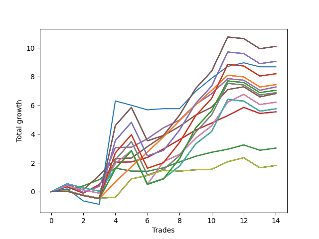

# Long Pointer 001 DB 
- Symbol: SPY_Unlimited
- Date Range: 03/23/2022 - 07/08/2022
- Trading Period: 7:20-12:30
- Number of Trades: 14



| Name | Win Percent | Profit | Avg Profit / Trade | Avg Time / Trade |      | Name | Win Percent | Profit | Avg Profit / Trade | Avg Time / Trade |
| ---- | ----------- | ------ | ------------------ | ---------------- | ---- | ---- | ----------- | ------ | ------------------ | ---------------- |
| Sorted By <br> Profit | | | | | | Sorted By <br> Win Percentage ||||
| One Hundred Thirty | 64.29 | 5050.00 | 360.71 | 28:33 |     | Sixty-Seven | 85.71 | 3410.00 | 243.57 | 13:58 |
| One Hundred Twenty-Five | 64.29 | 5050.00 | 360.71 | 28:33 |     | Fifty-Nine | 85.71 | 3410.00 | 243.57 | 13:58 |
| One Hundred Twenty | 64.29 | 5050.00 | 360.71 | 28:33 |     | Fifty-One | 85.71 | 3410.00 | 243.57 | 13:58 |
| One Hundred Fifteen | 64.29 | 5050.00 | 360.71 | 28:33 |     | Forty-Three | 85.71 | 3410.00 | 243.57 | 13:58 |
| Eighty-Five | 64.29 | 5050.00 | 360.71 | 28:33 |     | Three | 85.71 | 3410.00 | 243.57 | 13:58 |
| One Hundred Twenty-Nine | 64.29 | 4530.00 | 323.57 | 28:27 |     | Sixty-Five | 85.71 | 2775.00 | 198.21 | 12:06 |
| One Hundred Twenty-Four | 64.29 | 4530.00 | 323.57 | 28:27 |     | Fifty-Seven | 85.71 | 2775.00 | 198.21 | 12:06 |
| One Hundred Ninteen | 64.29 | 4530.00 | 323.57 | 28:27 |     | Forty-Nine | 85.71 | 2775.00 | 198.21 | 12:06 |
| One Hundred Fourteen | 64.29 | 4530.00 | 323.57 | 28:27 |     | Forty-One | 85.71 | 2775.00 | 198.21 | 12:06 |
| Eighty-Four | 64.29 | 4530.00 | 323.57 | 28:27 |     | One | 85.71 | 2775.00 | 198.21 | 12:06 |
| Seventy-Three | 64.29 | 4340.00 | 310.00 | 10:05 |     | Sixty-Six | 78.57 | 3640.00 | 260.00 | 17:18 |
| One Hundred Twenty-Eight | 64.29 | 4100.00 | 292.86 | 28:20 |     | Fifty-Eight | 78.57 | 3640.00 | 260.00 | 17:18 |
| One Hundred Twenty-Three | 64.29 | 4100.00 | 292.86 | 28:20 |     | Fifty | 78.57 | 3640.00 | 260.00 | 17:18 |
| One Hundred Eighteen | 64.29 | 4100.00 | 292.86 | 28:20 |     | Forty-Two | 78.57 | 3640.00 | 260.00 | 17:18 |
| One Hundred Thirteen | 64.29 | 4100.00 | 292.86 | 28:20 |     | Two | 78.57 | 3640.00 | 260.00 | 17:18 |
| Eighty-Three | 64.29 | 4100.00 | 292.86 | 28:20 |     | Sixty-Four | 78.57 | 1515.00 | 108.21 | 04:47 |
| One Hundred Twenty-Six | 71.43 | 3720.00 | 265.71 | 21:23 |     | Fifty-Six | 78.57 | 1515.00 | 108.21 | 04:47 |
| One Hundred Twenty-One | 71.43 | 3720.00 | 265.71 | 21:23 |     | Forty-Eight | 78.57 | 1515.00 | 108.21 | 04:47 |
| One Hundred Sixteen | 71.43 | 3720.00 | 265.71 | 21:23 |     | Forty | 78.57 | 1515.00 | 108.21 | 04:47 |
| One Hundred Eleven | 71.43 | 3720.00 | 265.71 | 21:23 |     | Zero | 78.57 | 1515.00 | 108.21 | 04:47 |
| Eighty-One | 71.43 | 3720.00 | 265.71 | 21:23 |     | One Hundred Twenty-Six | 71.43 | 3720.00 | 265.71 | 21:23 |
| Sixty-Six | 78.57 | 3640.00 | 260.00 | 17:18 |     | One Hundred Twenty-One | 71.43 | 3720.00 | 265.71 | 21:23 |
| Fifty-Eight | 78.57 | 3640.00 | 260.00 | 17:18 |     | One Hundred Sixteen | 71.43 | 3720.00 | 265.71 | 21:23 |
| Fifty | 78.57 | 3640.00 | 260.00 | 17:18 |     | One Hundred Eleven | 71.43 | 3720.00 | 265.71 | 21:23 |
| Forty-Two | 78.57 | 3640.00 | 260.00 | 17:18 |     | Eighty-One | 71.43 | 3720.00 | 265.71 | 21:23 |
| Two | 78.57 | 3640.00 | 260.00 | 17:18 |     | Sixty-Eight | 71.43 | 3110.00 | 222.14 | 21:16 |
| One Hundred Twenty-Seven | 64.29 | 3525.00 | 251.79 | 27:38 |     | Sixty | 71.43 | 3110.00 | 222.14 | 21:16 |
| One Hundred Twenty-Two | 64.29 | 3525.00 | 251.79 | 27:38 |     | Fifty-Two | 71.43 | 3110.00 | 222.14 | 21:16 |
| One Hundred Seventeen | 64.29 | 3525.00 | 251.79 | 27:38 |     | Forty-Four | 71.43 | 3110.00 | 222.14 | 21:16 |
| One Hundred Twelve | 64.29 | 3525.00 | 251.79 | 27:38 |     | Four | 71.43 | 3110.00 | 222.14 | 21:16 |
| Eighty-Two | 64.29 | 3525.00 | 251.79 | 27:38 |     | Seventy | 71.43 | 910.00 | 65.00 | 13:15 |
| Sixty-Nine | 64.29 | 3440.00 | 245.71 | 26:46 |     | Sixty-Two | 71.43 | 910.00 | 65.00 | 13:15 |
| Sixty-One | 64.29 | 3440.00 | 245.71 | 26:46 |     | Fifty-Four | 71.43 | 910.00 | 65.00 | 13:15 |
| Fifty-Three | 64.29 | 3440.00 | 245.71 | 26:46 |     | Forty-Six | 71.43 | 910.00 | 65.00 | 13:15 |
| Forty-Five | 64.29 | 3440.00 | 245.71 | 26:46 |     | Six | 71.43 | 910.00 | 65.00 | 13:15 |
| Five | 64.29 | 3440.00 | 245.71 | 26:46 |     | One Hundred Thirty | 64.29 | 5050.00 | 360.71 | 28:33 |
| Sixty-Seven | 85.71 | 3410.00 | 243.57 | 13:58 |     | One Hundred Twenty-Five | 64.29 | 5050.00 | 360.71 | 28:33 |
| Fifty-Nine | 85.71 | 3410.00 | 243.57 | 13:58 |     | One Hundred Twenty | 64.29 | 5050.00 | 360.71 | 28:33 |
| Fifty-One | 85.71 | 3410.00 | 243.57 | 13:58 |     | One Hundred Fifteen | 64.29 | 5050.00 | 360.71 | 28:33 |
| Forty-Three | 85.71 | 3410.00 | 243.57 | 13:58 |     | Eighty-Five | 64.29 | 5050.00 | 360.71 | 28:33 |
| Three | 85.71 | 3410.00 | 243.57 | 13:58 |     | One Hundred Twenty-Nine | 64.29 | 4530.00 | 323.57 | 28:27 |
| Sixty-Eight | 71.43 | 3110.00 | 222.14 | 21:16 |     | One Hundred Twenty-Four | 64.29 | 4530.00 | 323.57 | 28:27 |
| Sixty | 71.43 | 3110.00 | 222.14 | 21:16 |     | One Hundred Ninteen | 64.29 | 4530.00 | 323.57 | 28:27 |
| Fifty-Two | 71.43 | 3110.00 | 222.14 | 21:16 |     | One Hundred Fourteen | 64.29 | 4530.00 | 323.57 | 28:27 |
| Forty-Four | 71.43 | 3110.00 | 222.14 | 21:16 |     | Eighty-Four | 64.29 | 4530.00 | 323.57 | 28:27 |
| Four | 71.43 | 3110.00 | 222.14 | 21:16 |     | Seventy-Three | 64.29 | 4340.00 | 310.00 | 10:05 |
| Seventy-One | 64.29 | 2880.00 | 205.71 | 23:50 |     | One Hundred Twenty-Eight | 64.29 | 4100.00 | 292.86 | 28:20 |
| Sixty-Three | 64.29 | 2880.00 | 205.71 | 23:50 |     | One Hundred Twenty-Three | 64.29 | 4100.00 | 292.86 | 28:20 |
| Fifty-Five | 64.29 | 2880.00 | 205.71 | 23:50 |     | One Hundred Eighteen | 64.29 | 4100.00 | 292.86 | 28:20 |
| Forty-Seven | 64.29 | 2880.00 | 205.71 | 23:50 |     | One Hundred Thirteen | 64.29 | 4100.00 | 292.86 | 28:20 |
| Seven | 64.29 | 2880.00 | 205.71 | 23:50 |     | Eighty-Three | 64.29 | 4100.00 | 292.86 | 28:20 |
| Sixty-Five | 85.71 | 2775.00 | 198.21 | 12:06 |     | One Hundred Twenty-Seven | 64.29 | 3525.00 | 251.79 | 27:38 |
| Fifty-Seven | 85.71 | 2775.00 | 198.21 | 12:06 |     | One Hundred Twenty-Two | 64.29 | 3525.00 | 251.79 | 27:38 |
| Forty-Nine | 85.71 | 2775.00 | 198.21 | 12:06 |     | One Hundred Seventeen | 64.29 | 3525.00 | 251.79 | 27:38 |
| Forty-One | 85.71 | 2775.00 | 198.21 | 12:06 |     | One Hundred Twelve | 64.29 | 3525.00 | 251.79 | 27:38 |
| One | 85.71 | 2775.00 | 198.21 | 12:06 |     | Eighty-Two | 64.29 | 3525.00 | 251.79 | 27:38 |
| Sixty-Four | 78.57 | 1515.00 | 108.21 | 04:47 |     | Sixty-Nine | 64.29 | 3440.00 | 245.71 | 26:46 |
| Fifty-Six | 78.57 | 1515.00 | 108.21 | 04:47 |     | Sixty-One | 64.29 | 3440.00 | 245.71 | 26:46 |
| Forty-Eight | 78.57 | 1515.00 | 108.21 | 04:47 |     | Fifty-Three | 64.29 | 3440.00 | 245.71 | 26:46 |
| Forty | 78.57 | 1515.00 | 108.21 | 04:47 |     | Forty-Five | 64.29 | 3440.00 | 245.71 | 26:46 |
| Zero | 78.57 | 1515.00 | 108.21 | 04:47 |     | Five | 64.29 | 3440.00 | 245.71 | 26:46 |
| Seventy | 71.43 | 910.00 | 65.00 | 13:15 |     | Seventy-One | 64.29 | 2880.00 | 205.71 | 23:50 |
| Sixty-Two | 71.43 | 910.00 | 65.00 | 13:15 |     | Sixty-Three | 64.29 | 2880.00 | 205.71 | 23:50 |
| Fifty-Four | 71.43 | 910.00 | 65.00 | 13:15 |     | Fifty-Five | 64.29 | 2880.00 | 205.71 | 23:50 |
| Forty-Six | 71.43 | 910.00 | 65.00 | 13:15 |     | Forty-Seven | 64.29 | 2880.00 | 205.71 | 23:50 |
| Six | 71.43 | 910.00 | 65.00 | 13:15 |     | Seven | 64.29 | 2880.00 | 205.71 | 23:50 |

## NO STOPLOSS

### Test Zero
* Sell when price hits the middle line of the 20p bollinger
* No Stoploss
* Results:
```
Total Trades: 14
Percent Up: 78.57
Percent Down: 21.43
Total Points Moved Up: 3.03
Potential Profit: 1515.00
Total Points Ups: 3.62 Count Ups: 11
Total Points Downs: -0.59 Count Downs: 3
```

<details><summary>Trades</summary>

<code>In: 2022-03-31 08:37:00		Out: 2022-03-31 08:38:05		Total Position Time: 01:05		Total Move Up: 0.15		Total to Date: 0.15</code> <br />
<code>In: 2022-05-02 08:07:00		Out: 2022-05-02 08:13:20		Total Position Time: 06:20		Total Move Up: 0.25		Total to Date: 0.40</code> <br />
<code>In: 2022-05-02 08:22:00		Out: 2022-05-02 08:26:05		Total Position Time: 04:05		Total Move Up: 0.44		Total to Date: 0.84</code> <br />
<code>In: 2022-05-04 11:36:00		Out: 2022-05-04 11:36:40		Total Position Time: 00:40		Total Move Up: 0.80		Total to Date: 1.64</code> <br />
<code>In: 2022-05-06 11:28:00		Out: 2022-05-06 11:40:25		Total Position Time: 12:25		Total Move Up: -0.21		Total to Date: 1.43</code> <br />
<code>In: 2022-05-11 09:14:00		Out: 2022-05-11 09:17:50		Total Position Time: 03:50		Total Move Up: -0.01		Total to Date: 1.42</code> <br />
<code>In: 2022-05-13 11:07:00		Out: 2022-05-13 11:19:15		Total Position Time: 12:15		Total Move Up: 0.24		Total to Date: 1.66</code> <br />
<code>In: 2022-05-16 09:47:00		Out: 2022-05-16 09:48:15		Total Position Time: 01:15		Total Move Up: 0.41		Total to Date: 2.07</code> <br />
<code>In: 2022-05-23 10:23:00		Out: 2022-05-23 10:26:30		Total Position Time: 03:30		Total Move Up: 0.39		Total to Date: 2.46</code> <br />
<code>In: 2022-05-27 08:04:00		Out: 2022-05-27 08:06:55		Total Position Time: 02:55		Total Move Up: 0.28		Total to Date: 2.74</code> <br />
<code>In: 2022-05-31 12:05:00		Out: 2022-05-31 12:07:20		Total Position Time: 02:20		Total Move Up: 0.21		Total to Date: 2.95</code> <br />
<code>In: 2022-06-27 10:10:00		Out: 2022-06-27 10:11:25		Total Position Time: 01:25		Total Move Up: 0.30		Total to Date: 3.25</code> <br />
<code>In: 2022-06-27 10:37:00		Out: 2022-06-27 10:51:15		Total Position Time: 14:15		Total Move Up: -0.37		Total to Date: 2.88</code> <br />
<code>In: 2022-07-08 09:48:00		Out: 2022-07-08 09:48:45		Total Position Time: 00:45		Total Move Up: 0.15		Total to Date: 3.03</code> <br />


</details>

### Test One
* Sell when the price hits the upper line of the 20p 1std bollinger
* No Stoploss
* Results:
```
Total Trades: 14
Percent Up: 85.71
Percent Down: 14.29
Total Points Moved Up: 5.55
Potential Profit: 2775.00
Total Points Ups: 6.41 Count Ups: 12
Total Points Downs: -0.86 Count Downs: 2
```

<details><summary>Trades</summary>

<code>In: 2022-03-31 08:37:00		Out: 2022-03-31 08:40:35		Total Position Time: 03:35		Total Move Up: 0.34		Total to Date: 0.34</code> <br />
<code>In: 2022-05-02 08:07:00		Out: 2022-05-02 08:34:10		Total Position Time: 27:10		Total Move Up: -0.44		Total to Date: -0.10</code> <br />
<code>In: 2022-05-02 08:22:00		Out: 2022-05-02 08:34:10		Total Position Time: 12:10		Total Move Up: 0.59		Total to Date: 0.49</code> <br />
<code>In: 2022-05-04 11:36:00		Out: 2022-05-04 11:41:35		Total Position Time: 05:35		Total Move Up: 1.56		Total to Date: 2.05</code> <br />
<code>In: 2022-05-06 11:28:00		Out: 2022-05-06 11:49:10		Total Position Time: 21:10		Total Move Up: 0.02		Total to Date: 2.07</code> <br />
<code>In: 2022-05-11 09:14:00		Out: 2022-05-11 09:23:10		Total Position Time: 09:10		Total Move Up: 0.31		Total to Date: 2.38</code> <br />
<code>In: 2022-05-13 11:07:00		Out: 2022-05-13 11:20:00		Total Position Time: 13:00		Total Move Up: 0.59		Total to Date: 2.97</code> <br />
<code>In: 2022-05-16 09:47:00		Out: 2022-05-16 09:50:05		Total Position Time: 03:05		Total Move Up: 0.65		Total to Date: 3.62</code> <br />
<code>In: 2022-05-23 10:23:00		Out: 2022-05-23 10:32:35		Total Position Time: 09:35		Total Move Up: 0.66		Total to Date: 4.28</code> <br />
<code>In: 2022-05-27 08:04:00		Out: 2022-05-27 08:11:00		Total Position Time: 07:00		Total Move Up: 0.49		Total to Date: 4.77</code> <br />
<code>In: 2022-05-31 12:05:00		Out: 2022-05-31 12:09:15		Total Position Time: 04:15		Total Move Up: 0.52		Total to Date: 5.29</code> <br />
<code>In: 2022-06-27 10:10:00		Out: 2022-06-27 10:15:55		Total Position Time: 05:55		Total Move Up: 0.57		Total to Date: 5.86</code> <br />
<code>In: 2022-06-27 10:37:00		Out: 2022-06-27 11:03:15		Total Position Time: 26:15		Total Move Up: -0.42		Total to Date: 5.44</code> <br />
<code>In: 2022-07-08 09:48:00		Out: 2022-07-08 10:09:40		Total Position Time: 21:40		Total Move Up: 0.11		Total to Date: 5.55</code> <br />


</details>

### Test Two
* Sell when the price hits the upper line of the 20p 2std bollinger
* No Stoploss
* Results:
```
Total Trades: 14
Percent Up: 78.57
Percent Down: 21.43
Total Points Moved Up: 7.28
Potential Profit: 3640.00
Total Points Ups: 8.70 Count Ups: 11
Total Points Downs: -1.42 Count Downs: 3
```

<details><summary>Trades</summary>

<code>In: 2022-03-31 08:37:00		Out: 2022-03-31 08:41:10		Total Position Time: 04:10		Total Move Up: 0.56		Total to Date: 0.56</code> <br />
<code>In: 2022-05-02 08:07:00		Out: 2022-05-02 08:36:25		Total Position Time: 29:25		Total Move Up: -0.61		Total to Date: -0.05</code> <br />
<code>In: 2022-05-02 08:22:00		Out: 2022-05-02 08:36:25		Total Position Time: 14:25		Total Move Up: 0.42		Total to Date: 0.37</code> <br />
<code>In: 2022-05-04 11:36:00		Out: 2022-05-04 11:43:45		Total Position Time: 07:45		Total Move Up: 2.70		Total to Date: 3.07</code> <br />
<code>In: 2022-05-06 11:28:00		Out: 2022-05-06 11:49:10		Total Position Time: 21:10		Total Move Up: 0.02		Total to Date: 3.09</code> <br />
<code>In: 2022-05-11 09:14:00		Out: 2022-05-11 09:23:35		Total Position Time: 09:35		Total Move Up: 0.59		Total to Date: 3.68</code> <br />
<code>In: 2022-05-13 11:07:00		Out: 2022-05-13 11:31:20		Total Position Time: 24:20		Total Move Up: 0.76		Total to Date: 4.44</code> <br />
<code>In: 2022-05-16 09:47:00		Out: 2022-05-16 10:07:00		Total Position Time: 20:00		Total Move Up: 0.54		Total to Date: 4.98</code> <br />
<code>In: 2022-05-23 10:23:00		Out: 2022-05-23 10:33:15		Total Position Time: 10:15		Total Move Up: 1.08		Total to Date: 6.06</code> <br />
<code>In: 2022-05-27 08:04:00		Out: 2022-05-27 08:12:15		Total Position Time: 08:15		Total Move Up: 0.75		Total to Date: 6.81</code> <br />
<code>In: 2022-05-31 12:05:00		Out: 2022-05-31 12:15:05		Total Position Time: 10:05		Total Move Up: 1.05		Total to Date: 7.86</code> <br />
<code>In: 2022-06-27 10:10:00		Out: 2022-06-27 10:39:55		Total Position Time: 29:55		Total Move Up: -0.11		Total to Date: 7.75</code> <br />
<code>In: 2022-06-27 10:37:00		Out: 2022-06-27 11:06:55		Total Position Time: 29:55		Total Move Up: -0.70		Total to Date: 7.05</code> <br />
<code>In: 2022-07-08 09:48:00		Out: 2022-07-08 10:11:10		Total Position Time: 23:10		Total Move Up: 0.23		Total to Date: 7.28</code> <br />


</details>

### Test Three
* Sell when price hits the middle line of the 50p bollinger
* No Stoploss
* Results:
```
Total Trades: 14
Percent Up: 85.71
Percent Down: 14.29
Total Points Moved Up: 6.82
Potential Profit: 3410.00
Total Points Ups: 7.82 Count Ups: 12
Total Points Downs: -1.00 Count Downs: 2
```

<details><summary>Trades</summary>

<code>In: 2022-03-31 08:37:00		Out: 2022-03-31 08:41:05		Total Position Time: 04:05		Total Move Up: 0.44		Total to Date: 0.44</code> <br />
<code>In: 2022-05-02 08:07:00		Out: 2022-05-02 08:36:55		Total Position Time: 29:55		Total Move Up: -0.30		Total to Date: 0.14</code> <br />
<code>In: 2022-05-02 08:22:00		Out: 2022-05-02 08:38:15		Total Position Time: 16:15		Total Move Up: 0.99		Total to Date: 1.13</code> <br />
<code>In: 2022-05-04 11:36:00		Out: 2022-05-04 11:41:15		Total Position Time: 05:15		Total Move Up: 1.16		Total to Date: 2.29</code> <br />
<code>In: 2022-05-06 11:28:00		Out: 2022-05-06 11:49:15		Total Position Time: 21:15		Total Move Up: 0.05		Total to Date: 2.34</code> <br />
<code>In: 2022-05-11 09:14:00		Out: 2022-05-11 09:23:45		Total Position Time: 09:45		Total Move Up: 0.79		Total to Date: 3.13</code> <br />
<code>In: 2022-05-13 11:07:00		Out: 2022-05-13 11:31:20		Total Position Time: 24:20		Total Move Up: 0.76		Total to Date: 3.89</code> <br />
<code>In: 2022-05-16 09:47:00		Out: 2022-05-16 09:50:05		Total Position Time: 03:05		Total Move Up: 0.65		Total to Date: 4.54</code> <br />
<code>In: 2022-05-23 10:23:00		Out: 2022-05-23 10:33:00		Total Position Time: 10:00		Total Move Up: 0.78		Total to Date: 5.32</code> <br />
<code>In: 2022-05-27 08:04:00		Out: 2022-05-27 08:11:10		Total Position Time: 07:10		Total Move Up: 0.55		Total to Date: 5.87</code> <br />
<code>In: 2022-05-31 12:05:00		Out: 2022-05-31 12:15:15		Total Position Time: 10:15		Total Move Up: 1.23		Total to Date: 7.10</code> <br />
<code>In: 2022-06-27 10:10:00		Out: 2022-06-27 10:11:15		Total Position Time: 01:15		Total Move Up: 0.19		Total to Date: 7.29</code> <br />
<code>In: 2022-06-27 10:37:00		Out: 2022-06-27 11:06:55		Total Position Time: 29:55		Total Move Up: -0.70		Total to Date: 6.59</code> <br />
<code>In: 2022-07-08 09:48:00		Out: 2022-07-08 10:11:05		Total Position Time: 23:05		Total Move Up: 0.23		Total to Date: 6.82</code> <br />


</details>

### Test Four
* Sell when the price hits the upper line of the 50p 1std bollinger
* No Stoploss
* Results:
```
Total Trades: 14
Percent Up: 71.43
Percent Down: 28.57
Total Points Moved Up: 6.22
Potential Profit: 3110.00
Total Points Ups: 9.77 Count Ups: 10
Total Points Downs: -3.55 Count Downs: 4
```

<details><summary>Trades</summary>

<code>In: 2022-03-31 08:37:00		Out: 2022-03-31 09:00:15		Total Position Time: 23:15		Total Move Up: 0.42		Total to Date: 0.42</code> <br />
<code>In: 2022-05-02 08:07:00		Out: 2022-05-02 08:36:55		Total Position Time: 29:55		Total Move Up: -0.30		Total to Date: 0.12</code> <br />
<code>In: 2022-05-02 08:22:00		Out: 2022-05-02 08:51:55		Total Position Time: 29:55		Total Move Up: -0.22		Total to Date: -0.10</code> <br />
<code>In: 2022-05-04 11:36:00		Out: 2022-05-04 11:42:00		Total Position Time: 06:00		Total Move Up: 2.07		Total to Date: 1.97</code> <br />
<code>In: 2022-05-06 11:28:00		Out: 2022-05-06 11:50:10		Total Position Time: 22:10		Total Move Up: 0.87		Total to Date: 2.84</code> <br />
<code>In: 2022-05-11 09:14:00		Out: 2022-05-11 09:43:55		Total Position Time: 29:55		Total Move Up: -2.33		Total to Date: 0.51</code> <br />
<code>In: 2022-05-13 11:07:00		Out: 2022-05-13 11:32:00		Total Position Time: 25:00		Total Move Up: 1.58		Total to Date: 2.09</code> <br />
<code>In: 2022-05-16 09:47:00		Out: 2022-05-16 10:07:05		Total Position Time: 20:05		Total Move Up: 0.50		Total to Date: 2.59</code> <br />
<code>In: 2022-05-23 10:23:00		Out: 2022-05-23 10:36:15		Total Position Time: 13:15		Total Move Up: 1.12		Total to Date: 3.71</code> <br />
<code>In: 2022-05-27 08:04:00		Out: 2022-05-27 08:16:05		Total Position Time: 12:05		Total Move Up: 0.87		Total to Date: 4.58</code> <br />
<code>In: 2022-05-31 12:05:00		Out: 2022-05-31 12:28:20		Total Position Time: 23:20		Total Move Up: 1.64		Total to Date: 6.22</code> <br />
<code>In: 2022-06-27 10:10:00		Out: 2022-06-27 10:13:05		Total Position Time: 03:05		Total Move Up: 0.54		Total to Date: 6.76</code> <br />
<code>In: 2022-06-27 10:37:00		Out: 2022-06-27 11:06:55		Total Position Time: 29:55		Total Move Up: -0.70		Total to Date: 6.06</code> <br />
<code>In: 2022-07-08 09:48:00		Out: 2022-07-08 10:17:55		Total Position Time: 29:55		Total Move Up: 0.16		Total to Date: 6.22</code> <br />


</details>

### Test Five
* Sell when the price hits the upper line of the 50p 2std bollinger
* No Stoploss
* Results:
```
Total Trades: 14
Percent Up: 64.29
Percent Down: 35.71
Total Points Moved Up: 6.88
Potential Profit: 3440.00
Total Points Ups: 10.54 Count Ups: 9
Total Points Downs: -3.66 Count Downs: 5
```

<details><summary>Trades</summary>

<code>In: 2022-03-31 08:37:00		Out: 2022-03-31 09:06:55		Total Position Time: 29:55		Total Move Up: 0.03		Total to Date: 0.03</code> <br />
<code>In: 2022-05-02 08:07:00		Out: 2022-05-02 08:36:55		Total Position Time: 29:55		Total Move Up: -0.30		Total to Date: -0.27</code> <br />
<code>In: 2022-05-02 08:22:00		Out: 2022-05-02 08:51:55		Total Position Time: 29:55		Total Move Up: -0.22		Total to Date: -0.49</code> <br />
<code>In: 2022-05-04 11:36:00		Out: 2022-05-04 11:43:45		Total Position Time: 07:45		Total Move Up: 2.70		Total to Date: 2.21</code> <br />
<code>In: 2022-05-06 11:28:00		Out: 2022-05-06 11:50:35		Total Position Time: 22:35		Total Move Up: 1.28		Total to Date: 3.49</code> <br />
<code>In: 2022-05-11 09:14:00		Out: 2022-05-11 09:43:55		Total Position Time: 29:55		Total Move Up: -2.33		Total to Date: 1.16</code> <br />
<code>In: 2022-05-13 11:07:00		Out: 2022-05-13 11:36:55		Total Position Time: 29:55		Total Move Up: 0.38		Total to Date: 1.54</code> <br />
<code>In: 2022-05-16 09:47:00		Out: 2022-05-16 10:11:25		Total Position Time: 24:25		Total Move Up: 0.97		Total to Date: 2.51</code> <br />
<code>In: 2022-05-23 10:23:00		Out: 2022-05-23 10:47:45		Total Position Time: 24:45		Total Move Up: 1.62		Total to Date: 4.13</code> <br />
<code>In: 2022-05-27 08:04:00		Out: 2022-05-27 08:33:55		Total Position Time: 29:55		Total Move Up: 1.21		Total to Date: 5.34</code> <br />
<code>In: 2022-05-31 12:05:00		Out: 2022-05-31 12:31:00		Total Position Time: 26:00		Total Move Up: 2.19		Total to Date: 7.53</code> <br />
<code>In: 2022-06-27 10:10:00		Out: 2022-06-27 10:39:55		Total Position Time: 29:55		Total Move Up: -0.11		Total to Date: 7.42</code> <br />
<code>In: 2022-06-27 10:37:00		Out: 2022-06-27 11:06:55		Total Position Time: 29:55		Total Move Up: -0.70		Total to Date: 6.72</code> <br />
<code>In: 2022-07-08 09:48:00		Out: 2022-07-08 10:17:55		Total Position Time: 29:55		Total Move Up: 0.16		Total to Date: 6.88</code> <br />


</details>

### Test Six
* Sell when the price hits the middle line of the 1std VWAP
* No Stoploss
* Results:
```
Total Trades: 14
Percent Up: 71.43
Percent Down: 28.57
Total Points Moved Up: 1.82
Potential Profit: 910.00
Total Points Ups: 3.11 Count Ups: 10
Total Points Downs: -1.29 Count Downs: 4
```

<details><summary>Trades</summary>

<code>In: 2022-03-31 08:37:00		Out: 2022-03-31 08:37:10		Total Position Time: 00:10		Total Move Up: 0.07		Total to Date: 0.07</code> <br />
<code>In: 2022-05-02 08:07:00		Out: 2022-05-02 08:36:55		Total Position Time: 29:55		Total Move Up: -0.30		Total to Date: -0.23</code> <br />
<code>In: 2022-05-02 08:22:00		Out: 2022-05-02 08:51:55		Total Position Time: 29:55		Total Move Up: -0.22		Total to Date: -0.45</code> <br />
<code>In: 2022-05-04 11:36:00		Out: 2022-05-04 11:36:10		Total Position Time: 00:10		Total Move Up: 0.06		Total to Date: -0.39</code> <br />
<code>In: 2022-05-06 11:28:00		Out: 2022-05-06 11:50:20		Total Position Time: 22:20		Total Move Up: 1.28		Total to Date: 0.89</code> <br />
<code>In: 2022-05-11 09:14:00		Out: 2022-05-11 09:21:05		Total Position Time: 07:05		Total Move Up: 0.23		Total to Date: 1.12</code> <br />
<code>In: 2022-05-13 11:07:00		Out: 2022-05-13 11:36:55		Total Position Time: 29:55		Total Move Up: 0.38		Total to Date: 1.50</code> <br />
<code>In: 2022-05-16 09:47:00		Out: 2022-05-16 09:47:10		Total Position Time: 00:10		Total Move Up: -0.07		Total to Date: 1.43</code> <br />
<code>In: 2022-05-23 10:23:00		Out: 2022-05-23 10:23:10		Total Position Time: 00:10		Total Move Up: 0.09		Total to Date: 1.52</code> <br />
<code>In: 2022-05-27 08:04:00		Out: 2022-05-27 08:04:10		Total Position Time: 00:10		Total Move Up: 0.04		Total to Date: 1.56</code> <br />
<code>In: 2022-05-31 12:05:00		Out: 2022-05-31 12:09:15		Total Position Time: 04:15		Total Move Up: 0.52		Total to Date: 2.08</code> <br />
<code>In: 2022-06-27 10:10:00		Out: 2022-06-27 10:11:30		Total Position Time: 01:30		Total Move Up: 0.28		Total to Date: 2.36</code> <br />
<code>In: 2022-06-27 10:37:00		Out: 2022-06-27 11:06:55		Total Position Time: 29:55		Total Move Up: -0.70		Total to Date: 1.66</code> <br />
<code>In: 2022-07-08 09:48:00		Out: 2022-07-08 10:17:55		Total Position Time: 29:55		Total Move Up: 0.16		Total to Date: 1.82</code> <br />


</details>

### Test Seven
* Sell when the price hits the upper line of the 1std VWAP
* No Stoploss
* Results:
```
Total Trades: 14
Percent Up: 64.29
Percent Down: 35.71
Total Points Moved Up: 5.76
Potential Profit: 2880.00
Total Points Ups: 9.42 Count Ups: 9
Total Points Downs: -3.66 Count Downs: 5
```

<details><summary>Trades</summary>

<code>In: 2022-03-31 08:37:00		Out: 2022-03-31 08:41:10		Total Position Time: 04:10		Total Move Up: 0.56		Total to Date: 0.56</code> <br />
<code>In: 2022-05-02 08:07:00		Out: 2022-05-02 08:36:55		Total Position Time: 29:55		Total Move Up: -0.30		Total to Date: 0.26</code> <br />
<code>In: 2022-05-02 08:22:00		Out: 2022-05-02 08:51:55		Total Position Time: 29:55		Total Move Up: -0.22		Total to Date: 0.04</code> <br />
<code>In: 2022-05-04 11:36:00		Out: 2022-05-04 11:41:35		Total Position Time: 05:35		Total Move Up: 1.56		Total to Date: 1.60</code> <br />
<code>In: 2022-05-06 11:28:00		Out: 2022-05-06 11:57:55		Total Position Time: 29:55		Total Move Up: 1.26		Total to Date: 2.86</code> <br />
<code>In: 2022-05-11 09:14:00		Out: 2022-05-11 09:43:55		Total Position Time: 29:55		Total Move Up: -2.33		Total to Date: 0.53</code> <br />
<code>In: 2022-05-13 11:07:00		Out: 2022-05-13 11:36:55		Total Position Time: 29:55		Total Move Up: 0.38		Total to Date: 0.91</code> <br />
<code>In: 2022-05-16 09:47:00		Out: 2022-05-16 10:09:55		Total Position Time: 22:55		Total Move Up: 0.87		Total to Date: 1.78</code> <br />
<code>In: 2022-05-23 10:23:00		Out: 2022-05-23 10:46:25		Total Position Time: 23:25		Total Move Up: 1.53		Total to Date: 3.31</code> <br />
<code>In: 2022-05-27 08:04:00		Out: 2022-05-27 08:16:05		Total Position Time: 12:05		Total Move Up: 0.87		Total to Date: 4.18</code> <br />
<code>In: 2022-05-31 12:05:00		Out: 2022-05-31 12:31:10		Total Position Time: 26:10		Total Move Up: 2.23		Total to Date: 6.41</code> <br />
<code>In: 2022-06-27 10:10:00		Out: 2022-06-27 10:39:55		Total Position Time: 29:55		Total Move Up: -0.11		Total to Date: 6.30</code> <br />
<code>In: 2022-06-27 10:37:00		Out: 2022-06-27 11:06:55		Total Position Time: 29:55		Total Move Up: -0.70		Total to Date: 5.60</code> <br />
<code>In: 2022-07-08 09:48:00		Out: 2022-07-08 10:17:55		Total Position Time: 29:55		Total Move Up: 0.16		Total to Date: 5.76</code> <br />


</details>

## STOPLOSS OF 5

### Test Forty
* Sell when price hits the middle line of the 20p bollinger
* Stoploss is 5 points
* Results:
```
Total Trades: 14
Percent Up: 78.57
Percent Down: 21.43
Total Points Moved Up: 3.03
Potential Profit: 1515.00
Total Points Ups: 3.62 Count Ups: 11
Total Points Downs: -0.59 Count Downs: 3
```

<details><summary>Trades</summary>

<code>In: 2022-03-31 08:37:00		Out: 2022-03-31 08:38:05		Total Position Time: 01:05		Total Move Up: 0.15		Total to Date: 0.15</code> <br />
<code>In: 2022-05-02 08:07:00		Out: 2022-05-02 08:13:20		Total Position Time: 06:20		Total Move Up: 0.25		Total to Date: 0.40</code> <br />
<code>In: 2022-05-02 08:22:00		Out: 2022-05-02 08:26:05		Total Position Time: 04:05		Total Move Up: 0.44		Total to Date: 0.84</code> <br />
<code>In: 2022-05-04 11:36:00		Out: 2022-05-04 11:36:40		Total Position Time: 00:40		Total Move Up: 0.80		Total to Date: 1.64</code> <br />
<code>In: 2022-05-06 11:28:00		Out: 2022-05-06 11:40:25		Total Position Time: 12:25		Total Move Up: -0.21		Total to Date: 1.43</code> <br />
<code>In: 2022-05-11 09:14:00		Out: 2022-05-11 09:17:50		Total Position Time: 03:50		Total Move Up: -0.01		Total to Date: 1.42</code> <br />
<code>In: 2022-05-13 11:07:00		Out: 2022-05-13 11:19:15		Total Position Time: 12:15		Total Move Up: 0.24		Total to Date: 1.66</code> <br />
<code>In: 2022-05-16 09:47:00		Out: 2022-05-16 09:48:15		Total Position Time: 01:15		Total Move Up: 0.41		Total to Date: 2.07</code> <br />
<code>In: 2022-05-23 10:23:00		Out: 2022-05-23 10:26:30		Total Position Time: 03:30		Total Move Up: 0.39		Total to Date: 2.46</code> <br />
<code>In: 2022-05-27 08:04:00		Out: 2022-05-27 08:06:55		Total Position Time: 02:55		Total Move Up: 0.28		Total to Date: 2.74</code> <br />
<code>In: 2022-05-31 12:05:00		Out: 2022-05-31 12:07:20		Total Position Time: 02:20		Total Move Up: 0.21		Total to Date: 2.95</code> <br />
<code>In: 2022-06-27 10:10:00		Out: 2022-06-27 10:11:25		Total Position Time: 01:25		Total Move Up: 0.30		Total to Date: 3.25</code> <br />
<code>In: 2022-06-27 10:37:00		Out: 2022-06-27 10:51:15		Total Position Time: 14:15		Total Move Up: -0.37		Total to Date: 2.88</code> <br />
<code>In: 2022-07-08 09:48:00		Out: 2022-07-08 09:48:45		Total Position Time: 00:45		Total Move Up: 0.15		Total to Date: 3.03</code> <br />


</details>

### Test Forty-One
* Sell when the price hits the upper line of the 20p 1std bollinger
* Stoploss is 5 points
* Results:
```
Total Trades: 14
Percent Up: 85.71
Percent Down: 14.29
Total Points Moved Up: 5.55
Potential Profit: 2775.00
Total Points Ups: 6.41 Count Ups: 12
Total Points Downs: -0.86 Count Downs: 2
```

<details><summary>Trades</summary>

<code>In: 2022-03-31 08:37:00		Out: 2022-03-31 08:40:35		Total Position Time: 03:35		Total Move Up: 0.34		Total to Date: 0.34</code> <br />
<code>In: 2022-05-02 08:07:00		Out: 2022-05-02 08:34:10		Total Position Time: 27:10		Total Move Up: -0.44		Total to Date: -0.10</code> <br />
<code>In: 2022-05-02 08:22:00		Out: 2022-05-02 08:34:10		Total Position Time: 12:10		Total Move Up: 0.59		Total to Date: 0.49</code> <br />
<code>In: 2022-05-04 11:36:00		Out: 2022-05-04 11:41:35		Total Position Time: 05:35		Total Move Up: 1.56		Total to Date: 2.05</code> <br />
<code>In: 2022-05-06 11:28:00		Out: 2022-05-06 11:49:10		Total Position Time: 21:10		Total Move Up: 0.02		Total to Date: 2.07</code> <br />
<code>In: 2022-05-11 09:14:00		Out: 2022-05-11 09:23:10		Total Position Time: 09:10		Total Move Up: 0.31		Total to Date: 2.38</code> <br />
<code>In: 2022-05-13 11:07:00		Out: 2022-05-13 11:20:00		Total Position Time: 13:00		Total Move Up: 0.59		Total to Date: 2.97</code> <br />
<code>In: 2022-05-16 09:47:00		Out: 2022-05-16 09:50:05		Total Position Time: 03:05		Total Move Up: 0.65		Total to Date: 3.62</code> <br />
<code>In: 2022-05-23 10:23:00		Out: 2022-05-23 10:32:35		Total Position Time: 09:35		Total Move Up: 0.66		Total to Date: 4.28</code> <br />
<code>In: 2022-05-27 08:04:00		Out: 2022-05-27 08:11:00		Total Position Time: 07:00		Total Move Up: 0.49		Total to Date: 4.77</code> <br />
<code>In: 2022-05-31 12:05:00		Out: 2022-05-31 12:09:15		Total Position Time: 04:15		Total Move Up: 0.52		Total to Date: 5.29</code> <br />
<code>In: 2022-06-27 10:10:00		Out: 2022-06-27 10:15:55		Total Position Time: 05:55		Total Move Up: 0.57		Total to Date: 5.86</code> <br />
<code>In: 2022-06-27 10:37:00		Out: 2022-06-27 11:03:15		Total Position Time: 26:15		Total Move Up: -0.42		Total to Date: 5.44</code> <br />
<code>In: 2022-07-08 09:48:00		Out: 2022-07-08 10:09:40		Total Position Time: 21:40		Total Move Up: 0.11		Total to Date: 5.55</code> <br />


</details>

### Test Forty-Two
* Sell when the price hits the upper line of the 20p 2std bollinger
* Stoploss is 5 points
* Results:
```
Total Trades: 14
Percent Up: 78.57
Percent Down: 21.43
Total Points Moved Up: 7.28
Potential Profit: 3640.00
Total Points Ups: 8.70 Count Ups: 11
Total Points Downs: -1.42 Count Downs: 3
```

<details><summary>Trades</summary>

<code>In: 2022-03-31 08:37:00		Out: 2022-03-31 08:41:10		Total Position Time: 04:10		Total Move Up: 0.56		Total to Date: 0.56</code> <br />
<code>In: 2022-05-02 08:07:00		Out: 2022-05-02 08:36:25		Total Position Time: 29:25		Total Move Up: -0.61		Total to Date: -0.05</code> <br />
<code>In: 2022-05-02 08:22:00		Out: 2022-05-02 08:36:25		Total Position Time: 14:25		Total Move Up: 0.42		Total to Date: 0.37</code> <br />
<code>In: 2022-05-04 11:36:00		Out: 2022-05-04 11:43:45		Total Position Time: 07:45		Total Move Up: 2.70		Total to Date: 3.07</code> <br />
<code>In: 2022-05-06 11:28:00		Out: 2022-05-06 11:49:10		Total Position Time: 21:10		Total Move Up: 0.02		Total to Date: 3.09</code> <br />
<code>In: 2022-05-11 09:14:00		Out: 2022-05-11 09:23:35		Total Position Time: 09:35		Total Move Up: 0.59		Total to Date: 3.68</code> <br />
<code>In: 2022-05-13 11:07:00		Out: 2022-05-13 11:31:20		Total Position Time: 24:20		Total Move Up: 0.76		Total to Date: 4.44</code> <br />
<code>In: 2022-05-16 09:47:00		Out: 2022-05-16 10:07:00		Total Position Time: 20:00		Total Move Up: 0.54		Total to Date: 4.98</code> <br />
<code>In: 2022-05-23 10:23:00		Out: 2022-05-23 10:33:15		Total Position Time: 10:15		Total Move Up: 1.08		Total to Date: 6.06</code> <br />
<code>In: 2022-05-27 08:04:00		Out: 2022-05-27 08:12:15		Total Position Time: 08:15		Total Move Up: 0.75		Total to Date: 6.81</code> <br />
<code>In: 2022-05-31 12:05:00		Out: 2022-05-31 12:15:05		Total Position Time: 10:05		Total Move Up: 1.05		Total to Date: 7.86</code> <br />
<code>In: 2022-06-27 10:10:00		Out: 2022-06-27 10:39:55		Total Position Time: 29:55		Total Move Up: -0.11		Total to Date: 7.75</code> <br />
<code>In: 2022-06-27 10:37:00		Out: 2022-06-27 11:06:55		Total Position Time: 29:55		Total Move Up: -0.70		Total to Date: 7.05</code> <br />
<code>In: 2022-07-08 09:48:00		Out: 2022-07-08 10:11:10		Total Position Time: 23:10		Total Move Up: 0.23		Total to Date: 7.28</code> <br />


</details>

### Test Forty-Three
* Sell when price hits the middle line of the 50p bollinger
* Stoploss is 5 points
* Results:
```
Total Trades: 14
Percent Up: 85.71
Percent Down: 14.29
Total Points Moved Up: 6.82
Potential Profit: 3410.00
Total Points Ups: 7.82 Count Ups: 12
Total Points Downs: -1.00 Count Downs: 2
```

<details><summary>Trades</summary>

<code>In: 2022-03-31 08:37:00		Out: 2022-03-31 08:41:05		Total Position Time: 04:05		Total Move Up: 0.44		Total to Date: 0.44</code> <br />
<code>In: 2022-05-02 08:07:00		Out: 2022-05-02 08:36:55		Total Position Time: 29:55		Total Move Up: -0.30		Total to Date: 0.14</code> <br />
<code>In: 2022-05-02 08:22:00		Out: 2022-05-02 08:38:15		Total Position Time: 16:15		Total Move Up: 0.99		Total to Date: 1.13</code> <br />
<code>In: 2022-05-04 11:36:00		Out: 2022-05-04 11:41:15		Total Position Time: 05:15		Total Move Up: 1.16		Total to Date: 2.29</code> <br />
<code>In: 2022-05-06 11:28:00		Out: 2022-05-06 11:49:15		Total Position Time: 21:15		Total Move Up: 0.05		Total to Date: 2.34</code> <br />
<code>In: 2022-05-11 09:14:00		Out: 2022-05-11 09:23:45		Total Position Time: 09:45		Total Move Up: 0.79		Total to Date: 3.13</code> <br />
<code>In: 2022-05-13 11:07:00		Out: 2022-05-13 11:31:20		Total Position Time: 24:20		Total Move Up: 0.76		Total to Date: 3.89</code> <br />
<code>In: 2022-05-16 09:47:00		Out: 2022-05-16 09:50:05		Total Position Time: 03:05		Total Move Up: 0.65		Total to Date: 4.54</code> <br />
<code>In: 2022-05-23 10:23:00		Out: 2022-05-23 10:33:00		Total Position Time: 10:00		Total Move Up: 0.78		Total to Date: 5.32</code> <br />
<code>In: 2022-05-27 08:04:00		Out: 2022-05-27 08:11:10		Total Position Time: 07:10		Total Move Up: 0.55		Total to Date: 5.87</code> <br />
<code>In: 2022-05-31 12:05:00		Out: 2022-05-31 12:15:15		Total Position Time: 10:15		Total Move Up: 1.23		Total to Date: 7.10</code> <br />
<code>In: 2022-06-27 10:10:00		Out: 2022-06-27 10:11:15		Total Position Time: 01:15		Total Move Up: 0.19		Total to Date: 7.29</code> <br />
<code>In: 2022-06-27 10:37:00		Out: 2022-06-27 11:06:55		Total Position Time: 29:55		Total Move Up: -0.70		Total to Date: 6.59</code> <br />
<code>In: 2022-07-08 09:48:00		Out: 2022-07-08 10:11:05		Total Position Time: 23:05		Total Move Up: 0.23		Total to Date: 6.82</code> <br />


</details>

### Test Forty-Four
* Sell when the price hits the upper line of the 50p 1std bollinger
* Stoploss is 5 points
* Results:
```
Total Trades: 14
Percent Up: 71.43
Percent Down: 28.57
Total Points Moved Up: 6.22
Potential Profit: 3110.00
Total Points Ups: 9.77 Count Ups: 10
Total Points Downs: -3.55 Count Downs: 4
```

<details><summary>Trades</summary>

<code>In: 2022-03-31 08:37:00		Out: 2022-03-31 09:00:15		Total Position Time: 23:15		Total Move Up: 0.42		Total to Date: 0.42</code> <br />
<code>In: 2022-05-02 08:07:00		Out: 2022-05-02 08:36:55		Total Position Time: 29:55		Total Move Up: -0.30		Total to Date: 0.12</code> <br />
<code>In: 2022-05-02 08:22:00		Out: 2022-05-02 08:51:55		Total Position Time: 29:55		Total Move Up: -0.22		Total to Date: -0.10</code> <br />
<code>In: 2022-05-04 11:36:00		Out: 2022-05-04 11:42:00		Total Position Time: 06:00		Total Move Up: 2.07		Total to Date: 1.97</code> <br />
<code>In: 2022-05-06 11:28:00		Out: 2022-05-06 11:50:10		Total Position Time: 22:10		Total Move Up: 0.87		Total to Date: 2.84</code> <br />
<code>In: 2022-05-11 09:14:00		Out: 2022-05-11 09:43:55		Total Position Time: 29:55		Total Move Up: -2.33		Total to Date: 0.51</code> <br />
<code>In: 2022-05-13 11:07:00		Out: 2022-05-13 11:32:00		Total Position Time: 25:00		Total Move Up: 1.58		Total to Date: 2.09</code> <br />
<code>In: 2022-05-16 09:47:00		Out: 2022-05-16 10:07:05		Total Position Time: 20:05		Total Move Up: 0.50		Total to Date: 2.59</code> <br />
<code>In: 2022-05-23 10:23:00		Out: 2022-05-23 10:36:15		Total Position Time: 13:15		Total Move Up: 1.12		Total to Date: 3.71</code> <br />
<code>In: 2022-05-27 08:04:00		Out: 2022-05-27 08:16:05		Total Position Time: 12:05		Total Move Up: 0.87		Total to Date: 4.58</code> <br />
<code>In: 2022-05-31 12:05:00		Out: 2022-05-31 12:28:20		Total Position Time: 23:20		Total Move Up: 1.64		Total to Date: 6.22</code> <br />
<code>In: 2022-06-27 10:10:00		Out: 2022-06-27 10:13:05		Total Position Time: 03:05		Total Move Up: 0.54		Total to Date: 6.76</code> <br />
<code>In: 2022-06-27 10:37:00		Out: 2022-06-27 11:06:55		Total Position Time: 29:55		Total Move Up: -0.70		Total to Date: 6.06</code> <br />
<code>In: 2022-07-08 09:48:00		Out: 2022-07-08 10:17:55		Total Position Time: 29:55		Total Move Up: 0.16		Total to Date: 6.22</code> <br />


</details>

### Test Forty-Five
* Sell when the price hits the upper line of the 50p 2std bollinger
* Stoploss is 5 points
* Results:
```
Total Trades: 14
Percent Up: 64.29
Percent Down: 35.71
Total Points Moved Up: 6.88
Potential Profit: 3440.00
Total Points Ups: 10.54 Count Ups: 9
Total Points Downs: -3.66 Count Downs: 5
```

<details><summary>Trades</summary>

<code>In: 2022-03-31 08:37:00		Out: 2022-03-31 09:06:55		Total Position Time: 29:55		Total Move Up: 0.03		Total to Date: 0.03</code> <br />
<code>In: 2022-05-02 08:07:00		Out: 2022-05-02 08:36:55		Total Position Time: 29:55		Total Move Up: -0.30		Total to Date: -0.27</code> <br />
<code>In: 2022-05-02 08:22:00		Out: 2022-05-02 08:51:55		Total Position Time: 29:55		Total Move Up: -0.22		Total to Date: -0.49</code> <br />
<code>In: 2022-05-04 11:36:00		Out: 2022-05-04 11:43:45		Total Position Time: 07:45		Total Move Up: 2.70		Total to Date: 2.21</code> <br />
<code>In: 2022-05-06 11:28:00		Out: 2022-05-06 11:50:35		Total Position Time: 22:35		Total Move Up: 1.28		Total to Date: 3.49</code> <br />
<code>In: 2022-05-11 09:14:00		Out: 2022-05-11 09:43:55		Total Position Time: 29:55		Total Move Up: -2.33		Total to Date: 1.16</code> <br />
<code>In: 2022-05-13 11:07:00		Out: 2022-05-13 11:36:55		Total Position Time: 29:55		Total Move Up: 0.38		Total to Date: 1.54</code> <br />
<code>In: 2022-05-16 09:47:00		Out: 2022-05-16 10:11:25		Total Position Time: 24:25		Total Move Up: 0.97		Total to Date: 2.51</code> <br />
<code>In: 2022-05-23 10:23:00		Out: 2022-05-23 10:47:45		Total Position Time: 24:45		Total Move Up: 1.62		Total to Date: 4.13</code> <br />
<code>In: 2022-05-27 08:04:00		Out: 2022-05-27 08:33:55		Total Position Time: 29:55		Total Move Up: 1.21		Total to Date: 5.34</code> <br />
<code>In: 2022-05-31 12:05:00		Out: 2022-05-31 12:31:00		Total Position Time: 26:00		Total Move Up: 2.19		Total to Date: 7.53</code> <br />
<code>In: 2022-06-27 10:10:00		Out: 2022-06-27 10:39:55		Total Position Time: 29:55		Total Move Up: -0.11		Total to Date: 7.42</code> <br />
<code>In: 2022-06-27 10:37:00		Out: 2022-06-27 11:06:55		Total Position Time: 29:55		Total Move Up: -0.70		Total to Date: 6.72</code> <br />
<code>In: 2022-07-08 09:48:00		Out: 2022-07-08 10:17:55		Total Position Time: 29:55		Total Move Up: 0.16		Total to Date: 6.88</code> <br />


</details>

### Test Forty-Six
* Sell when the price hits the middle line of the 1std VWAP
* Stoploss is 5 points
* Results:
```
Total Trades: 14
Percent Up: 71.43
Percent Down: 28.57
Total Points Moved Up: 1.82
Potential Profit: 910.00
Total Points Ups: 3.11 Count Ups: 10
Total Points Downs: -1.29 Count Downs: 4
```

<details><summary>Trades</summary>

<code>In: 2022-03-31 08:37:00		Out: 2022-03-31 08:37:10		Total Position Time: 00:10		Total Move Up: 0.07		Total to Date: 0.07</code> <br />
<code>In: 2022-05-02 08:07:00		Out: 2022-05-02 08:36:55		Total Position Time: 29:55		Total Move Up: -0.30		Total to Date: -0.23</code> <br />
<code>In: 2022-05-02 08:22:00		Out: 2022-05-02 08:51:55		Total Position Time: 29:55		Total Move Up: -0.22		Total to Date: -0.45</code> <br />
<code>In: 2022-05-04 11:36:00		Out: 2022-05-04 11:36:10		Total Position Time: 00:10		Total Move Up: 0.06		Total to Date: -0.39</code> <br />
<code>In: 2022-05-06 11:28:00		Out: 2022-05-06 11:50:20		Total Position Time: 22:20		Total Move Up: 1.28		Total to Date: 0.89</code> <br />
<code>In: 2022-05-11 09:14:00		Out: 2022-05-11 09:21:05		Total Position Time: 07:05		Total Move Up: 0.23		Total to Date: 1.12</code> <br />
<code>In: 2022-05-13 11:07:00		Out: 2022-05-13 11:36:55		Total Position Time: 29:55		Total Move Up: 0.38		Total to Date: 1.50</code> <br />
<code>In: 2022-05-16 09:47:00		Out: 2022-05-16 09:47:10		Total Position Time: 00:10		Total Move Up: -0.07		Total to Date: 1.43</code> <br />
<code>In: 2022-05-23 10:23:00		Out: 2022-05-23 10:23:10		Total Position Time: 00:10		Total Move Up: 0.09		Total to Date: 1.52</code> <br />
<code>In: 2022-05-27 08:04:00		Out: 2022-05-27 08:04:10		Total Position Time: 00:10		Total Move Up: 0.04		Total to Date: 1.56</code> <br />
<code>In: 2022-05-31 12:05:00		Out: 2022-05-31 12:09:15		Total Position Time: 04:15		Total Move Up: 0.52		Total to Date: 2.08</code> <br />
<code>In: 2022-06-27 10:10:00		Out: 2022-06-27 10:11:30		Total Position Time: 01:30		Total Move Up: 0.28		Total to Date: 2.36</code> <br />
<code>In: 2022-06-27 10:37:00		Out: 2022-06-27 11:06:55		Total Position Time: 29:55		Total Move Up: -0.70		Total to Date: 1.66</code> <br />
<code>In: 2022-07-08 09:48:00		Out: 2022-07-08 10:17:55		Total Position Time: 29:55		Total Move Up: 0.16		Total to Date: 1.82</code> <br />


</details>

### Test Forty-Seven
* Sell when the price hits the upper line of the 1std VWAP
* Stoploss is 5 points
* Results:
```
Total Trades: 14
Percent Up: 64.29
Percent Down: 35.71
Total Points Moved Up: 5.76
Potential Profit: 2880.00
Total Points Ups: 9.42 Count Ups: 9
Total Points Downs: -3.66 Count Downs: 5
```

<details><summary>Trades</summary>

<code>In: 2022-03-31 08:37:00		Out: 2022-03-31 08:41:10		Total Position Time: 04:10		Total Move Up: 0.56		Total to Date: 0.56</code> <br />
<code>In: 2022-05-02 08:07:00		Out: 2022-05-02 08:36:55		Total Position Time: 29:55		Total Move Up: -0.30		Total to Date: 0.26</code> <br />
<code>In: 2022-05-02 08:22:00		Out: 2022-05-02 08:51:55		Total Position Time: 29:55		Total Move Up: -0.22		Total to Date: 0.04</code> <br />
<code>In: 2022-05-04 11:36:00		Out: 2022-05-04 11:41:35		Total Position Time: 05:35		Total Move Up: 1.56		Total to Date: 1.60</code> <br />
<code>In: 2022-05-06 11:28:00		Out: 2022-05-06 11:57:55		Total Position Time: 29:55		Total Move Up: 1.26		Total to Date: 2.86</code> <br />
<code>In: 2022-05-11 09:14:00		Out: 2022-05-11 09:43:55		Total Position Time: 29:55		Total Move Up: -2.33		Total to Date: 0.53</code> <br />
<code>In: 2022-05-13 11:07:00		Out: 2022-05-13 11:36:55		Total Position Time: 29:55		Total Move Up: 0.38		Total to Date: 0.91</code> <br />
<code>In: 2022-05-16 09:47:00		Out: 2022-05-16 10:09:55		Total Position Time: 22:55		Total Move Up: 0.87		Total to Date: 1.78</code> <br />
<code>In: 2022-05-23 10:23:00		Out: 2022-05-23 10:46:25		Total Position Time: 23:25		Total Move Up: 1.53		Total to Date: 3.31</code> <br />
<code>In: 2022-05-27 08:04:00		Out: 2022-05-27 08:16:05		Total Position Time: 12:05		Total Move Up: 0.87		Total to Date: 4.18</code> <br />
<code>In: 2022-05-31 12:05:00		Out: 2022-05-31 12:31:10		Total Position Time: 26:10		Total Move Up: 2.23		Total to Date: 6.41</code> <br />
<code>In: 2022-06-27 10:10:00		Out: 2022-06-27 10:39:55		Total Position Time: 29:55		Total Move Up: -0.11		Total to Date: 6.30</code> <br />
<code>In: 2022-06-27 10:37:00		Out: 2022-06-27 11:06:55		Total Position Time: 29:55		Total Move Up: -0.70		Total to Date: 5.60</code> <br />
<code>In: 2022-07-08 09:48:00		Out: 2022-07-08 10:17:55		Total Position Time: 29:55		Total Move Up: 0.16		Total to Date: 5.76</code> <br />


</details>

## TRAIL STOP OF 5

### Test Forty-Eight
* Sell when price hits the middle line of the 20p bollinger
* Trailing Stop is 5 points
* Results:
```
Total Trades: 14
Percent Up: 78.57
Percent Down: 21.43
Total Points Moved Up: 3.03
Potential Profit: 1515.00
Total Points Ups: 3.62 Count Ups: 11
Total Points Downs: -0.59 Count Downs: 3
```

<details><summary>Trades</summary>

<code>In: 2022-03-31 08:37:00		Out: 2022-03-31 08:38:05		Total Position Time: 01:05		Total Move Up: 0.15		Total to Date: 0.15</code> <br />
<code>In: 2022-05-02 08:07:00		Out: 2022-05-02 08:13:20		Total Position Time: 06:20		Total Move Up: 0.25		Total to Date: 0.40</code> <br />
<code>In: 2022-05-02 08:22:00		Out: 2022-05-02 08:26:05		Total Position Time: 04:05		Total Move Up: 0.44		Total to Date: 0.84</code> <br />
<code>In: 2022-05-04 11:36:00		Out: 2022-05-04 11:36:40		Total Position Time: 00:40		Total Move Up: 0.80		Total to Date: 1.64</code> <br />
<code>In: 2022-05-06 11:28:00		Out: 2022-05-06 11:40:25		Total Position Time: 12:25		Total Move Up: -0.21		Total to Date: 1.43</code> <br />
<code>In: 2022-05-11 09:14:00		Out: 2022-05-11 09:17:50		Total Position Time: 03:50		Total Move Up: -0.01		Total to Date: 1.42</code> <br />
<code>In: 2022-05-13 11:07:00		Out: 2022-05-13 11:19:15		Total Position Time: 12:15		Total Move Up: 0.24		Total to Date: 1.66</code> <br />
<code>In: 2022-05-16 09:47:00		Out: 2022-05-16 09:48:15		Total Position Time: 01:15		Total Move Up: 0.41		Total to Date: 2.07</code> <br />
<code>In: 2022-05-23 10:23:00		Out: 2022-05-23 10:26:30		Total Position Time: 03:30		Total Move Up: 0.39		Total to Date: 2.46</code> <br />
<code>In: 2022-05-27 08:04:00		Out: 2022-05-27 08:06:55		Total Position Time: 02:55		Total Move Up: 0.28		Total to Date: 2.74</code> <br />
<code>In: 2022-05-31 12:05:00		Out: 2022-05-31 12:07:20		Total Position Time: 02:20		Total Move Up: 0.21		Total to Date: 2.95</code> <br />
<code>In: 2022-06-27 10:10:00		Out: 2022-06-27 10:11:25		Total Position Time: 01:25		Total Move Up: 0.30		Total to Date: 3.25</code> <br />
<code>In: 2022-06-27 10:37:00		Out: 2022-06-27 10:51:15		Total Position Time: 14:15		Total Move Up: -0.37		Total to Date: 2.88</code> <br />
<code>In: 2022-07-08 09:48:00		Out: 2022-07-08 09:48:45		Total Position Time: 00:45		Total Move Up: 0.15		Total to Date: 3.03</code> <br />


</details>

### Test Forty-Nine
* Sell when the price hits the upper line of the 20p 1std bollinger
* Trailing Stop is 5 points
* Results:
```
Total Trades: 14
Percent Up: 85.71
Percent Down: 14.29
Total Points Moved Up: 5.55
Potential Profit: 2775.00
Total Points Ups: 6.41 Count Ups: 12
Total Points Downs: -0.86 Count Downs: 2
```

<details><summary>Trades</summary>

<code>In: 2022-03-31 08:37:00		Out: 2022-03-31 08:40:35		Total Position Time: 03:35		Total Move Up: 0.34		Total to Date: 0.34</code> <br />
<code>In: 2022-05-02 08:07:00		Out: 2022-05-02 08:34:10		Total Position Time: 27:10		Total Move Up: -0.44		Total to Date: -0.10</code> <br />
<code>In: 2022-05-02 08:22:00		Out: 2022-05-02 08:34:10		Total Position Time: 12:10		Total Move Up: 0.59		Total to Date: 0.49</code> <br />
<code>In: 2022-05-04 11:36:00		Out: 2022-05-04 11:41:35		Total Position Time: 05:35		Total Move Up: 1.56		Total to Date: 2.05</code> <br />
<code>In: 2022-05-06 11:28:00		Out: 2022-05-06 11:49:10		Total Position Time: 21:10		Total Move Up: 0.02		Total to Date: 2.07</code> <br />
<code>In: 2022-05-11 09:14:00		Out: 2022-05-11 09:23:10		Total Position Time: 09:10		Total Move Up: 0.31		Total to Date: 2.38</code> <br />
<code>In: 2022-05-13 11:07:00		Out: 2022-05-13 11:20:00		Total Position Time: 13:00		Total Move Up: 0.59		Total to Date: 2.97</code> <br />
<code>In: 2022-05-16 09:47:00		Out: 2022-05-16 09:50:05		Total Position Time: 03:05		Total Move Up: 0.65		Total to Date: 3.62</code> <br />
<code>In: 2022-05-23 10:23:00		Out: 2022-05-23 10:32:35		Total Position Time: 09:35		Total Move Up: 0.66		Total to Date: 4.28</code> <br />
<code>In: 2022-05-27 08:04:00		Out: 2022-05-27 08:11:00		Total Position Time: 07:00		Total Move Up: 0.49		Total to Date: 4.77</code> <br />
<code>In: 2022-05-31 12:05:00		Out: 2022-05-31 12:09:15		Total Position Time: 04:15		Total Move Up: 0.52		Total to Date: 5.29</code> <br />
<code>In: 2022-06-27 10:10:00		Out: 2022-06-27 10:15:55		Total Position Time: 05:55		Total Move Up: 0.57		Total to Date: 5.86</code> <br />
<code>In: 2022-06-27 10:37:00		Out: 2022-06-27 11:03:15		Total Position Time: 26:15		Total Move Up: -0.42		Total to Date: 5.44</code> <br />
<code>In: 2022-07-08 09:48:00		Out: 2022-07-08 10:09:40		Total Position Time: 21:40		Total Move Up: 0.11		Total to Date: 5.55</code> <br />


</details>

### Test Fifty
* Sell when the price hits the upper line of the 20p 2std bollinger
* Trailing Stop is 5 points
* Results:
```
Total Trades: 14
Percent Up: 78.57
Percent Down: 21.43
Total Points Moved Up: 7.28
Potential Profit: 3640.00
Total Points Ups: 8.70 Count Ups: 11
Total Points Downs: -1.42 Count Downs: 3
```

<details><summary>Trades</summary>

<code>In: 2022-03-31 08:37:00		Out: 2022-03-31 08:41:10		Total Position Time: 04:10		Total Move Up: 0.56		Total to Date: 0.56</code> <br />
<code>In: 2022-05-02 08:07:00		Out: 2022-05-02 08:36:25		Total Position Time: 29:25		Total Move Up: -0.61		Total to Date: -0.05</code> <br />
<code>In: 2022-05-02 08:22:00		Out: 2022-05-02 08:36:25		Total Position Time: 14:25		Total Move Up: 0.42		Total to Date: 0.37</code> <br />
<code>In: 2022-05-04 11:36:00		Out: 2022-05-04 11:43:45		Total Position Time: 07:45		Total Move Up: 2.70		Total to Date: 3.07</code> <br />
<code>In: 2022-05-06 11:28:00		Out: 2022-05-06 11:49:10		Total Position Time: 21:10		Total Move Up: 0.02		Total to Date: 3.09</code> <br />
<code>In: 2022-05-11 09:14:00		Out: 2022-05-11 09:23:35		Total Position Time: 09:35		Total Move Up: 0.59		Total to Date: 3.68</code> <br />
<code>In: 2022-05-13 11:07:00		Out: 2022-05-13 11:31:20		Total Position Time: 24:20		Total Move Up: 0.76		Total to Date: 4.44</code> <br />
<code>In: 2022-05-16 09:47:00		Out: 2022-05-16 10:07:00		Total Position Time: 20:00		Total Move Up: 0.54		Total to Date: 4.98</code> <br />
<code>In: 2022-05-23 10:23:00		Out: 2022-05-23 10:33:15		Total Position Time: 10:15		Total Move Up: 1.08		Total to Date: 6.06</code> <br />
<code>In: 2022-05-27 08:04:00		Out: 2022-05-27 08:12:15		Total Position Time: 08:15		Total Move Up: 0.75		Total to Date: 6.81</code> <br />
<code>In: 2022-05-31 12:05:00		Out: 2022-05-31 12:15:05		Total Position Time: 10:05		Total Move Up: 1.05		Total to Date: 7.86</code> <br />
<code>In: 2022-06-27 10:10:00		Out: 2022-06-27 10:39:55		Total Position Time: 29:55		Total Move Up: -0.11		Total to Date: 7.75</code> <br />
<code>In: 2022-06-27 10:37:00		Out: 2022-06-27 11:06:55		Total Position Time: 29:55		Total Move Up: -0.70		Total to Date: 7.05</code> <br />
<code>In: 2022-07-08 09:48:00		Out: 2022-07-08 10:11:10		Total Position Time: 23:10		Total Move Up: 0.23		Total to Date: 7.28</code> <br />


</details>

### Test Fifty-One
* Sell when price hits the middle line of the 50p bollinger
* Trailing Stop is 5 points
* Results:
```
Total Trades: 14
Percent Up: 85.71
Percent Down: 14.29
Total Points Moved Up: 6.82
Potential Profit: 3410.00
Total Points Ups: 7.82 Count Ups: 12
Total Points Downs: -1.00 Count Downs: 2
```

<details><summary>Trades</summary>

<code>In: 2022-03-31 08:37:00		Out: 2022-03-31 08:41:05		Total Position Time: 04:05		Total Move Up: 0.44		Total to Date: 0.44</code> <br />
<code>In: 2022-05-02 08:07:00		Out: 2022-05-02 08:36:55		Total Position Time: 29:55		Total Move Up: -0.30		Total to Date: 0.14</code> <br />
<code>In: 2022-05-02 08:22:00		Out: 2022-05-02 08:38:15		Total Position Time: 16:15		Total Move Up: 0.99		Total to Date: 1.13</code> <br />
<code>In: 2022-05-04 11:36:00		Out: 2022-05-04 11:41:15		Total Position Time: 05:15		Total Move Up: 1.16		Total to Date: 2.29</code> <br />
<code>In: 2022-05-06 11:28:00		Out: 2022-05-06 11:49:15		Total Position Time: 21:15		Total Move Up: 0.05		Total to Date: 2.34</code> <br />
<code>In: 2022-05-11 09:14:00		Out: 2022-05-11 09:23:45		Total Position Time: 09:45		Total Move Up: 0.79		Total to Date: 3.13</code> <br />
<code>In: 2022-05-13 11:07:00		Out: 2022-05-13 11:31:20		Total Position Time: 24:20		Total Move Up: 0.76		Total to Date: 3.89</code> <br />
<code>In: 2022-05-16 09:47:00		Out: 2022-05-16 09:50:05		Total Position Time: 03:05		Total Move Up: 0.65		Total to Date: 4.54</code> <br />
<code>In: 2022-05-23 10:23:00		Out: 2022-05-23 10:33:00		Total Position Time: 10:00		Total Move Up: 0.78		Total to Date: 5.32</code> <br />
<code>In: 2022-05-27 08:04:00		Out: 2022-05-27 08:11:10		Total Position Time: 07:10		Total Move Up: 0.55		Total to Date: 5.87</code> <br />
<code>In: 2022-05-31 12:05:00		Out: 2022-05-31 12:15:15		Total Position Time: 10:15		Total Move Up: 1.23		Total to Date: 7.10</code> <br />
<code>In: 2022-06-27 10:10:00		Out: 2022-06-27 10:11:15		Total Position Time: 01:15		Total Move Up: 0.19		Total to Date: 7.29</code> <br />
<code>In: 2022-06-27 10:37:00		Out: 2022-06-27 11:06:55		Total Position Time: 29:55		Total Move Up: -0.70		Total to Date: 6.59</code> <br />
<code>In: 2022-07-08 09:48:00		Out: 2022-07-08 10:11:05		Total Position Time: 23:05		Total Move Up: 0.23		Total to Date: 6.82</code> <br />


</details>

### Test Fifty-Two
* Sell when the price hits the upper line of the 50p 1std bollinger
* Trailing Stop is 5 points
* Results:
```
Total Trades: 14
Percent Up: 71.43
Percent Down: 28.57
Total Points Moved Up: 6.22
Potential Profit: 3110.00
Total Points Ups: 9.77 Count Ups: 10
Total Points Downs: -3.55 Count Downs: 4
```

<details><summary>Trades</summary>

<code>In: 2022-03-31 08:37:00		Out: 2022-03-31 09:00:15		Total Position Time: 23:15		Total Move Up: 0.42		Total to Date: 0.42</code> <br />
<code>In: 2022-05-02 08:07:00		Out: 2022-05-02 08:36:55		Total Position Time: 29:55		Total Move Up: -0.30		Total to Date: 0.12</code> <br />
<code>In: 2022-05-02 08:22:00		Out: 2022-05-02 08:51:55		Total Position Time: 29:55		Total Move Up: -0.22		Total to Date: -0.10</code> <br />
<code>In: 2022-05-04 11:36:00		Out: 2022-05-04 11:42:00		Total Position Time: 06:00		Total Move Up: 2.07		Total to Date: 1.97</code> <br />
<code>In: 2022-05-06 11:28:00		Out: 2022-05-06 11:50:10		Total Position Time: 22:10		Total Move Up: 0.87		Total to Date: 2.84</code> <br />
<code>In: 2022-05-11 09:14:00		Out: 2022-05-11 09:43:55		Total Position Time: 29:55		Total Move Up: -2.33		Total to Date: 0.51</code> <br />
<code>In: 2022-05-13 11:07:00		Out: 2022-05-13 11:32:00		Total Position Time: 25:00		Total Move Up: 1.58		Total to Date: 2.09</code> <br />
<code>In: 2022-05-16 09:47:00		Out: 2022-05-16 10:07:05		Total Position Time: 20:05		Total Move Up: 0.50		Total to Date: 2.59</code> <br />
<code>In: 2022-05-23 10:23:00		Out: 2022-05-23 10:36:15		Total Position Time: 13:15		Total Move Up: 1.12		Total to Date: 3.71</code> <br />
<code>In: 2022-05-27 08:04:00		Out: 2022-05-27 08:16:05		Total Position Time: 12:05		Total Move Up: 0.87		Total to Date: 4.58</code> <br />
<code>In: 2022-05-31 12:05:00		Out: 2022-05-31 12:28:20		Total Position Time: 23:20		Total Move Up: 1.64		Total to Date: 6.22</code> <br />
<code>In: 2022-06-27 10:10:00		Out: 2022-06-27 10:13:05		Total Position Time: 03:05		Total Move Up: 0.54		Total to Date: 6.76</code> <br />
<code>In: 2022-06-27 10:37:00		Out: 2022-06-27 11:06:55		Total Position Time: 29:55		Total Move Up: -0.70		Total to Date: 6.06</code> <br />
<code>In: 2022-07-08 09:48:00		Out: 2022-07-08 10:17:55		Total Position Time: 29:55		Total Move Up: 0.16		Total to Date: 6.22</code> <br />


</details>

### Test Fifty-Three
* Sell when the price hits the upper line of the 50p 2std bollinger
* Trailing Stop is 5 points
* Results:
```
Total Trades: 14
Percent Up: 64.29
Percent Down: 35.71
Total Points Moved Up: 6.88
Potential Profit: 3440.00
Total Points Ups: 10.54 Count Ups: 9
Total Points Downs: -3.66 Count Downs: 5
```

<details><summary>Trades</summary>

<code>In: 2022-03-31 08:37:00		Out: 2022-03-31 09:06:55		Total Position Time: 29:55		Total Move Up: 0.03		Total to Date: 0.03</code> <br />
<code>In: 2022-05-02 08:07:00		Out: 2022-05-02 08:36:55		Total Position Time: 29:55		Total Move Up: -0.30		Total to Date: -0.27</code> <br />
<code>In: 2022-05-02 08:22:00		Out: 2022-05-02 08:51:55		Total Position Time: 29:55		Total Move Up: -0.22		Total to Date: -0.49</code> <br />
<code>In: 2022-05-04 11:36:00		Out: 2022-05-04 11:43:45		Total Position Time: 07:45		Total Move Up: 2.70		Total to Date: 2.21</code> <br />
<code>In: 2022-05-06 11:28:00		Out: 2022-05-06 11:50:35		Total Position Time: 22:35		Total Move Up: 1.28		Total to Date: 3.49</code> <br />
<code>In: 2022-05-11 09:14:00		Out: 2022-05-11 09:43:55		Total Position Time: 29:55		Total Move Up: -2.33		Total to Date: 1.16</code> <br />
<code>In: 2022-05-13 11:07:00		Out: 2022-05-13 11:36:55		Total Position Time: 29:55		Total Move Up: 0.38		Total to Date: 1.54</code> <br />
<code>In: 2022-05-16 09:47:00		Out: 2022-05-16 10:11:25		Total Position Time: 24:25		Total Move Up: 0.97		Total to Date: 2.51</code> <br />
<code>In: 2022-05-23 10:23:00		Out: 2022-05-23 10:47:45		Total Position Time: 24:45		Total Move Up: 1.62		Total to Date: 4.13</code> <br />
<code>In: 2022-05-27 08:04:00		Out: 2022-05-27 08:33:55		Total Position Time: 29:55		Total Move Up: 1.21		Total to Date: 5.34</code> <br />
<code>In: 2022-05-31 12:05:00		Out: 2022-05-31 12:31:00		Total Position Time: 26:00		Total Move Up: 2.19		Total to Date: 7.53</code> <br />
<code>In: 2022-06-27 10:10:00		Out: 2022-06-27 10:39:55		Total Position Time: 29:55		Total Move Up: -0.11		Total to Date: 7.42</code> <br />
<code>In: 2022-06-27 10:37:00		Out: 2022-06-27 11:06:55		Total Position Time: 29:55		Total Move Up: -0.70		Total to Date: 6.72</code> <br />
<code>In: 2022-07-08 09:48:00		Out: 2022-07-08 10:17:55		Total Position Time: 29:55		Total Move Up: 0.16		Total to Date: 6.88</code> <br />


</details>

### Test Fifty-Four
* Sell when the price hits the middle line of the 1std VWAP
* Trailing Stop is 5 points
* Results:
```
Total Trades: 14
Percent Up: 71.43
Percent Down: 28.57
Total Points Moved Up: 1.82
Potential Profit: 910.00
Total Points Ups: 3.11 Count Ups: 10
Total Points Downs: -1.29 Count Downs: 4
```

<details><summary>Trades</summary>

<code>In: 2022-03-31 08:37:00		Out: 2022-03-31 08:37:10		Total Position Time: 00:10		Total Move Up: 0.07		Total to Date: 0.07</code> <br />
<code>In: 2022-05-02 08:07:00		Out: 2022-05-02 08:36:55		Total Position Time: 29:55		Total Move Up: -0.30		Total to Date: -0.23</code> <br />
<code>In: 2022-05-02 08:22:00		Out: 2022-05-02 08:51:55		Total Position Time: 29:55		Total Move Up: -0.22		Total to Date: -0.45</code> <br />
<code>In: 2022-05-04 11:36:00		Out: 2022-05-04 11:36:10		Total Position Time: 00:10		Total Move Up: 0.06		Total to Date: -0.39</code> <br />
<code>In: 2022-05-06 11:28:00		Out: 2022-05-06 11:50:20		Total Position Time: 22:20		Total Move Up: 1.28		Total to Date: 0.89</code> <br />
<code>In: 2022-05-11 09:14:00		Out: 2022-05-11 09:21:05		Total Position Time: 07:05		Total Move Up: 0.23		Total to Date: 1.12</code> <br />
<code>In: 2022-05-13 11:07:00		Out: 2022-05-13 11:36:55		Total Position Time: 29:55		Total Move Up: 0.38		Total to Date: 1.50</code> <br />
<code>In: 2022-05-16 09:47:00		Out: 2022-05-16 09:47:10		Total Position Time: 00:10		Total Move Up: -0.07		Total to Date: 1.43</code> <br />
<code>In: 2022-05-23 10:23:00		Out: 2022-05-23 10:23:10		Total Position Time: 00:10		Total Move Up: 0.09		Total to Date: 1.52</code> <br />
<code>In: 2022-05-27 08:04:00		Out: 2022-05-27 08:04:10		Total Position Time: 00:10		Total Move Up: 0.04		Total to Date: 1.56</code> <br />
<code>In: 2022-05-31 12:05:00		Out: 2022-05-31 12:09:15		Total Position Time: 04:15		Total Move Up: 0.52		Total to Date: 2.08</code> <br />
<code>In: 2022-06-27 10:10:00		Out: 2022-06-27 10:11:30		Total Position Time: 01:30		Total Move Up: 0.28		Total to Date: 2.36</code> <br />
<code>In: 2022-06-27 10:37:00		Out: 2022-06-27 11:06:55		Total Position Time: 29:55		Total Move Up: -0.70		Total to Date: 1.66</code> <br />
<code>In: 2022-07-08 09:48:00		Out: 2022-07-08 10:17:55		Total Position Time: 29:55		Total Move Up: 0.16		Total to Date: 1.82</code> <br />


</details>

### Test Fifty-Five
* Sell when the price hits the upper line of the 1std VWAP
* Trailing Stop is 5 points
* Results:
```
Total Trades: 14
Percent Up: 64.29
Percent Down: 35.71
Total Points Moved Up: 5.76
Potential Profit: 2880.00
Total Points Ups: 9.42 Count Ups: 9
Total Points Downs: -3.66 Count Downs: 5
```

<details><summary>Trades</summary>

<code>In: 2022-03-31 08:37:00		Out: 2022-03-31 08:41:10		Total Position Time: 04:10		Total Move Up: 0.56		Total to Date: 0.56</code> <br />
<code>In: 2022-05-02 08:07:00		Out: 2022-05-02 08:36:55		Total Position Time: 29:55		Total Move Up: -0.30		Total to Date: 0.26</code> <br />
<code>In: 2022-05-02 08:22:00		Out: 2022-05-02 08:51:55		Total Position Time: 29:55		Total Move Up: -0.22		Total to Date: 0.04</code> <br />
<code>In: 2022-05-04 11:36:00		Out: 2022-05-04 11:41:35		Total Position Time: 05:35		Total Move Up: 1.56		Total to Date: 1.60</code> <br />
<code>In: 2022-05-06 11:28:00		Out: 2022-05-06 11:57:55		Total Position Time: 29:55		Total Move Up: 1.26		Total to Date: 2.86</code> <br />
<code>In: 2022-05-11 09:14:00		Out: 2022-05-11 09:43:55		Total Position Time: 29:55		Total Move Up: -2.33		Total to Date: 0.53</code> <br />
<code>In: 2022-05-13 11:07:00		Out: 2022-05-13 11:36:55		Total Position Time: 29:55		Total Move Up: 0.38		Total to Date: 0.91</code> <br />
<code>In: 2022-05-16 09:47:00		Out: 2022-05-16 10:09:55		Total Position Time: 22:55		Total Move Up: 0.87		Total to Date: 1.78</code> <br />
<code>In: 2022-05-23 10:23:00		Out: 2022-05-23 10:46:25		Total Position Time: 23:25		Total Move Up: 1.53		Total to Date: 3.31</code> <br />
<code>In: 2022-05-27 08:04:00		Out: 2022-05-27 08:16:05		Total Position Time: 12:05		Total Move Up: 0.87		Total to Date: 4.18</code> <br />
<code>In: 2022-05-31 12:05:00		Out: 2022-05-31 12:31:10		Total Position Time: 26:10		Total Move Up: 2.23		Total to Date: 6.41</code> <br />
<code>In: 2022-06-27 10:10:00		Out: 2022-06-27 10:39:55		Total Position Time: 29:55		Total Move Up: -0.11		Total to Date: 6.30</code> <br />
<code>In: 2022-06-27 10:37:00		Out: 2022-06-27 11:06:55		Total Position Time: 29:55		Total Move Up: -0.70		Total to Date: 5.60</code> <br />
<code>In: 2022-07-08 09:48:00		Out: 2022-07-08 10:17:55		Total Position Time: 29:55		Total Move Up: 0.16		Total to Date: 5.76</code> <br />


</details>

## STOPLOSS OF 10

### Test Fifty-Six
* Sell when price hits the middle line of the 20p bollinger
* Stoploss is 10 points
* Results:
```
Total Trades: 14
Percent Up: 78.57
Percent Down: 21.43
Total Points Moved Up: 3.03
Potential Profit: 1515.00
Total Points Ups: 3.62 Count Ups: 11
Total Points Downs: -0.59 Count Downs: 3
```

<details><summary>Trades</summary>

<code>In: 2022-03-31 08:37:00		Out: 2022-03-31 08:38:05		Total Position Time: 01:05		Total Move Up: 0.15		Total to Date: 0.15</code> <br />
<code>In: 2022-05-02 08:07:00		Out: 2022-05-02 08:13:20		Total Position Time: 06:20		Total Move Up: 0.25		Total to Date: 0.40</code> <br />
<code>In: 2022-05-02 08:22:00		Out: 2022-05-02 08:26:05		Total Position Time: 04:05		Total Move Up: 0.44		Total to Date: 0.84</code> <br />
<code>In: 2022-05-04 11:36:00		Out: 2022-05-04 11:36:40		Total Position Time: 00:40		Total Move Up: 0.80		Total to Date: 1.64</code> <br />
<code>In: 2022-05-06 11:28:00		Out: 2022-05-06 11:40:25		Total Position Time: 12:25		Total Move Up: -0.21		Total to Date: 1.43</code> <br />
<code>In: 2022-05-11 09:14:00		Out: 2022-05-11 09:17:50		Total Position Time: 03:50		Total Move Up: -0.01		Total to Date: 1.42</code> <br />
<code>In: 2022-05-13 11:07:00		Out: 2022-05-13 11:19:15		Total Position Time: 12:15		Total Move Up: 0.24		Total to Date: 1.66</code> <br />
<code>In: 2022-05-16 09:47:00		Out: 2022-05-16 09:48:15		Total Position Time: 01:15		Total Move Up: 0.41		Total to Date: 2.07</code> <br />
<code>In: 2022-05-23 10:23:00		Out: 2022-05-23 10:26:30		Total Position Time: 03:30		Total Move Up: 0.39		Total to Date: 2.46</code> <br />
<code>In: 2022-05-27 08:04:00		Out: 2022-05-27 08:06:55		Total Position Time: 02:55		Total Move Up: 0.28		Total to Date: 2.74</code> <br />
<code>In: 2022-05-31 12:05:00		Out: 2022-05-31 12:07:20		Total Position Time: 02:20		Total Move Up: 0.21		Total to Date: 2.95</code> <br />
<code>In: 2022-06-27 10:10:00		Out: 2022-06-27 10:11:25		Total Position Time: 01:25		Total Move Up: 0.30		Total to Date: 3.25</code> <br />
<code>In: 2022-06-27 10:37:00		Out: 2022-06-27 10:51:15		Total Position Time: 14:15		Total Move Up: -0.37		Total to Date: 2.88</code> <br />
<code>In: 2022-07-08 09:48:00		Out: 2022-07-08 09:48:45		Total Position Time: 00:45		Total Move Up: 0.15		Total to Date: 3.03</code> <br />


</details>

### Test Fifty-Seven
* Sell when the price hits the upper line of the 20p 1std bollinger
* Stoploss is 10 points
* Results:
```
Total Trades: 14
Percent Up: 85.71
Percent Down: 14.29
Total Points Moved Up: 5.55
Potential Profit: 2775.00
Total Points Ups: 6.41 Count Ups: 12
Total Points Downs: -0.86 Count Downs: 2
```

<details><summary>Trades</summary>

<code>In: 2022-03-31 08:37:00		Out: 2022-03-31 08:40:35		Total Position Time: 03:35		Total Move Up: 0.34		Total to Date: 0.34</code> <br />
<code>In: 2022-05-02 08:07:00		Out: 2022-05-02 08:34:10		Total Position Time: 27:10		Total Move Up: -0.44		Total to Date: -0.10</code> <br />
<code>In: 2022-05-02 08:22:00		Out: 2022-05-02 08:34:10		Total Position Time: 12:10		Total Move Up: 0.59		Total to Date: 0.49</code> <br />
<code>In: 2022-05-04 11:36:00		Out: 2022-05-04 11:41:35		Total Position Time: 05:35		Total Move Up: 1.56		Total to Date: 2.05</code> <br />
<code>In: 2022-05-06 11:28:00		Out: 2022-05-06 11:49:10		Total Position Time: 21:10		Total Move Up: 0.02		Total to Date: 2.07</code> <br />
<code>In: 2022-05-11 09:14:00		Out: 2022-05-11 09:23:10		Total Position Time: 09:10		Total Move Up: 0.31		Total to Date: 2.38</code> <br />
<code>In: 2022-05-13 11:07:00		Out: 2022-05-13 11:20:00		Total Position Time: 13:00		Total Move Up: 0.59		Total to Date: 2.97</code> <br />
<code>In: 2022-05-16 09:47:00		Out: 2022-05-16 09:50:05		Total Position Time: 03:05		Total Move Up: 0.65		Total to Date: 3.62</code> <br />
<code>In: 2022-05-23 10:23:00		Out: 2022-05-23 10:32:35		Total Position Time: 09:35		Total Move Up: 0.66		Total to Date: 4.28</code> <br />
<code>In: 2022-05-27 08:04:00		Out: 2022-05-27 08:11:00		Total Position Time: 07:00		Total Move Up: 0.49		Total to Date: 4.77</code> <br />
<code>In: 2022-05-31 12:05:00		Out: 2022-05-31 12:09:15		Total Position Time: 04:15		Total Move Up: 0.52		Total to Date: 5.29</code> <br />
<code>In: 2022-06-27 10:10:00		Out: 2022-06-27 10:15:55		Total Position Time: 05:55		Total Move Up: 0.57		Total to Date: 5.86</code> <br />
<code>In: 2022-06-27 10:37:00		Out: 2022-06-27 11:03:15		Total Position Time: 26:15		Total Move Up: -0.42		Total to Date: 5.44</code> <br />
<code>In: 2022-07-08 09:48:00		Out: 2022-07-08 10:09:40		Total Position Time: 21:40		Total Move Up: 0.11		Total to Date: 5.55</code> <br />


</details>

### Test Fifty-Eight
* Sell when the price hits the upper line of the 20p 2std bollinger
* Stoploss is 10 points
* Results:
```
Total Trades: 14
Percent Up: 78.57
Percent Down: 21.43
Total Points Moved Up: 7.28
Potential Profit: 3640.00
Total Points Ups: 8.70 Count Ups: 11
Total Points Downs: -1.42 Count Downs: 3
```

<details><summary>Trades</summary>

<code>In: 2022-03-31 08:37:00		Out: 2022-03-31 08:41:10		Total Position Time: 04:10		Total Move Up: 0.56		Total to Date: 0.56</code> <br />
<code>In: 2022-05-02 08:07:00		Out: 2022-05-02 08:36:25		Total Position Time: 29:25		Total Move Up: -0.61		Total to Date: -0.05</code> <br />
<code>In: 2022-05-02 08:22:00		Out: 2022-05-02 08:36:25		Total Position Time: 14:25		Total Move Up: 0.42		Total to Date: 0.37</code> <br />
<code>In: 2022-05-04 11:36:00		Out: 2022-05-04 11:43:45		Total Position Time: 07:45		Total Move Up: 2.70		Total to Date: 3.07</code> <br />
<code>In: 2022-05-06 11:28:00		Out: 2022-05-06 11:49:10		Total Position Time: 21:10		Total Move Up: 0.02		Total to Date: 3.09</code> <br />
<code>In: 2022-05-11 09:14:00		Out: 2022-05-11 09:23:35		Total Position Time: 09:35		Total Move Up: 0.59		Total to Date: 3.68</code> <br />
<code>In: 2022-05-13 11:07:00		Out: 2022-05-13 11:31:20		Total Position Time: 24:20		Total Move Up: 0.76		Total to Date: 4.44</code> <br />
<code>In: 2022-05-16 09:47:00		Out: 2022-05-16 10:07:00		Total Position Time: 20:00		Total Move Up: 0.54		Total to Date: 4.98</code> <br />
<code>In: 2022-05-23 10:23:00		Out: 2022-05-23 10:33:15		Total Position Time: 10:15		Total Move Up: 1.08		Total to Date: 6.06</code> <br />
<code>In: 2022-05-27 08:04:00		Out: 2022-05-27 08:12:15		Total Position Time: 08:15		Total Move Up: 0.75		Total to Date: 6.81</code> <br />
<code>In: 2022-05-31 12:05:00		Out: 2022-05-31 12:15:05		Total Position Time: 10:05		Total Move Up: 1.05		Total to Date: 7.86</code> <br />
<code>In: 2022-06-27 10:10:00		Out: 2022-06-27 10:39:55		Total Position Time: 29:55		Total Move Up: -0.11		Total to Date: 7.75</code> <br />
<code>In: 2022-06-27 10:37:00		Out: 2022-06-27 11:06:55		Total Position Time: 29:55		Total Move Up: -0.70		Total to Date: 7.05</code> <br />
<code>In: 2022-07-08 09:48:00		Out: 2022-07-08 10:11:10		Total Position Time: 23:10		Total Move Up: 0.23		Total to Date: 7.28</code> <br />


</details>

### Test Fifty-Nine
* Sell when price hits the middle line of the 50p bollinger
* Stoploss is 10 points
* Results:
```
Total Trades: 14
Percent Up: 85.71
Percent Down: 14.29
Total Points Moved Up: 6.82
Potential Profit: 3410.00
Total Points Ups: 7.82 Count Ups: 12
Total Points Downs: -1.00 Count Downs: 2
```

<details><summary>Trades</summary>

<code>In: 2022-03-31 08:37:00		Out: 2022-03-31 08:41:05		Total Position Time: 04:05		Total Move Up: 0.44		Total to Date: 0.44</code> <br />
<code>In: 2022-05-02 08:07:00		Out: 2022-05-02 08:36:55		Total Position Time: 29:55		Total Move Up: -0.30		Total to Date: 0.14</code> <br />
<code>In: 2022-05-02 08:22:00		Out: 2022-05-02 08:38:15		Total Position Time: 16:15		Total Move Up: 0.99		Total to Date: 1.13</code> <br />
<code>In: 2022-05-04 11:36:00		Out: 2022-05-04 11:41:15		Total Position Time: 05:15		Total Move Up: 1.16		Total to Date: 2.29</code> <br />
<code>In: 2022-05-06 11:28:00		Out: 2022-05-06 11:49:15		Total Position Time: 21:15		Total Move Up: 0.05		Total to Date: 2.34</code> <br />
<code>In: 2022-05-11 09:14:00		Out: 2022-05-11 09:23:45		Total Position Time: 09:45		Total Move Up: 0.79		Total to Date: 3.13</code> <br />
<code>In: 2022-05-13 11:07:00		Out: 2022-05-13 11:31:20		Total Position Time: 24:20		Total Move Up: 0.76		Total to Date: 3.89</code> <br />
<code>In: 2022-05-16 09:47:00		Out: 2022-05-16 09:50:05		Total Position Time: 03:05		Total Move Up: 0.65		Total to Date: 4.54</code> <br />
<code>In: 2022-05-23 10:23:00		Out: 2022-05-23 10:33:00		Total Position Time: 10:00		Total Move Up: 0.78		Total to Date: 5.32</code> <br />
<code>In: 2022-05-27 08:04:00		Out: 2022-05-27 08:11:10		Total Position Time: 07:10		Total Move Up: 0.55		Total to Date: 5.87</code> <br />
<code>In: 2022-05-31 12:05:00		Out: 2022-05-31 12:15:15		Total Position Time: 10:15		Total Move Up: 1.23		Total to Date: 7.10</code> <br />
<code>In: 2022-06-27 10:10:00		Out: 2022-06-27 10:11:15		Total Position Time: 01:15		Total Move Up: 0.19		Total to Date: 7.29</code> <br />
<code>In: 2022-06-27 10:37:00		Out: 2022-06-27 11:06:55		Total Position Time: 29:55		Total Move Up: -0.70		Total to Date: 6.59</code> <br />
<code>In: 2022-07-08 09:48:00		Out: 2022-07-08 10:11:05		Total Position Time: 23:05		Total Move Up: 0.23		Total to Date: 6.82</code> <br />


</details>

### Test Sixty
* Sell when the price hits the upper line of the 50p 1std bollinger
* Stoploss is 10 points
* Results:
```
Total Trades: 14
Percent Up: 71.43
Percent Down: 28.57
Total Points Moved Up: 6.22
Potential Profit: 3110.00
Total Points Ups: 9.77 Count Ups: 10
Total Points Downs: -3.55 Count Downs: 4
```

<details><summary>Trades</summary>

<code>In: 2022-03-31 08:37:00		Out: 2022-03-31 09:00:15		Total Position Time: 23:15		Total Move Up: 0.42		Total to Date: 0.42</code> <br />
<code>In: 2022-05-02 08:07:00		Out: 2022-05-02 08:36:55		Total Position Time: 29:55		Total Move Up: -0.30		Total to Date: 0.12</code> <br />
<code>In: 2022-05-02 08:22:00		Out: 2022-05-02 08:51:55		Total Position Time: 29:55		Total Move Up: -0.22		Total to Date: -0.10</code> <br />
<code>In: 2022-05-04 11:36:00		Out: 2022-05-04 11:42:00		Total Position Time: 06:00		Total Move Up: 2.07		Total to Date: 1.97</code> <br />
<code>In: 2022-05-06 11:28:00		Out: 2022-05-06 11:50:10		Total Position Time: 22:10		Total Move Up: 0.87		Total to Date: 2.84</code> <br />
<code>In: 2022-05-11 09:14:00		Out: 2022-05-11 09:43:55		Total Position Time: 29:55		Total Move Up: -2.33		Total to Date: 0.51</code> <br />
<code>In: 2022-05-13 11:07:00		Out: 2022-05-13 11:32:00		Total Position Time: 25:00		Total Move Up: 1.58		Total to Date: 2.09</code> <br />
<code>In: 2022-05-16 09:47:00		Out: 2022-05-16 10:07:05		Total Position Time: 20:05		Total Move Up: 0.50		Total to Date: 2.59</code> <br />
<code>In: 2022-05-23 10:23:00		Out: 2022-05-23 10:36:15		Total Position Time: 13:15		Total Move Up: 1.12		Total to Date: 3.71</code> <br />
<code>In: 2022-05-27 08:04:00		Out: 2022-05-27 08:16:05		Total Position Time: 12:05		Total Move Up: 0.87		Total to Date: 4.58</code> <br />
<code>In: 2022-05-31 12:05:00		Out: 2022-05-31 12:28:20		Total Position Time: 23:20		Total Move Up: 1.64		Total to Date: 6.22</code> <br />
<code>In: 2022-06-27 10:10:00		Out: 2022-06-27 10:13:05		Total Position Time: 03:05		Total Move Up: 0.54		Total to Date: 6.76</code> <br />
<code>In: 2022-06-27 10:37:00		Out: 2022-06-27 11:06:55		Total Position Time: 29:55		Total Move Up: -0.70		Total to Date: 6.06</code> <br />
<code>In: 2022-07-08 09:48:00		Out: 2022-07-08 10:17:55		Total Position Time: 29:55		Total Move Up: 0.16		Total to Date: 6.22</code> <br />


</details>

### Test Sixty-One
* Sell when the price hits the upper line of the 50p 2std bollinger
* Stoploss is 10 points
* Results:
```
Total Trades: 14
Percent Up: 64.29
Percent Down: 35.71
Total Points Moved Up: 6.88
Potential Profit: 3440.00
Total Points Ups: 10.54 Count Ups: 9
Total Points Downs: -3.66 Count Downs: 5
```

<details><summary>Trades</summary>

<code>In: 2022-03-31 08:37:00		Out: 2022-03-31 09:06:55		Total Position Time: 29:55		Total Move Up: 0.03		Total to Date: 0.03</code> <br />
<code>In: 2022-05-02 08:07:00		Out: 2022-05-02 08:36:55		Total Position Time: 29:55		Total Move Up: -0.30		Total to Date: -0.27</code> <br />
<code>In: 2022-05-02 08:22:00		Out: 2022-05-02 08:51:55		Total Position Time: 29:55		Total Move Up: -0.22		Total to Date: -0.49</code> <br />
<code>In: 2022-05-04 11:36:00		Out: 2022-05-04 11:43:45		Total Position Time: 07:45		Total Move Up: 2.70		Total to Date: 2.21</code> <br />
<code>In: 2022-05-06 11:28:00		Out: 2022-05-06 11:50:35		Total Position Time: 22:35		Total Move Up: 1.28		Total to Date: 3.49</code> <br />
<code>In: 2022-05-11 09:14:00		Out: 2022-05-11 09:43:55		Total Position Time: 29:55		Total Move Up: -2.33		Total to Date: 1.16</code> <br />
<code>In: 2022-05-13 11:07:00		Out: 2022-05-13 11:36:55		Total Position Time: 29:55		Total Move Up: 0.38		Total to Date: 1.54</code> <br />
<code>In: 2022-05-16 09:47:00		Out: 2022-05-16 10:11:25		Total Position Time: 24:25		Total Move Up: 0.97		Total to Date: 2.51</code> <br />
<code>In: 2022-05-23 10:23:00		Out: 2022-05-23 10:47:45		Total Position Time: 24:45		Total Move Up: 1.62		Total to Date: 4.13</code> <br />
<code>In: 2022-05-27 08:04:00		Out: 2022-05-27 08:33:55		Total Position Time: 29:55		Total Move Up: 1.21		Total to Date: 5.34</code> <br />
<code>In: 2022-05-31 12:05:00		Out: 2022-05-31 12:31:00		Total Position Time: 26:00		Total Move Up: 2.19		Total to Date: 7.53</code> <br />
<code>In: 2022-06-27 10:10:00		Out: 2022-06-27 10:39:55		Total Position Time: 29:55		Total Move Up: -0.11		Total to Date: 7.42</code> <br />
<code>In: 2022-06-27 10:37:00		Out: 2022-06-27 11:06:55		Total Position Time: 29:55		Total Move Up: -0.70		Total to Date: 6.72</code> <br />
<code>In: 2022-07-08 09:48:00		Out: 2022-07-08 10:17:55		Total Position Time: 29:55		Total Move Up: 0.16		Total to Date: 6.88</code> <br />


</details>

### Test Sixty-Two
* Sell when the price hits the middle line of the 1std VWAP
* Stoploss is 10 points
* Results:
```
Total Trades: 14
Percent Up: 71.43
Percent Down: 28.57
Total Points Moved Up: 1.82
Potential Profit: 910.00
Total Points Ups: 3.11 Count Ups: 10
Total Points Downs: -1.29 Count Downs: 4
```

<details><summary>Trades</summary>

<code>In: 2022-03-31 08:37:00		Out: 2022-03-31 08:37:10		Total Position Time: 00:10		Total Move Up: 0.07		Total to Date: 0.07</code> <br />
<code>In: 2022-05-02 08:07:00		Out: 2022-05-02 08:36:55		Total Position Time: 29:55		Total Move Up: -0.30		Total to Date: -0.23</code> <br />
<code>In: 2022-05-02 08:22:00		Out: 2022-05-02 08:51:55		Total Position Time: 29:55		Total Move Up: -0.22		Total to Date: -0.45</code> <br />
<code>In: 2022-05-04 11:36:00		Out: 2022-05-04 11:36:10		Total Position Time: 00:10		Total Move Up: 0.06		Total to Date: -0.39</code> <br />
<code>In: 2022-05-06 11:28:00		Out: 2022-05-06 11:50:20		Total Position Time: 22:20		Total Move Up: 1.28		Total to Date: 0.89</code> <br />
<code>In: 2022-05-11 09:14:00		Out: 2022-05-11 09:21:05		Total Position Time: 07:05		Total Move Up: 0.23		Total to Date: 1.12</code> <br />
<code>In: 2022-05-13 11:07:00		Out: 2022-05-13 11:36:55		Total Position Time: 29:55		Total Move Up: 0.38		Total to Date: 1.50</code> <br />
<code>In: 2022-05-16 09:47:00		Out: 2022-05-16 09:47:10		Total Position Time: 00:10		Total Move Up: -0.07		Total to Date: 1.43</code> <br />
<code>In: 2022-05-23 10:23:00		Out: 2022-05-23 10:23:10		Total Position Time: 00:10		Total Move Up: 0.09		Total to Date: 1.52</code> <br />
<code>In: 2022-05-27 08:04:00		Out: 2022-05-27 08:04:10		Total Position Time: 00:10		Total Move Up: 0.04		Total to Date: 1.56</code> <br />
<code>In: 2022-05-31 12:05:00		Out: 2022-05-31 12:09:15		Total Position Time: 04:15		Total Move Up: 0.52		Total to Date: 2.08</code> <br />
<code>In: 2022-06-27 10:10:00		Out: 2022-06-27 10:11:30		Total Position Time: 01:30		Total Move Up: 0.28		Total to Date: 2.36</code> <br />
<code>In: 2022-06-27 10:37:00		Out: 2022-06-27 11:06:55		Total Position Time: 29:55		Total Move Up: -0.70		Total to Date: 1.66</code> <br />
<code>In: 2022-07-08 09:48:00		Out: 2022-07-08 10:17:55		Total Position Time: 29:55		Total Move Up: 0.16		Total to Date: 1.82</code> <br />


</details>

### Test Sixty-Three
* Sell when the price hits the upper line of the 1std VWAP
* Stoploss is 10 points
* Results:
```
Total Trades: 14
Percent Up: 64.29
Percent Down: 35.71
Total Points Moved Up: 5.76
Potential Profit: 2880.00
Total Points Ups: 9.42 Count Ups: 9
Total Points Downs: -3.66 Count Downs: 5
```

<details><summary>Trades</summary>

<code>In: 2022-03-31 08:37:00		Out: 2022-03-31 08:41:10		Total Position Time: 04:10		Total Move Up: 0.56		Total to Date: 0.56</code> <br />
<code>In: 2022-05-02 08:07:00		Out: 2022-05-02 08:36:55		Total Position Time: 29:55		Total Move Up: -0.30		Total to Date: 0.26</code> <br />
<code>In: 2022-05-02 08:22:00		Out: 2022-05-02 08:51:55		Total Position Time: 29:55		Total Move Up: -0.22		Total to Date: 0.04</code> <br />
<code>In: 2022-05-04 11:36:00		Out: 2022-05-04 11:41:35		Total Position Time: 05:35		Total Move Up: 1.56		Total to Date: 1.60</code> <br />
<code>In: 2022-05-06 11:28:00		Out: 2022-05-06 11:57:55		Total Position Time: 29:55		Total Move Up: 1.26		Total to Date: 2.86</code> <br />
<code>In: 2022-05-11 09:14:00		Out: 2022-05-11 09:43:55		Total Position Time: 29:55		Total Move Up: -2.33		Total to Date: 0.53</code> <br />
<code>In: 2022-05-13 11:07:00		Out: 2022-05-13 11:36:55		Total Position Time: 29:55		Total Move Up: 0.38		Total to Date: 0.91</code> <br />
<code>In: 2022-05-16 09:47:00		Out: 2022-05-16 10:09:55		Total Position Time: 22:55		Total Move Up: 0.87		Total to Date: 1.78</code> <br />
<code>In: 2022-05-23 10:23:00		Out: 2022-05-23 10:46:25		Total Position Time: 23:25		Total Move Up: 1.53		Total to Date: 3.31</code> <br />
<code>In: 2022-05-27 08:04:00		Out: 2022-05-27 08:16:05		Total Position Time: 12:05		Total Move Up: 0.87		Total to Date: 4.18</code> <br />
<code>In: 2022-05-31 12:05:00		Out: 2022-05-31 12:31:10		Total Position Time: 26:10		Total Move Up: 2.23		Total to Date: 6.41</code> <br />
<code>In: 2022-06-27 10:10:00		Out: 2022-06-27 10:39:55		Total Position Time: 29:55		Total Move Up: -0.11		Total to Date: 6.30</code> <br />
<code>In: 2022-06-27 10:37:00		Out: 2022-06-27 11:06:55		Total Position Time: 29:55		Total Move Up: -0.70		Total to Date: 5.60</code> <br />
<code>In: 2022-07-08 09:48:00		Out: 2022-07-08 10:17:55		Total Position Time: 29:55		Total Move Up: 0.16		Total to Date: 5.76</code> <br />


</details>

## TRAIL STOP OF 10

### Test Sixty-Four
* Sell when price hits the middle line of the 20p bollinger
* Trailing Stop is 10 points
* Results:
```
Total Trades: 14
Percent Up: 78.57
Percent Down: 21.43
Total Points Moved Up: 3.03
Potential Profit: 1515.00
Total Points Ups: 3.62 Count Ups: 11
Total Points Downs: -0.59 Count Downs: 3
```

<details><summary>Trades</summary>

<code>In: 2022-03-31 08:37:00		Out: 2022-03-31 08:38:05		Total Position Time: 01:05		Total Move Up: 0.15		Total to Date: 0.15</code> <br />
<code>In: 2022-05-02 08:07:00		Out: 2022-05-02 08:13:20		Total Position Time: 06:20		Total Move Up: 0.25		Total to Date: 0.40</code> <br />
<code>In: 2022-05-02 08:22:00		Out: 2022-05-02 08:26:05		Total Position Time: 04:05		Total Move Up: 0.44		Total to Date: 0.84</code> <br />
<code>In: 2022-05-04 11:36:00		Out: 2022-05-04 11:36:40		Total Position Time: 00:40		Total Move Up: 0.80		Total to Date: 1.64</code> <br />
<code>In: 2022-05-06 11:28:00		Out: 2022-05-06 11:40:25		Total Position Time: 12:25		Total Move Up: -0.21		Total to Date: 1.43</code> <br />
<code>In: 2022-05-11 09:14:00		Out: 2022-05-11 09:17:50		Total Position Time: 03:50		Total Move Up: -0.01		Total to Date: 1.42</code> <br />
<code>In: 2022-05-13 11:07:00		Out: 2022-05-13 11:19:15		Total Position Time: 12:15		Total Move Up: 0.24		Total to Date: 1.66</code> <br />
<code>In: 2022-05-16 09:47:00		Out: 2022-05-16 09:48:15		Total Position Time: 01:15		Total Move Up: 0.41		Total to Date: 2.07</code> <br />
<code>In: 2022-05-23 10:23:00		Out: 2022-05-23 10:26:30		Total Position Time: 03:30		Total Move Up: 0.39		Total to Date: 2.46</code> <br />
<code>In: 2022-05-27 08:04:00		Out: 2022-05-27 08:06:55		Total Position Time: 02:55		Total Move Up: 0.28		Total to Date: 2.74</code> <br />
<code>In: 2022-05-31 12:05:00		Out: 2022-05-31 12:07:20		Total Position Time: 02:20		Total Move Up: 0.21		Total to Date: 2.95</code> <br />
<code>In: 2022-06-27 10:10:00		Out: 2022-06-27 10:11:25		Total Position Time: 01:25		Total Move Up: 0.30		Total to Date: 3.25</code> <br />
<code>In: 2022-06-27 10:37:00		Out: 2022-06-27 10:51:15		Total Position Time: 14:15		Total Move Up: -0.37		Total to Date: 2.88</code> <br />
<code>In: 2022-07-08 09:48:00		Out: 2022-07-08 09:48:45		Total Position Time: 00:45		Total Move Up: 0.15		Total to Date: 3.03</code> <br />


</details>

### Test Sixty-Five
* Sell when the price hits the upper line of the 20p 1std bollinger
* Trailing Stop is 10 points
* Results:
```
Total Trades: 14
Percent Up: 85.71
Percent Down: 14.29
Total Points Moved Up: 5.55
Potential Profit: 2775.00
Total Points Ups: 6.41 Count Ups: 12
Total Points Downs: -0.86 Count Downs: 2
```

<details><summary>Trades</summary>

<code>In: 2022-03-31 08:37:00		Out: 2022-03-31 08:40:35		Total Position Time: 03:35		Total Move Up: 0.34		Total to Date: 0.34</code> <br />
<code>In: 2022-05-02 08:07:00		Out: 2022-05-02 08:34:10		Total Position Time: 27:10		Total Move Up: -0.44		Total to Date: -0.10</code> <br />
<code>In: 2022-05-02 08:22:00		Out: 2022-05-02 08:34:10		Total Position Time: 12:10		Total Move Up: 0.59		Total to Date: 0.49</code> <br />
<code>In: 2022-05-04 11:36:00		Out: 2022-05-04 11:41:35		Total Position Time: 05:35		Total Move Up: 1.56		Total to Date: 2.05</code> <br />
<code>In: 2022-05-06 11:28:00		Out: 2022-05-06 11:49:10		Total Position Time: 21:10		Total Move Up: 0.02		Total to Date: 2.07</code> <br />
<code>In: 2022-05-11 09:14:00		Out: 2022-05-11 09:23:10		Total Position Time: 09:10		Total Move Up: 0.31		Total to Date: 2.38</code> <br />
<code>In: 2022-05-13 11:07:00		Out: 2022-05-13 11:20:00		Total Position Time: 13:00		Total Move Up: 0.59		Total to Date: 2.97</code> <br />
<code>In: 2022-05-16 09:47:00		Out: 2022-05-16 09:50:05		Total Position Time: 03:05		Total Move Up: 0.65		Total to Date: 3.62</code> <br />
<code>In: 2022-05-23 10:23:00		Out: 2022-05-23 10:32:35		Total Position Time: 09:35		Total Move Up: 0.66		Total to Date: 4.28</code> <br />
<code>In: 2022-05-27 08:04:00		Out: 2022-05-27 08:11:00		Total Position Time: 07:00		Total Move Up: 0.49		Total to Date: 4.77</code> <br />
<code>In: 2022-05-31 12:05:00		Out: 2022-05-31 12:09:15		Total Position Time: 04:15		Total Move Up: 0.52		Total to Date: 5.29</code> <br />
<code>In: 2022-06-27 10:10:00		Out: 2022-06-27 10:15:55		Total Position Time: 05:55		Total Move Up: 0.57		Total to Date: 5.86</code> <br />
<code>In: 2022-06-27 10:37:00		Out: 2022-06-27 11:03:15		Total Position Time: 26:15		Total Move Up: -0.42		Total to Date: 5.44</code> <br />
<code>In: 2022-07-08 09:48:00		Out: 2022-07-08 10:09:40		Total Position Time: 21:40		Total Move Up: 0.11		Total to Date: 5.55</code> <br />


</details>

### Test Sixty-Six
* Sell when the price hits the upper line of the 20p 2std bollinger
* Trailing Stop is 10 points
* Results:
```
Total Trades: 14
Percent Up: 78.57
Percent Down: 21.43
Total Points Moved Up: 7.28
Potential Profit: 3640.00
Total Points Ups: 8.70 Count Ups: 11
Total Points Downs: -1.42 Count Downs: 3
```

<details><summary>Trades</summary>

<code>In: 2022-03-31 08:37:00		Out: 2022-03-31 08:41:10		Total Position Time: 04:10		Total Move Up: 0.56		Total to Date: 0.56</code> <br />
<code>In: 2022-05-02 08:07:00		Out: 2022-05-02 08:36:25		Total Position Time: 29:25		Total Move Up: -0.61		Total to Date: -0.05</code> <br />
<code>In: 2022-05-02 08:22:00		Out: 2022-05-02 08:36:25		Total Position Time: 14:25		Total Move Up: 0.42		Total to Date: 0.37</code> <br />
<code>In: 2022-05-04 11:36:00		Out: 2022-05-04 11:43:45		Total Position Time: 07:45		Total Move Up: 2.70		Total to Date: 3.07</code> <br />
<code>In: 2022-05-06 11:28:00		Out: 2022-05-06 11:49:10		Total Position Time: 21:10		Total Move Up: 0.02		Total to Date: 3.09</code> <br />
<code>In: 2022-05-11 09:14:00		Out: 2022-05-11 09:23:35		Total Position Time: 09:35		Total Move Up: 0.59		Total to Date: 3.68</code> <br />
<code>In: 2022-05-13 11:07:00		Out: 2022-05-13 11:31:20		Total Position Time: 24:20		Total Move Up: 0.76		Total to Date: 4.44</code> <br />
<code>In: 2022-05-16 09:47:00		Out: 2022-05-16 10:07:00		Total Position Time: 20:00		Total Move Up: 0.54		Total to Date: 4.98</code> <br />
<code>In: 2022-05-23 10:23:00		Out: 2022-05-23 10:33:15		Total Position Time: 10:15		Total Move Up: 1.08		Total to Date: 6.06</code> <br />
<code>In: 2022-05-27 08:04:00		Out: 2022-05-27 08:12:15		Total Position Time: 08:15		Total Move Up: 0.75		Total to Date: 6.81</code> <br />
<code>In: 2022-05-31 12:05:00		Out: 2022-05-31 12:15:05		Total Position Time: 10:05		Total Move Up: 1.05		Total to Date: 7.86</code> <br />
<code>In: 2022-06-27 10:10:00		Out: 2022-06-27 10:39:55		Total Position Time: 29:55		Total Move Up: -0.11		Total to Date: 7.75</code> <br />
<code>In: 2022-06-27 10:37:00		Out: 2022-06-27 11:06:55		Total Position Time: 29:55		Total Move Up: -0.70		Total to Date: 7.05</code> <br />
<code>In: 2022-07-08 09:48:00		Out: 2022-07-08 10:11:10		Total Position Time: 23:10		Total Move Up: 0.23		Total to Date: 7.28</code> <br />


</details>

### Test Sixty-Seven
* Sell when price hits the middle line of the 50p bollinger
* Trailing Stop is 10 points
* Results:
```
Total Trades: 14
Percent Up: 85.71
Percent Down: 14.29
Total Points Moved Up: 6.82
Potential Profit: 3410.00
Total Points Ups: 7.82 Count Ups: 12
Total Points Downs: -1.00 Count Downs: 2
```

<details><summary>Trades</summary>

<code>In: 2022-03-31 08:37:00		Out: 2022-03-31 08:41:05		Total Position Time: 04:05		Total Move Up: 0.44		Total to Date: 0.44</code> <br />
<code>In: 2022-05-02 08:07:00		Out: 2022-05-02 08:36:55		Total Position Time: 29:55		Total Move Up: -0.30		Total to Date: 0.14</code> <br />
<code>In: 2022-05-02 08:22:00		Out: 2022-05-02 08:38:15		Total Position Time: 16:15		Total Move Up: 0.99		Total to Date: 1.13</code> <br />
<code>In: 2022-05-04 11:36:00		Out: 2022-05-04 11:41:15		Total Position Time: 05:15		Total Move Up: 1.16		Total to Date: 2.29</code> <br />
<code>In: 2022-05-06 11:28:00		Out: 2022-05-06 11:49:15		Total Position Time: 21:15		Total Move Up: 0.05		Total to Date: 2.34</code> <br />
<code>In: 2022-05-11 09:14:00		Out: 2022-05-11 09:23:45		Total Position Time: 09:45		Total Move Up: 0.79		Total to Date: 3.13</code> <br />
<code>In: 2022-05-13 11:07:00		Out: 2022-05-13 11:31:20		Total Position Time: 24:20		Total Move Up: 0.76		Total to Date: 3.89</code> <br />
<code>In: 2022-05-16 09:47:00		Out: 2022-05-16 09:50:05		Total Position Time: 03:05		Total Move Up: 0.65		Total to Date: 4.54</code> <br />
<code>In: 2022-05-23 10:23:00		Out: 2022-05-23 10:33:00		Total Position Time: 10:00		Total Move Up: 0.78		Total to Date: 5.32</code> <br />
<code>In: 2022-05-27 08:04:00		Out: 2022-05-27 08:11:10		Total Position Time: 07:10		Total Move Up: 0.55		Total to Date: 5.87</code> <br />
<code>In: 2022-05-31 12:05:00		Out: 2022-05-31 12:15:15		Total Position Time: 10:15		Total Move Up: 1.23		Total to Date: 7.10</code> <br />
<code>In: 2022-06-27 10:10:00		Out: 2022-06-27 10:11:15		Total Position Time: 01:15		Total Move Up: 0.19		Total to Date: 7.29</code> <br />
<code>In: 2022-06-27 10:37:00		Out: 2022-06-27 11:06:55		Total Position Time: 29:55		Total Move Up: -0.70		Total to Date: 6.59</code> <br />
<code>In: 2022-07-08 09:48:00		Out: 2022-07-08 10:11:05		Total Position Time: 23:05		Total Move Up: 0.23		Total to Date: 6.82</code> <br />


</details>

### Test Sixty-Eight
* Sell when the price hits the upper line of the 50p 1std bollinger
* Trailing Stop is 10 points
* Results:
```
Total Trades: 14
Percent Up: 71.43
Percent Down: 28.57
Total Points Moved Up: 6.22
Potential Profit: 3110.00
Total Points Ups: 9.77 Count Ups: 10
Total Points Downs: -3.55 Count Downs: 4
```

<details><summary>Trades</summary>

<code>In: 2022-03-31 08:37:00		Out: 2022-03-31 09:00:15		Total Position Time: 23:15		Total Move Up: 0.42		Total to Date: 0.42</code> <br />
<code>In: 2022-05-02 08:07:00		Out: 2022-05-02 08:36:55		Total Position Time: 29:55		Total Move Up: -0.30		Total to Date: 0.12</code> <br />
<code>In: 2022-05-02 08:22:00		Out: 2022-05-02 08:51:55		Total Position Time: 29:55		Total Move Up: -0.22		Total to Date: -0.10</code> <br />
<code>In: 2022-05-04 11:36:00		Out: 2022-05-04 11:42:00		Total Position Time: 06:00		Total Move Up: 2.07		Total to Date: 1.97</code> <br />
<code>In: 2022-05-06 11:28:00		Out: 2022-05-06 11:50:10		Total Position Time: 22:10		Total Move Up: 0.87		Total to Date: 2.84</code> <br />
<code>In: 2022-05-11 09:14:00		Out: 2022-05-11 09:43:55		Total Position Time: 29:55		Total Move Up: -2.33		Total to Date: 0.51</code> <br />
<code>In: 2022-05-13 11:07:00		Out: 2022-05-13 11:32:00		Total Position Time: 25:00		Total Move Up: 1.58		Total to Date: 2.09</code> <br />
<code>In: 2022-05-16 09:47:00		Out: 2022-05-16 10:07:05		Total Position Time: 20:05		Total Move Up: 0.50		Total to Date: 2.59</code> <br />
<code>In: 2022-05-23 10:23:00		Out: 2022-05-23 10:36:15		Total Position Time: 13:15		Total Move Up: 1.12		Total to Date: 3.71</code> <br />
<code>In: 2022-05-27 08:04:00		Out: 2022-05-27 08:16:05		Total Position Time: 12:05		Total Move Up: 0.87		Total to Date: 4.58</code> <br />
<code>In: 2022-05-31 12:05:00		Out: 2022-05-31 12:28:20		Total Position Time: 23:20		Total Move Up: 1.64		Total to Date: 6.22</code> <br />
<code>In: 2022-06-27 10:10:00		Out: 2022-06-27 10:13:05		Total Position Time: 03:05		Total Move Up: 0.54		Total to Date: 6.76</code> <br />
<code>In: 2022-06-27 10:37:00		Out: 2022-06-27 11:06:55		Total Position Time: 29:55		Total Move Up: -0.70		Total to Date: 6.06</code> <br />
<code>In: 2022-07-08 09:48:00		Out: 2022-07-08 10:17:55		Total Position Time: 29:55		Total Move Up: 0.16		Total to Date: 6.22</code> <br />


</details>

### Test Sixty-Nine
* Sell when the price hits the upper line of the 50p 2std bollinger
* Trailing Stop is 10 points
* Results:
```
Total Trades: 14
Percent Up: 64.29
Percent Down: 35.71
Total Points Moved Up: 6.88
Potential Profit: 3440.00
Total Points Ups: 10.54 Count Ups: 9
Total Points Downs: -3.66 Count Downs: 5
```

<details><summary>Trades</summary>

<code>In: 2022-03-31 08:37:00		Out: 2022-03-31 09:06:55		Total Position Time: 29:55		Total Move Up: 0.03		Total to Date: 0.03</code> <br />
<code>In: 2022-05-02 08:07:00		Out: 2022-05-02 08:36:55		Total Position Time: 29:55		Total Move Up: -0.30		Total to Date: -0.27</code> <br />
<code>In: 2022-05-02 08:22:00		Out: 2022-05-02 08:51:55		Total Position Time: 29:55		Total Move Up: -0.22		Total to Date: -0.49</code> <br />
<code>In: 2022-05-04 11:36:00		Out: 2022-05-04 11:43:45		Total Position Time: 07:45		Total Move Up: 2.70		Total to Date: 2.21</code> <br />
<code>In: 2022-05-06 11:28:00		Out: 2022-05-06 11:50:35		Total Position Time: 22:35		Total Move Up: 1.28		Total to Date: 3.49</code> <br />
<code>In: 2022-05-11 09:14:00		Out: 2022-05-11 09:43:55		Total Position Time: 29:55		Total Move Up: -2.33		Total to Date: 1.16</code> <br />
<code>In: 2022-05-13 11:07:00		Out: 2022-05-13 11:36:55		Total Position Time: 29:55		Total Move Up: 0.38		Total to Date: 1.54</code> <br />
<code>In: 2022-05-16 09:47:00		Out: 2022-05-16 10:11:25		Total Position Time: 24:25		Total Move Up: 0.97		Total to Date: 2.51</code> <br />
<code>In: 2022-05-23 10:23:00		Out: 2022-05-23 10:47:45		Total Position Time: 24:45		Total Move Up: 1.62		Total to Date: 4.13</code> <br />
<code>In: 2022-05-27 08:04:00		Out: 2022-05-27 08:33:55		Total Position Time: 29:55		Total Move Up: 1.21		Total to Date: 5.34</code> <br />
<code>In: 2022-05-31 12:05:00		Out: 2022-05-31 12:31:00		Total Position Time: 26:00		Total Move Up: 2.19		Total to Date: 7.53</code> <br />
<code>In: 2022-06-27 10:10:00		Out: 2022-06-27 10:39:55		Total Position Time: 29:55		Total Move Up: -0.11		Total to Date: 7.42</code> <br />
<code>In: 2022-06-27 10:37:00		Out: 2022-06-27 11:06:55		Total Position Time: 29:55		Total Move Up: -0.70		Total to Date: 6.72</code> <br />
<code>In: 2022-07-08 09:48:00		Out: 2022-07-08 10:17:55		Total Position Time: 29:55		Total Move Up: 0.16		Total to Date: 6.88</code> <br />


</details>

### Test Seventy
* Sell when the price hits the middle line of the 1std VWAP
* Trailing Stop is 10 points
* Results:
```
Total Trades: 14
Percent Up: 71.43
Percent Down: 28.57
Total Points Moved Up: 1.82
Potential Profit: 910.00
Total Points Ups: 3.11 Count Ups: 10
Total Points Downs: -1.29 Count Downs: 4
```

<details><summary>Trades</summary>

<code>In: 2022-03-31 08:37:00		Out: 2022-03-31 08:37:10		Total Position Time: 00:10		Total Move Up: 0.07		Total to Date: 0.07</code> <br />
<code>In: 2022-05-02 08:07:00		Out: 2022-05-02 08:36:55		Total Position Time: 29:55		Total Move Up: -0.30		Total to Date: -0.23</code> <br />
<code>In: 2022-05-02 08:22:00		Out: 2022-05-02 08:51:55		Total Position Time: 29:55		Total Move Up: -0.22		Total to Date: -0.45</code> <br />
<code>In: 2022-05-04 11:36:00		Out: 2022-05-04 11:36:10		Total Position Time: 00:10		Total Move Up: 0.06		Total to Date: -0.39</code> <br />
<code>In: 2022-05-06 11:28:00		Out: 2022-05-06 11:50:20		Total Position Time: 22:20		Total Move Up: 1.28		Total to Date: 0.89</code> <br />
<code>In: 2022-05-11 09:14:00		Out: 2022-05-11 09:21:05		Total Position Time: 07:05		Total Move Up: 0.23		Total to Date: 1.12</code> <br />
<code>In: 2022-05-13 11:07:00		Out: 2022-05-13 11:36:55		Total Position Time: 29:55		Total Move Up: 0.38		Total to Date: 1.50</code> <br />
<code>In: 2022-05-16 09:47:00		Out: 2022-05-16 09:47:10		Total Position Time: 00:10		Total Move Up: -0.07		Total to Date: 1.43</code> <br />
<code>In: 2022-05-23 10:23:00		Out: 2022-05-23 10:23:10		Total Position Time: 00:10		Total Move Up: 0.09		Total to Date: 1.52</code> <br />
<code>In: 2022-05-27 08:04:00		Out: 2022-05-27 08:04:10		Total Position Time: 00:10		Total Move Up: 0.04		Total to Date: 1.56</code> <br />
<code>In: 2022-05-31 12:05:00		Out: 2022-05-31 12:09:15		Total Position Time: 04:15		Total Move Up: 0.52		Total to Date: 2.08</code> <br />
<code>In: 2022-06-27 10:10:00		Out: 2022-06-27 10:11:30		Total Position Time: 01:30		Total Move Up: 0.28		Total to Date: 2.36</code> <br />
<code>In: 2022-06-27 10:37:00		Out: 2022-06-27 11:06:55		Total Position Time: 29:55		Total Move Up: -0.70		Total to Date: 1.66</code> <br />
<code>In: 2022-07-08 09:48:00		Out: 2022-07-08 10:17:55		Total Position Time: 29:55		Total Move Up: 0.16		Total to Date: 1.82</code> <br />


</details>

### Test Seventy-One
* Sell when the price hits the upper line of the 1std VWAP
* Trailing Stop is 10 points
* Results:
```
Total Trades: 14
Percent Up: 64.29
Percent Down: 35.71
Total Points Moved Up: 5.76
Potential Profit: 2880.00
Total Points Ups: 9.42 Count Ups: 9
Total Points Downs: -3.66 Count Downs: 5
```

<details><summary>Trades</summary>

<code>In: 2022-03-31 08:37:00		Out: 2022-03-31 08:41:10		Total Position Time: 04:10		Total Move Up: 0.56		Total to Date: 0.56</code> <br />
<code>In: 2022-05-02 08:07:00		Out: 2022-05-02 08:36:55		Total Position Time: 29:55		Total Move Up: -0.30		Total to Date: 0.26</code> <br />
<code>In: 2022-05-02 08:22:00		Out: 2022-05-02 08:51:55		Total Position Time: 29:55		Total Move Up: -0.22		Total to Date: 0.04</code> <br />
<code>In: 2022-05-04 11:36:00		Out: 2022-05-04 11:41:35		Total Position Time: 05:35		Total Move Up: 1.56		Total to Date: 1.60</code> <br />
<code>In: 2022-05-06 11:28:00		Out: 2022-05-06 11:57:55		Total Position Time: 29:55		Total Move Up: 1.26		Total to Date: 2.86</code> <br />
<code>In: 2022-05-11 09:14:00		Out: 2022-05-11 09:43:55		Total Position Time: 29:55		Total Move Up: -2.33		Total to Date: 0.53</code> <br />
<code>In: 2022-05-13 11:07:00		Out: 2022-05-13 11:36:55		Total Position Time: 29:55		Total Move Up: 0.38		Total to Date: 0.91</code> <br />
<code>In: 2022-05-16 09:47:00		Out: 2022-05-16 10:09:55		Total Position Time: 22:55		Total Move Up: 0.87		Total to Date: 1.78</code> <br />
<code>In: 2022-05-23 10:23:00		Out: 2022-05-23 10:46:25		Total Position Time: 23:25		Total Move Up: 1.53		Total to Date: 3.31</code> <br />
<code>In: 2022-05-27 08:04:00		Out: 2022-05-27 08:16:05		Total Position Time: 12:05		Total Move Up: 0.87		Total to Date: 4.18</code> <br />
<code>In: 2022-05-31 12:05:00		Out: 2022-05-31 12:31:10		Total Position Time: 26:10		Total Move Up: 2.23		Total to Date: 6.41</code> <br />
<code>In: 2022-06-27 10:10:00		Out: 2022-06-27 10:39:55		Total Position Time: 29:55		Total Move Up: -0.11		Total to Date: 6.30</code> <br />
<code>In: 2022-06-27 10:37:00		Out: 2022-06-27 11:06:55		Total Position Time: 29:55		Total Move Up: -0.70		Total to Date: 5.60</code> <br />
<code>In: 2022-07-08 09:48:00		Out: 2022-07-08 10:17:55		Total Position Time: 29:55		Total Move Up: 0.16		Total to Date: 5.76</code> <br />


</details>

## SPECIAL EXIT CONDITIONS 

### Test Seventy-Three
* Sell when the linear regression slope changes to negative
* No Stoploss
* Results:
```
Total Trades: 14
Percent Up: 64.29
Percent Down: 35.71
Total Points Moved Up: 8.68
Potential Profit: 4340.00
Total Points Ups: 10.66 Count Ups: 9
Total Points Downs: -1.98 Count Downs: 5
```

<details><summary>Trades</summary>

<code>In: 2022-03-31 08:37:00		Out: 2022-03-31 08:48:05		Total Position Time: 11:05		Total Move Up: 0.20		Total to Date: 0.20</code> <br />
<code>In: 2022-05-02 08:07:00		Out: 2022-05-02 08:17:05		Total Position Time: 10:05		Total Move Up: -0.84		Total to Date: -0.64</code> <br />
<code>In: 2022-05-02 08:22:00		Out: 2022-05-02 08:25:05		Total Position Time: 03:05		Total Move Up: -0.24		Total to Date: -0.88</code> <br />
<code>In: 2022-05-04 11:36:00		Out: 2022-05-04 11:59:05		Total Position Time: 23:05		Total Move Up: 7.19		Total to Date: 6.31</code> <br />
<code>In: 2022-05-06 11:28:00		Out: 2022-05-06 11:31:05		Total Position Time: 03:05		Total Move Up: -0.30		Total to Date: 6.01</code> <br />
<code>In: 2022-05-11 09:14:00		Out: 2022-05-11 09:15:05		Total Position Time: 01:05		Total Move Up: -0.32		Total to Date: 5.69</code> <br />
<code>In: 2022-05-13 11:07:00		Out: 2022-05-13 11:18:05		Total Position Time: 11:05		Total Move Up: 0.08		Total to Date: 5.77</code> <br />
<code>In: 2022-05-16 09:47:00		Out: 2022-05-16 09:54:05		Total Position Time: 07:05		Total Move Up: 0.00		Total to Date: 5.77</code> <br />
<code>In: 2022-05-23 10:23:00		Out: 2022-05-23 10:45:05		Total Position Time: 22:05		Total Move Up: 1.20		Total to Date: 6.97</code> <br />
<code>In: 2022-05-27 08:04:00		Out: 2022-05-27 08:21:05		Total Position Time: 17:05		Total Move Up: 0.92		Total to Date: 7.89</code> <br />
<code>In: 2022-05-31 12:05:00		Out: 2022-05-31 12:20:05		Total Position Time: 15:05		Total Move Up: 0.82		Total to Date: 8.71</code> <br />
<code>In: 2022-06-27 10:10:00		Out: 2022-06-27 10:21:05		Total Position Time: 11:05		Total Move Up: 0.25		Total to Date: 8.96</code> <br />
<code>In: 2022-06-27 10:37:00		Out: 2022-06-27 10:38:05		Total Position Time: 01:05		Total Move Up: -0.28		Total to Date: 8.68</code> <br />
<code>In: 2022-07-08 09:48:00		Out: 2022-07-08 09:53:05		Total Position Time: 05:05		Total Move Up: 0.00		Total to Date: 8.68</code> <br />


</details>

## TAKE PROFIT

### Test Eighty-One
* Take Profit of 1 Point
* No Stoploss
* Results:
```
Total Trades: 14
Percent Up: 71.43
Percent Down: 28.57
Total Points Moved Up: 7.44
Potential Profit: 3720.00
Total Points Ups: 8.77 Count Ups: 10
Total Points Downs: -1.33 Count Downs: 4
```

<details><summary>Trades</summary>

<code>In: 2022-03-31 08:37:00		Out: 2022-03-31 09:06:55		Total Position Time: 29:55		Total Move Up: 0.03		Total to Date: 0.03</code> <br />
<code>In: 2022-05-02 08:07:00		Out: 2022-05-02 08:36:55		Total Position Time: 29:55		Total Move Up: -0.30		Total to Date: -0.27</code> <br />
<code>In: 2022-05-02 08:22:00		Out: 2022-05-02 08:51:55		Total Position Time: 29:55		Total Move Up: -0.22		Total to Date: -0.49</code> <br />
<code>In: 2022-05-04 11:36:00		Out: 2022-05-04 11:41:15		Total Position Time: 05:15		Total Move Up: 1.16		Total to Date: 0.67</code> <br />
<code>In: 2022-05-06 11:28:00		Out: 2022-05-06 11:50:15		Total Position Time: 22:15		Total Move Up: 1.06		Total to Date: 1.73</code> <br />
<code>In: 2022-05-11 09:14:00		Out: 2022-05-11 09:24:10		Total Position Time: 10:10		Total Move Up: 1.03		Total to Date: 2.76</code> <br />
<code>In: 2022-05-13 11:07:00		Out: 2022-05-13 11:31:30		Total Position Time: 24:30		Total Move Up: 1.05		Total to Date: 3.81</code> <br />
<code>In: 2022-05-16 09:47:00		Out: 2022-05-16 10:11:35		Total Position Time: 24:35		Total Move Up: 1.13		Total to Date: 4.94</code> <br />
<code>In: 2022-05-23 10:23:00		Out: 2022-05-23 10:33:15		Total Position Time: 10:15		Total Move Up: 1.08		Total to Date: 6.02</code> <br />
<code>In: 2022-05-27 08:04:00		Out: 2022-05-27 08:16:55		Total Position Time: 12:55		Total Move Up: 1.02		Total to Date: 7.04</code> <br />
<code>In: 2022-05-31 12:05:00		Out: 2022-05-31 12:15:05		Total Position Time: 10:05		Total Move Up: 1.05		Total to Date: 8.09</code> <br />
<code>In: 2022-06-27 10:10:00		Out: 2022-06-27 10:39:55		Total Position Time: 29:55		Total Move Up: -0.11		Total to Date: 7.98</code> <br />
<code>In: 2022-06-27 10:37:00		Out: 2022-06-27 11:06:55		Total Position Time: 29:55		Total Move Up: -0.70		Total to Date: 7.28</code> <br />
<code>In: 2022-07-08 09:48:00		Out: 2022-07-08 10:17:55		Total Position Time: 29:55		Total Move Up: 0.16		Total to Date: 7.44</code> <br />


</details>

### Test Eighty-Two
* Take Profit of 2 Point
* No Stoploss
* Results:
```
Total Trades: 14
Percent Up: 64.29
Percent Down: 35.71
Total Points Moved Up: 7.05
Potential Profit: 3525.00
Total Points Ups: 10.71 Count Ups: 9
Total Points Downs: -3.66 Count Downs: 5
```

<details><summary>Trades</summary>

<code>In: 2022-03-31 08:37:00		Out: 2022-03-31 09:06:55		Total Position Time: 29:55		Total Move Up: 0.03		Total to Date: 0.03</code> <br />
<code>In: 2022-05-02 08:07:00		Out: 2022-05-02 08:36:55		Total Position Time: 29:55		Total Move Up: -0.30		Total to Date: -0.27</code> <br />
<code>In: 2022-05-02 08:22:00		Out: 2022-05-02 08:51:55		Total Position Time: 29:55		Total Move Up: -0.22		Total to Date: -0.49</code> <br />
<code>In: 2022-05-04 11:36:00		Out: 2022-05-04 11:42:00		Total Position Time: 06:00		Total Move Up: 2.07		Total to Date: 1.58</code> <br />
<code>In: 2022-05-06 11:28:00		Out: 2022-05-06 11:57:55		Total Position Time: 29:55		Total Move Up: 1.26		Total to Date: 2.84</code> <br />
<code>In: 2022-05-11 09:14:00		Out: 2022-05-11 09:43:55		Total Position Time: 29:55		Total Move Up: -2.33		Total to Date: 0.51</code> <br />
<code>In: 2022-05-13 11:07:00		Out: 2022-05-13 11:36:55		Total Position Time: 29:55		Total Move Up: 0.38		Total to Date: 0.89</code> <br />
<code>In: 2022-05-16 09:47:00		Out: 2022-05-16 10:16:55		Total Position Time: 29:55		Total Move Up: 1.41		Total to Date: 2.30</code> <br />
<code>In: 2022-05-23 10:23:00		Out: 2022-05-23 10:49:05		Total Position Time: 26:05		Total Move Up: 2.12		Total to Date: 4.42</code> <br />
<code>In: 2022-05-27 08:04:00		Out: 2022-05-27 08:33:55		Total Position Time: 29:55		Total Move Up: 1.21		Total to Date: 5.63</code> <br />
<code>In: 2022-05-31 12:05:00		Out: 2022-05-31 12:30:50		Total Position Time: 25:50		Total Move Up: 2.07		Total to Date: 7.70</code> <br />
<code>In: 2022-06-27 10:10:00		Out: 2022-06-27 10:39:55		Total Position Time: 29:55		Total Move Up: -0.11		Total to Date: 7.59</code> <br />
<code>In: 2022-06-27 10:37:00		Out: 2022-06-27 11:06:55		Total Position Time: 29:55		Total Move Up: -0.70		Total to Date: 6.89</code> <br />
<code>In: 2022-07-08 09:48:00		Out: 2022-07-08 10:17:55		Total Position Time: 29:55		Total Move Up: 0.16		Total to Date: 7.05</code> <br />


</details>

### Test Eighty-Three
* Take Profit of 3 Point
* No Stoploss
* Results:
```
Total Trades: 14
Percent Up: 64.29
Percent Down: 35.71
Total Points Moved Up: 8.20
Potential Profit: 4100.00
Total Points Ups: 11.86 Count Ups: 9
Total Points Downs: -3.66 Count Downs: 5
```

<details><summary>Trades</summary>

<code>In: 2022-03-31 08:37:00		Out: 2022-03-31 09:06:55		Total Position Time: 29:55		Total Move Up: 0.03		Total to Date: 0.03</code> <br />
<code>In: 2022-05-02 08:07:00		Out: 2022-05-02 08:36:55		Total Position Time: 29:55		Total Move Up: -0.30		Total to Date: -0.27</code> <br />
<code>In: 2022-05-02 08:22:00		Out: 2022-05-02 08:51:55		Total Position Time: 29:55		Total Move Up: -0.22		Total to Date: -0.49</code> <br />
<code>In: 2022-05-04 11:36:00		Out: 2022-05-04 11:43:55		Total Position Time: 07:55		Total Move Up: 3.19		Total to Date: 2.70</code> <br />
<code>In: 2022-05-06 11:28:00		Out: 2022-05-06 11:57:55		Total Position Time: 29:55		Total Move Up: 1.26		Total to Date: 3.96</code> <br />
<code>In: 2022-05-11 09:14:00		Out: 2022-05-11 09:43:55		Total Position Time: 29:55		Total Move Up: -2.33		Total to Date: 1.63</code> <br />
<code>In: 2022-05-13 11:07:00		Out: 2022-05-13 11:36:55		Total Position Time: 29:55		Total Move Up: 0.38		Total to Date: 2.01</code> <br />
<code>In: 2022-05-16 09:47:00		Out: 2022-05-16 10:16:55		Total Position Time: 29:55		Total Move Up: 1.41		Total to Date: 3.42</code> <br />
<code>In: 2022-05-23 10:23:00		Out: 2022-05-23 10:52:55		Total Position Time: 29:55		Total Move Up: 1.85		Total to Date: 5.27</code> <br />
<code>In: 2022-05-27 08:04:00		Out: 2022-05-27 08:33:55		Total Position Time: 29:55		Total Move Up: 1.21		Total to Date: 6.48</code> <br />
<code>In: 2022-05-31 12:05:00		Out: 2022-05-31 12:34:55		Total Position Time: 29:55		Total Move Up: 2.37		Total to Date: 8.85</code> <br />
<code>In: 2022-06-27 10:10:00		Out: 2022-06-27 10:39:55		Total Position Time: 29:55		Total Move Up: -0.11		Total to Date: 8.74</code> <br />
<code>In: 2022-06-27 10:37:00		Out: 2022-06-27 11:06:55		Total Position Time: 29:55		Total Move Up: -0.70		Total to Date: 8.04</code> <br />
<code>In: 2022-07-08 09:48:00		Out: 2022-07-08 10:17:55		Total Position Time: 29:55		Total Move Up: 0.16		Total to Date: 8.20</code> <br />


</details>

### Test Eighty-Four
* Take Profit of 4 Point
* No Stoploss
* Results:
```
Total Trades: 14
Percent Up: 64.29
Percent Down: 35.71
Total Points Moved Up: 9.06
Potential Profit: 4530.00
Total Points Ups: 12.72 Count Ups: 9
Total Points Downs: -3.66 Count Downs: 5
```

<details><summary>Trades</summary>

<code>In: 2022-03-31 08:37:00		Out: 2022-03-31 09:06:55		Total Position Time: 29:55		Total Move Up: 0.03		Total to Date: 0.03</code> <br />
<code>In: 2022-05-02 08:07:00		Out: 2022-05-02 08:36:55		Total Position Time: 29:55		Total Move Up: -0.30		Total to Date: -0.27</code> <br />
<code>In: 2022-05-02 08:22:00		Out: 2022-05-02 08:51:55		Total Position Time: 29:55		Total Move Up: -0.22		Total to Date: -0.49</code> <br />
<code>In: 2022-05-04 11:36:00		Out: 2022-05-04 11:45:30		Total Position Time: 09:30		Total Move Up: 4.05		Total to Date: 3.56</code> <br />
<code>In: 2022-05-06 11:28:00		Out: 2022-05-06 11:57:55		Total Position Time: 29:55		Total Move Up: 1.26		Total to Date: 4.82</code> <br />
<code>In: 2022-05-11 09:14:00		Out: 2022-05-11 09:43:55		Total Position Time: 29:55		Total Move Up: -2.33		Total to Date: 2.49</code> <br />
<code>In: 2022-05-13 11:07:00		Out: 2022-05-13 11:36:55		Total Position Time: 29:55		Total Move Up: 0.38		Total to Date: 2.87</code> <br />
<code>In: 2022-05-16 09:47:00		Out: 2022-05-16 10:16:55		Total Position Time: 29:55		Total Move Up: 1.41		Total to Date: 4.28</code> <br />
<code>In: 2022-05-23 10:23:00		Out: 2022-05-23 10:52:55		Total Position Time: 29:55		Total Move Up: 1.85		Total to Date: 6.13</code> <br />
<code>In: 2022-05-27 08:04:00		Out: 2022-05-27 08:33:55		Total Position Time: 29:55		Total Move Up: 1.21		Total to Date: 7.34</code> <br />
<code>In: 2022-05-31 12:05:00		Out: 2022-05-31 12:34:55		Total Position Time: 29:55		Total Move Up: 2.37		Total to Date: 9.71</code> <br />
<code>In: 2022-06-27 10:10:00		Out: 2022-06-27 10:39:55		Total Position Time: 29:55		Total Move Up: -0.11		Total to Date: 9.60</code> <br />
<code>In: 2022-06-27 10:37:00		Out: 2022-06-27 11:06:55		Total Position Time: 29:55		Total Move Up: -0.70		Total to Date: 8.90</code> <br />
<code>In: 2022-07-08 09:48:00		Out: 2022-07-08 10:17:55		Total Position Time: 29:55		Total Move Up: 0.16		Total to Date: 9.06</code> <br />


</details>

### Test Eighty-Five
* Take Profit of 5 Point
* No Stoploss
* Results:
```
Total Trades: 14
Percent Up: 64.29
Percent Down: 35.71
Total Points Moved Up: 10.10
Potential Profit: 5050.00
Total Points Ups: 13.76 Count Ups: 9
Total Points Downs: -3.66 Count Downs: 5
```

<details><summary>Trades</summary>

<code>In: 2022-03-31 08:37:00		Out: 2022-03-31 09:06:55		Total Position Time: 29:55		Total Move Up: 0.03		Total to Date: 0.03</code> <br />
<code>In: 2022-05-02 08:07:00		Out: 2022-05-02 08:36:55		Total Position Time: 29:55		Total Move Up: -0.30		Total to Date: -0.27</code> <br />
<code>In: 2022-05-02 08:22:00		Out: 2022-05-02 08:51:55		Total Position Time: 29:55		Total Move Up: -0.22		Total to Date: -0.49</code> <br />
<code>In: 2022-05-04 11:36:00		Out: 2022-05-04 11:47:00		Total Position Time: 11:00		Total Move Up: 5.09		Total to Date: 4.60</code> <br />
<code>In: 2022-05-06 11:28:00		Out: 2022-05-06 11:57:55		Total Position Time: 29:55		Total Move Up: 1.26		Total to Date: 5.86</code> <br />
<code>In: 2022-05-11 09:14:00		Out: 2022-05-11 09:43:55		Total Position Time: 29:55		Total Move Up: -2.33		Total to Date: 3.53</code> <br />
<code>In: 2022-05-13 11:07:00		Out: 2022-05-13 11:36:55		Total Position Time: 29:55		Total Move Up: 0.38		Total to Date: 3.91</code> <br />
<code>In: 2022-05-16 09:47:00		Out: 2022-05-16 10:16:55		Total Position Time: 29:55		Total Move Up: 1.41		Total to Date: 5.32</code> <br />
<code>In: 2022-05-23 10:23:00		Out: 2022-05-23 10:52:55		Total Position Time: 29:55		Total Move Up: 1.85		Total to Date: 7.17</code> <br />
<code>In: 2022-05-27 08:04:00		Out: 2022-05-27 08:33:55		Total Position Time: 29:55		Total Move Up: 1.21		Total to Date: 8.38</code> <br />
<code>In: 2022-05-31 12:05:00		Out: 2022-05-31 12:34:55		Total Position Time: 29:55		Total Move Up: 2.37		Total to Date: 10.75</code> <br />
<code>In: 2022-06-27 10:10:00		Out: 2022-06-27 10:39:55		Total Position Time: 29:55		Total Move Up: -0.11		Total to Date: 10.64</code> <br />
<code>In: 2022-06-27 10:37:00		Out: 2022-06-27 11:06:55		Total Position Time: 29:55		Total Move Up: -0.70		Total to Date: 9.94</code> <br />
<code>In: 2022-07-08 09:48:00		Out: 2022-07-08 10:17:55		Total Position Time: 29:55		Total Move Up: 0.16		Total to Date: 10.10</code> <br />


</details>

## TAKE PROFIT Stoploss of Five

### Test One Hundred Eleven
* Take Profit of 1 Point
* Stoploss is 5 points
* Results:
```
Total Trades: 14
Percent Up: 71.43
Percent Down: 28.57
Total Points Moved Up: 7.44
Potential Profit: 3720.00
Total Points Ups: 8.77 Count Ups: 10
Total Points Downs: -1.33 Count Downs: 4
```

<details><summary>Trades</summary>

<code>In: 2022-03-31 08:37:00		Out: 2022-03-31 09:06:55		Total Position Time: 29:55		Total Move Up: 0.03		Total to Date: 0.03</code> <br />
<code>In: 2022-05-02 08:07:00		Out: 2022-05-02 08:36:55		Total Position Time: 29:55		Total Move Up: -0.30		Total to Date: -0.27</code> <br />
<code>In: 2022-05-02 08:22:00		Out: 2022-05-02 08:51:55		Total Position Time: 29:55		Total Move Up: -0.22		Total to Date: -0.49</code> <br />
<code>In: 2022-05-04 11:36:00		Out: 2022-05-04 11:41:15		Total Position Time: 05:15		Total Move Up: 1.16		Total to Date: 0.67</code> <br />
<code>In: 2022-05-06 11:28:00		Out: 2022-05-06 11:50:15		Total Position Time: 22:15		Total Move Up: 1.06		Total to Date: 1.73</code> <br />
<code>In: 2022-05-11 09:14:00		Out: 2022-05-11 09:24:10		Total Position Time: 10:10		Total Move Up: 1.03		Total to Date: 2.76</code> <br />
<code>In: 2022-05-13 11:07:00		Out: 2022-05-13 11:31:30		Total Position Time: 24:30		Total Move Up: 1.05		Total to Date: 3.81</code> <br />
<code>In: 2022-05-16 09:47:00		Out: 2022-05-16 10:11:35		Total Position Time: 24:35		Total Move Up: 1.13		Total to Date: 4.94</code> <br />
<code>In: 2022-05-23 10:23:00		Out: 2022-05-23 10:33:15		Total Position Time: 10:15		Total Move Up: 1.08		Total to Date: 6.02</code> <br />
<code>In: 2022-05-27 08:04:00		Out: 2022-05-27 08:16:55		Total Position Time: 12:55		Total Move Up: 1.02		Total to Date: 7.04</code> <br />
<code>In: 2022-05-31 12:05:00		Out: 2022-05-31 12:15:05		Total Position Time: 10:05		Total Move Up: 1.05		Total to Date: 8.09</code> <br />
<code>In: 2022-06-27 10:10:00		Out: 2022-06-27 10:39:55		Total Position Time: 29:55		Total Move Up: -0.11		Total to Date: 7.98</code> <br />
<code>In: 2022-06-27 10:37:00		Out: 2022-06-27 11:06:55		Total Position Time: 29:55		Total Move Up: -0.70		Total to Date: 7.28</code> <br />
<code>In: 2022-07-08 09:48:00		Out: 2022-07-08 10:17:55		Total Position Time: 29:55		Total Move Up: 0.16		Total to Date: 7.44</code> <br />


</details>

### Test One Hundred Twelve
* Take Profit of 2 Point
* Stoploss is 5 points
* Results:
```
Total Trades: 14
Percent Up: 64.29
Percent Down: 35.71
Total Points Moved Up: 7.05
Potential Profit: 3525.00
Total Points Ups: 10.71 Count Ups: 9
Total Points Downs: -3.66 Count Downs: 5
```

<details><summary>Trades</summary>

<code>In: 2022-03-31 08:37:00		Out: 2022-03-31 09:06:55		Total Position Time: 29:55		Total Move Up: 0.03		Total to Date: 0.03</code> <br />
<code>In: 2022-05-02 08:07:00		Out: 2022-05-02 08:36:55		Total Position Time: 29:55		Total Move Up: -0.30		Total to Date: -0.27</code> <br />
<code>In: 2022-05-02 08:22:00		Out: 2022-05-02 08:51:55		Total Position Time: 29:55		Total Move Up: -0.22		Total to Date: -0.49</code> <br />
<code>In: 2022-05-04 11:36:00		Out: 2022-05-04 11:42:00		Total Position Time: 06:00		Total Move Up: 2.07		Total to Date: 1.58</code> <br />
<code>In: 2022-05-06 11:28:00		Out: 2022-05-06 11:57:55		Total Position Time: 29:55		Total Move Up: 1.26		Total to Date: 2.84</code> <br />
<code>In: 2022-05-11 09:14:00		Out: 2022-05-11 09:43:55		Total Position Time: 29:55		Total Move Up: -2.33		Total to Date: 0.51</code> <br />
<code>In: 2022-05-13 11:07:00		Out: 2022-05-13 11:36:55		Total Position Time: 29:55		Total Move Up: 0.38		Total to Date: 0.89</code> <br />
<code>In: 2022-05-16 09:47:00		Out: 2022-05-16 10:16:55		Total Position Time: 29:55		Total Move Up: 1.41		Total to Date: 2.30</code> <br />
<code>In: 2022-05-23 10:23:00		Out: 2022-05-23 10:49:05		Total Position Time: 26:05		Total Move Up: 2.12		Total to Date: 4.42</code> <br />
<code>In: 2022-05-27 08:04:00		Out: 2022-05-27 08:33:55		Total Position Time: 29:55		Total Move Up: 1.21		Total to Date: 5.63</code> <br />
<code>In: 2022-05-31 12:05:00		Out: 2022-05-31 12:30:50		Total Position Time: 25:50		Total Move Up: 2.07		Total to Date: 7.70</code> <br />
<code>In: 2022-06-27 10:10:00		Out: 2022-06-27 10:39:55		Total Position Time: 29:55		Total Move Up: -0.11		Total to Date: 7.59</code> <br />
<code>In: 2022-06-27 10:37:00		Out: 2022-06-27 11:06:55		Total Position Time: 29:55		Total Move Up: -0.70		Total to Date: 6.89</code> <br />
<code>In: 2022-07-08 09:48:00		Out: 2022-07-08 10:17:55		Total Position Time: 29:55		Total Move Up: 0.16		Total to Date: 7.05</code> <br />


</details>

### Test One Hundred Thirteen
* Take Profit of 3 Point
* Stoploss is 5 points
* Results:
```
Total Trades: 14
Percent Up: 64.29
Percent Down: 35.71
Total Points Moved Up: 8.20
Potential Profit: 4100.00
Total Points Ups: 11.86 Count Ups: 9
Total Points Downs: -3.66 Count Downs: 5
```

<details><summary>Trades</summary>

<code>In: 2022-03-31 08:37:00		Out: 2022-03-31 09:06:55		Total Position Time: 29:55		Total Move Up: 0.03		Total to Date: 0.03</code> <br />
<code>In: 2022-05-02 08:07:00		Out: 2022-05-02 08:36:55		Total Position Time: 29:55		Total Move Up: -0.30		Total to Date: -0.27</code> <br />
<code>In: 2022-05-02 08:22:00		Out: 2022-05-02 08:51:55		Total Position Time: 29:55		Total Move Up: -0.22		Total to Date: -0.49</code> <br />
<code>In: 2022-05-04 11:36:00		Out: 2022-05-04 11:43:55		Total Position Time: 07:55		Total Move Up: 3.19		Total to Date: 2.70</code> <br />
<code>In: 2022-05-06 11:28:00		Out: 2022-05-06 11:57:55		Total Position Time: 29:55		Total Move Up: 1.26		Total to Date: 3.96</code> <br />
<code>In: 2022-05-11 09:14:00		Out: 2022-05-11 09:43:55		Total Position Time: 29:55		Total Move Up: -2.33		Total to Date: 1.63</code> <br />
<code>In: 2022-05-13 11:07:00		Out: 2022-05-13 11:36:55		Total Position Time: 29:55		Total Move Up: 0.38		Total to Date: 2.01</code> <br />
<code>In: 2022-05-16 09:47:00		Out: 2022-05-16 10:16:55		Total Position Time: 29:55		Total Move Up: 1.41		Total to Date: 3.42</code> <br />
<code>In: 2022-05-23 10:23:00		Out: 2022-05-23 10:52:55		Total Position Time: 29:55		Total Move Up: 1.85		Total to Date: 5.27</code> <br />
<code>In: 2022-05-27 08:04:00		Out: 2022-05-27 08:33:55		Total Position Time: 29:55		Total Move Up: 1.21		Total to Date: 6.48</code> <br />
<code>In: 2022-05-31 12:05:00		Out: 2022-05-31 12:34:55		Total Position Time: 29:55		Total Move Up: 2.37		Total to Date: 8.85</code> <br />
<code>In: 2022-06-27 10:10:00		Out: 2022-06-27 10:39:55		Total Position Time: 29:55		Total Move Up: -0.11		Total to Date: 8.74</code> <br />
<code>In: 2022-06-27 10:37:00		Out: 2022-06-27 11:06:55		Total Position Time: 29:55		Total Move Up: -0.70		Total to Date: 8.04</code> <br />
<code>In: 2022-07-08 09:48:00		Out: 2022-07-08 10:17:55		Total Position Time: 29:55		Total Move Up: 0.16		Total to Date: 8.20</code> <br />


</details>

### Test One Hundred Fourteen
* Take Profit of 4 Point
* Stoploss is 5 points
* Results:
```
Total Trades: 14
Percent Up: 64.29
Percent Down: 35.71
Total Points Moved Up: 9.06
Potential Profit: 4530.00
Total Points Ups: 12.72 Count Ups: 9
Total Points Downs: -3.66 Count Downs: 5
```

<details><summary>Trades</summary>

<code>In: 2022-03-31 08:37:00		Out: 2022-03-31 09:06:55		Total Position Time: 29:55		Total Move Up: 0.03		Total to Date: 0.03</code> <br />
<code>In: 2022-05-02 08:07:00		Out: 2022-05-02 08:36:55		Total Position Time: 29:55		Total Move Up: -0.30		Total to Date: -0.27</code> <br />
<code>In: 2022-05-02 08:22:00		Out: 2022-05-02 08:51:55		Total Position Time: 29:55		Total Move Up: -0.22		Total to Date: -0.49</code> <br />
<code>In: 2022-05-04 11:36:00		Out: 2022-05-04 11:45:30		Total Position Time: 09:30		Total Move Up: 4.05		Total to Date: 3.56</code> <br />
<code>In: 2022-05-06 11:28:00		Out: 2022-05-06 11:57:55		Total Position Time: 29:55		Total Move Up: 1.26		Total to Date: 4.82</code> <br />
<code>In: 2022-05-11 09:14:00		Out: 2022-05-11 09:43:55		Total Position Time: 29:55		Total Move Up: -2.33		Total to Date: 2.49</code> <br />
<code>In: 2022-05-13 11:07:00		Out: 2022-05-13 11:36:55		Total Position Time: 29:55		Total Move Up: 0.38		Total to Date: 2.87</code> <br />
<code>In: 2022-05-16 09:47:00		Out: 2022-05-16 10:16:55		Total Position Time: 29:55		Total Move Up: 1.41		Total to Date: 4.28</code> <br />
<code>In: 2022-05-23 10:23:00		Out: 2022-05-23 10:52:55		Total Position Time: 29:55		Total Move Up: 1.85		Total to Date: 6.13</code> <br />
<code>In: 2022-05-27 08:04:00		Out: 2022-05-27 08:33:55		Total Position Time: 29:55		Total Move Up: 1.21		Total to Date: 7.34</code> <br />
<code>In: 2022-05-31 12:05:00		Out: 2022-05-31 12:34:55		Total Position Time: 29:55		Total Move Up: 2.37		Total to Date: 9.71</code> <br />
<code>In: 2022-06-27 10:10:00		Out: 2022-06-27 10:39:55		Total Position Time: 29:55		Total Move Up: -0.11		Total to Date: 9.60</code> <br />
<code>In: 2022-06-27 10:37:00		Out: 2022-06-27 11:06:55		Total Position Time: 29:55		Total Move Up: -0.70		Total to Date: 8.90</code> <br />
<code>In: 2022-07-08 09:48:00		Out: 2022-07-08 10:17:55		Total Position Time: 29:55		Total Move Up: 0.16		Total to Date: 9.06</code> <br />


</details>

### Test One Hundred Fifteen
* Take Profit of 5 Point
* Stoploss is 5 points
* Results:
```
Total Trades: 14
Percent Up: 64.29
Percent Down: 35.71
Total Points Moved Up: 10.10
Potential Profit: 5050.00
Total Points Ups: 13.76 Count Ups: 9
Total Points Downs: -3.66 Count Downs: 5
```

<details><summary>Trades</summary>

<code>In: 2022-03-31 08:37:00		Out: 2022-03-31 09:06:55		Total Position Time: 29:55		Total Move Up: 0.03		Total to Date: 0.03</code> <br />
<code>In: 2022-05-02 08:07:00		Out: 2022-05-02 08:36:55		Total Position Time: 29:55		Total Move Up: -0.30		Total to Date: -0.27</code> <br />
<code>In: 2022-05-02 08:22:00		Out: 2022-05-02 08:51:55		Total Position Time: 29:55		Total Move Up: -0.22		Total to Date: -0.49</code> <br />
<code>In: 2022-05-04 11:36:00		Out: 2022-05-04 11:47:00		Total Position Time: 11:00		Total Move Up: 5.09		Total to Date: 4.60</code> <br />
<code>In: 2022-05-06 11:28:00		Out: 2022-05-06 11:57:55		Total Position Time: 29:55		Total Move Up: 1.26		Total to Date: 5.86</code> <br />
<code>In: 2022-05-11 09:14:00		Out: 2022-05-11 09:43:55		Total Position Time: 29:55		Total Move Up: -2.33		Total to Date: 3.53</code> <br />
<code>In: 2022-05-13 11:07:00		Out: 2022-05-13 11:36:55		Total Position Time: 29:55		Total Move Up: 0.38		Total to Date: 3.91</code> <br />
<code>In: 2022-05-16 09:47:00		Out: 2022-05-16 10:16:55		Total Position Time: 29:55		Total Move Up: 1.41		Total to Date: 5.32</code> <br />
<code>In: 2022-05-23 10:23:00		Out: 2022-05-23 10:52:55		Total Position Time: 29:55		Total Move Up: 1.85		Total to Date: 7.17</code> <br />
<code>In: 2022-05-27 08:04:00		Out: 2022-05-27 08:33:55		Total Position Time: 29:55		Total Move Up: 1.21		Total to Date: 8.38</code> <br />
<code>In: 2022-05-31 12:05:00		Out: 2022-05-31 12:34:55		Total Position Time: 29:55		Total Move Up: 2.37		Total to Date: 10.75</code> <br />
<code>In: 2022-06-27 10:10:00		Out: 2022-06-27 10:39:55		Total Position Time: 29:55		Total Move Up: -0.11		Total to Date: 10.64</code> <br />
<code>In: 2022-06-27 10:37:00		Out: 2022-06-27 11:06:55		Total Position Time: 29:55		Total Move Up: -0.70		Total to Date: 9.94</code> <br />
<code>In: 2022-07-08 09:48:00		Out: 2022-07-08 10:17:55		Total Position Time: 29:55		Total Move Up: 0.16		Total to Date: 10.10</code> <br />


</details>

## TAKE PROFIT Trailstop of Five

### Test One Hundred Sixteen
* Take Profit of 1 Point
* Trailing stop is 5 points
* Results:
```
Total Trades: 14
Percent Up: 71.43
Percent Down: 28.57
Total Points Moved Up: 7.44
Potential Profit: 3720.00
Total Points Ups: 8.77 Count Ups: 10
Total Points Downs: -1.33 Count Downs: 4
```

<details><summary>Trades</summary>

<code>In: 2022-03-31 08:37:00		Out: 2022-03-31 09:06:55		Total Position Time: 29:55		Total Move Up: 0.03		Total to Date: 0.03</code> <br />
<code>In: 2022-05-02 08:07:00		Out: 2022-05-02 08:36:55		Total Position Time: 29:55		Total Move Up: -0.30		Total to Date: -0.27</code> <br />
<code>In: 2022-05-02 08:22:00		Out: 2022-05-02 08:51:55		Total Position Time: 29:55		Total Move Up: -0.22		Total to Date: -0.49</code> <br />
<code>In: 2022-05-04 11:36:00		Out: 2022-05-04 11:41:15		Total Position Time: 05:15		Total Move Up: 1.16		Total to Date: 0.67</code> <br />
<code>In: 2022-05-06 11:28:00		Out: 2022-05-06 11:50:15		Total Position Time: 22:15		Total Move Up: 1.06		Total to Date: 1.73</code> <br />
<code>In: 2022-05-11 09:14:00		Out: 2022-05-11 09:24:10		Total Position Time: 10:10		Total Move Up: 1.03		Total to Date: 2.76</code> <br />
<code>In: 2022-05-13 11:07:00		Out: 2022-05-13 11:31:30		Total Position Time: 24:30		Total Move Up: 1.05		Total to Date: 3.81</code> <br />
<code>In: 2022-05-16 09:47:00		Out: 2022-05-16 10:11:35		Total Position Time: 24:35		Total Move Up: 1.13		Total to Date: 4.94</code> <br />
<code>In: 2022-05-23 10:23:00		Out: 2022-05-23 10:33:15		Total Position Time: 10:15		Total Move Up: 1.08		Total to Date: 6.02</code> <br />
<code>In: 2022-05-27 08:04:00		Out: 2022-05-27 08:16:55		Total Position Time: 12:55		Total Move Up: 1.02		Total to Date: 7.04</code> <br />
<code>In: 2022-05-31 12:05:00		Out: 2022-05-31 12:15:05		Total Position Time: 10:05		Total Move Up: 1.05		Total to Date: 8.09</code> <br />
<code>In: 2022-06-27 10:10:00		Out: 2022-06-27 10:39:55		Total Position Time: 29:55		Total Move Up: -0.11		Total to Date: 7.98</code> <br />
<code>In: 2022-06-27 10:37:00		Out: 2022-06-27 11:06:55		Total Position Time: 29:55		Total Move Up: -0.70		Total to Date: 7.28</code> <br />
<code>In: 2022-07-08 09:48:00		Out: 2022-07-08 10:17:55		Total Position Time: 29:55		Total Move Up: 0.16		Total to Date: 7.44</code> <br />


</details>

### Test One Hundred Seventeen
* Take Profit of 2 Point
* Trailing stop is 5 points
* Results:
```
Total Trades: 14
Percent Up: 64.29
Percent Down: 35.71
Total Points Moved Up: 7.05
Potential Profit: 3525.00
Total Points Ups: 10.71 Count Ups: 9
Total Points Downs: -3.66 Count Downs: 5
```

<details><summary>Trades</summary>

<code>In: 2022-03-31 08:37:00		Out: 2022-03-31 09:06:55		Total Position Time: 29:55		Total Move Up: 0.03		Total to Date: 0.03</code> <br />
<code>In: 2022-05-02 08:07:00		Out: 2022-05-02 08:36:55		Total Position Time: 29:55		Total Move Up: -0.30		Total to Date: -0.27</code> <br />
<code>In: 2022-05-02 08:22:00		Out: 2022-05-02 08:51:55		Total Position Time: 29:55		Total Move Up: -0.22		Total to Date: -0.49</code> <br />
<code>In: 2022-05-04 11:36:00		Out: 2022-05-04 11:42:00		Total Position Time: 06:00		Total Move Up: 2.07		Total to Date: 1.58</code> <br />
<code>In: 2022-05-06 11:28:00		Out: 2022-05-06 11:57:55		Total Position Time: 29:55		Total Move Up: 1.26		Total to Date: 2.84</code> <br />
<code>In: 2022-05-11 09:14:00		Out: 2022-05-11 09:43:55		Total Position Time: 29:55		Total Move Up: -2.33		Total to Date: 0.51</code> <br />
<code>In: 2022-05-13 11:07:00		Out: 2022-05-13 11:36:55		Total Position Time: 29:55		Total Move Up: 0.38		Total to Date: 0.89</code> <br />
<code>In: 2022-05-16 09:47:00		Out: 2022-05-16 10:16:55		Total Position Time: 29:55		Total Move Up: 1.41		Total to Date: 2.30</code> <br />
<code>In: 2022-05-23 10:23:00		Out: 2022-05-23 10:49:05		Total Position Time: 26:05		Total Move Up: 2.12		Total to Date: 4.42</code> <br />
<code>In: 2022-05-27 08:04:00		Out: 2022-05-27 08:33:55		Total Position Time: 29:55		Total Move Up: 1.21		Total to Date: 5.63</code> <br />
<code>In: 2022-05-31 12:05:00		Out: 2022-05-31 12:30:50		Total Position Time: 25:50		Total Move Up: 2.07		Total to Date: 7.70</code> <br />
<code>In: 2022-06-27 10:10:00		Out: 2022-06-27 10:39:55		Total Position Time: 29:55		Total Move Up: -0.11		Total to Date: 7.59</code> <br />
<code>In: 2022-06-27 10:37:00		Out: 2022-06-27 11:06:55		Total Position Time: 29:55		Total Move Up: -0.70		Total to Date: 6.89</code> <br />
<code>In: 2022-07-08 09:48:00		Out: 2022-07-08 10:17:55		Total Position Time: 29:55		Total Move Up: 0.16		Total to Date: 7.05</code> <br />


</details>

### Test One Hundred Eighteen
* Take Profit of 3 Point
* Trailing stop is 5 points
* Results:
```
Total Trades: 14
Percent Up: 64.29
Percent Down: 35.71
Total Points Moved Up: 8.20
Potential Profit: 4100.00
Total Points Ups: 11.86 Count Ups: 9
Total Points Downs: -3.66 Count Downs: 5
```

<details><summary>Trades</summary>

<code>In: 2022-03-31 08:37:00		Out: 2022-03-31 09:06:55		Total Position Time: 29:55		Total Move Up: 0.03		Total to Date: 0.03</code> <br />
<code>In: 2022-05-02 08:07:00		Out: 2022-05-02 08:36:55		Total Position Time: 29:55		Total Move Up: -0.30		Total to Date: -0.27</code> <br />
<code>In: 2022-05-02 08:22:00		Out: 2022-05-02 08:51:55		Total Position Time: 29:55		Total Move Up: -0.22		Total to Date: -0.49</code> <br />
<code>In: 2022-05-04 11:36:00		Out: 2022-05-04 11:43:55		Total Position Time: 07:55		Total Move Up: 3.19		Total to Date: 2.70</code> <br />
<code>In: 2022-05-06 11:28:00		Out: 2022-05-06 11:57:55		Total Position Time: 29:55		Total Move Up: 1.26		Total to Date: 3.96</code> <br />
<code>In: 2022-05-11 09:14:00		Out: 2022-05-11 09:43:55		Total Position Time: 29:55		Total Move Up: -2.33		Total to Date: 1.63</code> <br />
<code>In: 2022-05-13 11:07:00		Out: 2022-05-13 11:36:55		Total Position Time: 29:55		Total Move Up: 0.38		Total to Date: 2.01</code> <br />
<code>In: 2022-05-16 09:47:00		Out: 2022-05-16 10:16:55		Total Position Time: 29:55		Total Move Up: 1.41		Total to Date: 3.42</code> <br />
<code>In: 2022-05-23 10:23:00		Out: 2022-05-23 10:52:55		Total Position Time: 29:55		Total Move Up: 1.85		Total to Date: 5.27</code> <br />
<code>In: 2022-05-27 08:04:00		Out: 2022-05-27 08:33:55		Total Position Time: 29:55		Total Move Up: 1.21		Total to Date: 6.48</code> <br />
<code>In: 2022-05-31 12:05:00		Out: 2022-05-31 12:34:55		Total Position Time: 29:55		Total Move Up: 2.37		Total to Date: 8.85</code> <br />
<code>In: 2022-06-27 10:10:00		Out: 2022-06-27 10:39:55		Total Position Time: 29:55		Total Move Up: -0.11		Total to Date: 8.74</code> <br />
<code>In: 2022-06-27 10:37:00		Out: 2022-06-27 11:06:55		Total Position Time: 29:55		Total Move Up: -0.70		Total to Date: 8.04</code> <br />
<code>In: 2022-07-08 09:48:00		Out: 2022-07-08 10:17:55		Total Position Time: 29:55		Total Move Up: 0.16		Total to Date: 8.20</code> <br />


</details>

### Test One Hundred Ninteen
* Take Profit of 4 Point
* Trailing stop is 5 points
* Results:
```
Total Trades: 14
Percent Up: 64.29
Percent Down: 35.71
Total Points Moved Up: 9.06
Potential Profit: 4530.00
Total Points Ups: 12.72 Count Ups: 9
Total Points Downs: -3.66 Count Downs: 5
```

<details><summary>Trades</summary>

<code>In: 2022-03-31 08:37:00		Out: 2022-03-31 09:06:55		Total Position Time: 29:55		Total Move Up: 0.03		Total to Date: 0.03</code> <br />
<code>In: 2022-05-02 08:07:00		Out: 2022-05-02 08:36:55		Total Position Time: 29:55		Total Move Up: -0.30		Total to Date: -0.27</code> <br />
<code>In: 2022-05-02 08:22:00		Out: 2022-05-02 08:51:55		Total Position Time: 29:55		Total Move Up: -0.22		Total to Date: -0.49</code> <br />
<code>In: 2022-05-04 11:36:00		Out: 2022-05-04 11:45:30		Total Position Time: 09:30		Total Move Up: 4.05		Total to Date: 3.56</code> <br />
<code>In: 2022-05-06 11:28:00		Out: 2022-05-06 11:57:55		Total Position Time: 29:55		Total Move Up: 1.26		Total to Date: 4.82</code> <br />
<code>In: 2022-05-11 09:14:00		Out: 2022-05-11 09:43:55		Total Position Time: 29:55		Total Move Up: -2.33		Total to Date: 2.49</code> <br />
<code>In: 2022-05-13 11:07:00		Out: 2022-05-13 11:36:55		Total Position Time: 29:55		Total Move Up: 0.38		Total to Date: 2.87</code> <br />
<code>In: 2022-05-16 09:47:00		Out: 2022-05-16 10:16:55		Total Position Time: 29:55		Total Move Up: 1.41		Total to Date: 4.28</code> <br />
<code>In: 2022-05-23 10:23:00		Out: 2022-05-23 10:52:55		Total Position Time: 29:55		Total Move Up: 1.85		Total to Date: 6.13</code> <br />
<code>In: 2022-05-27 08:04:00		Out: 2022-05-27 08:33:55		Total Position Time: 29:55		Total Move Up: 1.21		Total to Date: 7.34</code> <br />
<code>In: 2022-05-31 12:05:00		Out: 2022-05-31 12:34:55		Total Position Time: 29:55		Total Move Up: 2.37		Total to Date: 9.71</code> <br />
<code>In: 2022-06-27 10:10:00		Out: 2022-06-27 10:39:55		Total Position Time: 29:55		Total Move Up: -0.11		Total to Date: 9.60</code> <br />
<code>In: 2022-06-27 10:37:00		Out: 2022-06-27 11:06:55		Total Position Time: 29:55		Total Move Up: -0.70		Total to Date: 8.90</code> <br />
<code>In: 2022-07-08 09:48:00		Out: 2022-07-08 10:17:55		Total Position Time: 29:55		Total Move Up: 0.16		Total to Date: 9.06</code> <br />


</details>

### Test One Hundred Twenty
* Take Profit of 5 Point
* Trailing stop is 5 points
* Results:
```
Total Trades: 14
Percent Up: 64.29
Percent Down: 35.71
Total Points Moved Up: 10.10
Potential Profit: 5050.00
Total Points Ups: 13.76 Count Ups: 9
Total Points Downs: -3.66 Count Downs: 5
```

<details><summary>Trades</summary>

<code>In: 2022-03-31 08:37:00		Out: 2022-03-31 09:06:55		Total Position Time: 29:55		Total Move Up: 0.03		Total to Date: 0.03</code> <br />
<code>In: 2022-05-02 08:07:00		Out: 2022-05-02 08:36:55		Total Position Time: 29:55		Total Move Up: -0.30		Total to Date: -0.27</code> <br />
<code>In: 2022-05-02 08:22:00		Out: 2022-05-02 08:51:55		Total Position Time: 29:55		Total Move Up: -0.22		Total to Date: -0.49</code> <br />
<code>In: 2022-05-04 11:36:00		Out: 2022-05-04 11:47:00		Total Position Time: 11:00		Total Move Up: 5.09		Total to Date: 4.60</code> <br />
<code>In: 2022-05-06 11:28:00		Out: 2022-05-06 11:57:55		Total Position Time: 29:55		Total Move Up: 1.26		Total to Date: 5.86</code> <br />
<code>In: 2022-05-11 09:14:00		Out: 2022-05-11 09:43:55		Total Position Time: 29:55		Total Move Up: -2.33		Total to Date: 3.53</code> <br />
<code>In: 2022-05-13 11:07:00		Out: 2022-05-13 11:36:55		Total Position Time: 29:55		Total Move Up: 0.38		Total to Date: 3.91</code> <br />
<code>In: 2022-05-16 09:47:00		Out: 2022-05-16 10:16:55		Total Position Time: 29:55		Total Move Up: 1.41		Total to Date: 5.32</code> <br />
<code>In: 2022-05-23 10:23:00		Out: 2022-05-23 10:52:55		Total Position Time: 29:55		Total Move Up: 1.85		Total to Date: 7.17</code> <br />
<code>In: 2022-05-27 08:04:00		Out: 2022-05-27 08:33:55		Total Position Time: 29:55		Total Move Up: 1.21		Total to Date: 8.38</code> <br />
<code>In: 2022-05-31 12:05:00		Out: 2022-05-31 12:34:55		Total Position Time: 29:55		Total Move Up: 2.37		Total to Date: 10.75</code> <br />
<code>In: 2022-06-27 10:10:00		Out: 2022-06-27 10:39:55		Total Position Time: 29:55		Total Move Up: -0.11		Total to Date: 10.64</code> <br />
<code>In: 2022-06-27 10:37:00		Out: 2022-06-27 11:06:55		Total Position Time: 29:55		Total Move Up: -0.70		Total to Date: 9.94</code> <br />
<code>In: 2022-07-08 09:48:00		Out: 2022-07-08 10:17:55		Total Position Time: 29:55		Total Move Up: 0.16		Total to Date: 10.10</code> <br />


</details>

## TAKE PROFIT Stoploss of Ten

### Test One Hundred Twenty-One
* Take Profit of 1 Point
* Stoploss is 10 points
* Results:
```
Total Trades: 14
Percent Up: 71.43
Percent Down: 28.57
Total Points Moved Up: 7.44
Potential Profit: 3720.00
Total Points Ups: 8.77 Count Ups: 10
Total Points Downs: -1.33 Count Downs: 4
```

<details><summary>Trades</summary>

<code>In: 2022-03-31 08:37:00		Out: 2022-03-31 09:06:55		Total Position Time: 29:55		Total Move Up: 0.03		Total to Date: 0.03</code> <br />
<code>In: 2022-05-02 08:07:00		Out: 2022-05-02 08:36:55		Total Position Time: 29:55		Total Move Up: -0.30		Total to Date: -0.27</code> <br />
<code>In: 2022-05-02 08:22:00		Out: 2022-05-02 08:51:55		Total Position Time: 29:55		Total Move Up: -0.22		Total to Date: -0.49</code> <br />
<code>In: 2022-05-04 11:36:00		Out: 2022-05-04 11:41:15		Total Position Time: 05:15		Total Move Up: 1.16		Total to Date: 0.67</code> <br />
<code>In: 2022-05-06 11:28:00		Out: 2022-05-06 11:50:15		Total Position Time: 22:15		Total Move Up: 1.06		Total to Date: 1.73</code> <br />
<code>In: 2022-05-11 09:14:00		Out: 2022-05-11 09:24:10		Total Position Time: 10:10		Total Move Up: 1.03		Total to Date: 2.76</code> <br />
<code>In: 2022-05-13 11:07:00		Out: 2022-05-13 11:31:30		Total Position Time: 24:30		Total Move Up: 1.05		Total to Date: 3.81</code> <br />
<code>In: 2022-05-16 09:47:00		Out: 2022-05-16 10:11:35		Total Position Time: 24:35		Total Move Up: 1.13		Total to Date: 4.94</code> <br />
<code>In: 2022-05-23 10:23:00		Out: 2022-05-23 10:33:15		Total Position Time: 10:15		Total Move Up: 1.08		Total to Date: 6.02</code> <br />
<code>In: 2022-05-27 08:04:00		Out: 2022-05-27 08:16:55		Total Position Time: 12:55		Total Move Up: 1.02		Total to Date: 7.04</code> <br />
<code>In: 2022-05-31 12:05:00		Out: 2022-05-31 12:15:05		Total Position Time: 10:05		Total Move Up: 1.05		Total to Date: 8.09</code> <br />
<code>In: 2022-06-27 10:10:00		Out: 2022-06-27 10:39:55		Total Position Time: 29:55		Total Move Up: -0.11		Total to Date: 7.98</code> <br />
<code>In: 2022-06-27 10:37:00		Out: 2022-06-27 11:06:55		Total Position Time: 29:55		Total Move Up: -0.70		Total to Date: 7.28</code> <br />
<code>In: 2022-07-08 09:48:00		Out: 2022-07-08 10:17:55		Total Position Time: 29:55		Total Move Up: 0.16		Total to Date: 7.44</code> <br />


</details>

### Test One Hundred Twenty-Two
* Take Profit of 2 Point
* Stoploss is 10 points
* Results:
```
Total Trades: 14
Percent Up: 64.29
Percent Down: 35.71
Total Points Moved Up: 7.05
Potential Profit: 3525.00
Total Points Ups: 10.71 Count Ups: 9
Total Points Downs: -3.66 Count Downs: 5
```

<details><summary>Trades</summary>

<code>In: 2022-03-31 08:37:00		Out: 2022-03-31 09:06:55		Total Position Time: 29:55		Total Move Up: 0.03		Total to Date: 0.03</code> <br />
<code>In: 2022-05-02 08:07:00		Out: 2022-05-02 08:36:55		Total Position Time: 29:55		Total Move Up: -0.30		Total to Date: -0.27</code> <br />
<code>In: 2022-05-02 08:22:00		Out: 2022-05-02 08:51:55		Total Position Time: 29:55		Total Move Up: -0.22		Total to Date: -0.49</code> <br />
<code>In: 2022-05-04 11:36:00		Out: 2022-05-04 11:42:00		Total Position Time: 06:00		Total Move Up: 2.07		Total to Date: 1.58</code> <br />
<code>In: 2022-05-06 11:28:00		Out: 2022-05-06 11:57:55		Total Position Time: 29:55		Total Move Up: 1.26		Total to Date: 2.84</code> <br />
<code>In: 2022-05-11 09:14:00		Out: 2022-05-11 09:43:55		Total Position Time: 29:55		Total Move Up: -2.33		Total to Date: 0.51</code> <br />
<code>In: 2022-05-13 11:07:00		Out: 2022-05-13 11:36:55		Total Position Time: 29:55		Total Move Up: 0.38		Total to Date: 0.89</code> <br />
<code>In: 2022-05-16 09:47:00		Out: 2022-05-16 10:16:55		Total Position Time: 29:55		Total Move Up: 1.41		Total to Date: 2.30</code> <br />
<code>In: 2022-05-23 10:23:00		Out: 2022-05-23 10:49:05		Total Position Time: 26:05		Total Move Up: 2.12		Total to Date: 4.42</code> <br />
<code>In: 2022-05-27 08:04:00		Out: 2022-05-27 08:33:55		Total Position Time: 29:55		Total Move Up: 1.21		Total to Date: 5.63</code> <br />
<code>In: 2022-05-31 12:05:00		Out: 2022-05-31 12:30:50		Total Position Time: 25:50		Total Move Up: 2.07		Total to Date: 7.70</code> <br />
<code>In: 2022-06-27 10:10:00		Out: 2022-06-27 10:39:55		Total Position Time: 29:55		Total Move Up: -0.11		Total to Date: 7.59</code> <br />
<code>In: 2022-06-27 10:37:00		Out: 2022-06-27 11:06:55		Total Position Time: 29:55		Total Move Up: -0.70		Total to Date: 6.89</code> <br />
<code>In: 2022-07-08 09:48:00		Out: 2022-07-08 10:17:55		Total Position Time: 29:55		Total Move Up: 0.16		Total to Date: 7.05</code> <br />


</details>

### Test One Hundred Twenty-Three
* Take Profit of 3 Point
* Stoploss is 10 points
* Results:
```
Total Trades: 14
Percent Up: 64.29
Percent Down: 35.71
Total Points Moved Up: 8.20
Potential Profit: 4100.00
Total Points Ups: 11.86 Count Ups: 9
Total Points Downs: -3.66 Count Downs: 5
```

<details><summary>Trades</summary>

<code>In: 2022-03-31 08:37:00		Out: 2022-03-31 09:06:55		Total Position Time: 29:55		Total Move Up: 0.03		Total to Date: 0.03</code> <br />
<code>In: 2022-05-02 08:07:00		Out: 2022-05-02 08:36:55		Total Position Time: 29:55		Total Move Up: -0.30		Total to Date: -0.27</code> <br />
<code>In: 2022-05-02 08:22:00		Out: 2022-05-02 08:51:55		Total Position Time: 29:55		Total Move Up: -0.22		Total to Date: -0.49</code> <br />
<code>In: 2022-05-04 11:36:00		Out: 2022-05-04 11:43:55		Total Position Time: 07:55		Total Move Up: 3.19		Total to Date: 2.70</code> <br />
<code>In: 2022-05-06 11:28:00		Out: 2022-05-06 11:57:55		Total Position Time: 29:55		Total Move Up: 1.26		Total to Date: 3.96</code> <br />
<code>In: 2022-05-11 09:14:00		Out: 2022-05-11 09:43:55		Total Position Time: 29:55		Total Move Up: -2.33		Total to Date: 1.63</code> <br />
<code>In: 2022-05-13 11:07:00		Out: 2022-05-13 11:36:55		Total Position Time: 29:55		Total Move Up: 0.38		Total to Date: 2.01</code> <br />
<code>In: 2022-05-16 09:47:00		Out: 2022-05-16 10:16:55		Total Position Time: 29:55		Total Move Up: 1.41		Total to Date: 3.42</code> <br />
<code>In: 2022-05-23 10:23:00		Out: 2022-05-23 10:52:55		Total Position Time: 29:55		Total Move Up: 1.85		Total to Date: 5.27</code> <br />
<code>In: 2022-05-27 08:04:00		Out: 2022-05-27 08:33:55		Total Position Time: 29:55		Total Move Up: 1.21		Total to Date: 6.48</code> <br />
<code>In: 2022-05-31 12:05:00		Out: 2022-05-31 12:34:55		Total Position Time: 29:55		Total Move Up: 2.37		Total to Date: 8.85</code> <br />
<code>In: 2022-06-27 10:10:00		Out: 2022-06-27 10:39:55		Total Position Time: 29:55		Total Move Up: -0.11		Total to Date: 8.74</code> <br />
<code>In: 2022-06-27 10:37:00		Out: 2022-06-27 11:06:55		Total Position Time: 29:55		Total Move Up: -0.70		Total to Date: 8.04</code> <br />
<code>In: 2022-07-08 09:48:00		Out: 2022-07-08 10:17:55		Total Position Time: 29:55		Total Move Up: 0.16		Total to Date: 8.20</code> <br />


</details>

### Test One Hundred Twenty-Four
* Take Profit of 4 Point
* Stoploss is 10 points
* Results:
```
Total Trades: 14
Percent Up: 64.29
Percent Down: 35.71
Total Points Moved Up: 9.06
Potential Profit: 4530.00
Total Points Ups: 12.72 Count Ups: 9
Total Points Downs: -3.66 Count Downs: 5
```

<details><summary>Trades</summary>

<code>In: 2022-03-31 08:37:00		Out: 2022-03-31 09:06:55		Total Position Time: 29:55		Total Move Up: 0.03		Total to Date: 0.03</code> <br />
<code>In: 2022-05-02 08:07:00		Out: 2022-05-02 08:36:55		Total Position Time: 29:55		Total Move Up: -0.30		Total to Date: -0.27</code> <br />
<code>In: 2022-05-02 08:22:00		Out: 2022-05-02 08:51:55		Total Position Time: 29:55		Total Move Up: -0.22		Total to Date: -0.49</code> <br />
<code>In: 2022-05-04 11:36:00		Out: 2022-05-04 11:45:30		Total Position Time: 09:30		Total Move Up: 4.05		Total to Date: 3.56</code> <br />
<code>In: 2022-05-06 11:28:00		Out: 2022-05-06 11:57:55		Total Position Time: 29:55		Total Move Up: 1.26		Total to Date: 4.82</code> <br />
<code>In: 2022-05-11 09:14:00		Out: 2022-05-11 09:43:55		Total Position Time: 29:55		Total Move Up: -2.33		Total to Date: 2.49</code> <br />
<code>In: 2022-05-13 11:07:00		Out: 2022-05-13 11:36:55		Total Position Time: 29:55		Total Move Up: 0.38		Total to Date: 2.87</code> <br />
<code>In: 2022-05-16 09:47:00		Out: 2022-05-16 10:16:55		Total Position Time: 29:55		Total Move Up: 1.41		Total to Date: 4.28</code> <br />
<code>In: 2022-05-23 10:23:00		Out: 2022-05-23 10:52:55		Total Position Time: 29:55		Total Move Up: 1.85		Total to Date: 6.13</code> <br />
<code>In: 2022-05-27 08:04:00		Out: 2022-05-27 08:33:55		Total Position Time: 29:55		Total Move Up: 1.21		Total to Date: 7.34</code> <br />
<code>In: 2022-05-31 12:05:00		Out: 2022-05-31 12:34:55		Total Position Time: 29:55		Total Move Up: 2.37		Total to Date: 9.71</code> <br />
<code>In: 2022-06-27 10:10:00		Out: 2022-06-27 10:39:55		Total Position Time: 29:55		Total Move Up: -0.11		Total to Date: 9.60</code> <br />
<code>In: 2022-06-27 10:37:00		Out: 2022-06-27 11:06:55		Total Position Time: 29:55		Total Move Up: -0.70		Total to Date: 8.90</code> <br />
<code>In: 2022-07-08 09:48:00		Out: 2022-07-08 10:17:55		Total Position Time: 29:55		Total Move Up: 0.16		Total to Date: 9.06</code> <br />


</details>

### Test One Hundred Twenty-Five
* Take Profit of 5 Point
* Stoploss is 10 points
* Results:
```
Total Trades: 14
Percent Up: 64.29
Percent Down: 35.71
Total Points Moved Up: 10.10
Potential Profit: 5050.00
Total Points Ups: 13.76 Count Ups: 9
Total Points Downs: -3.66 Count Downs: 5
```

<details><summary>Trades</summary>

<code>In: 2022-03-31 08:37:00		Out: 2022-03-31 09:06:55		Total Position Time: 29:55		Total Move Up: 0.03		Total to Date: 0.03</code> <br />
<code>In: 2022-05-02 08:07:00		Out: 2022-05-02 08:36:55		Total Position Time: 29:55		Total Move Up: -0.30		Total to Date: -0.27</code> <br />
<code>In: 2022-05-02 08:22:00		Out: 2022-05-02 08:51:55		Total Position Time: 29:55		Total Move Up: -0.22		Total to Date: -0.49</code> <br />
<code>In: 2022-05-04 11:36:00		Out: 2022-05-04 11:47:00		Total Position Time: 11:00		Total Move Up: 5.09		Total to Date: 4.60</code> <br />
<code>In: 2022-05-06 11:28:00		Out: 2022-05-06 11:57:55		Total Position Time: 29:55		Total Move Up: 1.26		Total to Date: 5.86</code> <br />
<code>In: 2022-05-11 09:14:00		Out: 2022-05-11 09:43:55		Total Position Time: 29:55		Total Move Up: -2.33		Total to Date: 3.53</code> <br />
<code>In: 2022-05-13 11:07:00		Out: 2022-05-13 11:36:55		Total Position Time: 29:55		Total Move Up: 0.38		Total to Date: 3.91</code> <br />
<code>In: 2022-05-16 09:47:00		Out: 2022-05-16 10:16:55		Total Position Time: 29:55		Total Move Up: 1.41		Total to Date: 5.32</code> <br />
<code>In: 2022-05-23 10:23:00		Out: 2022-05-23 10:52:55		Total Position Time: 29:55		Total Move Up: 1.85		Total to Date: 7.17</code> <br />
<code>In: 2022-05-27 08:04:00		Out: 2022-05-27 08:33:55		Total Position Time: 29:55		Total Move Up: 1.21		Total to Date: 8.38</code> <br />
<code>In: 2022-05-31 12:05:00		Out: 2022-05-31 12:34:55		Total Position Time: 29:55		Total Move Up: 2.37		Total to Date: 10.75</code> <br />
<code>In: 2022-06-27 10:10:00		Out: 2022-06-27 10:39:55		Total Position Time: 29:55		Total Move Up: -0.11		Total to Date: 10.64</code> <br />
<code>In: 2022-06-27 10:37:00		Out: 2022-06-27 11:06:55		Total Position Time: 29:55		Total Move Up: -0.70		Total to Date: 9.94</code> <br />
<code>In: 2022-07-08 09:48:00		Out: 2022-07-08 10:17:55		Total Position Time: 29:55		Total Move Up: 0.16		Total to Date: 10.10</code> <br />


</details>

## TAKE PROFIT Trailstop of Ten

### Test One Hundred Twenty-Six
* Take Profit of 1 Point
* Trailing stop is 10 points
* Results:
```
Total Trades: 14
Percent Up: 71.43
Percent Down: 28.57
Total Points Moved Up: 7.44
Potential Profit: 3720.00
Total Points Ups: 8.77 Count Ups: 10
Total Points Downs: -1.33 Count Downs: 4
```

<details><summary>Trades</summary>

<code>In: 2022-03-31 08:37:00		Out: 2022-03-31 09:06:55		Total Position Time: 29:55		Total Move Up: 0.03		Total to Date: 0.03</code> <br />
<code>In: 2022-05-02 08:07:00		Out: 2022-05-02 08:36:55		Total Position Time: 29:55		Total Move Up: -0.30		Total to Date: -0.27</code> <br />
<code>In: 2022-05-02 08:22:00		Out: 2022-05-02 08:51:55		Total Position Time: 29:55		Total Move Up: -0.22		Total to Date: -0.49</code> <br />
<code>In: 2022-05-04 11:36:00		Out: 2022-05-04 11:41:15		Total Position Time: 05:15		Total Move Up: 1.16		Total to Date: 0.67</code> <br />
<code>In: 2022-05-06 11:28:00		Out: 2022-05-06 11:50:15		Total Position Time: 22:15		Total Move Up: 1.06		Total to Date: 1.73</code> <br />
<code>In: 2022-05-11 09:14:00		Out: 2022-05-11 09:24:10		Total Position Time: 10:10		Total Move Up: 1.03		Total to Date: 2.76</code> <br />
<code>In: 2022-05-13 11:07:00		Out: 2022-05-13 11:31:30		Total Position Time: 24:30		Total Move Up: 1.05		Total to Date: 3.81</code> <br />
<code>In: 2022-05-16 09:47:00		Out: 2022-05-16 10:11:35		Total Position Time: 24:35		Total Move Up: 1.13		Total to Date: 4.94</code> <br />
<code>In: 2022-05-23 10:23:00		Out: 2022-05-23 10:33:15		Total Position Time: 10:15		Total Move Up: 1.08		Total to Date: 6.02</code> <br />
<code>In: 2022-05-27 08:04:00		Out: 2022-05-27 08:16:55		Total Position Time: 12:55		Total Move Up: 1.02		Total to Date: 7.04</code> <br />
<code>In: 2022-05-31 12:05:00		Out: 2022-05-31 12:15:05		Total Position Time: 10:05		Total Move Up: 1.05		Total to Date: 8.09</code> <br />
<code>In: 2022-06-27 10:10:00		Out: 2022-06-27 10:39:55		Total Position Time: 29:55		Total Move Up: -0.11		Total to Date: 7.98</code> <br />
<code>In: 2022-06-27 10:37:00		Out: 2022-06-27 11:06:55		Total Position Time: 29:55		Total Move Up: -0.70		Total to Date: 7.28</code> <br />
<code>In: 2022-07-08 09:48:00		Out: 2022-07-08 10:17:55		Total Position Time: 29:55		Total Move Up: 0.16		Total to Date: 7.44</code> <br />


</details>

### Test One Hundred Twenty-Seven
* Take Profit of 2 Point
* Trailing stop is 10 points
* Results:
```
Total Trades: 14
Percent Up: 64.29
Percent Down: 35.71
Total Points Moved Up: 7.05
Potential Profit: 3525.00
Total Points Ups: 10.71 Count Ups: 9
Total Points Downs: -3.66 Count Downs: 5
```

<details><summary>Trades</summary>

<code>In: 2022-03-31 08:37:00		Out: 2022-03-31 09:06:55		Total Position Time: 29:55		Total Move Up: 0.03		Total to Date: 0.03</code> <br />
<code>In: 2022-05-02 08:07:00		Out: 2022-05-02 08:36:55		Total Position Time: 29:55		Total Move Up: -0.30		Total to Date: -0.27</code> <br />
<code>In: 2022-05-02 08:22:00		Out: 2022-05-02 08:51:55		Total Position Time: 29:55		Total Move Up: -0.22		Total to Date: -0.49</code> <br />
<code>In: 2022-05-04 11:36:00		Out: 2022-05-04 11:42:00		Total Position Time: 06:00		Total Move Up: 2.07		Total to Date: 1.58</code> <br />
<code>In: 2022-05-06 11:28:00		Out: 2022-05-06 11:57:55		Total Position Time: 29:55		Total Move Up: 1.26		Total to Date: 2.84</code> <br />
<code>In: 2022-05-11 09:14:00		Out: 2022-05-11 09:43:55		Total Position Time: 29:55		Total Move Up: -2.33		Total to Date: 0.51</code> <br />
<code>In: 2022-05-13 11:07:00		Out: 2022-05-13 11:36:55		Total Position Time: 29:55		Total Move Up: 0.38		Total to Date: 0.89</code> <br />
<code>In: 2022-05-16 09:47:00		Out: 2022-05-16 10:16:55		Total Position Time: 29:55		Total Move Up: 1.41		Total to Date: 2.30</code> <br />
<code>In: 2022-05-23 10:23:00		Out: 2022-05-23 10:49:05		Total Position Time: 26:05		Total Move Up: 2.12		Total to Date: 4.42</code> <br />
<code>In: 2022-05-27 08:04:00		Out: 2022-05-27 08:33:55		Total Position Time: 29:55		Total Move Up: 1.21		Total to Date: 5.63</code> <br />
<code>In: 2022-05-31 12:05:00		Out: 2022-05-31 12:30:50		Total Position Time: 25:50		Total Move Up: 2.07		Total to Date: 7.70</code> <br />
<code>In: 2022-06-27 10:10:00		Out: 2022-06-27 10:39:55		Total Position Time: 29:55		Total Move Up: -0.11		Total to Date: 7.59</code> <br />
<code>In: 2022-06-27 10:37:00		Out: 2022-06-27 11:06:55		Total Position Time: 29:55		Total Move Up: -0.70		Total to Date: 6.89</code> <br />
<code>In: 2022-07-08 09:48:00		Out: 2022-07-08 10:17:55		Total Position Time: 29:55		Total Move Up: 0.16		Total to Date: 7.05</code> <br />


</details>

### Test One Hundred Twenty-Eight
* Take Profit of 3 Point
* Trailing stop is 10 points
* Results:
```
Total Trades: 14
Percent Up: 64.29
Percent Down: 35.71
Total Points Moved Up: 8.20
Potential Profit: 4100.00
Total Points Ups: 11.86 Count Ups: 9
Total Points Downs: -3.66 Count Downs: 5
```

<details><summary>Trades</summary>

<code>In: 2022-03-31 08:37:00		Out: 2022-03-31 09:06:55		Total Position Time: 29:55		Total Move Up: 0.03		Total to Date: 0.03</code> <br />
<code>In: 2022-05-02 08:07:00		Out: 2022-05-02 08:36:55		Total Position Time: 29:55		Total Move Up: -0.30		Total to Date: -0.27</code> <br />
<code>In: 2022-05-02 08:22:00		Out: 2022-05-02 08:51:55		Total Position Time: 29:55		Total Move Up: -0.22		Total to Date: -0.49</code> <br />
<code>In: 2022-05-04 11:36:00		Out: 2022-05-04 11:43:55		Total Position Time: 07:55		Total Move Up: 3.19		Total to Date: 2.70</code> <br />
<code>In: 2022-05-06 11:28:00		Out: 2022-05-06 11:57:55		Total Position Time: 29:55		Total Move Up: 1.26		Total to Date: 3.96</code> <br />
<code>In: 2022-05-11 09:14:00		Out: 2022-05-11 09:43:55		Total Position Time: 29:55		Total Move Up: -2.33		Total to Date: 1.63</code> <br />
<code>In: 2022-05-13 11:07:00		Out: 2022-05-13 11:36:55		Total Position Time: 29:55		Total Move Up: 0.38		Total to Date: 2.01</code> <br />
<code>In: 2022-05-16 09:47:00		Out: 2022-05-16 10:16:55		Total Position Time: 29:55		Total Move Up: 1.41		Total to Date: 3.42</code> <br />
<code>In: 2022-05-23 10:23:00		Out: 2022-05-23 10:52:55		Total Position Time: 29:55		Total Move Up: 1.85		Total to Date: 5.27</code> <br />
<code>In: 2022-05-27 08:04:00		Out: 2022-05-27 08:33:55		Total Position Time: 29:55		Total Move Up: 1.21		Total to Date: 6.48</code> <br />
<code>In: 2022-05-31 12:05:00		Out: 2022-05-31 12:34:55		Total Position Time: 29:55		Total Move Up: 2.37		Total to Date: 8.85</code> <br />
<code>In: 2022-06-27 10:10:00		Out: 2022-06-27 10:39:55		Total Position Time: 29:55		Total Move Up: -0.11		Total to Date: 8.74</code> <br />
<code>In: 2022-06-27 10:37:00		Out: 2022-06-27 11:06:55		Total Position Time: 29:55		Total Move Up: -0.70		Total to Date: 8.04</code> <br />
<code>In: 2022-07-08 09:48:00		Out: 2022-07-08 10:17:55		Total Position Time: 29:55		Total Move Up: 0.16		Total to Date: 8.20</code> <br />


</details>

### Test One Hundred Twenty-Nine
* Take Profit of 4 Point
* Trailing stop is 10 points
* Results:
```
Total Trades: 14
Percent Up: 64.29
Percent Down: 35.71
Total Points Moved Up: 9.06
Potential Profit: 4530.00
Total Points Ups: 12.72 Count Ups: 9
Total Points Downs: -3.66 Count Downs: 5
```

<details><summary>Trades</summary>

<code>In: 2022-03-31 08:37:00		Out: 2022-03-31 09:06:55		Total Position Time: 29:55		Total Move Up: 0.03		Total to Date: 0.03</code> <br />
<code>In: 2022-05-02 08:07:00		Out: 2022-05-02 08:36:55		Total Position Time: 29:55		Total Move Up: -0.30		Total to Date: -0.27</code> <br />
<code>In: 2022-05-02 08:22:00		Out: 2022-05-02 08:51:55		Total Position Time: 29:55		Total Move Up: -0.22		Total to Date: -0.49</code> <br />
<code>In: 2022-05-04 11:36:00		Out: 2022-05-04 11:45:30		Total Position Time: 09:30		Total Move Up: 4.05		Total to Date: 3.56</code> <br />
<code>In: 2022-05-06 11:28:00		Out: 2022-05-06 11:57:55		Total Position Time: 29:55		Total Move Up: 1.26		Total to Date: 4.82</code> <br />
<code>In: 2022-05-11 09:14:00		Out: 2022-05-11 09:43:55		Total Position Time: 29:55		Total Move Up: -2.33		Total to Date: 2.49</code> <br />
<code>In: 2022-05-13 11:07:00		Out: 2022-05-13 11:36:55		Total Position Time: 29:55		Total Move Up: 0.38		Total to Date: 2.87</code> <br />
<code>In: 2022-05-16 09:47:00		Out: 2022-05-16 10:16:55		Total Position Time: 29:55		Total Move Up: 1.41		Total to Date: 4.28</code> <br />
<code>In: 2022-05-23 10:23:00		Out: 2022-05-23 10:52:55		Total Position Time: 29:55		Total Move Up: 1.85		Total to Date: 6.13</code> <br />
<code>In: 2022-05-27 08:04:00		Out: 2022-05-27 08:33:55		Total Position Time: 29:55		Total Move Up: 1.21		Total to Date: 7.34</code> <br />
<code>In: 2022-05-31 12:05:00		Out: 2022-05-31 12:34:55		Total Position Time: 29:55		Total Move Up: 2.37		Total to Date: 9.71</code> <br />
<code>In: 2022-06-27 10:10:00		Out: 2022-06-27 10:39:55		Total Position Time: 29:55		Total Move Up: -0.11		Total to Date: 9.60</code> <br />
<code>In: 2022-06-27 10:37:00		Out: 2022-06-27 11:06:55		Total Position Time: 29:55		Total Move Up: -0.70		Total to Date: 8.90</code> <br />
<code>In: 2022-07-08 09:48:00		Out: 2022-07-08 10:17:55		Total Position Time: 29:55		Total Move Up: 0.16		Total to Date: 9.06</code> <br />


</details>

### Test One Hundred Thirty
* Take Profit of 5 Point
* Trailing stop is 10 points
* Results:
```
Total Trades: 14
Percent Up: 64.29
Percent Down: 35.71
Total Points Moved Up: 10.10
Potential Profit: 5050.00
Total Points Ups: 13.76 Count Ups: 9
Total Points Downs: -3.66 Count Downs: 5
```

<details><summary>Trades</summary>

<code>In: 2022-03-31 08:37:00		Out: 2022-03-31 09:06:55		Total Position Time: 29:55		Total Move Up: 0.03		Total to Date: 0.03</code> <br />
<code>In: 2022-05-02 08:07:00		Out: 2022-05-02 08:36:55		Total Position Time: 29:55		Total Move Up: -0.30		Total to Date: -0.27</code> <br />
<code>In: 2022-05-02 08:22:00		Out: 2022-05-02 08:51:55		Total Position Time: 29:55		Total Move Up: -0.22		Total to Date: -0.49</code> <br />
<code>In: 2022-05-04 11:36:00		Out: 2022-05-04 11:47:00		Total Position Time: 11:00		Total Move Up: 5.09		Total to Date: 4.60</code> <br />
<code>In: 2022-05-06 11:28:00		Out: 2022-05-06 11:57:55		Total Position Time: 29:55		Total Move Up: 1.26		Total to Date: 5.86</code> <br />
<code>In: 2022-05-11 09:14:00		Out: 2022-05-11 09:43:55		Total Position Time: 29:55		Total Move Up: -2.33		Total to Date: 3.53</code> <br />
<code>In: 2022-05-13 11:07:00		Out: 2022-05-13 11:36:55		Total Position Time: 29:55		Total Move Up: 0.38		Total to Date: 3.91</code> <br />
<code>In: 2022-05-16 09:47:00		Out: 2022-05-16 10:16:55		Total Position Time: 29:55		Total Move Up: 1.41		Total to Date: 5.32</code> <br />
<code>In: 2022-05-23 10:23:00		Out: 2022-05-23 10:52:55		Total Position Time: 29:55		Total Move Up: 1.85		Total to Date: 7.17</code> <br />
<code>In: 2022-05-27 08:04:00		Out: 2022-05-27 08:33:55		Total Position Time: 29:55		Total Move Up: 1.21		Total to Date: 8.38</code> <br />
<code>In: 2022-05-31 12:05:00		Out: 2022-05-31 12:34:55		Total Position Time: 29:55		Total Move Up: 2.37		Total to Date: 10.75</code> <br />
<code>In: 2022-06-27 10:10:00		Out: 2022-06-27 10:39:55		Total Position Time: 29:55		Total Move Up: -0.11		Total to Date: 10.64</code> <br />
<code>In: 2022-06-27 10:37:00		Out: 2022-06-27 11:06:55		Total Position Time: 29:55		Total Move Up: -0.70		Total to Date: 9.94</code> <br />
<code>In: 2022-07-08 09:48:00		Out: 2022-07-08 10:17:55		Total Position Time: 29:55		Total Move Up: 0.16		Total to Date: 10.10</code> <br />


</details>