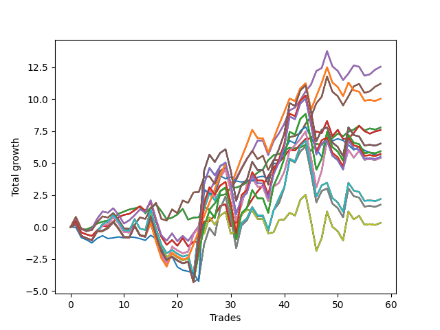

# Long Pointer 001 
- Symbol: SPY_Unlimited
- Date Range: 03/23/2022 - 07/08/2022
- Trading Period: 7:20-12:30
- Number of Trades: 58



| Name | Win Percent | Profit | Avg Profit / Trade | Avg Time / Trade |      | Name | Win Percent | Profit | Avg Profit / Trade | Avg Time / Trade |
| ---- | ----------- | ------ | ------------------ | ---------------- | ---- | ---- | ----------- | ------ | ------------------ | ---------------- |
| Sorted By <br> Profit | | | | | | Sorted By <br> Win Percentage ||||
| Sixty-Six | 67.24 | 6270.00 | 108.10 | 17:54 |     | Sixty-Four | 75.86 | 3890.00 | 67.07 | 05:40 |
| Fifty-Eight | 67.24 | 6270.00 | 108.10 | 17:54 |     | Fifty-Six | 75.86 | 3890.00 | 67.07 | 05:40 |
| Fifty | 67.24 | 6270.00 | 108.10 | 17:54 |     | Forty-Eight | 75.86 | 3890.00 | 67.07 | 05:40 |
| Forty-Two | 67.24 | 6270.00 | 108.10 | 17:54 |     | Forty | 75.86 | 3890.00 | 67.07 | 05:40 |
| Two | 67.24 | 6270.00 | 108.10 | 17:54 |     | Zero | 75.86 | 3890.00 | 67.07 | 05:40 |
| Sixty-Seven | 67.24 | 5605.00 | 96.64 | 17:24 |     | Sixty-Five | 70.69 | 3795.00 | 65.43 | 12:50 |
| Fifty-Nine | 67.24 | 5605.00 | 96.64 | 17:24 |     | Fifty-Seven | 70.69 | 3795.00 | 65.43 | 12:50 |
| Fifty-One | 67.24 | 5605.00 | 96.64 | 17:24 |     | Forty-Nine | 70.69 | 3795.00 | 65.43 | 12:50 |
| Forty-Three | 67.24 | 5605.00 | 96.64 | 17:24 |     | Forty-One | 70.69 | 3795.00 | 65.43 | 12:50 |
| Three | 67.24 | 5605.00 | 96.64 | 17:24 |     | One | 70.69 | 3795.00 | 65.43 | 12:50 |
| One Hundred Twenty-Six | 55.17 | 5015.00 | 86.47 | 23:32 |     | Sixty-Six | 67.24 | 6270.00 | 108.10 | 17:54 |
| One Hundred Twenty-One | 55.17 | 5015.00 | 86.47 | 23:32 |     | Fifty-Eight | 67.24 | 6270.00 | 108.10 | 17:54 |
| One Hundred Sixteen | 55.17 | 5015.00 | 86.47 | 23:32 |     | Fifty | 67.24 | 6270.00 | 108.10 | 17:54 |
| One Hundred Eleven | 55.17 | 5015.00 | 86.47 | 23:32 |     | Forty-Two | 67.24 | 6270.00 | 108.10 | 17:54 |
| Eighty-One | 55.17 | 5015.00 | 86.47 | 23:32 |     | Two | 67.24 | 6270.00 | 108.10 | 17:54 |
| Sixty-Four | 75.86 | 3890.00 | 67.07 | 05:40 |     | Sixty-Seven | 67.24 | 5605.00 | 96.64 | 17:24 |
| Fifty-Six | 75.86 | 3890.00 | 67.07 | 05:40 |     | Fifty-Nine | 67.24 | 5605.00 | 96.64 | 17:24 |
| Forty-Eight | 75.86 | 3890.00 | 67.07 | 05:40 |     | Fifty-One | 67.24 | 5605.00 | 96.64 | 17:24 |
| Forty | 75.86 | 3890.00 | 67.07 | 05:40 |     | Forty-Three | 67.24 | 5605.00 | 96.64 | 17:24 |
| Zero | 75.86 | 3890.00 | 67.07 | 05:40 |     | Three | 67.24 | 5605.00 | 96.64 | 17:24 |
| Sixty-Five | 70.69 | 3795.00 | 65.43 | 12:50 |     | One Hundred Twenty-Six | 55.17 | 5015.00 | 86.47 | 23:32 |
| Fifty-Seven | 70.69 | 3795.00 | 65.43 | 12:50 |     | One Hundred Twenty-One | 55.17 | 5015.00 | 86.47 | 23:32 |
| Forty-Nine | 70.69 | 3795.00 | 65.43 | 12:50 |     | One Hundred Sixteen | 55.17 | 5015.00 | 86.47 | 23:32 |
| Forty-One | 70.69 | 3795.00 | 65.43 | 12:50 |     | One Hundred Eleven | 55.17 | 5015.00 | 86.47 | 23:32 |
| One | 70.69 | 3795.00 | 65.43 | 12:50 |     | Eighty-One | 55.17 | 5015.00 | 86.47 | 23:32 |
| One Hundred Thirty | 48.28 | 3265.00 | 56.29 | 29:23 |     | Sixty-Eight | 53.45 | 2705.00 | 46.64 | 23:27 |
| One Hundred Twenty-Five | 48.28 | 3265.00 | 56.29 | 29:23 |     | Sixty | 53.45 | 2705.00 | 46.64 | 23:27 |
| One Hundred Twenty | 48.28 | 3265.00 | 56.29 | 29:23 |     | Fifty-Two | 53.45 | 2705.00 | 46.64 | 23:27 |
| One Hundred Fifteen | 48.28 | 3265.00 | 56.29 | 29:23 |     | Forty-Four | 53.45 | 2705.00 | 46.64 | 23:27 |
| Eighty-Five | 48.28 | 3265.00 | 56.29 | 29:23 |     | Four | 53.45 | 2705.00 | 46.64 | 23:27 |
| One Hundred Twenty-Seven | 48.28 | 2965.00 | 51.12 | 28:09 |     | Seventy | 50.00 | 165.00 | 2.84 | 24:52 |
| One Hundred Twenty-Two | 48.28 | 2965.00 | 51.12 | 28:09 |     | Sixty-Two | 50.00 | 165.00 | 2.84 | 24:52 |
| One Hundred Seventeen | 48.28 | 2965.00 | 51.12 | 28:09 |     | Fifty-Four | 50.00 | 165.00 | 2.84 | 24:52 |
| One Hundred Twelve | 48.28 | 2965.00 | 51.12 | 28:09 |     | Forty-Six | 50.00 | 165.00 | 2.84 | 24:52 |
| Eighty-Two | 48.28 | 2965.00 | 51.12 | 28:09 |     | Six | 50.00 | 165.00 | 2.84 | 24:52 |
| One Hundred Twenty-Eight | 48.28 | 2860.00 | 49.31 | 29:11 |     | One Hundred Thirty | 48.28 | 3265.00 | 56.29 | 29:23 |
| One Hundred Twenty-Three | 48.28 | 2860.00 | 49.31 | 29:11 |     | One Hundred Twenty-Five | 48.28 | 3265.00 | 56.29 | 29:23 |
| One Hundred Eighteen | 48.28 | 2860.00 | 49.31 | 29:11 |     | One Hundred Twenty | 48.28 | 3265.00 | 56.29 | 29:23 |
| One Hundred Thirteen | 48.28 | 2860.00 | 49.31 | 29:11 |     | One Hundred Fifteen | 48.28 | 3265.00 | 56.29 | 29:23 |
| Eighty-Three | 48.28 | 2860.00 | 49.31 | 29:11 |     | Eighty-Five | 48.28 | 3265.00 | 56.29 | 29:23 |
| Seventy-Three | 41.38 | 2825.00 | 48.71 | 08:12 |     | One Hundred Twenty-Seven | 48.28 | 2965.00 | 51.12 | 28:09 |
| One Hundred Twenty-Nine | 48.28 | 2745.00 | 47.33 | 29:21 |     | One Hundred Twenty-Two | 48.28 | 2965.00 | 51.12 | 28:09 |
| One Hundred Twenty-Four | 48.28 | 2745.00 | 47.33 | 29:21 |     | One Hundred Seventeen | 48.28 | 2965.00 | 51.12 | 28:09 |
| One Hundred Ninteen | 48.28 | 2745.00 | 47.33 | 29:21 |     | One Hundred Twelve | 48.28 | 2965.00 | 51.12 | 28:09 |
| One Hundred Fourteen | 48.28 | 2745.00 | 47.33 | 29:21 |     | Eighty-Two | 48.28 | 2965.00 | 51.12 | 28:09 |
| Eighty-Four | 48.28 | 2745.00 | 47.33 | 29:21 |     | One Hundred Twenty-Eight | 48.28 | 2860.00 | 49.31 | 29:11 |
| Sixty-Eight | 53.45 | 2705.00 | 46.64 | 23:27 |     | One Hundred Twenty-Three | 48.28 | 2860.00 | 49.31 | 29:11 |
| Sixty | 53.45 | 2705.00 | 46.64 | 23:27 |     | One Hundred Eighteen | 48.28 | 2860.00 | 49.31 | 29:11 |
| Fifty-Two | 53.45 | 2705.00 | 46.64 | 23:27 |     | One Hundred Thirteen | 48.28 | 2860.00 | 49.31 | 29:11 |
| Forty-Four | 53.45 | 2705.00 | 46.64 | 23:27 |     | Eighty-Three | 48.28 | 2860.00 | 49.31 | 29:11 |
| Four | 53.45 | 2705.00 | 46.64 | 23:27 |     | One Hundred Twenty-Nine | 48.28 | 2745.00 | 47.33 | 29:21 |
| Seventy-One | 48.28 | 1095.00 | 18.88 | 28:14 |     | One Hundred Twenty-Four | 48.28 | 2745.00 | 47.33 | 29:21 |
| Sixty-Three | 48.28 | 1095.00 | 18.88 | 28:14 |     | One Hundred Ninteen | 48.28 | 2745.00 | 47.33 | 29:21 |
| Fifty-Five | 48.28 | 1095.00 | 18.88 | 28:14 |     | One Hundred Fourteen | 48.28 | 2745.00 | 47.33 | 29:21 |
| Forty-Seven | 48.28 | 1095.00 | 18.88 | 28:14 |     | Eighty-Four | 48.28 | 2745.00 | 47.33 | 29:21 |
| Seven | 48.28 | 1095.00 | 18.88 | 28:14 |     | Seventy-One | 48.28 | 1095.00 | 18.88 | 28:14 |
| Sixty-Nine | 48.28 | 875.00 | 15.09 | 27:29 |     | Sixty-Three | 48.28 | 1095.00 | 18.88 | 28:14 |
| Sixty-One | 48.28 | 875.00 | 15.09 | 27:29 |     | Fifty-Five | 48.28 | 1095.00 | 18.88 | 28:14 |
| Fifty-Three | 48.28 | 875.00 | 15.09 | 27:29 |     | Forty-Seven | 48.28 | 1095.00 | 18.88 | 28:14 |
| Forty-Five | 48.28 | 875.00 | 15.09 | 27:29 |     | Seven | 48.28 | 1095.00 | 18.88 | 28:14 |
| Five | 48.28 | 875.00 | 15.09 | 27:29 |     | Sixty-Nine | 48.28 | 875.00 | 15.09 | 27:29 |
| Seventy | 50.00 | 165.00 | 2.84 | 24:52 |     | Sixty-One | 48.28 | 875.00 | 15.09 | 27:29 |
| Sixty-Two | 50.00 | 165.00 | 2.84 | 24:52 |     | Fifty-Three | 48.28 | 875.00 | 15.09 | 27:29 |
| Fifty-Four | 50.00 | 165.00 | 2.84 | 24:52 |     | Forty-Five | 48.28 | 875.00 | 15.09 | 27:29 |
| Forty-Six | 50.00 | 165.00 | 2.84 | 24:52 |     | Five | 48.28 | 875.00 | 15.09 | 27:29 |
| Six | 50.00 | 165.00 | 2.84 | 24:52 |     | Seventy-Three | 41.38 | 2825.00 | 48.71 | 08:12 |

## NO STOPLOSS

### Test Zero
* Sell when price hits the middle line of the 20p bollinger
* No Stoploss
* Results:
```
Total Trades: 58
Percent Up: 75.86
Percent Down: 24.14
Total Points Moved Up: 7.78
Potential Profit: 3890.00
Total Points Ups: 12.44 Count Ups: 44
Total Points Downs: -4.66 Count Downs: 14
```

<details><summary>Trades</summary>

<code>In: 2022-03-25 08:30:00		Out: 2022-03-25 08:36:40		Total Position Time: 06:40		Total Move Up: 0.37		Total to Date: 0.37</code> <br />
<code>In: 2022-03-30 08:02:00		Out: 2022-03-30 08:19:15		Total Position Time: 17:15		Total Move Up: -0.55		Total to Date: -0.18</code> <br />
<code>In: 2022-03-30 10:24:00		Out: 2022-03-30 10:33:25		Total Position Time: 09:25		Total Move Up: 0.00		Total to Date: -0.18</code> <br />
<code>In: 2022-03-30 12:14:00		Out: 2022-03-30 12:15:25		Total Position Time: 01:25		Total Move Up: 0.19		Total to Date: 0.01</code> <br />
<code>In: 2022-03-30 12:27:00		Out: 2022-03-30 12:28:15		Total Position Time: 01:15		Total Move Up: 0.27		Total to Date: 0.28</code> <br />
<code>In: 2022-03-31 08:37:00		Out: 2022-03-31 08:38:05		Total Position Time: 01:05		Total Move Up: 0.15		Total to Date: 0.43</code> <br />
<code>In: 2022-03-31 10:02:00		Out: 2022-03-31 10:04:00		Total Position Time: 02:00		Total Move Up: 0.09		Total to Date: 0.52</code> <br />
<code>In: 2022-03-31 10:18:00		Out: 2022-03-31 10:19:00		Total Position Time: 01:00		Total Move Up: 0.20		Total to Date: 0.72</code> <br />
<code>In: 2022-04-05 09:04:00		Out: 2022-04-05 09:06:10		Total Position Time: 02:10		Total Move Up: 0.33		Total to Date: 1.05</code> <br />
<code>In: 2022-04-05 09:05:00		Out: 2022-04-05 09:06:10		Total Position Time: 01:10		Total Move Up: 0.17		Total to Date: 1.22</code> <br />
<code>In: 2022-04-06 09:23:00		Out: 2022-04-06 09:31:15		Total Position Time: 08:15		Total Move Up: 0.16		Total to Date: 1.38</code> <br />
<code>In: 2022-04-12 07:53:00		Out: 2022-04-12 08:02:05		Total Position Time: 09:05		Total Move Up: 0.09		Total to Date: 1.47</code> <br />
<code>In: 2022-04-12 11:35:00		Out: 2022-04-12 11:35:45		Total Position Time: 00:45		Total Move Up: 0.12		Total to Date: 1.59</code> <br />
<code>In: 2022-04-14 09:32:00		Out: 2022-04-14 09:56:10		Total Position Time: 24:10		Total Move Up: -0.51		Total to Date: 1.08</code> <br />
<code>In: 2022-04-20 11:58:00		Out: 2022-04-20 12:01:15		Total Position Time: 03:15		Total Move Up: 0.44		Total to Date: 1.52</code> <br />
<code>In: 2022-04-21 08:25:00		Out: 2022-04-21 08:25:15		Total Position Time: 00:15		Total Move Up: 0.26		Total to Date: 1.78</code> <br />
<code>In: 2022-04-21 09:02:00		Out: 2022-04-21 09:19:05		Total Position Time: 17:05		Total Move Up: -0.53		Total to Date: 1.25</code> <br />
<code>In: 2022-04-21 09:56:00		Out: 2022-04-21 10:13:30		Total Position Time: 17:30		Total Move Up: -0.63		Total to Date: 0.62</code> <br />
<code>In: 2022-04-21 10:21:00		Out: 2022-04-21 10:21:10		Total Position Time: 00:10		Total Move Up: 0.12		Total to Date: 0.74</code> <br />
<code>In: 2022-05-02 08:07:00		Out: 2022-05-02 08:13:20		Total Position Time: 06:20		Total Move Up: 0.25		Total to Date: 0.99</code> <br />
<code>In: 2022-05-02 08:22:00		Out: 2022-05-02 08:26:05		Total Position Time: 04:05		Total Move Up: 0.44		Total to Date: 1.43</code> <br />
<code>In: 2022-05-02 10:37:00		Out: 2022-05-02 10:59:15		Total Position Time: 22:15		Total Move Up: -0.84		Total to Date: 0.59</code> <br />
<code>In: 2022-05-02 10:51:00		Out: 2022-05-02 10:59:15		Total Position Time: 08:15		Total Move Up: 0.15		Total to Date: 0.74</code> <br />
<code>In: 2022-05-02 11:46:00		Out: 2022-05-02 11:46:10		Total Position Time: 00:10		Total Move Up: 0.04		Total to Date: 0.78</code> <br />
<code>In: 2022-05-04 11:36:00		Out: 2022-05-04 11:36:40		Total Position Time: 00:40		Total Move Up: 0.80		Total to Date: 1.58</code> <br />
<code>In: 2022-05-06 11:28:00		Out: 2022-05-06 11:40:25		Total Position Time: 12:25		Total Move Up: -0.21		Total to Date: 1.37</code> <br />
<code>In: 2022-05-09 07:42:00		Out: 2022-05-09 07:42:30		Total Position Time: 00:30		Total Move Up: 0.49		Total to Date: 1.86</code> <br />
<code>In: 2022-05-09 08:34:00		Out: 2022-05-09 08:35:10		Total Position Time: 01:10		Total Move Up: 0.62		Total to Date: 2.48</code> <br />
<code>In: 2022-05-09 10:03:00		Out: 2022-05-09 10:09:25		Total Position Time: 06:25		Total Move Up: 0.09		Total to Date: 2.57</code> <br />
<code>In: 2022-05-10 07:52:00		Out: 2022-05-10 07:59:00		Total Position Time: 07:00		Total Move Up: 0.53		Total to Date: 3.10</code> <br />
<code>In: 2022-05-11 09:14:00		Out: 2022-05-11 09:17:50		Total Position Time: 03:50		Total Move Up: -0.01		Total to Date: 3.09</code> <br />
<code>In: 2022-05-11 11:01:00		Out: 2022-05-11 11:01:10		Total Position Time: 00:10		Total Move Up: 0.16		Total to Date: 3.25</code> <br />
<code>In: 2022-05-13 11:07:00		Out: 2022-05-13 11:19:15		Total Position Time: 12:15		Total Move Up: 0.24		Total to Date: 3.49</code> <br />
<code>In: 2022-05-16 09:47:00		Out: 2022-05-16 09:48:15		Total Position Time: 01:15		Total Move Up: 0.41		Total to Date: 3.90</code> <br />
<code>In: 2022-05-18 08:32:00		Out: 2022-05-18 08:36:55		Total Position Time: 04:55		Total Move Up: 0.36		Total to Date: 4.26</code> <br />
<code>In: 2022-05-18 09:12:00		Out: 2022-05-18 09:14:45		Total Position Time: 02:45		Total Move Up: 0.25		Total to Date: 4.51</code> <br />
<code>In: 2022-05-20 09:48:00		Out: 2022-05-20 09:50:00		Total Position Time: 02:00		Total Move Up: 0.73		Total to Date: 5.24</code> <br />
<code>In: 2022-05-23 10:23:00		Out: 2022-05-23 10:26:30		Total Position Time: 03:30		Total Move Up: 0.39		Total to Date: 5.63</code> <br />
<code>In: 2022-05-25 10:15:00		Out: 2022-05-25 10:15:20		Total Position Time: 00:20		Total Move Up: 0.09		Total to Date: 5.72</code> <br />
<code>In: 2022-05-27 08:04:00		Out: 2022-05-27 08:06:55		Total Position Time: 02:55		Total Move Up: 0.28		Total to Date: 6.00</code> <br />
<code>In: 2022-05-31 12:05:00		Out: 2022-05-31 12:07:20		Total Position Time: 02:20		Total Move Up: 0.21		Total to Date: 6.21</code> <br />
<code>In: 2022-06-08 11:31:00		Out: 2022-06-08 11:31:10		Total Position Time: 00:10		Total Move Up: -0.05		Total to Date: 6.16</code> <br />
<code>In: 2022-06-08 12:11:00		Out: 2022-06-08 12:11:20		Total Position Time: 00:20		Total Move Up: 0.08		Total to Date: 6.24</code> <br />
<code>In: 2022-06-09 08:10:00		Out: 2022-06-09 08:10:55		Total Position Time: 00:55		Total Move Up: 0.20		Total to Date: 6.44</code> <br />
<code>In: 2022-06-13 11:59:00		Out: 2022-06-13 12:16:50		Total Position Time: 17:50		Total Move Up: -0.48		Total to Date: 5.96</code> <br />
<code>In: 2022-06-13 12:17:00		Out: 2022-06-13 12:17:10		Total Position Time: 00:10		Total Move Up: 0.56		Total to Date: 6.52</code> <br />
<code>In: 2022-06-14 07:32:00		Out: 2022-06-14 07:37:00		Total Position Time: 05:00		Total Move Up: -0.10		Total to Date: 6.42</code> <br />
<code>In: 2022-06-14 07:45:00		Out: 2022-06-14 07:46:35		Total Position Time: 01:35		Total Move Up: 0.61		Total to Date: 7.03</code> <br />
<code>In: 2022-06-14 11:52:00		Out: 2022-06-14 12:04:30		Total Position Time: 12:30		Total Move Up: -0.08		Total to Date: 6.95</code> <br />
<code>In: 2022-06-15 07:57:00		Out: 2022-06-15 07:58:55		Total Position Time: 01:55		Total Move Up: 0.37		Total to Date: 7.32</code> <br />
<code>In: 2022-06-16 11:02:00		Out: 2022-06-16 11:14:35		Total Position Time: 12:35		Total Move Up: -0.21		Total to Date: 7.11</code> <br />
<code>In: 2022-06-17 07:38:00		Out: 2022-06-17 07:44:55		Total Position Time: 06:55		Total Move Up: 0.35		Total to Date: 7.46</code> <br />
<code>In: 2022-06-23 09:07:00		Out: 2022-06-23 09:14:30		Total Position Time: 07:30		Total Move Up: 0.17		Total to Date: 7.63</code> <br />
<code>In: 2022-06-27 10:10:00		Out: 2022-06-27 10:11:25		Total Position Time: 01:25		Total Move Up: 0.30		Total to Date: 7.93</code> <br />
<code>In: 2022-06-27 10:37:00		Out: 2022-06-27 10:51:15		Total Position Time: 14:15		Total Move Up: -0.37		Total to Date: 7.56</code> <br />
<code>In: 2022-06-29 09:16:00		Out: 2022-06-29 09:21:05		Total Position Time: 05:05		Total Move Up: 0.16		Total to Date: 7.72</code> <br />
<code>In: 2022-07-06 08:35:00		Out: 2022-07-06 08:46:05		Total Position Time: 11:05		Total Move Up: -0.09		Total to Date: 7.63</code> <br />
<code>In: 2022-07-08 09:48:00		Out: 2022-07-08 09:48:45		Total Position Time: 00:45		Total Move Up: 0.15		Total to Date: 7.78</code> <br />


</details>

### Test One
* Sell when the price hits the upper line of the 20p 1std bollinger
* No Stoploss
* Results:
```
Total Trades: 58
Percent Up: 70.69
Percent Down: 29.31
Total Points Moved Up: 7.59
Potential Profit: 3795.00
Total Points Ups: 18.08 Count Ups: 41
Total Points Downs: -10.49 Count Downs: 17
```

<details><summary>Trades</summary>

<code>In: 2022-03-25 08:30:00		Out: 2022-03-25 08:41:05		Total Position Time: 11:05		Total Move Up: 0.49		Total to Date: 0.49</code> <br />
<code>In: 2022-03-30 08:02:00		Out: 2022-03-30 08:31:55		Total Position Time: 29:55		Total Move Up: -0.90		Total to Date: -0.41</code> <br />
<code>In: 2022-03-30 10:24:00		Out: 2022-03-30 10:49:45		Total Position Time: 25:45		Total Move Up: -0.16		Total to Date: -0.57</code> <br />
<code>In: 2022-03-30 12:14:00		Out: 2022-03-30 12:32:20		Total Position Time: 18:20		Total Move Up: -0.12		Total to Date: -0.69</code> <br />
<code>In: 2022-03-30 12:27:00		Out: 2022-03-30 12:32:20		Total Position Time: 05:20		Total Move Up: 0.45		Total to Date: -0.24</code> <br />
<code>In: 2022-03-31 08:37:00		Out: 2022-03-31 08:40:35		Total Position Time: 03:35		Total Move Up: 0.34		Total to Date: 0.10</code> <br />
<code>In: 2022-03-31 10:02:00		Out: 2022-03-31 10:19:40		Total Position Time: 17:40		Total Move Up: -0.05		Total to Date: 0.05</code> <br />
<code>In: 2022-03-31 10:18:00		Out: 2022-03-31 10:19:40		Total Position Time: 01:40		Total Move Up: 0.39		Total to Date: 0.44</code> <br />
<code>In: 2022-04-05 09:04:00		Out: 2022-04-05 09:13:50		Total Position Time: 09:50		Total Move Up: 0.34		Total to Date: 0.78</code> <br />
<code>In: 2022-04-05 09:05:00		Out: 2022-04-05 09:13:50		Total Position Time: 08:50		Total Move Up: 0.18		Total to Date: 0.96</code> <br />
<code>In: 2022-04-06 09:23:00		Out: 2022-04-06 09:33:05		Total Position Time: 10:05		Total Move Up: 0.08		Total to Date: 1.04</code> <br />
<code>In: 2022-04-12 07:53:00		Out: 2022-04-12 08:02:35		Total Position Time: 09:35		Total Move Up: 0.28		Total to Date: 1.32</code> <br />
<code>In: 2022-04-12 11:35:00		Out: 2022-04-12 11:37:25		Total Position Time: 02:25		Total Move Up: 0.32		Total to Date: 1.64</code> <br />
<code>In: 2022-04-14 09:32:00		Out: 2022-04-14 09:58:10		Total Position Time: 26:10		Total Move Up: -0.37		Total to Date: 1.27</code> <br />
<code>In: 2022-04-20 11:58:00		Out: 2022-04-20 12:04:20		Total Position Time: 06:20		Total Move Up: 0.71		Total to Date: 1.98</code> <br />
<code>In: 2022-04-21 08:25:00		Out: 2022-04-21 08:54:55		Total Position Time: 29:55		Total Move Up: -1.48		Total to Date: 0.50</code> <br />
<code>In: 2022-04-21 09:02:00		Out: 2022-04-21 09:31:55		Total Position Time: 29:55		Total Move Up: -1.26		Total to Date: -0.76</code> <br />
<code>In: 2022-04-21 09:56:00		Out: 2022-04-21 10:21:20		Total Position Time: 25:20		Total Move Up: -0.62		Total to Date: -1.38</code> <br />
<code>In: 2022-04-21 10:21:00		Out: 2022-04-21 10:21:20		Total Position Time: 00:20		Total Move Up: 0.37		Total to Date: -1.01</code> <br />
<code>In: 2022-05-02 08:07:00		Out: 2022-05-02 08:34:10		Total Position Time: 27:10		Total Move Up: -0.44		Total to Date: -1.45</code> <br />
<code>In: 2022-05-02 08:22:00		Out: 2022-05-02 08:34:10		Total Position Time: 12:10		Total Move Up: 0.59		Total to Date: -0.86</code> <br />
<code>In: 2022-05-02 10:37:00		Out: 2022-05-02 11:02:25		Total Position Time: 25:25		Total Move Up: -0.64		Total to Date: -1.50</code> <br />
<code>In: 2022-05-02 10:51:00		Out: 2022-05-02 11:02:25		Total Position Time: 11:25		Total Move Up: 0.35		Total to Date: -1.15</code> <br />
<code>In: 2022-05-02 11:46:00		Out: 2022-05-02 11:46:10		Total Position Time: 00:10		Total Move Up: 0.04		Total to Date: -1.11</code> <br />
<code>In: 2022-05-04 11:36:00		Out: 2022-05-04 11:41:35		Total Position Time: 05:35		Total Move Up: 1.56		Total to Date: 0.45</code> <br />
<code>In: 2022-05-06 11:28:00		Out: 2022-05-06 11:49:10		Total Position Time: 21:10		Total Move Up: 0.02		Total to Date: 0.47</code> <br />
<code>In: 2022-05-09 07:42:00		Out: 2022-05-09 07:45:10		Total Position Time: 03:10		Total Move Up: 0.45		Total to Date: 0.92</code> <br />
<code>In: 2022-05-09 08:34:00		Out: 2022-05-09 08:38:35		Total Position Time: 04:35		Total Move Up: 0.74		Total to Date: 1.66</code> <br />
<code>In: 2022-05-09 10:03:00		Out: 2022-05-09 10:18:05		Total Position Time: 15:05		Total Move Up: 0.13		Total to Date: 1.79</code> <br />
<code>In: 2022-05-10 07:52:00		Out: 2022-05-10 08:21:55		Total Position Time: 29:55		Total Move Up: -1.71		Total to Date: 0.08</code> <br />
<code>In: 2022-05-11 09:14:00		Out: 2022-05-11 09:23:10		Total Position Time: 09:10		Total Move Up: 0.31		Total to Date: 0.39</code> <br />
<code>In: 2022-05-11 11:01:00		Out: 2022-05-11 11:01:20		Total Position Time: 00:20		Total Move Up: 0.55		Total to Date: 0.94</code> <br />
<code>In: 2022-05-13 11:07:00		Out: 2022-05-13 11:20:00		Total Position Time: 13:00		Total Move Up: 0.59		Total to Date: 1.53</code> <br />
<code>In: 2022-05-16 09:47:00		Out: 2022-05-16 09:50:05		Total Position Time: 03:05		Total Move Up: 0.65		Total to Date: 2.18</code> <br />
<code>In: 2022-05-18 08:32:00		Out: 2022-05-18 08:41:15		Total Position Time: 09:15		Total Move Up: 0.61		Total to Date: 2.79</code> <br />
<code>In: 2022-05-18 09:12:00		Out: 2022-05-18 09:16:25		Total Position Time: 04:25		Total Move Up: 0.49		Total to Date: 3.28</code> <br />
<code>In: 2022-05-20 09:48:00		Out: 2022-05-20 09:56:10		Total Position Time: 08:10		Total Move Up: 0.72		Total to Date: 4.00</code> <br />
<code>In: 2022-05-23 10:23:00		Out: 2022-05-23 10:32:35		Total Position Time: 09:35		Total Move Up: 0.66		Total to Date: 4.66</code> <br />
<code>In: 2022-05-25 10:15:00		Out: 2022-05-25 10:15:55		Total Position Time: 00:55		Total Move Up: 0.39		Total to Date: 5.05</code> <br />
<code>In: 2022-05-27 08:04:00		Out: 2022-05-27 08:11:00		Total Position Time: 07:00		Total Move Up: 0.49		Total to Date: 5.54</code> <br />
<code>In: 2022-05-31 12:05:00		Out: 2022-05-31 12:09:15		Total Position Time: 04:15		Total Move Up: 0.52		Total to Date: 6.06</code> <br />
<code>In: 2022-06-08 11:31:00		Out: 2022-06-08 11:43:05		Total Position Time: 12:05		Total Move Up: -0.07		Total to Date: 5.99</code> <br />
<code>In: 2022-06-08 12:11:00		Out: 2022-06-08 12:12:20		Total Position Time: 01:20		Total Move Up: 0.48		Total to Date: 6.47</code> <br />
<code>In: 2022-06-09 08:10:00		Out: 2022-06-09 08:21:10		Total Position Time: 11:10		Total Move Up: 0.43		Total to Date: 6.90</code> <br />
<code>In: 2022-06-13 11:59:00		Out: 2022-06-13 12:17:10		Total Position Time: 18:10		Total Move Up: 0.03		Total to Date: 6.93</code> <br />
<code>In: 2022-06-13 12:17:00		Out: 2022-06-13 12:17:10		Total Position Time: 00:10		Total Move Up: 0.56		Total to Date: 7.49</code> <br />
<code>In: 2022-06-14 07:32:00		Out: 2022-06-14 07:47:05		Total Position Time: 15:05		Total Move Up: -0.14		Total to Date: 7.35</code> <br />
<code>In: 2022-06-14 07:45:00		Out: 2022-06-14 07:47:05		Total Position Time: 02:05		Total Move Up: 0.95		Total to Date: 8.30</code> <br />
<code>In: 2022-06-14 11:52:00		Out: 2022-06-14 12:21:55		Total Position Time: 29:55		Total Move Up: -1.19		Total to Date: 7.11</code> <br />
<code>In: 2022-06-15 07:57:00		Out: 2022-06-15 08:07:20		Total Position Time: 10:20		Total Move Up: 0.50		Total to Date: 7.61</code> <br />
<code>In: 2022-06-16 11:02:00		Out: 2022-06-16 11:31:55		Total Position Time: 29:55		Total Move Up: -0.72		Total to Date: 6.89</code> <br />
<code>In: 2022-06-17 07:38:00		Out: 2022-06-17 07:56:15		Total Position Time: 18:15		Total Move Up: 0.04		Total to Date: 6.93</code> <br />
<code>In: 2022-06-23 09:07:00		Out: 2022-06-23 09:18:25		Total Position Time: 11:25		Total Move Up: 0.43		Total to Date: 7.36</code> <br />
<code>In: 2022-06-27 10:10:00		Out: 2022-06-27 10:15:55		Total Position Time: 05:55		Total Move Up: 0.57		Total to Date: 7.93</code> <br />
<code>In: 2022-06-27 10:37:00		Out: 2022-06-27 11:03:15		Total Position Time: 26:15		Total Move Up: -0.42		Total to Date: 7.51</code> <br />
<code>In: 2022-06-29 09:16:00		Out: 2022-06-29 09:37:15		Total Position Time: 21:15		Total Move Up: -0.20		Total to Date: 7.31</code> <br />
<code>In: 2022-07-06 08:35:00		Out: 2022-07-06 08:48:10		Total Position Time: 13:10		Total Move Up: 0.17		Total to Date: 7.48</code> <br />
<code>In: 2022-07-08 09:48:00		Out: 2022-07-08 10:09:40		Total Position Time: 21:40		Total Move Up: 0.11		Total to Date: 7.59</code> <br />


</details>

### Test Two
* Sell when the price hits the upper line of the 20p 2std bollinger
* No Stoploss
* Results:
```
Total Trades: 58
Percent Up: 67.24
Percent Down: 32.76
Total Points Moved Up: 12.54
Potential Profit: 6270.00
Total Points Ups: 25.22 Count Ups: 39
Total Points Downs: -12.68 Count Downs: 19
```

<details><summary>Trades</summary>

<code>In: 2022-03-25 08:30:00		Out: 2022-03-25 08:41:45		Total Position Time: 11:45		Total Move Up: 0.76		Total to Date: 0.76</code> <br />
<code>In: 2022-03-30 08:02:00		Out: 2022-03-30 08:31:55		Total Position Time: 29:55		Total Move Up: -0.90		Total to Date: -0.14</code> <br />
<code>In: 2022-03-30 10:24:00		Out: 2022-03-30 10:53:55		Total Position Time: 29:55		Total Move Up: -0.19		Total to Date: -0.33</code> <br />
<code>In: 2022-03-30 12:14:00		Out: 2022-03-30 12:36:25		Total Position Time: 22:25		Total Move Up: 0.21		Total to Date: -0.12</code> <br />
<code>In: 2022-03-30 12:27:00		Out: 2022-03-30 12:36:25		Total Position Time: 09:25		Total Move Up: 0.78		Total to Date: 0.66</code> <br />
<code>In: 2022-03-31 08:37:00		Out: 2022-03-31 08:41:10		Total Position Time: 04:10		Total Move Up: 0.56		Total to Date: 1.22</code> <br />
<code>In: 2022-03-31 10:02:00		Out: 2022-03-31 10:27:25		Total Position Time: 25:25		Total Move Up: -0.09		Total to Date: 1.13</code> <br />
<code>In: 2022-03-31 10:18:00		Out: 2022-03-31 10:27:25		Total Position Time: 09:25		Total Move Up: 0.35		Total to Date: 1.48</code> <br />
<code>In: 2022-04-05 09:04:00		Out: 2022-04-05 09:33:55		Total Position Time: 29:55		Total Move Up: -0.53		Total to Date: 0.95</code> <br />
<code>In: 2022-04-05 09:05:00		Out: 2022-04-05 09:34:55		Total Position Time: 29:55		Total Move Up: -0.67		Total to Date: 0.28</code> <br />
<code>In: 2022-04-06 09:23:00		Out: 2022-04-06 09:34:25		Total Position Time: 11:25		Total Move Up: 0.26		Total to Date: 0.54</code> <br />
<code>In: 2022-04-12 07:53:00		Out: 2022-04-12 08:18:45		Total Position Time: 25:45		Total Move Up: 0.39		Total to Date: 0.93</code> <br />
<code>In: 2022-04-12 11:35:00		Out: 2022-04-12 11:47:00		Total Position Time: 12:00		Total Move Up: 0.46		Total to Date: 1.39</code> <br />
<code>In: 2022-04-14 09:32:00		Out: 2022-04-14 09:58:50		Total Position Time: 26:50		Total Move Up: -0.22		Total to Date: 1.17</code> <br />
<code>In: 2022-04-20 11:58:00		Out: 2022-04-20 12:12:35		Total Position Time: 14:35		Total Move Up: 0.93		Total to Date: 2.10</code> <br />
<code>In: 2022-04-21 08:25:00		Out: 2022-04-21 08:54:55		Total Position Time: 29:55		Total Move Up: -1.48		Total to Date: 0.62</code> <br />
<code>In: 2022-04-21 09:02:00		Out: 2022-04-21 09:31:55		Total Position Time: 29:55		Total Move Up: -1.26		Total to Date: -0.64</code> <br />
<code>In: 2022-04-21 09:56:00		Out: 2022-04-21 10:21:30		Total Position Time: 25:30		Total Move Up: -0.42		Total to Date: -1.06</code> <br />
<code>In: 2022-04-21 10:21:00		Out: 2022-04-21 10:21:30		Total Position Time: 00:30		Total Move Up: 0.57		Total to Date: -0.49</code> <br />
<code>In: 2022-05-02 08:07:00		Out: 2022-05-02 08:36:25		Total Position Time: 29:25		Total Move Up: -0.61		Total to Date: -1.10</code> <br />
<code>In: 2022-05-02 08:22:00		Out: 2022-05-02 08:36:25		Total Position Time: 14:25		Total Move Up: 0.42		Total to Date: -0.68</code> <br />
<code>In: 2022-05-02 10:37:00		Out: 2022-05-02 11:03:45		Total Position Time: 26:45		Total Move Up: -0.40		Total to Date: -1.08</code> <br />
<code>In: 2022-05-02 10:51:00		Out: 2022-05-02 11:03:45		Total Position Time: 12:45		Total Move Up: 0.59		Total to Date: -0.49</code> <br />
<code>In: 2022-05-02 11:46:00		Out: 2022-05-02 11:53:35		Total Position Time: 07:35		Total Move Up: 0.58		Total to Date: 0.09</code> <br />
<code>In: 2022-05-04 11:36:00		Out: 2022-05-04 11:43:45		Total Position Time: 07:45		Total Move Up: 2.70		Total to Date: 2.79</code> <br />
<code>In: 2022-05-06 11:28:00		Out: 2022-05-06 11:49:10		Total Position Time: 21:10		Total Move Up: 0.02		Total to Date: 2.81</code> <br />
<code>In: 2022-05-09 07:42:00		Out: 2022-05-09 07:48:05		Total Position Time: 06:05		Total Move Up: 0.78		Total to Date: 3.59</code> <br />
<code>In: 2022-05-09 08:34:00		Out: 2022-05-09 08:39:15		Total Position Time: 05:15		Total Move Up: 1.21		Total to Date: 4.80</code> <br />
<code>In: 2022-05-09 10:03:00		Out: 2022-05-09 10:19:00		Total Position Time: 16:00		Total Move Up: 0.17		Total to Date: 4.97</code> <br />
<code>In: 2022-05-10 07:52:00		Out: 2022-05-10 08:21:55		Total Position Time: 29:55		Total Move Up: -1.71		Total to Date: 3.26</code> <br />
<code>In: 2022-05-11 09:14:00		Out: 2022-05-11 09:23:35		Total Position Time: 09:35		Total Move Up: 0.59		Total to Date: 3.85</code> <br />
<code>In: 2022-05-11 11:01:00		Out: 2022-05-11 11:04:20		Total Position Time: 03:20		Total Move Up: 0.76		Total to Date: 4.61</code> <br />
<code>In: 2022-05-13 11:07:00		Out: 2022-05-13 11:31:20		Total Position Time: 24:20		Total Move Up: 0.76		Total to Date: 5.37</code> <br />
<code>In: 2022-05-16 09:47:00		Out: 2022-05-16 10:07:00		Total Position Time: 20:00		Total Move Up: 0.54		Total to Date: 5.91</code> <br />
<code>In: 2022-05-18 08:32:00		Out: 2022-05-18 08:42:55		Total Position Time: 10:55		Total Move Up: 0.86		Total to Date: 6.77</code> <br />
<code>In: 2022-05-18 09:12:00		Out: 2022-05-18 09:41:55		Total Position Time: 29:55		Total Move Up: -0.01		Total to Date: 6.76</code> <br />
<code>In: 2022-05-20 09:48:00		Out: 2022-05-20 10:17:55		Total Position Time: 29:55		Total Move Up: -1.12		Total to Date: 5.64</code> <br />
<code>In: 2022-05-23 10:23:00		Out: 2022-05-23 10:33:15		Total Position Time: 10:15		Total Move Up: 1.08		Total to Date: 6.72</code> <br />
<code>In: 2022-05-25 10:15:00		Out: 2022-05-25 10:29:40		Total Position Time: 14:40		Total Move Up: 0.61		Total to Date: 7.33</code> <br />
<code>In: 2022-05-27 08:04:00		Out: 2022-05-27 08:12:15		Total Position Time: 08:15		Total Move Up: 0.75		Total to Date: 8.08</code> <br />
<code>In: 2022-05-31 12:05:00		Out: 2022-05-31 12:15:05		Total Position Time: 10:05		Total Move Up: 1.05		Total to Date: 9.13</code> <br />
<code>In: 2022-06-08 11:31:00		Out: 2022-06-08 11:43:35		Total Position Time: 12:35		Total Move Up: 0.22		Total to Date: 9.35</code> <br />
<code>In: 2022-06-08 12:11:00		Out: 2022-06-08 12:13:25		Total Position Time: 02:25		Total Move Up: 0.58		Total to Date: 9.93</code> <br />
<code>In: 2022-06-09 08:10:00		Out: 2022-06-09 08:22:35		Total Position Time: 12:35		Total Move Up: 0.69		Total to Date: 10.62</code> <br />
<code>In: 2022-06-13 11:59:00		Out: 2022-06-13 12:17:15		Total Position Time: 18:15		Total Move Up: 0.53		Total to Date: 11.15</code> <br />
<code>In: 2022-06-13 12:17:00		Out: 2022-06-13 12:17:15		Total Position Time: 00:15		Total Move Up: 1.06		Total to Date: 12.21</code> <br />
<code>In: 2022-06-14 07:32:00		Out: 2022-06-14 07:47:20		Total Position Time: 15:20		Total Move Up: 0.23		Total to Date: 12.44</code> <br />
<code>In: 2022-06-14 07:45:00		Out: 2022-06-14 07:47:20		Total Position Time: 02:20		Total Move Up: 1.32		Total to Date: 13.76</code> <br />
<code>In: 2022-06-14 11:52:00		Out: 2022-06-14 12:21:55		Total Position Time: 29:55		Total Move Up: -1.19		Total to Date: 12.57</code> <br />
<code>In: 2022-06-15 07:57:00		Out: 2022-06-15 08:26:55		Total Position Time: 29:55		Total Move Up: -0.35		Total to Date: 12.22</code> <br />
<code>In: 2022-06-16 11:02:00		Out: 2022-06-16 11:31:55		Total Position Time: 29:55		Total Move Up: -0.72		Total to Date: 11.50</code> <br />
<code>In: 2022-06-17 07:38:00		Out: 2022-06-17 08:02:25		Total Position Time: 24:25		Total Move Up: 0.51		Total to Date: 12.01</code> <br />
<code>In: 2022-06-23 09:07:00		Out: 2022-06-23 09:19:05		Total Position Time: 12:05		Total Move Up: 0.64		Total to Date: 12.65</code> <br />
<code>In: 2022-06-27 10:10:00		Out: 2022-06-27 10:39:55		Total Position Time: 29:55		Total Move Up: -0.11		Total to Date: 12.54</code> <br />
<code>In: 2022-06-27 10:37:00		Out: 2022-06-27 11:06:55		Total Position Time: 29:55		Total Move Up: -0.70		Total to Date: 11.84</code> <br />
<code>In: 2022-06-29 09:16:00		Out: 2022-06-29 09:38:35		Total Position Time: 22:35		Total Move Up: 0.11		Total to Date: 11.95</code> <br />
<code>In: 2022-07-06 08:35:00		Out: 2022-07-06 08:51:15		Total Position Time: 16:15		Total Move Up: 0.36		Total to Date: 12.31</code> <br />
<code>In: 2022-07-08 09:48:00		Out: 2022-07-08 10:11:10		Total Position Time: 23:10		Total Move Up: 0.23		Total to Date: 12.54</code> <br />


</details>

### Test Three
* Sell when price hits the middle line of the 50p bollinger
* No Stoploss
* Results:
```
Total Trades: 58
Percent Up: 67.24
Percent Down: 32.76
Total Points Moved Up: 11.21
Potential Profit: 5605.00
Total Points Ups: 22.63 Count Ups: 39
Total Points Downs: -11.42 Count Downs: 19
```

<details><summary>Trades</summary>

<code>In: 2022-03-25 08:30:00		Out: 2022-03-25 08:52:45		Total Position Time: 22:45		Total Move Up: 0.80		Total to Date: 0.80</code> <br />
<code>In: 2022-03-30 08:02:00		Out: 2022-03-30 08:31:55		Total Position Time: 29:55		Total Move Up: -0.90		Total to Date: -0.10</code> <br />
<code>In: 2022-03-30 10:24:00		Out: 2022-03-30 10:53:55		Total Position Time: 29:55		Total Move Up: -0.19		Total to Date: -0.29</code> <br />
<code>In: 2022-03-30 12:14:00		Out: 2022-03-30 12:33:30		Total Position Time: 19:30		Total Move Up: 0.06		Total to Date: -0.23</code> <br />
<code>In: 2022-03-30 12:27:00		Out: 2022-03-30 12:33:30		Total Position Time: 06:30		Total Move Up: 0.63		Total to Date: 0.40</code> <br />
<code>In: 2022-03-31 08:37:00		Out: 2022-03-31 08:41:05		Total Position Time: 04:05		Total Move Up: 0.44		Total to Date: 0.84</code> <br />
<code>In: 2022-03-31 10:02:00		Out: 2022-03-31 10:27:25		Total Position Time: 25:25		Total Move Up: -0.09		Total to Date: 0.75</code> <br />
<code>In: 2022-03-31 10:18:00		Out: 2022-03-31 10:27:25		Total Position Time: 09:25		Total Move Up: 0.35		Total to Date: 1.10</code> <br />
<code>In: 2022-04-05 09:04:00		Out: 2022-04-05 09:33:55		Total Position Time: 29:55		Total Move Up: -0.53		Total to Date: 0.57</code> <br />
<code>In: 2022-04-05 09:05:00		Out: 2022-04-05 09:34:55		Total Position Time: 29:55		Total Move Up: -0.67		Total to Date: -0.10</code> <br />
<code>In: 2022-04-06 09:23:00		Out: 2022-04-06 09:52:55		Total Position Time: 29:55		Total Move Up: -0.03		Total to Date: -0.13</code> <br />
<code>In: 2022-04-12 07:53:00		Out: 2022-04-12 08:15:40		Total Position Time: 22:40		Total Move Up: 0.31		Total to Date: 0.18</code> <br />
<code>In: 2022-04-12 11:35:00		Out: 2022-04-12 11:47:05		Total Position Time: 12:05		Total Move Up: 0.59		Total to Date: 0.77</code> <br />
<code>In: 2022-04-14 09:32:00		Out: 2022-04-14 09:59:25		Total Position Time: 27:25		Total Move Up: -0.13		Total to Date: 0.64</code> <br />
<code>In: 2022-04-20 11:58:00		Out: 2022-04-20 12:10:10		Total Position Time: 12:10		Total Move Up: 0.79		Total to Date: 1.43</code> <br />
<code>In: 2022-04-21 08:25:00		Out: 2022-04-21 08:27:15		Total Position Time: 02:15		Total Move Up: 0.47		Total to Date: 1.90</code> <br />
<code>In: 2022-04-21 09:02:00		Out: 2022-04-21 09:31:55		Total Position Time: 29:55		Total Move Up: -1.26		Total to Date: 0.64</code> <br />
<code>In: 2022-04-21 09:56:00		Out: 2022-04-21 10:22:25		Total Position Time: 26:25		Total Move Up: -0.12		Total to Date: 0.52</code> <br />
<code>In: 2022-04-21 10:21:00		Out: 2022-04-21 10:22:25		Total Position Time: 01:25		Total Move Up: 0.87		Total to Date: 1.39</code> <br />
<code>In: 2022-05-02 08:07:00		Out: 2022-05-02 08:36:55		Total Position Time: 29:55		Total Move Up: -0.30		Total to Date: 1.09</code> <br />
<code>In: 2022-05-02 08:22:00		Out: 2022-05-02 08:38:15		Total Position Time: 16:15		Total Move Up: 0.99		Total to Date: 2.08</code> <br />
<code>In: 2022-05-02 10:37:00		Out: 2022-05-02 11:04:00		Total Position Time: 27:00		Total Move Up: -0.18		Total to Date: 1.90</code> <br />
<code>In: 2022-05-02 10:51:00		Out: 2022-05-02 11:04:00		Total Position Time: 13:00		Total Move Up: 0.81		Total to Date: 2.71</code> <br />
<code>In: 2022-05-02 11:46:00		Out: 2022-05-02 11:46:10		Total Position Time: 00:10		Total Move Up: 0.04		Total to Date: 2.75</code> <br />
<code>In: 2022-05-04 11:36:00		Out: 2022-05-04 11:41:15		Total Position Time: 05:15		Total Move Up: 1.16		Total to Date: 3.91</code> <br />
<code>In: 2022-05-06 11:28:00		Out: 2022-05-06 11:49:15		Total Position Time: 21:15		Total Move Up: 0.05		Total to Date: 3.96</code> <br />
<code>In: 2022-05-09 07:42:00		Out: 2022-05-09 08:11:55		Total Position Time: 29:55		Total Move Up: -0.58		Total to Date: 3.38</code> <br />
<code>In: 2022-05-09 08:34:00		Out: 2022-05-09 08:39:00		Total Position Time: 05:00		Total Move Up: 1.03		Total to Date: 4.41</code> <br />
<code>In: 2022-05-09 10:03:00		Out: 2022-05-09 10:25:15		Total Position Time: 22:15		Total Move Up: 0.23		Total to Date: 4.64</code> <br />
<code>In: 2022-05-10 07:52:00		Out: 2022-05-10 08:21:55		Total Position Time: 29:55		Total Move Up: -1.71		Total to Date: 2.93</code> <br />
<code>In: 2022-05-11 09:14:00		Out: 2022-05-11 09:23:45		Total Position Time: 09:45		Total Move Up: 0.79		Total to Date: 3.72</code> <br />
<code>In: 2022-05-11 11:01:00		Out: 2022-05-11 11:04:45		Total Position Time: 03:45		Total Move Up: 0.84		Total to Date: 4.56</code> <br />
<code>In: 2022-05-13 11:07:00		Out: 2022-05-13 11:31:20		Total Position Time: 24:20		Total Move Up: 0.76		Total to Date: 5.32</code> <br />
<code>In: 2022-05-16 09:47:00		Out: 2022-05-16 09:50:05		Total Position Time: 03:05		Total Move Up: 0.65		Total to Date: 5.97</code> <br />
<code>In: 2022-05-18 08:32:00		Out: 2022-05-18 09:01:55		Total Position Time: 29:55		Total Move Up: -0.65		Total to Date: 5.32</code> <br />
<code>In: 2022-05-18 09:12:00		Out: 2022-05-18 09:36:05		Total Position Time: 24:05		Total Move Up: 0.27		Total to Date: 5.59</code> <br />
<code>In: 2022-05-20 09:48:00		Out: 2022-05-20 10:17:55		Total Position Time: 29:55		Total Move Up: -1.12		Total to Date: 4.47</code> <br />
<code>In: 2022-05-23 10:23:00		Out: 2022-05-23 10:33:00		Total Position Time: 10:00		Total Move Up: 0.78		Total to Date: 5.25</code> <br />
<code>In: 2022-05-25 10:15:00		Out: 2022-05-25 10:15:10		Total Position Time: 00:10		Total Move Up: 0.01		Total to Date: 5.26</code> <br />
<code>In: 2022-05-27 08:04:00		Out: 2022-05-27 08:11:10		Total Position Time: 07:10		Total Move Up: 0.55		Total to Date: 5.81</code> <br />
<code>In: 2022-05-31 12:05:00		Out: 2022-05-31 12:15:15		Total Position Time: 10:15		Total Move Up: 1.23		Total to Date: 7.04</code> <br />
<code>In: 2022-06-08 11:31:00		Out: 2022-06-08 11:43:20		Total Position Time: 12:20		Total Move Up: 0.09		Total to Date: 7.13</code> <br />
<code>In: 2022-06-08 12:11:00		Out: 2022-06-08 12:12:00		Total Position Time: 01:00		Total Move Up: 0.22		Total to Date: 7.35</code> <br />
<code>In: 2022-06-09 08:10:00		Out: 2022-06-09 08:22:45		Total Position Time: 12:45		Total Move Up: 0.75		Total to Date: 8.10</code> <br />
<code>In: 2022-06-13 11:59:00		Out: 2022-06-13 12:17:15		Total Position Time: 18:15		Total Move Up: 0.53		Total to Date: 8.63</code> <br />
<code>In: 2022-06-13 12:17:00		Out: 2022-06-13 12:17:15		Total Position Time: 00:15		Total Move Up: 1.06		Total to Date: 9.69</code> <br />
<code>In: 2022-06-14 07:32:00		Out: 2022-06-14 07:48:30		Total Position Time: 16:30		Total Move Up: 0.50		Total to Date: 10.19</code> <br />
<code>In: 2022-06-14 07:45:00		Out: 2022-06-14 07:48:30		Total Position Time: 03:30		Total Move Up: 1.59		Total to Date: 11.78</code> <br />
<code>In: 2022-06-14 11:52:00		Out: 2022-06-14 12:21:55		Total Position Time: 29:55		Total Move Up: -1.19		Total to Date: 10.59</code> <br />
<code>In: 2022-06-15 07:57:00		Out: 2022-06-15 08:26:55		Total Position Time: 29:55		Total Move Up: -0.35		Total to Date: 10.24</code> <br />
<code>In: 2022-06-16 11:02:00		Out: 2022-06-16 11:31:55		Total Position Time: 29:55		Total Move Up: -0.72		Total to Date: 9.52</code> <br />
<code>In: 2022-06-17 07:38:00		Out: 2022-06-17 08:02:30		Total Position Time: 24:30		Total Move Up: 0.71		Total to Date: 10.23</code> <br />
<code>In: 2022-06-23 09:07:00		Out: 2022-06-23 09:21:10		Total Position Time: 14:10		Total Move Up: 0.78		Total to Date: 11.01</code> <br />
<code>In: 2022-06-27 10:10:00		Out: 2022-06-27 10:11:15		Total Position Time: 01:15		Total Move Up: 0.19		Total to Date: 11.20</code> <br />
<code>In: 2022-06-27 10:37:00		Out: 2022-06-27 11:06:55		Total Position Time: 29:55		Total Move Up: -0.70		Total to Date: 10.50</code> <br />
<code>In: 2022-06-29 09:16:00		Out: 2022-06-29 09:38:30		Total Position Time: 22:30		Total Move Up: 0.12		Total to Date: 10.62</code> <br />
<code>In: 2022-07-06 08:35:00		Out: 2022-07-06 08:51:15		Total Position Time: 16:15		Total Move Up: 0.36		Total to Date: 10.98</code> <br />
<code>In: 2022-07-08 09:48:00		Out: 2022-07-08 10:11:05		Total Position Time: 23:05		Total Move Up: 0.23		Total to Date: 11.21</code> <br />


</details>

### Test Four
* Sell when the price hits the upper line of the 50p 1std bollinger
* No Stoploss
* Results:
```
Total Trades: 58
Percent Up: 53.45
Percent Down: 46.55
Total Points Moved Up: 5.41
Potential Profit: 2705.00
Total Points Ups: 27.08 Count Ups: 31
Total Points Downs: -21.67 Count Downs: 27
```

<details><summary>Trades</summary>

<code>In: 2022-03-25 08:30:00		Out: 2022-03-25 08:59:55		Total Position Time: 29:55		Total Move Up: 0.22		Total to Date: 0.22</code> <br />
<code>In: 2022-03-30 08:02:00		Out: 2022-03-30 08:31:55		Total Position Time: 29:55		Total Move Up: -0.90		Total to Date: -0.68</code> <br />
<code>In: 2022-03-30 10:24:00		Out: 2022-03-30 10:53:55		Total Position Time: 29:55		Total Move Up: -0.19		Total to Date: -0.87</code> <br />
<code>In: 2022-03-30 12:14:00		Out: 2022-03-30 12:43:55		Total Position Time: 29:55		Total Move Up: -0.15		Total to Date: -1.02</code> <br />
<code>In: 2022-03-30 12:27:00		Out: 2022-03-30 12:46:00		Total Position Time: 19:00		Total Move Up: 0.69		Total to Date: -0.33</code> <br />
<code>In: 2022-03-31 08:37:00		Out: 2022-03-31 09:00:15		Total Position Time: 23:15		Total Move Up: 0.42		Total to Date: 0.09</code> <br />
<code>In: 2022-03-31 10:02:00		Out: 2022-03-31 10:29:50		Total Position Time: 27:50		Total Move Up: 0.14		Total to Date: 0.23</code> <br />
<code>In: 2022-03-31 10:18:00		Out: 2022-03-31 10:29:50		Total Position Time: 11:50		Total Move Up: 0.58		Total to Date: 0.81</code> <br />
<code>In: 2022-04-05 09:04:00		Out: 2022-04-05 09:33:55		Total Position Time: 29:55		Total Move Up: -0.53		Total to Date: 0.28</code> <br />
<code>In: 2022-04-05 09:05:00		Out: 2022-04-05 09:34:55		Total Position Time: 29:55		Total Move Up: -0.67		Total to Date: -0.39</code> <br />
<code>In: 2022-04-06 09:23:00		Out: 2022-04-06 09:52:55		Total Position Time: 29:55		Total Move Up: -0.03		Total to Date: -0.42</code> <br />
<code>In: 2022-04-12 07:53:00		Out: 2022-04-12 08:19:45		Total Position Time: 26:45		Total Move Up: 0.55		Total to Date: 0.13</code> <br />
<code>In: 2022-04-12 11:35:00		Out: 2022-04-12 12:04:55		Total Position Time: 29:55		Total Move Up: -0.75		Total to Date: -0.62</code> <br />
<code>In: 2022-04-14 09:32:00		Out: 2022-04-14 10:01:55		Total Position Time: 29:55		Total Move Up: -0.10		Total to Date: -0.72</code> <br />
<code>In: 2022-04-20 11:58:00		Out: 2022-04-20 12:13:35		Total Position Time: 15:35		Total Move Up: 1.29		Total to Date: 0.57</code> <br />
<code>In: 2022-04-21 08:25:00		Out: 2022-04-21 08:54:55		Total Position Time: 29:55		Total Move Up: -1.48		Total to Date: -0.91</code> <br />
<code>In: 2022-04-21 09:02:00		Out: 2022-04-21 09:31:55		Total Position Time: 29:55		Total Move Up: -1.26		Total to Date: -2.17</code> <br />
<code>In: 2022-04-21 09:56:00		Out: 2022-04-21 10:25:55		Total Position Time: 29:55		Total Move Up: -0.67		Total to Date: -2.84</code> <br />
<code>In: 2022-04-21 10:21:00		Out: 2022-04-21 10:31:05		Total Position Time: 10:05		Total Move Up: 1.32		Total to Date: -1.52</code> <br />
<code>In: 2022-05-02 08:07:00		Out: 2022-05-02 08:36:55		Total Position Time: 29:55		Total Move Up: -0.30		Total to Date: -1.82</code> <br />
<code>In: 2022-05-02 08:22:00		Out: 2022-05-02 08:51:55		Total Position Time: 29:55		Total Move Up: -0.22		Total to Date: -2.04</code> <br />
<code>In: 2022-05-02 10:37:00		Out: 2022-05-02 11:06:55		Total Position Time: 29:55		Total Move Up: 0.12		Total to Date: -1.92</code> <br />
<code>In: 2022-05-02 10:51:00		Out: 2022-05-02 11:07:10		Total Position Time: 16:10		Total Move Up: 1.35		Total to Date: -0.57</code> <br />
<code>In: 2022-05-02 11:46:00		Out: 2022-05-02 11:53:35		Total Position Time: 07:35		Total Move Up: 0.58		Total to Date: 0.01</code> <br />
<code>In: 2022-05-04 11:36:00		Out: 2022-05-04 11:42:00		Total Position Time: 06:00		Total Move Up: 2.07		Total to Date: 2.08</code> <br />
<code>In: 2022-05-06 11:28:00		Out: 2022-05-06 11:50:10		Total Position Time: 22:10		Total Move Up: 0.87		Total to Date: 2.95</code> <br />
<code>In: 2022-05-09 07:42:00		Out: 2022-05-09 08:11:55		Total Position Time: 29:55		Total Move Up: -0.58		Total to Date: 2.37</code> <br />
<code>In: 2022-05-09 08:34:00		Out: 2022-05-09 08:40:00		Total Position Time: 06:00		Total Move Up: 1.53		Total to Date: 3.90</code> <br />
<code>In: 2022-05-09 10:03:00		Out: 2022-05-09 10:29:25		Total Position Time: 26:25		Total Move Up: 0.62		Total to Date: 4.52</code> <br />
<code>In: 2022-05-10 07:52:00		Out: 2022-05-10 08:21:55		Total Position Time: 29:55		Total Move Up: -1.71		Total to Date: 2.81</code> <br />
<code>In: 2022-05-11 09:14:00		Out: 2022-05-11 09:43:55		Total Position Time: 29:55		Total Move Up: -2.33		Total to Date: 0.48</code> <br />
<code>In: 2022-05-11 11:01:00		Out: 2022-05-11 11:18:15		Total Position Time: 17:15		Total Move Up: 1.26		Total to Date: 1.74</code> <br />
<code>In: 2022-05-13 11:07:00		Out: 2022-05-13 11:32:00		Total Position Time: 25:00		Total Move Up: 1.58		Total to Date: 3.32</code> <br />
<code>In: 2022-05-16 09:47:00		Out: 2022-05-16 10:07:05		Total Position Time: 20:05		Total Move Up: 0.50		Total to Date: 3.82</code> <br />
<code>In: 2022-05-18 08:32:00		Out: 2022-05-18 09:01:55		Total Position Time: 29:55		Total Move Up: -0.65		Total to Date: 3.17</code> <br />
<code>In: 2022-05-18 09:12:00		Out: 2022-05-18 09:41:55		Total Position Time: 29:55		Total Move Up: -0.01		Total to Date: 3.16</code> <br />
<code>In: 2022-05-20 09:48:00		Out: 2022-05-20 10:17:55		Total Position Time: 29:55		Total Move Up: -1.12		Total to Date: 2.04</code> <br />
<code>In: 2022-05-23 10:23:00		Out: 2022-05-23 10:36:15		Total Position Time: 13:15		Total Move Up: 1.12		Total to Date: 3.16</code> <br />
<code>In: 2022-05-25 10:15:00		Out: 2022-05-25 10:15:30		Total Position Time: 00:30		Total Move Up: 0.30		Total to Date: 3.46</code> <br />
<code>In: 2022-05-27 08:04:00		Out: 2022-05-27 08:16:05		Total Position Time: 12:05		Total Move Up: 0.87		Total to Date: 4.33</code> <br />
<code>In: 2022-05-31 12:05:00		Out: 2022-05-31 12:28:20		Total Position Time: 23:20		Total Move Up: 1.64		Total to Date: 5.97</code> <br />
<code>In: 2022-06-08 11:31:00		Out: 2022-06-08 11:45:30		Total Position Time: 14:30		Total Move Up: 0.44		Total to Date: 6.41</code> <br />
<code>In: 2022-06-08 12:11:00		Out: 2022-06-08 12:12:20		Total Position Time: 01:20		Total Move Up: 0.48		Total to Date: 6.89</code> <br />
<code>In: 2022-06-09 08:10:00		Out: 2022-06-09 08:39:45		Total Position Time: 29:45		Total Move Up: 0.60		Total to Date: 7.49</code> <br />
<code>In: 2022-06-13 11:59:00		Out: 2022-06-13 12:28:55		Total Position Time: 29:55		Total Move Up: -2.07		Total to Date: 5.42</code> <br />
<code>In: 2022-06-13 12:17:00		Out: 2022-06-13 12:46:00		Total Position Time: 29:00		Total Move Up: -2.31		Total to Date: 3.11</code> <br />
<code>In: 2022-06-14 07:32:00		Out: 2022-06-14 07:52:45		Total Position Time: 20:45		Total Move Up: 1.30		Total to Date: 4.41</code> <br />
<code>In: 2022-06-14 07:45:00		Out: 2022-06-14 07:52:45		Total Position Time: 07:45		Total Move Up: 2.39		Total to Date: 6.80</code> <br />
<code>In: 2022-06-14 11:52:00		Out: 2022-06-14 12:21:55		Total Position Time: 29:55		Total Move Up: -1.19		Total to Date: 5.61</code> <br />
<code>In: 2022-06-15 07:57:00		Out: 2022-06-15 08:26:55		Total Position Time: 29:55		Total Move Up: -0.35		Total to Date: 5.26</code> <br />
<code>In: 2022-06-16 11:02:00		Out: 2022-06-16 11:31:55		Total Position Time: 29:55		Total Move Up: -0.72		Total to Date: 4.54</code> <br />
<code>In: 2022-06-17 07:38:00		Out: 2022-06-17 08:04:35		Total Position Time: 26:35		Total Move Up: 1.50		Total to Date: 6.04</code> <br />
<code>In: 2022-06-23 09:07:00		Out: 2022-06-23 09:36:55		Total Position Time: 29:55		Total Move Up: -0.61		Total to Date: 5.43</code> <br />
<code>In: 2022-06-27 10:10:00		Out: 2022-06-27 10:13:05		Total Position Time: 03:05		Total Move Up: 0.54		Total to Date: 5.97</code> <br />
<code>In: 2022-06-27 10:37:00		Out: 2022-06-27 11:06:55		Total Position Time: 29:55		Total Move Up: -0.70		Total to Date: 5.27</code> <br />
<code>In: 2022-06-29 09:16:00		Out: 2022-06-29 09:45:55		Total Position Time: 29:55		Total Move Up: 0.05		Total to Date: 5.32</code> <br />
<code>In: 2022-07-06 08:35:00		Out: 2022-07-06 09:04:55		Total Position Time: 29:55		Total Move Up: -0.07		Total to Date: 5.25</code> <br />
<code>In: 2022-07-08 09:48:00		Out: 2022-07-08 10:17:55		Total Position Time: 29:55		Total Move Up: 0.16		Total to Date: 5.41</code> <br />


</details>

### Test Five
* Sell when the price hits the upper line of the 50p 2std bollinger
* No Stoploss
* Results:
```
Total Trades: 58
Percent Up: 48.28
Percent Down: 51.72
Total Points Moved Up: 1.75
Potential Profit: 875.00
Total Points Ups: 25.33 Count Ups: 28
Total Points Downs: -23.58 Count Downs: 30
```

<details><summary>Trades</summary>

<code>In: 2022-03-25 08:30:00		Out: 2022-03-25 08:59:55		Total Position Time: 29:55		Total Move Up: 0.22		Total to Date: 0.22</code> <br />
<code>In: 2022-03-30 08:02:00		Out: 2022-03-30 08:31:55		Total Position Time: 29:55		Total Move Up: -0.90		Total to Date: -0.68</code> <br />
<code>In: 2022-03-30 10:24:00		Out: 2022-03-30 10:53:55		Total Position Time: 29:55		Total Move Up: -0.19		Total to Date: -0.87</code> <br />
<code>In: 2022-03-30 12:14:00		Out: 2022-03-30 12:43:55		Total Position Time: 29:55		Total Move Up: -0.15		Total to Date: -1.02</code> <br />
<code>In: 2022-03-30 12:27:00		Out: 2022-03-30 12:46:00		Total Position Time: 19:00		Total Move Up: 0.69		Total to Date: -0.33</code> <br />
<code>In: 2022-03-31 08:37:00		Out: 2022-03-31 09:06:55		Total Position Time: 29:55		Total Move Up: 0.03		Total to Date: -0.30</code> <br />
<code>In: 2022-03-31 10:02:00		Out: 2022-03-31 10:31:55		Total Position Time: 29:55		Total Move Up: 0.22		Total to Date: -0.08</code> <br />
<code>In: 2022-03-31 10:18:00		Out: 2022-03-31 10:47:55		Total Position Time: 29:55		Total Move Up: 0.49		Total to Date: 0.41</code> <br />
<code>In: 2022-04-05 09:04:00		Out: 2022-04-05 09:33:55		Total Position Time: 29:55		Total Move Up: -0.53		Total to Date: -0.12</code> <br />
<code>In: 2022-04-05 09:05:00		Out: 2022-04-05 09:34:55		Total Position Time: 29:55		Total Move Up: -0.67		Total to Date: -0.79</code> <br />
<code>In: 2022-04-06 09:23:00		Out: 2022-04-06 09:52:55		Total Position Time: 29:55		Total Move Up: -0.03		Total to Date: -0.82</code> <br />
<code>In: 2022-04-12 07:53:00		Out: 2022-04-12 08:21:10		Total Position Time: 28:10		Total Move Up: 0.91		Total to Date: 0.09</code> <br />
<code>In: 2022-04-12 11:35:00		Out: 2022-04-12 12:04:55		Total Position Time: 29:55		Total Move Up: -0.75		Total to Date: -0.66</code> <br />
<code>In: 2022-04-14 09:32:00		Out: 2022-04-14 10:01:55		Total Position Time: 29:55		Total Move Up: -0.10		Total to Date: -0.76</code> <br />
<code>In: 2022-04-20 11:58:00		Out: 2022-04-20 12:25:45		Total Position Time: 27:45		Total Move Up: 1.61		Total to Date: 0.85</code> <br />
<code>In: 2022-04-21 08:25:00		Out: 2022-04-21 08:54:55		Total Position Time: 29:55		Total Move Up: -1.48		Total to Date: -0.63</code> <br />
<code>In: 2022-04-21 09:02:00		Out: 2022-04-21 09:31:55		Total Position Time: 29:55		Total Move Up: -1.26		Total to Date: -1.89</code> <br />
<code>In: 2022-04-21 09:56:00		Out: 2022-04-21 10:25:55		Total Position Time: 29:55		Total Move Up: -0.67		Total to Date: -2.56</code> <br />
<code>In: 2022-04-21 10:21:00		Out: 2022-04-21 10:50:55		Total Position Time: 29:55		Total Move Up: 0.26		Total to Date: -2.30</code> <br />
<code>In: 2022-05-02 08:07:00		Out: 2022-05-02 08:36:55		Total Position Time: 29:55		Total Move Up: -0.30		Total to Date: -2.60</code> <br />
<code>In: 2022-05-02 08:22:00		Out: 2022-05-02 08:51:55		Total Position Time: 29:55		Total Move Up: -0.22		Total to Date: -2.82</code> <br />
<code>In: 2022-05-02 10:37:00		Out: 2022-05-02 11:06:55		Total Position Time: 29:55		Total Move Up: 0.12		Total to Date: -2.70</code> <br />
<code>In: 2022-05-02 10:51:00		Out: 2022-05-02 11:20:55		Total Position Time: 29:55		Total Move Up: -1.59		Total to Date: -4.29</code> <br />
<code>In: 2022-05-02 11:46:00		Out: 2022-05-02 12:01:10		Total Position Time: 15:10		Total Move Up: 0.25		Total to Date: -4.04</code> <br />
<code>In: 2022-05-04 11:36:00		Out: 2022-05-04 11:43:45		Total Position Time: 07:45		Total Move Up: 2.70		Total to Date: -1.34</code> <br />
<code>In: 2022-05-06 11:28:00		Out: 2022-05-06 11:50:35		Total Position Time: 22:35		Total Move Up: 1.28		Total to Date: -0.06</code> <br />
<code>In: 2022-05-09 07:42:00		Out: 2022-05-09 08:11:55		Total Position Time: 29:55		Total Move Up: -0.58		Total to Date: -0.64</code> <br />
<code>In: 2022-05-09 08:34:00		Out: 2022-05-09 08:43:15		Total Position Time: 09:15		Total Move Up: 2.09		Total to Date: 1.45</code> <br />
<code>In: 2022-05-09 10:03:00		Out: 2022-05-09 10:29:30		Total Position Time: 26:30		Total Move Up: 0.95		Total to Date: 2.40</code> <br />
<code>In: 2022-05-10 07:52:00		Out: 2022-05-10 08:21:55		Total Position Time: 29:55		Total Move Up: -1.71		Total to Date: 0.69</code> <br />
<code>In: 2022-05-11 09:14:00		Out: 2022-05-11 09:43:55		Total Position Time: 29:55		Total Move Up: -2.33		Total to Date: -1.64</code> <br />
<code>In: 2022-05-11 11:01:00		Out: 2022-05-11 11:23:40		Total Position Time: 22:40		Total Move Up: 1.78		Total to Date: 0.14</code> <br />
<code>In: 2022-05-13 11:07:00		Out: 2022-05-13 11:36:55		Total Position Time: 29:55		Total Move Up: 0.38		Total to Date: 0.52</code> <br />
<code>In: 2022-05-16 09:47:00		Out: 2022-05-16 10:11:25		Total Position Time: 24:25		Total Move Up: 0.97		Total to Date: 1.49</code> <br />
<code>In: 2022-05-18 08:32:00		Out: 2022-05-18 09:01:55		Total Position Time: 29:55		Total Move Up: -0.65		Total to Date: 0.84</code> <br />
<code>In: 2022-05-18 09:12:00		Out: 2022-05-18 09:41:55		Total Position Time: 29:55		Total Move Up: -0.01		Total to Date: 0.83</code> <br />
<code>In: 2022-05-20 09:48:00		Out: 2022-05-20 10:17:55		Total Position Time: 29:55		Total Move Up: -1.12		Total to Date: -0.29</code> <br />
<code>In: 2022-05-23 10:23:00		Out: 2022-05-23 10:47:45		Total Position Time: 24:45		Total Move Up: 1.62		Total to Date: 1.33</code> <br />
<code>In: 2022-05-25 10:15:00		Out: 2022-05-25 10:29:25		Total Position Time: 14:25		Total Move Up: 0.54		Total to Date: 1.87</code> <br />
<code>In: 2022-05-27 08:04:00		Out: 2022-05-27 08:33:55		Total Position Time: 29:55		Total Move Up: 1.21		Total to Date: 3.08</code> <br />
<code>In: 2022-05-31 12:05:00		Out: 2022-05-31 12:31:00		Total Position Time: 26:00		Total Move Up: 2.19		Total to Date: 5.27</code> <br />
<code>In: 2022-06-08 11:31:00		Out: 2022-06-08 12:00:55		Total Position Time: 29:55		Total Move Up: -0.21		Total to Date: 5.06</code> <br />
<code>In: 2022-06-08 12:11:00		Out: 2022-06-08 12:21:15		Total Position Time: 10:15		Total Move Up: 0.86		Total to Date: 5.92</code> <br />
<code>In: 2022-06-09 08:10:00		Out: 2022-06-09 08:39:55		Total Position Time: 29:55		Total Move Up: 0.40		Total to Date: 6.32</code> <br />
<code>In: 2022-06-13 11:59:00		Out: 2022-06-13 12:28:55		Total Position Time: 29:55		Total Move Up: -2.07		Total to Date: 4.25</code> <br />
<code>In: 2022-06-13 12:17:00		Out: 2022-06-13 12:46:00		Total Position Time: 29:00		Total Move Up: -2.31		Total to Date: 1.94</code> <br />
<code>In: 2022-06-14 07:32:00		Out: 2022-06-14 08:01:55		Total Position Time: 29:55		Total Move Up: 0.89		Total to Date: 2.83</code> <br />
<code>In: 2022-06-14 07:45:00		Out: 2022-06-14 08:14:55		Total Position Time: 29:55		Total Move Up: 0.20		Total to Date: 3.03</code> <br />
<code>In: 2022-06-14 11:52:00		Out: 2022-06-14 12:21:55		Total Position Time: 29:55		Total Move Up: -1.19		Total to Date: 1.84</code> <br />
<code>In: 2022-06-15 07:57:00		Out: 2022-06-15 08:26:55		Total Position Time: 29:55		Total Move Up: -0.35		Total to Date: 1.49</code> <br />
<code>In: 2022-06-16 11:02:00		Out: 2022-06-16 11:31:55		Total Position Time: 29:55		Total Move Up: -0.72		Total to Date: 0.77</code> <br />
<code>In: 2022-06-17 07:38:00		Out: 2022-06-17 08:07:55		Total Position Time: 29:55		Total Move Up: 2.26		Total to Date: 3.03</code> <br />
<code>In: 2022-06-23 09:07:00		Out: 2022-06-23 09:36:55		Total Position Time: 29:55		Total Move Up: -0.61		Total to Date: 2.42</code> <br />
<code>In: 2022-06-27 10:10:00		Out: 2022-06-27 10:39:55		Total Position Time: 29:55		Total Move Up: -0.11		Total to Date: 2.31</code> <br />
<code>In: 2022-06-27 10:37:00		Out: 2022-06-27 11:06:55		Total Position Time: 29:55		Total Move Up: -0.70		Total to Date: 1.61</code> <br />
<code>In: 2022-06-29 09:16:00		Out: 2022-06-29 09:45:55		Total Position Time: 29:55		Total Move Up: 0.05		Total to Date: 1.66</code> <br />
<code>In: 2022-07-06 08:35:00		Out: 2022-07-06 09:04:55		Total Position Time: 29:55		Total Move Up: -0.07		Total to Date: 1.59</code> <br />
<code>In: 2022-07-08 09:48:00		Out: 2022-07-08 10:17:55		Total Position Time: 29:55		Total Move Up: 0.16		Total to Date: 1.75</code> <br />


</details>

### Test Six
* Sell when the price hits the middle line of the 1std VWAP
* No Stoploss
* Results:
```
Total Trades: 58
Percent Up: 50.00
Percent Down: 50.00
Total Points Moved Up: 0.33
Potential Profit: 165.00
Total Points Ups: 21.54 Count Ups: 29
Total Points Downs: -21.21 Count Downs: 29
```

<details><summary>Trades</summary>

<code>In: 2022-03-25 08:30:00		Out: 2022-03-25 08:59:55		Total Position Time: 29:55		Total Move Up: 0.22		Total to Date: 0.22</code> <br />
<code>In: 2022-03-30 08:02:00		Out: 2022-03-30 08:31:55		Total Position Time: 29:55		Total Move Up: -0.90		Total to Date: -0.68</code> <br />
<code>In: 2022-03-30 10:24:00		Out: 2022-03-30 10:53:55		Total Position Time: 29:55		Total Move Up: -0.19		Total to Date: -0.87</code> <br />
<code>In: 2022-03-30 12:14:00		Out: 2022-03-30 12:43:55		Total Position Time: 29:55		Total Move Up: -0.15		Total to Date: -1.02</code> <br />
<code>In: 2022-03-30 12:27:00		Out: 2022-03-30 12:46:00		Total Position Time: 19:00		Total Move Up: 0.69		Total to Date: -0.33</code> <br />
<code>In: 2022-03-31 08:37:00		Out: 2022-03-31 08:37:10		Total Position Time: 00:10		Total Move Up: 0.07		Total to Date: -0.26</code> <br />
<code>In: 2022-03-31 10:02:00		Out: 2022-03-31 10:31:55		Total Position Time: 29:55		Total Move Up: 0.22		Total to Date: -0.04</code> <br />
<code>In: 2022-03-31 10:18:00		Out: 2022-03-31 10:47:55		Total Position Time: 29:55		Total Move Up: 0.49		Total to Date: 0.45</code> <br />
<code>In: 2022-04-05 09:04:00		Out: 2022-04-05 09:33:55		Total Position Time: 29:55		Total Move Up: -0.53		Total to Date: -0.08</code> <br />
<code>In: 2022-04-05 09:05:00		Out: 2022-04-05 09:34:55		Total Position Time: 29:55		Total Move Up: -0.67		Total to Date: -0.75</code> <br />
<code>In: 2022-04-06 09:23:00		Out: 2022-04-06 09:52:55		Total Position Time: 29:55		Total Move Up: -0.03		Total to Date: -0.78</code> <br />
<code>In: 2022-04-12 07:53:00		Out: 2022-04-12 08:22:55		Total Position Time: 29:55		Total Move Up: 0.92		Total to Date: 0.14</code> <br />
<code>In: 2022-04-12 11:35:00		Out: 2022-04-12 12:04:55		Total Position Time: 29:55		Total Move Up: -0.75		Total to Date: -0.61</code> <br />
<code>In: 2022-04-14 09:32:00		Out: 2022-04-14 10:01:55		Total Position Time: 29:55		Total Move Up: -0.10		Total to Date: -0.71</code> <br />
<code>In: 2022-04-20 11:58:00		Out: 2022-04-20 12:26:10		Total Position Time: 28:10		Total Move Up: 1.79		Total to Date: 1.08</code> <br />
<code>In: 2022-04-21 08:25:00		Out: 2022-04-21 08:54:55		Total Position Time: 29:55		Total Move Up: -1.48		Total to Date: -0.40</code> <br />
<code>In: 2022-04-21 09:02:00		Out: 2022-04-21 09:31:55		Total Position Time: 29:55		Total Move Up: -1.26		Total to Date: -1.66</code> <br />
<code>In: 2022-04-21 09:56:00		Out: 2022-04-21 10:25:55		Total Position Time: 29:55		Total Move Up: -0.67		Total to Date: -2.33</code> <br />
<code>In: 2022-04-21 10:21:00		Out: 2022-04-21 10:50:55		Total Position Time: 29:55		Total Move Up: 0.26		Total to Date: -2.07</code> <br />
<code>In: 2022-05-02 08:07:00		Out: 2022-05-02 08:36:55		Total Position Time: 29:55		Total Move Up: -0.30		Total to Date: -2.37</code> <br />
<code>In: 2022-05-02 08:22:00		Out: 2022-05-02 08:51:55		Total Position Time: 29:55		Total Move Up: -0.22		Total to Date: -2.59</code> <br />
<code>In: 2022-05-02 10:37:00		Out: 2022-05-02 11:06:55		Total Position Time: 29:55		Total Move Up: 0.12		Total to Date: -2.47</code> <br />
<code>In: 2022-05-02 10:51:00		Out: 2022-05-02 11:20:55		Total Position Time: 29:55		Total Move Up: -1.59		Total to Date: -4.06</code> <br />
<code>In: 2022-05-02 11:46:00		Out: 2022-05-02 12:13:20		Total Position Time: 27:20		Total Move Up: 3.49		Total to Date: -0.57</code> <br />
<code>In: 2022-05-04 11:36:00		Out: 2022-05-04 11:36:10		Total Position Time: 00:10		Total Move Up: 0.06		Total to Date: -0.51</code> <br />
<code>In: 2022-05-06 11:28:00		Out: 2022-05-06 11:50:20		Total Position Time: 22:20		Total Move Up: 1.28		Total to Date: 0.77</code> <br />
<code>In: 2022-05-09 07:42:00		Out: 2022-05-09 08:11:55		Total Position Time: 29:55		Total Move Up: -0.58		Total to Date: 0.19</code> <br />
<code>In: 2022-05-09 08:34:00		Out: 2022-05-09 09:03:55		Total Position Time: 29:55		Total Move Up: 0.71		Total to Date: 0.90</code> <br />
<code>In: 2022-05-09 10:03:00		Out: 2022-05-09 10:32:55		Total Position Time: 29:55		Total Move Up: 0.29		Total to Date: 1.19</code> <br />
<code>In: 2022-05-10 07:52:00		Out: 2022-05-10 08:21:55		Total Position Time: 29:55		Total Move Up: -1.71		Total to Date: -0.52</code> <br />
<code>In: 2022-05-11 09:14:00		Out: 2022-05-11 09:21:05		Total Position Time: 07:05		Total Move Up: 0.23		Total to Date: -0.29</code> <br />
<code>In: 2022-05-11 11:01:00		Out: 2022-05-11 11:30:55		Total Position Time: 29:55		Total Move Up: 1.27		Total to Date: 0.98</code> <br />
<code>In: 2022-05-13 11:07:00		Out: 2022-05-13 11:36:55		Total Position Time: 29:55		Total Move Up: 0.38		Total to Date: 1.36</code> <br />
<code>In: 2022-05-16 09:47:00		Out: 2022-05-16 09:47:10		Total Position Time: 00:10		Total Move Up: -0.07		Total to Date: 1.29</code> <br />
<code>In: 2022-05-18 08:32:00		Out: 2022-05-18 09:01:55		Total Position Time: 29:55		Total Move Up: -0.65		Total to Date: 0.64</code> <br />
<code>In: 2022-05-18 09:12:00		Out: 2022-05-18 09:41:55		Total Position Time: 29:55		Total Move Up: -0.01		Total to Date: 0.63</code> <br />
<code>In: 2022-05-20 09:48:00		Out: 2022-05-20 10:17:55		Total Position Time: 29:55		Total Move Up: -1.12		Total to Date: -0.49</code> <br />
<code>In: 2022-05-23 10:23:00		Out: 2022-05-23 10:23:10		Total Position Time: 00:10		Total Move Up: 0.09		Total to Date: -0.40</code> <br />
<code>In: 2022-05-25 10:15:00		Out: 2022-05-25 10:36:55		Total Position Time: 21:55		Total Move Up: 0.96		Total to Date: 0.56</code> <br />
<code>In: 2022-05-27 08:04:00		Out: 2022-05-27 08:04:10		Total Position Time: 00:10		Total Move Up: 0.04		Total to Date: 0.60</code> <br />
<code>In: 2022-05-31 12:05:00		Out: 2022-05-31 12:09:15		Total Position Time: 04:15		Total Move Up: 0.52		Total to Date: 1.12</code> <br />
<code>In: 2022-06-08 11:31:00		Out: 2022-06-08 12:00:55		Total Position Time: 29:55		Total Move Up: -0.21		Total to Date: 0.91</code> <br />
<code>In: 2022-06-08 12:11:00		Out: 2022-06-08 12:40:55		Total Position Time: 29:55		Total Move Up: 1.22		Total to Date: 2.13</code> <br />
<code>In: 2022-06-09 08:10:00		Out: 2022-06-09 08:39:55		Total Position Time: 29:55		Total Move Up: 0.40		Total to Date: 2.53</code> <br />
<code>In: 2022-06-13 11:59:00		Out: 2022-06-13 12:28:55		Total Position Time: 29:55		Total Move Up: -2.07		Total to Date: 0.46</code> <br />
<code>In: 2022-06-13 12:17:00		Out: 2022-06-13 12:46:00		Total Position Time: 29:00		Total Move Up: -2.31		Total to Date: -1.85</code> <br />
<code>In: 2022-06-14 07:32:00		Out: 2022-06-14 07:51:00		Total Position Time: 19:00		Total Move Up: 0.99		Total to Date: -0.86</code> <br />
<code>In: 2022-06-14 07:45:00		Out: 2022-06-14 07:51:00		Total Position Time: 06:00		Total Move Up: 2.08		Total to Date: 1.22</code> <br />
<code>In: 2022-06-14 11:52:00		Out: 2022-06-14 12:21:55		Total Position Time: 29:55		Total Move Up: -1.19		Total to Date: 0.03</code> <br />
<code>In: 2022-06-15 07:57:00		Out: 2022-06-15 08:26:55		Total Position Time: 29:55		Total Move Up: -0.35		Total to Date: -0.32</code> <br />
<code>In: 2022-06-16 11:02:00		Out: 2022-06-16 11:31:55		Total Position Time: 29:55		Total Move Up: -0.72		Total to Date: -1.04</code> <br />
<code>In: 2022-06-17 07:38:00		Out: 2022-06-17 08:07:55		Total Position Time: 29:55		Total Move Up: 2.26		Total to Date: 1.22</code> <br />
<code>In: 2022-06-23 09:07:00		Out: 2022-06-23 09:36:55		Total Position Time: 29:55		Total Move Up: -0.61		Total to Date: 0.61</code> <br />
<code>In: 2022-06-27 10:10:00		Out: 2022-06-27 10:11:30		Total Position Time: 01:30		Total Move Up: 0.28		Total to Date: 0.89</code> <br />
<code>In: 2022-06-27 10:37:00		Out: 2022-06-27 11:06:55		Total Position Time: 29:55		Total Move Up: -0.70		Total to Date: 0.19</code> <br />
<code>In: 2022-06-29 09:16:00		Out: 2022-06-29 09:45:55		Total Position Time: 29:55		Total Move Up: 0.05		Total to Date: 0.24</code> <br />
<code>In: 2022-07-06 08:35:00		Out: 2022-07-06 09:04:55		Total Position Time: 29:55		Total Move Up: -0.07		Total to Date: 0.17</code> <br />
<code>In: 2022-07-08 09:48:00		Out: 2022-07-08 10:17:55		Total Position Time: 29:55		Total Move Up: 0.16		Total to Date: 0.33</code> <br />


</details>

### Test Seven
* Sell when the price hits the upper line of the 1std VWAP
* No Stoploss
* Results:
```
Total Trades: 58
Percent Up: 48.28
Percent Down: 51.72
Total Points Moved Up: 2.19
Potential Profit: 1095.00
Total Points Ups: 25.77 Count Ups: 28
Total Points Downs: -23.58 Count Downs: 30
```

<details><summary>Trades</summary>

<code>In: 2022-03-25 08:30:00		Out: 2022-03-25 08:59:55		Total Position Time: 29:55		Total Move Up: 0.22		Total to Date: 0.22</code> <br />
<code>In: 2022-03-30 08:02:00		Out: 2022-03-30 08:31:55		Total Position Time: 29:55		Total Move Up: -0.90		Total to Date: -0.68</code> <br />
<code>In: 2022-03-30 10:24:00		Out: 2022-03-30 10:53:55		Total Position Time: 29:55		Total Move Up: -0.19		Total to Date: -0.87</code> <br />
<code>In: 2022-03-30 12:14:00		Out: 2022-03-30 12:43:55		Total Position Time: 29:55		Total Move Up: -0.15		Total to Date: -1.02</code> <br />
<code>In: 2022-03-30 12:27:00		Out: 2022-03-30 12:46:00		Total Position Time: 19:00		Total Move Up: 0.69		Total to Date: -0.33</code> <br />
<code>In: 2022-03-31 08:37:00		Out: 2022-03-31 08:41:10		Total Position Time: 04:10		Total Move Up: 0.56		Total to Date: 0.23</code> <br />
<code>In: 2022-03-31 10:02:00		Out: 2022-03-31 10:31:55		Total Position Time: 29:55		Total Move Up: 0.22		Total to Date: 0.45</code> <br />
<code>In: 2022-03-31 10:18:00		Out: 2022-03-31 10:47:55		Total Position Time: 29:55		Total Move Up: 0.49		Total to Date: 0.94</code> <br />
<code>In: 2022-04-05 09:04:00		Out: 2022-04-05 09:33:55		Total Position Time: 29:55		Total Move Up: -0.53		Total to Date: 0.41</code> <br />
<code>In: 2022-04-05 09:05:00		Out: 2022-04-05 09:34:55		Total Position Time: 29:55		Total Move Up: -0.67		Total to Date: -0.26</code> <br />
<code>In: 2022-04-06 09:23:00		Out: 2022-04-06 09:52:55		Total Position Time: 29:55		Total Move Up: -0.03		Total to Date: -0.29</code> <br />
<code>In: 2022-04-12 07:53:00		Out: 2022-04-12 08:22:55		Total Position Time: 29:55		Total Move Up: 0.92		Total to Date: 0.63</code> <br />
<code>In: 2022-04-12 11:35:00		Out: 2022-04-12 12:04:55		Total Position Time: 29:55		Total Move Up: -0.75		Total to Date: -0.12</code> <br />
<code>In: 2022-04-14 09:32:00		Out: 2022-04-14 10:01:55		Total Position Time: 29:55		Total Move Up: -0.10		Total to Date: -0.22</code> <br />
<code>In: 2022-04-20 11:58:00		Out: 2022-04-20 12:27:55		Total Position Time: 29:55		Total Move Up: 1.59		Total to Date: 1.37</code> <br />
<code>In: 2022-04-21 08:25:00		Out: 2022-04-21 08:54:55		Total Position Time: 29:55		Total Move Up: -1.48		Total to Date: -0.11</code> <br />
<code>In: 2022-04-21 09:02:00		Out: 2022-04-21 09:31:55		Total Position Time: 29:55		Total Move Up: -1.26		Total to Date: -1.37</code> <br />
<code>In: 2022-04-21 09:56:00		Out: 2022-04-21 10:25:55		Total Position Time: 29:55		Total Move Up: -0.67		Total to Date: -2.04</code> <br />
<code>In: 2022-04-21 10:21:00		Out: 2022-04-21 10:50:55		Total Position Time: 29:55		Total Move Up: 0.26		Total to Date: -1.78</code> <br />
<code>In: 2022-05-02 08:07:00		Out: 2022-05-02 08:36:55		Total Position Time: 29:55		Total Move Up: -0.30		Total to Date: -2.08</code> <br />
<code>In: 2022-05-02 08:22:00		Out: 2022-05-02 08:51:55		Total Position Time: 29:55		Total Move Up: -0.22		Total to Date: -2.30</code> <br />
<code>In: 2022-05-02 10:37:00		Out: 2022-05-02 11:06:55		Total Position Time: 29:55		Total Move Up: 0.12		Total to Date: -2.18</code> <br />
<code>In: 2022-05-02 10:51:00		Out: 2022-05-02 11:20:55		Total Position Time: 29:55		Total Move Up: -1.59		Total to Date: -3.77</code> <br />
<code>In: 2022-05-02 11:46:00		Out: 2022-05-02 12:15:55		Total Position Time: 29:55		Total Move Up: 3.62		Total to Date: -0.15</code> <br />
<code>In: 2022-05-04 11:36:00		Out: 2022-05-04 11:41:35		Total Position Time: 05:35		Total Move Up: 1.56		Total to Date: 1.41</code> <br />
<code>In: 2022-05-06 11:28:00		Out: 2022-05-06 11:57:55		Total Position Time: 29:55		Total Move Up: 1.26		Total to Date: 2.67</code> <br />
<code>In: 2022-05-09 07:42:00		Out: 2022-05-09 08:11:55		Total Position Time: 29:55		Total Move Up: -0.58		Total to Date: 2.09</code> <br />
<code>In: 2022-05-09 08:34:00		Out: 2022-05-09 09:03:55		Total Position Time: 29:55		Total Move Up: 0.71		Total to Date: 2.80</code> <br />
<code>In: 2022-05-09 10:03:00		Out: 2022-05-09 10:32:55		Total Position Time: 29:55		Total Move Up: 0.29		Total to Date: 3.09</code> <br />
<code>In: 2022-05-10 07:52:00		Out: 2022-05-10 08:21:55		Total Position Time: 29:55		Total Move Up: -1.71		Total to Date: 1.38</code> <br />
<code>In: 2022-05-11 09:14:00		Out: 2022-05-11 09:43:55		Total Position Time: 29:55		Total Move Up: -2.33		Total to Date: -0.95</code> <br />
<code>In: 2022-05-11 11:01:00		Out: 2022-05-11 11:30:55		Total Position Time: 29:55		Total Move Up: 1.27		Total to Date: 0.32</code> <br />
<code>In: 2022-05-13 11:07:00		Out: 2022-05-13 11:36:55		Total Position Time: 29:55		Total Move Up: 0.38		Total to Date: 0.70</code> <br />
<code>In: 2022-05-16 09:47:00		Out: 2022-05-16 10:09:55		Total Position Time: 22:55		Total Move Up: 0.87		Total to Date: 1.57</code> <br />
<code>In: 2022-05-18 08:32:00		Out: 2022-05-18 09:01:55		Total Position Time: 29:55		Total Move Up: -0.65		Total to Date: 0.92</code> <br />
<code>In: 2022-05-18 09:12:00		Out: 2022-05-18 09:41:55		Total Position Time: 29:55		Total Move Up: -0.01		Total to Date: 0.91</code> <br />
<code>In: 2022-05-20 09:48:00		Out: 2022-05-20 10:17:55		Total Position Time: 29:55		Total Move Up: -1.12		Total to Date: -0.21</code> <br />
<code>In: 2022-05-23 10:23:00		Out: 2022-05-23 10:46:25		Total Position Time: 23:25		Total Move Up: 1.53		Total to Date: 1.32</code> <br />
<code>In: 2022-05-25 10:15:00		Out: 2022-05-25 10:44:55		Total Position Time: 29:55		Total Move Up: 0.93		Total to Date: 2.25</code> <br />
<code>In: 2022-05-27 08:04:00		Out: 2022-05-27 08:16:05		Total Position Time: 12:05		Total Move Up: 0.87		Total to Date: 3.12</code> <br />
<code>In: 2022-05-31 12:05:00		Out: 2022-05-31 12:31:10		Total Position Time: 26:10		Total Move Up: 2.23		Total to Date: 5.35</code> <br />
<code>In: 2022-06-08 11:31:00		Out: 2022-06-08 12:00:55		Total Position Time: 29:55		Total Move Up: -0.21		Total to Date: 5.14</code> <br />
<code>In: 2022-06-08 12:11:00		Out: 2022-06-08 12:40:55		Total Position Time: 29:55		Total Move Up: 1.22		Total to Date: 6.36</code> <br />
<code>In: 2022-06-09 08:10:00		Out: 2022-06-09 08:39:55		Total Position Time: 29:55		Total Move Up: 0.40		Total to Date: 6.76</code> <br />
<code>In: 2022-06-13 11:59:00		Out: 2022-06-13 12:28:55		Total Position Time: 29:55		Total Move Up: -2.07		Total to Date: 4.69</code> <br />
<code>In: 2022-06-13 12:17:00		Out: 2022-06-13 12:46:00		Total Position Time: 29:00		Total Move Up: -2.31		Total to Date: 2.38</code> <br />
<code>In: 2022-06-14 07:32:00		Out: 2022-06-14 08:01:55		Total Position Time: 29:55		Total Move Up: 0.89		Total to Date: 3.27</code> <br />
<code>In: 2022-06-14 07:45:00		Out: 2022-06-14 08:14:55		Total Position Time: 29:55		Total Move Up: 0.20		Total to Date: 3.47</code> <br />
<code>In: 2022-06-14 11:52:00		Out: 2022-06-14 12:21:55		Total Position Time: 29:55		Total Move Up: -1.19		Total to Date: 2.28</code> <br />
<code>In: 2022-06-15 07:57:00		Out: 2022-06-15 08:26:55		Total Position Time: 29:55		Total Move Up: -0.35		Total to Date: 1.93</code> <br />
<code>In: 2022-06-16 11:02:00		Out: 2022-06-16 11:31:55		Total Position Time: 29:55		Total Move Up: -0.72		Total to Date: 1.21</code> <br />
<code>In: 2022-06-17 07:38:00		Out: 2022-06-17 08:07:55		Total Position Time: 29:55		Total Move Up: 2.26		Total to Date: 3.47</code> <br />
<code>In: 2022-06-23 09:07:00		Out: 2022-06-23 09:36:55		Total Position Time: 29:55		Total Move Up: -0.61		Total to Date: 2.86</code> <br />
<code>In: 2022-06-27 10:10:00		Out: 2022-06-27 10:39:55		Total Position Time: 29:55		Total Move Up: -0.11		Total to Date: 2.75</code> <br />
<code>In: 2022-06-27 10:37:00		Out: 2022-06-27 11:06:55		Total Position Time: 29:55		Total Move Up: -0.70		Total to Date: 2.05</code> <br />
<code>In: 2022-06-29 09:16:00		Out: 2022-06-29 09:45:55		Total Position Time: 29:55		Total Move Up: 0.05		Total to Date: 2.10</code> <br />
<code>In: 2022-07-06 08:35:00		Out: 2022-07-06 09:04:55		Total Position Time: 29:55		Total Move Up: -0.07		Total to Date: 2.03</code> <br />
<code>In: 2022-07-08 09:48:00		Out: 2022-07-08 10:17:55		Total Position Time: 29:55		Total Move Up: 0.16		Total to Date: 2.19</code> <br />


</details>

## STOPLOSS OF 5

### Test Forty
* Sell when price hits the middle line of the 20p bollinger
* Stoploss is 5 points
* Results:
```
Total Trades: 58
Percent Up: 75.86
Percent Down: 24.14
Total Points Moved Up: 7.78
Potential Profit: 3890.00
Total Points Ups: 12.44 Count Ups: 44
Total Points Downs: -4.66 Count Downs: 14
```

<details><summary>Trades</summary>

<code>In: 2022-03-25 08:30:00		Out: 2022-03-25 08:36:40		Total Position Time: 06:40		Total Move Up: 0.37		Total to Date: 0.37</code> <br />
<code>In: 2022-03-30 08:02:00		Out: 2022-03-30 08:19:15		Total Position Time: 17:15		Total Move Up: -0.55		Total to Date: -0.18</code> <br />
<code>In: 2022-03-30 10:24:00		Out: 2022-03-30 10:33:25		Total Position Time: 09:25		Total Move Up: 0.00		Total to Date: -0.18</code> <br />
<code>In: 2022-03-30 12:14:00		Out: 2022-03-30 12:15:25		Total Position Time: 01:25		Total Move Up: 0.19		Total to Date: 0.01</code> <br />
<code>In: 2022-03-30 12:27:00		Out: 2022-03-30 12:28:15		Total Position Time: 01:15		Total Move Up: 0.27		Total to Date: 0.28</code> <br />
<code>In: 2022-03-31 08:37:00		Out: 2022-03-31 08:38:05		Total Position Time: 01:05		Total Move Up: 0.15		Total to Date: 0.43</code> <br />
<code>In: 2022-03-31 10:02:00		Out: 2022-03-31 10:04:00		Total Position Time: 02:00		Total Move Up: 0.09		Total to Date: 0.52</code> <br />
<code>In: 2022-03-31 10:18:00		Out: 2022-03-31 10:19:00		Total Position Time: 01:00		Total Move Up: 0.20		Total to Date: 0.72</code> <br />
<code>In: 2022-04-05 09:04:00		Out: 2022-04-05 09:06:10		Total Position Time: 02:10		Total Move Up: 0.33		Total to Date: 1.05</code> <br />
<code>In: 2022-04-05 09:05:00		Out: 2022-04-05 09:06:10		Total Position Time: 01:10		Total Move Up: 0.17		Total to Date: 1.22</code> <br />
<code>In: 2022-04-06 09:23:00		Out: 2022-04-06 09:31:15		Total Position Time: 08:15		Total Move Up: 0.16		Total to Date: 1.38</code> <br />
<code>In: 2022-04-12 07:53:00		Out: 2022-04-12 08:02:05		Total Position Time: 09:05		Total Move Up: 0.09		Total to Date: 1.47</code> <br />
<code>In: 2022-04-12 11:35:00		Out: 2022-04-12 11:35:45		Total Position Time: 00:45		Total Move Up: 0.12		Total to Date: 1.59</code> <br />
<code>In: 2022-04-14 09:32:00		Out: 2022-04-14 09:56:10		Total Position Time: 24:10		Total Move Up: -0.51		Total to Date: 1.08</code> <br />
<code>In: 2022-04-20 11:58:00		Out: 2022-04-20 12:01:15		Total Position Time: 03:15		Total Move Up: 0.44		Total to Date: 1.52</code> <br />
<code>In: 2022-04-21 08:25:00		Out: 2022-04-21 08:25:15		Total Position Time: 00:15		Total Move Up: 0.26		Total to Date: 1.78</code> <br />
<code>In: 2022-04-21 09:02:00		Out: 2022-04-21 09:19:05		Total Position Time: 17:05		Total Move Up: -0.53		Total to Date: 1.25</code> <br />
<code>In: 2022-04-21 09:56:00		Out: 2022-04-21 10:13:30		Total Position Time: 17:30		Total Move Up: -0.63		Total to Date: 0.62</code> <br />
<code>In: 2022-04-21 10:21:00		Out: 2022-04-21 10:21:10		Total Position Time: 00:10		Total Move Up: 0.12		Total to Date: 0.74</code> <br />
<code>In: 2022-05-02 08:07:00		Out: 2022-05-02 08:13:20		Total Position Time: 06:20		Total Move Up: 0.25		Total to Date: 0.99</code> <br />
<code>In: 2022-05-02 08:22:00		Out: 2022-05-02 08:26:05		Total Position Time: 04:05		Total Move Up: 0.44		Total to Date: 1.43</code> <br />
<code>In: 2022-05-02 10:37:00		Out: 2022-05-02 10:59:15		Total Position Time: 22:15		Total Move Up: -0.84		Total to Date: 0.59</code> <br />
<code>In: 2022-05-02 10:51:00		Out: 2022-05-02 10:59:15		Total Position Time: 08:15		Total Move Up: 0.15		Total to Date: 0.74</code> <br />
<code>In: 2022-05-02 11:46:00		Out: 2022-05-02 11:46:10		Total Position Time: 00:10		Total Move Up: 0.04		Total to Date: 0.78</code> <br />
<code>In: 2022-05-04 11:36:00		Out: 2022-05-04 11:36:40		Total Position Time: 00:40		Total Move Up: 0.80		Total to Date: 1.58</code> <br />
<code>In: 2022-05-06 11:28:00		Out: 2022-05-06 11:40:25		Total Position Time: 12:25		Total Move Up: -0.21		Total to Date: 1.37</code> <br />
<code>In: 2022-05-09 07:42:00		Out: 2022-05-09 07:42:30		Total Position Time: 00:30		Total Move Up: 0.49		Total to Date: 1.86</code> <br />
<code>In: 2022-05-09 08:34:00		Out: 2022-05-09 08:35:10		Total Position Time: 01:10		Total Move Up: 0.62		Total to Date: 2.48</code> <br />
<code>In: 2022-05-09 10:03:00		Out: 2022-05-09 10:09:25		Total Position Time: 06:25		Total Move Up: 0.09		Total to Date: 2.57</code> <br />
<code>In: 2022-05-10 07:52:00		Out: 2022-05-10 07:59:00		Total Position Time: 07:00		Total Move Up: 0.53		Total to Date: 3.10</code> <br />
<code>In: 2022-05-11 09:14:00		Out: 2022-05-11 09:17:50		Total Position Time: 03:50		Total Move Up: -0.01		Total to Date: 3.09</code> <br />
<code>In: 2022-05-11 11:01:00		Out: 2022-05-11 11:01:10		Total Position Time: 00:10		Total Move Up: 0.16		Total to Date: 3.25</code> <br />
<code>In: 2022-05-13 11:07:00		Out: 2022-05-13 11:19:15		Total Position Time: 12:15		Total Move Up: 0.24		Total to Date: 3.49</code> <br />
<code>In: 2022-05-16 09:47:00		Out: 2022-05-16 09:48:15		Total Position Time: 01:15		Total Move Up: 0.41		Total to Date: 3.90</code> <br />
<code>In: 2022-05-18 08:32:00		Out: 2022-05-18 08:36:55		Total Position Time: 04:55		Total Move Up: 0.36		Total to Date: 4.26</code> <br />
<code>In: 2022-05-18 09:12:00		Out: 2022-05-18 09:14:45		Total Position Time: 02:45		Total Move Up: 0.25		Total to Date: 4.51</code> <br />
<code>In: 2022-05-20 09:48:00		Out: 2022-05-20 09:50:00		Total Position Time: 02:00		Total Move Up: 0.73		Total to Date: 5.24</code> <br />
<code>In: 2022-05-23 10:23:00		Out: 2022-05-23 10:26:30		Total Position Time: 03:30		Total Move Up: 0.39		Total to Date: 5.63</code> <br />
<code>In: 2022-05-25 10:15:00		Out: 2022-05-25 10:15:20		Total Position Time: 00:20		Total Move Up: 0.09		Total to Date: 5.72</code> <br />
<code>In: 2022-05-27 08:04:00		Out: 2022-05-27 08:06:55		Total Position Time: 02:55		Total Move Up: 0.28		Total to Date: 6.00</code> <br />
<code>In: 2022-05-31 12:05:00		Out: 2022-05-31 12:07:20		Total Position Time: 02:20		Total Move Up: 0.21		Total to Date: 6.21</code> <br />
<code>In: 2022-06-08 11:31:00		Out: 2022-06-08 11:31:10		Total Position Time: 00:10		Total Move Up: -0.05		Total to Date: 6.16</code> <br />
<code>In: 2022-06-08 12:11:00		Out: 2022-06-08 12:11:20		Total Position Time: 00:20		Total Move Up: 0.08		Total to Date: 6.24</code> <br />
<code>In: 2022-06-09 08:10:00		Out: 2022-06-09 08:10:55		Total Position Time: 00:55		Total Move Up: 0.20		Total to Date: 6.44</code> <br />
<code>In: 2022-06-13 11:59:00		Out: 2022-06-13 12:16:50		Total Position Time: 17:50		Total Move Up: -0.48		Total to Date: 5.96</code> <br />
<code>In: 2022-06-13 12:17:00		Out: 2022-06-13 12:17:10		Total Position Time: 00:10		Total Move Up: 0.56		Total to Date: 6.52</code> <br />
<code>In: 2022-06-14 07:32:00		Out: 2022-06-14 07:37:00		Total Position Time: 05:00		Total Move Up: -0.10		Total to Date: 6.42</code> <br />
<code>In: 2022-06-14 07:45:00		Out: 2022-06-14 07:46:35		Total Position Time: 01:35		Total Move Up: 0.61		Total to Date: 7.03</code> <br />
<code>In: 2022-06-14 11:52:00		Out: 2022-06-14 12:04:30		Total Position Time: 12:30		Total Move Up: -0.08		Total to Date: 6.95</code> <br />
<code>In: 2022-06-15 07:57:00		Out: 2022-06-15 07:58:55		Total Position Time: 01:55		Total Move Up: 0.37		Total to Date: 7.32</code> <br />
<code>In: 2022-06-16 11:02:00		Out: 2022-06-16 11:14:35		Total Position Time: 12:35		Total Move Up: -0.21		Total to Date: 7.11</code> <br />
<code>In: 2022-06-17 07:38:00		Out: 2022-06-17 07:44:55		Total Position Time: 06:55		Total Move Up: 0.35		Total to Date: 7.46</code> <br />
<code>In: 2022-06-23 09:07:00		Out: 2022-06-23 09:14:30		Total Position Time: 07:30		Total Move Up: 0.17		Total to Date: 7.63</code> <br />
<code>In: 2022-06-27 10:10:00		Out: 2022-06-27 10:11:25		Total Position Time: 01:25		Total Move Up: 0.30		Total to Date: 7.93</code> <br />
<code>In: 2022-06-27 10:37:00		Out: 2022-06-27 10:51:15		Total Position Time: 14:15		Total Move Up: -0.37		Total to Date: 7.56</code> <br />
<code>In: 2022-06-29 09:16:00		Out: 2022-06-29 09:21:05		Total Position Time: 05:05		Total Move Up: 0.16		Total to Date: 7.72</code> <br />
<code>In: 2022-07-06 08:35:00		Out: 2022-07-06 08:46:05		Total Position Time: 11:05		Total Move Up: -0.09		Total to Date: 7.63</code> <br />
<code>In: 2022-07-08 09:48:00		Out: 2022-07-08 09:48:45		Total Position Time: 00:45		Total Move Up: 0.15		Total to Date: 7.78</code> <br />


</details>

### Test Forty-One
* Sell when the price hits the upper line of the 20p 1std bollinger
* Stoploss is 5 points
* Results:
```
Total Trades: 58
Percent Up: 70.69
Percent Down: 29.31
Total Points Moved Up: 7.59
Potential Profit: 3795.00
Total Points Ups: 18.08 Count Ups: 41
Total Points Downs: -10.49 Count Downs: 17
```

<details><summary>Trades</summary>

<code>In: 2022-03-25 08:30:00		Out: 2022-03-25 08:41:05		Total Position Time: 11:05		Total Move Up: 0.49		Total to Date: 0.49</code> <br />
<code>In: 2022-03-30 08:02:00		Out: 2022-03-30 08:31:55		Total Position Time: 29:55		Total Move Up: -0.90		Total to Date: -0.41</code> <br />
<code>In: 2022-03-30 10:24:00		Out: 2022-03-30 10:49:45		Total Position Time: 25:45		Total Move Up: -0.16		Total to Date: -0.57</code> <br />
<code>In: 2022-03-30 12:14:00		Out: 2022-03-30 12:32:20		Total Position Time: 18:20		Total Move Up: -0.12		Total to Date: -0.69</code> <br />
<code>In: 2022-03-30 12:27:00		Out: 2022-03-30 12:32:20		Total Position Time: 05:20		Total Move Up: 0.45		Total to Date: -0.24</code> <br />
<code>In: 2022-03-31 08:37:00		Out: 2022-03-31 08:40:35		Total Position Time: 03:35		Total Move Up: 0.34		Total to Date: 0.10</code> <br />
<code>In: 2022-03-31 10:02:00		Out: 2022-03-31 10:19:40		Total Position Time: 17:40		Total Move Up: -0.05		Total to Date: 0.05</code> <br />
<code>In: 2022-03-31 10:18:00		Out: 2022-03-31 10:19:40		Total Position Time: 01:40		Total Move Up: 0.39		Total to Date: 0.44</code> <br />
<code>In: 2022-04-05 09:04:00		Out: 2022-04-05 09:13:50		Total Position Time: 09:50		Total Move Up: 0.34		Total to Date: 0.78</code> <br />
<code>In: 2022-04-05 09:05:00		Out: 2022-04-05 09:13:50		Total Position Time: 08:50		Total Move Up: 0.18		Total to Date: 0.96</code> <br />
<code>In: 2022-04-06 09:23:00		Out: 2022-04-06 09:33:05		Total Position Time: 10:05		Total Move Up: 0.08		Total to Date: 1.04</code> <br />
<code>In: 2022-04-12 07:53:00		Out: 2022-04-12 08:02:35		Total Position Time: 09:35		Total Move Up: 0.28		Total to Date: 1.32</code> <br />
<code>In: 2022-04-12 11:35:00		Out: 2022-04-12 11:37:25		Total Position Time: 02:25		Total Move Up: 0.32		Total to Date: 1.64</code> <br />
<code>In: 2022-04-14 09:32:00		Out: 2022-04-14 09:58:10		Total Position Time: 26:10		Total Move Up: -0.37		Total to Date: 1.27</code> <br />
<code>In: 2022-04-20 11:58:00		Out: 2022-04-20 12:04:20		Total Position Time: 06:20		Total Move Up: 0.71		Total to Date: 1.98</code> <br />
<code>In: 2022-04-21 08:25:00		Out: 2022-04-21 08:54:55		Total Position Time: 29:55		Total Move Up: -1.48		Total to Date: 0.50</code> <br />
<code>In: 2022-04-21 09:02:00		Out: 2022-04-21 09:31:55		Total Position Time: 29:55		Total Move Up: -1.26		Total to Date: -0.76</code> <br />
<code>In: 2022-04-21 09:56:00		Out: 2022-04-21 10:21:20		Total Position Time: 25:20		Total Move Up: -0.62		Total to Date: -1.38</code> <br />
<code>In: 2022-04-21 10:21:00		Out: 2022-04-21 10:21:20		Total Position Time: 00:20		Total Move Up: 0.37		Total to Date: -1.01</code> <br />
<code>In: 2022-05-02 08:07:00		Out: 2022-05-02 08:34:10		Total Position Time: 27:10		Total Move Up: -0.44		Total to Date: -1.45</code> <br />
<code>In: 2022-05-02 08:22:00		Out: 2022-05-02 08:34:10		Total Position Time: 12:10		Total Move Up: 0.59		Total to Date: -0.86</code> <br />
<code>In: 2022-05-02 10:37:00		Out: 2022-05-02 11:02:25		Total Position Time: 25:25		Total Move Up: -0.64		Total to Date: -1.50</code> <br />
<code>In: 2022-05-02 10:51:00		Out: 2022-05-02 11:02:25		Total Position Time: 11:25		Total Move Up: 0.35		Total to Date: -1.15</code> <br />
<code>In: 2022-05-02 11:46:00		Out: 2022-05-02 11:46:10		Total Position Time: 00:10		Total Move Up: 0.04		Total to Date: -1.11</code> <br />
<code>In: 2022-05-04 11:36:00		Out: 2022-05-04 11:41:35		Total Position Time: 05:35		Total Move Up: 1.56		Total to Date: 0.45</code> <br />
<code>In: 2022-05-06 11:28:00		Out: 2022-05-06 11:49:10		Total Position Time: 21:10		Total Move Up: 0.02		Total to Date: 0.47</code> <br />
<code>In: 2022-05-09 07:42:00		Out: 2022-05-09 07:45:10		Total Position Time: 03:10		Total Move Up: 0.45		Total to Date: 0.92</code> <br />
<code>In: 2022-05-09 08:34:00		Out: 2022-05-09 08:38:35		Total Position Time: 04:35		Total Move Up: 0.74		Total to Date: 1.66</code> <br />
<code>In: 2022-05-09 10:03:00		Out: 2022-05-09 10:18:05		Total Position Time: 15:05		Total Move Up: 0.13		Total to Date: 1.79</code> <br />
<code>In: 2022-05-10 07:52:00		Out: 2022-05-10 08:21:55		Total Position Time: 29:55		Total Move Up: -1.71		Total to Date: 0.08</code> <br />
<code>In: 2022-05-11 09:14:00		Out: 2022-05-11 09:23:10		Total Position Time: 09:10		Total Move Up: 0.31		Total to Date: 0.39</code> <br />
<code>In: 2022-05-11 11:01:00		Out: 2022-05-11 11:01:20		Total Position Time: 00:20		Total Move Up: 0.55		Total to Date: 0.94</code> <br />
<code>In: 2022-05-13 11:07:00		Out: 2022-05-13 11:20:00		Total Position Time: 13:00		Total Move Up: 0.59		Total to Date: 1.53</code> <br />
<code>In: 2022-05-16 09:47:00		Out: 2022-05-16 09:50:05		Total Position Time: 03:05		Total Move Up: 0.65		Total to Date: 2.18</code> <br />
<code>In: 2022-05-18 08:32:00		Out: 2022-05-18 08:41:15		Total Position Time: 09:15		Total Move Up: 0.61		Total to Date: 2.79</code> <br />
<code>In: 2022-05-18 09:12:00		Out: 2022-05-18 09:16:25		Total Position Time: 04:25		Total Move Up: 0.49		Total to Date: 3.28</code> <br />
<code>In: 2022-05-20 09:48:00		Out: 2022-05-20 09:56:10		Total Position Time: 08:10		Total Move Up: 0.72		Total to Date: 4.00</code> <br />
<code>In: 2022-05-23 10:23:00		Out: 2022-05-23 10:32:35		Total Position Time: 09:35		Total Move Up: 0.66		Total to Date: 4.66</code> <br />
<code>In: 2022-05-25 10:15:00		Out: 2022-05-25 10:15:55		Total Position Time: 00:55		Total Move Up: 0.39		Total to Date: 5.05</code> <br />
<code>In: 2022-05-27 08:04:00		Out: 2022-05-27 08:11:00		Total Position Time: 07:00		Total Move Up: 0.49		Total to Date: 5.54</code> <br />
<code>In: 2022-05-31 12:05:00		Out: 2022-05-31 12:09:15		Total Position Time: 04:15		Total Move Up: 0.52		Total to Date: 6.06</code> <br />
<code>In: 2022-06-08 11:31:00		Out: 2022-06-08 11:43:05		Total Position Time: 12:05		Total Move Up: -0.07		Total to Date: 5.99</code> <br />
<code>In: 2022-06-08 12:11:00		Out: 2022-06-08 12:12:20		Total Position Time: 01:20		Total Move Up: 0.48		Total to Date: 6.47</code> <br />
<code>In: 2022-06-09 08:10:00		Out: 2022-06-09 08:21:10		Total Position Time: 11:10		Total Move Up: 0.43		Total to Date: 6.90</code> <br />
<code>In: 2022-06-13 11:59:00		Out: 2022-06-13 12:17:10		Total Position Time: 18:10		Total Move Up: 0.03		Total to Date: 6.93</code> <br />
<code>In: 2022-06-13 12:17:00		Out: 2022-06-13 12:17:10		Total Position Time: 00:10		Total Move Up: 0.56		Total to Date: 7.49</code> <br />
<code>In: 2022-06-14 07:32:00		Out: 2022-06-14 07:47:05		Total Position Time: 15:05		Total Move Up: -0.14		Total to Date: 7.35</code> <br />
<code>In: 2022-06-14 07:45:00		Out: 2022-06-14 07:47:05		Total Position Time: 02:05		Total Move Up: 0.95		Total to Date: 8.30</code> <br />
<code>In: 2022-06-14 11:52:00		Out: 2022-06-14 12:21:55		Total Position Time: 29:55		Total Move Up: -1.19		Total to Date: 7.11</code> <br />
<code>In: 2022-06-15 07:57:00		Out: 2022-06-15 08:07:20		Total Position Time: 10:20		Total Move Up: 0.50		Total to Date: 7.61</code> <br />
<code>In: 2022-06-16 11:02:00		Out: 2022-06-16 11:31:55		Total Position Time: 29:55		Total Move Up: -0.72		Total to Date: 6.89</code> <br />
<code>In: 2022-06-17 07:38:00		Out: 2022-06-17 07:56:15		Total Position Time: 18:15		Total Move Up: 0.04		Total to Date: 6.93</code> <br />
<code>In: 2022-06-23 09:07:00		Out: 2022-06-23 09:18:25		Total Position Time: 11:25		Total Move Up: 0.43		Total to Date: 7.36</code> <br />
<code>In: 2022-06-27 10:10:00		Out: 2022-06-27 10:15:55		Total Position Time: 05:55		Total Move Up: 0.57		Total to Date: 7.93</code> <br />
<code>In: 2022-06-27 10:37:00		Out: 2022-06-27 11:03:15		Total Position Time: 26:15		Total Move Up: -0.42		Total to Date: 7.51</code> <br />
<code>In: 2022-06-29 09:16:00		Out: 2022-06-29 09:37:15		Total Position Time: 21:15		Total Move Up: -0.20		Total to Date: 7.31</code> <br />
<code>In: 2022-07-06 08:35:00		Out: 2022-07-06 08:48:10		Total Position Time: 13:10		Total Move Up: 0.17		Total to Date: 7.48</code> <br />
<code>In: 2022-07-08 09:48:00		Out: 2022-07-08 10:09:40		Total Position Time: 21:40		Total Move Up: 0.11		Total to Date: 7.59</code> <br />


</details>

### Test Forty-Two
* Sell when the price hits the upper line of the 20p 2std bollinger
* Stoploss is 5 points
* Results:
```
Total Trades: 58
Percent Up: 67.24
Percent Down: 32.76
Total Points Moved Up: 12.54
Potential Profit: 6270.00
Total Points Ups: 25.22 Count Ups: 39
Total Points Downs: -12.68 Count Downs: 19
```

<details><summary>Trades</summary>

<code>In: 2022-03-25 08:30:00		Out: 2022-03-25 08:41:45		Total Position Time: 11:45		Total Move Up: 0.76		Total to Date: 0.76</code> <br />
<code>In: 2022-03-30 08:02:00		Out: 2022-03-30 08:31:55		Total Position Time: 29:55		Total Move Up: -0.90		Total to Date: -0.14</code> <br />
<code>In: 2022-03-30 10:24:00		Out: 2022-03-30 10:53:55		Total Position Time: 29:55		Total Move Up: -0.19		Total to Date: -0.33</code> <br />
<code>In: 2022-03-30 12:14:00		Out: 2022-03-30 12:36:25		Total Position Time: 22:25		Total Move Up: 0.21		Total to Date: -0.12</code> <br />
<code>In: 2022-03-30 12:27:00		Out: 2022-03-30 12:36:25		Total Position Time: 09:25		Total Move Up: 0.78		Total to Date: 0.66</code> <br />
<code>In: 2022-03-31 08:37:00		Out: 2022-03-31 08:41:10		Total Position Time: 04:10		Total Move Up: 0.56		Total to Date: 1.22</code> <br />
<code>In: 2022-03-31 10:02:00		Out: 2022-03-31 10:27:25		Total Position Time: 25:25		Total Move Up: -0.09		Total to Date: 1.13</code> <br />
<code>In: 2022-03-31 10:18:00		Out: 2022-03-31 10:27:25		Total Position Time: 09:25		Total Move Up: 0.35		Total to Date: 1.48</code> <br />
<code>In: 2022-04-05 09:04:00		Out: 2022-04-05 09:33:55		Total Position Time: 29:55		Total Move Up: -0.53		Total to Date: 0.95</code> <br />
<code>In: 2022-04-05 09:05:00		Out: 2022-04-05 09:34:55		Total Position Time: 29:55		Total Move Up: -0.67		Total to Date: 0.28</code> <br />
<code>In: 2022-04-06 09:23:00		Out: 2022-04-06 09:34:25		Total Position Time: 11:25		Total Move Up: 0.26		Total to Date: 0.54</code> <br />
<code>In: 2022-04-12 07:53:00		Out: 2022-04-12 08:18:45		Total Position Time: 25:45		Total Move Up: 0.39		Total to Date: 0.93</code> <br />
<code>In: 2022-04-12 11:35:00		Out: 2022-04-12 11:47:00		Total Position Time: 12:00		Total Move Up: 0.46		Total to Date: 1.39</code> <br />
<code>In: 2022-04-14 09:32:00		Out: 2022-04-14 09:58:50		Total Position Time: 26:50		Total Move Up: -0.22		Total to Date: 1.17</code> <br />
<code>In: 2022-04-20 11:58:00		Out: 2022-04-20 12:12:35		Total Position Time: 14:35		Total Move Up: 0.93		Total to Date: 2.10</code> <br />
<code>In: 2022-04-21 08:25:00		Out: 2022-04-21 08:54:55		Total Position Time: 29:55		Total Move Up: -1.48		Total to Date: 0.62</code> <br />
<code>In: 2022-04-21 09:02:00		Out: 2022-04-21 09:31:55		Total Position Time: 29:55		Total Move Up: -1.26		Total to Date: -0.64</code> <br />
<code>In: 2022-04-21 09:56:00		Out: 2022-04-21 10:21:30		Total Position Time: 25:30		Total Move Up: -0.42		Total to Date: -1.06</code> <br />
<code>In: 2022-04-21 10:21:00		Out: 2022-04-21 10:21:30		Total Position Time: 00:30		Total Move Up: 0.57		Total to Date: -0.49</code> <br />
<code>In: 2022-05-02 08:07:00		Out: 2022-05-02 08:36:25		Total Position Time: 29:25		Total Move Up: -0.61		Total to Date: -1.10</code> <br />
<code>In: 2022-05-02 08:22:00		Out: 2022-05-02 08:36:25		Total Position Time: 14:25		Total Move Up: 0.42		Total to Date: -0.68</code> <br />
<code>In: 2022-05-02 10:37:00		Out: 2022-05-02 11:03:45		Total Position Time: 26:45		Total Move Up: -0.40		Total to Date: -1.08</code> <br />
<code>In: 2022-05-02 10:51:00		Out: 2022-05-02 11:03:45		Total Position Time: 12:45		Total Move Up: 0.59		Total to Date: -0.49</code> <br />
<code>In: 2022-05-02 11:46:00		Out: 2022-05-02 11:53:35		Total Position Time: 07:35		Total Move Up: 0.58		Total to Date: 0.09</code> <br />
<code>In: 2022-05-04 11:36:00		Out: 2022-05-04 11:43:45		Total Position Time: 07:45		Total Move Up: 2.70		Total to Date: 2.79</code> <br />
<code>In: 2022-05-06 11:28:00		Out: 2022-05-06 11:49:10		Total Position Time: 21:10		Total Move Up: 0.02		Total to Date: 2.81</code> <br />
<code>In: 2022-05-09 07:42:00		Out: 2022-05-09 07:48:05		Total Position Time: 06:05		Total Move Up: 0.78		Total to Date: 3.59</code> <br />
<code>In: 2022-05-09 08:34:00		Out: 2022-05-09 08:39:15		Total Position Time: 05:15		Total Move Up: 1.21		Total to Date: 4.80</code> <br />
<code>In: 2022-05-09 10:03:00		Out: 2022-05-09 10:19:00		Total Position Time: 16:00		Total Move Up: 0.17		Total to Date: 4.97</code> <br />
<code>In: 2022-05-10 07:52:00		Out: 2022-05-10 08:21:55		Total Position Time: 29:55		Total Move Up: -1.71		Total to Date: 3.26</code> <br />
<code>In: 2022-05-11 09:14:00		Out: 2022-05-11 09:23:35		Total Position Time: 09:35		Total Move Up: 0.59		Total to Date: 3.85</code> <br />
<code>In: 2022-05-11 11:01:00		Out: 2022-05-11 11:04:20		Total Position Time: 03:20		Total Move Up: 0.76		Total to Date: 4.61</code> <br />
<code>In: 2022-05-13 11:07:00		Out: 2022-05-13 11:31:20		Total Position Time: 24:20		Total Move Up: 0.76		Total to Date: 5.37</code> <br />
<code>In: 2022-05-16 09:47:00		Out: 2022-05-16 10:07:00		Total Position Time: 20:00		Total Move Up: 0.54		Total to Date: 5.91</code> <br />
<code>In: 2022-05-18 08:32:00		Out: 2022-05-18 08:42:55		Total Position Time: 10:55		Total Move Up: 0.86		Total to Date: 6.77</code> <br />
<code>In: 2022-05-18 09:12:00		Out: 2022-05-18 09:41:55		Total Position Time: 29:55		Total Move Up: -0.01		Total to Date: 6.76</code> <br />
<code>In: 2022-05-20 09:48:00		Out: 2022-05-20 10:17:55		Total Position Time: 29:55		Total Move Up: -1.12		Total to Date: 5.64</code> <br />
<code>In: 2022-05-23 10:23:00		Out: 2022-05-23 10:33:15		Total Position Time: 10:15		Total Move Up: 1.08		Total to Date: 6.72</code> <br />
<code>In: 2022-05-25 10:15:00		Out: 2022-05-25 10:29:40		Total Position Time: 14:40		Total Move Up: 0.61		Total to Date: 7.33</code> <br />
<code>In: 2022-05-27 08:04:00		Out: 2022-05-27 08:12:15		Total Position Time: 08:15		Total Move Up: 0.75		Total to Date: 8.08</code> <br />
<code>In: 2022-05-31 12:05:00		Out: 2022-05-31 12:15:05		Total Position Time: 10:05		Total Move Up: 1.05		Total to Date: 9.13</code> <br />
<code>In: 2022-06-08 11:31:00		Out: 2022-06-08 11:43:35		Total Position Time: 12:35		Total Move Up: 0.22		Total to Date: 9.35</code> <br />
<code>In: 2022-06-08 12:11:00		Out: 2022-06-08 12:13:25		Total Position Time: 02:25		Total Move Up: 0.58		Total to Date: 9.93</code> <br />
<code>In: 2022-06-09 08:10:00		Out: 2022-06-09 08:22:35		Total Position Time: 12:35		Total Move Up: 0.69		Total to Date: 10.62</code> <br />
<code>In: 2022-06-13 11:59:00		Out: 2022-06-13 12:17:15		Total Position Time: 18:15		Total Move Up: 0.53		Total to Date: 11.15</code> <br />
<code>In: 2022-06-13 12:17:00		Out: 2022-06-13 12:17:15		Total Position Time: 00:15		Total Move Up: 1.06		Total to Date: 12.21</code> <br />
<code>In: 2022-06-14 07:32:00		Out: 2022-06-14 07:47:20		Total Position Time: 15:20		Total Move Up: 0.23		Total to Date: 12.44</code> <br />
<code>In: 2022-06-14 07:45:00		Out: 2022-06-14 07:47:20		Total Position Time: 02:20		Total Move Up: 1.32		Total to Date: 13.76</code> <br />
<code>In: 2022-06-14 11:52:00		Out: 2022-06-14 12:21:55		Total Position Time: 29:55		Total Move Up: -1.19		Total to Date: 12.57</code> <br />
<code>In: 2022-06-15 07:57:00		Out: 2022-06-15 08:26:55		Total Position Time: 29:55		Total Move Up: -0.35		Total to Date: 12.22</code> <br />
<code>In: 2022-06-16 11:02:00		Out: 2022-06-16 11:31:55		Total Position Time: 29:55		Total Move Up: -0.72		Total to Date: 11.50</code> <br />
<code>In: 2022-06-17 07:38:00		Out: 2022-06-17 08:02:25		Total Position Time: 24:25		Total Move Up: 0.51		Total to Date: 12.01</code> <br />
<code>In: 2022-06-23 09:07:00		Out: 2022-06-23 09:19:05		Total Position Time: 12:05		Total Move Up: 0.64		Total to Date: 12.65</code> <br />
<code>In: 2022-06-27 10:10:00		Out: 2022-06-27 10:39:55		Total Position Time: 29:55		Total Move Up: -0.11		Total to Date: 12.54</code> <br />
<code>In: 2022-06-27 10:37:00		Out: 2022-06-27 11:06:55		Total Position Time: 29:55		Total Move Up: -0.70		Total to Date: 11.84</code> <br />
<code>In: 2022-06-29 09:16:00		Out: 2022-06-29 09:38:35		Total Position Time: 22:35		Total Move Up: 0.11		Total to Date: 11.95</code> <br />
<code>In: 2022-07-06 08:35:00		Out: 2022-07-06 08:51:15		Total Position Time: 16:15		Total Move Up: 0.36		Total to Date: 12.31</code> <br />
<code>In: 2022-07-08 09:48:00		Out: 2022-07-08 10:11:10		Total Position Time: 23:10		Total Move Up: 0.23		Total to Date: 12.54</code> <br />


</details>

### Test Forty-Three
* Sell when price hits the middle line of the 50p bollinger
* Stoploss is 5 points
* Results:
```
Total Trades: 58
Percent Up: 67.24
Percent Down: 32.76
Total Points Moved Up: 11.21
Potential Profit: 5605.00
Total Points Ups: 22.63 Count Ups: 39
Total Points Downs: -11.42 Count Downs: 19
```

<details><summary>Trades</summary>

<code>In: 2022-03-25 08:30:00		Out: 2022-03-25 08:52:45		Total Position Time: 22:45		Total Move Up: 0.80		Total to Date: 0.80</code> <br />
<code>In: 2022-03-30 08:02:00		Out: 2022-03-30 08:31:55		Total Position Time: 29:55		Total Move Up: -0.90		Total to Date: -0.10</code> <br />
<code>In: 2022-03-30 10:24:00		Out: 2022-03-30 10:53:55		Total Position Time: 29:55		Total Move Up: -0.19		Total to Date: -0.29</code> <br />
<code>In: 2022-03-30 12:14:00		Out: 2022-03-30 12:33:30		Total Position Time: 19:30		Total Move Up: 0.06		Total to Date: -0.23</code> <br />
<code>In: 2022-03-30 12:27:00		Out: 2022-03-30 12:33:30		Total Position Time: 06:30		Total Move Up: 0.63		Total to Date: 0.40</code> <br />
<code>In: 2022-03-31 08:37:00		Out: 2022-03-31 08:41:05		Total Position Time: 04:05		Total Move Up: 0.44		Total to Date: 0.84</code> <br />
<code>In: 2022-03-31 10:02:00		Out: 2022-03-31 10:27:25		Total Position Time: 25:25		Total Move Up: -0.09		Total to Date: 0.75</code> <br />
<code>In: 2022-03-31 10:18:00		Out: 2022-03-31 10:27:25		Total Position Time: 09:25		Total Move Up: 0.35		Total to Date: 1.10</code> <br />
<code>In: 2022-04-05 09:04:00		Out: 2022-04-05 09:33:55		Total Position Time: 29:55		Total Move Up: -0.53		Total to Date: 0.57</code> <br />
<code>In: 2022-04-05 09:05:00		Out: 2022-04-05 09:34:55		Total Position Time: 29:55		Total Move Up: -0.67		Total to Date: -0.10</code> <br />
<code>In: 2022-04-06 09:23:00		Out: 2022-04-06 09:52:55		Total Position Time: 29:55		Total Move Up: -0.03		Total to Date: -0.13</code> <br />
<code>In: 2022-04-12 07:53:00		Out: 2022-04-12 08:15:40		Total Position Time: 22:40		Total Move Up: 0.31		Total to Date: 0.18</code> <br />
<code>In: 2022-04-12 11:35:00		Out: 2022-04-12 11:47:05		Total Position Time: 12:05		Total Move Up: 0.59		Total to Date: 0.77</code> <br />
<code>In: 2022-04-14 09:32:00		Out: 2022-04-14 09:59:25		Total Position Time: 27:25		Total Move Up: -0.13		Total to Date: 0.64</code> <br />
<code>In: 2022-04-20 11:58:00		Out: 2022-04-20 12:10:10		Total Position Time: 12:10		Total Move Up: 0.79		Total to Date: 1.43</code> <br />
<code>In: 2022-04-21 08:25:00		Out: 2022-04-21 08:27:15		Total Position Time: 02:15		Total Move Up: 0.47		Total to Date: 1.90</code> <br />
<code>In: 2022-04-21 09:02:00		Out: 2022-04-21 09:31:55		Total Position Time: 29:55		Total Move Up: -1.26		Total to Date: 0.64</code> <br />
<code>In: 2022-04-21 09:56:00		Out: 2022-04-21 10:22:25		Total Position Time: 26:25		Total Move Up: -0.12		Total to Date: 0.52</code> <br />
<code>In: 2022-04-21 10:21:00		Out: 2022-04-21 10:22:25		Total Position Time: 01:25		Total Move Up: 0.87		Total to Date: 1.39</code> <br />
<code>In: 2022-05-02 08:07:00		Out: 2022-05-02 08:36:55		Total Position Time: 29:55		Total Move Up: -0.30		Total to Date: 1.09</code> <br />
<code>In: 2022-05-02 08:22:00		Out: 2022-05-02 08:38:15		Total Position Time: 16:15		Total Move Up: 0.99		Total to Date: 2.08</code> <br />
<code>In: 2022-05-02 10:37:00		Out: 2022-05-02 11:04:00		Total Position Time: 27:00		Total Move Up: -0.18		Total to Date: 1.90</code> <br />
<code>In: 2022-05-02 10:51:00		Out: 2022-05-02 11:04:00		Total Position Time: 13:00		Total Move Up: 0.81		Total to Date: 2.71</code> <br />
<code>In: 2022-05-02 11:46:00		Out: 2022-05-02 11:46:10		Total Position Time: 00:10		Total Move Up: 0.04		Total to Date: 2.75</code> <br />
<code>In: 2022-05-04 11:36:00		Out: 2022-05-04 11:41:15		Total Position Time: 05:15		Total Move Up: 1.16		Total to Date: 3.91</code> <br />
<code>In: 2022-05-06 11:28:00		Out: 2022-05-06 11:49:15		Total Position Time: 21:15		Total Move Up: 0.05		Total to Date: 3.96</code> <br />
<code>In: 2022-05-09 07:42:00		Out: 2022-05-09 08:11:55		Total Position Time: 29:55		Total Move Up: -0.58		Total to Date: 3.38</code> <br />
<code>In: 2022-05-09 08:34:00		Out: 2022-05-09 08:39:00		Total Position Time: 05:00		Total Move Up: 1.03		Total to Date: 4.41</code> <br />
<code>In: 2022-05-09 10:03:00		Out: 2022-05-09 10:25:15		Total Position Time: 22:15		Total Move Up: 0.23		Total to Date: 4.64</code> <br />
<code>In: 2022-05-10 07:52:00		Out: 2022-05-10 08:21:55		Total Position Time: 29:55		Total Move Up: -1.71		Total to Date: 2.93</code> <br />
<code>In: 2022-05-11 09:14:00		Out: 2022-05-11 09:23:45		Total Position Time: 09:45		Total Move Up: 0.79		Total to Date: 3.72</code> <br />
<code>In: 2022-05-11 11:01:00		Out: 2022-05-11 11:04:45		Total Position Time: 03:45		Total Move Up: 0.84		Total to Date: 4.56</code> <br />
<code>In: 2022-05-13 11:07:00		Out: 2022-05-13 11:31:20		Total Position Time: 24:20		Total Move Up: 0.76		Total to Date: 5.32</code> <br />
<code>In: 2022-05-16 09:47:00		Out: 2022-05-16 09:50:05		Total Position Time: 03:05		Total Move Up: 0.65		Total to Date: 5.97</code> <br />
<code>In: 2022-05-18 08:32:00		Out: 2022-05-18 09:01:55		Total Position Time: 29:55		Total Move Up: -0.65		Total to Date: 5.32</code> <br />
<code>In: 2022-05-18 09:12:00		Out: 2022-05-18 09:36:05		Total Position Time: 24:05		Total Move Up: 0.27		Total to Date: 5.59</code> <br />
<code>In: 2022-05-20 09:48:00		Out: 2022-05-20 10:17:55		Total Position Time: 29:55		Total Move Up: -1.12		Total to Date: 4.47</code> <br />
<code>In: 2022-05-23 10:23:00		Out: 2022-05-23 10:33:00		Total Position Time: 10:00		Total Move Up: 0.78		Total to Date: 5.25</code> <br />
<code>In: 2022-05-25 10:15:00		Out: 2022-05-25 10:15:10		Total Position Time: 00:10		Total Move Up: 0.01		Total to Date: 5.26</code> <br />
<code>In: 2022-05-27 08:04:00		Out: 2022-05-27 08:11:10		Total Position Time: 07:10		Total Move Up: 0.55		Total to Date: 5.81</code> <br />
<code>In: 2022-05-31 12:05:00		Out: 2022-05-31 12:15:15		Total Position Time: 10:15		Total Move Up: 1.23		Total to Date: 7.04</code> <br />
<code>In: 2022-06-08 11:31:00		Out: 2022-06-08 11:43:20		Total Position Time: 12:20		Total Move Up: 0.09		Total to Date: 7.13</code> <br />
<code>In: 2022-06-08 12:11:00		Out: 2022-06-08 12:12:00		Total Position Time: 01:00		Total Move Up: 0.22		Total to Date: 7.35</code> <br />
<code>In: 2022-06-09 08:10:00		Out: 2022-06-09 08:22:45		Total Position Time: 12:45		Total Move Up: 0.75		Total to Date: 8.10</code> <br />
<code>In: 2022-06-13 11:59:00		Out: 2022-06-13 12:17:15		Total Position Time: 18:15		Total Move Up: 0.53		Total to Date: 8.63</code> <br />
<code>In: 2022-06-13 12:17:00		Out: 2022-06-13 12:17:15		Total Position Time: 00:15		Total Move Up: 1.06		Total to Date: 9.69</code> <br />
<code>In: 2022-06-14 07:32:00		Out: 2022-06-14 07:48:30		Total Position Time: 16:30		Total Move Up: 0.50		Total to Date: 10.19</code> <br />
<code>In: 2022-06-14 07:45:00		Out: 2022-06-14 07:48:30		Total Position Time: 03:30		Total Move Up: 1.59		Total to Date: 11.78</code> <br />
<code>In: 2022-06-14 11:52:00		Out: 2022-06-14 12:21:55		Total Position Time: 29:55		Total Move Up: -1.19		Total to Date: 10.59</code> <br />
<code>In: 2022-06-15 07:57:00		Out: 2022-06-15 08:26:55		Total Position Time: 29:55		Total Move Up: -0.35		Total to Date: 10.24</code> <br />
<code>In: 2022-06-16 11:02:00		Out: 2022-06-16 11:31:55		Total Position Time: 29:55		Total Move Up: -0.72		Total to Date: 9.52</code> <br />
<code>In: 2022-06-17 07:38:00		Out: 2022-06-17 08:02:30		Total Position Time: 24:30		Total Move Up: 0.71		Total to Date: 10.23</code> <br />
<code>In: 2022-06-23 09:07:00		Out: 2022-06-23 09:21:10		Total Position Time: 14:10		Total Move Up: 0.78		Total to Date: 11.01</code> <br />
<code>In: 2022-06-27 10:10:00		Out: 2022-06-27 10:11:15		Total Position Time: 01:15		Total Move Up: 0.19		Total to Date: 11.20</code> <br />
<code>In: 2022-06-27 10:37:00		Out: 2022-06-27 11:06:55		Total Position Time: 29:55		Total Move Up: -0.70		Total to Date: 10.50</code> <br />
<code>In: 2022-06-29 09:16:00		Out: 2022-06-29 09:38:30		Total Position Time: 22:30		Total Move Up: 0.12		Total to Date: 10.62</code> <br />
<code>In: 2022-07-06 08:35:00		Out: 2022-07-06 08:51:15		Total Position Time: 16:15		Total Move Up: 0.36		Total to Date: 10.98</code> <br />
<code>In: 2022-07-08 09:48:00		Out: 2022-07-08 10:11:05		Total Position Time: 23:05		Total Move Up: 0.23		Total to Date: 11.21</code> <br />


</details>

### Test Forty-Four
* Sell when the price hits the upper line of the 50p 1std bollinger
* Stoploss is 5 points
* Results:
```
Total Trades: 58
Percent Up: 53.45
Percent Down: 46.55
Total Points Moved Up: 5.41
Potential Profit: 2705.00
Total Points Ups: 27.08 Count Ups: 31
Total Points Downs: -21.67 Count Downs: 27
```

<details><summary>Trades</summary>

<code>In: 2022-03-25 08:30:00		Out: 2022-03-25 08:59:55		Total Position Time: 29:55		Total Move Up: 0.22		Total to Date: 0.22</code> <br />
<code>In: 2022-03-30 08:02:00		Out: 2022-03-30 08:31:55		Total Position Time: 29:55		Total Move Up: -0.90		Total to Date: -0.68</code> <br />
<code>In: 2022-03-30 10:24:00		Out: 2022-03-30 10:53:55		Total Position Time: 29:55		Total Move Up: -0.19		Total to Date: -0.87</code> <br />
<code>In: 2022-03-30 12:14:00		Out: 2022-03-30 12:43:55		Total Position Time: 29:55		Total Move Up: -0.15		Total to Date: -1.02</code> <br />
<code>In: 2022-03-30 12:27:00		Out: 2022-03-30 12:46:00		Total Position Time: 19:00		Total Move Up: 0.69		Total to Date: -0.33</code> <br />
<code>In: 2022-03-31 08:37:00		Out: 2022-03-31 09:00:15		Total Position Time: 23:15		Total Move Up: 0.42		Total to Date: 0.09</code> <br />
<code>In: 2022-03-31 10:02:00		Out: 2022-03-31 10:29:50		Total Position Time: 27:50		Total Move Up: 0.14		Total to Date: 0.23</code> <br />
<code>In: 2022-03-31 10:18:00		Out: 2022-03-31 10:29:50		Total Position Time: 11:50		Total Move Up: 0.58		Total to Date: 0.81</code> <br />
<code>In: 2022-04-05 09:04:00		Out: 2022-04-05 09:33:55		Total Position Time: 29:55		Total Move Up: -0.53		Total to Date: 0.28</code> <br />
<code>In: 2022-04-05 09:05:00		Out: 2022-04-05 09:34:55		Total Position Time: 29:55		Total Move Up: -0.67		Total to Date: -0.39</code> <br />
<code>In: 2022-04-06 09:23:00		Out: 2022-04-06 09:52:55		Total Position Time: 29:55		Total Move Up: -0.03		Total to Date: -0.42</code> <br />
<code>In: 2022-04-12 07:53:00		Out: 2022-04-12 08:19:45		Total Position Time: 26:45		Total Move Up: 0.55		Total to Date: 0.13</code> <br />
<code>In: 2022-04-12 11:35:00		Out: 2022-04-12 12:04:55		Total Position Time: 29:55		Total Move Up: -0.75		Total to Date: -0.62</code> <br />
<code>In: 2022-04-14 09:32:00		Out: 2022-04-14 10:01:55		Total Position Time: 29:55		Total Move Up: -0.10		Total to Date: -0.72</code> <br />
<code>In: 2022-04-20 11:58:00		Out: 2022-04-20 12:13:35		Total Position Time: 15:35		Total Move Up: 1.29		Total to Date: 0.57</code> <br />
<code>In: 2022-04-21 08:25:00		Out: 2022-04-21 08:54:55		Total Position Time: 29:55		Total Move Up: -1.48		Total to Date: -0.91</code> <br />
<code>In: 2022-04-21 09:02:00		Out: 2022-04-21 09:31:55		Total Position Time: 29:55		Total Move Up: -1.26		Total to Date: -2.17</code> <br />
<code>In: 2022-04-21 09:56:00		Out: 2022-04-21 10:25:55		Total Position Time: 29:55		Total Move Up: -0.67		Total to Date: -2.84</code> <br />
<code>In: 2022-04-21 10:21:00		Out: 2022-04-21 10:31:05		Total Position Time: 10:05		Total Move Up: 1.32		Total to Date: -1.52</code> <br />
<code>In: 2022-05-02 08:07:00		Out: 2022-05-02 08:36:55		Total Position Time: 29:55		Total Move Up: -0.30		Total to Date: -1.82</code> <br />
<code>In: 2022-05-02 08:22:00		Out: 2022-05-02 08:51:55		Total Position Time: 29:55		Total Move Up: -0.22		Total to Date: -2.04</code> <br />
<code>In: 2022-05-02 10:37:00		Out: 2022-05-02 11:06:55		Total Position Time: 29:55		Total Move Up: 0.12		Total to Date: -1.92</code> <br />
<code>In: 2022-05-02 10:51:00		Out: 2022-05-02 11:07:10		Total Position Time: 16:10		Total Move Up: 1.35		Total to Date: -0.57</code> <br />
<code>In: 2022-05-02 11:46:00		Out: 2022-05-02 11:53:35		Total Position Time: 07:35		Total Move Up: 0.58		Total to Date: 0.01</code> <br />
<code>In: 2022-05-04 11:36:00		Out: 2022-05-04 11:42:00		Total Position Time: 06:00		Total Move Up: 2.07		Total to Date: 2.08</code> <br />
<code>In: 2022-05-06 11:28:00		Out: 2022-05-06 11:50:10		Total Position Time: 22:10		Total Move Up: 0.87		Total to Date: 2.95</code> <br />
<code>In: 2022-05-09 07:42:00		Out: 2022-05-09 08:11:55		Total Position Time: 29:55		Total Move Up: -0.58		Total to Date: 2.37</code> <br />
<code>In: 2022-05-09 08:34:00		Out: 2022-05-09 08:40:00		Total Position Time: 06:00		Total Move Up: 1.53		Total to Date: 3.90</code> <br />
<code>In: 2022-05-09 10:03:00		Out: 2022-05-09 10:29:25		Total Position Time: 26:25		Total Move Up: 0.62		Total to Date: 4.52</code> <br />
<code>In: 2022-05-10 07:52:00		Out: 2022-05-10 08:21:55		Total Position Time: 29:55		Total Move Up: -1.71		Total to Date: 2.81</code> <br />
<code>In: 2022-05-11 09:14:00		Out: 2022-05-11 09:43:55		Total Position Time: 29:55		Total Move Up: -2.33		Total to Date: 0.48</code> <br />
<code>In: 2022-05-11 11:01:00		Out: 2022-05-11 11:18:15		Total Position Time: 17:15		Total Move Up: 1.26		Total to Date: 1.74</code> <br />
<code>In: 2022-05-13 11:07:00		Out: 2022-05-13 11:32:00		Total Position Time: 25:00		Total Move Up: 1.58		Total to Date: 3.32</code> <br />
<code>In: 2022-05-16 09:47:00		Out: 2022-05-16 10:07:05		Total Position Time: 20:05		Total Move Up: 0.50		Total to Date: 3.82</code> <br />
<code>In: 2022-05-18 08:32:00		Out: 2022-05-18 09:01:55		Total Position Time: 29:55		Total Move Up: -0.65		Total to Date: 3.17</code> <br />
<code>In: 2022-05-18 09:12:00		Out: 2022-05-18 09:41:55		Total Position Time: 29:55		Total Move Up: -0.01		Total to Date: 3.16</code> <br />
<code>In: 2022-05-20 09:48:00		Out: 2022-05-20 10:17:55		Total Position Time: 29:55		Total Move Up: -1.12		Total to Date: 2.04</code> <br />
<code>In: 2022-05-23 10:23:00		Out: 2022-05-23 10:36:15		Total Position Time: 13:15		Total Move Up: 1.12		Total to Date: 3.16</code> <br />
<code>In: 2022-05-25 10:15:00		Out: 2022-05-25 10:15:30		Total Position Time: 00:30		Total Move Up: 0.30		Total to Date: 3.46</code> <br />
<code>In: 2022-05-27 08:04:00		Out: 2022-05-27 08:16:05		Total Position Time: 12:05		Total Move Up: 0.87		Total to Date: 4.33</code> <br />
<code>In: 2022-05-31 12:05:00		Out: 2022-05-31 12:28:20		Total Position Time: 23:20		Total Move Up: 1.64		Total to Date: 5.97</code> <br />
<code>In: 2022-06-08 11:31:00		Out: 2022-06-08 11:45:30		Total Position Time: 14:30		Total Move Up: 0.44		Total to Date: 6.41</code> <br />
<code>In: 2022-06-08 12:11:00		Out: 2022-06-08 12:12:20		Total Position Time: 01:20		Total Move Up: 0.48		Total to Date: 6.89</code> <br />
<code>In: 2022-06-09 08:10:00		Out: 2022-06-09 08:39:45		Total Position Time: 29:45		Total Move Up: 0.60		Total to Date: 7.49</code> <br />
<code>In: 2022-06-13 11:59:00		Out: 2022-06-13 12:28:55		Total Position Time: 29:55		Total Move Up: -2.07		Total to Date: 5.42</code> <br />
<code>In: 2022-06-13 12:17:00		Out: 2022-06-13 12:46:00		Total Position Time: 29:00		Total Move Up: -2.31		Total to Date: 3.11</code> <br />
<code>In: 2022-06-14 07:32:00		Out: 2022-06-14 07:52:45		Total Position Time: 20:45		Total Move Up: 1.30		Total to Date: 4.41</code> <br />
<code>In: 2022-06-14 07:45:00		Out: 2022-06-14 07:52:45		Total Position Time: 07:45		Total Move Up: 2.39		Total to Date: 6.80</code> <br />
<code>In: 2022-06-14 11:52:00		Out: 2022-06-14 12:21:55		Total Position Time: 29:55		Total Move Up: -1.19		Total to Date: 5.61</code> <br />
<code>In: 2022-06-15 07:57:00		Out: 2022-06-15 08:26:55		Total Position Time: 29:55		Total Move Up: -0.35		Total to Date: 5.26</code> <br />
<code>In: 2022-06-16 11:02:00		Out: 2022-06-16 11:31:55		Total Position Time: 29:55		Total Move Up: -0.72		Total to Date: 4.54</code> <br />
<code>In: 2022-06-17 07:38:00		Out: 2022-06-17 08:04:35		Total Position Time: 26:35		Total Move Up: 1.50		Total to Date: 6.04</code> <br />
<code>In: 2022-06-23 09:07:00		Out: 2022-06-23 09:36:55		Total Position Time: 29:55		Total Move Up: -0.61		Total to Date: 5.43</code> <br />
<code>In: 2022-06-27 10:10:00		Out: 2022-06-27 10:13:05		Total Position Time: 03:05		Total Move Up: 0.54		Total to Date: 5.97</code> <br />
<code>In: 2022-06-27 10:37:00		Out: 2022-06-27 11:06:55		Total Position Time: 29:55		Total Move Up: -0.70		Total to Date: 5.27</code> <br />
<code>In: 2022-06-29 09:16:00		Out: 2022-06-29 09:45:55		Total Position Time: 29:55		Total Move Up: 0.05		Total to Date: 5.32</code> <br />
<code>In: 2022-07-06 08:35:00		Out: 2022-07-06 09:04:55		Total Position Time: 29:55		Total Move Up: -0.07		Total to Date: 5.25</code> <br />
<code>In: 2022-07-08 09:48:00		Out: 2022-07-08 10:17:55		Total Position Time: 29:55		Total Move Up: 0.16		Total to Date: 5.41</code> <br />


</details>

### Test Forty-Five
* Sell when the price hits the upper line of the 50p 2std bollinger
* Stoploss is 5 points
* Results:
```
Total Trades: 58
Percent Up: 48.28
Percent Down: 51.72
Total Points Moved Up: 1.75
Potential Profit: 875.00
Total Points Ups: 25.33 Count Ups: 28
Total Points Downs: -23.58 Count Downs: 30
```

<details><summary>Trades</summary>

<code>In: 2022-03-25 08:30:00		Out: 2022-03-25 08:59:55		Total Position Time: 29:55		Total Move Up: 0.22		Total to Date: 0.22</code> <br />
<code>In: 2022-03-30 08:02:00		Out: 2022-03-30 08:31:55		Total Position Time: 29:55		Total Move Up: -0.90		Total to Date: -0.68</code> <br />
<code>In: 2022-03-30 10:24:00		Out: 2022-03-30 10:53:55		Total Position Time: 29:55		Total Move Up: -0.19		Total to Date: -0.87</code> <br />
<code>In: 2022-03-30 12:14:00		Out: 2022-03-30 12:43:55		Total Position Time: 29:55		Total Move Up: -0.15		Total to Date: -1.02</code> <br />
<code>In: 2022-03-30 12:27:00		Out: 2022-03-30 12:46:00		Total Position Time: 19:00		Total Move Up: 0.69		Total to Date: -0.33</code> <br />
<code>In: 2022-03-31 08:37:00		Out: 2022-03-31 09:06:55		Total Position Time: 29:55		Total Move Up: 0.03		Total to Date: -0.30</code> <br />
<code>In: 2022-03-31 10:02:00		Out: 2022-03-31 10:31:55		Total Position Time: 29:55		Total Move Up: 0.22		Total to Date: -0.08</code> <br />
<code>In: 2022-03-31 10:18:00		Out: 2022-03-31 10:47:55		Total Position Time: 29:55		Total Move Up: 0.49		Total to Date: 0.41</code> <br />
<code>In: 2022-04-05 09:04:00		Out: 2022-04-05 09:33:55		Total Position Time: 29:55		Total Move Up: -0.53		Total to Date: -0.12</code> <br />
<code>In: 2022-04-05 09:05:00		Out: 2022-04-05 09:34:55		Total Position Time: 29:55		Total Move Up: -0.67		Total to Date: -0.79</code> <br />
<code>In: 2022-04-06 09:23:00		Out: 2022-04-06 09:52:55		Total Position Time: 29:55		Total Move Up: -0.03		Total to Date: -0.82</code> <br />
<code>In: 2022-04-12 07:53:00		Out: 2022-04-12 08:21:10		Total Position Time: 28:10		Total Move Up: 0.91		Total to Date: 0.09</code> <br />
<code>In: 2022-04-12 11:35:00		Out: 2022-04-12 12:04:55		Total Position Time: 29:55		Total Move Up: -0.75		Total to Date: -0.66</code> <br />
<code>In: 2022-04-14 09:32:00		Out: 2022-04-14 10:01:55		Total Position Time: 29:55		Total Move Up: -0.10		Total to Date: -0.76</code> <br />
<code>In: 2022-04-20 11:58:00		Out: 2022-04-20 12:25:45		Total Position Time: 27:45		Total Move Up: 1.61		Total to Date: 0.85</code> <br />
<code>In: 2022-04-21 08:25:00		Out: 2022-04-21 08:54:55		Total Position Time: 29:55		Total Move Up: -1.48		Total to Date: -0.63</code> <br />
<code>In: 2022-04-21 09:02:00		Out: 2022-04-21 09:31:55		Total Position Time: 29:55		Total Move Up: -1.26		Total to Date: -1.89</code> <br />
<code>In: 2022-04-21 09:56:00		Out: 2022-04-21 10:25:55		Total Position Time: 29:55		Total Move Up: -0.67		Total to Date: -2.56</code> <br />
<code>In: 2022-04-21 10:21:00		Out: 2022-04-21 10:50:55		Total Position Time: 29:55		Total Move Up: 0.26		Total to Date: -2.30</code> <br />
<code>In: 2022-05-02 08:07:00		Out: 2022-05-02 08:36:55		Total Position Time: 29:55		Total Move Up: -0.30		Total to Date: -2.60</code> <br />
<code>In: 2022-05-02 08:22:00		Out: 2022-05-02 08:51:55		Total Position Time: 29:55		Total Move Up: -0.22		Total to Date: -2.82</code> <br />
<code>In: 2022-05-02 10:37:00		Out: 2022-05-02 11:06:55		Total Position Time: 29:55		Total Move Up: 0.12		Total to Date: -2.70</code> <br />
<code>In: 2022-05-02 10:51:00		Out: 2022-05-02 11:20:55		Total Position Time: 29:55		Total Move Up: -1.59		Total to Date: -4.29</code> <br />
<code>In: 2022-05-02 11:46:00		Out: 2022-05-02 12:01:10		Total Position Time: 15:10		Total Move Up: 0.25		Total to Date: -4.04</code> <br />
<code>In: 2022-05-04 11:36:00		Out: 2022-05-04 11:43:45		Total Position Time: 07:45		Total Move Up: 2.70		Total to Date: -1.34</code> <br />
<code>In: 2022-05-06 11:28:00		Out: 2022-05-06 11:50:35		Total Position Time: 22:35		Total Move Up: 1.28		Total to Date: -0.06</code> <br />
<code>In: 2022-05-09 07:42:00		Out: 2022-05-09 08:11:55		Total Position Time: 29:55		Total Move Up: -0.58		Total to Date: -0.64</code> <br />
<code>In: 2022-05-09 08:34:00		Out: 2022-05-09 08:43:15		Total Position Time: 09:15		Total Move Up: 2.09		Total to Date: 1.45</code> <br />
<code>In: 2022-05-09 10:03:00		Out: 2022-05-09 10:29:30		Total Position Time: 26:30		Total Move Up: 0.95		Total to Date: 2.40</code> <br />
<code>In: 2022-05-10 07:52:00		Out: 2022-05-10 08:21:55		Total Position Time: 29:55		Total Move Up: -1.71		Total to Date: 0.69</code> <br />
<code>In: 2022-05-11 09:14:00		Out: 2022-05-11 09:43:55		Total Position Time: 29:55		Total Move Up: -2.33		Total to Date: -1.64</code> <br />
<code>In: 2022-05-11 11:01:00		Out: 2022-05-11 11:23:40		Total Position Time: 22:40		Total Move Up: 1.78		Total to Date: 0.14</code> <br />
<code>In: 2022-05-13 11:07:00		Out: 2022-05-13 11:36:55		Total Position Time: 29:55		Total Move Up: 0.38		Total to Date: 0.52</code> <br />
<code>In: 2022-05-16 09:47:00		Out: 2022-05-16 10:11:25		Total Position Time: 24:25		Total Move Up: 0.97		Total to Date: 1.49</code> <br />
<code>In: 2022-05-18 08:32:00		Out: 2022-05-18 09:01:55		Total Position Time: 29:55		Total Move Up: -0.65		Total to Date: 0.84</code> <br />
<code>In: 2022-05-18 09:12:00		Out: 2022-05-18 09:41:55		Total Position Time: 29:55		Total Move Up: -0.01		Total to Date: 0.83</code> <br />
<code>In: 2022-05-20 09:48:00		Out: 2022-05-20 10:17:55		Total Position Time: 29:55		Total Move Up: -1.12		Total to Date: -0.29</code> <br />
<code>In: 2022-05-23 10:23:00		Out: 2022-05-23 10:47:45		Total Position Time: 24:45		Total Move Up: 1.62		Total to Date: 1.33</code> <br />
<code>In: 2022-05-25 10:15:00		Out: 2022-05-25 10:29:25		Total Position Time: 14:25		Total Move Up: 0.54		Total to Date: 1.87</code> <br />
<code>In: 2022-05-27 08:04:00		Out: 2022-05-27 08:33:55		Total Position Time: 29:55		Total Move Up: 1.21		Total to Date: 3.08</code> <br />
<code>In: 2022-05-31 12:05:00		Out: 2022-05-31 12:31:00		Total Position Time: 26:00		Total Move Up: 2.19		Total to Date: 5.27</code> <br />
<code>In: 2022-06-08 11:31:00		Out: 2022-06-08 12:00:55		Total Position Time: 29:55		Total Move Up: -0.21		Total to Date: 5.06</code> <br />
<code>In: 2022-06-08 12:11:00		Out: 2022-06-08 12:21:15		Total Position Time: 10:15		Total Move Up: 0.86		Total to Date: 5.92</code> <br />
<code>In: 2022-06-09 08:10:00		Out: 2022-06-09 08:39:55		Total Position Time: 29:55		Total Move Up: 0.40		Total to Date: 6.32</code> <br />
<code>In: 2022-06-13 11:59:00		Out: 2022-06-13 12:28:55		Total Position Time: 29:55		Total Move Up: -2.07		Total to Date: 4.25</code> <br />
<code>In: 2022-06-13 12:17:00		Out: 2022-06-13 12:46:00		Total Position Time: 29:00		Total Move Up: -2.31		Total to Date: 1.94</code> <br />
<code>In: 2022-06-14 07:32:00		Out: 2022-06-14 08:01:55		Total Position Time: 29:55		Total Move Up: 0.89		Total to Date: 2.83</code> <br />
<code>In: 2022-06-14 07:45:00		Out: 2022-06-14 08:14:55		Total Position Time: 29:55		Total Move Up: 0.20		Total to Date: 3.03</code> <br />
<code>In: 2022-06-14 11:52:00		Out: 2022-06-14 12:21:55		Total Position Time: 29:55		Total Move Up: -1.19		Total to Date: 1.84</code> <br />
<code>In: 2022-06-15 07:57:00		Out: 2022-06-15 08:26:55		Total Position Time: 29:55		Total Move Up: -0.35		Total to Date: 1.49</code> <br />
<code>In: 2022-06-16 11:02:00		Out: 2022-06-16 11:31:55		Total Position Time: 29:55		Total Move Up: -0.72		Total to Date: 0.77</code> <br />
<code>In: 2022-06-17 07:38:00		Out: 2022-06-17 08:07:55		Total Position Time: 29:55		Total Move Up: 2.26		Total to Date: 3.03</code> <br />
<code>In: 2022-06-23 09:07:00		Out: 2022-06-23 09:36:55		Total Position Time: 29:55		Total Move Up: -0.61		Total to Date: 2.42</code> <br />
<code>In: 2022-06-27 10:10:00		Out: 2022-06-27 10:39:55		Total Position Time: 29:55		Total Move Up: -0.11		Total to Date: 2.31</code> <br />
<code>In: 2022-06-27 10:37:00		Out: 2022-06-27 11:06:55		Total Position Time: 29:55		Total Move Up: -0.70		Total to Date: 1.61</code> <br />
<code>In: 2022-06-29 09:16:00		Out: 2022-06-29 09:45:55		Total Position Time: 29:55		Total Move Up: 0.05		Total to Date: 1.66</code> <br />
<code>In: 2022-07-06 08:35:00		Out: 2022-07-06 09:04:55		Total Position Time: 29:55		Total Move Up: -0.07		Total to Date: 1.59</code> <br />
<code>In: 2022-07-08 09:48:00		Out: 2022-07-08 10:17:55		Total Position Time: 29:55		Total Move Up: 0.16		Total to Date: 1.75</code> <br />


</details>

### Test Forty-Six
* Sell when the price hits the middle line of the 1std VWAP
* Stoploss is 5 points
* Results:
```
Total Trades: 58
Percent Up: 50.00
Percent Down: 50.00
Total Points Moved Up: 0.33
Potential Profit: 165.00
Total Points Ups: 21.54 Count Ups: 29
Total Points Downs: -21.21 Count Downs: 29
```

<details><summary>Trades</summary>

<code>In: 2022-03-25 08:30:00		Out: 2022-03-25 08:59:55		Total Position Time: 29:55		Total Move Up: 0.22		Total to Date: 0.22</code> <br />
<code>In: 2022-03-30 08:02:00		Out: 2022-03-30 08:31:55		Total Position Time: 29:55		Total Move Up: -0.90		Total to Date: -0.68</code> <br />
<code>In: 2022-03-30 10:24:00		Out: 2022-03-30 10:53:55		Total Position Time: 29:55		Total Move Up: -0.19		Total to Date: -0.87</code> <br />
<code>In: 2022-03-30 12:14:00		Out: 2022-03-30 12:43:55		Total Position Time: 29:55		Total Move Up: -0.15		Total to Date: -1.02</code> <br />
<code>In: 2022-03-30 12:27:00		Out: 2022-03-30 12:46:00		Total Position Time: 19:00		Total Move Up: 0.69		Total to Date: -0.33</code> <br />
<code>In: 2022-03-31 08:37:00		Out: 2022-03-31 08:37:10		Total Position Time: 00:10		Total Move Up: 0.07		Total to Date: -0.26</code> <br />
<code>In: 2022-03-31 10:02:00		Out: 2022-03-31 10:31:55		Total Position Time: 29:55		Total Move Up: 0.22		Total to Date: -0.04</code> <br />
<code>In: 2022-03-31 10:18:00		Out: 2022-03-31 10:47:55		Total Position Time: 29:55		Total Move Up: 0.49		Total to Date: 0.45</code> <br />
<code>In: 2022-04-05 09:04:00		Out: 2022-04-05 09:33:55		Total Position Time: 29:55		Total Move Up: -0.53		Total to Date: -0.08</code> <br />
<code>In: 2022-04-05 09:05:00		Out: 2022-04-05 09:34:55		Total Position Time: 29:55		Total Move Up: -0.67		Total to Date: -0.75</code> <br />
<code>In: 2022-04-06 09:23:00		Out: 2022-04-06 09:52:55		Total Position Time: 29:55		Total Move Up: -0.03		Total to Date: -0.78</code> <br />
<code>In: 2022-04-12 07:53:00		Out: 2022-04-12 08:22:55		Total Position Time: 29:55		Total Move Up: 0.92		Total to Date: 0.14</code> <br />
<code>In: 2022-04-12 11:35:00		Out: 2022-04-12 12:04:55		Total Position Time: 29:55		Total Move Up: -0.75		Total to Date: -0.61</code> <br />
<code>In: 2022-04-14 09:32:00		Out: 2022-04-14 10:01:55		Total Position Time: 29:55		Total Move Up: -0.10		Total to Date: -0.71</code> <br />
<code>In: 2022-04-20 11:58:00		Out: 2022-04-20 12:26:10		Total Position Time: 28:10		Total Move Up: 1.79		Total to Date: 1.08</code> <br />
<code>In: 2022-04-21 08:25:00		Out: 2022-04-21 08:54:55		Total Position Time: 29:55		Total Move Up: -1.48		Total to Date: -0.40</code> <br />
<code>In: 2022-04-21 09:02:00		Out: 2022-04-21 09:31:55		Total Position Time: 29:55		Total Move Up: -1.26		Total to Date: -1.66</code> <br />
<code>In: 2022-04-21 09:56:00		Out: 2022-04-21 10:25:55		Total Position Time: 29:55		Total Move Up: -0.67		Total to Date: -2.33</code> <br />
<code>In: 2022-04-21 10:21:00		Out: 2022-04-21 10:50:55		Total Position Time: 29:55		Total Move Up: 0.26		Total to Date: -2.07</code> <br />
<code>In: 2022-05-02 08:07:00		Out: 2022-05-02 08:36:55		Total Position Time: 29:55		Total Move Up: -0.30		Total to Date: -2.37</code> <br />
<code>In: 2022-05-02 08:22:00		Out: 2022-05-02 08:51:55		Total Position Time: 29:55		Total Move Up: -0.22		Total to Date: -2.59</code> <br />
<code>In: 2022-05-02 10:37:00		Out: 2022-05-02 11:06:55		Total Position Time: 29:55		Total Move Up: 0.12		Total to Date: -2.47</code> <br />
<code>In: 2022-05-02 10:51:00		Out: 2022-05-02 11:20:55		Total Position Time: 29:55		Total Move Up: -1.59		Total to Date: -4.06</code> <br />
<code>In: 2022-05-02 11:46:00		Out: 2022-05-02 12:13:20		Total Position Time: 27:20		Total Move Up: 3.49		Total to Date: -0.57</code> <br />
<code>In: 2022-05-04 11:36:00		Out: 2022-05-04 11:36:10		Total Position Time: 00:10		Total Move Up: 0.06		Total to Date: -0.51</code> <br />
<code>In: 2022-05-06 11:28:00		Out: 2022-05-06 11:50:20		Total Position Time: 22:20		Total Move Up: 1.28		Total to Date: 0.77</code> <br />
<code>In: 2022-05-09 07:42:00		Out: 2022-05-09 08:11:55		Total Position Time: 29:55		Total Move Up: -0.58		Total to Date: 0.19</code> <br />
<code>In: 2022-05-09 08:34:00		Out: 2022-05-09 09:03:55		Total Position Time: 29:55		Total Move Up: 0.71		Total to Date: 0.90</code> <br />
<code>In: 2022-05-09 10:03:00		Out: 2022-05-09 10:32:55		Total Position Time: 29:55		Total Move Up: 0.29		Total to Date: 1.19</code> <br />
<code>In: 2022-05-10 07:52:00		Out: 2022-05-10 08:21:55		Total Position Time: 29:55		Total Move Up: -1.71		Total to Date: -0.52</code> <br />
<code>In: 2022-05-11 09:14:00		Out: 2022-05-11 09:21:05		Total Position Time: 07:05		Total Move Up: 0.23		Total to Date: -0.29</code> <br />
<code>In: 2022-05-11 11:01:00		Out: 2022-05-11 11:30:55		Total Position Time: 29:55		Total Move Up: 1.27		Total to Date: 0.98</code> <br />
<code>In: 2022-05-13 11:07:00		Out: 2022-05-13 11:36:55		Total Position Time: 29:55		Total Move Up: 0.38		Total to Date: 1.36</code> <br />
<code>In: 2022-05-16 09:47:00		Out: 2022-05-16 09:47:10		Total Position Time: 00:10		Total Move Up: -0.07		Total to Date: 1.29</code> <br />
<code>In: 2022-05-18 08:32:00		Out: 2022-05-18 09:01:55		Total Position Time: 29:55		Total Move Up: -0.65		Total to Date: 0.64</code> <br />
<code>In: 2022-05-18 09:12:00		Out: 2022-05-18 09:41:55		Total Position Time: 29:55		Total Move Up: -0.01		Total to Date: 0.63</code> <br />
<code>In: 2022-05-20 09:48:00		Out: 2022-05-20 10:17:55		Total Position Time: 29:55		Total Move Up: -1.12		Total to Date: -0.49</code> <br />
<code>In: 2022-05-23 10:23:00		Out: 2022-05-23 10:23:10		Total Position Time: 00:10		Total Move Up: 0.09		Total to Date: -0.40</code> <br />
<code>In: 2022-05-25 10:15:00		Out: 2022-05-25 10:36:55		Total Position Time: 21:55		Total Move Up: 0.96		Total to Date: 0.56</code> <br />
<code>In: 2022-05-27 08:04:00		Out: 2022-05-27 08:04:10		Total Position Time: 00:10		Total Move Up: 0.04		Total to Date: 0.60</code> <br />
<code>In: 2022-05-31 12:05:00		Out: 2022-05-31 12:09:15		Total Position Time: 04:15		Total Move Up: 0.52		Total to Date: 1.12</code> <br />
<code>In: 2022-06-08 11:31:00		Out: 2022-06-08 12:00:55		Total Position Time: 29:55		Total Move Up: -0.21		Total to Date: 0.91</code> <br />
<code>In: 2022-06-08 12:11:00		Out: 2022-06-08 12:40:55		Total Position Time: 29:55		Total Move Up: 1.22		Total to Date: 2.13</code> <br />
<code>In: 2022-06-09 08:10:00		Out: 2022-06-09 08:39:55		Total Position Time: 29:55		Total Move Up: 0.40		Total to Date: 2.53</code> <br />
<code>In: 2022-06-13 11:59:00		Out: 2022-06-13 12:28:55		Total Position Time: 29:55		Total Move Up: -2.07		Total to Date: 0.46</code> <br />
<code>In: 2022-06-13 12:17:00		Out: 2022-06-13 12:46:00		Total Position Time: 29:00		Total Move Up: -2.31		Total to Date: -1.85</code> <br />
<code>In: 2022-06-14 07:32:00		Out: 2022-06-14 07:51:00		Total Position Time: 19:00		Total Move Up: 0.99		Total to Date: -0.86</code> <br />
<code>In: 2022-06-14 07:45:00		Out: 2022-06-14 07:51:00		Total Position Time: 06:00		Total Move Up: 2.08		Total to Date: 1.22</code> <br />
<code>In: 2022-06-14 11:52:00		Out: 2022-06-14 12:21:55		Total Position Time: 29:55		Total Move Up: -1.19		Total to Date: 0.03</code> <br />
<code>In: 2022-06-15 07:57:00		Out: 2022-06-15 08:26:55		Total Position Time: 29:55		Total Move Up: -0.35		Total to Date: -0.32</code> <br />
<code>In: 2022-06-16 11:02:00		Out: 2022-06-16 11:31:55		Total Position Time: 29:55		Total Move Up: -0.72		Total to Date: -1.04</code> <br />
<code>In: 2022-06-17 07:38:00		Out: 2022-06-17 08:07:55		Total Position Time: 29:55		Total Move Up: 2.26		Total to Date: 1.22</code> <br />
<code>In: 2022-06-23 09:07:00		Out: 2022-06-23 09:36:55		Total Position Time: 29:55		Total Move Up: -0.61		Total to Date: 0.61</code> <br />
<code>In: 2022-06-27 10:10:00		Out: 2022-06-27 10:11:30		Total Position Time: 01:30		Total Move Up: 0.28		Total to Date: 0.89</code> <br />
<code>In: 2022-06-27 10:37:00		Out: 2022-06-27 11:06:55		Total Position Time: 29:55		Total Move Up: -0.70		Total to Date: 0.19</code> <br />
<code>In: 2022-06-29 09:16:00		Out: 2022-06-29 09:45:55		Total Position Time: 29:55		Total Move Up: 0.05		Total to Date: 0.24</code> <br />
<code>In: 2022-07-06 08:35:00		Out: 2022-07-06 09:04:55		Total Position Time: 29:55		Total Move Up: -0.07		Total to Date: 0.17</code> <br />
<code>In: 2022-07-08 09:48:00		Out: 2022-07-08 10:17:55		Total Position Time: 29:55		Total Move Up: 0.16		Total to Date: 0.33</code> <br />


</details>

### Test Forty-Seven
* Sell when the price hits the upper line of the 1std VWAP
* Stoploss is 5 points
* Results:
```
Total Trades: 58
Percent Up: 48.28
Percent Down: 51.72
Total Points Moved Up: 2.19
Potential Profit: 1095.00
Total Points Ups: 25.77 Count Ups: 28
Total Points Downs: -23.58 Count Downs: 30
```

<details><summary>Trades</summary>

<code>In: 2022-03-25 08:30:00		Out: 2022-03-25 08:59:55		Total Position Time: 29:55		Total Move Up: 0.22		Total to Date: 0.22</code> <br />
<code>In: 2022-03-30 08:02:00		Out: 2022-03-30 08:31:55		Total Position Time: 29:55		Total Move Up: -0.90		Total to Date: -0.68</code> <br />
<code>In: 2022-03-30 10:24:00		Out: 2022-03-30 10:53:55		Total Position Time: 29:55		Total Move Up: -0.19		Total to Date: -0.87</code> <br />
<code>In: 2022-03-30 12:14:00		Out: 2022-03-30 12:43:55		Total Position Time: 29:55		Total Move Up: -0.15		Total to Date: -1.02</code> <br />
<code>In: 2022-03-30 12:27:00		Out: 2022-03-30 12:46:00		Total Position Time: 19:00		Total Move Up: 0.69		Total to Date: -0.33</code> <br />
<code>In: 2022-03-31 08:37:00		Out: 2022-03-31 08:41:10		Total Position Time: 04:10		Total Move Up: 0.56		Total to Date: 0.23</code> <br />
<code>In: 2022-03-31 10:02:00		Out: 2022-03-31 10:31:55		Total Position Time: 29:55		Total Move Up: 0.22		Total to Date: 0.45</code> <br />
<code>In: 2022-03-31 10:18:00		Out: 2022-03-31 10:47:55		Total Position Time: 29:55		Total Move Up: 0.49		Total to Date: 0.94</code> <br />
<code>In: 2022-04-05 09:04:00		Out: 2022-04-05 09:33:55		Total Position Time: 29:55		Total Move Up: -0.53		Total to Date: 0.41</code> <br />
<code>In: 2022-04-05 09:05:00		Out: 2022-04-05 09:34:55		Total Position Time: 29:55		Total Move Up: -0.67		Total to Date: -0.26</code> <br />
<code>In: 2022-04-06 09:23:00		Out: 2022-04-06 09:52:55		Total Position Time: 29:55		Total Move Up: -0.03		Total to Date: -0.29</code> <br />
<code>In: 2022-04-12 07:53:00		Out: 2022-04-12 08:22:55		Total Position Time: 29:55		Total Move Up: 0.92		Total to Date: 0.63</code> <br />
<code>In: 2022-04-12 11:35:00		Out: 2022-04-12 12:04:55		Total Position Time: 29:55		Total Move Up: -0.75		Total to Date: -0.12</code> <br />
<code>In: 2022-04-14 09:32:00		Out: 2022-04-14 10:01:55		Total Position Time: 29:55		Total Move Up: -0.10		Total to Date: -0.22</code> <br />
<code>In: 2022-04-20 11:58:00		Out: 2022-04-20 12:27:55		Total Position Time: 29:55		Total Move Up: 1.59		Total to Date: 1.37</code> <br />
<code>In: 2022-04-21 08:25:00		Out: 2022-04-21 08:54:55		Total Position Time: 29:55		Total Move Up: -1.48		Total to Date: -0.11</code> <br />
<code>In: 2022-04-21 09:02:00		Out: 2022-04-21 09:31:55		Total Position Time: 29:55		Total Move Up: -1.26		Total to Date: -1.37</code> <br />
<code>In: 2022-04-21 09:56:00		Out: 2022-04-21 10:25:55		Total Position Time: 29:55		Total Move Up: -0.67		Total to Date: -2.04</code> <br />
<code>In: 2022-04-21 10:21:00		Out: 2022-04-21 10:50:55		Total Position Time: 29:55		Total Move Up: 0.26		Total to Date: -1.78</code> <br />
<code>In: 2022-05-02 08:07:00		Out: 2022-05-02 08:36:55		Total Position Time: 29:55		Total Move Up: -0.30		Total to Date: -2.08</code> <br />
<code>In: 2022-05-02 08:22:00		Out: 2022-05-02 08:51:55		Total Position Time: 29:55		Total Move Up: -0.22		Total to Date: -2.30</code> <br />
<code>In: 2022-05-02 10:37:00		Out: 2022-05-02 11:06:55		Total Position Time: 29:55		Total Move Up: 0.12		Total to Date: -2.18</code> <br />
<code>In: 2022-05-02 10:51:00		Out: 2022-05-02 11:20:55		Total Position Time: 29:55		Total Move Up: -1.59		Total to Date: -3.77</code> <br />
<code>In: 2022-05-02 11:46:00		Out: 2022-05-02 12:15:55		Total Position Time: 29:55		Total Move Up: 3.62		Total to Date: -0.15</code> <br />
<code>In: 2022-05-04 11:36:00		Out: 2022-05-04 11:41:35		Total Position Time: 05:35		Total Move Up: 1.56		Total to Date: 1.41</code> <br />
<code>In: 2022-05-06 11:28:00		Out: 2022-05-06 11:57:55		Total Position Time: 29:55		Total Move Up: 1.26		Total to Date: 2.67</code> <br />
<code>In: 2022-05-09 07:42:00		Out: 2022-05-09 08:11:55		Total Position Time: 29:55		Total Move Up: -0.58		Total to Date: 2.09</code> <br />
<code>In: 2022-05-09 08:34:00		Out: 2022-05-09 09:03:55		Total Position Time: 29:55		Total Move Up: 0.71		Total to Date: 2.80</code> <br />
<code>In: 2022-05-09 10:03:00		Out: 2022-05-09 10:32:55		Total Position Time: 29:55		Total Move Up: 0.29		Total to Date: 3.09</code> <br />
<code>In: 2022-05-10 07:52:00		Out: 2022-05-10 08:21:55		Total Position Time: 29:55		Total Move Up: -1.71		Total to Date: 1.38</code> <br />
<code>In: 2022-05-11 09:14:00		Out: 2022-05-11 09:43:55		Total Position Time: 29:55		Total Move Up: -2.33		Total to Date: -0.95</code> <br />
<code>In: 2022-05-11 11:01:00		Out: 2022-05-11 11:30:55		Total Position Time: 29:55		Total Move Up: 1.27		Total to Date: 0.32</code> <br />
<code>In: 2022-05-13 11:07:00		Out: 2022-05-13 11:36:55		Total Position Time: 29:55		Total Move Up: 0.38		Total to Date: 0.70</code> <br />
<code>In: 2022-05-16 09:47:00		Out: 2022-05-16 10:09:55		Total Position Time: 22:55		Total Move Up: 0.87		Total to Date: 1.57</code> <br />
<code>In: 2022-05-18 08:32:00		Out: 2022-05-18 09:01:55		Total Position Time: 29:55		Total Move Up: -0.65		Total to Date: 0.92</code> <br />
<code>In: 2022-05-18 09:12:00		Out: 2022-05-18 09:41:55		Total Position Time: 29:55		Total Move Up: -0.01		Total to Date: 0.91</code> <br />
<code>In: 2022-05-20 09:48:00		Out: 2022-05-20 10:17:55		Total Position Time: 29:55		Total Move Up: -1.12		Total to Date: -0.21</code> <br />
<code>In: 2022-05-23 10:23:00		Out: 2022-05-23 10:46:25		Total Position Time: 23:25		Total Move Up: 1.53		Total to Date: 1.32</code> <br />
<code>In: 2022-05-25 10:15:00		Out: 2022-05-25 10:44:55		Total Position Time: 29:55		Total Move Up: 0.93		Total to Date: 2.25</code> <br />
<code>In: 2022-05-27 08:04:00		Out: 2022-05-27 08:16:05		Total Position Time: 12:05		Total Move Up: 0.87		Total to Date: 3.12</code> <br />
<code>In: 2022-05-31 12:05:00		Out: 2022-05-31 12:31:10		Total Position Time: 26:10		Total Move Up: 2.23		Total to Date: 5.35</code> <br />
<code>In: 2022-06-08 11:31:00		Out: 2022-06-08 12:00:55		Total Position Time: 29:55		Total Move Up: -0.21		Total to Date: 5.14</code> <br />
<code>In: 2022-06-08 12:11:00		Out: 2022-06-08 12:40:55		Total Position Time: 29:55		Total Move Up: 1.22		Total to Date: 6.36</code> <br />
<code>In: 2022-06-09 08:10:00		Out: 2022-06-09 08:39:55		Total Position Time: 29:55		Total Move Up: 0.40		Total to Date: 6.76</code> <br />
<code>In: 2022-06-13 11:59:00		Out: 2022-06-13 12:28:55		Total Position Time: 29:55		Total Move Up: -2.07		Total to Date: 4.69</code> <br />
<code>In: 2022-06-13 12:17:00		Out: 2022-06-13 12:46:00		Total Position Time: 29:00		Total Move Up: -2.31		Total to Date: 2.38</code> <br />
<code>In: 2022-06-14 07:32:00		Out: 2022-06-14 08:01:55		Total Position Time: 29:55		Total Move Up: 0.89		Total to Date: 3.27</code> <br />
<code>In: 2022-06-14 07:45:00		Out: 2022-06-14 08:14:55		Total Position Time: 29:55		Total Move Up: 0.20		Total to Date: 3.47</code> <br />
<code>In: 2022-06-14 11:52:00		Out: 2022-06-14 12:21:55		Total Position Time: 29:55		Total Move Up: -1.19		Total to Date: 2.28</code> <br />
<code>In: 2022-06-15 07:57:00		Out: 2022-06-15 08:26:55		Total Position Time: 29:55		Total Move Up: -0.35		Total to Date: 1.93</code> <br />
<code>In: 2022-06-16 11:02:00		Out: 2022-06-16 11:31:55		Total Position Time: 29:55		Total Move Up: -0.72		Total to Date: 1.21</code> <br />
<code>In: 2022-06-17 07:38:00		Out: 2022-06-17 08:07:55		Total Position Time: 29:55		Total Move Up: 2.26		Total to Date: 3.47</code> <br />
<code>In: 2022-06-23 09:07:00		Out: 2022-06-23 09:36:55		Total Position Time: 29:55		Total Move Up: -0.61		Total to Date: 2.86</code> <br />
<code>In: 2022-06-27 10:10:00		Out: 2022-06-27 10:39:55		Total Position Time: 29:55		Total Move Up: -0.11		Total to Date: 2.75</code> <br />
<code>In: 2022-06-27 10:37:00		Out: 2022-06-27 11:06:55		Total Position Time: 29:55		Total Move Up: -0.70		Total to Date: 2.05</code> <br />
<code>In: 2022-06-29 09:16:00		Out: 2022-06-29 09:45:55		Total Position Time: 29:55		Total Move Up: 0.05		Total to Date: 2.10</code> <br />
<code>In: 2022-07-06 08:35:00		Out: 2022-07-06 09:04:55		Total Position Time: 29:55		Total Move Up: -0.07		Total to Date: 2.03</code> <br />
<code>In: 2022-07-08 09:48:00		Out: 2022-07-08 10:17:55		Total Position Time: 29:55		Total Move Up: 0.16		Total to Date: 2.19</code> <br />


</details>

## TRAIL STOP OF 5

### Test Forty-Eight
* Sell when price hits the middle line of the 20p bollinger
* Trailing Stop is 5 points
* Results:
```
Total Trades: 58
Percent Up: 75.86
Percent Down: 24.14
Total Points Moved Up: 7.78
Potential Profit: 3890.00
Total Points Ups: 12.44 Count Ups: 44
Total Points Downs: -4.66 Count Downs: 14
```

<details><summary>Trades</summary>

<code>In: 2022-03-25 08:30:00		Out: 2022-03-25 08:36:40		Total Position Time: 06:40		Total Move Up: 0.37		Total to Date: 0.37</code> <br />
<code>In: 2022-03-30 08:02:00		Out: 2022-03-30 08:19:15		Total Position Time: 17:15		Total Move Up: -0.55		Total to Date: -0.18</code> <br />
<code>In: 2022-03-30 10:24:00		Out: 2022-03-30 10:33:25		Total Position Time: 09:25		Total Move Up: 0.00		Total to Date: -0.18</code> <br />
<code>In: 2022-03-30 12:14:00		Out: 2022-03-30 12:15:25		Total Position Time: 01:25		Total Move Up: 0.19		Total to Date: 0.01</code> <br />
<code>In: 2022-03-30 12:27:00		Out: 2022-03-30 12:28:15		Total Position Time: 01:15		Total Move Up: 0.27		Total to Date: 0.28</code> <br />
<code>In: 2022-03-31 08:37:00		Out: 2022-03-31 08:38:05		Total Position Time: 01:05		Total Move Up: 0.15		Total to Date: 0.43</code> <br />
<code>In: 2022-03-31 10:02:00		Out: 2022-03-31 10:04:00		Total Position Time: 02:00		Total Move Up: 0.09		Total to Date: 0.52</code> <br />
<code>In: 2022-03-31 10:18:00		Out: 2022-03-31 10:19:00		Total Position Time: 01:00		Total Move Up: 0.20		Total to Date: 0.72</code> <br />
<code>In: 2022-04-05 09:04:00		Out: 2022-04-05 09:06:10		Total Position Time: 02:10		Total Move Up: 0.33		Total to Date: 1.05</code> <br />
<code>In: 2022-04-05 09:05:00		Out: 2022-04-05 09:06:10		Total Position Time: 01:10		Total Move Up: 0.17		Total to Date: 1.22</code> <br />
<code>In: 2022-04-06 09:23:00		Out: 2022-04-06 09:31:15		Total Position Time: 08:15		Total Move Up: 0.16		Total to Date: 1.38</code> <br />
<code>In: 2022-04-12 07:53:00		Out: 2022-04-12 08:02:05		Total Position Time: 09:05		Total Move Up: 0.09		Total to Date: 1.47</code> <br />
<code>In: 2022-04-12 11:35:00		Out: 2022-04-12 11:35:45		Total Position Time: 00:45		Total Move Up: 0.12		Total to Date: 1.59</code> <br />
<code>In: 2022-04-14 09:32:00		Out: 2022-04-14 09:56:10		Total Position Time: 24:10		Total Move Up: -0.51		Total to Date: 1.08</code> <br />
<code>In: 2022-04-20 11:58:00		Out: 2022-04-20 12:01:15		Total Position Time: 03:15		Total Move Up: 0.44		Total to Date: 1.52</code> <br />
<code>In: 2022-04-21 08:25:00		Out: 2022-04-21 08:25:15		Total Position Time: 00:15		Total Move Up: 0.26		Total to Date: 1.78</code> <br />
<code>In: 2022-04-21 09:02:00		Out: 2022-04-21 09:19:05		Total Position Time: 17:05		Total Move Up: -0.53		Total to Date: 1.25</code> <br />
<code>In: 2022-04-21 09:56:00		Out: 2022-04-21 10:13:30		Total Position Time: 17:30		Total Move Up: -0.63		Total to Date: 0.62</code> <br />
<code>In: 2022-04-21 10:21:00		Out: 2022-04-21 10:21:10		Total Position Time: 00:10		Total Move Up: 0.12		Total to Date: 0.74</code> <br />
<code>In: 2022-05-02 08:07:00		Out: 2022-05-02 08:13:20		Total Position Time: 06:20		Total Move Up: 0.25		Total to Date: 0.99</code> <br />
<code>In: 2022-05-02 08:22:00		Out: 2022-05-02 08:26:05		Total Position Time: 04:05		Total Move Up: 0.44		Total to Date: 1.43</code> <br />
<code>In: 2022-05-02 10:37:00		Out: 2022-05-02 10:59:15		Total Position Time: 22:15		Total Move Up: -0.84		Total to Date: 0.59</code> <br />
<code>In: 2022-05-02 10:51:00		Out: 2022-05-02 10:59:15		Total Position Time: 08:15		Total Move Up: 0.15		Total to Date: 0.74</code> <br />
<code>In: 2022-05-02 11:46:00		Out: 2022-05-02 11:46:10		Total Position Time: 00:10		Total Move Up: 0.04		Total to Date: 0.78</code> <br />
<code>In: 2022-05-04 11:36:00		Out: 2022-05-04 11:36:40		Total Position Time: 00:40		Total Move Up: 0.80		Total to Date: 1.58</code> <br />
<code>In: 2022-05-06 11:28:00		Out: 2022-05-06 11:40:25		Total Position Time: 12:25		Total Move Up: -0.21		Total to Date: 1.37</code> <br />
<code>In: 2022-05-09 07:42:00		Out: 2022-05-09 07:42:30		Total Position Time: 00:30		Total Move Up: 0.49		Total to Date: 1.86</code> <br />
<code>In: 2022-05-09 08:34:00		Out: 2022-05-09 08:35:10		Total Position Time: 01:10		Total Move Up: 0.62		Total to Date: 2.48</code> <br />
<code>In: 2022-05-09 10:03:00		Out: 2022-05-09 10:09:25		Total Position Time: 06:25		Total Move Up: 0.09		Total to Date: 2.57</code> <br />
<code>In: 2022-05-10 07:52:00		Out: 2022-05-10 07:59:00		Total Position Time: 07:00		Total Move Up: 0.53		Total to Date: 3.10</code> <br />
<code>In: 2022-05-11 09:14:00		Out: 2022-05-11 09:17:50		Total Position Time: 03:50		Total Move Up: -0.01		Total to Date: 3.09</code> <br />
<code>In: 2022-05-11 11:01:00		Out: 2022-05-11 11:01:10		Total Position Time: 00:10		Total Move Up: 0.16		Total to Date: 3.25</code> <br />
<code>In: 2022-05-13 11:07:00		Out: 2022-05-13 11:19:15		Total Position Time: 12:15		Total Move Up: 0.24		Total to Date: 3.49</code> <br />
<code>In: 2022-05-16 09:47:00		Out: 2022-05-16 09:48:15		Total Position Time: 01:15		Total Move Up: 0.41		Total to Date: 3.90</code> <br />
<code>In: 2022-05-18 08:32:00		Out: 2022-05-18 08:36:55		Total Position Time: 04:55		Total Move Up: 0.36		Total to Date: 4.26</code> <br />
<code>In: 2022-05-18 09:12:00		Out: 2022-05-18 09:14:45		Total Position Time: 02:45		Total Move Up: 0.25		Total to Date: 4.51</code> <br />
<code>In: 2022-05-20 09:48:00		Out: 2022-05-20 09:50:00		Total Position Time: 02:00		Total Move Up: 0.73		Total to Date: 5.24</code> <br />
<code>In: 2022-05-23 10:23:00		Out: 2022-05-23 10:26:30		Total Position Time: 03:30		Total Move Up: 0.39		Total to Date: 5.63</code> <br />
<code>In: 2022-05-25 10:15:00		Out: 2022-05-25 10:15:20		Total Position Time: 00:20		Total Move Up: 0.09		Total to Date: 5.72</code> <br />
<code>In: 2022-05-27 08:04:00		Out: 2022-05-27 08:06:55		Total Position Time: 02:55		Total Move Up: 0.28		Total to Date: 6.00</code> <br />
<code>In: 2022-05-31 12:05:00		Out: 2022-05-31 12:07:20		Total Position Time: 02:20		Total Move Up: 0.21		Total to Date: 6.21</code> <br />
<code>In: 2022-06-08 11:31:00		Out: 2022-06-08 11:31:10		Total Position Time: 00:10		Total Move Up: -0.05		Total to Date: 6.16</code> <br />
<code>In: 2022-06-08 12:11:00		Out: 2022-06-08 12:11:20		Total Position Time: 00:20		Total Move Up: 0.08		Total to Date: 6.24</code> <br />
<code>In: 2022-06-09 08:10:00		Out: 2022-06-09 08:10:55		Total Position Time: 00:55		Total Move Up: 0.20		Total to Date: 6.44</code> <br />
<code>In: 2022-06-13 11:59:00		Out: 2022-06-13 12:16:50		Total Position Time: 17:50		Total Move Up: -0.48		Total to Date: 5.96</code> <br />
<code>In: 2022-06-13 12:17:00		Out: 2022-06-13 12:17:10		Total Position Time: 00:10		Total Move Up: 0.56		Total to Date: 6.52</code> <br />
<code>In: 2022-06-14 07:32:00		Out: 2022-06-14 07:37:00		Total Position Time: 05:00		Total Move Up: -0.10		Total to Date: 6.42</code> <br />
<code>In: 2022-06-14 07:45:00		Out: 2022-06-14 07:46:35		Total Position Time: 01:35		Total Move Up: 0.61		Total to Date: 7.03</code> <br />
<code>In: 2022-06-14 11:52:00		Out: 2022-06-14 12:04:30		Total Position Time: 12:30		Total Move Up: -0.08		Total to Date: 6.95</code> <br />
<code>In: 2022-06-15 07:57:00		Out: 2022-06-15 07:58:55		Total Position Time: 01:55		Total Move Up: 0.37		Total to Date: 7.32</code> <br />
<code>In: 2022-06-16 11:02:00		Out: 2022-06-16 11:14:35		Total Position Time: 12:35		Total Move Up: -0.21		Total to Date: 7.11</code> <br />
<code>In: 2022-06-17 07:38:00		Out: 2022-06-17 07:44:55		Total Position Time: 06:55		Total Move Up: 0.35		Total to Date: 7.46</code> <br />
<code>In: 2022-06-23 09:07:00		Out: 2022-06-23 09:14:30		Total Position Time: 07:30		Total Move Up: 0.17		Total to Date: 7.63</code> <br />
<code>In: 2022-06-27 10:10:00		Out: 2022-06-27 10:11:25		Total Position Time: 01:25		Total Move Up: 0.30		Total to Date: 7.93</code> <br />
<code>In: 2022-06-27 10:37:00		Out: 2022-06-27 10:51:15		Total Position Time: 14:15		Total Move Up: -0.37		Total to Date: 7.56</code> <br />
<code>In: 2022-06-29 09:16:00		Out: 2022-06-29 09:21:05		Total Position Time: 05:05		Total Move Up: 0.16		Total to Date: 7.72</code> <br />
<code>In: 2022-07-06 08:35:00		Out: 2022-07-06 08:46:05		Total Position Time: 11:05		Total Move Up: -0.09		Total to Date: 7.63</code> <br />
<code>In: 2022-07-08 09:48:00		Out: 2022-07-08 09:48:45		Total Position Time: 00:45		Total Move Up: 0.15		Total to Date: 7.78</code> <br />


</details>

### Test Forty-Nine
* Sell when the price hits the upper line of the 20p 1std bollinger
* Trailing Stop is 5 points
* Results:
```
Total Trades: 58
Percent Up: 70.69
Percent Down: 29.31
Total Points Moved Up: 7.59
Potential Profit: 3795.00
Total Points Ups: 18.08 Count Ups: 41
Total Points Downs: -10.49 Count Downs: 17
```

<details><summary>Trades</summary>

<code>In: 2022-03-25 08:30:00		Out: 2022-03-25 08:41:05		Total Position Time: 11:05		Total Move Up: 0.49		Total to Date: 0.49</code> <br />
<code>In: 2022-03-30 08:02:00		Out: 2022-03-30 08:31:55		Total Position Time: 29:55		Total Move Up: -0.90		Total to Date: -0.41</code> <br />
<code>In: 2022-03-30 10:24:00		Out: 2022-03-30 10:49:45		Total Position Time: 25:45		Total Move Up: -0.16		Total to Date: -0.57</code> <br />
<code>In: 2022-03-30 12:14:00		Out: 2022-03-30 12:32:20		Total Position Time: 18:20		Total Move Up: -0.12		Total to Date: -0.69</code> <br />
<code>In: 2022-03-30 12:27:00		Out: 2022-03-30 12:32:20		Total Position Time: 05:20		Total Move Up: 0.45		Total to Date: -0.24</code> <br />
<code>In: 2022-03-31 08:37:00		Out: 2022-03-31 08:40:35		Total Position Time: 03:35		Total Move Up: 0.34		Total to Date: 0.10</code> <br />
<code>In: 2022-03-31 10:02:00		Out: 2022-03-31 10:19:40		Total Position Time: 17:40		Total Move Up: -0.05		Total to Date: 0.05</code> <br />
<code>In: 2022-03-31 10:18:00		Out: 2022-03-31 10:19:40		Total Position Time: 01:40		Total Move Up: 0.39		Total to Date: 0.44</code> <br />
<code>In: 2022-04-05 09:04:00		Out: 2022-04-05 09:13:50		Total Position Time: 09:50		Total Move Up: 0.34		Total to Date: 0.78</code> <br />
<code>In: 2022-04-05 09:05:00		Out: 2022-04-05 09:13:50		Total Position Time: 08:50		Total Move Up: 0.18		Total to Date: 0.96</code> <br />
<code>In: 2022-04-06 09:23:00		Out: 2022-04-06 09:33:05		Total Position Time: 10:05		Total Move Up: 0.08		Total to Date: 1.04</code> <br />
<code>In: 2022-04-12 07:53:00		Out: 2022-04-12 08:02:35		Total Position Time: 09:35		Total Move Up: 0.28		Total to Date: 1.32</code> <br />
<code>In: 2022-04-12 11:35:00		Out: 2022-04-12 11:37:25		Total Position Time: 02:25		Total Move Up: 0.32		Total to Date: 1.64</code> <br />
<code>In: 2022-04-14 09:32:00		Out: 2022-04-14 09:58:10		Total Position Time: 26:10		Total Move Up: -0.37		Total to Date: 1.27</code> <br />
<code>In: 2022-04-20 11:58:00		Out: 2022-04-20 12:04:20		Total Position Time: 06:20		Total Move Up: 0.71		Total to Date: 1.98</code> <br />
<code>In: 2022-04-21 08:25:00		Out: 2022-04-21 08:54:55		Total Position Time: 29:55		Total Move Up: -1.48		Total to Date: 0.50</code> <br />
<code>In: 2022-04-21 09:02:00		Out: 2022-04-21 09:31:55		Total Position Time: 29:55		Total Move Up: -1.26		Total to Date: -0.76</code> <br />
<code>In: 2022-04-21 09:56:00		Out: 2022-04-21 10:21:20		Total Position Time: 25:20		Total Move Up: -0.62		Total to Date: -1.38</code> <br />
<code>In: 2022-04-21 10:21:00		Out: 2022-04-21 10:21:20		Total Position Time: 00:20		Total Move Up: 0.37		Total to Date: -1.01</code> <br />
<code>In: 2022-05-02 08:07:00		Out: 2022-05-02 08:34:10		Total Position Time: 27:10		Total Move Up: -0.44		Total to Date: -1.45</code> <br />
<code>In: 2022-05-02 08:22:00		Out: 2022-05-02 08:34:10		Total Position Time: 12:10		Total Move Up: 0.59		Total to Date: -0.86</code> <br />
<code>In: 2022-05-02 10:37:00		Out: 2022-05-02 11:02:25		Total Position Time: 25:25		Total Move Up: -0.64		Total to Date: -1.50</code> <br />
<code>In: 2022-05-02 10:51:00		Out: 2022-05-02 11:02:25		Total Position Time: 11:25		Total Move Up: 0.35		Total to Date: -1.15</code> <br />
<code>In: 2022-05-02 11:46:00		Out: 2022-05-02 11:46:10		Total Position Time: 00:10		Total Move Up: 0.04		Total to Date: -1.11</code> <br />
<code>In: 2022-05-04 11:36:00		Out: 2022-05-04 11:41:35		Total Position Time: 05:35		Total Move Up: 1.56		Total to Date: 0.45</code> <br />
<code>In: 2022-05-06 11:28:00		Out: 2022-05-06 11:49:10		Total Position Time: 21:10		Total Move Up: 0.02		Total to Date: 0.47</code> <br />
<code>In: 2022-05-09 07:42:00		Out: 2022-05-09 07:45:10		Total Position Time: 03:10		Total Move Up: 0.45		Total to Date: 0.92</code> <br />
<code>In: 2022-05-09 08:34:00		Out: 2022-05-09 08:38:35		Total Position Time: 04:35		Total Move Up: 0.74		Total to Date: 1.66</code> <br />
<code>In: 2022-05-09 10:03:00		Out: 2022-05-09 10:18:05		Total Position Time: 15:05		Total Move Up: 0.13		Total to Date: 1.79</code> <br />
<code>In: 2022-05-10 07:52:00		Out: 2022-05-10 08:21:55		Total Position Time: 29:55		Total Move Up: -1.71		Total to Date: 0.08</code> <br />
<code>In: 2022-05-11 09:14:00		Out: 2022-05-11 09:23:10		Total Position Time: 09:10		Total Move Up: 0.31		Total to Date: 0.39</code> <br />
<code>In: 2022-05-11 11:01:00		Out: 2022-05-11 11:01:20		Total Position Time: 00:20		Total Move Up: 0.55		Total to Date: 0.94</code> <br />
<code>In: 2022-05-13 11:07:00		Out: 2022-05-13 11:20:00		Total Position Time: 13:00		Total Move Up: 0.59		Total to Date: 1.53</code> <br />
<code>In: 2022-05-16 09:47:00		Out: 2022-05-16 09:50:05		Total Position Time: 03:05		Total Move Up: 0.65		Total to Date: 2.18</code> <br />
<code>In: 2022-05-18 08:32:00		Out: 2022-05-18 08:41:15		Total Position Time: 09:15		Total Move Up: 0.61		Total to Date: 2.79</code> <br />
<code>In: 2022-05-18 09:12:00		Out: 2022-05-18 09:16:25		Total Position Time: 04:25		Total Move Up: 0.49		Total to Date: 3.28</code> <br />
<code>In: 2022-05-20 09:48:00		Out: 2022-05-20 09:56:10		Total Position Time: 08:10		Total Move Up: 0.72		Total to Date: 4.00</code> <br />
<code>In: 2022-05-23 10:23:00		Out: 2022-05-23 10:32:35		Total Position Time: 09:35		Total Move Up: 0.66		Total to Date: 4.66</code> <br />
<code>In: 2022-05-25 10:15:00		Out: 2022-05-25 10:15:55		Total Position Time: 00:55		Total Move Up: 0.39		Total to Date: 5.05</code> <br />
<code>In: 2022-05-27 08:04:00		Out: 2022-05-27 08:11:00		Total Position Time: 07:00		Total Move Up: 0.49		Total to Date: 5.54</code> <br />
<code>In: 2022-05-31 12:05:00		Out: 2022-05-31 12:09:15		Total Position Time: 04:15		Total Move Up: 0.52		Total to Date: 6.06</code> <br />
<code>In: 2022-06-08 11:31:00		Out: 2022-06-08 11:43:05		Total Position Time: 12:05		Total Move Up: -0.07		Total to Date: 5.99</code> <br />
<code>In: 2022-06-08 12:11:00		Out: 2022-06-08 12:12:20		Total Position Time: 01:20		Total Move Up: 0.48		Total to Date: 6.47</code> <br />
<code>In: 2022-06-09 08:10:00		Out: 2022-06-09 08:21:10		Total Position Time: 11:10		Total Move Up: 0.43		Total to Date: 6.90</code> <br />
<code>In: 2022-06-13 11:59:00		Out: 2022-06-13 12:17:10		Total Position Time: 18:10		Total Move Up: 0.03		Total to Date: 6.93</code> <br />
<code>In: 2022-06-13 12:17:00		Out: 2022-06-13 12:17:10		Total Position Time: 00:10		Total Move Up: 0.56		Total to Date: 7.49</code> <br />
<code>In: 2022-06-14 07:32:00		Out: 2022-06-14 07:47:05		Total Position Time: 15:05		Total Move Up: -0.14		Total to Date: 7.35</code> <br />
<code>In: 2022-06-14 07:45:00		Out: 2022-06-14 07:47:05		Total Position Time: 02:05		Total Move Up: 0.95		Total to Date: 8.30</code> <br />
<code>In: 2022-06-14 11:52:00		Out: 2022-06-14 12:21:55		Total Position Time: 29:55		Total Move Up: -1.19		Total to Date: 7.11</code> <br />
<code>In: 2022-06-15 07:57:00		Out: 2022-06-15 08:07:20		Total Position Time: 10:20		Total Move Up: 0.50		Total to Date: 7.61</code> <br />
<code>In: 2022-06-16 11:02:00		Out: 2022-06-16 11:31:55		Total Position Time: 29:55		Total Move Up: -0.72		Total to Date: 6.89</code> <br />
<code>In: 2022-06-17 07:38:00		Out: 2022-06-17 07:56:15		Total Position Time: 18:15		Total Move Up: 0.04		Total to Date: 6.93</code> <br />
<code>In: 2022-06-23 09:07:00		Out: 2022-06-23 09:18:25		Total Position Time: 11:25		Total Move Up: 0.43		Total to Date: 7.36</code> <br />
<code>In: 2022-06-27 10:10:00		Out: 2022-06-27 10:15:55		Total Position Time: 05:55		Total Move Up: 0.57		Total to Date: 7.93</code> <br />
<code>In: 2022-06-27 10:37:00		Out: 2022-06-27 11:03:15		Total Position Time: 26:15		Total Move Up: -0.42		Total to Date: 7.51</code> <br />
<code>In: 2022-06-29 09:16:00		Out: 2022-06-29 09:37:15		Total Position Time: 21:15		Total Move Up: -0.20		Total to Date: 7.31</code> <br />
<code>In: 2022-07-06 08:35:00		Out: 2022-07-06 08:48:10		Total Position Time: 13:10		Total Move Up: 0.17		Total to Date: 7.48</code> <br />
<code>In: 2022-07-08 09:48:00		Out: 2022-07-08 10:09:40		Total Position Time: 21:40		Total Move Up: 0.11		Total to Date: 7.59</code> <br />


</details>

### Test Fifty
* Sell when the price hits the upper line of the 20p 2std bollinger
* Trailing Stop is 5 points
* Results:
```
Total Trades: 58
Percent Up: 67.24
Percent Down: 32.76
Total Points Moved Up: 12.54
Potential Profit: 6270.00
Total Points Ups: 25.22 Count Ups: 39
Total Points Downs: -12.68 Count Downs: 19
```

<details><summary>Trades</summary>

<code>In: 2022-03-25 08:30:00		Out: 2022-03-25 08:41:45		Total Position Time: 11:45		Total Move Up: 0.76		Total to Date: 0.76</code> <br />
<code>In: 2022-03-30 08:02:00		Out: 2022-03-30 08:31:55		Total Position Time: 29:55		Total Move Up: -0.90		Total to Date: -0.14</code> <br />
<code>In: 2022-03-30 10:24:00		Out: 2022-03-30 10:53:55		Total Position Time: 29:55		Total Move Up: -0.19		Total to Date: -0.33</code> <br />
<code>In: 2022-03-30 12:14:00		Out: 2022-03-30 12:36:25		Total Position Time: 22:25		Total Move Up: 0.21		Total to Date: -0.12</code> <br />
<code>In: 2022-03-30 12:27:00		Out: 2022-03-30 12:36:25		Total Position Time: 09:25		Total Move Up: 0.78		Total to Date: 0.66</code> <br />
<code>In: 2022-03-31 08:37:00		Out: 2022-03-31 08:41:10		Total Position Time: 04:10		Total Move Up: 0.56		Total to Date: 1.22</code> <br />
<code>In: 2022-03-31 10:02:00		Out: 2022-03-31 10:27:25		Total Position Time: 25:25		Total Move Up: -0.09		Total to Date: 1.13</code> <br />
<code>In: 2022-03-31 10:18:00		Out: 2022-03-31 10:27:25		Total Position Time: 09:25		Total Move Up: 0.35		Total to Date: 1.48</code> <br />
<code>In: 2022-04-05 09:04:00		Out: 2022-04-05 09:33:55		Total Position Time: 29:55		Total Move Up: -0.53		Total to Date: 0.95</code> <br />
<code>In: 2022-04-05 09:05:00		Out: 2022-04-05 09:34:55		Total Position Time: 29:55		Total Move Up: -0.67		Total to Date: 0.28</code> <br />
<code>In: 2022-04-06 09:23:00		Out: 2022-04-06 09:34:25		Total Position Time: 11:25		Total Move Up: 0.26		Total to Date: 0.54</code> <br />
<code>In: 2022-04-12 07:53:00		Out: 2022-04-12 08:18:45		Total Position Time: 25:45		Total Move Up: 0.39		Total to Date: 0.93</code> <br />
<code>In: 2022-04-12 11:35:00		Out: 2022-04-12 11:47:00		Total Position Time: 12:00		Total Move Up: 0.46		Total to Date: 1.39</code> <br />
<code>In: 2022-04-14 09:32:00		Out: 2022-04-14 09:58:50		Total Position Time: 26:50		Total Move Up: -0.22		Total to Date: 1.17</code> <br />
<code>In: 2022-04-20 11:58:00		Out: 2022-04-20 12:12:35		Total Position Time: 14:35		Total Move Up: 0.93		Total to Date: 2.10</code> <br />
<code>In: 2022-04-21 08:25:00		Out: 2022-04-21 08:54:55		Total Position Time: 29:55		Total Move Up: -1.48		Total to Date: 0.62</code> <br />
<code>In: 2022-04-21 09:02:00		Out: 2022-04-21 09:31:55		Total Position Time: 29:55		Total Move Up: -1.26		Total to Date: -0.64</code> <br />
<code>In: 2022-04-21 09:56:00		Out: 2022-04-21 10:21:30		Total Position Time: 25:30		Total Move Up: -0.42		Total to Date: -1.06</code> <br />
<code>In: 2022-04-21 10:21:00		Out: 2022-04-21 10:21:30		Total Position Time: 00:30		Total Move Up: 0.57		Total to Date: -0.49</code> <br />
<code>In: 2022-05-02 08:07:00		Out: 2022-05-02 08:36:25		Total Position Time: 29:25		Total Move Up: -0.61		Total to Date: -1.10</code> <br />
<code>In: 2022-05-02 08:22:00		Out: 2022-05-02 08:36:25		Total Position Time: 14:25		Total Move Up: 0.42		Total to Date: -0.68</code> <br />
<code>In: 2022-05-02 10:37:00		Out: 2022-05-02 11:03:45		Total Position Time: 26:45		Total Move Up: -0.40		Total to Date: -1.08</code> <br />
<code>In: 2022-05-02 10:51:00		Out: 2022-05-02 11:03:45		Total Position Time: 12:45		Total Move Up: 0.59		Total to Date: -0.49</code> <br />
<code>In: 2022-05-02 11:46:00		Out: 2022-05-02 11:53:35		Total Position Time: 07:35		Total Move Up: 0.58		Total to Date: 0.09</code> <br />
<code>In: 2022-05-04 11:36:00		Out: 2022-05-04 11:43:45		Total Position Time: 07:45		Total Move Up: 2.70		Total to Date: 2.79</code> <br />
<code>In: 2022-05-06 11:28:00		Out: 2022-05-06 11:49:10		Total Position Time: 21:10		Total Move Up: 0.02		Total to Date: 2.81</code> <br />
<code>In: 2022-05-09 07:42:00		Out: 2022-05-09 07:48:05		Total Position Time: 06:05		Total Move Up: 0.78		Total to Date: 3.59</code> <br />
<code>In: 2022-05-09 08:34:00		Out: 2022-05-09 08:39:15		Total Position Time: 05:15		Total Move Up: 1.21		Total to Date: 4.80</code> <br />
<code>In: 2022-05-09 10:03:00		Out: 2022-05-09 10:19:00		Total Position Time: 16:00		Total Move Up: 0.17		Total to Date: 4.97</code> <br />
<code>In: 2022-05-10 07:52:00		Out: 2022-05-10 08:21:55		Total Position Time: 29:55		Total Move Up: -1.71		Total to Date: 3.26</code> <br />
<code>In: 2022-05-11 09:14:00		Out: 2022-05-11 09:23:35		Total Position Time: 09:35		Total Move Up: 0.59		Total to Date: 3.85</code> <br />
<code>In: 2022-05-11 11:01:00		Out: 2022-05-11 11:04:20		Total Position Time: 03:20		Total Move Up: 0.76		Total to Date: 4.61</code> <br />
<code>In: 2022-05-13 11:07:00		Out: 2022-05-13 11:31:20		Total Position Time: 24:20		Total Move Up: 0.76		Total to Date: 5.37</code> <br />
<code>In: 2022-05-16 09:47:00		Out: 2022-05-16 10:07:00		Total Position Time: 20:00		Total Move Up: 0.54		Total to Date: 5.91</code> <br />
<code>In: 2022-05-18 08:32:00		Out: 2022-05-18 08:42:55		Total Position Time: 10:55		Total Move Up: 0.86		Total to Date: 6.77</code> <br />
<code>In: 2022-05-18 09:12:00		Out: 2022-05-18 09:41:55		Total Position Time: 29:55		Total Move Up: -0.01		Total to Date: 6.76</code> <br />
<code>In: 2022-05-20 09:48:00		Out: 2022-05-20 10:17:55		Total Position Time: 29:55		Total Move Up: -1.12		Total to Date: 5.64</code> <br />
<code>In: 2022-05-23 10:23:00		Out: 2022-05-23 10:33:15		Total Position Time: 10:15		Total Move Up: 1.08		Total to Date: 6.72</code> <br />
<code>In: 2022-05-25 10:15:00		Out: 2022-05-25 10:29:40		Total Position Time: 14:40		Total Move Up: 0.61		Total to Date: 7.33</code> <br />
<code>In: 2022-05-27 08:04:00		Out: 2022-05-27 08:12:15		Total Position Time: 08:15		Total Move Up: 0.75		Total to Date: 8.08</code> <br />
<code>In: 2022-05-31 12:05:00		Out: 2022-05-31 12:15:05		Total Position Time: 10:05		Total Move Up: 1.05		Total to Date: 9.13</code> <br />
<code>In: 2022-06-08 11:31:00		Out: 2022-06-08 11:43:35		Total Position Time: 12:35		Total Move Up: 0.22		Total to Date: 9.35</code> <br />
<code>In: 2022-06-08 12:11:00		Out: 2022-06-08 12:13:25		Total Position Time: 02:25		Total Move Up: 0.58		Total to Date: 9.93</code> <br />
<code>In: 2022-06-09 08:10:00		Out: 2022-06-09 08:22:35		Total Position Time: 12:35		Total Move Up: 0.69		Total to Date: 10.62</code> <br />
<code>In: 2022-06-13 11:59:00		Out: 2022-06-13 12:17:15		Total Position Time: 18:15		Total Move Up: 0.53		Total to Date: 11.15</code> <br />
<code>In: 2022-06-13 12:17:00		Out: 2022-06-13 12:17:15		Total Position Time: 00:15		Total Move Up: 1.06		Total to Date: 12.21</code> <br />
<code>In: 2022-06-14 07:32:00		Out: 2022-06-14 07:47:20		Total Position Time: 15:20		Total Move Up: 0.23		Total to Date: 12.44</code> <br />
<code>In: 2022-06-14 07:45:00		Out: 2022-06-14 07:47:20		Total Position Time: 02:20		Total Move Up: 1.32		Total to Date: 13.76</code> <br />
<code>In: 2022-06-14 11:52:00		Out: 2022-06-14 12:21:55		Total Position Time: 29:55		Total Move Up: -1.19		Total to Date: 12.57</code> <br />
<code>In: 2022-06-15 07:57:00		Out: 2022-06-15 08:26:55		Total Position Time: 29:55		Total Move Up: -0.35		Total to Date: 12.22</code> <br />
<code>In: 2022-06-16 11:02:00		Out: 2022-06-16 11:31:55		Total Position Time: 29:55		Total Move Up: -0.72		Total to Date: 11.50</code> <br />
<code>In: 2022-06-17 07:38:00		Out: 2022-06-17 08:02:25		Total Position Time: 24:25		Total Move Up: 0.51		Total to Date: 12.01</code> <br />
<code>In: 2022-06-23 09:07:00		Out: 2022-06-23 09:19:05		Total Position Time: 12:05		Total Move Up: 0.64		Total to Date: 12.65</code> <br />
<code>In: 2022-06-27 10:10:00		Out: 2022-06-27 10:39:55		Total Position Time: 29:55		Total Move Up: -0.11		Total to Date: 12.54</code> <br />
<code>In: 2022-06-27 10:37:00		Out: 2022-06-27 11:06:55		Total Position Time: 29:55		Total Move Up: -0.70		Total to Date: 11.84</code> <br />
<code>In: 2022-06-29 09:16:00		Out: 2022-06-29 09:38:35		Total Position Time: 22:35		Total Move Up: 0.11		Total to Date: 11.95</code> <br />
<code>In: 2022-07-06 08:35:00		Out: 2022-07-06 08:51:15		Total Position Time: 16:15		Total Move Up: 0.36		Total to Date: 12.31</code> <br />
<code>In: 2022-07-08 09:48:00		Out: 2022-07-08 10:11:10		Total Position Time: 23:10		Total Move Up: 0.23		Total to Date: 12.54</code> <br />


</details>

### Test Fifty-One
* Sell when price hits the middle line of the 50p bollinger
* Trailing Stop is 5 points
* Results:
```
Total Trades: 58
Percent Up: 67.24
Percent Down: 32.76
Total Points Moved Up: 11.21
Potential Profit: 5605.00
Total Points Ups: 22.63 Count Ups: 39
Total Points Downs: -11.42 Count Downs: 19
```

<details><summary>Trades</summary>

<code>In: 2022-03-25 08:30:00		Out: 2022-03-25 08:52:45		Total Position Time: 22:45		Total Move Up: 0.80		Total to Date: 0.80</code> <br />
<code>In: 2022-03-30 08:02:00		Out: 2022-03-30 08:31:55		Total Position Time: 29:55		Total Move Up: -0.90		Total to Date: -0.10</code> <br />
<code>In: 2022-03-30 10:24:00		Out: 2022-03-30 10:53:55		Total Position Time: 29:55		Total Move Up: -0.19		Total to Date: -0.29</code> <br />
<code>In: 2022-03-30 12:14:00		Out: 2022-03-30 12:33:30		Total Position Time: 19:30		Total Move Up: 0.06		Total to Date: -0.23</code> <br />
<code>In: 2022-03-30 12:27:00		Out: 2022-03-30 12:33:30		Total Position Time: 06:30		Total Move Up: 0.63		Total to Date: 0.40</code> <br />
<code>In: 2022-03-31 08:37:00		Out: 2022-03-31 08:41:05		Total Position Time: 04:05		Total Move Up: 0.44		Total to Date: 0.84</code> <br />
<code>In: 2022-03-31 10:02:00		Out: 2022-03-31 10:27:25		Total Position Time: 25:25		Total Move Up: -0.09		Total to Date: 0.75</code> <br />
<code>In: 2022-03-31 10:18:00		Out: 2022-03-31 10:27:25		Total Position Time: 09:25		Total Move Up: 0.35		Total to Date: 1.10</code> <br />
<code>In: 2022-04-05 09:04:00		Out: 2022-04-05 09:33:55		Total Position Time: 29:55		Total Move Up: -0.53		Total to Date: 0.57</code> <br />
<code>In: 2022-04-05 09:05:00		Out: 2022-04-05 09:34:55		Total Position Time: 29:55		Total Move Up: -0.67		Total to Date: -0.10</code> <br />
<code>In: 2022-04-06 09:23:00		Out: 2022-04-06 09:52:55		Total Position Time: 29:55		Total Move Up: -0.03		Total to Date: -0.13</code> <br />
<code>In: 2022-04-12 07:53:00		Out: 2022-04-12 08:15:40		Total Position Time: 22:40		Total Move Up: 0.31		Total to Date: 0.18</code> <br />
<code>In: 2022-04-12 11:35:00		Out: 2022-04-12 11:47:05		Total Position Time: 12:05		Total Move Up: 0.59		Total to Date: 0.77</code> <br />
<code>In: 2022-04-14 09:32:00		Out: 2022-04-14 09:59:25		Total Position Time: 27:25		Total Move Up: -0.13		Total to Date: 0.64</code> <br />
<code>In: 2022-04-20 11:58:00		Out: 2022-04-20 12:10:10		Total Position Time: 12:10		Total Move Up: 0.79		Total to Date: 1.43</code> <br />
<code>In: 2022-04-21 08:25:00		Out: 2022-04-21 08:27:15		Total Position Time: 02:15		Total Move Up: 0.47		Total to Date: 1.90</code> <br />
<code>In: 2022-04-21 09:02:00		Out: 2022-04-21 09:31:55		Total Position Time: 29:55		Total Move Up: -1.26		Total to Date: 0.64</code> <br />
<code>In: 2022-04-21 09:56:00		Out: 2022-04-21 10:22:25		Total Position Time: 26:25		Total Move Up: -0.12		Total to Date: 0.52</code> <br />
<code>In: 2022-04-21 10:21:00		Out: 2022-04-21 10:22:25		Total Position Time: 01:25		Total Move Up: 0.87		Total to Date: 1.39</code> <br />
<code>In: 2022-05-02 08:07:00		Out: 2022-05-02 08:36:55		Total Position Time: 29:55		Total Move Up: -0.30		Total to Date: 1.09</code> <br />
<code>In: 2022-05-02 08:22:00		Out: 2022-05-02 08:38:15		Total Position Time: 16:15		Total Move Up: 0.99		Total to Date: 2.08</code> <br />
<code>In: 2022-05-02 10:37:00		Out: 2022-05-02 11:04:00		Total Position Time: 27:00		Total Move Up: -0.18		Total to Date: 1.90</code> <br />
<code>In: 2022-05-02 10:51:00		Out: 2022-05-02 11:04:00		Total Position Time: 13:00		Total Move Up: 0.81		Total to Date: 2.71</code> <br />
<code>In: 2022-05-02 11:46:00		Out: 2022-05-02 11:46:10		Total Position Time: 00:10		Total Move Up: 0.04		Total to Date: 2.75</code> <br />
<code>In: 2022-05-04 11:36:00		Out: 2022-05-04 11:41:15		Total Position Time: 05:15		Total Move Up: 1.16		Total to Date: 3.91</code> <br />
<code>In: 2022-05-06 11:28:00		Out: 2022-05-06 11:49:15		Total Position Time: 21:15		Total Move Up: 0.05		Total to Date: 3.96</code> <br />
<code>In: 2022-05-09 07:42:00		Out: 2022-05-09 08:11:55		Total Position Time: 29:55		Total Move Up: -0.58		Total to Date: 3.38</code> <br />
<code>In: 2022-05-09 08:34:00		Out: 2022-05-09 08:39:00		Total Position Time: 05:00		Total Move Up: 1.03		Total to Date: 4.41</code> <br />
<code>In: 2022-05-09 10:03:00		Out: 2022-05-09 10:25:15		Total Position Time: 22:15		Total Move Up: 0.23		Total to Date: 4.64</code> <br />
<code>In: 2022-05-10 07:52:00		Out: 2022-05-10 08:21:55		Total Position Time: 29:55		Total Move Up: -1.71		Total to Date: 2.93</code> <br />
<code>In: 2022-05-11 09:14:00		Out: 2022-05-11 09:23:45		Total Position Time: 09:45		Total Move Up: 0.79		Total to Date: 3.72</code> <br />
<code>In: 2022-05-11 11:01:00		Out: 2022-05-11 11:04:45		Total Position Time: 03:45		Total Move Up: 0.84		Total to Date: 4.56</code> <br />
<code>In: 2022-05-13 11:07:00		Out: 2022-05-13 11:31:20		Total Position Time: 24:20		Total Move Up: 0.76		Total to Date: 5.32</code> <br />
<code>In: 2022-05-16 09:47:00		Out: 2022-05-16 09:50:05		Total Position Time: 03:05		Total Move Up: 0.65		Total to Date: 5.97</code> <br />
<code>In: 2022-05-18 08:32:00		Out: 2022-05-18 09:01:55		Total Position Time: 29:55		Total Move Up: -0.65		Total to Date: 5.32</code> <br />
<code>In: 2022-05-18 09:12:00		Out: 2022-05-18 09:36:05		Total Position Time: 24:05		Total Move Up: 0.27		Total to Date: 5.59</code> <br />
<code>In: 2022-05-20 09:48:00		Out: 2022-05-20 10:17:55		Total Position Time: 29:55		Total Move Up: -1.12		Total to Date: 4.47</code> <br />
<code>In: 2022-05-23 10:23:00		Out: 2022-05-23 10:33:00		Total Position Time: 10:00		Total Move Up: 0.78		Total to Date: 5.25</code> <br />
<code>In: 2022-05-25 10:15:00		Out: 2022-05-25 10:15:10		Total Position Time: 00:10		Total Move Up: 0.01		Total to Date: 5.26</code> <br />
<code>In: 2022-05-27 08:04:00		Out: 2022-05-27 08:11:10		Total Position Time: 07:10		Total Move Up: 0.55		Total to Date: 5.81</code> <br />
<code>In: 2022-05-31 12:05:00		Out: 2022-05-31 12:15:15		Total Position Time: 10:15		Total Move Up: 1.23		Total to Date: 7.04</code> <br />
<code>In: 2022-06-08 11:31:00		Out: 2022-06-08 11:43:20		Total Position Time: 12:20		Total Move Up: 0.09		Total to Date: 7.13</code> <br />
<code>In: 2022-06-08 12:11:00		Out: 2022-06-08 12:12:00		Total Position Time: 01:00		Total Move Up: 0.22		Total to Date: 7.35</code> <br />
<code>In: 2022-06-09 08:10:00		Out: 2022-06-09 08:22:45		Total Position Time: 12:45		Total Move Up: 0.75		Total to Date: 8.10</code> <br />
<code>In: 2022-06-13 11:59:00		Out: 2022-06-13 12:17:15		Total Position Time: 18:15		Total Move Up: 0.53		Total to Date: 8.63</code> <br />
<code>In: 2022-06-13 12:17:00		Out: 2022-06-13 12:17:15		Total Position Time: 00:15		Total Move Up: 1.06		Total to Date: 9.69</code> <br />
<code>In: 2022-06-14 07:32:00		Out: 2022-06-14 07:48:30		Total Position Time: 16:30		Total Move Up: 0.50		Total to Date: 10.19</code> <br />
<code>In: 2022-06-14 07:45:00		Out: 2022-06-14 07:48:30		Total Position Time: 03:30		Total Move Up: 1.59		Total to Date: 11.78</code> <br />
<code>In: 2022-06-14 11:52:00		Out: 2022-06-14 12:21:55		Total Position Time: 29:55		Total Move Up: -1.19		Total to Date: 10.59</code> <br />
<code>In: 2022-06-15 07:57:00		Out: 2022-06-15 08:26:55		Total Position Time: 29:55		Total Move Up: -0.35		Total to Date: 10.24</code> <br />
<code>In: 2022-06-16 11:02:00		Out: 2022-06-16 11:31:55		Total Position Time: 29:55		Total Move Up: -0.72		Total to Date: 9.52</code> <br />
<code>In: 2022-06-17 07:38:00		Out: 2022-06-17 08:02:30		Total Position Time: 24:30		Total Move Up: 0.71		Total to Date: 10.23</code> <br />
<code>In: 2022-06-23 09:07:00		Out: 2022-06-23 09:21:10		Total Position Time: 14:10		Total Move Up: 0.78		Total to Date: 11.01</code> <br />
<code>In: 2022-06-27 10:10:00		Out: 2022-06-27 10:11:15		Total Position Time: 01:15		Total Move Up: 0.19		Total to Date: 11.20</code> <br />
<code>In: 2022-06-27 10:37:00		Out: 2022-06-27 11:06:55		Total Position Time: 29:55		Total Move Up: -0.70		Total to Date: 10.50</code> <br />
<code>In: 2022-06-29 09:16:00		Out: 2022-06-29 09:38:30		Total Position Time: 22:30		Total Move Up: 0.12		Total to Date: 10.62</code> <br />
<code>In: 2022-07-06 08:35:00		Out: 2022-07-06 08:51:15		Total Position Time: 16:15		Total Move Up: 0.36		Total to Date: 10.98</code> <br />
<code>In: 2022-07-08 09:48:00		Out: 2022-07-08 10:11:05		Total Position Time: 23:05		Total Move Up: 0.23		Total to Date: 11.21</code> <br />


</details>

### Test Fifty-Two
* Sell when the price hits the upper line of the 50p 1std bollinger
* Trailing Stop is 5 points
* Results:
```
Total Trades: 58
Percent Up: 53.45
Percent Down: 46.55
Total Points Moved Up: 5.41
Potential Profit: 2705.00
Total Points Ups: 27.08 Count Ups: 31
Total Points Downs: -21.67 Count Downs: 27
```

<details><summary>Trades</summary>

<code>In: 2022-03-25 08:30:00		Out: 2022-03-25 08:59:55		Total Position Time: 29:55		Total Move Up: 0.22		Total to Date: 0.22</code> <br />
<code>In: 2022-03-30 08:02:00		Out: 2022-03-30 08:31:55		Total Position Time: 29:55		Total Move Up: -0.90		Total to Date: -0.68</code> <br />
<code>In: 2022-03-30 10:24:00		Out: 2022-03-30 10:53:55		Total Position Time: 29:55		Total Move Up: -0.19		Total to Date: -0.87</code> <br />
<code>In: 2022-03-30 12:14:00		Out: 2022-03-30 12:43:55		Total Position Time: 29:55		Total Move Up: -0.15		Total to Date: -1.02</code> <br />
<code>In: 2022-03-30 12:27:00		Out: 2022-03-30 12:46:00		Total Position Time: 19:00		Total Move Up: 0.69		Total to Date: -0.33</code> <br />
<code>In: 2022-03-31 08:37:00		Out: 2022-03-31 09:00:15		Total Position Time: 23:15		Total Move Up: 0.42		Total to Date: 0.09</code> <br />
<code>In: 2022-03-31 10:02:00		Out: 2022-03-31 10:29:50		Total Position Time: 27:50		Total Move Up: 0.14		Total to Date: 0.23</code> <br />
<code>In: 2022-03-31 10:18:00		Out: 2022-03-31 10:29:50		Total Position Time: 11:50		Total Move Up: 0.58		Total to Date: 0.81</code> <br />
<code>In: 2022-04-05 09:04:00		Out: 2022-04-05 09:33:55		Total Position Time: 29:55		Total Move Up: -0.53		Total to Date: 0.28</code> <br />
<code>In: 2022-04-05 09:05:00		Out: 2022-04-05 09:34:55		Total Position Time: 29:55		Total Move Up: -0.67		Total to Date: -0.39</code> <br />
<code>In: 2022-04-06 09:23:00		Out: 2022-04-06 09:52:55		Total Position Time: 29:55		Total Move Up: -0.03		Total to Date: -0.42</code> <br />
<code>In: 2022-04-12 07:53:00		Out: 2022-04-12 08:19:45		Total Position Time: 26:45		Total Move Up: 0.55		Total to Date: 0.13</code> <br />
<code>In: 2022-04-12 11:35:00		Out: 2022-04-12 12:04:55		Total Position Time: 29:55		Total Move Up: -0.75		Total to Date: -0.62</code> <br />
<code>In: 2022-04-14 09:32:00		Out: 2022-04-14 10:01:55		Total Position Time: 29:55		Total Move Up: -0.10		Total to Date: -0.72</code> <br />
<code>In: 2022-04-20 11:58:00		Out: 2022-04-20 12:13:35		Total Position Time: 15:35		Total Move Up: 1.29		Total to Date: 0.57</code> <br />
<code>In: 2022-04-21 08:25:00		Out: 2022-04-21 08:54:55		Total Position Time: 29:55		Total Move Up: -1.48		Total to Date: -0.91</code> <br />
<code>In: 2022-04-21 09:02:00		Out: 2022-04-21 09:31:55		Total Position Time: 29:55		Total Move Up: -1.26		Total to Date: -2.17</code> <br />
<code>In: 2022-04-21 09:56:00		Out: 2022-04-21 10:25:55		Total Position Time: 29:55		Total Move Up: -0.67		Total to Date: -2.84</code> <br />
<code>In: 2022-04-21 10:21:00		Out: 2022-04-21 10:31:05		Total Position Time: 10:05		Total Move Up: 1.32		Total to Date: -1.52</code> <br />
<code>In: 2022-05-02 08:07:00		Out: 2022-05-02 08:36:55		Total Position Time: 29:55		Total Move Up: -0.30		Total to Date: -1.82</code> <br />
<code>In: 2022-05-02 08:22:00		Out: 2022-05-02 08:51:55		Total Position Time: 29:55		Total Move Up: -0.22		Total to Date: -2.04</code> <br />
<code>In: 2022-05-02 10:37:00		Out: 2022-05-02 11:06:55		Total Position Time: 29:55		Total Move Up: 0.12		Total to Date: -1.92</code> <br />
<code>In: 2022-05-02 10:51:00		Out: 2022-05-02 11:07:10		Total Position Time: 16:10		Total Move Up: 1.35		Total to Date: -0.57</code> <br />
<code>In: 2022-05-02 11:46:00		Out: 2022-05-02 11:53:35		Total Position Time: 07:35		Total Move Up: 0.58		Total to Date: 0.01</code> <br />
<code>In: 2022-05-04 11:36:00		Out: 2022-05-04 11:42:00		Total Position Time: 06:00		Total Move Up: 2.07		Total to Date: 2.08</code> <br />
<code>In: 2022-05-06 11:28:00		Out: 2022-05-06 11:50:10		Total Position Time: 22:10		Total Move Up: 0.87		Total to Date: 2.95</code> <br />
<code>In: 2022-05-09 07:42:00		Out: 2022-05-09 08:11:55		Total Position Time: 29:55		Total Move Up: -0.58		Total to Date: 2.37</code> <br />
<code>In: 2022-05-09 08:34:00		Out: 2022-05-09 08:40:00		Total Position Time: 06:00		Total Move Up: 1.53		Total to Date: 3.90</code> <br />
<code>In: 2022-05-09 10:03:00		Out: 2022-05-09 10:29:25		Total Position Time: 26:25		Total Move Up: 0.62		Total to Date: 4.52</code> <br />
<code>In: 2022-05-10 07:52:00		Out: 2022-05-10 08:21:55		Total Position Time: 29:55		Total Move Up: -1.71		Total to Date: 2.81</code> <br />
<code>In: 2022-05-11 09:14:00		Out: 2022-05-11 09:43:55		Total Position Time: 29:55		Total Move Up: -2.33		Total to Date: 0.48</code> <br />
<code>In: 2022-05-11 11:01:00		Out: 2022-05-11 11:18:15		Total Position Time: 17:15		Total Move Up: 1.26		Total to Date: 1.74</code> <br />
<code>In: 2022-05-13 11:07:00		Out: 2022-05-13 11:32:00		Total Position Time: 25:00		Total Move Up: 1.58		Total to Date: 3.32</code> <br />
<code>In: 2022-05-16 09:47:00		Out: 2022-05-16 10:07:05		Total Position Time: 20:05		Total Move Up: 0.50		Total to Date: 3.82</code> <br />
<code>In: 2022-05-18 08:32:00		Out: 2022-05-18 09:01:55		Total Position Time: 29:55		Total Move Up: -0.65		Total to Date: 3.17</code> <br />
<code>In: 2022-05-18 09:12:00		Out: 2022-05-18 09:41:55		Total Position Time: 29:55		Total Move Up: -0.01		Total to Date: 3.16</code> <br />
<code>In: 2022-05-20 09:48:00		Out: 2022-05-20 10:17:55		Total Position Time: 29:55		Total Move Up: -1.12		Total to Date: 2.04</code> <br />
<code>In: 2022-05-23 10:23:00		Out: 2022-05-23 10:36:15		Total Position Time: 13:15		Total Move Up: 1.12		Total to Date: 3.16</code> <br />
<code>In: 2022-05-25 10:15:00		Out: 2022-05-25 10:15:30		Total Position Time: 00:30		Total Move Up: 0.30		Total to Date: 3.46</code> <br />
<code>In: 2022-05-27 08:04:00		Out: 2022-05-27 08:16:05		Total Position Time: 12:05		Total Move Up: 0.87		Total to Date: 4.33</code> <br />
<code>In: 2022-05-31 12:05:00		Out: 2022-05-31 12:28:20		Total Position Time: 23:20		Total Move Up: 1.64		Total to Date: 5.97</code> <br />
<code>In: 2022-06-08 11:31:00		Out: 2022-06-08 11:45:30		Total Position Time: 14:30		Total Move Up: 0.44		Total to Date: 6.41</code> <br />
<code>In: 2022-06-08 12:11:00		Out: 2022-06-08 12:12:20		Total Position Time: 01:20		Total Move Up: 0.48		Total to Date: 6.89</code> <br />
<code>In: 2022-06-09 08:10:00		Out: 2022-06-09 08:39:45		Total Position Time: 29:45		Total Move Up: 0.60		Total to Date: 7.49</code> <br />
<code>In: 2022-06-13 11:59:00		Out: 2022-06-13 12:28:55		Total Position Time: 29:55		Total Move Up: -2.07		Total to Date: 5.42</code> <br />
<code>In: 2022-06-13 12:17:00		Out: 2022-06-13 12:46:00		Total Position Time: 29:00		Total Move Up: -2.31		Total to Date: 3.11</code> <br />
<code>In: 2022-06-14 07:32:00		Out: 2022-06-14 07:52:45		Total Position Time: 20:45		Total Move Up: 1.30		Total to Date: 4.41</code> <br />
<code>In: 2022-06-14 07:45:00		Out: 2022-06-14 07:52:45		Total Position Time: 07:45		Total Move Up: 2.39		Total to Date: 6.80</code> <br />
<code>In: 2022-06-14 11:52:00		Out: 2022-06-14 12:21:55		Total Position Time: 29:55		Total Move Up: -1.19		Total to Date: 5.61</code> <br />
<code>In: 2022-06-15 07:57:00		Out: 2022-06-15 08:26:55		Total Position Time: 29:55		Total Move Up: -0.35		Total to Date: 5.26</code> <br />
<code>In: 2022-06-16 11:02:00		Out: 2022-06-16 11:31:55		Total Position Time: 29:55		Total Move Up: -0.72		Total to Date: 4.54</code> <br />
<code>In: 2022-06-17 07:38:00		Out: 2022-06-17 08:04:35		Total Position Time: 26:35		Total Move Up: 1.50		Total to Date: 6.04</code> <br />
<code>In: 2022-06-23 09:07:00		Out: 2022-06-23 09:36:55		Total Position Time: 29:55		Total Move Up: -0.61		Total to Date: 5.43</code> <br />
<code>In: 2022-06-27 10:10:00		Out: 2022-06-27 10:13:05		Total Position Time: 03:05		Total Move Up: 0.54		Total to Date: 5.97</code> <br />
<code>In: 2022-06-27 10:37:00		Out: 2022-06-27 11:06:55		Total Position Time: 29:55		Total Move Up: -0.70		Total to Date: 5.27</code> <br />
<code>In: 2022-06-29 09:16:00		Out: 2022-06-29 09:45:55		Total Position Time: 29:55		Total Move Up: 0.05		Total to Date: 5.32</code> <br />
<code>In: 2022-07-06 08:35:00		Out: 2022-07-06 09:04:55		Total Position Time: 29:55		Total Move Up: -0.07		Total to Date: 5.25</code> <br />
<code>In: 2022-07-08 09:48:00		Out: 2022-07-08 10:17:55		Total Position Time: 29:55		Total Move Up: 0.16		Total to Date: 5.41</code> <br />


</details>

### Test Fifty-Three
* Sell when the price hits the upper line of the 50p 2std bollinger
* Trailing Stop is 5 points
* Results:
```
Total Trades: 58
Percent Up: 48.28
Percent Down: 51.72
Total Points Moved Up: 1.75
Potential Profit: 875.00
Total Points Ups: 25.33 Count Ups: 28
Total Points Downs: -23.58 Count Downs: 30
```

<details><summary>Trades</summary>

<code>In: 2022-03-25 08:30:00		Out: 2022-03-25 08:59:55		Total Position Time: 29:55		Total Move Up: 0.22		Total to Date: 0.22</code> <br />
<code>In: 2022-03-30 08:02:00		Out: 2022-03-30 08:31:55		Total Position Time: 29:55		Total Move Up: -0.90		Total to Date: -0.68</code> <br />
<code>In: 2022-03-30 10:24:00		Out: 2022-03-30 10:53:55		Total Position Time: 29:55		Total Move Up: -0.19		Total to Date: -0.87</code> <br />
<code>In: 2022-03-30 12:14:00		Out: 2022-03-30 12:43:55		Total Position Time: 29:55		Total Move Up: -0.15		Total to Date: -1.02</code> <br />
<code>In: 2022-03-30 12:27:00		Out: 2022-03-30 12:46:00		Total Position Time: 19:00		Total Move Up: 0.69		Total to Date: -0.33</code> <br />
<code>In: 2022-03-31 08:37:00		Out: 2022-03-31 09:06:55		Total Position Time: 29:55		Total Move Up: 0.03		Total to Date: -0.30</code> <br />
<code>In: 2022-03-31 10:02:00		Out: 2022-03-31 10:31:55		Total Position Time: 29:55		Total Move Up: 0.22		Total to Date: -0.08</code> <br />
<code>In: 2022-03-31 10:18:00		Out: 2022-03-31 10:47:55		Total Position Time: 29:55		Total Move Up: 0.49		Total to Date: 0.41</code> <br />
<code>In: 2022-04-05 09:04:00		Out: 2022-04-05 09:33:55		Total Position Time: 29:55		Total Move Up: -0.53		Total to Date: -0.12</code> <br />
<code>In: 2022-04-05 09:05:00		Out: 2022-04-05 09:34:55		Total Position Time: 29:55		Total Move Up: -0.67		Total to Date: -0.79</code> <br />
<code>In: 2022-04-06 09:23:00		Out: 2022-04-06 09:52:55		Total Position Time: 29:55		Total Move Up: -0.03		Total to Date: -0.82</code> <br />
<code>In: 2022-04-12 07:53:00		Out: 2022-04-12 08:21:10		Total Position Time: 28:10		Total Move Up: 0.91		Total to Date: 0.09</code> <br />
<code>In: 2022-04-12 11:35:00		Out: 2022-04-12 12:04:55		Total Position Time: 29:55		Total Move Up: -0.75		Total to Date: -0.66</code> <br />
<code>In: 2022-04-14 09:32:00		Out: 2022-04-14 10:01:55		Total Position Time: 29:55		Total Move Up: -0.10		Total to Date: -0.76</code> <br />
<code>In: 2022-04-20 11:58:00		Out: 2022-04-20 12:25:45		Total Position Time: 27:45		Total Move Up: 1.61		Total to Date: 0.85</code> <br />
<code>In: 2022-04-21 08:25:00		Out: 2022-04-21 08:54:55		Total Position Time: 29:55		Total Move Up: -1.48		Total to Date: -0.63</code> <br />
<code>In: 2022-04-21 09:02:00		Out: 2022-04-21 09:31:55		Total Position Time: 29:55		Total Move Up: -1.26		Total to Date: -1.89</code> <br />
<code>In: 2022-04-21 09:56:00		Out: 2022-04-21 10:25:55		Total Position Time: 29:55		Total Move Up: -0.67		Total to Date: -2.56</code> <br />
<code>In: 2022-04-21 10:21:00		Out: 2022-04-21 10:50:55		Total Position Time: 29:55		Total Move Up: 0.26		Total to Date: -2.30</code> <br />
<code>In: 2022-05-02 08:07:00		Out: 2022-05-02 08:36:55		Total Position Time: 29:55		Total Move Up: -0.30		Total to Date: -2.60</code> <br />
<code>In: 2022-05-02 08:22:00		Out: 2022-05-02 08:51:55		Total Position Time: 29:55		Total Move Up: -0.22		Total to Date: -2.82</code> <br />
<code>In: 2022-05-02 10:37:00		Out: 2022-05-02 11:06:55		Total Position Time: 29:55		Total Move Up: 0.12		Total to Date: -2.70</code> <br />
<code>In: 2022-05-02 10:51:00		Out: 2022-05-02 11:20:55		Total Position Time: 29:55		Total Move Up: -1.59		Total to Date: -4.29</code> <br />
<code>In: 2022-05-02 11:46:00		Out: 2022-05-02 12:01:10		Total Position Time: 15:10		Total Move Up: 0.25		Total to Date: -4.04</code> <br />
<code>In: 2022-05-04 11:36:00		Out: 2022-05-04 11:43:45		Total Position Time: 07:45		Total Move Up: 2.70		Total to Date: -1.34</code> <br />
<code>In: 2022-05-06 11:28:00		Out: 2022-05-06 11:50:35		Total Position Time: 22:35		Total Move Up: 1.28		Total to Date: -0.06</code> <br />
<code>In: 2022-05-09 07:42:00		Out: 2022-05-09 08:11:55		Total Position Time: 29:55		Total Move Up: -0.58		Total to Date: -0.64</code> <br />
<code>In: 2022-05-09 08:34:00		Out: 2022-05-09 08:43:15		Total Position Time: 09:15		Total Move Up: 2.09		Total to Date: 1.45</code> <br />
<code>In: 2022-05-09 10:03:00		Out: 2022-05-09 10:29:30		Total Position Time: 26:30		Total Move Up: 0.95		Total to Date: 2.40</code> <br />
<code>In: 2022-05-10 07:52:00		Out: 2022-05-10 08:21:55		Total Position Time: 29:55		Total Move Up: -1.71		Total to Date: 0.69</code> <br />
<code>In: 2022-05-11 09:14:00		Out: 2022-05-11 09:43:55		Total Position Time: 29:55		Total Move Up: -2.33		Total to Date: -1.64</code> <br />
<code>In: 2022-05-11 11:01:00		Out: 2022-05-11 11:23:40		Total Position Time: 22:40		Total Move Up: 1.78		Total to Date: 0.14</code> <br />
<code>In: 2022-05-13 11:07:00		Out: 2022-05-13 11:36:55		Total Position Time: 29:55		Total Move Up: 0.38		Total to Date: 0.52</code> <br />
<code>In: 2022-05-16 09:47:00		Out: 2022-05-16 10:11:25		Total Position Time: 24:25		Total Move Up: 0.97		Total to Date: 1.49</code> <br />
<code>In: 2022-05-18 08:32:00		Out: 2022-05-18 09:01:55		Total Position Time: 29:55		Total Move Up: -0.65		Total to Date: 0.84</code> <br />
<code>In: 2022-05-18 09:12:00		Out: 2022-05-18 09:41:55		Total Position Time: 29:55		Total Move Up: -0.01		Total to Date: 0.83</code> <br />
<code>In: 2022-05-20 09:48:00		Out: 2022-05-20 10:17:55		Total Position Time: 29:55		Total Move Up: -1.12		Total to Date: -0.29</code> <br />
<code>In: 2022-05-23 10:23:00		Out: 2022-05-23 10:47:45		Total Position Time: 24:45		Total Move Up: 1.62		Total to Date: 1.33</code> <br />
<code>In: 2022-05-25 10:15:00		Out: 2022-05-25 10:29:25		Total Position Time: 14:25		Total Move Up: 0.54		Total to Date: 1.87</code> <br />
<code>In: 2022-05-27 08:04:00		Out: 2022-05-27 08:33:55		Total Position Time: 29:55		Total Move Up: 1.21		Total to Date: 3.08</code> <br />
<code>In: 2022-05-31 12:05:00		Out: 2022-05-31 12:31:00		Total Position Time: 26:00		Total Move Up: 2.19		Total to Date: 5.27</code> <br />
<code>In: 2022-06-08 11:31:00		Out: 2022-06-08 12:00:55		Total Position Time: 29:55		Total Move Up: -0.21		Total to Date: 5.06</code> <br />
<code>In: 2022-06-08 12:11:00		Out: 2022-06-08 12:21:15		Total Position Time: 10:15		Total Move Up: 0.86		Total to Date: 5.92</code> <br />
<code>In: 2022-06-09 08:10:00		Out: 2022-06-09 08:39:55		Total Position Time: 29:55		Total Move Up: 0.40		Total to Date: 6.32</code> <br />
<code>In: 2022-06-13 11:59:00		Out: 2022-06-13 12:28:55		Total Position Time: 29:55		Total Move Up: -2.07		Total to Date: 4.25</code> <br />
<code>In: 2022-06-13 12:17:00		Out: 2022-06-13 12:46:00		Total Position Time: 29:00		Total Move Up: -2.31		Total to Date: 1.94</code> <br />
<code>In: 2022-06-14 07:32:00		Out: 2022-06-14 08:01:55		Total Position Time: 29:55		Total Move Up: 0.89		Total to Date: 2.83</code> <br />
<code>In: 2022-06-14 07:45:00		Out: 2022-06-14 08:14:55		Total Position Time: 29:55		Total Move Up: 0.20		Total to Date: 3.03</code> <br />
<code>In: 2022-06-14 11:52:00		Out: 2022-06-14 12:21:55		Total Position Time: 29:55		Total Move Up: -1.19		Total to Date: 1.84</code> <br />
<code>In: 2022-06-15 07:57:00		Out: 2022-06-15 08:26:55		Total Position Time: 29:55		Total Move Up: -0.35		Total to Date: 1.49</code> <br />
<code>In: 2022-06-16 11:02:00		Out: 2022-06-16 11:31:55		Total Position Time: 29:55		Total Move Up: -0.72		Total to Date: 0.77</code> <br />
<code>In: 2022-06-17 07:38:00		Out: 2022-06-17 08:07:55		Total Position Time: 29:55		Total Move Up: 2.26		Total to Date: 3.03</code> <br />
<code>In: 2022-06-23 09:07:00		Out: 2022-06-23 09:36:55		Total Position Time: 29:55		Total Move Up: -0.61		Total to Date: 2.42</code> <br />
<code>In: 2022-06-27 10:10:00		Out: 2022-06-27 10:39:55		Total Position Time: 29:55		Total Move Up: -0.11		Total to Date: 2.31</code> <br />
<code>In: 2022-06-27 10:37:00		Out: 2022-06-27 11:06:55		Total Position Time: 29:55		Total Move Up: -0.70		Total to Date: 1.61</code> <br />
<code>In: 2022-06-29 09:16:00		Out: 2022-06-29 09:45:55		Total Position Time: 29:55		Total Move Up: 0.05		Total to Date: 1.66</code> <br />
<code>In: 2022-07-06 08:35:00		Out: 2022-07-06 09:04:55		Total Position Time: 29:55		Total Move Up: -0.07		Total to Date: 1.59</code> <br />
<code>In: 2022-07-08 09:48:00		Out: 2022-07-08 10:17:55		Total Position Time: 29:55		Total Move Up: 0.16		Total to Date: 1.75</code> <br />


</details>

### Test Fifty-Four
* Sell when the price hits the middle line of the 1std VWAP
* Trailing Stop is 5 points
* Results:
```
Total Trades: 58
Percent Up: 50.00
Percent Down: 50.00
Total Points Moved Up: 0.33
Potential Profit: 165.00
Total Points Ups: 21.54 Count Ups: 29
Total Points Downs: -21.21 Count Downs: 29
```

<details><summary>Trades</summary>

<code>In: 2022-03-25 08:30:00		Out: 2022-03-25 08:59:55		Total Position Time: 29:55		Total Move Up: 0.22		Total to Date: 0.22</code> <br />
<code>In: 2022-03-30 08:02:00		Out: 2022-03-30 08:31:55		Total Position Time: 29:55		Total Move Up: -0.90		Total to Date: -0.68</code> <br />
<code>In: 2022-03-30 10:24:00		Out: 2022-03-30 10:53:55		Total Position Time: 29:55		Total Move Up: -0.19		Total to Date: -0.87</code> <br />
<code>In: 2022-03-30 12:14:00		Out: 2022-03-30 12:43:55		Total Position Time: 29:55		Total Move Up: -0.15		Total to Date: -1.02</code> <br />
<code>In: 2022-03-30 12:27:00		Out: 2022-03-30 12:46:00		Total Position Time: 19:00		Total Move Up: 0.69		Total to Date: -0.33</code> <br />
<code>In: 2022-03-31 08:37:00		Out: 2022-03-31 08:37:10		Total Position Time: 00:10		Total Move Up: 0.07		Total to Date: -0.26</code> <br />
<code>In: 2022-03-31 10:02:00		Out: 2022-03-31 10:31:55		Total Position Time: 29:55		Total Move Up: 0.22		Total to Date: -0.04</code> <br />
<code>In: 2022-03-31 10:18:00		Out: 2022-03-31 10:47:55		Total Position Time: 29:55		Total Move Up: 0.49		Total to Date: 0.45</code> <br />
<code>In: 2022-04-05 09:04:00		Out: 2022-04-05 09:33:55		Total Position Time: 29:55		Total Move Up: -0.53		Total to Date: -0.08</code> <br />
<code>In: 2022-04-05 09:05:00		Out: 2022-04-05 09:34:55		Total Position Time: 29:55		Total Move Up: -0.67		Total to Date: -0.75</code> <br />
<code>In: 2022-04-06 09:23:00		Out: 2022-04-06 09:52:55		Total Position Time: 29:55		Total Move Up: -0.03		Total to Date: -0.78</code> <br />
<code>In: 2022-04-12 07:53:00		Out: 2022-04-12 08:22:55		Total Position Time: 29:55		Total Move Up: 0.92		Total to Date: 0.14</code> <br />
<code>In: 2022-04-12 11:35:00		Out: 2022-04-12 12:04:55		Total Position Time: 29:55		Total Move Up: -0.75		Total to Date: -0.61</code> <br />
<code>In: 2022-04-14 09:32:00		Out: 2022-04-14 10:01:55		Total Position Time: 29:55		Total Move Up: -0.10		Total to Date: -0.71</code> <br />
<code>In: 2022-04-20 11:58:00		Out: 2022-04-20 12:26:10		Total Position Time: 28:10		Total Move Up: 1.79		Total to Date: 1.08</code> <br />
<code>In: 2022-04-21 08:25:00		Out: 2022-04-21 08:54:55		Total Position Time: 29:55		Total Move Up: -1.48		Total to Date: -0.40</code> <br />
<code>In: 2022-04-21 09:02:00		Out: 2022-04-21 09:31:55		Total Position Time: 29:55		Total Move Up: -1.26		Total to Date: -1.66</code> <br />
<code>In: 2022-04-21 09:56:00		Out: 2022-04-21 10:25:55		Total Position Time: 29:55		Total Move Up: -0.67		Total to Date: -2.33</code> <br />
<code>In: 2022-04-21 10:21:00		Out: 2022-04-21 10:50:55		Total Position Time: 29:55		Total Move Up: 0.26		Total to Date: -2.07</code> <br />
<code>In: 2022-05-02 08:07:00		Out: 2022-05-02 08:36:55		Total Position Time: 29:55		Total Move Up: -0.30		Total to Date: -2.37</code> <br />
<code>In: 2022-05-02 08:22:00		Out: 2022-05-02 08:51:55		Total Position Time: 29:55		Total Move Up: -0.22		Total to Date: -2.59</code> <br />
<code>In: 2022-05-02 10:37:00		Out: 2022-05-02 11:06:55		Total Position Time: 29:55		Total Move Up: 0.12		Total to Date: -2.47</code> <br />
<code>In: 2022-05-02 10:51:00		Out: 2022-05-02 11:20:55		Total Position Time: 29:55		Total Move Up: -1.59		Total to Date: -4.06</code> <br />
<code>In: 2022-05-02 11:46:00		Out: 2022-05-02 12:13:20		Total Position Time: 27:20		Total Move Up: 3.49		Total to Date: -0.57</code> <br />
<code>In: 2022-05-04 11:36:00		Out: 2022-05-04 11:36:10		Total Position Time: 00:10		Total Move Up: 0.06		Total to Date: -0.51</code> <br />
<code>In: 2022-05-06 11:28:00		Out: 2022-05-06 11:50:20		Total Position Time: 22:20		Total Move Up: 1.28		Total to Date: 0.77</code> <br />
<code>In: 2022-05-09 07:42:00		Out: 2022-05-09 08:11:55		Total Position Time: 29:55		Total Move Up: -0.58		Total to Date: 0.19</code> <br />
<code>In: 2022-05-09 08:34:00		Out: 2022-05-09 09:03:55		Total Position Time: 29:55		Total Move Up: 0.71		Total to Date: 0.90</code> <br />
<code>In: 2022-05-09 10:03:00		Out: 2022-05-09 10:32:55		Total Position Time: 29:55		Total Move Up: 0.29		Total to Date: 1.19</code> <br />
<code>In: 2022-05-10 07:52:00		Out: 2022-05-10 08:21:55		Total Position Time: 29:55		Total Move Up: -1.71		Total to Date: -0.52</code> <br />
<code>In: 2022-05-11 09:14:00		Out: 2022-05-11 09:21:05		Total Position Time: 07:05		Total Move Up: 0.23		Total to Date: -0.29</code> <br />
<code>In: 2022-05-11 11:01:00		Out: 2022-05-11 11:30:55		Total Position Time: 29:55		Total Move Up: 1.27		Total to Date: 0.98</code> <br />
<code>In: 2022-05-13 11:07:00		Out: 2022-05-13 11:36:55		Total Position Time: 29:55		Total Move Up: 0.38		Total to Date: 1.36</code> <br />
<code>In: 2022-05-16 09:47:00		Out: 2022-05-16 09:47:10		Total Position Time: 00:10		Total Move Up: -0.07		Total to Date: 1.29</code> <br />
<code>In: 2022-05-18 08:32:00		Out: 2022-05-18 09:01:55		Total Position Time: 29:55		Total Move Up: -0.65		Total to Date: 0.64</code> <br />
<code>In: 2022-05-18 09:12:00		Out: 2022-05-18 09:41:55		Total Position Time: 29:55		Total Move Up: -0.01		Total to Date: 0.63</code> <br />
<code>In: 2022-05-20 09:48:00		Out: 2022-05-20 10:17:55		Total Position Time: 29:55		Total Move Up: -1.12		Total to Date: -0.49</code> <br />
<code>In: 2022-05-23 10:23:00		Out: 2022-05-23 10:23:10		Total Position Time: 00:10		Total Move Up: 0.09		Total to Date: -0.40</code> <br />
<code>In: 2022-05-25 10:15:00		Out: 2022-05-25 10:36:55		Total Position Time: 21:55		Total Move Up: 0.96		Total to Date: 0.56</code> <br />
<code>In: 2022-05-27 08:04:00		Out: 2022-05-27 08:04:10		Total Position Time: 00:10		Total Move Up: 0.04		Total to Date: 0.60</code> <br />
<code>In: 2022-05-31 12:05:00		Out: 2022-05-31 12:09:15		Total Position Time: 04:15		Total Move Up: 0.52		Total to Date: 1.12</code> <br />
<code>In: 2022-06-08 11:31:00		Out: 2022-06-08 12:00:55		Total Position Time: 29:55		Total Move Up: -0.21		Total to Date: 0.91</code> <br />
<code>In: 2022-06-08 12:11:00		Out: 2022-06-08 12:40:55		Total Position Time: 29:55		Total Move Up: 1.22		Total to Date: 2.13</code> <br />
<code>In: 2022-06-09 08:10:00		Out: 2022-06-09 08:39:55		Total Position Time: 29:55		Total Move Up: 0.40		Total to Date: 2.53</code> <br />
<code>In: 2022-06-13 11:59:00		Out: 2022-06-13 12:28:55		Total Position Time: 29:55		Total Move Up: -2.07		Total to Date: 0.46</code> <br />
<code>In: 2022-06-13 12:17:00		Out: 2022-06-13 12:46:00		Total Position Time: 29:00		Total Move Up: -2.31		Total to Date: -1.85</code> <br />
<code>In: 2022-06-14 07:32:00		Out: 2022-06-14 07:51:00		Total Position Time: 19:00		Total Move Up: 0.99		Total to Date: -0.86</code> <br />
<code>In: 2022-06-14 07:45:00		Out: 2022-06-14 07:51:00		Total Position Time: 06:00		Total Move Up: 2.08		Total to Date: 1.22</code> <br />
<code>In: 2022-06-14 11:52:00		Out: 2022-06-14 12:21:55		Total Position Time: 29:55		Total Move Up: -1.19		Total to Date: 0.03</code> <br />
<code>In: 2022-06-15 07:57:00		Out: 2022-06-15 08:26:55		Total Position Time: 29:55		Total Move Up: -0.35		Total to Date: -0.32</code> <br />
<code>In: 2022-06-16 11:02:00		Out: 2022-06-16 11:31:55		Total Position Time: 29:55		Total Move Up: -0.72		Total to Date: -1.04</code> <br />
<code>In: 2022-06-17 07:38:00		Out: 2022-06-17 08:07:55		Total Position Time: 29:55		Total Move Up: 2.26		Total to Date: 1.22</code> <br />
<code>In: 2022-06-23 09:07:00		Out: 2022-06-23 09:36:55		Total Position Time: 29:55		Total Move Up: -0.61		Total to Date: 0.61</code> <br />
<code>In: 2022-06-27 10:10:00		Out: 2022-06-27 10:11:30		Total Position Time: 01:30		Total Move Up: 0.28		Total to Date: 0.89</code> <br />
<code>In: 2022-06-27 10:37:00		Out: 2022-06-27 11:06:55		Total Position Time: 29:55		Total Move Up: -0.70		Total to Date: 0.19</code> <br />
<code>In: 2022-06-29 09:16:00		Out: 2022-06-29 09:45:55		Total Position Time: 29:55		Total Move Up: 0.05		Total to Date: 0.24</code> <br />
<code>In: 2022-07-06 08:35:00		Out: 2022-07-06 09:04:55		Total Position Time: 29:55		Total Move Up: -0.07		Total to Date: 0.17</code> <br />
<code>In: 2022-07-08 09:48:00		Out: 2022-07-08 10:17:55		Total Position Time: 29:55		Total Move Up: 0.16		Total to Date: 0.33</code> <br />


</details>

### Test Fifty-Five
* Sell when the price hits the upper line of the 1std VWAP
* Trailing Stop is 5 points
* Results:
```
Total Trades: 58
Percent Up: 48.28
Percent Down: 51.72
Total Points Moved Up: 2.19
Potential Profit: 1095.00
Total Points Ups: 25.77 Count Ups: 28
Total Points Downs: -23.58 Count Downs: 30
```

<details><summary>Trades</summary>

<code>In: 2022-03-25 08:30:00		Out: 2022-03-25 08:59:55		Total Position Time: 29:55		Total Move Up: 0.22		Total to Date: 0.22</code> <br />
<code>In: 2022-03-30 08:02:00		Out: 2022-03-30 08:31:55		Total Position Time: 29:55		Total Move Up: -0.90		Total to Date: -0.68</code> <br />
<code>In: 2022-03-30 10:24:00		Out: 2022-03-30 10:53:55		Total Position Time: 29:55		Total Move Up: -0.19		Total to Date: -0.87</code> <br />
<code>In: 2022-03-30 12:14:00		Out: 2022-03-30 12:43:55		Total Position Time: 29:55		Total Move Up: -0.15		Total to Date: -1.02</code> <br />
<code>In: 2022-03-30 12:27:00		Out: 2022-03-30 12:46:00		Total Position Time: 19:00		Total Move Up: 0.69		Total to Date: -0.33</code> <br />
<code>In: 2022-03-31 08:37:00		Out: 2022-03-31 08:41:10		Total Position Time: 04:10		Total Move Up: 0.56		Total to Date: 0.23</code> <br />
<code>In: 2022-03-31 10:02:00		Out: 2022-03-31 10:31:55		Total Position Time: 29:55		Total Move Up: 0.22		Total to Date: 0.45</code> <br />
<code>In: 2022-03-31 10:18:00		Out: 2022-03-31 10:47:55		Total Position Time: 29:55		Total Move Up: 0.49		Total to Date: 0.94</code> <br />
<code>In: 2022-04-05 09:04:00		Out: 2022-04-05 09:33:55		Total Position Time: 29:55		Total Move Up: -0.53		Total to Date: 0.41</code> <br />
<code>In: 2022-04-05 09:05:00		Out: 2022-04-05 09:34:55		Total Position Time: 29:55		Total Move Up: -0.67		Total to Date: -0.26</code> <br />
<code>In: 2022-04-06 09:23:00		Out: 2022-04-06 09:52:55		Total Position Time: 29:55		Total Move Up: -0.03		Total to Date: -0.29</code> <br />
<code>In: 2022-04-12 07:53:00		Out: 2022-04-12 08:22:55		Total Position Time: 29:55		Total Move Up: 0.92		Total to Date: 0.63</code> <br />
<code>In: 2022-04-12 11:35:00		Out: 2022-04-12 12:04:55		Total Position Time: 29:55		Total Move Up: -0.75		Total to Date: -0.12</code> <br />
<code>In: 2022-04-14 09:32:00		Out: 2022-04-14 10:01:55		Total Position Time: 29:55		Total Move Up: -0.10		Total to Date: -0.22</code> <br />
<code>In: 2022-04-20 11:58:00		Out: 2022-04-20 12:27:55		Total Position Time: 29:55		Total Move Up: 1.59		Total to Date: 1.37</code> <br />
<code>In: 2022-04-21 08:25:00		Out: 2022-04-21 08:54:55		Total Position Time: 29:55		Total Move Up: -1.48		Total to Date: -0.11</code> <br />
<code>In: 2022-04-21 09:02:00		Out: 2022-04-21 09:31:55		Total Position Time: 29:55		Total Move Up: -1.26		Total to Date: -1.37</code> <br />
<code>In: 2022-04-21 09:56:00		Out: 2022-04-21 10:25:55		Total Position Time: 29:55		Total Move Up: -0.67		Total to Date: -2.04</code> <br />
<code>In: 2022-04-21 10:21:00		Out: 2022-04-21 10:50:55		Total Position Time: 29:55		Total Move Up: 0.26		Total to Date: -1.78</code> <br />
<code>In: 2022-05-02 08:07:00		Out: 2022-05-02 08:36:55		Total Position Time: 29:55		Total Move Up: -0.30		Total to Date: -2.08</code> <br />
<code>In: 2022-05-02 08:22:00		Out: 2022-05-02 08:51:55		Total Position Time: 29:55		Total Move Up: -0.22		Total to Date: -2.30</code> <br />
<code>In: 2022-05-02 10:37:00		Out: 2022-05-02 11:06:55		Total Position Time: 29:55		Total Move Up: 0.12		Total to Date: -2.18</code> <br />
<code>In: 2022-05-02 10:51:00		Out: 2022-05-02 11:20:55		Total Position Time: 29:55		Total Move Up: -1.59		Total to Date: -3.77</code> <br />
<code>In: 2022-05-02 11:46:00		Out: 2022-05-02 12:15:55		Total Position Time: 29:55		Total Move Up: 3.62		Total to Date: -0.15</code> <br />
<code>In: 2022-05-04 11:36:00		Out: 2022-05-04 11:41:35		Total Position Time: 05:35		Total Move Up: 1.56		Total to Date: 1.41</code> <br />
<code>In: 2022-05-06 11:28:00		Out: 2022-05-06 11:57:55		Total Position Time: 29:55		Total Move Up: 1.26		Total to Date: 2.67</code> <br />
<code>In: 2022-05-09 07:42:00		Out: 2022-05-09 08:11:55		Total Position Time: 29:55		Total Move Up: -0.58		Total to Date: 2.09</code> <br />
<code>In: 2022-05-09 08:34:00		Out: 2022-05-09 09:03:55		Total Position Time: 29:55		Total Move Up: 0.71		Total to Date: 2.80</code> <br />
<code>In: 2022-05-09 10:03:00		Out: 2022-05-09 10:32:55		Total Position Time: 29:55		Total Move Up: 0.29		Total to Date: 3.09</code> <br />
<code>In: 2022-05-10 07:52:00		Out: 2022-05-10 08:21:55		Total Position Time: 29:55		Total Move Up: -1.71		Total to Date: 1.38</code> <br />
<code>In: 2022-05-11 09:14:00		Out: 2022-05-11 09:43:55		Total Position Time: 29:55		Total Move Up: -2.33		Total to Date: -0.95</code> <br />
<code>In: 2022-05-11 11:01:00		Out: 2022-05-11 11:30:55		Total Position Time: 29:55		Total Move Up: 1.27		Total to Date: 0.32</code> <br />
<code>In: 2022-05-13 11:07:00		Out: 2022-05-13 11:36:55		Total Position Time: 29:55		Total Move Up: 0.38		Total to Date: 0.70</code> <br />
<code>In: 2022-05-16 09:47:00		Out: 2022-05-16 10:09:55		Total Position Time: 22:55		Total Move Up: 0.87		Total to Date: 1.57</code> <br />
<code>In: 2022-05-18 08:32:00		Out: 2022-05-18 09:01:55		Total Position Time: 29:55		Total Move Up: -0.65		Total to Date: 0.92</code> <br />
<code>In: 2022-05-18 09:12:00		Out: 2022-05-18 09:41:55		Total Position Time: 29:55		Total Move Up: -0.01		Total to Date: 0.91</code> <br />
<code>In: 2022-05-20 09:48:00		Out: 2022-05-20 10:17:55		Total Position Time: 29:55		Total Move Up: -1.12		Total to Date: -0.21</code> <br />
<code>In: 2022-05-23 10:23:00		Out: 2022-05-23 10:46:25		Total Position Time: 23:25		Total Move Up: 1.53		Total to Date: 1.32</code> <br />
<code>In: 2022-05-25 10:15:00		Out: 2022-05-25 10:44:55		Total Position Time: 29:55		Total Move Up: 0.93		Total to Date: 2.25</code> <br />
<code>In: 2022-05-27 08:04:00		Out: 2022-05-27 08:16:05		Total Position Time: 12:05		Total Move Up: 0.87		Total to Date: 3.12</code> <br />
<code>In: 2022-05-31 12:05:00		Out: 2022-05-31 12:31:10		Total Position Time: 26:10		Total Move Up: 2.23		Total to Date: 5.35</code> <br />
<code>In: 2022-06-08 11:31:00		Out: 2022-06-08 12:00:55		Total Position Time: 29:55		Total Move Up: -0.21		Total to Date: 5.14</code> <br />
<code>In: 2022-06-08 12:11:00		Out: 2022-06-08 12:40:55		Total Position Time: 29:55		Total Move Up: 1.22		Total to Date: 6.36</code> <br />
<code>In: 2022-06-09 08:10:00		Out: 2022-06-09 08:39:55		Total Position Time: 29:55		Total Move Up: 0.40		Total to Date: 6.76</code> <br />
<code>In: 2022-06-13 11:59:00		Out: 2022-06-13 12:28:55		Total Position Time: 29:55		Total Move Up: -2.07		Total to Date: 4.69</code> <br />
<code>In: 2022-06-13 12:17:00		Out: 2022-06-13 12:46:00		Total Position Time: 29:00		Total Move Up: -2.31		Total to Date: 2.38</code> <br />
<code>In: 2022-06-14 07:32:00		Out: 2022-06-14 08:01:55		Total Position Time: 29:55		Total Move Up: 0.89		Total to Date: 3.27</code> <br />
<code>In: 2022-06-14 07:45:00		Out: 2022-06-14 08:14:55		Total Position Time: 29:55		Total Move Up: 0.20		Total to Date: 3.47</code> <br />
<code>In: 2022-06-14 11:52:00		Out: 2022-06-14 12:21:55		Total Position Time: 29:55		Total Move Up: -1.19		Total to Date: 2.28</code> <br />
<code>In: 2022-06-15 07:57:00		Out: 2022-06-15 08:26:55		Total Position Time: 29:55		Total Move Up: -0.35		Total to Date: 1.93</code> <br />
<code>In: 2022-06-16 11:02:00		Out: 2022-06-16 11:31:55		Total Position Time: 29:55		Total Move Up: -0.72		Total to Date: 1.21</code> <br />
<code>In: 2022-06-17 07:38:00		Out: 2022-06-17 08:07:55		Total Position Time: 29:55		Total Move Up: 2.26		Total to Date: 3.47</code> <br />
<code>In: 2022-06-23 09:07:00		Out: 2022-06-23 09:36:55		Total Position Time: 29:55		Total Move Up: -0.61		Total to Date: 2.86</code> <br />
<code>In: 2022-06-27 10:10:00		Out: 2022-06-27 10:39:55		Total Position Time: 29:55		Total Move Up: -0.11		Total to Date: 2.75</code> <br />
<code>In: 2022-06-27 10:37:00		Out: 2022-06-27 11:06:55		Total Position Time: 29:55		Total Move Up: -0.70		Total to Date: 2.05</code> <br />
<code>In: 2022-06-29 09:16:00		Out: 2022-06-29 09:45:55		Total Position Time: 29:55		Total Move Up: 0.05		Total to Date: 2.10</code> <br />
<code>In: 2022-07-06 08:35:00		Out: 2022-07-06 09:04:55		Total Position Time: 29:55		Total Move Up: -0.07		Total to Date: 2.03</code> <br />
<code>In: 2022-07-08 09:48:00		Out: 2022-07-08 10:17:55		Total Position Time: 29:55		Total Move Up: 0.16		Total to Date: 2.19</code> <br />


</details>

## STOPLOSS OF 10

### Test Fifty-Six
* Sell when price hits the middle line of the 20p bollinger
* Stoploss is 10 points
* Results:
```
Total Trades: 58
Percent Up: 75.86
Percent Down: 24.14
Total Points Moved Up: 7.78
Potential Profit: 3890.00
Total Points Ups: 12.44 Count Ups: 44
Total Points Downs: -4.66 Count Downs: 14
```

<details><summary>Trades</summary>

<code>In: 2022-03-25 08:30:00		Out: 2022-03-25 08:36:40		Total Position Time: 06:40		Total Move Up: 0.37		Total to Date: 0.37</code> <br />
<code>In: 2022-03-30 08:02:00		Out: 2022-03-30 08:19:15		Total Position Time: 17:15		Total Move Up: -0.55		Total to Date: -0.18</code> <br />
<code>In: 2022-03-30 10:24:00		Out: 2022-03-30 10:33:25		Total Position Time: 09:25		Total Move Up: 0.00		Total to Date: -0.18</code> <br />
<code>In: 2022-03-30 12:14:00		Out: 2022-03-30 12:15:25		Total Position Time: 01:25		Total Move Up: 0.19		Total to Date: 0.01</code> <br />
<code>In: 2022-03-30 12:27:00		Out: 2022-03-30 12:28:15		Total Position Time: 01:15		Total Move Up: 0.27		Total to Date: 0.28</code> <br />
<code>In: 2022-03-31 08:37:00		Out: 2022-03-31 08:38:05		Total Position Time: 01:05		Total Move Up: 0.15		Total to Date: 0.43</code> <br />
<code>In: 2022-03-31 10:02:00		Out: 2022-03-31 10:04:00		Total Position Time: 02:00		Total Move Up: 0.09		Total to Date: 0.52</code> <br />
<code>In: 2022-03-31 10:18:00		Out: 2022-03-31 10:19:00		Total Position Time: 01:00		Total Move Up: 0.20		Total to Date: 0.72</code> <br />
<code>In: 2022-04-05 09:04:00		Out: 2022-04-05 09:06:10		Total Position Time: 02:10		Total Move Up: 0.33		Total to Date: 1.05</code> <br />
<code>In: 2022-04-05 09:05:00		Out: 2022-04-05 09:06:10		Total Position Time: 01:10		Total Move Up: 0.17		Total to Date: 1.22</code> <br />
<code>In: 2022-04-06 09:23:00		Out: 2022-04-06 09:31:15		Total Position Time: 08:15		Total Move Up: 0.16		Total to Date: 1.38</code> <br />
<code>In: 2022-04-12 07:53:00		Out: 2022-04-12 08:02:05		Total Position Time: 09:05		Total Move Up: 0.09		Total to Date: 1.47</code> <br />
<code>In: 2022-04-12 11:35:00		Out: 2022-04-12 11:35:45		Total Position Time: 00:45		Total Move Up: 0.12		Total to Date: 1.59</code> <br />
<code>In: 2022-04-14 09:32:00		Out: 2022-04-14 09:56:10		Total Position Time: 24:10		Total Move Up: -0.51		Total to Date: 1.08</code> <br />
<code>In: 2022-04-20 11:58:00		Out: 2022-04-20 12:01:15		Total Position Time: 03:15		Total Move Up: 0.44		Total to Date: 1.52</code> <br />
<code>In: 2022-04-21 08:25:00		Out: 2022-04-21 08:25:15		Total Position Time: 00:15		Total Move Up: 0.26		Total to Date: 1.78</code> <br />
<code>In: 2022-04-21 09:02:00		Out: 2022-04-21 09:19:05		Total Position Time: 17:05		Total Move Up: -0.53		Total to Date: 1.25</code> <br />
<code>In: 2022-04-21 09:56:00		Out: 2022-04-21 10:13:30		Total Position Time: 17:30		Total Move Up: -0.63		Total to Date: 0.62</code> <br />
<code>In: 2022-04-21 10:21:00		Out: 2022-04-21 10:21:10		Total Position Time: 00:10		Total Move Up: 0.12		Total to Date: 0.74</code> <br />
<code>In: 2022-05-02 08:07:00		Out: 2022-05-02 08:13:20		Total Position Time: 06:20		Total Move Up: 0.25		Total to Date: 0.99</code> <br />
<code>In: 2022-05-02 08:22:00		Out: 2022-05-02 08:26:05		Total Position Time: 04:05		Total Move Up: 0.44		Total to Date: 1.43</code> <br />
<code>In: 2022-05-02 10:37:00		Out: 2022-05-02 10:59:15		Total Position Time: 22:15		Total Move Up: -0.84		Total to Date: 0.59</code> <br />
<code>In: 2022-05-02 10:51:00		Out: 2022-05-02 10:59:15		Total Position Time: 08:15		Total Move Up: 0.15		Total to Date: 0.74</code> <br />
<code>In: 2022-05-02 11:46:00		Out: 2022-05-02 11:46:10		Total Position Time: 00:10		Total Move Up: 0.04		Total to Date: 0.78</code> <br />
<code>In: 2022-05-04 11:36:00		Out: 2022-05-04 11:36:40		Total Position Time: 00:40		Total Move Up: 0.80		Total to Date: 1.58</code> <br />
<code>In: 2022-05-06 11:28:00		Out: 2022-05-06 11:40:25		Total Position Time: 12:25		Total Move Up: -0.21		Total to Date: 1.37</code> <br />
<code>In: 2022-05-09 07:42:00		Out: 2022-05-09 07:42:30		Total Position Time: 00:30		Total Move Up: 0.49		Total to Date: 1.86</code> <br />
<code>In: 2022-05-09 08:34:00		Out: 2022-05-09 08:35:10		Total Position Time: 01:10		Total Move Up: 0.62		Total to Date: 2.48</code> <br />
<code>In: 2022-05-09 10:03:00		Out: 2022-05-09 10:09:25		Total Position Time: 06:25		Total Move Up: 0.09		Total to Date: 2.57</code> <br />
<code>In: 2022-05-10 07:52:00		Out: 2022-05-10 07:59:00		Total Position Time: 07:00		Total Move Up: 0.53		Total to Date: 3.10</code> <br />
<code>In: 2022-05-11 09:14:00		Out: 2022-05-11 09:17:50		Total Position Time: 03:50		Total Move Up: -0.01		Total to Date: 3.09</code> <br />
<code>In: 2022-05-11 11:01:00		Out: 2022-05-11 11:01:10		Total Position Time: 00:10		Total Move Up: 0.16		Total to Date: 3.25</code> <br />
<code>In: 2022-05-13 11:07:00		Out: 2022-05-13 11:19:15		Total Position Time: 12:15		Total Move Up: 0.24		Total to Date: 3.49</code> <br />
<code>In: 2022-05-16 09:47:00		Out: 2022-05-16 09:48:15		Total Position Time: 01:15		Total Move Up: 0.41		Total to Date: 3.90</code> <br />
<code>In: 2022-05-18 08:32:00		Out: 2022-05-18 08:36:55		Total Position Time: 04:55		Total Move Up: 0.36		Total to Date: 4.26</code> <br />
<code>In: 2022-05-18 09:12:00		Out: 2022-05-18 09:14:45		Total Position Time: 02:45		Total Move Up: 0.25		Total to Date: 4.51</code> <br />
<code>In: 2022-05-20 09:48:00		Out: 2022-05-20 09:50:00		Total Position Time: 02:00		Total Move Up: 0.73		Total to Date: 5.24</code> <br />
<code>In: 2022-05-23 10:23:00		Out: 2022-05-23 10:26:30		Total Position Time: 03:30		Total Move Up: 0.39		Total to Date: 5.63</code> <br />
<code>In: 2022-05-25 10:15:00		Out: 2022-05-25 10:15:20		Total Position Time: 00:20		Total Move Up: 0.09		Total to Date: 5.72</code> <br />
<code>In: 2022-05-27 08:04:00		Out: 2022-05-27 08:06:55		Total Position Time: 02:55		Total Move Up: 0.28		Total to Date: 6.00</code> <br />
<code>In: 2022-05-31 12:05:00		Out: 2022-05-31 12:07:20		Total Position Time: 02:20		Total Move Up: 0.21		Total to Date: 6.21</code> <br />
<code>In: 2022-06-08 11:31:00		Out: 2022-06-08 11:31:10		Total Position Time: 00:10		Total Move Up: -0.05		Total to Date: 6.16</code> <br />
<code>In: 2022-06-08 12:11:00		Out: 2022-06-08 12:11:20		Total Position Time: 00:20		Total Move Up: 0.08		Total to Date: 6.24</code> <br />
<code>In: 2022-06-09 08:10:00		Out: 2022-06-09 08:10:55		Total Position Time: 00:55		Total Move Up: 0.20		Total to Date: 6.44</code> <br />
<code>In: 2022-06-13 11:59:00		Out: 2022-06-13 12:16:50		Total Position Time: 17:50		Total Move Up: -0.48		Total to Date: 5.96</code> <br />
<code>In: 2022-06-13 12:17:00		Out: 2022-06-13 12:17:10		Total Position Time: 00:10		Total Move Up: 0.56		Total to Date: 6.52</code> <br />
<code>In: 2022-06-14 07:32:00		Out: 2022-06-14 07:37:00		Total Position Time: 05:00		Total Move Up: -0.10		Total to Date: 6.42</code> <br />
<code>In: 2022-06-14 07:45:00		Out: 2022-06-14 07:46:35		Total Position Time: 01:35		Total Move Up: 0.61		Total to Date: 7.03</code> <br />
<code>In: 2022-06-14 11:52:00		Out: 2022-06-14 12:04:30		Total Position Time: 12:30		Total Move Up: -0.08		Total to Date: 6.95</code> <br />
<code>In: 2022-06-15 07:57:00		Out: 2022-06-15 07:58:55		Total Position Time: 01:55		Total Move Up: 0.37		Total to Date: 7.32</code> <br />
<code>In: 2022-06-16 11:02:00		Out: 2022-06-16 11:14:35		Total Position Time: 12:35		Total Move Up: -0.21		Total to Date: 7.11</code> <br />
<code>In: 2022-06-17 07:38:00		Out: 2022-06-17 07:44:55		Total Position Time: 06:55		Total Move Up: 0.35		Total to Date: 7.46</code> <br />
<code>In: 2022-06-23 09:07:00		Out: 2022-06-23 09:14:30		Total Position Time: 07:30		Total Move Up: 0.17		Total to Date: 7.63</code> <br />
<code>In: 2022-06-27 10:10:00		Out: 2022-06-27 10:11:25		Total Position Time: 01:25		Total Move Up: 0.30		Total to Date: 7.93</code> <br />
<code>In: 2022-06-27 10:37:00		Out: 2022-06-27 10:51:15		Total Position Time: 14:15		Total Move Up: -0.37		Total to Date: 7.56</code> <br />
<code>In: 2022-06-29 09:16:00		Out: 2022-06-29 09:21:05		Total Position Time: 05:05		Total Move Up: 0.16		Total to Date: 7.72</code> <br />
<code>In: 2022-07-06 08:35:00		Out: 2022-07-06 08:46:05		Total Position Time: 11:05		Total Move Up: -0.09		Total to Date: 7.63</code> <br />
<code>In: 2022-07-08 09:48:00		Out: 2022-07-08 09:48:45		Total Position Time: 00:45		Total Move Up: 0.15		Total to Date: 7.78</code> <br />


</details>

### Test Fifty-Seven
* Sell when the price hits the upper line of the 20p 1std bollinger
* Stoploss is 10 points
* Results:
```
Total Trades: 58
Percent Up: 70.69
Percent Down: 29.31
Total Points Moved Up: 7.59
Potential Profit: 3795.00
Total Points Ups: 18.08 Count Ups: 41
Total Points Downs: -10.49 Count Downs: 17
```

<details><summary>Trades</summary>

<code>In: 2022-03-25 08:30:00		Out: 2022-03-25 08:41:05		Total Position Time: 11:05		Total Move Up: 0.49		Total to Date: 0.49</code> <br />
<code>In: 2022-03-30 08:02:00		Out: 2022-03-30 08:31:55		Total Position Time: 29:55		Total Move Up: -0.90		Total to Date: -0.41</code> <br />
<code>In: 2022-03-30 10:24:00		Out: 2022-03-30 10:49:45		Total Position Time: 25:45		Total Move Up: -0.16		Total to Date: -0.57</code> <br />
<code>In: 2022-03-30 12:14:00		Out: 2022-03-30 12:32:20		Total Position Time: 18:20		Total Move Up: -0.12		Total to Date: -0.69</code> <br />
<code>In: 2022-03-30 12:27:00		Out: 2022-03-30 12:32:20		Total Position Time: 05:20		Total Move Up: 0.45		Total to Date: -0.24</code> <br />
<code>In: 2022-03-31 08:37:00		Out: 2022-03-31 08:40:35		Total Position Time: 03:35		Total Move Up: 0.34		Total to Date: 0.10</code> <br />
<code>In: 2022-03-31 10:02:00		Out: 2022-03-31 10:19:40		Total Position Time: 17:40		Total Move Up: -0.05		Total to Date: 0.05</code> <br />
<code>In: 2022-03-31 10:18:00		Out: 2022-03-31 10:19:40		Total Position Time: 01:40		Total Move Up: 0.39		Total to Date: 0.44</code> <br />
<code>In: 2022-04-05 09:04:00		Out: 2022-04-05 09:13:50		Total Position Time: 09:50		Total Move Up: 0.34		Total to Date: 0.78</code> <br />
<code>In: 2022-04-05 09:05:00		Out: 2022-04-05 09:13:50		Total Position Time: 08:50		Total Move Up: 0.18		Total to Date: 0.96</code> <br />
<code>In: 2022-04-06 09:23:00		Out: 2022-04-06 09:33:05		Total Position Time: 10:05		Total Move Up: 0.08		Total to Date: 1.04</code> <br />
<code>In: 2022-04-12 07:53:00		Out: 2022-04-12 08:02:35		Total Position Time: 09:35		Total Move Up: 0.28		Total to Date: 1.32</code> <br />
<code>In: 2022-04-12 11:35:00		Out: 2022-04-12 11:37:25		Total Position Time: 02:25		Total Move Up: 0.32		Total to Date: 1.64</code> <br />
<code>In: 2022-04-14 09:32:00		Out: 2022-04-14 09:58:10		Total Position Time: 26:10		Total Move Up: -0.37		Total to Date: 1.27</code> <br />
<code>In: 2022-04-20 11:58:00		Out: 2022-04-20 12:04:20		Total Position Time: 06:20		Total Move Up: 0.71		Total to Date: 1.98</code> <br />
<code>In: 2022-04-21 08:25:00		Out: 2022-04-21 08:54:55		Total Position Time: 29:55		Total Move Up: -1.48		Total to Date: 0.50</code> <br />
<code>In: 2022-04-21 09:02:00		Out: 2022-04-21 09:31:55		Total Position Time: 29:55		Total Move Up: -1.26		Total to Date: -0.76</code> <br />
<code>In: 2022-04-21 09:56:00		Out: 2022-04-21 10:21:20		Total Position Time: 25:20		Total Move Up: -0.62		Total to Date: -1.38</code> <br />
<code>In: 2022-04-21 10:21:00		Out: 2022-04-21 10:21:20		Total Position Time: 00:20		Total Move Up: 0.37		Total to Date: -1.01</code> <br />
<code>In: 2022-05-02 08:07:00		Out: 2022-05-02 08:34:10		Total Position Time: 27:10		Total Move Up: -0.44		Total to Date: -1.45</code> <br />
<code>In: 2022-05-02 08:22:00		Out: 2022-05-02 08:34:10		Total Position Time: 12:10		Total Move Up: 0.59		Total to Date: -0.86</code> <br />
<code>In: 2022-05-02 10:37:00		Out: 2022-05-02 11:02:25		Total Position Time: 25:25		Total Move Up: -0.64		Total to Date: -1.50</code> <br />
<code>In: 2022-05-02 10:51:00		Out: 2022-05-02 11:02:25		Total Position Time: 11:25		Total Move Up: 0.35		Total to Date: -1.15</code> <br />
<code>In: 2022-05-02 11:46:00		Out: 2022-05-02 11:46:10		Total Position Time: 00:10		Total Move Up: 0.04		Total to Date: -1.11</code> <br />
<code>In: 2022-05-04 11:36:00		Out: 2022-05-04 11:41:35		Total Position Time: 05:35		Total Move Up: 1.56		Total to Date: 0.45</code> <br />
<code>In: 2022-05-06 11:28:00		Out: 2022-05-06 11:49:10		Total Position Time: 21:10		Total Move Up: 0.02		Total to Date: 0.47</code> <br />
<code>In: 2022-05-09 07:42:00		Out: 2022-05-09 07:45:10		Total Position Time: 03:10		Total Move Up: 0.45		Total to Date: 0.92</code> <br />
<code>In: 2022-05-09 08:34:00		Out: 2022-05-09 08:38:35		Total Position Time: 04:35		Total Move Up: 0.74		Total to Date: 1.66</code> <br />
<code>In: 2022-05-09 10:03:00		Out: 2022-05-09 10:18:05		Total Position Time: 15:05		Total Move Up: 0.13		Total to Date: 1.79</code> <br />
<code>In: 2022-05-10 07:52:00		Out: 2022-05-10 08:21:55		Total Position Time: 29:55		Total Move Up: -1.71		Total to Date: 0.08</code> <br />
<code>In: 2022-05-11 09:14:00		Out: 2022-05-11 09:23:10		Total Position Time: 09:10		Total Move Up: 0.31		Total to Date: 0.39</code> <br />
<code>In: 2022-05-11 11:01:00		Out: 2022-05-11 11:01:20		Total Position Time: 00:20		Total Move Up: 0.55		Total to Date: 0.94</code> <br />
<code>In: 2022-05-13 11:07:00		Out: 2022-05-13 11:20:00		Total Position Time: 13:00		Total Move Up: 0.59		Total to Date: 1.53</code> <br />
<code>In: 2022-05-16 09:47:00		Out: 2022-05-16 09:50:05		Total Position Time: 03:05		Total Move Up: 0.65		Total to Date: 2.18</code> <br />
<code>In: 2022-05-18 08:32:00		Out: 2022-05-18 08:41:15		Total Position Time: 09:15		Total Move Up: 0.61		Total to Date: 2.79</code> <br />
<code>In: 2022-05-18 09:12:00		Out: 2022-05-18 09:16:25		Total Position Time: 04:25		Total Move Up: 0.49		Total to Date: 3.28</code> <br />
<code>In: 2022-05-20 09:48:00		Out: 2022-05-20 09:56:10		Total Position Time: 08:10		Total Move Up: 0.72		Total to Date: 4.00</code> <br />
<code>In: 2022-05-23 10:23:00		Out: 2022-05-23 10:32:35		Total Position Time: 09:35		Total Move Up: 0.66		Total to Date: 4.66</code> <br />
<code>In: 2022-05-25 10:15:00		Out: 2022-05-25 10:15:55		Total Position Time: 00:55		Total Move Up: 0.39		Total to Date: 5.05</code> <br />
<code>In: 2022-05-27 08:04:00		Out: 2022-05-27 08:11:00		Total Position Time: 07:00		Total Move Up: 0.49		Total to Date: 5.54</code> <br />
<code>In: 2022-05-31 12:05:00		Out: 2022-05-31 12:09:15		Total Position Time: 04:15		Total Move Up: 0.52		Total to Date: 6.06</code> <br />
<code>In: 2022-06-08 11:31:00		Out: 2022-06-08 11:43:05		Total Position Time: 12:05		Total Move Up: -0.07		Total to Date: 5.99</code> <br />
<code>In: 2022-06-08 12:11:00		Out: 2022-06-08 12:12:20		Total Position Time: 01:20		Total Move Up: 0.48		Total to Date: 6.47</code> <br />
<code>In: 2022-06-09 08:10:00		Out: 2022-06-09 08:21:10		Total Position Time: 11:10		Total Move Up: 0.43		Total to Date: 6.90</code> <br />
<code>In: 2022-06-13 11:59:00		Out: 2022-06-13 12:17:10		Total Position Time: 18:10		Total Move Up: 0.03		Total to Date: 6.93</code> <br />
<code>In: 2022-06-13 12:17:00		Out: 2022-06-13 12:17:10		Total Position Time: 00:10		Total Move Up: 0.56		Total to Date: 7.49</code> <br />
<code>In: 2022-06-14 07:32:00		Out: 2022-06-14 07:47:05		Total Position Time: 15:05		Total Move Up: -0.14		Total to Date: 7.35</code> <br />
<code>In: 2022-06-14 07:45:00		Out: 2022-06-14 07:47:05		Total Position Time: 02:05		Total Move Up: 0.95		Total to Date: 8.30</code> <br />
<code>In: 2022-06-14 11:52:00		Out: 2022-06-14 12:21:55		Total Position Time: 29:55		Total Move Up: -1.19		Total to Date: 7.11</code> <br />
<code>In: 2022-06-15 07:57:00		Out: 2022-06-15 08:07:20		Total Position Time: 10:20		Total Move Up: 0.50		Total to Date: 7.61</code> <br />
<code>In: 2022-06-16 11:02:00		Out: 2022-06-16 11:31:55		Total Position Time: 29:55		Total Move Up: -0.72		Total to Date: 6.89</code> <br />
<code>In: 2022-06-17 07:38:00		Out: 2022-06-17 07:56:15		Total Position Time: 18:15		Total Move Up: 0.04		Total to Date: 6.93</code> <br />
<code>In: 2022-06-23 09:07:00		Out: 2022-06-23 09:18:25		Total Position Time: 11:25		Total Move Up: 0.43		Total to Date: 7.36</code> <br />
<code>In: 2022-06-27 10:10:00		Out: 2022-06-27 10:15:55		Total Position Time: 05:55		Total Move Up: 0.57		Total to Date: 7.93</code> <br />
<code>In: 2022-06-27 10:37:00		Out: 2022-06-27 11:03:15		Total Position Time: 26:15		Total Move Up: -0.42		Total to Date: 7.51</code> <br />
<code>In: 2022-06-29 09:16:00		Out: 2022-06-29 09:37:15		Total Position Time: 21:15		Total Move Up: -0.20		Total to Date: 7.31</code> <br />
<code>In: 2022-07-06 08:35:00		Out: 2022-07-06 08:48:10		Total Position Time: 13:10		Total Move Up: 0.17		Total to Date: 7.48</code> <br />
<code>In: 2022-07-08 09:48:00		Out: 2022-07-08 10:09:40		Total Position Time: 21:40		Total Move Up: 0.11		Total to Date: 7.59</code> <br />


</details>

### Test Fifty-Eight
* Sell when the price hits the upper line of the 20p 2std bollinger
* Stoploss is 10 points
* Results:
```
Total Trades: 58
Percent Up: 67.24
Percent Down: 32.76
Total Points Moved Up: 12.54
Potential Profit: 6270.00
Total Points Ups: 25.22 Count Ups: 39
Total Points Downs: -12.68 Count Downs: 19
```

<details><summary>Trades</summary>

<code>In: 2022-03-25 08:30:00		Out: 2022-03-25 08:41:45		Total Position Time: 11:45		Total Move Up: 0.76		Total to Date: 0.76</code> <br />
<code>In: 2022-03-30 08:02:00		Out: 2022-03-30 08:31:55		Total Position Time: 29:55		Total Move Up: -0.90		Total to Date: -0.14</code> <br />
<code>In: 2022-03-30 10:24:00		Out: 2022-03-30 10:53:55		Total Position Time: 29:55		Total Move Up: -0.19		Total to Date: -0.33</code> <br />
<code>In: 2022-03-30 12:14:00		Out: 2022-03-30 12:36:25		Total Position Time: 22:25		Total Move Up: 0.21		Total to Date: -0.12</code> <br />
<code>In: 2022-03-30 12:27:00		Out: 2022-03-30 12:36:25		Total Position Time: 09:25		Total Move Up: 0.78		Total to Date: 0.66</code> <br />
<code>In: 2022-03-31 08:37:00		Out: 2022-03-31 08:41:10		Total Position Time: 04:10		Total Move Up: 0.56		Total to Date: 1.22</code> <br />
<code>In: 2022-03-31 10:02:00		Out: 2022-03-31 10:27:25		Total Position Time: 25:25		Total Move Up: -0.09		Total to Date: 1.13</code> <br />
<code>In: 2022-03-31 10:18:00		Out: 2022-03-31 10:27:25		Total Position Time: 09:25		Total Move Up: 0.35		Total to Date: 1.48</code> <br />
<code>In: 2022-04-05 09:04:00		Out: 2022-04-05 09:33:55		Total Position Time: 29:55		Total Move Up: -0.53		Total to Date: 0.95</code> <br />
<code>In: 2022-04-05 09:05:00		Out: 2022-04-05 09:34:55		Total Position Time: 29:55		Total Move Up: -0.67		Total to Date: 0.28</code> <br />
<code>In: 2022-04-06 09:23:00		Out: 2022-04-06 09:34:25		Total Position Time: 11:25		Total Move Up: 0.26		Total to Date: 0.54</code> <br />
<code>In: 2022-04-12 07:53:00		Out: 2022-04-12 08:18:45		Total Position Time: 25:45		Total Move Up: 0.39		Total to Date: 0.93</code> <br />
<code>In: 2022-04-12 11:35:00		Out: 2022-04-12 11:47:00		Total Position Time: 12:00		Total Move Up: 0.46		Total to Date: 1.39</code> <br />
<code>In: 2022-04-14 09:32:00		Out: 2022-04-14 09:58:50		Total Position Time: 26:50		Total Move Up: -0.22		Total to Date: 1.17</code> <br />
<code>In: 2022-04-20 11:58:00		Out: 2022-04-20 12:12:35		Total Position Time: 14:35		Total Move Up: 0.93		Total to Date: 2.10</code> <br />
<code>In: 2022-04-21 08:25:00		Out: 2022-04-21 08:54:55		Total Position Time: 29:55		Total Move Up: -1.48		Total to Date: 0.62</code> <br />
<code>In: 2022-04-21 09:02:00		Out: 2022-04-21 09:31:55		Total Position Time: 29:55		Total Move Up: -1.26		Total to Date: -0.64</code> <br />
<code>In: 2022-04-21 09:56:00		Out: 2022-04-21 10:21:30		Total Position Time: 25:30		Total Move Up: -0.42		Total to Date: -1.06</code> <br />
<code>In: 2022-04-21 10:21:00		Out: 2022-04-21 10:21:30		Total Position Time: 00:30		Total Move Up: 0.57		Total to Date: -0.49</code> <br />
<code>In: 2022-05-02 08:07:00		Out: 2022-05-02 08:36:25		Total Position Time: 29:25		Total Move Up: -0.61		Total to Date: -1.10</code> <br />
<code>In: 2022-05-02 08:22:00		Out: 2022-05-02 08:36:25		Total Position Time: 14:25		Total Move Up: 0.42		Total to Date: -0.68</code> <br />
<code>In: 2022-05-02 10:37:00		Out: 2022-05-02 11:03:45		Total Position Time: 26:45		Total Move Up: -0.40		Total to Date: -1.08</code> <br />
<code>In: 2022-05-02 10:51:00		Out: 2022-05-02 11:03:45		Total Position Time: 12:45		Total Move Up: 0.59		Total to Date: -0.49</code> <br />
<code>In: 2022-05-02 11:46:00		Out: 2022-05-02 11:53:35		Total Position Time: 07:35		Total Move Up: 0.58		Total to Date: 0.09</code> <br />
<code>In: 2022-05-04 11:36:00		Out: 2022-05-04 11:43:45		Total Position Time: 07:45		Total Move Up: 2.70		Total to Date: 2.79</code> <br />
<code>In: 2022-05-06 11:28:00		Out: 2022-05-06 11:49:10		Total Position Time: 21:10		Total Move Up: 0.02		Total to Date: 2.81</code> <br />
<code>In: 2022-05-09 07:42:00		Out: 2022-05-09 07:48:05		Total Position Time: 06:05		Total Move Up: 0.78		Total to Date: 3.59</code> <br />
<code>In: 2022-05-09 08:34:00		Out: 2022-05-09 08:39:15		Total Position Time: 05:15		Total Move Up: 1.21		Total to Date: 4.80</code> <br />
<code>In: 2022-05-09 10:03:00		Out: 2022-05-09 10:19:00		Total Position Time: 16:00		Total Move Up: 0.17		Total to Date: 4.97</code> <br />
<code>In: 2022-05-10 07:52:00		Out: 2022-05-10 08:21:55		Total Position Time: 29:55		Total Move Up: -1.71		Total to Date: 3.26</code> <br />
<code>In: 2022-05-11 09:14:00		Out: 2022-05-11 09:23:35		Total Position Time: 09:35		Total Move Up: 0.59		Total to Date: 3.85</code> <br />
<code>In: 2022-05-11 11:01:00		Out: 2022-05-11 11:04:20		Total Position Time: 03:20		Total Move Up: 0.76		Total to Date: 4.61</code> <br />
<code>In: 2022-05-13 11:07:00		Out: 2022-05-13 11:31:20		Total Position Time: 24:20		Total Move Up: 0.76		Total to Date: 5.37</code> <br />
<code>In: 2022-05-16 09:47:00		Out: 2022-05-16 10:07:00		Total Position Time: 20:00		Total Move Up: 0.54		Total to Date: 5.91</code> <br />
<code>In: 2022-05-18 08:32:00		Out: 2022-05-18 08:42:55		Total Position Time: 10:55		Total Move Up: 0.86		Total to Date: 6.77</code> <br />
<code>In: 2022-05-18 09:12:00		Out: 2022-05-18 09:41:55		Total Position Time: 29:55		Total Move Up: -0.01		Total to Date: 6.76</code> <br />
<code>In: 2022-05-20 09:48:00		Out: 2022-05-20 10:17:55		Total Position Time: 29:55		Total Move Up: -1.12		Total to Date: 5.64</code> <br />
<code>In: 2022-05-23 10:23:00		Out: 2022-05-23 10:33:15		Total Position Time: 10:15		Total Move Up: 1.08		Total to Date: 6.72</code> <br />
<code>In: 2022-05-25 10:15:00		Out: 2022-05-25 10:29:40		Total Position Time: 14:40		Total Move Up: 0.61		Total to Date: 7.33</code> <br />
<code>In: 2022-05-27 08:04:00		Out: 2022-05-27 08:12:15		Total Position Time: 08:15		Total Move Up: 0.75		Total to Date: 8.08</code> <br />
<code>In: 2022-05-31 12:05:00		Out: 2022-05-31 12:15:05		Total Position Time: 10:05		Total Move Up: 1.05		Total to Date: 9.13</code> <br />
<code>In: 2022-06-08 11:31:00		Out: 2022-06-08 11:43:35		Total Position Time: 12:35		Total Move Up: 0.22		Total to Date: 9.35</code> <br />
<code>In: 2022-06-08 12:11:00		Out: 2022-06-08 12:13:25		Total Position Time: 02:25		Total Move Up: 0.58		Total to Date: 9.93</code> <br />
<code>In: 2022-06-09 08:10:00		Out: 2022-06-09 08:22:35		Total Position Time: 12:35		Total Move Up: 0.69		Total to Date: 10.62</code> <br />
<code>In: 2022-06-13 11:59:00		Out: 2022-06-13 12:17:15		Total Position Time: 18:15		Total Move Up: 0.53		Total to Date: 11.15</code> <br />
<code>In: 2022-06-13 12:17:00		Out: 2022-06-13 12:17:15		Total Position Time: 00:15		Total Move Up: 1.06		Total to Date: 12.21</code> <br />
<code>In: 2022-06-14 07:32:00		Out: 2022-06-14 07:47:20		Total Position Time: 15:20		Total Move Up: 0.23		Total to Date: 12.44</code> <br />
<code>In: 2022-06-14 07:45:00		Out: 2022-06-14 07:47:20		Total Position Time: 02:20		Total Move Up: 1.32		Total to Date: 13.76</code> <br />
<code>In: 2022-06-14 11:52:00		Out: 2022-06-14 12:21:55		Total Position Time: 29:55		Total Move Up: -1.19		Total to Date: 12.57</code> <br />
<code>In: 2022-06-15 07:57:00		Out: 2022-06-15 08:26:55		Total Position Time: 29:55		Total Move Up: -0.35		Total to Date: 12.22</code> <br />
<code>In: 2022-06-16 11:02:00		Out: 2022-06-16 11:31:55		Total Position Time: 29:55		Total Move Up: -0.72		Total to Date: 11.50</code> <br />
<code>In: 2022-06-17 07:38:00		Out: 2022-06-17 08:02:25		Total Position Time: 24:25		Total Move Up: 0.51		Total to Date: 12.01</code> <br />
<code>In: 2022-06-23 09:07:00		Out: 2022-06-23 09:19:05		Total Position Time: 12:05		Total Move Up: 0.64		Total to Date: 12.65</code> <br />
<code>In: 2022-06-27 10:10:00		Out: 2022-06-27 10:39:55		Total Position Time: 29:55		Total Move Up: -0.11		Total to Date: 12.54</code> <br />
<code>In: 2022-06-27 10:37:00		Out: 2022-06-27 11:06:55		Total Position Time: 29:55		Total Move Up: -0.70		Total to Date: 11.84</code> <br />
<code>In: 2022-06-29 09:16:00		Out: 2022-06-29 09:38:35		Total Position Time: 22:35		Total Move Up: 0.11		Total to Date: 11.95</code> <br />
<code>In: 2022-07-06 08:35:00		Out: 2022-07-06 08:51:15		Total Position Time: 16:15		Total Move Up: 0.36		Total to Date: 12.31</code> <br />
<code>In: 2022-07-08 09:48:00		Out: 2022-07-08 10:11:10		Total Position Time: 23:10		Total Move Up: 0.23		Total to Date: 12.54</code> <br />


</details>

### Test Fifty-Nine
* Sell when price hits the middle line of the 50p bollinger
* Stoploss is 10 points
* Results:
```
Total Trades: 58
Percent Up: 67.24
Percent Down: 32.76
Total Points Moved Up: 11.21
Potential Profit: 5605.00
Total Points Ups: 22.63 Count Ups: 39
Total Points Downs: -11.42 Count Downs: 19
```

<details><summary>Trades</summary>

<code>In: 2022-03-25 08:30:00		Out: 2022-03-25 08:52:45		Total Position Time: 22:45		Total Move Up: 0.80		Total to Date: 0.80</code> <br />
<code>In: 2022-03-30 08:02:00		Out: 2022-03-30 08:31:55		Total Position Time: 29:55		Total Move Up: -0.90		Total to Date: -0.10</code> <br />
<code>In: 2022-03-30 10:24:00		Out: 2022-03-30 10:53:55		Total Position Time: 29:55		Total Move Up: -0.19		Total to Date: -0.29</code> <br />
<code>In: 2022-03-30 12:14:00		Out: 2022-03-30 12:33:30		Total Position Time: 19:30		Total Move Up: 0.06		Total to Date: -0.23</code> <br />
<code>In: 2022-03-30 12:27:00		Out: 2022-03-30 12:33:30		Total Position Time: 06:30		Total Move Up: 0.63		Total to Date: 0.40</code> <br />
<code>In: 2022-03-31 08:37:00		Out: 2022-03-31 08:41:05		Total Position Time: 04:05		Total Move Up: 0.44		Total to Date: 0.84</code> <br />
<code>In: 2022-03-31 10:02:00		Out: 2022-03-31 10:27:25		Total Position Time: 25:25		Total Move Up: -0.09		Total to Date: 0.75</code> <br />
<code>In: 2022-03-31 10:18:00		Out: 2022-03-31 10:27:25		Total Position Time: 09:25		Total Move Up: 0.35		Total to Date: 1.10</code> <br />
<code>In: 2022-04-05 09:04:00		Out: 2022-04-05 09:33:55		Total Position Time: 29:55		Total Move Up: -0.53		Total to Date: 0.57</code> <br />
<code>In: 2022-04-05 09:05:00		Out: 2022-04-05 09:34:55		Total Position Time: 29:55		Total Move Up: -0.67		Total to Date: -0.10</code> <br />
<code>In: 2022-04-06 09:23:00		Out: 2022-04-06 09:52:55		Total Position Time: 29:55		Total Move Up: -0.03		Total to Date: -0.13</code> <br />
<code>In: 2022-04-12 07:53:00		Out: 2022-04-12 08:15:40		Total Position Time: 22:40		Total Move Up: 0.31		Total to Date: 0.18</code> <br />
<code>In: 2022-04-12 11:35:00		Out: 2022-04-12 11:47:05		Total Position Time: 12:05		Total Move Up: 0.59		Total to Date: 0.77</code> <br />
<code>In: 2022-04-14 09:32:00		Out: 2022-04-14 09:59:25		Total Position Time: 27:25		Total Move Up: -0.13		Total to Date: 0.64</code> <br />
<code>In: 2022-04-20 11:58:00		Out: 2022-04-20 12:10:10		Total Position Time: 12:10		Total Move Up: 0.79		Total to Date: 1.43</code> <br />
<code>In: 2022-04-21 08:25:00		Out: 2022-04-21 08:27:15		Total Position Time: 02:15		Total Move Up: 0.47		Total to Date: 1.90</code> <br />
<code>In: 2022-04-21 09:02:00		Out: 2022-04-21 09:31:55		Total Position Time: 29:55		Total Move Up: -1.26		Total to Date: 0.64</code> <br />
<code>In: 2022-04-21 09:56:00		Out: 2022-04-21 10:22:25		Total Position Time: 26:25		Total Move Up: -0.12		Total to Date: 0.52</code> <br />
<code>In: 2022-04-21 10:21:00		Out: 2022-04-21 10:22:25		Total Position Time: 01:25		Total Move Up: 0.87		Total to Date: 1.39</code> <br />
<code>In: 2022-05-02 08:07:00		Out: 2022-05-02 08:36:55		Total Position Time: 29:55		Total Move Up: -0.30		Total to Date: 1.09</code> <br />
<code>In: 2022-05-02 08:22:00		Out: 2022-05-02 08:38:15		Total Position Time: 16:15		Total Move Up: 0.99		Total to Date: 2.08</code> <br />
<code>In: 2022-05-02 10:37:00		Out: 2022-05-02 11:04:00		Total Position Time: 27:00		Total Move Up: -0.18		Total to Date: 1.90</code> <br />
<code>In: 2022-05-02 10:51:00		Out: 2022-05-02 11:04:00		Total Position Time: 13:00		Total Move Up: 0.81		Total to Date: 2.71</code> <br />
<code>In: 2022-05-02 11:46:00		Out: 2022-05-02 11:46:10		Total Position Time: 00:10		Total Move Up: 0.04		Total to Date: 2.75</code> <br />
<code>In: 2022-05-04 11:36:00		Out: 2022-05-04 11:41:15		Total Position Time: 05:15		Total Move Up: 1.16		Total to Date: 3.91</code> <br />
<code>In: 2022-05-06 11:28:00		Out: 2022-05-06 11:49:15		Total Position Time: 21:15		Total Move Up: 0.05		Total to Date: 3.96</code> <br />
<code>In: 2022-05-09 07:42:00		Out: 2022-05-09 08:11:55		Total Position Time: 29:55		Total Move Up: -0.58		Total to Date: 3.38</code> <br />
<code>In: 2022-05-09 08:34:00		Out: 2022-05-09 08:39:00		Total Position Time: 05:00		Total Move Up: 1.03		Total to Date: 4.41</code> <br />
<code>In: 2022-05-09 10:03:00		Out: 2022-05-09 10:25:15		Total Position Time: 22:15		Total Move Up: 0.23		Total to Date: 4.64</code> <br />
<code>In: 2022-05-10 07:52:00		Out: 2022-05-10 08:21:55		Total Position Time: 29:55		Total Move Up: -1.71		Total to Date: 2.93</code> <br />
<code>In: 2022-05-11 09:14:00		Out: 2022-05-11 09:23:45		Total Position Time: 09:45		Total Move Up: 0.79		Total to Date: 3.72</code> <br />
<code>In: 2022-05-11 11:01:00		Out: 2022-05-11 11:04:45		Total Position Time: 03:45		Total Move Up: 0.84		Total to Date: 4.56</code> <br />
<code>In: 2022-05-13 11:07:00		Out: 2022-05-13 11:31:20		Total Position Time: 24:20		Total Move Up: 0.76		Total to Date: 5.32</code> <br />
<code>In: 2022-05-16 09:47:00		Out: 2022-05-16 09:50:05		Total Position Time: 03:05		Total Move Up: 0.65		Total to Date: 5.97</code> <br />
<code>In: 2022-05-18 08:32:00		Out: 2022-05-18 09:01:55		Total Position Time: 29:55		Total Move Up: -0.65		Total to Date: 5.32</code> <br />
<code>In: 2022-05-18 09:12:00		Out: 2022-05-18 09:36:05		Total Position Time: 24:05		Total Move Up: 0.27		Total to Date: 5.59</code> <br />
<code>In: 2022-05-20 09:48:00		Out: 2022-05-20 10:17:55		Total Position Time: 29:55		Total Move Up: -1.12		Total to Date: 4.47</code> <br />
<code>In: 2022-05-23 10:23:00		Out: 2022-05-23 10:33:00		Total Position Time: 10:00		Total Move Up: 0.78		Total to Date: 5.25</code> <br />
<code>In: 2022-05-25 10:15:00		Out: 2022-05-25 10:15:10		Total Position Time: 00:10		Total Move Up: 0.01		Total to Date: 5.26</code> <br />
<code>In: 2022-05-27 08:04:00		Out: 2022-05-27 08:11:10		Total Position Time: 07:10		Total Move Up: 0.55		Total to Date: 5.81</code> <br />
<code>In: 2022-05-31 12:05:00		Out: 2022-05-31 12:15:15		Total Position Time: 10:15		Total Move Up: 1.23		Total to Date: 7.04</code> <br />
<code>In: 2022-06-08 11:31:00		Out: 2022-06-08 11:43:20		Total Position Time: 12:20		Total Move Up: 0.09		Total to Date: 7.13</code> <br />
<code>In: 2022-06-08 12:11:00		Out: 2022-06-08 12:12:00		Total Position Time: 01:00		Total Move Up: 0.22		Total to Date: 7.35</code> <br />
<code>In: 2022-06-09 08:10:00		Out: 2022-06-09 08:22:45		Total Position Time: 12:45		Total Move Up: 0.75		Total to Date: 8.10</code> <br />
<code>In: 2022-06-13 11:59:00		Out: 2022-06-13 12:17:15		Total Position Time: 18:15		Total Move Up: 0.53		Total to Date: 8.63</code> <br />
<code>In: 2022-06-13 12:17:00		Out: 2022-06-13 12:17:15		Total Position Time: 00:15		Total Move Up: 1.06		Total to Date: 9.69</code> <br />
<code>In: 2022-06-14 07:32:00		Out: 2022-06-14 07:48:30		Total Position Time: 16:30		Total Move Up: 0.50		Total to Date: 10.19</code> <br />
<code>In: 2022-06-14 07:45:00		Out: 2022-06-14 07:48:30		Total Position Time: 03:30		Total Move Up: 1.59		Total to Date: 11.78</code> <br />
<code>In: 2022-06-14 11:52:00		Out: 2022-06-14 12:21:55		Total Position Time: 29:55		Total Move Up: -1.19		Total to Date: 10.59</code> <br />
<code>In: 2022-06-15 07:57:00		Out: 2022-06-15 08:26:55		Total Position Time: 29:55		Total Move Up: -0.35		Total to Date: 10.24</code> <br />
<code>In: 2022-06-16 11:02:00		Out: 2022-06-16 11:31:55		Total Position Time: 29:55		Total Move Up: -0.72		Total to Date: 9.52</code> <br />
<code>In: 2022-06-17 07:38:00		Out: 2022-06-17 08:02:30		Total Position Time: 24:30		Total Move Up: 0.71		Total to Date: 10.23</code> <br />
<code>In: 2022-06-23 09:07:00		Out: 2022-06-23 09:21:10		Total Position Time: 14:10		Total Move Up: 0.78		Total to Date: 11.01</code> <br />
<code>In: 2022-06-27 10:10:00		Out: 2022-06-27 10:11:15		Total Position Time: 01:15		Total Move Up: 0.19		Total to Date: 11.20</code> <br />
<code>In: 2022-06-27 10:37:00		Out: 2022-06-27 11:06:55		Total Position Time: 29:55		Total Move Up: -0.70		Total to Date: 10.50</code> <br />
<code>In: 2022-06-29 09:16:00		Out: 2022-06-29 09:38:30		Total Position Time: 22:30		Total Move Up: 0.12		Total to Date: 10.62</code> <br />
<code>In: 2022-07-06 08:35:00		Out: 2022-07-06 08:51:15		Total Position Time: 16:15		Total Move Up: 0.36		Total to Date: 10.98</code> <br />
<code>In: 2022-07-08 09:48:00		Out: 2022-07-08 10:11:05		Total Position Time: 23:05		Total Move Up: 0.23		Total to Date: 11.21</code> <br />


</details>

### Test Sixty
* Sell when the price hits the upper line of the 50p 1std bollinger
* Stoploss is 10 points
* Results:
```
Total Trades: 58
Percent Up: 53.45
Percent Down: 46.55
Total Points Moved Up: 5.41
Potential Profit: 2705.00
Total Points Ups: 27.08 Count Ups: 31
Total Points Downs: -21.67 Count Downs: 27
```

<details><summary>Trades</summary>

<code>In: 2022-03-25 08:30:00		Out: 2022-03-25 08:59:55		Total Position Time: 29:55		Total Move Up: 0.22		Total to Date: 0.22</code> <br />
<code>In: 2022-03-30 08:02:00		Out: 2022-03-30 08:31:55		Total Position Time: 29:55		Total Move Up: -0.90		Total to Date: -0.68</code> <br />
<code>In: 2022-03-30 10:24:00		Out: 2022-03-30 10:53:55		Total Position Time: 29:55		Total Move Up: -0.19		Total to Date: -0.87</code> <br />
<code>In: 2022-03-30 12:14:00		Out: 2022-03-30 12:43:55		Total Position Time: 29:55		Total Move Up: -0.15		Total to Date: -1.02</code> <br />
<code>In: 2022-03-30 12:27:00		Out: 2022-03-30 12:46:00		Total Position Time: 19:00		Total Move Up: 0.69		Total to Date: -0.33</code> <br />
<code>In: 2022-03-31 08:37:00		Out: 2022-03-31 09:00:15		Total Position Time: 23:15		Total Move Up: 0.42		Total to Date: 0.09</code> <br />
<code>In: 2022-03-31 10:02:00		Out: 2022-03-31 10:29:50		Total Position Time: 27:50		Total Move Up: 0.14		Total to Date: 0.23</code> <br />
<code>In: 2022-03-31 10:18:00		Out: 2022-03-31 10:29:50		Total Position Time: 11:50		Total Move Up: 0.58		Total to Date: 0.81</code> <br />
<code>In: 2022-04-05 09:04:00		Out: 2022-04-05 09:33:55		Total Position Time: 29:55		Total Move Up: -0.53		Total to Date: 0.28</code> <br />
<code>In: 2022-04-05 09:05:00		Out: 2022-04-05 09:34:55		Total Position Time: 29:55		Total Move Up: -0.67		Total to Date: -0.39</code> <br />
<code>In: 2022-04-06 09:23:00		Out: 2022-04-06 09:52:55		Total Position Time: 29:55		Total Move Up: -0.03		Total to Date: -0.42</code> <br />
<code>In: 2022-04-12 07:53:00		Out: 2022-04-12 08:19:45		Total Position Time: 26:45		Total Move Up: 0.55		Total to Date: 0.13</code> <br />
<code>In: 2022-04-12 11:35:00		Out: 2022-04-12 12:04:55		Total Position Time: 29:55		Total Move Up: -0.75		Total to Date: -0.62</code> <br />
<code>In: 2022-04-14 09:32:00		Out: 2022-04-14 10:01:55		Total Position Time: 29:55		Total Move Up: -0.10		Total to Date: -0.72</code> <br />
<code>In: 2022-04-20 11:58:00		Out: 2022-04-20 12:13:35		Total Position Time: 15:35		Total Move Up: 1.29		Total to Date: 0.57</code> <br />
<code>In: 2022-04-21 08:25:00		Out: 2022-04-21 08:54:55		Total Position Time: 29:55		Total Move Up: -1.48		Total to Date: -0.91</code> <br />
<code>In: 2022-04-21 09:02:00		Out: 2022-04-21 09:31:55		Total Position Time: 29:55		Total Move Up: -1.26		Total to Date: -2.17</code> <br />
<code>In: 2022-04-21 09:56:00		Out: 2022-04-21 10:25:55		Total Position Time: 29:55		Total Move Up: -0.67		Total to Date: -2.84</code> <br />
<code>In: 2022-04-21 10:21:00		Out: 2022-04-21 10:31:05		Total Position Time: 10:05		Total Move Up: 1.32		Total to Date: -1.52</code> <br />
<code>In: 2022-05-02 08:07:00		Out: 2022-05-02 08:36:55		Total Position Time: 29:55		Total Move Up: -0.30		Total to Date: -1.82</code> <br />
<code>In: 2022-05-02 08:22:00		Out: 2022-05-02 08:51:55		Total Position Time: 29:55		Total Move Up: -0.22		Total to Date: -2.04</code> <br />
<code>In: 2022-05-02 10:37:00		Out: 2022-05-02 11:06:55		Total Position Time: 29:55		Total Move Up: 0.12		Total to Date: -1.92</code> <br />
<code>In: 2022-05-02 10:51:00		Out: 2022-05-02 11:07:10		Total Position Time: 16:10		Total Move Up: 1.35		Total to Date: -0.57</code> <br />
<code>In: 2022-05-02 11:46:00		Out: 2022-05-02 11:53:35		Total Position Time: 07:35		Total Move Up: 0.58		Total to Date: 0.01</code> <br />
<code>In: 2022-05-04 11:36:00		Out: 2022-05-04 11:42:00		Total Position Time: 06:00		Total Move Up: 2.07		Total to Date: 2.08</code> <br />
<code>In: 2022-05-06 11:28:00		Out: 2022-05-06 11:50:10		Total Position Time: 22:10		Total Move Up: 0.87		Total to Date: 2.95</code> <br />
<code>In: 2022-05-09 07:42:00		Out: 2022-05-09 08:11:55		Total Position Time: 29:55		Total Move Up: -0.58		Total to Date: 2.37</code> <br />
<code>In: 2022-05-09 08:34:00		Out: 2022-05-09 08:40:00		Total Position Time: 06:00		Total Move Up: 1.53		Total to Date: 3.90</code> <br />
<code>In: 2022-05-09 10:03:00		Out: 2022-05-09 10:29:25		Total Position Time: 26:25		Total Move Up: 0.62		Total to Date: 4.52</code> <br />
<code>In: 2022-05-10 07:52:00		Out: 2022-05-10 08:21:55		Total Position Time: 29:55		Total Move Up: -1.71		Total to Date: 2.81</code> <br />
<code>In: 2022-05-11 09:14:00		Out: 2022-05-11 09:43:55		Total Position Time: 29:55		Total Move Up: -2.33		Total to Date: 0.48</code> <br />
<code>In: 2022-05-11 11:01:00		Out: 2022-05-11 11:18:15		Total Position Time: 17:15		Total Move Up: 1.26		Total to Date: 1.74</code> <br />
<code>In: 2022-05-13 11:07:00		Out: 2022-05-13 11:32:00		Total Position Time: 25:00		Total Move Up: 1.58		Total to Date: 3.32</code> <br />
<code>In: 2022-05-16 09:47:00		Out: 2022-05-16 10:07:05		Total Position Time: 20:05		Total Move Up: 0.50		Total to Date: 3.82</code> <br />
<code>In: 2022-05-18 08:32:00		Out: 2022-05-18 09:01:55		Total Position Time: 29:55		Total Move Up: -0.65		Total to Date: 3.17</code> <br />
<code>In: 2022-05-18 09:12:00		Out: 2022-05-18 09:41:55		Total Position Time: 29:55		Total Move Up: -0.01		Total to Date: 3.16</code> <br />
<code>In: 2022-05-20 09:48:00		Out: 2022-05-20 10:17:55		Total Position Time: 29:55		Total Move Up: -1.12		Total to Date: 2.04</code> <br />
<code>In: 2022-05-23 10:23:00		Out: 2022-05-23 10:36:15		Total Position Time: 13:15		Total Move Up: 1.12		Total to Date: 3.16</code> <br />
<code>In: 2022-05-25 10:15:00		Out: 2022-05-25 10:15:30		Total Position Time: 00:30		Total Move Up: 0.30		Total to Date: 3.46</code> <br />
<code>In: 2022-05-27 08:04:00		Out: 2022-05-27 08:16:05		Total Position Time: 12:05		Total Move Up: 0.87		Total to Date: 4.33</code> <br />
<code>In: 2022-05-31 12:05:00		Out: 2022-05-31 12:28:20		Total Position Time: 23:20		Total Move Up: 1.64		Total to Date: 5.97</code> <br />
<code>In: 2022-06-08 11:31:00		Out: 2022-06-08 11:45:30		Total Position Time: 14:30		Total Move Up: 0.44		Total to Date: 6.41</code> <br />
<code>In: 2022-06-08 12:11:00		Out: 2022-06-08 12:12:20		Total Position Time: 01:20		Total Move Up: 0.48		Total to Date: 6.89</code> <br />
<code>In: 2022-06-09 08:10:00		Out: 2022-06-09 08:39:45		Total Position Time: 29:45		Total Move Up: 0.60		Total to Date: 7.49</code> <br />
<code>In: 2022-06-13 11:59:00		Out: 2022-06-13 12:28:55		Total Position Time: 29:55		Total Move Up: -2.07		Total to Date: 5.42</code> <br />
<code>In: 2022-06-13 12:17:00		Out: 2022-06-13 12:46:00		Total Position Time: 29:00		Total Move Up: -2.31		Total to Date: 3.11</code> <br />
<code>In: 2022-06-14 07:32:00		Out: 2022-06-14 07:52:45		Total Position Time: 20:45		Total Move Up: 1.30		Total to Date: 4.41</code> <br />
<code>In: 2022-06-14 07:45:00		Out: 2022-06-14 07:52:45		Total Position Time: 07:45		Total Move Up: 2.39		Total to Date: 6.80</code> <br />
<code>In: 2022-06-14 11:52:00		Out: 2022-06-14 12:21:55		Total Position Time: 29:55		Total Move Up: -1.19		Total to Date: 5.61</code> <br />
<code>In: 2022-06-15 07:57:00		Out: 2022-06-15 08:26:55		Total Position Time: 29:55		Total Move Up: -0.35		Total to Date: 5.26</code> <br />
<code>In: 2022-06-16 11:02:00		Out: 2022-06-16 11:31:55		Total Position Time: 29:55		Total Move Up: -0.72		Total to Date: 4.54</code> <br />
<code>In: 2022-06-17 07:38:00		Out: 2022-06-17 08:04:35		Total Position Time: 26:35		Total Move Up: 1.50		Total to Date: 6.04</code> <br />
<code>In: 2022-06-23 09:07:00		Out: 2022-06-23 09:36:55		Total Position Time: 29:55		Total Move Up: -0.61		Total to Date: 5.43</code> <br />
<code>In: 2022-06-27 10:10:00		Out: 2022-06-27 10:13:05		Total Position Time: 03:05		Total Move Up: 0.54		Total to Date: 5.97</code> <br />
<code>In: 2022-06-27 10:37:00		Out: 2022-06-27 11:06:55		Total Position Time: 29:55		Total Move Up: -0.70		Total to Date: 5.27</code> <br />
<code>In: 2022-06-29 09:16:00		Out: 2022-06-29 09:45:55		Total Position Time: 29:55		Total Move Up: 0.05		Total to Date: 5.32</code> <br />
<code>In: 2022-07-06 08:35:00		Out: 2022-07-06 09:04:55		Total Position Time: 29:55		Total Move Up: -0.07		Total to Date: 5.25</code> <br />
<code>In: 2022-07-08 09:48:00		Out: 2022-07-08 10:17:55		Total Position Time: 29:55		Total Move Up: 0.16		Total to Date: 5.41</code> <br />


</details>

### Test Sixty-One
* Sell when the price hits the upper line of the 50p 2std bollinger
* Stoploss is 10 points
* Results:
```
Total Trades: 58
Percent Up: 48.28
Percent Down: 51.72
Total Points Moved Up: 1.75
Potential Profit: 875.00
Total Points Ups: 25.33 Count Ups: 28
Total Points Downs: -23.58 Count Downs: 30
```

<details><summary>Trades</summary>

<code>In: 2022-03-25 08:30:00		Out: 2022-03-25 08:59:55		Total Position Time: 29:55		Total Move Up: 0.22		Total to Date: 0.22</code> <br />
<code>In: 2022-03-30 08:02:00		Out: 2022-03-30 08:31:55		Total Position Time: 29:55		Total Move Up: -0.90		Total to Date: -0.68</code> <br />
<code>In: 2022-03-30 10:24:00		Out: 2022-03-30 10:53:55		Total Position Time: 29:55		Total Move Up: -0.19		Total to Date: -0.87</code> <br />
<code>In: 2022-03-30 12:14:00		Out: 2022-03-30 12:43:55		Total Position Time: 29:55		Total Move Up: -0.15		Total to Date: -1.02</code> <br />
<code>In: 2022-03-30 12:27:00		Out: 2022-03-30 12:46:00		Total Position Time: 19:00		Total Move Up: 0.69		Total to Date: -0.33</code> <br />
<code>In: 2022-03-31 08:37:00		Out: 2022-03-31 09:06:55		Total Position Time: 29:55		Total Move Up: 0.03		Total to Date: -0.30</code> <br />
<code>In: 2022-03-31 10:02:00		Out: 2022-03-31 10:31:55		Total Position Time: 29:55		Total Move Up: 0.22		Total to Date: -0.08</code> <br />
<code>In: 2022-03-31 10:18:00		Out: 2022-03-31 10:47:55		Total Position Time: 29:55		Total Move Up: 0.49		Total to Date: 0.41</code> <br />
<code>In: 2022-04-05 09:04:00		Out: 2022-04-05 09:33:55		Total Position Time: 29:55		Total Move Up: -0.53		Total to Date: -0.12</code> <br />
<code>In: 2022-04-05 09:05:00		Out: 2022-04-05 09:34:55		Total Position Time: 29:55		Total Move Up: -0.67		Total to Date: -0.79</code> <br />
<code>In: 2022-04-06 09:23:00		Out: 2022-04-06 09:52:55		Total Position Time: 29:55		Total Move Up: -0.03		Total to Date: -0.82</code> <br />
<code>In: 2022-04-12 07:53:00		Out: 2022-04-12 08:21:10		Total Position Time: 28:10		Total Move Up: 0.91		Total to Date: 0.09</code> <br />
<code>In: 2022-04-12 11:35:00		Out: 2022-04-12 12:04:55		Total Position Time: 29:55		Total Move Up: -0.75		Total to Date: -0.66</code> <br />
<code>In: 2022-04-14 09:32:00		Out: 2022-04-14 10:01:55		Total Position Time: 29:55		Total Move Up: -0.10		Total to Date: -0.76</code> <br />
<code>In: 2022-04-20 11:58:00		Out: 2022-04-20 12:25:45		Total Position Time: 27:45		Total Move Up: 1.61		Total to Date: 0.85</code> <br />
<code>In: 2022-04-21 08:25:00		Out: 2022-04-21 08:54:55		Total Position Time: 29:55		Total Move Up: -1.48		Total to Date: -0.63</code> <br />
<code>In: 2022-04-21 09:02:00		Out: 2022-04-21 09:31:55		Total Position Time: 29:55		Total Move Up: -1.26		Total to Date: -1.89</code> <br />
<code>In: 2022-04-21 09:56:00		Out: 2022-04-21 10:25:55		Total Position Time: 29:55		Total Move Up: -0.67		Total to Date: -2.56</code> <br />
<code>In: 2022-04-21 10:21:00		Out: 2022-04-21 10:50:55		Total Position Time: 29:55		Total Move Up: 0.26		Total to Date: -2.30</code> <br />
<code>In: 2022-05-02 08:07:00		Out: 2022-05-02 08:36:55		Total Position Time: 29:55		Total Move Up: -0.30		Total to Date: -2.60</code> <br />
<code>In: 2022-05-02 08:22:00		Out: 2022-05-02 08:51:55		Total Position Time: 29:55		Total Move Up: -0.22		Total to Date: -2.82</code> <br />
<code>In: 2022-05-02 10:37:00		Out: 2022-05-02 11:06:55		Total Position Time: 29:55		Total Move Up: 0.12		Total to Date: -2.70</code> <br />
<code>In: 2022-05-02 10:51:00		Out: 2022-05-02 11:20:55		Total Position Time: 29:55		Total Move Up: -1.59		Total to Date: -4.29</code> <br />
<code>In: 2022-05-02 11:46:00		Out: 2022-05-02 12:01:10		Total Position Time: 15:10		Total Move Up: 0.25		Total to Date: -4.04</code> <br />
<code>In: 2022-05-04 11:36:00		Out: 2022-05-04 11:43:45		Total Position Time: 07:45		Total Move Up: 2.70		Total to Date: -1.34</code> <br />
<code>In: 2022-05-06 11:28:00		Out: 2022-05-06 11:50:35		Total Position Time: 22:35		Total Move Up: 1.28		Total to Date: -0.06</code> <br />
<code>In: 2022-05-09 07:42:00		Out: 2022-05-09 08:11:55		Total Position Time: 29:55		Total Move Up: -0.58		Total to Date: -0.64</code> <br />
<code>In: 2022-05-09 08:34:00		Out: 2022-05-09 08:43:15		Total Position Time: 09:15		Total Move Up: 2.09		Total to Date: 1.45</code> <br />
<code>In: 2022-05-09 10:03:00		Out: 2022-05-09 10:29:30		Total Position Time: 26:30		Total Move Up: 0.95		Total to Date: 2.40</code> <br />
<code>In: 2022-05-10 07:52:00		Out: 2022-05-10 08:21:55		Total Position Time: 29:55		Total Move Up: -1.71		Total to Date: 0.69</code> <br />
<code>In: 2022-05-11 09:14:00		Out: 2022-05-11 09:43:55		Total Position Time: 29:55		Total Move Up: -2.33		Total to Date: -1.64</code> <br />
<code>In: 2022-05-11 11:01:00		Out: 2022-05-11 11:23:40		Total Position Time: 22:40		Total Move Up: 1.78		Total to Date: 0.14</code> <br />
<code>In: 2022-05-13 11:07:00		Out: 2022-05-13 11:36:55		Total Position Time: 29:55		Total Move Up: 0.38		Total to Date: 0.52</code> <br />
<code>In: 2022-05-16 09:47:00		Out: 2022-05-16 10:11:25		Total Position Time: 24:25		Total Move Up: 0.97		Total to Date: 1.49</code> <br />
<code>In: 2022-05-18 08:32:00		Out: 2022-05-18 09:01:55		Total Position Time: 29:55		Total Move Up: -0.65		Total to Date: 0.84</code> <br />
<code>In: 2022-05-18 09:12:00		Out: 2022-05-18 09:41:55		Total Position Time: 29:55		Total Move Up: -0.01		Total to Date: 0.83</code> <br />
<code>In: 2022-05-20 09:48:00		Out: 2022-05-20 10:17:55		Total Position Time: 29:55		Total Move Up: -1.12		Total to Date: -0.29</code> <br />
<code>In: 2022-05-23 10:23:00		Out: 2022-05-23 10:47:45		Total Position Time: 24:45		Total Move Up: 1.62		Total to Date: 1.33</code> <br />
<code>In: 2022-05-25 10:15:00		Out: 2022-05-25 10:29:25		Total Position Time: 14:25		Total Move Up: 0.54		Total to Date: 1.87</code> <br />
<code>In: 2022-05-27 08:04:00		Out: 2022-05-27 08:33:55		Total Position Time: 29:55		Total Move Up: 1.21		Total to Date: 3.08</code> <br />
<code>In: 2022-05-31 12:05:00		Out: 2022-05-31 12:31:00		Total Position Time: 26:00		Total Move Up: 2.19		Total to Date: 5.27</code> <br />
<code>In: 2022-06-08 11:31:00		Out: 2022-06-08 12:00:55		Total Position Time: 29:55		Total Move Up: -0.21		Total to Date: 5.06</code> <br />
<code>In: 2022-06-08 12:11:00		Out: 2022-06-08 12:21:15		Total Position Time: 10:15		Total Move Up: 0.86		Total to Date: 5.92</code> <br />
<code>In: 2022-06-09 08:10:00		Out: 2022-06-09 08:39:55		Total Position Time: 29:55		Total Move Up: 0.40		Total to Date: 6.32</code> <br />
<code>In: 2022-06-13 11:59:00		Out: 2022-06-13 12:28:55		Total Position Time: 29:55		Total Move Up: -2.07		Total to Date: 4.25</code> <br />
<code>In: 2022-06-13 12:17:00		Out: 2022-06-13 12:46:00		Total Position Time: 29:00		Total Move Up: -2.31		Total to Date: 1.94</code> <br />
<code>In: 2022-06-14 07:32:00		Out: 2022-06-14 08:01:55		Total Position Time: 29:55		Total Move Up: 0.89		Total to Date: 2.83</code> <br />
<code>In: 2022-06-14 07:45:00		Out: 2022-06-14 08:14:55		Total Position Time: 29:55		Total Move Up: 0.20		Total to Date: 3.03</code> <br />
<code>In: 2022-06-14 11:52:00		Out: 2022-06-14 12:21:55		Total Position Time: 29:55		Total Move Up: -1.19		Total to Date: 1.84</code> <br />
<code>In: 2022-06-15 07:57:00		Out: 2022-06-15 08:26:55		Total Position Time: 29:55		Total Move Up: -0.35		Total to Date: 1.49</code> <br />
<code>In: 2022-06-16 11:02:00		Out: 2022-06-16 11:31:55		Total Position Time: 29:55		Total Move Up: -0.72		Total to Date: 0.77</code> <br />
<code>In: 2022-06-17 07:38:00		Out: 2022-06-17 08:07:55		Total Position Time: 29:55		Total Move Up: 2.26		Total to Date: 3.03</code> <br />
<code>In: 2022-06-23 09:07:00		Out: 2022-06-23 09:36:55		Total Position Time: 29:55		Total Move Up: -0.61		Total to Date: 2.42</code> <br />
<code>In: 2022-06-27 10:10:00		Out: 2022-06-27 10:39:55		Total Position Time: 29:55		Total Move Up: -0.11		Total to Date: 2.31</code> <br />
<code>In: 2022-06-27 10:37:00		Out: 2022-06-27 11:06:55		Total Position Time: 29:55		Total Move Up: -0.70		Total to Date: 1.61</code> <br />
<code>In: 2022-06-29 09:16:00		Out: 2022-06-29 09:45:55		Total Position Time: 29:55		Total Move Up: 0.05		Total to Date: 1.66</code> <br />
<code>In: 2022-07-06 08:35:00		Out: 2022-07-06 09:04:55		Total Position Time: 29:55		Total Move Up: -0.07		Total to Date: 1.59</code> <br />
<code>In: 2022-07-08 09:48:00		Out: 2022-07-08 10:17:55		Total Position Time: 29:55		Total Move Up: 0.16		Total to Date: 1.75</code> <br />


</details>

### Test Sixty-Two
* Sell when the price hits the middle line of the 1std VWAP
* Stoploss is 10 points
* Results:
```
Total Trades: 58
Percent Up: 50.00
Percent Down: 50.00
Total Points Moved Up: 0.33
Potential Profit: 165.00
Total Points Ups: 21.54 Count Ups: 29
Total Points Downs: -21.21 Count Downs: 29
```

<details><summary>Trades</summary>

<code>In: 2022-03-25 08:30:00		Out: 2022-03-25 08:59:55		Total Position Time: 29:55		Total Move Up: 0.22		Total to Date: 0.22</code> <br />
<code>In: 2022-03-30 08:02:00		Out: 2022-03-30 08:31:55		Total Position Time: 29:55		Total Move Up: -0.90		Total to Date: -0.68</code> <br />
<code>In: 2022-03-30 10:24:00		Out: 2022-03-30 10:53:55		Total Position Time: 29:55		Total Move Up: -0.19		Total to Date: -0.87</code> <br />
<code>In: 2022-03-30 12:14:00		Out: 2022-03-30 12:43:55		Total Position Time: 29:55		Total Move Up: -0.15		Total to Date: -1.02</code> <br />
<code>In: 2022-03-30 12:27:00		Out: 2022-03-30 12:46:00		Total Position Time: 19:00		Total Move Up: 0.69		Total to Date: -0.33</code> <br />
<code>In: 2022-03-31 08:37:00		Out: 2022-03-31 08:37:10		Total Position Time: 00:10		Total Move Up: 0.07		Total to Date: -0.26</code> <br />
<code>In: 2022-03-31 10:02:00		Out: 2022-03-31 10:31:55		Total Position Time: 29:55		Total Move Up: 0.22		Total to Date: -0.04</code> <br />
<code>In: 2022-03-31 10:18:00		Out: 2022-03-31 10:47:55		Total Position Time: 29:55		Total Move Up: 0.49		Total to Date: 0.45</code> <br />
<code>In: 2022-04-05 09:04:00		Out: 2022-04-05 09:33:55		Total Position Time: 29:55		Total Move Up: -0.53		Total to Date: -0.08</code> <br />
<code>In: 2022-04-05 09:05:00		Out: 2022-04-05 09:34:55		Total Position Time: 29:55		Total Move Up: -0.67		Total to Date: -0.75</code> <br />
<code>In: 2022-04-06 09:23:00		Out: 2022-04-06 09:52:55		Total Position Time: 29:55		Total Move Up: -0.03		Total to Date: -0.78</code> <br />
<code>In: 2022-04-12 07:53:00		Out: 2022-04-12 08:22:55		Total Position Time: 29:55		Total Move Up: 0.92		Total to Date: 0.14</code> <br />
<code>In: 2022-04-12 11:35:00		Out: 2022-04-12 12:04:55		Total Position Time: 29:55		Total Move Up: -0.75		Total to Date: -0.61</code> <br />
<code>In: 2022-04-14 09:32:00		Out: 2022-04-14 10:01:55		Total Position Time: 29:55		Total Move Up: -0.10		Total to Date: -0.71</code> <br />
<code>In: 2022-04-20 11:58:00		Out: 2022-04-20 12:26:10		Total Position Time: 28:10		Total Move Up: 1.79		Total to Date: 1.08</code> <br />
<code>In: 2022-04-21 08:25:00		Out: 2022-04-21 08:54:55		Total Position Time: 29:55		Total Move Up: -1.48		Total to Date: -0.40</code> <br />
<code>In: 2022-04-21 09:02:00		Out: 2022-04-21 09:31:55		Total Position Time: 29:55		Total Move Up: -1.26		Total to Date: -1.66</code> <br />
<code>In: 2022-04-21 09:56:00		Out: 2022-04-21 10:25:55		Total Position Time: 29:55		Total Move Up: -0.67		Total to Date: -2.33</code> <br />
<code>In: 2022-04-21 10:21:00		Out: 2022-04-21 10:50:55		Total Position Time: 29:55		Total Move Up: 0.26		Total to Date: -2.07</code> <br />
<code>In: 2022-05-02 08:07:00		Out: 2022-05-02 08:36:55		Total Position Time: 29:55		Total Move Up: -0.30		Total to Date: -2.37</code> <br />
<code>In: 2022-05-02 08:22:00		Out: 2022-05-02 08:51:55		Total Position Time: 29:55		Total Move Up: -0.22		Total to Date: -2.59</code> <br />
<code>In: 2022-05-02 10:37:00		Out: 2022-05-02 11:06:55		Total Position Time: 29:55		Total Move Up: 0.12		Total to Date: -2.47</code> <br />
<code>In: 2022-05-02 10:51:00		Out: 2022-05-02 11:20:55		Total Position Time: 29:55		Total Move Up: -1.59		Total to Date: -4.06</code> <br />
<code>In: 2022-05-02 11:46:00		Out: 2022-05-02 12:13:20		Total Position Time: 27:20		Total Move Up: 3.49		Total to Date: -0.57</code> <br />
<code>In: 2022-05-04 11:36:00		Out: 2022-05-04 11:36:10		Total Position Time: 00:10		Total Move Up: 0.06		Total to Date: -0.51</code> <br />
<code>In: 2022-05-06 11:28:00		Out: 2022-05-06 11:50:20		Total Position Time: 22:20		Total Move Up: 1.28		Total to Date: 0.77</code> <br />
<code>In: 2022-05-09 07:42:00		Out: 2022-05-09 08:11:55		Total Position Time: 29:55		Total Move Up: -0.58		Total to Date: 0.19</code> <br />
<code>In: 2022-05-09 08:34:00		Out: 2022-05-09 09:03:55		Total Position Time: 29:55		Total Move Up: 0.71		Total to Date: 0.90</code> <br />
<code>In: 2022-05-09 10:03:00		Out: 2022-05-09 10:32:55		Total Position Time: 29:55		Total Move Up: 0.29		Total to Date: 1.19</code> <br />
<code>In: 2022-05-10 07:52:00		Out: 2022-05-10 08:21:55		Total Position Time: 29:55		Total Move Up: -1.71		Total to Date: -0.52</code> <br />
<code>In: 2022-05-11 09:14:00		Out: 2022-05-11 09:21:05		Total Position Time: 07:05		Total Move Up: 0.23		Total to Date: -0.29</code> <br />
<code>In: 2022-05-11 11:01:00		Out: 2022-05-11 11:30:55		Total Position Time: 29:55		Total Move Up: 1.27		Total to Date: 0.98</code> <br />
<code>In: 2022-05-13 11:07:00		Out: 2022-05-13 11:36:55		Total Position Time: 29:55		Total Move Up: 0.38		Total to Date: 1.36</code> <br />
<code>In: 2022-05-16 09:47:00		Out: 2022-05-16 09:47:10		Total Position Time: 00:10		Total Move Up: -0.07		Total to Date: 1.29</code> <br />
<code>In: 2022-05-18 08:32:00		Out: 2022-05-18 09:01:55		Total Position Time: 29:55		Total Move Up: -0.65		Total to Date: 0.64</code> <br />
<code>In: 2022-05-18 09:12:00		Out: 2022-05-18 09:41:55		Total Position Time: 29:55		Total Move Up: -0.01		Total to Date: 0.63</code> <br />
<code>In: 2022-05-20 09:48:00		Out: 2022-05-20 10:17:55		Total Position Time: 29:55		Total Move Up: -1.12		Total to Date: -0.49</code> <br />
<code>In: 2022-05-23 10:23:00		Out: 2022-05-23 10:23:10		Total Position Time: 00:10		Total Move Up: 0.09		Total to Date: -0.40</code> <br />
<code>In: 2022-05-25 10:15:00		Out: 2022-05-25 10:36:55		Total Position Time: 21:55		Total Move Up: 0.96		Total to Date: 0.56</code> <br />
<code>In: 2022-05-27 08:04:00		Out: 2022-05-27 08:04:10		Total Position Time: 00:10		Total Move Up: 0.04		Total to Date: 0.60</code> <br />
<code>In: 2022-05-31 12:05:00		Out: 2022-05-31 12:09:15		Total Position Time: 04:15		Total Move Up: 0.52		Total to Date: 1.12</code> <br />
<code>In: 2022-06-08 11:31:00		Out: 2022-06-08 12:00:55		Total Position Time: 29:55		Total Move Up: -0.21		Total to Date: 0.91</code> <br />
<code>In: 2022-06-08 12:11:00		Out: 2022-06-08 12:40:55		Total Position Time: 29:55		Total Move Up: 1.22		Total to Date: 2.13</code> <br />
<code>In: 2022-06-09 08:10:00		Out: 2022-06-09 08:39:55		Total Position Time: 29:55		Total Move Up: 0.40		Total to Date: 2.53</code> <br />
<code>In: 2022-06-13 11:59:00		Out: 2022-06-13 12:28:55		Total Position Time: 29:55		Total Move Up: -2.07		Total to Date: 0.46</code> <br />
<code>In: 2022-06-13 12:17:00		Out: 2022-06-13 12:46:00		Total Position Time: 29:00		Total Move Up: -2.31		Total to Date: -1.85</code> <br />
<code>In: 2022-06-14 07:32:00		Out: 2022-06-14 07:51:00		Total Position Time: 19:00		Total Move Up: 0.99		Total to Date: -0.86</code> <br />
<code>In: 2022-06-14 07:45:00		Out: 2022-06-14 07:51:00		Total Position Time: 06:00		Total Move Up: 2.08		Total to Date: 1.22</code> <br />
<code>In: 2022-06-14 11:52:00		Out: 2022-06-14 12:21:55		Total Position Time: 29:55		Total Move Up: -1.19		Total to Date: 0.03</code> <br />
<code>In: 2022-06-15 07:57:00		Out: 2022-06-15 08:26:55		Total Position Time: 29:55		Total Move Up: -0.35		Total to Date: -0.32</code> <br />
<code>In: 2022-06-16 11:02:00		Out: 2022-06-16 11:31:55		Total Position Time: 29:55		Total Move Up: -0.72		Total to Date: -1.04</code> <br />
<code>In: 2022-06-17 07:38:00		Out: 2022-06-17 08:07:55		Total Position Time: 29:55		Total Move Up: 2.26		Total to Date: 1.22</code> <br />
<code>In: 2022-06-23 09:07:00		Out: 2022-06-23 09:36:55		Total Position Time: 29:55		Total Move Up: -0.61		Total to Date: 0.61</code> <br />
<code>In: 2022-06-27 10:10:00		Out: 2022-06-27 10:11:30		Total Position Time: 01:30		Total Move Up: 0.28		Total to Date: 0.89</code> <br />
<code>In: 2022-06-27 10:37:00		Out: 2022-06-27 11:06:55		Total Position Time: 29:55		Total Move Up: -0.70		Total to Date: 0.19</code> <br />
<code>In: 2022-06-29 09:16:00		Out: 2022-06-29 09:45:55		Total Position Time: 29:55		Total Move Up: 0.05		Total to Date: 0.24</code> <br />
<code>In: 2022-07-06 08:35:00		Out: 2022-07-06 09:04:55		Total Position Time: 29:55		Total Move Up: -0.07		Total to Date: 0.17</code> <br />
<code>In: 2022-07-08 09:48:00		Out: 2022-07-08 10:17:55		Total Position Time: 29:55		Total Move Up: 0.16		Total to Date: 0.33</code> <br />


</details>

### Test Sixty-Three
* Sell when the price hits the upper line of the 1std VWAP
* Stoploss is 10 points
* Results:
```
Total Trades: 58
Percent Up: 48.28
Percent Down: 51.72
Total Points Moved Up: 2.19
Potential Profit: 1095.00
Total Points Ups: 25.77 Count Ups: 28
Total Points Downs: -23.58 Count Downs: 30
```

<details><summary>Trades</summary>

<code>In: 2022-03-25 08:30:00		Out: 2022-03-25 08:59:55		Total Position Time: 29:55		Total Move Up: 0.22		Total to Date: 0.22</code> <br />
<code>In: 2022-03-30 08:02:00		Out: 2022-03-30 08:31:55		Total Position Time: 29:55		Total Move Up: -0.90		Total to Date: -0.68</code> <br />
<code>In: 2022-03-30 10:24:00		Out: 2022-03-30 10:53:55		Total Position Time: 29:55		Total Move Up: -0.19		Total to Date: -0.87</code> <br />
<code>In: 2022-03-30 12:14:00		Out: 2022-03-30 12:43:55		Total Position Time: 29:55		Total Move Up: -0.15		Total to Date: -1.02</code> <br />
<code>In: 2022-03-30 12:27:00		Out: 2022-03-30 12:46:00		Total Position Time: 19:00		Total Move Up: 0.69		Total to Date: -0.33</code> <br />
<code>In: 2022-03-31 08:37:00		Out: 2022-03-31 08:41:10		Total Position Time: 04:10		Total Move Up: 0.56		Total to Date: 0.23</code> <br />
<code>In: 2022-03-31 10:02:00		Out: 2022-03-31 10:31:55		Total Position Time: 29:55		Total Move Up: 0.22		Total to Date: 0.45</code> <br />
<code>In: 2022-03-31 10:18:00		Out: 2022-03-31 10:47:55		Total Position Time: 29:55		Total Move Up: 0.49		Total to Date: 0.94</code> <br />
<code>In: 2022-04-05 09:04:00		Out: 2022-04-05 09:33:55		Total Position Time: 29:55		Total Move Up: -0.53		Total to Date: 0.41</code> <br />
<code>In: 2022-04-05 09:05:00		Out: 2022-04-05 09:34:55		Total Position Time: 29:55		Total Move Up: -0.67		Total to Date: -0.26</code> <br />
<code>In: 2022-04-06 09:23:00		Out: 2022-04-06 09:52:55		Total Position Time: 29:55		Total Move Up: -0.03		Total to Date: -0.29</code> <br />
<code>In: 2022-04-12 07:53:00		Out: 2022-04-12 08:22:55		Total Position Time: 29:55		Total Move Up: 0.92		Total to Date: 0.63</code> <br />
<code>In: 2022-04-12 11:35:00		Out: 2022-04-12 12:04:55		Total Position Time: 29:55		Total Move Up: -0.75		Total to Date: -0.12</code> <br />
<code>In: 2022-04-14 09:32:00		Out: 2022-04-14 10:01:55		Total Position Time: 29:55		Total Move Up: -0.10		Total to Date: -0.22</code> <br />
<code>In: 2022-04-20 11:58:00		Out: 2022-04-20 12:27:55		Total Position Time: 29:55		Total Move Up: 1.59		Total to Date: 1.37</code> <br />
<code>In: 2022-04-21 08:25:00		Out: 2022-04-21 08:54:55		Total Position Time: 29:55		Total Move Up: -1.48		Total to Date: -0.11</code> <br />
<code>In: 2022-04-21 09:02:00		Out: 2022-04-21 09:31:55		Total Position Time: 29:55		Total Move Up: -1.26		Total to Date: -1.37</code> <br />
<code>In: 2022-04-21 09:56:00		Out: 2022-04-21 10:25:55		Total Position Time: 29:55		Total Move Up: -0.67		Total to Date: -2.04</code> <br />
<code>In: 2022-04-21 10:21:00		Out: 2022-04-21 10:50:55		Total Position Time: 29:55		Total Move Up: 0.26		Total to Date: -1.78</code> <br />
<code>In: 2022-05-02 08:07:00		Out: 2022-05-02 08:36:55		Total Position Time: 29:55		Total Move Up: -0.30		Total to Date: -2.08</code> <br />
<code>In: 2022-05-02 08:22:00		Out: 2022-05-02 08:51:55		Total Position Time: 29:55		Total Move Up: -0.22		Total to Date: -2.30</code> <br />
<code>In: 2022-05-02 10:37:00		Out: 2022-05-02 11:06:55		Total Position Time: 29:55		Total Move Up: 0.12		Total to Date: -2.18</code> <br />
<code>In: 2022-05-02 10:51:00		Out: 2022-05-02 11:20:55		Total Position Time: 29:55		Total Move Up: -1.59		Total to Date: -3.77</code> <br />
<code>In: 2022-05-02 11:46:00		Out: 2022-05-02 12:15:55		Total Position Time: 29:55		Total Move Up: 3.62		Total to Date: -0.15</code> <br />
<code>In: 2022-05-04 11:36:00		Out: 2022-05-04 11:41:35		Total Position Time: 05:35		Total Move Up: 1.56		Total to Date: 1.41</code> <br />
<code>In: 2022-05-06 11:28:00		Out: 2022-05-06 11:57:55		Total Position Time: 29:55		Total Move Up: 1.26		Total to Date: 2.67</code> <br />
<code>In: 2022-05-09 07:42:00		Out: 2022-05-09 08:11:55		Total Position Time: 29:55		Total Move Up: -0.58		Total to Date: 2.09</code> <br />
<code>In: 2022-05-09 08:34:00		Out: 2022-05-09 09:03:55		Total Position Time: 29:55		Total Move Up: 0.71		Total to Date: 2.80</code> <br />
<code>In: 2022-05-09 10:03:00		Out: 2022-05-09 10:32:55		Total Position Time: 29:55		Total Move Up: 0.29		Total to Date: 3.09</code> <br />
<code>In: 2022-05-10 07:52:00		Out: 2022-05-10 08:21:55		Total Position Time: 29:55		Total Move Up: -1.71		Total to Date: 1.38</code> <br />
<code>In: 2022-05-11 09:14:00		Out: 2022-05-11 09:43:55		Total Position Time: 29:55		Total Move Up: -2.33		Total to Date: -0.95</code> <br />
<code>In: 2022-05-11 11:01:00		Out: 2022-05-11 11:30:55		Total Position Time: 29:55		Total Move Up: 1.27		Total to Date: 0.32</code> <br />
<code>In: 2022-05-13 11:07:00		Out: 2022-05-13 11:36:55		Total Position Time: 29:55		Total Move Up: 0.38		Total to Date: 0.70</code> <br />
<code>In: 2022-05-16 09:47:00		Out: 2022-05-16 10:09:55		Total Position Time: 22:55		Total Move Up: 0.87		Total to Date: 1.57</code> <br />
<code>In: 2022-05-18 08:32:00		Out: 2022-05-18 09:01:55		Total Position Time: 29:55		Total Move Up: -0.65		Total to Date: 0.92</code> <br />
<code>In: 2022-05-18 09:12:00		Out: 2022-05-18 09:41:55		Total Position Time: 29:55		Total Move Up: -0.01		Total to Date: 0.91</code> <br />
<code>In: 2022-05-20 09:48:00		Out: 2022-05-20 10:17:55		Total Position Time: 29:55		Total Move Up: -1.12		Total to Date: -0.21</code> <br />
<code>In: 2022-05-23 10:23:00		Out: 2022-05-23 10:46:25		Total Position Time: 23:25		Total Move Up: 1.53		Total to Date: 1.32</code> <br />
<code>In: 2022-05-25 10:15:00		Out: 2022-05-25 10:44:55		Total Position Time: 29:55		Total Move Up: 0.93		Total to Date: 2.25</code> <br />
<code>In: 2022-05-27 08:04:00		Out: 2022-05-27 08:16:05		Total Position Time: 12:05		Total Move Up: 0.87		Total to Date: 3.12</code> <br />
<code>In: 2022-05-31 12:05:00		Out: 2022-05-31 12:31:10		Total Position Time: 26:10		Total Move Up: 2.23		Total to Date: 5.35</code> <br />
<code>In: 2022-06-08 11:31:00		Out: 2022-06-08 12:00:55		Total Position Time: 29:55		Total Move Up: -0.21		Total to Date: 5.14</code> <br />
<code>In: 2022-06-08 12:11:00		Out: 2022-06-08 12:40:55		Total Position Time: 29:55		Total Move Up: 1.22		Total to Date: 6.36</code> <br />
<code>In: 2022-06-09 08:10:00		Out: 2022-06-09 08:39:55		Total Position Time: 29:55		Total Move Up: 0.40		Total to Date: 6.76</code> <br />
<code>In: 2022-06-13 11:59:00		Out: 2022-06-13 12:28:55		Total Position Time: 29:55		Total Move Up: -2.07		Total to Date: 4.69</code> <br />
<code>In: 2022-06-13 12:17:00		Out: 2022-06-13 12:46:00		Total Position Time: 29:00		Total Move Up: -2.31		Total to Date: 2.38</code> <br />
<code>In: 2022-06-14 07:32:00		Out: 2022-06-14 08:01:55		Total Position Time: 29:55		Total Move Up: 0.89		Total to Date: 3.27</code> <br />
<code>In: 2022-06-14 07:45:00		Out: 2022-06-14 08:14:55		Total Position Time: 29:55		Total Move Up: 0.20		Total to Date: 3.47</code> <br />
<code>In: 2022-06-14 11:52:00		Out: 2022-06-14 12:21:55		Total Position Time: 29:55		Total Move Up: -1.19		Total to Date: 2.28</code> <br />
<code>In: 2022-06-15 07:57:00		Out: 2022-06-15 08:26:55		Total Position Time: 29:55		Total Move Up: -0.35		Total to Date: 1.93</code> <br />
<code>In: 2022-06-16 11:02:00		Out: 2022-06-16 11:31:55		Total Position Time: 29:55		Total Move Up: -0.72		Total to Date: 1.21</code> <br />
<code>In: 2022-06-17 07:38:00		Out: 2022-06-17 08:07:55		Total Position Time: 29:55		Total Move Up: 2.26		Total to Date: 3.47</code> <br />
<code>In: 2022-06-23 09:07:00		Out: 2022-06-23 09:36:55		Total Position Time: 29:55		Total Move Up: -0.61		Total to Date: 2.86</code> <br />
<code>In: 2022-06-27 10:10:00		Out: 2022-06-27 10:39:55		Total Position Time: 29:55		Total Move Up: -0.11		Total to Date: 2.75</code> <br />
<code>In: 2022-06-27 10:37:00		Out: 2022-06-27 11:06:55		Total Position Time: 29:55		Total Move Up: -0.70		Total to Date: 2.05</code> <br />
<code>In: 2022-06-29 09:16:00		Out: 2022-06-29 09:45:55		Total Position Time: 29:55		Total Move Up: 0.05		Total to Date: 2.10</code> <br />
<code>In: 2022-07-06 08:35:00		Out: 2022-07-06 09:04:55		Total Position Time: 29:55		Total Move Up: -0.07		Total to Date: 2.03</code> <br />
<code>In: 2022-07-08 09:48:00		Out: 2022-07-08 10:17:55		Total Position Time: 29:55		Total Move Up: 0.16		Total to Date: 2.19</code> <br />


</details>

## TRAIL STOP OF 10

### Test Sixty-Four
* Sell when price hits the middle line of the 20p bollinger
* Trailing Stop is 10 points
* Results:
```
Total Trades: 58
Percent Up: 75.86
Percent Down: 24.14
Total Points Moved Up: 7.78
Potential Profit: 3890.00
Total Points Ups: 12.44 Count Ups: 44
Total Points Downs: -4.66 Count Downs: 14
```

<details><summary>Trades</summary>

<code>In: 2022-03-25 08:30:00		Out: 2022-03-25 08:36:40		Total Position Time: 06:40		Total Move Up: 0.37		Total to Date: 0.37</code> <br />
<code>In: 2022-03-30 08:02:00		Out: 2022-03-30 08:19:15		Total Position Time: 17:15		Total Move Up: -0.55		Total to Date: -0.18</code> <br />
<code>In: 2022-03-30 10:24:00		Out: 2022-03-30 10:33:25		Total Position Time: 09:25		Total Move Up: 0.00		Total to Date: -0.18</code> <br />
<code>In: 2022-03-30 12:14:00		Out: 2022-03-30 12:15:25		Total Position Time: 01:25		Total Move Up: 0.19		Total to Date: 0.01</code> <br />
<code>In: 2022-03-30 12:27:00		Out: 2022-03-30 12:28:15		Total Position Time: 01:15		Total Move Up: 0.27		Total to Date: 0.28</code> <br />
<code>In: 2022-03-31 08:37:00		Out: 2022-03-31 08:38:05		Total Position Time: 01:05		Total Move Up: 0.15		Total to Date: 0.43</code> <br />
<code>In: 2022-03-31 10:02:00		Out: 2022-03-31 10:04:00		Total Position Time: 02:00		Total Move Up: 0.09		Total to Date: 0.52</code> <br />
<code>In: 2022-03-31 10:18:00		Out: 2022-03-31 10:19:00		Total Position Time: 01:00		Total Move Up: 0.20		Total to Date: 0.72</code> <br />
<code>In: 2022-04-05 09:04:00		Out: 2022-04-05 09:06:10		Total Position Time: 02:10		Total Move Up: 0.33		Total to Date: 1.05</code> <br />
<code>In: 2022-04-05 09:05:00		Out: 2022-04-05 09:06:10		Total Position Time: 01:10		Total Move Up: 0.17		Total to Date: 1.22</code> <br />
<code>In: 2022-04-06 09:23:00		Out: 2022-04-06 09:31:15		Total Position Time: 08:15		Total Move Up: 0.16		Total to Date: 1.38</code> <br />
<code>In: 2022-04-12 07:53:00		Out: 2022-04-12 08:02:05		Total Position Time: 09:05		Total Move Up: 0.09		Total to Date: 1.47</code> <br />
<code>In: 2022-04-12 11:35:00		Out: 2022-04-12 11:35:45		Total Position Time: 00:45		Total Move Up: 0.12		Total to Date: 1.59</code> <br />
<code>In: 2022-04-14 09:32:00		Out: 2022-04-14 09:56:10		Total Position Time: 24:10		Total Move Up: -0.51		Total to Date: 1.08</code> <br />
<code>In: 2022-04-20 11:58:00		Out: 2022-04-20 12:01:15		Total Position Time: 03:15		Total Move Up: 0.44		Total to Date: 1.52</code> <br />
<code>In: 2022-04-21 08:25:00		Out: 2022-04-21 08:25:15		Total Position Time: 00:15		Total Move Up: 0.26		Total to Date: 1.78</code> <br />
<code>In: 2022-04-21 09:02:00		Out: 2022-04-21 09:19:05		Total Position Time: 17:05		Total Move Up: -0.53		Total to Date: 1.25</code> <br />
<code>In: 2022-04-21 09:56:00		Out: 2022-04-21 10:13:30		Total Position Time: 17:30		Total Move Up: -0.63		Total to Date: 0.62</code> <br />
<code>In: 2022-04-21 10:21:00		Out: 2022-04-21 10:21:10		Total Position Time: 00:10		Total Move Up: 0.12		Total to Date: 0.74</code> <br />
<code>In: 2022-05-02 08:07:00		Out: 2022-05-02 08:13:20		Total Position Time: 06:20		Total Move Up: 0.25		Total to Date: 0.99</code> <br />
<code>In: 2022-05-02 08:22:00		Out: 2022-05-02 08:26:05		Total Position Time: 04:05		Total Move Up: 0.44		Total to Date: 1.43</code> <br />
<code>In: 2022-05-02 10:37:00		Out: 2022-05-02 10:59:15		Total Position Time: 22:15		Total Move Up: -0.84		Total to Date: 0.59</code> <br />
<code>In: 2022-05-02 10:51:00		Out: 2022-05-02 10:59:15		Total Position Time: 08:15		Total Move Up: 0.15		Total to Date: 0.74</code> <br />
<code>In: 2022-05-02 11:46:00		Out: 2022-05-02 11:46:10		Total Position Time: 00:10		Total Move Up: 0.04		Total to Date: 0.78</code> <br />
<code>In: 2022-05-04 11:36:00		Out: 2022-05-04 11:36:40		Total Position Time: 00:40		Total Move Up: 0.80		Total to Date: 1.58</code> <br />
<code>In: 2022-05-06 11:28:00		Out: 2022-05-06 11:40:25		Total Position Time: 12:25		Total Move Up: -0.21		Total to Date: 1.37</code> <br />
<code>In: 2022-05-09 07:42:00		Out: 2022-05-09 07:42:30		Total Position Time: 00:30		Total Move Up: 0.49		Total to Date: 1.86</code> <br />
<code>In: 2022-05-09 08:34:00		Out: 2022-05-09 08:35:10		Total Position Time: 01:10		Total Move Up: 0.62		Total to Date: 2.48</code> <br />
<code>In: 2022-05-09 10:03:00		Out: 2022-05-09 10:09:25		Total Position Time: 06:25		Total Move Up: 0.09		Total to Date: 2.57</code> <br />
<code>In: 2022-05-10 07:52:00		Out: 2022-05-10 07:59:00		Total Position Time: 07:00		Total Move Up: 0.53		Total to Date: 3.10</code> <br />
<code>In: 2022-05-11 09:14:00		Out: 2022-05-11 09:17:50		Total Position Time: 03:50		Total Move Up: -0.01		Total to Date: 3.09</code> <br />
<code>In: 2022-05-11 11:01:00		Out: 2022-05-11 11:01:10		Total Position Time: 00:10		Total Move Up: 0.16		Total to Date: 3.25</code> <br />
<code>In: 2022-05-13 11:07:00		Out: 2022-05-13 11:19:15		Total Position Time: 12:15		Total Move Up: 0.24		Total to Date: 3.49</code> <br />
<code>In: 2022-05-16 09:47:00		Out: 2022-05-16 09:48:15		Total Position Time: 01:15		Total Move Up: 0.41		Total to Date: 3.90</code> <br />
<code>In: 2022-05-18 08:32:00		Out: 2022-05-18 08:36:55		Total Position Time: 04:55		Total Move Up: 0.36		Total to Date: 4.26</code> <br />
<code>In: 2022-05-18 09:12:00		Out: 2022-05-18 09:14:45		Total Position Time: 02:45		Total Move Up: 0.25		Total to Date: 4.51</code> <br />
<code>In: 2022-05-20 09:48:00		Out: 2022-05-20 09:50:00		Total Position Time: 02:00		Total Move Up: 0.73		Total to Date: 5.24</code> <br />
<code>In: 2022-05-23 10:23:00		Out: 2022-05-23 10:26:30		Total Position Time: 03:30		Total Move Up: 0.39		Total to Date: 5.63</code> <br />
<code>In: 2022-05-25 10:15:00		Out: 2022-05-25 10:15:20		Total Position Time: 00:20		Total Move Up: 0.09		Total to Date: 5.72</code> <br />
<code>In: 2022-05-27 08:04:00		Out: 2022-05-27 08:06:55		Total Position Time: 02:55		Total Move Up: 0.28		Total to Date: 6.00</code> <br />
<code>In: 2022-05-31 12:05:00		Out: 2022-05-31 12:07:20		Total Position Time: 02:20		Total Move Up: 0.21		Total to Date: 6.21</code> <br />
<code>In: 2022-06-08 11:31:00		Out: 2022-06-08 11:31:10		Total Position Time: 00:10		Total Move Up: -0.05		Total to Date: 6.16</code> <br />
<code>In: 2022-06-08 12:11:00		Out: 2022-06-08 12:11:20		Total Position Time: 00:20		Total Move Up: 0.08		Total to Date: 6.24</code> <br />
<code>In: 2022-06-09 08:10:00		Out: 2022-06-09 08:10:55		Total Position Time: 00:55		Total Move Up: 0.20		Total to Date: 6.44</code> <br />
<code>In: 2022-06-13 11:59:00		Out: 2022-06-13 12:16:50		Total Position Time: 17:50		Total Move Up: -0.48		Total to Date: 5.96</code> <br />
<code>In: 2022-06-13 12:17:00		Out: 2022-06-13 12:17:10		Total Position Time: 00:10		Total Move Up: 0.56		Total to Date: 6.52</code> <br />
<code>In: 2022-06-14 07:32:00		Out: 2022-06-14 07:37:00		Total Position Time: 05:00		Total Move Up: -0.10		Total to Date: 6.42</code> <br />
<code>In: 2022-06-14 07:45:00		Out: 2022-06-14 07:46:35		Total Position Time: 01:35		Total Move Up: 0.61		Total to Date: 7.03</code> <br />
<code>In: 2022-06-14 11:52:00		Out: 2022-06-14 12:04:30		Total Position Time: 12:30		Total Move Up: -0.08		Total to Date: 6.95</code> <br />
<code>In: 2022-06-15 07:57:00		Out: 2022-06-15 07:58:55		Total Position Time: 01:55		Total Move Up: 0.37		Total to Date: 7.32</code> <br />
<code>In: 2022-06-16 11:02:00		Out: 2022-06-16 11:14:35		Total Position Time: 12:35		Total Move Up: -0.21		Total to Date: 7.11</code> <br />
<code>In: 2022-06-17 07:38:00		Out: 2022-06-17 07:44:55		Total Position Time: 06:55		Total Move Up: 0.35		Total to Date: 7.46</code> <br />
<code>In: 2022-06-23 09:07:00		Out: 2022-06-23 09:14:30		Total Position Time: 07:30		Total Move Up: 0.17		Total to Date: 7.63</code> <br />
<code>In: 2022-06-27 10:10:00		Out: 2022-06-27 10:11:25		Total Position Time: 01:25		Total Move Up: 0.30		Total to Date: 7.93</code> <br />
<code>In: 2022-06-27 10:37:00		Out: 2022-06-27 10:51:15		Total Position Time: 14:15		Total Move Up: -0.37		Total to Date: 7.56</code> <br />
<code>In: 2022-06-29 09:16:00		Out: 2022-06-29 09:21:05		Total Position Time: 05:05		Total Move Up: 0.16		Total to Date: 7.72</code> <br />
<code>In: 2022-07-06 08:35:00		Out: 2022-07-06 08:46:05		Total Position Time: 11:05		Total Move Up: -0.09		Total to Date: 7.63</code> <br />
<code>In: 2022-07-08 09:48:00		Out: 2022-07-08 09:48:45		Total Position Time: 00:45		Total Move Up: 0.15		Total to Date: 7.78</code> <br />


</details>

### Test Sixty-Five
* Sell when the price hits the upper line of the 20p 1std bollinger
* Trailing Stop is 10 points
* Results:
```
Total Trades: 58
Percent Up: 70.69
Percent Down: 29.31
Total Points Moved Up: 7.59
Potential Profit: 3795.00
Total Points Ups: 18.08 Count Ups: 41
Total Points Downs: -10.49 Count Downs: 17
```

<details><summary>Trades</summary>

<code>In: 2022-03-25 08:30:00		Out: 2022-03-25 08:41:05		Total Position Time: 11:05		Total Move Up: 0.49		Total to Date: 0.49</code> <br />
<code>In: 2022-03-30 08:02:00		Out: 2022-03-30 08:31:55		Total Position Time: 29:55		Total Move Up: -0.90		Total to Date: -0.41</code> <br />
<code>In: 2022-03-30 10:24:00		Out: 2022-03-30 10:49:45		Total Position Time: 25:45		Total Move Up: -0.16		Total to Date: -0.57</code> <br />
<code>In: 2022-03-30 12:14:00		Out: 2022-03-30 12:32:20		Total Position Time: 18:20		Total Move Up: -0.12		Total to Date: -0.69</code> <br />
<code>In: 2022-03-30 12:27:00		Out: 2022-03-30 12:32:20		Total Position Time: 05:20		Total Move Up: 0.45		Total to Date: -0.24</code> <br />
<code>In: 2022-03-31 08:37:00		Out: 2022-03-31 08:40:35		Total Position Time: 03:35		Total Move Up: 0.34		Total to Date: 0.10</code> <br />
<code>In: 2022-03-31 10:02:00		Out: 2022-03-31 10:19:40		Total Position Time: 17:40		Total Move Up: -0.05		Total to Date: 0.05</code> <br />
<code>In: 2022-03-31 10:18:00		Out: 2022-03-31 10:19:40		Total Position Time: 01:40		Total Move Up: 0.39		Total to Date: 0.44</code> <br />
<code>In: 2022-04-05 09:04:00		Out: 2022-04-05 09:13:50		Total Position Time: 09:50		Total Move Up: 0.34		Total to Date: 0.78</code> <br />
<code>In: 2022-04-05 09:05:00		Out: 2022-04-05 09:13:50		Total Position Time: 08:50		Total Move Up: 0.18		Total to Date: 0.96</code> <br />
<code>In: 2022-04-06 09:23:00		Out: 2022-04-06 09:33:05		Total Position Time: 10:05		Total Move Up: 0.08		Total to Date: 1.04</code> <br />
<code>In: 2022-04-12 07:53:00		Out: 2022-04-12 08:02:35		Total Position Time: 09:35		Total Move Up: 0.28		Total to Date: 1.32</code> <br />
<code>In: 2022-04-12 11:35:00		Out: 2022-04-12 11:37:25		Total Position Time: 02:25		Total Move Up: 0.32		Total to Date: 1.64</code> <br />
<code>In: 2022-04-14 09:32:00		Out: 2022-04-14 09:58:10		Total Position Time: 26:10		Total Move Up: -0.37		Total to Date: 1.27</code> <br />
<code>In: 2022-04-20 11:58:00		Out: 2022-04-20 12:04:20		Total Position Time: 06:20		Total Move Up: 0.71		Total to Date: 1.98</code> <br />
<code>In: 2022-04-21 08:25:00		Out: 2022-04-21 08:54:55		Total Position Time: 29:55		Total Move Up: -1.48		Total to Date: 0.50</code> <br />
<code>In: 2022-04-21 09:02:00		Out: 2022-04-21 09:31:55		Total Position Time: 29:55		Total Move Up: -1.26		Total to Date: -0.76</code> <br />
<code>In: 2022-04-21 09:56:00		Out: 2022-04-21 10:21:20		Total Position Time: 25:20		Total Move Up: -0.62		Total to Date: -1.38</code> <br />
<code>In: 2022-04-21 10:21:00		Out: 2022-04-21 10:21:20		Total Position Time: 00:20		Total Move Up: 0.37		Total to Date: -1.01</code> <br />
<code>In: 2022-05-02 08:07:00		Out: 2022-05-02 08:34:10		Total Position Time: 27:10		Total Move Up: -0.44		Total to Date: -1.45</code> <br />
<code>In: 2022-05-02 08:22:00		Out: 2022-05-02 08:34:10		Total Position Time: 12:10		Total Move Up: 0.59		Total to Date: -0.86</code> <br />
<code>In: 2022-05-02 10:37:00		Out: 2022-05-02 11:02:25		Total Position Time: 25:25		Total Move Up: -0.64		Total to Date: -1.50</code> <br />
<code>In: 2022-05-02 10:51:00		Out: 2022-05-02 11:02:25		Total Position Time: 11:25		Total Move Up: 0.35		Total to Date: -1.15</code> <br />
<code>In: 2022-05-02 11:46:00		Out: 2022-05-02 11:46:10		Total Position Time: 00:10		Total Move Up: 0.04		Total to Date: -1.11</code> <br />
<code>In: 2022-05-04 11:36:00		Out: 2022-05-04 11:41:35		Total Position Time: 05:35		Total Move Up: 1.56		Total to Date: 0.45</code> <br />
<code>In: 2022-05-06 11:28:00		Out: 2022-05-06 11:49:10		Total Position Time: 21:10		Total Move Up: 0.02		Total to Date: 0.47</code> <br />
<code>In: 2022-05-09 07:42:00		Out: 2022-05-09 07:45:10		Total Position Time: 03:10		Total Move Up: 0.45		Total to Date: 0.92</code> <br />
<code>In: 2022-05-09 08:34:00		Out: 2022-05-09 08:38:35		Total Position Time: 04:35		Total Move Up: 0.74		Total to Date: 1.66</code> <br />
<code>In: 2022-05-09 10:03:00		Out: 2022-05-09 10:18:05		Total Position Time: 15:05		Total Move Up: 0.13		Total to Date: 1.79</code> <br />
<code>In: 2022-05-10 07:52:00		Out: 2022-05-10 08:21:55		Total Position Time: 29:55		Total Move Up: -1.71		Total to Date: 0.08</code> <br />
<code>In: 2022-05-11 09:14:00		Out: 2022-05-11 09:23:10		Total Position Time: 09:10		Total Move Up: 0.31		Total to Date: 0.39</code> <br />
<code>In: 2022-05-11 11:01:00		Out: 2022-05-11 11:01:20		Total Position Time: 00:20		Total Move Up: 0.55		Total to Date: 0.94</code> <br />
<code>In: 2022-05-13 11:07:00		Out: 2022-05-13 11:20:00		Total Position Time: 13:00		Total Move Up: 0.59		Total to Date: 1.53</code> <br />
<code>In: 2022-05-16 09:47:00		Out: 2022-05-16 09:50:05		Total Position Time: 03:05		Total Move Up: 0.65		Total to Date: 2.18</code> <br />
<code>In: 2022-05-18 08:32:00		Out: 2022-05-18 08:41:15		Total Position Time: 09:15		Total Move Up: 0.61		Total to Date: 2.79</code> <br />
<code>In: 2022-05-18 09:12:00		Out: 2022-05-18 09:16:25		Total Position Time: 04:25		Total Move Up: 0.49		Total to Date: 3.28</code> <br />
<code>In: 2022-05-20 09:48:00		Out: 2022-05-20 09:56:10		Total Position Time: 08:10		Total Move Up: 0.72		Total to Date: 4.00</code> <br />
<code>In: 2022-05-23 10:23:00		Out: 2022-05-23 10:32:35		Total Position Time: 09:35		Total Move Up: 0.66		Total to Date: 4.66</code> <br />
<code>In: 2022-05-25 10:15:00		Out: 2022-05-25 10:15:55		Total Position Time: 00:55		Total Move Up: 0.39		Total to Date: 5.05</code> <br />
<code>In: 2022-05-27 08:04:00		Out: 2022-05-27 08:11:00		Total Position Time: 07:00		Total Move Up: 0.49		Total to Date: 5.54</code> <br />
<code>In: 2022-05-31 12:05:00		Out: 2022-05-31 12:09:15		Total Position Time: 04:15		Total Move Up: 0.52		Total to Date: 6.06</code> <br />
<code>In: 2022-06-08 11:31:00		Out: 2022-06-08 11:43:05		Total Position Time: 12:05		Total Move Up: -0.07		Total to Date: 5.99</code> <br />
<code>In: 2022-06-08 12:11:00		Out: 2022-06-08 12:12:20		Total Position Time: 01:20		Total Move Up: 0.48		Total to Date: 6.47</code> <br />
<code>In: 2022-06-09 08:10:00		Out: 2022-06-09 08:21:10		Total Position Time: 11:10		Total Move Up: 0.43		Total to Date: 6.90</code> <br />
<code>In: 2022-06-13 11:59:00		Out: 2022-06-13 12:17:10		Total Position Time: 18:10		Total Move Up: 0.03		Total to Date: 6.93</code> <br />
<code>In: 2022-06-13 12:17:00		Out: 2022-06-13 12:17:10		Total Position Time: 00:10		Total Move Up: 0.56		Total to Date: 7.49</code> <br />
<code>In: 2022-06-14 07:32:00		Out: 2022-06-14 07:47:05		Total Position Time: 15:05		Total Move Up: -0.14		Total to Date: 7.35</code> <br />
<code>In: 2022-06-14 07:45:00		Out: 2022-06-14 07:47:05		Total Position Time: 02:05		Total Move Up: 0.95		Total to Date: 8.30</code> <br />
<code>In: 2022-06-14 11:52:00		Out: 2022-06-14 12:21:55		Total Position Time: 29:55		Total Move Up: -1.19		Total to Date: 7.11</code> <br />
<code>In: 2022-06-15 07:57:00		Out: 2022-06-15 08:07:20		Total Position Time: 10:20		Total Move Up: 0.50		Total to Date: 7.61</code> <br />
<code>In: 2022-06-16 11:02:00		Out: 2022-06-16 11:31:55		Total Position Time: 29:55		Total Move Up: -0.72		Total to Date: 6.89</code> <br />
<code>In: 2022-06-17 07:38:00		Out: 2022-06-17 07:56:15		Total Position Time: 18:15		Total Move Up: 0.04		Total to Date: 6.93</code> <br />
<code>In: 2022-06-23 09:07:00		Out: 2022-06-23 09:18:25		Total Position Time: 11:25		Total Move Up: 0.43		Total to Date: 7.36</code> <br />
<code>In: 2022-06-27 10:10:00		Out: 2022-06-27 10:15:55		Total Position Time: 05:55		Total Move Up: 0.57		Total to Date: 7.93</code> <br />
<code>In: 2022-06-27 10:37:00		Out: 2022-06-27 11:03:15		Total Position Time: 26:15		Total Move Up: -0.42		Total to Date: 7.51</code> <br />
<code>In: 2022-06-29 09:16:00		Out: 2022-06-29 09:37:15		Total Position Time: 21:15		Total Move Up: -0.20		Total to Date: 7.31</code> <br />
<code>In: 2022-07-06 08:35:00		Out: 2022-07-06 08:48:10		Total Position Time: 13:10		Total Move Up: 0.17		Total to Date: 7.48</code> <br />
<code>In: 2022-07-08 09:48:00		Out: 2022-07-08 10:09:40		Total Position Time: 21:40		Total Move Up: 0.11		Total to Date: 7.59</code> <br />


</details>

### Test Sixty-Six
* Sell when the price hits the upper line of the 20p 2std bollinger
* Trailing Stop is 10 points
* Results:
```
Total Trades: 58
Percent Up: 67.24
Percent Down: 32.76
Total Points Moved Up: 12.54
Potential Profit: 6270.00
Total Points Ups: 25.22 Count Ups: 39
Total Points Downs: -12.68 Count Downs: 19
```

<details><summary>Trades</summary>

<code>In: 2022-03-25 08:30:00		Out: 2022-03-25 08:41:45		Total Position Time: 11:45		Total Move Up: 0.76		Total to Date: 0.76</code> <br />
<code>In: 2022-03-30 08:02:00		Out: 2022-03-30 08:31:55		Total Position Time: 29:55		Total Move Up: -0.90		Total to Date: -0.14</code> <br />
<code>In: 2022-03-30 10:24:00		Out: 2022-03-30 10:53:55		Total Position Time: 29:55		Total Move Up: -0.19		Total to Date: -0.33</code> <br />
<code>In: 2022-03-30 12:14:00		Out: 2022-03-30 12:36:25		Total Position Time: 22:25		Total Move Up: 0.21		Total to Date: -0.12</code> <br />
<code>In: 2022-03-30 12:27:00		Out: 2022-03-30 12:36:25		Total Position Time: 09:25		Total Move Up: 0.78		Total to Date: 0.66</code> <br />
<code>In: 2022-03-31 08:37:00		Out: 2022-03-31 08:41:10		Total Position Time: 04:10		Total Move Up: 0.56		Total to Date: 1.22</code> <br />
<code>In: 2022-03-31 10:02:00		Out: 2022-03-31 10:27:25		Total Position Time: 25:25		Total Move Up: -0.09		Total to Date: 1.13</code> <br />
<code>In: 2022-03-31 10:18:00		Out: 2022-03-31 10:27:25		Total Position Time: 09:25		Total Move Up: 0.35		Total to Date: 1.48</code> <br />
<code>In: 2022-04-05 09:04:00		Out: 2022-04-05 09:33:55		Total Position Time: 29:55		Total Move Up: -0.53		Total to Date: 0.95</code> <br />
<code>In: 2022-04-05 09:05:00		Out: 2022-04-05 09:34:55		Total Position Time: 29:55		Total Move Up: -0.67		Total to Date: 0.28</code> <br />
<code>In: 2022-04-06 09:23:00		Out: 2022-04-06 09:34:25		Total Position Time: 11:25		Total Move Up: 0.26		Total to Date: 0.54</code> <br />
<code>In: 2022-04-12 07:53:00		Out: 2022-04-12 08:18:45		Total Position Time: 25:45		Total Move Up: 0.39		Total to Date: 0.93</code> <br />
<code>In: 2022-04-12 11:35:00		Out: 2022-04-12 11:47:00		Total Position Time: 12:00		Total Move Up: 0.46		Total to Date: 1.39</code> <br />
<code>In: 2022-04-14 09:32:00		Out: 2022-04-14 09:58:50		Total Position Time: 26:50		Total Move Up: -0.22		Total to Date: 1.17</code> <br />
<code>In: 2022-04-20 11:58:00		Out: 2022-04-20 12:12:35		Total Position Time: 14:35		Total Move Up: 0.93		Total to Date: 2.10</code> <br />
<code>In: 2022-04-21 08:25:00		Out: 2022-04-21 08:54:55		Total Position Time: 29:55		Total Move Up: -1.48		Total to Date: 0.62</code> <br />
<code>In: 2022-04-21 09:02:00		Out: 2022-04-21 09:31:55		Total Position Time: 29:55		Total Move Up: -1.26		Total to Date: -0.64</code> <br />
<code>In: 2022-04-21 09:56:00		Out: 2022-04-21 10:21:30		Total Position Time: 25:30		Total Move Up: -0.42		Total to Date: -1.06</code> <br />
<code>In: 2022-04-21 10:21:00		Out: 2022-04-21 10:21:30		Total Position Time: 00:30		Total Move Up: 0.57		Total to Date: -0.49</code> <br />
<code>In: 2022-05-02 08:07:00		Out: 2022-05-02 08:36:25		Total Position Time: 29:25		Total Move Up: -0.61		Total to Date: -1.10</code> <br />
<code>In: 2022-05-02 08:22:00		Out: 2022-05-02 08:36:25		Total Position Time: 14:25		Total Move Up: 0.42		Total to Date: -0.68</code> <br />
<code>In: 2022-05-02 10:37:00		Out: 2022-05-02 11:03:45		Total Position Time: 26:45		Total Move Up: -0.40		Total to Date: -1.08</code> <br />
<code>In: 2022-05-02 10:51:00		Out: 2022-05-02 11:03:45		Total Position Time: 12:45		Total Move Up: 0.59		Total to Date: -0.49</code> <br />
<code>In: 2022-05-02 11:46:00		Out: 2022-05-02 11:53:35		Total Position Time: 07:35		Total Move Up: 0.58		Total to Date: 0.09</code> <br />
<code>In: 2022-05-04 11:36:00		Out: 2022-05-04 11:43:45		Total Position Time: 07:45		Total Move Up: 2.70		Total to Date: 2.79</code> <br />
<code>In: 2022-05-06 11:28:00		Out: 2022-05-06 11:49:10		Total Position Time: 21:10		Total Move Up: 0.02		Total to Date: 2.81</code> <br />
<code>In: 2022-05-09 07:42:00		Out: 2022-05-09 07:48:05		Total Position Time: 06:05		Total Move Up: 0.78		Total to Date: 3.59</code> <br />
<code>In: 2022-05-09 08:34:00		Out: 2022-05-09 08:39:15		Total Position Time: 05:15		Total Move Up: 1.21		Total to Date: 4.80</code> <br />
<code>In: 2022-05-09 10:03:00		Out: 2022-05-09 10:19:00		Total Position Time: 16:00		Total Move Up: 0.17		Total to Date: 4.97</code> <br />
<code>In: 2022-05-10 07:52:00		Out: 2022-05-10 08:21:55		Total Position Time: 29:55		Total Move Up: -1.71		Total to Date: 3.26</code> <br />
<code>In: 2022-05-11 09:14:00		Out: 2022-05-11 09:23:35		Total Position Time: 09:35		Total Move Up: 0.59		Total to Date: 3.85</code> <br />
<code>In: 2022-05-11 11:01:00		Out: 2022-05-11 11:04:20		Total Position Time: 03:20		Total Move Up: 0.76		Total to Date: 4.61</code> <br />
<code>In: 2022-05-13 11:07:00		Out: 2022-05-13 11:31:20		Total Position Time: 24:20		Total Move Up: 0.76		Total to Date: 5.37</code> <br />
<code>In: 2022-05-16 09:47:00		Out: 2022-05-16 10:07:00		Total Position Time: 20:00		Total Move Up: 0.54		Total to Date: 5.91</code> <br />
<code>In: 2022-05-18 08:32:00		Out: 2022-05-18 08:42:55		Total Position Time: 10:55		Total Move Up: 0.86		Total to Date: 6.77</code> <br />
<code>In: 2022-05-18 09:12:00		Out: 2022-05-18 09:41:55		Total Position Time: 29:55		Total Move Up: -0.01		Total to Date: 6.76</code> <br />
<code>In: 2022-05-20 09:48:00		Out: 2022-05-20 10:17:55		Total Position Time: 29:55		Total Move Up: -1.12		Total to Date: 5.64</code> <br />
<code>In: 2022-05-23 10:23:00		Out: 2022-05-23 10:33:15		Total Position Time: 10:15		Total Move Up: 1.08		Total to Date: 6.72</code> <br />
<code>In: 2022-05-25 10:15:00		Out: 2022-05-25 10:29:40		Total Position Time: 14:40		Total Move Up: 0.61		Total to Date: 7.33</code> <br />
<code>In: 2022-05-27 08:04:00		Out: 2022-05-27 08:12:15		Total Position Time: 08:15		Total Move Up: 0.75		Total to Date: 8.08</code> <br />
<code>In: 2022-05-31 12:05:00		Out: 2022-05-31 12:15:05		Total Position Time: 10:05		Total Move Up: 1.05		Total to Date: 9.13</code> <br />
<code>In: 2022-06-08 11:31:00		Out: 2022-06-08 11:43:35		Total Position Time: 12:35		Total Move Up: 0.22		Total to Date: 9.35</code> <br />
<code>In: 2022-06-08 12:11:00		Out: 2022-06-08 12:13:25		Total Position Time: 02:25		Total Move Up: 0.58		Total to Date: 9.93</code> <br />
<code>In: 2022-06-09 08:10:00		Out: 2022-06-09 08:22:35		Total Position Time: 12:35		Total Move Up: 0.69		Total to Date: 10.62</code> <br />
<code>In: 2022-06-13 11:59:00		Out: 2022-06-13 12:17:15		Total Position Time: 18:15		Total Move Up: 0.53		Total to Date: 11.15</code> <br />
<code>In: 2022-06-13 12:17:00		Out: 2022-06-13 12:17:15		Total Position Time: 00:15		Total Move Up: 1.06		Total to Date: 12.21</code> <br />
<code>In: 2022-06-14 07:32:00		Out: 2022-06-14 07:47:20		Total Position Time: 15:20		Total Move Up: 0.23		Total to Date: 12.44</code> <br />
<code>In: 2022-06-14 07:45:00		Out: 2022-06-14 07:47:20		Total Position Time: 02:20		Total Move Up: 1.32		Total to Date: 13.76</code> <br />
<code>In: 2022-06-14 11:52:00		Out: 2022-06-14 12:21:55		Total Position Time: 29:55		Total Move Up: -1.19		Total to Date: 12.57</code> <br />
<code>In: 2022-06-15 07:57:00		Out: 2022-06-15 08:26:55		Total Position Time: 29:55		Total Move Up: -0.35		Total to Date: 12.22</code> <br />
<code>In: 2022-06-16 11:02:00		Out: 2022-06-16 11:31:55		Total Position Time: 29:55		Total Move Up: -0.72		Total to Date: 11.50</code> <br />
<code>In: 2022-06-17 07:38:00		Out: 2022-06-17 08:02:25		Total Position Time: 24:25		Total Move Up: 0.51		Total to Date: 12.01</code> <br />
<code>In: 2022-06-23 09:07:00		Out: 2022-06-23 09:19:05		Total Position Time: 12:05		Total Move Up: 0.64		Total to Date: 12.65</code> <br />
<code>In: 2022-06-27 10:10:00		Out: 2022-06-27 10:39:55		Total Position Time: 29:55		Total Move Up: -0.11		Total to Date: 12.54</code> <br />
<code>In: 2022-06-27 10:37:00		Out: 2022-06-27 11:06:55		Total Position Time: 29:55		Total Move Up: -0.70		Total to Date: 11.84</code> <br />
<code>In: 2022-06-29 09:16:00		Out: 2022-06-29 09:38:35		Total Position Time: 22:35		Total Move Up: 0.11		Total to Date: 11.95</code> <br />
<code>In: 2022-07-06 08:35:00		Out: 2022-07-06 08:51:15		Total Position Time: 16:15		Total Move Up: 0.36		Total to Date: 12.31</code> <br />
<code>In: 2022-07-08 09:48:00		Out: 2022-07-08 10:11:10		Total Position Time: 23:10		Total Move Up: 0.23		Total to Date: 12.54</code> <br />


</details>

### Test Sixty-Seven
* Sell when price hits the middle line of the 50p bollinger
* Trailing Stop is 10 points
* Results:
```
Total Trades: 58
Percent Up: 67.24
Percent Down: 32.76
Total Points Moved Up: 11.21
Potential Profit: 5605.00
Total Points Ups: 22.63 Count Ups: 39
Total Points Downs: -11.42 Count Downs: 19
```

<details><summary>Trades</summary>

<code>In: 2022-03-25 08:30:00		Out: 2022-03-25 08:52:45		Total Position Time: 22:45		Total Move Up: 0.80		Total to Date: 0.80</code> <br />
<code>In: 2022-03-30 08:02:00		Out: 2022-03-30 08:31:55		Total Position Time: 29:55		Total Move Up: -0.90		Total to Date: -0.10</code> <br />
<code>In: 2022-03-30 10:24:00		Out: 2022-03-30 10:53:55		Total Position Time: 29:55		Total Move Up: -0.19		Total to Date: -0.29</code> <br />
<code>In: 2022-03-30 12:14:00		Out: 2022-03-30 12:33:30		Total Position Time: 19:30		Total Move Up: 0.06		Total to Date: -0.23</code> <br />
<code>In: 2022-03-30 12:27:00		Out: 2022-03-30 12:33:30		Total Position Time: 06:30		Total Move Up: 0.63		Total to Date: 0.40</code> <br />
<code>In: 2022-03-31 08:37:00		Out: 2022-03-31 08:41:05		Total Position Time: 04:05		Total Move Up: 0.44		Total to Date: 0.84</code> <br />
<code>In: 2022-03-31 10:02:00		Out: 2022-03-31 10:27:25		Total Position Time: 25:25		Total Move Up: -0.09		Total to Date: 0.75</code> <br />
<code>In: 2022-03-31 10:18:00		Out: 2022-03-31 10:27:25		Total Position Time: 09:25		Total Move Up: 0.35		Total to Date: 1.10</code> <br />
<code>In: 2022-04-05 09:04:00		Out: 2022-04-05 09:33:55		Total Position Time: 29:55		Total Move Up: -0.53		Total to Date: 0.57</code> <br />
<code>In: 2022-04-05 09:05:00		Out: 2022-04-05 09:34:55		Total Position Time: 29:55		Total Move Up: -0.67		Total to Date: -0.10</code> <br />
<code>In: 2022-04-06 09:23:00		Out: 2022-04-06 09:52:55		Total Position Time: 29:55		Total Move Up: -0.03		Total to Date: -0.13</code> <br />
<code>In: 2022-04-12 07:53:00		Out: 2022-04-12 08:15:40		Total Position Time: 22:40		Total Move Up: 0.31		Total to Date: 0.18</code> <br />
<code>In: 2022-04-12 11:35:00		Out: 2022-04-12 11:47:05		Total Position Time: 12:05		Total Move Up: 0.59		Total to Date: 0.77</code> <br />
<code>In: 2022-04-14 09:32:00		Out: 2022-04-14 09:59:25		Total Position Time: 27:25		Total Move Up: -0.13		Total to Date: 0.64</code> <br />
<code>In: 2022-04-20 11:58:00		Out: 2022-04-20 12:10:10		Total Position Time: 12:10		Total Move Up: 0.79		Total to Date: 1.43</code> <br />
<code>In: 2022-04-21 08:25:00		Out: 2022-04-21 08:27:15		Total Position Time: 02:15		Total Move Up: 0.47		Total to Date: 1.90</code> <br />
<code>In: 2022-04-21 09:02:00		Out: 2022-04-21 09:31:55		Total Position Time: 29:55		Total Move Up: -1.26		Total to Date: 0.64</code> <br />
<code>In: 2022-04-21 09:56:00		Out: 2022-04-21 10:22:25		Total Position Time: 26:25		Total Move Up: -0.12		Total to Date: 0.52</code> <br />
<code>In: 2022-04-21 10:21:00		Out: 2022-04-21 10:22:25		Total Position Time: 01:25		Total Move Up: 0.87		Total to Date: 1.39</code> <br />
<code>In: 2022-05-02 08:07:00		Out: 2022-05-02 08:36:55		Total Position Time: 29:55		Total Move Up: -0.30		Total to Date: 1.09</code> <br />
<code>In: 2022-05-02 08:22:00		Out: 2022-05-02 08:38:15		Total Position Time: 16:15		Total Move Up: 0.99		Total to Date: 2.08</code> <br />
<code>In: 2022-05-02 10:37:00		Out: 2022-05-02 11:04:00		Total Position Time: 27:00		Total Move Up: -0.18		Total to Date: 1.90</code> <br />
<code>In: 2022-05-02 10:51:00		Out: 2022-05-02 11:04:00		Total Position Time: 13:00		Total Move Up: 0.81		Total to Date: 2.71</code> <br />
<code>In: 2022-05-02 11:46:00		Out: 2022-05-02 11:46:10		Total Position Time: 00:10		Total Move Up: 0.04		Total to Date: 2.75</code> <br />
<code>In: 2022-05-04 11:36:00		Out: 2022-05-04 11:41:15		Total Position Time: 05:15		Total Move Up: 1.16		Total to Date: 3.91</code> <br />
<code>In: 2022-05-06 11:28:00		Out: 2022-05-06 11:49:15		Total Position Time: 21:15		Total Move Up: 0.05		Total to Date: 3.96</code> <br />
<code>In: 2022-05-09 07:42:00		Out: 2022-05-09 08:11:55		Total Position Time: 29:55		Total Move Up: -0.58		Total to Date: 3.38</code> <br />
<code>In: 2022-05-09 08:34:00		Out: 2022-05-09 08:39:00		Total Position Time: 05:00		Total Move Up: 1.03		Total to Date: 4.41</code> <br />
<code>In: 2022-05-09 10:03:00		Out: 2022-05-09 10:25:15		Total Position Time: 22:15		Total Move Up: 0.23		Total to Date: 4.64</code> <br />
<code>In: 2022-05-10 07:52:00		Out: 2022-05-10 08:21:55		Total Position Time: 29:55		Total Move Up: -1.71		Total to Date: 2.93</code> <br />
<code>In: 2022-05-11 09:14:00		Out: 2022-05-11 09:23:45		Total Position Time: 09:45		Total Move Up: 0.79		Total to Date: 3.72</code> <br />
<code>In: 2022-05-11 11:01:00		Out: 2022-05-11 11:04:45		Total Position Time: 03:45		Total Move Up: 0.84		Total to Date: 4.56</code> <br />
<code>In: 2022-05-13 11:07:00		Out: 2022-05-13 11:31:20		Total Position Time: 24:20		Total Move Up: 0.76		Total to Date: 5.32</code> <br />
<code>In: 2022-05-16 09:47:00		Out: 2022-05-16 09:50:05		Total Position Time: 03:05		Total Move Up: 0.65		Total to Date: 5.97</code> <br />
<code>In: 2022-05-18 08:32:00		Out: 2022-05-18 09:01:55		Total Position Time: 29:55		Total Move Up: -0.65		Total to Date: 5.32</code> <br />
<code>In: 2022-05-18 09:12:00		Out: 2022-05-18 09:36:05		Total Position Time: 24:05		Total Move Up: 0.27		Total to Date: 5.59</code> <br />
<code>In: 2022-05-20 09:48:00		Out: 2022-05-20 10:17:55		Total Position Time: 29:55		Total Move Up: -1.12		Total to Date: 4.47</code> <br />
<code>In: 2022-05-23 10:23:00		Out: 2022-05-23 10:33:00		Total Position Time: 10:00		Total Move Up: 0.78		Total to Date: 5.25</code> <br />
<code>In: 2022-05-25 10:15:00		Out: 2022-05-25 10:15:10		Total Position Time: 00:10		Total Move Up: 0.01		Total to Date: 5.26</code> <br />
<code>In: 2022-05-27 08:04:00		Out: 2022-05-27 08:11:10		Total Position Time: 07:10		Total Move Up: 0.55		Total to Date: 5.81</code> <br />
<code>In: 2022-05-31 12:05:00		Out: 2022-05-31 12:15:15		Total Position Time: 10:15		Total Move Up: 1.23		Total to Date: 7.04</code> <br />
<code>In: 2022-06-08 11:31:00		Out: 2022-06-08 11:43:20		Total Position Time: 12:20		Total Move Up: 0.09		Total to Date: 7.13</code> <br />
<code>In: 2022-06-08 12:11:00		Out: 2022-06-08 12:12:00		Total Position Time: 01:00		Total Move Up: 0.22		Total to Date: 7.35</code> <br />
<code>In: 2022-06-09 08:10:00		Out: 2022-06-09 08:22:45		Total Position Time: 12:45		Total Move Up: 0.75		Total to Date: 8.10</code> <br />
<code>In: 2022-06-13 11:59:00		Out: 2022-06-13 12:17:15		Total Position Time: 18:15		Total Move Up: 0.53		Total to Date: 8.63</code> <br />
<code>In: 2022-06-13 12:17:00		Out: 2022-06-13 12:17:15		Total Position Time: 00:15		Total Move Up: 1.06		Total to Date: 9.69</code> <br />
<code>In: 2022-06-14 07:32:00		Out: 2022-06-14 07:48:30		Total Position Time: 16:30		Total Move Up: 0.50		Total to Date: 10.19</code> <br />
<code>In: 2022-06-14 07:45:00		Out: 2022-06-14 07:48:30		Total Position Time: 03:30		Total Move Up: 1.59		Total to Date: 11.78</code> <br />
<code>In: 2022-06-14 11:52:00		Out: 2022-06-14 12:21:55		Total Position Time: 29:55		Total Move Up: -1.19		Total to Date: 10.59</code> <br />
<code>In: 2022-06-15 07:57:00		Out: 2022-06-15 08:26:55		Total Position Time: 29:55		Total Move Up: -0.35		Total to Date: 10.24</code> <br />
<code>In: 2022-06-16 11:02:00		Out: 2022-06-16 11:31:55		Total Position Time: 29:55		Total Move Up: -0.72		Total to Date: 9.52</code> <br />
<code>In: 2022-06-17 07:38:00		Out: 2022-06-17 08:02:30		Total Position Time: 24:30		Total Move Up: 0.71		Total to Date: 10.23</code> <br />
<code>In: 2022-06-23 09:07:00		Out: 2022-06-23 09:21:10		Total Position Time: 14:10		Total Move Up: 0.78		Total to Date: 11.01</code> <br />
<code>In: 2022-06-27 10:10:00		Out: 2022-06-27 10:11:15		Total Position Time: 01:15		Total Move Up: 0.19		Total to Date: 11.20</code> <br />
<code>In: 2022-06-27 10:37:00		Out: 2022-06-27 11:06:55		Total Position Time: 29:55		Total Move Up: -0.70		Total to Date: 10.50</code> <br />
<code>In: 2022-06-29 09:16:00		Out: 2022-06-29 09:38:30		Total Position Time: 22:30		Total Move Up: 0.12		Total to Date: 10.62</code> <br />
<code>In: 2022-07-06 08:35:00		Out: 2022-07-06 08:51:15		Total Position Time: 16:15		Total Move Up: 0.36		Total to Date: 10.98</code> <br />
<code>In: 2022-07-08 09:48:00		Out: 2022-07-08 10:11:05		Total Position Time: 23:05		Total Move Up: 0.23		Total to Date: 11.21</code> <br />


</details>

### Test Sixty-Eight
* Sell when the price hits the upper line of the 50p 1std bollinger
* Trailing Stop is 10 points
* Results:
```
Total Trades: 58
Percent Up: 53.45
Percent Down: 46.55
Total Points Moved Up: 5.41
Potential Profit: 2705.00
Total Points Ups: 27.08 Count Ups: 31
Total Points Downs: -21.67 Count Downs: 27
```

<details><summary>Trades</summary>

<code>In: 2022-03-25 08:30:00		Out: 2022-03-25 08:59:55		Total Position Time: 29:55		Total Move Up: 0.22		Total to Date: 0.22</code> <br />
<code>In: 2022-03-30 08:02:00		Out: 2022-03-30 08:31:55		Total Position Time: 29:55		Total Move Up: -0.90		Total to Date: -0.68</code> <br />
<code>In: 2022-03-30 10:24:00		Out: 2022-03-30 10:53:55		Total Position Time: 29:55		Total Move Up: -0.19		Total to Date: -0.87</code> <br />
<code>In: 2022-03-30 12:14:00		Out: 2022-03-30 12:43:55		Total Position Time: 29:55		Total Move Up: -0.15		Total to Date: -1.02</code> <br />
<code>In: 2022-03-30 12:27:00		Out: 2022-03-30 12:46:00		Total Position Time: 19:00		Total Move Up: 0.69		Total to Date: -0.33</code> <br />
<code>In: 2022-03-31 08:37:00		Out: 2022-03-31 09:00:15		Total Position Time: 23:15		Total Move Up: 0.42		Total to Date: 0.09</code> <br />
<code>In: 2022-03-31 10:02:00		Out: 2022-03-31 10:29:50		Total Position Time: 27:50		Total Move Up: 0.14		Total to Date: 0.23</code> <br />
<code>In: 2022-03-31 10:18:00		Out: 2022-03-31 10:29:50		Total Position Time: 11:50		Total Move Up: 0.58		Total to Date: 0.81</code> <br />
<code>In: 2022-04-05 09:04:00		Out: 2022-04-05 09:33:55		Total Position Time: 29:55		Total Move Up: -0.53		Total to Date: 0.28</code> <br />
<code>In: 2022-04-05 09:05:00		Out: 2022-04-05 09:34:55		Total Position Time: 29:55		Total Move Up: -0.67		Total to Date: -0.39</code> <br />
<code>In: 2022-04-06 09:23:00		Out: 2022-04-06 09:52:55		Total Position Time: 29:55		Total Move Up: -0.03		Total to Date: -0.42</code> <br />
<code>In: 2022-04-12 07:53:00		Out: 2022-04-12 08:19:45		Total Position Time: 26:45		Total Move Up: 0.55		Total to Date: 0.13</code> <br />
<code>In: 2022-04-12 11:35:00		Out: 2022-04-12 12:04:55		Total Position Time: 29:55		Total Move Up: -0.75		Total to Date: -0.62</code> <br />
<code>In: 2022-04-14 09:32:00		Out: 2022-04-14 10:01:55		Total Position Time: 29:55		Total Move Up: -0.10		Total to Date: -0.72</code> <br />
<code>In: 2022-04-20 11:58:00		Out: 2022-04-20 12:13:35		Total Position Time: 15:35		Total Move Up: 1.29		Total to Date: 0.57</code> <br />
<code>In: 2022-04-21 08:25:00		Out: 2022-04-21 08:54:55		Total Position Time: 29:55		Total Move Up: -1.48		Total to Date: -0.91</code> <br />
<code>In: 2022-04-21 09:02:00		Out: 2022-04-21 09:31:55		Total Position Time: 29:55		Total Move Up: -1.26		Total to Date: -2.17</code> <br />
<code>In: 2022-04-21 09:56:00		Out: 2022-04-21 10:25:55		Total Position Time: 29:55		Total Move Up: -0.67		Total to Date: -2.84</code> <br />
<code>In: 2022-04-21 10:21:00		Out: 2022-04-21 10:31:05		Total Position Time: 10:05		Total Move Up: 1.32		Total to Date: -1.52</code> <br />
<code>In: 2022-05-02 08:07:00		Out: 2022-05-02 08:36:55		Total Position Time: 29:55		Total Move Up: -0.30		Total to Date: -1.82</code> <br />
<code>In: 2022-05-02 08:22:00		Out: 2022-05-02 08:51:55		Total Position Time: 29:55		Total Move Up: -0.22		Total to Date: -2.04</code> <br />
<code>In: 2022-05-02 10:37:00		Out: 2022-05-02 11:06:55		Total Position Time: 29:55		Total Move Up: 0.12		Total to Date: -1.92</code> <br />
<code>In: 2022-05-02 10:51:00		Out: 2022-05-02 11:07:10		Total Position Time: 16:10		Total Move Up: 1.35		Total to Date: -0.57</code> <br />
<code>In: 2022-05-02 11:46:00		Out: 2022-05-02 11:53:35		Total Position Time: 07:35		Total Move Up: 0.58		Total to Date: 0.01</code> <br />
<code>In: 2022-05-04 11:36:00		Out: 2022-05-04 11:42:00		Total Position Time: 06:00		Total Move Up: 2.07		Total to Date: 2.08</code> <br />
<code>In: 2022-05-06 11:28:00		Out: 2022-05-06 11:50:10		Total Position Time: 22:10		Total Move Up: 0.87		Total to Date: 2.95</code> <br />
<code>In: 2022-05-09 07:42:00		Out: 2022-05-09 08:11:55		Total Position Time: 29:55		Total Move Up: -0.58		Total to Date: 2.37</code> <br />
<code>In: 2022-05-09 08:34:00		Out: 2022-05-09 08:40:00		Total Position Time: 06:00		Total Move Up: 1.53		Total to Date: 3.90</code> <br />
<code>In: 2022-05-09 10:03:00		Out: 2022-05-09 10:29:25		Total Position Time: 26:25		Total Move Up: 0.62		Total to Date: 4.52</code> <br />
<code>In: 2022-05-10 07:52:00		Out: 2022-05-10 08:21:55		Total Position Time: 29:55		Total Move Up: -1.71		Total to Date: 2.81</code> <br />
<code>In: 2022-05-11 09:14:00		Out: 2022-05-11 09:43:55		Total Position Time: 29:55		Total Move Up: -2.33		Total to Date: 0.48</code> <br />
<code>In: 2022-05-11 11:01:00		Out: 2022-05-11 11:18:15		Total Position Time: 17:15		Total Move Up: 1.26		Total to Date: 1.74</code> <br />
<code>In: 2022-05-13 11:07:00		Out: 2022-05-13 11:32:00		Total Position Time: 25:00		Total Move Up: 1.58		Total to Date: 3.32</code> <br />
<code>In: 2022-05-16 09:47:00		Out: 2022-05-16 10:07:05		Total Position Time: 20:05		Total Move Up: 0.50		Total to Date: 3.82</code> <br />
<code>In: 2022-05-18 08:32:00		Out: 2022-05-18 09:01:55		Total Position Time: 29:55		Total Move Up: -0.65		Total to Date: 3.17</code> <br />
<code>In: 2022-05-18 09:12:00		Out: 2022-05-18 09:41:55		Total Position Time: 29:55		Total Move Up: -0.01		Total to Date: 3.16</code> <br />
<code>In: 2022-05-20 09:48:00		Out: 2022-05-20 10:17:55		Total Position Time: 29:55		Total Move Up: -1.12		Total to Date: 2.04</code> <br />
<code>In: 2022-05-23 10:23:00		Out: 2022-05-23 10:36:15		Total Position Time: 13:15		Total Move Up: 1.12		Total to Date: 3.16</code> <br />
<code>In: 2022-05-25 10:15:00		Out: 2022-05-25 10:15:30		Total Position Time: 00:30		Total Move Up: 0.30		Total to Date: 3.46</code> <br />
<code>In: 2022-05-27 08:04:00		Out: 2022-05-27 08:16:05		Total Position Time: 12:05		Total Move Up: 0.87		Total to Date: 4.33</code> <br />
<code>In: 2022-05-31 12:05:00		Out: 2022-05-31 12:28:20		Total Position Time: 23:20		Total Move Up: 1.64		Total to Date: 5.97</code> <br />
<code>In: 2022-06-08 11:31:00		Out: 2022-06-08 11:45:30		Total Position Time: 14:30		Total Move Up: 0.44		Total to Date: 6.41</code> <br />
<code>In: 2022-06-08 12:11:00		Out: 2022-06-08 12:12:20		Total Position Time: 01:20		Total Move Up: 0.48		Total to Date: 6.89</code> <br />
<code>In: 2022-06-09 08:10:00		Out: 2022-06-09 08:39:45		Total Position Time: 29:45		Total Move Up: 0.60		Total to Date: 7.49</code> <br />
<code>In: 2022-06-13 11:59:00		Out: 2022-06-13 12:28:55		Total Position Time: 29:55		Total Move Up: -2.07		Total to Date: 5.42</code> <br />
<code>In: 2022-06-13 12:17:00		Out: 2022-06-13 12:46:00		Total Position Time: 29:00		Total Move Up: -2.31		Total to Date: 3.11</code> <br />
<code>In: 2022-06-14 07:32:00		Out: 2022-06-14 07:52:45		Total Position Time: 20:45		Total Move Up: 1.30		Total to Date: 4.41</code> <br />
<code>In: 2022-06-14 07:45:00		Out: 2022-06-14 07:52:45		Total Position Time: 07:45		Total Move Up: 2.39		Total to Date: 6.80</code> <br />
<code>In: 2022-06-14 11:52:00		Out: 2022-06-14 12:21:55		Total Position Time: 29:55		Total Move Up: -1.19		Total to Date: 5.61</code> <br />
<code>In: 2022-06-15 07:57:00		Out: 2022-06-15 08:26:55		Total Position Time: 29:55		Total Move Up: -0.35		Total to Date: 5.26</code> <br />
<code>In: 2022-06-16 11:02:00		Out: 2022-06-16 11:31:55		Total Position Time: 29:55		Total Move Up: -0.72		Total to Date: 4.54</code> <br />
<code>In: 2022-06-17 07:38:00		Out: 2022-06-17 08:04:35		Total Position Time: 26:35		Total Move Up: 1.50		Total to Date: 6.04</code> <br />
<code>In: 2022-06-23 09:07:00		Out: 2022-06-23 09:36:55		Total Position Time: 29:55		Total Move Up: -0.61		Total to Date: 5.43</code> <br />
<code>In: 2022-06-27 10:10:00		Out: 2022-06-27 10:13:05		Total Position Time: 03:05		Total Move Up: 0.54		Total to Date: 5.97</code> <br />
<code>In: 2022-06-27 10:37:00		Out: 2022-06-27 11:06:55		Total Position Time: 29:55		Total Move Up: -0.70		Total to Date: 5.27</code> <br />
<code>In: 2022-06-29 09:16:00		Out: 2022-06-29 09:45:55		Total Position Time: 29:55		Total Move Up: 0.05		Total to Date: 5.32</code> <br />
<code>In: 2022-07-06 08:35:00		Out: 2022-07-06 09:04:55		Total Position Time: 29:55		Total Move Up: -0.07		Total to Date: 5.25</code> <br />
<code>In: 2022-07-08 09:48:00		Out: 2022-07-08 10:17:55		Total Position Time: 29:55		Total Move Up: 0.16		Total to Date: 5.41</code> <br />


</details>

### Test Sixty-Nine
* Sell when the price hits the upper line of the 50p 2std bollinger
* Trailing Stop is 10 points
* Results:
```
Total Trades: 58
Percent Up: 48.28
Percent Down: 51.72
Total Points Moved Up: 1.75
Potential Profit: 875.00
Total Points Ups: 25.33 Count Ups: 28
Total Points Downs: -23.58 Count Downs: 30
```

<details><summary>Trades</summary>

<code>In: 2022-03-25 08:30:00		Out: 2022-03-25 08:59:55		Total Position Time: 29:55		Total Move Up: 0.22		Total to Date: 0.22</code> <br />
<code>In: 2022-03-30 08:02:00		Out: 2022-03-30 08:31:55		Total Position Time: 29:55		Total Move Up: -0.90		Total to Date: -0.68</code> <br />
<code>In: 2022-03-30 10:24:00		Out: 2022-03-30 10:53:55		Total Position Time: 29:55		Total Move Up: -0.19		Total to Date: -0.87</code> <br />
<code>In: 2022-03-30 12:14:00		Out: 2022-03-30 12:43:55		Total Position Time: 29:55		Total Move Up: -0.15		Total to Date: -1.02</code> <br />
<code>In: 2022-03-30 12:27:00		Out: 2022-03-30 12:46:00		Total Position Time: 19:00		Total Move Up: 0.69		Total to Date: -0.33</code> <br />
<code>In: 2022-03-31 08:37:00		Out: 2022-03-31 09:06:55		Total Position Time: 29:55		Total Move Up: 0.03		Total to Date: -0.30</code> <br />
<code>In: 2022-03-31 10:02:00		Out: 2022-03-31 10:31:55		Total Position Time: 29:55		Total Move Up: 0.22		Total to Date: -0.08</code> <br />
<code>In: 2022-03-31 10:18:00		Out: 2022-03-31 10:47:55		Total Position Time: 29:55		Total Move Up: 0.49		Total to Date: 0.41</code> <br />
<code>In: 2022-04-05 09:04:00		Out: 2022-04-05 09:33:55		Total Position Time: 29:55		Total Move Up: -0.53		Total to Date: -0.12</code> <br />
<code>In: 2022-04-05 09:05:00		Out: 2022-04-05 09:34:55		Total Position Time: 29:55		Total Move Up: -0.67		Total to Date: -0.79</code> <br />
<code>In: 2022-04-06 09:23:00		Out: 2022-04-06 09:52:55		Total Position Time: 29:55		Total Move Up: -0.03		Total to Date: -0.82</code> <br />
<code>In: 2022-04-12 07:53:00		Out: 2022-04-12 08:21:10		Total Position Time: 28:10		Total Move Up: 0.91		Total to Date: 0.09</code> <br />
<code>In: 2022-04-12 11:35:00		Out: 2022-04-12 12:04:55		Total Position Time: 29:55		Total Move Up: -0.75		Total to Date: -0.66</code> <br />
<code>In: 2022-04-14 09:32:00		Out: 2022-04-14 10:01:55		Total Position Time: 29:55		Total Move Up: -0.10		Total to Date: -0.76</code> <br />
<code>In: 2022-04-20 11:58:00		Out: 2022-04-20 12:25:45		Total Position Time: 27:45		Total Move Up: 1.61		Total to Date: 0.85</code> <br />
<code>In: 2022-04-21 08:25:00		Out: 2022-04-21 08:54:55		Total Position Time: 29:55		Total Move Up: -1.48		Total to Date: -0.63</code> <br />
<code>In: 2022-04-21 09:02:00		Out: 2022-04-21 09:31:55		Total Position Time: 29:55		Total Move Up: -1.26		Total to Date: -1.89</code> <br />
<code>In: 2022-04-21 09:56:00		Out: 2022-04-21 10:25:55		Total Position Time: 29:55		Total Move Up: -0.67		Total to Date: -2.56</code> <br />
<code>In: 2022-04-21 10:21:00		Out: 2022-04-21 10:50:55		Total Position Time: 29:55		Total Move Up: 0.26		Total to Date: -2.30</code> <br />
<code>In: 2022-05-02 08:07:00		Out: 2022-05-02 08:36:55		Total Position Time: 29:55		Total Move Up: -0.30		Total to Date: -2.60</code> <br />
<code>In: 2022-05-02 08:22:00		Out: 2022-05-02 08:51:55		Total Position Time: 29:55		Total Move Up: -0.22		Total to Date: -2.82</code> <br />
<code>In: 2022-05-02 10:37:00		Out: 2022-05-02 11:06:55		Total Position Time: 29:55		Total Move Up: 0.12		Total to Date: -2.70</code> <br />
<code>In: 2022-05-02 10:51:00		Out: 2022-05-02 11:20:55		Total Position Time: 29:55		Total Move Up: -1.59		Total to Date: -4.29</code> <br />
<code>In: 2022-05-02 11:46:00		Out: 2022-05-02 12:01:10		Total Position Time: 15:10		Total Move Up: 0.25		Total to Date: -4.04</code> <br />
<code>In: 2022-05-04 11:36:00		Out: 2022-05-04 11:43:45		Total Position Time: 07:45		Total Move Up: 2.70		Total to Date: -1.34</code> <br />
<code>In: 2022-05-06 11:28:00		Out: 2022-05-06 11:50:35		Total Position Time: 22:35		Total Move Up: 1.28		Total to Date: -0.06</code> <br />
<code>In: 2022-05-09 07:42:00		Out: 2022-05-09 08:11:55		Total Position Time: 29:55		Total Move Up: -0.58		Total to Date: -0.64</code> <br />
<code>In: 2022-05-09 08:34:00		Out: 2022-05-09 08:43:15		Total Position Time: 09:15		Total Move Up: 2.09		Total to Date: 1.45</code> <br />
<code>In: 2022-05-09 10:03:00		Out: 2022-05-09 10:29:30		Total Position Time: 26:30		Total Move Up: 0.95		Total to Date: 2.40</code> <br />
<code>In: 2022-05-10 07:52:00		Out: 2022-05-10 08:21:55		Total Position Time: 29:55		Total Move Up: -1.71		Total to Date: 0.69</code> <br />
<code>In: 2022-05-11 09:14:00		Out: 2022-05-11 09:43:55		Total Position Time: 29:55		Total Move Up: -2.33		Total to Date: -1.64</code> <br />
<code>In: 2022-05-11 11:01:00		Out: 2022-05-11 11:23:40		Total Position Time: 22:40		Total Move Up: 1.78		Total to Date: 0.14</code> <br />
<code>In: 2022-05-13 11:07:00		Out: 2022-05-13 11:36:55		Total Position Time: 29:55		Total Move Up: 0.38		Total to Date: 0.52</code> <br />
<code>In: 2022-05-16 09:47:00		Out: 2022-05-16 10:11:25		Total Position Time: 24:25		Total Move Up: 0.97		Total to Date: 1.49</code> <br />
<code>In: 2022-05-18 08:32:00		Out: 2022-05-18 09:01:55		Total Position Time: 29:55		Total Move Up: -0.65		Total to Date: 0.84</code> <br />
<code>In: 2022-05-18 09:12:00		Out: 2022-05-18 09:41:55		Total Position Time: 29:55		Total Move Up: -0.01		Total to Date: 0.83</code> <br />
<code>In: 2022-05-20 09:48:00		Out: 2022-05-20 10:17:55		Total Position Time: 29:55		Total Move Up: -1.12		Total to Date: -0.29</code> <br />
<code>In: 2022-05-23 10:23:00		Out: 2022-05-23 10:47:45		Total Position Time: 24:45		Total Move Up: 1.62		Total to Date: 1.33</code> <br />
<code>In: 2022-05-25 10:15:00		Out: 2022-05-25 10:29:25		Total Position Time: 14:25		Total Move Up: 0.54		Total to Date: 1.87</code> <br />
<code>In: 2022-05-27 08:04:00		Out: 2022-05-27 08:33:55		Total Position Time: 29:55		Total Move Up: 1.21		Total to Date: 3.08</code> <br />
<code>In: 2022-05-31 12:05:00		Out: 2022-05-31 12:31:00		Total Position Time: 26:00		Total Move Up: 2.19		Total to Date: 5.27</code> <br />
<code>In: 2022-06-08 11:31:00		Out: 2022-06-08 12:00:55		Total Position Time: 29:55		Total Move Up: -0.21		Total to Date: 5.06</code> <br />
<code>In: 2022-06-08 12:11:00		Out: 2022-06-08 12:21:15		Total Position Time: 10:15		Total Move Up: 0.86		Total to Date: 5.92</code> <br />
<code>In: 2022-06-09 08:10:00		Out: 2022-06-09 08:39:55		Total Position Time: 29:55		Total Move Up: 0.40		Total to Date: 6.32</code> <br />
<code>In: 2022-06-13 11:59:00		Out: 2022-06-13 12:28:55		Total Position Time: 29:55		Total Move Up: -2.07		Total to Date: 4.25</code> <br />
<code>In: 2022-06-13 12:17:00		Out: 2022-06-13 12:46:00		Total Position Time: 29:00		Total Move Up: -2.31		Total to Date: 1.94</code> <br />
<code>In: 2022-06-14 07:32:00		Out: 2022-06-14 08:01:55		Total Position Time: 29:55		Total Move Up: 0.89		Total to Date: 2.83</code> <br />
<code>In: 2022-06-14 07:45:00		Out: 2022-06-14 08:14:55		Total Position Time: 29:55		Total Move Up: 0.20		Total to Date: 3.03</code> <br />
<code>In: 2022-06-14 11:52:00		Out: 2022-06-14 12:21:55		Total Position Time: 29:55		Total Move Up: -1.19		Total to Date: 1.84</code> <br />
<code>In: 2022-06-15 07:57:00		Out: 2022-06-15 08:26:55		Total Position Time: 29:55		Total Move Up: -0.35		Total to Date: 1.49</code> <br />
<code>In: 2022-06-16 11:02:00		Out: 2022-06-16 11:31:55		Total Position Time: 29:55		Total Move Up: -0.72		Total to Date: 0.77</code> <br />
<code>In: 2022-06-17 07:38:00		Out: 2022-06-17 08:07:55		Total Position Time: 29:55		Total Move Up: 2.26		Total to Date: 3.03</code> <br />
<code>In: 2022-06-23 09:07:00		Out: 2022-06-23 09:36:55		Total Position Time: 29:55		Total Move Up: -0.61		Total to Date: 2.42</code> <br />
<code>In: 2022-06-27 10:10:00		Out: 2022-06-27 10:39:55		Total Position Time: 29:55		Total Move Up: -0.11		Total to Date: 2.31</code> <br />
<code>In: 2022-06-27 10:37:00		Out: 2022-06-27 11:06:55		Total Position Time: 29:55		Total Move Up: -0.70		Total to Date: 1.61</code> <br />
<code>In: 2022-06-29 09:16:00		Out: 2022-06-29 09:45:55		Total Position Time: 29:55		Total Move Up: 0.05		Total to Date: 1.66</code> <br />
<code>In: 2022-07-06 08:35:00		Out: 2022-07-06 09:04:55		Total Position Time: 29:55		Total Move Up: -0.07		Total to Date: 1.59</code> <br />
<code>In: 2022-07-08 09:48:00		Out: 2022-07-08 10:17:55		Total Position Time: 29:55		Total Move Up: 0.16		Total to Date: 1.75</code> <br />


</details>

### Test Seventy
* Sell when the price hits the middle line of the 1std VWAP
* Trailing Stop is 10 points
* Results:
```
Total Trades: 58
Percent Up: 50.00
Percent Down: 50.00
Total Points Moved Up: 0.33
Potential Profit: 165.00
Total Points Ups: 21.54 Count Ups: 29
Total Points Downs: -21.21 Count Downs: 29
```

<details><summary>Trades</summary>

<code>In: 2022-03-25 08:30:00		Out: 2022-03-25 08:59:55		Total Position Time: 29:55		Total Move Up: 0.22		Total to Date: 0.22</code> <br />
<code>In: 2022-03-30 08:02:00		Out: 2022-03-30 08:31:55		Total Position Time: 29:55		Total Move Up: -0.90		Total to Date: -0.68</code> <br />
<code>In: 2022-03-30 10:24:00		Out: 2022-03-30 10:53:55		Total Position Time: 29:55		Total Move Up: -0.19		Total to Date: -0.87</code> <br />
<code>In: 2022-03-30 12:14:00		Out: 2022-03-30 12:43:55		Total Position Time: 29:55		Total Move Up: -0.15		Total to Date: -1.02</code> <br />
<code>In: 2022-03-30 12:27:00		Out: 2022-03-30 12:46:00		Total Position Time: 19:00		Total Move Up: 0.69		Total to Date: -0.33</code> <br />
<code>In: 2022-03-31 08:37:00		Out: 2022-03-31 08:37:10		Total Position Time: 00:10		Total Move Up: 0.07		Total to Date: -0.26</code> <br />
<code>In: 2022-03-31 10:02:00		Out: 2022-03-31 10:31:55		Total Position Time: 29:55		Total Move Up: 0.22		Total to Date: -0.04</code> <br />
<code>In: 2022-03-31 10:18:00		Out: 2022-03-31 10:47:55		Total Position Time: 29:55		Total Move Up: 0.49		Total to Date: 0.45</code> <br />
<code>In: 2022-04-05 09:04:00		Out: 2022-04-05 09:33:55		Total Position Time: 29:55		Total Move Up: -0.53		Total to Date: -0.08</code> <br />
<code>In: 2022-04-05 09:05:00		Out: 2022-04-05 09:34:55		Total Position Time: 29:55		Total Move Up: -0.67		Total to Date: -0.75</code> <br />
<code>In: 2022-04-06 09:23:00		Out: 2022-04-06 09:52:55		Total Position Time: 29:55		Total Move Up: -0.03		Total to Date: -0.78</code> <br />
<code>In: 2022-04-12 07:53:00		Out: 2022-04-12 08:22:55		Total Position Time: 29:55		Total Move Up: 0.92		Total to Date: 0.14</code> <br />
<code>In: 2022-04-12 11:35:00		Out: 2022-04-12 12:04:55		Total Position Time: 29:55		Total Move Up: -0.75		Total to Date: -0.61</code> <br />
<code>In: 2022-04-14 09:32:00		Out: 2022-04-14 10:01:55		Total Position Time: 29:55		Total Move Up: -0.10		Total to Date: -0.71</code> <br />
<code>In: 2022-04-20 11:58:00		Out: 2022-04-20 12:26:10		Total Position Time: 28:10		Total Move Up: 1.79		Total to Date: 1.08</code> <br />
<code>In: 2022-04-21 08:25:00		Out: 2022-04-21 08:54:55		Total Position Time: 29:55		Total Move Up: -1.48		Total to Date: -0.40</code> <br />
<code>In: 2022-04-21 09:02:00		Out: 2022-04-21 09:31:55		Total Position Time: 29:55		Total Move Up: -1.26		Total to Date: -1.66</code> <br />
<code>In: 2022-04-21 09:56:00		Out: 2022-04-21 10:25:55		Total Position Time: 29:55		Total Move Up: -0.67		Total to Date: -2.33</code> <br />
<code>In: 2022-04-21 10:21:00		Out: 2022-04-21 10:50:55		Total Position Time: 29:55		Total Move Up: 0.26		Total to Date: -2.07</code> <br />
<code>In: 2022-05-02 08:07:00		Out: 2022-05-02 08:36:55		Total Position Time: 29:55		Total Move Up: -0.30		Total to Date: -2.37</code> <br />
<code>In: 2022-05-02 08:22:00		Out: 2022-05-02 08:51:55		Total Position Time: 29:55		Total Move Up: -0.22		Total to Date: -2.59</code> <br />
<code>In: 2022-05-02 10:37:00		Out: 2022-05-02 11:06:55		Total Position Time: 29:55		Total Move Up: 0.12		Total to Date: -2.47</code> <br />
<code>In: 2022-05-02 10:51:00		Out: 2022-05-02 11:20:55		Total Position Time: 29:55		Total Move Up: -1.59		Total to Date: -4.06</code> <br />
<code>In: 2022-05-02 11:46:00		Out: 2022-05-02 12:13:20		Total Position Time: 27:20		Total Move Up: 3.49		Total to Date: -0.57</code> <br />
<code>In: 2022-05-04 11:36:00		Out: 2022-05-04 11:36:10		Total Position Time: 00:10		Total Move Up: 0.06		Total to Date: -0.51</code> <br />
<code>In: 2022-05-06 11:28:00		Out: 2022-05-06 11:50:20		Total Position Time: 22:20		Total Move Up: 1.28		Total to Date: 0.77</code> <br />
<code>In: 2022-05-09 07:42:00		Out: 2022-05-09 08:11:55		Total Position Time: 29:55		Total Move Up: -0.58		Total to Date: 0.19</code> <br />
<code>In: 2022-05-09 08:34:00		Out: 2022-05-09 09:03:55		Total Position Time: 29:55		Total Move Up: 0.71		Total to Date: 0.90</code> <br />
<code>In: 2022-05-09 10:03:00		Out: 2022-05-09 10:32:55		Total Position Time: 29:55		Total Move Up: 0.29		Total to Date: 1.19</code> <br />
<code>In: 2022-05-10 07:52:00		Out: 2022-05-10 08:21:55		Total Position Time: 29:55		Total Move Up: -1.71		Total to Date: -0.52</code> <br />
<code>In: 2022-05-11 09:14:00		Out: 2022-05-11 09:21:05		Total Position Time: 07:05		Total Move Up: 0.23		Total to Date: -0.29</code> <br />
<code>In: 2022-05-11 11:01:00		Out: 2022-05-11 11:30:55		Total Position Time: 29:55		Total Move Up: 1.27		Total to Date: 0.98</code> <br />
<code>In: 2022-05-13 11:07:00		Out: 2022-05-13 11:36:55		Total Position Time: 29:55		Total Move Up: 0.38		Total to Date: 1.36</code> <br />
<code>In: 2022-05-16 09:47:00		Out: 2022-05-16 09:47:10		Total Position Time: 00:10		Total Move Up: -0.07		Total to Date: 1.29</code> <br />
<code>In: 2022-05-18 08:32:00		Out: 2022-05-18 09:01:55		Total Position Time: 29:55		Total Move Up: -0.65		Total to Date: 0.64</code> <br />
<code>In: 2022-05-18 09:12:00		Out: 2022-05-18 09:41:55		Total Position Time: 29:55		Total Move Up: -0.01		Total to Date: 0.63</code> <br />
<code>In: 2022-05-20 09:48:00		Out: 2022-05-20 10:17:55		Total Position Time: 29:55		Total Move Up: -1.12		Total to Date: -0.49</code> <br />
<code>In: 2022-05-23 10:23:00		Out: 2022-05-23 10:23:10		Total Position Time: 00:10		Total Move Up: 0.09		Total to Date: -0.40</code> <br />
<code>In: 2022-05-25 10:15:00		Out: 2022-05-25 10:36:55		Total Position Time: 21:55		Total Move Up: 0.96		Total to Date: 0.56</code> <br />
<code>In: 2022-05-27 08:04:00		Out: 2022-05-27 08:04:10		Total Position Time: 00:10		Total Move Up: 0.04		Total to Date: 0.60</code> <br />
<code>In: 2022-05-31 12:05:00		Out: 2022-05-31 12:09:15		Total Position Time: 04:15		Total Move Up: 0.52		Total to Date: 1.12</code> <br />
<code>In: 2022-06-08 11:31:00		Out: 2022-06-08 12:00:55		Total Position Time: 29:55		Total Move Up: -0.21		Total to Date: 0.91</code> <br />
<code>In: 2022-06-08 12:11:00		Out: 2022-06-08 12:40:55		Total Position Time: 29:55		Total Move Up: 1.22		Total to Date: 2.13</code> <br />
<code>In: 2022-06-09 08:10:00		Out: 2022-06-09 08:39:55		Total Position Time: 29:55		Total Move Up: 0.40		Total to Date: 2.53</code> <br />
<code>In: 2022-06-13 11:59:00		Out: 2022-06-13 12:28:55		Total Position Time: 29:55		Total Move Up: -2.07		Total to Date: 0.46</code> <br />
<code>In: 2022-06-13 12:17:00		Out: 2022-06-13 12:46:00		Total Position Time: 29:00		Total Move Up: -2.31		Total to Date: -1.85</code> <br />
<code>In: 2022-06-14 07:32:00		Out: 2022-06-14 07:51:00		Total Position Time: 19:00		Total Move Up: 0.99		Total to Date: -0.86</code> <br />
<code>In: 2022-06-14 07:45:00		Out: 2022-06-14 07:51:00		Total Position Time: 06:00		Total Move Up: 2.08		Total to Date: 1.22</code> <br />
<code>In: 2022-06-14 11:52:00		Out: 2022-06-14 12:21:55		Total Position Time: 29:55		Total Move Up: -1.19		Total to Date: 0.03</code> <br />
<code>In: 2022-06-15 07:57:00		Out: 2022-06-15 08:26:55		Total Position Time: 29:55		Total Move Up: -0.35		Total to Date: -0.32</code> <br />
<code>In: 2022-06-16 11:02:00		Out: 2022-06-16 11:31:55		Total Position Time: 29:55		Total Move Up: -0.72		Total to Date: -1.04</code> <br />
<code>In: 2022-06-17 07:38:00		Out: 2022-06-17 08:07:55		Total Position Time: 29:55		Total Move Up: 2.26		Total to Date: 1.22</code> <br />
<code>In: 2022-06-23 09:07:00		Out: 2022-06-23 09:36:55		Total Position Time: 29:55		Total Move Up: -0.61		Total to Date: 0.61</code> <br />
<code>In: 2022-06-27 10:10:00		Out: 2022-06-27 10:11:30		Total Position Time: 01:30		Total Move Up: 0.28		Total to Date: 0.89</code> <br />
<code>In: 2022-06-27 10:37:00		Out: 2022-06-27 11:06:55		Total Position Time: 29:55		Total Move Up: -0.70		Total to Date: 0.19</code> <br />
<code>In: 2022-06-29 09:16:00		Out: 2022-06-29 09:45:55		Total Position Time: 29:55		Total Move Up: 0.05		Total to Date: 0.24</code> <br />
<code>In: 2022-07-06 08:35:00		Out: 2022-07-06 09:04:55		Total Position Time: 29:55		Total Move Up: -0.07		Total to Date: 0.17</code> <br />
<code>In: 2022-07-08 09:48:00		Out: 2022-07-08 10:17:55		Total Position Time: 29:55		Total Move Up: 0.16		Total to Date: 0.33</code> <br />


</details>

### Test Seventy-One
* Sell when the price hits the upper line of the 1std VWAP
* Trailing Stop is 10 points
* Results:
```
Total Trades: 58
Percent Up: 48.28
Percent Down: 51.72
Total Points Moved Up: 2.19
Potential Profit: 1095.00
Total Points Ups: 25.77 Count Ups: 28
Total Points Downs: -23.58 Count Downs: 30
```

<details><summary>Trades</summary>

<code>In: 2022-03-25 08:30:00		Out: 2022-03-25 08:59:55		Total Position Time: 29:55		Total Move Up: 0.22		Total to Date: 0.22</code> <br />
<code>In: 2022-03-30 08:02:00		Out: 2022-03-30 08:31:55		Total Position Time: 29:55		Total Move Up: -0.90		Total to Date: -0.68</code> <br />
<code>In: 2022-03-30 10:24:00		Out: 2022-03-30 10:53:55		Total Position Time: 29:55		Total Move Up: -0.19		Total to Date: -0.87</code> <br />
<code>In: 2022-03-30 12:14:00		Out: 2022-03-30 12:43:55		Total Position Time: 29:55		Total Move Up: -0.15		Total to Date: -1.02</code> <br />
<code>In: 2022-03-30 12:27:00		Out: 2022-03-30 12:46:00		Total Position Time: 19:00		Total Move Up: 0.69		Total to Date: -0.33</code> <br />
<code>In: 2022-03-31 08:37:00		Out: 2022-03-31 08:41:10		Total Position Time: 04:10		Total Move Up: 0.56		Total to Date: 0.23</code> <br />
<code>In: 2022-03-31 10:02:00		Out: 2022-03-31 10:31:55		Total Position Time: 29:55		Total Move Up: 0.22		Total to Date: 0.45</code> <br />
<code>In: 2022-03-31 10:18:00		Out: 2022-03-31 10:47:55		Total Position Time: 29:55		Total Move Up: 0.49		Total to Date: 0.94</code> <br />
<code>In: 2022-04-05 09:04:00		Out: 2022-04-05 09:33:55		Total Position Time: 29:55		Total Move Up: -0.53		Total to Date: 0.41</code> <br />
<code>In: 2022-04-05 09:05:00		Out: 2022-04-05 09:34:55		Total Position Time: 29:55		Total Move Up: -0.67		Total to Date: -0.26</code> <br />
<code>In: 2022-04-06 09:23:00		Out: 2022-04-06 09:52:55		Total Position Time: 29:55		Total Move Up: -0.03		Total to Date: -0.29</code> <br />
<code>In: 2022-04-12 07:53:00		Out: 2022-04-12 08:22:55		Total Position Time: 29:55		Total Move Up: 0.92		Total to Date: 0.63</code> <br />
<code>In: 2022-04-12 11:35:00		Out: 2022-04-12 12:04:55		Total Position Time: 29:55		Total Move Up: -0.75		Total to Date: -0.12</code> <br />
<code>In: 2022-04-14 09:32:00		Out: 2022-04-14 10:01:55		Total Position Time: 29:55		Total Move Up: -0.10		Total to Date: -0.22</code> <br />
<code>In: 2022-04-20 11:58:00		Out: 2022-04-20 12:27:55		Total Position Time: 29:55		Total Move Up: 1.59		Total to Date: 1.37</code> <br />
<code>In: 2022-04-21 08:25:00		Out: 2022-04-21 08:54:55		Total Position Time: 29:55		Total Move Up: -1.48		Total to Date: -0.11</code> <br />
<code>In: 2022-04-21 09:02:00		Out: 2022-04-21 09:31:55		Total Position Time: 29:55		Total Move Up: -1.26		Total to Date: -1.37</code> <br />
<code>In: 2022-04-21 09:56:00		Out: 2022-04-21 10:25:55		Total Position Time: 29:55		Total Move Up: -0.67		Total to Date: -2.04</code> <br />
<code>In: 2022-04-21 10:21:00		Out: 2022-04-21 10:50:55		Total Position Time: 29:55		Total Move Up: 0.26		Total to Date: -1.78</code> <br />
<code>In: 2022-05-02 08:07:00		Out: 2022-05-02 08:36:55		Total Position Time: 29:55		Total Move Up: -0.30		Total to Date: -2.08</code> <br />
<code>In: 2022-05-02 08:22:00		Out: 2022-05-02 08:51:55		Total Position Time: 29:55		Total Move Up: -0.22		Total to Date: -2.30</code> <br />
<code>In: 2022-05-02 10:37:00		Out: 2022-05-02 11:06:55		Total Position Time: 29:55		Total Move Up: 0.12		Total to Date: -2.18</code> <br />
<code>In: 2022-05-02 10:51:00		Out: 2022-05-02 11:20:55		Total Position Time: 29:55		Total Move Up: -1.59		Total to Date: -3.77</code> <br />
<code>In: 2022-05-02 11:46:00		Out: 2022-05-02 12:15:55		Total Position Time: 29:55		Total Move Up: 3.62		Total to Date: -0.15</code> <br />
<code>In: 2022-05-04 11:36:00		Out: 2022-05-04 11:41:35		Total Position Time: 05:35		Total Move Up: 1.56		Total to Date: 1.41</code> <br />
<code>In: 2022-05-06 11:28:00		Out: 2022-05-06 11:57:55		Total Position Time: 29:55		Total Move Up: 1.26		Total to Date: 2.67</code> <br />
<code>In: 2022-05-09 07:42:00		Out: 2022-05-09 08:11:55		Total Position Time: 29:55		Total Move Up: -0.58		Total to Date: 2.09</code> <br />
<code>In: 2022-05-09 08:34:00		Out: 2022-05-09 09:03:55		Total Position Time: 29:55		Total Move Up: 0.71		Total to Date: 2.80</code> <br />
<code>In: 2022-05-09 10:03:00		Out: 2022-05-09 10:32:55		Total Position Time: 29:55		Total Move Up: 0.29		Total to Date: 3.09</code> <br />
<code>In: 2022-05-10 07:52:00		Out: 2022-05-10 08:21:55		Total Position Time: 29:55		Total Move Up: -1.71		Total to Date: 1.38</code> <br />
<code>In: 2022-05-11 09:14:00		Out: 2022-05-11 09:43:55		Total Position Time: 29:55		Total Move Up: -2.33		Total to Date: -0.95</code> <br />
<code>In: 2022-05-11 11:01:00		Out: 2022-05-11 11:30:55		Total Position Time: 29:55		Total Move Up: 1.27		Total to Date: 0.32</code> <br />
<code>In: 2022-05-13 11:07:00		Out: 2022-05-13 11:36:55		Total Position Time: 29:55		Total Move Up: 0.38		Total to Date: 0.70</code> <br />
<code>In: 2022-05-16 09:47:00		Out: 2022-05-16 10:09:55		Total Position Time: 22:55		Total Move Up: 0.87		Total to Date: 1.57</code> <br />
<code>In: 2022-05-18 08:32:00		Out: 2022-05-18 09:01:55		Total Position Time: 29:55		Total Move Up: -0.65		Total to Date: 0.92</code> <br />
<code>In: 2022-05-18 09:12:00		Out: 2022-05-18 09:41:55		Total Position Time: 29:55		Total Move Up: -0.01		Total to Date: 0.91</code> <br />
<code>In: 2022-05-20 09:48:00		Out: 2022-05-20 10:17:55		Total Position Time: 29:55		Total Move Up: -1.12		Total to Date: -0.21</code> <br />
<code>In: 2022-05-23 10:23:00		Out: 2022-05-23 10:46:25		Total Position Time: 23:25		Total Move Up: 1.53		Total to Date: 1.32</code> <br />
<code>In: 2022-05-25 10:15:00		Out: 2022-05-25 10:44:55		Total Position Time: 29:55		Total Move Up: 0.93		Total to Date: 2.25</code> <br />
<code>In: 2022-05-27 08:04:00		Out: 2022-05-27 08:16:05		Total Position Time: 12:05		Total Move Up: 0.87		Total to Date: 3.12</code> <br />
<code>In: 2022-05-31 12:05:00		Out: 2022-05-31 12:31:10		Total Position Time: 26:10		Total Move Up: 2.23		Total to Date: 5.35</code> <br />
<code>In: 2022-06-08 11:31:00		Out: 2022-06-08 12:00:55		Total Position Time: 29:55		Total Move Up: -0.21		Total to Date: 5.14</code> <br />
<code>In: 2022-06-08 12:11:00		Out: 2022-06-08 12:40:55		Total Position Time: 29:55		Total Move Up: 1.22		Total to Date: 6.36</code> <br />
<code>In: 2022-06-09 08:10:00		Out: 2022-06-09 08:39:55		Total Position Time: 29:55		Total Move Up: 0.40		Total to Date: 6.76</code> <br />
<code>In: 2022-06-13 11:59:00		Out: 2022-06-13 12:28:55		Total Position Time: 29:55		Total Move Up: -2.07		Total to Date: 4.69</code> <br />
<code>In: 2022-06-13 12:17:00		Out: 2022-06-13 12:46:00		Total Position Time: 29:00		Total Move Up: -2.31		Total to Date: 2.38</code> <br />
<code>In: 2022-06-14 07:32:00		Out: 2022-06-14 08:01:55		Total Position Time: 29:55		Total Move Up: 0.89		Total to Date: 3.27</code> <br />
<code>In: 2022-06-14 07:45:00		Out: 2022-06-14 08:14:55		Total Position Time: 29:55		Total Move Up: 0.20		Total to Date: 3.47</code> <br />
<code>In: 2022-06-14 11:52:00		Out: 2022-06-14 12:21:55		Total Position Time: 29:55		Total Move Up: -1.19		Total to Date: 2.28</code> <br />
<code>In: 2022-06-15 07:57:00		Out: 2022-06-15 08:26:55		Total Position Time: 29:55		Total Move Up: -0.35		Total to Date: 1.93</code> <br />
<code>In: 2022-06-16 11:02:00		Out: 2022-06-16 11:31:55		Total Position Time: 29:55		Total Move Up: -0.72		Total to Date: 1.21</code> <br />
<code>In: 2022-06-17 07:38:00		Out: 2022-06-17 08:07:55		Total Position Time: 29:55		Total Move Up: 2.26		Total to Date: 3.47</code> <br />
<code>In: 2022-06-23 09:07:00		Out: 2022-06-23 09:36:55		Total Position Time: 29:55		Total Move Up: -0.61		Total to Date: 2.86</code> <br />
<code>In: 2022-06-27 10:10:00		Out: 2022-06-27 10:39:55		Total Position Time: 29:55		Total Move Up: -0.11		Total to Date: 2.75</code> <br />
<code>In: 2022-06-27 10:37:00		Out: 2022-06-27 11:06:55		Total Position Time: 29:55		Total Move Up: -0.70		Total to Date: 2.05</code> <br />
<code>In: 2022-06-29 09:16:00		Out: 2022-06-29 09:45:55		Total Position Time: 29:55		Total Move Up: 0.05		Total to Date: 2.10</code> <br />
<code>In: 2022-07-06 08:35:00		Out: 2022-07-06 09:04:55		Total Position Time: 29:55		Total Move Up: -0.07		Total to Date: 2.03</code> <br />
<code>In: 2022-07-08 09:48:00		Out: 2022-07-08 10:17:55		Total Position Time: 29:55		Total Move Up: 0.16		Total to Date: 2.19</code> <br />


</details>

## SPECIAL EXIT CONDITIONS 

### Test Seventy-Three
* Sell when the linear regression slope changes to negative
* No Stoploss
* Results:
```
Total Trades: 58
Percent Up: 41.38
Percent Down: 58.62
Total Points Moved Up: 5.65
Potential Profit: 2825.00
Total Points Ups: 16.85 Count Ups: 24
Total Points Downs: -11.20 Count Downs: 34
```

<details><summary>Trades</summary>

<code>In: 2022-03-25 08:30:00		Out: 2022-03-25 08:32:05		Total Position Time: 02:05		Total Move Up: -0.01		Total to Date: -0.01</code> <br />
<code>In: 2022-03-30 08:02:00		Out: 2022-03-30 08:26:05		Total Position Time: 24:05		Total Move Up: -0.80		Total to Date: -0.81</code> <br />
<code>In: 2022-03-30 10:24:00		Out: 2022-03-30 10:31:05		Total Position Time: 07:05		Total Move Up: -0.18		Total to Date: -0.99</code> <br />
<code>In: 2022-03-30 12:14:00		Out: 2022-03-30 12:17:05		Total Position Time: 03:05		Total Move Up: -0.24		Total to Date: -1.23</code> <br />
<code>In: 2022-03-30 12:27:00		Out: 2022-03-30 12:39:05		Total Position Time: 12:05		Total Move Up: 0.36		Total to Date: -0.87</code> <br />
<code>In: 2022-03-31 08:37:00		Out: 2022-03-31 08:48:05		Total Position Time: 11:05		Total Move Up: 0.20		Total to Date: -0.67</code> <br />
<code>In: 2022-03-31 10:02:00		Out: 2022-03-31 10:07:05		Total Position Time: 05:05		Total Move Up: -0.22		Total to Date: -0.89</code> <br />
<code>In: 2022-03-31 10:18:00		Out: 2022-03-31 10:24:05		Total Position Time: 06:05		Total Move Up: 0.05		Total to Date: -0.84</code> <br />
<code>In: 2022-04-05 09:04:00		Out: 2022-04-05 09:16:05		Total Position Time: 12:05		Total Move Up: 0.08		Total to Date: -0.76</code> <br />
<code>In: 2022-04-05 09:05:00		Out: 2022-04-05 09:16:05		Total Position Time: 11:05		Total Move Up: -0.08		Total to Date: -0.84</code> <br />
<code>In: 2022-04-06 09:23:00		Out: 2022-04-06 09:36:05		Total Position Time: 13:05		Total Move Up: 0.07		Total to Date: -0.77</code> <br />
<code>In: 2022-04-12 07:53:00		Out: 2022-04-12 07:58:05		Total Position Time: 05:05		Total Move Up: -0.03		Total to Date: -0.80</code> <br />
<code>In: 2022-04-12 11:35:00		Out: 2022-04-12 11:41:05		Total Position Time: 06:05		Total Move Up: -0.10		Total to Date: -0.90</code> <br />
<code>In: 2022-04-14 09:32:00		Out: 2022-04-14 09:33:05		Total Position Time: 01:05		Total Move Up: -0.13		Total to Date: -1.03</code> <br />
<code>In: 2022-04-20 11:58:00		Out: 2022-04-20 12:09:05		Total Position Time: 11:05		Total Move Up: 0.39		Total to Date: -0.64</code> <br />
<code>In: 2022-04-21 08:25:00		Out: 2022-04-21 08:30:05		Total Position Time: 05:05		Total Move Up: -0.26		Total to Date: -0.90</code> <br />
<code>In: 2022-04-21 09:02:00		Out: 2022-04-21 09:10:05		Total Position Time: 08:05		Total Move Up: -0.79		Total to Date: -1.69</code> <br />
<code>In: 2022-04-21 09:56:00		Out: 2022-04-21 10:04:05		Total Position Time: 08:05		Total Move Up: -0.85		Total to Date: -2.54</code> <br />
<code>In: 2022-04-21 10:21:00		Out: 2022-04-21 10:26:05		Total Position Time: 05:05		Total Move Up: 0.26		Total to Date: -2.28</code> <br />
<code>In: 2022-05-02 08:07:00		Out: 2022-05-02 08:17:05		Total Position Time: 10:05		Total Move Up: -0.84		Total to Date: -3.12</code> <br />
<code>In: 2022-05-02 08:22:00		Out: 2022-05-02 08:25:05		Total Position Time: 03:05		Total Move Up: -0.24		Total to Date: -3.36</code> <br />
<code>In: 2022-05-02 10:37:00		Out: 2022-05-02 10:42:05		Total Position Time: 05:05		Total Move Up: -0.10		Total to Date: -3.46</code> <br />
<code>In: 2022-05-02 10:51:00		Out: 2022-05-02 11:01:05		Total Position Time: 10:05		Total Move Up: -0.13		Total to Date: -3.59</code> <br />
<code>In: 2022-05-02 11:46:00		Out: 2022-05-02 11:51:05		Total Position Time: 05:05		Total Move Up: -0.65		Total to Date: -4.24</code> <br />
<code>In: 2022-05-04 11:36:00		Out: 2022-05-04 11:59:05		Total Position Time: 23:05		Total Move Up: 7.19		Total to Date: 2.95</code> <br />
<code>In: 2022-05-06 11:28:00		Out: 2022-05-06 11:31:05		Total Position Time: 03:05		Total Move Up: -0.30		Total to Date: 2.65</code> <br />
<code>In: 2022-05-09 07:42:00		Out: 2022-05-09 07:52:05		Total Position Time: 10:05		Total Move Up: -0.11		Total to Date: 2.54</code> <br />
<code>In: 2022-05-09 08:34:00		Out: 2022-05-09 08:48:05		Total Position Time: 14:05		Total Move Up: 1.46		Total to Date: 4.00</code> <br />
<code>In: 2022-05-09 10:03:00		Out: 2022-05-09 10:05:05		Total Position Time: 02:05		Total Move Up: -0.21		Total to Date: 3.79</code> <br />
<code>In: 2022-05-10 07:52:00		Out: 2022-05-10 07:56:05		Total Position Time: 04:05		Total Move Up: 0.13		Total to Date: 3.92</code> <br />
<code>In: 2022-05-11 09:14:00		Out: 2022-05-11 09:15:05		Total Position Time: 01:05		Total Move Up: -0.32		Total to Date: 3.60</code> <br />
<code>In: 2022-05-11 11:01:00		Out: 2022-05-11 11:10:05		Total Position Time: 09:05		Total Move Up: -0.07		Total to Date: 3.53</code> <br />
<code>In: 2022-05-13 11:07:00		Out: 2022-05-13 11:18:05		Total Position Time: 11:05		Total Move Up: 0.08		Total to Date: 3.61</code> <br />
<code>In: 2022-05-16 09:47:00		Out: 2022-05-16 09:54:05		Total Position Time: 07:05		Total Move Up: 0.00		Total to Date: 3.61</code> <br />
<code>In: 2022-05-18 08:32:00		Out: 2022-05-18 08:46:05		Total Position Time: 14:05		Total Move Up: 0.29		Total to Date: 3.90</code> <br />
<code>In: 2022-05-18 09:12:00		Out: 2022-05-18 09:13:05		Total Position Time: 01:05		Total Move Up: 0.08		Total to Date: 3.98</code> <br />
<code>In: 2022-05-20 09:48:00		Out: 2022-05-20 09:54:05		Total Position Time: 06:05		Total Move Up: -0.22		Total to Date: 3.76</code> <br />
<code>In: 2022-05-23 10:23:00		Out: 2022-05-23 10:45:05		Total Position Time: 22:05		Total Move Up: 1.20		Total to Date: 4.96</code> <br />
<code>In: 2022-05-25 10:15:00		Out: 2022-05-25 10:21:05		Total Position Time: 06:05		Total Move Up: 0.06		Total to Date: 5.02</code> <br />
<code>In: 2022-05-27 08:04:00		Out: 2022-05-27 08:21:05		Total Position Time: 17:05		Total Move Up: 0.92		Total to Date: 5.94</code> <br />
<code>In: 2022-05-31 12:05:00		Out: 2022-05-31 12:20:05		Total Position Time: 15:05		Total Move Up: 0.82		Total to Date: 6.76</code> <br />
<code>In: 2022-06-08 11:31:00		Out: 2022-06-08 11:33:05		Total Position Time: 02:05		Total Move Up: -0.21		Total to Date: 6.55</code> <br />
<code>In: 2022-06-08 12:11:00		Out: 2022-06-08 12:32:05		Total Position Time: 21:05		Total Move Up: 0.97		Total to Date: 7.52</code> <br />
<code>In: 2022-06-09 08:10:00		Out: 2022-06-09 08:21:05		Total Position Time: 11:05		Total Move Up: 0.32		Total to Date: 7.84</code> <br />
<code>In: 2022-06-13 11:59:00		Out: 2022-06-13 12:07:05		Total Position Time: 08:05		Total Move Up: -0.82		Total to Date: 7.02</code> <br />
<code>In: 2022-06-13 12:17:00		Out: 2022-06-13 12:23:05		Total Position Time: 06:05		Total Move Up: -0.90		Total to Date: 6.12</code> <br />
<code>In: 2022-06-14 07:32:00		Out: 2022-06-14 07:34:05		Total Position Time: 02:05		Total Move Up: -0.62		Total to Date: 5.50</code> <br />
<code>In: 2022-06-14 07:45:00		Out: 2022-06-14 07:56:05		Total Position Time: 11:05		Total Move Up: 1.51		Total to Date: 7.01</code> <br />
<code>In: 2022-06-14 11:52:00		Out: 2022-06-14 11:55:05		Total Position Time: 03:05		Total Move Up: -0.26		Total to Date: 6.75</code> <br />
<code>In: 2022-06-15 07:57:00		Out: 2022-06-15 08:09:05		Total Position Time: 12:05		Total Move Up: 0.16		Total to Date: 6.91</code> <br />
<code>In: 2022-06-16 11:02:00		Out: 2022-06-16 11:05:05		Total Position Time: 03:05		Total Move Up: -0.13		Total to Date: 6.78</code> <br />
<code>In: 2022-06-17 07:38:00		Out: 2022-06-17 07:41:05		Total Position Time: 03:05		Total Move Up: -0.35		Total to Date: 6.43</code> <br />
<code>In: 2022-06-23 09:07:00		Out: 2022-06-23 09:12:05		Total Position Time: 05:05		Total Move Up: -0.39		Total to Date: 6.04</code> <br />
<code>In: 2022-06-27 10:10:00		Out: 2022-06-27 10:21:05		Total Position Time: 11:05		Total Move Up: 0.25		Total to Date: 6.29</code> <br />
<code>In: 2022-06-27 10:37:00		Out: 2022-06-27 10:38:05		Total Position Time: 01:05		Total Move Up: -0.28		Total to Date: 6.01</code> <br />
<code>In: 2022-06-29 09:16:00		Out: 2022-06-29 09:23:05		Total Position Time: 07:05		Total Move Up: -0.19		Total to Date: 5.82</code> <br />
<code>In: 2022-07-06 08:35:00		Out: 2022-07-06 08:42:05		Total Position Time: 07:05		Total Move Up: -0.17		Total to Date: 5.65</code> <br />
<code>In: 2022-07-08 09:48:00		Out: 2022-07-08 09:53:05		Total Position Time: 05:05		Total Move Up: 0.00		Total to Date: 5.65</code> <br />


</details>

## TAKE PROFIT

### Test Eighty-One
* Take Profit of 1 Point
* No Stoploss
* Results:
```
Total Trades: 58
Percent Up: 55.17
Percent Down: 44.83
Total Points Moved Up: 10.03
Potential Profit: 5015.00
Total Points Ups: 26.80 Count Ups: 32
Total Points Downs: -16.77 Count Downs: 26
```

<details><summary>Trades</summary>

<code>In: 2022-03-25 08:30:00		Out: 2022-03-25 08:59:55		Total Position Time: 29:55		Total Move Up: 0.22		Total to Date: 0.22</code> <br />
<code>In: 2022-03-30 08:02:00		Out: 2022-03-30 08:31:55		Total Position Time: 29:55		Total Move Up: -0.90		Total to Date: -0.68</code> <br />
<code>In: 2022-03-30 10:24:00		Out: 2022-03-30 10:53:55		Total Position Time: 29:55		Total Move Up: -0.19		Total to Date: -0.87</code> <br />
<code>In: 2022-03-30 12:14:00		Out: 2022-03-30 12:43:55		Total Position Time: 29:55		Total Move Up: -0.15		Total to Date: -1.02</code> <br />
<code>In: 2022-03-30 12:27:00		Out: 2022-03-30 12:46:00		Total Position Time: 19:00		Total Move Up: 0.69		Total to Date: -0.33</code> <br />
<code>In: 2022-03-31 08:37:00		Out: 2022-03-31 09:06:55		Total Position Time: 29:55		Total Move Up: 0.03		Total to Date: -0.30</code> <br />
<code>In: 2022-03-31 10:02:00		Out: 2022-03-31 10:31:55		Total Position Time: 29:55		Total Move Up: 0.22		Total to Date: -0.08</code> <br />
<code>In: 2022-03-31 10:18:00		Out: 2022-03-31 10:47:55		Total Position Time: 29:55		Total Move Up: 0.49		Total to Date: 0.41</code> <br />
<code>In: 2022-04-05 09:04:00		Out: 2022-04-05 09:33:55		Total Position Time: 29:55		Total Move Up: -0.53		Total to Date: -0.12</code> <br />
<code>In: 2022-04-05 09:05:00		Out: 2022-04-05 09:34:55		Total Position Time: 29:55		Total Move Up: -0.67		Total to Date: -0.79</code> <br />
<code>In: 2022-04-06 09:23:00		Out: 2022-04-06 09:52:55		Total Position Time: 29:55		Total Move Up: -0.03		Total to Date: -0.82</code> <br />
<code>In: 2022-04-12 07:53:00		Out: 2022-04-12 08:22:55		Total Position Time: 29:55		Total Move Up: 0.92		Total to Date: 0.10</code> <br />
<code>In: 2022-04-12 11:35:00		Out: 2022-04-12 12:04:55		Total Position Time: 29:55		Total Move Up: -0.75		Total to Date: -0.65</code> <br />
<code>In: 2022-04-14 09:32:00		Out: 2022-04-14 10:01:55		Total Position Time: 29:55		Total Move Up: -0.10		Total to Date: -0.75</code> <br />
<code>In: 2022-04-20 11:58:00		Out: 2022-04-20 12:12:50		Total Position Time: 14:50		Total Move Up: 1.08		Total to Date: 0.33</code> <br />
<code>In: 2022-04-21 08:25:00		Out: 2022-04-21 08:54:55		Total Position Time: 29:55		Total Move Up: -1.48		Total to Date: -1.15</code> <br />
<code>In: 2022-04-21 09:02:00		Out: 2022-04-21 09:31:55		Total Position Time: 29:55		Total Move Up: -1.26		Total to Date: -2.41</code> <br />
<code>In: 2022-04-21 09:56:00		Out: 2022-04-21 10:25:55		Total Position Time: 29:55		Total Move Up: -0.67		Total to Date: -3.08</code> <br />
<code>In: 2022-04-21 10:21:00		Out: 2022-04-21 10:29:05		Total Position Time: 08:05		Total Move Up: 1.08		Total to Date: -2.00</code> <br />
<code>In: 2022-05-02 08:07:00		Out: 2022-05-02 08:36:55		Total Position Time: 29:55		Total Move Up: -0.30		Total to Date: -2.30</code> <br />
<code>In: 2022-05-02 08:22:00		Out: 2022-05-02 08:51:55		Total Position Time: 29:55		Total Move Up: -0.22		Total to Date: -2.52</code> <br />
<code>In: 2022-05-02 10:37:00		Out: 2022-05-02 11:06:55		Total Position Time: 29:55		Total Move Up: 0.12		Total to Date: -2.40</code> <br />
<code>In: 2022-05-02 10:51:00		Out: 2022-05-02 11:05:00		Total Position Time: 14:00		Total Move Up: 1.04		Total to Date: -1.36</code> <br />
<code>In: 2022-05-02 11:46:00		Out: 2022-05-02 12:04:30		Total Position Time: 18:30		Total Move Up: 1.06		Total to Date: -0.30</code> <br />
<code>In: 2022-05-04 11:36:00		Out: 2022-05-04 11:41:15		Total Position Time: 05:15		Total Move Up: 1.16		Total to Date: 0.86</code> <br />
<code>In: 2022-05-06 11:28:00		Out: 2022-05-06 11:50:15		Total Position Time: 22:15		Total Move Up: 1.06		Total to Date: 1.92</code> <br />
<code>In: 2022-05-09 07:42:00		Out: 2022-05-09 07:49:10		Total Position Time: 07:10		Total Move Up: 1.05		Total to Date: 2.97</code> <br />
<code>In: 2022-05-09 08:34:00		Out: 2022-05-09 08:39:00		Total Position Time: 05:00		Total Move Up: 1.03		Total to Date: 4.00</code> <br />
<code>In: 2022-05-09 10:03:00		Out: 2022-05-09 10:30:30		Total Position Time: 27:30		Total Move Up: 1.00		Total to Date: 5.00</code> <br />
<code>In: 2022-05-10 07:52:00		Out: 2022-05-10 08:21:55		Total Position Time: 29:55		Total Move Up: -1.71		Total to Date: 3.29</code> <br />
<code>In: 2022-05-11 09:14:00		Out: 2022-05-11 09:24:10		Total Position Time: 10:10		Total Move Up: 1.03		Total to Date: 4.32</code> <br />
<code>In: 2022-05-11 11:01:00		Out: 2022-05-11 11:05:00		Total Position Time: 04:00		Total Move Up: 1.11		Total to Date: 5.43</code> <br />
<code>In: 2022-05-13 11:07:00		Out: 2022-05-13 11:31:30		Total Position Time: 24:30		Total Move Up: 1.05		Total to Date: 6.48</code> <br />
<code>In: 2022-05-16 09:47:00		Out: 2022-05-16 10:11:35		Total Position Time: 24:35		Total Move Up: 1.13		Total to Date: 7.61</code> <br />
<code>In: 2022-05-18 08:32:00		Out: 2022-05-18 09:01:55		Total Position Time: 29:55		Total Move Up: -0.65		Total to Date: 6.96</code> <br />
<code>In: 2022-05-18 09:12:00		Out: 2022-05-18 09:41:55		Total Position Time: 29:55		Total Move Up: -0.01		Total to Date: 6.95</code> <br />
<code>In: 2022-05-20 09:48:00		Out: 2022-05-20 10:17:55		Total Position Time: 29:55		Total Move Up: -1.12		Total to Date: 5.83</code> <br />
<code>In: 2022-05-23 10:23:00		Out: 2022-05-23 10:33:15		Total Position Time: 10:15		Total Move Up: 1.08		Total to Date: 6.91</code> <br />
<code>In: 2022-05-25 10:15:00		Out: 2022-05-25 10:37:05		Total Position Time: 22:05		Total Move Up: 1.08		Total to Date: 7.99</code> <br />
<code>In: 2022-05-27 08:04:00		Out: 2022-05-27 08:16:55		Total Position Time: 12:55		Total Move Up: 1.02		Total to Date: 9.01</code> <br />
<code>In: 2022-05-31 12:05:00		Out: 2022-05-31 12:15:05		Total Position Time: 10:05		Total Move Up: 1.05		Total to Date: 10.06</code> <br />
<code>In: 2022-06-08 11:31:00		Out: 2022-06-08 12:00:55		Total Position Time: 29:55		Total Move Up: -0.21		Total to Date: 9.85</code> <br />
<code>In: 2022-06-08 12:11:00		Out: 2022-06-08 12:22:20		Total Position Time: 11:20		Total Move Up: 1.00		Total to Date: 10.85</code> <br />
<code>In: 2022-06-09 08:10:00		Out: 2022-06-09 08:39:55		Total Position Time: 29:55		Total Move Up: 0.40		Total to Date: 11.25</code> <br />
<code>In: 2022-06-13 11:59:00		Out: 2022-06-13 12:28:55		Total Position Time: 29:55		Total Move Up: -2.07		Total to Date: 9.18</code> <br />
<code>In: 2022-06-13 12:17:00		Out: 2022-06-13 12:17:15		Total Position Time: 00:15		Total Move Up: 1.06		Total to Date: 10.24</code> <br />
<code>In: 2022-06-14 07:32:00		Out: 2022-06-14 07:51:05		Total Position Time: 19:05		Total Move Up: 1.04		Total to Date: 11.28</code> <br />
<code>In: 2022-06-14 07:45:00		Out: 2022-06-14 07:47:10		Total Position Time: 02:10		Total Move Up: 1.22		Total to Date: 12.50</code> <br />
<code>In: 2022-06-14 11:52:00		Out: 2022-06-14 12:21:55		Total Position Time: 29:55		Total Move Up: -1.19		Total to Date: 11.31</code> <br />
<code>In: 2022-06-15 07:57:00		Out: 2022-06-15 08:26:55		Total Position Time: 29:55		Total Move Up: -0.35		Total to Date: 10.96</code> <br />
<code>In: 2022-06-16 11:02:00		Out: 2022-06-16 11:31:55		Total Position Time: 29:55		Total Move Up: -0.72		Total to Date: 10.24</code> <br />
<code>In: 2022-06-17 07:38:00		Out: 2022-06-17 08:03:20		Total Position Time: 25:20		Total Move Up: 1.07		Total to Date: 11.31</code> <br />
<code>In: 2022-06-23 09:07:00		Out: 2022-06-23 09:36:55		Total Position Time: 29:55		Total Move Up: -0.61		Total to Date: 10.70</code> <br />
<code>In: 2022-06-27 10:10:00		Out: 2022-06-27 10:39:55		Total Position Time: 29:55		Total Move Up: -0.11		Total to Date: 10.59</code> <br />
<code>In: 2022-06-27 10:37:00		Out: 2022-06-27 11:06:55		Total Position Time: 29:55		Total Move Up: -0.70		Total to Date: 9.89</code> <br />
<code>In: 2022-06-29 09:16:00		Out: 2022-06-29 09:45:55		Total Position Time: 29:55		Total Move Up: 0.05		Total to Date: 9.94</code> <br />
<code>In: 2022-07-06 08:35:00		Out: 2022-07-06 09:04:55		Total Position Time: 29:55		Total Move Up: -0.07		Total to Date: 9.87</code> <br />
<code>In: 2022-07-08 09:48:00		Out: 2022-07-08 10:17:55		Total Position Time: 29:55		Total Move Up: 0.16		Total to Date: 10.03</code> <br />


</details>

### Test Eighty-Two
* Take Profit of 2 Point
* No Stoploss
* Results:
```
Total Trades: 58
Percent Up: 48.28
Percent Down: 51.72
Total Points Moved Up: 5.93
Potential Profit: 2965.00
Total Points Ups: 29.51 Count Ups: 28
Total Points Downs: -23.58 Count Downs: 30
```

<details><summary>Trades</summary>

<code>In: 2022-03-25 08:30:00		Out: 2022-03-25 08:59:55		Total Position Time: 29:55		Total Move Up: 0.22		Total to Date: 0.22</code> <br />
<code>In: 2022-03-30 08:02:00		Out: 2022-03-30 08:31:55		Total Position Time: 29:55		Total Move Up: -0.90		Total to Date: -0.68</code> <br />
<code>In: 2022-03-30 10:24:00		Out: 2022-03-30 10:53:55		Total Position Time: 29:55		Total Move Up: -0.19		Total to Date: -0.87</code> <br />
<code>In: 2022-03-30 12:14:00		Out: 2022-03-30 12:43:55		Total Position Time: 29:55		Total Move Up: -0.15		Total to Date: -1.02</code> <br />
<code>In: 2022-03-30 12:27:00		Out: 2022-03-30 12:46:00		Total Position Time: 19:00		Total Move Up: 0.69		Total to Date: -0.33</code> <br />
<code>In: 2022-03-31 08:37:00		Out: 2022-03-31 09:06:55		Total Position Time: 29:55		Total Move Up: 0.03		Total to Date: -0.30</code> <br />
<code>In: 2022-03-31 10:02:00		Out: 2022-03-31 10:31:55		Total Position Time: 29:55		Total Move Up: 0.22		Total to Date: -0.08</code> <br />
<code>In: 2022-03-31 10:18:00		Out: 2022-03-31 10:47:55		Total Position Time: 29:55		Total Move Up: 0.49		Total to Date: 0.41</code> <br />
<code>In: 2022-04-05 09:04:00		Out: 2022-04-05 09:33:55		Total Position Time: 29:55		Total Move Up: -0.53		Total to Date: -0.12</code> <br />
<code>In: 2022-04-05 09:05:00		Out: 2022-04-05 09:34:55		Total Position Time: 29:55		Total Move Up: -0.67		Total to Date: -0.79</code> <br />
<code>In: 2022-04-06 09:23:00		Out: 2022-04-06 09:52:55		Total Position Time: 29:55		Total Move Up: -0.03		Total to Date: -0.82</code> <br />
<code>In: 2022-04-12 07:53:00		Out: 2022-04-12 08:22:55		Total Position Time: 29:55		Total Move Up: 0.92		Total to Date: 0.10</code> <br />
<code>In: 2022-04-12 11:35:00		Out: 2022-04-12 12:04:55		Total Position Time: 29:55		Total Move Up: -0.75		Total to Date: -0.65</code> <br />
<code>In: 2022-04-14 09:32:00		Out: 2022-04-14 10:01:55		Total Position Time: 29:55		Total Move Up: -0.10		Total to Date: -0.75</code> <br />
<code>In: 2022-04-20 11:58:00		Out: 2022-04-20 12:27:55		Total Position Time: 29:55		Total Move Up: 1.59		Total to Date: 0.84</code> <br />
<code>In: 2022-04-21 08:25:00		Out: 2022-04-21 08:54:55		Total Position Time: 29:55		Total Move Up: -1.48		Total to Date: -0.64</code> <br />
<code>In: 2022-04-21 09:02:00		Out: 2022-04-21 09:31:55		Total Position Time: 29:55		Total Move Up: -1.26		Total to Date: -1.90</code> <br />
<code>In: 2022-04-21 09:56:00		Out: 2022-04-21 10:25:55		Total Position Time: 29:55		Total Move Up: -0.67		Total to Date: -2.57</code> <br />
<code>In: 2022-04-21 10:21:00		Out: 2022-04-21 10:50:55		Total Position Time: 29:55		Total Move Up: 0.26		Total to Date: -2.31</code> <br />
<code>In: 2022-05-02 08:07:00		Out: 2022-05-02 08:36:55		Total Position Time: 29:55		Total Move Up: -0.30		Total to Date: -2.61</code> <br />
<code>In: 2022-05-02 08:22:00		Out: 2022-05-02 08:51:55		Total Position Time: 29:55		Total Move Up: -0.22		Total to Date: -2.83</code> <br />
<code>In: 2022-05-02 10:37:00		Out: 2022-05-02 11:06:55		Total Position Time: 29:55		Total Move Up: 0.12		Total to Date: -2.71</code> <br />
<code>In: 2022-05-02 10:51:00		Out: 2022-05-02 11:20:55		Total Position Time: 29:55		Total Move Up: -1.59		Total to Date: -4.30</code> <br />
<code>In: 2022-05-02 11:46:00		Out: 2022-05-02 12:09:40		Total Position Time: 23:40		Total Move Up: 2.27		Total to Date: -2.03</code> <br />
<code>In: 2022-05-04 11:36:00		Out: 2022-05-04 11:42:00		Total Position Time: 06:00		Total Move Up: 2.07		Total to Date: 0.04</code> <br />
<code>In: 2022-05-06 11:28:00		Out: 2022-05-06 11:57:55		Total Position Time: 29:55		Total Move Up: 1.26		Total to Date: 1.30</code> <br />
<code>In: 2022-05-09 07:42:00		Out: 2022-05-09 08:11:55		Total Position Time: 29:55		Total Move Up: -0.58		Total to Date: 0.72</code> <br />
<code>In: 2022-05-09 08:34:00		Out: 2022-05-09 08:43:15		Total Position Time: 09:15		Total Move Up: 2.09		Total to Date: 2.81</code> <br />
<code>In: 2022-05-09 10:03:00		Out: 2022-05-09 10:32:55		Total Position Time: 29:55		Total Move Up: 0.29		Total to Date: 3.10</code> <br />
<code>In: 2022-05-10 07:52:00		Out: 2022-05-10 08:21:55		Total Position Time: 29:55		Total Move Up: -1.71		Total to Date: 1.39</code> <br />
<code>In: 2022-05-11 09:14:00		Out: 2022-05-11 09:43:55		Total Position Time: 29:55		Total Move Up: -2.33		Total to Date: -0.94</code> <br />
<code>In: 2022-05-11 11:01:00		Out: 2022-05-11 11:24:00		Total Position Time: 23:00		Total Move Up: 2.05		Total to Date: 1.11</code> <br />
<code>In: 2022-05-13 11:07:00		Out: 2022-05-13 11:36:55		Total Position Time: 29:55		Total Move Up: 0.38		Total to Date: 1.49</code> <br />
<code>In: 2022-05-16 09:47:00		Out: 2022-05-16 10:16:55		Total Position Time: 29:55		Total Move Up: 1.41		Total to Date: 2.90</code> <br />
<code>In: 2022-05-18 08:32:00		Out: 2022-05-18 09:01:55		Total Position Time: 29:55		Total Move Up: -0.65		Total to Date: 2.25</code> <br />
<code>In: 2022-05-18 09:12:00		Out: 2022-05-18 09:41:55		Total Position Time: 29:55		Total Move Up: -0.01		Total to Date: 2.24</code> <br />
<code>In: 2022-05-20 09:48:00		Out: 2022-05-20 10:17:55		Total Position Time: 29:55		Total Move Up: -1.12		Total to Date: 1.12</code> <br />
<code>In: 2022-05-23 10:23:00		Out: 2022-05-23 10:49:05		Total Position Time: 26:05		Total Move Up: 2.12		Total to Date: 3.24</code> <br />
<code>In: 2022-05-25 10:15:00		Out: 2022-05-25 10:44:55		Total Position Time: 29:55		Total Move Up: 0.93		Total to Date: 4.17</code> <br />
<code>In: 2022-05-27 08:04:00		Out: 2022-05-27 08:33:55		Total Position Time: 29:55		Total Move Up: 1.21		Total to Date: 5.38</code> <br />
<code>In: 2022-05-31 12:05:00		Out: 2022-05-31 12:30:50		Total Position Time: 25:50		Total Move Up: 2.07		Total to Date: 7.45</code> <br />
<code>In: 2022-06-08 11:31:00		Out: 2022-06-08 12:00:55		Total Position Time: 29:55		Total Move Up: -0.21		Total to Date: 7.24</code> <br />
<code>In: 2022-06-08 12:11:00		Out: 2022-06-08 12:40:55		Total Position Time: 29:55		Total Move Up: 1.22		Total to Date: 8.46</code> <br />
<code>In: 2022-06-09 08:10:00		Out: 2022-06-09 08:39:55		Total Position Time: 29:55		Total Move Up: 0.40		Total to Date: 8.86</code> <br />
<code>In: 2022-06-13 11:59:00		Out: 2022-06-13 12:28:55		Total Position Time: 29:55		Total Move Up: -2.07		Total to Date: 6.79</code> <br />
<code>In: 2022-06-13 12:17:00		Out: 2022-06-13 12:46:00		Total Position Time: 29:00		Total Move Up: -2.31		Total to Date: 4.48</code> <br />
<code>In: 2022-06-14 07:32:00		Out: 2022-06-14 08:01:55		Total Position Time: 29:55		Total Move Up: 0.89		Total to Date: 5.37</code> <br />
<code>In: 2022-06-14 07:45:00		Out: 2022-06-14 07:51:00		Total Position Time: 06:00		Total Move Up: 2.08		Total to Date: 7.45</code> <br />
<code>In: 2022-06-14 11:52:00		Out: 2022-06-14 12:21:55		Total Position Time: 29:55		Total Move Up: -1.19		Total to Date: 6.26</code> <br />
<code>In: 2022-06-15 07:57:00		Out: 2022-06-15 08:26:55		Total Position Time: 29:55		Total Move Up: -0.35		Total to Date: 5.91</code> <br />
<code>In: 2022-06-16 11:02:00		Out: 2022-06-16 11:31:55		Total Position Time: 29:55		Total Move Up: -0.72		Total to Date: 5.19</code> <br />
<code>In: 2022-06-17 07:38:00		Out: 2022-06-17 08:07:40		Total Position Time: 29:40		Total Move Up: 2.02		Total to Date: 7.21</code> <br />
<code>In: 2022-06-23 09:07:00		Out: 2022-06-23 09:36:55		Total Position Time: 29:55		Total Move Up: -0.61		Total to Date: 6.60</code> <br />
<code>In: 2022-06-27 10:10:00		Out: 2022-06-27 10:39:55		Total Position Time: 29:55		Total Move Up: -0.11		Total to Date: 6.49</code> <br />
<code>In: 2022-06-27 10:37:00		Out: 2022-06-27 11:06:55		Total Position Time: 29:55		Total Move Up: -0.70		Total to Date: 5.79</code> <br />
<code>In: 2022-06-29 09:16:00		Out: 2022-06-29 09:45:55		Total Position Time: 29:55		Total Move Up: 0.05		Total to Date: 5.84</code> <br />
<code>In: 2022-07-06 08:35:00		Out: 2022-07-06 09:04:55		Total Position Time: 29:55		Total Move Up: -0.07		Total to Date: 5.77</code> <br />
<code>In: 2022-07-08 09:48:00		Out: 2022-07-08 10:17:55		Total Position Time: 29:55		Total Move Up: 0.16		Total to Date: 5.93</code> <br />


</details>

### Test Eighty-Three
* Take Profit of 3 Point
* No Stoploss
* Results:
```
Total Trades: 58
Percent Up: 48.28
Percent Down: 51.72
Total Points Moved Up: 5.72
Potential Profit: 2860.00
Total Points Ups: 29.30 Count Ups: 28
Total Points Downs: -23.58 Count Downs: 30
```

<details><summary>Trades</summary>

<code>In: 2022-03-25 08:30:00		Out: 2022-03-25 08:59:55		Total Position Time: 29:55		Total Move Up: 0.22		Total to Date: 0.22</code> <br />
<code>In: 2022-03-30 08:02:00		Out: 2022-03-30 08:31:55		Total Position Time: 29:55		Total Move Up: -0.90		Total to Date: -0.68</code> <br />
<code>In: 2022-03-30 10:24:00		Out: 2022-03-30 10:53:55		Total Position Time: 29:55		Total Move Up: -0.19		Total to Date: -0.87</code> <br />
<code>In: 2022-03-30 12:14:00		Out: 2022-03-30 12:43:55		Total Position Time: 29:55		Total Move Up: -0.15		Total to Date: -1.02</code> <br />
<code>In: 2022-03-30 12:27:00		Out: 2022-03-30 12:46:00		Total Position Time: 19:00		Total Move Up: 0.69		Total to Date: -0.33</code> <br />
<code>In: 2022-03-31 08:37:00		Out: 2022-03-31 09:06:55		Total Position Time: 29:55		Total Move Up: 0.03		Total to Date: -0.30</code> <br />
<code>In: 2022-03-31 10:02:00		Out: 2022-03-31 10:31:55		Total Position Time: 29:55		Total Move Up: 0.22		Total to Date: -0.08</code> <br />
<code>In: 2022-03-31 10:18:00		Out: 2022-03-31 10:47:55		Total Position Time: 29:55		Total Move Up: 0.49		Total to Date: 0.41</code> <br />
<code>In: 2022-04-05 09:04:00		Out: 2022-04-05 09:33:55		Total Position Time: 29:55		Total Move Up: -0.53		Total to Date: -0.12</code> <br />
<code>In: 2022-04-05 09:05:00		Out: 2022-04-05 09:34:55		Total Position Time: 29:55		Total Move Up: -0.67		Total to Date: -0.79</code> <br />
<code>In: 2022-04-06 09:23:00		Out: 2022-04-06 09:52:55		Total Position Time: 29:55		Total Move Up: -0.03		Total to Date: -0.82</code> <br />
<code>In: 2022-04-12 07:53:00		Out: 2022-04-12 08:22:55		Total Position Time: 29:55		Total Move Up: 0.92		Total to Date: 0.10</code> <br />
<code>In: 2022-04-12 11:35:00		Out: 2022-04-12 12:04:55		Total Position Time: 29:55		Total Move Up: -0.75		Total to Date: -0.65</code> <br />
<code>In: 2022-04-14 09:32:00		Out: 2022-04-14 10:01:55		Total Position Time: 29:55		Total Move Up: -0.10		Total to Date: -0.75</code> <br />
<code>In: 2022-04-20 11:58:00		Out: 2022-04-20 12:27:55		Total Position Time: 29:55		Total Move Up: 1.59		Total to Date: 0.84</code> <br />
<code>In: 2022-04-21 08:25:00		Out: 2022-04-21 08:54:55		Total Position Time: 29:55		Total Move Up: -1.48		Total to Date: -0.64</code> <br />
<code>In: 2022-04-21 09:02:00		Out: 2022-04-21 09:31:55		Total Position Time: 29:55		Total Move Up: -1.26		Total to Date: -1.90</code> <br />
<code>In: 2022-04-21 09:56:00		Out: 2022-04-21 10:25:55		Total Position Time: 29:55		Total Move Up: -0.67		Total to Date: -2.57</code> <br />
<code>In: 2022-04-21 10:21:00		Out: 2022-04-21 10:50:55		Total Position Time: 29:55		Total Move Up: 0.26		Total to Date: -2.31</code> <br />
<code>In: 2022-05-02 08:07:00		Out: 2022-05-02 08:36:55		Total Position Time: 29:55		Total Move Up: -0.30		Total to Date: -2.61</code> <br />
<code>In: 2022-05-02 08:22:00		Out: 2022-05-02 08:51:55		Total Position Time: 29:55		Total Move Up: -0.22		Total to Date: -2.83</code> <br />
<code>In: 2022-05-02 10:37:00		Out: 2022-05-02 11:06:55		Total Position Time: 29:55		Total Move Up: 0.12		Total to Date: -2.71</code> <br />
<code>In: 2022-05-02 10:51:00		Out: 2022-05-02 11:20:55		Total Position Time: 29:55		Total Move Up: -1.59		Total to Date: -4.30</code> <br />
<code>In: 2022-05-02 11:46:00		Out: 2022-05-02 12:12:05		Total Position Time: 26:05		Total Move Up: 2.97		Total to Date: -1.33</code> <br />
<code>In: 2022-05-04 11:36:00		Out: 2022-05-04 11:43:55		Total Position Time: 07:55		Total Move Up: 3.19		Total to Date: 1.86</code> <br />
<code>In: 2022-05-06 11:28:00		Out: 2022-05-06 11:57:55		Total Position Time: 29:55		Total Move Up: 1.26		Total to Date: 3.12</code> <br />
<code>In: 2022-05-09 07:42:00		Out: 2022-05-09 08:11:55		Total Position Time: 29:55		Total Move Up: -0.58		Total to Date: 2.54</code> <br />
<code>In: 2022-05-09 08:34:00		Out: 2022-05-09 09:03:55		Total Position Time: 29:55		Total Move Up: 0.71		Total to Date: 3.25</code> <br />
<code>In: 2022-05-09 10:03:00		Out: 2022-05-09 10:32:55		Total Position Time: 29:55		Total Move Up: 0.29		Total to Date: 3.54</code> <br />
<code>In: 2022-05-10 07:52:00		Out: 2022-05-10 08:21:55		Total Position Time: 29:55		Total Move Up: -1.71		Total to Date: 1.83</code> <br />
<code>In: 2022-05-11 09:14:00		Out: 2022-05-11 09:43:55		Total Position Time: 29:55		Total Move Up: -2.33		Total to Date: -0.50</code> <br />
<code>In: 2022-05-11 11:01:00		Out: 2022-05-11 11:26:30		Total Position Time: 25:30		Total Move Up: 3.01		Total to Date: 2.51</code> <br />
<code>In: 2022-05-13 11:07:00		Out: 2022-05-13 11:36:55		Total Position Time: 29:55		Total Move Up: 0.38		Total to Date: 2.89</code> <br />
<code>In: 2022-05-16 09:47:00		Out: 2022-05-16 10:16:55		Total Position Time: 29:55		Total Move Up: 1.41		Total to Date: 4.30</code> <br />
<code>In: 2022-05-18 08:32:00		Out: 2022-05-18 09:01:55		Total Position Time: 29:55		Total Move Up: -0.65		Total to Date: 3.65</code> <br />
<code>In: 2022-05-18 09:12:00		Out: 2022-05-18 09:41:55		Total Position Time: 29:55		Total Move Up: -0.01		Total to Date: 3.64</code> <br />
<code>In: 2022-05-20 09:48:00		Out: 2022-05-20 10:17:55		Total Position Time: 29:55		Total Move Up: -1.12		Total to Date: 2.52</code> <br />
<code>In: 2022-05-23 10:23:00		Out: 2022-05-23 10:52:55		Total Position Time: 29:55		Total Move Up: 1.85		Total to Date: 4.37</code> <br />
<code>In: 2022-05-25 10:15:00		Out: 2022-05-25 10:44:55		Total Position Time: 29:55		Total Move Up: 0.93		Total to Date: 5.30</code> <br />
<code>In: 2022-05-27 08:04:00		Out: 2022-05-27 08:33:55		Total Position Time: 29:55		Total Move Up: 1.21		Total to Date: 6.51</code> <br />
<code>In: 2022-05-31 12:05:00		Out: 2022-05-31 12:34:55		Total Position Time: 29:55		Total Move Up: 2.37		Total to Date: 8.88</code> <br />
<code>In: 2022-06-08 11:31:00		Out: 2022-06-08 12:00:55		Total Position Time: 29:55		Total Move Up: -0.21		Total to Date: 8.67</code> <br />
<code>In: 2022-06-08 12:11:00		Out: 2022-06-08 12:40:55		Total Position Time: 29:55		Total Move Up: 1.22		Total to Date: 9.89</code> <br />
<code>In: 2022-06-09 08:10:00		Out: 2022-06-09 08:39:55		Total Position Time: 29:55		Total Move Up: 0.40		Total to Date: 10.29</code> <br />
<code>In: 2022-06-13 11:59:00		Out: 2022-06-13 12:28:55		Total Position Time: 29:55		Total Move Up: -2.07		Total to Date: 8.22</code> <br />
<code>In: 2022-06-13 12:17:00		Out: 2022-06-13 12:46:00		Total Position Time: 29:00		Total Move Up: -2.31		Total to Date: 5.91</code> <br />
<code>In: 2022-06-14 07:32:00		Out: 2022-06-14 08:01:55		Total Position Time: 29:55		Total Move Up: 0.89		Total to Date: 6.80</code> <br />
<code>In: 2022-06-14 07:45:00		Out: 2022-06-14 08:14:55		Total Position Time: 29:55		Total Move Up: 0.20		Total to Date: 7.00</code> <br />
<code>In: 2022-06-14 11:52:00		Out: 2022-06-14 12:21:55		Total Position Time: 29:55		Total Move Up: -1.19		Total to Date: 5.81</code> <br />
<code>In: 2022-06-15 07:57:00		Out: 2022-06-15 08:26:55		Total Position Time: 29:55		Total Move Up: -0.35		Total to Date: 5.46</code> <br />
<code>In: 2022-06-16 11:02:00		Out: 2022-06-16 11:31:55		Total Position Time: 29:55		Total Move Up: -0.72		Total to Date: 4.74</code> <br />
<code>In: 2022-06-17 07:38:00		Out: 2022-06-17 08:07:55		Total Position Time: 29:55		Total Move Up: 2.26		Total to Date: 7.00</code> <br />
<code>In: 2022-06-23 09:07:00		Out: 2022-06-23 09:36:55		Total Position Time: 29:55		Total Move Up: -0.61		Total to Date: 6.39</code> <br />
<code>In: 2022-06-27 10:10:00		Out: 2022-06-27 10:39:55		Total Position Time: 29:55		Total Move Up: -0.11		Total to Date: 6.28</code> <br />
<code>In: 2022-06-27 10:37:00		Out: 2022-06-27 11:06:55		Total Position Time: 29:55		Total Move Up: -0.70		Total to Date: 5.58</code> <br />
<code>In: 2022-06-29 09:16:00		Out: 2022-06-29 09:45:55		Total Position Time: 29:55		Total Move Up: 0.05		Total to Date: 5.63</code> <br />
<code>In: 2022-07-06 08:35:00		Out: 2022-07-06 09:04:55		Total Position Time: 29:55		Total Move Up: -0.07		Total to Date: 5.56</code> <br />
<code>In: 2022-07-08 09:48:00		Out: 2022-07-08 10:17:55		Total Position Time: 29:55		Total Move Up: 0.16		Total to Date: 5.72</code> <br />


</details>

### Test Eighty-Four
* Take Profit of 4 Point
* No Stoploss
* Results:
```
Total Trades: 58
Percent Up: 48.28
Percent Down: 51.72
Total Points Moved Up: 5.49
Potential Profit: 2745.00
Total Points Ups: 29.07 Count Ups: 28
Total Points Downs: -23.58 Count Downs: 30
```

<details><summary>Trades</summary>

<code>In: 2022-03-25 08:30:00		Out: 2022-03-25 08:59:55		Total Position Time: 29:55		Total Move Up: 0.22		Total to Date: 0.22</code> <br />
<code>In: 2022-03-30 08:02:00		Out: 2022-03-30 08:31:55		Total Position Time: 29:55		Total Move Up: -0.90		Total to Date: -0.68</code> <br />
<code>In: 2022-03-30 10:24:00		Out: 2022-03-30 10:53:55		Total Position Time: 29:55		Total Move Up: -0.19		Total to Date: -0.87</code> <br />
<code>In: 2022-03-30 12:14:00		Out: 2022-03-30 12:43:55		Total Position Time: 29:55		Total Move Up: -0.15		Total to Date: -1.02</code> <br />
<code>In: 2022-03-30 12:27:00		Out: 2022-03-30 12:46:00		Total Position Time: 19:00		Total Move Up: 0.69		Total to Date: -0.33</code> <br />
<code>In: 2022-03-31 08:37:00		Out: 2022-03-31 09:06:55		Total Position Time: 29:55		Total Move Up: 0.03		Total to Date: -0.30</code> <br />
<code>In: 2022-03-31 10:02:00		Out: 2022-03-31 10:31:55		Total Position Time: 29:55		Total Move Up: 0.22		Total to Date: -0.08</code> <br />
<code>In: 2022-03-31 10:18:00		Out: 2022-03-31 10:47:55		Total Position Time: 29:55		Total Move Up: 0.49		Total to Date: 0.41</code> <br />
<code>In: 2022-04-05 09:04:00		Out: 2022-04-05 09:33:55		Total Position Time: 29:55		Total Move Up: -0.53		Total to Date: -0.12</code> <br />
<code>In: 2022-04-05 09:05:00		Out: 2022-04-05 09:34:55		Total Position Time: 29:55		Total Move Up: -0.67		Total to Date: -0.79</code> <br />
<code>In: 2022-04-06 09:23:00		Out: 2022-04-06 09:52:55		Total Position Time: 29:55		Total Move Up: -0.03		Total to Date: -0.82</code> <br />
<code>In: 2022-04-12 07:53:00		Out: 2022-04-12 08:22:55		Total Position Time: 29:55		Total Move Up: 0.92		Total to Date: 0.10</code> <br />
<code>In: 2022-04-12 11:35:00		Out: 2022-04-12 12:04:55		Total Position Time: 29:55		Total Move Up: -0.75		Total to Date: -0.65</code> <br />
<code>In: 2022-04-14 09:32:00		Out: 2022-04-14 10:01:55		Total Position Time: 29:55		Total Move Up: -0.10		Total to Date: -0.75</code> <br />
<code>In: 2022-04-20 11:58:00		Out: 2022-04-20 12:27:55		Total Position Time: 29:55		Total Move Up: 1.59		Total to Date: 0.84</code> <br />
<code>In: 2022-04-21 08:25:00		Out: 2022-04-21 08:54:55		Total Position Time: 29:55		Total Move Up: -1.48		Total to Date: -0.64</code> <br />
<code>In: 2022-04-21 09:02:00		Out: 2022-04-21 09:31:55		Total Position Time: 29:55		Total Move Up: -1.26		Total to Date: -1.90</code> <br />
<code>In: 2022-04-21 09:56:00		Out: 2022-04-21 10:25:55		Total Position Time: 29:55		Total Move Up: -0.67		Total to Date: -2.57</code> <br />
<code>In: 2022-04-21 10:21:00		Out: 2022-04-21 10:50:55		Total Position Time: 29:55		Total Move Up: 0.26		Total to Date: -2.31</code> <br />
<code>In: 2022-05-02 08:07:00		Out: 2022-05-02 08:36:55		Total Position Time: 29:55		Total Move Up: -0.30		Total to Date: -2.61</code> <br />
<code>In: 2022-05-02 08:22:00		Out: 2022-05-02 08:51:55		Total Position Time: 29:55		Total Move Up: -0.22		Total to Date: -2.83</code> <br />
<code>In: 2022-05-02 10:37:00		Out: 2022-05-02 11:06:55		Total Position Time: 29:55		Total Move Up: 0.12		Total to Date: -2.71</code> <br />
<code>In: 2022-05-02 10:51:00		Out: 2022-05-02 11:20:55		Total Position Time: 29:55		Total Move Up: -1.59		Total to Date: -4.30</code> <br />
<code>In: 2022-05-02 11:46:00		Out: 2022-05-02 12:15:55		Total Position Time: 29:55		Total Move Up: 3.62		Total to Date: -0.68</code> <br />
<code>In: 2022-05-04 11:36:00		Out: 2022-05-04 11:45:30		Total Position Time: 09:30		Total Move Up: 4.05		Total to Date: 3.37</code> <br />
<code>In: 2022-05-06 11:28:00		Out: 2022-05-06 11:57:55		Total Position Time: 29:55		Total Move Up: 1.26		Total to Date: 4.63</code> <br />
<code>In: 2022-05-09 07:42:00		Out: 2022-05-09 08:11:55		Total Position Time: 29:55		Total Move Up: -0.58		Total to Date: 4.05</code> <br />
<code>In: 2022-05-09 08:34:00		Out: 2022-05-09 09:03:55		Total Position Time: 29:55		Total Move Up: 0.71		Total to Date: 4.76</code> <br />
<code>In: 2022-05-09 10:03:00		Out: 2022-05-09 10:32:55		Total Position Time: 29:55		Total Move Up: 0.29		Total to Date: 5.05</code> <br />
<code>In: 2022-05-10 07:52:00		Out: 2022-05-10 08:21:55		Total Position Time: 29:55		Total Move Up: -1.71		Total to Date: 3.34</code> <br />
<code>In: 2022-05-11 09:14:00		Out: 2022-05-11 09:43:55		Total Position Time: 29:55		Total Move Up: -2.33		Total to Date: 1.01</code> <br />
<code>In: 2022-05-11 11:01:00		Out: 2022-05-11 11:30:55		Total Position Time: 29:55		Total Move Up: 1.27		Total to Date: 2.28</code> <br />
<code>In: 2022-05-13 11:07:00		Out: 2022-05-13 11:36:55		Total Position Time: 29:55		Total Move Up: 0.38		Total to Date: 2.66</code> <br />
<code>In: 2022-05-16 09:47:00		Out: 2022-05-16 10:16:55		Total Position Time: 29:55		Total Move Up: 1.41		Total to Date: 4.07</code> <br />
<code>In: 2022-05-18 08:32:00		Out: 2022-05-18 09:01:55		Total Position Time: 29:55		Total Move Up: -0.65		Total to Date: 3.42</code> <br />
<code>In: 2022-05-18 09:12:00		Out: 2022-05-18 09:41:55		Total Position Time: 29:55		Total Move Up: -0.01		Total to Date: 3.41</code> <br />
<code>In: 2022-05-20 09:48:00		Out: 2022-05-20 10:17:55		Total Position Time: 29:55		Total Move Up: -1.12		Total to Date: 2.29</code> <br />
<code>In: 2022-05-23 10:23:00		Out: 2022-05-23 10:52:55		Total Position Time: 29:55		Total Move Up: 1.85		Total to Date: 4.14</code> <br />
<code>In: 2022-05-25 10:15:00		Out: 2022-05-25 10:44:55		Total Position Time: 29:55		Total Move Up: 0.93		Total to Date: 5.07</code> <br />
<code>In: 2022-05-27 08:04:00		Out: 2022-05-27 08:33:55		Total Position Time: 29:55		Total Move Up: 1.21		Total to Date: 6.28</code> <br />
<code>In: 2022-05-31 12:05:00		Out: 2022-05-31 12:34:55		Total Position Time: 29:55		Total Move Up: 2.37		Total to Date: 8.65</code> <br />
<code>In: 2022-06-08 11:31:00		Out: 2022-06-08 12:00:55		Total Position Time: 29:55		Total Move Up: -0.21		Total to Date: 8.44</code> <br />
<code>In: 2022-06-08 12:11:00		Out: 2022-06-08 12:40:55		Total Position Time: 29:55		Total Move Up: 1.22		Total to Date: 9.66</code> <br />
<code>In: 2022-06-09 08:10:00		Out: 2022-06-09 08:39:55		Total Position Time: 29:55		Total Move Up: 0.40		Total to Date: 10.06</code> <br />
<code>In: 2022-06-13 11:59:00		Out: 2022-06-13 12:28:55		Total Position Time: 29:55		Total Move Up: -2.07		Total to Date: 7.99</code> <br />
<code>In: 2022-06-13 12:17:00		Out: 2022-06-13 12:46:00		Total Position Time: 29:00		Total Move Up: -2.31		Total to Date: 5.68</code> <br />
<code>In: 2022-06-14 07:32:00		Out: 2022-06-14 08:01:55		Total Position Time: 29:55		Total Move Up: 0.89		Total to Date: 6.57</code> <br />
<code>In: 2022-06-14 07:45:00		Out: 2022-06-14 08:14:55		Total Position Time: 29:55		Total Move Up: 0.20		Total to Date: 6.77</code> <br />
<code>In: 2022-06-14 11:52:00		Out: 2022-06-14 12:21:55		Total Position Time: 29:55		Total Move Up: -1.19		Total to Date: 5.58</code> <br />
<code>In: 2022-06-15 07:57:00		Out: 2022-06-15 08:26:55		Total Position Time: 29:55		Total Move Up: -0.35		Total to Date: 5.23</code> <br />
<code>In: 2022-06-16 11:02:00		Out: 2022-06-16 11:31:55		Total Position Time: 29:55		Total Move Up: -0.72		Total to Date: 4.51</code> <br />
<code>In: 2022-06-17 07:38:00		Out: 2022-06-17 08:07:55		Total Position Time: 29:55		Total Move Up: 2.26		Total to Date: 6.77</code> <br />
<code>In: 2022-06-23 09:07:00		Out: 2022-06-23 09:36:55		Total Position Time: 29:55		Total Move Up: -0.61		Total to Date: 6.16</code> <br />
<code>In: 2022-06-27 10:10:00		Out: 2022-06-27 10:39:55		Total Position Time: 29:55		Total Move Up: -0.11		Total to Date: 6.05</code> <br />
<code>In: 2022-06-27 10:37:00		Out: 2022-06-27 11:06:55		Total Position Time: 29:55		Total Move Up: -0.70		Total to Date: 5.35</code> <br />
<code>In: 2022-06-29 09:16:00		Out: 2022-06-29 09:45:55		Total Position Time: 29:55		Total Move Up: 0.05		Total to Date: 5.40</code> <br />
<code>In: 2022-07-06 08:35:00		Out: 2022-07-06 09:04:55		Total Position Time: 29:55		Total Move Up: -0.07		Total to Date: 5.33</code> <br />
<code>In: 2022-07-08 09:48:00		Out: 2022-07-08 10:17:55		Total Position Time: 29:55		Total Move Up: 0.16		Total to Date: 5.49</code> <br />


</details>

### Test Eighty-Five
* Take Profit of 5 Point
* No Stoploss
* Results:
```
Total Trades: 58
Percent Up: 48.28
Percent Down: 51.72
Total Points Moved Up: 6.53
Potential Profit: 3265.00
Total Points Ups: 30.11 Count Ups: 28
Total Points Downs: -23.58 Count Downs: 30
```

<details><summary>Trades</summary>

<code>In: 2022-03-25 08:30:00		Out: 2022-03-25 08:59:55		Total Position Time: 29:55		Total Move Up: 0.22		Total to Date: 0.22</code> <br />
<code>In: 2022-03-30 08:02:00		Out: 2022-03-30 08:31:55		Total Position Time: 29:55		Total Move Up: -0.90		Total to Date: -0.68</code> <br />
<code>In: 2022-03-30 10:24:00		Out: 2022-03-30 10:53:55		Total Position Time: 29:55		Total Move Up: -0.19		Total to Date: -0.87</code> <br />
<code>In: 2022-03-30 12:14:00		Out: 2022-03-30 12:43:55		Total Position Time: 29:55		Total Move Up: -0.15		Total to Date: -1.02</code> <br />
<code>In: 2022-03-30 12:27:00		Out: 2022-03-30 12:46:00		Total Position Time: 19:00		Total Move Up: 0.69		Total to Date: -0.33</code> <br />
<code>In: 2022-03-31 08:37:00		Out: 2022-03-31 09:06:55		Total Position Time: 29:55		Total Move Up: 0.03		Total to Date: -0.30</code> <br />
<code>In: 2022-03-31 10:02:00		Out: 2022-03-31 10:31:55		Total Position Time: 29:55		Total Move Up: 0.22		Total to Date: -0.08</code> <br />
<code>In: 2022-03-31 10:18:00		Out: 2022-03-31 10:47:55		Total Position Time: 29:55		Total Move Up: 0.49		Total to Date: 0.41</code> <br />
<code>In: 2022-04-05 09:04:00		Out: 2022-04-05 09:33:55		Total Position Time: 29:55		Total Move Up: -0.53		Total to Date: -0.12</code> <br />
<code>In: 2022-04-05 09:05:00		Out: 2022-04-05 09:34:55		Total Position Time: 29:55		Total Move Up: -0.67		Total to Date: -0.79</code> <br />
<code>In: 2022-04-06 09:23:00		Out: 2022-04-06 09:52:55		Total Position Time: 29:55		Total Move Up: -0.03		Total to Date: -0.82</code> <br />
<code>In: 2022-04-12 07:53:00		Out: 2022-04-12 08:22:55		Total Position Time: 29:55		Total Move Up: 0.92		Total to Date: 0.10</code> <br />
<code>In: 2022-04-12 11:35:00		Out: 2022-04-12 12:04:55		Total Position Time: 29:55		Total Move Up: -0.75		Total to Date: -0.65</code> <br />
<code>In: 2022-04-14 09:32:00		Out: 2022-04-14 10:01:55		Total Position Time: 29:55		Total Move Up: -0.10		Total to Date: -0.75</code> <br />
<code>In: 2022-04-20 11:58:00		Out: 2022-04-20 12:27:55		Total Position Time: 29:55		Total Move Up: 1.59		Total to Date: 0.84</code> <br />
<code>In: 2022-04-21 08:25:00		Out: 2022-04-21 08:54:55		Total Position Time: 29:55		Total Move Up: -1.48		Total to Date: -0.64</code> <br />
<code>In: 2022-04-21 09:02:00		Out: 2022-04-21 09:31:55		Total Position Time: 29:55		Total Move Up: -1.26		Total to Date: -1.90</code> <br />
<code>In: 2022-04-21 09:56:00		Out: 2022-04-21 10:25:55		Total Position Time: 29:55		Total Move Up: -0.67		Total to Date: -2.57</code> <br />
<code>In: 2022-04-21 10:21:00		Out: 2022-04-21 10:50:55		Total Position Time: 29:55		Total Move Up: 0.26		Total to Date: -2.31</code> <br />
<code>In: 2022-05-02 08:07:00		Out: 2022-05-02 08:36:55		Total Position Time: 29:55		Total Move Up: -0.30		Total to Date: -2.61</code> <br />
<code>In: 2022-05-02 08:22:00		Out: 2022-05-02 08:51:55		Total Position Time: 29:55		Total Move Up: -0.22		Total to Date: -2.83</code> <br />
<code>In: 2022-05-02 10:37:00		Out: 2022-05-02 11:06:55		Total Position Time: 29:55		Total Move Up: 0.12		Total to Date: -2.71</code> <br />
<code>In: 2022-05-02 10:51:00		Out: 2022-05-02 11:20:55		Total Position Time: 29:55		Total Move Up: -1.59		Total to Date: -4.30</code> <br />
<code>In: 2022-05-02 11:46:00		Out: 2022-05-02 12:15:55		Total Position Time: 29:55		Total Move Up: 3.62		Total to Date: -0.68</code> <br />
<code>In: 2022-05-04 11:36:00		Out: 2022-05-04 11:47:00		Total Position Time: 11:00		Total Move Up: 5.09		Total to Date: 4.41</code> <br />
<code>In: 2022-05-06 11:28:00		Out: 2022-05-06 11:57:55		Total Position Time: 29:55		Total Move Up: 1.26		Total to Date: 5.67</code> <br />
<code>In: 2022-05-09 07:42:00		Out: 2022-05-09 08:11:55		Total Position Time: 29:55		Total Move Up: -0.58		Total to Date: 5.09</code> <br />
<code>In: 2022-05-09 08:34:00		Out: 2022-05-09 09:03:55		Total Position Time: 29:55		Total Move Up: 0.71		Total to Date: 5.80</code> <br />
<code>In: 2022-05-09 10:03:00		Out: 2022-05-09 10:32:55		Total Position Time: 29:55		Total Move Up: 0.29		Total to Date: 6.09</code> <br />
<code>In: 2022-05-10 07:52:00		Out: 2022-05-10 08:21:55		Total Position Time: 29:55		Total Move Up: -1.71		Total to Date: 4.38</code> <br />
<code>In: 2022-05-11 09:14:00		Out: 2022-05-11 09:43:55		Total Position Time: 29:55		Total Move Up: -2.33		Total to Date: 2.05</code> <br />
<code>In: 2022-05-11 11:01:00		Out: 2022-05-11 11:30:55		Total Position Time: 29:55		Total Move Up: 1.27		Total to Date: 3.32</code> <br />
<code>In: 2022-05-13 11:07:00		Out: 2022-05-13 11:36:55		Total Position Time: 29:55		Total Move Up: 0.38		Total to Date: 3.70</code> <br />
<code>In: 2022-05-16 09:47:00		Out: 2022-05-16 10:16:55		Total Position Time: 29:55		Total Move Up: 1.41		Total to Date: 5.11</code> <br />
<code>In: 2022-05-18 08:32:00		Out: 2022-05-18 09:01:55		Total Position Time: 29:55		Total Move Up: -0.65		Total to Date: 4.46</code> <br />
<code>In: 2022-05-18 09:12:00		Out: 2022-05-18 09:41:55		Total Position Time: 29:55		Total Move Up: -0.01		Total to Date: 4.45</code> <br />
<code>In: 2022-05-20 09:48:00		Out: 2022-05-20 10:17:55		Total Position Time: 29:55		Total Move Up: -1.12		Total to Date: 3.33</code> <br />
<code>In: 2022-05-23 10:23:00		Out: 2022-05-23 10:52:55		Total Position Time: 29:55		Total Move Up: 1.85		Total to Date: 5.18</code> <br />
<code>In: 2022-05-25 10:15:00		Out: 2022-05-25 10:44:55		Total Position Time: 29:55		Total Move Up: 0.93		Total to Date: 6.11</code> <br />
<code>In: 2022-05-27 08:04:00		Out: 2022-05-27 08:33:55		Total Position Time: 29:55		Total Move Up: 1.21		Total to Date: 7.32</code> <br />
<code>In: 2022-05-31 12:05:00		Out: 2022-05-31 12:34:55		Total Position Time: 29:55		Total Move Up: 2.37		Total to Date: 9.69</code> <br />
<code>In: 2022-06-08 11:31:00		Out: 2022-06-08 12:00:55		Total Position Time: 29:55		Total Move Up: -0.21		Total to Date: 9.48</code> <br />
<code>In: 2022-06-08 12:11:00		Out: 2022-06-08 12:40:55		Total Position Time: 29:55		Total Move Up: 1.22		Total to Date: 10.70</code> <br />
<code>In: 2022-06-09 08:10:00		Out: 2022-06-09 08:39:55		Total Position Time: 29:55		Total Move Up: 0.40		Total to Date: 11.10</code> <br />
<code>In: 2022-06-13 11:59:00		Out: 2022-06-13 12:28:55		Total Position Time: 29:55		Total Move Up: -2.07		Total to Date: 9.03</code> <br />
<code>In: 2022-06-13 12:17:00		Out: 2022-06-13 12:46:00		Total Position Time: 29:00		Total Move Up: -2.31		Total to Date: 6.72</code> <br />
<code>In: 2022-06-14 07:32:00		Out: 2022-06-14 08:01:55		Total Position Time: 29:55		Total Move Up: 0.89		Total to Date: 7.61</code> <br />
<code>In: 2022-06-14 07:45:00		Out: 2022-06-14 08:14:55		Total Position Time: 29:55		Total Move Up: 0.20		Total to Date: 7.81</code> <br />
<code>In: 2022-06-14 11:52:00		Out: 2022-06-14 12:21:55		Total Position Time: 29:55		Total Move Up: -1.19		Total to Date: 6.62</code> <br />
<code>In: 2022-06-15 07:57:00		Out: 2022-06-15 08:26:55		Total Position Time: 29:55		Total Move Up: -0.35		Total to Date: 6.27</code> <br />
<code>In: 2022-06-16 11:02:00		Out: 2022-06-16 11:31:55		Total Position Time: 29:55		Total Move Up: -0.72		Total to Date: 5.55</code> <br />
<code>In: 2022-06-17 07:38:00		Out: 2022-06-17 08:07:55		Total Position Time: 29:55		Total Move Up: 2.26		Total to Date: 7.81</code> <br />
<code>In: 2022-06-23 09:07:00		Out: 2022-06-23 09:36:55		Total Position Time: 29:55		Total Move Up: -0.61		Total to Date: 7.20</code> <br />
<code>In: 2022-06-27 10:10:00		Out: 2022-06-27 10:39:55		Total Position Time: 29:55		Total Move Up: -0.11		Total to Date: 7.09</code> <br />
<code>In: 2022-06-27 10:37:00		Out: 2022-06-27 11:06:55		Total Position Time: 29:55		Total Move Up: -0.70		Total to Date: 6.39</code> <br />
<code>In: 2022-06-29 09:16:00		Out: 2022-06-29 09:45:55		Total Position Time: 29:55		Total Move Up: 0.05		Total to Date: 6.44</code> <br />
<code>In: 2022-07-06 08:35:00		Out: 2022-07-06 09:04:55		Total Position Time: 29:55		Total Move Up: -0.07		Total to Date: 6.37</code> <br />
<code>In: 2022-07-08 09:48:00		Out: 2022-07-08 10:17:55		Total Position Time: 29:55		Total Move Up: 0.16		Total to Date: 6.53</code> <br />


</details>

## TAKE PROFIT Stoploss of Five

### Test One Hundred Eleven
* Take Profit of 1 Point
* Stoploss is 5 points
* Results:
```
Total Trades: 58
Percent Up: 55.17
Percent Down: 44.83
Total Points Moved Up: 10.03
Potential Profit: 5015.00
Total Points Ups: 26.80 Count Ups: 32
Total Points Downs: -16.77 Count Downs: 26
```

<details><summary>Trades</summary>

<code>In: 2022-03-25 08:30:00		Out: 2022-03-25 08:59:55		Total Position Time: 29:55		Total Move Up: 0.22		Total to Date: 0.22</code> <br />
<code>In: 2022-03-30 08:02:00		Out: 2022-03-30 08:31:55		Total Position Time: 29:55		Total Move Up: -0.90		Total to Date: -0.68</code> <br />
<code>In: 2022-03-30 10:24:00		Out: 2022-03-30 10:53:55		Total Position Time: 29:55		Total Move Up: -0.19		Total to Date: -0.87</code> <br />
<code>In: 2022-03-30 12:14:00		Out: 2022-03-30 12:43:55		Total Position Time: 29:55		Total Move Up: -0.15		Total to Date: -1.02</code> <br />
<code>In: 2022-03-30 12:27:00		Out: 2022-03-30 12:46:00		Total Position Time: 19:00		Total Move Up: 0.69		Total to Date: -0.33</code> <br />
<code>In: 2022-03-31 08:37:00		Out: 2022-03-31 09:06:55		Total Position Time: 29:55		Total Move Up: 0.03		Total to Date: -0.30</code> <br />
<code>In: 2022-03-31 10:02:00		Out: 2022-03-31 10:31:55		Total Position Time: 29:55		Total Move Up: 0.22		Total to Date: -0.08</code> <br />
<code>In: 2022-03-31 10:18:00		Out: 2022-03-31 10:47:55		Total Position Time: 29:55		Total Move Up: 0.49		Total to Date: 0.41</code> <br />
<code>In: 2022-04-05 09:04:00		Out: 2022-04-05 09:33:55		Total Position Time: 29:55		Total Move Up: -0.53		Total to Date: -0.12</code> <br />
<code>In: 2022-04-05 09:05:00		Out: 2022-04-05 09:34:55		Total Position Time: 29:55		Total Move Up: -0.67		Total to Date: -0.79</code> <br />
<code>In: 2022-04-06 09:23:00		Out: 2022-04-06 09:52:55		Total Position Time: 29:55		Total Move Up: -0.03		Total to Date: -0.82</code> <br />
<code>In: 2022-04-12 07:53:00		Out: 2022-04-12 08:22:55		Total Position Time: 29:55		Total Move Up: 0.92		Total to Date: 0.10</code> <br />
<code>In: 2022-04-12 11:35:00		Out: 2022-04-12 12:04:55		Total Position Time: 29:55		Total Move Up: -0.75		Total to Date: -0.65</code> <br />
<code>In: 2022-04-14 09:32:00		Out: 2022-04-14 10:01:55		Total Position Time: 29:55		Total Move Up: -0.10		Total to Date: -0.75</code> <br />
<code>In: 2022-04-20 11:58:00		Out: 2022-04-20 12:12:50		Total Position Time: 14:50		Total Move Up: 1.08		Total to Date: 0.33</code> <br />
<code>In: 2022-04-21 08:25:00		Out: 2022-04-21 08:54:55		Total Position Time: 29:55		Total Move Up: -1.48		Total to Date: -1.15</code> <br />
<code>In: 2022-04-21 09:02:00		Out: 2022-04-21 09:31:55		Total Position Time: 29:55		Total Move Up: -1.26		Total to Date: -2.41</code> <br />
<code>In: 2022-04-21 09:56:00		Out: 2022-04-21 10:25:55		Total Position Time: 29:55		Total Move Up: -0.67		Total to Date: -3.08</code> <br />
<code>In: 2022-04-21 10:21:00		Out: 2022-04-21 10:29:05		Total Position Time: 08:05		Total Move Up: 1.08		Total to Date: -2.00</code> <br />
<code>In: 2022-05-02 08:07:00		Out: 2022-05-02 08:36:55		Total Position Time: 29:55		Total Move Up: -0.30		Total to Date: -2.30</code> <br />
<code>In: 2022-05-02 08:22:00		Out: 2022-05-02 08:51:55		Total Position Time: 29:55		Total Move Up: -0.22		Total to Date: -2.52</code> <br />
<code>In: 2022-05-02 10:37:00		Out: 2022-05-02 11:06:55		Total Position Time: 29:55		Total Move Up: 0.12		Total to Date: -2.40</code> <br />
<code>In: 2022-05-02 10:51:00		Out: 2022-05-02 11:05:00		Total Position Time: 14:00		Total Move Up: 1.04		Total to Date: -1.36</code> <br />
<code>In: 2022-05-02 11:46:00		Out: 2022-05-02 12:04:30		Total Position Time: 18:30		Total Move Up: 1.06		Total to Date: -0.30</code> <br />
<code>In: 2022-05-04 11:36:00		Out: 2022-05-04 11:41:15		Total Position Time: 05:15		Total Move Up: 1.16		Total to Date: 0.86</code> <br />
<code>In: 2022-05-06 11:28:00		Out: 2022-05-06 11:50:15		Total Position Time: 22:15		Total Move Up: 1.06		Total to Date: 1.92</code> <br />
<code>In: 2022-05-09 07:42:00		Out: 2022-05-09 07:49:10		Total Position Time: 07:10		Total Move Up: 1.05		Total to Date: 2.97</code> <br />
<code>In: 2022-05-09 08:34:00		Out: 2022-05-09 08:39:00		Total Position Time: 05:00		Total Move Up: 1.03		Total to Date: 4.00</code> <br />
<code>In: 2022-05-09 10:03:00		Out: 2022-05-09 10:30:30		Total Position Time: 27:30		Total Move Up: 1.00		Total to Date: 5.00</code> <br />
<code>In: 2022-05-10 07:52:00		Out: 2022-05-10 08:21:55		Total Position Time: 29:55		Total Move Up: -1.71		Total to Date: 3.29</code> <br />
<code>In: 2022-05-11 09:14:00		Out: 2022-05-11 09:24:10		Total Position Time: 10:10		Total Move Up: 1.03		Total to Date: 4.32</code> <br />
<code>In: 2022-05-11 11:01:00		Out: 2022-05-11 11:05:00		Total Position Time: 04:00		Total Move Up: 1.11		Total to Date: 5.43</code> <br />
<code>In: 2022-05-13 11:07:00		Out: 2022-05-13 11:31:30		Total Position Time: 24:30		Total Move Up: 1.05		Total to Date: 6.48</code> <br />
<code>In: 2022-05-16 09:47:00		Out: 2022-05-16 10:11:35		Total Position Time: 24:35		Total Move Up: 1.13		Total to Date: 7.61</code> <br />
<code>In: 2022-05-18 08:32:00		Out: 2022-05-18 09:01:55		Total Position Time: 29:55		Total Move Up: -0.65		Total to Date: 6.96</code> <br />
<code>In: 2022-05-18 09:12:00		Out: 2022-05-18 09:41:55		Total Position Time: 29:55		Total Move Up: -0.01		Total to Date: 6.95</code> <br />
<code>In: 2022-05-20 09:48:00		Out: 2022-05-20 10:17:55		Total Position Time: 29:55		Total Move Up: -1.12		Total to Date: 5.83</code> <br />
<code>In: 2022-05-23 10:23:00		Out: 2022-05-23 10:33:15		Total Position Time: 10:15		Total Move Up: 1.08		Total to Date: 6.91</code> <br />
<code>In: 2022-05-25 10:15:00		Out: 2022-05-25 10:37:05		Total Position Time: 22:05		Total Move Up: 1.08		Total to Date: 7.99</code> <br />
<code>In: 2022-05-27 08:04:00		Out: 2022-05-27 08:16:55		Total Position Time: 12:55		Total Move Up: 1.02		Total to Date: 9.01</code> <br />
<code>In: 2022-05-31 12:05:00		Out: 2022-05-31 12:15:05		Total Position Time: 10:05		Total Move Up: 1.05		Total to Date: 10.06</code> <br />
<code>In: 2022-06-08 11:31:00		Out: 2022-06-08 12:00:55		Total Position Time: 29:55		Total Move Up: -0.21		Total to Date: 9.85</code> <br />
<code>In: 2022-06-08 12:11:00		Out: 2022-06-08 12:22:20		Total Position Time: 11:20		Total Move Up: 1.00		Total to Date: 10.85</code> <br />
<code>In: 2022-06-09 08:10:00		Out: 2022-06-09 08:39:55		Total Position Time: 29:55		Total Move Up: 0.40		Total to Date: 11.25</code> <br />
<code>In: 2022-06-13 11:59:00		Out: 2022-06-13 12:28:55		Total Position Time: 29:55		Total Move Up: -2.07		Total to Date: 9.18</code> <br />
<code>In: 2022-06-13 12:17:00		Out: 2022-06-13 12:17:15		Total Position Time: 00:15		Total Move Up: 1.06		Total to Date: 10.24</code> <br />
<code>In: 2022-06-14 07:32:00		Out: 2022-06-14 07:51:05		Total Position Time: 19:05		Total Move Up: 1.04		Total to Date: 11.28</code> <br />
<code>In: 2022-06-14 07:45:00		Out: 2022-06-14 07:47:10		Total Position Time: 02:10		Total Move Up: 1.22		Total to Date: 12.50</code> <br />
<code>In: 2022-06-14 11:52:00		Out: 2022-06-14 12:21:55		Total Position Time: 29:55		Total Move Up: -1.19		Total to Date: 11.31</code> <br />
<code>In: 2022-06-15 07:57:00		Out: 2022-06-15 08:26:55		Total Position Time: 29:55		Total Move Up: -0.35		Total to Date: 10.96</code> <br />
<code>In: 2022-06-16 11:02:00		Out: 2022-06-16 11:31:55		Total Position Time: 29:55		Total Move Up: -0.72		Total to Date: 10.24</code> <br />
<code>In: 2022-06-17 07:38:00		Out: 2022-06-17 08:03:20		Total Position Time: 25:20		Total Move Up: 1.07		Total to Date: 11.31</code> <br />
<code>In: 2022-06-23 09:07:00		Out: 2022-06-23 09:36:55		Total Position Time: 29:55		Total Move Up: -0.61		Total to Date: 10.70</code> <br />
<code>In: 2022-06-27 10:10:00		Out: 2022-06-27 10:39:55		Total Position Time: 29:55		Total Move Up: -0.11		Total to Date: 10.59</code> <br />
<code>In: 2022-06-27 10:37:00		Out: 2022-06-27 11:06:55		Total Position Time: 29:55		Total Move Up: -0.70		Total to Date: 9.89</code> <br />
<code>In: 2022-06-29 09:16:00		Out: 2022-06-29 09:45:55		Total Position Time: 29:55		Total Move Up: 0.05		Total to Date: 9.94</code> <br />
<code>In: 2022-07-06 08:35:00		Out: 2022-07-06 09:04:55		Total Position Time: 29:55		Total Move Up: -0.07		Total to Date: 9.87</code> <br />
<code>In: 2022-07-08 09:48:00		Out: 2022-07-08 10:17:55		Total Position Time: 29:55		Total Move Up: 0.16		Total to Date: 10.03</code> <br />


</details>

### Test One Hundred Twelve
* Take Profit of 2 Point
* Stoploss is 5 points
* Results:
```
Total Trades: 58
Percent Up: 48.28
Percent Down: 51.72
Total Points Moved Up: 5.93
Potential Profit: 2965.00
Total Points Ups: 29.51 Count Ups: 28
Total Points Downs: -23.58 Count Downs: 30
```

<details><summary>Trades</summary>

<code>In: 2022-03-25 08:30:00		Out: 2022-03-25 08:59:55		Total Position Time: 29:55		Total Move Up: 0.22		Total to Date: 0.22</code> <br />
<code>In: 2022-03-30 08:02:00		Out: 2022-03-30 08:31:55		Total Position Time: 29:55		Total Move Up: -0.90		Total to Date: -0.68</code> <br />
<code>In: 2022-03-30 10:24:00		Out: 2022-03-30 10:53:55		Total Position Time: 29:55		Total Move Up: -0.19		Total to Date: -0.87</code> <br />
<code>In: 2022-03-30 12:14:00		Out: 2022-03-30 12:43:55		Total Position Time: 29:55		Total Move Up: -0.15		Total to Date: -1.02</code> <br />
<code>In: 2022-03-30 12:27:00		Out: 2022-03-30 12:46:00		Total Position Time: 19:00		Total Move Up: 0.69		Total to Date: -0.33</code> <br />
<code>In: 2022-03-31 08:37:00		Out: 2022-03-31 09:06:55		Total Position Time: 29:55		Total Move Up: 0.03		Total to Date: -0.30</code> <br />
<code>In: 2022-03-31 10:02:00		Out: 2022-03-31 10:31:55		Total Position Time: 29:55		Total Move Up: 0.22		Total to Date: -0.08</code> <br />
<code>In: 2022-03-31 10:18:00		Out: 2022-03-31 10:47:55		Total Position Time: 29:55		Total Move Up: 0.49		Total to Date: 0.41</code> <br />
<code>In: 2022-04-05 09:04:00		Out: 2022-04-05 09:33:55		Total Position Time: 29:55		Total Move Up: -0.53		Total to Date: -0.12</code> <br />
<code>In: 2022-04-05 09:05:00		Out: 2022-04-05 09:34:55		Total Position Time: 29:55		Total Move Up: -0.67		Total to Date: -0.79</code> <br />
<code>In: 2022-04-06 09:23:00		Out: 2022-04-06 09:52:55		Total Position Time: 29:55		Total Move Up: -0.03		Total to Date: -0.82</code> <br />
<code>In: 2022-04-12 07:53:00		Out: 2022-04-12 08:22:55		Total Position Time: 29:55		Total Move Up: 0.92		Total to Date: 0.10</code> <br />
<code>In: 2022-04-12 11:35:00		Out: 2022-04-12 12:04:55		Total Position Time: 29:55		Total Move Up: -0.75		Total to Date: -0.65</code> <br />
<code>In: 2022-04-14 09:32:00		Out: 2022-04-14 10:01:55		Total Position Time: 29:55		Total Move Up: -0.10		Total to Date: -0.75</code> <br />
<code>In: 2022-04-20 11:58:00		Out: 2022-04-20 12:27:55		Total Position Time: 29:55		Total Move Up: 1.59		Total to Date: 0.84</code> <br />
<code>In: 2022-04-21 08:25:00		Out: 2022-04-21 08:54:55		Total Position Time: 29:55		Total Move Up: -1.48		Total to Date: -0.64</code> <br />
<code>In: 2022-04-21 09:02:00		Out: 2022-04-21 09:31:55		Total Position Time: 29:55		Total Move Up: -1.26		Total to Date: -1.90</code> <br />
<code>In: 2022-04-21 09:56:00		Out: 2022-04-21 10:25:55		Total Position Time: 29:55		Total Move Up: -0.67		Total to Date: -2.57</code> <br />
<code>In: 2022-04-21 10:21:00		Out: 2022-04-21 10:50:55		Total Position Time: 29:55		Total Move Up: 0.26		Total to Date: -2.31</code> <br />
<code>In: 2022-05-02 08:07:00		Out: 2022-05-02 08:36:55		Total Position Time: 29:55		Total Move Up: -0.30		Total to Date: -2.61</code> <br />
<code>In: 2022-05-02 08:22:00		Out: 2022-05-02 08:51:55		Total Position Time: 29:55		Total Move Up: -0.22		Total to Date: -2.83</code> <br />
<code>In: 2022-05-02 10:37:00		Out: 2022-05-02 11:06:55		Total Position Time: 29:55		Total Move Up: 0.12		Total to Date: -2.71</code> <br />
<code>In: 2022-05-02 10:51:00		Out: 2022-05-02 11:20:55		Total Position Time: 29:55		Total Move Up: -1.59		Total to Date: -4.30</code> <br />
<code>In: 2022-05-02 11:46:00		Out: 2022-05-02 12:09:40		Total Position Time: 23:40		Total Move Up: 2.27		Total to Date: -2.03</code> <br />
<code>In: 2022-05-04 11:36:00		Out: 2022-05-04 11:42:00		Total Position Time: 06:00		Total Move Up: 2.07		Total to Date: 0.04</code> <br />
<code>In: 2022-05-06 11:28:00		Out: 2022-05-06 11:57:55		Total Position Time: 29:55		Total Move Up: 1.26		Total to Date: 1.30</code> <br />
<code>In: 2022-05-09 07:42:00		Out: 2022-05-09 08:11:55		Total Position Time: 29:55		Total Move Up: -0.58		Total to Date: 0.72</code> <br />
<code>In: 2022-05-09 08:34:00		Out: 2022-05-09 08:43:15		Total Position Time: 09:15		Total Move Up: 2.09		Total to Date: 2.81</code> <br />
<code>In: 2022-05-09 10:03:00		Out: 2022-05-09 10:32:55		Total Position Time: 29:55		Total Move Up: 0.29		Total to Date: 3.10</code> <br />
<code>In: 2022-05-10 07:52:00		Out: 2022-05-10 08:21:55		Total Position Time: 29:55		Total Move Up: -1.71		Total to Date: 1.39</code> <br />
<code>In: 2022-05-11 09:14:00		Out: 2022-05-11 09:43:55		Total Position Time: 29:55		Total Move Up: -2.33		Total to Date: -0.94</code> <br />
<code>In: 2022-05-11 11:01:00		Out: 2022-05-11 11:24:00		Total Position Time: 23:00		Total Move Up: 2.05		Total to Date: 1.11</code> <br />
<code>In: 2022-05-13 11:07:00		Out: 2022-05-13 11:36:55		Total Position Time: 29:55		Total Move Up: 0.38		Total to Date: 1.49</code> <br />
<code>In: 2022-05-16 09:47:00		Out: 2022-05-16 10:16:55		Total Position Time: 29:55		Total Move Up: 1.41		Total to Date: 2.90</code> <br />
<code>In: 2022-05-18 08:32:00		Out: 2022-05-18 09:01:55		Total Position Time: 29:55		Total Move Up: -0.65		Total to Date: 2.25</code> <br />
<code>In: 2022-05-18 09:12:00		Out: 2022-05-18 09:41:55		Total Position Time: 29:55		Total Move Up: -0.01		Total to Date: 2.24</code> <br />
<code>In: 2022-05-20 09:48:00		Out: 2022-05-20 10:17:55		Total Position Time: 29:55		Total Move Up: -1.12		Total to Date: 1.12</code> <br />
<code>In: 2022-05-23 10:23:00		Out: 2022-05-23 10:49:05		Total Position Time: 26:05		Total Move Up: 2.12		Total to Date: 3.24</code> <br />
<code>In: 2022-05-25 10:15:00		Out: 2022-05-25 10:44:55		Total Position Time: 29:55		Total Move Up: 0.93		Total to Date: 4.17</code> <br />
<code>In: 2022-05-27 08:04:00		Out: 2022-05-27 08:33:55		Total Position Time: 29:55		Total Move Up: 1.21		Total to Date: 5.38</code> <br />
<code>In: 2022-05-31 12:05:00		Out: 2022-05-31 12:30:50		Total Position Time: 25:50		Total Move Up: 2.07		Total to Date: 7.45</code> <br />
<code>In: 2022-06-08 11:31:00		Out: 2022-06-08 12:00:55		Total Position Time: 29:55		Total Move Up: -0.21		Total to Date: 7.24</code> <br />
<code>In: 2022-06-08 12:11:00		Out: 2022-06-08 12:40:55		Total Position Time: 29:55		Total Move Up: 1.22		Total to Date: 8.46</code> <br />
<code>In: 2022-06-09 08:10:00		Out: 2022-06-09 08:39:55		Total Position Time: 29:55		Total Move Up: 0.40		Total to Date: 8.86</code> <br />
<code>In: 2022-06-13 11:59:00		Out: 2022-06-13 12:28:55		Total Position Time: 29:55		Total Move Up: -2.07		Total to Date: 6.79</code> <br />
<code>In: 2022-06-13 12:17:00		Out: 2022-06-13 12:46:00		Total Position Time: 29:00		Total Move Up: -2.31		Total to Date: 4.48</code> <br />
<code>In: 2022-06-14 07:32:00		Out: 2022-06-14 08:01:55		Total Position Time: 29:55		Total Move Up: 0.89		Total to Date: 5.37</code> <br />
<code>In: 2022-06-14 07:45:00		Out: 2022-06-14 07:51:00		Total Position Time: 06:00		Total Move Up: 2.08		Total to Date: 7.45</code> <br />
<code>In: 2022-06-14 11:52:00		Out: 2022-06-14 12:21:55		Total Position Time: 29:55		Total Move Up: -1.19		Total to Date: 6.26</code> <br />
<code>In: 2022-06-15 07:57:00		Out: 2022-06-15 08:26:55		Total Position Time: 29:55		Total Move Up: -0.35		Total to Date: 5.91</code> <br />
<code>In: 2022-06-16 11:02:00		Out: 2022-06-16 11:31:55		Total Position Time: 29:55		Total Move Up: -0.72		Total to Date: 5.19</code> <br />
<code>In: 2022-06-17 07:38:00		Out: 2022-06-17 08:07:40		Total Position Time: 29:40		Total Move Up: 2.02		Total to Date: 7.21</code> <br />
<code>In: 2022-06-23 09:07:00		Out: 2022-06-23 09:36:55		Total Position Time: 29:55		Total Move Up: -0.61		Total to Date: 6.60</code> <br />
<code>In: 2022-06-27 10:10:00		Out: 2022-06-27 10:39:55		Total Position Time: 29:55		Total Move Up: -0.11		Total to Date: 6.49</code> <br />
<code>In: 2022-06-27 10:37:00		Out: 2022-06-27 11:06:55		Total Position Time: 29:55		Total Move Up: -0.70		Total to Date: 5.79</code> <br />
<code>In: 2022-06-29 09:16:00		Out: 2022-06-29 09:45:55		Total Position Time: 29:55		Total Move Up: 0.05		Total to Date: 5.84</code> <br />
<code>In: 2022-07-06 08:35:00		Out: 2022-07-06 09:04:55		Total Position Time: 29:55		Total Move Up: -0.07		Total to Date: 5.77</code> <br />
<code>In: 2022-07-08 09:48:00		Out: 2022-07-08 10:17:55		Total Position Time: 29:55		Total Move Up: 0.16		Total to Date: 5.93</code> <br />


</details>

### Test One Hundred Thirteen
* Take Profit of 3 Point
* Stoploss is 5 points
* Results:
```
Total Trades: 58
Percent Up: 48.28
Percent Down: 51.72
Total Points Moved Up: 5.72
Potential Profit: 2860.00
Total Points Ups: 29.30 Count Ups: 28
Total Points Downs: -23.58 Count Downs: 30
```

<details><summary>Trades</summary>

<code>In: 2022-03-25 08:30:00		Out: 2022-03-25 08:59:55		Total Position Time: 29:55		Total Move Up: 0.22		Total to Date: 0.22</code> <br />
<code>In: 2022-03-30 08:02:00		Out: 2022-03-30 08:31:55		Total Position Time: 29:55		Total Move Up: -0.90		Total to Date: -0.68</code> <br />
<code>In: 2022-03-30 10:24:00		Out: 2022-03-30 10:53:55		Total Position Time: 29:55		Total Move Up: -0.19		Total to Date: -0.87</code> <br />
<code>In: 2022-03-30 12:14:00		Out: 2022-03-30 12:43:55		Total Position Time: 29:55		Total Move Up: -0.15		Total to Date: -1.02</code> <br />
<code>In: 2022-03-30 12:27:00		Out: 2022-03-30 12:46:00		Total Position Time: 19:00		Total Move Up: 0.69		Total to Date: -0.33</code> <br />
<code>In: 2022-03-31 08:37:00		Out: 2022-03-31 09:06:55		Total Position Time: 29:55		Total Move Up: 0.03		Total to Date: -0.30</code> <br />
<code>In: 2022-03-31 10:02:00		Out: 2022-03-31 10:31:55		Total Position Time: 29:55		Total Move Up: 0.22		Total to Date: -0.08</code> <br />
<code>In: 2022-03-31 10:18:00		Out: 2022-03-31 10:47:55		Total Position Time: 29:55		Total Move Up: 0.49		Total to Date: 0.41</code> <br />
<code>In: 2022-04-05 09:04:00		Out: 2022-04-05 09:33:55		Total Position Time: 29:55		Total Move Up: -0.53		Total to Date: -0.12</code> <br />
<code>In: 2022-04-05 09:05:00		Out: 2022-04-05 09:34:55		Total Position Time: 29:55		Total Move Up: -0.67		Total to Date: -0.79</code> <br />
<code>In: 2022-04-06 09:23:00		Out: 2022-04-06 09:52:55		Total Position Time: 29:55		Total Move Up: -0.03		Total to Date: -0.82</code> <br />
<code>In: 2022-04-12 07:53:00		Out: 2022-04-12 08:22:55		Total Position Time: 29:55		Total Move Up: 0.92		Total to Date: 0.10</code> <br />
<code>In: 2022-04-12 11:35:00		Out: 2022-04-12 12:04:55		Total Position Time: 29:55		Total Move Up: -0.75		Total to Date: -0.65</code> <br />
<code>In: 2022-04-14 09:32:00		Out: 2022-04-14 10:01:55		Total Position Time: 29:55		Total Move Up: -0.10		Total to Date: -0.75</code> <br />
<code>In: 2022-04-20 11:58:00		Out: 2022-04-20 12:27:55		Total Position Time: 29:55		Total Move Up: 1.59		Total to Date: 0.84</code> <br />
<code>In: 2022-04-21 08:25:00		Out: 2022-04-21 08:54:55		Total Position Time: 29:55		Total Move Up: -1.48		Total to Date: -0.64</code> <br />
<code>In: 2022-04-21 09:02:00		Out: 2022-04-21 09:31:55		Total Position Time: 29:55		Total Move Up: -1.26		Total to Date: -1.90</code> <br />
<code>In: 2022-04-21 09:56:00		Out: 2022-04-21 10:25:55		Total Position Time: 29:55		Total Move Up: -0.67		Total to Date: -2.57</code> <br />
<code>In: 2022-04-21 10:21:00		Out: 2022-04-21 10:50:55		Total Position Time: 29:55		Total Move Up: 0.26		Total to Date: -2.31</code> <br />
<code>In: 2022-05-02 08:07:00		Out: 2022-05-02 08:36:55		Total Position Time: 29:55		Total Move Up: -0.30		Total to Date: -2.61</code> <br />
<code>In: 2022-05-02 08:22:00		Out: 2022-05-02 08:51:55		Total Position Time: 29:55		Total Move Up: -0.22		Total to Date: -2.83</code> <br />
<code>In: 2022-05-02 10:37:00		Out: 2022-05-02 11:06:55		Total Position Time: 29:55		Total Move Up: 0.12		Total to Date: -2.71</code> <br />
<code>In: 2022-05-02 10:51:00		Out: 2022-05-02 11:20:55		Total Position Time: 29:55		Total Move Up: -1.59		Total to Date: -4.30</code> <br />
<code>In: 2022-05-02 11:46:00		Out: 2022-05-02 12:12:05		Total Position Time: 26:05		Total Move Up: 2.97		Total to Date: -1.33</code> <br />
<code>In: 2022-05-04 11:36:00		Out: 2022-05-04 11:43:55		Total Position Time: 07:55		Total Move Up: 3.19		Total to Date: 1.86</code> <br />
<code>In: 2022-05-06 11:28:00		Out: 2022-05-06 11:57:55		Total Position Time: 29:55		Total Move Up: 1.26		Total to Date: 3.12</code> <br />
<code>In: 2022-05-09 07:42:00		Out: 2022-05-09 08:11:55		Total Position Time: 29:55		Total Move Up: -0.58		Total to Date: 2.54</code> <br />
<code>In: 2022-05-09 08:34:00		Out: 2022-05-09 09:03:55		Total Position Time: 29:55		Total Move Up: 0.71		Total to Date: 3.25</code> <br />
<code>In: 2022-05-09 10:03:00		Out: 2022-05-09 10:32:55		Total Position Time: 29:55		Total Move Up: 0.29		Total to Date: 3.54</code> <br />
<code>In: 2022-05-10 07:52:00		Out: 2022-05-10 08:21:55		Total Position Time: 29:55		Total Move Up: -1.71		Total to Date: 1.83</code> <br />
<code>In: 2022-05-11 09:14:00		Out: 2022-05-11 09:43:55		Total Position Time: 29:55		Total Move Up: -2.33		Total to Date: -0.50</code> <br />
<code>In: 2022-05-11 11:01:00		Out: 2022-05-11 11:26:30		Total Position Time: 25:30		Total Move Up: 3.01		Total to Date: 2.51</code> <br />
<code>In: 2022-05-13 11:07:00		Out: 2022-05-13 11:36:55		Total Position Time: 29:55		Total Move Up: 0.38		Total to Date: 2.89</code> <br />
<code>In: 2022-05-16 09:47:00		Out: 2022-05-16 10:16:55		Total Position Time: 29:55		Total Move Up: 1.41		Total to Date: 4.30</code> <br />
<code>In: 2022-05-18 08:32:00		Out: 2022-05-18 09:01:55		Total Position Time: 29:55		Total Move Up: -0.65		Total to Date: 3.65</code> <br />
<code>In: 2022-05-18 09:12:00		Out: 2022-05-18 09:41:55		Total Position Time: 29:55		Total Move Up: -0.01		Total to Date: 3.64</code> <br />
<code>In: 2022-05-20 09:48:00		Out: 2022-05-20 10:17:55		Total Position Time: 29:55		Total Move Up: -1.12		Total to Date: 2.52</code> <br />
<code>In: 2022-05-23 10:23:00		Out: 2022-05-23 10:52:55		Total Position Time: 29:55		Total Move Up: 1.85		Total to Date: 4.37</code> <br />
<code>In: 2022-05-25 10:15:00		Out: 2022-05-25 10:44:55		Total Position Time: 29:55		Total Move Up: 0.93		Total to Date: 5.30</code> <br />
<code>In: 2022-05-27 08:04:00		Out: 2022-05-27 08:33:55		Total Position Time: 29:55		Total Move Up: 1.21		Total to Date: 6.51</code> <br />
<code>In: 2022-05-31 12:05:00		Out: 2022-05-31 12:34:55		Total Position Time: 29:55		Total Move Up: 2.37		Total to Date: 8.88</code> <br />
<code>In: 2022-06-08 11:31:00		Out: 2022-06-08 12:00:55		Total Position Time: 29:55		Total Move Up: -0.21		Total to Date: 8.67</code> <br />
<code>In: 2022-06-08 12:11:00		Out: 2022-06-08 12:40:55		Total Position Time: 29:55		Total Move Up: 1.22		Total to Date: 9.89</code> <br />
<code>In: 2022-06-09 08:10:00		Out: 2022-06-09 08:39:55		Total Position Time: 29:55		Total Move Up: 0.40		Total to Date: 10.29</code> <br />
<code>In: 2022-06-13 11:59:00		Out: 2022-06-13 12:28:55		Total Position Time: 29:55		Total Move Up: -2.07		Total to Date: 8.22</code> <br />
<code>In: 2022-06-13 12:17:00		Out: 2022-06-13 12:46:00		Total Position Time: 29:00		Total Move Up: -2.31		Total to Date: 5.91</code> <br />
<code>In: 2022-06-14 07:32:00		Out: 2022-06-14 08:01:55		Total Position Time: 29:55		Total Move Up: 0.89		Total to Date: 6.80</code> <br />
<code>In: 2022-06-14 07:45:00		Out: 2022-06-14 08:14:55		Total Position Time: 29:55		Total Move Up: 0.20		Total to Date: 7.00</code> <br />
<code>In: 2022-06-14 11:52:00		Out: 2022-06-14 12:21:55		Total Position Time: 29:55		Total Move Up: -1.19		Total to Date: 5.81</code> <br />
<code>In: 2022-06-15 07:57:00		Out: 2022-06-15 08:26:55		Total Position Time: 29:55		Total Move Up: -0.35		Total to Date: 5.46</code> <br />
<code>In: 2022-06-16 11:02:00		Out: 2022-06-16 11:31:55		Total Position Time: 29:55		Total Move Up: -0.72		Total to Date: 4.74</code> <br />
<code>In: 2022-06-17 07:38:00		Out: 2022-06-17 08:07:55		Total Position Time: 29:55		Total Move Up: 2.26		Total to Date: 7.00</code> <br />
<code>In: 2022-06-23 09:07:00		Out: 2022-06-23 09:36:55		Total Position Time: 29:55		Total Move Up: -0.61		Total to Date: 6.39</code> <br />
<code>In: 2022-06-27 10:10:00		Out: 2022-06-27 10:39:55		Total Position Time: 29:55		Total Move Up: -0.11		Total to Date: 6.28</code> <br />
<code>In: 2022-06-27 10:37:00		Out: 2022-06-27 11:06:55		Total Position Time: 29:55		Total Move Up: -0.70		Total to Date: 5.58</code> <br />
<code>In: 2022-06-29 09:16:00		Out: 2022-06-29 09:45:55		Total Position Time: 29:55		Total Move Up: 0.05		Total to Date: 5.63</code> <br />
<code>In: 2022-07-06 08:35:00		Out: 2022-07-06 09:04:55		Total Position Time: 29:55		Total Move Up: -0.07		Total to Date: 5.56</code> <br />
<code>In: 2022-07-08 09:48:00		Out: 2022-07-08 10:17:55		Total Position Time: 29:55		Total Move Up: 0.16		Total to Date: 5.72</code> <br />


</details>

### Test One Hundred Fourteen
* Take Profit of 4 Point
* Stoploss is 5 points
* Results:
```
Total Trades: 58
Percent Up: 48.28
Percent Down: 51.72
Total Points Moved Up: 5.49
Potential Profit: 2745.00
Total Points Ups: 29.07 Count Ups: 28
Total Points Downs: -23.58 Count Downs: 30
```

<details><summary>Trades</summary>

<code>In: 2022-03-25 08:30:00		Out: 2022-03-25 08:59:55		Total Position Time: 29:55		Total Move Up: 0.22		Total to Date: 0.22</code> <br />
<code>In: 2022-03-30 08:02:00		Out: 2022-03-30 08:31:55		Total Position Time: 29:55		Total Move Up: -0.90		Total to Date: -0.68</code> <br />
<code>In: 2022-03-30 10:24:00		Out: 2022-03-30 10:53:55		Total Position Time: 29:55		Total Move Up: -0.19		Total to Date: -0.87</code> <br />
<code>In: 2022-03-30 12:14:00		Out: 2022-03-30 12:43:55		Total Position Time: 29:55		Total Move Up: -0.15		Total to Date: -1.02</code> <br />
<code>In: 2022-03-30 12:27:00		Out: 2022-03-30 12:46:00		Total Position Time: 19:00		Total Move Up: 0.69		Total to Date: -0.33</code> <br />
<code>In: 2022-03-31 08:37:00		Out: 2022-03-31 09:06:55		Total Position Time: 29:55		Total Move Up: 0.03		Total to Date: -0.30</code> <br />
<code>In: 2022-03-31 10:02:00		Out: 2022-03-31 10:31:55		Total Position Time: 29:55		Total Move Up: 0.22		Total to Date: -0.08</code> <br />
<code>In: 2022-03-31 10:18:00		Out: 2022-03-31 10:47:55		Total Position Time: 29:55		Total Move Up: 0.49		Total to Date: 0.41</code> <br />
<code>In: 2022-04-05 09:04:00		Out: 2022-04-05 09:33:55		Total Position Time: 29:55		Total Move Up: -0.53		Total to Date: -0.12</code> <br />
<code>In: 2022-04-05 09:05:00		Out: 2022-04-05 09:34:55		Total Position Time: 29:55		Total Move Up: -0.67		Total to Date: -0.79</code> <br />
<code>In: 2022-04-06 09:23:00		Out: 2022-04-06 09:52:55		Total Position Time: 29:55		Total Move Up: -0.03		Total to Date: -0.82</code> <br />
<code>In: 2022-04-12 07:53:00		Out: 2022-04-12 08:22:55		Total Position Time: 29:55		Total Move Up: 0.92		Total to Date: 0.10</code> <br />
<code>In: 2022-04-12 11:35:00		Out: 2022-04-12 12:04:55		Total Position Time: 29:55		Total Move Up: -0.75		Total to Date: -0.65</code> <br />
<code>In: 2022-04-14 09:32:00		Out: 2022-04-14 10:01:55		Total Position Time: 29:55		Total Move Up: -0.10		Total to Date: -0.75</code> <br />
<code>In: 2022-04-20 11:58:00		Out: 2022-04-20 12:27:55		Total Position Time: 29:55		Total Move Up: 1.59		Total to Date: 0.84</code> <br />
<code>In: 2022-04-21 08:25:00		Out: 2022-04-21 08:54:55		Total Position Time: 29:55		Total Move Up: -1.48		Total to Date: -0.64</code> <br />
<code>In: 2022-04-21 09:02:00		Out: 2022-04-21 09:31:55		Total Position Time: 29:55		Total Move Up: -1.26		Total to Date: -1.90</code> <br />
<code>In: 2022-04-21 09:56:00		Out: 2022-04-21 10:25:55		Total Position Time: 29:55		Total Move Up: -0.67		Total to Date: -2.57</code> <br />
<code>In: 2022-04-21 10:21:00		Out: 2022-04-21 10:50:55		Total Position Time: 29:55		Total Move Up: 0.26		Total to Date: -2.31</code> <br />
<code>In: 2022-05-02 08:07:00		Out: 2022-05-02 08:36:55		Total Position Time: 29:55		Total Move Up: -0.30		Total to Date: -2.61</code> <br />
<code>In: 2022-05-02 08:22:00		Out: 2022-05-02 08:51:55		Total Position Time: 29:55		Total Move Up: -0.22		Total to Date: -2.83</code> <br />
<code>In: 2022-05-02 10:37:00		Out: 2022-05-02 11:06:55		Total Position Time: 29:55		Total Move Up: 0.12		Total to Date: -2.71</code> <br />
<code>In: 2022-05-02 10:51:00		Out: 2022-05-02 11:20:55		Total Position Time: 29:55		Total Move Up: -1.59		Total to Date: -4.30</code> <br />
<code>In: 2022-05-02 11:46:00		Out: 2022-05-02 12:15:55		Total Position Time: 29:55		Total Move Up: 3.62		Total to Date: -0.68</code> <br />
<code>In: 2022-05-04 11:36:00		Out: 2022-05-04 11:45:30		Total Position Time: 09:30		Total Move Up: 4.05		Total to Date: 3.37</code> <br />
<code>In: 2022-05-06 11:28:00		Out: 2022-05-06 11:57:55		Total Position Time: 29:55		Total Move Up: 1.26		Total to Date: 4.63</code> <br />
<code>In: 2022-05-09 07:42:00		Out: 2022-05-09 08:11:55		Total Position Time: 29:55		Total Move Up: -0.58		Total to Date: 4.05</code> <br />
<code>In: 2022-05-09 08:34:00		Out: 2022-05-09 09:03:55		Total Position Time: 29:55		Total Move Up: 0.71		Total to Date: 4.76</code> <br />
<code>In: 2022-05-09 10:03:00		Out: 2022-05-09 10:32:55		Total Position Time: 29:55		Total Move Up: 0.29		Total to Date: 5.05</code> <br />
<code>In: 2022-05-10 07:52:00		Out: 2022-05-10 08:21:55		Total Position Time: 29:55		Total Move Up: -1.71		Total to Date: 3.34</code> <br />
<code>In: 2022-05-11 09:14:00		Out: 2022-05-11 09:43:55		Total Position Time: 29:55		Total Move Up: -2.33		Total to Date: 1.01</code> <br />
<code>In: 2022-05-11 11:01:00		Out: 2022-05-11 11:30:55		Total Position Time: 29:55		Total Move Up: 1.27		Total to Date: 2.28</code> <br />
<code>In: 2022-05-13 11:07:00		Out: 2022-05-13 11:36:55		Total Position Time: 29:55		Total Move Up: 0.38		Total to Date: 2.66</code> <br />
<code>In: 2022-05-16 09:47:00		Out: 2022-05-16 10:16:55		Total Position Time: 29:55		Total Move Up: 1.41		Total to Date: 4.07</code> <br />
<code>In: 2022-05-18 08:32:00		Out: 2022-05-18 09:01:55		Total Position Time: 29:55		Total Move Up: -0.65		Total to Date: 3.42</code> <br />
<code>In: 2022-05-18 09:12:00		Out: 2022-05-18 09:41:55		Total Position Time: 29:55		Total Move Up: -0.01		Total to Date: 3.41</code> <br />
<code>In: 2022-05-20 09:48:00		Out: 2022-05-20 10:17:55		Total Position Time: 29:55		Total Move Up: -1.12		Total to Date: 2.29</code> <br />
<code>In: 2022-05-23 10:23:00		Out: 2022-05-23 10:52:55		Total Position Time: 29:55		Total Move Up: 1.85		Total to Date: 4.14</code> <br />
<code>In: 2022-05-25 10:15:00		Out: 2022-05-25 10:44:55		Total Position Time: 29:55		Total Move Up: 0.93		Total to Date: 5.07</code> <br />
<code>In: 2022-05-27 08:04:00		Out: 2022-05-27 08:33:55		Total Position Time: 29:55		Total Move Up: 1.21		Total to Date: 6.28</code> <br />
<code>In: 2022-05-31 12:05:00		Out: 2022-05-31 12:34:55		Total Position Time: 29:55		Total Move Up: 2.37		Total to Date: 8.65</code> <br />
<code>In: 2022-06-08 11:31:00		Out: 2022-06-08 12:00:55		Total Position Time: 29:55		Total Move Up: -0.21		Total to Date: 8.44</code> <br />
<code>In: 2022-06-08 12:11:00		Out: 2022-06-08 12:40:55		Total Position Time: 29:55		Total Move Up: 1.22		Total to Date: 9.66</code> <br />
<code>In: 2022-06-09 08:10:00		Out: 2022-06-09 08:39:55		Total Position Time: 29:55		Total Move Up: 0.40		Total to Date: 10.06</code> <br />
<code>In: 2022-06-13 11:59:00		Out: 2022-06-13 12:28:55		Total Position Time: 29:55		Total Move Up: -2.07		Total to Date: 7.99</code> <br />
<code>In: 2022-06-13 12:17:00		Out: 2022-06-13 12:46:00		Total Position Time: 29:00		Total Move Up: -2.31		Total to Date: 5.68</code> <br />
<code>In: 2022-06-14 07:32:00		Out: 2022-06-14 08:01:55		Total Position Time: 29:55		Total Move Up: 0.89		Total to Date: 6.57</code> <br />
<code>In: 2022-06-14 07:45:00		Out: 2022-06-14 08:14:55		Total Position Time: 29:55		Total Move Up: 0.20		Total to Date: 6.77</code> <br />
<code>In: 2022-06-14 11:52:00		Out: 2022-06-14 12:21:55		Total Position Time: 29:55		Total Move Up: -1.19		Total to Date: 5.58</code> <br />
<code>In: 2022-06-15 07:57:00		Out: 2022-06-15 08:26:55		Total Position Time: 29:55		Total Move Up: -0.35		Total to Date: 5.23</code> <br />
<code>In: 2022-06-16 11:02:00		Out: 2022-06-16 11:31:55		Total Position Time: 29:55		Total Move Up: -0.72		Total to Date: 4.51</code> <br />
<code>In: 2022-06-17 07:38:00		Out: 2022-06-17 08:07:55		Total Position Time: 29:55		Total Move Up: 2.26		Total to Date: 6.77</code> <br />
<code>In: 2022-06-23 09:07:00		Out: 2022-06-23 09:36:55		Total Position Time: 29:55		Total Move Up: -0.61		Total to Date: 6.16</code> <br />
<code>In: 2022-06-27 10:10:00		Out: 2022-06-27 10:39:55		Total Position Time: 29:55		Total Move Up: -0.11		Total to Date: 6.05</code> <br />
<code>In: 2022-06-27 10:37:00		Out: 2022-06-27 11:06:55		Total Position Time: 29:55		Total Move Up: -0.70		Total to Date: 5.35</code> <br />
<code>In: 2022-06-29 09:16:00		Out: 2022-06-29 09:45:55		Total Position Time: 29:55		Total Move Up: 0.05		Total to Date: 5.40</code> <br />
<code>In: 2022-07-06 08:35:00		Out: 2022-07-06 09:04:55		Total Position Time: 29:55		Total Move Up: -0.07		Total to Date: 5.33</code> <br />
<code>In: 2022-07-08 09:48:00		Out: 2022-07-08 10:17:55		Total Position Time: 29:55		Total Move Up: 0.16		Total to Date: 5.49</code> <br />


</details>

### Test One Hundred Fifteen
* Take Profit of 5 Point
* Stoploss is 5 points
* Results:
```
Total Trades: 58
Percent Up: 48.28
Percent Down: 51.72
Total Points Moved Up: 6.53
Potential Profit: 3265.00
Total Points Ups: 30.11 Count Ups: 28
Total Points Downs: -23.58 Count Downs: 30
```

<details><summary>Trades</summary>

<code>In: 2022-03-25 08:30:00		Out: 2022-03-25 08:59:55		Total Position Time: 29:55		Total Move Up: 0.22		Total to Date: 0.22</code> <br />
<code>In: 2022-03-30 08:02:00		Out: 2022-03-30 08:31:55		Total Position Time: 29:55		Total Move Up: -0.90		Total to Date: -0.68</code> <br />
<code>In: 2022-03-30 10:24:00		Out: 2022-03-30 10:53:55		Total Position Time: 29:55		Total Move Up: -0.19		Total to Date: -0.87</code> <br />
<code>In: 2022-03-30 12:14:00		Out: 2022-03-30 12:43:55		Total Position Time: 29:55		Total Move Up: -0.15		Total to Date: -1.02</code> <br />
<code>In: 2022-03-30 12:27:00		Out: 2022-03-30 12:46:00		Total Position Time: 19:00		Total Move Up: 0.69		Total to Date: -0.33</code> <br />
<code>In: 2022-03-31 08:37:00		Out: 2022-03-31 09:06:55		Total Position Time: 29:55		Total Move Up: 0.03		Total to Date: -0.30</code> <br />
<code>In: 2022-03-31 10:02:00		Out: 2022-03-31 10:31:55		Total Position Time: 29:55		Total Move Up: 0.22		Total to Date: -0.08</code> <br />
<code>In: 2022-03-31 10:18:00		Out: 2022-03-31 10:47:55		Total Position Time: 29:55		Total Move Up: 0.49		Total to Date: 0.41</code> <br />
<code>In: 2022-04-05 09:04:00		Out: 2022-04-05 09:33:55		Total Position Time: 29:55		Total Move Up: -0.53		Total to Date: -0.12</code> <br />
<code>In: 2022-04-05 09:05:00		Out: 2022-04-05 09:34:55		Total Position Time: 29:55		Total Move Up: -0.67		Total to Date: -0.79</code> <br />
<code>In: 2022-04-06 09:23:00		Out: 2022-04-06 09:52:55		Total Position Time: 29:55		Total Move Up: -0.03		Total to Date: -0.82</code> <br />
<code>In: 2022-04-12 07:53:00		Out: 2022-04-12 08:22:55		Total Position Time: 29:55		Total Move Up: 0.92		Total to Date: 0.10</code> <br />
<code>In: 2022-04-12 11:35:00		Out: 2022-04-12 12:04:55		Total Position Time: 29:55		Total Move Up: -0.75		Total to Date: -0.65</code> <br />
<code>In: 2022-04-14 09:32:00		Out: 2022-04-14 10:01:55		Total Position Time: 29:55		Total Move Up: -0.10		Total to Date: -0.75</code> <br />
<code>In: 2022-04-20 11:58:00		Out: 2022-04-20 12:27:55		Total Position Time: 29:55		Total Move Up: 1.59		Total to Date: 0.84</code> <br />
<code>In: 2022-04-21 08:25:00		Out: 2022-04-21 08:54:55		Total Position Time: 29:55		Total Move Up: -1.48		Total to Date: -0.64</code> <br />
<code>In: 2022-04-21 09:02:00		Out: 2022-04-21 09:31:55		Total Position Time: 29:55		Total Move Up: -1.26		Total to Date: -1.90</code> <br />
<code>In: 2022-04-21 09:56:00		Out: 2022-04-21 10:25:55		Total Position Time: 29:55		Total Move Up: -0.67		Total to Date: -2.57</code> <br />
<code>In: 2022-04-21 10:21:00		Out: 2022-04-21 10:50:55		Total Position Time: 29:55		Total Move Up: 0.26		Total to Date: -2.31</code> <br />
<code>In: 2022-05-02 08:07:00		Out: 2022-05-02 08:36:55		Total Position Time: 29:55		Total Move Up: -0.30		Total to Date: -2.61</code> <br />
<code>In: 2022-05-02 08:22:00		Out: 2022-05-02 08:51:55		Total Position Time: 29:55		Total Move Up: -0.22		Total to Date: -2.83</code> <br />
<code>In: 2022-05-02 10:37:00		Out: 2022-05-02 11:06:55		Total Position Time: 29:55		Total Move Up: 0.12		Total to Date: -2.71</code> <br />
<code>In: 2022-05-02 10:51:00		Out: 2022-05-02 11:20:55		Total Position Time: 29:55		Total Move Up: -1.59		Total to Date: -4.30</code> <br />
<code>In: 2022-05-02 11:46:00		Out: 2022-05-02 12:15:55		Total Position Time: 29:55		Total Move Up: 3.62		Total to Date: -0.68</code> <br />
<code>In: 2022-05-04 11:36:00		Out: 2022-05-04 11:47:00		Total Position Time: 11:00		Total Move Up: 5.09		Total to Date: 4.41</code> <br />
<code>In: 2022-05-06 11:28:00		Out: 2022-05-06 11:57:55		Total Position Time: 29:55		Total Move Up: 1.26		Total to Date: 5.67</code> <br />
<code>In: 2022-05-09 07:42:00		Out: 2022-05-09 08:11:55		Total Position Time: 29:55		Total Move Up: -0.58		Total to Date: 5.09</code> <br />
<code>In: 2022-05-09 08:34:00		Out: 2022-05-09 09:03:55		Total Position Time: 29:55		Total Move Up: 0.71		Total to Date: 5.80</code> <br />
<code>In: 2022-05-09 10:03:00		Out: 2022-05-09 10:32:55		Total Position Time: 29:55		Total Move Up: 0.29		Total to Date: 6.09</code> <br />
<code>In: 2022-05-10 07:52:00		Out: 2022-05-10 08:21:55		Total Position Time: 29:55		Total Move Up: -1.71		Total to Date: 4.38</code> <br />
<code>In: 2022-05-11 09:14:00		Out: 2022-05-11 09:43:55		Total Position Time: 29:55		Total Move Up: -2.33		Total to Date: 2.05</code> <br />
<code>In: 2022-05-11 11:01:00		Out: 2022-05-11 11:30:55		Total Position Time: 29:55		Total Move Up: 1.27		Total to Date: 3.32</code> <br />
<code>In: 2022-05-13 11:07:00		Out: 2022-05-13 11:36:55		Total Position Time: 29:55		Total Move Up: 0.38		Total to Date: 3.70</code> <br />
<code>In: 2022-05-16 09:47:00		Out: 2022-05-16 10:16:55		Total Position Time: 29:55		Total Move Up: 1.41		Total to Date: 5.11</code> <br />
<code>In: 2022-05-18 08:32:00		Out: 2022-05-18 09:01:55		Total Position Time: 29:55		Total Move Up: -0.65		Total to Date: 4.46</code> <br />
<code>In: 2022-05-18 09:12:00		Out: 2022-05-18 09:41:55		Total Position Time: 29:55		Total Move Up: -0.01		Total to Date: 4.45</code> <br />
<code>In: 2022-05-20 09:48:00		Out: 2022-05-20 10:17:55		Total Position Time: 29:55		Total Move Up: -1.12		Total to Date: 3.33</code> <br />
<code>In: 2022-05-23 10:23:00		Out: 2022-05-23 10:52:55		Total Position Time: 29:55		Total Move Up: 1.85		Total to Date: 5.18</code> <br />
<code>In: 2022-05-25 10:15:00		Out: 2022-05-25 10:44:55		Total Position Time: 29:55		Total Move Up: 0.93		Total to Date: 6.11</code> <br />
<code>In: 2022-05-27 08:04:00		Out: 2022-05-27 08:33:55		Total Position Time: 29:55		Total Move Up: 1.21		Total to Date: 7.32</code> <br />
<code>In: 2022-05-31 12:05:00		Out: 2022-05-31 12:34:55		Total Position Time: 29:55		Total Move Up: 2.37		Total to Date: 9.69</code> <br />
<code>In: 2022-06-08 11:31:00		Out: 2022-06-08 12:00:55		Total Position Time: 29:55		Total Move Up: -0.21		Total to Date: 9.48</code> <br />
<code>In: 2022-06-08 12:11:00		Out: 2022-06-08 12:40:55		Total Position Time: 29:55		Total Move Up: 1.22		Total to Date: 10.70</code> <br />
<code>In: 2022-06-09 08:10:00		Out: 2022-06-09 08:39:55		Total Position Time: 29:55		Total Move Up: 0.40		Total to Date: 11.10</code> <br />
<code>In: 2022-06-13 11:59:00		Out: 2022-06-13 12:28:55		Total Position Time: 29:55		Total Move Up: -2.07		Total to Date: 9.03</code> <br />
<code>In: 2022-06-13 12:17:00		Out: 2022-06-13 12:46:00		Total Position Time: 29:00		Total Move Up: -2.31		Total to Date: 6.72</code> <br />
<code>In: 2022-06-14 07:32:00		Out: 2022-06-14 08:01:55		Total Position Time: 29:55		Total Move Up: 0.89		Total to Date: 7.61</code> <br />
<code>In: 2022-06-14 07:45:00		Out: 2022-06-14 08:14:55		Total Position Time: 29:55		Total Move Up: 0.20		Total to Date: 7.81</code> <br />
<code>In: 2022-06-14 11:52:00		Out: 2022-06-14 12:21:55		Total Position Time: 29:55		Total Move Up: -1.19		Total to Date: 6.62</code> <br />
<code>In: 2022-06-15 07:57:00		Out: 2022-06-15 08:26:55		Total Position Time: 29:55		Total Move Up: -0.35		Total to Date: 6.27</code> <br />
<code>In: 2022-06-16 11:02:00		Out: 2022-06-16 11:31:55		Total Position Time: 29:55		Total Move Up: -0.72		Total to Date: 5.55</code> <br />
<code>In: 2022-06-17 07:38:00		Out: 2022-06-17 08:07:55		Total Position Time: 29:55		Total Move Up: 2.26		Total to Date: 7.81</code> <br />
<code>In: 2022-06-23 09:07:00		Out: 2022-06-23 09:36:55		Total Position Time: 29:55		Total Move Up: -0.61		Total to Date: 7.20</code> <br />
<code>In: 2022-06-27 10:10:00		Out: 2022-06-27 10:39:55		Total Position Time: 29:55		Total Move Up: -0.11		Total to Date: 7.09</code> <br />
<code>In: 2022-06-27 10:37:00		Out: 2022-06-27 11:06:55		Total Position Time: 29:55		Total Move Up: -0.70		Total to Date: 6.39</code> <br />
<code>In: 2022-06-29 09:16:00		Out: 2022-06-29 09:45:55		Total Position Time: 29:55		Total Move Up: 0.05		Total to Date: 6.44</code> <br />
<code>In: 2022-07-06 08:35:00		Out: 2022-07-06 09:04:55		Total Position Time: 29:55		Total Move Up: -0.07		Total to Date: 6.37</code> <br />
<code>In: 2022-07-08 09:48:00		Out: 2022-07-08 10:17:55		Total Position Time: 29:55		Total Move Up: 0.16		Total to Date: 6.53</code> <br />


</details>

## TAKE PROFIT Trailstop of Five

### Test One Hundred Sixteen
* Take Profit of 1 Point
* Trailing stop is 5 points
* Results:
```
Total Trades: 58
Percent Up: 55.17
Percent Down: 44.83
Total Points Moved Up: 10.03
Potential Profit: 5015.00
Total Points Ups: 26.80 Count Ups: 32
Total Points Downs: -16.77 Count Downs: 26
```

<details><summary>Trades</summary>

<code>In: 2022-03-25 08:30:00		Out: 2022-03-25 08:59:55		Total Position Time: 29:55		Total Move Up: 0.22		Total to Date: 0.22</code> <br />
<code>In: 2022-03-30 08:02:00		Out: 2022-03-30 08:31:55		Total Position Time: 29:55		Total Move Up: -0.90		Total to Date: -0.68</code> <br />
<code>In: 2022-03-30 10:24:00		Out: 2022-03-30 10:53:55		Total Position Time: 29:55		Total Move Up: -0.19		Total to Date: -0.87</code> <br />
<code>In: 2022-03-30 12:14:00		Out: 2022-03-30 12:43:55		Total Position Time: 29:55		Total Move Up: -0.15		Total to Date: -1.02</code> <br />
<code>In: 2022-03-30 12:27:00		Out: 2022-03-30 12:46:00		Total Position Time: 19:00		Total Move Up: 0.69		Total to Date: -0.33</code> <br />
<code>In: 2022-03-31 08:37:00		Out: 2022-03-31 09:06:55		Total Position Time: 29:55		Total Move Up: 0.03		Total to Date: -0.30</code> <br />
<code>In: 2022-03-31 10:02:00		Out: 2022-03-31 10:31:55		Total Position Time: 29:55		Total Move Up: 0.22		Total to Date: -0.08</code> <br />
<code>In: 2022-03-31 10:18:00		Out: 2022-03-31 10:47:55		Total Position Time: 29:55		Total Move Up: 0.49		Total to Date: 0.41</code> <br />
<code>In: 2022-04-05 09:04:00		Out: 2022-04-05 09:33:55		Total Position Time: 29:55		Total Move Up: -0.53		Total to Date: -0.12</code> <br />
<code>In: 2022-04-05 09:05:00		Out: 2022-04-05 09:34:55		Total Position Time: 29:55		Total Move Up: -0.67		Total to Date: -0.79</code> <br />
<code>In: 2022-04-06 09:23:00		Out: 2022-04-06 09:52:55		Total Position Time: 29:55		Total Move Up: -0.03		Total to Date: -0.82</code> <br />
<code>In: 2022-04-12 07:53:00		Out: 2022-04-12 08:22:55		Total Position Time: 29:55		Total Move Up: 0.92		Total to Date: 0.10</code> <br />
<code>In: 2022-04-12 11:35:00		Out: 2022-04-12 12:04:55		Total Position Time: 29:55		Total Move Up: -0.75		Total to Date: -0.65</code> <br />
<code>In: 2022-04-14 09:32:00		Out: 2022-04-14 10:01:55		Total Position Time: 29:55		Total Move Up: -0.10		Total to Date: -0.75</code> <br />
<code>In: 2022-04-20 11:58:00		Out: 2022-04-20 12:12:50		Total Position Time: 14:50		Total Move Up: 1.08		Total to Date: 0.33</code> <br />
<code>In: 2022-04-21 08:25:00		Out: 2022-04-21 08:54:55		Total Position Time: 29:55		Total Move Up: -1.48		Total to Date: -1.15</code> <br />
<code>In: 2022-04-21 09:02:00		Out: 2022-04-21 09:31:55		Total Position Time: 29:55		Total Move Up: -1.26		Total to Date: -2.41</code> <br />
<code>In: 2022-04-21 09:56:00		Out: 2022-04-21 10:25:55		Total Position Time: 29:55		Total Move Up: -0.67		Total to Date: -3.08</code> <br />
<code>In: 2022-04-21 10:21:00		Out: 2022-04-21 10:29:05		Total Position Time: 08:05		Total Move Up: 1.08		Total to Date: -2.00</code> <br />
<code>In: 2022-05-02 08:07:00		Out: 2022-05-02 08:36:55		Total Position Time: 29:55		Total Move Up: -0.30		Total to Date: -2.30</code> <br />
<code>In: 2022-05-02 08:22:00		Out: 2022-05-02 08:51:55		Total Position Time: 29:55		Total Move Up: -0.22		Total to Date: -2.52</code> <br />
<code>In: 2022-05-02 10:37:00		Out: 2022-05-02 11:06:55		Total Position Time: 29:55		Total Move Up: 0.12		Total to Date: -2.40</code> <br />
<code>In: 2022-05-02 10:51:00		Out: 2022-05-02 11:05:00		Total Position Time: 14:00		Total Move Up: 1.04		Total to Date: -1.36</code> <br />
<code>In: 2022-05-02 11:46:00		Out: 2022-05-02 12:04:30		Total Position Time: 18:30		Total Move Up: 1.06		Total to Date: -0.30</code> <br />
<code>In: 2022-05-04 11:36:00		Out: 2022-05-04 11:41:15		Total Position Time: 05:15		Total Move Up: 1.16		Total to Date: 0.86</code> <br />
<code>In: 2022-05-06 11:28:00		Out: 2022-05-06 11:50:15		Total Position Time: 22:15		Total Move Up: 1.06		Total to Date: 1.92</code> <br />
<code>In: 2022-05-09 07:42:00		Out: 2022-05-09 07:49:10		Total Position Time: 07:10		Total Move Up: 1.05		Total to Date: 2.97</code> <br />
<code>In: 2022-05-09 08:34:00		Out: 2022-05-09 08:39:00		Total Position Time: 05:00		Total Move Up: 1.03		Total to Date: 4.00</code> <br />
<code>In: 2022-05-09 10:03:00		Out: 2022-05-09 10:30:30		Total Position Time: 27:30		Total Move Up: 1.00		Total to Date: 5.00</code> <br />
<code>In: 2022-05-10 07:52:00		Out: 2022-05-10 08:21:55		Total Position Time: 29:55		Total Move Up: -1.71		Total to Date: 3.29</code> <br />
<code>In: 2022-05-11 09:14:00		Out: 2022-05-11 09:24:10		Total Position Time: 10:10		Total Move Up: 1.03		Total to Date: 4.32</code> <br />
<code>In: 2022-05-11 11:01:00		Out: 2022-05-11 11:05:00		Total Position Time: 04:00		Total Move Up: 1.11		Total to Date: 5.43</code> <br />
<code>In: 2022-05-13 11:07:00		Out: 2022-05-13 11:31:30		Total Position Time: 24:30		Total Move Up: 1.05		Total to Date: 6.48</code> <br />
<code>In: 2022-05-16 09:47:00		Out: 2022-05-16 10:11:35		Total Position Time: 24:35		Total Move Up: 1.13		Total to Date: 7.61</code> <br />
<code>In: 2022-05-18 08:32:00		Out: 2022-05-18 09:01:55		Total Position Time: 29:55		Total Move Up: -0.65		Total to Date: 6.96</code> <br />
<code>In: 2022-05-18 09:12:00		Out: 2022-05-18 09:41:55		Total Position Time: 29:55		Total Move Up: -0.01		Total to Date: 6.95</code> <br />
<code>In: 2022-05-20 09:48:00		Out: 2022-05-20 10:17:55		Total Position Time: 29:55		Total Move Up: -1.12		Total to Date: 5.83</code> <br />
<code>In: 2022-05-23 10:23:00		Out: 2022-05-23 10:33:15		Total Position Time: 10:15		Total Move Up: 1.08		Total to Date: 6.91</code> <br />
<code>In: 2022-05-25 10:15:00		Out: 2022-05-25 10:37:05		Total Position Time: 22:05		Total Move Up: 1.08		Total to Date: 7.99</code> <br />
<code>In: 2022-05-27 08:04:00		Out: 2022-05-27 08:16:55		Total Position Time: 12:55		Total Move Up: 1.02		Total to Date: 9.01</code> <br />
<code>In: 2022-05-31 12:05:00		Out: 2022-05-31 12:15:05		Total Position Time: 10:05		Total Move Up: 1.05		Total to Date: 10.06</code> <br />
<code>In: 2022-06-08 11:31:00		Out: 2022-06-08 12:00:55		Total Position Time: 29:55		Total Move Up: -0.21		Total to Date: 9.85</code> <br />
<code>In: 2022-06-08 12:11:00		Out: 2022-06-08 12:22:20		Total Position Time: 11:20		Total Move Up: 1.00		Total to Date: 10.85</code> <br />
<code>In: 2022-06-09 08:10:00		Out: 2022-06-09 08:39:55		Total Position Time: 29:55		Total Move Up: 0.40		Total to Date: 11.25</code> <br />
<code>In: 2022-06-13 11:59:00		Out: 2022-06-13 12:28:55		Total Position Time: 29:55		Total Move Up: -2.07		Total to Date: 9.18</code> <br />
<code>In: 2022-06-13 12:17:00		Out: 2022-06-13 12:17:15		Total Position Time: 00:15		Total Move Up: 1.06		Total to Date: 10.24</code> <br />
<code>In: 2022-06-14 07:32:00		Out: 2022-06-14 07:51:05		Total Position Time: 19:05		Total Move Up: 1.04		Total to Date: 11.28</code> <br />
<code>In: 2022-06-14 07:45:00		Out: 2022-06-14 07:47:10		Total Position Time: 02:10		Total Move Up: 1.22		Total to Date: 12.50</code> <br />
<code>In: 2022-06-14 11:52:00		Out: 2022-06-14 12:21:55		Total Position Time: 29:55		Total Move Up: -1.19		Total to Date: 11.31</code> <br />
<code>In: 2022-06-15 07:57:00		Out: 2022-06-15 08:26:55		Total Position Time: 29:55		Total Move Up: -0.35		Total to Date: 10.96</code> <br />
<code>In: 2022-06-16 11:02:00		Out: 2022-06-16 11:31:55		Total Position Time: 29:55		Total Move Up: -0.72		Total to Date: 10.24</code> <br />
<code>In: 2022-06-17 07:38:00		Out: 2022-06-17 08:03:20		Total Position Time: 25:20		Total Move Up: 1.07		Total to Date: 11.31</code> <br />
<code>In: 2022-06-23 09:07:00		Out: 2022-06-23 09:36:55		Total Position Time: 29:55		Total Move Up: -0.61		Total to Date: 10.70</code> <br />
<code>In: 2022-06-27 10:10:00		Out: 2022-06-27 10:39:55		Total Position Time: 29:55		Total Move Up: -0.11		Total to Date: 10.59</code> <br />
<code>In: 2022-06-27 10:37:00		Out: 2022-06-27 11:06:55		Total Position Time: 29:55		Total Move Up: -0.70		Total to Date: 9.89</code> <br />
<code>In: 2022-06-29 09:16:00		Out: 2022-06-29 09:45:55		Total Position Time: 29:55		Total Move Up: 0.05		Total to Date: 9.94</code> <br />
<code>In: 2022-07-06 08:35:00		Out: 2022-07-06 09:04:55		Total Position Time: 29:55		Total Move Up: -0.07		Total to Date: 9.87</code> <br />
<code>In: 2022-07-08 09:48:00		Out: 2022-07-08 10:17:55		Total Position Time: 29:55		Total Move Up: 0.16		Total to Date: 10.03</code> <br />


</details>

### Test One Hundred Seventeen
* Take Profit of 2 Point
* Trailing stop is 5 points
* Results:
```
Total Trades: 58
Percent Up: 48.28
Percent Down: 51.72
Total Points Moved Up: 5.93
Potential Profit: 2965.00
Total Points Ups: 29.51 Count Ups: 28
Total Points Downs: -23.58 Count Downs: 30
```

<details><summary>Trades</summary>

<code>In: 2022-03-25 08:30:00		Out: 2022-03-25 08:59:55		Total Position Time: 29:55		Total Move Up: 0.22		Total to Date: 0.22</code> <br />
<code>In: 2022-03-30 08:02:00		Out: 2022-03-30 08:31:55		Total Position Time: 29:55		Total Move Up: -0.90		Total to Date: -0.68</code> <br />
<code>In: 2022-03-30 10:24:00		Out: 2022-03-30 10:53:55		Total Position Time: 29:55		Total Move Up: -0.19		Total to Date: -0.87</code> <br />
<code>In: 2022-03-30 12:14:00		Out: 2022-03-30 12:43:55		Total Position Time: 29:55		Total Move Up: -0.15		Total to Date: -1.02</code> <br />
<code>In: 2022-03-30 12:27:00		Out: 2022-03-30 12:46:00		Total Position Time: 19:00		Total Move Up: 0.69		Total to Date: -0.33</code> <br />
<code>In: 2022-03-31 08:37:00		Out: 2022-03-31 09:06:55		Total Position Time: 29:55		Total Move Up: 0.03		Total to Date: -0.30</code> <br />
<code>In: 2022-03-31 10:02:00		Out: 2022-03-31 10:31:55		Total Position Time: 29:55		Total Move Up: 0.22		Total to Date: -0.08</code> <br />
<code>In: 2022-03-31 10:18:00		Out: 2022-03-31 10:47:55		Total Position Time: 29:55		Total Move Up: 0.49		Total to Date: 0.41</code> <br />
<code>In: 2022-04-05 09:04:00		Out: 2022-04-05 09:33:55		Total Position Time: 29:55		Total Move Up: -0.53		Total to Date: -0.12</code> <br />
<code>In: 2022-04-05 09:05:00		Out: 2022-04-05 09:34:55		Total Position Time: 29:55		Total Move Up: -0.67		Total to Date: -0.79</code> <br />
<code>In: 2022-04-06 09:23:00		Out: 2022-04-06 09:52:55		Total Position Time: 29:55		Total Move Up: -0.03		Total to Date: -0.82</code> <br />
<code>In: 2022-04-12 07:53:00		Out: 2022-04-12 08:22:55		Total Position Time: 29:55		Total Move Up: 0.92		Total to Date: 0.10</code> <br />
<code>In: 2022-04-12 11:35:00		Out: 2022-04-12 12:04:55		Total Position Time: 29:55		Total Move Up: -0.75		Total to Date: -0.65</code> <br />
<code>In: 2022-04-14 09:32:00		Out: 2022-04-14 10:01:55		Total Position Time: 29:55		Total Move Up: -0.10		Total to Date: -0.75</code> <br />
<code>In: 2022-04-20 11:58:00		Out: 2022-04-20 12:27:55		Total Position Time: 29:55		Total Move Up: 1.59		Total to Date: 0.84</code> <br />
<code>In: 2022-04-21 08:25:00		Out: 2022-04-21 08:54:55		Total Position Time: 29:55		Total Move Up: -1.48		Total to Date: -0.64</code> <br />
<code>In: 2022-04-21 09:02:00		Out: 2022-04-21 09:31:55		Total Position Time: 29:55		Total Move Up: -1.26		Total to Date: -1.90</code> <br />
<code>In: 2022-04-21 09:56:00		Out: 2022-04-21 10:25:55		Total Position Time: 29:55		Total Move Up: -0.67		Total to Date: -2.57</code> <br />
<code>In: 2022-04-21 10:21:00		Out: 2022-04-21 10:50:55		Total Position Time: 29:55		Total Move Up: 0.26		Total to Date: -2.31</code> <br />
<code>In: 2022-05-02 08:07:00		Out: 2022-05-02 08:36:55		Total Position Time: 29:55		Total Move Up: -0.30		Total to Date: -2.61</code> <br />
<code>In: 2022-05-02 08:22:00		Out: 2022-05-02 08:51:55		Total Position Time: 29:55		Total Move Up: -0.22		Total to Date: -2.83</code> <br />
<code>In: 2022-05-02 10:37:00		Out: 2022-05-02 11:06:55		Total Position Time: 29:55		Total Move Up: 0.12		Total to Date: -2.71</code> <br />
<code>In: 2022-05-02 10:51:00		Out: 2022-05-02 11:20:55		Total Position Time: 29:55		Total Move Up: -1.59		Total to Date: -4.30</code> <br />
<code>In: 2022-05-02 11:46:00		Out: 2022-05-02 12:09:40		Total Position Time: 23:40		Total Move Up: 2.27		Total to Date: -2.03</code> <br />
<code>In: 2022-05-04 11:36:00		Out: 2022-05-04 11:42:00		Total Position Time: 06:00		Total Move Up: 2.07		Total to Date: 0.04</code> <br />
<code>In: 2022-05-06 11:28:00		Out: 2022-05-06 11:57:55		Total Position Time: 29:55		Total Move Up: 1.26		Total to Date: 1.30</code> <br />
<code>In: 2022-05-09 07:42:00		Out: 2022-05-09 08:11:55		Total Position Time: 29:55		Total Move Up: -0.58		Total to Date: 0.72</code> <br />
<code>In: 2022-05-09 08:34:00		Out: 2022-05-09 08:43:15		Total Position Time: 09:15		Total Move Up: 2.09		Total to Date: 2.81</code> <br />
<code>In: 2022-05-09 10:03:00		Out: 2022-05-09 10:32:55		Total Position Time: 29:55		Total Move Up: 0.29		Total to Date: 3.10</code> <br />
<code>In: 2022-05-10 07:52:00		Out: 2022-05-10 08:21:55		Total Position Time: 29:55		Total Move Up: -1.71		Total to Date: 1.39</code> <br />
<code>In: 2022-05-11 09:14:00		Out: 2022-05-11 09:43:55		Total Position Time: 29:55		Total Move Up: -2.33		Total to Date: -0.94</code> <br />
<code>In: 2022-05-11 11:01:00		Out: 2022-05-11 11:24:00		Total Position Time: 23:00		Total Move Up: 2.05		Total to Date: 1.11</code> <br />
<code>In: 2022-05-13 11:07:00		Out: 2022-05-13 11:36:55		Total Position Time: 29:55		Total Move Up: 0.38		Total to Date: 1.49</code> <br />
<code>In: 2022-05-16 09:47:00		Out: 2022-05-16 10:16:55		Total Position Time: 29:55		Total Move Up: 1.41		Total to Date: 2.90</code> <br />
<code>In: 2022-05-18 08:32:00		Out: 2022-05-18 09:01:55		Total Position Time: 29:55		Total Move Up: -0.65		Total to Date: 2.25</code> <br />
<code>In: 2022-05-18 09:12:00		Out: 2022-05-18 09:41:55		Total Position Time: 29:55		Total Move Up: -0.01		Total to Date: 2.24</code> <br />
<code>In: 2022-05-20 09:48:00		Out: 2022-05-20 10:17:55		Total Position Time: 29:55		Total Move Up: -1.12		Total to Date: 1.12</code> <br />
<code>In: 2022-05-23 10:23:00		Out: 2022-05-23 10:49:05		Total Position Time: 26:05		Total Move Up: 2.12		Total to Date: 3.24</code> <br />
<code>In: 2022-05-25 10:15:00		Out: 2022-05-25 10:44:55		Total Position Time: 29:55		Total Move Up: 0.93		Total to Date: 4.17</code> <br />
<code>In: 2022-05-27 08:04:00		Out: 2022-05-27 08:33:55		Total Position Time: 29:55		Total Move Up: 1.21		Total to Date: 5.38</code> <br />
<code>In: 2022-05-31 12:05:00		Out: 2022-05-31 12:30:50		Total Position Time: 25:50		Total Move Up: 2.07		Total to Date: 7.45</code> <br />
<code>In: 2022-06-08 11:31:00		Out: 2022-06-08 12:00:55		Total Position Time: 29:55		Total Move Up: -0.21		Total to Date: 7.24</code> <br />
<code>In: 2022-06-08 12:11:00		Out: 2022-06-08 12:40:55		Total Position Time: 29:55		Total Move Up: 1.22		Total to Date: 8.46</code> <br />
<code>In: 2022-06-09 08:10:00		Out: 2022-06-09 08:39:55		Total Position Time: 29:55		Total Move Up: 0.40		Total to Date: 8.86</code> <br />
<code>In: 2022-06-13 11:59:00		Out: 2022-06-13 12:28:55		Total Position Time: 29:55		Total Move Up: -2.07		Total to Date: 6.79</code> <br />
<code>In: 2022-06-13 12:17:00		Out: 2022-06-13 12:46:00		Total Position Time: 29:00		Total Move Up: -2.31		Total to Date: 4.48</code> <br />
<code>In: 2022-06-14 07:32:00		Out: 2022-06-14 08:01:55		Total Position Time: 29:55		Total Move Up: 0.89		Total to Date: 5.37</code> <br />
<code>In: 2022-06-14 07:45:00		Out: 2022-06-14 07:51:00		Total Position Time: 06:00		Total Move Up: 2.08		Total to Date: 7.45</code> <br />
<code>In: 2022-06-14 11:52:00		Out: 2022-06-14 12:21:55		Total Position Time: 29:55		Total Move Up: -1.19		Total to Date: 6.26</code> <br />
<code>In: 2022-06-15 07:57:00		Out: 2022-06-15 08:26:55		Total Position Time: 29:55		Total Move Up: -0.35		Total to Date: 5.91</code> <br />
<code>In: 2022-06-16 11:02:00		Out: 2022-06-16 11:31:55		Total Position Time: 29:55		Total Move Up: -0.72		Total to Date: 5.19</code> <br />
<code>In: 2022-06-17 07:38:00		Out: 2022-06-17 08:07:40		Total Position Time: 29:40		Total Move Up: 2.02		Total to Date: 7.21</code> <br />
<code>In: 2022-06-23 09:07:00		Out: 2022-06-23 09:36:55		Total Position Time: 29:55		Total Move Up: -0.61		Total to Date: 6.60</code> <br />
<code>In: 2022-06-27 10:10:00		Out: 2022-06-27 10:39:55		Total Position Time: 29:55		Total Move Up: -0.11		Total to Date: 6.49</code> <br />
<code>In: 2022-06-27 10:37:00		Out: 2022-06-27 11:06:55		Total Position Time: 29:55		Total Move Up: -0.70		Total to Date: 5.79</code> <br />
<code>In: 2022-06-29 09:16:00		Out: 2022-06-29 09:45:55		Total Position Time: 29:55		Total Move Up: 0.05		Total to Date: 5.84</code> <br />
<code>In: 2022-07-06 08:35:00		Out: 2022-07-06 09:04:55		Total Position Time: 29:55		Total Move Up: -0.07		Total to Date: 5.77</code> <br />
<code>In: 2022-07-08 09:48:00		Out: 2022-07-08 10:17:55		Total Position Time: 29:55		Total Move Up: 0.16		Total to Date: 5.93</code> <br />


</details>

### Test One Hundred Eighteen
* Take Profit of 3 Point
* Trailing stop is 5 points
* Results:
```
Total Trades: 58
Percent Up: 48.28
Percent Down: 51.72
Total Points Moved Up: 5.72
Potential Profit: 2860.00
Total Points Ups: 29.30 Count Ups: 28
Total Points Downs: -23.58 Count Downs: 30
```

<details><summary>Trades</summary>

<code>In: 2022-03-25 08:30:00		Out: 2022-03-25 08:59:55		Total Position Time: 29:55		Total Move Up: 0.22		Total to Date: 0.22</code> <br />
<code>In: 2022-03-30 08:02:00		Out: 2022-03-30 08:31:55		Total Position Time: 29:55		Total Move Up: -0.90		Total to Date: -0.68</code> <br />
<code>In: 2022-03-30 10:24:00		Out: 2022-03-30 10:53:55		Total Position Time: 29:55		Total Move Up: -0.19		Total to Date: -0.87</code> <br />
<code>In: 2022-03-30 12:14:00		Out: 2022-03-30 12:43:55		Total Position Time: 29:55		Total Move Up: -0.15		Total to Date: -1.02</code> <br />
<code>In: 2022-03-30 12:27:00		Out: 2022-03-30 12:46:00		Total Position Time: 19:00		Total Move Up: 0.69		Total to Date: -0.33</code> <br />
<code>In: 2022-03-31 08:37:00		Out: 2022-03-31 09:06:55		Total Position Time: 29:55		Total Move Up: 0.03		Total to Date: -0.30</code> <br />
<code>In: 2022-03-31 10:02:00		Out: 2022-03-31 10:31:55		Total Position Time: 29:55		Total Move Up: 0.22		Total to Date: -0.08</code> <br />
<code>In: 2022-03-31 10:18:00		Out: 2022-03-31 10:47:55		Total Position Time: 29:55		Total Move Up: 0.49		Total to Date: 0.41</code> <br />
<code>In: 2022-04-05 09:04:00		Out: 2022-04-05 09:33:55		Total Position Time: 29:55		Total Move Up: -0.53		Total to Date: -0.12</code> <br />
<code>In: 2022-04-05 09:05:00		Out: 2022-04-05 09:34:55		Total Position Time: 29:55		Total Move Up: -0.67		Total to Date: -0.79</code> <br />
<code>In: 2022-04-06 09:23:00		Out: 2022-04-06 09:52:55		Total Position Time: 29:55		Total Move Up: -0.03		Total to Date: -0.82</code> <br />
<code>In: 2022-04-12 07:53:00		Out: 2022-04-12 08:22:55		Total Position Time: 29:55		Total Move Up: 0.92		Total to Date: 0.10</code> <br />
<code>In: 2022-04-12 11:35:00		Out: 2022-04-12 12:04:55		Total Position Time: 29:55		Total Move Up: -0.75		Total to Date: -0.65</code> <br />
<code>In: 2022-04-14 09:32:00		Out: 2022-04-14 10:01:55		Total Position Time: 29:55		Total Move Up: -0.10		Total to Date: -0.75</code> <br />
<code>In: 2022-04-20 11:58:00		Out: 2022-04-20 12:27:55		Total Position Time: 29:55		Total Move Up: 1.59		Total to Date: 0.84</code> <br />
<code>In: 2022-04-21 08:25:00		Out: 2022-04-21 08:54:55		Total Position Time: 29:55		Total Move Up: -1.48		Total to Date: -0.64</code> <br />
<code>In: 2022-04-21 09:02:00		Out: 2022-04-21 09:31:55		Total Position Time: 29:55		Total Move Up: -1.26		Total to Date: -1.90</code> <br />
<code>In: 2022-04-21 09:56:00		Out: 2022-04-21 10:25:55		Total Position Time: 29:55		Total Move Up: -0.67		Total to Date: -2.57</code> <br />
<code>In: 2022-04-21 10:21:00		Out: 2022-04-21 10:50:55		Total Position Time: 29:55		Total Move Up: 0.26		Total to Date: -2.31</code> <br />
<code>In: 2022-05-02 08:07:00		Out: 2022-05-02 08:36:55		Total Position Time: 29:55		Total Move Up: -0.30		Total to Date: -2.61</code> <br />
<code>In: 2022-05-02 08:22:00		Out: 2022-05-02 08:51:55		Total Position Time: 29:55		Total Move Up: -0.22		Total to Date: -2.83</code> <br />
<code>In: 2022-05-02 10:37:00		Out: 2022-05-02 11:06:55		Total Position Time: 29:55		Total Move Up: 0.12		Total to Date: -2.71</code> <br />
<code>In: 2022-05-02 10:51:00		Out: 2022-05-02 11:20:55		Total Position Time: 29:55		Total Move Up: -1.59		Total to Date: -4.30</code> <br />
<code>In: 2022-05-02 11:46:00		Out: 2022-05-02 12:12:05		Total Position Time: 26:05		Total Move Up: 2.97		Total to Date: -1.33</code> <br />
<code>In: 2022-05-04 11:36:00		Out: 2022-05-04 11:43:55		Total Position Time: 07:55		Total Move Up: 3.19		Total to Date: 1.86</code> <br />
<code>In: 2022-05-06 11:28:00		Out: 2022-05-06 11:57:55		Total Position Time: 29:55		Total Move Up: 1.26		Total to Date: 3.12</code> <br />
<code>In: 2022-05-09 07:42:00		Out: 2022-05-09 08:11:55		Total Position Time: 29:55		Total Move Up: -0.58		Total to Date: 2.54</code> <br />
<code>In: 2022-05-09 08:34:00		Out: 2022-05-09 09:03:55		Total Position Time: 29:55		Total Move Up: 0.71		Total to Date: 3.25</code> <br />
<code>In: 2022-05-09 10:03:00		Out: 2022-05-09 10:32:55		Total Position Time: 29:55		Total Move Up: 0.29		Total to Date: 3.54</code> <br />
<code>In: 2022-05-10 07:52:00		Out: 2022-05-10 08:21:55		Total Position Time: 29:55		Total Move Up: -1.71		Total to Date: 1.83</code> <br />
<code>In: 2022-05-11 09:14:00		Out: 2022-05-11 09:43:55		Total Position Time: 29:55		Total Move Up: -2.33		Total to Date: -0.50</code> <br />
<code>In: 2022-05-11 11:01:00		Out: 2022-05-11 11:26:30		Total Position Time: 25:30		Total Move Up: 3.01		Total to Date: 2.51</code> <br />
<code>In: 2022-05-13 11:07:00		Out: 2022-05-13 11:36:55		Total Position Time: 29:55		Total Move Up: 0.38		Total to Date: 2.89</code> <br />
<code>In: 2022-05-16 09:47:00		Out: 2022-05-16 10:16:55		Total Position Time: 29:55		Total Move Up: 1.41		Total to Date: 4.30</code> <br />
<code>In: 2022-05-18 08:32:00		Out: 2022-05-18 09:01:55		Total Position Time: 29:55		Total Move Up: -0.65		Total to Date: 3.65</code> <br />
<code>In: 2022-05-18 09:12:00		Out: 2022-05-18 09:41:55		Total Position Time: 29:55		Total Move Up: -0.01		Total to Date: 3.64</code> <br />
<code>In: 2022-05-20 09:48:00		Out: 2022-05-20 10:17:55		Total Position Time: 29:55		Total Move Up: -1.12		Total to Date: 2.52</code> <br />
<code>In: 2022-05-23 10:23:00		Out: 2022-05-23 10:52:55		Total Position Time: 29:55		Total Move Up: 1.85		Total to Date: 4.37</code> <br />
<code>In: 2022-05-25 10:15:00		Out: 2022-05-25 10:44:55		Total Position Time: 29:55		Total Move Up: 0.93		Total to Date: 5.30</code> <br />
<code>In: 2022-05-27 08:04:00		Out: 2022-05-27 08:33:55		Total Position Time: 29:55		Total Move Up: 1.21		Total to Date: 6.51</code> <br />
<code>In: 2022-05-31 12:05:00		Out: 2022-05-31 12:34:55		Total Position Time: 29:55		Total Move Up: 2.37		Total to Date: 8.88</code> <br />
<code>In: 2022-06-08 11:31:00		Out: 2022-06-08 12:00:55		Total Position Time: 29:55		Total Move Up: -0.21		Total to Date: 8.67</code> <br />
<code>In: 2022-06-08 12:11:00		Out: 2022-06-08 12:40:55		Total Position Time: 29:55		Total Move Up: 1.22		Total to Date: 9.89</code> <br />
<code>In: 2022-06-09 08:10:00		Out: 2022-06-09 08:39:55		Total Position Time: 29:55		Total Move Up: 0.40		Total to Date: 10.29</code> <br />
<code>In: 2022-06-13 11:59:00		Out: 2022-06-13 12:28:55		Total Position Time: 29:55		Total Move Up: -2.07		Total to Date: 8.22</code> <br />
<code>In: 2022-06-13 12:17:00		Out: 2022-06-13 12:46:00		Total Position Time: 29:00		Total Move Up: -2.31		Total to Date: 5.91</code> <br />
<code>In: 2022-06-14 07:32:00		Out: 2022-06-14 08:01:55		Total Position Time: 29:55		Total Move Up: 0.89		Total to Date: 6.80</code> <br />
<code>In: 2022-06-14 07:45:00		Out: 2022-06-14 08:14:55		Total Position Time: 29:55		Total Move Up: 0.20		Total to Date: 7.00</code> <br />
<code>In: 2022-06-14 11:52:00		Out: 2022-06-14 12:21:55		Total Position Time: 29:55		Total Move Up: -1.19		Total to Date: 5.81</code> <br />
<code>In: 2022-06-15 07:57:00		Out: 2022-06-15 08:26:55		Total Position Time: 29:55		Total Move Up: -0.35		Total to Date: 5.46</code> <br />
<code>In: 2022-06-16 11:02:00		Out: 2022-06-16 11:31:55		Total Position Time: 29:55		Total Move Up: -0.72		Total to Date: 4.74</code> <br />
<code>In: 2022-06-17 07:38:00		Out: 2022-06-17 08:07:55		Total Position Time: 29:55		Total Move Up: 2.26		Total to Date: 7.00</code> <br />
<code>In: 2022-06-23 09:07:00		Out: 2022-06-23 09:36:55		Total Position Time: 29:55		Total Move Up: -0.61		Total to Date: 6.39</code> <br />
<code>In: 2022-06-27 10:10:00		Out: 2022-06-27 10:39:55		Total Position Time: 29:55		Total Move Up: -0.11		Total to Date: 6.28</code> <br />
<code>In: 2022-06-27 10:37:00		Out: 2022-06-27 11:06:55		Total Position Time: 29:55		Total Move Up: -0.70		Total to Date: 5.58</code> <br />
<code>In: 2022-06-29 09:16:00		Out: 2022-06-29 09:45:55		Total Position Time: 29:55		Total Move Up: 0.05		Total to Date: 5.63</code> <br />
<code>In: 2022-07-06 08:35:00		Out: 2022-07-06 09:04:55		Total Position Time: 29:55		Total Move Up: -0.07		Total to Date: 5.56</code> <br />
<code>In: 2022-07-08 09:48:00		Out: 2022-07-08 10:17:55		Total Position Time: 29:55		Total Move Up: 0.16		Total to Date: 5.72</code> <br />


</details>

### Test One Hundred Ninteen
* Take Profit of 4 Point
* Trailing stop is 5 points
* Results:
```
Total Trades: 58
Percent Up: 48.28
Percent Down: 51.72
Total Points Moved Up: 5.49
Potential Profit: 2745.00
Total Points Ups: 29.07 Count Ups: 28
Total Points Downs: -23.58 Count Downs: 30
```

<details><summary>Trades</summary>

<code>In: 2022-03-25 08:30:00		Out: 2022-03-25 08:59:55		Total Position Time: 29:55		Total Move Up: 0.22		Total to Date: 0.22</code> <br />
<code>In: 2022-03-30 08:02:00		Out: 2022-03-30 08:31:55		Total Position Time: 29:55		Total Move Up: -0.90		Total to Date: -0.68</code> <br />
<code>In: 2022-03-30 10:24:00		Out: 2022-03-30 10:53:55		Total Position Time: 29:55		Total Move Up: -0.19		Total to Date: -0.87</code> <br />
<code>In: 2022-03-30 12:14:00		Out: 2022-03-30 12:43:55		Total Position Time: 29:55		Total Move Up: -0.15		Total to Date: -1.02</code> <br />
<code>In: 2022-03-30 12:27:00		Out: 2022-03-30 12:46:00		Total Position Time: 19:00		Total Move Up: 0.69		Total to Date: -0.33</code> <br />
<code>In: 2022-03-31 08:37:00		Out: 2022-03-31 09:06:55		Total Position Time: 29:55		Total Move Up: 0.03		Total to Date: -0.30</code> <br />
<code>In: 2022-03-31 10:02:00		Out: 2022-03-31 10:31:55		Total Position Time: 29:55		Total Move Up: 0.22		Total to Date: -0.08</code> <br />
<code>In: 2022-03-31 10:18:00		Out: 2022-03-31 10:47:55		Total Position Time: 29:55		Total Move Up: 0.49		Total to Date: 0.41</code> <br />
<code>In: 2022-04-05 09:04:00		Out: 2022-04-05 09:33:55		Total Position Time: 29:55		Total Move Up: -0.53		Total to Date: -0.12</code> <br />
<code>In: 2022-04-05 09:05:00		Out: 2022-04-05 09:34:55		Total Position Time: 29:55		Total Move Up: -0.67		Total to Date: -0.79</code> <br />
<code>In: 2022-04-06 09:23:00		Out: 2022-04-06 09:52:55		Total Position Time: 29:55		Total Move Up: -0.03		Total to Date: -0.82</code> <br />
<code>In: 2022-04-12 07:53:00		Out: 2022-04-12 08:22:55		Total Position Time: 29:55		Total Move Up: 0.92		Total to Date: 0.10</code> <br />
<code>In: 2022-04-12 11:35:00		Out: 2022-04-12 12:04:55		Total Position Time: 29:55		Total Move Up: -0.75		Total to Date: -0.65</code> <br />
<code>In: 2022-04-14 09:32:00		Out: 2022-04-14 10:01:55		Total Position Time: 29:55		Total Move Up: -0.10		Total to Date: -0.75</code> <br />
<code>In: 2022-04-20 11:58:00		Out: 2022-04-20 12:27:55		Total Position Time: 29:55		Total Move Up: 1.59		Total to Date: 0.84</code> <br />
<code>In: 2022-04-21 08:25:00		Out: 2022-04-21 08:54:55		Total Position Time: 29:55		Total Move Up: -1.48		Total to Date: -0.64</code> <br />
<code>In: 2022-04-21 09:02:00		Out: 2022-04-21 09:31:55		Total Position Time: 29:55		Total Move Up: -1.26		Total to Date: -1.90</code> <br />
<code>In: 2022-04-21 09:56:00		Out: 2022-04-21 10:25:55		Total Position Time: 29:55		Total Move Up: -0.67		Total to Date: -2.57</code> <br />
<code>In: 2022-04-21 10:21:00		Out: 2022-04-21 10:50:55		Total Position Time: 29:55		Total Move Up: 0.26		Total to Date: -2.31</code> <br />
<code>In: 2022-05-02 08:07:00		Out: 2022-05-02 08:36:55		Total Position Time: 29:55		Total Move Up: -0.30		Total to Date: -2.61</code> <br />
<code>In: 2022-05-02 08:22:00		Out: 2022-05-02 08:51:55		Total Position Time: 29:55		Total Move Up: -0.22		Total to Date: -2.83</code> <br />
<code>In: 2022-05-02 10:37:00		Out: 2022-05-02 11:06:55		Total Position Time: 29:55		Total Move Up: 0.12		Total to Date: -2.71</code> <br />
<code>In: 2022-05-02 10:51:00		Out: 2022-05-02 11:20:55		Total Position Time: 29:55		Total Move Up: -1.59		Total to Date: -4.30</code> <br />
<code>In: 2022-05-02 11:46:00		Out: 2022-05-02 12:15:55		Total Position Time: 29:55		Total Move Up: 3.62		Total to Date: -0.68</code> <br />
<code>In: 2022-05-04 11:36:00		Out: 2022-05-04 11:45:30		Total Position Time: 09:30		Total Move Up: 4.05		Total to Date: 3.37</code> <br />
<code>In: 2022-05-06 11:28:00		Out: 2022-05-06 11:57:55		Total Position Time: 29:55		Total Move Up: 1.26		Total to Date: 4.63</code> <br />
<code>In: 2022-05-09 07:42:00		Out: 2022-05-09 08:11:55		Total Position Time: 29:55		Total Move Up: -0.58		Total to Date: 4.05</code> <br />
<code>In: 2022-05-09 08:34:00		Out: 2022-05-09 09:03:55		Total Position Time: 29:55		Total Move Up: 0.71		Total to Date: 4.76</code> <br />
<code>In: 2022-05-09 10:03:00		Out: 2022-05-09 10:32:55		Total Position Time: 29:55		Total Move Up: 0.29		Total to Date: 5.05</code> <br />
<code>In: 2022-05-10 07:52:00		Out: 2022-05-10 08:21:55		Total Position Time: 29:55		Total Move Up: -1.71		Total to Date: 3.34</code> <br />
<code>In: 2022-05-11 09:14:00		Out: 2022-05-11 09:43:55		Total Position Time: 29:55		Total Move Up: -2.33		Total to Date: 1.01</code> <br />
<code>In: 2022-05-11 11:01:00		Out: 2022-05-11 11:30:55		Total Position Time: 29:55		Total Move Up: 1.27		Total to Date: 2.28</code> <br />
<code>In: 2022-05-13 11:07:00		Out: 2022-05-13 11:36:55		Total Position Time: 29:55		Total Move Up: 0.38		Total to Date: 2.66</code> <br />
<code>In: 2022-05-16 09:47:00		Out: 2022-05-16 10:16:55		Total Position Time: 29:55		Total Move Up: 1.41		Total to Date: 4.07</code> <br />
<code>In: 2022-05-18 08:32:00		Out: 2022-05-18 09:01:55		Total Position Time: 29:55		Total Move Up: -0.65		Total to Date: 3.42</code> <br />
<code>In: 2022-05-18 09:12:00		Out: 2022-05-18 09:41:55		Total Position Time: 29:55		Total Move Up: -0.01		Total to Date: 3.41</code> <br />
<code>In: 2022-05-20 09:48:00		Out: 2022-05-20 10:17:55		Total Position Time: 29:55		Total Move Up: -1.12		Total to Date: 2.29</code> <br />
<code>In: 2022-05-23 10:23:00		Out: 2022-05-23 10:52:55		Total Position Time: 29:55		Total Move Up: 1.85		Total to Date: 4.14</code> <br />
<code>In: 2022-05-25 10:15:00		Out: 2022-05-25 10:44:55		Total Position Time: 29:55		Total Move Up: 0.93		Total to Date: 5.07</code> <br />
<code>In: 2022-05-27 08:04:00		Out: 2022-05-27 08:33:55		Total Position Time: 29:55		Total Move Up: 1.21		Total to Date: 6.28</code> <br />
<code>In: 2022-05-31 12:05:00		Out: 2022-05-31 12:34:55		Total Position Time: 29:55		Total Move Up: 2.37		Total to Date: 8.65</code> <br />
<code>In: 2022-06-08 11:31:00		Out: 2022-06-08 12:00:55		Total Position Time: 29:55		Total Move Up: -0.21		Total to Date: 8.44</code> <br />
<code>In: 2022-06-08 12:11:00		Out: 2022-06-08 12:40:55		Total Position Time: 29:55		Total Move Up: 1.22		Total to Date: 9.66</code> <br />
<code>In: 2022-06-09 08:10:00		Out: 2022-06-09 08:39:55		Total Position Time: 29:55		Total Move Up: 0.40		Total to Date: 10.06</code> <br />
<code>In: 2022-06-13 11:59:00		Out: 2022-06-13 12:28:55		Total Position Time: 29:55		Total Move Up: -2.07		Total to Date: 7.99</code> <br />
<code>In: 2022-06-13 12:17:00		Out: 2022-06-13 12:46:00		Total Position Time: 29:00		Total Move Up: -2.31		Total to Date: 5.68</code> <br />
<code>In: 2022-06-14 07:32:00		Out: 2022-06-14 08:01:55		Total Position Time: 29:55		Total Move Up: 0.89		Total to Date: 6.57</code> <br />
<code>In: 2022-06-14 07:45:00		Out: 2022-06-14 08:14:55		Total Position Time: 29:55		Total Move Up: 0.20		Total to Date: 6.77</code> <br />
<code>In: 2022-06-14 11:52:00		Out: 2022-06-14 12:21:55		Total Position Time: 29:55		Total Move Up: -1.19		Total to Date: 5.58</code> <br />
<code>In: 2022-06-15 07:57:00		Out: 2022-06-15 08:26:55		Total Position Time: 29:55		Total Move Up: -0.35		Total to Date: 5.23</code> <br />
<code>In: 2022-06-16 11:02:00		Out: 2022-06-16 11:31:55		Total Position Time: 29:55		Total Move Up: -0.72		Total to Date: 4.51</code> <br />
<code>In: 2022-06-17 07:38:00		Out: 2022-06-17 08:07:55		Total Position Time: 29:55		Total Move Up: 2.26		Total to Date: 6.77</code> <br />
<code>In: 2022-06-23 09:07:00		Out: 2022-06-23 09:36:55		Total Position Time: 29:55		Total Move Up: -0.61		Total to Date: 6.16</code> <br />
<code>In: 2022-06-27 10:10:00		Out: 2022-06-27 10:39:55		Total Position Time: 29:55		Total Move Up: -0.11		Total to Date: 6.05</code> <br />
<code>In: 2022-06-27 10:37:00		Out: 2022-06-27 11:06:55		Total Position Time: 29:55		Total Move Up: -0.70		Total to Date: 5.35</code> <br />
<code>In: 2022-06-29 09:16:00		Out: 2022-06-29 09:45:55		Total Position Time: 29:55		Total Move Up: 0.05		Total to Date: 5.40</code> <br />
<code>In: 2022-07-06 08:35:00		Out: 2022-07-06 09:04:55		Total Position Time: 29:55		Total Move Up: -0.07		Total to Date: 5.33</code> <br />
<code>In: 2022-07-08 09:48:00		Out: 2022-07-08 10:17:55		Total Position Time: 29:55		Total Move Up: 0.16		Total to Date: 5.49</code> <br />


</details>

### Test One Hundred Twenty
* Take Profit of 5 Point
* Trailing stop is 5 points
* Results:
```
Total Trades: 58
Percent Up: 48.28
Percent Down: 51.72
Total Points Moved Up: 6.53
Potential Profit: 3265.00
Total Points Ups: 30.11 Count Ups: 28
Total Points Downs: -23.58 Count Downs: 30
```

<details><summary>Trades</summary>

<code>In: 2022-03-25 08:30:00		Out: 2022-03-25 08:59:55		Total Position Time: 29:55		Total Move Up: 0.22		Total to Date: 0.22</code> <br />
<code>In: 2022-03-30 08:02:00		Out: 2022-03-30 08:31:55		Total Position Time: 29:55		Total Move Up: -0.90		Total to Date: -0.68</code> <br />
<code>In: 2022-03-30 10:24:00		Out: 2022-03-30 10:53:55		Total Position Time: 29:55		Total Move Up: -0.19		Total to Date: -0.87</code> <br />
<code>In: 2022-03-30 12:14:00		Out: 2022-03-30 12:43:55		Total Position Time: 29:55		Total Move Up: -0.15		Total to Date: -1.02</code> <br />
<code>In: 2022-03-30 12:27:00		Out: 2022-03-30 12:46:00		Total Position Time: 19:00		Total Move Up: 0.69		Total to Date: -0.33</code> <br />
<code>In: 2022-03-31 08:37:00		Out: 2022-03-31 09:06:55		Total Position Time: 29:55		Total Move Up: 0.03		Total to Date: -0.30</code> <br />
<code>In: 2022-03-31 10:02:00		Out: 2022-03-31 10:31:55		Total Position Time: 29:55		Total Move Up: 0.22		Total to Date: -0.08</code> <br />
<code>In: 2022-03-31 10:18:00		Out: 2022-03-31 10:47:55		Total Position Time: 29:55		Total Move Up: 0.49		Total to Date: 0.41</code> <br />
<code>In: 2022-04-05 09:04:00		Out: 2022-04-05 09:33:55		Total Position Time: 29:55		Total Move Up: -0.53		Total to Date: -0.12</code> <br />
<code>In: 2022-04-05 09:05:00		Out: 2022-04-05 09:34:55		Total Position Time: 29:55		Total Move Up: -0.67		Total to Date: -0.79</code> <br />
<code>In: 2022-04-06 09:23:00		Out: 2022-04-06 09:52:55		Total Position Time: 29:55		Total Move Up: -0.03		Total to Date: -0.82</code> <br />
<code>In: 2022-04-12 07:53:00		Out: 2022-04-12 08:22:55		Total Position Time: 29:55		Total Move Up: 0.92		Total to Date: 0.10</code> <br />
<code>In: 2022-04-12 11:35:00		Out: 2022-04-12 12:04:55		Total Position Time: 29:55		Total Move Up: -0.75		Total to Date: -0.65</code> <br />
<code>In: 2022-04-14 09:32:00		Out: 2022-04-14 10:01:55		Total Position Time: 29:55		Total Move Up: -0.10		Total to Date: -0.75</code> <br />
<code>In: 2022-04-20 11:58:00		Out: 2022-04-20 12:27:55		Total Position Time: 29:55		Total Move Up: 1.59		Total to Date: 0.84</code> <br />
<code>In: 2022-04-21 08:25:00		Out: 2022-04-21 08:54:55		Total Position Time: 29:55		Total Move Up: -1.48		Total to Date: -0.64</code> <br />
<code>In: 2022-04-21 09:02:00		Out: 2022-04-21 09:31:55		Total Position Time: 29:55		Total Move Up: -1.26		Total to Date: -1.90</code> <br />
<code>In: 2022-04-21 09:56:00		Out: 2022-04-21 10:25:55		Total Position Time: 29:55		Total Move Up: -0.67		Total to Date: -2.57</code> <br />
<code>In: 2022-04-21 10:21:00		Out: 2022-04-21 10:50:55		Total Position Time: 29:55		Total Move Up: 0.26		Total to Date: -2.31</code> <br />
<code>In: 2022-05-02 08:07:00		Out: 2022-05-02 08:36:55		Total Position Time: 29:55		Total Move Up: -0.30		Total to Date: -2.61</code> <br />
<code>In: 2022-05-02 08:22:00		Out: 2022-05-02 08:51:55		Total Position Time: 29:55		Total Move Up: -0.22		Total to Date: -2.83</code> <br />
<code>In: 2022-05-02 10:37:00		Out: 2022-05-02 11:06:55		Total Position Time: 29:55		Total Move Up: 0.12		Total to Date: -2.71</code> <br />
<code>In: 2022-05-02 10:51:00		Out: 2022-05-02 11:20:55		Total Position Time: 29:55		Total Move Up: -1.59		Total to Date: -4.30</code> <br />
<code>In: 2022-05-02 11:46:00		Out: 2022-05-02 12:15:55		Total Position Time: 29:55		Total Move Up: 3.62		Total to Date: -0.68</code> <br />
<code>In: 2022-05-04 11:36:00		Out: 2022-05-04 11:47:00		Total Position Time: 11:00		Total Move Up: 5.09		Total to Date: 4.41</code> <br />
<code>In: 2022-05-06 11:28:00		Out: 2022-05-06 11:57:55		Total Position Time: 29:55		Total Move Up: 1.26		Total to Date: 5.67</code> <br />
<code>In: 2022-05-09 07:42:00		Out: 2022-05-09 08:11:55		Total Position Time: 29:55		Total Move Up: -0.58		Total to Date: 5.09</code> <br />
<code>In: 2022-05-09 08:34:00		Out: 2022-05-09 09:03:55		Total Position Time: 29:55		Total Move Up: 0.71		Total to Date: 5.80</code> <br />
<code>In: 2022-05-09 10:03:00		Out: 2022-05-09 10:32:55		Total Position Time: 29:55		Total Move Up: 0.29		Total to Date: 6.09</code> <br />
<code>In: 2022-05-10 07:52:00		Out: 2022-05-10 08:21:55		Total Position Time: 29:55		Total Move Up: -1.71		Total to Date: 4.38</code> <br />
<code>In: 2022-05-11 09:14:00		Out: 2022-05-11 09:43:55		Total Position Time: 29:55		Total Move Up: -2.33		Total to Date: 2.05</code> <br />
<code>In: 2022-05-11 11:01:00		Out: 2022-05-11 11:30:55		Total Position Time: 29:55		Total Move Up: 1.27		Total to Date: 3.32</code> <br />
<code>In: 2022-05-13 11:07:00		Out: 2022-05-13 11:36:55		Total Position Time: 29:55		Total Move Up: 0.38		Total to Date: 3.70</code> <br />
<code>In: 2022-05-16 09:47:00		Out: 2022-05-16 10:16:55		Total Position Time: 29:55		Total Move Up: 1.41		Total to Date: 5.11</code> <br />
<code>In: 2022-05-18 08:32:00		Out: 2022-05-18 09:01:55		Total Position Time: 29:55		Total Move Up: -0.65		Total to Date: 4.46</code> <br />
<code>In: 2022-05-18 09:12:00		Out: 2022-05-18 09:41:55		Total Position Time: 29:55		Total Move Up: -0.01		Total to Date: 4.45</code> <br />
<code>In: 2022-05-20 09:48:00		Out: 2022-05-20 10:17:55		Total Position Time: 29:55		Total Move Up: -1.12		Total to Date: 3.33</code> <br />
<code>In: 2022-05-23 10:23:00		Out: 2022-05-23 10:52:55		Total Position Time: 29:55		Total Move Up: 1.85		Total to Date: 5.18</code> <br />
<code>In: 2022-05-25 10:15:00		Out: 2022-05-25 10:44:55		Total Position Time: 29:55		Total Move Up: 0.93		Total to Date: 6.11</code> <br />
<code>In: 2022-05-27 08:04:00		Out: 2022-05-27 08:33:55		Total Position Time: 29:55		Total Move Up: 1.21		Total to Date: 7.32</code> <br />
<code>In: 2022-05-31 12:05:00		Out: 2022-05-31 12:34:55		Total Position Time: 29:55		Total Move Up: 2.37		Total to Date: 9.69</code> <br />
<code>In: 2022-06-08 11:31:00		Out: 2022-06-08 12:00:55		Total Position Time: 29:55		Total Move Up: -0.21		Total to Date: 9.48</code> <br />
<code>In: 2022-06-08 12:11:00		Out: 2022-06-08 12:40:55		Total Position Time: 29:55		Total Move Up: 1.22		Total to Date: 10.70</code> <br />
<code>In: 2022-06-09 08:10:00		Out: 2022-06-09 08:39:55		Total Position Time: 29:55		Total Move Up: 0.40		Total to Date: 11.10</code> <br />
<code>In: 2022-06-13 11:59:00		Out: 2022-06-13 12:28:55		Total Position Time: 29:55		Total Move Up: -2.07		Total to Date: 9.03</code> <br />
<code>In: 2022-06-13 12:17:00		Out: 2022-06-13 12:46:00		Total Position Time: 29:00		Total Move Up: -2.31		Total to Date: 6.72</code> <br />
<code>In: 2022-06-14 07:32:00		Out: 2022-06-14 08:01:55		Total Position Time: 29:55		Total Move Up: 0.89		Total to Date: 7.61</code> <br />
<code>In: 2022-06-14 07:45:00		Out: 2022-06-14 08:14:55		Total Position Time: 29:55		Total Move Up: 0.20		Total to Date: 7.81</code> <br />
<code>In: 2022-06-14 11:52:00		Out: 2022-06-14 12:21:55		Total Position Time: 29:55		Total Move Up: -1.19		Total to Date: 6.62</code> <br />
<code>In: 2022-06-15 07:57:00		Out: 2022-06-15 08:26:55		Total Position Time: 29:55		Total Move Up: -0.35		Total to Date: 6.27</code> <br />
<code>In: 2022-06-16 11:02:00		Out: 2022-06-16 11:31:55		Total Position Time: 29:55		Total Move Up: -0.72		Total to Date: 5.55</code> <br />
<code>In: 2022-06-17 07:38:00		Out: 2022-06-17 08:07:55		Total Position Time: 29:55		Total Move Up: 2.26		Total to Date: 7.81</code> <br />
<code>In: 2022-06-23 09:07:00		Out: 2022-06-23 09:36:55		Total Position Time: 29:55		Total Move Up: -0.61		Total to Date: 7.20</code> <br />
<code>In: 2022-06-27 10:10:00		Out: 2022-06-27 10:39:55		Total Position Time: 29:55		Total Move Up: -0.11		Total to Date: 7.09</code> <br />
<code>In: 2022-06-27 10:37:00		Out: 2022-06-27 11:06:55		Total Position Time: 29:55		Total Move Up: -0.70		Total to Date: 6.39</code> <br />
<code>In: 2022-06-29 09:16:00		Out: 2022-06-29 09:45:55		Total Position Time: 29:55		Total Move Up: 0.05		Total to Date: 6.44</code> <br />
<code>In: 2022-07-06 08:35:00		Out: 2022-07-06 09:04:55		Total Position Time: 29:55		Total Move Up: -0.07		Total to Date: 6.37</code> <br />
<code>In: 2022-07-08 09:48:00		Out: 2022-07-08 10:17:55		Total Position Time: 29:55		Total Move Up: 0.16		Total to Date: 6.53</code> <br />


</details>

## TAKE PROFIT Stoploss of Ten

### Test One Hundred Twenty-One
* Take Profit of 1 Point
* Stoploss is 10 points
* Results:
```
Total Trades: 58
Percent Up: 55.17
Percent Down: 44.83
Total Points Moved Up: 10.03
Potential Profit: 5015.00
Total Points Ups: 26.80 Count Ups: 32
Total Points Downs: -16.77 Count Downs: 26
```

<details><summary>Trades</summary>

<code>In: 2022-03-25 08:30:00		Out: 2022-03-25 08:59:55		Total Position Time: 29:55		Total Move Up: 0.22		Total to Date: 0.22</code> <br />
<code>In: 2022-03-30 08:02:00		Out: 2022-03-30 08:31:55		Total Position Time: 29:55		Total Move Up: -0.90		Total to Date: -0.68</code> <br />
<code>In: 2022-03-30 10:24:00		Out: 2022-03-30 10:53:55		Total Position Time: 29:55		Total Move Up: -0.19		Total to Date: -0.87</code> <br />
<code>In: 2022-03-30 12:14:00		Out: 2022-03-30 12:43:55		Total Position Time: 29:55		Total Move Up: -0.15		Total to Date: -1.02</code> <br />
<code>In: 2022-03-30 12:27:00		Out: 2022-03-30 12:46:00		Total Position Time: 19:00		Total Move Up: 0.69		Total to Date: -0.33</code> <br />
<code>In: 2022-03-31 08:37:00		Out: 2022-03-31 09:06:55		Total Position Time: 29:55		Total Move Up: 0.03		Total to Date: -0.30</code> <br />
<code>In: 2022-03-31 10:02:00		Out: 2022-03-31 10:31:55		Total Position Time: 29:55		Total Move Up: 0.22		Total to Date: -0.08</code> <br />
<code>In: 2022-03-31 10:18:00		Out: 2022-03-31 10:47:55		Total Position Time: 29:55		Total Move Up: 0.49		Total to Date: 0.41</code> <br />
<code>In: 2022-04-05 09:04:00		Out: 2022-04-05 09:33:55		Total Position Time: 29:55		Total Move Up: -0.53		Total to Date: -0.12</code> <br />
<code>In: 2022-04-05 09:05:00		Out: 2022-04-05 09:34:55		Total Position Time: 29:55		Total Move Up: -0.67		Total to Date: -0.79</code> <br />
<code>In: 2022-04-06 09:23:00		Out: 2022-04-06 09:52:55		Total Position Time: 29:55		Total Move Up: -0.03		Total to Date: -0.82</code> <br />
<code>In: 2022-04-12 07:53:00		Out: 2022-04-12 08:22:55		Total Position Time: 29:55		Total Move Up: 0.92		Total to Date: 0.10</code> <br />
<code>In: 2022-04-12 11:35:00		Out: 2022-04-12 12:04:55		Total Position Time: 29:55		Total Move Up: -0.75		Total to Date: -0.65</code> <br />
<code>In: 2022-04-14 09:32:00		Out: 2022-04-14 10:01:55		Total Position Time: 29:55		Total Move Up: -0.10		Total to Date: -0.75</code> <br />
<code>In: 2022-04-20 11:58:00		Out: 2022-04-20 12:12:50		Total Position Time: 14:50		Total Move Up: 1.08		Total to Date: 0.33</code> <br />
<code>In: 2022-04-21 08:25:00		Out: 2022-04-21 08:54:55		Total Position Time: 29:55		Total Move Up: -1.48		Total to Date: -1.15</code> <br />
<code>In: 2022-04-21 09:02:00		Out: 2022-04-21 09:31:55		Total Position Time: 29:55		Total Move Up: -1.26		Total to Date: -2.41</code> <br />
<code>In: 2022-04-21 09:56:00		Out: 2022-04-21 10:25:55		Total Position Time: 29:55		Total Move Up: -0.67		Total to Date: -3.08</code> <br />
<code>In: 2022-04-21 10:21:00		Out: 2022-04-21 10:29:05		Total Position Time: 08:05		Total Move Up: 1.08		Total to Date: -2.00</code> <br />
<code>In: 2022-05-02 08:07:00		Out: 2022-05-02 08:36:55		Total Position Time: 29:55		Total Move Up: -0.30		Total to Date: -2.30</code> <br />
<code>In: 2022-05-02 08:22:00		Out: 2022-05-02 08:51:55		Total Position Time: 29:55		Total Move Up: -0.22		Total to Date: -2.52</code> <br />
<code>In: 2022-05-02 10:37:00		Out: 2022-05-02 11:06:55		Total Position Time: 29:55		Total Move Up: 0.12		Total to Date: -2.40</code> <br />
<code>In: 2022-05-02 10:51:00		Out: 2022-05-02 11:05:00		Total Position Time: 14:00		Total Move Up: 1.04		Total to Date: -1.36</code> <br />
<code>In: 2022-05-02 11:46:00		Out: 2022-05-02 12:04:30		Total Position Time: 18:30		Total Move Up: 1.06		Total to Date: -0.30</code> <br />
<code>In: 2022-05-04 11:36:00		Out: 2022-05-04 11:41:15		Total Position Time: 05:15		Total Move Up: 1.16		Total to Date: 0.86</code> <br />
<code>In: 2022-05-06 11:28:00		Out: 2022-05-06 11:50:15		Total Position Time: 22:15		Total Move Up: 1.06		Total to Date: 1.92</code> <br />
<code>In: 2022-05-09 07:42:00		Out: 2022-05-09 07:49:10		Total Position Time: 07:10		Total Move Up: 1.05		Total to Date: 2.97</code> <br />
<code>In: 2022-05-09 08:34:00		Out: 2022-05-09 08:39:00		Total Position Time: 05:00		Total Move Up: 1.03		Total to Date: 4.00</code> <br />
<code>In: 2022-05-09 10:03:00		Out: 2022-05-09 10:30:30		Total Position Time: 27:30		Total Move Up: 1.00		Total to Date: 5.00</code> <br />
<code>In: 2022-05-10 07:52:00		Out: 2022-05-10 08:21:55		Total Position Time: 29:55		Total Move Up: -1.71		Total to Date: 3.29</code> <br />
<code>In: 2022-05-11 09:14:00		Out: 2022-05-11 09:24:10		Total Position Time: 10:10		Total Move Up: 1.03		Total to Date: 4.32</code> <br />
<code>In: 2022-05-11 11:01:00		Out: 2022-05-11 11:05:00		Total Position Time: 04:00		Total Move Up: 1.11		Total to Date: 5.43</code> <br />
<code>In: 2022-05-13 11:07:00		Out: 2022-05-13 11:31:30		Total Position Time: 24:30		Total Move Up: 1.05		Total to Date: 6.48</code> <br />
<code>In: 2022-05-16 09:47:00		Out: 2022-05-16 10:11:35		Total Position Time: 24:35		Total Move Up: 1.13		Total to Date: 7.61</code> <br />
<code>In: 2022-05-18 08:32:00		Out: 2022-05-18 09:01:55		Total Position Time: 29:55		Total Move Up: -0.65		Total to Date: 6.96</code> <br />
<code>In: 2022-05-18 09:12:00		Out: 2022-05-18 09:41:55		Total Position Time: 29:55		Total Move Up: -0.01		Total to Date: 6.95</code> <br />
<code>In: 2022-05-20 09:48:00		Out: 2022-05-20 10:17:55		Total Position Time: 29:55		Total Move Up: -1.12		Total to Date: 5.83</code> <br />
<code>In: 2022-05-23 10:23:00		Out: 2022-05-23 10:33:15		Total Position Time: 10:15		Total Move Up: 1.08		Total to Date: 6.91</code> <br />
<code>In: 2022-05-25 10:15:00		Out: 2022-05-25 10:37:05		Total Position Time: 22:05		Total Move Up: 1.08		Total to Date: 7.99</code> <br />
<code>In: 2022-05-27 08:04:00		Out: 2022-05-27 08:16:55		Total Position Time: 12:55		Total Move Up: 1.02		Total to Date: 9.01</code> <br />
<code>In: 2022-05-31 12:05:00		Out: 2022-05-31 12:15:05		Total Position Time: 10:05		Total Move Up: 1.05		Total to Date: 10.06</code> <br />
<code>In: 2022-06-08 11:31:00		Out: 2022-06-08 12:00:55		Total Position Time: 29:55		Total Move Up: -0.21		Total to Date: 9.85</code> <br />
<code>In: 2022-06-08 12:11:00		Out: 2022-06-08 12:22:20		Total Position Time: 11:20		Total Move Up: 1.00		Total to Date: 10.85</code> <br />
<code>In: 2022-06-09 08:10:00		Out: 2022-06-09 08:39:55		Total Position Time: 29:55		Total Move Up: 0.40		Total to Date: 11.25</code> <br />
<code>In: 2022-06-13 11:59:00		Out: 2022-06-13 12:28:55		Total Position Time: 29:55		Total Move Up: -2.07		Total to Date: 9.18</code> <br />
<code>In: 2022-06-13 12:17:00		Out: 2022-06-13 12:17:15		Total Position Time: 00:15		Total Move Up: 1.06		Total to Date: 10.24</code> <br />
<code>In: 2022-06-14 07:32:00		Out: 2022-06-14 07:51:05		Total Position Time: 19:05		Total Move Up: 1.04		Total to Date: 11.28</code> <br />
<code>In: 2022-06-14 07:45:00		Out: 2022-06-14 07:47:10		Total Position Time: 02:10		Total Move Up: 1.22		Total to Date: 12.50</code> <br />
<code>In: 2022-06-14 11:52:00		Out: 2022-06-14 12:21:55		Total Position Time: 29:55		Total Move Up: -1.19		Total to Date: 11.31</code> <br />
<code>In: 2022-06-15 07:57:00		Out: 2022-06-15 08:26:55		Total Position Time: 29:55		Total Move Up: -0.35		Total to Date: 10.96</code> <br />
<code>In: 2022-06-16 11:02:00		Out: 2022-06-16 11:31:55		Total Position Time: 29:55		Total Move Up: -0.72		Total to Date: 10.24</code> <br />
<code>In: 2022-06-17 07:38:00		Out: 2022-06-17 08:03:20		Total Position Time: 25:20		Total Move Up: 1.07		Total to Date: 11.31</code> <br />
<code>In: 2022-06-23 09:07:00		Out: 2022-06-23 09:36:55		Total Position Time: 29:55		Total Move Up: -0.61		Total to Date: 10.70</code> <br />
<code>In: 2022-06-27 10:10:00		Out: 2022-06-27 10:39:55		Total Position Time: 29:55		Total Move Up: -0.11		Total to Date: 10.59</code> <br />
<code>In: 2022-06-27 10:37:00		Out: 2022-06-27 11:06:55		Total Position Time: 29:55		Total Move Up: -0.70		Total to Date: 9.89</code> <br />
<code>In: 2022-06-29 09:16:00		Out: 2022-06-29 09:45:55		Total Position Time: 29:55		Total Move Up: 0.05		Total to Date: 9.94</code> <br />
<code>In: 2022-07-06 08:35:00		Out: 2022-07-06 09:04:55		Total Position Time: 29:55		Total Move Up: -0.07		Total to Date: 9.87</code> <br />
<code>In: 2022-07-08 09:48:00		Out: 2022-07-08 10:17:55		Total Position Time: 29:55		Total Move Up: 0.16		Total to Date: 10.03</code> <br />


</details>

### Test One Hundred Twenty-Two
* Take Profit of 2 Point
* Stoploss is 10 points
* Results:
```
Total Trades: 58
Percent Up: 48.28
Percent Down: 51.72
Total Points Moved Up: 5.93
Potential Profit: 2965.00
Total Points Ups: 29.51 Count Ups: 28
Total Points Downs: -23.58 Count Downs: 30
```

<details><summary>Trades</summary>

<code>In: 2022-03-25 08:30:00		Out: 2022-03-25 08:59:55		Total Position Time: 29:55		Total Move Up: 0.22		Total to Date: 0.22</code> <br />
<code>In: 2022-03-30 08:02:00		Out: 2022-03-30 08:31:55		Total Position Time: 29:55		Total Move Up: -0.90		Total to Date: -0.68</code> <br />
<code>In: 2022-03-30 10:24:00		Out: 2022-03-30 10:53:55		Total Position Time: 29:55		Total Move Up: -0.19		Total to Date: -0.87</code> <br />
<code>In: 2022-03-30 12:14:00		Out: 2022-03-30 12:43:55		Total Position Time: 29:55		Total Move Up: -0.15		Total to Date: -1.02</code> <br />
<code>In: 2022-03-30 12:27:00		Out: 2022-03-30 12:46:00		Total Position Time: 19:00		Total Move Up: 0.69		Total to Date: -0.33</code> <br />
<code>In: 2022-03-31 08:37:00		Out: 2022-03-31 09:06:55		Total Position Time: 29:55		Total Move Up: 0.03		Total to Date: -0.30</code> <br />
<code>In: 2022-03-31 10:02:00		Out: 2022-03-31 10:31:55		Total Position Time: 29:55		Total Move Up: 0.22		Total to Date: -0.08</code> <br />
<code>In: 2022-03-31 10:18:00		Out: 2022-03-31 10:47:55		Total Position Time: 29:55		Total Move Up: 0.49		Total to Date: 0.41</code> <br />
<code>In: 2022-04-05 09:04:00		Out: 2022-04-05 09:33:55		Total Position Time: 29:55		Total Move Up: -0.53		Total to Date: -0.12</code> <br />
<code>In: 2022-04-05 09:05:00		Out: 2022-04-05 09:34:55		Total Position Time: 29:55		Total Move Up: -0.67		Total to Date: -0.79</code> <br />
<code>In: 2022-04-06 09:23:00		Out: 2022-04-06 09:52:55		Total Position Time: 29:55		Total Move Up: -0.03		Total to Date: -0.82</code> <br />
<code>In: 2022-04-12 07:53:00		Out: 2022-04-12 08:22:55		Total Position Time: 29:55		Total Move Up: 0.92		Total to Date: 0.10</code> <br />
<code>In: 2022-04-12 11:35:00		Out: 2022-04-12 12:04:55		Total Position Time: 29:55		Total Move Up: -0.75		Total to Date: -0.65</code> <br />
<code>In: 2022-04-14 09:32:00		Out: 2022-04-14 10:01:55		Total Position Time: 29:55		Total Move Up: -0.10		Total to Date: -0.75</code> <br />
<code>In: 2022-04-20 11:58:00		Out: 2022-04-20 12:27:55		Total Position Time: 29:55		Total Move Up: 1.59		Total to Date: 0.84</code> <br />
<code>In: 2022-04-21 08:25:00		Out: 2022-04-21 08:54:55		Total Position Time: 29:55		Total Move Up: -1.48		Total to Date: -0.64</code> <br />
<code>In: 2022-04-21 09:02:00		Out: 2022-04-21 09:31:55		Total Position Time: 29:55		Total Move Up: -1.26		Total to Date: -1.90</code> <br />
<code>In: 2022-04-21 09:56:00		Out: 2022-04-21 10:25:55		Total Position Time: 29:55		Total Move Up: -0.67		Total to Date: -2.57</code> <br />
<code>In: 2022-04-21 10:21:00		Out: 2022-04-21 10:50:55		Total Position Time: 29:55		Total Move Up: 0.26		Total to Date: -2.31</code> <br />
<code>In: 2022-05-02 08:07:00		Out: 2022-05-02 08:36:55		Total Position Time: 29:55		Total Move Up: -0.30		Total to Date: -2.61</code> <br />
<code>In: 2022-05-02 08:22:00		Out: 2022-05-02 08:51:55		Total Position Time: 29:55		Total Move Up: -0.22		Total to Date: -2.83</code> <br />
<code>In: 2022-05-02 10:37:00		Out: 2022-05-02 11:06:55		Total Position Time: 29:55		Total Move Up: 0.12		Total to Date: -2.71</code> <br />
<code>In: 2022-05-02 10:51:00		Out: 2022-05-02 11:20:55		Total Position Time: 29:55		Total Move Up: -1.59		Total to Date: -4.30</code> <br />
<code>In: 2022-05-02 11:46:00		Out: 2022-05-02 12:09:40		Total Position Time: 23:40		Total Move Up: 2.27		Total to Date: -2.03</code> <br />
<code>In: 2022-05-04 11:36:00		Out: 2022-05-04 11:42:00		Total Position Time: 06:00		Total Move Up: 2.07		Total to Date: 0.04</code> <br />
<code>In: 2022-05-06 11:28:00		Out: 2022-05-06 11:57:55		Total Position Time: 29:55		Total Move Up: 1.26		Total to Date: 1.30</code> <br />
<code>In: 2022-05-09 07:42:00		Out: 2022-05-09 08:11:55		Total Position Time: 29:55		Total Move Up: -0.58		Total to Date: 0.72</code> <br />
<code>In: 2022-05-09 08:34:00		Out: 2022-05-09 08:43:15		Total Position Time: 09:15		Total Move Up: 2.09		Total to Date: 2.81</code> <br />
<code>In: 2022-05-09 10:03:00		Out: 2022-05-09 10:32:55		Total Position Time: 29:55		Total Move Up: 0.29		Total to Date: 3.10</code> <br />
<code>In: 2022-05-10 07:52:00		Out: 2022-05-10 08:21:55		Total Position Time: 29:55		Total Move Up: -1.71		Total to Date: 1.39</code> <br />
<code>In: 2022-05-11 09:14:00		Out: 2022-05-11 09:43:55		Total Position Time: 29:55		Total Move Up: -2.33		Total to Date: -0.94</code> <br />
<code>In: 2022-05-11 11:01:00		Out: 2022-05-11 11:24:00		Total Position Time: 23:00		Total Move Up: 2.05		Total to Date: 1.11</code> <br />
<code>In: 2022-05-13 11:07:00		Out: 2022-05-13 11:36:55		Total Position Time: 29:55		Total Move Up: 0.38		Total to Date: 1.49</code> <br />
<code>In: 2022-05-16 09:47:00		Out: 2022-05-16 10:16:55		Total Position Time: 29:55		Total Move Up: 1.41		Total to Date: 2.90</code> <br />
<code>In: 2022-05-18 08:32:00		Out: 2022-05-18 09:01:55		Total Position Time: 29:55		Total Move Up: -0.65		Total to Date: 2.25</code> <br />
<code>In: 2022-05-18 09:12:00		Out: 2022-05-18 09:41:55		Total Position Time: 29:55		Total Move Up: -0.01		Total to Date: 2.24</code> <br />
<code>In: 2022-05-20 09:48:00		Out: 2022-05-20 10:17:55		Total Position Time: 29:55		Total Move Up: -1.12		Total to Date: 1.12</code> <br />
<code>In: 2022-05-23 10:23:00		Out: 2022-05-23 10:49:05		Total Position Time: 26:05		Total Move Up: 2.12		Total to Date: 3.24</code> <br />
<code>In: 2022-05-25 10:15:00		Out: 2022-05-25 10:44:55		Total Position Time: 29:55		Total Move Up: 0.93		Total to Date: 4.17</code> <br />
<code>In: 2022-05-27 08:04:00		Out: 2022-05-27 08:33:55		Total Position Time: 29:55		Total Move Up: 1.21		Total to Date: 5.38</code> <br />
<code>In: 2022-05-31 12:05:00		Out: 2022-05-31 12:30:50		Total Position Time: 25:50		Total Move Up: 2.07		Total to Date: 7.45</code> <br />
<code>In: 2022-06-08 11:31:00		Out: 2022-06-08 12:00:55		Total Position Time: 29:55		Total Move Up: -0.21		Total to Date: 7.24</code> <br />
<code>In: 2022-06-08 12:11:00		Out: 2022-06-08 12:40:55		Total Position Time: 29:55		Total Move Up: 1.22		Total to Date: 8.46</code> <br />
<code>In: 2022-06-09 08:10:00		Out: 2022-06-09 08:39:55		Total Position Time: 29:55		Total Move Up: 0.40		Total to Date: 8.86</code> <br />
<code>In: 2022-06-13 11:59:00		Out: 2022-06-13 12:28:55		Total Position Time: 29:55		Total Move Up: -2.07		Total to Date: 6.79</code> <br />
<code>In: 2022-06-13 12:17:00		Out: 2022-06-13 12:46:00		Total Position Time: 29:00		Total Move Up: -2.31		Total to Date: 4.48</code> <br />
<code>In: 2022-06-14 07:32:00		Out: 2022-06-14 08:01:55		Total Position Time: 29:55		Total Move Up: 0.89		Total to Date: 5.37</code> <br />
<code>In: 2022-06-14 07:45:00		Out: 2022-06-14 07:51:00		Total Position Time: 06:00		Total Move Up: 2.08		Total to Date: 7.45</code> <br />
<code>In: 2022-06-14 11:52:00		Out: 2022-06-14 12:21:55		Total Position Time: 29:55		Total Move Up: -1.19		Total to Date: 6.26</code> <br />
<code>In: 2022-06-15 07:57:00		Out: 2022-06-15 08:26:55		Total Position Time: 29:55		Total Move Up: -0.35		Total to Date: 5.91</code> <br />
<code>In: 2022-06-16 11:02:00		Out: 2022-06-16 11:31:55		Total Position Time: 29:55		Total Move Up: -0.72		Total to Date: 5.19</code> <br />
<code>In: 2022-06-17 07:38:00		Out: 2022-06-17 08:07:40		Total Position Time: 29:40		Total Move Up: 2.02		Total to Date: 7.21</code> <br />
<code>In: 2022-06-23 09:07:00		Out: 2022-06-23 09:36:55		Total Position Time: 29:55		Total Move Up: -0.61		Total to Date: 6.60</code> <br />
<code>In: 2022-06-27 10:10:00		Out: 2022-06-27 10:39:55		Total Position Time: 29:55		Total Move Up: -0.11		Total to Date: 6.49</code> <br />
<code>In: 2022-06-27 10:37:00		Out: 2022-06-27 11:06:55		Total Position Time: 29:55		Total Move Up: -0.70		Total to Date: 5.79</code> <br />
<code>In: 2022-06-29 09:16:00		Out: 2022-06-29 09:45:55		Total Position Time: 29:55		Total Move Up: 0.05		Total to Date: 5.84</code> <br />
<code>In: 2022-07-06 08:35:00		Out: 2022-07-06 09:04:55		Total Position Time: 29:55		Total Move Up: -0.07		Total to Date: 5.77</code> <br />
<code>In: 2022-07-08 09:48:00		Out: 2022-07-08 10:17:55		Total Position Time: 29:55		Total Move Up: 0.16		Total to Date: 5.93</code> <br />


</details>

### Test One Hundred Twenty-Three
* Take Profit of 3 Point
* Stoploss is 10 points
* Results:
```
Total Trades: 58
Percent Up: 48.28
Percent Down: 51.72
Total Points Moved Up: 5.72
Potential Profit: 2860.00
Total Points Ups: 29.30 Count Ups: 28
Total Points Downs: -23.58 Count Downs: 30
```

<details><summary>Trades</summary>

<code>In: 2022-03-25 08:30:00		Out: 2022-03-25 08:59:55		Total Position Time: 29:55		Total Move Up: 0.22		Total to Date: 0.22</code> <br />
<code>In: 2022-03-30 08:02:00		Out: 2022-03-30 08:31:55		Total Position Time: 29:55		Total Move Up: -0.90		Total to Date: -0.68</code> <br />
<code>In: 2022-03-30 10:24:00		Out: 2022-03-30 10:53:55		Total Position Time: 29:55		Total Move Up: -0.19		Total to Date: -0.87</code> <br />
<code>In: 2022-03-30 12:14:00		Out: 2022-03-30 12:43:55		Total Position Time: 29:55		Total Move Up: -0.15		Total to Date: -1.02</code> <br />
<code>In: 2022-03-30 12:27:00		Out: 2022-03-30 12:46:00		Total Position Time: 19:00		Total Move Up: 0.69		Total to Date: -0.33</code> <br />
<code>In: 2022-03-31 08:37:00		Out: 2022-03-31 09:06:55		Total Position Time: 29:55		Total Move Up: 0.03		Total to Date: -0.30</code> <br />
<code>In: 2022-03-31 10:02:00		Out: 2022-03-31 10:31:55		Total Position Time: 29:55		Total Move Up: 0.22		Total to Date: -0.08</code> <br />
<code>In: 2022-03-31 10:18:00		Out: 2022-03-31 10:47:55		Total Position Time: 29:55		Total Move Up: 0.49		Total to Date: 0.41</code> <br />
<code>In: 2022-04-05 09:04:00		Out: 2022-04-05 09:33:55		Total Position Time: 29:55		Total Move Up: -0.53		Total to Date: -0.12</code> <br />
<code>In: 2022-04-05 09:05:00		Out: 2022-04-05 09:34:55		Total Position Time: 29:55		Total Move Up: -0.67		Total to Date: -0.79</code> <br />
<code>In: 2022-04-06 09:23:00		Out: 2022-04-06 09:52:55		Total Position Time: 29:55		Total Move Up: -0.03		Total to Date: -0.82</code> <br />
<code>In: 2022-04-12 07:53:00		Out: 2022-04-12 08:22:55		Total Position Time: 29:55		Total Move Up: 0.92		Total to Date: 0.10</code> <br />
<code>In: 2022-04-12 11:35:00		Out: 2022-04-12 12:04:55		Total Position Time: 29:55		Total Move Up: -0.75		Total to Date: -0.65</code> <br />
<code>In: 2022-04-14 09:32:00		Out: 2022-04-14 10:01:55		Total Position Time: 29:55		Total Move Up: -0.10		Total to Date: -0.75</code> <br />
<code>In: 2022-04-20 11:58:00		Out: 2022-04-20 12:27:55		Total Position Time: 29:55		Total Move Up: 1.59		Total to Date: 0.84</code> <br />
<code>In: 2022-04-21 08:25:00		Out: 2022-04-21 08:54:55		Total Position Time: 29:55		Total Move Up: -1.48		Total to Date: -0.64</code> <br />
<code>In: 2022-04-21 09:02:00		Out: 2022-04-21 09:31:55		Total Position Time: 29:55		Total Move Up: -1.26		Total to Date: -1.90</code> <br />
<code>In: 2022-04-21 09:56:00		Out: 2022-04-21 10:25:55		Total Position Time: 29:55		Total Move Up: -0.67		Total to Date: -2.57</code> <br />
<code>In: 2022-04-21 10:21:00		Out: 2022-04-21 10:50:55		Total Position Time: 29:55		Total Move Up: 0.26		Total to Date: -2.31</code> <br />
<code>In: 2022-05-02 08:07:00		Out: 2022-05-02 08:36:55		Total Position Time: 29:55		Total Move Up: -0.30		Total to Date: -2.61</code> <br />
<code>In: 2022-05-02 08:22:00		Out: 2022-05-02 08:51:55		Total Position Time: 29:55		Total Move Up: -0.22		Total to Date: -2.83</code> <br />
<code>In: 2022-05-02 10:37:00		Out: 2022-05-02 11:06:55		Total Position Time: 29:55		Total Move Up: 0.12		Total to Date: -2.71</code> <br />
<code>In: 2022-05-02 10:51:00		Out: 2022-05-02 11:20:55		Total Position Time: 29:55		Total Move Up: -1.59		Total to Date: -4.30</code> <br />
<code>In: 2022-05-02 11:46:00		Out: 2022-05-02 12:12:05		Total Position Time: 26:05		Total Move Up: 2.97		Total to Date: -1.33</code> <br />
<code>In: 2022-05-04 11:36:00		Out: 2022-05-04 11:43:55		Total Position Time: 07:55		Total Move Up: 3.19		Total to Date: 1.86</code> <br />
<code>In: 2022-05-06 11:28:00		Out: 2022-05-06 11:57:55		Total Position Time: 29:55		Total Move Up: 1.26		Total to Date: 3.12</code> <br />
<code>In: 2022-05-09 07:42:00		Out: 2022-05-09 08:11:55		Total Position Time: 29:55		Total Move Up: -0.58		Total to Date: 2.54</code> <br />
<code>In: 2022-05-09 08:34:00		Out: 2022-05-09 09:03:55		Total Position Time: 29:55		Total Move Up: 0.71		Total to Date: 3.25</code> <br />
<code>In: 2022-05-09 10:03:00		Out: 2022-05-09 10:32:55		Total Position Time: 29:55		Total Move Up: 0.29		Total to Date: 3.54</code> <br />
<code>In: 2022-05-10 07:52:00		Out: 2022-05-10 08:21:55		Total Position Time: 29:55		Total Move Up: -1.71		Total to Date: 1.83</code> <br />
<code>In: 2022-05-11 09:14:00		Out: 2022-05-11 09:43:55		Total Position Time: 29:55		Total Move Up: -2.33		Total to Date: -0.50</code> <br />
<code>In: 2022-05-11 11:01:00		Out: 2022-05-11 11:26:30		Total Position Time: 25:30		Total Move Up: 3.01		Total to Date: 2.51</code> <br />
<code>In: 2022-05-13 11:07:00		Out: 2022-05-13 11:36:55		Total Position Time: 29:55		Total Move Up: 0.38		Total to Date: 2.89</code> <br />
<code>In: 2022-05-16 09:47:00		Out: 2022-05-16 10:16:55		Total Position Time: 29:55		Total Move Up: 1.41		Total to Date: 4.30</code> <br />
<code>In: 2022-05-18 08:32:00		Out: 2022-05-18 09:01:55		Total Position Time: 29:55		Total Move Up: -0.65		Total to Date: 3.65</code> <br />
<code>In: 2022-05-18 09:12:00		Out: 2022-05-18 09:41:55		Total Position Time: 29:55		Total Move Up: -0.01		Total to Date: 3.64</code> <br />
<code>In: 2022-05-20 09:48:00		Out: 2022-05-20 10:17:55		Total Position Time: 29:55		Total Move Up: -1.12		Total to Date: 2.52</code> <br />
<code>In: 2022-05-23 10:23:00		Out: 2022-05-23 10:52:55		Total Position Time: 29:55		Total Move Up: 1.85		Total to Date: 4.37</code> <br />
<code>In: 2022-05-25 10:15:00		Out: 2022-05-25 10:44:55		Total Position Time: 29:55		Total Move Up: 0.93		Total to Date: 5.30</code> <br />
<code>In: 2022-05-27 08:04:00		Out: 2022-05-27 08:33:55		Total Position Time: 29:55		Total Move Up: 1.21		Total to Date: 6.51</code> <br />
<code>In: 2022-05-31 12:05:00		Out: 2022-05-31 12:34:55		Total Position Time: 29:55		Total Move Up: 2.37		Total to Date: 8.88</code> <br />
<code>In: 2022-06-08 11:31:00		Out: 2022-06-08 12:00:55		Total Position Time: 29:55		Total Move Up: -0.21		Total to Date: 8.67</code> <br />
<code>In: 2022-06-08 12:11:00		Out: 2022-06-08 12:40:55		Total Position Time: 29:55		Total Move Up: 1.22		Total to Date: 9.89</code> <br />
<code>In: 2022-06-09 08:10:00		Out: 2022-06-09 08:39:55		Total Position Time: 29:55		Total Move Up: 0.40		Total to Date: 10.29</code> <br />
<code>In: 2022-06-13 11:59:00		Out: 2022-06-13 12:28:55		Total Position Time: 29:55		Total Move Up: -2.07		Total to Date: 8.22</code> <br />
<code>In: 2022-06-13 12:17:00		Out: 2022-06-13 12:46:00		Total Position Time: 29:00		Total Move Up: -2.31		Total to Date: 5.91</code> <br />
<code>In: 2022-06-14 07:32:00		Out: 2022-06-14 08:01:55		Total Position Time: 29:55		Total Move Up: 0.89		Total to Date: 6.80</code> <br />
<code>In: 2022-06-14 07:45:00		Out: 2022-06-14 08:14:55		Total Position Time: 29:55		Total Move Up: 0.20		Total to Date: 7.00</code> <br />
<code>In: 2022-06-14 11:52:00		Out: 2022-06-14 12:21:55		Total Position Time: 29:55		Total Move Up: -1.19		Total to Date: 5.81</code> <br />
<code>In: 2022-06-15 07:57:00		Out: 2022-06-15 08:26:55		Total Position Time: 29:55		Total Move Up: -0.35		Total to Date: 5.46</code> <br />
<code>In: 2022-06-16 11:02:00		Out: 2022-06-16 11:31:55		Total Position Time: 29:55		Total Move Up: -0.72		Total to Date: 4.74</code> <br />
<code>In: 2022-06-17 07:38:00		Out: 2022-06-17 08:07:55		Total Position Time: 29:55		Total Move Up: 2.26		Total to Date: 7.00</code> <br />
<code>In: 2022-06-23 09:07:00		Out: 2022-06-23 09:36:55		Total Position Time: 29:55		Total Move Up: -0.61		Total to Date: 6.39</code> <br />
<code>In: 2022-06-27 10:10:00		Out: 2022-06-27 10:39:55		Total Position Time: 29:55		Total Move Up: -0.11		Total to Date: 6.28</code> <br />
<code>In: 2022-06-27 10:37:00		Out: 2022-06-27 11:06:55		Total Position Time: 29:55		Total Move Up: -0.70		Total to Date: 5.58</code> <br />
<code>In: 2022-06-29 09:16:00		Out: 2022-06-29 09:45:55		Total Position Time: 29:55		Total Move Up: 0.05		Total to Date: 5.63</code> <br />
<code>In: 2022-07-06 08:35:00		Out: 2022-07-06 09:04:55		Total Position Time: 29:55		Total Move Up: -0.07		Total to Date: 5.56</code> <br />
<code>In: 2022-07-08 09:48:00		Out: 2022-07-08 10:17:55		Total Position Time: 29:55		Total Move Up: 0.16		Total to Date: 5.72</code> <br />


</details>

### Test One Hundred Twenty-Four
* Take Profit of 4 Point
* Stoploss is 10 points
* Results:
```
Total Trades: 58
Percent Up: 48.28
Percent Down: 51.72
Total Points Moved Up: 5.49
Potential Profit: 2745.00
Total Points Ups: 29.07 Count Ups: 28
Total Points Downs: -23.58 Count Downs: 30
```

<details><summary>Trades</summary>

<code>In: 2022-03-25 08:30:00		Out: 2022-03-25 08:59:55		Total Position Time: 29:55		Total Move Up: 0.22		Total to Date: 0.22</code> <br />
<code>In: 2022-03-30 08:02:00		Out: 2022-03-30 08:31:55		Total Position Time: 29:55		Total Move Up: -0.90		Total to Date: -0.68</code> <br />
<code>In: 2022-03-30 10:24:00		Out: 2022-03-30 10:53:55		Total Position Time: 29:55		Total Move Up: -0.19		Total to Date: -0.87</code> <br />
<code>In: 2022-03-30 12:14:00		Out: 2022-03-30 12:43:55		Total Position Time: 29:55		Total Move Up: -0.15		Total to Date: -1.02</code> <br />
<code>In: 2022-03-30 12:27:00		Out: 2022-03-30 12:46:00		Total Position Time: 19:00		Total Move Up: 0.69		Total to Date: -0.33</code> <br />
<code>In: 2022-03-31 08:37:00		Out: 2022-03-31 09:06:55		Total Position Time: 29:55		Total Move Up: 0.03		Total to Date: -0.30</code> <br />
<code>In: 2022-03-31 10:02:00		Out: 2022-03-31 10:31:55		Total Position Time: 29:55		Total Move Up: 0.22		Total to Date: -0.08</code> <br />
<code>In: 2022-03-31 10:18:00		Out: 2022-03-31 10:47:55		Total Position Time: 29:55		Total Move Up: 0.49		Total to Date: 0.41</code> <br />
<code>In: 2022-04-05 09:04:00		Out: 2022-04-05 09:33:55		Total Position Time: 29:55		Total Move Up: -0.53		Total to Date: -0.12</code> <br />
<code>In: 2022-04-05 09:05:00		Out: 2022-04-05 09:34:55		Total Position Time: 29:55		Total Move Up: -0.67		Total to Date: -0.79</code> <br />
<code>In: 2022-04-06 09:23:00		Out: 2022-04-06 09:52:55		Total Position Time: 29:55		Total Move Up: -0.03		Total to Date: -0.82</code> <br />
<code>In: 2022-04-12 07:53:00		Out: 2022-04-12 08:22:55		Total Position Time: 29:55		Total Move Up: 0.92		Total to Date: 0.10</code> <br />
<code>In: 2022-04-12 11:35:00		Out: 2022-04-12 12:04:55		Total Position Time: 29:55		Total Move Up: -0.75		Total to Date: -0.65</code> <br />
<code>In: 2022-04-14 09:32:00		Out: 2022-04-14 10:01:55		Total Position Time: 29:55		Total Move Up: -0.10		Total to Date: -0.75</code> <br />
<code>In: 2022-04-20 11:58:00		Out: 2022-04-20 12:27:55		Total Position Time: 29:55		Total Move Up: 1.59		Total to Date: 0.84</code> <br />
<code>In: 2022-04-21 08:25:00		Out: 2022-04-21 08:54:55		Total Position Time: 29:55		Total Move Up: -1.48		Total to Date: -0.64</code> <br />
<code>In: 2022-04-21 09:02:00		Out: 2022-04-21 09:31:55		Total Position Time: 29:55		Total Move Up: -1.26		Total to Date: -1.90</code> <br />
<code>In: 2022-04-21 09:56:00		Out: 2022-04-21 10:25:55		Total Position Time: 29:55		Total Move Up: -0.67		Total to Date: -2.57</code> <br />
<code>In: 2022-04-21 10:21:00		Out: 2022-04-21 10:50:55		Total Position Time: 29:55		Total Move Up: 0.26		Total to Date: -2.31</code> <br />
<code>In: 2022-05-02 08:07:00		Out: 2022-05-02 08:36:55		Total Position Time: 29:55		Total Move Up: -0.30		Total to Date: -2.61</code> <br />
<code>In: 2022-05-02 08:22:00		Out: 2022-05-02 08:51:55		Total Position Time: 29:55		Total Move Up: -0.22		Total to Date: -2.83</code> <br />
<code>In: 2022-05-02 10:37:00		Out: 2022-05-02 11:06:55		Total Position Time: 29:55		Total Move Up: 0.12		Total to Date: -2.71</code> <br />
<code>In: 2022-05-02 10:51:00		Out: 2022-05-02 11:20:55		Total Position Time: 29:55		Total Move Up: -1.59		Total to Date: -4.30</code> <br />
<code>In: 2022-05-02 11:46:00		Out: 2022-05-02 12:15:55		Total Position Time: 29:55		Total Move Up: 3.62		Total to Date: -0.68</code> <br />
<code>In: 2022-05-04 11:36:00		Out: 2022-05-04 11:45:30		Total Position Time: 09:30		Total Move Up: 4.05		Total to Date: 3.37</code> <br />
<code>In: 2022-05-06 11:28:00		Out: 2022-05-06 11:57:55		Total Position Time: 29:55		Total Move Up: 1.26		Total to Date: 4.63</code> <br />
<code>In: 2022-05-09 07:42:00		Out: 2022-05-09 08:11:55		Total Position Time: 29:55		Total Move Up: -0.58		Total to Date: 4.05</code> <br />
<code>In: 2022-05-09 08:34:00		Out: 2022-05-09 09:03:55		Total Position Time: 29:55		Total Move Up: 0.71		Total to Date: 4.76</code> <br />
<code>In: 2022-05-09 10:03:00		Out: 2022-05-09 10:32:55		Total Position Time: 29:55		Total Move Up: 0.29		Total to Date: 5.05</code> <br />
<code>In: 2022-05-10 07:52:00		Out: 2022-05-10 08:21:55		Total Position Time: 29:55		Total Move Up: -1.71		Total to Date: 3.34</code> <br />
<code>In: 2022-05-11 09:14:00		Out: 2022-05-11 09:43:55		Total Position Time: 29:55		Total Move Up: -2.33		Total to Date: 1.01</code> <br />
<code>In: 2022-05-11 11:01:00		Out: 2022-05-11 11:30:55		Total Position Time: 29:55		Total Move Up: 1.27		Total to Date: 2.28</code> <br />
<code>In: 2022-05-13 11:07:00		Out: 2022-05-13 11:36:55		Total Position Time: 29:55		Total Move Up: 0.38		Total to Date: 2.66</code> <br />
<code>In: 2022-05-16 09:47:00		Out: 2022-05-16 10:16:55		Total Position Time: 29:55		Total Move Up: 1.41		Total to Date: 4.07</code> <br />
<code>In: 2022-05-18 08:32:00		Out: 2022-05-18 09:01:55		Total Position Time: 29:55		Total Move Up: -0.65		Total to Date: 3.42</code> <br />
<code>In: 2022-05-18 09:12:00		Out: 2022-05-18 09:41:55		Total Position Time: 29:55		Total Move Up: -0.01		Total to Date: 3.41</code> <br />
<code>In: 2022-05-20 09:48:00		Out: 2022-05-20 10:17:55		Total Position Time: 29:55		Total Move Up: -1.12		Total to Date: 2.29</code> <br />
<code>In: 2022-05-23 10:23:00		Out: 2022-05-23 10:52:55		Total Position Time: 29:55		Total Move Up: 1.85		Total to Date: 4.14</code> <br />
<code>In: 2022-05-25 10:15:00		Out: 2022-05-25 10:44:55		Total Position Time: 29:55		Total Move Up: 0.93		Total to Date: 5.07</code> <br />
<code>In: 2022-05-27 08:04:00		Out: 2022-05-27 08:33:55		Total Position Time: 29:55		Total Move Up: 1.21		Total to Date: 6.28</code> <br />
<code>In: 2022-05-31 12:05:00		Out: 2022-05-31 12:34:55		Total Position Time: 29:55		Total Move Up: 2.37		Total to Date: 8.65</code> <br />
<code>In: 2022-06-08 11:31:00		Out: 2022-06-08 12:00:55		Total Position Time: 29:55		Total Move Up: -0.21		Total to Date: 8.44</code> <br />
<code>In: 2022-06-08 12:11:00		Out: 2022-06-08 12:40:55		Total Position Time: 29:55		Total Move Up: 1.22		Total to Date: 9.66</code> <br />
<code>In: 2022-06-09 08:10:00		Out: 2022-06-09 08:39:55		Total Position Time: 29:55		Total Move Up: 0.40		Total to Date: 10.06</code> <br />
<code>In: 2022-06-13 11:59:00		Out: 2022-06-13 12:28:55		Total Position Time: 29:55		Total Move Up: -2.07		Total to Date: 7.99</code> <br />
<code>In: 2022-06-13 12:17:00		Out: 2022-06-13 12:46:00		Total Position Time: 29:00		Total Move Up: -2.31		Total to Date: 5.68</code> <br />
<code>In: 2022-06-14 07:32:00		Out: 2022-06-14 08:01:55		Total Position Time: 29:55		Total Move Up: 0.89		Total to Date: 6.57</code> <br />
<code>In: 2022-06-14 07:45:00		Out: 2022-06-14 08:14:55		Total Position Time: 29:55		Total Move Up: 0.20		Total to Date: 6.77</code> <br />
<code>In: 2022-06-14 11:52:00		Out: 2022-06-14 12:21:55		Total Position Time: 29:55		Total Move Up: -1.19		Total to Date: 5.58</code> <br />
<code>In: 2022-06-15 07:57:00		Out: 2022-06-15 08:26:55		Total Position Time: 29:55		Total Move Up: -0.35		Total to Date: 5.23</code> <br />
<code>In: 2022-06-16 11:02:00		Out: 2022-06-16 11:31:55		Total Position Time: 29:55		Total Move Up: -0.72		Total to Date: 4.51</code> <br />
<code>In: 2022-06-17 07:38:00		Out: 2022-06-17 08:07:55		Total Position Time: 29:55		Total Move Up: 2.26		Total to Date: 6.77</code> <br />
<code>In: 2022-06-23 09:07:00		Out: 2022-06-23 09:36:55		Total Position Time: 29:55		Total Move Up: -0.61		Total to Date: 6.16</code> <br />
<code>In: 2022-06-27 10:10:00		Out: 2022-06-27 10:39:55		Total Position Time: 29:55		Total Move Up: -0.11		Total to Date: 6.05</code> <br />
<code>In: 2022-06-27 10:37:00		Out: 2022-06-27 11:06:55		Total Position Time: 29:55		Total Move Up: -0.70		Total to Date: 5.35</code> <br />
<code>In: 2022-06-29 09:16:00		Out: 2022-06-29 09:45:55		Total Position Time: 29:55		Total Move Up: 0.05		Total to Date: 5.40</code> <br />
<code>In: 2022-07-06 08:35:00		Out: 2022-07-06 09:04:55		Total Position Time: 29:55		Total Move Up: -0.07		Total to Date: 5.33</code> <br />
<code>In: 2022-07-08 09:48:00		Out: 2022-07-08 10:17:55		Total Position Time: 29:55		Total Move Up: 0.16		Total to Date: 5.49</code> <br />


</details>

### Test One Hundred Twenty-Five
* Take Profit of 5 Point
* Stoploss is 10 points
* Results:
```
Total Trades: 58
Percent Up: 48.28
Percent Down: 51.72
Total Points Moved Up: 6.53
Potential Profit: 3265.00
Total Points Ups: 30.11 Count Ups: 28
Total Points Downs: -23.58 Count Downs: 30
```

<details><summary>Trades</summary>

<code>In: 2022-03-25 08:30:00		Out: 2022-03-25 08:59:55		Total Position Time: 29:55		Total Move Up: 0.22		Total to Date: 0.22</code> <br />
<code>In: 2022-03-30 08:02:00		Out: 2022-03-30 08:31:55		Total Position Time: 29:55		Total Move Up: -0.90		Total to Date: -0.68</code> <br />
<code>In: 2022-03-30 10:24:00		Out: 2022-03-30 10:53:55		Total Position Time: 29:55		Total Move Up: -0.19		Total to Date: -0.87</code> <br />
<code>In: 2022-03-30 12:14:00		Out: 2022-03-30 12:43:55		Total Position Time: 29:55		Total Move Up: -0.15		Total to Date: -1.02</code> <br />
<code>In: 2022-03-30 12:27:00		Out: 2022-03-30 12:46:00		Total Position Time: 19:00		Total Move Up: 0.69		Total to Date: -0.33</code> <br />
<code>In: 2022-03-31 08:37:00		Out: 2022-03-31 09:06:55		Total Position Time: 29:55		Total Move Up: 0.03		Total to Date: -0.30</code> <br />
<code>In: 2022-03-31 10:02:00		Out: 2022-03-31 10:31:55		Total Position Time: 29:55		Total Move Up: 0.22		Total to Date: -0.08</code> <br />
<code>In: 2022-03-31 10:18:00		Out: 2022-03-31 10:47:55		Total Position Time: 29:55		Total Move Up: 0.49		Total to Date: 0.41</code> <br />
<code>In: 2022-04-05 09:04:00		Out: 2022-04-05 09:33:55		Total Position Time: 29:55		Total Move Up: -0.53		Total to Date: -0.12</code> <br />
<code>In: 2022-04-05 09:05:00		Out: 2022-04-05 09:34:55		Total Position Time: 29:55		Total Move Up: -0.67		Total to Date: -0.79</code> <br />
<code>In: 2022-04-06 09:23:00		Out: 2022-04-06 09:52:55		Total Position Time: 29:55		Total Move Up: -0.03		Total to Date: -0.82</code> <br />
<code>In: 2022-04-12 07:53:00		Out: 2022-04-12 08:22:55		Total Position Time: 29:55		Total Move Up: 0.92		Total to Date: 0.10</code> <br />
<code>In: 2022-04-12 11:35:00		Out: 2022-04-12 12:04:55		Total Position Time: 29:55		Total Move Up: -0.75		Total to Date: -0.65</code> <br />
<code>In: 2022-04-14 09:32:00		Out: 2022-04-14 10:01:55		Total Position Time: 29:55		Total Move Up: -0.10		Total to Date: -0.75</code> <br />
<code>In: 2022-04-20 11:58:00		Out: 2022-04-20 12:27:55		Total Position Time: 29:55		Total Move Up: 1.59		Total to Date: 0.84</code> <br />
<code>In: 2022-04-21 08:25:00		Out: 2022-04-21 08:54:55		Total Position Time: 29:55		Total Move Up: -1.48		Total to Date: -0.64</code> <br />
<code>In: 2022-04-21 09:02:00		Out: 2022-04-21 09:31:55		Total Position Time: 29:55		Total Move Up: -1.26		Total to Date: -1.90</code> <br />
<code>In: 2022-04-21 09:56:00		Out: 2022-04-21 10:25:55		Total Position Time: 29:55		Total Move Up: -0.67		Total to Date: -2.57</code> <br />
<code>In: 2022-04-21 10:21:00		Out: 2022-04-21 10:50:55		Total Position Time: 29:55		Total Move Up: 0.26		Total to Date: -2.31</code> <br />
<code>In: 2022-05-02 08:07:00		Out: 2022-05-02 08:36:55		Total Position Time: 29:55		Total Move Up: -0.30		Total to Date: -2.61</code> <br />
<code>In: 2022-05-02 08:22:00		Out: 2022-05-02 08:51:55		Total Position Time: 29:55		Total Move Up: -0.22		Total to Date: -2.83</code> <br />
<code>In: 2022-05-02 10:37:00		Out: 2022-05-02 11:06:55		Total Position Time: 29:55		Total Move Up: 0.12		Total to Date: -2.71</code> <br />
<code>In: 2022-05-02 10:51:00		Out: 2022-05-02 11:20:55		Total Position Time: 29:55		Total Move Up: -1.59		Total to Date: -4.30</code> <br />
<code>In: 2022-05-02 11:46:00		Out: 2022-05-02 12:15:55		Total Position Time: 29:55		Total Move Up: 3.62		Total to Date: -0.68</code> <br />
<code>In: 2022-05-04 11:36:00		Out: 2022-05-04 11:47:00		Total Position Time: 11:00		Total Move Up: 5.09		Total to Date: 4.41</code> <br />
<code>In: 2022-05-06 11:28:00		Out: 2022-05-06 11:57:55		Total Position Time: 29:55		Total Move Up: 1.26		Total to Date: 5.67</code> <br />
<code>In: 2022-05-09 07:42:00		Out: 2022-05-09 08:11:55		Total Position Time: 29:55		Total Move Up: -0.58		Total to Date: 5.09</code> <br />
<code>In: 2022-05-09 08:34:00		Out: 2022-05-09 09:03:55		Total Position Time: 29:55		Total Move Up: 0.71		Total to Date: 5.80</code> <br />
<code>In: 2022-05-09 10:03:00		Out: 2022-05-09 10:32:55		Total Position Time: 29:55		Total Move Up: 0.29		Total to Date: 6.09</code> <br />
<code>In: 2022-05-10 07:52:00		Out: 2022-05-10 08:21:55		Total Position Time: 29:55		Total Move Up: -1.71		Total to Date: 4.38</code> <br />
<code>In: 2022-05-11 09:14:00		Out: 2022-05-11 09:43:55		Total Position Time: 29:55		Total Move Up: -2.33		Total to Date: 2.05</code> <br />
<code>In: 2022-05-11 11:01:00		Out: 2022-05-11 11:30:55		Total Position Time: 29:55		Total Move Up: 1.27		Total to Date: 3.32</code> <br />
<code>In: 2022-05-13 11:07:00		Out: 2022-05-13 11:36:55		Total Position Time: 29:55		Total Move Up: 0.38		Total to Date: 3.70</code> <br />
<code>In: 2022-05-16 09:47:00		Out: 2022-05-16 10:16:55		Total Position Time: 29:55		Total Move Up: 1.41		Total to Date: 5.11</code> <br />
<code>In: 2022-05-18 08:32:00		Out: 2022-05-18 09:01:55		Total Position Time: 29:55		Total Move Up: -0.65		Total to Date: 4.46</code> <br />
<code>In: 2022-05-18 09:12:00		Out: 2022-05-18 09:41:55		Total Position Time: 29:55		Total Move Up: -0.01		Total to Date: 4.45</code> <br />
<code>In: 2022-05-20 09:48:00		Out: 2022-05-20 10:17:55		Total Position Time: 29:55		Total Move Up: -1.12		Total to Date: 3.33</code> <br />
<code>In: 2022-05-23 10:23:00		Out: 2022-05-23 10:52:55		Total Position Time: 29:55		Total Move Up: 1.85		Total to Date: 5.18</code> <br />
<code>In: 2022-05-25 10:15:00		Out: 2022-05-25 10:44:55		Total Position Time: 29:55		Total Move Up: 0.93		Total to Date: 6.11</code> <br />
<code>In: 2022-05-27 08:04:00		Out: 2022-05-27 08:33:55		Total Position Time: 29:55		Total Move Up: 1.21		Total to Date: 7.32</code> <br />
<code>In: 2022-05-31 12:05:00		Out: 2022-05-31 12:34:55		Total Position Time: 29:55		Total Move Up: 2.37		Total to Date: 9.69</code> <br />
<code>In: 2022-06-08 11:31:00		Out: 2022-06-08 12:00:55		Total Position Time: 29:55		Total Move Up: -0.21		Total to Date: 9.48</code> <br />
<code>In: 2022-06-08 12:11:00		Out: 2022-06-08 12:40:55		Total Position Time: 29:55		Total Move Up: 1.22		Total to Date: 10.70</code> <br />
<code>In: 2022-06-09 08:10:00		Out: 2022-06-09 08:39:55		Total Position Time: 29:55		Total Move Up: 0.40		Total to Date: 11.10</code> <br />
<code>In: 2022-06-13 11:59:00		Out: 2022-06-13 12:28:55		Total Position Time: 29:55		Total Move Up: -2.07		Total to Date: 9.03</code> <br />
<code>In: 2022-06-13 12:17:00		Out: 2022-06-13 12:46:00		Total Position Time: 29:00		Total Move Up: -2.31		Total to Date: 6.72</code> <br />
<code>In: 2022-06-14 07:32:00		Out: 2022-06-14 08:01:55		Total Position Time: 29:55		Total Move Up: 0.89		Total to Date: 7.61</code> <br />
<code>In: 2022-06-14 07:45:00		Out: 2022-06-14 08:14:55		Total Position Time: 29:55		Total Move Up: 0.20		Total to Date: 7.81</code> <br />
<code>In: 2022-06-14 11:52:00		Out: 2022-06-14 12:21:55		Total Position Time: 29:55		Total Move Up: -1.19		Total to Date: 6.62</code> <br />
<code>In: 2022-06-15 07:57:00		Out: 2022-06-15 08:26:55		Total Position Time: 29:55		Total Move Up: -0.35		Total to Date: 6.27</code> <br />
<code>In: 2022-06-16 11:02:00		Out: 2022-06-16 11:31:55		Total Position Time: 29:55		Total Move Up: -0.72		Total to Date: 5.55</code> <br />
<code>In: 2022-06-17 07:38:00		Out: 2022-06-17 08:07:55		Total Position Time: 29:55		Total Move Up: 2.26		Total to Date: 7.81</code> <br />
<code>In: 2022-06-23 09:07:00		Out: 2022-06-23 09:36:55		Total Position Time: 29:55		Total Move Up: -0.61		Total to Date: 7.20</code> <br />
<code>In: 2022-06-27 10:10:00		Out: 2022-06-27 10:39:55		Total Position Time: 29:55		Total Move Up: -0.11		Total to Date: 7.09</code> <br />
<code>In: 2022-06-27 10:37:00		Out: 2022-06-27 11:06:55		Total Position Time: 29:55		Total Move Up: -0.70		Total to Date: 6.39</code> <br />
<code>In: 2022-06-29 09:16:00		Out: 2022-06-29 09:45:55		Total Position Time: 29:55		Total Move Up: 0.05		Total to Date: 6.44</code> <br />
<code>In: 2022-07-06 08:35:00		Out: 2022-07-06 09:04:55		Total Position Time: 29:55		Total Move Up: -0.07		Total to Date: 6.37</code> <br />
<code>In: 2022-07-08 09:48:00		Out: 2022-07-08 10:17:55		Total Position Time: 29:55		Total Move Up: 0.16		Total to Date: 6.53</code> <br />


</details>

## TAKE PROFIT Trailstop of Ten

### Test One Hundred Twenty-Six
* Take Profit of 1 Point
* Trailing stop is 10 points
* Results:
```
Total Trades: 58
Percent Up: 55.17
Percent Down: 44.83
Total Points Moved Up: 10.03
Potential Profit: 5015.00
Total Points Ups: 26.80 Count Ups: 32
Total Points Downs: -16.77 Count Downs: 26
```

<details><summary>Trades</summary>

<code>In: 2022-03-25 08:30:00		Out: 2022-03-25 08:59:55		Total Position Time: 29:55		Total Move Up: 0.22		Total to Date: 0.22</code> <br />
<code>In: 2022-03-30 08:02:00		Out: 2022-03-30 08:31:55		Total Position Time: 29:55		Total Move Up: -0.90		Total to Date: -0.68</code> <br />
<code>In: 2022-03-30 10:24:00		Out: 2022-03-30 10:53:55		Total Position Time: 29:55		Total Move Up: -0.19		Total to Date: -0.87</code> <br />
<code>In: 2022-03-30 12:14:00		Out: 2022-03-30 12:43:55		Total Position Time: 29:55		Total Move Up: -0.15		Total to Date: -1.02</code> <br />
<code>In: 2022-03-30 12:27:00		Out: 2022-03-30 12:46:00		Total Position Time: 19:00		Total Move Up: 0.69		Total to Date: -0.33</code> <br />
<code>In: 2022-03-31 08:37:00		Out: 2022-03-31 09:06:55		Total Position Time: 29:55		Total Move Up: 0.03		Total to Date: -0.30</code> <br />
<code>In: 2022-03-31 10:02:00		Out: 2022-03-31 10:31:55		Total Position Time: 29:55		Total Move Up: 0.22		Total to Date: -0.08</code> <br />
<code>In: 2022-03-31 10:18:00		Out: 2022-03-31 10:47:55		Total Position Time: 29:55		Total Move Up: 0.49		Total to Date: 0.41</code> <br />
<code>In: 2022-04-05 09:04:00		Out: 2022-04-05 09:33:55		Total Position Time: 29:55		Total Move Up: -0.53		Total to Date: -0.12</code> <br />
<code>In: 2022-04-05 09:05:00		Out: 2022-04-05 09:34:55		Total Position Time: 29:55		Total Move Up: -0.67		Total to Date: -0.79</code> <br />
<code>In: 2022-04-06 09:23:00		Out: 2022-04-06 09:52:55		Total Position Time: 29:55		Total Move Up: -0.03		Total to Date: -0.82</code> <br />
<code>In: 2022-04-12 07:53:00		Out: 2022-04-12 08:22:55		Total Position Time: 29:55		Total Move Up: 0.92		Total to Date: 0.10</code> <br />
<code>In: 2022-04-12 11:35:00		Out: 2022-04-12 12:04:55		Total Position Time: 29:55		Total Move Up: -0.75		Total to Date: -0.65</code> <br />
<code>In: 2022-04-14 09:32:00		Out: 2022-04-14 10:01:55		Total Position Time: 29:55		Total Move Up: -0.10		Total to Date: -0.75</code> <br />
<code>In: 2022-04-20 11:58:00		Out: 2022-04-20 12:12:50		Total Position Time: 14:50		Total Move Up: 1.08		Total to Date: 0.33</code> <br />
<code>In: 2022-04-21 08:25:00		Out: 2022-04-21 08:54:55		Total Position Time: 29:55		Total Move Up: -1.48		Total to Date: -1.15</code> <br />
<code>In: 2022-04-21 09:02:00		Out: 2022-04-21 09:31:55		Total Position Time: 29:55		Total Move Up: -1.26		Total to Date: -2.41</code> <br />
<code>In: 2022-04-21 09:56:00		Out: 2022-04-21 10:25:55		Total Position Time: 29:55		Total Move Up: -0.67		Total to Date: -3.08</code> <br />
<code>In: 2022-04-21 10:21:00		Out: 2022-04-21 10:29:05		Total Position Time: 08:05		Total Move Up: 1.08		Total to Date: -2.00</code> <br />
<code>In: 2022-05-02 08:07:00		Out: 2022-05-02 08:36:55		Total Position Time: 29:55		Total Move Up: -0.30		Total to Date: -2.30</code> <br />
<code>In: 2022-05-02 08:22:00		Out: 2022-05-02 08:51:55		Total Position Time: 29:55		Total Move Up: -0.22		Total to Date: -2.52</code> <br />
<code>In: 2022-05-02 10:37:00		Out: 2022-05-02 11:06:55		Total Position Time: 29:55		Total Move Up: 0.12		Total to Date: -2.40</code> <br />
<code>In: 2022-05-02 10:51:00		Out: 2022-05-02 11:05:00		Total Position Time: 14:00		Total Move Up: 1.04		Total to Date: -1.36</code> <br />
<code>In: 2022-05-02 11:46:00		Out: 2022-05-02 12:04:30		Total Position Time: 18:30		Total Move Up: 1.06		Total to Date: -0.30</code> <br />
<code>In: 2022-05-04 11:36:00		Out: 2022-05-04 11:41:15		Total Position Time: 05:15		Total Move Up: 1.16		Total to Date: 0.86</code> <br />
<code>In: 2022-05-06 11:28:00		Out: 2022-05-06 11:50:15		Total Position Time: 22:15		Total Move Up: 1.06		Total to Date: 1.92</code> <br />
<code>In: 2022-05-09 07:42:00		Out: 2022-05-09 07:49:10		Total Position Time: 07:10		Total Move Up: 1.05		Total to Date: 2.97</code> <br />
<code>In: 2022-05-09 08:34:00		Out: 2022-05-09 08:39:00		Total Position Time: 05:00		Total Move Up: 1.03		Total to Date: 4.00</code> <br />
<code>In: 2022-05-09 10:03:00		Out: 2022-05-09 10:30:30		Total Position Time: 27:30		Total Move Up: 1.00		Total to Date: 5.00</code> <br />
<code>In: 2022-05-10 07:52:00		Out: 2022-05-10 08:21:55		Total Position Time: 29:55		Total Move Up: -1.71		Total to Date: 3.29</code> <br />
<code>In: 2022-05-11 09:14:00		Out: 2022-05-11 09:24:10		Total Position Time: 10:10		Total Move Up: 1.03		Total to Date: 4.32</code> <br />
<code>In: 2022-05-11 11:01:00		Out: 2022-05-11 11:05:00		Total Position Time: 04:00		Total Move Up: 1.11		Total to Date: 5.43</code> <br />
<code>In: 2022-05-13 11:07:00		Out: 2022-05-13 11:31:30		Total Position Time: 24:30		Total Move Up: 1.05		Total to Date: 6.48</code> <br />
<code>In: 2022-05-16 09:47:00		Out: 2022-05-16 10:11:35		Total Position Time: 24:35		Total Move Up: 1.13		Total to Date: 7.61</code> <br />
<code>In: 2022-05-18 08:32:00		Out: 2022-05-18 09:01:55		Total Position Time: 29:55		Total Move Up: -0.65		Total to Date: 6.96</code> <br />
<code>In: 2022-05-18 09:12:00		Out: 2022-05-18 09:41:55		Total Position Time: 29:55		Total Move Up: -0.01		Total to Date: 6.95</code> <br />
<code>In: 2022-05-20 09:48:00		Out: 2022-05-20 10:17:55		Total Position Time: 29:55		Total Move Up: -1.12		Total to Date: 5.83</code> <br />
<code>In: 2022-05-23 10:23:00		Out: 2022-05-23 10:33:15		Total Position Time: 10:15		Total Move Up: 1.08		Total to Date: 6.91</code> <br />
<code>In: 2022-05-25 10:15:00		Out: 2022-05-25 10:37:05		Total Position Time: 22:05		Total Move Up: 1.08		Total to Date: 7.99</code> <br />
<code>In: 2022-05-27 08:04:00		Out: 2022-05-27 08:16:55		Total Position Time: 12:55		Total Move Up: 1.02		Total to Date: 9.01</code> <br />
<code>In: 2022-05-31 12:05:00		Out: 2022-05-31 12:15:05		Total Position Time: 10:05		Total Move Up: 1.05		Total to Date: 10.06</code> <br />
<code>In: 2022-06-08 11:31:00		Out: 2022-06-08 12:00:55		Total Position Time: 29:55		Total Move Up: -0.21		Total to Date: 9.85</code> <br />
<code>In: 2022-06-08 12:11:00		Out: 2022-06-08 12:22:20		Total Position Time: 11:20		Total Move Up: 1.00		Total to Date: 10.85</code> <br />
<code>In: 2022-06-09 08:10:00		Out: 2022-06-09 08:39:55		Total Position Time: 29:55		Total Move Up: 0.40		Total to Date: 11.25</code> <br />
<code>In: 2022-06-13 11:59:00		Out: 2022-06-13 12:28:55		Total Position Time: 29:55		Total Move Up: -2.07		Total to Date: 9.18</code> <br />
<code>In: 2022-06-13 12:17:00		Out: 2022-06-13 12:17:15		Total Position Time: 00:15		Total Move Up: 1.06		Total to Date: 10.24</code> <br />
<code>In: 2022-06-14 07:32:00		Out: 2022-06-14 07:51:05		Total Position Time: 19:05		Total Move Up: 1.04		Total to Date: 11.28</code> <br />
<code>In: 2022-06-14 07:45:00		Out: 2022-06-14 07:47:10		Total Position Time: 02:10		Total Move Up: 1.22		Total to Date: 12.50</code> <br />
<code>In: 2022-06-14 11:52:00		Out: 2022-06-14 12:21:55		Total Position Time: 29:55		Total Move Up: -1.19		Total to Date: 11.31</code> <br />
<code>In: 2022-06-15 07:57:00		Out: 2022-06-15 08:26:55		Total Position Time: 29:55		Total Move Up: -0.35		Total to Date: 10.96</code> <br />
<code>In: 2022-06-16 11:02:00		Out: 2022-06-16 11:31:55		Total Position Time: 29:55		Total Move Up: -0.72		Total to Date: 10.24</code> <br />
<code>In: 2022-06-17 07:38:00		Out: 2022-06-17 08:03:20		Total Position Time: 25:20		Total Move Up: 1.07		Total to Date: 11.31</code> <br />
<code>In: 2022-06-23 09:07:00		Out: 2022-06-23 09:36:55		Total Position Time: 29:55		Total Move Up: -0.61		Total to Date: 10.70</code> <br />
<code>In: 2022-06-27 10:10:00		Out: 2022-06-27 10:39:55		Total Position Time: 29:55		Total Move Up: -0.11		Total to Date: 10.59</code> <br />
<code>In: 2022-06-27 10:37:00		Out: 2022-06-27 11:06:55		Total Position Time: 29:55		Total Move Up: -0.70		Total to Date: 9.89</code> <br />
<code>In: 2022-06-29 09:16:00		Out: 2022-06-29 09:45:55		Total Position Time: 29:55		Total Move Up: 0.05		Total to Date: 9.94</code> <br />
<code>In: 2022-07-06 08:35:00		Out: 2022-07-06 09:04:55		Total Position Time: 29:55		Total Move Up: -0.07		Total to Date: 9.87</code> <br />
<code>In: 2022-07-08 09:48:00		Out: 2022-07-08 10:17:55		Total Position Time: 29:55		Total Move Up: 0.16		Total to Date: 10.03</code> <br />


</details>

### Test One Hundred Twenty-Seven
* Take Profit of 2 Point
* Trailing stop is 10 points
* Results:
```
Total Trades: 58
Percent Up: 48.28
Percent Down: 51.72
Total Points Moved Up: 5.93
Potential Profit: 2965.00
Total Points Ups: 29.51 Count Ups: 28
Total Points Downs: -23.58 Count Downs: 30
```

<details><summary>Trades</summary>

<code>In: 2022-03-25 08:30:00		Out: 2022-03-25 08:59:55		Total Position Time: 29:55		Total Move Up: 0.22		Total to Date: 0.22</code> <br />
<code>In: 2022-03-30 08:02:00		Out: 2022-03-30 08:31:55		Total Position Time: 29:55		Total Move Up: -0.90		Total to Date: -0.68</code> <br />
<code>In: 2022-03-30 10:24:00		Out: 2022-03-30 10:53:55		Total Position Time: 29:55		Total Move Up: -0.19		Total to Date: -0.87</code> <br />
<code>In: 2022-03-30 12:14:00		Out: 2022-03-30 12:43:55		Total Position Time: 29:55		Total Move Up: -0.15		Total to Date: -1.02</code> <br />
<code>In: 2022-03-30 12:27:00		Out: 2022-03-30 12:46:00		Total Position Time: 19:00		Total Move Up: 0.69		Total to Date: -0.33</code> <br />
<code>In: 2022-03-31 08:37:00		Out: 2022-03-31 09:06:55		Total Position Time: 29:55		Total Move Up: 0.03		Total to Date: -0.30</code> <br />
<code>In: 2022-03-31 10:02:00		Out: 2022-03-31 10:31:55		Total Position Time: 29:55		Total Move Up: 0.22		Total to Date: -0.08</code> <br />
<code>In: 2022-03-31 10:18:00		Out: 2022-03-31 10:47:55		Total Position Time: 29:55		Total Move Up: 0.49		Total to Date: 0.41</code> <br />
<code>In: 2022-04-05 09:04:00		Out: 2022-04-05 09:33:55		Total Position Time: 29:55		Total Move Up: -0.53		Total to Date: -0.12</code> <br />
<code>In: 2022-04-05 09:05:00		Out: 2022-04-05 09:34:55		Total Position Time: 29:55		Total Move Up: -0.67		Total to Date: -0.79</code> <br />
<code>In: 2022-04-06 09:23:00		Out: 2022-04-06 09:52:55		Total Position Time: 29:55		Total Move Up: -0.03		Total to Date: -0.82</code> <br />
<code>In: 2022-04-12 07:53:00		Out: 2022-04-12 08:22:55		Total Position Time: 29:55		Total Move Up: 0.92		Total to Date: 0.10</code> <br />
<code>In: 2022-04-12 11:35:00		Out: 2022-04-12 12:04:55		Total Position Time: 29:55		Total Move Up: -0.75		Total to Date: -0.65</code> <br />
<code>In: 2022-04-14 09:32:00		Out: 2022-04-14 10:01:55		Total Position Time: 29:55		Total Move Up: -0.10		Total to Date: -0.75</code> <br />
<code>In: 2022-04-20 11:58:00		Out: 2022-04-20 12:27:55		Total Position Time: 29:55		Total Move Up: 1.59		Total to Date: 0.84</code> <br />
<code>In: 2022-04-21 08:25:00		Out: 2022-04-21 08:54:55		Total Position Time: 29:55		Total Move Up: -1.48		Total to Date: -0.64</code> <br />
<code>In: 2022-04-21 09:02:00		Out: 2022-04-21 09:31:55		Total Position Time: 29:55		Total Move Up: -1.26		Total to Date: -1.90</code> <br />
<code>In: 2022-04-21 09:56:00		Out: 2022-04-21 10:25:55		Total Position Time: 29:55		Total Move Up: -0.67		Total to Date: -2.57</code> <br />
<code>In: 2022-04-21 10:21:00		Out: 2022-04-21 10:50:55		Total Position Time: 29:55		Total Move Up: 0.26		Total to Date: -2.31</code> <br />
<code>In: 2022-05-02 08:07:00		Out: 2022-05-02 08:36:55		Total Position Time: 29:55		Total Move Up: -0.30		Total to Date: -2.61</code> <br />
<code>In: 2022-05-02 08:22:00		Out: 2022-05-02 08:51:55		Total Position Time: 29:55		Total Move Up: -0.22		Total to Date: -2.83</code> <br />
<code>In: 2022-05-02 10:37:00		Out: 2022-05-02 11:06:55		Total Position Time: 29:55		Total Move Up: 0.12		Total to Date: -2.71</code> <br />
<code>In: 2022-05-02 10:51:00		Out: 2022-05-02 11:20:55		Total Position Time: 29:55		Total Move Up: -1.59		Total to Date: -4.30</code> <br />
<code>In: 2022-05-02 11:46:00		Out: 2022-05-02 12:09:40		Total Position Time: 23:40		Total Move Up: 2.27		Total to Date: -2.03</code> <br />
<code>In: 2022-05-04 11:36:00		Out: 2022-05-04 11:42:00		Total Position Time: 06:00		Total Move Up: 2.07		Total to Date: 0.04</code> <br />
<code>In: 2022-05-06 11:28:00		Out: 2022-05-06 11:57:55		Total Position Time: 29:55		Total Move Up: 1.26		Total to Date: 1.30</code> <br />
<code>In: 2022-05-09 07:42:00		Out: 2022-05-09 08:11:55		Total Position Time: 29:55		Total Move Up: -0.58		Total to Date: 0.72</code> <br />
<code>In: 2022-05-09 08:34:00		Out: 2022-05-09 08:43:15		Total Position Time: 09:15		Total Move Up: 2.09		Total to Date: 2.81</code> <br />
<code>In: 2022-05-09 10:03:00		Out: 2022-05-09 10:32:55		Total Position Time: 29:55		Total Move Up: 0.29		Total to Date: 3.10</code> <br />
<code>In: 2022-05-10 07:52:00		Out: 2022-05-10 08:21:55		Total Position Time: 29:55		Total Move Up: -1.71		Total to Date: 1.39</code> <br />
<code>In: 2022-05-11 09:14:00		Out: 2022-05-11 09:43:55		Total Position Time: 29:55		Total Move Up: -2.33		Total to Date: -0.94</code> <br />
<code>In: 2022-05-11 11:01:00		Out: 2022-05-11 11:24:00		Total Position Time: 23:00		Total Move Up: 2.05		Total to Date: 1.11</code> <br />
<code>In: 2022-05-13 11:07:00		Out: 2022-05-13 11:36:55		Total Position Time: 29:55		Total Move Up: 0.38		Total to Date: 1.49</code> <br />
<code>In: 2022-05-16 09:47:00		Out: 2022-05-16 10:16:55		Total Position Time: 29:55		Total Move Up: 1.41		Total to Date: 2.90</code> <br />
<code>In: 2022-05-18 08:32:00		Out: 2022-05-18 09:01:55		Total Position Time: 29:55		Total Move Up: -0.65		Total to Date: 2.25</code> <br />
<code>In: 2022-05-18 09:12:00		Out: 2022-05-18 09:41:55		Total Position Time: 29:55		Total Move Up: -0.01		Total to Date: 2.24</code> <br />
<code>In: 2022-05-20 09:48:00		Out: 2022-05-20 10:17:55		Total Position Time: 29:55		Total Move Up: -1.12		Total to Date: 1.12</code> <br />
<code>In: 2022-05-23 10:23:00		Out: 2022-05-23 10:49:05		Total Position Time: 26:05		Total Move Up: 2.12		Total to Date: 3.24</code> <br />
<code>In: 2022-05-25 10:15:00		Out: 2022-05-25 10:44:55		Total Position Time: 29:55		Total Move Up: 0.93		Total to Date: 4.17</code> <br />
<code>In: 2022-05-27 08:04:00		Out: 2022-05-27 08:33:55		Total Position Time: 29:55		Total Move Up: 1.21		Total to Date: 5.38</code> <br />
<code>In: 2022-05-31 12:05:00		Out: 2022-05-31 12:30:50		Total Position Time: 25:50		Total Move Up: 2.07		Total to Date: 7.45</code> <br />
<code>In: 2022-06-08 11:31:00		Out: 2022-06-08 12:00:55		Total Position Time: 29:55		Total Move Up: -0.21		Total to Date: 7.24</code> <br />
<code>In: 2022-06-08 12:11:00		Out: 2022-06-08 12:40:55		Total Position Time: 29:55		Total Move Up: 1.22		Total to Date: 8.46</code> <br />
<code>In: 2022-06-09 08:10:00		Out: 2022-06-09 08:39:55		Total Position Time: 29:55		Total Move Up: 0.40		Total to Date: 8.86</code> <br />
<code>In: 2022-06-13 11:59:00		Out: 2022-06-13 12:28:55		Total Position Time: 29:55		Total Move Up: -2.07		Total to Date: 6.79</code> <br />
<code>In: 2022-06-13 12:17:00		Out: 2022-06-13 12:46:00		Total Position Time: 29:00		Total Move Up: -2.31		Total to Date: 4.48</code> <br />
<code>In: 2022-06-14 07:32:00		Out: 2022-06-14 08:01:55		Total Position Time: 29:55		Total Move Up: 0.89		Total to Date: 5.37</code> <br />
<code>In: 2022-06-14 07:45:00		Out: 2022-06-14 07:51:00		Total Position Time: 06:00		Total Move Up: 2.08		Total to Date: 7.45</code> <br />
<code>In: 2022-06-14 11:52:00		Out: 2022-06-14 12:21:55		Total Position Time: 29:55		Total Move Up: -1.19		Total to Date: 6.26</code> <br />
<code>In: 2022-06-15 07:57:00		Out: 2022-06-15 08:26:55		Total Position Time: 29:55		Total Move Up: -0.35		Total to Date: 5.91</code> <br />
<code>In: 2022-06-16 11:02:00		Out: 2022-06-16 11:31:55		Total Position Time: 29:55		Total Move Up: -0.72		Total to Date: 5.19</code> <br />
<code>In: 2022-06-17 07:38:00		Out: 2022-06-17 08:07:40		Total Position Time: 29:40		Total Move Up: 2.02		Total to Date: 7.21</code> <br />
<code>In: 2022-06-23 09:07:00		Out: 2022-06-23 09:36:55		Total Position Time: 29:55		Total Move Up: -0.61		Total to Date: 6.60</code> <br />
<code>In: 2022-06-27 10:10:00		Out: 2022-06-27 10:39:55		Total Position Time: 29:55		Total Move Up: -0.11		Total to Date: 6.49</code> <br />
<code>In: 2022-06-27 10:37:00		Out: 2022-06-27 11:06:55		Total Position Time: 29:55		Total Move Up: -0.70		Total to Date: 5.79</code> <br />
<code>In: 2022-06-29 09:16:00		Out: 2022-06-29 09:45:55		Total Position Time: 29:55		Total Move Up: 0.05		Total to Date: 5.84</code> <br />
<code>In: 2022-07-06 08:35:00		Out: 2022-07-06 09:04:55		Total Position Time: 29:55		Total Move Up: -0.07		Total to Date: 5.77</code> <br />
<code>In: 2022-07-08 09:48:00		Out: 2022-07-08 10:17:55		Total Position Time: 29:55		Total Move Up: 0.16		Total to Date: 5.93</code> <br />


</details>

### Test One Hundred Twenty-Eight
* Take Profit of 3 Point
* Trailing stop is 10 points
* Results:
```
Total Trades: 58
Percent Up: 48.28
Percent Down: 51.72
Total Points Moved Up: 5.72
Potential Profit: 2860.00
Total Points Ups: 29.30 Count Ups: 28
Total Points Downs: -23.58 Count Downs: 30
```

<details><summary>Trades</summary>

<code>In: 2022-03-25 08:30:00		Out: 2022-03-25 08:59:55		Total Position Time: 29:55		Total Move Up: 0.22		Total to Date: 0.22</code> <br />
<code>In: 2022-03-30 08:02:00		Out: 2022-03-30 08:31:55		Total Position Time: 29:55		Total Move Up: -0.90		Total to Date: -0.68</code> <br />
<code>In: 2022-03-30 10:24:00		Out: 2022-03-30 10:53:55		Total Position Time: 29:55		Total Move Up: -0.19		Total to Date: -0.87</code> <br />
<code>In: 2022-03-30 12:14:00		Out: 2022-03-30 12:43:55		Total Position Time: 29:55		Total Move Up: -0.15		Total to Date: -1.02</code> <br />
<code>In: 2022-03-30 12:27:00		Out: 2022-03-30 12:46:00		Total Position Time: 19:00		Total Move Up: 0.69		Total to Date: -0.33</code> <br />
<code>In: 2022-03-31 08:37:00		Out: 2022-03-31 09:06:55		Total Position Time: 29:55		Total Move Up: 0.03		Total to Date: -0.30</code> <br />
<code>In: 2022-03-31 10:02:00		Out: 2022-03-31 10:31:55		Total Position Time: 29:55		Total Move Up: 0.22		Total to Date: -0.08</code> <br />
<code>In: 2022-03-31 10:18:00		Out: 2022-03-31 10:47:55		Total Position Time: 29:55		Total Move Up: 0.49		Total to Date: 0.41</code> <br />
<code>In: 2022-04-05 09:04:00		Out: 2022-04-05 09:33:55		Total Position Time: 29:55		Total Move Up: -0.53		Total to Date: -0.12</code> <br />
<code>In: 2022-04-05 09:05:00		Out: 2022-04-05 09:34:55		Total Position Time: 29:55		Total Move Up: -0.67		Total to Date: -0.79</code> <br />
<code>In: 2022-04-06 09:23:00		Out: 2022-04-06 09:52:55		Total Position Time: 29:55		Total Move Up: -0.03		Total to Date: -0.82</code> <br />
<code>In: 2022-04-12 07:53:00		Out: 2022-04-12 08:22:55		Total Position Time: 29:55		Total Move Up: 0.92		Total to Date: 0.10</code> <br />
<code>In: 2022-04-12 11:35:00		Out: 2022-04-12 12:04:55		Total Position Time: 29:55		Total Move Up: -0.75		Total to Date: -0.65</code> <br />
<code>In: 2022-04-14 09:32:00		Out: 2022-04-14 10:01:55		Total Position Time: 29:55		Total Move Up: -0.10		Total to Date: -0.75</code> <br />
<code>In: 2022-04-20 11:58:00		Out: 2022-04-20 12:27:55		Total Position Time: 29:55		Total Move Up: 1.59		Total to Date: 0.84</code> <br />
<code>In: 2022-04-21 08:25:00		Out: 2022-04-21 08:54:55		Total Position Time: 29:55		Total Move Up: -1.48		Total to Date: -0.64</code> <br />
<code>In: 2022-04-21 09:02:00		Out: 2022-04-21 09:31:55		Total Position Time: 29:55		Total Move Up: -1.26		Total to Date: -1.90</code> <br />
<code>In: 2022-04-21 09:56:00		Out: 2022-04-21 10:25:55		Total Position Time: 29:55		Total Move Up: -0.67		Total to Date: -2.57</code> <br />
<code>In: 2022-04-21 10:21:00		Out: 2022-04-21 10:50:55		Total Position Time: 29:55		Total Move Up: 0.26		Total to Date: -2.31</code> <br />
<code>In: 2022-05-02 08:07:00		Out: 2022-05-02 08:36:55		Total Position Time: 29:55		Total Move Up: -0.30		Total to Date: -2.61</code> <br />
<code>In: 2022-05-02 08:22:00		Out: 2022-05-02 08:51:55		Total Position Time: 29:55		Total Move Up: -0.22		Total to Date: -2.83</code> <br />
<code>In: 2022-05-02 10:37:00		Out: 2022-05-02 11:06:55		Total Position Time: 29:55		Total Move Up: 0.12		Total to Date: -2.71</code> <br />
<code>In: 2022-05-02 10:51:00		Out: 2022-05-02 11:20:55		Total Position Time: 29:55		Total Move Up: -1.59		Total to Date: -4.30</code> <br />
<code>In: 2022-05-02 11:46:00		Out: 2022-05-02 12:12:05		Total Position Time: 26:05		Total Move Up: 2.97		Total to Date: -1.33</code> <br />
<code>In: 2022-05-04 11:36:00		Out: 2022-05-04 11:43:55		Total Position Time: 07:55		Total Move Up: 3.19		Total to Date: 1.86</code> <br />
<code>In: 2022-05-06 11:28:00		Out: 2022-05-06 11:57:55		Total Position Time: 29:55		Total Move Up: 1.26		Total to Date: 3.12</code> <br />
<code>In: 2022-05-09 07:42:00		Out: 2022-05-09 08:11:55		Total Position Time: 29:55		Total Move Up: -0.58		Total to Date: 2.54</code> <br />
<code>In: 2022-05-09 08:34:00		Out: 2022-05-09 09:03:55		Total Position Time: 29:55		Total Move Up: 0.71		Total to Date: 3.25</code> <br />
<code>In: 2022-05-09 10:03:00		Out: 2022-05-09 10:32:55		Total Position Time: 29:55		Total Move Up: 0.29		Total to Date: 3.54</code> <br />
<code>In: 2022-05-10 07:52:00		Out: 2022-05-10 08:21:55		Total Position Time: 29:55		Total Move Up: -1.71		Total to Date: 1.83</code> <br />
<code>In: 2022-05-11 09:14:00		Out: 2022-05-11 09:43:55		Total Position Time: 29:55		Total Move Up: -2.33		Total to Date: -0.50</code> <br />
<code>In: 2022-05-11 11:01:00		Out: 2022-05-11 11:26:30		Total Position Time: 25:30		Total Move Up: 3.01		Total to Date: 2.51</code> <br />
<code>In: 2022-05-13 11:07:00		Out: 2022-05-13 11:36:55		Total Position Time: 29:55		Total Move Up: 0.38		Total to Date: 2.89</code> <br />
<code>In: 2022-05-16 09:47:00		Out: 2022-05-16 10:16:55		Total Position Time: 29:55		Total Move Up: 1.41		Total to Date: 4.30</code> <br />
<code>In: 2022-05-18 08:32:00		Out: 2022-05-18 09:01:55		Total Position Time: 29:55		Total Move Up: -0.65		Total to Date: 3.65</code> <br />
<code>In: 2022-05-18 09:12:00		Out: 2022-05-18 09:41:55		Total Position Time: 29:55		Total Move Up: -0.01		Total to Date: 3.64</code> <br />
<code>In: 2022-05-20 09:48:00		Out: 2022-05-20 10:17:55		Total Position Time: 29:55		Total Move Up: -1.12		Total to Date: 2.52</code> <br />
<code>In: 2022-05-23 10:23:00		Out: 2022-05-23 10:52:55		Total Position Time: 29:55		Total Move Up: 1.85		Total to Date: 4.37</code> <br />
<code>In: 2022-05-25 10:15:00		Out: 2022-05-25 10:44:55		Total Position Time: 29:55		Total Move Up: 0.93		Total to Date: 5.30</code> <br />
<code>In: 2022-05-27 08:04:00		Out: 2022-05-27 08:33:55		Total Position Time: 29:55		Total Move Up: 1.21		Total to Date: 6.51</code> <br />
<code>In: 2022-05-31 12:05:00		Out: 2022-05-31 12:34:55		Total Position Time: 29:55		Total Move Up: 2.37		Total to Date: 8.88</code> <br />
<code>In: 2022-06-08 11:31:00		Out: 2022-06-08 12:00:55		Total Position Time: 29:55		Total Move Up: -0.21		Total to Date: 8.67</code> <br />
<code>In: 2022-06-08 12:11:00		Out: 2022-06-08 12:40:55		Total Position Time: 29:55		Total Move Up: 1.22		Total to Date: 9.89</code> <br />
<code>In: 2022-06-09 08:10:00		Out: 2022-06-09 08:39:55		Total Position Time: 29:55		Total Move Up: 0.40		Total to Date: 10.29</code> <br />
<code>In: 2022-06-13 11:59:00		Out: 2022-06-13 12:28:55		Total Position Time: 29:55		Total Move Up: -2.07		Total to Date: 8.22</code> <br />
<code>In: 2022-06-13 12:17:00		Out: 2022-06-13 12:46:00		Total Position Time: 29:00		Total Move Up: -2.31		Total to Date: 5.91</code> <br />
<code>In: 2022-06-14 07:32:00		Out: 2022-06-14 08:01:55		Total Position Time: 29:55		Total Move Up: 0.89		Total to Date: 6.80</code> <br />
<code>In: 2022-06-14 07:45:00		Out: 2022-06-14 08:14:55		Total Position Time: 29:55		Total Move Up: 0.20		Total to Date: 7.00</code> <br />
<code>In: 2022-06-14 11:52:00		Out: 2022-06-14 12:21:55		Total Position Time: 29:55		Total Move Up: -1.19		Total to Date: 5.81</code> <br />
<code>In: 2022-06-15 07:57:00		Out: 2022-06-15 08:26:55		Total Position Time: 29:55		Total Move Up: -0.35		Total to Date: 5.46</code> <br />
<code>In: 2022-06-16 11:02:00		Out: 2022-06-16 11:31:55		Total Position Time: 29:55		Total Move Up: -0.72		Total to Date: 4.74</code> <br />
<code>In: 2022-06-17 07:38:00		Out: 2022-06-17 08:07:55		Total Position Time: 29:55		Total Move Up: 2.26		Total to Date: 7.00</code> <br />
<code>In: 2022-06-23 09:07:00		Out: 2022-06-23 09:36:55		Total Position Time: 29:55		Total Move Up: -0.61		Total to Date: 6.39</code> <br />
<code>In: 2022-06-27 10:10:00		Out: 2022-06-27 10:39:55		Total Position Time: 29:55		Total Move Up: -0.11		Total to Date: 6.28</code> <br />
<code>In: 2022-06-27 10:37:00		Out: 2022-06-27 11:06:55		Total Position Time: 29:55		Total Move Up: -0.70		Total to Date: 5.58</code> <br />
<code>In: 2022-06-29 09:16:00		Out: 2022-06-29 09:45:55		Total Position Time: 29:55		Total Move Up: 0.05		Total to Date: 5.63</code> <br />
<code>In: 2022-07-06 08:35:00		Out: 2022-07-06 09:04:55		Total Position Time: 29:55		Total Move Up: -0.07		Total to Date: 5.56</code> <br />
<code>In: 2022-07-08 09:48:00		Out: 2022-07-08 10:17:55		Total Position Time: 29:55		Total Move Up: 0.16		Total to Date: 5.72</code> <br />


</details>

### Test One Hundred Twenty-Nine
* Take Profit of 4 Point
* Trailing stop is 10 points
* Results:
```
Total Trades: 58
Percent Up: 48.28
Percent Down: 51.72
Total Points Moved Up: 5.49
Potential Profit: 2745.00
Total Points Ups: 29.07 Count Ups: 28
Total Points Downs: -23.58 Count Downs: 30
```

<details><summary>Trades</summary>

<code>In: 2022-03-25 08:30:00		Out: 2022-03-25 08:59:55		Total Position Time: 29:55		Total Move Up: 0.22		Total to Date: 0.22</code> <br />
<code>In: 2022-03-30 08:02:00		Out: 2022-03-30 08:31:55		Total Position Time: 29:55		Total Move Up: -0.90		Total to Date: -0.68</code> <br />
<code>In: 2022-03-30 10:24:00		Out: 2022-03-30 10:53:55		Total Position Time: 29:55		Total Move Up: -0.19		Total to Date: -0.87</code> <br />
<code>In: 2022-03-30 12:14:00		Out: 2022-03-30 12:43:55		Total Position Time: 29:55		Total Move Up: -0.15		Total to Date: -1.02</code> <br />
<code>In: 2022-03-30 12:27:00		Out: 2022-03-30 12:46:00		Total Position Time: 19:00		Total Move Up: 0.69		Total to Date: -0.33</code> <br />
<code>In: 2022-03-31 08:37:00		Out: 2022-03-31 09:06:55		Total Position Time: 29:55		Total Move Up: 0.03		Total to Date: -0.30</code> <br />
<code>In: 2022-03-31 10:02:00		Out: 2022-03-31 10:31:55		Total Position Time: 29:55		Total Move Up: 0.22		Total to Date: -0.08</code> <br />
<code>In: 2022-03-31 10:18:00		Out: 2022-03-31 10:47:55		Total Position Time: 29:55		Total Move Up: 0.49		Total to Date: 0.41</code> <br />
<code>In: 2022-04-05 09:04:00		Out: 2022-04-05 09:33:55		Total Position Time: 29:55		Total Move Up: -0.53		Total to Date: -0.12</code> <br />
<code>In: 2022-04-05 09:05:00		Out: 2022-04-05 09:34:55		Total Position Time: 29:55		Total Move Up: -0.67		Total to Date: -0.79</code> <br />
<code>In: 2022-04-06 09:23:00		Out: 2022-04-06 09:52:55		Total Position Time: 29:55		Total Move Up: -0.03		Total to Date: -0.82</code> <br />
<code>In: 2022-04-12 07:53:00		Out: 2022-04-12 08:22:55		Total Position Time: 29:55		Total Move Up: 0.92		Total to Date: 0.10</code> <br />
<code>In: 2022-04-12 11:35:00		Out: 2022-04-12 12:04:55		Total Position Time: 29:55		Total Move Up: -0.75		Total to Date: -0.65</code> <br />
<code>In: 2022-04-14 09:32:00		Out: 2022-04-14 10:01:55		Total Position Time: 29:55		Total Move Up: -0.10		Total to Date: -0.75</code> <br />
<code>In: 2022-04-20 11:58:00		Out: 2022-04-20 12:27:55		Total Position Time: 29:55		Total Move Up: 1.59		Total to Date: 0.84</code> <br />
<code>In: 2022-04-21 08:25:00		Out: 2022-04-21 08:54:55		Total Position Time: 29:55		Total Move Up: -1.48		Total to Date: -0.64</code> <br />
<code>In: 2022-04-21 09:02:00		Out: 2022-04-21 09:31:55		Total Position Time: 29:55		Total Move Up: -1.26		Total to Date: -1.90</code> <br />
<code>In: 2022-04-21 09:56:00		Out: 2022-04-21 10:25:55		Total Position Time: 29:55		Total Move Up: -0.67		Total to Date: -2.57</code> <br />
<code>In: 2022-04-21 10:21:00		Out: 2022-04-21 10:50:55		Total Position Time: 29:55		Total Move Up: 0.26		Total to Date: -2.31</code> <br />
<code>In: 2022-05-02 08:07:00		Out: 2022-05-02 08:36:55		Total Position Time: 29:55		Total Move Up: -0.30		Total to Date: -2.61</code> <br />
<code>In: 2022-05-02 08:22:00		Out: 2022-05-02 08:51:55		Total Position Time: 29:55		Total Move Up: -0.22		Total to Date: -2.83</code> <br />
<code>In: 2022-05-02 10:37:00		Out: 2022-05-02 11:06:55		Total Position Time: 29:55		Total Move Up: 0.12		Total to Date: -2.71</code> <br />
<code>In: 2022-05-02 10:51:00		Out: 2022-05-02 11:20:55		Total Position Time: 29:55		Total Move Up: -1.59		Total to Date: -4.30</code> <br />
<code>In: 2022-05-02 11:46:00		Out: 2022-05-02 12:15:55		Total Position Time: 29:55		Total Move Up: 3.62		Total to Date: -0.68</code> <br />
<code>In: 2022-05-04 11:36:00		Out: 2022-05-04 11:45:30		Total Position Time: 09:30		Total Move Up: 4.05		Total to Date: 3.37</code> <br />
<code>In: 2022-05-06 11:28:00		Out: 2022-05-06 11:57:55		Total Position Time: 29:55		Total Move Up: 1.26		Total to Date: 4.63</code> <br />
<code>In: 2022-05-09 07:42:00		Out: 2022-05-09 08:11:55		Total Position Time: 29:55		Total Move Up: -0.58		Total to Date: 4.05</code> <br />
<code>In: 2022-05-09 08:34:00		Out: 2022-05-09 09:03:55		Total Position Time: 29:55		Total Move Up: 0.71		Total to Date: 4.76</code> <br />
<code>In: 2022-05-09 10:03:00		Out: 2022-05-09 10:32:55		Total Position Time: 29:55		Total Move Up: 0.29		Total to Date: 5.05</code> <br />
<code>In: 2022-05-10 07:52:00		Out: 2022-05-10 08:21:55		Total Position Time: 29:55		Total Move Up: -1.71		Total to Date: 3.34</code> <br />
<code>In: 2022-05-11 09:14:00		Out: 2022-05-11 09:43:55		Total Position Time: 29:55		Total Move Up: -2.33		Total to Date: 1.01</code> <br />
<code>In: 2022-05-11 11:01:00		Out: 2022-05-11 11:30:55		Total Position Time: 29:55		Total Move Up: 1.27		Total to Date: 2.28</code> <br />
<code>In: 2022-05-13 11:07:00		Out: 2022-05-13 11:36:55		Total Position Time: 29:55		Total Move Up: 0.38		Total to Date: 2.66</code> <br />
<code>In: 2022-05-16 09:47:00		Out: 2022-05-16 10:16:55		Total Position Time: 29:55		Total Move Up: 1.41		Total to Date: 4.07</code> <br />
<code>In: 2022-05-18 08:32:00		Out: 2022-05-18 09:01:55		Total Position Time: 29:55		Total Move Up: -0.65		Total to Date: 3.42</code> <br />
<code>In: 2022-05-18 09:12:00		Out: 2022-05-18 09:41:55		Total Position Time: 29:55		Total Move Up: -0.01		Total to Date: 3.41</code> <br />
<code>In: 2022-05-20 09:48:00		Out: 2022-05-20 10:17:55		Total Position Time: 29:55		Total Move Up: -1.12		Total to Date: 2.29</code> <br />
<code>In: 2022-05-23 10:23:00		Out: 2022-05-23 10:52:55		Total Position Time: 29:55		Total Move Up: 1.85		Total to Date: 4.14</code> <br />
<code>In: 2022-05-25 10:15:00		Out: 2022-05-25 10:44:55		Total Position Time: 29:55		Total Move Up: 0.93		Total to Date: 5.07</code> <br />
<code>In: 2022-05-27 08:04:00		Out: 2022-05-27 08:33:55		Total Position Time: 29:55		Total Move Up: 1.21		Total to Date: 6.28</code> <br />
<code>In: 2022-05-31 12:05:00		Out: 2022-05-31 12:34:55		Total Position Time: 29:55		Total Move Up: 2.37		Total to Date: 8.65</code> <br />
<code>In: 2022-06-08 11:31:00		Out: 2022-06-08 12:00:55		Total Position Time: 29:55		Total Move Up: -0.21		Total to Date: 8.44</code> <br />
<code>In: 2022-06-08 12:11:00		Out: 2022-06-08 12:40:55		Total Position Time: 29:55		Total Move Up: 1.22		Total to Date: 9.66</code> <br />
<code>In: 2022-06-09 08:10:00		Out: 2022-06-09 08:39:55		Total Position Time: 29:55		Total Move Up: 0.40		Total to Date: 10.06</code> <br />
<code>In: 2022-06-13 11:59:00		Out: 2022-06-13 12:28:55		Total Position Time: 29:55		Total Move Up: -2.07		Total to Date: 7.99</code> <br />
<code>In: 2022-06-13 12:17:00		Out: 2022-06-13 12:46:00		Total Position Time: 29:00		Total Move Up: -2.31		Total to Date: 5.68</code> <br />
<code>In: 2022-06-14 07:32:00		Out: 2022-06-14 08:01:55		Total Position Time: 29:55		Total Move Up: 0.89		Total to Date: 6.57</code> <br />
<code>In: 2022-06-14 07:45:00		Out: 2022-06-14 08:14:55		Total Position Time: 29:55		Total Move Up: 0.20		Total to Date: 6.77</code> <br />
<code>In: 2022-06-14 11:52:00		Out: 2022-06-14 12:21:55		Total Position Time: 29:55		Total Move Up: -1.19		Total to Date: 5.58</code> <br />
<code>In: 2022-06-15 07:57:00		Out: 2022-06-15 08:26:55		Total Position Time: 29:55		Total Move Up: -0.35		Total to Date: 5.23</code> <br />
<code>In: 2022-06-16 11:02:00		Out: 2022-06-16 11:31:55		Total Position Time: 29:55		Total Move Up: -0.72		Total to Date: 4.51</code> <br />
<code>In: 2022-06-17 07:38:00		Out: 2022-06-17 08:07:55		Total Position Time: 29:55		Total Move Up: 2.26		Total to Date: 6.77</code> <br />
<code>In: 2022-06-23 09:07:00		Out: 2022-06-23 09:36:55		Total Position Time: 29:55		Total Move Up: -0.61		Total to Date: 6.16</code> <br />
<code>In: 2022-06-27 10:10:00		Out: 2022-06-27 10:39:55		Total Position Time: 29:55		Total Move Up: -0.11		Total to Date: 6.05</code> <br />
<code>In: 2022-06-27 10:37:00		Out: 2022-06-27 11:06:55		Total Position Time: 29:55		Total Move Up: -0.70		Total to Date: 5.35</code> <br />
<code>In: 2022-06-29 09:16:00		Out: 2022-06-29 09:45:55		Total Position Time: 29:55		Total Move Up: 0.05		Total to Date: 5.40</code> <br />
<code>In: 2022-07-06 08:35:00		Out: 2022-07-06 09:04:55		Total Position Time: 29:55		Total Move Up: -0.07		Total to Date: 5.33</code> <br />
<code>In: 2022-07-08 09:48:00		Out: 2022-07-08 10:17:55		Total Position Time: 29:55		Total Move Up: 0.16		Total to Date: 5.49</code> <br />


</details>

### Test One Hundred Thirty
* Take Profit of 5 Point
* Trailing stop is 10 points
* Results:
```
Total Trades: 58
Percent Up: 48.28
Percent Down: 51.72
Total Points Moved Up: 6.53
Potential Profit: 3265.00
Total Points Ups: 30.11 Count Ups: 28
Total Points Downs: -23.58 Count Downs: 30
```

<details><summary>Trades</summary>

<code>In: 2022-03-25 08:30:00		Out: 2022-03-25 08:59:55		Total Position Time: 29:55		Total Move Up: 0.22		Total to Date: 0.22</code> <br />
<code>In: 2022-03-30 08:02:00		Out: 2022-03-30 08:31:55		Total Position Time: 29:55		Total Move Up: -0.90		Total to Date: -0.68</code> <br />
<code>In: 2022-03-30 10:24:00		Out: 2022-03-30 10:53:55		Total Position Time: 29:55		Total Move Up: -0.19		Total to Date: -0.87</code> <br />
<code>In: 2022-03-30 12:14:00		Out: 2022-03-30 12:43:55		Total Position Time: 29:55		Total Move Up: -0.15		Total to Date: -1.02</code> <br />
<code>In: 2022-03-30 12:27:00		Out: 2022-03-30 12:46:00		Total Position Time: 19:00		Total Move Up: 0.69		Total to Date: -0.33</code> <br />
<code>In: 2022-03-31 08:37:00		Out: 2022-03-31 09:06:55		Total Position Time: 29:55		Total Move Up: 0.03		Total to Date: -0.30</code> <br />
<code>In: 2022-03-31 10:02:00		Out: 2022-03-31 10:31:55		Total Position Time: 29:55		Total Move Up: 0.22		Total to Date: -0.08</code> <br />
<code>In: 2022-03-31 10:18:00		Out: 2022-03-31 10:47:55		Total Position Time: 29:55		Total Move Up: 0.49		Total to Date: 0.41</code> <br />
<code>In: 2022-04-05 09:04:00		Out: 2022-04-05 09:33:55		Total Position Time: 29:55		Total Move Up: -0.53		Total to Date: -0.12</code> <br />
<code>In: 2022-04-05 09:05:00		Out: 2022-04-05 09:34:55		Total Position Time: 29:55		Total Move Up: -0.67		Total to Date: -0.79</code> <br />
<code>In: 2022-04-06 09:23:00		Out: 2022-04-06 09:52:55		Total Position Time: 29:55		Total Move Up: -0.03		Total to Date: -0.82</code> <br />
<code>In: 2022-04-12 07:53:00		Out: 2022-04-12 08:22:55		Total Position Time: 29:55		Total Move Up: 0.92		Total to Date: 0.10</code> <br />
<code>In: 2022-04-12 11:35:00		Out: 2022-04-12 12:04:55		Total Position Time: 29:55		Total Move Up: -0.75		Total to Date: -0.65</code> <br />
<code>In: 2022-04-14 09:32:00		Out: 2022-04-14 10:01:55		Total Position Time: 29:55		Total Move Up: -0.10		Total to Date: -0.75</code> <br />
<code>In: 2022-04-20 11:58:00		Out: 2022-04-20 12:27:55		Total Position Time: 29:55		Total Move Up: 1.59		Total to Date: 0.84</code> <br />
<code>In: 2022-04-21 08:25:00		Out: 2022-04-21 08:54:55		Total Position Time: 29:55		Total Move Up: -1.48		Total to Date: -0.64</code> <br />
<code>In: 2022-04-21 09:02:00		Out: 2022-04-21 09:31:55		Total Position Time: 29:55		Total Move Up: -1.26		Total to Date: -1.90</code> <br />
<code>In: 2022-04-21 09:56:00		Out: 2022-04-21 10:25:55		Total Position Time: 29:55		Total Move Up: -0.67		Total to Date: -2.57</code> <br />
<code>In: 2022-04-21 10:21:00		Out: 2022-04-21 10:50:55		Total Position Time: 29:55		Total Move Up: 0.26		Total to Date: -2.31</code> <br />
<code>In: 2022-05-02 08:07:00		Out: 2022-05-02 08:36:55		Total Position Time: 29:55		Total Move Up: -0.30		Total to Date: -2.61</code> <br />
<code>In: 2022-05-02 08:22:00		Out: 2022-05-02 08:51:55		Total Position Time: 29:55		Total Move Up: -0.22		Total to Date: -2.83</code> <br />
<code>In: 2022-05-02 10:37:00		Out: 2022-05-02 11:06:55		Total Position Time: 29:55		Total Move Up: 0.12		Total to Date: -2.71</code> <br />
<code>In: 2022-05-02 10:51:00		Out: 2022-05-02 11:20:55		Total Position Time: 29:55		Total Move Up: -1.59		Total to Date: -4.30</code> <br />
<code>In: 2022-05-02 11:46:00		Out: 2022-05-02 12:15:55		Total Position Time: 29:55		Total Move Up: 3.62		Total to Date: -0.68</code> <br />
<code>In: 2022-05-04 11:36:00		Out: 2022-05-04 11:47:00		Total Position Time: 11:00		Total Move Up: 5.09		Total to Date: 4.41</code> <br />
<code>In: 2022-05-06 11:28:00		Out: 2022-05-06 11:57:55		Total Position Time: 29:55		Total Move Up: 1.26		Total to Date: 5.67</code> <br />
<code>In: 2022-05-09 07:42:00		Out: 2022-05-09 08:11:55		Total Position Time: 29:55		Total Move Up: -0.58		Total to Date: 5.09</code> <br />
<code>In: 2022-05-09 08:34:00		Out: 2022-05-09 09:03:55		Total Position Time: 29:55		Total Move Up: 0.71		Total to Date: 5.80</code> <br />
<code>In: 2022-05-09 10:03:00		Out: 2022-05-09 10:32:55		Total Position Time: 29:55		Total Move Up: 0.29		Total to Date: 6.09</code> <br />
<code>In: 2022-05-10 07:52:00		Out: 2022-05-10 08:21:55		Total Position Time: 29:55		Total Move Up: -1.71		Total to Date: 4.38</code> <br />
<code>In: 2022-05-11 09:14:00		Out: 2022-05-11 09:43:55		Total Position Time: 29:55		Total Move Up: -2.33		Total to Date: 2.05</code> <br />
<code>In: 2022-05-11 11:01:00		Out: 2022-05-11 11:30:55		Total Position Time: 29:55		Total Move Up: 1.27		Total to Date: 3.32</code> <br />
<code>In: 2022-05-13 11:07:00		Out: 2022-05-13 11:36:55		Total Position Time: 29:55		Total Move Up: 0.38		Total to Date: 3.70</code> <br />
<code>In: 2022-05-16 09:47:00		Out: 2022-05-16 10:16:55		Total Position Time: 29:55		Total Move Up: 1.41		Total to Date: 5.11</code> <br />
<code>In: 2022-05-18 08:32:00		Out: 2022-05-18 09:01:55		Total Position Time: 29:55		Total Move Up: -0.65		Total to Date: 4.46</code> <br />
<code>In: 2022-05-18 09:12:00		Out: 2022-05-18 09:41:55		Total Position Time: 29:55		Total Move Up: -0.01		Total to Date: 4.45</code> <br />
<code>In: 2022-05-20 09:48:00		Out: 2022-05-20 10:17:55		Total Position Time: 29:55		Total Move Up: -1.12		Total to Date: 3.33</code> <br />
<code>In: 2022-05-23 10:23:00		Out: 2022-05-23 10:52:55		Total Position Time: 29:55		Total Move Up: 1.85		Total to Date: 5.18</code> <br />
<code>In: 2022-05-25 10:15:00		Out: 2022-05-25 10:44:55		Total Position Time: 29:55		Total Move Up: 0.93		Total to Date: 6.11</code> <br />
<code>In: 2022-05-27 08:04:00		Out: 2022-05-27 08:33:55		Total Position Time: 29:55		Total Move Up: 1.21		Total to Date: 7.32</code> <br />
<code>In: 2022-05-31 12:05:00		Out: 2022-05-31 12:34:55		Total Position Time: 29:55		Total Move Up: 2.37		Total to Date: 9.69</code> <br />
<code>In: 2022-06-08 11:31:00		Out: 2022-06-08 12:00:55		Total Position Time: 29:55		Total Move Up: -0.21		Total to Date: 9.48</code> <br />
<code>In: 2022-06-08 12:11:00		Out: 2022-06-08 12:40:55		Total Position Time: 29:55		Total Move Up: 1.22		Total to Date: 10.70</code> <br />
<code>In: 2022-06-09 08:10:00		Out: 2022-06-09 08:39:55		Total Position Time: 29:55		Total Move Up: 0.40		Total to Date: 11.10</code> <br />
<code>In: 2022-06-13 11:59:00		Out: 2022-06-13 12:28:55		Total Position Time: 29:55		Total Move Up: -2.07		Total to Date: 9.03</code> <br />
<code>In: 2022-06-13 12:17:00		Out: 2022-06-13 12:46:00		Total Position Time: 29:00		Total Move Up: -2.31		Total to Date: 6.72</code> <br />
<code>In: 2022-06-14 07:32:00		Out: 2022-06-14 08:01:55		Total Position Time: 29:55		Total Move Up: 0.89		Total to Date: 7.61</code> <br />
<code>In: 2022-06-14 07:45:00		Out: 2022-06-14 08:14:55		Total Position Time: 29:55		Total Move Up: 0.20		Total to Date: 7.81</code> <br />
<code>In: 2022-06-14 11:52:00		Out: 2022-06-14 12:21:55		Total Position Time: 29:55		Total Move Up: -1.19		Total to Date: 6.62</code> <br />
<code>In: 2022-06-15 07:57:00		Out: 2022-06-15 08:26:55		Total Position Time: 29:55		Total Move Up: -0.35		Total to Date: 6.27</code> <br />
<code>In: 2022-06-16 11:02:00		Out: 2022-06-16 11:31:55		Total Position Time: 29:55		Total Move Up: -0.72		Total to Date: 5.55</code> <br />
<code>In: 2022-06-17 07:38:00		Out: 2022-06-17 08:07:55		Total Position Time: 29:55		Total Move Up: 2.26		Total to Date: 7.81</code> <br />
<code>In: 2022-06-23 09:07:00		Out: 2022-06-23 09:36:55		Total Position Time: 29:55		Total Move Up: -0.61		Total to Date: 7.20</code> <br />
<code>In: 2022-06-27 10:10:00		Out: 2022-06-27 10:39:55		Total Position Time: 29:55		Total Move Up: -0.11		Total to Date: 7.09</code> <br />
<code>In: 2022-06-27 10:37:00		Out: 2022-06-27 11:06:55		Total Position Time: 29:55		Total Move Up: -0.70		Total to Date: 6.39</code> <br />
<code>In: 2022-06-29 09:16:00		Out: 2022-06-29 09:45:55		Total Position Time: 29:55		Total Move Up: 0.05		Total to Date: 6.44</code> <br />
<code>In: 2022-07-06 08:35:00		Out: 2022-07-06 09:04:55		Total Position Time: 29:55		Total Move Up: -0.07		Total to Date: 6.37</code> <br />
<code>In: 2022-07-08 09:48:00		Out: 2022-07-08 10:17:55		Total Position Time: 29:55		Total Move Up: 0.16		Total to Date: 6.53</code> <br />


</details>