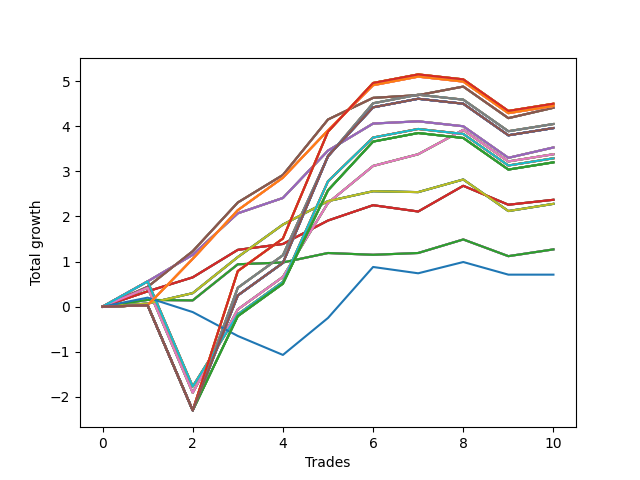

# Long Pointer 002 DB 
- Symbol: SPY_Unlimited
- Date Range: 03/23/2022 - 07/08/2022
- Trading Period: 7:20-12:30
- Number of Trades: 10



| Name | Win Percent | Profit | Avg Profit / Trade | Avg Time / Trade |      | Name | Win Percent | Profit | Avg Profit / Trade | Avg Time / Trade |
| ---- | ----------- | ------ | ------------------ | ---------------- | ---- | ---- | ----------- | ------ | ------------------ | ---------------- |
| Sorted By <br> Profit | | | | | | Sorted By <br> Win Percentage ||||
| One Hundred Twenty-Eight | 70.00 | 2250.00 | 225.00 | 29:24 |     | Sixty-Seven | 90.00 | 2205.00 | 220.50 | 13:59 |
| One Hundred Twenty-Three | 70.00 | 2250.00 | 225.00 | 29:24 |     | Fifty-Nine | 90.00 | 2205.00 | 220.50 | 13:59 |
| One Hundred Eighteen | 70.00 | 2250.00 | 225.00 | 29:24 |     | Fifty-One | 90.00 | 2205.00 | 220.50 | 13:59 |
| One Hundred Thirteen | 70.00 | 2250.00 | 225.00 | 29:24 |     | Forty-Three | 90.00 | 2205.00 | 220.50 | 13:59 |
| Eighty-Three | 70.00 | 2250.00 | 225.00 | 29:24 |     | Three | 90.00 | 2205.00 | 220.50 | 13:59 |
| One Hundred Twenty-Six | 80.00 | 2225.00 | 222.50 | 22:35 |     | One Hundred Twenty-Six | 80.00 | 2225.00 | 222.50 | 22:35 |
| One Hundred Twenty-One | 80.00 | 2225.00 | 222.50 | 22:35 |     | One Hundred Twenty-One | 80.00 | 2225.00 | 222.50 | 22:35 |
| One Hundred Sixteen | 80.00 | 2225.00 | 222.50 | 22:35 |     | One Hundred Sixteen | 80.00 | 2225.00 | 222.50 | 22:35 |
| One Hundred Eleven | 80.00 | 2225.00 | 222.50 | 22:35 |     | One Hundred Eleven | 80.00 | 2225.00 | 222.50 | 22:35 |
| Eighty-One | 80.00 | 2225.00 | 222.50 | 22:35 |     | Eighty-One | 80.00 | 2225.00 | 222.50 | 22:35 |
| Sixty-Seven | 90.00 | 2205.00 | 220.50 | 13:59 |     | Sixty-Six | 80.00 | 1765.00 | 176.50 | 16:42 |
| Fifty-Nine | 90.00 | 2205.00 | 220.50 | 13:59 |     | Fifty-Eight | 80.00 | 1765.00 | 176.50 | 16:42 |
| Fifty-One | 90.00 | 2205.00 | 220.50 | 13:59 |     | Fifty | 80.00 | 1765.00 | 176.50 | 16:42 |
| Forty-Three | 90.00 | 2205.00 | 220.50 | 13:59 |     | Forty-Two | 80.00 | 1765.00 | 176.50 | 16:42 |
| Three | 90.00 | 2205.00 | 220.50 | 13:59 |     | Two | 80.00 | 1765.00 | 176.50 | 16:42 |
| Sixty-Nine | 70.00 | 2025.00 | 202.50 | 27:04 |     | Sixty-Eight | 80.00 | 1690.00 | 169.00 | 22:36 |
| Sixty-One | 70.00 | 2025.00 | 202.50 | 27:04 |     | Sixty | 80.00 | 1690.00 | 169.00 | 22:36 |
| Fifty-Three | 70.00 | 2025.00 | 202.50 | 27:04 |     | Fifty-Two | 80.00 | 1690.00 | 169.00 | 22:36 |
| Forty-Five | 70.00 | 2025.00 | 202.50 | 27:04 |     | Forty-Four | 80.00 | 1690.00 | 169.00 | 22:36 |
| Five | 70.00 | 2025.00 | 202.50 | 27:04 |     | Four | 80.00 | 1690.00 | 169.00 | 22:36 |
| One Hundred Thirty | 70.00 | 1980.00 | 198.00 | 29:55 |     | Sixty-Five | 80.00 | 1185.00 | 118.50 | 12:08 |
| One Hundred Twenty-Nine | 70.00 | 1980.00 | 198.00 | 29:55 |     | Fifty-Seven | 80.00 | 1185.00 | 118.50 | 12:08 |
| One Hundred Twenty-Five | 70.00 | 1980.00 | 198.00 | 29:55 |     | Forty-Nine | 80.00 | 1185.00 | 118.50 | 12:08 |
| One Hundred Twenty-Four | 70.00 | 1980.00 | 198.00 | 29:55 |     | Forty-One | 80.00 | 1185.00 | 118.50 | 12:08 |
| One Hundred Twenty | 70.00 | 1980.00 | 198.00 | 29:55 |     | One | 80.00 | 1185.00 | 118.50 | 12:08 |
| One Hundred Ninteen | 70.00 | 1980.00 | 198.00 | 29:55 |     | Seventy | 80.00 | 1140.00 | 114.00 | 11:20 |
| One Hundred Fifteen | 70.00 | 1980.00 | 198.00 | 29:55 |     | Sixty-Two | 80.00 | 1140.00 | 114.00 | 11:20 |
| One Hundred Fourteen | 70.00 | 1980.00 | 198.00 | 29:55 |     | Fifty-Four | 80.00 | 1140.00 | 114.00 | 11:20 |
| Eighty-Five | 70.00 | 1980.00 | 198.00 | 29:55 |     | Forty-Six | 80.00 | 1140.00 | 114.00 | 11:20 |
| Eighty-Four | 70.00 | 1980.00 | 198.00 | 29:55 |     | Six | 80.00 | 1140.00 | 114.00 | 11:20 |
| Sixty-Six | 80.00 | 1765.00 | 176.50 | 16:42 |     | One Hundred Twenty-Eight | 70.00 | 2250.00 | 225.00 | 29:24 |
| Fifty-Eight | 80.00 | 1765.00 | 176.50 | 16:42 |     | One Hundred Twenty-Three | 70.00 | 2250.00 | 225.00 | 29:24 |
| Fifty | 80.00 | 1765.00 | 176.50 | 16:42 |     | One Hundred Eighteen | 70.00 | 2250.00 | 225.00 | 29:24 |
| Forty-Two | 80.00 | 1765.00 | 176.50 | 16:42 |     | One Hundred Thirteen | 70.00 | 2250.00 | 225.00 | 29:24 |
| Two | 80.00 | 1765.00 | 176.50 | 16:42 |     | Eighty-Three | 70.00 | 2250.00 | 225.00 | 29:24 |
| Sixty-Eight | 80.00 | 1690.00 | 169.00 | 22:36 |     | Sixty-Nine | 70.00 | 2025.00 | 202.50 | 27:04 |
| Sixty | 80.00 | 1690.00 | 169.00 | 22:36 |     | Sixty-One | 70.00 | 2025.00 | 202.50 | 27:04 |
| Fifty-Two | 80.00 | 1690.00 | 169.00 | 22:36 |     | Fifty-Three | 70.00 | 2025.00 | 202.50 | 27:04 |
| Forty-Four | 80.00 | 1690.00 | 169.00 | 22:36 |     | Forty-Five | 70.00 | 2025.00 | 202.50 | 27:04 |
| Four | 80.00 | 1690.00 | 169.00 | 22:36 |     | Five | 70.00 | 2025.00 | 202.50 | 27:04 |
| Seventy-One | 70.00 | 1645.00 | 164.50 | 23:34 |     | One Hundred Thirty | 70.00 | 1980.00 | 198.00 | 29:55 |
| Sixty-Three | 70.00 | 1645.00 | 164.50 | 23:34 |     | One Hundred Twenty-Nine | 70.00 | 1980.00 | 198.00 | 29:55 |
| Fifty-Five | 70.00 | 1645.00 | 164.50 | 23:34 |     | One Hundred Twenty-Five | 70.00 | 1980.00 | 198.00 | 29:55 |
| Forty-Seven | 70.00 | 1645.00 | 164.50 | 23:34 |     | One Hundred Twenty-Four | 70.00 | 1980.00 | 198.00 | 29:55 |
| Seven | 70.00 | 1645.00 | 164.50 | 23:34 |     | One Hundred Twenty | 70.00 | 1980.00 | 198.00 | 29:55 |
| One Hundred Twenty-Seven | 70.00 | 1600.00 | 160.00 | 28:44 |     | One Hundred Ninteen | 70.00 | 1980.00 | 198.00 | 29:55 |
| One Hundred Twenty-Two | 70.00 | 1600.00 | 160.00 | 28:44 |     | One Hundred Fifteen | 70.00 | 1980.00 | 198.00 | 29:55 |
| One Hundred Seventeen | 70.00 | 1600.00 | 160.00 | 28:44 |     | One Hundred Fourteen | 70.00 | 1980.00 | 198.00 | 29:55 |
| One Hundred Twelve | 70.00 | 1600.00 | 160.00 | 28:44 |     | Eighty-Five | 70.00 | 1980.00 | 198.00 | 29:55 |
| Eighty-Two | 70.00 | 1600.00 | 160.00 | 28:44 |     | Eighty-Four | 70.00 | 1980.00 | 198.00 | 29:55 |
| Sixty-Five | 80.00 | 1185.00 | 118.50 | 12:08 |     | Seventy-One | 70.00 | 1645.00 | 164.50 | 23:34 |
| Fifty-Seven | 80.00 | 1185.00 | 118.50 | 12:08 |     | Sixty-Three | 70.00 | 1645.00 | 164.50 | 23:34 |
| Forty-Nine | 80.00 | 1185.00 | 118.50 | 12:08 |     | Fifty-Five | 70.00 | 1645.00 | 164.50 | 23:34 |
| Forty-One | 80.00 | 1185.00 | 118.50 | 12:08 |     | Forty-Seven | 70.00 | 1645.00 | 164.50 | 23:34 |
| One | 80.00 | 1185.00 | 118.50 | 12:08 |     | Seven | 70.00 | 1645.00 | 164.50 | 23:34 |
| Seventy | 80.00 | 1140.00 | 114.00 | 11:20 |     | One Hundred Twenty-Seven | 70.00 | 1600.00 | 160.00 | 28:44 |
| Sixty-Two | 80.00 | 1140.00 | 114.00 | 11:20 |     | One Hundred Twenty-Two | 70.00 | 1600.00 | 160.00 | 28:44 |
| Fifty-Four | 80.00 | 1140.00 | 114.00 | 11:20 |     | One Hundred Seventeen | 70.00 | 1600.00 | 160.00 | 28:44 |
| Forty-Six | 80.00 | 1140.00 | 114.00 | 11:20 |     | One Hundred Twelve | 70.00 | 1600.00 | 160.00 | 28:44 |
| Six | 80.00 | 1140.00 | 114.00 | 11:20 |     | Eighty-Two | 70.00 | 1600.00 | 160.00 | 28:44 |
| Sixty-Four | 70.00 | 635.00 | 63.50 | 04:19 |     | Sixty-Four | 70.00 | 635.00 | 63.50 | 04:19 |
| Fifty-Six | 70.00 | 635.00 | 63.50 | 04:19 |     | Fifty-Six | 70.00 | 635.00 | 63.50 | 04:19 |
| Forty-Eight | 70.00 | 635.00 | 63.50 | 04:19 |     | Forty-Eight | 70.00 | 635.00 | 63.50 | 04:19 |
| Forty | 70.00 | 635.00 | 63.50 | 04:19 |     | Forty | 70.00 | 635.00 | 63.50 | 04:19 |
| Zero | 70.00 | 635.00 | 63.50 | 04:19 |     | Zero | 70.00 | 635.00 | 63.50 | 04:19 |
| Seventy-Three | 50.00 | 355.00 | 35.50 | 07:53 |     | Seventy-Three | 50.00 | 355.00 | 35.50 | 07:53 |

## NO STOPLOSS

### Test Zero
* Sell when price hits the middle line of the 20p bollinger
* No Stoploss
* Results:
```
Total Trades: 10
Percent Up: 70.00
Percent Down: 30.00
Total Points Moved Up: 1.27
Potential Profit: 635.00
Total Points Ups: 1.69 Count Ups: 7
Total Points Downs: -0.42 Count Downs: 3
```

<details><summary>Trades</summary>

<code>In: 2022-03-31 08:37:00		Out: 2022-03-31 08:38:05		Total Position Time: 01:05		Total Move Up: 0.15		Total to Date: 0.15</code> <br />
<code>In: 2022-05-11 09:14:00		Out: 2022-05-11 09:17:50		Total Position Time: 03:50		Total Move Up: -0.01		Total to Date: 0.14</code> <br />
<code>In: 2022-05-17 11:25:00		Out: 2022-05-17 11:27:25		Total Position Time: 02:25		Total Move Up: 0.80		Total to Date: 0.94</code> <br />
<code>In: 2022-05-25 09:30:00		Out: 2022-05-25 09:38:55		Total Position Time: 08:55		Total Move Up: 0.04		Total to Date: 0.98</code> <br />
<code>In: 2022-05-31 12:05:00		Out: 2022-05-31 12:07:20		Total Position Time: 02:20		Total Move Up: 0.21		Total to Date: 1.19</code> <br />
<code>In: 2022-06-08 08:06:00		Out: 2022-06-08 08:10:05		Total Position Time: 04:05		Total Move Up: -0.04		Total to Date: 1.15</code> <br />
<code>In: 2022-06-21 08:58:00		Out: 2022-06-21 09:02:05		Total Position Time: 04:05		Total Move Up: 0.04		Total to Date: 1.19</code> <br />
<code>In: 2022-06-27 10:10:00		Out: 2022-06-27 10:11:25		Total Position Time: 01:25		Total Move Up: 0.30		Total to Date: 1.49</code> <br />
<code>In: 2022-06-27 10:37:00		Out: 2022-06-27 10:51:15		Total Position Time: 14:15		Total Move Up: -0.37		Total to Date: 1.12</code> <br />
<code>In: 2022-07-08 09:48:00		Out: 2022-07-08 09:48:45		Total Position Time: 00:45		Total Move Up: 0.15		Total to Date: 1.27</code> <br />


</details>

### Test One
* Sell when the price hits the upper line of the 20p 1std bollinger
* No Stoploss
* Results:
```
Total Trades: 10
Percent Up: 80.00
Percent Down: 20.00
Total Points Moved Up: 2.37
Potential Profit: 1185.00
Total Points Ups: 2.93 Count Ups: 8
Total Points Downs: -0.56 Count Downs: 2
```

<details><summary>Trades</summary>

<code>In: 2022-03-31 08:37:00		Out: 2022-03-31 08:40:35		Total Position Time: 03:35		Total Move Up: 0.34		Total to Date: 0.34</code> <br />
<code>In: 2022-05-11 09:14:00		Out: 2022-05-11 09:23:10		Total Position Time: 09:10		Total Move Up: 0.31		Total to Date: 0.65</code> <br />
<code>In: 2022-05-17 11:25:00		Out: 2022-05-17 11:37:35		Total Position Time: 12:35		Total Move Up: 0.61		Total to Date: 1.26</code> <br />
<code>In: 2022-05-25 09:30:00		Out: 2022-05-25 09:44:25		Total Position Time: 14:25		Total Move Up: 0.13		Total to Date: 1.39</code> <br />
<code>In: 2022-05-31 12:05:00		Out: 2022-05-31 12:09:15		Total Position Time: 04:15		Total Move Up: 0.52		Total to Date: 1.91</code> <br />
<code>In: 2022-06-08 08:06:00		Out: 2022-06-08 08:11:10		Total Position Time: 05:10		Total Move Up: 0.34		Total to Date: 2.25</code> <br />
<code>In: 2022-06-21 08:58:00		Out: 2022-06-21 09:16:20		Total Position Time: 18:20		Total Move Up: -0.14		Total to Date: 2.11</code> <br />
<code>In: 2022-06-27 10:10:00		Out: 2022-06-27 10:15:55		Total Position Time: 05:55		Total Move Up: 0.57		Total to Date: 2.68</code> <br />
<code>In: 2022-06-27 10:37:00		Out: 2022-06-27 11:03:15		Total Position Time: 26:15		Total Move Up: -0.42		Total to Date: 2.26</code> <br />
<code>In: 2022-07-08 09:48:00		Out: 2022-07-08 10:09:40		Total Position Time: 21:40		Total Move Up: 0.11		Total to Date: 2.37</code> <br />


</details>

### Test Two
* Sell when the price hits the upper line of the 20p 2std bollinger
* No Stoploss
* Results:
```
Total Trades: 10
Percent Up: 80.00
Percent Down: 20.00
Total Points Moved Up: 3.53
Potential Profit: 1765.00
Total Points Ups: 4.34 Count Ups: 8
Total Points Downs: -0.81 Count Downs: 2
```

<details><summary>Trades</summary>

<code>In: 2022-03-31 08:37:00		Out: 2022-03-31 08:41:10		Total Position Time: 04:10		Total Move Up: 0.56		Total to Date: 0.56</code> <br />
<code>In: 2022-05-11 09:14:00		Out: 2022-05-11 09:23:35		Total Position Time: 09:35		Total Move Up: 0.59		Total to Date: 1.15</code> <br />
<code>In: 2022-05-17 11:25:00		Out: 2022-05-17 11:40:00		Total Position Time: 15:00		Total Move Up: 0.92		Total to Date: 2.07</code> <br />
<code>In: 2022-05-25 09:30:00		Out: 2022-05-25 09:45:20		Total Position Time: 15:20		Total Move Up: 0.34		Total to Date: 2.41</code> <br />
<code>In: 2022-05-31 12:05:00		Out: 2022-05-31 12:15:05		Total Position Time: 10:05		Total Move Up: 1.05		Total to Date: 3.46</code> <br />
<code>In: 2022-06-08 08:06:00		Out: 2022-06-08 08:14:00		Total Position Time: 08:00		Total Move Up: 0.60		Total to Date: 4.06</code> <br />
<code>In: 2022-06-21 08:58:00		Out: 2022-06-21 09:19:55		Total Position Time: 21:55		Total Move Up: 0.05		Total to Date: 4.11</code> <br />
<code>In: 2022-06-27 10:10:00		Out: 2022-06-27 10:39:55		Total Position Time: 29:55		Total Move Up: -0.11		Total to Date: 4.00</code> <br />
<code>In: 2022-06-27 10:37:00		Out: 2022-06-27 11:06:55		Total Position Time: 29:55		Total Move Up: -0.70		Total to Date: 3.30</code> <br />
<code>In: 2022-07-08 09:48:00		Out: 2022-07-08 10:11:10		Total Position Time: 23:10		Total Move Up: 0.23		Total to Date: 3.53</code> <br />


</details>

### Test Three
* Sell when price hits the middle line of the 50p bollinger
* No Stoploss
* Results:
```
Total Trades: 10
Percent Up: 90.00
Percent Down: 10.00
Total Points Moved Up: 4.41
Potential Profit: 2205.00
Total Points Ups: 5.11 Count Ups: 9
Total Points Downs: -0.70 Count Downs: 1
```

<details><summary>Trades</summary>

<code>In: 2022-03-31 08:37:00		Out: 2022-03-31 08:41:05		Total Position Time: 04:05		Total Move Up: 0.44		Total to Date: 0.44</code> <br />
<code>In: 2022-05-11 09:14:00		Out: 2022-05-11 09:23:45		Total Position Time: 09:45		Total Move Up: 0.79		Total to Date: 1.23</code> <br />
<code>In: 2022-05-17 11:25:00		Out: 2022-05-17 11:40:05		Total Position Time: 15:05		Total Move Up: 1.08		Total to Date: 2.31</code> <br />
<code>In: 2022-05-25 09:30:00		Out: 2022-05-25 09:49:05		Total Position Time: 19:05		Total Move Up: 0.61		Total to Date: 2.92</code> <br />
<code>In: 2022-05-31 12:05:00		Out: 2022-05-31 12:15:15		Total Position Time: 10:15		Total Move Up: 1.23		Total to Date: 4.15</code> <br />
<code>In: 2022-06-08 08:06:00		Out: 2022-06-08 08:11:20		Total Position Time: 05:20		Total Move Up: 0.48		Total to Date: 4.63</code> <br />
<code>In: 2022-06-21 08:58:00		Out: 2022-06-21 09:20:00		Total Position Time: 22:00		Total Move Up: 0.06		Total to Date: 4.69</code> <br />
<code>In: 2022-06-27 10:10:00		Out: 2022-06-27 10:11:15		Total Position Time: 01:15		Total Move Up: 0.19		Total to Date: 4.88</code> <br />
<code>In: 2022-06-27 10:37:00		Out: 2022-06-27 11:06:55		Total Position Time: 29:55		Total Move Up: -0.70		Total to Date: 4.18</code> <br />
<code>In: 2022-07-08 09:48:00		Out: 2022-07-08 10:11:05		Total Position Time: 23:05		Total Move Up: 0.23		Total to Date: 4.41</code> <br />


</details>

### Test Four
* Sell when the price hits the upper line of the 50p 1std bollinger
* No Stoploss
* Results:
```
Total Trades: 10
Percent Up: 80.00
Percent Down: 20.00
Total Points Moved Up: 3.38
Potential Profit: 1690.00
Total Points Ups: 6.41 Count Ups: 8
Total Points Downs: -3.03 Count Downs: 2
```

<details><summary>Trades</summary>

<code>In: 2022-03-31 08:37:00		Out: 2022-03-31 09:00:15		Total Position Time: 23:15		Total Move Up: 0.42		Total to Date: 0.42</code> <br />
<code>In: 2022-05-11 09:14:00		Out: 2022-05-11 09:43:55		Total Position Time: 29:55		Total Move Up: -2.33		Total to Date: -1.91</code> <br />
<code>In: 2022-05-17 11:25:00		Out: 2022-05-17 11:44:30		Total Position Time: 19:30		Total Move Up: 1.85		Total to Date: -0.06</code> <br />
<code>In: 2022-05-25 09:30:00		Out: 2022-05-25 09:59:55		Total Position Time: 29:55		Total Move Up: 0.72		Total to Date: 0.66</code> <br />
<code>In: 2022-05-31 12:05:00		Out: 2022-05-31 12:28:20		Total Position Time: 23:20		Total Move Up: 1.64		Total to Date: 2.30</code> <br />
<code>In: 2022-06-08 08:06:00		Out: 2022-06-08 08:15:05		Total Position Time: 09:05		Total Move Up: 0.82		Total to Date: 3.12</code> <br />
<code>In: 2022-06-21 08:58:00		Out: 2022-06-21 09:26:05		Total Position Time: 28:05		Total Move Up: 0.26		Total to Date: 3.38</code> <br />
<code>In: 2022-06-27 10:10:00		Out: 2022-06-27 10:13:05		Total Position Time: 03:05		Total Move Up: 0.54		Total to Date: 3.92</code> <br />
<code>In: 2022-06-27 10:37:00		Out: 2022-06-27 11:06:55		Total Position Time: 29:55		Total Move Up: -0.70		Total to Date: 3.22</code> <br />
<code>In: 2022-07-08 09:48:00		Out: 2022-07-08 10:17:55		Total Position Time: 29:55		Total Move Up: 0.16		Total to Date: 3.38</code> <br />


</details>

### Test Five
* Sell when the price hits the upper line of the 50p 2std bollinger
* No Stoploss
* Results:
```
Total Trades: 10
Percent Up: 70.00
Percent Down: 30.00
Total Points Moved Up: 4.05
Potential Profit: 2025.00
Total Points Ups: 7.19 Count Ups: 7
Total Points Downs: -3.14 Count Downs: 3
```

<details><summary>Trades</summary>

<code>In: 2022-03-31 08:37:00		Out: 2022-03-31 09:06:55		Total Position Time: 29:55		Total Move Up: 0.03		Total to Date: 0.03</code> <br />
<code>In: 2022-05-11 09:14:00		Out: 2022-05-11 09:43:55		Total Position Time: 29:55		Total Move Up: -2.33		Total to Date: -2.30</code> <br />
<code>In: 2022-05-17 11:25:00		Out: 2022-05-17 11:48:40		Total Position Time: 23:40		Total Move Up: 2.72		Total to Date: 0.42</code> <br />
<code>In: 2022-05-25 09:30:00		Out: 2022-05-25 09:59:55		Total Position Time: 29:55		Total Move Up: 0.72		Total to Date: 1.14</code> <br />
<code>In: 2022-05-31 12:05:00		Out: 2022-05-31 12:31:00		Total Position Time: 26:00		Total Move Up: 2.19		Total to Date: 3.33</code> <br />
<code>In: 2022-06-08 08:06:00		Out: 2022-06-08 08:17:35		Total Position Time: 11:35		Total Move Up: 1.18		Total to Date: 4.51</code> <br />
<code>In: 2022-06-21 08:58:00		Out: 2022-06-21 09:27:55		Total Position Time: 29:55		Total Move Up: 0.19		Total to Date: 4.70</code> <br />
<code>In: 2022-06-27 10:10:00		Out: 2022-06-27 10:39:55		Total Position Time: 29:55		Total Move Up: -0.11		Total to Date: 4.59</code> <br />
<code>In: 2022-06-27 10:37:00		Out: 2022-06-27 11:06:55		Total Position Time: 29:55		Total Move Up: -0.70		Total to Date: 3.89</code> <br />
<code>In: 2022-07-08 09:48:00		Out: 2022-07-08 10:17:55		Total Position Time: 29:55		Total Move Up: 0.16		Total to Date: 4.05</code> <br />


</details>

### Test Six
* Sell when the price hits the middle line of the 1std VWAP
* No Stoploss
* Results:
```
Total Trades: 10
Percent Up: 80.00
Percent Down: 20.00
Total Points Moved Up: 2.28
Potential Profit: 1140.00
Total Points Ups: 3.00 Count Ups: 8
Total Points Downs: -0.72 Count Downs: 2
```

<details><summary>Trades</summary>

<code>In: 2022-03-31 08:37:00		Out: 2022-03-31 08:37:10		Total Position Time: 00:10		Total Move Up: 0.07		Total to Date: 0.07</code> <br />
<code>In: 2022-05-11 09:14:00		Out: 2022-05-11 09:21:05		Total Position Time: 07:05		Total Move Up: 0.23		Total to Date: 0.30</code> <br />
<code>In: 2022-05-17 11:25:00		Out: 2022-05-17 11:27:25		Total Position Time: 02:25		Total Move Up: 0.80		Total to Date: 1.10</code> <br />
<code>In: 2022-05-25 09:30:00		Out: 2022-05-25 09:59:55		Total Position Time: 29:55		Total Move Up: 0.72		Total to Date: 1.82</code> <br />
<code>In: 2022-05-31 12:05:00		Out: 2022-05-31 12:09:15		Total Position Time: 04:15		Total Move Up: 0.52		Total to Date: 2.34</code> <br />
<code>In: 2022-06-08 08:06:00		Out: 2022-06-08 08:10:50		Total Position Time: 04:50		Total Move Up: 0.22		Total to Date: 2.56</code> <br />
<code>In: 2022-06-21 08:58:00		Out: 2022-06-21 09:01:20		Total Position Time: 03:20		Total Move Up: -0.02		Total to Date: 2.54</code> <br />
<code>In: 2022-06-27 10:10:00		Out: 2022-06-27 10:11:30		Total Position Time: 01:30		Total Move Up: 0.28		Total to Date: 2.82</code> <br />
<code>In: 2022-06-27 10:37:00		Out: 2022-06-27 11:06:55		Total Position Time: 29:55		Total Move Up: -0.70		Total to Date: 2.12</code> <br />
<code>In: 2022-07-08 09:48:00		Out: 2022-07-08 10:17:55		Total Position Time: 29:55		Total Move Up: 0.16		Total to Date: 2.28</code> <br />


</details>

### Test Seven
* Sell when the price hits the upper line of the 1std VWAP
* No Stoploss
* Results:
```
Total Trades: 10
Percent Up: 70.00
Percent Down: 30.00
Total Points Moved Up: 3.29
Potential Profit: 1645.00
Total Points Ups: 6.43 Count Ups: 7
Total Points Downs: -3.14 Count Downs: 3
```

<details><summary>Trades</summary>

<code>In: 2022-03-31 08:37:00		Out: 2022-03-31 08:41:10		Total Position Time: 04:10		Total Move Up: 0.56		Total to Date: 0.56</code> <br />
<code>In: 2022-05-11 09:14:00		Out: 2022-05-11 09:43:55		Total Position Time: 29:55		Total Move Up: -2.33		Total to Date: -1.77</code> <br />
<code>In: 2022-05-17 11:25:00		Out: 2022-05-17 11:40:25		Total Position Time: 15:25		Total Move Up: 1.60		Total to Date: -0.17</code> <br />
<code>In: 2022-05-25 09:30:00		Out: 2022-05-25 09:59:55		Total Position Time: 29:55		Total Move Up: 0.72		Total to Date: 0.55</code> <br />
<code>In: 2022-05-31 12:05:00		Out: 2022-05-31 12:31:10		Total Position Time: 26:10		Total Move Up: 2.23		Total to Date: 2.78</code> <br />
<code>In: 2022-06-08 08:06:00		Out: 2022-06-08 08:16:30		Total Position Time: 10:30		Total Move Up: 0.97		Total to Date: 3.75</code> <br />
<code>In: 2022-06-21 08:58:00		Out: 2022-06-21 09:27:55		Total Position Time: 29:55		Total Move Up: 0.19		Total to Date: 3.94</code> <br />
<code>In: 2022-06-27 10:10:00		Out: 2022-06-27 10:39:55		Total Position Time: 29:55		Total Move Up: -0.11		Total to Date: 3.83</code> <br />
<code>In: 2022-06-27 10:37:00		Out: 2022-06-27 11:06:55		Total Position Time: 29:55		Total Move Up: -0.70		Total to Date: 3.13</code> <br />
<code>In: 2022-07-08 09:48:00		Out: 2022-07-08 10:17:55		Total Position Time: 29:55		Total Move Up: 0.16		Total to Date: 3.29</code> <br />


</details>

## STOPLOSS OF 5

### Test Forty
* Sell when price hits the middle line of the 20p bollinger
* Stoploss is 5 points
* Results:
```
Total Trades: 10
Percent Up: 70.00
Percent Down: 30.00
Total Points Moved Up: 1.27
Potential Profit: 635.00
Total Points Ups: 1.69 Count Ups: 7
Total Points Downs: -0.42 Count Downs: 3
```

<details><summary>Trades</summary>

<code>In: 2022-03-31 08:37:00		Out: 2022-03-31 08:38:05		Total Position Time: 01:05		Total Move Up: 0.15		Total to Date: 0.15</code> <br />
<code>In: 2022-05-11 09:14:00		Out: 2022-05-11 09:17:50		Total Position Time: 03:50		Total Move Up: -0.01		Total to Date: 0.14</code> <br />
<code>In: 2022-05-17 11:25:00		Out: 2022-05-17 11:27:25		Total Position Time: 02:25		Total Move Up: 0.80		Total to Date: 0.94</code> <br />
<code>In: 2022-05-25 09:30:00		Out: 2022-05-25 09:38:55		Total Position Time: 08:55		Total Move Up: 0.04		Total to Date: 0.98</code> <br />
<code>In: 2022-05-31 12:05:00		Out: 2022-05-31 12:07:20		Total Position Time: 02:20		Total Move Up: 0.21		Total to Date: 1.19</code> <br />
<code>In: 2022-06-08 08:06:00		Out: 2022-06-08 08:10:05		Total Position Time: 04:05		Total Move Up: -0.04		Total to Date: 1.15</code> <br />
<code>In: 2022-06-21 08:58:00		Out: 2022-06-21 09:02:05		Total Position Time: 04:05		Total Move Up: 0.04		Total to Date: 1.19</code> <br />
<code>In: 2022-06-27 10:10:00		Out: 2022-06-27 10:11:25		Total Position Time: 01:25		Total Move Up: 0.30		Total to Date: 1.49</code> <br />
<code>In: 2022-06-27 10:37:00		Out: 2022-06-27 10:51:15		Total Position Time: 14:15		Total Move Up: -0.37		Total to Date: 1.12</code> <br />
<code>In: 2022-07-08 09:48:00		Out: 2022-07-08 09:48:45		Total Position Time: 00:45		Total Move Up: 0.15		Total to Date: 1.27</code> <br />


</details>

### Test Forty-One
* Sell when the price hits the upper line of the 20p 1std bollinger
* Stoploss is 5 points
* Results:
```
Total Trades: 10
Percent Up: 80.00
Percent Down: 20.00
Total Points Moved Up: 2.37
Potential Profit: 1185.00
Total Points Ups: 2.93 Count Ups: 8
Total Points Downs: -0.56 Count Downs: 2
```

<details><summary>Trades</summary>

<code>In: 2022-03-31 08:37:00		Out: 2022-03-31 08:40:35		Total Position Time: 03:35		Total Move Up: 0.34		Total to Date: 0.34</code> <br />
<code>In: 2022-05-11 09:14:00		Out: 2022-05-11 09:23:10		Total Position Time: 09:10		Total Move Up: 0.31		Total to Date: 0.65</code> <br />
<code>In: 2022-05-17 11:25:00		Out: 2022-05-17 11:37:35		Total Position Time: 12:35		Total Move Up: 0.61		Total to Date: 1.26</code> <br />
<code>In: 2022-05-25 09:30:00		Out: 2022-05-25 09:44:25		Total Position Time: 14:25		Total Move Up: 0.13		Total to Date: 1.39</code> <br />
<code>In: 2022-05-31 12:05:00		Out: 2022-05-31 12:09:15		Total Position Time: 04:15		Total Move Up: 0.52		Total to Date: 1.91</code> <br />
<code>In: 2022-06-08 08:06:00		Out: 2022-06-08 08:11:10		Total Position Time: 05:10		Total Move Up: 0.34		Total to Date: 2.25</code> <br />
<code>In: 2022-06-21 08:58:00		Out: 2022-06-21 09:16:20		Total Position Time: 18:20		Total Move Up: -0.14		Total to Date: 2.11</code> <br />
<code>In: 2022-06-27 10:10:00		Out: 2022-06-27 10:15:55		Total Position Time: 05:55		Total Move Up: 0.57		Total to Date: 2.68</code> <br />
<code>In: 2022-06-27 10:37:00		Out: 2022-06-27 11:03:15		Total Position Time: 26:15		Total Move Up: -0.42		Total to Date: 2.26</code> <br />
<code>In: 2022-07-08 09:48:00		Out: 2022-07-08 10:09:40		Total Position Time: 21:40		Total Move Up: 0.11		Total to Date: 2.37</code> <br />


</details>

### Test Forty-Two
* Sell when the price hits the upper line of the 20p 2std bollinger
* Stoploss is 5 points
* Results:
```
Total Trades: 10
Percent Up: 80.00
Percent Down: 20.00
Total Points Moved Up: 3.53
Potential Profit: 1765.00
Total Points Ups: 4.34 Count Ups: 8
Total Points Downs: -0.81 Count Downs: 2
```

<details><summary>Trades</summary>

<code>In: 2022-03-31 08:37:00		Out: 2022-03-31 08:41:10		Total Position Time: 04:10		Total Move Up: 0.56		Total to Date: 0.56</code> <br />
<code>In: 2022-05-11 09:14:00		Out: 2022-05-11 09:23:35		Total Position Time: 09:35		Total Move Up: 0.59		Total to Date: 1.15</code> <br />
<code>In: 2022-05-17 11:25:00		Out: 2022-05-17 11:40:00		Total Position Time: 15:00		Total Move Up: 0.92		Total to Date: 2.07</code> <br />
<code>In: 2022-05-25 09:30:00		Out: 2022-05-25 09:45:20		Total Position Time: 15:20		Total Move Up: 0.34		Total to Date: 2.41</code> <br />
<code>In: 2022-05-31 12:05:00		Out: 2022-05-31 12:15:05		Total Position Time: 10:05		Total Move Up: 1.05		Total to Date: 3.46</code> <br />
<code>In: 2022-06-08 08:06:00		Out: 2022-06-08 08:14:00		Total Position Time: 08:00		Total Move Up: 0.60		Total to Date: 4.06</code> <br />
<code>In: 2022-06-21 08:58:00		Out: 2022-06-21 09:19:55		Total Position Time: 21:55		Total Move Up: 0.05		Total to Date: 4.11</code> <br />
<code>In: 2022-06-27 10:10:00		Out: 2022-06-27 10:39:55		Total Position Time: 29:55		Total Move Up: -0.11		Total to Date: 4.00</code> <br />
<code>In: 2022-06-27 10:37:00		Out: 2022-06-27 11:06:55		Total Position Time: 29:55		Total Move Up: -0.70		Total to Date: 3.30</code> <br />
<code>In: 2022-07-08 09:48:00		Out: 2022-07-08 10:11:10		Total Position Time: 23:10		Total Move Up: 0.23		Total to Date: 3.53</code> <br />


</details>

### Test Forty-Three
* Sell when price hits the middle line of the 50p bollinger
* Stoploss is 5 points
* Results:
```
Total Trades: 10
Percent Up: 90.00
Percent Down: 10.00
Total Points Moved Up: 4.41
Potential Profit: 2205.00
Total Points Ups: 5.11 Count Ups: 9
Total Points Downs: -0.70 Count Downs: 1
```

<details><summary>Trades</summary>

<code>In: 2022-03-31 08:37:00		Out: 2022-03-31 08:41:05		Total Position Time: 04:05		Total Move Up: 0.44		Total to Date: 0.44</code> <br />
<code>In: 2022-05-11 09:14:00		Out: 2022-05-11 09:23:45		Total Position Time: 09:45		Total Move Up: 0.79		Total to Date: 1.23</code> <br />
<code>In: 2022-05-17 11:25:00		Out: 2022-05-17 11:40:05		Total Position Time: 15:05		Total Move Up: 1.08		Total to Date: 2.31</code> <br />
<code>In: 2022-05-25 09:30:00		Out: 2022-05-25 09:49:05		Total Position Time: 19:05		Total Move Up: 0.61		Total to Date: 2.92</code> <br />
<code>In: 2022-05-31 12:05:00		Out: 2022-05-31 12:15:15		Total Position Time: 10:15		Total Move Up: 1.23		Total to Date: 4.15</code> <br />
<code>In: 2022-06-08 08:06:00		Out: 2022-06-08 08:11:20		Total Position Time: 05:20		Total Move Up: 0.48		Total to Date: 4.63</code> <br />
<code>In: 2022-06-21 08:58:00		Out: 2022-06-21 09:20:00		Total Position Time: 22:00		Total Move Up: 0.06		Total to Date: 4.69</code> <br />
<code>In: 2022-06-27 10:10:00		Out: 2022-06-27 10:11:15		Total Position Time: 01:15		Total Move Up: 0.19		Total to Date: 4.88</code> <br />
<code>In: 2022-06-27 10:37:00		Out: 2022-06-27 11:06:55		Total Position Time: 29:55		Total Move Up: -0.70		Total to Date: 4.18</code> <br />
<code>In: 2022-07-08 09:48:00		Out: 2022-07-08 10:11:05		Total Position Time: 23:05		Total Move Up: 0.23		Total to Date: 4.41</code> <br />


</details>

### Test Forty-Four
* Sell when the price hits the upper line of the 50p 1std bollinger
* Stoploss is 5 points
* Results:
```
Total Trades: 10
Percent Up: 80.00
Percent Down: 20.00
Total Points Moved Up: 3.38
Potential Profit: 1690.00
Total Points Ups: 6.41 Count Ups: 8
Total Points Downs: -3.03 Count Downs: 2
```

<details><summary>Trades</summary>

<code>In: 2022-03-31 08:37:00		Out: 2022-03-31 09:00:15		Total Position Time: 23:15		Total Move Up: 0.42		Total to Date: 0.42</code> <br />
<code>In: 2022-05-11 09:14:00		Out: 2022-05-11 09:43:55		Total Position Time: 29:55		Total Move Up: -2.33		Total to Date: -1.91</code> <br />
<code>In: 2022-05-17 11:25:00		Out: 2022-05-17 11:44:30		Total Position Time: 19:30		Total Move Up: 1.85		Total to Date: -0.06</code> <br />
<code>In: 2022-05-25 09:30:00		Out: 2022-05-25 09:59:55		Total Position Time: 29:55		Total Move Up: 0.72		Total to Date: 0.66</code> <br />
<code>In: 2022-05-31 12:05:00		Out: 2022-05-31 12:28:20		Total Position Time: 23:20		Total Move Up: 1.64		Total to Date: 2.30</code> <br />
<code>In: 2022-06-08 08:06:00		Out: 2022-06-08 08:15:05		Total Position Time: 09:05		Total Move Up: 0.82		Total to Date: 3.12</code> <br />
<code>In: 2022-06-21 08:58:00		Out: 2022-06-21 09:26:05		Total Position Time: 28:05		Total Move Up: 0.26		Total to Date: 3.38</code> <br />
<code>In: 2022-06-27 10:10:00		Out: 2022-06-27 10:13:05		Total Position Time: 03:05		Total Move Up: 0.54		Total to Date: 3.92</code> <br />
<code>In: 2022-06-27 10:37:00		Out: 2022-06-27 11:06:55		Total Position Time: 29:55		Total Move Up: -0.70		Total to Date: 3.22</code> <br />
<code>In: 2022-07-08 09:48:00		Out: 2022-07-08 10:17:55		Total Position Time: 29:55		Total Move Up: 0.16		Total to Date: 3.38</code> <br />


</details>

### Test Forty-Five
* Sell when the price hits the upper line of the 50p 2std bollinger
* Stoploss is 5 points
* Results:
```
Total Trades: 10
Percent Up: 70.00
Percent Down: 30.00
Total Points Moved Up: 4.05
Potential Profit: 2025.00
Total Points Ups: 7.19 Count Ups: 7
Total Points Downs: -3.14 Count Downs: 3
```

<details><summary>Trades</summary>

<code>In: 2022-03-31 08:37:00		Out: 2022-03-31 09:06:55		Total Position Time: 29:55		Total Move Up: 0.03		Total to Date: 0.03</code> <br />
<code>In: 2022-05-11 09:14:00		Out: 2022-05-11 09:43:55		Total Position Time: 29:55		Total Move Up: -2.33		Total to Date: -2.30</code> <br />
<code>In: 2022-05-17 11:25:00		Out: 2022-05-17 11:48:40		Total Position Time: 23:40		Total Move Up: 2.72		Total to Date: 0.42</code> <br />
<code>In: 2022-05-25 09:30:00		Out: 2022-05-25 09:59:55		Total Position Time: 29:55		Total Move Up: 0.72		Total to Date: 1.14</code> <br />
<code>In: 2022-05-31 12:05:00		Out: 2022-05-31 12:31:00		Total Position Time: 26:00		Total Move Up: 2.19		Total to Date: 3.33</code> <br />
<code>In: 2022-06-08 08:06:00		Out: 2022-06-08 08:17:35		Total Position Time: 11:35		Total Move Up: 1.18		Total to Date: 4.51</code> <br />
<code>In: 2022-06-21 08:58:00		Out: 2022-06-21 09:27:55		Total Position Time: 29:55		Total Move Up: 0.19		Total to Date: 4.70</code> <br />
<code>In: 2022-06-27 10:10:00		Out: 2022-06-27 10:39:55		Total Position Time: 29:55		Total Move Up: -0.11		Total to Date: 4.59</code> <br />
<code>In: 2022-06-27 10:37:00		Out: 2022-06-27 11:06:55		Total Position Time: 29:55		Total Move Up: -0.70		Total to Date: 3.89</code> <br />
<code>In: 2022-07-08 09:48:00		Out: 2022-07-08 10:17:55		Total Position Time: 29:55		Total Move Up: 0.16		Total to Date: 4.05</code> <br />


</details>

### Test Forty-Six
* Sell when the price hits the middle line of the 1std VWAP
* Stoploss is 5 points
* Results:
```
Total Trades: 10
Percent Up: 80.00
Percent Down: 20.00
Total Points Moved Up: 2.28
Potential Profit: 1140.00
Total Points Ups: 3.00 Count Ups: 8
Total Points Downs: -0.72 Count Downs: 2
```

<details><summary>Trades</summary>

<code>In: 2022-03-31 08:37:00		Out: 2022-03-31 08:37:10		Total Position Time: 00:10		Total Move Up: 0.07		Total to Date: 0.07</code> <br />
<code>In: 2022-05-11 09:14:00		Out: 2022-05-11 09:21:05		Total Position Time: 07:05		Total Move Up: 0.23		Total to Date: 0.30</code> <br />
<code>In: 2022-05-17 11:25:00		Out: 2022-05-17 11:27:25		Total Position Time: 02:25		Total Move Up: 0.80		Total to Date: 1.10</code> <br />
<code>In: 2022-05-25 09:30:00		Out: 2022-05-25 09:59:55		Total Position Time: 29:55		Total Move Up: 0.72		Total to Date: 1.82</code> <br />
<code>In: 2022-05-31 12:05:00		Out: 2022-05-31 12:09:15		Total Position Time: 04:15		Total Move Up: 0.52		Total to Date: 2.34</code> <br />
<code>In: 2022-06-08 08:06:00		Out: 2022-06-08 08:10:50		Total Position Time: 04:50		Total Move Up: 0.22		Total to Date: 2.56</code> <br />
<code>In: 2022-06-21 08:58:00		Out: 2022-06-21 09:01:20		Total Position Time: 03:20		Total Move Up: -0.02		Total to Date: 2.54</code> <br />
<code>In: 2022-06-27 10:10:00		Out: 2022-06-27 10:11:30		Total Position Time: 01:30		Total Move Up: 0.28		Total to Date: 2.82</code> <br />
<code>In: 2022-06-27 10:37:00		Out: 2022-06-27 11:06:55		Total Position Time: 29:55		Total Move Up: -0.70		Total to Date: 2.12</code> <br />
<code>In: 2022-07-08 09:48:00		Out: 2022-07-08 10:17:55		Total Position Time: 29:55		Total Move Up: 0.16		Total to Date: 2.28</code> <br />


</details>

### Test Forty-Seven
* Sell when the price hits the upper line of the 1std VWAP
* Stoploss is 5 points
* Results:
```
Total Trades: 10
Percent Up: 70.00
Percent Down: 30.00
Total Points Moved Up: 3.29
Potential Profit: 1645.00
Total Points Ups: 6.43 Count Ups: 7
Total Points Downs: -3.14 Count Downs: 3
```

<details><summary>Trades</summary>

<code>In: 2022-03-31 08:37:00		Out: 2022-03-31 08:41:10		Total Position Time: 04:10		Total Move Up: 0.56		Total to Date: 0.56</code> <br />
<code>In: 2022-05-11 09:14:00		Out: 2022-05-11 09:43:55		Total Position Time: 29:55		Total Move Up: -2.33		Total to Date: -1.77</code> <br />
<code>In: 2022-05-17 11:25:00		Out: 2022-05-17 11:40:25		Total Position Time: 15:25		Total Move Up: 1.60		Total to Date: -0.17</code> <br />
<code>In: 2022-05-25 09:30:00		Out: 2022-05-25 09:59:55		Total Position Time: 29:55		Total Move Up: 0.72		Total to Date: 0.55</code> <br />
<code>In: 2022-05-31 12:05:00		Out: 2022-05-31 12:31:10		Total Position Time: 26:10		Total Move Up: 2.23		Total to Date: 2.78</code> <br />
<code>In: 2022-06-08 08:06:00		Out: 2022-06-08 08:16:30		Total Position Time: 10:30		Total Move Up: 0.97		Total to Date: 3.75</code> <br />
<code>In: 2022-06-21 08:58:00		Out: 2022-06-21 09:27:55		Total Position Time: 29:55		Total Move Up: 0.19		Total to Date: 3.94</code> <br />
<code>In: 2022-06-27 10:10:00		Out: 2022-06-27 10:39:55		Total Position Time: 29:55		Total Move Up: -0.11		Total to Date: 3.83</code> <br />
<code>In: 2022-06-27 10:37:00		Out: 2022-06-27 11:06:55		Total Position Time: 29:55		Total Move Up: -0.70		Total to Date: 3.13</code> <br />
<code>In: 2022-07-08 09:48:00		Out: 2022-07-08 10:17:55		Total Position Time: 29:55		Total Move Up: 0.16		Total to Date: 3.29</code> <br />


</details>

## TRAIL STOP OF 5

### Test Forty-Eight
* Sell when price hits the middle line of the 20p bollinger
* Trailing Stop is 5 points
* Results:
```
Total Trades: 10
Percent Up: 70.00
Percent Down: 30.00
Total Points Moved Up: 1.27
Potential Profit: 635.00
Total Points Ups: 1.69 Count Ups: 7
Total Points Downs: -0.42 Count Downs: 3
```

<details><summary>Trades</summary>

<code>In: 2022-03-31 08:37:00		Out: 2022-03-31 08:38:05		Total Position Time: 01:05		Total Move Up: 0.15		Total to Date: 0.15</code> <br />
<code>In: 2022-05-11 09:14:00		Out: 2022-05-11 09:17:50		Total Position Time: 03:50		Total Move Up: -0.01		Total to Date: 0.14</code> <br />
<code>In: 2022-05-17 11:25:00		Out: 2022-05-17 11:27:25		Total Position Time: 02:25		Total Move Up: 0.80		Total to Date: 0.94</code> <br />
<code>In: 2022-05-25 09:30:00		Out: 2022-05-25 09:38:55		Total Position Time: 08:55		Total Move Up: 0.04		Total to Date: 0.98</code> <br />
<code>In: 2022-05-31 12:05:00		Out: 2022-05-31 12:07:20		Total Position Time: 02:20		Total Move Up: 0.21		Total to Date: 1.19</code> <br />
<code>In: 2022-06-08 08:06:00		Out: 2022-06-08 08:10:05		Total Position Time: 04:05		Total Move Up: -0.04		Total to Date: 1.15</code> <br />
<code>In: 2022-06-21 08:58:00		Out: 2022-06-21 09:02:05		Total Position Time: 04:05		Total Move Up: 0.04		Total to Date: 1.19</code> <br />
<code>In: 2022-06-27 10:10:00		Out: 2022-06-27 10:11:25		Total Position Time: 01:25		Total Move Up: 0.30		Total to Date: 1.49</code> <br />
<code>In: 2022-06-27 10:37:00		Out: 2022-06-27 10:51:15		Total Position Time: 14:15		Total Move Up: -0.37		Total to Date: 1.12</code> <br />
<code>In: 2022-07-08 09:48:00		Out: 2022-07-08 09:48:45		Total Position Time: 00:45		Total Move Up: 0.15		Total to Date: 1.27</code> <br />


</details>

### Test Forty-Nine
* Sell when the price hits the upper line of the 20p 1std bollinger
* Trailing Stop is 5 points
* Results:
```
Total Trades: 10
Percent Up: 80.00
Percent Down: 20.00
Total Points Moved Up: 2.37
Potential Profit: 1185.00
Total Points Ups: 2.93 Count Ups: 8
Total Points Downs: -0.56 Count Downs: 2
```

<details><summary>Trades</summary>

<code>In: 2022-03-31 08:37:00		Out: 2022-03-31 08:40:35		Total Position Time: 03:35		Total Move Up: 0.34		Total to Date: 0.34</code> <br />
<code>In: 2022-05-11 09:14:00		Out: 2022-05-11 09:23:10		Total Position Time: 09:10		Total Move Up: 0.31		Total to Date: 0.65</code> <br />
<code>In: 2022-05-17 11:25:00		Out: 2022-05-17 11:37:35		Total Position Time: 12:35		Total Move Up: 0.61		Total to Date: 1.26</code> <br />
<code>In: 2022-05-25 09:30:00		Out: 2022-05-25 09:44:25		Total Position Time: 14:25		Total Move Up: 0.13		Total to Date: 1.39</code> <br />
<code>In: 2022-05-31 12:05:00		Out: 2022-05-31 12:09:15		Total Position Time: 04:15		Total Move Up: 0.52		Total to Date: 1.91</code> <br />
<code>In: 2022-06-08 08:06:00		Out: 2022-06-08 08:11:10		Total Position Time: 05:10		Total Move Up: 0.34		Total to Date: 2.25</code> <br />
<code>In: 2022-06-21 08:58:00		Out: 2022-06-21 09:16:20		Total Position Time: 18:20		Total Move Up: -0.14		Total to Date: 2.11</code> <br />
<code>In: 2022-06-27 10:10:00		Out: 2022-06-27 10:15:55		Total Position Time: 05:55		Total Move Up: 0.57		Total to Date: 2.68</code> <br />
<code>In: 2022-06-27 10:37:00		Out: 2022-06-27 11:03:15		Total Position Time: 26:15		Total Move Up: -0.42		Total to Date: 2.26</code> <br />
<code>In: 2022-07-08 09:48:00		Out: 2022-07-08 10:09:40		Total Position Time: 21:40		Total Move Up: 0.11		Total to Date: 2.37</code> <br />


</details>

### Test Fifty
* Sell when the price hits the upper line of the 20p 2std bollinger
* Trailing Stop is 5 points
* Results:
```
Total Trades: 10
Percent Up: 80.00
Percent Down: 20.00
Total Points Moved Up: 3.53
Potential Profit: 1765.00
Total Points Ups: 4.34 Count Ups: 8
Total Points Downs: -0.81 Count Downs: 2
```

<details><summary>Trades</summary>

<code>In: 2022-03-31 08:37:00		Out: 2022-03-31 08:41:10		Total Position Time: 04:10		Total Move Up: 0.56		Total to Date: 0.56</code> <br />
<code>In: 2022-05-11 09:14:00		Out: 2022-05-11 09:23:35		Total Position Time: 09:35		Total Move Up: 0.59		Total to Date: 1.15</code> <br />
<code>In: 2022-05-17 11:25:00		Out: 2022-05-17 11:40:00		Total Position Time: 15:00		Total Move Up: 0.92		Total to Date: 2.07</code> <br />
<code>In: 2022-05-25 09:30:00		Out: 2022-05-25 09:45:20		Total Position Time: 15:20		Total Move Up: 0.34		Total to Date: 2.41</code> <br />
<code>In: 2022-05-31 12:05:00		Out: 2022-05-31 12:15:05		Total Position Time: 10:05		Total Move Up: 1.05		Total to Date: 3.46</code> <br />
<code>In: 2022-06-08 08:06:00		Out: 2022-06-08 08:14:00		Total Position Time: 08:00		Total Move Up: 0.60		Total to Date: 4.06</code> <br />
<code>In: 2022-06-21 08:58:00		Out: 2022-06-21 09:19:55		Total Position Time: 21:55		Total Move Up: 0.05		Total to Date: 4.11</code> <br />
<code>In: 2022-06-27 10:10:00		Out: 2022-06-27 10:39:55		Total Position Time: 29:55		Total Move Up: -0.11		Total to Date: 4.00</code> <br />
<code>In: 2022-06-27 10:37:00		Out: 2022-06-27 11:06:55		Total Position Time: 29:55		Total Move Up: -0.70		Total to Date: 3.30</code> <br />
<code>In: 2022-07-08 09:48:00		Out: 2022-07-08 10:11:10		Total Position Time: 23:10		Total Move Up: 0.23		Total to Date: 3.53</code> <br />


</details>

### Test Fifty-One
* Sell when price hits the middle line of the 50p bollinger
* Trailing Stop is 5 points
* Results:
```
Total Trades: 10
Percent Up: 90.00
Percent Down: 10.00
Total Points Moved Up: 4.41
Potential Profit: 2205.00
Total Points Ups: 5.11 Count Ups: 9
Total Points Downs: -0.70 Count Downs: 1
```

<details><summary>Trades</summary>

<code>In: 2022-03-31 08:37:00		Out: 2022-03-31 08:41:05		Total Position Time: 04:05		Total Move Up: 0.44		Total to Date: 0.44</code> <br />
<code>In: 2022-05-11 09:14:00		Out: 2022-05-11 09:23:45		Total Position Time: 09:45		Total Move Up: 0.79		Total to Date: 1.23</code> <br />
<code>In: 2022-05-17 11:25:00		Out: 2022-05-17 11:40:05		Total Position Time: 15:05		Total Move Up: 1.08		Total to Date: 2.31</code> <br />
<code>In: 2022-05-25 09:30:00		Out: 2022-05-25 09:49:05		Total Position Time: 19:05		Total Move Up: 0.61		Total to Date: 2.92</code> <br />
<code>In: 2022-05-31 12:05:00		Out: 2022-05-31 12:15:15		Total Position Time: 10:15		Total Move Up: 1.23		Total to Date: 4.15</code> <br />
<code>In: 2022-06-08 08:06:00		Out: 2022-06-08 08:11:20		Total Position Time: 05:20		Total Move Up: 0.48		Total to Date: 4.63</code> <br />
<code>In: 2022-06-21 08:58:00		Out: 2022-06-21 09:20:00		Total Position Time: 22:00		Total Move Up: 0.06		Total to Date: 4.69</code> <br />
<code>In: 2022-06-27 10:10:00		Out: 2022-06-27 10:11:15		Total Position Time: 01:15		Total Move Up: 0.19		Total to Date: 4.88</code> <br />
<code>In: 2022-06-27 10:37:00		Out: 2022-06-27 11:06:55		Total Position Time: 29:55		Total Move Up: -0.70		Total to Date: 4.18</code> <br />
<code>In: 2022-07-08 09:48:00		Out: 2022-07-08 10:11:05		Total Position Time: 23:05		Total Move Up: 0.23		Total to Date: 4.41</code> <br />


</details>

### Test Fifty-Two
* Sell when the price hits the upper line of the 50p 1std bollinger
* Trailing Stop is 5 points
* Results:
```
Total Trades: 10
Percent Up: 80.00
Percent Down: 20.00
Total Points Moved Up: 3.38
Potential Profit: 1690.00
Total Points Ups: 6.41 Count Ups: 8
Total Points Downs: -3.03 Count Downs: 2
```

<details><summary>Trades</summary>

<code>In: 2022-03-31 08:37:00		Out: 2022-03-31 09:00:15		Total Position Time: 23:15		Total Move Up: 0.42		Total to Date: 0.42</code> <br />
<code>In: 2022-05-11 09:14:00		Out: 2022-05-11 09:43:55		Total Position Time: 29:55		Total Move Up: -2.33		Total to Date: -1.91</code> <br />
<code>In: 2022-05-17 11:25:00		Out: 2022-05-17 11:44:30		Total Position Time: 19:30		Total Move Up: 1.85		Total to Date: -0.06</code> <br />
<code>In: 2022-05-25 09:30:00		Out: 2022-05-25 09:59:55		Total Position Time: 29:55		Total Move Up: 0.72		Total to Date: 0.66</code> <br />
<code>In: 2022-05-31 12:05:00		Out: 2022-05-31 12:28:20		Total Position Time: 23:20		Total Move Up: 1.64		Total to Date: 2.30</code> <br />
<code>In: 2022-06-08 08:06:00		Out: 2022-06-08 08:15:05		Total Position Time: 09:05		Total Move Up: 0.82		Total to Date: 3.12</code> <br />
<code>In: 2022-06-21 08:58:00		Out: 2022-06-21 09:26:05		Total Position Time: 28:05		Total Move Up: 0.26		Total to Date: 3.38</code> <br />
<code>In: 2022-06-27 10:10:00		Out: 2022-06-27 10:13:05		Total Position Time: 03:05		Total Move Up: 0.54		Total to Date: 3.92</code> <br />
<code>In: 2022-06-27 10:37:00		Out: 2022-06-27 11:06:55		Total Position Time: 29:55		Total Move Up: -0.70		Total to Date: 3.22</code> <br />
<code>In: 2022-07-08 09:48:00		Out: 2022-07-08 10:17:55		Total Position Time: 29:55		Total Move Up: 0.16		Total to Date: 3.38</code> <br />


</details>

### Test Fifty-Three
* Sell when the price hits the upper line of the 50p 2std bollinger
* Trailing Stop is 5 points
* Results:
```
Total Trades: 10
Percent Up: 70.00
Percent Down: 30.00
Total Points Moved Up: 4.05
Potential Profit: 2025.00
Total Points Ups: 7.19 Count Ups: 7
Total Points Downs: -3.14 Count Downs: 3
```

<details><summary>Trades</summary>

<code>In: 2022-03-31 08:37:00		Out: 2022-03-31 09:06:55		Total Position Time: 29:55		Total Move Up: 0.03		Total to Date: 0.03</code> <br />
<code>In: 2022-05-11 09:14:00		Out: 2022-05-11 09:43:55		Total Position Time: 29:55		Total Move Up: -2.33		Total to Date: -2.30</code> <br />
<code>In: 2022-05-17 11:25:00		Out: 2022-05-17 11:48:40		Total Position Time: 23:40		Total Move Up: 2.72		Total to Date: 0.42</code> <br />
<code>In: 2022-05-25 09:30:00		Out: 2022-05-25 09:59:55		Total Position Time: 29:55		Total Move Up: 0.72		Total to Date: 1.14</code> <br />
<code>In: 2022-05-31 12:05:00		Out: 2022-05-31 12:31:00		Total Position Time: 26:00		Total Move Up: 2.19		Total to Date: 3.33</code> <br />
<code>In: 2022-06-08 08:06:00		Out: 2022-06-08 08:17:35		Total Position Time: 11:35		Total Move Up: 1.18		Total to Date: 4.51</code> <br />
<code>In: 2022-06-21 08:58:00		Out: 2022-06-21 09:27:55		Total Position Time: 29:55		Total Move Up: 0.19		Total to Date: 4.70</code> <br />
<code>In: 2022-06-27 10:10:00		Out: 2022-06-27 10:39:55		Total Position Time: 29:55		Total Move Up: -0.11		Total to Date: 4.59</code> <br />
<code>In: 2022-06-27 10:37:00		Out: 2022-06-27 11:06:55		Total Position Time: 29:55		Total Move Up: -0.70		Total to Date: 3.89</code> <br />
<code>In: 2022-07-08 09:48:00		Out: 2022-07-08 10:17:55		Total Position Time: 29:55		Total Move Up: 0.16		Total to Date: 4.05</code> <br />


</details>

### Test Fifty-Four
* Sell when the price hits the middle line of the 1std VWAP
* Trailing Stop is 5 points
* Results:
```
Total Trades: 10
Percent Up: 80.00
Percent Down: 20.00
Total Points Moved Up: 2.28
Potential Profit: 1140.00
Total Points Ups: 3.00 Count Ups: 8
Total Points Downs: -0.72 Count Downs: 2
```

<details><summary>Trades</summary>

<code>In: 2022-03-31 08:37:00		Out: 2022-03-31 08:37:10		Total Position Time: 00:10		Total Move Up: 0.07		Total to Date: 0.07</code> <br />
<code>In: 2022-05-11 09:14:00		Out: 2022-05-11 09:21:05		Total Position Time: 07:05		Total Move Up: 0.23		Total to Date: 0.30</code> <br />
<code>In: 2022-05-17 11:25:00		Out: 2022-05-17 11:27:25		Total Position Time: 02:25		Total Move Up: 0.80		Total to Date: 1.10</code> <br />
<code>In: 2022-05-25 09:30:00		Out: 2022-05-25 09:59:55		Total Position Time: 29:55		Total Move Up: 0.72		Total to Date: 1.82</code> <br />
<code>In: 2022-05-31 12:05:00		Out: 2022-05-31 12:09:15		Total Position Time: 04:15		Total Move Up: 0.52		Total to Date: 2.34</code> <br />
<code>In: 2022-06-08 08:06:00		Out: 2022-06-08 08:10:50		Total Position Time: 04:50		Total Move Up: 0.22		Total to Date: 2.56</code> <br />
<code>In: 2022-06-21 08:58:00		Out: 2022-06-21 09:01:20		Total Position Time: 03:20		Total Move Up: -0.02		Total to Date: 2.54</code> <br />
<code>In: 2022-06-27 10:10:00		Out: 2022-06-27 10:11:30		Total Position Time: 01:30		Total Move Up: 0.28		Total to Date: 2.82</code> <br />
<code>In: 2022-06-27 10:37:00		Out: 2022-06-27 11:06:55		Total Position Time: 29:55		Total Move Up: -0.70		Total to Date: 2.12</code> <br />
<code>In: 2022-07-08 09:48:00		Out: 2022-07-08 10:17:55		Total Position Time: 29:55		Total Move Up: 0.16		Total to Date: 2.28</code> <br />


</details>

### Test Fifty-Five
* Sell when the price hits the upper line of the 1std VWAP
* Trailing Stop is 5 points
* Results:
```
Total Trades: 10
Percent Up: 70.00
Percent Down: 30.00
Total Points Moved Up: 3.29
Potential Profit: 1645.00
Total Points Ups: 6.43 Count Ups: 7
Total Points Downs: -3.14 Count Downs: 3
```

<details><summary>Trades</summary>

<code>In: 2022-03-31 08:37:00		Out: 2022-03-31 08:41:10		Total Position Time: 04:10		Total Move Up: 0.56		Total to Date: 0.56</code> <br />
<code>In: 2022-05-11 09:14:00		Out: 2022-05-11 09:43:55		Total Position Time: 29:55		Total Move Up: -2.33		Total to Date: -1.77</code> <br />
<code>In: 2022-05-17 11:25:00		Out: 2022-05-17 11:40:25		Total Position Time: 15:25		Total Move Up: 1.60		Total to Date: -0.17</code> <br />
<code>In: 2022-05-25 09:30:00		Out: 2022-05-25 09:59:55		Total Position Time: 29:55		Total Move Up: 0.72		Total to Date: 0.55</code> <br />
<code>In: 2022-05-31 12:05:00		Out: 2022-05-31 12:31:10		Total Position Time: 26:10		Total Move Up: 2.23		Total to Date: 2.78</code> <br />
<code>In: 2022-06-08 08:06:00		Out: 2022-06-08 08:16:30		Total Position Time: 10:30		Total Move Up: 0.97		Total to Date: 3.75</code> <br />
<code>In: 2022-06-21 08:58:00		Out: 2022-06-21 09:27:55		Total Position Time: 29:55		Total Move Up: 0.19		Total to Date: 3.94</code> <br />
<code>In: 2022-06-27 10:10:00		Out: 2022-06-27 10:39:55		Total Position Time: 29:55		Total Move Up: -0.11		Total to Date: 3.83</code> <br />
<code>In: 2022-06-27 10:37:00		Out: 2022-06-27 11:06:55		Total Position Time: 29:55		Total Move Up: -0.70		Total to Date: 3.13</code> <br />
<code>In: 2022-07-08 09:48:00		Out: 2022-07-08 10:17:55		Total Position Time: 29:55		Total Move Up: 0.16		Total to Date: 3.29</code> <br />


</details>

## STOPLOSS OF 10

### Test Fifty-Six
* Sell when price hits the middle line of the 20p bollinger
* Stoploss is 10 points
* Results:
```
Total Trades: 10
Percent Up: 70.00
Percent Down: 30.00
Total Points Moved Up: 1.27
Potential Profit: 635.00
Total Points Ups: 1.69 Count Ups: 7
Total Points Downs: -0.42 Count Downs: 3
```

<details><summary>Trades</summary>

<code>In: 2022-03-31 08:37:00		Out: 2022-03-31 08:38:05		Total Position Time: 01:05		Total Move Up: 0.15		Total to Date: 0.15</code> <br />
<code>In: 2022-05-11 09:14:00		Out: 2022-05-11 09:17:50		Total Position Time: 03:50		Total Move Up: -0.01		Total to Date: 0.14</code> <br />
<code>In: 2022-05-17 11:25:00		Out: 2022-05-17 11:27:25		Total Position Time: 02:25		Total Move Up: 0.80		Total to Date: 0.94</code> <br />
<code>In: 2022-05-25 09:30:00		Out: 2022-05-25 09:38:55		Total Position Time: 08:55		Total Move Up: 0.04		Total to Date: 0.98</code> <br />
<code>In: 2022-05-31 12:05:00		Out: 2022-05-31 12:07:20		Total Position Time: 02:20		Total Move Up: 0.21		Total to Date: 1.19</code> <br />
<code>In: 2022-06-08 08:06:00		Out: 2022-06-08 08:10:05		Total Position Time: 04:05		Total Move Up: -0.04		Total to Date: 1.15</code> <br />
<code>In: 2022-06-21 08:58:00		Out: 2022-06-21 09:02:05		Total Position Time: 04:05		Total Move Up: 0.04		Total to Date: 1.19</code> <br />
<code>In: 2022-06-27 10:10:00		Out: 2022-06-27 10:11:25		Total Position Time: 01:25		Total Move Up: 0.30		Total to Date: 1.49</code> <br />
<code>In: 2022-06-27 10:37:00		Out: 2022-06-27 10:51:15		Total Position Time: 14:15		Total Move Up: -0.37		Total to Date: 1.12</code> <br />
<code>In: 2022-07-08 09:48:00		Out: 2022-07-08 09:48:45		Total Position Time: 00:45		Total Move Up: 0.15		Total to Date: 1.27</code> <br />


</details>

### Test Fifty-Seven
* Sell when the price hits the upper line of the 20p 1std bollinger
* Stoploss is 10 points
* Results:
```
Total Trades: 10
Percent Up: 80.00
Percent Down: 20.00
Total Points Moved Up: 2.37
Potential Profit: 1185.00
Total Points Ups: 2.93 Count Ups: 8
Total Points Downs: -0.56 Count Downs: 2
```

<details><summary>Trades</summary>

<code>In: 2022-03-31 08:37:00		Out: 2022-03-31 08:40:35		Total Position Time: 03:35		Total Move Up: 0.34		Total to Date: 0.34</code> <br />
<code>In: 2022-05-11 09:14:00		Out: 2022-05-11 09:23:10		Total Position Time: 09:10		Total Move Up: 0.31		Total to Date: 0.65</code> <br />
<code>In: 2022-05-17 11:25:00		Out: 2022-05-17 11:37:35		Total Position Time: 12:35		Total Move Up: 0.61		Total to Date: 1.26</code> <br />
<code>In: 2022-05-25 09:30:00		Out: 2022-05-25 09:44:25		Total Position Time: 14:25		Total Move Up: 0.13		Total to Date: 1.39</code> <br />
<code>In: 2022-05-31 12:05:00		Out: 2022-05-31 12:09:15		Total Position Time: 04:15		Total Move Up: 0.52		Total to Date: 1.91</code> <br />
<code>In: 2022-06-08 08:06:00		Out: 2022-06-08 08:11:10		Total Position Time: 05:10		Total Move Up: 0.34		Total to Date: 2.25</code> <br />
<code>In: 2022-06-21 08:58:00		Out: 2022-06-21 09:16:20		Total Position Time: 18:20		Total Move Up: -0.14		Total to Date: 2.11</code> <br />
<code>In: 2022-06-27 10:10:00		Out: 2022-06-27 10:15:55		Total Position Time: 05:55		Total Move Up: 0.57		Total to Date: 2.68</code> <br />
<code>In: 2022-06-27 10:37:00		Out: 2022-06-27 11:03:15		Total Position Time: 26:15		Total Move Up: -0.42		Total to Date: 2.26</code> <br />
<code>In: 2022-07-08 09:48:00		Out: 2022-07-08 10:09:40		Total Position Time: 21:40		Total Move Up: 0.11		Total to Date: 2.37</code> <br />


</details>

### Test Fifty-Eight
* Sell when the price hits the upper line of the 20p 2std bollinger
* Stoploss is 10 points
* Results:
```
Total Trades: 10
Percent Up: 80.00
Percent Down: 20.00
Total Points Moved Up: 3.53
Potential Profit: 1765.00
Total Points Ups: 4.34 Count Ups: 8
Total Points Downs: -0.81 Count Downs: 2
```

<details><summary>Trades</summary>

<code>In: 2022-03-31 08:37:00		Out: 2022-03-31 08:41:10		Total Position Time: 04:10		Total Move Up: 0.56		Total to Date: 0.56</code> <br />
<code>In: 2022-05-11 09:14:00		Out: 2022-05-11 09:23:35		Total Position Time: 09:35		Total Move Up: 0.59		Total to Date: 1.15</code> <br />
<code>In: 2022-05-17 11:25:00		Out: 2022-05-17 11:40:00		Total Position Time: 15:00		Total Move Up: 0.92		Total to Date: 2.07</code> <br />
<code>In: 2022-05-25 09:30:00		Out: 2022-05-25 09:45:20		Total Position Time: 15:20		Total Move Up: 0.34		Total to Date: 2.41</code> <br />
<code>In: 2022-05-31 12:05:00		Out: 2022-05-31 12:15:05		Total Position Time: 10:05		Total Move Up: 1.05		Total to Date: 3.46</code> <br />
<code>In: 2022-06-08 08:06:00		Out: 2022-06-08 08:14:00		Total Position Time: 08:00		Total Move Up: 0.60		Total to Date: 4.06</code> <br />
<code>In: 2022-06-21 08:58:00		Out: 2022-06-21 09:19:55		Total Position Time: 21:55		Total Move Up: 0.05		Total to Date: 4.11</code> <br />
<code>In: 2022-06-27 10:10:00		Out: 2022-06-27 10:39:55		Total Position Time: 29:55		Total Move Up: -0.11		Total to Date: 4.00</code> <br />
<code>In: 2022-06-27 10:37:00		Out: 2022-06-27 11:06:55		Total Position Time: 29:55		Total Move Up: -0.70		Total to Date: 3.30</code> <br />
<code>In: 2022-07-08 09:48:00		Out: 2022-07-08 10:11:10		Total Position Time: 23:10		Total Move Up: 0.23		Total to Date: 3.53</code> <br />


</details>

### Test Fifty-Nine
* Sell when price hits the middle line of the 50p bollinger
* Stoploss is 10 points
* Results:
```
Total Trades: 10
Percent Up: 90.00
Percent Down: 10.00
Total Points Moved Up: 4.41
Potential Profit: 2205.00
Total Points Ups: 5.11 Count Ups: 9
Total Points Downs: -0.70 Count Downs: 1
```

<details><summary>Trades</summary>

<code>In: 2022-03-31 08:37:00		Out: 2022-03-31 08:41:05		Total Position Time: 04:05		Total Move Up: 0.44		Total to Date: 0.44</code> <br />
<code>In: 2022-05-11 09:14:00		Out: 2022-05-11 09:23:45		Total Position Time: 09:45		Total Move Up: 0.79		Total to Date: 1.23</code> <br />
<code>In: 2022-05-17 11:25:00		Out: 2022-05-17 11:40:05		Total Position Time: 15:05		Total Move Up: 1.08		Total to Date: 2.31</code> <br />
<code>In: 2022-05-25 09:30:00		Out: 2022-05-25 09:49:05		Total Position Time: 19:05		Total Move Up: 0.61		Total to Date: 2.92</code> <br />
<code>In: 2022-05-31 12:05:00		Out: 2022-05-31 12:15:15		Total Position Time: 10:15		Total Move Up: 1.23		Total to Date: 4.15</code> <br />
<code>In: 2022-06-08 08:06:00		Out: 2022-06-08 08:11:20		Total Position Time: 05:20		Total Move Up: 0.48		Total to Date: 4.63</code> <br />
<code>In: 2022-06-21 08:58:00		Out: 2022-06-21 09:20:00		Total Position Time: 22:00		Total Move Up: 0.06		Total to Date: 4.69</code> <br />
<code>In: 2022-06-27 10:10:00		Out: 2022-06-27 10:11:15		Total Position Time: 01:15		Total Move Up: 0.19		Total to Date: 4.88</code> <br />
<code>In: 2022-06-27 10:37:00		Out: 2022-06-27 11:06:55		Total Position Time: 29:55		Total Move Up: -0.70		Total to Date: 4.18</code> <br />
<code>In: 2022-07-08 09:48:00		Out: 2022-07-08 10:11:05		Total Position Time: 23:05		Total Move Up: 0.23		Total to Date: 4.41</code> <br />


</details>

### Test Sixty
* Sell when the price hits the upper line of the 50p 1std bollinger
* Stoploss is 10 points
* Results:
```
Total Trades: 10
Percent Up: 80.00
Percent Down: 20.00
Total Points Moved Up: 3.38
Potential Profit: 1690.00
Total Points Ups: 6.41 Count Ups: 8
Total Points Downs: -3.03 Count Downs: 2
```

<details><summary>Trades</summary>

<code>In: 2022-03-31 08:37:00		Out: 2022-03-31 09:00:15		Total Position Time: 23:15		Total Move Up: 0.42		Total to Date: 0.42</code> <br />
<code>In: 2022-05-11 09:14:00		Out: 2022-05-11 09:43:55		Total Position Time: 29:55		Total Move Up: -2.33		Total to Date: -1.91</code> <br />
<code>In: 2022-05-17 11:25:00		Out: 2022-05-17 11:44:30		Total Position Time: 19:30		Total Move Up: 1.85		Total to Date: -0.06</code> <br />
<code>In: 2022-05-25 09:30:00		Out: 2022-05-25 09:59:55		Total Position Time: 29:55		Total Move Up: 0.72		Total to Date: 0.66</code> <br />
<code>In: 2022-05-31 12:05:00		Out: 2022-05-31 12:28:20		Total Position Time: 23:20		Total Move Up: 1.64		Total to Date: 2.30</code> <br />
<code>In: 2022-06-08 08:06:00		Out: 2022-06-08 08:15:05		Total Position Time: 09:05		Total Move Up: 0.82		Total to Date: 3.12</code> <br />
<code>In: 2022-06-21 08:58:00		Out: 2022-06-21 09:26:05		Total Position Time: 28:05		Total Move Up: 0.26		Total to Date: 3.38</code> <br />
<code>In: 2022-06-27 10:10:00		Out: 2022-06-27 10:13:05		Total Position Time: 03:05		Total Move Up: 0.54		Total to Date: 3.92</code> <br />
<code>In: 2022-06-27 10:37:00		Out: 2022-06-27 11:06:55		Total Position Time: 29:55		Total Move Up: -0.70		Total to Date: 3.22</code> <br />
<code>In: 2022-07-08 09:48:00		Out: 2022-07-08 10:17:55		Total Position Time: 29:55		Total Move Up: 0.16		Total to Date: 3.38</code> <br />


</details>

### Test Sixty-One
* Sell when the price hits the upper line of the 50p 2std bollinger
* Stoploss is 10 points
* Results:
```
Total Trades: 10
Percent Up: 70.00
Percent Down: 30.00
Total Points Moved Up: 4.05
Potential Profit: 2025.00
Total Points Ups: 7.19 Count Ups: 7
Total Points Downs: -3.14 Count Downs: 3
```

<details><summary>Trades</summary>

<code>In: 2022-03-31 08:37:00		Out: 2022-03-31 09:06:55		Total Position Time: 29:55		Total Move Up: 0.03		Total to Date: 0.03</code> <br />
<code>In: 2022-05-11 09:14:00		Out: 2022-05-11 09:43:55		Total Position Time: 29:55		Total Move Up: -2.33		Total to Date: -2.30</code> <br />
<code>In: 2022-05-17 11:25:00		Out: 2022-05-17 11:48:40		Total Position Time: 23:40		Total Move Up: 2.72		Total to Date: 0.42</code> <br />
<code>In: 2022-05-25 09:30:00		Out: 2022-05-25 09:59:55		Total Position Time: 29:55		Total Move Up: 0.72		Total to Date: 1.14</code> <br />
<code>In: 2022-05-31 12:05:00		Out: 2022-05-31 12:31:00		Total Position Time: 26:00		Total Move Up: 2.19		Total to Date: 3.33</code> <br />
<code>In: 2022-06-08 08:06:00		Out: 2022-06-08 08:17:35		Total Position Time: 11:35		Total Move Up: 1.18		Total to Date: 4.51</code> <br />
<code>In: 2022-06-21 08:58:00		Out: 2022-06-21 09:27:55		Total Position Time: 29:55		Total Move Up: 0.19		Total to Date: 4.70</code> <br />
<code>In: 2022-06-27 10:10:00		Out: 2022-06-27 10:39:55		Total Position Time: 29:55		Total Move Up: -0.11		Total to Date: 4.59</code> <br />
<code>In: 2022-06-27 10:37:00		Out: 2022-06-27 11:06:55		Total Position Time: 29:55		Total Move Up: -0.70		Total to Date: 3.89</code> <br />
<code>In: 2022-07-08 09:48:00		Out: 2022-07-08 10:17:55		Total Position Time: 29:55		Total Move Up: 0.16		Total to Date: 4.05</code> <br />


</details>

### Test Sixty-Two
* Sell when the price hits the middle line of the 1std VWAP
* Stoploss is 10 points
* Results:
```
Total Trades: 10
Percent Up: 80.00
Percent Down: 20.00
Total Points Moved Up: 2.28
Potential Profit: 1140.00
Total Points Ups: 3.00 Count Ups: 8
Total Points Downs: -0.72 Count Downs: 2
```

<details><summary>Trades</summary>

<code>In: 2022-03-31 08:37:00		Out: 2022-03-31 08:37:10		Total Position Time: 00:10		Total Move Up: 0.07		Total to Date: 0.07</code> <br />
<code>In: 2022-05-11 09:14:00		Out: 2022-05-11 09:21:05		Total Position Time: 07:05		Total Move Up: 0.23		Total to Date: 0.30</code> <br />
<code>In: 2022-05-17 11:25:00		Out: 2022-05-17 11:27:25		Total Position Time: 02:25		Total Move Up: 0.80		Total to Date: 1.10</code> <br />
<code>In: 2022-05-25 09:30:00		Out: 2022-05-25 09:59:55		Total Position Time: 29:55		Total Move Up: 0.72		Total to Date: 1.82</code> <br />
<code>In: 2022-05-31 12:05:00		Out: 2022-05-31 12:09:15		Total Position Time: 04:15		Total Move Up: 0.52		Total to Date: 2.34</code> <br />
<code>In: 2022-06-08 08:06:00		Out: 2022-06-08 08:10:50		Total Position Time: 04:50		Total Move Up: 0.22		Total to Date: 2.56</code> <br />
<code>In: 2022-06-21 08:58:00		Out: 2022-06-21 09:01:20		Total Position Time: 03:20		Total Move Up: -0.02		Total to Date: 2.54</code> <br />
<code>In: 2022-06-27 10:10:00		Out: 2022-06-27 10:11:30		Total Position Time: 01:30		Total Move Up: 0.28		Total to Date: 2.82</code> <br />
<code>In: 2022-06-27 10:37:00		Out: 2022-06-27 11:06:55		Total Position Time: 29:55		Total Move Up: -0.70		Total to Date: 2.12</code> <br />
<code>In: 2022-07-08 09:48:00		Out: 2022-07-08 10:17:55		Total Position Time: 29:55		Total Move Up: 0.16		Total to Date: 2.28</code> <br />


</details>

### Test Sixty-Three
* Sell when the price hits the upper line of the 1std VWAP
* Stoploss is 10 points
* Results:
```
Total Trades: 10
Percent Up: 70.00
Percent Down: 30.00
Total Points Moved Up: 3.29
Potential Profit: 1645.00
Total Points Ups: 6.43 Count Ups: 7
Total Points Downs: -3.14 Count Downs: 3
```

<details><summary>Trades</summary>

<code>In: 2022-03-31 08:37:00		Out: 2022-03-31 08:41:10		Total Position Time: 04:10		Total Move Up: 0.56		Total to Date: 0.56</code> <br />
<code>In: 2022-05-11 09:14:00		Out: 2022-05-11 09:43:55		Total Position Time: 29:55		Total Move Up: -2.33		Total to Date: -1.77</code> <br />
<code>In: 2022-05-17 11:25:00		Out: 2022-05-17 11:40:25		Total Position Time: 15:25		Total Move Up: 1.60		Total to Date: -0.17</code> <br />
<code>In: 2022-05-25 09:30:00		Out: 2022-05-25 09:59:55		Total Position Time: 29:55		Total Move Up: 0.72		Total to Date: 0.55</code> <br />
<code>In: 2022-05-31 12:05:00		Out: 2022-05-31 12:31:10		Total Position Time: 26:10		Total Move Up: 2.23		Total to Date: 2.78</code> <br />
<code>In: 2022-06-08 08:06:00		Out: 2022-06-08 08:16:30		Total Position Time: 10:30		Total Move Up: 0.97		Total to Date: 3.75</code> <br />
<code>In: 2022-06-21 08:58:00		Out: 2022-06-21 09:27:55		Total Position Time: 29:55		Total Move Up: 0.19		Total to Date: 3.94</code> <br />
<code>In: 2022-06-27 10:10:00		Out: 2022-06-27 10:39:55		Total Position Time: 29:55		Total Move Up: -0.11		Total to Date: 3.83</code> <br />
<code>In: 2022-06-27 10:37:00		Out: 2022-06-27 11:06:55		Total Position Time: 29:55		Total Move Up: -0.70		Total to Date: 3.13</code> <br />
<code>In: 2022-07-08 09:48:00		Out: 2022-07-08 10:17:55		Total Position Time: 29:55		Total Move Up: 0.16		Total to Date: 3.29</code> <br />


</details>

## TRAIL STOP OF 10

### Test Sixty-Four
* Sell when price hits the middle line of the 20p bollinger
* Trailing Stop is 10 points
* Results:
```
Total Trades: 10
Percent Up: 70.00
Percent Down: 30.00
Total Points Moved Up: 1.27
Potential Profit: 635.00
Total Points Ups: 1.69 Count Ups: 7
Total Points Downs: -0.42 Count Downs: 3
```

<details><summary>Trades</summary>

<code>In: 2022-03-31 08:37:00		Out: 2022-03-31 08:38:05		Total Position Time: 01:05		Total Move Up: 0.15		Total to Date: 0.15</code> <br />
<code>In: 2022-05-11 09:14:00		Out: 2022-05-11 09:17:50		Total Position Time: 03:50		Total Move Up: -0.01		Total to Date: 0.14</code> <br />
<code>In: 2022-05-17 11:25:00		Out: 2022-05-17 11:27:25		Total Position Time: 02:25		Total Move Up: 0.80		Total to Date: 0.94</code> <br />
<code>In: 2022-05-25 09:30:00		Out: 2022-05-25 09:38:55		Total Position Time: 08:55		Total Move Up: 0.04		Total to Date: 0.98</code> <br />
<code>In: 2022-05-31 12:05:00		Out: 2022-05-31 12:07:20		Total Position Time: 02:20		Total Move Up: 0.21		Total to Date: 1.19</code> <br />
<code>In: 2022-06-08 08:06:00		Out: 2022-06-08 08:10:05		Total Position Time: 04:05		Total Move Up: -0.04		Total to Date: 1.15</code> <br />
<code>In: 2022-06-21 08:58:00		Out: 2022-06-21 09:02:05		Total Position Time: 04:05		Total Move Up: 0.04		Total to Date: 1.19</code> <br />
<code>In: 2022-06-27 10:10:00		Out: 2022-06-27 10:11:25		Total Position Time: 01:25		Total Move Up: 0.30		Total to Date: 1.49</code> <br />
<code>In: 2022-06-27 10:37:00		Out: 2022-06-27 10:51:15		Total Position Time: 14:15		Total Move Up: -0.37		Total to Date: 1.12</code> <br />
<code>In: 2022-07-08 09:48:00		Out: 2022-07-08 09:48:45		Total Position Time: 00:45		Total Move Up: 0.15		Total to Date: 1.27</code> <br />


</details>

### Test Sixty-Five
* Sell when the price hits the upper line of the 20p 1std bollinger
* Trailing Stop is 10 points
* Results:
```
Total Trades: 10
Percent Up: 80.00
Percent Down: 20.00
Total Points Moved Up: 2.37
Potential Profit: 1185.00
Total Points Ups: 2.93 Count Ups: 8
Total Points Downs: -0.56 Count Downs: 2
```

<details><summary>Trades</summary>

<code>In: 2022-03-31 08:37:00		Out: 2022-03-31 08:40:35		Total Position Time: 03:35		Total Move Up: 0.34		Total to Date: 0.34</code> <br />
<code>In: 2022-05-11 09:14:00		Out: 2022-05-11 09:23:10		Total Position Time: 09:10		Total Move Up: 0.31		Total to Date: 0.65</code> <br />
<code>In: 2022-05-17 11:25:00		Out: 2022-05-17 11:37:35		Total Position Time: 12:35		Total Move Up: 0.61		Total to Date: 1.26</code> <br />
<code>In: 2022-05-25 09:30:00		Out: 2022-05-25 09:44:25		Total Position Time: 14:25		Total Move Up: 0.13		Total to Date: 1.39</code> <br />
<code>In: 2022-05-31 12:05:00		Out: 2022-05-31 12:09:15		Total Position Time: 04:15		Total Move Up: 0.52		Total to Date: 1.91</code> <br />
<code>In: 2022-06-08 08:06:00		Out: 2022-06-08 08:11:10		Total Position Time: 05:10		Total Move Up: 0.34		Total to Date: 2.25</code> <br />
<code>In: 2022-06-21 08:58:00		Out: 2022-06-21 09:16:20		Total Position Time: 18:20		Total Move Up: -0.14		Total to Date: 2.11</code> <br />
<code>In: 2022-06-27 10:10:00		Out: 2022-06-27 10:15:55		Total Position Time: 05:55		Total Move Up: 0.57		Total to Date: 2.68</code> <br />
<code>In: 2022-06-27 10:37:00		Out: 2022-06-27 11:03:15		Total Position Time: 26:15		Total Move Up: -0.42		Total to Date: 2.26</code> <br />
<code>In: 2022-07-08 09:48:00		Out: 2022-07-08 10:09:40		Total Position Time: 21:40		Total Move Up: 0.11		Total to Date: 2.37</code> <br />


</details>

### Test Sixty-Six
* Sell when the price hits the upper line of the 20p 2std bollinger
* Trailing Stop is 10 points
* Results:
```
Total Trades: 10
Percent Up: 80.00
Percent Down: 20.00
Total Points Moved Up: 3.53
Potential Profit: 1765.00
Total Points Ups: 4.34 Count Ups: 8
Total Points Downs: -0.81 Count Downs: 2
```

<details><summary>Trades</summary>

<code>In: 2022-03-31 08:37:00		Out: 2022-03-31 08:41:10		Total Position Time: 04:10		Total Move Up: 0.56		Total to Date: 0.56</code> <br />
<code>In: 2022-05-11 09:14:00		Out: 2022-05-11 09:23:35		Total Position Time: 09:35		Total Move Up: 0.59		Total to Date: 1.15</code> <br />
<code>In: 2022-05-17 11:25:00		Out: 2022-05-17 11:40:00		Total Position Time: 15:00		Total Move Up: 0.92		Total to Date: 2.07</code> <br />
<code>In: 2022-05-25 09:30:00		Out: 2022-05-25 09:45:20		Total Position Time: 15:20		Total Move Up: 0.34		Total to Date: 2.41</code> <br />
<code>In: 2022-05-31 12:05:00		Out: 2022-05-31 12:15:05		Total Position Time: 10:05		Total Move Up: 1.05		Total to Date: 3.46</code> <br />
<code>In: 2022-06-08 08:06:00		Out: 2022-06-08 08:14:00		Total Position Time: 08:00		Total Move Up: 0.60		Total to Date: 4.06</code> <br />
<code>In: 2022-06-21 08:58:00		Out: 2022-06-21 09:19:55		Total Position Time: 21:55		Total Move Up: 0.05		Total to Date: 4.11</code> <br />
<code>In: 2022-06-27 10:10:00		Out: 2022-06-27 10:39:55		Total Position Time: 29:55		Total Move Up: -0.11		Total to Date: 4.00</code> <br />
<code>In: 2022-06-27 10:37:00		Out: 2022-06-27 11:06:55		Total Position Time: 29:55		Total Move Up: -0.70		Total to Date: 3.30</code> <br />
<code>In: 2022-07-08 09:48:00		Out: 2022-07-08 10:11:10		Total Position Time: 23:10		Total Move Up: 0.23		Total to Date: 3.53</code> <br />


</details>

### Test Sixty-Seven
* Sell when price hits the middle line of the 50p bollinger
* Trailing Stop is 10 points
* Results:
```
Total Trades: 10
Percent Up: 90.00
Percent Down: 10.00
Total Points Moved Up: 4.41
Potential Profit: 2205.00
Total Points Ups: 5.11 Count Ups: 9
Total Points Downs: -0.70 Count Downs: 1
```

<details><summary>Trades</summary>

<code>In: 2022-03-31 08:37:00		Out: 2022-03-31 08:41:05		Total Position Time: 04:05		Total Move Up: 0.44		Total to Date: 0.44</code> <br />
<code>In: 2022-05-11 09:14:00		Out: 2022-05-11 09:23:45		Total Position Time: 09:45		Total Move Up: 0.79		Total to Date: 1.23</code> <br />
<code>In: 2022-05-17 11:25:00		Out: 2022-05-17 11:40:05		Total Position Time: 15:05		Total Move Up: 1.08		Total to Date: 2.31</code> <br />
<code>In: 2022-05-25 09:30:00		Out: 2022-05-25 09:49:05		Total Position Time: 19:05		Total Move Up: 0.61		Total to Date: 2.92</code> <br />
<code>In: 2022-05-31 12:05:00		Out: 2022-05-31 12:15:15		Total Position Time: 10:15		Total Move Up: 1.23		Total to Date: 4.15</code> <br />
<code>In: 2022-06-08 08:06:00		Out: 2022-06-08 08:11:20		Total Position Time: 05:20		Total Move Up: 0.48		Total to Date: 4.63</code> <br />
<code>In: 2022-06-21 08:58:00		Out: 2022-06-21 09:20:00		Total Position Time: 22:00		Total Move Up: 0.06		Total to Date: 4.69</code> <br />
<code>In: 2022-06-27 10:10:00		Out: 2022-06-27 10:11:15		Total Position Time: 01:15		Total Move Up: 0.19		Total to Date: 4.88</code> <br />
<code>In: 2022-06-27 10:37:00		Out: 2022-06-27 11:06:55		Total Position Time: 29:55		Total Move Up: -0.70		Total to Date: 4.18</code> <br />
<code>In: 2022-07-08 09:48:00		Out: 2022-07-08 10:11:05		Total Position Time: 23:05		Total Move Up: 0.23		Total to Date: 4.41</code> <br />


</details>

### Test Sixty-Eight
* Sell when the price hits the upper line of the 50p 1std bollinger
* Trailing Stop is 10 points
* Results:
```
Total Trades: 10
Percent Up: 80.00
Percent Down: 20.00
Total Points Moved Up: 3.38
Potential Profit: 1690.00
Total Points Ups: 6.41 Count Ups: 8
Total Points Downs: -3.03 Count Downs: 2
```

<details><summary>Trades</summary>

<code>In: 2022-03-31 08:37:00		Out: 2022-03-31 09:00:15		Total Position Time: 23:15		Total Move Up: 0.42		Total to Date: 0.42</code> <br />
<code>In: 2022-05-11 09:14:00		Out: 2022-05-11 09:43:55		Total Position Time: 29:55		Total Move Up: -2.33		Total to Date: -1.91</code> <br />
<code>In: 2022-05-17 11:25:00		Out: 2022-05-17 11:44:30		Total Position Time: 19:30		Total Move Up: 1.85		Total to Date: -0.06</code> <br />
<code>In: 2022-05-25 09:30:00		Out: 2022-05-25 09:59:55		Total Position Time: 29:55		Total Move Up: 0.72		Total to Date: 0.66</code> <br />
<code>In: 2022-05-31 12:05:00		Out: 2022-05-31 12:28:20		Total Position Time: 23:20		Total Move Up: 1.64		Total to Date: 2.30</code> <br />
<code>In: 2022-06-08 08:06:00		Out: 2022-06-08 08:15:05		Total Position Time: 09:05		Total Move Up: 0.82		Total to Date: 3.12</code> <br />
<code>In: 2022-06-21 08:58:00		Out: 2022-06-21 09:26:05		Total Position Time: 28:05		Total Move Up: 0.26		Total to Date: 3.38</code> <br />
<code>In: 2022-06-27 10:10:00		Out: 2022-06-27 10:13:05		Total Position Time: 03:05		Total Move Up: 0.54		Total to Date: 3.92</code> <br />
<code>In: 2022-06-27 10:37:00		Out: 2022-06-27 11:06:55		Total Position Time: 29:55		Total Move Up: -0.70		Total to Date: 3.22</code> <br />
<code>In: 2022-07-08 09:48:00		Out: 2022-07-08 10:17:55		Total Position Time: 29:55		Total Move Up: 0.16		Total to Date: 3.38</code> <br />


</details>

### Test Sixty-Nine
* Sell when the price hits the upper line of the 50p 2std bollinger
* Trailing Stop is 10 points
* Results:
```
Total Trades: 10
Percent Up: 70.00
Percent Down: 30.00
Total Points Moved Up: 4.05
Potential Profit: 2025.00
Total Points Ups: 7.19 Count Ups: 7
Total Points Downs: -3.14 Count Downs: 3
```

<details><summary>Trades</summary>

<code>In: 2022-03-31 08:37:00		Out: 2022-03-31 09:06:55		Total Position Time: 29:55		Total Move Up: 0.03		Total to Date: 0.03</code> <br />
<code>In: 2022-05-11 09:14:00		Out: 2022-05-11 09:43:55		Total Position Time: 29:55		Total Move Up: -2.33		Total to Date: -2.30</code> <br />
<code>In: 2022-05-17 11:25:00		Out: 2022-05-17 11:48:40		Total Position Time: 23:40		Total Move Up: 2.72		Total to Date: 0.42</code> <br />
<code>In: 2022-05-25 09:30:00		Out: 2022-05-25 09:59:55		Total Position Time: 29:55		Total Move Up: 0.72		Total to Date: 1.14</code> <br />
<code>In: 2022-05-31 12:05:00		Out: 2022-05-31 12:31:00		Total Position Time: 26:00		Total Move Up: 2.19		Total to Date: 3.33</code> <br />
<code>In: 2022-06-08 08:06:00		Out: 2022-06-08 08:17:35		Total Position Time: 11:35		Total Move Up: 1.18		Total to Date: 4.51</code> <br />
<code>In: 2022-06-21 08:58:00		Out: 2022-06-21 09:27:55		Total Position Time: 29:55		Total Move Up: 0.19		Total to Date: 4.70</code> <br />
<code>In: 2022-06-27 10:10:00		Out: 2022-06-27 10:39:55		Total Position Time: 29:55		Total Move Up: -0.11		Total to Date: 4.59</code> <br />
<code>In: 2022-06-27 10:37:00		Out: 2022-06-27 11:06:55		Total Position Time: 29:55		Total Move Up: -0.70		Total to Date: 3.89</code> <br />
<code>In: 2022-07-08 09:48:00		Out: 2022-07-08 10:17:55		Total Position Time: 29:55		Total Move Up: 0.16		Total to Date: 4.05</code> <br />


</details>

### Test Seventy
* Sell when the price hits the middle line of the 1std VWAP
* Trailing Stop is 10 points
* Results:
```
Total Trades: 10
Percent Up: 80.00
Percent Down: 20.00
Total Points Moved Up: 2.28
Potential Profit: 1140.00
Total Points Ups: 3.00 Count Ups: 8
Total Points Downs: -0.72 Count Downs: 2
```

<details><summary>Trades</summary>

<code>In: 2022-03-31 08:37:00		Out: 2022-03-31 08:37:10		Total Position Time: 00:10		Total Move Up: 0.07		Total to Date: 0.07</code> <br />
<code>In: 2022-05-11 09:14:00		Out: 2022-05-11 09:21:05		Total Position Time: 07:05		Total Move Up: 0.23		Total to Date: 0.30</code> <br />
<code>In: 2022-05-17 11:25:00		Out: 2022-05-17 11:27:25		Total Position Time: 02:25		Total Move Up: 0.80		Total to Date: 1.10</code> <br />
<code>In: 2022-05-25 09:30:00		Out: 2022-05-25 09:59:55		Total Position Time: 29:55		Total Move Up: 0.72		Total to Date: 1.82</code> <br />
<code>In: 2022-05-31 12:05:00		Out: 2022-05-31 12:09:15		Total Position Time: 04:15		Total Move Up: 0.52		Total to Date: 2.34</code> <br />
<code>In: 2022-06-08 08:06:00		Out: 2022-06-08 08:10:50		Total Position Time: 04:50		Total Move Up: 0.22		Total to Date: 2.56</code> <br />
<code>In: 2022-06-21 08:58:00		Out: 2022-06-21 09:01:20		Total Position Time: 03:20		Total Move Up: -0.02		Total to Date: 2.54</code> <br />
<code>In: 2022-06-27 10:10:00		Out: 2022-06-27 10:11:30		Total Position Time: 01:30		Total Move Up: 0.28		Total to Date: 2.82</code> <br />
<code>In: 2022-06-27 10:37:00		Out: 2022-06-27 11:06:55		Total Position Time: 29:55		Total Move Up: -0.70		Total to Date: 2.12</code> <br />
<code>In: 2022-07-08 09:48:00		Out: 2022-07-08 10:17:55		Total Position Time: 29:55		Total Move Up: 0.16		Total to Date: 2.28</code> <br />


</details>

### Test Seventy-One
* Sell when the price hits the upper line of the 1std VWAP
* Trailing Stop is 10 points
* Results:
```
Total Trades: 10
Percent Up: 70.00
Percent Down: 30.00
Total Points Moved Up: 3.29
Potential Profit: 1645.00
Total Points Ups: 6.43 Count Ups: 7
Total Points Downs: -3.14 Count Downs: 3
```

<details><summary>Trades</summary>

<code>In: 2022-03-31 08:37:00		Out: 2022-03-31 08:41:10		Total Position Time: 04:10		Total Move Up: 0.56		Total to Date: 0.56</code> <br />
<code>In: 2022-05-11 09:14:00		Out: 2022-05-11 09:43:55		Total Position Time: 29:55		Total Move Up: -2.33		Total to Date: -1.77</code> <br />
<code>In: 2022-05-17 11:25:00		Out: 2022-05-17 11:40:25		Total Position Time: 15:25		Total Move Up: 1.60		Total to Date: -0.17</code> <br />
<code>In: 2022-05-25 09:30:00		Out: 2022-05-25 09:59:55		Total Position Time: 29:55		Total Move Up: 0.72		Total to Date: 0.55</code> <br />
<code>In: 2022-05-31 12:05:00		Out: 2022-05-31 12:31:10		Total Position Time: 26:10		Total Move Up: 2.23		Total to Date: 2.78</code> <br />
<code>In: 2022-06-08 08:06:00		Out: 2022-06-08 08:16:30		Total Position Time: 10:30		Total Move Up: 0.97		Total to Date: 3.75</code> <br />
<code>In: 2022-06-21 08:58:00		Out: 2022-06-21 09:27:55		Total Position Time: 29:55		Total Move Up: 0.19		Total to Date: 3.94</code> <br />
<code>In: 2022-06-27 10:10:00		Out: 2022-06-27 10:39:55		Total Position Time: 29:55		Total Move Up: -0.11		Total to Date: 3.83</code> <br />
<code>In: 2022-06-27 10:37:00		Out: 2022-06-27 11:06:55		Total Position Time: 29:55		Total Move Up: -0.70		Total to Date: 3.13</code> <br />
<code>In: 2022-07-08 09:48:00		Out: 2022-07-08 10:17:55		Total Position Time: 29:55		Total Move Up: 0.16		Total to Date: 3.29</code> <br />


</details>

## SPECIAL EXIT CONDITIONS 

### Test Seventy-Three
* Sell when the linear regression slope changes to negative
* No Stoploss
* Results:
```
Total Trades: 10
Percent Up: 50.00
Percent Down: 50.00
Total Points Moved Up: 0.71
Potential Profit: 355.00
Total Points Ups: 2.40 Count Ups: 5
Total Points Downs: -1.69 Count Downs: 5
```

<details><summary>Trades</summary>

<code>In: 2022-03-31 08:37:00		Out: 2022-03-31 08:48:05		Total Position Time: 11:05		Total Move Up: 0.20		Total to Date: 0.20</code> <br />
<code>In: 2022-05-11 09:14:00		Out: 2022-05-11 09:15:05		Total Position Time: 01:05		Total Move Up: -0.32		Total to Date: -0.12</code> <br />
<code>In: 2022-05-17 11:25:00		Out: 2022-05-17 11:35:05		Total Position Time: 10:05		Total Move Up: -0.53		Total to Date: -0.65</code> <br />
<code>In: 2022-05-25 09:30:00		Out: 2022-05-25 09:36:05		Total Position Time: 06:05		Total Move Up: -0.42		Total to Date: -1.07</code> <br />
<code>In: 2022-05-31 12:05:00		Out: 2022-05-31 12:20:05		Total Position Time: 15:05		Total Move Up: 0.82		Total to Date: -0.25</code> <br />
<code>In: 2022-06-08 08:06:00		Out: 2022-06-08 08:23:05		Total Position Time: 17:05		Total Move Up: 1.13		Total to Date: 0.88</code> <br />
<code>In: 2022-06-21 08:58:00		Out: 2022-06-21 08:59:05		Total Position Time: 01:05		Total Move Up: -0.14		Total to Date: 0.74</code> <br />
<code>In: 2022-06-27 10:10:00		Out: 2022-06-27 10:21:05		Total Position Time: 11:05		Total Move Up: 0.25		Total to Date: 0.99</code> <br />
<code>In: 2022-06-27 10:37:00		Out: 2022-06-27 10:38:05		Total Position Time: 01:05		Total Move Up: -0.28		Total to Date: 0.71</code> <br />
<code>In: 2022-07-08 09:48:00		Out: 2022-07-08 09:53:05		Total Position Time: 05:05		Total Move Up: 0.00		Total to Date: 0.71</code> <br />


</details>

## TAKE PROFIT

### Test Eighty-One
* Take Profit of 1 Point
* No Stoploss
* Results:
```
Total Trades: 10
Percent Up: 80.00
Percent Down: 20.00
Total Points Moved Up: 4.45
Potential Profit: 2225.00
Total Points Ups: 5.26 Count Ups: 8
Total Points Downs: -0.81 Count Downs: 2
```

<details><summary>Trades</summary>

<code>In: 2022-03-31 08:37:00		Out: 2022-03-31 09:06:55		Total Position Time: 29:55		Total Move Up: 0.03		Total to Date: 0.03</code> <br />
<code>In: 2022-05-11 09:14:00		Out: 2022-05-11 09:24:10		Total Position Time: 10:10		Total Move Up: 1.03		Total to Date: 1.06</code> <br />
<code>In: 2022-05-17 11:25:00		Out: 2022-05-17 11:40:05		Total Position Time: 15:05		Total Move Up: 1.08		Total to Date: 2.14</code> <br />
<code>In: 2022-05-25 09:30:00		Out: 2022-05-25 09:59:55		Total Position Time: 29:55		Total Move Up: 0.72		Total to Date: 2.86</code> <br />
<code>In: 2022-05-31 12:05:00		Out: 2022-05-31 12:15:05		Total Position Time: 10:05		Total Move Up: 1.05		Total to Date: 3.91</code> <br />
<code>In: 2022-06-08 08:06:00		Out: 2022-06-08 08:17:05		Total Position Time: 11:05		Total Move Up: 1.00		Total to Date: 4.91</code> <br />
<code>In: 2022-06-21 08:58:00		Out: 2022-06-21 09:27:55		Total Position Time: 29:55		Total Move Up: 0.19		Total to Date: 5.10</code> <br />
<code>In: 2022-06-27 10:10:00		Out: 2022-06-27 10:39:55		Total Position Time: 29:55		Total Move Up: -0.11		Total to Date: 4.99</code> <br />
<code>In: 2022-06-27 10:37:00		Out: 2022-06-27 11:06:55		Total Position Time: 29:55		Total Move Up: -0.70		Total to Date: 4.29</code> <br />
<code>In: 2022-07-08 09:48:00		Out: 2022-07-08 10:17:55		Total Position Time: 29:55		Total Move Up: 0.16		Total to Date: 4.45</code> <br />


</details>

### Test Eighty-Two
* Take Profit of 2 Point
* No Stoploss
* Results:
```
Total Trades: 10
Percent Up: 70.00
Percent Down: 30.00
Total Points Moved Up: 3.20
Potential Profit: 1600.00
Total Points Ups: 6.34 Count Ups: 7
Total Points Downs: -3.14 Count Downs: 3
```

<details><summary>Trades</summary>

<code>In: 2022-03-31 08:37:00		Out: 2022-03-31 09:06:55		Total Position Time: 29:55		Total Move Up: 0.03		Total to Date: 0.03</code> <br />
<code>In: 2022-05-11 09:14:00		Out: 2022-05-11 09:43:55		Total Position Time: 29:55		Total Move Up: -2.33		Total to Date: -2.30</code> <br />
<code>In: 2022-05-17 11:25:00		Out: 2022-05-17 11:47:10		Total Position Time: 22:10		Total Move Up: 2.09		Total to Date: -0.21</code> <br />
<code>In: 2022-05-25 09:30:00		Out: 2022-05-25 09:59:55		Total Position Time: 29:55		Total Move Up: 0.72		Total to Date: 0.51</code> <br />
<code>In: 2022-05-31 12:05:00		Out: 2022-05-31 12:30:50		Total Position Time: 25:50		Total Move Up: 2.07		Total to Date: 2.58</code> <br />
<code>In: 2022-06-08 08:06:00		Out: 2022-06-08 08:35:55		Total Position Time: 29:55		Total Move Up: 1.08		Total to Date: 3.66</code> <br />
<code>In: 2022-06-21 08:58:00		Out: 2022-06-21 09:27:55		Total Position Time: 29:55		Total Move Up: 0.19		Total to Date: 3.85</code> <br />
<code>In: 2022-06-27 10:10:00		Out: 2022-06-27 10:39:55		Total Position Time: 29:55		Total Move Up: -0.11		Total to Date: 3.74</code> <br />
<code>In: 2022-06-27 10:37:00		Out: 2022-06-27 11:06:55		Total Position Time: 29:55		Total Move Up: -0.70		Total to Date: 3.04</code> <br />
<code>In: 2022-07-08 09:48:00		Out: 2022-07-08 10:17:55		Total Position Time: 29:55		Total Move Up: 0.16		Total to Date: 3.20</code> <br />


</details>

### Test Eighty-Three
* Take Profit of 3 Point
* No Stoploss
* Results:
```
Total Trades: 10
Percent Up: 70.00
Percent Down: 30.00
Total Points Moved Up: 4.50
Potential Profit: 2250.00
Total Points Ups: 7.64 Count Ups: 7
Total Points Downs: -3.14 Count Downs: 3
```

<details><summary>Trades</summary>

<code>In: 2022-03-31 08:37:00		Out: 2022-03-31 09:06:55		Total Position Time: 29:55		Total Move Up: 0.03		Total to Date: 0.03</code> <br />
<code>In: 2022-05-11 09:14:00		Out: 2022-05-11 09:43:55		Total Position Time: 29:55		Total Move Up: -2.33		Total to Date: -2.30</code> <br />
<code>In: 2022-05-17 11:25:00		Out: 2022-05-17 11:49:50		Total Position Time: 24:50		Total Move Up: 3.09		Total to Date: 0.79</code> <br />
<code>In: 2022-05-25 09:30:00		Out: 2022-05-25 09:59:55		Total Position Time: 29:55		Total Move Up: 0.72		Total to Date: 1.51</code> <br />
<code>In: 2022-05-31 12:05:00		Out: 2022-05-31 12:34:55		Total Position Time: 29:55		Total Move Up: 2.37		Total to Date: 3.88</code> <br />
<code>In: 2022-06-08 08:06:00		Out: 2022-06-08 08:35:55		Total Position Time: 29:55		Total Move Up: 1.08		Total to Date: 4.96</code> <br />
<code>In: 2022-06-21 08:58:00		Out: 2022-06-21 09:27:55		Total Position Time: 29:55		Total Move Up: 0.19		Total to Date: 5.15</code> <br />
<code>In: 2022-06-27 10:10:00		Out: 2022-06-27 10:39:55		Total Position Time: 29:55		Total Move Up: -0.11		Total to Date: 5.04</code> <br />
<code>In: 2022-06-27 10:37:00		Out: 2022-06-27 11:06:55		Total Position Time: 29:55		Total Move Up: -0.70		Total to Date: 4.34</code> <br />
<code>In: 2022-07-08 09:48:00		Out: 2022-07-08 10:17:55		Total Position Time: 29:55		Total Move Up: 0.16		Total to Date: 4.50</code> <br />


</details>

### Test Eighty-Four
* Take Profit of 4 Point
* No Stoploss
* Results:
```
Total Trades: 10
Percent Up: 70.00
Percent Down: 30.00
Total Points Moved Up: 3.96
Potential Profit: 1980.00
Total Points Ups: 7.10 Count Ups: 7
Total Points Downs: -3.14 Count Downs: 3
```

<details><summary>Trades</summary>

<code>In: 2022-03-31 08:37:00		Out: 2022-03-31 09:06:55		Total Position Time: 29:55		Total Move Up: 0.03		Total to Date: 0.03</code> <br />
<code>In: 2022-05-11 09:14:00		Out: 2022-05-11 09:43:55		Total Position Time: 29:55		Total Move Up: -2.33		Total to Date: -2.30</code> <br />
<code>In: 2022-05-17 11:25:00		Out: 2022-05-17 11:54:55		Total Position Time: 29:55		Total Move Up: 2.55		Total to Date: 0.25</code> <br />
<code>In: 2022-05-25 09:30:00		Out: 2022-05-25 09:59:55		Total Position Time: 29:55		Total Move Up: 0.72		Total to Date: 0.97</code> <br />
<code>In: 2022-05-31 12:05:00		Out: 2022-05-31 12:34:55		Total Position Time: 29:55		Total Move Up: 2.37		Total to Date: 3.34</code> <br />
<code>In: 2022-06-08 08:06:00		Out: 2022-06-08 08:35:55		Total Position Time: 29:55		Total Move Up: 1.08		Total to Date: 4.42</code> <br />
<code>In: 2022-06-21 08:58:00		Out: 2022-06-21 09:27:55		Total Position Time: 29:55		Total Move Up: 0.19		Total to Date: 4.61</code> <br />
<code>In: 2022-06-27 10:10:00		Out: 2022-06-27 10:39:55		Total Position Time: 29:55		Total Move Up: -0.11		Total to Date: 4.50</code> <br />
<code>In: 2022-06-27 10:37:00		Out: 2022-06-27 11:06:55		Total Position Time: 29:55		Total Move Up: -0.70		Total to Date: 3.80</code> <br />
<code>In: 2022-07-08 09:48:00		Out: 2022-07-08 10:17:55		Total Position Time: 29:55		Total Move Up: 0.16		Total to Date: 3.96</code> <br />


</details>

### Test Eighty-Five
* Take Profit of 5 Point
* No Stoploss
* Results:
```
Total Trades: 10
Percent Up: 70.00
Percent Down: 30.00
Total Points Moved Up: 3.96
Potential Profit: 1980.00
Total Points Ups: 7.10 Count Ups: 7
Total Points Downs: -3.14 Count Downs: 3
```

<details><summary>Trades</summary>

<code>In: 2022-03-31 08:37:00		Out: 2022-03-31 09:06:55		Total Position Time: 29:55		Total Move Up: 0.03		Total to Date: 0.03</code> <br />
<code>In: 2022-05-11 09:14:00		Out: 2022-05-11 09:43:55		Total Position Time: 29:55		Total Move Up: -2.33		Total to Date: -2.30</code> <br />
<code>In: 2022-05-17 11:25:00		Out: 2022-05-17 11:54:55		Total Position Time: 29:55		Total Move Up: 2.55		Total to Date: 0.25</code> <br />
<code>In: 2022-05-25 09:30:00		Out: 2022-05-25 09:59:55		Total Position Time: 29:55		Total Move Up: 0.72		Total to Date: 0.97</code> <br />
<code>In: 2022-05-31 12:05:00		Out: 2022-05-31 12:34:55		Total Position Time: 29:55		Total Move Up: 2.37		Total to Date: 3.34</code> <br />
<code>In: 2022-06-08 08:06:00		Out: 2022-06-08 08:35:55		Total Position Time: 29:55		Total Move Up: 1.08		Total to Date: 4.42</code> <br />
<code>In: 2022-06-21 08:58:00		Out: 2022-06-21 09:27:55		Total Position Time: 29:55		Total Move Up: 0.19		Total to Date: 4.61</code> <br />
<code>In: 2022-06-27 10:10:00		Out: 2022-06-27 10:39:55		Total Position Time: 29:55		Total Move Up: -0.11		Total to Date: 4.50</code> <br />
<code>In: 2022-06-27 10:37:00		Out: 2022-06-27 11:06:55		Total Position Time: 29:55		Total Move Up: -0.70		Total to Date: 3.80</code> <br />
<code>In: 2022-07-08 09:48:00		Out: 2022-07-08 10:17:55		Total Position Time: 29:55		Total Move Up: 0.16		Total to Date: 3.96</code> <br />


</details>

## TAKE PROFIT Stoploss of Five

### Test One Hundred Eleven
* Take Profit of 1 Point
* Stoploss is 5 points
* Results:
```
Total Trades: 10
Percent Up: 80.00
Percent Down: 20.00
Total Points Moved Up: 4.45
Potential Profit: 2225.00
Total Points Ups: 5.26 Count Ups: 8
Total Points Downs: -0.81 Count Downs: 2
```

<details><summary>Trades</summary>

<code>In: 2022-03-31 08:37:00		Out: 2022-03-31 09:06:55		Total Position Time: 29:55		Total Move Up: 0.03		Total to Date: 0.03</code> <br />
<code>In: 2022-05-11 09:14:00		Out: 2022-05-11 09:24:10		Total Position Time: 10:10		Total Move Up: 1.03		Total to Date: 1.06</code> <br />
<code>In: 2022-05-17 11:25:00		Out: 2022-05-17 11:40:05		Total Position Time: 15:05		Total Move Up: 1.08		Total to Date: 2.14</code> <br />
<code>In: 2022-05-25 09:30:00		Out: 2022-05-25 09:59:55		Total Position Time: 29:55		Total Move Up: 0.72		Total to Date: 2.86</code> <br />
<code>In: 2022-05-31 12:05:00		Out: 2022-05-31 12:15:05		Total Position Time: 10:05		Total Move Up: 1.05		Total to Date: 3.91</code> <br />
<code>In: 2022-06-08 08:06:00		Out: 2022-06-08 08:17:05		Total Position Time: 11:05		Total Move Up: 1.00		Total to Date: 4.91</code> <br />
<code>In: 2022-06-21 08:58:00		Out: 2022-06-21 09:27:55		Total Position Time: 29:55		Total Move Up: 0.19		Total to Date: 5.10</code> <br />
<code>In: 2022-06-27 10:10:00		Out: 2022-06-27 10:39:55		Total Position Time: 29:55		Total Move Up: -0.11		Total to Date: 4.99</code> <br />
<code>In: 2022-06-27 10:37:00		Out: 2022-06-27 11:06:55		Total Position Time: 29:55		Total Move Up: -0.70		Total to Date: 4.29</code> <br />
<code>In: 2022-07-08 09:48:00		Out: 2022-07-08 10:17:55		Total Position Time: 29:55		Total Move Up: 0.16		Total to Date: 4.45</code> <br />


</details>

### Test One Hundred Twelve
* Take Profit of 2 Point
* Stoploss is 5 points
* Results:
```
Total Trades: 10
Percent Up: 70.00
Percent Down: 30.00
Total Points Moved Up: 3.20
Potential Profit: 1600.00
Total Points Ups: 6.34 Count Ups: 7
Total Points Downs: -3.14 Count Downs: 3
```

<details><summary>Trades</summary>

<code>In: 2022-03-31 08:37:00		Out: 2022-03-31 09:06:55		Total Position Time: 29:55		Total Move Up: 0.03		Total to Date: 0.03</code> <br />
<code>In: 2022-05-11 09:14:00		Out: 2022-05-11 09:43:55		Total Position Time: 29:55		Total Move Up: -2.33		Total to Date: -2.30</code> <br />
<code>In: 2022-05-17 11:25:00		Out: 2022-05-17 11:47:10		Total Position Time: 22:10		Total Move Up: 2.09		Total to Date: -0.21</code> <br />
<code>In: 2022-05-25 09:30:00		Out: 2022-05-25 09:59:55		Total Position Time: 29:55		Total Move Up: 0.72		Total to Date: 0.51</code> <br />
<code>In: 2022-05-31 12:05:00		Out: 2022-05-31 12:30:50		Total Position Time: 25:50		Total Move Up: 2.07		Total to Date: 2.58</code> <br />
<code>In: 2022-06-08 08:06:00		Out: 2022-06-08 08:35:55		Total Position Time: 29:55		Total Move Up: 1.08		Total to Date: 3.66</code> <br />
<code>In: 2022-06-21 08:58:00		Out: 2022-06-21 09:27:55		Total Position Time: 29:55		Total Move Up: 0.19		Total to Date: 3.85</code> <br />
<code>In: 2022-06-27 10:10:00		Out: 2022-06-27 10:39:55		Total Position Time: 29:55		Total Move Up: -0.11		Total to Date: 3.74</code> <br />
<code>In: 2022-06-27 10:37:00		Out: 2022-06-27 11:06:55		Total Position Time: 29:55		Total Move Up: -0.70		Total to Date: 3.04</code> <br />
<code>In: 2022-07-08 09:48:00		Out: 2022-07-08 10:17:55		Total Position Time: 29:55		Total Move Up: 0.16		Total to Date: 3.20</code> <br />


</details>

### Test One Hundred Thirteen
* Take Profit of 3 Point
* Stoploss is 5 points
* Results:
```
Total Trades: 10
Percent Up: 70.00
Percent Down: 30.00
Total Points Moved Up: 4.50
Potential Profit: 2250.00
Total Points Ups: 7.64 Count Ups: 7
Total Points Downs: -3.14 Count Downs: 3
```

<details><summary>Trades</summary>

<code>In: 2022-03-31 08:37:00		Out: 2022-03-31 09:06:55		Total Position Time: 29:55		Total Move Up: 0.03		Total to Date: 0.03</code> <br />
<code>In: 2022-05-11 09:14:00		Out: 2022-05-11 09:43:55		Total Position Time: 29:55		Total Move Up: -2.33		Total to Date: -2.30</code> <br />
<code>In: 2022-05-17 11:25:00		Out: 2022-05-17 11:49:50		Total Position Time: 24:50		Total Move Up: 3.09		Total to Date: 0.79</code> <br />
<code>In: 2022-05-25 09:30:00		Out: 2022-05-25 09:59:55		Total Position Time: 29:55		Total Move Up: 0.72		Total to Date: 1.51</code> <br />
<code>In: 2022-05-31 12:05:00		Out: 2022-05-31 12:34:55		Total Position Time: 29:55		Total Move Up: 2.37		Total to Date: 3.88</code> <br />
<code>In: 2022-06-08 08:06:00		Out: 2022-06-08 08:35:55		Total Position Time: 29:55		Total Move Up: 1.08		Total to Date: 4.96</code> <br />
<code>In: 2022-06-21 08:58:00		Out: 2022-06-21 09:27:55		Total Position Time: 29:55		Total Move Up: 0.19		Total to Date: 5.15</code> <br />
<code>In: 2022-06-27 10:10:00		Out: 2022-06-27 10:39:55		Total Position Time: 29:55		Total Move Up: -0.11		Total to Date: 5.04</code> <br />
<code>In: 2022-06-27 10:37:00		Out: 2022-06-27 11:06:55		Total Position Time: 29:55		Total Move Up: -0.70		Total to Date: 4.34</code> <br />
<code>In: 2022-07-08 09:48:00		Out: 2022-07-08 10:17:55		Total Position Time: 29:55		Total Move Up: 0.16		Total to Date: 4.50</code> <br />


</details>

### Test One Hundred Fourteen
* Take Profit of 4 Point
* Stoploss is 5 points
* Results:
```
Total Trades: 10
Percent Up: 70.00
Percent Down: 30.00
Total Points Moved Up: 3.96
Potential Profit: 1980.00
Total Points Ups: 7.10 Count Ups: 7
Total Points Downs: -3.14 Count Downs: 3
```

<details><summary>Trades</summary>

<code>In: 2022-03-31 08:37:00		Out: 2022-03-31 09:06:55		Total Position Time: 29:55		Total Move Up: 0.03		Total to Date: 0.03</code> <br />
<code>In: 2022-05-11 09:14:00		Out: 2022-05-11 09:43:55		Total Position Time: 29:55		Total Move Up: -2.33		Total to Date: -2.30</code> <br />
<code>In: 2022-05-17 11:25:00		Out: 2022-05-17 11:54:55		Total Position Time: 29:55		Total Move Up: 2.55		Total to Date: 0.25</code> <br />
<code>In: 2022-05-25 09:30:00		Out: 2022-05-25 09:59:55		Total Position Time: 29:55		Total Move Up: 0.72		Total to Date: 0.97</code> <br />
<code>In: 2022-05-31 12:05:00		Out: 2022-05-31 12:34:55		Total Position Time: 29:55		Total Move Up: 2.37		Total to Date: 3.34</code> <br />
<code>In: 2022-06-08 08:06:00		Out: 2022-06-08 08:35:55		Total Position Time: 29:55		Total Move Up: 1.08		Total to Date: 4.42</code> <br />
<code>In: 2022-06-21 08:58:00		Out: 2022-06-21 09:27:55		Total Position Time: 29:55		Total Move Up: 0.19		Total to Date: 4.61</code> <br />
<code>In: 2022-06-27 10:10:00		Out: 2022-06-27 10:39:55		Total Position Time: 29:55		Total Move Up: -0.11		Total to Date: 4.50</code> <br />
<code>In: 2022-06-27 10:37:00		Out: 2022-06-27 11:06:55		Total Position Time: 29:55		Total Move Up: -0.70		Total to Date: 3.80</code> <br />
<code>In: 2022-07-08 09:48:00		Out: 2022-07-08 10:17:55		Total Position Time: 29:55		Total Move Up: 0.16		Total to Date: 3.96</code> <br />


</details>

### Test One Hundred Fifteen
* Take Profit of 5 Point
* Stoploss is 5 points
* Results:
```
Total Trades: 10
Percent Up: 70.00
Percent Down: 30.00
Total Points Moved Up: 3.96
Potential Profit: 1980.00
Total Points Ups: 7.10 Count Ups: 7
Total Points Downs: -3.14 Count Downs: 3
```

<details><summary>Trades</summary>

<code>In: 2022-03-31 08:37:00		Out: 2022-03-31 09:06:55		Total Position Time: 29:55		Total Move Up: 0.03		Total to Date: 0.03</code> <br />
<code>In: 2022-05-11 09:14:00		Out: 2022-05-11 09:43:55		Total Position Time: 29:55		Total Move Up: -2.33		Total to Date: -2.30</code> <br />
<code>In: 2022-05-17 11:25:00		Out: 2022-05-17 11:54:55		Total Position Time: 29:55		Total Move Up: 2.55		Total to Date: 0.25</code> <br />
<code>In: 2022-05-25 09:30:00		Out: 2022-05-25 09:59:55		Total Position Time: 29:55		Total Move Up: 0.72		Total to Date: 0.97</code> <br />
<code>In: 2022-05-31 12:05:00		Out: 2022-05-31 12:34:55		Total Position Time: 29:55		Total Move Up: 2.37		Total to Date: 3.34</code> <br />
<code>In: 2022-06-08 08:06:00		Out: 2022-06-08 08:35:55		Total Position Time: 29:55		Total Move Up: 1.08		Total to Date: 4.42</code> <br />
<code>In: 2022-06-21 08:58:00		Out: 2022-06-21 09:27:55		Total Position Time: 29:55		Total Move Up: 0.19		Total to Date: 4.61</code> <br />
<code>In: 2022-06-27 10:10:00		Out: 2022-06-27 10:39:55		Total Position Time: 29:55		Total Move Up: -0.11		Total to Date: 4.50</code> <br />
<code>In: 2022-06-27 10:37:00		Out: 2022-06-27 11:06:55		Total Position Time: 29:55		Total Move Up: -0.70		Total to Date: 3.80</code> <br />
<code>In: 2022-07-08 09:48:00		Out: 2022-07-08 10:17:55		Total Position Time: 29:55		Total Move Up: 0.16		Total to Date: 3.96</code> <br />


</details>

## TAKE PROFIT Trailstop of Five

### Test One Hundred Sixteen
* Take Profit of 1 Point
* Trailing stop is 5 points
* Results:
```
Total Trades: 10
Percent Up: 80.00
Percent Down: 20.00
Total Points Moved Up: 4.45
Potential Profit: 2225.00
Total Points Ups: 5.26 Count Ups: 8
Total Points Downs: -0.81 Count Downs: 2
```

<details><summary>Trades</summary>

<code>In: 2022-03-31 08:37:00		Out: 2022-03-31 09:06:55		Total Position Time: 29:55		Total Move Up: 0.03		Total to Date: 0.03</code> <br />
<code>In: 2022-05-11 09:14:00		Out: 2022-05-11 09:24:10		Total Position Time: 10:10		Total Move Up: 1.03		Total to Date: 1.06</code> <br />
<code>In: 2022-05-17 11:25:00		Out: 2022-05-17 11:40:05		Total Position Time: 15:05		Total Move Up: 1.08		Total to Date: 2.14</code> <br />
<code>In: 2022-05-25 09:30:00		Out: 2022-05-25 09:59:55		Total Position Time: 29:55		Total Move Up: 0.72		Total to Date: 2.86</code> <br />
<code>In: 2022-05-31 12:05:00		Out: 2022-05-31 12:15:05		Total Position Time: 10:05		Total Move Up: 1.05		Total to Date: 3.91</code> <br />
<code>In: 2022-06-08 08:06:00		Out: 2022-06-08 08:17:05		Total Position Time: 11:05		Total Move Up: 1.00		Total to Date: 4.91</code> <br />
<code>In: 2022-06-21 08:58:00		Out: 2022-06-21 09:27:55		Total Position Time: 29:55		Total Move Up: 0.19		Total to Date: 5.10</code> <br />
<code>In: 2022-06-27 10:10:00		Out: 2022-06-27 10:39:55		Total Position Time: 29:55		Total Move Up: -0.11		Total to Date: 4.99</code> <br />
<code>In: 2022-06-27 10:37:00		Out: 2022-06-27 11:06:55		Total Position Time: 29:55		Total Move Up: -0.70		Total to Date: 4.29</code> <br />
<code>In: 2022-07-08 09:48:00		Out: 2022-07-08 10:17:55		Total Position Time: 29:55		Total Move Up: 0.16		Total to Date: 4.45</code> <br />


</details>

### Test One Hundred Seventeen
* Take Profit of 2 Point
* Trailing stop is 5 points
* Results:
```
Total Trades: 10
Percent Up: 70.00
Percent Down: 30.00
Total Points Moved Up: 3.20
Potential Profit: 1600.00
Total Points Ups: 6.34 Count Ups: 7
Total Points Downs: -3.14 Count Downs: 3
```

<details><summary>Trades</summary>

<code>In: 2022-03-31 08:37:00		Out: 2022-03-31 09:06:55		Total Position Time: 29:55		Total Move Up: 0.03		Total to Date: 0.03</code> <br />
<code>In: 2022-05-11 09:14:00		Out: 2022-05-11 09:43:55		Total Position Time: 29:55		Total Move Up: -2.33		Total to Date: -2.30</code> <br />
<code>In: 2022-05-17 11:25:00		Out: 2022-05-17 11:47:10		Total Position Time: 22:10		Total Move Up: 2.09		Total to Date: -0.21</code> <br />
<code>In: 2022-05-25 09:30:00		Out: 2022-05-25 09:59:55		Total Position Time: 29:55		Total Move Up: 0.72		Total to Date: 0.51</code> <br />
<code>In: 2022-05-31 12:05:00		Out: 2022-05-31 12:30:50		Total Position Time: 25:50		Total Move Up: 2.07		Total to Date: 2.58</code> <br />
<code>In: 2022-06-08 08:06:00		Out: 2022-06-08 08:35:55		Total Position Time: 29:55		Total Move Up: 1.08		Total to Date: 3.66</code> <br />
<code>In: 2022-06-21 08:58:00		Out: 2022-06-21 09:27:55		Total Position Time: 29:55		Total Move Up: 0.19		Total to Date: 3.85</code> <br />
<code>In: 2022-06-27 10:10:00		Out: 2022-06-27 10:39:55		Total Position Time: 29:55		Total Move Up: -0.11		Total to Date: 3.74</code> <br />
<code>In: 2022-06-27 10:37:00		Out: 2022-06-27 11:06:55		Total Position Time: 29:55		Total Move Up: -0.70		Total to Date: 3.04</code> <br />
<code>In: 2022-07-08 09:48:00		Out: 2022-07-08 10:17:55		Total Position Time: 29:55		Total Move Up: 0.16		Total to Date: 3.20</code> <br />


</details>

### Test One Hundred Eighteen
* Take Profit of 3 Point
* Trailing stop is 5 points
* Results:
```
Total Trades: 10
Percent Up: 70.00
Percent Down: 30.00
Total Points Moved Up: 4.50
Potential Profit: 2250.00
Total Points Ups: 7.64 Count Ups: 7
Total Points Downs: -3.14 Count Downs: 3
```

<details><summary>Trades</summary>

<code>In: 2022-03-31 08:37:00		Out: 2022-03-31 09:06:55		Total Position Time: 29:55		Total Move Up: 0.03		Total to Date: 0.03</code> <br />
<code>In: 2022-05-11 09:14:00		Out: 2022-05-11 09:43:55		Total Position Time: 29:55		Total Move Up: -2.33		Total to Date: -2.30</code> <br />
<code>In: 2022-05-17 11:25:00		Out: 2022-05-17 11:49:50		Total Position Time: 24:50		Total Move Up: 3.09		Total to Date: 0.79</code> <br />
<code>In: 2022-05-25 09:30:00		Out: 2022-05-25 09:59:55		Total Position Time: 29:55		Total Move Up: 0.72		Total to Date: 1.51</code> <br />
<code>In: 2022-05-31 12:05:00		Out: 2022-05-31 12:34:55		Total Position Time: 29:55		Total Move Up: 2.37		Total to Date: 3.88</code> <br />
<code>In: 2022-06-08 08:06:00		Out: 2022-06-08 08:35:55		Total Position Time: 29:55		Total Move Up: 1.08		Total to Date: 4.96</code> <br />
<code>In: 2022-06-21 08:58:00		Out: 2022-06-21 09:27:55		Total Position Time: 29:55		Total Move Up: 0.19		Total to Date: 5.15</code> <br />
<code>In: 2022-06-27 10:10:00		Out: 2022-06-27 10:39:55		Total Position Time: 29:55		Total Move Up: -0.11		Total to Date: 5.04</code> <br />
<code>In: 2022-06-27 10:37:00		Out: 2022-06-27 11:06:55		Total Position Time: 29:55		Total Move Up: -0.70		Total to Date: 4.34</code> <br />
<code>In: 2022-07-08 09:48:00		Out: 2022-07-08 10:17:55		Total Position Time: 29:55		Total Move Up: 0.16		Total to Date: 4.50</code> <br />


</details>

### Test One Hundred Ninteen
* Take Profit of 4 Point
* Trailing stop is 5 points
* Results:
```
Total Trades: 10
Percent Up: 70.00
Percent Down: 30.00
Total Points Moved Up: 3.96
Potential Profit: 1980.00
Total Points Ups: 7.10 Count Ups: 7
Total Points Downs: -3.14 Count Downs: 3
```

<details><summary>Trades</summary>

<code>In: 2022-03-31 08:37:00		Out: 2022-03-31 09:06:55		Total Position Time: 29:55		Total Move Up: 0.03		Total to Date: 0.03</code> <br />
<code>In: 2022-05-11 09:14:00		Out: 2022-05-11 09:43:55		Total Position Time: 29:55		Total Move Up: -2.33		Total to Date: -2.30</code> <br />
<code>In: 2022-05-17 11:25:00		Out: 2022-05-17 11:54:55		Total Position Time: 29:55		Total Move Up: 2.55		Total to Date: 0.25</code> <br />
<code>In: 2022-05-25 09:30:00		Out: 2022-05-25 09:59:55		Total Position Time: 29:55		Total Move Up: 0.72		Total to Date: 0.97</code> <br />
<code>In: 2022-05-31 12:05:00		Out: 2022-05-31 12:34:55		Total Position Time: 29:55		Total Move Up: 2.37		Total to Date: 3.34</code> <br />
<code>In: 2022-06-08 08:06:00		Out: 2022-06-08 08:35:55		Total Position Time: 29:55		Total Move Up: 1.08		Total to Date: 4.42</code> <br />
<code>In: 2022-06-21 08:58:00		Out: 2022-06-21 09:27:55		Total Position Time: 29:55		Total Move Up: 0.19		Total to Date: 4.61</code> <br />
<code>In: 2022-06-27 10:10:00		Out: 2022-06-27 10:39:55		Total Position Time: 29:55		Total Move Up: -0.11		Total to Date: 4.50</code> <br />
<code>In: 2022-06-27 10:37:00		Out: 2022-06-27 11:06:55		Total Position Time: 29:55		Total Move Up: -0.70		Total to Date: 3.80</code> <br />
<code>In: 2022-07-08 09:48:00		Out: 2022-07-08 10:17:55		Total Position Time: 29:55		Total Move Up: 0.16		Total to Date: 3.96</code> <br />


</details>

### Test One Hundred Twenty
* Take Profit of 5 Point
* Trailing stop is 5 points
* Results:
```
Total Trades: 10
Percent Up: 70.00
Percent Down: 30.00
Total Points Moved Up: 3.96
Potential Profit: 1980.00
Total Points Ups: 7.10 Count Ups: 7
Total Points Downs: -3.14 Count Downs: 3
```

<details><summary>Trades</summary>

<code>In: 2022-03-31 08:37:00		Out: 2022-03-31 09:06:55		Total Position Time: 29:55		Total Move Up: 0.03		Total to Date: 0.03</code> <br />
<code>In: 2022-05-11 09:14:00		Out: 2022-05-11 09:43:55		Total Position Time: 29:55		Total Move Up: -2.33		Total to Date: -2.30</code> <br />
<code>In: 2022-05-17 11:25:00		Out: 2022-05-17 11:54:55		Total Position Time: 29:55		Total Move Up: 2.55		Total to Date: 0.25</code> <br />
<code>In: 2022-05-25 09:30:00		Out: 2022-05-25 09:59:55		Total Position Time: 29:55		Total Move Up: 0.72		Total to Date: 0.97</code> <br />
<code>In: 2022-05-31 12:05:00		Out: 2022-05-31 12:34:55		Total Position Time: 29:55		Total Move Up: 2.37		Total to Date: 3.34</code> <br />
<code>In: 2022-06-08 08:06:00		Out: 2022-06-08 08:35:55		Total Position Time: 29:55		Total Move Up: 1.08		Total to Date: 4.42</code> <br />
<code>In: 2022-06-21 08:58:00		Out: 2022-06-21 09:27:55		Total Position Time: 29:55		Total Move Up: 0.19		Total to Date: 4.61</code> <br />
<code>In: 2022-06-27 10:10:00		Out: 2022-06-27 10:39:55		Total Position Time: 29:55		Total Move Up: -0.11		Total to Date: 4.50</code> <br />
<code>In: 2022-06-27 10:37:00		Out: 2022-06-27 11:06:55		Total Position Time: 29:55		Total Move Up: -0.70		Total to Date: 3.80</code> <br />
<code>In: 2022-07-08 09:48:00		Out: 2022-07-08 10:17:55		Total Position Time: 29:55		Total Move Up: 0.16		Total to Date: 3.96</code> <br />


</details>

## TAKE PROFIT Stoploss of Ten

### Test One Hundred Twenty-One
* Take Profit of 1 Point
* Stoploss is 10 points
* Results:
```
Total Trades: 10
Percent Up: 80.00
Percent Down: 20.00
Total Points Moved Up: 4.45
Potential Profit: 2225.00
Total Points Ups: 5.26 Count Ups: 8
Total Points Downs: -0.81 Count Downs: 2
```

<details><summary>Trades</summary>

<code>In: 2022-03-31 08:37:00		Out: 2022-03-31 09:06:55		Total Position Time: 29:55		Total Move Up: 0.03		Total to Date: 0.03</code> <br />
<code>In: 2022-05-11 09:14:00		Out: 2022-05-11 09:24:10		Total Position Time: 10:10		Total Move Up: 1.03		Total to Date: 1.06</code> <br />
<code>In: 2022-05-17 11:25:00		Out: 2022-05-17 11:40:05		Total Position Time: 15:05		Total Move Up: 1.08		Total to Date: 2.14</code> <br />
<code>In: 2022-05-25 09:30:00		Out: 2022-05-25 09:59:55		Total Position Time: 29:55		Total Move Up: 0.72		Total to Date: 2.86</code> <br />
<code>In: 2022-05-31 12:05:00		Out: 2022-05-31 12:15:05		Total Position Time: 10:05		Total Move Up: 1.05		Total to Date: 3.91</code> <br />
<code>In: 2022-06-08 08:06:00		Out: 2022-06-08 08:17:05		Total Position Time: 11:05		Total Move Up: 1.00		Total to Date: 4.91</code> <br />
<code>In: 2022-06-21 08:58:00		Out: 2022-06-21 09:27:55		Total Position Time: 29:55		Total Move Up: 0.19		Total to Date: 5.10</code> <br />
<code>In: 2022-06-27 10:10:00		Out: 2022-06-27 10:39:55		Total Position Time: 29:55		Total Move Up: -0.11		Total to Date: 4.99</code> <br />
<code>In: 2022-06-27 10:37:00		Out: 2022-06-27 11:06:55		Total Position Time: 29:55		Total Move Up: -0.70		Total to Date: 4.29</code> <br />
<code>In: 2022-07-08 09:48:00		Out: 2022-07-08 10:17:55		Total Position Time: 29:55		Total Move Up: 0.16		Total to Date: 4.45</code> <br />


</details>

### Test One Hundred Twenty-Two
* Take Profit of 2 Point
* Stoploss is 10 points
* Results:
```
Total Trades: 10
Percent Up: 70.00
Percent Down: 30.00
Total Points Moved Up: 3.20
Potential Profit: 1600.00
Total Points Ups: 6.34 Count Ups: 7
Total Points Downs: -3.14 Count Downs: 3
```

<details><summary>Trades</summary>

<code>In: 2022-03-31 08:37:00		Out: 2022-03-31 09:06:55		Total Position Time: 29:55		Total Move Up: 0.03		Total to Date: 0.03</code> <br />
<code>In: 2022-05-11 09:14:00		Out: 2022-05-11 09:43:55		Total Position Time: 29:55		Total Move Up: -2.33		Total to Date: -2.30</code> <br />
<code>In: 2022-05-17 11:25:00		Out: 2022-05-17 11:47:10		Total Position Time: 22:10		Total Move Up: 2.09		Total to Date: -0.21</code> <br />
<code>In: 2022-05-25 09:30:00		Out: 2022-05-25 09:59:55		Total Position Time: 29:55		Total Move Up: 0.72		Total to Date: 0.51</code> <br />
<code>In: 2022-05-31 12:05:00		Out: 2022-05-31 12:30:50		Total Position Time: 25:50		Total Move Up: 2.07		Total to Date: 2.58</code> <br />
<code>In: 2022-06-08 08:06:00		Out: 2022-06-08 08:35:55		Total Position Time: 29:55		Total Move Up: 1.08		Total to Date: 3.66</code> <br />
<code>In: 2022-06-21 08:58:00		Out: 2022-06-21 09:27:55		Total Position Time: 29:55		Total Move Up: 0.19		Total to Date: 3.85</code> <br />
<code>In: 2022-06-27 10:10:00		Out: 2022-06-27 10:39:55		Total Position Time: 29:55		Total Move Up: -0.11		Total to Date: 3.74</code> <br />
<code>In: 2022-06-27 10:37:00		Out: 2022-06-27 11:06:55		Total Position Time: 29:55		Total Move Up: -0.70		Total to Date: 3.04</code> <br />
<code>In: 2022-07-08 09:48:00		Out: 2022-07-08 10:17:55		Total Position Time: 29:55		Total Move Up: 0.16		Total to Date: 3.20</code> <br />


</details>

### Test One Hundred Twenty-Three
* Take Profit of 3 Point
* Stoploss is 10 points
* Results:
```
Total Trades: 10
Percent Up: 70.00
Percent Down: 30.00
Total Points Moved Up: 4.50
Potential Profit: 2250.00
Total Points Ups: 7.64 Count Ups: 7
Total Points Downs: -3.14 Count Downs: 3
```

<details><summary>Trades</summary>

<code>In: 2022-03-31 08:37:00		Out: 2022-03-31 09:06:55		Total Position Time: 29:55		Total Move Up: 0.03		Total to Date: 0.03</code> <br />
<code>In: 2022-05-11 09:14:00		Out: 2022-05-11 09:43:55		Total Position Time: 29:55		Total Move Up: -2.33		Total to Date: -2.30</code> <br />
<code>In: 2022-05-17 11:25:00		Out: 2022-05-17 11:49:50		Total Position Time: 24:50		Total Move Up: 3.09		Total to Date: 0.79</code> <br />
<code>In: 2022-05-25 09:30:00		Out: 2022-05-25 09:59:55		Total Position Time: 29:55		Total Move Up: 0.72		Total to Date: 1.51</code> <br />
<code>In: 2022-05-31 12:05:00		Out: 2022-05-31 12:34:55		Total Position Time: 29:55		Total Move Up: 2.37		Total to Date: 3.88</code> <br />
<code>In: 2022-06-08 08:06:00		Out: 2022-06-08 08:35:55		Total Position Time: 29:55		Total Move Up: 1.08		Total to Date: 4.96</code> <br />
<code>In: 2022-06-21 08:58:00		Out: 2022-06-21 09:27:55		Total Position Time: 29:55		Total Move Up: 0.19		Total to Date: 5.15</code> <br />
<code>In: 2022-06-27 10:10:00		Out: 2022-06-27 10:39:55		Total Position Time: 29:55		Total Move Up: -0.11		Total to Date: 5.04</code> <br />
<code>In: 2022-06-27 10:37:00		Out: 2022-06-27 11:06:55		Total Position Time: 29:55		Total Move Up: -0.70		Total to Date: 4.34</code> <br />
<code>In: 2022-07-08 09:48:00		Out: 2022-07-08 10:17:55		Total Position Time: 29:55		Total Move Up: 0.16		Total to Date: 4.50</code> <br />


</details>

### Test One Hundred Twenty-Four
* Take Profit of 4 Point
* Stoploss is 10 points
* Results:
```
Total Trades: 10
Percent Up: 70.00
Percent Down: 30.00
Total Points Moved Up: 3.96
Potential Profit: 1980.00
Total Points Ups: 7.10 Count Ups: 7
Total Points Downs: -3.14 Count Downs: 3
```

<details><summary>Trades</summary>

<code>In: 2022-03-31 08:37:00		Out: 2022-03-31 09:06:55		Total Position Time: 29:55		Total Move Up: 0.03		Total to Date: 0.03</code> <br />
<code>In: 2022-05-11 09:14:00		Out: 2022-05-11 09:43:55		Total Position Time: 29:55		Total Move Up: -2.33		Total to Date: -2.30</code> <br />
<code>In: 2022-05-17 11:25:00		Out: 2022-05-17 11:54:55		Total Position Time: 29:55		Total Move Up: 2.55		Total to Date: 0.25</code> <br />
<code>In: 2022-05-25 09:30:00		Out: 2022-05-25 09:59:55		Total Position Time: 29:55		Total Move Up: 0.72		Total to Date: 0.97</code> <br />
<code>In: 2022-05-31 12:05:00		Out: 2022-05-31 12:34:55		Total Position Time: 29:55		Total Move Up: 2.37		Total to Date: 3.34</code> <br />
<code>In: 2022-06-08 08:06:00		Out: 2022-06-08 08:35:55		Total Position Time: 29:55		Total Move Up: 1.08		Total to Date: 4.42</code> <br />
<code>In: 2022-06-21 08:58:00		Out: 2022-06-21 09:27:55		Total Position Time: 29:55		Total Move Up: 0.19		Total to Date: 4.61</code> <br />
<code>In: 2022-06-27 10:10:00		Out: 2022-06-27 10:39:55		Total Position Time: 29:55		Total Move Up: -0.11		Total to Date: 4.50</code> <br />
<code>In: 2022-06-27 10:37:00		Out: 2022-06-27 11:06:55		Total Position Time: 29:55		Total Move Up: -0.70		Total to Date: 3.80</code> <br />
<code>In: 2022-07-08 09:48:00		Out: 2022-07-08 10:17:55		Total Position Time: 29:55		Total Move Up: 0.16		Total to Date: 3.96</code> <br />


</details>

### Test One Hundred Twenty-Five
* Take Profit of 5 Point
* Stoploss is 10 points
* Results:
```
Total Trades: 10
Percent Up: 70.00
Percent Down: 30.00
Total Points Moved Up: 3.96
Potential Profit: 1980.00
Total Points Ups: 7.10 Count Ups: 7
Total Points Downs: -3.14 Count Downs: 3
```

<details><summary>Trades</summary>

<code>In: 2022-03-31 08:37:00		Out: 2022-03-31 09:06:55		Total Position Time: 29:55		Total Move Up: 0.03		Total to Date: 0.03</code> <br />
<code>In: 2022-05-11 09:14:00		Out: 2022-05-11 09:43:55		Total Position Time: 29:55		Total Move Up: -2.33		Total to Date: -2.30</code> <br />
<code>In: 2022-05-17 11:25:00		Out: 2022-05-17 11:54:55		Total Position Time: 29:55		Total Move Up: 2.55		Total to Date: 0.25</code> <br />
<code>In: 2022-05-25 09:30:00		Out: 2022-05-25 09:59:55		Total Position Time: 29:55		Total Move Up: 0.72		Total to Date: 0.97</code> <br />
<code>In: 2022-05-31 12:05:00		Out: 2022-05-31 12:34:55		Total Position Time: 29:55		Total Move Up: 2.37		Total to Date: 3.34</code> <br />
<code>In: 2022-06-08 08:06:00		Out: 2022-06-08 08:35:55		Total Position Time: 29:55		Total Move Up: 1.08		Total to Date: 4.42</code> <br />
<code>In: 2022-06-21 08:58:00		Out: 2022-06-21 09:27:55		Total Position Time: 29:55		Total Move Up: 0.19		Total to Date: 4.61</code> <br />
<code>In: 2022-06-27 10:10:00		Out: 2022-06-27 10:39:55		Total Position Time: 29:55		Total Move Up: -0.11		Total to Date: 4.50</code> <br />
<code>In: 2022-06-27 10:37:00		Out: 2022-06-27 11:06:55		Total Position Time: 29:55		Total Move Up: -0.70		Total to Date: 3.80</code> <br />
<code>In: 2022-07-08 09:48:00		Out: 2022-07-08 10:17:55		Total Position Time: 29:55		Total Move Up: 0.16		Total to Date: 3.96</code> <br />


</details>

## TAKE PROFIT Trailstop of Ten

### Test One Hundred Twenty-Six
* Take Profit of 1 Point
* Trailing stop is 10 points
* Results:
```
Total Trades: 10
Percent Up: 80.00
Percent Down: 20.00
Total Points Moved Up: 4.45
Potential Profit: 2225.00
Total Points Ups: 5.26 Count Ups: 8
Total Points Downs: -0.81 Count Downs: 2
```

<details><summary>Trades</summary>

<code>In: 2022-03-31 08:37:00		Out: 2022-03-31 09:06:55		Total Position Time: 29:55		Total Move Up: 0.03		Total to Date: 0.03</code> <br />
<code>In: 2022-05-11 09:14:00		Out: 2022-05-11 09:24:10		Total Position Time: 10:10		Total Move Up: 1.03		Total to Date: 1.06</code> <br />
<code>In: 2022-05-17 11:25:00		Out: 2022-05-17 11:40:05		Total Position Time: 15:05		Total Move Up: 1.08		Total to Date: 2.14</code> <br />
<code>In: 2022-05-25 09:30:00		Out: 2022-05-25 09:59:55		Total Position Time: 29:55		Total Move Up: 0.72		Total to Date: 2.86</code> <br />
<code>In: 2022-05-31 12:05:00		Out: 2022-05-31 12:15:05		Total Position Time: 10:05		Total Move Up: 1.05		Total to Date: 3.91</code> <br />
<code>In: 2022-06-08 08:06:00		Out: 2022-06-08 08:17:05		Total Position Time: 11:05		Total Move Up: 1.00		Total to Date: 4.91</code> <br />
<code>In: 2022-06-21 08:58:00		Out: 2022-06-21 09:27:55		Total Position Time: 29:55		Total Move Up: 0.19		Total to Date: 5.10</code> <br />
<code>In: 2022-06-27 10:10:00		Out: 2022-06-27 10:39:55		Total Position Time: 29:55		Total Move Up: -0.11		Total to Date: 4.99</code> <br />
<code>In: 2022-06-27 10:37:00		Out: 2022-06-27 11:06:55		Total Position Time: 29:55		Total Move Up: -0.70		Total to Date: 4.29</code> <br />
<code>In: 2022-07-08 09:48:00		Out: 2022-07-08 10:17:55		Total Position Time: 29:55		Total Move Up: 0.16		Total to Date: 4.45</code> <br />


</details>

### Test One Hundred Twenty-Seven
* Take Profit of 2 Point
* Trailing stop is 10 points
* Results:
```
Total Trades: 10
Percent Up: 70.00
Percent Down: 30.00
Total Points Moved Up: 3.20
Potential Profit: 1600.00
Total Points Ups: 6.34 Count Ups: 7
Total Points Downs: -3.14 Count Downs: 3
```

<details><summary>Trades</summary>

<code>In: 2022-03-31 08:37:00		Out: 2022-03-31 09:06:55		Total Position Time: 29:55		Total Move Up: 0.03		Total to Date: 0.03</code> <br />
<code>In: 2022-05-11 09:14:00		Out: 2022-05-11 09:43:55		Total Position Time: 29:55		Total Move Up: -2.33		Total to Date: -2.30</code> <br />
<code>In: 2022-05-17 11:25:00		Out: 2022-05-17 11:47:10		Total Position Time: 22:10		Total Move Up: 2.09		Total to Date: -0.21</code> <br />
<code>In: 2022-05-25 09:30:00		Out: 2022-05-25 09:59:55		Total Position Time: 29:55		Total Move Up: 0.72		Total to Date: 0.51</code> <br />
<code>In: 2022-05-31 12:05:00		Out: 2022-05-31 12:30:50		Total Position Time: 25:50		Total Move Up: 2.07		Total to Date: 2.58</code> <br />
<code>In: 2022-06-08 08:06:00		Out: 2022-06-08 08:35:55		Total Position Time: 29:55		Total Move Up: 1.08		Total to Date: 3.66</code> <br />
<code>In: 2022-06-21 08:58:00		Out: 2022-06-21 09:27:55		Total Position Time: 29:55		Total Move Up: 0.19		Total to Date: 3.85</code> <br />
<code>In: 2022-06-27 10:10:00		Out: 2022-06-27 10:39:55		Total Position Time: 29:55		Total Move Up: -0.11		Total to Date: 3.74</code> <br />
<code>In: 2022-06-27 10:37:00		Out: 2022-06-27 11:06:55		Total Position Time: 29:55		Total Move Up: -0.70		Total to Date: 3.04</code> <br />
<code>In: 2022-07-08 09:48:00		Out: 2022-07-08 10:17:55		Total Position Time: 29:55		Total Move Up: 0.16		Total to Date: 3.20</code> <br />


</details>

### Test One Hundred Twenty-Eight
* Take Profit of 3 Point
* Trailing stop is 10 points
* Results:
```
Total Trades: 10
Percent Up: 70.00
Percent Down: 30.00
Total Points Moved Up: 4.50
Potential Profit: 2250.00
Total Points Ups: 7.64 Count Ups: 7
Total Points Downs: -3.14 Count Downs: 3
```

<details><summary>Trades</summary>

<code>In: 2022-03-31 08:37:00		Out: 2022-03-31 09:06:55		Total Position Time: 29:55		Total Move Up: 0.03		Total to Date: 0.03</code> <br />
<code>In: 2022-05-11 09:14:00		Out: 2022-05-11 09:43:55		Total Position Time: 29:55		Total Move Up: -2.33		Total to Date: -2.30</code> <br />
<code>In: 2022-05-17 11:25:00		Out: 2022-05-17 11:49:50		Total Position Time: 24:50		Total Move Up: 3.09		Total to Date: 0.79</code> <br />
<code>In: 2022-05-25 09:30:00		Out: 2022-05-25 09:59:55		Total Position Time: 29:55		Total Move Up: 0.72		Total to Date: 1.51</code> <br />
<code>In: 2022-05-31 12:05:00		Out: 2022-05-31 12:34:55		Total Position Time: 29:55		Total Move Up: 2.37		Total to Date: 3.88</code> <br />
<code>In: 2022-06-08 08:06:00		Out: 2022-06-08 08:35:55		Total Position Time: 29:55		Total Move Up: 1.08		Total to Date: 4.96</code> <br />
<code>In: 2022-06-21 08:58:00		Out: 2022-06-21 09:27:55		Total Position Time: 29:55		Total Move Up: 0.19		Total to Date: 5.15</code> <br />
<code>In: 2022-06-27 10:10:00		Out: 2022-06-27 10:39:55		Total Position Time: 29:55		Total Move Up: -0.11		Total to Date: 5.04</code> <br />
<code>In: 2022-06-27 10:37:00		Out: 2022-06-27 11:06:55		Total Position Time: 29:55		Total Move Up: -0.70		Total to Date: 4.34</code> <br />
<code>In: 2022-07-08 09:48:00		Out: 2022-07-08 10:17:55		Total Position Time: 29:55		Total Move Up: 0.16		Total to Date: 4.50</code> <br />


</details>

### Test One Hundred Twenty-Nine
* Take Profit of 4 Point
* Trailing stop is 10 points
* Results:
```
Total Trades: 10
Percent Up: 70.00
Percent Down: 30.00
Total Points Moved Up: 3.96
Potential Profit: 1980.00
Total Points Ups: 7.10 Count Ups: 7
Total Points Downs: -3.14 Count Downs: 3
```

<details><summary>Trades</summary>

<code>In: 2022-03-31 08:37:00		Out: 2022-03-31 09:06:55		Total Position Time: 29:55		Total Move Up: 0.03		Total to Date: 0.03</code> <br />
<code>In: 2022-05-11 09:14:00		Out: 2022-05-11 09:43:55		Total Position Time: 29:55		Total Move Up: -2.33		Total to Date: -2.30</code> <br />
<code>In: 2022-05-17 11:25:00		Out: 2022-05-17 11:54:55		Total Position Time: 29:55		Total Move Up: 2.55		Total to Date: 0.25</code> <br />
<code>In: 2022-05-25 09:30:00		Out: 2022-05-25 09:59:55		Total Position Time: 29:55		Total Move Up: 0.72		Total to Date: 0.97</code> <br />
<code>In: 2022-05-31 12:05:00		Out: 2022-05-31 12:34:55		Total Position Time: 29:55		Total Move Up: 2.37		Total to Date: 3.34</code> <br />
<code>In: 2022-06-08 08:06:00		Out: 2022-06-08 08:35:55		Total Position Time: 29:55		Total Move Up: 1.08		Total to Date: 4.42</code> <br />
<code>In: 2022-06-21 08:58:00		Out: 2022-06-21 09:27:55		Total Position Time: 29:55		Total Move Up: 0.19		Total to Date: 4.61</code> <br />
<code>In: 2022-06-27 10:10:00		Out: 2022-06-27 10:39:55		Total Position Time: 29:55		Total Move Up: -0.11		Total to Date: 4.50</code> <br />
<code>In: 2022-06-27 10:37:00		Out: 2022-06-27 11:06:55		Total Position Time: 29:55		Total Move Up: -0.70		Total to Date: 3.80</code> <br />
<code>In: 2022-07-08 09:48:00		Out: 2022-07-08 10:17:55		Total Position Time: 29:55		Total Move Up: 0.16		Total to Date: 3.96</code> <br />


</details>

### Test One Hundred Thirty
* Take Profit of 5 Point
* Trailing stop is 10 points
* Results:
```
Total Trades: 10
Percent Up: 70.00
Percent Down: 30.00
Total Points Moved Up: 3.96
Potential Profit: 1980.00
Total Points Ups: 7.10 Count Ups: 7
Total Points Downs: -3.14 Count Downs: 3
```

<details><summary>Trades</summary>

<code>In: 2022-03-31 08:37:00		Out: 2022-03-31 09:06:55		Total Position Time: 29:55		Total Move Up: 0.03		Total to Date: 0.03</code> <br />
<code>In: 2022-05-11 09:14:00		Out: 2022-05-11 09:43:55		Total Position Time: 29:55		Total Move Up: -2.33		Total to Date: -2.30</code> <br />
<code>In: 2022-05-17 11:25:00		Out: 2022-05-17 11:54:55		Total Position Time: 29:55		Total Move Up: 2.55		Total to Date: 0.25</code> <br />
<code>In: 2022-05-25 09:30:00		Out: 2022-05-25 09:59:55		Total Position Time: 29:55		Total Move Up: 0.72		Total to Date: 0.97</code> <br />
<code>In: 2022-05-31 12:05:00		Out: 2022-05-31 12:34:55		Total Position Time: 29:55		Total Move Up: 2.37		Total to Date: 3.34</code> <br />
<code>In: 2022-06-08 08:06:00		Out: 2022-06-08 08:35:55		Total Position Time: 29:55		Total Move Up: 1.08		Total to Date: 4.42</code> <br />
<code>In: 2022-06-21 08:58:00		Out: 2022-06-21 09:27:55		Total Position Time: 29:55		Total Move Up: 0.19		Total to Date: 4.61</code> <br />
<code>In: 2022-06-27 10:10:00		Out: 2022-06-27 10:39:55		Total Position Time: 29:55		Total Move Up: -0.11		Total to Date: 4.50</code> <br />
<code>In: 2022-06-27 10:37:00		Out: 2022-06-27 11:06:55		Total Position Time: 29:55		Total Move Up: -0.70		Total to Date: 3.80</code> <br />
<code>In: 2022-07-08 09:48:00		Out: 2022-07-08 10:17:55		Total Position Time: 29:55		Total Move Up: 0.16		Total to Date: 3.96</code> <br />


</details>