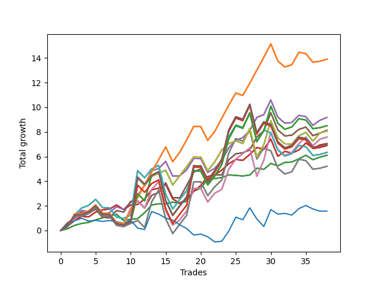

# Long Pointer 002 
- Symbol: SPY_Unlimited
- Date Range: 03/23/2022 - 07/08/2022
- Trading Period: 7:20-12:30
- Number of Trades: 38



| Name | Win Percent | Profit | Avg Profit / Trade | Avg Time / Trade |      | Name | Win Percent | Profit | Avg Profit / Trade | Avg Time / Trade |
| ---- | ----------- | ------ | ------------------ | ---------------- | ---- | ---- | ----------- | ------ | ------------------ | ---------------- |
| Sorted By <br> Profit | | | | | | Sorted By <br> Win Percentage ||||
| One Hundred Twenty-Six | 68.42 | 6945.00 | 182.76 | 22:25 |     | Sixty-Four | 78.95 | 3050.00 | 80.26 | 03:31 |
| One Hundred Twenty-One | 68.42 | 6945.00 | 182.76 | 22:25 |     | Fifty-Six | 78.95 | 3050.00 | 80.26 | 03:31 |
| One Hundred Sixteen | 68.42 | 6945.00 | 182.76 | 22:25 |     | Forty-Eight | 78.95 | 3050.00 | 80.26 | 03:31 |
| One Hundred Eleven | 68.42 | 6945.00 | 182.76 | 22:25 |     | Forty | 78.95 | 3050.00 | 80.26 | 03:31 |
| Eighty-One | 68.42 | 6945.00 | 182.76 | 22:25 |     | Zero | 78.95 | 3050.00 | 80.26 | 03:31 |
| Sixty-Six | 73.68 | 4585.00 | 120.66 | 14:58 |     | Sixty-Five | 76.32 | 3525.00 | 92.76 | 09:36 |
| Fifty-Eight | 73.68 | 4585.00 | 120.66 | 14:58 |     | Fifty-Seven | 76.32 | 3525.00 | 92.76 | 09:36 |
| Fifty | 73.68 | 4585.00 | 120.66 | 14:58 |     | Forty-Nine | 76.32 | 3525.00 | 92.76 | 09:36 |
| Forty-Two | 73.68 | 4585.00 | 120.66 | 14:58 |     | Forty-One | 76.32 | 3525.00 | 92.76 | 09:36 |
| Two | 73.68 | 4585.00 | 120.66 | 14:58 |     | One | 76.32 | 3525.00 | 92.76 | 09:36 |
| One Hundred Twenty-Seven | 60.53 | 4250.00 | 111.84 | 28:13 |     | Sixty-Six | 73.68 | 4585.00 | 120.66 | 14:58 |
| One Hundred Twenty-Two | 60.53 | 4250.00 | 111.84 | 28:13 |     | Fifty-Eight | 73.68 | 4585.00 | 120.66 | 14:58 |
| One Hundred Seventeen | 60.53 | 4250.00 | 111.84 | 28:13 |     | Fifty | 73.68 | 4585.00 | 120.66 | 14:58 |
| One Hundred Twelve | 60.53 | 4250.00 | 111.84 | 28:13 |     | Forty-Two | 73.68 | 4585.00 | 120.66 | 14:58 |
| Eighty-Two | 60.53 | 4250.00 | 111.84 | 28:13 |     | Two | 73.68 | 4585.00 | 120.66 | 14:58 |
| Sixty-Seven | 71.05 | 4065.00 | 106.97 | 15:11 |     | Sixty-Seven | 71.05 | 4065.00 | 106.97 | 15:11 |
| Fifty-Nine | 71.05 | 4065.00 | 106.97 | 15:11 |     | Fifty-Nine | 71.05 | 4065.00 | 106.97 | 15:11 |
| Fifty-One | 71.05 | 4065.00 | 106.97 | 15:11 |     | Fifty-One | 71.05 | 4065.00 | 106.97 | 15:11 |
| Forty-Three | 71.05 | 4065.00 | 106.97 | 15:11 |     | Forty-Three | 71.05 | 4065.00 | 106.97 | 15:11 |
| Three | 71.05 | 4065.00 | 106.97 | 15:11 |     | Three | 71.05 | 4065.00 | 106.97 | 15:11 |
| Seventy | 63.16 | 4035.00 | 106.18 | 23:39 |     | One Hundred Twenty-Six | 68.42 | 6945.00 | 182.76 | 22:25 |
| Sixty-Two | 63.16 | 4035.00 | 106.18 | 23:39 |     | One Hundred Twenty-One | 68.42 | 6945.00 | 182.76 | 22:25 |
| Fifty-Four | 63.16 | 4035.00 | 106.18 | 23:39 |     | One Hundred Sixteen | 68.42 | 6945.00 | 182.76 | 22:25 |
| Forty-Six | 63.16 | 4035.00 | 106.18 | 23:39 |     | One Hundred Eleven | 68.42 | 6945.00 | 182.76 | 22:25 |
| Six | 63.16 | 4035.00 | 106.18 | 23:39 |     | Eighty-One | 68.42 | 6945.00 | 182.76 | 22:25 |
| Sixty-Eight | 65.79 | 3785.00 | 99.61 | 21:43 |     | Sixty-Eight | 65.79 | 3785.00 | 99.61 | 21:43 |
| Sixty | 65.79 | 3785.00 | 99.61 | 21:43 |     | Sixty | 65.79 | 3785.00 | 99.61 | 21:43 |
| Fifty-Two | 65.79 | 3785.00 | 99.61 | 21:43 |     | Fifty-Two | 65.79 | 3785.00 | 99.61 | 21:43 |
| Forty-Four | 65.79 | 3785.00 | 99.61 | 21:43 |     | Forty-Four | 65.79 | 3785.00 | 99.61 | 21:43 |
| Four | 65.79 | 3785.00 | 99.61 | 21:43 |     | Four | 65.79 | 3785.00 | 99.61 | 21:43 |
| Sixty-Five | 76.32 | 3525.00 | 92.76 | 09:36 |     | Seventy | 63.16 | 4035.00 | 106.18 | 23:39 |
| Fifty-Seven | 76.32 | 3525.00 | 92.76 | 09:36 |     | Sixty-Two | 63.16 | 4035.00 | 106.18 | 23:39 |
| Forty-Nine | 76.32 | 3525.00 | 92.76 | 09:36 |     | Fifty-Four | 63.16 | 4035.00 | 106.18 | 23:39 |
| Forty-One | 76.32 | 3525.00 | 92.76 | 09:36 |     | Forty-Six | 63.16 | 4035.00 | 106.18 | 23:39 |
| One | 76.32 | 3525.00 | 92.76 | 09:36 |     | Six | 63.16 | 4035.00 | 106.18 | 23:39 |
| One Hundred Thirty | 57.89 | 3500.00 | 92.11 | 29:53 |     | One Hundred Twenty-Seven | 60.53 | 4250.00 | 111.84 | 28:13 |
| One Hundred Twenty-Nine | 57.89 | 3500.00 | 92.11 | 29:53 |     | One Hundred Twenty-Two | 60.53 | 4250.00 | 111.84 | 28:13 |
| One Hundred Twenty-Five | 57.89 | 3500.00 | 92.11 | 29:53 |     | One Hundred Seventeen | 60.53 | 4250.00 | 111.84 | 28:13 |
| One Hundred Twenty-Four | 57.89 | 3500.00 | 92.11 | 29:53 |     | One Hundred Twelve | 60.53 | 4250.00 | 111.84 | 28:13 |
| One Hundred Twenty | 57.89 | 3500.00 | 92.11 | 29:53 |     | Eighty-Two | 60.53 | 4250.00 | 111.84 | 28:13 |
| One Hundred Ninteen | 57.89 | 3500.00 | 92.11 | 29:53 |     | One Hundred Thirty | 57.89 | 3500.00 | 92.11 | 29:53 |
| One Hundred Fifteen | 57.89 | 3500.00 | 92.11 | 29:53 |     | One Hundred Twenty-Nine | 57.89 | 3500.00 | 92.11 | 29:53 |
| One Hundred Fourteen | 57.89 | 3500.00 | 92.11 | 29:53 |     | One Hundred Twenty-Five | 57.89 | 3500.00 | 92.11 | 29:53 |
| Eighty-Five | 57.89 | 3500.00 | 92.11 | 29:53 |     | One Hundred Twenty-Four | 57.89 | 3500.00 | 92.11 | 29:53 |
| Eighty-Four | 57.89 | 3500.00 | 92.11 | 29:53 |     | One Hundred Twenty | 57.89 | 3500.00 | 92.11 | 29:53 |
| One Hundred Twenty-Eight | 57.89 | 3445.00 | 90.66 | 29:39 |     | One Hundred Ninteen | 57.89 | 3500.00 | 92.11 | 29:53 |
| One Hundred Twenty-Three | 57.89 | 3445.00 | 90.66 | 29:39 |     | One Hundred Fifteen | 57.89 | 3500.00 | 92.11 | 29:53 |
| One Hundred Eighteen | 57.89 | 3445.00 | 90.66 | 29:39 |     | One Hundred Fourteen | 57.89 | 3500.00 | 92.11 | 29:53 |
| One Hundred Thirteen | 57.89 | 3445.00 | 90.66 | 29:39 |     | Eighty-Five | 57.89 | 3500.00 | 92.11 | 29:53 |
| Eighty-Three | 57.89 | 3445.00 | 90.66 | 29:39 |     | Eighty-Four | 57.89 | 3500.00 | 92.11 | 29:53 |
| Seventy-One | 57.89 | 3165.00 | 83.29 | 28:13 |     | One Hundred Twenty-Eight | 57.89 | 3445.00 | 90.66 | 29:39 |
| Sixty-Three | 57.89 | 3165.00 | 83.29 | 28:13 |     | One Hundred Twenty-Three | 57.89 | 3445.00 | 90.66 | 29:39 |
| Fifty-Five | 57.89 | 3165.00 | 83.29 | 28:13 |     | One Hundred Eighteen | 57.89 | 3445.00 | 90.66 | 29:39 |
| Forty-Seven | 57.89 | 3165.00 | 83.29 | 28:13 |     | One Hundred Thirteen | 57.89 | 3445.00 | 90.66 | 29:39 |
| Seven | 57.89 | 3165.00 | 83.29 | 28:13 |     | Eighty-Three | 57.89 | 3445.00 | 90.66 | 29:39 |
| Sixty-Four | 78.95 | 3050.00 | 80.26 | 03:31 |     | Seventy-One | 57.89 | 3165.00 | 83.29 | 28:13 |
| Fifty-Six | 78.95 | 3050.00 | 80.26 | 03:31 |     | Sixty-Three | 57.89 | 3165.00 | 83.29 | 28:13 |
| Forty-Eight | 78.95 | 3050.00 | 80.26 | 03:31 |     | Fifty-Five | 57.89 | 3165.00 | 83.29 | 28:13 |
| Forty | 78.95 | 3050.00 | 80.26 | 03:31 |     | Forty-Seven | 57.89 | 3165.00 | 83.29 | 28:13 |
| Zero | 78.95 | 3050.00 | 80.26 | 03:31 |     | Seven | 57.89 | 3165.00 | 83.29 | 28:13 |
| Sixty-Nine | 57.89 | 2605.00 | 68.55 | 26:34 |     | Sixty-Nine | 57.89 | 2605.00 | 68.55 | 26:34 |
| Sixty-One | 57.89 | 2605.00 | 68.55 | 26:34 |     | Sixty-One | 57.89 | 2605.00 | 68.55 | 26:34 |
| Fifty-Three | 57.89 | 2605.00 | 68.55 | 26:34 |     | Fifty-Three | 57.89 | 2605.00 | 68.55 | 26:34 |
| Forty-Five | 57.89 | 2605.00 | 68.55 | 26:34 |     | Forty-Five | 57.89 | 2605.00 | 68.55 | 26:34 |
| Five | 57.89 | 2605.00 | 68.55 | 26:34 |     | Five | 57.89 | 2605.00 | 68.55 | 26:34 |
| Seventy-Three | 44.74 | 785.00 | 20.66 | 06:58 |     | Seventy-Three | 44.74 | 785.00 | 20.66 | 06:58 |

## NO STOPLOSS

### Test Zero
* Sell when price hits the middle line of the 20p bollinger
* No Stoploss
* Results:
```
Total Trades: 38
Percent Up: 78.95
Percent Down: 21.05
Total Points Moved Up: 6.10
Potential Profit: 3050.00
Total Points Ups: 7.49 Count Ups: 30
Total Points Downs: -1.39 Count Downs: 8
```

<details><summary>Trades</summary>

<code>In: 2022-03-23 10:50:00		Out: 2022-03-23 10:51:05		Total Position Time: 01:05		Total Move Up: 0.14		Total to Date: 0.14</code> <br />
<code>In: 2022-03-28 09:21:00		Out: 2022-03-28 09:21:30		Total Position Time: 00:30		Total Move Up: 0.28		Total to Date: 0.42</code> <br />
<code>In: 2022-03-31 08:37:00		Out: 2022-03-31 08:38:05		Total Position Time: 01:05		Total Move Up: 0.15		Total to Date: 0.57</code> <br />
<code>In: 2022-03-31 10:02:00		Out: 2022-03-31 10:04:00		Total Position Time: 02:00		Total Move Up: 0.09		Total to Date: 0.66</code> <br />
<code>In: 2022-03-31 10:18:00		Out: 2022-03-31 10:19:00		Total Position Time: 01:00		Total Move Up: 0.20		Total to Date: 0.86</code> <br />
<code>In: 2022-04-05 09:05:00		Out: 2022-04-05 09:06:10		Total Position Time: 01:10		Total Move Up: 0.17		Total to Date: 1.03</code> <br />
<code>In: 2022-04-06 09:23:00		Out: 2022-04-06 09:31:15		Total Position Time: 08:15		Total Move Up: 0.16		Total to Date: 1.19</code> <br />
<code>In: 2022-04-12 11:35:00		Out: 2022-04-12 11:35:45		Total Position Time: 00:45		Total Move Up: 0.12		Total to Date: 1.31</code> <br />
<code>In: 2022-04-14 09:32:00		Out: 2022-04-14 09:56:10		Total Position Time: 24:10		Total Move Up: -0.51		Total to Date: 0.80</code> <br />
<code>In: 2022-04-21 10:21:00		Out: 2022-04-21 10:21:10		Total Position Time: 00:10		Total Move Up: 0.12		Total to Date: 0.92</code> <br />
<code>In: 2022-05-02 11:46:00		Out: 2022-05-02 11:46:10		Total Position Time: 00:10		Total Move Up: 0.04		Total to Date: 0.96</code> <br />
<code>In: 2022-05-09 07:42:00		Out: 2022-05-09 07:42:30		Total Position Time: 00:30		Total Move Up: 0.49		Total to Date: 1.45</code> <br />
<code>In: 2022-05-09 08:34:00		Out: 2022-05-09 08:35:10		Total Position Time: 01:10		Total Move Up: 0.62		Total to Date: 2.07</code> <br />
<code>In: 2022-05-09 10:03:00		Out: 2022-05-09 10:09:25		Total Position Time: 06:25		Total Move Up: 0.09		Total to Date: 2.16</code> <br />
<code>In: 2022-05-11 09:14:00		Out: 2022-05-11 09:17:50		Total Position Time: 03:50		Total Move Up: -0.01		Total to Date: 2.15</code> <br />
<code>In: 2022-05-11 10:33:00		Out: 2022-05-11 10:34:30		Total Position Time: 01:30		Total Move Up: 0.16		Total to Date: 2.31</code> <br />
<code>In: 2022-05-12 11:35:00		Out: 2022-05-12 11:45:20		Total Position Time: 10:20		Total Move Up: -0.12		Total to Date: 2.19</code> <br />
<code>In: 2022-05-17 07:48:00		Out: 2022-05-17 07:55:10		Total Position Time: 07:10		Total Move Up: 0.20		Total to Date: 2.39</code> <br />
<code>In: 2022-05-17 11:25:00		Out: 2022-05-17 11:27:25		Total Position Time: 02:25		Total Move Up: 0.80		Total to Date: 3.19</code> <br />
<code>In: 2022-05-18 09:12:00		Out: 2022-05-18 09:14:45		Total Position Time: 02:45		Total Move Up: 0.25		Total to Date: 3.44</code> <br />
<code>In: 2022-05-20 09:48:00		Out: 2022-05-20 09:50:00		Total Position Time: 02:00		Total Move Up: 0.73		Total to Date: 4.17</code> <br />
<code>In: 2022-05-25 09:30:00		Out: 2022-05-25 09:38:55		Total Position Time: 08:55		Total Move Up: 0.04		Total to Date: 4.21</code> <br />
<code>In: 2022-05-25 10:15:00		Out: 2022-05-25 10:15:20		Total Position Time: 00:20		Total Move Up: 0.09		Total to Date: 4.30</code> <br />
<code>In: 2022-05-31 12:05:00		Out: 2022-05-31 12:07:20		Total Position Time: 02:20		Total Move Up: 0.21		Total to Date: 4.51</code> <br />
<code>In: 2022-06-08 08:06:00		Out: 2022-06-08 08:10:05		Total Position Time: 04:05		Total Move Up: -0.04		Total to Date: 4.47</code> <br />
<code>In: 2022-06-08 11:31:00		Out: 2022-06-08 11:31:10		Total Position Time: 00:10		Total Move Up: -0.05		Total to Date: 4.42</code> <br />
<code>In: 2022-06-08 12:11:00		Out: 2022-06-08 12:11:20		Total Position Time: 00:20		Total Move Up: 0.08		Total to Date: 4.50</code> <br />
<code>In: 2022-06-13 12:17:00		Out: 2022-06-13 12:17:10		Total Position Time: 00:10		Total Move Up: 0.56		Total to Date: 5.06</code> <br />
<code>In: 2022-06-14 07:32:00		Out: 2022-06-14 07:37:00		Total Position Time: 05:00		Total Move Up: -0.10		Total to Date: 4.96</code> <br />
<code>In: 2022-06-14 07:46:00		Out: 2022-06-14 07:46:35		Total Position Time: 00:35		Total Move Up: 0.48		Total to Date: 5.44</code> <br />
<code>In: 2022-06-14 11:53:00		Out: 2022-06-14 12:04:30		Total Position Time: 11:30		Total Move Up: -0.19		Total to Date: 5.25</code> <br />
<code>In: 2022-06-15 07:58:00		Out: 2022-06-15 07:58:55		Total Position Time: 00:55		Total Move Up: 0.27		Total to Date: 5.52</code> <br />
<code>In: 2022-06-21 08:58:00		Out: 2022-06-21 09:02:05		Total Position Time: 04:05		Total Move Up: 0.04		Total to Date: 5.56</code> <br />
<code>In: 2022-06-23 10:06:00		Out: 2022-06-23 10:06:10		Total Position Time: 00:10		Total Move Up: 0.25		Total to Date: 5.81</code> <br />
<code>In: 2022-06-27 10:10:00		Out: 2022-06-27 10:11:25		Total Position Time: 01:25		Total Move Up: 0.30		Total to Date: 6.11</code> <br />
<code>In: 2022-06-27 10:37:00		Out: 2022-06-27 10:51:15		Total Position Time: 14:15		Total Move Up: -0.37		Total to Date: 5.74</code> <br />
<code>In: 2022-07-05 08:08:00		Out: 2022-07-05 08:08:25		Total Position Time: 00:25		Total Move Up: 0.21		Total to Date: 5.95</code> <br />
<code>In: 2022-07-08 09:48:00		Out: 2022-07-08 09:48:45		Total Position Time: 00:45		Total Move Up: 0.15		Total to Date: 6.10</code> <br />


</details>

### Test One
* Sell when the price hits the upper line of the 20p 1std bollinger
* No Stoploss
* Results:
```
Total Trades: 38
Percent Up: 76.32
Percent Down: 23.68
Total Points Moved Up: 7.05
Potential Profit: 3525.00
Total Points Ups: 11.15 Count Ups: 29
Total Points Downs: -4.10 Count Downs: 9
```

<details><summary>Trades</summary>

<code>In: 2022-03-23 10:50:00		Out: 2022-03-23 10:51:45		Total Position Time: 01:45		Total Move Up: 0.34		Total to Date: 0.34</code> <br />
<code>In: 2022-03-28 09:21:00		Out: 2022-03-28 09:25:35		Total Position Time: 04:35		Total Move Up: 0.47		Total to Date: 0.81</code> <br />
<code>In: 2022-03-31 08:37:00		Out: 2022-03-31 08:40:35		Total Position Time: 03:35		Total Move Up: 0.34		Total to Date: 1.15</code> <br />
<code>In: 2022-03-31 10:02:00		Out: 2022-03-31 10:19:40		Total Position Time: 17:40		Total Move Up: -0.05		Total to Date: 1.10</code> <br />
<code>In: 2022-03-31 10:18:00		Out: 2022-03-31 10:19:40		Total Position Time: 01:40		Total Move Up: 0.39		Total to Date: 1.49</code> <br />
<code>In: 2022-04-05 09:05:00		Out: 2022-04-05 09:13:50		Total Position Time: 08:50		Total Move Up: 0.18		Total to Date: 1.67</code> <br />
<code>In: 2022-04-06 09:23:00		Out: 2022-04-06 09:33:05		Total Position Time: 10:05		Total Move Up: 0.08		Total to Date: 1.75</code> <br />
<code>In: 2022-04-12 11:35:00		Out: 2022-04-12 11:37:25		Total Position Time: 02:25		Total Move Up: 0.32		Total to Date: 2.07</code> <br />
<code>In: 2022-04-14 09:32:00		Out: 2022-04-14 09:58:10		Total Position Time: 26:10		Total Move Up: -0.37		Total to Date: 1.70</code> <br />
<code>In: 2022-04-21 10:21:00		Out: 2022-04-21 10:21:20		Total Position Time: 00:20		Total Move Up: 0.37		Total to Date: 2.07</code> <br />
<code>In: 2022-05-02 11:46:00		Out: 2022-05-02 11:46:10		Total Position Time: 00:10		Total Move Up: 0.04		Total to Date: 2.11</code> <br />
<code>In: 2022-05-09 07:42:00		Out: 2022-05-09 07:45:10		Total Position Time: 03:10		Total Move Up: 0.45		Total to Date: 2.56</code> <br />
<code>In: 2022-05-09 08:34:00		Out: 2022-05-09 08:38:35		Total Position Time: 04:35		Total Move Up: 0.74		Total to Date: 3.30</code> <br />
<code>In: 2022-05-09 10:03:00		Out: 2022-05-09 10:18:05		Total Position Time: 15:05		Total Move Up: 0.13		Total to Date: 3.43</code> <br />
<code>In: 2022-05-11 09:14:00		Out: 2022-05-11 09:23:10		Total Position Time: 09:10		Total Move Up: 0.31		Total to Date: 3.74</code> <br />
<code>In: 2022-05-11 10:33:00		Out: 2022-05-11 11:01:20		Total Position Time: 28:20		Total Move Up: -1.18		Total to Date: 2.56</code> <br />
<code>In: 2022-05-12 11:35:00		Out: 2022-05-12 11:52:05		Total Position Time: 17:05		Total Move Up: -0.34		Total to Date: 2.22</code> <br />
<code>In: 2022-05-17 07:48:00		Out: 2022-05-17 07:58:50		Total Position Time: 10:50		Total Move Up: 0.34		Total to Date: 2.56</code> <br />
<code>In: 2022-05-17 11:25:00		Out: 2022-05-17 11:37:35		Total Position Time: 12:35		Total Move Up: 0.61		Total to Date: 3.17</code> <br />
<code>In: 2022-05-18 09:12:00		Out: 2022-05-18 09:16:25		Total Position Time: 04:25		Total Move Up: 0.49		Total to Date: 3.66</code> <br />
<code>In: 2022-05-20 09:48:00		Out: 2022-05-20 09:56:10		Total Position Time: 08:10		Total Move Up: 0.72		Total to Date: 4.38</code> <br />
<code>In: 2022-05-25 09:30:00		Out: 2022-05-25 09:44:25		Total Position Time: 14:25		Total Move Up: 0.13		Total to Date: 4.51</code> <br />
<code>In: 2022-05-25 10:15:00		Out: 2022-05-25 10:15:55		Total Position Time: 00:55		Total Move Up: 0.39		Total to Date: 4.90</code> <br />
<code>In: 2022-05-31 12:05:00		Out: 2022-05-31 12:09:15		Total Position Time: 04:15		Total Move Up: 0.52		Total to Date: 5.42</code> <br />
<code>In: 2022-06-08 08:06:00		Out: 2022-06-08 08:11:10		Total Position Time: 05:10		Total Move Up: 0.34		Total to Date: 5.76</code> <br />
<code>In: 2022-06-08 11:31:00		Out: 2022-06-08 11:43:05		Total Position Time: 12:05		Total Move Up: -0.07		Total to Date: 5.69</code> <br />
<code>In: 2022-06-08 12:11:00		Out: 2022-06-08 12:12:20		Total Position Time: 01:20		Total Move Up: 0.48		Total to Date: 6.17</code> <br />
<code>In: 2022-06-13 12:17:00		Out: 2022-06-13 12:17:10		Total Position Time: 00:10		Total Move Up: 0.56		Total to Date: 6.73</code> <br />
<code>In: 2022-06-14 07:32:00		Out: 2022-06-14 07:47:05		Total Position Time: 15:05		Total Move Up: -0.14		Total to Date: 6.59</code> <br />
<code>In: 2022-06-14 07:46:00		Out: 2022-06-14 07:47:05		Total Position Time: 01:05		Total Move Up: 0.82		Total to Date: 7.41</code> <br />
<code>In: 2022-06-14 11:53:00		Out: 2022-06-14 12:22:55		Total Position Time: 29:55		Total Move Up: -1.39		Total to Date: 6.02</code> <br />
<code>In: 2022-06-15 07:58:00		Out: 2022-06-15 08:07:20		Total Position Time: 09:20		Total Move Up: 0.40		Total to Date: 6.42</code> <br />
<code>In: 2022-06-21 08:58:00		Out: 2022-06-21 09:16:20		Total Position Time: 18:20		Total Move Up: -0.14		Total to Date: 6.28</code> <br />
<code>In: 2022-06-23 10:06:00		Out: 2022-06-23 10:06:10		Total Position Time: 00:10		Total Move Up: 0.25		Total to Date: 6.53</code> <br />
<code>In: 2022-06-27 10:10:00		Out: 2022-06-27 10:15:55		Total Position Time: 05:55		Total Move Up: 0.57		Total to Date: 7.10</code> <br />
<code>In: 2022-06-27 10:37:00		Out: 2022-06-27 11:03:15		Total Position Time: 26:15		Total Move Up: -0.42		Total to Date: 6.68</code> <br />
<code>In: 2022-07-05 08:08:00		Out: 2022-07-05 08:16:40		Total Position Time: 08:40		Total Move Up: 0.26		Total to Date: 6.94</code> <br />
<code>In: 2022-07-08 09:48:00		Out: 2022-07-08 10:09:40		Total Position Time: 21:40		Total Move Up: 0.11		Total to Date: 7.05</code> <br />


</details>

### Test Two
* Sell when the price hits the upper line of the 20p 2std bollinger
* No Stoploss
* Results:
```
Total Trades: 38
Percent Up: 73.68
Percent Down: 26.32
Total Points Moved Up: 9.17
Potential Profit: 4585.00
Total Points Ups: 15.17 Count Ups: 28
Total Points Downs: -6.00 Count Downs: 10
```

<details><summary>Trades</summary>

<code>In: 2022-03-23 10:50:00		Out: 2022-03-23 10:54:25		Total Position Time: 04:25		Total Move Up: 0.55		Total to Date: 0.55</code> <br />
<code>In: 2022-03-28 09:21:00		Out: 2022-03-28 09:30:40		Total Position Time: 09:40		Total Move Up: 0.51		Total to Date: 1.06</code> <br />
<code>In: 2022-03-31 08:37:00		Out: 2022-03-31 08:41:10		Total Position Time: 04:10		Total Move Up: 0.56		Total to Date: 1.62</code> <br />
<code>In: 2022-03-31 10:02:00		Out: 2022-03-31 10:27:25		Total Position Time: 25:25		Total Move Up: -0.09		Total to Date: 1.53</code> <br />
<code>In: 2022-03-31 10:18:00		Out: 2022-03-31 10:27:25		Total Position Time: 09:25		Total Move Up: 0.35		Total to Date: 1.88</code> <br />
<code>In: 2022-04-05 09:05:00		Out: 2022-04-05 09:34:55		Total Position Time: 29:55		Total Move Up: -0.67		Total to Date: 1.21</code> <br />
<code>In: 2022-04-06 09:23:00		Out: 2022-04-06 09:34:25		Total Position Time: 11:25		Total Move Up: 0.26		Total to Date: 1.47</code> <br />
<code>In: 2022-04-12 11:35:00		Out: 2022-04-12 11:47:00		Total Position Time: 12:00		Total Move Up: 0.46		Total to Date: 1.93</code> <br />
<code>In: 2022-04-14 09:32:00		Out: 2022-04-14 09:58:50		Total Position Time: 26:50		Total Move Up: -0.22		Total to Date: 1.71</code> <br />
<code>In: 2022-04-21 10:21:00		Out: 2022-04-21 10:21:30		Total Position Time: 00:30		Total Move Up: 0.57		Total to Date: 2.28</code> <br />
<code>In: 2022-05-02 11:46:00		Out: 2022-05-02 11:53:35		Total Position Time: 07:35		Total Move Up: 0.58		Total to Date: 2.86</code> <br />
<code>In: 2022-05-09 07:42:00		Out: 2022-05-09 07:48:05		Total Position Time: 06:05		Total Move Up: 0.78		Total to Date: 3.64</code> <br />
<code>In: 2022-05-09 08:34:00		Out: 2022-05-09 08:39:15		Total Position Time: 05:15		Total Move Up: 1.21		Total to Date: 4.85</code> <br />
<code>In: 2022-05-09 10:03:00		Out: 2022-05-09 10:19:00		Total Position Time: 16:00		Total Move Up: 0.17		Total to Date: 5.02</code> <br />
<code>In: 2022-05-11 09:14:00		Out: 2022-05-11 09:23:35		Total Position Time: 09:35		Total Move Up: 0.59		Total to Date: 5.61</code> <br />
<code>In: 2022-05-11 10:33:00		Out: 2022-05-11 11:02:55		Total Position Time: 29:55		Total Move Up: -1.20		Total to Date: 4.41</code> <br />
<code>In: 2022-05-12 11:35:00		Out: 2022-05-12 11:53:00		Total Position Time: 18:00		Total Move Up: 0.02		Total to Date: 4.43</code> <br />
<code>In: 2022-05-17 07:48:00		Out: 2022-05-17 07:59:25		Total Position Time: 11:25		Total Move Up: 0.49		Total to Date: 4.92</code> <br />
<code>In: 2022-05-17 11:25:00		Out: 2022-05-17 11:40:00		Total Position Time: 15:00		Total Move Up: 0.92		Total to Date: 5.84</code> <br />
<code>In: 2022-05-18 09:12:00		Out: 2022-05-18 09:41:55		Total Position Time: 29:55		Total Move Up: -0.01		Total to Date: 5.83</code> <br />
<code>In: 2022-05-20 09:48:00		Out: 2022-05-20 10:17:55		Total Position Time: 29:55		Total Move Up: -1.12		Total to Date: 4.71</code> <br />
<code>In: 2022-05-25 09:30:00		Out: 2022-05-25 09:45:20		Total Position Time: 15:20		Total Move Up: 0.34		Total to Date: 5.05</code> <br />
<code>In: 2022-05-25 10:15:00		Out: 2022-05-25 10:29:40		Total Position Time: 14:40		Total Move Up: 0.61		Total to Date: 5.66</code> <br />
<code>In: 2022-05-31 12:05:00		Out: 2022-05-31 12:15:05		Total Position Time: 10:05		Total Move Up: 1.05		Total to Date: 6.71</code> <br />
<code>In: 2022-06-08 08:06:00		Out: 2022-06-08 08:14:00		Total Position Time: 08:00		Total Move Up: 0.60		Total to Date: 7.31</code> <br />
<code>In: 2022-06-08 11:31:00		Out: 2022-06-08 11:43:35		Total Position Time: 12:35		Total Move Up: 0.22		Total to Date: 7.53</code> <br />
<code>In: 2022-06-08 12:11:00		Out: 2022-06-08 12:13:25		Total Position Time: 02:25		Total Move Up: 0.58		Total to Date: 8.11</code> <br />
<code>In: 2022-06-13 12:17:00		Out: 2022-06-13 12:17:15		Total Position Time: 00:15		Total Move Up: 1.06		Total to Date: 9.17</code> <br />
<code>In: 2022-06-14 07:32:00		Out: 2022-06-14 07:47:20		Total Position Time: 15:20		Total Move Up: 0.23		Total to Date: 9.40</code> <br />
<code>In: 2022-06-14 07:46:00		Out: 2022-06-14 07:47:20		Total Position Time: 01:20		Total Move Up: 1.19		Total to Date: 10.59</code> <br />
<code>In: 2022-06-14 11:53:00		Out: 2022-06-14 12:22:55		Total Position Time: 29:55		Total Move Up: -1.39		Total to Date: 9.20</code> <br />
<code>In: 2022-06-15 07:58:00		Out: 2022-06-15 08:27:55		Total Position Time: 29:55		Total Move Up: -0.49		Total to Date: 8.71</code> <br />
<code>In: 2022-06-21 08:58:00		Out: 2022-06-21 09:19:55		Total Position Time: 21:55		Total Move Up: 0.05		Total to Date: 8.76</code> <br />
<code>In: 2022-06-23 10:06:00		Out: 2022-06-23 10:07:40		Total Position Time: 01:40		Total Move Up: 0.58		Total to Date: 9.34</code> <br />
<code>In: 2022-06-27 10:10:00		Out: 2022-06-27 10:39:55		Total Position Time: 29:55		Total Move Up: -0.11		Total to Date: 9.23</code> <br />
<code>In: 2022-06-27 10:37:00		Out: 2022-06-27 11:06:55		Total Position Time: 29:55		Total Move Up: -0.70		Total to Date: 8.53</code> <br />
<code>In: 2022-07-05 08:08:00		Out: 2022-07-05 08:17:55		Total Position Time: 09:55		Total Move Up: 0.41		Total to Date: 8.94</code> <br />
<code>In: 2022-07-08 09:48:00		Out: 2022-07-08 10:11:10		Total Position Time: 23:10		Total Move Up: 0.23		Total to Date: 9.17</code> <br />


</details>

### Test Three
* Sell when price hits the middle line of the 50p bollinger
* No Stoploss
* Results:
```
Total Trades: 38
Percent Up: 71.05
Percent Down: 28.95
Total Points Moved Up: 8.13
Potential Profit: 4065.00
Total Points Ups: 14.56 Count Ups: 27
Total Points Downs: -6.43 Count Downs: 11
```

<details><summary>Trades</summary>

<code>In: 2022-03-23 10:50:00		Out: 2022-03-23 10:54:30		Total Position Time: 04:30		Total Move Up: 0.62		Total to Date: 0.62</code> <br />
<code>In: 2022-03-28 09:21:00		Out: 2022-03-28 09:24:15		Total Position Time: 03:15		Total Move Up: 0.41		Total to Date: 1.03</code> <br />
<code>In: 2022-03-31 08:37:00		Out: 2022-03-31 08:41:05		Total Position Time: 04:05		Total Move Up: 0.44		Total to Date: 1.47</code> <br />
<code>In: 2022-03-31 10:02:00		Out: 2022-03-31 10:27:25		Total Position Time: 25:25		Total Move Up: -0.09		Total to Date: 1.38</code> <br />
<code>In: 2022-03-31 10:18:00		Out: 2022-03-31 10:27:25		Total Position Time: 09:25		Total Move Up: 0.35		Total to Date: 1.73</code> <br />
<code>In: 2022-04-05 09:05:00		Out: 2022-04-05 09:34:55		Total Position Time: 29:55		Total Move Up: -0.67		Total to Date: 1.06</code> <br />
<code>In: 2022-04-06 09:23:00		Out: 2022-04-06 09:52:55		Total Position Time: 29:55		Total Move Up: -0.03		Total to Date: 1.03</code> <br />
<code>In: 2022-04-12 11:35:00		Out: 2022-04-12 11:47:05		Total Position Time: 12:05		Total Move Up: 0.59		Total to Date: 1.62</code> <br />
<code>In: 2022-04-14 09:32:00		Out: 2022-04-14 09:59:25		Total Position Time: 27:25		Total Move Up: -0.13		Total to Date: 1.49</code> <br />
<code>In: 2022-04-21 10:21:00		Out: 2022-04-21 10:22:25		Total Position Time: 01:25		Total Move Up: 0.87		Total to Date: 2.36</code> <br />
<code>In: 2022-05-02 11:46:00		Out: 2022-05-02 11:46:10		Total Position Time: 00:10		Total Move Up: 0.04		Total to Date: 2.40</code> <br />
<code>In: 2022-05-09 07:42:00		Out: 2022-05-09 08:11:55		Total Position Time: 29:55		Total Move Up: -0.58		Total to Date: 1.82</code> <br />
<code>In: 2022-05-09 08:34:00		Out: 2022-05-09 08:39:00		Total Position Time: 05:00		Total Move Up: 1.03		Total to Date: 2.85</code> <br />
<code>In: 2022-05-09 10:03:00		Out: 2022-05-09 10:25:15		Total Position Time: 22:15		Total Move Up: 0.23		Total to Date: 3.08</code> <br />
<code>In: 2022-05-11 09:14:00		Out: 2022-05-11 09:23:45		Total Position Time: 09:45		Total Move Up: 0.79		Total to Date: 3.87</code> <br />
<code>In: 2022-05-11 10:33:00		Out: 2022-05-11 11:02:55		Total Position Time: 29:55		Total Move Up: -1.20		Total to Date: 2.67</code> <br />
<code>In: 2022-05-12 11:35:00		Out: 2022-05-12 11:53:05		Total Position Time: 18:05		Total Move Up: -0.03		Total to Date: 2.64</code> <br />
<code>In: 2022-05-17 07:48:00		Out: 2022-05-17 08:04:10		Total Position Time: 16:10		Total Move Up: 1.02		Total to Date: 3.66</code> <br />
<code>In: 2022-05-17 11:25:00		Out: 2022-05-17 11:40:05		Total Position Time: 15:05		Total Move Up: 1.08		Total to Date: 4.74</code> <br />
<code>In: 2022-05-18 09:12:00		Out: 2022-05-18 09:36:05		Total Position Time: 24:05		Total Move Up: 0.27		Total to Date: 5.01</code> <br />
<code>In: 2022-05-20 09:48:00		Out: 2022-05-20 10:17:55		Total Position Time: 29:55		Total Move Up: -1.12		Total to Date: 3.89</code> <br />
<code>In: 2022-05-25 09:30:00		Out: 2022-05-25 09:49:05		Total Position Time: 19:05		Total Move Up: 0.61		Total to Date: 4.50</code> <br />
<code>In: 2022-05-25 10:15:00		Out: 2022-05-25 10:15:10		Total Position Time: 00:10		Total Move Up: 0.01		Total to Date: 4.51</code> <br />
<code>In: 2022-05-31 12:05:00		Out: 2022-05-31 12:15:15		Total Position Time: 10:15		Total Move Up: 1.23		Total to Date: 5.74</code> <br />
<code>In: 2022-06-08 08:06:00		Out: 2022-06-08 08:11:20		Total Position Time: 05:20		Total Move Up: 0.48		Total to Date: 6.22</code> <br />
<code>In: 2022-06-08 11:31:00		Out: 2022-06-08 11:43:20		Total Position Time: 12:20		Total Move Up: 0.09		Total to Date: 6.31</code> <br />
<code>In: 2022-06-08 12:11:00		Out: 2022-06-08 12:12:00		Total Position Time: 01:00		Total Move Up: 0.22		Total to Date: 6.53</code> <br />
<code>In: 2022-06-13 12:17:00		Out: 2022-06-13 12:17:15		Total Position Time: 00:15		Total Move Up: 1.06		Total to Date: 7.59</code> <br />
<code>In: 2022-06-14 07:32:00		Out: 2022-06-14 07:48:30		Total Position Time: 16:30		Total Move Up: 0.50		Total to Date: 8.09</code> <br />
<code>In: 2022-06-14 07:46:00		Out: 2022-06-14 07:48:30		Total Position Time: 02:30		Total Move Up: 1.46		Total to Date: 9.55</code> <br />
<code>In: 2022-06-14 11:53:00		Out: 2022-06-14 12:22:55		Total Position Time: 29:55		Total Move Up: -1.39		Total to Date: 8.16</code> <br />
<code>In: 2022-06-15 07:58:00		Out: 2022-06-15 08:27:55		Total Position Time: 29:55		Total Move Up: -0.49		Total to Date: 7.67</code> <br />
<code>In: 2022-06-21 08:58:00		Out: 2022-06-21 09:20:00		Total Position Time: 22:00		Total Move Up: 0.06		Total to Date: 7.73</code> <br />
<code>In: 2022-06-23 10:06:00		Out: 2022-06-23 10:07:35		Total Position Time: 01:35		Total Move Up: 0.47		Total to Date: 8.20</code> <br />
<code>In: 2022-06-27 10:10:00		Out: 2022-06-27 10:11:15		Total Position Time: 01:15		Total Move Up: 0.19		Total to Date: 8.39</code> <br />
<code>In: 2022-06-27 10:37:00		Out: 2022-06-27 11:06:55		Total Position Time: 29:55		Total Move Up: -0.70		Total to Date: 7.69</code> <br />
<code>In: 2022-07-05 08:08:00		Out: 2022-07-05 08:32:15		Total Position Time: 24:15		Total Move Up: 0.21		Total to Date: 7.90</code> <br />
<code>In: 2022-07-08 09:48:00		Out: 2022-07-08 10:11:05		Total Position Time: 23:05		Total Move Up: 0.23		Total to Date: 8.13</code> <br />


</details>

### Test Four
* Sell when the price hits the upper line of the 50p 1std bollinger
* No Stoploss
* Results:
```
Total Trades: 38
Percent Up: 65.79
Percent Down: 34.21
Total Points Moved Up: 7.57
Potential Profit: 3785.00
Total Points Ups: 19.25 Count Ups: 25
Total Points Downs: -11.68 Count Downs: 13
```

<details><summary>Trades</summary>

<code>In: 2022-03-23 10:50:00		Out: 2022-03-23 11:19:55		Total Position Time: 29:55		Total Move Up: 0.33		Total to Date: 0.33</code> <br />
<code>In: 2022-03-28 09:21:00		Out: 2022-03-28 09:33:30		Total Position Time: 12:30		Total Move Up: 0.57		Total to Date: 0.90</code> <br />
<code>In: 2022-03-31 08:37:00		Out: 2022-03-31 09:00:15		Total Position Time: 23:15		Total Move Up: 0.42		Total to Date: 1.32</code> <br />
<code>In: 2022-03-31 10:02:00		Out: 2022-03-31 10:29:50		Total Position Time: 27:50		Total Move Up: 0.14		Total to Date: 1.46</code> <br />
<code>In: 2022-03-31 10:18:00		Out: 2022-03-31 10:29:50		Total Position Time: 11:50		Total Move Up: 0.58		Total to Date: 2.04</code> <br />
<code>In: 2022-04-05 09:05:00		Out: 2022-04-05 09:34:55		Total Position Time: 29:55		Total Move Up: -0.67		Total to Date: 1.37</code> <br />
<code>In: 2022-04-06 09:23:00		Out: 2022-04-06 09:52:55		Total Position Time: 29:55		Total Move Up: -0.03		Total to Date: 1.34</code> <br />
<code>In: 2022-04-12 11:35:00		Out: 2022-04-12 12:04:55		Total Position Time: 29:55		Total Move Up: -0.75		Total to Date: 0.59</code> <br />
<code>In: 2022-04-14 09:32:00		Out: 2022-04-14 10:01:55		Total Position Time: 29:55		Total Move Up: -0.10		Total to Date: 0.49</code> <br />
<code>In: 2022-04-21 10:21:00		Out: 2022-04-21 10:31:05		Total Position Time: 10:05		Total Move Up: 1.32		Total to Date: 1.81</code> <br />
<code>In: 2022-05-02 11:46:00		Out: 2022-05-02 11:53:35		Total Position Time: 07:35		Total Move Up: 0.58		Total to Date: 2.39</code> <br />
<code>In: 2022-05-09 07:42:00		Out: 2022-05-09 08:11:55		Total Position Time: 29:55		Total Move Up: -0.58		Total to Date: 1.81</code> <br />
<code>In: 2022-05-09 08:34:00		Out: 2022-05-09 08:40:00		Total Position Time: 06:00		Total Move Up: 1.53		Total to Date: 3.34</code> <br />
<code>In: 2022-05-09 10:03:00		Out: 2022-05-09 10:29:25		Total Position Time: 26:25		Total Move Up: 0.62		Total to Date: 3.96</code> <br />
<code>In: 2022-05-11 09:14:00		Out: 2022-05-11 09:43:55		Total Position Time: 29:55		Total Move Up: -2.33		Total to Date: 1.63</code> <br />
<code>In: 2022-05-11 10:33:00		Out: 2022-05-11 11:02:55		Total Position Time: 29:55		Total Move Up: -1.20		Total to Date: 0.43</code> <br />
<code>In: 2022-05-12 11:35:00		Out: 2022-05-12 12:03:55		Total Position Time: 28:55		Total Move Up: 0.43		Total to Date: 0.86</code> <br />
<code>In: 2022-05-17 07:48:00		Out: 2022-05-17 08:17:55		Total Position Time: 29:55		Total Move Up: 0.73		Total to Date: 1.59</code> <br />
<code>In: 2022-05-17 11:25:00		Out: 2022-05-17 11:44:30		Total Position Time: 19:30		Total Move Up: 1.85		Total to Date: 3.44</code> <br />
<code>In: 2022-05-18 09:12:00		Out: 2022-05-18 09:41:55		Total Position Time: 29:55		Total Move Up: -0.01		Total to Date: 3.43</code> <br />
<code>In: 2022-05-20 09:48:00		Out: 2022-05-20 10:17:55		Total Position Time: 29:55		Total Move Up: -1.12		Total to Date: 2.31</code> <br />
<code>In: 2022-05-25 09:30:00		Out: 2022-05-25 09:59:55		Total Position Time: 29:55		Total Move Up: 0.72		Total to Date: 3.03</code> <br />
<code>In: 2022-05-25 10:15:00		Out: 2022-05-25 10:15:30		Total Position Time: 00:30		Total Move Up: 0.30		Total to Date: 3.33</code> <br />
<code>In: 2022-05-31 12:05:00		Out: 2022-05-31 12:28:20		Total Position Time: 23:20		Total Move Up: 1.64		Total to Date: 4.97</code> <br />
<code>In: 2022-06-08 08:06:00		Out: 2022-06-08 08:15:05		Total Position Time: 09:05		Total Move Up: 0.82		Total to Date: 5.79</code> <br />
<code>In: 2022-06-08 11:31:00		Out: 2022-06-08 11:45:30		Total Position Time: 14:30		Total Move Up: 0.44		Total to Date: 6.23</code> <br />
<code>In: 2022-06-08 12:11:00		Out: 2022-06-08 12:12:20		Total Position Time: 01:20		Total Move Up: 0.48		Total to Date: 6.71</code> <br />
<code>In: 2022-06-13 12:17:00		Out: 2022-06-13 12:46:00		Total Position Time: 29:00		Total Move Up: -2.31		Total to Date: 4.40</code> <br />
<code>In: 2022-06-14 07:32:00		Out: 2022-06-14 07:52:45		Total Position Time: 20:45		Total Move Up: 1.30		Total to Date: 5.70</code> <br />
<code>In: 2022-06-14 07:46:00		Out: 2022-06-14 07:52:45		Total Position Time: 06:45		Total Move Up: 2.26		Total to Date: 7.96</code> <br />
<code>In: 2022-06-14 11:53:00		Out: 2022-06-14 12:22:55		Total Position Time: 29:55		Total Move Up: -1.39		Total to Date: 6.57</code> <br />
<code>In: 2022-06-15 07:58:00		Out: 2022-06-15 08:27:55		Total Position Time: 29:55		Total Move Up: -0.49		Total to Date: 6.08</code> <br />
<code>In: 2022-06-21 08:58:00		Out: 2022-06-21 09:26:05		Total Position Time: 28:05		Total Move Up: 0.26		Total to Date: 6.34</code> <br />
<code>In: 2022-06-23 10:06:00		Out: 2022-06-23 10:17:35		Total Position Time: 11:35		Total Move Up: 0.70		Total to Date: 7.04</code> <br />
<code>In: 2022-06-27 10:10:00		Out: 2022-06-27 10:13:05		Total Position Time: 03:05		Total Move Up: 0.54		Total to Date: 7.58</code> <br />
<code>In: 2022-06-27 10:37:00		Out: 2022-06-27 11:06:55		Total Position Time: 29:55		Total Move Up: -0.70		Total to Date: 6.88</code> <br />
<code>In: 2022-07-05 08:08:00		Out: 2022-07-05 08:33:05		Total Position Time: 25:05		Total Move Up: 0.53		Total to Date: 7.41</code> <br />
<code>In: 2022-07-08 09:48:00		Out: 2022-07-08 10:17:55		Total Position Time: 29:55		Total Move Up: 0.16		Total to Date: 7.57</code> <br />


</details>

### Test Five
* Sell when the price hits the upper line of the 50p 2std bollinger
* No Stoploss
* Results:
```
Total Trades: 38
Percent Up: 57.89
Percent Down: 42.11
Total Points Moved Up: 5.21
Potential Profit: 2605.00
Total Points Ups: 17.44 Count Ups: 22
Total Points Downs: -12.23 Count Downs: 16
```

<details><summary>Trades</summary>

<code>In: 2022-03-23 10:50:00		Out: 2022-03-23 11:19:55		Total Position Time: 29:55		Total Move Up: 0.33		Total to Date: 0.33</code> <br />
<code>In: 2022-03-28 09:21:00		Out: 2022-03-28 09:40:05		Total Position Time: 19:05		Total Move Up: 0.79		Total to Date: 1.12</code> <br />
<code>In: 2022-03-31 08:37:00		Out: 2022-03-31 09:06:55		Total Position Time: 29:55		Total Move Up: 0.03		Total to Date: 1.15</code> <br />
<code>In: 2022-03-31 10:02:00		Out: 2022-03-31 10:31:55		Total Position Time: 29:55		Total Move Up: 0.22		Total to Date: 1.37</code> <br />
<code>In: 2022-03-31 10:18:00		Out: 2022-03-31 10:47:55		Total Position Time: 29:55		Total Move Up: 0.49		Total to Date: 1.86</code> <br />
<code>In: 2022-04-05 09:05:00		Out: 2022-04-05 09:34:55		Total Position Time: 29:55		Total Move Up: -0.67		Total to Date: 1.19</code> <br />
<code>In: 2022-04-06 09:23:00		Out: 2022-04-06 09:52:55		Total Position Time: 29:55		Total Move Up: -0.03		Total to Date: 1.16</code> <br />
<code>In: 2022-04-12 11:35:00		Out: 2022-04-12 12:04:55		Total Position Time: 29:55		Total Move Up: -0.75		Total to Date: 0.41</code> <br />
<code>In: 2022-04-14 09:32:00		Out: 2022-04-14 10:01:55		Total Position Time: 29:55		Total Move Up: -0.10		Total to Date: 0.31</code> <br />
<code>In: 2022-04-21 10:21:00		Out: 2022-04-21 10:50:55		Total Position Time: 29:55		Total Move Up: 0.26		Total to Date: 0.57</code> <br />
<code>In: 2022-05-02 11:46:00		Out: 2022-05-02 12:01:10		Total Position Time: 15:10		Total Move Up: 0.25		Total to Date: 0.82</code> <br />
<code>In: 2022-05-09 07:42:00		Out: 2022-05-09 08:11:55		Total Position Time: 29:55		Total Move Up: -0.58		Total to Date: 0.24</code> <br />
<code>In: 2022-05-09 08:34:00		Out: 2022-05-09 08:43:15		Total Position Time: 09:15		Total Move Up: 2.09		Total to Date: 2.33</code> <br />
<code>In: 2022-05-09 10:03:00		Out: 2022-05-09 10:29:30		Total Position Time: 26:30		Total Move Up: 0.95		Total to Date: 3.28</code> <br />
<code>In: 2022-05-11 09:14:00		Out: 2022-05-11 09:43:55		Total Position Time: 29:55		Total Move Up: -2.33		Total to Date: 0.95</code> <br />
<code>In: 2022-05-11 10:33:00		Out: 2022-05-11 11:02:55		Total Position Time: 29:55		Total Move Up: -1.20		Total to Date: -0.25</code> <br />
<code>In: 2022-05-12 11:35:00		Out: 2022-05-12 12:04:55		Total Position Time: 29:55		Total Move Up: 0.76		Total to Date: 0.51</code> <br />
<code>In: 2022-05-17 07:48:00		Out: 2022-05-17 08:17:55		Total Position Time: 29:55		Total Move Up: 0.73		Total to Date: 1.24</code> <br />
<code>In: 2022-05-17 11:25:00		Out: 2022-05-17 11:48:40		Total Position Time: 23:40		Total Move Up: 2.72		Total to Date: 3.96</code> <br />
<code>In: 2022-05-18 09:12:00		Out: 2022-05-18 09:41:55		Total Position Time: 29:55		Total Move Up: -0.01		Total to Date: 3.95</code> <br />
<code>In: 2022-05-20 09:48:00		Out: 2022-05-20 10:17:55		Total Position Time: 29:55		Total Move Up: -1.12		Total to Date: 2.83</code> <br />
<code>In: 2022-05-25 09:30:00		Out: 2022-05-25 09:59:55		Total Position Time: 29:55		Total Move Up: 0.72		Total to Date: 3.55</code> <br />
<code>In: 2022-05-25 10:15:00		Out: 2022-05-25 10:29:25		Total Position Time: 14:25		Total Move Up: 0.54		Total to Date: 4.09</code> <br />
<code>In: 2022-05-31 12:05:00		Out: 2022-05-31 12:31:00		Total Position Time: 26:00		Total Move Up: 2.19		Total to Date: 6.28</code> <br />
<code>In: 2022-06-08 08:06:00		Out: 2022-06-08 08:17:35		Total Position Time: 11:35		Total Move Up: 1.18		Total to Date: 7.46</code> <br />
<code>In: 2022-06-08 11:31:00		Out: 2022-06-08 12:00:55		Total Position Time: 29:55		Total Move Up: -0.21		Total to Date: 7.25</code> <br />
<code>In: 2022-06-08 12:11:00		Out: 2022-06-08 12:21:15		Total Position Time: 10:15		Total Move Up: 0.86		Total to Date: 8.11</code> <br />
<code>In: 2022-06-13 12:17:00		Out: 2022-06-13 12:46:00		Total Position Time: 29:00		Total Move Up: -2.31		Total to Date: 5.80</code> <br />
<code>In: 2022-06-14 07:32:00		Out: 2022-06-14 08:01:55		Total Position Time: 29:55		Total Move Up: 0.89		Total to Date: 6.69</code> <br />
<code>In: 2022-06-14 07:46:00		Out: 2022-06-14 08:15:55		Total Position Time: 29:55		Total Move Up: -0.23		Total to Date: 6.46</code> <br />
<code>In: 2022-06-14 11:53:00		Out: 2022-06-14 12:22:55		Total Position Time: 29:55		Total Move Up: -1.39		Total to Date: 5.07</code> <br />
<code>In: 2022-06-15 07:58:00		Out: 2022-06-15 08:27:55		Total Position Time: 29:55		Total Move Up: -0.49		Total to Date: 4.58</code> <br />
<code>In: 2022-06-21 08:58:00		Out: 2022-06-21 09:27:55		Total Position Time: 29:55		Total Move Up: 0.19		Total to Date: 4.77</code> <br />
<code>In: 2022-06-23 10:06:00		Out: 2022-06-23 10:23:20		Total Position Time: 17:20		Total Move Up: 1.01		Total to Date: 5.78</code> <br />
<code>In: 2022-06-27 10:10:00		Out: 2022-06-27 10:39:55		Total Position Time: 29:55		Total Move Up: -0.11		Total to Date: 5.67</code> <br />
<code>In: 2022-06-27 10:37:00		Out: 2022-06-27 11:06:55		Total Position Time: 29:55		Total Move Up: -0.70		Total to Date: 4.97</code> <br />
<code>In: 2022-07-05 08:08:00		Out: 2022-07-05 08:37:55		Total Position Time: 29:55		Total Move Up: 0.08		Total to Date: 5.05</code> <br />
<code>In: 2022-07-08 09:48:00		Out: 2022-07-08 10:17:55		Total Position Time: 29:55		Total Move Up: 0.16		Total to Date: 5.21</code> <br />


</details>

### Test Six
* Sell when the price hits the middle line of the 1std VWAP
* No Stoploss
* Results:
```
Total Trades: 38
Percent Up: 63.16
Percent Down: 36.84
Total Points Moved Up: 8.07
Potential Profit: 4035.00
Total Points Ups: 17.65 Count Ups: 24
Total Points Downs: -9.58 Count Downs: 14
```

<details><summary>Trades</summary>

<code>In: 2022-03-23 10:50:00		Out: 2022-03-23 11:19:55		Total Position Time: 29:55		Total Move Up: 0.33		Total to Date: 0.33</code> <br />
<code>In: 2022-03-28 09:21:00		Out: 2022-03-28 09:50:55		Total Position Time: 29:55		Total Move Up: 0.93		Total to Date: 1.26</code> <br />
<code>In: 2022-03-31 08:37:00		Out: 2022-03-31 08:37:10		Total Position Time: 00:10		Total Move Up: 0.07		Total to Date: 1.33</code> <br />
<code>In: 2022-03-31 10:02:00		Out: 2022-03-31 10:31:55		Total Position Time: 29:55		Total Move Up: 0.22		Total to Date: 1.55</code> <br />
<code>In: 2022-03-31 10:18:00		Out: 2022-03-31 10:47:55		Total Position Time: 29:55		Total Move Up: 0.49		Total to Date: 2.04</code> <br />
<code>In: 2022-04-05 09:05:00		Out: 2022-04-05 09:34:55		Total Position Time: 29:55		Total Move Up: -0.67		Total to Date: 1.37</code> <br />
<code>In: 2022-04-06 09:23:00		Out: 2022-04-06 09:52:55		Total Position Time: 29:55		Total Move Up: -0.03		Total to Date: 1.34</code> <br />
<code>In: 2022-04-12 11:35:00		Out: 2022-04-12 12:04:55		Total Position Time: 29:55		Total Move Up: -0.75		Total to Date: 0.59</code> <br />
<code>In: 2022-04-14 09:32:00		Out: 2022-04-14 10:01:55		Total Position Time: 29:55		Total Move Up: -0.10		Total to Date: 0.49</code> <br />
<code>In: 2022-04-21 10:21:00		Out: 2022-04-21 10:50:55		Total Position Time: 29:55		Total Move Up: 0.26		Total to Date: 0.75</code> <br />
<code>In: 2022-05-02 11:46:00		Out: 2022-05-02 12:13:20		Total Position Time: 27:20		Total Move Up: 3.49		Total to Date: 4.24</code> <br />
<code>In: 2022-05-09 07:42:00		Out: 2022-05-09 08:11:55		Total Position Time: 29:55		Total Move Up: -0.58		Total to Date: 3.66</code> <br />
<code>In: 2022-05-09 08:34:00		Out: 2022-05-09 09:03:55		Total Position Time: 29:55		Total Move Up: 0.71		Total to Date: 4.37</code> <br />
<code>In: 2022-05-09 10:03:00		Out: 2022-05-09 10:32:55		Total Position Time: 29:55		Total Move Up: 0.29		Total to Date: 4.66</code> <br />
<code>In: 2022-05-11 09:14:00		Out: 2022-05-11 09:21:05		Total Position Time: 07:05		Total Move Up: 0.23		Total to Date: 4.89</code> <br />
<code>In: 2022-05-11 10:33:00		Out: 2022-05-11 11:02:55		Total Position Time: 29:55		Total Move Up: -1.20		Total to Date: 3.69</code> <br />
<code>In: 2022-05-12 11:35:00		Out: 2022-05-12 12:04:55		Total Position Time: 29:55		Total Move Up: 0.76		Total to Date: 4.45</code> <br />
<code>In: 2022-05-17 07:48:00		Out: 2022-05-17 08:17:55		Total Position Time: 29:55		Total Move Up: 0.73		Total to Date: 5.18</code> <br />
<code>In: 2022-05-17 11:25:00		Out: 2022-05-17 11:27:25		Total Position Time: 02:25		Total Move Up: 0.80		Total to Date: 5.98</code> <br />
<code>In: 2022-05-18 09:12:00		Out: 2022-05-18 09:41:55		Total Position Time: 29:55		Total Move Up: -0.01		Total to Date: 5.97</code> <br />
<code>In: 2022-05-20 09:48:00		Out: 2022-05-20 10:17:55		Total Position Time: 29:55		Total Move Up: -1.12		Total to Date: 4.85</code> <br />
<code>In: 2022-05-25 09:30:00		Out: 2022-05-25 09:59:55		Total Position Time: 29:55		Total Move Up: 0.72		Total to Date: 5.57</code> <br />
<code>In: 2022-05-25 10:15:00		Out: 2022-05-25 10:36:55		Total Position Time: 21:55		Total Move Up: 0.96		Total to Date: 6.53</code> <br />
<code>In: 2022-05-31 12:05:00		Out: 2022-05-31 12:09:15		Total Position Time: 04:15		Total Move Up: 0.52		Total to Date: 7.05</code> <br />
<code>In: 2022-06-08 08:06:00		Out: 2022-06-08 08:10:50		Total Position Time: 04:50		Total Move Up: 0.22		Total to Date: 7.27</code> <br />
<code>In: 2022-06-08 11:31:00		Out: 2022-06-08 12:00:55		Total Position Time: 29:55		Total Move Up: -0.21		Total to Date: 7.06</code> <br />
<code>In: 2022-06-08 12:11:00		Out: 2022-06-08 12:40:55		Total Position Time: 29:55		Total Move Up: 1.22		Total to Date: 8.28</code> <br />
<code>In: 2022-06-13 12:17:00		Out: 2022-06-13 12:46:00		Total Position Time: 29:00		Total Move Up: -2.31		Total to Date: 5.97</code> <br />
<code>In: 2022-06-14 07:32:00		Out: 2022-06-14 07:51:00		Total Position Time: 19:00		Total Move Up: 0.99		Total to Date: 6.96</code> <br />
<code>In: 2022-06-14 07:46:00		Out: 2022-06-14 07:51:00		Total Position Time: 05:00		Total Move Up: 1.95		Total to Date: 8.91</code> <br />
<code>In: 2022-06-14 11:53:00		Out: 2022-06-14 12:22:55		Total Position Time: 29:55		Total Move Up: -1.39		Total to Date: 7.52</code> <br />
<code>In: 2022-06-15 07:58:00		Out: 2022-06-15 08:27:55		Total Position Time: 29:55		Total Move Up: -0.49		Total to Date: 7.03</code> <br />
<code>In: 2022-06-21 08:58:00		Out: 2022-06-21 09:01:20		Total Position Time: 03:20		Total Move Up: -0.02		Total to Date: 7.01</code> <br />
<code>In: 2022-06-23 10:06:00		Out: 2022-06-23 10:35:55		Total Position Time: 29:55		Total Move Up: 0.67		Total to Date: 7.68</code> <br />
<code>In: 2022-06-27 10:10:00		Out: 2022-06-27 10:11:30		Total Position Time: 01:30		Total Move Up: 0.28		Total to Date: 7.96</code> <br />
<code>In: 2022-06-27 10:37:00		Out: 2022-06-27 11:06:55		Total Position Time: 29:55		Total Move Up: -0.70		Total to Date: 7.26</code> <br />
<code>In: 2022-07-05 08:08:00		Out: 2022-07-05 08:33:10		Total Position Time: 25:10		Total Move Up: 0.65		Total to Date: 7.91</code> <br />
<code>In: 2022-07-08 09:48:00		Out: 2022-07-08 10:17:55		Total Position Time: 29:55		Total Move Up: 0.16		Total to Date: 8.07</code> <br />


</details>

### Test Seven
* Sell when the price hits the upper line of the 1std VWAP
* No Stoploss
* Results:
```
Total Trades: 38
Percent Up: 57.89
Percent Down: 42.11
Total Points Moved Up: 6.33
Potential Profit: 3165.00
Total Points Ups: 18.56 Count Ups: 22
Total Points Downs: -12.23 Count Downs: 16
```

<details><summary>Trades</summary>

<code>In: 2022-03-23 10:50:00		Out: 2022-03-23 11:19:55		Total Position Time: 29:55		Total Move Up: 0.33		Total to Date: 0.33</code> <br />
<code>In: 2022-03-28 09:21:00		Out: 2022-03-28 09:50:55		Total Position Time: 29:55		Total Move Up: 0.93		Total to Date: 1.26</code> <br />
<code>In: 2022-03-31 08:37:00		Out: 2022-03-31 08:41:10		Total Position Time: 04:10		Total Move Up: 0.56		Total to Date: 1.82</code> <br />
<code>In: 2022-03-31 10:02:00		Out: 2022-03-31 10:31:55		Total Position Time: 29:55		Total Move Up: 0.22		Total to Date: 2.04</code> <br />
<code>In: 2022-03-31 10:18:00		Out: 2022-03-31 10:47:55		Total Position Time: 29:55		Total Move Up: 0.49		Total to Date: 2.53</code> <br />
<code>In: 2022-04-05 09:05:00		Out: 2022-04-05 09:34:55		Total Position Time: 29:55		Total Move Up: -0.67		Total to Date: 1.86</code> <br />
<code>In: 2022-04-06 09:23:00		Out: 2022-04-06 09:52:55		Total Position Time: 29:55		Total Move Up: -0.03		Total to Date: 1.83</code> <br />
<code>In: 2022-04-12 11:35:00		Out: 2022-04-12 12:04:55		Total Position Time: 29:55		Total Move Up: -0.75		Total to Date: 1.08</code> <br />
<code>In: 2022-04-14 09:32:00		Out: 2022-04-14 10:01:55		Total Position Time: 29:55		Total Move Up: -0.10		Total to Date: 0.98</code> <br />
<code>In: 2022-04-21 10:21:00		Out: 2022-04-21 10:50:55		Total Position Time: 29:55		Total Move Up: 0.26		Total to Date: 1.24</code> <br />
<code>In: 2022-05-02 11:46:00		Out: 2022-05-02 12:15:55		Total Position Time: 29:55		Total Move Up: 3.62		Total to Date: 4.86</code> <br />
<code>In: 2022-05-09 07:42:00		Out: 2022-05-09 08:11:55		Total Position Time: 29:55		Total Move Up: -0.58		Total to Date: 4.28</code> <br />
<code>In: 2022-05-09 08:34:00		Out: 2022-05-09 09:03:55		Total Position Time: 29:55		Total Move Up: 0.71		Total to Date: 4.99</code> <br />
<code>In: 2022-05-09 10:03:00		Out: 2022-05-09 10:32:55		Total Position Time: 29:55		Total Move Up: 0.29		Total to Date: 5.28</code> <br />
<code>In: 2022-05-11 09:14:00		Out: 2022-05-11 09:43:55		Total Position Time: 29:55		Total Move Up: -2.33		Total to Date: 2.95</code> <br />
<code>In: 2022-05-11 10:33:00		Out: 2022-05-11 11:02:55		Total Position Time: 29:55		Total Move Up: -1.20		Total to Date: 1.75</code> <br />
<code>In: 2022-05-12 11:35:00		Out: 2022-05-12 12:04:55		Total Position Time: 29:55		Total Move Up: 0.76		Total to Date: 2.51</code> <br />
<code>In: 2022-05-17 07:48:00		Out: 2022-05-17 08:17:55		Total Position Time: 29:55		Total Move Up: 0.73		Total to Date: 3.24</code> <br />
<code>In: 2022-05-17 11:25:00		Out: 2022-05-17 11:40:25		Total Position Time: 15:25		Total Move Up: 1.60		Total to Date: 4.84</code> <br />
<code>In: 2022-05-18 09:12:00		Out: 2022-05-18 09:41:55		Total Position Time: 29:55		Total Move Up: -0.01		Total to Date: 4.83</code> <br />
<code>In: 2022-05-20 09:48:00		Out: 2022-05-20 10:17:55		Total Position Time: 29:55		Total Move Up: -1.12		Total to Date: 3.71</code> <br />
<code>In: 2022-05-25 09:30:00		Out: 2022-05-25 09:59:55		Total Position Time: 29:55		Total Move Up: 0.72		Total to Date: 4.43</code> <br />
<code>In: 2022-05-25 10:15:00		Out: 2022-05-25 10:44:55		Total Position Time: 29:55		Total Move Up: 0.93		Total to Date: 5.36</code> <br />
<code>In: 2022-05-31 12:05:00		Out: 2022-05-31 12:31:10		Total Position Time: 26:10		Total Move Up: 2.23		Total to Date: 7.59</code> <br />
<code>In: 2022-06-08 08:06:00		Out: 2022-06-08 08:16:30		Total Position Time: 10:30		Total Move Up: 0.97		Total to Date: 8.56</code> <br />
<code>In: 2022-06-08 11:31:00		Out: 2022-06-08 12:00:55		Total Position Time: 29:55		Total Move Up: -0.21		Total to Date: 8.35</code> <br />
<code>In: 2022-06-08 12:11:00		Out: 2022-06-08 12:40:55		Total Position Time: 29:55		Total Move Up: 1.22		Total to Date: 9.57</code> <br />
<code>In: 2022-06-13 12:17:00		Out: 2022-06-13 12:46:00		Total Position Time: 29:00		Total Move Up: -2.31		Total to Date: 7.26</code> <br />
<code>In: 2022-06-14 07:32:00		Out: 2022-06-14 08:01:55		Total Position Time: 29:55		Total Move Up: 0.89		Total to Date: 8.15</code> <br />
<code>In: 2022-06-14 07:46:00		Out: 2022-06-14 08:15:55		Total Position Time: 29:55		Total Move Up: -0.23		Total to Date: 7.92</code> <br />
<code>In: 2022-06-14 11:53:00		Out: 2022-06-14 12:22:55		Total Position Time: 29:55		Total Move Up: -1.39		Total to Date: 6.53</code> <br />
<code>In: 2022-06-15 07:58:00		Out: 2022-06-15 08:27:55		Total Position Time: 29:55		Total Move Up: -0.49		Total to Date: 6.04</code> <br />
<code>In: 2022-06-21 08:58:00		Out: 2022-06-21 09:27:55		Total Position Time: 29:55		Total Move Up: 0.19		Total to Date: 6.23</code> <br />
<code>In: 2022-06-23 10:06:00		Out: 2022-06-23 10:35:55		Total Position Time: 29:55		Total Move Up: 0.67		Total to Date: 6.90</code> <br />
<code>In: 2022-06-27 10:10:00		Out: 2022-06-27 10:39:55		Total Position Time: 29:55		Total Move Up: -0.11		Total to Date: 6.79</code> <br />
<code>In: 2022-06-27 10:37:00		Out: 2022-06-27 11:06:55		Total Position Time: 29:55		Total Move Up: -0.70		Total to Date: 6.09</code> <br />
<code>In: 2022-07-05 08:08:00		Out: 2022-07-05 08:37:55		Total Position Time: 29:55		Total Move Up: 0.08		Total to Date: 6.17</code> <br />
<code>In: 2022-07-08 09:48:00		Out: 2022-07-08 10:17:55		Total Position Time: 29:55		Total Move Up: 0.16		Total to Date: 6.33</code> <br />


</details>

## STOPLOSS OF 5

### Test Forty
* Sell when price hits the middle line of the 20p bollinger
* Stoploss is 5 points
* Results:
```
Total Trades: 38
Percent Up: 78.95
Percent Down: 21.05
Total Points Moved Up: 6.10
Potential Profit: 3050.00
Total Points Ups: 7.49 Count Ups: 30
Total Points Downs: -1.39 Count Downs: 8
```

<details><summary>Trades</summary>

<code>In: 2022-03-23 10:50:00		Out: 2022-03-23 10:51:05		Total Position Time: 01:05		Total Move Up: 0.14		Total to Date: 0.14</code> <br />
<code>In: 2022-03-28 09:21:00		Out: 2022-03-28 09:21:30		Total Position Time: 00:30		Total Move Up: 0.28		Total to Date: 0.42</code> <br />
<code>In: 2022-03-31 08:37:00		Out: 2022-03-31 08:38:05		Total Position Time: 01:05		Total Move Up: 0.15		Total to Date: 0.57</code> <br />
<code>In: 2022-03-31 10:02:00		Out: 2022-03-31 10:04:00		Total Position Time: 02:00		Total Move Up: 0.09		Total to Date: 0.66</code> <br />
<code>In: 2022-03-31 10:18:00		Out: 2022-03-31 10:19:00		Total Position Time: 01:00		Total Move Up: 0.20		Total to Date: 0.86</code> <br />
<code>In: 2022-04-05 09:05:00		Out: 2022-04-05 09:06:10		Total Position Time: 01:10		Total Move Up: 0.17		Total to Date: 1.03</code> <br />
<code>In: 2022-04-06 09:23:00		Out: 2022-04-06 09:31:15		Total Position Time: 08:15		Total Move Up: 0.16		Total to Date: 1.19</code> <br />
<code>In: 2022-04-12 11:35:00		Out: 2022-04-12 11:35:45		Total Position Time: 00:45		Total Move Up: 0.12		Total to Date: 1.31</code> <br />
<code>In: 2022-04-14 09:32:00		Out: 2022-04-14 09:56:10		Total Position Time: 24:10		Total Move Up: -0.51		Total to Date: 0.80</code> <br />
<code>In: 2022-04-21 10:21:00		Out: 2022-04-21 10:21:10		Total Position Time: 00:10		Total Move Up: 0.12		Total to Date: 0.92</code> <br />
<code>In: 2022-05-02 11:46:00		Out: 2022-05-02 11:46:10		Total Position Time: 00:10		Total Move Up: 0.04		Total to Date: 0.96</code> <br />
<code>In: 2022-05-09 07:42:00		Out: 2022-05-09 07:42:30		Total Position Time: 00:30		Total Move Up: 0.49		Total to Date: 1.45</code> <br />
<code>In: 2022-05-09 08:34:00		Out: 2022-05-09 08:35:10		Total Position Time: 01:10		Total Move Up: 0.62		Total to Date: 2.07</code> <br />
<code>In: 2022-05-09 10:03:00		Out: 2022-05-09 10:09:25		Total Position Time: 06:25		Total Move Up: 0.09		Total to Date: 2.16</code> <br />
<code>In: 2022-05-11 09:14:00		Out: 2022-05-11 09:17:50		Total Position Time: 03:50		Total Move Up: -0.01		Total to Date: 2.15</code> <br />
<code>In: 2022-05-11 10:33:00		Out: 2022-05-11 10:34:30		Total Position Time: 01:30		Total Move Up: 0.16		Total to Date: 2.31</code> <br />
<code>In: 2022-05-12 11:35:00		Out: 2022-05-12 11:45:20		Total Position Time: 10:20		Total Move Up: -0.12		Total to Date: 2.19</code> <br />
<code>In: 2022-05-17 07:48:00		Out: 2022-05-17 07:55:10		Total Position Time: 07:10		Total Move Up: 0.20		Total to Date: 2.39</code> <br />
<code>In: 2022-05-17 11:25:00		Out: 2022-05-17 11:27:25		Total Position Time: 02:25		Total Move Up: 0.80		Total to Date: 3.19</code> <br />
<code>In: 2022-05-18 09:12:00		Out: 2022-05-18 09:14:45		Total Position Time: 02:45		Total Move Up: 0.25		Total to Date: 3.44</code> <br />
<code>In: 2022-05-20 09:48:00		Out: 2022-05-20 09:50:00		Total Position Time: 02:00		Total Move Up: 0.73		Total to Date: 4.17</code> <br />
<code>In: 2022-05-25 09:30:00		Out: 2022-05-25 09:38:55		Total Position Time: 08:55		Total Move Up: 0.04		Total to Date: 4.21</code> <br />
<code>In: 2022-05-25 10:15:00		Out: 2022-05-25 10:15:20		Total Position Time: 00:20		Total Move Up: 0.09		Total to Date: 4.30</code> <br />
<code>In: 2022-05-31 12:05:00		Out: 2022-05-31 12:07:20		Total Position Time: 02:20		Total Move Up: 0.21		Total to Date: 4.51</code> <br />
<code>In: 2022-06-08 08:06:00		Out: 2022-06-08 08:10:05		Total Position Time: 04:05		Total Move Up: -0.04		Total to Date: 4.47</code> <br />
<code>In: 2022-06-08 11:31:00		Out: 2022-06-08 11:31:10		Total Position Time: 00:10		Total Move Up: -0.05		Total to Date: 4.42</code> <br />
<code>In: 2022-06-08 12:11:00		Out: 2022-06-08 12:11:20		Total Position Time: 00:20		Total Move Up: 0.08		Total to Date: 4.50</code> <br />
<code>In: 2022-06-13 12:17:00		Out: 2022-06-13 12:17:10		Total Position Time: 00:10		Total Move Up: 0.56		Total to Date: 5.06</code> <br />
<code>In: 2022-06-14 07:32:00		Out: 2022-06-14 07:37:00		Total Position Time: 05:00		Total Move Up: -0.10		Total to Date: 4.96</code> <br />
<code>In: 2022-06-14 07:46:00		Out: 2022-06-14 07:46:35		Total Position Time: 00:35		Total Move Up: 0.48		Total to Date: 5.44</code> <br />
<code>In: 2022-06-14 11:53:00		Out: 2022-06-14 12:04:30		Total Position Time: 11:30		Total Move Up: -0.19		Total to Date: 5.25</code> <br />
<code>In: 2022-06-15 07:58:00		Out: 2022-06-15 07:58:55		Total Position Time: 00:55		Total Move Up: 0.27		Total to Date: 5.52</code> <br />
<code>In: 2022-06-21 08:58:00		Out: 2022-06-21 09:02:05		Total Position Time: 04:05		Total Move Up: 0.04		Total to Date: 5.56</code> <br />
<code>In: 2022-06-23 10:06:00		Out: 2022-06-23 10:06:10		Total Position Time: 00:10		Total Move Up: 0.25		Total to Date: 5.81</code> <br />
<code>In: 2022-06-27 10:10:00		Out: 2022-06-27 10:11:25		Total Position Time: 01:25		Total Move Up: 0.30		Total to Date: 6.11</code> <br />
<code>In: 2022-06-27 10:37:00		Out: 2022-06-27 10:51:15		Total Position Time: 14:15		Total Move Up: -0.37		Total to Date: 5.74</code> <br />
<code>In: 2022-07-05 08:08:00		Out: 2022-07-05 08:08:25		Total Position Time: 00:25		Total Move Up: 0.21		Total to Date: 5.95</code> <br />
<code>In: 2022-07-08 09:48:00		Out: 2022-07-08 09:48:45		Total Position Time: 00:45		Total Move Up: 0.15		Total to Date: 6.10</code> <br />


</details>

### Test Forty-One
* Sell when the price hits the upper line of the 20p 1std bollinger
* Stoploss is 5 points
* Results:
```
Total Trades: 38
Percent Up: 76.32
Percent Down: 23.68
Total Points Moved Up: 7.05
Potential Profit: 3525.00
Total Points Ups: 11.15 Count Ups: 29
Total Points Downs: -4.10 Count Downs: 9
```

<details><summary>Trades</summary>

<code>In: 2022-03-23 10:50:00		Out: 2022-03-23 10:51:45		Total Position Time: 01:45		Total Move Up: 0.34		Total to Date: 0.34</code> <br />
<code>In: 2022-03-28 09:21:00		Out: 2022-03-28 09:25:35		Total Position Time: 04:35		Total Move Up: 0.47		Total to Date: 0.81</code> <br />
<code>In: 2022-03-31 08:37:00		Out: 2022-03-31 08:40:35		Total Position Time: 03:35		Total Move Up: 0.34		Total to Date: 1.15</code> <br />
<code>In: 2022-03-31 10:02:00		Out: 2022-03-31 10:19:40		Total Position Time: 17:40		Total Move Up: -0.05		Total to Date: 1.10</code> <br />
<code>In: 2022-03-31 10:18:00		Out: 2022-03-31 10:19:40		Total Position Time: 01:40		Total Move Up: 0.39		Total to Date: 1.49</code> <br />
<code>In: 2022-04-05 09:05:00		Out: 2022-04-05 09:13:50		Total Position Time: 08:50		Total Move Up: 0.18		Total to Date: 1.67</code> <br />
<code>In: 2022-04-06 09:23:00		Out: 2022-04-06 09:33:05		Total Position Time: 10:05		Total Move Up: 0.08		Total to Date: 1.75</code> <br />
<code>In: 2022-04-12 11:35:00		Out: 2022-04-12 11:37:25		Total Position Time: 02:25		Total Move Up: 0.32		Total to Date: 2.07</code> <br />
<code>In: 2022-04-14 09:32:00		Out: 2022-04-14 09:58:10		Total Position Time: 26:10		Total Move Up: -0.37		Total to Date: 1.70</code> <br />
<code>In: 2022-04-21 10:21:00		Out: 2022-04-21 10:21:20		Total Position Time: 00:20		Total Move Up: 0.37		Total to Date: 2.07</code> <br />
<code>In: 2022-05-02 11:46:00		Out: 2022-05-02 11:46:10		Total Position Time: 00:10		Total Move Up: 0.04		Total to Date: 2.11</code> <br />
<code>In: 2022-05-09 07:42:00		Out: 2022-05-09 07:45:10		Total Position Time: 03:10		Total Move Up: 0.45		Total to Date: 2.56</code> <br />
<code>In: 2022-05-09 08:34:00		Out: 2022-05-09 08:38:35		Total Position Time: 04:35		Total Move Up: 0.74		Total to Date: 3.30</code> <br />
<code>In: 2022-05-09 10:03:00		Out: 2022-05-09 10:18:05		Total Position Time: 15:05		Total Move Up: 0.13		Total to Date: 3.43</code> <br />
<code>In: 2022-05-11 09:14:00		Out: 2022-05-11 09:23:10		Total Position Time: 09:10		Total Move Up: 0.31		Total to Date: 3.74</code> <br />
<code>In: 2022-05-11 10:33:00		Out: 2022-05-11 11:01:20		Total Position Time: 28:20		Total Move Up: -1.18		Total to Date: 2.56</code> <br />
<code>In: 2022-05-12 11:35:00		Out: 2022-05-12 11:52:05		Total Position Time: 17:05		Total Move Up: -0.34		Total to Date: 2.22</code> <br />
<code>In: 2022-05-17 07:48:00		Out: 2022-05-17 07:58:50		Total Position Time: 10:50		Total Move Up: 0.34		Total to Date: 2.56</code> <br />
<code>In: 2022-05-17 11:25:00		Out: 2022-05-17 11:37:35		Total Position Time: 12:35		Total Move Up: 0.61		Total to Date: 3.17</code> <br />
<code>In: 2022-05-18 09:12:00		Out: 2022-05-18 09:16:25		Total Position Time: 04:25		Total Move Up: 0.49		Total to Date: 3.66</code> <br />
<code>In: 2022-05-20 09:48:00		Out: 2022-05-20 09:56:10		Total Position Time: 08:10		Total Move Up: 0.72		Total to Date: 4.38</code> <br />
<code>In: 2022-05-25 09:30:00		Out: 2022-05-25 09:44:25		Total Position Time: 14:25		Total Move Up: 0.13		Total to Date: 4.51</code> <br />
<code>In: 2022-05-25 10:15:00		Out: 2022-05-25 10:15:55		Total Position Time: 00:55		Total Move Up: 0.39		Total to Date: 4.90</code> <br />
<code>In: 2022-05-31 12:05:00		Out: 2022-05-31 12:09:15		Total Position Time: 04:15		Total Move Up: 0.52		Total to Date: 5.42</code> <br />
<code>In: 2022-06-08 08:06:00		Out: 2022-06-08 08:11:10		Total Position Time: 05:10		Total Move Up: 0.34		Total to Date: 5.76</code> <br />
<code>In: 2022-06-08 11:31:00		Out: 2022-06-08 11:43:05		Total Position Time: 12:05		Total Move Up: -0.07		Total to Date: 5.69</code> <br />
<code>In: 2022-06-08 12:11:00		Out: 2022-06-08 12:12:20		Total Position Time: 01:20		Total Move Up: 0.48		Total to Date: 6.17</code> <br />
<code>In: 2022-06-13 12:17:00		Out: 2022-06-13 12:17:10		Total Position Time: 00:10		Total Move Up: 0.56		Total to Date: 6.73</code> <br />
<code>In: 2022-06-14 07:32:00		Out: 2022-06-14 07:47:05		Total Position Time: 15:05		Total Move Up: -0.14		Total to Date: 6.59</code> <br />
<code>In: 2022-06-14 07:46:00		Out: 2022-06-14 07:47:05		Total Position Time: 01:05		Total Move Up: 0.82		Total to Date: 7.41</code> <br />
<code>In: 2022-06-14 11:53:00		Out: 2022-06-14 12:22:55		Total Position Time: 29:55		Total Move Up: -1.39		Total to Date: 6.02</code> <br />
<code>In: 2022-06-15 07:58:00		Out: 2022-06-15 08:07:20		Total Position Time: 09:20		Total Move Up: 0.40		Total to Date: 6.42</code> <br />
<code>In: 2022-06-21 08:58:00		Out: 2022-06-21 09:16:20		Total Position Time: 18:20		Total Move Up: -0.14		Total to Date: 6.28</code> <br />
<code>In: 2022-06-23 10:06:00		Out: 2022-06-23 10:06:10		Total Position Time: 00:10		Total Move Up: 0.25		Total to Date: 6.53</code> <br />
<code>In: 2022-06-27 10:10:00		Out: 2022-06-27 10:15:55		Total Position Time: 05:55		Total Move Up: 0.57		Total to Date: 7.10</code> <br />
<code>In: 2022-06-27 10:37:00		Out: 2022-06-27 11:03:15		Total Position Time: 26:15		Total Move Up: -0.42		Total to Date: 6.68</code> <br />
<code>In: 2022-07-05 08:08:00		Out: 2022-07-05 08:16:40		Total Position Time: 08:40		Total Move Up: 0.26		Total to Date: 6.94</code> <br />
<code>In: 2022-07-08 09:48:00		Out: 2022-07-08 10:09:40		Total Position Time: 21:40		Total Move Up: 0.11		Total to Date: 7.05</code> <br />


</details>

### Test Forty-Two
* Sell when the price hits the upper line of the 20p 2std bollinger
* Stoploss is 5 points
* Results:
```
Total Trades: 38
Percent Up: 73.68
Percent Down: 26.32
Total Points Moved Up: 9.17
Potential Profit: 4585.00
Total Points Ups: 15.17 Count Ups: 28
Total Points Downs: -6.00 Count Downs: 10
```

<details><summary>Trades</summary>

<code>In: 2022-03-23 10:50:00		Out: 2022-03-23 10:54:25		Total Position Time: 04:25		Total Move Up: 0.55		Total to Date: 0.55</code> <br />
<code>In: 2022-03-28 09:21:00		Out: 2022-03-28 09:30:40		Total Position Time: 09:40		Total Move Up: 0.51		Total to Date: 1.06</code> <br />
<code>In: 2022-03-31 08:37:00		Out: 2022-03-31 08:41:10		Total Position Time: 04:10		Total Move Up: 0.56		Total to Date: 1.62</code> <br />
<code>In: 2022-03-31 10:02:00		Out: 2022-03-31 10:27:25		Total Position Time: 25:25		Total Move Up: -0.09		Total to Date: 1.53</code> <br />
<code>In: 2022-03-31 10:18:00		Out: 2022-03-31 10:27:25		Total Position Time: 09:25		Total Move Up: 0.35		Total to Date: 1.88</code> <br />
<code>In: 2022-04-05 09:05:00		Out: 2022-04-05 09:34:55		Total Position Time: 29:55		Total Move Up: -0.67		Total to Date: 1.21</code> <br />
<code>In: 2022-04-06 09:23:00		Out: 2022-04-06 09:34:25		Total Position Time: 11:25		Total Move Up: 0.26		Total to Date: 1.47</code> <br />
<code>In: 2022-04-12 11:35:00		Out: 2022-04-12 11:47:00		Total Position Time: 12:00		Total Move Up: 0.46		Total to Date: 1.93</code> <br />
<code>In: 2022-04-14 09:32:00		Out: 2022-04-14 09:58:50		Total Position Time: 26:50		Total Move Up: -0.22		Total to Date: 1.71</code> <br />
<code>In: 2022-04-21 10:21:00		Out: 2022-04-21 10:21:30		Total Position Time: 00:30		Total Move Up: 0.57		Total to Date: 2.28</code> <br />
<code>In: 2022-05-02 11:46:00		Out: 2022-05-02 11:53:35		Total Position Time: 07:35		Total Move Up: 0.58		Total to Date: 2.86</code> <br />
<code>In: 2022-05-09 07:42:00		Out: 2022-05-09 07:48:05		Total Position Time: 06:05		Total Move Up: 0.78		Total to Date: 3.64</code> <br />
<code>In: 2022-05-09 08:34:00		Out: 2022-05-09 08:39:15		Total Position Time: 05:15		Total Move Up: 1.21		Total to Date: 4.85</code> <br />
<code>In: 2022-05-09 10:03:00		Out: 2022-05-09 10:19:00		Total Position Time: 16:00		Total Move Up: 0.17		Total to Date: 5.02</code> <br />
<code>In: 2022-05-11 09:14:00		Out: 2022-05-11 09:23:35		Total Position Time: 09:35		Total Move Up: 0.59		Total to Date: 5.61</code> <br />
<code>In: 2022-05-11 10:33:00		Out: 2022-05-11 11:02:55		Total Position Time: 29:55		Total Move Up: -1.20		Total to Date: 4.41</code> <br />
<code>In: 2022-05-12 11:35:00		Out: 2022-05-12 11:53:00		Total Position Time: 18:00		Total Move Up: 0.02		Total to Date: 4.43</code> <br />
<code>In: 2022-05-17 07:48:00		Out: 2022-05-17 07:59:25		Total Position Time: 11:25		Total Move Up: 0.49		Total to Date: 4.92</code> <br />
<code>In: 2022-05-17 11:25:00		Out: 2022-05-17 11:40:00		Total Position Time: 15:00		Total Move Up: 0.92		Total to Date: 5.84</code> <br />
<code>In: 2022-05-18 09:12:00		Out: 2022-05-18 09:41:55		Total Position Time: 29:55		Total Move Up: -0.01		Total to Date: 5.83</code> <br />
<code>In: 2022-05-20 09:48:00		Out: 2022-05-20 10:17:55		Total Position Time: 29:55		Total Move Up: -1.12		Total to Date: 4.71</code> <br />
<code>In: 2022-05-25 09:30:00		Out: 2022-05-25 09:45:20		Total Position Time: 15:20		Total Move Up: 0.34		Total to Date: 5.05</code> <br />
<code>In: 2022-05-25 10:15:00		Out: 2022-05-25 10:29:40		Total Position Time: 14:40		Total Move Up: 0.61		Total to Date: 5.66</code> <br />
<code>In: 2022-05-31 12:05:00		Out: 2022-05-31 12:15:05		Total Position Time: 10:05		Total Move Up: 1.05		Total to Date: 6.71</code> <br />
<code>In: 2022-06-08 08:06:00		Out: 2022-06-08 08:14:00		Total Position Time: 08:00		Total Move Up: 0.60		Total to Date: 7.31</code> <br />
<code>In: 2022-06-08 11:31:00		Out: 2022-06-08 11:43:35		Total Position Time: 12:35		Total Move Up: 0.22		Total to Date: 7.53</code> <br />
<code>In: 2022-06-08 12:11:00		Out: 2022-06-08 12:13:25		Total Position Time: 02:25		Total Move Up: 0.58		Total to Date: 8.11</code> <br />
<code>In: 2022-06-13 12:17:00		Out: 2022-06-13 12:17:15		Total Position Time: 00:15		Total Move Up: 1.06		Total to Date: 9.17</code> <br />
<code>In: 2022-06-14 07:32:00		Out: 2022-06-14 07:47:20		Total Position Time: 15:20		Total Move Up: 0.23		Total to Date: 9.40</code> <br />
<code>In: 2022-06-14 07:46:00		Out: 2022-06-14 07:47:20		Total Position Time: 01:20		Total Move Up: 1.19		Total to Date: 10.59</code> <br />
<code>In: 2022-06-14 11:53:00		Out: 2022-06-14 12:22:55		Total Position Time: 29:55		Total Move Up: -1.39		Total to Date: 9.20</code> <br />
<code>In: 2022-06-15 07:58:00		Out: 2022-06-15 08:27:55		Total Position Time: 29:55		Total Move Up: -0.49		Total to Date: 8.71</code> <br />
<code>In: 2022-06-21 08:58:00		Out: 2022-06-21 09:19:55		Total Position Time: 21:55		Total Move Up: 0.05		Total to Date: 8.76</code> <br />
<code>In: 2022-06-23 10:06:00		Out: 2022-06-23 10:07:40		Total Position Time: 01:40		Total Move Up: 0.58		Total to Date: 9.34</code> <br />
<code>In: 2022-06-27 10:10:00		Out: 2022-06-27 10:39:55		Total Position Time: 29:55		Total Move Up: -0.11		Total to Date: 9.23</code> <br />
<code>In: 2022-06-27 10:37:00		Out: 2022-06-27 11:06:55		Total Position Time: 29:55		Total Move Up: -0.70		Total to Date: 8.53</code> <br />
<code>In: 2022-07-05 08:08:00		Out: 2022-07-05 08:17:55		Total Position Time: 09:55		Total Move Up: 0.41		Total to Date: 8.94</code> <br />
<code>In: 2022-07-08 09:48:00		Out: 2022-07-08 10:11:10		Total Position Time: 23:10		Total Move Up: 0.23		Total to Date: 9.17</code> <br />


</details>

### Test Forty-Three
* Sell when price hits the middle line of the 50p bollinger
* Stoploss is 5 points
* Results:
```
Total Trades: 38
Percent Up: 71.05
Percent Down: 28.95
Total Points Moved Up: 8.13
Potential Profit: 4065.00
Total Points Ups: 14.56 Count Ups: 27
Total Points Downs: -6.43 Count Downs: 11
```

<details><summary>Trades</summary>

<code>In: 2022-03-23 10:50:00		Out: 2022-03-23 10:54:30		Total Position Time: 04:30		Total Move Up: 0.62		Total to Date: 0.62</code> <br />
<code>In: 2022-03-28 09:21:00		Out: 2022-03-28 09:24:15		Total Position Time: 03:15		Total Move Up: 0.41		Total to Date: 1.03</code> <br />
<code>In: 2022-03-31 08:37:00		Out: 2022-03-31 08:41:05		Total Position Time: 04:05		Total Move Up: 0.44		Total to Date: 1.47</code> <br />
<code>In: 2022-03-31 10:02:00		Out: 2022-03-31 10:27:25		Total Position Time: 25:25		Total Move Up: -0.09		Total to Date: 1.38</code> <br />
<code>In: 2022-03-31 10:18:00		Out: 2022-03-31 10:27:25		Total Position Time: 09:25		Total Move Up: 0.35		Total to Date: 1.73</code> <br />
<code>In: 2022-04-05 09:05:00		Out: 2022-04-05 09:34:55		Total Position Time: 29:55		Total Move Up: -0.67		Total to Date: 1.06</code> <br />
<code>In: 2022-04-06 09:23:00		Out: 2022-04-06 09:52:55		Total Position Time: 29:55		Total Move Up: -0.03		Total to Date: 1.03</code> <br />
<code>In: 2022-04-12 11:35:00		Out: 2022-04-12 11:47:05		Total Position Time: 12:05		Total Move Up: 0.59		Total to Date: 1.62</code> <br />
<code>In: 2022-04-14 09:32:00		Out: 2022-04-14 09:59:25		Total Position Time: 27:25		Total Move Up: -0.13		Total to Date: 1.49</code> <br />
<code>In: 2022-04-21 10:21:00		Out: 2022-04-21 10:22:25		Total Position Time: 01:25		Total Move Up: 0.87		Total to Date: 2.36</code> <br />
<code>In: 2022-05-02 11:46:00		Out: 2022-05-02 11:46:10		Total Position Time: 00:10		Total Move Up: 0.04		Total to Date: 2.40</code> <br />
<code>In: 2022-05-09 07:42:00		Out: 2022-05-09 08:11:55		Total Position Time: 29:55		Total Move Up: -0.58		Total to Date: 1.82</code> <br />
<code>In: 2022-05-09 08:34:00		Out: 2022-05-09 08:39:00		Total Position Time: 05:00		Total Move Up: 1.03		Total to Date: 2.85</code> <br />
<code>In: 2022-05-09 10:03:00		Out: 2022-05-09 10:25:15		Total Position Time: 22:15		Total Move Up: 0.23		Total to Date: 3.08</code> <br />
<code>In: 2022-05-11 09:14:00		Out: 2022-05-11 09:23:45		Total Position Time: 09:45		Total Move Up: 0.79		Total to Date: 3.87</code> <br />
<code>In: 2022-05-11 10:33:00		Out: 2022-05-11 11:02:55		Total Position Time: 29:55		Total Move Up: -1.20		Total to Date: 2.67</code> <br />
<code>In: 2022-05-12 11:35:00		Out: 2022-05-12 11:53:05		Total Position Time: 18:05		Total Move Up: -0.03		Total to Date: 2.64</code> <br />
<code>In: 2022-05-17 07:48:00		Out: 2022-05-17 08:04:10		Total Position Time: 16:10		Total Move Up: 1.02		Total to Date: 3.66</code> <br />
<code>In: 2022-05-17 11:25:00		Out: 2022-05-17 11:40:05		Total Position Time: 15:05		Total Move Up: 1.08		Total to Date: 4.74</code> <br />
<code>In: 2022-05-18 09:12:00		Out: 2022-05-18 09:36:05		Total Position Time: 24:05		Total Move Up: 0.27		Total to Date: 5.01</code> <br />
<code>In: 2022-05-20 09:48:00		Out: 2022-05-20 10:17:55		Total Position Time: 29:55		Total Move Up: -1.12		Total to Date: 3.89</code> <br />
<code>In: 2022-05-25 09:30:00		Out: 2022-05-25 09:49:05		Total Position Time: 19:05		Total Move Up: 0.61		Total to Date: 4.50</code> <br />
<code>In: 2022-05-25 10:15:00		Out: 2022-05-25 10:15:10		Total Position Time: 00:10		Total Move Up: 0.01		Total to Date: 4.51</code> <br />
<code>In: 2022-05-31 12:05:00		Out: 2022-05-31 12:15:15		Total Position Time: 10:15		Total Move Up: 1.23		Total to Date: 5.74</code> <br />
<code>In: 2022-06-08 08:06:00		Out: 2022-06-08 08:11:20		Total Position Time: 05:20		Total Move Up: 0.48		Total to Date: 6.22</code> <br />
<code>In: 2022-06-08 11:31:00		Out: 2022-06-08 11:43:20		Total Position Time: 12:20		Total Move Up: 0.09		Total to Date: 6.31</code> <br />
<code>In: 2022-06-08 12:11:00		Out: 2022-06-08 12:12:00		Total Position Time: 01:00		Total Move Up: 0.22		Total to Date: 6.53</code> <br />
<code>In: 2022-06-13 12:17:00		Out: 2022-06-13 12:17:15		Total Position Time: 00:15		Total Move Up: 1.06		Total to Date: 7.59</code> <br />
<code>In: 2022-06-14 07:32:00		Out: 2022-06-14 07:48:30		Total Position Time: 16:30		Total Move Up: 0.50		Total to Date: 8.09</code> <br />
<code>In: 2022-06-14 07:46:00		Out: 2022-06-14 07:48:30		Total Position Time: 02:30		Total Move Up: 1.46		Total to Date: 9.55</code> <br />
<code>In: 2022-06-14 11:53:00		Out: 2022-06-14 12:22:55		Total Position Time: 29:55		Total Move Up: -1.39		Total to Date: 8.16</code> <br />
<code>In: 2022-06-15 07:58:00		Out: 2022-06-15 08:27:55		Total Position Time: 29:55		Total Move Up: -0.49		Total to Date: 7.67</code> <br />
<code>In: 2022-06-21 08:58:00		Out: 2022-06-21 09:20:00		Total Position Time: 22:00		Total Move Up: 0.06		Total to Date: 7.73</code> <br />
<code>In: 2022-06-23 10:06:00		Out: 2022-06-23 10:07:35		Total Position Time: 01:35		Total Move Up: 0.47		Total to Date: 8.20</code> <br />
<code>In: 2022-06-27 10:10:00		Out: 2022-06-27 10:11:15		Total Position Time: 01:15		Total Move Up: 0.19		Total to Date: 8.39</code> <br />
<code>In: 2022-06-27 10:37:00		Out: 2022-06-27 11:06:55		Total Position Time: 29:55		Total Move Up: -0.70		Total to Date: 7.69</code> <br />
<code>In: 2022-07-05 08:08:00		Out: 2022-07-05 08:32:15		Total Position Time: 24:15		Total Move Up: 0.21		Total to Date: 7.90</code> <br />
<code>In: 2022-07-08 09:48:00		Out: 2022-07-08 10:11:05		Total Position Time: 23:05		Total Move Up: 0.23		Total to Date: 8.13</code> <br />


</details>

### Test Forty-Four
* Sell when the price hits the upper line of the 50p 1std bollinger
* Stoploss is 5 points
* Results:
```
Total Trades: 38
Percent Up: 65.79
Percent Down: 34.21
Total Points Moved Up: 7.57
Potential Profit: 3785.00
Total Points Ups: 19.25 Count Ups: 25
Total Points Downs: -11.68 Count Downs: 13
```

<details><summary>Trades</summary>

<code>In: 2022-03-23 10:50:00		Out: 2022-03-23 11:19:55		Total Position Time: 29:55		Total Move Up: 0.33		Total to Date: 0.33</code> <br />
<code>In: 2022-03-28 09:21:00		Out: 2022-03-28 09:33:30		Total Position Time: 12:30		Total Move Up: 0.57		Total to Date: 0.90</code> <br />
<code>In: 2022-03-31 08:37:00		Out: 2022-03-31 09:00:15		Total Position Time: 23:15		Total Move Up: 0.42		Total to Date: 1.32</code> <br />
<code>In: 2022-03-31 10:02:00		Out: 2022-03-31 10:29:50		Total Position Time: 27:50		Total Move Up: 0.14		Total to Date: 1.46</code> <br />
<code>In: 2022-03-31 10:18:00		Out: 2022-03-31 10:29:50		Total Position Time: 11:50		Total Move Up: 0.58		Total to Date: 2.04</code> <br />
<code>In: 2022-04-05 09:05:00		Out: 2022-04-05 09:34:55		Total Position Time: 29:55		Total Move Up: -0.67		Total to Date: 1.37</code> <br />
<code>In: 2022-04-06 09:23:00		Out: 2022-04-06 09:52:55		Total Position Time: 29:55		Total Move Up: -0.03		Total to Date: 1.34</code> <br />
<code>In: 2022-04-12 11:35:00		Out: 2022-04-12 12:04:55		Total Position Time: 29:55		Total Move Up: -0.75		Total to Date: 0.59</code> <br />
<code>In: 2022-04-14 09:32:00		Out: 2022-04-14 10:01:55		Total Position Time: 29:55		Total Move Up: -0.10		Total to Date: 0.49</code> <br />
<code>In: 2022-04-21 10:21:00		Out: 2022-04-21 10:31:05		Total Position Time: 10:05		Total Move Up: 1.32		Total to Date: 1.81</code> <br />
<code>In: 2022-05-02 11:46:00		Out: 2022-05-02 11:53:35		Total Position Time: 07:35		Total Move Up: 0.58		Total to Date: 2.39</code> <br />
<code>In: 2022-05-09 07:42:00		Out: 2022-05-09 08:11:55		Total Position Time: 29:55		Total Move Up: -0.58		Total to Date: 1.81</code> <br />
<code>In: 2022-05-09 08:34:00		Out: 2022-05-09 08:40:00		Total Position Time: 06:00		Total Move Up: 1.53		Total to Date: 3.34</code> <br />
<code>In: 2022-05-09 10:03:00		Out: 2022-05-09 10:29:25		Total Position Time: 26:25		Total Move Up: 0.62		Total to Date: 3.96</code> <br />
<code>In: 2022-05-11 09:14:00		Out: 2022-05-11 09:43:55		Total Position Time: 29:55		Total Move Up: -2.33		Total to Date: 1.63</code> <br />
<code>In: 2022-05-11 10:33:00		Out: 2022-05-11 11:02:55		Total Position Time: 29:55		Total Move Up: -1.20		Total to Date: 0.43</code> <br />
<code>In: 2022-05-12 11:35:00		Out: 2022-05-12 12:03:55		Total Position Time: 28:55		Total Move Up: 0.43		Total to Date: 0.86</code> <br />
<code>In: 2022-05-17 07:48:00		Out: 2022-05-17 08:17:55		Total Position Time: 29:55		Total Move Up: 0.73		Total to Date: 1.59</code> <br />
<code>In: 2022-05-17 11:25:00		Out: 2022-05-17 11:44:30		Total Position Time: 19:30		Total Move Up: 1.85		Total to Date: 3.44</code> <br />
<code>In: 2022-05-18 09:12:00		Out: 2022-05-18 09:41:55		Total Position Time: 29:55		Total Move Up: -0.01		Total to Date: 3.43</code> <br />
<code>In: 2022-05-20 09:48:00		Out: 2022-05-20 10:17:55		Total Position Time: 29:55		Total Move Up: -1.12		Total to Date: 2.31</code> <br />
<code>In: 2022-05-25 09:30:00		Out: 2022-05-25 09:59:55		Total Position Time: 29:55		Total Move Up: 0.72		Total to Date: 3.03</code> <br />
<code>In: 2022-05-25 10:15:00		Out: 2022-05-25 10:15:30		Total Position Time: 00:30		Total Move Up: 0.30		Total to Date: 3.33</code> <br />
<code>In: 2022-05-31 12:05:00		Out: 2022-05-31 12:28:20		Total Position Time: 23:20		Total Move Up: 1.64		Total to Date: 4.97</code> <br />
<code>In: 2022-06-08 08:06:00		Out: 2022-06-08 08:15:05		Total Position Time: 09:05		Total Move Up: 0.82		Total to Date: 5.79</code> <br />
<code>In: 2022-06-08 11:31:00		Out: 2022-06-08 11:45:30		Total Position Time: 14:30		Total Move Up: 0.44		Total to Date: 6.23</code> <br />
<code>In: 2022-06-08 12:11:00		Out: 2022-06-08 12:12:20		Total Position Time: 01:20		Total Move Up: 0.48		Total to Date: 6.71</code> <br />
<code>In: 2022-06-13 12:17:00		Out: 2022-06-13 12:46:00		Total Position Time: 29:00		Total Move Up: -2.31		Total to Date: 4.40</code> <br />
<code>In: 2022-06-14 07:32:00		Out: 2022-06-14 07:52:45		Total Position Time: 20:45		Total Move Up: 1.30		Total to Date: 5.70</code> <br />
<code>In: 2022-06-14 07:46:00		Out: 2022-06-14 07:52:45		Total Position Time: 06:45		Total Move Up: 2.26		Total to Date: 7.96</code> <br />
<code>In: 2022-06-14 11:53:00		Out: 2022-06-14 12:22:55		Total Position Time: 29:55		Total Move Up: -1.39		Total to Date: 6.57</code> <br />
<code>In: 2022-06-15 07:58:00		Out: 2022-06-15 08:27:55		Total Position Time: 29:55		Total Move Up: -0.49		Total to Date: 6.08</code> <br />
<code>In: 2022-06-21 08:58:00		Out: 2022-06-21 09:26:05		Total Position Time: 28:05		Total Move Up: 0.26		Total to Date: 6.34</code> <br />
<code>In: 2022-06-23 10:06:00		Out: 2022-06-23 10:17:35		Total Position Time: 11:35		Total Move Up: 0.70		Total to Date: 7.04</code> <br />
<code>In: 2022-06-27 10:10:00		Out: 2022-06-27 10:13:05		Total Position Time: 03:05		Total Move Up: 0.54		Total to Date: 7.58</code> <br />
<code>In: 2022-06-27 10:37:00		Out: 2022-06-27 11:06:55		Total Position Time: 29:55		Total Move Up: -0.70		Total to Date: 6.88</code> <br />
<code>In: 2022-07-05 08:08:00		Out: 2022-07-05 08:33:05		Total Position Time: 25:05		Total Move Up: 0.53		Total to Date: 7.41</code> <br />
<code>In: 2022-07-08 09:48:00		Out: 2022-07-08 10:17:55		Total Position Time: 29:55		Total Move Up: 0.16		Total to Date: 7.57</code> <br />


</details>

### Test Forty-Five
* Sell when the price hits the upper line of the 50p 2std bollinger
* Stoploss is 5 points
* Results:
```
Total Trades: 38
Percent Up: 57.89
Percent Down: 42.11
Total Points Moved Up: 5.21
Potential Profit: 2605.00
Total Points Ups: 17.44 Count Ups: 22
Total Points Downs: -12.23 Count Downs: 16
```

<details><summary>Trades</summary>

<code>In: 2022-03-23 10:50:00		Out: 2022-03-23 11:19:55		Total Position Time: 29:55		Total Move Up: 0.33		Total to Date: 0.33</code> <br />
<code>In: 2022-03-28 09:21:00		Out: 2022-03-28 09:40:05		Total Position Time: 19:05		Total Move Up: 0.79		Total to Date: 1.12</code> <br />
<code>In: 2022-03-31 08:37:00		Out: 2022-03-31 09:06:55		Total Position Time: 29:55		Total Move Up: 0.03		Total to Date: 1.15</code> <br />
<code>In: 2022-03-31 10:02:00		Out: 2022-03-31 10:31:55		Total Position Time: 29:55		Total Move Up: 0.22		Total to Date: 1.37</code> <br />
<code>In: 2022-03-31 10:18:00		Out: 2022-03-31 10:47:55		Total Position Time: 29:55		Total Move Up: 0.49		Total to Date: 1.86</code> <br />
<code>In: 2022-04-05 09:05:00		Out: 2022-04-05 09:34:55		Total Position Time: 29:55		Total Move Up: -0.67		Total to Date: 1.19</code> <br />
<code>In: 2022-04-06 09:23:00		Out: 2022-04-06 09:52:55		Total Position Time: 29:55		Total Move Up: -0.03		Total to Date: 1.16</code> <br />
<code>In: 2022-04-12 11:35:00		Out: 2022-04-12 12:04:55		Total Position Time: 29:55		Total Move Up: -0.75		Total to Date: 0.41</code> <br />
<code>In: 2022-04-14 09:32:00		Out: 2022-04-14 10:01:55		Total Position Time: 29:55		Total Move Up: -0.10		Total to Date: 0.31</code> <br />
<code>In: 2022-04-21 10:21:00		Out: 2022-04-21 10:50:55		Total Position Time: 29:55		Total Move Up: 0.26		Total to Date: 0.57</code> <br />
<code>In: 2022-05-02 11:46:00		Out: 2022-05-02 12:01:10		Total Position Time: 15:10		Total Move Up: 0.25		Total to Date: 0.82</code> <br />
<code>In: 2022-05-09 07:42:00		Out: 2022-05-09 08:11:55		Total Position Time: 29:55		Total Move Up: -0.58		Total to Date: 0.24</code> <br />
<code>In: 2022-05-09 08:34:00		Out: 2022-05-09 08:43:15		Total Position Time: 09:15		Total Move Up: 2.09		Total to Date: 2.33</code> <br />
<code>In: 2022-05-09 10:03:00		Out: 2022-05-09 10:29:30		Total Position Time: 26:30		Total Move Up: 0.95		Total to Date: 3.28</code> <br />
<code>In: 2022-05-11 09:14:00		Out: 2022-05-11 09:43:55		Total Position Time: 29:55		Total Move Up: -2.33		Total to Date: 0.95</code> <br />
<code>In: 2022-05-11 10:33:00		Out: 2022-05-11 11:02:55		Total Position Time: 29:55		Total Move Up: -1.20		Total to Date: -0.25</code> <br />
<code>In: 2022-05-12 11:35:00		Out: 2022-05-12 12:04:55		Total Position Time: 29:55		Total Move Up: 0.76		Total to Date: 0.51</code> <br />
<code>In: 2022-05-17 07:48:00		Out: 2022-05-17 08:17:55		Total Position Time: 29:55		Total Move Up: 0.73		Total to Date: 1.24</code> <br />
<code>In: 2022-05-17 11:25:00		Out: 2022-05-17 11:48:40		Total Position Time: 23:40		Total Move Up: 2.72		Total to Date: 3.96</code> <br />
<code>In: 2022-05-18 09:12:00		Out: 2022-05-18 09:41:55		Total Position Time: 29:55		Total Move Up: -0.01		Total to Date: 3.95</code> <br />
<code>In: 2022-05-20 09:48:00		Out: 2022-05-20 10:17:55		Total Position Time: 29:55		Total Move Up: -1.12		Total to Date: 2.83</code> <br />
<code>In: 2022-05-25 09:30:00		Out: 2022-05-25 09:59:55		Total Position Time: 29:55		Total Move Up: 0.72		Total to Date: 3.55</code> <br />
<code>In: 2022-05-25 10:15:00		Out: 2022-05-25 10:29:25		Total Position Time: 14:25		Total Move Up: 0.54		Total to Date: 4.09</code> <br />
<code>In: 2022-05-31 12:05:00		Out: 2022-05-31 12:31:00		Total Position Time: 26:00		Total Move Up: 2.19		Total to Date: 6.28</code> <br />
<code>In: 2022-06-08 08:06:00		Out: 2022-06-08 08:17:35		Total Position Time: 11:35		Total Move Up: 1.18		Total to Date: 7.46</code> <br />
<code>In: 2022-06-08 11:31:00		Out: 2022-06-08 12:00:55		Total Position Time: 29:55		Total Move Up: -0.21		Total to Date: 7.25</code> <br />
<code>In: 2022-06-08 12:11:00		Out: 2022-06-08 12:21:15		Total Position Time: 10:15		Total Move Up: 0.86		Total to Date: 8.11</code> <br />
<code>In: 2022-06-13 12:17:00		Out: 2022-06-13 12:46:00		Total Position Time: 29:00		Total Move Up: -2.31		Total to Date: 5.80</code> <br />
<code>In: 2022-06-14 07:32:00		Out: 2022-06-14 08:01:55		Total Position Time: 29:55		Total Move Up: 0.89		Total to Date: 6.69</code> <br />
<code>In: 2022-06-14 07:46:00		Out: 2022-06-14 08:15:55		Total Position Time: 29:55		Total Move Up: -0.23		Total to Date: 6.46</code> <br />
<code>In: 2022-06-14 11:53:00		Out: 2022-06-14 12:22:55		Total Position Time: 29:55		Total Move Up: -1.39		Total to Date: 5.07</code> <br />
<code>In: 2022-06-15 07:58:00		Out: 2022-06-15 08:27:55		Total Position Time: 29:55		Total Move Up: -0.49		Total to Date: 4.58</code> <br />
<code>In: 2022-06-21 08:58:00		Out: 2022-06-21 09:27:55		Total Position Time: 29:55		Total Move Up: 0.19		Total to Date: 4.77</code> <br />
<code>In: 2022-06-23 10:06:00		Out: 2022-06-23 10:23:20		Total Position Time: 17:20		Total Move Up: 1.01		Total to Date: 5.78</code> <br />
<code>In: 2022-06-27 10:10:00		Out: 2022-06-27 10:39:55		Total Position Time: 29:55		Total Move Up: -0.11		Total to Date: 5.67</code> <br />
<code>In: 2022-06-27 10:37:00		Out: 2022-06-27 11:06:55		Total Position Time: 29:55		Total Move Up: -0.70		Total to Date: 4.97</code> <br />
<code>In: 2022-07-05 08:08:00		Out: 2022-07-05 08:37:55		Total Position Time: 29:55		Total Move Up: 0.08		Total to Date: 5.05</code> <br />
<code>In: 2022-07-08 09:48:00		Out: 2022-07-08 10:17:55		Total Position Time: 29:55		Total Move Up: 0.16		Total to Date: 5.21</code> <br />


</details>

### Test Forty-Six
* Sell when the price hits the middle line of the 1std VWAP
* Stoploss is 5 points
* Results:
```
Total Trades: 38
Percent Up: 63.16
Percent Down: 36.84
Total Points Moved Up: 8.07
Potential Profit: 4035.00
Total Points Ups: 17.65 Count Ups: 24
Total Points Downs: -9.58 Count Downs: 14
```

<details><summary>Trades</summary>

<code>In: 2022-03-23 10:50:00		Out: 2022-03-23 11:19:55		Total Position Time: 29:55		Total Move Up: 0.33		Total to Date: 0.33</code> <br />
<code>In: 2022-03-28 09:21:00		Out: 2022-03-28 09:50:55		Total Position Time: 29:55		Total Move Up: 0.93		Total to Date: 1.26</code> <br />
<code>In: 2022-03-31 08:37:00		Out: 2022-03-31 08:37:10		Total Position Time: 00:10		Total Move Up: 0.07		Total to Date: 1.33</code> <br />
<code>In: 2022-03-31 10:02:00		Out: 2022-03-31 10:31:55		Total Position Time: 29:55		Total Move Up: 0.22		Total to Date: 1.55</code> <br />
<code>In: 2022-03-31 10:18:00		Out: 2022-03-31 10:47:55		Total Position Time: 29:55		Total Move Up: 0.49		Total to Date: 2.04</code> <br />
<code>In: 2022-04-05 09:05:00		Out: 2022-04-05 09:34:55		Total Position Time: 29:55		Total Move Up: -0.67		Total to Date: 1.37</code> <br />
<code>In: 2022-04-06 09:23:00		Out: 2022-04-06 09:52:55		Total Position Time: 29:55		Total Move Up: -0.03		Total to Date: 1.34</code> <br />
<code>In: 2022-04-12 11:35:00		Out: 2022-04-12 12:04:55		Total Position Time: 29:55		Total Move Up: -0.75		Total to Date: 0.59</code> <br />
<code>In: 2022-04-14 09:32:00		Out: 2022-04-14 10:01:55		Total Position Time: 29:55		Total Move Up: -0.10		Total to Date: 0.49</code> <br />
<code>In: 2022-04-21 10:21:00		Out: 2022-04-21 10:50:55		Total Position Time: 29:55		Total Move Up: 0.26		Total to Date: 0.75</code> <br />
<code>In: 2022-05-02 11:46:00		Out: 2022-05-02 12:13:20		Total Position Time: 27:20		Total Move Up: 3.49		Total to Date: 4.24</code> <br />
<code>In: 2022-05-09 07:42:00		Out: 2022-05-09 08:11:55		Total Position Time: 29:55		Total Move Up: -0.58		Total to Date: 3.66</code> <br />
<code>In: 2022-05-09 08:34:00		Out: 2022-05-09 09:03:55		Total Position Time: 29:55		Total Move Up: 0.71		Total to Date: 4.37</code> <br />
<code>In: 2022-05-09 10:03:00		Out: 2022-05-09 10:32:55		Total Position Time: 29:55		Total Move Up: 0.29		Total to Date: 4.66</code> <br />
<code>In: 2022-05-11 09:14:00		Out: 2022-05-11 09:21:05		Total Position Time: 07:05		Total Move Up: 0.23		Total to Date: 4.89</code> <br />
<code>In: 2022-05-11 10:33:00		Out: 2022-05-11 11:02:55		Total Position Time: 29:55		Total Move Up: -1.20		Total to Date: 3.69</code> <br />
<code>In: 2022-05-12 11:35:00		Out: 2022-05-12 12:04:55		Total Position Time: 29:55		Total Move Up: 0.76		Total to Date: 4.45</code> <br />
<code>In: 2022-05-17 07:48:00		Out: 2022-05-17 08:17:55		Total Position Time: 29:55		Total Move Up: 0.73		Total to Date: 5.18</code> <br />
<code>In: 2022-05-17 11:25:00		Out: 2022-05-17 11:27:25		Total Position Time: 02:25		Total Move Up: 0.80		Total to Date: 5.98</code> <br />
<code>In: 2022-05-18 09:12:00		Out: 2022-05-18 09:41:55		Total Position Time: 29:55		Total Move Up: -0.01		Total to Date: 5.97</code> <br />
<code>In: 2022-05-20 09:48:00		Out: 2022-05-20 10:17:55		Total Position Time: 29:55		Total Move Up: -1.12		Total to Date: 4.85</code> <br />
<code>In: 2022-05-25 09:30:00		Out: 2022-05-25 09:59:55		Total Position Time: 29:55		Total Move Up: 0.72		Total to Date: 5.57</code> <br />
<code>In: 2022-05-25 10:15:00		Out: 2022-05-25 10:36:55		Total Position Time: 21:55		Total Move Up: 0.96		Total to Date: 6.53</code> <br />
<code>In: 2022-05-31 12:05:00		Out: 2022-05-31 12:09:15		Total Position Time: 04:15		Total Move Up: 0.52		Total to Date: 7.05</code> <br />
<code>In: 2022-06-08 08:06:00		Out: 2022-06-08 08:10:50		Total Position Time: 04:50		Total Move Up: 0.22		Total to Date: 7.27</code> <br />
<code>In: 2022-06-08 11:31:00		Out: 2022-06-08 12:00:55		Total Position Time: 29:55		Total Move Up: -0.21		Total to Date: 7.06</code> <br />
<code>In: 2022-06-08 12:11:00		Out: 2022-06-08 12:40:55		Total Position Time: 29:55		Total Move Up: 1.22		Total to Date: 8.28</code> <br />
<code>In: 2022-06-13 12:17:00		Out: 2022-06-13 12:46:00		Total Position Time: 29:00		Total Move Up: -2.31		Total to Date: 5.97</code> <br />
<code>In: 2022-06-14 07:32:00		Out: 2022-06-14 07:51:00		Total Position Time: 19:00		Total Move Up: 0.99		Total to Date: 6.96</code> <br />
<code>In: 2022-06-14 07:46:00		Out: 2022-06-14 07:51:00		Total Position Time: 05:00		Total Move Up: 1.95		Total to Date: 8.91</code> <br />
<code>In: 2022-06-14 11:53:00		Out: 2022-06-14 12:22:55		Total Position Time: 29:55		Total Move Up: -1.39		Total to Date: 7.52</code> <br />
<code>In: 2022-06-15 07:58:00		Out: 2022-06-15 08:27:55		Total Position Time: 29:55		Total Move Up: -0.49		Total to Date: 7.03</code> <br />
<code>In: 2022-06-21 08:58:00		Out: 2022-06-21 09:01:20		Total Position Time: 03:20		Total Move Up: -0.02		Total to Date: 7.01</code> <br />
<code>In: 2022-06-23 10:06:00		Out: 2022-06-23 10:35:55		Total Position Time: 29:55		Total Move Up: 0.67		Total to Date: 7.68</code> <br />
<code>In: 2022-06-27 10:10:00		Out: 2022-06-27 10:11:30		Total Position Time: 01:30		Total Move Up: 0.28		Total to Date: 7.96</code> <br />
<code>In: 2022-06-27 10:37:00		Out: 2022-06-27 11:06:55		Total Position Time: 29:55		Total Move Up: -0.70		Total to Date: 7.26</code> <br />
<code>In: 2022-07-05 08:08:00		Out: 2022-07-05 08:33:10		Total Position Time: 25:10		Total Move Up: 0.65		Total to Date: 7.91</code> <br />
<code>In: 2022-07-08 09:48:00		Out: 2022-07-08 10:17:55		Total Position Time: 29:55		Total Move Up: 0.16		Total to Date: 8.07</code> <br />


</details>

### Test Forty-Seven
* Sell when the price hits the upper line of the 1std VWAP
* Stoploss is 5 points
* Results:
```
Total Trades: 38
Percent Up: 57.89
Percent Down: 42.11
Total Points Moved Up: 6.33
Potential Profit: 3165.00
Total Points Ups: 18.56 Count Ups: 22
Total Points Downs: -12.23 Count Downs: 16
```

<details><summary>Trades</summary>

<code>In: 2022-03-23 10:50:00		Out: 2022-03-23 11:19:55		Total Position Time: 29:55		Total Move Up: 0.33		Total to Date: 0.33</code> <br />
<code>In: 2022-03-28 09:21:00		Out: 2022-03-28 09:50:55		Total Position Time: 29:55		Total Move Up: 0.93		Total to Date: 1.26</code> <br />
<code>In: 2022-03-31 08:37:00		Out: 2022-03-31 08:41:10		Total Position Time: 04:10		Total Move Up: 0.56		Total to Date: 1.82</code> <br />
<code>In: 2022-03-31 10:02:00		Out: 2022-03-31 10:31:55		Total Position Time: 29:55		Total Move Up: 0.22		Total to Date: 2.04</code> <br />
<code>In: 2022-03-31 10:18:00		Out: 2022-03-31 10:47:55		Total Position Time: 29:55		Total Move Up: 0.49		Total to Date: 2.53</code> <br />
<code>In: 2022-04-05 09:05:00		Out: 2022-04-05 09:34:55		Total Position Time: 29:55		Total Move Up: -0.67		Total to Date: 1.86</code> <br />
<code>In: 2022-04-06 09:23:00		Out: 2022-04-06 09:52:55		Total Position Time: 29:55		Total Move Up: -0.03		Total to Date: 1.83</code> <br />
<code>In: 2022-04-12 11:35:00		Out: 2022-04-12 12:04:55		Total Position Time: 29:55		Total Move Up: -0.75		Total to Date: 1.08</code> <br />
<code>In: 2022-04-14 09:32:00		Out: 2022-04-14 10:01:55		Total Position Time: 29:55		Total Move Up: -0.10		Total to Date: 0.98</code> <br />
<code>In: 2022-04-21 10:21:00		Out: 2022-04-21 10:50:55		Total Position Time: 29:55		Total Move Up: 0.26		Total to Date: 1.24</code> <br />
<code>In: 2022-05-02 11:46:00		Out: 2022-05-02 12:15:55		Total Position Time: 29:55		Total Move Up: 3.62		Total to Date: 4.86</code> <br />
<code>In: 2022-05-09 07:42:00		Out: 2022-05-09 08:11:55		Total Position Time: 29:55		Total Move Up: -0.58		Total to Date: 4.28</code> <br />
<code>In: 2022-05-09 08:34:00		Out: 2022-05-09 09:03:55		Total Position Time: 29:55		Total Move Up: 0.71		Total to Date: 4.99</code> <br />
<code>In: 2022-05-09 10:03:00		Out: 2022-05-09 10:32:55		Total Position Time: 29:55		Total Move Up: 0.29		Total to Date: 5.28</code> <br />
<code>In: 2022-05-11 09:14:00		Out: 2022-05-11 09:43:55		Total Position Time: 29:55		Total Move Up: -2.33		Total to Date: 2.95</code> <br />
<code>In: 2022-05-11 10:33:00		Out: 2022-05-11 11:02:55		Total Position Time: 29:55		Total Move Up: -1.20		Total to Date: 1.75</code> <br />
<code>In: 2022-05-12 11:35:00		Out: 2022-05-12 12:04:55		Total Position Time: 29:55		Total Move Up: 0.76		Total to Date: 2.51</code> <br />
<code>In: 2022-05-17 07:48:00		Out: 2022-05-17 08:17:55		Total Position Time: 29:55		Total Move Up: 0.73		Total to Date: 3.24</code> <br />
<code>In: 2022-05-17 11:25:00		Out: 2022-05-17 11:40:25		Total Position Time: 15:25		Total Move Up: 1.60		Total to Date: 4.84</code> <br />
<code>In: 2022-05-18 09:12:00		Out: 2022-05-18 09:41:55		Total Position Time: 29:55		Total Move Up: -0.01		Total to Date: 4.83</code> <br />
<code>In: 2022-05-20 09:48:00		Out: 2022-05-20 10:17:55		Total Position Time: 29:55		Total Move Up: -1.12		Total to Date: 3.71</code> <br />
<code>In: 2022-05-25 09:30:00		Out: 2022-05-25 09:59:55		Total Position Time: 29:55		Total Move Up: 0.72		Total to Date: 4.43</code> <br />
<code>In: 2022-05-25 10:15:00		Out: 2022-05-25 10:44:55		Total Position Time: 29:55		Total Move Up: 0.93		Total to Date: 5.36</code> <br />
<code>In: 2022-05-31 12:05:00		Out: 2022-05-31 12:31:10		Total Position Time: 26:10		Total Move Up: 2.23		Total to Date: 7.59</code> <br />
<code>In: 2022-06-08 08:06:00		Out: 2022-06-08 08:16:30		Total Position Time: 10:30		Total Move Up: 0.97		Total to Date: 8.56</code> <br />
<code>In: 2022-06-08 11:31:00		Out: 2022-06-08 12:00:55		Total Position Time: 29:55		Total Move Up: -0.21		Total to Date: 8.35</code> <br />
<code>In: 2022-06-08 12:11:00		Out: 2022-06-08 12:40:55		Total Position Time: 29:55		Total Move Up: 1.22		Total to Date: 9.57</code> <br />
<code>In: 2022-06-13 12:17:00		Out: 2022-06-13 12:46:00		Total Position Time: 29:00		Total Move Up: -2.31		Total to Date: 7.26</code> <br />
<code>In: 2022-06-14 07:32:00		Out: 2022-06-14 08:01:55		Total Position Time: 29:55		Total Move Up: 0.89		Total to Date: 8.15</code> <br />
<code>In: 2022-06-14 07:46:00		Out: 2022-06-14 08:15:55		Total Position Time: 29:55		Total Move Up: -0.23		Total to Date: 7.92</code> <br />
<code>In: 2022-06-14 11:53:00		Out: 2022-06-14 12:22:55		Total Position Time: 29:55		Total Move Up: -1.39		Total to Date: 6.53</code> <br />
<code>In: 2022-06-15 07:58:00		Out: 2022-06-15 08:27:55		Total Position Time: 29:55		Total Move Up: -0.49		Total to Date: 6.04</code> <br />
<code>In: 2022-06-21 08:58:00		Out: 2022-06-21 09:27:55		Total Position Time: 29:55		Total Move Up: 0.19		Total to Date: 6.23</code> <br />
<code>In: 2022-06-23 10:06:00		Out: 2022-06-23 10:35:55		Total Position Time: 29:55		Total Move Up: 0.67		Total to Date: 6.90</code> <br />
<code>In: 2022-06-27 10:10:00		Out: 2022-06-27 10:39:55		Total Position Time: 29:55		Total Move Up: -0.11		Total to Date: 6.79</code> <br />
<code>In: 2022-06-27 10:37:00		Out: 2022-06-27 11:06:55		Total Position Time: 29:55		Total Move Up: -0.70		Total to Date: 6.09</code> <br />
<code>In: 2022-07-05 08:08:00		Out: 2022-07-05 08:37:55		Total Position Time: 29:55		Total Move Up: 0.08		Total to Date: 6.17</code> <br />
<code>In: 2022-07-08 09:48:00		Out: 2022-07-08 10:17:55		Total Position Time: 29:55		Total Move Up: 0.16		Total to Date: 6.33</code> <br />


</details>

## TRAIL STOP OF 5

### Test Forty-Eight
* Sell when price hits the middle line of the 20p bollinger
* Trailing Stop is 5 points
* Results:
```
Total Trades: 38
Percent Up: 78.95
Percent Down: 21.05
Total Points Moved Up: 6.10
Potential Profit: 3050.00
Total Points Ups: 7.49 Count Ups: 30
Total Points Downs: -1.39 Count Downs: 8
```

<details><summary>Trades</summary>

<code>In: 2022-03-23 10:50:00		Out: 2022-03-23 10:51:05		Total Position Time: 01:05		Total Move Up: 0.14		Total to Date: 0.14</code> <br />
<code>In: 2022-03-28 09:21:00		Out: 2022-03-28 09:21:30		Total Position Time: 00:30		Total Move Up: 0.28		Total to Date: 0.42</code> <br />
<code>In: 2022-03-31 08:37:00		Out: 2022-03-31 08:38:05		Total Position Time: 01:05		Total Move Up: 0.15		Total to Date: 0.57</code> <br />
<code>In: 2022-03-31 10:02:00		Out: 2022-03-31 10:04:00		Total Position Time: 02:00		Total Move Up: 0.09		Total to Date: 0.66</code> <br />
<code>In: 2022-03-31 10:18:00		Out: 2022-03-31 10:19:00		Total Position Time: 01:00		Total Move Up: 0.20		Total to Date: 0.86</code> <br />
<code>In: 2022-04-05 09:05:00		Out: 2022-04-05 09:06:10		Total Position Time: 01:10		Total Move Up: 0.17		Total to Date: 1.03</code> <br />
<code>In: 2022-04-06 09:23:00		Out: 2022-04-06 09:31:15		Total Position Time: 08:15		Total Move Up: 0.16		Total to Date: 1.19</code> <br />
<code>In: 2022-04-12 11:35:00		Out: 2022-04-12 11:35:45		Total Position Time: 00:45		Total Move Up: 0.12		Total to Date: 1.31</code> <br />
<code>In: 2022-04-14 09:32:00		Out: 2022-04-14 09:56:10		Total Position Time: 24:10		Total Move Up: -0.51		Total to Date: 0.80</code> <br />
<code>In: 2022-04-21 10:21:00		Out: 2022-04-21 10:21:10		Total Position Time: 00:10		Total Move Up: 0.12		Total to Date: 0.92</code> <br />
<code>In: 2022-05-02 11:46:00		Out: 2022-05-02 11:46:10		Total Position Time: 00:10		Total Move Up: 0.04		Total to Date: 0.96</code> <br />
<code>In: 2022-05-09 07:42:00		Out: 2022-05-09 07:42:30		Total Position Time: 00:30		Total Move Up: 0.49		Total to Date: 1.45</code> <br />
<code>In: 2022-05-09 08:34:00		Out: 2022-05-09 08:35:10		Total Position Time: 01:10		Total Move Up: 0.62		Total to Date: 2.07</code> <br />
<code>In: 2022-05-09 10:03:00		Out: 2022-05-09 10:09:25		Total Position Time: 06:25		Total Move Up: 0.09		Total to Date: 2.16</code> <br />
<code>In: 2022-05-11 09:14:00		Out: 2022-05-11 09:17:50		Total Position Time: 03:50		Total Move Up: -0.01		Total to Date: 2.15</code> <br />
<code>In: 2022-05-11 10:33:00		Out: 2022-05-11 10:34:30		Total Position Time: 01:30		Total Move Up: 0.16		Total to Date: 2.31</code> <br />
<code>In: 2022-05-12 11:35:00		Out: 2022-05-12 11:45:20		Total Position Time: 10:20		Total Move Up: -0.12		Total to Date: 2.19</code> <br />
<code>In: 2022-05-17 07:48:00		Out: 2022-05-17 07:55:10		Total Position Time: 07:10		Total Move Up: 0.20		Total to Date: 2.39</code> <br />
<code>In: 2022-05-17 11:25:00		Out: 2022-05-17 11:27:25		Total Position Time: 02:25		Total Move Up: 0.80		Total to Date: 3.19</code> <br />
<code>In: 2022-05-18 09:12:00		Out: 2022-05-18 09:14:45		Total Position Time: 02:45		Total Move Up: 0.25		Total to Date: 3.44</code> <br />
<code>In: 2022-05-20 09:48:00		Out: 2022-05-20 09:50:00		Total Position Time: 02:00		Total Move Up: 0.73		Total to Date: 4.17</code> <br />
<code>In: 2022-05-25 09:30:00		Out: 2022-05-25 09:38:55		Total Position Time: 08:55		Total Move Up: 0.04		Total to Date: 4.21</code> <br />
<code>In: 2022-05-25 10:15:00		Out: 2022-05-25 10:15:20		Total Position Time: 00:20		Total Move Up: 0.09		Total to Date: 4.30</code> <br />
<code>In: 2022-05-31 12:05:00		Out: 2022-05-31 12:07:20		Total Position Time: 02:20		Total Move Up: 0.21		Total to Date: 4.51</code> <br />
<code>In: 2022-06-08 08:06:00		Out: 2022-06-08 08:10:05		Total Position Time: 04:05		Total Move Up: -0.04		Total to Date: 4.47</code> <br />
<code>In: 2022-06-08 11:31:00		Out: 2022-06-08 11:31:10		Total Position Time: 00:10		Total Move Up: -0.05		Total to Date: 4.42</code> <br />
<code>In: 2022-06-08 12:11:00		Out: 2022-06-08 12:11:20		Total Position Time: 00:20		Total Move Up: 0.08		Total to Date: 4.50</code> <br />
<code>In: 2022-06-13 12:17:00		Out: 2022-06-13 12:17:10		Total Position Time: 00:10		Total Move Up: 0.56		Total to Date: 5.06</code> <br />
<code>In: 2022-06-14 07:32:00		Out: 2022-06-14 07:37:00		Total Position Time: 05:00		Total Move Up: -0.10		Total to Date: 4.96</code> <br />
<code>In: 2022-06-14 07:46:00		Out: 2022-06-14 07:46:35		Total Position Time: 00:35		Total Move Up: 0.48		Total to Date: 5.44</code> <br />
<code>In: 2022-06-14 11:53:00		Out: 2022-06-14 12:04:30		Total Position Time: 11:30		Total Move Up: -0.19		Total to Date: 5.25</code> <br />
<code>In: 2022-06-15 07:58:00		Out: 2022-06-15 07:58:55		Total Position Time: 00:55		Total Move Up: 0.27		Total to Date: 5.52</code> <br />
<code>In: 2022-06-21 08:58:00		Out: 2022-06-21 09:02:05		Total Position Time: 04:05		Total Move Up: 0.04		Total to Date: 5.56</code> <br />
<code>In: 2022-06-23 10:06:00		Out: 2022-06-23 10:06:10		Total Position Time: 00:10		Total Move Up: 0.25		Total to Date: 5.81</code> <br />
<code>In: 2022-06-27 10:10:00		Out: 2022-06-27 10:11:25		Total Position Time: 01:25		Total Move Up: 0.30		Total to Date: 6.11</code> <br />
<code>In: 2022-06-27 10:37:00		Out: 2022-06-27 10:51:15		Total Position Time: 14:15		Total Move Up: -0.37		Total to Date: 5.74</code> <br />
<code>In: 2022-07-05 08:08:00		Out: 2022-07-05 08:08:25		Total Position Time: 00:25		Total Move Up: 0.21		Total to Date: 5.95</code> <br />
<code>In: 2022-07-08 09:48:00		Out: 2022-07-08 09:48:45		Total Position Time: 00:45		Total Move Up: 0.15		Total to Date: 6.10</code> <br />


</details>

### Test Forty-Nine
* Sell when the price hits the upper line of the 20p 1std bollinger
* Trailing Stop is 5 points
* Results:
```
Total Trades: 38
Percent Up: 76.32
Percent Down: 23.68
Total Points Moved Up: 7.05
Potential Profit: 3525.00
Total Points Ups: 11.15 Count Ups: 29
Total Points Downs: -4.10 Count Downs: 9
```

<details><summary>Trades</summary>

<code>In: 2022-03-23 10:50:00		Out: 2022-03-23 10:51:45		Total Position Time: 01:45		Total Move Up: 0.34		Total to Date: 0.34</code> <br />
<code>In: 2022-03-28 09:21:00		Out: 2022-03-28 09:25:35		Total Position Time: 04:35		Total Move Up: 0.47		Total to Date: 0.81</code> <br />
<code>In: 2022-03-31 08:37:00		Out: 2022-03-31 08:40:35		Total Position Time: 03:35		Total Move Up: 0.34		Total to Date: 1.15</code> <br />
<code>In: 2022-03-31 10:02:00		Out: 2022-03-31 10:19:40		Total Position Time: 17:40		Total Move Up: -0.05		Total to Date: 1.10</code> <br />
<code>In: 2022-03-31 10:18:00		Out: 2022-03-31 10:19:40		Total Position Time: 01:40		Total Move Up: 0.39		Total to Date: 1.49</code> <br />
<code>In: 2022-04-05 09:05:00		Out: 2022-04-05 09:13:50		Total Position Time: 08:50		Total Move Up: 0.18		Total to Date: 1.67</code> <br />
<code>In: 2022-04-06 09:23:00		Out: 2022-04-06 09:33:05		Total Position Time: 10:05		Total Move Up: 0.08		Total to Date: 1.75</code> <br />
<code>In: 2022-04-12 11:35:00		Out: 2022-04-12 11:37:25		Total Position Time: 02:25		Total Move Up: 0.32		Total to Date: 2.07</code> <br />
<code>In: 2022-04-14 09:32:00		Out: 2022-04-14 09:58:10		Total Position Time: 26:10		Total Move Up: -0.37		Total to Date: 1.70</code> <br />
<code>In: 2022-04-21 10:21:00		Out: 2022-04-21 10:21:20		Total Position Time: 00:20		Total Move Up: 0.37		Total to Date: 2.07</code> <br />
<code>In: 2022-05-02 11:46:00		Out: 2022-05-02 11:46:10		Total Position Time: 00:10		Total Move Up: 0.04		Total to Date: 2.11</code> <br />
<code>In: 2022-05-09 07:42:00		Out: 2022-05-09 07:45:10		Total Position Time: 03:10		Total Move Up: 0.45		Total to Date: 2.56</code> <br />
<code>In: 2022-05-09 08:34:00		Out: 2022-05-09 08:38:35		Total Position Time: 04:35		Total Move Up: 0.74		Total to Date: 3.30</code> <br />
<code>In: 2022-05-09 10:03:00		Out: 2022-05-09 10:18:05		Total Position Time: 15:05		Total Move Up: 0.13		Total to Date: 3.43</code> <br />
<code>In: 2022-05-11 09:14:00		Out: 2022-05-11 09:23:10		Total Position Time: 09:10		Total Move Up: 0.31		Total to Date: 3.74</code> <br />
<code>In: 2022-05-11 10:33:00		Out: 2022-05-11 11:01:20		Total Position Time: 28:20		Total Move Up: -1.18		Total to Date: 2.56</code> <br />
<code>In: 2022-05-12 11:35:00		Out: 2022-05-12 11:52:05		Total Position Time: 17:05		Total Move Up: -0.34		Total to Date: 2.22</code> <br />
<code>In: 2022-05-17 07:48:00		Out: 2022-05-17 07:58:50		Total Position Time: 10:50		Total Move Up: 0.34		Total to Date: 2.56</code> <br />
<code>In: 2022-05-17 11:25:00		Out: 2022-05-17 11:37:35		Total Position Time: 12:35		Total Move Up: 0.61		Total to Date: 3.17</code> <br />
<code>In: 2022-05-18 09:12:00		Out: 2022-05-18 09:16:25		Total Position Time: 04:25		Total Move Up: 0.49		Total to Date: 3.66</code> <br />
<code>In: 2022-05-20 09:48:00		Out: 2022-05-20 09:56:10		Total Position Time: 08:10		Total Move Up: 0.72		Total to Date: 4.38</code> <br />
<code>In: 2022-05-25 09:30:00		Out: 2022-05-25 09:44:25		Total Position Time: 14:25		Total Move Up: 0.13		Total to Date: 4.51</code> <br />
<code>In: 2022-05-25 10:15:00		Out: 2022-05-25 10:15:55		Total Position Time: 00:55		Total Move Up: 0.39		Total to Date: 4.90</code> <br />
<code>In: 2022-05-31 12:05:00		Out: 2022-05-31 12:09:15		Total Position Time: 04:15		Total Move Up: 0.52		Total to Date: 5.42</code> <br />
<code>In: 2022-06-08 08:06:00		Out: 2022-06-08 08:11:10		Total Position Time: 05:10		Total Move Up: 0.34		Total to Date: 5.76</code> <br />
<code>In: 2022-06-08 11:31:00		Out: 2022-06-08 11:43:05		Total Position Time: 12:05		Total Move Up: -0.07		Total to Date: 5.69</code> <br />
<code>In: 2022-06-08 12:11:00		Out: 2022-06-08 12:12:20		Total Position Time: 01:20		Total Move Up: 0.48		Total to Date: 6.17</code> <br />
<code>In: 2022-06-13 12:17:00		Out: 2022-06-13 12:17:10		Total Position Time: 00:10		Total Move Up: 0.56		Total to Date: 6.73</code> <br />
<code>In: 2022-06-14 07:32:00		Out: 2022-06-14 07:47:05		Total Position Time: 15:05		Total Move Up: -0.14		Total to Date: 6.59</code> <br />
<code>In: 2022-06-14 07:46:00		Out: 2022-06-14 07:47:05		Total Position Time: 01:05		Total Move Up: 0.82		Total to Date: 7.41</code> <br />
<code>In: 2022-06-14 11:53:00		Out: 2022-06-14 12:22:55		Total Position Time: 29:55		Total Move Up: -1.39		Total to Date: 6.02</code> <br />
<code>In: 2022-06-15 07:58:00		Out: 2022-06-15 08:07:20		Total Position Time: 09:20		Total Move Up: 0.40		Total to Date: 6.42</code> <br />
<code>In: 2022-06-21 08:58:00		Out: 2022-06-21 09:16:20		Total Position Time: 18:20		Total Move Up: -0.14		Total to Date: 6.28</code> <br />
<code>In: 2022-06-23 10:06:00		Out: 2022-06-23 10:06:10		Total Position Time: 00:10		Total Move Up: 0.25		Total to Date: 6.53</code> <br />
<code>In: 2022-06-27 10:10:00		Out: 2022-06-27 10:15:55		Total Position Time: 05:55		Total Move Up: 0.57		Total to Date: 7.10</code> <br />
<code>In: 2022-06-27 10:37:00		Out: 2022-06-27 11:03:15		Total Position Time: 26:15		Total Move Up: -0.42		Total to Date: 6.68</code> <br />
<code>In: 2022-07-05 08:08:00		Out: 2022-07-05 08:16:40		Total Position Time: 08:40		Total Move Up: 0.26		Total to Date: 6.94</code> <br />
<code>In: 2022-07-08 09:48:00		Out: 2022-07-08 10:09:40		Total Position Time: 21:40		Total Move Up: 0.11		Total to Date: 7.05</code> <br />


</details>

### Test Fifty
* Sell when the price hits the upper line of the 20p 2std bollinger
* Trailing Stop is 5 points
* Results:
```
Total Trades: 38
Percent Up: 73.68
Percent Down: 26.32
Total Points Moved Up: 9.17
Potential Profit: 4585.00
Total Points Ups: 15.17 Count Ups: 28
Total Points Downs: -6.00 Count Downs: 10
```

<details><summary>Trades</summary>

<code>In: 2022-03-23 10:50:00		Out: 2022-03-23 10:54:25		Total Position Time: 04:25		Total Move Up: 0.55		Total to Date: 0.55</code> <br />
<code>In: 2022-03-28 09:21:00		Out: 2022-03-28 09:30:40		Total Position Time: 09:40		Total Move Up: 0.51		Total to Date: 1.06</code> <br />
<code>In: 2022-03-31 08:37:00		Out: 2022-03-31 08:41:10		Total Position Time: 04:10		Total Move Up: 0.56		Total to Date: 1.62</code> <br />
<code>In: 2022-03-31 10:02:00		Out: 2022-03-31 10:27:25		Total Position Time: 25:25		Total Move Up: -0.09		Total to Date: 1.53</code> <br />
<code>In: 2022-03-31 10:18:00		Out: 2022-03-31 10:27:25		Total Position Time: 09:25		Total Move Up: 0.35		Total to Date: 1.88</code> <br />
<code>In: 2022-04-05 09:05:00		Out: 2022-04-05 09:34:55		Total Position Time: 29:55		Total Move Up: -0.67		Total to Date: 1.21</code> <br />
<code>In: 2022-04-06 09:23:00		Out: 2022-04-06 09:34:25		Total Position Time: 11:25		Total Move Up: 0.26		Total to Date: 1.47</code> <br />
<code>In: 2022-04-12 11:35:00		Out: 2022-04-12 11:47:00		Total Position Time: 12:00		Total Move Up: 0.46		Total to Date: 1.93</code> <br />
<code>In: 2022-04-14 09:32:00		Out: 2022-04-14 09:58:50		Total Position Time: 26:50		Total Move Up: -0.22		Total to Date: 1.71</code> <br />
<code>In: 2022-04-21 10:21:00		Out: 2022-04-21 10:21:30		Total Position Time: 00:30		Total Move Up: 0.57		Total to Date: 2.28</code> <br />
<code>In: 2022-05-02 11:46:00		Out: 2022-05-02 11:53:35		Total Position Time: 07:35		Total Move Up: 0.58		Total to Date: 2.86</code> <br />
<code>In: 2022-05-09 07:42:00		Out: 2022-05-09 07:48:05		Total Position Time: 06:05		Total Move Up: 0.78		Total to Date: 3.64</code> <br />
<code>In: 2022-05-09 08:34:00		Out: 2022-05-09 08:39:15		Total Position Time: 05:15		Total Move Up: 1.21		Total to Date: 4.85</code> <br />
<code>In: 2022-05-09 10:03:00		Out: 2022-05-09 10:19:00		Total Position Time: 16:00		Total Move Up: 0.17		Total to Date: 5.02</code> <br />
<code>In: 2022-05-11 09:14:00		Out: 2022-05-11 09:23:35		Total Position Time: 09:35		Total Move Up: 0.59		Total to Date: 5.61</code> <br />
<code>In: 2022-05-11 10:33:00		Out: 2022-05-11 11:02:55		Total Position Time: 29:55		Total Move Up: -1.20		Total to Date: 4.41</code> <br />
<code>In: 2022-05-12 11:35:00		Out: 2022-05-12 11:53:00		Total Position Time: 18:00		Total Move Up: 0.02		Total to Date: 4.43</code> <br />
<code>In: 2022-05-17 07:48:00		Out: 2022-05-17 07:59:25		Total Position Time: 11:25		Total Move Up: 0.49		Total to Date: 4.92</code> <br />
<code>In: 2022-05-17 11:25:00		Out: 2022-05-17 11:40:00		Total Position Time: 15:00		Total Move Up: 0.92		Total to Date: 5.84</code> <br />
<code>In: 2022-05-18 09:12:00		Out: 2022-05-18 09:41:55		Total Position Time: 29:55		Total Move Up: -0.01		Total to Date: 5.83</code> <br />
<code>In: 2022-05-20 09:48:00		Out: 2022-05-20 10:17:55		Total Position Time: 29:55		Total Move Up: -1.12		Total to Date: 4.71</code> <br />
<code>In: 2022-05-25 09:30:00		Out: 2022-05-25 09:45:20		Total Position Time: 15:20		Total Move Up: 0.34		Total to Date: 5.05</code> <br />
<code>In: 2022-05-25 10:15:00		Out: 2022-05-25 10:29:40		Total Position Time: 14:40		Total Move Up: 0.61		Total to Date: 5.66</code> <br />
<code>In: 2022-05-31 12:05:00		Out: 2022-05-31 12:15:05		Total Position Time: 10:05		Total Move Up: 1.05		Total to Date: 6.71</code> <br />
<code>In: 2022-06-08 08:06:00		Out: 2022-06-08 08:14:00		Total Position Time: 08:00		Total Move Up: 0.60		Total to Date: 7.31</code> <br />
<code>In: 2022-06-08 11:31:00		Out: 2022-06-08 11:43:35		Total Position Time: 12:35		Total Move Up: 0.22		Total to Date: 7.53</code> <br />
<code>In: 2022-06-08 12:11:00		Out: 2022-06-08 12:13:25		Total Position Time: 02:25		Total Move Up: 0.58		Total to Date: 8.11</code> <br />
<code>In: 2022-06-13 12:17:00		Out: 2022-06-13 12:17:15		Total Position Time: 00:15		Total Move Up: 1.06		Total to Date: 9.17</code> <br />
<code>In: 2022-06-14 07:32:00		Out: 2022-06-14 07:47:20		Total Position Time: 15:20		Total Move Up: 0.23		Total to Date: 9.40</code> <br />
<code>In: 2022-06-14 07:46:00		Out: 2022-06-14 07:47:20		Total Position Time: 01:20		Total Move Up: 1.19		Total to Date: 10.59</code> <br />
<code>In: 2022-06-14 11:53:00		Out: 2022-06-14 12:22:55		Total Position Time: 29:55		Total Move Up: -1.39		Total to Date: 9.20</code> <br />
<code>In: 2022-06-15 07:58:00		Out: 2022-06-15 08:27:55		Total Position Time: 29:55		Total Move Up: -0.49		Total to Date: 8.71</code> <br />
<code>In: 2022-06-21 08:58:00		Out: 2022-06-21 09:19:55		Total Position Time: 21:55		Total Move Up: 0.05		Total to Date: 8.76</code> <br />
<code>In: 2022-06-23 10:06:00		Out: 2022-06-23 10:07:40		Total Position Time: 01:40		Total Move Up: 0.58		Total to Date: 9.34</code> <br />
<code>In: 2022-06-27 10:10:00		Out: 2022-06-27 10:39:55		Total Position Time: 29:55		Total Move Up: -0.11		Total to Date: 9.23</code> <br />
<code>In: 2022-06-27 10:37:00		Out: 2022-06-27 11:06:55		Total Position Time: 29:55		Total Move Up: -0.70		Total to Date: 8.53</code> <br />
<code>In: 2022-07-05 08:08:00		Out: 2022-07-05 08:17:55		Total Position Time: 09:55		Total Move Up: 0.41		Total to Date: 8.94</code> <br />
<code>In: 2022-07-08 09:48:00		Out: 2022-07-08 10:11:10		Total Position Time: 23:10		Total Move Up: 0.23		Total to Date: 9.17</code> <br />


</details>

### Test Fifty-One
* Sell when price hits the middle line of the 50p bollinger
* Trailing Stop is 5 points
* Results:
```
Total Trades: 38
Percent Up: 71.05
Percent Down: 28.95
Total Points Moved Up: 8.13
Potential Profit: 4065.00
Total Points Ups: 14.56 Count Ups: 27
Total Points Downs: -6.43 Count Downs: 11
```

<details><summary>Trades</summary>

<code>In: 2022-03-23 10:50:00		Out: 2022-03-23 10:54:30		Total Position Time: 04:30		Total Move Up: 0.62		Total to Date: 0.62</code> <br />
<code>In: 2022-03-28 09:21:00		Out: 2022-03-28 09:24:15		Total Position Time: 03:15		Total Move Up: 0.41		Total to Date: 1.03</code> <br />
<code>In: 2022-03-31 08:37:00		Out: 2022-03-31 08:41:05		Total Position Time: 04:05		Total Move Up: 0.44		Total to Date: 1.47</code> <br />
<code>In: 2022-03-31 10:02:00		Out: 2022-03-31 10:27:25		Total Position Time: 25:25		Total Move Up: -0.09		Total to Date: 1.38</code> <br />
<code>In: 2022-03-31 10:18:00		Out: 2022-03-31 10:27:25		Total Position Time: 09:25		Total Move Up: 0.35		Total to Date: 1.73</code> <br />
<code>In: 2022-04-05 09:05:00		Out: 2022-04-05 09:34:55		Total Position Time: 29:55		Total Move Up: -0.67		Total to Date: 1.06</code> <br />
<code>In: 2022-04-06 09:23:00		Out: 2022-04-06 09:52:55		Total Position Time: 29:55		Total Move Up: -0.03		Total to Date: 1.03</code> <br />
<code>In: 2022-04-12 11:35:00		Out: 2022-04-12 11:47:05		Total Position Time: 12:05		Total Move Up: 0.59		Total to Date: 1.62</code> <br />
<code>In: 2022-04-14 09:32:00		Out: 2022-04-14 09:59:25		Total Position Time: 27:25		Total Move Up: -0.13		Total to Date: 1.49</code> <br />
<code>In: 2022-04-21 10:21:00		Out: 2022-04-21 10:22:25		Total Position Time: 01:25		Total Move Up: 0.87		Total to Date: 2.36</code> <br />
<code>In: 2022-05-02 11:46:00		Out: 2022-05-02 11:46:10		Total Position Time: 00:10		Total Move Up: 0.04		Total to Date: 2.40</code> <br />
<code>In: 2022-05-09 07:42:00		Out: 2022-05-09 08:11:55		Total Position Time: 29:55		Total Move Up: -0.58		Total to Date: 1.82</code> <br />
<code>In: 2022-05-09 08:34:00		Out: 2022-05-09 08:39:00		Total Position Time: 05:00		Total Move Up: 1.03		Total to Date: 2.85</code> <br />
<code>In: 2022-05-09 10:03:00		Out: 2022-05-09 10:25:15		Total Position Time: 22:15		Total Move Up: 0.23		Total to Date: 3.08</code> <br />
<code>In: 2022-05-11 09:14:00		Out: 2022-05-11 09:23:45		Total Position Time: 09:45		Total Move Up: 0.79		Total to Date: 3.87</code> <br />
<code>In: 2022-05-11 10:33:00		Out: 2022-05-11 11:02:55		Total Position Time: 29:55		Total Move Up: -1.20		Total to Date: 2.67</code> <br />
<code>In: 2022-05-12 11:35:00		Out: 2022-05-12 11:53:05		Total Position Time: 18:05		Total Move Up: -0.03		Total to Date: 2.64</code> <br />
<code>In: 2022-05-17 07:48:00		Out: 2022-05-17 08:04:10		Total Position Time: 16:10		Total Move Up: 1.02		Total to Date: 3.66</code> <br />
<code>In: 2022-05-17 11:25:00		Out: 2022-05-17 11:40:05		Total Position Time: 15:05		Total Move Up: 1.08		Total to Date: 4.74</code> <br />
<code>In: 2022-05-18 09:12:00		Out: 2022-05-18 09:36:05		Total Position Time: 24:05		Total Move Up: 0.27		Total to Date: 5.01</code> <br />
<code>In: 2022-05-20 09:48:00		Out: 2022-05-20 10:17:55		Total Position Time: 29:55		Total Move Up: -1.12		Total to Date: 3.89</code> <br />
<code>In: 2022-05-25 09:30:00		Out: 2022-05-25 09:49:05		Total Position Time: 19:05		Total Move Up: 0.61		Total to Date: 4.50</code> <br />
<code>In: 2022-05-25 10:15:00		Out: 2022-05-25 10:15:10		Total Position Time: 00:10		Total Move Up: 0.01		Total to Date: 4.51</code> <br />
<code>In: 2022-05-31 12:05:00		Out: 2022-05-31 12:15:15		Total Position Time: 10:15		Total Move Up: 1.23		Total to Date: 5.74</code> <br />
<code>In: 2022-06-08 08:06:00		Out: 2022-06-08 08:11:20		Total Position Time: 05:20		Total Move Up: 0.48		Total to Date: 6.22</code> <br />
<code>In: 2022-06-08 11:31:00		Out: 2022-06-08 11:43:20		Total Position Time: 12:20		Total Move Up: 0.09		Total to Date: 6.31</code> <br />
<code>In: 2022-06-08 12:11:00		Out: 2022-06-08 12:12:00		Total Position Time: 01:00		Total Move Up: 0.22		Total to Date: 6.53</code> <br />
<code>In: 2022-06-13 12:17:00		Out: 2022-06-13 12:17:15		Total Position Time: 00:15		Total Move Up: 1.06		Total to Date: 7.59</code> <br />
<code>In: 2022-06-14 07:32:00		Out: 2022-06-14 07:48:30		Total Position Time: 16:30		Total Move Up: 0.50		Total to Date: 8.09</code> <br />
<code>In: 2022-06-14 07:46:00		Out: 2022-06-14 07:48:30		Total Position Time: 02:30		Total Move Up: 1.46		Total to Date: 9.55</code> <br />
<code>In: 2022-06-14 11:53:00		Out: 2022-06-14 12:22:55		Total Position Time: 29:55		Total Move Up: -1.39		Total to Date: 8.16</code> <br />
<code>In: 2022-06-15 07:58:00		Out: 2022-06-15 08:27:55		Total Position Time: 29:55		Total Move Up: -0.49		Total to Date: 7.67</code> <br />
<code>In: 2022-06-21 08:58:00		Out: 2022-06-21 09:20:00		Total Position Time: 22:00		Total Move Up: 0.06		Total to Date: 7.73</code> <br />
<code>In: 2022-06-23 10:06:00		Out: 2022-06-23 10:07:35		Total Position Time: 01:35		Total Move Up: 0.47		Total to Date: 8.20</code> <br />
<code>In: 2022-06-27 10:10:00		Out: 2022-06-27 10:11:15		Total Position Time: 01:15		Total Move Up: 0.19		Total to Date: 8.39</code> <br />
<code>In: 2022-06-27 10:37:00		Out: 2022-06-27 11:06:55		Total Position Time: 29:55		Total Move Up: -0.70		Total to Date: 7.69</code> <br />
<code>In: 2022-07-05 08:08:00		Out: 2022-07-05 08:32:15		Total Position Time: 24:15		Total Move Up: 0.21		Total to Date: 7.90</code> <br />
<code>In: 2022-07-08 09:48:00		Out: 2022-07-08 10:11:05		Total Position Time: 23:05		Total Move Up: 0.23		Total to Date: 8.13</code> <br />


</details>

### Test Fifty-Two
* Sell when the price hits the upper line of the 50p 1std bollinger
* Trailing Stop is 5 points
* Results:
```
Total Trades: 38
Percent Up: 65.79
Percent Down: 34.21
Total Points Moved Up: 7.57
Potential Profit: 3785.00
Total Points Ups: 19.25 Count Ups: 25
Total Points Downs: -11.68 Count Downs: 13
```

<details><summary>Trades</summary>

<code>In: 2022-03-23 10:50:00		Out: 2022-03-23 11:19:55		Total Position Time: 29:55		Total Move Up: 0.33		Total to Date: 0.33</code> <br />
<code>In: 2022-03-28 09:21:00		Out: 2022-03-28 09:33:30		Total Position Time: 12:30		Total Move Up: 0.57		Total to Date: 0.90</code> <br />
<code>In: 2022-03-31 08:37:00		Out: 2022-03-31 09:00:15		Total Position Time: 23:15		Total Move Up: 0.42		Total to Date: 1.32</code> <br />
<code>In: 2022-03-31 10:02:00		Out: 2022-03-31 10:29:50		Total Position Time: 27:50		Total Move Up: 0.14		Total to Date: 1.46</code> <br />
<code>In: 2022-03-31 10:18:00		Out: 2022-03-31 10:29:50		Total Position Time: 11:50		Total Move Up: 0.58		Total to Date: 2.04</code> <br />
<code>In: 2022-04-05 09:05:00		Out: 2022-04-05 09:34:55		Total Position Time: 29:55		Total Move Up: -0.67		Total to Date: 1.37</code> <br />
<code>In: 2022-04-06 09:23:00		Out: 2022-04-06 09:52:55		Total Position Time: 29:55		Total Move Up: -0.03		Total to Date: 1.34</code> <br />
<code>In: 2022-04-12 11:35:00		Out: 2022-04-12 12:04:55		Total Position Time: 29:55		Total Move Up: -0.75		Total to Date: 0.59</code> <br />
<code>In: 2022-04-14 09:32:00		Out: 2022-04-14 10:01:55		Total Position Time: 29:55		Total Move Up: -0.10		Total to Date: 0.49</code> <br />
<code>In: 2022-04-21 10:21:00		Out: 2022-04-21 10:31:05		Total Position Time: 10:05		Total Move Up: 1.32		Total to Date: 1.81</code> <br />
<code>In: 2022-05-02 11:46:00		Out: 2022-05-02 11:53:35		Total Position Time: 07:35		Total Move Up: 0.58		Total to Date: 2.39</code> <br />
<code>In: 2022-05-09 07:42:00		Out: 2022-05-09 08:11:55		Total Position Time: 29:55		Total Move Up: -0.58		Total to Date: 1.81</code> <br />
<code>In: 2022-05-09 08:34:00		Out: 2022-05-09 08:40:00		Total Position Time: 06:00		Total Move Up: 1.53		Total to Date: 3.34</code> <br />
<code>In: 2022-05-09 10:03:00		Out: 2022-05-09 10:29:25		Total Position Time: 26:25		Total Move Up: 0.62		Total to Date: 3.96</code> <br />
<code>In: 2022-05-11 09:14:00		Out: 2022-05-11 09:43:55		Total Position Time: 29:55		Total Move Up: -2.33		Total to Date: 1.63</code> <br />
<code>In: 2022-05-11 10:33:00		Out: 2022-05-11 11:02:55		Total Position Time: 29:55		Total Move Up: -1.20		Total to Date: 0.43</code> <br />
<code>In: 2022-05-12 11:35:00		Out: 2022-05-12 12:03:55		Total Position Time: 28:55		Total Move Up: 0.43		Total to Date: 0.86</code> <br />
<code>In: 2022-05-17 07:48:00		Out: 2022-05-17 08:17:55		Total Position Time: 29:55		Total Move Up: 0.73		Total to Date: 1.59</code> <br />
<code>In: 2022-05-17 11:25:00		Out: 2022-05-17 11:44:30		Total Position Time: 19:30		Total Move Up: 1.85		Total to Date: 3.44</code> <br />
<code>In: 2022-05-18 09:12:00		Out: 2022-05-18 09:41:55		Total Position Time: 29:55		Total Move Up: -0.01		Total to Date: 3.43</code> <br />
<code>In: 2022-05-20 09:48:00		Out: 2022-05-20 10:17:55		Total Position Time: 29:55		Total Move Up: -1.12		Total to Date: 2.31</code> <br />
<code>In: 2022-05-25 09:30:00		Out: 2022-05-25 09:59:55		Total Position Time: 29:55		Total Move Up: 0.72		Total to Date: 3.03</code> <br />
<code>In: 2022-05-25 10:15:00		Out: 2022-05-25 10:15:30		Total Position Time: 00:30		Total Move Up: 0.30		Total to Date: 3.33</code> <br />
<code>In: 2022-05-31 12:05:00		Out: 2022-05-31 12:28:20		Total Position Time: 23:20		Total Move Up: 1.64		Total to Date: 4.97</code> <br />
<code>In: 2022-06-08 08:06:00		Out: 2022-06-08 08:15:05		Total Position Time: 09:05		Total Move Up: 0.82		Total to Date: 5.79</code> <br />
<code>In: 2022-06-08 11:31:00		Out: 2022-06-08 11:45:30		Total Position Time: 14:30		Total Move Up: 0.44		Total to Date: 6.23</code> <br />
<code>In: 2022-06-08 12:11:00		Out: 2022-06-08 12:12:20		Total Position Time: 01:20		Total Move Up: 0.48		Total to Date: 6.71</code> <br />
<code>In: 2022-06-13 12:17:00		Out: 2022-06-13 12:46:00		Total Position Time: 29:00		Total Move Up: -2.31		Total to Date: 4.40</code> <br />
<code>In: 2022-06-14 07:32:00		Out: 2022-06-14 07:52:45		Total Position Time: 20:45		Total Move Up: 1.30		Total to Date: 5.70</code> <br />
<code>In: 2022-06-14 07:46:00		Out: 2022-06-14 07:52:45		Total Position Time: 06:45		Total Move Up: 2.26		Total to Date: 7.96</code> <br />
<code>In: 2022-06-14 11:53:00		Out: 2022-06-14 12:22:55		Total Position Time: 29:55		Total Move Up: -1.39		Total to Date: 6.57</code> <br />
<code>In: 2022-06-15 07:58:00		Out: 2022-06-15 08:27:55		Total Position Time: 29:55		Total Move Up: -0.49		Total to Date: 6.08</code> <br />
<code>In: 2022-06-21 08:58:00		Out: 2022-06-21 09:26:05		Total Position Time: 28:05		Total Move Up: 0.26		Total to Date: 6.34</code> <br />
<code>In: 2022-06-23 10:06:00		Out: 2022-06-23 10:17:35		Total Position Time: 11:35		Total Move Up: 0.70		Total to Date: 7.04</code> <br />
<code>In: 2022-06-27 10:10:00		Out: 2022-06-27 10:13:05		Total Position Time: 03:05		Total Move Up: 0.54		Total to Date: 7.58</code> <br />
<code>In: 2022-06-27 10:37:00		Out: 2022-06-27 11:06:55		Total Position Time: 29:55		Total Move Up: -0.70		Total to Date: 6.88</code> <br />
<code>In: 2022-07-05 08:08:00		Out: 2022-07-05 08:33:05		Total Position Time: 25:05		Total Move Up: 0.53		Total to Date: 7.41</code> <br />
<code>In: 2022-07-08 09:48:00		Out: 2022-07-08 10:17:55		Total Position Time: 29:55		Total Move Up: 0.16		Total to Date: 7.57</code> <br />


</details>

### Test Fifty-Three
* Sell when the price hits the upper line of the 50p 2std bollinger
* Trailing Stop is 5 points
* Results:
```
Total Trades: 38
Percent Up: 57.89
Percent Down: 42.11
Total Points Moved Up: 5.21
Potential Profit: 2605.00
Total Points Ups: 17.44 Count Ups: 22
Total Points Downs: -12.23 Count Downs: 16
```

<details><summary>Trades</summary>

<code>In: 2022-03-23 10:50:00		Out: 2022-03-23 11:19:55		Total Position Time: 29:55		Total Move Up: 0.33		Total to Date: 0.33</code> <br />
<code>In: 2022-03-28 09:21:00		Out: 2022-03-28 09:40:05		Total Position Time: 19:05		Total Move Up: 0.79		Total to Date: 1.12</code> <br />
<code>In: 2022-03-31 08:37:00		Out: 2022-03-31 09:06:55		Total Position Time: 29:55		Total Move Up: 0.03		Total to Date: 1.15</code> <br />
<code>In: 2022-03-31 10:02:00		Out: 2022-03-31 10:31:55		Total Position Time: 29:55		Total Move Up: 0.22		Total to Date: 1.37</code> <br />
<code>In: 2022-03-31 10:18:00		Out: 2022-03-31 10:47:55		Total Position Time: 29:55		Total Move Up: 0.49		Total to Date: 1.86</code> <br />
<code>In: 2022-04-05 09:05:00		Out: 2022-04-05 09:34:55		Total Position Time: 29:55		Total Move Up: -0.67		Total to Date: 1.19</code> <br />
<code>In: 2022-04-06 09:23:00		Out: 2022-04-06 09:52:55		Total Position Time: 29:55		Total Move Up: -0.03		Total to Date: 1.16</code> <br />
<code>In: 2022-04-12 11:35:00		Out: 2022-04-12 12:04:55		Total Position Time: 29:55		Total Move Up: -0.75		Total to Date: 0.41</code> <br />
<code>In: 2022-04-14 09:32:00		Out: 2022-04-14 10:01:55		Total Position Time: 29:55		Total Move Up: -0.10		Total to Date: 0.31</code> <br />
<code>In: 2022-04-21 10:21:00		Out: 2022-04-21 10:50:55		Total Position Time: 29:55		Total Move Up: 0.26		Total to Date: 0.57</code> <br />
<code>In: 2022-05-02 11:46:00		Out: 2022-05-02 12:01:10		Total Position Time: 15:10		Total Move Up: 0.25		Total to Date: 0.82</code> <br />
<code>In: 2022-05-09 07:42:00		Out: 2022-05-09 08:11:55		Total Position Time: 29:55		Total Move Up: -0.58		Total to Date: 0.24</code> <br />
<code>In: 2022-05-09 08:34:00		Out: 2022-05-09 08:43:15		Total Position Time: 09:15		Total Move Up: 2.09		Total to Date: 2.33</code> <br />
<code>In: 2022-05-09 10:03:00		Out: 2022-05-09 10:29:30		Total Position Time: 26:30		Total Move Up: 0.95		Total to Date: 3.28</code> <br />
<code>In: 2022-05-11 09:14:00		Out: 2022-05-11 09:43:55		Total Position Time: 29:55		Total Move Up: -2.33		Total to Date: 0.95</code> <br />
<code>In: 2022-05-11 10:33:00		Out: 2022-05-11 11:02:55		Total Position Time: 29:55		Total Move Up: -1.20		Total to Date: -0.25</code> <br />
<code>In: 2022-05-12 11:35:00		Out: 2022-05-12 12:04:55		Total Position Time: 29:55		Total Move Up: 0.76		Total to Date: 0.51</code> <br />
<code>In: 2022-05-17 07:48:00		Out: 2022-05-17 08:17:55		Total Position Time: 29:55		Total Move Up: 0.73		Total to Date: 1.24</code> <br />
<code>In: 2022-05-17 11:25:00		Out: 2022-05-17 11:48:40		Total Position Time: 23:40		Total Move Up: 2.72		Total to Date: 3.96</code> <br />
<code>In: 2022-05-18 09:12:00		Out: 2022-05-18 09:41:55		Total Position Time: 29:55		Total Move Up: -0.01		Total to Date: 3.95</code> <br />
<code>In: 2022-05-20 09:48:00		Out: 2022-05-20 10:17:55		Total Position Time: 29:55		Total Move Up: -1.12		Total to Date: 2.83</code> <br />
<code>In: 2022-05-25 09:30:00		Out: 2022-05-25 09:59:55		Total Position Time: 29:55		Total Move Up: 0.72		Total to Date: 3.55</code> <br />
<code>In: 2022-05-25 10:15:00		Out: 2022-05-25 10:29:25		Total Position Time: 14:25		Total Move Up: 0.54		Total to Date: 4.09</code> <br />
<code>In: 2022-05-31 12:05:00		Out: 2022-05-31 12:31:00		Total Position Time: 26:00		Total Move Up: 2.19		Total to Date: 6.28</code> <br />
<code>In: 2022-06-08 08:06:00		Out: 2022-06-08 08:17:35		Total Position Time: 11:35		Total Move Up: 1.18		Total to Date: 7.46</code> <br />
<code>In: 2022-06-08 11:31:00		Out: 2022-06-08 12:00:55		Total Position Time: 29:55		Total Move Up: -0.21		Total to Date: 7.25</code> <br />
<code>In: 2022-06-08 12:11:00		Out: 2022-06-08 12:21:15		Total Position Time: 10:15		Total Move Up: 0.86		Total to Date: 8.11</code> <br />
<code>In: 2022-06-13 12:17:00		Out: 2022-06-13 12:46:00		Total Position Time: 29:00		Total Move Up: -2.31		Total to Date: 5.80</code> <br />
<code>In: 2022-06-14 07:32:00		Out: 2022-06-14 08:01:55		Total Position Time: 29:55		Total Move Up: 0.89		Total to Date: 6.69</code> <br />
<code>In: 2022-06-14 07:46:00		Out: 2022-06-14 08:15:55		Total Position Time: 29:55		Total Move Up: -0.23		Total to Date: 6.46</code> <br />
<code>In: 2022-06-14 11:53:00		Out: 2022-06-14 12:22:55		Total Position Time: 29:55		Total Move Up: -1.39		Total to Date: 5.07</code> <br />
<code>In: 2022-06-15 07:58:00		Out: 2022-06-15 08:27:55		Total Position Time: 29:55		Total Move Up: -0.49		Total to Date: 4.58</code> <br />
<code>In: 2022-06-21 08:58:00		Out: 2022-06-21 09:27:55		Total Position Time: 29:55		Total Move Up: 0.19		Total to Date: 4.77</code> <br />
<code>In: 2022-06-23 10:06:00		Out: 2022-06-23 10:23:20		Total Position Time: 17:20		Total Move Up: 1.01		Total to Date: 5.78</code> <br />
<code>In: 2022-06-27 10:10:00		Out: 2022-06-27 10:39:55		Total Position Time: 29:55		Total Move Up: -0.11		Total to Date: 5.67</code> <br />
<code>In: 2022-06-27 10:37:00		Out: 2022-06-27 11:06:55		Total Position Time: 29:55		Total Move Up: -0.70		Total to Date: 4.97</code> <br />
<code>In: 2022-07-05 08:08:00		Out: 2022-07-05 08:37:55		Total Position Time: 29:55		Total Move Up: 0.08		Total to Date: 5.05</code> <br />
<code>In: 2022-07-08 09:48:00		Out: 2022-07-08 10:17:55		Total Position Time: 29:55		Total Move Up: 0.16		Total to Date: 5.21</code> <br />


</details>

### Test Fifty-Four
* Sell when the price hits the middle line of the 1std VWAP
* Trailing Stop is 5 points
* Results:
```
Total Trades: 38
Percent Up: 63.16
Percent Down: 36.84
Total Points Moved Up: 8.07
Potential Profit: 4035.00
Total Points Ups: 17.65 Count Ups: 24
Total Points Downs: -9.58 Count Downs: 14
```

<details><summary>Trades</summary>

<code>In: 2022-03-23 10:50:00		Out: 2022-03-23 11:19:55		Total Position Time: 29:55		Total Move Up: 0.33		Total to Date: 0.33</code> <br />
<code>In: 2022-03-28 09:21:00		Out: 2022-03-28 09:50:55		Total Position Time: 29:55		Total Move Up: 0.93		Total to Date: 1.26</code> <br />
<code>In: 2022-03-31 08:37:00		Out: 2022-03-31 08:37:10		Total Position Time: 00:10		Total Move Up: 0.07		Total to Date: 1.33</code> <br />
<code>In: 2022-03-31 10:02:00		Out: 2022-03-31 10:31:55		Total Position Time: 29:55		Total Move Up: 0.22		Total to Date: 1.55</code> <br />
<code>In: 2022-03-31 10:18:00		Out: 2022-03-31 10:47:55		Total Position Time: 29:55		Total Move Up: 0.49		Total to Date: 2.04</code> <br />
<code>In: 2022-04-05 09:05:00		Out: 2022-04-05 09:34:55		Total Position Time: 29:55		Total Move Up: -0.67		Total to Date: 1.37</code> <br />
<code>In: 2022-04-06 09:23:00		Out: 2022-04-06 09:52:55		Total Position Time: 29:55		Total Move Up: -0.03		Total to Date: 1.34</code> <br />
<code>In: 2022-04-12 11:35:00		Out: 2022-04-12 12:04:55		Total Position Time: 29:55		Total Move Up: -0.75		Total to Date: 0.59</code> <br />
<code>In: 2022-04-14 09:32:00		Out: 2022-04-14 10:01:55		Total Position Time: 29:55		Total Move Up: -0.10		Total to Date: 0.49</code> <br />
<code>In: 2022-04-21 10:21:00		Out: 2022-04-21 10:50:55		Total Position Time: 29:55		Total Move Up: 0.26		Total to Date: 0.75</code> <br />
<code>In: 2022-05-02 11:46:00		Out: 2022-05-02 12:13:20		Total Position Time: 27:20		Total Move Up: 3.49		Total to Date: 4.24</code> <br />
<code>In: 2022-05-09 07:42:00		Out: 2022-05-09 08:11:55		Total Position Time: 29:55		Total Move Up: -0.58		Total to Date: 3.66</code> <br />
<code>In: 2022-05-09 08:34:00		Out: 2022-05-09 09:03:55		Total Position Time: 29:55		Total Move Up: 0.71		Total to Date: 4.37</code> <br />
<code>In: 2022-05-09 10:03:00		Out: 2022-05-09 10:32:55		Total Position Time: 29:55		Total Move Up: 0.29		Total to Date: 4.66</code> <br />
<code>In: 2022-05-11 09:14:00		Out: 2022-05-11 09:21:05		Total Position Time: 07:05		Total Move Up: 0.23		Total to Date: 4.89</code> <br />
<code>In: 2022-05-11 10:33:00		Out: 2022-05-11 11:02:55		Total Position Time: 29:55		Total Move Up: -1.20		Total to Date: 3.69</code> <br />
<code>In: 2022-05-12 11:35:00		Out: 2022-05-12 12:04:55		Total Position Time: 29:55		Total Move Up: 0.76		Total to Date: 4.45</code> <br />
<code>In: 2022-05-17 07:48:00		Out: 2022-05-17 08:17:55		Total Position Time: 29:55		Total Move Up: 0.73		Total to Date: 5.18</code> <br />
<code>In: 2022-05-17 11:25:00		Out: 2022-05-17 11:27:25		Total Position Time: 02:25		Total Move Up: 0.80		Total to Date: 5.98</code> <br />
<code>In: 2022-05-18 09:12:00		Out: 2022-05-18 09:41:55		Total Position Time: 29:55		Total Move Up: -0.01		Total to Date: 5.97</code> <br />
<code>In: 2022-05-20 09:48:00		Out: 2022-05-20 10:17:55		Total Position Time: 29:55		Total Move Up: -1.12		Total to Date: 4.85</code> <br />
<code>In: 2022-05-25 09:30:00		Out: 2022-05-25 09:59:55		Total Position Time: 29:55		Total Move Up: 0.72		Total to Date: 5.57</code> <br />
<code>In: 2022-05-25 10:15:00		Out: 2022-05-25 10:36:55		Total Position Time: 21:55		Total Move Up: 0.96		Total to Date: 6.53</code> <br />
<code>In: 2022-05-31 12:05:00		Out: 2022-05-31 12:09:15		Total Position Time: 04:15		Total Move Up: 0.52		Total to Date: 7.05</code> <br />
<code>In: 2022-06-08 08:06:00		Out: 2022-06-08 08:10:50		Total Position Time: 04:50		Total Move Up: 0.22		Total to Date: 7.27</code> <br />
<code>In: 2022-06-08 11:31:00		Out: 2022-06-08 12:00:55		Total Position Time: 29:55		Total Move Up: -0.21		Total to Date: 7.06</code> <br />
<code>In: 2022-06-08 12:11:00		Out: 2022-06-08 12:40:55		Total Position Time: 29:55		Total Move Up: 1.22		Total to Date: 8.28</code> <br />
<code>In: 2022-06-13 12:17:00		Out: 2022-06-13 12:46:00		Total Position Time: 29:00		Total Move Up: -2.31		Total to Date: 5.97</code> <br />
<code>In: 2022-06-14 07:32:00		Out: 2022-06-14 07:51:00		Total Position Time: 19:00		Total Move Up: 0.99		Total to Date: 6.96</code> <br />
<code>In: 2022-06-14 07:46:00		Out: 2022-06-14 07:51:00		Total Position Time: 05:00		Total Move Up: 1.95		Total to Date: 8.91</code> <br />
<code>In: 2022-06-14 11:53:00		Out: 2022-06-14 12:22:55		Total Position Time: 29:55		Total Move Up: -1.39		Total to Date: 7.52</code> <br />
<code>In: 2022-06-15 07:58:00		Out: 2022-06-15 08:27:55		Total Position Time: 29:55		Total Move Up: -0.49		Total to Date: 7.03</code> <br />
<code>In: 2022-06-21 08:58:00		Out: 2022-06-21 09:01:20		Total Position Time: 03:20		Total Move Up: -0.02		Total to Date: 7.01</code> <br />
<code>In: 2022-06-23 10:06:00		Out: 2022-06-23 10:35:55		Total Position Time: 29:55		Total Move Up: 0.67		Total to Date: 7.68</code> <br />
<code>In: 2022-06-27 10:10:00		Out: 2022-06-27 10:11:30		Total Position Time: 01:30		Total Move Up: 0.28		Total to Date: 7.96</code> <br />
<code>In: 2022-06-27 10:37:00		Out: 2022-06-27 11:06:55		Total Position Time: 29:55		Total Move Up: -0.70		Total to Date: 7.26</code> <br />
<code>In: 2022-07-05 08:08:00		Out: 2022-07-05 08:33:10		Total Position Time: 25:10		Total Move Up: 0.65		Total to Date: 7.91</code> <br />
<code>In: 2022-07-08 09:48:00		Out: 2022-07-08 10:17:55		Total Position Time: 29:55		Total Move Up: 0.16		Total to Date: 8.07</code> <br />


</details>

### Test Fifty-Five
* Sell when the price hits the upper line of the 1std VWAP
* Trailing Stop is 5 points
* Results:
```
Total Trades: 38
Percent Up: 57.89
Percent Down: 42.11
Total Points Moved Up: 6.33
Potential Profit: 3165.00
Total Points Ups: 18.56 Count Ups: 22
Total Points Downs: -12.23 Count Downs: 16
```

<details><summary>Trades</summary>

<code>In: 2022-03-23 10:50:00		Out: 2022-03-23 11:19:55		Total Position Time: 29:55		Total Move Up: 0.33		Total to Date: 0.33</code> <br />
<code>In: 2022-03-28 09:21:00		Out: 2022-03-28 09:50:55		Total Position Time: 29:55		Total Move Up: 0.93		Total to Date: 1.26</code> <br />
<code>In: 2022-03-31 08:37:00		Out: 2022-03-31 08:41:10		Total Position Time: 04:10		Total Move Up: 0.56		Total to Date: 1.82</code> <br />
<code>In: 2022-03-31 10:02:00		Out: 2022-03-31 10:31:55		Total Position Time: 29:55		Total Move Up: 0.22		Total to Date: 2.04</code> <br />
<code>In: 2022-03-31 10:18:00		Out: 2022-03-31 10:47:55		Total Position Time: 29:55		Total Move Up: 0.49		Total to Date: 2.53</code> <br />
<code>In: 2022-04-05 09:05:00		Out: 2022-04-05 09:34:55		Total Position Time: 29:55		Total Move Up: -0.67		Total to Date: 1.86</code> <br />
<code>In: 2022-04-06 09:23:00		Out: 2022-04-06 09:52:55		Total Position Time: 29:55		Total Move Up: -0.03		Total to Date: 1.83</code> <br />
<code>In: 2022-04-12 11:35:00		Out: 2022-04-12 12:04:55		Total Position Time: 29:55		Total Move Up: -0.75		Total to Date: 1.08</code> <br />
<code>In: 2022-04-14 09:32:00		Out: 2022-04-14 10:01:55		Total Position Time: 29:55		Total Move Up: -0.10		Total to Date: 0.98</code> <br />
<code>In: 2022-04-21 10:21:00		Out: 2022-04-21 10:50:55		Total Position Time: 29:55		Total Move Up: 0.26		Total to Date: 1.24</code> <br />
<code>In: 2022-05-02 11:46:00		Out: 2022-05-02 12:15:55		Total Position Time: 29:55		Total Move Up: 3.62		Total to Date: 4.86</code> <br />
<code>In: 2022-05-09 07:42:00		Out: 2022-05-09 08:11:55		Total Position Time: 29:55		Total Move Up: -0.58		Total to Date: 4.28</code> <br />
<code>In: 2022-05-09 08:34:00		Out: 2022-05-09 09:03:55		Total Position Time: 29:55		Total Move Up: 0.71		Total to Date: 4.99</code> <br />
<code>In: 2022-05-09 10:03:00		Out: 2022-05-09 10:32:55		Total Position Time: 29:55		Total Move Up: 0.29		Total to Date: 5.28</code> <br />
<code>In: 2022-05-11 09:14:00		Out: 2022-05-11 09:43:55		Total Position Time: 29:55		Total Move Up: -2.33		Total to Date: 2.95</code> <br />
<code>In: 2022-05-11 10:33:00		Out: 2022-05-11 11:02:55		Total Position Time: 29:55		Total Move Up: -1.20		Total to Date: 1.75</code> <br />
<code>In: 2022-05-12 11:35:00		Out: 2022-05-12 12:04:55		Total Position Time: 29:55		Total Move Up: 0.76		Total to Date: 2.51</code> <br />
<code>In: 2022-05-17 07:48:00		Out: 2022-05-17 08:17:55		Total Position Time: 29:55		Total Move Up: 0.73		Total to Date: 3.24</code> <br />
<code>In: 2022-05-17 11:25:00		Out: 2022-05-17 11:40:25		Total Position Time: 15:25		Total Move Up: 1.60		Total to Date: 4.84</code> <br />
<code>In: 2022-05-18 09:12:00		Out: 2022-05-18 09:41:55		Total Position Time: 29:55		Total Move Up: -0.01		Total to Date: 4.83</code> <br />
<code>In: 2022-05-20 09:48:00		Out: 2022-05-20 10:17:55		Total Position Time: 29:55		Total Move Up: -1.12		Total to Date: 3.71</code> <br />
<code>In: 2022-05-25 09:30:00		Out: 2022-05-25 09:59:55		Total Position Time: 29:55		Total Move Up: 0.72		Total to Date: 4.43</code> <br />
<code>In: 2022-05-25 10:15:00		Out: 2022-05-25 10:44:55		Total Position Time: 29:55		Total Move Up: 0.93		Total to Date: 5.36</code> <br />
<code>In: 2022-05-31 12:05:00		Out: 2022-05-31 12:31:10		Total Position Time: 26:10		Total Move Up: 2.23		Total to Date: 7.59</code> <br />
<code>In: 2022-06-08 08:06:00		Out: 2022-06-08 08:16:30		Total Position Time: 10:30		Total Move Up: 0.97		Total to Date: 8.56</code> <br />
<code>In: 2022-06-08 11:31:00		Out: 2022-06-08 12:00:55		Total Position Time: 29:55		Total Move Up: -0.21		Total to Date: 8.35</code> <br />
<code>In: 2022-06-08 12:11:00		Out: 2022-06-08 12:40:55		Total Position Time: 29:55		Total Move Up: 1.22		Total to Date: 9.57</code> <br />
<code>In: 2022-06-13 12:17:00		Out: 2022-06-13 12:46:00		Total Position Time: 29:00		Total Move Up: -2.31		Total to Date: 7.26</code> <br />
<code>In: 2022-06-14 07:32:00		Out: 2022-06-14 08:01:55		Total Position Time: 29:55		Total Move Up: 0.89		Total to Date: 8.15</code> <br />
<code>In: 2022-06-14 07:46:00		Out: 2022-06-14 08:15:55		Total Position Time: 29:55		Total Move Up: -0.23		Total to Date: 7.92</code> <br />
<code>In: 2022-06-14 11:53:00		Out: 2022-06-14 12:22:55		Total Position Time: 29:55		Total Move Up: -1.39		Total to Date: 6.53</code> <br />
<code>In: 2022-06-15 07:58:00		Out: 2022-06-15 08:27:55		Total Position Time: 29:55		Total Move Up: -0.49		Total to Date: 6.04</code> <br />
<code>In: 2022-06-21 08:58:00		Out: 2022-06-21 09:27:55		Total Position Time: 29:55		Total Move Up: 0.19		Total to Date: 6.23</code> <br />
<code>In: 2022-06-23 10:06:00		Out: 2022-06-23 10:35:55		Total Position Time: 29:55		Total Move Up: 0.67		Total to Date: 6.90</code> <br />
<code>In: 2022-06-27 10:10:00		Out: 2022-06-27 10:39:55		Total Position Time: 29:55		Total Move Up: -0.11		Total to Date: 6.79</code> <br />
<code>In: 2022-06-27 10:37:00		Out: 2022-06-27 11:06:55		Total Position Time: 29:55		Total Move Up: -0.70		Total to Date: 6.09</code> <br />
<code>In: 2022-07-05 08:08:00		Out: 2022-07-05 08:37:55		Total Position Time: 29:55		Total Move Up: 0.08		Total to Date: 6.17</code> <br />
<code>In: 2022-07-08 09:48:00		Out: 2022-07-08 10:17:55		Total Position Time: 29:55		Total Move Up: 0.16		Total to Date: 6.33</code> <br />


</details>

## STOPLOSS OF 10

### Test Fifty-Six
* Sell when price hits the middle line of the 20p bollinger
* Stoploss is 10 points
* Results:
```
Total Trades: 38
Percent Up: 78.95
Percent Down: 21.05
Total Points Moved Up: 6.10
Potential Profit: 3050.00
Total Points Ups: 7.49 Count Ups: 30
Total Points Downs: -1.39 Count Downs: 8
```

<details><summary>Trades</summary>

<code>In: 2022-03-23 10:50:00		Out: 2022-03-23 10:51:05		Total Position Time: 01:05		Total Move Up: 0.14		Total to Date: 0.14</code> <br />
<code>In: 2022-03-28 09:21:00		Out: 2022-03-28 09:21:30		Total Position Time: 00:30		Total Move Up: 0.28		Total to Date: 0.42</code> <br />
<code>In: 2022-03-31 08:37:00		Out: 2022-03-31 08:38:05		Total Position Time: 01:05		Total Move Up: 0.15		Total to Date: 0.57</code> <br />
<code>In: 2022-03-31 10:02:00		Out: 2022-03-31 10:04:00		Total Position Time: 02:00		Total Move Up: 0.09		Total to Date: 0.66</code> <br />
<code>In: 2022-03-31 10:18:00		Out: 2022-03-31 10:19:00		Total Position Time: 01:00		Total Move Up: 0.20		Total to Date: 0.86</code> <br />
<code>In: 2022-04-05 09:05:00		Out: 2022-04-05 09:06:10		Total Position Time: 01:10		Total Move Up: 0.17		Total to Date: 1.03</code> <br />
<code>In: 2022-04-06 09:23:00		Out: 2022-04-06 09:31:15		Total Position Time: 08:15		Total Move Up: 0.16		Total to Date: 1.19</code> <br />
<code>In: 2022-04-12 11:35:00		Out: 2022-04-12 11:35:45		Total Position Time: 00:45		Total Move Up: 0.12		Total to Date: 1.31</code> <br />
<code>In: 2022-04-14 09:32:00		Out: 2022-04-14 09:56:10		Total Position Time: 24:10		Total Move Up: -0.51		Total to Date: 0.80</code> <br />
<code>In: 2022-04-21 10:21:00		Out: 2022-04-21 10:21:10		Total Position Time: 00:10		Total Move Up: 0.12		Total to Date: 0.92</code> <br />
<code>In: 2022-05-02 11:46:00		Out: 2022-05-02 11:46:10		Total Position Time: 00:10		Total Move Up: 0.04		Total to Date: 0.96</code> <br />
<code>In: 2022-05-09 07:42:00		Out: 2022-05-09 07:42:30		Total Position Time: 00:30		Total Move Up: 0.49		Total to Date: 1.45</code> <br />
<code>In: 2022-05-09 08:34:00		Out: 2022-05-09 08:35:10		Total Position Time: 01:10		Total Move Up: 0.62		Total to Date: 2.07</code> <br />
<code>In: 2022-05-09 10:03:00		Out: 2022-05-09 10:09:25		Total Position Time: 06:25		Total Move Up: 0.09		Total to Date: 2.16</code> <br />
<code>In: 2022-05-11 09:14:00		Out: 2022-05-11 09:17:50		Total Position Time: 03:50		Total Move Up: -0.01		Total to Date: 2.15</code> <br />
<code>In: 2022-05-11 10:33:00		Out: 2022-05-11 10:34:30		Total Position Time: 01:30		Total Move Up: 0.16		Total to Date: 2.31</code> <br />
<code>In: 2022-05-12 11:35:00		Out: 2022-05-12 11:45:20		Total Position Time: 10:20		Total Move Up: -0.12		Total to Date: 2.19</code> <br />
<code>In: 2022-05-17 07:48:00		Out: 2022-05-17 07:55:10		Total Position Time: 07:10		Total Move Up: 0.20		Total to Date: 2.39</code> <br />
<code>In: 2022-05-17 11:25:00		Out: 2022-05-17 11:27:25		Total Position Time: 02:25		Total Move Up: 0.80		Total to Date: 3.19</code> <br />
<code>In: 2022-05-18 09:12:00		Out: 2022-05-18 09:14:45		Total Position Time: 02:45		Total Move Up: 0.25		Total to Date: 3.44</code> <br />
<code>In: 2022-05-20 09:48:00		Out: 2022-05-20 09:50:00		Total Position Time: 02:00		Total Move Up: 0.73		Total to Date: 4.17</code> <br />
<code>In: 2022-05-25 09:30:00		Out: 2022-05-25 09:38:55		Total Position Time: 08:55		Total Move Up: 0.04		Total to Date: 4.21</code> <br />
<code>In: 2022-05-25 10:15:00		Out: 2022-05-25 10:15:20		Total Position Time: 00:20		Total Move Up: 0.09		Total to Date: 4.30</code> <br />
<code>In: 2022-05-31 12:05:00		Out: 2022-05-31 12:07:20		Total Position Time: 02:20		Total Move Up: 0.21		Total to Date: 4.51</code> <br />
<code>In: 2022-06-08 08:06:00		Out: 2022-06-08 08:10:05		Total Position Time: 04:05		Total Move Up: -0.04		Total to Date: 4.47</code> <br />
<code>In: 2022-06-08 11:31:00		Out: 2022-06-08 11:31:10		Total Position Time: 00:10		Total Move Up: -0.05		Total to Date: 4.42</code> <br />
<code>In: 2022-06-08 12:11:00		Out: 2022-06-08 12:11:20		Total Position Time: 00:20		Total Move Up: 0.08		Total to Date: 4.50</code> <br />
<code>In: 2022-06-13 12:17:00		Out: 2022-06-13 12:17:10		Total Position Time: 00:10		Total Move Up: 0.56		Total to Date: 5.06</code> <br />
<code>In: 2022-06-14 07:32:00		Out: 2022-06-14 07:37:00		Total Position Time: 05:00		Total Move Up: -0.10		Total to Date: 4.96</code> <br />
<code>In: 2022-06-14 07:46:00		Out: 2022-06-14 07:46:35		Total Position Time: 00:35		Total Move Up: 0.48		Total to Date: 5.44</code> <br />
<code>In: 2022-06-14 11:53:00		Out: 2022-06-14 12:04:30		Total Position Time: 11:30		Total Move Up: -0.19		Total to Date: 5.25</code> <br />
<code>In: 2022-06-15 07:58:00		Out: 2022-06-15 07:58:55		Total Position Time: 00:55		Total Move Up: 0.27		Total to Date: 5.52</code> <br />
<code>In: 2022-06-21 08:58:00		Out: 2022-06-21 09:02:05		Total Position Time: 04:05		Total Move Up: 0.04		Total to Date: 5.56</code> <br />
<code>In: 2022-06-23 10:06:00		Out: 2022-06-23 10:06:10		Total Position Time: 00:10		Total Move Up: 0.25		Total to Date: 5.81</code> <br />
<code>In: 2022-06-27 10:10:00		Out: 2022-06-27 10:11:25		Total Position Time: 01:25		Total Move Up: 0.30		Total to Date: 6.11</code> <br />
<code>In: 2022-06-27 10:37:00		Out: 2022-06-27 10:51:15		Total Position Time: 14:15		Total Move Up: -0.37		Total to Date: 5.74</code> <br />
<code>In: 2022-07-05 08:08:00		Out: 2022-07-05 08:08:25		Total Position Time: 00:25		Total Move Up: 0.21		Total to Date: 5.95</code> <br />
<code>In: 2022-07-08 09:48:00		Out: 2022-07-08 09:48:45		Total Position Time: 00:45		Total Move Up: 0.15		Total to Date: 6.10</code> <br />


</details>

### Test Fifty-Seven
* Sell when the price hits the upper line of the 20p 1std bollinger
* Stoploss is 10 points
* Results:
```
Total Trades: 38
Percent Up: 76.32
Percent Down: 23.68
Total Points Moved Up: 7.05
Potential Profit: 3525.00
Total Points Ups: 11.15 Count Ups: 29
Total Points Downs: -4.10 Count Downs: 9
```

<details><summary>Trades</summary>

<code>In: 2022-03-23 10:50:00		Out: 2022-03-23 10:51:45		Total Position Time: 01:45		Total Move Up: 0.34		Total to Date: 0.34</code> <br />
<code>In: 2022-03-28 09:21:00		Out: 2022-03-28 09:25:35		Total Position Time: 04:35		Total Move Up: 0.47		Total to Date: 0.81</code> <br />
<code>In: 2022-03-31 08:37:00		Out: 2022-03-31 08:40:35		Total Position Time: 03:35		Total Move Up: 0.34		Total to Date: 1.15</code> <br />
<code>In: 2022-03-31 10:02:00		Out: 2022-03-31 10:19:40		Total Position Time: 17:40		Total Move Up: -0.05		Total to Date: 1.10</code> <br />
<code>In: 2022-03-31 10:18:00		Out: 2022-03-31 10:19:40		Total Position Time: 01:40		Total Move Up: 0.39		Total to Date: 1.49</code> <br />
<code>In: 2022-04-05 09:05:00		Out: 2022-04-05 09:13:50		Total Position Time: 08:50		Total Move Up: 0.18		Total to Date: 1.67</code> <br />
<code>In: 2022-04-06 09:23:00		Out: 2022-04-06 09:33:05		Total Position Time: 10:05		Total Move Up: 0.08		Total to Date: 1.75</code> <br />
<code>In: 2022-04-12 11:35:00		Out: 2022-04-12 11:37:25		Total Position Time: 02:25		Total Move Up: 0.32		Total to Date: 2.07</code> <br />
<code>In: 2022-04-14 09:32:00		Out: 2022-04-14 09:58:10		Total Position Time: 26:10		Total Move Up: -0.37		Total to Date: 1.70</code> <br />
<code>In: 2022-04-21 10:21:00		Out: 2022-04-21 10:21:20		Total Position Time: 00:20		Total Move Up: 0.37		Total to Date: 2.07</code> <br />
<code>In: 2022-05-02 11:46:00		Out: 2022-05-02 11:46:10		Total Position Time: 00:10		Total Move Up: 0.04		Total to Date: 2.11</code> <br />
<code>In: 2022-05-09 07:42:00		Out: 2022-05-09 07:45:10		Total Position Time: 03:10		Total Move Up: 0.45		Total to Date: 2.56</code> <br />
<code>In: 2022-05-09 08:34:00		Out: 2022-05-09 08:38:35		Total Position Time: 04:35		Total Move Up: 0.74		Total to Date: 3.30</code> <br />
<code>In: 2022-05-09 10:03:00		Out: 2022-05-09 10:18:05		Total Position Time: 15:05		Total Move Up: 0.13		Total to Date: 3.43</code> <br />
<code>In: 2022-05-11 09:14:00		Out: 2022-05-11 09:23:10		Total Position Time: 09:10		Total Move Up: 0.31		Total to Date: 3.74</code> <br />
<code>In: 2022-05-11 10:33:00		Out: 2022-05-11 11:01:20		Total Position Time: 28:20		Total Move Up: -1.18		Total to Date: 2.56</code> <br />
<code>In: 2022-05-12 11:35:00		Out: 2022-05-12 11:52:05		Total Position Time: 17:05		Total Move Up: -0.34		Total to Date: 2.22</code> <br />
<code>In: 2022-05-17 07:48:00		Out: 2022-05-17 07:58:50		Total Position Time: 10:50		Total Move Up: 0.34		Total to Date: 2.56</code> <br />
<code>In: 2022-05-17 11:25:00		Out: 2022-05-17 11:37:35		Total Position Time: 12:35		Total Move Up: 0.61		Total to Date: 3.17</code> <br />
<code>In: 2022-05-18 09:12:00		Out: 2022-05-18 09:16:25		Total Position Time: 04:25		Total Move Up: 0.49		Total to Date: 3.66</code> <br />
<code>In: 2022-05-20 09:48:00		Out: 2022-05-20 09:56:10		Total Position Time: 08:10		Total Move Up: 0.72		Total to Date: 4.38</code> <br />
<code>In: 2022-05-25 09:30:00		Out: 2022-05-25 09:44:25		Total Position Time: 14:25		Total Move Up: 0.13		Total to Date: 4.51</code> <br />
<code>In: 2022-05-25 10:15:00		Out: 2022-05-25 10:15:55		Total Position Time: 00:55		Total Move Up: 0.39		Total to Date: 4.90</code> <br />
<code>In: 2022-05-31 12:05:00		Out: 2022-05-31 12:09:15		Total Position Time: 04:15		Total Move Up: 0.52		Total to Date: 5.42</code> <br />
<code>In: 2022-06-08 08:06:00		Out: 2022-06-08 08:11:10		Total Position Time: 05:10		Total Move Up: 0.34		Total to Date: 5.76</code> <br />
<code>In: 2022-06-08 11:31:00		Out: 2022-06-08 11:43:05		Total Position Time: 12:05		Total Move Up: -0.07		Total to Date: 5.69</code> <br />
<code>In: 2022-06-08 12:11:00		Out: 2022-06-08 12:12:20		Total Position Time: 01:20		Total Move Up: 0.48		Total to Date: 6.17</code> <br />
<code>In: 2022-06-13 12:17:00		Out: 2022-06-13 12:17:10		Total Position Time: 00:10		Total Move Up: 0.56		Total to Date: 6.73</code> <br />
<code>In: 2022-06-14 07:32:00		Out: 2022-06-14 07:47:05		Total Position Time: 15:05		Total Move Up: -0.14		Total to Date: 6.59</code> <br />
<code>In: 2022-06-14 07:46:00		Out: 2022-06-14 07:47:05		Total Position Time: 01:05		Total Move Up: 0.82		Total to Date: 7.41</code> <br />
<code>In: 2022-06-14 11:53:00		Out: 2022-06-14 12:22:55		Total Position Time: 29:55		Total Move Up: -1.39		Total to Date: 6.02</code> <br />
<code>In: 2022-06-15 07:58:00		Out: 2022-06-15 08:07:20		Total Position Time: 09:20		Total Move Up: 0.40		Total to Date: 6.42</code> <br />
<code>In: 2022-06-21 08:58:00		Out: 2022-06-21 09:16:20		Total Position Time: 18:20		Total Move Up: -0.14		Total to Date: 6.28</code> <br />
<code>In: 2022-06-23 10:06:00		Out: 2022-06-23 10:06:10		Total Position Time: 00:10		Total Move Up: 0.25		Total to Date: 6.53</code> <br />
<code>In: 2022-06-27 10:10:00		Out: 2022-06-27 10:15:55		Total Position Time: 05:55		Total Move Up: 0.57		Total to Date: 7.10</code> <br />
<code>In: 2022-06-27 10:37:00		Out: 2022-06-27 11:03:15		Total Position Time: 26:15		Total Move Up: -0.42		Total to Date: 6.68</code> <br />
<code>In: 2022-07-05 08:08:00		Out: 2022-07-05 08:16:40		Total Position Time: 08:40		Total Move Up: 0.26		Total to Date: 6.94</code> <br />
<code>In: 2022-07-08 09:48:00		Out: 2022-07-08 10:09:40		Total Position Time: 21:40		Total Move Up: 0.11		Total to Date: 7.05</code> <br />


</details>

### Test Fifty-Eight
* Sell when the price hits the upper line of the 20p 2std bollinger
* Stoploss is 10 points
* Results:
```
Total Trades: 38
Percent Up: 73.68
Percent Down: 26.32
Total Points Moved Up: 9.17
Potential Profit: 4585.00
Total Points Ups: 15.17 Count Ups: 28
Total Points Downs: -6.00 Count Downs: 10
```

<details><summary>Trades</summary>

<code>In: 2022-03-23 10:50:00		Out: 2022-03-23 10:54:25		Total Position Time: 04:25		Total Move Up: 0.55		Total to Date: 0.55</code> <br />
<code>In: 2022-03-28 09:21:00		Out: 2022-03-28 09:30:40		Total Position Time: 09:40		Total Move Up: 0.51		Total to Date: 1.06</code> <br />
<code>In: 2022-03-31 08:37:00		Out: 2022-03-31 08:41:10		Total Position Time: 04:10		Total Move Up: 0.56		Total to Date: 1.62</code> <br />
<code>In: 2022-03-31 10:02:00		Out: 2022-03-31 10:27:25		Total Position Time: 25:25		Total Move Up: -0.09		Total to Date: 1.53</code> <br />
<code>In: 2022-03-31 10:18:00		Out: 2022-03-31 10:27:25		Total Position Time: 09:25		Total Move Up: 0.35		Total to Date: 1.88</code> <br />
<code>In: 2022-04-05 09:05:00		Out: 2022-04-05 09:34:55		Total Position Time: 29:55		Total Move Up: -0.67		Total to Date: 1.21</code> <br />
<code>In: 2022-04-06 09:23:00		Out: 2022-04-06 09:34:25		Total Position Time: 11:25		Total Move Up: 0.26		Total to Date: 1.47</code> <br />
<code>In: 2022-04-12 11:35:00		Out: 2022-04-12 11:47:00		Total Position Time: 12:00		Total Move Up: 0.46		Total to Date: 1.93</code> <br />
<code>In: 2022-04-14 09:32:00		Out: 2022-04-14 09:58:50		Total Position Time: 26:50		Total Move Up: -0.22		Total to Date: 1.71</code> <br />
<code>In: 2022-04-21 10:21:00		Out: 2022-04-21 10:21:30		Total Position Time: 00:30		Total Move Up: 0.57		Total to Date: 2.28</code> <br />
<code>In: 2022-05-02 11:46:00		Out: 2022-05-02 11:53:35		Total Position Time: 07:35		Total Move Up: 0.58		Total to Date: 2.86</code> <br />
<code>In: 2022-05-09 07:42:00		Out: 2022-05-09 07:48:05		Total Position Time: 06:05		Total Move Up: 0.78		Total to Date: 3.64</code> <br />
<code>In: 2022-05-09 08:34:00		Out: 2022-05-09 08:39:15		Total Position Time: 05:15		Total Move Up: 1.21		Total to Date: 4.85</code> <br />
<code>In: 2022-05-09 10:03:00		Out: 2022-05-09 10:19:00		Total Position Time: 16:00		Total Move Up: 0.17		Total to Date: 5.02</code> <br />
<code>In: 2022-05-11 09:14:00		Out: 2022-05-11 09:23:35		Total Position Time: 09:35		Total Move Up: 0.59		Total to Date: 5.61</code> <br />
<code>In: 2022-05-11 10:33:00		Out: 2022-05-11 11:02:55		Total Position Time: 29:55		Total Move Up: -1.20		Total to Date: 4.41</code> <br />
<code>In: 2022-05-12 11:35:00		Out: 2022-05-12 11:53:00		Total Position Time: 18:00		Total Move Up: 0.02		Total to Date: 4.43</code> <br />
<code>In: 2022-05-17 07:48:00		Out: 2022-05-17 07:59:25		Total Position Time: 11:25		Total Move Up: 0.49		Total to Date: 4.92</code> <br />
<code>In: 2022-05-17 11:25:00		Out: 2022-05-17 11:40:00		Total Position Time: 15:00		Total Move Up: 0.92		Total to Date: 5.84</code> <br />
<code>In: 2022-05-18 09:12:00		Out: 2022-05-18 09:41:55		Total Position Time: 29:55		Total Move Up: -0.01		Total to Date: 5.83</code> <br />
<code>In: 2022-05-20 09:48:00		Out: 2022-05-20 10:17:55		Total Position Time: 29:55		Total Move Up: -1.12		Total to Date: 4.71</code> <br />
<code>In: 2022-05-25 09:30:00		Out: 2022-05-25 09:45:20		Total Position Time: 15:20		Total Move Up: 0.34		Total to Date: 5.05</code> <br />
<code>In: 2022-05-25 10:15:00		Out: 2022-05-25 10:29:40		Total Position Time: 14:40		Total Move Up: 0.61		Total to Date: 5.66</code> <br />
<code>In: 2022-05-31 12:05:00		Out: 2022-05-31 12:15:05		Total Position Time: 10:05		Total Move Up: 1.05		Total to Date: 6.71</code> <br />
<code>In: 2022-06-08 08:06:00		Out: 2022-06-08 08:14:00		Total Position Time: 08:00		Total Move Up: 0.60		Total to Date: 7.31</code> <br />
<code>In: 2022-06-08 11:31:00		Out: 2022-06-08 11:43:35		Total Position Time: 12:35		Total Move Up: 0.22		Total to Date: 7.53</code> <br />
<code>In: 2022-06-08 12:11:00		Out: 2022-06-08 12:13:25		Total Position Time: 02:25		Total Move Up: 0.58		Total to Date: 8.11</code> <br />
<code>In: 2022-06-13 12:17:00		Out: 2022-06-13 12:17:15		Total Position Time: 00:15		Total Move Up: 1.06		Total to Date: 9.17</code> <br />
<code>In: 2022-06-14 07:32:00		Out: 2022-06-14 07:47:20		Total Position Time: 15:20		Total Move Up: 0.23		Total to Date: 9.40</code> <br />
<code>In: 2022-06-14 07:46:00		Out: 2022-06-14 07:47:20		Total Position Time: 01:20		Total Move Up: 1.19		Total to Date: 10.59</code> <br />
<code>In: 2022-06-14 11:53:00		Out: 2022-06-14 12:22:55		Total Position Time: 29:55		Total Move Up: -1.39		Total to Date: 9.20</code> <br />
<code>In: 2022-06-15 07:58:00		Out: 2022-06-15 08:27:55		Total Position Time: 29:55		Total Move Up: -0.49		Total to Date: 8.71</code> <br />
<code>In: 2022-06-21 08:58:00		Out: 2022-06-21 09:19:55		Total Position Time: 21:55		Total Move Up: 0.05		Total to Date: 8.76</code> <br />
<code>In: 2022-06-23 10:06:00		Out: 2022-06-23 10:07:40		Total Position Time: 01:40		Total Move Up: 0.58		Total to Date: 9.34</code> <br />
<code>In: 2022-06-27 10:10:00		Out: 2022-06-27 10:39:55		Total Position Time: 29:55		Total Move Up: -0.11		Total to Date: 9.23</code> <br />
<code>In: 2022-06-27 10:37:00		Out: 2022-06-27 11:06:55		Total Position Time: 29:55		Total Move Up: -0.70		Total to Date: 8.53</code> <br />
<code>In: 2022-07-05 08:08:00		Out: 2022-07-05 08:17:55		Total Position Time: 09:55		Total Move Up: 0.41		Total to Date: 8.94</code> <br />
<code>In: 2022-07-08 09:48:00		Out: 2022-07-08 10:11:10		Total Position Time: 23:10		Total Move Up: 0.23		Total to Date: 9.17</code> <br />


</details>

### Test Fifty-Nine
* Sell when price hits the middle line of the 50p bollinger
* Stoploss is 10 points
* Results:
```
Total Trades: 38
Percent Up: 71.05
Percent Down: 28.95
Total Points Moved Up: 8.13
Potential Profit: 4065.00
Total Points Ups: 14.56 Count Ups: 27
Total Points Downs: -6.43 Count Downs: 11
```

<details><summary>Trades</summary>

<code>In: 2022-03-23 10:50:00		Out: 2022-03-23 10:54:30		Total Position Time: 04:30		Total Move Up: 0.62		Total to Date: 0.62</code> <br />
<code>In: 2022-03-28 09:21:00		Out: 2022-03-28 09:24:15		Total Position Time: 03:15		Total Move Up: 0.41		Total to Date: 1.03</code> <br />
<code>In: 2022-03-31 08:37:00		Out: 2022-03-31 08:41:05		Total Position Time: 04:05		Total Move Up: 0.44		Total to Date: 1.47</code> <br />
<code>In: 2022-03-31 10:02:00		Out: 2022-03-31 10:27:25		Total Position Time: 25:25		Total Move Up: -0.09		Total to Date: 1.38</code> <br />
<code>In: 2022-03-31 10:18:00		Out: 2022-03-31 10:27:25		Total Position Time: 09:25		Total Move Up: 0.35		Total to Date: 1.73</code> <br />
<code>In: 2022-04-05 09:05:00		Out: 2022-04-05 09:34:55		Total Position Time: 29:55		Total Move Up: -0.67		Total to Date: 1.06</code> <br />
<code>In: 2022-04-06 09:23:00		Out: 2022-04-06 09:52:55		Total Position Time: 29:55		Total Move Up: -0.03		Total to Date: 1.03</code> <br />
<code>In: 2022-04-12 11:35:00		Out: 2022-04-12 11:47:05		Total Position Time: 12:05		Total Move Up: 0.59		Total to Date: 1.62</code> <br />
<code>In: 2022-04-14 09:32:00		Out: 2022-04-14 09:59:25		Total Position Time: 27:25		Total Move Up: -0.13		Total to Date: 1.49</code> <br />
<code>In: 2022-04-21 10:21:00		Out: 2022-04-21 10:22:25		Total Position Time: 01:25		Total Move Up: 0.87		Total to Date: 2.36</code> <br />
<code>In: 2022-05-02 11:46:00		Out: 2022-05-02 11:46:10		Total Position Time: 00:10		Total Move Up: 0.04		Total to Date: 2.40</code> <br />
<code>In: 2022-05-09 07:42:00		Out: 2022-05-09 08:11:55		Total Position Time: 29:55		Total Move Up: -0.58		Total to Date: 1.82</code> <br />
<code>In: 2022-05-09 08:34:00		Out: 2022-05-09 08:39:00		Total Position Time: 05:00		Total Move Up: 1.03		Total to Date: 2.85</code> <br />
<code>In: 2022-05-09 10:03:00		Out: 2022-05-09 10:25:15		Total Position Time: 22:15		Total Move Up: 0.23		Total to Date: 3.08</code> <br />
<code>In: 2022-05-11 09:14:00		Out: 2022-05-11 09:23:45		Total Position Time: 09:45		Total Move Up: 0.79		Total to Date: 3.87</code> <br />
<code>In: 2022-05-11 10:33:00		Out: 2022-05-11 11:02:55		Total Position Time: 29:55		Total Move Up: -1.20		Total to Date: 2.67</code> <br />
<code>In: 2022-05-12 11:35:00		Out: 2022-05-12 11:53:05		Total Position Time: 18:05		Total Move Up: -0.03		Total to Date: 2.64</code> <br />
<code>In: 2022-05-17 07:48:00		Out: 2022-05-17 08:04:10		Total Position Time: 16:10		Total Move Up: 1.02		Total to Date: 3.66</code> <br />
<code>In: 2022-05-17 11:25:00		Out: 2022-05-17 11:40:05		Total Position Time: 15:05		Total Move Up: 1.08		Total to Date: 4.74</code> <br />
<code>In: 2022-05-18 09:12:00		Out: 2022-05-18 09:36:05		Total Position Time: 24:05		Total Move Up: 0.27		Total to Date: 5.01</code> <br />
<code>In: 2022-05-20 09:48:00		Out: 2022-05-20 10:17:55		Total Position Time: 29:55		Total Move Up: -1.12		Total to Date: 3.89</code> <br />
<code>In: 2022-05-25 09:30:00		Out: 2022-05-25 09:49:05		Total Position Time: 19:05		Total Move Up: 0.61		Total to Date: 4.50</code> <br />
<code>In: 2022-05-25 10:15:00		Out: 2022-05-25 10:15:10		Total Position Time: 00:10		Total Move Up: 0.01		Total to Date: 4.51</code> <br />
<code>In: 2022-05-31 12:05:00		Out: 2022-05-31 12:15:15		Total Position Time: 10:15		Total Move Up: 1.23		Total to Date: 5.74</code> <br />
<code>In: 2022-06-08 08:06:00		Out: 2022-06-08 08:11:20		Total Position Time: 05:20		Total Move Up: 0.48		Total to Date: 6.22</code> <br />
<code>In: 2022-06-08 11:31:00		Out: 2022-06-08 11:43:20		Total Position Time: 12:20		Total Move Up: 0.09		Total to Date: 6.31</code> <br />
<code>In: 2022-06-08 12:11:00		Out: 2022-06-08 12:12:00		Total Position Time: 01:00		Total Move Up: 0.22		Total to Date: 6.53</code> <br />
<code>In: 2022-06-13 12:17:00		Out: 2022-06-13 12:17:15		Total Position Time: 00:15		Total Move Up: 1.06		Total to Date: 7.59</code> <br />
<code>In: 2022-06-14 07:32:00		Out: 2022-06-14 07:48:30		Total Position Time: 16:30		Total Move Up: 0.50		Total to Date: 8.09</code> <br />
<code>In: 2022-06-14 07:46:00		Out: 2022-06-14 07:48:30		Total Position Time: 02:30		Total Move Up: 1.46		Total to Date: 9.55</code> <br />
<code>In: 2022-06-14 11:53:00		Out: 2022-06-14 12:22:55		Total Position Time: 29:55		Total Move Up: -1.39		Total to Date: 8.16</code> <br />
<code>In: 2022-06-15 07:58:00		Out: 2022-06-15 08:27:55		Total Position Time: 29:55		Total Move Up: -0.49		Total to Date: 7.67</code> <br />
<code>In: 2022-06-21 08:58:00		Out: 2022-06-21 09:20:00		Total Position Time: 22:00		Total Move Up: 0.06		Total to Date: 7.73</code> <br />
<code>In: 2022-06-23 10:06:00		Out: 2022-06-23 10:07:35		Total Position Time: 01:35		Total Move Up: 0.47		Total to Date: 8.20</code> <br />
<code>In: 2022-06-27 10:10:00		Out: 2022-06-27 10:11:15		Total Position Time: 01:15		Total Move Up: 0.19		Total to Date: 8.39</code> <br />
<code>In: 2022-06-27 10:37:00		Out: 2022-06-27 11:06:55		Total Position Time: 29:55		Total Move Up: -0.70		Total to Date: 7.69</code> <br />
<code>In: 2022-07-05 08:08:00		Out: 2022-07-05 08:32:15		Total Position Time: 24:15		Total Move Up: 0.21		Total to Date: 7.90</code> <br />
<code>In: 2022-07-08 09:48:00		Out: 2022-07-08 10:11:05		Total Position Time: 23:05		Total Move Up: 0.23		Total to Date: 8.13</code> <br />


</details>

### Test Sixty
* Sell when the price hits the upper line of the 50p 1std bollinger
* Stoploss is 10 points
* Results:
```
Total Trades: 38
Percent Up: 65.79
Percent Down: 34.21
Total Points Moved Up: 7.57
Potential Profit: 3785.00
Total Points Ups: 19.25 Count Ups: 25
Total Points Downs: -11.68 Count Downs: 13
```

<details><summary>Trades</summary>

<code>In: 2022-03-23 10:50:00		Out: 2022-03-23 11:19:55		Total Position Time: 29:55		Total Move Up: 0.33		Total to Date: 0.33</code> <br />
<code>In: 2022-03-28 09:21:00		Out: 2022-03-28 09:33:30		Total Position Time: 12:30		Total Move Up: 0.57		Total to Date: 0.90</code> <br />
<code>In: 2022-03-31 08:37:00		Out: 2022-03-31 09:00:15		Total Position Time: 23:15		Total Move Up: 0.42		Total to Date: 1.32</code> <br />
<code>In: 2022-03-31 10:02:00		Out: 2022-03-31 10:29:50		Total Position Time: 27:50		Total Move Up: 0.14		Total to Date: 1.46</code> <br />
<code>In: 2022-03-31 10:18:00		Out: 2022-03-31 10:29:50		Total Position Time: 11:50		Total Move Up: 0.58		Total to Date: 2.04</code> <br />
<code>In: 2022-04-05 09:05:00		Out: 2022-04-05 09:34:55		Total Position Time: 29:55		Total Move Up: -0.67		Total to Date: 1.37</code> <br />
<code>In: 2022-04-06 09:23:00		Out: 2022-04-06 09:52:55		Total Position Time: 29:55		Total Move Up: -0.03		Total to Date: 1.34</code> <br />
<code>In: 2022-04-12 11:35:00		Out: 2022-04-12 12:04:55		Total Position Time: 29:55		Total Move Up: -0.75		Total to Date: 0.59</code> <br />
<code>In: 2022-04-14 09:32:00		Out: 2022-04-14 10:01:55		Total Position Time: 29:55		Total Move Up: -0.10		Total to Date: 0.49</code> <br />
<code>In: 2022-04-21 10:21:00		Out: 2022-04-21 10:31:05		Total Position Time: 10:05		Total Move Up: 1.32		Total to Date: 1.81</code> <br />
<code>In: 2022-05-02 11:46:00		Out: 2022-05-02 11:53:35		Total Position Time: 07:35		Total Move Up: 0.58		Total to Date: 2.39</code> <br />
<code>In: 2022-05-09 07:42:00		Out: 2022-05-09 08:11:55		Total Position Time: 29:55		Total Move Up: -0.58		Total to Date: 1.81</code> <br />
<code>In: 2022-05-09 08:34:00		Out: 2022-05-09 08:40:00		Total Position Time: 06:00		Total Move Up: 1.53		Total to Date: 3.34</code> <br />
<code>In: 2022-05-09 10:03:00		Out: 2022-05-09 10:29:25		Total Position Time: 26:25		Total Move Up: 0.62		Total to Date: 3.96</code> <br />
<code>In: 2022-05-11 09:14:00		Out: 2022-05-11 09:43:55		Total Position Time: 29:55		Total Move Up: -2.33		Total to Date: 1.63</code> <br />
<code>In: 2022-05-11 10:33:00		Out: 2022-05-11 11:02:55		Total Position Time: 29:55		Total Move Up: -1.20		Total to Date: 0.43</code> <br />
<code>In: 2022-05-12 11:35:00		Out: 2022-05-12 12:03:55		Total Position Time: 28:55		Total Move Up: 0.43		Total to Date: 0.86</code> <br />
<code>In: 2022-05-17 07:48:00		Out: 2022-05-17 08:17:55		Total Position Time: 29:55		Total Move Up: 0.73		Total to Date: 1.59</code> <br />
<code>In: 2022-05-17 11:25:00		Out: 2022-05-17 11:44:30		Total Position Time: 19:30		Total Move Up: 1.85		Total to Date: 3.44</code> <br />
<code>In: 2022-05-18 09:12:00		Out: 2022-05-18 09:41:55		Total Position Time: 29:55		Total Move Up: -0.01		Total to Date: 3.43</code> <br />
<code>In: 2022-05-20 09:48:00		Out: 2022-05-20 10:17:55		Total Position Time: 29:55		Total Move Up: -1.12		Total to Date: 2.31</code> <br />
<code>In: 2022-05-25 09:30:00		Out: 2022-05-25 09:59:55		Total Position Time: 29:55		Total Move Up: 0.72		Total to Date: 3.03</code> <br />
<code>In: 2022-05-25 10:15:00		Out: 2022-05-25 10:15:30		Total Position Time: 00:30		Total Move Up: 0.30		Total to Date: 3.33</code> <br />
<code>In: 2022-05-31 12:05:00		Out: 2022-05-31 12:28:20		Total Position Time: 23:20		Total Move Up: 1.64		Total to Date: 4.97</code> <br />
<code>In: 2022-06-08 08:06:00		Out: 2022-06-08 08:15:05		Total Position Time: 09:05		Total Move Up: 0.82		Total to Date: 5.79</code> <br />
<code>In: 2022-06-08 11:31:00		Out: 2022-06-08 11:45:30		Total Position Time: 14:30		Total Move Up: 0.44		Total to Date: 6.23</code> <br />
<code>In: 2022-06-08 12:11:00		Out: 2022-06-08 12:12:20		Total Position Time: 01:20		Total Move Up: 0.48		Total to Date: 6.71</code> <br />
<code>In: 2022-06-13 12:17:00		Out: 2022-06-13 12:46:00		Total Position Time: 29:00		Total Move Up: -2.31		Total to Date: 4.40</code> <br />
<code>In: 2022-06-14 07:32:00		Out: 2022-06-14 07:52:45		Total Position Time: 20:45		Total Move Up: 1.30		Total to Date: 5.70</code> <br />
<code>In: 2022-06-14 07:46:00		Out: 2022-06-14 07:52:45		Total Position Time: 06:45		Total Move Up: 2.26		Total to Date: 7.96</code> <br />
<code>In: 2022-06-14 11:53:00		Out: 2022-06-14 12:22:55		Total Position Time: 29:55		Total Move Up: -1.39		Total to Date: 6.57</code> <br />
<code>In: 2022-06-15 07:58:00		Out: 2022-06-15 08:27:55		Total Position Time: 29:55		Total Move Up: -0.49		Total to Date: 6.08</code> <br />
<code>In: 2022-06-21 08:58:00		Out: 2022-06-21 09:26:05		Total Position Time: 28:05		Total Move Up: 0.26		Total to Date: 6.34</code> <br />
<code>In: 2022-06-23 10:06:00		Out: 2022-06-23 10:17:35		Total Position Time: 11:35		Total Move Up: 0.70		Total to Date: 7.04</code> <br />
<code>In: 2022-06-27 10:10:00		Out: 2022-06-27 10:13:05		Total Position Time: 03:05		Total Move Up: 0.54		Total to Date: 7.58</code> <br />
<code>In: 2022-06-27 10:37:00		Out: 2022-06-27 11:06:55		Total Position Time: 29:55		Total Move Up: -0.70		Total to Date: 6.88</code> <br />
<code>In: 2022-07-05 08:08:00		Out: 2022-07-05 08:33:05		Total Position Time: 25:05		Total Move Up: 0.53		Total to Date: 7.41</code> <br />
<code>In: 2022-07-08 09:48:00		Out: 2022-07-08 10:17:55		Total Position Time: 29:55		Total Move Up: 0.16		Total to Date: 7.57</code> <br />


</details>

### Test Sixty-One
* Sell when the price hits the upper line of the 50p 2std bollinger
* Stoploss is 10 points
* Results:
```
Total Trades: 38
Percent Up: 57.89
Percent Down: 42.11
Total Points Moved Up: 5.21
Potential Profit: 2605.00
Total Points Ups: 17.44 Count Ups: 22
Total Points Downs: -12.23 Count Downs: 16
```

<details><summary>Trades</summary>

<code>In: 2022-03-23 10:50:00		Out: 2022-03-23 11:19:55		Total Position Time: 29:55		Total Move Up: 0.33		Total to Date: 0.33</code> <br />
<code>In: 2022-03-28 09:21:00		Out: 2022-03-28 09:40:05		Total Position Time: 19:05		Total Move Up: 0.79		Total to Date: 1.12</code> <br />
<code>In: 2022-03-31 08:37:00		Out: 2022-03-31 09:06:55		Total Position Time: 29:55		Total Move Up: 0.03		Total to Date: 1.15</code> <br />
<code>In: 2022-03-31 10:02:00		Out: 2022-03-31 10:31:55		Total Position Time: 29:55		Total Move Up: 0.22		Total to Date: 1.37</code> <br />
<code>In: 2022-03-31 10:18:00		Out: 2022-03-31 10:47:55		Total Position Time: 29:55		Total Move Up: 0.49		Total to Date: 1.86</code> <br />
<code>In: 2022-04-05 09:05:00		Out: 2022-04-05 09:34:55		Total Position Time: 29:55		Total Move Up: -0.67		Total to Date: 1.19</code> <br />
<code>In: 2022-04-06 09:23:00		Out: 2022-04-06 09:52:55		Total Position Time: 29:55		Total Move Up: -0.03		Total to Date: 1.16</code> <br />
<code>In: 2022-04-12 11:35:00		Out: 2022-04-12 12:04:55		Total Position Time: 29:55		Total Move Up: -0.75		Total to Date: 0.41</code> <br />
<code>In: 2022-04-14 09:32:00		Out: 2022-04-14 10:01:55		Total Position Time: 29:55		Total Move Up: -0.10		Total to Date: 0.31</code> <br />
<code>In: 2022-04-21 10:21:00		Out: 2022-04-21 10:50:55		Total Position Time: 29:55		Total Move Up: 0.26		Total to Date: 0.57</code> <br />
<code>In: 2022-05-02 11:46:00		Out: 2022-05-02 12:01:10		Total Position Time: 15:10		Total Move Up: 0.25		Total to Date: 0.82</code> <br />
<code>In: 2022-05-09 07:42:00		Out: 2022-05-09 08:11:55		Total Position Time: 29:55		Total Move Up: -0.58		Total to Date: 0.24</code> <br />
<code>In: 2022-05-09 08:34:00		Out: 2022-05-09 08:43:15		Total Position Time: 09:15		Total Move Up: 2.09		Total to Date: 2.33</code> <br />
<code>In: 2022-05-09 10:03:00		Out: 2022-05-09 10:29:30		Total Position Time: 26:30		Total Move Up: 0.95		Total to Date: 3.28</code> <br />
<code>In: 2022-05-11 09:14:00		Out: 2022-05-11 09:43:55		Total Position Time: 29:55		Total Move Up: -2.33		Total to Date: 0.95</code> <br />
<code>In: 2022-05-11 10:33:00		Out: 2022-05-11 11:02:55		Total Position Time: 29:55		Total Move Up: -1.20		Total to Date: -0.25</code> <br />
<code>In: 2022-05-12 11:35:00		Out: 2022-05-12 12:04:55		Total Position Time: 29:55		Total Move Up: 0.76		Total to Date: 0.51</code> <br />
<code>In: 2022-05-17 07:48:00		Out: 2022-05-17 08:17:55		Total Position Time: 29:55		Total Move Up: 0.73		Total to Date: 1.24</code> <br />
<code>In: 2022-05-17 11:25:00		Out: 2022-05-17 11:48:40		Total Position Time: 23:40		Total Move Up: 2.72		Total to Date: 3.96</code> <br />
<code>In: 2022-05-18 09:12:00		Out: 2022-05-18 09:41:55		Total Position Time: 29:55		Total Move Up: -0.01		Total to Date: 3.95</code> <br />
<code>In: 2022-05-20 09:48:00		Out: 2022-05-20 10:17:55		Total Position Time: 29:55		Total Move Up: -1.12		Total to Date: 2.83</code> <br />
<code>In: 2022-05-25 09:30:00		Out: 2022-05-25 09:59:55		Total Position Time: 29:55		Total Move Up: 0.72		Total to Date: 3.55</code> <br />
<code>In: 2022-05-25 10:15:00		Out: 2022-05-25 10:29:25		Total Position Time: 14:25		Total Move Up: 0.54		Total to Date: 4.09</code> <br />
<code>In: 2022-05-31 12:05:00		Out: 2022-05-31 12:31:00		Total Position Time: 26:00		Total Move Up: 2.19		Total to Date: 6.28</code> <br />
<code>In: 2022-06-08 08:06:00		Out: 2022-06-08 08:17:35		Total Position Time: 11:35		Total Move Up: 1.18		Total to Date: 7.46</code> <br />
<code>In: 2022-06-08 11:31:00		Out: 2022-06-08 12:00:55		Total Position Time: 29:55		Total Move Up: -0.21		Total to Date: 7.25</code> <br />
<code>In: 2022-06-08 12:11:00		Out: 2022-06-08 12:21:15		Total Position Time: 10:15		Total Move Up: 0.86		Total to Date: 8.11</code> <br />
<code>In: 2022-06-13 12:17:00		Out: 2022-06-13 12:46:00		Total Position Time: 29:00		Total Move Up: -2.31		Total to Date: 5.80</code> <br />
<code>In: 2022-06-14 07:32:00		Out: 2022-06-14 08:01:55		Total Position Time: 29:55		Total Move Up: 0.89		Total to Date: 6.69</code> <br />
<code>In: 2022-06-14 07:46:00		Out: 2022-06-14 08:15:55		Total Position Time: 29:55		Total Move Up: -0.23		Total to Date: 6.46</code> <br />
<code>In: 2022-06-14 11:53:00		Out: 2022-06-14 12:22:55		Total Position Time: 29:55		Total Move Up: -1.39		Total to Date: 5.07</code> <br />
<code>In: 2022-06-15 07:58:00		Out: 2022-06-15 08:27:55		Total Position Time: 29:55		Total Move Up: -0.49		Total to Date: 4.58</code> <br />
<code>In: 2022-06-21 08:58:00		Out: 2022-06-21 09:27:55		Total Position Time: 29:55		Total Move Up: 0.19		Total to Date: 4.77</code> <br />
<code>In: 2022-06-23 10:06:00		Out: 2022-06-23 10:23:20		Total Position Time: 17:20		Total Move Up: 1.01		Total to Date: 5.78</code> <br />
<code>In: 2022-06-27 10:10:00		Out: 2022-06-27 10:39:55		Total Position Time: 29:55		Total Move Up: -0.11		Total to Date: 5.67</code> <br />
<code>In: 2022-06-27 10:37:00		Out: 2022-06-27 11:06:55		Total Position Time: 29:55		Total Move Up: -0.70		Total to Date: 4.97</code> <br />
<code>In: 2022-07-05 08:08:00		Out: 2022-07-05 08:37:55		Total Position Time: 29:55		Total Move Up: 0.08		Total to Date: 5.05</code> <br />
<code>In: 2022-07-08 09:48:00		Out: 2022-07-08 10:17:55		Total Position Time: 29:55		Total Move Up: 0.16		Total to Date: 5.21</code> <br />


</details>

### Test Sixty-Two
* Sell when the price hits the middle line of the 1std VWAP
* Stoploss is 10 points
* Results:
```
Total Trades: 38
Percent Up: 63.16
Percent Down: 36.84
Total Points Moved Up: 8.07
Potential Profit: 4035.00
Total Points Ups: 17.65 Count Ups: 24
Total Points Downs: -9.58 Count Downs: 14
```

<details><summary>Trades</summary>

<code>In: 2022-03-23 10:50:00		Out: 2022-03-23 11:19:55		Total Position Time: 29:55		Total Move Up: 0.33		Total to Date: 0.33</code> <br />
<code>In: 2022-03-28 09:21:00		Out: 2022-03-28 09:50:55		Total Position Time: 29:55		Total Move Up: 0.93		Total to Date: 1.26</code> <br />
<code>In: 2022-03-31 08:37:00		Out: 2022-03-31 08:37:10		Total Position Time: 00:10		Total Move Up: 0.07		Total to Date: 1.33</code> <br />
<code>In: 2022-03-31 10:02:00		Out: 2022-03-31 10:31:55		Total Position Time: 29:55		Total Move Up: 0.22		Total to Date: 1.55</code> <br />
<code>In: 2022-03-31 10:18:00		Out: 2022-03-31 10:47:55		Total Position Time: 29:55		Total Move Up: 0.49		Total to Date: 2.04</code> <br />
<code>In: 2022-04-05 09:05:00		Out: 2022-04-05 09:34:55		Total Position Time: 29:55		Total Move Up: -0.67		Total to Date: 1.37</code> <br />
<code>In: 2022-04-06 09:23:00		Out: 2022-04-06 09:52:55		Total Position Time: 29:55		Total Move Up: -0.03		Total to Date: 1.34</code> <br />
<code>In: 2022-04-12 11:35:00		Out: 2022-04-12 12:04:55		Total Position Time: 29:55		Total Move Up: -0.75		Total to Date: 0.59</code> <br />
<code>In: 2022-04-14 09:32:00		Out: 2022-04-14 10:01:55		Total Position Time: 29:55		Total Move Up: -0.10		Total to Date: 0.49</code> <br />
<code>In: 2022-04-21 10:21:00		Out: 2022-04-21 10:50:55		Total Position Time: 29:55		Total Move Up: 0.26		Total to Date: 0.75</code> <br />
<code>In: 2022-05-02 11:46:00		Out: 2022-05-02 12:13:20		Total Position Time: 27:20		Total Move Up: 3.49		Total to Date: 4.24</code> <br />
<code>In: 2022-05-09 07:42:00		Out: 2022-05-09 08:11:55		Total Position Time: 29:55		Total Move Up: -0.58		Total to Date: 3.66</code> <br />
<code>In: 2022-05-09 08:34:00		Out: 2022-05-09 09:03:55		Total Position Time: 29:55		Total Move Up: 0.71		Total to Date: 4.37</code> <br />
<code>In: 2022-05-09 10:03:00		Out: 2022-05-09 10:32:55		Total Position Time: 29:55		Total Move Up: 0.29		Total to Date: 4.66</code> <br />
<code>In: 2022-05-11 09:14:00		Out: 2022-05-11 09:21:05		Total Position Time: 07:05		Total Move Up: 0.23		Total to Date: 4.89</code> <br />
<code>In: 2022-05-11 10:33:00		Out: 2022-05-11 11:02:55		Total Position Time: 29:55		Total Move Up: -1.20		Total to Date: 3.69</code> <br />
<code>In: 2022-05-12 11:35:00		Out: 2022-05-12 12:04:55		Total Position Time: 29:55		Total Move Up: 0.76		Total to Date: 4.45</code> <br />
<code>In: 2022-05-17 07:48:00		Out: 2022-05-17 08:17:55		Total Position Time: 29:55		Total Move Up: 0.73		Total to Date: 5.18</code> <br />
<code>In: 2022-05-17 11:25:00		Out: 2022-05-17 11:27:25		Total Position Time: 02:25		Total Move Up: 0.80		Total to Date: 5.98</code> <br />
<code>In: 2022-05-18 09:12:00		Out: 2022-05-18 09:41:55		Total Position Time: 29:55		Total Move Up: -0.01		Total to Date: 5.97</code> <br />
<code>In: 2022-05-20 09:48:00		Out: 2022-05-20 10:17:55		Total Position Time: 29:55		Total Move Up: -1.12		Total to Date: 4.85</code> <br />
<code>In: 2022-05-25 09:30:00		Out: 2022-05-25 09:59:55		Total Position Time: 29:55		Total Move Up: 0.72		Total to Date: 5.57</code> <br />
<code>In: 2022-05-25 10:15:00		Out: 2022-05-25 10:36:55		Total Position Time: 21:55		Total Move Up: 0.96		Total to Date: 6.53</code> <br />
<code>In: 2022-05-31 12:05:00		Out: 2022-05-31 12:09:15		Total Position Time: 04:15		Total Move Up: 0.52		Total to Date: 7.05</code> <br />
<code>In: 2022-06-08 08:06:00		Out: 2022-06-08 08:10:50		Total Position Time: 04:50		Total Move Up: 0.22		Total to Date: 7.27</code> <br />
<code>In: 2022-06-08 11:31:00		Out: 2022-06-08 12:00:55		Total Position Time: 29:55		Total Move Up: -0.21		Total to Date: 7.06</code> <br />
<code>In: 2022-06-08 12:11:00		Out: 2022-06-08 12:40:55		Total Position Time: 29:55		Total Move Up: 1.22		Total to Date: 8.28</code> <br />
<code>In: 2022-06-13 12:17:00		Out: 2022-06-13 12:46:00		Total Position Time: 29:00		Total Move Up: -2.31		Total to Date: 5.97</code> <br />
<code>In: 2022-06-14 07:32:00		Out: 2022-06-14 07:51:00		Total Position Time: 19:00		Total Move Up: 0.99		Total to Date: 6.96</code> <br />
<code>In: 2022-06-14 07:46:00		Out: 2022-06-14 07:51:00		Total Position Time: 05:00		Total Move Up: 1.95		Total to Date: 8.91</code> <br />
<code>In: 2022-06-14 11:53:00		Out: 2022-06-14 12:22:55		Total Position Time: 29:55		Total Move Up: -1.39		Total to Date: 7.52</code> <br />
<code>In: 2022-06-15 07:58:00		Out: 2022-06-15 08:27:55		Total Position Time: 29:55		Total Move Up: -0.49		Total to Date: 7.03</code> <br />
<code>In: 2022-06-21 08:58:00		Out: 2022-06-21 09:01:20		Total Position Time: 03:20		Total Move Up: -0.02		Total to Date: 7.01</code> <br />
<code>In: 2022-06-23 10:06:00		Out: 2022-06-23 10:35:55		Total Position Time: 29:55		Total Move Up: 0.67		Total to Date: 7.68</code> <br />
<code>In: 2022-06-27 10:10:00		Out: 2022-06-27 10:11:30		Total Position Time: 01:30		Total Move Up: 0.28		Total to Date: 7.96</code> <br />
<code>In: 2022-06-27 10:37:00		Out: 2022-06-27 11:06:55		Total Position Time: 29:55		Total Move Up: -0.70		Total to Date: 7.26</code> <br />
<code>In: 2022-07-05 08:08:00		Out: 2022-07-05 08:33:10		Total Position Time: 25:10		Total Move Up: 0.65		Total to Date: 7.91</code> <br />
<code>In: 2022-07-08 09:48:00		Out: 2022-07-08 10:17:55		Total Position Time: 29:55		Total Move Up: 0.16		Total to Date: 8.07</code> <br />


</details>

### Test Sixty-Three
* Sell when the price hits the upper line of the 1std VWAP
* Stoploss is 10 points
* Results:
```
Total Trades: 38
Percent Up: 57.89
Percent Down: 42.11
Total Points Moved Up: 6.33
Potential Profit: 3165.00
Total Points Ups: 18.56 Count Ups: 22
Total Points Downs: -12.23 Count Downs: 16
```

<details><summary>Trades</summary>

<code>In: 2022-03-23 10:50:00		Out: 2022-03-23 11:19:55		Total Position Time: 29:55		Total Move Up: 0.33		Total to Date: 0.33</code> <br />
<code>In: 2022-03-28 09:21:00		Out: 2022-03-28 09:50:55		Total Position Time: 29:55		Total Move Up: 0.93		Total to Date: 1.26</code> <br />
<code>In: 2022-03-31 08:37:00		Out: 2022-03-31 08:41:10		Total Position Time: 04:10		Total Move Up: 0.56		Total to Date: 1.82</code> <br />
<code>In: 2022-03-31 10:02:00		Out: 2022-03-31 10:31:55		Total Position Time: 29:55		Total Move Up: 0.22		Total to Date: 2.04</code> <br />
<code>In: 2022-03-31 10:18:00		Out: 2022-03-31 10:47:55		Total Position Time: 29:55		Total Move Up: 0.49		Total to Date: 2.53</code> <br />
<code>In: 2022-04-05 09:05:00		Out: 2022-04-05 09:34:55		Total Position Time: 29:55		Total Move Up: -0.67		Total to Date: 1.86</code> <br />
<code>In: 2022-04-06 09:23:00		Out: 2022-04-06 09:52:55		Total Position Time: 29:55		Total Move Up: -0.03		Total to Date: 1.83</code> <br />
<code>In: 2022-04-12 11:35:00		Out: 2022-04-12 12:04:55		Total Position Time: 29:55		Total Move Up: -0.75		Total to Date: 1.08</code> <br />
<code>In: 2022-04-14 09:32:00		Out: 2022-04-14 10:01:55		Total Position Time: 29:55		Total Move Up: -0.10		Total to Date: 0.98</code> <br />
<code>In: 2022-04-21 10:21:00		Out: 2022-04-21 10:50:55		Total Position Time: 29:55		Total Move Up: 0.26		Total to Date: 1.24</code> <br />
<code>In: 2022-05-02 11:46:00		Out: 2022-05-02 12:15:55		Total Position Time: 29:55		Total Move Up: 3.62		Total to Date: 4.86</code> <br />
<code>In: 2022-05-09 07:42:00		Out: 2022-05-09 08:11:55		Total Position Time: 29:55		Total Move Up: -0.58		Total to Date: 4.28</code> <br />
<code>In: 2022-05-09 08:34:00		Out: 2022-05-09 09:03:55		Total Position Time: 29:55		Total Move Up: 0.71		Total to Date: 4.99</code> <br />
<code>In: 2022-05-09 10:03:00		Out: 2022-05-09 10:32:55		Total Position Time: 29:55		Total Move Up: 0.29		Total to Date: 5.28</code> <br />
<code>In: 2022-05-11 09:14:00		Out: 2022-05-11 09:43:55		Total Position Time: 29:55		Total Move Up: -2.33		Total to Date: 2.95</code> <br />
<code>In: 2022-05-11 10:33:00		Out: 2022-05-11 11:02:55		Total Position Time: 29:55		Total Move Up: -1.20		Total to Date: 1.75</code> <br />
<code>In: 2022-05-12 11:35:00		Out: 2022-05-12 12:04:55		Total Position Time: 29:55		Total Move Up: 0.76		Total to Date: 2.51</code> <br />
<code>In: 2022-05-17 07:48:00		Out: 2022-05-17 08:17:55		Total Position Time: 29:55		Total Move Up: 0.73		Total to Date: 3.24</code> <br />
<code>In: 2022-05-17 11:25:00		Out: 2022-05-17 11:40:25		Total Position Time: 15:25		Total Move Up: 1.60		Total to Date: 4.84</code> <br />
<code>In: 2022-05-18 09:12:00		Out: 2022-05-18 09:41:55		Total Position Time: 29:55		Total Move Up: -0.01		Total to Date: 4.83</code> <br />
<code>In: 2022-05-20 09:48:00		Out: 2022-05-20 10:17:55		Total Position Time: 29:55		Total Move Up: -1.12		Total to Date: 3.71</code> <br />
<code>In: 2022-05-25 09:30:00		Out: 2022-05-25 09:59:55		Total Position Time: 29:55		Total Move Up: 0.72		Total to Date: 4.43</code> <br />
<code>In: 2022-05-25 10:15:00		Out: 2022-05-25 10:44:55		Total Position Time: 29:55		Total Move Up: 0.93		Total to Date: 5.36</code> <br />
<code>In: 2022-05-31 12:05:00		Out: 2022-05-31 12:31:10		Total Position Time: 26:10		Total Move Up: 2.23		Total to Date: 7.59</code> <br />
<code>In: 2022-06-08 08:06:00		Out: 2022-06-08 08:16:30		Total Position Time: 10:30		Total Move Up: 0.97		Total to Date: 8.56</code> <br />
<code>In: 2022-06-08 11:31:00		Out: 2022-06-08 12:00:55		Total Position Time: 29:55		Total Move Up: -0.21		Total to Date: 8.35</code> <br />
<code>In: 2022-06-08 12:11:00		Out: 2022-06-08 12:40:55		Total Position Time: 29:55		Total Move Up: 1.22		Total to Date: 9.57</code> <br />
<code>In: 2022-06-13 12:17:00		Out: 2022-06-13 12:46:00		Total Position Time: 29:00		Total Move Up: -2.31		Total to Date: 7.26</code> <br />
<code>In: 2022-06-14 07:32:00		Out: 2022-06-14 08:01:55		Total Position Time: 29:55		Total Move Up: 0.89		Total to Date: 8.15</code> <br />
<code>In: 2022-06-14 07:46:00		Out: 2022-06-14 08:15:55		Total Position Time: 29:55		Total Move Up: -0.23		Total to Date: 7.92</code> <br />
<code>In: 2022-06-14 11:53:00		Out: 2022-06-14 12:22:55		Total Position Time: 29:55		Total Move Up: -1.39		Total to Date: 6.53</code> <br />
<code>In: 2022-06-15 07:58:00		Out: 2022-06-15 08:27:55		Total Position Time: 29:55		Total Move Up: -0.49		Total to Date: 6.04</code> <br />
<code>In: 2022-06-21 08:58:00		Out: 2022-06-21 09:27:55		Total Position Time: 29:55		Total Move Up: 0.19		Total to Date: 6.23</code> <br />
<code>In: 2022-06-23 10:06:00		Out: 2022-06-23 10:35:55		Total Position Time: 29:55		Total Move Up: 0.67		Total to Date: 6.90</code> <br />
<code>In: 2022-06-27 10:10:00		Out: 2022-06-27 10:39:55		Total Position Time: 29:55		Total Move Up: -0.11		Total to Date: 6.79</code> <br />
<code>In: 2022-06-27 10:37:00		Out: 2022-06-27 11:06:55		Total Position Time: 29:55		Total Move Up: -0.70		Total to Date: 6.09</code> <br />
<code>In: 2022-07-05 08:08:00		Out: 2022-07-05 08:37:55		Total Position Time: 29:55		Total Move Up: 0.08		Total to Date: 6.17</code> <br />
<code>In: 2022-07-08 09:48:00		Out: 2022-07-08 10:17:55		Total Position Time: 29:55		Total Move Up: 0.16		Total to Date: 6.33</code> <br />


</details>

## TRAIL STOP OF 10

### Test Sixty-Four
* Sell when price hits the middle line of the 20p bollinger
* Trailing Stop is 10 points
* Results:
```
Total Trades: 38
Percent Up: 78.95
Percent Down: 21.05
Total Points Moved Up: 6.10
Potential Profit: 3050.00
Total Points Ups: 7.49 Count Ups: 30
Total Points Downs: -1.39 Count Downs: 8
```

<details><summary>Trades</summary>

<code>In: 2022-03-23 10:50:00		Out: 2022-03-23 10:51:05		Total Position Time: 01:05		Total Move Up: 0.14		Total to Date: 0.14</code> <br />
<code>In: 2022-03-28 09:21:00		Out: 2022-03-28 09:21:30		Total Position Time: 00:30		Total Move Up: 0.28		Total to Date: 0.42</code> <br />
<code>In: 2022-03-31 08:37:00		Out: 2022-03-31 08:38:05		Total Position Time: 01:05		Total Move Up: 0.15		Total to Date: 0.57</code> <br />
<code>In: 2022-03-31 10:02:00		Out: 2022-03-31 10:04:00		Total Position Time: 02:00		Total Move Up: 0.09		Total to Date: 0.66</code> <br />
<code>In: 2022-03-31 10:18:00		Out: 2022-03-31 10:19:00		Total Position Time: 01:00		Total Move Up: 0.20		Total to Date: 0.86</code> <br />
<code>In: 2022-04-05 09:05:00		Out: 2022-04-05 09:06:10		Total Position Time: 01:10		Total Move Up: 0.17		Total to Date: 1.03</code> <br />
<code>In: 2022-04-06 09:23:00		Out: 2022-04-06 09:31:15		Total Position Time: 08:15		Total Move Up: 0.16		Total to Date: 1.19</code> <br />
<code>In: 2022-04-12 11:35:00		Out: 2022-04-12 11:35:45		Total Position Time: 00:45		Total Move Up: 0.12		Total to Date: 1.31</code> <br />
<code>In: 2022-04-14 09:32:00		Out: 2022-04-14 09:56:10		Total Position Time: 24:10		Total Move Up: -0.51		Total to Date: 0.80</code> <br />
<code>In: 2022-04-21 10:21:00		Out: 2022-04-21 10:21:10		Total Position Time: 00:10		Total Move Up: 0.12		Total to Date: 0.92</code> <br />
<code>In: 2022-05-02 11:46:00		Out: 2022-05-02 11:46:10		Total Position Time: 00:10		Total Move Up: 0.04		Total to Date: 0.96</code> <br />
<code>In: 2022-05-09 07:42:00		Out: 2022-05-09 07:42:30		Total Position Time: 00:30		Total Move Up: 0.49		Total to Date: 1.45</code> <br />
<code>In: 2022-05-09 08:34:00		Out: 2022-05-09 08:35:10		Total Position Time: 01:10		Total Move Up: 0.62		Total to Date: 2.07</code> <br />
<code>In: 2022-05-09 10:03:00		Out: 2022-05-09 10:09:25		Total Position Time: 06:25		Total Move Up: 0.09		Total to Date: 2.16</code> <br />
<code>In: 2022-05-11 09:14:00		Out: 2022-05-11 09:17:50		Total Position Time: 03:50		Total Move Up: -0.01		Total to Date: 2.15</code> <br />
<code>In: 2022-05-11 10:33:00		Out: 2022-05-11 10:34:30		Total Position Time: 01:30		Total Move Up: 0.16		Total to Date: 2.31</code> <br />
<code>In: 2022-05-12 11:35:00		Out: 2022-05-12 11:45:20		Total Position Time: 10:20		Total Move Up: -0.12		Total to Date: 2.19</code> <br />
<code>In: 2022-05-17 07:48:00		Out: 2022-05-17 07:55:10		Total Position Time: 07:10		Total Move Up: 0.20		Total to Date: 2.39</code> <br />
<code>In: 2022-05-17 11:25:00		Out: 2022-05-17 11:27:25		Total Position Time: 02:25		Total Move Up: 0.80		Total to Date: 3.19</code> <br />
<code>In: 2022-05-18 09:12:00		Out: 2022-05-18 09:14:45		Total Position Time: 02:45		Total Move Up: 0.25		Total to Date: 3.44</code> <br />
<code>In: 2022-05-20 09:48:00		Out: 2022-05-20 09:50:00		Total Position Time: 02:00		Total Move Up: 0.73		Total to Date: 4.17</code> <br />
<code>In: 2022-05-25 09:30:00		Out: 2022-05-25 09:38:55		Total Position Time: 08:55		Total Move Up: 0.04		Total to Date: 4.21</code> <br />
<code>In: 2022-05-25 10:15:00		Out: 2022-05-25 10:15:20		Total Position Time: 00:20		Total Move Up: 0.09		Total to Date: 4.30</code> <br />
<code>In: 2022-05-31 12:05:00		Out: 2022-05-31 12:07:20		Total Position Time: 02:20		Total Move Up: 0.21		Total to Date: 4.51</code> <br />
<code>In: 2022-06-08 08:06:00		Out: 2022-06-08 08:10:05		Total Position Time: 04:05		Total Move Up: -0.04		Total to Date: 4.47</code> <br />
<code>In: 2022-06-08 11:31:00		Out: 2022-06-08 11:31:10		Total Position Time: 00:10		Total Move Up: -0.05		Total to Date: 4.42</code> <br />
<code>In: 2022-06-08 12:11:00		Out: 2022-06-08 12:11:20		Total Position Time: 00:20		Total Move Up: 0.08		Total to Date: 4.50</code> <br />
<code>In: 2022-06-13 12:17:00		Out: 2022-06-13 12:17:10		Total Position Time: 00:10		Total Move Up: 0.56		Total to Date: 5.06</code> <br />
<code>In: 2022-06-14 07:32:00		Out: 2022-06-14 07:37:00		Total Position Time: 05:00		Total Move Up: -0.10		Total to Date: 4.96</code> <br />
<code>In: 2022-06-14 07:46:00		Out: 2022-06-14 07:46:35		Total Position Time: 00:35		Total Move Up: 0.48		Total to Date: 5.44</code> <br />
<code>In: 2022-06-14 11:53:00		Out: 2022-06-14 12:04:30		Total Position Time: 11:30		Total Move Up: -0.19		Total to Date: 5.25</code> <br />
<code>In: 2022-06-15 07:58:00		Out: 2022-06-15 07:58:55		Total Position Time: 00:55		Total Move Up: 0.27		Total to Date: 5.52</code> <br />
<code>In: 2022-06-21 08:58:00		Out: 2022-06-21 09:02:05		Total Position Time: 04:05		Total Move Up: 0.04		Total to Date: 5.56</code> <br />
<code>In: 2022-06-23 10:06:00		Out: 2022-06-23 10:06:10		Total Position Time: 00:10		Total Move Up: 0.25		Total to Date: 5.81</code> <br />
<code>In: 2022-06-27 10:10:00		Out: 2022-06-27 10:11:25		Total Position Time: 01:25		Total Move Up: 0.30		Total to Date: 6.11</code> <br />
<code>In: 2022-06-27 10:37:00		Out: 2022-06-27 10:51:15		Total Position Time: 14:15		Total Move Up: -0.37		Total to Date: 5.74</code> <br />
<code>In: 2022-07-05 08:08:00		Out: 2022-07-05 08:08:25		Total Position Time: 00:25		Total Move Up: 0.21		Total to Date: 5.95</code> <br />
<code>In: 2022-07-08 09:48:00		Out: 2022-07-08 09:48:45		Total Position Time: 00:45		Total Move Up: 0.15		Total to Date: 6.10</code> <br />


</details>

### Test Sixty-Five
* Sell when the price hits the upper line of the 20p 1std bollinger
* Trailing Stop is 10 points
* Results:
```
Total Trades: 38
Percent Up: 76.32
Percent Down: 23.68
Total Points Moved Up: 7.05
Potential Profit: 3525.00
Total Points Ups: 11.15 Count Ups: 29
Total Points Downs: -4.10 Count Downs: 9
```

<details><summary>Trades</summary>

<code>In: 2022-03-23 10:50:00		Out: 2022-03-23 10:51:45		Total Position Time: 01:45		Total Move Up: 0.34		Total to Date: 0.34</code> <br />
<code>In: 2022-03-28 09:21:00		Out: 2022-03-28 09:25:35		Total Position Time: 04:35		Total Move Up: 0.47		Total to Date: 0.81</code> <br />
<code>In: 2022-03-31 08:37:00		Out: 2022-03-31 08:40:35		Total Position Time: 03:35		Total Move Up: 0.34		Total to Date: 1.15</code> <br />
<code>In: 2022-03-31 10:02:00		Out: 2022-03-31 10:19:40		Total Position Time: 17:40		Total Move Up: -0.05		Total to Date: 1.10</code> <br />
<code>In: 2022-03-31 10:18:00		Out: 2022-03-31 10:19:40		Total Position Time: 01:40		Total Move Up: 0.39		Total to Date: 1.49</code> <br />
<code>In: 2022-04-05 09:05:00		Out: 2022-04-05 09:13:50		Total Position Time: 08:50		Total Move Up: 0.18		Total to Date: 1.67</code> <br />
<code>In: 2022-04-06 09:23:00		Out: 2022-04-06 09:33:05		Total Position Time: 10:05		Total Move Up: 0.08		Total to Date: 1.75</code> <br />
<code>In: 2022-04-12 11:35:00		Out: 2022-04-12 11:37:25		Total Position Time: 02:25		Total Move Up: 0.32		Total to Date: 2.07</code> <br />
<code>In: 2022-04-14 09:32:00		Out: 2022-04-14 09:58:10		Total Position Time: 26:10		Total Move Up: -0.37		Total to Date: 1.70</code> <br />
<code>In: 2022-04-21 10:21:00		Out: 2022-04-21 10:21:20		Total Position Time: 00:20		Total Move Up: 0.37		Total to Date: 2.07</code> <br />
<code>In: 2022-05-02 11:46:00		Out: 2022-05-02 11:46:10		Total Position Time: 00:10		Total Move Up: 0.04		Total to Date: 2.11</code> <br />
<code>In: 2022-05-09 07:42:00		Out: 2022-05-09 07:45:10		Total Position Time: 03:10		Total Move Up: 0.45		Total to Date: 2.56</code> <br />
<code>In: 2022-05-09 08:34:00		Out: 2022-05-09 08:38:35		Total Position Time: 04:35		Total Move Up: 0.74		Total to Date: 3.30</code> <br />
<code>In: 2022-05-09 10:03:00		Out: 2022-05-09 10:18:05		Total Position Time: 15:05		Total Move Up: 0.13		Total to Date: 3.43</code> <br />
<code>In: 2022-05-11 09:14:00		Out: 2022-05-11 09:23:10		Total Position Time: 09:10		Total Move Up: 0.31		Total to Date: 3.74</code> <br />
<code>In: 2022-05-11 10:33:00		Out: 2022-05-11 11:01:20		Total Position Time: 28:20		Total Move Up: -1.18		Total to Date: 2.56</code> <br />
<code>In: 2022-05-12 11:35:00		Out: 2022-05-12 11:52:05		Total Position Time: 17:05		Total Move Up: -0.34		Total to Date: 2.22</code> <br />
<code>In: 2022-05-17 07:48:00		Out: 2022-05-17 07:58:50		Total Position Time: 10:50		Total Move Up: 0.34		Total to Date: 2.56</code> <br />
<code>In: 2022-05-17 11:25:00		Out: 2022-05-17 11:37:35		Total Position Time: 12:35		Total Move Up: 0.61		Total to Date: 3.17</code> <br />
<code>In: 2022-05-18 09:12:00		Out: 2022-05-18 09:16:25		Total Position Time: 04:25		Total Move Up: 0.49		Total to Date: 3.66</code> <br />
<code>In: 2022-05-20 09:48:00		Out: 2022-05-20 09:56:10		Total Position Time: 08:10		Total Move Up: 0.72		Total to Date: 4.38</code> <br />
<code>In: 2022-05-25 09:30:00		Out: 2022-05-25 09:44:25		Total Position Time: 14:25		Total Move Up: 0.13		Total to Date: 4.51</code> <br />
<code>In: 2022-05-25 10:15:00		Out: 2022-05-25 10:15:55		Total Position Time: 00:55		Total Move Up: 0.39		Total to Date: 4.90</code> <br />
<code>In: 2022-05-31 12:05:00		Out: 2022-05-31 12:09:15		Total Position Time: 04:15		Total Move Up: 0.52		Total to Date: 5.42</code> <br />
<code>In: 2022-06-08 08:06:00		Out: 2022-06-08 08:11:10		Total Position Time: 05:10		Total Move Up: 0.34		Total to Date: 5.76</code> <br />
<code>In: 2022-06-08 11:31:00		Out: 2022-06-08 11:43:05		Total Position Time: 12:05		Total Move Up: -0.07		Total to Date: 5.69</code> <br />
<code>In: 2022-06-08 12:11:00		Out: 2022-06-08 12:12:20		Total Position Time: 01:20		Total Move Up: 0.48		Total to Date: 6.17</code> <br />
<code>In: 2022-06-13 12:17:00		Out: 2022-06-13 12:17:10		Total Position Time: 00:10		Total Move Up: 0.56		Total to Date: 6.73</code> <br />
<code>In: 2022-06-14 07:32:00		Out: 2022-06-14 07:47:05		Total Position Time: 15:05		Total Move Up: -0.14		Total to Date: 6.59</code> <br />
<code>In: 2022-06-14 07:46:00		Out: 2022-06-14 07:47:05		Total Position Time: 01:05		Total Move Up: 0.82		Total to Date: 7.41</code> <br />
<code>In: 2022-06-14 11:53:00		Out: 2022-06-14 12:22:55		Total Position Time: 29:55		Total Move Up: -1.39		Total to Date: 6.02</code> <br />
<code>In: 2022-06-15 07:58:00		Out: 2022-06-15 08:07:20		Total Position Time: 09:20		Total Move Up: 0.40		Total to Date: 6.42</code> <br />
<code>In: 2022-06-21 08:58:00		Out: 2022-06-21 09:16:20		Total Position Time: 18:20		Total Move Up: -0.14		Total to Date: 6.28</code> <br />
<code>In: 2022-06-23 10:06:00		Out: 2022-06-23 10:06:10		Total Position Time: 00:10		Total Move Up: 0.25		Total to Date: 6.53</code> <br />
<code>In: 2022-06-27 10:10:00		Out: 2022-06-27 10:15:55		Total Position Time: 05:55		Total Move Up: 0.57		Total to Date: 7.10</code> <br />
<code>In: 2022-06-27 10:37:00		Out: 2022-06-27 11:03:15		Total Position Time: 26:15		Total Move Up: -0.42		Total to Date: 6.68</code> <br />
<code>In: 2022-07-05 08:08:00		Out: 2022-07-05 08:16:40		Total Position Time: 08:40		Total Move Up: 0.26		Total to Date: 6.94</code> <br />
<code>In: 2022-07-08 09:48:00		Out: 2022-07-08 10:09:40		Total Position Time: 21:40		Total Move Up: 0.11		Total to Date: 7.05</code> <br />


</details>

### Test Sixty-Six
* Sell when the price hits the upper line of the 20p 2std bollinger
* Trailing Stop is 10 points
* Results:
```
Total Trades: 38
Percent Up: 73.68
Percent Down: 26.32
Total Points Moved Up: 9.17
Potential Profit: 4585.00
Total Points Ups: 15.17 Count Ups: 28
Total Points Downs: -6.00 Count Downs: 10
```

<details><summary>Trades</summary>

<code>In: 2022-03-23 10:50:00		Out: 2022-03-23 10:54:25		Total Position Time: 04:25		Total Move Up: 0.55		Total to Date: 0.55</code> <br />
<code>In: 2022-03-28 09:21:00		Out: 2022-03-28 09:30:40		Total Position Time: 09:40		Total Move Up: 0.51		Total to Date: 1.06</code> <br />
<code>In: 2022-03-31 08:37:00		Out: 2022-03-31 08:41:10		Total Position Time: 04:10		Total Move Up: 0.56		Total to Date: 1.62</code> <br />
<code>In: 2022-03-31 10:02:00		Out: 2022-03-31 10:27:25		Total Position Time: 25:25		Total Move Up: -0.09		Total to Date: 1.53</code> <br />
<code>In: 2022-03-31 10:18:00		Out: 2022-03-31 10:27:25		Total Position Time: 09:25		Total Move Up: 0.35		Total to Date: 1.88</code> <br />
<code>In: 2022-04-05 09:05:00		Out: 2022-04-05 09:34:55		Total Position Time: 29:55		Total Move Up: -0.67		Total to Date: 1.21</code> <br />
<code>In: 2022-04-06 09:23:00		Out: 2022-04-06 09:34:25		Total Position Time: 11:25		Total Move Up: 0.26		Total to Date: 1.47</code> <br />
<code>In: 2022-04-12 11:35:00		Out: 2022-04-12 11:47:00		Total Position Time: 12:00		Total Move Up: 0.46		Total to Date: 1.93</code> <br />
<code>In: 2022-04-14 09:32:00		Out: 2022-04-14 09:58:50		Total Position Time: 26:50		Total Move Up: -0.22		Total to Date: 1.71</code> <br />
<code>In: 2022-04-21 10:21:00		Out: 2022-04-21 10:21:30		Total Position Time: 00:30		Total Move Up: 0.57		Total to Date: 2.28</code> <br />
<code>In: 2022-05-02 11:46:00		Out: 2022-05-02 11:53:35		Total Position Time: 07:35		Total Move Up: 0.58		Total to Date: 2.86</code> <br />
<code>In: 2022-05-09 07:42:00		Out: 2022-05-09 07:48:05		Total Position Time: 06:05		Total Move Up: 0.78		Total to Date: 3.64</code> <br />
<code>In: 2022-05-09 08:34:00		Out: 2022-05-09 08:39:15		Total Position Time: 05:15		Total Move Up: 1.21		Total to Date: 4.85</code> <br />
<code>In: 2022-05-09 10:03:00		Out: 2022-05-09 10:19:00		Total Position Time: 16:00		Total Move Up: 0.17		Total to Date: 5.02</code> <br />
<code>In: 2022-05-11 09:14:00		Out: 2022-05-11 09:23:35		Total Position Time: 09:35		Total Move Up: 0.59		Total to Date: 5.61</code> <br />
<code>In: 2022-05-11 10:33:00		Out: 2022-05-11 11:02:55		Total Position Time: 29:55		Total Move Up: -1.20		Total to Date: 4.41</code> <br />
<code>In: 2022-05-12 11:35:00		Out: 2022-05-12 11:53:00		Total Position Time: 18:00		Total Move Up: 0.02		Total to Date: 4.43</code> <br />
<code>In: 2022-05-17 07:48:00		Out: 2022-05-17 07:59:25		Total Position Time: 11:25		Total Move Up: 0.49		Total to Date: 4.92</code> <br />
<code>In: 2022-05-17 11:25:00		Out: 2022-05-17 11:40:00		Total Position Time: 15:00		Total Move Up: 0.92		Total to Date: 5.84</code> <br />
<code>In: 2022-05-18 09:12:00		Out: 2022-05-18 09:41:55		Total Position Time: 29:55		Total Move Up: -0.01		Total to Date: 5.83</code> <br />
<code>In: 2022-05-20 09:48:00		Out: 2022-05-20 10:17:55		Total Position Time: 29:55		Total Move Up: -1.12		Total to Date: 4.71</code> <br />
<code>In: 2022-05-25 09:30:00		Out: 2022-05-25 09:45:20		Total Position Time: 15:20		Total Move Up: 0.34		Total to Date: 5.05</code> <br />
<code>In: 2022-05-25 10:15:00		Out: 2022-05-25 10:29:40		Total Position Time: 14:40		Total Move Up: 0.61		Total to Date: 5.66</code> <br />
<code>In: 2022-05-31 12:05:00		Out: 2022-05-31 12:15:05		Total Position Time: 10:05		Total Move Up: 1.05		Total to Date: 6.71</code> <br />
<code>In: 2022-06-08 08:06:00		Out: 2022-06-08 08:14:00		Total Position Time: 08:00		Total Move Up: 0.60		Total to Date: 7.31</code> <br />
<code>In: 2022-06-08 11:31:00		Out: 2022-06-08 11:43:35		Total Position Time: 12:35		Total Move Up: 0.22		Total to Date: 7.53</code> <br />
<code>In: 2022-06-08 12:11:00		Out: 2022-06-08 12:13:25		Total Position Time: 02:25		Total Move Up: 0.58		Total to Date: 8.11</code> <br />
<code>In: 2022-06-13 12:17:00		Out: 2022-06-13 12:17:15		Total Position Time: 00:15		Total Move Up: 1.06		Total to Date: 9.17</code> <br />
<code>In: 2022-06-14 07:32:00		Out: 2022-06-14 07:47:20		Total Position Time: 15:20		Total Move Up: 0.23		Total to Date: 9.40</code> <br />
<code>In: 2022-06-14 07:46:00		Out: 2022-06-14 07:47:20		Total Position Time: 01:20		Total Move Up: 1.19		Total to Date: 10.59</code> <br />
<code>In: 2022-06-14 11:53:00		Out: 2022-06-14 12:22:55		Total Position Time: 29:55		Total Move Up: -1.39		Total to Date: 9.20</code> <br />
<code>In: 2022-06-15 07:58:00		Out: 2022-06-15 08:27:55		Total Position Time: 29:55		Total Move Up: -0.49		Total to Date: 8.71</code> <br />
<code>In: 2022-06-21 08:58:00		Out: 2022-06-21 09:19:55		Total Position Time: 21:55		Total Move Up: 0.05		Total to Date: 8.76</code> <br />
<code>In: 2022-06-23 10:06:00		Out: 2022-06-23 10:07:40		Total Position Time: 01:40		Total Move Up: 0.58		Total to Date: 9.34</code> <br />
<code>In: 2022-06-27 10:10:00		Out: 2022-06-27 10:39:55		Total Position Time: 29:55		Total Move Up: -0.11		Total to Date: 9.23</code> <br />
<code>In: 2022-06-27 10:37:00		Out: 2022-06-27 11:06:55		Total Position Time: 29:55		Total Move Up: -0.70		Total to Date: 8.53</code> <br />
<code>In: 2022-07-05 08:08:00		Out: 2022-07-05 08:17:55		Total Position Time: 09:55		Total Move Up: 0.41		Total to Date: 8.94</code> <br />
<code>In: 2022-07-08 09:48:00		Out: 2022-07-08 10:11:10		Total Position Time: 23:10		Total Move Up: 0.23		Total to Date: 9.17</code> <br />


</details>

### Test Sixty-Seven
* Sell when price hits the middle line of the 50p bollinger
* Trailing Stop is 10 points
* Results:
```
Total Trades: 38
Percent Up: 71.05
Percent Down: 28.95
Total Points Moved Up: 8.13
Potential Profit: 4065.00
Total Points Ups: 14.56 Count Ups: 27
Total Points Downs: -6.43 Count Downs: 11
```

<details><summary>Trades</summary>

<code>In: 2022-03-23 10:50:00		Out: 2022-03-23 10:54:30		Total Position Time: 04:30		Total Move Up: 0.62		Total to Date: 0.62</code> <br />
<code>In: 2022-03-28 09:21:00		Out: 2022-03-28 09:24:15		Total Position Time: 03:15		Total Move Up: 0.41		Total to Date: 1.03</code> <br />
<code>In: 2022-03-31 08:37:00		Out: 2022-03-31 08:41:05		Total Position Time: 04:05		Total Move Up: 0.44		Total to Date: 1.47</code> <br />
<code>In: 2022-03-31 10:02:00		Out: 2022-03-31 10:27:25		Total Position Time: 25:25		Total Move Up: -0.09		Total to Date: 1.38</code> <br />
<code>In: 2022-03-31 10:18:00		Out: 2022-03-31 10:27:25		Total Position Time: 09:25		Total Move Up: 0.35		Total to Date: 1.73</code> <br />
<code>In: 2022-04-05 09:05:00		Out: 2022-04-05 09:34:55		Total Position Time: 29:55		Total Move Up: -0.67		Total to Date: 1.06</code> <br />
<code>In: 2022-04-06 09:23:00		Out: 2022-04-06 09:52:55		Total Position Time: 29:55		Total Move Up: -0.03		Total to Date: 1.03</code> <br />
<code>In: 2022-04-12 11:35:00		Out: 2022-04-12 11:47:05		Total Position Time: 12:05		Total Move Up: 0.59		Total to Date: 1.62</code> <br />
<code>In: 2022-04-14 09:32:00		Out: 2022-04-14 09:59:25		Total Position Time: 27:25		Total Move Up: -0.13		Total to Date: 1.49</code> <br />
<code>In: 2022-04-21 10:21:00		Out: 2022-04-21 10:22:25		Total Position Time: 01:25		Total Move Up: 0.87		Total to Date: 2.36</code> <br />
<code>In: 2022-05-02 11:46:00		Out: 2022-05-02 11:46:10		Total Position Time: 00:10		Total Move Up: 0.04		Total to Date: 2.40</code> <br />
<code>In: 2022-05-09 07:42:00		Out: 2022-05-09 08:11:55		Total Position Time: 29:55		Total Move Up: -0.58		Total to Date: 1.82</code> <br />
<code>In: 2022-05-09 08:34:00		Out: 2022-05-09 08:39:00		Total Position Time: 05:00		Total Move Up: 1.03		Total to Date: 2.85</code> <br />
<code>In: 2022-05-09 10:03:00		Out: 2022-05-09 10:25:15		Total Position Time: 22:15		Total Move Up: 0.23		Total to Date: 3.08</code> <br />
<code>In: 2022-05-11 09:14:00		Out: 2022-05-11 09:23:45		Total Position Time: 09:45		Total Move Up: 0.79		Total to Date: 3.87</code> <br />
<code>In: 2022-05-11 10:33:00		Out: 2022-05-11 11:02:55		Total Position Time: 29:55		Total Move Up: -1.20		Total to Date: 2.67</code> <br />
<code>In: 2022-05-12 11:35:00		Out: 2022-05-12 11:53:05		Total Position Time: 18:05		Total Move Up: -0.03		Total to Date: 2.64</code> <br />
<code>In: 2022-05-17 07:48:00		Out: 2022-05-17 08:04:10		Total Position Time: 16:10		Total Move Up: 1.02		Total to Date: 3.66</code> <br />
<code>In: 2022-05-17 11:25:00		Out: 2022-05-17 11:40:05		Total Position Time: 15:05		Total Move Up: 1.08		Total to Date: 4.74</code> <br />
<code>In: 2022-05-18 09:12:00		Out: 2022-05-18 09:36:05		Total Position Time: 24:05		Total Move Up: 0.27		Total to Date: 5.01</code> <br />
<code>In: 2022-05-20 09:48:00		Out: 2022-05-20 10:17:55		Total Position Time: 29:55		Total Move Up: -1.12		Total to Date: 3.89</code> <br />
<code>In: 2022-05-25 09:30:00		Out: 2022-05-25 09:49:05		Total Position Time: 19:05		Total Move Up: 0.61		Total to Date: 4.50</code> <br />
<code>In: 2022-05-25 10:15:00		Out: 2022-05-25 10:15:10		Total Position Time: 00:10		Total Move Up: 0.01		Total to Date: 4.51</code> <br />
<code>In: 2022-05-31 12:05:00		Out: 2022-05-31 12:15:15		Total Position Time: 10:15		Total Move Up: 1.23		Total to Date: 5.74</code> <br />
<code>In: 2022-06-08 08:06:00		Out: 2022-06-08 08:11:20		Total Position Time: 05:20		Total Move Up: 0.48		Total to Date: 6.22</code> <br />
<code>In: 2022-06-08 11:31:00		Out: 2022-06-08 11:43:20		Total Position Time: 12:20		Total Move Up: 0.09		Total to Date: 6.31</code> <br />
<code>In: 2022-06-08 12:11:00		Out: 2022-06-08 12:12:00		Total Position Time: 01:00		Total Move Up: 0.22		Total to Date: 6.53</code> <br />
<code>In: 2022-06-13 12:17:00		Out: 2022-06-13 12:17:15		Total Position Time: 00:15		Total Move Up: 1.06		Total to Date: 7.59</code> <br />
<code>In: 2022-06-14 07:32:00		Out: 2022-06-14 07:48:30		Total Position Time: 16:30		Total Move Up: 0.50		Total to Date: 8.09</code> <br />
<code>In: 2022-06-14 07:46:00		Out: 2022-06-14 07:48:30		Total Position Time: 02:30		Total Move Up: 1.46		Total to Date: 9.55</code> <br />
<code>In: 2022-06-14 11:53:00		Out: 2022-06-14 12:22:55		Total Position Time: 29:55		Total Move Up: -1.39		Total to Date: 8.16</code> <br />
<code>In: 2022-06-15 07:58:00		Out: 2022-06-15 08:27:55		Total Position Time: 29:55		Total Move Up: -0.49		Total to Date: 7.67</code> <br />
<code>In: 2022-06-21 08:58:00		Out: 2022-06-21 09:20:00		Total Position Time: 22:00		Total Move Up: 0.06		Total to Date: 7.73</code> <br />
<code>In: 2022-06-23 10:06:00		Out: 2022-06-23 10:07:35		Total Position Time: 01:35		Total Move Up: 0.47		Total to Date: 8.20</code> <br />
<code>In: 2022-06-27 10:10:00		Out: 2022-06-27 10:11:15		Total Position Time: 01:15		Total Move Up: 0.19		Total to Date: 8.39</code> <br />
<code>In: 2022-06-27 10:37:00		Out: 2022-06-27 11:06:55		Total Position Time: 29:55		Total Move Up: -0.70		Total to Date: 7.69</code> <br />
<code>In: 2022-07-05 08:08:00		Out: 2022-07-05 08:32:15		Total Position Time: 24:15		Total Move Up: 0.21		Total to Date: 7.90</code> <br />
<code>In: 2022-07-08 09:48:00		Out: 2022-07-08 10:11:05		Total Position Time: 23:05		Total Move Up: 0.23		Total to Date: 8.13</code> <br />


</details>

### Test Sixty-Eight
* Sell when the price hits the upper line of the 50p 1std bollinger
* Trailing Stop is 10 points
* Results:
```
Total Trades: 38
Percent Up: 65.79
Percent Down: 34.21
Total Points Moved Up: 7.57
Potential Profit: 3785.00
Total Points Ups: 19.25 Count Ups: 25
Total Points Downs: -11.68 Count Downs: 13
```

<details><summary>Trades</summary>

<code>In: 2022-03-23 10:50:00		Out: 2022-03-23 11:19:55		Total Position Time: 29:55		Total Move Up: 0.33		Total to Date: 0.33</code> <br />
<code>In: 2022-03-28 09:21:00		Out: 2022-03-28 09:33:30		Total Position Time: 12:30		Total Move Up: 0.57		Total to Date: 0.90</code> <br />
<code>In: 2022-03-31 08:37:00		Out: 2022-03-31 09:00:15		Total Position Time: 23:15		Total Move Up: 0.42		Total to Date: 1.32</code> <br />
<code>In: 2022-03-31 10:02:00		Out: 2022-03-31 10:29:50		Total Position Time: 27:50		Total Move Up: 0.14		Total to Date: 1.46</code> <br />
<code>In: 2022-03-31 10:18:00		Out: 2022-03-31 10:29:50		Total Position Time: 11:50		Total Move Up: 0.58		Total to Date: 2.04</code> <br />
<code>In: 2022-04-05 09:05:00		Out: 2022-04-05 09:34:55		Total Position Time: 29:55		Total Move Up: -0.67		Total to Date: 1.37</code> <br />
<code>In: 2022-04-06 09:23:00		Out: 2022-04-06 09:52:55		Total Position Time: 29:55		Total Move Up: -0.03		Total to Date: 1.34</code> <br />
<code>In: 2022-04-12 11:35:00		Out: 2022-04-12 12:04:55		Total Position Time: 29:55		Total Move Up: -0.75		Total to Date: 0.59</code> <br />
<code>In: 2022-04-14 09:32:00		Out: 2022-04-14 10:01:55		Total Position Time: 29:55		Total Move Up: -0.10		Total to Date: 0.49</code> <br />
<code>In: 2022-04-21 10:21:00		Out: 2022-04-21 10:31:05		Total Position Time: 10:05		Total Move Up: 1.32		Total to Date: 1.81</code> <br />
<code>In: 2022-05-02 11:46:00		Out: 2022-05-02 11:53:35		Total Position Time: 07:35		Total Move Up: 0.58		Total to Date: 2.39</code> <br />
<code>In: 2022-05-09 07:42:00		Out: 2022-05-09 08:11:55		Total Position Time: 29:55		Total Move Up: -0.58		Total to Date: 1.81</code> <br />
<code>In: 2022-05-09 08:34:00		Out: 2022-05-09 08:40:00		Total Position Time: 06:00		Total Move Up: 1.53		Total to Date: 3.34</code> <br />
<code>In: 2022-05-09 10:03:00		Out: 2022-05-09 10:29:25		Total Position Time: 26:25		Total Move Up: 0.62		Total to Date: 3.96</code> <br />
<code>In: 2022-05-11 09:14:00		Out: 2022-05-11 09:43:55		Total Position Time: 29:55		Total Move Up: -2.33		Total to Date: 1.63</code> <br />
<code>In: 2022-05-11 10:33:00		Out: 2022-05-11 11:02:55		Total Position Time: 29:55		Total Move Up: -1.20		Total to Date: 0.43</code> <br />
<code>In: 2022-05-12 11:35:00		Out: 2022-05-12 12:03:55		Total Position Time: 28:55		Total Move Up: 0.43		Total to Date: 0.86</code> <br />
<code>In: 2022-05-17 07:48:00		Out: 2022-05-17 08:17:55		Total Position Time: 29:55		Total Move Up: 0.73		Total to Date: 1.59</code> <br />
<code>In: 2022-05-17 11:25:00		Out: 2022-05-17 11:44:30		Total Position Time: 19:30		Total Move Up: 1.85		Total to Date: 3.44</code> <br />
<code>In: 2022-05-18 09:12:00		Out: 2022-05-18 09:41:55		Total Position Time: 29:55		Total Move Up: -0.01		Total to Date: 3.43</code> <br />
<code>In: 2022-05-20 09:48:00		Out: 2022-05-20 10:17:55		Total Position Time: 29:55		Total Move Up: -1.12		Total to Date: 2.31</code> <br />
<code>In: 2022-05-25 09:30:00		Out: 2022-05-25 09:59:55		Total Position Time: 29:55		Total Move Up: 0.72		Total to Date: 3.03</code> <br />
<code>In: 2022-05-25 10:15:00		Out: 2022-05-25 10:15:30		Total Position Time: 00:30		Total Move Up: 0.30		Total to Date: 3.33</code> <br />
<code>In: 2022-05-31 12:05:00		Out: 2022-05-31 12:28:20		Total Position Time: 23:20		Total Move Up: 1.64		Total to Date: 4.97</code> <br />
<code>In: 2022-06-08 08:06:00		Out: 2022-06-08 08:15:05		Total Position Time: 09:05		Total Move Up: 0.82		Total to Date: 5.79</code> <br />
<code>In: 2022-06-08 11:31:00		Out: 2022-06-08 11:45:30		Total Position Time: 14:30		Total Move Up: 0.44		Total to Date: 6.23</code> <br />
<code>In: 2022-06-08 12:11:00		Out: 2022-06-08 12:12:20		Total Position Time: 01:20		Total Move Up: 0.48		Total to Date: 6.71</code> <br />
<code>In: 2022-06-13 12:17:00		Out: 2022-06-13 12:46:00		Total Position Time: 29:00		Total Move Up: -2.31		Total to Date: 4.40</code> <br />
<code>In: 2022-06-14 07:32:00		Out: 2022-06-14 07:52:45		Total Position Time: 20:45		Total Move Up: 1.30		Total to Date: 5.70</code> <br />
<code>In: 2022-06-14 07:46:00		Out: 2022-06-14 07:52:45		Total Position Time: 06:45		Total Move Up: 2.26		Total to Date: 7.96</code> <br />
<code>In: 2022-06-14 11:53:00		Out: 2022-06-14 12:22:55		Total Position Time: 29:55		Total Move Up: -1.39		Total to Date: 6.57</code> <br />
<code>In: 2022-06-15 07:58:00		Out: 2022-06-15 08:27:55		Total Position Time: 29:55		Total Move Up: -0.49		Total to Date: 6.08</code> <br />
<code>In: 2022-06-21 08:58:00		Out: 2022-06-21 09:26:05		Total Position Time: 28:05		Total Move Up: 0.26		Total to Date: 6.34</code> <br />
<code>In: 2022-06-23 10:06:00		Out: 2022-06-23 10:17:35		Total Position Time: 11:35		Total Move Up: 0.70		Total to Date: 7.04</code> <br />
<code>In: 2022-06-27 10:10:00		Out: 2022-06-27 10:13:05		Total Position Time: 03:05		Total Move Up: 0.54		Total to Date: 7.58</code> <br />
<code>In: 2022-06-27 10:37:00		Out: 2022-06-27 11:06:55		Total Position Time: 29:55		Total Move Up: -0.70		Total to Date: 6.88</code> <br />
<code>In: 2022-07-05 08:08:00		Out: 2022-07-05 08:33:05		Total Position Time: 25:05		Total Move Up: 0.53		Total to Date: 7.41</code> <br />
<code>In: 2022-07-08 09:48:00		Out: 2022-07-08 10:17:55		Total Position Time: 29:55		Total Move Up: 0.16		Total to Date: 7.57</code> <br />


</details>

### Test Sixty-Nine
* Sell when the price hits the upper line of the 50p 2std bollinger
* Trailing Stop is 10 points
* Results:
```
Total Trades: 38
Percent Up: 57.89
Percent Down: 42.11
Total Points Moved Up: 5.21
Potential Profit: 2605.00
Total Points Ups: 17.44 Count Ups: 22
Total Points Downs: -12.23 Count Downs: 16
```

<details><summary>Trades</summary>

<code>In: 2022-03-23 10:50:00		Out: 2022-03-23 11:19:55		Total Position Time: 29:55		Total Move Up: 0.33		Total to Date: 0.33</code> <br />
<code>In: 2022-03-28 09:21:00		Out: 2022-03-28 09:40:05		Total Position Time: 19:05		Total Move Up: 0.79		Total to Date: 1.12</code> <br />
<code>In: 2022-03-31 08:37:00		Out: 2022-03-31 09:06:55		Total Position Time: 29:55		Total Move Up: 0.03		Total to Date: 1.15</code> <br />
<code>In: 2022-03-31 10:02:00		Out: 2022-03-31 10:31:55		Total Position Time: 29:55		Total Move Up: 0.22		Total to Date: 1.37</code> <br />
<code>In: 2022-03-31 10:18:00		Out: 2022-03-31 10:47:55		Total Position Time: 29:55		Total Move Up: 0.49		Total to Date: 1.86</code> <br />
<code>In: 2022-04-05 09:05:00		Out: 2022-04-05 09:34:55		Total Position Time: 29:55		Total Move Up: -0.67		Total to Date: 1.19</code> <br />
<code>In: 2022-04-06 09:23:00		Out: 2022-04-06 09:52:55		Total Position Time: 29:55		Total Move Up: -0.03		Total to Date: 1.16</code> <br />
<code>In: 2022-04-12 11:35:00		Out: 2022-04-12 12:04:55		Total Position Time: 29:55		Total Move Up: -0.75		Total to Date: 0.41</code> <br />
<code>In: 2022-04-14 09:32:00		Out: 2022-04-14 10:01:55		Total Position Time: 29:55		Total Move Up: -0.10		Total to Date: 0.31</code> <br />
<code>In: 2022-04-21 10:21:00		Out: 2022-04-21 10:50:55		Total Position Time: 29:55		Total Move Up: 0.26		Total to Date: 0.57</code> <br />
<code>In: 2022-05-02 11:46:00		Out: 2022-05-02 12:01:10		Total Position Time: 15:10		Total Move Up: 0.25		Total to Date: 0.82</code> <br />
<code>In: 2022-05-09 07:42:00		Out: 2022-05-09 08:11:55		Total Position Time: 29:55		Total Move Up: -0.58		Total to Date: 0.24</code> <br />
<code>In: 2022-05-09 08:34:00		Out: 2022-05-09 08:43:15		Total Position Time: 09:15		Total Move Up: 2.09		Total to Date: 2.33</code> <br />
<code>In: 2022-05-09 10:03:00		Out: 2022-05-09 10:29:30		Total Position Time: 26:30		Total Move Up: 0.95		Total to Date: 3.28</code> <br />
<code>In: 2022-05-11 09:14:00		Out: 2022-05-11 09:43:55		Total Position Time: 29:55		Total Move Up: -2.33		Total to Date: 0.95</code> <br />
<code>In: 2022-05-11 10:33:00		Out: 2022-05-11 11:02:55		Total Position Time: 29:55		Total Move Up: -1.20		Total to Date: -0.25</code> <br />
<code>In: 2022-05-12 11:35:00		Out: 2022-05-12 12:04:55		Total Position Time: 29:55		Total Move Up: 0.76		Total to Date: 0.51</code> <br />
<code>In: 2022-05-17 07:48:00		Out: 2022-05-17 08:17:55		Total Position Time: 29:55		Total Move Up: 0.73		Total to Date: 1.24</code> <br />
<code>In: 2022-05-17 11:25:00		Out: 2022-05-17 11:48:40		Total Position Time: 23:40		Total Move Up: 2.72		Total to Date: 3.96</code> <br />
<code>In: 2022-05-18 09:12:00		Out: 2022-05-18 09:41:55		Total Position Time: 29:55		Total Move Up: -0.01		Total to Date: 3.95</code> <br />
<code>In: 2022-05-20 09:48:00		Out: 2022-05-20 10:17:55		Total Position Time: 29:55		Total Move Up: -1.12		Total to Date: 2.83</code> <br />
<code>In: 2022-05-25 09:30:00		Out: 2022-05-25 09:59:55		Total Position Time: 29:55		Total Move Up: 0.72		Total to Date: 3.55</code> <br />
<code>In: 2022-05-25 10:15:00		Out: 2022-05-25 10:29:25		Total Position Time: 14:25		Total Move Up: 0.54		Total to Date: 4.09</code> <br />
<code>In: 2022-05-31 12:05:00		Out: 2022-05-31 12:31:00		Total Position Time: 26:00		Total Move Up: 2.19		Total to Date: 6.28</code> <br />
<code>In: 2022-06-08 08:06:00		Out: 2022-06-08 08:17:35		Total Position Time: 11:35		Total Move Up: 1.18		Total to Date: 7.46</code> <br />
<code>In: 2022-06-08 11:31:00		Out: 2022-06-08 12:00:55		Total Position Time: 29:55		Total Move Up: -0.21		Total to Date: 7.25</code> <br />
<code>In: 2022-06-08 12:11:00		Out: 2022-06-08 12:21:15		Total Position Time: 10:15		Total Move Up: 0.86		Total to Date: 8.11</code> <br />
<code>In: 2022-06-13 12:17:00		Out: 2022-06-13 12:46:00		Total Position Time: 29:00		Total Move Up: -2.31		Total to Date: 5.80</code> <br />
<code>In: 2022-06-14 07:32:00		Out: 2022-06-14 08:01:55		Total Position Time: 29:55		Total Move Up: 0.89		Total to Date: 6.69</code> <br />
<code>In: 2022-06-14 07:46:00		Out: 2022-06-14 08:15:55		Total Position Time: 29:55		Total Move Up: -0.23		Total to Date: 6.46</code> <br />
<code>In: 2022-06-14 11:53:00		Out: 2022-06-14 12:22:55		Total Position Time: 29:55		Total Move Up: -1.39		Total to Date: 5.07</code> <br />
<code>In: 2022-06-15 07:58:00		Out: 2022-06-15 08:27:55		Total Position Time: 29:55		Total Move Up: -0.49		Total to Date: 4.58</code> <br />
<code>In: 2022-06-21 08:58:00		Out: 2022-06-21 09:27:55		Total Position Time: 29:55		Total Move Up: 0.19		Total to Date: 4.77</code> <br />
<code>In: 2022-06-23 10:06:00		Out: 2022-06-23 10:23:20		Total Position Time: 17:20		Total Move Up: 1.01		Total to Date: 5.78</code> <br />
<code>In: 2022-06-27 10:10:00		Out: 2022-06-27 10:39:55		Total Position Time: 29:55		Total Move Up: -0.11		Total to Date: 5.67</code> <br />
<code>In: 2022-06-27 10:37:00		Out: 2022-06-27 11:06:55		Total Position Time: 29:55		Total Move Up: -0.70		Total to Date: 4.97</code> <br />
<code>In: 2022-07-05 08:08:00		Out: 2022-07-05 08:37:55		Total Position Time: 29:55		Total Move Up: 0.08		Total to Date: 5.05</code> <br />
<code>In: 2022-07-08 09:48:00		Out: 2022-07-08 10:17:55		Total Position Time: 29:55		Total Move Up: 0.16		Total to Date: 5.21</code> <br />


</details>

### Test Seventy
* Sell when the price hits the middle line of the 1std VWAP
* Trailing Stop is 10 points
* Results:
```
Total Trades: 38
Percent Up: 63.16
Percent Down: 36.84
Total Points Moved Up: 8.07
Potential Profit: 4035.00
Total Points Ups: 17.65 Count Ups: 24
Total Points Downs: -9.58 Count Downs: 14
```

<details><summary>Trades</summary>

<code>In: 2022-03-23 10:50:00		Out: 2022-03-23 11:19:55		Total Position Time: 29:55		Total Move Up: 0.33		Total to Date: 0.33</code> <br />
<code>In: 2022-03-28 09:21:00		Out: 2022-03-28 09:50:55		Total Position Time: 29:55		Total Move Up: 0.93		Total to Date: 1.26</code> <br />
<code>In: 2022-03-31 08:37:00		Out: 2022-03-31 08:37:10		Total Position Time: 00:10		Total Move Up: 0.07		Total to Date: 1.33</code> <br />
<code>In: 2022-03-31 10:02:00		Out: 2022-03-31 10:31:55		Total Position Time: 29:55		Total Move Up: 0.22		Total to Date: 1.55</code> <br />
<code>In: 2022-03-31 10:18:00		Out: 2022-03-31 10:47:55		Total Position Time: 29:55		Total Move Up: 0.49		Total to Date: 2.04</code> <br />
<code>In: 2022-04-05 09:05:00		Out: 2022-04-05 09:34:55		Total Position Time: 29:55		Total Move Up: -0.67		Total to Date: 1.37</code> <br />
<code>In: 2022-04-06 09:23:00		Out: 2022-04-06 09:52:55		Total Position Time: 29:55		Total Move Up: -0.03		Total to Date: 1.34</code> <br />
<code>In: 2022-04-12 11:35:00		Out: 2022-04-12 12:04:55		Total Position Time: 29:55		Total Move Up: -0.75		Total to Date: 0.59</code> <br />
<code>In: 2022-04-14 09:32:00		Out: 2022-04-14 10:01:55		Total Position Time: 29:55		Total Move Up: -0.10		Total to Date: 0.49</code> <br />
<code>In: 2022-04-21 10:21:00		Out: 2022-04-21 10:50:55		Total Position Time: 29:55		Total Move Up: 0.26		Total to Date: 0.75</code> <br />
<code>In: 2022-05-02 11:46:00		Out: 2022-05-02 12:13:20		Total Position Time: 27:20		Total Move Up: 3.49		Total to Date: 4.24</code> <br />
<code>In: 2022-05-09 07:42:00		Out: 2022-05-09 08:11:55		Total Position Time: 29:55		Total Move Up: -0.58		Total to Date: 3.66</code> <br />
<code>In: 2022-05-09 08:34:00		Out: 2022-05-09 09:03:55		Total Position Time: 29:55		Total Move Up: 0.71		Total to Date: 4.37</code> <br />
<code>In: 2022-05-09 10:03:00		Out: 2022-05-09 10:32:55		Total Position Time: 29:55		Total Move Up: 0.29		Total to Date: 4.66</code> <br />
<code>In: 2022-05-11 09:14:00		Out: 2022-05-11 09:21:05		Total Position Time: 07:05		Total Move Up: 0.23		Total to Date: 4.89</code> <br />
<code>In: 2022-05-11 10:33:00		Out: 2022-05-11 11:02:55		Total Position Time: 29:55		Total Move Up: -1.20		Total to Date: 3.69</code> <br />
<code>In: 2022-05-12 11:35:00		Out: 2022-05-12 12:04:55		Total Position Time: 29:55		Total Move Up: 0.76		Total to Date: 4.45</code> <br />
<code>In: 2022-05-17 07:48:00		Out: 2022-05-17 08:17:55		Total Position Time: 29:55		Total Move Up: 0.73		Total to Date: 5.18</code> <br />
<code>In: 2022-05-17 11:25:00		Out: 2022-05-17 11:27:25		Total Position Time: 02:25		Total Move Up: 0.80		Total to Date: 5.98</code> <br />
<code>In: 2022-05-18 09:12:00		Out: 2022-05-18 09:41:55		Total Position Time: 29:55		Total Move Up: -0.01		Total to Date: 5.97</code> <br />
<code>In: 2022-05-20 09:48:00		Out: 2022-05-20 10:17:55		Total Position Time: 29:55		Total Move Up: -1.12		Total to Date: 4.85</code> <br />
<code>In: 2022-05-25 09:30:00		Out: 2022-05-25 09:59:55		Total Position Time: 29:55		Total Move Up: 0.72		Total to Date: 5.57</code> <br />
<code>In: 2022-05-25 10:15:00		Out: 2022-05-25 10:36:55		Total Position Time: 21:55		Total Move Up: 0.96		Total to Date: 6.53</code> <br />
<code>In: 2022-05-31 12:05:00		Out: 2022-05-31 12:09:15		Total Position Time: 04:15		Total Move Up: 0.52		Total to Date: 7.05</code> <br />
<code>In: 2022-06-08 08:06:00		Out: 2022-06-08 08:10:50		Total Position Time: 04:50		Total Move Up: 0.22		Total to Date: 7.27</code> <br />
<code>In: 2022-06-08 11:31:00		Out: 2022-06-08 12:00:55		Total Position Time: 29:55		Total Move Up: -0.21		Total to Date: 7.06</code> <br />
<code>In: 2022-06-08 12:11:00		Out: 2022-06-08 12:40:55		Total Position Time: 29:55		Total Move Up: 1.22		Total to Date: 8.28</code> <br />
<code>In: 2022-06-13 12:17:00		Out: 2022-06-13 12:46:00		Total Position Time: 29:00		Total Move Up: -2.31		Total to Date: 5.97</code> <br />
<code>In: 2022-06-14 07:32:00		Out: 2022-06-14 07:51:00		Total Position Time: 19:00		Total Move Up: 0.99		Total to Date: 6.96</code> <br />
<code>In: 2022-06-14 07:46:00		Out: 2022-06-14 07:51:00		Total Position Time: 05:00		Total Move Up: 1.95		Total to Date: 8.91</code> <br />
<code>In: 2022-06-14 11:53:00		Out: 2022-06-14 12:22:55		Total Position Time: 29:55		Total Move Up: -1.39		Total to Date: 7.52</code> <br />
<code>In: 2022-06-15 07:58:00		Out: 2022-06-15 08:27:55		Total Position Time: 29:55		Total Move Up: -0.49		Total to Date: 7.03</code> <br />
<code>In: 2022-06-21 08:58:00		Out: 2022-06-21 09:01:20		Total Position Time: 03:20		Total Move Up: -0.02		Total to Date: 7.01</code> <br />
<code>In: 2022-06-23 10:06:00		Out: 2022-06-23 10:35:55		Total Position Time: 29:55		Total Move Up: 0.67		Total to Date: 7.68</code> <br />
<code>In: 2022-06-27 10:10:00		Out: 2022-06-27 10:11:30		Total Position Time: 01:30		Total Move Up: 0.28		Total to Date: 7.96</code> <br />
<code>In: 2022-06-27 10:37:00		Out: 2022-06-27 11:06:55		Total Position Time: 29:55		Total Move Up: -0.70		Total to Date: 7.26</code> <br />
<code>In: 2022-07-05 08:08:00		Out: 2022-07-05 08:33:10		Total Position Time: 25:10		Total Move Up: 0.65		Total to Date: 7.91</code> <br />
<code>In: 2022-07-08 09:48:00		Out: 2022-07-08 10:17:55		Total Position Time: 29:55		Total Move Up: 0.16		Total to Date: 8.07</code> <br />


</details>

### Test Seventy-One
* Sell when the price hits the upper line of the 1std VWAP
* Trailing Stop is 10 points
* Results:
```
Total Trades: 38
Percent Up: 57.89
Percent Down: 42.11
Total Points Moved Up: 6.33
Potential Profit: 3165.00
Total Points Ups: 18.56 Count Ups: 22
Total Points Downs: -12.23 Count Downs: 16
```

<details><summary>Trades</summary>

<code>In: 2022-03-23 10:50:00		Out: 2022-03-23 11:19:55		Total Position Time: 29:55		Total Move Up: 0.33		Total to Date: 0.33</code> <br />
<code>In: 2022-03-28 09:21:00		Out: 2022-03-28 09:50:55		Total Position Time: 29:55		Total Move Up: 0.93		Total to Date: 1.26</code> <br />
<code>In: 2022-03-31 08:37:00		Out: 2022-03-31 08:41:10		Total Position Time: 04:10		Total Move Up: 0.56		Total to Date: 1.82</code> <br />
<code>In: 2022-03-31 10:02:00		Out: 2022-03-31 10:31:55		Total Position Time: 29:55		Total Move Up: 0.22		Total to Date: 2.04</code> <br />
<code>In: 2022-03-31 10:18:00		Out: 2022-03-31 10:47:55		Total Position Time: 29:55		Total Move Up: 0.49		Total to Date: 2.53</code> <br />
<code>In: 2022-04-05 09:05:00		Out: 2022-04-05 09:34:55		Total Position Time: 29:55		Total Move Up: -0.67		Total to Date: 1.86</code> <br />
<code>In: 2022-04-06 09:23:00		Out: 2022-04-06 09:52:55		Total Position Time: 29:55		Total Move Up: -0.03		Total to Date: 1.83</code> <br />
<code>In: 2022-04-12 11:35:00		Out: 2022-04-12 12:04:55		Total Position Time: 29:55		Total Move Up: -0.75		Total to Date: 1.08</code> <br />
<code>In: 2022-04-14 09:32:00		Out: 2022-04-14 10:01:55		Total Position Time: 29:55		Total Move Up: -0.10		Total to Date: 0.98</code> <br />
<code>In: 2022-04-21 10:21:00		Out: 2022-04-21 10:50:55		Total Position Time: 29:55		Total Move Up: 0.26		Total to Date: 1.24</code> <br />
<code>In: 2022-05-02 11:46:00		Out: 2022-05-02 12:15:55		Total Position Time: 29:55		Total Move Up: 3.62		Total to Date: 4.86</code> <br />
<code>In: 2022-05-09 07:42:00		Out: 2022-05-09 08:11:55		Total Position Time: 29:55		Total Move Up: -0.58		Total to Date: 4.28</code> <br />
<code>In: 2022-05-09 08:34:00		Out: 2022-05-09 09:03:55		Total Position Time: 29:55		Total Move Up: 0.71		Total to Date: 4.99</code> <br />
<code>In: 2022-05-09 10:03:00		Out: 2022-05-09 10:32:55		Total Position Time: 29:55		Total Move Up: 0.29		Total to Date: 5.28</code> <br />
<code>In: 2022-05-11 09:14:00		Out: 2022-05-11 09:43:55		Total Position Time: 29:55		Total Move Up: -2.33		Total to Date: 2.95</code> <br />
<code>In: 2022-05-11 10:33:00		Out: 2022-05-11 11:02:55		Total Position Time: 29:55		Total Move Up: -1.20		Total to Date: 1.75</code> <br />
<code>In: 2022-05-12 11:35:00		Out: 2022-05-12 12:04:55		Total Position Time: 29:55		Total Move Up: 0.76		Total to Date: 2.51</code> <br />
<code>In: 2022-05-17 07:48:00		Out: 2022-05-17 08:17:55		Total Position Time: 29:55		Total Move Up: 0.73		Total to Date: 3.24</code> <br />
<code>In: 2022-05-17 11:25:00		Out: 2022-05-17 11:40:25		Total Position Time: 15:25		Total Move Up: 1.60		Total to Date: 4.84</code> <br />
<code>In: 2022-05-18 09:12:00		Out: 2022-05-18 09:41:55		Total Position Time: 29:55		Total Move Up: -0.01		Total to Date: 4.83</code> <br />
<code>In: 2022-05-20 09:48:00		Out: 2022-05-20 10:17:55		Total Position Time: 29:55		Total Move Up: -1.12		Total to Date: 3.71</code> <br />
<code>In: 2022-05-25 09:30:00		Out: 2022-05-25 09:59:55		Total Position Time: 29:55		Total Move Up: 0.72		Total to Date: 4.43</code> <br />
<code>In: 2022-05-25 10:15:00		Out: 2022-05-25 10:44:55		Total Position Time: 29:55		Total Move Up: 0.93		Total to Date: 5.36</code> <br />
<code>In: 2022-05-31 12:05:00		Out: 2022-05-31 12:31:10		Total Position Time: 26:10		Total Move Up: 2.23		Total to Date: 7.59</code> <br />
<code>In: 2022-06-08 08:06:00		Out: 2022-06-08 08:16:30		Total Position Time: 10:30		Total Move Up: 0.97		Total to Date: 8.56</code> <br />
<code>In: 2022-06-08 11:31:00		Out: 2022-06-08 12:00:55		Total Position Time: 29:55		Total Move Up: -0.21		Total to Date: 8.35</code> <br />
<code>In: 2022-06-08 12:11:00		Out: 2022-06-08 12:40:55		Total Position Time: 29:55		Total Move Up: 1.22		Total to Date: 9.57</code> <br />
<code>In: 2022-06-13 12:17:00		Out: 2022-06-13 12:46:00		Total Position Time: 29:00		Total Move Up: -2.31		Total to Date: 7.26</code> <br />
<code>In: 2022-06-14 07:32:00		Out: 2022-06-14 08:01:55		Total Position Time: 29:55		Total Move Up: 0.89		Total to Date: 8.15</code> <br />
<code>In: 2022-06-14 07:46:00		Out: 2022-06-14 08:15:55		Total Position Time: 29:55		Total Move Up: -0.23		Total to Date: 7.92</code> <br />
<code>In: 2022-06-14 11:53:00		Out: 2022-06-14 12:22:55		Total Position Time: 29:55		Total Move Up: -1.39		Total to Date: 6.53</code> <br />
<code>In: 2022-06-15 07:58:00		Out: 2022-06-15 08:27:55		Total Position Time: 29:55		Total Move Up: -0.49		Total to Date: 6.04</code> <br />
<code>In: 2022-06-21 08:58:00		Out: 2022-06-21 09:27:55		Total Position Time: 29:55		Total Move Up: 0.19		Total to Date: 6.23</code> <br />
<code>In: 2022-06-23 10:06:00		Out: 2022-06-23 10:35:55		Total Position Time: 29:55		Total Move Up: 0.67		Total to Date: 6.90</code> <br />
<code>In: 2022-06-27 10:10:00		Out: 2022-06-27 10:39:55		Total Position Time: 29:55		Total Move Up: -0.11		Total to Date: 6.79</code> <br />
<code>In: 2022-06-27 10:37:00		Out: 2022-06-27 11:06:55		Total Position Time: 29:55		Total Move Up: -0.70		Total to Date: 6.09</code> <br />
<code>In: 2022-07-05 08:08:00		Out: 2022-07-05 08:37:55		Total Position Time: 29:55		Total Move Up: 0.08		Total to Date: 6.17</code> <br />
<code>In: 2022-07-08 09:48:00		Out: 2022-07-08 10:17:55		Total Position Time: 29:55		Total Move Up: 0.16		Total to Date: 6.33</code> <br />


</details>

## SPECIAL EXIT CONDITIONS 

### Test Seventy-Three
* Sell when the linear regression slope changes to negative
* No Stoploss
* Results:
```
Total Trades: 38
Percent Up: 44.74
Percent Down: 55.26
Total Points Moved Up: 1.57
Potential Profit: 785.00
Total Points Ups: 8.11 Count Ups: 17
Total Points Downs: -6.54 Count Downs: 21
```

<details><summary>Trades</summary>

<code>In: 2022-03-23 10:50:00		Out: 2022-03-23 11:01:05		Total Position Time: 11:05		Total Move Up: 0.49		Total to Date: 0.49</code> <br />
<code>In: 2022-03-28 09:21:00		Out: 2022-03-28 09:33:05		Total Position Time: 12:05		Total Move Up: 0.30		Total to Date: 0.79</code> <br />
<code>In: 2022-03-31 08:37:00		Out: 2022-03-31 08:48:05		Total Position Time: 11:05		Total Move Up: 0.20		Total to Date: 0.99</code> <br />
<code>In: 2022-03-31 10:02:00		Out: 2022-03-31 10:07:05		Total Position Time: 05:05		Total Move Up: -0.22		Total to Date: 0.77</code> <br />
<code>In: 2022-03-31 10:18:00		Out: 2022-03-31 10:24:05		Total Position Time: 06:05		Total Move Up: 0.05		Total to Date: 0.82</code> <br />
<code>In: 2022-04-05 09:05:00		Out: 2022-04-05 09:16:05		Total Position Time: 11:05		Total Move Up: -0.08		Total to Date: 0.74</code> <br />
<code>In: 2022-04-06 09:23:00		Out: 2022-04-06 09:36:05		Total Position Time: 13:05		Total Move Up: 0.07		Total to Date: 0.81</code> <br />
<code>In: 2022-04-12 11:35:00		Out: 2022-04-12 11:41:05		Total Position Time: 06:05		Total Move Up: -0.10		Total to Date: 0.71</code> <br />
<code>In: 2022-04-14 09:32:00		Out: 2022-04-14 09:33:05		Total Position Time: 01:05		Total Move Up: -0.13		Total to Date: 0.58</code> <br />
<code>In: 2022-04-21 10:21:00		Out: 2022-04-21 10:26:05		Total Position Time: 05:05		Total Move Up: 0.26		Total to Date: 0.84</code> <br />
<code>In: 2022-05-02 11:46:00		Out: 2022-05-02 11:51:05		Total Position Time: 05:05		Total Move Up: -0.65		Total to Date: 0.19</code> <br />
<code>In: 2022-05-09 07:42:00		Out: 2022-05-09 07:52:05		Total Position Time: 10:05		Total Move Up: -0.11		Total to Date: 0.08</code> <br />
<code>In: 2022-05-09 08:34:00		Out: 2022-05-09 08:48:05		Total Position Time: 14:05		Total Move Up: 1.46		Total to Date: 1.54</code> <br />
<code>In: 2022-05-09 10:03:00		Out: 2022-05-09 10:05:05		Total Position Time: 02:05		Total Move Up: -0.21		Total to Date: 1.33</code> <br />
<code>In: 2022-05-11 09:14:00		Out: 2022-05-11 09:15:05		Total Position Time: 01:05		Total Move Up: -0.32		Total to Date: 1.01</code> <br />
<code>In: 2022-05-11 10:33:00		Out: 2022-05-11 10:34:05		Total Position Time: 01:05		Total Move Up: -0.17		Total to Date: 0.84</code> <br />
<code>In: 2022-05-12 11:35:00		Out: 2022-05-12 11:36:05		Total Position Time: 01:05		Total Move Up: -0.38		Total to Date: 0.46</code> <br />
<code>In: 2022-05-17 07:48:00		Out: 2022-05-17 07:51:05		Total Position Time: 03:05		Total Move Up: -0.30		Total to Date: 0.16</code> <br />
<code>In: 2022-05-17 11:25:00		Out: 2022-05-17 11:35:05		Total Position Time: 10:05		Total Move Up: -0.53		Total to Date: -0.37</code> <br />
<code>In: 2022-05-18 09:12:00		Out: 2022-05-18 09:13:05		Total Position Time: 01:05		Total Move Up: 0.08		Total to Date: -0.29</code> <br />
<code>In: 2022-05-20 09:48:00		Out: 2022-05-20 09:54:05		Total Position Time: 06:05		Total Move Up: -0.22		Total to Date: -0.51</code> <br />
<code>In: 2022-05-25 09:30:00		Out: 2022-05-25 09:36:05		Total Position Time: 06:05		Total Move Up: -0.42		Total to Date: -0.93</code> <br />
<code>In: 2022-05-25 10:15:00		Out: 2022-05-25 10:21:05		Total Position Time: 06:05		Total Move Up: 0.06		Total to Date: -0.87</code> <br />
<code>In: 2022-05-31 12:05:00		Out: 2022-05-31 12:20:05		Total Position Time: 15:05		Total Move Up: 0.82		Total to Date: -0.05</code> <br />
<code>In: 2022-06-08 08:06:00		Out: 2022-06-08 08:23:05		Total Position Time: 17:05		Total Move Up: 1.13		Total to Date: 1.08</code> <br />
<code>In: 2022-06-08 11:31:00		Out: 2022-06-08 11:33:05		Total Position Time: 02:05		Total Move Up: -0.21		Total to Date: 0.87</code> <br />
<code>In: 2022-06-08 12:11:00		Out: 2022-06-08 12:32:05		Total Position Time: 21:05		Total Move Up: 0.97		Total to Date: 1.84</code> <br />
<code>In: 2022-06-13 12:17:00		Out: 2022-06-13 12:23:05		Total Position Time: 06:05		Total Move Up: -0.90		Total to Date: 0.94</code> <br />
<code>In: 2022-06-14 07:32:00		Out: 2022-06-14 07:34:05		Total Position Time: 02:05		Total Move Up: -0.62		Total to Date: 0.32</code> <br />
<code>In: 2022-06-14 07:46:00		Out: 2022-06-14 07:56:05		Total Position Time: 10:05		Total Move Up: 1.38		Total to Date: 1.70</code> <br />
<code>In: 2022-06-14 11:53:00		Out: 2022-06-14 11:55:05		Total Position Time: 02:05		Total Move Up: -0.37		Total to Date: 1.33</code> <br />
<code>In: 2022-06-15 07:58:00		Out: 2022-06-15 08:09:05		Total Position Time: 11:05		Total Move Up: 0.06		Total to Date: 1.39</code> <br />
<code>In: 2022-06-21 08:58:00		Out: 2022-06-21 08:59:05		Total Position Time: 01:05		Total Move Up: -0.14		Total to Date: 1.25</code> <br />
<code>In: 2022-06-23 10:06:00		Out: 2022-06-23 10:16:05		Total Position Time: 10:05		Total Move Up: 0.53		Total to Date: 1.78</code> <br />
<code>In: 2022-06-27 10:10:00		Out: 2022-06-27 10:21:05		Total Position Time: 11:05		Total Move Up: 0.25		Total to Date: 2.03</code> <br />
<code>In: 2022-06-27 10:37:00		Out: 2022-06-27 10:38:05		Total Position Time: 01:05		Total Move Up: -0.28		Total to Date: 1.75</code> <br />
<code>In: 2022-07-05 08:08:00		Out: 2022-07-05 08:09:05		Total Position Time: 01:05		Total Move Up: -0.18		Total to Date: 1.57</code> <br />
<code>In: 2022-07-08 09:48:00		Out: 2022-07-08 09:53:05		Total Position Time: 05:05		Total Move Up: 0.00		Total to Date: 1.57</code> <br />


</details>

## TAKE PROFIT

### Test Eighty-One
* Take Profit of 1 Point
* No Stoploss
* Results:
```
Total Trades: 38
Percent Up: 68.42
Percent Down: 31.58
Total Points Moved Up: 13.89
Potential Profit: 6945.00
Total Points Ups: 20.67 Count Ups: 26
Total Points Downs: -6.78 Count Downs: 12
```

<details><summary>Trades</summary>

<code>In: 2022-03-23 10:50:00		Out: 2022-03-23 11:19:55		Total Position Time: 29:55		Total Move Up: 0.33		Total to Date: 0.33</code> <br />
<code>In: 2022-03-28 09:21:00		Out: 2022-03-28 09:44:35		Total Position Time: 23:35		Total Move Up: 1.01		Total to Date: 1.34</code> <br />
<code>In: 2022-03-31 08:37:00		Out: 2022-03-31 09:06:55		Total Position Time: 29:55		Total Move Up: 0.03		Total to Date: 1.37</code> <br />
<code>In: 2022-03-31 10:02:00		Out: 2022-03-31 10:31:55		Total Position Time: 29:55		Total Move Up: 0.22		Total to Date: 1.59</code> <br />
<code>In: 2022-03-31 10:18:00		Out: 2022-03-31 10:47:55		Total Position Time: 29:55		Total Move Up: 0.49		Total to Date: 2.08</code> <br />
<code>In: 2022-04-05 09:05:00		Out: 2022-04-05 09:34:55		Total Position Time: 29:55		Total Move Up: -0.67		Total to Date: 1.41</code> <br />
<code>In: 2022-04-06 09:23:00		Out: 2022-04-06 09:52:55		Total Position Time: 29:55		Total Move Up: -0.03		Total to Date: 1.38</code> <br />
<code>In: 2022-04-12 11:35:00		Out: 2022-04-12 12:04:55		Total Position Time: 29:55		Total Move Up: -0.75		Total to Date: 0.63</code> <br />
<code>In: 2022-04-14 09:32:00		Out: 2022-04-14 10:01:55		Total Position Time: 29:55		Total Move Up: -0.10		Total to Date: 0.53</code> <br />
<code>In: 2022-04-21 10:21:00		Out: 2022-04-21 10:29:05		Total Position Time: 08:05		Total Move Up: 1.08		Total to Date: 1.61</code> <br />
<code>In: 2022-05-02 11:46:00		Out: 2022-05-02 12:04:30		Total Position Time: 18:30		Total Move Up: 1.06		Total to Date: 2.67</code> <br />
<code>In: 2022-05-09 07:42:00		Out: 2022-05-09 07:49:10		Total Position Time: 07:10		Total Move Up: 1.05		Total to Date: 3.72</code> <br />
<code>In: 2022-05-09 08:34:00		Out: 2022-05-09 08:39:00		Total Position Time: 05:00		Total Move Up: 1.03		Total to Date: 4.75</code> <br />
<code>In: 2022-05-09 10:03:00		Out: 2022-05-09 10:30:30		Total Position Time: 27:30		Total Move Up: 1.00		Total to Date: 5.75</code> <br />
<code>In: 2022-05-11 09:14:00		Out: 2022-05-11 09:24:10		Total Position Time: 10:10		Total Move Up: 1.03		Total to Date: 6.78</code> <br />
<code>In: 2022-05-11 10:33:00		Out: 2022-05-11 11:02:55		Total Position Time: 29:55		Total Move Up: -1.20		Total to Date: 5.58</code> <br />
<code>In: 2022-05-12 11:35:00		Out: 2022-05-12 12:04:55		Total Position Time: 29:55		Total Move Up: 0.76		Total to Date: 6.34</code> <br />
<code>In: 2022-05-17 07:48:00		Out: 2022-05-17 08:04:10		Total Position Time: 16:10		Total Move Up: 1.02		Total to Date: 7.36</code> <br />
<code>In: 2022-05-17 11:25:00		Out: 2022-05-17 11:40:05		Total Position Time: 15:05		Total Move Up: 1.08		Total to Date: 8.44</code> <br />
<code>In: 2022-05-18 09:12:00		Out: 2022-05-18 09:41:55		Total Position Time: 29:55		Total Move Up: -0.01		Total to Date: 8.43</code> <br />
<code>In: 2022-05-20 09:48:00		Out: 2022-05-20 10:17:55		Total Position Time: 29:55		Total Move Up: -1.12		Total to Date: 7.31</code> <br />
<code>In: 2022-05-25 09:30:00		Out: 2022-05-25 09:59:55		Total Position Time: 29:55		Total Move Up: 0.72		Total to Date: 8.03</code> <br />
<code>In: 2022-05-25 10:15:00		Out: 2022-05-25 10:37:05		Total Position Time: 22:05		Total Move Up: 1.08		Total to Date: 9.11</code> <br />
<code>In: 2022-05-31 12:05:00		Out: 2022-05-31 12:15:05		Total Position Time: 10:05		Total Move Up: 1.05		Total to Date: 10.16</code> <br />
<code>In: 2022-06-08 08:06:00		Out: 2022-06-08 08:17:05		Total Position Time: 11:05		Total Move Up: 1.00		Total to Date: 11.16</code> <br />
<code>In: 2022-06-08 11:31:00		Out: 2022-06-08 12:00:55		Total Position Time: 29:55		Total Move Up: -0.21		Total to Date: 10.95</code> <br />
<code>In: 2022-06-08 12:11:00		Out: 2022-06-08 12:22:20		Total Position Time: 11:20		Total Move Up: 1.00		Total to Date: 11.95</code> <br />
<code>In: 2022-06-13 12:17:00		Out: 2022-06-13 12:17:15		Total Position Time: 00:15		Total Move Up: 1.06		Total to Date: 13.01</code> <br />
<code>In: 2022-06-14 07:32:00		Out: 2022-06-14 07:51:05		Total Position Time: 19:05		Total Move Up: 1.04		Total to Date: 14.05</code> <br />
<code>In: 2022-06-14 07:46:00		Out: 2022-06-14 07:47:10		Total Position Time: 01:10		Total Move Up: 1.09		Total to Date: 15.14</code> <br />
<code>In: 2022-06-14 11:53:00		Out: 2022-06-14 12:22:55		Total Position Time: 29:55		Total Move Up: -1.39		Total to Date: 13.75</code> <br />
<code>In: 2022-06-15 07:58:00		Out: 2022-06-15 08:27:55		Total Position Time: 29:55		Total Move Up: -0.49		Total to Date: 13.26</code> <br />
<code>In: 2022-06-21 08:58:00		Out: 2022-06-21 09:27:55		Total Position Time: 29:55		Total Move Up: 0.19		Total to Date: 13.45</code> <br />
<code>In: 2022-06-23 10:06:00		Out: 2022-06-23 10:23:20		Total Position Time: 17:20		Total Move Up: 1.01		Total to Date: 14.46</code> <br />
<code>In: 2022-06-27 10:10:00		Out: 2022-06-27 10:39:55		Total Position Time: 29:55		Total Move Up: -0.11		Total to Date: 14.35</code> <br />
<code>In: 2022-06-27 10:37:00		Out: 2022-06-27 11:06:55		Total Position Time: 29:55		Total Move Up: -0.70		Total to Date: 13.65</code> <br />
<code>In: 2022-07-05 08:08:00		Out: 2022-07-05 08:37:55		Total Position Time: 29:55		Total Move Up: 0.08		Total to Date: 13.73</code> <br />
<code>In: 2022-07-08 09:48:00		Out: 2022-07-08 10:17:55		Total Position Time: 29:55		Total Move Up: 0.16		Total to Date: 13.89</code> <br />


</details>

### Test Eighty-Two
* Take Profit of 2 Point
* No Stoploss
* Results:
```
Total Trades: 38
Percent Up: 60.53
Percent Down: 39.47
Total Points Moved Up: 8.50
Potential Profit: 4250.00
Total Points Ups: 20.50 Count Ups: 23
Total Points Downs: -12.00 Count Downs: 15
```

<details><summary>Trades</summary>

<code>In: 2022-03-23 10:50:00		Out: 2022-03-23 11:19:55		Total Position Time: 29:55		Total Move Up: 0.33		Total to Date: 0.33</code> <br />
<code>In: 2022-03-28 09:21:00		Out: 2022-03-28 09:50:55		Total Position Time: 29:55		Total Move Up: 0.93		Total to Date: 1.26</code> <br />
<code>In: 2022-03-31 08:37:00		Out: 2022-03-31 09:06:55		Total Position Time: 29:55		Total Move Up: 0.03		Total to Date: 1.29</code> <br />
<code>In: 2022-03-31 10:02:00		Out: 2022-03-31 10:31:55		Total Position Time: 29:55		Total Move Up: 0.22		Total to Date: 1.51</code> <br />
<code>In: 2022-03-31 10:18:00		Out: 2022-03-31 10:47:55		Total Position Time: 29:55		Total Move Up: 0.49		Total to Date: 2.00</code> <br />
<code>In: 2022-04-05 09:05:00		Out: 2022-04-05 09:34:55		Total Position Time: 29:55		Total Move Up: -0.67		Total to Date: 1.33</code> <br />
<code>In: 2022-04-06 09:23:00		Out: 2022-04-06 09:52:55		Total Position Time: 29:55		Total Move Up: -0.03		Total to Date: 1.30</code> <br />
<code>In: 2022-04-12 11:35:00		Out: 2022-04-12 12:04:55		Total Position Time: 29:55		Total Move Up: -0.75		Total to Date: 0.55</code> <br />
<code>In: 2022-04-14 09:32:00		Out: 2022-04-14 10:01:55		Total Position Time: 29:55		Total Move Up: -0.10		Total to Date: 0.45</code> <br />
<code>In: 2022-04-21 10:21:00		Out: 2022-04-21 10:50:55		Total Position Time: 29:55		Total Move Up: 0.26		Total to Date: 0.71</code> <br />
<code>In: 2022-05-02 11:46:00		Out: 2022-05-02 12:09:40		Total Position Time: 23:40		Total Move Up: 2.27		Total to Date: 2.98</code> <br />
<code>In: 2022-05-09 07:42:00		Out: 2022-05-09 08:11:55		Total Position Time: 29:55		Total Move Up: -0.58		Total to Date: 2.40</code> <br />
<code>In: 2022-05-09 08:34:00		Out: 2022-05-09 08:43:15		Total Position Time: 09:15		Total Move Up: 2.09		Total to Date: 4.49</code> <br />
<code>In: 2022-05-09 10:03:00		Out: 2022-05-09 10:32:55		Total Position Time: 29:55		Total Move Up: 0.29		Total to Date: 4.78</code> <br />
<code>In: 2022-05-11 09:14:00		Out: 2022-05-11 09:43:55		Total Position Time: 29:55		Total Move Up: -2.33		Total to Date: 2.45</code> <br />
<code>In: 2022-05-11 10:33:00		Out: 2022-05-11 11:02:55		Total Position Time: 29:55		Total Move Up: -1.20		Total to Date: 1.25</code> <br />
<code>In: 2022-05-12 11:35:00		Out: 2022-05-12 12:04:55		Total Position Time: 29:55		Total Move Up: 0.76		Total to Date: 2.01</code> <br />
<code>In: 2022-05-17 07:48:00		Out: 2022-05-17 08:17:55		Total Position Time: 29:55		Total Move Up: 0.73		Total to Date: 2.74</code> <br />
<code>In: 2022-05-17 11:25:00		Out: 2022-05-17 11:47:10		Total Position Time: 22:10		Total Move Up: 2.09		Total to Date: 4.83</code> <br />
<code>In: 2022-05-18 09:12:00		Out: 2022-05-18 09:41:55		Total Position Time: 29:55		Total Move Up: -0.01		Total to Date: 4.82</code> <br />
<code>In: 2022-05-20 09:48:00		Out: 2022-05-20 10:17:55		Total Position Time: 29:55		Total Move Up: -1.12		Total to Date: 3.70</code> <br />
<code>In: 2022-05-25 09:30:00		Out: 2022-05-25 09:59:55		Total Position Time: 29:55		Total Move Up: 0.72		Total to Date: 4.42</code> <br />
<code>In: 2022-05-25 10:15:00		Out: 2022-05-25 10:44:55		Total Position Time: 29:55		Total Move Up: 0.93		Total to Date: 5.35</code> <br />
<code>In: 2022-05-31 12:05:00		Out: 2022-05-31 12:30:50		Total Position Time: 25:50		Total Move Up: 2.07		Total to Date: 7.42</code> <br />
<code>In: 2022-06-08 08:06:00		Out: 2022-06-08 08:35:55		Total Position Time: 29:55		Total Move Up: 1.08		Total to Date: 8.50</code> <br />
<code>In: 2022-06-08 11:31:00		Out: 2022-06-08 12:00:55		Total Position Time: 29:55		Total Move Up: -0.21		Total to Date: 8.29</code> <br />
<code>In: 2022-06-08 12:11:00		Out: 2022-06-08 12:40:55		Total Position Time: 29:55		Total Move Up: 1.22		Total to Date: 9.51</code> <br />
<code>In: 2022-06-13 12:17:00		Out: 2022-06-13 12:46:00		Total Position Time: 29:00		Total Move Up: -2.31		Total to Date: 7.20</code> <br />
<code>In: 2022-06-14 07:32:00		Out: 2022-06-14 08:01:55		Total Position Time: 29:55		Total Move Up: 0.89		Total to Date: 8.09</code> <br />
<code>In: 2022-06-14 07:46:00		Out: 2022-06-14 07:51:05		Total Position Time: 05:05		Total Move Up: 2.00		Total to Date: 10.09</code> <br />
<code>In: 2022-06-14 11:53:00		Out: 2022-06-14 12:22:55		Total Position Time: 29:55		Total Move Up: -1.39		Total to Date: 8.70</code> <br />
<code>In: 2022-06-15 07:58:00		Out: 2022-06-15 08:27:55		Total Position Time: 29:55		Total Move Up: -0.49		Total to Date: 8.21</code> <br />
<code>In: 2022-06-21 08:58:00		Out: 2022-06-21 09:27:55		Total Position Time: 29:55		Total Move Up: 0.19		Total to Date: 8.40</code> <br />
<code>In: 2022-06-23 10:06:00		Out: 2022-06-23 10:35:55		Total Position Time: 29:55		Total Move Up: 0.67		Total to Date: 9.07</code> <br />
<code>In: 2022-06-27 10:10:00		Out: 2022-06-27 10:39:55		Total Position Time: 29:55		Total Move Up: -0.11		Total to Date: 8.96</code> <br />
<code>In: 2022-06-27 10:37:00		Out: 2022-06-27 11:06:55		Total Position Time: 29:55		Total Move Up: -0.70		Total to Date: 8.26</code> <br />
<code>In: 2022-07-05 08:08:00		Out: 2022-07-05 08:37:55		Total Position Time: 29:55		Total Move Up: 0.08		Total to Date: 8.34</code> <br />
<code>In: 2022-07-08 09:48:00		Out: 2022-07-08 10:17:55		Total Position Time: 29:55		Total Move Up: 0.16		Total to Date: 8.50</code> <br />


</details>

### Test Eighty-Three
* Take Profit of 3 Point
* No Stoploss
* Results:
```
Total Trades: 38
Percent Up: 57.89
Percent Down: 42.11
Total Points Moved Up: 6.89
Potential Profit: 3445.00
Total Points Ups: 19.12 Count Ups: 22
Total Points Downs: -12.23 Count Downs: 16
```

<details><summary>Trades</summary>

<code>In: 2022-03-23 10:50:00		Out: 2022-03-23 11:19:55		Total Position Time: 29:55		Total Move Up: 0.33		Total to Date: 0.33</code> <br />
<code>In: 2022-03-28 09:21:00		Out: 2022-03-28 09:50:55		Total Position Time: 29:55		Total Move Up: 0.93		Total to Date: 1.26</code> <br />
<code>In: 2022-03-31 08:37:00		Out: 2022-03-31 09:06:55		Total Position Time: 29:55		Total Move Up: 0.03		Total to Date: 1.29</code> <br />
<code>In: 2022-03-31 10:02:00		Out: 2022-03-31 10:31:55		Total Position Time: 29:55		Total Move Up: 0.22		Total to Date: 1.51</code> <br />
<code>In: 2022-03-31 10:18:00		Out: 2022-03-31 10:47:55		Total Position Time: 29:55		Total Move Up: 0.49		Total to Date: 2.00</code> <br />
<code>In: 2022-04-05 09:05:00		Out: 2022-04-05 09:34:55		Total Position Time: 29:55		Total Move Up: -0.67		Total to Date: 1.33</code> <br />
<code>In: 2022-04-06 09:23:00		Out: 2022-04-06 09:52:55		Total Position Time: 29:55		Total Move Up: -0.03		Total to Date: 1.30</code> <br />
<code>In: 2022-04-12 11:35:00		Out: 2022-04-12 12:04:55		Total Position Time: 29:55		Total Move Up: -0.75		Total to Date: 0.55</code> <br />
<code>In: 2022-04-14 09:32:00		Out: 2022-04-14 10:01:55		Total Position Time: 29:55		Total Move Up: -0.10		Total to Date: 0.45</code> <br />
<code>In: 2022-04-21 10:21:00		Out: 2022-04-21 10:50:55		Total Position Time: 29:55		Total Move Up: 0.26		Total to Date: 0.71</code> <br />
<code>In: 2022-05-02 11:46:00		Out: 2022-05-02 12:12:05		Total Position Time: 26:05		Total Move Up: 2.97		Total to Date: 3.68</code> <br />
<code>In: 2022-05-09 07:42:00		Out: 2022-05-09 08:11:55		Total Position Time: 29:55		Total Move Up: -0.58		Total to Date: 3.10</code> <br />
<code>In: 2022-05-09 08:34:00		Out: 2022-05-09 09:03:55		Total Position Time: 29:55		Total Move Up: 0.71		Total to Date: 3.81</code> <br />
<code>In: 2022-05-09 10:03:00		Out: 2022-05-09 10:32:55		Total Position Time: 29:55		Total Move Up: 0.29		Total to Date: 4.10</code> <br />
<code>In: 2022-05-11 09:14:00		Out: 2022-05-11 09:43:55		Total Position Time: 29:55		Total Move Up: -2.33		Total to Date: 1.77</code> <br />
<code>In: 2022-05-11 10:33:00		Out: 2022-05-11 11:02:55		Total Position Time: 29:55		Total Move Up: -1.20		Total to Date: 0.57</code> <br />
<code>In: 2022-05-12 11:35:00		Out: 2022-05-12 12:04:55		Total Position Time: 29:55		Total Move Up: 0.76		Total to Date: 1.33</code> <br />
<code>In: 2022-05-17 07:48:00		Out: 2022-05-17 08:17:55		Total Position Time: 29:55		Total Move Up: 0.73		Total to Date: 2.06</code> <br />
<code>In: 2022-05-17 11:25:00		Out: 2022-05-17 11:49:50		Total Position Time: 24:50		Total Move Up: 3.09		Total to Date: 5.15</code> <br />
<code>In: 2022-05-18 09:12:00		Out: 2022-05-18 09:41:55		Total Position Time: 29:55		Total Move Up: -0.01		Total to Date: 5.14</code> <br />
<code>In: 2022-05-20 09:48:00		Out: 2022-05-20 10:17:55		Total Position Time: 29:55		Total Move Up: -1.12		Total to Date: 4.02</code> <br />
<code>In: 2022-05-25 09:30:00		Out: 2022-05-25 09:59:55		Total Position Time: 29:55		Total Move Up: 0.72		Total to Date: 4.74</code> <br />
<code>In: 2022-05-25 10:15:00		Out: 2022-05-25 10:44:55		Total Position Time: 29:55		Total Move Up: 0.93		Total to Date: 5.67</code> <br />
<code>In: 2022-05-31 12:05:00		Out: 2022-05-31 12:34:55		Total Position Time: 29:55		Total Move Up: 2.37		Total to Date: 8.04</code> <br />
<code>In: 2022-06-08 08:06:00		Out: 2022-06-08 08:35:55		Total Position Time: 29:55		Total Move Up: 1.08		Total to Date: 9.12</code> <br />
<code>In: 2022-06-08 11:31:00		Out: 2022-06-08 12:00:55		Total Position Time: 29:55		Total Move Up: -0.21		Total to Date: 8.91</code> <br />
<code>In: 2022-06-08 12:11:00		Out: 2022-06-08 12:40:55		Total Position Time: 29:55		Total Move Up: 1.22		Total to Date: 10.13</code> <br />
<code>In: 2022-06-13 12:17:00		Out: 2022-06-13 12:46:00		Total Position Time: 29:00		Total Move Up: -2.31		Total to Date: 7.82</code> <br />
<code>In: 2022-06-14 07:32:00		Out: 2022-06-14 08:01:55		Total Position Time: 29:55		Total Move Up: 0.89		Total to Date: 8.71</code> <br />
<code>In: 2022-06-14 07:46:00		Out: 2022-06-14 08:15:55		Total Position Time: 29:55		Total Move Up: -0.23		Total to Date: 8.48</code> <br />
<code>In: 2022-06-14 11:53:00		Out: 2022-06-14 12:22:55		Total Position Time: 29:55		Total Move Up: -1.39		Total to Date: 7.09</code> <br />
<code>In: 2022-06-15 07:58:00		Out: 2022-06-15 08:27:55		Total Position Time: 29:55		Total Move Up: -0.49		Total to Date: 6.60</code> <br />
<code>In: 2022-06-21 08:58:00		Out: 2022-06-21 09:27:55		Total Position Time: 29:55		Total Move Up: 0.19		Total to Date: 6.79</code> <br />
<code>In: 2022-06-23 10:06:00		Out: 2022-06-23 10:35:55		Total Position Time: 29:55		Total Move Up: 0.67		Total to Date: 7.46</code> <br />
<code>In: 2022-06-27 10:10:00		Out: 2022-06-27 10:39:55		Total Position Time: 29:55		Total Move Up: -0.11		Total to Date: 7.35</code> <br />
<code>In: 2022-06-27 10:37:00		Out: 2022-06-27 11:06:55		Total Position Time: 29:55		Total Move Up: -0.70		Total to Date: 6.65</code> <br />
<code>In: 2022-07-05 08:08:00		Out: 2022-07-05 08:37:55		Total Position Time: 29:55		Total Move Up: 0.08		Total to Date: 6.73</code> <br />
<code>In: 2022-07-08 09:48:00		Out: 2022-07-08 10:17:55		Total Position Time: 29:55		Total Move Up: 0.16		Total to Date: 6.89</code> <br />


</details>

### Test Eighty-Four
* Take Profit of 4 Point
* No Stoploss
* Results:
```
Total Trades: 38
Percent Up: 57.89
Percent Down: 42.11
Total Points Moved Up: 7.00
Potential Profit: 3500.00
Total Points Ups: 19.23 Count Ups: 22
Total Points Downs: -12.23 Count Downs: 16
```

<details><summary>Trades</summary>

<code>In: 2022-03-23 10:50:00		Out: 2022-03-23 11:19:55		Total Position Time: 29:55		Total Move Up: 0.33		Total to Date: 0.33</code> <br />
<code>In: 2022-03-28 09:21:00		Out: 2022-03-28 09:50:55		Total Position Time: 29:55		Total Move Up: 0.93		Total to Date: 1.26</code> <br />
<code>In: 2022-03-31 08:37:00		Out: 2022-03-31 09:06:55		Total Position Time: 29:55		Total Move Up: 0.03		Total to Date: 1.29</code> <br />
<code>In: 2022-03-31 10:02:00		Out: 2022-03-31 10:31:55		Total Position Time: 29:55		Total Move Up: 0.22		Total to Date: 1.51</code> <br />
<code>In: 2022-03-31 10:18:00		Out: 2022-03-31 10:47:55		Total Position Time: 29:55		Total Move Up: 0.49		Total to Date: 2.00</code> <br />
<code>In: 2022-04-05 09:05:00		Out: 2022-04-05 09:34:55		Total Position Time: 29:55		Total Move Up: -0.67		Total to Date: 1.33</code> <br />
<code>In: 2022-04-06 09:23:00		Out: 2022-04-06 09:52:55		Total Position Time: 29:55		Total Move Up: -0.03		Total to Date: 1.30</code> <br />
<code>In: 2022-04-12 11:35:00		Out: 2022-04-12 12:04:55		Total Position Time: 29:55		Total Move Up: -0.75		Total to Date: 0.55</code> <br />
<code>In: 2022-04-14 09:32:00		Out: 2022-04-14 10:01:55		Total Position Time: 29:55		Total Move Up: -0.10		Total to Date: 0.45</code> <br />
<code>In: 2022-04-21 10:21:00		Out: 2022-04-21 10:50:55		Total Position Time: 29:55		Total Move Up: 0.26		Total to Date: 0.71</code> <br />
<code>In: 2022-05-02 11:46:00		Out: 2022-05-02 12:15:55		Total Position Time: 29:55		Total Move Up: 3.62		Total to Date: 4.33</code> <br />
<code>In: 2022-05-09 07:42:00		Out: 2022-05-09 08:11:55		Total Position Time: 29:55		Total Move Up: -0.58		Total to Date: 3.75</code> <br />
<code>In: 2022-05-09 08:34:00		Out: 2022-05-09 09:03:55		Total Position Time: 29:55		Total Move Up: 0.71		Total to Date: 4.46</code> <br />
<code>In: 2022-05-09 10:03:00		Out: 2022-05-09 10:32:55		Total Position Time: 29:55		Total Move Up: 0.29		Total to Date: 4.75</code> <br />
<code>In: 2022-05-11 09:14:00		Out: 2022-05-11 09:43:55		Total Position Time: 29:55		Total Move Up: -2.33		Total to Date: 2.42</code> <br />
<code>In: 2022-05-11 10:33:00		Out: 2022-05-11 11:02:55		Total Position Time: 29:55		Total Move Up: -1.20		Total to Date: 1.22</code> <br />
<code>In: 2022-05-12 11:35:00		Out: 2022-05-12 12:04:55		Total Position Time: 29:55		Total Move Up: 0.76		Total to Date: 1.98</code> <br />
<code>In: 2022-05-17 07:48:00		Out: 2022-05-17 08:17:55		Total Position Time: 29:55		Total Move Up: 0.73		Total to Date: 2.71</code> <br />
<code>In: 2022-05-17 11:25:00		Out: 2022-05-17 11:54:55		Total Position Time: 29:55		Total Move Up: 2.55		Total to Date: 5.26</code> <br />
<code>In: 2022-05-18 09:12:00		Out: 2022-05-18 09:41:55		Total Position Time: 29:55		Total Move Up: -0.01		Total to Date: 5.25</code> <br />
<code>In: 2022-05-20 09:48:00		Out: 2022-05-20 10:17:55		Total Position Time: 29:55		Total Move Up: -1.12		Total to Date: 4.13</code> <br />
<code>In: 2022-05-25 09:30:00		Out: 2022-05-25 09:59:55		Total Position Time: 29:55		Total Move Up: 0.72		Total to Date: 4.85</code> <br />
<code>In: 2022-05-25 10:15:00		Out: 2022-05-25 10:44:55		Total Position Time: 29:55		Total Move Up: 0.93		Total to Date: 5.78</code> <br />
<code>In: 2022-05-31 12:05:00		Out: 2022-05-31 12:34:55		Total Position Time: 29:55		Total Move Up: 2.37		Total to Date: 8.15</code> <br />
<code>In: 2022-06-08 08:06:00		Out: 2022-06-08 08:35:55		Total Position Time: 29:55		Total Move Up: 1.08		Total to Date: 9.23</code> <br />
<code>In: 2022-06-08 11:31:00		Out: 2022-06-08 12:00:55		Total Position Time: 29:55		Total Move Up: -0.21		Total to Date: 9.02</code> <br />
<code>In: 2022-06-08 12:11:00		Out: 2022-06-08 12:40:55		Total Position Time: 29:55		Total Move Up: 1.22		Total to Date: 10.24</code> <br />
<code>In: 2022-06-13 12:17:00		Out: 2022-06-13 12:46:00		Total Position Time: 29:00		Total Move Up: -2.31		Total to Date: 7.93</code> <br />
<code>In: 2022-06-14 07:32:00		Out: 2022-06-14 08:01:55		Total Position Time: 29:55		Total Move Up: 0.89		Total to Date: 8.82</code> <br />
<code>In: 2022-06-14 07:46:00		Out: 2022-06-14 08:15:55		Total Position Time: 29:55		Total Move Up: -0.23		Total to Date: 8.59</code> <br />
<code>In: 2022-06-14 11:53:00		Out: 2022-06-14 12:22:55		Total Position Time: 29:55		Total Move Up: -1.39		Total to Date: 7.20</code> <br />
<code>In: 2022-06-15 07:58:00		Out: 2022-06-15 08:27:55		Total Position Time: 29:55		Total Move Up: -0.49		Total to Date: 6.71</code> <br />
<code>In: 2022-06-21 08:58:00		Out: 2022-06-21 09:27:55		Total Position Time: 29:55		Total Move Up: 0.19		Total to Date: 6.90</code> <br />
<code>In: 2022-06-23 10:06:00		Out: 2022-06-23 10:35:55		Total Position Time: 29:55		Total Move Up: 0.67		Total to Date: 7.57</code> <br />
<code>In: 2022-06-27 10:10:00		Out: 2022-06-27 10:39:55		Total Position Time: 29:55		Total Move Up: -0.11		Total to Date: 7.46</code> <br />
<code>In: 2022-06-27 10:37:00		Out: 2022-06-27 11:06:55		Total Position Time: 29:55		Total Move Up: -0.70		Total to Date: 6.76</code> <br />
<code>In: 2022-07-05 08:08:00		Out: 2022-07-05 08:37:55		Total Position Time: 29:55		Total Move Up: 0.08		Total to Date: 6.84</code> <br />
<code>In: 2022-07-08 09:48:00		Out: 2022-07-08 10:17:55		Total Position Time: 29:55		Total Move Up: 0.16		Total to Date: 7.00</code> <br />


</details>

### Test Eighty-Five
* Take Profit of 5 Point
* No Stoploss
* Results:
```
Total Trades: 38
Percent Up: 57.89
Percent Down: 42.11
Total Points Moved Up: 7.00
Potential Profit: 3500.00
Total Points Ups: 19.23 Count Ups: 22
Total Points Downs: -12.23 Count Downs: 16
```

<details><summary>Trades</summary>

<code>In: 2022-03-23 10:50:00		Out: 2022-03-23 11:19:55		Total Position Time: 29:55		Total Move Up: 0.33		Total to Date: 0.33</code> <br />
<code>In: 2022-03-28 09:21:00		Out: 2022-03-28 09:50:55		Total Position Time: 29:55		Total Move Up: 0.93		Total to Date: 1.26</code> <br />
<code>In: 2022-03-31 08:37:00		Out: 2022-03-31 09:06:55		Total Position Time: 29:55		Total Move Up: 0.03		Total to Date: 1.29</code> <br />
<code>In: 2022-03-31 10:02:00		Out: 2022-03-31 10:31:55		Total Position Time: 29:55		Total Move Up: 0.22		Total to Date: 1.51</code> <br />
<code>In: 2022-03-31 10:18:00		Out: 2022-03-31 10:47:55		Total Position Time: 29:55		Total Move Up: 0.49		Total to Date: 2.00</code> <br />
<code>In: 2022-04-05 09:05:00		Out: 2022-04-05 09:34:55		Total Position Time: 29:55		Total Move Up: -0.67		Total to Date: 1.33</code> <br />
<code>In: 2022-04-06 09:23:00		Out: 2022-04-06 09:52:55		Total Position Time: 29:55		Total Move Up: -0.03		Total to Date: 1.30</code> <br />
<code>In: 2022-04-12 11:35:00		Out: 2022-04-12 12:04:55		Total Position Time: 29:55		Total Move Up: -0.75		Total to Date: 0.55</code> <br />
<code>In: 2022-04-14 09:32:00		Out: 2022-04-14 10:01:55		Total Position Time: 29:55		Total Move Up: -0.10		Total to Date: 0.45</code> <br />
<code>In: 2022-04-21 10:21:00		Out: 2022-04-21 10:50:55		Total Position Time: 29:55		Total Move Up: 0.26		Total to Date: 0.71</code> <br />
<code>In: 2022-05-02 11:46:00		Out: 2022-05-02 12:15:55		Total Position Time: 29:55		Total Move Up: 3.62		Total to Date: 4.33</code> <br />
<code>In: 2022-05-09 07:42:00		Out: 2022-05-09 08:11:55		Total Position Time: 29:55		Total Move Up: -0.58		Total to Date: 3.75</code> <br />
<code>In: 2022-05-09 08:34:00		Out: 2022-05-09 09:03:55		Total Position Time: 29:55		Total Move Up: 0.71		Total to Date: 4.46</code> <br />
<code>In: 2022-05-09 10:03:00		Out: 2022-05-09 10:32:55		Total Position Time: 29:55		Total Move Up: 0.29		Total to Date: 4.75</code> <br />
<code>In: 2022-05-11 09:14:00		Out: 2022-05-11 09:43:55		Total Position Time: 29:55		Total Move Up: -2.33		Total to Date: 2.42</code> <br />
<code>In: 2022-05-11 10:33:00		Out: 2022-05-11 11:02:55		Total Position Time: 29:55		Total Move Up: -1.20		Total to Date: 1.22</code> <br />
<code>In: 2022-05-12 11:35:00		Out: 2022-05-12 12:04:55		Total Position Time: 29:55		Total Move Up: 0.76		Total to Date: 1.98</code> <br />
<code>In: 2022-05-17 07:48:00		Out: 2022-05-17 08:17:55		Total Position Time: 29:55		Total Move Up: 0.73		Total to Date: 2.71</code> <br />
<code>In: 2022-05-17 11:25:00		Out: 2022-05-17 11:54:55		Total Position Time: 29:55		Total Move Up: 2.55		Total to Date: 5.26</code> <br />
<code>In: 2022-05-18 09:12:00		Out: 2022-05-18 09:41:55		Total Position Time: 29:55		Total Move Up: -0.01		Total to Date: 5.25</code> <br />
<code>In: 2022-05-20 09:48:00		Out: 2022-05-20 10:17:55		Total Position Time: 29:55		Total Move Up: -1.12		Total to Date: 4.13</code> <br />
<code>In: 2022-05-25 09:30:00		Out: 2022-05-25 09:59:55		Total Position Time: 29:55		Total Move Up: 0.72		Total to Date: 4.85</code> <br />
<code>In: 2022-05-25 10:15:00		Out: 2022-05-25 10:44:55		Total Position Time: 29:55		Total Move Up: 0.93		Total to Date: 5.78</code> <br />
<code>In: 2022-05-31 12:05:00		Out: 2022-05-31 12:34:55		Total Position Time: 29:55		Total Move Up: 2.37		Total to Date: 8.15</code> <br />
<code>In: 2022-06-08 08:06:00		Out: 2022-06-08 08:35:55		Total Position Time: 29:55		Total Move Up: 1.08		Total to Date: 9.23</code> <br />
<code>In: 2022-06-08 11:31:00		Out: 2022-06-08 12:00:55		Total Position Time: 29:55		Total Move Up: -0.21		Total to Date: 9.02</code> <br />
<code>In: 2022-06-08 12:11:00		Out: 2022-06-08 12:40:55		Total Position Time: 29:55		Total Move Up: 1.22		Total to Date: 10.24</code> <br />
<code>In: 2022-06-13 12:17:00		Out: 2022-06-13 12:46:00		Total Position Time: 29:00		Total Move Up: -2.31		Total to Date: 7.93</code> <br />
<code>In: 2022-06-14 07:32:00		Out: 2022-06-14 08:01:55		Total Position Time: 29:55		Total Move Up: 0.89		Total to Date: 8.82</code> <br />
<code>In: 2022-06-14 07:46:00		Out: 2022-06-14 08:15:55		Total Position Time: 29:55		Total Move Up: -0.23		Total to Date: 8.59</code> <br />
<code>In: 2022-06-14 11:53:00		Out: 2022-06-14 12:22:55		Total Position Time: 29:55		Total Move Up: -1.39		Total to Date: 7.20</code> <br />
<code>In: 2022-06-15 07:58:00		Out: 2022-06-15 08:27:55		Total Position Time: 29:55		Total Move Up: -0.49		Total to Date: 6.71</code> <br />
<code>In: 2022-06-21 08:58:00		Out: 2022-06-21 09:27:55		Total Position Time: 29:55		Total Move Up: 0.19		Total to Date: 6.90</code> <br />
<code>In: 2022-06-23 10:06:00		Out: 2022-06-23 10:35:55		Total Position Time: 29:55		Total Move Up: 0.67		Total to Date: 7.57</code> <br />
<code>In: 2022-06-27 10:10:00		Out: 2022-06-27 10:39:55		Total Position Time: 29:55		Total Move Up: -0.11		Total to Date: 7.46</code> <br />
<code>In: 2022-06-27 10:37:00		Out: 2022-06-27 11:06:55		Total Position Time: 29:55		Total Move Up: -0.70		Total to Date: 6.76</code> <br />
<code>In: 2022-07-05 08:08:00		Out: 2022-07-05 08:37:55		Total Position Time: 29:55		Total Move Up: 0.08		Total to Date: 6.84</code> <br />
<code>In: 2022-07-08 09:48:00		Out: 2022-07-08 10:17:55		Total Position Time: 29:55		Total Move Up: 0.16		Total to Date: 7.00</code> <br />


</details>

## TAKE PROFIT Stoploss of Five

### Test One Hundred Eleven
* Take Profit of 1 Point
* Stoploss is 5 points
* Results:
```
Total Trades: 38
Percent Up: 68.42
Percent Down: 31.58
Total Points Moved Up: 13.89
Potential Profit: 6945.00
Total Points Ups: 20.67 Count Ups: 26
Total Points Downs: -6.78 Count Downs: 12
```

<details><summary>Trades</summary>

<code>In: 2022-03-23 10:50:00		Out: 2022-03-23 11:19:55		Total Position Time: 29:55		Total Move Up: 0.33		Total to Date: 0.33</code> <br />
<code>In: 2022-03-28 09:21:00		Out: 2022-03-28 09:44:35		Total Position Time: 23:35		Total Move Up: 1.01		Total to Date: 1.34</code> <br />
<code>In: 2022-03-31 08:37:00		Out: 2022-03-31 09:06:55		Total Position Time: 29:55		Total Move Up: 0.03		Total to Date: 1.37</code> <br />
<code>In: 2022-03-31 10:02:00		Out: 2022-03-31 10:31:55		Total Position Time: 29:55		Total Move Up: 0.22		Total to Date: 1.59</code> <br />
<code>In: 2022-03-31 10:18:00		Out: 2022-03-31 10:47:55		Total Position Time: 29:55		Total Move Up: 0.49		Total to Date: 2.08</code> <br />
<code>In: 2022-04-05 09:05:00		Out: 2022-04-05 09:34:55		Total Position Time: 29:55		Total Move Up: -0.67		Total to Date: 1.41</code> <br />
<code>In: 2022-04-06 09:23:00		Out: 2022-04-06 09:52:55		Total Position Time: 29:55		Total Move Up: -0.03		Total to Date: 1.38</code> <br />
<code>In: 2022-04-12 11:35:00		Out: 2022-04-12 12:04:55		Total Position Time: 29:55		Total Move Up: -0.75		Total to Date: 0.63</code> <br />
<code>In: 2022-04-14 09:32:00		Out: 2022-04-14 10:01:55		Total Position Time: 29:55		Total Move Up: -0.10		Total to Date: 0.53</code> <br />
<code>In: 2022-04-21 10:21:00		Out: 2022-04-21 10:29:05		Total Position Time: 08:05		Total Move Up: 1.08		Total to Date: 1.61</code> <br />
<code>In: 2022-05-02 11:46:00		Out: 2022-05-02 12:04:30		Total Position Time: 18:30		Total Move Up: 1.06		Total to Date: 2.67</code> <br />
<code>In: 2022-05-09 07:42:00		Out: 2022-05-09 07:49:10		Total Position Time: 07:10		Total Move Up: 1.05		Total to Date: 3.72</code> <br />
<code>In: 2022-05-09 08:34:00		Out: 2022-05-09 08:39:00		Total Position Time: 05:00		Total Move Up: 1.03		Total to Date: 4.75</code> <br />
<code>In: 2022-05-09 10:03:00		Out: 2022-05-09 10:30:30		Total Position Time: 27:30		Total Move Up: 1.00		Total to Date: 5.75</code> <br />
<code>In: 2022-05-11 09:14:00		Out: 2022-05-11 09:24:10		Total Position Time: 10:10		Total Move Up: 1.03		Total to Date: 6.78</code> <br />
<code>In: 2022-05-11 10:33:00		Out: 2022-05-11 11:02:55		Total Position Time: 29:55		Total Move Up: -1.20		Total to Date: 5.58</code> <br />
<code>In: 2022-05-12 11:35:00		Out: 2022-05-12 12:04:55		Total Position Time: 29:55		Total Move Up: 0.76		Total to Date: 6.34</code> <br />
<code>In: 2022-05-17 07:48:00		Out: 2022-05-17 08:04:10		Total Position Time: 16:10		Total Move Up: 1.02		Total to Date: 7.36</code> <br />
<code>In: 2022-05-17 11:25:00		Out: 2022-05-17 11:40:05		Total Position Time: 15:05		Total Move Up: 1.08		Total to Date: 8.44</code> <br />
<code>In: 2022-05-18 09:12:00		Out: 2022-05-18 09:41:55		Total Position Time: 29:55		Total Move Up: -0.01		Total to Date: 8.43</code> <br />
<code>In: 2022-05-20 09:48:00		Out: 2022-05-20 10:17:55		Total Position Time: 29:55		Total Move Up: -1.12		Total to Date: 7.31</code> <br />
<code>In: 2022-05-25 09:30:00		Out: 2022-05-25 09:59:55		Total Position Time: 29:55		Total Move Up: 0.72		Total to Date: 8.03</code> <br />
<code>In: 2022-05-25 10:15:00		Out: 2022-05-25 10:37:05		Total Position Time: 22:05		Total Move Up: 1.08		Total to Date: 9.11</code> <br />
<code>In: 2022-05-31 12:05:00		Out: 2022-05-31 12:15:05		Total Position Time: 10:05		Total Move Up: 1.05		Total to Date: 10.16</code> <br />
<code>In: 2022-06-08 08:06:00		Out: 2022-06-08 08:17:05		Total Position Time: 11:05		Total Move Up: 1.00		Total to Date: 11.16</code> <br />
<code>In: 2022-06-08 11:31:00		Out: 2022-06-08 12:00:55		Total Position Time: 29:55		Total Move Up: -0.21		Total to Date: 10.95</code> <br />
<code>In: 2022-06-08 12:11:00		Out: 2022-06-08 12:22:20		Total Position Time: 11:20		Total Move Up: 1.00		Total to Date: 11.95</code> <br />
<code>In: 2022-06-13 12:17:00		Out: 2022-06-13 12:17:15		Total Position Time: 00:15		Total Move Up: 1.06		Total to Date: 13.01</code> <br />
<code>In: 2022-06-14 07:32:00		Out: 2022-06-14 07:51:05		Total Position Time: 19:05		Total Move Up: 1.04		Total to Date: 14.05</code> <br />
<code>In: 2022-06-14 07:46:00		Out: 2022-06-14 07:47:10		Total Position Time: 01:10		Total Move Up: 1.09		Total to Date: 15.14</code> <br />
<code>In: 2022-06-14 11:53:00		Out: 2022-06-14 12:22:55		Total Position Time: 29:55		Total Move Up: -1.39		Total to Date: 13.75</code> <br />
<code>In: 2022-06-15 07:58:00		Out: 2022-06-15 08:27:55		Total Position Time: 29:55		Total Move Up: -0.49		Total to Date: 13.26</code> <br />
<code>In: 2022-06-21 08:58:00		Out: 2022-06-21 09:27:55		Total Position Time: 29:55		Total Move Up: 0.19		Total to Date: 13.45</code> <br />
<code>In: 2022-06-23 10:06:00		Out: 2022-06-23 10:23:20		Total Position Time: 17:20		Total Move Up: 1.01		Total to Date: 14.46</code> <br />
<code>In: 2022-06-27 10:10:00		Out: 2022-06-27 10:39:55		Total Position Time: 29:55		Total Move Up: -0.11		Total to Date: 14.35</code> <br />
<code>In: 2022-06-27 10:37:00		Out: 2022-06-27 11:06:55		Total Position Time: 29:55		Total Move Up: -0.70		Total to Date: 13.65</code> <br />
<code>In: 2022-07-05 08:08:00		Out: 2022-07-05 08:37:55		Total Position Time: 29:55		Total Move Up: 0.08		Total to Date: 13.73</code> <br />
<code>In: 2022-07-08 09:48:00		Out: 2022-07-08 10:17:55		Total Position Time: 29:55		Total Move Up: 0.16		Total to Date: 13.89</code> <br />


</details>

### Test One Hundred Twelve
* Take Profit of 2 Point
* Stoploss is 5 points
* Results:
```
Total Trades: 38
Percent Up: 60.53
Percent Down: 39.47
Total Points Moved Up: 8.50
Potential Profit: 4250.00
Total Points Ups: 20.50 Count Ups: 23
Total Points Downs: -12.00 Count Downs: 15
```

<details><summary>Trades</summary>

<code>In: 2022-03-23 10:50:00		Out: 2022-03-23 11:19:55		Total Position Time: 29:55		Total Move Up: 0.33		Total to Date: 0.33</code> <br />
<code>In: 2022-03-28 09:21:00		Out: 2022-03-28 09:50:55		Total Position Time: 29:55		Total Move Up: 0.93		Total to Date: 1.26</code> <br />
<code>In: 2022-03-31 08:37:00		Out: 2022-03-31 09:06:55		Total Position Time: 29:55		Total Move Up: 0.03		Total to Date: 1.29</code> <br />
<code>In: 2022-03-31 10:02:00		Out: 2022-03-31 10:31:55		Total Position Time: 29:55		Total Move Up: 0.22		Total to Date: 1.51</code> <br />
<code>In: 2022-03-31 10:18:00		Out: 2022-03-31 10:47:55		Total Position Time: 29:55		Total Move Up: 0.49		Total to Date: 2.00</code> <br />
<code>In: 2022-04-05 09:05:00		Out: 2022-04-05 09:34:55		Total Position Time: 29:55		Total Move Up: -0.67		Total to Date: 1.33</code> <br />
<code>In: 2022-04-06 09:23:00		Out: 2022-04-06 09:52:55		Total Position Time: 29:55		Total Move Up: -0.03		Total to Date: 1.30</code> <br />
<code>In: 2022-04-12 11:35:00		Out: 2022-04-12 12:04:55		Total Position Time: 29:55		Total Move Up: -0.75		Total to Date: 0.55</code> <br />
<code>In: 2022-04-14 09:32:00		Out: 2022-04-14 10:01:55		Total Position Time: 29:55		Total Move Up: -0.10		Total to Date: 0.45</code> <br />
<code>In: 2022-04-21 10:21:00		Out: 2022-04-21 10:50:55		Total Position Time: 29:55		Total Move Up: 0.26		Total to Date: 0.71</code> <br />
<code>In: 2022-05-02 11:46:00		Out: 2022-05-02 12:09:40		Total Position Time: 23:40		Total Move Up: 2.27		Total to Date: 2.98</code> <br />
<code>In: 2022-05-09 07:42:00		Out: 2022-05-09 08:11:55		Total Position Time: 29:55		Total Move Up: -0.58		Total to Date: 2.40</code> <br />
<code>In: 2022-05-09 08:34:00		Out: 2022-05-09 08:43:15		Total Position Time: 09:15		Total Move Up: 2.09		Total to Date: 4.49</code> <br />
<code>In: 2022-05-09 10:03:00		Out: 2022-05-09 10:32:55		Total Position Time: 29:55		Total Move Up: 0.29		Total to Date: 4.78</code> <br />
<code>In: 2022-05-11 09:14:00		Out: 2022-05-11 09:43:55		Total Position Time: 29:55		Total Move Up: -2.33		Total to Date: 2.45</code> <br />
<code>In: 2022-05-11 10:33:00		Out: 2022-05-11 11:02:55		Total Position Time: 29:55		Total Move Up: -1.20		Total to Date: 1.25</code> <br />
<code>In: 2022-05-12 11:35:00		Out: 2022-05-12 12:04:55		Total Position Time: 29:55		Total Move Up: 0.76		Total to Date: 2.01</code> <br />
<code>In: 2022-05-17 07:48:00		Out: 2022-05-17 08:17:55		Total Position Time: 29:55		Total Move Up: 0.73		Total to Date: 2.74</code> <br />
<code>In: 2022-05-17 11:25:00		Out: 2022-05-17 11:47:10		Total Position Time: 22:10		Total Move Up: 2.09		Total to Date: 4.83</code> <br />
<code>In: 2022-05-18 09:12:00		Out: 2022-05-18 09:41:55		Total Position Time: 29:55		Total Move Up: -0.01		Total to Date: 4.82</code> <br />
<code>In: 2022-05-20 09:48:00		Out: 2022-05-20 10:17:55		Total Position Time: 29:55		Total Move Up: -1.12		Total to Date: 3.70</code> <br />
<code>In: 2022-05-25 09:30:00		Out: 2022-05-25 09:59:55		Total Position Time: 29:55		Total Move Up: 0.72		Total to Date: 4.42</code> <br />
<code>In: 2022-05-25 10:15:00		Out: 2022-05-25 10:44:55		Total Position Time: 29:55		Total Move Up: 0.93		Total to Date: 5.35</code> <br />
<code>In: 2022-05-31 12:05:00		Out: 2022-05-31 12:30:50		Total Position Time: 25:50		Total Move Up: 2.07		Total to Date: 7.42</code> <br />
<code>In: 2022-06-08 08:06:00		Out: 2022-06-08 08:35:55		Total Position Time: 29:55		Total Move Up: 1.08		Total to Date: 8.50</code> <br />
<code>In: 2022-06-08 11:31:00		Out: 2022-06-08 12:00:55		Total Position Time: 29:55		Total Move Up: -0.21		Total to Date: 8.29</code> <br />
<code>In: 2022-06-08 12:11:00		Out: 2022-06-08 12:40:55		Total Position Time: 29:55		Total Move Up: 1.22		Total to Date: 9.51</code> <br />
<code>In: 2022-06-13 12:17:00		Out: 2022-06-13 12:46:00		Total Position Time: 29:00		Total Move Up: -2.31		Total to Date: 7.20</code> <br />
<code>In: 2022-06-14 07:32:00		Out: 2022-06-14 08:01:55		Total Position Time: 29:55		Total Move Up: 0.89		Total to Date: 8.09</code> <br />
<code>In: 2022-06-14 07:46:00		Out: 2022-06-14 07:51:05		Total Position Time: 05:05		Total Move Up: 2.00		Total to Date: 10.09</code> <br />
<code>In: 2022-06-14 11:53:00		Out: 2022-06-14 12:22:55		Total Position Time: 29:55		Total Move Up: -1.39		Total to Date: 8.70</code> <br />
<code>In: 2022-06-15 07:58:00		Out: 2022-06-15 08:27:55		Total Position Time: 29:55		Total Move Up: -0.49		Total to Date: 8.21</code> <br />
<code>In: 2022-06-21 08:58:00		Out: 2022-06-21 09:27:55		Total Position Time: 29:55		Total Move Up: 0.19		Total to Date: 8.40</code> <br />
<code>In: 2022-06-23 10:06:00		Out: 2022-06-23 10:35:55		Total Position Time: 29:55		Total Move Up: 0.67		Total to Date: 9.07</code> <br />
<code>In: 2022-06-27 10:10:00		Out: 2022-06-27 10:39:55		Total Position Time: 29:55		Total Move Up: -0.11		Total to Date: 8.96</code> <br />
<code>In: 2022-06-27 10:37:00		Out: 2022-06-27 11:06:55		Total Position Time: 29:55		Total Move Up: -0.70		Total to Date: 8.26</code> <br />
<code>In: 2022-07-05 08:08:00		Out: 2022-07-05 08:37:55		Total Position Time: 29:55		Total Move Up: 0.08		Total to Date: 8.34</code> <br />
<code>In: 2022-07-08 09:48:00		Out: 2022-07-08 10:17:55		Total Position Time: 29:55		Total Move Up: 0.16		Total to Date: 8.50</code> <br />


</details>

### Test One Hundred Thirteen
* Take Profit of 3 Point
* Stoploss is 5 points
* Results:
```
Total Trades: 38
Percent Up: 57.89
Percent Down: 42.11
Total Points Moved Up: 6.89
Potential Profit: 3445.00
Total Points Ups: 19.12 Count Ups: 22
Total Points Downs: -12.23 Count Downs: 16
```

<details><summary>Trades</summary>

<code>In: 2022-03-23 10:50:00		Out: 2022-03-23 11:19:55		Total Position Time: 29:55		Total Move Up: 0.33		Total to Date: 0.33</code> <br />
<code>In: 2022-03-28 09:21:00		Out: 2022-03-28 09:50:55		Total Position Time: 29:55		Total Move Up: 0.93		Total to Date: 1.26</code> <br />
<code>In: 2022-03-31 08:37:00		Out: 2022-03-31 09:06:55		Total Position Time: 29:55		Total Move Up: 0.03		Total to Date: 1.29</code> <br />
<code>In: 2022-03-31 10:02:00		Out: 2022-03-31 10:31:55		Total Position Time: 29:55		Total Move Up: 0.22		Total to Date: 1.51</code> <br />
<code>In: 2022-03-31 10:18:00		Out: 2022-03-31 10:47:55		Total Position Time: 29:55		Total Move Up: 0.49		Total to Date: 2.00</code> <br />
<code>In: 2022-04-05 09:05:00		Out: 2022-04-05 09:34:55		Total Position Time: 29:55		Total Move Up: -0.67		Total to Date: 1.33</code> <br />
<code>In: 2022-04-06 09:23:00		Out: 2022-04-06 09:52:55		Total Position Time: 29:55		Total Move Up: -0.03		Total to Date: 1.30</code> <br />
<code>In: 2022-04-12 11:35:00		Out: 2022-04-12 12:04:55		Total Position Time: 29:55		Total Move Up: -0.75		Total to Date: 0.55</code> <br />
<code>In: 2022-04-14 09:32:00		Out: 2022-04-14 10:01:55		Total Position Time: 29:55		Total Move Up: -0.10		Total to Date: 0.45</code> <br />
<code>In: 2022-04-21 10:21:00		Out: 2022-04-21 10:50:55		Total Position Time: 29:55		Total Move Up: 0.26		Total to Date: 0.71</code> <br />
<code>In: 2022-05-02 11:46:00		Out: 2022-05-02 12:12:05		Total Position Time: 26:05		Total Move Up: 2.97		Total to Date: 3.68</code> <br />
<code>In: 2022-05-09 07:42:00		Out: 2022-05-09 08:11:55		Total Position Time: 29:55		Total Move Up: -0.58		Total to Date: 3.10</code> <br />
<code>In: 2022-05-09 08:34:00		Out: 2022-05-09 09:03:55		Total Position Time: 29:55		Total Move Up: 0.71		Total to Date: 3.81</code> <br />
<code>In: 2022-05-09 10:03:00		Out: 2022-05-09 10:32:55		Total Position Time: 29:55		Total Move Up: 0.29		Total to Date: 4.10</code> <br />
<code>In: 2022-05-11 09:14:00		Out: 2022-05-11 09:43:55		Total Position Time: 29:55		Total Move Up: -2.33		Total to Date: 1.77</code> <br />
<code>In: 2022-05-11 10:33:00		Out: 2022-05-11 11:02:55		Total Position Time: 29:55		Total Move Up: -1.20		Total to Date: 0.57</code> <br />
<code>In: 2022-05-12 11:35:00		Out: 2022-05-12 12:04:55		Total Position Time: 29:55		Total Move Up: 0.76		Total to Date: 1.33</code> <br />
<code>In: 2022-05-17 07:48:00		Out: 2022-05-17 08:17:55		Total Position Time: 29:55		Total Move Up: 0.73		Total to Date: 2.06</code> <br />
<code>In: 2022-05-17 11:25:00		Out: 2022-05-17 11:49:50		Total Position Time: 24:50		Total Move Up: 3.09		Total to Date: 5.15</code> <br />
<code>In: 2022-05-18 09:12:00		Out: 2022-05-18 09:41:55		Total Position Time: 29:55		Total Move Up: -0.01		Total to Date: 5.14</code> <br />
<code>In: 2022-05-20 09:48:00		Out: 2022-05-20 10:17:55		Total Position Time: 29:55		Total Move Up: -1.12		Total to Date: 4.02</code> <br />
<code>In: 2022-05-25 09:30:00		Out: 2022-05-25 09:59:55		Total Position Time: 29:55		Total Move Up: 0.72		Total to Date: 4.74</code> <br />
<code>In: 2022-05-25 10:15:00		Out: 2022-05-25 10:44:55		Total Position Time: 29:55		Total Move Up: 0.93		Total to Date: 5.67</code> <br />
<code>In: 2022-05-31 12:05:00		Out: 2022-05-31 12:34:55		Total Position Time: 29:55		Total Move Up: 2.37		Total to Date: 8.04</code> <br />
<code>In: 2022-06-08 08:06:00		Out: 2022-06-08 08:35:55		Total Position Time: 29:55		Total Move Up: 1.08		Total to Date: 9.12</code> <br />
<code>In: 2022-06-08 11:31:00		Out: 2022-06-08 12:00:55		Total Position Time: 29:55		Total Move Up: -0.21		Total to Date: 8.91</code> <br />
<code>In: 2022-06-08 12:11:00		Out: 2022-06-08 12:40:55		Total Position Time: 29:55		Total Move Up: 1.22		Total to Date: 10.13</code> <br />
<code>In: 2022-06-13 12:17:00		Out: 2022-06-13 12:46:00		Total Position Time: 29:00		Total Move Up: -2.31		Total to Date: 7.82</code> <br />
<code>In: 2022-06-14 07:32:00		Out: 2022-06-14 08:01:55		Total Position Time: 29:55		Total Move Up: 0.89		Total to Date: 8.71</code> <br />
<code>In: 2022-06-14 07:46:00		Out: 2022-06-14 08:15:55		Total Position Time: 29:55		Total Move Up: -0.23		Total to Date: 8.48</code> <br />
<code>In: 2022-06-14 11:53:00		Out: 2022-06-14 12:22:55		Total Position Time: 29:55		Total Move Up: -1.39		Total to Date: 7.09</code> <br />
<code>In: 2022-06-15 07:58:00		Out: 2022-06-15 08:27:55		Total Position Time: 29:55		Total Move Up: -0.49		Total to Date: 6.60</code> <br />
<code>In: 2022-06-21 08:58:00		Out: 2022-06-21 09:27:55		Total Position Time: 29:55		Total Move Up: 0.19		Total to Date: 6.79</code> <br />
<code>In: 2022-06-23 10:06:00		Out: 2022-06-23 10:35:55		Total Position Time: 29:55		Total Move Up: 0.67		Total to Date: 7.46</code> <br />
<code>In: 2022-06-27 10:10:00		Out: 2022-06-27 10:39:55		Total Position Time: 29:55		Total Move Up: -0.11		Total to Date: 7.35</code> <br />
<code>In: 2022-06-27 10:37:00		Out: 2022-06-27 11:06:55		Total Position Time: 29:55		Total Move Up: -0.70		Total to Date: 6.65</code> <br />
<code>In: 2022-07-05 08:08:00		Out: 2022-07-05 08:37:55		Total Position Time: 29:55		Total Move Up: 0.08		Total to Date: 6.73</code> <br />
<code>In: 2022-07-08 09:48:00		Out: 2022-07-08 10:17:55		Total Position Time: 29:55		Total Move Up: 0.16		Total to Date: 6.89</code> <br />


</details>

### Test One Hundred Fourteen
* Take Profit of 4 Point
* Stoploss is 5 points
* Results:
```
Total Trades: 38
Percent Up: 57.89
Percent Down: 42.11
Total Points Moved Up: 7.00
Potential Profit: 3500.00
Total Points Ups: 19.23 Count Ups: 22
Total Points Downs: -12.23 Count Downs: 16
```

<details><summary>Trades</summary>

<code>In: 2022-03-23 10:50:00		Out: 2022-03-23 11:19:55		Total Position Time: 29:55		Total Move Up: 0.33		Total to Date: 0.33</code> <br />
<code>In: 2022-03-28 09:21:00		Out: 2022-03-28 09:50:55		Total Position Time: 29:55		Total Move Up: 0.93		Total to Date: 1.26</code> <br />
<code>In: 2022-03-31 08:37:00		Out: 2022-03-31 09:06:55		Total Position Time: 29:55		Total Move Up: 0.03		Total to Date: 1.29</code> <br />
<code>In: 2022-03-31 10:02:00		Out: 2022-03-31 10:31:55		Total Position Time: 29:55		Total Move Up: 0.22		Total to Date: 1.51</code> <br />
<code>In: 2022-03-31 10:18:00		Out: 2022-03-31 10:47:55		Total Position Time: 29:55		Total Move Up: 0.49		Total to Date: 2.00</code> <br />
<code>In: 2022-04-05 09:05:00		Out: 2022-04-05 09:34:55		Total Position Time: 29:55		Total Move Up: -0.67		Total to Date: 1.33</code> <br />
<code>In: 2022-04-06 09:23:00		Out: 2022-04-06 09:52:55		Total Position Time: 29:55		Total Move Up: -0.03		Total to Date: 1.30</code> <br />
<code>In: 2022-04-12 11:35:00		Out: 2022-04-12 12:04:55		Total Position Time: 29:55		Total Move Up: -0.75		Total to Date: 0.55</code> <br />
<code>In: 2022-04-14 09:32:00		Out: 2022-04-14 10:01:55		Total Position Time: 29:55		Total Move Up: -0.10		Total to Date: 0.45</code> <br />
<code>In: 2022-04-21 10:21:00		Out: 2022-04-21 10:50:55		Total Position Time: 29:55		Total Move Up: 0.26		Total to Date: 0.71</code> <br />
<code>In: 2022-05-02 11:46:00		Out: 2022-05-02 12:15:55		Total Position Time: 29:55		Total Move Up: 3.62		Total to Date: 4.33</code> <br />
<code>In: 2022-05-09 07:42:00		Out: 2022-05-09 08:11:55		Total Position Time: 29:55		Total Move Up: -0.58		Total to Date: 3.75</code> <br />
<code>In: 2022-05-09 08:34:00		Out: 2022-05-09 09:03:55		Total Position Time: 29:55		Total Move Up: 0.71		Total to Date: 4.46</code> <br />
<code>In: 2022-05-09 10:03:00		Out: 2022-05-09 10:32:55		Total Position Time: 29:55		Total Move Up: 0.29		Total to Date: 4.75</code> <br />
<code>In: 2022-05-11 09:14:00		Out: 2022-05-11 09:43:55		Total Position Time: 29:55		Total Move Up: -2.33		Total to Date: 2.42</code> <br />
<code>In: 2022-05-11 10:33:00		Out: 2022-05-11 11:02:55		Total Position Time: 29:55		Total Move Up: -1.20		Total to Date: 1.22</code> <br />
<code>In: 2022-05-12 11:35:00		Out: 2022-05-12 12:04:55		Total Position Time: 29:55		Total Move Up: 0.76		Total to Date: 1.98</code> <br />
<code>In: 2022-05-17 07:48:00		Out: 2022-05-17 08:17:55		Total Position Time: 29:55		Total Move Up: 0.73		Total to Date: 2.71</code> <br />
<code>In: 2022-05-17 11:25:00		Out: 2022-05-17 11:54:55		Total Position Time: 29:55		Total Move Up: 2.55		Total to Date: 5.26</code> <br />
<code>In: 2022-05-18 09:12:00		Out: 2022-05-18 09:41:55		Total Position Time: 29:55		Total Move Up: -0.01		Total to Date: 5.25</code> <br />
<code>In: 2022-05-20 09:48:00		Out: 2022-05-20 10:17:55		Total Position Time: 29:55		Total Move Up: -1.12		Total to Date: 4.13</code> <br />
<code>In: 2022-05-25 09:30:00		Out: 2022-05-25 09:59:55		Total Position Time: 29:55		Total Move Up: 0.72		Total to Date: 4.85</code> <br />
<code>In: 2022-05-25 10:15:00		Out: 2022-05-25 10:44:55		Total Position Time: 29:55		Total Move Up: 0.93		Total to Date: 5.78</code> <br />
<code>In: 2022-05-31 12:05:00		Out: 2022-05-31 12:34:55		Total Position Time: 29:55		Total Move Up: 2.37		Total to Date: 8.15</code> <br />
<code>In: 2022-06-08 08:06:00		Out: 2022-06-08 08:35:55		Total Position Time: 29:55		Total Move Up: 1.08		Total to Date: 9.23</code> <br />
<code>In: 2022-06-08 11:31:00		Out: 2022-06-08 12:00:55		Total Position Time: 29:55		Total Move Up: -0.21		Total to Date: 9.02</code> <br />
<code>In: 2022-06-08 12:11:00		Out: 2022-06-08 12:40:55		Total Position Time: 29:55		Total Move Up: 1.22		Total to Date: 10.24</code> <br />
<code>In: 2022-06-13 12:17:00		Out: 2022-06-13 12:46:00		Total Position Time: 29:00		Total Move Up: -2.31		Total to Date: 7.93</code> <br />
<code>In: 2022-06-14 07:32:00		Out: 2022-06-14 08:01:55		Total Position Time: 29:55		Total Move Up: 0.89		Total to Date: 8.82</code> <br />
<code>In: 2022-06-14 07:46:00		Out: 2022-06-14 08:15:55		Total Position Time: 29:55		Total Move Up: -0.23		Total to Date: 8.59</code> <br />
<code>In: 2022-06-14 11:53:00		Out: 2022-06-14 12:22:55		Total Position Time: 29:55		Total Move Up: -1.39		Total to Date: 7.20</code> <br />
<code>In: 2022-06-15 07:58:00		Out: 2022-06-15 08:27:55		Total Position Time: 29:55		Total Move Up: -0.49		Total to Date: 6.71</code> <br />
<code>In: 2022-06-21 08:58:00		Out: 2022-06-21 09:27:55		Total Position Time: 29:55		Total Move Up: 0.19		Total to Date: 6.90</code> <br />
<code>In: 2022-06-23 10:06:00		Out: 2022-06-23 10:35:55		Total Position Time: 29:55		Total Move Up: 0.67		Total to Date: 7.57</code> <br />
<code>In: 2022-06-27 10:10:00		Out: 2022-06-27 10:39:55		Total Position Time: 29:55		Total Move Up: -0.11		Total to Date: 7.46</code> <br />
<code>In: 2022-06-27 10:37:00		Out: 2022-06-27 11:06:55		Total Position Time: 29:55		Total Move Up: -0.70		Total to Date: 6.76</code> <br />
<code>In: 2022-07-05 08:08:00		Out: 2022-07-05 08:37:55		Total Position Time: 29:55		Total Move Up: 0.08		Total to Date: 6.84</code> <br />
<code>In: 2022-07-08 09:48:00		Out: 2022-07-08 10:17:55		Total Position Time: 29:55		Total Move Up: 0.16		Total to Date: 7.00</code> <br />


</details>

### Test One Hundred Fifteen
* Take Profit of 5 Point
* Stoploss is 5 points
* Results:
```
Total Trades: 38
Percent Up: 57.89
Percent Down: 42.11
Total Points Moved Up: 7.00
Potential Profit: 3500.00
Total Points Ups: 19.23 Count Ups: 22
Total Points Downs: -12.23 Count Downs: 16
```

<details><summary>Trades</summary>

<code>In: 2022-03-23 10:50:00		Out: 2022-03-23 11:19:55		Total Position Time: 29:55		Total Move Up: 0.33		Total to Date: 0.33</code> <br />
<code>In: 2022-03-28 09:21:00		Out: 2022-03-28 09:50:55		Total Position Time: 29:55		Total Move Up: 0.93		Total to Date: 1.26</code> <br />
<code>In: 2022-03-31 08:37:00		Out: 2022-03-31 09:06:55		Total Position Time: 29:55		Total Move Up: 0.03		Total to Date: 1.29</code> <br />
<code>In: 2022-03-31 10:02:00		Out: 2022-03-31 10:31:55		Total Position Time: 29:55		Total Move Up: 0.22		Total to Date: 1.51</code> <br />
<code>In: 2022-03-31 10:18:00		Out: 2022-03-31 10:47:55		Total Position Time: 29:55		Total Move Up: 0.49		Total to Date: 2.00</code> <br />
<code>In: 2022-04-05 09:05:00		Out: 2022-04-05 09:34:55		Total Position Time: 29:55		Total Move Up: -0.67		Total to Date: 1.33</code> <br />
<code>In: 2022-04-06 09:23:00		Out: 2022-04-06 09:52:55		Total Position Time: 29:55		Total Move Up: -0.03		Total to Date: 1.30</code> <br />
<code>In: 2022-04-12 11:35:00		Out: 2022-04-12 12:04:55		Total Position Time: 29:55		Total Move Up: -0.75		Total to Date: 0.55</code> <br />
<code>In: 2022-04-14 09:32:00		Out: 2022-04-14 10:01:55		Total Position Time: 29:55		Total Move Up: -0.10		Total to Date: 0.45</code> <br />
<code>In: 2022-04-21 10:21:00		Out: 2022-04-21 10:50:55		Total Position Time: 29:55		Total Move Up: 0.26		Total to Date: 0.71</code> <br />
<code>In: 2022-05-02 11:46:00		Out: 2022-05-02 12:15:55		Total Position Time: 29:55		Total Move Up: 3.62		Total to Date: 4.33</code> <br />
<code>In: 2022-05-09 07:42:00		Out: 2022-05-09 08:11:55		Total Position Time: 29:55		Total Move Up: -0.58		Total to Date: 3.75</code> <br />
<code>In: 2022-05-09 08:34:00		Out: 2022-05-09 09:03:55		Total Position Time: 29:55		Total Move Up: 0.71		Total to Date: 4.46</code> <br />
<code>In: 2022-05-09 10:03:00		Out: 2022-05-09 10:32:55		Total Position Time: 29:55		Total Move Up: 0.29		Total to Date: 4.75</code> <br />
<code>In: 2022-05-11 09:14:00		Out: 2022-05-11 09:43:55		Total Position Time: 29:55		Total Move Up: -2.33		Total to Date: 2.42</code> <br />
<code>In: 2022-05-11 10:33:00		Out: 2022-05-11 11:02:55		Total Position Time: 29:55		Total Move Up: -1.20		Total to Date: 1.22</code> <br />
<code>In: 2022-05-12 11:35:00		Out: 2022-05-12 12:04:55		Total Position Time: 29:55		Total Move Up: 0.76		Total to Date: 1.98</code> <br />
<code>In: 2022-05-17 07:48:00		Out: 2022-05-17 08:17:55		Total Position Time: 29:55		Total Move Up: 0.73		Total to Date: 2.71</code> <br />
<code>In: 2022-05-17 11:25:00		Out: 2022-05-17 11:54:55		Total Position Time: 29:55		Total Move Up: 2.55		Total to Date: 5.26</code> <br />
<code>In: 2022-05-18 09:12:00		Out: 2022-05-18 09:41:55		Total Position Time: 29:55		Total Move Up: -0.01		Total to Date: 5.25</code> <br />
<code>In: 2022-05-20 09:48:00		Out: 2022-05-20 10:17:55		Total Position Time: 29:55		Total Move Up: -1.12		Total to Date: 4.13</code> <br />
<code>In: 2022-05-25 09:30:00		Out: 2022-05-25 09:59:55		Total Position Time: 29:55		Total Move Up: 0.72		Total to Date: 4.85</code> <br />
<code>In: 2022-05-25 10:15:00		Out: 2022-05-25 10:44:55		Total Position Time: 29:55		Total Move Up: 0.93		Total to Date: 5.78</code> <br />
<code>In: 2022-05-31 12:05:00		Out: 2022-05-31 12:34:55		Total Position Time: 29:55		Total Move Up: 2.37		Total to Date: 8.15</code> <br />
<code>In: 2022-06-08 08:06:00		Out: 2022-06-08 08:35:55		Total Position Time: 29:55		Total Move Up: 1.08		Total to Date: 9.23</code> <br />
<code>In: 2022-06-08 11:31:00		Out: 2022-06-08 12:00:55		Total Position Time: 29:55		Total Move Up: -0.21		Total to Date: 9.02</code> <br />
<code>In: 2022-06-08 12:11:00		Out: 2022-06-08 12:40:55		Total Position Time: 29:55		Total Move Up: 1.22		Total to Date: 10.24</code> <br />
<code>In: 2022-06-13 12:17:00		Out: 2022-06-13 12:46:00		Total Position Time: 29:00		Total Move Up: -2.31		Total to Date: 7.93</code> <br />
<code>In: 2022-06-14 07:32:00		Out: 2022-06-14 08:01:55		Total Position Time: 29:55		Total Move Up: 0.89		Total to Date: 8.82</code> <br />
<code>In: 2022-06-14 07:46:00		Out: 2022-06-14 08:15:55		Total Position Time: 29:55		Total Move Up: -0.23		Total to Date: 8.59</code> <br />
<code>In: 2022-06-14 11:53:00		Out: 2022-06-14 12:22:55		Total Position Time: 29:55		Total Move Up: -1.39		Total to Date: 7.20</code> <br />
<code>In: 2022-06-15 07:58:00		Out: 2022-06-15 08:27:55		Total Position Time: 29:55		Total Move Up: -0.49		Total to Date: 6.71</code> <br />
<code>In: 2022-06-21 08:58:00		Out: 2022-06-21 09:27:55		Total Position Time: 29:55		Total Move Up: 0.19		Total to Date: 6.90</code> <br />
<code>In: 2022-06-23 10:06:00		Out: 2022-06-23 10:35:55		Total Position Time: 29:55		Total Move Up: 0.67		Total to Date: 7.57</code> <br />
<code>In: 2022-06-27 10:10:00		Out: 2022-06-27 10:39:55		Total Position Time: 29:55		Total Move Up: -0.11		Total to Date: 7.46</code> <br />
<code>In: 2022-06-27 10:37:00		Out: 2022-06-27 11:06:55		Total Position Time: 29:55		Total Move Up: -0.70		Total to Date: 6.76</code> <br />
<code>In: 2022-07-05 08:08:00		Out: 2022-07-05 08:37:55		Total Position Time: 29:55		Total Move Up: 0.08		Total to Date: 6.84</code> <br />
<code>In: 2022-07-08 09:48:00		Out: 2022-07-08 10:17:55		Total Position Time: 29:55		Total Move Up: 0.16		Total to Date: 7.00</code> <br />


</details>

## TAKE PROFIT Trailstop of Five

### Test One Hundred Sixteen
* Take Profit of 1 Point
* Trailing stop is 5 points
* Results:
```
Total Trades: 38
Percent Up: 68.42
Percent Down: 31.58
Total Points Moved Up: 13.89
Potential Profit: 6945.00
Total Points Ups: 20.67 Count Ups: 26
Total Points Downs: -6.78 Count Downs: 12
```

<details><summary>Trades</summary>

<code>In: 2022-03-23 10:50:00		Out: 2022-03-23 11:19:55		Total Position Time: 29:55		Total Move Up: 0.33		Total to Date: 0.33</code> <br />
<code>In: 2022-03-28 09:21:00		Out: 2022-03-28 09:44:35		Total Position Time: 23:35		Total Move Up: 1.01		Total to Date: 1.34</code> <br />
<code>In: 2022-03-31 08:37:00		Out: 2022-03-31 09:06:55		Total Position Time: 29:55		Total Move Up: 0.03		Total to Date: 1.37</code> <br />
<code>In: 2022-03-31 10:02:00		Out: 2022-03-31 10:31:55		Total Position Time: 29:55		Total Move Up: 0.22		Total to Date: 1.59</code> <br />
<code>In: 2022-03-31 10:18:00		Out: 2022-03-31 10:47:55		Total Position Time: 29:55		Total Move Up: 0.49		Total to Date: 2.08</code> <br />
<code>In: 2022-04-05 09:05:00		Out: 2022-04-05 09:34:55		Total Position Time: 29:55		Total Move Up: -0.67		Total to Date: 1.41</code> <br />
<code>In: 2022-04-06 09:23:00		Out: 2022-04-06 09:52:55		Total Position Time: 29:55		Total Move Up: -0.03		Total to Date: 1.38</code> <br />
<code>In: 2022-04-12 11:35:00		Out: 2022-04-12 12:04:55		Total Position Time: 29:55		Total Move Up: -0.75		Total to Date: 0.63</code> <br />
<code>In: 2022-04-14 09:32:00		Out: 2022-04-14 10:01:55		Total Position Time: 29:55		Total Move Up: -0.10		Total to Date: 0.53</code> <br />
<code>In: 2022-04-21 10:21:00		Out: 2022-04-21 10:29:05		Total Position Time: 08:05		Total Move Up: 1.08		Total to Date: 1.61</code> <br />
<code>In: 2022-05-02 11:46:00		Out: 2022-05-02 12:04:30		Total Position Time: 18:30		Total Move Up: 1.06		Total to Date: 2.67</code> <br />
<code>In: 2022-05-09 07:42:00		Out: 2022-05-09 07:49:10		Total Position Time: 07:10		Total Move Up: 1.05		Total to Date: 3.72</code> <br />
<code>In: 2022-05-09 08:34:00		Out: 2022-05-09 08:39:00		Total Position Time: 05:00		Total Move Up: 1.03		Total to Date: 4.75</code> <br />
<code>In: 2022-05-09 10:03:00		Out: 2022-05-09 10:30:30		Total Position Time: 27:30		Total Move Up: 1.00		Total to Date: 5.75</code> <br />
<code>In: 2022-05-11 09:14:00		Out: 2022-05-11 09:24:10		Total Position Time: 10:10		Total Move Up: 1.03		Total to Date: 6.78</code> <br />
<code>In: 2022-05-11 10:33:00		Out: 2022-05-11 11:02:55		Total Position Time: 29:55		Total Move Up: -1.20		Total to Date: 5.58</code> <br />
<code>In: 2022-05-12 11:35:00		Out: 2022-05-12 12:04:55		Total Position Time: 29:55		Total Move Up: 0.76		Total to Date: 6.34</code> <br />
<code>In: 2022-05-17 07:48:00		Out: 2022-05-17 08:04:10		Total Position Time: 16:10		Total Move Up: 1.02		Total to Date: 7.36</code> <br />
<code>In: 2022-05-17 11:25:00		Out: 2022-05-17 11:40:05		Total Position Time: 15:05		Total Move Up: 1.08		Total to Date: 8.44</code> <br />
<code>In: 2022-05-18 09:12:00		Out: 2022-05-18 09:41:55		Total Position Time: 29:55		Total Move Up: -0.01		Total to Date: 8.43</code> <br />
<code>In: 2022-05-20 09:48:00		Out: 2022-05-20 10:17:55		Total Position Time: 29:55		Total Move Up: -1.12		Total to Date: 7.31</code> <br />
<code>In: 2022-05-25 09:30:00		Out: 2022-05-25 09:59:55		Total Position Time: 29:55		Total Move Up: 0.72		Total to Date: 8.03</code> <br />
<code>In: 2022-05-25 10:15:00		Out: 2022-05-25 10:37:05		Total Position Time: 22:05		Total Move Up: 1.08		Total to Date: 9.11</code> <br />
<code>In: 2022-05-31 12:05:00		Out: 2022-05-31 12:15:05		Total Position Time: 10:05		Total Move Up: 1.05		Total to Date: 10.16</code> <br />
<code>In: 2022-06-08 08:06:00		Out: 2022-06-08 08:17:05		Total Position Time: 11:05		Total Move Up: 1.00		Total to Date: 11.16</code> <br />
<code>In: 2022-06-08 11:31:00		Out: 2022-06-08 12:00:55		Total Position Time: 29:55		Total Move Up: -0.21		Total to Date: 10.95</code> <br />
<code>In: 2022-06-08 12:11:00		Out: 2022-06-08 12:22:20		Total Position Time: 11:20		Total Move Up: 1.00		Total to Date: 11.95</code> <br />
<code>In: 2022-06-13 12:17:00		Out: 2022-06-13 12:17:15		Total Position Time: 00:15		Total Move Up: 1.06		Total to Date: 13.01</code> <br />
<code>In: 2022-06-14 07:32:00		Out: 2022-06-14 07:51:05		Total Position Time: 19:05		Total Move Up: 1.04		Total to Date: 14.05</code> <br />
<code>In: 2022-06-14 07:46:00		Out: 2022-06-14 07:47:10		Total Position Time: 01:10		Total Move Up: 1.09		Total to Date: 15.14</code> <br />
<code>In: 2022-06-14 11:53:00		Out: 2022-06-14 12:22:55		Total Position Time: 29:55		Total Move Up: -1.39		Total to Date: 13.75</code> <br />
<code>In: 2022-06-15 07:58:00		Out: 2022-06-15 08:27:55		Total Position Time: 29:55		Total Move Up: -0.49		Total to Date: 13.26</code> <br />
<code>In: 2022-06-21 08:58:00		Out: 2022-06-21 09:27:55		Total Position Time: 29:55		Total Move Up: 0.19		Total to Date: 13.45</code> <br />
<code>In: 2022-06-23 10:06:00		Out: 2022-06-23 10:23:20		Total Position Time: 17:20		Total Move Up: 1.01		Total to Date: 14.46</code> <br />
<code>In: 2022-06-27 10:10:00		Out: 2022-06-27 10:39:55		Total Position Time: 29:55		Total Move Up: -0.11		Total to Date: 14.35</code> <br />
<code>In: 2022-06-27 10:37:00		Out: 2022-06-27 11:06:55		Total Position Time: 29:55		Total Move Up: -0.70		Total to Date: 13.65</code> <br />
<code>In: 2022-07-05 08:08:00		Out: 2022-07-05 08:37:55		Total Position Time: 29:55		Total Move Up: 0.08		Total to Date: 13.73</code> <br />
<code>In: 2022-07-08 09:48:00		Out: 2022-07-08 10:17:55		Total Position Time: 29:55		Total Move Up: 0.16		Total to Date: 13.89</code> <br />


</details>

### Test One Hundred Seventeen
* Take Profit of 2 Point
* Trailing stop is 5 points
* Results:
```
Total Trades: 38
Percent Up: 60.53
Percent Down: 39.47
Total Points Moved Up: 8.50
Potential Profit: 4250.00
Total Points Ups: 20.50 Count Ups: 23
Total Points Downs: -12.00 Count Downs: 15
```

<details><summary>Trades</summary>

<code>In: 2022-03-23 10:50:00		Out: 2022-03-23 11:19:55		Total Position Time: 29:55		Total Move Up: 0.33		Total to Date: 0.33</code> <br />
<code>In: 2022-03-28 09:21:00		Out: 2022-03-28 09:50:55		Total Position Time: 29:55		Total Move Up: 0.93		Total to Date: 1.26</code> <br />
<code>In: 2022-03-31 08:37:00		Out: 2022-03-31 09:06:55		Total Position Time: 29:55		Total Move Up: 0.03		Total to Date: 1.29</code> <br />
<code>In: 2022-03-31 10:02:00		Out: 2022-03-31 10:31:55		Total Position Time: 29:55		Total Move Up: 0.22		Total to Date: 1.51</code> <br />
<code>In: 2022-03-31 10:18:00		Out: 2022-03-31 10:47:55		Total Position Time: 29:55		Total Move Up: 0.49		Total to Date: 2.00</code> <br />
<code>In: 2022-04-05 09:05:00		Out: 2022-04-05 09:34:55		Total Position Time: 29:55		Total Move Up: -0.67		Total to Date: 1.33</code> <br />
<code>In: 2022-04-06 09:23:00		Out: 2022-04-06 09:52:55		Total Position Time: 29:55		Total Move Up: -0.03		Total to Date: 1.30</code> <br />
<code>In: 2022-04-12 11:35:00		Out: 2022-04-12 12:04:55		Total Position Time: 29:55		Total Move Up: -0.75		Total to Date: 0.55</code> <br />
<code>In: 2022-04-14 09:32:00		Out: 2022-04-14 10:01:55		Total Position Time: 29:55		Total Move Up: -0.10		Total to Date: 0.45</code> <br />
<code>In: 2022-04-21 10:21:00		Out: 2022-04-21 10:50:55		Total Position Time: 29:55		Total Move Up: 0.26		Total to Date: 0.71</code> <br />
<code>In: 2022-05-02 11:46:00		Out: 2022-05-02 12:09:40		Total Position Time: 23:40		Total Move Up: 2.27		Total to Date: 2.98</code> <br />
<code>In: 2022-05-09 07:42:00		Out: 2022-05-09 08:11:55		Total Position Time: 29:55		Total Move Up: -0.58		Total to Date: 2.40</code> <br />
<code>In: 2022-05-09 08:34:00		Out: 2022-05-09 08:43:15		Total Position Time: 09:15		Total Move Up: 2.09		Total to Date: 4.49</code> <br />
<code>In: 2022-05-09 10:03:00		Out: 2022-05-09 10:32:55		Total Position Time: 29:55		Total Move Up: 0.29		Total to Date: 4.78</code> <br />
<code>In: 2022-05-11 09:14:00		Out: 2022-05-11 09:43:55		Total Position Time: 29:55		Total Move Up: -2.33		Total to Date: 2.45</code> <br />
<code>In: 2022-05-11 10:33:00		Out: 2022-05-11 11:02:55		Total Position Time: 29:55		Total Move Up: -1.20		Total to Date: 1.25</code> <br />
<code>In: 2022-05-12 11:35:00		Out: 2022-05-12 12:04:55		Total Position Time: 29:55		Total Move Up: 0.76		Total to Date: 2.01</code> <br />
<code>In: 2022-05-17 07:48:00		Out: 2022-05-17 08:17:55		Total Position Time: 29:55		Total Move Up: 0.73		Total to Date: 2.74</code> <br />
<code>In: 2022-05-17 11:25:00		Out: 2022-05-17 11:47:10		Total Position Time: 22:10		Total Move Up: 2.09		Total to Date: 4.83</code> <br />
<code>In: 2022-05-18 09:12:00		Out: 2022-05-18 09:41:55		Total Position Time: 29:55		Total Move Up: -0.01		Total to Date: 4.82</code> <br />
<code>In: 2022-05-20 09:48:00		Out: 2022-05-20 10:17:55		Total Position Time: 29:55		Total Move Up: -1.12		Total to Date: 3.70</code> <br />
<code>In: 2022-05-25 09:30:00		Out: 2022-05-25 09:59:55		Total Position Time: 29:55		Total Move Up: 0.72		Total to Date: 4.42</code> <br />
<code>In: 2022-05-25 10:15:00		Out: 2022-05-25 10:44:55		Total Position Time: 29:55		Total Move Up: 0.93		Total to Date: 5.35</code> <br />
<code>In: 2022-05-31 12:05:00		Out: 2022-05-31 12:30:50		Total Position Time: 25:50		Total Move Up: 2.07		Total to Date: 7.42</code> <br />
<code>In: 2022-06-08 08:06:00		Out: 2022-06-08 08:35:55		Total Position Time: 29:55		Total Move Up: 1.08		Total to Date: 8.50</code> <br />
<code>In: 2022-06-08 11:31:00		Out: 2022-06-08 12:00:55		Total Position Time: 29:55		Total Move Up: -0.21		Total to Date: 8.29</code> <br />
<code>In: 2022-06-08 12:11:00		Out: 2022-06-08 12:40:55		Total Position Time: 29:55		Total Move Up: 1.22		Total to Date: 9.51</code> <br />
<code>In: 2022-06-13 12:17:00		Out: 2022-06-13 12:46:00		Total Position Time: 29:00		Total Move Up: -2.31		Total to Date: 7.20</code> <br />
<code>In: 2022-06-14 07:32:00		Out: 2022-06-14 08:01:55		Total Position Time: 29:55		Total Move Up: 0.89		Total to Date: 8.09</code> <br />
<code>In: 2022-06-14 07:46:00		Out: 2022-06-14 07:51:05		Total Position Time: 05:05		Total Move Up: 2.00		Total to Date: 10.09</code> <br />
<code>In: 2022-06-14 11:53:00		Out: 2022-06-14 12:22:55		Total Position Time: 29:55		Total Move Up: -1.39		Total to Date: 8.70</code> <br />
<code>In: 2022-06-15 07:58:00		Out: 2022-06-15 08:27:55		Total Position Time: 29:55		Total Move Up: -0.49		Total to Date: 8.21</code> <br />
<code>In: 2022-06-21 08:58:00		Out: 2022-06-21 09:27:55		Total Position Time: 29:55		Total Move Up: 0.19		Total to Date: 8.40</code> <br />
<code>In: 2022-06-23 10:06:00		Out: 2022-06-23 10:35:55		Total Position Time: 29:55		Total Move Up: 0.67		Total to Date: 9.07</code> <br />
<code>In: 2022-06-27 10:10:00		Out: 2022-06-27 10:39:55		Total Position Time: 29:55		Total Move Up: -0.11		Total to Date: 8.96</code> <br />
<code>In: 2022-06-27 10:37:00		Out: 2022-06-27 11:06:55		Total Position Time: 29:55		Total Move Up: -0.70		Total to Date: 8.26</code> <br />
<code>In: 2022-07-05 08:08:00		Out: 2022-07-05 08:37:55		Total Position Time: 29:55		Total Move Up: 0.08		Total to Date: 8.34</code> <br />
<code>In: 2022-07-08 09:48:00		Out: 2022-07-08 10:17:55		Total Position Time: 29:55		Total Move Up: 0.16		Total to Date: 8.50</code> <br />


</details>

### Test One Hundred Eighteen
* Take Profit of 3 Point
* Trailing stop is 5 points
* Results:
```
Total Trades: 38
Percent Up: 57.89
Percent Down: 42.11
Total Points Moved Up: 6.89
Potential Profit: 3445.00
Total Points Ups: 19.12 Count Ups: 22
Total Points Downs: -12.23 Count Downs: 16
```

<details><summary>Trades</summary>

<code>In: 2022-03-23 10:50:00		Out: 2022-03-23 11:19:55		Total Position Time: 29:55		Total Move Up: 0.33		Total to Date: 0.33</code> <br />
<code>In: 2022-03-28 09:21:00		Out: 2022-03-28 09:50:55		Total Position Time: 29:55		Total Move Up: 0.93		Total to Date: 1.26</code> <br />
<code>In: 2022-03-31 08:37:00		Out: 2022-03-31 09:06:55		Total Position Time: 29:55		Total Move Up: 0.03		Total to Date: 1.29</code> <br />
<code>In: 2022-03-31 10:02:00		Out: 2022-03-31 10:31:55		Total Position Time: 29:55		Total Move Up: 0.22		Total to Date: 1.51</code> <br />
<code>In: 2022-03-31 10:18:00		Out: 2022-03-31 10:47:55		Total Position Time: 29:55		Total Move Up: 0.49		Total to Date: 2.00</code> <br />
<code>In: 2022-04-05 09:05:00		Out: 2022-04-05 09:34:55		Total Position Time: 29:55		Total Move Up: -0.67		Total to Date: 1.33</code> <br />
<code>In: 2022-04-06 09:23:00		Out: 2022-04-06 09:52:55		Total Position Time: 29:55		Total Move Up: -0.03		Total to Date: 1.30</code> <br />
<code>In: 2022-04-12 11:35:00		Out: 2022-04-12 12:04:55		Total Position Time: 29:55		Total Move Up: -0.75		Total to Date: 0.55</code> <br />
<code>In: 2022-04-14 09:32:00		Out: 2022-04-14 10:01:55		Total Position Time: 29:55		Total Move Up: -0.10		Total to Date: 0.45</code> <br />
<code>In: 2022-04-21 10:21:00		Out: 2022-04-21 10:50:55		Total Position Time: 29:55		Total Move Up: 0.26		Total to Date: 0.71</code> <br />
<code>In: 2022-05-02 11:46:00		Out: 2022-05-02 12:12:05		Total Position Time: 26:05		Total Move Up: 2.97		Total to Date: 3.68</code> <br />
<code>In: 2022-05-09 07:42:00		Out: 2022-05-09 08:11:55		Total Position Time: 29:55		Total Move Up: -0.58		Total to Date: 3.10</code> <br />
<code>In: 2022-05-09 08:34:00		Out: 2022-05-09 09:03:55		Total Position Time: 29:55		Total Move Up: 0.71		Total to Date: 3.81</code> <br />
<code>In: 2022-05-09 10:03:00		Out: 2022-05-09 10:32:55		Total Position Time: 29:55		Total Move Up: 0.29		Total to Date: 4.10</code> <br />
<code>In: 2022-05-11 09:14:00		Out: 2022-05-11 09:43:55		Total Position Time: 29:55		Total Move Up: -2.33		Total to Date: 1.77</code> <br />
<code>In: 2022-05-11 10:33:00		Out: 2022-05-11 11:02:55		Total Position Time: 29:55		Total Move Up: -1.20		Total to Date: 0.57</code> <br />
<code>In: 2022-05-12 11:35:00		Out: 2022-05-12 12:04:55		Total Position Time: 29:55		Total Move Up: 0.76		Total to Date: 1.33</code> <br />
<code>In: 2022-05-17 07:48:00		Out: 2022-05-17 08:17:55		Total Position Time: 29:55		Total Move Up: 0.73		Total to Date: 2.06</code> <br />
<code>In: 2022-05-17 11:25:00		Out: 2022-05-17 11:49:50		Total Position Time: 24:50		Total Move Up: 3.09		Total to Date: 5.15</code> <br />
<code>In: 2022-05-18 09:12:00		Out: 2022-05-18 09:41:55		Total Position Time: 29:55		Total Move Up: -0.01		Total to Date: 5.14</code> <br />
<code>In: 2022-05-20 09:48:00		Out: 2022-05-20 10:17:55		Total Position Time: 29:55		Total Move Up: -1.12		Total to Date: 4.02</code> <br />
<code>In: 2022-05-25 09:30:00		Out: 2022-05-25 09:59:55		Total Position Time: 29:55		Total Move Up: 0.72		Total to Date: 4.74</code> <br />
<code>In: 2022-05-25 10:15:00		Out: 2022-05-25 10:44:55		Total Position Time: 29:55		Total Move Up: 0.93		Total to Date: 5.67</code> <br />
<code>In: 2022-05-31 12:05:00		Out: 2022-05-31 12:34:55		Total Position Time: 29:55		Total Move Up: 2.37		Total to Date: 8.04</code> <br />
<code>In: 2022-06-08 08:06:00		Out: 2022-06-08 08:35:55		Total Position Time: 29:55		Total Move Up: 1.08		Total to Date: 9.12</code> <br />
<code>In: 2022-06-08 11:31:00		Out: 2022-06-08 12:00:55		Total Position Time: 29:55		Total Move Up: -0.21		Total to Date: 8.91</code> <br />
<code>In: 2022-06-08 12:11:00		Out: 2022-06-08 12:40:55		Total Position Time: 29:55		Total Move Up: 1.22		Total to Date: 10.13</code> <br />
<code>In: 2022-06-13 12:17:00		Out: 2022-06-13 12:46:00		Total Position Time: 29:00		Total Move Up: -2.31		Total to Date: 7.82</code> <br />
<code>In: 2022-06-14 07:32:00		Out: 2022-06-14 08:01:55		Total Position Time: 29:55		Total Move Up: 0.89		Total to Date: 8.71</code> <br />
<code>In: 2022-06-14 07:46:00		Out: 2022-06-14 08:15:55		Total Position Time: 29:55		Total Move Up: -0.23		Total to Date: 8.48</code> <br />
<code>In: 2022-06-14 11:53:00		Out: 2022-06-14 12:22:55		Total Position Time: 29:55		Total Move Up: -1.39		Total to Date: 7.09</code> <br />
<code>In: 2022-06-15 07:58:00		Out: 2022-06-15 08:27:55		Total Position Time: 29:55		Total Move Up: -0.49		Total to Date: 6.60</code> <br />
<code>In: 2022-06-21 08:58:00		Out: 2022-06-21 09:27:55		Total Position Time: 29:55		Total Move Up: 0.19		Total to Date: 6.79</code> <br />
<code>In: 2022-06-23 10:06:00		Out: 2022-06-23 10:35:55		Total Position Time: 29:55		Total Move Up: 0.67		Total to Date: 7.46</code> <br />
<code>In: 2022-06-27 10:10:00		Out: 2022-06-27 10:39:55		Total Position Time: 29:55		Total Move Up: -0.11		Total to Date: 7.35</code> <br />
<code>In: 2022-06-27 10:37:00		Out: 2022-06-27 11:06:55		Total Position Time: 29:55		Total Move Up: -0.70		Total to Date: 6.65</code> <br />
<code>In: 2022-07-05 08:08:00		Out: 2022-07-05 08:37:55		Total Position Time: 29:55		Total Move Up: 0.08		Total to Date: 6.73</code> <br />
<code>In: 2022-07-08 09:48:00		Out: 2022-07-08 10:17:55		Total Position Time: 29:55		Total Move Up: 0.16		Total to Date: 6.89</code> <br />


</details>

### Test One Hundred Ninteen
* Take Profit of 4 Point
* Trailing stop is 5 points
* Results:
```
Total Trades: 38
Percent Up: 57.89
Percent Down: 42.11
Total Points Moved Up: 7.00
Potential Profit: 3500.00
Total Points Ups: 19.23 Count Ups: 22
Total Points Downs: -12.23 Count Downs: 16
```

<details><summary>Trades</summary>

<code>In: 2022-03-23 10:50:00		Out: 2022-03-23 11:19:55		Total Position Time: 29:55		Total Move Up: 0.33		Total to Date: 0.33</code> <br />
<code>In: 2022-03-28 09:21:00		Out: 2022-03-28 09:50:55		Total Position Time: 29:55		Total Move Up: 0.93		Total to Date: 1.26</code> <br />
<code>In: 2022-03-31 08:37:00		Out: 2022-03-31 09:06:55		Total Position Time: 29:55		Total Move Up: 0.03		Total to Date: 1.29</code> <br />
<code>In: 2022-03-31 10:02:00		Out: 2022-03-31 10:31:55		Total Position Time: 29:55		Total Move Up: 0.22		Total to Date: 1.51</code> <br />
<code>In: 2022-03-31 10:18:00		Out: 2022-03-31 10:47:55		Total Position Time: 29:55		Total Move Up: 0.49		Total to Date: 2.00</code> <br />
<code>In: 2022-04-05 09:05:00		Out: 2022-04-05 09:34:55		Total Position Time: 29:55		Total Move Up: -0.67		Total to Date: 1.33</code> <br />
<code>In: 2022-04-06 09:23:00		Out: 2022-04-06 09:52:55		Total Position Time: 29:55		Total Move Up: -0.03		Total to Date: 1.30</code> <br />
<code>In: 2022-04-12 11:35:00		Out: 2022-04-12 12:04:55		Total Position Time: 29:55		Total Move Up: -0.75		Total to Date: 0.55</code> <br />
<code>In: 2022-04-14 09:32:00		Out: 2022-04-14 10:01:55		Total Position Time: 29:55		Total Move Up: -0.10		Total to Date: 0.45</code> <br />
<code>In: 2022-04-21 10:21:00		Out: 2022-04-21 10:50:55		Total Position Time: 29:55		Total Move Up: 0.26		Total to Date: 0.71</code> <br />
<code>In: 2022-05-02 11:46:00		Out: 2022-05-02 12:15:55		Total Position Time: 29:55		Total Move Up: 3.62		Total to Date: 4.33</code> <br />
<code>In: 2022-05-09 07:42:00		Out: 2022-05-09 08:11:55		Total Position Time: 29:55		Total Move Up: -0.58		Total to Date: 3.75</code> <br />
<code>In: 2022-05-09 08:34:00		Out: 2022-05-09 09:03:55		Total Position Time: 29:55		Total Move Up: 0.71		Total to Date: 4.46</code> <br />
<code>In: 2022-05-09 10:03:00		Out: 2022-05-09 10:32:55		Total Position Time: 29:55		Total Move Up: 0.29		Total to Date: 4.75</code> <br />
<code>In: 2022-05-11 09:14:00		Out: 2022-05-11 09:43:55		Total Position Time: 29:55		Total Move Up: -2.33		Total to Date: 2.42</code> <br />
<code>In: 2022-05-11 10:33:00		Out: 2022-05-11 11:02:55		Total Position Time: 29:55		Total Move Up: -1.20		Total to Date: 1.22</code> <br />
<code>In: 2022-05-12 11:35:00		Out: 2022-05-12 12:04:55		Total Position Time: 29:55		Total Move Up: 0.76		Total to Date: 1.98</code> <br />
<code>In: 2022-05-17 07:48:00		Out: 2022-05-17 08:17:55		Total Position Time: 29:55		Total Move Up: 0.73		Total to Date: 2.71</code> <br />
<code>In: 2022-05-17 11:25:00		Out: 2022-05-17 11:54:55		Total Position Time: 29:55		Total Move Up: 2.55		Total to Date: 5.26</code> <br />
<code>In: 2022-05-18 09:12:00		Out: 2022-05-18 09:41:55		Total Position Time: 29:55		Total Move Up: -0.01		Total to Date: 5.25</code> <br />
<code>In: 2022-05-20 09:48:00		Out: 2022-05-20 10:17:55		Total Position Time: 29:55		Total Move Up: -1.12		Total to Date: 4.13</code> <br />
<code>In: 2022-05-25 09:30:00		Out: 2022-05-25 09:59:55		Total Position Time: 29:55		Total Move Up: 0.72		Total to Date: 4.85</code> <br />
<code>In: 2022-05-25 10:15:00		Out: 2022-05-25 10:44:55		Total Position Time: 29:55		Total Move Up: 0.93		Total to Date: 5.78</code> <br />
<code>In: 2022-05-31 12:05:00		Out: 2022-05-31 12:34:55		Total Position Time: 29:55		Total Move Up: 2.37		Total to Date: 8.15</code> <br />
<code>In: 2022-06-08 08:06:00		Out: 2022-06-08 08:35:55		Total Position Time: 29:55		Total Move Up: 1.08		Total to Date: 9.23</code> <br />
<code>In: 2022-06-08 11:31:00		Out: 2022-06-08 12:00:55		Total Position Time: 29:55		Total Move Up: -0.21		Total to Date: 9.02</code> <br />
<code>In: 2022-06-08 12:11:00		Out: 2022-06-08 12:40:55		Total Position Time: 29:55		Total Move Up: 1.22		Total to Date: 10.24</code> <br />
<code>In: 2022-06-13 12:17:00		Out: 2022-06-13 12:46:00		Total Position Time: 29:00		Total Move Up: -2.31		Total to Date: 7.93</code> <br />
<code>In: 2022-06-14 07:32:00		Out: 2022-06-14 08:01:55		Total Position Time: 29:55		Total Move Up: 0.89		Total to Date: 8.82</code> <br />
<code>In: 2022-06-14 07:46:00		Out: 2022-06-14 08:15:55		Total Position Time: 29:55		Total Move Up: -0.23		Total to Date: 8.59</code> <br />
<code>In: 2022-06-14 11:53:00		Out: 2022-06-14 12:22:55		Total Position Time: 29:55		Total Move Up: -1.39		Total to Date: 7.20</code> <br />
<code>In: 2022-06-15 07:58:00		Out: 2022-06-15 08:27:55		Total Position Time: 29:55		Total Move Up: -0.49		Total to Date: 6.71</code> <br />
<code>In: 2022-06-21 08:58:00		Out: 2022-06-21 09:27:55		Total Position Time: 29:55		Total Move Up: 0.19		Total to Date: 6.90</code> <br />
<code>In: 2022-06-23 10:06:00		Out: 2022-06-23 10:35:55		Total Position Time: 29:55		Total Move Up: 0.67		Total to Date: 7.57</code> <br />
<code>In: 2022-06-27 10:10:00		Out: 2022-06-27 10:39:55		Total Position Time: 29:55		Total Move Up: -0.11		Total to Date: 7.46</code> <br />
<code>In: 2022-06-27 10:37:00		Out: 2022-06-27 11:06:55		Total Position Time: 29:55		Total Move Up: -0.70		Total to Date: 6.76</code> <br />
<code>In: 2022-07-05 08:08:00		Out: 2022-07-05 08:37:55		Total Position Time: 29:55		Total Move Up: 0.08		Total to Date: 6.84</code> <br />
<code>In: 2022-07-08 09:48:00		Out: 2022-07-08 10:17:55		Total Position Time: 29:55		Total Move Up: 0.16		Total to Date: 7.00</code> <br />


</details>

### Test One Hundred Twenty
* Take Profit of 5 Point
* Trailing stop is 5 points
* Results:
```
Total Trades: 38
Percent Up: 57.89
Percent Down: 42.11
Total Points Moved Up: 7.00
Potential Profit: 3500.00
Total Points Ups: 19.23 Count Ups: 22
Total Points Downs: -12.23 Count Downs: 16
```

<details><summary>Trades</summary>

<code>In: 2022-03-23 10:50:00		Out: 2022-03-23 11:19:55		Total Position Time: 29:55		Total Move Up: 0.33		Total to Date: 0.33</code> <br />
<code>In: 2022-03-28 09:21:00		Out: 2022-03-28 09:50:55		Total Position Time: 29:55		Total Move Up: 0.93		Total to Date: 1.26</code> <br />
<code>In: 2022-03-31 08:37:00		Out: 2022-03-31 09:06:55		Total Position Time: 29:55		Total Move Up: 0.03		Total to Date: 1.29</code> <br />
<code>In: 2022-03-31 10:02:00		Out: 2022-03-31 10:31:55		Total Position Time: 29:55		Total Move Up: 0.22		Total to Date: 1.51</code> <br />
<code>In: 2022-03-31 10:18:00		Out: 2022-03-31 10:47:55		Total Position Time: 29:55		Total Move Up: 0.49		Total to Date: 2.00</code> <br />
<code>In: 2022-04-05 09:05:00		Out: 2022-04-05 09:34:55		Total Position Time: 29:55		Total Move Up: -0.67		Total to Date: 1.33</code> <br />
<code>In: 2022-04-06 09:23:00		Out: 2022-04-06 09:52:55		Total Position Time: 29:55		Total Move Up: -0.03		Total to Date: 1.30</code> <br />
<code>In: 2022-04-12 11:35:00		Out: 2022-04-12 12:04:55		Total Position Time: 29:55		Total Move Up: -0.75		Total to Date: 0.55</code> <br />
<code>In: 2022-04-14 09:32:00		Out: 2022-04-14 10:01:55		Total Position Time: 29:55		Total Move Up: -0.10		Total to Date: 0.45</code> <br />
<code>In: 2022-04-21 10:21:00		Out: 2022-04-21 10:50:55		Total Position Time: 29:55		Total Move Up: 0.26		Total to Date: 0.71</code> <br />
<code>In: 2022-05-02 11:46:00		Out: 2022-05-02 12:15:55		Total Position Time: 29:55		Total Move Up: 3.62		Total to Date: 4.33</code> <br />
<code>In: 2022-05-09 07:42:00		Out: 2022-05-09 08:11:55		Total Position Time: 29:55		Total Move Up: -0.58		Total to Date: 3.75</code> <br />
<code>In: 2022-05-09 08:34:00		Out: 2022-05-09 09:03:55		Total Position Time: 29:55		Total Move Up: 0.71		Total to Date: 4.46</code> <br />
<code>In: 2022-05-09 10:03:00		Out: 2022-05-09 10:32:55		Total Position Time: 29:55		Total Move Up: 0.29		Total to Date: 4.75</code> <br />
<code>In: 2022-05-11 09:14:00		Out: 2022-05-11 09:43:55		Total Position Time: 29:55		Total Move Up: -2.33		Total to Date: 2.42</code> <br />
<code>In: 2022-05-11 10:33:00		Out: 2022-05-11 11:02:55		Total Position Time: 29:55		Total Move Up: -1.20		Total to Date: 1.22</code> <br />
<code>In: 2022-05-12 11:35:00		Out: 2022-05-12 12:04:55		Total Position Time: 29:55		Total Move Up: 0.76		Total to Date: 1.98</code> <br />
<code>In: 2022-05-17 07:48:00		Out: 2022-05-17 08:17:55		Total Position Time: 29:55		Total Move Up: 0.73		Total to Date: 2.71</code> <br />
<code>In: 2022-05-17 11:25:00		Out: 2022-05-17 11:54:55		Total Position Time: 29:55		Total Move Up: 2.55		Total to Date: 5.26</code> <br />
<code>In: 2022-05-18 09:12:00		Out: 2022-05-18 09:41:55		Total Position Time: 29:55		Total Move Up: -0.01		Total to Date: 5.25</code> <br />
<code>In: 2022-05-20 09:48:00		Out: 2022-05-20 10:17:55		Total Position Time: 29:55		Total Move Up: -1.12		Total to Date: 4.13</code> <br />
<code>In: 2022-05-25 09:30:00		Out: 2022-05-25 09:59:55		Total Position Time: 29:55		Total Move Up: 0.72		Total to Date: 4.85</code> <br />
<code>In: 2022-05-25 10:15:00		Out: 2022-05-25 10:44:55		Total Position Time: 29:55		Total Move Up: 0.93		Total to Date: 5.78</code> <br />
<code>In: 2022-05-31 12:05:00		Out: 2022-05-31 12:34:55		Total Position Time: 29:55		Total Move Up: 2.37		Total to Date: 8.15</code> <br />
<code>In: 2022-06-08 08:06:00		Out: 2022-06-08 08:35:55		Total Position Time: 29:55		Total Move Up: 1.08		Total to Date: 9.23</code> <br />
<code>In: 2022-06-08 11:31:00		Out: 2022-06-08 12:00:55		Total Position Time: 29:55		Total Move Up: -0.21		Total to Date: 9.02</code> <br />
<code>In: 2022-06-08 12:11:00		Out: 2022-06-08 12:40:55		Total Position Time: 29:55		Total Move Up: 1.22		Total to Date: 10.24</code> <br />
<code>In: 2022-06-13 12:17:00		Out: 2022-06-13 12:46:00		Total Position Time: 29:00		Total Move Up: -2.31		Total to Date: 7.93</code> <br />
<code>In: 2022-06-14 07:32:00		Out: 2022-06-14 08:01:55		Total Position Time: 29:55		Total Move Up: 0.89		Total to Date: 8.82</code> <br />
<code>In: 2022-06-14 07:46:00		Out: 2022-06-14 08:15:55		Total Position Time: 29:55		Total Move Up: -0.23		Total to Date: 8.59</code> <br />
<code>In: 2022-06-14 11:53:00		Out: 2022-06-14 12:22:55		Total Position Time: 29:55		Total Move Up: -1.39		Total to Date: 7.20</code> <br />
<code>In: 2022-06-15 07:58:00		Out: 2022-06-15 08:27:55		Total Position Time: 29:55		Total Move Up: -0.49		Total to Date: 6.71</code> <br />
<code>In: 2022-06-21 08:58:00		Out: 2022-06-21 09:27:55		Total Position Time: 29:55		Total Move Up: 0.19		Total to Date: 6.90</code> <br />
<code>In: 2022-06-23 10:06:00		Out: 2022-06-23 10:35:55		Total Position Time: 29:55		Total Move Up: 0.67		Total to Date: 7.57</code> <br />
<code>In: 2022-06-27 10:10:00		Out: 2022-06-27 10:39:55		Total Position Time: 29:55		Total Move Up: -0.11		Total to Date: 7.46</code> <br />
<code>In: 2022-06-27 10:37:00		Out: 2022-06-27 11:06:55		Total Position Time: 29:55		Total Move Up: -0.70		Total to Date: 6.76</code> <br />
<code>In: 2022-07-05 08:08:00		Out: 2022-07-05 08:37:55		Total Position Time: 29:55		Total Move Up: 0.08		Total to Date: 6.84</code> <br />
<code>In: 2022-07-08 09:48:00		Out: 2022-07-08 10:17:55		Total Position Time: 29:55		Total Move Up: 0.16		Total to Date: 7.00</code> <br />


</details>

## TAKE PROFIT Stoploss of Ten

### Test One Hundred Twenty-One
* Take Profit of 1 Point
* Stoploss is 10 points
* Results:
```
Total Trades: 38
Percent Up: 68.42
Percent Down: 31.58
Total Points Moved Up: 13.89
Potential Profit: 6945.00
Total Points Ups: 20.67 Count Ups: 26
Total Points Downs: -6.78 Count Downs: 12
```

<details><summary>Trades</summary>

<code>In: 2022-03-23 10:50:00		Out: 2022-03-23 11:19:55		Total Position Time: 29:55		Total Move Up: 0.33		Total to Date: 0.33</code> <br />
<code>In: 2022-03-28 09:21:00		Out: 2022-03-28 09:44:35		Total Position Time: 23:35		Total Move Up: 1.01		Total to Date: 1.34</code> <br />
<code>In: 2022-03-31 08:37:00		Out: 2022-03-31 09:06:55		Total Position Time: 29:55		Total Move Up: 0.03		Total to Date: 1.37</code> <br />
<code>In: 2022-03-31 10:02:00		Out: 2022-03-31 10:31:55		Total Position Time: 29:55		Total Move Up: 0.22		Total to Date: 1.59</code> <br />
<code>In: 2022-03-31 10:18:00		Out: 2022-03-31 10:47:55		Total Position Time: 29:55		Total Move Up: 0.49		Total to Date: 2.08</code> <br />
<code>In: 2022-04-05 09:05:00		Out: 2022-04-05 09:34:55		Total Position Time: 29:55		Total Move Up: -0.67		Total to Date: 1.41</code> <br />
<code>In: 2022-04-06 09:23:00		Out: 2022-04-06 09:52:55		Total Position Time: 29:55		Total Move Up: -0.03		Total to Date: 1.38</code> <br />
<code>In: 2022-04-12 11:35:00		Out: 2022-04-12 12:04:55		Total Position Time: 29:55		Total Move Up: -0.75		Total to Date: 0.63</code> <br />
<code>In: 2022-04-14 09:32:00		Out: 2022-04-14 10:01:55		Total Position Time: 29:55		Total Move Up: -0.10		Total to Date: 0.53</code> <br />
<code>In: 2022-04-21 10:21:00		Out: 2022-04-21 10:29:05		Total Position Time: 08:05		Total Move Up: 1.08		Total to Date: 1.61</code> <br />
<code>In: 2022-05-02 11:46:00		Out: 2022-05-02 12:04:30		Total Position Time: 18:30		Total Move Up: 1.06		Total to Date: 2.67</code> <br />
<code>In: 2022-05-09 07:42:00		Out: 2022-05-09 07:49:10		Total Position Time: 07:10		Total Move Up: 1.05		Total to Date: 3.72</code> <br />
<code>In: 2022-05-09 08:34:00		Out: 2022-05-09 08:39:00		Total Position Time: 05:00		Total Move Up: 1.03		Total to Date: 4.75</code> <br />
<code>In: 2022-05-09 10:03:00		Out: 2022-05-09 10:30:30		Total Position Time: 27:30		Total Move Up: 1.00		Total to Date: 5.75</code> <br />
<code>In: 2022-05-11 09:14:00		Out: 2022-05-11 09:24:10		Total Position Time: 10:10		Total Move Up: 1.03		Total to Date: 6.78</code> <br />
<code>In: 2022-05-11 10:33:00		Out: 2022-05-11 11:02:55		Total Position Time: 29:55		Total Move Up: -1.20		Total to Date: 5.58</code> <br />
<code>In: 2022-05-12 11:35:00		Out: 2022-05-12 12:04:55		Total Position Time: 29:55		Total Move Up: 0.76		Total to Date: 6.34</code> <br />
<code>In: 2022-05-17 07:48:00		Out: 2022-05-17 08:04:10		Total Position Time: 16:10		Total Move Up: 1.02		Total to Date: 7.36</code> <br />
<code>In: 2022-05-17 11:25:00		Out: 2022-05-17 11:40:05		Total Position Time: 15:05		Total Move Up: 1.08		Total to Date: 8.44</code> <br />
<code>In: 2022-05-18 09:12:00		Out: 2022-05-18 09:41:55		Total Position Time: 29:55		Total Move Up: -0.01		Total to Date: 8.43</code> <br />
<code>In: 2022-05-20 09:48:00		Out: 2022-05-20 10:17:55		Total Position Time: 29:55		Total Move Up: -1.12		Total to Date: 7.31</code> <br />
<code>In: 2022-05-25 09:30:00		Out: 2022-05-25 09:59:55		Total Position Time: 29:55		Total Move Up: 0.72		Total to Date: 8.03</code> <br />
<code>In: 2022-05-25 10:15:00		Out: 2022-05-25 10:37:05		Total Position Time: 22:05		Total Move Up: 1.08		Total to Date: 9.11</code> <br />
<code>In: 2022-05-31 12:05:00		Out: 2022-05-31 12:15:05		Total Position Time: 10:05		Total Move Up: 1.05		Total to Date: 10.16</code> <br />
<code>In: 2022-06-08 08:06:00		Out: 2022-06-08 08:17:05		Total Position Time: 11:05		Total Move Up: 1.00		Total to Date: 11.16</code> <br />
<code>In: 2022-06-08 11:31:00		Out: 2022-06-08 12:00:55		Total Position Time: 29:55		Total Move Up: -0.21		Total to Date: 10.95</code> <br />
<code>In: 2022-06-08 12:11:00		Out: 2022-06-08 12:22:20		Total Position Time: 11:20		Total Move Up: 1.00		Total to Date: 11.95</code> <br />
<code>In: 2022-06-13 12:17:00		Out: 2022-06-13 12:17:15		Total Position Time: 00:15		Total Move Up: 1.06		Total to Date: 13.01</code> <br />
<code>In: 2022-06-14 07:32:00		Out: 2022-06-14 07:51:05		Total Position Time: 19:05		Total Move Up: 1.04		Total to Date: 14.05</code> <br />
<code>In: 2022-06-14 07:46:00		Out: 2022-06-14 07:47:10		Total Position Time: 01:10		Total Move Up: 1.09		Total to Date: 15.14</code> <br />
<code>In: 2022-06-14 11:53:00		Out: 2022-06-14 12:22:55		Total Position Time: 29:55		Total Move Up: -1.39		Total to Date: 13.75</code> <br />
<code>In: 2022-06-15 07:58:00		Out: 2022-06-15 08:27:55		Total Position Time: 29:55		Total Move Up: -0.49		Total to Date: 13.26</code> <br />
<code>In: 2022-06-21 08:58:00		Out: 2022-06-21 09:27:55		Total Position Time: 29:55		Total Move Up: 0.19		Total to Date: 13.45</code> <br />
<code>In: 2022-06-23 10:06:00		Out: 2022-06-23 10:23:20		Total Position Time: 17:20		Total Move Up: 1.01		Total to Date: 14.46</code> <br />
<code>In: 2022-06-27 10:10:00		Out: 2022-06-27 10:39:55		Total Position Time: 29:55		Total Move Up: -0.11		Total to Date: 14.35</code> <br />
<code>In: 2022-06-27 10:37:00		Out: 2022-06-27 11:06:55		Total Position Time: 29:55		Total Move Up: -0.70		Total to Date: 13.65</code> <br />
<code>In: 2022-07-05 08:08:00		Out: 2022-07-05 08:37:55		Total Position Time: 29:55		Total Move Up: 0.08		Total to Date: 13.73</code> <br />
<code>In: 2022-07-08 09:48:00		Out: 2022-07-08 10:17:55		Total Position Time: 29:55		Total Move Up: 0.16		Total to Date: 13.89</code> <br />


</details>

### Test One Hundred Twenty-Two
* Take Profit of 2 Point
* Stoploss is 10 points
* Results:
```
Total Trades: 38
Percent Up: 60.53
Percent Down: 39.47
Total Points Moved Up: 8.50
Potential Profit: 4250.00
Total Points Ups: 20.50 Count Ups: 23
Total Points Downs: -12.00 Count Downs: 15
```

<details><summary>Trades</summary>

<code>In: 2022-03-23 10:50:00		Out: 2022-03-23 11:19:55		Total Position Time: 29:55		Total Move Up: 0.33		Total to Date: 0.33</code> <br />
<code>In: 2022-03-28 09:21:00		Out: 2022-03-28 09:50:55		Total Position Time: 29:55		Total Move Up: 0.93		Total to Date: 1.26</code> <br />
<code>In: 2022-03-31 08:37:00		Out: 2022-03-31 09:06:55		Total Position Time: 29:55		Total Move Up: 0.03		Total to Date: 1.29</code> <br />
<code>In: 2022-03-31 10:02:00		Out: 2022-03-31 10:31:55		Total Position Time: 29:55		Total Move Up: 0.22		Total to Date: 1.51</code> <br />
<code>In: 2022-03-31 10:18:00		Out: 2022-03-31 10:47:55		Total Position Time: 29:55		Total Move Up: 0.49		Total to Date: 2.00</code> <br />
<code>In: 2022-04-05 09:05:00		Out: 2022-04-05 09:34:55		Total Position Time: 29:55		Total Move Up: -0.67		Total to Date: 1.33</code> <br />
<code>In: 2022-04-06 09:23:00		Out: 2022-04-06 09:52:55		Total Position Time: 29:55		Total Move Up: -0.03		Total to Date: 1.30</code> <br />
<code>In: 2022-04-12 11:35:00		Out: 2022-04-12 12:04:55		Total Position Time: 29:55		Total Move Up: -0.75		Total to Date: 0.55</code> <br />
<code>In: 2022-04-14 09:32:00		Out: 2022-04-14 10:01:55		Total Position Time: 29:55		Total Move Up: -0.10		Total to Date: 0.45</code> <br />
<code>In: 2022-04-21 10:21:00		Out: 2022-04-21 10:50:55		Total Position Time: 29:55		Total Move Up: 0.26		Total to Date: 0.71</code> <br />
<code>In: 2022-05-02 11:46:00		Out: 2022-05-02 12:09:40		Total Position Time: 23:40		Total Move Up: 2.27		Total to Date: 2.98</code> <br />
<code>In: 2022-05-09 07:42:00		Out: 2022-05-09 08:11:55		Total Position Time: 29:55		Total Move Up: -0.58		Total to Date: 2.40</code> <br />
<code>In: 2022-05-09 08:34:00		Out: 2022-05-09 08:43:15		Total Position Time: 09:15		Total Move Up: 2.09		Total to Date: 4.49</code> <br />
<code>In: 2022-05-09 10:03:00		Out: 2022-05-09 10:32:55		Total Position Time: 29:55		Total Move Up: 0.29		Total to Date: 4.78</code> <br />
<code>In: 2022-05-11 09:14:00		Out: 2022-05-11 09:43:55		Total Position Time: 29:55		Total Move Up: -2.33		Total to Date: 2.45</code> <br />
<code>In: 2022-05-11 10:33:00		Out: 2022-05-11 11:02:55		Total Position Time: 29:55		Total Move Up: -1.20		Total to Date: 1.25</code> <br />
<code>In: 2022-05-12 11:35:00		Out: 2022-05-12 12:04:55		Total Position Time: 29:55		Total Move Up: 0.76		Total to Date: 2.01</code> <br />
<code>In: 2022-05-17 07:48:00		Out: 2022-05-17 08:17:55		Total Position Time: 29:55		Total Move Up: 0.73		Total to Date: 2.74</code> <br />
<code>In: 2022-05-17 11:25:00		Out: 2022-05-17 11:47:10		Total Position Time: 22:10		Total Move Up: 2.09		Total to Date: 4.83</code> <br />
<code>In: 2022-05-18 09:12:00		Out: 2022-05-18 09:41:55		Total Position Time: 29:55		Total Move Up: -0.01		Total to Date: 4.82</code> <br />
<code>In: 2022-05-20 09:48:00		Out: 2022-05-20 10:17:55		Total Position Time: 29:55		Total Move Up: -1.12		Total to Date: 3.70</code> <br />
<code>In: 2022-05-25 09:30:00		Out: 2022-05-25 09:59:55		Total Position Time: 29:55		Total Move Up: 0.72		Total to Date: 4.42</code> <br />
<code>In: 2022-05-25 10:15:00		Out: 2022-05-25 10:44:55		Total Position Time: 29:55		Total Move Up: 0.93		Total to Date: 5.35</code> <br />
<code>In: 2022-05-31 12:05:00		Out: 2022-05-31 12:30:50		Total Position Time: 25:50		Total Move Up: 2.07		Total to Date: 7.42</code> <br />
<code>In: 2022-06-08 08:06:00		Out: 2022-06-08 08:35:55		Total Position Time: 29:55		Total Move Up: 1.08		Total to Date: 8.50</code> <br />
<code>In: 2022-06-08 11:31:00		Out: 2022-06-08 12:00:55		Total Position Time: 29:55		Total Move Up: -0.21		Total to Date: 8.29</code> <br />
<code>In: 2022-06-08 12:11:00		Out: 2022-06-08 12:40:55		Total Position Time: 29:55		Total Move Up: 1.22		Total to Date: 9.51</code> <br />
<code>In: 2022-06-13 12:17:00		Out: 2022-06-13 12:46:00		Total Position Time: 29:00		Total Move Up: -2.31		Total to Date: 7.20</code> <br />
<code>In: 2022-06-14 07:32:00		Out: 2022-06-14 08:01:55		Total Position Time: 29:55		Total Move Up: 0.89		Total to Date: 8.09</code> <br />
<code>In: 2022-06-14 07:46:00		Out: 2022-06-14 07:51:05		Total Position Time: 05:05		Total Move Up: 2.00		Total to Date: 10.09</code> <br />
<code>In: 2022-06-14 11:53:00		Out: 2022-06-14 12:22:55		Total Position Time: 29:55		Total Move Up: -1.39		Total to Date: 8.70</code> <br />
<code>In: 2022-06-15 07:58:00		Out: 2022-06-15 08:27:55		Total Position Time: 29:55		Total Move Up: -0.49		Total to Date: 8.21</code> <br />
<code>In: 2022-06-21 08:58:00		Out: 2022-06-21 09:27:55		Total Position Time: 29:55		Total Move Up: 0.19		Total to Date: 8.40</code> <br />
<code>In: 2022-06-23 10:06:00		Out: 2022-06-23 10:35:55		Total Position Time: 29:55		Total Move Up: 0.67		Total to Date: 9.07</code> <br />
<code>In: 2022-06-27 10:10:00		Out: 2022-06-27 10:39:55		Total Position Time: 29:55		Total Move Up: -0.11		Total to Date: 8.96</code> <br />
<code>In: 2022-06-27 10:37:00		Out: 2022-06-27 11:06:55		Total Position Time: 29:55		Total Move Up: -0.70		Total to Date: 8.26</code> <br />
<code>In: 2022-07-05 08:08:00		Out: 2022-07-05 08:37:55		Total Position Time: 29:55		Total Move Up: 0.08		Total to Date: 8.34</code> <br />
<code>In: 2022-07-08 09:48:00		Out: 2022-07-08 10:17:55		Total Position Time: 29:55		Total Move Up: 0.16		Total to Date: 8.50</code> <br />


</details>

### Test One Hundred Twenty-Three
* Take Profit of 3 Point
* Stoploss is 10 points
* Results:
```
Total Trades: 38
Percent Up: 57.89
Percent Down: 42.11
Total Points Moved Up: 6.89
Potential Profit: 3445.00
Total Points Ups: 19.12 Count Ups: 22
Total Points Downs: -12.23 Count Downs: 16
```

<details><summary>Trades</summary>

<code>In: 2022-03-23 10:50:00		Out: 2022-03-23 11:19:55		Total Position Time: 29:55		Total Move Up: 0.33		Total to Date: 0.33</code> <br />
<code>In: 2022-03-28 09:21:00		Out: 2022-03-28 09:50:55		Total Position Time: 29:55		Total Move Up: 0.93		Total to Date: 1.26</code> <br />
<code>In: 2022-03-31 08:37:00		Out: 2022-03-31 09:06:55		Total Position Time: 29:55		Total Move Up: 0.03		Total to Date: 1.29</code> <br />
<code>In: 2022-03-31 10:02:00		Out: 2022-03-31 10:31:55		Total Position Time: 29:55		Total Move Up: 0.22		Total to Date: 1.51</code> <br />
<code>In: 2022-03-31 10:18:00		Out: 2022-03-31 10:47:55		Total Position Time: 29:55		Total Move Up: 0.49		Total to Date: 2.00</code> <br />
<code>In: 2022-04-05 09:05:00		Out: 2022-04-05 09:34:55		Total Position Time: 29:55		Total Move Up: -0.67		Total to Date: 1.33</code> <br />
<code>In: 2022-04-06 09:23:00		Out: 2022-04-06 09:52:55		Total Position Time: 29:55		Total Move Up: -0.03		Total to Date: 1.30</code> <br />
<code>In: 2022-04-12 11:35:00		Out: 2022-04-12 12:04:55		Total Position Time: 29:55		Total Move Up: -0.75		Total to Date: 0.55</code> <br />
<code>In: 2022-04-14 09:32:00		Out: 2022-04-14 10:01:55		Total Position Time: 29:55		Total Move Up: -0.10		Total to Date: 0.45</code> <br />
<code>In: 2022-04-21 10:21:00		Out: 2022-04-21 10:50:55		Total Position Time: 29:55		Total Move Up: 0.26		Total to Date: 0.71</code> <br />
<code>In: 2022-05-02 11:46:00		Out: 2022-05-02 12:12:05		Total Position Time: 26:05		Total Move Up: 2.97		Total to Date: 3.68</code> <br />
<code>In: 2022-05-09 07:42:00		Out: 2022-05-09 08:11:55		Total Position Time: 29:55		Total Move Up: -0.58		Total to Date: 3.10</code> <br />
<code>In: 2022-05-09 08:34:00		Out: 2022-05-09 09:03:55		Total Position Time: 29:55		Total Move Up: 0.71		Total to Date: 3.81</code> <br />
<code>In: 2022-05-09 10:03:00		Out: 2022-05-09 10:32:55		Total Position Time: 29:55		Total Move Up: 0.29		Total to Date: 4.10</code> <br />
<code>In: 2022-05-11 09:14:00		Out: 2022-05-11 09:43:55		Total Position Time: 29:55		Total Move Up: -2.33		Total to Date: 1.77</code> <br />
<code>In: 2022-05-11 10:33:00		Out: 2022-05-11 11:02:55		Total Position Time: 29:55		Total Move Up: -1.20		Total to Date: 0.57</code> <br />
<code>In: 2022-05-12 11:35:00		Out: 2022-05-12 12:04:55		Total Position Time: 29:55		Total Move Up: 0.76		Total to Date: 1.33</code> <br />
<code>In: 2022-05-17 07:48:00		Out: 2022-05-17 08:17:55		Total Position Time: 29:55		Total Move Up: 0.73		Total to Date: 2.06</code> <br />
<code>In: 2022-05-17 11:25:00		Out: 2022-05-17 11:49:50		Total Position Time: 24:50		Total Move Up: 3.09		Total to Date: 5.15</code> <br />
<code>In: 2022-05-18 09:12:00		Out: 2022-05-18 09:41:55		Total Position Time: 29:55		Total Move Up: -0.01		Total to Date: 5.14</code> <br />
<code>In: 2022-05-20 09:48:00		Out: 2022-05-20 10:17:55		Total Position Time: 29:55		Total Move Up: -1.12		Total to Date: 4.02</code> <br />
<code>In: 2022-05-25 09:30:00		Out: 2022-05-25 09:59:55		Total Position Time: 29:55		Total Move Up: 0.72		Total to Date: 4.74</code> <br />
<code>In: 2022-05-25 10:15:00		Out: 2022-05-25 10:44:55		Total Position Time: 29:55		Total Move Up: 0.93		Total to Date: 5.67</code> <br />
<code>In: 2022-05-31 12:05:00		Out: 2022-05-31 12:34:55		Total Position Time: 29:55		Total Move Up: 2.37		Total to Date: 8.04</code> <br />
<code>In: 2022-06-08 08:06:00		Out: 2022-06-08 08:35:55		Total Position Time: 29:55		Total Move Up: 1.08		Total to Date: 9.12</code> <br />
<code>In: 2022-06-08 11:31:00		Out: 2022-06-08 12:00:55		Total Position Time: 29:55		Total Move Up: -0.21		Total to Date: 8.91</code> <br />
<code>In: 2022-06-08 12:11:00		Out: 2022-06-08 12:40:55		Total Position Time: 29:55		Total Move Up: 1.22		Total to Date: 10.13</code> <br />
<code>In: 2022-06-13 12:17:00		Out: 2022-06-13 12:46:00		Total Position Time: 29:00		Total Move Up: -2.31		Total to Date: 7.82</code> <br />
<code>In: 2022-06-14 07:32:00		Out: 2022-06-14 08:01:55		Total Position Time: 29:55		Total Move Up: 0.89		Total to Date: 8.71</code> <br />
<code>In: 2022-06-14 07:46:00		Out: 2022-06-14 08:15:55		Total Position Time: 29:55		Total Move Up: -0.23		Total to Date: 8.48</code> <br />
<code>In: 2022-06-14 11:53:00		Out: 2022-06-14 12:22:55		Total Position Time: 29:55		Total Move Up: -1.39		Total to Date: 7.09</code> <br />
<code>In: 2022-06-15 07:58:00		Out: 2022-06-15 08:27:55		Total Position Time: 29:55		Total Move Up: -0.49		Total to Date: 6.60</code> <br />
<code>In: 2022-06-21 08:58:00		Out: 2022-06-21 09:27:55		Total Position Time: 29:55		Total Move Up: 0.19		Total to Date: 6.79</code> <br />
<code>In: 2022-06-23 10:06:00		Out: 2022-06-23 10:35:55		Total Position Time: 29:55		Total Move Up: 0.67		Total to Date: 7.46</code> <br />
<code>In: 2022-06-27 10:10:00		Out: 2022-06-27 10:39:55		Total Position Time: 29:55		Total Move Up: -0.11		Total to Date: 7.35</code> <br />
<code>In: 2022-06-27 10:37:00		Out: 2022-06-27 11:06:55		Total Position Time: 29:55		Total Move Up: -0.70		Total to Date: 6.65</code> <br />
<code>In: 2022-07-05 08:08:00		Out: 2022-07-05 08:37:55		Total Position Time: 29:55		Total Move Up: 0.08		Total to Date: 6.73</code> <br />
<code>In: 2022-07-08 09:48:00		Out: 2022-07-08 10:17:55		Total Position Time: 29:55		Total Move Up: 0.16		Total to Date: 6.89</code> <br />


</details>

### Test One Hundred Twenty-Four
* Take Profit of 4 Point
* Stoploss is 10 points
* Results:
```
Total Trades: 38
Percent Up: 57.89
Percent Down: 42.11
Total Points Moved Up: 7.00
Potential Profit: 3500.00
Total Points Ups: 19.23 Count Ups: 22
Total Points Downs: -12.23 Count Downs: 16
```

<details><summary>Trades</summary>

<code>In: 2022-03-23 10:50:00		Out: 2022-03-23 11:19:55		Total Position Time: 29:55		Total Move Up: 0.33		Total to Date: 0.33</code> <br />
<code>In: 2022-03-28 09:21:00		Out: 2022-03-28 09:50:55		Total Position Time: 29:55		Total Move Up: 0.93		Total to Date: 1.26</code> <br />
<code>In: 2022-03-31 08:37:00		Out: 2022-03-31 09:06:55		Total Position Time: 29:55		Total Move Up: 0.03		Total to Date: 1.29</code> <br />
<code>In: 2022-03-31 10:02:00		Out: 2022-03-31 10:31:55		Total Position Time: 29:55		Total Move Up: 0.22		Total to Date: 1.51</code> <br />
<code>In: 2022-03-31 10:18:00		Out: 2022-03-31 10:47:55		Total Position Time: 29:55		Total Move Up: 0.49		Total to Date: 2.00</code> <br />
<code>In: 2022-04-05 09:05:00		Out: 2022-04-05 09:34:55		Total Position Time: 29:55		Total Move Up: -0.67		Total to Date: 1.33</code> <br />
<code>In: 2022-04-06 09:23:00		Out: 2022-04-06 09:52:55		Total Position Time: 29:55		Total Move Up: -0.03		Total to Date: 1.30</code> <br />
<code>In: 2022-04-12 11:35:00		Out: 2022-04-12 12:04:55		Total Position Time: 29:55		Total Move Up: -0.75		Total to Date: 0.55</code> <br />
<code>In: 2022-04-14 09:32:00		Out: 2022-04-14 10:01:55		Total Position Time: 29:55		Total Move Up: -0.10		Total to Date: 0.45</code> <br />
<code>In: 2022-04-21 10:21:00		Out: 2022-04-21 10:50:55		Total Position Time: 29:55		Total Move Up: 0.26		Total to Date: 0.71</code> <br />
<code>In: 2022-05-02 11:46:00		Out: 2022-05-02 12:15:55		Total Position Time: 29:55		Total Move Up: 3.62		Total to Date: 4.33</code> <br />
<code>In: 2022-05-09 07:42:00		Out: 2022-05-09 08:11:55		Total Position Time: 29:55		Total Move Up: -0.58		Total to Date: 3.75</code> <br />
<code>In: 2022-05-09 08:34:00		Out: 2022-05-09 09:03:55		Total Position Time: 29:55		Total Move Up: 0.71		Total to Date: 4.46</code> <br />
<code>In: 2022-05-09 10:03:00		Out: 2022-05-09 10:32:55		Total Position Time: 29:55		Total Move Up: 0.29		Total to Date: 4.75</code> <br />
<code>In: 2022-05-11 09:14:00		Out: 2022-05-11 09:43:55		Total Position Time: 29:55		Total Move Up: -2.33		Total to Date: 2.42</code> <br />
<code>In: 2022-05-11 10:33:00		Out: 2022-05-11 11:02:55		Total Position Time: 29:55		Total Move Up: -1.20		Total to Date: 1.22</code> <br />
<code>In: 2022-05-12 11:35:00		Out: 2022-05-12 12:04:55		Total Position Time: 29:55		Total Move Up: 0.76		Total to Date: 1.98</code> <br />
<code>In: 2022-05-17 07:48:00		Out: 2022-05-17 08:17:55		Total Position Time: 29:55		Total Move Up: 0.73		Total to Date: 2.71</code> <br />
<code>In: 2022-05-17 11:25:00		Out: 2022-05-17 11:54:55		Total Position Time: 29:55		Total Move Up: 2.55		Total to Date: 5.26</code> <br />
<code>In: 2022-05-18 09:12:00		Out: 2022-05-18 09:41:55		Total Position Time: 29:55		Total Move Up: -0.01		Total to Date: 5.25</code> <br />
<code>In: 2022-05-20 09:48:00		Out: 2022-05-20 10:17:55		Total Position Time: 29:55		Total Move Up: -1.12		Total to Date: 4.13</code> <br />
<code>In: 2022-05-25 09:30:00		Out: 2022-05-25 09:59:55		Total Position Time: 29:55		Total Move Up: 0.72		Total to Date: 4.85</code> <br />
<code>In: 2022-05-25 10:15:00		Out: 2022-05-25 10:44:55		Total Position Time: 29:55		Total Move Up: 0.93		Total to Date: 5.78</code> <br />
<code>In: 2022-05-31 12:05:00		Out: 2022-05-31 12:34:55		Total Position Time: 29:55		Total Move Up: 2.37		Total to Date: 8.15</code> <br />
<code>In: 2022-06-08 08:06:00		Out: 2022-06-08 08:35:55		Total Position Time: 29:55		Total Move Up: 1.08		Total to Date: 9.23</code> <br />
<code>In: 2022-06-08 11:31:00		Out: 2022-06-08 12:00:55		Total Position Time: 29:55		Total Move Up: -0.21		Total to Date: 9.02</code> <br />
<code>In: 2022-06-08 12:11:00		Out: 2022-06-08 12:40:55		Total Position Time: 29:55		Total Move Up: 1.22		Total to Date: 10.24</code> <br />
<code>In: 2022-06-13 12:17:00		Out: 2022-06-13 12:46:00		Total Position Time: 29:00		Total Move Up: -2.31		Total to Date: 7.93</code> <br />
<code>In: 2022-06-14 07:32:00		Out: 2022-06-14 08:01:55		Total Position Time: 29:55		Total Move Up: 0.89		Total to Date: 8.82</code> <br />
<code>In: 2022-06-14 07:46:00		Out: 2022-06-14 08:15:55		Total Position Time: 29:55		Total Move Up: -0.23		Total to Date: 8.59</code> <br />
<code>In: 2022-06-14 11:53:00		Out: 2022-06-14 12:22:55		Total Position Time: 29:55		Total Move Up: -1.39		Total to Date: 7.20</code> <br />
<code>In: 2022-06-15 07:58:00		Out: 2022-06-15 08:27:55		Total Position Time: 29:55		Total Move Up: -0.49		Total to Date: 6.71</code> <br />
<code>In: 2022-06-21 08:58:00		Out: 2022-06-21 09:27:55		Total Position Time: 29:55		Total Move Up: 0.19		Total to Date: 6.90</code> <br />
<code>In: 2022-06-23 10:06:00		Out: 2022-06-23 10:35:55		Total Position Time: 29:55		Total Move Up: 0.67		Total to Date: 7.57</code> <br />
<code>In: 2022-06-27 10:10:00		Out: 2022-06-27 10:39:55		Total Position Time: 29:55		Total Move Up: -0.11		Total to Date: 7.46</code> <br />
<code>In: 2022-06-27 10:37:00		Out: 2022-06-27 11:06:55		Total Position Time: 29:55		Total Move Up: -0.70		Total to Date: 6.76</code> <br />
<code>In: 2022-07-05 08:08:00		Out: 2022-07-05 08:37:55		Total Position Time: 29:55		Total Move Up: 0.08		Total to Date: 6.84</code> <br />
<code>In: 2022-07-08 09:48:00		Out: 2022-07-08 10:17:55		Total Position Time: 29:55		Total Move Up: 0.16		Total to Date: 7.00</code> <br />


</details>

### Test One Hundred Twenty-Five
* Take Profit of 5 Point
* Stoploss is 10 points
* Results:
```
Total Trades: 38
Percent Up: 57.89
Percent Down: 42.11
Total Points Moved Up: 7.00
Potential Profit: 3500.00
Total Points Ups: 19.23 Count Ups: 22
Total Points Downs: -12.23 Count Downs: 16
```

<details><summary>Trades</summary>

<code>In: 2022-03-23 10:50:00		Out: 2022-03-23 11:19:55		Total Position Time: 29:55		Total Move Up: 0.33		Total to Date: 0.33</code> <br />
<code>In: 2022-03-28 09:21:00		Out: 2022-03-28 09:50:55		Total Position Time: 29:55		Total Move Up: 0.93		Total to Date: 1.26</code> <br />
<code>In: 2022-03-31 08:37:00		Out: 2022-03-31 09:06:55		Total Position Time: 29:55		Total Move Up: 0.03		Total to Date: 1.29</code> <br />
<code>In: 2022-03-31 10:02:00		Out: 2022-03-31 10:31:55		Total Position Time: 29:55		Total Move Up: 0.22		Total to Date: 1.51</code> <br />
<code>In: 2022-03-31 10:18:00		Out: 2022-03-31 10:47:55		Total Position Time: 29:55		Total Move Up: 0.49		Total to Date: 2.00</code> <br />
<code>In: 2022-04-05 09:05:00		Out: 2022-04-05 09:34:55		Total Position Time: 29:55		Total Move Up: -0.67		Total to Date: 1.33</code> <br />
<code>In: 2022-04-06 09:23:00		Out: 2022-04-06 09:52:55		Total Position Time: 29:55		Total Move Up: -0.03		Total to Date: 1.30</code> <br />
<code>In: 2022-04-12 11:35:00		Out: 2022-04-12 12:04:55		Total Position Time: 29:55		Total Move Up: -0.75		Total to Date: 0.55</code> <br />
<code>In: 2022-04-14 09:32:00		Out: 2022-04-14 10:01:55		Total Position Time: 29:55		Total Move Up: -0.10		Total to Date: 0.45</code> <br />
<code>In: 2022-04-21 10:21:00		Out: 2022-04-21 10:50:55		Total Position Time: 29:55		Total Move Up: 0.26		Total to Date: 0.71</code> <br />
<code>In: 2022-05-02 11:46:00		Out: 2022-05-02 12:15:55		Total Position Time: 29:55		Total Move Up: 3.62		Total to Date: 4.33</code> <br />
<code>In: 2022-05-09 07:42:00		Out: 2022-05-09 08:11:55		Total Position Time: 29:55		Total Move Up: -0.58		Total to Date: 3.75</code> <br />
<code>In: 2022-05-09 08:34:00		Out: 2022-05-09 09:03:55		Total Position Time: 29:55		Total Move Up: 0.71		Total to Date: 4.46</code> <br />
<code>In: 2022-05-09 10:03:00		Out: 2022-05-09 10:32:55		Total Position Time: 29:55		Total Move Up: 0.29		Total to Date: 4.75</code> <br />
<code>In: 2022-05-11 09:14:00		Out: 2022-05-11 09:43:55		Total Position Time: 29:55		Total Move Up: -2.33		Total to Date: 2.42</code> <br />
<code>In: 2022-05-11 10:33:00		Out: 2022-05-11 11:02:55		Total Position Time: 29:55		Total Move Up: -1.20		Total to Date: 1.22</code> <br />
<code>In: 2022-05-12 11:35:00		Out: 2022-05-12 12:04:55		Total Position Time: 29:55		Total Move Up: 0.76		Total to Date: 1.98</code> <br />
<code>In: 2022-05-17 07:48:00		Out: 2022-05-17 08:17:55		Total Position Time: 29:55		Total Move Up: 0.73		Total to Date: 2.71</code> <br />
<code>In: 2022-05-17 11:25:00		Out: 2022-05-17 11:54:55		Total Position Time: 29:55		Total Move Up: 2.55		Total to Date: 5.26</code> <br />
<code>In: 2022-05-18 09:12:00		Out: 2022-05-18 09:41:55		Total Position Time: 29:55		Total Move Up: -0.01		Total to Date: 5.25</code> <br />
<code>In: 2022-05-20 09:48:00		Out: 2022-05-20 10:17:55		Total Position Time: 29:55		Total Move Up: -1.12		Total to Date: 4.13</code> <br />
<code>In: 2022-05-25 09:30:00		Out: 2022-05-25 09:59:55		Total Position Time: 29:55		Total Move Up: 0.72		Total to Date: 4.85</code> <br />
<code>In: 2022-05-25 10:15:00		Out: 2022-05-25 10:44:55		Total Position Time: 29:55		Total Move Up: 0.93		Total to Date: 5.78</code> <br />
<code>In: 2022-05-31 12:05:00		Out: 2022-05-31 12:34:55		Total Position Time: 29:55		Total Move Up: 2.37		Total to Date: 8.15</code> <br />
<code>In: 2022-06-08 08:06:00		Out: 2022-06-08 08:35:55		Total Position Time: 29:55		Total Move Up: 1.08		Total to Date: 9.23</code> <br />
<code>In: 2022-06-08 11:31:00		Out: 2022-06-08 12:00:55		Total Position Time: 29:55		Total Move Up: -0.21		Total to Date: 9.02</code> <br />
<code>In: 2022-06-08 12:11:00		Out: 2022-06-08 12:40:55		Total Position Time: 29:55		Total Move Up: 1.22		Total to Date: 10.24</code> <br />
<code>In: 2022-06-13 12:17:00		Out: 2022-06-13 12:46:00		Total Position Time: 29:00		Total Move Up: -2.31		Total to Date: 7.93</code> <br />
<code>In: 2022-06-14 07:32:00		Out: 2022-06-14 08:01:55		Total Position Time: 29:55		Total Move Up: 0.89		Total to Date: 8.82</code> <br />
<code>In: 2022-06-14 07:46:00		Out: 2022-06-14 08:15:55		Total Position Time: 29:55		Total Move Up: -0.23		Total to Date: 8.59</code> <br />
<code>In: 2022-06-14 11:53:00		Out: 2022-06-14 12:22:55		Total Position Time: 29:55		Total Move Up: -1.39		Total to Date: 7.20</code> <br />
<code>In: 2022-06-15 07:58:00		Out: 2022-06-15 08:27:55		Total Position Time: 29:55		Total Move Up: -0.49		Total to Date: 6.71</code> <br />
<code>In: 2022-06-21 08:58:00		Out: 2022-06-21 09:27:55		Total Position Time: 29:55		Total Move Up: 0.19		Total to Date: 6.90</code> <br />
<code>In: 2022-06-23 10:06:00		Out: 2022-06-23 10:35:55		Total Position Time: 29:55		Total Move Up: 0.67		Total to Date: 7.57</code> <br />
<code>In: 2022-06-27 10:10:00		Out: 2022-06-27 10:39:55		Total Position Time: 29:55		Total Move Up: -0.11		Total to Date: 7.46</code> <br />
<code>In: 2022-06-27 10:37:00		Out: 2022-06-27 11:06:55		Total Position Time: 29:55		Total Move Up: -0.70		Total to Date: 6.76</code> <br />
<code>In: 2022-07-05 08:08:00		Out: 2022-07-05 08:37:55		Total Position Time: 29:55		Total Move Up: 0.08		Total to Date: 6.84</code> <br />
<code>In: 2022-07-08 09:48:00		Out: 2022-07-08 10:17:55		Total Position Time: 29:55		Total Move Up: 0.16		Total to Date: 7.00</code> <br />


</details>

## TAKE PROFIT Trailstop of Ten

### Test One Hundred Twenty-Six
* Take Profit of 1 Point
* Trailing stop is 10 points
* Results:
```
Total Trades: 38
Percent Up: 68.42
Percent Down: 31.58
Total Points Moved Up: 13.89
Potential Profit: 6945.00
Total Points Ups: 20.67 Count Ups: 26
Total Points Downs: -6.78 Count Downs: 12
```

<details><summary>Trades</summary>

<code>In: 2022-03-23 10:50:00		Out: 2022-03-23 11:19:55		Total Position Time: 29:55		Total Move Up: 0.33		Total to Date: 0.33</code> <br />
<code>In: 2022-03-28 09:21:00		Out: 2022-03-28 09:44:35		Total Position Time: 23:35		Total Move Up: 1.01		Total to Date: 1.34</code> <br />
<code>In: 2022-03-31 08:37:00		Out: 2022-03-31 09:06:55		Total Position Time: 29:55		Total Move Up: 0.03		Total to Date: 1.37</code> <br />
<code>In: 2022-03-31 10:02:00		Out: 2022-03-31 10:31:55		Total Position Time: 29:55		Total Move Up: 0.22		Total to Date: 1.59</code> <br />
<code>In: 2022-03-31 10:18:00		Out: 2022-03-31 10:47:55		Total Position Time: 29:55		Total Move Up: 0.49		Total to Date: 2.08</code> <br />
<code>In: 2022-04-05 09:05:00		Out: 2022-04-05 09:34:55		Total Position Time: 29:55		Total Move Up: -0.67		Total to Date: 1.41</code> <br />
<code>In: 2022-04-06 09:23:00		Out: 2022-04-06 09:52:55		Total Position Time: 29:55		Total Move Up: -0.03		Total to Date: 1.38</code> <br />
<code>In: 2022-04-12 11:35:00		Out: 2022-04-12 12:04:55		Total Position Time: 29:55		Total Move Up: -0.75		Total to Date: 0.63</code> <br />
<code>In: 2022-04-14 09:32:00		Out: 2022-04-14 10:01:55		Total Position Time: 29:55		Total Move Up: -0.10		Total to Date: 0.53</code> <br />
<code>In: 2022-04-21 10:21:00		Out: 2022-04-21 10:29:05		Total Position Time: 08:05		Total Move Up: 1.08		Total to Date: 1.61</code> <br />
<code>In: 2022-05-02 11:46:00		Out: 2022-05-02 12:04:30		Total Position Time: 18:30		Total Move Up: 1.06		Total to Date: 2.67</code> <br />
<code>In: 2022-05-09 07:42:00		Out: 2022-05-09 07:49:10		Total Position Time: 07:10		Total Move Up: 1.05		Total to Date: 3.72</code> <br />
<code>In: 2022-05-09 08:34:00		Out: 2022-05-09 08:39:00		Total Position Time: 05:00		Total Move Up: 1.03		Total to Date: 4.75</code> <br />
<code>In: 2022-05-09 10:03:00		Out: 2022-05-09 10:30:30		Total Position Time: 27:30		Total Move Up: 1.00		Total to Date: 5.75</code> <br />
<code>In: 2022-05-11 09:14:00		Out: 2022-05-11 09:24:10		Total Position Time: 10:10		Total Move Up: 1.03		Total to Date: 6.78</code> <br />
<code>In: 2022-05-11 10:33:00		Out: 2022-05-11 11:02:55		Total Position Time: 29:55		Total Move Up: -1.20		Total to Date: 5.58</code> <br />
<code>In: 2022-05-12 11:35:00		Out: 2022-05-12 12:04:55		Total Position Time: 29:55		Total Move Up: 0.76		Total to Date: 6.34</code> <br />
<code>In: 2022-05-17 07:48:00		Out: 2022-05-17 08:04:10		Total Position Time: 16:10		Total Move Up: 1.02		Total to Date: 7.36</code> <br />
<code>In: 2022-05-17 11:25:00		Out: 2022-05-17 11:40:05		Total Position Time: 15:05		Total Move Up: 1.08		Total to Date: 8.44</code> <br />
<code>In: 2022-05-18 09:12:00		Out: 2022-05-18 09:41:55		Total Position Time: 29:55		Total Move Up: -0.01		Total to Date: 8.43</code> <br />
<code>In: 2022-05-20 09:48:00		Out: 2022-05-20 10:17:55		Total Position Time: 29:55		Total Move Up: -1.12		Total to Date: 7.31</code> <br />
<code>In: 2022-05-25 09:30:00		Out: 2022-05-25 09:59:55		Total Position Time: 29:55		Total Move Up: 0.72		Total to Date: 8.03</code> <br />
<code>In: 2022-05-25 10:15:00		Out: 2022-05-25 10:37:05		Total Position Time: 22:05		Total Move Up: 1.08		Total to Date: 9.11</code> <br />
<code>In: 2022-05-31 12:05:00		Out: 2022-05-31 12:15:05		Total Position Time: 10:05		Total Move Up: 1.05		Total to Date: 10.16</code> <br />
<code>In: 2022-06-08 08:06:00		Out: 2022-06-08 08:17:05		Total Position Time: 11:05		Total Move Up: 1.00		Total to Date: 11.16</code> <br />
<code>In: 2022-06-08 11:31:00		Out: 2022-06-08 12:00:55		Total Position Time: 29:55		Total Move Up: -0.21		Total to Date: 10.95</code> <br />
<code>In: 2022-06-08 12:11:00		Out: 2022-06-08 12:22:20		Total Position Time: 11:20		Total Move Up: 1.00		Total to Date: 11.95</code> <br />
<code>In: 2022-06-13 12:17:00		Out: 2022-06-13 12:17:15		Total Position Time: 00:15		Total Move Up: 1.06		Total to Date: 13.01</code> <br />
<code>In: 2022-06-14 07:32:00		Out: 2022-06-14 07:51:05		Total Position Time: 19:05		Total Move Up: 1.04		Total to Date: 14.05</code> <br />
<code>In: 2022-06-14 07:46:00		Out: 2022-06-14 07:47:10		Total Position Time: 01:10		Total Move Up: 1.09		Total to Date: 15.14</code> <br />
<code>In: 2022-06-14 11:53:00		Out: 2022-06-14 12:22:55		Total Position Time: 29:55		Total Move Up: -1.39		Total to Date: 13.75</code> <br />
<code>In: 2022-06-15 07:58:00		Out: 2022-06-15 08:27:55		Total Position Time: 29:55		Total Move Up: -0.49		Total to Date: 13.26</code> <br />
<code>In: 2022-06-21 08:58:00		Out: 2022-06-21 09:27:55		Total Position Time: 29:55		Total Move Up: 0.19		Total to Date: 13.45</code> <br />
<code>In: 2022-06-23 10:06:00		Out: 2022-06-23 10:23:20		Total Position Time: 17:20		Total Move Up: 1.01		Total to Date: 14.46</code> <br />
<code>In: 2022-06-27 10:10:00		Out: 2022-06-27 10:39:55		Total Position Time: 29:55		Total Move Up: -0.11		Total to Date: 14.35</code> <br />
<code>In: 2022-06-27 10:37:00		Out: 2022-06-27 11:06:55		Total Position Time: 29:55		Total Move Up: -0.70		Total to Date: 13.65</code> <br />
<code>In: 2022-07-05 08:08:00		Out: 2022-07-05 08:37:55		Total Position Time: 29:55		Total Move Up: 0.08		Total to Date: 13.73</code> <br />
<code>In: 2022-07-08 09:48:00		Out: 2022-07-08 10:17:55		Total Position Time: 29:55		Total Move Up: 0.16		Total to Date: 13.89</code> <br />


</details>

### Test One Hundred Twenty-Seven
* Take Profit of 2 Point
* Trailing stop is 10 points
* Results:
```
Total Trades: 38
Percent Up: 60.53
Percent Down: 39.47
Total Points Moved Up: 8.50
Potential Profit: 4250.00
Total Points Ups: 20.50 Count Ups: 23
Total Points Downs: -12.00 Count Downs: 15
```

<details><summary>Trades</summary>

<code>In: 2022-03-23 10:50:00		Out: 2022-03-23 11:19:55		Total Position Time: 29:55		Total Move Up: 0.33		Total to Date: 0.33</code> <br />
<code>In: 2022-03-28 09:21:00		Out: 2022-03-28 09:50:55		Total Position Time: 29:55		Total Move Up: 0.93		Total to Date: 1.26</code> <br />
<code>In: 2022-03-31 08:37:00		Out: 2022-03-31 09:06:55		Total Position Time: 29:55		Total Move Up: 0.03		Total to Date: 1.29</code> <br />
<code>In: 2022-03-31 10:02:00		Out: 2022-03-31 10:31:55		Total Position Time: 29:55		Total Move Up: 0.22		Total to Date: 1.51</code> <br />
<code>In: 2022-03-31 10:18:00		Out: 2022-03-31 10:47:55		Total Position Time: 29:55		Total Move Up: 0.49		Total to Date: 2.00</code> <br />
<code>In: 2022-04-05 09:05:00		Out: 2022-04-05 09:34:55		Total Position Time: 29:55		Total Move Up: -0.67		Total to Date: 1.33</code> <br />
<code>In: 2022-04-06 09:23:00		Out: 2022-04-06 09:52:55		Total Position Time: 29:55		Total Move Up: -0.03		Total to Date: 1.30</code> <br />
<code>In: 2022-04-12 11:35:00		Out: 2022-04-12 12:04:55		Total Position Time: 29:55		Total Move Up: -0.75		Total to Date: 0.55</code> <br />
<code>In: 2022-04-14 09:32:00		Out: 2022-04-14 10:01:55		Total Position Time: 29:55		Total Move Up: -0.10		Total to Date: 0.45</code> <br />
<code>In: 2022-04-21 10:21:00		Out: 2022-04-21 10:50:55		Total Position Time: 29:55		Total Move Up: 0.26		Total to Date: 0.71</code> <br />
<code>In: 2022-05-02 11:46:00		Out: 2022-05-02 12:09:40		Total Position Time: 23:40		Total Move Up: 2.27		Total to Date: 2.98</code> <br />
<code>In: 2022-05-09 07:42:00		Out: 2022-05-09 08:11:55		Total Position Time: 29:55		Total Move Up: -0.58		Total to Date: 2.40</code> <br />
<code>In: 2022-05-09 08:34:00		Out: 2022-05-09 08:43:15		Total Position Time: 09:15		Total Move Up: 2.09		Total to Date: 4.49</code> <br />
<code>In: 2022-05-09 10:03:00		Out: 2022-05-09 10:32:55		Total Position Time: 29:55		Total Move Up: 0.29		Total to Date: 4.78</code> <br />
<code>In: 2022-05-11 09:14:00		Out: 2022-05-11 09:43:55		Total Position Time: 29:55		Total Move Up: -2.33		Total to Date: 2.45</code> <br />
<code>In: 2022-05-11 10:33:00		Out: 2022-05-11 11:02:55		Total Position Time: 29:55		Total Move Up: -1.20		Total to Date: 1.25</code> <br />
<code>In: 2022-05-12 11:35:00		Out: 2022-05-12 12:04:55		Total Position Time: 29:55		Total Move Up: 0.76		Total to Date: 2.01</code> <br />
<code>In: 2022-05-17 07:48:00		Out: 2022-05-17 08:17:55		Total Position Time: 29:55		Total Move Up: 0.73		Total to Date: 2.74</code> <br />
<code>In: 2022-05-17 11:25:00		Out: 2022-05-17 11:47:10		Total Position Time: 22:10		Total Move Up: 2.09		Total to Date: 4.83</code> <br />
<code>In: 2022-05-18 09:12:00		Out: 2022-05-18 09:41:55		Total Position Time: 29:55		Total Move Up: -0.01		Total to Date: 4.82</code> <br />
<code>In: 2022-05-20 09:48:00		Out: 2022-05-20 10:17:55		Total Position Time: 29:55		Total Move Up: -1.12		Total to Date: 3.70</code> <br />
<code>In: 2022-05-25 09:30:00		Out: 2022-05-25 09:59:55		Total Position Time: 29:55		Total Move Up: 0.72		Total to Date: 4.42</code> <br />
<code>In: 2022-05-25 10:15:00		Out: 2022-05-25 10:44:55		Total Position Time: 29:55		Total Move Up: 0.93		Total to Date: 5.35</code> <br />
<code>In: 2022-05-31 12:05:00		Out: 2022-05-31 12:30:50		Total Position Time: 25:50		Total Move Up: 2.07		Total to Date: 7.42</code> <br />
<code>In: 2022-06-08 08:06:00		Out: 2022-06-08 08:35:55		Total Position Time: 29:55		Total Move Up: 1.08		Total to Date: 8.50</code> <br />
<code>In: 2022-06-08 11:31:00		Out: 2022-06-08 12:00:55		Total Position Time: 29:55		Total Move Up: -0.21		Total to Date: 8.29</code> <br />
<code>In: 2022-06-08 12:11:00		Out: 2022-06-08 12:40:55		Total Position Time: 29:55		Total Move Up: 1.22		Total to Date: 9.51</code> <br />
<code>In: 2022-06-13 12:17:00		Out: 2022-06-13 12:46:00		Total Position Time: 29:00		Total Move Up: -2.31		Total to Date: 7.20</code> <br />
<code>In: 2022-06-14 07:32:00		Out: 2022-06-14 08:01:55		Total Position Time: 29:55		Total Move Up: 0.89		Total to Date: 8.09</code> <br />
<code>In: 2022-06-14 07:46:00		Out: 2022-06-14 07:51:05		Total Position Time: 05:05		Total Move Up: 2.00		Total to Date: 10.09</code> <br />
<code>In: 2022-06-14 11:53:00		Out: 2022-06-14 12:22:55		Total Position Time: 29:55		Total Move Up: -1.39		Total to Date: 8.70</code> <br />
<code>In: 2022-06-15 07:58:00		Out: 2022-06-15 08:27:55		Total Position Time: 29:55		Total Move Up: -0.49		Total to Date: 8.21</code> <br />
<code>In: 2022-06-21 08:58:00		Out: 2022-06-21 09:27:55		Total Position Time: 29:55		Total Move Up: 0.19		Total to Date: 8.40</code> <br />
<code>In: 2022-06-23 10:06:00		Out: 2022-06-23 10:35:55		Total Position Time: 29:55		Total Move Up: 0.67		Total to Date: 9.07</code> <br />
<code>In: 2022-06-27 10:10:00		Out: 2022-06-27 10:39:55		Total Position Time: 29:55		Total Move Up: -0.11		Total to Date: 8.96</code> <br />
<code>In: 2022-06-27 10:37:00		Out: 2022-06-27 11:06:55		Total Position Time: 29:55		Total Move Up: -0.70		Total to Date: 8.26</code> <br />
<code>In: 2022-07-05 08:08:00		Out: 2022-07-05 08:37:55		Total Position Time: 29:55		Total Move Up: 0.08		Total to Date: 8.34</code> <br />
<code>In: 2022-07-08 09:48:00		Out: 2022-07-08 10:17:55		Total Position Time: 29:55		Total Move Up: 0.16		Total to Date: 8.50</code> <br />


</details>

### Test One Hundred Twenty-Eight
* Take Profit of 3 Point
* Trailing stop is 10 points
* Results:
```
Total Trades: 38
Percent Up: 57.89
Percent Down: 42.11
Total Points Moved Up: 6.89
Potential Profit: 3445.00
Total Points Ups: 19.12 Count Ups: 22
Total Points Downs: -12.23 Count Downs: 16
```

<details><summary>Trades</summary>

<code>In: 2022-03-23 10:50:00		Out: 2022-03-23 11:19:55		Total Position Time: 29:55		Total Move Up: 0.33		Total to Date: 0.33</code> <br />
<code>In: 2022-03-28 09:21:00		Out: 2022-03-28 09:50:55		Total Position Time: 29:55		Total Move Up: 0.93		Total to Date: 1.26</code> <br />
<code>In: 2022-03-31 08:37:00		Out: 2022-03-31 09:06:55		Total Position Time: 29:55		Total Move Up: 0.03		Total to Date: 1.29</code> <br />
<code>In: 2022-03-31 10:02:00		Out: 2022-03-31 10:31:55		Total Position Time: 29:55		Total Move Up: 0.22		Total to Date: 1.51</code> <br />
<code>In: 2022-03-31 10:18:00		Out: 2022-03-31 10:47:55		Total Position Time: 29:55		Total Move Up: 0.49		Total to Date: 2.00</code> <br />
<code>In: 2022-04-05 09:05:00		Out: 2022-04-05 09:34:55		Total Position Time: 29:55		Total Move Up: -0.67		Total to Date: 1.33</code> <br />
<code>In: 2022-04-06 09:23:00		Out: 2022-04-06 09:52:55		Total Position Time: 29:55		Total Move Up: -0.03		Total to Date: 1.30</code> <br />
<code>In: 2022-04-12 11:35:00		Out: 2022-04-12 12:04:55		Total Position Time: 29:55		Total Move Up: -0.75		Total to Date: 0.55</code> <br />
<code>In: 2022-04-14 09:32:00		Out: 2022-04-14 10:01:55		Total Position Time: 29:55		Total Move Up: -0.10		Total to Date: 0.45</code> <br />
<code>In: 2022-04-21 10:21:00		Out: 2022-04-21 10:50:55		Total Position Time: 29:55		Total Move Up: 0.26		Total to Date: 0.71</code> <br />
<code>In: 2022-05-02 11:46:00		Out: 2022-05-02 12:12:05		Total Position Time: 26:05		Total Move Up: 2.97		Total to Date: 3.68</code> <br />
<code>In: 2022-05-09 07:42:00		Out: 2022-05-09 08:11:55		Total Position Time: 29:55		Total Move Up: -0.58		Total to Date: 3.10</code> <br />
<code>In: 2022-05-09 08:34:00		Out: 2022-05-09 09:03:55		Total Position Time: 29:55		Total Move Up: 0.71		Total to Date: 3.81</code> <br />
<code>In: 2022-05-09 10:03:00		Out: 2022-05-09 10:32:55		Total Position Time: 29:55		Total Move Up: 0.29		Total to Date: 4.10</code> <br />
<code>In: 2022-05-11 09:14:00		Out: 2022-05-11 09:43:55		Total Position Time: 29:55		Total Move Up: -2.33		Total to Date: 1.77</code> <br />
<code>In: 2022-05-11 10:33:00		Out: 2022-05-11 11:02:55		Total Position Time: 29:55		Total Move Up: -1.20		Total to Date: 0.57</code> <br />
<code>In: 2022-05-12 11:35:00		Out: 2022-05-12 12:04:55		Total Position Time: 29:55		Total Move Up: 0.76		Total to Date: 1.33</code> <br />
<code>In: 2022-05-17 07:48:00		Out: 2022-05-17 08:17:55		Total Position Time: 29:55		Total Move Up: 0.73		Total to Date: 2.06</code> <br />
<code>In: 2022-05-17 11:25:00		Out: 2022-05-17 11:49:50		Total Position Time: 24:50		Total Move Up: 3.09		Total to Date: 5.15</code> <br />
<code>In: 2022-05-18 09:12:00		Out: 2022-05-18 09:41:55		Total Position Time: 29:55		Total Move Up: -0.01		Total to Date: 5.14</code> <br />
<code>In: 2022-05-20 09:48:00		Out: 2022-05-20 10:17:55		Total Position Time: 29:55		Total Move Up: -1.12		Total to Date: 4.02</code> <br />
<code>In: 2022-05-25 09:30:00		Out: 2022-05-25 09:59:55		Total Position Time: 29:55		Total Move Up: 0.72		Total to Date: 4.74</code> <br />
<code>In: 2022-05-25 10:15:00		Out: 2022-05-25 10:44:55		Total Position Time: 29:55		Total Move Up: 0.93		Total to Date: 5.67</code> <br />
<code>In: 2022-05-31 12:05:00		Out: 2022-05-31 12:34:55		Total Position Time: 29:55		Total Move Up: 2.37		Total to Date: 8.04</code> <br />
<code>In: 2022-06-08 08:06:00		Out: 2022-06-08 08:35:55		Total Position Time: 29:55		Total Move Up: 1.08		Total to Date: 9.12</code> <br />
<code>In: 2022-06-08 11:31:00		Out: 2022-06-08 12:00:55		Total Position Time: 29:55		Total Move Up: -0.21		Total to Date: 8.91</code> <br />
<code>In: 2022-06-08 12:11:00		Out: 2022-06-08 12:40:55		Total Position Time: 29:55		Total Move Up: 1.22		Total to Date: 10.13</code> <br />
<code>In: 2022-06-13 12:17:00		Out: 2022-06-13 12:46:00		Total Position Time: 29:00		Total Move Up: -2.31		Total to Date: 7.82</code> <br />
<code>In: 2022-06-14 07:32:00		Out: 2022-06-14 08:01:55		Total Position Time: 29:55		Total Move Up: 0.89		Total to Date: 8.71</code> <br />
<code>In: 2022-06-14 07:46:00		Out: 2022-06-14 08:15:55		Total Position Time: 29:55		Total Move Up: -0.23		Total to Date: 8.48</code> <br />
<code>In: 2022-06-14 11:53:00		Out: 2022-06-14 12:22:55		Total Position Time: 29:55		Total Move Up: -1.39		Total to Date: 7.09</code> <br />
<code>In: 2022-06-15 07:58:00		Out: 2022-06-15 08:27:55		Total Position Time: 29:55		Total Move Up: -0.49		Total to Date: 6.60</code> <br />
<code>In: 2022-06-21 08:58:00		Out: 2022-06-21 09:27:55		Total Position Time: 29:55		Total Move Up: 0.19		Total to Date: 6.79</code> <br />
<code>In: 2022-06-23 10:06:00		Out: 2022-06-23 10:35:55		Total Position Time: 29:55		Total Move Up: 0.67		Total to Date: 7.46</code> <br />
<code>In: 2022-06-27 10:10:00		Out: 2022-06-27 10:39:55		Total Position Time: 29:55		Total Move Up: -0.11		Total to Date: 7.35</code> <br />
<code>In: 2022-06-27 10:37:00		Out: 2022-06-27 11:06:55		Total Position Time: 29:55		Total Move Up: -0.70		Total to Date: 6.65</code> <br />
<code>In: 2022-07-05 08:08:00		Out: 2022-07-05 08:37:55		Total Position Time: 29:55		Total Move Up: 0.08		Total to Date: 6.73</code> <br />
<code>In: 2022-07-08 09:48:00		Out: 2022-07-08 10:17:55		Total Position Time: 29:55		Total Move Up: 0.16		Total to Date: 6.89</code> <br />


</details>

### Test One Hundred Twenty-Nine
* Take Profit of 4 Point
* Trailing stop is 10 points
* Results:
```
Total Trades: 38
Percent Up: 57.89
Percent Down: 42.11
Total Points Moved Up: 7.00
Potential Profit: 3500.00
Total Points Ups: 19.23 Count Ups: 22
Total Points Downs: -12.23 Count Downs: 16
```

<details><summary>Trades</summary>

<code>In: 2022-03-23 10:50:00		Out: 2022-03-23 11:19:55		Total Position Time: 29:55		Total Move Up: 0.33		Total to Date: 0.33</code> <br />
<code>In: 2022-03-28 09:21:00		Out: 2022-03-28 09:50:55		Total Position Time: 29:55		Total Move Up: 0.93		Total to Date: 1.26</code> <br />
<code>In: 2022-03-31 08:37:00		Out: 2022-03-31 09:06:55		Total Position Time: 29:55		Total Move Up: 0.03		Total to Date: 1.29</code> <br />
<code>In: 2022-03-31 10:02:00		Out: 2022-03-31 10:31:55		Total Position Time: 29:55		Total Move Up: 0.22		Total to Date: 1.51</code> <br />
<code>In: 2022-03-31 10:18:00		Out: 2022-03-31 10:47:55		Total Position Time: 29:55		Total Move Up: 0.49		Total to Date: 2.00</code> <br />
<code>In: 2022-04-05 09:05:00		Out: 2022-04-05 09:34:55		Total Position Time: 29:55		Total Move Up: -0.67		Total to Date: 1.33</code> <br />
<code>In: 2022-04-06 09:23:00		Out: 2022-04-06 09:52:55		Total Position Time: 29:55		Total Move Up: -0.03		Total to Date: 1.30</code> <br />
<code>In: 2022-04-12 11:35:00		Out: 2022-04-12 12:04:55		Total Position Time: 29:55		Total Move Up: -0.75		Total to Date: 0.55</code> <br />
<code>In: 2022-04-14 09:32:00		Out: 2022-04-14 10:01:55		Total Position Time: 29:55		Total Move Up: -0.10		Total to Date: 0.45</code> <br />
<code>In: 2022-04-21 10:21:00		Out: 2022-04-21 10:50:55		Total Position Time: 29:55		Total Move Up: 0.26		Total to Date: 0.71</code> <br />
<code>In: 2022-05-02 11:46:00		Out: 2022-05-02 12:15:55		Total Position Time: 29:55		Total Move Up: 3.62		Total to Date: 4.33</code> <br />
<code>In: 2022-05-09 07:42:00		Out: 2022-05-09 08:11:55		Total Position Time: 29:55		Total Move Up: -0.58		Total to Date: 3.75</code> <br />
<code>In: 2022-05-09 08:34:00		Out: 2022-05-09 09:03:55		Total Position Time: 29:55		Total Move Up: 0.71		Total to Date: 4.46</code> <br />
<code>In: 2022-05-09 10:03:00		Out: 2022-05-09 10:32:55		Total Position Time: 29:55		Total Move Up: 0.29		Total to Date: 4.75</code> <br />
<code>In: 2022-05-11 09:14:00		Out: 2022-05-11 09:43:55		Total Position Time: 29:55		Total Move Up: -2.33		Total to Date: 2.42</code> <br />
<code>In: 2022-05-11 10:33:00		Out: 2022-05-11 11:02:55		Total Position Time: 29:55		Total Move Up: -1.20		Total to Date: 1.22</code> <br />
<code>In: 2022-05-12 11:35:00		Out: 2022-05-12 12:04:55		Total Position Time: 29:55		Total Move Up: 0.76		Total to Date: 1.98</code> <br />
<code>In: 2022-05-17 07:48:00		Out: 2022-05-17 08:17:55		Total Position Time: 29:55		Total Move Up: 0.73		Total to Date: 2.71</code> <br />
<code>In: 2022-05-17 11:25:00		Out: 2022-05-17 11:54:55		Total Position Time: 29:55		Total Move Up: 2.55		Total to Date: 5.26</code> <br />
<code>In: 2022-05-18 09:12:00		Out: 2022-05-18 09:41:55		Total Position Time: 29:55		Total Move Up: -0.01		Total to Date: 5.25</code> <br />
<code>In: 2022-05-20 09:48:00		Out: 2022-05-20 10:17:55		Total Position Time: 29:55		Total Move Up: -1.12		Total to Date: 4.13</code> <br />
<code>In: 2022-05-25 09:30:00		Out: 2022-05-25 09:59:55		Total Position Time: 29:55		Total Move Up: 0.72		Total to Date: 4.85</code> <br />
<code>In: 2022-05-25 10:15:00		Out: 2022-05-25 10:44:55		Total Position Time: 29:55		Total Move Up: 0.93		Total to Date: 5.78</code> <br />
<code>In: 2022-05-31 12:05:00		Out: 2022-05-31 12:34:55		Total Position Time: 29:55		Total Move Up: 2.37		Total to Date: 8.15</code> <br />
<code>In: 2022-06-08 08:06:00		Out: 2022-06-08 08:35:55		Total Position Time: 29:55		Total Move Up: 1.08		Total to Date: 9.23</code> <br />
<code>In: 2022-06-08 11:31:00		Out: 2022-06-08 12:00:55		Total Position Time: 29:55		Total Move Up: -0.21		Total to Date: 9.02</code> <br />
<code>In: 2022-06-08 12:11:00		Out: 2022-06-08 12:40:55		Total Position Time: 29:55		Total Move Up: 1.22		Total to Date: 10.24</code> <br />
<code>In: 2022-06-13 12:17:00		Out: 2022-06-13 12:46:00		Total Position Time: 29:00		Total Move Up: -2.31		Total to Date: 7.93</code> <br />
<code>In: 2022-06-14 07:32:00		Out: 2022-06-14 08:01:55		Total Position Time: 29:55		Total Move Up: 0.89		Total to Date: 8.82</code> <br />
<code>In: 2022-06-14 07:46:00		Out: 2022-06-14 08:15:55		Total Position Time: 29:55		Total Move Up: -0.23		Total to Date: 8.59</code> <br />
<code>In: 2022-06-14 11:53:00		Out: 2022-06-14 12:22:55		Total Position Time: 29:55		Total Move Up: -1.39		Total to Date: 7.20</code> <br />
<code>In: 2022-06-15 07:58:00		Out: 2022-06-15 08:27:55		Total Position Time: 29:55		Total Move Up: -0.49		Total to Date: 6.71</code> <br />
<code>In: 2022-06-21 08:58:00		Out: 2022-06-21 09:27:55		Total Position Time: 29:55		Total Move Up: 0.19		Total to Date: 6.90</code> <br />
<code>In: 2022-06-23 10:06:00		Out: 2022-06-23 10:35:55		Total Position Time: 29:55		Total Move Up: 0.67		Total to Date: 7.57</code> <br />
<code>In: 2022-06-27 10:10:00		Out: 2022-06-27 10:39:55		Total Position Time: 29:55		Total Move Up: -0.11		Total to Date: 7.46</code> <br />
<code>In: 2022-06-27 10:37:00		Out: 2022-06-27 11:06:55		Total Position Time: 29:55		Total Move Up: -0.70		Total to Date: 6.76</code> <br />
<code>In: 2022-07-05 08:08:00		Out: 2022-07-05 08:37:55		Total Position Time: 29:55		Total Move Up: 0.08		Total to Date: 6.84</code> <br />
<code>In: 2022-07-08 09:48:00		Out: 2022-07-08 10:17:55		Total Position Time: 29:55		Total Move Up: 0.16		Total to Date: 7.00</code> <br />


</details>

### Test One Hundred Thirty
* Take Profit of 5 Point
* Trailing stop is 10 points
* Results:
```
Total Trades: 38
Percent Up: 57.89
Percent Down: 42.11
Total Points Moved Up: 7.00
Potential Profit: 3500.00
Total Points Ups: 19.23 Count Ups: 22
Total Points Downs: -12.23 Count Downs: 16
```

<details><summary>Trades</summary>

<code>In: 2022-03-23 10:50:00		Out: 2022-03-23 11:19:55		Total Position Time: 29:55		Total Move Up: 0.33		Total to Date: 0.33</code> <br />
<code>In: 2022-03-28 09:21:00		Out: 2022-03-28 09:50:55		Total Position Time: 29:55		Total Move Up: 0.93		Total to Date: 1.26</code> <br />
<code>In: 2022-03-31 08:37:00		Out: 2022-03-31 09:06:55		Total Position Time: 29:55		Total Move Up: 0.03		Total to Date: 1.29</code> <br />
<code>In: 2022-03-31 10:02:00		Out: 2022-03-31 10:31:55		Total Position Time: 29:55		Total Move Up: 0.22		Total to Date: 1.51</code> <br />
<code>In: 2022-03-31 10:18:00		Out: 2022-03-31 10:47:55		Total Position Time: 29:55		Total Move Up: 0.49		Total to Date: 2.00</code> <br />
<code>In: 2022-04-05 09:05:00		Out: 2022-04-05 09:34:55		Total Position Time: 29:55		Total Move Up: -0.67		Total to Date: 1.33</code> <br />
<code>In: 2022-04-06 09:23:00		Out: 2022-04-06 09:52:55		Total Position Time: 29:55		Total Move Up: -0.03		Total to Date: 1.30</code> <br />
<code>In: 2022-04-12 11:35:00		Out: 2022-04-12 12:04:55		Total Position Time: 29:55		Total Move Up: -0.75		Total to Date: 0.55</code> <br />
<code>In: 2022-04-14 09:32:00		Out: 2022-04-14 10:01:55		Total Position Time: 29:55		Total Move Up: -0.10		Total to Date: 0.45</code> <br />
<code>In: 2022-04-21 10:21:00		Out: 2022-04-21 10:50:55		Total Position Time: 29:55		Total Move Up: 0.26		Total to Date: 0.71</code> <br />
<code>In: 2022-05-02 11:46:00		Out: 2022-05-02 12:15:55		Total Position Time: 29:55		Total Move Up: 3.62		Total to Date: 4.33</code> <br />
<code>In: 2022-05-09 07:42:00		Out: 2022-05-09 08:11:55		Total Position Time: 29:55		Total Move Up: -0.58		Total to Date: 3.75</code> <br />
<code>In: 2022-05-09 08:34:00		Out: 2022-05-09 09:03:55		Total Position Time: 29:55		Total Move Up: 0.71		Total to Date: 4.46</code> <br />
<code>In: 2022-05-09 10:03:00		Out: 2022-05-09 10:32:55		Total Position Time: 29:55		Total Move Up: 0.29		Total to Date: 4.75</code> <br />
<code>In: 2022-05-11 09:14:00		Out: 2022-05-11 09:43:55		Total Position Time: 29:55		Total Move Up: -2.33		Total to Date: 2.42</code> <br />
<code>In: 2022-05-11 10:33:00		Out: 2022-05-11 11:02:55		Total Position Time: 29:55		Total Move Up: -1.20		Total to Date: 1.22</code> <br />
<code>In: 2022-05-12 11:35:00		Out: 2022-05-12 12:04:55		Total Position Time: 29:55		Total Move Up: 0.76		Total to Date: 1.98</code> <br />
<code>In: 2022-05-17 07:48:00		Out: 2022-05-17 08:17:55		Total Position Time: 29:55		Total Move Up: 0.73		Total to Date: 2.71</code> <br />
<code>In: 2022-05-17 11:25:00		Out: 2022-05-17 11:54:55		Total Position Time: 29:55		Total Move Up: 2.55		Total to Date: 5.26</code> <br />
<code>In: 2022-05-18 09:12:00		Out: 2022-05-18 09:41:55		Total Position Time: 29:55		Total Move Up: -0.01		Total to Date: 5.25</code> <br />
<code>In: 2022-05-20 09:48:00		Out: 2022-05-20 10:17:55		Total Position Time: 29:55		Total Move Up: -1.12		Total to Date: 4.13</code> <br />
<code>In: 2022-05-25 09:30:00		Out: 2022-05-25 09:59:55		Total Position Time: 29:55		Total Move Up: 0.72		Total to Date: 4.85</code> <br />
<code>In: 2022-05-25 10:15:00		Out: 2022-05-25 10:44:55		Total Position Time: 29:55		Total Move Up: 0.93		Total to Date: 5.78</code> <br />
<code>In: 2022-05-31 12:05:00		Out: 2022-05-31 12:34:55		Total Position Time: 29:55		Total Move Up: 2.37		Total to Date: 8.15</code> <br />
<code>In: 2022-06-08 08:06:00		Out: 2022-06-08 08:35:55		Total Position Time: 29:55		Total Move Up: 1.08		Total to Date: 9.23</code> <br />
<code>In: 2022-06-08 11:31:00		Out: 2022-06-08 12:00:55		Total Position Time: 29:55		Total Move Up: -0.21		Total to Date: 9.02</code> <br />
<code>In: 2022-06-08 12:11:00		Out: 2022-06-08 12:40:55		Total Position Time: 29:55		Total Move Up: 1.22		Total to Date: 10.24</code> <br />
<code>In: 2022-06-13 12:17:00		Out: 2022-06-13 12:46:00		Total Position Time: 29:00		Total Move Up: -2.31		Total to Date: 7.93</code> <br />
<code>In: 2022-06-14 07:32:00		Out: 2022-06-14 08:01:55		Total Position Time: 29:55		Total Move Up: 0.89		Total to Date: 8.82</code> <br />
<code>In: 2022-06-14 07:46:00		Out: 2022-06-14 08:15:55		Total Position Time: 29:55		Total Move Up: -0.23		Total to Date: 8.59</code> <br />
<code>In: 2022-06-14 11:53:00		Out: 2022-06-14 12:22:55		Total Position Time: 29:55		Total Move Up: -1.39		Total to Date: 7.20</code> <br />
<code>In: 2022-06-15 07:58:00		Out: 2022-06-15 08:27:55		Total Position Time: 29:55		Total Move Up: -0.49		Total to Date: 6.71</code> <br />
<code>In: 2022-06-21 08:58:00		Out: 2022-06-21 09:27:55		Total Position Time: 29:55		Total Move Up: 0.19		Total to Date: 6.90</code> <br />
<code>In: 2022-06-23 10:06:00		Out: 2022-06-23 10:35:55		Total Position Time: 29:55		Total Move Up: 0.67		Total to Date: 7.57</code> <br />
<code>In: 2022-06-27 10:10:00		Out: 2022-06-27 10:39:55		Total Position Time: 29:55		Total Move Up: -0.11		Total to Date: 7.46</code> <br />
<code>In: 2022-06-27 10:37:00		Out: 2022-06-27 11:06:55		Total Position Time: 29:55		Total Move Up: -0.70		Total to Date: 6.76</code> <br />
<code>In: 2022-07-05 08:08:00		Out: 2022-07-05 08:37:55		Total Position Time: 29:55		Total Move Up: 0.08		Total to Date: 6.84</code> <br />
<code>In: 2022-07-08 09:48:00		Out: 2022-07-08 10:17:55		Total Position Time: 29:55		Total Move Up: 0.16		Total to Date: 7.00</code> <br />


</details>