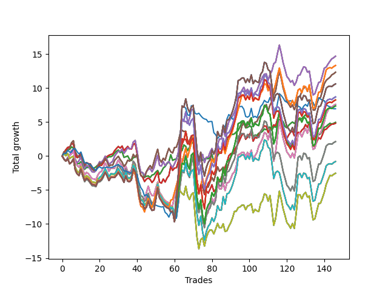

# Long Pointer 003 
- Symbol: SPY_Unlimited
- Date Range: 03/23/2022 - 07/08/2022
- Trading Period: 7:20-12:30
- Number of Trades: 146



| Name | Win Percent | Profit | Avg Profit / Trade | Avg Time / Trade |      | Name | Win Percent | Profit | Avg Profit / Trade | Avg Time / Trade |
| ---- | ----------- | ------ | ------------------ | ---------------- | ---- | ---- | ----------- | ------ | ------------------ | ---------------- |
| Sorted By <br> Profit | | | | | | Sorted By <br> Win Percentage ||||
| Sixty-Six | 65.07 | 7350.00 | 50.34 | 18:52 |     | Sixty-Four | 69.18 | 2480.00 | 16.99 | 07:37 |
| Fifty-Eight | 65.07 | 7350.00 | 50.34 | 18:52 |     | Fifty-Six | 69.18 | 2480.00 | 16.99 | 07:37 |
| Fifty | 65.07 | 7350.00 | 50.34 | 18:52 |     | Forty-Eight | 69.18 | 2480.00 | 16.99 | 07:37 |
| Forty-Two | 65.07 | 7350.00 | 50.34 | 18:52 |     | Forty | 69.18 | 2480.00 | 16.99 | 07:37 |
| Two | 65.07 | 7350.00 | 50.34 | 18:52 |     | Zero | 69.18 | 2480.00 | 16.99 | 07:37 |
| One Hundred Twenty-Six | 55.48 | 6665.00 | 45.65 | 24:00 |     | Sixty-Five | 65.75 | 2415.00 | 16.54 | 14:19 |
| One Hundred Twenty-One | 55.48 | 6665.00 | 45.65 | 24:00 |     | Fifty-Seven | 65.75 | 2415.00 | 16.54 | 14:19 |
| One Hundred Sixteen | 55.48 | 6665.00 | 45.65 | 24:00 |     | Forty-Nine | 65.75 | 2415.00 | 16.54 | 14:19 |
| One Hundred Eleven | 55.48 | 6665.00 | 45.65 | 24:00 |     | Forty-One | 65.75 | 2415.00 | 16.54 | 14:19 |
| Eighty-One | 55.48 | 6665.00 | 45.65 | 24:00 |     | One | 65.75 | 2415.00 | 16.54 | 14:19 |
| Sixty-Seven | 63.70 | 6170.00 | 42.26 | 18:45 |     | Sixty-Six | 65.07 | 7350.00 | 50.34 | 18:52 |
| Fifty-Nine | 63.70 | 6170.00 | 42.26 | 18:45 |     | Fifty-Eight | 65.07 | 7350.00 | 50.34 | 18:52 |
| Fifty-One | 63.70 | 6170.00 | 42.26 | 18:45 |     | Fifty | 65.07 | 7350.00 | 50.34 | 18:52 |
| Forty-Three | 63.70 | 6170.00 | 42.26 | 18:45 |     | Forty-Two | 65.07 | 7350.00 | 50.34 | 18:52 |
| Three | 63.70 | 6170.00 | 42.26 | 18:45 |     | Two | 65.07 | 7350.00 | 50.34 | 18:52 |
| One Hundred Thirty | 50.00 | 5310.00 | 36.37 | 29:27 |     | Sixty-Seven | 63.70 | 6170.00 | 42.26 | 18:45 |
| One Hundred Twenty-Five | 50.00 | 5310.00 | 36.37 | 29:27 |     | Fifty-Nine | 63.70 | 6170.00 | 42.26 | 18:45 |
| One Hundred Twenty | 50.00 | 5310.00 | 36.37 | 29:27 |     | Fifty-One | 63.70 | 6170.00 | 42.26 | 18:45 |
| One Hundred Fifteen | 50.00 | 5310.00 | 36.37 | 29:27 |     | Forty-Three | 63.70 | 6170.00 | 42.26 | 18:45 |
| Eighty-Five | 50.00 | 5310.00 | 36.37 | 29:27 |     | Three | 63.70 | 6170.00 | 42.26 | 18:45 |
| One Hundred Twenty-Nine | 50.00 | 4350.00 | 29.79 | 29:27 |     | One Hundred Twenty-Six | 55.48 | 6665.00 | 45.65 | 24:00 |
| One Hundred Twenty-Four | 50.00 | 4350.00 | 29.79 | 29:27 |     | One Hundred Twenty-One | 55.48 | 6665.00 | 45.65 | 24:00 |
| One Hundred Ninteen | 50.00 | 4350.00 | 29.79 | 29:27 |     | One Hundred Sixteen | 55.48 | 6665.00 | 45.65 | 24:00 |
| One Hundred Fourteen | 50.00 | 4350.00 | 29.79 | 29:27 |     | One Hundred Eleven | 55.48 | 6665.00 | 45.65 | 24:00 |
| Eighty-Four | 50.00 | 4350.00 | 29.79 | 29:27 |     | Eighty-One | 55.48 | 6665.00 | 45.65 | 24:00 |
| One Hundred Twenty-Eight | 50.00 | 4130.00 | 28.29 | 29:14 |     | Sixty-Eight | 54.79 | 3800.00 | 26.03 | 24:41 |
| One Hundred Twenty-Three | 50.00 | 4130.00 | 28.29 | 29:14 |     | Sixty | 54.79 | 3800.00 | 26.03 | 24:41 |
| One Hundred Eighteen | 50.00 | 4130.00 | 28.29 | 29:14 |     | Fifty-Two | 54.79 | 3800.00 | 26.03 | 24:41 |
| One Hundred Thirteen | 50.00 | 4130.00 | 28.29 | 29:14 |     | Forty-Four | 54.79 | 3800.00 | 26.03 | 24:41 |
| Eighty-Three | 50.00 | 4130.00 | 28.29 | 29:14 |     | Four | 54.79 | 3800.00 | 26.03 | 24:41 |
| Sixty-Eight | 54.79 | 3800.00 | 26.03 | 24:41 |     | Seventy | 52.05 | -1265.00 | -8.66 | 25:08 |
| Sixty | 54.79 | 3800.00 | 26.03 | 24:41 |     | Sixty-Two | 52.05 | -1265.00 | -8.66 | 25:08 |
| Fifty-Two | 54.79 | 3800.00 | 26.03 | 24:41 |     | Fifty-Four | 52.05 | -1265.00 | -8.66 | 25:08 |
| Forty-Four | 54.79 | 3800.00 | 26.03 | 24:41 |     | Forty-Six | 52.05 | -1265.00 | -8.66 | 25:08 |
| Four | 54.79 | 3800.00 | 26.03 | 24:41 |     | Six | 52.05 | -1265.00 | -8.66 | 25:08 |
| One Hundred Twenty-Seven | 50.68 | 3690.00 | 25.27 | 28:21 |     | One Hundred Twenty-Seven | 50.68 | 3690.00 | 25.27 | 28:21 |
| One Hundred Twenty-Two | 50.68 | 3690.00 | 25.27 | 28:21 |     | One Hundred Twenty-Two | 50.68 | 3690.00 | 25.27 | 28:21 |
| One Hundred Seventeen | 50.68 | 3690.00 | 25.27 | 28:21 |     | One Hundred Seventeen | 50.68 | 3690.00 | 25.27 | 28:21 |
| One Hundred Twelve | 50.68 | 3690.00 | 25.27 | 28:21 |     | One Hundred Twelve | 50.68 | 3690.00 | 25.27 | 28:21 |
| Eighty-Two | 50.68 | 3690.00 | 25.27 | 28:21 |     | Eighty-Two | 50.68 | 3690.00 | 25.27 | 28:21 |
| Seventy-Three | 37.67 | 3480.00 | 23.84 | 08:41 |     | One Hundred Thirty | 50.00 | 5310.00 | 36.37 | 29:27 |
| Sixty-Four | 69.18 | 2480.00 | 16.99 | 07:37 |     | One Hundred Twenty-Five | 50.00 | 5310.00 | 36.37 | 29:27 |
| Fifty-Six | 69.18 | 2480.00 | 16.99 | 07:37 |     | One Hundred Twenty | 50.00 | 5310.00 | 36.37 | 29:27 |
| Forty-Eight | 69.18 | 2480.00 | 16.99 | 07:37 |     | One Hundred Fifteen | 50.00 | 5310.00 | 36.37 | 29:27 |
| Forty | 69.18 | 2480.00 | 16.99 | 07:37 |     | Eighty-Five | 50.00 | 5310.00 | 36.37 | 29:27 |
| Zero | 69.18 | 2480.00 | 16.99 | 07:37 |     | One Hundred Twenty-Nine | 50.00 | 4350.00 | 29.79 | 29:27 |
| Sixty-Five | 65.75 | 2415.00 | 16.54 | 14:19 |     | One Hundred Twenty-Four | 50.00 | 4350.00 | 29.79 | 29:27 |
| Fifty-Seven | 65.75 | 2415.00 | 16.54 | 14:19 |     | One Hundred Ninteen | 50.00 | 4350.00 | 29.79 | 29:27 |
| Forty-Nine | 65.75 | 2415.00 | 16.54 | 14:19 |     | One Hundred Fourteen | 50.00 | 4350.00 | 29.79 | 29:27 |
| Forty-One | 65.75 | 2415.00 | 16.54 | 14:19 |     | Eighty-Four | 50.00 | 4350.00 | 29.79 | 29:27 |
| One | 65.75 | 2415.00 | 16.54 | 14:19 |     | One Hundred Twenty-Eight | 50.00 | 4130.00 | 28.29 | 29:14 |
| Sixty-Nine | 50.00 | 1065.00 | 7.29 | 27:35 |     | One Hundred Twenty-Three | 50.00 | 4130.00 | 28.29 | 29:14 |
| Sixty-One | 50.00 | 1065.00 | 7.29 | 27:35 |     | One Hundred Eighteen | 50.00 | 4130.00 | 28.29 | 29:14 |
| Fifty-Three | 50.00 | 1065.00 | 7.29 | 27:35 |     | One Hundred Thirteen | 50.00 | 4130.00 | 28.29 | 29:14 |
| Forty-Five | 50.00 | 1065.00 | 7.29 | 27:35 |     | Eighty-Three | 50.00 | 4130.00 | 28.29 | 29:14 |
| Five | 50.00 | 1065.00 | 7.29 | 27:35 |     | Sixty-Nine | 50.00 | 1065.00 | 7.29 | 27:35 |
| Seventy-One | 50.00 | -400.00 | -2.74 | 28:25 |     | Sixty-One | 50.00 | 1065.00 | 7.29 | 27:35 |
| Sixty-Three | 50.00 | -400.00 | -2.74 | 28:25 |     | Fifty-Three | 50.00 | 1065.00 | 7.29 | 27:35 |
| Fifty-Five | 50.00 | -400.00 | -2.74 | 28:25 |     | Forty-Five | 50.00 | 1065.00 | 7.29 | 27:35 |
| Forty-Seven | 50.00 | -400.00 | -2.74 | 28:25 |     | Five | 50.00 | 1065.00 | 7.29 | 27:35 |
| Seven | 50.00 | -400.00 | -2.74 | 28:25 |     | Seventy-One | 50.00 | -400.00 | -2.74 | 28:25 |
| Seventy | 52.05 | -1265.00 | -8.66 | 25:08 |     | Sixty-Three | 50.00 | -400.00 | -2.74 | 28:25 |
| Sixty-Two | 52.05 | -1265.00 | -8.66 | 25:08 |     | Fifty-Five | 50.00 | -400.00 | -2.74 | 28:25 |
| Fifty-Four | 52.05 | -1265.00 | -8.66 | 25:08 |     | Forty-Seven | 50.00 | -400.00 | -2.74 | 28:25 |
| Forty-Six | 52.05 | -1265.00 | -8.66 | 25:08 |     | Seven | 50.00 | -400.00 | -2.74 | 28:25 |
| Six | 52.05 | -1265.00 | -8.66 | 25:08 |     | Seventy-Three | 37.67 | 3480.00 | 23.84 | 08:41 |

## NO STOPLOSS

### Test Zero
* Sell when price hits the middle line of the 20p bollinger
* No Stoploss
* Results:
```
Total Trades: 146
Percent Up: 69.18
Percent Down: 30.82
Total Points Moved Up: 4.96
Potential Profit: 2480.00
Total Points Ups: 30.28 Count Ups: 101
Total Points Downs: -25.32 Count Downs: 45
```

<details><summary>Trades</summary>

<code>In: 2022-03-23 09:15:00		Out: 2022-03-23 09:19:25		Total Position Time: 04:25		Total Move Up: 0.51		Total to Date: 0.51</code> <br />
<code>In: 2022-03-23 09:48:00		Out: 2022-03-23 09:53:00		Total Position Time: 05:00		Total Move Up: 0.33		Total to Date: 0.84</code> <br />
<code>In: 2022-03-23 10:50:00		Out: 2022-03-23 10:51:05		Total Position Time: 01:05		Total Move Up: 0.14		Total to Date: 0.98</code> <br />
<code>In: 2022-03-23 12:12:00		Out: 2022-03-23 12:23:05		Total Position Time: 11:05		Total Move Up: 0.00		Total to Date: 0.98</code> <br />
<code>In: 2022-03-25 08:30:00		Out: 2022-03-25 08:36:40		Total Position Time: 06:40		Total Move Up: 0.37		Total to Date: 1.35</code> <br />
<code>In: 2022-03-25 12:26:00		Out: 2022-03-25 12:37:05		Total Position Time: 11:05		Total Move Up: -0.21		Total to Date: 1.14</code> <br />
<code>In: 2022-03-28 08:28:00		Out: 2022-03-28 08:57:55		Total Position Time: 29:55		Total Move Up: -1.63		Total to Date: -0.49</code> <br />
<code>In: 2022-03-28 08:39:00		Out: 2022-03-28 09:01:45		Total Position Time: 22:45		Total Move Up: -0.65		Total to Date: -1.14</code> <br />
<code>In: 2022-03-28 08:52:00		Out: 2022-03-28 09:01:45		Total Position Time: 09:45		Total Move Up: 0.03		Total to Date: -1.11</code> <br />
<code>In: 2022-03-28 09:21:00		Out: 2022-03-28 09:21:30		Total Position Time: 00:30		Total Move Up: 0.28		Total to Date: -0.83</code> <br />
<code>In: 2022-03-30 08:02:00		Out: 2022-03-30 08:19:15		Total Position Time: 17:15		Total Move Up: -0.55		Total to Date: -1.38</code> <br />
<code>In: 2022-03-30 08:03:00		Out: 2022-03-30 08:19:15		Total Position Time: 16:15		Total Move Up: -0.57		Total to Date: -1.95</code> <br />
<code>In: 2022-03-30 08:14:00		Out: 2022-03-30 08:19:15		Total Position Time: 05:15		Total Move Up: 0.28		Total to Date: -1.67</code> <br />
<code>In: 2022-03-30 10:24:00		Out: 2022-03-30 10:33:25		Total Position Time: 09:25		Total Move Up: 0.00		Total to Date: -1.67</code> <br />
<code>In: 2022-03-30 10:28:00		Out: 2022-03-30 10:33:25		Total Position Time: 05:25		Total Move Up: 0.13		Total to Date: -1.54</code> <br />
<code>In: 2022-03-30 12:03:00		Out: 2022-03-30 12:15:25		Total Position Time: 12:25		Total Move Up: -0.15		Total to Date: -1.69</code> <br />
<code>In: 2022-03-30 12:07:00		Out: 2022-03-30 12:15:25		Total Position Time: 08:25		Total Move Up: -0.09		Total to Date: -1.78</code> <br />
<code>In: 2022-03-30 12:14:00		Out: 2022-03-30 12:15:25		Total Position Time: 01:25		Total Move Up: 0.19		Total to Date: -1.59</code> <br />
<code>In: 2022-03-30 12:27:00		Out: 2022-03-30 12:28:15		Total Position Time: 01:15		Total Move Up: 0.27		Total to Date: -1.32</code> <br />
<code>In: 2022-03-31 08:37:00		Out: 2022-03-31 08:38:05		Total Position Time: 01:05		Total Move Up: 0.15		Total to Date: -1.17</code> <br />
<code>In: 2022-03-31 10:02:00		Out: 2022-03-31 10:04:00		Total Position Time: 02:00		Total Move Up: 0.09		Total to Date: -1.08</code> <br />
<code>In: 2022-03-31 10:18:00		Out: 2022-03-31 10:19:00		Total Position Time: 01:00		Total Move Up: 0.20		Total to Date: -0.88</code> <br />
<code>In: 2022-04-01 09:39:00		Out: 2022-04-01 09:42:15		Total Position Time: 03:15		Total Move Up: 0.30		Total to Date: -0.58</code> <br />
<code>In: 2022-04-05 09:04:00		Out: 2022-04-05 09:06:10		Total Position Time: 02:10		Total Move Up: 0.33		Total to Date: -0.25</code> <br />
<code>In: 2022-04-05 09:05:00		Out: 2022-04-05 09:06:10		Total Position Time: 01:10		Total Move Up: 0.17		Total to Date: -0.08</code> <br />
<code>In: 2022-04-05 09:25:00		Out: 2022-04-05 09:37:00		Total Position Time: 12:00		Total Move Up: -0.02		Total to Date: -0.10</code> <br />
<code>In: 2022-04-06 09:23:00		Out: 2022-04-06 09:31:15		Total Position Time: 08:15		Total Move Up: 0.16		Total to Date: 0.06</code> <br />
<code>In: 2022-04-07 08:35:00		Out: 2022-04-07 08:36:10		Total Position Time: 01:10		Total Move Up: 0.40		Total to Date: 0.46</code> <br />
<code>In: 2022-04-07 08:56:00		Out: 2022-04-07 08:56:10		Total Position Time: 00:10		Total Move Up: 0.24		Total to Date: 0.70</code> <br />
<code>In: 2022-04-07 08:57:00		Out: 2022-04-07 09:00:25		Total Position Time: 03:25		Total Move Up: 0.19		Total to Date: 0.89</code> <br />
<code>In: 2022-04-11 07:30:00		Out: 2022-04-11 07:51:10		Total Position Time: 21:10		Total Move Up: -0.39		Total to Date: 0.50</code> <br />
<code>In: 2022-04-11 07:46:00		Out: 2022-04-11 07:51:10		Total Position Time: 05:10		Total Move Up: 0.16		Total to Date: 0.66</code> <br />
<code>In: 2022-04-12 07:33:00		Out: 2022-04-12 08:02:05		Total Position Time: 29:05		Total Move Up: -0.85		Total to Date: -0.19</code> <br />
<code>In: 2022-04-12 07:53:00		Out: 2022-04-12 08:02:05		Total Position Time: 09:05		Total Move Up: 0.09		Total to Date: -0.10</code> <br />
<code>In: 2022-04-12 11:35:00		Out: 2022-04-12 11:35:45		Total Position Time: 00:45		Total Move Up: 0.12		Total to Date: 0.02</code> <br />
<code>In: 2022-04-14 09:32:00		Out: 2022-04-14 09:56:10		Total Position Time: 24:10		Total Move Up: -0.51		Total to Date: -0.49</code> <br />
<code>In: 2022-04-14 09:43:00		Out: 2022-04-14 09:56:10		Total Position Time: 13:10		Total Move Up: -0.17		Total to Date: -0.66</code> <br />
<code>In: 2022-04-20 11:58:00		Out: 2022-04-20 12:01:15		Total Position Time: 03:15		Total Move Up: 0.44		Total to Date: -0.22</code> <br />
<code>In: 2022-04-21 07:51:00		Out: 2022-04-21 08:01:10		Total Position Time: 10:10		Total Move Up: 0.07		Total to Date: -0.15</code> <br />
<code>In: 2022-04-21 08:25:00		Out: 2022-04-21 08:25:15		Total Position Time: 00:15		Total Move Up: 0.26		Total to Date: 0.11</code> <br />
<code>In: 2022-04-21 08:36:00		Out: 2022-04-21 09:05:55		Total Position Time: 29:55		Total Move Up: -1.91		Total to Date: -1.80</code> <br />
<code>In: 2022-04-21 09:02:00		Out: 2022-04-21 09:19:05		Total Position Time: 17:05		Total Move Up: -0.53		Total to Date: -2.33</code> <br />
<code>In: 2022-04-21 09:07:00		Out: 2022-04-21 09:19:05		Total Position Time: 12:05		Total Move Up: -0.14		Total to Date: -2.47</code> <br />
<code>In: 2022-04-21 09:56:00		Out: 2022-04-21 10:13:30		Total Position Time: 17:30		Total Move Up: -0.63		Total to Date: -3.10</code> <br />
<code>In: 2022-04-21 10:21:00		Out: 2022-04-21 10:21:10		Total Position Time: 00:10		Total Move Up: 0.12		Total to Date: -2.98</code> <br />
<code>In: 2022-04-21 11:07:00		Out: 2022-04-21 11:18:05		Total Position Time: 11:05		Total Move Up: 0.06		Total to Date: -2.92</code> <br />
<code>In: 2022-04-21 12:06:00		Out: 2022-04-21 12:18:10		Total Position Time: 12:10		Total Move Up: -0.23		Total to Date: -3.15</code> <br />
<code>In: 2022-04-26 07:23:00		Out: 2022-04-26 07:31:30		Total Position Time: 08:30		Total Move Up: 0.35		Total to Date: -2.80</code> <br />
<code>In: 2022-04-26 10:34:00		Out: 2022-04-26 10:39:15		Total Position Time: 05:15		Total Move Up: 0.09		Total to Date: -2.71</code> <br />
<code>In: 2022-04-29 09:56:00		Out: 2022-04-29 10:00:35		Total Position Time: 04:35		Total Move Up: 0.35		Total to Date: -2.36</code> <br />
<code>In: 2022-04-29 09:57:00		Out: 2022-04-29 10:00:35		Total Position Time: 03:35		Total Move Up: 0.24		Total to Date: -2.12</code> <br />
<code>In: 2022-04-29 11:42:00		Out: 2022-04-29 11:58:10		Total Position Time: 16:10		Total Move Up: -0.59		Total to Date: -2.71</code> <br />
<code>In: 2022-04-29 11:57:00		Out: 2022-04-29 11:58:10		Total Position Time: 01:10		Total Move Up: 0.40		Total to Date: -2.31</code> <br />
<code>In: 2022-04-29 12:16:00		Out: 2022-04-29 12:18:10		Total Position Time: 02:10		Total Move Up: 0.53		Total to Date: -1.78</code> <br />
<code>In: 2022-05-02 08:07:00		Out: 2022-05-02 08:13:20		Total Position Time: 06:20		Total Move Up: 0.25		Total to Date: -1.53</code> <br />
<code>In: 2022-05-02 08:22:00		Out: 2022-05-02 08:26:05		Total Position Time: 04:05		Total Move Up: 0.44		Total to Date: -1.09</code> <br />
<code>In: 2022-05-02 08:23:00		Out: 2022-05-02 08:26:05		Total Position Time: 03:05		Total Move Up: 0.22		Total to Date: -0.87</code> <br />
<code>In: 2022-05-02 10:06:00		Out: 2022-05-02 10:08:15		Total Position Time: 02:15		Total Move Up: 1.07		Total to Date: 0.20</code> <br />
<code>In: 2022-05-02 10:37:00		Out: 2022-05-02 10:59:15		Total Position Time: 22:15		Total Move Up: -0.84		Total to Date: -0.64</code> <br />
<code>In: 2022-05-02 10:51:00		Out: 2022-05-02 10:59:15		Total Position Time: 08:15		Total Move Up: 0.15		Total to Date: -0.49</code> <br />
<code>In: 2022-05-02 11:46:00		Out: 2022-05-02 11:46:10		Total Position Time: 00:10		Total Move Up: 0.04		Total to Date: -0.45</code> <br />
<code>In: 2022-05-03 07:49:00		Out: 2022-05-03 07:54:05		Total Position Time: 05:05		Total Move Up: 0.82		Total to Date: 0.37</code> <br />
<code>In: 2022-05-04 11:36:00		Out: 2022-05-04 11:36:40		Total Position Time: 00:40		Total Move Up: 0.80		Total to Date: 1.17</code> <br />
<code>In: 2022-05-04 11:37:00		Out: 2022-05-04 11:37:10		Total Position Time: 00:10		Total Move Up: -0.38		Total to Date: 0.79</code> <br />
<code>In: 2022-05-06 11:11:00		Out: 2022-05-06 11:12:20		Total Position Time: 01:20		Total Move Up: 0.85		Total to Date: 1.64</code> <br />
<code>In: 2022-05-06 11:28:00		Out: 2022-05-06 11:40:25		Total Position Time: 12:25		Total Move Up: -0.21		Total to Date: 1.43</code> <br />
<code>In: 2022-05-09 07:27:00		Out: 2022-05-09 07:42:30		Total Position Time: 15:30		Total Move Up: -0.64		Total to Date: 0.79</code> <br />
<code>In: 2022-05-09 07:42:00		Out: 2022-05-09 07:42:30		Total Position Time: 00:30		Total Move Up: 0.49		Total to Date: 1.28</code> <br />
<code>In: 2022-05-09 08:34:00		Out: 2022-05-09 08:35:10		Total Position Time: 01:10		Total Move Up: 0.62		Total to Date: 1.90</code> <br />
<code>In: 2022-05-09 10:03:00		Out: 2022-05-09 10:09:25		Total Position Time: 06:25		Total Move Up: 0.09		Total to Date: 1.99</code> <br />
<code>In: 2022-05-10 07:30:00		Out: 2022-05-10 07:59:00		Total Position Time: 29:00		Total Move Up: -2.68		Total to Date: -0.69</code> <br />
<code>In: 2022-05-10 07:44:00		Out: 2022-05-10 07:59:00		Total Position Time: 15:00		Total Move Up: -0.60		Total to Date: -1.29</code> <br />
<code>In: 2022-05-10 07:52:00		Out: 2022-05-10 07:59:00		Total Position Time: 07:00		Total Move Up: 0.53		Total to Date: -0.76</code> <br />
<code>In: 2022-05-10 08:11:00		Out: 2022-05-10 08:19:05		Total Position Time: 08:05		Total Move Up: 0.16		Total to Date: -0.60</code> <br />
<code>In: 2022-05-11 09:14:00		Out: 2022-05-11 09:17:50		Total Position Time: 03:50		Total Move Up: -0.01		Total to Date: -0.61</code> <br />
<code>In: 2022-05-11 10:33:00		Out: 2022-05-11 10:34:30		Total Position Time: 01:30		Total Move Up: 0.16		Total to Date: -0.45</code> <br />
<code>In: 2022-05-11 11:01:00		Out: 2022-05-11 11:01:10		Total Position Time: 00:10		Total Move Up: 0.16		Total to Date: -0.29</code> <br />
<code>In: 2022-05-12 11:35:00		Out: 2022-05-12 11:45:20		Total Position Time: 10:20		Total Move Up: -0.12		Total to Date: -0.41</code> <br />
<code>In: 2022-05-13 11:07:00		Out: 2022-05-13 11:19:15		Total Position Time: 12:15		Total Move Up: 0.24		Total to Date: -0.17</code> <br />
<code>In: 2022-05-16 09:47:00		Out: 2022-05-16 09:48:15		Total Position Time: 01:15		Total Move Up: 0.41		Total to Date: 0.24</code> <br />
<code>In: 2022-05-17 07:33:00		Out: 2022-05-17 07:55:10		Total Position Time: 22:10		Total Move Up: -1.15		Total to Date: -0.91</code> <br />
<code>In: 2022-05-17 07:48:00		Out: 2022-05-17 07:55:10		Total Position Time: 07:10		Total Move Up: 0.20		Total to Date: -0.71</code> <br />
<code>In: 2022-05-17 11:25:00		Out: 2022-05-17 11:27:25		Total Position Time: 02:25		Total Move Up: 0.80		Total to Date: 0.09</code> <br />
<code>In: 2022-05-18 08:32:00		Out: 2022-05-18 08:36:55		Total Position Time: 04:55		Total Move Up: 0.36		Total to Date: 0.45</code> <br />
<code>In: 2022-05-18 09:12:00		Out: 2022-05-18 09:14:45		Total Position Time: 02:45		Total Move Up: 0.25		Total to Date: 0.70</code> <br />
<code>In: 2022-05-19 10:52:00		Out: 2022-05-19 10:52:45		Total Position Time: 00:45		Total Move Up: 0.47		Total to Date: 1.17</code> <br />
<code>In: 2022-05-20 09:48:00		Out: 2022-05-20 09:50:00		Total Position Time: 02:00		Total Move Up: 0.73		Total to Date: 1.90</code> <br />
<code>In: 2022-05-23 10:23:00		Out: 2022-05-23 10:26:30		Total Position Time: 03:30		Total Move Up: 0.39		Total to Date: 2.29</code> <br />
<code>In: 2022-05-25 08:40:00		Out: 2022-05-25 08:44:05		Total Position Time: 04:05		Total Move Up: 0.65		Total to Date: 2.94</code> <br />
<code>In: 2022-05-25 09:29:00		Out: 2022-05-25 09:38:55		Total Position Time: 09:55		Total Move Up: 0.20		Total to Date: 3.14</code> <br />
<code>In: 2022-05-25 09:30:00		Out: 2022-05-25 09:38:55		Total Position Time: 08:55		Total Move Up: 0.04		Total to Date: 3.18</code> <br />
<code>In: 2022-05-25 10:15:00		Out: 2022-05-25 10:15:20		Total Position Time: 00:20		Total Move Up: 0.09		Total to Date: 3.27</code> <br />
<code>In: 2022-05-27 08:04:00		Out: 2022-05-27 08:06:55		Total Position Time: 02:55		Total Move Up: 0.28		Total to Date: 3.55</code> <br />
<code>In: 2022-05-31 12:05:00		Out: 2022-05-31 12:07:20		Total Position Time: 02:20		Total Move Up: 0.21		Total to Date: 3.76</code> <br />
<code>In: 2022-06-01 07:38:00		Out: 2022-06-01 07:43:35		Total Position Time: 05:35		Total Move Up: 0.58		Total to Date: 4.34</code> <br />
<code>In: 2022-06-01 07:39:00		Out: 2022-06-01 07:43:35		Total Position Time: 04:35		Total Move Up: 0.59		Total to Date: 4.93</code> <br />
<code>In: 2022-06-03 12:14:00		Out: 2022-06-03 12:25:35		Total Position Time: 11:35		Total Move Up: -0.03		Total to Date: 4.90</code> <br />
<code>In: 2022-06-06 09:08:00		Out: 2022-06-06 09:26:35		Total Position Time: 18:35		Total Move Up: -0.76		Total to Date: 4.14</code> <br />
<code>In: 2022-06-06 12:22:00		Out: 2022-06-06 12:31:15		Total Position Time: 09:15		Total Move Up: 0.08		Total to Date: 4.22</code> <br />
<code>In: 2022-06-07 08:52:00		Out: 2022-06-07 08:56:50		Total Position Time: 04:50		Total Move Up: 0.18		Total to Date: 4.40</code> <br />
<code>In: 2022-06-08 08:06:00		Out: 2022-06-08 08:10:05		Total Position Time: 04:05		Total Move Up: -0.04		Total to Date: 4.36</code> <br />
<code>In: 2022-06-08 09:30:00		Out: 2022-06-08 09:53:00		Total Position Time: 23:00		Total Move Up: -1.50		Total to Date: 2.86</code> <br />
<code>In: 2022-06-08 10:35:00		Out: 2022-06-08 10:42:15		Total Position Time: 07:15		Total Move Up: 0.24		Total to Date: 3.10</code> <br />
<code>In: 2022-06-08 11:31:00		Out: 2022-06-08 11:31:10		Total Position Time: 00:10		Total Move Up: -0.05		Total to Date: 3.05</code> <br />
<code>In: 2022-06-08 11:38:00		Out: 2022-06-08 11:41:35		Total Position Time: 03:35		Total Move Up: 0.31		Total to Date: 3.36</code> <br />
<code>In: 2022-06-08 12:11:00		Out: 2022-06-08 12:11:20		Total Position Time: 00:20		Total Move Up: 0.08		Total to Date: 3.44</code> <br />
<code>In: 2022-06-09 08:10:00		Out: 2022-06-09 08:10:55		Total Position Time: 00:55		Total Move Up: 0.20		Total to Date: 3.64</code> <br />
<code>In: 2022-06-09 09:15:00		Out: 2022-06-09 09:20:35		Total Position Time: 05:35		Total Move Up: 0.35		Total to Date: 3.99</code> <br />
<code>In: 2022-06-09 10:34:00		Out: 2022-06-09 10:47:45		Total Position Time: 13:45		Total Move Up: -0.12		Total to Date: 3.87</code> <br />
<code>In: 2022-06-09 11:27:00		Out: 2022-06-09 11:28:10		Total Position Time: 01:10		Total Move Up: 0.28		Total to Date: 4.15</code> <br />
<code>In: 2022-06-13 11:35:00		Out: 2022-06-13 11:35:40		Total Position Time: 00:40		Total Move Up: 0.12		Total to Date: 4.27</code> <br />
<code>In: 2022-06-13 11:59:00		Out: 2022-06-13 12:16:50		Total Position Time: 17:50		Total Move Up: -0.48		Total to Date: 3.79</code> <br />
<code>In: 2022-06-13 12:17:00		Out: 2022-06-13 12:17:10		Total Position Time: 00:10		Total Move Up: 0.56		Total to Date: 4.35</code> <br />
<code>In: 2022-06-14 07:32:00		Out: 2022-06-14 07:37:00		Total Position Time: 05:00		Total Move Up: -0.10		Total to Date: 4.25</code> <br />
<code>In: 2022-06-14 07:45:00		Out: 2022-06-14 07:46:35		Total Position Time: 01:35		Total Move Up: 0.61		Total to Date: 4.86</code> <br />
<code>In: 2022-06-14 07:46:00		Out: 2022-06-14 07:46:35		Total Position Time: 00:35		Total Move Up: 0.48		Total to Date: 5.34</code> <br />
<code>In: 2022-06-14 11:52:00		Out: 2022-06-14 12:04:30		Total Position Time: 12:30		Total Move Up: -0.08		Total to Date: 5.26</code> <br />
<code>In: 2022-06-14 11:53:00		Out: 2022-06-14 12:04:30		Total Position Time: 11:30		Total Move Up: -0.19		Total to Date: 5.07</code> <br />
<code>In: 2022-06-15 07:36:00		Out: 2022-06-15 07:58:55		Total Position Time: 22:55		Total Move Up: -0.72		Total to Date: 4.35</code> <br />
<code>In: 2022-06-15 07:48:00		Out: 2022-06-15 07:58:55		Total Position Time: 10:55		Total Move Up: -0.19		Total to Date: 4.16</code> <br />
<code>In: 2022-06-15 07:57:00		Out: 2022-06-15 07:58:55		Total Position Time: 01:55		Total Move Up: 0.37		Total to Date: 4.53</code> <br />
<code>In: 2022-06-15 07:58:00		Out: 2022-06-15 07:58:55		Total Position Time: 00:55		Total Move Up: 0.27		Total to Date: 4.80</code> <br />
<code>In: 2022-06-15 08:16:00		Out: 2022-06-15 08:24:20		Total Position Time: 08:20		Total Move Up: 0.21		Total to Date: 5.01</code> <br />
<code>In: 2022-06-16 11:02:00		Out: 2022-06-16 11:14:35		Total Position Time: 12:35		Total Move Up: -0.21		Total to Date: 4.80</code> <br />
<code>In: 2022-06-17 07:38:00		Out: 2022-06-17 07:44:55		Total Position Time: 06:55		Total Move Up: 0.35		Total to Date: 5.15</code> <br />
<code>In: 2022-06-17 07:51:00		Out: 2022-06-17 07:55:05		Total Position Time: 04:05		Total Move Up: 0.18		Total to Date: 5.33</code> <br />
<code>In: 2022-06-21 08:58:00		Out: 2022-06-21 09:02:05		Total Position Time: 04:05		Total Move Up: 0.04		Total to Date: 5.37</code> <br />
<code>In: 2022-06-23 09:07:00		Out: 2022-06-23 09:14:30		Total Position Time: 07:30		Total Move Up: 0.17		Total to Date: 5.54</code> <br />
<code>In: 2022-06-23 10:06:00		Out: 2022-06-23 10:06:10		Total Position Time: 00:10		Total Move Up: 0.25		Total to Date: 5.79</code> <br />
<code>In: 2022-06-27 10:10:00		Out: 2022-06-27 10:11:25		Total Position Time: 01:25		Total Move Up: 0.30		Total to Date: 6.09</code> <br />
<code>In: 2022-06-27 10:37:00		Out: 2022-06-27 10:51:15		Total Position Time: 14:15		Total Move Up: -0.37		Total to Date: 5.72</code> <br />
<code>In: 2022-06-27 12:08:00		Out: 2022-06-27 12:10:20		Total Position Time: 02:20		Total Move Up: 0.57		Total to Date: 6.29</code> <br />
<code>In: 2022-06-28 07:25:00		Out: 2022-06-28 07:54:55		Total Position Time: 29:55		Total Move Up: -1.73		Total to Date: 4.56</code> <br />
<code>In: 2022-06-28 07:26:00		Out: 2022-06-28 07:55:55		Total Position Time: 29:55		Total Move Up: -1.78		Total to Date: 2.78</code> <br />
<code>In: 2022-06-28 08:59:00		Out: 2022-06-28 09:10:00		Total Position Time: 11:00		Total Move Up: -0.43		Total to Date: 2.35</code> <br />
<code>In: 2022-06-29 08:25:00		Out: 2022-06-29 08:28:25		Total Position Time: 03:25		Total Move Up: 0.43		Total to Date: 2.78</code> <br />
<code>In: 2022-06-29 08:26:00		Out: 2022-06-29 08:28:25		Total Position Time: 02:25		Total Move Up: 0.35		Total to Date: 3.13</code> <br />
<code>In: 2022-06-29 09:16:00		Out: 2022-06-29 09:21:05		Total Position Time: 05:05		Total Move Up: 0.16		Total to Date: 3.29</code> <br />
<code>In: 2022-06-29 09:29:00		Out: 2022-06-29 09:36:40		Total Position Time: 07:40		Total Move Up: 0.43		Total to Date: 3.72</code> <br />
<code>In: 2022-06-29 09:31:00		Out: 2022-06-29 09:36:40		Total Position Time: 05:40		Total Move Up: 0.52		Total to Date: 4.24</code> <br />
<code>In: 2022-07-01 08:57:00		Out: 2022-07-01 09:07:50		Total Position Time: 10:50		Total Move Up: 0.12		Total to Date: 4.36</code> <br />
<code>In: 2022-07-05 08:05:00		Out: 2022-07-05 08:08:25		Total Position Time: 03:25		Total Move Up: 0.25		Total to Date: 4.61</code> <br />
<code>In: 2022-07-05 08:08:00		Out: 2022-07-05 08:08:25		Total Position Time: 00:25		Total Move Up: 0.21		Total to Date: 4.82</code> <br />
<code>In: 2022-07-06 08:35:00		Out: 2022-07-06 08:46:05		Total Position Time: 11:05		Total Move Up: -0.09		Total to Date: 4.73</code> <br />
<code>In: 2022-07-08 09:45:00		Out: 2022-07-08 09:48:45		Total Position Time: 03:45		Total Move Up: 0.08		Total to Date: 4.81</code> <br />
<code>In: 2022-07-08 09:48:00		Out: 2022-07-08 09:48:45		Total Position Time: 00:45		Total Move Up: 0.15		Total to Date: 4.96</code> <br />


</details>

### Test One
* Sell when the price hits the upper line of the 20p 1std bollinger
* No Stoploss
* Results:
```
Total Trades: 146
Percent Up: 65.75
Percent Down: 34.25
Total Points Moved Up: 4.83
Potential Profit: 2415.00
Total Points Ups: 43.68 Count Ups: 96
Total Points Downs: -38.85 Count Downs: 50
```

<details><summary>Trades</summary>

<code>In: 2022-03-23 09:15:00		Out: 2022-03-23 09:30:20		Total Position Time: 15:20		Total Move Up: 0.55		Total to Date: 0.55</code> <br />
<code>In: 2022-03-23 09:48:00		Out: 2022-03-23 09:59:10		Total Position Time: 11:10		Total Move Up: 0.40		Total to Date: 0.95</code> <br />
<code>In: 2022-03-23 10:50:00		Out: 2022-03-23 10:51:45		Total Position Time: 01:45		Total Move Up: 0.34		Total to Date: 1.29</code> <br />
<code>In: 2022-03-23 12:12:00		Out: 2022-03-23 12:23:35		Total Position Time: 11:35		Total Move Up: 0.04		Total to Date: 1.33</code> <br />
<code>In: 2022-03-25 08:30:00		Out: 2022-03-25 08:41:05		Total Position Time: 11:05		Total Move Up: 0.49		Total to Date: 1.82</code> <br />
<code>In: 2022-03-25 12:26:00		Out: 2022-03-25 12:38:35		Total Position Time: 12:35		Total Move Up: -0.04		Total to Date: 1.78</code> <br />
<code>In: 2022-03-28 08:28:00		Out: 2022-03-28 08:57:55		Total Position Time: 29:55		Total Move Up: -1.63		Total to Date: 0.15</code> <br />
<code>In: 2022-03-28 08:39:00		Out: 2022-03-28 09:04:40		Total Position Time: 25:40		Total Move Up: -0.40		Total to Date: -0.25</code> <br />
<code>In: 2022-03-28 08:52:00		Out: 2022-03-28 09:04:40		Total Position Time: 12:40		Total Move Up: 0.28		Total to Date: 0.03</code> <br />
<code>In: 2022-03-28 09:21:00		Out: 2022-03-28 09:25:35		Total Position Time: 04:35		Total Move Up: 0.47		Total to Date: 0.50</code> <br />
<code>In: 2022-03-30 08:02:00		Out: 2022-03-30 08:31:55		Total Position Time: 29:55		Total Move Up: -0.90		Total to Date: -0.40</code> <br />
<code>In: 2022-03-30 08:03:00		Out: 2022-03-30 08:32:55		Total Position Time: 29:55		Total Move Up: -0.80		Total to Date: -1.20</code> <br />
<code>In: 2022-03-30 08:14:00		Out: 2022-03-30 08:34:40		Total Position Time: 20:40		Total Move Up: 0.25		Total to Date: -0.95</code> <br />
<code>In: 2022-03-30 10:24:00		Out: 2022-03-30 10:49:45		Total Position Time: 25:45		Total Move Up: -0.16		Total to Date: -1.11</code> <br />
<code>In: 2022-03-30 10:28:00		Out: 2022-03-30 10:49:45		Total Position Time: 21:45		Total Move Up: -0.03		Total to Date: -1.14</code> <br />
<code>In: 2022-03-30 12:03:00		Out: 2022-03-30 12:32:20		Total Position Time: 29:20		Total Move Up: -0.46		Total to Date: -1.60</code> <br />
<code>In: 2022-03-30 12:07:00		Out: 2022-03-30 12:32:20		Total Position Time: 25:20		Total Move Up: -0.40		Total to Date: -2.00</code> <br />
<code>In: 2022-03-30 12:14:00		Out: 2022-03-30 12:32:20		Total Position Time: 18:20		Total Move Up: -0.12		Total to Date: -2.12</code> <br />
<code>In: 2022-03-30 12:27:00		Out: 2022-03-30 12:32:20		Total Position Time: 05:20		Total Move Up: 0.45		Total to Date: -1.67</code> <br />
<code>In: 2022-03-31 08:37:00		Out: 2022-03-31 08:40:35		Total Position Time: 03:35		Total Move Up: 0.34		Total to Date: -1.33</code> <br />
<code>In: 2022-03-31 10:02:00		Out: 2022-03-31 10:19:40		Total Position Time: 17:40		Total Move Up: -0.05		Total to Date: -1.38</code> <br />
<code>In: 2022-03-31 10:18:00		Out: 2022-03-31 10:19:40		Total Position Time: 01:40		Total Move Up: 0.39		Total to Date: -0.99</code> <br />
<code>In: 2022-04-01 09:39:00		Out: 2022-04-01 09:44:20		Total Position Time: 05:20		Total Move Up: 0.59		Total to Date: -0.40</code> <br />
<code>In: 2022-04-05 09:04:00		Out: 2022-04-05 09:13:50		Total Position Time: 09:50		Total Move Up: 0.34		Total to Date: -0.06</code> <br />
<code>In: 2022-04-05 09:05:00		Out: 2022-04-05 09:13:50		Total Position Time: 08:50		Total Move Up: 0.18		Total to Date: 0.12</code> <br />
<code>In: 2022-04-05 09:25:00		Out: 2022-04-05 09:37:40		Total Position Time: 12:40		Total Move Up: 0.11		Total to Date: 0.23</code> <br />
<code>In: 2022-04-06 09:23:00		Out: 2022-04-06 09:33:05		Total Position Time: 10:05		Total Move Up: 0.08		Total to Date: 0.31</code> <br />
<code>In: 2022-04-07 08:35:00		Out: 2022-04-07 08:47:05		Total Position Time: 12:05		Total Move Up: 0.48		Total to Date: 0.79</code> <br />
<code>In: 2022-04-07 08:56:00		Out: 2022-04-07 09:02:50		Total Position Time: 06:50		Total Move Up: 0.33		Total to Date: 1.12</code> <br />
<code>In: 2022-04-07 08:57:00		Out: 2022-04-07 09:02:50		Total Position Time: 05:50		Total Move Up: 0.29		Total to Date: 1.41</code> <br />
<code>In: 2022-04-11 07:30:00		Out: 2022-04-11 07:52:00		Total Position Time: 22:00		Total Move Up: -0.24		Total to Date: 1.17</code> <br />
<code>In: 2022-04-11 07:46:00		Out: 2022-04-11 07:52:00		Total Position Time: 06:00		Total Move Up: 0.31		Total to Date: 1.48</code> <br />
<code>In: 2022-04-12 07:33:00		Out: 2022-04-12 08:02:35		Total Position Time: 29:35		Total Move Up: -0.66		Total to Date: 0.82</code> <br />
<code>In: 2022-04-12 07:53:00		Out: 2022-04-12 08:02:35		Total Position Time: 09:35		Total Move Up: 0.28		Total to Date: 1.10</code> <br />
<code>In: 2022-04-12 11:35:00		Out: 2022-04-12 11:37:25		Total Position Time: 02:25		Total Move Up: 0.32		Total to Date: 1.42</code> <br />
<code>In: 2022-04-14 09:32:00		Out: 2022-04-14 09:58:10		Total Position Time: 26:10		Total Move Up: -0.37		Total to Date: 1.05</code> <br />
<code>In: 2022-04-14 09:43:00		Out: 2022-04-14 09:58:10		Total Position Time: 15:10		Total Move Up: -0.03		Total to Date: 1.02</code> <br />
<code>In: 2022-04-20 11:58:00		Out: 2022-04-20 12:04:20		Total Position Time: 06:20		Total Move Up: 0.71		Total to Date: 1.73</code> <br />
<code>In: 2022-04-21 07:51:00		Out: 2022-04-21 08:05:05		Total Position Time: 14:05		Total Move Up: 0.13		Total to Date: 1.86</code> <br />
<code>In: 2022-04-21 08:25:00		Out: 2022-04-21 08:54:55		Total Position Time: 29:55		Total Move Up: -1.48		Total to Date: 0.38</code> <br />
<code>In: 2022-04-21 08:36:00		Out: 2022-04-21 09:05:55		Total Position Time: 29:55		Total Move Up: -1.91		Total to Date: -1.53</code> <br />
<code>In: 2022-04-21 09:02:00		Out: 2022-04-21 09:31:55		Total Position Time: 29:55		Total Move Up: -1.26		Total to Date: -2.79</code> <br />
<code>In: 2022-04-21 09:07:00		Out: 2022-04-21 09:34:10		Total Position Time: 27:10		Total Move Up: -0.34		Total to Date: -3.13</code> <br />
<code>In: 2022-04-21 09:56:00		Out: 2022-04-21 10:21:20		Total Position Time: 25:20		Total Move Up: -0.62		Total to Date: -3.75</code> <br />
<code>In: 2022-04-21 10:21:00		Out: 2022-04-21 10:21:20		Total Position Time: 00:20		Total Move Up: 0.37		Total to Date: -3.38</code> <br />
<code>In: 2022-04-21 11:07:00		Out: 2022-04-21 11:20:50		Total Position Time: 13:50		Total Move Up: 0.14		Total to Date: -3.24</code> <br />
<code>In: 2022-04-21 12:06:00		Out: 2022-04-21 12:23:05		Total Position Time: 17:05		Total Move Up: -0.21		Total to Date: -3.45</code> <br />
<code>In: 2022-04-26 07:23:00		Out: 2022-04-26 07:52:55		Total Position Time: 29:55		Total Move Up: -0.45		Total to Date: -3.90</code> <br />
<code>In: 2022-04-26 10:34:00		Out: 2022-04-26 10:39:40		Total Position Time: 05:40		Total Move Up: 0.35		Total to Date: -3.55</code> <br />
<code>In: 2022-04-29 09:56:00		Out: 2022-04-29 10:02:45		Total Position Time: 06:45		Total Move Up: 0.66		Total to Date: -2.89</code> <br />
<code>In: 2022-04-29 09:57:00		Out: 2022-04-29 10:02:45		Total Position Time: 05:45		Total Move Up: 0.55		Total to Date: -2.34</code> <br />
<code>In: 2022-04-29 11:42:00		Out: 2022-04-29 12:11:55		Total Position Time: 29:55		Total Move Up: -1.48		Total to Date: -3.82</code> <br />
<code>In: 2022-04-29 11:57:00		Out: 2022-04-29 12:24:15		Total Position Time: 27:15		Total Move Up: -0.17		Total to Date: -3.99</code> <br />
<code>In: 2022-04-29 12:16:00		Out: 2022-04-29 12:24:15		Total Position Time: 08:15		Total Move Up: 0.61		Total to Date: -3.38</code> <br />
<code>In: 2022-05-02 08:07:00		Out: 2022-05-02 08:34:10		Total Position Time: 27:10		Total Move Up: -0.44		Total to Date: -3.82</code> <br />
<code>In: 2022-05-02 08:22:00		Out: 2022-05-02 08:34:10		Total Position Time: 12:10		Total Move Up: 0.59		Total to Date: -3.23</code> <br />
<code>In: 2022-05-02 08:23:00		Out: 2022-05-02 08:34:10		Total Position Time: 11:10		Total Move Up: 0.37		Total to Date: -2.86</code> <br />
<code>In: 2022-05-02 10:06:00		Out: 2022-05-02 10:10:55		Total Position Time: 04:55		Total Move Up: 1.38		Total to Date: -1.48</code> <br />
<code>In: 2022-05-02 10:37:00		Out: 2022-05-02 11:02:25		Total Position Time: 25:25		Total Move Up: -0.64		Total to Date: -2.12</code> <br />
<code>In: 2022-05-02 10:51:00		Out: 2022-05-02 11:02:25		Total Position Time: 11:25		Total Move Up: 0.35		Total to Date: -1.77</code> <br />
<code>In: 2022-05-02 11:46:00		Out: 2022-05-02 11:46:10		Total Position Time: 00:10		Total Move Up: 0.04		Total to Date: -1.73</code> <br />
<code>In: 2022-05-03 07:49:00		Out: 2022-05-03 07:57:05		Total Position Time: 08:05		Total Move Up: 0.92		Total to Date: -0.81</code> <br />
<code>In: 2022-05-04 11:36:00		Out: 2022-05-04 11:41:35		Total Position Time: 05:35		Total Move Up: 1.56		Total to Date: 0.75</code> <br />
<code>In: 2022-05-04 11:37:00		Out: 2022-05-04 11:41:35		Total Position Time: 04:35		Total Move Up: 0.93		Total to Date: 1.68</code> <br />
<code>In: 2022-05-06 11:11:00		Out: 2022-05-06 11:24:25		Total Position Time: 13:25		Total Move Up: 0.76		Total to Date: 2.44</code> <br />
<code>In: 2022-05-06 11:28:00		Out: 2022-05-06 11:49:10		Total Position Time: 21:10		Total Move Up: 0.02		Total to Date: 2.46</code> <br />
<code>In: 2022-05-09 07:27:00		Out: 2022-05-09 07:45:10		Total Position Time: 18:10		Total Move Up: -0.68		Total to Date: 1.78</code> <br />
<code>In: 2022-05-09 07:42:00		Out: 2022-05-09 07:45:10		Total Position Time: 03:10		Total Move Up: 0.45		Total to Date: 2.23</code> <br />
<code>In: 2022-05-09 08:34:00		Out: 2022-05-09 08:38:35		Total Position Time: 04:35		Total Move Up: 0.74		Total to Date: 2.97</code> <br />
<code>In: 2022-05-09 10:03:00		Out: 2022-05-09 10:18:05		Total Position Time: 15:05		Total Move Up: 0.13		Total to Date: 3.10</code> <br />
<code>In: 2022-05-10 07:30:00		Out: 2022-05-10 07:59:55		Total Position Time: 29:55		Total Move Up: -3.42		Total to Date: -0.32</code> <br />
<code>In: 2022-05-10 07:44:00		Out: 2022-05-10 08:13:55		Total Position Time: 29:55		Total Move Up: -3.12		Total to Date: -3.44</code> <br />
<code>In: 2022-05-10 07:52:00		Out: 2022-05-10 08:21:55		Total Position Time: 29:55		Total Move Up: -1.71		Total to Date: -5.15</code> <br />
<code>In: 2022-05-10 08:11:00		Out: 2022-05-10 08:37:10		Total Position Time: 26:10		Total Move Up: 0.35		Total to Date: -4.80</code> <br />
<code>In: 2022-05-11 09:14:00		Out: 2022-05-11 09:23:10		Total Position Time: 09:10		Total Move Up: 0.31		Total to Date: -4.49</code> <br />
<code>In: 2022-05-11 10:33:00		Out: 2022-05-11 11:01:20		Total Position Time: 28:20		Total Move Up: -1.18		Total to Date: -5.67</code> <br />
<code>In: 2022-05-11 11:01:00		Out: 2022-05-11 11:01:20		Total Position Time: 00:20		Total Move Up: 0.55		Total to Date: -5.12</code> <br />
<code>In: 2022-05-12 11:35:00		Out: 2022-05-12 11:52:05		Total Position Time: 17:05		Total Move Up: -0.34		Total to Date: -5.46</code> <br />
<code>In: 2022-05-13 11:07:00		Out: 2022-05-13 11:20:00		Total Position Time: 13:00		Total Move Up: 0.59		Total to Date: -4.87</code> <br />
<code>In: 2022-05-16 09:47:00		Out: 2022-05-16 09:50:05		Total Position Time: 03:05		Total Move Up: 0.65		Total to Date: -4.22</code> <br />
<code>In: 2022-05-17 07:33:00		Out: 2022-05-17 07:58:50		Total Position Time: 25:50		Total Move Up: -1.01		Total to Date: -5.23</code> <br />
<code>In: 2022-05-17 07:48:00		Out: 2022-05-17 07:58:50		Total Position Time: 10:50		Total Move Up: 0.34		Total to Date: -4.89</code> <br />
<code>In: 2022-05-17 11:25:00		Out: 2022-05-17 11:37:35		Total Position Time: 12:35		Total Move Up: 0.61		Total to Date: -4.28</code> <br />
<code>In: 2022-05-18 08:32:00		Out: 2022-05-18 08:41:15		Total Position Time: 09:15		Total Move Up: 0.61		Total to Date: -3.67</code> <br />
<code>In: 2022-05-18 09:12:00		Out: 2022-05-18 09:16:25		Total Position Time: 04:25		Total Move Up: 0.49		Total to Date: -3.18</code> <br />
<code>In: 2022-05-19 10:52:00		Out: 2022-05-19 10:54:25		Total Position Time: 02:25		Total Move Up: 0.86		Total to Date: -2.32</code> <br />
<code>In: 2022-05-20 09:48:00		Out: 2022-05-20 09:56:10		Total Position Time: 08:10		Total Move Up: 0.72		Total to Date: -1.60</code> <br />
<code>In: 2022-05-23 10:23:00		Out: 2022-05-23 10:32:35		Total Position Time: 09:35		Total Move Up: 0.66		Total to Date: -0.94</code> <br />
<code>In: 2022-05-25 08:40:00		Out: 2022-05-25 08:48:35		Total Position Time: 08:35		Total Move Up: 0.99		Total to Date: 0.05</code> <br />
<code>In: 2022-05-25 09:29:00		Out: 2022-05-25 09:44:25		Total Position Time: 15:25		Total Move Up: 0.29		Total to Date: 0.34</code> <br />
<code>In: 2022-05-25 09:30:00		Out: 2022-05-25 09:44:25		Total Position Time: 14:25		Total Move Up: 0.13		Total to Date: 0.47</code> <br />
<code>In: 2022-05-25 10:15:00		Out: 2022-05-25 10:15:55		Total Position Time: 00:55		Total Move Up: 0.39		Total to Date: 0.86</code> <br />
<code>In: 2022-05-27 08:04:00		Out: 2022-05-27 08:11:00		Total Position Time: 07:00		Total Move Up: 0.49		Total to Date: 1.35</code> <br />
<code>In: 2022-05-31 12:05:00		Out: 2022-05-31 12:09:15		Total Position Time: 04:15		Total Move Up: 0.52		Total to Date: 1.87</code> <br />
<code>In: 2022-06-01 07:38:00		Out: 2022-06-01 07:52:05		Total Position Time: 14:05		Total Move Up: 0.60		Total to Date: 2.47</code> <br />
<code>In: 2022-06-01 07:39:00		Out: 2022-06-01 07:52:05		Total Position Time: 13:05		Total Move Up: 0.61		Total to Date: 3.08</code> <br />
<code>In: 2022-06-03 12:14:00		Out: 2022-06-03 12:27:10		Total Position Time: 13:10		Total Move Up: 0.23		Total to Date: 3.31</code> <br />
<code>In: 2022-06-06 09:08:00		Out: 2022-06-06 09:35:30		Total Position Time: 27:30		Total Move Up: -0.84		Total to Date: 2.47</code> <br />
<code>In: 2022-06-06 12:22:00		Out: 2022-06-06 12:32:05		Total Position Time: 10:05		Total Move Up: 0.31		Total to Date: 2.78</code> <br />
<code>In: 2022-06-07 08:52:00		Out: 2022-06-07 08:58:30		Total Position Time: 06:30		Total Move Up: 0.42		Total to Date: 3.20</code> <br />
<code>In: 2022-06-08 08:06:00		Out: 2022-06-08 08:11:10		Total Position Time: 05:10		Total Move Up: 0.34		Total to Date: 3.54</code> <br />
<code>In: 2022-06-08 09:30:00		Out: 2022-06-08 09:59:05		Total Position Time: 29:05		Total Move Up: -1.35		Total to Date: 2.19</code> <br />
<code>In: 2022-06-08 10:35:00		Out: 2022-06-08 10:47:05		Total Position Time: 12:05		Total Move Up: 0.54		Total to Date: 2.73</code> <br />
<code>In: 2022-06-08 11:31:00		Out: 2022-06-08 11:43:05		Total Position Time: 12:05		Total Move Up: -0.07		Total to Date: 2.66</code> <br />
<code>In: 2022-06-08 11:38:00		Out: 2022-06-08 11:43:05		Total Position Time: 05:05		Total Move Up: 0.48		Total to Date: 3.14</code> <br />
<code>In: 2022-06-08 12:11:00		Out: 2022-06-08 12:12:20		Total Position Time: 01:20		Total Move Up: 0.48		Total to Date: 3.62</code> <br />
<code>In: 2022-06-09 08:10:00		Out: 2022-06-09 08:21:10		Total Position Time: 11:10		Total Move Up: 0.43		Total to Date: 4.05</code> <br />
<code>In: 2022-06-09 09:15:00		Out: 2022-06-09 09:23:10		Total Position Time: 08:10		Total Move Up: 0.39		Total to Date: 4.44</code> <br />
<code>In: 2022-06-09 10:34:00		Out: 2022-06-09 10:50:20		Total Position Time: 16:20		Total Move Up: -0.06		Total to Date: 4.38</code> <br />
<code>In: 2022-06-09 11:27:00		Out: 2022-06-09 11:56:55		Total Position Time: 29:55		Total Move Up: -0.92		Total to Date: 3.46</code> <br />
<code>In: 2022-06-13 11:35:00		Out: 2022-06-13 11:36:40		Total Position Time: 01:40		Total Move Up: 0.55		Total to Date: 4.01</code> <br />
<code>In: 2022-06-13 11:59:00		Out: 2022-06-13 12:17:10		Total Position Time: 18:10		Total Move Up: 0.03		Total to Date: 4.04</code> <br />
<code>In: 2022-06-13 12:17:00		Out: 2022-06-13 12:17:10		Total Position Time: 00:10		Total Move Up: 0.56		Total to Date: 4.60</code> <br />
<code>In: 2022-06-14 07:32:00		Out: 2022-06-14 07:47:05		Total Position Time: 15:05		Total Move Up: -0.14		Total to Date: 4.46</code> <br />
<code>In: 2022-06-14 07:45:00		Out: 2022-06-14 07:47:05		Total Position Time: 02:05		Total Move Up: 0.95		Total to Date: 5.41</code> <br />
<code>In: 2022-06-14 07:46:00		Out: 2022-06-14 07:47:05		Total Position Time: 01:05		Total Move Up: 0.82		Total to Date: 6.23</code> <br />
<code>In: 2022-06-14 11:52:00		Out: 2022-06-14 12:21:55		Total Position Time: 29:55		Total Move Up: -1.19		Total to Date: 5.04</code> <br />
<code>In: 2022-06-14 11:53:00		Out: 2022-06-14 12:22:55		Total Position Time: 29:55		Total Move Up: -1.39		Total to Date: 3.65</code> <br />
<code>In: 2022-06-15 07:36:00		Out: 2022-06-15 08:05:55		Total Position Time: 29:55		Total Move Up: -0.98		Total to Date: 2.67</code> <br />
<code>In: 2022-06-15 07:48:00		Out: 2022-06-15 08:07:20		Total Position Time: 19:20		Total Move Up: -0.06		Total to Date: 2.61</code> <br />
<code>In: 2022-06-15 07:57:00		Out: 2022-06-15 08:07:20		Total Position Time: 10:20		Total Move Up: 0.50		Total to Date: 3.11</code> <br />
<code>In: 2022-06-15 07:58:00		Out: 2022-06-15 08:07:20		Total Position Time: 09:20		Total Move Up: 0.40		Total to Date: 3.51</code> <br />
<code>In: 2022-06-15 08:16:00		Out: 2022-06-15 08:29:05		Total Position Time: 13:05		Total Move Up: 0.19		Total to Date: 3.70</code> <br />
<code>In: 2022-06-16 11:02:00		Out: 2022-06-16 11:31:55		Total Position Time: 29:55		Total Move Up: -0.72		Total to Date: 2.98</code> <br />
<code>In: 2022-06-17 07:38:00		Out: 2022-06-17 07:56:15		Total Position Time: 18:15		Total Move Up: 0.04		Total to Date: 3.02</code> <br />
<code>In: 2022-06-17 07:51:00		Out: 2022-06-17 07:56:15		Total Position Time: 05:15		Total Move Up: 0.50		Total to Date: 3.52</code> <br />
<code>In: 2022-06-21 08:58:00		Out: 2022-06-21 09:16:20		Total Position Time: 18:20		Total Move Up: -0.14		Total to Date: 3.38</code> <br />
<code>In: 2022-06-23 09:07:00		Out: 2022-06-23 09:18:25		Total Position Time: 11:25		Total Move Up: 0.43		Total to Date: 3.81</code> <br />
<code>In: 2022-06-23 10:06:00		Out: 2022-06-23 10:06:10		Total Position Time: 00:10		Total Move Up: 0.25		Total to Date: 4.06</code> <br />
<code>In: 2022-06-27 10:10:00		Out: 2022-06-27 10:15:55		Total Position Time: 05:55		Total Move Up: 0.57		Total to Date: 4.63</code> <br />
<code>In: 2022-06-27 10:37:00		Out: 2022-06-27 11:03:15		Total Position Time: 26:15		Total Move Up: -0.42		Total to Date: 4.21</code> <br />
<code>In: 2022-06-27 12:08:00		Out: 2022-06-27 12:12:00		Total Position Time: 04:00		Total Move Up: 0.82		Total to Date: 5.03</code> <br />
<code>In: 2022-06-28 07:25:00		Out: 2022-06-28 07:54:55		Total Position Time: 29:55		Total Move Up: -1.73		Total to Date: 3.30</code> <br />
<code>In: 2022-06-28 07:26:00		Out: 2022-06-28 07:55:55		Total Position Time: 29:55		Total Move Up: -1.78		Total to Date: 1.52</code> <br />
<code>In: 2022-06-28 08:59:00		Out: 2022-06-28 09:12:15		Total Position Time: 13:15		Total Move Up: -0.11		Total to Date: 1.41</code> <br />
<code>In: 2022-06-29 08:25:00		Out: 2022-06-29 08:32:20		Total Position Time: 07:20		Total Move Up: 0.69		Total to Date: 2.10</code> <br />
<code>In: 2022-06-29 08:26:00		Out: 2022-06-29 08:32:20		Total Position Time: 06:20		Total Move Up: 0.61		Total to Date: 2.71</code> <br />
<code>In: 2022-06-29 09:16:00		Out: 2022-06-29 09:37:15		Total Position Time: 21:15		Total Move Up: -0.20		Total to Date: 2.51</code> <br />
<code>In: 2022-06-29 09:29:00		Out: 2022-06-29 09:37:15		Total Position Time: 08:15		Total Move Up: 0.64		Total to Date: 3.15</code> <br />
<code>In: 2022-06-29 09:31:00		Out: 2022-06-29 09:37:15		Total Position Time: 06:15		Total Move Up: 0.73		Total to Date: 3.88</code> <br />
<code>In: 2022-07-01 08:57:00		Out: 2022-07-01 09:10:35		Total Position Time: 13:35		Total Move Up: 0.07		Total to Date: 3.95</code> <br />
<code>In: 2022-07-05 08:05:00		Out: 2022-07-05 08:16:40		Total Position Time: 11:40		Total Move Up: 0.30		Total to Date: 4.25</code> <br />
<code>In: 2022-07-05 08:08:00		Out: 2022-07-05 08:16:40		Total Position Time: 08:40		Total Move Up: 0.26		Total to Date: 4.51</code> <br />
<code>In: 2022-07-06 08:35:00		Out: 2022-07-06 08:48:10		Total Position Time: 13:10		Total Move Up: 0.17		Total to Date: 4.68</code> <br />
<code>In: 2022-07-08 09:45:00		Out: 2022-07-08 10:09:40		Total Position Time: 24:40		Total Move Up: 0.04		Total to Date: 4.72</code> <br />
<code>In: 2022-07-08 09:48:00		Out: 2022-07-08 10:09:40		Total Position Time: 21:40		Total Move Up: 0.11		Total to Date: 4.83</code> <br />


</details>

### Test Two
* Sell when the price hits the upper line of the 20p 2std bollinger
* No Stoploss
* Results:
```
Total Trades: 146
Percent Up: 65.07
Percent Down: 34.93
Total Points Moved Up: 14.70
Potential Profit: 7350.00
Total Points Ups: 56.97 Count Ups: 95
Total Points Downs: -42.27 Count Downs: 51
```

<details><summary>Trades</summary>

<code>In: 2022-03-23 09:15:00		Out: 2022-03-23 09:44:55		Total Position Time: 29:55		Total Move Up: -0.45		Total to Date: -0.45</code> <br />
<code>In: 2022-03-23 09:48:00		Out: 2022-03-23 10:17:55		Total Position Time: 29:55		Total Move Up: -0.28		Total to Date: -0.73</code> <br />
<code>In: 2022-03-23 10:50:00		Out: 2022-03-23 10:54:25		Total Position Time: 04:25		Total Move Up: 0.55		Total to Date: -0.18</code> <br />
<code>In: 2022-03-23 12:12:00		Out: 2022-03-23 12:24:30		Total Position Time: 12:30		Total Move Up: 0.24		Total to Date: 0.06</code> <br />
<code>In: 2022-03-25 08:30:00		Out: 2022-03-25 08:41:45		Total Position Time: 11:45		Total Move Up: 0.76		Total to Date: 0.82</code> <br />
<code>In: 2022-03-25 12:26:00		Out: 2022-03-25 12:41:30		Total Position Time: 15:30		Total Move Up: 0.13		Total to Date: 0.95</code> <br />
<code>In: 2022-03-28 08:28:00		Out: 2022-03-28 08:57:55		Total Position Time: 29:55		Total Move Up: -1.63		Total to Date: -0.68</code> <br />
<code>In: 2022-03-28 08:39:00		Out: 2022-03-28 09:07:15		Total Position Time: 28:15		Total Move Up: -0.33		Total to Date: -1.01</code> <br />
<code>In: 2022-03-28 08:52:00		Out: 2022-03-28 09:07:15		Total Position Time: 15:15		Total Move Up: 0.35		Total to Date: -0.66</code> <br />
<code>In: 2022-03-28 09:21:00		Out: 2022-03-28 09:30:40		Total Position Time: 09:40		Total Move Up: 0.51		Total to Date: -0.15</code> <br />
<code>In: 2022-03-30 08:02:00		Out: 2022-03-30 08:31:55		Total Position Time: 29:55		Total Move Up: -0.90		Total to Date: -1.05</code> <br />
<code>In: 2022-03-30 08:03:00		Out: 2022-03-30 08:32:55		Total Position Time: 29:55		Total Move Up: -0.80		Total to Date: -1.85</code> <br />
<code>In: 2022-03-30 08:14:00		Out: 2022-03-30 08:35:15		Total Position Time: 21:15		Total Move Up: 0.49		Total to Date: -1.36</code> <br />
<code>In: 2022-03-30 10:24:00		Out: 2022-03-30 10:53:55		Total Position Time: 29:55		Total Move Up: -0.19		Total to Date: -1.55</code> <br />
<code>In: 2022-03-30 10:28:00		Out: 2022-03-30 10:57:55		Total Position Time: 29:55		Total Move Up: -0.38		Total to Date: -1.93</code> <br />
<code>In: 2022-03-30 12:03:00		Out: 2022-03-30 12:32:55		Total Position Time: 29:55		Total Move Up: -0.38		Total to Date: -2.31</code> <br />
<code>In: 2022-03-30 12:07:00		Out: 2022-03-30 12:36:25		Total Position Time: 29:25		Total Move Up: -0.07		Total to Date: -2.38</code> <br />
<code>In: 2022-03-30 12:14:00		Out: 2022-03-30 12:36:25		Total Position Time: 22:25		Total Move Up: 0.21		Total to Date: -2.17</code> <br />
<code>In: 2022-03-30 12:27:00		Out: 2022-03-30 12:36:25		Total Position Time: 09:25		Total Move Up: 0.78		Total to Date: -1.39</code> <br />
<code>In: 2022-03-31 08:37:00		Out: 2022-03-31 08:41:10		Total Position Time: 04:10		Total Move Up: 0.56		Total to Date: -0.83</code> <br />
<code>In: 2022-03-31 10:02:00		Out: 2022-03-31 10:27:25		Total Position Time: 25:25		Total Move Up: -0.09		Total to Date: -0.92</code> <br />
<code>In: 2022-03-31 10:18:00		Out: 2022-03-31 10:27:25		Total Position Time: 09:25		Total Move Up: 0.35		Total to Date: -0.57</code> <br />
<code>In: 2022-04-01 09:39:00		Out: 2022-04-01 10:08:55		Total Position Time: 29:55		Total Move Up: 0.55		Total to Date: -0.02</code> <br />
<code>In: 2022-04-05 09:04:00		Out: 2022-04-05 09:33:55		Total Position Time: 29:55		Total Move Up: -0.53		Total to Date: -0.55</code> <br />
<code>In: 2022-04-05 09:05:00		Out: 2022-04-05 09:34:55		Total Position Time: 29:55		Total Move Up: -0.67		Total to Date: -1.22</code> <br />
<code>In: 2022-04-05 09:25:00		Out: 2022-04-05 09:39:50		Total Position Time: 14:50		Total Move Up: 0.23		Total to Date: -0.99</code> <br />
<code>In: 2022-04-06 09:23:00		Out: 2022-04-06 09:34:25		Total Position Time: 11:25		Total Move Up: 0.26		Total to Date: -0.73</code> <br />
<code>In: 2022-04-07 08:35:00		Out: 2022-04-07 08:48:05		Total Position Time: 13:05		Total Move Up: 0.71		Total to Date: -0.02</code> <br />
<code>In: 2022-04-07 08:56:00		Out: 2022-04-07 09:08:20		Total Position Time: 12:20		Total Move Up: 0.40		Total to Date: 0.38</code> <br />
<code>In: 2022-04-07 08:57:00		Out: 2022-04-07 09:08:20		Total Position Time: 11:20		Total Move Up: 0.36		Total to Date: 0.74</code> <br />
<code>In: 2022-04-11 07:30:00		Out: 2022-04-11 07:54:25		Total Position Time: 24:25		Total Move Up: -0.13		Total to Date: 0.61</code> <br />
<code>In: 2022-04-11 07:46:00		Out: 2022-04-11 07:54:25		Total Position Time: 08:25		Total Move Up: 0.42		Total to Date: 1.03</code> <br />
<code>In: 2022-04-12 07:33:00		Out: 2022-04-12 08:02:55		Total Position Time: 29:55		Total Move Up: -0.63		Total to Date: 0.40</code> <br />
<code>In: 2022-04-12 07:53:00		Out: 2022-04-12 08:18:45		Total Position Time: 25:45		Total Move Up: 0.39		Total to Date: 0.79</code> <br />
<code>In: 2022-04-12 11:35:00		Out: 2022-04-12 11:47:00		Total Position Time: 12:00		Total Move Up: 0.46		Total to Date: 1.25</code> <br />
<code>In: 2022-04-14 09:32:00		Out: 2022-04-14 09:58:50		Total Position Time: 26:50		Total Move Up: -0.22		Total to Date: 1.03</code> <br />
<code>In: 2022-04-14 09:43:00		Out: 2022-04-14 09:58:50		Total Position Time: 15:50		Total Move Up: 0.12		Total to Date: 1.15</code> <br />
<code>In: 2022-04-20 11:58:00		Out: 2022-04-20 12:12:35		Total Position Time: 14:35		Total Move Up: 0.93		Total to Date: 2.08</code> <br />
<code>In: 2022-04-21 07:51:00		Out: 2022-04-21 08:11:45		Total Position Time: 20:45		Total Move Up: 0.22		Total to Date: 2.30</code> <br />
<code>In: 2022-04-21 08:25:00		Out: 2022-04-21 08:54:55		Total Position Time: 29:55		Total Move Up: -1.48		Total to Date: 0.82</code> <br />
<code>In: 2022-04-21 08:36:00		Out: 2022-04-21 09:05:55		Total Position Time: 29:55		Total Move Up: -1.91		Total to Date: -1.09</code> <br />
<code>In: 2022-04-21 09:02:00		Out: 2022-04-21 09:31:55		Total Position Time: 29:55		Total Move Up: -1.26		Total to Date: -2.35</code> <br />
<code>In: 2022-04-21 09:07:00		Out: 2022-04-21 09:35:55		Total Position Time: 28:55		Total Move Up: -0.10		Total to Date: -2.45</code> <br />
<code>In: 2022-04-21 09:56:00		Out: 2022-04-21 10:21:30		Total Position Time: 25:30		Total Move Up: -0.42		Total to Date: -2.87</code> <br />
<code>In: 2022-04-21 10:21:00		Out: 2022-04-21 10:21:30		Total Position Time: 00:30		Total Move Up: 0.57		Total to Date: -2.30</code> <br />
<code>In: 2022-04-21 11:07:00		Out: 2022-04-21 11:21:15		Total Position Time: 14:15		Total Move Up: 0.35		Total to Date: -1.95</code> <br />
<code>In: 2022-04-21 12:06:00		Out: 2022-04-21 12:24:30		Total Position Time: 18:30		Total Move Up: 0.09		Total to Date: -1.86</code> <br />
<code>In: 2022-04-26 07:23:00		Out: 2022-04-26 07:52:55		Total Position Time: 29:55		Total Move Up: -0.45		Total to Date: -2.31</code> <br />
<code>In: 2022-04-26 10:34:00		Out: 2022-04-26 10:41:40		Total Position Time: 07:40		Total Move Up: 0.53		Total to Date: -1.78</code> <br />
<code>In: 2022-04-29 09:56:00		Out: 2022-04-29 10:03:40		Total Position Time: 07:40		Total Move Up: 1.00		Total to Date: -0.78</code> <br />
<code>In: 2022-04-29 09:57:00		Out: 2022-04-29 10:03:40		Total Position Time: 06:40		Total Move Up: 0.89		Total to Date: 0.11</code> <br />
<code>In: 2022-04-29 11:42:00		Out: 2022-04-29 12:11:55		Total Position Time: 29:55		Total Move Up: -1.48		Total to Date: -1.37</code> <br />
<code>In: 2022-04-29 11:57:00		Out: 2022-04-29 12:26:15		Total Position Time: 29:15		Total Move Up: -0.11		Total to Date: -1.48</code> <br />
<code>In: 2022-04-29 12:16:00		Out: 2022-04-29 12:26:15		Total Position Time: 10:15		Total Move Up: 0.67		Total to Date: -0.81</code> <br />
<code>In: 2022-05-02 08:07:00		Out: 2022-05-02 08:36:25		Total Position Time: 29:25		Total Move Up: -0.61		Total to Date: -1.42</code> <br />
<code>In: 2022-05-02 08:22:00		Out: 2022-05-02 08:36:25		Total Position Time: 14:25		Total Move Up: 0.42		Total to Date: -1.00</code> <br />
<code>In: 2022-05-02 08:23:00		Out: 2022-05-02 08:36:25		Total Position Time: 13:25		Total Move Up: 0.20		Total to Date: -0.80</code> <br />
<code>In: 2022-05-02 10:06:00		Out: 2022-05-02 10:35:55		Total Position Time: 29:55		Total Move Up: -0.51		Total to Date: -1.31</code> <br />
<code>In: 2022-05-02 10:37:00		Out: 2022-05-02 11:03:45		Total Position Time: 26:45		Total Move Up: -0.40		Total to Date: -1.71</code> <br />
<code>In: 2022-05-02 10:51:00		Out: 2022-05-02 11:03:45		Total Position Time: 12:45		Total Move Up: 0.59		Total to Date: -1.12</code> <br />
<code>In: 2022-05-02 11:46:00		Out: 2022-05-02 11:53:35		Total Position Time: 07:35		Total Move Up: 0.58		Total to Date: -0.54</code> <br />
<code>In: 2022-05-03 07:49:00		Out: 2022-05-03 07:59:10		Total Position Time: 10:10		Total Move Up: 1.08		Total to Date: 0.54</code> <br />
<code>In: 2022-05-04 11:36:00		Out: 2022-05-04 11:43:45		Total Position Time: 07:45		Total Move Up: 2.70		Total to Date: 3.24</code> <br />
<code>In: 2022-05-04 11:37:00		Out: 2022-05-04 11:43:45		Total Position Time: 06:45		Total Move Up: 2.07		Total to Date: 5.31</code> <br />
<code>In: 2022-05-06 11:11:00		Out: 2022-05-06 11:40:55		Total Position Time: 29:55		Total Move Up: -0.21		Total to Date: 5.10</code> <br />
<code>In: 2022-05-06 11:28:00		Out: 2022-05-06 11:49:10		Total Position Time: 21:10		Total Move Up: 0.02		Total to Date: 5.12</code> <br />
<code>In: 2022-05-09 07:27:00		Out: 2022-05-09 07:48:05		Total Position Time: 21:05		Total Move Up: -0.35		Total to Date: 4.77</code> <br />
<code>In: 2022-05-09 07:42:00		Out: 2022-05-09 07:48:05		Total Position Time: 06:05		Total Move Up: 0.78		Total to Date: 5.55</code> <br />
<code>In: 2022-05-09 08:34:00		Out: 2022-05-09 08:39:15		Total Position Time: 05:15		Total Move Up: 1.21		Total to Date: 6.76</code> <br />
<code>In: 2022-05-09 10:03:00		Out: 2022-05-09 10:19:00		Total Position Time: 16:00		Total Move Up: 0.17		Total to Date: 6.93</code> <br />
<code>In: 2022-05-10 07:30:00		Out: 2022-05-10 07:59:55		Total Position Time: 29:55		Total Move Up: -3.42		Total to Date: 3.51</code> <br />
<code>In: 2022-05-10 07:44:00		Out: 2022-05-10 08:13:55		Total Position Time: 29:55		Total Move Up: -3.12		Total to Date: 0.39</code> <br />
<code>In: 2022-05-10 07:52:00		Out: 2022-05-10 08:21:55		Total Position Time: 29:55		Total Move Up: -1.71		Total to Date: -1.32</code> <br />
<code>In: 2022-05-10 08:11:00		Out: 2022-05-10 08:39:10		Total Position Time: 28:10		Total Move Up: 0.97		Total to Date: -0.35</code> <br />
<code>In: 2022-05-11 09:14:00		Out: 2022-05-11 09:23:35		Total Position Time: 09:35		Total Move Up: 0.59		Total to Date: 0.24</code> <br />
<code>In: 2022-05-11 10:33:00		Out: 2022-05-11 11:02:55		Total Position Time: 29:55		Total Move Up: -1.20		Total to Date: -0.96</code> <br />
<code>In: 2022-05-11 11:01:00		Out: 2022-05-11 11:04:20		Total Position Time: 03:20		Total Move Up: 0.76		Total to Date: -0.20</code> <br />
<code>In: 2022-05-12 11:35:00		Out: 2022-05-12 11:53:00		Total Position Time: 18:00		Total Move Up: 0.02		Total to Date: -0.18</code> <br />
<code>In: 2022-05-13 11:07:00		Out: 2022-05-13 11:31:20		Total Position Time: 24:20		Total Move Up: 0.76		Total to Date: 0.58</code> <br />
<code>In: 2022-05-16 09:47:00		Out: 2022-05-16 10:07:00		Total Position Time: 20:00		Total Move Up: 0.54		Total to Date: 1.12</code> <br />
<code>In: 2022-05-17 07:33:00		Out: 2022-05-17 07:59:25		Total Position Time: 26:25		Total Move Up: -0.86		Total to Date: 0.26</code> <br />
<code>In: 2022-05-17 07:48:00		Out: 2022-05-17 07:59:25		Total Position Time: 11:25		Total Move Up: 0.49		Total to Date: 0.75</code> <br />
<code>In: 2022-05-17 11:25:00		Out: 2022-05-17 11:40:00		Total Position Time: 15:00		Total Move Up: 0.92		Total to Date: 1.67</code> <br />
<code>In: 2022-05-18 08:32:00		Out: 2022-05-18 08:42:55		Total Position Time: 10:55		Total Move Up: 0.86		Total to Date: 2.53</code> <br />
<code>In: 2022-05-18 09:12:00		Out: 2022-05-18 09:41:55		Total Position Time: 29:55		Total Move Up: -0.01		Total to Date: 2.52</code> <br />
<code>In: 2022-05-19 10:52:00		Out: 2022-05-19 10:55:15		Total Position Time: 03:15		Total Move Up: 1.54		Total to Date: 4.06</code> <br />
<code>In: 2022-05-20 09:48:00		Out: 2022-05-20 10:17:55		Total Position Time: 29:55		Total Move Up: -1.12		Total to Date: 2.94</code> <br />
<code>In: 2022-05-23 10:23:00		Out: 2022-05-23 10:33:15		Total Position Time: 10:15		Total Move Up: 1.08		Total to Date: 4.02</code> <br />
<code>In: 2022-05-25 08:40:00		Out: 2022-05-25 09:02:20		Total Position Time: 22:20		Total Move Up: 1.02		Total to Date: 5.04</code> <br />
<code>In: 2022-05-25 09:29:00		Out: 2022-05-25 09:45:20		Total Position Time: 16:20		Total Move Up: 0.50		Total to Date: 5.54</code> <br />
<code>In: 2022-05-25 09:30:00		Out: 2022-05-25 09:45:20		Total Position Time: 15:20		Total Move Up: 0.34		Total to Date: 5.88</code> <br />
<code>In: 2022-05-25 10:15:00		Out: 2022-05-25 10:29:40		Total Position Time: 14:40		Total Move Up: 0.61		Total to Date: 6.49</code> <br />
<code>In: 2022-05-27 08:04:00		Out: 2022-05-27 08:12:15		Total Position Time: 08:15		Total Move Up: 0.75		Total to Date: 7.24</code> <br />
<code>In: 2022-05-31 12:05:00		Out: 2022-05-31 12:15:05		Total Position Time: 10:05		Total Move Up: 1.05		Total to Date: 8.29</code> <br />
<code>In: 2022-06-01 07:38:00		Out: 2022-06-01 07:53:45		Total Position Time: 15:45		Total Move Up: 0.68		Total to Date: 8.97</code> <br />
<code>In: 2022-06-01 07:39:00		Out: 2022-06-01 07:53:45		Total Position Time: 14:45		Total Move Up: 0.69		Total to Date: 9.66</code> <br />
<code>In: 2022-06-03 12:14:00		Out: 2022-06-03 12:29:55		Total Position Time: 15:55		Total Move Up: 0.47		Total to Date: 10.13</code> <br />
<code>In: 2022-06-06 09:08:00		Out: 2022-06-06 09:37:55		Total Position Time: 29:55		Total Move Up: -0.67		Total to Date: 9.46</code> <br />
<code>In: 2022-06-06 12:22:00		Out: 2022-06-06 12:42:00		Total Position Time: 20:00		Total Move Up: 0.36		Total to Date: 9.82</code> <br />
<code>In: 2022-06-07 08:52:00		Out: 2022-06-07 09:21:55		Total Position Time: 29:55		Total Move Up: -0.49		Total to Date: 9.33</code> <br />
<code>In: 2022-06-08 08:06:00		Out: 2022-06-08 08:14:00		Total Position Time: 08:00		Total Move Up: 0.60		Total to Date: 9.93</code> <br />
<code>In: 2022-06-08 09:30:00		Out: 2022-06-08 09:59:15		Total Position Time: 29:15		Total Move Up: -1.29		Total to Date: 8.64</code> <br />
<code>In: 2022-06-08 10:35:00		Out: 2022-06-08 11:03:45		Total Position Time: 28:45		Total Move Up: 0.73		Total to Date: 9.37</code> <br />
<code>In: 2022-06-08 11:31:00		Out: 2022-06-08 11:43:35		Total Position Time: 12:35		Total Move Up: 0.22		Total to Date: 9.59</code> <br />
<code>In: 2022-06-08 11:38:00		Out: 2022-06-08 11:43:35		Total Position Time: 05:35		Total Move Up: 0.77		Total to Date: 10.36</code> <br />
<code>In: 2022-06-08 12:11:00		Out: 2022-06-08 12:13:25		Total Position Time: 02:25		Total Move Up: 0.58		Total to Date: 10.94</code> <br />
<code>In: 2022-06-09 08:10:00		Out: 2022-06-09 08:22:35		Total Position Time: 12:35		Total Move Up: 0.69		Total to Date: 11.63</code> <br />
<code>In: 2022-06-09 09:15:00		Out: 2022-06-09 09:26:00		Total Position Time: 11:00		Total Move Up: 0.43		Total to Date: 12.06</code> <br />
<code>In: 2022-06-09 10:34:00		Out: 2022-06-09 10:51:35		Total Position Time: 17:35		Total Move Up: 0.04		Total to Date: 12.10</code> <br />
<code>In: 2022-06-09 11:27:00		Out: 2022-06-09 11:56:55		Total Position Time: 29:55		Total Move Up: -0.92		Total to Date: 11.18</code> <br />
<code>In: 2022-06-13 11:35:00		Out: 2022-06-13 11:36:45		Total Position Time: 01:45		Total Move Up: 0.82		Total to Date: 12.00</code> <br />
<code>In: 2022-06-13 11:59:00		Out: 2022-06-13 12:17:15		Total Position Time: 18:15		Total Move Up: 0.53		Total to Date: 12.53</code> <br />
<code>In: 2022-06-13 12:17:00		Out: 2022-06-13 12:17:15		Total Position Time: 00:15		Total Move Up: 1.06		Total to Date: 13.59</code> <br />
<code>In: 2022-06-14 07:32:00		Out: 2022-06-14 07:47:20		Total Position Time: 15:20		Total Move Up: 0.23		Total to Date: 13.82</code> <br />
<code>In: 2022-06-14 07:45:00		Out: 2022-06-14 07:47:20		Total Position Time: 02:20		Total Move Up: 1.32		Total to Date: 15.14</code> <br />
<code>In: 2022-06-14 07:46:00		Out: 2022-06-14 07:47:20		Total Position Time: 01:20		Total Move Up: 1.19		Total to Date: 16.33</code> <br />
<code>In: 2022-06-14 11:52:00		Out: 2022-06-14 12:21:55		Total Position Time: 29:55		Total Move Up: -1.19		Total to Date: 15.14</code> <br />
<code>In: 2022-06-14 11:53:00		Out: 2022-06-14 12:22:55		Total Position Time: 29:55		Total Move Up: -1.39		Total to Date: 13.75</code> <br />
<code>In: 2022-06-15 07:36:00		Out: 2022-06-15 08:05:55		Total Position Time: 29:55		Total Move Up: -0.98		Total to Date: 12.77</code> <br />
<code>In: 2022-06-15 07:48:00		Out: 2022-06-15 08:17:55		Total Position Time: 29:55		Total Move Up: -1.05		Total to Date: 11.72</code> <br />
<code>In: 2022-06-15 07:57:00		Out: 2022-06-15 08:26:55		Total Position Time: 29:55		Total Move Up: -0.35		Total to Date: 11.37</code> <br />
<code>In: 2022-06-15 07:58:00		Out: 2022-06-15 08:27:55		Total Position Time: 29:55		Total Move Up: -0.49		Total to Date: 10.88</code> <br />
<code>In: 2022-06-15 08:16:00		Out: 2022-06-15 08:31:50		Total Position Time: 15:50		Total Move Up: 0.24		Total to Date: 11.12</code> <br />
<code>In: 2022-06-16 11:02:00		Out: 2022-06-16 11:31:55		Total Position Time: 29:55		Total Move Up: -0.72		Total to Date: 10.40</code> <br />
<code>In: 2022-06-17 07:38:00		Out: 2022-06-17 08:02:25		Total Position Time: 24:25		Total Move Up: 0.51		Total to Date: 10.91</code> <br />
<code>In: 2022-06-17 07:51:00		Out: 2022-06-17 08:02:25		Total Position Time: 11:25		Total Move Up: 0.97		Total to Date: 11.88</code> <br />
<code>In: 2022-06-21 08:58:00		Out: 2022-06-21 09:19:55		Total Position Time: 21:55		Total Move Up: 0.05		Total to Date: 11.93</code> <br />
<code>In: 2022-06-23 09:07:00		Out: 2022-06-23 09:19:05		Total Position Time: 12:05		Total Move Up: 0.64		Total to Date: 12.57</code> <br />
<code>In: 2022-06-23 10:06:00		Out: 2022-06-23 10:07:40		Total Position Time: 01:40		Total Move Up: 0.58		Total to Date: 13.15</code> <br />
<code>In: 2022-06-27 10:10:00		Out: 2022-06-27 10:39:55		Total Position Time: 29:55		Total Move Up: -0.11		Total to Date: 13.04</code> <br />
<code>In: 2022-06-27 10:37:00		Out: 2022-06-27 11:06:55		Total Position Time: 29:55		Total Move Up: -0.70		Total to Date: 12.34</code> <br />
<code>In: 2022-06-27 12:08:00		Out: 2022-06-27 12:37:55		Total Position Time: 29:55		Total Move Up: 0.17		Total to Date: 12.51</code> <br />
<code>In: 2022-06-28 07:25:00		Out: 2022-06-28 07:54:55		Total Position Time: 29:55		Total Move Up: -1.73		Total to Date: 10.78</code> <br />
<code>In: 2022-06-28 07:26:00		Out: 2022-06-28 07:55:55		Total Position Time: 29:55		Total Move Up: -1.78		Total to Date: 9.00</code> <br />
<code>In: 2022-06-28 08:59:00		Out: 2022-06-28 09:27:40		Total Position Time: 28:40		Total Move Up: 0.19		Total to Date: 9.19</code> <br />
<code>In: 2022-06-29 08:25:00		Out: 2022-06-29 08:34:40		Total Position Time: 09:40		Total Move Up: 0.86		Total to Date: 10.05</code> <br />
<code>In: 2022-06-29 08:26:00		Out: 2022-06-29 08:34:40		Total Position Time: 08:40		Total Move Up: 0.78		Total to Date: 10.83</code> <br />
<code>In: 2022-06-29 09:16:00		Out: 2022-06-29 09:38:35		Total Position Time: 22:35		Total Move Up: 0.11		Total to Date: 10.94</code> <br />
<code>In: 2022-06-29 09:29:00		Out: 2022-06-29 09:38:35		Total Position Time: 09:35		Total Move Up: 0.95		Total to Date: 11.89</code> <br />
<code>In: 2022-06-29 09:31:00		Out: 2022-06-29 09:38:35		Total Position Time: 07:35		Total Move Up: 1.04		Total to Date: 12.93</code> <br />
<code>In: 2022-07-01 08:57:00		Out: 2022-07-01 09:14:20		Total Position Time: 17:20		Total Move Up: 0.16		Total to Date: 13.09</code> <br />
<code>In: 2022-07-05 08:05:00		Out: 2022-07-05 08:17:55		Total Position Time: 12:55		Total Move Up: 0.45		Total to Date: 13.54</code> <br />
<code>In: 2022-07-05 08:08:00		Out: 2022-07-05 08:17:55		Total Position Time: 09:55		Total Move Up: 0.41		Total to Date: 13.95</code> <br />
<code>In: 2022-07-06 08:35:00		Out: 2022-07-06 08:51:15		Total Position Time: 16:15		Total Move Up: 0.36		Total to Date: 14.31</code> <br />
<code>In: 2022-07-08 09:45:00		Out: 2022-07-08 10:11:10		Total Position Time: 26:10		Total Move Up: 0.16		Total to Date: 14.47</code> <br />
<code>In: 2022-07-08 09:48:00		Out: 2022-07-08 10:11:10		Total Position Time: 23:10		Total Move Up: 0.23		Total to Date: 14.70</code> <br />


</details>

### Test Three
* Sell when price hits the middle line of the 50p bollinger
* No Stoploss
* Results:
```
Total Trades: 146
Percent Up: 63.70
Percent Down: 36.30
Total Points Moved Up: 12.34
Potential Profit: 6170.00
Total Points Ups: 55.33 Count Ups: 93
Total Points Downs: -42.99 Count Downs: 53
```

<details><summary>Trades</summary>

<code>In: 2022-03-23 09:15:00		Out: 2022-03-23 09:30:30		Total Position Time: 15:30		Total Move Up: 0.65		Total to Date: 0.65</code> <br />
<code>In: 2022-03-23 09:48:00		Out: 2022-03-23 10:17:55		Total Position Time: 29:55		Total Move Up: -0.28		Total to Date: 0.37</code> <br />
<code>In: 2022-03-23 10:50:00		Out: 2022-03-23 10:54:30		Total Position Time: 04:30		Total Move Up: 0.62		Total to Date: 0.99</code> <br />
<code>In: 2022-03-23 12:12:00		Out: 2022-03-23 12:24:25		Total Position Time: 12:25		Total Move Up: 0.17		Total to Date: 1.16</code> <br />
<code>In: 2022-03-25 08:30:00		Out: 2022-03-25 08:52:45		Total Position Time: 22:45		Total Move Up: 0.80		Total to Date: 1.96</code> <br />
<code>In: 2022-03-25 12:26:00		Out: 2022-03-25 12:42:05		Total Position Time: 16:05		Total Move Up: 0.31		Total to Date: 2.27</code> <br />
<code>In: 2022-03-28 08:28:00		Out: 2022-03-28 08:57:55		Total Position Time: 29:55		Total Move Up: -1.63		Total to Date: 0.64</code> <br />
<code>In: 2022-03-28 08:39:00		Out: 2022-03-28 09:08:55		Total Position Time: 29:55		Total Move Up: -0.57		Total to Date: 0.07</code> <br />
<code>In: 2022-03-28 08:52:00		Out: 2022-03-28 09:21:55		Total Position Time: 29:55		Total Move Up: -0.25		Total to Date: -0.18</code> <br />
<code>In: 2022-03-28 09:21:00		Out: 2022-03-28 09:24:15		Total Position Time: 03:15		Total Move Up: 0.41		Total to Date: 0.23</code> <br />
<code>In: 2022-03-30 08:02:00		Out: 2022-03-30 08:31:55		Total Position Time: 29:55		Total Move Up: -0.90		Total to Date: -0.67</code> <br />
<code>In: 2022-03-30 08:03:00		Out: 2022-03-30 08:32:55		Total Position Time: 29:55		Total Move Up: -0.80		Total to Date: -1.47</code> <br />
<code>In: 2022-03-30 08:14:00		Out: 2022-03-30 08:35:15		Total Position Time: 21:15		Total Move Up: 0.49		Total to Date: -0.98</code> <br />
<code>In: 2022-03-30 10:24:00		Out: 2022-03-30 10:53:55		Total Position Time: 29:55		Total Move Up: -0.19		Total to Date: -1.17</code> <br />
<code>In: 2022-03-30 10:28:00		Out: 2022-03-30 10:57:55		Total Position Time: 29:55		Total Move Up: -0.38		Total to Date: -1.55</code> <br />
<code>In: 2022-03-30 12:03:00		Out: 2022-03-30 12:32:55		Total Position Time: 29:55		Total Move Up: -0.38		Total to Date: -1.93</code> <br />
<code>In: 2022-03-30 12:07:00		Out: 2022-03-30 12:33:30		Total Position Time: 26:30		Total Move Up: -0.22		Total to Date: -2.15</code> <br />
<code>In: 2022-03-30 12:14:00		Out: 2022-03-30 12:33:30		Total Position Time: 19:30		Total Move Up: 0.06		Total to Date: -2.09</code> <br />
<code>In: 2022-03-30 12:27:00		Out: 2022-03-30 12:33:30		Total Position Time: 06:30		Total Move Up: 0.63		Total to Date: -1.46</code> <br />
<code>In: 2022-03-31 08:37:00		Out: 2022-03-31 08:41:05		Total Position Time: 04:05		Total Move Up: 0.44		Total to Date: -1.02</code> <br />
<code>In: 2022-03-31 10:02:00		Out: 2022-03-31 10:27:25		Total Position Time: 25:25		Total Move Up: -0.09		Total to Date: -1.11</code> <br />
<code>In: 2022-03-31 10:18:00		Out: 2022-03-31 10:27:25		Total Position Time: 09:25		Total Move Up: 0.35		Total to Date: -0.76</code> <br />
<code>In: 2022-04-01 09:39:00		Out: 2022-04-01 09:43:20		Total Position Time: 04:20		Total Move Up: 0.47		Total to Date: -0.29</code> <br />
<code>In: 2022-04-05 09:04:00		Out: 2022-04-05 09:33:55		Total Position Time: 29:55		Total Move Up: -0.53		Total to Date: -0.82</code> <br />
<code>In: 2022-04-05 09:05:00		Out: 2022-04-05 09:34:55		Total Position Time: 29:55		Total Move Up: -0.67		Total to Date: -1.49</code> <br />
<code>In: 2022-04-05 09:25:00		Out: 2022-04-05 09:49:10		Total Position Time: 24:10		Total Move Up: 0.19		Total to Date: -1.30</code> <br />
<code>In: 2022-04-06 09:23:00		Out: 2022-04-06 09:52:55		Total Position Time: 29:55		Total Move Up: -0.03		Total to Date: -1.33</code> <br />
<code>In: 2022-04-07 08:35:00		Out: 2022-04-07 08:47:35		Total Position Time: 12:35		Total Move Up: 0.68		Total to Date: -0.65</code> <br />
<code>In: 2022-04-07 08:56:00		Out: 2022-04-07 09:02:50		Total Position Time: 06:50		Total Move Up: 0.33		Total to Date: -0.32</code> <br />
<code>In: 2022-04-07 08:57:00		Out: 2022-04-07 09:02:50		Total Position Time: 05:50		Total Move Up: 0.29		Total to Date: -0.03</code> <br />
<code>In: 2022-04-11 07:30:00		Out: 2022-04-11 07:59:55		Total Position Time: 29:55		Total Move Up: -0.48		Total to Date: -0.51</code> <br />
<code>In: 2022-04-11 07:46:00		Out: 2022-04-11 08:15:55		Total Position Time: 29:55		Total Move Up: -0.38		Total to Date: -0.89</code> <br />
<code>In: 2022-04-12 07:33:00		Out: 2022-04-12 08:02:55		Total Position Time: 29:55		Total Move Up: -0.63		Total to Date: -1.52</code> <br />
<code>In: 2022-04-12 07:53:00		Out: 2022-04-12 08:15:40		Total Position Time: 22:40		Total Move Up: 0.31		Total to Date: -1.21</code> <br />
<code>In: 2022-04-12 11:35:00		Out: 2022-04-12 11:47:05		Total Position Time: 12:05		Total Move Up: 0.59		Total to Date: -0.62</code> <br />
<code>In: 2022-04-14 09:32:00		Out: 2022-04-14 09:59:25		Total Position Time: 27:25		Total Move Up: -0.13		Total to Date: -0.75</code> <br />
<code>In: 2022-04-14 09:43:00		Out: 2022-04-14 09:59:25		Total Position Time: 16:25		Total Move Up: 0.21		Total to Date: -0.54</code> <br />
<code>In: 2022-04-20 11:58:00		Out: 2022-04-20 12:10:10		Total Position Time: 12:10		Total Move Up: 0.79		Total to Date: 0.25</code> <br />
<code>In: 2022-04-21 07:51:00		Out: 2022-04-21 08:20:55		Total Position Time: 29:55		Total Move Up: -0.43		Total to Date: -0.18</code> <br />
<code>In: 2022-04-21 08:25:00		Out: 2022-04-21 08:27:15		Total Position Time: 02:15		Total Move Up: 0.47		Total to Date: 0.29</code> <br />
<code>In: 2022-04-21 08:36:00		Out: 2022-04-21 09:05:55		Total Position Time: 29:55		Total Move Up: -1.91		Total to Date: -1.62</code> <br />
<code>In: 2022-04-21 09:02:00		Out: 2022-04-21 09:31:55		Total Position Time: 29:55		Total Move Up: -1.26		Total to Date: -2.88</code> <br />
<code>In: 2022-04-21 09:07:00		Out: 2022-04-21 09:36:55		Total Position Time: 29:55		Total Move Up: -0.16		Total to Date: -3.04</code> <br />
<code>In: 2022-04-21 09:56:00		Out: 2022-04-21 10:22:25		Total Position Time: 26:25		Total Move Up: -0.12		Total to Date: -3.16</code> <br />
<code>In: 2022-04-21 10:21:00		Out: 2022-04-21 10:22:25		Total Position Time: 01:25		Total Move Up: 0.87		Total to Date: -2.29</code> <br />
<code>In: 2022-04-21 11:07:00		Out: 2022-04-21 11:32:15		Total Position Time: 25:15		Total Move Up: 0.50		Total to Date: -1.79</code> <br />
<code>In: 2022-04-21 12:06:00		Out: 2022-04-21 12:29:40		Total Position Time: 23:40		Total Move Up: 0.39		Total to Date: -1.40</code> <br />
<code>In: 2022-04-26 07:23:00		Out: 2022-04-26 07:52:55		Total Position Time: 29:55		Total Move Up: -0.45		Total to Date: -1.85</code> <br />
<code>In: 2022-04-26 10:34:00		Out: 2022-04-26 10:42:50		Total Position Time: 08:50		Total Move Up: 0.97		Total to Date: -0.88</code> <br />
<code>In: 2022-04-29 09:56:00		Out: 2022-04-29 10:03:40		Total Position Time: 07:40		Total Move Up: 1.00		Total to Date: 0.12</code> <br />
<code>In: 2022-04-29 09:57:00		Out: 2022-04-29 10:03:40		Total Position Time: 06:40		Total Move Up: 0.89		Total to Date: 1.01</code> <br />
<code>In: 2022-04-29 11:42:00		Out: 2022-04-29 12:11:55		Total Position Time: 29:55		Total Move Up: -1.48		Total to Date: -0.47</code> <br />
<code>In: 2022-04-29 11:57:00		Out: 2022-04-29 12:26:55		Total Position Time: 29:55		Total Move Up: -0.43		Total to Date: -0.90</code> <br />
<code>In: 2022-04-29 12:16:00		Out: 2022-04-29 12:34:05		Total Position Time: 18:05		Total Move Up: 0.58		Total to Date: -0.32</code> <br />
<code>In: 2022-05-02 08:07:00		Out: 2022-05-02 08:36:55		Total Position Time: 29:55		Total Move Up: -0.30		Total to Date: -0.62</code> <br />
<code>In: 2022-05-02 08:22:00		Out: 2022-05-02 08:38:15		Total Position Time: 16:15		Total Move Up: 0.99		Total to Date: 0.37</code> <br />
<code>In: 2022-05-02 08:23:00		Out: 2022-05-02 08:38:15		Total Position Time: 15:15		Total Move Up: 0.77		Total to Date: 1.14</code> <br />
<code>In: 2022-05-02 10:06:00		Out: 2022-05-02 10:35:55		Total Position Time: 29:55		Total Move Up: -0.51		Total to Date: 0.63</code> <br />
<code>In: 2022-05-02 10:37:00		Out: 2022-05-02 11:04:00		Total Position Time: 27:00		Total Move Up: -0.18		Total to Date: 0.45</code> <br />
<code>In: 2022-05-02 10:51:00		Out: 2022-05-02 11:04:00		Total Position Time: 13:00		Total Move Up: 0.81		Total to Date: 1.26</code> <br />
<code>In: 2022-05-02 11:46:00		Out: 2022-05-02 11:46:10		Total Position Time: 00:10		Total Move Up: 0.04		Total to Date: 1.30</code> <br />
<code>In: 2022-05-03 07:49:00		Out: 2022-05-03 07:54:05		Total Position Time: 05:05		Total Move Up: 0.82		Total to Date: 2.12</code> <br />
<code>In: 2022-05-04 11:36:00		Out: 2022-05-04 11:41:15		Total Position Time: 05:15		Total Move Up: 1.16		Total to Date: 3.28</code> <br />
<code>In: 2022-05-04 11:37:00		Out: 2022-05-04 11:41:15		Total Position Time: 04:15		Total Move Up: 0.53		Total to Date: 3.81</code> <br />
<code>In: 2022-05-06 11:11:00		Out: 2022-05-06 11:40:55		Total Position Time: 29:55		Total Move Up: -0.21		Total to Date: 3.60</code> <br />
<code>In: 2022-05-06 11:28:00		Out: 2022-05-06 11:49:15		Total Position Time: 21:15		Total Move Up: 0.05		Total to Date: 3.65</code> <br />
<code>In: 2022-05-09 07:27:00		Out: 2022-05-09 07:56:55		Total Position Time: 29:55		Total Move Up: -1.38		Total to Date: 2.27</code> <br />
<code>In: 2022-05-09 07:42:00		Out: 2022-05-09 08:11:55		Total Position Time: 29:55		Total Move Up: -0.58		Total to Date: 1.69</code> <br />
<code>In: 2022-05-09 08:34:00		Out: 2022-05-09 08:39:00		Total Position Time: 05:00		Total Move Up: 1.03		Total to Date: 2.72</code> <br />
<code>In: 2022-05-09 10:03:00		Out: 2022-05-09 10:25:15		Total Position Time: 22:15		Total Move Up: 0.23		Total to Date: 2.95</code> <br />
<code>In: 2022-05-10 07:30:00		Out: 2022-05-10 07:59:55		Total Position Time: 29:55		Total Move Up: -3.42		Total to Date: -0.47</code> <br />
<code>In: 2022-05-10 07:44:00		Out: 2022-05-10 08:13:55		Total Position Time: 29:55		Total Move Up: -3.12		Total to Date: -3.59</code> <br />
<code>In: 2022-05-10 07:52:00		Out: 2022-05-10 08:21:55		Total Position Time: 29:55		Total Move Up: -1.71		Total to Date: -5.30</code> <br />
<code>In: 2022-05-10 08:11:00		Out: 2022-05-10 08:37:35		Total Position Time: 26:35		Total Move Up: 0.34		Total to Date: -4.96</code> <br />
<code>In: 2022-05-11 09:14:00		Out: 2022-05-11 09:23:45		Total Position Time: 09:45		Total Move Up: 0.79		Total to Date: -4.17</code> <br />
<code>In: 2022-05-11 10:33:00		Out: 2022-05-11 11:02:55		Total Position Time: 29:55		Total Move Up: -1.20		Total to Date: -5.37</code> <br />
<code>In: 2022-05-11 11:01:00		Out: 2022-05-11 11:04:45		Total Position Time: 03:45		Total Move Up: 0.84		Total to Date: -4.53</code> <br />
<code>In: 2022-05-12 11:35:00		Out: 2022-05-12 11:53:05		Total Position Time: 18:05		Total Move Up: -0.03		Total to Date: -4.56</code> <br />
<code>In: 2022-05-13 11:07:00		Out: 2022-05-13 11:31:20		Total Position Time: 24:20		Total Move Up: 0.76		Total to Date: -3.80</code> <br />
<code>In: 2022-05-16 09:47:00		Out: 2022-05-16 09:50:05		Total Position Time: 03:05		Total Move Up: 0.65		Total to Date: -3.15</code> <br />
<code>In: 2022-05-17 07:33:00		Out: 2022-05-17 08:02:55		Total Position Time: 29:55		Total Move Up: -0.53		Total to Date: -3.68</code> <br />
<code>In: 2022-05-17 07:48:00		Out: 2022-05-17 08:04:10		Total Position Time: 16:10		Total Move Up: 1.02		Total to Date: -2.66</code> <br />
<code>In: 2022-05-17 11:25:00		Out: 2022-05-17 11:40:05		Total Position Time: 15:05		Total Move Up: 1.08		Total to Date: -1.58</code> <br />
<code>In: 2022-05-18 08:32:00		Out: 2022-05-18 09:01:55		Total Position Time: 29:55		Total Move Up: -0.65		Total to Date: -2.23</code> <br />
<code>In: 2022-05-18 09:12:00		Out: 2022-05-18 09:36:05		Total Position Time: 24:05		Total Move Up: 0.27		Total to Date: -1.96</code> <br />
<code>In: 2022-05-19 10:52:00		Out: 2022-05-19 10:52:40		Total Position Time: 00:40		Total Move Up: 0.33		Total to Date: -1.63</code> <br />
<code>In: 2022-05-20 09:48:00		Out: 2022-05-20 10:17:55		Total Position Time: 29:55		Total Move Up: -1.12		Total to Date: -2.75</code> <br />
<code>In: 2022-05-23 10:23:00		Out: 2022-05-23 10:33:00		Total Position Time: 10:00		Total Move Up: 0.78		Total to Date: -1.97</code> <br />
<code>In: 2022-05-25 08:40:00		Out: 2022-05-25 08:58:20		Total Position Time: 18:20		Total Move Up: 0.96		Total to Date: -1.01</code> <br />
<code>In: 2022-05-25 09:29:00		Out: 2022-05-25 09:49:05		Total Position Time: 20:05		Total Move Up: 0.77		Total to Date: -0.24</code> <br />
<code>In: 2022-05-25 09:30:00		Out: 2022-05-25 09:49:05		Total Position Time: 19:05		Total Move Up: 0.61		Total to Date: 0.37</code> <br />
<code>In: 2022-05-25 10:15:00		Out: 2022-05-25 10:15:10		Total Position Time: 00:10		Total Move Up: 0.01		Total to Date: 0.38</code> <br />
<code>In: 2022-05-27 08:04:00		Out: 2022-05-27 08:11:10		Total Position Time: 07:10		Total Move Up: 0.55		Total to Date: 0.93</code> <br />
<code>In: 2022-05-31 12:05:00		Out: 2022-05-31 12:15:15		Total Position Time: 10:15		Total Move Up: 1.23		Total to Date: 2.16</code> <br />
<code>In: 2022-06-01 07:38:00		Out: 2022-06-01 07:54:50		Total Position Time: 16:50		Total Move Up: 1.13		Total to Date: 3.29</code> <br />
<code>In: 2022-06-01 07:39:00		Out: 2022-06-01 07:54:50		Total Position Time: 15:50		Total Move Up: 1.14		Total to Date: 4.43</code> <br />
<code>In: 2022-06-03 12:14:00		Out: 2022-06-03 12:29:55		Total Position Time: 15:55		Total Move Up: 0.47		Total to Date: 4.90</code> <br />
<code>In: 2022-06-06 09:08:00		Out: 2022-06-06 09:37:55		Total Position Time: 29:55		Total Move Up: -0.67		Total to Date: 4.23</code> <br />
<code>In: 2022-06-06 12:22:00		Out: 2022-06-06 12:42:00		Total Position Time: 20:00		Total Move Up: 0.36		Total to Date: 4.59</code> <br />
<code>In: 2022-06-07 08:52:00		Out: 2022-06-07 09:00:35		Total Position Time: 08:35		Total Move Up: 0.58		Total to Date: 5.17</code> <br />
<code>In: 2022-06-08 08:06:00		Out: 2022-06-08 08:11:20		Total Position Time: 05:20		Total Move Up: 0.48		Total to Date: 5.65</code> <br />
<code>In: 2022-06-08 09:30:00		Out: 2022-06-08 09:59:55		Total Position Time: 29:55		Total Move Up: -1.30		Total to Date: 4.35</code> <br />
<code>In: 2022-06-08 10:35:00		Out: 2022-06-08 10:47:20		Total Position Time: 12:20		Total Move Up: 0.63		Total to Date: 4.98</code> <br />
<code>In: 2022-06-08 11:31:00		Out: 2022-06-08 11:43:20		Total Position Time: 12:20		Total Move Up: 0.09		Total to Date: 5.07</code> <br />
<code>In: 2022-06-08 11:38:00		Out: 2022-06-08 11:43:20		Total Position Time: 05:20		Total Move Up: 0.64		Total to Date: 5.71</code> <br />
<code>In: 2022-06-08 12:11:00		Out: 2022-06-08 12:12:00		Total Position Time: 01:00		Total Move Up: 0.22		Total to Date: 5.93</code> <br />
<code>In: 2022-06-09 08:10:00		Out: 2022-06-09 08:22:45		Total Position Time: 12:45		Total Move Up: 0.75		Total to Date: 6.68</code> <br />
<code>In: 2022-06-09 09:15:00		Out: 2022-06-09 09:23:20		Total Position Time: 08:20		Total Move Up: 0.47		Total to Date: 7.15</code> <br />
<code>In: 2022-06-09 10:34:00		Out: 2022-06-09 10:59:45		Total Position Time: 25:45		Total Move Up: 0.43		Total to Date: 7.58</code> <br />
<code>In: 2022-06-09 11:27:00		Out: 2022-06-09 11:56:55		Total Position Time: 29:55		Total Move Up: -0.92		Total to Date: 6.66</code> <br />
<code>In: 2022-06-13 11:35:00		Out: 2022-06-13 11:36:45		Total Position Time: 01:45		Total Move Up: 0.82		Total to Date: 7.48</code> <br />
<code>In: 2022-06-13 11:59:00		Out: 2022-06-13 12:17:15		Total Position Time: 18:15		Total Move Up: 0.53		Total to Date: 8.01</code> <br />
<code>In: 2022-06-13 12:17:00		Out: 2022-06-13 12:17:15		Total Position Time: 00:15		Total Move Up: 1.06		Total to Date: 9.07</code> <br />
<code>In: 2022-06-14 07:32:00		Out: 2022-06-14 07:48:30		Total Position Time: 16:30		Total Move Up: 0.50		Total to Date: 9.57</code> <br />
<code>In: 2022-06-14 07:45:00		Out: 2022-06-14 07:48:30		Total Position Time: 03:30		Total Move Up: 1.59		Total to Date: 11.16</code> <br />
<code>In: 2022-06-14 07:46:00		Out: 2022-06-14 07:48:30		Total Position Time: 02:30		Total Move Up: 1.46		Total to Date: 12.62</code> <br />
<code>In: 2022-06-14 11:52:00		Out: 2022-06-14 12:21:55		Total Position Time: 29:55		Total Move Up: -1.19		Total to Date: 11.43</code> <br />
<code>In: 2022-06-14 11:53:00		Out: 2022-06-14 12:22:55		Total Position Time: 29:55		Total Move Up: -1.39		Total to Date: 10.04</code> <br />
<code>In: 2022-06-15 07:36:00		Out: 2022-06-15 08:05:55		Total Position Time: 29:55		Total Move Up: -0.98		Total to Date: 9.06</code> <br />
<code>In: 2022-06-15 07:48:00		Out: 2022-06-15 08:17:55		Total Position Time: 29:55		Total Move Up: -1.05		Total to Date: 8.01</code> <br />
<code>In: 2022-06-15 07:57:00		Out: 2022-06-15 08:26:55		Total Position Time: 29:55		Total Move Up: -0.35		Total to Date: 7.66</code> <br />
<code>In: 2022-06-15 07:58:00		Out: 2022-06-15 08:27:55		Total Position Time: 29:55		Total Move Up: -0.49		Total to Date: 7.17</code> <br />
<code>In: 2022-06-15 08:16:00		Out: 2022-06-15 08:34:25		Total Position Time: 18:25		Total Move Up: 0.37		Total to Date: 7.54</code> <br />
<code>In: 2022-06-16 11:02:00		Out: 2022-06-16 11:31:55		Total Position Time: 29:55		Total Move Up: -0.72		Total to Date: 6.82</code> <br />
<code>In: 2022-06-17 07:38:00		Out: 2022-06-17 08:02:30		Total Position Time: 24:30		Total Move Up: 0.71		Total to Date: 7.53</code> <br />
<code>In: 2022-06-17 07:51:00		Out: 2022-06-17 08:02:30		Total Position Time: 11:30		Total Move Up: 1.17		Total to Date: 8.70</code> <br />
<code>In: 2022-06-21 08:58:00		Out: 2022-06-21 09:20:00		Total Position Time: 22:00		Total Move Up: 0.06		Total to Date: 8.76</code> <br />
<code>In: 2022-06-23 09:07:00		Out: 2022-06-23 09:21:10		Total Position Time: 14:10		Total Move Up: 0.78		Total to Date: 9.54</code> <br />
<code>In: 2022-06-23 10:06:00		Out: 2022-06-23 10:07:35		Total Position Time: 01:35		Total Move Up: 0.47		Total to Date: 10.01</code> <br />
<code>In: 2022-06-27 10:10:00		Out: 2022-06-27 10:11:15		Total Position Time: 01:15		Total Move Up: 0.19		Total to Date: 10.20</code> <br />
<code>In: 2022-06-27 10:37:00		Out: 2022-06-27 11:06:55		Total Position Time: 29:55		Total Move Up: -0.70		Total to Date: 9.50</code> <br />
<code>In: 2022-06-27 12:08:00		Out: 2022-06-27 12:10:30		Total Position Time: 02:30		Total Move Up: 0.80		Total to Date: 10.30</code> <br />
<code>In: 2022-06-28 07:25:00		Out: 2022-06-28 07:54:55		Total Position Time: 29:55		Total Move Up: -1.73		Total to Date: 8.57</code> <br />
<code>In: 2022-06-28 07:26:00		Out: 2022-06-28 07:55:55		Total Position Time: 29:55		Total Move Up: -1.78		Total to Date: 6.79</code> <br />
<code>In: 2022-06-28 08:59:00		Out: 2022-06-28 09:24:35		Total Position Time: 25:35		Total Move Up: 0.00		Total to Date: 6.79</code> <br />
<code>In: 2022-06-29 08:25:00		Out: 2022-06-29 08:35:10		Total Position Time: 10:10		Total Move Up: 0.90		Total to Date: 7.69</code> <br />
<code>In: 2022-06-29 08:26:00		Out: 2022-06-29 08:35:10		Total Position Time: 09:10		Total Move Up: 0.82		Total to Date: 8.51</code> <br />
<code>In: 2022-06-29 09:16:00		Out: 2022-06-29 09:38:30		Total Position Time: 22:30		Total Move Up: 0.12		Total to Date: 8.63</code> <br />
<code>In: 2022-06-29 09:29:00		Out: 2022-06-29 09:38:30		Total Position Time: 09:30		Total Move Up: 0.96		Total to Date: 9.59</code> <br />
<code>In: 2022-06-29 09:31:00		Out: 2022-06-29 09:38:30		Total Position Time: 07:30		Total Move Up: 1.05		Total to Date: 10.64</code> <br />
<code>In: 2022-07-01 08:57:00		Out: 2022-07-01 09:16:20		Total Position Time: 19:20		Total Move Up: 0.49		Total to Date: 11.13</code> <br />
<code>In: 2022-07-05 08:05:00		Out: 2022-07-05 08:32:15		Total Position Time: 27:15		Total Move Up: 0.25		Total to Date: 11.38</code> <br />
<code>In: 2022-07-05 08:08:00		Out: 2022-07-05 08:32:15		Total Position Time: 24:15		Total Move Up: 0.21		Total to Date: 11.59</code> <br />
<code>In: 2022-07-06 08:35:00		Out: 2022-07-06 08:51:15		Total Position Time: 16:15		Total Move Up: 0.36		Total to Date: 11.95</code> <br />
<code>In: 2022-07-08 09:45:00		Out: 2022-07-08 10:11:05		Total Position Time: 26:05		Total Move Up: 0.16		Total to Date: 12.11</code> <br />
<code>In: 2022-07-08 09:48:00		Out: 2022-07-08 10:11:05		Total Position Time: 23:05		Total Move Up: 0.23		Total to Date: 12.34</code> <br />


</details>

### Test Four
* Sell when the price hits the upper line of the 50p 1std bollinger
* No Stoploss
* Results:
```
Total Trades: 146
Percent Up: 54.79
Percent Down: 45.21
Total Points Moved Up: 7.60
Potential Profit: 3800.00
Total Points Ups: 63.22 Count Ups: 80
Total Points Downs: -55.62 Count Downs: 66
```

<details><summary>Trades</summary>

<code>In: 2022-03-23 09:15:00		Out: 2022-03-23 09:44:55		Total Position Time: 29:55		Total Move Up: -0.45		Total to Date: -0.45</code> <br />
<code>In: 2022-03-23 09:48:00		Out: 2022-03-23 10:17:55		Total Position Time: 29:55		Total Move Up: -0.28		Total to Date: -0.73</code> <br />
<code>In: 2022-03-23 10:50:00		Out: 2022-03-23 11:19:55		Total Position Time: 29:55		Total Move Up: 0.33		Total to Date: -0.40</code> <br />
<code>In: 2022-03-23 12:12:00		Out: 2022-03-23 12:31:10		Total Position Time: 19:10		Total Move Up: 0.50		Total to Date: 0.10</code> <br />
<code>In: 2022-03-25 08:30:00		Out: 2022-03-25 08:59:55		Total Position Time: 29:55		Total Move Up: 0.22		Total to Date: 0.32</code> <br />
<code>In: 2022-03-25 12:26:00		Out: 2022-03-25 12:46:00		Total Position Time: 20:00		Total Move Up: 0.50		Total to Date: 0.82</code> <br />
<code>In: 2022-03-28 08:28:00		Out: 2022-03-28 08:57:55		Total Position Time: 29:55		Total Move Up: -1.63		Total to Date: -0.81</code> <br />
<code>In: 2022-03-28 08:39:00		Out: 2022-03-28 09:08:55		Total Position Time: 29:55		Total Move Up: -0.57		Total to Date: -1.38</code> <br />
<code>In: 2022-03-28 08:52:00		Out: 2022-03-28 09:21:55		Total Position Time: 29:55		Total Move Up: -0.25		Total to Date: -1.63</code> <br />
<code>In: 2022-03-28 09:21:00		Out: 2022-03-28 09:33:30		Total Position Time: 12:30		Total Move Up: 0.57		Total to Date: -1.06</code> <br />
<code>In: 2022-03-30 08:02:00		Out: 2022-03-30 08:31:55		Total Position Time: 29:55		Total Move Up: -0.90		Total to Date: -1.96</code> <br />
<code>In: 2022-03-30 08:03:00		Out: 2022-03-30 08:32:55		Total Position Time: 29:55		Total Move Up: -0.80		Total to Date: -2.76</code> <br />
<code>In: 2022-03-30 08:14:00		Out: 2022-03-30 08:43:55		Total Position Time: 29:55		Total Move Up: 0.36		Total to Date: -2.40</code> <br />
<code>In: 2022-03-30 10:24:00		Out: 2022-03-30 10:53:55		Total Position Time: 29:55		Total Move Up: -0.19		Total to Date: -2.59</code> <br />
<code>In: 2022-03-30 10:28:00		Out: 2022-03-30 10:57:55		Total Position Time: 29:55		Total Move Up: -0.38		Total to Date: -2.97</code> <br />
<code>In: 2022-03-30 12:03:00		Out: 2022-03-30 12:32:55		Total Position Time: 29:55		Total Move Up: -0.38		Total to Date: -3.35</code> <br />
<code>In: 2022-03-30 12:07:00		Out: 2022-03-30 12:36:55		Total Position Time: 29:55		Total Move Up: -0.01		Total to Date: -3.36</code> <br />
<code>In: 2022-03-30 12:14:00		Out: 2022-03-30 12:43:55		Total Position Time: 29:55		Total Move Up: -0.15		Total to Date: -3.51</code> <br />
<code>In: 2022-03-30 12:27:00		Out: 2022-03-30 12:46:00		Total Position Time: 19:00		Total Move Up: 0.69		Total to Date: -2.82</code> <br />
<code>In: 2022-03-31 08:37:00		Out: 2022-03-31 09:00:15		Total Position Time: 23:15		Total Move Up: 0.42		Total to Date: -2.40</code> <br />
<code>In: 2022-03-31 10:02:00		Out: 2022-03-31 10:29:50		Total Position Time: 27:50		Total Move Up: 0.14		Total to Date: -2.26</code> <br />
<code>In: 2022-03-31 10:18:00		Out: 2022-03-31 10:29:50		Total Position Time: 11:50		Total Move Up: 0.58		Total to Date: -1.68</code> <br />
<code>In: 2022-04-01 09:39:00		Out: 2022-04-01 09:45:05		Total Position Time: 06:05		Total Move Up: 0.65		Total to Date: -1.03</code> <br />
<code>In: 2022-04-05 09:04:00		Out: 2022-04-05 09:33:55		Total Position Time: 29:55		Total Move Up: -0.53		Total to Date: -1.56</code> <br />
<code>In: 2022-04-05 09:05:00		Out: 2022-04-05 09:34:55		Total Position Time: 29:55		Total Move Up: -0.67		Total to Date: -2.23</code> <br />
<code>In: 2022-04-05 09:25:00		Out: 2022-04-05 09:54:05		Total Position Time: 29:05		Total Move Up: 0.47		Total to Date: -1.76</code> <br />
<code>In: 2022-04-06 09:23:00		Out: 2022-04-06 09:52:55		Total Position Time: 29:55		Total Move Up: -0.03		Total to Date: -1.79</code> <br />
<code>In: 2022-04-07 08:35:00		Out: 2022-04-07 09:04:55		Total Position Time: 29:55		Total Move Up: 0.00		Total to Date: -1.79</code> <br />
<code>In: 2022-04-07 08:56:00		Out: 2022-04-07 09:10:35		Total Position Time: 14:35		Total Move Up: 0.63		Total to Date: -1.16</code> <br />
<code>In: 2022-04-07 08:57:00		Out: 2022-04-07 09:10:35		Total Position Time: 13:35		Total Move Up: 0.59		Total to Date: -0.57</code> <br />
<code>In: 2022-04-11 07:30:00		Out: 2022-04-11 07:59:55		Total Position Time: 29:55		Total Move Up: -0.48		Total to Date: -1.05</code> <br />
<code>In: 2022-04-11 07:46:00		Out: 2022-04-11 08:15:55		Total Position Time: 29:55		Total Move Up: -0.38		Total to Date: -1.43</code> <br />
<code>In: 2022-04-12 07:33:00		Out: 2022-04-12 08:02:55		Total Position Time: 29:55		Total Move Up: -0.63		Total to Date: -2.06</code> <br />
<code>In: 2022-04-12 07:53:00		Out: 2022-04-12 08:19:45		Total Position Time: 26:45		Total Move Up: 0.55		Total to Date: -1.51</code> <br />
<code>In: 2022-04-12 11:35:00		Out: 2022-04-12 12:04:55		Total Position Time: 29:55		Total Move Up: -0.75		Total to Date: -2.26</code> <br />
<code>In: 2022-04-14 09:32:00		Out: 2022-04-14 10:01:55		Total Position Time: 29:55		Total Move Up: -0.10		Total to Date: -2.36</code> <br />
<code>In: 2022-04-14 09:43:00		Out: 2022-04-14 10:12:45		Total Position Time: 29:45		Total Move Up: 0.30		Total to Date: -2.06</code> <br />
<code>In: 2022-04-20 11:58:00		Out: 2022-04-20 12:13:35		Total Position Time: 15:35		Total Move Up: 1.29		Total to Date: -0.77</code> <br />
<code>In: 2022-04-21 07:51:00		Out: 2022-04-21 08:20:55		Total Position Time: 29:55		Total Move Up: -0.43		Total to Date: -1.20</code> <br />
<code>In: 2022-04-21 08:25:00		Out: 2022-04-21 08:54:55		Total Position Time: 29:55		Total Move Up: -1.48		Total to Date: -2.68</code> <br />
<code>In: 2022-04-21 08:36:00		Out: 2022-04-21 09:05:55		Total Position Time: 29:55		Total Move Up: -1.91		Total to Date: -4.59</code> <br />
<code>In: 2022-04-21 09:02:00		Out: 2022-04-21 09:31:55		Total Position Time: 29:55		Total Move Up: -1.26		Total to Date: -5.85</code> <br />
<code>In: 2022-04-21 09:07:00		Out: 2022-04-21 09:36:55		Total Position Time: 29:55		Total Move Up: -0.16		Total to Date: -6.01</code> <br />
<code>In: 2022-04-21 09:56:00		Out: 2022-04-21 10:25:55		Total Position Time: 29:55		Total Move Up: -0.67		Total to Date: -6.68</code> <br />
<code>In: 2022-04-21 10:21:00		Out: 2022-04-21 10:31:05		Total Position Time: 10:05		Total Move Up: 1.32		Total to Date: -5.36</code> <br />
<code>In: 2022-04-21 11:07:00		Out: 2022-04-21 11:36:55		Total Position Time: 29:55		Total Move Up: 0.92		Total to Date: -4.44</code> <br />
<code>In: 2022-04-21 12:06:00		Out: 2022-04-21 12:35:55		Total Position Time: 29:55		Total Move Up: -0.94		Total to Date: -5.38</code> <br />
<code>In: 2022-04-26 07:23:00		Out: 2022-04-26 07:52:55		Total Position Time: 29:55		Total Move Up: -0.45		Total to Date: -5.83</code> <br />
<code>In: 2022-04-26 10:34:00		Out: 2022-04-26 11:03:55		Total Position Time: 29:55		Total Move Up: 0.06		Total to Date: -5.77</code> <br />
<code>In: 2022-04-29 09:56:00		Out: 2022-04-29 10:21:10		Total Position Time: 25:10		Total Move Up: 1.02		Total to Date: -4.75</code> <br />
<code>In: 2022-04-29 09:57:00		Out: 2022-04-29 10:21:10		Total Position Time: 24:10		Total Move Up: 0.91		Total to Date: -3.84</code> <br />
<code>In: 2022-04-29 11:42:00		Out: 2022-04-29 12:11:55		Total Position Time: 29:55		Total Move Up: -1.48		Total to Date: -5.32</code> <br />
<code>In: 2022-04-29 11:57:00		Out: 2022-04-29 12:26:55		Total Position Time: 29:55		Total Move Up: -0.43		Total to Date: -5.75</code> <br />
<code>In: 2022-04-29 12:16:00		Out: 2022-04-29 12:45:55		Total Position Time: 29:55		Total Move Up: -0.50		Total to Date: -6.25</code> <br />
<code>In: 2022-05-02 08:07:00		Out: 2022-05-02 08:36:55		Total Position Time: 29:55		Total Move Up: -0.30		Total to Date: -6.55</code> <br />
<code>In: 2022-05-02 08:22:00		Out: 2022-05-02 08:51:55		Total Position Time: 29:55		Total Move Up: -0.22		Total to Date: -6.77</code> <br />
<code>In: 2022-05-02 08:23:00		Out: 2022-05-02 08:52:55		Total Position Time: 29:55		Total Move Up: -0.09		Total to Date: -6.86</code> <br />
<code>In: 2022-05-02 10:06:00		Out: 2022-05-02 10:35:55		Total Position Time: 29:55		Total Move Up: -0.51		Total to Date: -7.37</code> <br />
<code>In: 2022-05-02 10:37:00		Out: 2022-05-02 11:06:55		Total Position Time: 29:55		Total Move Up: 0.12		Total to Date: -7.25</code> <br />
<code>In: 2022-05-02 10:51:00		Out: 2022-05-02 11:07:10		Total Position Time: 16:10		Total Move Up: 1.35		Total to Date: -5.90</code> <br />
<code>In: 2022-05-02 11:46:00		Out: 2022-05-02 11:53:35		Total Position Time: 07:35		Total Move Up: 0.58		Total to Date: -5.32</code> <br />
<code>In: 2022-05-03 07:49:00		Out: 2022-05-03 08:02:25		Total Position Time: 13:25		Total Move Up: 1.36		Total to Date: -3.96</code> <br />
<code>In: 2022-05-04 11:36:00		Out: 2022-05-04 11:42:00		Total Position Time: 06:00		Total Move Up: 2.07		Total to Date: -1.89</code> <br />
<code>In: 2022-05-04 11:37:00		Out: 2022-05-04 11:42:00		Total Position Time: 05:00		Total Move Up: 1.44		Total to Date: -0.45</code> <br />
<code>In: 2022-05-06 11:11:00		Out: 2022-05-06 11:40:55		Total Position Time: 29:55		Total Move Up: -0.21		Total to Date: -0.66</code> <br />
<code>In: 2022-05-06 11:28:00		Out: 2022-05-06 11:50:10		Total Position Time: 22:10		Total Move Up: 0.87		Total to Date: 0.21</code> <br />
<code>In: 2022-05-09 07:27:00		Out: 2022-05-09 07:56:55		Total Position Time: 29:55		Total Move Up: -1.38		Total to Date: -1.17</code> <br />
<code>In: 2022-05-09 07:42:00		Out: 2022-05-09 08:11:55		Total Position Time: 29:55		Total Move Up: -0.58		Total to Date: -1.75</code> <br />
<code>In: 2022-05-09 08:34:00		Out: 2022-05-09 08:40:00		Total Position Time: 06:00		Total Move Up: 1.53		Total to Date: -0.22</code> <br />
<code>In: 2022-05-09 10:03:00		Out: 2022-05-09 10:29:25		Total Position Time: 26:25		Total Move Up: 0.62		Total to Date: 0.40</code> <br />
<code>In: 2022-05-10 07:30:00		Out: 2022-05-10 07:59:55		Total Position Time: 29:55		Total Move Up: -3.42		Total to Date: -3.02</code> <br />
<code>In: 2022-05-10 07:44:00		Out: 2022-05-10 08:13:55		Total Position Time: 29:55		Total Move Up: -3.12		Total to Date: -6.14</code> <br />
<code>In: 2022-05-10 07:52:00		Out: 2022-05-10 08:21:55		Total Position Time: 29:55		Total Move Up: -1.71		Total to Date: -7.85</code> <br />
<code>In: 2022-05-10 08:11:00		Out: 2022-05-10 08:40:25		Total Position Time: 29:25		Total Move Up: 1.40		Total to Date: -6.45</code> <br />
<code>In: 2022-05-11 09:14:00		Out: 2022-05-11 09:43:55		Total Position Time: 29:55		Total Move Up: -2.33		Total to Date: -8.78</code> <br />
<code>In: 2022-05-11 10:33:00		Out: 2022-05-11 11:02:55		Total Position Time: 29:55		Total Move Up: -1.20		Total to Date: -9.98</code> <br />
<code>In: 2022-05-11 11:01:00		Out: 2022-05-11 11:18:15		Total Position Time: 17:15		Total Move Up: 1.26		Total to Date: -8.72</code> <br />
<code>In: 2022-05-12 11:35:00		Out: 2022-05-12 12:03:55		Total Position Time: 28:55		Total Move Up: 0.43		Total to Date: -8.29</code> <br />
<code>In: 2022-05-13 11:07:00		Out: 2022-05-13 11:32:00		Total Position Time: 25:00		Total Move Up: 1.58		Total to Date: -6.71</code> <br />
<code>In: 2022-05-16 09:47:00		Out: 2022-05-16 10:07:05		Total Position Time: 20:05		Total Move Up: 0.50		Total to Date: -6.21</code> <br />
<code>In: 2022-05-17 07:33:00		Out: 2022-05-17 08:02:55		Total Position Time: 29:55		Total Move Up: -0.53		Total to Date: -6.74</code> <br />
<code>In: 2022-05-17 07:48:00		Out: 2022-05-17 08:17:55		Total Position Time: 29:55		Total Move Up: 0.73		Total to Date: -6.01</code> <br />
<code>In: 2022-05-17 11:25:00		Out: 2022-05-17 11:44:30		Total Position Time: 19:30		Total Move Up: 1.85		Total to Date: -4.16</code> <br />
<code>In: 2022-05-18 08:32:00		Out: 2022-05-18 09:01:55		Total Position Time: 29:55		Total Move Up: -0.65		Total to Date: -4.81</code> <br />
<code>In: 2022-05-18 09:12:00		Out: 2022-05-18 09:41:55		Total Position Time: 29:55		Total Move Up: -0.01		Total to Date: -4.82</code> <br />
<code>In: 2022-05-19 10:52:00		Out: 2022-05-19 10:54:25		Total Position Time: 02:25		Total Move Up: 0.86		Total to Date: -3.96</code> <br />
<code>In: 2022-05-20 09:48:00		Out: 2022-05-20 10:17:55		Total Position Time: 29:55		Total Move Up: -1.12		Total to Date: -5.08</code> <br />
<code>In: 2022-05-23 10:23:00		Out: 2022-05-23 10:36:15		Total Position Time: 13:15		Total Move Up: 1.12		Total to Date: -3.96</code> <br />
<code>In: 2022-05-25 08:40:00		Out: 2022-05-25 09:09:55		Total Position Time: 29:55		Total Move Up: 0.10		Total to Date: -3.86</code> <br />
<code>In: 2022-05-25 09:29:00		Out: 2022-05-25 09:58:55		Total Position Time: 29:55		Total Move Up: 0.51		Total to Date: -3.35</code> <br />
<code>In: 2022-05-25 09:30:00		Out: 2022-05-25 09:59:55		Total Position Time: 29:55		Total Move Up: 0.72		Total to Date: -2.63</code> <br />
<code>In: 2022-05-25 10:15:00		Out: 2022-05-25 10:15:30		Total Position Time: 00:30		Total Move Up: 0.30		Total to Date: -2.33</code> <br />
<code>In: 2022-05-27 08:04:00		Out: 2022-05-27 08:16:05		Total Position Time: 12:05		Total Move Up: 0.87		Total to Date: -1.46</code> <br />
<code>In: 2022-05-31 12:05:00		Out: 2022-05-31 12:28:20		Total Position Time: 23:20		Total Move Up: 1.64		Total to Date: 0.18</code> <br />
<code>In: 2022-06-01 07:38:00		Out: 2022-06-01 08:07:55		Total Position Time: 29:55		Total Move Up: 0.12		Total to Date: 0.30</code> <br />
<code>In: 2022-06-01 07:39:00		Out: 2022-06-01 08:08:55		Total Position Time: 29:55		Total Move Up: 0.25		Total to Date: 0.55</code> <br />
<code>In: 2022-06-03 12:14:00		Out: 2022-06-03 12:43:55		Total Position Time: 29:55		Total Move Up: 0.00		Total to Date: 0.55</code> <br />
<code>In: 2022-06-06 09:08:00		Out: 2022-06-06 09:37:55		Total Position Time: 29:55		Total Move Up: -0.67		Total to Date: -0.12</code> <br />
<code>In: 2022-06-06 12:22:00		Out: 2022-06-06 12:42:35		Total Position Time: 20:35		Total Move Up: 0.66		Total to Date: 0.54</code> <br />
<code>In: 2022-06-07 08:52:00		Out: 2022-06-07 09:21:55		Total Position Time: 29:55		Total Move Up: -0.49		Total to Date: 0.05</code> <br />
<code>In: 2022-06-08 08:06:00		Out: 2022-06-08 08:15:05		Total Position Time: 09:05		Total Move Up: 0.82		Total to Date: 0.87</code> <br />
<code>In: 2022-06-08 09:30:00		Out: 2022-06-08 09:59:55		Total Position Time: 29:55		Total Move Up: -1.30		Total to Date: -0.43</code> <br />
<code>In: 2022-06-08 10:35:00		Out: 2022-06-08 11:04:55		Total Position Time: 29:55		Total Move Up: 0.49		Total to Date: 0.06</code> <br />
<code>In: 2022-06-08 11:31:00		Out: 2022-06-08 11:45:30		Total Position Time: 14:30		Total Move Up: 0.44		Total to Date: 0.50</code> <br />
<code>In: 2022-06-08 11:38:00		Out: 2022-06-08 11:45:30		Total Position Time: 07:30		Total Move Up: 0.99		Total to Date: 1.49</code> <br />
<code>In: 2022-06-08 12:11:00		Out: 2022-06-08 12:12:20		Total Position Time: 01:20		Total Move Up: 0.48		Total to Date: 1.97</code> <br />
<code>In: 2022-06-09 08:10:00		Out: 2022-06-09 08:39:45		Total Position Time: 29:45		Total Move Up: 0.60		Total to Date: 2.57</code> <br />
<code>In: 2022-06-09 09:15:00		Out: 2022-06-09 09:29:05		Total Position Time: 14:05		Total Move Up: 0.89		Total to Date: 3.46</code> <br />
<code>In: 2022-06-09 10:34:00		Out: 2022-06-09 11:03:55		Total Position Time: 29:55		Total Move Up: -0.15		Total to Date: 3.31</code> <br />
<code>In: 2022-06-09 11:27:00		Out: 2022-06-09 11:56:55		Total Position Time: 29:55		Total Move Up: -0.92		Total to Date: 2.39</code> <br />
<code>In: 2022-06-13 11:35:00		Out: 2022-06-13 11:41:30		Total Position Time: 06:30		Total Move Up: 1.25		Total to Date: 3.64</code> <br />
<code>In: 2022-06-13 11:59:00		Out: 2022-06-13 12:28:55		Total Position Time: 29:55		Total Move Up: -2.07		Total to Date: 1.57</code> <br />
<code>In: 2022-06-13 12:17:00		Out: 2022-06-13 12:46:00		Total Position Time: 29:00		Total Move Up: -2.31		Total to Date: -0.74</code> <br />
<code>In: 2022-06-14 07:32:00		Out: 2022-06-14 07:52:45		Total Position Time: 20:45		Total Move Up: 1.30		Total to Date: 0.56</code> <br />
<code>In: 2022-06-14 07:45:00		Out: 2022-06-14 07:52:45		Total Position Time: 07:45		Total Move Up: 2.39		Total to Date: 2.95</code> <br />
<code>In: 2022-06-14 07:46:00		Out: 2022-06-14 07:52:45		Total Position Time: 06:45		Total Move Up: 2.26		Total to Date: 5.21</code> <br />
<code>In: 2022-06-14 11:52:00		Out: 2022-06-14 12:21:55		Total Position Time: 29:55		Total Move Up: -1.19		Total to Date: 4.02</code> <br />
<code>In: 2022-06-14 11:53:00		Out: 2022-06-14 12:22:55		Total Position Time: 29:55		Total Move Up: -1.39		Total to Date: 2.63</code> <br />
<code>In: 2022-06-15 07:36:00		Out: 2022-06-15 08:05:55		Total Position Time: 29:55		Total Move Up: -0.98		Total to Date: 1.65</code> <br />
<code>In: 2022-06-15 07:48:00		Out: 2022-06-15 08:17:55		Total Position Time: 29:55		Total Move Up: -1.05		Total to Date: 0.60</code> <br />
<code>In: 2022-06-15 07:57:00		Out: 2022-06-15 08:26:55		Total Position Time: 29:55		Total Move Up: -0.35		Total to Date: 0.25</code> <br />
<code>In: 2022-06-15 07:58:00		Out: 2022-06-15 08:27:55		Total Position Time: 29:55		Total Move Up: -0.49		Total to Date: -0.24</code> <br />
<code>In: 2022-06-15 08:16:00		Out: 2022-06-15 08:38:55		Total Position Time: 22:55		Total Move Up: 0.67		Total to Date: 0.43</code> <br />
<code>In: 2022-06-16 11:02:00		Out: 2022-06-16 11:31:55		Total Position Time: 29:55		Total Move Up: -0.72		Total to Date: -0.29</code> <br />
<code>In: 2022-06-17 07:38:00		Out: 2022-06-17 08:04:35		Total Position Time: 26:35		Total Move Up: 1.50		Total to Date: 1.21</code> <br />
<code>In: 2022-06-17 07:51:00		Out: 2022-06-17 08:04:35		Total Position Time: 13:35		Total Move Up: 1.96		Total to Date: 3.17</code> <br />
<code>In: 2022-06-21 08:58:00		Out: 2022-06-21 09:26:05		Total Position Time: 28:05		Total Move Up: 0.26		Total to Date: 3.43</code> <br />
<code>In: 2022-06-23 09:07:00		Out: 2022-06-23 09:36:55		Total Position Time: 29:55		Total Move Up: -0.61		Total to Date: 2.82</code> <br />
<code>In: 2022-06-23 10:06:00		Out: 2022-06-23 10:17:35		Total Position Time: 11:35		Total Move Up: 0.70		Total to Date: 3.52</code> <br />
<code>In: 2022-06-27 10:10:00		Out: 2022-06-27 10:13:05		Total Position Time: 03:05		Total Move Up: 0.54		Total to Date: 4.06</code> <br />
<code>In: 2022-06-27 10:37:00		Out: 2022-06-27 11:06:55		Total Position Time: 29:55		Total Move Up: -0.70		Total to Date: 3.36</code> <br />
<code>In: 2022-06-27 12:08:00		Out: 2022-06-27 12:15:20		Total Position Time: 07:20		Total Move Up: 1.14		Total to Date: 4.50</code> <br />
<code>In: 2022-06-28 07:25:00		Out: 2022-06-28 07:54:55		Total Position Time: 29:55		Total Move Up: -1.73		Total to Date: 2.77</code> <br />
<code>In: 2022-06-28 07:26:00		Out: 2022-06-28 07:55:55		Total Position Time: 29:55		Total Move Up: -1.78		Total to Date: 0.99</code> <br />
<code>In: 2022-06-28 08:59:00		Out: 2022-06-28 09:28:55		Total Position Time: 29:55		Total Move Up: 0.17		Total to Date: 1.16</code> <br />
<code>In: 2022-06-29 08:25:00		Out: 2022-06-29 08:53:10		Total Position Time: 28:10		Total Move Up: 1.12		Total to Date: 2.28</code> <br />
<code>In: 2022-06-29 08:26:00		Out: 2022-06-29 08:53:10		Total Position Time: 27:10		Total Move Up: 1.04		Total to Date: 3.32</code> <br />
<code>In: 2022-06-29 09:16:00		Out: 2022-06-29 09:45:55		Total Position Time: 29:55		Total Move Up: 0.05		Total to Date: 3.37</code> <br />
<code>In: 2022-06-29 09:29:00		Out: 2022-06-29 09:58:55		Total Position Time: 29:55		Total Move Up: 0.76		Total to Date: 4.13</code> <br />
<code>In: 2022-06-29 09:31:00		Out: 2022-06-29 09:59:15		Total Position Time: 28:15		Total Move Up: 0.90		Total to Date: 5.03</code> <br />
<code>In: 2022-07-01 08:57:00		Out: 2022-07-01 09:19:45		Total Position Time: 22:45		Total Move Up: 1.15		Total to Date: 6.18</code> <br />
<code>In: 2022-07-05 08:05:00		Out: 2022-07-05 08:33:05		Total Position Time: 28:05		Total Move Up: 0.57		Total to Date: 6.75</code> <br />
<code>In: 2022-07-05 08:08:00		Out: 2022-07-05 08:33:05		Total Position Time: 25:05		Total Move Up: 0.53		Total to Date: 7.28</code> <br />
<code>In: 2022-07-06 08:35:00		Out: 2022-07-06 09:04:55		Total Position Time: 29:55		Total Move Up: -0.07		Total to Date: 7.21</code> <br />
<code>In: 2022-07-08 09:45:00		Out: 2022-07-08 10:14:55		Total Position Time: 29:55		Total Move Up: 0.23		Total to Date: 7.44</code> <br />
<code>In: 2022-07-08 09:48:00		Out: 2022-07-08 10:17:55		Total Position Time: 29:55		Total Move Up: 0.16		Total to Date: 7.60</code> <br />


</details>

### Test Five
* Sell when the price hits the upper line of the 50p 2std bollinger
* No Stoploss
* Results:
```
Total Trades: 146
Percent Up: 50.00
Percent Down: 50.00
Total Points Moved Up: 2.13
Potential Profit: 1065.00
Total Points Ups: 60.98 Count Ups: 73
Total Points Downs: -58.85 Count Downs: 73
```

<details><summary>Trades</summary>

<code>In: 2022-03-23 09:15:00		Out: 2022-03-23 09:44:55		Total Position Time: 29:55		Total Move Up: -0.45		Total to Date: -0.45</code> <br />
<code>In: 2022-03-23 09:48:00		Out: 2022-03-23 10:17:55		Total Position Time: 29:55		Total Move Up: -0.28		Total to Date: -0.73</code> <br />
<code>In: 2022-03-23 10:50:00		Out: 2022-03-23 11:19:55		Total Position Time: 29:55		Total Move Up: 0.33		Total to Date: -0.40</code> <br />
<code>In: 2022-03-23 12:12:00		Out: 2022-03-23 12:41:55		Total Position Time: 29:55		Total Move Up: -0.73		Total to Date: -1.13</code> <br />
<code>In: 2022-03-25 08:30:00		Out: 2022-03-25 08:59:55		Total Position Time: 29:55		Total Move Up: 0.22		Total to Date: -0.91</code> <br />
<code>In: 2022-03-25 12:26:00		Out: 2022-03-25 12:46:00		Total Position Time: 20:00		Total Move Up: 0.50		Total to Date: -0.41</code> <br />
<code>In: 2022-03-28 08:28:00		Out: 2022-03-28 08:57:55		Total Position Time: 29:55		Total Move Up: -1.63		Total to Date: -2.04</code> <br />
<code>In: 2022-03-28 08:39:00		Out: 2022-03-28 09:08:55		Total Position Time: 29:55		Total Move Up: -0.57		Total to Date: -2.61</code> <br />
<code>In: 2022-03-28 08:52:00		Out: 2022-03-28 09:21:55		Total Position Time: 29:55		Total Move Up: -0.25		Total to Date: -2.86</code> <br />
<code>In: 2022-03-28 09:21:00		Out: 2022-03-28 09:40:05		Total Position Time: 19:05		Total Move Up: 0.79		Total to Date: -2.07</code> <br />
<code>In: 2022-03-30 08:02:00		Out: 2022-03-30 08:31:55		Total Position Time: 29:55		Total Move Up: -0.90		Total to Date: -2.97</code> <br />
<code>In: 2022-03-30 08:03:00		Out: 2022-03-30 08:32:55		Total Position Time: 29:55		Total Move Up: -0.80		Total to Date: -3.77</code> <br />
<code>In: 2022-03-30 08:14:00		Out: 2022-03-30 08:43:55		Total Position Time: 29:55		Total Move Up: 0.36		Total to Date: -3.41</code> <br />
<code>In: 2022-03-30 10:24:00		Out: 2022-03-30 10:53:55		Total Position Time: 29:55		Total Move Up: -0.19		Total to Date: -3.60</code> <br />
<code>In: 2022-03-30 10:28:00		Out: 2022-03-30 10:57:55		Total Position Time: 29:55		Total Move Up: -0.38		Total to Date: -3.98</code> <br />
<code>In: 2022-03-30 12:03:00		Out: 2022-03-30 12:32:55		Total Position Time: 29:55		Total Move Up: -0.38		Total to Date: -4.36</code> <br />
<code>In: 2022-03-30 12:07:00		Out: 2022-03-30 12:36:55		Total Position Time: 29:55		Total Move Up: -0.01		Total to Date: -4.37</code> <br />
<code>In: 2022-03-30 12:14:00		Out: 2022-03-30 12:43:55		Total Position Time: 29:55		Total Move Up: -0.15		Total to Date: -4.52</code> <br />
<code>In: 2022-03-30 12:27:00		Out: 2022-03-30 12:46:00		Total Position Time: 19:00		Total Move Up: 0.69		Total to Date: -3.83</code> <br />
<code>In: 2022-03-31 08:37:00		Out: 2022-03-31 09:06:55		Total Position Time: 29:55		Total Move Up: 0.03		Total to Date: -3.80</code> <br />
<code>In: 2022-03-31 10:02:00		Out: 2022-03-31 10:31:55		Total Position Time: 29:55		Total Move Up: 0.22		Total to Date: -3.58</code> <br />
<code>In: 2022-03-31 10:18:00		Out: 2022-03-31 10:47:55		Total Position Time: 29:55		Total Move Up: 0.49		Total to Date: -3.09</code> <br />
<code>In: 2022-04-01 09:39:00		Out: 2022-04-01 09:56:05		Total Position Time: 17:05		Total Move Up: 0.78		Total to Date: -2.31</code> <br />
<code>In: 2022-04-05 09:04:00		Out: 2022-04-05 09:33:55		Total Position Time: 29:55		Total Move Up: -0.53		Total to Date: -2.84</code> <br />
<code>In: 2022-04-05 09:05:00		Out: 2022-04-05 09:34:55		Total Position Time: 29:55		Total Move Up: -0.67		Total to Date: -3.51</code> <br />
<code>In: 2022-04-05 09:25:00		Out: 2022-04-05 09:54:55		Total Position Time: 29:55		Total Move Up: 0.47		Total to Date: -3.04</code> <br />
<code>In: 2022-04-06 09:23:00		Out: 2022-04-06 09:52:55		Total Position Time: 29:55		Total Move Up: -0.03		Total to Date: -3.07</code> <br />
<code>In: 2022-04-07 08:35:00		Out: 2022-04-07 09:04:55		Total Position Time: 29:55		Total Move Up: 0.00		Total to Date: -3.07</code> <br />
<code>In: 2022-04-07 08:56:00		Out: 2022-04-07 09:11:00		Total Position Time: 15:00		Total Move Up: 0.93		Total to Date: -2.14</code> <br />
<code>In: 2022-04-07 08:57:00		Out: 2022-04-07 09:11:00		Total Position Time: 14:00		Total Move Up: 0.89		Total to Date: -1.25</code> <br />
<code>In: 2022-04-11 07:30:00		Out: 2022-04-11 07:59:55		Total Position Time: 29:55		Total Move Up: -0.48		Total to Date: -1.73</code> <br />
<code>In: 2022-04-11 07:46:00		Out: 2022-04-11 08:15:55		Total Position Time: 29:55		Total Move Up: -0.38		Total to Date: -2.11</code> <br />
<code>In: 2022-04-12 07:33:00		Out: 2022-04-12 08:02:55		Total Position Time: 29:55		Total Move Up: -0.63		Total to Date: -2.74</code> <br />
<code>In: 2022-04-12 07:53:00		Out: 2022-04-12 08:21:10		Total Position Time: 28:10		Total Move Up: 0.91		Total to Date: -1.83</code> <br />
<code>In: 2022-04-12 11:35:00		Out: 2022-04-12 12:04:55		Total Position Time: 29:55		Total Move Up: -0.75		Total to Date: -2.58</code> <br />
<code>In: 2022-04-14 09:32:00		Out: 2022-04-14 10:01:55		Total Position Time: 29:55		Total Move Up: -0.10		Total to Date: -2.68</code> <br />
<code>In: 2022-04-14 09:43:00		Out: 2022-04-14 10:12:55		Total Position Time: 29:55		Total Move Up: 0.32		Total to Date: -2.36</code> <br />
<code>In: 2022-04-20 11:58:00		Out: 2022-04-20 12:25:45		Total Position Time: 27:45		Total Move Up: 1.61		Total to Date: -0.75</code> <br />
<code>In: 2022-04-21 07:51:00		Out: 2022-04-21 08:20:55		Total Position Time: 29:55		Total Move Up: -0.43		Total to Date: -1.18</code> <br />
<code>In: 2022-04-21 08:25:00		Out: 2022-04-21 08:54:55		Total Position Time: 29:55		Total Move Up: -1.48		Total to Date: -2.66</code> <br />
<code>In: 2022-04-21 08:36:00		Out: 2022-04-21 09:05:55		Total Position Time: 29:55		Total Move Up: -1.91		Total to Date: -4.57</code> <br />
<code>In: 2022-04-21 09:02:00		Out: 2022-04-21 09:31:55		Total Position Time: 29:55		Total Move Up: -1.26		Total to Date: -5.83</code> <br />
<code>In: 2022-04-21 09:07:00		Out: 2022-04-21 09:36:55		Total Position Time: 29:55		Total Move Up: -0.16		Total to Date: -5.99</code> <br />
<code>In: 2022-04-21 09:56:00		Out: 2022-04-21 10:25:55		Total Position Time: 29:55		Total Move Up: -0.67		Total to Date: -6.66</code> <br />
<code>In: 2022-04-21 10:21:00		Out: 2022-04-21 10:50:55		Total Position Time: 29:55		Total Move Up: 0.26		Total to Date: -6.40</code> <br />
<code>In: 2022-04-21 11:07:00		Out: 2022-04-21 11:36:55		Total Position Time: 29:55		Total Move Up: 0.92		Total to Date: -5.48</code> <br />
<code>In: 2022-04-21 12:06:00		Out: 2022-04-21 12:35:55		Total Position Time: 29:55		Total Move Up: -0.94		Total to Date: -6.42</code> <br />
<code>In: 2022-04-26 07:23:00		Out: 2022-04-26 07:52:55		Total Position Time: 29:55		Total Move Up: -0.45		Total to Date: -6.87</code> <br />
<code>In: 2022-04-26 10:34:00		Out: 2022-04-26 11:03:55		Total Position Time: 29:55		Total Move Up: 0.06		Total to Date: -6.81</code> <br />
<code>In: 2022-04-29 09:56:00		Out: 2022-04-29 10:24:10		Total Position Time: 28:10		Total Move Up: 1.32		Total to Date: -5.49</code> <br />
<code>In: 2022-04-29 09:57:00		Out: 2022-04-29 10:24:10		Total Position Time: 27:10		Total Move Up: 1.21		Total to Date: -4.28</code> <br />
<code>In: 2022-04-29 11:42:00		Out: 2022-04-29 12:11:55		Total Position Time: 29:55		Total Move Up: -1.48		Total to Date: -5.76</code> <br />
<code>In: 2022-04-29 11:57:00		Out: 2022-04-29 12:26:55		Total Position Time: 29:55		Total Move Up: -0.43		Total to Date: -6.19</code> <br />
<code>In: 2022-04-29 12:16:00		Out: 2022-04-29 12:45:55		Total Position Time: 29:55		Total Move Up: -0.50		Total to Date: -6.69</code> <br />
<code>In: 2022-05-02 08:07:00		Out: 2022-05-02 08:36:55		Total Position Time: 29:55		Total Move Up: -0.30		Total to Date: -6.99</code> <br />
<code>In: 2022-05-02 08:22:00		Out: 2022-05-02 08:51:55		Total Position Time: 29:55		Total Move Up: -0.22		Total to Date: -7.21</code> <br />
<code>In: 2022-05-02 08:23:00		Out: 2022-05-02 08:52:55		Total Position Time: 29:55		Total Move Up: -0.09		Total to Date: -7.30</code> <br />
<code>In: 2022-05-02 10:06:00		Out: 2022-05-02 10:35:55		Total Position Time: 29:55		Total Move Up: -0.51		Total to Date: -7.81</code> <br />
<code>In: 2022-05-02 10:37:00		Out: 2022-05-02 11:06:55		Total Position Time: 29:55		Total Move Up: 0.12		Total to Date: -7.69</code> <br />
<code>In: 2022-05-02 10:51:00		Out: 2022-05-02 11:20:55		Total Position Time: 29:55		Total Move Up: -1.59		Total to Date: -9.28</code> <br />
<code>In: 2022-05-02 11:46:00		Out: 2022-05-02 12:01:10		Total Position Time: 15:10		Total Move Up: 0.25		Total to Date: -9.03</code> <br />
<code>In: 2022-05-03 07:49:00		Out: 2022-05-03 08:05:00		Total Position Time: 16:00		Total Move Up: 2.00		Total to Date: -7.03</code> <br />
<code>In: 2022-05-04 11:36:00		Out: 2022-05-04 11:43:45		Total Position Time: 07:45		Total Move Up: 2.70		Total to Date: -4.33</code> <br />
<code>In: 2022-05-04 11:37:00		Out: 2022-05-04 11:43:45		Total Position Time: 06:45		Total Move Up: 2.07		Total to Date: -2.26</code> <br />
<code>In: 2022-05-06 11:11:00		Out: 2022-05-06 11:40:55		Total Position Time: 29:55		Total Move Up: -0.21		Total to Date: -2.47</code> <br />
<code>In: 2022-05-06 11:28:00		Out: 2022-05-06 11:50:35		Total Position Time: 22:35		Total Move Up: 1.28		Total to Date: -1.19</code> <br />
<code>In: 2022-05-09 07:27:00		Out: 2022-05-09 07:56:55		Total Position Time: 29:55		Total Move Up: -1.38		Total to Date: -2.57</code> <br />
<code>In: 2022-05-09 07:42:00		Out: 2022-05-09 08:11:55		Total Position Time: 29:55		Total Move Up: -0.58		Total to Date: -3.15</code> <br />
<code>In: 2022-05-09 08:34:00		Out: 2022-05-09 08:43:15		Total Position Time: 09:15		Total Move Up: 2.09		Total to Date: -1.06</code> <br />
<code>In: 2022-05-09 10:03:00		Out: 2022-05-09 10:29:30		Total Position Time: 26:30		Total Move Up: 0.95		Total to Date: -0.11</code> <br />
<code>In: 2022-05-10 07:30:00		Out: 2022-05-10 07:59:55		Total Position Time: 29:55		Total Move Up: -3.42		Total to Date: -3.53</code> <br />
<code>In: 2022-05-10 07:44:00		Out: 2022-05-10 08:13:55		Total Position Time: 29:55		Total Move Up: -3.12		Total to Date: -6.65</code> <br />
<code>In: 2022-05-10 07:52:00		Out: 2022-05-10 08:21:55		Total Position Time: 29:55		Total Move Up: -1.71		Total to Date: -8.36</code> <br />
<code>In: 2022-05-10 08:11:00		Out: 2022-05-10 08:40:55		Total Position Time: 29:55		Total Move Up: 1.36		Total to Date: -7.00</code> <br />
<code>In: 2022-05-11 09:14:00		Out: 2022-05-11 09:43:55		Total Position Time: 29:55		Total Move Up: -2.33		Total to Date: -9.33</code> <br />
<code>In: 2022-05-11 10:33:00		Out: 2022-05-11 11:02:55		Total Position Time: 29:55		Total Move Up: -1.20		Total to Date: -10.53</code> <br />
<code>In: 2022-05-11 11:01:00		Out: 2022-05-11 11:23:40		Total Position Time: 22:40		Total Move Up: 1.78		Total to Date: -8.75</code> <br />
<code>In: 2022-05-12 11:35:00		Out: 2022-05-12 12:04:55		Total Position Time: 29:55		Total Move Up: 0.76		Total to Date: -7.99</code> <br />
<code>In: 2022-05-13 11:07:00		Out: 2022-05-13 11:36:55		Total Position Time: 29:55		Total Move Up: 0.38		Total to Date: -7.61</code> <br />
<code>In: 2022-05-16 09:47:00		Out: 2022-05-16 10:11:25		Total Position Time: 24:25		Total Move Up: 0.97		Total to Date: -6.64</code> <br />
<code>In: 2022-05-17 07:33:00		Out: 2022-05-17 08:02:55		Total Position Time: 29:55		Total Move Up: -0.53		Total to Date: -7.17</code> <br />
<code>In: 2022-05-17 07:48:00		Out: 2022-05-17 08:17:55		Total Position Time: 29:55		Total Move Up: 0.73		Total to Date: -6.44</code> <br />
<code>In: 2022-05-17 11:25:00		Out: 2022-05-17 11:48:40		Total Position Time: 23:40		Total Move Up: 2.72		Total to Date: -3.72</code> <br />
<code>In: 2022-05-18 08:32:00		Out: 2022-05-18 09:01:55		Total Position Time: 29:55		Total Move Up: -0.65		Total to Date: -4.37</code> <br />
<code>In: 2022-05-18 09:12:00		Out: 2022-05-18 09:41:55		Total Position Time: 29:55		Total Move Up: -0.01		Total to Date: -4.38</code> <br />
<code>In: 2022-05-19 10:52:00		Out: 2022-05-19 10:55:15		Total Position Time: 03:15		Total Move Up: 1.54		Total to Date: -2.84</code> <br />
<code>In: 2022-05-20 09:48:00		Out: 2022-05-20 10:17:55		Total Position Time: 29:55		Total Move Up: -1.12		Total to Date: -3.96</code> <br />
<code>In: 2022-05-23 10:23:00		Out: 2022-05-23 10:47:45		Total Position Time: 24:45		Total Move Up: 1.62		Total to Date: -2.34</code> <br />
<code>In: 2022-05-25 08:40:00		Out: 2022-05-25 09:09:55		Total Position Time: 29:55		Total Move Up: 0.10		Total to Date: -2.24</code> <br />
<code>In: 2022-05-25 09:29:00		Out: 2022-05-25 09:58:55		Total Position Time: 29:55		Total Move Up: 0.51		Total to Date: -1.73</code> <br />
<code>In: 2022-05-25 09:30:00		Out: 2022-05-25 09:59:55		Total Position Time: 29:55		Total Move Up: 0.72		Total to Date: -1.01</code> <br />
<code>In: 2022-05-25 10:15:00		Out: 2022-05-25 10:29:25		Total Position Time: 14:25		Total Move Up: 0.54		Total to Date: -0.47</code> <br />
<code>In: 2022-05-27 08:04:00		Out: 2022-05-27 08:33:55		Total Position Time: 29:55		Total Move Up: 1.21		Total to Date: 0.74</code> <br />
<code>In: 2022-05-31 12:05:00		Out: 2022-05-31 12:31:00		Total Position Time: 26:00		Total Move Up: 2.19		Total to Date: 2.93</code> <br />
<code>In: 2022-06-01 07:38:00		Out: 2022-06-01 08:07:55		Total Position Time: 29:55		Total Move Up: 0.12		Total to Date: 3.05</code> <br />
<code>In: 2022-06-01 07:39:00		Out: 2022-06-01 08:08:55		Total Position Time: 29:55		Total Move Up: 0.25		Total to Date: 3.30</code> <br />
<code>In: 2022-06-03 12:14:00		Out: 2022-06-03 12:43:55		Total Position Time: 29:55		Total Move Up: 0.00		Total to Date: 3.30</code> <br />
<code>In: 2022-06-06 09:08:00		Out: 2022-06-06 09:37:55		Total Position Time: 29:55		Total Move Up: -0.67		Total to Date: 2.63</code> <br />
<code>In: 2022-06-06 12:22:00		Out: 2022-06-06 12:46:00		Total Position Time: 24:00		Total Move Up: 0.55		Total to Date: 3.18</code> <br />
<code>In: 2022-06-07 08:52:00		Out: 2022-06-07 09:21:55		Total Position Time: 29:55		Total Move Up: -0.49		Total to Date: 2.69</code> <br />
<code>In: 2022-06-08 08:06:00		Out: 2022-06-08 08:17:35		Total Position Time: 11:35		Total Move Up: 1.18		Total to Date: 3.87</code> <br />
<code>In: 2022-06-08 09:30:00		Out: 2022-06-08 09:59:55		Total Position Time: 29:55		Total Move Up: -1.30		Total to Date: 2.57</code> <br />
<code>In: 2022-06-08 10:35:00		Out: 2022-06-08 11:04:55		Total Position Time: 29:55		Total Move Up: 0.49		Total to Date: 3.06</code> <br />
<code>In: 2022-06-08 11:31:00		Out: 2022-06-08 12:00:55		Total Position Time: 29:55		Total Move Up: -0.21		Total to Date: 2.85</code> <br />
<code>In: 2022-06-08 11:38:00		Out: 2022-06-08 12:07:55		Total Position Time: 29:55		Total Move Up: -0.12		Total to Date: 2.73</code> <br />
<code>In: 2022-06-08 12:11:00		Out: 2022-06-08 12:21:15		Total Position Time: 10:15		Total Move Up: 0.86		Total to Date: 3.59</code> <br />
<code>In: 2022-06-09 08:10:00		Out: 2022-06-09 08:39:55		Total Position Time: 29:55		Total Move Up: 0.40		Total to Date: 3.99</code> <br />
<code>In: 2022-06-09 09:15:00		Out: 2022-06-09 09:35:55		Total Position Time: 20:55		Total Move Up: 1.17		Total to Date: 5.16</code> <br />
<code>In: 2022-06-09 10:34:00		Out: 2022-06-09 11:03:55		Total Position Time: 29:55		Total Move Up: -0.15		Total to Date: 5.01</code> <br />
<code>In: 2022-06-09 11:27:00		Out: 2022-06-09 11:56:55		Total Position Time: 29:55		Total Move Up: -0.92		Total to Date: 4.09</code> <br />
<code>In: 2022-06-13 11:35:00		Out: 2022-06-13 12:04:55		Total Position Time: 29:55		Total Move Up: -0.24		Total to Date: 3.85</code> <br />
<code>In: 2022-06-13 11:59:00		Out: 2022-06-13 12:28:55		Total Position Time: 29:55		Total Move Up: -2.07		Total to Date: 1.78</code> <br />
<code>In: 2022-06-13 12:17:00		Out: 2022-06-13 12:46:00		Total Position Time: 29:00		Total Move Up: -2.31		Total to Date: -0.53</code> <br />
<code>In: 2022-06-14 07:32:00		Out: 2022-06-14 08:01:55		Total Position Time: 29:55		Total Move Up: 0.89		Total to Date: 0.36</code> <br />
<code>In: 2022-06-14 07:45:00		Out: 2022-06-14 08:14:55		Total Position Time: 29:55		Total Move Up: 0.20		Total to Date: 0.56</code> <br />
<code>In: 2022-06-14 07:46:00		Out: 2022-06-14 08:15:55		Total Position Time: 29:55		Total Move Up: -0.23		Total to Date: 0.33</code> <br />
<code>In: 2022-06-14 11:52:00		Out: 2022-06-14 12:21:55		Total Position Time: 29:55		Total Move Up: -1.19		Total to Date: -0.86</code> <br />
<code>In: 2022-06-14 11:53:00		Out: 2022-06-14 12:22:55		Total Position Time: 29:55		Total Move Up: -1.39		Total to Date: -2.25</code> <br />
<code>In: 2022-06-15 07:36:00		Out: 2022-06-15 08:05:55		Total Position Time: 29:55		Total Move Up: -0.98		Total to Date: -3.23</code> <br />
<code>In: 2022-06-15 07:48:00		Out: 2022-06-15 08:17:55		Total Position Time: 29:55		Total Move Up: -1.05		Total to Date: -4.28</code> <br />
<code>In: 2022-06-15 07:57:00		Out: 2022-06-15 08:26:55		Total Position Time: 29:55		Total Move Up: -0.35		Total to Date: -4.63</code> <br />
<code>In: 2022-06-15 07:58:00		Out: 2022-06-15 08:27:55		Total Position Time: 29:55		Total Move Up: -0.49		Total to Date: -5.12</code> <br />
<code>In: 2022-06-15 08:16:00		Out: 2022-06-15 08:45:55		Total Position Time: 29:55		Total Move Up: 0.69		Total to Date: -4.43</code> <br />
<code>In: 2022-06-16 11:02:00		Out: 2022-06-16 11:31:55		Total Position Time: 29:55		Total Move Up: -0.72		Total to Date: -5.15</code> <br />
<code>In: 2022-06-17 07:38:00		Out: 2022-06-17 08:07:55		Total Position Time: 29:55		Total Move Up: 2.26		Total to Date: -2.89</code> <br />
<code>In: 2022-06-17 07:51:00		Out: 2022-06-17 08:07:55		Total Position Time: 16:55		Total Move Up: 2.72		Total to Date: -0.17</code> <br />
<code>In: 2022-06-21 08:58:00		Out: 2022-06-21 09:27:55		Total Position Time: 29:55		Total Move Up: 0.19		Total to Date: 0.02</code> <br />
<code>In: 2022-06-23 09:07:00		Out: 2022-06-23 09:36:55		Total Position Time: 29:55		Total Move Up: -0.61		Total to Date: -0.59</code> <br />
<code>In: 2022-06-23 10:06:00		Out: 2022-06-23 10:23:20		Total Position Time: 17:20		Total Move Up: 1.01		Total to Date: 0.42</code> <br />
<code>In: 2022-06-27 10:10:00		Out: 2022-06-27 10:39:55		Total Position Time: 29:55		Total Move Up: -0.11		Total to Date: 0.31</code> <br />
<code>In: 2022-06-27 10:37:00		Out: 2022-06-27 11:06:55		Total Position Time: 29:55		Total Move Up: -0.70		Total to Date: -0.39</code> <br />
<code>In: 2022-06-27 12:08:00		Out: 2022-06-27 12:37:55		Total Position Time: 29:55		Total Move Up: 0.17		Total to Date: -0.22</code> <br />
<code>In: 2022-06-28 07:25:00		Out: 2022-06-28 07:54:55		Total Position Time: 29:55		Total Move Up: -1.73		Total to Date: -1.95</code> <br />
<code>In: 2022-06-28 07:26:00		Out: 2022-06-28 07:55:55		Total Position Time: 29:55		Total Move Up: -1.78		Total to Date: -3.73</code> <br />
<code>In: 2022-06-28 08:59:00		Out: 2022-06-28 09:28:55		Total Position Time: 29:55		Total Move Up: 0.17		Total to Date: -3.56</code> <br />
<code>In: 2022-06-29 08:25:00		Out: 2022-06-29 08:54:55		Total Position Time: 29:55		Total Move Up: 1.28		Total to Date: -2.28</code> <br />
<code>In: 2022-06-29 08:26:00		Out: 2022-06-29 08:55:55		Total Position Time: 29:55		Total Move Up: 1.10		Total to Date: -1.18</code> <br />
<code>In: 2022-06-29 09:16:00		Out: 2022-06-29 09:45:55		Total Position Time: 29:55		Total Move Up: 0.05		Total to Date: -1.13</code> <br />
<code>In: 2022-06-29 09:29:00		Out: 2022-06-29 09:58:55		Total Position Time: 29:55		Total Move Up: 0.76		Total to Date: -0.37</code> <br />
<code>In: 2022-06-29 09:31:00		Out: 2022-06-29 10:00:55		Total Position Time: 29:55		Total Move Up: 0.83		Total to Date: 0.46</code> <br />
<code>In: 2022-07-01 08:57:00		Out: 2022-07-01 09:26:55		Total Position Time: 29:55		Total Move Up: 1.01		Total to Date: 1.47</code> <br />
<code>In: 2022-07-05 08:05:00		Out: 2022-07-05 08:34:55		Total Position Time: 29:55		Total Move Up: 0.26		Total to Date: 1.73</code> <br />
<code>In: 2022-07-05 08:08:00		Out: 2022-07-05 08:37:55		Total Position Time: 29:55		Total Move Up: 0.08		Total to Date: 1.81</code> <br />
<code>In: 2022-07-06 08:35:00		Out: 2022-07-06 09:04:55		Total Position Time: 29:55		Total Move Up: -0.07		Total to Date: 1.74</code> <br />
<code>In: 2022-07-08 09:45:00		Out: 2022-07-08 10:14:55		Total Position Time: 29:55		Total Move Up: 0.23		Total to Date: 1.97</code> <br />
<code>In: 2022-07-08 09:48:00		Out: 2022-07-08 10:17:55		Total Position Time: 29:55		Total Move Up: 0.16		Total to Date: 2.13</code> <br />


</details>

### Test Six
* Sell when the price hits the middle line of the 1std VWAP
* No Stoploss
* Results:
```
Total Trades: 146
Percent Up: 52.05
Percent Down: 47.95
Total Points Moved Up: -2.53
Potential Profit: -1265.00
Total Points Ups: 52.94 Count Ups: 76
Total Points Downs: -55.47 Count Downs: 70
```

<details><summary>Trades</summary>

<code>In: 2022-03-23 09:15:00		Out: 2022-03-23 09:16:05		Total Position Time: 01:05		Total Move Up: 0.31		Total to Date: 0.31</code> <br />
<code>In: 2022-03-23 09:48:00		Out: 2022-03-23 10:17:55		Total Position Time: 29:55		Total Move Up: -0.28		Total to Date: 0.03</code> <br />
<code>In: 2022-03-23 10:50:00		Out: 2022-03-23 11:19:55		Total Position Time: 29:55		Total Move Up: 0.33		Total to Date: 0.36</code> <br />
<code>In: 2022-03-23 12:12:00		Out: 2022-03-23 12:41:55		Total Position Time: 29:55		Total Move Up: -0.73		Total to Date: -0.37</code> <br />
<code>In: 2022-03-25 08:30:00		Out: 2022-03-25 08:59:55		Total Position Time: 29:55		Total Move Up: 0.22		Total to Date: -0.15</code> <br />
<code>In: 2022-03-25 12:26:00		Out: 2022-03-25 12:41:30		Total Position Time: 15:30		Total Move Up: 0.13		Total to Date: -0.02</code> <br />
<code>In: 2022-03-28 08:28:00		Out: 2022-03-28 08:57:55		Total Position Time: 29:55		Total Move Up: -1.63		Total to Date: -1.65</code> <br />
<code>In: 2022-03-28 08:39:00		Out: 2022-03-28 09:08:55		Total Position Time: 29:55		Total Move Up: -0.57		Total to Date: -2.22</code> <br />
<code>In: 2022-03-28 08:52:00		Out: 2022-03-28 09:21:55		Total Position Time: 29:55		Total Move Up: -0.25		Total to Date: -2.47</code> <br />
<code>In: 2022-03-28 09:21:00		Out: 2022-03-28 09:50:55		Total Position Time: 29:55		Total Move Up: 0.93		Total to Date: -1.54</code> <br />
<code>In: 2022-03-30 08:02:00		Out: 2022-03-30 08:31:55		Total Position Time: 29:55		Total Move Up: -0.90		Total to Date: -2.44</code> <br />
<code>In: 2022-03-30 08:03:00		Out: 2022-03-30 08:32:55		Total Position Time: 29:55		Total Move Up: -0.80		Total to Date: -3.24</code> <br />
<code>In: 2022-03-30 08:14:00		Out: 2022-03-30 08:43:55		Total Position Time: 29:55		Total Move Up: 0.36		Total to Date: -2.88</code> <br />
<code>In: 2022-03-30 10:24:00		Out: 2022-03-30 10:53:55		Total Position Time: 29:55		Total Move Up: -0.19		Total to Date: -3.07</code> <br />
<code>In: 2022-03-30 10:28:00		Out: 2022-03-30 10:57:55		Total Position Time: 29:55		Total Move Up: -0.38		Total to Date: -3.45</code> <br />
<code>In: 2022-03-30 12:03:00		Out: 2022-03-30 12:32:55		Total Position Time: 29:55		Total Move Up: -0.38		Total to Date: -3.83</code> <br />
<code>In: 2022-03-30 12:07:00		Out: 2022-03-30 12:36:55		Total Position Time: 29:55		Total Move Up: -0.01		Total to Date: -3.84</code> <br />
<code>In: 2022-03-30 12:14:00		Out: 2022-03-30 12:43:55		Total Position Time: 29:55		Total Move Up: -0.15		Total to Date: -3.99</code> <br />
<code>In: 2022-03-30 12:27:00		Out: 2022-03-30 12:46:00		Total Position Time: 19:00		Total Move Up: 0.69		Total to Date: -3.30</code> <br />
<code>In: 2022-03-31 08:37:00		Out: 2022-03-31 08:37:10		Total Position Time: 00:10		Total Move Up: 0.07		Total to Date: -3.23</code> <br />
<code>In: 2022-03-31 10:02:00		Out: 2022-03-31 10:31:55		Total Position Time: 29:55		Total Move Up: 0.22		Total to Date: -3.01</code> <br />
<code>In: 2022-03-31 10:18:00		Out: 2022-03-31 10:47:55		Total Position Time: 29:55		Total Move Up: 0.49		Total to Date: -2.52</code> <br />
<code>In: 2022-04-01 09:39:00		Out: 2022-04-01 10:08:55		Total Position Time: 29:55		Total Move Up: 0.55		Total to Date: -1.97</code> <br />
<code>In: 2022-04-05 09:04:00		Out: 2022-04-05 09:33:55		Total Position Time: 29:55		Total Move Up: -0.53		Total to Date: -2.50</code> <br />
<code>In: 2022-04-05 09:05:00		Out: 2022-04-05 09:34:55		Total Position Time: 29:55		Total Move Up: -0.67		Total to Date: -3.17</code> <br />
<code>In: 2022-04-05 09:25:00		Out: 2022-04-05 09:54:55		Total Position Time: 29:55		Total Move Up: 0.47		Total to Date: -2.70</code> <br />
<code>In: 2022-04-06 09:23:00		Out: 2022-04-06 09:52:55		Total Position Time: 29:55		Total Move Up: -0.03		Total to Date: -2.73</code> <br />
<code>In: 2022-04-07 08:35:00		Out: 2022-04-07 09:04:55		Total Position Time: 29:55		Total Move Up: 0.00		Total to Date: -2.73</code> <br />
<code>In: 2022-04-07 08:56:00		Out: 2022-04-07 09:25:55		Total Position Time: 29:55		Total Move Up: 0.32		Total to Date: -2.41</code> <br />
<code>In: 2022-04-07 08:57:00		Out: 2022-04-07 09:26:55		Total Position Time: 29:55		Total Move Up: 0.47		Total to Date: -1.94</code> <br />
<code>In: 2022-04-11 07:30:00		Out: 2022-04-11 07:59:55		Total Position Time: 29:55		Total Move Up: -0.48		Total to Date: -2.42</code> <br />
<code>In: 2022-04-11 07:46:00		Out: 2022-04-11 08:15:55		Total Position Time: 29:55		Total Move Up: -0.38		Total to Date: -2.80</code> <br />
<code>In: 2022-04-12 07:33:00		Out: 2022-04-12 08:02:55		Total Position Time: 29:55		Total Move Up: -0.63		Total to Date: -3.43</code> <br />
<code>In: 2022-04-12 07:53:00		Out: 2022-04-12 08:22:55		Total Position Time: 29:55		Total Move Up: 0.92		Total to Date: -2.51</code> <br />
<code>In: 2022-04-12 11:35:00		Out: 2022-04-12 12:04:55		Total Position Time: 29:55		Total Move Up: -0.75		Total to Date: -3.26</code> <br />
<code>In: 2022-04-14 09:32:00		Out: 2022-04-14 10:01:55		Total Position Time: 29:55		Total Move Up: -0.10		Total to Date: -3.36</code> <br />
<code>In: 2022-04-14 09:43:00		Out: 2022-04-14 10:12:55		Total Position Time: 29:55		Total Move Up: 0.32		Total to Date: -3.04</code> <br />
<code>In: 2022-04-20 11:58:00		Out: 2022-04-20 12:26:10		Total Position Time: 28:10		Total Move Up: 1.79		Total to Date: -1.25</code> <br />
<code>In: 2022-04-21 07:51:00		Out: 2022-04-21 08:20:55		Total Position Time: 29:55		Total Move Up: -0.43		Total to Date: -1.68</code> <br />
<code>In: 2022-04-21 08:25:00		Out: 2022-04-21 08:54:55		Total Position Time: 29:55		Total Move Up: -1.48		Total to Date: -3.16</code> <br />
<code>In: 2022-04-21 08:36:00		Out: 2022-04-21 09:05:55		Total Position Time: 29:55		Total Move Up: -1.91		Total to Date: -5.07</code> <br />
<code>In: 2022-04-21 09:02:00		Out: 2022-04-21 09:31:55		Total Position Time: 29:55		Total Move Up: -1.26		Total to Date: -6.33</code> <br />
<code>In: 2022-04-21 09:07:00		Out: 2022-04-21 09:36:55		Total Position Time: 29:55		Total Move Up: -0.16		Total to Date: -6.49</code> <br />
<code>In: 2022-04-21 09:56:00		Out: 2022-04-21 10:25:55		Total Position Time: 29:55		Total Move Up: -0.67		Total to Date: -7.16</code> <br />
<code>In: 2022-04-21 10:21:00		Out: 2022-04-21 10:50:55		Total Position Time: 29:55		Total Move Up: 0.26		Total to Date: -6.90</code> <br />
<code>In: 2022-04-21 11:07:00		Out: 2022-04-21 11:36:55		Total Position Time: 29:55		Total Move Up: 0.92		Total to Date: -5.98</code> <br />
<code>In: 2022-04-21 12:06:00		Out: 2022-04-21 12:35:55		Total Position Time: 29:55		Total Move Up: -0.94		Total to Date: -6.92</code> <br />
<code>In: 2022-04-26 07:23:00		Out: 2022-04-26 07:52:55		Total Position Time: 29:55		Total Move Up: -0.45		Total to Date: -7.37</code> <br />
<code>In: 2022-04-26 10:34:00		Out: 2022-04-26 11:03:55		Total Position Time: 29:55		Total Move Up: 0.06		Total to Date: -7.31</code> <br />
<code>In: 2022-04-29 09:56:00		Out: 2022-04-29 10:25:55		Total Position Time: 29:55		Total Move Up: 1.56		Total to Date: -5.75</code> <br />
<code>In: 2022-04-29 09:57:00		Out: 2022-04-29 10:26:55		Total Position Time: 29:55		Total Move Up: 1.70		Total to Date: -4.05</code> <br />
<code>In: 2022-04-29 11:42:00		Out: 2022-04-29 12:11:55		Total Position Time: 29:55		Total Move Up: -1.48		Total to Date: -5.53</code> <br />
<code>In: 2022-04-29 11:57:00		Out: 2022-04-29 12:26:55		Total Position Time: 29:55		Total Move Up: -0.43		Total to Date: -5.96</code> <br />
<code>In: 2022-04-29 12:16:00		Out: 2022-04-29 12:45:55		Total Position Time: 29:55		Total Move Up: -0.50		Total to Date: -6.46</code> <br />
<code>In: 2022-05-02 08:07:00		Out: 2022-05-02 08:36:55		Total Position Time: 29:55		Total Move Up: -0.30		Total to Date: -6.76</code> <br />
<code>In: 2022-05-02 08:22:00		Out: 2022-05-02 08:51:55		Total Position Time: 29:55		Total Move Up: -0.22		Total to Date: -6.98</code> <br />
<code>In: 2022-05-02 08:23:00		Out: 2022-05-02 08:52:55		Total Position Time: 29:55		Total Move Up: -0.09		Total to Date: -7.07</code> <br />
<code>In: 2022-05-02 10:06:00		Out: 2022-05-02 10:35:55		Total Position Time: 29:55		Total Move Up: -0.51		Total to Date: -7.58</code> <br />
<code>In: 2022-05-02 10:37:00		Out: 2022-05-02 11:06:55		Total Position Time: 29:55		Total Move Up: 0.12		Total to Date: -7.46</code> <br />
<code>In: 2022-05-02 10:51:00		Out: 2022-05-02 11:20:55		Total Position Time: 29:55		Total Move Up: -1.59		Total to Date: -9.05</code> <br />
<code>In: 2022-05-02 11:46:00		Out: 2022-05-02 12:13:20		Total Position Time: 27:20		Total Move Up: 3.49		Total to Date: -5.56</code> <br />
<code>In: 2022-05-03 07:49:00		Out: 2022-05-03 07:52:30		Total Position Time: 03:30		Total Move Up: 0.37		Total to Date: -5.19</code> <br />
<code>In: 2022-05-04 11:36:00		Out: 2022-05-04 11:36:10		Total Position Time: 00:10		Total Move Up: 0.06		Total to Date: -5.13</code> <br />
<code>In: 2022-05-04 11:37:00		Out: 2022-05-04 11:37:10		Total Position Time: 00:10		Total Move Up: -0.38		Total to Date: -5.51</code> <br />
<code>In: 2022-05-06 11:11:00		Out: 2022-05-06 11:40:55		Total Position Time: 29:55		Total Move Up: -0.21		Total to Date: -5.72</code> <br />
<code>In: 2022-05-06 11:28:00		Out: 2022-05-06 11:50:20		Total Position Time: 22:20		Total Move Up: 1.28		Total to Date: -4.44</code> <br />
<code>In: 2022-05-09 07:27:00		Out: 2022-05-09 07:56:55		Total Position Time: 29:55		Total Move Up: -1.38		Total to Date: -5.82</code> <br />
<code>In: 2022-05-09 07:42:00		Out: 2022-05-09 08:11:55		Total Position Time: 29:55		Total Move Up: -0.58		Total to Date: -6.40</code> <br />
<code>In: 2022-05-09 08:34:00		Out: 2022-05-09 09:03:55		Total Position Time: 29:55		Total Move Up: 0.71		Total to Date: -5.69</code> <br />
<code>In: 2022-05-09 10:03:00		Out: 2022-05-09 10:32:55		Total Position Time: 29:55		Total Move Up: 0.29		Total to Date: -5.40</code> <br />
<code>In: 2022-05-10 07:30:00		Out: 2022-05-10 07:59:55		Total Position Time: 29:55		Total Move Up: -3.42		Total to Date: -8.82</code> <br />
<code>In: 2022-05-10 07:44:00		Out: 2022-05-10 08:13:55		Total Position Time: 29:55		Total Move Up: -3.12		Total to Date: -11.94</code> <br />
<code>In: 2022-05-10 07:52:00		Out: 2022-05-10 08:21:55		Total Position Time: 29:55		Total Move Up: -1.71		Total to Date: -13.65</code> <br />
<code>In: 2022-05-10 08:11:00		Out: 2022-05-10 08:40:55		Total Position Time: 29:55		Total Move Up: 1.36		Total to Date: -12.29</code> <br />
<code>In: 2022-05-11 09:14:00		Out: 2022-05-11 09:21:05		Total Position Time: 07:05		Total Move Up: 0.23		Total to Date: -12.06</code> <br />
<code>In: 2022-05-11 10:33:00		Out: 2022-05-11 11:02:55		Total Position Time: 29:55		Total Move Up: -1.20		Total to Date: -13.26</code> <br />
<code>In: 2022-05-11 11:01:00		Out: 2022-05-11 11:30:55		Total Position Time: 29:55		Total Move Up: 1.27		Total to Date: -11.99</code> <br />
<code>In: 2022-05-12 11:35:00		Out: 2022-05-12 12:04:55		Total Position Time: 29:55		Total Move Up: 0.76		Total to Date: -11.23</code> <br />
<code>In: 2022-05-13 11:07:00		Out: 2022-05-13 11:36:55		Total Position Time: 29:55		Total Move Up: 0.38		Total to Date: -10.85</code> <br />
<code>In: 2022-05-16 09:47:00		Out: 2022-05-16 09:47:10		Total Position Time: 00:10		Total Move Up: -0.07		Total to Date: -10.92</code> <br />
<code>In: 2022-05-17 07:33:00		Out: 2022-05-17 08:02:55		Total Position Time: 29:55		Total Move Up: -0.53		Total to Date: -11.45</code> <br />
<code>In: 2022-05-17 07:48:00		Out: 2022-05-17 08:17:55		Total Position Time: 29:55		Total Move Up: 0.73		Total to Date: -10.72</code> <br />
<code>In: 2022-05-17 11:25:00		Out: 2022-05-17 11:27:25		Total Position Time: 02:25		Total Move Up: 0.80		Total to Date: -9.92</code> <br />
<code>In: 2022-05-18 08:32:00		Out: 2022-05-18 09:01:55		Total Position Time: 29:55		Total Move Up: -0.65		Total to Date: -10.57</code> <br />
<code>In: 2022-05-18 09:12:00		Out: 2022-05-18 09:41:55		Total Position Time: 29:55		Total Move Up: -0.01		Total to Date: -10.58</code> <br />
<code>In: 2022-05-19 10:52:00		Out: 2022-05-19 10:52:55		Total Position Time: 00:55		Total Move Up: 0.61		Total to Date: -9.97</code> <br />
<code>In: 2022-05-20 09:48:00		Out: 2022-05-20 10:17:55		Total Position Time: 29:55		Total Move Up: -1.12		Total to Date: -11.09</code> <br />
<code>In: 2022-05-23 10:23:00		Out: 2022-05-23 10:23:10		Total Position Time: 00:10		Total Move Up: 0.09		Total to Date: -11.00</code> <br />
<code>In: 2022-05-25 08:40:00		Out: 2022-05-25 08:44:05		Total Position Time: 04:05		Total Move Up: 0.65		Total to Date: -10.35</code> <br />
<code>In: 2022-05-25 09:29:00		Out: 2022-05-25 09:58:55		Total Position Time: 29:55		Total Move Up: 0.51		Total to Date: -9.84</code> <br />
<code>In: 2022-05-25 09:30:00		Out: 2022-05-25 09:59:55		Total Position Time: 29:55		Total Move Up: 0.72		Total to Date: -9.12</code> <br />
<code>In: 2022-05-25 10:15:00		Out: 2022-05-25 10:36:55		Total Position Time: 21:55		Total Move Up: 0.96		Total to Date: -8.16</code> <br />
<code>In: 2022-05-27 08:04:00		Out: 2022-05-27 08:04:10		Total Position Time: 00:10		Total Move Up: 0.04		Total to Date: -8.12</code> <br />
<code>In: 2022-05-31 12:05:00		Out: 2022-05-31 12:09:15		Total Position Time: 04:15		Total Move Up: 0.52		Total to Date: -7.60</code> <br />
<code>In: 2022-06-01 07:38:00		Out: 2022-06-01 08:07:55		Total Position Time: 29:55		Total Move Up: 0.12		Total to Date: -7.48</code> <br />
<code>In: 2022-06-01 07:39:00		Out: 2022-06-01 08:08:55		Total Position Time: 29:55		Total Move Up: 0.25		Total to Date: -7.23</code> <br />
<code>In: 2022-06-03 12:14:00		Out: 2022-06-03 12:43:55		Total Position Time: 29:55		Total Move Up: 0.00		Total to Date: -7.23</code> <br />
<code>In: 2022-06-06 09:08:00		Out: 2022-06-06 09:37:55		Total Position Time: 29:55		Total Move Up: -0.67		Total to Date: -7.90</code> <br />
<code>In: 2022-06-06 12:22:00		Out: 2022-06-06 12:46:00		Total Position Time: 24:00		Total Move Up: 0.55		Total to Date: -7.35</code> <br />
<code>In: 2022-06-07 08:52:00		Out: 2022-06-07 08:52:10		Total Position Time: 00:10		Total Move Up: 0.09		Total to Date: -7.26</code> <br />
<code>In: 2022-06-08 08:06:00		Out: 2022-06-08 08:10:50		Total Position Time: 04:50		Total Move Up: 0.22		Total to Date: -7.04</code> <br />
<code>In: 2022-06-08 09:30:00		Out: 2022-06-08 09:59:55		Total Position Time: 29:55		Total Move Up: -1.30		Total to Date: -8.34</code> <br />
<code>In: 2022-06-08 10:35:00		Out: 2022-06-08 11:04:55		Total Position Time: 29:55		Total Move Up: 0.49		Total to Date: -7.85</code> <br />
<code>In: 2022-06-08 11:31:00		Out: 2022-06-08 12:00:55		Total Position Time: 29:55		Total Move Up: -0.21		Total to Date: -8.06</code> <br />
<code>In: 2022-06-08 11:38:00		Out: 2022-06-08 12:07:55		Total Position Time: 29:55		Total Move Up: -0.12		Total to Date: -8.18</code> <br />
<code>In: 2022-06-08 12:11:00		Out: 2022-06-08 12:40:55		Total Position Time: 29:55		Total Move Up: 1.22		Total to Date: -6.96</code> <br />
<code>In: 2022-06-09 08:10:00		Out: 2022-06-09 08:39:55		Total Position Time: 29:55		Total Move Up: 0.40		Total to Date: -6.56</code> <br />
<code>In: 2022-06-09 09:15:00		Out: 2022-06-09 09:29:40		Total Position Time: 14:40		Total Move Up: 1.00		Total to Date: -5.56</code> <br />
<code>In: 2022-06-09 10:34:00		Out: 2022-06-09 11:03:55		Total Position Time: 29:55		Total Move Up: -0.15		Total to Date: -5.71</code> <br />
<code>In: 2022-06-09 11:27:00		Out: 2022-06-09 11:56:55		Total Position Time: 29:55		Total Move Up: -0.92		Total to Date: -6.63</code> <br />
<code>In: 2022-06-13 11:35:00		Out: 2022-06-13 11:36:45		Total Position Time: 01:45		Total Move Up: 0.82		Total to Date: -5.81</code> <br />
<code>In: 2022-06-13 11:59:00		Out: 2022-06-13 12:28:55		Total Position Time: 29:55		Total Move Up: -2.07		Total to Date: -7.88</code> <br />
<code>In: 2022-06-13 12:17:00		Out: 2022-06-13 12:46:00		Total Position Time: 29:00		Total Move Up: -2.31		Total to Date: -10.19</code> <br />
<code>In: 2022-06-14 07:32:00		Out: 2022-06-14 07:51:00		Total Position Time: 19:00		Total Move Up: 0.99		Total to Date: -9.20</code> <br />
<code>In: 2022-06-14 07:45:00		Out: 2022-06-14 07:51:00		Total Position Time: 06:00		Total Move Up: 2.08		Total to Date: -7.12</code> <br />
<code>In: 2022-06-14 07:46:00		Out: 2022-06-14 07:51:00		Total Position Time: 05:00		Total Move Up: 1.95		Total to Date: -5.17</code> <br />
<code>In: 2022-06-14 11:52:00		Out: 2022-06-14 12:21:55		Total Position Time: 29:55		Total Move Up: -1.19		Total to Date: -6.36</code> <br />
<code>In: 2022-06-14 11:53:00		Out: 2022-06-14 12:22:55		Total Position Time: 29:55		Total Move Up: -1.39		Total to Date: -7.75</code> <br />
<code>In: 2022-06-15 07:36:00		Out: 2022-06-15 08:05:55		Total Position Time: 29:55		Total Move Up: -0.98		Total to Date: -8.73</code> <br />
<code>In: 2022-06-15 07:48:00		Out: 2022-06-15 08:17:55		Total Position Time: 29:55		Total Move Up: -1.05		Total to Date: -9.78</code> <br />
<code>In: 2022-06-15 07:57:00		Out: 2022-06-15 08:26:55		Total Position Time: 29:55		Total Move Up: -0.35		Total to Date: -10.13</code> <br />
<code>In: 2022-06-15 07:58:00		Out: 2022-06-15 08:27:55		Total Position Time: 29:55		Total Move Up: -0.49		Total to Date: -10.62</code> <br />
<code>In: 2022-06-15 08:16:00		Out: 2022-06-15 08:45:55		Total Position Time: 29:55		Total Move Up: 0.69		Total to Date: -9.93</code> <br />
<code>In: 2022-06-16 11:02:00		Out: 2022-06-16 11:31:55		Total Position Time: 29:55		Total Move Up: -0.72		Total to Date: -10.65</code> <br />
<code>In: 2022-06-17 07:38:00		Out: 2022-06-17 08:07:55		Total Position Time: 29:55		Total Move Up: 2.26		Total to Date: -8.39</code> <br />
<code>In: 2022-06-17 07:51:00		Out: 2022-06-17 08:07:55		Total Position Time: 16:55		Total Move Up: 2.72		Total to Date: -5.67</code> <br />
<code>In: 2022-06-21 08:58:00		Out: 2022-06-21 09:01:20		Total Position Time: 03:20		Total Move Up: -0.02		Total to Date: -5.69</code> <br />
<code>In: 2022-06-23 09:07:00		Out: 2022-06-23 09:36:55		Total Position Time: 29:55		Total Move Up: -0.61		Total to Date: -6.30</code> <br />
<code>In: 2022-06-23 10:06:00		Out: 2022-06-23 10:35:55		Total Position Time: 29:55		Total Move Up: 0.67		Total to Date: -5.63</code> <br />
<code>In: 2022-06-27 10:10:00		Out: 2022-06-27 10:11:30		Total Position Time: 01:30		Total Move Up: 0.28		Total to Date: -5.35</code> <br />
<code>In: 2022-06-27 10:37:00		Out: 2022-06-27 11:06:55		Total Position Time: 29:55		Total Move Up: -0.70		Total to Date: -6.05</code> <br />
<code>In: 2022-06-27 12:08:00		Out: 2022-06-27 12:37:55		Total Position Time: 29:55		Total Move Up: 0.17		Total to Date: -5.88</code> <br />
<code>In: 2022-06-28 07:25:00		Out: 2022-06-28 07:54:55		Total Position Time: 29:55		Total Move Up: -1.73		Total to Date: -7.61</code> <br />
<code>In: 2022-06-28 07:26:00		Out: 2022-06-28 07:55:55		Total Position Time: 29:55		Total Move Up: -1.78		Total to Date: -9.39</code> <br />
<code>In: 2022-06-28 08:59:00		Out: 2022-06-28 09:28:55		Total Position Time: 29:55		Total Move Up: 0.17		Total to Date: -9.22</code> <br />
<code>In: 2022-06-29 08:25:00		Out: 2022-06-29 08:35:35		Total Position Time: 10:35		Total Move Up: 1.16		Total to Date: -8.06</code> <br />
<code>In: 2022-06-29 08:26:00		Out: 2022-06-29 08:35:35		Total Position Time: 09:35		Total Move Up: 1.08		Total to Date: -6.98</code> <br />
<code>In: 2022-06-29 09:16:00		Out: 2022-06-29 09:45:55		Total Position Time: 29:55		Total Move Up: 0.05		Total to Date: -6.93</code> <br />
<code>In: 2022-06-29 09:29:00		Out: 2022-06-29 09:58:55		Total Position Time: 29:55		Total Move Up: 0.76		Total to Date: -6.17</code> <br />
<code>In: 2022-06-29 09:31:00		Out: 2022-06-29 10:00:55		Total Position Time: 29:55		Total Move Up: 0.83		Total to Date: -5.34</code> <br />
<code>In: 2022-07-01 08:57:00		Out: 2022-07-01 09:19:45		Total Position Time: 22:45		Total Move Up: 1.15		Total to Date: -4.19</code> <br />
<code>In: 2022-07-05 08:05:00		Out: 2022-07-05 08:33:10		Total Position Time: 28:10		Total Move Up: 0.69		Total to Date: -3.50</code> <br />
<code>In: 2022-07-05 08:08:00		Out: 2022-07-05 08:33:10		Total Position Time: 25:10		Total Move Up: 0.65		Total to Date: -2.85</code> <br />
<code>In: 2022-07-06 08:35:00		Out: 2022-07-06 09:04:55		Total Position Time: 29:55		Total Move Up: -0.07		Total to Date: -2.92</code> <br />
<code>In: 2022-07-08 09:45:00		Out: 2022-07-08 10:14:55		Total Position Time: 29:55		Total Move Up: 0.23		Total to Date: -2.69</code> <br />
<code>In: 2022-07-08 09:48:00		Out: 2022-07-08 10:17:55		Total Position Time: 29:55		Total Move Up: 0.16		Total to Date: -2.53</code> <br />


</details>

### Test Seven
* Sell when the price hits the upper line of the 1std VWAP
* No Stoploss
* Results:
```
Total Trades: 146
Percent Up: 50.00
Percent Down: 50.00
Total Points Moved Up: -0.80
Potential Profit: -400.00
Total Points Ups: 58.05 Count Ups: 73
Total Points Downs: -58.85 Count Downs: 73
```

<details><summary>Trades</summary>

<code>In: 2022-03-23 09:15:00		Out: 2022-03-23 09:44:55		Total Position Time: 29:55		Total Move Up: -0.45		Total to Date: -0.45</code> <br />
<code>In: 2022-03-23 09:48:00		Out: 2022-03-23 10:17:55		Total Position Time: 29:55		Total Move Up: -0.28		Total to Date: -0.73</code> <br />
<code>In: 2022-03-23 10:50:00		Out: 2022-03-23 11:19:55		Total Position Time: 29:55		Total Move Up: 0.33		Total to Date: -0.40</code> <br />
<code>In: 2022-03-23 12:12:00		Out: 2022-03-23 12:41:55		Total Position Time: 29:55		Total Move Up: -0.73		Total to Date: -1.13</code> <br />
<code>In: 2022-03-25 08:30:00		Out: 2022-03-25 08:59:55		Total Position Time: 29:55		Total Move Up: 0.22		Total to Date: -0.91</code> <br />
<code>In: 2022-03-25 12:26:00		Out: 2022-03-25 12:46:00		Total Position Time: 20:00		Total Move Up: 0.50		Total to Date: -0.41</code> <br />
<code>In: 2022-03-28 08:28:00		Out: 2022-03-28 08:57:55		Total Position Time: 29:55		Total Move Up: -1.63		Total to Date: -2.04</code> <br />
<code>In: 2022-03-28 08:39:00		Out: 2022-03-28 09:08:55		Total Position Time: 29:55		Total Move Up: -0.57		Total to Date: -2.61</code> <br />
<code>In: 2022-03-28 08:52:00		Out: 2022-03-28 09:21:55		Total Position Time: 29:55		Total Move Up: -0.25		Total to Date: -2.86</code> <br />
<code>In: 2022-03-28 09:21:00		Out: 2022-03-28 09:50:55		Total Position Time: 29:55		Total Move Up: 0.93		Total to Date: -1.93</code> <br />
<code>In: 2022-03-30 08:02:00		Out: 2022-03-30 08:31:55		Total Position Time: 29:55		Total Move Up: -0.90		Total to Date: -2.83</code> <br />
<code>In: 2022-03-30 08:03:00		Out: 2022-03-30 08:32:55		Total Position Time: 29:55		Total Move Up: -0.80		Total to Date: -3.63</code> <br />
<code>In: 2022-03-30 08:14:00		Out: 2022-03-30 08:43:55		Total Position Time: 29:55		Total Move Up: 0.36		Total to Date: -3.27</code> <br />
<code>In: 2022-03-30 10:24:00		Out: 2022-03-30 10:53:55		Total Position Time: 29:55		Total Move Up: -0.19		Total to Date: -3.46</code> <br />
<code>In: 2022-03-30 10:28:00		Out: 2022-03-30 10:57:55		Total Position Time: 29:55		Total Move Up: -0.38		Total to Date: -3.84</code> <br />
<code>In: 2022-03-30 12:03:00		Out: 2022-03-30 12:32:55		Total Position Time: 29:55		Total Move Up: -0.38		Total to Date: -4.22</code> <br />
<code>In: 2022-03-30 12:07:00		Out: 2022-03-30 12:36:55		Total Position Time: 29:55		Total Move Up: -0.01		Total to Date: -4.23</code> <br />
<code>In: 2022-03-30 12:14:00		Out: 2022-03-30 12:43:55		Total Position Time: 29:55		Total Move Up: -0.15		Total to Date: -4.38</code> <br />
<code>In: 2022-03-30 12:27:00		Out: 2022-03-30 12:46:00		Total Position Time: 19:00		Total Move Up: 0.69		Total to Date: -3.69</code> <br />
<code>In: 2022-03-31 08:37:00		Out: 2022-03-31 08:41:10		Total Position Time: 04:10		Total Move Up: 0.56		Total to Date: -3.13</code> <br />
<code>In: 2022-03-31 10:02:00		Out: 2022-03-31 10:31:55		Total Position Time: 29:55		Total Move Up: 0.22		Total to Date: -2.91</code> <br />
<code>In: 2022-03-31 10:18:00		Out: 2022-03-31 10:47:55		Total Position Time: 29:55		Total Move Up: 0.49		Total to Date: -2.42</code> <br />
<code>In: 2022-04-01 09:39:00		Out: 2022-04-01 10:08:55		Total Position Time: 29:55		Total Move Up: 0.55		Total to Date: -1.87</code> <br />
<code>In: 2022-04-05 09:04:00		Out: 2022-04-05 09:33:55		Total Position Time: 29:55		Total Move Up: -0.53		Total to Date: -2.40</code> <br />
<code>In: 2022-04-05 09:05:00		Out: 2022-04-05 09:34:55		Total Position Time: 29:55		Total Move Up: -0.67		Total to Date: -3.07</code> <br />
<code>In: 2022-04-05 09:25:00		Out: 2022-04-05 09:54:55		Total Position Time: 29:55		Total Move Up: 0.47		Total to Date: -2.60</code> <br />
<code>In: 2022-04-06 09:23:00		Out: 2022-04-06 09:52:55		Total Position Time: 29:55		Total Move Up: -0.03		Total to Date: -2.63</code> <br />
<code>In: 2022-04-07 08:35:00		Out: 2022-04-07 09:04:55		Total Position Time: 29:55		Total Move Up: 0.00		Total to Date: -2.63</code> <br />
<code>In: 2022-04-07 08:56:00		Out: 2022-04-07 09:25:55		Total Position Time: 29:55		Total Move Up: 0.32		Total to Date: -2.31</code> <br />
<code>In: 2022-04-07 08:57:00		Out: 2022-04-07 09:26:55		Total Position Time: 29:55		Total Move Up: 0.47		Total to Date: -1.84</code> <br />
<code>In: 2022-04-11 07:30:00		Out: 2022-04-11 07:59:55		Total Position Time: 29:55		Total Move Up: -0.48		Total to Date: -2.32</code> <br />
<code>In: 2022-04-11 07:46:00		Out: 2022-04-11 08:15:55		Total Position Time: 29:55		Total Move Up: -0.38		Total to Date: -2.70</code> <br />
<code>In: 2022-04-12 07:33:00		Out: 2022-04-12 08:02:55		Total Position Time: 29:55		Total Move Up: -0.63		Total to Date: -3.33</code> <br />
<code>In: 2022-04-12 07:53:00		Out: 2022-04-12 08:22:55		Total Position Time: 29:55		Total Move Up: 0.92		Total to Date: -2.41</code> <br />
<code>In: 2022-04-12 11:35:00		Out: 2022-04-12 12:04:55		Total Position Time: 29:55		Total Move Up: -0.75		Total to Date: -3.16</code> <br />
<code>In: 2022-04-14 09:32:00		Out: 2022-04-14 10:01:55		Total Position Time: 29:55		Total Move Up: -0.10		Total to Date: -3.26</code> <br />
<code>In: 2022-04-14 09:43:00		Out: 2022-04-14 10:12:55		Total Position Time: 29:55		Total Move Up: 0.32		Total to Date: -2.94</code> <br />
<code>In: 2022-04-20 11:58:00		Out: 2022-04-20 12:27:55		Total Position Time: 29:55		Total Move Up: 1.59		Total to Date: -1.35</code> <br />
<code>In: 2022-04-21 07:51:00		Out: 2022-04-21 08:20:55		Total Position Time: 29:55		Total Move Up: -0.43		Total to Date: -1.78</code> <br />
<code>In: 2022-04-21 08:25:00		Out: 2022-04-21 08:54:55		Total Position Time: 29:55		Total Move Up: -1.48		Total to Date: -3.26</code> <br />
<code>In: 2022-04-21 08:36:00		Out: 2022-04-21 09:05:55		Total Position Time: 29:55		Total Move Up: -1.91		Total to Date: -5.17</code> <br />
<code>In: 2022-04-21 09:02:00		Out: 2022-04-21 09:31:55		Total Position Time: 29:55		Total Move Up: -1.26		Total to Date: -6.43</code> <br />
<code>In: 2022-04-21 09:07:00		Out: 2022-04-21 09:36:55		Total Position Time: 29:55		Total Move Up: -0.16		Total to Date: -6.59</code> <br />
<code>In: 2022-04-21 09:56:00		Out: 2022-04-21 10:25:55		Total Position Time: 29:55		Total Move Up: -0.67		Total to Date: -7.26</code> <br />
<code>In: 2022-04-21 10:21:00		Out: 2022-04-21 10:50:55		Total Position Time: 29:55		Total Move Up: 0.26		Total to Date: -7.00</code> <br />
<code>In: 2022-04-21 11:07:00		Out: 2022-04-21 11:36:55		Total Position Time: 29:55		Total Move Up: 0.92		Total to Date: -6.08</code> <br />
<code>In: 2022-04-21 12:06:00		Out: 2022-04-21 12:35:55		Total Position Time: 29:55		Total Move Up: -0.94		Total to Date: -7.02</code> <br />
<code>In: 2022-04-26 07:23:00		Out: 2022-04-26 07:52:55		Total Position Time: 29:55		Total Move Up: -0.45		Total to Date: -7.47</code> <br />
<code>In: 2022-04-26 10:34:00		Out: 2022-04-26 11:03:55		Total Position Time: 29:55		Total Move Up: 0.06		Total to Date: -7.41</code> <br />
<code>In: 2022-04-29 09:56:00		Out: 2022-04-29 10:25:55		Total Position Time: 29:55		Total Move Up: 1.56		Total to Date: -5.85</code> <br />
<code>In: 2022-04-29 09:57:00		Out: 2022-04-29 10:26:55		Total Position Time: 29:55		Total Move Up: 1.70		Total to Date: -4.15</code> <br />
<code>In: 2022-04-29 11:42:00		Out: 2022-04-29 12:11:55		Total Position Time: 29:55		Total Move Up: -1.48		Total to Date: -5.63</code> <br />
<code>In: 2022-04-29 11:57:00		Out: 2022-04-29 12:26:55		Total Position Time: 29:55		Total Move Up: -0.43		Total to Date: -6.06</code> <br />
<code>In: 2022-04-29 12:16:00		Out: 2022-04-29 12:45:55		Total Position Time: 29:55		Total Move Up: -0.50		Total to Date: -6.56</code> <br />
<code>In: 2022-05-02 08:07:00		Out: 2022-05-02 08:36:55		Total Position Time: 29:55		Total Move Up: -0.30		Total to Date: -6.86</code> <br />
<code>In: 2022-05-02 08:22:00		Out: 2022-05-02 08:51:55		Total Position Time: 29:55		Total Move Up: -0.22		Total to Date: -7.08</code> <br />
<code>In: 2022-05-02 08:23:00		Out: 2022-05-02 08:52:55		Total Position Time: 29:55		Total Move Up: -0.09		Total to Date: -7.17</code> <br />
<code>In: 2022-05-02 10:06:00		Out: 2022-05-02 10:35:55		Total Position Time: 29:55		Total Move Up: -0.51		Total to Date: -7.68</code> <br />
<code>In: 2022-05-02 10:37:00		Out: 2022-05-02 11:06:55		Total Position Time: 29:55		Total Move Up: 0.12		Total to Date: -7.56</code> <br />
<code>In: 2022-05-02 10:51:00		Out: 2022-05-02 11:20:55		Total Position Time: 29:55		Total Move Up: -1.59		Total to Date: -9.15</code> <br />
<code>In: 2022-05-02 11:46:00		Out: 2022-05-02 12:15:55		Total Position Time: 29:55		Total Move Up: 3.62		Total to Date: -5.53</code> <br />
<code>In: 2022-05-03 07:49:00		Out: 2022-05-03 07:58:50		Total Position Time: 09:50		Total Move Up: 0.99		Total to Date: -4.54</code> <br />
<code>In: 2022-05-04 11:36:00		Out: 2022-05-04 11:41:35		Total Position Time: 05:35		Total Move Up: 1.56		Total to Date: -2.98</code> <br />
<code>In: 2022-05-04 11:37:00		Out: 2022-05-04 11:41:35		Total Position Time: 04:35		Total Move Up: 0.93		Total to Date: -2.05</code> <br />
<code>In: 2022-05-06 11:11:00		Out: 2022-05-06 11:40:55		Total Position Time: 29:55		Total Move Up: -0.21		Total to Date: -2.26</code> <br />
<code>In: 2022-05-06 11:28:00		Out: 2022-05-06 11:57:55		Total Position Time: 29:55		Total Move Up: 1.26		Total to Date: -1.00</code> <br />
<code>In: 2022-05-09 07:27:00		Out: 2022-05-09 07:56:55		Total Position Time: 29:55		Total Move Up: -1.38		Total to Date: -2.38</code> <br />
<code>In: 2022-05-09 07:42:00		Out: 2022-05-09 08:11:55		Total Position Time: 29:55		Total Move Up: -0.58		Total to Date: -2.96</code> <br />
<code>In: 2022-05-09 08:34:00		Out: 2022-05-09 09:03:55		Total Position Time: 29:55		Total Move Up: 0.71		Total to Date: -2.25</code> <br />
<code>In: 2022-05-09 10:03:00		Out: 2022-05-09 10:32:55		Total Position Time: 29:55		Total Move Up: 0.29		Total to Date: -1.96</code> <br />
<code>In: 2022-05-10 07:30:00		Out: 2022-05-10 07:59:55		Total Position Time: 29:55		Total Move Up: -3.42		Total to Date: -5.38</code> <br />
<code>In: 2022-05-10 07:44:00		Out: 2022-05-10 08:13:55		Total Position Time: 29:55		Total Move Up: -3.12		Total to Date: -8.50</code> <br />
<code>In: 2022-05-10 07:52:00		Out: 2022-05-10 08:21:55		Total Position Time: 29:55		Total Move Up: -1.71		Total to Date: -10.21</code> <br />
<code>In: 2022-05-10 08:11:00		Out: 2022-05-10 08:40:55		Total Position Time: 29:55		Total Move Up: 1.36		Total to Date: -8.85</code> <br />
<code>In: 2022-05-11 09:14:00		Out: 2022-05-11 09:43:55		Total Position Time: 29:55		Total Move Up: -2.33		Total to Date: -11.18</code> <br />
<code>In: 2022-05-11 10:33:00		Out: 2022-05-11 11:02:55		Total Position Time: 29:55		Total Move Up: -1.20		Total to Date: -12.38</code> <br />
<code>In: 2022-05-11 11:01:00		Out: 2022-05-11 11:30:55		Total Position Time: 29:55		Total Move Up: 1.27		Total to Date: -11.11</code> <br />
<code>In: 2022-05-12 11:35:00		Out: 2022-05-12 12:04:55		Total Position Time: 29:55		Total Move Up: 0.76		Total to Date: -10.35</code> <br />
<code>In: 2022-05-13 11:07:00		Out: 2022-05-13 11:36:55		Total Position Time: 29:55		Total Move Up: 0.38		Total to Date: -9.97</code> <br />
<code>In: 2022-05-16 09:47:00		Out: 2022-05-16 10:09:55		Total Position Time: 22:55		Total Move Up: 0.87		Total to Date: -9.10</code> <br />
<code>In: 2022-05-17 07:33:00		Out: 2022-05-17 08:02:55		Total Position Time: 29:55		Total Move Up: -0.53		Total to Date: -9.63</code> <br />
<code>In: 2022-05-17 07:48:00		Out: 2022-05-17 08:17:55		Total Position Time: 29:55		Total Move Up: 0.73		Total to Date: -8.90</code> <br />
<code>In: 2022-05-17 11:25:00		Out: 2022-05-17 11:40:25		Total Position Time: 15:25		Total Move Up: 1.60		Total to Date: -7.30</code> <br />
<code>In: 2022-05-18 08:32:00		Out: 2022-05-18 09:01:55		Total Position Time: 29:55		Total Move Up: -0.65		Total to Date: -7.95</code> <br />
<code>In: 2022-05-18 09:12:00		Out: 2022-05-18 09:41:55		Total Position Time: 29:55		Total Move Up: -0.01		Total to Date: -7.96</code> <br />
<code>In: 2022-05-19 10:52:00		Out: 2022-05-19 10:56:05		Total Position Time: 04:05		Total Move Up: 1.99		Total to Date: -5.97</code> <br />
<code>In: 2022-05-20 09:48:00		Out: 2022-05-20 10:17:55		Total Position Time: 29:55		Total Move Up: -1.12		Total to Date: -7.09</code> <br />
<code>In: 2022-05-23 10:23:00		Out: 2022-05-23 10:46:25		Total Position Time: 23:25		Total Move Up: 1.53		Total to Date: -5.56</code> <br />
<code>In: 2022-05-25 08:40:00		Out: 2022-05-25 09:09:55		Total Position Time: 29:55		Total Move Up: 0.10		Total to Date: -5.46</code> <br />
<code>In: 2022-05-25 09:29:00		Out: 2022-05-25 09:58:55		Total Position Time: 29:55		Total Move Up: 0.51		Total to Date: -4.95</code> <br />
<code>In: 2022-05-25 09:30:00		Out: 2022-05-25 09:59:55		Total Position Time: 29:55		Total Move Up: 0.72		Total to Date: -4.23</code> <br />
<code>In: 2022-05-25 10:15:00		Out: 2022-05-25 10:44:55		Total Position Time: 29:55		Total Move Up: 0.93		Total to Date: -3.30</code> <br />
<code>In: 2022-05-27 08:04:00		Out: 2022-05-27 08:16:05		Total Position Time: 12:05		Total Move Up: 0.87		Total to Date: -2.43</code> <br />
<code>In: 2022-05-31 12:05:00		Out: 2022-05-31 12:31:10		Total Position Time: 26:10		Total Move Up: 2.23		Total to Date: -0.20</code> <br />
<code>In: 2022-06-01 07:38:00		Out: 2022-06-01 08:07:55		Total Position Time: 29:55		Total Move Up: 0.12		Total to Date: -0.08</code> <br />
<code>In: 2022-06-01 07:39:00		Out: 2022-06-01 08:08:55		Total Position Time: 29:55		Total Move Up: 0.25		Total to Date: 0.17</code> <br />
<code>In: 2022-06-03 12:14:00		Out: 2022-06-03 12:43:55		Total Position Time: 29:55		Total Move Up: 0.00		Total to Date: 0.17</code> <br />
<code>In: 2022-06-06 09:08:00		Out: 2022-06-06 09:37:55		Total Position Time: 29:55		Total Move Up: -0.67		Total to Date: -0.50</code> <br />
<code>In: 2022-06-06 12:22:00		Out: 2022-06-06 12:46:00		Total Position Time: 24:00		Total Move Up: 0.55		Total to Date: 0.05</code> <br />
<code>In: 2022-06-07 08:52:00		Out: 2022-06-07 09:21:55		Total Position Time: 29:55		Total Move Up: -0.49		Total to Date: -0.44</code> <br />
<code>In: 2022-06-08 08:06:00		Out: 2022-06-08 08:16:30		Total Position Time: 10:30		Total Move Up: 0.97		Total to Date: 0.53</code> <br />
<code>In: 2022-06-08 09:30:00		Out: 2022-06-08 09:59:55		Total Position Time: 29:55		Total Move Up: -1.30		Total to Date: -0.77</code> <br />
<code>In: 2022-06-08 10:35:00		Out: 2022-06-08 11:04:55		Total Position Time: 29:55		Total Move Up: 0.49		Total to Date: -0.28</code> <br />
<code>In: 2022-06-08 11:31:00		Out: 2022-06-08 12:00:55		Total Position Time: 29:55		Total Move Up: -0.21		Total to Date: -0.49</code> <br />
<code>In: 2022-06-08 11:38:00		Out: 2022-06-08 12:07:55		Total Position Time: 29:55		Total Move Up: -0.12		Total to Date: -0.61</code> <br />
<code>In: 2022-06-08 12:11:00		Out: 2022-06-08 12:40:55		Total Position Time: 29:55		Total Move Up: 1.22		Total to Date: 0.61</code> <br />
<code>In: 2022-06-09 08:10:00		Out: 2022-06-09 08:39:55		Total Position Time: 29:55		Total Move Up: 0.40		Total to Date: 1.01</code> <br />
<code>In: 2022-06-09 09:15:00		Out: 2022-06-09 09:44:55		Total Position Time: 29:55		Total Move Up: 1.37		Total to Date: 2.38</code> <br />
<code>In: 2022-06-09 10:34:00		Out: 2022-06-09 11:03:55		Total Position Time: 29:55		Total Move Up: -0.15		Total to Date: 2.23</code> <br />
<code>In: 2022-06-09 11:27:00		Out: 2022-06-09 11:56:55		Total Position Time: 29:55		Total Move Up: -0.92		Total to Date: 1.31</code> <br />
<code>In: 2022-06-13 11:35:00		Out: 2022-06-13 12:04:55		Total Position Time: 29:55		Total Move Up: -0.24		Total to Date: 1.07</code> <br />
<code>In: 2022-06-13 11:59:00		Out: 2022-06-13 12:28:55		Total Position Time: 29:55		Total Move Up: -2.07		Total to Date: -1.00</code> <br />
<code>In: 2022-06-13 12:17:00		Out: 2022-06-13 12:46:00		Total Position Time: 29:00		Total Move Up: -2.31		Total to Date: -3.31</code> <br />
<code>In: 2022-06-14 07:32:00		Out: 2022-06-14 08:01:55		Total Position Time: 29:55		Total Move Up: 0.89		Total to Date: -2.42</code> <br />
<code>In: 2022-06-14 07:45:00		Out: 2022-06-14 08:14:55		Total Position Time: 29:55		Total Move Up: 0.20		Total to Date: -2.22</code> <br />
<code>In: 2022-06-14 07:46:00		Out: 2022-06-14 08:15:55		Total Position Time: 29:55		Total Move Up: -0.23		Total to Date: -2.45</code> <br />
<code>In: 2022-06-14 11:52:00		Out: 2022-06-14 12:21:55		Total Position Time: 29:55		Total Move Up: -1.19		Total to Date: -3.64</code> <br />
<code>In: 2022-06-14 11:53:00		Out: 2022-06-14 12:22:55		Total Position Time: 29:55		Total Move Up: -1.39		Total to Date: -5.03</code> <br />
<code>In: 2022-06-15 07:36:00		Out: 2022-06-15 08:05:55		Total Position Time: 29:55		Total Move Up: -0.98		Total to Date: -6.01</code> <br />
<code>In: 2022-06-15 07:48:00		Out: 2022-06-15 08:17:55		Total Position Time: 29:55		Total Move Up: -1.05		Total to Date: -7.06</code> <br />
<code>In: 2022-06-15 07:57:00		Out: 2022-06-15 08:26:55		Total Position Time: 29:55		Total Move Up: -0.35		Total to Date: -7.41</code> <br />
<code>In: 2022-06-15 07:58:00		Out: 2022-06-15 08:27:55		Total Position Time: 29:55		Total Move Up: -0.49		Total to Date: -7.90</code> <br />
<code>In: 2022-06-15 08:16:00		Out: 2022-06-15 08:45:55		Total Position Time: 29:55		Total Move Up: 0.69		Total to Date: -7.21</code> <br />
<code>In: 2022-06-16 11:02:00		Out: 2022-06-16 11:31:55		Total Position Time: 29:55		Total Move Up: -0.72		Total to Date: -7.93</code> <br />
<code>In: 2022-06-17 07:38:00		Out: 2022-06-17 08:07:55		Total Position Time: 29:55		Total Move Up: 2.26		Total to Date: -5.67</code> <br />
<code>In: 2022-06-17 07:51:00		Out: 2022-06-17 08:20:55		Total Position Time: 29:55		Total Move Up: 2.91		Total to Date: -2.76</code> <br />
<code>In: 2022-06-21 08:58:00		Out: 2022-06-21 09:27:55		Total Position Time: 29:55		Total Move Up: 0.19		Total to Date: -2.57</code> <br />
<code>In: 2022-06-23 09:07:00		Out: 2022-06-23 09:36:55		Total Position Time: 29:55		Total Move Up: -0.61		Total to Date: -3.18</code> <br />
<code>In: 2022-06-23 10:06:00		Out: 2022-06-23 10:35:55		Total Position Time: 29:55		Total Move Up: 0.67		Total to Date: -2.51</code> <br />
<code>In: 2022-06-27 10:10:00		Out: 2022-06-27 10:39:55		Total Position Time: 29:55		Total Move Up: -0.11		Total to Date: -2.62</code> <br />
<code>In: 2022-06-27 10:37:00		Out: 2022-06-27 11:06:55		Total Position Time: 29:55		Total Move Up: -0.70		Total to Date: -3.32</code> <br />
<code>In: 2022-06-27 12:08:00		Out: 2022-06-27 12:37:55		Total Position Time: 29:55		Total Move Up: 0.17		Total to Date: -3.15</code> <br />
<code>In: 2022-06-28 07:25:00		Out: 2022-06-28 07:54:55		Total Position Time: 29:55		Total Move Up: -1.73		Total to Date: -4.88</code> <br />
<code>In: 2022-06-28 07:26:00		Out: 2022-06-28 07:55:55		Total Position Time: 29:55		Total Move Up: -1.78		Total to Date: -6.66</code> <br />
<code>In: 2022-06-28 08:59:00		Out: 2022-06-28 09:28:55		Total Position Time: 29:55		Total Move Up: 0.17		Total to Date: -6.49</code> <br />
<code>In: 2022-06-29 08:25:00		Out: 2022-06-29 08:54:55		Total Position Time: 29:55		Total Move Up: 1.28		Total to Date: -5.21</code> <br />
<code>In: 2022-06-29 08:26:00		Out: 2022-06-29 08:55:55		Total Position Time: 29:55		Total Move Up: 1.10		Total to Date: -4.11</code> <br />
<code>In: 2022-06-29 09:16:00		Out: 2022-06-29 09:45:55		Total Position Time: 29:55		Total Move Up: 0.05		Total to Date: -4.06</code> <br />
<code>In: 2022-06-29 09:29:00		Out: 2022-06-29 09:58:55		Total Position Time: 29:55		Total Move Up: 0.76		Total to Date: -3.30</code> <br />
<code>In: 2022-06-29 09:31:00		Out: 2022-06-29 10:00:55		Total Position Time: 29:55		Total Move Up: 0.83		Total to Date: -2.47</code> <br />
<code>In: 2022-07-01 08:57:00		Out: 2022-07-01 09:26:55		Total Position Time: 29:55		Total Move Up: 1.01		Total to Date: -1.46</code> <br />
<code>In: 2022-07-05 08:05:00		Out: 2022-07-05 08:34:55		Total Position Time: 29:55		Total Move Up: 0.26		Total to Date: -1.20</code> <br />
<code>In: 2022-07-05 08:08:00		Out: 2022-07-05 08:37:55		Total Position Time: 29:55		Total Move Up: 0.08		Total to Date: -1.12</code> <br />
<code>In: 2022-07-06 08:35:00		Out: 2022-07-06 09:04:55		Total Position Time: 29:55		Total Move Up: -0.07		Total to Date: -1.19</code> <br />
<code>In: 2022-07-08 09:45:00		Out: 2022-07-08 10:14:55		Total Position Time: 29:55		Total Move Up: 0.23		Total to Date: -0.96</code> <br />
<code>In: 2022-07-08 09:48:00		Out: 2022-07-08 10:17:55		Total Position Time: 29:55		Total Move Up: 0.16		Total to Date: -0.80</code> <br />


</details>

## STOPLOSS OF 5

### Test Forty
* Sell when price hits the middle line of the 20p bollinger
* Stoploss is 5 points
* Results:
```
Total Trades: 146
Percent Up: 69.18
Percent Down: 30.82
Total Points Moved Up: 4.96
Potential Profit: 2480.00
Total Points Ups: 30.28 Count Ups: 101
Total Points Downs: -25.32 Count Downs: 45
```

<details><summary>Trades</summary>

<code>In: 2022-03-23 09:15:00		Out: 2022-03-23 09:19:25		Total Position Time: 04:25		Total Move Up: 0.51		Total to Date: 0.51</code> <br />
<code>In: 2022-03-23 09:48:00		Out: 2022-03-23 09:53:00		Total Position Time: 05:00		Total Move Up: 0.33		Total to Date: 0.84</code> <br />
<code>In: 2022-03-23 10:50:00		Out: 2022-03-23 10:51:05		Total Position Time: 01:05		Total Move Up: 0.14		Total to Date: 0.98</code> <br />
<code>In: 2022-03-23 12:12:00		Out: 2022-03-23 12:23:05		Total Position Time: 11:05		Total Move Up: 0.00		Total to Date: 0.98</code> <br />
<code>In: 2022-03-25 08:30:00		Out: 2022-03-25 08:36:40		Total Position Time: 06:40		Total Move Up: 0.37		Total to Date: 1.35</code> <br />
<code>In: 2022-03-25 12:26:00		Out: 2022-03-25 12:37:05		Total Position Time: 11:05		Total Move Up: -0.21		Total to Date: 1.14</code> <br />
<code>In: 2022-03-28 08:28:00		Out: 2022-03-28 08:57:55		Total Position Time: 29:55		Total Move Up: -1.63		Total to Date: -0.49</code> <br />
<code>In: 2022-03-28 08:39:00		Out: 2022-03-28 09:01:45		Total Position Time: 22:45		Total Move Up: -0.65		Total to Date: -1.14</code> <br />
<code>In: 2022-03-28 08:52:00		Out: 2022-03-28 09:01:45		Total Position Time: 09:45		Total Move Up: 0.03		Total to Date: -1.11</code> <br />
<code>In: 2022-03-28 09:21:00		Out: 2022-03-28 09:21:30		Total Position Time: 00:30		Total Move Up: 0.28		Total to Date: -0.83</code> <br />
<code>In: 2022-03-30 08:02:00		Out: 2022-03-30 08:19:15		Total Position Time: 17:15		Total Move Up: -0.55		Total to Date: -1.38</code> <br />
<code>In: 2022-03-30 08:03:00		Out: 2022-03-30 08:19:15		Total Position Time: 16:15		Total Move Up: -0.57		Total to Date: -1.95</code> <br />
<code>In: 2022-03-30 08:14:00		Out: 2022-03-30 08:19:15		Total Position Time: 05:15		Total Move Up: 0.28		Total to Date: -1.67</code> <br />
<code>In: 2022-03-30 10:24:00		Out: 2022-03-30 10:33:25		Total Position Time: 09:25		Total Move Up: 0.00		Total to Date: -1.67</code> <br />
<code>In: 2022-03-30 10:28:00		Out: 2022-03-30 10:33:25		Total Position Time: 05:25		Total Move Up: 0.13		Total to Date: -1.54</code> <br />
<code>In: 2022-03-30 12:03:00		Out: 2022-03-30 12:15:25		Total Position Time: 12:25		Total Move Up: -0.15		Total to Date: -1.69</code> <br />
<code>In: 2022-03-30 12:07:00		Out: 2022-03-30 12:15:25		Total Position Time: 08:25		Total Move Up: -0.09		Total to Date: -1.78</code> <br />
<code>In: 2022-03-30 12:14:00		Out: 2022-03-30 12:15:25		Total Position Time: 01:25		Total Move Up: 0.19		Total to Date: -1.59</code> <br />
<code>In: 2022-03-30 12:27:00		Out: 2022-03-30 12:28:15		Total Position Time: 01:15		Total Move Up: 0.27		Total to Date: -1.32</code> <br />
<code>In: 2022-03-31 08:37:00		Out: 2022-03-31 08:38:05		Total Position Time: 01:05		Total Move Up: 0.15		Total to Date: -1.17</code> <br />
<code>In: 2022-03-31 10:02:00		Out: 2022-03-31 10:04:00		Total Position Time: 02:00		Total Move Up: 0.09		Total to Date: -1.08</code> <br />
<code>In: 2022-03-31 10:18:00		Out: 2022-03-31 10:19:00		Total Position Time: 01:00		Total Move Up: 0.20		Total to Date: -0.88</code> <br />
<code>In: 2022-04-01 09:39:00		Out: 2022-04-01 09:42:15		Total Position Time: 03:15		Total Move Up: 0.30		Total to Date: -0.58</code> <br />
<code>In: 2022-04-05 09:04:00		Out: 2022-04-05 09:06:10		Total Position Time: 02:10		Total Move Up: 0.33		Total to Date: -0.25</code> <br />
<code>In: 2022-04-05 09:05:00		Out: 2022-04-05 09:06:10		Total Position Time: 01:10		Total Move Up: 0.17		Total to Date: -0.08</code> <br />
<code>In: 2022-04-05 09:25:00		Out: 2022-04-05 09:37:00		Total Position Time: 12:00		Total Move Up: -0.02		Total to Date: -0.10</code> <br />
<code>In: 2022-04-06 09:23:00		Out: 2022-04-06 09:31:15		Total Position Time: 08:15		Total Move Up: 0.16		Total to Date: 0.06</code> <br />
<code>In: 2022-04-07 08:35:00		Out: 2022-04-07 08:36:10		Total Position Time: 01:10		Total Move Up: 0.40		Total to Date: 0.46</code> <br />
<code>In: 2022-04-07 08:56:00		Out: 2022-04-07 08:56:10		Total Position Time: 00:10		Total Move Up: 0.24		Total to Date: 0.70</code> <br />
<code>In: 2022-04-07 08:57:00		Out: 2022-04-07 09:00:25		Total Position Time: 03:25		Total Move Up: 0.19		Total to Date: 0.89</code> <br />
<code>In: 2022-04-11 07:30:00		Out: 2022-04-11 07:51:10		Total Position Time: 21:10		Total Move Up: -0.39		Total to Date: 0.50</code> <br />
<code>In: 2022-04-11 07:46:00		Out: 2022-04-11 07:51:10		Total Position Time: 05:10		Total Move Up: 0.16		Total to Date: 0.66</code> <br />
<code>In: 2022-04-12 07:33:00		Out: 2022-04-12 08:02:05		Total Position Time: 29:05		Total Move Up: -0.85		Total to Date: -0.19</code> <br />
<code>In: 2022-04-12 07:53:00		Out: 2022-04-12 08:02:05		Total Position Time: 09:05		Total Move Up: 0.09		Total to Date: -0.10</code> <br />
<code>In: 2022-04-12 11:35:00		Out: 2022-04-12 11:35:45		Total Position Time: 00:45		Total Move Up: 0.12		Total to Date: 0.02</code> <br />
<code>In: 2022-04-14 09:32:00		Out: 2022-04-14 09:56:10		Total Position Time: 24:10		Total Move Up: -0.51		Total to Date: -0.49</code> <br />
<code>In: 2022-04-14 09:43:00		Out: 2022-04-14 09:56:10		Total Position Time: 13:10		Total Move Up: -0.17		Total to Date: -0.66</code> <br />
<code>In: 2022-04-20 11:58:00		Out: 2022-04-20 12:01:15		Total Position Time: 03:15		Total Move Up: 0.44		Total to Date: -0.22</code> <br />
<code>In: 2022-04-21 07:51:00		Out: 2022-04-21 08:01:10		Total Position Time: 10:10		Total Move Up: 0.07		Total to Date: -0.15</code> <br />
<code>In: 2022-04-21 08:25:00		Out: 2022-04-21 08:25:15		Total Position Time: 00:15		Total Move Up: 0.26		Total to Date: 0.11</code> <br />
<code>In: 2022-04-21 08:36:00		Out: 2022-04-21 09:05:55		Total Position Time: 29:55		Total Move Up: -1.91		Total to Date: -1.80</code> <br />
<code>In: 2022-04-21 09:02:00		Out: 2022-04-21 09:19:05		Total Position Time: 17:05		Total Move Up: -0.53		Total to Date: -2.33</code> <br />
<code>In: 2022-04-21 09:07:00		Out: 2022-04-21 09:19:05		Total Position Time: 12:05		Total Move Up: -0.14		Total to Date: -2.47</code> <br />
<code>In: 2022-04-21 09:56:00		Out: 2022-04-21 10:13:30		Total Position Time: 17:30		Total Move Up: -0.63		Total to Date: -3.10</code> <br />
<code>In: 2022-04-21 10:21:00		Out: 2022-04-21 10:21:10		Total Position Time: 00:10		Total Move Up: 0.12		Total to Date: -2.98</code> <br />
<code>In: 2022-04-21 11:07:00		Out: 2022-04-21 11:18:05		Total Position Time: 11:05		Total Move Up: 0.06		Total to Date: -2.92</code> <br />
<code>In: 2022-04-21 12:06:00		Out: 2022-04-21 12:18:10		Total Position Time: 12:10		Total Move Up: -0.23		Total to Date: -3.15</code> <br />
<code>In: 2022-04-26 07:23:00		Out: 2022-04-26 07:31:30		Total Position Time: 08:30		Total Move Up: 0.35		Total to Date: -2.80</code> <br />
<code>In: 2022-04-26 10:34:00		Out: 2022-04-26 10:39:15		Total Position Time: 05:15		Total Move Up: 0.09		Total to Date: -2.71</code> <br />
<code>In: 2022-04-29 09:56:00		Out: 2022-04-29 10:00:35		Total Position Time: 04:35		Total Move Up: 0.35		Total to Date: -2.36</code> <br />
<code>In: 2022-04-29 09:57:00		Out: 2022-04-29 10:00:35		Total Position Time: 03:35		Total Move Up: 0.24		Total to Date: -2.12</code> <br />
<code>In: 2022-04-29 11:42:00		Out: 2022-04-29 11:58:10		Total Position Time: 16:10		Total Move Up: -0.59		Total to Date: -2.71</code> <br />
<code>In: 2022-04-29 11:57:00		Out: 2022-04-29 11:58:10		Total Position Time: 01:10		Total Move Up: 0.40		Total to Date: -2.31</code> <br />
<code>In: 2022-04-29 12:16:00		Out: 2022-04-29 12:18:10		Total Position Time: 02:10		Total Move Up: 0.53		Total to Date: -1.78</code> <br />
<code>In: 2022-05-02 08:07:00		Out: 2022-05-02 08:13:20		Total Position Time: 06:20		Total Move Up: 0.25		Total to Date: -1.53</code> <br />
<code>In: 2022-05-02 08:22:00		Out: 2022-05-02 08:26:05		Total Position Time: 04:05		Total Move Up: 0.44		Total to Date: -1.09</code> <br />
<code>In: 2022-05-02 08:23:00		Out: 2022-05-02 08:26:05		Total Position Time: 03:05		Total Move Up: 0.22		Total to Date: -0.87</code> <br />
<code>In: 2022-05-02 10:06:00		Out: 2022-05-02 10:08:15		Total Position Time: 02:15		Total Move Up: 1.07		Total to Date: 0.20</code> <br />
<code>In: 2022-05-02 10:37:00		Out: 2022-05-02 10:59:15		Total Position Time: 22:15		Total Move Up: -0.84		Total to Date: -0.64</code> <br />
<code>In: 2022-05-02 10:51:00		Out: 2022-05-02 10:59:15		Total Position Time: 08:15		Total Move Up: 0.15		Total to Date: -0.49</code> <br />
<code>In: 2022-05-02 11:46:00		Out: 2022-05-02 11:46:10		Total Position Time: 00:10		Total Move Up: 0.04		Total to Date: -0.45</code> <br />
<code>In: 2022-05-03 07:49:00		Out: 2022-05-03 07:54:05		Total Position Time: 05:05		Total Move Up: 0.82		Total to Date: 0.37</code> <br />
<code>In: 2022-05-04 11:36:00		Out: 2022-05-04 11:36:40		Total Position Time: 00:40		Total Move Up: 0.80		Total to Date: 1.17</code> <br />
<code>In: 2022-05-04 11:37:00		Out: 2022-05-04 11:37:10		Total Position Time: 00:10		Total Move Up: -0.38		Total to Date: 0.79</code> <br />
<code>In: 2022-05-06 11:11:00		Out: 2022-05-06 11:12:20		Total Position Time: 01:20		Total Move Up: 0.85		Total to Date: 1.64</code> <br />
<code>In: 2022-05-06 11:28:00		Out: 2022-05-06 11:40:25		Total Position Time: 12:25		Total Move Up: -0.21		Total to Date: 1.43</code> <br />
<code>In: 2022-05-09 07:27:00		Out: 2022-05-09 07:42:30		Total Position Time: 15:30		Total Move Up: -0.64		Total to Date: 0.79</code> <br />
<code>In: 2022-05-09 07:42:00		Out: 2022-05-09 07:42:30		Total Position Time: 00:30		Total Move Up: 0.49		Total to Date: 1.28</code> <br />
<code>In: 2022-05-09 08:34:00		Out: 2022-05-09 08:35:10		Total Position Time: 01:10		Total Move Up: 0.62		Total to Date: 1.90</code> <br />
<code>In: 2022-05-09 10:03:00		Out: 2022-05-09 10:09:25		Total Position Time: 06:25		Total Move Up: 0.09		Total to Date: 1.99</code> <br />
<code>In: 2022-05-10 07:30:00		Out: 2022-05-10 07:59:00		Total Position Time: 29:00		Total Move Up: -2.68		Total to Date: -0.69</code> <br />
<code>In: 2022-05-10 07:44:00		Out: 2022-05-10 07:59:00		Total Position Time: 15:00		Total Move Up: -0.60		Total to Date: -1.29</code> <br />
<code>In: 2022-05-10 07:52:00		Out: 2022-05-10 07:59:00		Total Position Time: 07:00		Total Move Up: 0.53		Total to Date: -0.76</code> <br />
<code>In: 2022-05-10 08:11:00		Out: 2022-05-10 08:19:05		Total Position Time: 08:05		Total Move Up: 0.16		Total to Date: -0.60</code> <br />
<code>In: 2022-05-11 09:14:00		Out: 2022-05-11 09:17:50		Total Position Time: 03:50		Total Move Up: -0.01		Total to Date: -0.61</code> <br />
<code>In: 2022-05-11 10:33:00		Out: 2022-05-11 10:34:30		Total Position Time: 01:30		Total Move Up: 0.16		Total to Date: -0.45</code> <br />
<code>In: 2022-05-11 11:01:00		Out: 2022-05-11 11:01:10		Total Position Time: 00:10		Total Move Up: 0.16		Total to Date: -0.29</code> <br />
<code>In: 2022-05-12 11:35:00		Out: 2022-05-12 11:45:20		Total Position Time: 10:20		Total Move Up: -0.12		Total to Date: -0.41</code> <br />
<code>In: 2022-05-13 11:07:00		Out: 2022-05-13 11:19:15		Total Position Time: 12:15		Total Move Up: 0.24		Total to Date: -0.17</code> <br />
<code>In: 2022-05-16 09:47:00		Out: 2022-05-16 09:48:15		Total Position Time: 01:15		Total Move Up: 0.41		Total to Date: 0.24</code> <br />
<code>In: 2022-05-17 07:33:00		Out: 2022-05-17 07:55:10		Total Position Time: 22:10		Total Move Up: -1.15		Total to Date: -0.91</code> <br />
<code>In: 2022-05-17 07:48:00		Out: 2022-05-17 07:55:10		Total Position Time: 07:10		Total Move Up: 0.20		Total to Date: -0.71</code> <br />
<code>In: 2022-05-17 11:25:00		Out: 2022-05-17 11:27:25		Total Position Time: 02:25		Total Move Up: 0.80		Total to Date: 0.09</code> <br />
<code>In: 2022-05-18 08:32:00		Out: 2022-05-18 08:36:55		Total Position Time: 04:55		Total Move Up: 0.36		Total to Date: 0.45</code> <br />
<code>In: 2022-05-18 09:12:00		Out: 2022-05-18 09:14:45		Total Position Time: 02:45		Total Move Up: 0.25		Total to Date: 0.70</code> <br />
<code>In: 2022-05-19 10:52:00		Out: 2022-05-19 10:52:45		Total Position Time: 00:45		Total Move Up: 0.47		Total to Date: 1.17</code> <br />
<code>In: 2022-05-20 09:48:00		Out: 2022-05-20 09:50:00		Total Position Time: 02:00		Total Move Up: 0.73		Total to Date: 1.90</code> <br />
<code>In: 2022-05-23 10:23:00		Out: 2022-05-23 10:26:30		Total Position Time: 03:30		Total Move Up: 0.39		Total to Date: 2.29</code> <br />
<code>In: 2022-05-25 08:40:00		Out: 2022-05-25 08:44:05		Total Position Time: 04:05		Total Move Up: 0.65		Total to Date: 2.94</code> <br />
<code>In: 2022-05-25 09:29:00		Out: 2022-05-25 09:38:55		Total Position Time: 09:55		Total Move Up: 0.20		Total to Date: 3.14</code> <br />
<code>In: 2022-05-25 09:30:00		Out: 2022-05-25 09:38:55		Total Position Time: 08:55		Total Move Up: 0.04		Total to Date: 3.18</code> <br />
<code>In: 2022-05-25 10:15:00		Out: 2022-05-25 10:15:20		Total Position Time: 00:20		Total Move Up: 0.09		Total to Date: 3.27</code> <br />
<code>In: 2022-05-27 08:04:00		Out: 2022-05-27 08:06:55		Total Position Time: 02:55		Total Move Up: 0.28		Total to Date: 3.55</code> <br />
<code>In: 2022-05-31 12:05:00		Out: 2022-05-31 12:07:20		Total Position Time: 02:20		Total Move Up: 0.21		Total to Date: 3.76</code> <br />
<code>In: 2022-06-01 07:38:00		Out: 2022-06-01 07:43:35		Total Position Time: 05:35		Total Move Up: 0.58		Total to Date: 4.34</code> <br />
<code>In: 2022-06-01 07:39:00		Out: 2022-06-01 07:43:35		Total Position Time: 04:35		Total Move Up: 0.59		Total to Date: 4.93</code> <br />
<code>In: 2022-06-03 12:14:00		Out: 2022-06-03 12:25:35		Total Position Time: 11:35		Total Move Up: -0.03		Total to Date: 4.90</code> <br />
<code>In: 2022-06-06 09:08:00		Out: 2022-06-06 09:26:35		Total Position Time: 18:35		Total Move Up: -0.76		Total to Date: 4.14</code> <br />
<code>In: 2022-06-06 12:22:00		Out: 2022-06-06 12:31:15		Total Position Time: 09:15		Total Move Up: 0.08		Total to Date: 4.22</code> <br />
<code>In: 2022-06-07 08:52:00		Out: 2022-06-07 08:56:50		Total Position Time: 04:50		Total Move Up: 0.18		Total to Date: 4.40</code> <br />
<code>In: 2022-06-08 08:06:00		Out: 2022-06-08 08:10:05		Total Position Time: 04:05		Total Move Up: -0.04		Total to Date: 4.36</code> <br />
<code>In: 2022-06-08 09:30:00		Out: 2022-06-08 09:53:00		Total Position Time: 23:00		Total Move Up: -1.50		Total to Date: 2.86</code> <br />
<code>In: 2022-06-08 10:35:00		Out: 2022-06-08 10:42:15		Total Position Time: 07:15		Total Move Up: 0.24		Total to Date: 3.10</code> <br />
<code>In: 2022-06-08 11:31:00		Out: 2022-06-08 11:31:10		Total Position Time: 00:10		Total Move Up: -0.05		Total to Date: 3.05</code> <br />
<code>In: 2022-06-08 11:38:00		Out: 2022-06-08 11:41:35		Total Position Time: 03:35		Total Move Up: 0.31		Total to Date: 3.36</code> <br />
<code>In: 2022-06-08 12:11:00		Out: 2022-06-08 12:11:20		Total Position Time: 00:20		Total Move Up: 0.08		Total to Date: 3.44</code> <br />
<code>In: 2022-06-09 08:10:00		Out: 2022-06-09 08:10:55		Total Position Time: 00:55		Total Move Up: 0.20		Total to Date: 3.64</code> <br />
<code>In: 2022-06-09 09:15:00		Out: 2022-06-09 09:20:35		Total Position Time: 05:35		Total Move Up: 0.35		Total to Date: 3.99</code> <br />
<code>In: 2022-06-09 10:34:00		Out: 2022-06-09 10:47:45		Total Position Time: 13:45		Total Move Up: -0.12		Total to Date: 3.87</code> <br />
<code>In: 2022-06-09 11:27:00		Out: 2022-06-09 11:28:10		Total Position Time: 01:10		Total Move Up: 0.28		Total to Date: 4.15</code> <br />
<code>In: 2022-06-13 11:35:00		Out: 2022-06-13 11:35:40		Total Position Time: 00:40		Total Move Up: 0.12		Total to Date: 4.27</code> <br />
<code>In: 2022-06-13 11:59:00		Out: 2022-06-13 12:16:50		Total Position Time: 17:50		Total Move Up: -0.48		Total to Date: 3.79</code> <br />
<code>In: 2022-06-13 12:17:00		Out: 2022-06-13 12:17:10		Total Position Time: 00:10		Total Move Up: 0.56		Total to Date: 4.35</code> <br />
<code>In: 2022-06-14 07:32:00		Out: 2022-06-14 07:37:00		Total Position Time: 05:00		Total Move Up: -0.10		Total to Date: 4.25</code> <br />
<code>In: 2022-06-14 07:45:00		Out: 2022-06-14 07:46:35		Total Position Time: 01:35		Total Move Up: 0.61		Total to Date: 4.86</code> <br />
<code>In: 2022-06-14 07:46:00		Out: 2022-06-14 07:46:35		Total Position Time: 00:35		Total Move Up: 0.48		Total to Date: 5.34</code> <br />
<code>In: 2022-06-14 11:52:00		Out: 2022-06-14 12:04:30		Total Position Time: 12:30		Total Move Up: -0.08		Total to Date: 5.26</code> <br />
<code>In: 2022-06-14 11:53:00		Out: 2022-06-14 12:04:30		Total Position Time: 11:30		Total Move Up: -0.19		Total to Date: 5.07</code> <br />
<code>In: 2022-06-15 07:36:00		Out: 2022-06-15 07:58:55		Total Position Time: 22:55		Total Move Up: -0.72		Total to Date: 4.35</code> <br />
<code>In: 2022-06-15 07:48:00		Out: 2022-06-15 07:58:55		Total Position Time: 10:55		Total Move Up: -0.19		Total to Date: 4.16</code> <br />
<code>In: 2022-06-15 07:57:00		Out: 2022-06-15 07:58:55		Total Position Time: 01:55		Total Move Up: 0.37		Total to Date: 4.53</code> <br />
<code>In: 2022-06-15 07:58:00		Out: 2022-06-15 07:58:55		Total Position Time: 00:55		Total Move Up: 0.27		Total to Date: 4.80</code> <br />
<code>In: 2022-06-15 08:16:00		Out: 2022-06-15 08:24:20		Total Position Time: 08:20		Total Move Up: 0.21		Total to Date: 5.01</code> <br />
<code>In: 2022-06-16 11:02:00		Out: 2022-06-16 11:14:35		Total Position Time: 12:35		Total Move Up: -0.21		Total to Date: 4.80</code> <br />
<code>In: 2022-06-17 07:38:00		Out: 2022-06-17 07:44:55		Total Position Time: 06:55		Total Move Up: 0.35		Total to Date: 5.15</code> <br />
<code>In: 2022-06-17 07:51:00		Out: 2022-06-17 07:55:05		Total Position Time: 04:05		Total Move Up: 0.18		Total to Date: 5.33</code> <br />
<code>In: 2022-06-21 08:58:00		Out: 2022-06-21 09:02:05		Total Position Time: 04:05		Total Move Up: 0.04		Total to Date: 5.37</code> <br />
<code>In: 2022-06-23 09:07:00		Out: 2022-06-23 09:14:30		Total Position Time: 07:30		Total Move Up: 0.17		Total to Date: 5.54</code> <br />
<code>In: 2022-06-23 10:06:00		Out: 2022-06-23 10:06:10		Total Position Time: 00:10		Total Move Up: 0.25		Total to Date: 5.79</code> <br />
<code>In: 2022-06-27 10:10:00		Out: 2022-06-27 10:11:25		Total Position Time: 01:25		Total Move Up: 0.30		Total to Date: 6.09</code> <br />
<code>In: 2022-06-27 10:37:00		Out: 2022-06-27 10:51:15		Total Position Time: 14:15		Total Move Up: -0.37		Total to Date: 5.72</code> <br />
<code>In: 2022-06-27 12:08:00		Out: 2022-06-27 12:10:20		Total Position Time: 02:20		Total Move Up: 0.57		Total to Date: 6.29</code> <br />
<code>In: 2022-06-28 07:25:00		Out: 2022-06-28 07:54:55		Total Position Time: 29:55		Total Move Up: -1.73		Total to Date: 4.56</code> <br />
<code>In: 2022-06-28 07:26:00		Out: 2022-06-28 07:55:55		Total Position Time: 29:55		Total Move Up: -1.78		Total to Date: 2.78</code> <br />
<code>In: 2022-06-28 08:59:00		Out: 2022-06-28 09:10:00		Total Position Time: 11:00		Total Move Up: -0.43		Total to Date: 2.35</code> <br />
<code>In: 2022-06-29 08:25:00		Out: 2022-06-29 08:28:25		Total Position Time: 03:25		Total Move Up: 0.43		Total to Date: 2.78</code> <br />
<code>In: 2022-06-29 08:26:00		Out: 2022-06-29 08:28:25		Total Position Time: 02:25		Total Move Up: 0.35		Total to Date: 3.13</code> <br />
<code>In: 2022-06-29 09:16:00		Out: 2022-06-29 09:21:05		Total Position Time: 05:05		Total Move Up: 0.16		Total to Date: 3.29</code> <br />
<code>In: 2022-06-29 09:29:00		Out: 2022-06-29 09:36:40		Total Position Time: 07:40		Total Move Up: 0.43		Total to Date: 3.72</code> <br />
<code>In: 2022-06-29 09:31:00		Out: 2022-06-29 09:36:40		Total Position Time: 05:40		Total Move Up: 0.52		Total to Date: 4.24</code> <br />
<code>In: 2022-07-01 08:57:00		Out: 2022-07-01 09:07:50		Total Position Time: 10:50		Total Move Up: 0.12		Total to Date: 4.36</code> <br />
<code>In: 2022-07-05 08:05:00		Out: 2022-07-05 08:08:25		Total Position Time: 03:25		Total Move Up: 0.25		Total to Date: 4.61</code> <br />
<code>In: 2022-07-05 08:08:00		Out: 2022-07-05 08:08:25		Total Position Time: 00:25		Total Move Up: 0.21		Total to Date: 4.82</code> <br />
<code>In: 2022-07-06 08:35:00		Out: 2022-07-06 08:46:05		Total Position Time: 11:05		Total Move Up: -0.09		Total to Date: 4.73</code> <br />
<code>In: 2022-07-08 09:45:00		Out: 2022-07-08 09:48:45		Total Position Time: 03:45		Total Move Up: 0.08		Total to Date: 4.81</code> <br />
<code>In: 2022-07-08 09:48:00		Out: 2022-07-08 09:48:45		Total Position Time: 00:45		Total Move Up: 0.15		Total to Date: 4.96</code> <br />


</details>

### Test Forty-One
* Sell when the price hits the upper line of the 20p 1std bollinger
* Stoploss is 5 points
* Results:
```
Total Trades: 146
Percent Up: 65.75
Percent Down: 34.25
Total Points Moved Up: 4.83
Potential Profit: 2415.00
Total Points Ups: 43.68 Count Ups: 96
Total Points Downs: -38.85 Count Downs: 50
```

<details><summary>Trades</summary>

<code>In: 2022-03-23 09:15:00		Out: 2022-03-23 09:30:20		Total Position Time: 15:20		Total Move Up: 0.55		Total to Date: 0.55</code> <br />
<code>In: 2022-03-23 09:48:00		Out: 2022-03-23 09:59:10		Total Position Time: 11:10		Total Move Up: 0.40		Total to Date: 0.95</code> <br />
<code>In: 2022-03-23 10:50:00		Out: 2022-03-23 10:51:45		Total Position Time: 01:45		Total Move Up: 0.34		Total to Date: 1.29</code> <br />
<code>In: 2022-03-23 12:12:00		Out: 2022-03-23 12:23:35		Total Position Time: 11:35		Total Move Up: 0.04		Total to Date: 1.33</code> <br />
<code>In: 2022-03-25 08:30:00		Out: 2022-03-25 08:41:05		Total Position Time: 11:05		Total Move Up: 0.49		Total to Date: 1.82</code> <br />
<code>In: 2022-03-25 12:26:00		Out: 2022-03-25 12:38:35		Total Position Time: 12:35		Total Move Up: -0.04		Total to Date: 1.78</code> <br />
<code>In: 2022-03-28 08:28:00		Out: 2022-03-28 08:57:55		Total Position Time: 29:55		Total Move Up: -1.63		Total to Date: 0.15</code> <br />
<code>In: 2022-03-28 08:39:00		Out: 2022-03-28 09:04:40		Total Position Time: 25:40		Total Move Up: -0.40		Total to Date: -0.25</code> <br />
<code>In: 2022-03-28 08:52:00		Out: 2022-03-28 09:04:40		Total Position Time: 12:40		Total Move Up: 0.28		Total to Date: 0.03</code> <br />
<code>In: 2022-03-28 09:21:00		Out: 2022-03-28 09:25:35		Total Position Time: 04:35		Total Move Up: 0.47		Total to Date: 0.50</code> <br />
<code>In: 2022-03-30 08:02:00		Out: 2022-03-30 08:31:55		Total Position Time: 29:55		Total Move Up: -0.90		Total to Date: -0.40</code> <br />
<code>In: 2022-03-30 08:03:00		Out: 2022-03-30 08:32:55		Total Position Time: 29:55		Total Move Up: -0.80		Total to Date: -1.20</code> <br />
<code>In: 2022-03-30 08:14:00		Out: 2022-03-30 08:34:40		Total Position Time: 20:40		Total Move Up: 0.25		Total to Date: -0.95</code> <br />
<code>In: 2022-03-30 10:24:00		Out: 2022-03-30 10:49:45		Total Position Time: 25:45		Total Move Up: -0.16		Total to Date: -1.11</code> <br />
<code>In: 2022-03-30 10:28:00		Out: 2022-03-30 10:49:45		Total Position Time: 21:45		Total Move Up: -0.03		Total to Date: -1.14</code> <br />
<code>In: 2022-03-30 12:03:00		Out: 2022-03-30 12:32:20		Total Position Time: 29:20		Total Move Up: -0.46		Total to Date: -1.60</code> <br />
<code>In: 2022-03-30 12:07:00		Out: 2022-03-30 12:32:20		Total Position Time: 25:20		Total Move Up: -0.40		Total to Date: -2.00</code> <br />
<code>In: 2022-03-30 12:14:00		Out: 2022-03-30 12:32:20		Total Position Time: 18:20		Total Move Up: -0.12		Total to Date: -2.12</code> <br />
<code>In: 2022-03-30 12:27:00		Out: 2022-03-30 12:32:20		Total Position Time: 05:20		Total Move Up: 0.45		Total to Date: -1.67</code> <br />
<code>In: 2022-03-31 08:37:00		Out: 2022-03-31 08:40:35		Total Position Time: 03:35		Total Move Up: 0.34		Total to Date: -1.33</code> <br />
<code>In: 2022-03-31 10:02:00		Out: 2022-03-31 10:19:40		Total Position Time: 17:40		Total Move Up: -0.05		Total to Date: -1.38</code> <br />
<code>In: 2022-03-31 10:18:00		Out: 2022-03-31 10:19:40		Total Position Time: 01:40		Total Move Up: 0.39		Total to Date: -0.99</code> <br />
<code>In: 2022-04-01 09:39:00		Out: 2022-04-01 09:44:20		Total Position Time: 05:20		Total Move Up: 0.59		Total to Date: -0.40</code> <br />
<code>In: 2022-04-05 09:04:00		Out: 2022-04-05 09:13:50		Total Position Time: 09:50		Total Move Up: 0.34		Total to Date: -0.06</code> <br />
<code>In: 2022-04-05 09:05:00		Out: 2022-04-05 09:13:50		Total Position Time: 08:50		Total Move Up: 0.18		Total to Date: 0.12</code> <br />
<code>In: 2022-04-05 09:25:00		Out: 2022-04-05 09:37:40		Total Position Time: 12:40		Total Move Up: 0.11		Total to Date: 0.23</code> <br />
<code>In: 2022-04-06 09:23:00		Out: 2022-04-06 09:33:05		Total Position Time: 10:05		Total Move Up: 0.08		Total to Date: 0.31</code> <br />
<code>In: 2022-04-07 08:35:00		Out: 2022-04-07 08:47:05		Total Position Time: 12:05		Total Move Up: 0.48		Total to Date: 0.79</code> <br />
<code>In: 2022-04-07 08:56:00		Out: 2022-04-07 09:02:50		Total Position Time: 06:50		Total Move Up: 0.33		Total to Date: 1.12</code> <br />
<code>In: 2022-04-07 08:57:00		Out: 2022-04-07 09:02:50		Total Position Time: 05:50		Total Move Up: 0.29		Total to Date: 1.41</code> <br />
<code>In: 2022-04-11 07:30:00		Out: 2022-04-11 07:52:00		Total Position Time: 22:00		Total Move Up: -0.24		Total to Date: 1.17</code> <br />
<code>In: 2022-04-11 07:46:00		Out: 2022-04-11 07:52:00		Total Position Time: 06:00		Total Move Up: 0.31		Total to Date: 1.48</code> <br />
<code>In: 2022-04-12 07:33:00		Out: 2022-04-12 08:02:35		Total Position Time: 29:35		Total Move Up: -0.66		Total to Date: 0.82</code> <br />
<code>In: 2022-04-12 07:53:00		Out: 2022-04-12 08:02:35		Total Position Time: 09:35		Total Move Up: 0.28		Total to Date: 1.10</code> <br />
<code>In: 2022-04-12 11:35:00		Out: 2022-04-12 11:37:25		Total Position Time: 02:25		Total Move Up: 0.32		Total to Date: 1.42</code> <br />
<code>In: 2022-04-14 09:32:00		Out: 2022-04-14 09:58:10		Total Position Time: 26:10		Total Move Up: -0.37		Total to Date: 1.05</code> <br />
<code>In: 2022-04-14 09:43:00		Out: 2022-04-14 09:58:10		Total Position Time: 15:10		Total Move Up: -0.03		Total to Date: 1.02</code> <br />
<code>In: 2022-04-20 11:58:00		Out: 2022-04-20 12:04:20		Total Position Time: 06:20		Total Move Up: 0.71		Total to Date: 1.73</code> <br />
<code>In: 2022-04-21 07:51:00		Out: 2022-04-21 08:05:05		Total Position Time: 14:05		Total Move Up: 0.13		Total to Date: 1.86</code> <br />
<code>In: 2022-04-21 08:25:00		Out: 2022-04-21 08:54:55		Total Position Time: 29:55		Total Move Up: -1.48		Total to Date: 0.38</code> <br />
<code>In: 2022-04-21 08:36:00		Out: 2022-04-21 09:05:55		Total Position Time: 29:55		Total Move Up: -1.91		Total to Date: -1.53</code> <br />
<code>In: 2022-04-21 09:02:00		Out: 2022-04-21 09:31:55		Total Position Time: 29:55		Total Move Up: -1.26		Total to Date: -2.79</code> <br />
<code>In: 2022-04-21 09:07:00		Out: 2022-04-21 09:34:10		Total Position Time: 27:10		Total Move Up: -0.34		Total to Date: -3.13</code> <br />
<code>In: 2022-04-21 09:56:00		Out: 2022-04-21 10:21:20		Total Position Time: 25:20		Total Move Up: -0.62		Total to Date: -3.75</code> <br />
<code>In: 2022-04-21 10:21:00		Out: 2022-04-21 10:21:20		Total Position Time: 00:20		Total Move Up: 0.37		Total to Date: -3.38</code> <br />
<code>In: 2022-04-21 11:07:00		Out: 2022-04-21 11:20:50		Total Position Time: 13:50		Total Move Up: 0.14		Total to Date: -3.24</code> <br />
<code>In: 2022-04-21 12:06:00		Out: 2022-04-21 12:23:05		Total Position Time: 17:05		Total Move Up: -0.21		Total to Date: -3.45</code> <br />
<code>In: 2022-04-26 07:23:00		Out: 2022-04-26 07:52:55		Total Position Time: 29:55		Total Move Up: -0.45		Total to Date: -3.90</code> <br />
<code>In: 2022-04-26 10:34:00		Out: 2022-04-26 10:39:40		Total Position Time: 05:40		Total Move Up: 0.35		Total to Date: -3.55</code> <br />
<code>In: 2022-04-29 09:56:00		Out: 2022-04-29 10:02:45		Total Position Time: 06:45		Total Move Up: 0.66		Total to Date: -2.89</code> <br />
<code>In: 2022-04-29 09:57:00		Out: 2022-04-29 10:02:45		Total Position Time: 05:45		Total Move Up: 0.55		Total to Date: -2.34</code> <br />
<code>In: 2022-04-29 11:42:00		Out: 2022-04-29 12:11:55		Total Position Time: 29:55		Total Move Up: -1.48		Total to Date: -3.82</code> <br />
<code>In: 2022-04-29 11:57:00		Out: 2022-04-29 12:24:15		Total Position Time: 27:15		Total Move Up: -0.17		Total to Date: -3.99</code> <br />
<code>In: 2022-04-29 12:16:00		Out: 2022-04-29 12:24:15		Total Position Time: 08:15		Total Move Up: 0.61		Total to Date: -3.38</code> <br />
<code>In: 2022-05-02 08:07:00		Out: 2022-05-02 08:34:10		Total Position Time: 27:10		Total Move Up: -0.44		Total to Date: -3.82</code> <br />
<code>In: 2022-05-02 08:22:00		Out: 2022-05-02 08:34:10		Total Position Time: 12:10		Total Move Up: 0.59		Total to Date: -3.23</code> <br />
<code>In: 2022-05-02 08:23:00		Out: 2022-05-02 08:34:10		Total Position Time: 11:10		Total Move Up: 0.37		Total to Date: -2.86</code> <br />
<code>In: 2022-05-02 10:06:00		Out: 2022-05-02 10:10:55		Total Position Time: 04:55		Total Move Up: 1.38		Total to Date: -1.48</code> <br />
<code>In: 2022-05-02 10:37:00		Out: 2022-05-02 11:02:25		Total Position Time: 25:25		Total Move Up: -0.64		Total to Date: -2.12</code> <br />
<code>In: 2022-05-02 10:51:00		Out: 2022-05-02 11:02:25		Total Position Time: 11:25		Total Move Up: 0.35		Total to Date: -1.77</code> <br />
<code>In: 2022-05-02 11:46:00		Out: 2022-05-02 11:46:10		Total Position Time: 00:10		Total Move Up: 0.04		Total to Date: -1.73</code> <br />
<code>In: 2022-05-03 07:49:00		Out: 2022-05-03 07:57:05		Total Position Time: 08:05		Total Move Up: 0.92		Total to Date: -0.81</code> <br />
<code>In: 2022-05-04 11:36:00		Out: 2022-05-04 11:41:35		Total Position Time: 05:35		Total Move Up: 1.56		Total to Date: 0.75</code> <br />
<code>In: 2022-05-04 11:37:00		Out: 2022-05-04 11:41:35		Total Position Time: 04:35		Total Move Up: 0.93		Total to Date: 1.68</code> <br />
<code>In: 2022-05-06 11:11:00		Out: 2022-05-06 11:24:25		Total Position Time: 13:25		Total Move Up: 0.76		Total to Date: 2.44</code> <br />
<code>In: 2022-05-06 11:28:00		Out: 2022-05-06 11:49:10		Total Position Time: 21:10		Total Move Up: 0.02		Total to Date: 2.46</code> <br />
<code>In: 2022-05-09 07:27:00		Out: 2022-05-09 07:45:10		Total Position Time: 18:10		Total Move Up: -0.68		Total to Date: 1.78</code> <br />
<code>In: 2022-05-09 07:42:00		Out: 2022-05-09 07:45:10		Total Position Time: 03:10		Total Move Up: 0.45		Total to Date: 2.23</code> <br />
<code>In: 2022-05-09 08:34:00		Out: 2022-05-09 08:38:35		Total Position Time: 04:35		Total Move Up: 0.74		Total to Date: 2.97</code> <br />
<code>In: 2022-05-09 10:03:00		Out: 2022-05-09 10:18:05		Total Position Time: 15:05		Total Move Up: 0.13		Total to Date: 3.10</code> <br />
<code>In: 2022-05-10 07:30:00		Out: 2022-05-10 07:59:55		Total Position Time: 29:55		Total Move Up: -3.42		Total to Date: -0.32</code> <br />
<code>In: 2022-05-10 07:44:00		Out: 2022-05-10 08:13:55		Total Position Time: 29:55		Total Move Up: -3.12		Total to Date: -3.44</code> <br />
<code>In: 2022-05-10 07:52:00		Out: 2022-05-10 08:21:55		Total Position Time: 29:55		Total Move Up: -1.71		Total to Date: -5.15</code> <br />
<code>In: 2022-05-10 08:11:00		Out: 2022-05-10 08:37:10		Total Position Time: 26:10		Total Move Up: 0.35		Total to Date: -4.80</code> <br />
<code>In: 2022-05-11 09:14:00		Out: 2022-05-11 09:23:10		Total Position Time: 09:10		Total Move Up: 0.31		Total to Date: -4.49</code> <br />
<code>In: 2022-05-11 10:33:00		Out: 2022-05-11 11:01:20		Total Position Time: 28:20		Total Move Up: -1.18		Total to Date: -5.67</code> <br />
<code>In: 2022-05-11 11:01:00		Out: 2022-05-11 11:01:20		Total Position Time: 00:20		Total Move Up: 0.55		Total to Date: -5.12</code> <br />
<code>In: 2022-05-12 11:35:00		Out: 2022-05-12 11:52:05		Total Position Time: 17:05		Total Move Up: -0.34		Total to Date: -5.46</code> <br />
<code>In: 2022-05-13 11:07:00		Out: 2022-05-13 11:20:00		Total Position Time: 13:00		Total Move Up: 0.59		Total to Date: -4.87</code> <br />
<code>In: 2022-05-16 09:47:00		Out: 2022-05-16 09:50:05		Total Position Time: 03:05		Total Move Up: 0.65		Total to Date: -4.22</code> <br />
<code>In: 2022-05-17 07:33:00		Out: 2022-05-17 07:58:50		Total Position Time: 25:50		Total Move Up: -1.01		Total to Date: -5.23</code> <br />
<code>In: 2022-05-17 07:48:00		Out: 2022-05-17 07:58:50		Total Position Time: 10:50		Total Move Up: 0.34		Total to Date: -4.89</code> <br />
<code>In: 2022-05-17 11:25:00		Out: 2022-05-17 11:37:35		Total Position Time: 12:35		Total Move Up: 0.61		Total to Date: -4.28</code> <br />
<code>In: 2022-05-18 08:32:00		Out: 2022-05-18 08:41:15		Total Position Time: 09:15		Total Move Up: 0.61		Total to Date: -3.67</code> <br />
<code>In: 2022-05-18 09:12:00		Out: 2022-05-18 09:16:25		Total Position Time: 04:25		Total Move Up: 0.49		Total to Date: -3.18</code> <br />
<code>In: 2022-05-19 10:52:00		Out: 2022-05-19 10:54:25		Total Position Time: 02:25		Total Move Up: 0.86		Total to Date: -2.32</code> <br />
<code>In: 2022-05-20 09:48:00		Out: 2022-05-20 09:56:10		Total Position Time: 08:10		Total Move Up: 0.72		Total to Date: -1.60</code> <br />
<code>In: 2022-05-23 10:23:00		Out: 2022-05-23 10:32:35		Total Position Time: 09:35		Total Move Up: 0.66		Total to Date: -0.94</code> <br />
<code>In: 2022-05-25 08:40:00		Out: 2022-05-25 08:48:35		Total Position Time: 08:35		Total Move Up: 0.99		Total to Date: 0.05</code> <br />
<code>In: 2022-05-25 09:29:00		Out: 2022-05-25 09:44:25		Total Position Time: 15:25		Total Move Up: 0.29		Total to Date: 0.34</code> <br />
<code>In: 2022-05-25 09:30:00		Out: 2022-05-25 09:44:25		Total Position Time: 14:25		Total Move Up: 0.13		Total to Date: 0.47</code> <br />
<code>In: 2022-05-25 10:15:00		Out: 2022-05-25 10:15:55		Total Position Time: 00:55		Total Move Up: 0.39		Total to Date: 0.86</code> <br />
<code>In: 2022-05-27 08:04:00		Out: 2022-05-27 08:11:00		Total Position Time: 07:00		Total Move Up: 0.49		Total to Date: 1.35</code> <br />
<code>In: 2022-05-31 12:05:00		Out: 2022-05-31 12:09:15		Total Position Time: 04:15		Total Move Up: 0.52		Total to Date: 1.87</code> <br />
<code>In: 2022-06-01 07:38:00		Out: 2022-06-01 07:52:05		Total Position Time: 14:05		Total Move Up: 0.60		Total to Date: 2.47</code> <br />
<code>In: 2022-06-01 07:39:00		Out: 2022-06-01 07:52:05		Total Position Time: 13:05		Total Move Up: 0.61		Total to Date: 3.08</code> <br />
<code>In: 2022-06-03 12:14:00		Out: 2022-06-03 12:27:10		Total Position Time: 13:10		Total Move Up: 0.23		Total to Date: 3.31</code> <br />
<code>In: 2022-06-06 09:08:00		Out: 2022-06-06 09:35:30		Total Position Time: 27:30		Total Move Up: -0.84		Total to Date: 2.47</code> <br />
<code>In: 2022-06-06 12:22:00		Out: 2022-06-06 12:32:05		Total Position Time: 10:05		Total Move Up: 0.31		Total to Date: 2.78</code> <br />
<code>In: 2022-06-07 08:52:00		Out: 2022-06-07 08:58:30		Total Position Time: 06:30		Total Move Up: 0.42		Total to Date: 3.20</code> <br />
<code>In: 2022-06-08 08:06:00		Out: 2022-06-08 08:11:10		Total Position Time: 05:10		Total Move Up: 0.34		Total to Date: 3.54</code> <br />
<code>In: 2022-06-08 09:30:00		Out: 2022-06-08 09:59:05		Total Position Time: 29:05		Total Move Up: -1.35		Total to Date: 2.19</code> <br />
<code>In: 2022-06-08 10:35:00		Out: 2022-06-08 10:47:05		Total Position Time: 12:05		Total Move Up: 0.54		Total to Date: 2.73</code> <br />
<code>In: 2022-06-08 11:31:00		Out: 2022-06-08 11:43:05		Total Position Time: 12:05		Total Move Up: -0.07		Total to Date: 2.66</code> <br />
<code>In: 2022-06-08 11:38:00		Out: 2022-06-08 11:43:05		Total Position Time: 05:05		Total Move Up: 0.48		Total to Date: 3.14</code> <br />
<code>In: 2022-06-08 12:11:00		Out: 2022-06-08 12:12:20		Total Position Time: 01:20		Total Move Up: 0.48		Total to Date: 3.62</code> <br />
<code>In: 2022-06-09 08:10:00		Out: 2022-06-09 08:21:10		Total Position Time: 11:10		Total Move Up: 0.43		Total to Date: 4.05</code> <br />
<code>In: 2022-06-09 09:15:00		Out: 2022-06-09 09:23:10		Total Position Time: 08:10		Total Move Up: 0.39		Total to Date: 4.44</code> <br />
<code>In: 2022-06-09 10:34:00		Out: 2022-06-09 10:50:20		Total Position Time: 16:20		Total Move Up: -0.06		Total to Date: 4.38</code> <br />
<code>In: 2022-06-09 11:27:00		Out: 2022-06-09 11:56:55		Total Position Time: 29:55		Total Move Up: -0.92		Total to Date: 3.46</code> <br />
<code>In: 2022-06-13 11:35:00		Out: 2022-06-13 11:36:40		Total Position Time: 01:40		Total Move Up: 0.55		Total to Date: 4.01</code> <br />
<code>In: 2022-06-13 11:59:00		Out: 2022-06-13 12:17:10		Total Position Time: 18:10		Total Move Up: 0.03		Total to Date: 4.04</code> <br />
<code>In: 2022-06-13 12:17:00		Out: 2022-06-13 12:17:10		Total Position Time: 00:10		Total Move Up: 0.56		Total to Date: 4.60</code> <br />
<code>In: 2022-06-14 07:32:00		Out: 2022-06-14 07:47:05		Total Position Time: 15:05		Total Move Up: -0.14		Total to Date: 4.46</code> <br />
<code>In: 2022-06-14 07:45:00		Out: 2022-06-14 07:47:05		Total Position Time: 02:05		Total Move Up: 0.95		Total to Date: 5.41</code> <br />
<code>In: 2022-06-14 07:46:00		Out: 2022-06-14 07:47:05		Total Position Time: 01:05		Total Move Up: 0.82		Total to Date: 6.23</code> <br />
<code>In: 2022-06-14 11:52:00		Out: 2022-06-14 12:21:55		Total Position Time: 29:55		Total Move Up: -1.19		Total to Date: 5.04</code> <br />
<code>In: 2022-06-14 11:53:00		Out: 2022-06-14 12:22:55		Total Position Time: 29:55		Total Move Up: -1.39		Total to Date: 3.65</code> <br />
<code>In: 2022-06-15 07:36:00		Out: 2022-06-15 08:05:55		Total Position Time: 29:55		Total Move Up: -0.98		Total to Date: 2.67</code> <br />
<code>In: 2022-06-15 07:48:00		Out: 2022-06-15 08:07:20		Total Position Time: 19:20		Total Move Up: -0.06		Total to Date: 2.61</code> <br />
<code>In: 2022-06-15 07:57:00		Out: 2022-06-15 08:07:20		Total Position Time: 10:20		Total Move Up: 0.50		Total to Date: 3.11</code> <br />
<code>In: 2022-06-15 07:58:00		Out: 2022-06-15 08:07:20		Total Position Time: 09:20		Total Move Up: 0.40		Total to Date: 3.51</code> <br />
<code>In: 2022-06-15 08:16:00		Out: 2022-06-15 08:29:05		Total Position Time: 13:05		Total Move Up: 0.19		Total to Date: 3.70</code> <br />
<code>In: 2022-06-16 11:02:00		Out: 2022-06-16 11:31:55		Total Position Time: 29:55		Total Move Up: -0.72		Total to Date: 2.98</code> <br />
<code>In: 2022-06-17 07:38:00		Out: 2022-06-17 07:56:15		Total Position Time: 18:15		Total Move Up: 0.04		Total to Date: 3.02</code> <br />
<code>In: 2022-06-17 07:51:00		Out: 2022-06-17 07:56:15		Total Position Time: 05:15		Total Move Up: 0.50		Total to Date: 3.52</code> <br />
<code>In: 2022-06-21 08:58:00		Out: 2022-06-21 09:16:20		Total Position Time: 18:20		Total Move Up: -0.14		Total to Date: 3.38</code> <br />
<code>In: 2022-06-23 09:07:00		Out: 2022-06-23 09:18:25		Total Position Time: 11:25		Total Move Up: 0.43		Total to Date: 3.81</code> <br />
<code>In: 2022-06-23 10:06:00		Out: 2022-06-23 10:06:10		Total Position Time: 00:10		Total Move Up: 0.25		Total to Date: 4.06</code> <br />
<code>In: 2022-06-27 10:10:00		Out: 2022-06-27 10:15:55		Total Position Time: 05:55		Total Move Up: 0.57		Total to Date: 4.63</code> <br />
<code>In: 2022-06-27 10:37:00		Out: 2022-06-27 11:03:15		Total Position Time: 26:15		Total Move Up: -0.42		Total to Date: 4.21</code> <br />
<code>In: 2022-06-27 12:08:00		Out: 2022-06-27 12:12:00		Total Position Time: 04:00		Total Move Up: 0.82		Total to Date: 5.03</code> <br />
<code>In: 2022-06-28 07:25:00		Out: 2022-06-28 07:54:55		Total Position Time: 29:55		Total Move Up: -1.73		Total to Date: 3.30</code> <br />
<code>In: 2022-06-28 07:26:00		Out: 2022-06-28 07:55:55		Total Position Time: 29:55		Total Move Up: -1.78		Total to Date: 1.52</code> <br />
<code>In: 2022-06-28 08:59:00		Out: 2022-06-28 09:12:15		Total Position Time: 13:15		Total Move Up: -0.11		Total to Date: 1.41</code> <br />
<code>In: 2022-06-29 08:25:00		Out: 2022-06-29 08:32:20		Total Position Time: 07:20		Total Move Up: 0.69		Total to Date: 2.10</code> <br />
<code>In: 2022-06-29 08:26:00		Out: 2022-06-29 08:32:20		Total Position Time: 06:20		Total Move Up: 0.61		Total to Date: 2.71</code> <br />
<code>In: 2022-06-29 09:16:00		Out: 2022-06-29 09:37:15		Total Position Time: 21:15		Total Move Up: -0.20		Total to Date: 2.51</code> <br />
<code>In: 2022-06-29 09:29:00		Out: 2022-06-29 09:37:15		Total Position Time: 08:15		Total Move Up: 0.64		Total to Date: 3.15</code> <br />
<code>In: 2022-06-29 09:31:00		Out: 2022-06-29 09:37:15		Total Position Time: 06:15		Total Move Up: 0.73		Total to Date: 3.88</code> <br />
<code>In: 2022-07-01 08:57:00		Out: 2022-07-01 09:10:35		Total Position Time: 13:35		Total Move Up: 0.07		Total to Date: 3.95</code> <br />
<code>In: 2022-07-05 08:05:00		Out: 2022-07-05 08:16:40		Total Position Time: 11:40		Total Move Up: 0.30		Total to Date: 4.25</code> <br />
<code>In: 2022-07-05 08:08:00		Out: 2022-07-05 08:16:40		Total Position Time: 08:40		Total Move Up: 0.26		Total to Date: 4.51</code> <br />
<code>In: 2022-07-06 08:35:00		Out: 2022-07-06 08:48:10		Total Position Time: 13:10		Total Move Up: 0.17		Total to Date: 4.68</code> <br />
<code>In: 2022-07-08 09:45:00		Out: 2022-07-08 10:09:40		Total Position Time: 24:40		Total Move Up: 0.04		Total to Date: 4.72</code> <br />
<code>In: 2022-07-08 09:48:00		Out: 2022-07-08 10:09:40		Total Position Time: 21:40		Total Move Up: 0.11		Total to Date: 4.83</code> <br />


</details>

### Test Forty-Two
* Sell when the price hits the upper line of the 20p 2std bollinger
* Stoploss is 5 points
* Results:
```
Total Trades: 146
Percent Up: 65.07
Percent Down: 34.93
Total Points Moved Up: 14.70
Potential Profit: 7350.00
Total Points Ups: 56.97 Count Ups: 95
Total Points Downs: -42.27 Count Downs: 51
```

<details><summary>Trades</summary>

<code>In: 2022-03-23 09:15:00		Out: 2022-03-23 09:44:55		Total Position Time: 29:55		Total Move Up: -0.45		Total to Date: -0.45</code> <br />
<code>In: 2022-03-23 09:48:00		Out: 2022-03-23 10:17:55		Total Position Time: 29:55		Total Move Up: -0.28		Total to Date: -0.73</code> <br />
<code>In: 2022-03-23 10:50:00		Out: 2022-03-23 10:54:25		Total Position Time: 04:25		Total Move Up: 0.55		Total to Date: -0.18</code> <br />
<code>In: 2022-03-23 12:12:00		Out: 2022-03-23 12:24:30		Total Position Time: 12:30		Total Move Up: 0.24		Total to Date: 0.06</code> <br />
<code>In: 2022-03-25 08:30:00		Out: 2022-03-25 08:41:45		Total Position Time: 11:45		Total Move Up: 0.76		Total to Date: 0.82</code> <br />
<code>In: 2022-03-25 12:26:00		Out: 2022-03-25 12:41:30		Total Position Time: 15:30		Total Move Up: 0.13		Total to Date: 0.95</code> <br />
<code>In: 2022-03-28 08:28:00		Out: 2022-03-28 08:57:55		Total Position Time: 29:55		Total Move Up: -1.63		Total to Date: -0.68</code> <br />
<code>In: 2022-03-28 08:39:00		Out: 2022-03-28 09:07:15		Total Position Time: 28:15		Total Move Up: -0.33		Total to Date: -1.01</code> <br />
<code>In: 2022-03-28 08:52:00		Out: 2022-03-28 09:07:15		Total Position Time: 15:15		Total Move Up: 0.35		Total to Date: -0.66</code> <br />
<code>In: 2022-03-28 09:21:00		Out: 2022-03-28 09:30:40		Total Position Time: 09:40		Total Move Up: 0.51		Total to Date: -0.15</code> <br />
<code>In: 2022-03-30 08:02:00		Out: 2022-03-30 08:31:55		Total Position Time: 29:55		Total Move Up: -0.90		Total to Date: -1.05</code> <br />
<code>In: 2022-03-30 08:03:00		Out: 2022-03-30 08:32:55		Total Position Time: 29:55		Total Move Up: -0.80		Total to Date: -1.85</code> <br />
<code>In: 2022-03-30 08:14:00		Out: 2022-03-30 08:35:15		Total Position Time: 21:15		Total Move Up: 0.49		Total to Date: -1.36</code> <br />
<code>In: 2022-03-30 10:24:00		Out: 2022-03-30 10:53:55		Total Position Time: 29:55		Total Move Up: -0.19		Total to Date: -1.55</code> <br />
<code>In: 2022-03-30 10:28:00		Out: 2022-03-30 10:57:55		Total Position Time: 29:55		Total Move Up: -0.38		Total to Date: -1.93</code> <br />
<code>In: 2022-03-30 12:03:00		Out: 2022-03-30 12:32:55		Total Position Time: 29:55		Total Move Up: -0.38		Total to Date: -2.31</code> <br />
<code>In: 2022-03-30 12:07:00		Out: 2022-03-30 12:36:25		Total Position Time: 29:25		Total Move Up: -0.07		Total to Date: -2.38</code> <br />
<code>In: 2022-03-30 12:14:00		Out: 2022-03-30 12:36:25		Total Position Time: 22:25		Total Move Up: 0.21		Total to Date: -2.17</code> <br />
<code>In: 2022-03-30 12:27:00		Out: 2022-03-30 12:36:25		Total Position Time: 09:25		Total Move Up: 0.78		Total to Date: -1.39</code> <br />
<code>In: 2022-03-31 08:37:00		Out: 2022-03-31 08:41:10		Total Position Time: 04:10		Total Move Up: 0.56		Total to Date: -0.83</code> <br />
<code>In: 2022-03-31 10:02:00		Out: 2022-03-31 10:27:25		Total Position Time: 25:25		Total Move Up: -0.09		Total to Date: -0.92</code> <br />
<code>In: 2022-03-31 10:18:00		Out: 2022-03-31 10:27:25		Total Position Time: 09:25		Total Move Up: 0.35		Total to Date: -0.57</code> <br />
<code>In: 2022-04-01 09:39:00		Out: 2022-04-01 10:08:55		Total Position Time: 29:55		Total Move Up: 0.55		Total to Date: -0.02</code> <br />
<code>In: 2022-04-05 09:04:00		Out: 2022-04-05 09:33:55		Total Position Time: 29:55		Total Move Up: -0.53		Total to Date: -0.55</code> <br />
<code>In: 2022-04-05 09:05:00		Out: 2022-04-05 09:34:55		Total Position Time: 29:55		Total Move Up: -0.67		Total to Date: -1.22</code> <br />
<code>In: 2022-04-05 09:25:00		Out: 2022-04-05 09:39:50		Total Position Time: 14:50		Total Move Up: 0.23		Total to Date: -0.99</code> <br />
<code>In: 2022-04-06 09:23:00		Out: 2022-04-06 09:34:25		Total Position Time: 11:25		Total Move Up: 0.26		Total to Date: -0.73</code> <br />
<code>In: 2022-04-07 08:35:00		Out: 2022-04-07 08:48:05		Total Position Time: 13:05		Total Move Up: 0.71		Total to Date: -0.02</code> <br />
<code>In: 2022-04-07 08:56:00		Out: 2022-04-07 09:08:20		Total Position Time: 12:20		Total Move Up: 0.40		Total to Date: 0.38</code> <br />
<code>In: 2022-04-07 08:57:00		Out: 2022-04-07 09:08:20		Total Position Time: 11:20		Total Move Up: 0.36		Total to Date: 0.74</code> <br />
<code>In: 2022-04-11 07:30:00		Out: 2022-04-11 07:54:25		Total Position Time: 24:25		Total Move Up: -0.13		Total to Date: 0.61</code> <br />
<code>In: 2022-04-11 07:46:00		Out: 2022-04-11 07:54:25		Total Position Time: 08:25		Total Move Up: 0.42		Total to Date: 1.03</code> <br />
<code>In: 2022-04-12 07:33:00		Out: 2022-04-12 08:02:55		Total Position Time: 29:55		Total Move Up: -0.63		Total to Date: 0.40</code> <br />
<code>In: 2022-04-12 07:53:00		Out: 2022-04-12 08:18:45		Total Position Time: 25:45		Total Move Up: 0.39		Total to Date: 0.79</code> <br />
<code>In: 2022-04-12 11:35:00		Out: 2022-04-12 11:47:00		Total Position Time: 12:00		Total Move Up: 0.46		Total to Date: 1.25</code> <br />
<code>In: 2022-04-14 09:32:00		Out: 2022-04-14 09:58:50		Total Position Time: 26:50		Total Move Up: -0.22		Total to Date: 1.03</code> <br />
<code>In: 2022-04-14 09:43:00		Out: 2022-04-14 09:58:50		Total Position Time: 15:50		Total Move Up: 0.12		Total to Date: 1.15</code> <br />
<code>In: 2022-04-20 11:58:00		Out: 2022-04-20 12:12:35		Total Position Time: 14:35		Total Move Up: 0.93		Total to Date: 2.08</code> <br />
<code>In: 2022-04-21 07:51:00		Out: 2022-04-21 08:11:45		Total Position Time: 20:45		Total Move Up: 0.22		Total to Date: 2.30</code> <br />
<code>In: 2022-04-21 08:25:00		Out: 2022-04-21 08:54:55		Total Position Time: 29:55		Total Move Up: -1.48		Total to Date: 0.82</code> <br />
<code>In: 2022-04-21 08:36:00		Out: 2022-04-21 09:05:55		Total Position Time: 29:55		Total Move Up: -1.91		Total to Date: -1.09</code> <br />
<code>In: 2022-04-21 09:02:00		Out: 2022-04-21 09:31:55		Total Position Time: 29:55		Total Move Up: -1.26		Total to Date: -2.35</code> <br />
<code>In: 2022-04-21 09:07:00		Out: 2022-04-21 09:35:55		Total Position Time: 28:55		Total Move Up: -0.10		Total to Date: -2.45</code> <br />
<code>In: 2022-04-21 09:56:00		Out: 2022-04-21 10:21:30		Total Position Time: 25:30		Total Move Up: -0.42		Total to Date: -2.87</code> <br />
<code>In: 2022-04-21 10:21:00		Out: 2022-04-21 10:21:30		Total Position Time: 00:30		Total Move Up: 0.57		Total to Date: -2.30</code> <br />
<code>In: 2022-04-21 11:07:00		Out: 2022-04-21 11:21:15		Total Position Time: 14:15		Total Move Up: 0.35		Total to Date: -1.95</code> <br />
<code>In: 2022-04-21 12:06:00		Out: 2022-04-21 12:24:30		Total Position Time: 18:30		Total Move Up: 0.09		Total to Date: -1.86</code> <br />
<code>In: 2022-04-26 07:23:00		Out: 2022-04-26 07:52:55		Total Position Time: 29:55		Total Move Up: -0.45		Total to Date: -2.31</code> <br />
<code>In: 2022-04-26 10:34:00		Out: 2022-04-26 10:41:40		Total Position Time: 07:40		Total Move Up: 0.53		Total to Date: -1.78</code> <br />
<code>In: 2022-04-29 09:56:00		Out: 2022-04-29 10:03:40		Total Position Time: 07:40		Total Move Up: 1.00		Total to Date: -0.78</code> <br />
<code>In: 2022-04-29 09:57:00		Out: 2022-04-29 10:03:40		Total Position Time: 06:40		Total Move Up: 0.89		Total to Date: 0.11</code> <br />
<code>In: 2022-04-29 11:42:00		Out: 2022-04-29 12:11:55		Total Position Time: 29:55		Total Move Up: -1.48		Total to Date: -1.37</code> <br />
<code>In: 2022-04-29 11:57:00		Out: 2022-04-29 12:26:15		Total Position Time: 29:15		Total Move Up: -0.11		Total to Date: -1.48</code> <br />
<code>In: 2022-04-29 12:16:00		Out: 2022-04-29 12:26:15		Total Position Time: 10:15		Total Move Up: 0.67		Total to Date: -0.81</code> <br />
<code>In: 2022-05-02 08:07:00		Out: 2022-05-02 08:36:25		Total Position Time: 29:25		Total Move Up: -0.61		Total to Date: -1.42</code> <br />
<code>In: 2022-05-02 08:22:00		Out: 2022-05-02 08:36:25		Total Position Time: 14:25		Total Move Up: 0.42		Total to Date: -1.00</code> <br />
<code>In: 2022-05-02 08:23:00		Out: 2022-05-02 08:36:25		Total Position Time: 13:25		Total Move Up: 0.20		Total to Date: -0.80</code> <br />
<code>In: 2022-05-02 10:06:00		Out: 2022-05-02 10:35:55		Total Position Time: 29:55		Total Move Up: -0.51		Total to Date: -1.31</code> <br />
<code>In: 2022-05-02 10:37:00		Out: 2022-05-02 11:03:45		Total Position Time: 26:45		Total Move Up: -0.40		Total to Date: -1.71</code> <br />
<code>In: 2022-05-02 10:51:00		Out: 2022-05-02 11:03:45		Total Position Time: 12:45		Total Move Up: 0.59		Total to Date: -1.12</code> <br />
<code>In: 2022-05-02 11:46:00		Out: 2022-05-02 11:53:35		Total Position Time: 07:35		Total Move Up: 0.58		Total to Date: -0.54</code> <br />
<code>In: 2022-05-03 07:49:00		Out: 2022-05-03 07:59:10		Total Position Time: 10:10		Total Move Up: 1.08		Total to Date: 0.54</code> <br />
<code>In: 2022-05-04 11:36:00		Out: 2022-05-04 11:43:45		Total Position Time: 07:45		Total Move Up: 2.70		Total to Date: 3.24</code> <br />
<code>In: 2022-05-04 11:37:00		Out: 2022-05-04 11:43:45		Total Position Time: 06:45		Total Move Up: 2.07		Total to Date: 5.31</code> <br />
<code>In: 2022-05-06 11:11:00		Out: 2022-05-06 11:40:55		Total Position Time: 29:55		Total Move Up: -0.21		Total to Date: 5.10</code> <br />
<code>In: 2022-05-06 11:28:00		Out: 2022-05-06 11:49:10		Total Position Time: 21:10		Total Move Up: 0.02		Total to Date: 5.12</code> <br />
<code>In: 2022-05-09 07:27:00		Out: 2022-05-09 07:48:05		Total Position Time: 21:05		Total Move Up: -0.35		Total to Date: 4.77</code> <br />
<code>In: 2022-05-09 07:42:00		Out: 2022-05-09 07:48:05		Total Position Time: 06:05		Total Move Up: 0.78		Total to Date: 5.55</code> <br />
<code>In: 2022-05-09 08:34:00		Out: 2022-05-09 08:39:15		Total Position Time: 05:15		Total Move Up: 1.21		Total to Date: 6.76</code> <br />
<code>In: 2022-05-09 10:03:00		Out: 2022-05-09 10:19:00		Total Position Time: 16:00		Total Move Up: 0.17		Total to Date: 6.93</code> <br />
<code>In: 2022-05-10 07:30:00		Out: 2022-05-10 07:59:55		Total Position Time: 29:55		Total Move Up: -3.42		Total to Date: 3.51</code> <br />
<code>In: 2022-05-10 07:44:00		Out: 2022-05-10 08:13:55		Total Position Time: 29:55		Total Move Up: -3.12		Total to Date: 0.39</code> <br />
<code>In: 2022-05-10 07:52:00		Out: 2022-05-10 08:21:55		Total Position Time: 29:55		Total Move Up: -1.71		Total to Date: -1.32</code> <br />
<code>In: 2022-05-10 08:11:00		Out: 2022-05-10 08:39:10		Total Position Time: 28:10		Total Move Up: 0.97		Total to Date: -0.35</code> <br />
<code>In: 2022-05-11 09:14:00		Out: 2022-05-11 09:23:35		Total Position Time: 09:35		Total Move Up: 0.59		Total to Date: 0.24</code> <br />
<code>In: 2022-05-11 10:33:00		Out: 2022-05-11 11:02:55		Total Position Time: 29:55		Total Move Up: -1.20		Total to Date: -0.96</code> <br />
<code>In: 2022-05-11 11:01:00		Out: 2022-05-11 11:04:20		Total Position Time: 03:20		Total Move Up: 0.76		Total to Date: -0.20</code> <br />
<code>In: 2022-05-12 11:35:00		Out: 2022-05-12 11:53:00		Total Position Time: 18:00		Total Move Up: 0.02		Total to Date: -0.18</code> <br />
<code>In: 2022-05-13 11:07:00		Out: 2022-05-13 11:31:20		Total Position Time: 24:20		Total Move Up: 0.76		Total to Date: 0.58</code> <br />
<code>In: 2022-05-16 09:47:00		Out: 2022-05-16 10:07:00		Total Position Time: 20:00		Total Move Up: 0.54		Total to Date: 1.12</code> <br />
<code>In: 2022-05-17 07:33:00		Out: 2022-05-17 07:59:25		Total Position Time: 26:25		Total Move Up: -0.86		Total to Date: 0.26</code> <br />
<code>In: 2022-05-17 07:48:00		Out: 2022-05-17 07:59:25		Total Position Time: 11:25		Total Move Up: 0.49		Total to Date: 0.75</code> <br />
<code>In: 2022-05-17 11:25:00		Out: 2022-05-17 11:40:00		Total Position Time: 15:00		Total Move Up: 0.92		Total to Date: 1.67</code> <br />
<code>In: 2022-05-18 08:32:00		Out: 2022-05-18 08:42:55		Total Position Time: 10:55		Total Move Up: 0.86		Total to Date: 2.53</code> <br />
<code>In: 2022-05-18 09:12:00		Out: 2022-05-18 09:41:55		Total Position Time: 29:55		Total Move Up: -0.01		Total to Date: 2.52</code> <br />
<code>In: 2022-05-19 10:52:00		Out: 2022-05-19 10:55:15		Total Position Time: 03:15		Total Move Up: 1.54		Total to Date: 4.06</code> <br />
<code>In: 2022-05-20 09:48:00		Out: 2022-05-20 10:17:55		Total Position Time: 29:55		Total Move Up: -1.12		Total to Date: 2.94</code> <br />
<code>In: 2022-05-23 10:23:00		Out: 2022-05-23 10:33:15		Total Position Time: 10:15		Total Move Up: 1.08		Total to Date: 4.02</code> <br />
<code>In: 2022-05-25 08:40:00		Out: 2022-05-25 09:02:20		Total Position Time: 22:20		Total Move Up: 1.02		Total to Date: 5.04</code> <br />
<code>In: 2022-05-25 09:29:00		Out: 2022-05-25 09:45:20		Total Position Time: 16:20		Total Move Up: 0.50		Total to Date: 5.54</code> <br />
<code>In: 2022-05-25 09:30:00		Out: 2022-05-25 09:45:20		Total Position Time: 15:20		Total Move Up: 0.34		Total to Date: 5.88</code> <br />
<code>In: 2022-05-25 10:15:00		Out: 2022-05-25 10:29:40		Total Position Time: 14:40		Total Move Up: 0.61		Total to Date: 6.49</code> <br />
<code>In: 2022-05-27 08:04:00		Out: 2022-05-27 08:12:15		Total Position Time: 08:15		Total Move Up: 0.75		Total to Date: 7.24</code> <br />
<code>In: 2022-05-31 12:05:00		Out: 2022-05-31 12:15:05		Total Position Time: 10:05		Total Move Up: 1.05		Total to Date: 8.29</code> <br />
<code>In: 2022-06-01 07:38:00		Out: 2022-06-01 07:53:45		Total Position Time: 15:45		Total Move Up: 0.68		Total to Date: 8.97</code> <br />
<code>In: 2022-06-01 07:39:00		Out: 2022-06-01 07:53:45		Total Position Time: 14:45		Total Move Up: 0.69		Total to Date: 9.66</code> <br />
<code>In: 2022-06-03 12:14:00		Out: 2022-06-03 12:29:55		Total Position Time: 15:55		Total Move Up: 0.47		Total to Date: 10.13</code> <br />
<code>In: 2022-06-06 09:08:00		Out: 2022-06-06 09:37:55		Total Position Time: 29:55		Total Move Up: -0.67		Total to Date: 9.46</code> <br />
<code>In: 2022-06-06 12:22:00		Out: 2022-06-06 12:42:00		Total Position Time: 20:00		Total Move Up: 0.36		Total to Date: 9.82</code> <br />
<code>In: 2022-06-07 08:52:00		Out: 2022-06-07 09:21:55		Total Position Time: 29:55		Total Move Up: -0.49		Total to Date: 9.33</code> <br />
<code>In: 2022-06-08 08:06:00		Out: 2022-06-08 08:14:00		Total Position Time: 08:00		Total Move Up: 0.60		Total to Date: 9.93</code> <br />
<code>In: 2022-06-08 09:30:00		Out: 2022-06-08 09:59:15		Total Position Time: 29:15		Total Move Up: -1.29		Total to Date: 8.64</code> <br />
<code>In: 2022-06-08 10:35:00		Out: 2022-06-08 11:03:45		Total Position Time: 28:45		Total Move Up: 0.73		Total to Date: 9.37</code> <br />
<code>In: 2022-06-08 11:31:00		Out: 2022-06-08 11:43:35		Total Position Time: 12:35		Total Move Up: 0.22		Total to Date: 9.59</code> <br />
<code>In: 2022-06-08 11:38:00		Out: 2022-06-08 11:43:35		Total Position Time: 05:35		Total Move Up: 0.77		Total to Date: 10.36</code> <br />
<code>In: 2022-06-08 12:11:00		Out: 2022-06-08 12:13:25		Total Position Time: 02:25		Total Move Up: 0.58		Total to Date: 10.94</code> <br />
<code>In: 2022-06-09 08:10:00		Out: 2022-06-09 08:22:35		Total Position Time: 12:35		Total Move Up: 0.69		Total to Date: 11.63</code> <br />
<code>In: 2022-06-09 09:15:00		Out: 2022-06-09 09:26:00		Total Position Time: 11:00		Total Move Up: 0.43		Total to Date: 12.06</code> <br />
<code>In: 2022-06-09 10:34:00		Out: 2022-06-09 10:51:35		Total Position Time: 17:35		Total Move Up: 0.04		Total to Date: 12.10</code> <br />
<code>In: 2022-06-09 11:27:00		Out: 2022-06-09 11:56:55		Total Position Time: 29:55		Total Move Up: -0.92		Total to Date: 11.18</code> <br />
<code>In: 2022-06-13 11:35:00		Out: 2022-06-13 11:36:45		Total Position Time: 01:45		Total Move Up: 0.82		Total to Date: 12.00</code> <br />
<code>In: 2022-06-13 11:59:00		Out: 2022-06-13 12:17:15		Total Position Time: 18:15		Total Move Up: 0.53		Total to Date: 12.53</code> <br />
<code>In: 2022-06-13 12:17:00		Out: 2022-06-13 12:17:15		Total Position Time: 00:15		Total Move Up: 1.06		Total to Date: 13.59</code> <br />
<code>In: 2022-06-14 07:32:00		Out: 2022-06-14 07:47:20		Total Position Time: 15:20		Total Move Up: 0.23		Total to Date: 13.82</code> <br />
<code>In: 2022-06-14 07:45:00		Out: 2022-06-14 07:47:20		Total Position Time: 02:20		Total Move Up: 1.32		Total to Date: 15.14</code> <br />
<code>In: 2022-06-14 07:46:00		Out: 2022-06-14 07:47:20		Total Position Time: 01:20		Total Move Up: 1.19		Total to Date: 16.33</code> <br />
<code>In: 2022-06-14 11:52:00		Out: 2022-06-14 12:21:55		Total Position Time: 29:55		Total Move Up: -1.19		Total to Date: 15.14</code> <br />
<code>In: 2022-06-14 11:53:00		Out: 2022-06-14 12:22:55		Total Position Time: 29:55		Total Move Up: -1.39		Total to Date: 13.75</code> <br />
<code>In: 2022-06-15 07:36:00		Out: 2022-06-15 08:05:55		Total Position Time: 29:55		Total Move Up: -0.98		Total to Date: 12.77</code> <br />
<code>In: 2022-06-15 07:48:00		Out: 2022-06-15 08:17:55		Total Position Time: 29:55		Total Move Up: -1.05		Total to Date: 11.72</code> <br />
<code>In: 2022-06-15 07:57:00		Out: 2022-06-15 08:26:55		Total Position Time: 29:55		Total Move Up: -0.35		Total to Date: 11.37</code> <br />
<code>In: 2022-06-15 07:58:00		Out: 2022-06-15 08:27:55		Total Position Time: 29:55		Total Move Up: -0.49		Total to Date: 10.88</code> <br />
<code>In: 2022-06-15 08:16:00		Out: 2022-06-15 08:31:50		Total Position Time: 15:50		Total Move Up: 0.24		Total to Date: 11.12</code> <br />
<code>In: 2022-06-16 11:02:00		Out: 2022-06-16 11:31:55		Total Position Time: 29:55		Total Move Up: -0.72		Total to Date: 10.40</code> <br />
<code>In: 2022-06-17 07:38:00		Out: 2022-06-17 08:02:25		Total Position Time: 24:25		Total Move Up: 0.51		Total to Date: 10.91</code> <br />
<code>In: 2022-06-17 07:51:00		Out: 2022-06-17 08:02:25		Total Position Time: 11:25		Total Move Up: 0.97		Total to Date: 11.88</code> <br />
<code>In: 2022-06-21 08:58:00		Out: 2022-06-21 09:19:55		Total Position Time: 21:55		Total Move Up: 0.05		Total to Date: 11.93</code> <br />
<code>In: 2022-06-23 09:07:00		Out: 2022-06-23 09:19:05		Total Position Time: 12:05		Total Move Up: 0.64		Total to Date: 12.57</code> <br />
<code>In: 2022-06-23 10:06:00		Out: 2022-06-23 10:07:40		Total Position Time: 01:40		Total Move Up: 0.58		Total to Date: 13.15</code> <br />
<code>In: 2022-06-27 10:10:00		Out: 2022-06-27 10:39:55		Total Position Time: 29:55		Total Move Up: -0.11		Total to Date: 13.04</code> <br />
<code>In: 2022-06-27 10:37:00		Out: 2022-06-27 11:06:55		Total Position Time: 29:55		Total Move Up: -0.70		Total to Date: 12.34</code> <br />
<code>In: 2022-06-27 12:08:00		Out: 2022-06-27 12:37:55		Total Position Time: 29:55		Total Move Up: 0.17		Total to Date: 12.51</code> <br />
<code>In: 2022-06-28 07:25:00		Out: 2022-06-28 07:54:55		Total Position Time: 29:55		Total Move Up: -1.73		Total to Date: 10.78</code> <br />
<code>In: 2022-06-28 07:26:00		Out: 2022-06-28 07:55:55		Total Position Time: 29:55		Total Move Up: -1.78		Total to Date: 9.00</code> <br />
<code>In: 2022-06-28 08:59:00		Out: 2022-06-28 09:27:40		Total Position Time: 28:40		Total Move Up: 0.19		Total to Date: 9.19</code> <br />
<code>In: 2022-06-29 08:25:00		Out: 2022-06-29 08:34:40		Total Position Time: 09:40		Total Move Up: 0.86		Total to Date: 10.05</code> <br />
<code>In: 2022-06-29 08:26:00		Out: 2022-06-29 08:34:40		Total Position Time: 08:40		Total Move Up: 0.78		Total to Date: 10.83</code> <br />
<code>In: 2022-06-29 09:16:00		Out: 2022-06-29 09:38:35		Total Position Time: 22:35		Total Move Up: 0.11		Total to Date: 10.94</code> <br />
<code>In: 2022-06-29 09:29:00		Out: 2022-06-29 09:38:35		Total Position Time: 09:35		Total Move Up: 0.95		Total to Date: 11.89</code> <br />
<code>In: 2022-06-29 09:31:00		Out: 2022-06-29 09:38:35		Total Position Time: 07:35		Total Move Up: 1.04		Total to Date: 12.93</code> <br />
<code>In: 2022-07-01 08:57:00		Out: 2022-07-01 09:14:20		Total Position Time: 17:20		Total Move Up: 0.16		Total to Date: 13.09</code> <br />
<code>In: 2022-07-05 08:05:00		Out: 2022-07-05 08:17:55		Total Position Time: 12:55		Total Move Up: 0.45		Total to Date: 13.54</code> <br />
<code>In: 2022-07-05 08:08:00		Out: 2022-07-05 08:17:55		Total Position Time: 09:55		Total Move Up: 0.41		Total to Date: 13.95</code> <br />
<code>In: 2022-07-06 08:35:00		Out: 2022-07-06 08:51:15		Total Position Time: 16:15		Total Move Up: 0.36		Total to Date: 14.31</code> <br />
<code>In: 2022-07-08 09:45:00		Out: 2022-07-08 10:11:10		Total Position Time: 26:10		Total Move Up: 0.16		Total to Date: 14.47</code> <br />
<code>In: 2022-07-08 09:48:00		Out: 2022-07-08 10:11:10		Total Position Time: 23:10		Total Move Up: 0.23		Total to Date: 14.70</code> <br />


</details>

### Test Forty-Three
* Sell when price hits the middle line of the 50p bollinger
* Stoploss is 5 points
* Results:
```
Total Trades: 146
Percent Up: 63.70
Percent Down: 36.30
Total Points Moved Up: 12.34
Potential Profit: 6170.00
Total Points Ups: 55.33 Count Ups: 93
Total Points Downs: -42.99 Count Downs: 53
```

<details><summary>Trades</summary>

<code>In: 2022-03-23 09:15:00		Out: 2022-03-23 09:30:30		Total Position Time: 15:30		Total Move Up: 0.65		Total to Date: 0.65</code> <br />
<code>In: 2022-03-23 09:48:00		Out: 2022-03-23 10:17:55		Total Position Time: 29:55		Total Move Up: -0.28		Total to Date: 0.37</code> <br />
<code>In: 2022-03-23 10:50:00		Out: 2022-03-23 10:54:30		Total Position Time: 04:30		Total Move Up: 0.62		Total to Date: 0.99</code> <br />
<code>In: 2022-03-23 12:12:00		Out: 2022-03-23 12:24:25		Total Position Time: 12:25		Total Move Up: 0.17		Total to Date: 1.16</code> <br />
<code>In: 2022-03-25 08:30:00		Out: 2022-03-25 08:52:45		Total Position Time: 22:45		Total Move Up: 0.80		Total to Date: 1.96</code> <br />
<code>In: 2022-03-25 12:26:00		Out: 2022-03-25 12:42:05		Total Position Time: 16:05		Total Move Up: 0.31		Total to Date: 2.27</code> <br />
<code>In: 2022-03-28 08:28:00		Out: 2022-03-28 08:57:55		Total Position Time: 29:55		Total Move Up: -1.63		Total to Date: 0.64</code> <br />
<code>In: 2022-03-28 08:39:00		Out: 2022-03-28 09:08:55		Total Position Time: 29:55		Total Move Up: -0.57		Total to Date: 0.07</code> <br />
<code>In: 2022-03-28 08:52:00		Out: 2022-03-28 09:21:55		Total Position Time: 29:55		Total Move Up: -0.25		Total to Date: -0.18</code> <br />
<code>In: 2022-03-28 09:21:00		Out: 2022-03-28 09:24:15		Total Position Time: 03:15		Total Move Up: 0.41		Total to Date: 0.23</code> <br />
<code>In: 2022-03-30 08:02:00		Out: 2022-03-30 08:31:55		Total Position Time: 29:55		Total Move Up: -0.90		Total to Date: -0.67</code> <br />
<code>In: 2022-03-30 08:03:00		Out: 2022-03-30 08:32:55		Total Position Time: 29:55		Total Move Up: -0.80		Total to Date: -1.47</code> <br />
<code>In: 2022-03-30 08:14:00		Out: 2022-03-30 08:35:15		Total Position Time: 21:15		Total Move Up: 0.49		Total to Date: -0.98</code> <br />
<code>In: 2022-03-30 10:24:00		Out: 2022-03-30 10:53:55		Total Position Time: 29:55		Total Move Up: -0.19		Total to Date: -1.17</code> <br />
<code>In: 2022-03-30 10:28:00		Out: 2022-03-30 10:57:55		Total Position Time: 29:55		Total Move Up: -0.38		Total to Date: -1.55</code> <br />
<code>In: 2022-03-30 12:03:00		Out: 2022-03-30 12:32:55		Total Position Time: 29:55		Total Move Up: -0.38		Total to Date: -1.93</code> <br />
<code>In: 2022-03-30 12:07:00		Out: 2022-03-30 12:33:30		Total Position Time: 26:30		Total Move Up: -0.22		Total to Date: -2.15</code> <br />
<code>In: 2022-03-30 12:14:00		Out: 2022-03-30 12:33:30		Total Position Time: 19:30		Total Move Up: 0.06		Total to Date: -2.09</code> <br />
<code>In: 2022-03-30 12:27:00		Out: 2022-03-30 12:33:30		Total Position Time: 06:30		Total Move Up: 0.63		Total to Date: -1.46</code> <br />
<code>In: 2022-03-31 08:37:00		Out: 2022-03-31 08:41:05		Total Position Time: 04:05		Total Move Up: 0.44		Total to Date: -1.02</code> <br />
<code>In: 2022-03-31 10:02:00		Out: 2022-03-31 10:27:25		Total Position Time: 25:25		Total Move Up: -0.09		Total to Date: -1.11</code> <br />
<code>In: 2022-03-31 10:18:00		Out: 2022-03-31 10:27:25		Total Position Time: 09:25		Total Move Up: 0.35		Total to Date: -0.76</code> <br />
<code>In: 2022-04-01 09:39:00		Out: 2022-04-01 09:43:20		Total Position Time: 04:20		Total Move Up: 0.47		Total to Date: -0.29</code> <br />
<code>In: 2022-04-05 09:04:00		Out: 2022-04-05 09:33:55		Total Position Time: 29:55		Total Move Up: -0.53		Total to Date: -0.82</code> <br />
<code>In: 2022-04-05 09:05:00		Out: 2022-04-05 09:34:55		Total Position Time: 29:55		Total Move Up: -0.67		Total to Date: -1.49</code> <br />
<code>In: 2022-04-05 09:25:00		Out: 2022-04-05 09:49:10		Total Position Time: 24:10		Total Move Up: 0.19		Total to Date: -1.30</code> <br />
<code>In: 2022-04-06 09:23:00		Out: 2022-04-06 09:52:55		Total Position Time: 29:55		Total Move Up: -0.03		Total to Date: -1.33</code> <br />
<code>In: 2022-04-07 08:35:00		Out: 2022-04-07 08:47:35		Total Position Time: 12:35		Total Move Up: 0.68		Total to Date: -0.65</code> <br />
<code>In: 2022-04-07 08:56:00		Out: 2022-04-07 09:02:50		Total Position Time: 06:50		Total Move Up: 0.33		Total to Date: -0.32</code> <br />
<code>In: 2022-04-07 08:57:00		Out: 2022-04-07 09:02:50		Total Position Time: 05:50		Total Move Up: 0.29		Total to Date: -0.03</code> <br />
<code>In: 2022-04-11 07:30:00		Out: 2022-04-11 07:59:55		Total Position Time: 29:55		Total Move Up: -0.48		Total to Date: -0.51</code> <br />
<code>In: 2022-04-11 07:46:00		Out: 2022-04-11 08:15:55		Total Position Time: 29:55		Total Move Up: -0.38		Total to Date: -0.89</code> <br />
<code>In: 2022-04-12 07:33:00		Out: 2022-04-12 08:02:55		Total Position Time: 29:55		Total Move Up: -0.63		Total to Date: -1.52</code> <br />
<code>In: 2022-04-12 07:53:00		Out: 2022-04-12 08:15:40		Total Position Time: 22:40		Total Move Up: 0.31		Total to Date: -1.21</code> <br />
<code>In: 2022-04-12 11:35:00		Out: 2022-04-12 11:47:05		Total Position Time: 12:05		Total Move Up: 0.59		Total to Date: -0.62</code> <br />
<code>In: 2022-04-14 09:32:00		Out: 2022-04-14 09:59:25		Total Position Time: 27:25		Total Move Up: -0.13		Total to Date: -0.75</code> <br />
<code>In: 2022-04-14 09:43:00		Out: 2022-04-14 09:59:25		Total Position Time: 16:25		Total Move Up: 0.21		Total to Date: -0.54</code> <br />
<code>In: 2022-04-20 11:58:00		Out: 2022-04-20 12:10:10		Total Position Time: 12:10		Total Move Up: 0.79		Total to Date: 0.25</code> <br />
<code>In: 2022-04-21 07:51:00		Out: 2022-04-21 08:20:55		Total Position Time: 29:55		Total Move Up: -0.43		Total to Date: -0.18</code> <br />
<code>In: 2022-04-21 08:25:00		Out: 2022-04-21 08:27:15		Total Position Time: 02:15		Total Move Up: 0.47		Total to Date: 0.29</code> <br />
<code>In: 2022-04-21 08:36:00		Out: 2022-04-21 09:05:55		Total Position Time: 29:55		Total Move Up: -1.91		Total to Date: -1.62</code> <br />
<code>In: 2022-04-21 09:02:00		Out: 2022-04-21 09:31:55		Total Position Time: 29:55		Total Move Up: -1.26		Total to Date: -2.88</code> <br />
<code>In: 2022-04-21 09:07:00		Out: 2022-04-21 09:36:55		Total Position Time: 29:55		Total Move Up: -0.16		Total to Date: -3.04</code> <br />
<code>In: 2022-04-21 09:56:00		Out: 2022-04-21 10:22:25		Total Position Time: 26:25		Total Move Up: -0.12		Total to Date: -3.16</code> <br />
<code>In: 2022-04-21 10:21:00		Out: 2022-04-21 10:22:25		Total Position Time: 01:25		Total Move Up: 0.87		Total to Date: -2.29</code> <br />
<code>In: 2022-04-21 11:07:00		Out: 2022-04-21 11:32:15		Total Position Time: 25:15		Total Move Up: 0.50		Total to Date: -1.79</code> <br />
<code>In: 2022-04-21 12:06:00		Out: 2022-04-21 12:29:40		Total Position Time: 23:40		Total Move Up: 0.39		Total to Date: -1.40</code> <br />
<code>In: 2022-04-26 07:23:00		Out: 2022-04-26 07:52:55		Total Position Time: 29:55		Total Move Up: -0.45		Total to Date: -1.85</code> <br />
<code>In: 2022-04-26 10:34:00		Out: 2022-04-26 10:42:50		Total Position Time: 08:50		Total Move Up: 0.97		Total to Date: -0.88</code> <br />
<code>In: 2022-04-29 09:56:00		Out: 2022-04-29 10:03:40		Total Position Time: 07:40		Total Move Up: 1.00		Total to Date: 0.12</code> <br />
<code>In: 2022-04-29 09:57:00		Out: 2022-04-29 10:03:40		Total Position Time: 06:40		Total Move Up: 0.89		Total to Date: 1.01</code> <br />
<code>In: 2022-04-29 11:42:00		Out: 2022-04-29 12:11:55		Total Position Time: 29:55		Total Move Up: -1.48		Total to Date: -0.47</code> <br />
<code>In: 2022-04-29 11:57:00		Out: 2022-04-29 12:26:55		Total Position Time: 29:55		Total Move Up: -0.43		Total to Date: -0.90</code> <br />
<code>In: 2022-04-29 12:16:00		Out: 2022-04-29 12:34:05		Total Position Time: 18:05		Total Move Up: 0.58		Total to Date: -0.32</code> <br />
<code>In: 2022-05-02 08:07:00		Out: 2022-05-02 08:36:55		Total Position Time: 29:55		Total Move Up: -0.30		Total to Date: -0.62</code> <br />
<code>In: 2022-05-02 08:22:00		Out: 2022-05-02 08:38:15		Total Position Time: 16:15		Total Move Up: 0.99		Total to Date: 0.37</code> <br />
<code>In: 2022-05-02 08:23:00		Out: 2022-05-02 08:38:15		Total Position Time: 15:15		Total Move Up: 0.77		Total to Date: 1.14</code> <br />
<code>In: 2022-05-02 10:06:00		Out: 2022-05-02 10:35:55		Total Position Time: 29:55		Total Move Up: -0.51		Total to Date: 0.63</code> <br />
<code>In: 2022-05-02 10:37:00		Out: 2022-05-02 11:04:00		Total Position Time: 27:00		Total Move Up: -0.18		Total to Date: 0.45</code> <br />
<code>In: 2022-05-02 10:51:00		Out: 2022-05-02 11:04:00		Total Position Time: 13:00		Total Move Up: 0.81		Total to Date: 1.26</code> <br />
<code>In: 2022-05-02 11:46:00		Out: 2022-05-02 11:46:10		Total Position Time: 00:10		Total Move Up: 0.04		Total to Date: 1.30</code> <br />
<code>In: 2022-05-03 07:49:00		Out: 2022-05-03 07:54:05		Total Position Time: 05:05		Total Move Up: 0.82		Total to Date: 2.12</code> <br />
<code>In: 2022-05-04 11:36:00		Out: 2022-05-04 11:41:15		Total Position Time: 05:15		Total Move Up: 1.16		Total to Date: 3.28</code> <br />
<code>In: 2022-05-04 11:37:00		Out: 2022-05-04 11:41:15		Total Position Time: 04:15		Total Move Up: 0.53		Total to Date: 3.81</code> <br />
<code>In: 2022-05-06 11:11:00		Out: 2022-05-06 11:40:55		Total Position Time: 29:55		Total Move Up: -0.21		Total to Date: 3.60</code> <br />
<code>In: 2022-05-06 11:28:00		Out: 2022-05-06 11:49:15		Total Position Time: 21:15		Total Move Up: 0.05		Total to Date: 3.65</code> <br />
<code>In: 2022-05-09 07:27:00		Out: 2022-05-09 07:56:55		Total Position Time: 29:55		Total Move Up: -1.38		Total to Date: 2.27</code> <br />
<code>In: 2022-05-09 07:42:00		Out: 2022-05-09 08:11:55		Total Position Time: 29:55		Total Move Up: -0.58		Total to Date: 1.69</code> <br />
<code>In: 2022-05-09 08:34:00		Out: 2022-05-09 08:39:00		Total Position Time: 05:00		Total Move Up: 1.03		Total to Date: 2.72</code> <br />
<code>In: 2022-05-09 10:03:00		Out: 2022-05-09 10:25:15		Total Position Time: 22:15		Total Move Up: 0.23		Total to Date: 2.95</code> <br />
<code>In: 2022-05-10 07:30:00		Out: 2022-05-10 07:59:55		Total Position Time: 29:55		Total Move Up: -3.42		Total to Date: -0.47</code> <br />
<code>In: 2022-05-10 07:44:00		Out: 2022-05-10 08:13:55		Total Position Time: 29:55		Total Move Up: -3.12		Total to Date: -3.59</code> <br />
<code>In: 2022-05-10 07:52:00		Out: 2022-05-10 08:21:55		Total Position Time: 29:55		Total Move Up: -1.71		Total to Date: -5.30</code> <br />
<code>In: 2022-05-10 08:11:00		Out: 2022-05-10 08:37:35		Total Position Time: 26:35		Total Move Up: 0.34		Total to Date: -4.96</code> <br />
<code>In: 2022-05-11 09:14:00		Out: 2022-05-11 09:23:45		Total Position Time: 09:45		Total Move Up: 0.79		Total to Date: -4.17</code> <br />
<code>In: 2022-05-11 10:33:00		Out: 2022-05-11 11:02:55		Total Position Time: 29:55		Total Move Up: -1.20		Total to Date: -5.37</code> <br />
<code>In: 2022-05-11 11:01:00		Out: 2022-05-11 11:04:45		Total Position Time: 03:45		Total Move Up: 0.84		Total to Date: -4.53</code> <br />
<code>In: 2022-05-12 11:35:00		Out: 2022-05-12 11:53:05		Total Position Time: 18:05		Total Move Up: -0.03		Total to Date: -4.56</code> <br />
<code>In: 2022-05-13 11:07:00		Out: 2022-05-13 11:31:20		Total Position Time: 24:20		Total Move Up: 0.76		Total to Date: -3.80</code> <br />
<code>In: 2022-05-16 09:47:00		Out: 2022-05-16 09:50:05		Total Position Time: 03:05		Total Move Up: 0.65		Total to Date: -3.15</code> <br />
<code>In: 2022-05-17 07:33:00		Out: 2022-05-17 08:02:55		Total Position Time: 29:55		Total Move Up: -0.53		Total to Date: -3.68</code> <br />
<code>In: 2022-05-17 07:48:00		Out: 2022-05-17 08:04:10		Total Position Time: 16:10		Total Move Up: 1.02		Total to Date: -2.66</code> <br />
<code>In: 2022-05-17 11:25:00		Out: 2022-05-17 11:40:05		Total Position Time: 15:05		Total Move Up: 1.08		Total to Date: -1.58</code> <br />
<code>In: 2022-05-18 08:32:00		Out: 2022-05-18 09:01:55		Total Position Time: 29:55		Total Move Up: -0.65		Total to Date: -2.23</code> <br />
<code>In: 2022-05-18 09:12:00		Out: 2022-05-18 09:36:05		Total Position Time: 24:05		Total Move Up: 0.27		Total to Date: -1.96</code> <br />
<code>In: 2022-05-19 10:52:00		Out: 2022-05-19 10:52:40		Total Position Time: 00:40		Total Move Up: 0.33		Total to Date: -1.63</code> <br />
<code>In: 2022-05-20 09:48:00		Out: 2022-05-20 10:17:55		Total Position Time: 29:55		Total Move Up: -1.12		Total to Date: -2.75</code> <br />
<code>In: 2022-05-23 10:23:00		Out: 2022-05-23 10:33:00		Total Position Time: 10:00		Total Move Up: 0.78		Total to Date: -1.97</code> <br />
<code>In: 2022-05-25 08:40:00		Out: 2022-05-25 08:58:20		Total Position Time: 18:20		Total Move Up: 0.96		Total to Date: -1.01</code> <br />
<code>In: 2022-05-25 09:29:00		Out: 2022-05-25 09:49:05		Total Position Time: 20:05		Total Move Up: 0.77		Total to Date: -0.24</code> <br />
<code>In: 2022-05-25 09:30:00		Out: 2022-05-25 09:49:05		Total Position Time: 19:05		Total Move Up: 0.61		Total to Date: 0.37</code> <br />
<code>In: 2022-05-25 10:15:00		Out: 2022-05-25 10:15:10		Total Position Time: 00:10		Total Move Up: 0.01		Total to Date: 0.38</code> <br />
<code>In: 2022-05-27 08:04:00		Out: 2022-05-27 08:11:10		Total Position Time: 07:10		Total Move Up: 0.55		Total to Date: 0.93</code> <br />
<code>In: 2022-05-31 12:05:00		Out: 2022-05-31 12:15:15		Total Position Time: 10:15		Total Move Up: 1.23		Total to Date: 2.16</code> <br />
<code>In: 2022-06-01 07:38:00		Out: 2022-06-01 07:54:50		Total Position Time: 16:50		Total Move Up: 1.13		Total to Date: 3.29</code> <br />
<code>In: 2022-06-01 07:39:00		Out: 2022-06-01 07:54:50		Total Position Time: 15:50		Total Move Up: 1.14		Total to Date: 4.43</code> <br />
<code>In: 2022-06-03 12:14:00		Out: 2022-06-03 12:29:55		Total Position Time: 15:55		Total Move Up: 0.47		Total to Date: 4.90</code> <br />
<code>In: 2022-06-06 09:08:00		Out: 2022-06-06 09:37:55		Total Position Time: 29:55		Total Move Up: -0.67		Total to Date: 4.23</code> <br />
<code>In: 2022-06-06 12:22:00		Out: 2022-06-06 12:42:00		Total Position Time: 20:00		Total Move Up: 0.36		Total to Date: 4.59</code> <br />
<code>In: 2022-06-07 08:52:00		Out: 2022-06-07 09:00:35		Total Position Time: 08:35		Total Move Up: 0.58		Total to Date: 5.17</code> <br />
<code>In: 2022-06-08 08:06:00		Out: 2022-06-08 08:11:20		Total Position Time: 05:20		Total Move Up: 0.48		Total to Date: 5.65</code> <br />
<code>In: 2022-06-08 09:30:00		Out: 2022-06-08 09:59:55		Total Position Time: 29:55		Total Move Up: -1.30		Total to Date: 4.35</code> <br />
<code>In: 2022-06-08 10:35:00		Out: 2022-06-08 10:47:20		Total Position Time: 12:20		Total Move Up: 0.63		Total to Date: 4.98</code> <br />
<code>In: 2022-06-08 11:31:00		Out: 2022-06-08 11:43:20		Total Position Time: 12:20		Total Move Up: 0.09		Total to Date: 5.07</code> <br />
<code>In: 2022-06-08 11:38:00		Out: 2022-06-08 11:43:20		Total Position Time: 05:20		Total Move Up: 0.64		Total to Date: 5.71</code> <br />
<code>In: 2022-06-08 12:11:00		Out: 2022-06-08 12:12:00		Total Position Time: 01:00		Total Move Up: 0.22		Total to Date: 5.93</code> <br />
<code>In: 2022-06-09 08:10:00		Out: 2022-06-09 08:22:45		Total Position Time: 12:45		Total Move Up: 0.75		Total to Date: 6.68</code> <br />
<code>In: 2022-06-09 09:15:00		Out: 2022-06-09 09:23:20		Total Position Time: 08:20		Total Move Up: 0.47		Total to Date: 7.15</code> <br />
<code>In: 2022-06-09 10:34:00		Out: 2022-06-09 10:59:45		Total Position Time: 25:45		Total Move Up: 0.43		Total to Date: 7.58</code> <br />
<code>In: 2022-06-09 11:27:00		Out: 2022-06-09 11:56:55		Total Position Time: 29:55		Total Move Up: -0.92		Total to Date: 6.66</code> <br />
<code>In: 2022-06-13 11:35:00		Out: 2022-06-13 11:36:45		Total Position Time: 01:45		Total Move Up: 0.82		Total to Date: 7.48</code> <br />
<code>In: 2022-06-13 11:59:00		Out: 2022-06-13 12:17:15		Total Position Time: 18:15		Total Move Up: 0.53		Total to Date: 8.01</code> <br />
<code>In: 2022-06-13 12:17:00		Out: 2022-06-13 12:17:15		Total Position Time: 00:15		Total Move Up: 1.06		Total to Date: 9.07</code> <br />
<code>In: 2022-06-14 07:32:00		Out: 2022-06-14 07:48:30		Total Position Time: 16:30		Total Move Up: 0.50		Total to Date: 9.57</code> <br />
<code>In: 2022-06-14 07:45:00		Out: 2022-06-14 07:48:30		Total Position Time: 03:30		Total Move Up: 1.59		Total to Date: 11.16</code> <br />
<code>In: 2022-06-14 07:46:00		Out: 2022-06-14 07:48:30		Total Position Time: 02:30		Total Move Up: 1.46		Total to Date: 12.62</code> <br />
<code>In: 2022-06-14 11:52:00		Out: 2022-06-14 12:21:55		Total Position Time: 29:55		Total Move Up: -1.19		Total to Date: 11.43</code> <br />
<code>In: 2022-06-14 11:53:00		Out: 2022-06-14 12:22:55		Total Position Time: 29:55		Total Move Up: -1.39		Total to Date: 10.04</code> <br />
<code>In: 2022-06-15 07:36:00		Out: 2022-06-15 08:05:55		Total Position Time: 29:55		Total Move Up: -0.98		Total to Date: 9.06</code> <br />
<code>In: 2022-06-15 07:48:00		Out: 2022-06-15 08:17:55		Total Position Time: 29:55		Total Move Up: -1.05		Total to Date: 8.01</code> <br />
<code>In: 2022-06-15 07:57:00		Out: 2022-06-15 08:26:55		Total Position Time: 29:55		Total Move Up: -0.35		Total to Date: 7.66</code> <br />
<code>In: 2022-06-15 07:58:00		Out: 2022-06-15 08:27:55		Total Position Time: 29:55		Total Move Up: -0.49		Total to Date: 7.17</code> <br />
<code>In: 2022-06-15 08:16:00		Out: 2022-06-15 08:34:25		Total Position Time: 18:25		Total Move Up: 0.37		Total to Date: 7.54</code> <br />
<code>In: 2022-06-16 11:02:00		Out: 2022-06-16 11:31:55		Total Position Time: 29:55		Total Move Up: -0.72		Total to Date: 6.82</code> <br />
<code>In: 2022-06-17 07:38:00		Out: 2022-06-17 08:02:30		Total Position Time: 24:30		Total Move Up: 0.71		Total to Date: 7.53</code> <br />
<code>In: 2022-06-17 07:51:00		Out: 2022-06-17 08:02:30		Total Position Time: 11:30		Total Move Up: 1.17		Total to Date: 8.70</code> <br />
<code>In: 2022-06-21 08:58:00		Out: 2022-06-21 09:20:00		Total Position Time: 22:00		Total Move Up: 0.06		Total to Date: 8.76</code> <br />
<code>In: 2022-06-23 09:07:00		Out: 2022-06-23 09:21:10		Total Position Time: 14:10		Total Move Up: 0.78		Total to Date: 9.54</code> <br />
<code>In: 2022-06-23 10:06:00		Out: 2022-06-23 10:07:35		Total Position Time: 01:35		Total Move Up: 0.47		Total to Date: 10.01</code> <br />
<code>In: 2022-06-27 10:10:00		Out: 2022-06-27 10:11:15		Total Position Time: 01:15		Total Move Up: 0.19		Total to Date: 10.20</code> <br />
<code>In: 2022-06-27 10:37:00		Out: 2022-06-27 11:06:55		Total Position Time: 29:55		Total Move Up: -0.70		Total to Date: 9.50</code> <br />
<code>In: 2022-06-27 12:08:00		Out: 2022-06-27 12:10:30		Total Position Time: 02:30		Total Move Up: 0.80		Total to Date: 10.30</code> <br />
<code>In: 2022-06-28 07:25:00		Out: 2022-06-28 07:54:55		Total Position Time: 29:55		Total Move Up: -1.73		Total to Date: 8.57</code> <br />
<code>In: 2022-06-28 07:26:00		Out: 2022-06-28 07:55:55		Total Position Time: 29:55		Total Move Up: -1.78		Total to Date: 6.79</code> <br />
<code>In: 2022-06-28 08:59:00		Out: 2022-06-28 09:24:35		Total Position Time: 25:35		Total Move Up: 0.00		Total to Date: 6.79</code> <br />
<code>In: 2022-06-29 08:25:00		Out: 2022-06-29 08:35:10		Total Position Time: 10:10		Total Move Up: 0.90		Total to Date: 7.69</code> <br />
<code>In: 2022-06-29 08:26:00		Out: 2022-06-29 08:35:10		Total Position Time: 09:10		Total Move Up: 0.82		Total to Date: 8.51</code> <br />
<code>In: 2022-06-29 09:16:00		Out: 2022-06-29 09:38:30		Total Position Time: 22:30		Total Move Up: 0.12		Total to Date: 8.63</code> <br />
<code>In: 2022-06-29 09:29:00		Out: 2022-06-29 09:38:30		Total Position Time: 09:30		Total Move Up: 0.96		Total to Date: 9.59</code> <br />
<code>In: 2022-06-29 09:31:00		Out: 2022-06-29 09:38:30		Total Position Time: 07:30		Total Move Up: 1.05		Total to Date: 10.64</code> <br />
<code>In: 2022-07-01 08:57:00		Out: 2022-07-01 09:16:20		Total Position Time: 19:20		Total Move Up: 0.49		Total to Date: 11.13</code> <br />
<code>In: 2022-07-05 08:05:00		Out: 2022-07-05 08:32:15		Total Position Time: 27:15		Total Move Up: 0.25		Total to Date: 11.38</code> <br />
<code>In: 2022-07-05 08:08:00		Out: 2022-07-05 08:32:15		Total Position Time: 24:15		Total Move Up: 0.21		Total to Date: 11.59</code> <br />
<code>In: 2022-07-06 08:35:00		Out: 2022-07-06 08:51:15		Total Position Time: 16:15		Total Move Up: 0.36		Total to Date: 11.95</code> <br />
<code>In: 2022-07-08 09:45:00		Out: 2022-07-08 10:11:05		Total Position Time: 26:05		Total Move Up: 0.16		Total to Date: 12.11</code> <br />
<code>In: 2022-07-08 09:48:00		Out: 2022-07-08 10:11:05		Total Position Time: 23:05		Total Move Up: 0.23		Total to Date: 12.34</code> <br />


</details>

### Test Forty-Four
* Sell when the price hits the upper line of the 50p 1std bollinger
* Stoploss is 5 points
* Results:
```
Total Trades: 146
Percent Up: 54.79
Percent Down: 45.21
Total Points Moved Up: 7.60
Potential Profit: 3800.00
Total Points Ups: 63.22 Count Ups: 80
Total Points Downs: -55.62 Count Downs: 66
```

<details><summary>Trades</summary>

<code>In: 2022-03-23 09:15:00		Out: 2022-03-23 09:44:55		Total Position Time: 29:55		Total Move Up: -0.45		Total to Date: -0.45</code> <br />
<code>In: 2022-03-23 09:48:00		Out: 2022-03-23 10:17:55		Total Position Time: 29:55		Total Move Up: -0.28		Total to Date: -0.73</code> <br />
<code>In: 2022-03-23 10:50:00		Out: 2022-03-23 11:19:55		Total Position Time: 29:55		Total Move Up: 0.33		Total to Date: -0.40</code> <br />
<code>In: 2022-03-23 12:12:00		Out: 2022-03-23 12:31:10		Total Position Time: 19:10		Total Move Up: 0.50		Total to Date: 0.10</code> <br />
<code>In: 2022-03-25 08:30:00		Out: 2022-03-25 08:59:55		Total Position Time: 29:55		Total Move Up: 0.22		Total to Date: 0.32</code> <br />
<code>In: 2022-03-25 12:26:00		Out: 2022-03-25 12:46:00		Total Position Time: 20:00		Total Move Up: 0.50		Total to Date: 0.82</code> <br />
<code>In: 2022-03-28 08:28:00		Out: 2022-03-28 08:57:55		Total Position Time: 29:55		Total Move Up: -1.63		Total to Date: -0.81</code> <br />
<code>In: 2022-03-28 08:39:00		Out: 2022-03-28 09:08:55		Total Position Time: 29:55		Total Move Up: -0.57		Total to Date: -1.38</code> <br />
<code>In: 2022-03-28 08:52:00		Out: 2022-03-28 09:21:55		Total Position Time: 29:55		Total Move Up: -0.25		Total to Date: -1.63</code> <br />
<code>In: 2022-03-28 09:21:00		Out: 2022-03-28 09:33:30		Total Position Time: 12:30		Total Move Up: 0.57		Total to Date: -1.06</code> <br />
<code>In: 2022-03-30 08:02:00		Out: 2022-03-30 08:31:55		Total Position Time: 29:55		Total Move Up: -0.90		Total to Date: -1.96</code> <br />
<code>In: 2022-03-30 08:03:00		Out: 2022-03-30 08:32:55		Total Position Time: 29:55		Total Move Up: -0.80		Total to Date: -2.76</code> <br />
<code>In: 2022-03-30 08:14:00		Out: 2022-03-30 08:43:55		Total Position Time: 29:55		Total Move Up: 0.36		Total to Date: -2.40</code> <br />
<code>In: 2022-03-30 10:24:00		Out: 2022-03-30 10:53:55		Total Position Time: 29:55		Total Move Up: -0.19		Total to Date: -2.59</code> <br />
<code>In: 2022-03-30 10:28:00		Out: 2022-03-30 10:57:55		Total Position Time: 29:55		Total Move Up: -0.38		Total to Date: -2.97</code> <br />
<code>In: 2022-03-30 12:03:00		Out: 2022-03-30 12:32:55		Total Position Time: 29:55		Total Move Up: -0.38		Total to Date: -3.35</code> <br />
<code>In: 2022-03-30 12:07:00		Out: 2022-03-30 12:36:55		Total Position Time: 29:55		Total Move Up: -0.01		Total to Date: -3.36</code> <br />
<code>In: 2022-03-30 12:14:00		Out: 2022-03-30 12:43:55		Total Position Time: 29:55		Total Move Up: -0.15		Total to Date: -3.51</code> <br />
<code>In: 2022-03-30 12:27:00		Out: 2022-03-30 12:46:00		Total Position Time: 19:00		Total Move Up: 0.69		Total to Date: -2.82</code> <br />
<code>In: 2022-03-31 08:37:00		Out: 2022-03-31 09:00:15		Total Position Time: 23:15		Total Move Up: 0.42		Total to Date: -2.40</code> <br />
<code>In: 2022-03-31 10:02:00		Out: 2022-03-31 10:29:50		Total Position Time: 27:50		Total Move Up: 0.14		Total to Date: -2.26</code> <br />
<code>In: 2022-03-31 10:18:00		Out: 2022-03-31 10:29:50		Total Position Time: 11:50		Total Move Up: 0.58		Total to Date: -1.68</code> <br />
<code>In: 2022-04-01 09:39:00		Out: 2022-04-01 09:45:05		Total Position Time: 06:05		Total Move Up: 0.65		Total to Date: -1.03</code> <br />
<code>In: 2022-04-05 09:04:00		Out: 2022-04-05 09:33:55		Total Position Time: 29:55		Total Move Up: -0.53		Total to Date: -1.56</code> <br />
<code>In: 2022-04-05 09:05:00		Out: 2022-04-05 09:34:55		Total Position Time: 29:55		Total Move Up: -0.67		Total to Date: -2.23</code> <br />
<code>In: 2022-04-05 09:25:00		Out: 2022-04-05 09:54:05		Total Position Time: 29:05		Total Move Up: 0.47		Total to Date: -1.76</code> <br />
<code>In: 2022-04-06 09:23:00		Out: 2022-04-06 09:52:55		Total Position Time: 29:55		Total Move Up: -0.03		Total to Date: -1.79</code> <br />
<code>In: 2022-04-07 08:35:00		Out: 2022-04-07 09:04:55		Total Position Time: 29:55		Total Move Up: 0.00		Total to Date: -1.79</code> <br />
<code>In: 2022-04-07 08:56:00		Out: 2022-04-07 09:10:35		Total Position Time: 14:35		Total Move Up: 0.63		Total to Date: -1.16</code> <br />
<code>In: 2022-04-07 08:57:00		Out: 2022-04-07 09:10:35		Total Position Time: 13:35		Total Move Up: 0.59		Total to Date: -0.57</code> <br />
<code>In: 2022-04-11 07:30:00		Out: 2022-04-11 07:59:55		Total Position Time: 29:55		Total Move Up: -0.48		Total to Date: -1.05</code> <br />
<code>In: 2022-04-11 07:46:00		Out: 2022-04-11 08:15:55		Total Position Time: 29:55		Total Move Up: -0.38		Total to Date: -1.43</code> <br />
<code>In: 2022-04-12 07:33:00		Out: 2022-04-12 08:02:55		Total Position Time: 29:55		Total Move Up: -0.63		Total to Date: -2.06</code> <br />
<code>In: 2022-04-12 07:53:00		Out: 2022-04-12 08:19:45		Total Position Time: 26:45		Total Move Up: 0.55		Total to Date: -1.51</code> <br />
<code>In: 2022-04-12 11:35:00		Out: 2022-04-12 12:04:55		Total Position Time: 29:55		Total Move Up: -0.75		Total to Date: -2.26</code> <br />
<code>In: 2022-04-14 09:32:00		Out: 2022-04-14 10:01:55		Total Position Time: 29:55		Total Move Up: -0.10		Total to Date: -2.36</code> <br />
<code>In: 2022-04-14 09:43:00		Out: 2022-04-14 10:12:45		Total Position Time: 29:45		Total Move Up: 0.30		Total to Date: -2.06</code> <br />
<code>In: 2022-04-20 11:58:00		Out: 2022-04-20 12:13:35		Total Position Time: 15:35		Total Move Up: 1.29		Total to Date: -0.77</code> <br />
<code>In: 2022-04-21 07:51:00		Out: 2022-04-21 08:20:55		Total Position Time: 29:55		Total Move Up: -0.43		Total to Date: -1.20</code> <br />
<code>In: 2022-04-21 08:25:00		Out: 2022-04-21 08:54:55		Total Position Time: 29:55		Total Move Up: -1.48		Total to Date: -2.68</code> <br />
<code>In: 2022-04-21 08:36:00		Out: 2022-04-21 09:05:55		Total Position Time: 29:55		Total Move Up: -1.91		Total to Date: -4.59</code> <br />
<code>In: 2022-04-21 09:02:00		Out: 2022-04-21 09:31:55		Total Position Time: 29:55		Total Move Up: -1.26		Total to Date: -5.85</code> <br />
<code>In: 2022-04-21 09:07:00		Out: 2022-04-21 09:36:55		Total Position Time: 29:55		Total Move Up: -0.16		Total to Date: -6.01</code> <br />
<code>In: 2022-04-21 09:56:00		Out: 2022-04-21 10:25:55		Total Position Time: 29:55		Total Move Up: -0.67		Total to Date: -6.68</code> <br />
<code>In: 2022-04-21 10:21:00		Out: 2022-04-21 10:31:05		Total Position Time: 10:05		Total Move Up: 1.32		Total to Date: -5.36</code> <br />
<code>In: 2022-04-21 11:07:00		Out: 2022-04-21 11:36:55		Total Position Time: 29:55		Total Move Up: 0.92		Total to Date: -4.44</code> <br />
<code>In: 2022-04-21 12:06:00		Out: 2022-04-21 12:35:55		Total Position Time: 29:55		Total Move Up: -0.94		Total to Date: -5.38</code> <br />
<code>In: 2022-04-26 07:23:00		Out: 2022-04-26 07:52:55		Total Position Time: 29:55		Total Move Up: -0.45		Total to Date: -5.83</code> <br />
<code>In: 2022-04-26 10:34:00		Out: 2022-04-26 11:03:55		Total Position Time: 29:55		Total Move Up: 0.06		Total to Date: -5.77</code> <br />
<code>In: 2022-04-29 09:56:00		Out: 2022-04-29 10:21:10		Total Position Time: 25:10		Total Move Up: 1.02		Total to Date: -4.75</code> <br />
<code>In: 2022-04-29 09:57:00		Out: 2022-04-29 10:21:10		Total Position Time: 24:10		Total Move Up: 0.91		Total to Date: -3.84</code> <br />
<code>In: 2022-04-29 11:42:00		Out: 2022-04-29 12:11:55		Total Position Time: 29:55		Total Move Up: -1.48		Total to Date: -5.32</code> <br />
<code>In: 2022-04-29 11:57:00		Out: 2022-04-29 12:26:55		Total Position Time: 29:55		Total Move Up: -0.43		Total to Date: -5.75</code> <br />
<code>In: 2022-04-29 12:16:00		Out: 2022-04-29 12:45:55		Total Position Time: 29:55		Total Move Up: -0.50		Total to Date: -6.25</code> <br />
<code>In: 2022-05-02 08:07:00		Out: 2022-05-02 08:36:55		Total Position Time: 29:55		Total Move Up: -0.30		Total to Date: -6.55</code> <br />
<code>In: 2022-05-02 08:22:00		Out: 2022-05-02 08:51:55		Total Position Time: 29:55		Total Move Up: -0.22		Total to Date: -6.77</code> <br />
<code>In: 2022-05-02 08:23:00		Out: 2022-05-02 08:52:55		Total Position Time: 29:55		Total Move Up: -0.09		Total to Date: -6.86</code> <br />
<code>In: 2022-05-02 10:06:00		Out: 2022-05-02 10:35:55		Total Position Time: 29:55		Total Move Up: -0.51		Total to Date: -7.37</code> <br />
<code>In: 2022-05-02 10:37:00		Out: 2022-05-02 11:06:55		Total Position Time: 29:55		Total Move Up: 0.12		Total to Date: -7.25</code> <br />
<code>In: 2022-05-02 10:51:00		Out: 2022-05-02 11:07:10		Total Position Time: 16:10		Total Move Up: 1.35		Total to Date: -5.90</code> <br />
<code>In: 2022-05-02 11:46:00		Out: 2022-05-02 11:53:35		Total Position Time: 07:35		Total Move Up: 0.58		Total to Date: -5.32</code> <br />
<code>In: 2022-05-03 07:49:00		Out: 2022-05-03 08:02:25		Total Position Time: 13:25		Total Move Up: 1.36		Total to Date: -3.96</code> <br />
<code>In: 2022-05-04 11:36:00		Out: 2022-05-04 11:42:00		Total Position Time: 06:00		Total Move Up: 2.07		Total to Date: -1.89</code> <br />
<code>In: 2022-05-04 11:37:00		Out: 2022-05-04 11:42:00		Total Position Time: 05:00		Total Move Up: 1.44		Total to Date: -0.45</code> <br />
<code>In: 2022-05-06 11:11:00		Out: 2022-05-06 11:40:55		Total Position Time: 29:55		Total Move Up: -0.21		Total to Date: -0.66</code> <br />
<code>In: 2022-05-06 11:28:00		Out: 2022-05-06 11:50:10		Total Position Time: 22:10		Total Move Up: 0.87		Total to Date: 0.21</code> <br />
<code>In: 2022-05-09 07:27:00		Out: 2022-05-09 07:56:55		Total Position Time: 29:55		Total Move Up: -1.38		Total to Date: -1.17</code> <br />
<code>In: 2022-05-09 07:42:00		Out: 2022-05-09 08:11:55		Total Position Time: 29:55		Total Move Up: -0.58		Total to Date: -1.75</code> <br />
<code>In: 2022-05-09 08:34:00		Out: 2022-05-09 08:40:00		Total Position Time: 06:00		Total Move Up: 1.53		Total to Date: -0.22</code> <br />
<code>In: 2022-05-09 10:03:00		Out: 2022-05-09 10:29:25		Total Position Time: 26:25		Total Move Up: 0.62		Total to Date: 0.40</code> <br />
<code>In: 2022-05-10 07:30:00		Out: 2022-05-10 07:59:55		Total Position Time: 29:55		Total Move Up: -3.42		Total to Date: -3.02</code> <br />
<code>In: 2022-05-10 07:44:00		Out: 2022-05-10 08:13:55		Total Position Time: 29:55		Total Move Up: -3.12		Total to Date: -6.14</code> <br />
<code>In: 2022-05-10 07:52:00		Out: 2022-05-10 08:21:55		Total Position Time: 29:55		Total Move Up: -1.71		Total to Date: -7.85</code> <br />
<code>In: 2022-05-10 08:11:00		Out: 2022-05-10 08:40:25		Total Position Time: 29:25		Total Move Up: 1.40		Total to Date: -6.45</code> <br />
<code>In: 2022-05-11 09:14:00		Out: 2022-05-11 09:43:55		Total Position Time: 29:55		Total Move Up: -2.33		Total to Date: -8.78</code> <br />
<code>In: 2022-05-11 10:33:00		Out: 2022-05-11 11:02:55		Total Position Time: 29:55		Total Move Up: -1.20		Total to Date: -9.98</code> <br />
<code>In: 2022-05-11 11:01:00		Out: 2022-05-11 11:18:15		Total Position Time: 17:15		Total Move Up: 1.26		Total to Date: -8.72</code> <br />
<code>In: 2022-05-12 11:35:00		Out: 2022-05-12 12:03:55		Total Position Time: 28:55		Total Move Up: 0.43		Total to Date: -8.29</code> <br />
<code>In: 2022-05-13 11:07:00		Out: 2022-05-13 11:32:00		Total Position Time: 25:00		Total Move Up: 1.58		Total to Date: -6.71</code> <br />
<code>In: 2022-05-16 09:47:00		Out: 2022-05-16 10:07:05		Total Position Time: 20:05		Total Move Up: 0.50		Total to Date: -6.21</code> <br />
<code>In: 2022-05-17 07:33:00		Out: 2022-05-17 08:02:55		Total Position Time: 29:55		Total Move Up: -0.53		Total to Date: -6.74</code> <br />
<code>In: 2022-05-17 07:48:00		Out: 2022-05-17 08:17:55		Total Position Time: 29:55		Total Move Up: 0.73		Total to Date: -6.01</code> <br />
<code>In: 2022-05-17 11:25:00		Out: 2022-05-17 11:44:30		Total Position Time: 19:30		Total Move Up: 1.85		Total to Date: -4.16</code> <br />
<code>In: 2022-05-18 08:32:00		Out: 2022-05-18 09:01:55		Total Position Time: 29:55		Total Move Up: -0.65		Total to Date: -4.81</code> <br />
<code>In: 2022-05-18 09:12:00		Out: 2022-05-18 09:41:55		Total Position Time: 29:55		Total Move Up: -0.01		Total to Date: -4.82</code> <br />
<code>In: 2022-05-19 10:52:00		Out: 2022-05-19 10:54:25		Total Position Time: 02:25		Total Move Up: 0.86		Total to Date: -3.96</code> <br />
<code>In: 2022-05-20 09:48:00		Out: 2022-05-20 10:17:55		Total Position Time: 29:55		Total Move Up: -1.12		Total to Date: -5.08</code> <br />
<code>In: 2022-05-23 10:23:00		Out: 2022-05-23 10:36:15		Total Position Time: 13:15		Total Move Up: 1.12		Total to Date: -3.96</code> <br />
<code>In: 2022-05-25 08:40:00		Out: 2022-05-25 09:09:55		Total Position Time: 29:55		Total Move Up: 0.10		Total to Date: -3.86</code> <br />
<code>In: 2022-05-25 09:29:00		Out: 2022-05-25 09:58:55		Total Position Time: 29:55		Total Move Up: 0.51		Total to Date: -3.35</code> <br />
<code>In: 2022-05-25 09:30:00		Out: 2022-05-25 09:59:55		Total Position Time: 29:55		Total Move Up: 0.72		Total to Date: -2.63</code> <br />
<code>In: 2022-05-25 10:15:00		Out: 2022-05-25 10:15:30		Total Position Time: 00:30		Total Move Up: 0.30		Total to Date: -2.33</code> <br />
<code>In: 2022-05-27 08:04:00		Out: 2022-05-27 08:16:05		Total Position Time: 12:05		Total Move Up: 0.87		Total to Date: -1.46</code> <br />
<code>In: 2022-05-31 12:05:00		Out: 2022-05-31 12:28:20		Total Position Time: 23:20		Total Move Up: 1.64		Total to Date: 0.18</code> <br />
<code>In: 2022-06-01 07:38:00		Out: 2022-06-01 08:07:55		Total Position Time: 29:55		Total Move Up: 0.12		Total to Date: 0.30</code> <br />
<code>In: 2022-06-01 07:39:00		Out: 2022-06-01 08:08:55		Total Position Time: 29:55		Total Move Up: 0.25		Total to Date: 0.55</code> <br />
<code>In: 2022-06-03 12:14:00		Out: 2022-06-03 12:43:55		Total Position Time: 29:55		Total Move Up: 0.00		Total to Date: 0.55</code> <br />
<code>In: 2022-06-06 09:08:00		Out: 2022-06-06 09:37:55		Total Position Time: 29:55		Total Move Up: -0.67		Total to Date: -0.12</code> <br />
<code>In: 2022-06-06 12:22:00		Out: 2022-06-06 12:42:35		Total Position Time: 20:35		Total Move Up: 0.66		Total to Date: 0.54</code> <br />
<code>In: 2022-06-07 08:52:00		Out: 2022-06-07 09:21:55		Total Position Time: 29:55		Total Move Up: -0.49		Total to Date: 0.05</code> <br />
<code>In: 2022-06-08 08:06:00		Out: 2022-06-08 08:15:05		Total Position Time: 09:05		Total Move Up: 0.82		Total to Date: 0.87</code> <br />
<code>In: 2022-06-08 09:30:00		Out: 2022-06-08 09:59:55		Total Position Time: 29:55		Total Move Up: -1.30		Total to Date: -0.43</code> <br />
<code>In: 2022-06-08 10:35:00		Out: 2022-06-08 11:04:55		Total Position Time: 29:55		Total Move Up: 0.49		Total to Date: 0.06</code> <br />
<code>In: 2022-06-08 11:31:00		Out: 2022-06-08 11:45:30		Total Position Time: 14:30		Total Move Up: 0.44		Total to Date: 0.50</code> <br />
<code>In: 2022-06-08 11:38:00		Out: 2022-06-08 11:45:30		Total Position Time: 07:30		Total Move Up: 0.99		Total to Date: 1.49</code> <br />
<code>In: 2022-06-08 12:11:00		Out: 2022-06-08 12:12:20		Total Position Time: 01:20		Total Move Up: 0.48		Total to Date: 1.97</code> <br />
<code>In: 2022-06-09 08:10:00		Out: 2022-06-09 08:39:45		Total Position Time: 29:45		Total Move Up: 0.60		Total to Date: 2.57</code> <br />
<code>In: 2022-06-09 09:15:00		Out: 2022-06-09 09:29:05		Total Position Time: 14:05		Total Move Up: 0.89		Total to Date: 3.46</code> <br />
<code>In: 2022-06-09 10:34:00		Out: 2022-06-09 11:03:55		Total Position Time: 29:55		Total Move Up: -0.15		Total to Date: 3.31</code> <br />
<code>In: 2022-06-09 11:27:00		Out: 2022-06-09 11:56:55		Total Position Time: 29:55		Total Move Up: -0.92		Total to Date: 2.39</code> <br />
<code>In: 2022-06-13 11:35:00		Out: 2022-06-13 11:41:30		Total Position Time: 06:30		Total Move Up: 1.25		Total to Date: 3.64</code> <br />
<code>In: 2022-06-13 11:59:00		Out: 2022-06-13 12:28:55		Total Position Time: 29:55		Total Move Up: -2.07		Total to Date: 1.57</code> <br />
<code>In: 2022-06-13 12:17:00		Out: 2022-06-13 12:46:00		Total Position Time: 29:00		Total Move Up: -2.31		Total to Date: -0.74</code> <br />
<code>In: 2022-06-14 07:32:00		Out: 2022-06-14 07:52:45		Total Position Time: 20:45		Total Move Up: 1.30		Total to Date: 0.56</code> <br />
<code>In: 2022-06-14 07:45:00		Out: 2022-06-14 07:52:45		Total Position Time: 07:45		Total Move Up: 2.39		Total to Date: 2.95</code> <br />
<code>In: 2022-06-14 07:46:00		Out: 2022-06-14 07:52:45		Total Position Time: 06:45		Total Move Up: 2.26		Total to Date: 5.21</code> <br />
<code>In: 2022-06-14 11:52:00		Out: 2022-06-14 12:21:55		Total Position Time: 29:55		Total Move Up: -1.19		Total to Date: 4.02</code> <br />
<code>In: 2022-06-14 11:53:00		Out: 2022-06-14 12:22:55		Total Position Time: 29:55		Total Move Up: -1.39		Total to Date: 2.63</code> <br />
<code>In: 2022-06-15 07:36:00		Out: 2022-06-15 08:05:55		Total Position Time: 29:55		Total Move Up: -0.98		Total to Date: 1.65</code> <br />
<code>In: 2022-06-15 07:48:00		Out: 2022-06-15 08:17:55		Total Position Time: 29:55		Total Move Up: -1.05		Total to Date: 0.60</code> <br />
<code>In: 2022-06-15 07:57:00		Out: 2022-06-15 08:26:55		Total Position Time: 29:55		Total Move Up: -0.35		Total to Date: 0.25</code> <br />
<code>In: 2022-06-15 07:58:00		Out: 2022-06-15 08:27:55		Total Position Time: 29:55		Total Move Up: -0.49		Total to Date: -0.24</code> <br />
<code>In: 2022-06-15 08:16:00		Out: 2022-06-15 08:38:55		Total Position Time: 22:55		Total Move Up: 0.67		Total to Date: 0.43</code> <br />
<code>In: 2022-06-16 11:02:00		Out: 2022-06-16 11:31:55		Total Position Time: 29:55		Total Move Up: -0.72		Total to Date: -0.29</code> <br />
<code>In: 2022-06-17 07:38:00		Out: 2022-06-17 08:04:35		Total Position Time: 26:35		Total Move Up: 1.50		Total to Date: 1.21</code> <br />
<code>In: 2022-06-17 07:51:00		Out: 2022-06-17 08:04:35		Total Position Time: 13:35		Total Move Up: 1.96		Total to Date: 3.17</code> <br />
<code>In: 2022-06-21 08:58:00		Out: 2022-06-21 09:26:05		Total Position Time: 28:05		Total Move Up: 0.26		Total to Date: 3.43</code> <br />
<code>In: 2022-06-23 09:07:00		Out: 2022-06-23 09:36:55		Total Position Time: 29:55		Total Move Up: -0.61		Total to Date: 2.82</code> <br />
<code>In: 2022-06-23 10:06:00		Out: 2022-06-23 10:17:35		Total Position Time: 11:35		Total Move Up: 0.70		Total to Date: 3.52</code> <br />
<code>In: 2022-06-27 10:10:00		Out: 2022-06-27 10:13:05		Total Position Time: 03:05		Total Move Up: 0.54		Total to Date: 4.06</code> <br />
<code>In: 2022-06-27 10:37:00		Out: 2022-06-27 11:06:55		Total Position Time: 29:55		Total Move Up: -0.70		Total to Date: 3.36</code> <br />
<code>In: 2022-06-27 12:08:00		Out: 2022-06-27 12:15:20		Total Position Time: 07:20		Total Move Up: 1.14		Total to Date: 4.50</code> <br />
<code>In: 2022-06-28 07:25:00		Out: 2022-06-28 07:54:55		Total Position Time: 29:55		Total Move Up: -1.73		Total to Date: 2.77</code> <br />
<code>In: 2022-06-28 07:26:00		Out: 2022-06-28 07:55:55		Total Position Time: 29:55		Total Move Up: -1.78		Total to Date: 0.99</code> <br />
<code>In: 2022-06-28 08:59:00		Out: 2022-06-28 09:28:55		Total Position Time: 29:55		Total Move Up: 0.17		Total to Date: 1.16</code> <br />
<code>In: 2022-06-29 08:25:00		Out: 2022-06-29 08:53:10		Total Position Time: 28:10		Total Move Up: 1.12		Total to Date: 2.28</code> <br />
<code>In: 2022-06-29 08:26:00		Out: 2022-06-29 08:53:10		Total Position Time: 27:10		Total Move Up: 1.04		Total to Date: 3.32</code> <br />
<code>In: 2022-06-29 09:16:00		Out: 2022-06-29 09:45:55		Total Position Time: 29:55		Total Move Up: 0.05		Total to Date: 3.37</code> <br />
<code>In: 2022-06-29 09:29:00		Out: 2022-06-29 09:58:55		Total Position Time: 29:55		Total Move Up: 0.76		Total to Date: 4.13</code> <br />
<code>In: 2022-06-29 09:31:00		Out: 2022-06-29 09:59:15		Total Position Time: 28:15		Total Move Up: 0.90		Total to Date: 5.03</code> <br />
<code>In: 2022-07-01 08:57:00		Out: 2022-07-01 09:19:45		Total Position Time: 22:45		Total Move Up: 1.15		Total to Date: 6.18</code> <br />
<code>In: 2022-07-05 08:05:00		Out: 2022-07-05 08:33:05		Total Position Time: 28:05		Total Move Up: 0.57		Total to Date: 6.75</code> <br />
<code>In: 2022-07-05 08:08:00		Out: 2022-07-05 08:33:05		Total Position Time: 25:05		Total Move Up: 0.53		Total to Date: 7.28</code> <br />
<code>In: 2022-07-06 08:35:00		Out: 2022-07-06 09:04:55		Total Position Time: 29:55		Total Move Up: -0.07		Total to Date: 7.21</code> <br />
<code>In: 2022-07-08 09:45:00		Out: 2022-07-08 10:14:55		Total Position Time: 29:55		Total Move Up: 0.23		Total to Date: 7.44</code> <br />
<code>In: 2022-07-08 09:48:00		Out: 2022-07-08 10:17:55		Total Position Time: 29:55		Total Move Up: 0.16		Total to Date: 7.60</code> <br />


</details>

### Test Forty-Five
* Sell when the price hits the upper line of the 50p 2std bollinger
* Stoploss is 5 points
* Results:
```
Total Trades: 146
Percent Up: 50.00
Percent Down: 50.00
Total Points Moved Up: 2.13
Potential Profit: 1065.00
Total Points Ups: 60.98 Count Ups: 73
Total Points Downs: -58.85 Count Downs: 73
```

<details><summary>Trades</summary>

<code>In: 2022-03-23 09:15:00		Out: 2022-03-23 09:44:55		Total Position Time: 29:55		Total Move Up: -0.45		Total to Date: -0.45</code> <br />
<code>In: 2022-03-23 09:48:00		Out: 2022-03-23 10:17:55		Total Position Time: 29:55		Total Move Up: -0.28		Total to Date: -0.73</code> <br />
<code>In: 2022-03-23 10:50:00		Out: 2022-03-23 11:19:55		Total Position Time: 29:55		Total Move Up: 0.33		Total to Date: -0.40</code> <br />
<code>In: 2022-03-23 12:12:00		Out: 2022-03-23 12:41:55		Total Position Time: 29:55		Total Move Up: -0.73		Total to Date: -1.13</code> <br />
<code>In: 2022-03-25 08:30:00		Out: 2022-03-25 08:59:55		Total Position Time: 29:55		Total Move Up: 0.22		Total to Date: -0.91</code> <br />
<code>In: 2022-03-25 12:26:00		Out: 2022-03-25 12:46:00		Total Position Time: 20:00		Total Move Up: 0.50		Total to Date: -0.41</code> <br />
<code>In: 2022-03-28 08:28:00		Out: 2022-03-28 08:57:55		Total Position Time: 29:55		Total Move Up: -1.63		Total to Date: -2.04</code> <br />
<code>In: 2022-03-28 08:39:00		Out: 2022-03-28 09:08:55		Total Position Time: 29:55		Total Move Up: -0.57		Total to Date: -2.61</code> <br />
<code>In: 2022-03-28 08:52:00		Out: 2022-03-28 09:21:55		Total Position Time: 29:55		Total Move Up: -0.25		Total to Date: -2.86</code> <br />
<code>In: 2022-03-28 09:21:00		Out: 2022-03-28 09:40:05		Total Position Time: 19:05		Total Move Up: 0.79		Total to Date: -2.07</code> <br />
<code>In: 2022-03-30 08:02:00		Out: 2022-03-30 08:31:55		Total Position Time: 29:55		Total Move Up: -0.90		Total to Date: -2.97</code> <br />
<code>In: 2022-03-30 08:03:00		Out: 2022-03-30 08:32:55		Total Position Time: 29:55		Total Move Up: -0.80		Total to Date: -3.77</code> <br />
<code>In: 2022-03-30 08:14:00		Out: 2022-03-30 08:43:55		Total Position Time: 29:55		Total Move Up: 0.36		Total to Date: -3.41</code> <br />
<code>In: 2022-03-30 10:24:00		Out: 2022-03-30 10:53:55		Total Position Time: 29:55		Total Move Up: -0.19		Total to Date: -3.60</code> <br />
<code>In: 2022-03-30 10:28:00		Out: 2022-03-30 10:57:55		Total Position Time: 29:55		Total Move Up: -0.38		Total to Date: -3.98</code> <br />
<code>In: 2022-03-30 12:03:00		Out: 2022-03-30 12:32:55		Total Position Time: 29:55		Total Move Up: -0.38		Total to Date: -4.36</code> <br />
<code>In: 2022-03-30 12:07:00		Out: 2022-03-30 12:36:55		Total Position Time: 29:55		Total Move Up: -0.01		Total to Date: -4.37</code> <br />
<code>In: 2022-03-30 12:14:00		Out: 2022-03-30 12:43:55		Total Position Time: 29:55		Total Move Up: -0.15		Total to Date: -4.52</code> <br />
<code>In: 2022-03-30 12:27:00		Out: 2022-03-30 12:46:00		Total Position Time: 19:00		Total Move Up: 0.69		Total to Date: -3.83</code> <br />
<code>In: 2022-03-31 08:37:00		Out: 2022-03-31 09:06:55		Total Position Time: 29:55		Total Move Up: 0.03		Total to Date: -3.80</code> <br />
<code>In: 2022-03-31 10:02:00		Out: 2022-03-31 10:31:55		Total Position Time: 29:55		Total Move Up: 0.22		Total to Date: -3.58</code> <br />
<code>In: 2022-03-31 10:18:00		Out: 2022-03-31 10:47:55		Total Position Time: 29:55		Total Move Up: 0.49		Total to Date: -3.09</code> <br />
<code>In: 2022-04-01 09:39:00		Out: 2022-04-01 09:56:05		Total Position Time: 17:05		Total Move Up: 0.78		Total to Date: -2.31</code> <br />
<code>In: 2022-04-05 09:04:00		Out: 2022-04-05 09:33:55		Total Position Time: 29:55		Total Move Up: -0.53		Total to Date: -2.84</code> <br />
<code>In: 2022-04-05 09:05:00		Out: 2022-04-05 09:34:55		Total Position Time: 29:55		Total Move Up: -0.67		Total to Date: -3.51</code> <br />
<code>In: 2022-04-05 09:25:00		Out: 2022-04-05 09:54:55		Total Position Time: 29:55		Total Move Up: 0.47		Total to Date: -3.04</code> <br />
<code>In: 2022-04-06 09:23:00		Out: 2022-04-06 09:52:55		Total Position Time: 29:55		Total Move Up: -0.03		Total to Date: -3.07</code> <br />
<code>In: 2022-04-07 08:35:00		Out: 2022-04-07 09:04:55		Total Position Time: 29:55		Total Move Up: 0.00		Total to Date: -3.07</code> <br />
<code>In: 2022-04-07 08:56:00		Out: 2022-04-07 09:11:00		Total Position Time: 15:00		Total Move Up: 0.93		Total to Date: -2.14</code> <br />
<code>In: 2022-04-07 08:57:00		Out: 2022-04-07 09:11:00		Total Position Time: 14:00		Total Move Up: 0.89		Total to Date: -1.25</code> <br />
<code>In: 2022-04-11 07:30:00		Out: 2022-04-11 07:59:55		Total Position Time: 29:55		Total Move Up: -0.48		Total to Date: -1.73</code> <br />
<code>In: 2022-04-11 07:46:00		Out: 2022-04-11 08:15:55		Total Position Time: 29:55		Total Move Up: -0.38		Total to Date: -2.11</code> <br />
<code>In: 2022-04-12 07:33:00		Out: 2022-04-12 08:02:55		Total Position Time: 29:55		Total Move Up: -0.63		Total to Date: -2.74</code> <br />
<code>In: 2022-04-12 07:53:00		Out: 2022-04-12 08:21:10		Total Position Time: 28:10		Total Move Up: 0.91		Total to Date: -1.83</code> <br />
<code>In: 2022-04-12 11:35:00		Out: 2022-04-12 12:04:55		Total Position Time: 29:55		Total Move Up: -0.75		Total to Date: -2.58</code> <br />
<code>In: 2022-04-14 09:32:00		Out: 2022-04-14 10:01:55		Total Position Time: 29:55		Total Move Up: -0.10		Total to Date: -2.68</code> <br />
<code>In: 2022-04-14 09:43:00		Out: 2022-04-14 10:12:55		Total Position Time: 29:55		Total Move Up: 0.32		Total to Date: -2.36</code> <br />
<code>In: 2022-04-20 11:58:00		Out: 2022-04-20 12:25:45		Total Position Time: 27:45		Total Move Up: 1.61		Total to Date: -0.75</code> <br />
<code>In: 2022-04-21 07:51:00		Out: 2022-04-21 08:20:55		Total Position Time: 29:55		Total Move Up: -0.43		Total to Date: -1.18</code> <br />
<code>In: 2022-04-21 08:25:00		Out: 2022-04-21 08:54:55		Total Position Time: 29:55		Total Move Up: -1.48		Total to Date: -2.66</code> <br />
<code>In: 2022-04-21 08:36:00		Out: 2022-04-21 09:05:55		Total Position Time: 29:55		Total Move Up: -1.91		Total to Date: -4.57</code> <br />
<code>In: 2022-04-21 09:02:00		Out: 2022-04-21 09:31:55		Total Position Time: 29:55		Total Move Up: -1.26		Total to Date: -5.83</code> <br />
<code>In: 2022-04-21 09:07:00		Out: 2022-04-21 09:36:55		Total Position Time: 29:55		Total Move Up: -0.16		Total to Date: -5.99</code> <br />
<code>In: 2022-04-21 09:56:00		Out: 2022-04-21 10:25:55		Total Position Time: 29:55		Total Move Up: -0.67		Total to Date: -6.66</code> <br />
<code>In: 2022-04-21 10:21:00		Out: 2022-04-21 10:50:55		Total Position Time: 29:55		Total Move Up: 0.26		Total to Date: -6.40</code> <br />
<code>In: 2022-04-21 11:07:00		Out: 2022-04-21 11:36:55		Total Position Time: 29:55		Total Move Up: 0.92		Total to Date: -5.48</code> <br />
<code>In: 2022-04-21 12:06:00		Out: 2022-04-21 12:35:55		Total Position Time: 29:55		Total Move Up: -0.94		Total to Date: -6.42</code> <br />
<code>In: 2022-04-26 07:23:00		Out: 2022-04-26 07:52:55		Total Position Time: 29:55		Total Move Up: -0.45		Total to Date: -6.87</code> <br />
<code>In: 2022-04-26 10:34:00		Out: 2022-04-26 11:03:55		Total Position Time: 29:55		Total Move Up: 0.06		Total to Date: -6.81</code> <br />
<code>In: 2022-04-29 09:56:00		Out: 2022-04-29 10:24:10		Total Position Time: 28:10		Total Move Up: 1.32		Total to Date: -5.49</code> <br />
<code>In: 2022-04-29 09:57:00		Out: 2022-04-29 10:24:10		Total Position Time: 27:10		Total Move Up: 1.21		Total to Date: -4.28</code> <br />
<code>In: 2022-04-29 11:42:00		Out: 2022-04-29 12:11:55		Total Position Time: 29:55		Total Move Up: -1.48		Total to Date: -5.76</code> <br />
<code>In: 2022-04-29 11:57:00		Out: 2022-04-29 12:26:55		Total Position Time: 29:55		Total Move Up: -0.43		Total to Date: -6.19</code> <br />
<code>In: 2022-04-29 12:16:00		Out: 2022-04-29 12:45:55		Total Position Time: 29:55		Total Move Up: -0.50		Total to Date: -6.69</code> <br />
<code>In: 2022-05-02 08:07:00		Out: 2022-05-02 08:36:55		Total Position Time: 29:55		Total Move Up: -0.30		Total to Date: -6.99</code> <br />
<code>In: 2022-05-02 08:22:00		Out: 2022-05-02 08:51:55		Total Position Time: 29:55		Total Move Up: -0.22		Total to Date: -7.21</code> <br />
<code>In: 2022-05-02 08:23:00		Out: 2022-05-02 08:52:55		Total Position Time: 29:55		Total Move Up: -0.09		Total to Date: -7.30</code> <br />
<code>In: 2022-05-02 10:06:00		Out: 2022-05-02 10:35:55		Total Position Time: 29:55		Total Move Up: -0.51		Total to Date: -7.81</code> <br />
<code>In: 2022-05-02 10:37:00		Out: 2022-05-02 11:06:55		Total Position Time: 29:55		Total Move Up: 0.12		Total to Date: -7.69</code> <br />
<code>In: 2022-05-02 10:51:00		Out: 2022-05-02 11:20:55		Total Position Time: 29:55		Total Move Up: -1.59		Total to Date: -9.28</code> <br />
<code>In: 2022-05-02 11:46:00		Out: 2022-05-02 12:01:10		Total Position Time: 15:10		Total Move Up: 0.25		Total to Date: -9.03</code> <br />
<code>In: 2022-05-03 07:49:00		Out: 2022-05-03 08:05:00		Total Position Time: 16:00		Total Move Up: 2.00		Total to Date: -7.03</code> <br />
<code>In: 2022-05-04 11:36:00		Out: 2022-05-04 11:43:45		Total Position Time: 07:45		Total Move Up: 2.70		Total to Date: -4.33</code> <br />
<code>In: 2022-05-04 11:37:00		Out: 2022-05-04 11:43:45		Total Position Time: 06:45		Total Move Up: 2.07		Total to Date: -2.26</code> <br />
<code>In: 2022-05-06 11:11:00		Out: 2022-05-06 11:40:55		Total Position Time: 29:55		Total Move Up: -0.21		Total to Date: -2.47</code> <br />
<code>In: 2022-05-06 11:28:00		Out: 2022-05-06 11:50:35		Total Position Time: 22:35		Total Move Up: 1.28		Total to Date: -1.19</code> <br />
<code>In: 2022-05-09 07:27:00		Out: 2022-05-09 07:56:55		Total Position Time: 29:55		Total Move Up: -1.38		Total to Date: -2.57</code> <br />
<code>In: 2022-05-09 07:42:00		Out: 2022-05-09 08:11:55		Total Position Time: 29:55		Total Move Up: -0.58		Total to Date: -3.15</code> <br />
<code>In: 2022-05-09 08:34:00		Out: 2022-05-09 08:43:15		Total Position Time: 09:15		Total Move Up: 2.09		Total to Date: -1.06</code> <br />
<code>In: 2022-05-09 10:03:00		Out: 2022-05-09 10:29:30		Total Position Time: 26:30		Total Move Up: 0.95		Total to Date: -0.11</code> <br />
<code>In: 2022-05-10 07:30:00		Out: 2022-05-10 07:59:55		Total Position Time: 29:55		Total Move Up: -3.42		Total to Date: -3.53</code> <br />
<code>In: 2022-05-10 07:44:00		Out: 2022-05-10 08:13:55		Total Position Time: 29:55		Total Move Up: -3.12		Total to Date: -6.65</code> <br />
<code>In: 2022-05-10 07:52:00		Out: 2022-05-10 08:21:55		Total Position Time: 29:55		Total Move Up: -1.71		Total to Date: -8.36</code> <br />
<code>In: 2022-05-10 08:11:00		Out: 2022-05-10 08:40:55		Total Position Time: 29:55		Total Move Up: 1.36		Total to Date: -7.00</code> <br />
<code>In: 2022-05-11 09:14:00		Out: 2022-05-11 09:43:55		Total Position Time: 29:55		Total Move Up: -2.33		Total to Date: -9.33</code> <br />
<code>In: 2022-05-11 10:33:00		Out: 2022-05-11 11:02:55		Total Position Time: 29:55		Total Move Up: -1.20		Total to Date: -10.53</code> <br />
<code>In: 2022-05-11 11:01:00		Out: 2022-05-11 11:23:40		Total Position Time: 22:40		Total Move Up: 1.78		Total to Date: -8.75</code> <br />
<code>In: 2022-05-12 11:35:00		Out: 2022-05-12 12:04:55		Total Position Time: 29:55		Total Move Up: 0.76		Total to Date: -7.99</code> <br />
<code>In: 2022-05-13 11:07:00		Out: 2022-05-13 11:36:55		Total Position Time: 29:55		Total Move Up: 0.38		Total to Date: -7.61</code> <br />
<code>In: 2022-05-16 09:47:00		Out: 2022-05-16 10:11:25		Total Position Time: 24:25		Total Move Up: 0.97		Total to Date: -6.64</code> <br />
<code>In: 2022-05-17 07:33:00		Out: 2022-05-17 08:02:55		Total Position Time: 29:55		Total Move Up: -0.53		Total to Date: -7.17</code> <br />
<code>In: 2022-05-17 07:48:00		Out: 2022-05-17 08:17:55		Total Position Time: 29:55		Total Move Up: 0.73		Total to Date: -6.44</code> <br />
<code>In: 2022-05-17 11:25:00		Out: 2022-05-17 11:48:40		Total Position Time: 23:40		Total Move Up: 2.72		Total to Date: -3.72</code> <br />
<code>In: 2022-05-18 08:32:00		Out: 2022-05-18 09:01:55		Total Position Time: 29:55		Total Move Up: -0.65		Total to Date: -4.37</code> <br />
<code>In: 2022-05-18 09:12:00		Out: 2022-05-18 09:41:55		Total Position Time: 29:55		Total Move Up: -0.01		Total to Date: -4.38</code> <br />
<code>In: 2022-05-19 10:52:00		Out: 2022-05-19 10:55:15		Total Position Time: 03:15		Total Move Up: 1.54		Total to Date: -2.84</code> <br />
<code>In: 2022-05-20 09:48:00		Out: 2022-05-20 10:17:55		Total Position Time: 29:55		Total Move Up: -1.12		Total to Date: -3.96</code> <br />
<code>In: 2022-05-23 10:23:00		Out: 2022-05-23 10:47:45		Total Position Time: 24:45		Total Move Up: 1.62		Total to Date: -2.34</code> <br />
<code>In: 2022-05-25 08:40:00		Out: 2022-05-25 09:09:55		Total Position Time: 29:55		Total Move Up: 0.10		Total to Date: -2.24</code> <br />
<code>In: 2022-05-25 09:29:00		Out: 2022-05-25 09:58:55		Total Position Time: 29:55		Total Move Up: 0.51		Total to Date: -1.73</code> <br />
<code>In: 2022-05-25 09:30:00		Out: 2022-05-25 09:59:55		Total Position Time: 29:55		Total Move Up: 0.72		Total to Date: -1.01</code> <br />
<code>In: 2022-05-25 10:15:00		Out: 2022-05-25 10:29:25		Total Position Time: 14:25		Total Move Up: 0.54		Total to Date: -0.47</code> <br />
<code>In: 2022-05-27 08:04:00		Out: 2022-05-27 08:33:55		Total Position Time: 29:55		Total Move Up: 1.21		Total to Date: 0.74</code> <br />
<code>In: 2022-05-31 12:05:00		Out: 2022-05-31 12:31:00		Total Position Time: 26:00		Total Move Up: 2.19		Total to Date: 2.93</code> <br />
<code>In: 2022-06-01 07:38:00		Out: 2022-06-01 08:07:55		Total Position Time: 29:55		Total Move Up: 0.12		Total to Date: 3.05</code> <br />
<code>In: 2022-06-01 07:39:00		Out: 2022-06-01 08:08:55		Total Position Time: 29:55		Total Move Up: 0.25		Total to Date: 3.30</code> <br />
<code>In: 2022-06-03 12:14:00		Out: 2022-06-03 12:43:55		Total Position Time: 29:55		Total Move Up: 0.00		Total to Date: 3.30</code> <br />
<code>In: 2022-06-06 09:08:00		Out: 2022-06-06 09:37:55		Total Position Time: 29:55		Total Move Up: -0.67		Total to Date: 2.63</code> <br />
<code>In: 2022-06-06 12:22:00		Out: 2022-06-06 12:46:00		Total Position Time: 24:00		Total Move Up: 0.55		Total to Date: 3.18</code> <br />
<code>In: 2022-06-07 08:52:00		Out: 2022-06-07 09:21:55		Total Position Time: 29:55		Total Move Up: -0.49		Total to Date: 2.69</code> <br />
<code>In: 2022-06-08 08:06:00		Out: 2022-06-08 08:17:35		Total Position Time: 11:35		Total Move Up: 1.18		Total to Date: 3.87</code> <br />
<code>In: 2022-06-08 09:30:00		Out: 2022-06-08 09:59:55		Total Position Time: 29:55		Total Move Up: -1.30		Total to Date: 2.57</code> <br />
<code>In: 2022-06-08 10:35:00		Out: 2022-06-08 11:04:55		Total Position Time: 29:55		Total Move Up: 0.49		Total to Date: 3.06</code> <br />
<code>In: 2022-06-08 11:31:00		Out: 2022-06-08 12:00:55		Total Position Time: 29:55		Total Move Up: -0.21		Total to Date: 2.85</code> <br />
<code>In: 2022-06-08 11:38:00		Out: 2022-06-08 12:07:55		Total Position Time: 29:55		Total Move Up: -0.12		Total to Date: 2.73</code> <br />
<code>In: 2022-06-08 12:11:00		Out: 2022-06-08 12:21:15		Total Position Time: 10:15		Total Move Up: 0.86		Total to Date: 3.59</code> <br />
<code>In: 2022-06-09 08:10:00		Out: 2022-06-09 08:39:55		Total Position Time: 29:55		Total Move Up: 0.40		Total to Date: 3.99</code> <br />
<code>In: 2022-06-09 09:15:00		Out: 2022-06-09 09:35:55		Total Position Time: 20:55		Total Move Up: 1.17		Total to Date: 5.16</code> <br />
<code>In: 2022-06-09 10:34:00		Out: 2022-06-09 11:03:55		Total Position Time: 29:55		Total Move Up: -0.15		Total to Date: 5.01</code> <br />
<code>In: 2022-06-09 11:27:00		Out: 2022-06-09 11:56:55		Total Position Time: 29:55		Total Move Up: -0.92		Total to Date: 4.09</code> <br />
<code>In: 2022-06-13 11:35:00		Out: 2022-06-13 12:04:55		Total Position Time: 29:55		Total Move Up: -0.24		Total to Date: 3.85</code> <br />
<code>In: 2022-06-13 11:59:00		Out: 2022-06-13 12:28:55		Total Position Time: 29:55		Total Move Up: -2.07		Total to Date: 1.78</code> <br />
<code>In: 2022-06-13 12:17:00		Out: 2022-06-13 12:46:00		Total Position Time: 29:00		Total Move Up: -2.31		Total to Date: -0.53</code> <br />
<code>In: 2022-06-14 07:32:00		Out: 2022-06-14 08:01:55		Total Position Time: 29:55		Total Move Up: 0.89		Total to Date: 0.36</code> <br />
<code>In: 2022-06-14 07:45:00		Out: 2022-06-14 08:14:55		Total Position Time: 29:55		Total Move Up: 0.20		Total to Date: 0.56</code> <br />
<code>In: 2022-06-14 07:46:00		Out: 2022-06-14 08:15:55		Total Position Time: 29:55		Total Move Up: -0.23		Total to Date: 0.33</code> <br />
<code>In: 2022-06-14 11:52:00		Out: 2022-06-14 12:21:55		Total Position Time: 29:55		Total Move Up: -1.19		Total to Date: -0.86</code> <br />
<code>In: 2022-06-14 11:53:00		Out: 2022-06-14 12:22:55		Total Position Time: 29:55		Total Move Up: -1.39		Total to Date: -2.25</code> <br />
<code>In: 2022-06-15 07:36:00		Out: 2022-06-15 08:05:55		Total Position Time: 29:55		Total Move Up: -0.98		Total to Date: -3.23</code> <br />
<code>In: 2022-06-15 07:48:00		Out: 2022-06-15 08:17:55		Total Position Time: 29:55		Total Move Up: -1.05		Total to Date: -4.28</code> <br />
<code>In: 2022-06-15 07:57:00		Out: 2022-06-15 08:26:55		Total Position Time: 29:55		Total Move Up: -0.35		Total to Date: -4.63</code> <br />
<code>In: 2022-06-15 07:58:00		Out: 2022-06-15 08:27:55		Total Position Time: 29:55		Total Move Up: -0.49		Total to Date: -5.12</code> <br />
<code>In: 2022-06-15 08:16:00		Out: 2022-06-15 08:45:55		Total Position Time: 29:55		Total Move Up: 0.69		Total to Date: -4.43</code> <br />
<code>In: 2022-06-16 11:02:00		Out: 2022-06-16 11:31:55		Total Position Time: 29:55		Total Move Up: -0.72		Total to Date: -5.15</code> <br />
<code>In: 2022-06-17 07:38:00		Out: 2022-06-17 08:07:55		Total Position Time: 29:55		Total Move Up: 2.26		Total to Date: -2.89</code> <br />
<code>In: 2022-06-17 07:51:00		Out: 2022-06-17 08:07:55		Total Position Time: 16:55		Total Move Up: 2.72		Total to Date: -0.17</code> <br />
<code>In: 2022-06-21 08:58:00		Out: 2022-06-21 09:27:55		Total Position Time: 29:55		Total Move Up: 0.19		Total to Date: 0.02</code> <br />
<code>In: 2022-06-23 09:07:00		Out: 2022-06-23 09:36:55		Total Position Time: 29:55		Total Move Up: -0.61		Total to Date: -0.59</code> <br />
<code>In: 2022-06-23 10:06:00		Out: 2022-06-23 10:23:20		Total Position Time: 17:20		Total Move Up: 1.01		Total to Date: 0.42</code> <br />
<code>In: 2022-06-27 10:10:00		Out: 2022-06-27 10:39:55		Total Position Time: 29:55		Total Move Up: -0.11		Total to Date: 0.31</code> <br />
<code>In: 2022-06-27 10:37:00		Out: 2022-06-27 11:06:55		Total Position Time: 29:55		Total Move Up: -0.70		Total to Date: -0.39</code> <br />
<code>In: 2022-06-27 12:08:00		Out: 2022-06-27 12:37:55		Total Position Time: 29:55		Total Move Up: 0.17		Total to Date: -0.22</code> <br />
<code>In: 2022-06-28 07:25:00		Out: 2022-06-28 07:54:55		Total Position Time: 29:55		Total Move Up: -1.73		Total to Date: -1.95</code> <br />
<code>In: 2022-06-28 07:26:00		Out: 2022-06-28 07:55:55		Total Position Time: 29:55		Total Move Up: -1.78		Total to Date: -3.73</code> <br />
<code>In: 2022-06-28 08:59:00		Out: 2022-06-28 09:28:55		Total Position Time: 29:55		Total Move Up: 0.17		Total to Date: -3.56</code> <br />
<code>In: 2022-06-29 08:25:00		Out: 2022-06-29 08:54:55		Total Position Time: 29:55		Total Move Up: 1.28		Total to Date: -2.28</code> <br />
<code>In: 2022-06-29 08:26:00		Out: 2022-06-29 08:55:55		Total Position Time: 29:55		Total Move Up: 1.10		Total to Date: -1.18</code> <br />
<code>In: 2022-06-29 09:16:00		Out: 2022-06-29 09:45:55		Total Position Time: 29:55		Total Move Up: 0.05		Total to Date: -1.13</code> <br />
<code>In: 2022-06-29 09:29:00		Out: 2022-06-29 09:58:55		Total Position Time: 29:55		Total Move Up: 0.76		Total to Date: -0.37</code> <br />
<code>In: 2022-06-29 09:31:00		Out: 2022-06-29 10:00:55		Total Position Time: 29:55		Total Move Up: 0.83		Total to Date: 0.46</code> <br />
<code>In: 2022-07-01 08:57:00		Out: 2022-07-01 09:26:55		Total Position Time: 29:55		Total Move Up: 1.01		Total to Date: 1.47</code> <br />
<code>In: 2022-07-05 08:05:00		Out: 2022-07-05 08:34:55		Total Position Time: 29:55		Total Move Up: 0.26		Total to Date: 1.73</code> <br />
<code>In: 2022-07-05 08:08:00		Out: 2022-07-05 08:37:55		Total Position Time: 29:55		Total Move Up: 0.08		Total to Date: 1.81</code> <br />
<code>In: 2022-07-06 08:35:00		Out: 2022-07-06 09:04:55		Total Position Time: 29:55		Total Move Up: -0.07		Total to Date: 1.74</code> <br />
<code>In: 2022-07-08 09:45:00		Out: 2022-07-08 10:14:55		Total Position Time: 29:55		Total Move Up: 0.23		Total to Date: 1.97</code> <br />
<code>In: 2022-07-08 09:48:00		Out: 2022-07-08 10:17:55		Total Position Time: 29:55		Total Move Up: 0.16		Total to Date: 2.13</code> <br />


</details>

### Test Forty-Six
* Sell when the price hits the middle line of the 1std VWAP
* Stoploss is 5 points
* Results:
```
Total Trades: 146
Percent Up: 52.05
Percent Down: 47.95
Total Points Moved Up: -2.53
Potential Profit: -1265.00
Total Points Ups: 52.94 Count Ups: 76
Total Points Downs: -55.47 Count Downs: 70
```

<details><summary>Trades</summary>

<code>In: 2022-03-23 09:15:00		Out: 2022-03-23 09:16:05		Total Position Time: 01:05		Total Move Up: 0.31		Total to Date: 0.31</code> <br />
<code>In: 2022-03-23 09:48:00		Out: 2022-03-23 10:17:55		Total Position Time: 29:55		Total Move Up: -0.28		Total to Date: 0.03</code> <br />
<code>In: 2022-03-23 10:50:00		Out: 2022-03-23 11:19:55		Total Position Time: 29:55		Total Move Up: 0.33		Total to Date: 0.36</code> <br />
<code>In: 2022-03-23 12:12:00		Out: 2022-03-23 12:41:55		Total Position Time: 29:55		Total Move Up: -0.73		Total to Date: -0.37</code> <br />
<code>In: 2022-03-25 08:30:00		Out: 2022-03-25 08:59:55		Total Position Time: 29:55		Total Move Up: 0.22		Total to Date: -0.15</code> <br />
<code>In: 2022-03-25 12:26:00		Out: 2022-03-25 12:41:30		Total Position Time: 15:30		Total Move Up: 0.13		Total to Date: -0.02</code> <br />
<code>In: 2022-03-28 08:28:00		Out: 2022-03-28 08:57:55		Total Position Time: 29:55		Total Move Up: -1.63		Total to Date: -1.65</code> <br />
<code>In: 2022-03-28 08:39:00		Out: 2022-03-28 09:08:55		Total Position Time: 29:55		Total Move Up: -0.57		Total to Date: -2.22</code> <br />
<code>In: 2022-03-28 08:52:00		Out: 2022-03-28 09:21:55		Total Position Time: 29:55		Total Move Up: -0.25		Total to Date: -2.47</code> <br />
<code>In: 2022-03-28 09:21:00		Out: 2022-03-28 09:50:55		Total Position Time: 29:55		Total Move Up: 0.93		Total to Date: -1.54</code> <br />
<code>In: 2022-03-30 08:02:00		Out: 2022-03-30 08:31:55		Total Position Time: 29:55		Total Move Up: -0.90		Total to Date: -2.44</code> <br />
<code>In: 2022-03-30 08:03:00		Out: 2022-03-30 08:32:55		Total Position Time: 29:55		Total Move Up: -0.80		Total to Date: -3.24</code> <br />
<code>In: 2022-03-30 08:14:00		Out: 2022-03-30 08:43:55		Total Position Time: 29:55		Total Move Up: 0.36		Total to Date: -2.88</code> <br />
<code>In: 2022-03-30 10:24:00		Out: 2022-03-30 10:53:55		Total Position Time: 29:55		Total Move Up: -0.19		Total to Date: -3.07</code> <br />
<code>In: 2022-03-30 10:28:00		Out: 2022-03-30 10:57:55		Total Position Time: 29:55		Total Move Up: -0.38		Total to Date: -3.45</code> <br />
<code>In: 2022-03-30 12:03:00		Out: 2022-03-30 12:32:55		Total Position Time: 29:55		Total Move Up: -0.38		Total to Date: -3.83</code> <br />
<code>In: 2022-03-30 12:07:00		Out: 2022-03-30 12:36:55		Total Position Time: 29:55		Total Move Up: -0.01		Total to Date: -3.84</code> <br />
<code>In: 2022-03-30 12:14:00		Out: 2022-03-30 12:43:55		Total Position Time: 29:55		Total Move Up: -0.15		Total to Date: -3.99</code> <br />
<code>In: 2022-03-30 12:27:00		Out: 2022-03-30 12:46:00		Total Position Time: 19:00		Total Move Up: 0.69		Total to Date: -3.30</code> <br />
<code>In: 2022-03-31 08:37:00		Out: 2022-03-31 08:37:10		Total Position Time: 00:10		Total Move Up: 0.07		Total to Date: -3.23</code> <br />
<code>In: 2022-03-31 10:02:00		Out: 2022-03-31 10:31:55		Total Position Time: 29:55		Total Move Up: 0.22		Total to Date: -3.01</code> <br />
<code>In: 2022-03-31 10:18:00		Out: 2022-03-31 10:47:55		Total Position Time: 29:55		Total Move Up: 0.49		Total to Date: -2.52</code> <br />
<code>In: 2022-04-01 09:39:00		Out: 2022-04-01 10:08:55		Total Position Time: 29:55		Total Move Up: 0.55		Total to Date: -1.97</code> <br />
<code>In: 2022-04-05 09:04:00		Out: 2022-04-05 09:33:55		Total Position Time: 29:55		Total Move Up: -0.53		Total to Date: -2.50</code> <br />
<code>In: 2022-04-05 09:05:00		Out: 2022-04-05 09:34:55		Total Position Time: 29:55		Total Move Up: -0.67		Total to Date: -3.17</code> <br />
<code>In: 2022-04-05 09:25:00		Out: 2022-04-05 09:54:55		Total Position Time: 29:55		Total Move Up: 0.47		Total to Date: -2.70</code> <br />
<code>In: 2022-04-06 09:23:00		Out: 2022-04-06 09:52:55		Total Position Time: 29:55		Total Move Up: -0.03		Total to Date: -2.73</code> <br />
<code>In: 2022-04-07 08:35:00		Out: 2022-04-07 09:04:55		Total Position Time: 29:55		Total Move Up: 0.00		Total to Date: -2.73</code> <br />
<code>In: 2022-04-07 08:56:00		Out: 2022-04-07 09:25:55		Total Position Time: 29:55		Total Move Up: 0.32		Total to Date: -2.41</code> <br />
<code>In: 2022-04-07 08:57:00		Out: 2022-04-07 09:26:55		Total Position Time: 29:55		Total Move Up: 0.47		Total to Date: -1.94</code> <br />
<code>In: 2022-04-11 07:30:00		Out: 2022-04-11 07:59:55		Total Position Time: 29:55		Total Move Up: -0.48		Total to Date: -2.42</code> <br />
<code>In: 2022-04-11 07:46:00		Out: 2022-04-11 08:15:55		Total Position Time: 29:55		Total Move Up: -0.38		Total to Date: -2.80</code> <br />
<code>In: 2022-04-12 07:33:00		Out: 2022-04-12 08:02:55		Total Position Time: 29:55		Total Move Up: -0.63		Total to Date: -3.43</code> <br />
<code>In: 2022-04-12 07:53:00		Out: 2022-04-12 08:22:55		Total Position Time: 29:55		Total Move Up: 0.92		Total to Date: -2.51</code> <br />
<code>In: 2022-04-12 11:35:00		Out: 2022-04-12 12:04:55		Total Position Time: 29:55		Total Move Up: -0.75		Total to Date: -3.26</code> <br />
<code>In: 2022-04-14 09:32:00		Out: 2022-04-14 10:01:55		Total Position Time: 29:55		Total Move Up: -0.10		Total to Date: -3.36</code> <br />
<code>In: 2022-04-14 09:43:00		Out: 2022-04-14 10:12:55		Total Position Time: 29:55		Total Move Up: 0.32		Total to Date: -3.04</code> <br />
<code>In: 2022-04-20 11:58:00		Out: 2022-04-20 12:26:10		Total Position Time: 28:10		Total Move Up: 1.79		Total to Date: -1.25</code> <br />
<code>In: 2022-04-21 07:51:00		Out: 2022-04-21 08:20:55		Total Position Time: 29:55		Total Move Up: -0.43		Total to Date: -1.68</code> <br />
<code>In: 2022-04-21 08:25:00		Out: 2022-04-21 08:54:55		Total Position Time: 29:55		Total Move Up: -1.48		Total to Date: -3.16</code> <br />
<code>In: 2022-04-21 08:36:00		Out: 2022-04-21 09:05:55		Total Position Time: 29:55		Total Move Up: -1.91		Total to Date: -5.07</code> <br />
<code>In: 2022-04-21 09:02:00		Out: 2022-04-21 09:31:55		Total Position Time: 29:55		Total Move Up: -1.26		Total to Date: -6.33</code> <br />
<code>In: 2022-04-21 09:07:00		Out: 2022-04-21 09:36:55		Total Position Time: 29:55		Total Move Up: -0.16		Total to Date: -6.49</code> <br />
<code>In: 2022-04-21 09:56:00		Out: 2022-04-21 10:25:55		Total Position Time: 29:55		Total Move Up: -0.67		Total to Date: -7.16</code> <br />
<code>In: 2022-04-21 10:21:00		Out: 2022-04-21 10:50:55		Total Position Time: 29:55		Total Move Up: 0.26		Total to Date: -6.90</code> <br />
<code>In: 2022-04-21 11:07:00		Out: 2022-04-21 11:36:55		Total Position Time: 29:55		Total Move Up: 0.92		Total to Date: -5.98</code> <br />
<code>In: 2022-04-21 12:06:00		Out: 2022-04-21 12:35:55		Total Position Time: 29:55		Total Move Up: -0.94		Total to Date: -6.92</code> <br />
<code>In: 2022-04-26 07:23:00		Out: 2022-04-26 07:52:55		Total Position Time: 29:55		Total Move Up: -0.45		Total to Date: -7.37</code> <br />
<code>In: 2022-04-26 10:34:00		Out: 2022-04-26 11:03:55		Total Position Time: 29:55		Total Move Up: 0.06		Total to Date: -7.31</code> <br />
<code>In: 2022-04-29 09:56:00		Out: 2022-04-29 10:25:55		Total Position Time: 29:55		Total Move Up: 1.56		Total to Date: -5.75</code> <br />
<code>In: 2022-04-29 09:57:00		Out: 2022-04-29 10:26:55		Total Position Time: 29:55		Total Move Up: 1.70		Total to Date: -4.05</code> <br />
<code>In: 2022-04-29 11:42:00		Out: 2022-04-29 12:11:55		Total Position Time: 29:55		Total Move Up: -1.48		Total to Date: -5.53</code> <br />
<code>In: 2022-04-29 11:57:00		Out: 2022-04-29 12:26:55		Total Position Time: 29:55		Total Move Up: -0.43		Total to Date: -5.96</code> <br />
<code>In: 2022-04-29 12:16:00		Out: 2022-04-29 12:45:55		Total Position Time: 29:55		Total Move Up: -0.50		Total to Date: -6.46</code> <br />
<code>In: 2022-05-02 08:07:00		Out: 2022-05-02 08:36:55		Total Position Time: 29:55		Total Move Up: -0.30		Total to Date: -6.76</code> <br />
<code>In: 2022-05-02 08:22:00		Out: 2022-05-02 08:51:55		Total Position Time: 29:55		Total Move Up: -0.22		Total to Date: -6.98</code> <br />
<code>In: 2022-05-02 08:23:00		Out: 2022-05-02 08:52:55		Total Position Time: 29:55		Total Move Up: -0.09		Total to Date: -7.07</code> <br />
<code>In: 2022-05-02 10:06:00		Out: 2022-05-02 10:35:55		Total Position Time: 29:55		Total Move Up: -0.51		Total to Date: -7.58</code> <br />
<code>In: 2022-05-02 10:37:00		Out: 2022-05-02 11:06:55		Total Position Time: 29:55		Total Move Up: 0.12		Total to Date: -7.46</code> <br />
<code>In: 2022-05-02 10:51:00		Out: 2022-05-02 11:20:55		Total Position Time: 29:55		Total Move Up: -1.59		Total to Date: -9.05</code> <br />
<code>In: 2022-05-02 11:46:00		Out: 2022-05-02 12:13:20		Total Position Time: 27:20		Total Move Up: 3.49		Total to Date: -5.56</code> <br />
<code>In: 2022-05-03 07:49:00		Out: 2022-05-03 07:52:30		Total Position Time: 03:30		Total Move Up: 0.37		Total to Date: -5.19</code> <br />
<code>In: 2022-05-04 11:36:00		Out: 2022-05-04 11:36:10		Total Position Time: 00:10		Total Move Up: 0.06		Total to Date: -5.13</code> <br />
<code>In: 2022-05-04 11:37:00		Out: 2022-05-04 11:37:10		Total Position Time: 00:10		Total Move Up: -0.38		Total to Date: -5.51</code> <br />
<code>In: 2022-05-06 11:11:00		Out: 2022-05-06 11:40:55		Total Position Time: 29:55		Total Move Up: -0.21		Total to Date: -5.72</code> <br />
<code>In: 2022-05-06 11:28:00		Out: 2022-05-06 11:50:20		Total Position Time: 22:20		Total Move Up: 1.28		Total to Date: -4.44</code> <br />
<code>In: 2022-05-09 07:27:00		Out: 2022-05-09 07:56:55		Total Position Time: 29:55		Total Move Up: -1.38		Total to Date: -5.82</code> <br />
<code>In: 2022-05-09 07:42:00		Out: 2022-05-09 08:11:55		Total Position Time: 29:55		Total Move Up: -0.58		Total to Date: -6.40</code> <br />
<code>In: 2022-05-09 08:34:00		Out: 2022-05-09 09:03:55		Total Position Time: 29:55		Total Move Up: 0.71		Total to Date: -5.69</code> <br />
<code>In: 2022-05-09 10:03:00		Out: 2022-05-09 10:32:55		Total Position Time: 29:55		Total Move Up: 0.29		Total to Date: -5.40</code> <br />
<code>In: 2022-05-10 07:30:00		Out: 2022-05-10 07:59:55		Total Position Time: 29:55		Total Move Up: -3.42		Total to Date: -8.82</code> <br />
<code>In: 2022-05-10 07:44:00		Out: 2022-05-10 08:13:55		Total Position Time: 29:55		Total Move Up: -3.12		Total to Date: -11.94</code> <br />
<code>In: 2022-05-10 07:52:00		Out: 2022-05-10 08:21:55		Total Position Time: 29:55		Total Move Up: -1.71		Total to Date: -13.65</code> <br />
<code>In: 2022-05-10 08:11:00		Out: 2022-05-10 08:40:55		Total Position Time: 29:55		Total Move Up: 1.36		Total to Date: -12.29</code> <br />
<code>In: 2022-05-11 09:14:00		Out: 2022-05-11 09:21:05		Total Position Time: 07:05		Total Move Up: 0.23		Total to Date: -12.06</code> <br />
<code>In: 2022-05-11 10:33:00		Out: 2022-05-11 11:02:55		Total Position Time: 29:55		Total Move Up: -1.20		Total to Date: -13.26</code> <br />
<code>In: 2022-05-11 11:01:00		Out: 2022-05-11 11:30:55		Total Position Time: 29:55		Total Move Up: 1.27		Total to Date: -11.99</code> <br />
<code>In: 2022-05-12 11:35:00		Out: 2022-05-12 12:04:55		Total Position Time: 29:55		Total Move Up: 0.76		Total to Date: -11.23</code> <br />
<code>In: 2022-05-13 11:07:00		Out: 2022-05-13 11:36:55		Total Position Time: 29:55		Total Move Up: 0.38		Total to Date: -10.85</code> <br />
<code>In: 2022-05-16 09:47:00		Out: 2022-05-16 09:47:10		Total Position Time: 00:10		Total Move Up: -0.07		Total to Date: -10.92</code> <br />
<code>In: 2022-05-17 07:33:00		Out: 2022-05-17 08:02:55		Total Position Time: 29:55		Total Move Up: -0.53		Total to Date: -11.45</code> <br />
<code>In: 2022-05-17 07:48:00		Out: 2022-05-17 08:17:55		Total Position Time: 29:55		Total Move Up: 0.73		Total to Date: -10.72</code> <br />
<code>In: 2022-05-17 11:25:00		Out: 2022-05-17 11:27:25		Total Position Time: 02:25		Total Move Up: 0.80		Total to Date: -9.92</code> <br />
<code>In: 2022-05-18 08:32:00		Out: 2022-05-18 09:01:55		Total Position Time: 29:55		Total Move Up: -0.65		Total to Date: -10.57</code> <br />
<code>In: 2022-05-18 09:12:00		Out: 2022-05-18 09:41:55		Total Position Time: 29:55		Total Move Up: -0.01		Total to Date: -10.58</code> <br />
<code>In: 2022-05-19 10:52:00		Out: 2022-05-19 10:52:55		Total Position Time: 00:55		Total Move Up: 0.61		Total to Date: -9.97</code> <br />
<code>In: 2022-05-20 09:48:00		Out: 2022-05-20 10:17:55		Total Position Time: 29:55		Total Move Up: -1.12		Total to Date: -11.09</code> <br />
<code>In: 2022-05-23 10:23:00		Out: 2022-05-23 10:23:10		Total Position Time: 00:10		Total Move Up: 0.09		Total to Date: -11.00</code> <br />
<code>In: 2022-05-25 08:40:00		Out: 2022-05-25 08:44:05		Total Position Time: 04:05		Total Move Up: 0.65		Total to Date: -10.35</code> <br />
<code>In: 2022-05-25 09:29:00		Out: 2022-05-25 09:58:55		Total Position Time: 29:55		Total Move Up: 0.51		Total to Date: -9.84</code> <br />
<code>In: 2022-05-25 09:30:00		Out: 2022-05-25 09:59:55		Total Position Time: 29:55		Total Move Up: 0.72		Total to Date: -9.12</code> <br />
<code>In: 2022-05-25 10:15:00		Out: 2022-05-25 10:36:55		Total Position Time: 21:55		Total Move Up: 0.96		Total to Date: -8.16</code> <br />
<code>In: 2022-05-27 08:04:00		Out: 2022-05-27 08:04:10		Total Position Time: 00:10		Total Move Up: 0.04		Total to Date: -8.12</code> <br />
<code>In: 2022-05-31 12:05:00		Out: 2022-05-31 12:09:15		Total Position Time: 04:15		Total Move Up: 0.52		Total to Date: -7.60</code> <br />
<code>In: 2022-06-01 07:38:00		Out: 2022-06-01 08:07:55		Total Position Time: 29:55		Total Move Up: 0.12		Total to Date: -7.48</code> <br />
<code>In: 2022-06-01 07:39:00		Out: 2022-06-01 08:08:55		Total Position Time: 29:55		Total Move Up: 0.25		Total to Date: -7.23</code> <br />
<code>In: 2022-06-03 12:14:00		Out: 2022-06-03 12:43:55		Total Position Time: 29:55		Total Move Up: 0.00		Total to Date: -7.23</code> <br />
<code>In: 2022-06-06 09:08:00		Out: 2022-06-06 09:37:55		Total Position Time: 29:55		Total Move Up: -0.67		Total to Date: -7.90</code> <br />
<code>In: 2022-06-06 12:22:00		Out: 2022-06-06 12:46:00		Total Position Time: 24:00		Total Move Up: 0.55		Total to Date: -7.35</code> <br />
<code>In: 2022-06-07 08:52:00		Out: 2022-06-07 08:52:10		Total Position Time: 00:10		Total Move Up: 0.09		Total to Date: -7.26</code> <br />
<code>In: 2022-06-08 08:06:00		Out: 2022-06-08 08:10:50		Total Position Time: 04:50		Total Move Up: 0.22		Total to Date: -7.04</code> <br />
<code>In: 2022-06-08 09:30:00		Out: 2022-06-08 09:59:55		Total Position Time: 29:55		Total Move Up: -1.30		Total to Date: -8.34</code> <br />
<code>In: 2022-06-08 10:35:00		Out: 2022-06-08 11:04:55		Total Position Time: 29:55		Total Move Up: 0.49		Total to Date: -7.85</code> <br />
<code>In: 2022-06-08 11:31:00		Out: 2022-06-08 12:00:55		Total Position Time: 29:55		Total Move Up: -0.21		Total to Date: -8.06</code> <br />
<code>In: 2022-06-08 11:38:00		Out: 2022-06-08 12:07:55		Total Position Time: 29:55		Total Move Up: -0.12		Total to Date: -8.18</code> <br />
<code>In: 2022-06-08 12:11:00		Out: 2022-06-08 12:40:55		Total Position Time: 29:55		Total Move Up: 1.22		Total to Date: -6.96</code> <br />
<code>In: 2022-06-09 08:10:00		Out: 2022-06-09 08:39:55		Total Position Time: 29:55		Total Move Up: 0.40		Total to Date: -6.56</code> <br />
<code>In: 2022-06-09 09:15:00		Out: 2022-06-09 09:29:40		Total Position Time: 14:40		Total Move Up: 1.00		Total to Date: -5.56</code> <br />
<code>In: 2022-06-09 10:34:00		Out: 2022-06-09 11:03:55		Total Position Time: 29:55		Total Move Up: -0.15		Total to Date: -5.71</code> <br />
<code>In: 2022-06-09 11:27:00		Out: 2022-06-09 11:56:55		Total Position Time: 29:55		Total Move Up: -0.92		Total to Date: -6.63</code> <br />
<code>In: 2022-06-13 11:35:00		Out: 2022-06-13 11:36:45		Total Position Time: 01:45		Total Move Up: 0.82		Total to Date: -5.81</code> <br />
<code>In: 2022-06-13 11:59:00		Out: 2022-06-13 12:28:55		Total Position Time: 29:55		Total Move Up: -2.07		Total to Date: -7.88</code> <br />
<code>In: 2022-06-13 12:17:00		Out: 2022-06-13 12:46:00		Total Position Time: 29:00		Total Move Up: -2.31		Total to Date: -10.19</code> <br />
<code>In: 2022-06-14 07:32:00		Out: 2022-06-14 07:51:00		Total Position Time: 19:00		Total Move Up: 0.99		Total to Date: -9.20</code> <br />
<code>In: 2022-06-14 07:45:00		Out: 2022-06-14 07:51:00		Total Position Time: 06:00		Total Move Up: 2.08		Total to Date: -7.12</code> <br />
<code>In: 2022-06-14 07:46:00		Out: 2022-06-14 07:51:00		Total Position Time: 05:00		Total Move Up: 1.95		Total to Date: -5.17</code> <br />
<code>In: 2022-06-14 11:52:00		Out: 2022-06-14 12:21:55		Total Position Time: 29:55		Total Move Up: -1.19		Total to Date: -6.36</code> <br />
<code>In: 2022-06-14 11:53:00		Out: 2022-06-14 12:22:55		Total Position Time: 29:55		Total Move Up: -1.39		Total to Date: -7.75</code> <br />
<code>In: 2022-06-15 07:36:00		Out: 2022-06-15 08:05:55		Total Position Time: 29:55		Total Move Up: -0.98		Total to Date: -8.73</code> <br />
<code>In: 2022-06-15 07:48:00		Out: 2022-06-15 08:17:55		Total Position Time: 29:55		Total Move Up: -1.05		Total to Date: -9.78</code> <br />
<code>In: 2022-06-15 07:57:00		Out: 2022-06-15 08:26:55		Total Position Time: 29:55		Total Move Up: -0.35		Total to Date: -10.13</code> <br />
<code>In: 2022-06-15 07:58:00		Out: 2022-06-15 08:27:55		Total Position Time: 29:55		Total Move Up: -0.49		Total to Date: -10.62</code> <br />
<code>In: 2022-06-15 08:16:00		Out: 2022-06-15 08:45:55		Total Position Time: 29:55		Total Move Up: 0.69		Total to Date: -9.93</code> <br />
<code>In: 2022-06-16 11:02:00		Out: 2022-06-16 11:31:55		Total Position Time: 29:55		Total Move Up: -0.72		Total to Date: -10.65</code> <br />
<code>In: 2022-06-17 07:38:00		Out: 2022-06-17 08:07:55		Total Position Time: 29:55		Total Move Up: 2.26		Total to Date: -8.39</code> <br />
<code>In: 2022-06-17 07:51:00		Out: 2022-06-17 08:07:55		Total Position Time: 16:55		Total Move Up: 2.72		Total to Date: -5.67</code> <br />
<code>In: 2022-06-21 08:58:00		Out: 2022-06-21 09:01:20		Total Position Time: 03:20		Total Move Up: -0.02		Total to Date: -5.69</code> <br />
<code>In: 2022-06-23 09:07:00		Out: 2022-06-23 09:36:55		Total Position Time: 29:55		Total Move Up: -0.61		Total to Date: -6.30</code> <br />
<code>In: 2022-06-23 10:06:00		Out: 2022-06-23 10:35:55		Total Position Time: 29:55		Total Move Up: 0.67		Total to Date: -5.63</code> <br />
<code>In: 2022-06-27 10:10:00		Out: 2022-06-27 10:11:30		Total Position Time: 01:30		Total Move Up: 0.28		Total to Date: -5.35</code> <br />
<code>In: 2022-06-27 10:37:00		Out: 2022-06-27 11:06:55		Total Position Time: 29:55		Total Move Up: -0.70		Total to Date: -6.05</code> <br />
<code>In: 2022-06-27 12:08:00		Out: 2022-06-27 12:37:55		Total Position Time: 29:55		Total Move Up: 0.17		Total to Date: -5.88</code> <br />
<code>In: 2022-06-28 07:25:00		Out: 2022-06-28 07:54:55		Total Position Time: 29:55		Total Move Up: -1.73		Total to Date: -7.61</code> <br />
<code>In: 2022-06-28 07:26:00		Out: 2022-06-28 07:55:55		Total Position Time: 29:55		Total Move Up: -1.78		Total to Date: -9.39</code> <br />
<code>In: 2022-06-28 08:59:00		Out: 2022-06-28 09:28:55		Total Position Time: 29:55		Total Move Up: 0.17		Total to Date: -9.22</code> <br />
<code>In: 2022-06-29 08:25:00		Out: 2022-06-29 08:35:35		Total Position Time: 10:35		Total Move Up: 1.16		Total to Date: -8.06</code> <br />
<code>In: 2022-06-29 08:26:00		Out: 2022-06-29 08:35:35		Total Position Time: 09:35		Total Move Up: 1.08		Total to Date: -6.98</code> <br />
<code>In: 2022-06-29 09:16:00		Out: 2022-06-29 09:45:55		Total Position Time: 29:55		Total Move Up: 0.05		Total to Date: -6.93</code> <br />
<code>In: 2022-06-29 09:29:00		Out: 2022-06-29 09:58:55		Total Position Time: 29:55		Total Move Up: 0.76		Total to Date: -6.17</code> <br />
<code>In: 2022-06-29 09:31:00		Out: 2022-06-29 10:00:55		Total Position Time: 29:55		Total Move Up: 0.83		Total to Date: -5.34</code> <br />
<code>In: 2022-07-01 08:57:00		Out: 2022-07-01 09:19:45		Total Position Time: 22:45		Total Move Up: 1.15		Total to Date: -4.19</code> <br />
<code>In: 2022-07-05 08:05:00		Out: 2022-07-05 08:33:10		Total Position Time: 28:10		Total Move Up: 0.69		Total to Date: -3.50</code> <br />
<code>In: 2022-07-05 08:08:00		Out: 2022-07-05 08:33:10		Total Position Time: 25:10		Total Move Up: 0.65		Total to Date: -2.85</code> <br />
<code>In: 2022-07-06 08:35:00		Out: 2022-07-06 09:04:55		Total Position Time: 29:55		Total Move Up: -0.07		Total to Date: -2.92</code> <br />
<code>In: 2022-07-08 09:45:00		Out: 2022-07-08 10:14:55		Total Position Time: 29:55		Total Move Up: 0.23		Total to Date: -2.69</code> <br />
<code>In: 2022-07-08 09:48:00		Out: 2022-07-08 10:17:55		Total Position Time: 29:55		Total Move Up: 0.16		Total to Date: -2.53</code> <br />


</details>

### Test Forty-Seven
* Sell when the price hits the upper line of the 1std VWAP
* Stoploss is 5 points
* Results:
```
Total Trades: 146
Percent Up: 50.00
Percent Down: 50.00
Total Points Moved Up: -0.80
Potential Profit: -400.00
Total Points Ups: 58.05 Count Ups: 73
Total Points Downs: -58.85 Count Downs: 73
```

<details><summary>Trades</summary>

<code>In: 2022-03-23 09:15:00		Out: 2022-03-23 09:44:55		Total Position Time: 29:55		Total Move Up: -0.45		Total to Date: -0.45</code> <br />
<code>In: 2022-03-23 09:48:00		Out: 2022-03-23 10:17:55		Total Position Time: 29:55		Total Move Up: -0.28		Total to Date: -0.73</code> <br />
<code>In: 2022-03-23 10:50:00		Out: 2022-03-23 11:19:55		Total Position Time: 29:55		Total Move Up: 0.33		Total to Date: -0.40</code> <br />
<code>In: 2022-03-23 12:12:00		Out: 2022-03-23 12:41:55		Total Position Time: 29:55		Total Move Up: -0.73		Total to Date: -1.13</code> <br />
<code>In: 2022-03-25 08:30:00		Out: 2022-03-25 08:59:55		Total Position Time: 29:55		Total Move Up: 0.22		Total to Date: -0.91</code> <br />
<code>In: 2022-03-25 12:26:00		Out: 2022-03-25 12:46:00		Total Position Time: 20:00		Total Move Up: 0.50		Total to Date: -0.41</code> <br />
<code>In: 2022-03-28 08:28:00		Out: 2022-03-28 08:57:55		Total Position Time: 29:55		Total Move Up: -1.63		Total to Date: -2.04</code> <br />
<code>In: 2022-03-28 08:39:00		Out: 2022-03-28 09:08:55		Total Position Time: 29:55		Total Move Up: -0.57		Total to Date: -2.61</code> <br />
<code>In: 2022-03-28 08:52:00		Out: 2022-03-28 09:21:55		Total Position Time: 29:55		Total Move Up: -0.25		Total to Date: -2.86</code> <br />
<code>In: 2022-03-28 09:21:00		Out: 2022-03-28 09:50:55		Total Position Time: 29:55		Total Move Up: 0.93		Total to Date: -1.93</code> <br />
<code>In: 2022-03-30 08:02:00		Out: 2022-03-30 08:31:55		Total Position Time: 29:55		Total Move Up: -0.90		Total to Date: -2.83</code> <br />
<code>In: 2022-03-30 08:03:00		Out: 2022-03-30 08:32:55		Total Position Time: 29:55		Total Move Up: -0.80		Total to Date: -3.63</code> <br />
<code>In: 2022-03-30 08:14:00		Out: 2022-03-30 08:43:55		Total Position Time: 29:55		Total Move Up: 0.36		Total to Date: -3.27</code> <br />
<code>In: 2022-03-30 10:24:00		Out: 2022-03-30 10:53:55		Total Position Time: 29:55		Total Move Up: -0.19		Total to Date: -3.46</code> <br />
<code>In: 2022-03-30 10:28:00		Out: 2022-03-30 10:57:55		Total Position Time: 29:55		Total Move Up: -0.38		Total to Date: -3.84</code> <br />
<code>In: 2022-03-30 12:03:00		Out: 2022-03-30 12:32:55		Total Position Time: 29:55		Total Move Up: -0.38		Total to Date: -4.22</code> <br />
<code>In: 2022-03-30 12:07:00		Out: 2022-03-30 12:36:55		Total Position Time: 29:55		Total Move Up: -0.01		Total to Date: -4.23</code> <br />
<code>In: 2022-03-30 12:14:00		Out: 2022-03-30 12:43:55		Total Position Time: 29:55		Total Move Up: -0.15		Total to Date: -4.38</code> <br />
<code>In: 2022-03-30 12:27:00		Out: 2022-03-30 12:46:00		Total Position Time: 19:00		Total Move Up: 0.69		Total to Date: -3.69</code> <br />
<code>In: 2022-03-31 08:37:00		Out: 2022-03-31 08:41:10		Total Position Time: 04:10		Total Move Up: 0.56		Total to Date: -3.13</code> <br />
<code>In: 2022-03-31 10:02:00		Out: 2022-03-31 10:31:55		Total Position Time: 29:55		Total Move Up: 0.22		Total to Date: -2.91</code> <br />
<code>In: 2022-03-31 10:18:00		Out: 2022-03-31 10:47:55		Total Position Time: 29:55		Total Move Up: 0.49		Total to Date: -2.42</code> <br />
<code>In: 2022-04-01 09:39:00		Out: 2022-04-01 10:08:55		Total Position Time: 29:55		Total Move Up: 0.55		Total to Date: -1.87</code> <br />
<code>In: 2022-04-05 09:04:00		Out: 2022-04-05 09:33:55		Total Position Time: 29:55		Total Move Up: -0.53		Total to Date: -2.40</code> <br />
<code>In: 2022-04-05 09:05:00		Out: 2022-04-05 09:34:55		Total Position Time: 29:55		Total Move Up: -0.67		Total to Date: -3.07</code> <br />
<code>In: 2022-04-05 09:25:00		Out: 2022-04-05 09:54:55		Total Position Time: 29:55		Total Move Up: 0.47		Total to Date: -2.60</code> <br />
<code>In: 2022-04-06 09:23:00		Out: 2022-04-06 09:52:55		Total Position Time: 29:55		Total Move Up: -0.03		Total to Date: -2.63</code> <br />
<code>In: 2022-04-07 08:35:00		Out: 2022-04-07 09:04:55		Total Position Time: 29:55		Total Move Up: 0.00		Total to Date: -2.63</code> <br />
<code>In: 2022-04-07 08:56:00		Out: 2022-04-07 09:25:55		Total Position Time: 29:55		Total Move Up: 0.32		Total to Date: -2.31</code> <br />
<code>In: 2022-04-07 08:57:00		Out: 2022-04-07 09:26:55		Total Position Time: 29:55		Total Move Up: 0.47		Total to Date: -1.84</code> <br />
<code>In: 2022-04-11 07:30:00		Out: 2022-04-11 07:59:55		Total Position Time: 29:55		Total Move Up: -0.48		Total to Date: -2.32</code> <br />
<code>In: 2022-04-11 07:46:00		Out: 2022-04-11 08:15:55		Total Position Time: 29:55		Total Move Up: -0.38		Total to Date: -2.70</code> <br />
<code>In: 2022-04-12 07:33:00		Out: 2022-04-12 08:02:55		Total Position Time: 29:55		Total Move Up: -0.63		Total to Date: -3.33</code> <br />
<code>In: 2022-04-12 07:53:00		Out: 2022-04-12 08:22:55		Total Position Time: 29:55		Total Move Up: 0.92		Total to Date: -2.41</code> <br />
<code>In: 2022-04-12 11:35:00		Out: 2022-04-12 12:04:55		Total Position Time: 29:55		Total Move Up: -0.75		Total to Date: -3.16</code> <br />
<code>In: 2022-04-14 09:32:00		Out: 2022-04-14 10:01:55		Total Position Time: 29:55		Total Move Up: -0.10		Total to Date: -3.26</code> <br />
<code>In: 2022-04-14 09:43:00		Out: 2022-04-14 10:12:55		Total Position Time: 29:55		Total Move Up: 0.32		Total to Date: -2.94</code> <br />
<code>In: 2022-04-20 11:58:00		Out: 2022-04-20 12:27:55		Total Position Time: 29:55		Total Move Up: 1.59		Total to Date: -1.35</code> <br />
<code>In: 2022-04-21 07:51:00		Out: 2022-04-21 08:20:55		Total Position Time: 29:55		Total Move Up: -0.43		Total to Date: -1.78</code> <br />
<code>In: 2022-04-21 08:25:00		Out: 2022-04-21 08:54:55		Total Position Time: 29:55		Total Move Up: -1.48		Total to Date: -3.26</code> <br />
<code>In: 2022-04-21 08:36:00		Out: 2022-04-21 09:05:55		Total Position Time: 29:55		Total Move Up: -1.91		Total to Date: -5.17</code> <br />
<code>In: 2022-04-21 09:02:00		Out: 2022-04-21 09:31:55		Total Position Time: 29:55		Total Move Up: -1.26		Total to Date: -6.43</code> <br />
<code>In: 2022-04-21 09:07:00		Out: 2022-04-21 09:36:55		Total Position Time: 29:55		Total Move Up: -0.16		Total to Date: -6.59</code> <br />
<code>In: 2022-04-21 09:56:00		Out: 2022-04-21 10:25:55		Total Position Time: 29:55		Total Move Up: -0.67		Total to Date: -7.26</code> <br />
<code>In: 2022-04-21 10:21:00		Out: 2022-04-21 10:50:55		Total Position Time: 29:55		Total Move Up: 0.26		Total to Date: -7.00</code> <br />
<code>In: 2022-04-21 11:07:00		Out: 2022-04-21 11:36:55		Total Position Time: 29:55		Total Move Up: 0.92		Total to Date: -6.08</code> <br />
<code>In: 2022-04-21 12:06:00		Out: 2022-04-21 12:35:55		Total Position Time: 29:55		Total Move Up: -0.94		Total to Date: -7.02</code> <br />
<code>In: 2022-04-26 07:23:00		Out: 2022-04-26 07:52:55		Total Position Time: 29:55		Total Move Up: -0.45		Total to Date: -7.47</code> <br />
<code>In: 2022-04-26 10:34:00		Out: 2022-04-26 11:03:55		Total Position Time: 29:55		Total Move Up: 0.06		Total to Date: -7.41</code> <br />
<code>In: 2022-04-29 09:56:00		Out: 2022-04-29 10:25:55		Total Position Time: 29:55		Total Move Up: 1.56		Total to Date: -5.85</code> <br />
<code>In: 2022-04-29 09:57:00		Out: 2022-04-29 10:26:55		Total Position Time: 29:55		Total Move Up: 1.70		Total to Date: -4.15</code> <br />
<code>In: 2022-04-29 11:42:00		Out: 2022-04-29 12:11:55		Total Position Time: 29:55		Total Move Up: -1.48		Total to Date: -5.63</code> <br />
<code>In: 2022-04-29 11:57:00		Out: 2022-04-29 12:26:55		Total Position Time: 29:55		Total Move Up: -0.43		Total to Date: -6.06</code> <br />
<code>In: 2022-04-29 12:16:00		Out: 2022-04-29 12:45:55		Total Position Time: 29:55		Total Move Up: -0.50		Total to Date: -6.56</code> <br />
<code>In: 2022-05-02 08:07:00		Out: 2022-05-02 08:36:55		Total Position Time: 29:55		Total Move Up: -0.30		Total to Date: -6.86</code> <br />
<code>In: 2022-05-02 08:22:00		Out: 2022-05-02 08:51:55		Total Position Time: 29:55		Total Move Up: -0.22		Total to Date: -7.08</code> <br />
<code>In: 2022-05-02 08:23:00		Out: 2022-05-02 08:52:55		Total Position Time: 29:55		Total Move Up: -0.09		Total to Date: -7.17</code> <br />
<code>In: 2022-05-02 10:06:00		Out: 2022-05-02 10:35:55		Total Position Time: 29:55		Total Move Up: -0.51		Total to Date: -7.68</code> <br />
<code>In: 2022-05-02 10:37:00		Out: 2022-05-02 11:06:55		Total Position Time: 29:55		Total Move Up: 0.12		Total to Date: -7.56</code> <br />
<code>In: 2022-05-02 10:51:00		Out: 2022-05-02 11:20:55		Total Position Time: 29:55		Total Move Up: -1.59		Total to Date: -9.15</code> <br />
<code>In: 2022-05-02 11:46:00		Out: 2022-05-02 12:15:55		Total Position Time: 29:55		Total Move Up: 3.62		Total to Date: -5.53</code> <br />
<code>In: 2022-05-03 07:49:00		Out: 2022-05-03 07:58:50		Total Position Time: 09:50		Total Move Up: 0.99		Total to Date: -4.54</code> <br />
<code>In: 2022-05-04 11:36:00		Out: 2022-05-04 11:41:35		Total Position Time: 05:35		Total Move Up: 1.56		Total to Date: -2.98</code> <br />
<code>In: 2022-05-04 11:37:00		Out: 2022-05-04 11:41:35		Total Position Time: 04:35		Total Move Up: 0.93		Total to Date: -2.05</code> <br />
<code>In: 2022-05-06 11:11:00		Out: 2022-05-06 11:40:55		Total Position Time: 29:55		Total Move Up: -0.21		Total to Date: -2.26</code> <br />
<code>In: 2022-05-06 11:28:00		Out: 2022-05-06 11:57:55		Total Position Time: 29:55		Total Move Up: 1.26		Total to Date: -1.00</code> <br />
<code>In: 2022-05-09 07:27:00		Out: 2022-05-09 07:56:55		Total Position Time: 29:55		Total Move Up: -1.38		Total to Date: -2.38</code> <br />
<code>In: 2022-05-09 07:42:00		Out: 2022-05-09 08:11:55		Total Position Time: 29:55		Total Move Up: -0.58		Total to Date: -2.96</code> <br />
<code>In: 2022-05-09 08:34:00		Out: 2022-05-09 09:03:55		Total Position Time: 29:55		Total Move Up: 0.71		Total to Date: -2.25</code> <br />
<code>In: 2022-05-09 10:03:00		Out: 2022-05-09 10:32:55		Total Position Time: 29:55		Total Move Up: 0.29		Total to Date: -1.96</code> <br />
<code>In: 2022-05-10 07:30:00		Out: 2022-05-10 07:59:55		Total Position Time: 29:55		Total Move Up: -3.42		Total to Date: -5.38</code> <br />
<code>In: 2022-05-10 07:44:00		Out: 2022-05-10 08:13:55		Total Position Time: 29:55		Total Move Up: -3.12		Total to Date: -8.50</code> <br />
<code>In: 2022-05-10 07:52:00		Out: 2022-05-10 08:21:55		Total Position Time: 29:55		Total Move Up: -1.71		Total to Date: -10.21</code> <br />
<code>In: 2022-05-10 08:11:00		Out: 2022-05-10 08:40:55		Total Position Time: 29:55		Total Move Up: 1.36		Total to Date: -8.85</code> <br />
<code>In: 2022-05-11 09:14:00		Out: 2022-05-11 09:43:55		Total Position Time: 29:55		Total Move Up: -2.33		Total to Date: -11.18</code> <br />
<code>In: 2022-05-11 10:33:00		Out: 2022-05-11 11:02:55		Total Position Time: 29:55		Total Move Up: -1.20		Total to Date: -12.38</code> <br />
<code>In: 2022-05-11 11:01:00		Out: 2022-05-11 11:30:55		Total Position Time: 29:55		Total Move Up: 1.27		Total to Date: -11.11</code> <br />
<code>In: 2022-05-12 11:35:00		Out: 2022-05-12 12:04:55		Total Position Time: 29:55		Total Move Up: 0.76		Total to Date: -10.35</code> <br />
<code>In: 2022-05-13 11:07:00		Out: 2022-05-13 11:36:55		Total Position Time: 29:55		Total Move Up: 0.38		Total to Date: -9.97</code> <br />
<code>In: 2022-05-16 09:47:00		Out: 2022-05-16 10:09:55		Total Position Time: 22:55		Total Move Up: 0.87		Total to Date: -9.10</code> <br />
<code>In: 2022-05-17 07:33:00		Out: 2022-05-17 08:02:55		Total Position Time: 29:55		Total Move Up: -0.53		Total to Date: -9.63</code> <br />
<code>In: 2022-05-17 07:48:00		Out: 2022-05-17 08:17:55		Total Position Time: 29:55		Total Move Up: 0.73		Total to Date: -8.90</code> <br />
<code>In: 2022-05-17 11:25:00		Out: 2022-05-17 11:40:25		Total Position Time: 15:25		Total Move Up: 1.60		Total to Date: -7.30</code> <br />
<code>In: 2022-05-18 08:32:00		Out: 2022-05-18 09:01:55		Total Position Time: 29:55		Total Move Up: -0.65		Total to Date: -7.95</code> <br />
<code>In: 2022-05-18 09:12:00		Out: 2022-05-18 09:41:55		Total Position Time: 29:55		Total Move Up: -0.01		Total to Date: -7.96</code> <br />
<code>In: 2022-05-19 10:52:00		Out: 2022-05-19 10:56:05		Total Position Time: 04:05		Total Move Up: 1.99		Total to Date: -5.97</code> <br />
<code>In: 2022-05-20 09:48:00		Out: 2022-05-20 10:17:55		Total Position Time: 29:55		Total Move Up: -1.12		Total to Date: -7.09</code> <br />
<code>In: 2022-05-23 10:23:00		Out: 2022-05-23 10:46:25		Total Position Time: 23:25		Total Move Up: 1.53		Total to Date: -5.56</code> <br />
<code>In: 2022-05-25 08:40:00		Out: 2022-05-25 09:09:55		Total Position Time: 29:55		Total Move Up: 0.10		Total to Date: -5.46</code> <br />
<code>In: 2022-05-25 09:29:00		Out: 2022-05-25 09:58:55		Total Position Time: 29:55		Total Move Up: 0.51		Total to Date: -4.95</code> <br />
<code>In: 2022-05-25 09:30:00		Out: 2022-05-25 09:59:55		Total Position Time: 29:55		Total Move Up: 0.72		Total to Date: -4.23</code> <br />
<code>In: 2022-05-25 10:15:00		Out: 2022-05-25 10:44:55		Total Position Time: 29:55		Total Move Up: 0.93		Total to Date: -3.30</code> <br />
<code>In: 2022-05-27 08:04:00		Out: 2022-05-27 08:16:05		Total Position Time: 12:05		Total Move Up: 0.87		Total to Date: -2.43</code> <br />
<code>In: 2022-05-31 12:05:00		Out: 2022-05-31 12:31:10		Total Position Time: 26:10		Total Move Up: 2.23		Total to Date: -0.20</code> <br />
<code>In: 2022-06-01 07:38:00		Out: 2022-06-01 08:07:55		Total Position Time: 29:55		Total Move Up: 0.12		Total to Date: -0.08</code> <br />
<code>In: 2022-06-01 07:39:00		Out: 2022-06-01 08:08:55		Total Position Time: 29:55		Total Move Up: 0.25		Total to Date: 0.17</code> <br />
<code>In: 2022-06-03 12:14:00		Out: 2022-06-03 12:43:55		Total Position Time: 29:55		Total Move Up: 0.00		Total to Date: 0.17</code> <br />
<code>In: 2022-06-06 09:08:00		Out: 2022-06-06 09:37:55		Total Position Time: 29:55		Total Move Up: -0.67		Total to Date: -0.50</code> <br />
<code>In: 2022-06-06 12:22:00		Out: 2022-06-06 12:46:00		Total Position Time: 24:00		Total Move Up: 0.55		Total to Date: 0.05</code> <br />
<code>In: 2022-06-07 08:52:00		Out: 2022-06-07 09:21:55		Total Position Time: 29:55		Total Move Up: -0.49		Total to Date: -0.44</code> <br />
<code>In: 2022-06-08 08:06:00		Out: 2022-06-08 08:16:30		Total Position Time: 10:30		Total Move Up: 0.97		Total to Date: 0.53</code> <br />
<code>In: 2022-06-08 09:30:00		Out: 2022-06-08 09:59:55		Total Position Time: 29:55		Total Move Up: -1.30		Total to Date: -0.77</code> <br />
<code>In: 2022-06-08 10:35:00		Out: 2022-06-08 11:04:55		Total Position Time: 29:55		Total Move Up: 0.49		Total to Date: -0.28</code> <br />
<code>In: 2022-06-08 11:31:00		Out: 2022-06-08 12:00:55		Total Position Time: 29:55		Total Move Up: -0.21		Total to Date: -0.49</code> <br />
<code>In: 2022-06-08 11:38:00		Out: 2022-06-08 12:07:55		Total Position Time: 29:55		Total Move Up: -0.12		Total to Date: -0.61</code> <br />
<code>In: 2022-06-08 12:11:00		Out: 2022-06-08 12:40:55		Total Position Time: 29:55		Total Move Up: 1.22		Total to Date: 0.61</code> <br />
<code>In: 2022-06-09 08:10:00		Out: 2022-06-09 08:39:55		Total Position Time: 29:55		Total Move Up: 0.40		Total to Date: 1.01</code> <br />
<code>In: 2022-06-09 09:15:00		Out: 2022-06-09 09:44:55		Total Position Time: 29:55		Total Move Up: 1.37		Total to Date: 2.38</code> <br />
<code>In: 2022-06-09 10:34:00		Out: 2022-06-09 11:03:55		Total Position Time: 29:55		Total Move Up: -0.15		Total to Date: 2.23</code> <br />
<code>In: 2022-06-09 11:27:00		Out: 2022-06-09 11:56:55		Total Position Time: 29:55		Total Move Up: -0.92		Total to Date: 1.31</code> <br />
<code>In: 2022-06-13 11:35:00		Out: 2022-06-13 12:04:55		Total Position Time: 29:55		Total Move Up: -0.24		Total to Date: 1.07</code> <br />
<code>In: 2022-06-13 11:59:00		Out: 2022-06-13 12:28:55		Total Position Time: 29:55		Total Move Up: -2.07		Total to Date: -1.00</code> <br />
<code>In: 2022-06-13 12:17:00		Out: 2022-06-13 12:46:00		Total Position Time: 29:00		Total Move Up: -2.31		Total to Date: -3.31</code> <br />
<code>In: 2022-06-14 07:32:00		Out: 2022-06-14 08:01:55		Total Position Time: 29:55		Total Move Up: 0.89		Total to Date: -2.42</code> <br />
<code>In: 2022-06-14 07:45:00		Out: 2022-06-14 08:14:55		Total Position Time: 29:55		Total Move Up: 0.20		Total to Date: -2.22</code> <br />
<code>In: 2022-06-14 07:46:00		Out: 2022-06-14 08:15:55		Total Position Time: 29:55		Total Move Up: -0.23		Total to Date: -2.45</code> <br />
<code>In: 2022-06-14 11:52:00		Out: 2022-06-14 12:21:55		Total Position Time: 29:55		Total Move Up: -1.19		Total to Date: -3.64</code> <br />
<code>In: 2022-06-14 11:53:00		Out: 2022-06-14 12:22:55		Total Position Time: 29:55		Total Move Up: -1.39		Total to Date: -5.03</code> <br />
<code>In: 2022-06-15 07:36:00		Out: 2022-06-15 08:05:55		Total Position Time: 29:55		Total Move Up: -0.98		Total to Date: -6.01</code> <br />
<code>In: 2022-06-15 07:48:00		Out: 2022-06-15 08:17:55		Total Position Time: 29:55		Total Move Up: -1.05		Total to Date: -7.06</code> <br />
<code>In: 2022-06-15 07:57:00		Out: 2022-06-15 08:26:55		Total Position Time: 29:55		Total Move Up: -0.35		Total to Date: -7.41</code> <br />
<code>In: 2022-06-15 07:58:00		Out: 2022-06-15 08:27:55		Total Position Time: 29:55		Total Move Up: -0.49		Total to Date: -7.90</code> <br />
<code>In: 2022-06-15 08:16:00		Out: 2022-06-15 08:45:55		Total Position Time: 29:55		Total Move Up: 0.69		Total to Date: -7.21</code> <br />
<code>In: 2022-06-16 11:02:00		Out: 2022-06-16 11:31:55		Total Position Time: 29:55		Total Move Up: -0.72		Total to Date: -7.93</code> <br />
<code>In: 2022-06-17 07:38:00		Out: 2022-06-17 08:07:55		Total Position Time: 29:55		Total Move Up: 2.26		Total to Date: -5.67</code> <br />
<code>In: 2022-06-17 07:51:00		Out: 2022-06-17 08:20:55		Total Position Time: 29:55		Total Move Up: 2.91		Total to Date: -2.76</code> <br />
<code>In: 2022-06-21 08:58:00		Out: 2022-06-21 09:27:55		Total Position Time: 29:55		Total Move Up: 0.19		Total to Date: -2.57</code> <br />
<code>In: 2022-06-23 09:07:00		Out: 2022-06-23 09:36:55		Total Position Time: 29:55		Total Move Up: -0.61		Total to Date: -3.18</code> <br />
<code>In: 2022-06-23 10:06:00		Out: 2022-06-23 10:35:55		Total Position Time: 29:55		Total Move Up: 0.67		Total to Date: -2.51</code> <br />
<code>In: 2022-06-27 10:10:00		Out: 2022-06-27 10:39:55		Total Position Time: 29:55		Total Move Up: -0.11		Total to Date: -2.62</code> <br />
<code>In: 2022-06-27 10:37:00		Out: 2022-06-27 11:06:55		Total Position Time: 29:55		Total Move Up: -0.70		Total to Date: -3.32</code> <br />
<code>In: 2022-06-27 12:08:00		Out: 2022-06-27 12:37:55		Total Position Time: 29:55		Total Move Up: 0.17		Total to Date: -3.15</code> <br />
<code>In: 2022-06-28 07:25:00		Out: 2022-06-28 07:54:55		Total Position Time: 29:55		Total Move Up: -1.73		Total to Date: -4.88</code> <br />
<code>In: 2022-06-28 07:26:00		Out: 2022-06-28 07:55:55		Total Position Time: 29:55		Total Move Up: -1.78		Total to Date: -6.66</code> <br />
<code>In: 2022-06-28 08:59:00		Out: 2022-06-28 09:28:55		Total Position Time: 29:55		Total Move Up: 0.17		Total to Date: -6.49</code> <br />
<code>In: 2022-06-29 08:25:00		Out: 2022-06-29 08:54:55		Total Position Time: 29:55		Total Move Up: 1.28		Total to Date: -5.21</code> <br />
<code>In: 2022-06-29 08:26:00		Out: 2022-06-29 08:55:55		Total Position Time: 29:55		Total Move Up: 1.10		Total to Date: -4.11</code> <br />
<code>In: 2022-06-29 09:16:00		Out: 2022-06-29 09:45:55		Total Position Time: 29:55		Total Move Up: 0.05		Total to Date: -4.06</code> <br />
<code>In: 2022-06-29 09:29:00		Out: 2022-06-29 09:58:55		Total Position Time: 29:55		Total Move Up: 0.76		Total to Date: -3.30</code> <br />
<code>In: 2022-06-29 09:31:00		Out: 2022-06-29 10:00:55		Total Position Time: 29:55		Total Move Up: 0.83		Total to Date: -2.47</code> <br />
<code>In: 2022-07-01 08:57:00		Out: 2022-07-01 09:26:55		Total Position Time: 29:55		Total Move Up: 1.01		Total to Date: -1.46</code> <br />
<code>In: 2022-07-05 08:05:00		Out: 2022-07-05 08:34:55		Total Position Time: 29:55		Total Move Up: 0.26		Total to Date: -1.20</code> <br />
<code>In: 2022-07-05 08:08:00		Out: 2022-07-05 08:37:55		Total Position Time: 29:55		Total Move Up: 0.08		Total to Date: -1.12</code> <br />
<code>In: 2022-07-06 08:35:00		Out: 2022-07-06 09:04:55		Total Position Time: 29:55		Total Move Up: -0.07		Total to Date: -1.19</code> <br />
<code>In: 2022-07-08 09:45:00		Out: 2022-07-08 10:14:55		Total Position Time: 29:55		Total Move Up: 0.23		Total to Date: -0.96</code> <br />
<code>In: 2022-07-08 09:48:00		Out: 2022-07-08 10:17:55		Total Position Time: 29:55		Total Move Up: 0.16		Total to Date: -0.80</code> <br />


</details>

## TRAIL STOP OF 5

### Test Forty-Eight
* Sell when price hits the middle line of the 20p bollinger
* Trailing Stop is 5 points
* Results:
```
Total Trades: 146
Percent Up: 69.18
Percent Down: 30.82
Total Points Moved Up: 4.96
Potential Profit: 2480.00
Total Points Ups: 30.28 Count Ups: 101
Total Points Downs: -25.32 Count Downs: 45
```

<details><summary>Trades</summary>

<code>In: 2022-03-23 09:15:00		Out: 2022-03-23 09:19:25		Total Position Time: 04:25		Total Move Up: 0.51		Total to Date: 0.51</code> <br />
<code>In: 2022-03-23 09:48:00		Out: 2022-03-23 09:53:00		Total Position Time: 05:00		Total Move Up: 0.33		Total to Date: 0.84</code> <br />
<code>In: 2022-03-23 10:50:00		Out: 2022-03-23 10:51:05		Total Position Time: 01:05		Total Move Up: 0.14		Total to Date: 0.98</code> <br />
<code>In: 2022-03-23 12:12:00		Out: 2022-03-23 12:23:05		Total Position Time: 11:05		Total Move Up: 0.00		Total to Date: 0.98</code> <br />
<code>In: 2022-03-25 08:30:00		Out: 2022-03-25 08:36:40		Total Position Time: 06:40		Total Move Up: 0.37		Total to Date: 1.35</code> <br />
<code>In: 2022-03-25 12:26:00		Out: 2022-03-25 12:37:05		Total Position Time: 11:05		Total Move Up: -0.21		Total to Date: 1.14</code> <br />
<code>In: 2022-03-28 08:28:00		Out: 2022-03-28 08:57:55		Total Position Time: 29:55		Total Move Up: -1.63		Total to Date: -0.49</code> <br />
<code>In: 2022-03-28 08:39:00		Out: 2022-03-28 09:01:45		Total Position Time: 22:45		Total Move Up: -0.65		Total to Date: -1.14</code> <br />
<code>In: 2022-03-28 08:52:00		Out: 2022-03-28 09:01:45		Total Position Time: 09:45		Total Move Up: 0.03		Total to Date: -1.11</code> <br />
<code>In: 2022-03-28 09:21:00		Out: 2022-03-28 09:21:30		Total Position Time: 00:30		Total Move Up: 0.28		Total to Date: -0.83</code> <br />
<code>In: 2022-03-30 08:02:00		Out: 2022-03-30 08:19:15		Total Position Time: 17:15		Total Move Up: -0.55		Total to Date: -1.38</code> <br />
<code>In: 2022-03-30 08:03:00		Out: 2022-03-30 08:19:15		Total Position Time: 16:15		Total Move Up: -0.57		Total to Date: -1.95</code> <br />
<code>In: 2022-03-30 08:14:00		Out: 2022-03-30 08:19:15		Total Position Time: 05:15		Total Move Up: 0.28		Total to Date: -1.67</code> <br />
<code>In: 2022-03-30 10:24:00		Out: 2022-03-30 10:33:25		Total Position Time: 09:25		Total Move Up: 0.00		Total to Date: -1.67</code> <br />
<code>In: 2022-03-30 10:28:00		Out: 2022-03-30 10:33:25		Total Position Time: 05:25		Total Move Up: 0.13		Total to Date: -1.54</code> <br />
<code>In: 2022-03-30 12:03:00		Out: 2022-03-30 12:15:25		Total Position Time: 12:25		Total Move Up: -0.15		Total to Date: -1.69</code> <br />
<code>In: 2022-03-30 12:07:00		Out: 2022-03-30 12:15:25		Total Position Time: 08:25		Total Move Up: -0.09		Total to Date: -1.78</code> <br />
<code>In: 2022-03-30 12:14:00		Out: 2022-03-30 12:15:25		Total Position Time: 01:25		Total Move Up: 0.19		Total to Date: -1.59</code> <br />
<code>In: 2022-03-30 12:27:00		Out: 2022-03-30 12:28:15		Total Position Time: 01:15		Total Move Up: 0.27		Total to Date: -1.32</code> <br />
<code>In: 2022-03-31 08:37:00		Out: 2022-03-31 08:38:05		Total Position Time: 01:05		Total Move Up: 0.15		Total to Date: -1.17</code> <br />
<code>In: 2022-03-31 10:02:00		Out: 2022-03-31 10:04:00		Total Position Time: 02:00		Total Move Up: 0.09		Total to Date: -1.08</code> <br />
<code>In: 2022-03-31 10:18:00		Out: 2022-03-31 10:19:00		Total Position Time: 01:00		Total Move Up: 0.20		Total to Date: -0.88</code> <br />
<code>In: 2022-04-01 09:39:00		Out: 2022-04-01 09:42:15		Total Position Time: 03:15		Total Move Up: 0.30		Total to Date: -0.58</code> <br />
<code>In: 2022-04-05 09:04:00		Out: 2022-04-05 09:06:10		Total Position Time: 02:10		Total Move Up: 0.33		Total to Date: -0.25</code> <br />
<code>In: 2022-04-05 09:05:00		Out: 2022-04-05 09:06:10		Total Position Time: 01:10		Total Move Up: 0.17		Total to Date: -0.08</code> <br />
<code>In: 2022-04-05 09:25:00		Out: 2022-04-05 09:37:00		Total Position Time: 12:00		Total Move Up: -0.02		Total to Date: -0.10</code> <br />
<code>In: 2022-04-06 09:23:00		Out: 2022-04-06 09:31:15		Total Position Time: 08:15		Total Move Up: 0.16		Total to Date: 0.06</code> <br />
<code>In: 2022-04-07 08:35:00		Out: 2022-04-07 08:36:10		Total Position Time: 01:10		Total Move Up: 0.40		Total to Date: 0.46</code> <br />
<code>In: 2022-04-07 08:56:00		Out: 2022-04-07 08:56:10		Total Position Time: 00:10		Total Move Up: 0.24		Total to Date: 0.70</code> <br />
<code>In: 2022-04-07 08:57:00		Out: 2022-04-07 09:00:25		Total Position Time: 03:25		Total Move Up: 0.19		Total to Date: 0.89</code> <br />
<code>In: 2022-04-11 07:30:00		Out: 2022-04-11 07:51:10		Total Position Time: 21:10		Total Move Up: -0.39		Total to Date: 0.50</code> <br />
<code>In: 2022-04-11 07:46:00		Out: 2022-04-11 07:51:10		Total Position Time: 05:10		Total Move Up: 0.16		Total to Date: 0.66</code> <br />
<code>In: 2022-04-12 07:33:00		Out: 2022-04-12 08:02:05		Total Position Time: 29:05		Total Move Up: -0.85		Total to Date: -0.19</code> <br />
<code>In: 2022-04-12 07:53:00		Out: 2022-04-12 08:02:05		Total Position Time: 09:05		Total Move Up: 0.09		Total to Date: -0.10</code> <br />
<code>In: 2022-04-12 11:35:00		Out: 2022-04-12 11:35:45		Total Position Time: 00:45		Total Move Up: 0.12		Total to Date: 0.02</code> <br />
<code>In: 2022-04-14 09:32:00		Out: 2022-04-14 09:56:10		Total Position Time: 24:10		Total Move Up: -0.51		Total to Date: -0.49</code> <br />
<code>In: 2022-04-14 09:43:00		Out: 2022-04-14 09:56:10		Total Position Time: 13:10		Total Move Up: -0.17		Total to Date: -0.66</code> <br />
<code>In: 2022-04-20 11:58:00		Out: 2022-04-20 12:01:15		Total Position Time: 03:15		Total Move Up: 0.44		Total to Date: -0.22</code> <br />
<code>In: 2022-04-21 07:51:00		Out: 2022-04-21 08:01:10		Total Position Time: 10:10		Total Move Up: 0.07		Total to Date: -0.15</code> <br />
<code>In: 2022-04-21 08:25:00		Out: 2022-04-21 08:25:15		Total Position Time: 00:15		Total Move Up: 0.26		Total to Date: 0.11</code> <br />
<code>In: 2022-04-21 08:36:00		Out: 2022-04-21 09:05:55		Total Position Time: 29:55		Total Move Up: -1.91		Total to Date: -1.80</code> <br />
<code>In: 2022-04-21 09:02:00		Out: 2022-04-21 09:19:05		Total Position Time: 17:05		Total Move Up: -0.53		Total to Date: -2.33</code> <br />
<code>In: 2022-04-21 09:07:00		Out: 2022-04-21 09:19:05		Total Position Time: 12:05		Total Move Up: -0.14		Total to Date: -2.47</code> <br />
<code>In: 2022-04-21 09:56:00		Out: 2022-04-21 10:13:30		Total Position Time: 17:30		Total Move Up: -0.63		Total to Date: -3.10</code> <br />
<code>In: 2022-04-21 10:21:00		Out: 2022-04-21 10:21:10		Total Position Time: 00:10		Total Move Up: 0.12		Total to Date: -2.98</code> <br />
<code>In: 2022-04-21 11:07:00		Out: 2022-04-21 11:18:05		Total Position Time: 11:05		Total Move Up: 0.06		Total to Date: -2.92</code> <br />
<code>In: 2022-04-21 12:06:00		Out: 2022-04-21 12:18:10		Total Position Time: 12:10		Total Move Up: -0.23		Total to Date: -3.15</code> <br />
<code>In: 2022-04-26 07:23:00		Out: 2022-04-26 07:31:30		Total Position Time: 08:30		Total Move Up: 0.35		Total to Date: -2.80</code> <br />
<code>In: 2022-04-26 10:34:00		Out: 2022-04-26 10:39:15		Total Position Time: 05:15		Total Move Up: 0.09		Total to Date: -2.71</code> <br />
<code>In: 2022-04-29 09:56:00		Out: 2022-04-29 10:00:35		Total Position Time: 04:35		Total Move Up: 0.35		Total to Date: -2.36</code> <br />
<code>In: 2022-04-29 09:57:00		Out: 2022-04-29 10:00:35		Total Position Time: 03:35		Total Move Up: 0.24		Total to Date: -2.12</code> <br />
<code>In: 2022-04-29 11:42:00		Out: 2022-04-29 11:58:10		Total Position Time: 16:10		Total Move Up: -0.59		Total to Date: -2.71</code> <br />
<code>In: 2022-04-29 11:57:00		Out: 2022-04-29 11:58:10		Total Position Time: 01:10		Total Move Up: 0.40		Total to Date: -2.31</code> <br />
<code>In: 2022-04-29 12:16:00		Out: 2022-04-29 12:18:10		Total Position Time: 02:10		Total Move Up: 0.53		Total to Date: -1.78</code> <br />
<code>In: 2022-05-02 08:07:00		Out: 2022-05-02 08:13:20		Total Position Time: 06:20		Total Move Up: 0.25		Total to Date: -1.53</code> <br />
<code>In: 2022-05-02 08:22:00		Out: 2022-05-02 08:26:05		Total Position Time: 04:05		Total Move Up: 0.44		Total to Date: -1.09</code> <br />
<code>In: 2022-05-02 08:23:00		Out: 2022-05-02 08:26:05		Total Position Time: 03:05		Total Move Up: 0.22		Total to Date: -0.87</code> <br />
<code>In: 2022-05-02 10:06:00		Out: 2022-05-02 10:08:15		Total Position Time: 02:15		Total Move Up: 1.07		Total to Date: 0.20</code> <br />
<code>In: 2022-05-02 10:37:00		Out: 2022-05-02 10:59:15		Total Position Time: 22:15		Total Move Up: -0.84		Total to Date: -0.64</code> <br />
<code>In: 2022-05-02 10:51:00		Out: 2022-05-02 10:59:15		Total Position Time: 08:15		Total Move Up: 0.15		Total to Date: -0.49</code> <br />
<code>In: 2022-05-02 11:46:00		Out: 2022-05-02 11:46:10		Total Position Time: 00:10		Total Move Up: 0.04		Total to Date: -0.45</code> <br />
<code>In: 2022-05-03 07:49:00		Out: 2022-05-03 07:54:05		Total Position Time: 05:05		Total Move Up: 0.82		Total to Date: 0.37</code> <br />
<code>In: 2022-05-04 11:36:00		Out: 2022-05-04 11:36:40		Total Position Time: 00:40		Total Move Up: 0.80		Total to Date: 1.17</code> <br />
<code>In: 2022-05-04 11:37:00		Out: 2022-05-04 11:37:10		Total Position Time: 00:10		Total Move Up: -0.38		Total to Date: 0.79</code> <br />
<code>In: 2022-05-06 11:11:00		Out: 2022-05-06 11:12:20		Total Position Time: 01:20		Total Move Up: 0.85		Total to Date: 1.64</code> <br />
<code>In: 2022-05-06 11:28:00		Out: 2022-05-06 11:40:25		Total Position Time: 12:25		Total Move Up: -0.21		Total to Date: 1.43</code> <br />
<code>In: 2022-05-09 07:27:00		Out: 2022-05-09 07:42:30		Total Position Time: 15:30		Total Move Up: -0.64		Total to Date: 0.79</code> <br />
<code>In: 2022-05-09 07:42:00		Out: 2022-05-09 07:42:30		Total Position Time: 00:30		Total Move Up: 0.49		Total to Date: 1.28</code> <br />
<code>In: 2022-05-09 08:34:00		Out: 2022-05-09 08:35:10		Total Position Time: 01:10		Total Move Up: 0.62		Total to Date: 1.90</code> <br />
<code>In: 2022-05-09 10:03:00		Out: 2022-05-09 10:09:25		Total Position Time: 06:25		Total Move Up: 0.09		Total to Date: 1.99</code> <br />
<code>In: 2022-05-10 07:30:00		Out: 2022-05-10 07:59:00		Total Position Time: 29:00		Total Move Up: -2.68		Total to Date: -0.69</code> <br />
<code>In: 2022-05-10 07:44:00		Out: 2022-05-10 07:59:00		Total Position Time: 15:00		Total Move Up: -0.60		Total to Date: -1.29</code> <br />
<code>In: 2022-05-10 07:52:00		Out: 2022-05-10 07:59:00		Total Position Time: 07:00		Total Move Up: 0.53		Total to Date: -0.76</code> <br />
<code>In: 2022-05-10 08:11:00		Out: 2022-05-10 08:19:05		Total Position Time: 08:05		Total Move Up: 0.16		Total to Date: -0.60</code> <br />
<code>In: 2022-05-11 09:14:00		Out: 2022-05-11 09:17:50		Total Position Time: 03:50		Total Move Up: -0.01		Total to Date: -0.61</code> <br />
<code>In: 2022-05-11 10:33:00		Out: 2022-05-11 10:34:30		Total Position Time: 01:30		Total Move Up: 0.16		Total to Date: -0.45</code> <br />
<code>In: 2022-05-11 11:01:00		Out: 2022-05-11 11:01:10		Total Position Time: 00:10		Total Move Up: 0.16		Total to Date: -0.29</code> <br />
<code>In: 2022-05-12 11:35:00		Out: 2022-05-12 11:45:20		Total Position Time: 10:20		Total Move Up: -0.12		Total to Date: -0.41</code> <br />
<code>In: 2022-05-13 11:07:00		Out: 2022-05-13 11:19:15		Total Position Time: 12:15		Total Move Up: 0.24		Total to Date: -0.17</code> <br />
<code>In: 2022-05-16 09:47:00		Out: 2022-05-16 09:48:15		Total Position Time: 01:15		Total Move Up: 0.41		Total to Date: 0.24</code> <br />
<code>In: 2022-05-17 07:33:00		Out: 2022-05-17 07:55:10		Total Position Time: 22:10		Total Move Up: -1.15		Total to Date: -0.91</code> <br />
<code>In: 2022-05-17 07:48:00		Out: 2022-05-17 07:55:10		Total Position Time: 07:10		Total Move Up: 0.20		Total to Date: -0.71</code> <br />
<code>In: 2022-05-17 11:25:00		Out: 2022-05-17 11:27:25		Total Position Time: 02:25		Total Move Up: 0.80		Total to Date: 0.09</code> <br />
<code>In: 2022-05-18 08:32:00		Out: 2022-05-18 08:36:55		Total Position Time: 04:55		Total Move Up: 0.36		Total to Date: 0.45</code> <br />
<code>In: 2022-05-18 09:12:00		Out: 2022-05-18 09:14:45		Total Position Time: 02:45		Total Move Up: 0.25		Total to Date: 0.70</code> <br />
<code>In: 2022-05-19 10:52:00		Out: 2022-05-19 10:52:45		Total Position Time: 00:45		Total Move Up: 0.47		Total to Date: 1.17</code> <br />
<code>In: 2022-05-20 09:48:00		Out: 2022-05-20 09:50:00		Total Position Time: 02:00		Total Move Up: 0.73		Total to Date: 1.90</code> <br />
<code>In: 2022-05-23 10:23:00		Out: 2022-05-23 10:26:30		Total Position Time: 03:30		Total Move Up: 0.39		Total to Date: 2.29</code> <br />
<code>In: 2022-05-25 08:40:00		Out: 2022-05-25 08:44:05		Total Position Time: 04:05		Total Move Up: 0.65		Total to Date: 2.94</code> <br />
<code>In: 2022-05-25 09:29:00		Out: 2022-05-25 09:38:55		Total Position Time: 09:55		Total Move Up: 0.20		Total to Date: 3.14</code> <br />
<code>In: 2022-05-25 09:30:00		Out: 2022-05-25 09:38:55		Total Position Time: 08:55		Total Move Up: 0.04		Total to Date: 3.18</code> <br />
<code>In: 2022-05-25 10:15:00		Out: 2022-05-25 10:15:20		Total Position Time: 00:20		Total Move Up: 0.09		Total to Date: 3.27</code> <br />
<code>In: 2022-05-27 08:04:00		Out: 2022-05-27 08:06:55		Total Position Time: 02:55		Total Move Up: 0.28		Total to Date: 3.55</code> <br />
<code>In: 2022-05-31 12:05:00		Out: 2022-05-31 12:07:20		Total Position Time: 02:20		Total Move Up: 0.21		Total to Date: 3.76</code> <br />
<code>In: 2022-06-01 07:38:00		Out: 2022-06-01 07:43:35		Total Position Time: 05:35		Total Move Up: 0.58		Total to Date: 4.34</code> <br />
<code>In: 2022-06-01 07:39:00		Out: 2022-06-01 07:43:35		Total Position Time: 04:35		Total Move Up: 0.59		Total to Date: 4.93</code> <br />
<code>In: 2022-06-03 12:14:00		Out: 2022-06-03 12:25:35		Total Position Time: 11:35		Total Move Up: -0.03		Total to Date: 4.90</code> <br />
<code>In: 2022-06-06 09:08:00		Out: 2022-06-06 09:26:35		Total Position Time: 18:35		Total Move Up: -0.76		Total to Date: 4.14</code> <br />
<code>In: 2022-06-06 12:22:00		Out: 2022-06-06 12:31:15		Total Position Time: 09:15		Total Move Up: 0.08		Total to Date: 4.22</code> <br />
<code>In: 2022-06-07 08:52:00		Out: 2022-06-07 08:56:50		Total Position Time: 04:50		Total Move Up: 0.18		Total to Date: 4.40</code> <br />
<code>In: 2022-06-08 08:06:00		Out: 2022-06-08 08:10:05		Total Position Time: 04:05		Total Move Up: -0.04		Total to Date: 4.36</code> <br />
<code>In: 2022-06-08 09:30:00		Out: 2022-06-08 09:53:00		Total Position Time: 23:00		Total Move Up: -1.50		Total to Date: 2.86</code> <br />
<code>In: 2022-06-08 10:35:00		Out: 2022-06-08 10:42:15		Total Position Time: 07:15		Total Move Up: 0.24		Total to Date: 3.10</code> <br />
<code>In: 2022-06-08 11:31:00		Out: 2022-06-08 11:31:10		Total Position Time: 00:10		Total Move Up: -0.05		Total to Date: 3.05</code> <br />
<code>In: 2022-06-08 11:38:00		Out: 2022-06-08 11:41:35		Total Position Time: 03:35		Total Move Up: 0.31		Total to Date: 3.36</code> <br />
<code>In: 2022-06-08 12:11:00		Out: 2022-06-08 12:11:20		Total Position Time: 00:20		Total Move Up: 0.08		Total to Date: 3.44</code> <br />
<code>In: 2022-06-09 08:10:00		Out: 2022-06-09 08:10:55		Total Position Time: 00:55		Total Move Up: 0.20		Total to Date: 3.64</code> <br />
<code>In: 2022-06-09 09:15:00		Out: 2022-06-09 09:20:35		Total Position Time: 05:35		Total Move Up: 0.35		Total to Date: 3.99</code> <br />
<code>In: 2022-06-09 10:34:00		Out: 2022-06-09 10:47:45		Total Position Time: 13:45		Total Move Up: -0.12		Total to Date: 3.87</code> <br />
<code>In: 2022-06-09 11:27:00		Out: 2022-06-09 11:28:10		Total Position Time: 01:10		Total Move Up: 0.28		Total to Date: 4.15</code> <br />
<code>In: 2022-06-13 11:35:00		Out: 2022-06-13 11:35:40		Total Position Time: 00:40		Total Move Up: 0.12		Total to Date: 4.27</code> <br />
<code>In: 2022-06-13 11:59:00		Out: 2022-06-13 12:16:50		Total Position Time: 17:50		Total Move Up: -0.48		Total to Date: 3.79</code> <br />
<code>In: 2022-06-13 12:17:00		Out: 2022-06-13 12:17:10		Total Position Time: 00:10		Total Move Up: 0.56		Total to Date: 4.35</code> <br />
<code>In: 2022-06-14 07:32:00		Out: 2022-06-14 07:37:00		Total Position Time: 05:00		Total Move Up: -0.10		Total to Date: 4.25</code> <br />
<code>In: 2022-06-14 07:45:00		Out: 2022-06-14 07:46:35		Total Position Time: 01:35		Total Move Up: 0.61		Total to Date: 4.86</code> <br />
<code>In: 2022-06-14 07:46:00		Out: 2022-06-14 07:46:35		Total Position Time: 00:35		Total Move Up: 0.48		Total to Date: 5.34</code> <br />
<code>In: 2022-06-14 11:52:00		Out: 2022-06-14 12:04:30		Total Position Time: 12:30		Total Move Up: -0.08		Total to Date: 5.26</code> <br />
<code>In: 2022-06-14 11:53:00		Out: 2022-06-14 12:04:30		Total Position Time: 11:30		Total Move Up: -0.19		Total to Date: 5.07</code> <br />
<code>In: 2022-06-15 07:36:00		Out: 2022-06-15 07:58:55		Total Position Time: 22:55		Total Move Up: -0.72		Total to Date: 4.35</code> <br />
<code>In: 2022-06-15 07:48:00		Out: 2022-06-15 07:58:55		Total Position Time: 10:55		Total Move Up: -0.19		Total to Date: 4.16</code> <br />
<code>In: 2022-06-15 07:57:00		Out: 2022-06-15 07:58:55		Total Position Time: 01:55		Total Move Up: 0.37		Total to Date: 4.53</code> <br />
<code>In: 2022-06-15 07:58:00		Out: 2022-06-15 07:58:55		Total Position Time: 00:55		Total Move Up: 0.27		Total to Date: 4.80</code> <br />
<code>In: 2022-06-15 08:16:00		Out: 2022-06-15 08:24:20		Total Position Time: 08:20		Total Move Up: 0.21		Total to Date: 5.01</code> <br />
<code>In: 2022-06-16 11:02:00		Out: 2022-06-16 11:14:35		Total Position Time: 12:35		Total Move Up: -0.21		Total to Date: 4.80</code> <br />
<code>In: 2022-06-17 07:38:00		Out: 2022-06-17 07:44:55		Total Position Time: 06:55		Total Move Up: 0.35		Total to Date: 5.15</code> <br />
<code>In: 2022-06-17 07:51:00		Out: 2022-06-17 07:55:05		Total Position Time: 04:05		Total Move Up: 0.18		Total to Date: 5.33</code> <br />
<code>In: 2022-06-21 08:58:00		Out: 2022-06-21 09:02:05		Total Position Time: 04:05		Total Move Up: 0.04		Total to Date: 5.37</code> <br />
<code>In: 2022-06-23 09:07:00		Out: 2022-06-23 09:14:30		Total Position Time: 07:30		Total Move Up: 0.17		Total to Date: 5.54</code> <br />
<code>In: 2022-06-23 10:06:00		Out: 2022-06-23 10:06:10		Total Position Time: 00:10		Total Move Up: 0.25		Total to Date: 5.79</code> <br />
<code>In: 2022-06-27 10:10:00		Out: 2022-06-27 10:11:25		Total Position Time: 01:25		Total Move Up: 0.30		Total to Date: 6.09</code> <br />
<code>In: 2022-06-27 10:37:00		Out: 2022-06-27 10:51:15		Total Position Time: 14:15		Total Move Up: -0.37		Total to Date: 5.72</code> <br />
<code>In: 2022-06-27 12:08:00		Out: 2022-06-27 12:10:20		Total Position Time: 02:20		Total Move Up: 0.57		Total to Date: 6.29</code> <br />
<code>In: 2022-06-28 07:25:00		Out: 2022-06-28 07:54:55		Total Position Time: 29:55		Total Move Up: -1.73		Total to Date: 4.56</code> <br />
<code>In: 2022-06-28 07:26:00		Out: 2022-06-28 07:55:55		Total Position Time: 29:55		Total Move Up: -1.78		Total to Date: 2.78</code> <br />
<code>In: 2022-06-28 08:59:00		Out: 2022-06-28 09:10:00		Total Position Time: 11:00		Total Move Up: -0.43		Total to Date: 2.35</code> <br />
<code>In: 2022-06-29 08:25:00		Out: 2022-06-29 08:28:25		Total Position Time: 03:25		Total Move Up: 0.43		Total to Date: 2.78</code> <br />
<code>In: 2022-06-29 08:26:00		Out: 2022-06-29 08:28:25		Total Position Time: 02:25		Total Move Up: 0.35		Total to Date: 3.13</code> <br />
<code>In: 2022-06-29 09:16:00		Out: 2022-06-29 09:21:05		Total Position Time: 05:05		Total Move Up: 0.16		Total to Date: 3.29</code> <br />
<code>In: 2022-06-29 09:29:00		Out: 2022-06-29 09:36:40		Total Position Time: 07:40		Total Move Up: 0.43		Total to Date: 3.72</code> <br />
<code>In: 2022-06-29 09:31:00		Out: 2022-06-29 09:36:40		Total Position Time: 05:40		Total Move Up: 0.52		Total to Date: 4.24</code> <br />
<code>In: 2022-07-01 08:57:00		Out: 2022-07-01 09:07:50		Total Position Time: 10:50		Total Move Up: 0.12		Total to Date: 4.36</code> <br />
<code>In: 2022-07-05 08:05:00		Out: 2022-07-05 08:08:25		Total Position Time: 03:25		Total Move Up: 0.25		Total to Date: 4.61</code> <br />
<code>In: 2022-07-05 08:08:00		Out: 2022-07-05 08:08:25		Total Position Time: 00:25		Total Move Up: 0.21		Total to Date: 4.82</code> <br />
<code>In: 2022-07-06 08:35:00		Out: 2022-07-06 08:46:05		Total Position Time: 11:05		Total Move Up: -0.09		Total to Date: 4.73</code> <br />
<code>In: 2022-07-08 09:45:00		Out: 2022-07-08 09:48:45		Total Position Time: 03:45		Total Move Up: 0.08		Total to Date: 4.81</code> <br />
<code>In: 2022-07-08 09:48:00		Out: 2022-07-08 09:48:45		Total Position Time: 00:45		Total Move Up: 0.15		Total to Date: 4.96</code> <br />


</details>

### Test Forty-Nine
* Sell when the price hits the upper line of the 20p 1std bollinger
* Trailing Stop is 5 points
* Results:
```
Total Trades: 146
Percent Up: 65.75
Percent Down: 34.25
Total Points Moved Up: 4.83
Potential Profit: 2415.00
Total Points Ups: 43.68 Count Ups: 96
Total Points Downs: -38.85 Count Downs: 50
```

<details><summary>Trades</summary>

<code>In: 2022-03-23 09:15:00		Out: 2022-03-23 09:30:20		Total Position Time: 15:20		Total Move Up: 0.55		Total to Date: 0.55</code> <br />
<code>In: 2022-03-23 09:48:00		Out: 2022-03-23 09:59:10		Total Position Time: 11:10		Total Move Up: 0.40		Total to Date: 0.95</code> <br />
<code>In: 2022-03-23 10:50:00		Out: 2022-03-23 10:51:45		Total Position Time: 01:45		Total Move Up: 0.34		Total to Date: 1.29</code> <br />
<code>In: 2022-03-23 12:12:00		Out: 2022-03-23 12:23:35		Total Position Time: 11:35		Total Move Up: 0.04		Total to Date: 1.33</code> <br />
<code>In: 2022-03-25 08:30:00		Out: 2022-03-25 08:41:05		Total Position Time: 11:05		Total Move Up: 0.49		Total to Date: 1.82</code> <br />
<code>In: 2022-03-25 12:26:00		Out: 2022-03-25 12:38:35		Total Position Time: 12:35		Total Move Up: -0.04		Total to Date: 1.78</code> <br />
<code>In: 2022-03-28 08:28:00		Out: 2022-03-28 08:57:55		Total Position Time: 29:55		Total Move Up: -1.63		Total to Date: 0.15</code> <br />
<code>In: 2022-03-28 08:39:00		Out: 2022-03-28 09:04:40		Total Position Time: 25:40		Total Move Up: -0.40		Total to Date: -0.25</code> <br />
<code>In: 2022-03-28 08:52:00		Out: 2022-03-28 09:04:40		Total Position Time: 12:40		Total Move Up: 0.28		Total to Date: 0.03</code> <br />
<code>In: 2022-03-28 09:21:00		Out: 2022-03-28 09:25:35		Total Position Time: 04:35		Total Move Up: 0.47		Total to Date: 0.50</code> <br />
<code>In: 2022-03-30 08:02:00		Out: 2022-03-30 08:31:55		Total Position Time: 29:55		Total Move Up: -0.90		Total to Date: -0.40</code> <br />
<code>In: 2022-03-30 08:03:00		Out: 2022-03-30 08:32:55		Total Position Time: 29:55		Total Move Up: -0.80		Total to Date: -1.20</code> <br />
<code>In: 2022-03-30 08:14:00		Out: 2022-03-30 08:34:40		Total Position Time: 20:40		Total Move Up: 0.25		Total to Date: -0.95</code> <br />
<code>In: 2022-03-30 10:24:00		Out: 2022-03-30 10:49:45		Total Position Time: 25:45		Total Move Up: -0.16		Total to Date: -1.11</code> <br />
<code>In: 2022-03-30 10:28:00		Out: 2022-03-30 10:49:45		Total Position Time: 21:45		Total Move Up: -0.03		Total to Date: -1.14</code> <br />
<code>In: 2022-03-30 12:03:00		Out: 2022-03-30 12:32:20		Total Position Time: 29:20		Total Move Up: -0.46		Total to Date: -1.60</code> <br />
<code>In: 2022-03-30 12:07:00		Out: 2022-03-30 12:32:20		Total Position Time: 25:20		Total Move Up: -0.40		Total to Date: -2.00</code> <br />
<code>In: 2022-03-30 12:14:00		Out: 2022-03-30 12:32:20		Total Position Time: 18:20		Total Move Up: -0.12		Total to Date: -2.12</code> <br />
<code>In: 2022-03-30 12:27:00		Out: 2022-03-30 12:32:20		Total Position Time: 05:20		Total Move Up: 0.45		Total to Date: -1.67</code> <br />
<code>In: 2022-03-31 08:37:00		Out: 2022-03-31 08:40:35		Total Position Time: 03:35		Total Move Up: 0.34		Total to Date: -1.33</code> <br />
<code>In: 2022-03-31 10:02:00		Out: 2022-03-31 10:19:40		Total Position Time: 17:40		Total Move Up: -0.05		Total to Date: -1.38</code> <br />
<code>In: 2022-03-31 10:18:00		Out: 2022-03-31 10:19:40		Total Position Time: 01:40		Total Move Up: 0.39		Total to Date: -0.99</code> <br />
<code>In: 2022-04-01 09:39:00		Out: 2022-04-01 09:44:20		Total Position Time: 05:20		Total Move Up: 0.59		Total to Date: -0.40</code> <br />
<code>In: 2022-04-05 09:04:00		Out: 2022-04-05 09:13:50		Total Position Time: 09:50		Total Move Up: 0.34		Total to Date: -0.06</code> <br />
<code>In: 2022-04-05 09:05:00		Out: 2022-04-05 09:13:50		Total Position Time: 08:50		Total Move Up: 0.18		Total to Date: 0.12</code> <br />
<code>In: 2022-04-05 09:25:00		Out: 2022-04-05 09:37:40		Total Position Time: 12:40		Total Move Up: 0.11		Total to Date: 0.23</code> <br />
<code>In: 2022-04-06 09:23:00		Out: 2022-04-06 09:33:05		Total Position Time: 10:05		Total Move Up: 0.08		Total to Date: 0.31</code> <br />
<code>In: 2022-04-07 08:35:00		Out: 2022-04-07 08:47:05		Total Position Time: 12:05		Total Move Up: 0.48		Total to Date: 0.79</code> <br />
<code>In: 2022-04-07 08:56:00		Out: 2022-04-07 09:02:50		Total Position Time: 06:50		Total Move Up: 0.33		Total to Date: 1.12</code> <br />
<code>In: 2022-04-07 08:57:00		Out: 2022-04-07 09:02:50		Total Position Time: 05:50		Total Move Up: 0.29		Total to Date: 1.41</code> <br />
<code>In: 2022-04-11 07:30:00		Out: 2022-04-11 07:52:00		Total Position Time: 22:00		Total Move Up: -0.24		Total to Date: 1.17</code> <br />
<code>In: 2022-04-11 07:46:00		Out: 2022-04-11 07:52:00		Total Position Time: 06:00		Total Move Up: 0.31		Total to Date: 1.48</code> <br />
<code>In: 2022-04-12 07:33:00		Out: 2022-04-12 08:02:35		Total Position Time: 29:35		Total Move Up: -0.66		Total to Date: 0.82</code> <br />
<code>In: 2022-04-12 07:53:00		Out: 2022-04-12 08:02:35		Total Position Time: 09:35		Total Move Up: 0.28		Total to Date: 1.10</code> <br />
<code>In: 2022-04-12 11:35:00		Out: 2022-04-12 11:37:25		Total Position Time: 02:25		Total Move Up: 0.32		Total to Date: 1.42</code> <br />
<code>In: 2022-04-14 09:32:00		Out: 2022-04-14 09:58:10		Total Position Time: 26:10		Total Move Up: -0.37		Total to Date: 1.05</code> <br />
<code>In: 2022-04-14 09:43:00		Out: 2022-04-14 09:58:10		Total Position Time: 15:10		Total Move Up: -0.03		Total to Date: 1.02</code> <br />
<code>In: 2022-04-20 11:58:00		Out: 2022-04-20 12:04:20		Total Position Time: 06:20		Total Move Up: 0.71		Total to Date: 1.73</code> <br />
<code>In: 2022-04-21 07:51:00		Out: 2022-04-21 08:05:05		Total Position Time: 14:05		Total Move Up: 0.13		Total to Date: 1.86</code> <br />
<code>In: 2022-04-21 08:25:00		Out: 2022-04-21 08:54:55		Total Position Time: 29:55		Total Move Up: -1.48		Total to Date: 0.38</code> <br />
<code>In: 2022-04-21 08:36:00		Out: 2022-04-21 09:05:55		Total Position Time: 29:55		Total Move Up: -1.91		Total to Date: -1.53</code> <br />
<code>In: 2022-04-21 09:02:00		Out: 2022-04-21 09:31:55		Total Position Time: 29:55		Total Move Up: -1.26		Total to Date: -2.79</code> <br />
<code>In: 2022-04-21 09:07:00		Out: 2022-04-21 09:34:10		Total Position Time: 27:10		Total Move Up: -0.34		Total to Date: -3.13</code> <br />
<code>In: 2022-04-21 09:56:00		Out: 2022-04-21 10:21:20		Total Position Time: 25:20		Total Move Up: -0.62		Total to Date: -3.75</code> <br />
<code>In: 2022-04-21 10:21:00		Out: 2022-04-21 10:21:20		Total Position Time: 00:20		Total Move Up: 0.37		Total to Date: -3.38</code> <br />
<code>In: 2022-04-21 11:07:00		Out: 2022-04-21 11:20:50		Total Position Time: 13:50		Total Move Up: 0.14		Total to Date: -3.24</code> <br />
<code>In: 2022-04-21 12:06:00		Out: 2022-04-21 12:23:05		Total Position Time: 17:05		Total Move Up: -0.21		Total to Date: -3.45</code> <br />
<code>In: 2022-04-26 07:23:00		Out: 2022-04-26 07:52:55		Total Position Time: 29:55		Total Move Up: -0.45		Total to Date: -3.90</code> <br />
<code>In: 2022-04-26 10:34:00		Out: 2022-04-26 10:39:40		Total Position Time: 05:40		Total Move Up: 0.35		Total to Date: -3.55</code> <br />
<code>In: 2022-04-29 09:56:00		Out: 2022-04-29 10:02:45		Total Position Time: 06:45		Total Move Up: 0.66		Total to Date: -2.89</code> <br />
<code>In: 2022-04-29 09:57:00		Out: 2022-04-29 10:02:45		Total Position Time: 05:45		Total Move Up: 0.55		Total to Date: -2.34</code> <br />
<code>In: 2022-04-29 11:42:00		Out: 2022-04-29 12:11:55		Total Position Time: 29:55		Total Move Up: -1.48		Total to Date: -3.82</code> <br />
<code>In: 2022-04-29 11:57:00		Out: 2022-04-29 12:24:15		Total Position Time: 27:15		Total Move Up: -0.17		Total to Date: -3.99</code> <br />
<code>In: 2022-04-29 12:16:00		Out: 2022-04-29 12:24:15		Total Position Time: 08:15		Total Move Up: 0.61		Total to Date: -3.38</code> <br />
<code>In: 2022-05-02 08:07:00		Out: 2022-05-02 08:34:10		Total Position Time: 27:10		Total Move Up: -0.44		Total to Date: -3.82</code> <br />
<code>In: 2022-05-02 08:22:00		Out: 2022-05-02 08:34:10		Total Position Time: 12:10		Total Move Up: 0.59		Total to Date: -3.23</code> <br />
<code>In: 2022-05-02 08:23:00		Out: 2022-05-02 08:34:10		Total Position Time: 11:10		Total Move Up: 0.37		Total to Date: -2.86</code> <br />
<code>In: 2022-05-02 10:06:00		Out: 2022-05-02 10:10:55		Total Position Time: 04:55		Total Move Up: 1.38		Total to Date: -1.48</code> <br />
<code>In: 2022-05-02 10:37:00		Out: 2022-05-02 11:02:25		Total Position Time: 25:25		Total Move Up: -0.64		Total to Date: -2.12</code> <br />
<code>In: 2022-05-02 10:51:00		Out: 2022-05-02 11:02:25		Total Position Time: 11:25		Total Move Up: 0.35		Total to Date: -1.77</code> <br />
<code>In: 2022-05-02 11:46:00		Out: 2022-05-02 11:46:10		Total Position Time: 00:10		Total Move Up: 0.04		Total to Date: -1.73</code> <br />
<code>In: 2022-05-03 07:49:00		Out: 2022-05-03 07:57:05		Total Position Time: 08:05		Total Move Up: 0.92		Total to Date: -0.81</code> <br />
<code>In: 2022-05-04 11:36:00		Out: 2022-05-04 11:41:35		Total Position Time: 05:35		Total Move Up: 1.56		Total to Date: 0.75</code> <br />
<code>In: 2022-05-04 11:37:00		Out: 2022-05-04 11:41:35		Total Position Time: 04:35		Total Move Up: 0.93		Total to Date: 1.68</code> <br />
<code>In: 2022-05-06 11:11:00		Out: 2022-05-06 11:24:25		Total Position Time: 13:25		Total Move Up: 0.76		Total to Date: 2.44</code> <br />
<code>In: 2022-05-06 11:28:00		Out: 2022-05-06 11:49:10		Total Position Time: 21:10		Total Move Up: 0.02		Total to Date: 2.46</code> <br />
<code>In: 2022-05-09 07:27:00		Out: 2022-05-09 07:45:10		Total Position Time: 18:10		Total Move Up: -0.68		Total to Date: 1.78</code> <br />
<code>In: 2022-05-09 07:42:00		Out: 2022-05-09 07:45:10		Total Position Time: 03:10		Total Move Up: 0.45		Total to Date: 2.23</code> <br />
<code>In: 2022-05-09 08:34:00		Out: 2022-05-09 08:38:35		Total Position Time: 04:35		Total Move Up: 0.74		Total to Date: 2.97</code> <br />
<code>In: 2022-05-09 10:03:00		Out: 2022-05-09 10:18:05		Total Position Time: 15:05		Total Move Up: 0.13		Total to Date: 3.10</code> <br />
<code>In: 2022-05-10 07:30:00		Out: 2022-05-10 07:59:55		Total Position Time: 29:55		Total Move Up: -3.42		Total to Date: -0.32</code> <br />
<code>In: 2022-05-10 07:44:00		Out: 2022-05-10 08:13:55		Total Position Time: 29:55		Total Move Up: -3.12		Total to Date: -3.44</code> <br />
<code>In: 2022-05-10 07:52:00		Out: 2022-05-10 08:21:55		Total Position Time: 29:55		Total Move Up: -1.71		Total to Date: -5.15</code> <br />
<code>In: 2022-05-10 08:11:00		Out: 2022-05-10 08:37:10		Total Position Time: 26:10		Total Move Up: 0.35		Total to Date: -4.80</code> <br />
<code>In: 2022-05-11 09:14:00		Out: 2022-05-11 09:23:10		Total Position Time: 09:10		Total Move Up: 0.31		Total to Date: -4.49</code> <br />
<code>In: 2022-05-11 10:33:00		Out: 2022-05-11 11:01:20		Total Position Time: 28:20		Total Move Up: -1.18		Total to Date: -5.67</code> <br />
<code>In: 2022-05-11 11:01:00		Out: 2022-05-11 11:01:20		Total Position Time: 00:20		Total Move Up: 0.55		Total to Date: -5.12</code> <br />
<code>In: 2022-05-12 11:35:00		Out: 2022-05-12 11:52:05		Total Position Time: 17:05		Total Move Up: -0.34		Total to Date: -5.46</code> <br />
<code>In: 2022-05-13 11:07:00		Out: 2022-05-13 11:20:00		Total Position Time: 13:00		Total Move Up: 0.59		Total to Date: -4.87</code> <br />
<code>In: 2022-05-16 09:47:00		Out: 2022-05-16 09:50:05		Total Position Time: 03:05		Total Move Up: 0.65		Total to Date: -4.22</code> <br />
<code>In: 2022-05-17 07:33:00		Out: 2022-05-17 07:58:50		Total Position Time: 25:50		Total Move Up: -1.01		Total to Date: -5.23</code> <br />
<code>In: 2022-05-17 07:48:00		Out: 2022-05-17 07:58:50		Total Position Time: 10:50		Total Move Up: 0.34		Total to Date: -4.89</code> <br />
<code>In: 2022-05-17 11:25:00		Out: 2022-05-17 11:37:35		Total Position Time: 12:35		Total Move Up: 0.61		Total to Date: -4.28</code> <br />
<code>In: 2022-05-18 08:32:00		Out: 2022-05-18 08:41:15		Total Position Time: 09:15		Total Move Up: 0.61		Total to Date: -3.67</code> <br />
<code>In: 2022-05-18 09:12:00		Out: 2022-05-18 09:16:25		Total Position Time: 04:25		Total Move Up: 0.49		Total to Date: -3.18</code> <br />
<code>In: 2022-05-19 10:52:00		Out: 2022-05-19 10:54:25		Total Position Time: 02:25		Total Move Up: 0.86		Total to Date: -2.32</code> <br />
<code>In: 2022-05-20 09:48:00		Out: 2022-05-20 09:56:10		Total Position Time: 08:10		Total Move Up: 0.72		Total to Date: -1.60</code> <br />
<code>In: 2022-05-23 10:23:00		Out: 2022-05-23 10:32:35		Total Position Time: 09:35		Total Move Up: 0.66		Total to Date: -0.94</code> <br />
<code>In: 2022-05-25 08:40:00		Out: 2022-05-25 08:48:35		Total Position Time: 08:35		Total Move Up: 0.99		Total to Date: 0.05</code> <br />
<code>In: 2022-05-25 09:29:00		Out: 2022-05-25 09:44:25		Total Position Time: 15:25		Total Move Up: 0.29		Total to Date: 0.34</code> <br />
<code>In: 2022-05-25 09:30:00		Out: 2022-05-25 09:44:25		Total Position Time: 14:25		Total Move Up: 0.13		Total to Date: 0.47</code> <br />
<code>In: 2022-05-25 10:15:00		Out: 2022-05-25 10:15:55		Total Position Time: 00:55		Total Move Up: 0.39		Total to Date: 0.86</code> <br />
<code>In: 2022-05-27 08:04:00		Out: 2022-05-27 08:11:00		Total Position Time: 07:00		Total Move Up: 0.49		Total to Date: 1.35</code> <br />
<code>In: 2022-05-31 12:05:00		Out: 2022-05-31 12:09:15		Total Position Time: 04:15		Total Move Up: 0.52		Total to Date: 1.87</code> <br />
<code>In: 2022-06-01 07:38:00		Out: 2022-06-01 07:52:05		Total Position Time: 14:05		Total Move Up: 0.60		Total to Date: 2.47</code> <br />
<code>In: 2022-06-01 07:39:00		Out: 2022-06-01 07:52:05		Total Position Time: 13:05		Total Move Up: 0.61		Total to Date: 3.08</code> <br />
<code>In: 2022-06-03 12:14:00		Out: 2022-06-03 12:27:10		Total Position Time: 13:10		Total Move Up: 0.23		Total to Date: 3.31</code> <br />
<code>In: 2022-06-06 09:08:00		Out: 2022-06-06 09:35:30		Total Position Time: 27:30		Total Move Up: -0.84		Total to Date: 2.47</code> <br />
<code>In: 2022-06-06 12:22:00		Out: 2022-06-06 12:32:05		Total Position Time: 10:05		Total Move Up: 0.31		Total to Date: 2.78</code> <br />
<code>In: 2022-06-07 08:52:00		Out: 2022-06-07 08:58:30		Total Position Time: 06:30		Total Move Up: 0.42		Total to Date: 3.20</code> <br />
<code>In: 2022-06-08 08:06:00		Out: 2022-06-08 08:11:10		Total Position Time: 05:10		Total Move Up: 0.34		Total to Date: 3.54</code> <br />
<code>In: 2022-06-08 09:30:00		Out: 2022-06-08 09:59:05		Total Position Time: 29:05		Total Move Up: -1.35		Total to Date: 2.19</code> <br />
<code>In: 2022-06-08 10:35:00		Out: 2022-06-08 10:47:05		Total Position Time: 12:05		Total Move Up: 0.54		Total to Date: 2.73</code> <br />
<code>In: 2022-06-08 11:31:00		Out: 2022-06-08 11:43:05		Total Position Time: 12:05		Total Move Up: -0.07		Total to Date: 2.66</code> <br />
<code>In: 2022-06-08 11:38:00		Out: 2022-06-08 11:43:05		Total Position Time: 05:05		Total Move Up: 0.48		Total to Date: 3.14</code> <br />
<code>In: 2022-06-08 12:11:00		Out: 2022-06-08 12:12:20		Total Position Time: 01:20		Total Move Up: 0.48		Total to Date: 3.62</code> <br />
<code>In: 2022-06-09 08:10:00		Out: 2022-06-09 08:21:10		Total Position Time: 11:10		Total Move Up: 0.43		Total to Date: 4.05</code> <br />
<code>In: 2022-06-09 09:15:00		Out: 2022-06-09 09:23:10		Total Position Time: 08:10		Total Move Up: 0.39		Total to Date: 4.44</code> <br />
<code>In: 2022-06-09 10:34:00		Out: 2022-06-09 10:50:20		Total Position Time: 16:20		Total Move Up: -0.06		Total to Date: 4.38</code> <br />
<code>In: 2022-06-09 11:27:00		Out: 2022-06-09 11:56:55		Total Position Time: 29:55		Total Move Up: -0.92		Total to Date: 3.46</code> <br />
<code>In: 2022-06-13 11:35:00		Out: 2022-06-13 11:36:40		Total Position Time: 01:40		Total Move Up: 0.55		Total to Date: 4.01</code> <br />
<code>In: 2022-06-13 11:59:00		Out: 2022-06-13 12:17:10		Total Position Time: 18:10		Total Move Up: 0.03		Total to Date: 4.04</code> <br />
<code>In: 2022-06-13 12:17:00		Out: 2022-06-13 12:17:10		Total Position Time: 00:10		Total Move Up: 0.56		Total to Date: 4.60</code> <br />
<code>In: 2022-06-14 07:32:00		Out: 2022-06-14 07:47:05		Total Position Time: 15:05		Total Move Up: -0.14		Total to Date: 4.46</code> <br />
<code>In: 2022-06-14 07:45:00		Out: 2022-06-14 07:47:05		Total Position Time: 02:05		Total Move Up: 0.95		Total to Date: 5.41</code> <br />
<code>In: 2022-06-14 07:46:00		Out: 2022-06-14 07:47:05		Total Position Time: 01:05		Total Move Up: 0.82		Total to Date: 6.23</code> <br />
<code>In: 2022-06-14 11:52:00		Out: 2022-06-14 12:21:55		Total Position Time: 29:55		Total Move Up: -1.19		Total to Date: 5.04</code> <br />
<code>In: 2022-06-14 11:53:00		Out: 2022-06-14 12:22:55		Total Position Time: 29:55		Total Move Up: -1.39		Total to Date: 3.65</code> <br />
<code>In: 2022-06-15 07:36:00		Out: 2022-06-15 08:05:55		Total Position Time: 29:55		Total Move Up: -0.98		Total to Date: 2.67</code> <br />
<code>In: 2022-06-15 07:48:00		Out: 2022-06-15 08:07:20		Total Position Time: 19:20		Total Move Up: -0.06		Total to Date: 2.61</code> <br />
<code>In: 2022-06-15 07:57:00		Out: 2022-06-15 08:07:20		Total Position Time: 10:20		Total Move Up: 0.50		Total to Date: 3.11</code> <br />
<code>In: 2022-06-15 07:58:00		Out: 2022-06-15 08:07:20		Total Position Time: 09:20		Total Move Up: 0.40		Total to Date: 3.51</code> <br />
<code>In: 2022-06-15 08:16:00		Out: 2022-06-15 08:29:05		Total Position Time: 13:05		Total Move Up: 0.19		Total to Date: 3.70</code> <br />
<code>In: 2022-06-16 11:02:00		Out: 2022-06-16 11:31:55		Total Position Time: 29:55		Total Move Up: -0.72		Total to Date: 2.98</code> <br />
<code>In: 2022-06-17 07:38:00		Out: 2022-06-17 07:56:15		Total Position Time: 18:15		Total Move Up: 0.04		Total to Date: 3.02</code> <br />
<code>In: 2022-06-17 07:51:00		Out: 2022-06-17 07:56:15		Total Position Time: 05:15		Total Move Up: 0.50		Total to Date: 3.52</code> <br />
<code>In: 2022-06-21 08:58:00		Out: 2022-06-21 09:16:20		Total Position Time: 18:20		Total Move Up: -0.14		Total to Date: 3.38</code> <br />
<code>In: 2022-06-23 09:07:00		Out: 2022-06-23 09:18:25		Total Position Time: 11:25		Total Move Up: 0.43		Total to Date: 3.81</code> <br />
<code>In: 2022-06-23 10:06:00		Out: 2022-06-23 10:06:10		Total Position Time: 00:10		Total Move Up: 0.25		Total to Date: 4.06</code> <br />
<code>In: 2022-06-27 10:10:00		Out: 2022-06-27 10:15:55		Total Position Time: 05:55		Total Move Up: 0.57		Total to Date: 4.63</code> <br />
<code>In: 2022-06-27 10:37:00		Out: 2022-06-27 11:03:15		Total Position Time: 26:15		Total Move Up: -0.42		Total to Date: 4.21</code> <br />
<code>In: 2022-06-27 12:08:00		Out: 2022-06-27 12:12:00		Total Position Time: 04:00		Total Move Up: 0.82		Total to Date: 5.03</code> <br />
<code>In: 2022-06-28 07:25:00		Out: 2022-06-28 07:54:55		Total Position Time: 29:55		Total Move Up: -1.73		Total to Date: 3.30</code> <br />
<code>In: 2022-06-28 07:26:00		Out: 2022-06-28 07:55:55		Total Position Time: 29:55		Total Move Up: -1.78		Total to Date: 1.52</code> <br />
<code>In: 2022-06-28 08:59:00		Out: 2022-06-28 09:12:15		Total Position Time: 13:15		Total Move Up: -0.11		Total to Date: 1.41</code> <br />
<code>In: 2022-06-29 08:25:00		Out: 2022-06-29 08:32:20		Total Position Time: 07:20		Total Move Up: 0.69		Total to Date: 2.10</code> <br />
<code>In: 2022-06-29 08:26:00		Out: 2022-06-29 08:32:20		Total Position Time: 06:20		Total Move Up: 0.61		Total to Date: 2.71</code> <br />
<code>In: 2022-06-29 09:16:00		Out: 2022-06-29 09:37:15		Total Position Time: 21:15		Total Move Up: -0.20		Total to Date: 2.51</code> <br />
<code>In: 2022-06-29 09:29:00		Out: 2022-06-29 09:37:15		Total Position Time: 08:15		Total Move Up: 0.64		Total to Date: 3.15</code> <br />
<code>In: 2022-06-29 09:31:00		Out: 2022-06-29 09:37:15		Total Position Time: 06:15		Total Move Up: 0.73		Total to Date: 3.88</code> <br />
<code>In: 2022-07-01 08:57:00		Out: 2022-07-01 09:10:35		Total Position Time: 13:35		Total Move Up: 0.07		Total to Date: 3.95</code> <br />
<code>In: 2022-07-05 08:05:00		Out: 2022-07-05 08:16:40		Total Position Time: 11:40		Total Move Up: 0.30		Total to Date: 4.25</code> <br />
<code>In: 2022-07-05 08:08:00		Out: 2022-07-05 08:16:40		Total Position Time: 08:40		Total Move Up: 0.26		Total to Date: 4.51</code> <br />
<code>In: 2022-07-06 08:35:00		Out: 2022-07-06 08:48:10		Total Position Time: 13:10		Total Move Up: 0.17		Total to Date: 4.68</code> <br />
<code>In: 2022-07-08 09:45:00		Out: 2022-07-08 10:09:40		Total Position Time: 24:40		Total Move Up: 0.04		Total to Date: 4.72</code> <br />
<code>In: 2022-07-08 09:48:00		Out: 2022-07-08 10:09:40		Total Position Time: 21:40		Total Move Up: 0.11		Total to Date: 4.83</code> <br />


</details>

### Test Fifty
* Sell when the price hits the upper line of the 20p 2std bollinger
* Trailing Stop is 5 points
* Results:
```
Total Trades: 146
Percent Up: 65.07
Percent Down: 34.93
Total Points Moved Up: 14.70
Potential Profit: 7350.00
Total Points Ups: 56.97 Count Ups: 95
Total Points Downs: -42.27 Count Downs: 51
```

<details><summary>Trades</summary>

<code>In: 2022-03-23 09:15:00		Out: 2022-03-23 09:44:55		Total Position Time: 29:55		Total Move Up: -0.45		Total to Date: -0.45</code> <br />
<code>In: 2022-03-23 09:48:00		Out: 2022-03-23 10:17:55		Total Position Time: 29:55		Total Move Up: -0.28		Total to Date: -0.73</code> <br />
<code>In: 2022-03-23 10:50:00		Out: 2022-03-23 10:54:25		Total Position Time: 04:25		Total Move Up: 0.55		Total to Date: -0.18</code> <br />
<code>In: 2022-03-23 12:12:00		Out: 2022-03-23 12:24:30		Total Position Time: 12:30		Total Move Up: 0.24		Total to Date: 0.06</code> <br />
<code>In: 2022-03-25 08:30:00		Out: 2022-03-25 08:41:45		Total Position Time: 11:45		Total Move Up: 0.76		Total to Date: 0.82</code> <br />
<code>In: 2022-03-25 12:26:00		Out: 2022-03-25 12:41:30		Total Position Time: 15:30		Total Move Up: 0.13		Total to Date: 0.95</code> <br />
<code>In: 2022-03-28 08:28:00		Out: 2022-03-28 08:57:55		Total Position Time: 29:55		Total Move Up: -1.63		Total to Date: -0.68</code> <br />
<code>In: 2022-03-28 08:39:00		Out: 2022-03-28 09:07:15		Total Position Time: 28:15		Total Move Up: -0.33		Total to Date: -1.01</code> <br />
<code>In: 2022-03-28 08:52:00		Out: 2022-03-28 09:07:15		Total Position Time: 15:15		Total Move Up: 0.35		Total to Date: -0.66</code> <br />
<code>In: 2022-03-28 09:21:00		Out: 2022-03-28 09:30:40		Total Position Time: 09:40		Total Move Up: 0.51		Total to Date: -0.15</code> <br />
<code>In: 2022-03-30 08:02:00		Out: 2022-03-30 08:31:55		Total Position Time: 29:55		Total Move Up: -0.90		Total to Date: -1.05</code> <br />
<code>In: 2022-03-30 08:03:00		Out: 2022-03-30 08:32:55		Total Position Time: 29:55		Total Move Up: -0.80		Total to Date: -1.85</code> <br />
<code>In: 2022-03-30 08:14:00		Out: 2022-03-30 08:35:15		Total Position Time: 21:15		Total Move Up: 0.49		Total to Date: -1.36</code> <br />
<code>In: 2022-03-30 10:24:00		Out: 2022-03-30 10:53:55		Total Position Time: 29:55		Total Move Up: -0.19		Total to Date: -1.55</code> <br />
<code>In: 2022-03-30 10:28:00		Out: 2022-03-30 10:57:55		Total Position Time: 29:55		Total Move Up: -0.38		Total to Date: -1.93</code> <br />
<code>In: 2022-03-30 12:03:00		Out: 2022-03-30 12:32:55		Total Position Time: 29:55		Total Move Up: -0.38		Total to Date: -2.31</code> <br />
<code>In: 2022-03-30 12:07:00		Out: 2022-03-30 12:36:25		Total Position Time: 29:25		Total Move Up: -0.07		Total to Date: -2.38</code> <br />
<code>In: 2022-03-30 12:14:00		Out: 2022-03-30 12:36:25		Total Position Time: 22:25		Total Move Up: 0.21		Total to Date: -2.17</code> <br />
<code>In: 2022-03-30 12:27:00		Out: 2022-03-30 12:36:25		Total Position Time: 09:25		Total Move Up: 0.78		Total to Date: -1.39</code> <br />
<code>In: 2022-03-31 08:37:00		Out: 2022-03-31 08:41:10		Total Position Time: 04:10		Total Move Up: 0.56		Total to Date: -0.83</code> <br />
<code>In: 2022-03-31 10:02:00		Out: 2022-03-31 10:27:25		Total Position Time: 25:25		Total Move Up: -0.09		Total to Date: -0.92</code> <br />
<code>In: 2022-03-31 10:18:00		Out: 2022-03-31 10:27:25		Total Position Time: 09:25		Total Move Up: 0.35		Total to Date: -0.57</code> <br />
<code>In: 2022-04-01 09:39:00		Out: 2022-04-01 10:08:55		Total Position Time: 29:55		Total Move Up: 0.55		Total to Date: -0.02</code> <br />
<code>In: 2022-04-05 09:04:00		Out: 2022-04-05 09:33:55		Total Position Time: 29:55		Total Move Up: -0.53		Total to Date: -0.55</code> <br />
<code>In: 2022-04-05 09:05:00		Out: 2022-04-05 09:34:55		Total Position Time: 29:55		Total Move Up: -0.67		Total to Date: -1.22</code> <br />
<code>In: 2022-04-05 09:25:00		Out: 2022-04-05 09:39:50		Total Position Time: 14:50		Total Move Up: 0.23		Total to Date: -0.99</code> <br />
<code>In: 2022-04-06 09:23:00		Out: 2022-04-06 09:34:25		Total Position Time: 11:25		Total Move Up: 0.26		Total to Date: -0.73</code> <br />
<code>In: 2022-04-07 08:35:00		Out: 2022-04-07 08:48:05		Total Position Time: 13:05		Total Move Up: 0.71		Total to Date: -0.02</code> <br />
<code>In: 2022-04-07 08:56:00		Out: 2022-04-07 09:08:20		Total Position Time: 12:20		Total Move Up: 0.40		Total to Date: 0.38</code> <br />
<code>In: 2022-04-07 08:57:00		Out: 2022-04-07 09:08:20		Total Position Time: 11:20		Total Move Up: 0.36		Total to Date: 0.74</code> <br />
<code>In: 2022-04-11 07:30:00		Out: 2022-04-11 07:54:25		Total Position Time: 24:25		Total Move Up: -0.13		Total to Date: 0.61</code> <br />
<code>In: 2022-04-11 07:46:00		Out: 2022-04-11 07:54:25		Total Position Time: 08:25		Total Move Up: 0.42		Total to Date: 1.03</code> <br />
<code>In: 2022-04-12 07:33:00		Out: 2022-04-12 08:02:55		Total Position Time: 29:55		Total Move Up: -0.63		Total to Date: 0.40</code> <br />
<code>In: 2022-04-12 07:53:00		Out: 2022-04-12 08:18:45		Total Position Time: 25:45		Total Move Up: 0.39		Total to Date: 0.79</code> <br />
<code>In: 2022-04-12 11:35:00		Out: 2022-04-12 11:47:00		Total Position Time: 12:00		Total Move Up: 0.46		Total to Date: 1.25</code> <br />
<code>In: 2022-04-14 09:32:00		Out: 2022-04-14 09:58:50		Total Position Time: 26:50		Total Move Up: -0.22		Total to Date: 1.03</code> <br />
<code>In: 2022-04-14 09:43:00		Out: 2022-04-14 09:58:50		Total Position Time: 15:50		Total Move Up: 0.12		Total to Date: 1.15</code> <br />
<code>In: 2022-04-20 11:58:00		Out: 2022-04-20 12:12:35		Total Position Time: 14:35		Total Move Up: 0.93		Total to Date: 2.08</code> <br />
<code>In: 2022-04-21 07:51:00		Out: 2022-04-21 08:11:45		Total Position Time: 20:45		Total Move Up: 0.22		Total to Date: 2.30</code> <br />
<code>In: 2022-04-21 08:25:00		Out: 2022-04-21 08:54:55		Total Position Time: 29:55		Total Move Up: -1.48		Total to Date: 0.82</code> <br />
<code>In: 2022-04-21 08:36:00		Out: 2022-04-21 09:05:55		Total Position Time: 29:55		Total Move Up: -1.91		Total to Date: -1.09</code> <br />
<code>In: 2022-04-21 09:02:00		Out: 2022-04-21 09:31:55		Total Position Time: 29:55		Total Move Up: -1.26		Total to Date: -2.35</code> <br />
<code>In: 2022-04-21 09:07:00		Out: 2022-04-21 09:35:55		Total Position Time: 28:55		Total Move Up: -0.10		Total to Date: -2.45</code> <br />
<code>In: 2022-04-21 09:56:00		Out: 2022-04-21 10:21:30		Total Position Time: 25:30		Total Move Up: -0.42		Total to Date: -2.87</code> <br />
<code>In: 2022-04-21 10:21:00		Out: 2022-04-21 10:21:30		Total Position Time: 00:30		Total Move Up: 0.57		Total to Date: -2.30</code> <br />
<code>In: 2022-04-21 11:07:00		Out: 2022-04-21 11:21:15		Total Position Time: 14:15		Total Move Up: 0.35		Total to Date: -1.95</code> <br />
<code>In: 2022-04-21 12:06:00		Out: 2022-04-21 12:24:30		Total Position Time: 18:30		Total Move Up: 0.09		Total to Date: -1.86</code> <br />
<code>In: 2022-04-26 07:23:00		Out: 2022-04-26 07:52:55		Total Position Time: 29:55		Total Move Up: -0.45		Total to Date: -2.31</code> <br />
<code>In: 2022-04-26 10:34:00		Out: 2022-04-26 10:41:40		Total Position Time: 07:40		Total Move Up: 0.53		Total to Date: -1.78</code> <br />
<code>In: 2022-04-29 09:56:00		Out: 2022-04-29 10:03:40		Total Position Time: 07:40		Total Move Up: 1.00		Total to Date: -0.78</code> <br />
<code>In: 2022-04-29 09:57:00		Out: 2022-04-29 10:03:40		Total Position Time: 06:40		Total Move Up: 0.89		Total to Date: 0.11</code> <br />
<code>In: 2022-04-29 11:42:00		Out: 2022-04-29 12:11:55		Total Position Time: 29:55		Total Move Up: -1.48		Total to Date: -1.37</code> <br />
<code>In: 2022-04-29 11:57:00		Out: 2022-04-29 12:26:15		Total Position Time: 29:15		Total Move Up: -0.11		Total to Date: -1.48</code> <br />
<code>In: 2022-04-29 12:16:00		Out: 2022-04-29 12:26:15		Total Position Time: 10:15		Total Move Up: 0.67		Total to Date: -0.81</code> <br />
<code>In: 2022-05-02 08:07:00		Out: 2022-05-02 08:36:25		Total Position Time: 29:25		Total Move Up: -0.61		Total to Date: -1.42</code> <br />
<code>In: 2022-05-02 08:22:00		Out: 2022-05-02 08:36:25		Total Position Time: 14:25		Total Move Up: 0.42		Total to Date: -1.00</code> <br />
<code>In: 2022-05-02 08:23:00		Out: 2022-05-02 08:36:25		Total Position Time: 13:25		Total Move Up: 0.20		Total to Date: -0.80</code> <br />
<code>In: 2022-05-02 10:06:00		Out: 2022-05-02 10:35:55		Total Position Time: 29:55		Total Move Up: -0.51		Total to Date: -1.31</code> <br />
<code>In: 2022-05-02 10:37:00		Out: 2022-05-02 11:03:45		Total Position Time: 26:45		Total Move Up: -0.40		Total to Date: -1.71</code> <br />
<code>In: 2022-05-02 10:51:00		Out: 2022-05-02 11:03:45		Total Position Time: 12:45		Total Move Up: 0.59		Total to Date: -1.12</code> <br />
<code>In: 2022-05-02 11:46:00		Out: 2022-05-02 11:53:35		Total Position Time: 07:35		Total Move Up: 0.58		Total to Date: -0.54</code> <br />
<code>In: 2022-05-03 07:49:00		Out: 2022-05-03 07:59:10		Total Position Time: 10:10		Total Move Up: 1.08		Total to Date: 0.54</code> <br />
<code>In: 2022-05-04 11:36:00		Out: 2022-05-04 11:43:45		Total Position Time: 07:45		Total Move Up: 2.70		Total to Date: 3.24</code> <br />
<code>In: 2022-05-04 11:37:00		Out: 2022-05-04 11:43:45		Total Position Time: 06:45		Total Move Up: 2.07		Total to Date: 5.31</code> <br />
<code>In: 2022-05-06 11:11:00		Out: 2022-05-06 11:40:55		Total Position Time: 29:55		Total Move Up: -0.21		Total to Date: 5.10</code> <br />
<code>In: 2022-05-06 11:28:00		Out: 2022-05-06 11:49:10		Total Position Time: 21:10		Total Move Up: 0.02		Total to Date: 5.12</code> <br />
<code>In: 2022-05-09 07:27:00		Out: 2022-05-09 07:48:05		Total Position Time: 21:05		Total Move Up: -0.35		Total to Date: 4.77</code> <br />
<code>In: 2022-05-09 07:42:00		Out: 2022-05-09 07:48:05		Total Position Time: 06:05		Total Move Up: 0.78		Total to Date: 5.55</code> <br />
<code>In: 2022-05-09 08:34:00		Out: 2022-05-09 08:39:15		Total Position Time: 05:15		Total Move Up: 1.21		Total to Date: 6.76</code> <br />
<code>In: 2022-05-09 10:03:00		Out: 2022-05-09 10:19:00		Total Position Time: 16:00		Total Move Up: 0.17		Total to Date: 6.93</code> <br />
<code>In: 2022-05-10 07:30:00		Out: 2022-05-10 07:59:55		Total Position Time: 29:55		Total Move Up: -3.42		Total to Date: 3.51</code> <br />
<code>In: 2022-05-10 07:44:00		Out: 2022-05-10 08:13:55		Total Position Time: 29:55		Total Move Up: -3.12		Total to Date: 0.39</code> <br />
<code>In: 2022-05-10 07:52:00		Out: 2022-05-10 08:21:55		Total Position Time: 29:55		Total Move Up: -1.71		Total to Date: -1.32</code> <br />
<code>In: 2022-05-10 08:11:00		Out: 2022-05-10 08:39:10		Total Position Time: 28:10		Total Move Up: 0.97		Total to Date: -0.35</code> <br />
<code>In: 2022-05-11 09:14:00		Out: 2022-05-11 09:23:35		Total Position Time: 09:35		Total Move Up: 0.59		Total to Date: 0.24</code> <br />
<code>In: 2022-05-11 10:33:00		Out: 2022-05-11 11:02:55		Total Position Time: 29:55		Total Move Up: -1.20		Total to Date: -0.96</code> <br />
<code>In: 2022-05-11 11:01:00		Out: 2022-05-11 11:04:20		Total Position Time: 03:20		Total Move Up: 0.76		Total to Date: -0.20</code> <br />
<code>In: 2022-05-12 11:35:00		Out: 2022-05-12 11:53:00		Total Position Time: 18:00		Total Move Up: 0.02		Total to Date: -0.18</code> <br />
<code>In: 2022-05-13 11:07:00		Out: 2022-05-13 11:31:20		Total Position Time: 24:20		Total Move Up: 0.76		Total to Date: 0.58</code> <br />
<code>In: 2022-05-16 09:47:00		Out: 2022-05-16 10:07:00		Total Position Time: 20:00		Total Move Up: 0.54		Total to Date: 1.12</code> <br />
<code>In: 2022-05-17 07:33:00		Out: 2022-05-17 07:59:25		Total Position Time: 26:25		Total Move Up: -0.86		Total to Date: 0.26</code> <br />
<code>In: 2022-05-17 07:48:00		Out: 2022-05-17 07:59:25		Total Position Time: 11:25		Total Move Up: 0.49		Total to Date: 0.75</code> <br />
<code>In: 2022-05-17 11:25:00		Out: 2022-05-17 11:40:00		Total Position Time: 15:00		Total Move Up: 0.92		Total to Date: 1.67</code> <br />
<code>In: 2022-05-18 08:32:00		Out: 2022-05-18 08:42:55		Total Position Time: 10:55		Total Move Up: 0.86		Total to Date: 2.53</code> <br />
<code>In: 2022-05-18 09:12:00		Out: 2022-05-18 09:41:55		Total Position Time: 29:55		Total Move Up: -0.01		Total to Date: 2.52</code> <br />
<code>In: 2022-05-19 10:52:00		Out: 2022-05-19 10:55:15		Total Position Time: 03:15		Total Move Up: 1.54		Total to Date: 4.06</code> <br />
<code>In: 2022-05-20 09:48:00		Out: 2022-05-20 10:17:55		Total Position Time: 29:55		Total Move Up: -1.12		Total to Date: 2.94</code> <br />
<code>In: 2022-05-23 10:23:00		Out: 2022-05-23 10:33:15		Total Position Time: 10:15		Total Move Up: 1.08		Total to Date: 4.02</code> <br />
<code>In: 2022-05-25 08:40:00		Out: 2022-05-25 09:02:20		Total Position Time: 22:20		Total Move Up: 1.02		Total to Date: 5.04</code> <br />
<code>In: 2022-05-25 09:29:00		Out: 2022-05-25 09:45:20		Total Position Time: 16:20		Total Move Up: 0.50		Total to Date: 5.54</code> <br />
<code>In: 2022-05-25 09:30:00		Out: 2022-05-25 09:45:20		Total Position Time: 15:20		Total Move Up: 0.34		Total to Date: 5.88</code> <br />
<code>In: 2022-05-25 10:15:00		Out: 2022-05-25 10:29:40		Total Position Time: 14:40		Total Move Up: 0.61		Total to Date: 6.49</code> <br />
<code>In: 2022-05-27 08:04:00		Out: 2022-05-27 08:12:15		Total Position Time: 08:15		Total Move Up: 0.75		Total to Date: 7.24</code> <br />
<code>In: 2022-05-31 12:05:00		Out: 2022-05-31 12:15:05		Total Position Time: 10:05		Total Move Up: 1.05		Total to Date: 8.29</code> <br />
<code>In: 2022-06-01 07:38:00		Out: 2022-06-01 07:53:45		Total Position Time: 15:45		Total Move Up: 0.68		Total to Date: 8.97</code> <br />
<code>In: 2022-06-01 07:39:00		Out: 2022-06-01 07:53:45		Total Position Time: 14:45		Total Move Up: 0.69		Total to Date: 9.66</code> <br />
<code>In: 2022-06-03 12:14:00		Out: 2022-06-03 12:29:55		Total Position Time: 15:55		Total Move Up: 0.47		Total to Date: 10.13</code> <br />
<code>In: 2022-06-06 09:08:00		Out: 2022-06-06 09:37:55		Total Position Time: 29:55		Total Move Up: -0.67		Total to Date: 9.46</code> <br />
<code>In: 2022-06-06 12:22:00		Out: 2022-06-06 12:42:00		Total Position Time: 20:00		Total Move Up: 0.36		Total to Date: 9.82</code> <br />
<code>In: 2022-06-07 08:52:00		Out: 2022-06-07 09:21:55		Total Position Time: 29:55		Total Move Up: -0.49		Total to Date: 9.33</code> <br />
<code>In: 2022-06-08 08:06:00		Out: 2022-06-08 08:14:00		Total Position Time: 08:00		Total Move Up: 0.60		Total to Date: 9.93</code> <br />
<code>In: 2022-06-08 09:30:00		Out: 2022-06-08 09:59:15		Total Position Time: 29:15		Total Move Up: -1.29		Total to Date: 8.64</code> <br />
<code>In: 2022-06-08 10:35:00		Out: 2022-06-08 11:03:45		Total Position Time: 28:45		Total Move Up: 0.73		Total to Date: 9.37</code> <br />
<code>In: 2022-06-08 11:31:00		Out: 2022-06-08 11:43:35		Total Position Time: 12:35		Total Move Up: 0.22		Total to Date: 9.59</code> <br />
<code>In: 2022-06-08 11:38:00		Out: 2022-06-08 11:43:35		Total Position Time: 05:35		Total Move Up: 0.77		Total to Date: 10.36</code> <br />
<code>In: 2022-06-08 12:11:00		Out: 2022-06-08 12:13:25		Total Position Time: 02:25		Total Move Up: 0.58		Total to Date: 10.94</code> <br />
<code>In: 2022-06-09 08:10:00		Out: 2022-06-09 08:22:35		Total Position Time: 12:35		Total Move Up: 0.69		Total to Date: 11.63</code> <br />
<code>In: 2022-06-09 09:15:00		Out: 2022-06-09 09:26:00		Total Position Time: 11:00		Total Move Up: 0.43		Total to Date: 12.06</code> <br />
<code>In: 2022-06-09 10:34:00		Out: 2022-06-09 10:51:35		Total Position Time: 17:35		Total Move Up: 0.04		Total to Date: 12.10</code> <br />
<code>In: 2022-06-09 11:27:00		Out: 2022-06-09 11:56:55		Total Position Time: 29:55		Total Move Up: -0.92		Total to Date: 11.18</code> <br />
<code>In: 2022-06-13 11:35:00		Out: 2022-06-13 11:36:45		Total Position Time: 01:45		Total Move Up: 0.82		Total to Date: 12.00</code> <br />
<code>In: 2022-06-13 11:59:00		Out: 2022-06-13 12:17:15		Total Position Time: 18:15		Total Move Up: 0.53		Total to Date: 12.53</code> <br />
<code>In: 2022-06-13 12:17:00		Out: 2022-06-13 12:17:15		Total Position Time: 00:15		Total Move Up: 1.06		Total to Date: 13.59</code> <br />
<code>In: 2022-06-14 07:32:00		Out: 2022-06-14 07:47:20		Total Position Time: 15:20		Total Move Up: 0.23		Total to Date: 13.82</code> <br />
<code>In: 2022-06-14 07:45:00		Out: 2022-06-14 07:47:20		Total Position Time: 02:20		Total Move Up: 1.32		Total to Date: 15.14</code> <br />
<code>In: 2022-06-14 07:46:00		Out: 2022-06-14 07:47:20		Total Position Time: 01:20		Total Move Up: 1.19		Total to Date: 16.33</code> <br />
<code>In: 2022-06-14 11:52:00		Out: 2022-06-14 12:21:55		Total Position Time: 29:55		Total Move Up: -1.19		Total to Date: 15.14</code> <br />
<code>In: 2022-06-14 11:53:00		Out: 2022-06-14 12:22:55		Total Position Time: 29:55		Total Move Up: -1.39		Total to Date: 13.75</code> <br />
<code>In: 2022-06-15 07:36:00		Out: 2022-06-15 08:05:55		Total Position Time: 29:55		Total Move Up: -0.98		Total to Date: 12.77</code> <br />
<code>In: 2022-06-15 07:48:00		Out: 2022-06-15 08:17:55		Total Position Time: 29:55		Total Move Up: -1.05		Total to Date: 11.72</code> <br />
<code>In: 2022-06-15 07:57:00		Out: 2022-06-15 08:26:55		Total Position Time: 29:55		Total Move Up: -0.35		Total to Date: 11.37</code> <br />
<code>In: 2022-06-15 07:58:00		Out: 2022-06-15 08:27:55		Total Position Time: 29:55		Total Move Up: -0.49		Total to Date: 10.88</code> <br />
<code>In: 2022-06-15 08:16:00		Out: 2022-06-15 08:31:50		Total Position Time: 15:50		Total Move Up: 0.24		Total to Date: 11.12</code> <br />
<code>In: 2022-06-16 11:02:00		Out: 2022-06-16 11:31:55		Total Position Time: 29:55		Total Move Up: -0.72		Total to Date: 10.40</code> <br />
<code>In: 2022-06-17 07:38:00		Out: 2022-06-17 08:02:25		Total Position Time: 24:25		Total Move Up: 0.51		Total to Date: 10.91</code> <br />
<code>In: 2022-06-17 07:51:00		Out: 2022-06-17 08:02:25		Total Position Time: 11:25		Total Move Up: 0.97		Total to Date: 11.88</code> <br />
<code>In: 2022-06-21 08:58:00		Out: 2022-06-21 09:19:55		Total Position Time: 21:55		Total Move Up: 0.05		Total to Date: 11.93</code> <br />
<code>In: 2022-06-23 09:07:00		Out: 2022-06-23 09:19:05		Total Position Time: 12:05		Total Move Up: 0.64		Total to Date: 12.57</code> <br />
<code>In: 2022-06-23 10:06:00		Out: 2022-06-23 10:07:40		Total Position Time: 01:40		Total Move Up: 0.58		Total to Date: 13.15</code> <br />
<code>In: 2022-06-27 10:10:00		Out: 2022-06-27 10:39:55		Total Position Time: 29:55		Total Move Up: -0.11		Total to Date: 13.04</code> <br />
<code>In: 2022-06-27 10:37:00		Out: 2022-06-27 11:06:55		Total Position Time: 29:55		Total Move Up: -0.70		Total to Date: 12.34</code> <br />
<code>In: 2022-06-27 12:08:00		Out: 2022-06-27 12:37:55		Total Position Time: 29:55		Total Move Up: 0.17		Total to Date: 12.51</code> <br />
<code>In: 2022-06-28 07:25:00		Out: 2022-06-28 07:54:55		Total Position Time: 29:55		Total Move Up: -1.73		Total to Date: 10.78</code> <br />
<code>In: 2022-06-28 07:26:00		Out: 2022-06-28 07:55:55		Total Position Time: 29:55		Total Move Up: -1.78		Total to Date: 9.00</code> <br />
<code>In: 2022-06-28 08:59:00		Out: 2022-06-28 09:27:40		Total Position Time: 28:40		Total Move Up: 0.19		Total to Date: 9.19</code> <br />
<code>In: 2022-06-29 08:25:00		Out: 2022-06-29 08:34:40		Total Position Time: 09:40		Total Move Up: 0.86		Total to Date: 10.05</code> <br />
<code>In: 2022-06-29 08:26:00		Out: 2022-06-29 08:34:40		Total Position Time: 08:40		Total Move Up: 0.78		Total to Date: 10.83</code> <br />
<code>In: 2022-06-29 09:16:00		Out: 2022-06-29 09:38:35		Total Position Time: 22:35		Total Move Up: 0.11		Total to Date: 10.94</code> <br />
<code>In: 2022-06-29 09:29:00		Out: 2022-06-29 09:38:35		Total Position Time: 09:35		Total Move Up: 0.95		Total to Date: 11.89</code> <br />
<code>In: 2022-06-29 09:31:00		Out: 2022-06-29 09:38:35		Total Position Time: 07:35		Total Move Up: 1.04		Total to Date: 12.93</code> <br />
<code>In: 2022-07-01 08:57:00		Out: 2022-07-01 09:14:20		Total Position Time: 17:20		Total Move Up: 0.16		Total to Date: 13.09</code> <br />
<code>In: 2022-07-05 08:05:00		Out: 2022-07-05 08:17:55		Total Position Time: 12:55		Total Move Up: 0.45		Total to Date: 13.54</code> <br />
<code>In: 2022-07-05 08:08:00		Out: 2022-07-05 08:17:55		Total Position Time: 09:55		Total Move Up: 0.41		Total to Date: 13.95</code> <br />
<code>In: 2022-07-06 08:35:00		Out: 2022-07-06 08:51:15		Total Position Time: 16:15		Total Move Up: 0.36		Total to Date: 14.31</code> <br />
<code>In: 2022-07-08 09:45:00		Out: 2022-07-08 10:11:10		Total Position Time: 26:10		Total Move Up: 0.16		Total to Date: 14.47</code> <br />
<code>In: 2022-07-08 09:48:00		Out: 2022-07-08 10:11:10		Total Position Time: 23:10		Total Move Up: 0.23		Total to Date: 14.70</code> <br />


</details>

### Test Fifty-One
* Sell when price hits the middle line of the 50p bollinger
* Trailing Stop is 5 points
* Results:
```
Total Trades: 146
Percent Up: 63.70
Percent Down: 36.30
Total Points Moved Up: 12.34
Potential Profit: 6170.00
Total Points Ups: 55.33 Count Ups: 93
Total Points Downs: -42.99 Count Downs: 53
```

<details><summary>Trades</summary>

<code>In: 2022-03-23 09:15:00		Out: 2022-03-23 09:30:30		Total Position Time: 15:30		Total Move Up: 0.65		Total to Date: 0.65</code> <br />
<code>In: 2022-03-23 09:48:00		Out: 2022-03-23 10:17:55		Total Position Time: 29:55		Total Move Up: -0.28		Total to Date: 0.37</code> <br />
<code>In: 2022-03-23 10:50:00		Out: 2022-03-23 10:54:30		Total Position Time: 04:30		Total Move Up: 0.62		Total to Date: 0.99</code> <br />
<code>In: 2022-03-23 12:12:00		Out: 2022-03-23 12:24:25		Total Position Time: 12:25		Total Move Up: 0.17		Total to Date: 1.16</code> <br />
<code>In: 2022-03-25 08:30:00		Out: 2022-03-25 08:52:45		Total Position Time: 22:45		Total Move Up: 0.80		Total to Date: 1.96</code> <br />
<code>In: 2022-03-25 12:26:00		Out: 2022-03-25 12:42:05		Total Position Time: 16:05		Total Move Up: 0.31		Total to Date: 2.27</code> <br />
<code>In: 2022-03-28 08:28:00		Out: 2022-03-28 08:57:55		Total Position Time: 29:55		Total Move Up: -1.63		Total to Date: 0.64</code> <br />
<code>In: 2022-03-28 08:39:00		Out: 2022-03-28 09:08:55		Total Position Time: 29:55		Total Move Up: -0.57		Total to Date: 0.07</code> <br />
<code>In: 2022-03-28 08:52:00		Out: 2022-03-28 09:21:55		Total Position Time: 29:55		Total Move Up: -0.25		Total to Date: -0.18</code> <br />
<code>In: 2022-03-28 09:21:00		Out: 2022-03-28 09:24:15		Total Position Time: 03:15		Total Move Up: 0.41		Total to Date: 0.23</code> <br />
<code>In: 2022-03-30 08:02:00		Out: 2022-03-30 08:31:55		Total Position Time: 29:55		Total Move Up: -0.90		Total to Date: -0.67</code> <br />
<code>In: 2022-03-30 08:03:00		Out: 2022-03-30 08:32:55		Total Position Time: 29:55		Total Move Up: -0.80		Total to Date: -1.47</code> <br />
<code>In: 2022-03-30 08:14:00		Out: 2022-03-30 08:35:15		Total Position Time: 21:15		Total Move Up: 0.49		Total to Date: -0.98</code> <br />
<code>In: 2022-03-30 10:24:00		Out: 2022-03-30 10:53:55		Total Position Time: 29:55		Total Move Up: -0.19		Total to Date: -1.17</code> <br />
<code>In: 2022-03-30 10:28:00		Out: 2022-03-30 10:57:55		Total Position Time: 29:55		Total Move Up: -0.38		Total to Date: -1.55</code> <br />
<code>In: 2022-03-30 12:03:00		Out: 2022-03-30 12:32:55		Total Position Time: 29:55		Total Move Up: -0.38		Total to Date: -1.93</code> <br />
<code>In: 2022-03-30 12:07:00		Out: 2022-03-30 12:33:30		Total Position Time: 26:30		Total Move Up: -0.22		Total to Date: -2.15</code> <br />
<code>In: 2022-03-30 12:14:00		Out: 2022-03-30 12:33:30		Total Position Time: 19:30		Total Move Up: 0.06		Total to Date: -2.09</code> <br />
<code>In: 2022-03-30 12:27:00		Out: 2022-03-30 12:33:30		Total Position Time: 06:30		Total Move Up: 0.63		Total to Date: -1.46</code> <br />
<code>In: 2022-03-31 08:37:00		Out: 2022-03-31 08:41:05		Total Position Time: 04:05		Total Move Up: 0.44		Total to Date: -1.02</code> <br />
<code>In: 2022-03-31 10:02:00		Out: 2022-03-31 10:27:25		Total Position Time: 25:25		Total Move Up: -0.09		Total to Date: -1.11</code> <br />
<code>In: 2022-03-31 10:18:00		Out: 2022-03-31 10:27:25		Total Position Time: 09:25		Total Move Up: 0.35		Total to Date: -0.76</code> <br />
<code>In: 2022-04-01 09:39:00		Out: 2022-04-01 09:43:20		Total Position Time: 04:20		Total Move Up: 0.47		Total to Date: -0.29</code> <br />
<code>In: 2022-04-05 09:04:00		Out: 2022-04-05 09:33:55		Total Position Time: 29:55		Total Move Up: -0.53		Total to Date: -0.82</code> <br />
<code>In: 2022-04-05 09:05:00		Out: 2022-04-05 09:34:55		Total Position Time: 29:55		Total Move Up: -0.67		Total to Date: -1.49</code> <br />
<code>In: 2022-04-05 09:25:00		Out: 2022-04-05 09:49:10		Total Position Time: 24:10		Total Move Up: 0.19		Total to Date: -1.30</code> <br />
<code>In: 2022-04-06 09:23:00		Out: 2022-04-06 09:52:55		Total Position Time: 29:55		Total Move Up: -0.03		Total to Date: -1.33</code> <br />
<code>In: 2022-04-07 08:35:00		Out: 2022-04-07 08:47:35		Total Position Time: 12:35		Total Move Up: 0.68		Total to Date: -0.65</code> <br />
<code>In: 2022-04-07 08:56:00		Out: 2022-04-07 09:02:50		Total Position Time: 06:50		Total Move Up: 0.33		Total to Date: -0.32</code> <br />
<code>In: 2022-04-07 08:57:00		Out: 2022-04-07 09:02:50		Total Position Time: 05:50		Total Move Up: 0.29		Total to Date: -0.03</code> <br />
<code>In: 2022-04-11 07:30:00		Out: 2022-04-11 07:59:55		Total Position Time: 29:55		Total Move Up: -0.48		Total to Date: -0.51</code> <br />
<code>In: 2022-04-11 07:46:00		Out: 2022-04-11 08:15:55		Total Position Time: 29:55		Total Move Up: -0.38		Total to Date: -0.89</code> <br />
<code>In: 2022-04-12 07:33:00		Out: 2022-04-12 08:02:55		Total Position Time: 29:55		Total Move Up: -0.63		Total to Date: -1.52</code> <br />
<code>In: 2022-04-12 07:53:00		Out: 2022-04-12 08:15:40		Total Position Time: 22:40		Total Move Up: 0.31		Total to Date: -1.21</code> <br />
<code>In: 2022-04-12 11:35:00		Out: 2022-04-12 11:47:05		Total Position Time: 12:05		Total Move Up: 0.59		Total to Date: -0.62</code> <br />
<code>In: 2022-04-14 09:32:00		Out: 2022-04-14 09:59:25		Total Position Time: 27:25		Total Move Up: -0.13		Total to Date: -0.75</code> <br />
<code>In: 2022-04-14 09:43:00		Out: 2022-04-14 09:59:25		Total Position Time: 16:25		Total Move Up: 0.21		Total to Date: -0.54</code> <br />
<code>In: 2022-04-20 11:58:00		Out: 2022-04-20 12:10:10		Total Position Time: 12:10		Total Move Up: 0.79		Total to Date: 0.25</code> <br />
<code>In: 2022-04-21 07:51:00		Out: 2022-04-21 08:20:55		Total Position Time: 29:55		Total Move Up: -0.43		Total to Date: -0.18</code> <br />
<code>In: 2022-04-21 08:25:00		Out: 2022-04-21 08:27:15		Total Position Time: 02:15		Total Move Up: 0.47		Total to Date: 0.29</code> <br />
<code>In: 2022-04-21 08:36:00		Out: 2022-04-21 09:05:55		Total Position Time: 29:55		Total Move Up: -1.91		Total to Date: -1.62</code> <br />
<code>In: 2022-04-21 09:02:00		Out: 2022-04-21 09:31:55		Total Position Time: 29:55		Total Move Up: -1.26		Total to Date: -2.88</code> <br />
<code>In: 2022-04-21 09:07:00		Out: 2022-04-21 09:36:55		Total Position Time: 29:55		Total Move Up: -0.16		Total to Date: -3.04</code> <br />
<code>In: 2022-04-21 09:56:00		Out: 2022-04-21 10:22:25		Total Position Time: 26:25		Total Move Up: -0.12		Total to Date: -3.16</code> <br />
<code>In: 2022-04-21 10:21:00		Out: 2022-04-21 10:22:25		Total Position Time: 01:25		Total Move Up: 0.87		Total to Date: -2.29</code> <br />
<code>In: 2022-04-21 11:07:00		Out: 2022-04-21 11:32:15		Total Position Time: 25:15		Total Move Up: 0.50		Total to Date: -1.79</code> <br />
<code>In: 2022-04-21 12:06:00		Out: 2022-04-21 12:29:40		Total Position Time: 23:40		Total Move Up: 0.39		Total to Date: -1.40</code> <br />
<code>In: 2022-04-26 07:23:00		Out: 2022-04-26 07:52:55		Total Position Time: 29:55		Total Move Up: -0.45		Total to Date: -1.85</code> <br />
<code>In: 2022-04-26 10:34:00		Out: 2022-04-26 10:42:50		Total Position Time: 08:50		Total Move Up: 0.97		Total to Date: -0.88</code> <br />
<code>In: 2022-04-29 09:56:00		Out: 2022-04-29 10:03:40		Total Position Time: 07:40		Total Move Up: 1.00		Total to Date: 0.12</code> <br />
<code>In: 2022-04-29 09:57:00		Out: 2022-04-29 10:03:40		Total Position Time: 06:40		Total Move Up: 0.89		Total to Date: 1.01</code> <br />
<code>In: 2022-04-29 11:42:00		Out: 2022-04-29 12:11:55		Total Position Time: 29:55		Total Move Up: -1.48		Total to Date: -0.47</code> <br />
<code>In: 2022-04-29 11:57:00		Out: 2022-04-29 12:26:55		Total Position Time: 29:55		Total Move Up: -0.43		Total to Date: -0.90</code> <br />
<code>In: 2022-04-29 12:16:00		Out: 2022-04-29 12:34:05		Total Position Time: 18:05		Total Move Up: 0.58		Total to Date: -0.32</code> <br />
<code>In: 2022-05-02 08:07:00		Out: 2022-05-02 08:36:55		Total Position Time: 29:55		Total Move Up: -0.30		Total to Date: -0.62</code> <br />
<code>In: 2022-05-02 08:22:00		Out: 2022-05-02 08:38:15		Total Position Time: 16:15		Total Move Up: 0.99		Total to Date: 0.37</code> <br />
<code>In: 2022-05-02 08:23:00		Out: 2022-05-02 08:38:15		Total Position Time: 15:15		Total Move Up: 0.77		Total to Date: 1.14</code> <br />
<code>In: 2022-05-02 10:06:00		Out: 2022-05-02 10:35:55		Total Position Time: 29:55		Total Move Up: -0.51		Total to Date: 0.63</code> <br />
<code>In: 2022-05-02 10:37:00		Out: 2022-05-02 11:04:00		Total Position Time: 27:00		Total Move Up: -0.18		Total to Date: 0.45</code> <br />
<code>In: 2022-05-02 10:51:00		Out: 2022-05-02 11:04:00		Total Position Time: 13:00		Total Move Up: 0.81		Total to Date: 1.26</code> <br />
<code>In: 2022-05-02 11:46:00		Out: 2022-05-02 11:46:10		Total Position Time: 00:10		Total Move Up: 0.04		Total to Date: 1.30</code> <br />
<code>In: 2022-05-03 07:49:00		Out: 2022-05-03 07:54:05		Total Position Time: 05:05		Total Move Up: 0.82		Total to Date: 2.12</code> <br />
<code>In: 2022-05-04 11:36:00		Out: 2022-05-04 11:41:15		Total Position Time: 05:15		Total Move Up: 1.16		Total to Date: 3.28</code> <br />
<code>In: 2022-05-04 11:37:00		Out: 2022-05-04 11:41:15		Total Position Time: 04:15		Total Move Up: 0.53		Total to Date: 3.81</code> <br />
<code>In: 2022-05-06 11:11:00		Out: 2022-05-06 11:40:55		Total Position Time: 29:55		Total Move Up: -0.21		Total to Date: 3.60</code> <br />
<code>In: 2022-05-06 11:28:00		Out: 2022-05-06 11:49:15		Total Position Time: 21:15		Total Move Up: 0.05		Total to Date: 3.65</code> <br />
<code>In: 2022-05-09 07:27:00		Out: 2022-05-09 07:56:55		Total Position Time: 29:55		Total Move Up: -1.38		Total to Date: 2.27</code> <br />
<code>In: 2022-05-09 07:42:00		Out: 2022-05-09 08:11:55		Total Position Time: 29:55		Total Move Up: -0.58		Total to Date: 1.69</code> <br />
<code>In: 2022-05-09 08:34:00		Out: 2022-05-09 08:39:00		Total Position Time: 05:00		Total Move Up: 1.03		Total to Date: 2.72</code> <br />
<code>In: 2022-05-09 10:03:00		Out: 2022-05-09 10:25:15		Total Position Time: 22:15		Total Move Up: 0.23		Total to Date: 2.95</code> <br />
<code>In: 2022-05-10 07:30:00		Out: 2022-05-10 07:59:55		Total Position Time: 29:55		Total Move Up: -3.42		Total to Date: -0.47</code> <br />
<code>In: 2022-05-10 07:44:00		Out: 2022-05-10 08:13:55		Total Position Time: 29:55		Total Move Up: -3.12		Total to Date: -3.59</code> <br />
<code>In: 2022-05-10 07:52:00		Out: 2022-05-10 08:21:55		Total Position Time: 29:55		Total Move Up: -1.71		Total to Date: -5.30</code> <br />
<code>In: 2022-05-10 08:11:00		Out: 2022-05-10 08:37:35		Total Position Time: 26:35		Total Move Up: 0.34		Total to Date: -4.96</code> <br />
<code>In: 2022-05-11 09:14:00		Out: 2022-05-11 09:23:45		Total Position Time: 09:45		Total Move Up: 0.79		Total to Date: -4.17</code> <br />
<code>In: 2022-05-11 10:33:00		Out: 2022-05-11 11:02:55		Total Position Time: 29:55		Total Move Up: -1.20		Total to Date: -5.37</code> <br />
<code>In: 2022-05-11 11:01:00		Out: 2022-05-11 11:04:45		Total Position Time: 03:45		Total Move Up: 0.84		Total to Date: -4.53</code> <br />
<code>In: 2022-05-12 11:35:00		Out: 2022-05-12 11:53:05		Total Position Time: 18:05		Total Move Up: -0.03		Total to Date: -4.56</code> <br />
<code>In: 2022-05-13 11:07:00		Out: 2022-05-13 11:31:20		Total Position Time: 24:20		Total Move Up: 0.76		Total to Date: -3.80</code> <br />
<code>In: 2022-05-16 09:47:00		Out: 2022-05-16 09:50:05		Total Position Time: 03:05		Total Move Up: 0.65		Total to Date: -3.15</code> <br />
<code>In: 2022-05-17 07:33:00		Out: 2022-05-17 08:02:55		Total Position Time: 29:55		Total Move Up: -0.53		Total to Date: -3.68</code> <br />
<code>In: 2022-05-17 07:48:00		Out: 2022-05-17 08:04:10		Total Position Time: 16:10		Total Move Up: 1.02		Total to Date: -2.66</code> <br />
<code>In: 2022-05-17 11:25:00		Out: 2022-05-17 11:40:05		Total Position Time: 15:05		Total Move Up: 1.08		Total to Date: -1.58</code> <br />
<code>In: 2022-05-18 08:32:00		Out: 2022-05-18 09:01:55		Total Position Time: 29:55		Total Move Up: -0.65		Total to Date: -2.23</code> <br />
<code>In: 2022-05-18 09:12:00		Out: 2022-05-18 09:36:05		Total Position Time: 24:05		Total Move Up: 0.27		Total to Date: -1.96</code> <br />
<code>In: 2022-05-19 10:52:00		Out: 2022-05-19 10:52:40		Total Position Time: 00:40		Total Move Up: 0.33		Total to Date: -1.63</code> <br />
<code>In: 2022-05-20 09:48:00		Out: 2022-05-20 10:17:55		Total Position Time: 29:55		Total Move Up: -1.12		Total to Date: -2.75</code> <br />
<code>In: 2022-05-23 10:23:00		Out: 2022-05-23 10:33:00		Total Position Time: 10:00		Total Move Up: 0.78		Total to Date: -1.97</code> <br />
<code>In: 2022-05-25 08:40:00		Out: 2022-05-25 08:58:20		Total Position Time: 18:20		Total Move Up: 0.96		Total to Date: -1.01</code> <br />
<code>In: 2022-05-25 09:29:00		Out: 2022-05-25 09:49:05		Total Position Time: 20:05		Total Move Up: 0.77		Total to Date: -0.24</code> <br />
<code>In: 2022-05-25 09:30:00		Out: 2022-05-25 09:49:05		Total Position Time: 19:05		Total Move Up: 0.61		Total to Date: 0.37</code> <br />
<code>In: 2022-05-25 10:15:00		Out: 2022-05-25 10:15:10		Total Position Time: 00:10		Total Move Up: 0.01		Total to Date: 0.38</code> <br />
<code>In: 2022-05-27 08:04:00		Out: 2022-05-27 08:11:10		Total Position Time: 07:10		Total Move Up: 0.55		Total to Date: 0.93</code> <br />
<code>In: 2022-05-31 12:05:00		Out: 2022-05-31 12:15:15		Total Position Time: 10:15		Total Move Up: 1.23		Total to Date: 2.16</code> <br />
<code>In: 2022-06-01 07:38:00		Out: 2022-06-01 07:54:50		Total Position Time: 16:50		Total Move Up: 1.13		Total to Date: 3.29</code> <br />
<code>In: 2022-06-01 07:39:00		Out: 2022-06-01 07:54:50		Total Position Time: 15:50		Total Move Up: 1.14		Total to Date: 4.43</code> <br />
<code>In: 2022-06-03 12:14:00		Out: 2022-06-03 12:29:55		Total Position Time: 15:55		Total Move Up: 0.47		Total to Date: 4.90</code> <br />
<code>In: 2022-06-06 09:08:00		Out: 2022-06-06 09:37:55		Total Position Time: 29:55		Total Move Up: -0.67		Total to Date: 4.23</code> <br />
<code>In: 2022-06-06 12:22:00		Out: 2022-06-06 12:42:00		Total Position Time: 20:00		Total Move Up: 0.36		Total to Date: 4.59</code> <br />
<code>In: 2022-06-07 08:52:00		Out: 2022-06-07 09:00:35		Total Position Time: 08:35		Total Move Up: 0.58		Total to Date: 5.17</code> <br />
<code>In: 2022-06-08 08:06:00		Out: 2022-06-08 08:11:20		Total Position Time: 05:20		Total Move Up: 0.48		Total to Date: 5.65</code> <br />
<code>In: 2022-06-08 09:30:00		Out: 2022-06-08 09:59:55		Total Position Time: 29:55		Total Move Up: -1.30		Total to Date: 4.35</code> <br />
<code>In: 2022-06-08 10:35:00		Out: 2022-06-08 10:47:20		Total Position Time: 12:20		Total Move Up: 0.63		Total to Date: 4.98</code> <br />
<code>In: 2022-06-08 11:31:00		Out: 2022-06-08 11:43:20		Total Position Time: 12:20		Total Move Up: 0.09		Total to Date: 5.07</code> <br />
<code>In: 2022-06-08 11:38:00		Out: 2022-06-08 11:43:20		Total Position Time: 05:20		Total Move Up: 0.64		Total to Date: 5.71</code> <br />
<code>In: 2022-06-08 12:11:00		Out: 2022-06-08 12:12:00		Total Position Time: 01:00		Total Move Up: 0.22		Total to Date: 5.93</code> <br />
<code>In: 2022-06-09 08:10:00		Out: 2022-06-09 08:22:45		Total Position Time: 12:45		Total Move Up: 0.75		Total to Date: 6.68</code> <br />
<code>In: 2022-06-09 09:15:00		Out: 2022-06-09 09:23:20		Total Position Time: 08:20		Total Move Up: 0.47		Total to Date: 7.15</code> <br />
<code>In: 2022-06-09 10:34:00		Out: 2022-06-09 10:59:45		Total Position Time: 25:45		Total Move Up: 0.43		Total to Date: 7.58</code> <br />
<code>In: 2022-06-09 11:27:00		Out: 2022-06-09 11:56:55		Total Position Time: 29:55		Total Move Up: -0.92		Total to Date: 6.66</code> <br />
<code>In: 2022-06-13 11:35:00		Out: 2022-06-13 11:36:45		Total Position Time: 01:45		Total Move Up: 0.82		Total to Date: 7.48</code> <br />
<code>In: 2022-06-13 11:59:00		Out: 2022-06-13 12:17:15		Total Position Time: 18:15		Total Move Up: 0.53		Total to Date: 8.01</code> <br />
<code>In: 2022-06-13 12:17:00		Out: 2022-06-13 12:17:15		Total Position Time: 00:15		Total Move Up: 1.06		Total to Date: 9.07</code> <br />
<code>In: 2022-06-14 07:32:00		Out: 2022-06-14 07:48:30		Total Position Time: 16:30		Total Move Up: 0.50		Total to Date: 9.57</code> <br />
<code>In: 2022-06-14 07:45:00		Out: 2022-06-14 07:48:30		Total Position Time: 03:30		Total Move Up: 1.59		Total to Date: 11.16</code> <br />
<code>In: 2022-06-14 07:46:00		Out: 2022-06-14 07:48:30		Total Position Time: 02:30		Total Move Up: 1.46		Total to Date: 12.62</code> <br />
<code>In: 2022-06-14 11:52:00		Out: 2022-06-14 12:21:55		Total Position Time: 29:55		Total Move Up: -1.19		Total to Date: 11.43</code> <br />
<code>In: 2022-06-14 11:53:00		Out: 2022-06-14 12:22:55		Total Position Time: 29:55		Total Move Up: -1.39		Total to Date: 10.04</code> <br />
<code>In: 2022-06-15 07:36:00		Out: 2022-06-15 08:05:55		Total Position Time: 29:55		Total Move Up: -0.98		Total to Date: 9.06</code> <br />
<code>In: 2022-06-15 07:48:00		Out: 2022-06-15 08:17:55		Total Position Time: 29:55		Total Move Up: -1.05		Total to Date: 8.01</code> <br />
<code>In: 2022-06-15 07:57:00		Out: 2022-06-15 08:26:55		Total Position Time: 29:55		Total Move Up: -0.35		Total to Date: 7.66</code> <br />
<code>In: 2022-06-15 07:58:00		Out: 2022-06-15 08:27:55		Total Position Time: 29:55		Total Move Up: -0.49		Total to Date: 7.17</code> <br />
<code>In: 2022-06-15 08:16:00		Out: 2022-06-15 08:34:25		Total Position Time: 18:25		Total Move Up: 0.37		Total to Date: 7.54</code> <br />
<code>In: 2022-06-16 11:02:00		Out: 2022-06-16 11:31:55		Total Position Time: 29:55		Total Move Up: -0.72		Total to Date: 6.82</code> <br />
<code>In: 2022-06-17 07:38:00		Out: 2022-06-17 08:02:30		Total Position Time: 24:30		Total Move Up: 0.71		Total to Date: 7.53</code> <br />
<code>In: 2022-06-17 07:51:00		Out: 2022-06-17 08:02:30		Total Position Time: 11:30		Total Move Up: 1.17		Total to Date: 8.70</code> <br />
<code>In: 2022-06-21 08:58:00		Out: 2022-06-21 09:20:00		Total Position Time: 22:00		Total Move Up: 0.06		Total to Date: 8.76</code> <br />
<code>In: 2022-06-23 09:07:00		Out: 2022-06-23 09:21:10		Total Position Time: 14:10		Total Move Up: 0.78		Total to Date: 9.54</code> <br />
<code>In: 2022-06-23 10:06:00		Out: 2022-06-23 10:07:35		Total Position Time: 01:35		Total Move Up: 0.47		Total to Date: 10.01</code> <br />
<code>In: 2022-06-27 10:10:00		Out: 2022-06-27 10:11:15		Total Position Time: 01:15		Total Move Up: 0.19		Total to Date: 10.20</code> <br />
<code>In: 2022-06-27 10:37:00		Out: 2022-06-27 11:06:55		Total Position Time: 29:55		Total Move Up: -0.70		Total to Date: 9.50</code> <br />
<code>In: 2022-06-27 12:08:00		Out: 2022-06-27 12:10:30		Total Position Time: 02:30		Total Move Up: 0.80		Total to Date: 10.30</code> <br />
<code>In: 2022-06-28 07:25:00		Out: 2022-06-28 07:54:55		Total Position Time: 29:55		Total Move Up: -1.73		Total to Date: 8.57</code> <br />
<code>In: 2022-06-28 07:26:00		Out: 2022-06-28 07:55:55		Total Position Time: 29:55		Total Move Up: -1.78		Total to Date: 6.79</code> <br />
<code>In: 2022-06-28 08:59:00		Out: 2022-06-28 09:24:35		Total Position Time: 25:35		Total Move Up: 0.00		Total to Date: 6.79</code> <br />
<code>In: 2022-06-29 08:25:00		Out: 2022-06-29 08:35:10		Total Position Time: 10:10		Total Move Up: 0.90		Total to Date: 7.69</code> <br />
<code>In: 2022-06-29 08:26:00		Out: 2022-06-29 08:35:10		Total Position Time: 09:10		Total Move Up: 0.82		Total to Date: 8.51</code> <br />
<code>In: 2022-06-29 09:16:00		Out: 2022-06-29 09:38:30		Total Position Time: 22:30		Total Move Up: 0.12		Total to Date: 8.63</code> <br />
<code>In: 2022-06-29 09:29:00		Out: 2022-06-29 09:38:30		Total Position Time: 09:30		Total Move Up: 0.96		Total to Date: 9.59</code> <br />
<code>In: 2022-06-29 09:31:00		Out: 2022-06-29 09:38:30		Total Position Time: 07:30		Total Move Up: 1.05		Total to Date: 10.64</code> <br />
<code>In: 2022-07-01 08:57:00		Out: 2022-07-01 09:16:20		Total Position Time: 19:20		Total Move Up: 0.49		Total to Date: 11.13</code> <br />
<code>In: 2022-07-05 08:05:00		Out: 2022-07-05 08:32:15		Total Position Time: 27:15		Total Move Up: 0.25		Total to Date: 11.38</code> <br />
<code>In: 2022-07-05 08:08:00		Out: 2022-07-05 08:32:15		Total Position Time: 24:15		Total Move Up: 0.21		Total to Date: 11.59</code> <br />
<code>In: 2022-07-06 08:35:00		Out: 2022-07-06 08:51:15		Total Position Time: 16:15		Total Move Up: 0.36		Total to Date: 11.95</code> <br />
<code>In: 2022-07-08 09:45:00		Out: 2022-07-08 10:11:05		Total Position Time: 26:05		Total Move Up: 0.16		Total to Date: 12.11</code> <br />
<code>In: 2022-07-08 09:48:00		Out: 2022-07-08 10:11:05		Total Position Time: 23:05		Total Move Up: 0.23		Total to Date: 12.34</code> <br />


</details>

### Test Fifty-Two
* Sell when the price hits the upper line of the 50p 1std bollinger
* Trailing Stop is 5 points
* Results:
```
Total Trades: 146
Percent Up: 54.79
Percent Down: 45.21
Total Points Moved Up: 7.60
Potential Profit: 3800.00
Total Points Ups: 63.22 Count Ups: 80
Total Points Downs: -55.62 Count Downs: 66
```

<details><summary>Trades</summary>

<code>In: 2022-03-23 09:15:00		Out: 2022-03-23 09:44:55		Total Position Time: 29:55		Total Move Up: -0.45		Total to Date: -0.45</code> <br />
<code>In: 2022-03-23 09:48:00		Out: 2022-03-23 10:17:55		Total Position Time: 29:55		Total Move Up: -0.28		Total to Date: -0.73</code> <br />
<code>In: 2022-03-23 10:50:00		Out: 2022-03-23 11:19:55		Total Position Time: 29:55		Total Move Up: 0.33		Total to Date: -0.40</code> <br />
<code>In: 2022-03-23 12:12:00		Out: 2022-03-23 12:31:10		Total Position Time: 19:10		Total Move Up: 0.50		Total to Date: 0.10</code> <br />
<code>In: 2022-03-25 08:30:00		Out: 2022-03-25 08:59:55		Total Position Time: 29:55		Total Move Up: 0.22		Total to Date: 0.32</code> <br />
<code>In: 2022-03-25 12:26:00		Out: 2022-03-25 12:46:00		Total Position Time: 20:00		Total Move Up: 0.50		Total to Date: 0.82</code> <br />
<code>In: 2022-03-28 08:28:00		Out: 2022-03-28 08:57:55		Total Position Time: 29:55		Total Move Up: -1.63		Total to Date: -0.81</code> <br />
<code>In: 2022-03-28 08:39:00		Out: 2022-03-28 09:08:55		Total Position Time: 29:55		Total Move Up: -0.57		Total to Date: -1.38</code> <br />
<code>In: 2022-03-28 08:52:00		Out: 2022-03-28 09:21:55		Total Position Time: 29:55		Total Move Up: -0.25		Total to Date: -1.63</code> <br />
<code>In: 2022-03-28 09:21:00		Out: 2022-03-28 09:33:30		Total Position Time: 12:30		Total Move Up: 0.57		Total to Date: -1.06</code> <br />
<code>In: 2022-03-30 08:02:00		Out: 2022-03-30 08:31:55		Total Position Time: 29:55		Total Move Up: -0.90		Total to Date: -1.96</code> <br />
<code>In: 2022-03-30 08:03:00		Out: 2022-03-30 08:32:55		Total Position Time: 29:55		Total Move Up: -0.80		Total to Date: -2.76</code> <br />
<code>In: 2022-03-30 08:14:00		Out: 2022-03-30 08:43:55		Total Position Time: 29:55		Total Move Up: 0.36		Total to Date: -2.40</code> <br />
<code>In: 2022-03-30 10:24:00		Out: 2022-03-30 10:53:55		Total Position Time: 29:55		Total Move Up: -0.19		Total to Date: -2.59</code> <br />
<code>In: 2022-03-30 10:28:00		Out: 2022-03-30 10:57:55		Total Position Time: 29:55		Total Move Up: -0.38		Total to Date: -2.97</code> <br />
<code>In: 2022-03-30 12:03:00		Out: 2022-03-30 12:32:55		Total Position Time: 29:55		Total Move Up: -0.38		Total to Date: -3.35</code> <br />
<code>In: 2022-03-30 12:07:00		Out: 2022-03-30 12:36:55		Total Position Time: 29:55		Total Move Up: -0.01		Total to Date: -3.36</code> <br />
<code>In: 2022-03-30 12:14:00		Out: 2022-03-30 12:43:55		Total Position Time: 29:55		Total Move Up: -0.15		Total to Date: -3.51</code> <br />
<code>In: 2022-03-30 12:27:00		Out: 2022-03-30 12:46:00		Total Position Time: 19:00		Total Move Up: 0.69		Total to Date: -2.82</code> <br />
<code>In: 2022-03-31 08:37:00		Out: 2022-03-31 09:00:15		Total Position Time: 23:15		Total Move Up: 0.42		Total to Date: -2.40</code> <br />
<code>In: 2022-03-31 10:02:00		Out: 2022-03-31 10:29:50		Total Position Time: 27:50		Total Move Up: 0.14		Total to Date: -2.26</code> <br />
<code>In: 2022-03-31 10:18:00		Out: 2022-03-31 10:29:50		Total Position Time: 11:50		Total Move Up: 0.58		Total to Date: -1.68</code> <br />
<code>In: 2022-04-01 09:39:00		Out: 2022-04-01 09:45:05		Total Position Time: 06:05		Total Move Up: 0.65		Total to Date: -1.03</code> <br />
<code>In: 2022-04-05 09:04:00		Out: 2022-04-05 09:33:55		Total Position Time: 29:55		Total Move Up: -0.53		Total to Date: -1.56</code> <br />
<code>In: 2022-04-05 09:05:00		Out: 2022-04-05 09:34:55		Total Position Time: 29:55		Total Move Up: -0.67		Total to Date: -2.23</code> <br />
<code>In: 2022-04-05 09:25:00		Out: 2022-04-05 09:54:05		Total Position Time: 29:05		Total Move Up: 0.47		Total to Date: -1.76</code> <br />
<code>In: 2022-04-06 09:23:00		Out: 2022-04-06 09:52:55		Total Position Time: 29:55		Total Move Up: -0.03		Total to Date: -1.79</code> <br />
<code>In: 2022-04-07 08:35:00		Out: 2022-04-07 09:04:55		Total Position Time: 29:55		Total Move Up: 0.00		Total to Date: -1.79</code> <br />
<code>In: 2022-04-07 08:56:00		Out: 2022-04-07 09:10:35		Total Position Time: 14:35		Total Move Up: 0.63		Total to Date: -1.16</code> <br />
<code>In: 2022-04-07 08:57:00		Out: 2022-04-07 09:10:35		Total Position Time: 13:35		Total Move Up: 0.59		Total to Date: -0.57</code> <br />
<code>In: 2022-04-11 07:30:00		Out: 2022-04-11 07:59:55		Total Position Time: 29:55		Total Move Up: -0.48		Total to Date: -1.05</code> <br />
<code>In: 2022-04-11 07:46:00		Out: 2022-04-11 08:15:55		Total Position Time: 29:55		Total Move Up: -0.38		Total to Date: -1.43</code> <br />
<code>In: 2022-04-12 07:33:00		Out: 2022-04-12 08:02:55		Total Position Time: 29:55		Total Move Up: -0.63		Total to Date: -2.06</code> <br />
<code>In: 2022-04-12 07:53:00		Out: 2022-04-12 08:19:45		Total Position Time: 26:45		Total Move Up: 0.55		Total to Date: -1.51</code> <br />
<code>In: 2022-04-12 11:35:00		Out: 2022-04-12 12:04:55		Total Position Time: 29:55		Total Move Up: -0.75		Total to Date: -2.26</code> <br />
<code>In: 2022-04-14 09:32:00		Out: 2022-04-14 10:01:55		Total Position Time: 29:55		Total Move Up: -0.10		Total to Date: -2.36</code> <br />
<code>In: 2022-04-14 09:43:00		Out: 2022-04-14 10:12:45		Total Position Time: 29:45		Total Move Up: 0.30		Total to Date: -2.06</code> <br />
<code>In: 2022-04-20 11:58:00		Out: 2022-04-20 12:13:35		Total Position Time: 15:35		Total Move Up: 1.29		Total to Date: -0.77</code> <br />
<code>In: 2022-04-21 07:51:00		Out: 2022-04-21 08:20:55		Total Position Time: 29:55		Total Move Up: -0.43		Total to Date: -1.20</code> <br />
<code>In: 2022-04-21 08:25:00		Out: 2022-04-21 08:54:55		Total Position Time: 29:55		Total Move Up: -1.48		Total to Date: -2.68</code> <br />
<code>In: 2022-04-21 08:36:00		Out: 2022-04-21 09:05:55		Total Position Time: 29:55		Total Move Up: -1.91		Total to Date: -4.59</code> <br />
<code>In: 2022-04-21 09:02:00		Out: 2022-04-21 09:31:55		Total Position Time: 29:55		Total Move Up: -1.26		Total to Date: -5.85</code> <br />
<code>In: 2022-04-21 09:07:00		Out: 2022-04-21 09:36:55		Total Position Time: 29:55		Total Move Up: -0.16		Total to Date: -6.01</code> <br />
<code>In: 2022-04-21 09:56:00		Out: 2022-04-21 10:25:55		Total Position Time: 29:55		Total Move Up: -0.67		Total to Date: -6.68</code> <br />
<code>In: 2022-04-21 10:21:00		Out: 2022-04-21 10:31:05		Total Position Time: 10:05		Total Move Up: 1.32		Total to Date: -5.36</code> <br />
<code>In: 2022-04-21 11:07:00		Out: 2022-04-21 11:36:55		Total Position Time: 29:55		Total Move Up: 0.92		Total to Date: -4.44</code> <br />
<code>In: 2022-04-21 12:06:00		Out: 2022-04-21 12:35:55		Total Position Time: 29:55		Total Move Up: -0.94		Total to Date: -5.38</code> <br />
<code>In: 2022-04-26 07:23:00		Out: 2022-04-26 07:52:55		Total Position Time: 29:55		Total Move Up: -0.45		Total to Date: -5.83</code> <br />
<code>In: 2022-04-26 10:34:00		Out: 2022-04-26 11:03:55		Total Position Time: 29:55		Total Move Up: 0.06		Total to Date: -5.77</code> <br />
<code>In: 2022-04-29 09:56:00		Out: 2022-04-29 10:21:10		Total Position Time: 25:10		Total Move Up: 1.02		Total to Date: -4.75</code> <br />
<code>In: 2022-04-29 09:57:00		Out: 2022-04-29 10:21:10		Total Position Time: 24:10		Total Move Up: 0.91		Total to Date: -3.84</code> <br />
<code>In: 2022-04-29 11:42:00		Out: 2022-04-29 12:11:55		Total Position Time: 29:55		Total Move Up: -1.48		Total to Date: -5.32</code> <br />
<code>In: 2022-04-29 11:57:00		Out: 2022-04-29 12:26:55		Total Position Time: 29:55		Total Move Up: -0.43		Total to Date: -5.75</code> <br />
<code>In: 2022-04-29 12:16:00		Out: 2022-04-29 12:45:55		Total Position Time: 29:55		Total Move Up: -0.50		Total to Date: -6.25</code> <br />
<code>In: 2022-05-02 08:07:00		Out: 2022-05-02 08:36:55		Total Position Time: 29:55		Total Move Up: -0.30		Total to Date: -6.55</code> <br />
<code>In: 2022-05-02 08:22:00		Out: 2022-05-02 08:51:55		Total Position Time: 29:55		Total Move Up: -0.22		Total to Date: -6.77</code> <br />
<code>In: 2022-05-02 08:23:00		Out: 2022-05-02 08:52:55		Total Position Time: 29:55		Total Move Up: -0.09		Total to Date: -6.86</code> <br />
<code>In: 2022-05-02 10:06:00		Out: 2022-05-02 10:35:55		Total Position Time: 29:55		Total Move Up: -0.51		Total to Date: -7.37</code> <br />
<code>In: 2022-05-02 10:37:00		Out: 2022-05-02 11:06:55		Total Position Time: 29:55		Total Move Up: 0.12		Total to Date: -7.25</code> <br />
<code>In: 2022-05-02 10:51:00		Out: 2022-05-02 11:07:10		Total Position Time: 16:10		Total Move Up: 1.35		Total to Date: -5.90</code> <br />
<code>In: 2022-05-02 11:46:00		Out: 2022-05-02 11:53:35		Total Position Time: 07:35		Total Move Up: 0.58		Total to Date: -5.32</code> <br />
<code>In: 2022-05-03 07:49:00		Out: 2022-05-03 08:02:25		Total Position Time: 13:25		Total Move Up: 1.36		Total to Date: -3.96</code> <br />
<code>In: 2022-05-04 11:36:00		Out: 2022-05-04 11:42:00		Total Position Time: 06:00		Total Move Up: 2.07		Total to Date: -1.89</code> <br />
<code>In: 2022-05-04 11:37:00		Out: 2022-05-04 11:42:00		Total Position Time: 05:00		Total Move Up: 1.44		Total to Date: -0.45</code> <br />
<code>In: 2022-05-06 11:11:00		Out: 2022-05-06 11:40:55		Total Position Time: 29:55		Total Move Up: -0.21		Total to Date: -0.66</code> <br />
<code>In: 2022-05-06 11:28:00		Out: 2022-05-06 11:50:10		Total Position Time: 22:10		Total Move Up: 0.87		Total to Date: 0.21</code> <br />
<code>In: 2022-05-09 07:27:00		Out: 2022-05-09 07:56:55		Total Position Time: 29:55		Total Move Up: -1.38		Total to Date: -1.17</code> <br />
<code>In: 2022-05-09 07:42:00		Out: 2022-05-09 08:11:55		Total Position Time: 29:55		Total Move Up: -0.58		Total to Date: -1.75</code> <br />
<code>In: 2022-05-09 08:34:00		Out: 2022-05-09 08:40:00		Total Position Time: 06:00		Total Move Up: 1.53		Total to Date: -0.22</code> <br />
<code>In: 2022-05-09 10:03:00		Out: 2022-05-09 10:29:25		Total Position Time: 26:25		Total Move Up: 0.62		Total to Date: 0.40</code> <br />
<code>In: 2022-05-10 07:30:00		Out: 2022-05-10 07:59:55		Total Position Time: 29:55		Total Move Up: -3.42		Total to Date: -3.02</code> <br />
<code>In: 2022-05-10 07:44:00		Out: 2022-05-10 08:13:55		Total Position Time: 29:55		Total Move Up: -3.12		Total to Date: -6.14</code> <br />
<code>In: 2022-05-10 07:52:00		Out: 2022-05-10 08:21:55		Total Position Time: 29:55		Total Move Up: -1.71		Total to Date: -7.85</code> <br />
<code>In: 2022-05-10 08:11:00		Out: 2022-05-10 08:40:25		Total Position Time: 29:25		Total Move Up: 1.40		Total to Date: -6.45</code> <br />
<code>In: 2022-05-11 09:14:00		Out: 2022-05-11 09:43:55		Total Position Time: 29:55		Total Move Up: -2.33		Total to Date: -8.78</code> <br />
<code>In: 2022-05-11 10:33:00		Out: 2022-05-11 11:02:55		Total Position Time: 29:55		Total Move Up: -1.20		Total to Date: -9.98</code> <br />
<code>In: 2022-05-11 11:01:00		Out: 2022-05-11 11:18:15		Total Position Time: 17:15		Total Move Up: 1.26		Total to Date: -8.72</code> <br />
<code>In: 2022-05-12 11:35:00		Out: 2022-05-12 12:03:55		Total Position Time: 28:55		Total Move Up: 0.43		Total to Date: -8.29</code> <br />
<code>In: 2022-05-13 11:07:00		Out: 2022-05-13 11:32:00		Total Position Time: 25:00		Total Move Up: 1.58		Total to Date: -6.71</code> <br />
<code>In: 2022-05-16 09:47:00		Out: 2022-05-16 10:07:05		Total Position Time: 20:05		Total Move Up: 0.50		Total to Date: -6.21</code> <br />
<code>In: 2022-05-17 07:33:00		Out: 2022-05-17 08:02:55		Total Position Time: 29:55		Total Move Up: -0.53		Total to Date: -6.74</code> <br />
<code>In: 2022-05-17 07:48:00		Out: 2022-05-17 08:17:55		Total Position Time: 29:55		Total Move Up: 0.73		Total to Date: -6.01</code> <br />
<code>In: 2022-05-17 11:25:00		Out: 2022-05-17 11:44:30		Total Position Time: 19:30		Total Move Up: 1.85		Total to Date: -4.16</code> <br />
<code>In: 2022-05-18 08:32:00		Out: 2022-05-18 09:01:55		Total Position Time: 29:55		Total Move Up: -0.65		Total to Date: -4.81</code> <br />
<code>In: 2022-05-18 09:12:00		Out: 2022-05-18 09:41:55		Total Position Time: 29:55		Total Move Up: -0.01		Total to Date: -4.82</code> <br />
<code>In: 2022-05-19 10:52:00		Out: 2022-05-19 10:54:25		Total Position Time: 02:25		Total Move Up: 0.86		Total to Date: -3.96</code> <br />
<code>In: 2022-05-20 09:48:00		Out: 2022-05-20 10:17:55		Total Position Time: 29:55		Total Move Up: -1.12		Total to Date: -5.08</code> <br />
<code>In: 2022-05-23 10:23:00		Out: 2022-05-23 10:36:15		Total Position Time: 13:15		Total Move Up: 1.12		Total to Date: -3.96</code> <br />
<code>In: 2022-05-25 08:40:00		Out: 2022-05-25 09:09:55		Total Position Time: 29:55		Total Move Up: 0.10		Total to Date: -3.86</code> <br />
<code>In: 2022-05-25 09:29:00		Out: 2022-05-25 09:58:55		Total Position Time: 29:55		Total Move Up: 0.51		Total to Date: -3.35</code> <br />
<code>In: 2022-05-25 09:30:00		Out: 2022-05-25 09:59:55		Total Position Time: 29:55		Total Move Up: 0.72		Total to Date: -2.63</code> <br />
<code>In: 2022-05-25 10:15:00		Out: 2022-05-25 10:15:30		Total Position Time: 00:30		Total Move Up: 0.30		Total to Date: -2.33</code> <br />
<code>In: 2022-05-27 08:04:00		Out: 2022-05-27 08:16:05		Total Position Time: 12:05		Total Move Up: 0.87		Total to Date: -1.46</code> <br />
<code>In: 2022-05-31 12:05:00		Out: 2022-05-31 12:28:20		Total Position Time: 23:20		Total Move Up: 1.64		Total to Date: 0.18</code> <br />
<code>In: 2022-06-01 07:38:00		Out: 2022-06-01 08:07:55		Total Position Time: 29:55		Total Move Up: 0.12		Total to Date: 0.30</code> <br />
<code>In: 2022-06-01 07:39:00		Out: 2022-06-01 08:08:55		Total Position Time: 29:55		Total Move Up: 0.25		Total to Date: 0.55</code> <br />
<code>In: 2022-06-03 12:14:00		Out: 2022-06-03 12:43:55		Total Position Time: 29:55		Total Move Up: 0.00		Total to Date: 0.55</code> <br />
<code>In: 2022-06-06 09:08:00		Out: 2022-06-06 09:37:55		Total Position Time: 29:55		Total Move Up: -0.67		Total to Date: -0.12</code> <br />
<code>In: 2022-06-06 12:22:00		Out: 2022-06-06 12:42:35		Total Position Time: 20:35		Total Move Up: 0.66		Total to Date: 0.54</code> <br />
<code>In: 2022-06-07 08:52:00		Out: 2022-06-07 09:21:55		Total Position Time: 29:55		Total Move Up: -0.49		Total to Date: 0.05</code> <br />
<code>In: 2022-06-08 08:06:00		Out: 2022-06-08 08:15:05		Total Position Time: 09:05		Total Move Up: 0.82		Total to Date: 0.87</code> <br />
<code>In: 2022-06-08 09:30:00		Out: 2022-06-08 09:59:55		Total Position Time: 29:55		Total Move Up: -1.30		Total to Date: -0.43</code> <br />
<code>In: 2022-06-08 10:35:00		Out: 2022-06-08 11:04:55		Total Position Time: 29:55		Total Move Up: 0.49		Total to Date: 0.06</code> <br />
<code>In: 2022-06-08 11:31:00		Out: 2022-06-08 11:45:30		Total Position Time: 14:30		Total Move Up: 0.44		Total to Date: 0.50</code> <br />
<code>In: 2022-06-08 11:38:00		Out: 2022-06-08 11:45:30		Total Position Time: 07:30		Total Move Up: 0.99		Total to Date: 1.49</code> <br />
<code>In: 2022-06-08 12:11:00		Out: 2022-06-08 12:12:20		Total Position Time: 01:20		Total Move Up: 0.48		Total to Date: 1.97</code> <br />
<code>In: 2022-06-09 08:10:00		Out: 2022-06-09 08:39:45		Total Position Time: 29:45		Total Move Up: 0.60		Total to Date: 2.57</code> <br />
<code>In: 2022-06-09 09:15:00		Out: 2022-06-09 09:29:05		Total Position Time: 14:05		Total Move Up: 0.89		Total to Date: 3.46</code> <br />
<code>In: 2022-06-09 10:34:00		Out: 2022-06-09 11:03:55		Total Position Time: 29:55		Total Move Up: -0.15		Total to Date: 3.31</code> <br />
<code>In: 2022-06-09 11:27:00		Out: 2022-06-09 11:56:55		Total Position Time: 29:55		Total Move Up: -0.92		Total to Date: 2.39</code> <br />
<code>In: 2022-06-13 11:35:00		Out: 2022-06-13 11:41:30		Total Position Time: 06:30		Total Move Up: 1.25		Total to Date: 3.64</code> <br />
<code>In: 2022-06-13 11:59:00		Out: 2022-06-13 12:28:55		Total Position Time: 29:55		Total Move Up: -2.07		Total to Date: 1.57</code> <br />
<code>In: 2022-06-13 12:17:00		Out: 2022-06-13 12:46:00		Total Position Time: 29:00		Total Move Up: -2.31		Total to Date: -0.74</code> <br />
<code>In: 2022-06-14 07:32:00		Out: 2022-06-14 07:52:45		Total Position Time: 20:45		Total Move Up: 1.30		Total to Date: 0.56</code> <br />
<code>In: 2022-06-14 07:45:00		Out: 2022-06-14 07:52:45		Total Position Time: 07:45		Total Move Up: 2.39		Total to Date: 2.95</code> <br />
<code>In: 2022-06-14 07:46:00		Out: 2022-06-14 07:52:45		Total Position Time: 06:45		Total Move Up: 2.26		Total to Date: 5.21</code> <br />
<code>In: 2022-06-14 11:52:00		Out: 2022-06-14 12:21:55		Total Position Time: 29:55		Total Move Up: -1.19		Total to Date: 4.02</code> <br />
<code>In: 2022-06-14 11:53:00		Out: 2022-06-14 12:22:55		Total Position Time: 29:55		Total Move Up: -1.39		Total to Date: 2.63</code> <br />
<code>In: 2022-06-15 07:36:00		Out: 2022-06-15 08:05:55		Total Position Time: 29:55		Total Move Up: -0.98		Total to Date: 1.65</code> <br />
<code>In: 2022-06-15 07:48:00		Out: 2022-06-15 08:17:55		Total Position Time: 29:55		Total Move Up: -1.05		Total to Date: 0.60</code> <br />
<code>In: 2022-06-15 07:57:00		Out: 2022-06-15 08:26:55		Total Position Time: 29:55		Total Move Up: -0.35		Total to Date: 0.25</code> <br />
<code>In: 2022-06-15 07:58:00		Out: 2022-06-15 08:27:55		Total Position Time: 29:55		Total Move Up: -0.49		Total to Date: -0.24</code> <br />
<code>In: 2022-06-15 08:16:00		Out: 2022-06-15 08:38:55		Total Position Time: 22:55		Total Move Up: 0.67		Total to Date: 0.43</code> <br />
<code>In: 2022-06-16 11:02:00		Out: 2022-06-16 11:31:55		Total Position Time: 29:55		Total Move Up: -0.72		Total to Date: -0.29</code> <br />
<code>In: 2022-06-17 07:38:00		Out: 2022-06-17 08:04:35		Total Position Time: 26:35		Total Move Up: 1.50		Total to Date: 1.21</code> <br />
<code>In: 2022-06-17 07:51:00		Out: 2022-06-17 08:04:35		Total Position Time: 13:35		Total Move Up: 1.96		Total to Date: 3.17</code> <br />
<code>In: 2022-06-21 08:58:00		Out: 2022-06-21 09:26:05		Total Position Time: 28:05		Total Move Up: 0.26		Total to Date: 3.43</code> <br />
<code>In: 2022-06-23 09:07:00		Out: 2022-06-23 09:36:55		Total Position Time: 29:55		Total Move Up: -0.61		Total to Date: 2.82</code> <br />
<code>In: 2022-06-23 10:06:00		Out: 2022-06-23 10:17:35		Total Position Time: 11:35		Total Move Up: 0.70		Total to Date: 3.52</code> <br />
<code>In: 2022-06-27 10:10:00		Out: 2022-06-27 10:13:05		Total Position Time: 03:05		Total Move Up: 0.54		Total to Date: 4.06</code> <br />
<code>In: 2022-06-27 10:37:00		Out: 2022-06-27 11:06:55		Total Position Time: 29:55		Total Move Up: -0.70		Total to Date: 3.36</code> <br />
<code>In: 2022-06-27 12:08:00		Out: 2022-06-27 12:15:20		Total Position Time: 07:20		Total Move Up: 1.14		Total to Date: 4.50</code> <br />
<code>In: 2022-06-28 07:25:00		Out: 2022-06-28 07:54:55		Total Position Time: 29:55		Total Move Up: -1.73		Total to Date: 2.77</code> <br />
<code>In: 2022-06-28 07:26:00		Out: 2022-06-28 07:55:55		Total Position Time: 29:55		Total Move Up: -1.78		Total to Date: 0.99</code> <br />
<code>In: 2022-06-28 08:59:00		Out: 2022-06-28 09:28:55		Total Position Time: 29:55		Total Move Up: 0.17		Total to Date: 1.16</code> <br />
<code>In: 2022-06-29 08:25:00		Out: 2022-06-29 08:53:10		Total Position Time: 28:10		Total Move Up: 1.12		Total to Date: 2.28</code> <br />
<code>In: 2022-06-29 08:26:00		Out: 2022-06-29 08:53:10		Total Position Time: 27:10		Total Move Up: 1.04		Total to Date: 3.32</code> <br />
<code>In: 2022-06-29 09:16:00		Out: 2022-06-29 09:45:55		Total Position Time: 29:55		Total Move Up: 0.05		Total to Date: 3.37</code> <br />
<code>In: 2022-06-29 09:29:00		Out: 2022-06-29 09:58:55		Total Position Time: 29:55		Total Move Up: 0.76		Total to Date: 4.13</code> <br />
<code>In: 2022-06-29 09:31:00		Out: 2022-06-29 09:59:15		Total Position Time: 28:15		Total Move Up: 0.90		Total to Date: 5.03</code> <br />
<code>In: 2022-07-01 08:57:00		Out: 2022-07-01 09:19:45		Total Position Time: 22:45		Total Move Up: 1.15		Total to Date: 6.18</code> <br />
<code>In: 2022-07-05 08:05:00		Out: 2022-07-05 08:33:05		Total Position Time: 28:05		Total Move Up: 0.57		Total to Date: 6.75</code> <br />
<code>In: 2022-07-05 08:08:00		Out: 2022-07-05 08:33:05		Total Position Time: 25:05		Total Move Up: 0.53		Total to Date: 7.28</code> <br />
<code>In: 2022-07-06 08:35:00		Out: 2022-07-06 09:04:55		Total Position Time: 29:55		Total Move Up: -0.07		Total to Date: 7.21</code> <br />
<code>In: 2022-07-08 09:45:00		Out: 2022-07-08 10:14:55		Total Position Time: 29:55		Total Move Up: 0.23		Total to Date: 7.44</code> <br />
<code>In: 2022-07-08 09:48:00		Out: 2022-07-08 10:17:55		Total Position Time: 29:55		Total Move Up: 0.16		Total to Date: 7.60</code> <br />


</details>

### Test Fifty-Three
* Sell when the price hits the upper line of the 50p 2std bollinger
* Trailing Stop is 5 points
* Results:
```
Total Trades: 146
Percent Up: 50.00
Percent Down: 50.00
Total Points Moved Up: 2.13
Potential Profit: 1065.00
Total Points Ups: 60.98 Count Ups: 73
Total Points Downs: -58.85 Count Downs: 73
```

<details><summary>Trades</summary>

<code>In: 2022-03-23 09:15:00		Out: 2022-03-23 09:44:55		Total Position Time: 29:55		Total Move Up: -0.45		Total to Date: -0.45</code> <br />
<code>In: 2022-03-23 09:48:00		Out: 2022-03-23 10:17:55		Total Position Time: 29:55		Total Move Up: -0.28		Total to Date: -0.73</code> <br />
<code>In: 2022-03-23 10:50:00		Out: 2022-03-23 11:19:55		Total Position Time: 29:55		Total Move Up: 0.33		Total to Date: -0.40</code> <br />
<code>In: 2022-03-23 12:12:00		Out: 2022-03-23 12:41:55		Total Position Time: 29:55		Total Move Up: -0.73		Total to Date: -1.13</code> <br />
<code>In: 2022-03-25 08:30:00		Out: 2022-03-25 08:59:55		Total Position Time: 29:55		Total Move Up: 0.22		Total to Date: -0.91</code> <br />
<code>In: 2022-03-25 12:26:00		Out: 2022-03-25 12:46:00		Total Position Time: 20:00		Total Move Up: 0.50		Total to Date: -0.41</code> <br />
<code>In: 2022-03-28 08:28:00		Out: 2022-03-28 08:57:55		Total Position Time: 29:55		Total Move Up: -1.63		Total to Date: -2.04</code> <br />
<code>In: 2022-03-28 08:39:00		Out: 2022-03-28 09:08:55		Total Position Time: 29:55		Total Move Up: -0.57		Total to Date: -2.61</code> <br />
<code>In: 2022-03-28 08:52:00		Out: 2022-03-28 09:21:55		Total Position Time: 29:55		Total Move Up: -0.25		Total to Date: -2.86</code> <br />
<code>In: 2022-03-28 09:21:00		Out: 2022-03-28 09:40:05		Total Position Time: 19:05		Total Move Up: 0.79		Total to Date: -2.07</code> <br />
<code>In: 2022-03-30 08:02:00		Out: 2022-03-30 08:31:55		Total Position Time: 29:55		Total Move Up: -0.90		Total to Date: -2.97</code> <br />
<code>In: 2022-03-30 08:03:00		Out: 2022-03-30 08:32:55		Total Position Time: 29:55		Total Move Up: -0.80		Total to Date: -3.77</code> <br />
<code>In: 2022-03-30 08:14:00		Out: 2022-03-30 08:43:55		Total Position Time: 29:55		Total Move Up: 0.36		Total to Date: -3.41</code> <br />
<code>In: 2022-03-30 10:24:00		Out: 2022-03-30 10:53:55		Total Position Time: 29:55		Total Move Up: -0.19		Total to Date: -3.60</code> <br />
<code>In: 2022-03-30 10:28:00		Out: 2022-03-30 10:57:55		Total Position Time: 29:55		Total Move Up: -0.38		Total to Date: -3.98</code> <br />
<code>In: 2022-03-30 12:03:00		Out: 2022-03-30 12:32:55		Total Position Time: 29:55		Total Move Up: -0.38		Total to Date: -4.36</code> <br />
<code>In: 2022-03-30 12:07:00		Out: 2022-03-30 12:36:55		Total Position Time: 29:55		Total Move Up: -0.01		Total to Date: -4.37</code> <br />
<code>In: 2022-03-30 12:14:00		Out: 2022-03-30 12:43:55		Total Position Time: 29:55		Total Move Up: -0.15		Total to Date: -4.52</code> <br />
<code>In: 2022-03-30 12:27:00		Out: 2022-03-30 12:46:00		Total Position Time: 19:00		Total Move Up: 0.69		Total to Date: -3.83</code> <br />
<code>In: 2022-03-31 08:37:00		Out: 2022-03-31 09:06:55		Total Position Time: 29:55		Total Move Up: 0.03		Total to Date: -3.80</code> <br />
<code>In: 2022-03-31 10:02:00		Out: 2022-03-31 10:31:55		Total Position Time: 29:55		Total Move Up: 0.22		Total to Date: -3.58</code> <br />
<code>In: 2022-03-31 10:18:00		Out: 2022-03-31 10:47:55		Total Position Time: 29:55		Total Move Up: 0.49		Total to Date: -3.09</code> <br />
<code>In: 2022-04-01 09:39:00		Out: 2022-04-01 09:56:05		Total Position Time: 17:05		Total Move Up: 0.78		Total to Date: -2.31</code> <br />
<code>In: 2022-04-05 09:04:00		Out: 2022-04-05 09:33:55		Total Position Time: 29:55		Total Move Up: -0.53		Total to Date: -2.84</code> <br />
<code>In: 2022-04-05 09:05:00		Out: 2022-04-05 09:34:55		Total Position Time: 29:55		Total Move Up: -0.67		Total to Date: -3.51</code> <br />
<code>In: 2022-04-05 09:25:00		Out: 2022-04-05 09:54:55		Total Position Time: 29:55		Total Move Up: 0.47		Total to Date: -3.04</code> <br />
<code>In: 2022-04-06 09:23:00		Out: 2022-04-06 09:52:55		Total Position Time: 29:55		Total Move Up: -0.03		Total to Date: -3.07</code> <br />
<code>In: 2022-04-07 08:35:00		Out: 2022-04-07 09:04:55		Total Position Time: 29:55		Total Move Up: 0.00		Total to Date: -3.07</code> <br />
<code>In: 2022-04-07 08:56:00		Out: 2022-04-07 09:11:00		Total Position Time: 15:00		Total Move Up: 0.93		Total to Date: -2.14</code> <br />
<code>In: 2022-04-07 08:57:00		Out: 2022-04-07 09:11:00		Total Position Time: 14:00		Total Move Up: 0.89		Total to Date: -1.25</code> <br />
<code>In: 2022-04-11 07:30:00		Out: 2022-04-11 07:59:55		Total Position Time: 29:55		Total Move Up: -0.48		Total to Date: -1.73</code> <br />
<code>In: 2022-04-11 07:46:00		Out: 2022-04-11 08:15:55		Total Position Time: 29:55		Total Move Up: -0.38		Total to Date: -2.11</code> <br />
<code>In: 2022-04-12 07:33:00		Out: 2022-04-12 08:02:55		Total Position Time: 29:55		Total Move Up: -0.63		Total to Date: -2.74</code> <br />
<code>In: 2022-04-12 07:53:00		Out: 2022-04-12 08:21:10		Total Position Time: 28:10		Total Move Up: 0.91		Total to Date: -1.83</code> <br />
<code>In: 2022-04-12 11:35:00		Out: 2022-04-12 12:04:55		Total Position Time: 29:55		Total Move Up: -0.75		Total to Date: -2.58</code> <br />
<code>In: 2022-04-14 09:32:00		Out: 2022-04-14 10:01:55		Total Position Time: 29:55		Total Move Up: -0.10		Total to Date: -2.68</code> <br />
<code>In: 2022-04-14 09:43:00		Out: 2022-04-14 10:12:55		Total Position Time: 29:55		Total Move Up: 0.32		Total to Date: -2.36</code> <br />
<code>In: 2022-04-20 11:58:00		Out: 2022-04-20 12:25:45		Total Position Time: 27:45		Total Move Up: 1.61		Total to Date: -0.75</code> <br />
<code>In: 2022-04-21 07:51:00		Out: 2022-04-21 08:20:55		Total Position Time: 29:55		Total Move Up: -0.43		Total to Date: -1.18</code> <br />
<code>In: 2022-04-21 08:25:00		Out: 2022-04-21 08:54:55		Total Position Time: 29:55		Total Move Up: -1.48		Total to Date: -2.66</code> <br />
<code>In: 2022-04-21 08:36:00		Out: 2022-04-21 09:05:55		Total Position Time: 29:55		Total Move Up: -1.91		Total to Date: -4.57</code> <br />
<code>In: 2022-04-21 09:02:00		Out: 2022-04-21 09:31:55		Total Position Time: 29:55		Total Move Up: -1.26		Total to Date: -5.83</code> <br />
<code>In: 2022-04-21 09:07:00		Out: 2022-04-21 09:36:55		Total Position Time: 29:55		Total Move Up: -0.16		Total to Date: -5.99</code> <br />
<code>In: 2022-04-21 09:56:00		Out: 2022-04-21 10:25:55		Total Position Time: 29:55		Total Move Up: -0.67		Total to Date: -6.66</code> <br />
<code>In: 2022-04-21 10:21:00		Out: 2022-04-21 10:50:55		Total Position Time: 29:55		Total Move Up: 0.26		Total to Date: -6.40</code> <br />
<code>In: 2022-04-21 11:07:00		Out: 2022-04-21 11:36:55		Total Position Time: 29:55		Total Move Up: 0.92		Total to Date: -5.48</code> <br />
<code>In: 2022-04-21 12:06:00		Out: 2022-04-21 12:35:55		Total Position Time: 29:55		Total Move Up: -0.94		Total to Date: -6.42</code> <br />
<code>In: 2022-04-26 07:23:00		Out: 2022-04-26 07:52:55		Total Position Time: 29:55		Total Move Up: -0.45		Total to Date: -6.87</code> <br />
<code>In: 2022-04-26 10:34:00		Out: 2022-04-26 11:03:55		Total Position Time: 29:55		Total Move Up: 0.06		Total to Date: -6.81</code> <br />
<code>In: 2022-04-29 09:56:00		Out: 2022-04-29 10:24:10		Total Position Time: 28:10		Total Move Up: 1.32		Total to Date: -5.49</code> <br />
<code>In: 2022-04-29 09:57:00		Out: 2022-04-29 10:24:10		Total Position Time: 27:10		Total Move Up: 1.21		Total to Date: -4.28</code> <br />
<code>In: 2022-04-29 11:42:00		Out: 2022-04-29 12:11:55		Total Position Time: 29:55		Total Move Up: -1.48		Total to Date: -5.76</code> <br />
<code>In: 2022-04-29 11:57:00		Out: 2022-04-29 12:26:55		Total Position Time: 29:55		Total Move Up: -0.43		Total to Date: -6.19</code> <br />
<code>In: 2022-04-29 12:16:00		Out: 2022-04-29 12:45:55		Total Position Time: 29:55		Total Move Up: -0.50		Total to Date: -6.69</code> <br />
<code>In: 2022-05-02 08:07:00		Out: 2022-05-02 08:36:55		Total Position Time: 29:55		Total Move Up: -0.30		Total to Date: -6.99</code> <br />
<code>In: 2022-05-02 08:22:00		Out: 2022-05-02 08:51:55		Total Position Time: 29:55		Total Move Up: -0.22		Total to Date: -7.21</code> <br />
<code>In: 2022-05-02 08:23:00		Out: 2022-05-02 08:52:55		Total Position Time: 29:55		Total Move Up: -0.09		Total to Date: -7.30</code> <br />
<code>In: 2022-05-02 10:06:00		Out: 2022-05-02 10:35:55		Total Position Time: 29:55		Total Move Up: -0.51		Total to Date: -7.81</code> <br />
<code>In: 2022-05-02 10:37:00		Out: 2022-05-02 11:06:55		Total Position Time: 29:55		Total Move Up: 0.12		Total to Date: -7.69</code> <br />
<code>In: 2022-05-02 10:51:00		Out: 2022-05-02 11:20:55		Total Position Time: 29:55		Total Move Up: -1.59		Total to Date: -9.28</code> <br />
<code>In: 2022-05-02 11:46:00		Out: 2022-05-02 12:01:10		Total Position Time: 15:10		Total Move Up: 0.25		Total to Date: -9.03</code> <br />
<code>In: 2022-05-03 07:49:00		Out: 2022-05-03 08:05:00		Total Position Time: 16:00		Total Move Up: 2.00		Total to Date: -7.03</code> <br />
<code>In: 2022-05-04 11:36:00		Out: 2022-05-04 11:43:45		Total Position Time: 07:45		Total Move Up: 2.70		Total to Date: -4.33</code> <br />
<code>In: 2022-05-04 11:37:00		Out: 2022-05-04 11:43:45		Total Position Time: 06:45		Total Move Up: 2.07		Total to Date: -2.26</code> <br />
<code>In: 2022-05-06 11:11:00		Out: 2022-05-06 11:40:55		Total Position Time: 29:55		Total Move Up: -0.21		Total to Date: -2.47</code> <br />
<code>In: 2022-05-06 11:28:00		Out: 2022-05-06 11:50:35		Total Position Time: 22:35		Total Move Up: 1.28		Total to Date: -1.19</code> <br />
<code>In: 2022-05-09 07:27:00		Out: 2022-05-09 07:56:55		Total Position Time: 29:55		Total Move Up: -1.38		Total to Date: -2.57</code> <br />
<code>In: 2022-05-09 07:42:00		Out: 2022-05-09 08:11:55		Total Position Time: 29:55		Total Move Up: -0.58		Total to Date: -3.15</code> <br />
<code>In: 2022-05-09 08:34:00		Out: 2022-05-09 08:43:15		Total Position Time: 09:15		Total Move Up: 2.09		Total to Date: -1.06</code> <br />
<code>In: 2022-05-09 10:03:00		Out: 2022-05-09 10:29:30		Total Position Time: 26:30		Total Move Up: 0.95		Total to Date: -0.11</code> <br />
<code>In: 2022-05-10 07:30:00		Out: 2022-05-10 07:59:55		Total Position Time: 29:55		Total Move Up: -3.42		Total to Date: -3.53</code> <br />
<code>In: 2022-05-10 07:44:00		Out: 2022-05-10 08:13:55		Total Position Time: 29:55		Total Move Up: -3.12		Total to Date: -6.65</code> <br />
<code>In: 2022-05-10 07:52:00		Out: 2022-05-10 08:21:55		Total Position Time: 29:55		Total Move Up: -1.71		Total to Date: -8.36</code> <br />
<code>In: 2022-05-10 08:11:00		Out: 2022-05-10 08:40:55		Total Position Time: 29:55		Total Move Up: 1.36		Total to Date: -7.00</code> <br />
<code>In: 2022-05-11 09:14:00		Out: 2022-05-11 09:43:55		Total Position Time: 29:55		Total Move Up: -2.33		Total to Date: -9.33</code> <br />
<code>In: 2022-05-11 10:33:00		Out: 2022-05-11 11:02:55		Total Position Time: 29:55		Total Move Up: -1.20		Total to Date: -10.53</code> <br />
<code>In: 2022-05-11 11:01:00		Out: 2022-05-11 11:23:40		Total Position Time: 22:40		Total Move Up: 1.78		Total to Date: -8.75</code> <br />
<code>In: 2022-05-12 11:35:00		Out: 2022-05-12 12:04:55		Total Position Time: 29:55		Total Move Up: 0.76		Total to Date: -7.99</code> <br />
<code>In: 2022-05-13 11:07:00		Out: 2022-05-13 11:36:55		Total Position Time: 29:55		Total Move Up: 0.38		Total to Date: -7.61</code> <br />
<code>In: 2022-05-16 09:47:00		Out: 2022-05-16 10:11:25		Total Position Time: 24:25		Total Move Up: 0.97		Total to Date: -6.64</code> <br />
<code>In: 2022-05-17 07:33:00		Out: 2022-05-17 08:02:55		Total Position Time: 29:55		Total Move Up: -0.53		Total to Date: -7.17</code> <br />
<code>In: 2022-05-17 07:48:00		Out: 2022-05-17 08:17:55		Total Position Time: 29:55		Total Move Up: 0.73		Total to Date: -6.44</code> <br />
<code>In: 2022-05-17 11:25:00		Out: 2022-05-17 11:48:40		Total Position Time: 23:40		Total Move Up: 2.72		Total to Date: -3.72</code> <br />
<code>In: 2022-05-18 08:32:00		Out: 2022-05-18 09:01:55		Total Position Time: 29:55		Total Move Up: -0.65		Total to Date: -4.37</code> <br />
<code>In: 2022-05-18 09:12:00		Out: 2022-05-18 09:41:55		Total Position Time: 29:55		Total Move Up: -0.01		Total to Date: -4.38</code> <br />
<code>In: 2022-05-19 10:52:00		Out: 2022-05-19 10:55:15		Total Position Time: 03:15		Total Move Up: 1.54		Total to Date: -2.84</code> <br />
<code>In: 2022-05-20 09:48:00		Out: 2022-05-20 10:17:55		Total Position Time: 29:55		Total Move Up: -1.12		Total to Date: -3.96</code> <br />
<code>In: 2022-05-23 10:23:00		Out: 2022-05-23 10:47:45		Total Position Time: 24:45		Total Move Up: 1.62		Total to Date: -2.34</code> <br />
<code>In: 2022-05-25 08:40:00		Out: 2022-05-25 09:09:55		Total Position Time: 29:55		Total Move Up: 0.10		Total to Date: -2.24</code> <br />
<code>In: 2022-05-25 09:29:00		Out: 2022-05-25 09:58:55		Total Position Time: 29:55		Total Move Up: 0.51		Total to Date: -1.73</code> <br />
<code>In: 2022-05-25 09:30:00		Out: 2022-05-25 09:59:55		Total Position Time: 29:55		Total Move Up: 0.72		Total to Date: -1.01</code> <br />
<code>In: 2022-05-25 10:15:00		Out: 2022-05-25 10:29:25		Total Position Time: 14:25		Total Move Up: 0.54		Total to Date: -0.47</code> <br />
<code>In: 2022-05-27 08:04:00		Out: 2022-05-27 08:33:55		Total Position Time: 29:55		Total Move Up: 1.21		Total to Date: 0.74</code> <br />
<code>In: 2022-05-31 12:05:00		Out: 2022-05-31 12:31:00		Total Position Time: 26:00		Total Move Up: 2.19		Total to Date: 2.93</code> <br />
<code>In: 2022-06-01 07:38:00		Out: 2022-06-01 08:07:55		Total Position Time: 29:55		Total Move Up: 0.12		Total to Date: 3.05</code> <br />
<code>In: 2022-06-01 07:39:00		Out: 2022-06-01 08:08:55		Total Position Time: 29:55		Total Move Up: 0.25		Total to Date: 3.30</code> <br />
<code>In: 2022-06-03 12:14:00		Out: 2022-06-03 12:43:55		Total Position Time: 29:55		Total Move Up: 0.00		Total to Date: 3.30</code> <br />
<code>In: 2022-06-06 09:08:00		Out: 2022-06-06 09:37:55		Total Position Time: 29:55		Total Move Up: -0.67		Total to Date: 2.63</code> <br />
<code>In: 2022-06-06 12:22:00		Out: 2022-06-06 12:46:00		Total Position Time: 24:00		Total Move Up: 0.55		Total to Date: 3.18</code> <br />
<code>In: 2022-06-07 08:52:00		Out: 2022-06-07 09:21:55		Total Position Time: 29:55		Total Move Up: -0.49		Total to Date: 2.69</code> <br />
<code>In: 2022-06-08 08:06:00		Out: 2022-06-08 08:17:35		Total Position Time: 11:35		Total Move Up: 1.18		Total to Date: 3.87</code> <br />
<code>In: 2022-06-08 09:30:00		Out: 2022-06-08 09:59:55		Total Position Time: 29:55		Total Move Up: -1.30		Total to Date: 2.57</code> <br />
<code>In: 2022-06-08 10:35:00		Out: 2022-06-08 11:04:55		Total Position Time: 29:55		Total Move Up: 0.49		Total to Date: 3.06</code> <br />
<code>In: 2022-06-08 11:31:00		Out: 2022-06-08 12:00:55		Total Position Time: 29:55		Total Move Up: -0.21		Total to Date: 2.85</code> <br />
<code>In: 2022-06-08 11:38:00		Out: 2022-06-08 12:07:55		Total Position Time: 29:55		Total Move Up: -0.12		Total to Date: 2.73</code> <br />
<code>In: 2022-06-08 12:11:00		Out: 2022-06-08 12:21:15		Total Position Time: 10:15		Total Move Up: 0.86		Total to Date: 3.59</code> <br />
<code>In: 2022-06-09 08:10:00		Out: 2022-06-09 08:39:55		Total Position Time: 29:55		Total Move Up: 0.40		Total to Date: 3.99</code> <br />
<code>In: 2022-06-09 09:15:00		Out: 2022-06-09 09:35:55		Total Position Time: 20:55		Total Move Up: 1.17		Total to Date: 5.16</code> <br />
<code>In: 2022-06-09 10:34:00		Out: 2022-06-09 11:03:55		Total Position Time: 29:55		Total Move Up: -0.15		Total to Date: 5.01</code> <br />
<code>In: 2022-06-09 11:27:00		Out: 2022-06-09 11:56:55		Total Position Time: 29:55		Total Move Up: -0.92		Total to Date: 4.09</code> <br />
<code>In: 2022-06-13 11:35:00		Out: 2022-06-13 12:04:55		Total Position Time: 29:55		Total Move Up: -0.24		Total to Date: 3.85</code> <br />
<code>In: 2022-06-13 11:59:00		Out: 2022-06-13 12:28:55		Total Position Time: 29:55		Total Move Up: -2.07		Total to Date: 1.78</code> <br />
<code>In: 2022-06-13 12:17:00		Out: 2022-06-13 12:46:00		Total Position Time: 29:00		Total Move Up: -2.31		Total to Date: -0.53</code> <br />
<code>In: 2022-06-14 07:32:00		Out: 2022-06-14 08:01:55		Total Position Time: 29:55		Total Move Up: 0.89		Total to Date: 0.36</code> <br />
<code>In: 2022-06-14 07:45:00		Out: 2022-06-14 08:14:55		Total Position Time: 29:55		Total Move Up: 0.20		Total to Date: 0.56</code> <br />
<code>In: 2022-06-14 07:46:00		Out: 2022-06-14 08:15:55		Total Position Time: 29:55		Total Move Up: -0.23		Total to Date: 0.33</code> <br />
<code>In: 2022-06-14 11:52:00		Out: 2022-06-14 12:21:55		Total Position Time: 29:55		Total Move Up: -1.19		Total to Date: -0.86</code> <br />
<code>In: 2022-06-14 11:53:00		Out: 2022-06-14 12:22:55		Total Position Time: 29:55		Total Move Up: -1.39		Total to Date: -2.25</code> <br />
<code>In: 2022-06-15 07:36:00		Out: 2022-06-15 08:05:55		Total Position Time: 29:55		Total Move Up: -0.98		Total to Date: -3.23</code> <br />
<code>In: 2022-06-15 07:48:00		Out: 2022-06-15 08:17:55		Total Position Time: 29:55		Total Move Up: -1.05		Total to Date: -4.28</code> <br />
<code>In: 2022-06-15 07:57:00		Out: 2022-06-15 08:26:55		Total Position Time: 29:55		Total Move Up: -0.35		Total to Date: -4.63</code> <br />
<code>In: 2022-06-15 07:58:00		Out: 2022-06-15 08:27:55		Total Position Time: 29:55		Total Move Up: -0.49		Total to Date: -5.12</code> <br />
<code>In: 2022-06-15 08:16:00		Out: 2022-06-15 08:45:55		Total Position Time: 29:55		Total Move Up: 0.69		Total to Date: -4.43</code> <br />
<code>In: 2022-06-16 11:02:00		Out: 2022-06-16 11:31:55		Total Position Time: 29:55		Total Move Up: -0.72		Total to Date: -5.15</code> <br />
<code>In: 2022-06-17 07:38:00		Out: 2022-06-17 08:07:55		Total Position Time: 29:55		Total Move Up: 2.26		Total to Date: -2.89</code> <br />
<code>In: 2022-06-17 07:51:00		Out: 2022-06-17 08:07:55		Total Position Time: 16:55		Total Move Up: 2.72		Total to Date: -0.17</code> <br />
<code>In: 2022-06-21 08:58:00		Out: 2022-06-21 09:27:55		Total Position Time: 29:55		Total Move Up: 0.19		Total to Date: 0.02</code> <br />
<code>In: 2022-06-23 09:07:00		Out: 2022-06-23 09:36:55		Total Position Time: 29:55		Total Move Up: -0.61		Total to Date: -0.59</code> <br />
<code>In: 2022-06-23 10:06:00		Out: 2022-06-23 10:23:20		Total Position Time: 17:20		Total Move Up: 1.01		Total to Date: 0.42</code> <br />
<code>In: 2022-06-27 10:10:00		Out: 2022-06-27 10:39:55		Total Position Time: 29:55		Total Move Up: -0.11		Total to Date: 0.31</code> <br />
<code>In: 2022-06-27 10:37:00		Out: 2022-06-27 11:06:55		Total Position Time: 29:55		Total Move Up: -0.70		Total to Date: -0.39</code> <br />
<code>In: 2022-06-27 12:08:00		Out: 2022-06-27 12:37:55		Total Position Time: 29:55		Total Move Up: 0.17		Total to Date: -0.22</code> <br />
<code>In: 2022-06-28 07:25:00		Out: 2022-06-28 07:54:55		Total Position Time: 29:55		Total Move Up: -1.73		Total to Date: -1.95</code> <br />
<code>In: 2022-06-28 07:26:00		Out: 2022-06-28 07:55:55		Total Position Time: 29:55		Total Move Up: -1.78		Total to Date: -3.73</code> <br />
<code>In: 2022-06-28 08:59:00		Out: 2022-06-28 09:28:55		Total Position Time: 29:55		Total Move Up: 0.17		Total to Date: -3.56</code> <br />
<code>In: 2022-06-29 08:25:00		Out: 2022-06-29 08:54:55		Total Position Time: 29:55		Total Move Up: 1.28		Total to Date: -2.28</code> <br />
<code>In: 2022-06-29 08:26:00		Out: 2022-06-29 08:55:55		Total Position Time: 29:55		Total Move Up: 1.10		Total to Date: -1.18</code> <br />
<code>In: 2022-06-29 09:16:00		Out: 2022-06-29 09:45:55		Total Position Time: 29:55		Total Move Up: 0.05		Total to Date: -1.13</code> <br />
<code>In: 2022-06-29 09:29:00		Out: 2022-06-29 09:58:55		Total Position Time: 29:55		Total Move Up: 0.76		Total to Date: -0.37</code> <br />
<code>In: 2022-06-29 09:31:00		Out: 2022-06-29 10:00:55		Total Position Time: 29:55		Total Move Up: 0.83		Total to Date: 0.46</code> <br />
<code>In: 2022-07-01 08:57:00		Out: 2022-07-01 09:26:55		Total Position Time: 29:55		Total Move Up: 1.01		Total to Date: 1.47</code> <br />
<code>In: 2022-07-05 08:05:00		Out: 2022-07-05 08:34:55		Total Position Time: 29:55		Total Move Up: 0.26		Total to Date: 1.73</code> <br />
<code>In: 2022-07-05 08:08:00		Out: 2022-07-05 08:37:55		Total Position Time: 29:55		Total Move Up: 0.08		Total to Date: 1.81</code> <br />
<code>In: 2022-07-06 08:35:00		Out: 2022-07-06 09:04:55		Total Position Time: 29:55		Total Move Up: -0.07		Total to Date: 1.74</code> <br />
<code>In: 2022-07-08 09:45:00		Out: 2022-07-08 10:14:55		Total Position Time: 29:55		Total Move Up: 0.23		Total to Date: 1.97</code> <br />
<code>In: 2022-07-08 09:48:00		Out: 2022-07-08 10:17:55		Total Position Time: 29:55		Total Move Up: 0.16		Total to Date: 2.13</code> <br />


</details>

### Test Fifty-Four
* Sell when the price hits the middle line of the 1std VWAP
* Trailing Stop is 5 points
* Results:
```
Total Trades: 146
Percent Up: 52.05
Percent Down: 47.95
Total Points Moved Up: -2.53
Potential Profit: -1265.00
Total Points Ups: 52.94 Count Ups: 76
Total Points Downs: -55.47 Count Downs: 70
```

<details><summary>Trades</summary>

<code>In: 2022-03-23 09:15:00		Out: 2022-03-23 09:16:05		Total Position Time: 01:05		Total Move Up: 0.31		Total to Date: 0.31</code> <br />
<code>In: 2022-03-23 09:48:00		Out: 2022-03-23 10:17:55		Total Position Time: 29:55		Total Move Up: -0.28		Total to Date: 0.03</code> <br />
<code>In: 2022-03-23 10:50:00		Out: 2022-03-23 11:19:55		Total Position Time: 29:55		Total Move Up: 0.33		Total to Date: 0.36</code> <br />
<code>In: 2022-03-23 12:12:00		Out: 2022-03-23 12:41:55		Total Position Time: 29:55		Total Move Up: -0.73		Total to Date: -0.37</code> <br />
<code>In: 2022-03-25 08:30:00		Out: 2022-03-25 08:59:55		Total Position Time: 29:55		Total Move Up: 0.22		Total to Date: -0.15</code> <br />
<code>In: 2022-03-25 12:26:00		Out: 2022-03-25 12:41:30		Total Position Time: 15:30		Total Move Up: 0.13		Total to Date: -0.02</code> <br />
<code>In: 2022-03-28 08:28:00		Out: 2022-03-28 08:57:55		Total Position Time: 29:55		Total Move Up: -1.63		Total to Date: -1.65</code> <br />
<code>In: 2022-03-28 08:39:00		Out: 2022-03-28 09:08:55		Total Position Time: 29:55		Total Move Up: -0.57		Total to Date: -2.22</code> <br />
<code>In: 2022-03-28 08:52:00		Out: 2022-03-28 09:21:55		Total Position Time: 29:55		Total Move Up: -0.25		Total to Date: -2.47</code> <br />
<code>In: 2022-03-28 09:21:00		Out: 2022-03-28 09:50:55		Total Position Time: 29:55		Total Move Up: 0.93		Total to Date: -1.54</code> <br />
<code>In: 2022-03-30 08:02:00		Out: 2022-03-30 08:31:55		Total Position Time: 29:55		Total Move Up: -0.90		Total to Date: -2.44</code> <br />
<code>In: 2022-03-30 08:03:00		Out: 2022-03-30 08:32:55		Total Position Time: 29:55		Total Move Up: -0.80		Total to Date: -3.24</code> <br />
<code>In: 2022-03-30 08:14:00		Out: 2022-03-30 08:43:55		Total Position Time: 29:55		Total Move Up: 0.36		Total to Date: -2.88</code> <br />
<code>In: 2022-03-30 10:24:00		Out: 2022-03-30 10:53:55		Total Position Time: 29:55		Total Move Up: -0.19		Total to Date: -3.07</code> <br />
<code>In: 2022-03-30 10:28:00		Out: 2022-03-30 10:57:55		Total Position Time: 29:55		Total Move Up: -0.38		Total to Date: -3.45</code> <br />
<code>In: 2022-03-30 12:03:00		Out: 2022-03-30 12:32:55		Total Position Time: 29:55		Total Move Up: -0.38		Total to Date: -3.83</code> <br />
<code>In: 2022-03-30 12:07:00		Out: 2022-03-30 12:36:55		Total Position Time: 29:55		Total Move Up: -0.01		Total to Date: -3.84</code> <br />
<code>In: 2022-03-30 12:14:00		Out: 2022-03-30 12:43:55		Total Position Time: 29:55		Total Move Up: -0.15		Total to Date: -3.99</code> <br />
<code>In: 2022-03-30 12:27:00		Out: 2022-03-30 12:46:00		Total Position Time: 19:00		Total Move Up: 0.69		Total to Date: -3.30</code> <br />
<code>In: 2022-03-31 08:37:00		Out: 2022-03-31 08:37:10		Total Position Time: 00:10		Total Move Up: 0.07		Total to Date: -3.23</code> <br />
<code>In: 2022-03-31 10:02:00		Out: 2022-03-31 10:31:55		Total Position Time: 29:55		Total Move Up: 0.22		Total to Date: -3.01</code> <br />
<code>In: 2022-03-31 10:18:00		Out: 2022-03-31 10:47:55		Total Position Time: 29:55		Total Move Up: 0.49		Total to Date: -2.52</code> <br />
<code>In: 2022-04-01 09:39:00		Out: 2022-04-01 10:08:55		Total Position Time: 29:55		Total Move Up: 0.55		Total to Date: -1.97</code> <br />
<code>In: 2022-04-05 09:04:00		Out: 2022-04-05 09:33:55		Total Position Time: 29:55		Total Move Up: -0.53		Total to Date: -2.50</code> <br />
<code>In: 2022-04-05 09:05:00		Out: 2022-04-05 09:34:55		Total Position Time: 29:55		Total Move Up: -0.67		Total to Date: -3.17</code> <br />
<code>In: 2022-04-05 09:25:00		Out: 2022-04-05 09:54:55		Total Position Time: 29:55		Total Move Up: 0.47		Total to Date: -2.70</code> <br />
<code>In: 2022-04-06 09:23:00		Out: 2022-04-06 09:52:55		Total Position Time: 29:55		Total Move Up: -0.03		Total to Date: -2.73</code> <br />
<code>In: 2022-04-07 08:35:00		Out: 2022-04-07 09:04:55		Total Position Time: 29:55		Total Move Up: 0.00		Total to Date: -2.73</code> <br />
<code>In: 2022-04-07 08:56:00		Out: 2022-04-07 09:25:55		Total Position Time: 29:55		Total Move Up: 0.32		Total to Date: -2.41</code> <br />
<code>In: 2022-04-07 08:57:00		Out: 2022-04-07 09:26:55		Total Position Time: 29:55		Total Move Up: 0.47		Total to Date: -1.94</code> <br />
<code>In: 2022-04-11 07:30:00		Out: 2022-04-11 07:59:55		Total Position Time: 29:55		Total Move Up: -0.48		Total to Date: -2.42</code> <br />
<code>In: 2022-04-11 07:46:00		Out: 2022-04-11 08:15:55		Total Position Time: 29:55		Total Move Up: -0.38		Total to Date: -2.80</code> <br />
<code>In: 2022-04-12 07:33:00		Out: 2022-04-12 08:02:55		Total Position Time: 29:55		Total Move Up: -0.63		Total to Date: -3.43</code> <br />
<code>In: 2022-04-12 07:53:00		Out: 2022-04-12 08:22:55		Total Position Time: 29:55		Total Move Up: 0.92		Total to Date: -2.51</code> <br />
<code>In: 2022-04-12 11:35:00		Out: 2022-04-12 12:04:55		Total Position Time: 29:55		Total Move Up: -0.75		Total to Date: -3.26</code> <br />
<code>In: 2022-04-14 09:32:00		Out: 2022-04-14 10:01:55		Total Position Time: 29:55		Total Move Up: -0.10		Total to Date: -3.36</code> <br />
<code>In: 2022-04-14 09:43:00		Out: 2022-04-14 10:12:55		Total Position Time: 29:55		Total Move Up: 0.32		Total to Date: -3.04</code> <br />
<code>In: 2022-04-20 11:58:00		Out: 2022-04-20 12:26:10		Total Position Time: 28:10		Total Move Up: 1.79		Total to Date: -1.25</code> <br />
<code>In: 2022-04-21 07:51:00		Out: 2022-04-21 08:20:55		Total Position Time: 29:55		Total Move Up: -0.43		Total to Date: -1.68</code> <br />
<code>In: 2022-04-21 08:25:00		Out: 2022-04-21 08:54:55		Total Position Time: 29:55		Total Move Up: -1.48		Total to Date: -3.16</code> <br />
<code>In: 2022-04-21 08:36:00		Out: 2022-04-21 09:05:55		Total Position Time: 29:55		Total Move Up: -1.91		Total to Date: -5.07</code> <br />
<code>In: 2022-04-21 09:02:00		Out: 2022-04-21 09:31:55		Total Position Time: 29:55		Total Move Up: -1.26		Total to Date: -6.33</code> <br />
<code>In: 2022-04-21 09:07:00		Out: 2022-04-21 09:36:55		Total Position Time: 29:55		Total Move Up: -0.16		Total to Date: -6.49</code> <br />
<code>In: 2022-04-21 09:56:00		Out: 2022-04-21 10:25:55		Total Position Time: 29:55		Total Move Up: -0.67		Total to Date: -7.16</code> <br />
<code>In: 2022-04-21 10:21:00		Out: 2022-04-21 10:50:55		Total Position Time: 29:55		Total Move Up: 0.26		Total to Date: -6.90</code> <br />
<code>In: 2022-04-21 11:07:00		Out: 2022-04-21 11:36:55		Total Position Time: 29:55		Total Move Up: 0.92		Total to Date: -5.98</code> <br />
<code>In: 2022-04-21 12:06:00		Out: 2022-04-21 12:35:55		Total Position Time: 29:55		Total Move Up: -0.94		Total to Date: -6.92</code> <br />
<code>In: 2022-04-26 07:23:00		Out: 2022-04-26 07:52:55		Total Position Time: 29:55		Total Move Up: -0.45		Total to Date: -7.37</code> <br />
<code>In: 2022-04-26 10:34:00		Out: 2022-04-26 11:03:55		Total Position Time: 29:55		Total Move Up: 0.06		Total to Date: -7.31</code> <br />
<code>In: 2022-04-29 09:56:00		Out: 2022-04-29 10:25:55		Total Position Time: 29:55		Total Move Up: 1.56		Total to Date: -5.75</code> <br />
<code>In: 2022-04-29 09:57:00		Out: 2022-04-29 10:26:55		Total Position Time: 29:55		Total Move Up: 1.70		Total to Date: -4.05</code> <br />
<code>In: 2022-04-29 11:42:00		Out: 2022-04-29 12:11:55		Total Position Time: 29:55		Total Move Up: -1.48		Total to Date: -5.53</code> <br />
<code>In: 2022-04-29 11:57:00		Out: 2022-04-29 12:26:55		Total Position Time: 29:55		Total Move Up: -0.43		Total to Date: -5.96</code> <br />
<code>In: 2022-04-29 12:16:00		Out: 2022-04-29 12:45:55		Total Position Time: 29:55		Total Move Up: -0.50		Total to Date: -6.46</code> <br />
<code>In: 2022-05-02 08:07:00		Out: 2022-05-02 08:36:55		Total Position Time: 29:55		Total Move Up: -0.30		Total to Date: -6.76</code> <br />
<code>In: 2022-05-02 08:22:00		Out: 2022-05-02 08:51:55		Total Position Time: 29:55		Total Move Up: -0.22		Total to Date: -6.98</code> <br />
<code>In: 2022-05-02 08:23:00		Out: 2022-05-02 08:52:55		Total Position Time: 29:55		Total Move Up: -0.09		Total to Date: -7.07</code> <br />
<code>In: 2022-05-02 10:06:00		Out: 2022-05-02 10:35:55		Total Position Time: 29:55		Total Move Up: -0.51		Total to Date: -7.58</code> <br />
<code>In: 2022-05-02 10:37:00		Out: 2022-05-02 11:06:55		Total Position Time: 29:55		Total Move Up: 0.12		Total to Date: -7.46</code> <br />
<code>In: 2022-05-02 10:51:00		Out: 2022-05-02 11:20:55		Total Position Time: 29:55		Total Move Up: -1.59		Total to Date: -9.05</code> <br />
<code>In: 2022-05-02 11:46:00		Out: 2022-05-02 12:13:20		Total Position Time: 27:20		Total Move Up: 3.49		Total to Date: -5.56</code> <br />
<code>In: 2022-05-03 07:49:00		Out: 2022-05-03 07:52:30		Total Position Time: 03:30		Total Move Up: 0.37		Total to Date: -5.19</code> <br />
<code>In: 2022-05-04 11:36:00		Out: 2022-05-04 11:36:10		Total Position Time: 00:10		Total Move Up: 0.06		Total to Date: -5.13</code> <br />
<code>In: 2022-05-04 11:37:00		Out: 2022-05-04 11:37:10		Total Position Time: 00:10		Total Move Up: -0.38		Total to Date: -5.51</code> <br />
<code>In: 2022-05-06 11:11:00		Out: 2022-05-06 11:40:55		Total Position Time: 29:55		Total Move Up: -0.21		Total to Date: -5.72</code> <br />
<code>In: 2022-05-06 11:28:00		Out: 2022-05-06 11:50:20		Total Position Time: 22:20		Total Move Up: 1.28		Total to Date: -4.44</code> <br />
<code>In: 2022-05-09 07:27:00		Out: 2022-05-09 07:56:55		Total Position Time: 29:55		Total Move Up: -1.38		Total to Date: -5.82</code> <br />
<code>In: 2022-05-09 07:42:00		Out: 2022-05-09 08:11:55		Total Position Time: 29:55		Total Move Up: -0.58		Total to Date: -6.40</code> <br />
<code>In: 2022-05-09 08:34:00		Out: 2022-05-09 09:03:55		Total Position Time: 29:55		Total Move Up: 0.71		Total to Date: -5.69</code> <br />
<code>In: 2022-05-09 10:03:00		Out: 2022-05-09 10:32:55		Total Position Time: 29:55		Total Move Up: 0.29		Total to Date: -5.40</code> <br />
<code>In: 2022-05-10 07:30:00		Out: 2022-05-10 07:59:55		Total Position Time: 29:55		Total Move Up: -3.42		Total to Date: -8.82</code> <br />
<code>In: 2022-05-10 07:44:00		Out: 2022-05-10 08:13:55		Total Position Time: 29:55		Total Move Up: -3.12		Total to Date: -11.94</code> <br />
<code>In: 2022-05-10 07:52:00		Out: 2022-05-10 08:21:55		Total Position Time: 29:55		Total Move Up: -1.71		Total to Date: -13.65</code> <br />
<code>In: 2022-05-10 08:11:00		Out: 2022-05-10 08:40:55		Total Position Time: 29:55		Total Move Up: 1.36		Total to Date: -12.29</code> <br />
<code>In: 2022-05-11 09:14:00		Out: 2022-05-11 09:21:05		Total Position Time: 07:05		Total Move Up: 0.23		Total to Date: -12.06</code> <br />
<code>In: 2022-05-11 10:33:00		Out: 2022-05-11 11:02:55		Total Position Time: 29:55		Total Move Up: -1.20		Total to Date: -13.26</code> <br />
<code>In: 2022-05-11 11:01:00		Out: 2022-05-11 11:30:55		Total Position Time: 29:55		Total Move Up: 1.27		Total to Date: -11.99</code> <br />
<code>In: 2022-05-12 11:35:00		Out: 2022-05-12 12:04:55		Total Position Time: 29:55		Total Move Up: 0.76		Total to Date: -11.23</code> <br />
<code>In: 2022-05-13 11:07:00		Out: 2022-05-13 11:36:55		Total Position Time: 29:55		Total Move Up: 0.38		Total to Date: -10.85</code> <br />
<code>In: 2022-05-16 09:47:00		Out: 2022-05-16 09:47:10		Total Position Time: 00:10		Total Move Up: -0.07		Total to Date: -10.92</code> <br />
<code>In: 2022-05-17 07:33:00		Out: 2022-05-17 08:02:55		Total Position Time: 29:55		Total Move Up: -0.53		Total to Date: -11.45</code> <br />
<code>In: 2022-05-17 07:48:00		Out: 2022-05-17 08:17:55		Total Position Time: 29:55		Total Move Up: 0.73		Total to Date: -10.72</code> <br />
<code>In: 2022-05-17 11:25:00		Out: 2022-05-17 11:27:25		Total Position Time: 02:25		Total Move Up: 0.80		Total to Date: -9.92</code> <br />
<code>In: 2022-05-18 08:32:00		Out: 2022-05-18 09:01:55		Total Position Time: 29:55		Total Move Up: -0.65		Total to Date: -10.57</code> <br />
<code>In: 2022-05-18 09:12:00		Out: 2022-05-18 09:41:55		Total Position Time: 29:55		Total Move Up: -0.01		Total to Date: -10.58</code> <br />
<code>In: 2022-05-19 10:52:00		Out: 2022-05-19 10:52:55		Total Position Time: 00:55		Total Move Up: 0.61		Total to Date: -9.97</code> <br />
<code>In: 2022-05-20 09:48:00		Out: 2022-05-20 10:17:55		Total Position Time: 29:55		Total Move Up: -1.12		Total to Date: -11.09</code> <br />
<code>In: 2022-05-23 10:23:00		Out: 2022-05-23 10:23:10		Total Position Time: 00:10		Total Move Up: 0.09		Total to Date: -11.00</code> <br />
<code>In: 2022-05-25 08:40:00		Out: 2022-05-25 08:44:05		Total Position Time: 04:05		Total Move Up: 0.65		Total to Date: -10.35</code> <br />
<code>In: 2022-05-25 09:29:00		Out: 2022-05-25 09:58:55		Total Position Time: 29:55		Total Move Up: 0.51		Total to Date: -9.84</code> <br />
<code>In: 2022-05-25 09:30:00		Out: 2022-05-25 09:59:55		Total Position Time: 29:55		Total Move Up: 0.72		Total to Date: -9.12</code> <br />
<code>In: 2022-05-25 10:15:00		Out: 2022-05-25 10:36:55		Total Position Time: 21:55		Total Move Up: 0.96		Total to Date: -8.16</code> <br />
<code>In: 2022-05-27 08:04:00		Out: 2022-05-27 08:04:10		Total Position Time: 00:10		Total Move Up: 0.04		Total to Date: -8.12</code> <br />
<code>In: 2022-05-31 12:05:00		Out: 2022-05-31 12:09:15		Total Position Time: 04:15		Total Move Up: 0.52		Total to Date: -7.60</code> <br />
<code>In: 2022-06-01 07:38:00		Out: 2022-06-01 08:07:55		Total Position Time: 29:55		Total Move Up: 0.12		Total to Date: -7.48</code> <br />
<code>In: 2022-06-01 07:39:00		Out: 2022-06-01 08:08:55		Total Position Time: 29:55		Total Move Up: 0.25		Total to Date: -7.23</code> <br />
<code>In: 2022-06-03 12:14:00		Out: 2022-06-03 12:43:55		Total Position Time: 29:55		Total Move Up: 0.00		Total to Date: -7.23</code> <br />
<code>In: 2022-06-06 09:08:00		Out: 2022-06-06 09:37:55		Total Position Time: 29:55		Total Move Up: -0.67		Total to Date: -7.90</code> <br />
<code>In: 2022-06-06 12:22:00		Out: 2022-06-06 12:46:00		Total Position Time: 24:00		Total Move Up: 0.55		Total to Date: -7.35</code> <br />
<code>In: 2022-06-07 08:52:00		Out: 2022-06-07 08:52:10		Total Position Time: 00:10		Total Move Up: 0.09		Total to Date: -7.26</code> <br />
<code>In: 2022-06-08 08:06:00		Out: 2022-06-08 08:10:50		Total Position Time: 04:50		Total Move Up: 0.22		Total to Date: -7.04</code> <br />
<code>In: 2022-06-08 09:30:00		Out: 2022-06-08 09:59:55		Total Position Time: 29:55		Total Move Up: -1.30		Total to Date: -8.34</code> <br />
<code>In: 2022-06-08 10:35:00		Out: 2022-06-08 11:04:55		Total Position Time: 29:55		Total Move Up: 0.49		Total to Date: -7.85</code> <br />
<code>In: 2022-06-08 11:31:00		Out: 2022-06-08 12:00:55		Total Position Time: 29:55		Total Move Up: -0.21		Total to Date: -8.06</code> <br />
<code>In: 2022-06-08 11:38:00		Out: 2022-06-08 12:07:55		Total Position Time: 29:55		Total Move Up: -0.12		Total to Date: -8.18</code> <br />
<code>In: 2022-06-08 12:11:00		Out: 2022-06-08 12:40:55		Total Position Time: 29:55		Total Move Up: 1.22		Total to Date: -6.96</code> <br />
<code>In: 2022-06-09 08:10:00		Out: 2022-06-09 08:39:55		Total Position Time: 29:55		Total Move Up: 0.40		Total to Date: -6.56</code> <br />
<code>In: 2022-06-09 09:15:00		Out: 2022-06-09 09:29:40		Total Position Time: 14:40		Total Move Up: 1.00		Total to Date: -5.56</code> <br />
<code>In: 2022-06-09 10:34:00		Out: 2022-06-09 11:03:55		Total Position Time: 29:55		Total Move Up: -0.15		Total to Date: -5.71</code> <br />
<code>In: 2022-06-09 11:27:00		Out: 2022-06-09 11:56:55		Total Position Time: 29:55		Total Move Up: -0.92		Total to Date: -6.63</code> <br />
<code>In: 2022-06-13 11:35:00		Out: 2022-06-13 11:36:45		Total Position Time: 01:45		Total Move Up: 0.82		Total to Date: -5.81</code> <br />
<code>In: 2022-06-13 11:59:00		Out: 2022-06-13 12:28:55		Total Position Time: 29:55		Total Move Up: -2.07		Total to Date: -7.88</code> <br />
<code>In: 2022-06-13 12:17:00		Out: 2022-06-13 12:46:00		Total Position Time: 29:00		Total Move Up: -2.31		Total to Date: -10.19</code> <br />
<code>In: 2022-06-14 07:32:00		Out: 2022-06-14 07:51:00		Total Position Time: 19:00		Total Move Up: 0.99		Total to Date: -9.20</code> <br />
<code>In: 2022-06-14 07:45:00		Out: 2022-06-14 07:51:00		Total Position Time: 06:00		Total Move Up: 2.08		Total to Date: -7.12</code> <br />
<code>In: 2022-06-14 07:46:00		Out: 2022-06-14 07:51:00		Total Position Time: 05:00		Total Move Up: 1.95		Total to Date: -5.17</code> <br />
<code>In: 2022-06-14 11:52:00		Out: 2022-06-14 12:21:55		Total Position Time: 29:55		Total Move Up: -1.19		Total to Date: -6.36</code> <br />
<code>In: 2022-06-14 11:53:00		Out: 2022-06-14 12:22:55		Total Position Time: 29:55		Total Move Up: -1.39		Total to Date: -7.75</code> <br />
<code>In: 2022-06-15 07:36:00		Out: 2022-06-15 08:05:55		Total Position Time: 29:55		Total Move Up: -0.98		Total to Date: -8.73</code> <br />
<code>In: 2022-06-15 07:48:00		Out: 2022-06-15 08:17:55		Total Position Time: 29:55		Total Move Up: -1.05		Total to Date: -9.78</code> <br />
<code>In: 2022-06-15 07:57:00		Out: 2022-06-15 08:26:55		Total Position Time: 29:55		Total Move Up: -0.35		Total to Date: -10.13</code> <br />
<code>In: 2022-06-15 07:58:00		Out: 2022-06-15 08:27:55		Total Position Time: 29:55		Total Move Up: -0.49		Total to Date: -10.62</code> <br />
<code>In: 2022-06-15 08:16:00		Out: 2022-06-15 08:45:55		Total Position Time: 29:55		Total Move Up: 0.69		Total to Date: -9.93</code> <br />
<code>In: 2022-06-16 11:02:00		Out: 2022-06-16 11:31:55		Total Position Time: 29:55		Total Move Up: -0.72		Total to Date: -10.65</code> <br />
<code>In: 2022-06-17 07:38:00		Out: 2022-06-17 08:07:55		Total Position Time: 29:55		Total Move Up: 2.26		Total to Date: -8.39</code> <br />
<code>In: 2022-06-17 07:51:00		Out: 2022-06-17 08:07:55		Total Position Time: 16:55		Total Move Up: 2.72		Total to Date: -5.67</code> <br />
<code>In: 2022-06-21 08:58:00		Out: 2022-06-21 09:01:20		Total Position Time: 03:20		Total Move Up: -0.02		Total to Date: -5.69</code> <br />
<code>In: 2022-06-23 09:07:00		Out: 2022-06-23 09:36:55		Total Position Time: 29:55		Total Move Up: -0.61		Total to Date: -6.30</code> <br />
<code>In: 2022-06-23 10:06:00		Out: 2022-06-23 10:35:55		Total Position Time: 29:55		Total Move Up: 0.67		Total to Date: -5.63</code> <br />
<code>In: 2022-06-27 10:10:00		Out: 2022-06-27 10:11:30		Total Position Time: 01:30		Total Move Up: 0.28		Total to Date: -5.35</code> <br />
<code>In: 2022-06-27 10:37:00		Out: 2022-06-27 11:06:55		Total Position Time: 29:55		Total Move Up: -0.70		Total to Date: -6.05</code> <br />
<code>In: 2022-06-27 12:08:00		Out: 2022-06-27 12:37:55		Total Position Time: 29:55		Total Move Up: 0.17		Total to Date: -5.88</code> <br />
<code>In: 2022-06-28 07:25:00		Out: 2022-06-28 07:54:55		Total Position Time: 29:55		Total Move Up: -1.73		Total to Date: -7.61</code> <br />
<code>In: 2022-06-28 07:26:00		Out: 2022-06-28 07:55:55		Total Position Time: 29:55		Total Move Up: -1.78		Total to Date: -9.39</code> <br />
<code>In: 2022-06-28 08:59:00		Out: 2022-06-28 09:28:55		Total Position Time: 29:55		Total Move Up: 0.17		Total to Date: -9.22</code> <br />
<code>In: 2022-06-29 08:25:00		Out: 2022-06-29 08:35:35		Total Position Time: 10:35		Total Move Up: 1.16		Total to Date: -8.06</code> <br />
<code>In: 2022-06-29 08:26:00		Out: 2022-06-29 08:35:35		Total Position Time: 09:35		Total Move Up: 1.08		Total to Date: -6.98</code> <br />
<code>In: 2022-06-29 09:16:00		Out: 2022-06-29 09:45:55		Total Position Time: 29:55		Total Move Up: 0.05		Total to Date: -6.93</code> <br />
<code>In: 2022-06-29 09:29:00		Out: 2022-06-29 09:58:55		Total Position Time: 29:55		Total Move Up: 0.76		Total to Date: -6.17</code> <br />
<code>In: 2022-06-29 09:31:00		Out: 2022-06-29 10:00:55		Total Position Time: 29:55		Total Move Up: 0.83		Total to Date: -5.34</code> <br />
<code>In: 2022-07-01 08:57:00		Out: 2022-07-01 09:19:45		Total Position Time: 22:45		Total Move Up: 1.15		Total to Date: -4.19</code> <br />
<code>In: 2022-07-05 08:05:00		Out: 2022-07-05 08:33:10		Total Position Time: 28:10		Total Move Up: 0.69		Total to Date: -3.50</code> <br />
<code>In: 2022-07-05 08:08:00		Out: 2022-07-05 08:33:10		Total Position Time: 25:10		Total Move Up: 0.65		Total to Date: -2.85</code> <br />
<code>In: 2022-07-06 08:35:00		Out: 2022-07-06 09:04:55		Total Position Time: 29:55		Total Move Up: -0.07		Total to Date: -2.92</code> <br />
<code>In: 2022-07-08 09:45:00		Out: 2022-07-08 10:14:55		Total Position Time: 29:55		Total Move Up: 0.23		Total to Date: -2.69</code> <br />
<code>In: 2022-07-08 09:48:00		Out: 2022-07-08 10:17:55		Total Position Time: 29:55		Total Move Up: 0.16		Total to Date: -2.53</code> <br />


</details>

### Test Fifty-Five
* Sell when the price hits the upper line of the 1std VWAP
* Trailing Stop is 5 points
* Results:
```
Total Trades: 146
Percent Up: 50.00
Percent Down: 50.00
Total Points Moved Up: -0.80
Potential Profit: -400.00
Total Points Ups: 58.05 Count Ups: 73
Total Points Downs: -58.85 Count Downs: 73
```

<details><summary>Trades</summary>

<code>In: 2022-03-23 09:15:00		Out: 2022-03-23 09:44:55		Total Position Time: 29:55		Total Move Up: -0.45		Total to Date: -0.45</code> <br />
<code>In: 2022-03-23 09:48:00		Out: 2022-03-23 10:17:55		Total Position Time: 29:55		Total Move Up: -0.28		Total to Date: -0.73</code> <br />
<code>In: 2022-03-23 10:50:00		Out: 2022-03-23 11:19:55		Total Position Time: 29:55		Total Move Up: 0.33		Total to Date: -0.40</code> <br />
<code>In: 2022-03-23 12:12:00		Out: 2022-03-23 12:41:55		Total Position Time: 29:55		Total Move Up: -0.73		Total to Date: -1.13</code> <br />
<code>In: 2022-03-25 08:30:00		Out: 2022-03-25 08:59:55		Total Position Time: 29:55		Total Move Up: 0.22		Total to Date: -0.91</code> <br />
<code>In: 2022-03-25 12:26:00		Out: 2022-03-25 12:46:00		Total Position Time: 20:00		Total Move Up: 0.50		Total to Date: -0.41</code> <br />
<code>In: 2022-03-28 08:28:00		Out: 2022-03-28 08:57:55		Total Position Time: 29:55		Total Move Up: -1.63		Total to Date: -2.04</code> <br />
<code>In: 2022-03-28 08:39:00		Out: 2022-03-28 09:08:55		Total Position Time: 29:55		Total Move Up: -0.57		Total to Date: -2.61</code> <br />
<code>In: 2022-03-28 08:52:00		Out: 2022-03-28 09:21:55		Total Position Time: 29:55		Total Move Up: -0.25		Total to Date: -2.86</code> <br />
<code>In: 2022-03-28 09:21:00		Out: 2022-03-28 09:50:55		Total Position Time: 29:55		Total Move Up: 0.93		Total to Date: -1.93</code> <br />
<code>In: 2022-03-30 08:02:00		Out: 2022-03-30 08:31:55		Total Position Time: 29:55		Total Move Up: -0.90		Total to Date: -2.83</code> <br />
<code>In: 2022-03-30 08:03:00		Out: 2022-03-30 08:32:55		Total Position Time: 29:55		Total Move Up: -0.80		Total to Date: -3.63</code> <br />
<code>In: 2022-03-30 08:14:00		Out: 2022-03-30 08:43:55		Total Position Time: 29:55		Total Move Up: 0.36		Total to Date: -3.27</code> <br />
<code>In: 2022-03-30 10:24:00		Out: 2022-03-30 10:53:55		Total Position Time: 29:55		Total Move Up: -0.19		Total to Date: -3.46</code> <br />
<code>In: 2022-03-30 10:28:00		Out: 2022-03-30 10:57:55		Total Position Time: 29:55		Total Move Up: -0.38		Total to Date: -3.84</code> <br />
<code>In: 2022-03-30 12:03:00		Out: 2022-03-30 12:32:55		Total Position Time: 29:55		Total Move Up: -0.38		Total to Date: -4.22</code> <br />
<code>In: 2022-03-30 12:07:00		Out: 2022-03-30 12:36:55		Total Position Time: 29:55		Total Move Up: -0.01		Total to Date: -4.23</code> <br />
<code>In: 2022-03-30 12:14:00		Out: 2022-03-30 12:43:55		Total Position Time: 29:55		Total Move Up: -0.15		Total to Date: -4.38</code> <br />
<code>In: 2022-03-30 12:27:00		Out: 2022-03-30 12:46:00		Total Position Time: 19:00		Total Move Up: 0.69		Total to Date: -3.69</code> <br />
<code>In: 2022-03-31 08:37:00		Out: 2022-03-31 08:41:10		Total Position Time: 04:10		Total Move Up: 0.56		Total to Date: -3.13</code> <br />
<code>In: 2022-03-31 10:02:00		Out: 2022-03-31 10:31:55		Total Position Time: 29:55		Total Move Up: 0.22		Total to Date: -2.91</code> <br />
<code>In: 2022-03-31 10:18:00		Out: 2022-03-31 10:47:55		Total Position Time: 29:55		Total Move Up: 0.49		Total to Date: -2.42</code> <br />
<code>In: 2022-04-01 09:39:00		Out: 2022-04-01 10:08:55		Total Position Time: 29:55		Total Move Up: 0.55		Total to Date: -1.87</code> <br />
<code>In: 2022-04-05 09:04:00		Out: 2022-04-05 09:33:55		Total Position Time: 29:55		Total Move Up: -0.53		Total to Date: -2.40</code> <br />
<code>In: 2022-04-05 09:05:00		Out: 2022-04-05 09:34:55		Total Position Time: 29:55		Total Move Up: -0.67		Total to Date: -3.07</code> <br />
<code>In: 2022-04-05 09:25:00		Out: 2022-04-05 09:54:55		Total Position Time: 29:55		Total Move Up: 0.47		Total to Date: -2.60</code> <br />
<code>In: 2022-04-06 09:23:00		Out: 2022-04-06 09:52:55		Total Position Time: 29:55		Total Move Up: -0.03		Total to Date: -2.63</code> <br />
<code>In: 2022-04-07 08:35:00		Out: 2022-04-07 09:04:55		Total Position Time: 29:55		Total Move Up: 0.00		Total to Date: -2.63</code> <br />
<code>In: 2022-04-07 08:56:00		Out: 2022-04-07 09:25:55		Total Position Time: 29:55		Total Move Up: 0.32		Total to Date: -2.31</code> <br />
<code>In: 2022-04-07 08:57:00		Out: 2022-04-07 09:26:55		Total Position Time: 29:55		Total Move Up: 0.47		Total to Date: -1.84</code> <br />
<code>In: 2022-04-11 07:30:00		Out: 2022-04-11 07:59:55		Total Position Time: 29:55		Total Move Up: -0.48		Total to Date: -2.32</code> <br />
<code>In: 2022-04-11 07:46:00		Out: 2022-04-11 08:15:55		Total Position Time: 29:55		Total Move Up: -0.38		Total to Date: -2.70</code> <br />
<code>In: 2022-04-12 07:33:00		Out: 2022-04-12 08:02:55		Total Position Time: 29:55		Total Move Up: -0.63		Total to Date: -3.33</code> <br />
<code>In: 2022-04-12 07:53:00		Out: 2022-04-12 08:22:55		Total Position Time: 29:55		Total Move Up: 0.92		Total to Date: -2.41</code> <br />
<code>In: 2022-04-12 11:35:00		Out: 2022-04-12 12:04:55		Total Position Time: 29:55		Total Move Up: -0.75		Total to Date: -3.16</code> <br />
<code>In: 2022-04-14 09:32:00		Out: 2022-04-14 10:01:55		Total Position Time: 29:55		Total Move Up: -0.10		Total to Date: -3.26</code> <br />
<code>In: 2022-04-14 09:43:00		Out: 2022-04-14 10:12:55		Total Position Time: 29:55		Total Move Up: 0.32		Total to Date: -2.94</code> <br />
<code>In: 2022-04-20 11:58:00		Out: 2022-04-20 12:27:55		Total Position Time: 29:55		Total Move Up: 1.59		Total to Date: -1.35</code> <br />
<code>In: 2022-04-21 07:51:00		Out: 2022-04-21 08:20:55		Total Position Time: 29:55		Total Move Up: -0.43		Total to Date: -1.78</code> <br />
<code>In: 2022-04-21 08:25:00		Out: 2022-04-21 08:54:55		Total Position Time: 29:55		Total Move Up: -1.48		Total to Date: -3.26</code> <br />
<code>In: 2022-04-21 08:36:00		Out: 2022-04-21 09:05:55		Total Position Time: 29:55		Total Move Up: -1.91		Total to Date: -5.17</code> <br />
<code>In: 2022-04-21 09:02:00		Out: 2022-04-21 09:31:55		Total Position Time: 29:55		Total Move Up: -1.26		Total to Date: -6.43</code> <br />
<code>In: 2022-04-21 09:07:00		Out: 2022-04-21 09:36:55		Total Position Time: 29:55		Total Move Up: -0.16		Total to Date: -6.59</code> <br />
<code>In: 2022-04-21 09:56:00		Out: 2022-04-21 10:25:55		Total Position Time: 29:55		Total Move Up: -0.67		Total to Date: -7.26</code> <br />
<code>In: 2022-04-21 10:21:00		Out: 2022-04-21 10:50:55		Total Position Time: 29:55		Total Move Up: 0.26		Total to Date: -7.00</code> <br />
<code>In: 2022-04-21 11:07:00		Out: 2022-04-21 11:36:55		Total Position Time: 29:55		Total Move Up: 0.92		Total to Date: -6.08</code> <br />
<code>In: 2022-04-21 12:06:00		Out: 2022-04-21 12:35:55		Total Position Time: 29:55		Total Move Up: -0.94		Total to Date: -7.02</code> <br />
<code>In: 2022-04-26 07:23:00		Out: 2022-04-26 07:52:55		Total Position Time: 29:55		Total Move Up: -0.45		Total to Date: -7.47</code> <br />
<code>In: 2022-04-26 10:34:00		Out: 2022-04-26 11:03:55		Total Position Time: 29:55		Total Move Up: 0.06		Total to Date: -7.41</code> <br />
<code>In: 2022-04-29 09:56:00		Out: 2022-04-29 10:25:55		Total Position Time: 29:55		Total Move Up: 1.56		Total to Date: -5.85</code> <br />
<code>In: 2022-04-29 09:57:00		Out: 2022-04-29 10:26:55		Total Position Time: 29:55		Total Move Up: 1.70		Total to Date: -4.15</code> <br />
<code>In: 2022-04-29 11:42:00		Out: 2022-04-29 12:11:55		Total Position Time: 29:55		Total Move Up: -1.48		Total to Date: -5.63</code> <br />
<code>In: 2022-04-29 11:57:00		Out: 2022-04-29 12:26:55		Total Position Time: 29:55		Total Move Up: -0.43		Total to Date: -6.06</code> <br />
<code>In: 2022-04-29 12:16:00		Out: 2022-04-29 12:45:55		Total Position Time: 29:55		Total Move Up: -0.50		Total to Date: -6.56</code> <br />
<code>In: 2022-05-02 08:07:00		Out: 2022-05-02 08:36:55		Total Position Time: 29:55		Total Move Up: -0.30		Total to Date: -6.86</code> <br />
<code>In: 2022-05-02 08:22:00		Out: 2022-05-02 08:51:55		Total Position Time: 29:55		Total Move Up: -0.22		Total to Date: -7.08</code> <br />
<code>In: 2022-05-02 08:23:00		Out: 2022-05-02 08:52:55		Total Position Time: 29:55		Total Move Up: -0.09		Total to Date: -7.17</code> <br />
<code>In: 2022-05-02 10:06:00		Out: 2022-05-02 10:35:55		Total Position Time: 29:55		Total Move Up: -0.51		Total to Date: -7.68</code> <br />
<code>In: 2022-05-02 10:37:00		Out: 2022-05-02 11:06:55		Total Position Time: 29:55		Total Move Up: 0.12		Total to Date: -7.56</code> <br />
<code>In: 2022-05-02 10:51:00		Out: 2022-05-02 11:20:55		Total Position Time: 29:55		Total Move Up: -1.59		Total to Date: -9.15</code> <br />
<code>In: 2022-05-02 11:46:00		Out: 2022-05-02 12:15:55		Total Position Time: 29:55		Total Move Up: 3.62		Total to Date: -5.53</code> <br />
<code>In: 2022-05-03 07:49:00		Out: 2022-05-03 07:58:50		Total Position Time: 09:50		Total Move Up: 0.99		Total to Date: -4.54</code> <br />
<code>In: 2022-05-04 11:36:00		Out: 2022-05-04 11:41:35		Total Position Time: 05:35		Total Move Up: 1.56		Total to Date: -2.98</code> <br />
<code>In: 2022-05-04 11:37:00		Out: 2022-05-04 11:41:35		Total Position Time: 04:35		Total Move Up: 0.93		Total to Date: -2.05</code> <br />
<code>In: 2022-05-06 11:11:00		Out: 2022-05-06 11:40:55		Total Position Time: 29:55		Total Move Up: -0.21		Total to Date: -2.26</code> <br />
<code>In: 2022-05-06 11:28:00		Out: 2022-05-06 11:57:55		Total Position Time: 29:55		Total Move Up: 1.26		Total to Date: -1.00</code> <br />
<code>In: 2022-05-09 07:27:00		Out: 2022-05-09 07:56:55		Total Position Time: 29:55		Total Move Up: -1.38		Total to Date: -2.38</code> <br />
<code>In: 2022-05-09 07:42:00		Out: 2022-05-09 08:11:55		Total Position Time: 29:55		Total Move Up: -0.58		Total to Date: -2.96</code> <br />
<code>In: 2022-05-09 08:34:00		Out: 2022-05-09 09:03:55		Total Position Time: 29:55		Total Move Up: 0.71		Total to Date: -2.25</code> <br />
<code>In: 2022-05-09 10:03:00		Out: 2022-05-09 10:32:55		Total Position Time: 29:55		Total Move Up: 0.29		Total to Date: -1.96</code> <br />
<code>In: 2022-05-10 07:30:00		Out: 2022-05-10 07:59:55		Total Position Time: 29:55		Total Move Up: -3.42		Total to Date: -5.38</code> <br />
<code>In: 2022-05-10 07:44:00		Out: 2022-05-10 08:13:55		Total Position Time: 29:55		Total Move Up: -3.12		Total to Date: -8.50</code> <br />
<code>In: 2022-05-10 07:52:00		Out: 2022-05-10 08:21:55		Total Position Time: 29:55		Total Move Up: -1.71		Total to Date: -10.21</code> <br />
<code>In: 2022-05-10 08:11:00		Out: 2022-05-10 08:40:55		Total Position Time: 29:55		Total Move Up: 1.36		Total to Date: -8.85</code> <br />
<code>In: 2022-05-11 09:14:00		Out: 2022-05-11 09:43:55		Total Position Time: 29:55		Total Move Up: -2.33		Total to Date: -11.18</code> <br />
<code>In: 2022-05-11 10:33:00		Out: 2022-05-11 11:02:55		Total Position Time: 29:55		Total Move Up: -1.20		Total to Date: -12.38</code> <br />
<code>In: 2022-05-11 11:01:00		Out: 2022-05-11 11:30:55		Total Position Time: 29:55		Total Move Up: 1.27		Total to Date: -11.11</code> <br />
<code>In: 2022-05-12 11:35:00		Out: 2022-05-12 12:04:55		Total Position Time: 29:55		Total Move Up: 0.76		Total to Date: -10.35</code> <br />
<code>In: 2022-05-13 11:07:00		Out: 2022-05-13 11:36:55		Total Position Time: 29:55		Total Move Up: 0.38		Total to Date: -9.97</code> <br />
<code>In: 2022-05-16 09:47:00		Out: 2022-05-16 10:09:55		Total Position Time: 22:55		Total Move Up: 0.87		Total to Date: -9.10</code> <br />
<code>In: 2022-05-17 07:33:00		Out: 2022-05-17 08:02:55		Total Position Time: 29:55		Total Move Up: -0.53		Total to Date: -9.63</code> <br />
<code>In: 2022-05-17 07:48:00		Out: 2022-05-17 08:17:55		Total Position Time: 29:55		Total Move Up: 0.73		Total to Date: -8.90</code> <br />
<code>In: 2022-05-17 11:25:00		Out: 2022-05-17 11:40:25		Total Position Time: 15:25		Total Move Up: 1.60		Total to Date: -7.30</code> <br />
<code>In: 2022-05-18 08:32:00		Out: 2022-05-18 09:01:55		Total Position Time: 29:55		Total Move Up: -0.65		Total to Date: -7.95</code> <br />
<code>In: 2022-05-18 09:12:00		Out: 2022-05-18 09:41:55		Total Position Time: 29:55		Total Move Up: -0.01		Total to Date: -7.96</code> <br />
<code>In: 2022-05-19 10:52:00		Out: 2022-05-19 10:56:05		Total Position Time: 04:05		Total Move Up: 1.99		Total to Date: -5.97</code> <br />
<code>In: 2022-05-20 09:48:00		Out: 2022-05-20 10:17:55		Total Position Time: 29:55		Total Move Up: -1.12		Total to Date: -7.09</code> <br />
<code>In: 2022-05-23 10:23:00		Out: 2022-05-23 10:46:25		Total Position Time: 23:25		Total Move Up: 1.53		Total to Date: -5.56</code> <br />
<code>In: 2022-05-25 08:40:00		Out: 2022-05-25 09:09:55		Total Position Time: 29:55		Total Move Up: 0.10		Total to Date: -5.46</code> <br />
<code>In: 2022-05-25 09:29:00		Out: 2022-05-25 09:58:55		Total Position Time: 29:55		Total Move Up: 0.51		Total to Date: -4.95</code> <br />
<code>In: 2022-05-25 09:30:00		Out: 2022-05-25 09:59:55		Total Position Time: 29:55		Total Move Up: 0.72		Total to Date: -4.23</code> <br />
<code>In: 2022-05-25 10:15:00		Out: 2022-05-25 10:44:55		Total Position Time: 29:55		Total Move Up: 0.93		Total to Date: -3.30</code> <br />
<code>In: 2022-05-27 08:04:00		Out: 2022-05-27 08:16:05		Total Position Time: 12:05		Total Move Up: 0.87		Total to Date: -2.43</code> <br />
<code>In: 2022-05-31 12:05:00		Out: 2022-05-31 12:31:10		Total Position Time: 26:10		Total Move Up: 2.23		Total to Date: -0.20</code> <br />
<code>In: 2022-06-01 07:38:00		Out: 2022-06-01 08:07:55		Total Position Time: 29:55		Total Move Up: 0.12		Total to Date: -0.08</code> <br />
<code>In: 2022-06-01 07:39:00		Out: 2022-06-01 08:08:55		Total Position Time: 29:55		Total Move Up: 0.25		Total to Date: 0.17</code> <br />
<code>In: 2022-06-03 12:14:00		Out: 2022-06-03 12:43:55		Total Position Time: 29:55		Total Move Up: 0.00		Total to Date: 0.17</code> <br />
<code>In: 2022-06-06 09:08:00		Out: 2022-06-06 09:37:55		Total Position Time: 29:55		Total Move Up: -0.67		Total to Date: -0.50</code> <br />
<code>In: 2022-06-06 12:22:00		Out: 2022-06-06 12:46:00		Total Position Time: 24:00		Total Move Up: 0.55		Total to Date: 0.05</code> <br />
<code>In: 2022-06-07 08:52:00		Out: 2022-06-07 09:21:55		Total Position Time: 29:55		Total Move Up: -0.49		Total to Date: -0.44</code> <br />
<code>In: 2022-06-08 08:06:00		Out: 2022-06-08 08:16:30		Total Position Time: 10:30		Total Move Up: 0.97		Total to Date: 0.53</code> <br />
<code>In: 2022-06-08 09:30:00		Out: 2022-06-08 09:59:55		Total Position Time: 29:55		Total Move Up: -1.30		Total to Date: -0.77</code> <br />
<code>In: 2022-06-08 10:35:00		Out: 2022-06-08 11:04:55		Total Position Time: 29:55		Total Move Up: 0.49		Total to Date: -0.28</code> <br />
<code>In: 2022-06-08 11:31:00		Out: 2022-06-08 12:00:55		Total Position Time: 29:55		Total Move Up: -0.21		Total to Date: -0.49</code> <br />
<code>In: 2022-06-08 11:38:00		Out: 2022-06-08 12:07:55		Total Position Time: 29:55		Total Move Up: -0.12		Total to Date: -0.61</code> <br />
<code>In: 2022-06-08 12:11:00		Out: 2022-06-08 12:40:55		Total Position Time: 29:55		Total Move Up: 1.22		Total to Date: 0.61</code> <br />
<code>In: 2022-06-09 08:10:00		Out: 2022-06-09 08:39:55		Total Position Time: 29:55		Total Move Up: 0.40		Total to Date: 1.01</code> <br />
<code>In: 2022-06-09 09:15:00		Out: 2022-06-09 09:44:55		Total Position Time: 29:55		Total Move Up: 1.37		Total to Date: 2.38</code> <br />
<code>In: 2022-06-09 10:34:00		Out: 2022-06-09 11:03:55		Total Position Time: 29:55		Total Move Up: -0.15		Total to Date: 2.23</code> <br />
<code>In: 2022-06-09 11:27:00		Out: 2022-06-09 11:56:55		Total Position Time: 29:55		Total Move Up: -0.92		Total to Date: 1.31</code> <br />
<code>In: 2022-06-13 11:35:00		Out: 2022-06-13 12:04:55		Total Position Time: 29:55		Total Move Up: -0.24		Total to Date: 1.07</code> <br />
<code>In: 2022-06-13 11:59:00		Out: 2022-06-13 12:28:55		Total Position Time: 29:55		Total Move Up: -2.07		Total to Date: -1.00</code> <br />
<code>In: 2022-06-13 12:17:00		Out: 2022-06-13 12:46:00		Total Position Time: 29:00		Total Move Up: -2.31		Total to Date: -3.31</code> <br />
<code>In: 2022-06-14 07:32:00		Out: 2022-06-14 08:01:55		Total Position Time: 29:55		Total Move Up: 0.89		Total to Date: -2.42</code> <br />
<code>In: 2022-06-14 07:45:00		Out: 2022-06-14 08:14:55		Total Position Time: 29:55		Total Move Up: 0.20		Total to Date: -2.22</code> <br />
<code>In: 2022-06-14 07:46:00		Out: 2022-06-14 08:15:55		Total Position Time: 29:55		Total Move Up: -0.23		Total to Date: -2.45</code> <br />
<code>In: 2022-06-14 11:52:00		Out: 2022-06-14 12:21:55		Total Position Time: 29:55		Total Move Up: -1.19		Total to Date: -3.64</code> <br />
<code>In: 2022-06-14 11:53:00		Out: 2022-06-14 12:22:55		Total Position Time: 29:55		Total Move Up: -1.39		Total to Date: -5.03</code> <br />
<code>In: 2022-06-15 07:36:00		Out: 2022-06-15 08:05:55		Total Position Time: 29:55		Total Move Up: -0.98		Total to Date: -6.01</code> <br />
<code>In: 2022-06-15 07:48:00		Out: 2022-06-15 08:17:55		Total Position Time: 29:55		Total Move Up: -1.05		Total to Date: -7.06</code> <br />
<code>In: 2022-06-15 07:57:00		Out: 2022-06-15 08:26:55		Total Position Time: 29:55		Total Move Up: -0.35		Total to Date: -7.41</code> <br />
<code>In: 2022-06-15 07:58:00		Out: 2022-06-15 08:27:55		Total Position Time: 29:55		Total Move Up: -0.49		Total to Date: -7.90</code> <br />
<code>In: 2022-06-15 08:16:00		Out: 2022-06-15 08:45:55		Total Position Time: 29:55		Total Move Up: 0.69		Total to Date: -7.21</code> <br />
<code>In: 2022-06-16 11:02:00		Out: 2022-06-16 11:31:55		Total Position Time: 29:55		Total Move Up: -0.72		Total to Date: -7.93</code> <br />
<code>In: 2022-06-17 07:38:00		Out: 2022-06-17 08:07:55		Total Position Time: 29:55		Total Move Up: 2.26		Total to Date: -5.67</code> <br />
<code>In: 2022-06-17 07:51:00		Out: 2022-06-17 08:20:55		Total Position Time: 29:55		Total Move Up: 2.91		Total to Date: -2.76</code> <br />
<code>In: 2022-06-21 08:58:00		Out: 2022-06-21 09:27:55		Total Position Time: 29:55		Total Move Up: 0.19		Total to Date: -2.57</code> <br />
<code>In: 2022-06-23 09:07:00		Out: 2022-06-23 09:36:55		Total Position Time: 29:55		Total Move Up: -0.61		Total to Date: -3.18</code> <br />
<code>In: 2022-06-23 10:06:00		Out: 2022-06-23 10:35:55		Total Position Time: 29:55		Total Move Up: 0.67		Total to Date: -2.51</code> <br />
<code>In: 2022-06-27 10:10:00		Out: 2022-06-27 10:39:55		Total Position Time: 29:55		Total Move Up: -0.11		Total to Date: -2.62</code> <br />
<code>In: 2022-06-27 10:37:00		Out: 2022-06-27 11:06:55		Total Position Time: 29:55		Total Move Up: -0.70		Total to Date: -3.32</code> <br />
<code>In: 2022-06-27 12:08:00		Out: 2022-06-27 12:37:55		Total Position Time: 29:55		Total Move Up: 0.17		Total to Date: -3.15</code> <br />
<code>In: 2022-06-28 07:25:00		Out: 2022-06-28 07:54:55		Total Position Time: 29:55		Total Move Up: -1.73		Total to Date: -4.88</code> <br />
<code>In: 2022-06-28 07:26:00		Out: 2022-06-28 07:55:55		Total Position Time: 29:55		Total Move Up: -1.78		Total to Date: -6.66</code> <br />
<code>In: 2022-06-28 08:59:00		Out: 2022-06-28 09:28:55		Total Position Time: 29:55		Total Move Up: 0.17		Total to Date: -6.49</code> <br />
<code>In: 2022-06-29 08:25:00		Out: 2022-06-29 08:54:55		Total Position Time: 29:55		Total Move Up: 1.28		Total to Date: -5.21</code> <br />
<code>In: 2022-06-29 08:26:00		Out: 2022-06-29 08:55:55		Total Position Time: 29:55		Total Move Up: 1.10		Total to Date: -4.11</code> <br />
<code>In: 2022-06-29 09:16:00		Out: 2022-06-29 09:45:55		Total Position Time: 29:55		Total Move Up: 0.05		Total to Date: -4.06</code> <br />
<code>In: 2022-06-29 09:29:00		Out: 2022-06-29 09:58:55		Total Position Time: 29:55		Total Move Up: 0.76		Total to Date: -3.30</code> <br />
<code>In: 2022-06-29 09:31:00		Out: 2022-06-29 10:00:55		Total Position Time: 29:55		Total Move Up: 0.83		Total to Date: -2.47</code> <br />
<code>In: 2022-07-01 08:57:00		Out: 2022-07-01 09:26:55		Total Position Time: 29:55		Total Move Up: 1.01		Total to Date: -1.46</code> <br />
<code>In: 2022-07-05 08:05:00		Out: 2022-07-05 08:34:55		Total Position Time: 29:55		Total Move Up: 0.26		Total to Date: -1.20</code> <br />
<code>In: 2022-07-05 08:08:00		Out: 2022-07-05 08:37:55		Total Position Time: 29:55		Total Move Up: 0.08		Total to Date: -1.12</code> <br />
<code>In: 2022-07-06 08:35:00		Out: 2022-07-06 09:04:55		Total Position Time: 29:55		Total Move Up: -0.07		Total to Date: -1.19</code> <br />
<code>In: 2022-07-08 09:45:00		Out: 2022-07-08 10:14:55		Total Position Time: 29:55		Total Move Up: 0.23		Total to Date: -0.96</code> <br />
<code>In: 2022-07-08 09:48:00		Out: 2022-07-08 10:17:55		Total Position Time: 29:55		Total Move Up: 0.16		Total to Date: -0.80</code> <br />


</details>

## STOPLOSS OF 10

### Test Fifty-Six
* Sell when price hits the middle line of the 20p bollinger
* Stoploss is 10 points
* Results:
```
Total Trades: 146
Percent Up: 69.18
Percent Down: 30.82
Total Points Moved Up: 4.96
Potential Profit: 2480.00
Total Points Ups: 30.28 Count Ups: 101
Total Points Downs: -25.32 Count Downs: 45
```

<details><summary>Trades</summary>

<code>In: 2022-03-23 09:15:00		Out: 2022-03-23 09:19:25		Total Position Time: 04:25		Total Move Up: 0.51		Total to Date: 0.51</code> <br />
<code>In: 2022-03-23 09:48:00		Out: 2022-03-23 09:53:00		Total Position Time: 05:00		Total Move Up: 0.33		Total to Date: 0.84</code> <br />
<code>In: 2022-03-23 10:50:00		Out: 2022-03-23 10:51:05		Total Position Time: 01:05		Total Move Up: 0.14		Total to Date: 0.98</code> <br />
<code>In: 2022-03-23 12:12:00		Out: 2022-03-23 12:23:05		Total Position Time: 11:05		Total Move Up: 0.00		Total to Date: 0.98</code> <br />
<code>In: 2022-03-25 08:30:00		Out: 2022-03-25 08:36:40		Total Position Time: 06:40		Total Move Up: 0.37		Total to Date: 1.35</code> <br />
<code>In: 2022-03-25 12:26:00		Out: 2022-03-25 12:37:05		Total Position Time: 11:05		Total Move Up: -0.21		Total to Date: 1.14</code> <br />
<code>In: 2022-03-28 08:28:00		Out: 2022-03-28 08:57:55		Total Position Time: 29:55		Total Move Up: -1.63		Total to Date: -0.49</code> <br />
<code>In: 2022-03-28 08:39:00		Out: 2022-03-28 09:01:45		Total Position Time: 22:45		Total Move Up: -0.65		Total to Date: -1.14</code> <br />
<code>In: 2022-03-28 08:52:00		Out: 2022-03-28 09:01:45		Total Position Time: 09:45		Total Move Up: 0.03		Total to Date: -1.11</code> <br />
<code>In: 2022-03-28 09:21:00		Out: 2022-03-28 09:21:30		Total Position Time: 00:30		Total Move Up: 0.28		Total to Date: -0.83</code> <br />
<code>In: 2022-03-30 08:02:00		Out: 2022-03-30 08:19:15		Total Position Time: 17:15		Total Move Up: -0.55		Total to Date: -1.38</code> <br />
<code>In: 2022-03-30 08:03:00		Out: 2022-03-30 08:19:15		Total Position Time: 16:15		Total Move Up: -0.57		Total to Date: -1.95</code> <br />
<code>In: 2022-03-30 08:14:00		Out: 2022-03-30 08:19:15		Total Position Time: 05:15		Total Move Up: 0.28		Total to Date: -1.67</code> <br />
<code>In: 2022-03-30 10:24:00		Out: 2022-03-30 10:33:25		Total Position Time: 09:25		Total Move Up: 0.00		Total to Date: -1.67</code> <br />
<code>In: 2022-03-30 10:28:00		Out: 2022-03-30 10:33:25		Total Position Time: 05:25		Total Move Up: 0.13		Total to Date: -1.54</code> <br />
<code>In: 2022-03-30 12:03:00		Out: 2022-03-30 12:15:25		Total Position Time: 12:25		Total Move Up: -0.15		Total to Date: -1.69</code> <br />
<code>In: 2022-03-30 12:07:00		Out: 2022-03-30 12:15:25		Total Position Time: 08:25		Total Move Up: -0.09		Total to Date: -1.78</code> <br />
<code>In: 2022-03-30 12:14:00		Out: 2022-03-30 12:15:25		Total Position Time: 01:25		Total Move Up: 0.19		Total to Date: -1.59</code> <br />
<code>In: 2022-03-30 12:27:00		Out: 2022-03-30 12:28:15		Total Position Time: 01:15		Total Move Up: 0.27		Total to Date: -1.32</code> <br />
<code>In: 2022-03-31 08:37:00		Out: 2022-03-31 08:38:05		Total Position Time: 01:05		Total Move Up: 0.15		Total to Date: -1.17</code> <br />
<code>In: 2022-03-31 10:02:00		Out: 2022-03-31 10:04:00		Total Position Time: 02:00		Total Move Up: 0.09		Total to Date: -1.08</code> <br />
<code>In: 2022-03-31 10:18:00		Out: 2022-03-31 10:19:00		Total Position Time: 01:00		Total Move Up: 0.20		Total to Date: -0.88</code> <br />
<code>In: 2022-04-01 09:39:00		Out: 2022-04-01 09:42:15		Total Position Time: 03:15		Total Move Up: 0.30		Total to Date: -0.58</code> <br />
<code>In: 2022-04-05 09:04:00		Out: 2022-04-05 09:06:10		Total Position Time: 02:10		Total Move Up: 0.33		Total to Date: -0.25</code> <br />
<code>In: 2022-04-05 09:05:00		Out: 2022-04-05 09:06:10		Total Position Time: 01:10		Total Move Up: 0.17		Total to Date: -0.08</code> <br />
<code>In: 2022-04-05 09:25:00		Out: 2022-04-05 09:37:00		Total Position Time: 12:00		Total Move Up: -0.02		Total to Date: -0.10</code> <br />
<code>In: 2022-04-06 09:23:00		Out: 2022-04-06 09:31:15		Total Position Time: 08:15		Total Move Up: 0.16		Total to Date: 0.06</code> <br />
<code>In: 2022-04-07 08:35:00		Out: 2022-04-07 08:36:10		Total Position Time: 01:10		Total Move Up: 0.40		Total to Date: 0.46</code> <br />
<code>In: 2022-04-07 08:56:00		Out: 2022-04-07 08:56:10		Total Position Time: 00:10		Total Move Up: 0.24		Total to Date: 0.70</code> <br />
<code>In: 2022-04-07 08:57:00		Out: 2022-04-07 09:00:25		Total Position Time: 03:25		Total Move Up: 0.19		Total to Date: 0.89</code> <br />
<code>In: 2022-04-11 07:30:00		Out: 2022-04-11 07:51:10		Total Position Time: 21:10		Total Move Up: -0.39		Total to Date: 0.50</code> <br />
<code>In: 2022-04-11 07:46:00		Out: 2022-04-11 07:51:10		Total Position Time: 05:10		Total Move Up: 0.16		Total to Date: 0.66</code> <br />
<code>In: 2022-04-12 07:33:00		Out: 2022-04-12 08:02:05		Total Position Time: 29:05		Total Move Up: -0.85		Total to Date: -0.19</code> <br />
<code>In: 2022-04-12 07:53:00		Out: 2022-04-12 08:02:05		Total Position Time: 09:05		Total Move Up: 0.09		Total to Date: -0.10</code> <br />
<code>In: 2022-04-12 11:35:00		Out: 2022-04-12 11:35:45		Total Position Time: 00:45		Total Move Up: 0.12		Total to Date: 0.02</code> <br />
<code>In: 2022-04-14 09:32:00		Out: 2022-04-14 09:56:10		Total Position Time: 24:10		Total Move Up: -0.51		Total to Date: -0.49</code> <br />
<code>In: 2022-04-14 09:43:00		Out: 2022-04-14 09:56:10		Total Position Time: 13:10		Total Move Up: -0.17		Total to Date: -0.66</code> <br />
<code>In: 2022-04-20 11:58:00		Out: 2022-04-20 12:01:15		Total Position Time: 03:15		Total Move Up: 0.44		Total to Date: -0.22</code> <br />
<code>In: 2022-04-21 07:51:00		Out: 2022-04-21 08:01:10		Total Position Time: 10:10		Total Move Up: 0.07		Total to Date: -0.15</code> <br />
<code>In: 2022-04-21 08:25:00		Out: 2022-04-21 08:25:15		Total Position Time: 00:15		Total Move Up: 0.26		Total to Date: 0.11</code> <br />
<code>In: 2022-04-21 08:36:00		Out: 2022-04-21 09:05:55		Total Position Time: 29:55		Total Move Up: -1.91		Total to Date: -1.80</code> <br />
<code>In: 2022-04-21 09:02:00		Out: 2022-04-21 09:19:05		Total Position Time: 17:05		Total Move Up: -0.53		Total to Date: -2.33</code> <br />
<code>In: 2022-04-21 09:07:00		Out: 2022-04-21 09:19:05		Total Position Time: 12:05		Total Move Up: -0.14		Total to Date: -2.47</code> <br />
<code>In: 2022-04-21 09:56:00		Out: 2022-04-21 10:13:30		Total Position Time: 17:30		Total Move Up: -0.63		Total to Date: -3.10</code> <br />
<code>In: 2022-04-21 10:21:00		Out: 2022-04-21 10:21:10		Total Position Time: 00:10		Total Move Up: 0.12		Total to Date: -2.98</code> <br />
<code>In: 2022-04-21 11:07:00		Out: 2022-04-21 11:18:05		Total Position Time: 11:05		Total Move Up: 0.06		Total to Date: -2.92</code> <br />
<code>In: 2022-04-21 12:06:00		Out: 2022-04-21 12:18:10		Total Position Time: 12:10		Total Move Up: -0.23		Total to Date: -3.15</code> <br />
<code>In: 2022-04-26 07:23:00		Out: 2022-04-26 07:31:30		Total Position Time: 08:30		Total Move Up: 0.35		Total to Date: -2.80</code> <br />
<code>In: 2022-04-26 10:34:00		Out: 2022-04-26 10:39:15		Total Position Time: 05:15		Total Move Up: 0.09		Total to Date: -2.71</code> <br />
<code>In: 2022-04-29 09:56:00		Out: 2022-04-29 10:00:35		Total Position Time: 04:35		Total Move Up: 0.35		Total to Date: -2.36</code> <br />
<code>In: 2022-04-29 09:57:00		Out: 2022-04-29 10:00:35		Total Position Time: 03:35		Total Move Up: 0.24		Total to Date: -2.12</code> <br />
<code>In: 2022-04-29 11:42:00		Out: 2022-04-29 11:58:10		Total Position Time: 16:10		Total Move Up: -0.59		Total to Date: -2.71</code> <br />
<code>In: 2022-04-29 11:57:00		Out: 2022-04-29 11:58:10		Total Position Time: 01:10		Total Move Up: 0.40		Total to Date: -2.31</code> <br />
<code>In: 2022-04-29 12:16:00		Out: 2022-04-29 12:18:10		Total Position Time: 02:10		Total Move Up: 0.53		Total to Date: -1.78</code> <br />
<code>In: 2022-05-02 08:07:00		Out: 2022-05-02 08:13:20		Total Position Time: 06:20		Total Move Up: 0.25		Total to Date: -1.53</code> <br />
<code>In: 2022-05-02 08:22:00		Out: 2022-05-02 08:26:05		Total Position Time: 04:05		Total Move Up: 0.44		Total to Date: -1.09</code> <br />
<code>In: 2022-05-02 08:23:00		Out: 2022-05-02 08:26:05		Total Position Time: 03:05		Total Move Up: 0.22		Total to Date: -0.87</code> <br />
<code>In: 2022-05-02 10:06:00		Out: 2022-05-02 10:08:15		Total Position Time: 02:15		Total Move Up: 1.07		Total to Date: 0.20</code> <br />
<code>In: 2022-05-02 10:37:00		Out: 2022-05-02 10:59:15		Total Position Time: 22:15		Total Move Up: -0.84		Total to Date: -0.64</code> <br />
<code>In: 2022-05-02 10:51:00		Out: 2022-05-02 10:59:15		Total Position Time: 08:15		Total Move Up: 0.15		Total to Date: -0.49</code> <br />
<code>In: 2022-05-02 11:46:00		Out: 2022-05-02 11:46:10		Total Position Time: 00:10		Total Move Up: 0.04		Total to Date: -0.45</code> <br />
<code>In: 2022-05-03 07:49:00		Out: 2022-05-03 07:54:05		Total Position Time: 05:05		Total Move Up: 0.82		Total to Date: 0.37</code> <br />
<code>In: 2022-05-04 11:36:00		Out: 2022-05-04 11:36:40		Total Position Time: 00:40		Total Move Up: 0.80		Total to Date: 1.17</code> <br />
<code>In: 2022-05-04 11:37:00		Out: 2022-05-04 11:37:10		Total Position Time: 00:10		Total Move Up: -0.38		Total to Date: 0.79</code> <br />
<code>In: 2022-05-06 11:11:00		Out: 2022-05-06 11:12:20		Total Position Time: 01:20		Total Move Up: 0.85		Total to Date: 1.64</code> <br />
<code>In: 2022-05-06 11:28:00		Out: 2022-05-06 11:40:25		Total Position Time: 12:25		Total Move Up: -0.21		Total to Date: 1.43</code> <br />
<code>In: 2022-05-09 07:27:00		Out: 2022-05-09 07:42:30		Total Position Time: 15:30		Total Move Up: -0.64		Total to Date: 0.79</code> <br />
<code>In: 2022-05-09 07:42:00		Out: 2022-05-09 07:42:30		Total Position Time: 00:30		Total Move Up: 0.49		Total to Date: 1.28</code> <br />
<code>In: 2022-05-09 08:34:00		Out: 2022-05-09 08:35:10		Total Position Time: 01:10		Total Move Up: 0.62		Total to Date: 1.90</code> <br />
<code>In: 2022-05-09 10:03:00		Out: 2022-05-09 10:09:25		Total Position Time: 06:25		Total Move Up: 0.09		Total to Date: 1.99</code> <br />
<code>In: 2022-05-10 07:30:00		Out: 2022-05-10 07:59:00		Total Position Time: 29:00		Total Move Up: -2.68		Total to Date: -0.69</code> <br />
<code>In: 2022-05-10 07:44:00		Out: 2022-05-10 07:59:00		Total Position Time: 15:00		Total Move Up: -0.60		Total to Date: -1.29</code> <br />
<code>In: 2022-05-10 07:52:00		Out: 2022-05-10 07:59:00		Total Position Time: 07:00		Total Move Up: 0.53		Total to Date: -0.76</code> <br />
<code>In: 2022-05-10 08:11:00		Out: 2022-05-10 08:19:05		Total Position Time: 08:05		Total Move Up: 0.16		Total to Date: -0.60</code> <br />
<code>In: 2022-05-11 09:14:00		Out: 2022-05-11 09:17:50		Total Position Time: 03:50		Total Move Up: -0.01		Total to Date: -0.61</code> <br />
<code>In: 2022-05-11 10:33:00		Out: 2022-05-11 10:34:30		Total Position Time: 01:30		Total Move Up: 0.16		Total to Date: -0.45</code> <br />
<code>In: 2022-05-11 11:01:00		Out: 2022-05-11 11:01:10		Total Position Time: 00:10		Total Move Up: 0.16		Total to Date: -0.29</code> <br />
<code>In: 2022-05-12 11:35:00		Out: 2022-05-12 11:45:20		Total Position Time: 10:20		Total Move Up: -0.12		Total to Date: -0.41</code> <br />
<code>In: 2022-05-13 11:07:00		Out: 2022-05-13 11:19:15		Total Position Time: 12:15		Total Move Up: 0.24		Total to Date: -0.17</code> <br />
<code>In: 2022-05-16 09:47:00		Out: 2022-05-16 09:48:15		Total Position Time: 01:15		Total Move Up: 0.41		Total to Date: 0.24</code> <br />
<code>In: 2022-05-17 07:33:00		Out: 2022-05-17 07:55:10		Total Position Time: 22:10		Total Move Up: -1.15		Total to Date: -0.91</code> <br />
<code>In: 2022-05-17 07:48:00		Out: 2022-05-17 07:55:10		Total Position Time: 07:10		Total Move Up: 0.20		Total to Date: -0.71</code> <br />
<code>In: 2022-05-17 11:25:00		Out: 2022-05-17 11:27:25		Total Position Time: 02:25		Total Move Up: 0.80		Total to Date: 0.09</code> <br />
<code>In: 2022-05-18 08:32:00		Out: 2022-05-18 08:36:55		Total Position Time: 04:55		Total Move Up: 0.36		Total to Date: 0.45</code> <br />
<code>In: 2022-05-18 09:12:00		Out: 2022-05-18 09:14:45		Total Position Time: 02:45		Total Move Up: 0.25		Total to Date: 0.70</code> <br />
<code>In: 2022-05-19 10:52:00		Out: 2022-05-19 10:52:45		Total Position Time: 00:45		Total Move Up: 0.47		Total to Date: 1.17</code> <br />
<code>In: 2022-05-20 09:48:00		Out: 2022-05-20 09:50:00		Total Position Time: 02:00		Total Move Up: 0.73		Total to Date: 1.90</code> <br />
<code>In: 2022-05-23 10:23:00		Out: 2022-05-23 10:26:30		Total Position Time: 03:30		Total Move Up: 0.39		Total to Date: 2.29</code> <br />
<code>In: 2022-05-25 08:40:00		Out: 2022-05-25 08:44:05		Total Position Time: 04:05		Total Move Up: 0.65		Total to Date: 2.94</code> <br />
<code>In: 2022-05-25 09:29:00		Out: 2022-05-25 09:38:55		Total Position Time: 09:55		Total Move Up: 0.20		Total to Date: 3.14</code> <br />
<code>In: 2022-05-25 09:30:00		Out: 2022-05-25 09:38:55		Total Position Time: 08:55		Total Move Up: 0.04		Total to Date: 3.18</code> <br />
<code>In: 2022-05-25 10:15:00		Out: 2022-05-25 10:15:20		Total Position Time: 00:20		Total Move Up: 0.09		Total to Date: 3.27</code> <br />
<code>In: 2022-05-27 08:04:00		Out: 2022-05-27 08:06:55		Total Position Time: 02:55		Total Move Up: 0.28		Total to Date: 3.55</code> <br />
<code>In: 2022-05-31 12:05:00		Out: 2022-05-31 12:07:20		Total Position Time: 02:20		Total Move Up: 0.21		Total to Date: 3.76</code> <br />
<code>In: 2022-06-01 07:38:00		Out: 2022-06-01 07:43:35		Total Position Time: 05:35		Total Move Up: 0.58		Total to Date: 4.34</code> <br />
<code>In: 2022-06-01 07:39:00		Out: 2022-06-01 07:43:35		Total Position Time: 04:35		Total Move Up: 0.59		Total to Date: 4.93</code> <br />
<code>In: 2022-06-03 12:14:00		Out: 2022-06-03 12:25:35		Total Position Time: 11:35		Total Move Up: -0.03		Total to Date: 4.90</code> <br />
<code>In: 2022-06-06 09:08:00		Out: 2022-06-06 09:26:35		Total Position Time: 18:35		Total Move Up: -0.76		Total to Date: 4.14</code> <br />
<code>In: 2022-06-06 12:22:00		Out: 2022-06-06 12:31:15		Total Position Time: 09:15		Total Move Up: 0.08		Total to Date: 4.22</code> <br />
<code>In: 2022-06-07 08:52:00		Out: 2022-06-07 08:56:50		Total Position Time: 04:50		Total Move Up: 0.18		Total to Date: 4.40</code> <br />
<code>In: 2022-06-08 08:06:00		Out: 2022-06-08 08:10:05		Total Position Time: 04:05		Total Move Up: -0.04		Total to Date: 4.36</code> <br />
<code>In: 2022-06-08 09:30:00		Out: 2022-06-08 09:53:00		Total Position Time: 23:00		Total Move Up: -1.50		Total to Date: 2.86</code> <br />
<code>In: 2022-06-08 10:35:00		Out: 2022-06-08 10:42:15		Total Position Time: 07:15		Total Move Up: 0.24		Total to Date: 3.10</code> <br />
<code>In: 2022-06-08 11:31:00		Out: 2022-06-08 11:31:10		Total Position Time: 00:10		Total Move Up: -0.05		Total to Date: 3.05</code> <br />
<code>In: 2022-06-08 11:38:00		Out: 2022-06-08 11:41:35		Total Position Time: 03:35		Total Move Up: 0.31		Total to Date: 3.36</code> <br />
<code>In: 2022-06-08 12:11:00		Out: 2022-06-08 12:11:20		Total Position Time: 00:20		Total Move Up: 0.08		Total to Date: 3.44</code> <br />
<code>In: 2022-06-09 08:10:00		Out: 2022-06-09 08:10:55		Total Position Time: 00:55		Total Move Up: 0.20		Total to Date: 3.64</code> <br />
<code>In: 2022-06-09 09:15:00		Out: 2022-06-09 09:20:35		Total Position Time: 05:35		Total Move Up: 0.35		Total to Date: 3.99</code> <br />
<code>In: 2022-06-09 10:34:00		Out: 2022-06-09 10:47:45		Total Position Time: 13:45		Total Move Up: -0.12		Total to Date: 3.87</code> <br />
<code>In: 2022-06-09 11:27:00		Out: 2022-06-09 11:28:10		Total Position Time: 01:10		Total Move Up: 0.28		Total to Date: 4.15</code> <br />
<code>In: 2022-06-13 11:35:00		Out: 2022-06-13 11:35:40		Total Position Time: 00:40		Total Move Up: 0.12		Total to Date: 4.27</code> <br />
<code>In: 2022-06-13 11:59:00		Out: 2022-06-13 12:16:50		Total Position Time: 17:50		Total Move Up: -0.48		Total to Date: 3.79</code> <br />
<code>In: 2022-06-13 12:17:00		Out: 2022-06-13 12:17:10		Total Position Time: 00:10		Total Move Up: 0.56		Total to Date: 4.35</code> <br />
<code>In: 2022-06-14 07:32:00		Out: 2022-06-14 07:37:00		Total Position Time: 05:00		Total Move Up: -0.10		Total to Date: 4.25</code> <br />
<code>In: 2022-06-14 07:45:00		Out: 2022-06-14 07:46:35		Total Position Time: 01:35		Total Move Up: 0.61		Total to Date: 4.86</code> <br />
<code>In: 2022-06-14 07:46:00		Out: 2022-06-14 07:46:35		Total Position Time: 00:35		Total Move Up: 0.48		Total to Date: 5.34</code> <br />
<code>In: 2022-06-14 11:52:00		Out: 2022-06-14 12:04:30		Total Position Time: 12:30		Total Move Up: -0.08		Total to Date: 5.26</code> <br />
<code>In: 2022-06-14 11:53:00		Out: 2022-06-14 12:04:30		Total Position Time: 11:30		Total Move Up: -0.19		Total to Date: 5.07</code> <br />
<code>In: 2022-06-15 07:36:00		Out: 2022-06-15 07:58:55		Total Position Time: 22:55		Total Move Up: -0.72		Total to Date: 4.35</code> <br />
<code>In: 2022-06-15 07:48:00		Out: 2022-06-15 07:58:55		Total Position Time: 10:55		Total Move Up: -0.19		Total to Date: 4.16</code> <br />
<code>In: 2022-06-15 07:57:00		Out: 2022-06-15 07:58:55		Total Position Time: 01:55		Total Move Up: 0.37		Total to Date: 4.53</code> <br />
<code>In: 2022-06-15 07:58:00		Out: 2022-06-15 07:58:55		Total Position Time: 00:55		Total Move Up: 0.27		Total to Date: 4.80</code> <br />
<code>In: 2022-06-15 08:16:00		Out: 2022-06-15 08:24:20		Total Position Time: 08:20		Total Move Up: 0.21		Total to Date: 5.01</code> <br />
<code>In: 2022-06-16 11:02:00		Out: 2022-06-16 11:14:35		Total Position Time: 12:35		Total Move Up: -0.21		Total to Date: 4.80</code> <br />
<code>In: 2022-06-17 07:38:00		Out: 2022-06-17 07:44:55		Total Position Time: 06:55		Total Move Up: 0.35		Total to Date: 5.15</code> <br />
<code>In: 2022-06-17 07:51:00		Out: 2022-06-17 07:55:05		Total Position Time: 04:05		Total Move Up: 0.18		Total to Date: 5.33</code> <br />
<code>In: 2022-06-21 08:58:00		Out: 2022-06-21 09:02:05		Total Position Time: 04:05		Total Move Up: 0.04		Total to Date: 5.37</code> <br />
<code>In: 2022-06-23 09:07:00		Out: 2022-06-23 09:14:30		Total Position Time: 07:30		Total Move Up: 0.17		Total to Date: 5.54</code> <br />
<code>In: 2022-06-23 10:06:00		Out: 2022-06-23 10:06:10		Total Position Time: 00:10		Total Move Up: 0.25		Total to Date: 5.79</code> <br />
<code>In: 2022-06-27 10:10:00		Out: 2022-06-27 10:11:25		Total Position Time: 01:25		Total Move Up: 0.30		Total to Date: 6.09</code> <br />
<code>In: 2022-06-27 10:37:00		Out: 2022-06-27 10:51:15		Total Position Time: 14:15		Total Move Up: -0.37		Total to Date: 5.72</code> <br />
<code>In: 2022-06-27 12:08:00		Out: 2022-06-27 12:10:20		Total Position Time: 02:20		Total Move Up: 0.57		Total to Date: 6.29</code> <br />
<code>In: 2022-06-28 07:25:00		Out: 2022-06-28 07:54:55		Total Position Time: 29:55		Total Move Up: -1.73		Total to Date: 4.56</code> <br />
<code>In: 2022-06-28 07:26:00		Out: 2022-06-28 07:55:55		Total Position Time: 29:55		Total Move Up: -1.78		Total to Date: 2.78</code> <br />
<code>In: 2022-06-28 08:59:00		Out: 2022-06-28 09:10:00		Total Position Time: 11:00		Total Move Up: -0.43		Total to Date: 2.35</code> <br />
<code>In: 2022-06-29 08:25:00		Out: 2022-06-29 08:28:25		Total Position Time: 03:25		Total Move Up: 0.43		Total to Date: 2.78</code> <br />
<code>In: 2022-06-29 08:26:00		Out: 2022-06-29 08:28:25		Total Position Time: 02:25		Total Move Up: 0.35		Total to Date: 3.13</code> <br />
<code>In: 2022-06-29 09:16:00		Out: 2022-06-29 09:21:05		Total Position Time: 05:05		Total Move Up: 0.16		Total to Date: 3.29</code> <br />
<code>In: 2022-06-29 09:29:00		Out: 2022-06-29 09:36:40		Total Position Time: 07:40		Total Move Up: 0.43		Total to Date: 3.72</code> <br />
<code>In: 2022-06-29 09:31:00		Out: 2022-06-29 09:36:40		Total Position Time: 05:40		Total Move Up: 0.52		Total to Date: 4.24</code> <br />
<code>In: 2022-07-01 08:57:00		Out: 2022-07-01 09:07:50		Total Position Time: 10:50		Total Move Up: 0.12		Total to Date: 4.36</code> <br />
<code>In: 2022-07-05 08:05:00		Out: 2022-07-05 08:08:25		Total Position Time: 03:25		Total Move Up: 0.25		Total to Date: 4.61</code> <br />
<code>In: 2022-07-05 08:08:00		Out: 2022-07-05 08:08:25		Total Position Time: 00:25		Total Move Up: 0.21		Total to Date: 4.82</code> <br />
<code>In: 2022-07-06 08:35:00		Out: 2022-07-06 08:46:05		Total Position Time: 11:05		Total Move Up: -0.09		Total to Date: 4.73</code> <br />
<code>In: 2022-07-08 09:45:00		Out: 2022-07-08 09:48:45		Total Position Time: 03:45		Total Move Up: 0.08		Total to Date: 4.81</code> <br />
<code>In: 2022-07-08 09:48:00		Out: 2022-07-08 09:48:45		Total Position Time: 00:45		Total Move Up: 0.15		Total to Date: 4.96</code> <br />


</details>

### Test Fifty-Seven
* Sell when the price hits the upper line of the 20p 1std bollinger
* Stoploss is 10 points
* Results:
```
Total Trades: 146
Percent Up: 65.75
Percent Down: 34.25
Total Points Moved Up: 4.83
Potential Profit: 2415.00
Total Points Ups: 43.68 Count Ups: 96
Total Points Downs: -38.85 Count Downs: 50
```

<details><summary>Trades</summary>

<code>In: 2022-03-23 09:15:00		Out: 2022-03-23 09:30:20		Total Position Time: 15:20		Total Move Up: 0.55		Total to Date: 0.55</code> <br />
<code>In: 2022-03-23 09:48:00		Out: 2022-03-23 09:59:10		Total Position Time: 11:10		Total Move Up: 0.40		Total to Date: 0.95</code> <br />
<code>In: 2022-03-23 10:50:00		Out: 2022-03-23 10:51:45		Total Position Time: 01:45		Total Move Up: 0.34		Total to Date: 1.29</code> <br />
<code>In: 2022-03-23 12:12:00		Out: 2022-03-23 12:23:35		Total Position Time: 11:35		Total Move Up: 0.04		Total to Date: 1.33</code> <br />
<code>In: 2022-03-25 08:30:00		Out: 2022-03-25 08:41:05		Total Position Time: 11:05		Total Move Up: 0.49		Total to Date: 1.82</code> <br />
<code>In: 2022-03-25 12:26:00		Out: 2022-03-25 12:38:35		Total Position Time: 12:35		Total Move Up: -0.04		Total to Date: 1.78</code> <br />
<code>In: 2022-03-28 08:28:00		Out: 2022-03-28 08:57:55		Total Position Time: 29:55		Total Move Up: -1.63		Total to Date: 0.15</code> <br />
<code>In: 2022-03-28 08:39:00		Out: 2022-03-28 09:04:40		Total Position Time: 25:40		Total Move Up: -0.40		Total to Date: -0.25</code> <br />
<code>In: 2022-03-28 08:52:00		Out: 2022-03-28 09:04:40		Total Position Time: 12:40		Total Move Up: 0.28		Total to Date: 0.03</code> <br />
<code>In: 2022-03-28 09:21:00		Out: 2022-03-28 09:25:35		Total Position Time: 04:35		Total Move Up: 0.47		Total to Date: 0.50</code> <br />
<code>In: 2022-03-30 08:02:00		Out: 2022-03-30 08:31:55		Total Position Time: 29:55		Total Move Up: -0.90		Total to Date: -0.40</code> <br />
<code>In: 2022-03-30 08:03:00		Out: 2022-03-30 08:32:55		Total Position Time: 29:55		Total Move Up: -0.80		Total to Date: -1.20</code> <br />
<code>In: 2022-03-30 08:14:00		Out: 2022-03-30 08:34:40		Total Position Time: 20:40		Total Move Up: 0.25		Total to Date: -0.95</code> <br />
<code>In: 2022-03-30 10:24:00		Out: 2022-03-30 10:49:45		Total Position Time: 25:45		Total Move Up: -0.16		Total to Date: -1.11</code> <br />
<code>In: 2022-03-30 10:28:00		Out: 2022-03-30 10:49:45		Total Position Time: 21:45		Total Move Up: -0.03		Total to Date: -1.14</code> <br />
<code>In: 2022-03-30 12:03:00		Out: 2022-03-30 12:32:20		Total Position Time: 29:20		Total Move Up: -0.46		Total to Date: -1.60</code> <br />
<code>In: 2022-03-30 12:07:00		Out: 2022-03-30 12:32:20		Total Position Time: 25:20		Total Move Up: -0.40		Total to Date: -2.00</code> <br />
<code>In: 2022-03-30 12:14:00		Out: 2022-03-30 12:32:20		Total Position Time: 18:20		Total Move Up: -0.12		Total to Date: -2.12</code> <br />
<code>In: 2022-03-30 12:27:00		Out: 2022-03-30 12:32:20		Total Position Time: 05:20		Total Move Up: 0.45		Total to Date: -1.67</code> <br />
<code>In: 2022-03-31 08:37:00		Out: 2022-03-31 08:40:35		Total Position Time: 03:35		Total Move Up: 0.34		Total to Date: -1.33</code> <br />
<code>In: 2022-03-31 10:02:00		Out: 2022-03-31 10:19:40		Total Position Time: 17:40		Total Move Up: -0.05		Total to Date: -1.38</code> <br />
<code>In: 2022-03-31 10:18:00		Out: 2022-03-31 10:19:40		Total Position Time: 01:40		Total Move Up: 0.39		Total to Date: -0.99</code> <br />
<code>In: 2022-04-01 09:39:00		Out: 2022-04-01 09:44:20		Total Position Time: 05:20		Total Move Up: 0.59		Total to Date: -0.40</code> <br />
<code>In: 2022-04-05 09:04:00		Out: 2022-04-05 09:13:50		Total Position Time: 09:50		Total Move Up: 0.34		Total to Date: -0.06</code> <br />
<code>In: 2022-04-05 09:05:00		Out: 2022-04-05 09:13:50		Total Position Time: 08:50		Total Move Up: 0.18		Total to Date: 0.12</code> <br />
<code>In: 2022-04-05 09:25:00		Out: 2022-04-05 09:37:40		Total Position Time: 12:40		Total Move Up: 0.11		Total to Date: 0.23</code> <br />
<code>In: 2022-04-06 09:23:00		Out: 2022-04-06 09:33:05		Total Position Time: 10:05		Total Move Up: 0.08		Total to Date: 0.31</code> <br />
<code>In: 2022-04-07 08:35:00		Out: 2022-04-07 08:47:05		Total Position Time: 12:05		Total Move Up: 0.48		Total to Date: 0.79</code> <br />
<code>In: 2022-04-07 08:56:00		Out: 2022-04-07 09:02:50		Total Position Time: 06:50		Total Move Up: 0.33		Total to Date: 1.12</code> <br />
<code>In: 2022-04-07 08:57:00		Out: 2022-04-07 09:02:50		Total Position Time: 05:50		Total Move Up: 0.29		Total to Date: 1.41</code> <br />
<code>In: 2022-04-11 07:30:00		Out: 2022-04-11 07:52:00		Total Position Time: 22:00		Total Move Up: -0.24		Total to Date: 1.17</code> <br />
<code>In: 2022-04-11 07:46:00		Out: 2022-04-11 07:52:00		Total Position Time: 06:00		Total Move Up: 0.31		Total to Date: 1.48</code> <br />
<code>In: 2022-04-12 07:33:00		Out: 2022-04-12 08:02:35		Total Position Time: 29:35		Total Move Up: -0.66		Total to Date: 0.82</code> <br />
<code>In: 2022-04-12 07:53:00		Out: 2022-04-12 08:02:35		Total Position Time: 09:35		Total Move Up: 0.28		Total to Date: 1.10</code> <br />
<code>In: 2022-04-12 11:35:00		Out: 2022-04-12 11:37:25		Total Position Time: 02:25		Total Move Up: 0.32		Total to Date: 1.42</code> <br />
<code>In: 2022-04-14 09:32:00		Out: 2022-04-14 09:58:10		Total Position Time: 26:10		Total Move Up: -0.37		Total to Date: 1.05</code> <br />
<code>In: 2022-04-14 09:43:00		Out: 2022-04-14 09:58:10		Total Position Time: 15:10		Total Move Up: -0.03		Total to Date: 1.02</code> <br />
<code>In: 2022-04-20 11:58:00		Out: 2022-04-20 12:04:20		Total Position Time: 06:20		Total Move Up: 0.71		Total to Date: 1.73</code> <br />
<code>In: 2022-04-21 07:51:00		Out: 2022-04-21 08:05:05		Total Position Time: 14:05		Total Move Up: 0.13		Total to Date: 1.86</code> <br />
<code>In: 2022-04-21 08:25:00		Out: 2022-04-21 08:54:55		Total Position Time: 29:55		Total Move Up: -1.48		Total to Date: 0.38</code> <br />
<code>In: 2022-04-21 08:36:00		Out: 2022-04-21 09:05:55		Total Position Time: 29:55		Total Move Up: -1.91		Total to Date: -1.53</code> <br />
<code>In: 2022-04-21 09:02:00		Out: 2022-04-21 09:31:55		Total Position Time: 29:55		Total Move Up: -1.26		Total to Date: -2.79</code> <br />
<code>In: 2022-04-21 09:07:00		Out: 2022-04-21 09:34:10		Total Position Time: 27:10		Total Move Up: -0.34		Total to Date: -3.13</code> <br />
<code>In: 2022-04-21 09:56:00		Out: 2022-04-21 10:21:20		Total Position Time: 25:20		Total Move Up: -0.62		Total to Date: -3.75</code> <br />
<code>In: 2022-04-21 10:21:00		Out: 2022-04-21 10:21:20		Total Position Time: 00:20		Total Move Up: 0.37		Total to Date: -3.38</code> <br />
<code>In: 2022-04-21 11:07:00		Out: 2022-04-21 11:20:50		Total Position Time: 13:50		Total Move Up: 0.14		Total to Date: -3.24</code> <br />
<code>In: 2022-04-21 12:06:00		Out: 2022-04-21 12:23:05		Total Position Time: 17:05		Total Move Up: -0.21		Total to Date: -3.45</code> <br />
<code>In: 2022-04-26 07:23:00		Out: 2022-04-26 07:52:55		Total Position Time: 29:55		Total Move Up: -0.45		Total to Date: -3.90</code> <br />
<code>In: 2022-04-26 10:34:00		Out: 2022-04-26 10:39:40		Total Position Time: 05:40		Total Move Up: 0.35		Total to Date: -3.55</code> <br />
<code>In: 2022-04-29 09:56:00		Out: 2022-04-29 10:02:45		Total Position Time: 06:45		Total Move Up: 0.66		Total to Date: -2.89</code> <br />
<code>In: 2022-04-29 09:57:00		Out: 2022-04-29 10:02:45		Total Position Time: 05:45		Total Move Up: 0.55		Total to Date: -2.34</code> <br />
<code>In: 2022-04-29 11:42:00		Out: 2022-04-29 12:11:55		Total Position Time: 29:55		Total Move Up: -1.48		Total to Date: -3.82</code> <br />
<code>In: 2022-04-29 11:57:00		Out: 2022-04-29 12:24:15		Total Position Time: 27:15		Total Move Up: -0.17		Total to Date: -3.99</code> <br />
<code>In: 2022-04-29 12:16:00		Out: 2022-04-29 12:24:15		Total Position Time: 08:15		Total Move Up: 0.61		Total to Date: -3.38</code> <br />
<code>In: 2022-05-02 08:07:00		Out: 2022-05-02 08:34:10		Total Position Time: 27:10		Total Move Up: -0.44		Total to Date: -3.82</code> <br />
<code>In: 2022-05-02 08:22:00		Out: 2022-05-02 08:34:10		Total Position Time: 12:10		Total Move Up: 0.59		Total to Date: -3.23</code> <br />
<code>In: 2022-05-02 08:23:00		Out: 2022-05-02 08:34:10		Total Position Time: 11:10		Total Move Up: 0.37		Total to Date: -2.86</code> <br />
<code>In: 2022-05-02 10:06:00		Out: 2022-05-02 10:10:55		Total Position Time: 04:55		Total Move Up: 1.38		Total to Date: -1.48</code> <br />
<code>In: 2022-05-02 10:37:00		Out: 2022-05-02 11:02:25		Total Position Time: 25:25		Total Move Up: -0.64		Total to Date: -2.12</code> <br />
<code>In: 2022-05-02 10:51:00		Out: 2022-05-02 11:02:25		Total Position Time: 11:25		Total Move Up: 0.35		Total to Date: -1.77</code> <br />
<code>In: 2022-05-02 11:46:00		Out: 2022-05-02 11:46:10		Total Position Time: 00:10		Total Move Up: 0.04		Total to Date: -1.73</code> <br />
<code>In: 2022-05-03 07:49:00		Out: 2022-05-03 07:57:05		Total Position Time: 08:05		Total Move Up: 0.92		Total to Date: -0.81</code> <br />
<code>In: 2022-05-04 11:36:00		Out: 2022-05-04 11:41:35		Total Position Time: 05:35		Total Move Up: 1.56		Total to Date: 0.75</code> <br />
<code>In: 2022-05-04 11:37:00		Out: 2022-05-04 11:41:35		Total Position Time: 04:35		Total Move Up: 0.93		Total to Date: 1.68</code> <br />
<code>In: 2022-05-06 11:11:00		Out: 2022-05-06 11:24:25		Total Position Time: 13:25		Total Move Up: 0.76		Total to Date: 2.44</code> <br />
<code>In: 2022-05-06 11:28:00		Out: 2022-05-06 11:49:10		Total Position Time: 21:10		Total Move Up: 0.02		Total to Date: 2.46</code> <br />
<code>In: 2022-05-09 07:27:00		Out: 2022-05-09 07:45:10		Total Position Time: 18:10		Total Move Up: -0.68		Total to Date: 1.78</code> <br />
<code>In: 2022-05-09 07:42:00		Out: 2022-05-09 07:45:10		Total Position Time: 03:10		Total Move Up: 0.45		Total to Date: 2.23</code> <br />
<code>In: 2022-05-09 08:34:00		Out: 2022-05-09 08:38:35		Total Position Time: 04:35		Total Move Up: 0.74		Total to Date: 2.97</code> <br />
<code>In: 2022-05-09 10:03:00		Out: 2022-05-09 10:18:05		Total Position Time: 15:05		Total Move Up: 0.13		Total to Date: 3.10</code> <br />
<code>In: 2022-05-10 07:30:00		Out: 2022-05-10 07:59:55		Total Position Time: 29:55		Total Move Up: -3.42		Total to Date: -0.32</code> <br />
<code>In: 2022-05-10 07:44:00		Out: 2022-05-10 08:13:55		Total Position Time: 29:55		Total Move Up: -3.12		Total to Date: -3.44</code> <br />
<code>In: 2022-05-10 07:52:00		Out: 2022-05-10 08:21:55		Total Position Time: 29:55		Total Move Up: -1.71		Total to Date: -5.15</code> <br />
<code>In: 2022-05-10 08:11:00		Out: 2022-05-10 08:37:10		Total Position Time: 26:10		Total Move Up: 0.35		Total to Date: -4.80</code> <br />
<code>In: 2022-05-11 09:14:00		Out: 2022-05-11 09:23:10		Total Position Time: 09:10		Total Move Up: 0.31		Total to Date: -4.49</code> <br />
<code>In: 2022-05-11 10:33:00		Out: 2022-05-11 11:01:20		Total Position Time: 28:20		Total Move Up: -1.18		Total to Date: -5.67</code> <br />
<code>In: 2022-05-11 11:01:00		Out: 2022-05-11 11:01:20		Total Position Time: 00:20		Total Move Up: 0.55		Total to Date: -5.12</code> <br />
<code>In: 2022-05-12 11:35:00		Out: 2022-05-12 11:52:05		Total Position Time: 17:05		Total Move Up: -0.34		Total to Date: -5.46</code> <br />
<code>In: 2022-05-13 11:07:00		Out: 2022-05-13 11:20:00		Total Position Time: 13:00		Total Move Up: 0.59		Total to Date: -4.87</code> <br />
<code>In: 2022-05-16 09:47:00		Out: 2022-05-16 09:50:05		Total Position Time: 03:05		Total Move Up: 0.65		Total to Date: -4.22</code> <br />
<code>In: 2022-05-17 07:33:00		Out: 2022-05-17 07:58:50		Total Position Time: 25:50		Total Move Up: -1.01		Total to Date: -5.23</code> <br />
<code>In: 2022-05-17 07:48:00		Out: 2022-05-17 07:58:50		Total Position Time: 10:50		Total Move Up: 0.34		Total to Date: -4.89</code> <br />
<code>In: 2022-05-17 11:25:00		Out: 2022-05-17 11:37:35		Total Position Time: 12:35		Total Move Up: 0.61		Total to Date: -4.28</code> <br />
<code>In: 2022-05-18 08:32:00		Out: 2022-05-18 08:41:15		Total Position Time: 09:15		Total Move Up: 0.61		Total to Date: -3.67</code> <br />
<code>In: 2022-05-18 09:12:00		Out: 2022-05-18 09:16:25		Total Position Time: 04:25		Total Move Up: 0.49		Total to Date: -3.18</code> <br />
<code>In: 2022-05-19 10:52:00		Out: 2022-05-19 10:54:25		Total Position Time: 02:25		Total Move Up: 0.86		Total to Date: -2.32</code> <br />
<code>In: 2022-05-20 09:48:00		Out: 2022-05-20 09:56:10		Total Position Time: 08:10		Total Move Up: 0.72		Total to Date: -1.60</code> <br />
<code>In: 2022-05-23 10:23:00		Out: 2022-05-23 10:32:35		Total Position Time: 09:35		Total Move Up: 0.66		Total to Date: -0.94</code> <br />
<code>In: 2022-05-25 08:40:00		Out: 2022-05-25 08:48:35		Total Position Time: 08:35		Total Move Up: 0.99		Total to Date: 0.05</code> <br />
<code>In: 2022-05-25 09:29:00		Out: 2022-05-25 09:44:25		Total Position Time: 15:25		Total Move Up: 0.29		Total to Date: 0.34</code> <br />
<code>In: 2022-05-25 09:30:00		Out: 2022-05-25 09:44:25		Total Position Time: 14:25		Total Move Up: 0.13		Total to Date: 0.47</code> <br />
<code>In: 2022-05-25 10:15:00		Out: 2022-05-25 10:15:55		Total Position Time: 00:55		Total Move Up: 0.39		Total to Date: 0.86</code> <br />
<code>In: 2022-05-27 08:04:00		Out: 2022-05-27 08:11:00		Total Position Time: 07:00		Total Move Up: 0.49		Total to Date: 1.35</code> <br />
<code>In: 2022-05-31 12:05:00		Out: 2022-05-31 12:09:15		Total Position Time: 04:15		Total Move Up: 0.52		Total to Date: 1.87</code> <br />
<code>In: 2022-06-01 07:38:00		Out: 2022-06-01 07:52:05		Total Position Time: 14:05		Total Move Up: 0.60		Total to Date: 2.47</code> <br />
<code>In: 2022-06-01 07:39:00		Out: 2022-06-01 07:52:05		Total Position Time: 13:05		Total Move Up: 0.61		Total to Date: 3.08</code> <br />
<code>In: 2022-06-03 12:14:00		Out: 2022-06-03 12:27:10		Total Position Time: 13:10		Total Move Up: 0.23		Total to Date: 3.31</code> <br />
<code>In: 2022-06-06 09:08:00		Out: 2022-06-06 09:35:30		Total Position Time: 27:30		Total Move Up: -0.84		Total to Date: 2.47</code> <br />
<code>In: 2022-06-06 12:22:00		Out: 2022-06-06 12:32:05		Total Position Time: 10:05		Total Move Up: 0.31		Total to Date: 2.78</code> <br />
<code>In: 2022-06-07 08:52:00		Out: 2022-06-07 08:58:30		Total Position Time: 06:30		Total Move Up: 0.42		Total to Date: 3.20</code> <br />
<code>In: 2022-06-08 08:06:00		Out: 2022-06-08 08:11:10		Total Position Time: 05:10		Total Move Up: 0.34		Total to Date: 3.54</code> <br />
<code>In: 2022-06-08 09:30:00		Out: 2022-06-08 09:59:05		Total Position Time: 29:05		Total Move Up: -1.35		Total to Date: 2.19</code> <br />
<code>In: 2022-06-08 10:35:00		Out: 2022-06-08 10:47:05		Total Position Time: 12:05		Total Move Up: 0.54		Total to Date: 2.73</code> <br />
<code>In: 2022-06-08 11:31:00		Out: 2022-06-08 11:43:05		Total Position Time: 12:05		Total Move Up: -0.07		Total to Date: 2.66</code> <br />
<code>In: 2022-06-08 11:38:00		Out: 2022-06-08 11:43:05		Total Position Time: 05:05		Total Move Up: 0.48		Total to Date: 3.14</code> <br />
<code>In: 2022-06-08 12:11:00		Out: 2022-06-08 12:12:20		Total Position Time: 01:20		Total Move Up: 0.48		Total to Date: 3.62</code> <br />
<code>In: 2022-06-09 08:10:00		Out: 2022-06-09 08:21:10		Total Position Time: 11:10		Total Move Up: 0.43		Total to Date: 4.05</code> <br />
<code>In: 2022-06-09 09:15:00		Out: 2022-06-09 09:23:10		Total Position Time: 08:10		Total Move Up: 0.39		Total to Date: 4.44</code> <br />
<code>In: 2022-06-09 10:34:00		Out: 2022-06-09 10:50:20		Total Position Time: 16:20		Total Move Up: -0.06		Total to Date: 4.38</code> <br />
<code>In: 2022-06-09 11:27:00		Out: 2022-06-09 11:56:55		Total Position Time: 29:55		Total Move Up: -0.92		Total to Date: 3.46</code> <br />
<code>In: 2022-06-13 11:35:00		Out: 2022-06-13 11:36:40		Total Position Time: 01:40		Total Move Up: 0.55		Total to Date: 4.01</code> <br />
<code>In: 2022-06-13 11:59:00		Out: 2022-06-13 12:17:10		Total Position Time: 18:10		Total Move Up: 0.03		Total to Date: 4.04</code> <br />
<code>In: 2022-06-13 12:17:00		Out: 2022-06-13 12:17:10		Total Position Time: 00:10		Total Move Up: 0.56		Total to Date: 4.60</code> <br />
<code>In: 2022-06-14 07:32:00		Out: 2022-06-14 07:47:05		Total Position Time: 15:05		Total Move Up: -0.14		Total to Date: 4.46</code> <br />
<code>In: 2022-06-14 07:45:00		Out: 2022-06-14 07:47:05		Total Position Time: 02:05		Total Move Up: 0.95		Total to Date: 5.41</code> <br />
<code>In: 2022-06-14 07:46:00		Out: 2022-06-14 07:47:05		Total Position Time: 01:05		Total Move Up: 0.82		Total to Date: 6.23</code> <br />
<code>In: 2022-06-14 11:52:00		Out: 2022-06-14 12:21:55		Total Position Time: 29:55		Total Move Up: -1.19		Total to Date: 5.04</code> <br />
<code>In: 2022-06-14 11:53:00		Out: 2022-06-14 12:22:55		Total Position Time: 29:55		Total Move Up: -1.39		Total to Date: 3.65</code> <br />
<code>In: 2022-06-15 07:36:00		Out: 2022-06-15 08:05:55		Total Position Time: 29:55		Total Move Up: -0.98		Total to Date: 2.67</code> <br />
<code>In: 2022-06-15 07:48:00		Out: 2022-06-15 08:07:20		Total Position Time: 19:20		Total Move Up: -0.06		Total to Date: 2.61</code> <br />
<code>In: 2022-06-15 07:57:00		Out: 2022-06-15 08:07:20		Total Position Time: 10:20		Total Move Up: 0.50		Total to Date: 3.11</code> <br />
<code>In: 2022-06-15 07:58:00		Out: 2022-06-15 08:07:20		Total Position Time: 09:20		Total Move Up: 0.40		Total to Date: 3.51</code> <br />
<code>In: 2022-06-15 08:16:00		Out: 2022-06-15 08:29:05		Total Position Time: 13:05		Total Move Up: 0.19		Total to Date: 3.70</code> <br />
<code>In: 2022-06-16 11:02:00		Out: 2022-06-16 11:31:55		Total Position Time: 29:55		Total Move Up: -0.72		Total to Date: 2.98</code> <br />
<code>In: 2022-06-17 07:38:00		Out: 2022-06-17 07:56:15		Total Position Time: 18:15		Total Move Up: 0.04		Total to Date: 3.02</code> <br />
<code>In: 2022-06-17 07:51:00		Out: 2022-06-17 07:56:15		Total Position Time: 05:15		Total Move Up: 0.50		Total to Date: 3.52</code> <br />
<code>In: 2022-06-21 08:58:00		Out: 2022-06-21 09:16:20		Total Position Time: 18:20		Total Move Up: -0.14		Total to Date: 3.38</code> <br />
<code>In: 2022-06-23 09:07:00		Out: 2022-06-23 09:18:25		Total Position Time: 11:25		Total Move Up: 0.43		Total to Date: 3.81</code> <br />
<code>In: 2022-06-23 10:06:00		Out: 2022-06-23 10:06:10		Total Position Time: 00:10		Total Move Up: 0.25		Total to Date: 4.06</code> <br />
<code>In: 2022-06-27 10:10:00		Out: 2022-06-27 10:15:55		Total Position Time: 05:55		Total Move Up: 0.57		Total to Date: 4.63</code> <br />
<code>In: 2022-06-27 10:37:00		Out: 2022-06-27 11:03:15		Total Position Time: 26:15		Total Move Up: -0.42		Total to Date: 4.21</code> <br />
<code>In: 2022-06-27 12:08:00		Out: 2022-06-27 12:12:00		Total Position Time: 04:00		Total Move Up: 0.82		Total to Date: 5.03</code> <br />
<code>In: 2022-06-28 07:25:00		Out: 2022-06-28 07:54:55		Total Position Time: 29:55		Total Move Up: -1.73		Total to Date: 3.30</code> <br />
<code>In: 2022-06-28 07:26:00		Out: 2022-06-28 07:55:55		Total Position Time: 29:55		Total Move Up: -1.78		Total to Date: 1.52</code> <br />
<code>In: 2022-06-28 08:59:00		Out: 2022-06-28 09:12:15		Total Position Time: 13:15		Total Move Up: -0.11		Total to Date: 1.41</code> <br />
<code>In: 2022-06-29 08:25:00		Out: 2022-06-29 08:32:20		Total Position Time: 07:20		Total Move Up: 0.69		Total to Date: 2.10</code> <br />
<code>In: 2022-06-29 08:26:00		Out: 2022-06-29 08:32:20		Total Position Time: 06:20		Total Move Up: 0.61		Total to Date: 2.71</code> <br />
<code>In: 2022-06-29 09:16:00		Out: 2022-06-29 09:37:15		Total Position Time: 21:15		Total Move Up: -0.20		Total to Date: 2.51</code> <br />
<code>In: 2022-06-29 09:29:00		Out: 2022-06-29 09:37:15		Total Position Time: 08:15		Total Move Up: 0.64		Total to Date: 3.15</code> <br />
<code>In: 2022-06-29 09:31:00		Out: 2022-06-29 09:37:15		Total Position Time: 06:15		Total Move Up: 0.73		Total to Date: 3.88</code> <br />
<code>In: 2022-07-01 08:57:00		Out: 2022-07-01 09:10:35		Total Position Time: 13:35		Total Move Up: 0.07		Total to Date: 3.95</code> <br />
<code>In: 2022-07-05 08:05:00		Out: 2022-07-05 08:16:40		Total Position Time: 11:40		Total Move Up: 0.30		Total to Date: 4.25</code> <br />
<code>In: 2022-07-05 08:08:00		Out: 2022-07-05 08:16:40		Total Position Time: 08:40		Total Move Up: 0.26		Total to Date: 4.51</code> <br />
<code>In: 2022-07-06 08:35:00		Out: 2022-07-06 08:48:10		Total Position Time: 13:10		Total Move Up: 0.17		Total to Date: 4.68</code> <br />
<code>In: 2022-07-08 09:45:00		Out: 2022-07-08 10:09:40		Total Position Time: 24:40		Total Move Up: 0.04		Total to Date: 4.72</code> <br />
<code>In: 2022-07-08 09:48:00		Out: 2022-07-08 10:09:40		Total Position Time: 21:40		Total Move Up: 0.11		Total to Date: 4.83</code> <br />


</details>

### Test Fifty-Eight
* Sell when the price hits the upper line of the 20p 2std bollinger
* Stoploss is 10 points
* Results:
```
Total Trades: 146
Percent Up: 65.07
Percent Down: 34.93
Total Points Moved Up: 14.70
Potential Profit: 7350.00
Total Points Ups: 56.97 Count Ups: 95
Total Points Downs: -42.27 Count Downs: 51
```

<details><summary>Trades</summary>

<code>In: 2022-03-23 09:15:00		Out: 2022-03-23 09:44:55		Total Position Time: 29:55		Total Move Up: -0.45		Total to Date: -0.45</code> <br />
<code>In: 2022-03-23 09:48:00		Out: 2022-03-23 10:17:55		Total Position Time: 29:55		Total Move Up: -0.28		Total to Date: -0.73</code> <br />
<code>In: 2022-03-23 10:50:00		Out: 2022-03-23 10:54:25		Total Position Time: 04:25		Total Move Up: 0.55		Total to Date: -0.18</code> <br />
<code>In: 2022-03-23 12:12:00		Out: 2022-03-23 12:24:30		Total Position Time: 12:30		Total Move Up: 0.24		Total to Date: 0.06</code> <br />
<code>In: 2022-03-25 08:30:00		Out: 2022-03-25 08:41:45		Total Position Time: 11:45		Total Move Up: 0.76		Total to Date: 0.82</code> <br />
<code>In: 2022-03-25 12:26:00		Out: 2022-03-25 12:41:30		Total Position Time: 15:30		Total Move Up: 0.13		Total to Date: 0.95</code> <br />
<code>In: 2022-03-28 08:28:00		Out: 2022-03-28 08:57:55		Total Position Time: 29:55		Total Move Up: -1.63		Total to Date: -0.68</code> <br />
<code>In: 2022-03-28 08:39:00		Out: 2022-03-28 09:07:15		Total Position Time: 28:15		Total Move Up: -0.33		Total to Date: -1.01</code> <br />
<code>In: 2022-03-28 08:52:00		Out: 2022-03-28 09:07:15		Total Position Time: 15:15		Total Move Up: 0.35		Total to Date: -0.66</code> <br />
<code>In: 2022-03-28 09:21:00		Out: 2022-03-28 09:30:40		Total Position Time: 09:40		Total Move Up: 0.51		Total to Date: -0.15</code> <br />
<code>In: 2022-03-30 08:02:00		Out: 2022-03-30 08:31:55		Total Position Time: 29:55		Total Move Up: -0.90		Total to Date: -1.05</code> <br />
<code>In: 2022-03-30 08:03:00		Out: 2022-03-30 08:32:55		Total Position Time: 29:55		Total Move Up: -0.80		Total to Date: -1.85</code> <br />
<code>In: 2022-03-30 08:14:00		Out: 2022-03-30 08:35:15		Total Position Time: 21:15		Total Move Up: 0.49		Total to Date: -1.36</code> <br />
<code>In: 2022-03-30 10:24:00		Out: 2022-03-30 10:53:55		Total Position Time: 29:55		Total Move Up: -0.19		Total to Date: -1.55</code> <br />
<code>In: 2022-03-30 10:28:00		Out: 2022-03-30 10:57:55		Total Position Time: 29:55		Total Move Up: -0.38		Total to Date: -1.93</code> <br />
<code>In: 2022-03-30 12:03:00		Out: 2022-03-30 12:32:55		Total Position Time: 29:55		Total Move Up: -0.38		Total to Date: -2.31</code> <br />
<code>In: 2022-03-30 12:07:00		Out: 2022-03-30 12:36:25		Total Position Time: 29:25		Total Move Up: -0.07		Total to Date: -2.38</code> <br />
<code>In: 2022-03-30 12:14:00		Out: 2022-03-30 12:36:25		Total Position Time: 22:25		Total Move Up: 0.21		Total to Date: -2.17</code> <br />
<code>In: 2022-03-30 12:27:00		Out: 2022-03-30 12:36:25		Total Position Time: 09:25		Total Move Up: 0.78		Total to Date: -1.39</code> <br />
<code>In: 2022-03-31 08:37:00		Out: 2022-03-31 08:41:10		Total Position Time: 04:10		Total Move Up: 0.56		Total to Date: -0.83</code> <br />
<code>In: 2022-03-31 10:02:00		Out: 2022-03-31 10:27:25		Total Position Time: 25:25		Total Move Up: -0.09		Total to Date: -0.92</code> <br />
<code>In: 2022-03-31 10:18:00		Out: 2022-03-31 10:27:25		Total Position Time: 09:25		Total Move Up: 0.35		Total to Date: -0.57</code> <br />
<code>In: 2022-04-01 09:39:00		Out: 2022-04-01 10:08:55		Total Position Time: 29:55		Total Move Up: 0.55		Total to Date: -0.02</code> <br />
<code>In: 2022-04-05 09:04:00		Out: 2022-04-05 09:33:55		Total Position Time: 29:55		Total Move Up: -0.53		Total to Date: -0.55</code> <br />
<code>In: 2022-04-05 09:05:00		Out: 2022-04-05 09:34:55		Total Position Time: 29:55		Total Move Up: -0.67		Total to Date: -1.22</code> <br />
<code>In: 2022-04-05 09:25:00		Out: 2022-04-05 09:39:50		Total Position Time: 14:50		Total Move Up: 0.23		Total to Date: -0.99</code> <br />
<code>In: 2022-04-06 09:23:00		Out: 2022-04-06 09:34:25		Total Position Time: 11:25		Total Move Up: 0.26		Total to Date: -0.73</code> <br />
<code>In: 2022-04-07 08:35:00		Out: 2022-04-07 08:48:05		Total Position Time: 13:05		Total Move Up: 0.71		Total to Date: -0.02</code> <br />
<code>In: 2022-04-07 08:56:00		Out: 2022-04-07 09:08:20		Total Position Time: 12:20		Total Move Up: 0.40		Total to Date: 0.38</code> <br />
<code>In: 2022-04-07 08:57:00		Out: 2022-04-07 09:08:20		Total Position Time: 11:20		Total Move Up: 0.36		Total to Date: 0.74</code> <br />
<code>In: 2022-04-11 07:30:00		Out: 2022-04-11 07:54:25		Total Position Time: 24:25		Total Move Up: -0.13		Total to Date: 0.61</code> <br />
<code>In: 2022-04-11 07:46:00		Out: 2022-04-11 07:54:25		Total Position Time: 08:25		Total Move Up: 0.42		Total to Date: 1.03</code> <br />
<code>In: 2022-04-12 07:33:00		Out: 2022-04-12 08:02:55		Total Position Time: 29:55		Total Move Up: -0.63		Total to Date: 0.40</code> <br />
<code>In: 2022-04-12 07:53:00		Out: 2022-04-12 08:18:45		Total Position Time: 25:45		Total Move Up: 0.39		Total to Date: 0.79</code> <br />
<code>In: 2022-04-12 11:35:00		Out: 2022-04-12 11:47:00		Total Position Time: 12:00		Total Move Up: 0.46		Total to Date: 1.25</code> <br />
<code>In: 2022-04-14 09:32:00		Out: 2022-04-14 09:58:50		Total Position Time: 26:50		Total Move Up: -0.22		Total to Date: 1.03</code> <br />
<code>In: 2022-04-14 09:43:00		Out: 2022-04-14 09:58:50		Total Position Time: 15:50		Total Move Up: 0.12		Total to Date: 1.15</code> <br />
<code>In: 2022-04-20 11:58:00		Out: 2022-04-20 12:12:35		Total Position Time: 14:35		Total Move Up: 0.93		Total to Date: 2.08</code> <br />
<code>In: 2022-04-21 07:51:00		Out: 2022-04-21 08:11:45		Total Position Time: 20:45		Total Move Up: 0.22		Total to Date: 2.30</code> <br />
<code>In: 2022-04-21 08:25:00		Out: 2022-04-21 08:54:55		Total Position Time: 29:55		Total Move Up: -1.48		Total to Date: 0.82</code> <br />
<code>In: 2022-04-21 08:36:00		Out: 2022-04-21 09:05:55		Total Position Time: 29:55		Total Move Up: -1.91		Total to Date: -1.09</code> <br />
<code>In: 2022-04-21 09:02:00		Out: 2022-04-21 09:31:55		Total Position Time: 29:55		Total Move Up: -1.26		Total to Date: -2.35</code> <br />
<code>In: 2022-04-21 09:07:00		Out: 2022-04-21 09:35:55		Total Position Time: 28:55		Total Move Up: -0.10		Total to Date: -2.45</code> <br />
<code>In: 2022-04-21 09:56:00		Out: 2022-04-21 10:21:30		Total Position Time: 25:30		Total Move Up: -0.42		Total to Date: -2.87</code> <br />
<code>In: 2022-04-21 10:21:00		Out: 2022-04-21 10:21:30		Total Position Time: 00:30		Total Move Up: 0.57		Total to Date: -2.30</code> <br />
<code>In: 2022-04-21 11:07:00		Out: 2022-04-21 11:21:15		Total Position Time: 14:15		Total Move Up: 0.35		Total to Date: -1.95</code> <br />
<code>In: 2022-04-21 12:06:00		Out: 2022-04-21 12:24:30		Total Position Time: 18:30		Total Move Up: 0.09		Total to Date: -1.86</code> <br />
<code>In: 2022-04-26 07:23:00		Out: 2022-04-26 07:52:55		Total Position Time: 29:55		Total Move Up: -0.45		Total to Date: -2.31</code> <br />
<code>In: 2022-04-26 10:34:00		Out: 2022-04-26 10:41:40		Total Position Time: 07:40		Total Move Up: 0.53		Total to Date: -1.78</code> <br />
<code>In: 2022-04-29 09:56:00		Out: 2022-04-29 10:03:40		Total Position Time: 07:40		Total Move Up: 1.00		Total to Date: -0.78</code> <br />
<code>In: 2022-04-29 09:57:00		Out: 2022-04-29 10:03:40		Total Position Time: 06:40		Total Move Up: 0.89		Total to Date: 0.11</code> <br />
<code>In: 2022-04-29 11:42:00		Out: 2022-04-29 12:11:55		Total Position Time: 29:55		Total Move Up: -1.48		Total to Date: -1.37</code> <br />
<code>In: 2022-04-29 11:57:00		Out: 2022-04-29 12:26:15		Total Position Time: 29:15		Total Move Up: -0.11		Total to Date: -1.48</code> <br />
<code>In: 2022-04-29 12:16:00		Out: 2022-04-29 12:26:15		Total Position Time: 10:15		Total Move Up: 0.67		Total to Date: -0.81</code> <br />
<code>In: 2022-05-02 08:07:00		Out: 2022-05-02 08:36:25		Total Position Time: 29:25		Total Move Up: -0.61		Total to Date: -1.42</code> <br />
<code>In: 2022-05-02 08:22:00		Out: 2022-05-02 08:36:25		Total Position Time: 14:25		Total Move Up: 0.42		Total to Date: -1.00</code> <br />
<code>In: 2022-05-02 08:23:00		Out: 2022-05-02 08:36:25		Total Position Time: 13:25		Total Move Up: 0.20		Total to Date: -0.80</code> <br />
<code>In: 2022-05-02 10:06:00		Out: 2022-05-02 10:35:55		Total Position Time: 29:55		Total Move Up: -0.51		Total to Date: -1.31</code> <br />
<code>In: 2022-05-02 10:37:00		Out: 2022-05-02 11:03:45		Total Position Time: 26:45		Total Move Up: -0.40		Total to Date: -1.71</code> <br />
<code>In: 2022-05-02 10:51:00		Out: 2022-05-02 11:03:45		Total Position Time: 12:45		Total Move Up: 0.59		Total to Date: -1.12</code> <br />
<code>In: 2022-05-02 11:46:00		Out: 2022-05-02 11:53:35		Total Position Time: 07:35		Total Move Up: 0.58		Total to Date: -0.54</code> <br />
<code>In: 2022-05-03 07:49:00		Out: 2022-05-03 07:59:10		Total Position Time: 10:10		Total Move Up: 1.08		Total to Date: 0.54</code> <br />
<code>In: 2022-05-04 11:36:00		Out: 2022-05-04 11:43:45		Total Position Time: 07:45		Total Move Up: 2.70		Total to Date: 3.24</code> <br />
<code>In: 2022-05-04 11:37:00		Out: 2022-05-04 11:43:45		Total Position Time: 06:45		Total Move Up: 2.07		Total to Date: 5.31</code> <br />
<code>In: 2022-05-06 11:11:00		Out: 2022-05-06 11:40:55		Total Position Time: 29:55		Total Move Up: -0.21		Total to Date: 5.10</code> <br />
<code>In: 2022-05-06 11:28:00		Out: 2022-05-06 11:49:10		Total Position Time: 21:10		Total Move Up: 0.02		Total to Date: 5.12</code> <br />
<code>In: 2022-05-09 07:27:00		Out: 2022-05-09 07:48:05		Total Position Time: 21:05		Total Move Up: -0.35		Total to Date: 4.77</code> <br />
<code>In: 2022-05-09 07:42:00		Out: 2022-05-09 07:48:05		Total Position Time: 06:05		Total Move Up: 0.78		Total to Date: 5.55</code> <br />
<code>In: 2022-05-09 08:34:00		Out: 2022-05-09 08:39:15		Total Position Time: 05:15		Total Move Up: 1.21		Total to Date: 6.76</code> <br />
<code>In: 2022-05-09 10:03:00		Out: 2022-05-09 10:19:00		Total Position Time: 16:00		Total Move Up: 0.17		Total to Date: 6.93</code> <br />
<code>In: 2022-05-10 07:30:00		Out: 2022-05-10 07:59:55		Total Position Time: 29:55		Total Move Up: -3.42		Total to Date: 3.51</code> <br />
<code>In: 2022-05-10 07:44:00		Out: 2022-05-10 08:13:55		Total Position Time: 29:55		Total Move Up: -3.12		Total to Date: 0.39</code> <br />
<code>In: 2022-05-10 07:52:00		Out: 2022-05-10 08:21:55		Total Position Time: 29:55		Total Move Up: -1.71		Total to Date: -1.32</code> <br />
<code>In: 2022-05-10 08:11:00		Out: 2022-05-10 08:39:10		Total Position Time: 28:10		Total Move Up: 0.97		Total to Date: -0.35</code> <br />
<code>In: 2022-05-11 09:14:00		Out: 2022-05-11 09:23:35		Total Position Time: 09:35		Total Move Up: 0.59		Total to Date: 0.24</code> <br />
<code>In: 2022-05-11 10:33:00		Out: 2022-05-11 11:02:55		Total Position Time: 29:55		Total Move Up: -1.20		Total to Date: -0.96</code> <br />
<code>In: 2022-05-11 11:01:00		Out: 2022-05-11 11:04:20		Total Position Time: 03:20		Total Move Up: 0.76		Total to Date: -0.20</code> <br />
<code>In: 2022-05-12 11:35:00		Out: 2022-05-12 11:53:00		Total Position Time: 18:00		Total Move Up: 0.02		Total to Date: -0.18</code> <br />
<code>In: 2022-05-13 11:07:00		Out: 2022-05-13 11:31:20		Total Position Time: 24:20		Total Move Up: 0.76		Total to Date: 0.58</code> <br />
<code>In: 2022-05-16 09:47:00		Out: 2022-05-16 10:07:00		Total Position Time: 20:00		Total Move Up: 0.54		Total to Date: 1.12</code> <br />
<code>In: 2022-05-17 07:33:00		Out: 2022-05-17 07:59:25		Total Position Time: 26:25		Total Move Up: -0.86		Total to Date: 0.26</code> <br />
<code>In: 2022-05-17 07:48:00		Out: 2022-05-17 07:59:25		Total Position Time: 11:25		Total Move Up: 0.49		Total to Date: 0.75</code> <br />
<code>In: 2022-05-17 11:25:00		Out: 2022-05-17 11:40:00		Total Position Time: 15:00		Total Move Up: 0.92		Total to Date: 1.67</code> <br />
<code>In: 2022-05-18 08:32:00		Out: 2022-05-18 08:42:55		Total Position Time: 10:55		Total Move Up: 0.86		Total to Date: 2.53</code> <br />
<code>In: 2022-05-18 09:12:00		Out: 2022-05-18 09:41:55		Total Position Time: 29:55		Total Move Up: -0.01		Total to Date: 2.52</code> <br />
<code>In: 2022-05-19 10:52:00		Out: 2022-05-19 10:55:15		Total Position Time: 03:15		Total Move Up: 1.54		Total to Date: 4.06</code> <br />
<code>In: 2022-05-20 09:48:00		Out: 2022-05-20 10:17:55		Total Position Time: 29:55		Total Move Up: -1.12		Total to Date: 2.94</code> <br />
<code>In: 2022-05-23 10:23:00		Out: 2022-05-23 10:33:15		Total Position Time: 10:15		Total Move Up: 1.08		Total to Date: 4.02</code> <br />
<code>In: 2022-05-25 08:40:00		Out: 2022-05-25 09:02:20		Total Position Time: 22:20		Total Move Up: 1.02		Total to Date: 5.04</code> <br />
<code>In: 2022-05-25 09:29:00		Out: 2022-05-25 09:45:20		Total Position Time: 16:20		Total Move Up: 0.50		Total to Date: 5.54</code> <br />
<code>In: 2022-05-25 09:30:00		Out: 2022-05-25 09:45:20		Total Position Time: 15:20		Total Move Up: 0.34		Total to Date: 5.88</code> <br />
<code>In: 2022-05-25 10:15:00		Out: 2022-05-25 10:29:40		Total Position Time: 14:40		Total Move Up: 0.61		Total to Date: 6.49</code> <br />
<code>In: 2022-05-27 08:04:00		Out: 2022-05-27 08:12:15		Total Position Time: 08:15		Total Move Up: 0.75		Total to Date: 7.24</code> <br />
<code>In: 2022-05-31 12:05:00		Out: 2022-05-31 12:15:05		Total Position Time: 10:05		Total Move Up: 1.05		Total to Date: 8.29</code> <br />
<code>In: 2022-06-01 07:38:00		Out: 2022-06-01 07:53:45		Total Position Time: 15:45		Total Move Up: 0.68		Total to Date: 8.97</code> <br />
<code>In: 2022-06-01 07:39:00		Out: 2022-06-01 07:53:45		Total Position Time: 14:45		Total Move Up: 0.69		Total to Date: 9.66</code> <br />
<code>In: 2022-06-03 12:14:00		Out: 2022-06-03 12:29:55		Total Position Time: 15:55		Total Move Up: 0.47		Total to Date: 10.13</code> <br />
<code>In: 2022-06-06 09:08:00		Out: 2022-06-06 09:37:55		Total Position Time: 29:55		Total Move Up: -0.67		Total to Date: 9.46</code> <br />
<code>In: 2022-06-06 12:22:00		Out: 2022-06-06 12:42:00		Total Position Time: 20:00		Total Move Up: 0.36		Total to Date: 9.82</code> <br />
<code>In: 2022-06-07 08:52:00		Out: 2022-06-07 09:21:55		Total Position Time: 29:55		Total Move Up: -0.49		Total to Date: 9.33</code> <br />
<code>In: 2022-06-08 08:06:00		Out: 2022-06-08 08:14:00		Total Position Time: 08:00		Total Move Up: 0.60		Total to Date: 9.93</code> <br />
<code>In: 2022-06-08 09:30:00		Out: 2022-06-08 09:59:15		Total Position Time: 29:15		Total Move Up: -1.29		Total to Date: 8.64</code> <br />
<code>In: 2022-06-08 10:35:00		Out: 2022-06-08 11:03:45		Total Position Time: 28:45		Total Move Up: 0.73		Total to Date: 9.37</code> <br />
<code>In: 2022-06-08 11:31:00		Out: 2022-06-08 11:43:35		Total Position Time: 12:35		Total Move Up: 0.22		Total to Date: 9.59</code> <br />
<code>In: 2022-06-08 11:38:00		Out: 2022-06-08 11:43:35		Total Position Time: 05:35		Total Move Up: 0.77		Total to Date: 10.36</code> <br />
<code>In: 2022-06-08 12:11:00		Out: 2022-06-08 12:13:25		Total Position Time: 02:25		Total Move Up: 0.58		Total to Date: 10.94</code> <br />
<code>In: 2022-06-09 08:10:00		Out: 2022-06-09 08:22:35		Total Position Time: 12:35		Total Move Up: 0.69		Total to Date: 11.63</code> <br />
<code>In: 2022-06-09 09:15:00		Out: 2022-06-09 09:26:00		Total Position Time: 11:00		Total Move Up: 0.43		Total to Date: 12.06</code> <br />
<code>In: 2022-06-09 10:34:00		Out: 2022-06-09 10:51:35		Total Position Time: 17:35		Total Move Up: 0.04		Total to Date: 12.10</code> <br />
<code>In: 2022-06-09 11:27:00		Out: 2022-06-09 11:56:55		Total Position Time: 29:55		Total Move Up: -0.92		Total to Date: 11.18</code> <br />
<code>In: 2022-06-13 11:35:00		Out: 2022-06-13 11:36:45		Total Position Time: 01:45		Total Move Up: 0.82		Total to Date: 12.00</code> <br />
<code>In: 2022-06-13 11:59:00		Out: 2022-06-13 12:17:15		Total Position Time: 18:15		Total Move Up: 0.53		Total to Date: 12.53</code> <br />
<code>In: 2022-06-13 12:17:00		Out: 2022-06-13 12:17:15		Total Position Time: 00:15		Total Move Up: 1.06		Total to Date: 13.59</code> <br />
<code>In: 2022-06-14 07:32:00		Out: 2022-06-14 07:47:20		Total Position Time: 15:20		Total Move Up: 0.23		Total to Date: 13.82</code> <br />
<code>In: 2022-06-14 07:45:00		Out: 2022-06-14 07:47:20		Total Position Time: 02:20		Total Move Up: 1.32		Total to Date: 15.14</code> <br />
<code>In: 2022-06-14 07:46:00		Out: 2022-06-14 07:47:20		Total Position Time: 01:20		Total Move Up: 1.19		Total to Date: 16.33</code> <br />
<code>In: 2022-06-14 11:52:00		Out: 2022-06-14 12:21:55		Total Position Time: 29:55		Total Move Up: -1.19		Total to Date: 15.14</code> <br />
<code>In: 2022-06-14 11:53:00		Out: 2022-06-14 12:22:55		Total Position Time: 29:55		Total Move Up: -1.39		Total to Date: 13.75</code> <br />
<code>In: 2022-06-15 07:36:00		Out: 2022-06-15 08:05:55		Total Position Time: 29:55		Total Move Up: -0.98		Total to Date: 12.77</code> <br />
<code>In: 2022-06-15 07:48:00		Out: 2022-06-15 08:17:55		Total Position Time: 29:55		Total Move Up: -1.05		Total to Date: 11.72</code> <br />
<code>In: 2022-06-15 07:57:00		Out: 2022-06-15 08:26:55		Total Position Time: 29:55		Total Move Up: -0.35		Total to Date: 11.37</code> <br />
<code>In: 2022-06-15 07:58:00		Out: 2022-06-15 08:27:55		Total Position Time: 29:55		Total Move Up: -0.49		Total to Date: 10.88</code> <br />
<code>In: 2022-06-15 08:16:00		Out: 2022-06-15 08:31:50		Total Position Time: 15:50		Total Move Up: 0.24		Total to Date: 11.12</code> <br />
<code>In: 2022-06-16 11:02:00		Out: 2022-06-16 11:31:55		Total Position Time: 29:55		Total Move Up: -0.72		Total to Date: 10.40</code> <br />
<code>In: 2022-06-17 07:38:00		Out: 2022-06-17 08:02:25		Total Position Time: 24:25		Total Move Up: 0.51		Total to Date: 10.91</code> <br />
<code>In: 2022-06-17 07:51:00		Out: 2022-06-17 08:02:25		Total Position Time: 11:25		Total Move Up: 0.97		Total to Date: 11.88</code> <br />
<code>In: 2022-06-21 08:58:00		Out: 2022-06-21 09:19:55		Total Position Time: 21:55		Total Move Up: 0.05		Total to Date: 11.93</code> <br />
<code>In: 2022-06-23 09:07:00		Out: 2022-06-23 09:19:05		Total Position Time: 12:05		Total Move Up: 0.64		Total to Date: 12.57</code> <br />
<code>In: 2022-06-23 10:06:00		Out: 2022-06-23 10:07:40		Total Position Time: 01:40		Total Move Up: 0.58		Total to Date: 13.15</code> <br />
<code>In: 2022-06-27 10:10:00		Out: 2022-06-27 10:39:55		Total Position Time: 29:55		Total Move Up: -0.11		Total to Date: 13.04</code> <br />
<code>In: 2022-06-27 10:37:00		Out: 2022-06-27 11:06:55		Total Position Time: 29:55		Total Move Up: -0.70		Total to Date: 12.34</code> <br />
<code>In: 2022-06-27 12:08:00		Out: 2022-06-27 12:37:55		Total Position Time: 29:55		Total Move Up: 0.17		Total to Date: 12.51</code> <br />
<code>In: 2022-06-28 07:25:00		Out: 2022-06-28 07:54:55		Total Position Time: 29:55		Total Move Up: -1.73		Total to Date: 10.78</code> <br />
<code>In: 2022-06-28 07:26:00		Out: 2022-06-28 07:55:55		Total Position Time: 29:55		Total Move Up: -1.78		Total to Date: 9.00</code> <br />
<code>In: 2022-06-28 08:59:00		Out: 2022-06-28 09:27:40		Total Position Time: 28:40		Total Move Up: 0.19		Total to Date: 9.19</code> <br />
<code>In: 2022-06-29 08:25:00		Out: 2022-06-29 08:34:40		Total Position Time: 09:40		Total Move Up: 0.86		Total to Date: 10.05</code> <br />
<code>In: 2022-06-29 08:26:00		Out: 2022-06-29 08:34:40		Total Position Time: 08:40		Total Move Up: 0.78		Total to Date: 10.83</code> <br />
<code>In: 2022-06-29 09:16:00		Out: 2022-06-29 09:38:35		Total Position Time: 22:35		Total Move Up: 0.11		Total to Date: 10.94</code> <br />
<code>In: 2022-06-29 09:29:00		Out: 2022-06-29 09:38:35		Total Position Time: 09:35		Total Move Up: 0.95		Total to Date: 11.89</code> <br />
<code>In: 2022-06-29 09:31:00		Out: 2022-06-29 09:38:35		Total Position Time: 07:35		Total Move Up: 1.04		Total to Date: 12.93</code> <br />
<code>In: 2022-07-01 08:57:00		Out: 2022-07-01 09:14:20		Total Position Time: 17:20		Total Move Up: 0.16		Total to Date: 13.09</code> <br />
<code>In: 2022-07-05 08:05:00		Out: 2022-07-05 08:17:55		Total Position Time: 12:55		Total Move Up: 0.45		Total to Date: 13.54</code> <br />
<code>In: 2022-07-05 08:08:00		Out: 2022-07-05 08:17:55		Total Position Time: 09:55		Total Move Up: 0.41		Total to Date: 13.95</code> <br />
<code>In: 2022-07-06 08:35:00		Out: 2022-07-06 08:51:15		Total Position Time: 16:15		Total Move Up: 0.36		Total to Date: 14.31</code> <br />
<code>In: 2022-07-08 09:45:00		Out: 2022-07-08 10:11:10		Total Position Time: 26:10		Total Move Up: 0.16		Total to Date: 14.47</code> <br />
<code>In: 2022-07-08 09:48:00		Out: 2022-07-08 10:11:10		Total Position Time: 23:10		Total Move Up: 0.23		Total to Date: 14.70</code> <br />


</details>

### Test Fifty-Nine
* Sell when price hits the middle line of the 50p bollinger
* Stoploss is 10 points
* Results:
```
Total Trades: 146
Percent Up: 63.70
Percent Down: 36.30
Total Points Moved Up: 12.34
Potential Profit: 6170.00
Total Points Ups: 55.33 Count Ups: 93
Total Points Downs: -42.99 Count Downs: 53
```

<details><summary>Trades</summary>

<code>In: 2022-03-23 09:15:00		Out: 2022-03-23 09:30:30		Total Position Time: 15:30		Total Move Up: 0.65		Total to Date: 0.65</code> <br />
<code>In: 2022-03-23 09:48:00		Out: 2022-03-23 10:17:55		Total Position Time: 29:55		Total Move Up: -0.28		Total to Date: 0.37</code> <br />
<code>In: 2022-03-23 10:50:00		Out: 2022-03-23 10:54:30		Total Position Time: 04:30		Total Move Up: 0.62		Total to Date: 0.99</code> <br />
<code>In: 2022-03-23 12:12:00		Out: 2022-03-23 12:24:25		Total Position Time: 12:25		Total Move Up: 0.17		Total to Date: 1.16</code> <br />
<code>In: 2022-03-25 08:30:00		Out: 2022-03-25 08:52:45		Total Position Time: 22:45		Total Move Up: 0.80		Total to Date: 1.96</code> <br />
<code>In: 2022-03-25 12:26:00		Out: 2022-03-25 12:42:05		Total Position Time: 16:05		Total Move Up: 0.31		Total to Date: 2.27</code> <br />
<code>In: 2022-03-28 08:28:00		Out: 2022-03-28 08:57:55		Total Position Time: 29:55		Total Move Up: -1.63		Total to Date: 0.64</code> <br />
<code>In: 2022-03-28 08:39:00		Out: 2022-03-28 09:08:55		Total Position Time: 29:55		Total Move Up: -0.57		Total to Date: 0.07</code> <br />
<code>In: 2022-03-28 08:52:00		Out: 2022-03-28 09:21:55		Total Position Time: 29:55		Total Move Up: -0.25		Total to Date: -0.18</code> <br />
<code>In: 2022-03-28 09:21:00		Out: 2022-03-28 09:24:15		Total Position Time: 03:15		Total Move Up: 0.41		Total to Date: 0.23</code> <br />
<code>In: 2022-03-30 08:02:00		Out: 2022-03-30 08:31:55		Total Position Time: 29:55		Total Move Up: -0.90		Total to Date: -0.67</code> <br />
<code>In: 2022-03-30 08:03:00		Out: 2022-03-30 08:32:55		Total Position Time: 29:55		Total Move Up: -0.80		Total to Date: -1.47</code> <br />
<code>In: 2022-03-30 08:14:00		Out: 2022-03-30 08:35:15		Total Position Time: 21:15		Total Move Up: 0.49		Total to Date: -0.98</code> <br />
<code>In: 2022-03-30 10:24:00		Out: 2022-03-30 10:53:55		Total Position Time: 29:55		Total Move Up: -0.19		Total to Date: -1.17</code> <br />
<code>In: 2022-03-30 10:28:00		Out: 2022-03-30 10:57:55		Total Position Time: 29:55		Total Move Up: -0.38		Total to Date: -1.55</code> <br />
<code>In: 2022-03-30 12:03:00		Out: 2022-03-30 12:32:55		Total Position Time: 29:55		Total Move Up: -0.38		Total to Date: -1.93</code> <br />
<code>In: 2022-03-30 12:07:00		Out: 2022-03-30 12:33:30		Total Position Time: 26:30		Total Move Up: -0.22		Total to Date: -2.15</code> <br />
<code>In: 2022-03-30 12:14:00		Out: 2022-03-30 12:33:30		Total Position Time: 19:30		Total Move Up: 0.06		Total to Date: -2.09</code> <br />
<code>In: 2022-03-30 12:27:00		Out: 2022-03-30 12:33:30		Total Position Time: 06:30		Total Move Up: 0.63		Total to Date: -1.46</code> <br />
<code>In: 2022-03-31 08:37:00		Out: 2022-03-31 08:41:05		Total Position Time: 04:05		Total Move Up: 0.44		Total to Date: -1.02</code> <br />
<code>In: 2022-03-31 10:02:00		Out: 2022-03-31 10:27:25		Total Position Time: 25:25		Total Move Up: -0.09		Total to Date: -1.11</code> <br />
<code>In: 2022-03-31 10:18:00		Out: 2022-03-31 10:27:25		Total Position Time: 09:25		Total Move Up: 0.35		Total to Date: -0.76</code> <br />
<code>In: 2022-04-01 09:39:00		Out: 2022-04-01 09:43:20		Total Position Time: 04:20		Total Move Up: 0.47		Total to Date: -0.29</code> <br />
<code>In: 2022-04-05 09:04:00		Out: 2022-04-05 09:33:55		Total Position Time: 29:55		Total Move Up: -0.53		Total to Date: -0.82</code> <br />
<code>In: 2022-04-05 09:05:00		Out: 2022-04-05 09:34:55		Total Position Time: 29:55		Total Move Up: -0.67		Total to Date: -1.49</code> <br />
<code>In: 2022-04-05 09:25:00		Out: 2022-04-05 09:49:10		Total Position Time: 24:10		Total Move Up: 0.19		Total to Date: -1.30</code> <br />
<code>In: 2022-04-06 09:23:00		Out: 2022-04-06 09:52:55		Total Position Time: 29:55		Total Move Up: -0.03		Total to Date: -1.33</code> <br />
<code>In: 2022-04-07 08:35:00		Out: 2022-04-07 08:47:35		Total Position Time: 12:35		Total Move Up: 0.68		Total to Date: -0.65</code> <br />
<code>In: 2022-04-07 08:56:00		Out: 2022-04-07 09:02:50		Total Position Time: 06:50		Total Move Up: 0.33		Total to Date: -0.32</code> <br />
<code>In: 2022-04-07 08:57:00		Out: 2022-04-07 09:02:50		Total Position Time: 05:50		Total Move Up: 0.29		Total to Date: -0.03</code> <br />
<code>In: 2022-04-11 07:30:00		Out: 2022-04-11 07:59:55		Total Position Time: 29:55		Total Move Up: -0.48		Total to Date: -0.51</code> <br />
<code>In: 2022-04-11 07:46:00		Out: 2022-04-11 08:15:55		Total Position Time: 29:55		Total Move Up: -0.38		Total to Date: -0.89</code> <br />
<code>In: 2022-04-12 07:33:00		Out: 2022-04-12 08:02:55		Total Position Time: 29:55		Total Move Up: -0.63		Total to Date: -1.52</code> <br />
<code>In: 2022-04-12 07:53:00		Out: 2022-04-12 08:15:40		Total Position Time: 22:40		Total Move Up: 0.31		Total to Date: -1.21</code> <br />
<code>In: 2022-04-12 11:35:00		Out: 2022-04-12 11:47:05		Total Position Time: 12:05		Total Move Up: 0.59		Total to Date: -0.62</code> <br />
<code>In: 2022-04-14 09:32:00		Out: 2022-04-14 09:59:25		Total Position Time: 27:25		Total Move Up: -0.13		Total to Date: -0.75</code> <br />
<code>In: 2022-04-14 09:43:00		Out: 2022-04-14 09:59:25		Total Position Time: 16:25		Total Move Up: 0.21		Total to Date: -0.54</code> <br />
<code>In: 2022-04-20 11:58:00		Out: 2022-04-20 12:10:10		Total Position Time: 12:10		Total Move Up: 0.79		Total to Date: 0.25</code> <br />
<code>In: 2022-04-21 07:51:00		Out: 2022-04-21 08:20:55		Total Position Time: 29:55		Total Move Up: -0.43		Total to Date: -0.18</code> <br />
<code>In: 2022-04-21 08:25:00		Out: 2022-04-21 08:27:15		Total Position Time: 02:15		Total Move Up: 0.47		Total to Date: 0.29</code> <br />
<code>In: 2022-04-21 08:36:00		Out: 2022-04-21 09:05:55		Total Position Time: 29:55		Total Move Up: -1.91		Total to Date: -1.62</code> <br />
<code>In: 2022-04-21 09:02:00		Out: 2022-04-21 09:31:55		Total Position Time: 29:55		Total Move Up: -1.26		Total to Date: -2.88</code> <br />
<code>In: 2022-04-21 09:07:00		Out: 2022-04-21 09:36:55		Total Position Time: 29:55		Total Move Up: -0.16		Total to Date: -3.04</code> <br />
<code>In: 2022-04-21 09:56:00		Out: 2022-04-21 10:22:25		Total Position Time: 26:25		Total Move Up: -0.12		Total to Date: -3.16</code> <br />
<code>In: 2022-04-21 10:21:00		Out: 2022-04-21 10:22:25		Total Position Time: 01:25		Total Move Up: 0.87		Total to Date: -2.29</code> <br />
<code>In: 2022-04-21 11:07:00		Out: 2022-04-21 11:32:15		Total Position Time: 25:15		Total Move Up: 0.50		Total to Date: -1.79</code> <br />
<code>In: 2022-04-21 12:06:00		Out: 2022-04-21 12:29:40		Total Position Time: 23:40		Total Move Up: 0.39		Total to Date: -1.40</code> <br />
<code>In: 2022-04-26 07:23:00		Out: 2022-04-26 07:52:55		Total Position Time: 29:55		Total Move Up: -0.45		Total to Date: -1.85</code> <br />
<code>In: 2022-04-26 10:34:00		Out: 2022-04-26 10:42:50		Total Position Time: 08:50		Total Move Up: 0.97		Total to Date: -0.88</code> <br />
<code>In: 2022-04-29 09:56:00		Out: 2022-04-29 10:03:40		Total Position Time: 07:40		Total Move Up: 1.00		Total to Date: 0.12</code> <br />
<code>In: 2022-04-29 09:57:00		Out: 2022-04-29 10:03:40		Total Position Time: 06:40		Total Move Up: 0.89		Total to Date: 1.01</code> <br />
<code>In: 2022-04-29 11:42:00		Out: 2022-04-29 12:11:55		Total Position Time: 29:55		Total Move Up: -1.48		Total to Date: -0.47</code> <br />
<code>In: 2022-04-29 11:57:00		Out: 2022-04-29 12:26:55		Total Position Time: 29:55		Total Move Up: -0.43		Total to Date: -0.90</code> <br />
<code>In: 2022-04-29 12:16:00		Out: 2022-04-29 12:34:05		Total Position Time: 18:05		Total Move Up: 0.58		Total to Date: -0.32</code> <br />
<code>In: 2022-05-02 08:07:00		Out: 2022-05-02 08:36:55		Total Position Time: 29:55		Total Move Up: -0.30		Total to Date: -0.62</code> <br />
<code>In: 2022-05-02 08:22:00		Out: 2022-05-02 08:38:15		Total Position Time: 16:15		Total Move Up: 0.99		Total to Date: 0.37</code> <br />
<code>In: 2022-05-02 08:23:00		Out: 2022-05-02 08:38:15		Total Position Time: 15:15		Total Move Up: 0.77		Total to Date: 1.14</code> <br />
<code>In: 2022-05-02 10:06:00		Out: 2022-05-02 10:35:55		Total Position Time: 29:55		Total Move Up: -0.51		Total to Date: 0.63</code> <br />
<code>In: 2022-05-02 10:37:00		Out: 2022-05-02 11:04:00		Total Position Time: 27:00		Total Move Up: -0.18		Total to Date: 0.45</code> <br />
<code>In: 2022-05-02 10:51:00		Out: 2022-05-02 11:04:00		Total Position Time: 13:00		Total Move Up: 0.81		Total to Date: 1.26</code> <br />
<code>In: 2022-05-02 11:46:00		Out: 2022-05-02 11:46:10		Total Position Time: 00:10		Total Move Up: 0.04		Total to Date: 1.30</code> <br />
<code>In: 2022-05-03 07:49:00		Out: 2022-05-03 07:54:05		Total Position Time: 05:05		Total Move Up: 0.82		Total to Date: 2.12</code> <br />
<code>In: 2022-05-04 11:36:00		Out: 2022-05-04 11:41:15		Total Position Time: 05:15		Total Move Up: 1.16		Total to Date: 3.28</code> <br />
<code>In: 2022-05-04 11:37:00		Out: 2022-05-04 11:41:15		Total Position Time: 04:15		Total Move Up: 0.53		Total to Date: 3.81</code> <br />
<code>In: 2022-05-06 11:11:00		Out: 2022-05-06 11:40:55		Total Position Time: 29:55		Total Move Up: -0.21		Total to Date: 3.60</code> <br />
<code>In: 2022-05-06 11:28:00		Out: 2022-05-06 11:49:15		Total Position Time: 21:15		Total Move Up: 0.05		Total to Date: 3.65</code> <br />
<code>In: 2022-05-09 07:27:00		Out: 2022-05-09 07:56:55		Total Position Time: 29:55		Total Move Up: -1.38		Total to Date: 2.27</code> <br />
<code>In: 2022-05-09 07:42:00		Out: 2022-05-09 08:11:55		Total Position Time: 29:55		Total Move Up: -0.58		Total to Date: 1.69</code> <br />
<code>In: 2022-05-09 08:34:00		Out: 2022-05-09 08:39:00		Total Position Time: 05:00		Total Move Up: 1.03		Total to Date: 2.72</code> <br />
<code>In: 2022-05-09 10:03:00		Out: 2022-05-09 10:25:15		Total Position Time: 22:15		Total Move Up: 0.23		Total to Date: 2.95</code> <br />
<code>In: 2022-05-10 07:30:00		Out: 2022-05-10 07:59:55		Total Position Time: 29:55		Total Move Up: -3.42		Total to Date: -0.47</code> <br />
<code>In: 2022-05-10 07:44:00		Out: 2022-05-10 08:13:55		Total Position Time: 29:55		Total Move Up: -3.12		Total to Date: -3.59</code> <br />
<code>In: 2022-05-10 07:52:00		Out: 2022-05-10 08:21:55		Total Position Time: 29:55		Total Move Up: -1.71		Total to Date: -5.30</code> <br />
<code>In: 2022-05-10 08:11:00		Out: 2022-05-10 08:37:35		Total Position Time: 26:35		Total Move Up: 0.34		Total to Date: -4.96</code> <br />
<code>In: 2022-05-11 09:14:00		Out: 2022-05-11 09:23:45		Total Position Time: 09:45		Total Move Up: 0.79		Total to Date: -4.17</code> <br />
<code>In: 2022-05-11 10:33:00		Out: 2022-05-11 11:02:55		Total Position Time: 29:55		Total Move Up: -1.20		Total to Date: -5.37</code> <br />
<code>In: 2022-05-11 11:01:00		Out: 2022-05-11 11:04:45		Total Position Time: 03:45		Total Move Up: 0.84		Total to Date: -4.53</code> <br />
<code>In: 2022-05-12 11:35:00		Out: 2022-05-12 11:53:05		Total Position Time: 18:05		Total Move Up: -0.03		Total to Date: -4.56</code> <br />
<code>In: 2022-05-13 11:07:00		Out: 2022-05-13 11:31:20		Total Position Time: 24:20		Total Move Up: 0.76		Total to Date: -3.80</code> <br />
<code>In: 2022-05-16 09:47:00		Out: 2022-05-16 09:50:05		Total Position Time: 03:05		Total Move Up: 0.65		Total to Date: -3.15</code> <br />
<code>In: 2022-05-17 07:33:00		Out: 2022-05-17 08:02:55		Total Position Time: 29:55		Total Move Up: -0.53		Total to Date: -3.68</code> <br />
<code>In: 2022-05-17 07:48:00		Out: 2022-05-17 08:04:10		Total Position Time: 16:10		Total Move Up: 1.02		Total to Date: -2.66</code> <br />
<code>In: 2022-05-17 11:25:00		Out: 2022-05-17 11:40:05		Total Position Time: 15:05		Total Move Up: 1.08		Total to Date: -1.58</code> <br />
<code>In: 2022-05-18 08:32:00		Out: 2022-05-18 09:01:55		Total Position Time: 29:55		Total Move Up: -0.65		Total to Date: -2.23</code> <br />
<code>In: 2022-05-18 09:12:00		Out: 2022-05-18 09:36:05		Total Position Time: 24:05		Total Move Up: 0.27		Total to Date: -1.96</code> <br />
<code>In: 2022-05-19 10:52:00		Out: 2022-05-19 10:52:40		Total Position Time: 00:40		Total Move Up: 0.33		Total to Date: -1.63</code> <br />
<code>In: 2022-05-20 09:48:00		Out: 2022-05-20 10:17:55		Total Position Time: 29:55		Total Move Up: -1.12		Total to Date: -2.75</code> <br />
<code>In: 2022-05-23 10:23:00		Out: 2022-05-23 10:33:00		Total Position Time: 10:00		Total Move Up: 0.78		Total to Date: -1.97</code> <br />
<code>In: 2022-05-25 08:40:00		Out: 2022-05-25 08:58:20		Total Position Time: 18:20		Total Move Up: 0.96		Total to Date: -1.01</code> <br />
<code>In: 2022-05-25 09:29:00		Out: 2022-05-25 09:49:05		Total Position Time: 20:05		Total Move Up: 0.77		Total to Date: -0.24</code> <br />
<code>In: 2022-05-25 09:30:00		Out: 2022-05-25 09:49:05		Total Position Time: 19:05		Total Move Up: 0.61		Total to Date: 0.37</code> <br />
<code>In: 2022-05-25 10:15:00		Out: 2022-05-25 10:15:10		Total Position Time: 00:10		Total Move Up: 0.01		Total to Date: 0.38</code> <br />
<code>In: 2022-05-27 08:04:00		Out: 2022-05-27 08:11:10		Total Position Time: 07:10		Total Move Up: 0.55		Total to Date: 0.93</code> <br />
<code>In: 2022-05-31 12:05:00		Out: 2022-05-31 12:15:15		Total Position Time: 10:15		Total Move Up: 1.23		Total to Date: 2.16</code> <br />
<code>In: 2022-06-01 07:38:00		Out: 2022-06-01 07:54:50		Total Position Time: 16:50		Total Move Up: 1.13		Total to Date: 3.29</code> <br />
<code>In: 2022-06-01 07:39:00		Out: 2022-06-01 07:54:50		Total Position Time: 15:50		Total Move Up: 1.14		Total to Date: 4.43</code> <br />
<code>In: 2022-06-03 12:14:00		Out: 2022-06-03 12:29:55		Total Position Time: 15:55		Total Move Up: 0.47		Total to Date: 4.90</code> <br />
<code>In: 2022-06-06 09:08:00		Out: 2022-06-06 09:37:55		Total Position Time: 29:55		Total Move Up: -0.67		Total to Date: 4.23</code> <br />
<code>In: 2022-06-06 12:22:00		Out: 2022-06-06 12:42:00		Total Position Time: 20:00		Total Move Up: 0.36		Total to Date: 4.59</code> <br />
<code>In: 2022-06-07 08:52:00		Out: 2022-06-07 09:00:35		Total Position Time: 08:35		Total Move Up: 0.58		Total to Date: 5.17</code> <br />
<code>In: 2022-06-08 08:06:00		Out: 2022-06-08 08:11:20		Total Position Time: 05:20		Total Move Up: 0.48		Total to Date: 5.65</code> <br />
<code>In: 2022-06-08 09:30:00		Out: 2022-06-08 09:59:55		Total Position Time: 29:55		Total Move Up: -1.30		Total to Date: 4.35</code> <br />
<code>In: 2022-06-08 10:35:00		Out: 2022-06-08 10:47:20		Total Position Time: 12:20		Total Move Up: 0.63		Total to Date: 4.98</code> <br />
<code>In: 2022-06-08 11:31:00		Out: 2022-06-08 11:43:20		Total Position Time: 12:20		Total Move Up: 0.09		Total to Date: 5.07</code> <br />
<code>In: 2022-06-08 11:38:00		Out: 2022-06-08 11:43:20		Total Position Time: 05:20		Total Move Up: 0.64		Total to Date: 5.71</code> <br />
<code>In: 2022-06-08 12:11:00		Out: 2022-06-08 12:12:00		Total Position Time: 01:00		Total Move Up: 0.22		Total to Date: 5.93</code> <br />
<code>In: 2022-06-09 08:10:00		Out: 2022-06-09 08:22:45		Total Position Time: 12:45		Total Move Up: 0.75		Total to Date: 6.68</code> <br />
<code>In: 2022-06-09 09:15:00		Out: 2022-06-09 09:23:20		Total Position Time: 08:20		Total Move Up: 0.47		Total to Date: 7.15</code> <br />
<code>In: 2022-06-09 10:34:00		Out: 2022-06-09 10:59:45		Total Position Time: 25:45		Total Move Up: 0.43		Total to Date: 7.58</code> <br />
<code>In: 2022-06-09 11:27:00		Out: 2022-06-09 11:56:55		Total Position Time: 29:55		Total Move Up: -0.92		Total to Date: 6.66</code> <br />
<code>In: 2022-06-13 11:35:00		Out: 2022-06-13 11:36:45		Total Position Time: 01:45		Total Move Up: 0.82		Total to Date: 7.48</code> <br />
<code>In: 2022-06-13 11:59:00		Out: 2022-06-13 12:17:15		Total Position Time: 18:15		Total Move Up: 0.53		Total to Date: 8.01</code> <br />
<code>In: 2022-06-13 12:17:00		Out: 2022-06-13 12:17:15		Total Position Time: 00:15		Total Move Up: 1.06		Total to Date: 9.07</code> <br />
<code>In: 2022-06-14 07:32:00		Out: 2022-06-14 07:48:30		Total Position Time: 16:30		Total Move Up: 0.50		Total to Date: 9.57</code> <br />
<code>In: 2022-06-14 07:45:00		Out: 2022-06-14 07:48:30		Total Position Time: 03:30		Total Move Up: 1.59		Total to Date: 11.16</code> <br />
<code>In: 2022-06-14 07:46:00		Out: 2022-06-14 07:48:30		Total Position Time: 02:30		Total Move Up: 1.46		Total to Date: 12.62</code> <br />
<code>In: 2022-06-14 11:52:00		Out: 2022-06-14 12:21:55		Total Position Time: 29:55		Total Move Up: -1.19		Total to Date: 11.43</code> <br />
<code>In: 2022-06-14 11:53:00		Out: 2022-06-14 12:22:55		Total Position Time: 29:55		Total Move Up: -1.39		Total to Date: 10.04</code> <br />
<code>In: 2022-06-15 07:36:00		Out: 2022-06-15 08:05:55		Total Position Time: 29:55		Total Move Up: -0.98		Total to Date: 9.06</code> <br />
<code>In: 2022-06-15 07:48:00		Out: 2022-06-15 08:17:55		Total Position Time: 29:55		Total Move Up: -1.05		Total to Date: 8.01</code> <br />
<code>In: 2022-06-15 07:57:00		Out: 2022-06-15 08:26:55		Total Position Time: 29:55		Total Move Up: -0.35		Total to Date: 7.66</code> <br />
<code>In: 2022-06-15 07:58:00		Out: 2022-06-15 08:27:55		Total Position Time: 29:55		Total Move Up: -0.49		Total to Date: 7.17</code> <br />
<code>In: 2022-06-15 08:16:00		Out: 2022-06-15 08:34:25		Total Position Time: 18:25		Total Move Up: 0.37		Total to Date: 7.54</code> <br />
<code>In: 2022-06-16 11:02:00		Out: 2022-06-16 11:31:55		Total Position Time: 29:55		Total Move Up: -0.72		Total to Date: 6.82</code> <br />
<code>In: 2022-06-17 07:38:00		Out: 2022-06-17 08:02:30		Total Position Time: 24:30		Total Move Up: 0.71		Total to Date: 7.53</code> <br />
<code>In: 2022-06-17 07:51:00		Out: 2022-06-17 08:02:30		Total Position Time: 11:30		Total Move Up: 1.17		Total to Date: 8.70</code> <br />
<code>In: 2022-06-21 08:58:00		Out: 2022-06-21 09:20:00		Total Position Time: 22:00		Total Move Up: 0.06		Total to Date: 8.76</code> <br />
<code>In: 2022-06-23 09:07:00		Out: 2022-06-23 09:21:10		Total Position Time: 14:10		Total Move Up: 0.78		Total to Date: 9.54</code> <br />
<code>In: 2022-06-23 10:06:00		Out: 2022-06-23 10:07:35		Total Position Time: 01:35		Total Move Up: 0.47		Total to Date: 10.01</code> <br />
<code>In: 2022-06-27 10:10:00		Out: 2022-06-27 10:11:15		Total Position Time: 01:15		Total Move Up: 0.19		Total to Date: 10.20</code> <br />
<code>In: 2022-06-27 10:37:00		Out: 2022-06-27 11:06:55		Total Position Time: 29:55		Total Move Up: -0.70		Total to Date: 9.50</code> <br />
<code>In: 2022-06-27 12:08:00		Out: 2022-06-27 12:10:30		Total Position Time: 02:30		Total Move Up: 0.80		Total to Date: 10.30</code> <br />
<code>In: 2022-06-28 07:25:00		Out: 2022-06-28 07:54:55		Total Position Time: 29:55		Total Move Up: -1.73		Total to Date: 8.57</code> <br />
<code>In: 2022-06-28 07:26:00		Out: 2022-06-28 07:55:55		Total Position Time: 29:55		Total Move Up: -1.78		Total to Date: 6.79</code> <br />
<code>In: 2022-06-28 08:59:00		Out: 2022-06-28 09:24:35		Total Position Time: 25:35		Total Move Up: 0.00		Total to Date: 6.79</code> <br />
<code>In: 2022-06-29 08:25:00		Out: 2022-06-29 08:35:10		Total Position Time: 10:10		Total Move Up: 0.90		Total to Date: 7.69</code> <br />
<code>In: 2022-06-29 08:26:00		Out: 2022-06-29 08:35:10		Total Position Time: 09:10		Total Move Up: 0.82		Total to Date: 8.51</code> <br />
<code>In: 2022-06-29 09:16:00		Out: 2022-06-29 09:38:30		Total Position Time: 22:30		Total Move Up: 0.12		Total to Date: 8.63</code> <br />
<code>In: 2022-06-29 09:29:00		Out: 2022-06-29 09:38:30		Total Position Time: 09:30		Total Move Up: 0.96		Total to Date: 9.59</code> <br />
<code>In: 2022-06-29 09:31:00		Out: 2022-06-29 09:38:30		Total Position Time: 07:30		Total Move Up: 1.05		Total to Date: 10.64</code> <br />
<code>In: 2022-07-01 08:57:00		Out: 2022-07-01 09:16:20		Total Position Time: 19:20		Total Move Up: 0.49		Total to Date: 11.13</code> <br />
<code>In: 2022-07-05 08:05:00		Out: 2022-07-05 08:32:15		Total Position Time: 27:15		Total Move Up: 0.25		Total to Date: 11.38</code> <br />
<code>In: 2022-07-05 08:08:00		Out: 2022-07-05 08:32:15		Total Position Time: 24:15		Total Move Up: 0.21		Total to Date: 11.59</code> <br />
<code>In: 2022-07-06 08:35:00		Out: 2022-07-06 08:51:15		Total Position Time: 16:15		Total Move Up: 0.36		Total to Date: 11.95</code> <br />
<code>In: 2022-07-08 09:45:00		Out: 2022-07-08 10:11:05		Total Position Time: 26:05		Total Move Up: 0.16		Total to Date: 12.11</code> <br />
<code>In: 2022-07-08 09:48:00		Out: 2022-07-08 10:11:05		Total Position Time: 23:05		Total Move Up: 0.23		Total to Date: 12.34</code> <br />


</details>

### Test Sixty
* Sell when the price hits the upper line of the 50p 1std bollinger
* Stoploss is 10 points
* Results:
```
Total Trades: 146
Percent Up: 54.79
Percent Down: 45.21
Total Points Moved Up: 7.60
Potential Profit: 3800.00
Total Points Ups: 63.22 Count Ups: 80
Total Points Downs: -55.62 Count Downs: 66
```

<details><summary>Trades</summary>

<code>In: 2022-03-23 09:15:00		Out: 2022-03-23 09:44:55		Total Position Time: 29:55		Total Move Up: -0.45		Total to Date: -0.45</code> <br />
<code>In: 2022-03-23 09:48:00		Out: 2022-03-23 10:17:55		Total Position Time: 29:55		Total Move Up: -0.28		Total to Date: -0.73</code> <br />
<code>In: 2022-03-23 10:50:00		Out: 2022-03-23 11:19:55		Total Position Time: 29:55		Total Move Up: 0.33		Total to Date: -0.40</code> <br />
<code>In: 2022-03-23 12:12:00		Out: 2022-03-23 12:31:10		Total Position Time: 19:10		Total Move Up: 0.50		Total to Date: 0.10</code> <br />
<code>In: 2022-03-25 08:30:00		Out: 2022-03-25 08:59:55		Total Position Time: 29:55		Total Move Up: 0.22		Total to Date: 0.32</code> <br />
<code>In: 2022-03-25 12:26:00		Out: 2022-03-25 12:46:00		Total Position Time: 20:00		Total Move Up: 0.50		Total to Date: 0.82</code> <br />
<code>In: 2022-03-28 08:28:00		Out: 2022-03-28 08:57:55		Total Position Time: 29:55		Total Move Up: -1.63		Total to Date: -0.81</code> <br />
<code>In: 2022-03-28 08:39:00		Out: 2022-03-28 09:08:55		Total Position Time: 29:55		Total Move Up: -0.57		Total to Date: -1.38</code> <br />
<code>In: 2022-03-28 08:52:00		Out: 2022-03-28 09:21:55		Total Position Time: 29:55		Total Move Up: -0.25		Total to Date: -1.63</code> <br />
<code>In: 2022-03-28 09:21:00		Out: 2022-03-28 09:33:30		Total Position Time: 12:30		Total Move Up: 0.57		Total to Date: -1.06</code> <br />
<code>In: 2022-03-30 08:02:00		Out: 2022-03-30 08:31:55		Total Position Time: 29:55		Total Move Up: -0.90		Total to Date: -1.96</code> <br />
<code>In: 2022-03-30 08:03:00		Out: 2022-03-30 08:32:55		Total Position Time: 29:55		Total Move Up: -0.80		Total to Date: -2.76</code> <br />
<code>In: 2022-03-30 08:14:00		Out: 2022-03-30 08:43:55		Total Position Time: 29:55		Total Move Up: 0.36		Total to Date: -2.40</code> <br />
<code>In: 2022-03-30 10:24:00		Out: 2022-03-30 10:53:55		Total Position Time: 29:55		Total Move Up: -0.19		Total to Date: -2.59</code> <br />
<code>In: 2022-03-30 10:28:00		Out: 2022-03-30 10:57:55		Total Position Time: 29:55		Total Move Up: -0.38		Total to Date: -2.97</code> <br />
<code>In: 2022-03-30 12:03:00		Out: 2022-03-30 12:32:55		Total Position Time: 29:55		Total Move Up: -0.38		Total to Date: -3.35</code> <br />
<code>In: 2022-03-30 12:07:00		Out: 2022-03-30 12:36:55		Total Position Time: 29:55		Total Move Up: -0.01		Total to Date: -3.36</code> <br />
<code>In: 2022-03-30 12:14:00		Out: 2022-03-30 12:43:55		Total Position Time: 29:55		Total Move Up: -0.15		Total to Date: -3.51</code> <br />
<code>In: 2022-03-30 12:27:00		Out: 2022-03-30 12:46:00		Total Position Time: 19:00		Total Move Up: 0.69		Total to Date: -2.82</code> <br />
<code>In: 2022-03-31 08:37:00		Out: 2022-03-31 09:00:15		Total Position Time: 23:15		Total Move Up: 0.42		Total to Date: -2.40</code> <br />
<code>In: 2022-03-31 10:02:00		Out: 2022-03-31 10:29:50		Total Position Time: 27:50		Total Move Up: 0.14		Total to Date: -2.26</code> <br />
<code>In: 2022-03-31 10:18:00		Out: 2022-03-31 10:29:50		Total Position Time: 11:50		Total Move Up: 0.58		Total to Date: -1.68</code> <br />
<code>In: 2022-04-01 09:39:00		Out: 2022-04-01 09:45:05		Total Position Time: 06:05		Total Move Up: 0.65		Total to Date: -1.03</code> <br />
<code>In: 2022-04-05 09:04:00		Out: 2022-04-05 09:33:55		Total Position Time: 29:55		Total Move Up: -0.53		Total to Date: -1.56</code> <br />
<code>In: 2022-04-05 09:05:00		Out: 2022-04-05 09:34:55		Total Position Time: 29:55		Total Move Up: -0.67		Total to Date: -2.23</code> <br />
<code>In: 2022-04-05 09:25:00		Out: 2022-04-05 09:54:05		Total Position Time: 29:05		Total Move Up: 0.47		Total to Date: -1.76</code> <br />
<code>In: 2022-04-06 09:23:00		Out: 2022-04-06 09:52:55		Total Position Time: 29:55		Total Move Up: -0.03		Total to Date: -1.79</code> <br />
<code>In: 2022-04-07 08:35:00		Out: 2022-04-07 09:04:55		Total Position Time: 29:55		Total Move Up: 0.00		Total to Date: -1.79</code> <br />
<code>In: 2022-04-07 08:56:00		Out: 2022-04-07 09:10:35		Total Position Time: 14:35		Total Move Up: 0.63		Total to Date: -1.16</code> <br />
<code>In: 2022-04-07 08:57:00		Out: 2022-04-07 09:10:35		Total Position Time: 13:35		Total Move Up: 0.59		Total to Date: -0.57</code> <br />
<code>In: 2022-04-11 07:30:00		Out: 2022-04-11 07:59:55		Total Position Time: 29:55		Total Move Up: -0.48		Total to Date: -1.05</code> <br />
<code>In: 2022-04-11 07:46:00		Out: 2022-04-11 08:15:55		Total Position Time: 29:55		Total Move Up: -0.38		Total to Date: -1.43</code> <br />
<code>In: 2022-04-12 07:33:00		Out: 2022-04-12 08:02:55		Total Position Time: 29:55		Total Move Up: -0.63		Total to Date: -2.06</code> <br />
<code>In: 2022-04-12 07:53:00		Out: 2022-04-12 08:19:45		Total Position Time: 26:45		Total Move Up: 0.55		Total to Date: -1.51</code> <br />
<code>In: 2022-04-12 11:35:00		Out: 2022-04-12 12:04:55		Total Position Time: 29:55		Total Move Up: -0.75		Total to Date: -2.26</code> <br />
<code>In: 2022-04-14 09:32:00		Out: 2022-04-14 10:01:55		Total Position Time: 29:55		Total Move Up: -0.10		Total to Date: -2.36</code> <br />
<code>In: 2022-04-14 09:43:00		Out: 2022-04-14 10:12:45		Total Position Time: 29:45		Total Move Up: 0.30		Total to Date: -2.06</code> <br />
<code>In: 2022-04-20 11:58:00		Out: 2022-04-20 12:13:35		Total Position Time: 15:35		Total Move Up: 1.29		Total to Date: -0.77</code> <br />
<code>In: 2022-04-21 07:51:00		Out: 2022-04-21 08:20:55		Total Position Time: 29:55		Total Move Up: -0.43		Total to Date: -1.20</code> <br />
<code>In: 2022-04-21 08:25:00		Out: 2022-04-21 08:54:55		Total Position Time: 29:55		Total Move Up: -1.48		Total to Date: -2.68</code> <br />
<code>In: 2022-04-21 08:36:00		Out: 2022-04-21 09:05:55		Total Position Time: 29:55		Total Move Up: -1.91		Total to Date: -4.59</code> <br />
<code>In: 2022-04-21 09:02:00		Out: 2022-04-21 09:31:55		Total Position Time: 29:55		Total Move Up: -1.26		Total to Date: -5.85</code> <br />
<code>In: 2022-04-21 09:07:00		Out: 2022-04-21 09:36:55		Total Position Time: 29:55		Total Move Up: -0.16		Total to Date: -6.01</code> <br />
<code>In: 2022-04-21 09:56:00		Out: 2022-04-21 10:25:55		Total Position Time: 29:55		Total Move Up: -0.67		Total to Date: -6.68</code> <br />
<code>In: 2022-04-21 10:21:00		Out: 2022-04-21 10:31:05		Total Position Time: 10:05		Total Move Up: 1.32		Total to Date: -5.36</code> <br />
<code>In: 2022-04-21 11:07:00		Out: 2022-04-21 11:36:55		Total Position Time: 29:55		Total Move Up: 0.92		Total to Date: -4.44</code> <br />
<code>In: 2022-04-21 12:06:00		Out: 2022-04-21 12:35:55		Total Position Time: 29:55		Total Move Up: -0.94		Total to Date: -5.38</code> <br />
<code>In: 2022-04-26 07:23:00		Out: 2022-04-26 07:52:55		Total Position Time: 29:55		Total Move Up: -0.45		Total to Date: -5.83</code> <br />
<code>In: 2022-04-26 10:34:00		Out: 2022-04-26 11:03:55		Total Position Time: 29:55		Total Move Up: 0.06		Total to Date: -5.77</code> <br />
<code>In: 2022-04-29 09:56:00		Out: 2022-04-29 10:21:10		Total Position Time: 25:10		Total Move Up: 1.02		Total to Date: -4.75</code> <br />
<code>In: 2022-04-29 09:57:00		Out: 2022-04-29 10:21:10		Total Position Time: 24:10		Total Move Up: 0.91		Total to Date: -3.84</code> <br />
<code>In: 2022-04-29 11:42:00		Out: 2022-04-29 12:11:55		Total Position Time: 29:55		Total Move Up: -1.48		Total to Date: -5.32</code> <br />
<code>In: 2022-04-29 11:57:00		Out: 2022-04-29 12:26:55		Total Position Time: 29:55		Total Move Up: -0.43		Total to Date: -5.75</code> <br />
<code>In: 2022-04-29 12:16:00		Out: 2022-04-29 12:45:55		Total Position Time: 29:55		Total Move Up: -0.50		Total to Date: -6.25</code> <br />
<code>In: 2022-05-02 08:07:00		Out: 2022-05-02 08:36:55		Total Position Time: 29:55		Total Move Up: -0.30		Total to Date: -6.55</code> <br />
<code>In: 2022-05-02 08:22:00		Out: 2022-05-02 08:51:55		Total Position Time: 29:55		Total Move Up: -0.22		Total to Date: -6.77</code> <br />
<code>In: 2022-05-02 08:23:00		Out: 2022-05-02 08:52:55		Total Position Time: 29:55		Total Move Up: -0.09		Total to Date: -6.86</code> <br />
<code>In: 2022-05-02 10:06:00		Out: 2022-05-02 10:35:55		Total Position Time: 29:55		Total Move Up: -0.51		Total to Date: -7.37</code> <br />
<code>In: 2022-05-02 10:37:00		Out: 2022-05-02 11:06:55		Total Position Time: 29:55		Total Move Up: 0.12		Total to Date: -7.25</code> <br />
<code>In: 2022-05-02 10:51:00		Out: 2022-05-02 11:07:10		Total Position Time: 16:10		Total Move Up: 1.35		Total to Date: -5.90</code> <br />
<code>In: 2022-05-02 11:46:00		Out: 2022-05-02 11:53:35		Total Position Time: 07:35		Total Move Up: 0.58		Total to Date: -5.32</code> <br />
<code>In: 2022-05-03 07:49:00		Out: 2022-05-03 08:02:25		Total Position Time: 13:25		Total Move Up: 1.36		Total to Date: -3.96</code> <br />
<code>In: 2022-05-04 11:36:00		Out: 2022-05-04 11:42:00		Total Position Time: 06:00		Total Move Up: 2.07		Total to Date: -1.89</code> <br />
<code>In: 2022-05-04 11:37:00		Out: 2022-05-04 11:42:00		Total Position Time: 05:00		Total Move Up: 1.44		Total to Date: -0.45</code> <br />
<code>In: 2022-05-06 11:11:00		Out: 2022-05-06 11:40:55		Total Position Time: 29:55		Total Move Up: -0.21		Total to Date: -0.66</code> <br />
<code>In: 2022-05-06 11:28:00		Out: 2022-05-06 11:50:10		Total Position Time: 22:10		Total Move Up: 0.87		Total to Date: 0.21</code> <br />
<code>In: 2022-05-09 07:27:00		Out: 2022-05-09 07:56:55		Total Position Time: 29:55		Total Move Up: -1.38		Total to Date: -1.17</code> <br />
<code>In: 2022-05-09 07:42:00		Out: 2022-05-09 08:11:55		Total Position Time: 29:55		Total Move Up: -0.58		Total to Date: -1.75</code> <br />
<code>In: 2022-05-09 08:34:00		Out: 2022-05-09 08:40:00		Total Position Time: 06:00		Total Move Up: 1.53		Total to Date: -0.22</code> <br />
<code>In: 2022-05-09 10:03:00		Out: 2022-05-09 10:29:25		Total Position Time: 26:25		Total Move Up: 0.62		Total to Date: 0.40</code> <br />
<code>In: 2022-05-10 07:30:00		Out: 2022-05-10 07:59:55		Total Position Time: 29:55		Total Move Up: -3.42		Total to Date: -3.02</code> <br />
<code>In: 2022-05-10 07:44:00		Out: 2022-05-10 08:13:55		Total Position Time: 29:55		Total Move Up: -3.12		Total to Date: -6.14</code> <br />
<code>In: 2022-05-10 07:52:00		Out: 2022-05-10 08:21:55		Total Position Time: 29:55		Total Move Up: -1.71		Total to Date: -7.85</code> <br />
<code>In: 2022-05-10 08:11:00		Out: 2022-05-10 08:40:25		Total Position Time: 29:25		Total Move Up: 1.40		Total to Date: -6.45</code> <br />
<code>In: 2022-05-11 09:14:00		Out: 2022-05-11 09:43:55		Total Position Time: 29:55		Total Move Up: -2.33		Total to Date: -8.78</code> <br />
<code>In: 2022-05-11 10:33:00		Out: 2022-05-11 11:02:55		Total Position Time: 29:55		Total Move Up: -1.20		Total to Date: -9.98</code> <br />
<code>In: 2022-05-11 11:01:00		Out: 2022-05-11 11:18:15		Total Position Time: 17:15		Total Move Up: 1.26		Total to Date: -8.72</code> <br />
<code>In: 2022-05-12 11:35:00		Out: 2022-05-12 12:03:55		Total Position Time: 28:55		Total Move Up: 0.43		Total to Date: -8.29</code> <br />
<code>In: 2022-05-13 11:07:00		Out: 2022-05-13 11:32:00		Total Position Time: 25:00		Total Move Up: 1.58		Total to Date: -6.71</code> <br />
<code>In: 2022-05-16 09:47:00		Out: 2022-05-16 10:07:05		Total Position Time: 20:05		Total Move Up: 0.50		Total to Date: -6.21</code> <br />
<code>In: 2022-05-17 07:33:00		Out: 2022-05-17 08:02:55		Total Position Time: 29:55		Total Move Up: -0.53		Total to Date: -6.74</code> <br />
<code>In: 2022-05-17 07:48:00		Out: 2022-05-17 08:17:55		Total Position Time: 29:55		Total Move Up: 0.73		Total to Date: -6.01</code> <br />
<code>In: 2022-05-17 11:25:00		Out: 2022-05-17 11:44:30		Total Position Time: 19:30		Total Move Up: 1.85		Total to Date: -4.16</code> <br />
<code>In: 2022-05-18 08:32:00		Out: 2022-05-18 09:01:55		Total Position Time: 29:55		Total Move Up: -0.65		Total to Date: -4.81</code> <br />
<code>In: 2022-05-18 09:12:00		Out: 2022-05-18 09:41:55		Total Position Time: 29:55		Total Move Up: -0.01		Total to Date: -4.82</code> <br />
<code>In: 2022-05-19 10:52:00		Out: 2022-05-19 10:54:25		Total Position Time: 02:25		Total Move Up: 0.86		Total to Date: -3.96</code> <br />
<code>In: 2022-05-20 09:48:00		Out: 2022-05-20 10:17:55		Total Position Time: 29:55		Total Move Up: -1.12		Total to Date: -5.08</code> <br />
<code>In: 2022-05-23 10:23:00		Out: 2022-05-23 10:36:15		Total Position Time: 13:15		Total Move Up: 1.12		Total to Date: -3.96</code> <br />
<code>In: 2022-05-25 08:40:00		Out: 2022-05-25 09:09:55		Total Position Time: 29:55		Total Move Up: 0.10		Total to Date: -3.86</code> <br />
<code>In: 2022-05-25 09:29:00		Out: 2022-05-25 09:58:55		Total Position Time: 29:55		Total Move Up: 0.51		Total to Date: -3.35</code> <br />
<code>In: 2022-05-25 09:30:00		Out: 2022-05-25 09:59:55		Total Position Time: 29:55		Total Move Up: 0.72		Total to Date: -2.63</code> <br />
<code>In: 2022-05-25 10:15:00		Out: 2022-05-25 10:15:30		Total Position Time: 00:30		Total Move Up: 0.30		Total to Date: -2.33</code> <br />
<code>In: 2022-05-27 08:04:00		Out: 2022-05-27 08:16:05		Total Position Time: 12:05		Total Move Up: 0.87		Total to Date: -1.46</code> <br />
<code>In: 2022-05-31 12:05:00		Out: 2022-05-31 12:28:20		Total Position Time: 23:20		Total Move Up: 1.64		Total to Date: 0.18</code> <br />
<code>In: 2022-06-01 07:38:00		Out: 2022-06-01 08:07:55		Total Position Time: 29:55		Total Move Up: 0.12		Total to Date: 0.30</code> <br />
<code>In: 2022-06-01 07:39:00		Out: 2022-06-01 08:08:55		Total Position Time: 29:55		Total Move Up: 0.25		Total to Date: 0.55</code> <br />
<code>In: 2022-06-03 12:14:00		Out: 2022-06-03 12:43:55		Total Position Time: 29:55		Total Move Up: 0.00		Total to Date: 0.55</code> <br />
<code>In: 2022-06-06 09:08:00		Out: 2022-06-06 09:37:55		Total Position Time: 29:55		Total Move Up: -0.67		Total to Date: -0.12</code> <br />
<code>In: 2022-06-06 12:22:00		Out: 2022-06-06 12:42:35		Total Position Time: 20:35		Total Move Up: 0.66		Total to Date: 0.54</code> <br />
<code>In: 2022-06-07 08:52:00		Out: 2022-06-07 09:21:55		Total Position Time: 29:55		Total Move Up: -0.49		Total to Date: 0.05</code> <br />
<code>In: 2022-06-08 08:06:00		Out: 2022-06-08 08:15:05		Total Position Time: 09:05		Total Move Up: 0.82		Total to Date: 0.87</code> <br />
<code>In: 2022-06-08 09:30:00		Out: 2022-06-08 09:59:55		Total Position Time: 29:55		Total Move Up: -1.30		Total to Date: -0.43</code> <br />
<code>In: 2022-06-08 10:35:00		Out: 2022-06-08 11:04:55		Total Position Time: 29:55		Total Move Up: 0.49		Total to Date: 0.06</code> <br />
<code>In: 2022-06-08 11:31:00		Out: 2022-06-08 11:45:30		Total Position Time: 14:30		Total Move Up: 0.44		Total to Date: 0.50</code> <br />
<code>In: 2022-06-08 11:38:00		Out: 2022-06-08 11:45:30		Total Position Time: 07:30		Total Move Up: 0.99		Total to Date: 1.49</code> <br />
<code>In: 2022-06-08 12:11:00		Out: 2022-06-08 12:12:20		Total Position Time: 01:20		Total Move Up: 0.48		Total to Date: 1.97</code> <br />
<code>In: 2022-06-09 08:10:00		Out: 2022-06-09 08:39:45		Total Position Time: 29:45		Total Move Up: 0.60		Total to Date: 2.57</code> <br />
<code>In: 2022-06-09 09:15:00		Out: 2022-06-09 09:29:05		Total Position Time: 14:05		Total Move Up: 0.89		Total to Date: 3.46</code> <br />
<code>In: 2022-06-09 10:34:00		Out: 2022-06-09 11:03:55		Total Position Time: 29:55		Total Move Up: -0.15		Total to Date: 3.31</code> <br />
<code>In: 2022-06-09 11:27:00		Out: 2022-06-09 11:56:55		Total Position Time: 29:55		Total Move Up: -0.92		Total to Date: 2.39</code> <br />
<code>In: 2022-06-13 11:35:00		Out: 2022-06-13 11:41:30		Total Position Time: 06:30		Total Move Up: 1.25		Total to Date: 3.64</code> <br />
<code>In: 2022-06-13 11:59:00		Out: 2022-06-13 12:28:55		Total Position Time: 29:55		Total Move Up: -2.07		Total to Date: 1.57</code> <br />
<code>In: 2022-06-13 12:17:00		Out: 2022-06-13 12:46:00		Total Position Time: 29:00		Total Move Up: -2.31		Total to Date: -0.74</code> <br />
<code>In: 2022-06-14 07:32:00		Out: 2022-06-14 07:52:45		Total Position Time: 20:45		Total Move Up: 1.30		Total to Date: 0.56</code> <br />
<code>In: 2022-06-14 07:45:00		Out: 2022-06-14 07:52:45		Total Position Time: 07:45		Total Move Up: 2.39		Total to Date: 2.95</code> <br />
<code>In: 2022-06-14 07:46:00		Out: 2022-06-14 07:52:45		Total Position Time: 06:45		Total Move Up: 2.26		Total to Date: 5.21</code> <br />
<code>In: 2022-06-14 11:52:00		Out: 2022-06-14 12:21:55		Total Position Time: 29:55		Total Move Up: -1.19		Total to Date: 4.02</code> <br />
<code>In: 2022-06-14 11:53:00		Out: 2022-06-14 12:22:55		Total Position Time: 29:55		Total Move Up: -1.39		Total to Date: 2.63</code> <br />
<code>In: 2022-06-15 07:36:00		Out: 2022-06-15 08:05:55		Total Position Time: 29:55		Total Move Up: -0.98		Total to Date: 1.65</code> <br />
<code>In: 2022-06-15 07:48:00		Out: 2022-06-15 08:17:55		Total Position Time: 29:55		Total Move Up: -1.05		Total to Date: 0.60</code> <br />
<code>In: 2022-06-15 07:57:00		Out: 2022-06-15 08:26:55		Total Position Time: 29:55		Total Move Up: -0.35		Total to Date: 0.25</code> <br />
<code>In: 2022-06-15 07:58:00		Out: 2022-06-15 08:27:55		Total Position Time: 29:55		Total Move Up: -0.49		Total to Date: -0.24</code> <br />
<code>In: 2022-06-15 08:16:00		Out: 2022-06-15 08:38:55		Total Position Time: 22:55		Total Move Up: 0.67		Total to Date: 0.43</code> <br />
<code>In: 2022-06-16 11:02:00		Out: 2022-06-16 11:31:55		Total Position Time: 29:55		Total Move Up: -0.72		Total to Date: -0.29</code> <br />
<code>In: 2022-06-17 07:38:00		Out: 2022-06-17 08:04:35		Total Position Time: 26:35		Total Move Up: 1.50		Total to Date: 1.21</code> <br />
<code>In: 2022-06-17 07:51:00		Out: 2022-06-17 08:04:35		Total Position Time: 13:35		Total Move Up: 1.96		Total to Date: 3.17</code> <br />
<code>In: 2022-06-21 08:58:00		Out: 2022-06-21 09:26:05		Total Position Time: 28:05		Total Move Up: 0.26		Total to Date: 3.43</code> <br />
<code>In: 2022-06-23 09:07:00		Out: 2022-06-23 09:36:55		Total Position Time: 29:55		Total Move Up: -0.61		Total to Date: 2.82</code> <br />
<code>In: 2022-06-23 10:06:00		Out: 2022-06-23 10:17:35		Total Position Time: 11:35		Total Move Up: 0.70		Total to Date: 3.52</code> <br />
<code>In: 2022-06-27 10:10:00		Out: 2022-06-27 10:13:05		Total Position Time: 03:05		Total Move Up: 0.54		Total to Date: 4.06</code> <br />
<code>In: 2022-06-27 10:37:00		Out: 2022-06-27 11:06:55		Total Position Time: 29:55		Total Move Up: -0.70		Total to Date: 3.36</code> <br />
<code>In: 2022-06-27 12:08:00		Out: 2022-06-27 12:15:20		Total Position Time: 07:20		Total Move Up: 1.14		Total to Date: 4.50</code> <br />
<code>In: 2022-06-28 07:25:00		Out: 2022-06-28 07:54:55		Total Position Time: 29:55		Total Move Up: -1.73		Total to Date: 2.77</code> <br />
<code>In: 2022-06-28 07:26:00		Out: 2022-06-28 07:55:55		Total Position Time: 29:55		Total Move Up: -1.78		Total to Date: 0.99</code> <br />
<code>In: 2022-06-28 08:59:00		Out: 2022-06-28 09:28:55		Total Position Time: 29:55		Total Move Up: 0.17		Total to Date: 1.16</code> <br />
<code>In: 2022-06-29 08:25:00		Out: 2022-06-29 08:53:10		Total Position Time: 28:10		Total Move Up: 1.12		Total to Date: 2.28</code> <br />
<code>In: 2022-06-29 08:26:00		Out: 2022-06-29 08:53:10		Total Position Time: 27:10		Total Move Up: 1.04		Total to Date: 3.32</code> <br />
<code>In: 2022-06-29 09:16:00		Out: 2022-06-29 09:45:55		Total Position Time: 29:55		Total Move Up: 0.05		Total to Date: 3.37</code> <br />
<code>In: 2022-06-29 09:29:00		Out: 2022-06-29 09:58:55		Total Position Time: 29:55		Total Move Up: 0.76		Total to Date: 4.13</code> <br />
<code>In: 2022-06-29 09:31:00		Out: 2022-06-29 09:59:15		Total Position Time: 28:15		Total Move Up: 0.90		Total to Date: 5.03</code> <br />
<code>In: 2022-07-01 08:57:00		Out: 2022-07-01 09:19:45		Total Position Time: 22:45		Total Move Up: 1.15		Total to Date: 6.18</code> <br />
<code>In: 2022-07-05 08:05:00		Out: 2022-07-05 08:33:05		Total Position Time: 28:05		Total Move Up: 0.57		Total to Date: 6.75</code> <br />
<code>In: 2022-07-05 08:08:00		Out: 2022-07-05 08:33:05		Total Position Time: 25:05		Total Move Up: 0.53		Total to Date: 7.28</code> <br />
<code>In: 2022-07-06 08:35:00		Out: 2022-07-06 09:04:55		Total Position Time: 29:55		Total Move Up: -0.07		Total to Date: 7.21</code> <br />
<code>In: 2022-07-08 09:45:00		Out: 2022-07-08 10:14:55		Total Position Time: 29:55		Total Move Up: 0.23		Total to Date: 7.44</code> <br />
<code>In: 2022-07-08 09:48:00		Out: 2022-07-08 10:17:55		Total Position Time: 29:55		Total Move Up: 0.16		Total to Date: 7.60</code> <br />


</details>

### Test Sixty-One
* Sell when the price hits the upper line of the 50p 2std bollinger
* Stoploss is 10 points
* Results:
```
Total Trades: 146
Percent Up: 50.00
Percent Down: 50.00
Total Points Moved Up: 2.13
Potential Profit: 1065.00
Total Points Ups: 60.98 Count Ups: 73
Total Points Downs: -58.85 Count Downs: 73
```

<details><summary>Trades</summary>

<code>In: 2022-03-23 09:15:00		Out: 2022-03-23 09:44:55		Total Position Time: 29:55		Total Move Up: -0.45		Total to Date: -0.45</code> <br />
<code>In: 2022-03-23 09:48:00		Out: 2022-03-23 10:17:55		Total Position Time: 29:55		Total Move Up: -0.28		Total to Date: -0.73</code> <br />
<code>In: 2022-03-23 10:50:00		Out: 2022-03-23 11:19:55		Total Position Time: 29:55		Total Move Up: 0.33		Total to Date: -0.40</code> <br />
<code>In: 2022-03-23 12:12:00		Out: 2022-03-23 12:41:55		Total Position Time: 29:55		Total Move Up: -0.73		Total to Date: -1.13</code> <br />
<code>In: 2022-03-25 08:30:00		Out: 2022-03-25 08:59:55		Total Position Time: 29:55		Total Move Up: 0.22		Total to Date: -0.91</code> <br />
<code>In: 2022-03-25 12:26:00		Out: 2022-03-25 12:46:00		Total Position Time: 20:00		Total Move Up: 0.50		Total to Date: -0.41</code> <br />
<code>In: 2022-03-28 08:28:00		Out: 2022-03-28 08:57:55		Total Position Time: 29:55		Total Move Up: -1.63		Total to Date: -2.04</code> <br />
<code>In: 2022-03-28 08:39:00		Out: 2022-03-28 09:08:55		Total Position Time: 29:55		Total Move Up: -0.57		Total to Date: -2.61</code> <br />
<code>In: 2022-03-28 08:52:00		Out: 2022-03-28 09:21:55		Total Position Time: 29:55		Total Move Up: -0.25		Total to Date: -2.86</code> <br />
<code>In: 2022-03-28 09:21:00		Out: 2022-03-28 09:40:05		Total Position Time: 19:05		Total Move Up: 0.79		Total to Date: -2.07</code> <br />
<code>In: 2022-03-30 08:02:00		Out: 2022-03-30 08:31:55		Total Position Time: 29:55		Total Move Up: -0.90		Total to Date: -2.97</code> <br />
<code>In: 2022-03-30 08:03:00		Out: 2022-03-30 08:32:55		Total Position Time: 29:55		Total Move Up: -0.80		Total to Date: -3.77</code> <br />
<code>In: 2022-03-30 08:14:00		Out: 2022-03-30 08:43:55		Total Position Time: 29:55		Total Move Up: 0.36		Total to Date: -3.41</code> <br />
<code>In: 2022-03-30 10:24:00		Out: 2022-03-30 10:53:55		Total Position Time: 29:55		Total Move Up: -0.19		Total to Date: -3.60</code> <br />
<code>In: 2022-03-30 10:28:00		Out: 2022-03-30 10:57:55		Total Position Time: 29:55		Total Move Up: -0.38		Total to Date: -3.98</code> <br />
<code>In: 2022-03-30 12:03:00		Out: 2022-03-30 12:32:55		Total Position Time: 29:55		Total Move Up: -0.38		Total to Date: -4.36</code> <br />
<code>In: 2022-03-30 12:07:00		Out: 2022-03-30 12:36:55		Total Position Time: 29:55		Total Move Up: -0.01		Total to Date: -4.37</code> <br />
<code>In: 2022-03-30 12:14:00		Out: 2022-03-30 12:43:55		Total Position Time: 29:55		Total Move Up: -0.15		Total to Date: -4.52</code> <br />
<code>In: 2022-03-30 12:27:00		Out: 2022-03-30 12:46:00		Total Position Time: 19:00		Total Move Up: 0.69		Total to Date: -3.83</code> <br />
<code>In: 2022-03-31 08:37:00		Out: 2022-03-31 09:06:55		Total Position Time: 29:55		Total Move Up: 0.03		Total to Date: -3.80</code> <br />
<code>In: 2022-03-31 10:02:00		Out: 2022-03-31 10:31:55		Total Position Time: 29:55		Total Move Up: 0.22		Total to Date: -3.58</code> <br />
<code>In: 2022-03-31 10:18:00		Out: 2022-03-31 10:47:55		Total Position Time: 29:55		Total Move Up: 0.49		Total to Date: -3.09</code> <br />
<code>In: 2022-04-01 09:39:00		Out: 2022-04-01 09:56:05		Total Position Time: 17:05		Total Move Up: 0.78		Total to Date: -2.31</code> <br />
<code>In: 2022-04-05 09:04:00		Out: 2022-04-05 09:33:55		Total Position Time: 29:55		Total Move Up: -0.53		Total to Date: -2.84</code> <br />
<code>In: 2022-04-05 09:05:00		Out: 2022-04-05 09:34:55		Total Position Time: 29:55		Total Move Up: -0.67		Total to Date: -3.51</code> <br />
<code>In: 2022-04-05 09:25:00		Out: 2022-04-05 09:54:55		Total Position Time: 29:55		Total Move Up: 0.47		Total to Date: -3.04</code> <br />
<code>In: 2022-04-06 09:23:00		Out: 2022-04-06 09:52:55		Total Position Time: 29:55		Total Move Up: -0.03		Total to Date: -3.07</code> <br />
<code>In: 2022-04-07 08:35:00		Out: 2022-04-07 09:04:55		Total Position Time: 29:55		Total Move Up: 0.00		Total to Date: -3.07</code> <br />
<code>In: 2022-04-07 08:56:00		Out: 2022-04-07 09:11:00		Total Position Time: 15:00		Total Move Up: 0.93		Total to Date: -2.14</code> <br />
<code>In: 2022-04-07 08:57:00		Out: 2022-04-07 09:11:00		Total Position Time: 14:00		Total Move Up: 0.89		Total to Date: -1.25</code> <br />
<code>In: 2022-04-11 07:30:00		Out: 2022-04-11 07:59:55		Total Position Time: 29:55		Total Move Up: -0.48		Total to Date: -1.73</code> <br />
<code>In: 2022-04-11 07:46:00		Out: 2022-04-11 08:15:55		Total Position Time: 29:55		Total Move Up: -0.38		Total to Date: -2.11</code> <br />
<code>In: 2022-04-12 07:33:00		Out: 2022-04-12 08:02:55		Total Position Time: 29:55		Total Move Up: -0.63		Total to Date: -2.74</code> <br />
<code>In: 2022-04-12 07:53:00		Out: 2022-04-12 08:21:10		Total Position Time: 28:10		Total Move Up: 0.91		Total to Date: -1.83</code> <br />
<code>In: 2022-04-12 11:35:00		Out: 2022-04-12 12:04:55		Total Position Time: 29:55		Total Move Up: -0.75		Total to Date: -2.58</code> <br />
<code>In: 2022-04-14 09:32:00		Out: 2022-04-14 10:01:55		Total Position Time: 29:55		Total Move Up: -0.10		Total to Date: -2.68</code> <br />
<code>In: 2022-04-14 09:43:00		Out: 2022-04-14 10:12:55		Total Position Time: 29:55		Total Move Up: 0.32		Total to Date: -2.36</code> <br />
<code>In: 2022-04-20 11:58:00		Out: 2022-04-20 12:25:45		Total Position Time: 27:45		Total Move Up: 1.61		Total to Date: -0.75</code> <br />
<code>In: 2022-04-21 07:51:00		Out: 2022-04-21 08:20:55		Total Position Time: 29:55		Total Move Up: -0.43		Total to Date: -1.18</code> <br />
<code>In: 2022-04-21 08:25:00		Out: 2022-04-21 08:54:55		Total Position Time: 29:55		Total Move Up: -1.48		Total to Date: -2.66</code> <br />
<code>In: 2022-04-21 08:36:00		Out: 2022-04-21 09:05:55		Total Position Time: 29:55		Total Move Up: -1.91		Total to Date: -4.57</code> <br />
<code>In: 2022-04-21 09:02:00		Out: 2022-04-21 09:31:55		Total Position Time: 29:55		Total Move Up: -1.26		Total to Date: -5.83</code> <br />
<code>In: 2022-04-21 09:07:00		Out: 2022-04-21 09:36:55		Total Position Time: 29:55		Total Move Up: -0.16		Total to Date: -5.99</code> <br />
<code>In: 2022-04-21 09:56:00		Out: 2022-04-21 10:25:55		Total Position Time: 29:55		Total Move Up: -0.67		Total to Date: -6.66</code> <br />
<code>In: 2022-04-21 10:21:00		Out: 2022-04-21 10:50:55		Total Position Time: 29:55		Total Move Up: 0.26		Total to Date: -6.40</code> <br />
<code>In: 2022-04-21 11:07:00		Out: 2022-04-21 11:36:55		Total Position Time: 29:55		Total Move Up: 0.92		Total to Date: -5.48</code> <br />
<code>In: 2022-04-21 12:06:00		Out: 2022-04-21 12:35:55		Total Position Time: 29:55		Total Move Up: -0.94		Total to Date: -6.42</code> <br />
<code>In: 2022-04-26 07:23:00		Out: 2022-04-26 07:52:55		Total Position Time: 29:55		Total Move Up: -0.45		Total to Date: -6.87</code> <br />
<code>In: 2022-04-26 10:34:00		Out: 2022-04-26 11:03:55		Total Position Time: 29:55		Total Move Up: 0.06		Total to Date: -6.81</code> <br />
<code>In: 2022-04-29 09:56:00		Out: 2022-04-29 10:24:10		Total Position Time: 28:10		Total Move Up: 1.32		Total to Date: -5.49</code> <br />
<code>In: 2022-04-29 09:57:00		Out: 2022-04-29 10:24:10		Total Position Time: 27:10		Total Move Up: 1.21		Total to Date: -4.28</code> <br />
<code>In: 2022-04-29 11:42:00		Out: 2022-04-29 12:11:55		Total Position Time: 29:55		Total Move Up: -1.48		Total to Date: -5.76</code> <br />
<code>In: 2022-04-29 11:57:00		Out: 2022-04-29 12:26:55		Total Position Time: 29:55		Total Move Up: -0.43		Total to Date: -6.19</code> <br />
<code>In: 2022-04-29 12:16:00		Out: 2022-04-29 12:45:55		Total Position Time: 29:55		Total Move Up: -0.50		Total to Date: -6.69</code> <br />
<code>In: 2022-05-02 08:07:00		Out: 2022-05-02 08:36:55		Total Position Time: 29:55		Total Move Up: -0.30		Total to Date: -6.99</code> <br />
<code>In: 2022-05-02 08:22:00		Out: 2022-05-02 08:51:55		Total Position Time: 29:55		Total Move Up: -0.22		Total to Date: -7.21</code> <br />
<code>In: 2022-05-02 08:23:00		Out: 2022-05-02 08:52:55		Total Position Time: 29:55		Total Move Up: -0.09		Total to Date: -7.30</code> <br />
<code>In: 2022-05-02 10:06:00		Out: 2022-05-02 10:35:55		Total Position Time: 29:55		Total Move Up: -0.51		Total to Date: -7.81</code> <br />
<code>In: 2022-05-02 10:37:00		Out: 2022-05-02 11:06:55		Total Position Time: 29:55		Total Move Up: 0.12		Total to Date: -7.69</code> <br />
<code>In: 2022-05-02 10:51:00		Out: 2022-05-02 11:20:55		Total Position Time: 29:55		Total Move Up: -1.59		Total to Date: -9.28</code> <br />
<code>In: 2022-05-02 11:46:00		Out: 2022-05-02 12:01:10		Total Position Time: 15:10		Total Move Up: 0.25		Total to Date: -9.03</code> <br />
<code>In: 2022-05-03 07:49:00		Out: 2022-05-03 08:05:00		Total Position Time: 16:00		Total Move Up: 2.00		Total to Date: -7.03</code> <br />
<code>In: 2022-05-04 11:36:00		Out: 2022-05-04 11:43:45		Total Position Time: 07:45		Total Move Up: 2.70		Total to Date: -4.33</code> <br />
<code>In: 2022-05-04 11:37:00		Out: 2022-05-04 11:43:45		Total Position Time: 06:45		Total Move Up: 2.07		Total to Date: -2.26</code> <br />
<code>In: 2022-05-06 11:11:00		Out: 2022-05-06 11:40:55		Total Position Time: 29:55		Total Move Up: -0.21		Total to Date: -2.47</code> <br />
<code>In: 2022-05-06 11:28:00		Out: 2022-05-06 11:50:35		Total Position Time: 22:35		Total Move Up: 1.28		Total to Date: -1.19</code> <br />
<code>In: 2022-05-09 07:27:00		Out: 2022-05-09 07:56:55		Total Position Time: 29:55		Total Move Up: -1.38		Total to Date: -2.57</code> <br />
<code>In: 2022-05-09 07:42:00		Out: 2022-05-09 08:11:55		Total Position Time: 29:55		Total Move Up: -0.58		Total to Date: -3.15</code> <br />
<code>In: 2022-05-09 08:34:00		Out: 2022-05-09 08:43:15		Total Position Time: 09:15		Total Move Up: 2.09		Total to Date: -1.06</code> <br />
<code>In: 2022-05-09 10:03:00		Out: 2022-05-09 10:29:30		Total Position Time: 26:30		Total Move Up: 0.95		Total to Date: -0.11</code> <br />
<code>In: 2022-05-10 07:30:00		Out: 2022-05-10 07:59:55		Total Position Time: 29:55		Total Move Up: -3.42		Total to Date: -3.53</code> <br />
<code>In: 2022-05-10 07:44:00		Out: 2022-05-10 08:13:55		Total Position Time: 29:55		Total Move Up: -3.12		Total to Date: -6.65</code> <br />
<code>In: 2022-05-10 07:52:00		Out: 2022-05-10 08:21:55		Total Position Time: 29:55		Total Move Up: -1.71		Total to Date: -8.36</code> <br />
<code>In: 2022-05-10 08:11:00		Out: 2022-05-10 08:40:55		Total Position Time: 29:55		Total Move Up: 1.36		Total to Date: -7.00</code> <br />
<code>In: 2022-05-11 09:14:00		Out: 2022-05-11 09:43:55		Total Position Time: 29:55		Total Move Up: -2.33		Total to Date: -9.33</code> <br />
<code>In: 2022-05-11 10:33:00		Out: 2022-05-11 11:02:55		Total Position Time: 29:55		Total Move Up: -1.20		Total to Date: -10.53</code> <br />
<code>In: 2022-05-11 11:01:00		Out: 2022-05-11 11:23:40		Total Position Time: 22:40		Total Move Up: 1.78		Total to Date: -8.75</code> <br />
<code>In: 2022-05-12 11:35:00		Out: 2022-05-12 12:04:55		Total Position Time: 29:55		Total Move Up: 0.76		Total to Date: -7.99</code> <br />
<code>In: 2022-05-13 11:07:00		Out: 2022-05-13 11:36:55		Total Position Time: 29:55		Total Move Up: 0.38		Total to Date: -7.61</code> <br />
<code>In: 2022-05-16 09:47:00		Out: 2022-05-16 10:11:25		Total Position Time: 24:25		Total Move Up: 0.97		Total to Date: -6.64</code> <br />
<code>In: 2022-05-17 07:33:00		Out: 2022-05-17 08:02:55		Total Position Time: 29:55		Total Move Up: -0.53		Total to Date: -7.17</code> <br />
<code>In: 2022-05-17 07:48:00		Out: 2022-05-17 08:17:55		Total Position Time: 29:55		Total Move Up: 0.73		Total to Date: -6.44</code> <br />
<code>In: 2022-05-17 11:25:00		Out: 2022-05-17 11:48:40		Total Position Time: 23:40		Total Move Up: 2.72		Total to Date: -3.72</code> <br />
<code>In: 2022-05-18 08:32:00		Out: 2022-05-18 09:01:55		Total Position Time: 29:55		Total Move Up: -0.65		Total to Date: -4.37</code> <br />
<code>In: 2022-05-18 09:12:00		Out: 2022-05-18 09:41:55		Total Position Time: 29:55		Total Move Up: -0.01		Total to Date: -4.38</code> <br />
<code>In: 2022-05-19 10:52:00		Out: 2022-05-19 10:55:15		Total Position Time: 03:15		Total Move Up: 1.54		Total to Date: -2.84</code> <br />
<code>In: 2022-05-20 09:48:00		Out: 2022-05-20 10:17:55		Total Position Time: 29:55		Total Move Up: -1.12		Total to Date: -3.96</code> <br />
<code>In: 2022-05-23 10:23:00		Out: 2022-05-23 10:47:45		Total Position Time: 24:45		Total Move Up: 1.62		Total to Date: -2.34</code> <br />
<code>In: 2022-05-25 08:40:00		Out: 2022-05-25 09:09:55		Total Position Time: 29:55		Total Move Up: 0.10		Total to Date: -2.24</code> <br />
<code>In: 2022-05-25 09:29:00		Out: 2022-05-25 09:58:55		Total Position Time: 29:55		Total Move Up: 0.51		Total to Date: -1.73</code> <br />
<code>In: 2022-05-25 09:30:00		Out: 2022-05-25 09:59:55		Total Position Time: 29:55		Total Move Up: 0.72		Total to Date: -1.01</code> <br />
<code>In: 2022-05-25 10:15:00		Out: 2022-05-25 10:29:25		Total Position Time: 14:25		Total Move Up: 0.54		Total to Date: -0.47</code> <br />
<code>In: 2022-05-27 08:04:00		Out: 2022-05-27 08:33:55		Total Position Time: 29:55		Total Move Up: 1.21		Total to Date: 0.74</code> <br />
<code>In: 2022-05-31 12:05:00		Out: 2022-05-31 12:31:00		Total Position Time: 26:00		Total Move Up: 2.19		Total to Date: 2.93</code> <br />
<code>In: 2022-06-01 07:38:00		Out: 2022-06-01 08:07:55		Total Position Time: 29:55		Total Move Up: 0.12		Total to Date: 3.05</code> <br />
<code>In: 2022-06-01 07:39:00		Out: 2022-06-01 08:08:55		Total Position Time: 29:55		Total Move Up: 0.25		Total to Date: 3.30</code> <br />
<code>In: 2022-06-03 12:14:00		Out: 2022-06-03 12:43:55		Total Position Time: 29:55		Total Move Up: 0.00		Total to Date: 3.30</code> <br />
<code>In: 2022-06-06 09:08:00		Out: 2022-06-06 09:37:55		Total Position Time: 29:55		Total Move Up: -0.67		Total to Date: 2.63</code> <br />
<code>In: 2022-06-06 12:22:00		Out: 2022-06-06 12:46:00		Total Position Time: 24:00		Total Move Up: 0.55		Total to Date: 3.18</code> <br />
<code>In: 2022-06-07 08:52:00		Out: 2022-06-07 09:21:55		Total Position Time: 29:55		Total Move Up: -0.49		Total to Date: 2.69</code> <br />
<code>In: 2022-06-08 08:06:00		Out: 2022-06-08 08:17:35		Total Position Time: 11:35		Total Move Up: 1.18		Total to Date: 3.87</code> <br />
<code>In: 2022-06-08 09:30:00		Out: 2022-06-08 09:59:55		Total Position Time: 29:55		Total Move Up: -1.30		Total to Date: 2.57</code> <br />
<code>In: 2022-06-08 10:35:00		Out: 2022-06-08 11:04:55		Total Position Time: 29:55		Total Move Up: 0.49		Total to Date: 3.06</code> <br />
<code>In: 2022-06-08 11:31:00		Out: 2022-06-08 12:00:55		Total Position Time: 29:55		Total Move Up: -0.21		Total to Date: 2.85</code> <br />
<code>In: 2022-06-08 11:38:00		Out: 2022-06-08 12:07:55		Total Position Time: 29:55		Total Move Up: -0.12		Total to Date: 2.73</code> <br />
<code>In: 2022-06-08 12:11:00		Out: 2022-06-08 12:21:15		Total Position Time: 10:15		Total Move Up: 0.86		Total to Date: 3.59</code> <br />
<code>In: 2022-06-09 08:10:00		Out: 2022-06-09 08:39:55		Total Position Time: 29:55		Total Move Up: 0.40		Total to Date: 3.99</code> <br />
<code>In: 2022-06-09 09:15:00		Out: 2022-06-09 09:35:55		Total Position Time: 20:55		Total Move Up: 1.17		Total to Date: 5.16</code> <br />
<code>In: 2022-06-09 10:34:00		Out: 2022-06-09 11:03:55		Total Position Time: 29:55		Total Move Up: -0.15		Total to Date: 5.01</code> <br />
<code>In: 2022-06-09 11:27:00		Out: 2022-06-09 11:56:55		Total Position Time: 29:55		Total Move Up: -0.92		Total to Date: 4.09</code> <br />
<code>In: 2022-06-13 11:35:00		Out: 2022-06-13 12:04:55		Total Position Time: 29:55		Total Move Up: -0.24		Total to Date: 3.85</code> <br />
<code>In: 2022-06-13 11:59:00		Out: 2022-06-13 12:28:55		Total Position Time: 29:55		Total Move Up: -2.07		Total to Date: 1.78</code> <br />
<code>In: 2022-06-13 12:17:00		Out: 2022-06-13 12:46:00		Total Position Time: 29:00		Total Move Up: -2.31		Total to Date: -0.53</code> <br />
<code>In: 2022-06-14 07:32:00		Out: 2022-06-14 08:01:55		Total Position Time: 29:55		Total Move Up: 0.89		Total to Date: 0.36</code> <br />
<code>In: 2022-06-14 07:45:00		Out: 2022-06-14 08:14:55		Total Position Time: 29:55		Total Move Up: 0.20		Total to Date: 0.56</code> <br />
<code>In: 2022-06-14 07:46:00		Out: 2022-06-14 08:15:55		Total Position Time: 29:55		Total Move Up: -0.23		Total to Date: 0.33</code> <br />
<code>In: 2022-06-14 11:52:00		Out: 2022-06-14 12:21:55		Total Position Time: 29:55		Total Move Up: -1.19		Total to Date: -0.86</code> <br />
<code>In: 2022-06-14 11:53:00		Out: 2022-06-14 12:22:55		Total Position Time: 29:55		Total Move Up: -1.39		Total to Date: -2.25</code> <br />
<code>In: 2022-06-15 07:36:00		Out: 2022-06-15 08:05:55		Total Position Time: 29:55		Total Move Up: -0.98		Total to Date: -3.23</code> <br />
<code>In: 2022-06-15 07:48:00		Out: 2022-06-15 08:17:55		Total Position Time: 29:55		Total Move Up: -1.05		Total to Date: -4.28</code> <br />
<code>In: 2022-06-15 07:57:00		Out: 2022-06-15 08:26:55		Total Position Time: 29:55		Total Move Up: -0.35		Total to Date: -4.63</code> <br />
<code>In: 2022-06-15 07:58:00		Out: 2022-06-15 08:27:55		Total Position Time: 29:55		Total Move Up: -0.49		Total to Date: -5.12</code> <br />
<code>In: 2022-06-15 08:16:00		Out: 2022-06-15 08:45:55		Total Position Time: 29:55		Total Move Up: 0.69		Total to Date: -4.43</code> <br />
<code>In: 2022-06-16 11:02:00		Out: 2022-06-16 11:31:55		Total Position Time: 29:55		Total Move Up: -0.72		Total to Date: -5.15</code> <br />
<code>In: 2022-06-17 07:38:00		Out: 2022-06-17 08:07:55		Total Position Time: 29:55		Total Move Up: 2.26		Total to Date: -2.89</code> <br />
<code>In: 2022-06-17 07:51:00		Out: 2022-06-17 08:07:55		Total Position Time: 16:55		Total Move Up: 2.72		Total to Date: -0.17</code> <br />
<code>In: 2022-06-21 08:58:00		Out: 2022-06-21 09:27:55		Total Position Time: 29:55		Total Move Up: 0.19		Total to Date: 0.02</code> <br />
<code>In: 2022-06-23 09:07:00		Out: 2022-06-23 09:36:55		Total Position Time: 29:55		Total Move Up: -0.61		Total to Date: -0.59</code> <br />
<code>In: 2022-06-23 10:06:00		Out: 2022-06-23 10:23:20		Total Position Time: 17:20		Total Move Up: 1.01		Total to Date: 0.42</code> <br />
<code>In: 2022-06-27 10:10:00		Out: 2022-06-27 10:39:55		Total Position Time: 29:55		Total Move Up: -0.11		Total to Date: 0.31</code> <br />
<code>In: 2022-06-27 10:37:00		Out: 2022-06-27 11:06:55		Total Position Time: 29:55		Total Move Up: -0.70		Total to Date: -0.39</code> <br />
<code>In: 2022-06-27 12:08:00		Out: 2022-06-27 12:37:55		Total Position Time: 29:55		Total Move Up: 0.17		Total to Date: -0.22</code> <br />
<code>In: 2022-06-28 07:25:00		Out: 2022-06-28 07:54:55		Total Position Time: 29:55		Total Move Up: -1.73		Total to Date: -1.95</code> <br />
<code>In: 2022-06-28 07:26:00		Out: 2022-06-28 07:55:55		Total Position Time: 29:55		Total Move Up: -1.78		Total to Date: -3.73</code> <br />
<code>In: 2022-06-28 08:59:00		Out: 2022-06-28 09:28:55		Total Position Time: 29:55		Total Move Up: 0.17		Total to Date: -3.56</code> <br />
<code>In: 2022-06-29 08:25:00		Out: 2022-06-29 08:54:55		Total Position Time: 29:55		Total Move Up: 1.28		Total to Date: -2.28</code> <br />
<code>In: 2022-06-29 08:26:00		Out: 2022-06-29 08:55:55		Total Position Time: 29:55		Total Move Up: 1.10		Total to Date: -1.18</code> <br />
<code>In: 2022-06-29 09:16:00		Out: 2022-06-29 09:45:55		Total Position Time: 29:55		Total Move Up: 0.05		Total to Date: -1.13</code> <br />
<code>In: 2022-06-29 09:29:00		Out: 2022-06-29 09:58:55		Total Position Time: 29:55		Total Move Up: 0.76		Total to Date: -0.37</code> <br />
<code>In: 2022-06-29 09:31:00		Out: 2022-06-29 10:00:55		Total Position Time: 29:55		Total Move Up: 0.83		Total to Date: 0.46</code> <br />
<code>In: 2022-07-01 08:57:00		Out: 2022-07-01 09:26:55		Total Position Time: 29:55		Total Move Up: 1.01		Total to Date: 1.47</code> <br />
<code>In: 2022-07-05 08:05:00		Out: 2022-07-05 08:34:55		Total Position Time: 29:55		Total Move Up: 0.26		Total to Date: 1.73</code> <br />
<code>In: 2022-07-05 08:08:00		Out: 2022-07-05 08:37:55		Total Position Time: 29:55		Total Move Up: 0.08		Total to Date: 1.81</code> <br />
<code>In: 2022-07-06 08:35:00		Out: 2022-07-06 09:04:55		Total Position Time: 29:55		Total Move Up: -0.07		Total to Date: 1.74</code> <br />
<code>In: 2022-07-08 09:45:00		Out: 2022-07-08 10:14:55		Total Position Time: 29:55		Total Move Up: 0.23		Total to Date: 1.97</code> <br />
<code>In: 2022-07-08 09:48:00		Out: 2022-07-08 10:17:55		Total Position Time: 29:55		Total Move Up: 0.16		Total to Date: 2.13</code> <br />


</details>

### Test Sixty-Two
* Sell when the price hits the middle line of the 1std VWAP
* Stoploss is 10 points
* Results:
```
Total Trades: 146
Percent Up: 52.05
Percent Down: 47.95
Total Points Moved Up: -2.53
Potential Profit: -1265.00
Total Points Ups: 52.94 Count Ups: 76
Total Points Downs: -55.47 Count Downs: 70
```

<details><summary>Trades</summary>

<code>In: 2022-03-23 09:15:00		Out: 2022-03-23 09:16:05		Total Position Time: 01:05		Total Move Up: 0.31		Total to Date: 0.31</code> <br />
<code>In: 2022-03-23 09:48:00		Out: 2022-03-23 10:17:55		Total Position Time: 29:55		Total Move Up: -0.28		Total to Date: 0.03</code> <br />
<code>In: 2022-03-23 10:50:00		Out: 2022-03-23 11:19:55		Total Position Time: 29:55		Total Move Up: 0.33		Total to Date: 0.36</code> <br />
<code>In: 2022-03-23 12:12:00		Out: 2022-03-23 12:41:55		Total Position Time: 29:55		Total Move Up: -0.73		Total to Date: -0.37</code> <br />
<code>In: 2022-03-25 08:30:00		Out: 2022-03-25 08:59:55		Total Position Time: 29:55		Total Move Up: 0.22		Total to Date: -0.15</code> <br />
<code>In: 2022-03-25 12:26:00		Out: 2022-03-25 12:41:30		Total Position Time: 15:30		Total Move Up: 0.13		Total to Date: -0.02</code> <br />
<code>In: 2022-03-28 08:28:00		Out: 2022-03-28 08:57:55		Total Position Time: 29:55		Total Move Up: -1.63		Total to Date: -1.65</code> <br />
<code>In: 2022-03-28 08:39:00		Out: 2022-03-28 09:08:55		Total Position Time: 29:55		Total Move Up: -0.57		Total to Date: -2.22</code> <br />
<code>In: 2022-03-28 08:52:00		Out: 2022-03-28 09:21:55		Total Position Time: 29:55		Total Move Up: -0.25		Total to Date: -2.47</code> <br />
<code>In: 2022-03-28 09:21:00		Out: 2022-03-28 09:50:55		Total Position Time: 29:55		Total Move Up: 0.93		Total to Date: -1.54</code> <br />
<code>In: 2022-03-30 08:02:00		Out: 2022-03-30 08:31:55		Total Position Time: 29:55		Total Move Up: -0.90		Total to Date: -2.44</code> <br />
<code>In: 2022-03-30 08:03:00		Out: 2022-03-30 08:32:55		Total Position Time: 29:55		Total Move Up: -0.80		Total to Date: -3.24</code> <br />
<code>In: 2022-03-30 08:14:00		Out: 2022-03-30 08:43:55		Total Position Time: 29:55		Total Move Up: 0.36		Total to Date: -2.88</code> <br />
<code>In: 2022-03-30 10:24:00		Out: 2022-03-30 10:53:55		Total Position Time: 29:55		Total Move Up: -0.19		Total to Date: -3.07</code> <br />
<code>In: 2022-03-30 10:28:00		Out: 2022-03-30 10:57:55		Total Position Time: 29:55		Total Move Up: -0.38		Total to Date: -3.45</code> <br />
<code>In: 2022-03-30 12:03:00		Out: 2022-03-30 12:32:55		Total Position Time: 29:55		Total Move Up: -0.38		Total to Date: -3.83</code> <br />
<code>In: 2022-03-30 12:07:00		Out: 2022-03-30 12:36:55		Total Position Time: 29:55		Total Move Up: -0.01		Total to Date: -3.84</code> <br />
<code>In: 2022-03-30 12:14:00		Out: 2022-03-30 12:43:55		Total Position Time: 29:55		Total Move Up: -0.15		Total to Date: -3.99</code> <br />
<code>In: 2022-03-30 12:27:00		Out: 2022-03-30 12:46:00		Total Position Time: 19:00		Total Move Up: 0.69		Total to Date: -3.30</code> <br />
<code>In: 2022-03-31 08:37:00		Out: 2022-03-31 08:37:10		Total Position Time: 00:10		Total Move Up: 0.07		Total to Date: -3.23</code> <br />
<code>In: 2022-03-31 10:02:00		Out: 2022-03-31 10:31:55		Total Position Time: 29:55		Total Move Up: 0.22		Total to Date: -3.01</code> <br />
<code>In: 2022-03-31 10:18:00		Out: 2022-03-31 10:47:55		Total Position Time: 29:55		Total Move Up: 0.49		Total to Date: -2.52</code> <br />
<code>In: 2022-04-01 09:39:00		Out: 2022-04-01 10:08:55		Total Position Time: 29:55		Total Move Up: 0.55		Total to Date: -1.97</code> <br />
<code>In: 2022-04-05 09:04:00		Out: 2022-04-05 09:33:55		Total Position Time: 29:55		Total Move Up: -0.53		Total to Date: -2.50</code> <br />
<code>In: 2022-04-05 09:05:00		Out: 2022-04-05 09:34:55		Total Position Time: 29:55		Total Move Up: -0.67		Total to Date: -3.17</code> <br />
<code>In: 2022-04-05 09:25:00		Out: 2022-04-05 09:54:55		Total Position Time: 29:55		Total Move Up: 0.47		Total to Date: -2.70</code> <br />
<code>In: 2022-04-06 09:23:00		Out: 2022-04-06 09:52:55		Total Position Time: 29:55		Total Move Up: -0.03		Total to Date: -2.73</code> <br />
<code>In: 2022-04-07 08:35:00		Out: 2022-04-07 09:04:55		Total Position Time: 29:55		Total Move Up: 0.00		Total to Date: -2.73</code> <br />
<code>In: 2022-04-07 08:56:00		Out: 2022-04-07 09:25:55		Total Position Time: 29:55		Total Move Up: 0.32		Total to Date: -2.41</code> <br />
<code>In: 2022-04-07 08:57:00		Out: 2022-04-07 09:26:55		Total Position Time: 29:55		Total Move Up: 0.47		Total to Date: -1.94</code> <br />
<code>In: 2022-04-11 07:30:00		Out: 2022-04-11 07:59:55		Total Position Time: 29:55		Total Move Up: -0.48		Total to Date: -2.42</code> <br />
<code>In: 2022-04-11 07:46:00		Out: 2022-04-11 08:15:55		Total Position Time: 29:55		Total Move Up: -0.38		Total to Date: -2.80</code> <br />
<code>In: 2022-04-12 07:33:00		Out: 2022-04-12 08:02:55		Total Position Time: 29:55		Total Move Up: -0.63		Total to Date: -3.43</code> <br />
<code>In: 2022-04-12 07:53:00		Out: 2022-04-12 08:22:55		Total Position Time: 29:55		Total Move Up: 0.92		Total to Date: -2.51</code> <br />
<code>In: 2022-04-12 11:35:00		Out: 2022-04-12 12:04:55		Total Position Time: 29:55		Total Move Up: -0.75		Total to Date: -3.26</code> <br />
<code>In: 2022-04-14 09:32:00		Out: 2022-04-14 10:01:55		Total Position Time: 29:55		Total Move Up: -0.10		Total to Date: -3.36</code> <br />
<code>In: 2022-04-14 09:43:00		Out: 2022-04-14 10:12:55		Total Position Time: 29:55		Total Move Up: 0.32		Total to Date: -3.04</code> <br />
<code>In: 2022-04-20 11:58:00		Out: 2022-04-20 12:26:10		Total Position Time: 28:10		Total Move Up: 1.79		Total to Date: -1.25</code> <br />
<code>In: 2022-04-21 07:51:00		Out: 2022-04-21 08:20:55		Total Position Time: 29:55		Total Move Up: -0.43		Total to Date: -1.68</code> <br />
<code>In: 2022-04-21 08:25:00		Out: 2022-04-21 08:54:55		Total Position Time: 29:55		Total Move Up: -1.48		Total to Date: -3.16</code> <br />
<code>In: 2022-04-21 08:36:00		Out: 2022-04-21 09:05:55		Total Position Time: 29:55		Total Move Up: -1.91		Total to Date: -5.07</code> <br />
<code>In: 2022-04-21 09:02:00		Out: 2022-04-21 09:31:55		Total Position Time: 29:55		Total Move Up: -1.26		Total to Date: -6.33</code> <br />
<code>In: 2022-04-21 09:07:00		Out: 2022-04-21 09:36:55		Total Position Time: 29:55		Total Move Up: -0.16		Total to Date: -6.49</code> <br />
<code>In: 2022-04-21 09:56:00		Out: 2022-04-21 10:25:55		Total Position Time: 29:55		Total Move Up: -0.67		Total to Date: -7.16</code> <br />
<code>In: 2022-04-21 10:21:00		Out: 2022-04-21 10:50:55		Total Position Time: 29:55		Total Move Up: 0.26		Total to Date: -6.90</code> <br />
<code>In: 2022-04-21 11:07:00		Out: 2022-04-21 11:36:55		Total Position Time: 29:55		Total Move Up: 0.92		Total to Date: -5.98</code> <br />
<code>In: 2022-04-21 12:06:00		Out: 2022-04-21 12:35:55		Total Position Time: 29:55		Total Move Up: -0.94		Total to Date: -6.92</code> <br />
<code>In: 2022-04-26 07:23:00		Out: 2022-04-26 07:52:55		Total Position Time: 29:55		Total Move Up: -0.45		Total to Date: -7.37</code> <br />
<code>In: 2022-04-26 10:34:00		Out: 2022-04-26 11:03:55		Total Position Time: 29:55		Total Move Up: 0.06		Total to Date: -7.31</code> <br />
<code>In: 2022-04-29 09:56:00		Out: 2022-04-29 10:25:55		Total Position Time: 29:55		Total Move Up: 1.56		Total to Date: -5.75</code> <br />
<code>In: 2022-04-29 09:57:00		Out: 2022-04-29 10:26:55		Total Position Time: 29:55		Total Move Up: 1.70		Total to Date: -4.05</code> <br />
<code>In: 2022-04-29 11:42:00		Out: 2022-04-29 12:11:55		Total Position Time: 29:55		Total Move Up: -1.48		Total to Date: -5.53</code> <br />
<code>In: 2022-04-29 11:57:00		Out: 2022-04-29 12:26:55		Total Position Time: 29:55		Total Move Up: -0.43		Total to Date: -5.96</code> <br />
<code>In: 2022-04-29 12:16:00		Out: 2022-04-29 12:45:55		Total Position Time: 29:55		Total Move Up: -0.50		Total to Date: -6.46</code> <br />
<code>In: 2022-05-02 08:07:00		Out: 2022-05-02 08:36:55		Total Position Time: 29:55		Total Move Up: -0.30		Total to Date: -6.76</code> <br />
<code>In: 2022-05-02 08:22:00		Out: 2022-05-02 08:51:55		Total Position Time: 29:55		Total Move Up: -0.22		Total to Date: -6.98</code> <br />
<code>In: 2022-05-02 08:23:00		Out: 2022-05-02 08:52:55		Total Position Time: 29:55		Total Move Up: -0.09		Total to Date: -7.07</code> <br />
<code>In: 2022-05-02 10:06:00		Out: 2022-05-02 10:35:55		Total Position Time: 29:55		Total Move Up: -0.51		Total to Date: -7.58</code> <br />
<code>In: 2022-05-02 10:37:00		Out: 2022-05-02 11:06:55		Total Position Time: 29:55		Total Move Up: 0.12		Total to Date: -7.46</code> <br />
<code>In: 2022-05-02 10:51:00		Out: 2022-05-02 11:20:55		Total Position Time: 29:55		Total Move Up: -1.59		Total to Date: -9.05</code> <br />
<code>In: 2022-05-02 11:46:00		Out: 2022-05-02 12:13:20		Total Position Time: 27:20		Total Move Up: 3.49		Total to Date: -5.56</code> <br />
<code>In: 2022-05-03 07:49:00		Out: 2022-05-03 07:52:30		Total Position Time: 03:30		Total Move Up: 0.37		Total to Date: -5.19</code> <br />
<code>In: 2022-05-04 11:36:00		Out: 2022-05-04 11:36:10		Total Position Time: 00:10		Total Move Up: 0.06		Total to Date: -5.13</code> <br />
<code>In: 2022-05-04 11:37:00		Out: 2022-05-04 11:37:10		Total Position Time: 00:10		Total Move Up: -0.38		Total to Date: -5.51</code> <br />
<code>In: 2022-05-06 11:11:00		Out: 2022-05-06 11:40:55		Total Position Time: 29:55		Total Move Up: -0.21		Total to Date: -5.72</code> <br />
<code>In: 2022-05-06 11:28:00		Out: 2022-05-06 11:50:20		Total Position Time: 22:20		Total Move Up: 1.28		Total to Date: -4.44</code> <br />
<code>In: 2022-05-09 07:27:00		Out: 2022-05-09 07:56:55		Total Position Time: 29:55		Total Move Up: -1.38		Total to Date: -5.82</code> <br />
<code>In: 2022-05-09 07:42:00		Out: 2022-05-09 08:11:55		Total Position Time: 29:55		Total Move Up: -0.58		Total to Date: -6.40</code> <br />
<code>In: 2022-05-09 08:34:00		Out: 2022-05-09 09:03:55		Total Position Time: 29:55		Total Move Up: 0.71		Total to Date: -5.69</code> <br />
<code>In: 2022-05-09 10:03:00		Out: 2022-05-09 10:32:55		Total Position Time: 29:55		Total Move Up: 0.29		Total to Date: -5.40</code> <br />
<code>In: 2022-05-10 07:30:00		Out: 2022-05-10 07:59:55		Total Position Time: 29:55		Total Move Up: -3.42		Total to Date: -8.82</code> <br />
<code>In: 2022-05-10 07:44:00		Out: 2022-05-10 08:13:55		Total Position Time: 29:55		Total Move Up: -3.12		Total to Date: -11.94</code> <br />
<code>In: 2022-05-10 07:52:00		Out: 2022-05-10 08:21:55		Total Position Time: 29:55		Total Move Up: -1.71		Total to Date: -13.65</code> <br />
<code>In: 2022-05-10 08:11:00		Out: 2022-05-10 08:40:55		Total Position Time: 29:55		Total Move Up: 1.36		Total to Date: -12.29</code> <br />
<code>In: 2022-05-11 09:14:00		Out: 2022-05-11 09:21:05		Total Position Time: 07:05		Total Move Up: 0.23		Total to Date: -12.06</code> <br />
<code>In: 2022-05-11 10:33:00		Out: 2022-05-11 11:02:55		Total Position Time: 29:55		Total Move Up: -1.20		Total to Date: -13.26</code> <br />
<code>In: 2022-05-11 11:01:00		Out: 2022-05-11 11:30:55		Total Position Time: 29:55		Total Move Up: 1.27		Total to Date: -11.99</code> <br />
<code>In: 2022-05-12 11:35:00		Out: 2022-05-12 12:04:55		Total Position Time: 29:55		Total Move Up: 0.76		Total to Date: -11.23</code> <br />
<code>In: 2022-05-13 11:07:00		Out: 2022-05-13 11:36:55		Total Position Time: 29:55		Total Move Up: 0.38		Total to Date: -10.85</code> <br />
<code>In: 2022-05-16 09:47:00		Out: 2022-05-16 09:47:10		Total Position Time: 00:10		Total Move Up: -0.07		Total to Date: -10.92</code> <br />
<code>In: 2022-05-17 07:33:00		Out: 2022-05-17 08:02:55		Total Position Time: 29:55		Total Move Up: -0.53		Total to Date: -11.45</code> <br />
<code>In: 2022-05-17 07:48:00		Out: 2022-05-17 08:17:55		Total Position Time: 29:55		Total Move Up: 0.73		Total to Date: -10.72</code> <br />
<code>In: 2022-05-17 11:25:00		Out: 2022-05-17 11:27:25		Total Position Time: 02:25		Total Move Up: 0.80		Total to Date: -9.92</code> <br />
<code>In: 2022-05-18 08:32:00		Out: 2022-05-18 09:01:55		Total Position Time: 29:55		Total Move Up: -0.65		Total to Date: -10.57</code> <br />
<code>In: 2022-05-18 09:12:00		Out: 2022-05-18 09:41:55		Total Position Time: 29:55		Total Move Up: -0.01		Total to Date: -10.58</code> <br />
<code>In: 2022-05-19 10:52:00		Out: 2022-05-19 10:52:55		Total Position Time: 00:55		Total Move Up: 0.61		Total to Date: -9.97</code> <br />
<code>In: 2022-05-20 09:48:00		Out: 2022-05-20 10:17:55		Total Position Time: 29:55		Total Move Up: -1.12		Total to Date: -11.09</code> <br />
<code>In: 2022-05-23 10:23:00		Out: 2022-05-23 10:23:10		Total Position Time: 00:10		Total Move Up: 0.09		Total to Date: -11.00</code> <br />
<code>In: 2022-05-25 08:40:00		Out: 2022-05-25 08:44:05		Total Position Time: 04:05		Total Move Up: 0.65		Total to Date: -10.35</code> <br />
<code>In: 2022-05-25 09:29:00		Out: 2022-05-25 09:58:55		Total Position Time: 29:55		Total Move Up: 0.51		Total to Date: -9.84</code> <br />
<code>In: 2022-05-25 09:30:00		Out: 2022-05-25 09:59:55		Total Position Time: 29:55		Total Move Up: 0.72		Total to Date: -9.12</code> <br />
<code>In: 2022-05-25 10:15:00		Out: 2022-05-25 10:36:55		Total Position Time: 21:55		Total Move Up: 0.96		Total to Date: -8.16</code> <br />
<code>In: 2022-05-27 08:04:00		Out: 2022-05-27 08:04:10		Total Position Time: 00:10		Total Move Up: 0.04		Total to Date: -8.12</code> <br />
<code>In: 2022-05-31 12:05:00		Out: 2022-05-31 12:09:15		Total Position Time: 04:15		Total Move Up: 0.52		Total to Date: -7.60</code> <br />
<code>In: 2022-06-01 07:38:00		Out: 2022-06-01 08:07:55		Total Position Time: 29:55		Total Move Up: 0.12		Total to Date: -7.48</code> <br />
<code>In: 2022-06-01 07:39:00		Out: 2022-06-01 08:08:55		Total Position Time: 29:55		Total Move Up: 0.25		Total to Date: -7.23</code> <br />
<code>In: 2022-06-03 12:14:00		Out: 2022-06-03 12:43:55		Total Position Time: 29:55		Total Move Up: 0.00		Total to Date: -7.23</code> <br />
<code>In: 2022-06-06 09:08:00		Out: 2022-06-06 09:37:55		Total Position Time: 29:55		Total Move Up: -0.67		Total to Date: -7.90</code> <br />
<code>In: 2022-06-06 12:22:00		Out: 2022-06-06 12:46:00		Total Position Time: 24:00		Total Move Up: 0.55		Total to Date: -7.35</code> <br />
<code>In: 2022-06-07 08:52:00		Out: 2022-06-07 08:52:10		Total Position Time: 00:10		Total Move Up: 0.09		Total to Date: -7.26</code> <br />
<code>In: 2022-06-08 08:06:00		Out: 2022-06-08 08:10:50		Total Position Time: 04:50		Total Move Up: 0.22		Total to Date: -7.04</code> <br />
<code>In: 2022-06-08 09:30:00		Out: 2022-06-08 09:59:55		Total Position Time: 29:55		Total Move Up: -1.30		Total to Date: -8.34</code> <br />
<code>In: 2022-06-08 10:35:00		Out: 2022-06-08 11:04:55		Total Position Time: 29:55		Total Move Up: 0.49		Total to Date: -7.85</code> <br />
<code>In: 2022-06-08 11:31:00		Out: 2022-06-08 12:00:55		Total Position Time: 29:55		Total Move Up: -0.21		Total to Date: -8.06</code> <br />
<code>In: 2022-06-08 11:38:00		Out: 2022-06-08 12:07:55		Total Position Time: 29:55		Total Move Up: -0.12		Total to Date: -8.18</code> <br />
<code>In: 2022-06-08 12:11:00		Out: 2022-06-08 12:40:55		Total Position Time: 29:55		Total Move Up: 1.22		Total to Date: -6.96</code> <br />
<code>In: 2022-06-09 08:10:00		Out: 2022-06-09 08:39:55		Total Position Time: 29:55		Total Move Up: 0.40		Total to Date: -6.56</code> <br />
<code>In: 2022-06-09 09:15:00		Out: 2022-06-09 09:29:40		Total Position Time: 14:40		Total Move Up: 1.00		Total to Date: -5.56</code> <br />
<code>In: 2022-06-09 10:34:00		Out: 2022-06-09 11:03:55		Total Position Time: 29:55		Total Move Up: -0.15		Total to Date: -5.71</code> <br />
<code>In: 2022-06-09 11:27:00		Out: 2022-06-09 11:56:55		Total Position Time: 29:55		Total Move Up: -0.92		Total to Date: -6.63</code> <br />
<code>In: 2022-06-13 11:35:00		Out: 2022-06-13 11:36:45		Total Position Time: 01:45		Total Move Up: 0.82		Total to Date: -5.81</code> <br />
<code>In: 2022-06-13 11:59:00		Out: 2022-06-13 12:28:55		Total Position Time: 29:55		Total Move Up: -2.07		Total to Date: -7.88</code> <br />
<code>In: 2022-06-13 12:17:00		Out: 2022-06-13 12:46:00		Total Position Time: 29:00		Total Move Up: -2.31		Total to Date: -10.19</code> <br />
<code>In: 2022-06-14 07:32:00		Out: 2022-06-14 07:51:00		Total Position Time: 19:00		Total Move Up: 0.99		Total to Date: -9.20</code> <br />
<code>In: 2022-06-14 07:45:00		Out: 2022-06-14 07:51:00		Total Position Time: 06:00		Total Move Up: 2.08		Total to Date: -7.12</code> <br />
<code>In: 2022-06-14 07:46:00		Out: 2022-06-14 07:51:00		Total Position Time: 05:00		Total Move Up: 1.95		Total to Date: -5.17</code> <br />
<code>In: 2022-06-14 11:52:00		Out: 2022-06-14 12:21:55		Total Position Time: 29:55		Total Move Up: -1.19		Total to Date: -6.36</code> <br />
<code>In: 2022-06-14 11:53:00		Out: 2022-06-14 12:22:55		Total Position Time: 29:55		Total Move Up: -1.39		Total to Date: -7.75</code> <br />
<code>In: 2022-06-15 07:36:00		Out: 2022-06-15 08:05:55		Total Position Time: 29:55		Total Move Up: -0.98		Total to Date: -8.73</code> <br />
<code>In: 2022-06-15 07:48:00		Out: 2022-06-15 08:17:55		Total Position Time: 29:55		Total Move Up: -1.05		Total to Date: -9.78</code> <br />
<code>In: 2022-06-15 07:57:00		Out: 2022-06-15 08:26:55		Total Position Time: 29:55		Total Move Up: -0.35		Total to Date: -10.13</code> <br />
<code>In: 2022-06-15 07:58:00		Out: 2022-06-15 08:27:55		Total Position Time: 29:55		Total Move Up: -0.49		Total to Date: -10.62</code> <br />
<code>In: 2022-06-15 08:16:00		Out: 2022-06-15 08:45:55		Total Position Time: 29:55		Total Move Up: 0.69		Total to Date: -9.93</code> <br />
<code>In: 2022-06-16 11:02:00		Out: 2022-06-16 11:31:55		Total Position Time: 29:55		Total Move Up: -0.72		Total to Date: -10.65</code> <br />
<code>In: 2022-06-17 07:38:00		Out: 2022-06-17 08:07:55		Total Position Time: 29:55		Total Move Up: 2.26		Total to Date: -8.39</code> <br />
<code>In: 2022-06-17 07:51:00		Out: 2022-06-17 08:07:55		Total Position Time: 16:55		Total Move Up: 2.72		Total to Date: -5.67</code> <br />
<code>In: 2022-06-21 08:58:00		Out: 2022-06-21 09:01:20		Total Position Time: 03:20		Total Move Up: -0.02		Total to Date: -5.69</code> <br />
<code>In: 2022-06-23 09:07:00		Out: 2022-06-23 09:36:55		Total Position Time: 29:55		Total Move Up: -0.61		Total to Date: -6.30</code> <br />
<code>In: 2022-06-23 10:06:00		Out: 2022-06-23 10:35:55		Total Position Time: 29:55		Total Move Up: 0.67		Total to Date: -5.63</code> <br />
<code>In: 2022-06-27 10:10:00		Out: 2022-06-27 10:11:30		Total Position Time: 01:30		Total Move Up: 0.28		Total to Date: -5.35</code> <br />
<code>In: 2022-06-27 10:37:00		Out: 2022-06-27 11:06:55		Total Position Time: 29:55		Total Move Up: -0.70		Total to Date: -6.05</code> <br />
<code>In: 2022-06-27 12:08:00		Out: 2022-06-27 12:37:55		Total Position Time: 29:55		Total Move Up: 0.17		Total to Date: -5.88</code> <br />
<code>In: 2022-06-28 07:25:00		Out: 2022-06-28 07:54:55		Total Position Time: 29:55		Total Move Up: -1.73		Total to Date: -7.61</code> <br />
<code>In: 2022-06-28 07:26:00		Out: 2022-06-28 07:55:55		Total Position Time: 29:55		Total Move Up: -1.78		Total to Date: -9.39</code> <br />
<code>In: 2022-06-28 08:59:00		Out: 2022-06-28 09:28:55		Total Position Time: 29:55		Total Move Up: 0.17		Total to Date: -9.22</code> <br />
<code>In: 2022-06-29 08:25:00		Out: 2022-06-29 08:35:35		Total Position Time: 10:35		Total Move Up: 1.16		Total to Date: -8.06</code> <br />
<code>In: 2022-06-29 08:26:00		Out: 2022-06-29 08:35:35		Total Position Time: 09:35		Total Move Up: 1.08		Total to Date: -6.98</code> <br />
<code>In: 2022-06-29 09:16:00		Out: 2022-06-29 09:45:55		Total Position Time: 29:55		Total Move Up: 0.05		Total to Date: -6.93</code> <br />
<code>In: 2022-06-29 09:29:00		Out: 2022-06-29 09:58:55		Total Position Time: 29:55		Total Move Up: 0.76		Total to Date: -6.17</code> <br />
<code>In: 2022-06-29 09:31:00		Out: 2022-06-29 10:00:55		Total Position Time: 29:55		Total Move Up: 0.83		Total to Date: -5.34</code> <br />
<code>In: 2022-07-01 08:57:00		Out: 2022-07-01 09:19:45		Total Position Time: 22:45		Total Move Up: 1.15		Total to Date: -4.19</code> <br />
<code>In: 2022-07-05 08:05:00		Out: 2022-07-05 08:33:10		Total Position Time: 28:10		Total Move Up: 0.69		Total to Date: -3.50</code> <br />
<code>In: 2022-07-05 08:08:00		Out: 2022-07-05 08:33:10		Total Position Time: 25:10		Total Move Up: 0.65		Total to Date: -2.85</code> <br />
<code>In: 2022-07-06 08:35:00		Out: 2022-07-06 09:04:55		Total Position Time: 29:55		Total Move Up: -0.07		Total to Date: -2.92</code> <br />
<code>In: 2022-07-08 09:45:00		Out: 2022-07-08 10:14:55		Total Position Time: 29:55		Total Move Up: 0.23		Total to Date: -2.69</code> <br />
<code>In: 2022-07-08 09:48:00		Out: 2022-07-08 10:17:55		Total Position Time: 29:55		Total Move Up: 0.16		Total to Date: -2.53</code> <br />


</details>

### Test Sixty-Three
* Sell when the price hits the upper line of the 1std VWAP
* Stoploss is 10 points
* Results:
```
Total Trades: 146
Percent Up: 50.00
Percent Down: 50.00
Total Points Moved Up: -0.80
Potential Profit: -400.00
Total Points Ups: 58.05 Count Ups: 73
Total Points Downs: -58.85 Count Downs: 73
```

<details><summary>Trades</summary>

<code>In: 2022-03-23 09:15:00		Out: 2022-03-23 09:44:55		Total Position Time: 29:55		Total Move Up: -0.45		Total to Date: -0.45</code> <br />
<code>In: 2022-03-23 09:48:00		Out: 2022-03-23 10:17:55		Total Position Time: 29:55		Total Move Up: -0.28		Total to Date: -0.73</code> <br />
<code>In: 2022-03-23 10:50:00		Out: 2022-03-23 11:19:55		Total Position Time: 29:55		Total Move Up: 0.33		Total to Date: -0.40</code> <br />
<code>In: 2022-03-23 12:12:00		Out: 2022-03-23 12:41:55		Total Position Time: 29:55		Total Move Up: -0.73		Total to Date: -1.13</code> <br />
<code>In: 2022-03-25 08:30:00		Out: 2022-03-25 08:59:55		Total Position Time: 29:55		Total Move Up: 0.22		Total to Date: -0.91</code> <br />
<code>In: 2022-03-25 12:26:00		Out: 2022-03-25 12:46:00		Total Position Time: 20:00		Total Move Up: 0.50		Total to Date: -0.41</code> <br />
<code>In: 2022-03-28 08:28:00		Out: 2022-03-28 08:57:55		Total Position Time: 29:55		Total Move Up: -1.63		Total to Date: -2.04</code> <br />
<code>In: 2022-03-28 08:39:00		Out: 2022-03-28 09:08:55		Total Position Time: 29:55		Total Move Up: -0.57		Total to Date: -2.61</code> <br />
<code>In: 2022-03-28 08:52:00		Out: 2022-03-28 09:21:55		Total Position Time: 29:55		Total Move Up: -0.25		Total to Date: -2.86</code> <br />
<code>In: 2022-03-28 09:21:00		Out: 2022-03-28 09:50:55		Total Position Time: 29:55		Total Move Up: 0.93		Total to Date: -1.93</code> <br />
<code>In: 2022-03-30 08:02:00		Out: 2022-03-30 08:31:55		Total Position Time: 29:55		Total Move Up: -0.90		Total to Date: -2.83</code> <br />
<code>In: 2022-03-30 08:03:00		Out: 2022-03-30 08:32:55		Total Position Time: 29:55		Total Move Up: -0.80		Total to Date: -3.63</code> <br />
<code>In: 2022-03-30 08:14:00		Out: 2022-03-30 08:43:55		Total Position Time: 29:55		Total Move Up: 0.36		Total to Date: -3.27</code> <br />
<code>In: 2022-03-30 10:24:00		Out: 2022-03-30 10:53:55		Total Position Time: 29:55		Total Move Up: -0.19		Total to Date: -3.46</code> <br />
<code>In: 2022-03-30 10:28:00		Out: 2022-03-30 10:57:55		Total Position Time: 29:55		Total Move Up: -0.38		Total to Date: -3.84</code> <br />
<code>In: 2022-03-30 12:03:00		Out: 2022-03-30 12:32:55		Total Position Time: 29:55		Total Move Up: -0.38		Total to Date: -4.22</code> <br />
<code>In: 2022-03-30 12:07:00		Out: 2022-03-30 12:36:55		Total Position Time: 29:55		Total Move Up: -0.01		Total to Date: -4.23</code> <br />
<code>In: 2022-03-30 12:14:00		Out: 2022-03-30 12:43:55		Total Position Time: 29:55		Total Move Up: -0.15		Total to Date: -4.38</code> <br />
<code>In: 2022-03-30 12:27:00		Out: 2022-03-30 12:46:00		Total Position Time: 19:00		Total Move Up: 0.69		Total to Date: -3.69</code> <br />
<code>In: 2022-03-31 08:37:00		Out: 2022-03-31 08:41:10		Total Position Time: 04:10		Total Move Up: 0.56		Total to Date: -3.13</code> <br />
<code>In: 2022-03-31 10:02:00		Out: 2022-03-31 10:31:55		Total Position Time: 29:55		Total Move Up: 0.22		Total to Date: -2.91</code> <br />
<code>In: 2022-03-31 10:18:00		Out: 2022-03-31 10:47:55		Total Position Time: 29:55		Total Move Up: 0.49		Total to Date: -2.42</code> <br />
<code>In: 2022-04-01 09:39:00		Out: 2022-04-01 10:08:55		Total Position Time: 29:55		Total Move Up: 0.55		Total to Date: -1.87</code> <br />
<code>In: 2022-04-05 09:04:00		Out: 2022-04-05 09:33:55		Total Position Time: 29:55		Total Move Up: -0.53		Total to Date: -2.40</code> <br />
<code>In: 2022-04-05 09:05:00		Out: 2022-04-05 09:34:55		Total Position Time: 29:55		Total Move Up: -0.67		Total to Date: -3.07</code> <br />
<code>In: 2022-04-05 09:25:00		Out: 2022-04-05 09:54:55		Total Position Time: 29:55		Total Move Up: 0.47		Total to Date: -2.60</code> <br />
<code>In: 2022-04-06 09:23:00		Out: 2022-04-06 09:52:55		Total Position Time: 29:55		Total Move Up: -0.03		Total to Date: -2.63</code> <br />
<code>In: 2022-04-07 08:35:00		Out: 2022-04-07 09:04:55		Total Position Time: 29:55		Total Move Up: 0.00		Total to Date: -2.63</code> <br />
<code>In: 2022-04-07 08:56:00		Out: 2022-04-07 09:25:55		Total Position Time: 29:55		Total Move Up: 0.32		Total to Date: -2.31</code> <br />
<code>In: 2022-04-07 08:57:00		Out: 2022-04-07 09:26:55		Total Position Time: 29:55		Total Move Up: 0.47		Total to Date: -1.84</code> <br />
<code>In: 2022-04-11 07:30:00		Out: 2022-04-11 07:59:55		Total Position Time: 29:55		Total Move Up: -0.48		Total to Date: -2.32</code> <br />
<code>In: 2022-04-11 07:46:00		Out: 2022-04-11 08:15:55		Total Position Time: 29:55		Total Move Up: -0.38		Total to Date: -2.70</code> <br />
<code>In: 2022-04-12 07:33:00		Out: 2022-04-12 08:02:55		Total Position Time: 29:55		Total Move Up: -0.63		Total to Date: -3.33</code> <br />
<code>In: 2022-04-12 07:53:00		Out: 2022-04-12 08:22:55		Total Position Time: 29:55		Total Move Up: 0.92		Total to Date: -2.41</code> <br />
<code>In: 2022-04-12 11:35:00		Out: 2022-04-12 12:04:55		Total Position Time: 29:55		Total Move Up: -0.75		Total to Date: -3.16</code> <br />
<code>In: 2022-04-14 09:32:00		Out: 2022-04-14 10:01:55		Total Position Time: 29:55		Total Move Up: -0.10		Total to Date: -3.26</code> <br />
<code>In: 2022-04-14 09:43:00		Out: 2022-04-14 10:12:55		Total Position Time: 29:55		Total Move Up: 0.32		Total to Date: -2.94</code> <br />
<code>In: 2022-04-20 11:58:00		Out: 2022-04-20 12:27:55		Total Position Time: 29:55		Total Move Up: 1.59		Total to Date: -1.35</code> <br />
<code>In: 2022-04-21 07:51:00		Out: 2022-04-21 08:20:55		Total Position Time: 29:55		Total Move Up: -0.43		Total to Date: -1.78</code> <br />
<code>In: 2022-04-21 08:25:00		Out: 2022-04-21 08:54:55		Total Position Time: 29:55		Total Move Up: -1.48		Total to Date: -3.26</code> <br />
<code>In: 2022-04-21 08:36:00		Out: 2022-04-21 09:05:55		Total Position Time: 29:55		Total Move Up: -1.91		Total to Date: -5.17</code> <br />
<code>In: 2022-04-21 09:02:00		Out: 2022-04-21 09:31:55		Total Position Time: 29:55		Total Move Up: -1.26		Total to Date: -6.43</code> <br />
<code>In: 2022-04-21 09:07:00		Out: 2022-04-21 09:36:55		Total Position Time: 29:55		Total Move Up: -0.16		Total to Date: -6.59</code> <br />
<code>In: 2022-04-21 09:56:00		Out: 2022-04-21 10:25:55		Total Position Time: 29:55		Total Move Up: -0.67		Total to Date: -7.26</code> <br />
<code>In: 2022-04-21 10:21:00		Out: 2022-04-21 10:50:55		Total Position Time: 29:55		Total Move Up: 0.26		Total to Date: -7.00</code> <br />
<code>In: 2022-04-21 11:07:00		Out: 2022-04-21 11:36:55		Total Position Time: 29:55		Total Move Up: 0.92		Total to Date: -6.08</code> <br />
<code>In: 2022-04-21 12:06:00		Out: 2022-04-21 12:35:55		Total Position Time: 29:55		Total Move Up: -0.94		Total to Date: -7.02</code> <br />
<code>In: 2022-04-26 07:23:00		Out: 2022-04-26 07:52:55		Total Position Time: 29:55		Total Move Up: -0.45		Total to Date: -7.47</code> <br />
<code>In: 2022-04-26 10:34:00		Out: 2022-04-26 11:03:55		Total Position Time: 29:55		Total Move Up: 0.06		Total to Date: -7.41</code> <br />
<code>In: 2022-04-29 09:56:00		Out: 2022-04-29 10:25:55		Total Position Time: 29:55		Total Move Up: 1.56		Total to Date: -5.85</code> <br />
<code>In: 2022-04-29 09:57:00		Out: 2022-04-29 10:26:55		Total Position Time: 29:55		Total Move Up: 1.70		Total to Date: -4.15</code> <br />
<code>In: 2022-04-29 11:42:00		Out: 2022-04-29 12:11:55		Total Position Time: 29:55		Total Move Up: -1.48		Total to Date: -5.63</code> <br />
<code>In: 2022-04-29 11:57:00		Out: 2022-04-29 12:26:55		Total Position Time: 29:55		Total Move Up: -0.43		Total to Date: -6.06</code> <br />
<code>In: 2022-04-29 12:16:00		Out: 2022-04-29 12:45:55		Total Position Time: 29:55		Total Move Up: -0.50		Total to Date: -6.56</code> <br />
<code>In: 2022-05-02 08:07:00		Out: 2022-05-02 08:36:55		Total Position Time: 29:55		Total Move Up: -0.30		Total to Date: -6.86</code> <br />
<code>In: 2022-05-02 08:22:00		Out: 2022-05-02 08:51:55		Total Position Time: 29:55		Total Move Up: -0.22		Total to Date: -7.08</code> <br />
<code>In: 2022-05-02 08:23:00		Out: 2022-05-02 08:52:55		Total Position Time: 29:55		Total Move Up: -0.09		Total to Date: -7.17</code> <br />
<code>In: 2022-05-02 10:06:00		Out: 2022-05-02 10:35:55		Total Position Time: 29:55		Total Move Up: -0.51		Total to Date: -7.68</code> <br />
<code>In: 2022-05-02 10:37:00		Out: 2022-05-02 11:06:55		Total Position Time: 29:55		Total Move Up: 0.12		Total to Date: -7.56</code> <br />
<code>In: 2022-05-02 10:51:00		Out: 2022-05-02 11:20:55		Total Position Time: 29:55		Total Move Up: -1.59		Total to Date: -9.15</code> <br />
<code>In: 2022-05-02 11:46:00		Out: 2022-05-02 12:15:55		Total Position Time: 29:55		Total Move Up: 3.62		Total to Date: -5.53</code> <br />
<code>In: 2022-05-03 07:49:00		Out: 2022-05-03 07:58:50		Total Position Time: 09:50		Total Move Up: 0.99		Total to Date: -4.54</code> <br />
<code>In: 2022-05-04 11:36:00		Out: 2022-05-04 11:41:35		Total Position Time: 05:35		Total Move Up: 1.56		Total to Date: -2.98</code> <br />
<code>In: 2022-05-04 11:37:00		Out: 2022-05-04 11:41:35		Total Position Time: 04:35		Total Move Up: 0.93		Total to Date: -2.05</code> <br />
<code>In: 2022-05-06 11:11:00		Out: 2022-05-06 11:40:55		Total Position Time: 29:55		Total Move Up: -0.21		Total to Date: -2.26</code> <br />
<code>In: 2022-05-06 11:28:00		Out: 2022-05-06 11:57:55		Total Position Time: 29:55		Total Move Up: 1.26		Total to Date: -1.00</code> <br />
<code>In: 2022-05-09 07:27:00		Out: 2022-05-09 07:56:55		Total Position Time: 29:55		Total Move Up: -1.38		Total to Date: -2.38</code> <br />
<code>In: 2022-05-09 07:42:00		Out: 2022-05-09 08:11:55		Total Position Time: 29:55		Total Move Up: -0.58		Total to Date: -2.96</code> <br />
<code>In: 2022-05-09 08:34:00		Out: 2022-05-09 09:03:55		Total Position Time: 29:55		Total Move Up: 0.71		Total to Date: -2.25</code> <br />
<code>In: 2022-05-09 10:03:00		Out: 2022-05-09 10:32:55		Total Position Time: 29:55		Total Move Up: 0.29		Total to Date: -1.96</code> <br />
<code>In: 2022-05-10 07:30:00		Out: 2022-05-10 07:59:55		Total Position Time: 29:55		Total Move Up: -3.42		Total to Date: -5.38</code> <br />
<code>In: 2022-05-10 07:44:00		Out: 2022-05-10 08:13:55		Total Position Time: 29:55		Total Move Up: -3.12		Total to Date: -8.50</code> <br />
<code>In: 2022-05-10 07:52:00		Out: 2022-05-10 08:21:55		Total Position Time: 29:55		Total Move Up: -1.71		Total to Date: -10.21</code> <br />
<code>In: 2022-05-10 08:11:00		Out: 2022-05-10 08:40:55		Total Position Time: 29:55		Total Move Up: 1.36		Total to Date: -8.85</code> <br />
<code>In: 2022-05-11 09:14:00		Out: 2022-05-11 09:43:55		Total Position Time: 29:55		Total Move Up: -2.33		Total to Date: -11.18</code> <br />
<code>In: 2022-05-11 10:33:00		Out: 2022-05-11 11:02:55		Total Position Time: 29:55		Total Move Up: -1.20		Total to Date: -12.38</code> <br />
<code>In: 2022-05-11 11:01:00		Out: 2022-05-11 11:30:55		Total Position Time: 29:55		Total Move Up: 1.27		Total to Date: -11.11</code> <br />
<code>In: 2022-05-12 11:35:00		Out: 2022-05-12 12:04:55		Total Position Time: 29:55		Total Move Up: 0.76		Total to Date: -10.35</code> <br />
<code>In: 2022-05-13 11:07:00		Out: 2022-05-13 11:36:55		Total Position Time: 29:55		Total Move Up: 0.38		Total to Date: -9.97</code> <br />
<code>In: 2022-05-16 09:47:00		Out: 2022-05-16 10:09:55		Total Position Time: 22:55		Total Move Up: 0.87		Total to Date: -9.10</code> <br />
<code>In: 2022-05-17 07:33:00		Out: 2022-05-17 08:02:55		Total Position Time: 29:55		Total Move Up: -0.53		Total to Date: -9.63</code> <br />
<code>In: 2022-05-17 07:48:00		Out: 2022-05-17 08:17:55		Total Position Time: 29:55		Total Move Up: 0.73		Total to Date: -8.90</code> <br />
<code>In: 2022-05-17 11:25:00		Out: 2022-05-17 11:40:25		Total Position Time: 15:25		Total Move Up: 1.60		Total to Date: -7.30</code> <br />
<code>In: 2022-05-18 08:32:00		Out: 2022-05-18 09:01:55		Total Position Time: 29:55		Total Move Up: -0.65		Total to Date: -7.95</code> <br />
<code>In: 2022-05-18 09:12:00		Out: 2022-05-18 09:41:55		Total Position Time: 29:55		Total Move Up: -0.01		Total to Date: -7.96</code> <br />
<code>In: 2022-05-19 10:52:00		Out: 2022-05-19 10:56:05		Total Position Time: 04:05		Total Move Up: 1.99		Total to Date: -5.97</code> <br />
<code>In: 2022-05-20 09:48:00		Out: 2022-05-20 10:17:55		Total Position Time: 29:55		Total Move Up: -1.12		Total to Date: -7.09</code> <br />
<code>In: 2022-05-23 10:23:00		Out: 2022-05-23 10:46:25		Total Position Time: 23:25		Total Move Up: 1.53		Total to Date: -5.56</code> <br />
<code>In: 2022-05-25 08:40:00		Out: 2022-05-25 09:09:55		Total Position Time: 29:55		Total Move Up: 0.10		Total to Date: -5.46</code> <br />
<code>In: 2022-05-25 09:29:00		Out: 2022-05-25 09:58:55		Total Position Time: 29:55		Total Move Up: 0.51		Total to Date: -4.95</code> <br />
<code>In: 2022-05-25 09:30:00		Out: 2022-05-25 09:59:55		Total Position Time: 29:55		Total Move Up: 0.72		Total to Date: -4.23</code> <br />
<code>In: 2022-05-25 10:15:00		Out: 2022-05-25 10:44:55		Total Position Time: 29:55		Total Move Up: 0.93		Total to Date: -3.30</code> <br />
<code>In: 2022-05-27 08:04:00		Out: 2022-05-27 08:16:05		Total Position Time: 12:05		Total Move Up: 0.87		Total to Date: -2.43</code> <br />
<code>In: 2022-05-31 12:05:00		Out: 2022-05-31 12:31:10		Total Position Time: 26:10		Total Move Up: 2.23		Total to Date: -0.20</code> <br />
<code>In: 2022-06-01 07:38:00		Out: 2022-06-01 08:07:55		Total Position Time: 29:55		Total Move Up: 0.12		Total to Date: -0.08</code> <br />
<code>In: 2022-06-01 07:39:00		Out: 2022-06-01 08:08:55		Total Position Time: 29:55		Total Move Up: 0.25		Total to Date: 0.17</code> <br />
<code>In: 2022-06-03 12:14:00		Out: 2022-06-03 12:43:55		Total Position Time: 29:55		Total Move Up: 0.00		Total to Date: 0.17</code> <br />
<code>In: 2022-06-06 09:08:00		Out: 2022-06-06 09:37:55		Total Position Time: 29:55		Total Move Up: -0.67		Total to Date: -0.50</code> <br />
<code>In: 2022-06-06 12:22:00		Out: 2022-06-06 12:46:00		Total Position Time: 24:00		Total Move Up: 0.55		Total to Date: 0.05</code> <br />
<code>In: 2022-06-07 08:52:00		Out: 2022-06-07 09:21:55		Total Position Time: 29:55		Total Move Up: -0.49		Total to Date: -0.44</code> <br />
<code>In: 2022-06-08 08:06:00		Out: 2022-06-08 08:16:30		Total Position Time: 10:30		Total Move Up: 0.97		Total to Date: 0.53</code> <br />
<code>In: 2022-06-08 09:30:00		Out: 2022-06-08 09:59:55		Total Position Time: 29:55		Total Move Up: -1.30		Total to Date: -0.77</code> <br />
<code>In: 2022-06-08 10:35:00		Out: 2022-06-08 11:04:55		Total Position Time: 29:55		Total Move Up: 0.49		Total to Date: -0.28</code> <br />
<code>In: 2022-06-08 11:31:00		Out: 2022-06-08 12:00:55		Total Position Time: 29:55		Total Move Up: -0.21		Total to Date: -0.49</code> <br />
<code>In: 2022-06-08 11:38:00		Out: 2022-06-08 12:07:55		Total Position Time: 29:55		Total Move Up: -0.12		Total to Date: -0.61</code> <br />
<code>In: 2022-06-08 12:11:00		Out: 2022-06-08 12:40:55		Total Position Time: 29:55		Total Move Up: 1.22		Total to Date: 0.61</code> <br />
<code>In: 2022-06-09 08:10:00		Out: 2022-06-09 08:39:55		Total Position Time: 29:55		Total Move Up: 0.40		Total to Date: 1.01</code> <br />
<code>In: 2022-06-09 09:15:00		Out: 2022-06-09 09:44:55		Total Position Time: 29:55		Total Move Up: 1.37		Total to Date: 2.38</code> <br />
<code>In: 2022-06-09 10:34:00		Out: 2022-06-09 11:03:55		Total Position Time: 29:55		Total Move Up: -0.15		Total to Date: 2.23</code> <br />
<code>In: 2022-06-09 11:27:00		Out: 2022-06-09 11:56:55		Total Position Time: 29:55		Total Move Up: -0.92		Total to Date: 1.31</code> <br />
<code>In: 2022-06-13 11:35:00		Out: 2022-06-13 12:04:55		Total Position Time: 29:55		Total Move Up: -0.24		Total to Date: 1.07</code> <br />
<code>In: 2022-06-13 11:59:00		Out: 2022-06-13 12:28:55		Total Position Time: 29:55		Total Move Up: -2.07		Total to Date: -1.00</code> <br />
<code>In: 2022-06-13 12:17:00		Out: 2022-06-13 12:46:00		Total Position Time: 29:00		Total Move Up: -2.31		Total to Date: -3.31</code> <br />
<code>In: 2022-06-14 07:32:00		Out: 2022-06-14 08:01:55		Total Position Time: 29:55		Total Move Up: 0.89		Total to Date: -2.42</code> <br />
<code>In: 2022-06-14 07:45:00		Out: 2022-06-14 08:14:55		Total Position Time: 29:55		Total Move Up: 0.20		Total to Date: -2.22</code> <br />
<code>In: 2022-06-14 07:46:00		Out: 2022-06-14 08:15:55		Total Position Time: 29:55		Total Move Up: -0.23		Total to Date: -2.45</code> <br />
<code>In: 2022-06-14 11:52:00		Out: 2022-06-14 12:21:55		Total Position Time: 29:55		Total Move Up: -1.19		Total to Date: -3.64</code> <br />
<code>In: 2022-06-14 11:53:00		Out: 2022-06-14 12:22:55		Total Position Time: 29:55		Total Move Up: -1.39		Total to Date: -5.03</code> <br />
<code>In: 2022-06-15 07:36:00		Out: 2022-06-15 08:05:55		Total Position Time: 29:55		Total Move Up: -0.98		Total to Date: -6.01</code> <br />
<code>In: 2022-06-15 07:48:00		Out: 2022-06-15 08:17:55		Total Position Time: 29:55		Total Move Up: -1.05		Total to Date: -7.06</code> <br />
<code>In: 2022-06-15 07:57:00		Out: 2022-06-15 08:26:55		Total Position Time: 29:55		Total Move Up: -0.35		Total to Date: -7.41</code> <br />
<code>In: 2022-06-15 07:58:00		Out: 2022-06-15 08:27:55		Total Position Time: 29:55		Total Move Up: -0.49		Total to Date: -7.90</code> <br />
<code>In: 2022-06-15 08:16:00		Out: 2022-06-15 08:45:55		Total Position Time: 29:55		Total Move Up: 0.69		Total to Date: -7.21</code> <br />
<code>In: 2022-06-16 11:02:00		Out: 2022-06-16 11:31:55		Total Position Time: 29:55		Total Move Up: -0.72		Total to Date: -7.93</code> <br />
<code>In: 2022-06-17 07:38:00		Out: 2022-06-17 08:07:55		Total Position Time: 29:55		Total Move Up: 2.26		Total to Date: -5.67</code> <br />
<code>In: 2022-06-17 07:51:00		Out: 2022-06-17 08:20:55		Total Position Time: 29:55		Total Move Up: 2.91		Total to Date: -2.76</code> <br />
<code>In: 2022-06-21 08:58:00		Out: 2022-06-21 09:27:55		Total Position Time: 29:55		Total Move Up: 0.19		Total to Date: -2.57</code> <br />
<code>In: 2022-06-23 09:07:00		Out: 2022-06-23 09:36:55		Total Position Time: 29:55		Total Move Up: -0.61		Total to Date: -3.18</code> <br />
<code>In: 2022-06-23 10:06:00		Out: 2022-06-23 10:35:55		Total Position Time: 29:55		Total Move Up: 0.67		Total to Date: -2.51</code> <br />
<code>In: 2022-06-27 10:10:00		Out: 2022-06-27 10:39:55		Total Position Time: 29:55		Total Move Up: -0.11		Total to Date: -2.62</code> <br />
<code>In: 2022-06-27 10:37:00		Out: 2022-06-27 11:06:55		Total Position Time: 29:55		Total Move Up: -0.70		Total to Date: -3.32</code> <br />
<code>In: 2022-06-27 12:08:00		Out: 2022-06-27 12:37:55		Total Position Time: 29:55		Total Move Up: 0.17		Total to Date: -3.15</code> <br />
<code>In: 2022-06-28 07:25:00		Out: 2022-06-28 07:54:55		Total Position Time: 29:55		Total Move Up: -1.73		Total to Date: -4.88</code> <br />
<code>In: 2022-06-28 07:26:00		Out: 2022-06-28 07:55:55		Total Position Time: 29:55		Total Move Up: -1.78		Total to Date: -6.66</code> <br />
<code>In: 2022-06-28 08:59:00		Out: 2022-06-28 09:28:55		Total Position Time: 29:55		Total Move Up: 0.17		Total to Date: -6.49</code> <br />
<code>In: 2022-06-29 08:25:00		Out: 2022-06-29 08:54:55		Total Position Time: 29:55		Total Move Up: 1.28		Total to Date: -5.21</code> <br />
<code>In: 2022-06-29 08:26:00		Out: 2022-06-29 08:55:55		Total Position Time: 29:55		Total Move Up: 1.10		Total to Date: -4.11</code> <br />
<code>In: 2022-06-29 09:16:00		Out: 2022-06-29 09:45:55		Total Position Time: 29:55		Total Move Up: 0.05		Total to Date: -4.06</code> <br />
<code>In: 2022-06-29 09:29:00		Out: 2022-06-29 09:58:55		Total Position Time: 29:55		Total Move Up: 0.76		Total to Date: -3.30</code> <br />
<code>In: 2022-06-29 09:31:00		Out: 2022-06-29 10:00:55		Total Position Time: 29:55		Total Move Up: 0.83		Total to Date: -2.47</code> <br />
<code>In: 2022-07-01 08:57:00		Out: 2022-07-01 09:26:55		Total Position Time: 29:55		Total Move Up: 1.01		Total to Date: -1.46</code> <br />
<code>In: 2022-07-05 08:05:00		Out: 2022-07-05 08:34:55		Total Position Time: 29:55		Total Move Up: 0.26		Total to Date: -1.20</code> <br />
<code>In: 2022-07-05 08:08:00		Out: 2022-07-05 08:37:55		Total Position Time: 29:55		Total Move Up: 0.08		Total to Date: -1.12</code> <br />
<code>In: 2022-07-06 08:35:00		Out: 2022-07-06 09:04:55		Total Position Time: 29:55		Total Move Up: -0.07		Total to Date: -1.19</code> <br />
<code>In: 2022-07-08 09:45:00		Out: 2022-07-08 10:14:55		Total Position Time: 29:55		Total Move Up: 0.23		Total to Date: -0.96</code> <br />
<code>In: 2022-07-08 09:48:00		Out: 2022-07-08 10:17:55		Total Position Time: 29:55		Total Move Up: 0.16		Total to Date: -0.80</code> <br />


</details>

## TRAIL STOP OF 10

### Test Sixty-Four
* Sell when price hits the middle line of the 20p bollinger
* Trailing Stop is 10 points
* Results:
```
Total Trades: 146
Percent Up: 69.18
Percent Down: 30.82
Total Points Moved Up: 4.96
Potential Profit: 2480.00
Total Points Ups: 30.28 Count Ups: 101
Total Points Downs: -25.32 Count Downs: 45
```

<details><summary>Trades</summary>

<code>In: 2022-03-23 09:15:00		Out: 2022-03-23 09:19:25		Total Position Time: 04:25		Total Move Up: 0.51		Total to Date: 0.51</code> <br />
<code>In: 2022-03-23 09:48:00		Out: 2022-03-23 09:53:00		Total Position Time: 05:00		Total Move Up: 0.33		Total to Date: 0.84</code> <br />
<code>In: 2022-03-23 10:50:00		Out: 2022-03-23 10:51:05		Total Position Time: 01:05		Total Move Up: 0.14		Total to Date: 0.98</code> <br />
<code>In: 2022-03-23 12:12:00		Out: 2022-03-23 12:23:05		Total Position Time: 11:05		Total Move Up: 0.00		Total to Date: 0.98</code> <br />
<code>In: 2022-03-25 08:30:00		Out: 2022-03-25 08:36:40		Total Position Time: 06:40		Total Move Up: 0.37		Total to Date: 1.35</code> <br />
<code>In: 2022-03-25 12:26:00		Out: 2022-03-25 12:37:05		Total Position Time: 11:05		Total Move Up: -0.21		Total to Date: 1.14</code> <br />
<code>In: 2022-03-28 08:28:00		Out: 2022-03-28 08:57:55		Total Position Time: 29:55		Total Move Up: -1.63		Total to Date: -0.49</code> <br />
<code>In: 2022-03-28 08:39:00		Out: 2022-03-28 09:01:45		Total Position Time: 22:45		Total Move Up: -0.65		Total to Date: -1.14</code> <br />
<code>In: 2022-03-28 08:52:00		Out: 2022-03-28 09:01:45		Total Position Time: 09:45		Total Move Up: 0.03		Total to Date: -1.11</code> <br />
<code>In: 2022-03-28 09:21:00		Out: 2022-03-28 09:21:30		Total Position Time: 00:30		Total Move Up: 0.28		Total to Date: -0.83</code> <br />
<code>In: 2022-03-30 08:02:00		Out: 2022-03-30 08:19:15		Total Position Time: 17:15		Total Move Up: -0.55		Total to Date: -1.38</code> <br />
<code>In: 2022-03-30 08:03:00		Out: 2022-03-30 08:19:15		Total Position Time: 16:15		Total Move Up: -0.57		Total to Date: -1.95</code> <br />
<code>In: 2022-03-30 08:14:00		Out: 2022-03-30 08:19:15		Total Position Time: 05:15		Total Move Up: 0.28		Total to Date: -1.67</code> <br />
<code>In: 2022-03-30 10:24:00		Out: 2022-03-30 10:33:25		Total Position Time: 09:25		Total Move Up: 0.00		Total to Date: -1.67</code> <br />
<code>In: 2022-03-30 10:28:00		Out: 2022-03-30 10:33:25		Total Position Time: 05:25		Total Move Up: 0.13		Total to Date: -1.54</code> <br />
<code>In: 2022-03-30 12:03:00		Out: 2022-03-30 12:15:25		Total Position Time: 12:25		Total Move Up: -0.15		Total to Date: -1.69</code> <br />
<code>In: 2022-03-30 12:07:00		Out: 2022-03-30 12:15:25		Total Position Time: 08:25		Total Move Up: -0.09		Total to Date: -1.78</code> <br />
<code>In: 2022-03-30 12:14:00		Out: 2022-03-30 12:15:25		Total Position Time: 01:25		Total Move Up: 0.19		Total to Date: -1.59</code> <br />
<code>In: 2022-03-30 12:27:00		Out: 2022-03-30 12:28:15		Total Position Time: 01:15		Total Move Up: 0.27		Total to Date: -1.32</code> <br />
<code>In: 2022-03-31 08:37:00		Out: 2022-03-31 08:38:05		Total Position Time: 01:05		Total Move Up: 0.15		Total to Date: -1.17</code> <br />
<code>In: 2022-03-31 10:02:00		Out: 2022-03-31 10:04:00		Total Position Time: 02:00		Total Move Up: 0.09		Total to Date: -1.08</code> <br />
<code>In: 2022-03-31 10:18:00		Out: 2022-03-31 10:19:00		Total Position Time: 01:00		Total Move Up: 0.20		Total to Date: -0.88</code> <br />
<code>In: 2022-04-01 09:39:00		Out: 2022-04-01 09:42:15		Total Position Time: 03:15		Total Move Up: 0.30		Total to Date: -0.58</code> <br />
<code>In: 2022-04-05 09:04:00		Out: 2022-04-05 09:06:10		Total Position Time: 02:10		Total Move Up: 0.33		Total to Date: -0.25</code> <br />
<code>In: 2022-04-05 09:05:00		Out: 2022-04-05 09:06:10		Total Position Time: 01:10		Total Move Up: 0.17		Total to Date: -0.08</code> <br />
<code>In: 2022-04-05 09:25:00		Out: 2022-04-05 09:37:00		Total Position Time: 12:00		Total Move Up: -0.02		Total to Date: -0.10</code> <br />
<code>In: 2022-04-06 09:23:00		Out: 2022-04-06 09:31:15		Total Position Time: 08:15		Total Move Up: 0.16		Total to Date: 0.06</code> <br />
<code>In: 2022-04-07 08:35:00		Out: 2022-04-07 08:36:10		Total Position Time: 01:10		Total Move Up: 0.40		Total to Date: 0.46</code> <br />
<code>In: 2022-04-07 08:56:00		Out: 2022-04-07 08:56:10		Total Position Time: 00:10		Total Move Up: 0.24		Total to Date: 0.70</code> <br />
<code>In: 2022-04-07 08:57:00		Out: 2022-04-07 09:00:25		Total Position Time: 03:25		Total Move Up: 0.19		Total to Date: 0.89</code> <br />
<code>In: 2022-04-11 07:30:00		Out: 2022-04-11 07:51:10		Total Position Time: 21:10		Total Move Up: -0.39		Total to Date: 0.50</code> <br />
<code>In: 2022-04-11 07:46:00		Out: 2022-04-11 07:51:10		Total Position Time: 05:10		Total Move Up: 0.16		Total to Date: 0.66</code> <br />
<code>In: 2022-04-12 07:33:00		Out: 2022-04-12 08:02:05		Total Position Time: 29:05		Total Move Up: -0.85		Total to Date: -0.19</code> <br />
<code>In: 2022-04-12 07:53:00		Out: 2022-04-12 08:02:05		Total Position Time: 09:05		Total Move Up: 0.09		Total to Date: -0.10</code> <br />
<code>In: 2022-04-12 11:35:00		Out: 2022-04-12 11:35:45		Total Position Time: 00:45		Total Move Up: 0.12		Total to Date: 0.02</code> <br />
<code>In: 2022-04-14 09:32:00		Out: 2022-04-14 09:56:10		Total Position Time: 24:10		Total Move Up: -0.51		Total to Date: -0.49</code> <br />
<code>In: 2022-04-14 09:43:00		Out: 2022-04-14 09:56:10		Total Position Time: 13:10		Total Move Up: -0.17		Total to Date: -0.66</code> <br />
<code>In: 2022-04-20 11:58:00		Out: 2022-04-20 12:01:15		Total Position Time: 03:15		Total Move Up: 0.44		Total to Date: -0.22</code> <br />
<code>In: 2022-04-21 07:51:00		Out: 2022-04-21 08:01:10		Total Position Time: 10:10		Total Move Up: 0.07		Total to Date: -0.15</code> <br />
<code>In: 2022-04-21 08:25:00		Out: 2022-04-21 08:25:15		Total Position Time: 00:15		Total Move Up: 0.26		Total to Date: 0.11</code> <br />
<code>In: 2022-04-21 08:36:00		Out: 2022-04-21 09:05:55		Total Position Time: 29:55		Total Move Up: -1.91		Total to Date: -1.80</code> <br />
<code>In: 2022-04-21 09:02:00		Out: 2022-04-21 09:19:05		Total Position Time: 17:05		Total Move Up: -0.53		Total to Date: -2.33</code> <br />
<code>In: 2022-04-21 09:07:00		Out: 2022-04-21 09:19:05		Total Position Time: 12:05		Total Move Up: -0.14		Total to Date: -2.47</code> <br />
<code>In: 2022-04-21 09:56:00		Out: 2022-04-21 10:13:30		Total Position Time: 17:30		Total Move Up: -0.63		Total to Date: -3.10</code> <br />
<code>In: 2022-04-21 10:21:00		Out: 2022-04-21 10:21:10		Total Position Time: 00:10		Total Move Up: 0.12		Total to Date: -2.98</code> <br />
<code>In: 2022-04-21 11:07:00		Out: 2022-04-21 11:18:05		Total Position Time: 11:05		Total Move Up: 0.06		Total to Date: -2.92</code> <br />
<code>In: 2022-04-21 12:06:00		Out: 2022-04-21 12:18:10		Total Position Time: 12:10		Total Move Up: -0.23		Total to Date: -3.15</code> <br />
<code>In: 2022-04-26 07:23:00		Out: 2022-04-26 07:31:30		Total Position Time: 08:30		Total Move Up: 0.35		Total to Date: -2.80</code> <br />
<code>In: 2022-04-26 10:34:00		Out: 2022-04-26 10:39:15		Total Position Time: 05:15		Total Move Up: 0.09		Total to Date: -2.71</code> <br />
<code>In: 2022-04-29 09:56:00		Out: 2022-04-29 10:00:35		Total Position Time: 04:35		Total Move Up: 0.35		Total to Date: -2.36</code> <br />
<code>In: 2022-04-29 09:57:00		Out: 2022-04-29 10:00:35		Total Position Time: 03:35		Total Move Up: 0.24		Total to Date: -2.12</code> <br />
<code>In: 2022-04-29 11:42:00		Out: 2022-04-29 11:58:10		Total Position Time: 16:10		Total Move Up: -0.59		Total to Date: -2.71</code> <br />
<code>In: 2022-04-29 11:57:00		Out: 2022-04-29 11:58:10		Total Position Time: 01:10		Total Move Up: 0.40		Total to Date: -2.31</code> <br />
<code>In: 2022-04-29 12:16:00		Out: 2022-04-29 12:18:10		Total Position Time: 02:10		Total Move Up: 0.53		Total to Date: -1.78</code> <br />
<code>In: 2022-05-02 08:07:00		Out: 2022-05-02 08:13:20		Total Position Time: 06:20		Total Move Up: 0.25		Total to Date: -1.53</code> <br />
<code>In: 2022-05-02 08:22:00		Out: 2022-05-02 08:26:05		Total Position Time: 04:05		Total Move Up: 0.44		Total to Date: -1.09</code> <br />
<code>In: 2022-05-02 08:23:00		Out: 2022-05-02 08:26:05		Total Position Time: 03:05		Total Move Up: 0.22		Total to Date: -0.87</code> <br />
<code>In: 2022-05-02 10:06:00		Out: 2022-05-02 10:08:15		Total Position Time: 02:15		Total Move Up: 1.07		Total to Date: 0.20</code> <br />
<code>In: 2022-05-02 10:37:00		Out: 2022-05-02 10:59:15		Total Position Time: 22:15		Total Move Up: -0.84		Total to Date: -0.64</code> <br />
<code>In: 2022-05-02 10:51:00		Out: 2022-05-02 10:59:15		Total Position Time: 08:15		Total Move Up: 0.15		Total to Date: -0.49</code> <br />
<code>In: 2022-05-02 11:46:00		Out: 2022-05-02 11:46:10		Total Position Time: 00:10		Total Move Up: 0.04		Total to Date: -0.45</code> <br />
<code>In: 2022-05-03 07:49:00		Out: 2022-05-03 07:54:05		Total Position Time: 05:05		Total Move Up: 0.82		Total to Date: 0.37</code> <br />
<code>In: 2022-05-04 11:36:00		Out: 2022-05-04 11:36:40		Total Position Time: 00:40		Total Move Up: 0.80		Total to Date: 1.17</code> <br />
<code>In: 2022-05-04 11:37:00		Out: 2022-05-04 11:37:10		Total Position Time: 00:10		Total Move Up: -0.38		Total to Date: 0.79</code> <br />
<code>In: 2022-05-06 11:11:00		Out: 2022-05-06 11:12:20		Total Position Time: 01:20		Total Move Up: 0.85		Total to Date: 1.64</code> <br />
<code>In: 2022-05-06 11:28:00		Out: 2022-05-06 11:40:25		Total Position Time: 12:25		Total Move Up: -0.21		Total to Date: 1.43</code> <br />
<code>In: 2022-05-09 07:27:00		Out: 2022-05-09 07:42:30		Total Position Time: 15:30		Total Move Up: -0.64		Total to Date: 0.79</code> <br />
<code>In: 2022-05-09 07:42:00		Out: 2022-05-09 07:42:30		Total Position Time: 00:30		Total Move Up: 0.49		Total to Date: 1.28</code> <br />
<code>In: 2022-05-09 08:34:00		Out: 2022-05-09 08:35:10		Total Position Time: 01:10		Total Move Up: 0.62		Total to Date: 1.90</code> <br />
<code>In: 2022-05-09 10:03:00		Out: 2022-05-09 10:09:25		Total Position Time: 06:25		Total Move Up: 0.09		Total to Date: 1.99</code> <br />
<code>In: 2022-05-10 07:30:00		Out: 2022-05-10 07:59:00		Total Position Time: 29:00		Total Move Up: -2.68		Total to Date: -0.69</code> <br />
<code>In: 2022-05-10 07:44:00		Out: 2022-05-10 07:59:00		Total Position Time: 15:00		Total Move Up: -0.60		Total to Date: -1.29</code> <br />
<code>In: 2022-05-10 07:52:00		Out: 2022-05-10 07:59:00		Total Position Time: 07:00		Total Move Up: 0.53		Total to Date: -0.76</code> <br />
<code>In: 2022-05-10 08:11:00		Out: 2022-05-10 08:19:05		Total Position Time: 08:05		Total Move Up: 0.16		Total to Date: -0.60</code> <br />
<code>In: 2022-05-11 09:14:00		Out: 2022-05-11 09:17:50		Total Position Time: 03:50		Total Move Up: -0.01		Total to Date: -0.61</code> <br />
<code>In: 2022-05-11 10:33:00		Out: 2022-05-11 10:34:30		Total Position Time: 01:30		Total Move Up: 0.16		Total to Date: -0.45</code> <br />
<code>In: 2022-05-11 11:01:00		Out: 2022-05-11 11:01:10		Total Position Time: 00:10		Total Move Up: 0.16		Total to Date: -0.29</code> <br />
<code>In: 2022-05-12 11:35:00		Out: 2022-05-12 11:45:20		Total Position Time: 10:20		Total Move Up: -0.12		Total to Date: -0.41</code> <br />
<code>In: 2022-05-13 11:07:00		Out: 2022-05-13 11:19:15		Total Position Time: 12:15		Total Move Up: 0.24		Total to Date: -0.17</code> <br />
<code>In: 2022-05-16 09:47:00		Out: 2022-05-16 09:48:15		Total Position Time: 01:15		Total Move Up: 0.41		Total to Date: 0.24</code> <br />
<code>In: 2022-05-17 07:33:00		Out: 2022-05-17 07:55:10		Total Position Time: 22:10		Total Move Up: -1.15		Total to Date: -0.91</code> <br />
<code>In: 2022-05-17 07:48:00		Out: 2022-05-17 07:55:10		Total Position Time: 07:10		Total Move Up: 0.20		Total to Date: -0.71</code> <br />
<code>In: 2022-05-17 11:25:00		Out: 2022-05-17 11:27:25		Total Position Time: 02:25		Total Move Up: 0.80		Total to Date: 0.09</code> <br />
<code>In: 2022-05-18 08:32:00		Out: 2022-05-18 08:36:55		Total Position Time: 04:55		Total Move Up: 0.36		Total to Date: 0.45</code> <br />
<code>In: 2022-05-18 09:12:00		Out: 2022-05-18 09:14:45		Total Position Time: 02:45		Total Move Up: 0.25		Total to Date: 0.70</code> <br />
<code>In: 2022-05-19 10:52:00		Out: 2022-05-19 10:52:45		Total Position Time: 00:45		Total Move Up: 0.47		Total to Date: 1.17</code> <br />
<code>In: 2022-05-20 09:48:00		Out: 2022-05-20 09:50:00		Total Position Time: 02:00		Total Move Up: 0.73		Total to Date: 1.90</code> <br />
<code>In: 2022-05-23 10:23:00		Out: 2022-05-23 10:26:30		Total Position Time: 03:30		Total Move Up: 0.39		Total to Date: 2.29</code> <br />
<code>In: 2022-05-25 08:40:00		Out: 2022-05-25 08:44:05		Total Position Time: 04:05		Total Move Up: 0.65		Total to Date: 2.94</code> <br />
<code>In: 2022-05-25 09:29:00		Out: 2022-05-25 09:38:55		Total Position Time: 09:55		Total Move Up: 0.20		Total to Date: 3.14</code> <br />
<code>In: 2022-05-25 09:30:00		Out: 2022-05-25 09:38:55		Total Position Time: 08:55		Total Move Up: 0.04		Total to Date: 3.18</code> <br />
<code>In: 2022-05-25 10:15:00		Out: 2022-05-25 10:15:20		Total Position Time: 00:20		Total Move Up: 0.09		Total to Date: 3.27</code> <br />
<code>In: 2022-05-27 08:04:00		Out: 2022-05-27 08:06:55		Total Position Time: 02:55		Total Move Up: 0.28		Total to Date: 3.55</code> <br />
<code>In: 2022-05-31 12:05:00		Out: 2022-05-31 12:07:20		Total Position Time: 02:20		Total Move Up: 0.21		Total to Date: 3.76</code> <br />
<code>In: 2022-06-01 07:38:00		Out: 2022-06-01 07:43:35		Total Position Time: 05:35		Total Move Up: 0.58		Total to Date: 4.34</code> <br />
<code>In: 2022-06-01 07:39:00		Out: 2022-06-01 07:43:35		Total Position Time: 04:35		Total Move Up: 0.59		Total to Date: 4.93</code> <br />
<code>In: 2022-06-03 12:14:00		Out: 2022-06-03 12:25:35		Total Position Time: 11:35		Total Move Up: -0.03		Total to Date: 4.90</code> <br />
<code>In: 2022-06-06 09:08:00		Out: 2022-06-06 09:26:35		Total Position Time: 18:35		Total Move Up: -0.76		Total to Date: 4.14</code> <br />
<code>In: 2022-06-06 12:22:00		Out: 2022-06-06 12:31:15		Total Position Time: 09:15		Total Move Up: 0.08		Total to Date: 4.22</code> <br />
<code>In: 2022-06-07 08:52:00		Out: 2022-06-07 08:56:50		Total Position Time: 04:50		Total Move Up: 0.18		Total to Date: 4.40</code> <br />
<code>In: 2022-06-08 08:06:00		Out: 2022-06-08 08:10:05		Total Position Time: 04:05		Total Move Up: -0.04		Total to Date: 4.36</code> <br />
<code>In: 2022-06-08 09:30:00		Out: 2022-06-08 09:53:00		Total Position Time: 23:00		Total Move Up: -1.50		Total to Date: 2.86</code> <br />
<code>In: 2022-06-08 10:35:00		Out: 2022-06-08 10:42:15		Total Position Time: 07:15		Total Move Up: 0.24		Total to Date: 3.10</code> <br />
<code>In: 2022-06-08 11:31:00		Out: 2022-06-08 11:31:10		Total Position Time: 00:10		Total Move Up: -0.05		Total to Date: 3.05</code> <br />
<code>In: 2022-06-08 11:38:00		Out: 2022-06-08 11:41:35		Total Position Time: 03:35		Total Move Up: 0.31		Total to Date: 3.36</code> <br />
<code>In: 2022-06-08 12:11:00		Out: 2022-06-08 12:11:20		Total Position Time: 00:20		Total Move Up: 0.08		Total to Date: 3.44</code> <br />
<code>In: 2022-06-09 08:10:00		Out: 2022-06-09 08:10:55		Total Position Time: 00:55		Total Move Up: 0.20		Total to Date: 3.64</code> <br />
<code>In: 2022-06-09 09:15:00		Out: 2022-06-09 09:20:35		Total Position Time: 05:35		Total Move Up: 0.35		Total to Date: 3.99</code> <br />
<code>In: 2022-06-09 10:34:00		Out: 2022-06-09 10:47:45		Total Position Time: 13:45		Total Move Up: -0.12		Total to Date: 3.87</code> <br />
<code>In: 2022-06-09 11:27:00		Out: 2022-06-09 11:28:10		Total Position Time: 01:10		Total Move Up: 0.28		Total to Date: 4.15</code> <br />
<code>In: 2022-06-13 11:35:00		Out: 2022-06-13 11:35:40		Total Position Time: 00:40		Total Move Up: 0.12		Total to Date: 4.27</code> <br />
<code>In: 2022-06-13 11:59:00		Out: 2022-06-13 12:16:50		Total Position Time: 17:50		Total Move Up: -0.48		Total to Date: 3.79</code> <br />
<code>In: 2022-06-13 12:17:00		Out: 2022-06-13 12:17:10		Total Position Time: 00:10		Total Move Up: 0.56		Total to Date: 4.35</code> <br />
<code>In: 2022-06-14 07:32:00		Out: 2022-06-14 07:37:00		Total Position Time: 05:00		Total Move Up: -0.10		Total to Date: 4.25</code> <br />
<code>In: 2022-06-14 07:45:00		Out: 2022-06-14 07:46:35		Total Position Time: 01:35		Total Move Up: 0.61		Total to Date: 4.86</code> <br />
<code>In: 2022-06-14 07:46:00		Out: 2022-06-14 07:46:35		Total Position Time: 00:35		Total Move Up: 0.48		Total to Date: 5.34</code> <br />
<code>In: 2022-06-14 11:52:00		Out: 2022-06-14 12:04:30		Total Position Time: 12:30		Total Move Up: -0.08		Total to Date: 5.26</code> <br />
<code>In: 2022-06-14 11:53:00		Out: 2022-06-14 12:04:30		Total Position Time: 11:30		Total Move Up: -0.19		Total to Date: 5.07</code> <br />
<code>In: 2022-06-15 07:36:00		Out: 2022-06-15 07:58:55		Total Position Time: 22:55		Total Move Up: -0.72		Total to Date: 4.35</code> <br />
<code>In: 2022-06-15 07:48:00		Out: 2022-06-15 07:58:55		Total Position Time: 10:55		Total Move Up: -0.19		Total to Date: 4.16</code> <br />
<code>In: 2022-06-15 07:57:00		Out: 2022-06-15 07:58:55		Total Position Time: 01:55		Total Move Up: 0.37		Total to Date: 4.53</code> <br />
<code>In: 2022-06-15 07:58:00		Out: 2022-06-15 07:58:55		Total Position Time: 00:55		Total Move Up: 0.27		Total to Date: 4.80</code> <br />
<code>In: 2022-06-15 08:16:00		Out: 2022-06-15 08:24:20		Total Position Time: 08:20		Total Move Up: 0.21		Total to Date: 5.01</code> <br />
<code>In: 2022-06-16 11:02:00		Out: 2022-06-16 11:14:35		Total Position Time: 12:35		Total Move Up: -0.21		Total to Date: 4.80</code> <br />
<code>In: 2022-06-17 07:38:00		Out: 2022-06-17 07:44:55		Total Position Time: 06:55		Total Move Up: 0.35		Total to Date: 5.15</code> <br />
<code>In: 2022-06-17 07:51:00		Out: 2022-06-17 07:55:05		Total Position Time: 04:05		Total Move Up: 0.18		Total to Date: 5.33</code> <br />
<code>In: 2022-06-21 08:58:00		Out: 2022-06-21 09:02:05		Total Position Time: 04:05		Total Move Up: 0.04		Total to Date: 5.37</code> <br />
<code>In: 2022-06-23 09:07:00		Out: 2022-06-23 09:14:30		Total Position Time: 07:30		Total Move Up: 0.17		Total to Date: 5.54</code> <br />
<code>In: 2022-06-23 10:06:00		Out: 2022-06-23 10:06:10		Total Position Time: 00:10		Total Move Up: 0.25		Total to Date: 5.79</code> <br />
<code>In: 2022-06-27 10:10:00		Out: 2022-06-27 10:11:25		Total Position Time: 01:25		Total Move Up: 0.30		Total to Date: 6.09</code> <br />
<code>In: 2022-06-27 10:37:00		Out: 2022-06-27 10:51:15		Total Position Time: 14:15		Total Move Up: -0.37		Total to Date: 5.72</code> <br />
<code>In: 2022-06-27 12:08:00		Out: 2022-06-27 12:10:20		Total Position Time: 02:20		Total Move Up: 0.57		Total to Date: 6.29</code> <br />
<code>In: 2022-06-28 07:25:00		Out: 2022-06-28 07:54:55		Total Position Time: 29:55		Total Move Up: -1.73		Total to Date: 4.56</code> <br />
<code>In: 2022-06-28 07:26:00		Out: 2022-06-28 07:55:55		Total Position Time: 29:55		Total Move Up: -1.78		Total to Date: 2.78</code> <br />
<code>In: 2022-06-28 08:59:00		Out: 2022-06-28 09:10:00		Total Position Time: 11:00		Total Move Up: -0.43		Total to Date: 2.35</code> <br />
<code>In: 2022-06-29 08:25:00		Out: 2022-06-29 08:28:25		Total Position Time: 03:25		Total Move Up: 0.43		Total to Date: 2.78</code> <br />
<code>In: 2022-06-29 08:26:00		Out: 2022-06-29 08:28:25		Total Position Time: 02:25		Total Move Up: 0.35		Total to Date: 3.13</code> <br />
<code>In: 2022-06-29 09:16:00		Out: 2022-06-29 09:21:05		Total Position Time: 05:05		Total Move Up: 0.16		Total to Date: 3.29</code> <br />
<code>In: 2022-06-29 09:29:00		Out: 2022-06-29 09:36:40		Total Position Time: 07:40		Total Move Up: 0.43		Total to Date: 3.72</code> <br />
<code>In: 2022-06-29 09:31:00		Out: 2022-06-29 09:36:40		Total Position Time: 05:40		Total Move Up: 0.52		Total to Date: 4.24</code> <br />
<code>In: 2022-07-01 08:57:00		Out: 2022-07-01 09:07:50		Total Position Time: 10:50		Total Move Up: 0.12		Total to Date: 4.36</code> <br />
<code>In: 2022-07-05 08:05:00		Out: 2022-07-05 08:08:25		Total Position Time: 03:25		Total Move Up: 0.25		Total to Date: 4.61</code> <br />
<code>In: 2022-07-05 08:08:00		Out: 2022-07-05 08:08:25		Total Position Time: 00:25		Total Move Up: 0.21		Total to Date: 4.82</code> <br />
<code>In: 2022-07-06 08:35:00		Out: 2022-07-06 08:46:05		Total Position Time: 11:05		Total Move Up: -0.09		Total to Date: 4.73</code> <br />
<code>In: 2022-07-08 09:45:00		Out: 2022-07-08 09:48:45		Total Position Time: 03:45		Total Move Up: 0.08		Total to Date: 4.81</code> <br />
<code>In: 2022-07-08 09:48:00		Out: 2022-07-08 09:48:45		Total Position Time: 00:45		Total Move Up: 0.15		Total to Date: 4.96</code> <br />


</details>

### Test Sixty-Five
* Sell when the price hits the upper line of the 20p 1std bollinger
* Trailing Stop is 10 points
* Results:
```
Total Trades: 146
Percent Up: 65.75
Percent Down: 34.25
Total Points Moved Up: 4.83
Potential Profit: 2415.00
Total Points Ups: 43.68 Count Ups: 96
Total Points Downs: -38.85 Count Downs: 50
```

<details><summary>Trades</summary>

<code>In: 2022-03-23 09:15:00		Out: 2022-03-23 09:30:20		Total Position Time: 15:20		Total Move Up: 0.55		Total to Date: 0.55</code> <br />
<code>In: 2022-03-23 09:48:00		Out: 2022-03-23 09:59:10		Total Position Time: 11:10		Total Move Up: 0.40		Total to Date: 0.95</code> <br />
<code>In: 2022-03-23 10:50:00		Out: 2022-03-23 10:51:45		Total Position Time: 01:45		Total Move Up: 0.34		Total to Date: 1.29</code> <br />
<code>In: 2022-03-23 12:12:00		Out: 2022-03-23 12:23:35		Total Position Time: 11:35		Total Move Up: 0.04		Total to Date: 1.33</code> <br />
<code>In: 2022-03-25 08:30:00		Out: 2022-03-25 08:41:05		Total Position Time: 11:05		Total Move Up: 0.49		Total to Date: 1.82</code> <br />
<code>In: 2022-03-25 12:26:00		Out: 2022-03-25 12:38:35		Total Position Time: 12:35		Total Move Up: -0.04		Total to Date: 1.78</code> <br />
<code>In: 2022-03-28 08:28:00		Out: 2022-03-28 08:57:55		Total Position Time: 29:55		Total Move Up: -1.63		Total to Date: 0.15</code> <br />
<code>In: 2022-03-28 08:39:00		Out: 2022-03-28 09:04:40		Total Position Time: 25:40		Total Move Up: -0.40		Total to Date: -0.25</code> <br />
<code>In: 2022-03-28 08:52:00		Out: 2022-03-28 09:04:40		Total Position Time: 12:40		Total Move Up: 0.28		Total to Date: 0.03</code> <br />
<code>In: 2022-03-28 09:21:00		Out: 2022-03-28 09:25:35		Total Position Time: 04:35		Total Move Up: 0.47		Total to Date: 0.50</code> <br />
<code>In: 2022-03-30 08:02:00		Out: 2022-03-30 08:31:55		Total Position Time: 29:55		Total Move Up: -0.90		Total to Date: -0.40</code> <br />
<code>In: 2022-03-30 08:03:00		Out: 2022-03-30 08:32:55		Total Position Time: 29:55		Total Move Up: -0.80		Total to Date: -1.20</code> <br />
<code>In: 2022-03-30 08:14:00		Out: 2022-03-30 08:34:40		Total Position Time: 20:40		Total Move Up: 0.25		Total to Date: -0.95</code> <br />
<code>In: 2022-03-30 10:24:00		Out: 2022-03-30 10:49:45		Total Position Time: 25:45		Total Move Up: -0.16		Total to Date: -1.11</code> <br />
<code>In: 2022-03-30 10:28:00		Out: 2022-03-30 10:49:45		Total Position Time: 21:45		Total Move Up: -0.03		Total to Date: -1.14</code> <br />
<code>In: 2022-03-30 12:03:00		Out: 2022-03-30 12:32:20		Total Position Time: 29:20		Total Move Up: -0.46		Total to Date: -1.60</code> <br />
<code>In: 2022-03-30 12:07:00		Out: 2022-03-30 12:32:20		Total Position Time: 25:20		Total Move Up: -0.40		Total to Date: -2.00</code> <br />
<code>In: 2022-03-30 12:14:00		Out: 2022-03-30 12:32:20		Total Position Time: 18:20		Total Move Up: -0.12		Total to Date: -2.12</code> <br />
<code>In: 2022-03-30 12:27:00		Out: 2022-03-30 12:32:20		Total Position Time: 05:20		Total Move Up: 0.45		Total to Date: -1.67</code> <br />
<code>In: 2022-03-31 08:37:00		Out: 2022-03-31 08:40:35		Total Position Time: 03:35		Total Move Up: 0.34		Total to Date: -1.33</code> <br />
<code>In: 2022-03-31 10:02:00		Out: 2022-03-31 10:19:40		Total Position Time: 17:40		Total Move Up: -0.05		Total to Date: -1.38</code> <br />
<code>In: 2022-03-31 10:18:00		Out: 2022-03-31 10:19:40		Total Position Time: 01:40		Total Move Up: 0.39		Total to Date: -0.99</code> <br />
<code>In: 2022-04-01 09:39:00		Out: 2022-04-01 09:44:20		Total Position Time: 05:20		Total Move Up: 0.59		Total to Date: -0.40</code> <br />
<code>In: 2022-04-05 09:04:00		Out: 2022-04-05 09:13:50		Total Position Time: 09:50		Total Move Up: 0.34		Total to Date: -0.06</code> <br />
<code>In: 2022-04-05 09:05:00		Out: 2022-04-05 09:13:50		Total Position Time: 08:50		Total Move Up: 0.18		Total to Date: 0.12</code> <br />
<code>In: 2022-04-05 09:25:00		Out: 2022-04-05 09:37:40		Total Position Time: 12:40		Total Move Up: 0.11		Total to Date: 0.23</code> <br />
<code>In: 2022-04-06 09:23:00		Out: 2022-04-06 09:33:05		Total Position Time: 10:05		Total Move Up: 0.08		Total to Date: 0.31</code> <br />
<code>In: 2022-04-07 08:35:00		Out: 2022-04-07 08:47:05		Total Position Time: 12:05		Total Move Up: 0.48		Total to Date: 0.79</code> <br />
<code>In: 2022-04-07 08:56:00		Out: 2022-04-07 09:02:50		Total Position Time: 06:50		Total Move Up: 0.33		Total to Date: 1.12</code> <br />
<code>In: 2022-04-07 08:57:00		Out: 2022-04-07 09:02:50		Total Position Time: 05:50		Total Move Up: 0.29		Total to Date: 1.41</code> <br />
<code>In: 2022-04-11 07:30:00		Out: 2022-04-11 07:52:00		Total Position Time: 22:00		Total Move Up: -0.24		Total to Date: 1.17</code> <br />
<code>In: 2022-04-11 07:46:00		Out: 2022-04-11 07:52:00		Total Position Time: 06:00		Total Move Up: 0.31		Total to Date: 1.48</code> <br />
<code>In: 2022-04-12 07:33:00		Out: 2022-04-12 08:02:35		Total Position Time: 29:35		Total Move Up: -0.66		Total to Date: 0.82</code> <br />
<code>In: 2022-04-12 07:53:00		Out: 2022-04-12 08:02:35		Total Position Time: 09:35		Total Move Up: 0.28		Total to Date: 1.10</code> <br />
<code>In: 2022-04-12 11:35:00		Out: 2022-04-12 11:37:25		Total Position Time: 02:25		Total Move Up: 0.32		Total to Date: 1.42</code> <br />
<code>In: 2022-04-14 09:32:00		Out: 2022-04-14 09:58:10		Total Position Time: 26:10		Total Move Up: -0.37		Total to Date: 1.05</code> <br />
<code>In: 2022-04-14 09:43:00		Out: 2022-04-14 09:58:10		Total Position Time: 15:10		Total Move Up: -0.03		Total to Date: 1.02</code> <br />
<code>In: 2022-04-20 11:58:00		Out: 2022-04-20 12:04:20		Total Position Time: 06:20		Total Move Up: 0.71		Total to Date: 1.73</code> <br />
<code>In: 2022-04-21 07:51:00		Out: 2022-04-21 08:05:05		Total Position Time: 14:05		Total Move Up: 0.13		Total to Date: 1.86</code> <br />
<code>In: 2022-04-21 08:25:00		Out: 2022-04-21 08:54:55		Total Position Time: 29:55		Total Move Up: -1.48		Total to Date: 0.38</code> <br />
<code>In: 2022-04-21 08:36:00		Out: 2022-04-21 09:05:55		Total Position Time: 29:55		Total Move Up: -1.91		Total to Date: -1.53</code> <br />
<code>In: 2022-04-21 09:02:00		Out: 2022-04-21 09:31:55		Total Position Time: 29:55		Total Move Up: -1.26		Total to Date: -2.79</code> <br />
<code>In: 2022-04-21 09:07:00		Out: 2022-04-21 09:34:10		Total Position Time: 27:10		Total Move Up: -0.34		Total to Date: -3.13</code> <br />
<code>In: 2022-04-21 09:56:00		Out: 2022-04-21 10:21:20		Total Position Time: 25:20		Total Move Up: -0.62		Total to Date: -3.75</code> <br />
<code>In: 2022-04-21 10:21:00		Out: 2022-04-21 10:21:20		Total Position Time: 00:20		Total Move Up: 0.37		Total to Date: -3.38</code> <br />
<code>In: 2022-04-21 11:07:00		Out: 2022-04-21 11:20:50		Total Position Time: 13:50		Total Move Up: 0.14		Total to Date: -3.24</code> <br />
<code>In: 2022-04-21 12:06:00		Out: 2022-04-21 12:23:05		Total Position Time: 17:05		Total Move Up: -0.21		Total to Date: -3.45</code> <br />
<code>In: 2022-04-26 07:23:00		Out: 2022-04-26 07:52:55		Total Position Time: 29:55		Total Move Up: -0.45		Total to Date: -3.90</code> <br />
<code>In: 2022-04-26 10:34:00		Out: 2022-04-26 10:39:40		Total Position Time: 05:40		Total Move Up: 0.35		Total to Date: -3.55</code> <br />
<code>In: 2022-04-29 09:56:00		Out: 2022-04-29 10:02:45		Total Position Time: 06:45		Total Move Up: 0.66		Total to Date: -2.89</code> <br />
<code>In: 2022-04-29 09:57:00		Out: 2022-04-29 10:02:45		Total Position Time: 05:45		Total Move Up: 0.55		Total to Date: -2.34</code> <br />
<code>In: 2022-04-29 11:42:00		Out: 2022-04-29 12:11:55		Total Position Time: 29:55		Total Move Up: -1.48		Total to Date: -3.82</code> <br />
<code>In: 2022-04-29 11:57:00		Out: 2022-04-29 12:24:15		Total Position Time: 27:15		Total Move Up: -0.17		Total to Date: -3.99</code> <br />
<code>In: 2022-04-29 12:16:00		Out: 2022-04-29 12:24:15		Total Position Time: 08:15		Total Move Up: 0.61		Total to Date: -3.38</code> <br />
<code>In: 2022-05-02 08:07:00		Out: 2022-05-02 08:34:10		Total Position Time: 27:10		Total Move Up: -0.44		Total to Date: -3.82</code> <br />
<code>In: 2022-05-02 08:22:00		Out: 2022-05-02 08:34:10		Total Position Time: 12:10		Total Move Up: 0.59		Total to Date: -3.23</code> <br />
<code>In: 2022-05-02 08:23:00		Out: 2022-05-02 08:34:10		Total Position Time: 11:10		Total Move Up: 0.37		Total to Date: -2.86</code> <br />
<code>In: 2022-05-02 10:06:00		Out: 2022-05-02 10:10:55		Total Position Time: 04:55		Total Move Up: 1.38		Total to Date: -1.48</code> <br />
<code>In: 2022-05-02 10:37:00		Out: 2022-05-02 11:02:25		Total Position Time: 25:25		Total Move Up: -0.64		Total to Date: -2.12</code> <br />
<code>In: 2022-05-02 10:51:00		Out: 2022-05-02 11:02:25		Total Position Time: 11:25		Total Move Up: 0.35		Total to Date: -1.77</code> <br />
<code>In: 2022-05-02 11:46:00		Out: 2022-05-02 11:46:10		Total Position Time: 00:10		Total Move Up: 0.04		Total to Date: -1.73</code> <br />
<code>In: 2022-05-03 07:49:00		Out: 2022-05-03 07:57:05		Total Position Time: 08:05		Total Move Up: 0.92		Total to Date: -0.81</code> <br />
<code>In: 2022-05-04 11:36:00		Out: 2022-05-04 11:41:35		Total Position Time: 05:35		Total Move Up: 1.56		Total to Date: 0.75</code> <br />
<code>In: 2022-05-04 11:37:00		Out: 2022-05-04 11:41:35		Total Position Time: 04:35		Total Move Up: 0.93		Total to Date: 1.68</code> <br />
<code>In: 2022-05-06 11:11:00		Out: 2022-05-06 11:24:25		Total Position Time: 13:25		Total Move Up: 0.76		Total to Date: 2.44</code> <br />
<code>In: 2022-05-06 11:28:00		Out: 2022-05-06 11:49:10		Total Position Time: 21:10		Total Move Up: 0.02		Total to Date: 2.46</code> <br />
<code>In: 2022-05-09 07:27:00		Out: 2022-05-09 07:45:10		Total Position Time: 18:10		Total Move Up: -0.68		Total to Date: 1.78</code> <br />
<code>In: 2022-05-09 07:42:00		Out: 2022-05-09 07:45:10		Total Position Time: 03:10		Total Move Up: 0.45		Total to Date: 2.23</code> <br />
<code>In: 2022-05-09 08:34:00		Out: 2022-05-09 08:38:35		Total Position Time: 04:35		Total Move Up: 0.74		Total to Date: 2.97</code> <br />
<code>In: 2022-05-09 10:03:00		Out: 2022-05-09 10:18:05		Total Position Time: 15:05		Total Move Up: 0.13		Total to Date: 3.10</code> <br />
<code>In: 2022-05-10 07:30:00		Out: 2022-05-10 07:59:55		Total Position Time: 29:55		Total Move Up: -3.42		Total to Date: -0.32</code> <br />
<code>In: 2022-05-10 07:44:00		Out: 2022-05-10 08:13:55		Total Position Time: 29:55		Total Move Up: -3.12		Total to Date: -3.44</code> <br />
<code>In: 2022-05-10 07:52:00		Out: 2022-05-10 08:21:55		Total Position Time: 29:55		Total Move Up: -1.71		Total to Date: -5.15</code> <br />
<code>In: 2022-05-10 08:11:00		Out: 2022-05-10 08:37:10		Total Position Time: 26:10		Total Move Up: 0.35		Total to Date: -4.80</code> <br />
<code>In: 2022-05-11 09:14:00		Out: 2022-05-11 09:23:10		Total Position Time: 09:10		Total Move Up: 0.31		Total to Date: -4.49</code> <br />
<code>In: 2022-05-11 10:33:00		Out: 2022-05-11 11:01:20		Total Position Time: 28:20		Total Move Up: -1.18		Total to Date: -5.67</code> <br />
<code>In: 2022-05-11 11:01:00		Out: 2022-05-11 11:01:20		Total Position Time: 00:20		Total Move Up: 0.55		Total to Date: -5.12</code> <br />
<code>In: 2022-05-12 11:35:00		Out: 2022-05-12 11:52:05		Total Position Time: 17:05		Total Move Up: -0.34		Total to Date: -5.46</code> <br />
<code>In: 2022-05-13 11:07:00		Out: 2022-05-13 11:20:00		Total Position Time: 13:00		Total Move Up: 0.59		Total to Date: -4.87</code> <br />
<code>In: 2022-05-16 09:47:00		Out: 2022-05-16 09:50:05		Total Position Time: 03:05		Total Move Up: 0.65		Total to Date: -4.22</code> <br />
<code>In: 2022-05-17 07:33:00		Out: 2022-05-17 07:58:50		Total Position Time: 25:50		Total Move Up: -1.01		Total to Date: -5.23</code> <br />
<code>In: 2022-05-17 07:48:00		Out: 2022-05-17 07:58:50		Total Position Time: 10:50		Total Move Up: 0.34		Total to Date: -4.89</code> <br />
<code>In: 2022-05-17 11:25:00		Out: 2022-05-17 11:37:35		Total Position Time: 12:35		Total Move Up: 0.61		Total to Date: -4.28</code> <br />
<code>In: 2022-05-18 08:32:00		Out: 2022-05-18 08:41:15		Total Position Time: 09:15		Total Move Up: 0.61		Total to Date: -3.67</code> <br />
<code>In: 2022-05-18 09:12:00		Out: 2022-05-18 09:16:25		Total Position Time: 04:25		Total Move Up: 0.49		Total to Date: -3.18</code> <br />
<code>In: 2022-05-19 10:52:00		Out: 2022-05-19 10:54:25		Total Position Time: 02:25		Total Move Up: 0.86		Total to Date: -2.32</code> <br />
<code>In: 2022-05-20 09:48:00		Out: 2022-05-20 09:56:10		Total Position Time: 08:10		Total Move Up: 0.72		Total to Date: -1.60</code> <br />
<code>In: 2022-05-23 10:23:00		Out: 2022-05-23 10:32:35		Total Position Time: 09:35		Total Move Up: 0.66		Total to Date: -0.94</code> <br />
<code>In: 2022-05-25 08:40:00		Out: 2022-05-25 08:48:35		Total Position Time: 08:35		Total Move Up: 0.99		Total to Date: 0.05</code> <br />
<code>In: 2022-05-25 09:29:00		Out: 2022-05-25 09:44:25		Total Position Time: 15:25		Total Move Up: 0.29		Total to Date: 0.34</code> <br />
<code>In: 2022-05-25 09:30:00		Out: 2022-05-25 09:44:25		Total Position Time: 14:25		Total Move Up: 0.13		Total to Date: 0.47</code> <br />
<code>In: 2022-05-25 10:15:00		Out: 2022-05-25 10:15:55		Total Position Time: 00:55		Total Move Up: 0.39		Total to Date: 0.86</code> <br />
<code>In: 2022-05-27 08:04:00		Out: 2022-05-27 08:11:00		Total Position Time: 07:00		Total Move Up: 0.49		Total to Date: 1.35</code> <br />
<code>In: 2022-05-31 12:05:00		Out: 2022-05-31 12:09:15		Total Position Time: 04:15		Total Move Up: 0.52		Total to Date: 1.87</code> <br />
<code>In: 2022-06-01 07:38:00		Out: 2022-06-01 07:52:05		Total Position Time: 14:05		Total Move Up: 0.60		Total to Date: 2.47</code> <br />
<code>In: 2022-06-01 07:39:00		Out: 2022-06-01 07:52:05		Total Position Time: 13:05		Total Move Up: 0.61		Total to Date: 3.08</code> <br />
<code>In: 2022-06-03 12:14:00		Out: 2022-06-03 12:27:10		Total Position Time: 13:10		Total Move Up: 0.23		Total to Date: 3.31</code> <br />
<code>In: 2022-06-06 09:08:00		Out: 2022-06-06 09:35:30		Total Position Time: 27:30		Total Move Up: -0.84		Total to Date: 2.47</code> <br />
<code>In: 2022-06-06 12:22:00		Out: 2022-06-06 12:32:05		Total Position Time: 10:05		Total Move Up: 0.31		Total to Date: 2.78</code> <br />
<code>In: 2022-06-07 08:52:00		Out: 2022-06-07 08:58:30		Total Position Time: 06:30		Total Move Up: 0.42		Total to Date: 3.20</code> <br />
<code>In: 2022-06-08 08:06:00		Out: 2022-06-08 08:11:10		Total Position Time: 05:10		Total Move Up: 0.34		Total to Date: 3.54</code> <br />
<code>In: 2022-06-08 09:30:00		Out: 2022-06-08 09:59:05		Total Position Time: 29:05		Total Move Up: -1.35		Total to Date: 2.19</code> <br />
<code>In: 2022-06-08 10:35:00		Out: 2022-06-08 10:47:05		Total Position Time: 12:05		Total Move Up: 0.54		Total to Date: 2.73</code> <br />
<code>In: 2022-06-08 11:31:00		Out: 2022-06-08 11:43:05		Total Position Time: 12:05		Total Move Up: -0.07		Total to Date: 2.66</code> <br />
<code>In: 2022-06-08 11:38:00		Out: 2022-06-08 11:43:05		Total Position Time: 05:05		Total Move Up: 0.48		Total to Date: 3.14</code> <br />
<code>In: 2022-06-08 12:11:00		Out: 2022-06-08 12:12:20		Total Position Time: 01:20		Total Move Up: 0.48		Total to Date: 3.62</code> <br />
<code>In: 2022-06-09 08:10:00		Out: 2022-06-09 08:21:10		Total Position Time: 11:10		Total Move Up: 0.43		Total to Date: 4.05</code> <br />
<code>In: 2022-06-09 09:15:00		Out: 2022-06-09 09:23:10		Total Position Time: 08:10		Total Move Up: 0.39		Total to Date: 4.44</code> <br />
<code>In: 2022-06-09 10:34:00		Out: 2022-06-09 10:50:20		Total Position Time: 16:20		Total Move Up: -0.06		Total to Date: 4.38</code> <br />
<code>In: 2022-06-09 11:27:00		Out: 2022-06-09 11:56:55		Total Position Time: 29:55		Total Move Up: -0.92		Total to Date: 3.46</code> <br />
<code>In: 2022-06-13 11:35:00		Out: 2022-06-13 11:36:40		Total Position Time: 01:40		Total Move Up: 0.55		Total to Date: 4.01</code> <br />
<code>In: 2022-06-13 11:59:00		Out: 2022-06-13 12:17:10		Total Position Time: 18:10		Total Move Up: 0.03		Total to Date: 4.04</code> <br />
<code>In: 2022-06-13 12:17:00		Out: 2022-06-13 12:17:10		Total Position Time: 00:10		Total Move Up: 0.56		Total to Date: 4.60</code> <br />
<code>In: 2022-06-14 07:32:00		Out: 2022-06-14 07:47:05		Total Position Time: 15:05		Total Move Up: -0.14		Total to Date: 4.46</code> <br />
<code>In: 2022-06-14 07:45:00		Out: 2022-06-14 07:47:05		Total Position Time: 02:05		Total Move Up: 0.95		Total to Date: 5.41</code> <br />
<code>In: 2022-06-14 07:46:00		Out: 2022-06-14 07:47:05		Total Position Time: 01:05		Total Move Up: 0.82		Total to Date: 6.23</code> <br />
<code>In: 2022-06-14 11:52:00		Out: 2022-06-14 12:21:55		Total Position Time: 29:55		Total Move Up: -1.19		Total to Date: 5.04</code> <br />
<code>In: 2022-06-14 11:53:00		Out: 2022-06-14 12:22:55		Total Position Time: 29:55		Total Move Up: -1.39		Total to Date: 3.65</code> <br />
<code>In: 2022-06-15 07:36:00		Out: 2022-06-15 08:05:55		Total Position Time: 29:55		Total Move Up: -0.98		Total to Date: 2.67</code> <br />
<code>In: 2022-06-15 07:48:00		Out: 2022-06-15 08:07:20		Total Position Time: 19:20		Total Move Up: -0.06		Total to Date: 2.61</code> <br />
<code>In: 2022-06-15 07:57:00		Out: 2022-06-15 08:07:20		Total Position Time: 10:20		Total Move Up: 0.50		Total to Date: 3.11</code> <br />
<code>In: 2022-06-15 07:58:00		Out: 2022-06-15 08:07:20		Total Position Time: 09:20		Total Move Up: 0.40		Total to Date: 3.51</code> <br />
<code>In: 2022-06-15 08:16:00		Out: 2022-06-15 08:29:05		Total Position Time: 13:05		Total Move Up: 0.19		Total to Date: 3.70</code> <br />
<code>In: 2022-06-16 11:02:00		Out: 2022-06-16 11:31:55		Total Position Time: 29:55		Total Move Up: -0.72		Total to Date: 2.98</code> <br />
<code>In: 2022-06-17 07:38:00		Out: 2022-06-17 07:56:15		Total Position Time: 18:15		Total Move Up: 0.04		Total to Date: 3.02</code> <br />
<code>In: 2022-06-17 07:51:00		Out: 2022-06-17 07:56:15		Total Position Time: 05:15		Total Move Up: 0.50		Total to Date: 3.52</code> <br />
<code>In: 2022-06-21 08:58:00		Out: 2022-06-21 09:16:20		Total Position Time: 18:20		Total Move Up: -0.14		Total to Date: 3.38</code> <br />
<code>In: 2022-06-23 09:07:00		Out: 2022-06-23 09:18:25		Total Position Time: 11:25		Total Move Up: 0.43		Total to Date: 3.81</code> <br />
<code>In: 2022-06-23 10:06:00		Out: 2022-06-23 10:06:10		Total Position Time: 00:10		Total Move Up: 0.25		Total to Date: 4.06</code> <br />
<code>In: 2022-06-27 10:10:00		Out: 2022-06-27 10:15:55		Total Position Time: 05:55		Total Move Up: 0.57		Total to Date: 4.63</code> <br />
<code>In: 2022-06-27 10:37:00		Out: 2022-06-27 11:03:15		Total Position Time: 26:15		Total Move Up: -0.42		Total to Date: 4.21</code> <br />
<code>In: 2022-06-27 12:08:00		Out: 2022-06-27 12:12:00		Total Position Time: 04:00		Total Move Up: 0.82		Total to Date: 5.03</code> <br />
<code>In: 2022-06-28 07:25:00		Out: 2022-06-28 07:54:55		Total Position Time: 29:55		Total Move Up: -1.73		Total to Date: 3.30</code> <br />
<code>In: 2022-06-28 07:26:00		Out: 2022-06-28 07:55:55		Total Position Time: 29:55		Total Move Up: -1.78		Total to Date: 1.52</code> <br />
<code>In: 2022-06-28 08:59:00		Out: 2022-06-28 09:12:15		Total Position Time: 13:15		Total Move Up: -0.11		Total to Date: 1.41</code> <br />
<code>In: 2022-06-29 08:25:00		Out: 2022-06-29 08:32:20		Total Position Time: 07:20		Total Move Up: 0.69		Total to Date: 2.10</code> <br />
<code>In: 2022-06-29 08:26:00		Out: 2022-06-29 08:32:20		Total Position Time: 06:20		Total Move Up: 0.61		Total to Date: 2.71</code> <br />
<code>In: 2022-06-29 09:16:00		Out: 2022-06-29 09:37:15		Total Position Time: 21:15		Total Move Up: -0.20		Total to Date: 2.51</code> <br />
<code>In: 2022-06-29 09:29:00		Out: 2022-06-29 09:37:15		Total Position Time: 08:15		Total Move Up: 0.64		Total to Date: 3.15</code> <br />
<code>In: 2022-06-29 09:31:00		Out: 2022-06-29 09:37:15		Total Position Time: 06:15		Total Move Up: 0.73		Total to Date: 3.88</code> <br />
<code>In: 2022-07-01 08:57:00		Out: 2022-07-01 09:10:35		Total Position Time: 13:35		Total Move Up: 0.07		Total to Date: 3.95</code> <br />
<code>In: 2022-07-05 08:05:00		Out: 2022-07-05 08:16:40		Total Position Time: 11:40		Total Move Up: 0.30		Total to Date: 4.25</code> <br />
<code>In: 2022-07-05 08:08:00		Out: 2022-07-05 08:16:40		Total Position Time: 08:40		Total Move Up: 0.26		Total to Date: 4.51</code> <br />
<code>In: 2022-07-06 08:35:00		Out: 2022-07-06 08:48:10		Total Position Time: 13:10		Total Move Up: 0.17		Total to Date: 4.68</code> <br />
<code>In: 2022-07-08 09:45:00		Out: 2022-07-08 10:09:40		Total Position Time: 24:40		Total Move Up: 0.04		Total to Date: 4.72</code> <br />
<code>In: 2022-07-08 09:48:00		Out: 2022-07-08 10:09:40		Total Position Time: 21:40		Total Move Up: 0.11		Total to Date: 4.83</code> <br />


</details>

### Test Sixty-Six
* Sell when the price hits the upper line of the 20p 2std bollinger
* Trailing Stop is 10 points
* Results:
```
Total Trades: 146
Percent Up: 65.07
Percent Down: 34.93
Total Points Moved Up: 14.70
Potential Profit: 7350.00
Total Points Ups: 56.97 Count Ups: 95
Total Points Downs: -42.27 Count Downs: 51
```

<details><summary>Trades</summary>

<code>In: 2022-03-23 09:15:00		Out: 2022-03-23 09:44:55		Total Position Time: 29:55		Total Move Up: -0.45		Total to Date: -0.45</code> <br />
<code>In: 2022-03-23 09:48:00		Out: 2022-03-23 10:17:55		Total Position Time: 29:55		Total Move Up: -0.28		Total to Date: -0.73</code> <br />
<code>In: 2022-03-23 10:50:00		Out: 2022-03-23 10:54:25		Total Position Time: 04:25		Total Move Up: 0.55		Total to Date: -0.18</code> <br />
<code>In: 2022-03-23 12:12:00		Out: 2022-03-23 12:24:30		Total Position Time: 12:30		Total Move Up: 0.24		Total to Date: 0.06</code> <br />
<code>In: 2022-03-25 08:30:00		Out: 2022-03-25 08:41:45		Total Position Time: 11:45		Total Move Up: 0.76		Total to Date: 0.82</code> <br />
<code>In: 2022-03-25 12:26:00		Out: 2022-03-25 12:41:30		Total Position Time: 15:30		Total Move Up: 0.13		Total to Date: 0.95</code> <br />
<code>In: 2022-03-28 08:28:00		Out: 2022-03-28 08:57:55		Total Position Time: 29:55		Total Move Up: -1.63		Total to Date: -0.68</code> <br />
<code>In: 2022-03-28 08:39:00		Out: 2022-03-28 09:07:15		Total Position Time: 28:15		Total Move Up: -0.33		Total to Date: -1.01</code> <br />
<code>In: 2022-03-28 08:52:00		Out: 2022-03-28 09:07:15		Total Position Time: 15:15		Total Move Up: 0.35		Total to Date: -0.66</code> <br />
<code>In: 2022-03-28 09:21:00		Out: 2022-03-28 09:30:40		Total Position Time: 09:40		Total Move Up: 0.51		Total to Date: -0.15</code> <br />
<code>In: 2022-03-30 08:02:00		Out: 2022-03-30 08:31:55		Total Position Time: 29:55		Total Move Up: -0.90		Total to Date: -1.05</code> <br />
<code>In: 2022-03-30 08:03:00		Out: 2022-03-30 08:32:55		Total Position Time: 29:55		Total Move Up: -0.80		Total to Date: -1.85</code> <br />
<code>In: 2022-03-30 08:14:00		Out: 2022-03-30 08:35:15		Total Position Time: 21:15		Total Move Up: 0.49		Total to Date: -1.36</code> <br />
<code>In: 2022-03-30 10:24:00		Out: 2022-03-30 10:53:55		Total Position Time: 29:55		Total Move Up: -0.19		Total to Date: -1.55</code> <br />
<code>In: 2022-03-30 10:28:00		Out: 2022-03-30 10:57:55		Total Position Time: 29:55		Total Move Up: -0.38		Total to Date: -1.93</code> <br />
<code>In: 2022-03-30 12:03:00		Out: 2022-03-30 12:32:55		Total Position Time: 29:55		Total Move Up: -0.38		Total to Date: -2.31</code> <br />
<code>In: 2022-03-30 12:07:00		Out: 2022-03-30 12:36:25		Total Position Time: 29:25		Total Move Up: -0.07		Total to Date: -2.38</code> <br />
<code>In: 2022-03-30 12:14:00		Out: 2022-03-30 12:36:25		Total Position Time: 22:25		Total Move Up: 0.21		Total to Date: -2.17</code> <br />
<code>In: 2022-03-30 12:27:00		Out: 2022-03-30 12:36:25		Total Position Time: 09:25		Total Move Up: 0.78		Total to Date: -1.39</code> <br />
<code>In: 2022-03-31 08:37:00		Out: 2022-03-31 08:41:10		Total Position Time: 04:10		Total Move Up: 0.56		Total to Date: -0.83</code> <br />
<code>In: 2022-03-31 10:02:00		Out: 2022-03-31 10:27:25		Total Position Time: 25:25		Total Move Up: -0.09		Total to Date: -0.92</code> <br />
<code>In: 2022-03-31 10:18:00		Out: 2022-03-31 10:27:25		Total Position Time: 09:25		Total Move Up: 0.35		Total to Date: -0.57</code> <br />
<code>In: 2022-04-01 09:39:00		Out: 2022-04-01 10:08:55		Total Position Time: 29:55		Total Move Up: 0.55		Total to Date: -0.02</code> <br />
<code>In: 2022-04-05 09:04:00		Out: 2022-04-05 09:33:55		Total Position Time: 29:55		Total Move Up: -0.53		Total to Date: -0.55</code> <br />
<code>In: 2022-04-05 09:05:00		Out: 2022-04-05 09:34:55		Total Position Time: 29:55		Total Move Up: -0.67		Total to Date: -1.22</code> <br />
<code>In: 2022-04-05 09:25:00		Out: 2022-04-05 09:39:50		Total Position Time: 14:50		Total Move Up: 0.23		Total to Date: -0.99</code> <br />
<code>In: 2022-04-06 09:23:00		Out: 2022-04-06 09:34:25		Total Position Time: 11:25		Total Move Up: 0.26		Total to Date: -0.73</code> <br />
<code>In: 2022-04-07 08:35:00		Out: 2022-04-07 08:48:05		Total Position Time: 13:05		Total Move Up: 0.71		Total to Date: -0.02</code> <br />
<code>In: 2022-04-07 08:56:00		Out: 2022-04-07 09:08:20		Total Position Time: 12:20		Total Move Up: 0.40		Total to Date: 0.38</code> <br />
<code>In: 2022-04-07 08:57:00		Out: 2022-04-07 09:08:20		Total Position Time: 11:20		Total Move Up: 0.36		Total to Date: 0.74</code> <br />
<code>In: 2022-04-11 07:30:00		Out: 2022-04-11 07:54:25		Total Position Time: 24:25		Total Move Up: -0.13		Total to Date: 0.61</code> <br />
<code>In: 2022-04-11 07:46:00		Out: 2022-04-11 07:54:25		Total Position Time: 08:25		Total Move Up: 0.42		Total to Date: 1.03</code> <br />
<code>In: 2022-04-12 07:33:00		Out: 2022-04-12 08:02:55		Total Position Time: 29:55		Total Move Up: -0.63		Total to Date: 0.40</code> <br />
<code>In: 2022-04-12 07:53:00		Out: 2022-04-12 08:18:45		Total Position Time: 25:45		Total Move Up: 0.39		Total to Date: 0.79</code> <br />
<code>In: 2022-04-12 11:35:00		Out: 2022-04-12 11:47:00		Total Position Time: 12:00		Total Move Up: 0.46		Total to Date: 1.25</code> <br />
<code>In: 2022-04-14 09:32:00		Out: 2022-04-14 09:58:50		Total Position Time: 26:50		Total Move Up: -0.22		Total to Date: 1.03</code> <br />
<code>In: 2022-04-14 09:43:00		Out: 2022-04-14 09:58:50		Total Position Time: 15:50		Total Move Up: 0.12		Total to Date: 1.15</code> <br />
<code>In: 2022-04-20 11:58:00		Out: 2022-04-20 12:12:35		Total Position Time: 14:35		Total Move Up: 0.93		Total to Date: 2.08</code> <br />
<code>In: 2022-04-21 07:51:00		Out: 2022-04-21 08:11:45		Total Position Time: 20:45		Total Move Up: 0.22		Total to Date: 2.30</code> <br />
<code>In: 2022-04-21 08:25:00		Out: 2022-04-21 08:54:55		Total Position Time: 29:55		Total Move Up: -1.48		Total to Date: 0.82</code> <br />
<code>In: 2022-04-21 08:36:00		Out: 2022-04-21 09:05:55		Total Position Time: 29:55		Total Move Up: -1.91		Total to Date: -1.09</code> <br />
<code>In: 2022-04-21 09:02:00		Out: 2022-04-21 09:31:55		Total Position Time: 29:55		Total Move Up: -1.26		Total to Date: -2.35</code> <br />
<code>In: 2022-04-21 09:07:00		Out: 2022-04-21 09:35:55		Total Position Time: 28:55		Total Move Up: -0.10		Total to Date: -2.45</code> <br />
<code>In: 2022-04-21 09:56:00		Out: 2022-04-21 10:21:30		Total Position Time: 25:30		Total Move Up: -0.42		Total to Date: -2.87</code> <br />
<code>In: 2022-04-21 10:21:00		Out: 2022-04-21 10:21:30		Total Position Time: 00:30		Total Move Up: 0.57		Total to Date: -2.30</code> <br />
<code>In: 2022-04-21 11:07:00		Out: 2022-04-21 11:21:15		Total Position Time: 14:15		Total Move Up: 0.35		Total to Date: -1.95</code> <br />
<code>In: 2022-04-21 12:06:00		Out: 2022-04-21 12:24:30		Total Position Time: 18:30		Total Move Up: 0.09		Total to Date: -1.86</code> <br />
<code>In: 2022-04-26 07:23:00		Out: 2022-04-26 07:52:55		Total Position Time: 29:55		Total Move Up: -0.45		Total to Date: -2.31</code> <br />
<code>In: 2022-04-26 10:34:00		Out: 2022-04-26 10:41:40		Total Position Time: 07:40		Total Move Up: 0.53		Total to Date: -1.78</code> <br />
<code>In: 2022-04-29 09:56:00		Out: 2022-04-29 10:03:40		Total Position Time: 07:40		Total Move Up: 1.00		Total to Date: -0.78</code> <br />
<code>In: 2022-04-29 09:57:00		Out: 2022-04-29 10:03:40		Total Position Time: 06:40		Total Move Up: 0.89		Total to Date: 0.11</code> <br />
<code>In: 2022-04-29 11:42:00		Out: 2022-04-29 12:11:55		Total Position Time: 29:55		Total Move Up: -1.48		Total to Date: -1.37</code> <br />
<code>In: 2022-04-29 11:57:00		Out: 2022-04-29 12:26:15		Total Position Time: 29:15		Total Move Up: -0.11		Total to Date: -1.48</code> <br />
<code>In: 2022-04-29 12:16:00		Out: 2022-04-29 12:26:15		Total Position Time: 10:15		Total Move Up: 0.67		Total to Date: -0.81</code> <br />
<code>In: 2022-05-02 08:07:00		Out: 2022-05-02 08:36:25		Total Position Time: 29:25		Total Move Up: -0.61		Total to Date: -1.42</code> <br />
<code>In: 2022-05-02 08:22:00		Out: 2022-05-02 08:36:25		Total Position Time: 14:25		Total Move Up: 0.42		Total to Date: -1.00</code> <br />
<code>In: 2022-05-02 08:23:00		Out: 2022-05-02 08:36:25		Total Position Time: 13:25		Total Move Up: 0.20		Total to Date: -0.80</code> <br />
<code>In: 2022-05-02 10:06:00		Out: 2022-05-02 10:35:55		Total Position Time: 29:55		Total Move Up: -0.51		Total to Date: -1.31</code> <br />
<code>In: 2022-05-02 10:37:00		Out: 2022-05-02 11:03:45		Total Position Time: 26:45		Total Move Up: -0.40		Total to Date: -1.71</code> <br />
<code>In: 2022-05-02 10:51:00		Out: 2022-05-02 11:03:45		Total Position Time: 12:45		Total Move Up: 0.59		Total to Date: -1.12</code> <br />
<code>In: 2022-05-02 11:46:00		Out: 2022-05-02 11:53:35		Total Position Time: 07:35		Total Move Up: 0.58		Total to Date: -0.54</code> <br />
<code>In: 2022-05-03 07:49:00		Out: 2022-05-03 07:59:10		Total Position Time: 10:10		Total Move Up: 1.08		Total to Date: 0.54</code> <br />
<code>In: 2022-05-04 11:36:00		Out: 2022-05-04 11:43:45		Total Position Time: 07:45		Total Move Up: 2.70		Total to Date: 3.24</code> <br />
<code>In: 2022-05-04 11:37:00		Out: 2022-05-04 11:43:45		Total Position Time: 06:45		Total Move Up: 2.07		Total to Date: 5.31</code> <br />
<code>In: 2022-05-06 11:11:00		Out: 2022-05-06 11:40:55		Total Position Time: 29:55		Total Move Up: -0.21		Total to Date: 5.10</code> <br />
<code>In: 2022-05-06 11:28:00		Out: 2022-05-06 11:49:10		Total Position Time: 21:10		Total Move Up: 0.02		Total to Date: 5.12</code> <br />
<code>In: 2022-05-09 07:27:00		Out: 2022-05-09 07:48:05		Total Position Time: 21:05		Total Move Up: -0.35		Total to Date: 4.77</code> <br />
<code>In: 2022-05-09 07:42:00		Out: 2022-05-09 07:48:05		Total Position Time: 06:05		Total Move Up: 0.78		Total to Date: 5.55</code> <br />
<code>In: 2022-05-09 08:34:00		Out: 2022-05-09 08:39:15		Total Position Time: 05:15		Total Move Up: 1.21		Total to Date: 6.76</code> <br />
<code>In: 2022-05-09 10:03:00		Out: 2022-05-09 10:19:00		Total Position Time: 16:00		Total Move Up: 0.17		Total to Date: 6.93</code> <br />
<code>In: 2022-05-10 07:30:00		Out: 2022-05-10 07:59:55		Total Position Time: 29:55		Total Move Up: -3.42		Total to Date: 3.51</code> <br />
<code>In: 2022-05-10 07:44:00		Out: 2022-05-10 08:13:55		Total Position Time: 29:55		Total Move Up: -3.12		Total to Date: 0.39</code> <br />
<code>In: 2022-05-10 07:52:00		Out: 2022-05-10 08:21:55		Total Position Time: 29:55		Total Move Up: -1.71		Total to Date: -1.32</code> <br />
<code>In: 2022-05-10 08:11:00		Out: 2022-05-10 08:39:10		Total Position Time: 28:10		Total Move Up: 0.97		Total to Date: -0.35</code> <br />
<code>In: 2022-05-11 09:14:00		Out: 2022-05-11 09:23:35		Total Position Time: 09:35		Total Move Up: 0.59		Total to Date: 0.24</code> <br />
<code>In: 2022-05-11 10:33:00		Out: 2022-05-11 11:02:55		Total Position Time: 29:55		Total Move Up: -1.20		Total to Date: -0.96</code> <br />
<code>In: 2022-05-11 11:01:00		Out: 2022-05-11 11:04:20		Total Position Time: 03:20		Total Move Up: 0.76		Total to Date: -0.20</code> <br />
<code>In: 2022-05-12 11:35:00		Out: 2022-05-12 11:53:00		Total Position Time: 18:00		Total Move Up: 0.02		Total to Date: -0.18</code> <br />
<code>In: 2022-05-13 11:07:00		Out: 2022-05-13 11:31:20		Total Position Time: 24:20		Total Move Up: 0.76		Total to Date: 0.58</code> <br />
<code>In: 2022-05-16 09:47:00		Out: 2022-05-16 10:07:00		Total Position Time: 20:00		Total Move Up: 0.54		Total to Date: 1.12</code> <br />
<code>In: 2022-05-17 07:33:00		Out: 2022-05-17 07:59:25		Total Position Time: 26:25		Total Move Up: -0.86		Total to Date: 0.26</code> <br />
<code>In: 2022-05-17 07:48:00		Out: 2022-05-17 07:59:25		Total Position Time: 11:25		Total Move Up: 0.49		Total to Date: 0.75</code> <br />
<code>In: 2022-05-17 11:25:00		Out: 2022-05-17 11:40:00		Total Position Time: 15:00		Total Move Up: 0.92		Total to Date: 1.67</code> <br />
<code>In: 2022-05-18 08:32:00		Out: 2022-05-18 08:42:55		Total Position Time: 10:55		Total Move Up: 0.86		Total to Date: 2.53</code> <br />
<code>In: 2022-05-18 09:12:00		Out: 2022-05-18 09:41:55		Total Position Time: 29:55		Total Move Up: -0.01		Total to Date: 2.52</code> <br />
<code>In: 2022-05-19 10:52:00		Out: 2022-05-19 10:55:15		Total Position Time: 03:15		Total Move Up: 1.54		Total to Date: 4.06</code> <br />
<code>In: 2022-05-20 09:48:00		Out: 2022-05-20 10:17:55		Total Position Time: 29:55		Total Move Up: -1.12		Total to Date: 2.94</code> <br />
<code>In: 2022-05-23 10:23:00		Out: 2022-05-23 10:33:15		Total Position Time: 10:15		Total Move Up: 1.08		Total to Date: 4.02</code> <br />
<code>In: 2022-05-25 08:40:00		Out: 2022-05-25 09:02:20		Total Position Time: 22:20		Total Move Up: 1.02		Total to Date: 5.04</code> <br />
<code>In: 2022-05-25 09:29:00		Out: 2022-05-25 09:45:20		Total Position Time: 16:20		Total Move Up: 0.50		Total to Date: 5.54</code> <br />
<code>In: 2022-05-25 09:30:00		Out: 2022-05-25 09:45:20		Total Position Time: 15:20		Total Move Up: 0.34		Total to Date: 5.88</code> <br />
<code>In: 2022-05-25 10:15:00		Out: 2022-05-25 10:29:40		Total Position Time: 14:40		Total Move Up: 0.61		Total to Date: 6.49</code> <br />
<code>In: 2022-05-27 08:04:00		Out: 2022-05-27 08:12:15		Total Position Time: 08:15		Total Move Up: 0.75		Total to Date: 7.24</code> <br />
<code>In: 2022-05-31 12:05:00		Out: 2022-05-31 12:15:05		Total Position Time: 10:05		Total Move Up: 1.05		Total to Date: 8.29</code> <br />
<code>In: 2022-06-01 07:38:00		Out: 2022-06-01 07:53:45		Total Position Time: 15:45		Total Move Up: 0.68		Total to Date: 8.97</code> <br />
<code>In: 2022-06-01 07:39:00		Out: 2022-06-01 07:53:45		Total Position Time: 14:45		Total Move Up: 0.69		Total to Date: 9.66</code> <br />
<code>In: 2022-06-03 12:14:00		Out: 2022-06-03 12:29:55		Total Position Time: 15:55		Total Move Up: 0.47		Total to Date: 10.13</code> <br />
<code>In: 2022-06-06 09:08:00		Out: 2022-06-06 09:37:55		Total Position Time: 29:55		Total Move Up: -0.67		Total to Date: 9.46</code> <br />
<code>In: 2022-06-06 12:22:00		Out: 2022-06-06 12:42:00		Total Position Time: 20:00		Total Move Up: 0.36		Total to Date: 9.82</code> <br />
<code>In: 2022-06-07 08:52:00		Out: 2022-06-07 09:21:55		Total Position Time: 29:55		Total Move Up: -0.49		Total to Date: 9.33</code> <br />
<code>In: 2022-06-08 08:06:00		Out: 2022-06-08 08:14:00		Total Position Time: 08:00		Total Move Up: 0.60		Total to Date: 9.93</code> <br />
<code>In: 2022-06-08 09:30:00		Out: 2022-06-08 09:59:15		Total Position Time: 29:15		Total Move Up: -1.29		Total to Date: 8.64</code> <br />
<code>In: 2022-06-08 10:35:00		Out: 2022-06-08 11:03:45		Total Position Time: 28:45		Total Move Up: 0.73		Total to Date: 9.37</code> <br />
<code>In: 2022-06-08 11:31:00		Out: 2022-06-08 11:43:35		Total Position Time: 12:35		Total Move Up: 0.22		Total to Date: 9.59</code> <br />
<code>In: 2022-06-08 11:38:00		Out: 2022-06-08 11:43:35		Total Position Time: 05:35		Total Move Up: 0.77		Total to Date: 10.36</code> <br />
<code>In: 2022-06-08 12:11:00		Out: 2022-06-08 12:13:25		Total Position Time: 02:25		Total Move Up: 0.58		Total to Date: 10.94</code> <br />
<code>In: 2022-06-09 08:10:00		Out: 2022-06-09 08:22:35		Total Position Time: 12:35		Total Move Up: 0.69		Total to Date: 11.63</code> <br />
<code>In: 2022-06-09 09:15:00		Out: 2022-06-09 09:26:00		Total Position Time: 11:00		Total Move Up: 0.43		Total to Date: 12.06</code> <br />
<code>In: 2022-06-09 10:34:00		Out: 2022-06-09 10:51:35		Total Position Time: 17:35		Total Move Up: 0.04		Total to Date: 12.10</code> <br />
<code>In: 2022-06-09 11:27:00		Out: 2022-06-09 11:56:55		Total Position Time: 29:55		Total Move Up: -0.92		Total to Date: 11.18</code> <br />
<code>In: 2022-06-13 11:35:00		Out: 2022-06-13 11:36:45		Total Position Time: 01:45		Total Move Up: 0.82		Total to Date: 12.00</code> <br />
<code>In: 2022-06-13 11:59:00		Out: 2022-06-13 12:17:15		Total Position Time: 18:15		Total Move Up: 0.53		Total to Date: 12.53</code> <br />
<code>In: 2022-06-13 12:17:00		Out: 2022-06-13 12:17:15		Total Position Time: 00:15		Total Move Up: 1.06		Total to Date: 13.59</code> <br />
<code>In: 2022-06-14 07:32:00		Out: 2022-06-14 07:47:20		Total Position Time: 15:20		Total Move Up: 0.23		Total to Date: 13.82</code> <br />
<code>In: 2022-06-14 07:45:00		Out: 2022-06-14 07:47:20		Total Position Time: 02:20		Total Move Up: 1.32		Total to Date: 15.14</code> <br />
<code>In: 2022-06-14 07:46:00		Out: 2022-06-14 07:47:20		Total Position Time: 01:20		Total Move Up: 1.19		Total to Date: 16.33</code> <br />
<code>In: 2022-06-14 11:52:00		Out: 2022-06-14 12:21:55		Total Position Time: 29:55		Total Move Up: -1.19		Total to Date: 15.14</code> <br />
<code>In: 2022-06-14 11:53:00		Out: 2022-06-14 12:22:55		Total Position Time: 29:55		Total Move Up: -1.39		Total to Date: 13.75</code> <br />
<code>In: 2022-06-15 07:36:00		Out: 2022-06-15 08:05:55		Total Position Time: 29:55		Total Move Up: -0.98		Total to Date: 12.77</code> <br />
<code>In: 2022-06-15 07:48:00		Out: 2022-06-15 08:17:55		Total Position Time: 29:55		Total Move Up: -1.05		Total to Date: 11.72</code> <br />
<code>In: 2022-06-15 07:57:00		Out: 2022-06-15 08:26:55		Total Position Time: 29:55		Total Move Up: -0.35		Total to Date: 11.37</code> <br />
<code>In: 2022-06-15 07:58:00		Out: 2022-06-15 08:27:55		Total Position Time: 29:55		Total Move Up: -0.49		Total to Date: 10.88</code> <br />
<code>In: 2022-06-15 08:16:00		Out: 2022-06-15 08:31:50		Total Position Time: 15:50		Total Move Up: 0.24		Total to Date: 11.12</code> <br />
<code>In: 2022-06-16 11:02:00		Out: 2022-06-16 11:31:55		Total Position Time: 29:55		Total Move Up: -0.72		Total to Date: 10.40</code> <br />
<code>In: 2022-06-17 07:38:00		Out: 2022-06-17 08:02:25		Total Position Time: 24:25		Total Move Up: 0.51		Total to Date: 10.91</code> <br />
<code>In: 2022-06-17 07:51:00		Out: 2022-06-17 08:02:25		Total Position Time: 11:25		Total Move Up: 0.97		Total to Date: 11.88</code> <br />
<code>In: 2022-06-21 08:58:00		Out: 2022-06-21 09:19:55		Total Position Time: 21:55		Total Move Up: 0.05		Total to Date: 11.93</code> <br />
<code>In: 2022-06-23 09:07:00		Out: 2022-06-23 09:19:05		Total Position Time: 12:05		Total Move Up: 0.64		Total to Date: 12.57</code> <br />
<code>In: 2022-06-23 10:06:00		Out: 2022-06-23 10:07:40		Total Position Time: 01:40		Total Move Up: 0.58		Total to Date: 13.15</code> <br />
<code>In: 2022-06-27 10:10:00		Out: 2022-06-27 10:39:55		Total Position Time: 29:55		Total Move Up: -0.11		Total to Date: 13.04</code> <br />
<code>In: 2022-06-27 10:37:00		Out: 2022-06-27 11:06:55		Total Position Time: 29:55		Total Move Up: -0.70		Total to Date: 12.34</code> <br />
<code>In: 2022-06-27 12:08:00		Out: 2022-06-27 12:37:55		Total Position Time: 29:55		Total Move Up: 0.17		Total to Date: 12.51</code> <br />
<code>In: 2022-06-28 07:25:00		Out: 2022-06-28 07:54:55		Total Position Time: 29:55		Total Move Up: -1.73		Total to Date: 10.78</code> <br />
<code>In: 2022-06-28 07:26:00		Out: 2022-06-28 07:55:55		Total Position Time: 29:55		Total Move Up: -1.78		Total to Date: 9.00</code> <br />
<code>In: 2022-06-28 08:59:00		Out: 2022-06-28 09:27:40		Total Position Time: 28:40		Total Move Up: 0.19		Total to Date: 9.19</code> <br />
<code>In: 2022-06-29 08:25:00		Out: 2022-06-29 08:34:40		Total Position Time: 09:40		Total Move Up: 0.86		Total to Date: 10.05</code> <br />
<code>In: 2022-06-29 08:26:00		Out: 2022-06-29 08:34:40		Total Position Time: 08:40		Total Move Up: 0.78		Total to Date: 10.83</code> <br />
<code>In: 2022-06-29 09:16:00		Out: 2022-06-29 09:38:35		Total Position Time: 22:35		Total Move Up: 0.11		Total to Date: 10.94</code> <br />
<code>In: 2022-06-29 09:29:00		Out: 2022-06-29 09:38:35		Total Position Time: 09:35		Total Move Up: 0.95		Total to Date: 11.89</code> <br />
<code>In: 2022-06-29 09:31:00		Out: 2022-06-29 09:38:35		Total Position Time: 07:35		Total Move Up: 1.04		Total to Date: 12.93</code> <br />
<code>In: 2022-07-01 08:57:00		Out: 2022-07-01 09:14:20		Total Position Time: 17:20		Total Move Up: 0.16		Total to Date: 13.09</code> <br />
<code>In: 2022-07-05 08:05:00		Out: 2022-07-05 08:17:55		Total Position Time: 12:55		Total Move Up: 0.45		Total to Date: 13.54</code> <br />
<code>In: 2022-07-05 08:08:00		Out: 2022-07-05 08:17:55		Total Position Time: 09:55		Total Move Up: 0.41		Total to Date: 13.95</code> <br />
<code>In: 2022-07-06 08:35:00		Out: 2022-07-06 08:51:15		Total Position Time: 16:15		Total Move Up: 0.36		Total to Date: 14.31</code> <br />
<code>In: 2022-07-08 09:45:00		Out: 2022-07-08 10:11:10		Total Position Time: 26:10		Total Move Up: 0.16		Total to Date: 14.47</code> <br />
<code>In: 2022-07-08 09:48:00		Out: 2022-07-08 10:11:10		Total Position Time: 23:10		Total Move Up: 0.23		Total to Date: 14.70</code> <br />


</details>

### Test Sixty-Seven
* Sell when price hits the middle line of the 50p bollinger
* Trailing Stop is 10 points
* Results:
```
Total Trades: 146
Percent Up: 63.70
Percent Down: 36.30
Total Points Moved Up: 12.34
Potential Profit: 6170.00
Total Points Ups: 55.33 Count Ups: 93
Total Points Downs: -42.99 Count Downs: 53
```

<details><summary>Trades</summary>

<code>In: 2022-03-23 09:15:00		Out: 2022-03-23 09:30:30		Total Position Time: 15:30		Total Move Up: 0.65		Total to Date: 0.65</code> <br />
<code>In: 2022-03-23 09:48:00		Out: 2022-03-23 10:17:55		Total Position Time: 29:55		Total Move Up: -0.28		Total to Date: 0.37</code> <br />
<code>In: 2022-03-23 10:50:00		Out: 2022-03-23 10:54:30		Total Position Time: 04:30		Total Move Up: 0.62		Total to Date: 0.99</code> <br />
<code>In: 2022-03-23 12:12:00		Out: 2022-03-23 12:24:25		Total Position Time: 12:25		Total Move Up: 0.17		Total to Date: 1.16</code> <br />
<code>In: 2022-03-25 08:30:00		Out: 2022-03-25 08:52:45		Total Position Time: 22:45		Total Move Up: 0.80		Total to Date: 1.96</code> <br />
<code>In: 2022-03-25 12:26:00		Out: 2022-03-25 12:42:05		Total Position Time: 16:05		Total Move Up: 0.31		Total to Date: 2.27</code> <br />
<code>In: 2022-03-28 08:28:00		Out: 2022-03-28 08:57:55		Total Position Time: 29:55		Total Move Up: -1.63		Total to Date: 0.64</code> <br />
<code>In: 2022-03-28 08:39:00		Out: 2022-03-28 09:08:55		Total Position Time: 29:55		Total Move Up: -0.57		Total to Date: 0.07</code> <br />
<code>In: 2022-03-28 08:52:00		Out: 2022-03-28 09:21:55		Total Position Time: 29:55		Total Move Up: -0.25		Total to Date: -0.18</code> <br />
<code>In: 2022-03-28 09:21:00		Out: 2022-03-28 09:24:15		Total Position Time: 03:15		Total Move Up: 0.41		Total to Date: 0.23</code> <br />
<code>In: 2022-03-30 08:02:00		Out: 2022-03-30 08:31:55		Total Position Time: 29:55		Total Move Up: -0.90		Total to Date: -0.67</code> <br />
<code>In: 2022-03-30 08:03:00		Out: 2022-03-30 08:32:55		Total Position Time: 29:55		Total Move Up: -0.80		Total to Date: -1.47</code> <br />
<code>In: 2022-03-30 08:14:00		Out: 2022-03-30 08:35:15		Total Position Time: 21:15		Total Move Up: 0.49		Total to Date: -0.98</code> <br />
<code>In: 2022-03-30 10:24:00		Out: 2022-03-30 10:53:55		Total Position Time: 29:55		Total Move Up: -0.19		Total to Date: -1.17</code> <br />
<code>In: 2022-03-30 10:28:00		Out: 2022-03-30 10:57:55		Total Position Time: 29:55		Total Move Up: -0.38		Total to Date: -1.55</code> <br />
<code>In: 2022-03-30 12:03:00		Out: 2022-03-30 12:32:55		Total Position Time: 29:55		Total Move Up: -0.38		Total to Date: -1.93</code> <br />
<code>In: 2022-03-30 12:07:00		Out: 2022-03-30 12:33:30		Total Position Time: 26:30		Total Move Up: -0.22		Total to Date: -2.15</code> <br />
<code>In: 2022-03-30 12:14:00		Out: 2022-03-30 12:33:30		Total Position Time: 19:30		Total Move Up: 0.06		Total to Date: -2.09</code> <br />
<code>In: 2022-03-30 12:27:00		Out: 2022-03-30 12:33:30		Total Position Time: 06:30		Total Move Up: 0.63		Total to Date: -1.46</code> <br />
<code>In: 2022-03-31 08:37:00		Out: 2022-03-31 08:41:05		Total Position Time: 04:05		Total Move Up: 0.44		Total to Date: -1.02</code> <br />
<code>In: 2022-03-31 10:02:00		Out: 2022-03-31 10:27:25		Total Position Time: 25:25		Total Move Up: -0.09		Total to Date: -1.11</code> <br />
<code>In: 2022-03-31 10:18:00		Out: 2022-03-31 10:27:25		Total Position Time: 09:25		Total Move Up: 0.35		Total to Date: -0.76</code> <br />
<code>In: 2022-04-01 09:39:00		Out: 2022-04-01 09:43:20		Total Position Time: 04:20		Total Move Up: 0.47		Total to Date: -0.29</code> <br />
<code>In: 2022-04-05 09:04:00		Out: 2022-04-05 09:33:55		Total Position Time: 29:55		Total Move Up: -0.53		Total to Date: -0.82</code> <br />
<code>In: 2022-04-05 09:05:00		Out: 2022-04-05 09:34:55		Total Position Time: 29:55		Total Move Up: -0.67		Total to Date: -1.49</code> <br />
<code>In: 2022-04-05 09:25:00		Out: 2022-04-05 09:49:10		Total Position Time: 24:10		Total Move Up: 0.19		Total to Date: -1.30</code> <br />
<code>In: 2022-04-06 09:23:00		Out: 2022-04-06 09:52:55		Total Position Time: 29:55		Total Move Up: -0.03		Total to Date: -1.33</code> <br />
<code>In: 2022-04-07 08:35:00		Out: 2022-04-07 08:47:35		Total Position Time: 12:35		Total Move Up: 0.68		Total to Date: -0.65</code> <br />
<code>In: 2022-04-07 08:56:00		Out: 2022-04-07 09:02:50		Total Position Time: 06:50		Total Move Up: 0.33		Total to Date: -0.32</code> <br />
<code>In: 2022-04-07 08:57:00		Out: 2022-04-07 09:02:50		Total Position Time: 05:50		Total Move Up: 0.29		Total to Date: -0.03</code> <br />
<code>In: 2022-04-11 07:30:00		Out: 2022-04-11 07:59:55		Total Position Time: 29:55		Total Move Up: -0.48		Total to Date: -0.51</code> <br />
<code>In: 2022-04-11 07:46:00		Out: 2022-04-11 08:15:55		Total Position Time: 29:55		Total Move Up: -0.38		Total to Date: -0.89</code> <br />
<code>In: 2022-04-12 07:33:00		Out: 2022-04-12 08:02:55		Total Position Time: 29:55		Total Move Up: -0.63		Total to Date: -1.52</code> <br />
<code>In: 2022-04-12 07:53:00		Out: 2022-04-12 08:15:40		Total Position Time: 22:40		Total Move Up: 0.31		Total to Date: -1.21</code> <br />
<code>In: 2022-04-12 11:35:00		Out: 2022-04-12 11:47:05		Total Position Time: 12:05		Total Move Up: 0.59		Total to Date: -0.62</code> <br />
<code>In: 2022-04-14 09:32:00		Out: 2022-04-14 09:59:25		Total Position Time: 27:25		Total Move Up: -0.13		Total to Date: -0.75</code> <br />
<code>In: 2022-04-14 09:43:00		Out: 2022-04-14 09:59:25		Total Position Time: 16:25		Total Move Up: 0.21		Total to Date: -0.54</code> <br />
<code>In: 2022-04-20 11:58:00		Out: 2022-04-20 12:10:10		Total Position Time: 12:10		Total Move Up: 0.79		Total to Date: 0.25</code> <br />
<code>In: 2022-04-21 07:51:00		Out: 2022-04-21 08:20:55		Total Position Time: 29:55		Total Move Up: -0.43		Total to Date: -0.18</code> <br />
<code>In: 2022-04-21 08:25:00		Out: 2022-04-21 08:27:15		Total Position Time: 02:15		Total Move Up: 0.47		Total to Date: 0.29</code> <br />
<code>In: 2022-04-21 08:36:00		Out: 2022-04-21 09:05:55		Total Position Time: 29:55		Total Move Up: -1.91		Total to Date: -1.62</code> <br />
<code>In: 2022-04-21 09:02:00		Out: 2022-04-21 09:31:55		Total Position Time: 29:55		Total Move Up: -1.26		Total to Date: -2.88</code> <br />
<code>In: 2022-04-21 09:07:00		Out: 2022-04-21 09:36:55		Total Position Time: 29:55		Total Move Up: -0.16		Total to Date: -3.04</code> <br />
<code>In: 2022-04-21 09:56:00		Out: 2022-04-21 10:22:25		Total Position Time: 26:25		Total Move Up: -0.12		Total to Date: -3.16</code> <br />
<code>In: 2022-04-21 10:21:00		Out: 2022-04-21 10:22:25		Total Position Time: 01:25		Total Move Up: 0.87		Total to Date: -2.29</code> <br />
<code>In: 2022-04-21 11:07:00		Out: 2022-04-21 11:32:15		Total Position Time: 25:15		Total Move Up: 0.50		Total to Date: -1.79</code> <br />
<code>In: 2022-04-21 12:06:00		Out: 2022-04-21 12:29:40		Total Position Time: 23:40		Total Move Up: 0.39		Total to Date: -1.40</code> <br />
<code>In: 2022-04-26 07:23:00		Out: 2022-04-26 07:52:55		Total Position Time: 29:55		Total Move Up: -0.45		Total to Date: -1.85</code> <br />
<code>In: 2022-04-26 10:34:00		Out: 2022-04-26 10:42:50		Total Position Time: 08:50		Total Move Up: 0.97		Total to Date: -0.88</code> <br />
<code>In: 2022-04-29 09:56:00		Out: 2022-04-29 10:03:40		Total Position Time: 07:40		Total Move Up: 1.00		Total to Date: 0.12</code> <br />
<code>In: 2022-04-29 09:57:00		Out: 2022-04-29 10:03:40		Total Position Time: 06:40		Total Move Up: 0.89		Total to Date: 1.01</code> <br />
<code>In: 2022-04-29 11:42:00		Out: 2022-04-29 12:11:55		Total Position Time: 29:55		Total Move Up: -1.48		Total to Date: -0.47</code> <br />
<code>In: 2022-04-29 11:57:00		Out: 2022-04-29 12:26:55		Total Position Time: 29:55		Total Move Up: -0.43		Total to Date: -0.90</code> <br />
<code>In: 2022-04-29 12:16:00		Out: 2022-04-29 12:34:05		Total Position Time: 18:05		Total Move Up: 0.58		Total to Date: -0.32</code> <br />
<code>In: 2022-05-02 08:07:00		Out: 2022-05-02 08:36:55		Total Position Time: 29:55		Total Move Up: -0.30		Total to Date: -0.62</code> <br />
<code>In: 2022-05-02 08:22:00		Out: 2022-05-02 08:38:15		Total Position Time: 16:15		Total Move Up: 0.99		Total to Date: 0.37</code> <br />
<code>In: 2022-05-02 08:23:00		Out: 2022-05-02 08:38:15		Total Position Time: 15:15		Total Move Up: 0.77		Total to Date: 1.14</code> <br />
<code>In: 2022-05-02 10:06:00		Out: 2022-05-02 10:35:55		Total Position Time: 29:55		Total Move Up: -0.51		Total to Date: 0.63</code> <br />
<code>In: 2022-05-02 10:37:00		Out: 2022-05-02 11:04:00		Total Position Time: 27:00		Total Move Up: -0.18		Total to Date: 0.45</code> <br />
<code>In: 2022-05-02 10:51:00		Out: 2022-05-02 11:04:00		Total Position Time: 13:00		Total Move Up: 0.81		Total to Date: 1.26</code> <br />
<code>In: 2022-05-02 11:46:00		Out: 2022-05-02 11:46:10		Total Position Time: 00:10		Total Move Up: 0.04		Total to Date: 1.30</code> <br />
<code>In: 2022-05-03 07:49:00		Out: 2022-05-03 07:54:05		Total Position Time: 05:05		Total Move Up: 0.82		Total to Date: 2.12</code> <br />
<code>In: 2022-05-04 11:36:00		Out: 2022-05-04 11:41:15		Total Position Time: 05:15		Total Move Up: 1.16		Total to Date: 3.28</code> <br />
<code>In: 2022-05-04 11:37:00		Out: 2022-05-04 11:41:15		Total Position Time: 04:15		Total Move Up: 0.53		Total to Date: 3.81</code> <br />
<code>In: 2022-05-06 11:11:00		Out: 2022-05-06 11:40:55		Total Position Time: 29:55		Total Move Up: -0.21		Total to Date: 3.60</code> <br />
<code>In: 2022-05-06 11:28:00		Out: 2022-05-06 11:49:15		Total Position Time: 21:15		Total Move Up: 0.05		Total to Date: 3.65</code> <br />
<code>In: 2022-05-09 07:27:00		Out: 2022-05-09 07:56:55		Total Position Time: 29:55		Total Move Up: -1.38		Total to Date: 2.27</code> <br />
<code>In: 2022-05-09 07:42:00		Out: 2022-05-09 08:11:55		Total Position Time: 29:55		Total Move Up: -0.58		Total to Date: 1.69</code> <br />
<code>In: 2022-05-09 08:34:00		Out: 2022-05-09 08:39:00		Total Position Time: 05:00		Total Move Up: 1.03		Total to Date: 2.72</code> <br />
<code>In: 2022-05-09 10:03:00		Out: 2022-05-09 10:25:15		Total Position Time: 22:15		Total Move Up: 0.23		Total to Date: 2.95</code> <br />
<code>In: 2022-05-10 07:30:00		Out: 2022-05-10 07:59:55		Total Position Time: 29:55		Total Move Up: -3.42		Total to Date: -0.47</code> <br />
<code>In: 2022-05-10 07:44:00		Out: 2022-05-10 08:13:55		Total Position Time: 29:55		Total Move Up: -3.12		Total to Date: -3.59</code> <br />
<code>In: 2022-05-10 07:52:00		Out: 2022-05-10 08:21:55		Total Position Time: 29:55		Total Move Up: -1.71		Total to Date: -5.30</code> <br />
<code>In: 2022-05-10 08:11:00		Out: 2022-05-10 08:37:35		Total Position Time: 26:35		Total Move Up: 0.34		Total to Date: -4.96</code> <br />
<code>In: 2022-05-11 09:14:00		Out: 2022-05-11 09:23:45		Total Position Time: 09:45		Total Move Up: 0.79		Total to Date: -4.17</code> <br />
<code>In: 2022-05-11 10:33:00		Out: 2022-05-11 11:02:55		Total Position Time: 29:55		Total Move Up: -1.20		Total to Date: -5.37</code> <br />
<code>In: 2022-05-11 11:01:00		Out: 2022-05-11 11:04:45		Total Position Time: 03:45		Total Move Up: 0.84		Total to Date: -4.53</code> <br />
<code>In: 2022-05-12 11:35:00		Out: 2022-05-12 11:53:05		Total Position Time: 18:05		Total Move Up: -0.03		Total to Date: -4.56</code> <br />
<code>In: 2022-05-13 11:07:00		Out: 2022-05-13 11:31:20		Total Position Time: 24:20		Total Move Up: 0.76		Total to Date: -3.80</code> <br />
<code>In: 2022-05-16 09:47:00		Out: 2022-05-16 09:50:05		Total Position Time: 03:05		Total Move Up: 0.65		Total to Date: -3.15</code> <br />
<code>In: 2022-05-17 07:33:00		Out: 2022-05-17 08:02:55		Total Position Time: 29:55		Total Move Up: -0.53		Total to Date: -3.68</code> <br />
<code>In: 2022-05-17 07:48:00		Out: 2022-05-17 08:04:10		Total Position Time: 16:10		Total Move Up: 1.02		Total to Date: -2.66</code> <br />
<code>In: 2022-05-17 11:25:00		Out: 2022-05-17 11:40:05		Total Position Time: 15:05		Total Move Up: 1.08		Total to Date: -1.58</code> <br />
<code>In: 2022-05-18 08:32:00		Out: 2022-05-18 09:01:55		Total Position Time: 29:55		Total Move Up: -0.65		Total to Date: -2.23</code> <br />
<code>In: 2022-05-18 09:12:00		Out: 2022-05-18 09:36:05		Total Position Time: 24:05		Total Move Up: 0.27		Total to Date: -1.96</code> <br />
<code>In: 2022-05-19 10:52:00		Out: 2022-05-19 10:52:40		Total Position Time: 00:40		Total Move Up: 0.33		Total to Date: -1.63</code> <br />
<code>In: 2022-05-20 09:48:00		Out: 2022-05-20 10:17:55		Total Position Time: 29:55		Total Move Up: -1.12		Total to Date: -2.75</code> <br />
<code>In: 2022-05-23 10:23:00		Out: 2022-05-23 10:33:00		Total Position Time: 10:00		Total Move Up: 0.78		Total to Date: -1.97</code> <br />
<code>In: 2022-05-25 08:40:00		Out: 2022-05-25 08:58:20		Total Position Time: 18:20		Total Move Up: 0.96		Total to Date: -1.01</code> <br />
<code>In: 2022-05-25 09:29:00		Out: 2022-05-25 09:49:05		Total Position Time: 20:05		Total Move Up: 0.77		Total to Date: -0.24</code> <br />
<code>In: 2022-05-25 09:30:00		Out: 2022-05-25 09:49:05		Total Position Time: 19:05		Total Move Up: 0.61		Total to Date: 0.37</code> <br />
<code>In: 2022-05-25 10:15:00		Out: 2022-05-25 10:15:10		Total Position Time: 00:10		Total Move Up: 0.01		Total to Date: 0.38</code> <br />
<code>In: 2022-05-27 08:04:00		Out: 2022-05-27 08:11:10		Total Position Time: 07:10		Total Move Up: 0.55		Total to Date: 0.93</code> <br />
<code>In: 2022-05-31 12:05:00		Out: 2022-05-31 12:15:15		Total Position Time: 10:15		Total Move Up: 1.23		Total to Date: 2.16</code> <br />
<code>In: 2022-06-01 07:38:00		Out: 2022-06-01 07:54:50		Total Position Time: 16:50		Total Move Up: 1.13		Total to Date: 3.29</code> <br />
<code>In: 2022-06-01 07:39:00		Out: 2022-06-01 07:54:50		Total Position Time: 15:50		Total Move Up: 1.14		Total to Date: 4.43</code> <br />
<code>In: 2022-06-03 12:14:00		Out: 2022-06-03 12:29:55		Total Position Time: 15:55		Total Move Up: 0.47		Total to Date: 4.90</code> <br />
<code>In: 2022-06-06 09:08:00		Out: 2022-06-06 09:37:55		Total Position Time: 29:55		Total Move Up: -0.67		Total to Date: 4.23</code> <br />
<code>In: 2022-06-06 12:22:00		Out: 2022-06-06 12:42:00		Total Position Time: 20:00		Total Move Up: 0.36		Total to Date: 4.59</code> <br />
<code>In: 2022-06-07 08:52:00		Out: 2022-06-07 09:00:35		Total Position Time: 08:35		Total Move Up: 0.58		Total to Date: 5.17</code> <br />
<code>In: 2022-06-08 08:06:00		Out: 2022-06-08 08:11:20		Total Position Time: 05:20		Total Move Up: 0.48		Total to Date: 5.65</code> <br />
<code>In: 2022-06-08 09:30:00		Out: 2022-06-08 09:59:55		Total Position Time: 29:55		Total Move Up: -1.30		Total to Date: 4.35</code> <br />
<code>In: 2022-06-08 10:35:00		Out: 2022-06-08 10:47:20		Total Position Time: 12:20		Total Move Up: 0.63		Total to Date: 4.98</code> <br />
<code>In: 2022-06-08 11:31:00		Out: 2022-06-08 11:43:20		Total Position Time: 12:20		Total Move Up: 0.09		Total to Date: 5.07</code> <br />
<code>In: 2022-06-08 11:38:00		Out: 2022-06-08 11:43:20		Total Position Time: 05:20		Total Move Up: 0.64		Total to Date: 5.71</code> <br />
<code>In: 2022-06-08 12:11:00		Out: 2022-06-08 12:12:00		Total Position Time: 01:00		Total Move Up: 0.22		Total to Date: 5.93</code> <br />
<code>In: 2022-06-09 08:10:00		Out: 2022-06-09 08:22:45		Total Position Time: 12:45		Total Move Up: 0.75		Total to Date: 6.68</code> <br />
<code>In: 2022-06-09 09:15:00		Out: 2022-06-09 09:23:20		Total Position Time: 08:20		Total Move Up: 0.47		Total to Date: 7.15</code> <br />
<code>In: 2022-06-09 10:34:00		Out: 2022-06-09 10:59:45		Total Position Time: 25:45		Total Move Up: 0.43		Total to Date: 7.58</code> <br />
<code>In: 2022-06-09 11:27:00		Out: 2022-06-09 11:56:55		Total Position Time: 29:55		Total Move Up: -0.92		Total to Date: 6.66</code> <br />
<code>In: 2022-06-13 11:35:00		Out: 2022-06-13 11:36:45		Total Position Time: 01:45		Total Move Up: 0.82		Total to Date: 7.48</code> <br />
<code>In: 2022-06-13 11:59:00		Out: 2022-06-13 12:17:15		Total Position Time: 18:15		Total Move Up: 0.53		Total to Date: 8.01</code> <br />
<code>In: 2022-06-13 12:17:00		Out: 2022-06-13 12:17:15		Total Position Time: 00:15		Total Move Up: 1.06		Total to Date: 9.07</code> <br />
<code>In: 2022-06-14 07:32:00		Out: 2022-06-14 07:48:30		Total Position Time: 16:30		Total Move Up: 0.50		Total to Date: 9.57</code> <br />
<code>In: 2022-06-14 07:45:00		Out: 2022-06-14 07:48:30		Total Position Time: 03:30		Total Move Up: 1.59		Total to Date: 11.16</code> <br />
<code>In: 2022-06-14 07:46:00		Out: 2022-06-14 07:48:30		Total Position Time: 02:30		Total Move Up: 1.46		Total to Date: 12.62</code> <br />
<code>In: 2022-06-14 11:52:00		Out: 2022-06-14 12:21:55		Total Position Time: 29:55		Total Move Up: -1.19		Total to Date: 11.43</code> <br />
<code>In: 2022-06-14 11:53:00		Out: 2022-06-14 12:22:55		Total Position Time: 29:55		Total Move Up: -1.39		Total to Date: 10.04</code> <br />
<code>In: 2022-06-15 07:36:00		Out: 2022-06-15 08:05:55		Total Position Time: 29:55		Total Move Up: -0.98		Total to Date: 9.06</code> <br />
<code>In: 2022-06-15 07:48:00		Out: 2022-06-15 08:17:55		Total Position Time: 29:55		Total Move Up: -1.05		Total to Date: 8.01</code> <br />
<code>In: 2022-06-15 07:57:00		Out: 2022-06-15 08:26:55		Total Position Time: 29:55		Total Move Up: -0.35		Total to Date: 7.66</code> <br />
<code>In: 2022-06-15 07:58:00		Out: 2022-06-15 08:27:55		Total Position Time: 29:55		Total Move Up: -0.49		Total to Date: 7.17</code> <br />
<code>In: 2022-06-15 08:16:00		Out: 2022-06-15 08:34:25		Total Position Time: 18:25		Total Move Up: 0.37		Total to Date: 7.54</code> <br />
<code>In: 2022-06-16 11:02:00		Out: 2022-06-16 11:31:55		Total Position Time: 29:55		Total Move Up: -0.72		Total to Date: 6.82</code> <br />
<code>In: 2022-06-17 07:38:00		Out: 2022-06-17 08:02:30		Total Position Time: 24:30		Total Move Up: 0.71		Total to Date: 7.53</code> <br />
<code>In: 2022-06-17 07:51:00		Out: 2022-06-17 08:02:30		Total Position Time: 11:30		Total Move Up: 1.17		Total to Date: 8.70</code> <br />
<code>In: 2022-06-21 08:58:00		Out: 2022-06-21 09:20:00		Total Position Time: 22:00		Total Move Up: 0.06		Total to Date: 8.76</code> <br />
<code>In: 2022-06-23 09:07:00		Out: 2022-06-23 09:21:10		Total Position Time: 14:10		Total Move Up: 0.78		Total to Date: 9.54</code> <br />
<code>In: 2022-06-23 10:06:00		Out: 2022-06-23 10:07:35		Total Position Time: 01:35		Total Move Up: 0.47		Total to Date: 10.01</code> <br />
<code>In: 2022-06-27 10:10:00		Out: 2022-06-27 10:11:15		Total Position Time: 01:15		Total Move Up: 0.19		Total to Date: 10.20</code> <br />
<code>In: 2022-06-27 10:37:00		Out: 2022-06-27 11:06:55		Total Position Time: 29:55		Total Move Up: -0.70		Total to Date: 9.50</code> <br />
<code>In: 2022-06-27 12:08:00		Out: 2022-06-27 12:10:30		Total Position Time: 02:30		Total Move Up: 0.80		Total to Date: 10.30</code> <br />
<code>In: 2022-06-28 07:25:00		Out: 2022-06-28 07:54:55		Total Position Time: 29:55		Total Move Up: -1.73		Total to Date: 8.57</code> <br />
<code>In: 2022-06-28 07:26:00		Out: 2022-06-28 07:55:55		Total Position Time: 29:55		Total Move Up: -1.78		Total to Date: 6.79</code> <br />
<code>In: 2022-06-28 08:59:00		Out: 2022-06-28 09:24:35		Total Position Time: 25:35		Total Move Up: 0.00		Total to Date: 6.79</code> <br />
<code>In: 2022-06-29 08:25:00		Out: 2022-06-29 08:35:10		Total Position Time: 10:10		Total Move Up: 0.90		Total to Date: 7.69</code> <br />
<code>In: 2022-06-29 08:26:00		Out: 2022-06-29 08:35:10		Total Position Time: 09:10		Total Move Up: 0.82		Total to Date: 8.51</code> <br />
<code>In: 2022-06-29 09:16:00		Out: 2022-06-29 09:38:30		Total Position Time: 22:30		Total Move Up: 0.12		Total to Date: 8.63</code> <br />
<code>In: 2022-06-29 09:29:00		Out: 2022-06-29 09:38:30		Total Position Time: 09:30		Total Move Up: 0.96		Total to Date: 9.59</code> <br />
<code>In: 2022-06-29 09:31:00		Out: 2022-06-29 09:38:30		Total Position Time: 07:30		Total Move Up: 1.05		Total to Date: 10.64</code> <br />
<code>In: 2022-07-01 08:57:00		Out: 2022-07-01 09:16:20		Total Position Time: 19:20		Total Move Up: 0.49		Total to Date: 11.13</code> <br />
<code>In: 2022-07-05 08:05:00		Out: 2022-07-05 08:32:15		Total Position Time: 27:15		Total Move Up: 0.25		Total to Date: 11.38</code> <br />
<code>In: 2022-07-05 08:08:00		Out: 2022-07-05 08:32:15		Total Position Time: 24:15		Total Move Up: 0.21		Total to Date: 11.59</code> <br />
<code>In: 2022-07-06 08:35:00		Out: 2022-07-06 08:51:15		Total Position Time: 16:15		Total Move Up: 0.36		Total to Date: 11.95</code> <br />
<code>In: 2022-07-08 09:45:00		Out: 2022-07-08 10:11:05		Total Position Time: 26:05		Total Move Up: 0.16		Total to Date: 12.11</code> <br />
<code>In: 2022-07-08 09:48:00		Out: 2022-07-08 10:11:05		Total Position Time: 23:05		Total Move Up: 0.23		Total to Date: 12.34</code> <br />


</details>

### Test Sixty-Eight
* Sell when the price hits the upper line of the 50p 1std bollinger
* Trailing Stop is 10 points
* Results:
```
Total Trades: 146
Percent Up: 54.79
Percent Down: 45.21
Total Points Moved Up: 7.60
Potential Profit: 3800.00
Total Points Ups: 63.22 Count Ups: 80
Total Points Downs: -55.62 Count Downs: 66
```

<details><summary>Trades</summary>

<code>In: 2022-03-23 09:15:00		Out: 2022-03-23 09:44:55		Total Position Time: 29:55		Total Move Up: -0.45		Total to Date: -0.45</code> <br />
<code>In: 2022-03-23 09:48:00		Out: 2022-03-23 10:17:55		Total Position Time: 29:55		Total Move Up: -0.28		Total to Date: -0.73</code> <br />
<code>In: 2022-03-23 10:50:00		Out: 2022-03-23 11:19:55		Total Position Time: 29:55		Total Move Up: 0.33		Total to Date: -0.40</code> <br />
<code>In: 2022-03-23 12:12:00		Out: 2022-03-23 12:31:10		Total Position Time: 19:10		Total Move Up: 0.50		Total to Date: 0.10</code> <br />
<code>In: 2022-03-25 08:30:00		Out: 2022-03-25 08:59:55		Total Position Time: 29:55		Total Move Up: 0.22		Total to Date: 0.32</code> <br />
<code>In: 2022-03-25 12:26:00		Out: 2022-03-25 12:46:00		Total Position Time: 20:00		Total Move Up: 0.50		Total to Date: 0.82</code> <br />
<code>In: 2022-03-28 08:28:00		Out: 2022-03-28 08:57:55		Total Position Time: 29:55		Total Move Up: -1.63		Total to Date: -0.81</code> <br />
<code>In: 2022-03-28 08:39:00		Out: 2022-03-28 09:08:55		Total Position Time: 29:55		Total Move Up: -0.57		Total to Date: -1.38</code> <br />
<code>In: 2022-03-28 08:52:00		Out: 2022-03-28 09:21:55		Total Position Time: 29:55		Total Move Up: -0.25		Total to Date: -1.63</code> <br />
<code>In: 2022-03-28 09:21:00		Out: 2022-03-28 09:33:30		Total Position Time: 12:30		Total Move Up: 0.57		Total to Date: -1.06</code> <br />
<code>In: 2022-03-30 08:02:00		Out: 2022-03-30 08:31:55		Total Position Time: 29:55		Total Move Up: -0.90		Total to Date: -1.96</code> <br />
<code>In: 2022-03-30 08:03:00		Out: 2022-03-30 08:32:55		Total Position Time: 29:55		Total Move Up: -0.80		Total to Date: -2.76</code> <br />
<code>In: 2022-03-30 08:14:00		Out: 2022-03-30 08:43:55		Total Position Time: 29:55		Total Move Up: 0.36		Total to Date: -2.40</code> <br />
<code>In: 2022-03-30 10:24:00		Out: 2022-03-30 10:53:55		Total Position Time: 29:55		Total Move Up: -0.19		Total to Date: -2.59</code> <br />
<code>In: 2022-03-30 10:28:00		Out: 2022-03-30 10:57:55		Total Position Time: 29:55		Total Move Up: -0.38		Total to Date: -2.97</code> <br />
<code>In: 2022-03-30 12:03:00		Out: 2022-03-30 12:32:55		Total Position Time: 29:55		Total Move Up: -0.38		Total to Date: -3.35</code> <br />
<code>In: 2022-03-30 12:07:00		Out: 2022-03-30 12:36:55		Total Position Time: 29:55		Total Move Up: -0.01		Total to Date: -3.36</code> <br />
<code>In: 2022-03-30 12:14:00		Out: 2022-03-30 12:43:55		Total Position Time: 29:55		Total Move Up: -0.15		Total to Date: -3.51</code> <br />
<code>In: 2022-03-30 12:27:00		Out: 2022-03-30 12:46:00		Total Position Time: 19:00		Total Move Up: 0.69		Total to Date: -2.82</code> <br />
<code>In: 2022-03-31 08:37:00		Out: 2022-03-31 09:00:15		Total Position Time: 23:15		Total Move Up: 0.42		Total to Date: -2.40</code> <br />
<code>In: 2022-03-31 10:02:00		Out: 2022-03-31 10:29:50		Total Position Time: 27:50		Total Move Up: 0.14		Total to Date: -2.26</code> <br />
<code>In: 2022-03-31 10:18:00		Out: 2022-03-31 10:29:50		Total Position Time: 11:50		Total Move Up: 0.58		Total to Date: -1.68</code> <br />
<code>In: 2022-04-01 09:39:00		Out: 2022-04-01 09:45:05		Total Position Time: 06:05		Total Move Up: 0.65		Total to Date: -1.03</code> <br />
<code>In: 2022-04-05 09:04:00		Out: 2022-04-05 09:33:55		Total Position Time: 29:55		Total Move Up: -0.53		Total to Date: -1.56</code> <br />
<code>In: 2022-04-05 09:05:00		Out: 2022-04-05 09:34:55		Total Position Time: 29:55		Total Move Up: -0.67		Total to Date: -2.23</code> <br />
<code>In: 2022-04-05 09:25:00		Out: 2022-04-05 09:54:05		Total Position Time: 29:05		Total Move Up: 0.47		Total to Date: -1.76</code> <br />
<code>In: 2022-04-06 09:23:00		Out: 2022-04-06 09:52:55		Total Position Time: 29:55		Total Move Up: -0.03		Total to Date: -1.79</code> <br />
<code>In: 2022-04-07 08:35:00		Out: 2022-04-07 09:04:55		Total Position Time: 29:55		Total Move Up: 0.00		Total to Date: -1.79</code> <br />
<code>In: 2022-04-07 08:56:00		Out: 2022-04-07 09:10:35		Total Position Time: 14:35		Total Move Up: 0.63		Total to Date: -1.16</code> <br />
<code>In: 2022-04-07 08:57:00		Out: 2022-04-07 09:10:35		Total Position Time: 13:35		Total Move Up: 0.59		Total to Date: -0.57</code> <br />
<code>In: 2022-04-11 07:30:00		Out: 2022-04-11 07:59:55		Total Position Time: 29:55		Total Move Up: -0.48		Total to Date: -1.05</code> <br />
<code>In: 2022-04-11 07:46:00		Out: 2022-04-11 08:15:55		Total Position Time: 29:55		Total Move Up: -0.38		Total to Date: -1.43</code> <br />
<code>In: 2022-04-12 07:33:00		Out: 2022-04-12 08:02:55		Total Position Time: 29:55		Total Move Up: -0.63		Total to Date: -2.06</code> <br />
<code>In: 2022-04-12 07:53:00		Out: 2022-04-12 08:19:45		Total Position Time: 26:45		Total Move Up: 0.55		Total to Date: -1.51</code> <br />
<code>In: 2022-04-12 11:35:00		Out: 2022-04-12 12:04:55		Total Position Time: 29:55		Total Move Up: -0.75		Total to Date: -2.26</code> <br />
<code>In: 2022-04-14 09:32:00		Out: 2022-04-14 10:01:55		Total Position Time: 29:55		Total Move Up: -0.10		Total to Date: -2.36</code> <br />
<code>In: 2022-04-14 09:43:00		Out: 2022-04-14 10:12:45		Total Position Time: 29:45		Total Move Up: 0.30		Total to Date: -2.06</code> <br />
<code>In: 2022-04-20 11:58:00		Out: 2022-04-20 12:13:35		Total Position Time: 15:35		Total Move Up: 1.29		Total to Date: -0.77</code> <br />
<code>In: 2022-04-21 07:51:00		Out: 2022-04-21 08:20:55		Total Position Time: 29:55		Total Move Up: -0.43		Total to Date: -1.20</code> <br />
<code>In: 2022-04-21 08:25:00		Out: 2022-04-21 08:54:55		Total Position Time: 29:55		Total Move Up: -1.48		Total to Date: -2.68</code> <br />
<code>In: 2022-04-21 08:36:00		Out: 2022-04-21 09:05:55		Total Position Time: 29:55		Total Move Up: -1.91		Total to Date: -4.59</code> <br />
<code>In: 2022-04-21 09:02:00		Out: 2022-04-21 09:31:55		Total Position Time: 29:55		Total Move Up: -1.26		Total to Date: -5.85</code> <br />
<code>In: 2022-04-21 09:07:00		Out: 2022-04-21 09:36:55		Total Position Time: 29:55		Total Move Up: -0.16		Total to Date: -6.01</code> <br />
<code>In: 2022-04-21 09:56:00		Out: 2022-04-21 10:25:55		Total Position Time: 29:55		Total Move Up: -0.67		Total to Date: -6.68</code> <br />
<code>In: 2022-04-21 10:21:00		Out: 2022-04-21 10:31:05		Total Position Time: 10:05		Total Move Up: 1.32		Total to Date: -5.36</code> <br />
<code>In: 2022-04-21 11:07:00		Out: 2022-04-21 11:36:55		Total Position Time: 29:55		Total Move Up: 0.92		Total to Date: -4.44</code> <br />
<code>In: 2022-04-21 12:06:00		Out: 2022-04-21 12:35:55		Total Position Time: 29:55		Total Move Up: -0.94		Total to Date: -5.38</code> <br />
<code>In: 2022-04-26 07:23:00		Out: 2022-04-26 07:52:55		Total Position Time: 29:55		Total Move Up: -0.45		Total to Date: -5.83</code> <br />
<code>In: 2022-04-26 10:34:00		Out: 2022-04-26 11:03:55		Total Position Time: 29:55		Total Move Up: 0.06		Total to Date: -5.77</code> <br />
<code>In: 2022-04-29 09:56:00		Out: 2022-04-29 10:21:10		Total Position Time: 25:10		Total Move Up: 1.02		Total to Date: -4.75</code> <br />
<code>In: 2022-04-29 09:57:00		Out: 2022-04-29 10:21:10		Total Position Time: 24:10		Total Move Up: 0.91		Total to Date: -3.84</code> <br />
<code>In: 2022-04-29 11:42:00		Out: 2022-04-29 12:11:55		Total Position Time: 29:55		Total Move Up: -1.48		Total to Date: -5.32</code> <br />
<code>In: 2022-04-29 11:57:00		Out: 2022-04-29 12:26:55		Total Position Time: 29:55		Total Move Up: -0.43		Total to Date: -5.75</code> <br />
<code>In: 2022-04-29 12:16:00		Out: 2022-04-29 12:45:55		Total Position Time: 29:55		Total Move Up: -0.50		Total to Date: -6.25</code> <br />
<code>In: 2022-05-02 08:07:00		Out: 2022-05-02 08:36:55		Total Position Time: 29:55		Total Move Up: -0.30		Total to Date: -6.55</code> <br />
<code>In: 2022-05-02 08:22:00		Out: 2022-05-02 08:51:55		Total Position Time: 29:55		Total Move Up: -0.22		Total to Date: -6.77</code> <br />
<code>In: 2022-05-02 08:23:00		Out: 2022-05-02 08:52:55		Total Position Time: 29:55		Total Move Up: -0.09		Total to Date: -6.86</code> <br />
<code>In: 2022-05-02 10:06:00		Out: 2022-05-02 10:35:55		Total Position Time: 29:55		Total Move Up: -0.51		Total to Date: -7.37</code> <br />
<code>In: 2022-05-02 10:37:00		Out: 2022-05-02 11:06:55		Total Position Time: 29:55		Total Move Up: 0.12		Total to Date: -7.25</code> <br />
<code>In: 2022-05-02 10:51:00		Out: 2022-05-02 11:07:10		Total Position Time: 16:10		Total Move Up: 1.35		Total to Date: -5.90</code> <br />
<code>In: 2022-05-02 11:46:00		Out: 2022-05-02 11:53:35		Total Position Time: 07:35		Total Move Up: 0.58		Total to Date: -5.32</code> <br />
<code>In: 2022-05-03 07:49:00		Out: 2022-05-03 08:02:25		Total Position Time: 13:25		Total Move Up: 1.36		Total to Date: -3.96</code> <br />
<code>In: 2022-05-04 11:36:00		Out: 2022-05-04 11:42:00		Total Position Time: 06:00		Total Move Up: 2.07		Total to Date: -1.89</code> <br />
<code>In: 2022-05-04 11:37:00		Out: 2022-05-04 11:42:00		Total Position Time: 05:00		Total Move Up: 1.44		Total to Date: -0.45</code> <br />
<code>In: 2022-05-06 11:11:00		Out: 2022-05-06 11:40:55		Total Position Time: 29:55		Total Move Up: -0.21		Total to Date: -0.66</code> <br />
<code>In: 2022-05-06 11:28:00		Out: 2022-05-06 11:50:10		Total Position Time: 22:10		Total Move Up: 0.87		Total to Date: 0.21</code> <br />
<code>In: 2022-05-09 07:27:00		Out: 2022-05-09 07:56:55		Total Position Time: 29:55		Total Move Up: -1.38		Total to Date: -1.17</code> <br />
<code>In: 2022-05-09 07:42:00		Out: 2022-05-09 08:11:55		Total Position Time: 29:55		Total Move Up: -0.58		Total to Date: -1.75</code> <br />
<code>In: 2022-05-09 08:34:00		Out: 2022-05-09 08:40:00		Total Position Time: 06:00		Total Move Up: 1.53		Total to Date: -0.22</code> <br />
<code>In: 2022-05-09 10:03:00		Out: 2022-05-09 10:29:25		Total Position Time: 26:25		Total Move Up: 0.62		Total to Date: 0.40</code> <br />
<code>In: 2022-05-10 07:30:00		Out: 2022-05-10 07:59:55		Total Position Time: 29:55		Total Move Up: -3.42		Total to Date: -3.02</code> <br />
<code>In: 2022-05-10 07:44:00		Out: 2022-05-10 08:13:55		Total Position Time: 29:55		Total Move Up: -3.12		Total to Date: -6.14</code> <br />
<code>In: 2022-05-10 07:52:00		Out: 2022-05-10 08:21:55		Total Position Time: 29:55		Total Move Up: -1.71		Total to Date: -7.85</code> <br />
<code>In: 2022-05-10 08:11:00		Out: 2022-05-10 08:40:25		Total Position Time: 29:25		Total Move Up: 1.40		Total to Date: -6.45</code> <br />
<code>In: 2022-05-11 09:14:00		Out: 2022-05-11 09:43:55		Total Position Time: 29:55		Total Move Up: -2.33		Total to Date: -8.78</code> <br />
<code>In: 2022-05-11 10:33:00		Out: 2022-05-11 11:02:55		Total Position Time: 29:55		Total Move Up: -1.20		Total to Date: -9.98</code> <br />
<code>In: 2022-05-11 11:01:00		Out: 2022-05-11 11:18:15		Total Position Time: 17:15		Total Move Up: 1.26		Total to Date: -8.72</code> <br />
<code>In: 2022-05-12 11:35:00		Out: 2022-05-12 12:03:55		Total Position Time: 28:55		Total Move Up: 0.43		Total to Date: -8.29</code> <br />
<code>In: 2022-05-13 11:07:00		Out: 2022-05-13 11:32:00		Total Position Time: 25:00		Total Move Up: 1.58		Total to Date: -6.71</code> <br />
<code>In: 2022-05-16 09:47:00		Out: 2022-05-16 10:07:05		Total Position Time: 20:05		Total Move Up: 0.50		Total to Date: -6.21</code> <br />
<code>In: 2022-05-17 07:33:00		Out: 2022-05-17 08:02:55		Total Position Time: 29:55		Total Move Up: -0.53		Total to Date: -6.74</code> <br />
<code>In: 2022-05-17 07:48:00		Out: 2022-05-17 08:17:55		Total Position Time: 29:55		Total Move Up: 0.73		Total to Date: -6.01</code> <br />
<code>In: 2022-05-17 11:25:00		Out: 2022-05-17 11:44:30		Total Position Time: 19:30		Total Move Up: 1.85		Total to Date: -4.16</code> <br />
<code>In: 2022-05-18 08:32:00		Out: 2022-05-18 09:01:55		Total Position Time: 29:55		Total Move Up: -0.65		Total to Date: -4.81</code> <br />
<code>In: 2022-05-18 09:12:00		Out: 2022-05-18 09:41:55		Total Position Time: 29:55		Total Move Up: -0.01		Total to Date: -4.82</code> <br />
<code>In: 2022-05-19 10:52:00		Out: 2022-05-19 10:54:25		Total Position Time: 02:25		Total Move Up: 0.86		Total to Date: -3.96</code> <br />
<code>In: 2022-05-20 09:48:00		Out: 2022-05-20 10:17:55		Total Position Time: 29:55		Total Move Up: -1.12		Total to Date: -5.08</code> <br />
<code>In: 2022-05-23 10:23:00		Out: 2022-05-23 10:36:15		Total Position Time: 13:15		Total Move Up: 1.12		Total to Date: -3.96</code> <br />
<code>In: 2022-05-25 08:40:00		Out: 2022-05-25 09:09:55		Total Position Time: 29:55		Total Move Up: 0.10		Total to Date: -3.86</code> <br />
<code>In: 2022-05-25 09:29:00		Out: 2022-05-25 09:58:55		Total Position Time: 29:55		Total Move Up: 0.51		Total to Date: -3.35</code> <br />
<code>In: 2022-05-25 09:30:00		Out: 2022-05-25 09:59:55		Total Position Time: 29:55		Total Move Up: 0.72		Total to Date: -2.63</code> <br />
<code>In: 2022-05-25 10:15:00		Out: 2022-05-25 10:15:30		Total Position Time: 00:30		Total Move Up: 0.30		Total to Date: -2.33</code> <br />
<code>In: 2022-05-27 08:04:00		Out: 2022-05-27 08:16:05		Total Position Time: 12:05		Total Move Up: 0.87		Total to Date: -1.46</code> <br />
<code>In: 2022-05-31 12:05:00		Out: 2022-05-31 12:28:20		Total Position Time: 23:20		Total Move Up: 1.64		Total to Date: 0.18</code> <br />
<code>In: 2022-06-01 07:38:00		Out: 2022-06-01 08:07:55		Total Position Time: 29:55		Total Move Up: 0.12		Total to Date: 0.30</code> <br />
<code>In: 2022-06-01 07:39:00		Out: 2022-06-01 08:08:55		Total Position Time: 29:55		Total Move Up: 0.25		Total to Date: 0.55</code> <br />
<code>In: 2022-06-03 12:14:00		Out: 2022-06-03 12:43:55		Total Position Time: 29:55		Total Move Up: 0.00		Total to Date: 0.55</code> <br />
<code>In: 2022-06-06 09:08:00		Out: 2022-06-06 09:37:55		Total Position Time: 29:55		Total Move Up: -0.67		Total to Date: -0.12</code> <br />
<code>In: 2022-06-06 12:22:00		Out: 2022-06-06 12:42:35		Total Position Time: 20:35		Total Move Up: 0.66		Total to Date: 0.54</code> <br />
<code>In: 2022-06-07 08:52:00		Out: 2022-06-07 09:21:55		Total Position Time: 29:55		Total Move Up: -0.49		Total to Date: 0.05</code> <br />
<code>In: 2022-06-08 08:06:00		Out: 2022-06-08 08:15:05		Total Position Time: 09:05		Total Move Up: 0.82		Total to Date: 0.87</code> <br />
<code>In: 2022-06-08 09:30:00		Out: 2022-06-08 09:59:55		Total Position Time: 29:55		Total Move Up: -1.30		Total to Date: -0.43</code> <br />
<code>In: 2022-06-08 10:35:00		Out: 2022-06-08 11:04:55		Total Position Time: 29:55		Total Move Up: 0.49		Total to Date: 0.06</code> <br />
<code>In: 2022-06-08 11:31:00		Out: 2022-06-08 11:45:30		Total Position Time: 14:30		Total Move Up: 0.44		Total to Date: 0.50</code> <br />
<code>In: 2022-06-08 11:38:00		Out: 2022-06-08 11:45:30		Total Position Time: 07:30		Total Move Up: 0.99		Total to Date: 1.49</code> <br />
<code>In: 2022-06-08 12:11:00		Out: 2022-06-08 12:12:20		Total Position Time: 01:20		Total Move Up: 0.48		Total to Date: 1.97</code> <br />
<code>In: 2022-06-09 08:10:00		Out: 2022-06-09 08:39:45		Total Position Time: 29:45		Total Move Up: 0.60		Total to Date: 2.57</code> <br />
<code>In: 2022-06-09 09:15:00		Out: 2022-06-09 09:29:05		Total Position Time: 14:05		Total Move Up: 0.89		Total to Date: 3.46</code> <br />
<code>In: 2022-06-09 10:34:00		Out: 2022-06-09 11:03:55		Total Position Time: 29:55		Total Move Up: -0.15		Total to Date: 3.31</code> <br />
<code>In: 2022-06-09 11:27:00		Out: 2022-06-09 11:56:55		Total Position Time: 29:55		Total Move Up: -0.92		Total to Date: 2.39</code> <br />
<code>In: 2022-06-13 11:35:00		Out: 2022-06-13 11:41:30		Total Position Time: 06:30		Total Move Up: 1.25		Total to Date: 3.64</code> <br />
<code>In: 2022-06-13 11:59:00		Out: 2022-06-13 12:28:55		Total Position Time: 29:55		Total Move Up: -2.07		Total to Date: 1.57</code> <br />
<code>In: 2022-06-13 12:17:00		Out: 2022-06-13 12:46:00		Total Position Time: 29:00		Total Move Up: -2.31		Total to Date: -0.74</code> <br />
<code>In: 2022-06-14 07:32:00		Out: 2022-06-14 07:52:45		Total Position Time: 20:45		Total Move Up: 1.30		Total to Date: 0.56</code> <br />
<code>In: 2022-06-14 07:45:00		Out: 2022-06-14 07:52:45		Total Position Time: 07:45		Total Move Up: 2.39		Total to Date: 2.95</code> <br />
<code>In: 2022-06-14 07:46:00		Out: 2022-06-14 07:52:45		Total Position Time: 06:45		Total Move Up: 2.26		Total to Date: 5.21</code> <br />
<code>In: 2022-06-14 11:52:00		Out: 2022-06-14 12:21:55		Total Position Time: 29:55		Total Move Up: -1.19		Total to Date: 4.02</code> <br />
<code>In: 2022-06-14 11:53:00		Out: 2022-06-14 12:22:55		Total Position Time: 29:55		Total Move Up: -1.39		Total to Date: 2.63</code> <br />
<code>In: 2022-06-15 07:36:00		Out: 2022-06-15 08:05:55		Total Position Time: 29:55		Total Move Up: -0.98		Total to Date: 1.65</code> <br />
<code>In: 2022-06-15 07:48:00		Out: 2022-06-15 08:17:55		Total Position Time: 29:55		Total Move Up: -1.05		Total to Date: 0.60</code> <br />
<code>In: 2022-06-15 07:57:00		Out: 2022-06-15 08:26:55		Total Position Time: 29:55		Total Move Up: -0.35		Total to Date: 0.25</code> <br />
<code>In: 2022-06-15 07:58:00		Out: 2022-06-15 08:27:55		Total Position Time: 29:55		Total Move Up: -0.49		Total to Date: -0.24</code> <br />
<code>In: 2022-06-15 08:16:00		Out: 2022-06-15 08:38:55		Total Position Time: 22:55		Total Move Up: 0.67		Total to Date: 0.43</code> <br />
<code>In: 2022-06-16 11:02:00		Out: 2022-06-16 11:31:55		Total Position Time: 29:55		Total Move Up: -0.72		Total to Date: -0.29</code> <br />
<code>In: 2022-06-17 07:38:00		Out: 2022-06-17 08:04:35		Total Position Time: 26:35		Total Move Up: 1.50		Total to Date: 1.21</code> <br />
<code>In: 2022-06-17 07:51:00		Out: 2022-06-17 08:04:35		Total Position Time: 13:35		Total Move Up: 1.96		Total to Date: 3.17</code> <br />
<code>In: 2022-06-21 08:58:00		Out: 2022-06-21 09:26:05		Total Position Time: 28:05		Total Move Up: 0.26		Total to Date: 3.43</code> <br />
<code>In: 2022-06-23 09:07:00		Out: 2022-06-23 09:36:55		Total Position Time: 29:55		Total Move Up: -0.61		Total to Date: 2.82</code> <br />
<code>In: 2022-06-23 10:06:00		Out: 2022-06-23 10:17:35		Total Position Time: 11:35		Total Move Up: 0.70		Total to Date: 3.52</code> <br />
<code>In: 2022-06-27 10:10:00		Out: 2022-06-27 10:13:05		Total Position Time: 03:05		Total Move Up: 0.54		Total to Date: 4.06</code> <br />
<code>In: 2022-06-27 10:37:00		Out: 2022-06-27 11:06:55		Total Position Time: 29:55		Total Move Up: -0.70		Total to Date: 3.36</code> <br />
<code>In: 2022-06-27 12:08:00		Out: 2022-06-27 12:15:20		Total Position Time: 07:20		Total Move Up: 1.14		Total to Date: 4.50</code> <br />
<code>In: 2022-06-28 07:25:00		Out: 2022-06-28 07:54:55		Total Position Time: 29:55		Total Move Up: -1.73		Total to Date: 2.77</code> <br />
<code>In: 2022-06-28 07:26:00		Out: 2022-06-28 07:55:55		Total Position Time: 29:55		Total Move Up: -1.78		Total to Date: 0.99</code> <br />
<code>In: 2022-06-28 08:59:00		Out: 2022-06-28 09:28:55		Total Position Time: 29:55		Total Move Up: 0.17		Total to Date: 1.16</code> <br />
<code>In: 2022-06-29 08:25:00		Out: 2022-06-29 08:53:10		Total Position Time: 28:10		Total Move Up: 1.12		Total to Date: 2.28</code> <br />
<code>In: 2022-06-29 08:26:00		Out: 2022-06-29 08:53:10		Total Position Time: 27:10		Total Move Up: 1.04		Total to Date: 3.32</code> <br />
<code>In: 2022-06-29 09:16:00		Out: 2022-06-29 09:45:55		Total Position Time: 29:55		Total Move Up: 0.05		Total to Date: 3.37</code> <br />
<code>In: 2022-06-29 09:29:00		Out: 2022-06-29 09:58:55		Total Position Time: 29:55		Total Move Up: 0.76		Total to Date: 4.13</code> <br />
<code>In: 2022-06-29 09:31:00		Out: 2022-06-29 09:59:15		Total Position Time: 28:15		Total Move Up: 0.90		Total to Date: 5.03</code> <br />
<code>In: 2022-07-01 08:57:00		Out: 2022-07-01 09:19:45		Total Position Time: 22:45		Total Move Up: 1.15		Total to Date: 6.18</code> <br />
<code>In: 2022-07-05 08:05:00		Out: 2022-07-05 08:33:05		Total Position Time: 28:05		Total Move Up: 0.57		Total to Date: 6.75</code> <br />
<code>In: 2022-07-05 08:08:00		Out: 2022-07-05 08:33:05		Total Position Time: 25:05		Total Move Up: 0.53		Total to Date: 7.28</code> <br />
<code>In: 2022-07-06 08:35:00		Out: 2022-07-06 09:04:55		Total Position Time: 29:55		Total Move Up: -0.07		Total to Date: 7.21</code> <br />
<code>In: 2022-07-08 09:45:00		Out: 2022-07-08 10:14:55		Total Position Time: 29:55		Total Move Up: 0.23		Total to Date: 7.44</code> <br />
<code>In: 2022-07-08 09:48:00		Out: 2022-07-08 10:17:55		Total Position Time: 29:55		Total Move Up: 0.16		Total to Date: 7.60</code> <br />


</details>

### Test Sixty-Nine
* Sell when the price hits the upper line of the 50p 2std bollinger
* Trailing Stop is 10 points
* Results:
```
Total Trades: 146
Percent Up: 50.00
Percent Down: 50.00
Total Points Moved Up: 2.13
Potential Profit: 1065.00
Total Points Ups: 60.98 Count Ups: 73
Total Points Downs: -58.85 Count Downs: 73
```

<details><summary>Trades</summary>

<code>In: 2022-03-23 09:15:00		Out: 2022-03-23 09:44:55		Total Position Time: 29:55		Total Move Up: -0.45		Total to Date: -0.45</code> <br />
<code>In: 2022-03-23 09:48:00		Out: 2022-03-23 10:17:55		Total Position Time: 29:55		Total Move Up: -0.28		Total to Date: -0.73</code> <br />
<code>In: 2022-03-23 10:50:00		Out: 2022-03-23 11:19:55		Total Position Time: 29:55		Total Move Up: 0.33		Total to Date: -0.40</code> <br />
<code>In: 2022-03-23 12:12:00		Out: 2022-03-23 12:41:55		Total Position Time: 29:55		Total Move Up: -0.73		Total to Date: -1.13</code> <br />
<code>In: 2022-03-25 08:30:00		Out: 2022-03-25 08:59:55		Total Position Time: 29:55		Total Move Up: 0.22		Total to Date: -0.91</code> <br />
<code>In: 2022-03-25 12:26:00		Out: 2022-03-25 12:46:00		Total Position Time: 20:00		Total Move Up: 0.50		Total to Date: -0.41</code> <br />
<code>In: 2022-03-28 08:28:00		Out: 2022-03-28 08:57:55		Total Position Time: 29:55		Total Move Up: -1.63		Total to Date: -2.04</code> <br />
<code>In: 2022-03-28 08:39:00		Out: 2022-03-28 09:08:55		Total Position Time: 29:55		Total Move Up: -0.57		Total to Date: -2.61</code> <br />
<code>In: 2022-03-28 08:52:00		Out: 2022-03-28 09:21:55		Total Position Time: 29:55		Total Move Up: -0.25		Total to Date: -2.86</code> <br />
<code>In: 2022-03-28 09:21:00		Out: 2022-03-28 09:40:05		Total Position Time: 19:05		Total Move Up: 0.79		Total to Date: -2.07</code> <br />
<code>In: 2022-03-30 08:02:00		Out: 2022-03-30 08:31:55		Total Position Time: 29:55		Total Move Up: -0.90		Total to Date: -2.97</code> <br />
<code>In: 2022-03-30 08:03:00		Out: 2022-03-30 08:32:55		Total Position Time: 29:55		Total Move Up: -0.80		Total to Date: -3.77</code> <br />
<code>In: 2022-03-30 08:14:00		Out: 2022-03-30 08:43:55		Total Position Time: 29:55		Total Move Up: 0.36		Total to Date: -3.41</code> <br />
<code>In: 2022-03-30 10:24:00		Out: 2022-03-30 10:53:55		Total Position Time: 29:55		Total Move Up: -0.19		Total to Date: -3.60</code> <br />
<code>In: 2022-03-30 10:28:00		Out: 2022-03-30 10:57:55		Total Position Time: 29:55		Total Move Up: -0.38		Total to Date: -3.98</code> <br />
<code>In: 2022-03-30 12:03:00		Out: 2022-03-30 12:32:55		Total Position Time: 29:55		Total Move Up: -0.38		Total to Date: -4.36</code> <br />
<code>In: 2022-03-30 12:07:00		Out: 2022-03-30 12:36:55		Total Position Time: 29:55		Total Move Up: -0.01		Total to Date: -4.37</code> <br />
<code>In: 2022-03-30 12:14:00		Out: 2022-03-30 12:43:55		Total Position Time: 29:55		Total Move Up: -0.15		Total to Date: -4.52</code> <br />
<code>In: 2022-03-30 12:27:00		Out: 2022-03-30 12:46:00		Total Position Time: 19:00		Total Move Up: 0.69		Total to Date: -3.83</code> <br />
<code>In: 2022-03-31 08:37:00		Out: 2022-03-31 09:06:55		Total Position Time: 29:55		Total Move Up: 0.03		Total to Date: -3.80</code> <br />
<code>In: 2022-03-31 10:02:00		Out: 2022-03-31 10:31:55		Total Position Time: 29:55		Total Move Up: 0.22		Total to Date: -3.58</code> <br />
<code>In: 2022-03-31 10:18:00		Out: 2022-03-31 10:47:55		Total Position Time: 29:55		Total Move Up: 0.49		Total to Date: -3.09</code> <br />
<code>In: 2022-04-01 09:39:00		Out: 2022-04-01 09:56:05		Total Position Time: 17:05		Total Move Up: 0.78		Total to Date: -2.31</code> <br />
<code>In: 2022-04-05 09:04:00		Out: 2022-04-05 09:33:55		Total Position Time: 29:55		Total Move Up: -0.53		Total to Date: -2.84</code> <br />
<code>In: 2022-04-05 09:05:00		Out: 2022-04-05 09:34:55		Total Position Time: 29:55		Total Move Up: -0.67		Total to Date: -3.51</code> <br />
<code>In: 2022-04-05 09:25:00		Out: 2022-04-05 09:54:55		Total Position Time: 29:55		Total Move Up: 0.47		Total to Date: -3.04</code> <br />
<code>In: 2022-04-06 09:23:00		Out: 2022-04-06 09:52:55		Total Position Time: 29:55		Total Move Up: -0.03		Total to Date: -3.07</code> <br />
<code>In: 2022-04-07 08:35:00		Out: 2022-04-07 09:04:55		Total Position Time: 29:55		Total Move Up: 0.00		Total to Date: -3.07</code> <br />
<code>In: 2022-04-07 08:56:00		Out: 2022-04-07 09:11:00		Total Position Time: 15:00		Total Move Up: 0.93		Total to Date: -2.14</code> <br />
<code>In: 2022-04-07 08:57:00		Out: 2022-04-07 09:11:00		Total Position Time: 14:00		Total Move Up: 0.89		Total to Date: -1.25</code> <br />
<code>In: 2022-04-11 07:30:00		Out: 2022-04-11 07:59:55		Total Position Time: 29:55		Total Move Up: -0.48		Total to Date: -1.73</code> <br />
<code>In: 2022-04-11 07:46:00		Out: 2022-04-11 08:15:55		Total Position Time: 29:55		Total Move Up: -0.38		Total to Date: -2.11</code> <br />
<code>In: 2022-04-12 07:33:00		Out: 2022-04-12 08:02:55		Total Position Time: 29:55		Total Move Up: -0.63		Total to Date: -2.74</code> <br />
<code>In: 2022-04-12 07:53:00		Out: 2022-04-12 08:21:10		Total Position Time: 28:10		Total Move Up: 0.91		Total to Date: -1.83</code> <br />
<code>In: 2022-04-12 11:35:00		Out: 2022-04-12 12:04:55		Total Position Time: 29:55		Total Move Up: -0.75		Total to Date: -2.58</code> <br />
<code>In: 2022-04-14 09:32:00		Out: 2022-04-14 10:01:55		Total Position Time: 29:55		Total Move Up: -0.10		Total to Date: -2.68</code> <br />
<code>In: 2022-04-14 09:43:00		Out: 2022-04-14 10:12:55		Total Position Time: 29:55		Total Move Up: 0.32		Total to Date: -2.36</code> <br />
<code>In: 2022-04-20 11:58:00		Out: 2022-04-20 12:25:45		Total Position Time: 27:45		Total Move Up: 1.61		Total to Date: -0.75</code> <br />
<code>In: 2022-04-21 07:51:00		Out: 2022-04-21 08:20:55		Total Position Time: 29:55		Total Move Up: -0.43		Total to Date: -1.18</code> <br />
<code>In: 2022-04-21 08:25:00		Out: 2022-04-21 08:54:55		Total Position Time: 29:55		Total Move Up: -1.48		Total to Date: -2.66</code> <br />
<code>In: 2022-04-21 08:36:00		Out: 2022-04-21 09:05:55		Total Position Time: 29:55		Total Move Up: -1.91		Total to Date: -4.57</code> <br />
<code>In: 2022-04-21 09:02:00		Out: 2022-04-21 09:31:55		Total Position Time: 29:55		Total Move Up: -1.26		Total to Date: -5.83</code> <br />
<code>In: 2022-04-21 09:07:00		Out: 2022-04-21 09:36:55		Total Position Time: 29:55		Total Move Up: -0.16		Total to Date: -5.99</code> <br />
<code>In: 2022-04-21 09:56:00		Out: 2022-04-21 10:25:55		Total Position Time: 29:55		Total Move Up: -0.67		Total to Date: -6.66</code> <br />
<code>In: 2022-04-21 10:21:00		Out: 2022-04-21 10:50:55		Total Position Time: 29:55		Total Move Up: 0.26		Total to Date: -6.40</code> <br />
<code>In: 2022-04-21 11:07:00		Out: 2022-04-21 11:36:55		Total Position Time: 29:55		Total Move Up: 0.92		Total to Date: -5.48</code> <br />
<code>In: 2022-04-21 12:06:00		Out: 2022-04-21 12:35:55		Total Position Time: 29:55		Total Move Up: -0.94		Total to Date: -6.42</code> <br />
<code>In: 2022-04-26 07:23:00		Out: 2022-04-26 07:52:55		Total Position Time: 29:55		Total Move Up: -0.45		Total to Date: -6.87</code> <br />
<code>In: 2022-04-26 10:34:00		Out: 2022-04-26 11:03:55		Total Position Time: 29:55		Total Move Up: 0.06		Total to Date: -6.81</code> <br />
<code>In: 2022-04-29 09:56:00		Out: 2022-04-29 10:24:10		Total Position Time: 28:10		Total Move Up: 1.32		Total to Date: -5.49</code> <br />
<code>In: 2022-04-29 09:57:00		Out: 2022-04-29 10:24:10		Total Position Time: 27:10		Total Move Up: 1.21		Total to Date: -4.28</code> <br />
<code>In: 2022-04-29 11:42:00		Out: 2022-04-29 12:11:55		Total Position Time: 29:55		Total Move Up: -1.48		Total to Date: -5.76</code> <br />
<code>In: 2022-04-29 11:57:00		Out: 2022-04-29 12:26:55		Total Position Time: 29:55		Total Move Up: -0.43		Total to Date: -6.19</code> <br />
<code>In: 2022-04-29 12:16:00		Out: 2022-04-29 12:45:55		Total Position Time: 29:55		Total Move Up: -0.50		Total to Date: -6.69</code> <br />
<code>In: 2022-05-02 08:07:00		Out: 2022-05-02 08:36:55		Total Position Time: 29:55		Total Move Up: -0.30		Total to Date: -6.99</code> <br />
<code>In: 2022-05-02 08:22:00		Out: 2022-05-02 08:51:55		Total Position Time: 29:55		Total Move Up: -0.22		Total to Date: -7.21</code> <br />
<code>In: 2022-05-02 08:23:00		Out: 2022-05-02 08:52:55		Total Position Time: 29:55		Total Move Up: -0.09		Total to Date: -7.30</code> <br />
<code>In: 2022-05-02 10:06:00		Out: 2022-05-02 10:35:55		Total Position Time: 29:55		Total Move Up: -0.51		Total to Date: -7.81</code> <br />
<code>In: 2022-05-02 10:37:00		Out: 2022-05-02 11:06:55		Total Position Time: 29:55		Total Move Up: 0.12		Total to Date: -7.69</code> <br />
<code>In: 2022-05-02 10:51:00		Out: 2022-05-02 11:20:55		Total Position Time: 29:55		Total Move Up: -1.59		Total to Date: -9.28</code> <br />
<code>In: 2022-05-02 11:46:00		Out: 2022-05-02 12:01:10		Total Position Time: 15:10		Total Move Up: 0.25		Total to Date: -9.03</code> <br />
<code>In: 2022-05-03 07:49:00		Out: 2022-05-03 08:05:00		Total Position Time: 16:00		Total Move Up: 2.00		Total to Date: -7.03</code> <br />
<code>In: 2022-05-04 11:36:00		Out: 2022-05-04 11:43:45		Total Position Time: 07:45		Total Move Up: 2.70		Total to Date: -4.33</code> <br />
<code>In: 2022-05-04 11:37:00		Out: 2022-05-04 11:43:45		Total Position Time: 06:45		Total Move Up: 2.07		Total to Date: -2.26</code> <br />
<code>In: 2022-05-06 11:11:00		Out: 2022-05-06 11:40:55		Total Position Time: 29:55		Total Move Up: -0.21		Total to Date: -2.47</code> <br />
<code>In: 2022-05-06 11:28:00		Out: 2022-05-06 11:50:35		Total Position Time: 22:35		Total Move Up: 1.28		Total to Date: -1.19</code> <br />
<code>In: 2022-05-09 07:27:00		Out: 2022-05-09 07:56:55		Total Position Time: 29:55		Total Move Up: -1.38		Total to Date: -2.57</code> <br />
<code>In: 2022-05-09 07:42:00		Out: 2022-05-09 08:11:55		Total Position Time: 29:55		Total Move Up: -0.58		Total to Date: -3.15</code> <br />
<code>In: 2022-05-09 08:34:00		Out: 2022-05-09 08:43:15		Total Position Time: 09:15		Total Move Up: 2.09		Total to Date: -1.06</code> <br />
<code>In: 2022-05-09 10:03:00		Out: 2022-05-09 10:29:30		Total Position Time: 26:30		Total Move Up: 0.95		Total to Date: -0.11</code> <br />
<code>In: 2022-05-10 07:30:00		Out: 2022-05-10 07:59:55		Total Position Time: 29:55		Total Move Up: -3.42		Total to Date: -3.53</code> <br />
<code>In: 2022-05-10 07:44:00		Out: 2022-05-10 08:13:55		Total Position Time: 29:55		Total Move Up: -3.12		Total to Date: -6.65</code> <br />
<code>In: 2022-05-10 07:52:00		Out: 2022-05-10 08:21:55		Total Position Time: 29:55		Total Move Up: -1.71		Total to Date: -8.36</code> <br />
<code>In: 2022-05-10 08:11:00		Out: 2022-05-10 08:40:55		Total Position Time: 29:55		Total Move Up: 1.36		Total to Date: -7.00</code> <br />
<code>In: 2022-05-11 09:14:00		Out: 2022-05-11 09:43:55		Total Position Time: 29:55		Total Move Up: -2.33		Total to Date: -9.33</code> <br />
<code>In: 2022-05-11 10:33:00		Out: 2022-05-11 11:02:55		Total Position Time: 29:55		Total Move Up: -1.20		Total to Date: -10.53</code> <br />
<code>In: 2022-05-11 11:01:00		Out: 2022-05-11 11:23:40		Total Position Time: 22:40		Total Move Up: 1.78		Total to Date: -8.75</code> <br />
<code>In: 2022-05-12 11:35:00		Out: 2022-05-12 12:04:55		Total Position Time: 29:55		Total Move Up: 0.76		Total to Date: -7.99</code> <br />
<code>In: 2022-05-13 11:07:00		Out: 2022-05-13 11:36:55		Total Position Time: 29:55		Total Move Up: 0.38		Total to Date: -7.61</code> <br />
<code>In: 2022-05-16 09:47:00		Out: 2022-05-16 10:11:25		Total Position Time: 24:25		Total Move Up: 0.97		Total to Date: -6.64</code> <br />
<code>In: 2022-05-17 07:33:00		Out: 2022-05-17 08:02:55		Total Position Time: 29:55		Total Move Up: -0.53		Total to Date: -7.17</code> <br />
<code>In: 2022-05-17 07:48:00		Out: 2022-05-17 08:17:55		Total Position Time: 29:55		Total Move Up: 0.73		Total to Date: -6.44</code> <br />
<code>In: 2022-05-17 11:25:00		Out: 2022-05-17 11:48:40		Total Position Time: 23:40		Total Move Up: 2.72		Total to Date: -3.72</code> <br />
<code>In: 2022-05-18 08:32:00		Out: 2022-05-18 09:01:55		Total Position Time: 29:55		Total Move Up: -0.65		Total to Date: -4.37</code> <br />
<code>In: 2022-05-18 09:12:00		Out: 2022-05-18 09:41:55		Total Position Time: 29:55		Total Move Up: -0.01		Total to Date: -4.38</code> <br />
<code>In: 2022-05-19 10:52:00		Out: 2022-05-19 10:55:15		Total Position Time: 03:15		Total Move Up: 1.54		Total to Date: -2.84</code> <br />
<code>In: 2022-05-20 09:48:00		Out: 2022-05-20 10:17:55		Total Position Time: 29:55		Total Move Up: -1.12		Total to Date: -3.96</code> <br />
<code>In: 2022-05-23 10:23:00		Out: 2022-05-23 10:47:45		Total Position Time: 24:45		Total Move Up: 1.62		Total to Date: -2.34</code> <br />
<code>In: 2022-05-25 08:40:00		Out: 2022-05-25 09:09:55		Total Position Time: 29:55		Total Move Up: 0.10		Total to Date: -2.24</code> <br />
<code>In: 2022-05-25 09:29:00		Out: 2022-05-25 09:58:55		Total Position Time: 29:55		Total Move Up: 0.51		Total to Date: -1.73</code> <br />
<code>In: 2022-05-25 09:30:00		Out: 2022-05-25 09:59:55		Total Position Time: 29:55		Total Move Up: 0.72		Total to Date: -1.01</code> <br />
<code>In: 2022-05-25 10:15:00		Out: 2022-05-25 10:29:25		Total Position Time: 14:25		Total Move Up: 0.54		Total to Date: -0.47</code> <br />
<code>In: 2022-05-27 08:04:00		Out: 2022-05-27 08:33:55		Total Position Time: 29:55		Total Move Up: 1.21		Total to Date: 0.74</code> <br />
<code>In: 2022-05-31 12:05:00		Out: 2022-05-31 12:31:00		Total Position Time: 26:00		Total Move Up: 2.19		Total to Date: 2.93</code> <br />
<code>In: 2022-06-01 07:38:00		Out: 2022-06-01 08:07:55		Total Position Time: 29:55		Total Move Up: 0.12		Total to Date: 3.05</code> <br />
<code>In: 2022-06-01 07:39:00		Out: 2022-06-01 08:08:55		Total Position Time: 29:55		Total Move Up: 0.25		Total to Date: 3.30</code> <br />
<code>In: 2022-06-03 12:14:00		Out: 2022-06-03 12:43:55		Total Position Time: 29:55		Total Move Up: 0.00		Total to Date: 3.30</code> <br />
<code>In: 2022-06-06 09:08:00		Out: 2022-06-06 09:37:55		Total Position Time: 29:55		Total Move Up: -0.67		Total to Date: 2.63</code> <br />
<code>In: 2022-06-06 12:22:00		Out: 2022-06-06 12:46:00		Total Position Time: 24:00		Total Move Up: 0.55		Total to Date: 3.18</code> <br />
<code>In: 2022-06-07 08:52:00		Out: 2022-06-07 09:21:55		Total Position Time: 29:55		Total Move Up: -0.49		Total to Date: 2.69</code> <br />
<code>In: 2022-06-08 08:06:00		Out: 2022-06-08 08:17:35		Total Position Time: 11:35		Total Move Up: 1.18		Total to Date: 3.87</code> <br />
<code>In: 2022-06-08 09:30:00		Out: 2022-06-08 09:59:55		Total Position Time: 29:55		Total Move Up: -1.30		Total to Date: 2.57</code> <br />
<code>In: 2022-06-08 10:35:00		Out: 2022-06-08 11:04:55		Total Position Time: 29:55		Total Move Up: 0.49		Total to Date: 3.06</code> <br />
<code>In: 2022-06-08 11:31:00		Out: 2022-06-08 12:00:55		Total Position Time: 29:55		Total Move Up: -0.21		Total to Date: 2.85</code> <br />
<code>In: 2022-06-08 11:38:00		Out: 2022-06-08 12:07:55		Total Position Time: 29:55		Total Move Up: -0.12		Total to Date: 2.73</code> <br />
<code>In: 2022-06-08 12:11:00		Out: 2022-06-08 12:21:15		Total Position Time: 10:15		Total Move Up: 0.86		Total to Date: 3.59</code> <br />
<code>In: 2022-06-09 08:10:00		Out: 2022-06-09 08:39:55		Total Position Time: 29:55		Total Move Up: 0.40		Total to Date: 3.99</code> <br />
<code>In: 2022-06-09 09:15:00		Out: 2022-06-09 09:35:55		Total Position Time: 20:55		Total Move Up: 1.17		Total to Date: 5.16</code> <br />
<code>In: 2022-06-09 10:34:00		Out: 2022-06-09 11:03:55		Total Position Time: 29:55		Total Move Up: -0.15		Total to Date: 5.01</code> <br />
<code>In: 2022-06-09 11:27:00		Out: 2022-06-09 11:56:55		Total Position Time: 29:55		Total Move Up: -0.92		Total to Date: 4.09</code> <br />
<code>In: 2022-06-13 11:35:00		Out: 2022-06-13 12:04:55		Total Position Time: 29:55		Total Move Up: -0.24		Total to Date: 3.85</code> <br />
<code>In: 2022-06-13 11:59:00		Out: 2022-06-13 12:28:55		Total Position Time: 29:55		Total Move Up: -2.07		Total to Date: 1.78</code> <br />
<code>In: 2022-06-13 12:17:00		Out: 2022-06-13 12:46:00		Total Position Time: 29:00		Total Move Up: -2.31		Total to Date: -0.53</code> <br />
<code>In: 2022-06-14 07:32:00		Out: 2022-06-14 08:01:55		Total Position Time: 29:55		Total Move Up: 0.89		Total to Date: 0.36</code> <br />
<code>In: 2022-06-14 07:45:00		Out: 2022-06-14 08:14:55		Total Position Time: 29:55		Total Move Up: 0.20		Total to Date: 0.56</code> <br />
<code>In: 2022-06-14 07:46:00		Out: 2022-06-14 08:15:55		Total Position Time: 29:55		Total Move Up: -0.23		Total to Date: 0.33</code> <br />
<code>In: 2022-06-14 11:52:00		Out: 2022-06-14 12:21:55		Total Position Time: 29:55		Total Move Up: -1.19		Total to Date: -0.86</code> <br />
<code>In: 2022-06-14 11:53:00		Out: 2022-06-14 12:22:55		Total Position Time: 29:55		Total Move Up: -1.39		Total to Date: -2.25</code> <br />
<code>In: 2022-06-15 07:36:00		Out: 2022-06-15 08:05:55		Total Position Time: 29:55		Total Move Up: -0.98		Total to Date: -3.23</code> <br />
<code>In: 2022-06-15 07:48:00		Out: 2022-06-15 08:17:55		Total Position Time: 29:55		Total Move Up: -1.05		Total to Date: -4.28</code> <br />
<code>In: 2022-06-15 07:57:00		Out: 2022-06-15 08:26:55		Total Position Time: 29:55		Total Move Up: -0.35		Total to Date: -4.63</code> <br />
<code>In: 2022-06-15 07:58:00		Out: 2022-06-15 08:27:55		Total Position Time: 29:55		Total Move Up: -0.49		Total to Date: -5.12</code> <br />
<code>In: 2022-06-15 08:16:00		Out: 2022-06-15 08:45:55		Total Position Time: 29:55		Total Move Up: 0.69		Total to Date: -4.43</code> <br />
<code>In: 2022-06-16 11:02:00		Out: 2022-06-16 11:31:55		Total Position Time: 29:55		Total Move Up: -0.72		Total to Date: -5.15</code> <br />
<code>In: 2022-06-17 07:38:00		Out: 2022-06-17 08:07:55		Total Position Time: 29:55		Total Move Up: 2.26		Total to Date: -2.89</code> <br />
<code>In: 2022-06-17 07:51:00		Out: 2022-06-17 08:07:55		Total Position Time: 16:55		Total Move Up: 2.72		Total to Date: -0.17</code> <br />
<code>In: 2022-06-21 08:58:00		Out: 2022-06-21 09:27:55		Total Position Time: 29:55		Total Move Up: 0.19		Total to Date: 0.02</code> <br />
<code>In: 2022-06-23 09:07:00		Out: 2022-06-23 09:36:55		Total Position Time: 29:55		Total Move Up: -0.61		Total to Date: -0.59</code> <br />
<code>In: 2022-06-23 10:06:00		Out: 2022-06-23 10:23:20		Total Position Time: 17:20		Total Move Up: 1.01		Total to Date: 0.42</code> <br />
<code>In: 2022-06-27 10:10:00		Out: 2022-06-27 10:39:55		Total Position Time: 29:55		Total Move Up: -0.11		Total to Date: 0.31</code> <br />
<code>In: 2022-06-27 10:37:00		Out: 2022-06-27 11:06:55		Total Position Time: 29:55		Total Move Up: -0.70		Total to Date: -0.39</code> <br />
<code>In: 2022-06-27 12:08:00		Out: 2022-06-27 12:37:55		Total Position Time: 29:55		Total Move Up: 0.17		Total to Date: -0.22</code> <br />
<code>In: 2022-06-28 07:25:00		Out: 2022-06-28 07:54:55		Total Position Time: 29:55		Total Move Up: -1.73		Total to Date: -1.95</code> <br />
<code>In: 2022-06-28 07:26:00		Out: 2022-06-28 07:55:55		Total Position Time: 29:55		Total Move Up: -1.78		Total to Date: -3.73</code> <br />
<code>In: 2022-06-28 08:59:00		Out: 2022-06-28 09:28:55		Total Position Time: 29:55		Total Move Up: 0.17		Total to Date: -3.56</code> <br />
<code>In: 2022-06-29 08:25:00		Out: 2022-06-29 08:54:55		Total Position Time: 29:55		Total Move Up: 1.28		Total to Date: -2.28</code> <br />
<code>In: 2022-06-29 08:26:00		Out: 2022-06-29 08:55:55		Total Position Time: 29:55		Total Move Up: 1.10		Total to Date: -1.18</code> <br />
<code>In: 2022-06-29 09:16:00		Out: 2022-06-29 09:45:55		Total Position Time: 29:55		Total Move Up: 0.05		Total to Date: -1.13</code> <br />
<code>In: 2022-06-29 09:29:00		Out: 2022-06-29 09:58:55		Total Position Time: 29:55		Total Move Up: 0.76		Total to Date: -0.37</code> <br />
<code>In: 2022-06-29 09:31:00		Out: 2022-06-29 10:00:55		Total Position Time: 29:55		Total Move Up: 0.83		Total to Date: 0.46</code> <br />
<code>In: 2022-07-01 08:57:00		Out: 2022-07-01 09:26:55		Total Position Time: 29:55		Total Move Up: 1.01		Total to Date: 1.47</code> <br />
<code>In: 2022-07-05 08:05:00		Out: 2022-07-05 08:34:55		Total Position Time: 29:55		Total Move Up: 0.26		Total to Date: 1.73</code> <br />
<code>In: 2022-07-05 08:08:00		Out: 2022-07-05 08:37:55		Total Position Time: 29:55		Total Move Up: 0.08		Total to Date: 1.81</code> <br />
<code>In: 2022-07-06 08:35:00		Out: 2022-07-06 09:04:55		Total Position Time: 29:55		Total Move Up: -0.07		Total to Date: 1.74</code> <br />
<code>In: 2022-07-08 09:45:00		Out: 2022-07-08 10:14:55		Total Position Time: 29:55		Total Move Up: 0.23		Total to Date: 1.97</code> <br />
<code>In: 2022-07-08 09:48:00		Out: 2022-07-08 10:17:55		Total Position Time: 29:55		Total Move Up: 0.16		Total to Date: 2.13</code> <br />


</details>

### Test Seventy
* Sell when the price hits the middle line of the 1std VWAP
* Trailing Stop is 10 points
* Results:
```
Total Trades: 146
Percent Up: 52.05
Percent Down: 47.95
Total Points Moved Up: -2.53
Potential Profit: -1265.00
Total Points Ups: 52.94 Count Ups: 76
Total Points Downs: -55.47 Count Downs: 70
```

<details><summary>Trades</summary>

<code>In: 2022-03-23 09:15:00		Out: 2022-03-23 09:16:05		Total Position Time: 01:05		Total Move Up: 0.31		Total to Date: 0.31</code> <br />
<code>In: 2022-03-23 09:48:00		Out: 2022-03-23 10:17:55		Total Position Time: 29:55		Total Move Up: -0.28		Total to Date: 0.03</code> <br />
<code>In: 2022-03-23 10:50:00		Out: 2022-03-23 11:19:55		Total Position Time: 29:55		Total Move Up: 0.33		Total to Date: 0.36</code> <br />
<code>In: 2022-03-23 12:12:00		Out: 2022-03-23 12:41:55		Total Position Time: 29:55		Total Move Up: -0.73		Total to Date: -0.37</code> <br />
<code>In: 2022-03-25 08:30:00		Out: 2022-03-25 08:59:55		Total Position Time: 29:55		Total Move Up: 0.22		Total to Date: -0.15</code> <br />
<code>In: 2022-03-25 12:26:00		Out: 2022-03-25 12:41:30		Total Position Time: 15:30		Total Move Up: 0.13		Total to Date: -0.02</code> <br />
<code>In: 2022-03-28 08:28:00		Out: 2022-03-28 08:57:55		Total Position Time: 29:55		Total Move Up: -1.63		Total to Date: -1.65</code> <br />
<code>In: 2022-03-28 08:39:00		Out: 2022-03-28 09:08:55		Total Position Time: 29:55		Total Move Up: -0.57		Total to Date: -2.22</code> <br />
<code>In: 2022-03-28 08:52:00		Out: 2022-03-28 09:21:55		Total Position Time: 29:55		Total Move Up: -0.25		Total to Date: -2.47</code> <br />
<code>In: 2022-03-28 09:21:00		Out: 2022-03-28 09:50:55		Total Position Time: 29:55		Total Move Up: 0.93		Total to Date: -1.54</code> <br />
<code>In: 2022-03-30 08:02:00		Out: 2022-03-30 08:31:55		Total Position Time: 29:55		Total Move Up: -0.90		Total to Date: -2.44</code> <br />
<code>In: 2022-03-30 08:03:00		Out: 2022-03-30 08:32:55		Total Position Time: 29:55		Total Move Up: -0.80		Total to Date: -3.24</code> <br />
<code>In: 2022-03-30 08:14:00		Out: 2022-03-30 08:43:55		Total Position Time: 29:55		Total Move Up: 0.36		Total to Date: -2.88</code> <br />
<code>In: 2022-03-30 10:24:00		Out: 2022-03-30 10:53:55		Total Position Time: 29:55		Total Move Up: -0.19		Total to Date: -3.07</code> <br />
<code>In: 2022-03-30 10:28:00		Out: 2022-03-30 10:57:55		Total Position Time: 29:55		Total Move Up: -0.38		Total to Date: -3.45</code> <br />
<code>In: 2022-03-30 12:03:00		Out: 2022-03-30 12:32:55		Total Position Time: 29:55		Total Move Up: -0.38		Total to Date: -3.83</code> <br />
<code>In: 2022-03-30 12:07:00		Out: 2022-03-30 12:36:55		Total Position Time: 29:55		Total Move Up: -0.01		Total to Date: -3.84</code> <br />
<code>In: 2022-03-30 12:14:00		Out: 2022-03-30 12:43:55		Total Position Time: 29:55		Total Move Up: -0.15		Total to Date: -3.99</code> <br />
<code>In: 2022-03-30 12:27:00		Out: 2022-03-30 12:46:00		Total Position Time: 19:00		Total Move Up: 0.69		Total to Date: -3.30</code> <br />
<code>In: 2022-03-31 08:37:00		Out: 2022-03-31 08:37:10		Total Position Time: 00:10		Total Move Up: 0.07		Total to Date: -3.23</code> <br />
<code>In: 2022-03-31 10:02:00		Out: 2022-03-31 10:31:55		Total Position Time: 29:55		Total Move Up: 0.22		Total to Date: -3.01</code> <br />
<code>In: 2022-03-31 10:18:00		Out: 2022-03-31 10:47:55		Total Position Time: 29:55		Total Move Up: 0.49		Total to Date: -2.52</code> <br />
<code>In: 2022-04-01 09:39:00		Out: 2022-04-01 10:08:55		Total Position Time: 29:55		Total Move Up: 0.55		Total to Date: -1.97</code> <br />
<code>In: 2022-04-05 09:04:00		Out: 2022-04-05 09:33:55		Total Position Time: 29:55		Total Move Up: -0.53		Total to Date: -2.50</code> <br />
<code>In: 2022-04-05 09:05:00		Out: 2022-04-05 09:34:55		Total Position Time: 29:55		Total Move Up: -0.67		Total to Date: -3.17</code> <br />
<code>In: 2022-04-05 09:25:00		Out: 2022-04-05 09:54:55		Total Position Time: 29:55		Total Move Up: 0.47		Total to Date: -2.70</code> <br />
<code>In: 2022-04-06 09:23:00		Out: 2022-04-06 09:52:55		Total Position Time: 29:55		Total Move Up: -0.03		Total to Date: -2.73</code> <br />
<code>In: 2022-04-07 08:35:00		Out: 2022-04-07 09:04:55		Total Position Time: 29:55		Total Move Up: 0.00		Total to Date: -2.73</code> <br />
<code>In: 2022-04-07 08:56:00		Out: 2022-04-07 09:25:55		Total Position Time: 29:55		Total Move Up: 0.32		Total to Date: -2.41</code> <br />
<code>In: 2022-04-07 08:57:00		Out: 2022-04-07 09:26:55		Total Position Time: 29:55		Total Move Up: 0.47		Total to Date: -1.94</code> <br />
<code>In: 2022-04-11 07:30:00		Out: 2022-04-11 07:59:55		Total Position Time: 29:55		Total Move Up: -0.48		Total to Date: -2.42</code> <br />
<code>In: 2022-04-11 07:46:00		Out: 2022-04-11 08:15:55		Total Position Time: 29:55		Total Move Up: -0.38		Total to Date: -2.80</code> <br />
<code>In: 2022-04-12 07:33:00		Out: 2022-04-12 08:02:55		Total Position Time: 29:55		Total Move Up: -0.63		Total to Date: -3.43</code> <br />
<code>In: 2022-04-12 07:53:00		Out: 2022-04-12 08:22:55		Total Position Time: 29:55		Total Move Up: 0.92		Total to Date: -2.51</code> <br />
<code>In: 2022-04-12 11:35:00		Out: 2022-04-12 12:04:55		Total Position Time: 29:55		Total Move Up: -0.75		Total to Date: -3.26</code> <br />
<code>In: 2022-04-14 09:32:00		Out: 2022-04-14 10:01:55		Total Position Time: 29:55		Total Move Up: -0.10		Total to Date: -3.36</code> <br />
<code>In: 2022-04-14 09:43:00		Out: 2022-04-14 10:12:55		Total Position Time: 29:55		Total Move Up: 0.32		Total to Date: -3.04</code> <br />
<code>In: 2022-04-20 11:58:00		Out: 2022-04-20 12:26:10		Total Position Time: 28:10		Total Move Up: 1.79		Total to Date: -1.25</code> <br />
<code>In: 2022-04-21 07:51:00		Out: 2022-04-21 08:20:55		Total Position Time: 29:55		Total Move Up: -0.43		Total to Date: -1.68</code> <br />
<code>In: 2022-04-21 08:25:00		Out: 2022-04-21 08:54:55		Total Position Time: 29:55		Total Move Up: -1.48		Total to Date: -3.16</code> <br />
<code>In: 2022-04-21 08:36:00		Out: 2022-04-21 09:05:55		Total Position Time: 29:55		Total Move Up: -1.91		Total to Date: -5.07</code> <br />
<code>In: 2022-04-21 09:02:00		Out: 2022-04-21 09:31:55		Total Position Time: 29:55		Total Move Up: -1.26		Total to Date: -6.33</code> <br />
<code>In: 2022-04-21 09:07:00		Out: 2022-04-21 09:36:55		Total Position Time: 29:55		Total Move Up: -0.16		Total to Date: -6.49</code> <br />
<code>In: 2022-04-21 09:56:00		Out: 2022-04-21 10:25:55		Total Position Time: 29:55		Total Move Up: -0.67		Total to Date: -7.16</code> <br />
<code>In: 2022-04-21 10:21:00		Out: 2022-04-21 10:50:55		Total Position Time: 29:55		Total Move Up: 0.26		Total to Date: -6.90</code> <br />
<code>In: 2022-04-21 11:07:00		Out: 2022-04-21 11:36:55		Total Position Time: 29:55		Total Move Up: 0.92		Total to Date: -5.98</code> <br />
<code>In: 2022-04-21 12:06:00		Out: 2022-04-21 12:35:55		Total Position Time: 29:55		Total Move Up: -0.94		Total to Date: -6.92</code> <br />
<code>In: 2022-04-26 07:23:00		Out: 2022-04-26 07:52:55		Total Position Time: 29:55		Total Move Up: -0.45		Total to Date: -7.37</code> <br />
<code>In: 2022-04-26 10:34:00		Out: 2022-04-26 11:03:55		Total Position Time: 29:55		Total Move Up: 0.06		Total to Date: -7.31</code> <br />
<code>In: 2022-04-29 09:56:00		Out: 2022-04-29 10:25:55		Total Position Time: 29:55		Total Move Up: 1.56		Total to Date: -5.75</code> <br />
<code>In: 2022-04-29 09:57:00		Out: 2022-04-29 10:26:55		Total Position Time: 29:55		Total Move Up: 1.70		Total to Date: -4.05</code> <br />
<code>In: 2022-04-29 11:42:00		Out: 2022-04-29 12:11:55		Total Position Time: 29:55		Total Move Up: -1.48		Total to Date: -5.53</code> <br />
<code>In: 2022-04-29 11:57:00		Out: 2022-04-29 12:26:55		Total Position Time: 29:55		Total Move Up: -0.43		Total to Date: -5.96</code> <br />
<code>In: 2022-04-29 12:16:00		Out: 2022-04-29 12:45:55		Total Position Time: 29:55		Total Move Up: -0.50		Total to Date: -6.46</code> <br />
<code>In: 2022-05-02 08:07:00		Out: 2022-05-02 08:36:55		Total Position Time: 29:55		Total Move Up: -0.30		Total to Date: -6.76</code> <br />
<code>In: 2022-05-02 08:22:00		Out: 2022-05-02 08:51:55		Total Position Time: 29:55		Total Move Up: -0.22		Total to Date: -6.98</code> <br />
<code>In: 2022-05-02 08:23:00		Out: 2022-05-02 08:52:55		Total Position Time: 29:55		Total Move Up: -0.09		Total to Date: -7.07</code> <br />
<code>In: 2022-05-02 10:06:00		Out: 2022-05-02 10:35:55		Total Position Time: 29:55		Total Move Up: -0.51		Total to Date: -7.58</code> <br />
<code>In: 2022-05-02 10:37:00		Out: 2022-05-02 11:06:55		Total Position Time: 29:55		Total Move Up: 0.12		Total to Date: -7.46</code> <br />
<code>In: 2022-05-02 10:51:00		Out: 2022-05-02 11:20:55		Total Position Time: 29:55		Total Move Up: -1.59		Total to Date: -9.05</code> <br />
<code>In: 2022-05-02 11:46:00		Out: 2022-05-02 12:13:20		Total Position Time: 27:20		Total Move Up: 3.49		Total to Date: -5.56</code> <br />
<code>In: 2022-05-03 07:49:00		Out: 2022-05-03 07:52:30		Total Position Time: 03:30		Total Move Up: 0.37		Total to Date: -5.19</code> <br />
<code>In: 2022-05-04 11:36:00		Out: 2022-05-04 11:36:10		Total Position Time: 00:10		Total Move Up: 0.06		Total to Date: -5.13</code> <br />
<code>In: 2022-05-04 11:37:00		Out: 2022-05-04 11:37:10		Total Position Time: 00:10		Total Move Up: -0.38		Total to Date: -5.51</code> <br />
<code>In: 2022-05-06 11:11:00		Out: 2022-05-06 11:40:55		Total Position Time: 29:55		Total Move Up: -0.21		Total to Date: -5.72</code> <br />
<code>In: 2022-05-06 11:28:00		Out: 2022-05-06 11:50:20		Total Position Time: 22:20		Total Move Up: 1.28		Total to Date: -4.44</code> <br />
<code>In: 2022-05-09 07:27:00		Out: 2022-05-09 07:56:55		Total Position Time: 29:55		Total Move Up: -1.38		Total to Date: -5.82</code> <br />
<code>In: 2022-05-09 07:42:00		Out: 2022-05-09 08:11:55		Total Position Time: 29:55		Total Move Up: -0.58		Total to Date: -6.40</code> <br />
<code>In: 2022-05-09 08:34:00		Out: 2022-05-09 09:03:55		Total Position Time: 29:55		Total Move Up: 0.71		Total to Date: -5.69</code> <br />
<code>In: 2022-05-09 10:03:00		Out: 2022-05-09 10:32:55		Total Position Time: 29:55		Total Move Up: 0.29		Total to Date: -5.40</code> <br />
<code>In: 2022-05-10 07:30:00		Out: 2022-05-10 07:59:55		Total Position Time: 29:55		Total Move Up: -3.42		Total to Date: -8.82</code> <br />
<code>In: 2022-05-10 07:44:00		Out: 2022-05-10 08:13:55		Total Position Time: 29:55		Total Move Up: -3.12		Total to Date: -11.94</code> <br />
<code>In: 2022-05-10 07:52:00		Out: 2022-05-10 08:21:55		Total Position Time: 29:55		Total Move Up: -1.71		Total to Date: -13.65</code> <br />
<code>In: 2022-05-10 08:11:00		Out: 2022-05-10 08:40:55		Total Position Time: 29:55		Total Move Up: 1.36		Total to Date: -12.29</code> <br />
<code>In: 2022-05-11 09:14:00		Out: 2022-05-11 09:21:05		Total Position Time: 07:05		Total Move Up: 0.23		Total to Date: -12.06</code> <br />
<code>In: 2022-05-11 10:33:00		Out: 2022-05-11 11:02:55		Total Position Time: 29:55		Total Move Up: -1.20		Total to Date: -13.26</code> <br />
<code>In: 2022-05-11 11:01:00		Out: 2022-05-11 11:30:55		Total Position Time: 29:55		Total Move Up: 1.27		Total to Date: -11.99</code> <br />
<code>In: 2022-05-12 11:35:00		Out: 2022-05-12 12:04:55		Total Position Time: 29:55		Total Move Up: 0.76		Total to Date: -11.23</code> <br />
<code>In: 2022-05-13 11:07:00		Out: 2022-05-13 11:36:55		Total Position Time: 29:55		Total Move Up: 0.38		Total to Date: -10.85</code> <br />
<code>In: 2022-05-16 09:47:00		Out: 2022-05-16 09:47:10		Total Position Time: 00:10		Total Move Up: -0.07		Total to Date: -10.92</code> <br />
<code>In: 2022-05-17 07:33:00		Out: 2022-05-17 08:02:55		Total Position Time: 29:55		Total Move Up: -0.53		Total to Date: -11.45</code> <br />
<code>In: 2022-05-17 07:48:00		Out: 2022-05-17 08:17:55		Total Position Time: 29:55		Total Move Up: 0.73		Total to Date: -10.72</code> <br />
<code>In: 2022-05-17 11:25:00		Out: 2022-05-17 11:27:25		Total Position Time: 02:25		Total Move Up: 0.80		Total to Date: -9.92</code> <br />
<code>In: 2022-05-18 08:32:00		Out: 2022-05-18 09:01:55		Total Position Time: 29:55		Total Move Up: -0.65		Total to Date: -10.57</code> <br />
<code>In: 2022-05-18 09:12:00		Out: 2022-05-18 09:41:55		Total Position Time: 29:55		Total Move Up: -0.01		Total to Date: -10.58</code> <br />
<code>In: 2022-05-19 10:52:00		Out: 2022-05-19 10:52:55		Total Position Time: 00:55		Total Move Up: 0.61		Total to Date: -9.97</code> <br />
<code>In: 2022-05-20 09:48:00		Out: 2022-05-20 10:17:55		Total Position Time: 29:55		Total Move Up: -1.12		Total to Date: -11.09</code> <br />
<code>In: 2022-05-23 10:23:00		Out: 2022-05-23 10:23:10		Total Position Time: 00:10		Total Move Up: 0.09		Total to Date: -11.00</code> <br />
<code>In: 2022-05-25 08:40:00		Out: 2022-05-25 08:44:05		Total Position Time: 04:05		Total Move Up: 0.65		Total to Date: -10.35</code> <br />
<code>In: 2022-05-25 09:29:00		Out: 2022-05-25 09:58:55		Total Position Time: 29:55		Total Move Up: 0.51		Total to Date: -9.84</code> <br />
<code>In: 2022-05-25 09:30:00		Out: 2022-05-25 09:59:55		Total Position Time: 29:55		Total Move Up: 0.72		Total to Date: -9.12</code> <br />
<code>In: 2022-05-25 10:15:00		Out: 2022-05-25 10:36:55		Total Position Time: 21:55		Total Move Up: 0.96		Total to Date: -8.16</code> <br />
<code>In: 2022-05-27 08:04:00		Out: 2022-05-27 08:04:10		Total Position Time: 00:10		Total Move Up: 0.04		Total to Date: -8.12</code> <br />
<code>In: 2022-05-31 12:05:00		Out: 2022-05-31 12:09:15		Total Position Time: 04:15		Total Move Up: 0.52		Total to Date: -7.60</code> <br />
<code>In: 2022-06-01 07:38:00		Out: 2022-06-01 08:07:55		Total Position Time: 29:55		Total Move Up: 0.12		Total to Date: -7.48</code> <br />
<code>In: 2022-06-01 07:39:00		Out: 2022-06-01 08:08:55		Total Position Time: 29:55		Total Move Up: 0.25		Total to Date: -7.23</code> <br />
<code>In: 2022-06-03 12:14:00		Out: 2022-06-03 12:43:55		Total Position Time: 29:55		Total Move Up: 0.00		Total to Date: -7.23</code> <br />
<code>In: 2022-06-06 09:08:00		Out: 2022-06-06 09:37:55		Total Position Time: 29:55		Total Move Up: -0.67		Total to Date: -7.90</code> <br />
<code>In: 2022-06-06 12:22:00		Out: 2022-06-06 12:46:00		Total Position Time: 24:00		Total Move Up: 0.55		Total to Date: -7.35</code> <br />
<code>In: 2022-06-07 08:52:00		Out: 2022-06-07 08:52:10		Total Position Time: 00:10		Total Move Up: 0.09		Total to Date: -7.26</code> <br />
<code>In: 2022-06-08 08:06:00		Out: 2022-06-08 08:10:50		Total Position Time: 04:50		Total Move Up: 0.22		Total to Date: -7.04</code> <br />
<code>In: 2022-06-08 09:30:00		Out: 2022-06-08 09:59:55		Total Position Time: 29:55		Total Move Up: -1.30		Total to Date: -8.34</code> <br />
<code>In: 2022-06-08 10:35:00		Out: 2022-06-08 11:04:55		Total Position Time: 29:55		Total Move Up: 0.49		Total to Date: -7.85</code> <br />
<code>In: 2022-06-08 11:31:00		Out: 2022-06-08 12:00:55		Total Position Time: 29:55		Total Move Up: -0.21		Total to Date: -8.06</code> <br />
<code>In: 2022-06-08 11:38:00		Out: 2022-06-08 12:07:55		Total Position Time: 29:55		Total Move Up: -0.12		Total to Date: -8.18</code> <br />
<code>In: 2022-06-08 12:11:00		Out: 2022-06-08 12:40:55		Total Position Time: 29:55		Total Move Up: 1.22		Total to Date: -6.96</code> <br />
<code>In: 2022-06-09 08:10:00		Out: 2022-06-09 08:39:55		Total Position Time: 29:55		Total Move Up: 0.40		Total to Date: -6.56</code> <br />
<code>In: 2022-06-09 09:15:00		Out: 2022-06-09 09:29:40		Total Position Time: 14:40		Total Move Up: 1.00		Total to Date: -5.56</code> <br />
<code>In: 2022-06-09 10:34:00		Out: 2022-06-09 11:03:55		Total Position Time: 29:55		Total Move Up: -0.15		Total to Date: -5.71</code> <br />
<code>In: 2022-06-09 11:27:00		Out: 2022-06-09 11:56:55		Total Position Time: 29:55		Total Move Up: -0.92		Total to Date: -6.63</code> <br />
<code>In: 2022-06-13 11:35:00		Out: 2022-06-13 11:36:45		Total Position Time: 01:45		Total Move Up: 0.82		Total to Date: -5.81</code> <br />
<code>In: 2022-06-13 11:59:00		Out: 2022-06-13 12:28:55		Total Position Time: 29:55		Total Move Up: -2.07		Total to Date: -7.88</code> <br />
<code>In: 2022-06-13 12:17:00		Out: 2022-06-13 12:46:00		Total Position Time: 29:00		Total Move Up: -2.31		Total to Date: -10.19</code> <br />
<code>In: 2022-06-14 07:32:00		Out: 2022-06-14 07:51:00		Total Position Time: 19:00		Total Move Up: 0.99		Total to Date: -9.20</code> <br />
<code>In: 2022-06-14 07:45:00		Out: 2022-06-14 07:51:00		Total Position Time: 06:00		Total Move Up: 2.08		Total to Date: -7.12</code> <br />
<code>In: 2022-06-14 07:46:00		Out: 2022-06-14 07:51:00		Total Position Time: 05:00		Total Move Up: 1.95		Total to Date: -5.17</code> <br />
<code>In: 2022-06-14 11:52:00		Out: 2022-06-14 12:21:55		Total Position Time: 29:55		Total Move Up: -1.19		Total to Date: -6.36</code> <br />
<code>In: 2022-06-14 11:53:00		Out: 2022-06-14 12:22:55		Total Position Time: 29:55		Total Move Up: -1.39		Total to Date: -7.75</code> <br />
<code>In: 2022-06-15 07:36:00		Out: 2022-06-15 08:05:55		Total Position Time: 29:55		Total Move Up: -0.98		Total to Date: -8.73</code> <br />
<code>In: 2022-06-15 07:48:00		Out: 2022-06-15 08:17:55		Total Position Time: 29:55		Total Move Up: -1.05		Total to Date: -9.78</code> <br />
<code>In: 2022-06-15 07:57:00		Out: 2022-06-15 08:26:55		Total Position Time: 29:55		Total Move Up: -0.35		Total to Date: -10.13</code> <br />
<code>In: 2022-06-15 07:58:00		Out: 2022-06-15 08:27:55		Total Position Time: 29:55		Total Move Up: -0.49		Total to Date: -10.62</code> <br />
<code>In: 2022-06-15 08:16:00		Out: 2022-06-15 08:45:55		Total Position Time: 29:55		Total Move Up: 0.69		Total to Date: -9.93</code> <br />
<code>In: 2022-06-16 11:02:00		Out: 2022-06-16 11:31:55		Total Position Time: 29:55		Total Move Up: -0.72		Total to Date: -10.65</code> <br />
<code>In: 2022-06-17 07:38:00		Out: 2022-06-17 08:07:55		Total Position Time: 29:55		Total Move Up: 2.26		Total to Date: -8.39</code> <br />
<code>In: 2022-06-17 07:51:00		Out: 2022-06-17 08:07:55		Total Position Time: 16:55		Total Move Up: 2.72		Total to Date: -5.67</code> <br />
<code>In: 2022-06-21 08:58:00		Out: 2022-06-21 09:01:20		Total Position Time: 03:20		Total Move Up: -0.02		Total to Date: -5.69</code> <br />
<code>In: 2022-06-23 09:07:00		Out: 2022-06-23 09:36:55		Total Position Time: 29:55		Total Move Up: -0.61		Total to Date: -6.30</code> <br />
<code>In: 2022-06-23 10:06:00		Out: 2022-06-23 10:35:55		Total Position Time: 29:55		Total Move Up: 0.67		Total to Date: -5.63</code> <br />
<code>In: 2022-06-27 10:10:00		Out: 2022-06-27 10:11:30		Total Position Time: 01:30		Total Move Up: 0.28		Total to Date: -5.35</code> <br />
<code>In: 2022-06-27 10:37:00		Out: 2022-06-27 11:06:55		Total Position Time: 29:55		Total Move Up: -0.70		Total to Date: -6.05</code> <br />
<code>In: 2022-06-27 12:08:00		Out: 2022-06-27 12:37:55		Total Position Time: 29:55		Total Move Up: 0.17		Total to Date: -5.88</code> <br />
<code>In: 2022-06-28 07:25:00		Out: 2022-06-28 07:54:55		Total Position Time: 29:55		Total Move Up: -1.73		Total to Date: -7.61</code> <br />
<code>In: 2022-06-28 07:26:00		Out: 2022-06-28 07:55:55		Total Position Time: 29:55		Total Move Up: -1.78		Total to Date: -9.39</code> <br />
<code>In: 2022-06-28 08:59:00		Out: 2022-06-28 09:28:55		Total Position Time: 29:55		Total Move Up: 0.17		Total to Date: -9.22</code> <br />
<code>In: 2022-06-29 08:25:00		Out: 2022-06-29 08:35:35		Total Position Time: 10:35		Total Move Up: 1.16		Total to Date: -8.06</code> <br />
<code>In: 2022-06-29 08:26:00		Out: 2022-06-29 08:35:35		Total Position Time: 09:35		Total Move Up: 1.08		Total to Date: -6.98</code> <br />
<code>In: 2022-06-29 09:16:00		Out: 2022-06-29 09:45:55		Total Position Time: 29:55		Total Move Up: 0.05		Total to Date: -6.93</code> <br />
<code>In: 2022-06-29 09:29:00		Out: 2022-06-29 09:58:55		Total Position Time: 29:55		Total Move Up: 0.76		Total to Date: -6.17</code> <br />
<code>In: 2022-06-29 09:31:00		Out: 2022-06-29 10:00:55		Total Position Time: 29:55		Total Move Up: 0.83		Total to Date: -5.34</code> <br />
<code>In: 2022-07-01 08:57:00		Out: 2022-07-01 09:19:45		Total Position Time: 22:45		Total Move Up: 1.15		Total to Date: -4.19</code> <br />
<code>In: 2022-07-05 08:05:00		Out: 2022-07-05 08:33:10		Total Position Time: 28:10		Total Move Up: 0.69		Total to Date: -3.50</code> <br />
<code>In: 2022-07-05 08:08:00		Out: 2022-07-05 08:33:10		Total Position Time: 25:10		Total Move Up: 0.65		Total to Date: -2.85</code> <br />
<code>In: 2022-07-06 08:35:00		Out: 2022-07-06 09:04:55		Total Position Time: 29:55		Total Move Up: -0.07		Total to Date: -2.92</code> <br />
<code>In: 2022-07-08 09:45:00		Out: 2022-07-08 10:14:55		Total Position Time: 29:55		Total Move Up: 0.23		Total to Date: -2.69</code> <br />
<code>In: 2022-07-08 09:48:00		Out: 2022-07-08 10:17:55		Total Position Time: 29:55		Total Move Up: 0.16		Total to Date: -2.53</code> <br />


</details>

### Test Seventy-One
* Sell when the price hits the upper line of the 1std VWAP
* Trailing Stop is 10 points
* Results:
```
Total Trades: 146
Percent Up: 50.00
Percent Down: 50.00
Total Points Moved Up: -0.80
Potential Profit: -400.00
Total Points Ups: 58.05 Count Ups: 73
Total Points Downs: -58.85 Count Downs: 73
```

<details><summary>Trades</summary>

<code>In: 2022-03-23 09:15:00		Out: 2022-03-23 09:44:55		Total Position Time: 29:55		Total Move Up: -0.45		Total to Date: -0.45</code> <br />
<code>In: 2022-03-23 09:48:00		Out: 2022-03-23 10:17:55		Total Position Time: 29:55		Total Move Up: -0.28		Total to Date: -0.73</code> <br />
<code>In: 2022-03-23 10:50:00		Out: 2022-03-23 11:19:55		Total Position Time: 29:55		Total Move Up: 0.33		Total to Date: -0.40</code> <br />
<code>In: 2022-03-23 12:12:00		Out: 2022-03-23 12:41:55		Total Position Time: 29:55		Total Move Up: -0.73		Total to Date: -1.13</code> <br />
<code>In: 2022-03-25 08:30:00		Out: 2022-03-25 08:59:55		Total Position Time: 29:55		Total Move Up: 0.22		Total to Date: -0.91</code> <br />
<code>In: 2022-03-25 12:26:00		Out: 2022-03-25 12:46:00		Total Position Time: 20:00		Total Move Up: 0.50		Total to Date: -0.41</code> <br />
<code>In: 2022-03-28 08:28:00		Out: 2022-03-28 08:57:55		Total Position Time: 29:55		Total Move Up: -1.63		Total to Date: -2.04</code> <br />
<code>In: 2022-03-28 08:39:00		Out: 2022-03-28 09:08:55		Total Position Time: 29:55		Total Move Up: -0.57		Total to Date: -2.61</code> <br />
<code>In: 2022-03-28 08:52:00		Out: 2022-03-28 09:21:55		Total Position Time: 29:55		Total Move Up: -0.25		Total to Date: -2.86</code> <br />
<code>In: 2022-03-28 09:21:00		Out: 2022-03-28 09:50:55		Total Position Time: 29:55		Total Move Up: 0.93		Total to Date: -1.93</code> <br />
<code>In: 2022-03-30 08:02:00		Out: 2022-03-30 08:31:55		Total Position Time: 29:55		Total Move Up: -0.90		Total to Date: -2.83</code> <br />
<code>In: 2022-03-30 08:03:00		Out: 2022-03-30 08:32:55		Total Position Time: 29:55		Total Move Up: -0.80		Total to Date: -3.63</code> <br />
<code>In: 2022-03-30 08:14:00		Out: 2022-03-30 08:43:55		Total Position Time: 29:55		Total Move Up: 0.36		Total to Date: -3.27</code> <br />
<code>In: 2022-03-30 10:24:00		Out: 2022-03-30 10:53:55		Total Position Time: 29:55		Total Move Up: -0.19		Total to Date: -3.46</code> <br />
<code>In: 2022-03-30 10:28:00		Out: 2022-03-30 10:57:55		Total Position Time: 29:55		Total Move Up: -0.38		Total to Date: -3.84</code> <br />
<code>In: 2022-03-30 12:03:00		Out: 2022-03-30 12:32:55		Total Position Time: 29:55		Total Move Up: -0.38		Total to Date: -4.22</code> <br />
<code>In: 2022-03-30 12:07:00		Out: 2022-03-30 12:36:55		Total Position Time: 29:55		Total Move Up: -0.01		Total to Date: -4.23</code> <br />
<code>In: 2022-03-30 12:14:00		Out: 2022-03-30 12:43:55		Total Position Time: 29:55		Total Move Up: -0.15		Total to Date: -4.38</code> <br />
<code>In: 2022-03-30 12:27:00		Out: 2022-03-30 12:46:00		Total Position Time: 19:00		Total Move Up: 0.69		Total to Date: -3.69</code> <br />
<code>In: 2022-03-31 08:37:00		Out: 2022-03-31 08:41:10		Total Position Time: 04:10		Total Move Up: 0.56		Total to Date: -3.13</code> <br />
<code>In: 2022-03-31 10:02:00		Out: 2022-03-31 10:31:55		Total Position Time: 29:55		Total Move Up: 0.22		Total to Date: -2.91</code> <br />
<code>In: 2022-03-31 10:18:00		Out: 2022-03-31 10:47:55		Total Position Time: 29:55		Total Move Up: 0.49		Total to Date: -2.42</code> <br />
<code>In: 2022-04-01 09:39:00		Out: 2022-04-01 10:08:55		Total Position Time: 29:55		Total Move Up: 0.55		Total to Date: -1.87</code> <br />
<code>In: 2022-04-05 09:04:00		Out: 2022-04-05 09:33:55		Total Position Time: 29:55		Total Move Up: -0.53		Total to Date: -2.40</code> <br />
<code>In: 2022-04-05 09:05:00		Out: 2022-04-05 09:34:55		Total Position Time: 29:55		Total Move Up: -0.67		Total to Date: -3.07</code> <br />
<code>In: 2022-04-05 09:25:00		Out: 2022-04-05 09:54:55		Total Position Time: 29:55		Total Move Up: 0.47		Total to Date: -2.60</code> <br />
<code>In: 2022-04-06 09:23:00		Out: 2022-04-06 09:52:55		Total Position Time: 29:55		Total Move Up: -0.03		Total to Date: -2.63</code> <br />
<code>In: 2022-04-07 08:35:00		Out: 2022-04-07 09:04:55		Total Position Time: 29:55		Total Move Up: 0.00		Total to Date: -2.63</code> <br />
<code>In: 2022-04-07 08:56:00		Out: 2022-04-07 09:25:55		Total Position Time: 29:55		Total Move Up: 0.32		Total to Date: -2.31</code> <br />
<code>In: 2022-04-07 08:57:00		Out: 2022-04-07 09:26:55		Total Position Time: 29:55		Total Move Up: 0.47		Total to Date: -1.84</code> <br />
<code>In: 2022-04-11 07:30:00		Out: 2022-04-11 07:59:55		Total Position Time: 29:55		Total Move Up: -0.48		Total to Date: -2.32</code> <br />
<code>In: 2022-04-11 07:46:00		Out: 2022-04-11 08:15:55		Total Position Time: 29:55		Total Move Up: -0.38		Total to Date: -2.70</code> <br />
<code>In: 2022-04-12 07:33:00		Out: 2022-04-12 08:02:55		Total Position Time: 29:55		Total Move Up: -0.63		Total to Date: -3.33</code> <br />
<code>In: 2022-04-12 07:53:00		Out: 2022-04-12 08:22:55		Total Position Time: 29:55		Total Move Up: 0.92		Total to Date: -2.41</code> <br />
<code>In: 2022-04-12 11:35:00		Out: 2022-04-12 12:04:55		Total Position Time: 29:55		Total Move Up: -0.75		Total to Date: -3.16</code> <br />
<code>In: 2022-04-14 09:32:00		Out: 2022-04-14 10:01:55		Total Position Time: 29:55		Total Move Up: -0.10		Total to Date: -3.26</code> <br />
<code>In: 2022-04-14 09:43:00		Out: 2022-04-14 10:12:55		Total Position Time: 29:55		Total Move Up: 0.32		Total to Date: -2.94</code> <br />
<code>In: 2022-04-20 11:58:00		Out: 2022-04-20 12:27:55		Total Position Time: 29:55		Total Move Up: 1.59		Total to Date: -1.35</code> <br />
<code>In: 2022-04-21 07:51:00		Out: 2022-04-21 08:20:55		Total Position Time: 29:55		Total Move Up: -0.43		Total to Date: -1.78</code> <br />
<code>In: 2022-04-21 08:25:00		Out: 2022-04-21 08:54:55		Total Position Time: 29:55		Total Move Up: -1.48		Total to Date: -3.26</code> <br />
<code>In: 2022-04-21 08:36:00		Out: 2022-04-21 09:05:55		Total Position Time: 29:55		Total Move Up: -1.91		Total to Date: -5.17</code> <br />
<code>In: 2022-04-21 09:02:00		Out: 2022-04-21 09:31:55		Total Position Time: 29:55		Total Move Up: -1.26		Total to Date: -6.43</code> <br />
<code>In: 2022-04-21 09:07:00		Out: 2022-04-21 09:36:55		Total Position Time: 29:55		Total Move Up: -0.16		Total to Date: -6.59</code> <br />
<code>In: 2022-04-21 09:56:00		Out: 2022-04-21 10:25:55		Total Position Time: 29:55		Total Move Up: -0.67		Total to Date: -7.26</code> <br />
<code>In: 2022-04-21 10:21:00		Out: 2022-04-21 10:50:55		Total Position Time: 29:55		Total Move Up: 0.26		Total to Date: -7.00</code> <br />
<code>In: 2022-04-21 11:07:00		Out: 2022-04-21 11:36:55		Total Position Time: 29:55		Total Move Up: 0.92		Total to Date: -6.08</code> <br />
<code>In: 2022-04-21 12:06:00		Out: 2022-04-21 12:35:55		Total Position Time: 29:55		Total Move Up: -0.94		Total to Date: -7.02</code> <br />
<code>In: 2022-04-26 07:23:00		Out: 2022-04-26 07:52:55		Total Position Time: 29:55		Total Move Up: -0.45		Total to Date: -7.47</code> <br />
<code>In: 2022-04-26 10:34:00		Out: 2022-04-26 11:03:55		Total Position Time: 29:55		Total Move Up: 0.06		Total to Date: -7.41</code> <br />
<code>In: 2022-04-29 09:56:00		Out: 2022-04-29 10:25:55		Total Position Time: 29:55		Total Move Up: 1.56		Total to Date: -5.85</code> <br />
<code>In: 2022-04-29 09:57:00		Out: 2022-04-29 10:26:55		Total Position Time: 29:55		Total Move Up: 1.70		Total to Date: -4.15</code> <br />
<code>In: 2022-04-29 11:42:00		Out: 2022-04-29 12:11:55		Total Position Time: 29:55		Total Move Up: -1.48		Total to Date: -5.63</code> <br />
<code>In: 2022-04-29 11:57:00		Out: 2022-04-29 12:26:55		Total Position Time: 29:55		Total Move Up: -0.43		Total to Date: -6.06</code> <br />
<code>In: 2022-04-29 12:16:00		Out: 2022-04-29 12:45:55		Total Position Time: 29:55		Total Move Up: -0.50		Total to Date: -6.56</code> <br />
<code>In: 2022-05-02 08:07:00		Out: 2022-05-02 08:36:55		Total Position Time: 29:55		Total Move Up: -0.30		Total to Date: -6.86</code> <br />
<code>In: 2022-05-02 08:22:00		Out: 2022-05-02 08:51:55		Total Position Time: 29:55		Total Move Up: -0.22		Total to Date: -7.08</code> <br />
<code>In: 2022-05-02 08:23:00		Out: 2022-05-02 08:52:55		Total Position Time: 29:55		Total Move Up: -0.09		Total to Date: -7.17</code> <br />
<code>In: 2022-05-02 10:06:00		Out: 2022-05-02 10:35:55		Total Position Time: 29:55		Total Move Up: -0.51		Total to Date: -7.68</code> <br />
<code>In: 2022-05-02 10:37:00		Out: 2022-05-02 11:06:55		Total Position Time: 29:55		Total Move Up: 0.12		Total to Date: -7.56</code> <br />
<code>In: 2022-05-02 10:51:00		Out: 2022-05-02 11:20:55		Total Position Time: 29:55		Total Move Up: -1.59		Total to Date: -9.15</code> <br />
<code>In: 2022-05-02 11:46:00		Out: 2022-05-02 12:15:55		Total Position Time: 29:55		Total Move Up: 3.62		Total to Date: -5.53</code> <br />
<code>In: 2022-05-03 07:49:00		Out: 2022-05-03 07:58:50		Total Position Time: 09:50		Total Move Up: 0.99		Total to Date: -4.54</code> <br />
<code>In: 2022-05-04 11:36:00		Out: 2022-05-04 11:41:35		Total Position Time: 05:35		Total Move Up: 1.56		Total to Date: -2.98</code> <br />
<code>In: 2022-05-04 11:37:00		Out: 2022-05-04 11:41:35		Total Position Time: 04:35		Total Move Up: 0.93		Total to Date: -2.05</code> <br />
<code>In: 2022-05-06 11:11:00		Out: 2022-05-06 11:40:55		Total Position Time: 29:55		Total Move Up: -0.21		Total to Date: -2.26</code> <br />
<code>In: 2022-05-06 11:28:00		Out: 2022-05-06 11:57:55		Total Position Time: 29:55		Total Move Up: 1.26		Total to Date: -1.00</code> <br />
<code>In: 2022-05-09 07:27:00		Out: 2022-05-09 07:56:55		Total Position Time: 29:55		Total Move Up: -1.38		Total to Date: -2.38</code> <br />
<code>In: 2022-05-09 07:42:00		Out: 2022-05-09 08:11:55		Total Position Time: 29:55		Total Move Up: -0.58		Total to Date: -2.96</code> <br />
<code>In: 2022-05-09 08:34:00		Out: 2022-05-09 09:03:55		Total Position Time: 29:55		Total Move Up: 0.71		Total to Date: -2.25</code> <br />
<code>In: 2022-05-09 10:03:00		Out: 2022-05-09 10:32:55		Total Position Time: 29:55		Total Move Up: 0.29		Total to Date: -1.96</code> <br />
<code>In: 2022-05-10 07:30:00		Out: 2022-05-10 07:59:55		Total Position Time: 29:55		Total Move Up: -3.42		Total to Date: -5.38</code> <br />
<code>In: 2022-05-10 07:44:00		Out: 2022-05-10 08:13:55		Total Position Time: 29:55		Total Move Up: -3.12		Total to Date: -8.50</code> <br />
<code>In: 2022-05-10 07:52:00		Out: 2022-05-10 08:21:55		Total Position Time: 29:55		Total Move Up: -1.71		Total to Date: -10.21</code> <br />
<code>In: 2022-05-10 08:11:00		Out: 2022-05-10 08:40:55		Total Position Time: 29:55		Total Move Up: 1.36		Total to Date: -8.85</code> <br />
<code>In: 2022-05-11 09:14:00		Out: 2022-05-11 09:43:55		Total Position Time: 29:55		Total Move Up: -2.33		Total to Date: -11.18</code> <br />
<code>In: 2022-05-11 10:33:00		Out: 2022-05-11 11:02:55		Total Position Time: 29:55		Total Move Up: -1.20		Total to Date: -12.38</code> <br />
<code>In: 2022-05-11 11:01:00		Out: 2022-05-11 11:30:55		Total Position Time: 29:55		Total Move Up: 1.27		Total to Date: -11.11</code> <br />
<code>In: 2022-05-12 11:35:00		Out: 2022-05-12 12:04:55		Total Position Time: 29:55		Total Move Up: 0.76		Total to Date: -10.35</code> <br />
<code>In: 2022-05-13 11:07:00		Out: 2022-05-13 11:36:55		Total Position Time: 29:55		Total Move Up: 0.38		Total to Date: -9.97</code> <br />
<code>In: 2022-05-16 09:47:00		Out: 2022-05-16 10:09:55		Total Position Time: 22:55		Total Move Up: 0.87		Total to Date: -9.10</code> <br />
<code>In: 2022-05-17 07:33:00		Out: 2022-05-17 08:02:55		Total Position Time: 29:55		Total Move Up: -0.53		Total to Date: -9.63</code> <br />
<code>In: 2022-05-17 07:48:00		Out: 2022-05-17 08:17:55		Total Position Time: 29:55		Total Move Up: 0.73		Total to Date: -8.90</code> <br />
<code>In: 2022-05-17 11:25:00		Out: 2022-05-17 11:40:25		Total Position Time: 15:25		Total Move Up: 1.60		Total to Date: -7.30</code> <br />
<code>In: 2022-05-18 08:32:00		Out: 2022-05-18 09:01:55		Total Position Time: 29:55		Total Move Up: -0.65		Total to Date: -7.95</code> <br />
<code>In: 2022-05-18 09:12:00		Out: 2022-05-18 09:41:55		Total Position Time: 29:55		Total Move Up: -0.01		Total to Date: -7.96</code> <br />
<code>In: 2022-05-19 10:52:00		Out: 2022-05-19 10:56:05		Total Position Time: 04:05		Total Move Up: 1.99		Total to Date: -5.97</code> <br />
<code>In: 2022-05-20 09:48:00		Out: 2022-05-20 10:17:55		Total Position Time: 29:55		Total Move Up: -1.12		Total to Date: -7.09</code> <br />
<code>In: 2022-05-23 10:23:00		Out: 2022-05-23 10:46:25		Total Position Time: 23:25		Total Move Up: 1.53		Total to Date: -5.56</code> <br />
<code>In: 2022-05-25 08:40:00		Out: 2022-05-25 09:09:55		Total Position Time: 29:55		Total Move Up: 0.10		Total to Date: -5.46</code> <br />
<code>In: 2022-05-25 09:29:00		Out: 2022-05-25 09:58:55		Total Position Time: 29:55		Total Move Up: 0.51		Total to Date: -4.95</code> <br />
<code>In: 2022-05-25 09:30:00		Out: 2022-05-25 09:59:55		Total Position Time: 29:55		Total Move Up: 0.72		Total to Date: -4.23</code> <br />
<code>In: 2022-05-25 10:15:00		Out: 2022-05-25 10:44:55		Total Position Time: 29:55		Total Move Up: 0.93		Total to Date: -3.30</code> <br />
<code>In: 2022-05-27 08:04:00		Out: 2022-05-27 08:16:05		Total Position Time: 12:05		Total Move Up: 0.87		Total to Date: -2.43</code> <br />
<code>In: 2022-05-31 12:05:00		Out: 2022-05-31 12:31:10		Total Position Time: 26:10		Total Move Up: 2.23		Total to Date: -0.20</code> <br />
<code>In: 2022-06-01 07:38:00		Out: 2022-06-01 08:07:55		Total Position Time: 29:55		Total Move Up: 0.12		Total to Date: -0.08</code> <br />
<code>In: 2022-06-01 07:39:00		Out: 2022-06-01 08:08:55		Total Position Time: 29:55		Total Move Up: 0.25		Total to Date: 0.17</code> <br />
<code>In: 2022-06-03 12:14:00		Out: 2022-06-03 12:43:55		Total Position Time: 29:55		Total Move Up: 0.00		Total to Date: 0.17</code> <br />
<code>In: 2022-06-06 09:08:00		Out: 2022-06-06 09:37:55		Total Position Time: 29:55		Total Move Up: -0.67		Total to Date: -0.50</code> <br />
<code>In: 2022-06-06 12:22:00		Out: 2022-06-06 12:46:00		Total Position Time: 24:00		Total Move Up: 0.55		Total to Date: 0.05</code> <br />
<code>In: 2022-06-07 08:52:00		Out: 2022-06-07 09:21:55		Total Position Time: 29:55		Total Move Up: -0.49		Total to Date: -0.44</code> <br />
<code>In: 2022-06-08 08:06:00		Out: 2022-06-08 08:16:30		Total Position Time: 10:30		Total Move Up: 0.97		Total to Date: 0.53</code> <br />
<code>In: 2022-06-08 09:30:00		Out: 2022-06-08 09:59:55		Total Position Time: 29:55		Total Move Up: -1.30		Total to Date: -0.77</code> <br />
<code>In: 2022-06-08 10:35:00		Out: 2022-06-08 11:04:55		Total Position Time: 29:55		Total Move Up: 0.49		Total to Date: -0.28</code> <br />
<code>In: 2022-06-08 11:31:00		Out: 2022-06-08 12:00:55		Total Position Time: 29:55		Total Move Up: -0.21		Total to Date: -0.49</code> <br />
<code>In: 2022-06-08 11:38:00		Out: 2022-06-08 12:07:55		Total Position Time: 29:55		Total Move Up: -0.12		Total to Date: -0.61</code> <br />
<code>In: 2022-06-08 12:11:00		Out: 2022-06-08 12:40:55		Total Position Time: 29:55		Total Move Up: 1.22		Total to Date: 0.61</code> <br />
<code>In: 2022-06-09 08:10:00		Out: 2022-06-09 08:39:55		Total Position Time: 29:55		Total Move Up: 0.40		Total to Date: 1.01</code> <br />
<code>In: 2022-06-09 09:15:00		Out: 2022-06-09 09:44:55		Total Position Time: 29:55		Total Move Up: 1.37		Total to Date: 2.38</code> <br />
<code>In: 2022-06-09 10:34:00		Out: 2022-06-09 11:03:55		Total Position Time: 29:55		Total Move Up: -0.15		Total to Date: 2.23</code> <br />
<code>In: 2022-06-09 11:27:00		Out: 2022-06-09 11:56:55		Total Position Time: 29:55		Total Move Up: -0.92		Total to Date: 1.31</code> <br />
<code>In: 2022-06-13 11:35:00		Out: 2022-06-13 12:04:55		Total Position Time: 29:55		Total Move Up: -0.24		Total to Date: 1.07</code> <br />
<code>In: 2022-06-13 11:59:00		Out: 2022-06-13 12:28:55		Total Position Time: 29:55		Total Move Up: -2.07		Total to Date: -1.00</code> <br />
<code>In: 2022-06-13 12:17:00		Out: 2022-06-13 12:46:00		Total Position Time: 29:00		Total Move Up: -2.31		Total to Date: -3.31</code> <br />
<code>In: 2022-06-14 07:32:00		Out: 2022-06-14 08:01:55		Total Position Time: 29:55		Total Move Up: 0.89		Total to Date: -2.42</code> <br />
<code>In: 2022-06-14 07:45:00		Out: 2022-06-14 08:14:55		Total Position Time: 29:55		Total Move Up: 0.20		Total to Date: -2.22</code> <br />
<code>In: 2022-06-14 07:46:00		Out: 2022-06-14 08:15:55		Total Position Time: 29:55		Total Move Up: -0.23		Total to Date: -2.45</code> <br />
<code>In: 2022-06-14 11:52:00		Out: 2022-06-14 12:21:55		Total Position Time: 29:55		Total Move Up: -1.19		Total to Date: -3.64</code> <br />
<code>In: 2022-06-14 11:53:00		Out: 2022-06-14 12:22:55		Total Position Time: 29:55		Total Move Up: -1.39		Total to Date: -5.03</code> <br />
<code>In: 2022-06-15 07:36:00		Out: 2022-06-15 08:05:55		Total Position Time: 29:55		Total Move Up: -0.98		Total to Date: -6.01</code> <br />
<code>In: 2022-06-15 07:48:00		Out: 2022-06-15 08:17:55		Total Position Time: 29:55		Total Move Up: -1.05		Total to Date: -7.06</code> <br />
<code>In: 2022-06-15 07:57:00		Out: 2022-06-15 08:26:55		Total Position Time: 29:55		Total Move Up: -0.35		Total to Date: -7.41</code> <br />
<code>In: 2022-06-15 07:58:00		Out: 2022-06-15 08:27:55		Total Position Time: 29:55		Total Move Up: -0.49		Total to Date: -7.90</code> <br />
<code>In: 2022-06-15 08:16:00		Out: 2022-06-15 08:45:55		Total Position Time: 29:55		Total Move Up: 0.69		Total to Date: -7.21</code> <br />
<code>In: 2022-06-16 11:02:00		Out: 2022-06-16 11:31:55		Total Position Time: 29:55		Total Move Up: -0.72		Total to Date: -7.93</code> <br />
<code>In: 2022-06-17 07:38:00		Out: 2022-06-17 08:07:55		Total Position Time: 29:55		Total Move Up: 2.26		Total to Date: -5.67</code> <br />
<code>In: 2022-06-17 07:51:00		Out: 2022-06-17 08:20:55		Total Position Time: 29:55		Total Move Up: 2.91		Total to Date: -2.76</code> <br />
<code>In: 2022-06-21 08:58:00		Out: 2022-06-21 09:27:55		Total Position Time: 29:55		Total Move Up: 0.19		Total to Date: -2.57</code> <br />
<code>In: 2022-06-23 09:07:00		Out: 2022-06-23 09:36:55		Total Position Time: 29:55		Total Move Up: -0.61		Total to Date: -3.18</code> <br />
<code>In: 2022-06-23 10:06:00		Out: 2022-06-23 10:35:55		Total Position Time: 29:55		Total Move Up: 0.67		Total to Date: -2.51</code> <br />
<code>In: 2022-06-27 10:10:00		Out: 2022-06-27 10:39:55		Total Position Time: 29:55		Total Move Up: -0.11		Total to Date: -2.62</code> <br />
<code>In: 2022-06-27 10:37:00		Out: 2022-06-27 11:06:55		Total Position Time: 29:55		Total Move Up: -0.70		Total to Date: -3.32</code> <br />
<code>In: 2022-06-27 12:08:00		Out: 2022-06-27 12:37:55		Total Position Time: 29:55		Total Move Up: 0.17		Total to Date: -3.15</code> <br />
<code>In: 2022-06-28 07:25:00		Out: 2022-06-28 07:54:55		Total Position Time: 29:55		Total Move Up: -1.73		Total to Date: -4.88</code> <br />
<code>In: 2022-06-28 07:26:00		Out: 2022-06-28 07:55:55		Total Position Time: 29:55		Total Move Up: -1.78		Total to Date: -6.66</code> <br />
<code>In: 2022-06-28 08:59:00		Out: 2022-06-28 09:28:55		Total Position Time: 29:55		Total Move Up: 0.17		Total to Date: -6.49</code> <br />
<code>In: 2022-06-29 08:25:00		Out: 2022-06-29 08:54:55		Total Position Time: 29:55		Total Move Up: 1.28		Total to Date: -5.21</code> <br />
<code>In: 2022-06-29 08:26:00		Out: 2022-06-29 08:55:55		Total Position Time: 29:55		Total Move Up: 1.10		Total to Date: -4.11</code> <br />
<code>In: 2022-06-29 09:16:00		Out: 2022-06-29 09:45:55		Total Position Time: 29:55		Total Move Up: 0.05		Total to Date: -4.06</code> <br />
<code>In: 2022-06-29 09:29:00		Out: 2022-06-29 09:58:55		Total Position Time: 29:55		Total Move Up: 0.76		Total to Date: -3.30</code> <br />
<code>In: 2022-06-29 09:31:00		Out: 2022-06-29 10:00:55		Total Position Time: 29:55		Total Move Up: 0.83		Total to Date: -2.47</code> <br />
<code>In: 2022-07-01 08:57:00		Out: 2022-07-01 09:26:55		Total Position Time: 29:55		Total Move Up: 1.01		Total to Date: -1.46</code> <br />
<code>In: 2022-07-05 08:05:00		Out: 2022-07-05 08:34:55		Total Position Time: 29:55		Total Move Up: 0.26		Total to Date: -1.20</code> <br />
<code>In: 2022-07-05 08:08:00		Out: 2022-07-05 08:37:55		Total Position Time: 29:55		Total Move Up: 0.08		Total to Date: -1.12</code> <br />
<code>In: 2022-07-06 08:35:00		Out: 2022-07-06 09:04:55		Total Position Time: 29:55		Total Move Up: -0.07		Total to Date: -1.19</code> <br />
<code>In: 2022-07-08 09:45:00		Out: 2022-07-08 10:14:55		Total Position Time: 29:55		Total Move Up: 0.23		Total to Date: -0.96</code> <br />
<code>In: 2022-07-08 09:48:00		Out: 2022-07-08 10:17:55		Total Position Time: 29:55		Total Move Up: 0.16		Total to Date: -0.80</code> <br />


</details>

## SPECIAL EXIT CONDITIONS 

### Test Seventy-Three
* Sell when the linear regression slope changes to negative
* No Stoploss
* Results:
```
Total Trades: 146
Percent Up: 37.67
Percent Down: 62.33
Total Points Moved Up: 6.96
Potential Profit: 3480.00
Total Points Ups: 38.91 Count Ups: 55
Total Points Downs: -31.95 Count Downs: 91
```

<details><summary>Trades</summary>

<code>In: 2022-03-23 09:15:00		Out: 2022-03-23 09:26:05		Total Position Time: 11:05		Total Move Up: 0.39		Total to Date: 0.39</code> <br />
<code>In: 2022-03-23 09:48:00		Out: 2022-03-23 09:50:05		Total Position Time: 02:05		Total Move Up: -0.03		Total to Date: 0.36</code> <br />
<code>In: 2022-03-23 10:50:00		Out: 2022-03-23 11:01:05		Total Position Time: 11:05		Total Move Up: 0.49		Total to Date: 0.85</code> <br />
<code>In: 2022-03-23 12:12:00		Out: 2022-03-23 12:20:05		Total Position Time: 08:05		Total Move Up: -0.26		Total to Date: 0.59</code> <br />
<code>In: 2022-03-25 08:30:00		Out: 2022-03-25 08:32:05		Total Position Time: 02:05		Total Move Up: -0.01		Total to Date: 0.58</code> <br />
<code>In: 2022-03-25 12:26:00		Out: 2022-03-25 12:46:00		Total Position Time: 20:00		Total Move Up: 0.50		Total to Date: 1.08</code> <br />
<code>In: 2022-03-28 08:28:00		Out: 2022-03-28 08:31:05		Total Position Time: 03:05		Total Move Up: -0.01		Total to Date: 1.07</code> <br />
<code>In: 2022-03-28 08:39:00		Out: 2022-03-28 08:47:05		Total Position Time: 08:05		Total Move Up: -0.43		Total to Date: 0.64</code> <br />
<code>In: 2022-03-28 08:52:00		Out: 2022-03-28 09:00:05		Total Position Time: 08:05		Total Move Up: -0.34		Total to Date: 0.30</code> <br />
<code>In: 2022-03-28 09:21:00		Out: 2022-03-28 09:33:05		Total Position Time: 12:05		Total Move Up: 0.30		Total to Date: 0.60</code> <br />
<code>In: 2022-03-30 08:02:00		Out: 2022-03-30 08:26:05		Total Position Time: 24:05		Total Move Up: -0.80		Total to Date: -0.20</code> <br />
<code>In: 2022-03-30 08:03:00		Out: 2022-03-30 08:26:05		Total Position Time: 23:05		Total Move Up: -0.82		Total to Date: -1.02</code> <br />
<code>In: 2022-03-30 08:14:00		Out: 2022-03-30 08:26:05		Total Position Time: 12:05		Total Move Up: 0.03		Total to Date: -0.99</code> <br />
<code>In: 2022-03-30 10:24:00		Out: 2022-03-30 10:31:05		Total Position Time: 07:05		Total Move Up: -0.18		Total to Date: -1.17</code> <br />
<code>In: 2022-03-30 10:28:00		Out: 2022-03-30 10:31:05		Total Position Time: 03:05		Total Move Up: -0.05		Total to Date: -1.22</code> <br />
<code>In: 2022-03-30 12:03:00		Out: 2022-03-30 12:11:05		Total Position Time: 08:05		Total Move Up: -0.36		Total to Date: -1.58</code> <br />
<code>In: 2022-03-30 12:07:00		Out: 2022-03-30 12:11:05		Total Position Time: 04:05		Total Move Up: -0.30		Total to Date: -1.88</code> <br />
<code>In: 2022-03-30 12:14:00		Out: 2022-03-30 12:17:05		Total Position Time: 03:05		Total Move Up: -0.24		Total to Date: -2.12</code> <br />
<code>In: 2022-03-30 12:27:00		Out: 2022-03-30 12:39:05		Total Position Time: 12:05		Total Move Up: 0.36		Total to Date: -1.76</code> <br />
<code>In: 2022-03-31 08:37:00		Out: 2022-03-31 08:48:05		Total Position Time: 11:05		Total Move Up: 0.20		Total to Date: -1.56</code> <br />
<code>In: 2022-03-31 10:02:00		Out: 2022-03-31 10:07:05		Total Position Time: 05:05		Total Move Up: -0.22		Total to Date: -1.78</code> <br />
<code>In: 2022-03-31 10:18:00		Out: 2022-03-31 10:24:05		Total Position Time: 06:05		Total Move Up: 0.05		Total to Date: -1.73</code> <br />
<code>In: 2022-04-01 09:39:00		Out: 2022-04-01 09:41:05		Total Position Time: 02:05		Total Move Up: 0.03		Total to Date: -1.70</code> <br />
<code>In: 2022-04-05 09:04:00		Out: 2022-04-05 09:16:05		Total Position Time: 12:05		Total Move Up: 0.08		Total to Date: -1.62</code> <br />
<code>In: 2022-04-05 09:05:00		Out: 2022-04-05 09:16:05		Total Position Time: 11:05		Total Move Up: -0.08		Total to Date: -1.70</code> <br />
<code>In: 2022-04-05 09:25:00		Out: 2022-04-05 09:43:05		Total Position Time: 18:05		Total Move Up: 0.00		Total to Date: -1.70</code> <br />
<code>In: 2022-04-06 09:23:00		Out: 2022-04-06 09:36:05		Total Position Time: 13:05		Total Move Up: 0.07		Total to Date: -1.63</code> <br />
<code>In: 2022-04-07 08:35:00		Out: 2022-04-07 08:44:05		Total Position Time: 09:05		Total Move Up: 0.14		Total to Date: -1.49</code> <br />
<code>In: 2022-04-07 08:56:00		Out: 2022-04-07 09:07:05		Total Position Time: 11:05		Total Move Up: 0.14		Total to Date: -1.35</code> <br />
<code>In: 2022-04-07 08:57:00		Out: 2022-04-07 09:07:05		Total Position Time: 10:05		Total Move Up: 0.10		Total to Date: -1.25</code> <br />
<code>In: 2022-04-11 07:30:00		Out: 2022-04-11 07:36:05		Total Position Time: 06:05		Total Move Up: -0.22		Total to Date: -1.47</code> <br />
<code>In: 2022-04-11 07:46:00		Out: 2022-04-11 07:50:05		Total Position Time: 04:05		Total Move Up: -0.16		Total to Date: -1.63</code> <br />
<code>In: 2022-04-12 07:33:00		Out: 2022-04-12 07:38:05		Total Position Time: 05:05		Total Move Up: -0.56		Total to Date: -2.19</code> <br />
<code>In: 2022-04-12 07:53:00		Out: 2022-04-12 07:58:05		Total Position Time: 05:05		Total Move Up: -0.03		Total to Date: -2.22</code> <br />
<code>In: 2022-04-12 11:35:00		Out: 2022-04-12 11:41:05		Total Position Time: 06:05		Total Move Up: -0.10		Total to Date: -2.32</code> <br />
<code>In: 2022-04-14 09:32:00		Out: 2022-04-14 09:33:05		Total Position Time: 01:05		Total Move Up: -0.13		Total to Date: -2.45</code> <br />
<code>In: 2022-04-14 09:43:00		Out: 2022-04-14 10:06:05		Total Position Time: 23:05		Total Move Up: -0.04		Total to Date: -2.49</code> <br />
<code>In: 2022-04-20 11:58:00		Out: 2022-04-20 12:09:05		Total Position Time: 11:05		Total Move Up: 0.39		Total to Date: -2.10</code> <br />
<code>In: 2022-04-21 07:51:00		Out: 2022-04-21 08:06:05		Total Position Time: 15:05		Total Move Up: -0.38		Total to Date: -2.48</code> <br />
<code>In: 2022-04-21 08:25:00		Out: 2022-04-21 08:30:05		Total Position Time: 05:05		Total Move Up: -0.26		Total to Date: -2.74</code> <br />
<code>In: 2022-04-21 08:36:00		Out: 2022-04-21 08:52:05		Total Position Time: 16:05		Total Move Up: -1.12		Total to Date: -3.86</code> <br />
<code>In: 2022-04-21 09:02:00		Out: 2022-04-21 09:10:05		Total Position Time: 08:05		Total Move Up: -0.79		Total to Date: -4.65</code> <br />
<code>In: 2022-04-21 09:07:00		Out: 2022-04-21 09:10:05		Total Position Time: 03:05		Total Move Up: -0.40		Total to Date: -5.05</code> <br />
<code>In: 2022-04-21 09:56:00		Out: 2022-04-21 10:04:05		Total Position Time: 08:05		Total Move Up: -0.85		Total to Date: -5.90</code> <br />
<code>In: 2022-04-21 10:21:00		Out: 2022-04-21 10:26:05		Total Position Time: 05:05		Total Move Up: 0.26		Total to Date: -5.64</code> <br />
<code>In: 2022-04-21 11:07:00		Out: 2022-04-21 11:15:05		Total Position Time: 08:05		Total Move Up: -0.36		Total to Date: -6.00</code> <br />
<code>In: 2022-04-21 12:06:00		Out: 2022-04-21 12:16:05		Total Position Time: 10:05		Total Move Up: -0.73		Total to Date: -6.73</code> <br />
<code>In: 2022-04-26 07:23:00		Out: 2022-04-26 07:27:05		Total Position Time: 04:05		Total Move Up: -0.35		Total to Date: -7.08</code> <br />
<code>In: 2022-04-26 10:34:00		Out: 2022-04-26 10:36:05		Total Position Time: 02:05		Total Move Up: -0.12		Total to Date: -7.20</code> <br />
<code>In: 2022-04-29 09:56:00		Out: 2022-04-29 09:59:05		Total Position Time: 03:05		Total Move Up: -0.02		Total to Date: -7.22</code> <br />
<code>In: 2022-04-29 09:57:00		Out: 2022-04-29 09:59:05		Total Position Time: 02:05		Total Move Up: -0.13		Total to Date: -7.35</code> <br />
<code>In: 2022-04-29 11:42:00		Out: 2022-04-29 11:46:05		Total Position Time: 04:05		Total Move Up: -0.07		Total to Date: -7.42</code> <br />
<code>In: 2022-04-29 11:57:00		Out: 2022-04-29 12:06:05		Total Position Time: 09:05		Total Move Up: -0.08		Total to Date: -7.50</code> <br />
<code>In: 2022-04-29 12:16:00		Out: 2022-04-29 12:22:05		Total Position Time: 06:05		Total Move Up: 0.05		Total to Date: -7.45</code> <br />
<code>In: 2022-05-02 08:07:00		Out: 2022-05-02 08:17:05		Total Position Time: 10:05		Total Move Up: -0.84		Total to Date: -8.29</code> <br />
<code>In: 2022-05-02 08:22:00		Out: 2022-05-02 08:25:05		Total Position Time: 03:05		Total Move Up: -0.24		Total to Date: -8.53</code> <br />
<code>In: 2022-05-02 08:23:00		Out: 2022-05-02 08:25:05		Total Position Time: 02:05		Total Move Up: -0.46		Total to Date: -8.99</code> <br />
<code>In: 2022-05-02 10:06:00		Out: 2022-05-02 10:17:05		Total Position Time: 11:05		Total Move Up: 0.70		Total to Date: -8.29</code> <br />
<code>In: 2022-05-02 10:37:00		Out: 2022-05-02 10:42:05		Total Position Time: 05:05		Total Move Up: -0.10		Total to Date: -8.39</code> <br />
<code>In: 2022-05-02 10:51:00		Out: 2022-05-02 11:01:05		Total Position Time: 10:05		Total Move Up: -0.13		Total to Date: -8.52</code> <br />
<code>In: 2022-05-02 11:46:00		Out: 2022-05-02 11:51:05		Total Position Time: 05:05		Total Move Up: -0.65		Total to Date: -9.17</code> <br />
<code>In: 2022-05-03 07:49:00		Out: 2022-05-03 08:14:05		Total Position Time: 25:05		Total Move Up: 2.52		Total to Date: -6.65</code> <br />
<code>In: 2022-05-04 11:36:00		Out: 2022-05-04 11:59:05		Total Position Time: 23:05		Total Move Up: 7.19		Total to Date: 0.54</code> <br />
<code>In: 2022-05-04 11:37:00		Out: 2022-05-04 11:59:05		Total Position Time: 22:05		Total Move Up: 6.56		Total to Date: 7.10</code> <br />
<code>In: 2022-05-06 11:11:00		Out: 2022-05-06 11:20:05		Total Position Time: 09:05		Total Move Up: 0.24		Total to Date: 7.34</code> <br />
<code>In: 2022-05-06 11:28:00		Out: 2022-05-06 11:31:05		Total Position Time: 03:05		Total Move Up: -0.30		Total to Date: 7.04</code> <br />
<code>In: 2022-05-09 07:27:00		Out: 2022-05-09 07:37:05		Total Position Time: 10:05		Total Move Up: -0.97		Total to Date: 6.07</code> <br />
<code>In: 2022-05-09 07:42:00		Out: 2022-05-09 07:52:05		Total Position Time: 10:05		Total Move Up: -0.11		Total to Date: 5.96</code> <br />
<code>In: 2022-05-09 08:34:00		Out: 2022-05-09 08:48:05		Total Position Time: 14:05		Total Move Up: 1.46		Total to Date: 7.42</code> <br />
<code>In: 2022-05-09 10:03:00		Out: 2022-05-09 10:05:05		Total Position Time: 02:05		Total Move Up: -0.21		Total to Date: 7.21</code> <br />
<code>In: 2022-05-10 07:30:00		Out: 2022-05-10 07:34:05		Total Position Time: 04:05		Total Move Up: -0.94		Total to Date: 6.27</code> <br />
<code>In: 2022-05-10 07:44:00		Out: 2022-05-10 07:46:05		Total Position Time: 02:05		Total Move Up: -0.09		Total to Date: 6.18</code> <br />
<code>In: 2022-05-10 07:52:00		Out: 2022-05-10 07:56:05		Total Position Time: 04:05		Total Move Up: 0.13		Total to Date: 6.31</code> <br />
<code>In: 2022-05-10 08:11:00		Out: 2022-05-10 08:14:05		Total Position Time: 03:05		Total Move Up: -0.36		Total to Date: 5.95</code> <br />
<code>In: 2022-05-11 09:14:00		Out: 2022-05-11 09:15:05		Total Position Time: 01:05		Total Move Up: -0.32		Total to Date: 5.63</code> <br />
<code>In: 2022-05-11 10:33:00		Out: 2022-05-11 10:34:05		Total Position Time: 01:05		Total Move Up: -0.17		Total to Date: 5.46</code> <br />
<code>In: 2022-05-11 11:01:00		Out: 2022-05-11 11:10:05		Total Position Time: 09:05		Total Move Up: -0.07		Total to Date: 5.39</code> <br />
<code>In: 2022-05-12 11:35:00		Out: 2022-05-12 11:36:05		Total Position Time: 01:05		Total Move Up: -0.38		Total to Date: 5.01</code> <br />
<code>In: 2022-05-13 11:07:00		Out: 2022-05-13 11:18:05		Total Position Time: 11:05		Total Move Up: 0.08		Total to Date: 5.09</code> <br />
<code>In: 2022-05-16 09:47:00		Out: 2022-05-16 09:54:05		Total Position Time: 07:05		Total Move Up: 0.00		Total to Date: 5.09</code> <br />
<code>In: 2022-05-17 07:33:00		Out: 2022-05-17 07:51:05		Total Position Time: 18:05		Total Move Up: -1.65		Total to Date: 3.44</code> <br />
<code>In: 2022-05-17 07:48:00		Out: 2022-05-17 07:51:05		Total Position Time: 03:05		Total Move Up: -0.30		Total to Date: 3.14</code> <br />
<code>In: 2022-05-17 11:25:00		Out: 2022-05-17 11:35:05		Total Position Time: 10:05		Total Move Up: -0.53		Total to Date: 2.61</code> <br />
<code>In: 2022-05-18 08:32:00		Out: 2022-05-18 08:46:05		Total Position Time: 14:05		Total Move Up: 0.29		Total to Date: 2.90</code> <br />
<code>In: 2022-05-18 09:12:00		Out: 2022-05-18 09:13:05		Total Position Time: 01:05		Total Move Up: 0.08		Total to Date: 2.98</code> <br />
<code>In: 2022-05-19 10:52:00		Out: 2022-05-19 11:02:05		Total Position Time: 10:05		Total Move Up: 1.50		Total to Date: 4.48</code> <br />
<code>In: 2022-05-20 09:48:00		Out: 2022-05-20 09:54:05		Total Position Time: 06:05		Total Move Up: -0.22		Total to Date: 4.26</code> <br />
<code>In: 2022-05-23 10:23:00		Out: 2022-05-23 10:45:05		Total Position Time: 22:05		Total Move Up: 1.20		Total to Date: 5.46</code> <br />
<code>In: 2022-05-25 08:40:00		Out: 2022-05-25 08:52:05		Total Position Time: 12:05		Total Move Up: 0.65		Total to Date: 6.11</code> <br />
<code>In: 2022-05-25 09:29:00		Out: 2022-05-25 09:36:05		Total Position Time: 07:05		Total Move Up: -0.26		Total to Date: 5.85</code> <br />
<code>In: 2022-05-25 09:30:00		Out: 2022-05-25 09:36:05		Total Position Time: 06:05		Total Move Up: -0.42		Total to Date: 5.43</code> <br />
<code>In: 2022-05-25 10:15:00		Out: 2022-05-25 10:21:05		Total Position Time: 06:05		Total Move Up: 0.06		Total to Date: 5.49</code> <br />
<code>In: 2022-05-27 08:04:00		Out: 2022-05-27 08:21:05		Total Position Time: 17:05		Total Move Up: 0.92		Total to Date: 6.41</code> <br />
<code>In: 2022-05-31 12:05:00		Out: 2022-05-31 12:20:05		Total Position Time: 15:05		Total Move Up: 0.82		Total to Date: 7.23</code> <br />
<code>In: 2022-06-01 07:38:00		Out: 2022-06-01 07:49:05		Total Position Time: 11:05		Total Move Up: 0.04		Total to Date: 7.27</code> <br />
<code>In: 2022-06-01 07:39:00		Out: 2022-06-01 07:49:05		Total Position Time: 10:05		Total Move Up: 0.05		Total to Date: 7.32</code> <br />
<code>In: 2022-06-03 12:14:00		Out: 2022-06-03 12:23:05		Total Position Time: 09:05		Total Move Up: -0.42		Total to Date: 6.90</code> <br />
<code>In: 2022-06-06 09:08:00		Out: 2022-06-06 09:16:05		Total Position Time: 08:05		Total Move Up: -1.07		Total to Date: 5.83</code> <br />
<code>In: 2022-06-06 12:22:00		Out: 2022-06-06 12:29:05		Total Position Time: 07:05		Total Move Up: -0.11		Total to Date: 5.72</code> <br />
<code>In: 2022-06-07 08:52:00		Out: 2022-06-07 09:05:05		Total Position Time: 13:05		Total Move Up: 0.18		Total to Date: 5.90</code> <br />
<code>In: 2022-06-08 08:06:00		Out: 2022-06-08 08:23:05		Total Position Time: 17:05		Total Move Up: 1.13		Total to Date: 7.03</code> <br />
<code>In: 2022-06-08 09:30:00		Out: 2022-06-08 09:59:05		Total Position Time: 29:05		Total Move Up: -1.35		Total to Date: 5.68</code> <br />
<code>In: 2022-06-08 10:35:00		Out: 2022-06-08 10:52:05		Total Position Time: 17:05		Total Move Up: 0.18		Total to Date: 5.86</code> <br />
<code>In: 2022-06-08 11:31:00		Out: 2022-06-08 11:33:05		Total Position Time: 02:05		Total Move Up: -0.21		Total to Date: 5.65</code> <br />
<code>In: 2022-06-08 11:38:00		Out: 2022-06-08 11:50:05		Total Position Time: 12:05		Total Move Up: 0.67		Total to Date: 6.32</code> <br />
<code>In: 2022-06-08 12:11:00		Out: 2022-06-08 12:32:05		Total Position Time: 21:05		Total Move Up: 0.97		Total to Date: 7.29</code> <br />
<code>In: 2022-06-09 08:10:00		Out: 2022-06-09 08:21:05		Total Position Time: 11:05		Total Move Up: 0.32		Total to Date: 7.61</code> <br />
<code>In: 2022-06-09 09:15:00		Out: 2022-06-09 09:33:05		Total Position Time: 18:05		Total Move Up: 0.59		Total to Date: 8.20</code> <br />
<code>In: 2022-06-09 10:34:00		Out: 2022-06-09 10:42:05		Total Position Time: 08:05		Total Move Up: -0.25		Total to Date: 7.95</code> <br />
<code>In: 2022-06-09 11:27:00		Out: 2022-06-09 11:31:05		Total Position Time: 04:05		Total Move Up: -0.05		Total to Date: 7.90</code> <br />
<code>In: 2022-06-13 11:35:00		Out: 2022-06-13 11:47:05		Total Position Time: 12:05		Total Move Up: 0.73		Total to Date: 8.63</code> <br />
<code>In: 2022-06-13 11:59:00		Out: 2022-06-13 12:07:05		Total Position Time: 08:05		Total Move Up: -0.82		Total to Date: 7.81</code> <br />
<code>In: 2022-06-13 12:17:00		Out: 2022-06-13 12:23:05		Total Position Time: 06:05		Total Move Up: -0.90		Total to Date: 6.91</code> <br />
<code>In: 2022-06-14 07:32:00		Out: 2022-06-14 07:34:05		Total Position Time: 02:05		Total Move Up: -0.62		Total to Date: 6.29</code> <br />
<code>In: 2022-06-14 07:45:00		Out: 2022-06-14 07:56:05		Total Position Time: 11:05		Total Move Up: 1.51		Total to Date: 7.80</code> <br />
<code>In: 2022-06-14 07:46:00		Out: 2022-06-14 07:56:05		Total Position Time: 10:05		Total Move Up: 1.38		Total to Date: 9.18</code> <br />
<code>In: 2022-06-14 11:52:00		Out: 2022-06-14 11:55:05		Total Position Time: 03:05		Total Move Up: -0.26		Total to Date: 8.92</code> <br />
<code>In: 2022-06-14 11:53:00		Out: 2022-06-14 11:55:05		Total Position Time: 02:05		Total Move Up: -0.37		Total to Date: 8.55</code> <br />
<code>In: 2022-06-15 07:36:00		Out: 2022-06-15 07:45:05		Total Position Time: 09:05		Total Move Up: -0.47		Total to Date: 8.08</code> <br />
<code>In: 2022-06-15 07:48:00		Out: 2022-06-15 07:52:05		Total Position Time: 04:05		Total Move Up: -0.16		Total to Date: 7.92</code> <br />
<code>In: 2022-06-15 07:57:00		Out: 2022-06-15 08:09:05		Total Position Time: 12:05		Total Move Up: 0.16		Total to Date: 8.08</code> <br />
<code>In: 2022-06-15 07:58:00		Out: 2022-06-15 08:09:05		Total Position Time: 11:05		Total Move Up: 0.06		Total to Date: 8.14</code> <br />
<code>In: 2022-06-15 08:16:00		Out: 2022-06-15 08:20:05		Total Position Time: 04:05		Total Move Up: -0.13		Total to Date: 8.01</code> <br />
<code>In: 2022-06-16 11:02:00		Out: 2022-06-16 11:05:05		Total Position Time: 03:05		Total Move Up: -0.13		Total to Date: 7.88</code> <br />
<code>In: 2022-06-17 07:38:00		Out: 2022-06-17 07:41:05		Total Position Time: 03:05		Total Move Up: -0.35		Total to Date: 7.53</code> <br />
<code>In: 2022-06-17 07:51:00		Out: 2022-06-17 07:54:05		Total Position Time: 03:05		Total Move Up: -0.18		Total to Date: 7.35</code> <br />
<code>In: 2022-06-21 08:58:00		Out: 2022-06-21 08:59:05		Total Position Time: 01:05		Total Move Up: -0.14		Total to Date: 7.21</code> <br />
<code>In: 2022-06-23 09:07:00		Out: 2022-06-23 09:12:05		Total Position Time: 05:05		Total Move Up: -0.39		Total to Date: 6.82</code> <br />
<code>In: 2022-06-23 10:06:00		Out: 2022-06-23 10:16:05		Total Position Time: 10:05		Total Move Up: 0.53		Total to Date: 7.35</code> <br />
<code>In: 2022-06-27 10:10:00		Out: 2022-06-27 10:21:05		Total Position Time: 11:05		Total Move Up: 0.25		Total to Date: 7.60</code> <br />
<code>In: 2022-06-27 10:37:00		Out: 2022-06-27 10:38:05		Total Position Time: 01:05		Total Move Up: -0.28		Total to Date: 7.32</code> <br />
<code>In: 2022-06-27 12:08:00		Out: 2022-06-27 12:21:05		Total Position Time: 13:05		Total Move Up: 0.86		Total to Date: 8.18</code> <br />
<code>In: 2022-06-28 07:25:00		Out: 2022-06-28 07:29:05		Total Position Time: 04:05		Total Move Up: -0.06		Total to Date: 8.12</code> <br />
<code>In: 2022-06-28 07:26:00		Out: 2022-06-28 07:29:05		Total Position Time: 03:05		Total Move Up: -0.23		Total to Date: 7.89</code> <br />
<code>In: 2022-06-28 08:59:00		Out: 2022-06-28 09:16:05		Total Position Time: 17:05		Total Move Up: -0.63		Total to Date: 7.26</code> <br />
<code>In: 2022-06-29 08:25:00		Out: 2022-06-29 08:43:05		Total Position Time: 18:05		Total Move Up: 0.70		Total to Date: 7.96</code> <br />
<code>In: 2022-06-29 08:26:00		Out: 2022-06-29 08:43:05		Total Position Time: 17:05		Total Move Up: 0.62		Total to Date: 8.58</code> <br />
<code>In: 2022-06-29 09:16:00		Out: 2022-06-29 09:23:05		Total Position Time: 07:05		Total Move Up: -0.19		Total to Date: 8.39</code> <br />
<code>In: 2022-06-29 09:29:00		Out: 2022-06-29 09:34:05		Total Position Time: 05:05		Total Move Up: -0.17		Total to Date: 8.22</code> <br />
<code>In: 2022-06-29 09:31:00		Out: 2022-06-29 09:34:05		Total Position Time: 03:05		Total Move Up: -0.08		Total to Date: 8.14</code> <br />
<code>In: 2022-07-01 08:57:00		Out: 2022-07-01 09:03:05		Total Position Time: 06:05		Total Move Up: -0.62		Total to Date: 7.52</code> <br />
<code>In: 2022-07-05 08:05:00		Out: 2022-07-05 08:09:05		Total Position Time: 04:05		Total Move Up: -0.14		Total to Date: 7.38</code> <br />
<code>In: 2022-07-05 08:08:00		Out: 2022-07-05 08:09:05		Total Position Time: 01:05		Total Move Up: -0.18		Total to Date: 7.20</code> <br />
<code>In: 2022-07-06 08:35:00		Out: 2022-07-06 08:42:05		Total Position Time: 07:05		Total Move Up: -0.17		Total to Date: 7.03</code> <br />
<code>In: 2022-07-08 09:45:00		Out: 2022-07-08 09:53:05		Total Position Time: 08:05		Total Move Up: -0.07		Total to Date: 6.96</code> <br />
<code>In: 2022-07-08 09:48:00		Out: 2022-07-08 09:53:05		Total Position Time: 05:05		Total Move Up: 0.00		Total to Date: 6.96</code> <br />


</details>

## TAKE PROFIT

### Test Eighty-One
* Take Profit of 1 Point
* No Stoploss
* Results:
```
Total Trades: 146
Percent Up: 55.48
Percent Down: 44.52
Total Points Moved Up: 13.33
Potential Profit: 6665.00
Total Points Ups: 64.18 Count Ups: 81
Total Points Downs: -50.85 Count Downs: 65
```

<details><summary>Trades</summary>

<code>In: 2022-03-23 09:15:00		Out: 2022-03-23 09:44:55		Total Position Time: 29:55		Total Move Up: -0.45		Total to Date: -0.45</code> <br />
<code>In: 2022-03-23 09:48:00		Out: 2022-03-23 10:17:55		Total Position Time: 29:55		Total Move Up: -0.28		Total to Date: -0.73</code> <br />
<code>In: 2022-03-23 10:50:00		Out: 2022-03-23 11:19:55		Total Position Time: 29:55		Total Move Up: 0.33		Total to Date: -0.40</code> <br />
<code>In: 2022-03-23 12:12:00		Out: 2022-03-23 12:41:55		Total Position Time: 29:55		Total Move Up: -0.73		Total to Date: -1.13</code> <br />
<code>In: 2022-03-25 08:30:00		Out: 2022-03-25 08:59:55		Total Position Time: 29:55		Total Move Up: 0.22		Total to Date: -0.91</code> <br />
<code>In: 2022-03-25 12:26:00		Out: 2022-03-25 12:46:00		Total Position Time: 20:00		Total Move Up: 0.50		Total to Date: -0.41</code> <br />
<code>In: 2022-03-28 08:28:00		Out: 2022-03-28 08:57:55		Total Position Time: 29:55		Total Move Up: -1.63		Total to Date: -2.04</code> <br />
<code>In: 2022-03-28 08:39:00		Out: 2022-03-28 09:08:55		Total Position Time: 29:55		Total Move Up: -0.57		Total to Date: -2.61</code> <br />
<code>In: 2022-03-28 08:52:00		Out: 2022-03-28 09:21:55		Total Position Time: 29:55		Total Move Up: -0.25		Total to Date: -2.86</code> <br />
<code>In: 2022-03-28 09:21:00		Out: 2022-03-28 09:44:35		Total Position Time: 23:35		Total Move Up: 1.01		Total to Date: -1.85</code> <br />
<code>In: 2022-03-30 08:02:00		Out: 2022-03-30 08:31:55		Total Position Time: 29:55		Total Move Up: -0.90		Total to Date: -2.75</code> <br />
<code>In: 2022-03-30 08:03:00		Out: 2022-03-30 08:32:55		Total Position Time: 29:55		Total Move Up: -0.80		Total to Date: -3.55</code> <br />
<code>In: 2022-03-30 08:14:00		Out: 2022-03-30 08:43:55		Total Position Time: 29:55		Total Move Up: 0.36		Total to Date: -3.19</code> <br />
<code>In: 2022-03-30 10:24:00		Out: 2022-03-30 10:53:55		Total Position Time: 29:55		Total Move Up: -0.19		Total to Date: -3.38</code> <br />
<code>In: 2022-03-30 10:28:00		Out: 2022-03-30 10:57:55		Total Position Time: 29:55		Total Move Up: -0.38		Total to Date: -3.76</code> <br />
<code>In: 2022-03-30 12:03:00		Out: 2022-03-30 12:32:55		Total Position Time: 29:55		Total Move Up: -0.38		Total to Date: -4.14</code> <br />
<code>In: 2022-03-30 12:07:00		Out: 2022-03-30 12:36:55		Total Position Time: 29:55		Total Move Up: -0.01		Total to Date: -4.15</code> <br />
<code>In: 2022-03-30 12:14:00		Out: 2022-03-30 12:43:55		Total Position Time: 29:55		Total Move Up: -0.15		Total to Date: -4.30</code> <br />
<code>In: 2022-03-30 12:27:00		Out: 2022-03-30 12:46:00		Total Position Time: 19:00		Total Move Up: 0.69		Total to Date: -3.61</code> <br />
<code>In: 2022-03-31 08:37:00		Out: 2022-03-31 09:06:55		Total Position Time: 29:55		Total Move Up: 0.03		Total to Date: -3.58</code> <br />
<code>In: 2022-03-31 10:02:00		Out: 2022-03-31 10:31:55		Total Position Time: 29:55		Total Move Up: 0.22		Total to Date: -3.36</code> <br />
<code>In: 2022-03-31 10:18:00		Out: 2022-03-31 10:47:55		Total Position Time: 29:55		Total Move Up: 0.49		Total to Date: -2.87</code> <br />
<code>In: 2022-04-01 09:39:00		Out: 2022-04-01 10:08:55		Total Position Time: 29:55		Total Move Up: 0.55		Total to Date: -2.32</code> <br />
<code>In: 2022-04-05 09:04:00		Out: 2022-04-05 09:33:55		Total Position Time: 29:55		Total Move Up: -0.53		Total to Date: -2.85</code> <br />
<code>In: 2022-04-05 09:05:00		Out: 2022-04-05 09:34:55		Total Position Time: 29:55		Total Move Up: -0.67		Total to Date: -3.52</code> <br />
<code>In: 2022-04-05 09:25:00		Out: 2022-04-05 09:54:55		Total Position Time: 29:55		Total Move Up: 0.47		Total to Date: -3.05</code> <br />
<code>In: 2022-04-06 09:23:00		Out: 2022-04-06 09:52:55		Total Position Time: 29:55		Total Move Up: -0.03		Total to Date: -3.08</code> <br />
<code>In: 2022-04-07 08:35:00		Out: 2022-04-07 09:04:55		Total Position Time: 29:55		Total Move Up: 0.00		Total to Date: -3.08</code> <br />
<code>In: 2022-04-07 08:56:00		Out: 2022-04-07 09:25:55		Total Position Time: 29:55		Total Move Up: 0.32		Total to Date: -2.76</code> <br />
<code>In: 2022-04-07 08:57:00		Out: 2022-04-07 09:26:55		Total Position Time: 29:55		Total Move Up: 0.47		Total to Date: -2.29</code> <br />
<code>In: 2022-04-11 07:30:00		Out: 2022-04-11 07:59:55		Total Position Time: 29:55		Total Move Up: -0.48		Total to Date: -2.77</code> <br />
<code>In: 2022-04-11 07:46:00		Out: 2022-04-11 08:15:55		Total Position Time: 29:55		Total Move Up: -0.38		Total to Date: -3.15</code> <br />
<code>In: 2022-04-12 07:33:00		Out: 2022-04-12 08:02:55		Total Position Time: 29:55		Total Move Up: -0.63		Total to Date: -3.78</code> <br />
<code>In: 2022-04-12 07:53:00		Out: 2022-04-12 08:22:55		Total Position Time: 29:55		Total Move Up: 0.92		Total to Date: -2.86</code> <br />
<code>In: 2022-04-12 11:35:00		Out: 2022-04-12 12:04:55		Total Position Time: 29:55		Total Move Up: -0.75		Total to Date: -3.61</code> <br />
<code>In: 2022-04-14 09:32:00		Out: 2022-04-14 10:01:55		Total Position Time: 29:55		Total Move Up: -0.10		Total to Date: -3.71</code> <br />
<code>In: 2022-04-14 09:43:00		Out: 2022-04-14 10:12:55		Total Position Time: 29:55		Total Move Up: 0.32		Total to Date: -3.39</code> <br />
<code>In: 2022-04-20 11:58:00		Out: 2022-04-20 12:12:50		Total Position Time: 14:50		Total Move Up: 1.08		Total to Date: -2.31</code> <br />
<code>In: 2022-04-21 07:51:00		Out: 2022-04-21 08:20:55		Total Position Time: 29:55		Total Move Up: -0.43		Total to Date: -2.74</code> <br />
<code>In: 2022-04-21 08:25:00		Out: 2022-04-21 08:54:55		Total Position Time: 29:55		Total Move Up: -1.48		Total to Date: -4.22</code> <br />
<code>In: 2022-04-21 08:36:00		Out: 2022-04-21 09:05:55		Total Position Time: 29:55		Total Move Up: -1.91		Total to Date: -6.13</code> <br />
<code>In: 2022-04-21 09:02:00		Out: 2022-04-21 09:31:55		Total Position Time: 29:55		Total Move Up: -1.26		Total to Date: -7.39</code> <br />
<code>In: 2022-04-21 09:07:00		Out: 2022-04-21 09:36:55		Total Position Time: 29:55		Total Move Up: -0.16		Total to Date: -7.55</code> <br />
<code>In: 2022-04-21 09:56:00		Out: 2022-04-21 10:25:55		Total Position Time: 29:55		Total Move Up: -0.67		Total to Date: -8.22</code> <br />
<code>In: 2022-04-21 10:21:00		Out: 2022-04-21 10:29:05		Total Position Time: 08:05		Total Move Up: 1.08		Total to Date: -7.14</code> <br />
<code>In: 2022-04-21 11:07:00		Out: 2022-04-21 11:36:55		Total Position Time: 29:55		Total Move Up: 0.92		Total to Date: -6.22</code> <br />
<code>In: 2022-04-21 12:06:00		Out: 2022-04-21 12:35:55		Total Position Time: 29:55		Total Move Up: -0.94		Total to Date: -7.16</code> <br />
<code>In: 2022-04-26 07:23:00		Out: 2022-04-26 07:52:55		Total Position Time: 29:55		Total Move Up: -0.45		Total to Date: -7.61</code> <br />
<code>In: 2022-04-26 10:34:00		Out: 2022-04-26 10:43:00		Total Position Time: 09:00		Total Move Up: 1.05		Total to Date: -6.56</code> <br />
<code>In: 2022-04-29 09:56:00		Out: 2022-04-29 10:03:40		Total Position Time: 07:40		Total Move Up: 1.00		Total to Date: -5.56</code> <br />
<code>In: 2022-04-29 09:57:00		Out: 2022-04-29 10:23:40		Total Position Time: 26:40		Total Move Up: 1.02		Total to Date: -4.54</code> <br />
<code>In: 2022-04-29 11:42:00		Out: 2022-04-29 12:11:55		Total Position Time: 29:55		Total Move Up: -1.48		Total to Date: -6.02</code> <br />
<code>In: 2022-04-29 11:57:00		Out: 2022-04-29 12:26:55		Total Position Time: 29:55		Total Move Up: -0.43		Total to Date: -6.45</code> <br />
<code>In: 2022-04-29 12:16:00		Out: 2022-04-29 12:45:55		Total Position Time: 29:55		Total Move Up: -0.50		Total to Date: -6.95</code> <br />
<code>In: 2022-05-02 08:07:00		Out: 2022-05-02 08:36:55		Total Position Time: 29:55		Total Move Up: -0.30		Total to Date: -7.25</code> <br />
<code>In: 2022-05-02 08:22:00		Out: 2022-05-02 08:51:55		Total Position Time: 29:55		Total Move Up: -0.22		Total to Date: -7.47</code> <br />
<code>In: 2022-05-02 08:23:00		Out: 2022-05-02 08:52:55		Total Position Time: 29:55		Total Move Up: -0.09		Total to Date: -7.56</code> <br />
<code>In: 2022-05-02 10:06:00		Out: 2022-05-02 10:08:15		Total Position Time: 02:15		Total Move Up: 1.07		Total to Date: -6.49</code> <br />
<code>In: 2022-05-02 10:37:00		Out: 2022-05-02 11:06:55		Total Position Time: 29:55		Total Move Up: 0.12		Total to Date: -6.37</code> <br />
<code>In: 2022-05-02 10:51:00		Out: 2022-05-02 11:05:00		Total Position Time: 14:00		Total Move Up: 1.04		Total to Date: -5.33</code> <br />
<code>In: 2022-05-02 11:46:00		Out: 2022-05-02 12:04:30		Total Position Time: 18:30		Total Move Up: 1.06		Total to Date: -4.27</code> <br />
<code>In: 2022-05-03 07:49:00		Out: 2022-05-03 07:57:25		Total Position Time: 08:25		Total Move Up: 1.01		Total to Date: -3.26</code> <br />
<code>In: 2022-05-04 11:36:00		Out: 2022-05-04 11:41:15		Total Position Time: 05:15		Total Move Up: 1.16		Total to Date: -2.10</code> <br />
<code>In: 2022-05-04 11:37:00		Out: 2022-05-04 11:41:40		Total Position Time: 04:40		Total Move Up: 1.07		Total to Date: -1.03</code> <br />
<code>In: 2022-05-06 11:11:00		Out: 2022-05-06 11:15:50		Total Position Time: 04:50		Total Move Up: 1.17		Total to Date: 0.14</code> <br />
<code>In: 2022-05-06 11:28:00		Out: 2022-05-06 11:50:15		Total Position Time: 22:15		Total Move Up: 1.06		Total to Date: 1.20</code> <br />
<code>In: 2022-05-09 07:27:00		Out: 2022-05-09 07:56:55		Total Position Time: 29:55		Total Move Up: -1.38		Total to Date: -0.18</code> <br />
<code>In: 2022-05-09 07:42:00		Out: 2022-05-09 07:49:10		Total Position Time: 07:10		Total Move Up: 1.05		Total to Date: 0.87</code> <br />
<code>In: 2022-05-09 08:34:00		Out: 2022-05-09 08:39:00		Total Position Time: 05:00		Total Move Up: 1.03		Total to Date: 1.90</code> <br />
<code>In: 2022-05-09 10:03:00		Out: 2022-05-09 10:30:30		Total Position Time: 27:30		Total Move Up: 1.00		Total to Date: 2.90</code> <br />
<code>In: 2022-05-10 07:30:00		Out: 2022-05-10 07:59:55		Total Position Time: 29:55		Total Move Up: -3.42		Total to Date: -0.52</code> <br />
<code>In: 2022-05-10 07:44:00		Out: 2022-05-10 08:13:55		Total Position Time: 29:55		Total Move Up: -3.12		Total to Date: -3.64</code> <br />
<code>In: 2022-05-10 07:52:00		Out: 2022-05-10 08:21:55		Total Position Time: 29:55		Total Move Up: -1.71		Total to Date: -5.35</code> <br />
<code>In: 2022-05-10 08:11:00		Out: 2022-05-10 08:39:25		Total Position Time: 28:25		Total Move Up: 1.05		Total to Date: -4.30</code> <br />
<code>In: 2022-05-11 09:14:00		Out: 2022-05-11 09:24:10		Total Position Time: 10:10		Total Move Up: 1.03		Total to Date: -3.27</code> <br />
<code>In: 2022-05-11 10:33:00		Out: 2022-05-11 11:02:55		Total Position Time: 29:55		Total Move Up: -1.20		Total to Date: -4.47</code> <br />
<code>In: 2022-05-11 11:01:00		Out: 2022-05-11 11:05:00		Total Position Time: 04:00		Total Move Up: 1.11		Total to Date: -3.36</code> <br />
<code>In: 2022-05-12 11:35:00		Out: 2022-05-12 12:04:55		Total Position Time: 29:55		Total Move Up: 0.76		Total to Date: -2.60</code> <br />
<code>In: 2022-05-13 11:07:00		Out: 2022-05-13 11:31:30		Total Position Time: 24:30		Total Move Up: 1.05		Total to Date: -1.55</code> <br />
<code>In: 2022-05-16 09:47:00		Out: 2022-05-16 10:11:35		Total Position Time: 24:35		Total Move Up: 1.13		Total to Date: -0.42</code> <br />
<code>In: 2022-05-17 07:33:00		Out: 2022-05-17 08:02:55		Total Position Time: 29:55		Total Move Up: -0.53		Total to Date: -0.95</code> <br />
<code>In: 2022-05-17 07:48:00		Out: 2022-05-17 08:04:10		Total Position Time: 16:10		Total Move Up: 1.02		Total to Date: 0.07</code> <br />
<code>In: 2022-05-17 11:25:00		Out: 2022-05-17 11:40:05		Total Position Time: 15:05		Total Move Up: 1.08		Total to Date: 1.15</code> <br />
<code>In: 2022-05-18 08:32:00		Out: 2022-05-18 09:01:55		Total Position Time: 29:55		Total Move Up: -0.65		Total to Date: 0.50</code> <br />
<code>In: 2022-05-18 09:12:00		Out: 2022-05-18 09:41:55		Total Position Time: 29:55		Total Move Up: -0.01		Total to Date: 0.49</code> <br />
<code>In: 2022-05-19 10:52:00		Out: 2022-05-19 10:54:35		Total Position Time: 02:35		Total Move Up: 0.99		Total to Date: 1.48</code> <br />
<code>In: 2022-05-20 09:48:00		Out: 2022-05-20 10:17:55		Total Position Time: 29:55		Total Move Up: -1.12		Total to Date: 0.36</code> <br />
<code>In: 2022-05-23 10:23:00		Out: 2022-05-23 10:33:15		Total Position Time: 10:15		Total Move Up: 1.08		Total to Date: 1.44</code> <br />
<code>In: 2022-05-25 08:40:00		Out: 2022-05-25 08:58:25		Total Position Time: 18:25		Total Move Up: 1.06		Total to Date: 2.50</code> <br />
<code>In: 2022-05-25 09:29:00		Out: 2022-05-25 09:58:55		Total Position Time: 29:55		Total Move Up: 0.51		Total to Date: 3.01</code> <br />
<code>In: 2022-05-25 09:30:00		Out: 2022-05-25 09:59:55		Total Position Time: 29:55		Total Move Up: 0.72		Total to Date: 3.73</code> <br />
<code>In: 2022-05-25 10:15:00		Out: 2022-05-25 10:37:05		Total Position Time: 22:05		Total Move Up: 1.08		Total to Date: 4.81</code> <br />
<code>In: 2022-05-27 08:04:00		Out: 2022-05-27 08:16:55		Total Position Time: 12:55		Total Move Up: 1.02		Total to Date: 5.83</code> <br />
<code>In: 2022-05-31 12:05:00		Out: 2022-05-31 12:15:05		Total Position Time: 10:05		Total Move Up: 1.05		Total to Date: 6.88</code> <br />
<code>In: 2022-06-01 07:38:00		Out: 2022-06-01 07:54:40		Total Position Time: 16:40		Total Move Up: 1.05		Total to Date: 7.93</code> <br />
<code>In: 2022-06-01 07:39:00		Out: 2022-06-01 07:54:40		Total Position Time: 15:40		Total Move Up: 1.06		Total to Date: 8.99</code> <br />
<code>In: 2022-06-03 12:14:00		Out: 2022-06-03 12:43:55		Total Position Time: 29:55		Total Move Up: 0.00		Total to Date: 8.99</code> <br />
<code>In: 2022-06-06 09:08:00		Out: 2022-06-06 09:37:55		Total Position Time: 29:55		Total Move Up: -0.67		Total to Date: 8.32</code> <br />
<code>In: 2022-06-06 12:22:00		Out: 2022-06-06 12:46:00		Total Position Time: 24:00		Total Move Up: 0.55		Total to Date: 8.87</code> <br />
<code>In: 2022-06-07 08:52:00		Out: 2022-06-07 09:21:55		Total Position Time: 29:55		Total Move Up: -0.49		Total to Date: 8.38</code> <br />
<code>In: 2022-06-08 08:06:00		Out: 2022-06-08 08:17:05		Total Position Time: 11:05		Total Move Up: 1.00		Total to Date: 9.38</code> <br />
<code>In: 2022-06-08 09:30:00		Out: 2022-06-08 09:59:55		Total Position Time: 29:55		Total Move Up: -1.30		Total to Date: 8.08</code> <br />
<code>In: 2022-06-08 10:35:00		Out: 2022-06-08 11:04:55		Total Position Time: 29:55		Total Move Up: 0.49		Total to Date: 8.57</code> <br />
<code>In: 2022-06-08 11:31:00		Out: 2022-06-08 12:00:55		Total Position Time: 29:55		Total Move Up: -0.21		Total to Date: 8.36</code> <br />
<code>In: 2022-06-08 11:38:00		Out: 2022-06-08 12:07:55		Total Position Time: 29:55		Total Move Up: -0.12		Total to Date: 8.24</code> <br />
<code>In: 2022-06-08 12:11:00		Out: 2022-06-08 12:22:20		Total Position Time: 11:20		Total Move Up: 1.00		Total to Date: 9.24</code> <br />
<code>In: 2022-06-09 08:10:00		Out: 2022-06-09 08:39:55		Total Position Time: 29:55		Total Move Up: 0.40		Total to Date: 9.64</code> <br />
<code>In: 2022-06-09 09:15:00		Out: 2022-06-09 09:30:10		Total Position Time: 15:10		Total Move Up: 1.03		Total to Date: 10.67</code> <br />
<code>In: 2022-06-09 10:34:00		Out: 2022-06-09 11:03:55		Total Position Time: 29:55		Total Move Up: -0.15		Total to Date: 10.52</code> <br />
<code>In: 2022-06-09 11:27:00		Out: 2022-06-09 11:56:55		Total Position Time: 29:55		Total Move Up: -0.92		Total to Date: 9.60</code> <br />
<code>In: 2022-06-13 11:35:00		Out: 2022-06-13 11:37:15		Total Position Time: 02:15		Total Move Up: 1.02		Total to Date: 10.62</code> <br />
<code>In: 2022-06-13 11:59:00		Out: 2022-06-13 12:28:55		Total Position Time: 29:55		Total Move Up: -2.07		Total to Date: 8.55</code> <br />
<code>In: 2022-06-13 12:17:00		Out: 2022-06-13 12:17:15		Total Position Time: 00:15		Total Move Up: 1.06		Total to Date: 9.61</code> <br />
<code>In: 2022-06-14 07:32:00		Out: 2022-06-14 07:51:05		Total Position Time: 19:05		Total Move Up: 1.04		Total to Date: 10.65</code> <br />
<code>In: 2022-06-14 07:45:00		Out: 2022-06-14 07:47:10		Total Position Time: 02:10		Total Move Up: 1.22		Total to Date: 11.87</code> <br />
<code>In: 2022-06-14 07:46:00		Out: 2022-06-14 07:47:10		Total Position Time: 01:10		Total Move Up: 1.09		Total to Date: 12.96</code> <br />
<code>In: 2022-06-14 11:52:00		Out: 2022-06-14 12:21:55		Total Position Time: 29:55		Total Move Up: -1.19		Total to Date: 11.77</code> <br />
<code>In: 2022-06-14 11:53:00		Out: 2022-06-14 12:22:55		Total Position Time: 29:55		Total Move Up: -1.39		Total to Date: 10.38</code> <br />
<code>In: 2022-06-15 07:36:00		Out: 2022-06-15 08:05:55		Total Position Time: 29:55		Total Move Up: -0.98		Total to Date: 9.40</code> <br />
<code>In: 2022-06-15 07:48:00		Out: 2022-06-15 08:17:55		Total Position Time: 29:55		Total Move Up: -1.05		Total to Date: 8.35</code> <br />
<code>In: 2022-06-15 07:57:00		Out: 2022-06-15 08:26:55		Total Position Time: 29:55		Total Move Up: -0.35		Total to Date: 8.00</code> <br />
<code>In: 2022-06-15 07:58:00		Out: 2022-06-15 08:27:55		Total Position Time: 29:55		Total Move Up: -0.49		Total to Date: 7.51</code> <br />
<code>In: 2022-06-15 08:16:00		Out: 2022-06-15 08:45:55		Total Position Time: 29:55		Total Move Up: 0.69		Total to Date: 8.20</code> <br />
<code>In: 2022-06-16 11:02:00		Out: 2022-06-16 11:31:55		Total Position Time: 29:55		Total Move Up: -0.72		Total to Date: 7.48</code> <br />
<code>In: 2022-06-17 07:38:00		Out: 2022-06-17 08:03:20		Total Position Time: 25:20		Total Move Up: 1.07		Total to Date: 8.55</code> <br />
<code>In: 2022-06-17 07:51:00		Out: 2022-06-17 08:02:30		Total Position Time: 11:30		Total Move Up: 1.17		Total to Date: 9.72</code> <br />
<code>In: 2022-06-21 08:58:00		Out: 2022-06-21 09:27:55		Total Position Time: 29:55		Total Move Up: 0.19		Total to Date: 9.91</code> <br />
<code>In: 2022-06-23 09:07:00		Out: 2022-06-23 09:36:55		Total Position Time: 29:55		Total Move Up: -0.61		Total to Date: 9.30</code> <br />
<code>In: 2022-06-23 10:06:00		Out: 2022-06-23 10:23:20		Total Position Time: 17:20		Total Move Up: 1.01		Total to Date: 10.31</code> <br />
<code>In: 2022-06-27 10:10:00		Out: 2022-06-27 10:39:55		Total Position Time: 29:55		Total Move Up: -0.11		Total to Date: 10.20</code> <br />
<code>In: 2022-06-27 10:37:00		Out: 2022-06-27 11:06:55		Total Position Time: 29:55		Total Move Up: -0.70		Total to Date: 9.50</code> <br />
<code>In: 2022-06-27 12:08:00		Out: 2022-06-27 12:13:15		Total Position Time: 05:15		Total Move Up: 1.00		Total to Date: 10.50</code> <br />
<code>In: 2022-06-28 07:25:00		Out: 2022-06-28 07:54:55		Total Position Time: 29:55		Total Move Up: -1.73		Total to Date: 8.77</code> <br />
<code>In: 2022-06-28 07:26:00		Out: 2022-06-28 07:55:55		Total Position Time: 29:55		Total Move Up: -1.78		Total to Date: 6.99</code> <br />
<code>In: 2022-06-28 08:59:00		Out: 2022-06-28 09:28:55		Total Position Time: 29:55		Total Move Up: 0.17		Total to Date: 7.16</code> <br />
<code>In: 2022-06-29 08:25:00		Out: 2022-06-29 08:35:35		Total Position Time: 10:35		Total Move Up: 1.16		Total to Date: 8.32</code> <br />
<code>In: 2022-06-29 08:26:00		Out: 2022-06-29 08:35:35		Total Position Time: 09:35		Total Move Up: 1.08		Total to Date: 9.40</code> <br />
<code>In: 2022-06-29 09:16:00		Out: 2022-06-29 09:45:55		Total Position Time: 29:55		Total Move Up: 0.05		Total to Date: 9.45</code> <br />
<code>In: 2022-06-29 09:29:00		Out: 2022-06-29 09:46:10		Total Position Time: 17:10		Total Move Up: 1.02		Total to Date: 10.47</code> <br />
<code>In: 2022-06-29 09:31:00		Out: 2022-06-29 09:38:30		Total Position Time: 07:30		Total Move Up: 1.05		Total to Date: 11.52</code> <br />
<code>In: 2022-07-01 08:57:00		Out: 2022-07-01 09:19:45		Total Position Time: 22:45		Total Move Up: 1.15		Total to Date: 12.67</code> <br />
<code>In: 2022-07-05 08:05:00		Out: 2022-07-05 08:34:55		Total Position Time: 29:55		Total Move Up: 0.26		Total to Date: 12.93</code> <br />
<code>In: 2022-07-05 08:08:00		Out: 2022-07-05 08:37:55		Total Position Time: 29:55		Total Move Up: 0.08		Total to Date: 13.01</code> <br />
<code>In: 2022-07-06 08:35:00		Out: 2022-07-06 09:04:55		Total Position Time: 29:55		Total Move Up: -0.07		Total to Date: 12.94</code> <br />
<code>In: 2022-07-08 09:45:00		Out: 2022-07-08 10:14:55		Total Position Time: 29:55		Total Move Up: 0.23		Total to Date: 13.17</code> <br />
<code>In: 2022-07-08 09:48:00		Out: 2022-07-08 10:17:55		Total Position Time: 29:55		Total Move Up: 0.16		Total to Date: 13.33</code> <br />


</details>

### Test Eighty-Two
* Take Profit of 2 Point
* No Stoploss
* Results:
```
Total Trades: 146
Percent Up: 50.68
Percent Down: 49.32
Total Points Moved Up: 7.38
Potential Profit: 3690.00
Total Points Ups: 66.00 Count Ups: 74
Total Points Downs: -58.62 Count Downs: 72
```

<details><summary>Trades</summary>

<code>In: 2022-03-23 09:15:00		Out: 2022-03-23 09:44:55		Total Position Time: 29:55		Total Move Up: -0.45		Total to Date: -0.45</code> <br />
<code>In: 2022-03-23 09:48:00		Out: 2022-03-23 10:17:55		Total Position Time: 29:55		Total Move Up: -0.28		Total to Date: -0.73</code> <br />
<code>In: 2022-03-23 10:50:00		Out: 2022-03-23 11:19:55		Total Position Time: 29:55		Total Move Up: 0.33		Total to Date: -0.40</code> <br />
<code>In: 2022-03-23 12:12:00		Out: 2022-03-23 12:41:55		Total Position Time: 29:55		Total Move Up: -0.73		Total to Date: -1.13</code> <br />
<code>In: 2022-03-25 08:30:00		Out: 2022-03-25 08:59:55		Total Position Time: 29:55		Total Move Up: 0.22		Total to Date: -0.91</code> <br />
<code>In: 2022-03-25 12:26:00		Out: 2022-03-25 12:46:00		Total Position Time: 20:00		Total Move Up: 0.50		Total to Date: -0.41</code> <br />
<code>In: 2022-03-28 08:28:00		Out: 2022-03-28 08:57:55		Total Position Time: 29:55		Total Move Up: -1.63		Total to Date: -2.04</code> <br />
<code>In: 2022-03-28 08:39:00		Out: 2022-03-28 09:08:55		Total Position Time: 29:55		Total Move Up: -0.57		Total to Date: -2.61</code> <br />
<code>In: 2022-03-28 08:52:00		Out: 2022-03-28 09:21:55		Total Position Time: 29:55		Total Move Up: -0.25		Total to Date: -2.86</code> <br />
<code>In: 2022-03-28 09:21:00		Out: 2022-03-28 09:50:55		Total Position Time: 29:55		Total Move Up: 0.93		Total to Date: -1.93</code> <br />
<code>In: 2022-03-30 08:02:00		Out: 2022-03-30 08:31:55		Total Position Time: 29:55		Total Move Up: -0.90		Total to Date: -2.83</code> <br />
<code>In: 2022-03-30 08:03:00		Out: 2022-03-30 08:32:55		Total Position Time: 29:55		Total Move Up: -0.80		Total to Date: -3.63</code> <br />
<code>In: 2022-03-30 08:14:00		Out: 2022-03-30 08:43:55		Total Position Time: 29:55		Total Move Up: 0.36		Total to Date: -3.27</code> <br />
<code>In: 2022-03-30 10:24:00		Out: 2022-03-30 10:53:55		Total Position Time: 29:55		Total Move Up: -0.19		Total to Date: -3.46</code> <br />
<code>In: 2022-03-30 10:28:00		Out: 2022-03-30 10:57:55		Total Position Time: 29:55		Total Move Up: -0.38		Total to Date: -3.84</code> <br />
<code>In: 2022-03-30 12:03:00		Out: 2022-03-30 12:32:55		Total Position Time: 29:55		Total Move Up: -0.38		Total to Date: -4.22</code> <br />
<code>In: 2022-03-30 12:07:00		Out: 2022-03-30 12:36:55		Total Position Time: 29:55		Total Move Up: -0.01		Total to Date: -4.23</code> <br />
<code>In: 2022-03-30 12:14:00		Out: 2022-03-30 12:43:55		Total Position Time: 29:55		Total Move Up: -0.15		Total to Date: -4.38</code> <br />
<code>In: 2022-03-30 12:27:00		Out: 2022-03-30 12:46:00		Total Position Time: 19:00		Total Move Up: 0.69		Total to Date: -3.69</code> <br />
<code>In: 2022-03-31 08:37:00		Out: 2022-03-31 09:06:55		Total Position Time: 29:55		Total Move Up: 0.03		Total to Date: -3.66</code> <br />
<code>In: 2022-03-31 10:02:00		Out: 2022-03-31 10:31:55		Total Position Time: 29:55		Total Move Up: 0.22		Total to Date: -3.44</code> <br />
<code>In: 2022-03-31 10:18:00		Out: 2022-03-31 10:47:55		Total Position Time: 29:55		Total Move Up: 0.49		Total to Date: -2.95</code> <br />
<code>In: 2022-04-01 09:39:00		Out: 2022-04-01 10:08:55		Total Position Time: 29:55		Total Move Up: 0.55		Total to Date: -2.40</code> <br />
<code>In: 2022-04-05 09:04:00		Out: 2022-04-05 09:33:55		Total Position Time: 29:55		Total Move Up: -0.53		Total to Date: -2.93</code> <br />
<code>In: 2022-04-05 09:05:00		Out: 2022-04-05 09:34:55		Total Position Time: 29:55		Total Move Up: -0.67		Total to Date: -3.60</code> <br />
<code>In: 2022-04-05 09:25:00		Out: 2022-04-05 09:54:55		Total Position Time: 29:55		Total Move Up: 0.47		Total to Date: -3.13</code> <br />
<code>In: 2022-04-06 09:23:00		Out: 2022-04-06 09:52:55		Total Position Time: 29:55		Total Move Up: -0.03		Total to Date: -3.16</code> <br />
<code>In: 2022-04-07 08:35:00		Out: 2022-04-07 09:04:55		Total Position Time: 29:55		Total Move Up: 0.00		Total to Date: -3.16</code> <br />
<code>In: 2022-04-07 08:56:00		Out: 2022-04-07 09:25:55		Total Position Time: 29:55		Total Move Up: 0.32		Total to Date: -2.84</code> <br />
<code>In: 2022-04-07 08:57:00		Out: 2022-04-07 09:26:55		Total Position Time: 29:55		Total Move Up: 0.47		Total to Date: -2.37</code> <br />
<code>In: 2022-04-11 07:30:00		Out: 2022-04-11 07:59:55		Total Position Time: 29:55		Total Move Up: -0.48		Total to Date: -2.85</code> <br />
<code>In: 2022-04-11 07:46:00		Out: 2022-04-11 08:15:55		Total Position Time: 29:55		Total Move Up: -0.38		Total to Date: -3.23</code> <br />
<code>In: 2022-04-12 07:33:00		Out: 2022-04-12 08:02:55		Total Position Time: 29:55		Total Move Up: -0.63		Total to Date: -3.86</code> <br />
<code>In: 2022-04-12 07:53:00		Out: 2022-04-12 08:22:55		Total Position Time: 29:55		Total Move Up: 0.92		Total to Date: -2.94</code> <br />
<code>In: 2022-04-12 11:35:00		Out: 2022-04-12 12:04:55		Total Position Time: 29:55		Total Move Up: -0.75		Total to Date: -3.69</code> <br />
<code>In: 2022-04-14 09:32:00		Out: 2022-04-14 10:01:55		Total Position Time: 29:55		Total Move Up: -0.10		Total to Date: -3.79</code> <br />
<code>In: 2022-04-14 09:43:00		Out: 2022-04-14 10:12:55		Total Position Time: 29:55		Total Move Up: 0.32		Total to Date: -3.47</code> <br />
<code>In: 2022-04-20 11:58:00		Out: 2022-04-20 12:27:55		Total Position Time: 29:55		Total Move Up: 1.59		Total to Date: -1.88</code> <br />
<code>In: 2022-04-21 07:51:00		Out: 2022-04-21 08:20:55		Total Position Time: 29:55		Total Move Up: -0.43		Total to Date: -2.31</code> <br />
<code>In: 2022-04-21 08:25:00		Out: 2022-04-21 08:54:55		Total Position Time: 29:55		Total Move Up: -1.48		Total to Date: -3.79</code> <br />
<code>In: 2022-04-21 08:36:00		Out: 2022-04-21 09:05:55		Total Position Time: 29:55		Total Move Up: -1.91		Total to Date: -5.70</code> <br />
<code>In: 2022-04-21 09:02:00		Out: 2022-04-21 09:31:55		Total Position Time: 29:55		Total Move Up: -1.26		Total to Date: -6.96</code> <br />
<code>In: 2022-04-21 09:07:00		Out: 2022-04-21 09:36:55		Total Position Time: 29:55		Total Move Up: -0.16		Total to Date: -7.12</code> <br />
<code>In: 2022-04-21 09:56:00		Out: 2022-04-21 10:25:55		Total Position Time: 29:55		Total Move Up: -0.67		Total to Date: -7.79</code> <br />
<code>In: 2022-04-21 10:21:00		Out: 2022-04-21 10:50:55		Total Position Time: 29:55		Total Move Up: 0.26		Total to Date: -7.53</code> <br />
<code>In: 2022-04-21 11:07:00		Out: 2022-04-21 11:36:55		Total Position Time: 29:55		Total Move Up: 0.92		Total to Date: -6.61</code> <br />
<code>In: 2022-04-21 12:06:00		Out: 2022-04-21 12:35:55		Total Position Time: 29:55		Total Move Up: -0.94		Total to Date: -7.55</code> <br />
<code>In: 2022-04-26 07:23:00		Out: 2022-04-26 07:52:55		Total Position Time: 29:55		Total Move Up: -0.45		Total to Date: -8.00</code> <br />
<code>In: 2022-04-26 10:34:00		Out: 2022-04-26 11:03:55		Total Position Time: 29:55		Total Move Up: 0.06		Total to Date: -7.94</code> <br />
<code>In: 2022-04-29 09:56:00		Out: 2022-04-29 10:25:55		Total Position Time: 29:55		Total Move Up: 1.56		Total to Date: -6.38</code> <br />
<code>In: 2022-04-29 09:57:00		Out: 2022-04-29 10:26:55		Total Position Time: 29:55		Total Move Up: 1.70		Total to Date: -4.68</code> <br />
<code>In: 2022-04-29 11:42:00		Out: 2022-04-29 12:11:55		Total Position Time: 29:55		Total Move Up: -1.48		Total to Date: -6.16</code> <br />
<code>In: 2022-04-29 11:57:00		Out: 2022-04-29 12:26:55		Total Position Time: 29:55		Total Move Up: -0.43		Total to Date: -6.59</code> <br />
<code>In: 2022-04-29 12:16:00		Out: 2022-04-29 12:45:55		Total Position Time: 29:55		Total Move Up: -0.50		Total to Date: -7.09</code> <br />
<code>In: 2022-05-02 08:07:00		Out: 2022-05-02 08:36:55		Total Position Time: 29:55		Total Move Up: -0.30		Total to Date: -7.39</code> <br />
<code>In: 2022-05-02 08:22:00		Out: 2022-05-02 08:51:55		Total Position Time: 29:55		Total Move Up: -0.22		Total to Date: -7.61</code> <br />
<code>In: 2022-05-02 08:23:00		Out: 2022-05-02 08:52:55		Total Position Time: 29:55		Total Move Up: -0.09		Total to Date: -7.70</code> <br />
<code>In: 2022-05-02 10:06:00		Out: 2022-05-02 10:35:55		Total Position Time: 29:55		Total Move Up: -0.51		Total to Date: -8.21</code> <br />
<code>In: 2022-05-02 10:37:00		Out: 2022-05-02 11:06:55		Total Position Time: 29:55		Total Move Up: 0.12		Total to Date: -8.09</code> <br />
<code>In: 2022-05-02 10:51:00		Out: 2022-05-02 11:20:55		Total Position Time: 29:55		Total Move Up: -1.59		Total to Date: -9.68</code> <br />
<code>In: 2022-05-02 11:46:00		Out: 2022-05-02 12:09:40		Total Position Time: 23:40		Total Move Up: 2.27		Total to Date: -7.41</code> <br />
<code>In: 2022-05-03 07:49:00		Out: 2022-05-03 08:05:05		Total Position Time: 16:05		Total Move Up: 2.15		Total to Date: -5.26</code> <br />
<code>In: 2022-05-04 11:36:00		Out: 2022-05-04 11:42:00		Total Position Time: 06:00		Total Move Up: 2.07		Total to Date: -3.19</code> <br />
<code>In: 2022-05-04 11:37:00		Out: 2022-05-04 11:43:40		Total Position Time: 06:40		Total Move Up: 2.16		Total to Date: -1.03</code> <br />
<code>In: 2022-05-06 11:11:00		Out: 2022-05-06 11:40:55		Total Position Time: 29:55		Total Move Up: -0.21		Total to Date: -1.24</code> <br />
<code>In: 2022-05-06 11:28:00		Out: 2022-05-06 11:57:55		Total Position Time: 29:55		Total Move Up: 1.26		Total to Date: 0.02</code> <br />
<code>In: 2022-05-09 07:27:00		Out: 2022-05-09 07:56:55		Total Position Time: 29:55		Total Move Up: -1.38		Total to Date: -1.36</code> <br />
<code>In: 2022-05-09 07:42:00		Out: 2022-05-09 08:11:55		Total Position Time: 29:55		Total Move Up: -0.58		Total to Date: -1.94</code> <br />
<code>In: 2022-05-09 08:34:00		Out: 2022-05-09 08:43:15		Total Position Time: 09:15		Total Move Up: 2.09		Total to Date: 0.15</code> <br />
<code>In: 2022-05-09 10:03:00		Out: 2022-05-09 10:32:55		Total Position Time: 29:55		Total Move Up: 0.29		Total to Date: 0.44</code> <br />
<code>In: 2022-05-10 07:30:00		Out: 2022-05-10 07:59:55		Total Position Time: 29:55		Total Move Up: -3.42		Total to Date: -2.98</code> <br />
<code>In: 2022-05-10 07:44:00		Out: 2022-05-10 08:13:55		Total Position Time: 29:55		Total Move Up: -3.12		Total to Date: -6.10</code> <br />
<code>In: 2022-05-10 07:52:00		Out: 2022-05-10 08:21:55		Total Position Time: 29:55		Total Move Up: -1.71		Total to Date: -7.81</code> <br />
<code>In: 2022-05-10 08:11:00		Out: 2022-05-10 08:40:55		Total Position Time: 29:55		Total Move Up: 1.36		Total to Date: -6.45</code> <br />
<code>In: 2022-05-11 09:14:00		Out: 2022-05-11 09:43:55		Total Position Time: 29:55		Total Move Up: -2.33		Total to Date: -8.78</code> <br />
<code>In: 2022-05-11 10:33:00		Out: 2022-05-11 11:02:55		Total Position Time: 29:55		Total Move Up: -1.20		Total to Date: -9.98</code> <br />
<code>In: 2022-05-11 11:01:00		Out: 2022-05-11 11:24:00		Total Position Time: 23:00		Total Move Up: 2.05		Total to Date: -7.93</code> <br />
<code>In: 2022-05-12 11:35:00		Out: 2022-05-12 12:04:55		Total Position Time: 29:55		Total Move Up: 0.76		Total to Date: -7.17</code> <br />
<code>In: 2022-05-13 11:07:00		Out: 2022-05-13 11:36:55		Total Position Time: 29:55		Total Move Up: 0.38		Total to Date: -6.79</code> <br />
<code>In: 2022-05-16 09:47:00		Out: 2022-05-16 10:16:55		Total Position Time: 29:55		Total Move Up: 1.41		Total to Date: -5.38</code> <br />
<code>In: 2022-05-17 07:33:00		Out: 2022-05-17 08:02:55		Total Position Time: 29:55		Total Move Up: -0.53		Total to Date: -5.91</code> <br />
<code>In: 2022-05-17 07:48:00		Out: 2022-05-17 08:17:55		Total Position Time: 29:55		Total Move Up: 0.73		Total to Date: -5.18</code> <br />
<code>In: 2022-05-17 11:25:00		Out: 2022-05-17 11:47:10		Total Position Time: 22:10		Total Move Up: 2.09		Total to Date: -3.09</code> <br />
<code>In: 2022-05-18 08:32:00		Out: 2022-05-18 09:01:55		Total Position Time: 29:55		Total Move Up: -0.65		Total to Date: -3.74</code> <br />
<code>In: 2022-05-18 09:12:00		Out: 2022-05-18 09:41:55		Total Position Time: 29:55		Total Move Up: -0.01		Total to Date: -3.75</code> <br />
<code>In: 2022-05-19 10:52:00		Out: 2022-05-19 10:56:05		Total Position Time: 04:05		Total Move Up: 1.99		Total to Date: -1.76</code> <br />
<code>In: 2022-05-20 09:48:00		Out: 2022-05-20 10:17:55		Total Position Time: 29:55		Total Move Up: -1.12		Total to Date: -2.88</code> <br />
<code>In: 2022-05-23 10:23:00		Out: 2022-05-23 10:49:05		Total Position Time: 26:05		Total Move Up: 2.12		Total to Date: -0.76</code> <br />
<code>In: 2022-05-25 08:40:00		Out: 2022-05-25 09:09:55		Total Position Time: 29:55		Total Move Up: 0.10		Total to Date: -0.66</code> <br />
<code>In: 2022-05-25 09:29:00		Out: 2022-05-25 09:58:55		Total Position Time: 29:55		Total Move Up: 0.51		Total to Date: -0.15</code> <br />
<code>In: 2022-05-25 09:30:00		Out: 2022-05-25 09:59:55		Total Position Time: 29:55		Total Move Up: 0.72		Total to Date: 0.57</code> <br />
<code>In: 2022-05-25 10:15:00		Out: 2022-05-25 10:44:55		Total Position Time: 29:55		Total Move Up: 0.93		Total to Date: 1.50</code> <br />
<code>In: 2022-05-27 08:04:00		Out: 2022-05-27 08:33:55		Total Position Time: 29:55		Total Move Up: 1.21		Total to Date: 2.71</code> <br />
<code>In: 2022-05-31 12:05:00		Out: 2022-05-31 12:30:50		Total Position Time: 25:50		Total Move Up: 2.07		Total to Date: 4.78</code> <br />
<code>In: 2022-06-01 07:38:00		Out: 2022-06-01 08:07:55		Total Position Time: 29:55		Total Move Up: 0.12		Total to Date: 4.90</code> <br />
<code>In: 2022-06-01 07:39:00		Out: 2022-06-01 08:08:55		Total Position Time: 29:55		Total Move Up: 0.25		Total to Date: 5.15</code> <br />
<code>In: 2022-06-03 12:14:00		Out: 2022-06-03 12:43:55		Total Position Time: 29:55		Total Move Up: 0.00		Total to Date: 5.15</code> <br />
<code>In: 2022-06-06 09:08:00		Out: 2022-06-06 09:37:55		Total Position Time: 29:55		Total Move Up: -0.67		Total to Date: 4.48</code> <br />
<code>In: 2022-06-06 12:22:00		Out: 2022-06-06 12:46:00		Total Position Time: 24:00		Total Move Up: 0.55		Total to Date: 5.03</code> <br />
<code>In: 2022-06-07 08:52:00		Out: 2022-06-07 09:21:55		Total Position Time: 29:55		Total Move Up: -0.49		Total to Date: 4.54</code> <br />
<code>In: 2022-06-08 08:06:00		Out: 2022-06-08 08:35:55		Total Position Time: 29:55		Total Move Up: 1.08		Total to Date: 5.62</code> <br />
<code>In: 2022-06-08 09:30:00		Out: 2022-06-08 09:59:55		Total Position Time: 29:55		Total Move Up: -1.30		Total to Date: 4.32</code> <br />
<code>In: 2022-06-08 10:35:00		Out: 2022-06-08 11:04:55		Total Position Time: 29:55		Total Move Up: 0.49		Total to Date: 4.81</code> <br />
<code>In: 2022-06-08 11:31:00		Out: 2022-06-08 12:00:55		Total Position Time: 29:55		Total Move Up: -0.21		Total to Date: 4.60</code> <br />
<code>In: 2022-06-08 11:38:00		Out: 2022-06-08 12:07:55		Total Position Time: 29:55		Total Move Up: -0.12		Total to Date: 4.48</code> <br />
<code>In: 2022-06-08 12:11:00		Out: 2022-06-08 12:40:55		Total Position Time: 29:55		Total Move Up: 1.22		Total to Date: 5.70</code> <br />
<code>In: 2022-06-09 08:10:00		Out: 2022-06-09 08:39:55		Total Position Time: 29:55		Total Move Up: 0.40		Total to Date: 6.10</code> <br />
<code>In: 2022-06-09 09:15:00		Out: 2022-06-09 09:44:55		Total Position Time: 29:55		Total Move Up: 1.37		Total to Date: 7.47</code> <br />
<code>In: 2022-06-09 10:34:00		Out: 2022-06-09 11:03:55		Total Position Time: 29:55		Total Move Up: -0.15		Total to Date: 7.32</code> <br />
<code>In: 2022-06-09 11:27:00		Out: 2022-06-09 11:56:55		Total Position Time: 29:55		Total Move Up: -0.92		Total to Date: 6.40</code> <br />
<code>In: 2022-06-13 11:35:00		Out: 2022-06-13 12:04:55		Total Position Time: 29:55		Total Move Up: -0.24		Total to Date: 6.16</code> <br />
<code>In: 2022-06-13 11:59:00		Out: 2022-06-13 12:28:55		Total Position Time: 29:55		Total Move Up: -2.07		Total to Date: 4.09</code> <br />
<code>In: 2022-06-13 12:17:00		Out: 2022-06-13 12:46:00		Total Position Time: 29:00		Total Move Up: -2.31		Total to Date: 1.78</code> <br />
<code>In: 2022-06-14 07:32:00		Out: 2022-06-14 08:01:55		Total Position Time: 29:55		Total Move Up: 0.89		Total to Date: 2.67</code> <br />
<code>In: 2022-06-14 07:45:00		Out: 2022-06-14 07:51:00		Total Position Time: 06:00		Total Move Up: 2.08		Total to Date: 4.75</code> <br />
<code>In: 2022-06-14 07:46:00		Out: 2022-06-14 07:51:05		Total Position Time: 05:05		Total Move Up: 2.00		Total to Date: 6.75</code> <br />
<code>In: 2022-06-14 11:52:00		Out: 2022-06-14 12:21:55		Total Position Time: 29:55		Total Move Up: -1.19		Total to Date: 5.56</code> <br />
<code>In: 2022-06-14 11:53:00		Out: 2022-06-14 12:22:55		Total Position Time: 29:55		Total Move Up: -1.39		Total to Date: 4.17</code> <br />
<code>In: 2022-06-15 07:36:00		Out: 2022-06-15 08:05:55		Total Position Time: 29:55		Total Move Up: -0.98		Total to Date: 3.19</code> <br />
<code>In: 2022-06-15 07:48:00		Out: 2022-06-15 08:17:55		Total Position Time: 29:55		Total Move Up: -1.05		Total to Date: 2.14</code> <br />
<code>In: 2022-06-15 07:57:00		Out: 2022-06-15 08:26:55		Total Position Time: 29:55		Total Move Up: -0.35		Total to Date: 1.79</code> <br />
<code>In: 2022-06-15 07:58:00		Out: 2022-06-15 08:27:55		Total Position Time: 29:55		Total Move Up: -0.49		Total to Date: 1.30</code> <br />
<code>In: 2022-06-15 08:16:00		Out: 2022-06-15 08:45:55		Total Position Time: 29:55		Total Move Up: 0.69		Total to Date: 1.99</code> <br />
<code>In: 2022-06-16 11:02:00		Out: 2022-06-16 11:31:55		Total Position Time: 29:55		Total Move Up: -0.72		Total to Date: 1.27</code> <br />
<code>In: 2022-06-17 07:38:00		Out: 2022-06-17 08:07:40		Total Position Time: 29:40		Total Move Up: 2.02		Total to Date: 3.29</code> <br />
<code>In: 2022-06-17 07:51:00		Out: 2022-06-17 08:07:05		Total Position Time: 16:05		Total Move Up: 2.13		Total to Date: 5.42</code> <br />
<code>In: 2022-06-21 08:58:00		Out: 2022-06-21 09:27:55		Total Position Time: 29:55		Total Move Up: 0.19		Total to Date: 5.61</code> <br />
<code>In: 2022-06-23 09:07:00		Out: 2022-06-23 09:36:55		Total Position Time: 29:55		Total Move Up: -0.61		Total to Date: 5.00</code> <br />
<code>In: 2022-06-23 10:06:00		Out: 2022-06-23 10:35:55		Total Position Time: 29:55		Total Move Up: 0.67		Total to Date: 5.67</code> <br />
<code>In: 2022-06-27 10:10:00		Out: 2022-06-27 10:39:55		Total Position Time: 29:55		Total Move Up: -0.11		Total to Date: 5.56</code> <br />
<code>In: 2022-06-27 10:37:00		Out: 2022-06-27 11:06:55		Total Position Time: 29:55		Total Move Up: -0.70		Total to Date: 4.86</code> <br />
<code>In: 2022-06-27 12:08:00		Out: 2022-06-27 12:37:55		Total Position Time: 29:55		Total Move Up: 0.17		Total to Date: 5.03</code> <br />
<code>In: 2022-06-28 07:25:00		Out: 2022-06-28 07:54:55		Total Position Time: 29:55		Total Move Up: -1.73		Total to Date: 3.30</code> <br />
<code>In: 2022-06-28 07:26:00		Out: 2022-06-28 07:55:55		Total Position Time: 29:55		Total Move Up: -1.78		Total to Date: 1.52</code> <br />
<code>In: 2022-06-28 08:59:00		Out: 2022-06-28 09:28:55		Total Position Time: 29:55		Total Move Up: 0.17		Total to Date: 1.69</code> <br />
<code>In: 2022-06-29 08:25:00		Out: 2022-06-29 08:54:55		Total Position Time: 29:55		Total Move Up: 1.28		Total to Date: 2.97</code> <br />
<code>In: 2022-06-29 08:26:00		Out: 2022-06-29 08:55:55		Total Position Time: 29:55		Total Move Up: 1.10		Total to Date: 4.07</code> <br />
<code>In: 2022-06-29 09:16:00		Out: 2022-06-29 09:45:55		Total Position Time: 29:55		Total Move Up: 0.05		Total to Date: 4.12</code> <br />
<code>In: 2022-06-29 09:29:00		Out: 2022-06-29 09:58:55		Total Position Time: 29:55		Total Move Up: 0.76		Total to Date: 4.88</code> <br />
<code>In: 2022-06-29 09:31:00		Out: 2022-06-29 10:00:55		Total Position Time: 29:55		Total Move Up: 0.83		Total to Date: 5.71</code> <br />
<code>In: 2022-07-01 08:57:00		Out: 2022-07-01 09:26:55		Total Position Time: 29:55		Total Move Up: 1.01		Total to Date: 6.72</code> <br />
<code>In: 2022-07-05 08:05:00		Out: 2022-07-05 08:34:55		Total Position Time: 29:55		Total Move Up: 0.26		Total to Date: 6.98</code> <br />
<code>In: 2022-07-05 08:08:00		Out: 2022-07-05 08:37:55		Total Position Time: 29:55		Total Move Up: 0.08		Total to Date: 7.06</code> <br />
<code>In: 2022-07-06 08:35:00		Out: 2022-07-06 09:04:55		Total Position Time: 29:55		Total Move Up: -0.07		Total to Date: 6.99</code> <br />
<code>In: 2022-07-08 09:45:00		Out: 2022-07-08 10:14:55		Total Position Time: 29:55		Total Move Up: 0.23		Total to Date: 7.22</code> <br />
<code>In: 2022-07-08 09:48:00		Out: 2022-07-08 10:17:55		Total Position Time: 29:55		Total Move Up: 0.16		Total to Date: 7.38</code> <br />


</details>

### Test Eighty-Three
* Take Profit of 3 Point
* No Stoploss
* Results:
```
Total Trades: 146
Percent Up: 50.00
Percent Down: 50.00
Total Points Moved Up: 8.26
Potential Profit: 4130.00
Total Points Ups: 67.11 Count Ups: 73
Total Points Downs: -58.85 Count Downs: 73
```

<details><summary>Trades</summary>

<code>In: 2022-03-23 09:15:00		Out: 2022-03-23 09:44:55		Total Position Time: 29:55		Total Move Up: -0.45		Total to Date: -0.45</code> <br />
<code>In: 2022-03-23 09:48:00		Out: 2022-03-23 10:17:55		Total Position Time: 29:55		Total Move Up: -0.28		Total to Date: -0.73</code> <br />
<code>In: 2022-03-23 10:50:00		Out: 2022-03-23 11:19:55		Total Position Time: 29:55		Total Move Up: 0.33		Total to Date: -0.40</code> <br />
<code>In: 2022-03-23 12:12:00		Out: 2022-03-23 12:41:55		Total Position Time: 29:55		Total Move Up: -0.73		Total to Date: -1.13</code> <br />
<code>In: 2022-03-25 08:30:00		Out: 2022-03-25 08:59:55		Total Position Time: 29:55		Total Move Up: 0.22		Total to Date: -0.91</code> <br />
<code>In: 2022-03-25 12:26:00		Out: 2022-03-25 12:46:00		Total Position Time: 20:00		Total Move Up: 0.50		Total to Date: -0.41</code> <br />
<code>In: 2022-03-28 08:28:00		Out: 2022-03-28 08:57:55		Total Position Time: 29:55		Total Move Up: -1.63		Total to Date: -2.04</code> <br />
<code>In: 2022-03-28 08:39:00		Out: 2022-03-28 09:08:55		Total Position Time: 29:55		Total Move Up: -0.57		Total to Date: -2.61</code> <br />
<code>In: 2022-03-28 08:52:00		Out: 2022-03-28 09:21:55		Total Position Time: 29:55		Total Move Up: -0.25		Total to Date: -2.86</code> <br />
<code>In: 2022-03-28 09:21:00		Out: 2022-03-28 09:50:55		Total Position Time: 29:55		Total Move Up: 0.93		Total to Date: -1.93</code> <br />
<code>In: 2022-03-30 08:02:00		Out: 2022-03-30 08:31:55		Total Position Time: 29:55		Total Move Up: -0.90		Total to Date: -2.83</code> <br />
<code>In: 2022-03-30 08:03:00		Out: 2022-03-30 08:32:55		Total Position Time: 29:55		Total Move Up: -0.80		Total to Date: -3.63</code> <br />
<code>In: 2022-03-30 08:14:00		Out: 2022-03-30 08:43:55		Total Position Time: 29:55		Total Move Up: 0.36		Total to Date: -3.27</code> <br />
<code>In: 2022-03-30 10:24:00		Out: 2022-03-30 10:53:55		Total Position Time: 29:55		Total Move Up: -0.19		Total to Date: -3.46</code> <br />
<code>In: 2022-03-30 10:28:00		Out: 2022-03-30 10:57:55		Total Position Time: 29:55		Total Move Up: -0.38		Total to Date: -3.84</code> <br />
<code>In: 2022-03-30 12:03:00		Out: 2022-03-30 12:32:55		Total Position Time: 29:55		Total Move Up: -0.38		Total to Date: -4.22</code> <br />
<code>In: 2022-03-30 12:07:00		Out: 2022-03-30 12:36:55		Total Position Time: 29:55		Total Move Up: -0.01		Total to Date: -4.23</code> <br />
<code>In: 2022-03-30 12:14:00		Out: 2022-03-30 12:43:55		Total Position Time: 29:55		Total Move Up: -0.15		Total to Date: -4.38</code> <br />
<code>In: 2022-03-30 12:27:00		Out: 2022-03-30 12:46:00		Total Position Time: 19:00		Total Move Up: 0.69		Total to Date: -3.69</code> <br />
<code>In: 2022-03-31 08:37:00		Out: 2022-03-31 09:06:55		Total Position Time: 29:55		Total Move Up: 0.03		Total to Date: -3.66</code> <br />
<code>In: 2022-03-31 10:02:00		Out: 2022-03-31 10:31:55		Total Position Time: 29:55		Total Move Up: 0.22		Total to Date: -3.44</code> <br />
<code>In: 2022-03-31 10:18:00		Out: 2022-03-31 10:47:55		Total Position Time: 29:55		Total Move Up: 0.49		Total to Date: -2.95</code> <br />
<code>In: 2022-04-01 09:39:00		Out: 2022-04-01 10:08:55		Total Position Time: 29:55		Total Move Up: 0.55		Total to Date: -2.40</code> <br />
<code>In: 2022-04-05 09:04:00		Out: 2022-04-05 09:33:55		Total Position Time: 29:55		Total Move Up: -0.53		Total to Date: -2.93</code> <br />
<code>In: 2022-04-05 09:05:00		Out: 2022-04-05 09:34:55		Total Position Time: 29:55		Total Move Up: -0.67		Total to Date: -3.60</code> <br />
<code>In: 2022-04-05 09:25:00		Out: 2022-04-05 09:54:55		Total Position Time: 29:55		Total Move Up: 0.47		Total to Date: -3.13</code> <br />
<code>In: 2022-04-06 09:23:00		Out: 2022-04-06 09:52:55		Total Position Time: 29:55		Total Move Up: -0.03		Total to Date: -3.16</code> <br />
<code>In: 2022-04-07 08:35:00		Out: 2022-04-07 09:04:55		Total Position Time: 29:55		Total Move Up: 0.00		Total to Date: -3.16</code> <br />
<code>In: 2022-04-07 08:56:00		Out: 2022-04-07 09:25:55		Total Position Time: 29:55		Total Move Up: 0.32		Total to Date: -2.84</code> <br />
<code>In: 2022-04-07 08:57:00		Out: 2022-04-07 09:26:55		Total Position Time: 29:55		Total Move Up: 0.47		Total to Date: -2.37</code> <br />
<code>In: 2022-04-11 07:30:00		Out: 2022-04-11 07:59:55		Total Position Time: 29:55		Total Move Up: -0.48		Total to Date: -2.85</code> <br />
<code>In: 2022-04-11 07:46:00		Out: 2022-04-11 08:15:55		Total Position Time: 29:55		Total Move Up: -0.38		Total to Date: -3.23</code> <br />
<code>In: 2022-04-12 07:33:00		Out: 2022-04-12 08:02:55		Total Position Time: 29:55		Total Move Up: -0.63		Total to Date: -3.86</code> <br />
<code>In: 2022-04-12 07:53:00		Out: 2022-04-12 08:22:55		Total Position Time: 29:55		Total Move Up: 0.92		Total to Date: -2.94</code> <br />
<code>In: 2022-04-12 11:35:00		Out: 2022-04-12 12:04:55		Total Position Time: 29:55		Total Move Up: -0.75		Total to Date: -3.69</code> <br />
<code>In: 2022-04-14 09:32:00		Out: 2022-04-14 10:01:55		Total Position Time: 29:55		Total Move Up: -0.10		Total to Date: -3.79</code> <br />
<code>In: 2022-04-14 09:43:00		Out: 2022-04-14 10:12:55		Total Position Time: 29:55		Total Move Up: 0.32		Total to Date: -3.47</code> <br />
<code>In: 2022-04-20 11:58:00		Out: 2022-04-20 12:27:55		Total Position Time: 29:55		Total Move Up: 1.59		Total to Date: -1.88</code> <br />
<code>In: 2022-04-21 07:51:00		Out: 2022-04-21 08:20:55		Total Position Time: 29:55		Total Move Up: -0.43		Total to Date: -2.31</code> <br />
<code>In: 2022-04-21 08:25:00		Out: 2022-04-21 08:54:55		Total Position Time: 29:55		Total Move Up: -1.48		Total to Date: -3.79</code> <br />
<code>In: 2022-04-21 08:36:00		Out: 2022-04-21 09:05:55		Total Position Time: 29:55		Total Move Up: -1.91		Total to Date: -5.70</code> <br />
<code>In: 2022-04-21 09:02:00		Out: 2022-04-21 09:31:55		Total Position Time: 29:55		Total Move Up: -1.26		Total to Date: -6.96</code> <br />
<code>In: 2022-04-21 09:07:00		Out: 2022-04-21 09:36:55		Total Position Time: 29:55		Total Move Up: -0.16		Total to Date: -7.12</code> <br />
<code>In: 2022-04-21 09:56:00		Out: 2022-04-21 10:25:55		Total Position Time: 29:55		Total Move Up: -0.67		Total to Date: -7.79</code> <br />
<code>In: 2022-04-21 10:21:00		Out: 2022-04-21 10:50:55		Total Position Time: 29:55		Total Move Up: 0.26		Total to Date: -7.53</code> <br />
<code>In: 2022-04-21 11:07:00		Out: 2022-04-21 11:36:55		Total Position Time: 29:55		Total Move Up: 0.92		Total to Date: -6.61</code> <br />
<code>In: 2022-04-21 12:06:00		Out: 2022-04-21 12:35:55		Total Position Time: 29:55		Total Move Up: -0.94		Total to Date: -7.55</code> <br />
<code>In: 2022-04-26 07:23:00		Out: 2022-04-26 07:52:55		Total Position Time: 29:55		Total Move Up: -0.45		Total to Date: -8.00</code> <br />
<code>In: 2022-04-26 10:34:00		Out: 2022-04-26 11:03:55		Total Position Time: 29:55		Total Move Up: 0.06		Total to Date: -7.94</code> <br />
<code>In: 2022-04-29 09:56:00		Out: 2022-04-29 10:25:55		Total Position Time: 29:55		Total Move Up: 1.56		Total to Date: -6.38</code> <br />
<code>In: 2022-04-29 09:57:00		Out: 2022-04-29 10:26:55		Total Position Time: 29:55		Total Move Up: 1.70		Total to Date: -4.68</code> <br />
<code>In: 2022-04-29 11:42:00		Out: 2022-04-29 12:11:55		Total Position Time: 29:55		Total Move Up: -1.48		Total to Date: -6.16</code> <br />
<code>In: 2022-04-29 11:57:00		Out: 2022-04-29 12:26:55		Total Position Time: 29:55		Total Move Up: -0.43		Total to Date: -6.59</code> <br />
<code>In: 2022-04-29 12:16:00		Out: 2022-04-29 12:45:55		Total Position Time: 29:55		Total Move Up: -0.50		Total to Date: -7.09</code> <br />
<code>In: 2022-05-02 08:07:00		Out: 2022-05-02 08:36:55		Total Position Time: 29:55		Total Move Up: -0.30		Total to Date: -7.39</code> <br />
<code>In: 2022-05-02 08:22:00		Out: 2022-05-02 08:51:55		Total Position Time: 29:55		Total Move Up: -0.22		Total to Date: -7.61</code> <br />
<code>In: 2022-05-02 08:23:00		Out: 2022-05-02 08:52:55		Total Position Time: 29:55		Total Move Up: -0.09		Total to Date: -7.70</code> <br />
<code>In: 2022-05-02 10:06:00		Out: 2022-05-02 10:35:55		Total Position Time: 29:55		Total Move Up: -0.51		Total to Date: -8.21</code> <br />
<code>In: 2022-05-02 10:37:00		Out: 2022-05-02 11:06:55		Total Position Time: 29:55		Total Move Up: 0.12		Total to Date: -8.09</code> <br />
<code>In: 2022-05-02 10:51:00		Out: 2022-05-02 11:20:55		Total Position Time: 29:55		Total Move Up: -1.59		Total to Date: -9.68</code> <br />
<code>In: 2022-05-02 11:46:00		Out: 2022-05-02 12:12:05		Total Position Time: 26:05		Total Move Up: 2.97		Total to Date: -6.71</code> <br />
<code>In: 2022-05-03 07:49:00		Out: 2022-05-03 08:07:40		Total Position Time: 18:40		Total Move Up: 3.01		Total to Date: -3.70</code> <br />
<code>In: 2022-05-04 11:36:00		Out: 2022-05-04 11:43:55		Total Position Time: 07:55		Total Move Up: 3.19		Total to Date: -0.51</code> <br />
<code>In: 2022-05-04 11:37:00		Out: 2022-05-04 11:44:15		Total Position Time: 07:15		Total Move Up: 3.07		Total to Date: 2.56</code> <br />
<code>In: 2022-05-06 11:11:00		Out: 2022-05-06 11:40:55		Total Position Time: 29:55		Total Move Up: -0.21		Total to Date: 2.35</code> <br />
<code>In: 2022-05-06 11:28:00		Out: 2022-05-06 11:57:55		Total Position Time: 29:55		Total Move Up: 1.26		Total to Date: 3.61</code> <br />
<code>In: 2022-05-09 07:27:00		Out: 2022-05-09 07:56:55		Total Position Time: 29:55		Total Move Up: -1.38		Total to Date: 2.23</code> <br />
<code>In: 2022-05-09 07:42:00		Out: 2022-05-09 08:11:55		Total Position Time: 29:55		Total Move Up: -0.58		Total to Date: 1.65</code> <br />
<code>In: 2022-05-09 08:34:00		Out: 2022-05-09 09:03:55		Total Position Time: 29:55		Total Move Up: 0.71		Total to Date: 2.36</code> <br />
<code>In: 2022-05-09 10:03:00		Out: 2022-05-09 10:32:55		Total Position Time: 29:55		Total Move Up: 0.29		Total to Date: 2.65</code> <br />
<code>In: 2022-05-10 07:30:00		Out: 2022-05-10 07:59:55		Total Position Time: 29:55		Total Move Up: -3.42		Total to Date: -0.77</code> <br />
<code>In: 2022-05-10 07:44:00		Out: 2022-05-10 08:13:55		Total Position Time: 29:55		Total Move Up: -3.12		Total to Date: -3.89</code> <br />
<code>In: 2022-05-10 07:52:00		Out: 2022-05-10 08:21:55		Total Position Time: 29:55		Total Move Up: -1.71		Total to Date: -5.60</code> <br />
<code>In: 2022-05-10 08:11:00		Out: 2022-05-10 08:40:55		Total Position Time: 29:55		Total Move Up: 1.36		Total to Date: -4.24</code> <br />
<code>In: 2022-05-11 09:14:00		Out: 2022-05-11 09:43:55		Total Position Time: 29:55		Total Move Up: -2.33		Total to Date: -6.57</code> <br />
<code>In: 2022-05-11 10:33:00		Out: 2022-05-11 11:02:55		Total Position Time: 29:55		Total Move Up: -1.20		Total to Date: -7.77</code> <br />
<code>In: 2022-05-11 11:01:00		Out: 2022-05-11 11:26:30		Total Position Time: 25:30		Total Move Up: 3.01		Total to Date: -4.76</code> <br />
<code>In: 2022-05-12 11:35:00		Out: 2022-05-12 12:04:55		Total Position Time: 29:55		Total Move Up: 0.76		Total to Date: -4.00</code> <br />
<code>In: 2022-05-13 11:07:00		Out: 2022-05-13 11:36:55		Total Position Time: 29:55		Total Move Up: 0.38		Total to Date: -3.62</code> <br />
<code>In: 2022-05-16 09:47:00		Out: 2022-05-16 10:16:55		Total Position Time: 29:55		Total Move Up: 1.41		Total to Date: -2.21</code> <br />
<code>In: 2022-05-17 07:33:00		Out: 2022-05-17 08:02:55		Total Position Time: 29:55		Total Move Up: -0.53		Total to Date: -2.74</code> <br />
<code>In: 2022-05-17 07:48:00		Out: 2022-05-17 08:17:55		Total Position Time: 29:55		Total Move Up: 0.73		Total to Date: -2.01</code> <br />
<code>In: 2022-05-17 11:25:00		Out: 2022-05-17 11:49:50		Total Position Time: 24:50		Total Move Up: 3.09		Total to Date: 1.08</code> <br />
<code>In: 2022-05-18 08:32:00		Out: 2022-05-18 09:01:55		Total Position Time: 29:55		Total Move Up: -0.65		Total to Date: 0.43</code> <br />
<code>In: 2022-05-18 09:12:00		Out: 2022-05-18 09:41:55		Total Position Time: 29:55		Total Move Up: -0.01		Total to Date: 0.42</code> <br />
<code>In: 2022-05-19 10:52:00		Out: 2022-05-19 11:21:55		Total Position Time: 29:55		Total Move Up: 1.58		Total to Date: 2.00</code> <br />
<code>In: 2022-05-20 09:48:00		Out: 2022-05-20 10:17:55		Total Position Time: 29:55		Total Move Up: -1.12		Total to Date: 0.88</code> <br />
<code>In: 2022-05-23 10:23:00		Out: 2022-05-23 10:52:55		Total Position Time: 29:55		Total Move Up: 1.85		Total to Date: 2.73</code> <br />
<code>In: 2022-05-25 08:40:00		Out: 2022-05-25 09:09:55		Total Position Time: 29:55		Total Move Up: 0.10		Total to Date: 2.83</code> <br />
<code>In: 2022-05-25 09:29:00		Out: 2022-05-25 09:58:55		Total Position Time: 29:55		Total Move Up: 0.51		Total to Date: 3.34</code> <br />
<code>In: 2022-05-25 09:30:00		Out: 2022-05-25 09:59:55		Total Position Time: 29:55		Total Move Up: 0.72		Total to Date: 4.06</code> <br />
<code>In: 2022-05-25 10:15:00		Out: 2022-05-25 10:44:55		Total Position Time: 29:55		Total Move Up: 0.93		Total to Date: 4.99</code> <br />
<code>In: 2022-05-27 08:04:00		Out: 2022-05-27 08:33:55		Total Position Time: 29:55		Total Move Up: 1.21		Total to Date: 6.20</code> <br />
<code>In: 2022-05-31 12:05:00		Out: 2022-05-31 12:34:55		Total Position Time: 29:55		Total Move Up: 2.37		Total to Date: 8.57</code> <br />
<code>In: 2022-06-01 07:38:00		Out: 2022-06-01 08:07:55		Total Position Time: 29:55		Total Move Up: 0.12		Total to Date: 8.69</code> <br />
<code>In: 2022-06-01 07:39:00		Out: 2022-06-01 08:08:55		Total Position Time: 29:55		Total Move Up: 0.25		Total to Date: 8.94</code> <br />
<code>In: 2022-06-03 12:14:00		Out: 2022-06-03 12:43:55		Total Position Time: 29:55		Total Move Up: 0.00		Total to Date: 8.94</code> <br />
<code>In: 2022-06-06 09:08:00		Out: 2022-06-06 09:37:55		Total Position Time: 29:55		Total Move Up: -0.67		Total to Date: 8.27</code> <br />
<code>In: 2022-06-06 12:22:00		Out: 2022-06-06 12:46:00		Total Position Time: 24:00		Total Move Up: 0.55		Total to Date: 8.82</code> <br />
<code>In: 2022-06-07 08:52:00		Out: 2022-06-07 09:21:55		Total Position Time: 29:55		Total Move Up: -0.49		Total to Date: 8.33</code> <br />
<code>In: 2022-06-08 08:06:00		Out: 2022-06-08 08:35:55		Total Position Time: 29:55		Total Move Up: 1.08		Total to Date: 9.41</code> <br />
<code>In: 2022-06-08 09:30:00		Out: 2022-06-08 09:59:55		Total Position Time: 29:55		Total Move Up: -1.30		Total to Date: 8.11</code> <br />
<code>In: 2022-06-08 10:35:00		Out: 2022-06-08 11:04:55		Total Position Time: 29:55		Total Move Up: 0.49		Total to Date: 8.60</code> <br />
<code>In: 2022-06-08 11:31:00		Out: 2022-06-08 12:00:55		Total Position Time: 29:55		Total Move Up: -0.21		Total to Date: 8.39</code> <br />
<code>In: 2022-06-08 11:38:00		Out: 2022-06-08 12:07:55		Total Position Time: 29:55		Total Move Up: -0.12		Total to Date: 8.27</code> <br />
<code>In: 2022-06-08 12:11:00		Out: 2022-06-08 12:40:55		Total Position Time: 29:55		Total Move Up: 1.22		Total to Date: 9.49</code> <br />
<code>In: 2022-06-09 08:10:00		Out: 2022-06-09 08:39:55		Total Position Time: 29:55		Total Move Up: 0.40		Total to Date: 9.89</code> <br />
<code>In: 2022-06-09 09:15:00		Out: 2022-06-09 09:44:55		Total Position Time: 29:55		Total Move Up: 1.37		Total to Date: 11.26</code> <br />
<code>In: 2022-06-09 10:34:00		Out: 2022-06-09 11:03:55		Total Position Time: 29:55		Total Move Up: -0.15		Total to Date: 11.11</code> <br />
<code>In: 2022-06-09 11:27:00		Out: 2022-06-09 11:56:55		Total Position Time: 29:55		Total Move Up: -0.92		Total to Date: 10.19</code> <br />
<code>In: 2022-06-13 11:35:00		Out: 2022-06-13 12:04:55		Total Position Time: 29:55		Total Move Up: -0.24		Total to Date: 9.95</code> <br />
<code>In: 2022-06-13 11:59:00		Out: 2022-06-13 12:28:55		Total Position Time: 29:55		Total Move Up: -2.07		Total to Date: 7.88</code> <br />
<code>In: 2022-06-13 12:17:00		Out: 2022-06-13 12:46:00		Total Position Time: 29:00		Total Move Up: -2.31		Total to Date: 5.57</code> <br />
<code>In: 2022-06-14 07:32:00		Out: 2022-06-14 08:01:55		Total Position Time: 29:55		Total Move Up: 0.89		Total to Date: 6.46</code> <br />
<code>In: 2022-06-14 07:45:00		Out: 2022-06-14 08:14:55		Total Position Time: 29:55		Total Move Up: 0.20		Total to Date: 6.66</code> <br />
<code>In: 2022-06-14 07:46:00		Out: 2022-06-14 08:15:55		Total Position Time: 29:55		Total Move Up: -0.23		Total to Date: 6.43</code> <br />
<code>In: 2022-06-14 11:52:00		Out: 2022-06-14 12:21:55		Total Position Time: 29:55		Total Move Up: -1.19		Total to Date: 5.24</code> <br />
<code>In: 2022-06-14 11:53:00		Out: 2022-06-14 12:22:55		Total Position Time: 29:55		Total Move Up: -1.39		Total to Date: 3.85</code> <br />
<code>In: 2022-06-15 07:36:00		Out: 2022-06-15 08:05:55		Total Position Time: 29:55		Total Move Up: -0.98		Total to Date: 2.87</code> <br />
<code>In: 2022-06-15 07:48:00		Out: 2022-06-15 08:17:55		Total Position Time: 29:55		Total Move Up: -1.05		Total to Date: 1.82</code> <br />
<code>In: 2022-06-15 07:57:00		Out: 2022-06-15 08:26:55		Total Position Time: 29:55		Total Move Up: -0.35		Total to Date: 1.47</code> <br />
<code>In: 2022-06-15 07:58:00		Out: 2022-06-15 08:27:55		Total Position Time: 29:55		Total Move Up: -0.49		Total to Date: 0.98</code> <br />
<code>In: 2022-06-15 08:16:00		Out: 2022-06-15 08:45:55		Total Position Time: 29:55		Total Move Up: 0.69		Total to Date: 1.67</code> <br />
<code>In: 2022-06-16 11:02:00		Out: 2022-06-16 11:31:55		Total Position Time: 29:55		Total Move Up: -0.72		Total to Date: 0.95</code> <br />
<code>In: 2022-06-17 07:38:00		Out: 2022-06-17 08:07:55		Total Position Time: 29:55		Total Move Up: 2.26		Total to Date: 3.21</code> <br />
<code>In: 2022-06-17 07:51:00		Out: 2022-06-17 08:18:50		Total Position Time: 27:50		Total Move Up: 3.09		Total to Date: 6.30</code> <br />
<code>In: 2022-06-21 08:58:00		Out: 2022-06-21 09:27:55		Total Position Time: 29:55		Total Move Up: 0.19		Total to Date: 6.49</code> <br />
<code>In: 2022-06-23 09:07:00		Out: 2022-06-23 09:36:55		Total Position Time: 29:55		Total Move Up: -0.61		Total to Date: 5.88</code> <br />
<code>In: 2022-06-23 10:06:00		Out: 2022-06-23 10:35:55		Total Position Time: 29:55		Total Move Up: 0.67		Total to Date: 6.55</code> <br />
<code>In: 2022-06-27 10:10:00		Out: 2022-06-27 10:39:55		Total Position Time: 29:55		Total Move Up: -0.11		Total to Date: 6.44</code> <br />
<code>In: 2022-06-27 10:37:00		Out: 2022-06-27 11:06:55		Total Position Time: 29:55		Total Move Up: -0.70		Total to Date: 5.74</code> <br />
<code>In: 2022-06-27 12:08:00		Out: 2022-06-27 12:37:55		Total Position Time: 29:55		Total Move Up: 0.17		Total to Date: 5.91</code> <br />
<code>In: 2022-06-28 07:25:00		Out: 2022-06-28 07:54:55		Total Position Time: 29:55		Total Move Up: -1.73		Total to Date: 4.18</code> <br />
<code>In: 2022-06-28 07:26:00		Out: 2022-06-28 07:55:55		Total Position Time: 29:55		Total Move Up: -1.78		Total to Date: 2.40</code> <br />
<code>In: 2022-06-28 08:59:00		Out: 2022-06-28 09:28:55		Total Position Time: 29:55		Total Move Up: 0.17		Total to Date: 2.57</code> <br />
<code>In: 2022-06-29 08:25:00		Out: 2022-06-29 08:54:55		Total Position Time: 29:55		Total Move Up: 1.28		Total to Date: 3.85</code> <br />
<code>In: 2022-06-29 08:26:00		Out: 2022-06-29 08:55:55		Total Position Time: 29:55		Total Move Up: 1.10		Total to Date: 4.95</code> <br />
<code>In: 2022-06-29 09:16:00		Out: 2022-06-29 09:45:55		Total Position Time: 29:55		Total Move Up: 0.05		Total to Date: 5.00</code> <br />
<code>In: 2022-06-29 09:29:00		Out: 2022-06-29 09:58:55		Total Position Time: 29:55		Total Move Up: 0.76		Total to Date: 5.76</code> <br />
<code>In: 2022-06-29 09:31:00		Out: 2022-06-29 10:00:55		Total Position Time: 29:55		Total Move Up: 0.83		Total to Date: 6.59</code> <br />
<code>In: 2022-07-01 08:57:00		Out: 2022-07-01 09:26:55		Total Position Time: 29:55		Total Move Up: 1.01		Total to Date: 7.60</code> <br />
<code>In: 2022-07-05 08:05:00		Out: 2022-07-05 08:34:55		Total Position Time: 29:55		Total Move Up: 0.26		Total to Date: 7.86</code> <br />
<code>In: 2022-07-05 08:08:00		Out: 2022-07-05 08:37:55		Total Position Time: 29:55		Total Move Up: 0.08		Total to Date: 7.94</code> <br />
<code>In: 2022-07-06 08:35:00		Out: 2022-07-06 09:04:55		Total Position Time: 29:55		Total Move Up: -0.07		Total to Date: 7.87</code> <br />
<code>In: 2022-07-08 09:45:00		Out: 2022-07-08 10:14:55		Total Position Time: 29:55		Total Move Up: 0.23		Total to Date: 8.10</code> <br />
<code>In: 2022-07-08 09:48:00		Out: 2022-07-08 10:17:55		Total Position Time: 29:55		Total Move Up: 0.16		Total to Date: 8.26</code> <br />


</details>

### Test Eighty-Four
* Take Profit of 4 Point
* No Stoploss
* Results:
```
Total Trades: 146
Percent Up: 50.00
Percent Down: 50.00
Total Points Moved Up: 8.70
Potential Profit: 4350.00
Total Points Ups: 67.55 Count Ups: 73
Total Points Downs: -58.85 Count Downs: 73
```

<details><summary>Trades</summary>

<code>In: 2022-03-23 09:15:00		Out: 2022-03-23 09:44:55		Total Position Time: 29:55		Total Move Up: -0.45		Total to Date: -0.45</code> <br />
<code>In: 2022-03-23 09:48:00		Out: 2022-03-23 10:17:55		Total Position Time: 29:55		Total Move Up: -0.28		Total to Date: -0.73</code> <br />
<code>In: 2022-03-23 10:50:00		Out: 2022-03-23 11:19:55		Total Position Time: 29:55		Total Move Up: 0.33		Total to Date: -0.40</code> <br />
<code>In: 2022-03-23 12:12:00		Out: 2022-03-23 12:41:55		Total Position Time: 29:55		Total Move Up: -0.73		Total to Date: -1.13</code> <br />
<code>In: 2022-03-25 08:30:00		Out: 2022-03-25 08:59:55		Total Position Time: 29:55		Total Move Up: 0.22		Total to Date: -0.91</code> <br />
<code>In: 2022-03-25 12:26:00		Out: 2022-03-25 12:46:00		Total Position Time: 20:00		Total Move Up: 0.50		Total to Date: -0.41</code> <br />
<code>In: 2022-03-28 08:28:00		Out: 2022-03-28 08:57:55		Total Position Time: 29:55		Total Move Up: -1.63		Total to Date: -2.04</code> <br />
<code>In: 2022-03-28 08:39:00		Out: 2022-03-28 09:08:55		Total Position Time: 29:55		Total Move Up: -0.57		Total to Date: -2.61</code> <br />
<code>In: 2022-03-28 08:52:00		Out: 2022-03-28 09:21:55		Total Position Time: 29:55		Total Move Up: -0.25		Total to Date: -2.86</code> <br />
<code>In: 2022-03-28 09:21:00		Out: 2022-03-28 09:50:55		Total Position Time: 29:55		Total Move Up: 0.93		Total to Date: -1.93</code> <br />
<code>In: 2022-03-30 08:02:00		Out: 2022-03-30 08:31:55		Total Position Time: 29:55		Total Move Up: -0.90		Total to Date: -2.83</code> <br />
<code>In: 2022-03-30 08:03:00		Out: 2022-03-30 08:32:55		Total Position Time: 29:55		Total Move Up: -0.80		Total to Date: -3.63</code> <br />
<code>In: 2022-03-30 08:14:00		Out: 2022-03-30 08:43:55		Total Position Time: 29:55		Total Move Up: 0.36		Total to Date: -3.27</code> <br />
<code>In: 2022-03-30 10:24:00		Out: 2022-03-30 10:53:55		Total Position Time: 29:55		Total Move Up: -0.19		Total to Date: -3.46</code> <br />
<code>In: 2022-03-30 10:28:00		Out: 2022-03-30 10:57:55		Total Position Time: 29:55		Total Move Up: -0.38		Total to Date: -3.84</code> <br />
<code>In: 2022-03-30 12:03:00		Out: 2022-03-30 12:32:55		Total Position Time: 29:55		Total Move Up: -0.38		Total to Date: -4.22</code> <br />
<code>In: 2022-03-30 12:07:00		Out: 2022-03-30 12:36:55		Total Position Time: 29:55		Total Move Up: -0.01		Total to Date: -4.23</code> <br />
<code>In: 2022-03-30 12:14:00		Out: 2022-03-30 12:43:55		Total Position Time: 29:55		Total Move Up: -0.15		Total to Date: -4.38</code> <br />
<code>In: 2022-03-30 12:27:00		Out: 2022-03-30 12:46:00		Total Position Time: 19:00		Total Move Up: 0.69		Total to Date: -3.69</code> <br />
<code>In: 2022-03-31 08:37:00		Out: 2022-03-31 09:06:55		Total Position Time: 29:55		Total Move Up: 0.03		Total to Date: -3.66</code> <br />
<code>In: 2022-03-31 10:02:00		Out: 2022-03-31 10:31:55		Total Position Time: 29:55		Total Move Up: 0.22		Total to Date: -3.44</code> <br />
<code>In: 2022-03-31 10:18:00		Out: 2022-03-31 10:47:55		Total Position Time: 29:55		Total Move Up: 0.49		Total to Date: -2.95</code> <br />
<code>In: 2022-04-01 09:39:00		Out: 2022-04-01 10:08:55		Total Position Time: 29:55		Total Move Up: 0.55		Total to Date: -2.40</code> <br />
<code>In: 2022-04-05 09:04:00		Out: 2022-04-05 09:33:55		Total Position Time: 29:55		Total Move Up: -0.53		Total to Date: -2.93</code> <br />
<code>In: 2022-04-05 09:05:00		Out: 2022-04-05 09:34:55		Total Position Time: 29:55		Total Move Up: -0.67		Total to Date: -3.60</code> <br />
<code>In: 2022-04-05 09:25:00		Out: 2022-04-05 09:54:55		Total Position Time: 29:55		Total Move Up: 0.47		Total to Date: -3.13</code> <br />
<code>In: 2022-04-06 09:23:00		Out: 2022-04-06 09:52:55		Total Position Time: 29:55		Total Move Up: -0.03		Total to Date: -3.16</code> <br />
<code>In: 2022-04-07 08:35:00		Out: 2022-04-07 09:04:55		Total Position Time: 29:55		Total Move Up: 0.00		Total to Date: -3.16</code> <br />
<code>In: 2022-04-07 08:56:00		Out: 2022-04-07 09:25:55		Total Position Time: 29:55		Total Move Up: 0.32		Total to Date: -2.84</code> <br />
<code>In: 2022-04-07 08:57:00		Out: 2022-04-07 09:26:55		Total Position Time: 29:55		Total Move Up: 0.47		Total to Date: -2.37</code> <br />
<code>In: 2022-04-11 07:30:00		Out: 2022-04-11 07:59:55		Total Position Time: 29:55		Total Move Up: -0.48		Total to Date: -2.85</code> <br />
<code>In: 2022-04-11 07:46:00		Out: 2022-04-11 08:15:55		Total Position Time: 29:55		Total Move Up: -0.38		Total to Date: -3.23</code> <br />
<code>In: 2022-04-12 07:33:00		Out: 2022-04-12 08:02:55		Total Position Time: 29:55		Total Move Up: -0.63		Total to Date: -3.86</code> <br />
<code>In: 2022-04-12 07:53:00		Out: 2022-04-12 08:22:55		Total Position Time: 29:55		Total Move Up: 0.92		Total to Date: -2.94</code> <br />
<code>In: 2022-04-12 11:35:00		Out: 2022-04-12 12:04:55		Total Position Time: 29:55		Total Move Up: -0.75		Total to Date: -3.69</code> <br />
<code>In: 2022-04-14 09:32:00		Out: 2022-04-14 10:01:55		Total Position Time: 29:55		Total Move Up: -0.10		Total to Date: -3.79</code> <br />
<code>In: 2022-04-14 09:43:00		Out: 2022-04-14 10:12:55		Total Position Time: 29:55		Total Move Up: 0.32		Total to Date: -3.47</code> <br />
<code>In: 2022-04-20 11:58:00		Out: 2022-04-20 12:27:55		Total Position Time: 29:55		Total Move Up: 1.59		Total to Date: -1.88</code> <br />
<code>In: 2022-04-21 07:51:00		Out: 2022-04-21 08:20:55		Total Position Time: 29:55		Total Move Up: -0.43		Total to Date: -2.31</code> <br />
<code>In: 2022-04-21 08:25:00		Out: 2022-04-21 08:54:55		Total Position Time: 29:55		Total Move Up: -1.48		Total to Date: -3.79</code> <br />
<code>In: 2022-04-21 08:36:00		Out: 2022-04-21 09:05:55		Total Position Time: 29:55		Total Move Up: -1.91		Total to Date: -5.70</code> <br />
<code>In: 2022-04-21 09:02:00		Out: 2022-04-21 09:31:55		Total Position Time: 29:55		Total Move Up: -1.26		Total to Date: -6.96</code> <br />
<code>In: 2022-04-21 09:07:00		Out: 2022-04-21 09:36:55		Total Position Time: 29:55		Total Move Up: -0.16		Total to Date: -7.12</code> <br />
<code>In: 2022-04-21 09:56:00		Out: 2022-04-21 10:25:55		Total Position Time: 29:55		Total Move Up: -0.67		Total to Date: -7.79</code> <br />
<code>In: 2022-04-21 10:21:00		Out: 2022-04-21 10:50:55		Total Position Time: 29:55		Total Move Up: 0.26		Total to Date: -7.53</code> <br />
<code>In: 2022-04-21 11:07:00		Out: 2022-04-21 11:36:55		Total Position Time: 29:55		Total Move Up: 0.92		Total to Date: -6.61</code> <br />
<code>In: 2022-04-21 12:06:00		Out: 2022-04-21 12:35:55		Total Position Time: 29:55		Total Move Up: -0.94		Total to Date: -7.55</code> <br />
<code>In: 2022-04-26 07:23:00		Out: 2022-04-26 07:52:55		Total Position Time: 29:55		Total Move Up: -0.45		Total to Date: -8.00</code> <br />
<code>In: 2022-04-26 10:34:00		Out: 2022-04-26 11:03:55		Total Position Time: 29:55		Total Move Up: 0.06		Total to Date: -7.94</code> <br />
<code>In: 2022-04-29 09:56:00		Out: 2022-04-29 10:25:55		Total Position Time: 29:55		Total Move Up: 1.56		Total to Date: -6.38</code> <br />
<code>In: 2022-04-29 09:57:00		Out: 2022-04-29 10:26:55		Total Position Time: 29:55		Total Move Up: 1.70		Total to Date: -4.68</code> <br />
<code>In: 2022-04-29 11:42:00		Out: 2022-04-29 12:11:55		Total Position Time: 29:55		Total Move Up: -1.48		Total to Date: -6.16</code> <br />
<code>In: 2022-04-29 11:57:00		Out: 2022-04-29 12:26:55		Total Position Time: 29:55		Total Move Up: -0.43		Total to Date: -6.59</code> <br />
<code>In: 2022-04-29 12:16:00		Out: 2022-04-29 12:45:55		Total Position Time: 29:55		Total Move Up: -0.50		Total to Date: -7.09</code> <br />
<code>In: 2022-05-02 08:07:00		Out: 2022-05-02 08:36:55		Total Position Time: 29:55		Total Move Up: -0.30		Total to Date: -7.39</code> <br />
<code>In: 2022-05-02 08:22:00		Out: 2022-05-02 08:51:55		Total Position Time: 29:55		Total Move Up: -0.22		Total to Date: -7.61</code> <br />
<code>In: 2022-05-02 08:23:00		Out: 2022-05-02 08:52:55		Total Position Time: 29:55		Total Move Up: -0.09		Total to Date: -7.70</code> <br />
<code>In: 2022-05-02 10:06:00		Out: 2022-05-02 10:35:55		Total Position Time: 29:55		Total Move Up: -0.51		Total to Date: -8.21</code> <br />
<code>In: 2022-05-02 10:37:00		Out: 2022-05-02 11:06:55		Total Position Time: 29:55		Total Move Up: 0.12		Total to Date: -8.09</code> <br />
<code>In: 2022-05-02 10:51:00		Out: 2022-05-02 11:20:55		Total Position Time: 29:55		Total Move Up: -1.59		Total to Date: -9.68</code> <br />
<code>In: 2022-05-02 11:46:00		Out: 2022-05-02 12:15:55		Total Position Time: 29:55		Total Move Up: 3.62		Total to Date: -6.06</code> <br />
<code>In: 2022-05-03 07:49:00		Out: 2022-05-03 08:18:55		Total Position Time: 29:55		Total Move Up: 3.34		Total to Date: -2.72</code> <br />
<code>In: 2022-05-04 11:36:00		Out: 2022-05-04 11:45:30		Total Position Time: 09:30		Total Move Up: 4.05		Total to Date: 1.33</code> <br />
<code>In: 2022-05-04 11:37:00		Out: 2022-05-04 11:46:55		Total Position Time: 09:55		Total Move Up: 4.13		Total to Date: 5.46</code> <br />
<code>In: 2022-05-06 11:11:00		Out: 2022-05-06 11:40:55		Total Position Time: 29:55		Total Move Up: -0.21		Total to Date: 5.25</code> <br />
<code>In: 2022-05-06 11:28:00		Out: 2022-05-06 11:57:55		Total Position Time: 29:55		Total Move Up: 1.26		Total to Date: 6.51</code> <br />
<code>In: 2022-05-09 07:27:00		Out: 2022-05-09 07:56:55		Total Position Time: 29:55		Total Move Up: -1.38		Total to Date: 5.13</code> <br />
<code>In: 2022-05-09 07:42:00		Out: 2022-05-09 08:11:55		Total Position Time: 29:55		Total Move Up: -0.58		Total to Date: 4.55</code> <br />
<code>In: 2022-05-09 08:34:00		Out: 2022-05-09 09:03:55		Total Position Time: 29:55		Total Move Up: 0.71		Total to Date: 5.26</code> <br />
<code>In: 2022-05-09 10:03:00		Out: 2022-05-09 10:32:55		Total Position Time: 29:55		Total Move Up: 0.29		Total to Date: 5.55</code> <br />
<code>In: 2022-05-10 07:30:00		Out: 2022-05-10 07:59:55		Total Position Time: 29:55		Total Move Up: -3.42		Total to Date: 2.13</code> <br />
<code>In: 2022-05-10 07:44:00		Out: 2022-05-10 08:13:55		Total Position Time: 29:55		Total Move Up: -3.12		Total to Date: -0.99</code> <br />
<code>In: 2022-05-10 07:52:00		Out: 2022-05-10 08:21:55		Total Position Time: 29:55		Total Move Up: -1.71		Total to Date: -2.70</code> <br />
<code>In: 2022-05-10 08:11:00		Out: 2022-05-10 08:40:55		Total Position Time: 29:55		Total Move Up: 1.36		Total to Date: -1.34</code> <br />
<code>In: 2022-05-11 09:14:00		Out: 2022-05-11 09:43:55		Total Position Time: 29:55		Total Move Up: -2.33		Total to Date: -3.67</code> <br />
<code>In: 2022-05-11 10:33:00		Out: 2022-05-11 11:02:55		Total Position Time: 29:55		Total Move Up: -1.20		Total to Date: -4.87</code> <br />
<code>In: 2022-05-11 11:01:00		Out: 2022-05-11 11:30:55		Total Position Time: 29:55		Total Move Up: 1.27		Total to Date: -3.60</code> <br />
<code>In: 2022-05-12 11:35:00		Out: 2022-05-12 12:04:55		Total Position Time: 29:55		Total Move Up: 0.76		Total to Date: -2.84</code> <br />
<code>In: 2022-05-13 11:07:00		Out: 2022-05-13 11:36:55		Total Position Time: 29:55		Total Move Up: 0.38		Total to Date: -2.46</code> <br />
<code>In: 2022-05-16 09:47:00		Out: 2022-05-16 10:16:55		Total Position Time: 29:55		Total Move Up: 1.41		Total to Date: -1.05</code> <br />
<code>In: 2022-05-17 07:33:00		Out: 2022-05-17 08:02:55		Total Position Time: 29:55		Total Move Up: -0.53		Total to Date: -1.58</code> <br />
<code>In: 2022-05-17 07:48:00		Out: 2022-05-17 08:17:55		Total Position Time: 29:55		Total Move Up: 0.73		Total to Date: -0.85</code> <br />
<code>In: 2022-05-17 11:25:00		Out: 2022-05-17 11:54:55		Total Position Time: 29:55		Total Move Up: 2.55		Total to Date: 1.70</code> <br />
<code>In: 2022-05-18 08:32:00		Out: 2022-05-18 09:01:55		Total Position Time: 29:55		Total Move Up: -0.65		Total to Date: 1.05</code> <br />
<code>In: 2022-05-18 09:12:00		Out: 2022-05-18 09:41:55		Total Position Time: 29:55		Total Move Up: -0.01		Total to Date: 1.04</code> <br />
<code>In: 2022-05-19 10:52:00		Out: 2022-05-19 11:21:55		Total Position Time: 29:55		Total Move Up: 1.58		Total to Date: 2.62</code> <br />
<code>In: 2022-05-20 09:48:00		Out: 2022-05-20 10:17:55		Total Position Time: 29:55		Total Move Up: -1.12		Total to Date: 1.50</code> <br />
<code>In: 2022-05-23 10:23:00		Out: 2022-05-23 10:52:55		Total Position Time: 29:55		Total Move Up: 1.85		Total to Date: 3.35</code> <br />
<code>In: 2022-05-25 08:40:00		Out: 2022-05-25 09:09:55		Total Position Time: 29:55		Total Move Up: 0.10		Total to Date: 3.45</code> <br />
<code>In: 2022-05-25 09:29:00		Out: 2022-05-25 09:58:55		Total Position Time: 29:55		Total Move Up: 0.51		Total to Date: 3.96</code> <br />
<code>In: 2022-05-25 09:30:00		Out: 2022-05-25 09:59:55		Total Position Time: 29:55		Total Move Up: 0.72		Total to Date: 4.68</code> <br />
<code>In: 2022-05-25 10:15:00		Out: 2022-05-25 10:44:55		Total Position Time: 29:55		Total Move Up: 0.93		Total to Date: 5.61</code> <br />
<code>In: 2022-05-27 08:04:00		Out: 2022-05-27 08:33:55		Total Position Time: 29:55		Total Move Up: 1.21		Total to Date: 6.82</code> <br />
<code>In: 2022-05-31 12:05:00		Out: 2022-05-31 12:34:55		Total Position Time: 29:55		Total Move Up: 2.37		Total to Date: 9.19</code> <br />
<code>In: 2022-06-01 07:38:00		Out: 2022-06-01 08:07:55		Total Position Time: 29:55		Total Move Up: 0.12		Total to Date: 9.31</code> <br />
<code>In: 2022-06-01 07:39:00		Out: 2022-06-01 08:08:55		Total Position Time: 29:55		Total Move Up: 0.25		Total to Date: 9.56</code> <br />
<code>In: 2022-06-03 12:14:00		Out: 2022-06-03 12:43:55		Total Position Time: 29:55		Total Move Up: 0.00		Total to Date: 9.56</code> <br />
<code>In: 2022-06-06 09:08:00		Out: 2022-06-06 09:37:55		Total Position Time: 29:55		Total Move Up: -0.67		Total to Date: 8.89</code> <br />
<code>In: 2022-06-06 12:22:00		Out: 2022-06-06 12:46:00		Total Position Time: 24:00		Total Move Up: 0.55		Total to Date: 9.44</code> <br />
<code>In: 2022-06-07 08:52:00		Out: 2022-06-07 09:21:55		Total Position Time: 29:55		Total Move Up: -0.49		Total to Date: 8.95</code> <br />
<code>In: 2022-06-08 08:06:00		Out: 2022-06-08 08:35:55		Total Position Time: 29:55		Total Move Up: 1.08		Total to Date: 10.03</code> <br />
<code>In: 2022-06-08 09:30:00		Out: 2022-06-08 09:59:55		Total Position Time: 29:55		Total Move Up: -1.30		Total to Date: 8.73</code> <br />
<code>In: 2022-06-08 10:35:00		Out: 2022-06-08 11:04:55		Total Position Time: 29:55		Total Move Up: 0.49		Total to Date: 9.22</code> <br />
<code>In: 2022-06-08 11:31:00		Out: 2022-06-08 12:00:55		Total Position Time: 29:55		Total Move Up: -0.21		Total to Date: 9.01</code> <br />
<code>In: 2022-06-08 11:38:00		Out: 2022-06-08 12:07:55		Total Position Time: 29:55		Total Move Up: -0.12		Total to Date: 8.89</code> <br />
<code>In: 2022-06-08 12:11:00		Out: 2022-06-08 12:40:55		Total Position Time: 29:55		Total Move Up: 1.22		Total to Date: 10.11</code> <br />
<code>In: 2022-06-09 08:10:00		Out: 2022-06-09 08:39:55		Total Position Time: 29:55		Total Move Up: 0.40		Total to Date: 10.51</code> <br />
<code>In: 2022-06-09 09:15:00		Out: 2022-06-09 09:44:55		Total Position Time: 29:55		Total Move Up: 1.37		Total to Date: 11.88</code> <br />
<code>In: 2022-06-09 10:34:00		Out: 2022-06-09 11:03:55		Total Position Time: 29:55		Total Move Up: -0.15		Total to Date: 11.73</code> <br />
<code>In: 2022-06-09 11:27:00		Out: 2022-06-09 11:56:55		Total Position Time: 29:55		Total Move Up: -0.92		Total to Date: 10.81</code> <br />
<code>In: 2022-06-13 11:35:00		Out: 2022-06-13 12:04:55		Total Position Time: 29:55		Total Move Up: -0.24		Total to Date: 10.57</code> <br />
<code>In: 2022-06-13 11:59:00		Out: 2022-06-13 12:28:55		Total Position Time: 29:55		Total Move Up: -2.07		Total to Date: 8.50</code> <br />
<code>In: 2022-06-13 12:17:00		Out: 2022-06-13 12:46:00		Total Position Time: 29:00		Total Move Up: -2.31		Total to Date: 6.19</code> <br />
<code>In: 2022-06-14 07:32:00		Out: 2022-06-14 08:01:55		Total Position Time: 29:55		Total Move Up: 0.89		Total to Date: 7.08</code> <br />
<code>In: 2022-06-14 07:45:00		Out: 2022-06-14 08:14:55		Total Position Time: 29:55		Total Move Up: 0.20		Total to Date: 7.28</code> <br />
<code>In: 2022-06-14 07:46:00		Out: 2022-06-14 08:15:55		Total Position Time: 29:55		Total Move Up: -0.23		Total to Date: 7.05</code> <br />
<code>In: 2022-06-14 11:52:00		Out: 2022-06-14 12:21:55		Total Position Time: 29:55		Total Move Up: -1.19		Total to Date: 5.86</code> <br />
<code>In: 2022-06-14 11:53:00		Out: 2022-06-14 12:22:55		Total Position Time: 29:55		Total Move Up: -1.39		Total to Date: 4.47</code> <br />
<code>In: 2022-06-15 07:36:00		Out: 2022-06-15 08:05:55		Total Position Time: 29:55		Total Move Up: -0.98		Total to Date: 3.49</code> <br />
<code>In: 2022-06-15 07:48:00		Out: 2022-06-15 08:17:55		Total Position Time: 29:55		Total Move Up: -1.05		Total to Date: 2.44</code> <br />
<code>In: 2022-06-15 07:57:00		Out: 2022-06-15 08:26:55		Total Position Time: 29:55		Total Move Up: -0.35		Total to Date: 2.09</code> <br />
<code>In: 2022-06-15 07:58:00		Out: 2022-06-15 08:27:55		Total Position Time: 29:55		Total Move Up: -0.49		Total to Date: 1.60</code> <br />
<code>In: 2022-06-15 08:16:00		Out: 2022-06-15 08:45:55		Total Position Time: 29:55		Total Move Up: 0.69		Total to Date: 2.29</code> <br />
<code>In: 2022-06-16 11:02:00		Out: 2022-06-16 11:31:55		Total Position Time: 29:55		Total Move Up: -0.72		Total to Date: 1.57</code> <br />
<code>In: 2022-06-17 07:38:00		Out: 2022-06-17 08:07:55		Total Position Time: 29:55		Total Move Up: 2.26		Total to Date: 3.83</code> <br />
<code>In: 2022-06-17 07:51:00		Out: 2022-06-17 08:20:55		Total Position Time: 29:55		Total Move Up: 2.91		Total to Date: 6.74</code> <br />
<code>In: 2022-06-21 08:58:00		Out: 2022-06-21 09:27:55		Total Position Time: 29:55		Total Move Up: 0.19		Total to Date: 6.93</code> <br />
<code>In: 2022-06-23 09:07:00		Out: 2022-06-23 09:36:55		Total Position Time: 29:55		Total Move Up: -0.61		Total to Date: 6.32</code> <br />
<code>In: 2022-06-23 10:06:00		Out: 2022-06-23 10:35:55		Total Position Time: 29:55		Total Move Up: 0.67		Total to Date: 6.99</code> <br />
<code>In: 2022-06-27 10:10:00		Out: 2022-06-27 10:39:55		Total Position Time: 29:55		Total Move Up: -0.11		Total to Date: 6.88</code> <br />
<code>In: 2022-06-27 10:37:00		Out: 2022-06-27 11:06:55		Total Position Time: 29:55		Total Move Up: -0.70		Total to Date: 6.18</code> <br />
<code>In: 2022-06-27 12:08:00		Out: 2022-06-27 12:37:55		Total Position Time: 29:55		Total Move Up: 0.17		Total to Date: 6.35</code> <br />
<code>In: 2022-06-28 07:25:00		Out: 2022-06-28 07:54:55		Total Position Time: 29:55		Total Move Up: -1.73		Total to Date: 4.62</code> <br />
<code>In: 2022-06-28 07:26:00		Out: 2022-06-28 07:55:55		Total Position Time: 29:55		Total Move Up: -1.78		Total to Date: 2.84</code> <br />
<code>In: 2022-06-28 08:59:00		Out: 2022-06-28 09:28:55		Total Position Time: 29:55		Total Move Up: 0.17		Total to Date: 3.01</code> <br />
<code>In: 2022-06-29 08:25:00		Out: 2022-06-29 08:54:55		Total Position Time: 29:55		Total Move Up: 1.28		Total to Date: 4.29</code> <br />
<code>In: 2022-06-29 08:26:00		Out: 2022-06-29 08:55:55		Total Position Time: 29:55		Total Move Up: 1.10		Total to Date: 5.39</code> <br />
<code>In: 2022-06-29 09:16:00		Out: 2022-06-29 09:45:55		Total Position Time: 29:55		Total Move Up: 0.05		Total to Date: 5.44</code> <br />
<code>In: 2022-06-29 09:29:00		Out: 2022-06-29 09:58:55		Total Position Time: 29:55		Total Move Up: 0.76		Total to Date: 6.20</code> <br />
<code>In: 2022-06-29 09:31:00		Out: 2022-06-29 10:00:55		Total Position Time: 29:55		Total Move Up: 0.83		Total to Date: 7.03</code> <br />
<code>In: 2022-07-01 08:57:00		Out: 2022-07-01 09:26:55		Total Position Time: 29:55		Total Move Up: 1.01		Total to Date: 8.04</code> <br />
<code>In: 2022-07-05 08:05:00		Out: 2022-07-05 08:34:55		Total Position Time: 29:55		Total Move Up: 0.26		Total to Date: 8.30</code> <br />
<code>In: 2022-07-05 08:08:00		Out: 2022-07-05 08:37:55		Total Position Time: 29:55		Total Move Up: 0.08		Total to Date: 8.38</code> <br />
<code>In: 2022-07-06 08:35:00		Out: 2022-07-06 09:04:55		Total Position Time: 29:55		Total Move Up: -0.07		Total to Date: 8.31</code> <br />
<code>In: 2022-07-08 09:45:00		Out: 2022-07-08 10:14:55		Total Position Time: 29:55		Total Move Up: 0.23		Total to Date: 8.54</code> <br />
<code>In: 2022-07-08 09:48:00		Out: 2022-07-08 10:17:55		Total Position Time: 29:55		Total Move Up: 0.16		Total to Date: 8.70</code> <br />


</details>

### Test Eighty-Five
* Take Profit of 5 Point
* No Stoploss
* Results:
```
Total Trades: 146
Percent Up: 50.00
Percent Down: 50.00
Total Points Moved Up: 10.62
Potential Profit: 5310.00
Total Points Ups: 69.47 Count Ups: 73
Total Points Downs: -58.85 Count Downs: 73
```

<details><summary>Trades</summary>

<code>In: 2022-03-23 09:15:00		Out: 2022-03-23 09:44:55		Total Position Time: 29:55		Total Move Up: -0.45		Total to Date: -0.45</code> <br />
<code>In: 2022-03-23 09:48:00		Out: 2022-03-23 10:17:55		Total Position Time: 29:55		Total Move Up: -0.28		Total to Date: -0.73</code> <br />
<code>In: 2022-03-23 10:50:00		Out: 2022-03-23 11:19:55		Total Position Time: 29:55		Total Move Up: 0.33		Total to Date: -0.40</code> <br />
<code>In: 2022-03-23 12:12:00		Out: 2022-03-23 12:41:55		Total Position Time: 29:55		Total Move Up: -0.73		Total to Date: -1.13</code> <br />
<code>In: 2022-03-25 08:30:00		Out: 2022-03-25 08:59:55		Total Position Time: 29:55		Total Move Up: 0.22		Total to Date: -0.91</code> <br />
<code>In: 2022-03-25 12:26:00		Out: 2022-03-25 12:46:00		Total Position Time: 20:00		Total Move Up: 0.50		Total to Date: -0.41</code> <br />
<code>In: 2022-03-28 08:28:00		Out: 2022-03-28 08:57:55		Total Position Time: 29:55		Total Move Up: -1.63		Total to Date: -2.04</code> <br />
<code>In: 2022-03-28 08:39:00		Out: 2022-03-28 09:08:55		Total Position Time: 29:55		Total Move Up: -0.57		Total to Date: -2.61</code> <br />
<code>In: 2022-03-28 08:52:00		Out: 2022-03-28 09:21:55		Total Position Time: 29:55		Total Move Up: -0.25		Total to Date: -2.86</code> <br />
<code>In: 2022-03-28 09:21:00		Out: 2022-03-28 09:50:55		Total Position Time: 29:55		Total Move Up: 0.93		Total to Date: -1.93</code> <br />
<code>In: 2022-03-30 08:02:00		Out: 2022-03-30 08:31:55		Total Position Time: 29:55		Total Move Up: -0.90		Total to Date: -2.83</code> <br />
<code>In: 2022-03-30 08:03:00		Out: 2022-03-30 08:32:55		Total Position Time: 29:55		Total Move Up: -0.80		Total to Date: -3.63</code> <br />
<code>In: 2022-03-30 08:14:00		Out: 2022-03-30 08:43:55		Total Position Time: 29:55		Total Move Up: 0.36		Total to Date: -3.27</code> <br />
<code>In: 2022-03-30 10:24:00		Out: 2022-03-30 10:53:55		Total Position Time: 29:55		Total Move Up: -0.19		Total to Date: -3.46</code> <br />
<code>In: 2022-03-30 10:28:00		Out: 2022-03-30 10:57:55		Total Position Time: 29:55		Total Move Up: -0.38		Total to Date: -3.84</code> <br />
<code>In: 2022-03-30 12:03:00		Out: 2022-03-30 12:32:55		Total Position Time: 29:55		Total Move Up: -0.38		Total to Date: -4.22</code> <br />
<code>In: 2022-03-30 12:07:00		Out: 2022-03-30 12:36:55		Total Position Time: 29:55		Total Move Up: -0.01		Total to Date: -4.23</code> <br />
<code>In: 2022-03-30 12:14:00		Out: 2022-03-30 12:43:55		Total Position Time: 29:55		Total Move Up: -0.15		Total to Date: -4.38</code> <br />
<code>In: 2022-03-30 12:27:00		Out: 2022-03-30 12:46:00		Total Position Time: 19:00		Total Move Up: 0.69		Total to Date: -3.69</code> <br />
<code>In: 2022-03-31 08:37:00		Out: 2022-03-31 09:06:55		Total Position Time: 29:55		Total Move Up: 0.03		Total to Date: -3.66</code> <br />
<code>In: 2022-03-31 10:02:00		Out: 2022-03-31 10:31:55		Total Position Time: 29:55		Total Move Up: 0.22		Total to Date: -3.44</code> <br />
<code>In: 2022-03-31 10:18:00		Out: 2022-03-31 10:47:55		Total Position Time: 29:55		Total Move Up: 0.49		Total to Date: -2.95</code> <br />
<code>In: 2022-04-01 09:39:00		Out: 2022-04-01 10:08:55		Total Position Time: 29:55		Total Move Up: 0.55		Total to Date: -2.40</code> <br />
<code>In: 2022-04-05 09:04:00		Out: 2022-04-05 09:33:55		Total Position Time: 29:55		Total Move Up: -0.53		Total to Date: -2.93</code> <br />
<code>In: 2022-04-05 09:05:00		Out: 2022-04-05 09:34:55		Total Position Time: 29:55		Total Move Up: -0.67		Total to Date: -3.60</code> <br />
<code>In: 2022-04-05 09:25:00		Out: 2022-04-05 09:54:55		Total Position Time: 29:55		Total Move Up: 0.47		Total to Date: -3.13</code> <br />
<code>In: 2022-04-06 09:23:00		Out: 2022-04-06 09:52:55		Total Position Time: 29:55		Total Move Up: -0.03		Total to Date: -3.16</code> <br />
<code>In: 2022-04-07 08:35:00		Out: 2022-04-07 09:04:55		Total Position Time: 29:55		Total Move Up: 0.00		Total to Date: -3.16</code> <br />
<code>In: 2022-04-07 08:56:00		Out: 2022-04-07 09:25:55		Total Position Time: 29:55		Total Move Up: 0.32		Total to Date: -2.84</code> <br />
<code>In: 2022-04-07 08:57:00		Out: 2022-04-07 09:26:55		Total Position Time: 29:55		Total Move Up: 0.47		Total to Date: -2.37</code> <br />
<code>In: 2022-04-11 07:30:00		Out: 2022-04-11 07:59:55		Total Position Time: 29:55		Total Move Up: -0.48		Total to Date: -2.85</code> <br />
<code>In: 2022-04-11 07:46:00		Out: 2022-04-11 08:15:55		Total Position Time: 29:55		Total Move Up: -0.38		Total to Date: -3.23</code> <br />
<code>In: 2022-04-12 07:33:00		Out: 2022-04-12 08:02:55		Total Position Time: 29:55		Total Move Up: -0.63		Total to Date: -3.86</code> <br />
<code>In: 2022-04-12 07:53:00		Out: 2022-04-12 08:22:55		Total Position Time: 29:55		Total Move Up: 0.92		Total to Date: -2.94</code> <br />
<code>In: 2022-04-12 11:35:00		Out: 2022-04-12 12:04:55		Total Position Time: 29:55		Total Move Up: -0.75		Total to Date: -3.69</code> <br />
<code>In: 2022-04-14 09:32:00		Out: 2022-04-14 10:01:55		Total Position Time: 29:55		Total Move Up: -0.10		Total to Date: -3.79</code> <br />
<code>In: 2022-04-14 09:43:00		Out: 2022-04-14 10:12:55		Total Position Time: 29:55		Total Move Up: 0.32		Total to Date: -3.47</code> <br />
<code>In: 2022-04-20 11:58:00		Out: 2022-04-20 12:27:55		Total Position Time: 29:55		Total Move Up: 1.59		Total to Date: -1.88</code> <br />
<code>In: 2022-04-21 07:51:00		Out: 2022-04-21 08:20:55		Total Position Time: 29:55		Total Move Up: -0.43		Total to Date: -2.31</code> <br />
<code>In: 2022-04-21 08:25:00		Out: 2022-04-21 08:54:55		Total Position Time: 29:55		Total Move Up: -1.48		Total to Date: -3.79</code> <br />
<code>In: 2022-04-21 08:36:00		Out: 2022-04-21 09:05:55		Total Position Time: 29:55		Total Move Up: -1.91		Total to Date: -5.70</code> <br />
<code>In: 2022-04-21 09:02:00		Out: 2022-04-21 09:31:55		Total Position Time: 29:55		Total Move Up: -1.26		Total to Date: -6.96</code> <br />
<code>In: 2022-04-21 09:07:00		Out: 2022-04-21 09:36:55		Total Position Time: 29:55		Total Move Up: -0.16		Total to Date: -7.12</code> <br />
<code>In: 2022-04-21 09:56:00		Out: 2022-04-21 10:25:55		Total Position Time: 29:55		Total Move Up: -0.67		Total to Date: -7.79</code> <br />
<code>In: 2022-04-21 10:21:00		Out: 2022-04-21 10:50:55		Total Position Time: 29:55		Total Move Up: 0.26		Total to Date: -7.53</code> <br />
<code>In: 2022-04-21 11:07:00		Out: 2022-04-21 11:36:55		Total Position Time: 29:55		Total Move Up: 0.92		Total to Date: -6.61</code> <br />
<code>In: 2022-04-21 12:06:00		Out: 2022-04-21 12:35:55		Total Position Time: 29:55		Total Move Up: -0.94		Total to Date: -7.55</code> <br />
<code>In: 2022-04-26 07:23:00		Out: 2022-04-26 07:52:55		Total Position Time: 29:55		Total Move Up: -0.45		Total to Date: -8.00</code> <br />
<code>In: 2022-04-26 10:34:00		Out: 2022-04-26 11:03:55		Total Position Time: 29:55		Total Move Up: 0.06		Total to Date: -7.94</code> <br />
<code>In: 2022-04-29 09:56:00		Out: 2022-04-29 10:25:55		Total Position Time: 29:55		Total Move Up: 1.56		Total to Date: -6.38</code> <br />
<code>In: 2022-04-29 09:57:00		Out: 2022-04-29 10:26:55		Total Position Time: 29:55		Total Move Up: 1.70		Total to Date: -4.68</code> <br />
<code>In: 2022-04-29 11:42:00		Out: 2022-04-29 12:11:55		Total Position Time: 29:55		Total Move Up: -1.48		Total to Date: -6.16</code> <br />
<code>In: 2022-04-29 11:57:00		Out: 2022-04-29 12:26:55		Total Position Time: 29:55		Total Move Up: -0.43		Total to Date: -6.59</code> <br />
<code>In: 2022-04-29 12:16:00		Out: 2022-04-29 12:45:55		Total Position Time: 29:55		Total Move Up: -0.50		Total to Date: -7.09</code> <br />
<code>In: 2022-05-02 08:07:00		Out: 2022-05-02 08:36:55		Total Position Time: 29:55		Total Move Up: -0.30		Total to Date: -7.39</code> <br />
<code>In: 2022-05-02 08:22:00		Out: 2022-05-02 08:51:55		Total Position Time: 29:55		Total Move Up: -0.22		Total to Date: -7.61</code> <br />
<code>In: 2022-05-02 08:23:00		Out: 2022-05-02 08:52:55		Total Position Time: 29:55		Total Move Up: -0.09		Total to Date: -7.70</code> <br />
<code>In: 2022-05-02 10:06:00		Out: 2022-05-02 10:35:55		Total Position Time: 29:55		Total Move Up: -0.51		Total to Date: -8.21</code> <br />
<code>In: 2022-05-02 10:37:00		Out: 2022-05-02 11:06:55		Total Position Time: 29:55		Total Move Up: 0.12		Total to Date: -8.09</code> <br />
<code>In: 2022-05-02 10:51:00		Out: 2022-05-02 11:20:55		Total Position Time: 29:55		Total Move Up: -1.59		Total to Date: -9.68</code> <br />
<code>In: 2022-05-02 11:46:00		Out: 2022-05-02 12:15:55		Total Position Time: 29:55		Total Move Up: 3.62		Total to Date: -6.06</code> <br />
<code>In: 2022-05-03 07:49:00		Out: 2022-05-03 08:18:55		Total Position Time: 29:55		Total Move Up: 3.34		Total to Date: -2.72</code> <br />
<code>In: 2022-05-04 11:36:00		Out: 2022-05-04 11:47:00		Total Position Time: 11:00		Total Move Up: 5.09		Total to Date: 2.37</code> <br />
<code>In: 2022-05-04 11:37:00		Out: 2022-05-04 11:47:10		Total Position Time: 10:10		Total Move Up: 5.01		Total to Date: 7.38</code> <br />
<code>In: 2022-05-06 11:11:00		Out: 2022-05-06 11:40:55		Total Position Time: 29:55		Total Move Up: -0.21		Total to Date: 7.17</code> <br />
<code>In: 2022-05-06 11:28:00		Out: 2022-05-06 11:57:55		Total Position Time: 29:55		Total Move Up: 1.26		Total to Date: 8.43</code> <br />
<code>In: 2022-05-09 07:27:00		Out: 2022-05-09 07:56:55		Total Position Time: 29:55		Total Move Up: -1.38		Total to Date: 7.05</code> <br />
<code>In: 2022-05-09 07:42:00		Out: 2022-05-09 08:11:55		Total Position Time: 29:55		Total Move Up: -0.58		Total to Date: 6.47</code> <br />
<code>In: 2022-05-09 08:34:00		Out: 2022-05-09 09:03:55		Total Position Time: 29:55		Total Move Up: 0.71		Total to Date: 7.18</code> <br />
<code>In: 2022-05-09 10:03:00		Out: 2022-05-09 10:32:55		Total Position Time: 29:55		Total Move Up: 0.29		Total to Date: 7.47</code> <br />
<code>In: 2022-05-10 07:30:00		Out: 2022-05-10 07:59:55		Total Position Time: 29:55		Total Move Up: -3.42		Total to Date: 4.05</code> <br />
<code>In: 2022-05-10 07:44:00		Out: 2022-05-10 08:13:55		Total Position Time: 29:55		Total Move Up: -3.12		Total to Date: 0.93</code> <br />
<code>In: 2022-05-10 07:52:00		Out: 2022-05-10 08:21:55		Total Position Time: 29:55		Total Move Up: -1.71		Total to Date: -0.78</code> <br />
<code>In: 2022-05-10 08:11:00		Out: 2022-05-10 08:40:55		Total Position Time: 29:55		Total Move Up: 1.36		Total to Date: 0.58</code> <br />
<code>In: 2022-05-11 09:14:00		Out: 2022-05-11 09:43:55		Total Position Time: 29:55		Total Move Up: -2.33		Total to Date: -1.75</code> <br />
<code>In: 2022-05-11 10:33:00		Out: 2022-05-11 11:02:55		Total Position Time: 29:55		Total Move Up: -1.20		Total to Date: -2.95</code> <br />
<code>In: 2022-05-11 11:01:00		Out: 2022-05-11 11:30:55		Total Position Time: 29:55		Total Move Up: 1.27		Total to Date: -1.68</code> <br />
<code>In: 2022-05-12 11:35:00		Out: 2022-05-12 12:04:55		Total Position Time: 29:55		Total Move Up: 0.76		Total to Date: -0.92</code> <br />
<code>In: 2022-05-13 11:07:00		Out: 2022-05-13 11:36:55		Total Position Time: 29:55		Total Move Up: 0.38		Total to Date: -0.54</code> <br />
<code>In: 2022-05-16 09:47:00		Out: 2022-05-16 10:16:55		Total Position Time: 29:55		Total Move Up: 1.41		Total to Date: 0.87</code> <br />
<code>In: 2022-05-17 07:33:00		Out: 2022-05-17 08:02:55		Total Position Time: 29:55		Total Move Up: -0.53		Total to Date: 0.34</code> <br />
<code>In: 2022-05-17 07:48:00		Out: 2022-05-17 08:17:55		Total Position Time: 29:55		Total Move Up: 0.73		Total to Date: 1.07</code> <br />
<code>In: 2022-05-17 11:25:00		Out: 2022-05-17 11:54:55		Total Position Time: 29:55		Total Move Up: 2.55		Total to Date: 3.62</code> <br />
<code>In: 2022-05-18 08:32:00		Out: 2022-05-18 09:01:55		Total Position Time: 29:55		Total Move Up: -0.65		Total to Date: 2.97</code> <br />
<code>In: 2022-05-18 09:12:00		Out: 2022-05-18 09:41:55		Total Position Time: 29:55		Total Move Up: -0.01		Total to Date: 2.96</code> <br />
<code>In: 2022-05-19 10:52:00		Out: 2022-05-19 11:21:55		Total Position Time: 29:55		Total Move Up: 1.58		Total to Date: 4.54</code> <br />
<code>In: 2022-05-20 09:48:00		Out: 2022-05-20 10:17:55		Total Position Time: 29:55		Total Move Up: -1.12		Total to Date: 3.42</code> <br />
<code>In: 2022-05-23 10:23:00		Out: 2022-05-23 10:52:55		Total Position Time: 29:55		Total Move Up: 1.85		Total to Date: 5.27</code> <br />
<code>In: 2022-05-25 08:40:00		Out: 2022-05-25 09:09:55		Total Position Time: 29:55		Total Move Up: 0.10		Total to Date: 5.37</code> <br />
<code>In: 2022-05-25 09:29:00		Out: 2022-05-25 09:58:55		Total Position Time: 29:55		Total Move Up: 0.51		Total to Date: 5.88</code> <br />
<code>In: 2022-05-25 09:30:00		Out: 2022-05-25 09:59:55		Total Position Time: 29:55		Total Move Up: 0.72		Total to Date: 6.60</code> <br />
<code>In: 2022-05-25 10:15:00		Out: 2022-05-25 10:44:55		Total Position Time: 29:55		Total Move Up: 0.93		Total to Date: 7.53</code> <br />
<code>In: 2022-05-27 08:04:00		Out: 2022-05-27 08:33:55		Total Position Time: 29:55		Total Move Up: 1.21		Total to Date: 8.74</code> <br />
<code>In: 2022-05-31 12:05:00		Out: 2022-05-31 12:34:55		Total Position Time: 29:55		Total Move Up: 2.37		Total to Date: 11.11</code> <br />
<code>In: 2022-06-01 07:38:00		Out: 2022-06-01 08:07:55		Total Position Time: 29:55		Total Move Up: 0.12		Total to Date: 11.23</code> <br />
<code>In: 2022-06-01 07:39:00		Out: 2022-06-01 08:08:55		Total Position Time: 29:55		Total Move Up: 0.25		Total to Date: 11.48</code> <br />
<code>In: 2022-06-03 12:14:00		Out: 2022-06-03 12:43:55		Total Position Time: 29:55		Total Move Up: 0.00		Total to Date: 11.48</code> <br />
<code>In: 2022-06-06 09:08:00		Out: 2022-06-06 09:37:55		Total Position Time: 29:55		Total Move Up: -0.67		Total to Date: 10.81</code> <br />
<code>In: 2022-06-06 12:22:00		Out: 2022-06-06 12:46:00		Total Position Time: 24:00		Total Move Up: 0.55		Total to Date: 11.36</code> <br />
<code>In: 2022-06-07 08:52:00		Out: 2022-06-07 09:21:55		Total Position Time: 29:55		Total Move Up: -0.49		Total to Date: 10.87</code> <br />
<code>In: 2022-06-08 08:06:00		Out: 2022-06-08 08:35:55		Total Position Time: 29:55		Total Move Up: 1.08		Total to Date: 11.95</code> <br />
<code>In: 2022-06-08 09:30:00		Out: 2022-06-08 09:59:55		Total Position Time: 29:55		Total Move Up: -1.30		Total to Date: 10.65</code> <br />
<code>In: 2022-06-08 10:35:00		Out: 2022-06-08 11:04:55		Total Position Time: 29:55		Total Move Up: 0.49		Total to Date: 11.14</code> <br />
<code>In: 2022-06-08 11:31:00		Out: 2022-06-08 12:00:55		Total Position Time: 29:55		Total Move Up: -0.21		Total to Date: 10.93</code> <br />
<code>In: 2022-06-08 11:38:00		Out: 2022-06-08 12:07:55		Total Position Time: 29:55		Total Move Up: -0.12		Total to Date: 10.81</code> <br />
<code>In: 2022-06-08 12:11:00		Out: 2022-06-08 12:40:55		Total Position Time: 29:55		Total Move Up: 1.22		Total to Date: 12.03</code> <br />
<code>In: 2022-06-09 08:10:00		Out: 2022-06-09 08:39:55		Total Position Time: 29:55		Total Move Up: 0.40		Total to Date: 12.43</code> <br />
<code>In: 2022-06-09 09:15:00		Out: 2022-06-09 09:44:55		Total Position Time: 29:55		Total Move Up: 1.37		Total to Date: 13.80</code> <br />
<code>In: 2022-06-09 10:34:00		Out: 2022-06-09 11:03:55		Total Position Time: 29:55		Total Move Up: -0.15		Total to Date: 13.65</code> <br />
<code>In: 2022-06-09 11:27:00		Out: 2022-06-09 11:56:55		Total Position Time: 29:55		Total Move Up: -0.92		Total to Date: 12.73</code> <br />
<code>In: 2022-06-13 11:35:00		Out: 2022-06-13 12:04:55		Total Position Time: 29:55		Total Move Up: -0.24		Total to Date: 12.49</code> <br />
<code>In: 2022-06-13 11:59:00		Out: 2022-06-13 12:28:55		Total Position Time: 29:55		Total Move Up: -2.07		Total to Date: 10.42</code> <br />
<code>In: 2022-06-13 12:17:00		Out: 2022-06-13 12:46:00		Total Position Time: 29:00		Total Move Up: -2.31		Total to Date: 8.11</code> <br />
<code>In: 2022-06-14 07:32:00		Out: 2022-06-14 08:01:55		Total Position Time: 29:55		Total Move Up: 0.89		Total to Date: 9.00</code> <br />
<code>In: 2022-06-14 07:45:00		Out: 2022-06-14 08:14:55		Total Position Time: 29:55		Total Move Up: 0.20		Total to Date: 9.20</code> <br />
<code>In: 2022-06-14 07:46:00		Out: 2022-06-14 08:15:55		Total Position Time: 29:55		Total Move Up: -0.23		Total to Date: 8.97</code> <br />
<code>In: 2022-06-14 11:52:00		Out: 2022-06-14 12:21:55		Total Position Time: 29:55		Total Move Up: -1.19		Total to Date: 7.78</code> <br />
<code>In: 2022-06-14 11:53:00		Out: 2022-06-14 12:22:55		Total Position Time: 29:55		Total Move Up: -1.39		Total to Date: 6.39</code> <br />
<code>In: 2022-06-15 07:36:00		Out: 2022-06-15 08:05:55		Total Position Time: 29:55		Total Move Up: -0.98		Total to Date: 5.41</code> <br />
<code>In: 2022-06-15 07:48:00		Out: 2022-06-15 08:17:55		Total Position Time: 29:55		Total Move Up: -1.05		Total to Date: 4.36</code> <br />
<code>In: 2022-06-15 07:57:00		Out: 2022-06-15 08:26:55		Total Position Time: 29:55		Total Move Up: -0.35		Total to Date: 4.01</code> <br />
<code>In: 2022-06-15 07:58:00		Out: 2022-06-15 08:27:55		Total Position Time: 29:55		Total Move Up: -0.49		Total to Date: 3.52</code> <br />
<code>In: 2022-06-15 08:16:00		Out: 2022-06-15 08:45:55		Total Position Time: 29:55		Total Move Up: 0.69		Total to Date: 4.21</code> <br />
<code>In: 2022-06-16 11:02:00		Out: 2022-06-16 11:31:55		Total Position Time: 29:55		Total Move Up: -0.72		Total to Date: 3.49</code> <br />
<code>In: 2022-06-17 07:38:00		Out: 2022-06-17 08:07:55		Total Position Time: 29:55		Total Move Up: 2.26		Total to Date: 5.75</code> <br />
<code>In: 2022-06-17 07:51:00		Out: 2022-06-17 08:20:55		Total Position Time: 29:55		Total Move Up: 2.91		Total to Date: 8.66</code> <br />
<code>In: 2022-06-21 08:58:00		Out: 2022-06-21 09:27:55		Total Position Time: 29:55		Total Move Up: 0.19		Total to Date: 8.85</code> <br />
<code>In: 2022-06-23 09:07:00		Out: 2022-06-23 09:36:55		Total Position Time: 29:55		Total Move Up: -0.61		Total to Date: 8.24</code> <br />
<code>In: 2022-06-23 10:06:00		Out: 2022-06-23 10:35:55		Total Position Time: 29:55		Total Move Up: 0.67		Total to Date: 8.91</code> <br />
<code>In: 2022-06-27 10:10:00		Out: 2022-06-27 10:39:55		Total Position Time: 29:55		Total Move Up: -0.11		Total to Date: 8.80</code> <br />
<code>In: 2022-06-27 10:37:00		Out: 2022-06-27 11:06:55		Total Position Time: 29:55		Total Move Up: -0.70		Total to Date: 8.10</code> <br />
<code>In: 2022-06-27 12:08:00		Out: 2022-06-27 12:37:55		Total Position Time: 29:55		Total Move Up: 0.17		Total to Date: 8.27</code> <br />
<code>In: 2022-06-28 07:25:00		Out: 2022-06-28 07:54:55		Total Position Time: 29:55		Total Move Up: -1.73		Total to Date: 6.54</code> <br />
<code>In: 2022-06-28 07:26:00		Out: 2022-06-28 07:55:55		Total Position Time: 29:55		Total Move Up: -1.78		Total to Date: 4.76</code> <br />
<code>In: 2022-06-28 08:59:00		Out: 2022-06-28 09:28:55		Total Position Time: 29:55		Total Move Up: 0.17		Total to Date: 4.93</code> <br />
<code>In: 2022-06-29 08:25:00		Out: 2022-06-29 08:54:55		Total Position Time: 29:55		Total Move Up: 1.28		Total to Date: 6.21</code> <br />
<code>In: 2022-06-29 08:26:00		Out: 2022-06-29 08:55:55		Total Position Time: 29:55		Total Move Up: 1.10		Total to Date: 7.31</code> <br />
<code>In: 2022-06-29 09:16:00		Out: 2022-06-29 09:45:55		Total Position Time: 29:55		Total Move Up: 0.05		Total to Date: 7.36</code> <br />
<code>In: 2022-06-29 09:29:00		Out: 2022-06-29 09:58:55		Total Position Time: 29:55		Total Move Up: 0.76		Total to Date: 8.12</code> <br />
<code>In: 2022-06-29 09:31:00		Out: 2022-06-29 10:00:55		Total Position Time: 29:55		Total Move Up: 0.83		Total to Date: 8.95</code> <br />
<code>In: 2022-07-01 08:57:00		Out: 2022-07-01 09:26:55		Total Position Time: 29:55		Total Move Up: 1.01		Total to Date: 9.96</code> <br />
<code>In: 2022-07-05 08:05:00		Out: 2022-07-05 08:34:55		Total Position Time: 29:55		Total Move Up: 0.26		Total to Date: 10.22</code> <br />
<code>In: 2022-07-05 08:08:00		Out: 2022-07-05 08:37:55		Total Position Time: 29:55		Total Move Up: 0.08		Total to Date: 10.30</code> <br />
<code>In: 2022-07-06 08:35:00		Out: 2022-07-06 09:04:55		Total Position Time: 29:55		Total Move Up: -0.07		Total to Date: 10.23</code> <br />
<code>In: 2022-07-08 09:45:00		Out: 2022-07-08 10:14:55		Total Position Time: 29:55		Total Move Up: 0.23		Total to Date: 10.46</code> <br />
<code>In: 2022-07-08 09:48:00		Out: 2022-07-08 10:17:55		Total Position Time: 29:55		Total Move Up: 0.16		Total to Date: 10.62</code> <br />


</details>

## TAKE PROFIT Stoploss of Five

### Test One Hundred Eleven
* Take Profit of 1 Point
* Stoploss is 5 points
* Results:
```
Total Trades: 146
Percent Up: 55.48
Percent Down: 44.52
Total Points Moved Up: 13.33
Potential Profit: 6665.00
Total Points Ups: 64.18 Count Ups: 81
Total Points Downs: -50.85 Count Downs: 65
```

<details><summary>Trades</summary>

<code>In: 2022-03-23 09:15:00		Out: 2022-03-23 09:44:55		Total Position Time: 29:55		Total Move Up: -0.45		Total to Date: -0.45</code> <br />
<code>In: 2022-03-23 09:48:00		Out: 2022-03-23 10:17:55		Total Position Time: 29:55		Total Move Up: -0.28		Total to Date: -0.73</code> <br />
<code>In: 2022-03-23 10:50:00		Out: 2022-03-23 11:19:55		Total Position Time: 29:55		Total Move Up: 0.33		Total to Date: -0.40</code> <br />
<code>In: 2022-03-23 12:12:00		Out: 2022-03-23 12:41:55		Total Position Time: 29:55		Total Move Up: -0.73		Total to Date: -1.13</code> <br />
<code>In: 2022-03-25 08:30:00		Out: 2022-03-25 08:59:55		Total Position Time: 29:55		Total Move Up: 0.22		Total to Date: -0.91</code> <br />
<code>In: 2022-03-25 12:26:00		Out: 2022-03-25 12:46:00		Total Position Time: 20:00		Total Move Up: 0.50		Total to Date: -0.41</code> <br />
<code>In: 2022-03-28 08:28:00		Out: 2022-03-28 08:57:55		Total Position Time: 29:55		Total Move Up: -1.63		Total to Date: -2.04</code> <br />
<code>In: 2022-03-28 08:39:00		Out: 2022-03-28 09:08:55		Total Position Time: 29:55		Total Move Up: -0.57		Total to Date: -2.61</code> <br />
<code>In: 2022-03-28 08:52:00		Out: 2022-03-28 09:21:55		Total Position Time: 29:55		Total Move Up: -0.25		Total to Date: -2.86</code> <br />
<code>In: 2022-03-28 09:21:00		Out: 2022-03-28 09:44:35		Total Position Time: 23:35		Total Move Up: 1.01		Total to Date: -1.85</code> <br />
<code>In: 2022-03-30 08:02:00		Out: 2022-03-30 08:31:55		Total Position Time: 29:55		Total Move Up: -0.90		Total to Date: -2.75</code> <br />
<code>In: 2022-03-30 08:03:00		Out: 2022-03-30 08:32:55		Total Position Time: 29:55		Total Move Up: -0.80		Total to Date: -3.55</code> <br />
<code>In: 2022-03-30 08:14:00		Out: 2022-03-30 08:43:55		Total Position Time: 29:55		Total Move Up: 0.36		Total to Date: -3.19</code> <br />
<code>In: 2022-03-30 10:24:00		Out: 2022-03-30 10:53:55		Total Position Time: 29:55		Total Move Up: -0.19		Total to Date: -3.38</code> <br />
<code>In: 2022-03-30 10:28:00		Out: 2022-03-30 10:57:55		Total Position Time: 29:55		Total Move Up: -0.38		Total to Date: -3.76</code> <br />
<code>In: 2022-03-30 12:03:00		Out: 2022-03-30 12:32:55		Total Position Time: 29:55		Total Move Up: -0.38		Total to Date: -4.14</code> <br />
<code>In: 2022-03-30 12:07:00		Out: 2022-03-30 12:36:55		Total Position Time: 29:55		Total Move Up: -0.01		Total to Date: -4.15</code> <br />
<code>In: 2022-03-30 12:14:00		Out: 2022-03-30 12:43:55		Total Position Time: 29:55		Total Move Up: -0.15		Total to Date: -4.30</code> <br />
<code>In: 2022-03-30 12:27:00		Out: 2022-03-30 12:46:00		Total Position Time: 19:00		Total Move Up: 0.69		Total to Date: -3.61</code> <br />
<code>In: 2022-03-31 08:37:00		Out: 2022-03-31 09:06:55		Total Position Time: 29:55		Total Move Up: 0.03		Total to Date: -3.58</code> <br />
<code>In: 2022-03-31 10:02:00		Out: 2022-03-31 10:31:55		Total Position Time: 29:55		Total Move Up: 0.22		Total to Date: -3.36</code> <br />
<code>In: 2022-03-31 10:18:00		Out: 2022-03-31 10:47:55		Total Position Time: 29:55		Total Move Up: 0.49		Total to Date: -2.87</code> <br />
<code>In: 2022-04-01 09:39:00		Out: 2022-04-01 10:08:55		Total Position Time: 29:55		Total Move Up: 0.55		Total to Date: -2.32</code> <br />
<code>In: 2022-04-05 09:04:00		Out: 2022-04-05 09:33:55		Total Position Time: 29:55		Total Move Up: -0.53		Total to Date: -2.85</code> <br />
<code>In: 2022-04-05 09:05:00		Out: 2022-04-05 09:34:55		Total Position Time: 29:55		Total Move Up: -0.67		Total to Date: -3.52</code> <br />
<code>In: 2022-04-05 09:25:00		Out: 2022-04-05 09:54:55		Total Position Time: 29:55		Total Move Up: 0.47		Total to Date: -3.05</code> <br />
<code>In: 2022-04-06 09:23:00		Out: 2022-04-06 09:52:55		Total Position Time: 29:55		Total Move Up: -0.03		Total to Date: -3.08</code> <br />
<code>In: 2022-04-07 08:35:00		Out: 2022-04-07 09:04:55		Total Position Time: 29:55		Total Move Up: 0.00		Total to Date: -3.08</code> <br />
<code>In: 2022-04-07 08:56:00		Out: 2022-04-07 09:25:55		Total Position Time: 29:55		Total Move Up: 0.32		Total to Date: -2.76</code> <br />
<code>In: 2022-04-07 08:57:00		Out: 2022-04-07 09:26:55		Total Position Time: 29:55		Total Move Up: 0.47		Total to Date: -2.29</code> <br />
<code>In: 2022-04-11 07:30:00		Out: 2022-04-11 07:59:55		Total Position Time: 29:55		Total Move Up: -0.48		Total to Date: -2.77</code> <br />
<code>In: 2022-04-11 07:46:00		Out: 2022-04-11 08:15:55		Total Position Time: 29:55		Total Move Up: -0.38		Total to Date: -3.15</code> <br />
<code>In: 2022-04-12 07:33:00		Out: 2022-04-12 08:02:55		Total Position Time: 29:55		Total Move Up: -0.63		Total to Date: -3.78</code> <br />
<code>In: 2022-04-12 07:53:00		Out: 2022-04-12 08:22:55		Total Position Time: 29:55		Total Move Up: 0.92		Total to Date: -2.86</code> <br />
<code>In: 2022-04-12 11:35:00		Out: 2022-04-12 12:04:55		Total Position Time: 29:55		Total Move Up: -0.75		Total to Date: -3.61</code> <br />
<code>In: 2022-04-14 09:32:00		Out: 2022-04-14 10:01:55		Total Position Time: 29:55		Total Move Up: -0.10		Total to Date: -3.71</code> <br />
<code>In: 2022-04-14 09:43:00		Out: 2022-04-14 10:12:55		Total Position Time: 29:55		Total Move Up: 0.32		Total to Date: -3.39</code> <br />
<code>In: 2022-04-20 11:58:00		Out: 2022-04-20 12:12:50		Total Position Time: 14:50		Total Move Up: 1.08		Total to Date: -2.31</code> <br />
<code>In: 2022-04-21 07:51:00		Out: 2022-04-21 08:20:55		Total Position Time: 29:55		Total Move Up: -0.43		Total to Date: -2.74</code> <br />
<code>In: 2022-04-21 08:25:00		Out: 2022-04-21 08:54:55		Total Position Time: 29:55		Total Move Up: -1.48		Total to Date: -4.22</code> <br />
<code>In: 2022-04-21 08:36:00		Out: 2022-04-21 09:05:55		Total Position Time: 29:55		Total Move Up: -1.91		Total to Date: -6.13</code> <br />
<code>In: 2022-04-21 09:02:00		Out: 2022-04-21 09:31:55		Total Position Time: 29:55		Total Move Up: -1.26		Total to Date: -7.39</code> <br />
<code>In: 2022-04-21 09:07:00		Out: 2022-04-21 09:36:55		Total Position Time: 29:55		Total Move Up: -0.16		Total to Date: -7.55</code> <br />
<code>In: 2022-04-21 09:56:00		Out: 2022-04-21 10:25:55		Total Position Time: 29:55		Total Move Up: -0.67		Total to Date: -8.22</code> <br />
<code>In: 2022-04-21 10:21:00		Out: 2022-04-21 10:29:05		Total Position Time: 08:05		Total Move Up: 1.08		Total to Date: -7.14</code> <br />
<code>In: 2022-04-21 11:07:00		Out: 2022-04-21 11:36:55		Total Position Time: 29:55		Total Move Up: 0.92		Total to Date: -6.22</code> <br />
<code>In: 2022-04-21 12:06:00		Out: 2022-04-21 12:35:55		Total Position Time: 29:55		Total Move Up: -0.94		Total to Date: -7.16</code> <br />
<code>In: 2022-04-26 07:23:00		Out: 2022-04-26 07:52:55		Total Position Time: 29:55		Total Move Up: -0.45		Total to Date: -7.61</code> <br />
<code>In: 2022-04-26 10:34:00		Out: 2022-04-26 10:43:00		Total Position Time: 09:00		Total Move Up: 1.05		Total to Date: -6.56</code> <br />
<code>In: 2022-04-29 09:56:00		Out: 2022-04-29 10:03:40		Total Position Time: 07:40		Total Move Up: 1.00		Total to Date: -5.56</code> <br />
<code>In: 2022-04-29 09:57:00		Out: 2022-04-29 10:23:40		Total Position Time: 26:40		Total Move Up: 1.02		Total to Date: -4.54</code> <br />
<code>In: 2022-04-29 11:42:00		Out: 2022-04-29 12:11:55		Total Position Time: 29:55		Total Move Up: -1.48		Total to Date: -6.02</code> <br />
<code>In: 2022-04-29 11:57:00		Out: 2022-04-29 12:26:55		Total Position Time: 29:55		Total Move Up: -0.43		Total to Date: -6.45</code> <br />
<code>In: 2022-04-29 12:16:00		Out: 2022-04-29 12:45:55		Total Position Time: 29:55		Total Move Up: -0.50		Total to Date: -6.95</code> <br />
<code>In: 2022-05-02 08:07:00		Out: 2022-05-02 08:36:55		Total Position Time: 29:55		Total Move Up: -0.30		Total to Date: -7.25</code> <br />
<code>In: 2022-05-02 08:22:00		Out: 2022-05-02 08:51:55		Total Position Time: 29:55		Total Move Up: -0.22		Total to Date: -7.47</code> <br />
<code>In: 2022-05-02 08:23:00		Out: 2022-05-02 08:52:55		Total Position Time: 29:55		Total Move Up: -0.09		Total to Date: -7.56</code> <br />
<code>In: 2022-05-02 10:06:00		Out: 2022-05-02 10:08:15		Total Position Time: 02:15		Total Move Up: 1.07		Total to Date: -6.49</code> <br />
<code>In: 2022-05-02 10:37:00		Out: 2022-05-02 11:06:55		Total Position Time: 29:55		Total Move Up: 0.12		Total to Date: -6.37</code> <br />
<code>In: 2022-05-02 10:51:00		Out: 2022-05-02 11:05:00		Total Position Time: 14:00		Total Move Up: 1.04		Total to Date: -5.33</code> <br />
<code>In: 2022-05-02 11:46:00		Out: 2022-05-02 12:04:30		Total Position Time: 18:30		Total Move Up: 1.06		Total to Date: -4.27</code> <br />
<code>In: 2022-05-03 07:49:00		Out: 2022-05-03 07:57:25		Total Position Time: 08:25		Total Move Up: 1.01		Total to Date: -3.26</code> <br />
<code>In: 2022-05-04 11:36:00		Out: 2022-05-04 11:41:15		Total Position Time: 05:15		Total Move Up: 1.16		Total to Date: -2.10</code> <br />
<code>In: 2022-05-04 11:37:00		Out: 2022-05-04 11:41:40		Total Position Time: 04:40		Total Move Up: 1.07		Total to Date: -1.03</code> <br />
<code>In: 2022-05-06 11:11:00		Out: 2022-05-06 11:15:50		Total Position Time: 04:50		Total Move Up: 1.17		Total to Date: 0.14</code> <br />
<code>In: 2022-05-06 11:28:00		Out: 2022-05-06 11:50:15		Total Position Time: 22:15		Total Move Up: 1.06		Total to Date: 1.20</code> <br />
<code>In: 2022-05-09 07:27:00		Out: 2022-05-09 07:56:55		Total Position Time: 29:55		Total Move Up: -1.38		Total to Date: -0.18</code> <br />
<code>In: 2022-05-09 07:42:00		Out: 2022-05-09 07:49:10		Total Position Time: 07:10		Total Move Up: 1.05		Total to Date: 0.87</code> <br />
<code>In: 2022-05-09 08:34:00		Out: 2022-05-09 08:39:00		Total Position Time: 05:00		Total Move Up: 1.03		Total to Date: 1.90</code> <br />
<code>In: 2022-05-09 10:03:00		Out: 2022-05-09 10:30:30		Total Position Time: 27:30		Total Move Up: 1.00		Total to Date: 2.90</code> <br />
<code>In: 2022-05-10 07:30:00		Out: 2022-05-10 07:59:55		Total Position Time: 29:55		Total Move Up: -3.42		Total to Date: -0.52</code> <br />
<code>In: 2022-05-10 07:44:00		Out: 2022-05-10 08:13:55		Total Position Time: 29:55		Total Move Up: -3.12		Total to Date: -3.64</code> <br />
<code>In: 2022-05-10 07:52:00		Out: 2022-05-10 08:21:55		Total Position Time: 29:55		Total Move Up: -1.71		Total to Date: -5.35</code> <br />
<code>In: 2022-05-10 08:11:00		Out: 2022-05-10 08:39:25		Total Position Time: 28:25		Total Move Up: 1.05		Total to Date: -4.30</code> <br />
<code>In: 2022-05-11 09:14:00		Out: 2022-05-11 09:24:10		Total Position Time: 10:10		Total Move Up: 1.03		Total to Date: -3.27</code> <br />
<code>In: 2022-05-11 10:33:00		Out: 2022-05-11 11:02:55		Total Position Time: 29:55		Total Move Up: -1.20		Total to Date: -4.47</code> <br />
<code>In: 2022-05-11 11:01:00		Out: 2022-05-11 11:05:00		Total Position Time: 04:00		Total Move Up: 1.11		Total to Date: -3.36</code> <br />
<code>In: 2022-05-12 11:35:00		Out: 2022-05-12 12:04:55		Total Position Time: 29:55		Total Move Up: 0.76		Total to Date: -2.60</code> <br />
<code>In: 2022-05-13 11:07:00		Out: 2022-05-13 11:31:30		Total Position Time: 24:30		Total Move Up: 1.05		Total to Date: -1.55</code> <br />
<code>In: 2022-05-16 09:47:00		Out: 2022-05-16 10:11:35		Total Position Time: 24:35		Total Move Up: 1.13		Total to Date: -0.42</code> <br />
<code>In: 2022-05-17 07:33:00		Out: 2022-05-17 08:02:55		Total Position Time: 29:55		Total Move Up: -0.53		Total to Date: -0.95</code> <br />
<code>In: 2022-05-17 07:48:00		Out: 2022-05-17 08:04:10		Total Position Time: 16:10		Total Move Up: 1.02		Total to Date: 0.07</code> <br />
<code>In: 2022-05-17 11:25:00		Out: 2022-05-17 11:40:05		Total Position Time: 15:05		Total Move Up: 1.08		Total to Date: 1.15</code> <br />
<code>In: 2022-05-18 08:32:00		Out: 2022-05-18 09:01:55		Total Position Time: 29:55		Total Move Up: -0.65		Total to Date: 0.50</code> <br />
<code>In: 2022-05-18 09:12:00		Out: 2022-05-18 09:41:55		Total Position Time: 29:55		Total Move Up: -0.01		Total to Date: 0.49</code> <br />
<code>In: 2022-05-19 10:52:00		Out: 2022-05-19 10:54:35		Total Position Time: 02:35		Total Move Up: 0.99		Total to Date: 1.48</code> <br />
<code>In: 2022-05-20 09:48:00		Out: 2022-05-20 10:17:55		Total Position Time: 29:55		Total Move Up: -1.12		Total to Date: 0.36</code> <br />
<code>In: 2022-05-23 10:23:00		Out: 2022-05-23 10:33:15		Total Position Time: 10:15		Total Move Up: 1.08		Total to Date: 1.44</code> <br />
<code>In: 2022-05-25 08:40:00		Out: 2022-05-25 08:58:25		Total Position Time: 18:25		Total Move Up: 1.06		Total to Date: 2.50</code> <br />
<code>In: 2022-05-25 09:29:00		Out: 2022-05-25 09:58:55		Total Position Time: 29:55		Total Move Up: 0.51		Total to Date: 3.01</code> <br />
<code>In: 2022-05-25 09:30:00		Out: 2022-05-25 09:59:55		Total Position Time: 29:55		Total Move Up: 0.72		Total to Date: 3.73</code> <br />
<code>In: 2022-05-25 10:15:00		Out: 2022-05-25 10:37:05		Total Position Time: 22:05		Total Move Up: 1.08		Total to Date: 4.81</code> <br />
<code>In: 2022-05-27 08:04:00		Out: 2022-05-27 08:16:55		Total Position Time: 12:55		Total Move Up: 1.02		Total to Date: 5.83</code> <br />
<code>In: 2022-05-31 12:05:00		Out: 2022-05-31 12:15:05		Total Position Time: 10:05		Total Move Up: 1.05		Total to Date: 6.88</code> <br />
<code>In: 2022-06-01 07:38:00		Out: 2022-06-01 07:54:40		Total Position Time: 16:40		Total Move Up: 1.05		Total to Date: 7.93</code> <br />
<code>In: 2022-06-01 07:39:00		Out: 2022-06-01 07:54:40		Total Position Time: 15:40		Total Move Up: 1.06		Total to Date: 8.99</code> <br />
<code>In: 2022-06-03 12:14:00		Out: 2022-06-03 12:43:55		Total Position Time: 29:55		Total Move Up: 0.00		Total to Date: 8.99</code> <br />
<code>In: 2022-06-06 09:08:00		Out: 2022-06-06 09:37:55		Total Position Time: 29:55		Total Move Up: -0.67		Total to Date: 8.32</code> <br />
<code>In: 2022-06-06 12:22:00		Out: 2022-06-06 12:46:00		Total Position Time: 24:00		Total Move Up: 0.55		Total to Date: 8.87</code> <br />
<code>In: 2022-06-07 08:52:00		Out: 2022-06-07 09:21:55		Total Position Time: 29:55		Total Move Up: -0.49		Total to Date: 8.38</code> <br />
<code>In: 2022-06-08 08:06:00		Out: 2022-06-08 08:17:05		Total Position Time: 11:05		Total Move Up: 1.00		Total to Date: 9.38</code> <br />
<code>In: 2022-06-08 09:30:00		Out: 2022-06-08 09:59:55		Total Position Time: 29:55		Total Move Up: -1.30		Total to Date: 8.08</code> <br />
<code>In: 2022-06-08 10:35:00		Out: 2022-06-08 11:04:55		Total Position Time: 29:55		Total Move Up: 0.49		Total to Date: 8.57</code> <br />
<code>In: 2022-06-08 11:31:00		Out: 2022-06-08 12:00:55		Total Position Time: 29:55		Total Move Up: -0.21		Total to Date: 8.36</code> <br />
<code>In: 2022-06-08 11:38:00		Out: 2022-06-08 12:07:55		Total Position Time: 29:55		Total Move Up: -0.12		Total to Date: 8.24</code> <br />
<code>In: 2022-06-08 12:11:00		Out: 2022-06-08 12:22:20		Total Position Time: 11:20		Total Move Up: 1.00		Total to Date: 9.24</code> <br />
<code>In: 2022-06-09 08:10:00		Out: 2022-06-09 08:39:55		Total Position Time: 29:55		Total Move Up: 0.40		Total to Date: 9.64</code> <br />
<code>In: 2022-06-09 09:15:00		Out: 2022-06-09 09:30:10		Total Position Time: 15:10		Total Move Up: 1.03		Total to Date: 10.67</code> <br />
<code>In: 2022-06-09 10:34:00		Out: 2022-06-09 11:03:55		Total Position Time: 29:55		Total Move Up: -0.15		Total to Date: 10.52</code> <br />
<code>In: 2022-06-09 11:27:00		Out: 2022-06-09 11:56:55		Total Position Time: 29:55		Total Move Up: -0.92		Total to Date: 9.60</code> <br />
<code>In: 2022-06-13 11:35:00		Out: 2022-06-13 11:37:15		Total Position Time: 02:15		Total Move Up: 1.02		Total to Date: 10.62</code> <br />
<code>In: 2022-06-13 11:59:00		Out: 2022-06-13 12:28:55		Total Position Time: 29:55		Total Move Up: -2.07		Total to Date: 8.55</code> <br />
<code>In: 2022-06-13 12:17:00		Out: 2022-06-13 12:17:15		Total Position Time: 00:15		Total Move Up: 1.06		Total to Date: 9.61</code> <br />
<code>In: 2022-06-14 07:32:00		Out: 2022-06-14 07:51:05		Total Position Time: 19:05		Total Move Up: 1.04		Total to Date: 10.65</code> <br />
<code>In: 2022-06-14 07:45:00		Out: 2022-06-14 07:47:10		Total Position Time: 02:10		Total Move Up: 1.22		Total to Date: 11.87</code> <br />
<code>In: 2022-06-14 07:46:00		Out: 2022-06-14 07:47:10		Total Position Time: 01:10		Total Move Up: 1.09		Total to Date: 12.96</code> <br />
<code>In: 2022-06-14 11:52:00		Out: 2022-06-14 12:21:55		Total Position Time: 29:55		Total Move Up: -1.19		Total to Date: 11.77</code> <br />
<code>In: 2022-06-14 11:53:00		Out: 2022-06-14 12:22:55		Total Position Time: 29:55		Total Move Up: -1.39		Total to Date: 10.38</code> <br />
<code>In: 2022-06-15 07:36:00		Out: 2022-06-15 08:05:55		Total Position Time: 29:55		Total Move Up: -0.98		Total to Date: 9.40</code> <br />
<code>In: 2022-06-15 07:48:00		Out: 2022-06-15 08:17:55		Total Position Time: 29:55		Total Move Up: -1.05		Total to Date: 8.35</code> <br />
<code>In: 2022-06-15 07:57:00		Out: 2022-06-15 08:26:55		Total Position Time: 29:55		Total Move Up: -0.35		Total to Date: 8.00</code> <br />
<code>In: 2022-06-15 07:58:00		Out: 2022-06-15 08:27:55		Total Position Time: 29:55		Total Move Up: -0.49		Total to Date: 7.51</code> <br />
<code>In: 2022-06-15 08:16:00		Out: 2022-06-15 08:45:55		Total Position Time: 29:55		Total Move Up: 0.69		Total to Date: 8.20</code> <br />
<code>In: 2022-06-16 11:02:00		Out: 2022-06-16 11:31:55		Total Position Time: 29:55		Total Move Up: -0.72		Total to Date: 7.48</code> <br />
<code>In: 2022-06-17 07:38:00		Out: 2022-06-17 08:03:20		Total Position Time: 25:20		Total Move Up: 1.07		Total to Date: 8.55</code> <br />
<code>In: 2022-06-17 07:51:00		Out: 2022-06-17 08:02:30		Total Position Time: 11:30		Total Move Up: 1.17		Total to Date: 9.72</code> <br />
<code>In: 2022-06-21 08:58:00		Out: 2022-06-21 09:27:55		Total Position Time: 29:55		Total Move Up: 0.19		Total to Date: 9.91</code> <br />
<code>In: 2022-06-23 09:07:00		Out: 2022-06-23 09:36:55		Total Position Time: 29:55		Total Move Up: -0.61		Total to Date: 9.30</code> <br />
<code>In: 2022-06-23 10:06:00		Out: 2022-06-23 10:23:20		Total Position Time: 17:20		Total Move Up: 1.01		Total to Date: 10.31</code> <br />
<code>In: 2022-06-27 10:10:00		Out: 2022-06-27 10:39:55		Total Position Time: 29:55		Total Move Up: -0.11		Total to Date: 10.20</code> <br />
<code>In: 2022-06-27 10:37:00		Out: 2022-06-27 11:06:55		Total Position Time: 29:55		Total Move Up: -0.70		Total to Date: 9.50</code> <br />
<code>In: 2022-06-27 12:08:00		Out: 2022-06-27 12:13:15		Total Position Time: 05:15		Total Move Up: 1.00		Total to Date: 10.50</code> <br />
<code>In: 2022-06-28 07:25:00		Out: 2022-06-28 07:54:55		Total Position Time: 29:55		Total Move Up: -1.73		Total to Date: 8.77</code> <br />
<code>In: 2022-06-28 07:26:00		Out: 2022-06-28 07:55:55		Total Position Time: 29:55		Total Move Up: -1.78		Total to Date: 6.99</code> <br />
<code>In: 2022-06-28 08:59:00		Out: 2022-06-28 09:28:55		Total Position Time: 29:55		Total Move Up: 0.17		Total to Date: 7.16</code> <br />
<code>In: 2022-06-29 08:25:00		Out: 2022-06-29 08:35:35		Total Position Time: 10:35		Total Move Up: 1.16		Total to Date: 8.32</code> <br />
<code>In: 2022-06-29 08:26:00		Out: 2022-06-29 08:35:35		Total Position Time: 09:35		Total Move Up: 1.08		Total to Date: 9.40</code> <br />
<code>In: 2022-06-29 09:16:00		Out: 2022-06-29 09:45:55		Total Position Time: 29:55		Total Move Up: 0.05		Total to Date: 9.45</code> <br />
<code>In: 2022-06-29 09:29:00		Out: 2022-06-29 09:46:10		Total Position Time: 17:10		Total Move Up: 1.02		Total to Date: 10.47</code> <br />
<code>In: 2022-06-29 09:31:00		Out: 2022-06-29 09:38:30		Total Position Time: 07:30		Total Move Up: 1.05		Total to Date: 11.52</code> <br />
<code>In: 2022-07-01 08:57:00		Out: 2022-07-01 09:19:45		Total Position Time: 22:45		Total Move Up: 1.15		Total to Date: 12.67</code> <br />
<code>In: 2022-07-05 08:05:00		Out: 2022-07-05 08:34:55		Total Position Time: 29:55		Total Move Up: 0.26		Total to Date: 12.93</code> <br />
<code>In: 2022-07-05 08:08:00		Out: 2022-07-05 08:37:55		Total Position Time: 29:55		Total Move Up: 0.08		Total to Date: 13.01</code> <br />
<code>In: 2022-07-06 08:35:00		Out: 2022-07-06 09:04:55		Total Position Time: 29:55		Total Move Up: -0.07		Total to Date: 12.94</code> <br />
<code>In: 2022-07-08 09:45:00		Out: 2022-07-08 10:14:55		Total Position Time: 29:55		Total Move Up: 0.23		Total to Date: 13.17</code> <br />
<code>In: 2022-07-08 09:48:00		Out: 2022-07-08 10:17:55		Total Position Time: 29:55		Total Move Up: 0.16		Total to Date: 13.33</code> <br />


</details>

### Test One Hundred Twelve
* Take Profit of 2 Point
* Stoploss is 5 points
* Results:
```
Total Trades: 146
Percent Up: 50.68
Percent Down: 49.32
Total Points Moved Up: 7.38
Potential Profit: 3690.00
Total Points Ups: 66.00 Count Ups: 74
Total Points Downs: -58.62 Count Downs: 72
```

<details><summary>Trades</summary>

<code>In: 2022-03-23 09:15:00		Out: 2022-03-23 09:44:55		Total Position Time: 29:55		Total Move Up: -0.45		Total to Date: -0.45</code> <br />
<code>In: 2022-03-23 09:48:00		Out: 2022-03-23 10:17:55		Total Position Time: 29:55		Total Move Up: -0.28		Total to Date: -0.73</code> <br />
<code>In: 2022-03-23 10:50:00		Out: 2022-03-23 11:19:55		Total Position Time: 29:55		Total Move Up: 0.33		Total to Date: -0.40</code> <br />
<code>In: 2022-03-23 12:12:00		Out: 2022-03-23 12:41:55		Total Position Time: 29:55		Total Move Up: -0.73		Total to Date: -1.13</code> <br />
<code>In: 2022-03-25 08:30:00		Out: 2022-03-25 08:59:55		Total Position Time: 29:55		Total Move Up: 0.22		Total to Date: -0.91</code> <br />
<code>In: 2022-03-25 12:26:00		Out: 2022-03-25 12:46:00		Total Position Time: 20:00		Total Move Up: 0.50		Total to Date: -0.41</code> <br />
<code>In: 2022-03-28 08:28:00		Out: 2022-03-28 08:57:55		Total Position Time: 29:55		Total Move Up: -1.63		Total to Date: -2.04</code> <br />
<code>In: 2022-03-28 08:39:00		Out: 2022-03-28 09:08:55		Total Position Time: 29:55		Total Move Up: -0.57		Total to Date: -2.61</code> <br />
<code>In: 2022-03-28 08:52:00		Out: 2022-03-28 09:21:55		Total Position Time: 29:55		Total Move Up: -0.25		Total to Date: -2.86</code> <br />
<code>In: 2022-03-28 09:21:00		Out: 2022-03-28 09:50:55		Total Position Time: 29:55		Total Move Up: 0.93		Total to Date: -1.93</code> <br />
<code>In: 2022-03-30 08:02:00		Out: 2022-03-30 08:31:55		Total Position Time: 29:55		Total Move Up: -0.90		Total to Date: -2.83</code> <br />
<code>In: 2022-03-30 08:03:00		Out: 2022-03-30 08:32:55		Total Position Time: 29:55		Total Move Up: -0.80		Total to Date: -3.63</code> <br />
<code>In: 2022-03-30 08:14:00		Out: 2022-03-30 08:43:55		Total Position Time: 29:55		Total Move Up: 0.36		Total to Date: -3.27</code> <br />
<code>In: 2022-03-30 10:24:00		Out: 2022-03-30 10:53:55		Total Position Time: 29:55		Total Move Up: -0.19		Total to Date: -3.46</code> <br />
<code>In: 2022-03-30 10:28:00		Out: 2022-03-30 10:57:55		Total Position Time: 29:55		Total Move Up: -0.38		Total to Date: -3.84</code> <br />
<code>In: 2022-03-30 12:03:00		Out: 2022-03-30 12:32:55		Total Position Time: 29:55		Total Move Up: -0.38		Total to Date: -4.22</code> <br />
<code>In: 2022-03-30 12:07:00		Out: 2022-03-30 12:36:55		Total Position Time: 29:55		Total Move Up: -0.01		Total to Date: -4.23</code> <br />
<code>In: 2022-03-30 12:14:00		Out: 2022-03-30 12:43:55		Total Position Time: 29:55		Total Move Up: -0.15		Total to Date: -4.38</code> <br />
<code>In: 2022-03-30 12:27:00		Out: 2022-03-30 12:46:00		Total Position Time: 19:00		Total Move Up: 0.69		Total to Date: -3.69</code> <br />
<code>In: 2022-03-31 08:37:00		Out: 2022-03-31 09:06:55		Total Position Time: 29:55		Total Move Up: 0.03		Total to Date: -3.66</code> <br />
<code>In: 2022-03-31 10:02:00		Out: 2022-03-31 10:31:55		Total Position Time: 29:55		Total Move Up: 0.22		Total to Date: -3.44</code> <br />
<code>In: 2022-03-31 10:18:00		Out: 2022-03-31 10:47:55		Total Position Time: 29:55		Total Move Up: 0.49		Total to Date: -2.95</code> <br />
<code>In: 2022-04-01 09:39:00		Out: 2022-04-01 10:08:55		Total Position Time: 29:55		Total Move Up: 0.55		Total to Date: -2.40</code> <br />
<code>In: 2022-04-05 09:04:00		Out: 2022-04-05 09:33:55		Total Position Time: 29:55		Total Move Up: -0.53		Total to Date: -2.93</code> <br />
<code>In: 2022-04-05 09:05:00		Out: 2022-04-05 09:34:55		Total Position Time: 29:55		Total Move Up: -0.67		Total to Date: -3.60</code> <br />
<code>In: 2022-04-05 09:25:00		Out: 2022-04-05 09:54:55		Total Position Time: 29:55		Total Move Up: 0.47		Total to Date: -3.13</code> <br />
<code>In: 2022-04-06 09:23:00		Out: 2022-04-06 09:52:55		Total Position Time: 29:55		Total Move Up: -0.03		Total to Date: -3.16</code> <br />
<code>In: 2022-04-07 08:35:00		Out: 2022-04-07 09:04:55		Total Position Time: 29:55		Total Move Up: 0.00		Total to Date: -3.16</code> <br />
<code>In: 2022-04-07 08:56:00		Out: 2022-04-07 09:25:55		Total Position Time: 29:55		Total Move Up: 0.32		Total to Date: -2.84</code> <br />
<code>In: 2022-04-07 08:57:00		Out: 2022-04-07 09:26:55		Total Position Time: 29:55		Total Move Up: 0.47		Total to Date: -2.37</code> <br />
<code>In: 2022-04-11 07:30:00		Out: 2022-04-11 07:59:55		Total Position Time: 29:55		Total Move Up: -0.48		Total to Date: -2.85</code> <br />
<code>In: 2022-04-11 07:46:00		Out: 2022-04-11 08:15:55		Total Position Time: 29:55		Total Move Up: -0.38		Total to Date: -3.23</code> <br />
<code>In: 2022-04-12 07:33:00		Out: 2022-04-12 08:02:55		Total Position Time: 29:55		Total Move Up: -0.63		Total to Date: -3.86</code> <br />
<code>In: 2022-04-12 07:53:00		Out: 2022-04-12 08:22:55		Total Position Time: 29:55		Total Move Up: 0.92		Total to Date: -2.94</code> <br />
<code>In: 2022-04-12 11:35:00		Out: 2022-04-12 12:04:55		Total Position Time: 29:55		Total Move Up: -0.75		Total to Date: -3.69</code> <br />
<code>In: 2022-04-14 09:32:00		Out: 2022-04-14 10:01:55		Total Position Time: 29:55		Total Move Up: -0.10		Total to Date: -3.79</code> <br />
<code>In: 2022-04-14 09:43:00		Out: 2022-04-14 10:12:55		Total Position Time: 29:55		Total Move Up: 0.32		Total to Date: -3.47</code> <br />
<code>In: 2022-04-20 11:58:00		Out: 2022-04-20 12:27:55		Total Position Time: 29:55		Total Move Up: 1.59		Total to Date: -1.88</code> <br />
<code>In: 2022-04-21 07:51:00		Out: 2022-04-21 08:20:55		Total Position Time: 29:55		Total Move Up: -0.43		Total to Date: -2.31</code> <br />
<code>In: 2022-04-21 08:25:00		Out: 2022-04-21 08:54:55		Total Position Time: 29:55		Total Move Up: -1.48		Total to Date: -3.79</code> <br />
<code>In: 2022-04-21 08:36:00		Out: 2022-04-21 09:05:55		Total Position Time: 29:55		Total Move Up: -1.91		Total to Date: -5.70</code> <br />
<code>In: 2022-04-21 09:02:00		Out: 2022-04-21 09:31:55		Total Position Time: 29:55		Total Move Up: -1.26		Total to Date: -6.96</code> <br />
<code>In: 2022-04-21 09:07:00		Out: 2022-04-21 09:36:55		Total Position Time: 29:55		Total Move Up: -0.16		Total to Date: -7.12</code> <br />
<code>In: 2022-04-21 09:56:00		Out: 2022-04-21 10:25:55		Total Position Time: 29:55		Total Move Up: -0.67		Total to Date: -7.79</code> <br />
<code>In: 2022-04-21 10:21:00		Out: 2022-04-21 10:50:55		Total Position Time: 29:55		Total Move Up: 0.26		Total to Date: -7.53</code> <br />
<code>In: 2022-04-21 11:07:00		Out: 2022-04-21 11:36:55		Total Position Time: 29:55		Total Move Up: 0.92		Total to Date: -6.61</code> <br />
<code>In: 2022-04-21 12:06:00		Out: 2022-04-21 12:35:55		Total Position Time: 29:55		Total Move Up: -0.94		Total to Date: -7.55</code> <br />
<code>In: 2022-04-26 07:23:00		Out: 2022-04-26 07:52:55		Total Position Time: 29:55		Total Move Up: -0.45		Total to Date: -8.00</code> <br />
<code>In: 2022-04-26 10:34:00		Out: 2022-04-26 11:03:55		Total Position Time: 29:55		Total Move Up: 0.06		Total to Date: -7.94</code> <br />
<code>In: 2022-04-29 09:56:00		Out: 2022-04-29 10:25:55		Total Position Time: 29:55		Total Move Up: 1.56		Total to Date: -6.38</code> <br />
<code>In: 2022-04-29 09:57:00		Out: 2022-04-29 10:26:55		Total Position Time: 29:55		Total Move Up: 1.70		Total to Date: -4.68</code> <br />
<code>In: 2022-04-29 11:42:00		Out: 2022-04-29 12:11:55		Total Position Time: 29:55		Total Move Up: -1.48		Total to Date: -6.16</code> <br />
<code>In: 2022-04-29 11:57:00		Out: 2022-04-29 12:26:55		Total Position Time: 29:55		Total Move Up: -0.43		Total to Date: -6.59</code> <br />
<code>In: 2022-04-29 12:16:00		Out: 2022-04-29 12:45:55		Total Position Time: 29:55		Total Move Up: -0.50		Total to Date: -7.09</code> <br />
<code>In: 2022-05-02 08:07:00		Out: 2022-05-02 08:36:55		Total Position Time: 29:55		Total Move Up: -0.30		Total to Date: -7.39</code> <br />
<code>In: 2022-05-02 08:22:00		Out: 2022-05-02 08:51:55		Total Position Time: 29:55		Total Move Up: -0.22		Total to Date: -7.61</code> <br />
<code>In: 2022-05-02 08:23:00		Out: 2022-05-02 08:52:55		Total Position Time: 29:55		Total Move Up: -0.09		Total to Date: -7.70</code> <br />
<code>In: 2022-05-02 10:06:00		Out: 2022-05-02 10:35:55		Total Position Time: 29:55		Total Move Up: -0.51		Total to Date: -8.21</code> <br />
<code>In: 2022-05-02 10:37:00		Out: 2022-05-02 11:06:55		Total Position Time: 29:55		Total Move Up: 0.12		Total to Date: -8.09</code> <br />
<code>In: 2022-05-02 10:51:00		Out: 2022-05-02 11:20:55		Total Position Time: 29:55		Total Move Up: -1.59		Total to Date: -9.68</code> <br />
<code>In: 2022-05-02 11:46:00		Out: 2022-05-02 12:09:40		Total Position Time: 23:40		Total Move Up: 2.27		Total to Date: -7.41</code> <br />
<code>In: 2022-05-03 07:49:00		Out: 2022-05-03 08:05:05		Total Position Time: 16:05		Total Move Up: 2.15		Total to Date: -5.26</code> <br />
<code>In: 2022-05-04 11:36:00		Out: 2022-05-04 11:42:00		Total Position Time: 06:00		Total Move Up: 2.07		Total to Date: -3.19</code> <br />
<code>In: 2022-05-04 11:37:00		Out: 2022-05-04 11:43:40		Total Position Time: 06:40		Total Move Up: 2.16		Total to Date: -1.03</code> <br />
<code>In: 2022-05-06 11:11:00		Out: 2022-05-06 11:40:55		Total Position Time: 29:55		Total Move Up: -0.21		Total to Date: -1.24</code> <br />
<code>In: 2022-05-06 11:28:00		Out: 2022-05-06 11:57:55		Total Position Time: 29:55		Total Move Up: 1.26		Total to Date: 0.02</code> <br />
<code>In: 2022-05-09 07:27:00		Out: 2022-05-09 07:56:55		Total Position Time: 29:55		Total Move Up: -1.38		Total to Date: -1.36</code> <br />
<code>In: 2022-05-09 07:42:00		Out: 2022-05-09 08:11:55		Total Position Time: 29:55		Total Move Up: -0.58		Total to Date: -1.94</code> <br />
<code>In: 2022-05-09 08:34:00		Out: 2022-05-09 08:43:15		Total Position Time: 09:15		Total Move Up: 2.09		Total to Date: 0.15</code> <br />
<code>In: 2022-05-09 10:03:00		Out: 2022-05-09 10:32:55		Total Position Time: 29:55		Total Move Up: 0.29		Total to Date: 0.44</code> <br />
<code>In: 2022-05-10 07:30:00		Out: 2022-05-10 07:59:55		Total Position Time: 29:55		Total Move Up: -3.42		Total to Date: -2.98</code> <br />
<code>In: 2022-05-10 07:44:00		Out: 2022-05-10 08:13:55		Total Position Time: 29:55		Total Move Up: -3.12		Total to Date: -6.10</code> <br />
<code>In: 2022-05-10 07:52:00		Out: 2022-05-10 08:21:55		Total Position Time: 29:55		Total Move Up: -1.71		Total to Date: -7.81</code> <br />
<code>In: 2022-05-10 08:11:00		Out: 2022-05-10 08:40:55		Total Position Time: 29:55		Total Move Up: 1.36		Total to Date: -6.45</code> <br />
<code>In: 2022-05-11 09:14:00		Out: 2022-05-11 09:43:55		Total Position Time: 29:55		Total Move Up: -2.33		Total to Date: -8.78</code> <br />
<code>In: 2022-05-11 10:33:00		Out: 2022-05-11 11:02:55		Total Position Time: 29:55		Total Move Up: -1.20		Total to Date: -9.98</code> <br />
<code>In: 2022-05-11 11:01:00		Out: 2022-05-11 11:24:00		Total Position Time: 23:00		Total Move Up: 2.05		Total to Date: -7.93</code> <br />
<code>In: 2022-05-12 11:35:00		Out: 2022-05-12 12:04:55		Total Position Time: 29:55		Total Move Up: 0.76		Total to Date: -7.17</code> <br />
<code>In: 2022-05-13 11:07:00		Out: 2022-05-13 11:36:55		Total Position Time: 29:55		Total Move Up: 0.38		Total to Date: -6.79</code> <br />
<code>In: 2022-05-16 09:47:00		Out: 2022-05-16 10:16:55		Total Position Time: 29:55		Total Move Up: 1.41		Total to Date: -5.38</code> <br />
<code>In: 2022-05-17 07:33:00		Out: 2022-05-17 08:02:55		Total Position Time: 29:55		Total Move Up: -0.53		Total to Date: -5.91</code> <br />
<code>In: 2022-05-17 07:48:00		Out: 2022-05-17 08:17:55		Total Position Time: 29:55		Total Move Up: 0.73		Total to Date: -5.18</code> <br />
<code>In: 2022-05-17 11:25:00		Out: 2022-05-17 11:47:10		Total Position Time: 22:10		Total Move Up: 2.09		Total to Date: -3.09</code> <br />
<code>In: 2022-05-18 08:32:00		Out: 2022-05-18 09:01:55		Total Position Time: 29:55		Total Move Up: -0.65		Total to Date: -3.74</code> <br />
<code>In: 2022-05-18 09:12:00		Out: 2022-05-18 09:41:55		Total Position Time: 29:55		Total Move Up: -0.01		Total to Date: -3.75</code> <br />
<code>In: 2022-05-19 10:52:00		Out: 2022-05-19 10:56:05		Total Position Time: 04:05		Total Move Up: 1.99		Total to Date: -1.76</code> <br />
<code>In: 2022-05-20 09:48:00		Out: 2022-05-20 10:17:55		Total Position Time: 29:55		Total Move Up: -1.12		Total to Date: -2.88</code> <br />
<code>In: 2022-05-23 10:23:00		Out: 2022-05-23 10:49:05		Total Position Time: 26:05		Total Move Up: 2.12		Total to Date: -0.76</code> <br />
<code>In: 2022-05-25 08:40:00		Out: 2022-05-25 09:09:55		Total Position Time: 29:55		Total Move Up: 0.10		Total to Date: -0.66</code> <br />
<code>In: 2022-05-25 09:29:00		Out: 2022-05-25 09:58:55		Total Position Time: 29:55		Total Move Up: 0.51		Total to Date: -0.15</code> <br />
<code>In: 2022-05-25 09:30:00		Out: 2022-05-25 09:59:55		Total Position Time: 29:55		Total Move Up: 0.72		Total to Date: 0.57</code> <br />
<code>In: 2022-05-25 10:15:00		Out: 2022-05-25 10:44:55		Total Position Time: 29:55		Total Move Up: 0.93		Total to Date: 1.50</code> <br />
<code>In: 2022-05-27 08:04:00		Out: 2022-05-27 08:33:55		Total Position Time: 29:55		Total Move Up: 1.21		Total to Date: 2.71</code> <br />
<code>In: 2022-05-31 12:05:00		Out: 2022-05-31 12:30:50		Total Position Time: 25:50		Total Move Up: 2.07		Total to Date: 4.78</code> <br />
<code>In: 2022-06-01 07:38:00		Out: 2022-06-01 08:07:55		Total Position Time: 29:55		Total Move Up: 0.12		Total to Date: 4.90</code> <br />
<code>In: 2022-06-01 07:39:00		Out: 2022-06-01 08:08:55		Total Position Time: 29:55		Total Move Up: 0.25		Total to Date: 5.15</code> <br />
<code>In: 2022-06-03 12:14:00		Out: 2022-06-03 12:43:55		Total Position Time: 29:55		Total Move Up: 0.00		Total to Date: 5.15</code> <br />
<code>In: 2022-06-06 09:08:00		Out: 2022-06-06 09:37:55		Total Position Time: 29:55		Total Move Up: -0.67		Total to Date: 4.48</code> <br />
<code>In: 2022-06-06 12:22:00		Out: 2022-06-06 12:46:00		Total Position Time: 24:00		Total Move Up: 0.55		Total to Date: 5.03</code> <br />
<code>In: 2022-06-07 08:52:00		Out: 2022-06-07 09:21:55		Total Position Time: 29:55		Total Move Up: -0.49		Total to Date: 4.54</code> <br />
<code>In: 2022-06-08 08:06:00		Out: 2022-06-08 08:35:55		Total Position Time: 29:55		Total Move Up: 1.08		Total to Date: 5.62</code> <br />
<code>In: 2022-06-08 09:30:00		Out: 2022-06-08 09:59:55		Total Position Time: 29:55		Total Move Up: -1.30		Total to Date: 4.32</code> <br />
<code>In: 2022-06-08 10:35:00		Out: 2022-06-08 11:04:55		Total Position Time: 29:55		Total Move Up: 0.49		Total to Date: 4.81</code> <br />
<code>In: 2022-06-08 11:31:00		Out: 2022-06-08 12:00:55		Total Position Time: 29:55		Total Move Up: -0.21		Total to Date: 4.60</code> <br />
<code>In: 2022-06-08 11:38:00		Out: 2022-06-08 12:07:55		Total Position Time: 29:55		Total Move Up: -0.12		Total to Date: 4.48</code> <br />
<code>In: 2022-06-08 12:11:00		Out: 2022-06-08 12:40:55		Total Position Time: 29:55		Total Move Up: 1.22		Total to Date: 5.70</code> <br />
<code>In: 2022-06-09 08:10:00		Out: 2022-06-09 08:39:55		Total Position Time: 29:55		Total Move Up: 0.40		Total to Date: 6.10</code> <br />
<code>In: 2022-06-09 09:15:00		Out: 2022-06-09 09:44:55		Total Position Time: 29:55		Total Move Up: 1.37		Total to Date: 7.47</code> <br />
<code>In: 2022-06-09 10:34:00		Out: 2022-06-09 11:03:55		Total Position Time: 29:55		Total Move Up: -0.15		Total to Date: 7.32</code> <br />
<code>In: 2022-06-09 11:27:00		Out: 2022-06-09 11:56:55		Total Position Time: 29:55		Total Move Up: -0.92		Total to Date: 6.40</code> <br />
<code>In: 2022-06-13 11:35:00		Out: 2022-06-13 12:04:55		Total Position Time: 29:55		Total Move Up: -0.24		Total to Date: 6.16</code> <br />
<code>In: 2022-06-13 11:59:00		Out: 2022-06-13 12:28:55		Total Position Time: 29:55		Total Move Up: -2.07		Total to Date: 4.09</code> <br />
<code>In: 2022-06-13 12:17:00		Out: 2022-06-13 12:46:00		Total Position Time: 29:00		Total Move Up: -2.31		Total to Date: 1.78</code> <br />
<code>In: 2022-06-14 07:32:00		Out: 2022-06-14 08:01:55		Total Position Time: 29:55		Total Move Up: 0.89		Total to Date: 2.67</code> <br />
<code>In: 2022-06-14 07:45:00		Out: 2022-06-14 07:51:00		Total Position Time: 06:00		Total Move Up: 2.08		Total to Date: 4.75</code> <br />
<code>In: 2022-06-14 07:46:00		Out: 2022-06-14 07:51:05		Total Position Time: 05:05		Total Move Up: 2.00		Total to Date: 6.75</code> <br />
<code>In: 2022-06-14 11:52:00		Out: 2022-06-14 12:21:55		Total Position Time: 29:55		Total Move Up: -1.19		Total to Date: 5.56</code> <br />
<code>In: 2022-06-14 11:53:00		Out: 2022-06-14 12:22:55		Total Position Time: 29:55		Total Move Up: -1.39		Total to Date: 4.17</code> <br />
<code>In: 2022-06-15 07:36:00		Out: 2022-06-15 08:05:55		Total Position Time: 29:55		Total Move Up: -0.98		Total to Date: 3.19</code> <br />
<code>In: 2022-06-15 07:48:00		Out: 2022-06-15 08:17:55		Total Position Time: 29:55		Total Move Up: -1.05		Total to Date: 2.14</code> <br />
<code>In: 2022-06-15 07:57:00		Out: 2022-06-15 08:26:55		Total Position Time: 29:55		Total Move Up: -0.35		Total to Date: 1.79</code> <br />
<code>In: 2022-06-15 07:58:00		Out: 2022-06-15 08:27:55		Total Position Time: 29:55		Total Move Up: -0.49		Total to Date: 1.30</code> <br />
<code>In: 2022-06-15 08:16:00		Out: 2022-06-15 08:45:55		Total Position Time: 29:55		Total Move Up: 0.69		Total to Date: 1.99</code> <br />
<code>In: 2022-06-16 11:02:00		Out: 2022-06-16 11:31:55		Total Position Time: 29:55		Total Move Up: -0.72		Total to Date: 1.27</code> <br />
<code>In: 2022-06-17 07:38:00		Out: 2022-06-17 08:07:40		Total Position Time: 29:40		Total Move Up: 2.02		Total to Date: 3.29</code> <br />
<code>In: 2022-06-17 07:51:00		Out: 2022-06-17 08:07:05		Total Position Time: 16:05		Total Move Up: 2.13		Total to Date: 5.42</code> <br />
<code>In: 2022-06-21 08:58:00		Out: 2022-06-21 09:27:55		Total Position Time: 29:55		Total Move Up: 0.19		Total to Date: 5.61</code> <br />
<code>In: 2022-06-23 09:07:00		Out: 2022-06-23 09:36:55		Total Position Time: 29:55		Total Move Up: -0.61		Total to Date: 5.00</code> <br />
<code>In: 2022-06-23 10:06:00		Out: 2022-06-23 10:35:55		Total Position Time: 29:55		Total Move Up: 0.67		Total to Date: 5.67</code> <br />
<code>In: 2022-06-27 10:10:00		Out: 2022-06-27 10:39:55		Total Position Time: 29:55		Total Move Up: -0.11		Total to Date: 5.56</code> <br />
<code>In: 2022-06-27 10:37:00		Out: 2022-06-27 11:06:55		Total Position Time: 29:55		Total Move Up: -0.70		Total to Date: 4.86</code> <br />
<code>In: 2022-06-27 12:08:00		Out: 2022-06-27 12:37:55		Total Position Time: 29:55		Total Move Up: 0.17		Total to Date: 5.03</code> <br />
<code>In: 2022-06-28 07:25:00		Out: 2022-06-28 07:54:55		Total Position Time: 29:55		Total Move Up: -1.73		Total to Date: 3.30</code> <br />
<code>In: 2022-06-28 07:26:00		Out: 2022-06-28 07:55:55		Total Position Time: 29:55		Total Move Up: -1.78		Total to Date: 1.52</code> <br />
<code>In: 2022-06-28 08:59:00		Out: 2022-06-28 09:28:55		Total Position Time: 29:55		Total Move Up: 0.17		Total to Date: 1.69</code> <br />
<code>In: 2022-06-29 08:25:00		Out: 2022-06-29 08:54:55		Total Position Time: 29:55		Total Move Up: 1.28		Total to Date: 2.97</code> <br />
<code>In: 2022-06-29 08:26:00		Out: 2022-06-29 08:55:55		Total Position Time: 29:55		Total Move Up: 1.10		Total to Date: 4.07</code> <br />
<code>In: 2022-06-29 09:16:00		Out: 2022-06-29 09:45:55		Total Position Time: 29:55		Total Move Up: 0.05		Total to Date: 4.12</code> <br />
<code>In: 2022-06-29 09:29:00		Out: 2022-06-29 09:58:55		Total Position Time: 29:55		Total Move Up: 0.76		Total to Date: 4.88</code> <br />
<code>In: 2022-06-29 09:31:00		Out: 2022-06-29 10:00:55		Total Position Time: 29:55		Total Move Up: 0.83		Total to Date: 5.71</code> <br />
<code>In: 2022-07-01 08:57:00		Out: 2022-07-01 09:26:55		Total Position Time: 29:55		Total Move Up: 1.01		Total to Date: 6.72</code> <br />
<code>In: 2022-07-05 08:05:00		Out: 2022-07-05 08:34:55		Total Position Time: 29:55		Total Move Up: 0.26		Total to Date: 6.98</code> <br />
<code>In: 2022-07-05 08:08:00		Out: 2022-07-05 08:37:55		Total Position Time: 29:55		Total Move Up: 0.08		Total to Date: 7.06</code> <br />
<code>In: 2022-07-06 08:35:00		Out: 2022-07-06 09:04:55		Total Position Time: 29:55		Total Move Up: -0.07		Total to Date: 6.99</code> <br />
<code>In: 2022-07-08 09:45:00		Out: 2022-07-08 10:14:55		Total Position Time: 29:55		Total Move Up: 0.23		Total to Date: 7.22</code> <br />
<code>In: 2022-07-08 09:48:00		Out: 2022-07-08 10:17:55		Total Position Time: 29:55		Total Move Up: 0.16		Total to Date: 7.38</code> <br />


</details>

### Test One Hundred Thirteen
* Take Profit of 3 Point
* Stoploss is 5 points
* Results:
```
Total Trades: 146
Percent Up: 50.00
Percent Down: 50.00
Total Points Moved Up: 8.26
Potential Profit: 4130.00
Total Points Ups: 67.11 Count Ups: 73
Total Points Downs: -58.85 Count Downs: 73
```

<details><summary>Trades</summary>

<code>In: 2022-03-23 09:15:00		Out: 2022-03-23 09:44:55		Total Position Time: 29:55		Total Move Up: -0.45		Total to Date: -0.45</code> <br />
<code>In: 2022-03-23 09:48:00		Out: 2022-03-23 10:17:55		Total Position Time: 29:55		Total Move Up: -0.28		Total to Date: -0.73</code> <br />
<code>In: 2022-03-23 10:50:00		Out: 2022-03-23 11:19:55		Total Position Time: 29:55		Total Move Up: 0.33		Total to Date: -0.40</code> <br />
<code>In: 2022-03-23 12:12:00		Out: 2022-03-23 12:41:55		Total Position Time: 29:55		Total Move Up: -0.73		Total to Date: -1.13</code> <br />
<code>In: 2022-03-25 08:30:00		Out: 2022-03-25 08:59:55		Total Position Time: 29:55		Total Move Up: 0.22		Total to Date: -0.91</code> <br />
<code>In: 2022-03-25 12:26:00		Out: 2022-03-25 12:46:00		Total Position Time: 20:00		Total Move Up: 0.50		Total to Date: -0.41</code> <br />
<code>In: 2022-03-28 08:28:00		Out: 2022-03-28 08:57:55		Total Position Time: 29:55		Total Move Up: -1.63		Total to Date: -2.04</code> <br />
<code>In: 2022-03-28 08:39:00		Out: 2022-03-28 09:08:55		Total Position Time: 29:55		Total Move Up: -0.57		Total to Date: -2.61</code> <br />
<code>In: 2022-03-28 08:52:00		Out: 2022-03-28 09:21:55		Total Position Time: 29:55		Total Move Up: -0.25		Total to Date: -2.86</code> <br />
<code>In: 2022-03-28 09:21:00		Out: 2022-03-28 09:50:55		Total Position Time: 29:55		Total Move Up: 0.93		Total to Date: -1.93</code> <br />
<code>In: 2022-03-30 08:02:00		Out: 2022-03-30 08:31:55		Total Position Time: 29:55		Total Move Up: -0.90		Total to Date: -2.83</code> <br />
<code>In: 2022-03-30 08:03:00		Out: 2022-03-30 08:32:55		Total Position Time: 29:55		Total Move Up: -0.80		Total to Date: -3.63</code> <br />
<code>In: 2022-03-30 08:14:00		Out: 2022-03-30 08:43:55		Total Position Time: 29:55		Total Move Up: 0.36		Total to Date: -3.27</code> <br />
<code>In: 2022-03-30 10:24:00		Out: 2022-03-30 10:53:55		Total Position Time: 29:55		Total Move Up: -0.19		Total to Date: -3.46</code> <br />
<code>In: 2022-03-30 10:28:00		Out: 2022-03-30 10:57:55		Total Position Time: 29:55		Total Move Up: -0.38		Total to Date: -3.84</code> <br />
<code>In: 2022-03-30 12:03:00		Out: 2022-03-30 12:32:55		Total Position Time: 29:55		Total Move Up: -0.38		Total to Date: -4.22</code> <br />
<code>In: 2022-03-30 12:07:00		Out: 2022-03-30 12:36:55		Total Position Time: 29:55		Total Move Up: -0.01		Total to Date: -4.23</code> <br />
<code>In: 2022-03-30 12:14:00		Out: 2022-03-30 12:43:55		Total Position Time: 29:55		Total Move Up: -0.15		Total to Date: -4.38</code> <br />
<code>In: 2022-03-30 12:27:00		Out: 2022-03-30 12:46:00		Total Position Time: 19:00		Total Move Up: 0.69		Total to Date: -3.69</code> <br />
<code>In: 2022-03-31 08:37:00		Out: 2022-03-31 09:06:55		Total Position Time: 29:55		Total Move Up: 0.03		Total to Date: -3.66</code> <br />
<code>In: 2022-03-31 10:02:00		Out: 2022-03-31 10:31:55		Total Position Time: 29:55		Total Move Up: 0.22		Total to Date: -3.44</code> <br />
<code>In: 2022-03-31 10:18:00		Out: 2022-03-31 10:47:55		Total Position Time: 29:55		Total Move Up: 0.49		Total to Date: -2.95</code> <br />
<code>In: 2022-04-01 09:39:00		Out: 2022-04-01 10:08:55		Total Position Time: 29:55		Total Move Up: 0.55		Total to Date: -2.40</code> <br />
<code>In: 2022-04-05 09:04:00		Out: 2022-04-05 09:33:55		Total Position Time: 29:55		Total Move Up: -0.53		Total to Date: -2.93</code> <br />
<code>In: 2022-04-05 09:05:00		Out: 2022-04-05 09:34:55		Total Position Time: 29:55		Total Move Up: -0.67		Total to Date: -3.60</code> <br />
<code>In: 2022-04-05 09:25:00		Out: 2022-04-05 09:54:55		Total Position Time: 29:55		Total Move Up: 0.47		Total to Date: -3.13</code> <br />
<code>In: 2022-04-06 09:23:00		Out: 2022-04-06 09:52:55		Total Position Time: 29:55		Total Move Up: -0.03		Total to Date: -3.16</code> <br />
<code>In: 2022-04-07 08:35:00		Out: 2022-04-07 09:04:55		Total Position Time: 29:55		Total Move Up: 0.00		Total to Date: -3.16</code> <br />
<code>In: 2022-04-07 08:56:00		Out: 2022-04-07 09:25:55		Total Position Time: 29:55		Total Move Up: 0.32		Total to Date: -2.84</code> <br />
<code>In: 2022-04-07 08:57:00		Out: 2022-04-07 09:26:55		Total Position Time: 29:55		Total Move Up: 0.47		Total to Date: -2.37</code> <br />
<code>In: 2022-04-11 07:30:00		Out: 2022-04-11 07:59:55		Total Position Time: 29:55		Total Move Up: -0.48		Total to Date: -2.85</code> <br />
<code>In: 2022-04-11 07:46:00		Out: 2022-04-11 08:15:55		Total Position Time: 29:55		Total Move Up: -0.38		Total to Date: -3.23</code> <br />
<code>In: 2022-04-12 07:33:00		Out: 2022-04-12 08:02:55		Total Position Time: 29:55		Total Move Up: -0.63		Total to Date: -3.86</code> <br />
<code>In: 2022-04-12 07:53:00		Out: 2022-04-12 08:22:55		Total Position Time: 29:55		Total Move Up: 0.92		Total to Date: -2.94</code> <br />
<code>In: 2022-04-12 11:35:00		Out: 2022-04-12 12:04:55		Total Position Time: 29:55		Total Move Up: -0.75		Total to Date: -3.69</code> <br />
<code>In: 2022-04-14 09:32:00		Out: 2022-04-14 10:01:55		Total Position Time: 29:55		Total Move Up: -0.10		Total to Date: -3.79</code> <br />
<code>In: 2022-04-14 09:43:00		Out: 2022-04-14 10:12:55		Total Position Time: 29:55		Total Move Up: 0.32		Total to Date: -3.47</code> <br />
<code>In: 2022-04-20 11:58:00		Out: 2022-04-20 12:27:55		Total Position Time: 29:55		Total Move Up: 1.59		Total to Date: -1.88</code> <br />
<code>In: 2022-04-21 07:51:00		Out: 2022-04-21 08:20:55		Total Position Time: 29:55		Total Move Up: -0.43		Total to Date: -2.31</code> <br />
<code>In: 2022-04-21 08:25:00		Out: 2022-04-21 08:54:55		Total Position Time: 29:55		Total Move Up: -1.48		Total to Date: -3.79</code> <br />
<code>In: 2022-04-21 08:36:00		Out: 2022-04-21 09:05:55		Total Position Time: 29:55		Total Move Up: -1.91		Total to Date: -5.70</code> <br />
<code>In: 2022-04-21 09:02:00		Out: 2022-04-21 09:31:55		Total Position Time: 29:55		Total Move Up: -1.26		Total to Date: -6.96</code> <br />
<code>In: 2022-04-21 09:07:00		Out: 2022-04-21 09:36:55		Total Position Time: 29:55		Total Move Up: -0.16		Total to Date: -7.12</code> <br />
<code>In: 2022-04-21 09:56:00		Out: 2022-04-21 10:25:55		Total Position Time: 29:55		Total Move Up: -0.67		Total to Date: -7.79</code> <br />
<code>In: 2022-04-21 10:21:00		Out: 2022-04-21 10:50:55		Total Position Time: 29:55		Total Move Up: 0.26		Total to Date: -7.53</code> <br />
<code>In: 2022-04-21 11:07:00		Out: 2022-04-21 11:36:55		Total Position Time: 29:55		Total Move Up: 0.92		Total to Date: -6.61</code> <br />
<code>In: 2022-04-21 12:06:00		Out: 2022-04-21 12:35:55		Total Position Time: 29:55		Total Move Up: -0.94		Total to Date: -7.55</code> <br />
<code>In: 2022-04-26 07:23:00		Out: 2022-04-26 07:52:55		Total Position Time: 29:55		Total Move Up: -0.45		Total to Date: -8.00</code> <br />
<code>In: 2022-04-26 10:34:00		Out: 2022-04-26 11:03:55		Total Position Time: 29:55		Total Move Up: 0.06		Total to Date: -7.94</code> <br />
<code>In: 2022-04-29 09:56:00		Out: 2022-04-29 10:25:55		Total Position Time: 29:55		Total Move Up: 1.56		Total to Date: -6.38</code> <br />
<code>In: 2022-04-29 09:57:00		Out: 2022-04-29 10:26:55		Total Position Time: 29:55		Total Move Up: 1.70		Total to Date: -4.68</code> <br />
<code>In: 2022-04-29 11:42:00		Out: 2022-04-29 12:11:55		Total Position Time: 29:55		Total Move Up: -1.48		Total to Date: -6.16</code> <br />
<code>In: 2022-04-29 11:57:00		Out: 2022-04-29 12:26:55		Total Position Time: 29:55		Total Move Up: -0.43		Total to Date: -6.59</code> <br />
<code>In: 2022-04-29 12:16:00		Out: 2022-04-29 12:45:55		Total Position Time: 29:55		Total Move Up: -0.50		Total to Date: -7.09</code> <br />
<code>In: 2022-05-02 08:07:00		Out: 2022-05-02 08:36:55		Total Position Time: 29:55		Total Move Up: -0.30		Total to Date: -7.39</code> <br />
<code>In: 2022-05-02 08:22:00		Out: 2022-05-02 08:51:55		Total Position Time: 29:55		Total Move Up: -0.22		Total to Date: -7.61</code> <br />
<code>In: 2022-05-02 08:23:00		Out: 2022-05-02 08:52:55		Total Position Time: 29:55		Total Move Up: -0.09		Total to Date: -7.70</code> <br />
<code>In: 2022-05-02 10:06:00		Out: 2022-05-02 10:35:55		Total Position Time: 29:55		Total Move Up: -0.51		Total to Date: -8.21</code> <br />
<code>In: 2022-05-02 10:37:00		Out: 2022-05-02 11:06:55		Total Position Time: 29:55		Total Move Up: 0.12		Total to Date: -8.09</code> <br />
<code>In: 2022-05-02 10:51:00		Out: 2022-05-02 11:20:55		Total Position Time: 29:55		Total Move Up: -1.59		Total to Date: -9.68</code> <br />
<code>In: 2022-05-02 11:46:00		Out: 2022-05-02 12:12:05		Total Position Time: 26:05		Total Move Up: 2.97		Total to Date: -6.71</code> <br />
<code>In: 2022-05-03 07:49:00		Out: 2022-05-03 08:07:40		Total Position Time: 18:40		Total Move Up: 3.01		Total to Date: -3.70</code> <br />
<code>In: 2022-05-04 11:36:00		Out: 2022-05-04 11:43:55		Total Position Time: 07:55		Total Move Up: 3.19		Total to Date: -0.51</code> <br />
<code>In: 2022-05-04 11:37:00		Out: 2022-05-04 11:44:15		Total Position Time: 07:15		Total Move Up: 3.07		Total to Date: 2.56</code> <br />
<code>In: 2022-05-06 11:11:00		Out: 2022-05-06 11:40:55		Total Position Time: 29:55		Total Move Up: -0.21		Total to Date: 2.35</code> <br />
<code>In: 2022-05-06 11:28:00		Out: 2022-05-06 11:57:55		Total Position Time: 29:55		Total Move Up: 1.26		Total to Date: 3.61</code> <br />
<code>In: 2022-05-09 07:27:00		Out: 2022-05-09 07:56:55		Total Position Time: 29:55		Total Move Up: -1.38		Total to Date: 2.23</code> <br />
<code>In: 2022-05-09 07:42:00		Out: 2022-05-09 08:11:55		Total Position Time: 29:55		Total Move Up: -0.58		Total to Date: 1.65</code> <br />
<code>In: 2022-05-09 08:34:00		Out: 2022-05-09 09:03:55		Total Position Time: 29:55		Total Move Up: 0.71		Total to Date: 2.36</code> <br />
<code>In: 2022-05-09 10:03:00		Out: 2022-05-09 10:32:55		Total Position Time: 29:55		Total Move Up: 0.29		Total to Date: 2.65</code> <br />
<code>In: 2022-05-10 07:30:00		Out: 2022-05-10 07:59:55		Total Position Time: 29:55		Total Move Up: -3.42		Total to Date: -0.77</code> <br />
<code>In: 2022-05-10 07:44:00		Out: 2022-05-10 08:13:55		Total Position Time: 29:55		Total Move Up: -3.12		Total to Date: -3.89</code> <br />
<code>In: 2022-05-10 07:52:00		Out: 2022-05-10 08:21:55		Total Position Time: 29:55		Total Move Up: -1.71		Total to Date: -5.60</code> <br />
<code>In: 2022-05-10 08:11:00		Out: 2022-05-10 08:40:55		Total Position Time: 29:55		Total Move Up: 1.36		Total to Date: -4.24</code> <br />
<code>In: 2022-05-11 09:14:00		Out: 2022-05-11 09:43:55		Total Position Time: 29:55		Total Move Up: -2.33		Total to Date: -6.57</code> <br />
<code>In: 2022-05-11 10:33:00		Out: 2022-05-11 11:02:55		Total Position Time: 29:55		Total Move Up: -1.20		Total to Date: -7.77</code> <br />
<code>In: 2022-05-11 11:01:00		Out: 2022-05-11 11:26:30		Total Position Time: 25:30		Total Move Up: 3.01		Total to Date: -4.76</code> <br />
<code>In: 2022-05-12 11:35:00		Out: 2022-05-12 12:04:55		Total Position Time: 29:55		Total Move Up: 0.76		Total to Date: -4.00</code> <br />
<code>In: 2022-05-13 11:07:00		Out: 2022-05-13 11:36:55		Total Position Time: 29:55		Total Move Up: 0.38		Total to Date: -3.62</code> <br />
<code>In: 2022-05-16 09:47:00		Out: 2022-05-16 10:16:55		Total Position Time: 29:55		Total Move Up: 1.41		Total to Date: -2.21</code> <br />
<code>In: 2022-05-17 07:33:00		Out: 2022-05-17 08:02:55		Total Position Time: 29:55		Total Move Up: -0.53		Total to Date: -2.74</code> <br />
<code>In: 2022-05-17 07:48:00		Out: 2022-05-17 08:17:55		Total Position Time: 29:55		Total Move Up: 0.73		Total to Date: -2.01</code> <br />
<code>In: 2022-05-17 11:25:00		Out: 2022-05-17 11:49:50		Total Position Time: 24:50		Total Move Up: 3.09		Total to Date: 1.08</code> <br />
<code>In: 2022-05-18 08:32:00		Out: 2022-05-18 09:01:55		Total Position Time: 29:55		Total Move Up: -0.65		Total to Date: 0.43</code> <br />
<code>In: 2022-05-18 09:12:00		Out: 2022-05-18 09:41:55		Total Position Time: 29:55		Total Move Up: -0.01		Total to Date: 0.42</code> <br />
<code>In: 2022-05-19 10:52:00		Out: 2022-05-19 11:21:55		Total Position Time: 29:55		Total Move Up: 1.58		Total to Date: 2.00</code> <br />
<code>In: 2022-05-20 09:48:00		Out: 2022-05-20 10:17:55		Total Position Time: 29:55		Total Move Up: -1.12		Total to Date: 0.88</code> <br />
<code>In: 2022-05-23 10:23:00		Out: 2022-05-23 10:52:55		Total Position Time: 29:55		Total Move Up: 1.85		Total to Date: 2.73</code> <br />
<code>In: 2022-05-25 08:40:00		Out: 2022-05-25 09:09:55		Total Position Time: 29:55		Total Move Up: 0.10		Total to Date: 2.83</code> <br />
<code>In: 2022-05-25 09:29:00		Out: 2022-05-25 09:58:55		Total Position Time: 29:55		Total Move Up: 0.51		Total to Date: 3.34</code> <br />
<code>In: 2022-05-25 09:30:00		Out: 2022-05-25 09:59:55		Total Position Time: 29:55		Total Move Up: 0.72		Total to Date: 4.06</code> <br />
<code>In: 2022-05-25 10:15:00		Out: 2022-05-25 10:44:55		Total Position Time: 29:55		Total Move Up: 0.93		Total to Date: 4.99</code> <br />
<code>In: 2022-05-27 08:04:00		Out: 2022-05-27 08:33:55		Total Position Time: 29:55		Total Move Up: 1.21		Total to Date: 6.20</code> <br />
<code>In: 2022-05-31 12:05:00		Out: 2022-05-31 12:34:55		Total Position Time: 29:55		Total Move Up: 2.37		Total to Date: 8.57</code> <br />
<code>In: 2022-06-01 07:38:00		Out: 2022-06-01 08:07:55		Total Position Time: 29:55		Total Move Up: 0.12		Total to Date: 8.69</code> <br />
<code>In: 2022-06-01 07:39:00		Out: 2022-06-01 08:08:55		Total Position Time: 29:55		Total Move Up: 0.25		Total to Date: 8.94</code> <br />
<code>In: 2022-06-03 12:14:00		Out: 2022-06-03 12:43:55		Total Position Time: 29:55		Total Move Up: 0.00		Total to Date: 8.94</code> <br />
<code>In: 2022-06-06 09:08:00		Out: 2022-06-06 09:37:55		Total Position Time: 29:55		Total Move Up: -0.67		Total to Date: 8.27</code> <br />
<code>In: 2022-06-06 12:22:00		Out: 2022-06-06 12:46:00		Total Position Time: 24:00		Total Move Up: 0.55		Total to Date: 8.82</code> <br />
<code>In: 2022-06-07 08:52:00		Out: 2022-06-07 09:21:55		Total Position Time: 29:55		Total Move Up: -0.49		Total to Date: 8.33</code> <br />
<code>In: 2022-06-08 08:06:00		Out: 2022-06-08 08:35:55		Total Position Time: 29:55		Total Move Up: 1.08		Total to Date: 9.41</code> <br />
<code>In: 2022-06-08 09:30:00		Out: 2022-06-08 09:59:55		Total Position Time: 29:55		Total Move Up: -1.30		Total to Date: 8.11</code> <br />
<code>In: 2022-06-08 10:35:00		Out: 2022-06-08 11:04:55		Total Position Time: 29:55		Total Move Up: 0.49		Total to Date: 8.60</code> <br />
<code>In: 2022-06-08 11:31:00		Out: 2022-06-08 12:00:55		Total Position Time: 29:55		Total Move Up: -0.21		Total to Date: 8.39</code> <br />
<code>In: 2022-06-08 11:38:00		Out: 2022-06-08 12:07:55		Total Position Time: 29:55		Total Move Up: -0.12		Total to Date: 8.27</code> <br />
<code>In: 2022-06-08 12:11:00		Out: 2022-06-08 12:40:55		Total Position Time: 29:55		Total Move Up: 1.22		Total to Date: 9.49</code> <br />
<code>In: 2022-06-09 08:10:00		Out: 2022-06-09 08:39:55		Total Position Time: 29:55		Total Move Up: 0.40		Total to Date: 9.89</code> <br />
<code>In: 2022-06-09 09:15:00		Out: 2022-06-09 09:44:55		Total Position Time: 29:55		Total Move Up: 1.37		Total to Date: 11.26</code> <br />
<code>In: 2022-06-09 10:34:00		Out: 2022-06-09 11:03:55		Total Position Time: 29:55		Total Move Up: -0.15		Total to Date: 11.11</code> <br />
<code>In: 2022-06-09 11:27:00		Out: 2022-06-09 11:56:55		Total Position Time: 29:55		Total Move Up: -0.92		Total to Date: 10.19</code> <br />
<code>In: 2022-06-13 11:35:00		Out: 2022-06-13 12:04:55		Total Position Time: 29:55		Total Move Up: -0.24		Total to Date: 9.95</code> <br />
<code>In: 2022-06-13 11:59:00		Out: 2022-06-13 12:28:55		Total Position Time: 29:55		Total Move Up: -2.07		Total to Date: 7.88</code> <br />
<code>In: 2022-06-13 12:17:00		Out: 2022-06-13 12:46:00		Total Position Time: 29:00		Total Move Up: -2.31		Total to Date: 5.57</code> <br />
<code>In: 2022-06-14 07:32:00		Out: 2022-06-14 08:01:55		Total Position Time: 29:55		Total Move Up: 0.89		Total to Date: 6.46</code> <br />
<code>In: 2022-06-14 07:45:00		Out: 2022-06-14 08:14:55		Total Position Time: 29:55		Total Move Up: 0.20		Total to Date: 6.66</code> <br />
<code>In: 2022-06-14 07:46:00		Out: 2022-06-14 08:15:55		Total Position Time: 29:55		Total Move Up: -0.23		Total to Date: 6.43</code> <br />
<code>In: 2022-06-14 11:52:00		Out: 2022-06-14 12:21:55		Total Position Time: 29:55		Total Move Up: -1.19		Total to Date: 5.24</code> <br />
<code>In: 2022-06-14 11:53:00		Out: 2022-06-14 12:22:55		Total Position Time: 29:55		Total Move Up: -1.39		Total to Date: 3.85</code> <br />
<code>In: 2022-06-15 07:36:00		Out: 2022-06-15 08:05:55		Total Position Time: 29:55		Total Move Up: -0.98		Total to Date: 2.87</code> <br />
<code>In: 2022-06-15 07:48:00		Out: 2022-06-15 08:17:55		Total Position Time: 29:55		Total Move Up: -1.05		Total to Date: 1.82</code> <br />
<code>In: 2022-06-15 07:57:00		Out: 2022-06-15 08:26:55		Total Position Time: 29:55		Total Move Up: -0.35		Total to Date: 1.47</code> <br />
<code>In: 2022-06-15 07:58:00		Out: 2022-06-15 08:27:55		Total Position Time: 29:55		Total Move Up: -0.49		Total to Date: 0.98</code> <br />
<code>In: 2022-06-15 08:16:00		Out: 2022-06-15 08:45:55		Total Position Time: 29:55		Total Move Up: 0.69		Total to Date: 1.67</code> <br />
<code>In: 2022-06-16 11:02:00		Out: 2022-06-16 11:31:55		Total Position Time: 29:55		Total Move Up: -0.72		Total to Date: 0.95</code> <br />
<code>In: 2022-06-17 07:38:00		Out: 2022-06-17 08:07:55		Total Position Time: 29:55		Total Move Up: 2.26		Total to Date: 3.21</code> <br />
<code>In: 2022-06-17 07:51:00		Out: 2022-06-17 08:18:50		Total Position Time: 27:50		Total Move Up: 3.09		Total to Date: 6.30</code> <br />
<code>In: 2022-06-21 08:58:00		Out: 2022-06-21 09:27:55		Total Position Time: 29:55		Total Move Up: 0.19		Total to Date: 6.49</code> <br />
<code>In: 2022-06-23 09:07:00		Out: 2022-06-23 09:36:55		Total Position Time: 29:55		Total Move Up: -0.61		Total to Date: 5.88</code> <br />
<code>In: 2022-06-23 10:06:00		Out: 2022-06-23 10:35:55		Total Position Time: 29:55		Total Move Up: 0.67		Total to Date: 6.55</code> <br />
<code>In: 2022-06-27 10:10:00		Out: 2022-06-27 10:39:55		Total Position Time: 29:55		Total Move Up: -0.11		Total to Date: 6.44</code> <br />
<code>In: 2022-06-27 10:37:00		Out: 2022-06-27 11:06:55		Total Position Time: 29:55		Total Move Up: -0.70		Total to Date: 5.74</code> <br />
<code>In: 2022-06-27 12:08:00		Out: 2022-06-27 12:37:55		Total Position Time: 29:55		Total Move Up: 0.17		Total to Date: 5.91</code> <br />
<code>In: 2022-06-28 07:25:00		Out: 2022-06-28 07:54:55		Total Position Time: 29:55		Total Move Up: -1.73		Total to Date: 4.18</code> <br />
<code>In: 2022-06-28 07:26:00		Out: 2022-06-28 07:55:55		Total Position Time: 29:55		Total Move Up: -1.78		Total to Date: 2.40</code> <br />
<code>In: 2022-06-28 08:59:00		Out: 2022-06-28 09:28:55		Total Position Time: 29:55		Total Move Up: 0.17		Total to Date: 2.57</code> <br />
<code>In: 2022-06-29 08:25:00		Out: 2022-06-29 08:54:55		Total Position Time: 29:55		Total Move Up: 1.28		Total to Date: 3.85</code> <br />
<code>In: 2022-06-29 08:26:00		Out: 2022-06-29 08:55:55		Total Position Time: 29:55		Total Move Up: 1.10		Total to Date: 4.95</code> <br />
<code>In: 2022-06-29 09:16:00		Out: 2022-06-29 09:45:55		Total Position Time: 29:55		Total Move Up: 0.05		Total to Date: 5.00</code> <br />
<code>In: 2022-06-29 09:29:00		Out: 2022-06-29 09:58:55		Total Position Time: 29:55		Total Move Up: 0.76		Total to Date: 5.76</code> <br />
<code>In: 2022-06-29 09:31:00		Out: 2022-06-29 10:00:55		Total Position Time: 29:55		Total Move Up: 0.83		Total to Date: 6.59</code> <br />
<code>In: 2022-07-01 08:57:00		Out: 2022-07-01 09:26:55		Total Position Time: 29:55		Total Move Up: 1.01		Total to Date: 7.60</code> <br />
<code>In: 2022-07-05 08:05:00		Out: 2022-07-05 08:34:55		Total Position Time: 29:55		Total Move Up: 0.26		Total to Date: 7.86</code> <br />
<code>In: 2022-07-05 08:08:00		Out: 2022-07-05 08:37:55		Total Position Time: 29:55		Total Move Up: 0.08		Total to Date: 7.94</code> <br />
<code>In: 2022-07-06 08:35:00		Out: 2022-07-06 09:04:55		Total Position Time: 29:55		Total Move Up: -0.07		Total to Date: 7.87</code> <br />
<code>In: 2022-07-08 09:45:00		Out: 2022-07-08 10:14:55		Total Position Time: 29:55		Total Move Up: 0.23		Total to Date: 8.10</code> <br />
<code>In: 2022-07-08 09:48:00		Out: 2022-07-08 10:17:55		Total Position Time: 29:55		Total Move Up: 0.16		Total to Date: 8.26</code> <br />


</details>

### Test One Hundred Fourteen
* Take Profit of 4 Point
* Stoploss is 5 points
* Results:
```
Total Trades: 146
Percent Up: 50.00
Percent Down: 50.00
Total Points Moved Up: 8.70
Potential Profit: 4350.00
Total Points Ups: 67.55 Count Ups: 73
Total Points Downs: -58.85 Count Downs: 73
```

<details><summary>Trades</summary>

<code>In: 2022-03-23 09:15:00		Out: 2022-03-23 09:44:55		Total Position Time: 29:55		Total Move Up: -0.45		Total to Date: -0.45</code> <br />
<code>In: 2022-03-23 09:48:00		Out: 2022-03-23 10:17:55		Total Position Time: 29:55		Total Move Up: -0.28		Total to Date: -0.73</code> <br />
<code>In: 2022-03-23 10:50:00		Out: 2022-03-23 11:19:55		Total Position Time: 29:55		Total Move Up: 0.33		Total to Date: -0.40</code> <br />
<code>In: 2022-03-23 12:12:00		Out: 2022-03-23 12:41:55		Total Position Time: 29:55		Total Move Up: -0.73		Total to Date: -1.13</code> <br />
<code>In: 2022-03-25 08:30:00		Out: 2022-03-25 08:59:55		Total Position Time: 29:55		Total Move Up: 0.22		Total to Date: -0.91</code> <br />
<code>In: 2022-03-25 12:26:00		Out: 2022-03-25 12:46:00		Total Position Time: 20:00		Total Move Up: 0.50		Total to Date: -0.41</code> <br />
<code>In: 2022-03-28 08:28:00		Out: 2022-03-28 08:57:55		Total Position Time: 29:55		Total Move Up: -1.63		Total to Date: -2.04</code> <br />
<code>In: 2022-03-28 08:39:00		Out: 2022-03-28 09:08:55		Total Position Time: 29:55		Total Move Up: -0.57		Total to Date: -2.61</code> <br />
<code>In: 2022-03-28 08:52:00		Out: 2022-03-28 09:21:55		Total Position Time: 29:55		Total Move Up: -0.25		Total to Date: -2.86</code> <br />
<code>In: 2022-03-28 09:21:00		Out: 2022-03-28 09:50:55		Total Position Time: 29:55		Total Move Up: 0.93		Total to Date: -1.93</code> <br />
<code>In: 2022-03-30 08:02:00		Out: 2022-03-30 08:31:55		Total Position Time: 29:55		Total Move Up: -0.90		Total to Date: -2.83</code> <br />
<code>In: 2022-03-30 08:03:00		Out: 2022-03-30 08:32:55		Total Position Time: 29:55		Total Move Up: -0.80		Total to Date: -3.63</code> <br />
<code>In: 2022-03-30 08:14:00		Out: 2022-03-30 08:43:55		Total Position Time: 29:55		Total Move Up: 0.36		Total to Date: -3.27</code> <br />
<code>In: 2022-03-30 10:24:00		Out: 2022-03-30 10:53:55		Total Position Time: 29:55		Total Move Up: -0.19		Total to Date: -3.46</code> <br />
<code>In: 2022-03-30 10:28:00		Out: 2022-03-30 10:57:55		Total Position Time: 29:55		Total Move Up: -0.38		Total to Date: -3.84</code> <br />
<code>In: 2022-03-30 12:03:00		Out: 2022-03-30 12:32:55		Total Position Time: 29:55		Total Move Up: -0.38		Total to Date: -4.22</code> <br />
<code>In: 2022-03-30 12:07:00		Out: 2022-03-30 12:36:55		Total Position Time: 29:55		Total Move Up: -0.01		Total to Date: -4.23</code> <br />
<code>In: 2022-03-30 12:14:00		Out: 2022-03-30 12:43:55		Total Position Time: 29:55		Total Move Up: -0.15		Total to Date: -4.38</code> <br />
<code>In: 2022-03-30 12:27:00		Out: 2022-03-30 12:46:00		Total Position Time: 19:00		Total Move Up: 0.69		Total to Date: -3.69</code> <br />
<code>In: 2022-03-31 08:37:00		Out: 2022-03-31 09:06:55		Total Position Time: 29:55		Total Move Up: 0.03		Total to Date: -3.66</code> <br />
<code>In: 2022-03-31 10:02:00		Out: 2022-03-31 10:31:55		Total Position Time: 29:55		Total Move Up: 0.22		Total to Date: -3.44</code> <br />
<code>In: 2022-03-31 10:18:00		Out: 2022-03-31 10:47:55		Total Position Time: 29:55		Total Move Up: 0.49		Total to Date: -2.95</code> <br />
<code>In: 2022-04-01 09:39:00		Out: 2022-04-01 10:08:55		Total Position Time: 29:55		Total Move Up: 0.55		Total to Date: -2.40</code> <br />
<code>In: 2022-04-05 09:04:00		Out: 2022-04-05 09:33:55		Total Position Time: 29:55		Total Move Up: -0.53		Total to Date: -2.93</code> <br />
<code>In: 2022-04-05 09:05:00		Out: 2022-04-05 09:34:55		Total Position Time: 29:55		Total Move Up: -0.67		Total to Date: -3.60</code> <br />
<code>In: 2022-04-05 09:25:00		Out: 2022-04-05 09:54:55		Total Position Time: 29:55		Total Move Up: 0.47		Total to Date: -3.13</code> <br />
<code>In: 2022-04-06 09:23:00		Out: 2022-04-06 09:52:55		Total Position Time: 29:55		Total Move Up: -0.03		Total to Date: -3.16</code> <br />
<code>In: 2022-04-07 08:35:00		Out: 2022-04-07 09:04:55		Total Position Time: 29:55		Total Move Up: 0.00		Total to Date: -3.16</code> <br />
<code>In: 2022-04-07 08:56:00		Out: 2022-04-07 09:25:55		Total Position Time: 29:55		Total Move Up: 0.32		Total to Date: -2.84</code> <br />
<code>In: 2022-04-07 08:57:00		Out: 2022-04-07 09:26:55		Total Position Time: 29:55		Total Move Up: 0.47		Total to Date: -2.37</code> <br />
<code>In: 2022-04-11 07:30:00		Out: 2022-04-11 07:59:55		Total Position Time: 29:55		Total Move Up: -0.48		Total to Date: -2.85</code> <br />
<code>In: 2022-04-11 07:46:00		Out: 2022-04-11 08:15:55		Total Position Time: 29:55		Total Move Up: -0.38		Total to Date: -3.23</code> <br />
<code>In: 2022-04-12 07:33:00		Out: 2022-04-12 08:02:55		Total Position Time: 29:55		Total Move Up: -0.63		Total to Date: -3.86</code> <br />
<code>In: 2022-04-12 07:53:00		Out: 2022-04-12 08:22:55		Total Position Time: 29:55		Total Move Up: 0.92		Total to Date: -2.94</code> <br />
<code>In: 2022-04-12 11:35:00		Out: 2022-04-12 12:04:55		Total Position Time: 29:55		Total Move Up: -0.75		Total to Date: -3.69</code> <br />
<code>In: 2022-04-14 09:32:00		Out: 2022-04-14 10:01:55		Total Position Time: 29:55		Total Move Up: -0.10		Total to Date: -3.79</code> <br />
<code>In: 2022-04-14 09:43:00		Out: 2022-04-14 10:12:55		Total Position Time: 29:55		Total Move Up: 0.32		Total to Date: -3.47</code> <br />
<code>In: 2022-04-20 11:58:00		Out: 2022-04-20 12:27:55		Total Position Time: 29:55		Total Move Up: 1.59		Total to Date: -1.88</code> <br />
<code>In: 2022-04-21 07:51:00		Out: 2022-04-21 08:20:55		Total Position Time: 29:55		Total Move Up: -0.43		Total to Date: -2.31</code> <br />
<code>In: 2022-04-21 08:25:00		Out: 2022-04-21 08:54:55		Total Position Time: 29:55		Total Move Up: -1.48		Total to Date: -3.79</code> <br />
<code>In: 2022-04-21 08:36:00		Out: 2022-04-21 09:05:55		Total Position Time: 29:55		Total Move Up: -1.91		Total to Date: -5.70</code> <br />
<code>In: 2022-04-21 09:02:00		Out: 2022-04-21 09:31:55		Total Position Time: 29:55		Total Move Up: -1.26		Total to Date: -6.96</code> <br />
<code>In: 2022-04-21 09:07:00		Out: 2022-04-21 09:36:55		Total Position Time: 29:55		Total Move Up: -0.16		Total to Date: -7.12</code> <br />
<code>In: 2022-04-21 09:56:00		Out: 2022-04-21 10:25:55		Total Position Time: 29:55		Total Move Up: -0.67		Total to Date: -7.79</code> <br />
<code>In: 2022-04-21 10:21:00		Out: 2022-04-21 10:50:55		Total Position Time: 29:55		Total Move Up: 0.26		Total to Date: -7.53</code> <br />
<code>In: 2022-04-21 11:07:00		Out: 2022-04-21 11:36:55		Total Position Time: 29:55		Total Move Up: 0.92		Total to Date: -6.61</code> <br />
<code>In: 2022-04-21 12:06:00		Out: 2022-04-21 12:35:55		Total Position Time: 29:55		Total Move Up: -0.94		Total to Date: -7.55</code> <br />
<code>In: 2022-04-26 07:23:00		Out: 2022-04-26 07:52:55		Total Position Time: 29:55		Total Move Up: -0.45		Total to Date: -8.00</code> <br />
<code>In: 2022-04-26 10:34:00		Out: 2022-04-26 11:03:55		Total Position Time: 29:55		Total Move Up: 0.06		Total to Date: -7.94</code> <br />
<code>In: 2022-04-29 09:56:00		Out: 2022-04-29 10:25:55		Total Position Time: 29:55		Total Move Up: 1.56		Total to Date: -6.38</code> <br />
<code>In: 2022-04-29 09:57:00		Out: 2022-04-29 10:26:55		Total Position Time: 29:55		Total Move Up: 1.70		Total to Date: -4.68</code> <br />
<code>In: 2022-04-29 11:42:00		Out: 2022-04-29 12:11:55		Total Position Time: 29:55		Total Move Up: -1.48		Total to Date: -6.16</code> <br />
<code>In: 2022-04-29 11:57:00		Out: 2022-04-29 12:26:55		Total Position Time: 29:55		Total Move Up: -0.43		Total to Date: -6.59</code> <br />
<code>In: 2022-04-29 12:16:00		Out: 2022-04-29 12:45:55		Total Position Time: 29:55		Total Move Up: -0.50		Total to Date: -7.09</code> <br />
<code>In: 2022-05-02 08:07:00		Out: 2022-05-02 08:36:55		Total Position Time: 29:55		Total Move Up: -0.30		Total to Date: -7.39</code> <br />
<code>In: 2022-05-02 08:22:00		Out: 2022-05-02 08:51:55		Total Position Time: 29:55		Total Move Up: -0.22		Total to Date: -7.61</code> <br />
<code>In: 2022-05-02 08:23:00		Out: 2022-05-02 08:52:55		Total Position Time: 29:55		Total Move Up: -0.09		Total to Date: -7.70</code> <br />
<code>In: 2022-05-02 10:06:00		Out: 2022-05-02 10:35:55		Total Position Time: 29:55		Total Move Up: -0.51		Total to Date: -8.21</code> <br />
<code>In: 2022-05-02 10:37:00		Out: 2022-05-02 11:06:55		Total Position Time: 29:55		Total Move Up: 0.12		Total to Date: -8.09</code> <br />
<code>In: 2022-05-02 10:51:00		Out: 2022-05-02 11:20:55		Total Position Time: 29:55		Total Move Up: -1.59		Total to Date: -9.68</code> <br />
<code>In: 2022-05-02 11:46:00		Out: 2022-05-02 12:15:55		Total Position Time: 29:55		Total Move Up: 3.62		Total to Date: -6.06</code> <br />
<code>In: 2022-05-03 07:49:00		Out: 2022-05-03 08:18:55		Total Position Time: 29:55		Total Move Up: 3.34		Total to Date: -2.72</code> <br />
<code>In: 2022-05-04 11:36:00		Out: 2022-05-04 11:45:30		Total Position Time: 09:30		Total Move Up: 4.05		Total to Date: 1.33</code> <br />
<code>In: 2022-05-04 11:37:00		Out: 2022-05-04 11:46:55		Total Position Time: 09:55		Total Move Up: 4.13		Total to Date: 5.46</code> <br />
<code>In: 2022-05-06 11:11:00		Out: 2022-05-06 11:40:55		Total Position Time: 29:55		Total Move Up: -0.21		Total to Date: 5.25</code> <br />
<code>In: 2022-05-06 11:28:00		Out: 2022-05-06 11:57:55		Total Position Time: 29:55		Total Move Up: 1.26		Total to Date: 6.51</code> <br />
<code>In: 2022-05-09 07:27:00		Out: 2022-05-09 07:56:55		Total Position Time: 29:55		Total Move Up: -1.38		Total to Date: 5.13</code> <br />
<code>In: 2022-05-09 07:42:00		Out: 2022-05-09 08:11:55		Total Position Time: 29:55		Total Move Up: -0.58		Total to Date: 4.55</code> <br />
<code>In: 2022-05-09 08:34:00		Out: 2022-05-09 09:03:55		Total Position Time: 29:55		Total Move Up: 0.71		Total to Date: 5.26</code> <br />
<code>In: 2022-05-09 10:03:00		Out: 2022-05-09 10:32:55		Total Position Time: 29:55		Total Move Up: 0.29		Total to Date: 5.55</code> <br />
<code>In: 2022-05-10 07:30:00		Out: 2022-05-10 07:59:55		Total Position Time: 29:55		Total Move Up: -3.42		Total to Date: 2.13</code> <br />
<code>In: 2022-05-10 07:44:00		Out: 2022-05-10 08:13:55		Total Position Time: 29:55		Total Move Up: -3.12		Total to Date: -0.99</code> <br />
<code>In: 2022-05-10 07:52:00		Out: 2022-05-10 08:21:55		Total Position Time: 29:55		Total Move Up: -1.71		Total to Date: -2.70</code> <br />
<code>In: 2022-05-10 08:11:00		Out: 2022-05-10 08:40:55		Total Position Time: 29:55		Total Move Up: 1.36		Total to Date: -1.34</code> <br />
<code>In: 2022-05-11 09:14:00		Out: 2022-05-11 09:43:55		Total Position Time: 29:55		Total Move Up: -2.33		Total to Date: -3.67</code> <br />
<code>In: 2022-05-11 10:33:00		Out: 2022-05-11 11:02:55		Total Position Time: 29:55		Total Move Up: -1.20		Total to Date: -4.87</code> <br />
<code>In: 2022-05-11 11:01:00		Out: 2022-05-11 11:30:55		Total Position Time: 29:55		Total Move Up: 1.27		Total to Date: -3.60</code> <br />
<code>In: 2022-05-12 11:35:00		Out: 2022-05-12 12:04:55		Total Position Time: 29:55		Total Move Up: 0.76		Total to Date: -2.84</code> <br />
<code>In: 2022-05-13 11:07:00		Out: 2022-05-13 11:36:55		Total Position Time: 29:55		Total Move Up: 0.38		Total to Date: -2.46</code> <br />
<code>In: 2022-05-16 09:47:00		Out: 2022-05-16 10:16:55		Total Position Time: 29:55		Total Move Up: 1.41		Total to Date: -1.05</code> <br />
<code>In: 2022-05-17 07:33:00		Out: 2022-05-17 08:02:55		Total Position Time: 29:55		Total Move Up: -0.53		Total to Date: -1.58</code> <br />
<code>In: 2022-05-17 07:48:00		Out: 2022-05-17 08:17:55		Total Position Time: 29:55		Total Move Up: 0.73		Total to Date: -0.85</code> <br />
<code>In: 2022-05-17 11:25:00		Out: 2022-05-17 11:54:55		Total Position Time: 29:55		Total Move Up: 2.55		Total to Date: 1.70</code> <br />
<code>In: 2022-05-18 08:32:00		Out: 2022-05-18 09:01:55		Total Position Time: 29:55		Total Move Up: -0.65		Total to Date: 1.05</code> <br />
<code>In: 2022-05-18 09:12:00		Out: 2022-05-18 09:41:55		Total Position Time: 29:55		Total Move Up: -0.01		Total to Date: 1.04</code> <br />
<code>In: 2022-05-19 10:52:00		Out: 2022-05-19 11:21:55		Total Position Time: 29:55		Total Move Up: 1.58		Total to Date: 2.62</code> <br />
<code>In: 2022-05-20 09:48:00		Out: 2022-05-20 10:17:55		Total Position Time: 29:55		Total Move Up: -1.12		Total to Date: 1.50</code> <br />
<code>In: 2022-05-23 10:23:00		Out: 2022-05-23 10:52:55		Total Position Time: 29:55		Total Move Up: 1.85		Total to Date: 3.35</code> <br />
<code>In: 2022-05-25 08:40:00		Out: 2022-05-25 09:09:55		Total Position Time: 29:55		Total Move Up: 0.10		Total to Date: 3.45</code> <br />
<code>In: 2022-05-25 09:29:00		Out: 2022-05-25 09:58:55		Total Position Time: 29:55		Total Move Up: 0.51		Total to Date: 3.96</code> <br />
<code>In: 2022-05-25 09:30:00		Out: 2022-05-25 09:59:55		Total Position Time: 29:55		Total Move Up: 0.72		Total to Date: 4.68</code> <br />
<code>In: 2022-05-25 10:15:00		Out: 2022-05-25 10:44:55		Total Position Time: 29:55		Total Move Up: 0.93		Total to Date: 5.61</code> <br />
<code>In: 2022-05-27 08:04:00		Out: 2022-05-27 08:33:55		Total Position Time: 29:55		Total Move Up: 1.21		Total to Date: 6.82</code> <br />
<code>In: 2022-05-31 12:05:00		Out: 2022-05-31 12:34:55		Total Position Time: 29:55		Total Move Up: 2.37		Total to Date: 9.19</code> <br />
<code>In: 2022-06-01 07:38:00		Out: 2022-06-01 08:07:55		Total Position Time: 29:55		Total Move Up: 0.12		Total to Date: 9.31</code> <br />
<code>In: 2022-06-01 07:39:00		Out: 2022-06-01 08:08:55		Total Position Time: 29:55		Total Move Up: 0.25		Total to Date: 9.56</code> <br />
<code>In: 2022-06-03 12:14:00		Out: 2022-06-03 12:43:55		Total Position Time: 29:55		Total Move Up: 0.00		Total to Date: 9.56</code> <br />
<code>In: 2022-06-06 09:08:00		Out: 2022-06-06 09:37:55		Total Position Time: 29:55		Total Move Up: -0.67		Total to Date: 8.89</code> <br />
<code>In: 2022-06-06 12:22:00		Out: 2022-06-06 12:46:00		Total Position Time: 24:00		Total Move Up: 0.55		Total to Date: 9.44</code> <br />
<code>In: 2022-06-07 08:52:00		Out: 2022-06-07 09:21:55		Total Position Time: 29:55		Total Move Up: -0.49		Total to Date: 8.95</code> <br />
<code>In: 2022-06-08 08:06:00		Out: 2022-06-08 08:35:55		Total Position Time: 29:55		Total Move Up: 1.08		Total to Date: 10.03</code> <br />
<code>In: 2022-06-08 09:30:00		Out: 2022-06-08 09:59:55		Total Position Time: 29:55		Total Move Up: -1.30		Total to Date: 8.73</code> <br />
<code>In: 2022-06-08 10:35:00		Out: 2022-06-08 11:04:55		Total Position Time: 29:55		Total Move Up: 0.49		Total to Date: 9.22</code> <br />
<code>In: 2022-06-08 11:31:00		Out: 2022-06-08 12:00:55		Total Position Time: 29:55		Total Move Up: -0.21		Total to Date: 9.01</code> <br />
<code>In: 2022-06-08 11:38:00		Out: 2022-06-08 12:07:55		Total Position Time: 29:55		Total Move Up: -0.12		Total to Date: 8.89</code> <br />
<code>In: 2022-06-08 12:11:00		Out: 2022-06-08 12:40:55		Total Position Time: 29:55		Total Move Up: 1.22		Total to Date: 10.11</code> <br />
<code>In: 2022-06-09 08:10:00		Out: 2022-06-09 08:39:55		Total Position Time: 29:55		Total Move Up: 0.40		Total to Date: 10.51</code> <br />
<code>In: 2022-06-09 09:15:00		Out: 2022-06-09 09:44:55		Total Position Time: 29:55		Total Move Up: 1.37		Total to Date: 11.88</code> <br />
<code>In: 2022-06-09 10:34:00		Out: 2022-06-09 11:03:55		Total Position Time: 29:55		Total Move Up: -0.15		Total to Date: 11.73</code> <br />
<code>In: 2022-06-09 11:27:00		Out: 2022-06-09 11:56:55		Total Position Time: 29:55		Total Move Up: -0.92		Total to Date: 10.81</code> <br />
<code>In: 2022-06-13 11:35:00		Out: 2022-06-13 12:04:55		Total Position Time: 29:55		Total Move Up: -0.24		Total to Date: 10.57</code> <br />
<code>In: 2022-06-13 11:59:00		Out: 2022-06-13 12:28:55		Total Position Time: 29:55		Total Move Up: -2.07		Total to Date: 8.50</code> <br />
<code>In: 2022-06-13 12:17:00		Out: 2022-06-13 12:46:00		Total Position Time: 29:00		Total Move Up: -2.31		Total to Date: 6.19</code> <br />
<code>In: 2022-06-14 07:32:00		Out: 2022-06-14 08:01:55		Total Position Time: 29:55		Total Move Up: 0.89		Total to Date: 7.08</code> <br />
<code>In: 2022-06-14 07:45:00		Out: 2022-06-14 08:14:55		Total Position Time: 29:55		Total Move Up: 0.20		Total to Date: 7.28</code> <br />
<code>In: 2022-06-14 07:46:00		Out: 2022-06-14 08:15:55		Total Position Time: 29:55		Total Move Up: -0.23		Total to Date: 7.05</code> <br />
<code>In: 2022-06-14 11:52:00		Out: 2022-06-14 12:21:55		Total Position Time: 29:55		Total Move Up: -1.19		Total to Date: 5.86</code> <br />
<code>In: 2022-06-14 11:53:00		Out: 2022-06-14 12:22:55		Total Position Time: 29:55		Total Move Up: -1.39		Total to Date: 4.47</code> <br />
<code>In: 2022-06-15 07:36:00		Out: 2022-06-15 08:05:55		Total Position Time: 29:55		Total Move Up: -0.98		Total to Date: 3.49</code> <br />
<code>In: 2022-06-15 07:48:00		Out: 2022-06-15 08:17:55		Total Position Time: 29:55		Total Move Up: -1.05		Total to Date: 2.44</code> <br />
<code>In: 2022-06-15 07:57:00		Out: 2022-06-15 08:26:55		Total Position Time: 29:55		Total Move Up: -0.35		Total to Date: 2.09</code> <br />
<code>In: 2022-06-15 07:58:00		Out: 2022-06-15 08:27:55		Total Position Time: 29:55		Total Move Up: -0.49		Total to Date: 1.60</code> <br />
<code>In: 2022-06-15 08:16:00		Out: 2022-06-15 08:45:55		Total Position Time: 29:55		Total Move Up: 0.69		Total to Date: 2.29</code> <br />
<code>In: 2022-06-16 11:02:00		Out: 2022-06-16 11:31:55		Total Position Time: 29:55		Total Move Up: -0.72		Total to Date: 1.57</code> <br />
<code>In: 2022-06-17 07:38:00		Out: 2022-06-17 08:07:55		Total Position Time: 29:55		Total Move Up: 2.26		Total to Date: 3.83</code> <br />
<code>In: 2022-06-17 07:51:00		Out: 2022-06-17 08:20:55		Total Position Time: 29:55		Total Move Up: 2.91		Total to Date: 6.74</code> <br />
<code>In: 2022-06-21 08:58:00		Out: 2022-06-21 09:27:55		Total Position Time: 29:55		Total Move Up: 0.19		Total to Date: 6.93</code> <br />
<code>In: 2022-06-23 09:07:00		Out: 2022-06-23 09:36:55		Total Position Time: 29:55		Total Move Up: -0.61		Total to Date: 6.32</code> <br />
<code>In: 2022-06-23 10:06:00		Out: 2022-06-23 10:35:55		Total Position Time: 29:55		Total Move Up: 0.67		Total to Date: 6.99</code> <br />
<code>In: 2022-06-27 10:10:00		Out: 2022-06-27 10:39:55		Total Position Time: 29:55		Total Move Up: -0.11		Total to Date: 6.88</code> <br />
<code>In: 2022-06-27 10:37:00		Out: 2022-06-27 11:06:55		Total Position Time: 29:55		Total Move Up: -0.70		Total to Date: 6.18</code> <br />
<code>In: 2022-06-27 12:08:00		Out: 2022-06-27 12:37:55		Total Position Time: 29:55		Total Move Up: 0.17		Total to Date: 6.35</code> <br />
<code>In: 2022-06-28 07:25:00		Out: 2022-06-28 07:54:55		Total Position Time: 29:55		Total Move Up: -1.73		Total to Date: 4.62</code> <br />
<code>In: 2022-06-28 07:26:00		Out: 2022-06-28 07:55:55		Total Position Time: 29:55		Total Move Up: -1.78		Total to Date: 2.84</code> <br />
<code>In: 2022-06-28 08:59:00		Out: 2022-06-28 09:28:55		Total Position Time: 29:55		Total Move Up: 0.17		Total to Date: 3.01</code> <br />
<code>In: 2022-06-29 08:25:00		Out: 2022-06-29 08:54:55		Total Position Time: 29:55		Total Move Up: 1.28		Total to Date: 4.29</code> <br />
<code>In: 2022-06-29 08:26:00		Out: 2022-06-29 08:55:55		Total Position Time: 29:55		Total Move Up: 1.10		Total to Date: 5.39</code> <br />
<code>In: 2022-06-29 09:16:00		Out: 2022-06-29 09:45:55		Total Position Time: 29:55		Total Move Up: 0.05		Total to Date: 5.44</code> <br />
<code>In: 2022-06-29 09:29:00		Out: 2022-06-29 09:58:55		Total Position Time: 29:55		Total Move Up: 0.76		Total to Date: 6.20</code> <br />
<code>In: 2022-06-29 09:31:00		Out: 2022-06-29 10:00:55		Total Position Time: 29:55		Total Move Up: 0.83		Total to Date: 7.03</code> <br />
<code>In: 2022-07-01 08:57:00		Out: 2022-07-01 09:26:55		Total Position Time: 29:55		Total Move Up: 1.01		Total to Date: 8.04</code> <br />
<code>In: 2022-07-05 08:05:00		Out: 2022-07-05 08:34:55		Total Position Time: 29:55		Total Move Up: 0.26		Total to Date: 8.30</code> <br />
<code>In: 2022-07-05 08:08:00		Out: 2022-07-05 08:37:55		Total Position Time: 29:55		Total Move Up: 0.08		Total to Date: 8.38</code> <br />
<code>In: 2022-07-06 08:35:00		Out: 2022-07-06 09:04:55		Total Position Time: 29:55		Total Move Up: -0.07		Total to Date: 8.31</code> <br />
<code>In: 2022-07-08 09:45:00		Out: 2022-07-08 10:14:55		Total Position Time: 29:55		Total Move Up: 0.23		Total to Date: 8.54</code> <br />
<code>In: 2022-07-08 09:48:00		Out: 2022-07-08 10:17:55		Total Position Time: 29:55		Total Move Up: 0.16		Total to Date: 8.70</code> <br />


</details>

### Test One Hundred Fifteen
* Take Profit of 5 Point
* Stoploss is 5 points
* Results:
```
Total Trades: 146
Percent Up: 50.00
Percent Down: 50.00
Total Points Moved Up: 10.62
Potential Profit: 5310.00
Total Points Ups: 69.47 Count Ups: 73
Total Points Downs: -58.85 Count Downs: 73
```

<details><summary>Trades</summary>

<code>In: 2022-03-23 09:15:00		Out: 2022-03-23 09:44:55		Total Position Time: 29:55		Total Move Up: -0.45		Total to Date: -0.45</code> <br />
<code>In: 2022-03-23 09:48:00		Out: 2022-03-23 10:17:55		Total Position Time: 29:55		Total Move Up: -0.28		Total to Date: -0.73</code> <br />
<code>In: 2022-03-23 10:50:00		Out: 2022-03-23 11:19:55		Total Position Time: 29:55		Total Move Up: 0.33		Total to Date: -0.40</code> <br />
<code>In: 2022-03-23 12:12:00		Out: 2022-03-23 12:41:55		Total Position Time: 29:55		Total Move Up: -0.73		Total to Date: -1.13</code> <br />
<code>In: 2022-03-25 08:30:00		Out: 2022-03-25 08:59:55		Total Position Time: 29:55		Total Move Up: 0.22		Total to Date: -0.91</code> <br />
<code>In: 2022-03-25 12:26:00		Out: 2022-03-25 12:46:00		Total Position Time: 20:00		Total Move Up: 0.50		Total to Date: -0.41</code> <br />
<code>In: 2022-03-28 08:28:00		Out: 2022-03-28 08:57:55		Total Position Time: 29:55		Total Move Up: -1.63		Total to Date: -2.04</code> <br />
<code>In: 2022-03-28 08:39:00		Out: 2022-03-28 09:08:55		Total Position Time: 29:55		Total Move Up: -0.57		Total to Date: -2.61</code> <br />
<code>In: 2022-03-28 08:52:00		Out: 2022-03-28 09:21:55		Total Position Time: 29:55		Total Move Up: -0.25		Total to Date: -2.86</code> <br />
<code>In: 2022-03-28 09:21:00		Out: 2022-03-28 09:50:55		Total Position Time: 29:55		Total Move Up: 0.93		Total to Date: -1.93</code> <br />
<code>In: 2022-03-30 08:02:00		Out: 2022-03-30 08:31:55		Total Position Time: 29:55		Total Move Up: -0.90		Total to Date: -2.83</code> <br />
<code>In: 2022-03-30 08:03:00		Out: 2022-03-30 08:32:55		Total Position Time: 29:55		Total Move Up: -0.80		Total to Date: -3.63</code> <br />
<code>In: 2022-03-30 08:14:00		Out: 2022-03-30 08:43:55		Total Position Time: 29:55		Total Move Up: 0.36		Total to Date: -3.27</code> <br />
<code>In: 2022-03-30 10:24:00		Out: 2022-03-30 10:53:55		Total Position Time: 29:55		Total Move Up: -0.19		Total to Date: -3.46</code> <br />
<code>In: 2022-03-30 10:28:00		Out: 2022-03-30 10:57:55		Total Position Time: 29:55		Total Move Up: -0.38		Total to Date: -3.84</code> <br />
<code>In: 2022-03-30 12:03:00		Out: 2022-03-30 12:32:55		Total Position Time: 29:55		Total Move Up: -0.38		Total to Date: -4.22</code> <br />
<code>In: 2022-03-30 12:07:00		Out: 2022-03-30 12:36:55		Total Position Time: 29:55		Total Move Up: -0.01		Total to Date: -4.23</code> <br />
<code>In: 2022-03-30 12:14:00		Out: 2022-03-30 12:43:55		Total Position Time: 29:55		Total Move Up: -0.15		Total to Date: -4.38</code> <br />
<code>In: 2022-03-30 12:27:00		Out: 2022-03-30 12:46:00		Total Position Time: 19:00		Total Move Up: 0.69		Total to Date: -3.69</code> <br />
<code>In: 2022-03-31 08:37:00		Out: 2022-03-31 09:06:55		Total Position Time: 29:55		Total Move Up: 0.03		Total to Date: -3.66</code> <br />
<code>In: 2022-03-31 10:02:00		Out: 2022-03-31 10:31:55		Total Position Time: 29:55		Total Move Up: 0.22		Total to Date: -3.44</code> <br />
<code>In: 2022-03-31 10:18:00		Out: 2022-03-31 10:47:55		Total Position Time: 29:55		Total Move Up: 0.49		Total to Date: -2.95</code> <br />
<code>In: 2022-04-01 09:39:00		Out: 2022-04-01 10:08:55		Total Position Time: 29:55		Total Move Up: 0.55		Total to Date: -2.40</code> <br />
<code>In: 2022-04-05 09:04:00		Out: 2022-04-05 09:33:55		Total Position Time: 29:55		Total Move Up: -0.53		Total to Date: -2.93</code> <br />
<code>In: 2022-04-05 09:05:00		Out: 2022-04-05 09:34:55		Total Position Time: 29:55		Total Move Up: -0.67		Total to Date: -3.60</code> <br />
<code>In: 2022-04-05 09:25:00		Out: 2022-04-05 09:54:55		Total Position Time: 29:55		Total Move Up: 0.47		Total to Date: -3.13</code> <br />
<code>In: 2022-04-06 09:23:00		Out: 2022-04-06 09:52:55		Total Position Time: 29:55		Total Move Up: -0.03		Total to Date: -3.16</code> <br />
<code>In: 2022-04-07 08:35:00		Out: 2022-04-07 09:04:55		Total Position Time: 29:55		Total Move Up: 0.00		Total to Date: -3.16</code> <br />
<code>In: 2022-04-07 08:56:00		Out: 2022-04-07 09:25:55		Total Position Time: 29:55		Total Move Up: 0.32		Total to Date: -2.84</code> <br />
<code>In: 2022-04-07 08:57:00		Out: 2022-04-07 09:26:55		Total Position Time: 29:55		Total Move Up: 0.47		Total to Date: -2.37</code> <br />
<code>In: 2022-04-11 07:30:00		Out: 2022-04-11 07:59:55		Total Position Time: 29:55		Total Move Up: -0.48		Total to Date: -2.85</code> <br />
<code>In: 2022-04-11 07:46:00		Out: 2022-04-11 08:15:55		Total Position Time: 29:55		Total Move Up: -0.38		Total to Date: -3.23</code> <br />
<code>In: 2022-04-12 07:33:00		Out: 2022-04-12 08:02:55		Total Position Time: 29:55		Total Move Up: -0.63		Total to Date: -3.86</code> <br />
<code>In: 2022-04-12 07:53:00		Out: 2022-04-12 08:22:55		Total Position Time: 29:55		Total Move Up: 0.92		Total to Date: -2.94</code> <br />
<code>In: 2022-04-12 11:35:00		Out: 2022-04-12 12:04:55		Total Position Time: 29:55		Total Move Up: -0.75		Total to Date: -3.69</code> <br />
<code>In: 2022-04-14 09:32:00		Out: 2022-04-14 10:01:55		Total Position Time: 29:55		Total Move Up: -0.10		Total to Date: -3.79</code> <br />
<code>In: 2022-04-14 09:43:00		Out: 2022-04-14 10:12:55		Total Position Time: 29:55		Total Move Up: 0.32		Total to Date: -3.47</code> <br />
<code>In: 2022-04-20 11:58:00		Out: 2022-04-20 12:27:55		Total Position Time: 29:55		Total Move Up: 1.59		Total to Date: -1.88</code> <br />
<code>In: 2022-04-21 07:51:00		Out: 2022-04-21 08:20:55		Total Position Time: 29:55		Total Move Up: -0.43		Total to Date: -2.31</code> <br />
<code>In: 2022-04-21 08:25:00		Out: 2022-04-21 08:54:55		Total Position Time: 29:55		Total Move Up: -1.48		Total to Date: -3.79</code> <br />
<code>In: 2022-04-21 08:36:00		Out: 2022-04-21 09:05:55		Total Position Time: 29:55		Total Move Up: -1.91		Total to Date: -5.70</code> <br />
<code>In: 2022-04-21 09:02:00		Out: 2022-04-21 09:31:55		Total Position Time: 29:55		Total Move Up: -1.26		Total to Date: -6.96</code> <br />
<code>In: 2022-04-21 09:07:00		Out: 2022-04-21 09:36:55		Total Position Time: 29:55		Total Move Up: -0.16		Total to Date: -7.12</code> <br />
<code>In: 2022-04-21 09:56:00		Out: 2022-04-21 10:25:55		Total Position Time: 29:55		Total Move Up: -0.67		Total to Date: -7.79</code> <br />
<code>In: 2022-04-21 10:21:00		Out: 2022-04-21 10:50:55		Total Position Time: 29:55		Total Move Up: 0.26		Total to Date: -7.53</code> <br />
<code>In: 2022-04-21 11:07:00		Out: 2022-04-21 11:36:55		Total Position Time: 29:55		Total Move Up: 0.92		Total to Date: -6.61</code> <br />
<code>In: 2022-04-21 12:06:00		Out: 2022-04-21 12:35:55		Total Position Time: 29:55		Total Move Up: -0.94		Total to Date: -7.55</code> <br />
<code>In: 2022-04-26 07:23:00		Out: 2022-04-26 07:52:55		Total Position Time: 29:55		Total Move Up: -0.45		Total to Date: -8.00</code> <br />
<code>In: 2022-04-26 10:34:00		Out: 2022-04-26 11:03:55		Total Position Time: 29:55		Total Move Up: 0.06		Total to Date: -7.94</code> <br />
<code>In: 2022-04-29 09:56:00		Out: 2022-04-29 10:25:55		Total Position Time: 29:55		Total Move Up: 1.56		Total to Date: -6.38</code> <br />
<code>In: 2022-04-29 09:57:00		Out: 2022-04-29 10:26:55		Total Position Time: 29:55		Total Move Up: 1.70		Total to Date: -4.68</code> <br />
<code>In: 2022-04-29 11:42:00		Out: 2022-04-29 12:11:55		Total Position Time: 29:55		Total Move Up: -1.48		Total to Date: -6.16</code> <br />
<code>In: 2022-04-29 11:57:00		Out: 2022-04-29 12:26:55		Total Position Time: 29:55		Total Move Up: -0.43		Total to Date: -6.59</code> <br />
<code>In: 2022-04-29 12:16:00		Out: 2022-04-29 12:45:55		Total Position Time: 29:55		Total Move Up: -0.50		Total to Date: -7.09</code> <br />
<code>In: 2022-05-02 08:07:00		Out: 2022-05-02 08:36:55		Total Position Time: 29:55		Total Move Up: -0.30		Total to Date: -7.39</code> <br />
<code>In: 2022-05-02 08:22:00		Out: 2022-05-02 08:51:55		Total Position Time: 29:55		Total Move Up: -0.22		Total to Date: -7.61</code> <br />
<code>In: 2022-05-02 08:23:00		Out: 2022-05-02 08:52:55		Total Position Time: 29:55		Total Move Up: -0.09		Total to Date: -7.70</code> <br />
<code>In: 2022-05-02 10:06:00		Out: 2022-05-02 10:35:55		Total Position Time: 29:55		Total Move Up: -0.51		Total to Date: -8.21</code> <br />
<code>In: 2022-05-02 10:37:00		Out: 2022-05-02 11:06:55		Total Position Time: 29:55		Total Move Up: 0.12		Total to Date: -8.09</code> <br />
<code>In: 2022-05-02 10:51:00		Out: 2022-05-02 11:20:55		Total Position Time: 29:55		Total Move Up: -1.59		Total to Date: -9.68</code> <br />
<code>In: 2022-05-02 11:46:00		Out: 2022-05-02 12:15:55		Total Position Time: 29:55		Total Move Up: 3.62		Total to Date: -6.06</code> <br />
<code>In: 2022-05-03 07:49:00		Out: 2022-05-03 08:18:55		Total Position Time: 29:55		Total Move Up: 3.34		Total to Date: -2.72</code> <br />
<code>In: 2022-05-04 11:36:00		Out: 2022-05-04 11:47:00		Total Position Time: 11:00		Total Move Up: 5.09		Total to Date: 2.37</code> <br />
<code>In: 2022-05-04 11:37:00		Out: 2022-05-04 11:47:10		Total Position Time: 10:10		Total Move Up: 5.01		Total to Date: 7.38</code> <br />
<code>In: 2022-05-06 11:11:00		Out: 2022-05-06 11:40:55		Total Position Time: 29:55		Total Move Up: -0.21		Total to Date: 7.17</code> <br />
<code>In: 2022-05-06 11:28:00		Out: 2022-05-06 11:57:55		Total Position Time: 29:55		Total Move Up: 1.26		Total to Date: 8.43</code> <br />
<code>In: 2022-05-09 07:27:00		Out: 2022-05-09 07:56:55		Total Position Time: 29:55		Total Move Up: -1.38		Total to Date: 7.05</code> <br />
<code>In: 2022-05-09 07:42:00		Out: 2022-05-09 08:11:55		Total Position Time: 29:55		Total Move Up: -0.58		Total to Date: 6.47</code> <br />
<code>In: 2022-05-09 08:34:00		Out: 2022-05-09 09:03:55		Total Position Time: 29:55		Total Move Up: 0.71		Total to Date: 7.18</code> <br />
<code>In: 2022-05-09 10:03:00		Out: 2022-05-09 10:32:55		Total Position Time: 29:55		Total Move Up: 0.29		Total to Date: 7.47</code> <br />
<code>In: 2022-05-10 07:30:00		Out: 2022-05-10 07:59:55		Total Position Time: 29:55		Total Move Up: -3.42		Total to Date: 4.05</code> <br />
<code>In: 2022-05-10 07:44:00		Out: 2022-05-10 08:13:55		Total Position Time: 29:55		Total Move Up: -3.12		Total to Date: 0.93</code> <br />
<code>In: 2022-05-10 07:52:00		Out: 2022-05-10 08:21:55		Total Position Time: 29:55		Total Move Up: -1.71		Total to Date: -0.78</code> <br />
<code>In: 2022-05-10 08:11:00		Out: 2022-05-10 08:40:55		Total Position Time: 29:55		Total Move Up: 1.36		Total to Date: 0.58</code> <br />
<code>In: 2022-05-11 09:14:00		Out: 2022-05-11 09:43:55		Total Position Time: 29:55		Total Move Up: -2.33		Total to Date: -1.75</code> <br />
<code>In: 2022-05-11 10:33:00		Out: 2022-05-11 11:02:55		Total Position Time: 29:55		Total Move Up: -1.20		Total to Date: -2.95</code> <br />
<code>In: 2022-05-11 11:01:00		Out: 2022-05-11 11:30:55		Total Position Time: 29:55		Total Move Up: 1.27		Total to Date: -1.68</code> <br />
<code>In: 2022-05-12 11:35:00		Out: 2022-05-12 12:04:55		Total Position Time: 29:55		Total Move Up: 0.76		Total to Date: -0.92</code> <br />
<code>In: 2022-05-13 11:07:00		Out: 2022-05-13 11:36:55		Total Position Time: 29:55		Total Move Up: 0.38		Total to Date: -0.54</code> <br />
<code>In: 2022-05-16 09:47:00		Out: 2022-05-16 10:16:55		Total Position Time: 29:55		Total Move Up: 1.41		Total to Date: 0.87</code> <br />
<code>In: 2022-05-17 07:33:00		Out: 2022-05-17 08:02:55		Total Position Time: 29:55		Total Move Up: -0.53		Total to Date: 0.34</code> <br />
<code>In: 2022-05-17 07:48:00		Out: 2022-05-17 08:17:55		Total Position Time: 29:55		Total Move Up: 0.73		Total to Date: 1.07</code> <br />
<code>In: 2022-05-17 11:25:00		Out: 2022-05-17 11:54:55		Total Position Time: 29:55		Total Move Up: 2.55		Total to Date: 3.62</code> <br />
<code>In: 2022-05-18 08:32:00		Out: 2022-05-18 09:01:55		Total Position Time: 29:55		Total Move Up: -0.65		Total to Date: 2.97</code> <br />
<code>In: 2022-05-18 09:12:00		Out: 2022-05-18 09:41:55		Total Position Time: 29:55		Total Move Up: -0.01		Total to Date: 2.96</code> <br />
<code>In: 2022-05-19 10:52:00		Out: 2022-05-19 11:21:55		Total Position Time: 29:55		Total Move Up: 1.58		Total to Date: 4.54</code> <br />
<code>In: 2022-05-20 09:48:00		Out: 2022-05-20 10:17:55		Total Position Time: 29:55		Total Move Up: -1.12		Total to Date: 3.42</code> <br />
<code>In: 2022-05-23 10:23:00		Out: 2022-05-23 10:52:55		Total Position Time: 29:55		Total Move Up: 1.85		Total to Date: 5.27</code> <br />
<code>In: 2022-05-25 08:40:00		Out: 2022-05-25 09:09:55		Total Position Time: 29:55		Total Move Up: 0.10		Total to Date: 5.37</code> <br />
<code>In: 2022-05-25 09:29:00		Out: 2022-05-25 09:58:55		Total Position Time: 29:55		Total Move Up: 0.51		Total to Date: 5.88</code> <br />
<code>In: 2022-05-25 09:30:00		Out: 2022-05-25 09:59:55		Total Position Time: 29:55		Total Move Up: 0.72		Total to Date: 6.60</code> <br />
<code>In: 2022-05-25 10:15:00		Out: 2022-05-25 10:44:55		Total Position Time: 29:55		Total Move Up: 0.93		Total to Date: 7.53</code> <br />
<code>In: 2022-05-27 08:04:00		Out: 2022-05-27 08:33:55		Total Position Time: 29:55		Total Move Up: 1.21		Total to Date: 8.74</code> <br />
<code>In: 2022-05-31 12:05:00		Out: 2022-05-31 12:34:55		Total Position Time: 29:55		Total Move Up: 2.37		Total to Date: 11.11</code> <br />
<code>In: 2022-06-01 07:38:00		Out: 2022-06-01 08:07:55		Total Position Time: 29:55		Total Move Up: 0.12		Total to Date: 11.23</code> <br />
<code>In: 2022-06-01 07:39:00		Out: 2022-06-01 08:08:55		Total Position Time: 29:55		Total Move Up: 0.25		Total to Date: 11.48</code> <br />
<code>In: 2022-06-03 12:14:00		Out: 2022-06-03 12:43:55		Total Position Time: 29:55		Total Move Up: 0.00		Total to Date: 11.48</code> <br />
<code>In: 2022-06-06 09:08:00		Out: 2022-06-06 09:37:55		Total Position Time: 29:55		Total Move Up: -0.67		Total to Date: 10.81</code> <br />
<code>In: 2022-06-06 12:22:00		Out: 2022-06-06 12:46:00		Total Position Time: 24:00		Total Move Up: 0.55		Total to Date: 11.36</code> <br />
<code>In: 2022-06-07 08:52:00		Out: 2022-06-07 09:21:55		Total Position Time: 29:55		Total Move Up: -0.49		Total to Date: 10.87</code> <br />
<code>In: 2022-06-08 08:06:00		Out: 2022-06-08 08:35:55		Total Position Time: 29:55		Total Move Up: 1.08		Total to Date: 11.95</code> <br />
<code>In: 2022-06-08 09:30:00		Out: 2022-06-08 09:59:55		Total Position Time: 29:55		Total Move Up: -1.30		Total to Date: 10.65</code> <br />
<code>In: 2022-06-08 10:35:00		Out: 2022-06-08 11:04:55		Total Position Time: 29:55		Total Move Up: 0.49		Total to Date: 11.14</code> <br />
<code>In: 2022-06-08 11:31:00		Out: 2022-06-08 12:00:55		Total Position Time: 29:55		Total Move Up: -0.21		Total to Date: 10.93</code> <br />
<code>In: 2022-06-08 11:38:00		Out: 2022-06-08 12:07:55		Total Position Time: 29:55		Total Move Up: -0.12		Total to Date: 10.81</code> <br />
<code>In: 2022-06-08 12:11:00		Out: 2022-06-08 12:40:55		Total Position Time: 29:55		Total Move Up: 1.22		Total to Date: 12.03</code> <br />
<code>In: 2022-06-09 08:10:00		Out: 2022-06-09 08:39:55		Total Position Time: 29:55		Total Move Up: 0.40		Total to Date: 12.43</code> <br />
<code>In: 2022-06-09 09:15:00		Out: 2022-06-09 09:44:55		Total Position Time: 29:55		Total Move Up: 1.37		Total to Date: 13.80</code> <br />
<code>In: 2022-06-09 10:34:00		Out: 2022-06-09 11:03:55		Total Position Time: 29:55		Total Move Up: -0.15		Total to Date: 13.65</code> <br />
<code>In: 2022-06-09 11:27:00		Out: 2022-06-09 11:56:55		Total Position Time: 29:55		Total Move Up: -0.92		Total to Date: 12.73</code> <br />
<code>In: 2022-06-13 11:35:00		Out: 2022-06-13 12:04:55		Total Position Time: 29:55		Total Move Up: -0.24		Total to Date: 12.49</code> <br />
<code>In: 2022-06-13 11:59:00		Out: 2022-06-13 12:28:55		Total Position Time: 29:55		Total Move Up: -2.07		Total to Date: 10.42</code> <br />
<code>In: 2022-06-13 12:17:00		Out: 2022-06-13 12:46:00		Total Position Time: 29:00		Total Move Up: -2.31		Total to Date: 8.11</code> <br />
<code>In: 2022-06-14 07:32:00		Out: 2022-06-14 08:01:55		Total Position Time: 29:55		Total Move Up: 0.89		Total to Date: 9.00</code> <br />
<code>In: 2022-06-14 07:45:00		Out: 2022-06-14 08:14:55		Total Position Time: 29:55		Total Move Up: 0.20		Total to Date: 9.20</code> <br />
<code>In: 2022-06-14 07:46:00		Out: 2022-06-14 08:15:55		Total Position Time: 29:55		Total Move Up: -0.23		Total to Date: 8.97</code> <br />
<code>In: 2022-06-14 11:52:00		Out: 2022-06-14 12:21:55		Total Position Time: 29:55		Total Move Up: -1.19		Total to Date: 7.78</code> <br />
<code>In: 2022-06-14 11:53:00		Out: 2022-06-14 12:22:55		Total Position Time: 29:55		Total Move Up: -1.39		Total to Date: 6.39</code> <br />
<code>In: 2022-06-15 07:36:00		Out: 2022-06-15 08:05:55		Total Position Time: 29:55		Total Move Up: -0.98		Total to Date: 5.41</code> <br />
<code>In: 2022-06-15 07:48:00		Out: 2022-06-15 08:17:55		Total Position Time: 29:55		Total Move Up: -1.05		Total to Date: 4.36</code> <br />
<code>In: 2022-06-15 07:57:00		Out: 2022-06-15 08:26:55		Total Position Time: 29:55		Total Move Up: -0.35		Total to Date: 4.01</code> <br />
<code>In: 2022-06-15 07:58:00		Out: 2022-06-15 08:27:55		Total Position Time: 29:55		Total Move Up: -0.49		Total to Date: 3.52</code> <br />
<code>In: 2022-06-15 08:16:00		Out: 2022-06-15 08:45:55		Total Position Time: 29:55		Total Move Up: 0.69		Total to Date: 4.21</code> <br />
<code>In: 2022-06-16 11:02:00		Out: 2022-06-16 11:31:55		Total Position Time: 29:55		Total Move Up: -0.72		Total to Date: 3.49</code> <br />
<code>In: 2022-06-17 07:38:00		Out: 2022-06-17 08:07:55		Total Position Time: 29:55		Total Move Up: 2.26		Total to Date: 5.75</code> <br />
<code>In: 2022-06-17 07:51:00		Out: 2022-06-17 08:20:55		Total Position Time: 29:55		Total Move Up: 2.91		Total to Date: 8.66</code> <br />
<code>In: 2022-06-21 08:58:00		Out: 2022-06-21 09:27:55		Total Position Time: 29:55		Total Move Up: 0.19		Total to Date: 8.85</code> <br />
<code>In: 2022-06-23 09:07:00		Out: 2022-06-23 09:36:55		Total Position Time: 29:55		Total Move Up: -0.61		Total to Date: 8.24</code> <br />
<code>In: 2022-06-23 10:06:00		Out: 2022-06-23 10:35:55		Total Position Time: 29:55		Total Move Up: 0.67		Total to Date: 8.91</code> <br />
<code>In: 2022-06-27 10:10:00		Out: 2022-06-27 10:39:55		Total Position Time: 29:55		Total Move Up: -0.11		Total to Date: 8.80</code> <br />
<code>In: 2022-06-27 10:37:00		Out: 2022-06-27 11:06:55		Total Position Time: 29:55		Total Move Up: -0.70		Total to Date: 8.10</code> <br />
<code>In: 2022-06-27 12:08:00		Out: 2022-06-27 12:37:55		Total Position Time: 29:55		Total Move Up: 0.17		Total to Date: 8.27</code> <br />
<code>In: 2022-06-28 07:25:00		Out: 2022-06-28 07:54:55		Total Position Time: 29:55		Total Move Up: -1.73		Total to Date: 6.54</code> <br />
<code>In: 2022-06-28 07:26:00		Out: 2022-06-28 07:55:55		Total Position Time: 29:55		Total Move Up: -1.78		Total to Date: 4.76</code> <br />
<code>In: 2022-06-28 08:59:00		Out: 2022-06-28 09:28:55		Total Position Time: 29:55		Total Move Up: 0.17		Total to Date: 4.93</code> <br />
<code>In: 2022-06-29 08:25:00		Out: 2022-06-29 08:54:55		Total Position Time: 29:55		Total Move Up: 1.28		Total to Date: 6.21</code> <br />
<code>In: 2022-06-29 08:26:00		Out: 2022-06-29 08:55:55		Total Position Time: 29:55		Total Move Up: 1.10		Total to Date: 7.31</code> <br />
<code>In: 2022-06-29 09:16:00		Out: 2022-06-29 09:45:55		Total Position Time: 29:55		Total Move Up: 0.05		Total to Date: 7.36</code> <br />
<code>In: 2022-06-29 09:29:00		Out: 2022-06-29 09:58:55		Total Position Time: 29:55		Total Move Up: 0.76		Total to Date: 8.12</code> <br />
<code>In: 2022-06-29 09:31:00		Out: 2022-06-29 10:00:55		Total Position Time: 29:55		Total Move Up: 0.83		Total to Date: 8.95</code> <br />
<code>In: 2022-07-01 08:57:00		Out: 2022-07-01 09:26:55		Total Position Time: 29:55		Total Move Up: 1.01		Total to Date: 9.96</code> <br />
<code>In: 2022-07-05 08:05:00		Out: 2022-07-05 08:34:55		Total Position Time: 29:55		Total Move Up: 0.26		Total to Date: 10.22</code> <br />
<code>In: 2022-07-05 08:08:00		Out: 2022-07-05 08:37:55		Total Position Time: 29:55		Total Move Up: 0.08		Total to Date: 10.30</code> <br />
<code>In: 2022-07-06 08:35:00		Out: 2022-07-06 09:04:55		Total Position Time: 29:55		Total Move Up: -0.07		Total to Date: 10.23</code> <br />
<code>In: 2022-07-08 09:45:00		Out: 2022-07-08 10:14:55		Total Position Time: 29:55		Total Move Up: 0.23		Total to Date: 10.46</code> <br />
<code>In: 2022-07-08 09:48:00		Out: 2022-07-08 10:17:55		Total Position Time: 29:55		Total Move Up: 0.16		Total to Date: 10.62</code> <br />


</details>

## TAKE PROFIT Trailstop of Five

### Test One Hundred Sixteen
* Take Profit of 1 Point
* Trailing stop is 5 points
* Results:
```
Total Trades: 146
Percent Up: 55.48
Percent Down: 44.52
Total Points Moved Up: 13.33
Potential Profit: 6665.00
Total Points Ups: 64.18 Count Ups: 81
Total Points Downs: -50.85 Count Downs: 65
```

<details><summary>Trades</summary>

<code>In: 2022-03-23 09:15:00		Out: 2022-03-23 09:44:55		Total Position Time: 29:55		Total Move Up: -0.45		Total to Date: -0.45</code> <br />
<code>In: 2022-03-23 09:48:00		Out: 2022-03-23 10:17:55		Total Position Time: 29:55		Total Move Up: -0.28		Total to Date: -0.73</code> <br />
<code>In: 2022-03-23 10:50:00		Out: 2022-03-23 11:19:55		Total Position Time: 29:55		Total Move Up: 0.33		Total to Date: -0.40</code> <br />
<code>In: 2022-03-23 12:12:00		Out: 2022-03-23 12:41:55		Total Position Time: 29:55		Total Move Up: -0.73		Total to Date: -1.13</code> <br />
<code>In: 2022-03-25 08:30:00		Out: 2022-03-25 08:59:55		Total Position Time: 29:55		Total Move Up: 0.22		Total to Date: -0.91</code> <br />
<code>In: 2022-03-25 12:26:00		Out: 2022-03-25 12:46:00		Total Position Time: 20:00		Total Move Up: 0.50		Total to Date: -0.41</code> <br />
<code>In: 2022-03-28 08:28:00		Out: 2022-03-28 08:57:55		Total Position Time: 29:55		Total Move Up: -1.63		Total to Date: -2.04</code> <br />
<code>In: 2022-03-28 08:39:00		Out: 2022-03-28 09:08:55		Total Position Time: 29:55		Total Move Up: -0.57		Total to Date: -2.61</code> <br />
<code>In: 2022-03-28 08:52:00		Out: 2022-03-28 09:21:55		Total Position Time: 29:55		Total Move Up: -0.25		Total to Date: -2.86</code> <br />
<code>In: 2022-03-28 09:21:00		Out: 2022-03-28 09:44:35		Total Position Time: 23:35		Total Move Up: 1.01		Total to Date: -1.85</code> <br />
<code>In: 2022-03-30 08:02:00		Out: 2022-03-30 08:31:55		Total Position Time: 29:55		Total Move Up: -0.90		Total to Date: -2.75</code> <br />
<code>In: 2022-03-30 08:03:00		Out: 2022-03-30 08:32:55		Total Position Time: 29:55		Total Move Up: -0.80		Total to Date: -3.55</code> <br />
<code>In: 2022-03-30 08:14:00		Out: 2022-03-30 08:43:55		Total Position Time: 29:55		Total Move Up: 0.36		Total to Date: -3.19</code> <br />
<code>In: 2022-03-30 10:24:00		Out: 2022-03-30 10:53:55		Total Position Time: 29:55		Total Move Up: -0.19		Total to Date: -3.38</code> <br />
<code>In: 2022-03-30 10:28:00		Out: 2022-03-30 10:57:55		Total Position Time: 29:55		Total Move Up: -0.38		Total to Date: -3.76</code> <br />
<code>In: 2022-03-30 12:03:00		Out: 2022-03-30 12:32:55		Total Position Time: 29:55		Total Move Up: -0.38		Total to Date: -4.14</code> <br />
<code>In: 2022-03-30 12:07:00		Out: 2022-03-30 12:36:55		Total Position Time: 29:55		Total Move Up: -0.01		Total to Date: -4.15</code> <br />
<code>In: 2022-03-30 12:14:00		Out: 2022-03-30 12:43:55		Total Position Time: 29:55		Total Move Up: -0.15		Total to Date: -4.30</code> <br />
<code>In: 2022-03-30 12:27:00		Out: 2022-03-30 12:46:00		Total Position Time: 19:00		Total Move Up: 0.69		Total to Date: -3.61</code> <br />
<code>In: 2022-03-31 08:37:00		Out: 2022-03-31 09:06:55		Total Position Time: 29:55		Total Move Up: 0.03		Total to Date: -3.58</code> <br />
<code>In: 2022-03-31 10:02:00		Out: 2022-03-31 10:31:55		Total Position Time: 29:55		Total Move Up: 0.22		Total to Date: -3.36</code> <br />
<code>In: 2022-03-31 10:18:00		Out: 2022-03-31 10:47:55		Total Position Time: 29:55		Total Move Up: 0.49		Total to Date: -2.87</code> <br />
<code>In: 2022-04-01 09:39:00		Out: 2022-04-01 10:08:55		Total Position Time: 29:55		Total Move Up: 0.55		Total to Date: -2.32</code> <br />
<code>In: 2022-04-05 09:04:00		Out: 2022-04-05 09:33:55		Total Position Time: 29:55		Total Move Up: -0.53		Total to Date: -2.85</code> <br />
<code>In: 2022-04-05 09:05:00		Out: 2022-04-05 09:34:55		Total Position Time: 29:55		Total Move Up: -0.67		Total to Date: -3.52</code> <br />
<code>In: 2022-04-05 09:25:00		Out: 2022-04-05 09:54:55		Total Position Time: 29:55		Total Move Up: 0.47		Total to Date: -3.05</code> <br />
<code>In: 2022-04-06 09:23:00		Out: 2022-04-06 09:52:55		Total Position Time: 29:55		Total Move Up: -0.03		Total to Date: -3.08</code> <br />
<code>In: 2022-04-07 08:35:00		Out: 2022-04-07 09:04:55		Total Position Time: 29:55		Total Move Up: 0.00		Total to Date: -3.08</code> <br />
<code>In: 2022-04-07 08:56:00		Out: 2022-04-07 09:25:55		Total Position Time: 29:55		Total Move Up: 0.32		Total to Date: -2.76</code> <br />
<code>In: 2022-04-07 08:57:00		Out: 2022-04-07 09:26:55		Total Position Time: 29:55		Total Move Up: 0.47		Total to Date: -2.29</code> <br />
<code>In: 2022-04-11 07:30:00		Out: 2022-04-11 07:59:55		Total Position Time: 29:55		Total Move Up: -0.48		Total to Date: -2.77</code> <br />
<code>In: 2022-04-11 07:46:00		Out: 2022-04-11 08:15:55		Total Position Time: 29:55		Total Move Up: -0.38		Total to Date: -3.15</code> <br />
<code>In: 2022-04-12 07:33:00		Out: 2022-04-12 08:02:55		Total Position Time: 29:55		Total Move Up: -0.63		Total to Date: -3.78</code> <br />
<code>In: 2022-04-12 07:53:00		Out: 2022-04-12 08:22:55		Total Position Time: 29:55		Total Move Up: 0.92		Total to Date: -2.86</code> <br />
<code>In: 2022-04-12 11:35:00		Out: 2022-04-12 12:04:55		Total Position Time: 29:55		Total Move Up: -0.75		Total to Date: -3.61</code> <br />
<code>In: 2022-04-14 09:32:00		Out: 2022-04-14 10:01:55		Total Position Time: 29:55		Total Move Up: -0.10		Total to Date: -3.71</code> <br />
<code>In: 2022-04-14 09:43:00		Out: 2022-04-14 10:12:55		Total Position Time: 29:55		Total Move Up: 0.32		Total to Date: -3.39</code> <br />
<code>In: 2022-04-20 11:58:00		Out: 2022-04-20 12:12:50		Total Position Time: 14:50		Total Move Up: 1.08		Total to Date: -2.31</code> <br />
<code>In: 2022-04-21 07:51:00		Out: 2022-04-21 08:20:55		Total Position Time: 29:55		Total Move Up: -0.43		Total to Date: -2.74</code> <br />
<code>In: 2022-04-21 08:25:00		Out: 2022-04-21 08:54:55		Total Position Time: 29:55		Total Move Up: -1.48		Total to Date: -4.22</code> <br />
<code>In: 2022-04-21 08:36:00		Out: 2022-04-21 09:05:55		Total Position Time: 29:55		Total Move Up: -1.91		Total to Date: -6.13</code> <br />
<code>In: 2022-04-21 09:02:00		Out: 2022-04-21 09:31:55		Total Position Time: 29:55		Total Move Up: -1.26		Total to Date: -7.39</code> <br />
<code>In: 2022-04-21 09:07:00		Out: 2022-04-21 09:36:55		Total Position Time: 29:55		Total Move Up: -0.16		Total to Date: -7.55</code> <br />
<code>In: 2022-04-21 09:56:00		Out: 2022-04-21 10:25:55		Total Position Time: 29:55		Total Move Up: -0.67		Total to Date: -8.22</code> <br />
<code>In: 2022-04-21 10:21:00		Out: 2022-04-21 10:29:05		Total Position Time: 08:05		Total Move Up: 1.08		Total to Date: -7.14</code> <br />
<code>In: 2022-04-21 11:07:00		Out: 2022-04-21 11:36:55		Total Position Time: 29:55		Total Move Up: 0.92		Total to Date: -6.22</code> <br />
<code>In: 2022-04-21 12:06:00		Out: 2022-04-21 12:35:55		Total Position Time: 29:55		Total Move Up: -0.94		Total to Date: -7.16</code> <br />
<code>In: 2022-04-26 07:23:00		Out: 2022-04-26 07:52:55		Total Position Time: 29:55		Total Move Up: -0.45		Total to Date: -7.61</code> <br />
<code>In: 2022-04-26 10:34:00		Out: 2022-04-26 10:43:00		Total Position Time: 09:00		Total Move Up: 1.05		Total to Date: -6.56</code> <br />
<code>In: 2022-04-29 09:56:00		Out: 2022-04-29 10:03:40		Total Position Time: 07:40		Total Move Up: 1.00		Total to Date: -5.56</code> <br />
<code>In: 2022-04-29 09:57:00		Out: 2022-04-29 10:23:40		Total Position Time: 26:40		Total Move Up: 1.02		Total to Date: -4.54</code> <br />
<code>In: 2022-04-29 11:42:00		Out: 2022-04-29 12:11:55		Total Position Time: 29:55		Total Move Up: -1.48		Total to Date: -6.02</code> <br />
<code>In: 2022-04-29 11:57:00		Out: 2022-04-29 12:26:55		Total Position Time: 29:55		Total Move Up: -0.43		Total to Date: -6.45</code> <br />
<code>In: 2022-04-29 12:16:00		Out: 2022-04-29 12:45:55		Total Position Time: 29:55		Total Move Up: -0.50		Total to Date: -6.95</code> <br />
<code>In: 2022-05-02 08:07:00		Out: 2022-05-02 08:36:55		Total Position Time: 29:55		Total Move Up: -0.30		Total to Date: -7.25</code> <br />
<code>In: 2022-05-02 08:22:00		Out: 2022-05-02 08:51:55		Total Position Time: 29:55		Total Move Up: -0.22		Total to Date: -7.47</code> <br />
<code>In: 2022-05-02 08:23:00		Out: 2022-05-02 08:52:55		Total Position Time: 29:55		Total Move Up: -0.09		Total to Date: -7.56</code> <br />
<code>In: 2022-05-02 10:06:00		Out: 2022-05-02 10:08:15		Total Position Time: 02:15		Total Move Up: 1.07		Total to Date: -6.49</code> <br />
<code>In: 2022-05-02 10:37:00		Out: 2022-05-02 11:06:55		Total Position Time: 29:55		Total Move Up: 0.12		Total to Date: -6.37</code> <br />
<code>In: 2022-05-02 10:51:00		Out: 2022-05-02 11:05:00		Total Position Time: 14:00		Total Move Up: 1.04		Total to Date: -5.33</code> <br />
<code>In: 2022-05-02 11:46:00		Out: 2022-05-02 12:04:30		Total Position Time: 18:30		Total Move Up: 1.06		Total to Date: -4.27</code> <br />
<code>In: 2022-05-03 07:49:00		Out: 2022-05-03 07:57:25		Total Position Time: 08:25		Total Move Up: 1.01		Total to Date: -3.26</code> <br />
<code>In: 2022-05-04 11:36:00		Out: 2022-05-04 11:41:15		Total Position Time: 05:15		Total Move Up: 1.16		Total to Date: -2.10</code> <br />
<code>In: 2022-05-04 11:37:00		Out: 2022-05-04 11:41:40		Total Position Time: 04:40		Total Move Up: 1.07		Total to Date: -1.03</code> <br />
<code>In: 2022-05-06 11:11:00		Out: 2022-05-06 11:15:50		Total Position Time: 04:50		Total Move Up: 1.17		Total to Date: 0.14</code> <br />
<code>In: 2022-05-06 11:28:00		Out: 2022-05-06 11:50:15		Total Position Time: 22:15		Total Move Up: 1.06		Total to Date: 1.20</code> <br />
<code>In: 2022-05-09 07:27:00		Out: 2022-05-09 07:56:55		Total Position Time: 29:55		Total Move Up: -1.38		Total to Date: -0.18</code> <br />
<code>In: 2022-05-09 07:42:00		Out: 2022-05-09 07:49:10		Total Position Time: 07:10		Total Move Up: 1.05		Total to Date: 0.87</code> <br />
<code>In: 2022-05-09 08:34:00		Out: 2022-05-09 08:39:00		Total Position Time: 05:00		Total Move Up: 1.03		Total to Date: 1.90</code> <br />
<code>In: 2022-05-09 10:03:00		Out: 2022-05-09 10:30:30		Total Position Time: 27:30		Total Move Up: 1.00		Total to Date: 2.90</code> <br />
<code>In: 2022-05-10 07:30:00		Out: 2022-05-10 07:59:55		Total Position Time: 29:55		Total Move Up: -3.42		Total to Date: -0.52</code> <br />
<code>In: 2022-05-10 07:44:00		Out: 2022-05-10 08:13:55		Total Position Time: 29:55		Total Move Up: -3.12		Total to Date: -3.64</code> <br />
<code>In: 2022-05-10 07:52:00		Out: 2022-05-10 08:21:55		Total Position Time: 29:55		Total Move Up: -1.71		Total to Date: -5.35</code> <br />
<code>In: 2022-05-10 08:11:00		Out: 2022-05-10 08:39:25		Total Position Time: 28:25		Total Move Up: 1.05		Total to Date: -4.30</code> <br />
<code>In: 2022-05-11 09:14:00		Out: 2022-05-11 09:24:10		Total Position Time: 10:10		Total Move Up: 1.03		Total to Date: -3.27</code> <br />
<code>In: 2022-05-11 10:33:00		Out: 2022-05-11 11:02:55		Total Position Time: 29:55		Total Move Up: -1.20		Total to Date: -4.47</code> <br />
<code>In: 2022-05-11 11:01:00		Out: 2022-05-11 11:05:00		Total Position Time: 04:00		Total Move Up: 1.11		Total to Date: -3.36</code> <br />
<code>In: 2022-05-12 11:35:00		Out: 2022-05-12 12:04:55		Total Position Time: 29:55		Total Move Up: 0.76		Total to Date: -2.60</code> <br />
<code>In: 2022-05-13 11:07:00		Out: 2022-05-13 11:31:30		Total Position Time: 24:30		Total Move Up: 1.05		Total to Date: -1.55</code> <br />
<code>In: 2022-05-16 09:47:00		Out: 2022-05-16 10:11:35		Total Position Time: 24:35		Total Move Up: 1.13		Total to Date: -0.42</code> <br />
<code>In: 2022-05-17 07:33:00		Out: 2022-05-17 08:02:55		Total Position Time: 29:55		Total Move Up: -0.53		Total to Date: -0.95</code> <br />
<code>In: 2022-05-17 07:48:00		Out: 2022-05-17 08:04:10		Total Position Time: 16:10		Total Move Up: 1.02		Total to Date: 0.07</code> <br />
<code>In: 2022-05-17 11:25:00		Out: 2022-05-17 11:40:05		Total Position Time: 15:05		Total Move Up: 1.08		Total to Date: 1.15</code> <br />
<code>In: 2022-05-18 08:32:00		Out: 2022-05-18 09:01:55		Total Position Time: 29:55		Total Move Up: -0.65		Total to Date: 0.50</code> <br />
<code>In: 2022-05-18 09:12:00		Out: 2022-05-18 09:41:55		Total Position Time: 29:55		Total Move Up: -0.01		Total to Date: 0.49</code> <br />
<code>In: 2022-05-19 10:52:00		Out: 2022-05-19 10:54:35		Total Position Time: 02:35		Total Move Up: 0.99		Total to Date: 1.48</code> <br />
<code>In: 2022-05-20 09:48:00		Out: 2022-05-20 10:17:55		Total Position Time: 29:55		Total Move Up: -1.12		Total to Date: 0.36</code> <br />
<code>In: 2022-05-23 10:23:00		Out: 2022-05-23 10:33:15		Total Position Time: 10:15		Total Move Up: 1.08		Total to Date: 1.44</code> <br />
<code>In: 2022-05-25 08:40:00		Out: 2022-05-25 08:58:25		Total Position Time: 18:25		Total Move Up: 1.06		Total to Date: 2.50</code> <br />
<code>In: 2022-05-25 09:29:00		Out: 2022-05-25 09:58:55		Total Position Time: 29:55		Total Move Up: 0.51		Total to Date: 3.01</code> <br />
<code>In: 2022-05-25 09:30:00		Out: 2022-05-25 09:59:55		Total Position Time: 29:55		Total Move Up: 0.72		Total to Date: 3.73</code> <br />
<code>In: 2022-05-25 10:15:00		Out: 2022-05-25 10:37:05		Total Position Time: 22:05		Total Move Up: 1.08		Total to Date: 4.81</code> <br />
<code>In: 2022-05-27 08:04:00		Out: 2022-05-27 08:16:55		Total Position Time: 12:55		Total Move Up: 1.02		Total to Date: 5.83</code> <br />
<code>In: 2022-05-31 12:05:00		Out: 2022-05-31 12:15:05		Total Position Time: 10:05		Total Move Up: 1.05		Total to Date: 6.88</code> <br />
<code>In: 2022-06-01 07:38:00		Out: 2022-06-01 07:54:40		Total Position Time: 16:40		Total Move Up: 1.05		Total to Date: 7.93</code> <br />
<code>In: 2022-06-01 07:39:00		Out: 2022-06-01 07:54:40		Total Position Time: 15:40		Total Move Up: 1.06		Total to Date: 8.99</code> <br />
<code>In: 2022-06-03 12:14:00		Out: 2022-06-03 12:43:55		Total Position Time: 29:55		Total Move Up: 0.00		Total to Date: 8.99</code> <br />
<code>In: 2022-06-06 09:08:00		Out: 2022-06-06 09:37:55		Total Position Time: 29:55		Total Move Up: -0.67		Total to Date: 8.32</code> <br />
<code>In: 2022-06-06 12:22:00		Out: 2022-06-06 12:46:00		Total Position Time: 24:00		Total Move Up: 0.55		Total to Date: 8.87</code> <br />
<code>In: 2022-06-07 08:52:00		Out: 2022-06-07 09:21:55		Total Position Time: 29:55		Total Move Up: -0.49		Total to Date: 8.38</code> <br />
<code>In: 2022-06-08 08:06:00		Out: 2022-06-08 08:17:05		Total Position Time: 11:05		Total Move Up: 1.00		Total to Date: 9.38</code> <br />
<code>In: 2022-06-08 09:30:00		Out: 2022-06-08 09:59:55		Total Position Time: 29:55		Total Move Up: -1.30		Total to Date: 8.08</code> <br />
<code>In: 2022-06-08 10:35:00		Out: 2022-06-08 11:04:55		Total Position Time: 29:55		Total Move Up: 0.49		Total to Date: 8.57</code> <br />
<code>In: 2022-06-08 11:31:00		Out: 2022-06-08 12:00:55		Total Position Time: 29:55		Total Move Up: -0.21		Total to Date: 8.36</code> <br />
<code>In: 2022-06-08 11:38:00		Out: 2022-06-08 12:07:55		Total Position Time: 29:55		Total Move Up: -0.12		Total to Date: 8.24</code> <br />
<code>In: 2022-06-08 12:11:00		Out: 2022-06-08 12:22:20		Total Position Time: 11:20		Total Move Up: 1.00		Total to Date: 9.24</code> <br />
<code>In: 2022-06-09 08:10:00		Out: 2022-06-09 08:39:55		Total Position Time: 29:55		Total Move Up: 0.40		Total to Date: 9.64</code> <br />
<code>In: 2022-06-09 09:15:00		Out: 2022-06-09 09:30:10		Total Position Time: 15:10		Total Move Up: 1.03		Total to Date: 10.67</code> <br />
<code>In: 2022-06-09 10:34:00		Out: 2022-06-09 11:03:55		Total Position Time: 29:55		Total Move Up: -0.15		Total to Date: 10.52</code> <br />
<code>In: 2022-06-09 11:27:00		Out: 2022-06-09 11:56:55		Total Position Time: 29:55		Total Move Up: -0.92		Total to Date: 9.60</code> <br />
<code>In: 2022-06-13 11:35:00		Out: 2022-06-13 11:37:15		Total Position Time: 02:15		Total Move Up: 1.02		Total to Date: 10.62</code> <br />
<code>In: 2022-06-13 11:59:00		Out: 2022-06-13 12:28:55		Total Position Time: 29:55		Total Move Up: -2.07		Total to Date: 8.55</code> <br />
<code>In: 2022-06-13 12:17:00		Out: 2022-06-13 12:17:15		Total Position Time: 00:15		Total Move Up: 1.06		Total to Date: 9.61</code> <br />
<code>In: 2022-06-14 07:32:00		Out: 2022-06-14 07:51:05		Total Position Time: 19:05		Total Move Up: 1.04		Total to Date: 10.65</code> <br />
<code>In: 2022-06-14 07:45:00		Out: 2022-06-14 07:47:10		Total Position Time: 02:10		Total Move Up: 1.22		Total to Date: 11.87</code> <br />
<code>In: 2022-06-14 07:46:00		Out: 2022-06-14 07:47:10		Total Position Time: 01:10		Total Move Up: 1.09		Total to Date: 12.96</code> <br />
<code>In: 2022-06-14 11:52:00		Out: 2022-06-14 12:21:55		Total Position Time: 29:55		Total Move Up: -1.19		Total to Date: 11.77</code> <br />
<code>In: 2022-06-14 11:53:00		Out: 2022-06-14 12:22:55		Total Position Time: 29:55		Total Move Up: -1.39		Total to Date: 10.38</code> <br />
<code>In: 2022-06-15 07:36:00		Out: 2022-06-15 08:05:55		Total Position Time: 29:55		Total Move Up: -0.98		Total to Date: 9.40</code> <br />
<code>In: 2022-06-15 07:48:00		Out: 2022-06-15 08:17:55		Total Position Time: 29:55		Total Move Up: -1.05		Total to Date: 8.35</code> <br />
<code>In: 2022-06-15 07:57:00		Out: 2022-06-15 08:26:55		Total Position Time: 29:55		Total Move Up: -0.35		Total to Date: 8.00</code> <br />
<code>In: 2022-06-15 07:58:00		Out: 2022-06-15 08:27:55		Total Position Time: 29:55		Total Move Up: -0.49		Total to Date: 7.51</code> <br />
<code>In: 2022-06-15 08:16:00		Out: 2022-06-15 08:45:55		Total Position Time: 29:55		Total Move Up: 0.69		Total to Date: 8.20</code> <br />
<code>In: 2022-06-16 11:02:00		Out: 2022-06-16 11:31:55		Total Position Time: 29:55		Total Move Up: -0.72		Total to Date: 7.48</code> <br />
<code>In: 2022-06-17 07:38:00		Out: 2022-06-17 08:03:20		Total Position Time: 25:20		Total Move Up: 1.07		Total to Date: 8.55</code> <br />
<code>In: 2022-06-17 07:51:00		Out: 2022-06-17 08:02:30		Total Position Time: 11:30		Total Move Up: 1.17		Total to Date: 9.72</code> <br />
<code>In: 2022-06-21 08:58:00		Out: 2022-06-21 09:27:55		Total Position Time: 29:55		Total Move Up: 0.19		Total to Date: 9.91</code> <br />
<code>In: 2022-06-23 09:07:00		Out: 2022-06-23 09:36:55		Total Position Time: 29:55		Total Move Up: -0.61		Total to Date: 9.30</code> <br />
<code>In: 2022-06-23 10:06:00		Out: 2022-06-23 10:23:20		Total Position Time: 17:20		Total Move Up: 1.01		Total to Date: 10.31</code> <br />
<code>In: 2022-06-27 10:10:00		Out: 2022-06-27 10:39:55		Total Position Time: 29:55		Total Move Up: -0.11		Total to Date: 10.20</code> <br />
<code>In: 2022-06-27 10:37:00		Out: 2022-06-27 11:06:55		Total Position Time: 29:55		Total Move Up: -0.70		Total to Date: 9.50</code> <br />
<code>In: 2022-06-27 12:08:00		Out: 2022-06-27 12:13:15		Total Position Time: 05:15		Total Move Up: 1.00		Total to Date: 10.50</code> <br />
<code>In: 2022-06-28 07:25:00		Out: 2022-06-28 07:54:55		Total Position Time: 29:55		Total Move Up: -1.73		Total to Date: 8.77</code> <br />
<code>In: 2022-06-28 07:26:00		Out: 2022-06-28 07:55:55		Total Position Time: 29:55		Total Move Up: -1.78		Total to Date: 6.99</code> <br />
<code>In: 2022-06-28 08:59:00		Out: 2022-06-28 09:28:55		Total Position Time: 29:55		Total Move Up: 0.17		Total to Date: 7.16</code> <br />
<code>In: 2022-06-29 08:25:00		Out: 2022-06-29 08:35:35		Total Position Time: 10:35		Total Move Up: 1.16		Total to Date: 8.32</code> <br />
<code>In: 2022-06-29 08:26:00		Out: 2022-06-29 08:35:35		Total Position Time: 09:35		Total Move Up: 1.08		Total to Date: 9.40</code> <br />
<code>In: 2022-06-29 09:16:00		Out: 2022-06-29 09:45:55		Total Position Time: 29:55		Total Move Up: 0.05		Total to Date: 9.45</code> <br />
<code>In: 2022-06-29 09:29:00		Out: 2022-06-29 09:46:10		Total Position Time: 17:10		Total Move Up: 1.02		Total to Date: 10.47</code> <br />
<code>In: 2022-06-29 09:31:00		Out: 2022-06-29 09:38:30		Total Position Time: 07:30		Total Move Up: 1.05		Total to Date: 11.52</code> <br />
<code>In: 2022-07-01 08:57:00		Out: 2022-07-01 09:19:45		Total Position Time: 22:45		Total Move Up: 1.15		Total to Date: 12.67</code> <br />
<code>In: 2022-07-05 08:05:00		Out: 2022-07-05 08:34:55		Total Position Time: 29:55		Total Move Up: 0.26		Total to Date: 12.93</code> <br />
<code>In: 2022-07-05 08:08:00		Out: 2022-07-05 08:37:55		Total Position Time: 29:55		Total Move Up: 0.08		Total to Date: 13.01</code> <br />
<code>In: 2022-07-06 08:35:00		Out: 2022-07-06 09:04:55		Total Position Time: 29:55		Total Move Up: -0.07		Total to Date: 12.94</code> <br />
<code>In: 2022-07-08 09:45:00		Out: 2022-07-08 10:14:55		Total Position Time: 29:55		Total Move Up: 0.23		Total to Date: 13.17</code> <br />
<code>In: 2022-07-08 09:48:00		Out: 2022-07-08 10:17:55		Total Position Time: 29:55		Total Move Up: 0.16		Total to Date: 13.33</code> <br />


</details>

### Test One Hundred Seventeen
* Take Profit of 2 Point
* Trailing stop is 5 points
* Results:
```
Total Trades: 146
Percent Up: 50.68
Percent Down: 49.32
Total Points Moved Up: 7.38
Potential Profit: 3690.00
Total Points Ups: 66.00 Count Ups: 74
Total Points Downs: -58.62 Count Downs: 72
```

<details><summary>Trades</summary>

<code>In: 2022-03-23 09:15:00		Out: 2022-03-23 09:44:55		Total Position Time: 29:55		Total Move Up: -0.45		Total to Date: -0.45</code> <br />
<code>In: 2022-03-23 09:48:00		Out: 2022-03-23 10:17:55		Total Position Time: 29:55		Total Move Up: -0.28		Total to Date: -0.73</code> <br />
<code>In: 2022-03-23 10:50:00		Out: 2022-03-23 11:19:55		Total Position Time: 29:55		Total Move Up: 0.33		Total to Date: -0.40</code> <br />
<code>In: 2022-03-23 12:12:00		Out: 2022-03-23 12:41:55		Total Position Time: 29:55		Total Move Up: -0.73		Total to Date: -1.13</code> <br />
<code>In: 2022-03-25 08:30:00		Out: 2022-03-25 08:59:55		Total Position Time: 29:55		Total Move Up: 0.22		Total to Date: -0.91</code> <br />
<code>In: 2022-03-25 12:26:00		Out: 2022-03-25 12:46:00		Total Position Time: 20:00		Total Move Up: 0.50		Total to Date: -0.41</code> <br />
<code>In: 2022-03-28 08:28:00		Out: 2022-03-28 08:57:55		Total Position Time: 29:55		Total Move Up: -1.63		Total to Date: -2.04</code> <br />
<code>In: 2022-03-28 08:39:00		Out: 2022-03-28 09:08:55		Total Position Time: 29:55		Total Move Up: -0.57		Total to Date: -2.61</code> <br />
<code>In: 2022-03-28 08:52:00		Out: 2022-03-28 09:21:55		Total Position Time: 29:55		Total Move Up: -0.25		Total to Date: -2.86</code> <br />
<code>In: 2022-03-28 09:21:00		Out: 2022-03-28 09:50:55		Total Position Time: 29:55		Total Move Up: 0.93		Total to Date: -1.93</code> <br />
<code>In: 2022-03-30 08:02:00		Out: 2022-03-30 08:31:55		Total Position Time: 29:55		Total Move Up: -0.90		Total to Date: -2.83</code> <br />
<code>In: 2022-03-30 08:03:00		Out: 2022-03-30 08:32:55		Total Position Time: 29:55		Total Move Up: -0.80		Total to Date: -3.63</code> <br />
<code>In: 2022-03-30 08:14:00		Out: 2022-03-30 08:43:55		Total Position Time: 29:55		Total Move Up: 0.36		Total to Date: -3.27</code> <br />
<code>In: 2022-03-30 10:24:00		Out: 2022-03-30 10:53:55		Total Position Time: 29:55		Total Move Up: -0.19		Total to Date: -3.46</code> <br />
<code>In: 2022-03-30 10:28:00		Out: 2022-03-30 10:57:55		Total Position Time: 29:55		Total Move Up: -0.38		Total to Date: -3.84</code> <br />
<code>In: 2022-03-30 12:03:00		Out: 2022-03-30 12:32:55		Total Position Time: 29:55		Total Move Up: -0.38		Total to Date: -4.22</code> <br />
<code>In: 2022-03-30 12:07:00		Out: 2022-03-30 12:36:55		Total Position Time: 29:55		Total Move Up: -0.01		Total to Date: -4.23</code> <br />
<code>In: 2022-03-30 12:14:00		Out: 2022-03-30 12:43:55		Total Position Time: 29:55		Total Move Up: -0.15		Total to Date: -4.38</code> <br />
<code>In: 2022-03-30 12:27:00		Out: 2022-03-30 12:46:00		Total Position Time: 19:00		Total Move Up: 0.69		Total to Date: -3.69</code> <br />
<code>In: 2022-03-31 08:37:00		Out: 2022-03-31 09:06:55		Total Position Time: 29:55		Total Move Up: 0.03		Total to Date: -3.66</code> <br />
<code>In: 2022-03-31 10:02:00		Out: 2022-03-31 10:31:55		Total Position Time: 29:55		Total Move Up: 0.22		Total to Date: -3.44</code> <br />
<code>In: 2022-03-31 10:18:00		Out: 2022-03-31 10:47:55		Total Position Time: 29:55		Total Move Up: 0.49		Total to Date: -2.95</code> <br />
<code>In: 2022-04-01 09:39:00		Out: 2022-04-01 10:08:55		Total Position Time: 29:55		Total Move Up: 0.55		Total to Date: -2.40</code> <br />
<code>In: 2022-04-05 09:04:00		Out: 2022-04-05 09:33:55		Total Position Time: 29:55		Total Move Up: -0.53		Total to Date: -2.93</code> <br />
<code>In: 2022-04-05 09:05:00		Out: 2022-04-05 09:34:55		Total Position Time: 29:55		Total Move Up: -0.67		Total to Date: -3.60</code> <br />
<code>In: 2022-04-05 09:25:00		Out: 2022-04-05 09:54:55		Total Position Time: 29:55		Total Move Up: 0.47		Total to Date: -3.13</code> <br />
<code>In: 2022-04-06 09:23:00		Out: 2022-04-06 09:52:55		Total Position Time: 29:55		Total Move Up: -0.03		Total to Date: -3.16</code> <br />
<code>In: 2022-04-07 08:35:00		Out: 2022-04-07 09:04:55		Total Position Time: 29:55		Total Move Up: 0.00		Total to Date: -3.16</code> <br />
<code>In: 2022-04-07 08:56:00		Out: 2022-04-07 09:25:55		Total Position Time: 29:55		Total Move Up: 0.32		Total to Date: -2.84</code> <br />
<code>In: 2022-04-07 08:57:00		Out: 2022-04-07 09:26:55		Total Position Time: 29:55		Total Move Up: 0.47		Total to Date: -2.37</code> <br />
<code>In: 2022-04-11 07:30:00		Out: 2022-04-11 07:59:55		Total Position Time: 29:55		Total Move Up: -0.48		Total to Date: -2.85</code> <br />
<code>In: 2022-04-11 07:46:00		Out: 2022-04-11 08:15:55		Total Position Time: 29:55		Total Move Up: -0.38		Total to Date: -3.23</code> <br />
<code>In: 2022-04-12 07:33:00		Out: 2022-04-12 08:02:55		Total Position Time: 29:55		Total Move Up: -0.63		Total to Date: -3.86</code> <br />
<code>In: 2022-04-12 07:53:00		Out: 2022-04-12 08:22:55		Total Position Time: 29:55		Total Move Up: 0.92		Total to Date: -2.94</code> <br />
<code>In: 2022-04-12 11:35:00		Out: 2022-04-12 12:04:55		Total Position Time: 29:55		Total Move Up: -0.75		Total to Date: -3.69</code> <br />
<code>In: 2022-04-14 09:32:00		Out: 2022-04-14 10:01:55		Total Position Time: 29:55		Total Move Up: -0.10		Total to Date: -3.79</code> <br />
<code>In: 2022-04-14 09:43:00		Out: 2022-04-14 10:12:55		Total Position Time: 29:55		Total Move Up: 0.32		Total to Date: -3.47</code> <br />
<code>In: 2022-04-20 11:58:00		Out: 2022-04-20 12:27:55		Total Position Time: 29:55		Total Move Up: 1.59		Total to Date: -1.88</code> <br />
<code>In: 2022-04-21 07:51:00		Out: 2022-04-21 08:20:55		Total Position Time: 29:55		Total Move Up: -0.43		Total to Date: -2.31</code> <br />
<code>In: 2022-04-21 08:25:00		Out: 2022-04-21 08:54:55		Total Position Time: 29:55		Total Move Up: -1.48		Total to Date: -3.79</code> <br />
<code>In: 2022-04-21 08:36:00		Out: 2022-04-21 09:05:55		Total Position Time: 29:55		Total Move Up: -1.91		Total to Date: -5.70</code> <br />
<code>In: 2022-04-21 09:02:00		Out: 2022-04-21 09:31:55		Total Position Time: 29:55		Total Move Up: -1.26		Total to Date: -6.96</code> <br />
<code>In: 2022-04-21 09:07:00		Out: 2022-04-21 09:36:55		Total Position Time: 29:55		Total Move Up: -0.16		Total to Date: -7.12</code> <br />
<code>In: 2022-04-21 09:56:00		Out: 2022-04-21 10:25:55		Total Position Time: 29:55		Total Move Up: -0.67		Total to Date: -7.79</code> <br />
<code>In: 2022-04-21 10:21:00		Out: 2022-04-21 10:50:55		Total Position Time: 29:55		Total Move Up: 0.26		Total to Date: -7.53</code> <br />
<code>In: 2022-04-21 11:07:00		Out: 2022-04-21 11:36:55		Total Position Time: 29:55		Total Move Up: 0.92		Total to Date: -6.61</code> <br />
<code>In: 2022-04-21 12:06:00		Out: 2022-04-21 12:35:55		Total Position Time: 29:55		Total Move Up: -0.94		Total to Date: -7.55</code> <br />
<code>In: 2022-04-26 07:23:00		Out: 2022-04-26 07:52:55		Total Position Time: 29:55		Total Move Up: -0.45		Total to Date: -8.00</code> <br />
<code>In: 2022-04-26 10:34:00		Out: 2022-04-26 11:03:55		Total Position Time: 29:55		Total Move Up: 0.06		Total to Date: -7.94</code> <br />
<code>In: 2022-04-29 09:56:00		Out: 2022-04-29 10:25:55		Total Position Time: 29:55		Total Move Up: 1.56		Total to Date: -6.38</code> <br />
<code>In: 2022-04-29 09:57:00		Out: 2022-04-29 10:26:55		Total Position Time: 29:55		Total Move Up: 1.70		Total to Date: -4.68</code> <br />
<code>In: 2022-04-29 11:42:00		Out: 2022-04-29 12:11:55		Total Position Time: 29:55		Total Move Up: -1.48		Total to Date: -6.16</code> <br />
<code>In: 2022-04-29 11:57:00		Out: 2022-04-29 12:26:55		Total Position Time: 29:55		Total Move Up: -0.43		Total to Date: -6.59</code> <br />
<code>In: 2022-04-29 12:16:00		Out: 2022-04-29 12:45:55		Total Position Time: 29:55		Total Move Up: -0.50		Total to Date: -7.09</code> <br />
<code>In: 2022-05-02 08:07:00		Out: 2022-05-02 08:36:55		Total Position Time: 29:55		Total Move Up: -0.30		Total to Date: -7.39</code> <br />
<code>In: 2022-05-02 08:22:00		Out: 2022-05-02 08:51:55		Total Position Time: 29:55		Total Move Up: -0.22		Total to Date: -7.61</code> <br />
<code>In: 2022-05-02 08:23:00		Out: 2022-05-02 08:52:55		Total Position Time: 29:55		Total Move Up: -0.09		Total to Date: -7.70</code> <br />
<code>In: 2022-05-02 10:06:00		Out: 2022-05-02 10:35:55		Total Position Time: 29:55		Total Move Up: -0.51		Total to Date: -8.21</code> <br />
<code>In: 2022-05-02 10:37:00		Out: 2022-05-02 11:06:55		Total Position Time: 29:55		Total Move Up: 0.12		Total to Date: -8.09</code> <br />
<code>In: 2022-05-02 10:51:00		Out: 2022-05-02 11:20:55		Total Position Time: 29:55		Total Move Up: -1.59		Total to Date: -9.68</code> <br />
<code>In: 2022-05-02 11:46:00		Out: 2022-05-02 12:09:40		Total Position Time: 23:40		Total Move Up: 2.27		Total to Date: -7.41</code> <br />
<code>In: 2022-05-03 07:49:00		Out: 2022-05-03 08:05:05		Total Position Time: 16:05		Total Move Up: 2.15		Total to Date: -5.26</code> <br />
<code>In: 2022-05-04 11:36:00		Out: 2022-05-04 11:42:00		Total Position Time: 06:00		Total Move Up: 2.07		Total to Date: -3.19</code> <br />
<code>In: 2022-05-04 11:37:00		Out: 2022-05-04 11:43:40		Total Position Time: 06:40		Total Move Up: 2.16		Total to Date: -1.03</code> <br />
<code>In: 2022-05-06 11:11:00		Out: 2022-05-06 11:40:55		Total Position Time: 29:55		Total Move Up: -0.21		Total to Date: -1.24</code> <br />
<code>In: 2022-05-06 11:28:00		Out: 2022-05-06 11:57:55		Total Position Time: 29:55		Total Move Up: 1.26		Total to Date: 0.02</code> <br />
<code>In: 2022-05-09 07:27:00		Out: 2022-05-09 07:56:55		Total Position Time: 29:55		Total Move Up: -1.38		Total to Date: -1.36</code> <br />
<code>In: 2022-05-09 07:42:00		Out: 2022-05-09 08:11:55		Total Position Time: 29:55		Total Move Up: -0.58		Total to Date: -1.94</code> <br />
<code>In: 2022-05-09 08:34:00		Out: 2022-05-09 08:43:15		Total Position Time: 09:15		Total Move Up: 2.09		Total to Date: 0.15</code> <br />
<code>In: 2022-05-09 10:03:00		Out: 2022-05-09 10:32:55		Total Position Time: 29:55		Total Move Up: 0.29		Total to Date: 0.44</code> <br />
<code>In: 2022-05-10 07:30:00		Out: 2022-05-10 07:59:55		Total Position Time: 29:55		Total Move Up: -3.42		Total to Date: -2.98</code> <br />
<code>In: 2022-05-10 07:44:00		Out: 2022-05-10 08:13:55		Total Position Time: 29:55		Total Move Up: -3.12		Total to Date: -6.10</code> <br />
<code>In: 2022-05-10 07:52:00		Out: 2022-05-10 08:21:55		Total Position Time: 29:55		Total Move Up: -1.71		Total to Date: -7.81</code> <br />
<code>In: 2022-05-10 08:11:00		Out: 2022-05-10 08:40:55		Total Position Time: 29:55		Total Move Up: 1.36		Total to Date: -6.45</code> <br />
<code>In: 2022-05-11 09:14:00		Out: 2022-05-11 09:43:55		Total Position Time: 29:55		Total Move Up: -2.33		Total to Date: -8.78</code> <br />
<code>In: 2022-05-11 10:33:00		Out: 2022-05-11 11:02:55		Total Position Time: 29:55		Total Move Up: -1.20		Total to Date: -9.98</code> <br />
<code>In: 2022-05-11 11:01:00		Out: 2022-05-11 11:24:00		Total Position Time: 23:00		Total Move Up: 2.05		Total to Date: -7.93</code> <br />
<code>In: 2022-05-12 11:35:00		Out: 2022-05-12 12:04:55		Total Position Time: 29:55		Total Move Up: 0.76		Total to Date: -7.17</code> <br />
<code>In: 2022-05-13 11:07:00		Out: 2022-05-13 11:36:55		Total Position Time: 29:55		Total Move Up: 0.38		Total to Date: -6.79</code> <br />
<code>In: 2022-05-16 09:47:00		Out: 2022-05-16 10:16:55		Total Position Time: 29:55		Total Move Up: 1.41		Total to Date: -5.38</code> <br />
<code>In: 2022-05-17 07:33:00		Out: 2022-05-17 08:02:55		Total Position Time: 29:55		Total Move Up: -0.53		Total to Date: -5.91</code> <br />
<code>In: 2022-05-17 07:48:00		Out: 2022-05-17 08:17:55		Total Position Time: 29:55		Total Move Up: 0.73		Total to Date: -5.18</code> <br />
<code>In: 2022-05-17 11:25:00		Out: 2022-05-17 11:47:10		Total Position Time: 22:10		Total Move Up: 2.09		Total to Date: -3.09</code> <br />
<code>In: 2022-05-18 08:32:00		Out: 2022-05-18 09:01:55		Total Position Time: 29:55		Total Move Up: -0.65		Total to Date: -3.74</code> <br />
<code>In: 2022-05-18 09:12:00		Out: 2022-05-18 09:41:55		Total Position Time: 29:55		Total Move Up: -0.01		Total to Date: -3.75</code> <br />
<code>In: 2022-05-19 10:52:00		Out: 2022-05-19 10:56:05		Total Position Time: 04:05		Total Move Up: 1.99		Total to Date: -1.76</code> <br />
<code>In: 2022-05-20 09:48:00		Out: 2022-05-20 10:17:55		Total Position Time: 29:55		Total Move Up: -1.12		Total to Date: -2.88</code> <br />
<code>In: 2022-05-23 10:23:00		Out: 2022-05-23 10:49:05		Total Position Time: 26:05		Total Move Up: 2.12		Total to Date: -0.76</code> <br />
<code>In: 2022-05-25 08:40:00		Out: 2022-05-25 09:09:55		Total Position Time: 29:55		Total Move Up: 0.10		Total to Date: -0.66</code> <br />
<code>In: 2022-05-25 09:29:00		Out: 2022-05-25 09:58:55		Total Position Time: 29:55		Total Move Up: 0.51		Total to Date: -0.15</code> <br />
<code>In: 2022-05-25 09:30:00		Out: 2022-05-25 09:59:55		Total Position Time: 29:55		Total Move Up: 0.72		Total to Date: 0.57</code> <br />
<code>In: 2022-05-25 10:15:00		Out: 2022-05-25 10:44:55		Total Position Time: 29:55		Total Move Up: 0.93		Total to Date: 1.50</code> <br />
<code>In: 2022-05-27 08:04:00		Out: 2022-05-27 08:33:55		Total Position Time: 29:55		Total Move Up: 1.21		Total to Date: 2.71</code> <br />
<code>In: 2022-05-31 12:05:00		Out: 2022-05-31 12:30:50		Total Position Time: 25:50		Total Move Up: 2.07		Total to Date: 4.78</code> <br />
<code>In: 2022-06-01 07:38:00		Out: 2022-06-01 08:07:55		Total Position Time: 29:55		Total Move Up: 0.12		Total to Date: 4.90</code> <br />
<code>In: 2022-06-01 07:39:00		Out: 2022-06-01 08:08:55		Total Position Time: 29:55		Total Move Up: 0.25		Total to Date: 5.15</code> <br />
<code>In: 2022-06-03 12:14:00		Out: 2022-06-03 12:43:55		Total Position Time: 29:55		Total Move Up: 0.00		Total to Date: 5.15</code> <br />
<code>In: 2022-06-06 09:08:00		Out: 2022-06-06 09:37:55		Total Position Time: 29:55		Total Move Up: -0.67		Total to Date: 4.48</code> <br />
<code>In: 2022-06-06 12:22:00		Out: 2022-06-06 12:46:00		Total Position Time: 24:00		Total Move Up: 0.55		Total to Date: 5.03</code> <br />
<code>In: 2022-06-07 08:52:00		Out: 2022-06-07 09:21:55		Total Position Time: 29:55		Total Move Up: -0.49		Total to Date: 4.54</code> <br />
<code>In: 2022-06-08 08:06:00		Out: 2022-06-08 08:35:55		Total Position Time: 29:55		Total Move Up: 1.08		Total to Date: 5.62</code> <br />
<code>In: 2022-06-08 09:30:00		Out: 2022-06-08 09:59:55		Total Position Time: 29:55		Total Move Up: -1.30		Total to Date: 4.32</code> <br />
<code>In: 2022-06-08 10:35:00		Out: 2022-06-08 11:04:55		Total Position Time: 29:55		Total Move Up: 0.49		Total to Date: 4.81</code> <br />
<code>In: 2022-06-08 11:31:00		Out: 2022-06-08 12:00:55		Total Position Time: 29:55		Total Move Up: -0.21		Total to Date: 4.60</code> <br />
<code>In: 2022-06-08 11:38:00		Out: 2022-06-08 12:07:55		Total Position Time: 29:55		Total Move Up: -0.12		Total to Date: 4.48</code> <br />
<code>In: 2022-06-08 12:11:00		Out: 2022-06-08 12:40:55		Total Position Time: 29:55		Total Move Up: 1.22		Total to Date: 5.70</code> <br />
<code>In: 2022-06-09 08:10:00		Out: 2022-06-09 08:39:55		Total Position Time: 29:55		Total Move Up: 0.40		Total to Date: 6.10</code> <br />
<code>In: 2022-06-09 09:15:00		Out: 2022-06-09 09:44:55		Total Position Time: 29:55		Total Move Up: 1.37		Total to Date: 7.47</code> <br />
<code>In: 2022-06-09 10:34:00		Out: 2022-06-09 11:03:55		Total Position Time: 29:55		Total Move Up: -0.15		Total to Date: 7.32</code> <br />
<code>In: 2022-06-09 11:27:00		Out: 2022-06-09 11:56:55		Total Position Time: 29:55		Total Move Up: -0.92		Total to Date: 6.40</code> <br />
<code>In: 2022-06-13 11:35:00		Out: 2022-06-13 12:04:55		Total Position Time: 29:55		Total Move Up: -0.24		Total to Date: 6.16</code> <br />
<code>In: 2022-06-13 11:59:00		Out: 2022-06-13 12:28:55		Total Position Time: 29:55		Total Move Up: -2.07		Total to Date: 4.09</code> <br />
<code>In: 2022-06-13 12:17:00		Out: 2022-06-13 12:46:00		Total Position Time: 29:00		Total Move Up: -2.31		Total to Date: 1.78</code> <br />
<code>In: 2022-06-14 07:32:00		Out: 2022-06-14 08:01:55		Total Position Time: 29:55		Total Move Up: 0.89		Total to Date: 2.67</code> <br />
<code>In: 2022-06-14 07:45:00		Out: 2022-06-14 07:51:00		Total Position Time: 06:00		Total Move Up: 2.08		Total to Date: 4.75</code> <br />
<code>In: 2022-06-14 07:46:00		Out: 2022-06-14 07:51:05		Total Position Time: 05:05		Total Move Up: 2.00		Total to Date: 6.75</code> <br />
<code>In: 2022-06-14 11:52:00		Out: 2022-06-14 12:21:55		Total Position Time: 29:55		Total Move Up: -1.19		Total to Date: 5.56</code> <br />
<code>In: 2022-06-14 11:53:00		Out: 2022-06-14 12:22:55		Total Position Time: 29:55		Total Move Up: -1.39		Total to Date: 4.17</code> <br />
<code>In: 2022-06-15 07:36:00		Out: 2022-06-15 08:05:55		Total Position Time: 29:55		Total Move Up: -0.98		Total to Date: 3.19</code> <br />
<code>In: 2022-06-15 07:48:00		Out: 2022-06-15 08:17:55		Total Position Time: 29:55		Total Move Up: -1.05		Total to Date: 2.14</code> <br />
<code>In: 2022-06-15 07:57:00		Out: 2022-06-15 08:26:55		Total Position Time: 29:55		Total Move Up: -0.35		Total to Date: 1.79</code> <br />
<code>In: 2022-06-15 07:58:00		Out: 2022-06-15 08:27:55		Total Position Time: 29:55		Total Move Up: -0.49		Total to Date: 1.30</code> <br />
<code>In: 2022-06-15 08:16:00		Out: 2022-06-15 08:45:55		Total Position Time: 29:55		Total Move Up: 0.69		Total to Date: 1.99</code> <br />
<code>In: 2022-06-16 11:02:00		Out: 2022-06-16 11:31:55		Total Position Time: 29:55		Total Move Up: -0.72		Total to Date: 1.27</code> <br />
<code>In: 2022-06-17 07:38:00		Out: 2022-06-17 08:07:40		Total Position Time: 29:40		Total Move Up: 2.02		Total to Date: 3.29</code> <br />
<code>In: 2022-06-17 07:51:00		Out: 2022-06-17 08:07:05		Total Position Time: 16:05		Total Move Up: 2.13		Total to Date: 5.42</code> <br />
<code>In: 2022-06-21 08:58:00		Out: 2022-06-21 09:27:55		Total Position Time: 29:55		Total Move Up: 0.19		Total to Date: 5.61</code> <br />
<code>In: 2022-06-23 09:07:00		Out: 2022-06-23 09:36:55		Total Position Time: 29:55		Total Move Up: -0.61		Total to Date: 5.00</code> <br />
<code>In: 2022-06-23 10:06:00		Out: 2022-06-23 10:35:55		Total Position Time: 29:55		Total Move Up: 0.67		Total to Date: 5.67</code> <br />
<code>In: 2022-06-27 10:10:00		Out: 2022-06-27 10:39:55		Total Position Time: 29:55		Total Move Up: -0.11		Total to Date: 5.56</code> <br />
<code>In: 2022-06-27 10:37:00		Out: 2022-06-27 11:06:55		Total Position Time: 29:55		Total Move Up: -0.70		Total to Date: 4.86</code> <br />
<code>In: 2022-06-27 12:08:00		Out: 2022-06-27 12:37:55		Total Position Time: 29:55		Total Move Up: 0.17		Total to Date: 5.03</code> <br />
<code>In: 2022-06-28 07:25:00		Out: 2022-06-28 07:54:55		Total Position Time: 29:55		Total Move Up: -1.73		Total to Date: 3.30</code> <br />
<code>In: 2022-06-28 07:26:00		Out: 2022-06-28 07:55:55		Total Position Time: 29:55		Total Move Up: -1.78		Total to Date: 1.52</code> <br />
<code>In: 2022-06-28 08:59:00		Out: 2022-06-28 09:28:55		Total Position Time: 29:55		Total Move Up: 0.17		Total to Date: 1.69</code> <br />
<code>In: 2022-06-29 08:25:00		Out: 2022-06-29 08:54:55		Total Position Time: 29:55		Total Move Up: 1.28		Total to Date: 2.97</code> <br />
<code>In: 2022-06-29 08:26:00		Out: 2022-06-29 08:55:55		Total Position Time: 29:55		Total Move Up: 1.10		Total to Date: 4.07</code> <br />
<code>In: 2022-06-29 09:16:00		Out: 2022-06-29 09:45:55		Total Position Time: 29:55		Total Move Up: 0.05		Total to Date: 4.12</code> <br />
<code>In: 2022-06-29 09:29:00		Out: 2022-06-29 09:58:55		Total Position Time: 29:55		Total Move Up: 0.76		Total to Date: 4.88</code> <br />
<code>In: 2022-06-29 09:31:00		Out: 2022-06-29 10:00:55		Total Position Time: 29:55		Total Move Up: 0.83		Total to Date: 5.71</code> <br />
<code>In: 2022-07-01 08:57:00		Out: 2022-07-01 09:26:55		Total Position Time: 29:55		Total Move Up: 1.01		Total to Date: 6.72</code> <br />
<code>In: 2022-07-05 08:05:00		Out: 2022-07-05 08:34:55		Total Position Time: 29:55		Total Move Up: 0.26		Total to Date: 6.98</code> <br />
<code>In: 2022-07-05 08:08:00		Out: 2022-07-05 08:37:55		Total Position Time: 29:55		Total Move Up: 0.08		Total to Date: 7.06</code> <br />
<code>In: 2022-07-06 08:35:00		Out: 2022-07-06 09:04:55		Total Position Time: 29:55		Total Move Up: -0.07		Total to Date: 6.99</code> <br />
<code>In: 2022-07-08 09:45:00		Out: 2022-07-08 10:14:55		Total Position Time: 29:55		Total Move Up: 0.23		Total to Date: 7.22</code> <br />
<code>In: 2022-07-08 09:48:00		Out: 2022-07-08 10:17:55		Total Position Time: 29:55		Total Move Up: 0.16		Total to Date: 7.38</code> <br />


</details>

### Test One Hundred Eighteen
* Take Profit of 3 Point
* Trailing stop is 5 points
* Results:
```
Total Trades: 146
Percent Up: 50.00
Percent Down: 50.00
Total Points Moved Up: 8.26
Potential Profit: 4130.00
Total Points Ups: 67.11 Count Ups: 73
Total Points Downs: -58.85 Count Downs: 73
```

<details><summary>Trades</summary>

<code>In: 2022-03-23 09:15:00		Out: 2022-03-23 09:44:55		Total Position Time: 29:55		Total Move Up: -0.45		Total to Date: -0.45</code> <br />
<code>In: 2022-03-23 09:48:00		Out: 2022-03-23 10:17:55		Total Position Time: 29:55		Total Move Up: -0.28		Total to Date: -0.73</code> <br />
<code>In: 2022-03-23 10:50:00		Out: 2022-03-23 11:19:55		Total Position Time: 29:55		Total Move Up: 0.33		Total to Date: -0.40</code> <br />
<code>In: 2022-03-23 12:12:00		Out: 2022-03-23 12:41:55		Total Position Time: 29:55		Total Move Up: -0.73		Total to Date: -1.13</code> <br />
<code>In: 2022-03-25 08:30:00		Out: 2022-03-25 08:59:55		Total Position Time: 29:55		Total Move Up: 0.22		Total to Date: -0.91</code> <br />
<code>In: 2022-03-25 12:26:00		Out: 2022-03-25 12:46:00		Total Position Time: 20:00		Total Move Up: 0.50		Total to Date: -0.41</code> <br />
<code>In: 2022-03-28 08:28:00		Out: 2022-03-28 08:57:55		Total Position Time: 29:55		Total Move Up: -1.63		Total to Date: -2.04</code> <br />
<code>In: 2022-03-28 08:39:00		Out: 2022-03-28 09:08:55		Total Position Time: 29:55		Total Move Up: -0.57		Total to Date: -2.61</code> <br />
<code>In: 2022-03-28 08:52:00		Out: 2022-03-28 09:21:55		Total Position Time: 29:55		Total Move Up: -0.25		Total to Date: -2.86</code> <br />
<code>In: 2022-03-28 09:21:00		Out: 2022-03-28 09:50:55		Total Position Time: 29:55		Total Move Up: 0.93		Total to Date: -1.93</code> <br />
<code>In: 2022-03-30 08:02:00		Out: 2022-03-30 08:31:55		Total Position Time: 29:55		Total Move Up: -0.90		Total to Date: -2.83</code> <br />
<code>In: 2022-03-30 08:03:00		Out: 2022-03-30 08:32:55		Total Position Time: 29:55		Total Move Up: -0.80		Total to Date: -3.63</code> <br />
<code>In: 2022-03-30 08:14:00		Out: 2022-03-30 08:43:55		Total Position Time: 29:55		Total Move Up: 0.36		Total to Date: -3.27</code> <br />
<code>In: 2022-03-30 10:24:00		Out: 2022-03-30 10:53:55		Total Position Time: 29:55		Total Move Up: -0.19		Total to Date: -3.46</code> <br />
<code>In: 2022-03-30 10:28:00		Out: 2022-03-30 10:57:55		Total Position Time: 29:55		Total Move Up: -0.38		Total to Date: -3.84</code> <br />
<code>In: 2022-03-30 12:03:00		Out: 2022-03-30 12:32:55		Total Position Time: 29:55		Total Move Up: -0.38		Total to Date: -4.22</code> <br />
<code>In: 2022-03-30 12:07:00		Out: 2022-03-30 12:36:55		Total Position Time: 29:55		Total Move Up: -0.01		Total to Date: -4.23</code> <br />
<code>In: 2022-03-30 12:14:00		Out: 2022-03-30 12:43:55		Total Position Time: 29:55		Total Move Up: -0.15		Total to Date: -4.38</code> <br />
<code>In: 2022-03-30 12:27:00		Out: 2022-03-30 12:46:00		Total Position Time: 19:00		Total Move Up: 0.69		Total to Date: -3.69</code> <br />
<code>In: 2022-03-31 08:37:00		Out: 2022-03-31 09:06:55		Total Position Time: 29:55		Total Move Up: 0.03		Total to Date: -3.66</code> <br />
<code>In: 2022-03-31 10:02:00		Out: 2022-03-31 10:31:55		Total Position Time: 29:55		Total Move Up: 0.22		Total to Date: -3.44</code> <br />
<code>In: 2022-03-31 10:18:00		Out: 2022-03-31 10:47:55		Total Position Time: 29:55		Total Move Up: 0.49		Total to Date: -2.95</code> <br />
<code>In: 2022-04-01 09:39:00		Out: 2022-04-01 10:08:55		Total Position Time: 29:55		Total Move Up: 0.55		Total to Date: -2.40</code> <br />
<code>In: 2022-04-05 09:04:00		Out: 2022-04-05 09:33:55		Total Position Time: 29:55		Total Move Up: -0.53		Total to Date: -2.93</code> <br />
<code>In: 2022-04-05 09:05:00		Out: 2022-04-05 09:34:55		Total Position Time: 29:55		Total Move Up: -0.67		Total to Date: -3.60</code> <br />
<code>In: 2022-04-05 09:25:00		Out: 2022-04-05 09:54:55		Total Position Time: 29:55		Total Move Up: 0.47		Total to Date: -3.13</code> <br />
<code>In: 2022-04-06 09:23:00		Out: 2022-04-06 09:52:55		Total Position Time: 29:55		Total Move Up: -0.03		Total to Date: -3.16</code> <br />
<code>In: 2022-04-07 08:35:00		Out: 2022-04-07 09:04:55		Total Position Time: 29:55		Total Move Up: 0.00		Total to Date: -3.16</code> <br />
<code>In: 2022-04-07 08:56:00		Out: 2022-04-07 09:25:55		Total Position Time: 29:55		Total Move Up: 0.32		Total to Date: -2.84</code> <br />
<code>In: 2022-04-07 08:57:00		Out: 2022-04-07 09:26:55		Total Position Time: 29:55		Total Move Up: 0.47		Total to Date: -2.37</code> <br />
<code>In: 2022-04-11 07:30:00		Out: 2022-04-11 07:59:55		Total Position Time: 29:55		Total Move Up: -0.48		Total to Date: -2.85</code> <br />
<code>In: 2022-04-11 07:46:00		Out: 2022-04-11 08:15:55		Total Position Time: 29:55		Total Move Up: -0.38		Total to Date: -3.23</code> <br />
<code>In: 2022-04-12 07:33:00		Out: 2022-04-12 08:02:55		Total Position Time: 29:55		Total Move Up: -0.63		Total to Date: -3.86</code> <br />
<code>In: 2022-04-12 07:53:00		Out: 2022-04-12 08:22:55		Total Position Time: 29:55		Total Move Up: 0.92		Total to Date: -2.94</code> <br />
<code>In: 2022-04-12 11:35:00		Out: 2022-04-12 12:04:55		Total Position Time: 29:55		Total Move Up: -0.75		Total to Date: -3.69</code> <br />
<code>In: 2022-04-14 09:32:00		Out: 2022-04-14 10:01:55		Total Position Time: 29:55		Total Move Up: -0.10		Total to Date: -3.79</code> <br />
<code>In: 2022-04-14 09:43:00		Out: 2022-04-14 10:12:55		Total Position Time: 29:55		Total Move Up: 0.32		Total to Date: -3.47</code> <br />
<code>In: 2022-04-20 11:58:00		Out: 2022-04-20 12:27:55		Total Position Time: 29:55		Total Move Up: 1.59		Total to Date: -1.88</code> <br />
<code>In: 2022-04-21 07:51:00		Out: 2022-04-21 08:20:55		Total Position Time: 29:55		Total Move Up: -0.43		Total to Date: -2.31</code> <br />
<code>In: 2022-04-21 08:25:00		Out: 2022-04-21 08:54:55		Total Position Time: 29:55		Total Move Up: -1.48		Total to Date: -3.79</code> <br />
<code>In: 2022-04-21 08:36:00		Out: 2022-04-21 09:05:55		Total Position Time: 29:55		Total Move Up: -1.91		Total to Date: -5.70</code> <br />
<code>In: 2022-04-21 09:02:00		Out: 2022-04-21 09:31:55		Total Position Time: 29:55		Total Move Up: -1.26		Total to Date: -6.96</code> <br />
<code>In: 2022-04-21 09:07:00		Out: 2022-04-21 09:36:55		Total Position Time: 29:55		Total Move Up: -0.16		Total to Date: -7.12</code> <br />
<code>In: 2022-04-21 09:56:00		Out: 2022-04-21 10:25:55		Total Position Time: 29:55		Total Move Up: -0.67		Total to Date: -7.79</code> <br />
<code>In: 2022-04-21 10:21:00		Out: 2022-04-21 10:50:55		Total Position Time: 29:55		Total Move Up: 0.26		Total to Date: -7.53</code> <br />
<code>In: 2022-04-21 11:07:00		Out: 2022-04-21 11:36:55		Total Position Time: 29:55		Total Move Up: 0.92		Total to Date: -6.61</code> <br />
<code>In: 2022-04-21 12:06:00		Out: 2022-04-21 12:35:55		Total Position Time: 29:55		Total Move Up: -0.94		Total to Date: -7.55</code> <br />
<code>In: 2022-04-26 07:23:00		Out: 2022-04-26 07:52:55		Total Position Time: 29:55		Total Move Up: -0.45		Total to Date: -8.00</code> <br />
<code>In: 2022-04-26 10:34:00		Out: 2022-04-26 11:03:55		Total Position Time: 29:55		Total Move Up: 0.06		Total to Date: -7.94</code> <br />
<code>In: 2022-04-29 09:56:00		Out: 2022-04-29 10:25:55		Total Position Time: 29:55		Total Move Up: 1.56		Total to Date: -6.38</code> <br />
<code>In: 2022-04-29 09:57:00		Out: 2022-04-29 10:26:55		Total Position Time: 29:55		Total Move Up: 1.70		Total to Date: -4.68</code> <br />
<code>In: 2022-04-29 11:42:00		Out: 2022-04-29 12:11:55		Total Position Time: 29:55		Total Move Up: -1.48		Total to Date: -6.16</code> <br />
<code>In: 2022-04-29 11:57:00		Out: 2022-04-29 12:26:55		Total Position Time: 29:55		Total Move Up: -0.43		Total to Date: -6.59</code> <br />
<code>In: 2022-04-29 12:16:00		Out: 2022-04-29 12:45:55		Total Position Time: 29:55		Total Move Up: -0.50		Total to Date: -7.09</code> <br />
<code>In: 2022-05-02 08:07:00		Out: 2022-05-02 08:36:55		Total Position Time: 29:55		Total Move Up: -0.30		Total to Date: -7.39</code> <br />
<code>In: 2022-05-02 08:22:00		Out: 2022-05-02 08:51:55		Total Position Time: 29:55		Total Move Up: -0.22		Total to Date: -7.61</code> <br />
<code>In: 2022-05-02 08:23:00		Out: 2022-05-02 08:52:55		Total Position Time: 29:55		Total Move Up: -0.09		Total to Date: -7.70</code> <br />
<code>In: 2022-05-02 10:06:00		Out: 2022-05-02 10:35:55		Total Position Time: 29:55		Total Move Up: -0.51		Total to Date: -8.21</code> <br />
<code>In: 2022-05-02 10:37:00		Out: 2022-05-02 11:06:55		Total Position Time: 29:55		Total Move Up: 0.12		Total to Date: -8.09</code> <br />
<code>In: 2022-05-02 10:51:00		Out: 2022-05-02 11:20:55		Total Position Time: 29:55		Total Move Up: -1.59		Total to Date: -9.68</code> <br />
<code>In: 2022-05-02 11:46:00		Out: 2022-05-02 12:12:05		Total Position Time: 26:05		Total Move Up: 2.97		Total to Date: -6.71</code> <br />
<code>In: 2022-05-03 07:49:00		Out: 2022-05-03 08:07:40		Total Position Time: 18:40		Total Move Up: 3.01		Total to Date: -3.70</code> <br />
<code>In: 2022-05-04 11:36:00		Out: 2022-05-04 11:43:55		Total Position Time: 07:55		Total Move Up: 3.19		Total to Date: -0.51</code> <br />
<code>In: 2022-05-04 11:37:00		Out: 2022-05-04 11:44:15		Total Position Time: 07:15		Total Move Up: 3.07		Total to Date: 2.56</code> <br />
<code>In: 2022-05-06 11:11:00		Out: 2022-05-06 11:40:55		Total Position Time: 29:55		Total Move Up: -0.21		Total to Date: 2.35</code> <br />
<code>In: 2022-05-06 11:28:00		Out: 2022-05-06 11:57:55		Total Position Time: 29:55		Total Move Up: 1.26		Total to Date: 3.61</code> <br />
<code>In: 2022-05-09 07:27:00		Out: 2022-05-09 07:56:55		Total Position Time: 29:55		Total Move Up: -1.38		Total to Date: 2.23</code> <br />
<code>In: 2022-05-09 07:42:00		Out: 2022-05-09 08:11:55		Total Position Time: 29:55		Total Move Up: -0.58		Total to Date: 1.65</code> <br />
<code>In: 2022-05-09 08:34:00		Out: 2022-05-09 09:03:55		Total Position Time: 29:55		Total Move Up: 0.71		Total to Date: 2.36</code> <br />
<code>In: 2022-05-09 10:03:00		Out: 2022-05-09 10:32:55		Total Position Time: 29:55		Total Move Up: 0.29		Total to Date: 2.65</code> <br />
<code>In: 2022-05-10 07:30:00		Out: 2022-05-10 07:59:55		Total Position Time: 29:55		Total Move Up: -3.42		Total to Date: -0.77</code> <br />
<code>In: 2022-05-10 07:44:00		Out: 2022-05-10 08:13:55		Total Position Time: 29:55		Total Move Up: -3.12		Total to Date: -3.89</code> <br />
<code>In: 2022-05-10 07:52:00		Out: 2022-05-10 08:21:55		Total Position Time: 29:55		Total Move Up: -1.71		Total to Date: -5.60</code> <br />
<code>In: 2022-05-10 08:11:00		Out: 2022-05-10 08:40:55		Total Position Time: 29:55		Total Move Up: 1.36		Total to Date: -4.24</code> <br />
<code>In: 2022-05-11 09:14:00		Out: 2022-05-11 09:43:55		Total Position Time: 29:55		Total Move Up: -2.33		Total to Date: -6.57</code> <br />
<code>In: 2022-05-11 10:33:00		Out: 2022-05-11 11:02:55		Total Position Time: 29:55		Total Move Up: -1.20		Total to Date: -7.77</code> <br />
<code>In: 2022-05-11 11:01:00		Out: 2022-05-11 11:26:30		Total Position Time: 25:30		Total Move Up: 3.01		Total to Date: -4.76</code> <br />
<code>In: 2022-05-12 11:35:00		Out: 2022-05-12 12:04:55		Total Position Time: 29:55		Total Move Up: 0.76		Total to Date: -4.00</code> <br />
<code>In: 2022-05-13 11:07:00		Out: 2022-05-13 11:36:55		Total Position Time: 29:55		Total Move Up: 0.38		Total to Date: -3.62</code> <br />
<code>In: 2022-05-16 09:47:00		Out: 2022-05-16 10:16:55		Total Position Time: 29:55		Total Move Up: 1.41		Total to Date: -2.21</code> <br />
<code>In: 2022-05-17 07:33:00		Out: 2022-05-17 08:02:55		Total Position Time: 29:55		Total Move Up: -0.53		Total to Date: -2.74</code> <br />
<code>In: 2022-05-17 07:48:00		Out: 2022-05-17 08:17:55		Total Position Time: 29:55		Total Move Up: 0.73		Total to Date: -2.01</code> <br />
<code>In: 2022-05-17 11:25:00		Out: 2022-05-17 11:49:50		Total Position Time: 24:50		Total Move Up: 3.09		Total to Date: 1.08</code> <br />
<code>In: 2022-05-18 08:32:00		Out: 2022-05-18 09:01:55		Total Position Time: 29:55		Total Move Up: -0.65		Total to Date: 0.43</code> <br />
<code>In: 2022-05-18 09:12:00		Out: 2022-05-18 09:41:55		Total Position Time: 29:55		Total Move Up: -0.01		Total to Date: 0.42</code> <br />
<code>In: 2022-05-19 10:52:00		Out: 2022-05-19 11:21:55		Total Position Time: 29:55		Total Move Up: 1.58		Total to Date: 2.00</code> <br />
<code>In: 2022-05-20 09:48:00		Out: 2022-05-20 10:17:55		Total Position Time: 29:55		Total Move Up: -1.12		Total to Date: 0.88</code> <br />
<code>In: 2022-05-23 10:23:00		Out: 2022-05-23 10:52:55		Total Position Time: 29:55		Total Move Up: 1.85		Total to Date: 2.73</code> <br />
<code>In: 2022-05-25 08:40:00		Out: 2022-05-25 09:09:55		Total Position Time: 29:55		Total Move Up: 0.10		Total to Date: 2.83</code> <br />
<code>In: 2022-05-25 09:29:00		Out: 2022-05-25 09:58:55		Total Position Time: 29:55		Total Move Up: 0.51		Total to Date: 3.34</code> <br />
<code>In: 2022-05-25 09:30:00		Out: 2022-05-25 09:59:55		Total Position Time: 29:55		Total Move Up: 0.72		Total to Date: 4.06</code> <br />
<code>In: 2022-05-25 10:15:00		Out: 2022-05-25 10:44:55		Total Position Time: 29:55		Total Move Up: 0.93		Total to Date: 4.99</code> <br />
<code>In: 2022-05-27 08:04:00		Out: 2022-05-27 08:33:55		Total Position Time: 29:55		Total Move Up: 1.21		Total to Date: 6.20</code> <br />
<code>In: 2022-05-31 12:05:00		Out: 2022-05-31 12:34:55		Total Position Time: 29:55		Total Move Up: 2.37		Total to Date: 8.57</code> <br />
<code>In: 2022-06-01 07:38:00		Out: 2022-06-01 08:07:55		Total Position Time: 29:55		Total Move Up: 0.12		Total to Date: 8.69</code> <br />
<code>In: 2022-06-01 07:39:00		Out: 2022-06-01 08:08:55		Total Position Time: 29:55		Total Move Up: 0.25		Total to Date: 8.94</code> <br />
<code>In: 2022-06-03 12:14:00		Out: 2022-06-03 12:43:55		Total Position Time: 29:55		Total Move Up: 0.00		Total to Date: 8.94</code> <br />
<code>In: 2022-06-06 09:08:00		Out: 2022-06-06 09:37:55		Total Position Time: 29:55		Total Move Up: -0.67		Total to Date: 8.27</code> <br />
<code>In: 2022-06-06 12:22:00		Out: 2022-06-06 12:46:00		Total Position Time: 24:00		Total Move Up: 0.55		Total to Date: 8.82</code> <br />
<code>In: 2022-06-07 08:52:00		Out: 2022-06-07 09:21:55		Total Position Time: 29:55		Total Move Up: -0.49		Total to Date: 8.33</code> <br />
<code>In: 2022-06-08 08:06:00		Out: 2022-06-08 08:35:55		Total Position Time: 29:55		Total Move Up: 1.08		Total to Date: 9.41</code> <br />
<code>In: 2022-06-08 09:30:00		Out: 2022-06-08 09:59:55		Total Position Time: 29:55		Total Move Up: -1.30		Total to Date: 8.11</code> <br />
<code>In: 2022-06-08 10:35:00		Out: 2022-06-08 11:04:55		Total Position Time: 29:55		Total Move Up: 0.49		Total to Date: 8.60</code> <br />
<code>In: 2022-06-08 11:31:00		Out: 2022-06-08 12:00:55		Total Position Time: 29:55		Total Move Up: -0.21		Total to Date: 8.39</code> <br />
<code>In: 2022-06-08 11:38:00		Out: 2022-06-08 12:07:55		Total Position Time: 29:55		Total Move Up: -0.12		Total to Date: 8.27</code> <br />
<code>In: 2022-06-08 12:11:00		Out: 2022-06-08 12:40:55		Total Position Time: 29:55		Total Move Up: 1.22		Total to Date: 9.49</code> <br />
<code>In: 2022-06-09 08:10:00		Out: 2022-06-09 08:39:55		Total Position Time: 29:55		Total Move Up: 0.40		Total to Date: 9.89</code> <br />
<code>In: 2022-06-09 09:15:00		Out: 2022-06-09 09:44:55		Total Position Time: 29:55		Total Move Up: 1.37		Total to Date: 11.26</code> <br />
<code>In: 2022-06-09 10:34:00		Out: 2022-06-09 11:03:55		Total Position Time: 29:55		Total Move Up: -0.15		Total to Date: 11.11</code> <br />
<code>In: 2022-06-09 11:27:00		Out: 2022-06-09 11:56:55		Total Position Time: 29:55		Total Move Up: -0.92		Total to Date: 10.19</code> <br />
<code>In: 2022-06-13 11:35:00		Out: 2022-06-13 12:04:55		Total Position Time: 29:55		Total Move Up: -0.24		Total to Date: 9.95</code> <br />
<code>In: 2022-06-13 11:59:00		Out: 2022-06-13 12:28:55		Total Position Time: 29:55		Total Move Up: -2.07		Total to Date: 7.88</code> <br />
<code>In: 2022-06-13 12:17:00		Out: 2022-06-13 12:46:00		Total Position Time: 29:00		Total Move Up: -2.31		Total to Date: 5.57</code> <br />
<code>In: 2022-06-14 07:32:00		Out: 2022-06-14 08:01:55		Total Position Time: 29:55		Total Move Up: 0.89		Total to Date: 6.46</code> <br />
<code>In: 2022-06-14 07:45:00		Out: 2022-06-14 08:14:55		Total Position Time: 29:55		Total Move Up: 0.20		Total to Date: 6.66</code> <br />
<code>In: 2022-06-14 07:46:00		Out: 2022-06-14 08:15:55		Total Position Time: 29:55		Total Move Up: -0.23		Total to Date: 6.43</code> <br />
<code>In: 2022-06-14 11:52:00		Out: 2022-06-14 12:21:55		Total Position Time: 29:55		Total Move Up: -1.19		Total to Date: 5.24</code> <br />
<code>In: 2022-06-14 11:53:00		Out: 2022-06-14 12:22:55		Total Position Time: 29:55		Total Move Up: -1.39		Total to Date: 3.85</code> <br />
<code>In: 2022-06-15 07:36:00		Out: 2022-06-15 08:05:55		Total Position Time: 29:55		Total Move Up: -0.98		Total to Date: 2.87</code> <br />
<code>In: 2022-06-15 07:48:00		Out: 2022-06-15 08:17:55		Total Position Time: 29:55		Total Move Up: -1.05		Total to Date: 1.82</code> <br />
<code>In: 2022-06-15 07:57:00		Out: 2022-06-15 08:26:55		Total Position Time: 29:55		Total Move Up: -0.35		Total to Date: 1.47</code> <br />
<code>In: 2022-06-15 07:58:00		Out: 2022-06-15 08:27:55		Total Position Time: 29:55		Total Move Up: -0.49		Total to Date: 0.98</code> <br />
<code>In: 2022-06-15 08:16:00		Out: 2022-06-15 08:45:55		Total Position Time: 29:55		Total Move Up: 0.69		Total to Date: 1.67</code> <br />
<code>In: 2022-06-16 11:02:00		Out: 2022-06-16 11:31:55		Total Position Time: 29:55		Total Move Up: -0.72		Total to Date: 0.95</code> <br />
<code>In: 2022-06-17 07:38:00		Out: 2022-06-17 08:07:55		Total Position Time: 29:55		Total Move Up: 2.26		Total to Date: 3.21</code> <br />
<code>In: 2022-06-17 07:51:00		Out: 2022-06-17 08:18:50		Total Position Time: 27:50		Total Move Up: 3.09		Total to Date: 6.30</code> <br />
<code>In: 2022-06-21 08:58:00		Out: 2022-06-21 09:27:55		Total Position Time: 29:55		Total Move Up: 0.19		Total to Date: 6.49</code> <br />
<code>In: 2022-06-23 09:07:00		Out: 2022-06-23 09:36:55		Total Position Time: 29:55		Total Move Up: -0.61		Total to Date: 5.88</code> <br />
<code>In: 2022-06-23 10:06:00		Out: 2022-06-23 10:35:55		Total Position Time: 29:55		Total Move Up: 0.67		Total to Date: 6.55</code> <br />
<code>In: 2022-06-27 10:10:00		Out: 2022-06-27 10:39:55		Total Position Time: 29:55		Total Move Up: -0.11		Total to Date: 6.44</code> <br />
<code>In: 2022-06-27 10:37:00		Out: 2022-06-27 11:06:55		Total Position Time: 29:55		Total Move Up: -0.70		Total to Date: 5.74</code> <br />
<code>In: 2022-06-27 12:08:00		Out: 2022-06-27 12:37:55		Total Position Time: 29:55		Total Move Up: 0.17		Total to Date: 5.91</code> <br />
<code>In: 2022-06-28 07:25:00		Out: 2022-06-28 07:54:55		Total Position Time: 29:55		Total Move Up: -1.73		Total to Date: 4.18</code> <br />
<code>In: 2022-06-28 07:26:00		Out: 2022-06-28 07:55:55		Total Position Time: 29:55		Total Move Up: -1.78		Total to Date: 2.40</code> <br />
<code>In: 2022-06-28 08:59:00		Out: 2022-06-28 09:28:55		Total Position Time: 29:55		Total Move Up: 0.17		Total to Date: 2.57</code> <br />
<code>In: 2022-06-29 08:25:00		Out: 2022-06-29 08:54:55		Total Position Time: 29:55		Total Move Up: 1.28		Total to Date: 3.85</code> <br />
<code>In: 2022-06-29 08:26:00		Out: 2022-06-29 08:55:55		Total Position Time: 29:55		Total Move Up: 1.10		Total to Date: 4.95</code> <br />
<code>In: 2022-06-29 09:16:00		Out: 2022-06-29 09:45:55		Total Position Time: 29:55		Total Move Up: 0.05		Total to Date: 5.00</code> <br />
<code>In: 2022-06-29 09:29:00		Out: 2022-06-29 09:58:55		Total Position Time: 29:55		Total Move Up: 0.76		Total to Date: 5.76</code> <br />
<code>In: 2022-06-29 09:31:00		Out: 2022-06-29 10:00:55		Total Position Time: 29:55		Total Move Up: 0.83		Total to Date: 6.59</code> <br />
<code>In: 2022-07-01 08:57:00		Out: 2022-07-01 09:26:55		Total Position Time: 29:55		Total Move Up: 1.01		Total to Date: 7.60</code> <br />
<code>In: 2022-07-05 08:05:00		Out: 2022-07-05 08:34:55		Total Position Time: 29:55		Total Move Up: 0.26		Total to Date: 7.86</code> <br />
<code>In: 2022-07-05 08:08:00		Out: 2022-07-05 08:37:55		Total Position Time: 29:55		Total Move Up: 0.08		Total to Date: 7.94</code> <br />
<code>In: 2022-07-06 08:35:00		Out: 2022-07-06 09:04:55		Total Position Time: 29:55		Total Move Up: -0.07		Total to Date: 7.87</code> <br />
<code>In: 2022-07-08 09:45:00		Out: 2022-07-08 10:14:55		Total Position Time: 29:55		Total Move Up: 0.23		Total to Date: 8.10</code> <br />
<code>In: 2022-07-08 09:48:00		Out: 2022-07-08 10:17:55		Total Position Time: 29:55		Total Move Up: 0.16		Total to Date: 8.26</code> <br />


</details>

### Test One Hundred Ninteen
* Take Profit of 4 Point
* Trailing stop is 5 points
* Results:
```
Total Trades: 146
Percent Up: 50.00
Percent Down: 50.00
Total Points Moved Up: 8.70
Potential Profit: 4350.00
Total Points Ups: 67.55 Count Ups: 73
Total Points Downs: -58.85 Count Downs: 73
```

<details><summary>Trades</summary>

<code>In: 2022-03-23 09:15:00		Out: 2022-03-23 09:44:55		Total Position Time: 29:55		Total Move Up: -0.45		Total to Date: -0.45</code> <br />
<code>In: 2022-03-23 09:48:00		Out: 2022-03-23 10:17:55		Total Position Time: 29:55		Total Move Up: -0.28		Total to Date: -0.73</code> <br />
<code>In: 2022-03-23 10:50:00		Out: 2022-03-23 11:19:55		Total Position Time: 29:55		Total Move Up: 0.33		Total to Date: -0.40</code> <br />
<code>In: 2022-03-23 12:12:00		Out: 2022-03-23 12:41:55		Total Position Time: 29:55		Total Move Up: -0.73		Total to Date: -1.13</code> <br />
<code>In: 2022-03-25 08:30:00		Out: 2022-03-25 08:59:55		Total Position Time: 29:55		Total Move Up: 0.22		Total to Date: -0.91</code> <br />
<code>In: 2022-03-25 12:26:00		Out: 2022-03-25 12:46:00		Total Position Time: 20:00		Total Move Up: 0.50		Total to Date: -0.41</code> <br />
<code>In: 2022-03-28 08:28:00		Out: 2022-03-28 08:57:55		Total Position Time: 29:55		Total Move Up: -1.63		Total to Date: -2.04</code> <br />
<code>In: 2022-03-28 08:39:00		Out: 2022-03-28 09:08:55		Total Position Time: 29:55		Total Move Up: -0.57		Total to Date: -2.61</code> <br />
<code>In: 2022-03-28 08:52:00		Out: 2022-03-28 09:21:55		Total Position Time: 29:55		Total Move Up: -0.25		Total to Date: -2.86</code> <br />
<code>In: 2022-03-28 09:21:00		Out: 2022-03-28 09:50:55		Total Position Time: 29:55		Total Move Up: 0.93		Total to Date: -1.93</code> <br />
<code>In: 2022-03-30 08:02:00		Out: 2022-03-30 08:31:55		Total Position Time: 29:55		Total Move Up: -0.90		Total to Date: -2.83</code> <br />
<code>In: 2022-03-30 08:03:00		Out: 2022-03-30 08:32:55		Total Position Time: 29:55		Total Move Up: -0.80		Total to Date: -3.63</code> <br />
<code>In: 2022-03-30 08:14:00		Out: 2022-03-30 08:43:55		Total Position Time: 29:55		Total Move Up: 0.36		Total to Date: -3.27</code> <br />
<code>In: 2022-03-30 10:24:00		Out: 2022-03-30 10:53:55		Total Position Time: 29:55		Total Move Up: -0.19		Total to Date: -3.46</code> <br />
<code>In: 2022-03-30 10:28:00		Out: 2022-03-30 10:57:55		Total Position Time: 29:55		Total Move Up: -0.38		Total to Date: -3.84</code> <br />
<code>In: 2022-03-30 12:03:00		Out: 2022-03-30 12:32:55		Total Position Time: 29:55		Total Move Up: -0.38		Total to Date: -4.22</code> <br />
<code>In: 2022-03-30 12:07:00		Out: 2022-03-30 12:36:55		Total Position Time: 29:55		Total Move Up: -0.01		Total to Date: -4.23</code> <br />
<code>In: 2022-03-30 12:14:00		Out: 2022-03-30 12:43:55		Total Position Time: 29:55		Total Move Up: -0.15		Total to Date: -4.38</code> <br />
<code>In: 2022-03-30 12:27:00		Out: 2022-03-30 12:46:00		Total Position Time: 19:00		Total Move Up: 0.69		Total to Date: -3.69</code> <br />
<code>In: 2022-03-31 08:37:00		Out: 2022-03-31 09:06:55		Total Position Time: 29:55		Total Move Up: 0.03		Total to Date: -3.66</code> <br />
<code>In: 2022-03-31 10:02:00		Out: 2022-03-31 10:31:55		Total Position Time: 29:55		Total Move Up: 0.22		Total to Date: -3.44</code> <br />
<code>In: 2022-03-31 10:18:00		Out: 2022-03-31 10:47:55		Total Position Time: 29:55		Total Move Up: 0.49		Total to Date: -2.95</code> <br />
<code>In: 2022-04-01 09:39:00		Out: 2022-04-01 10:08:55		Total Position Time: 29:55		Total Move Up: 0.55		Total to Date: -2.40</code> <br />
<code>In: 2022-04-05 09:04:00		Out: 2022-04-05 09:33:55		Total Position Time: 29:55		Total Move Up: -0.53		Total to Date: -2.93</code> <br />
<code>In: 2022-04-05 09:05:00		Out: 2022-04-05 09:34:55		Total Position Time: 29:55		Total Move Up: -0.67		Total to Date: -3.60</code> <br />
<code>In: 2022-04-05 09:25:00		Out: 2022-04-05 09:54:55		Total Position Time: 29:55		Total Move Up: 0.47		Total to Date: -3.13</code> <br />
<code>In: 2022-04-06 09:23:00		Out: 2022-04-06 09:52:55		Total Position Time: 29:55		Total Move Up: -0.03		Total to Date: -3.16</code> <br />
<code>In: 2022-04-07 08:35:00		Out: 2022-04-07 09:04:55		Total Position Time: 29:55		Total Move Up: 0.00		Total to Date: -3.16</code> <br />
<code>In: 2022-04-07 08:56:00		Out: 2022-04-07 09:25:55		Total Position Time: 29:55		Total Move Up: 0.32		Total to Date: -2.84</code> <br />
<code>In: 2022-04-07 08:57:00		Out: 2022-04-07 09:26:55		Total Position Time: 29:55		Total Move Up: 0.47		Total to Date: -2.37</code> <br />
<code>In: 2022-04-11 07:30:00		Out: 2022-04-11 07:59:55		Total Position Time: 29:55		Total Move Up: -0.48		Total to Date: -2.85</code> <br />
<code>In: 2022-04-11 07:46:00		Out: 2022-04-11 08:15:55		Total Position Time: 29:55		Total Move Up: -0.38		Total to Date: -3.23</code> <br />
<code>In: 2022-04-12 07:33:00		Out: 2022-04-12 08:02:55		Total Position Time: 29:55		Total Move Up: -0.63		Total to Date: -3.86</code> <br />
<code>In: 2022-04-12 07:53:00		Out: 2022-04-12 08:22:55		Total Position Time: 29:55		Total Move Up: 0.92		Total to Date: -2.94</code> <br />
<code>In: 2022-04-12 11:35:00		Out: 2022-04-12 12:04:55		Total Position Time: 29:55		Total Move Up: -0.75		Total to Date: -3.69</code> <br />
<code>In: 2022-04-14 09:32:00		Out: 2022-04-14 10:01:55		Total Position Time: 29:55		Total Move Up: -0.10		Total to Date: -3.79</code> <br />
<code>In: 2022-04-14 09:43:00		Out: 2022-04-14 10:12:55		Total Position Time: 29:55		Total Move Up: 0.32		Total to Date: -3.47</code> <br />
<code>In: 2022-04-20 11:58:00		Out: 2022-04-20 12:27:55		Total Position Time: 29:55		Total Move Up: 1.59		Total to Date: -1.88</code> <br />
<code>In: 2022-04-21 07:51:00		Out: 2022-04-21 08:20:55		Total Position Time: 29:55		Total Move Up: -0.43		Total to Date: -2.31</code> <br />
<code>In: 2022-04-21 08:25:00		Out: 2022-04-21 08:54:55		Total Position Time: 29:55		Total Move Up: -1.48		Total to Date: -3.79</code> <br />
<code>In: 2022-04-21 08:36:00		Out: 2022-04-21 09:05:55		Total Position Time: 29:55		Total Move Up: -1.91		Total to Date: -5.70</code> <br />
<code>In: 2022-04-21 09:02:00		Out: 2022-04-21 09:31:55		Total Position Time: 29:55		Total Move Up: -1.26		Total to Date: -6.96</code> <br />
<code>In: 2022-04-21 09:07:00		Out: 2022-04-21 09:36:55		Total Position Time: 29:55		Total Move Up: -0.16		Total to Date: -7.12</code> <br />
<code>In: 2022-04-21 09:56:00		Out: 2022-04-21 10:25:55		Total Position Time: 29:55		Total Move Up: -0.67		Total to Date: -7.79</code> <br />
<code>In: 2022-04-21 10:21:00		Out: 2022-04-21 10:50:55		Total Position Time: 29:55		Total Move Up: 0.26		Total to Date: -7.53</code> <br />
<code>In: 2022-04-21 11:07:00		Out: 2022-04-21 11:36:55		Total Position Time: 29:55		Total Move Up: 0.92		Total to Date: -6.61</code> <br />
<code>In: 2022-04-21 12:06:00		Out: 2022-04-21 12:35:55		Total Position Time: 29:55		Total Move Up: -0.94		Total to Date: -7.55</code> <br />
<code>In: 2022-04-26 07:23:00		Out: 2022-04-26 07:52:55		Total Position Time: 29:55		Total Move Up: -0.45		Total to Date: -8.00</code> <br />
<code>In: 2022-04-26 10:34:00		Out: 2022-04-26 11:03:55		Total Position Time: 29:55		Total Move Up: 0.06		Total to Date: -7.94</code> <br />
<code>In: 2022-04-29 09:56:00		Out: 2022-04-29 10:25:55		Total Position Time: 29:55		Total Move Up: 1.56		Total to Date: -6.38</code> <br />
<code>In: 2022-04-29 09:57:00		Out: 2022-04-29 10:26:55		Total Position Time: 29:55		Total Move Up: 1.70		Total to Date: -4.68</code> <br />
<code>In: 2022-04-29 11:42:00		Out: 2022-04-29 12:11:55		Total Position Time: 29:55		Total Move Up: -1.48		Total to Date: -6.16</code> <br />
<code>In: 2022-04-29 11:57:00		Out: 2022-04-29 12:26:55		Total Position Time: 29:55		Total Move Up: -0.43		Total to Date: -6.59</code> <br />
<code>In: 2022-04-29 12:16:00		Out: 2022-04-29 12:45:55		Total Position Time: 29:55		Total Move Up: -0.50		Total to Date: -7.09</code> <br />
<code>In: 2022-05-02 08:07:00		Out: 2022-05-02 08:36:55		Total Position Time: 29:55		Total Move Up: -0.30		Total to Date: -7.39</code> <br />
<code>In: 2022-05-02 08:22:00		Out: 2022-05-02 08:51:55		Total Position Time: 29:55		Total Move Up: -0.22		Total to Date: -7.61</code> <br />
<code>In: 2022-05-02 08:23:00		Out: 2022-05-02 08:52:55		Total Position Time: 29:55		Total Move Up: -0.09		Total to Date: -7.70</code> <br />
<code>In: 2022-05-02 10:06:00		Out: 2022-05-02 10:35:55		Total Position Time: 29:55		Total Move Up: -0.51		Total to Date: -8.21</code> <br />
<code>In: 2022-05-02 10:37:00		Out: 2022-05-02 11:06:55		Total Position Time: 29:55		Total Move Up: 0.12		Total to Date: -8.09</code> <br />
<code>In: 2022-05-02 10:51:00		Out: 2022-05-02 11:20:55		Total Position Time: 29:55		Total Move Up: -1.59		Total to Date: -9.68</code> <br />
<code>In: 2022-05-02 11:46:00		Out: 2022-05-02 12:15:55		Total Position Time: 29:55		Total Move Up: 3.62		Total to Date: -6.06</code> <br />
<code>In: 2022-05-03 07:49:00		Out: 2022-05-03 08:18:55		Total Position Time: 29:55		Total Move Up: 3.34		Total to Date: -2.72</code> <br />
<code>In: 2022-05-04 11:36:00		Out: 2022-05-04 11:45:30		Total Position Time: 09:30		Total Move Up: 4.05		Total to Date: 1.33</code> <br />
<code>In: 2022-05-04 11:37:00		Out: 2022-05-04 11:46:55		Total Position Time: 09:55		Total Move Up: 4.13		Total to Date: 5.46</code> <br />
<code>In: 2022-05-06 11:11:00		Out: 2022-05-06 11:40:55		Total Position Time: 29:55		Total Move Up: -0.21		Total to Date: 5.25</code> <br />
<code>In: 2022-05-06 11:28:00		Out: 2022-05-06 11:57:55		Total Position Time: 29:55		Total Move Up: 1.26		Total to Date: 6.51</code> <br />
<code>In: 2022-05-09 07:27:00		Out: 2022-05-09 07:56:55		Total Position Time: 29:55		Total Move Up: -1.38		Total to Date: 5.13</code> <br />
<code>In: 2022-05-09 07:42:00		Out: 2022-05-09 08:11:55		Total Position Time: 29:55		Total Move Up: -0.58		Total to Date: 4.55</code> <br />
<code>In: 2022-05-09 08:34:00		Out: 2022-05-09 09:03:55		Total Position Time: 29:55		Total Move Up: 0.71		Total to Date: 5.26</code> <br />
<code>In: 2022-05-09 10:03:00		Out: 2022-05-09 10:32:55		Total Position Time: 29:55		Total Move Up: 0.29		Total to Date: 5.55</code> <br />
<code>In: 2022-05-10 07:30:00		Out: 2022-05-10 07:59:55		Total Position Time: 29:55		Total Move Up: -3.42		Total to Date: 2.13</code> <br />
<code>In: 2022-05-10 07:44:00		Out: 2022-05-10 08:13:55		Total Position Time: 29:55		Total Move Up: -3.12		Total to Date: -0.99</code> <br />
<code>In: 2022-05-10 07:52:00		Out: 2022-05-10 08:21:55		Total Position Time: 29:55		Total Move Up: -1.71		Total to Date: -2.70</code> <br />
<code>In: 2022-05-10 08:11:00		Out: 2022-05-10 08:40:55		Total Position Time: 29:55		Total Move Up: 1.36		Total to Date: -1.34</code> <br />
<code>In: 2022-05-11 09:14:00		Out: 2022-05-11 09:43:55		Total Position Time: 29:55		Total Move Up: -2.33		Total to Date: -3.67</code> <br />
<code>In: 2022-05-11 10:33:00		Out: 2022-05-11 11:02:55		Total Position Time: 29:55		Total Move Up: -1.20		Total to Date: -4.87</code> <br />
<code>In: 2022-05-11 11:01:00		Out: 2022-05-11 11:30:55		Total Position Time: 29:55		Total Move Up: 1.27		Total to Date: -3.60</code> <br />
<code>In: 2022-05-12 11:35:00		Out: 2022-05-12 12:04:55		Total Position Time: 29:55		Total Move Up: 0.76		Total to Date: -2.84</code> <br />
<code>In: 2022-05-13 11:07:00		Out: 2022-05-13 11:36:55		Total Position Time: 29:55		Total Move Up: 0.38		Total to Date: -2.46</code> <br />
<code>In: 2022-05-16 09:47:00		Out: 2022-05-16 10:16:55		Total Position Time: 29:55		Total Move Up: 1.41		Total to Date: -1.05</code> <br />
<code>In: 2022-05-17 07:33:00		Out: 2022-05-17 08:02:55		Total Position Time: 29:55		Total Move Up: -0.53		Total to Date: -1.58</code> <br />
<code>In: 2022-05-17 07:48:00		Out: 2022-05-17 08:17:55		Total Position Time: 29:55		Total Move Up: 0.73		Total to Date: -0.85</code> <br />
<code>In: 2022-05-17 11:25:00		Out: 2022-05-17 11:54:55		Total Position Time: 29:55		Total Move Up: 2.55		Total to Date: 1.70</code> <br />
<code>In: 2022-05-18 08:32:00		Out: 2022-05-18 09:01:55		Total Position Time: 29:55		Total Move Up: -0.65		Total to Date: 1.05</code> <br />
<code>In: 2022-05-18 09:12:00		Out: 2022-05-18 09:41:55		Total Position Time: 29:55		Total Move Up: -0.01		Total to Date: 1.04</code> <br />
<code>In: 2022-05-19 10:52:00		Out: 2022-05-19 11:21:55		Total Position Time: 29:55		Total Move Up: 1.58		Total to Date: 2.62</code> <br />
<code>In: 2022-05-20 09:48:00		Out: 2022-05-20 10:17:55		Total Position Time: 29:55		Total Move Up: -1.12		Total to Date: 1.50</code> <br />
<code>In: 2022-05-23 10:23:00		Out: 2022-05-23 10:52:55		Total Position Time: 29:55		Total Move Up: 1.85		Total to Date: 3.35</code> <br />
<code>In: 2022-05-25 08:40:00		Out: 2022-05-25 09:09:55		Total Position Time: 29:55		Total Move Up: 0.10		Total to Date: 3.45</code> <br />
<code>In: 2022-05-25 09:29:00		Out: 2022-05-25 09:58:55		Total Position Time: 29:55		Total Move Up: 0.51		Total to Date: 3.96</code> <br />
<code>In: 2022-05-25 09:30:00		Out: 2022-05-25 09:59:55		Total Position Time: 29:55		Total Move Up: 0.72		Total to Date: 4.68</code> <br />
<code>In: 2022-05-25 10:15:00		Out: 2022-05-25 10:44:55		Total Position Time: 29:55		Total Move Up: 0.93		Total to Date: 5.61</code> <br />
<code>In: 2022-05-27 08:04:00		Out: 2022-05-27 08:33:55		Total Position Time: 29:55		Total Move Up: 1.21		Total to Date: 6.82</code> <br />
<code>In: 2022-05-31 12:05:00		Out: 2022-05-31 12:34:55		Total Position Time: 29:55		Total Move Up: 2.37		Total to Date: 9.19</code> <br />
<code>In: 2022-06-01 07:38:00		Out: 2022-06-01 08:07:55		Total Position Time: 29:55		Total Move Up: 0.12		Total to Date: 9.31</code> <br />
<code>In: 2022-06-01 07:39:00		Out: 2022-06-01 08:08:55		Total Position Time: 29:55		Total Move Up: 0.25		Total to Date: 9.56</code> <br />
<code>In: 2022-06-03 12:14:00		Out: 2022-06-03 12:43:55		Total Position Time: 29:55		Total Move Up: 0.00		Total to Date: 9.56</code> <br />
<code>In: 2022-06-06 09:08:00		Out: 2022-06-06 09:37:55		Total Position Time: 29:55		Total Move Up: -0.67		Total to Date: 8.89</code> <br />
<code>In: 2022-06-06 12:22:00		Out: 2022-06-06 12:46:00		Total Position Time: 24:00		Total Move Up: 0.55		Total to Date: 9.44</code> <br />
<code>In: 2022-06-07 08:52:00		Out: 2022-06-07 09:21:55		Total Position Time: 29:55		Total Move Up: -0.49		Total to Date: 8.95</code> <br />
<code>In: 2022-06-08 08:06:00		Out: 2022-06-08 08:35:55		Total Position Time: 29:55		Total Move Up: 1.08		Total to Date: 10.03</code> <br />
<code>In: 2022-06-08 09:30:00		Out: 2022-06-08 09:59:55		Total Position Time: 29:55		Total Move Up: -1.30		Total to Date: 8.73</code> <br />
<code>In: 2022-06-08 10:35:00		Out: 2022-06-08 11:04:55		Total Position Time: 29:55		Total Move Up: 0.49		Total to Date: 9.22</code> <br />
<code>In: 2022-06-08 11:31:00		Out: 2022-06-08 12:00:55		Total Position Time: 29:55		Total Move Up: -0.21		Total to Date: 9.01</code> <br />
<code>In: 2022-06-08 11:38:00		Out: 2022-06-08 12:07:55		Total Position Time: 29:55		Total Move Up: -0.12		Total to Date: 8.89</code> <br />
<code>In: 2022-06-08 12:11:00		Out: 2022-06-08 12:40:55		Total Position Time: 29:55		Total Move Up: 1.22		Total to Date: 10.11</code> <br />
<code>In: 2022-06-09 08:10:00		Out: 2022-06-09 08:39:55		Total Position Time: 29:55		Total Move Up: 0.40		Total to Date: 10.51</code> <br />
<code>In: 2022-06-09 09:15:00		Out: 2022-06-09 09:44:55		Total Position Time: 29:55		Total Move Up: 1.37		Total to Date: 11.88</code> <br />
<code>In: 2022-06-09 10:34:00		Out: 2022-06-09 11:03:55		Total Position Time: 29:55		Total Move Up: -0.15		Total to Date: 11.73</code> <br />
<code>In: 2022-06-09 11:27:00		Out: 2022-06-09 11:56:55		Total Position Time: 29:55		Total Move Up: -0.92		Total to Date: 10.81</code> <br />
<code>In: 2022-06-13 11:35:00		Out: 2022-06-13 12:04:55		Total Position Time: 29:55		Total Move Up: -0.24		Total to Date: 10.57</code> <br />
<code>In: 2022-06-13 11:59:00		Out: 2022-06-13 12:28:55		Total Position Time: 29:55		Total Move Up: -2.07		Total to Date: 8.50</code> <br />
<code>In: 2022-06-13 12:17:00		Out: 2022-06-13 12:46:00		Total Position Time: 29:00		Total Move Up: -2.31		Total to Date: 6.19</code> <br />
<code>In: 2022-06-14 07:32:00		Out: 2022-06-14 08:01:55		Total Position Time: 29:55		Total Move Up: 0.89		Total to Date: 7.08</code> <br />
<code>In: 2022-06-14 07:45:00		Out: 2022-06-14 08:14:55		Total Position Time: 29:55		Total Move Up: 0.20		Total to Date: 7.28</code> <br />
<code>In: 2022-06-14 07:46:00		Out: 2022-06-14 08:15:55		Total Position Time: 29:55		Total Move Up: -0.23		Total to Date: 7.05</code> <br />
<code>In: 2022-06-14 11:52:00		Out: 2022-06-14 12:21:55		Total Position Time: 29:55		Total Move Up: -1.19		Total to Date: 5.86</code> <br />
<code>In: 2022-06-14 11:53:00		Out: 2022-06-14 12:22:55		Total Position Time: 29:55		Total Move Up: -1.39		Total to Date: 4.47</code> <br />
<code>In: 2022-06-15 07:36:00		Out: 2022-06-15 08:05:55		Total Position Time: 29:55		Total Move Up: -0.98		Total to Date: 3.49</code> <br />
<code>In: 2022-06-15 07:48:00		Out: 2022-06-15 08:17:55		Total Position Time: 29:55		Total Move Up: -1.05		Total to Date: 2.44</code> <br />
<code>In: 2022-06-15 07:57:00		Out: 2022-06-15 08:26:55		Total Position Time: 29:55		Total Move Up: -0.35		Total to Date: 2.09</code> <br />
<code>In: 2022-06-15 07:58:00		Out: 2022-06-15 08:27:55		Total Position Time: 29:55		Total Move Up: -0.49		Total to Date: 1.60</code> <br />
<code>In: 2022-06-15 08:16:00		Out: 2022-06-15 08:45:55		Total Position Time: 29:55		Total Move Up: 0.69		Total to Date: 2.29</code> <br />
<code>In: 2022-06-16 11:02:00		Out: 2022-06-16 11:31:55		Total Position Time: 29:55		Total Move Up: -0.72		Total to Date: 1.57</code> <br />
<code>In: 2022-06-17 07:38:00		Out: 2022-06-17 08:07:55		Total Position Time: 29:55		Total Move Up: 2.26		Total to Date: 3.83</code> <br />
<code>In: 2022-06-17 07:51:00		Out: 2022-06-17 08:20:55		Total Position Time: 29:55		Total Move Up: 2.91		Total to Date: 6.74</code> <br />
<code>In: 2022-06-21 08:58:00		Out: 2022-06-21 09:27:55		Total Position Time: 29:55		Total Move Up: 0.19		Total to Date: 6.93</code> <br />
<code>In: 2022-06-23 09:07:00		Out: 2022-06-23 09:36:55		Total Position Time: 29:55		Total Move Up: -0.61		Total to Date: 6.32</code> <br />
<code>In: 2022-06-23 10:06:00		Out: 2022-06-23 10:35:55		Total Position Time: 29:55		Total Move Up: 0.67		Total to Date: 6.99</code> <br />
<code>In: 2022-06-27 10:10:00		Out: 2022-06-27 10:39:55		Total Position Time: 29:55		Total Move Up: -0.11		Total to Date: 6.88</code> <br />
<code>In: 2022-06-27 10:37:00		Out: 2022-06-27 11:06:55		Total Position Time: 29:55		Total Move Up: -0.70		Total to Date: 6.18</code> <br />
<code>In: 2022-06-27 12:08:00		Out: 2022-06-27 12:37:55		Total Position Time: 29:55		Total Move Up: 0.17		Total to Date: 6.35</code> <br />
<code>In: 2022-06-28 07:25:00		Out: 2022-06-28 07:54:55		Total Position Time: 29:55		Total Move Up: -1.73		Total to Date: 4.62</code> <br />
<code>In: 2022-06-28 07:26:00		Out: 2022-06-28 07:55:55		Total Position Time: 29:55		Total Move Up: -1.78		Total to Date: 2.84</code> <br />
<code>In: 2022-06-28 08:59:00		Out: 2022-06-28 09:28:55		Total Position Time: 29:55		Total Move Up: 0.17		Total to Date: 3.01</code> <br />
<code>In: 2022-06-29 08:25:00		Out: 2022-06-29 08:54:55		Total Position Time: 29:55		Total Move Up: 1.28		Total to Date: 4.29</code> <br />
<code>In: 2022-06-29 08:26:00		Out: 2022-06-29 08:55:55		Total Position Time: 29:55		Total Move Up: 1.10		Total to Date: 5.39</code> <br />
<code>In: 2022-06-29 09:16:00		Out: 2022-06-29 09:45:55		Total Position Time: 29:55		Total Move Up: 0.05		Total to Date: 5.44</code> <br />
<code>In: 2022-06-29 09:29:00		Out: 2022-06-29 09:58:55		Total Position Time: 29:55		Total Move Up: 0.76		Total to Date: 6.20</code> <br />
<code>In: 2022-06-29 09:31:00		Out: 2022-06-29 10:00:55		Total Position Time: 29:55		Total Move Up: 0.83		Total to Date: 7.03</code> <br />
<code>In: 2022-07-01 08:57:00		Out: 2022-07-01 09:26:55		Total Position Time: 29:55		Total Move Up: 1.01		Total to Date: 8.04</code> <br />
<code>In: 2022-07-05 08:05:00		Out: 2022-07-05 08:34:55		Total Position Time: 29:55		Total Move Up: 0.26		Total to Date: 8.30</code> <br />
<code>In: 2022-07-05 08:08:00		Out: 2022-07-05 08:37:55		Total Position Time: 29:55		Total Move Up: 0.08		Total to Date: 8.38</code> <br />
<code>In: 2022-07-06 08:35:00		Out: 2022-07-06 09:04:55		Total Position Time: 29:55		Total Move Up: -0.07		Total to Date: 8.31</code> <br />
<code>In: 2022-07-08 09:45:00		Out: 2022-07-08 10:14:55		Total Position Time: 29:55		Total Move Up: 0.23		Total to Date: 8.54</code> <br />
<code>In: 2022-07-08 09:48:00		Out: 2022-07-08 10:17:55		Total Position Time: 29:55		Total Move Up: 0.16		Total to Date: 8.70</code> <br />


</details>

### Test One Hundred Twenty
* Take Profit of 5 Point
* Trailing stop is 5 points
* Results:
```
Total Trades: 146
Percent Up: 50.00
Percent Down: 50.00
Total Points Moved Up: 10.62
Potential Profit: 5310.00
Total Points Ups: 69.47 Count Ups: 73
Total Points Downs: -58.85 Count Downs: 73
```

<details><summary>Trades</summary>

<code>In: 2022-03-23 09:15:00		Out: 2022-03-23 09:44:55		Total Position Time: 29:55		Total Move Up: -0.45		Total to Date: -0.45</code> <br />
<code>In: 2022-03-23 09:48:00		Out: 2022-03-23 10:17:55		Total Position Time: 29:55		Total Move Up: -0.28		Total to Date: -0.73</code> <br />
<code>In: 2022-03-23 10:50:00		Out: 2022-03-23 11:19:55		Total Position Time: 29:55		Total Move Up: 0.33		Total to Date: -0.40</code> <br />
<code>In: 2022-03-23 12:12:00		Out: 2022-03-23 12:41:55		Total Position Time: 29:55		Total Move Up: -0.73		Total to Date: -1.13</code> <br />
<code>In: 2022-03-25 08:30:00		Out: 2022-03-25 08:59:55		Total Position Time: 29:55		Total Move Up: 0.22		Total to Date: -0.91</code> <br />
<code>In: 2022-03-25 12:26:00		Out: 2022-03-25 12:46:00		Total Position Time: 20:00		Total Move Up: 0.50		Total to Date: -0.41</code> <br />
<code>In: 2022-03-28 08:28:00		Out: 2022-03-28 08:57:55		Total Position Time: 29:55		Total Move Up: -1.63		Total to Date: -2.04</code> <br />
<code>In: 2022-03-28 08:39:00		Out: 2022-03-28 09:08:55		Total Position Time: 29:55		Total Move Up: -0.57		Total to Date: -2.61</code> <br />
<code>In: 2022-03-28 08:52:00		Out: 2022-03-28 09:21:55		Total Position Time: 29:55		Total Move Up: -0.25		Total to Date: -2.86</code> <br />
<code>In: 2022-03-28 09:21:00		Out: 2022-03-28 09:50:55		Total Position Time: 29:55		Total Move Up: 0.93		Total to Date: -1.93</code> <br />
<code>In: 2022-03-30 08:02:00		Out: 2022-03-30 08:31:55		Total Position Time: 29:55		Total Move Up: -0.90		Total to Date: -2.83</code> <br />
<code>In: 2022-03-30 08:03:00		Out: 2022-03-30 08:32:55		Total Position Time: 29:55		Total Move Up: -0.80		Total to Date: -3.63</code> <br />
<code>In: 2022-03-30 08:14:00		Out: 2022-03-30 08:43:55		Total Position Time: 29:55		Total Move Up: 0.36		Total to Date: -3.27</code> <br />
<code>In: 2022-03-30 10:24:00		Out: 2022-03-30 10:53:55		Total Position Time: 29:55		Total Move Up: -0.19		Total to Date: -3.46</code> <br />
<code>In: 2022-03-30 10:28:00		Out: 2022-03-30 10:57:55		Total Position Time: 29:55		Total Move Up: -0.38		Total to Date: -3.84</code> <br />
<code>In: 2022-03-30 12:03:00		Out: 2022-03-30 12:32:55		Total Position Time: 29:55		Total Move Up: -0.38		Total to Date: -4.22</code> <br />
<code>In: 2022-03-30 12:07:00		Out: 2022-03-30 12:36:55		Total Position Time: 29:55		Total Move Up: -0.01		Total to Date: -4.23</code> <br />
<code>In: 2022-03-30 12:14:00		Out: 2022-03-30 12:43:55		Total Position Time: 29:55		Total Move Up: -0.15		Total to Date: -4.38</code> <br />
<code>In: 2022-03-30 12:27:00		Out: 2022-03-30 12:46:00		Total Position Time: 19:00		Total Move Up: 0.69		Total to Date: -3.69</code> <br />
<code>In: 2022-03-31 08:37:00		Out: 2022-03-31 09:06:55		Total Position Time: 29:55		Total Move Up: 0.03		Total to Date: -3.66</code> <br />
<code>In: 2022-03-31 10:02:00		Out: 2022-03-31 10:31:55		Total Position Time: 29:55		Total Move Up: 0.22		Total to Date: -3.44</code> <br />
<code>In: 2022-03-31 10:18:00		Out: 2022-03-31 10:47:55		Total Position Time: 29:55		Total Move Up: 0.49		Total to Date: -2.95</code> <br />
<code>In: 2022-04-01 09:39:00		Out: 2022-04-01 10:08:55		Total Position Time: 29:55		Total Move Up: 0.55		Total to Date: -2.40</code> <br />
<code>In: 2022-04-05 09:04:00		Out: 2022-04-05 09:33:55		Total Position Time: 29:55		Total Move Up: -0.53		Total to Date: -2.93</code> <br />
<code>In: 2022-04-05 09:05:00		Out: 2022-04-05 09:34:55		Total Position Time: 29:55		Total Move Up: -0.67		Total to Date: -3.60</code> <br />
<code>In: 2022-04-05 09:25:00		Out: 2022-04-05 09:54:55		Total Position Time: 29:55		Total Move Up: 0.47		Total to Date: -3.13</code> <br />
<code>In: 2022-04-06 09:23:00		Out: 2022-04-06 09:52:55		Total Position Time: 29:55		Total Move Up: -0.03		Total to Date: -3.16</code> <br />
<code>In: 2022-04-07 08:35:00		Out: 2022-04-07 09:04:55		Total Position Time: 29:55		Total Move Up: 0.00		Total to Date: -3.16</code> <br />
<code>In: 2022-04-07 08:56:00		Out: 2022-04-07 09:25:55		Total Position Time: 29:55		Total Move Up: 0.32		Total to Date: -2.84</code> <br />
<code>In: 2022-04-07 08:57:00		Out: 2022-04-07 09:26:55		Total Position Time: 29:55		Total Move Up: 0.47		Total to Date: -2.37</code> <br />
<code>In: 2022-04-11 07:30:00		Out: 2022-04-11 07:59:55		Total Position Time: 29:55		Total Move Up: -0.48		Total to Date: -2.85</code> <br />
<code>In: 2022-04-11 07:46:00		Out: 2022-04-11 08:15:55		Total Position Time: 29:55		Total Move Up: -0.38		Total to Date: -3.23</code> <br />
<code>In: 2022-04-12 07:33:00		Out: 2022-04-12 08:02:55		Total Position Time: 29:55		Total Move Up: -0.63		Total to Date: -3.86</code> <br />
<code>In: 2022-04-12 07:53:00		Out: 2022-04-12 08:22:55		Total Position Time: 29:55		Total Move Up: 0.92		Total to Date: -2.94</code> <br />
<code>In: 2022-04-12 11:35:00		Out: 2022-04-12 12:04:55		Total Position Time: 29:55		Total Move Up: -0.75		Total to Date: -3.69</code> <br />
<code>In: 2022-04-14 09:32:00		Out: 2022-04-14 10:01:55		Total Position Time: 29:55		Total Move Up: -0.10		Total to Date: -3.79</code> <br />
<code>In: 2022-04-14 09:43:00		Out: 2022-04-14 10:12:55		Total Position Time: 29:55		Total Move Up: 0.32		Total to Date: -3.47</code> <br />
<code>In: 2022-04-20 11:58:00		Out: 2022-04-20 12:27:55		Total Position Time: 29:55		Total Move Up: 1.59		Total to Date: -1.88</code> <br />
<code>In: 2022-04-21 07:51:00		Out: 2022-04-21 08:20:55		Total Position Time: 29:55		Total Move Up: -0.43		Total to Date: -2.31</code> <br />
<code>In: 2022-04-21 08:25:00		Out: 2022-04-21 08:54:55		Total Position Time: 29:55		Total Move Up: -1.48		Total to Date: -3.79</code> <br />
<code>In: 2022-04-21 08:36:00		Out: 2022-04-21 09:05:55		Total Position Time: 29:55		Total Move Up: -1.91		Total to Date: -5.70</code> <br />
<code>In: 2022-04-21 09:02:00		Out: 2022-04-21 09:31:55		Total Position Time: 29:55		Total Move Up: -1.26		Total to Date: -6.96</code> <br />
<code>In: 2022-04-21 09:07:00		Out: 2022-04-21 09:36:55		Total Position Time: 29:55		Total Move Up: -0.16		Total to Date: -7.12</code> <br />
<code>In: 2022-04-21 09:56:00		Out: 2022-04-21 10:25:55		Total Position Time: 29:55		Total Move Up: -0.67		Total to Date: -7.79</code> <br />
<code>In: 2022-04-21 10:21:00		Out: 2022-04-21 10:50:55		Total Position Time: 29:55		Total Move Up: 0.26		Total to Date: -7.53</code> <br />
<code>In: 2022-04-21 11:07:00		Out: 2022-04-21 11:36:55		Total Position Time: 29:55		Total Move Up: 0.92		Total to Date: -6.61</code> <br />
<code>In: 2022-04-21 12:06:00		Out: 2022-04-21 12:35:55		Total Position Time: 29:55		Total Move Up: -0.94		Total to Date: -7.55</code> <br />
<code>In: 2022-04-26 07:23:00		Out: 2022-04-26 07:52:55		Total Position Time: 29:55		Total Move Up: -0.45		Total to Date: -8.00</code> <br />
<code>In: 2022-04-26 10:34:00		Out: 2022-04-26 11:03:55		Total Position Time: 29:55		Total Move Up: 0.06		Total to Date: -7.94</code> <br />
<code>In: 2022-04-29 09:56:00		Out: 2022-04-29 10:25:55		Total Position Time: 29:55		Total Move Up: 1.56		Total to Date: -6.38</code> <br />
<code>In: 2022-04-29 09:57:00		Out: 2022-04-29 10:26:55		Total Position Time: 29:55		Total Move Up: 1.70		Total to Date: -4.68</code> <br />
<code>In: 2022-04-29 11:42:00		Out: 2022-04-29 12:11:55		Total Position Time: 29:55		Total Move Up: -1.48		Total to Date: -6.16</code> <br />
<code>In: 2022-04-29 11:57:00		Out: 2022-04-29 12:26:55		Total Position Time: 29:55		Total Move Up: -0.43		Total to Date: -6.59</code> <br />
<code>In: 2022-04-29 12:16:00		Out: 2022-04-29 12:45:55		Total Position Time: 29:55		Total Move Up: -0.50		Total to Date: -7.09</code> <br />
<code>In: 2022-05-02 08:07:00		Out: 2022-05-02 08:36:55		Total Position Time: 29:55		Total Move Up: -0.30		Total to Date: -7.39</code> <br />
<code>In: 2022-05-02 08:22:00		Out: 2022-05-02 08:51:55		Total Position Time: 29:55		Total Move Up: -0.22		Total to Date: -7.61</code> <br />
<code>In: 2022-05-02 08:23:00		Out: 2022-05-02 08:52:55		Total Position Time: 29:55		Total Move Up: -0.09		Total to Date: -7.70</code> <br />
<code>In: 2022-05-02 10:06:00		Out: 2022-05-02 10:35:55		Total Position Time: 29:55		Total Move Up: -0.51		Total to Date: -8.21</code> <br />
<code>In: 2022-05-02 10:37:00		Out: 2022-05-02 11:06:55		Total Position Time: 29:55		Total Move Up: 0.12		Total to Date: -8.09</code> <br />
<code>In: 2022-05-02 10:51:00		Out: 2022-05-02 11:20:55		Total Position Time: 29:55		Total Move Up: -1.59		Total to Date: -9.68</code> <br />
<code>In: 2022-05-02 11:46:00		Out: 2022-05-02 12:15:55		Total Position Time: 29:55		Total Move Up: 3.62		Total to Date: -6.06</code> <br />
<code>In: 2022-05-03 07:49:00		Out: 2022-05-03 08:18:55		Total Position Time: 29:55		Total Move Up: 3.34		Total to Date: -2.72</code> <br />
<code>In: 2022-05-04 11:36:00		Out: 2022-05-04 11:47:00		Total Position Time: 11:00		Total Move Up: 5.09		Total to Date: 2.37</code> <br />
<code>In: 2022-05-04 11:37:00		Out: 2022-05-04 11:47:10		Total Position Time: 10:10		Total Move Up: 5.01		Total to Date: 7.38</code> <br />
<code>In: 2022-05-06 11:11:00		Out: 2022-05-06 11:40:55		Total Position Time: 29:55		Total Move Up: -0.21		Total to Date: 7.17</code> <br />
<code>In: 2022-05-06 11:28:00		Out: 2022-05-06 11:57:55		Total Position Time: 29:55		Total Move Up: 1.26		Total to Date: 8.43</code> <br />
<code>In: 2022-05-09 07:27:00		Out: 2022-05-09 07:56:55		Total Position Time: 29:55		Total Move Up: -1.38		Total to Date: 7.05</code> <br />
<code>In: 2022-05-09 07:42:00		Out: 2022-05-09 08:11:55		Total Position Time: 29:55		Total Move Up: -0.58		Total to Date: 6.47</code> <br />
<code>In: 2022-05-09 08:34:00		Out: 2022-05-09 09:03:55		Total Position Time: 29:55		Total Move Up: 0.71		Total to Date: 7.18</code> <br />
<code>In: 2022-05-09 10:03:00		Out: 2022-05-09 10:32:55		Total Position Time: 29:55		Total Move Up: 0.29		Total to Date: 7.47</code> <br />
<code>In: 2022-05-10 07:30:00		Out: 2022-05-10 07:59:55		Total Position Time: 29:55		Total Move Up: -3.42		Total to Date: 4.05</code> <br />
<code>In: 2022-05-10 07:44:00		Out: 2022-05-10 08:13:55		Total Position Time: 29:55		Total Move Up: -3.12		Total to Date: 0.93</code> <br />
<code>In: 2022-05-10 07:52:00		Out: 2022-05-10 08:21:55		Total Position Time: 29:55		Total Move Up: -1.71		Total to Date: -0.78</code> <br />
<code>In: 2022-05-10 08:11:00		Out: 2022-05-10 08:40:55		Total Position Time: 29:55		Total Move Up: 1.36		Total to Date: 0.58</code> <br />
<code>In: 2022-05-11 09:14:00		Out: 2022-05-11 09:43:55		Total Position Time: 29:55		Total Move Up: -2.33		Total to Date: -1.75</code> <br />
<code>In: 2022-05-11 10:33:00		Out: 2022-05-11 11:02:55		Total Position Time: 29:55		Total Move Up: -1.20		Total to Date: -2.95</code> <br />
<code>In: 2022-05-11 11:01:00		Out: 2022-05-11 11:30:55		Total Position Time: 29:55		Total Move Up: 1.27		Total to Date: -1.68</code> <br />
<code>In: 2022-05-12 11:35:00		Out: 2022-05-12 12:04:55		Total Position Time: 29:55		Total Move Up: 0.76		Total to Date: -0.92</code> <br />
<code>In: 2022-05-13 11:07:00		Out: 2022-05-13 11:36:55		Total Position Time: 29:55		Total Move Up: 0.38		Total to Date: -0.54</code> <br />
<code>In: 2022-05-16 09:47:00		Out: 2022-05-16 10:16:55		Total Position Time: 29:55		Total Move Up: 1.41		Total to Date: 0.87</code> <br />
<code>In: 2022-05-17 07:33:00		Out: 2022-05-17 08:02:55		Total Position Time: 29:55		Total Move Up: -0.53		Total to Date: 0.34</code> <br />
<code>In: 2022-05-17 07:48:00		Out: 2022-05-17 08:17:55		Total Position Time: 29:55		Total Move Up: 0.73		Total to Date: 1.07</code> <br />
<code>In: 2022-05-17 11:25:00		Out: 2022-05-17 11:54:55		Total Position Time: 29:55		Total Move Up: 2.55		Total to Date: 3.62</code> <br />
<code>In: 2022-05-18 08:32:00		Out: 2022-05-18 09:01:55		Total Position Time: 29:55		Total Move Up: -0.65		Total to Date: 2.97</code> <br />
<code>In: 2022-05-18 09:12:00		Out: 2022-05-18 09:41:55		Total Position Time: 29:55		Total Move Up: -0.01		Total to Date: 2.96</code> <br />
<code>In: 2022-05-19 10:52:00		Out: 2022-05-19 11:21:55		Total Position Time: 29:55		Total Move Up: 1.58		Total to Date: 4.54</code> <br />
<code>In: 2022-05-20 09:48:00		Out: 2022-05-20 10:17:55		Total Position Time: 29:55		Total Move Up: -1.12		Total to Date: 3.42</code> <br />
<code>In: 2022-05-23 10:23:00		Out: 2022-05-23 10:52:55		Total Position Time: 29:55		Total Move Up: 1.85		Total to Date: 5.27</code> <br />
<code>In: 2022-05-25 08:40:00		Out: 2022-05-25 09:09:55		Total Position Time: 29:55		Total Move Up: 0.10		Total to Date: 5.37</code> <br />
<code>In: 2022-05-25 09:29:00		Out: 2022-05-25 09:58:55		Total Position Time: 29:55		Total Move Up: 0.51		Total to Date: 5.88</code> <br />
<code>In: 2022-05-25 09:30:00		Out: 2022-05-25 09:59:55		Total Position Time: 29:55		Total Move Up: 0.72		Total to Date: 6.60</code> <br />
<code>In: 2022-05-25 10:15:00		Out: 2022-05-25 10:44:55		Total Position Time: 29:55		Total Move Up: 0.93		Total to Date: 7.53</code> <br />
<code>In: 2022-05-27 08:04:00		Out: 2022-05-27 08:33:55		Total Position Time: 29:55		Total Move Up: 1.21		Total to Date: 8.74</code> <br />
<code>In: 2022-05-31 12:05:00		Out: 2022-05-31 12:34:55		Total Position Time: 29:55		Total Move Up: 2.37		Total to Date: 11.11</code> <br />
<code>In: 2022-06-01 07:38:00		Out: 2022-06-01 08:07:55		Total Position Time: 29:55		Total Move Up: 0.12		Total to Date: 11.23</code> <br />
<code>In: 2022-06-01 07:39:00		Out: 2022-06-01 08:08:55		Total Position Time: 29:55		Total Move Up: 0.25		Total to Date: 11.48</code> <br />
<code>In: 2022-06-03 12:14:00		Out: 2022-06-03 12:43:55		Total Position Time: 29:55		Total Move Up: 0.00		Total to Date: 11.48</code> <br />
<code>In: 2022-06-06 09:08:00		Out: 2022-06-06 09:37:55		Total Position Time: 29:55		Total Move Up: -0.67		Total to Date: 10.81</code> <br />
<code>In: 2022-06-06 12:22:00		Out: 2022-06-06 12:46:00		Total Position Time: 24:00		Total Move Up: 0.55		Total to Date: 11.36</code> <br />
<code>In: 2022-06-07 08:52:00		Out: 2022-06-07 09:21:55		Total Position Time: 29:55		Total Move Up: -0.49		Total to Date: 10.87</code> <br />
<code>In: 2022-06-08 08:06:00		Out: 2022-06-08 08:35:55		Total Position Time: 29:55		Total Move Up: 1.08		Total to Date: 11.95</code> <br />
<code>In: 2022-06-08 09:30:00		Out: 2022-06-08 09:59:55		Total Position Time: 29:55		Total Move Up: -1.30		Total to Date: 10.65</code> <br />
<code>In: 2022-06-08 10:35:00		Out: 2022-06-08 11:04:55		Total Position Time: 29:55		Total Move Up: 0.49		Total to Date: 11.14</code> <br />
<code>In: 2022-06-08 11:31:00		Out: 2022-06-08 12:00:55		Total Position Time: 29:55		Total Move Up: -0.21		Total to Date: 10.93</code> <br />
<code>In: 2022-06-08 11:38:00		Out: 2022-06-08 12:07:55		Total Position Time: 29:55		Total Move Up: -0.12		Total to Date: 10.81</code> <br />
<code>In: 2022-06-08 12:11:00		Out: 2022-06-08 12:40:55		Total Position Time: 29:55		Total Move Up: 1.22		Total to Date: 12.03</code> <br />
<code>In: 2022-06-09 08:10:00		Out: 2022-06-09 08:39:55		Total Position Time: 29:55		Total Move Up: 0.40		Total to Date: 12.43</code> <br />
<code>In: 2022-06-09 09:15:00		Out: 2022-06-09 09:44:55		Total Position Time: 29:55		Total Move Up: 1.37		Total to Date: 13.80</code> <br />
<code>In: 2022-06-09 10:34:00		Out: 2022-06-09 11:03:55		Total Position Time: 29:55		Total Move Up: -0.15		Total to Date: 13.65</code> <br />
<code>In: 2022-06-09 11:27:00		Out: 2022-06-09 11:56:55		Total Position Time: 29:55		Total Move Up: -0.92		Total to Date: 12.73</code> <br />
<code>In: 2022-06-13 11:35:00		Out: 2022-06-13 12:04:55		Total Position Time: 29:55		Total Move Up: -0.24		Total to Date: 12.49</code> <br />
<code>In: 2022-06-13 11:59:00		Out: 2022-06-13 12:28:55		Total Position Time: 29:55		Total Move Up: -2.07		Total to Date: 10.42</code> <br />
<code>In: 2022-06-13 12:17:00		Out: 2022-06-13 12:46:00		Total Position Time: 29:00		Total Move Up: -2.31		Total to Date: 8.11</code> <br />
<code>In: 2022-06-14 07:32:00		Out: 2022-06-14 08:01:55		Total Position Time: 29:55		Total Move Up: 0.89		Total to Date: 9.00</code> <br />
<code>In: 2022-06-14 07:45:00		Out: 2022-06-14 08:14:55		Total Position Time: 29:55		Total Move Up: 0.20		Total to Date: 9.20</code> <br />
<code>In: 2022-06-14 07:46:00		Out: 2022-06-14 08:15:55		Total Position Time: 29:55		Total Move Up: -0.23		Total to Date: 8.97</code> <br />
<code>In: 2022-06-14 11:52:00		Out: 2022-06-14 12:21:55		Total Position Time: 29:55		Total Move Up: -1.19		Total to Date: 7.78</code> <br />
<code>In: 2022-06-14 11:53:00		Out: 2022-06-14 12:22:55		Total Position Time: 29:55		Total Move Up: -1.39		Total to Date: 6.39</code> <br />
<code>In: 2022-06-15 07:36:00		Out: 2022-06-15 08:05:55		Total Position Time: 29:55		Total Move Up: -0.98		Total to Date: 5.41</code> <br />
<code>In: 2022-06-15 07:48:00		Out: 2022-06-15 08:17:55		Total Position Time: 29:55		Total Move Up: -1.05		Total to Date: 4.36</code> <br />
<code>In: 2022-06-15 07:57:00		Out: 2022-06-15 08:26:55		Total Position Time: 29:55		Total Move Up: -0.35		Total to Date: 4.01</code> <br />
<code>In: 2022-06-15 07:58:00		Out: 2022-06-15 08:27:55		Total Position Time: 29:55		Total Move Up: -0.49		Total to Date: 3.52</code> <br />
<code>In: 2022-06-15 08:16:00		Out: 2022-06-15 08:45:55		Total Position Time: 29:55		Total Move Up: 0.69		Total to Date: 4.21</code> <br />
<code>In: 2022-06-16 11:02:00		Out: 2022-06-16 11:31:55		Total Position Time: 29:55		Total Move Up: -0.72		Total to Date: 3.49</code> <br />
<code>In: 2022-06-17 07:38:00		Out: 2022-06-17 08:07:55		Total Position Time: 29:55		Total Move Up: 2.26		Total to Date: 5.75</code> <br />
<code>In: 2022-06-17 07:51:00		Out: 2022-06-17 08:20:55		Total Position Time: 29:55		Total Move Up: 2.91		Total to Date: 8.66</code> <br />
<code>In: 2022-06-21 08:58:00		Out: 2022-06-21 09:27:55		Total Position Time: 29:55		Total Move Up: 0.19		Total to Date: 8.85</code> <br />
<code>In: 2022-06-23 09:07:00		Out: 2022-06-23 09:36:55		Total Position Time: 29:55		Total Move Up: -0.61		Total to Date: 8.24</code> <br />
<code>In: 2022-06-23 10:06:00		Out: 2022-06-23 10:35:55		Total Position Time: 29:55		Total Move Up: 0.67		Total to Date: 8.91</code> <br />
<code>In: 2022-06-27 10:10:00		Out: 2022-06-27 10:39:55		Total Position Time: 29:55		Total Move Up: -0.11		Total to Date: 8.80</code> <br />
<code>In: 2022-06-27 10:37:00		Out: 2022-06-27 11:06:55		Total Position Time: 29:55		Total Move Up: -0.70		Total to Date: 8.10</code> <br />
<code>In: 2022-06-27 12:08:00		Out: 2022-06-27 12:37:55		Total Position Time: 29:55		Total Move Up: 0.17		Total to Date: 8.27</code> <br />
<code>In: 2022-06-28 07:25:00		Out: 2022-06-28 07:54:55		Total Position Time: 29:55		Total Move Up: -1.73		Total to Date: 6.54</code> <br />
<code>In: 2022-06-28 07:26:00		Out: 2022-06-28 07:55:55		Total Position Time: 29:55		Total Move Up: -1.78		Total to Date: 4.76</code> <br />
<code>In: 2022-06-28 08:59:00		Out: 2022-06-28 09:28:55		Total Position Time: 29:55		Total Move Up: 0.17		Total to Date: 4.93</code> <br />
<code>In: 2022-06-29 08:25:00		Out: 2022-06-29 08:54:55		Total Position Time: 29:55		Total Move Up: 1.28		Total to Date: 6.21</code> <br />
<code>In: 2022-06-29 08:26:00		Out: 2022-06-29 08:55:55		Total Position Time: 29:55		Total Move Up: 1.10		Total to Date: 7.31</code> <br />
<code>In: 2022-06-29 09:16:00		Out: 2022-06-29 09:45:55		Total Position Time: 29:55		Total Move Up: 0.05		Total to Date: 7.36</code> <br />
<code>In: 2022-06-29 09:29:00		Out: 2022-06-29 09:58:55		Total Position Time: 29:55		Total Move Up: 0.76		Total to Date: 8.12</code> <br />
<code>In: 2022-06-29 09:31:00		Out: 2022-06-29 10:00:55		Total Position Time: 29:55		Total Move Up: 0.83		Total to Date: 8.95</code> <br />
<code>In: 2022-07-01 08:57:00		Out: 2022-07-01 09:26:55		Total Position Time: 29:55		Total Move Up: 1.01		Total to Date: 9.96</code> <br />
<code>In: 2022-07-05 08:05:00		Out: 2022-07-05 08:34:55		Total Position Time: 29:55		Total Move Up: 0.26		Total to Date: 10.22</code> <br />
<code>In: 2022-07-05 08:08:00		Out: 2022-07-05 08:37:55		Total Position Time: 29:55		Total Move Up: 0.08		Total to Date: 10.30</code> <br />
<code>In: 2022-07-06 08:35:00		Out: 2022-07-06 09:04:55		Total Position Time: 29:55		Total Move Up: -0.07		Total to Date: 10.23</code> <br />
<code>In: 2022-07-08 09:45:00		Out: 2022-07-08 10:14:55		Total Position Time: 29:55		Total Move Up: 0.23		Total to Date: 10.46</code> <br />
<code>In: 2022-07-08 09:48:00		Out: 2022-07-08 10:17:55		Total Position Time: 29:55		Total Move Up: 0.16		Total to Date: 10.62</code> <br />


</details>

## TAKE PROFIT Stoploss of Ten

### Test One Hundred Twenty-One
* Take Profit of 1 Point
* Stoploss is 10 points
* Results:
```
Total Trades: 146
Percent Up: 55.48
Percent Down: 44.52
Total Points Moved Up: 13.33
Potential Profit: 6665.00
Total Points Ups: 64.18 Count Ups: 81
Total Points Downs: -50.85 Count Downs: 65
```

<details><summary>Trades</summary>

<code>In: 2022-03-23 09:15:00		Out: 2022-03-23 09:44:55		Total Position Time: 29:55		Total Move Up: -0.45		Total to Date: -0.45</code> <br />
<code>In: 2022-03-23 09:48:00		Out: 2022-03-23 10:17:55		Total Position Time: 29:55		Total Move Up: -0.28		Total to Date: -0.73</code> <br />
<code>In: 2022-03-23 10:50:00		Out: 2022-03-23 11:19:55		Total Position Time: 29:55		Total Move Up: 0.33		Total to Date: -0.40</code> <br />
<code>In: 2022-03-23 12:12:00		Out: 2022-03-23 12:41:55		Total Position Time: 29:55		Total Move Up: -0.73		Total to Date: -1.13</code> <br />
<code>In: 2022-03-25 08:30:00		Out: 2022-03-25 08:59:55		Total Position Time: 29:55		Total Move Up: 0.22		Total to Date: -0.91</code> <br />
<code>In: 2022-03-25 12:26:00		Out: 2022-03-25 12:46:00		Total Position Time: 20:00		Total Move Up: 0.50		Total to Date: -0.41</code> <br />
<code>In: 2022-03-28 08:28:00		Out: 2022-03-28 08:57:55		Total Position Time: 29:55		Total Move Up: -1.63		Total to Date: -2.04</code> <br />
<code>In: 2022-03-28 08:39:00		Out: 2022-03-28 09:08:55		Total Position Time: 29:55		Total Move Up: -0.57		Total to Date: -2.61</code> <br />
<code>In: 2022-03-28 08:52:00		Out: 2022-03-28 09:21:55		Total Position Time: 29:55		Total Move Up: -0.25		Total to Date: -2.86</code> <br />
<code>In: 2022-03-28 09:21:00		Out: 2022-03-28 09:44:35		Total Position Time: 23:35		Total Move Up: 1.01		Total to Date: -1.85</code> <br />
<code>In: 2022-03-30 08:02:00		Out: 2022-03-30 08:31:55		Total Position Time: 29:55		Total Move Up: -0.90		Total to Date: -2.75</code> <br />
<code>In: 2022-03-30 08:03:00		Out: 2022-03-30 08:32:55		Total Position Time: 29:55		Total Move Up: -0.80		Total to Date: -3.55</code> <br />
<code>In: 2022-03-30 08:14:00		Out: 2022-03-30 08:43:55		Total Position Time: 29:55		Total Move Up: 0.36		Total to Date: -3.19</code> <br />
<code>In: 2022-03-30 10:24:00		Out: 2022-03-30 10:53:55		Total Position Time: 29:55		Total Move Up: -0.19		Total to Date: -3.38</code> <br />
<code>In: 2022-03-30 10:28:00		Out: 2022-03-30 10:57:55		Total Position Time: 29:55		Total Move Up: -0.38		Total to Date: -3.76</code> <br />
<code>In: 2022-03-30 12:03:00		Out: 2022-03-30 12:32:55		Total Position Time: 29:55		Total Move Up: -0.38		Total to Date: -4.14</code> <br />
<code>In: 2022-03-30 12:07:00		Out: 2022-03-30 12:36:55		Total Position Time: 29:55		Total Move Up: -0.01		Total to Date: -4.15</code> <br />
<code>In: 2022-03-30 12:14:00		Out: 2022-03-30 12:43:55		Total Position Time: 29:55		Total Move Up: -0.15		Total to Date: -4.30</code> <br />
<code>In: 2022-03-30 12:27:00		Out: 2022-03-30 12:46:00		Total Position Time: 19:00		Total Move Up: 0.69		Total to Date: -3.61</code> <br />
<code>In: 2022-03-31 08:37:00		Out: 2022-03-31 09:06:55		Total Position Time: 29:55		Total Move Up: 0.03		Total to Date: -3.58</code> <br />
<code>In: 2022-03-31 10:02:00		Out: 2022-03-31 10:31:55		Total Position Time: 29:55		Total Move Up: 0.22		Total to Date: -3.36</code> <br />
<code>In: 2022-03-31 10:18:00		Out: 2022-03-31 10:47:55		Total Position Time: 29:55		Total Move Up: 0.49		Total to Date: -2.87</code> <br />
<code>In: 2022-04-01 09:39:00		Out: 2022-04-01 10:08:55		Total Position Time: 29:55		Total Move Up: 0.55		Total to Date: -2.32</code> <br />
<code>In: 2022-04-05 09:04:00		Out: 2022-04-05 09:33:55		Total Position Time: 29:55		Total Move Up: -0.53		Total to Date: -2.85</code> <br />
<code>In: 2022-04-05 09:05:00		Out: 2022-04-05 09:34:55		Total Position Time: 29:55		Total Move Up: -0.67		Total to Date: -3.52</code> <br />
<code>In: 2022-04-05 09:25:00		Out: 2022-04-05 09:54:55		Total Position Time: 29:55		Total Move Up: 0.47		Total to Date: -3.05</code> <br />
<code>In: 2022-04-06 09:23:00		Out: 2022-04-06 09:52:55		Total Position Time: 29:55		Total Move Up: -0.03		Total to Date: -3.08</code> <br />
<code>In: 2022-04-07 08:35:00		Out: 2022-04-07 09:04:55		Total Position Time: 29:55		Total Move Up: 0.00		Total to Date: -3.08</code> <br />
<code>In: 2022-04-07 08:56:00		Out: 2022-04-07 09:25:55		Total Position Time: 29:55		Total Move Up: 0.32		Total to Date: -2.76</code> <br />
<code>In: 2022-04-07 08:57:00		Out: 2022-04-07 09:26:55		Total Position Time: 29:55		Total Move Up: 0.47		Total to Date: -2.29</code> <br />
<code>In: 2022-04-11 07:30:00		Out: 2022-04-11 07:59:55		Total Position Time: 29:55		Total Move Up: -0.48		Total to Date: -2.77</code> <br />
<code>In: 2022-04-11 07:46:00		Out: 2022-04-11 08:15:55		Total Position Time: 29:55		Total Move Up: -0.38		Total to Date: -3.15</code> <br />
<code>In: 2022-04-12 07:33:00		Out: 2022-04-12 08:02:55		Total Position Time: 29:55		Total Move Up: -0.63		Total to Date: -3.78</code> <br />
<code>In: 2022-04-12 07:53:00		Out: 2022-04-12 08:22:55		Total Position Time: 29:55		Total Move Up: 0.92		Total to Date: -2.86</code> <br />
<code>In: 2022-04-12 11:35:00		Out: 2022-04-12 12:04:55		Total Position Time: 29:55		Total Move Up: -0.75		Total to Date: -3.61</code> <br />
<code>In: 2022-04-14 09:32:00		Out: 2022-04-14 10:01:55		Total Position Time: 29:55		Total Move Up: -0.10		Total to Date: -3.71</code> <br />
<code>In: 2022-04-14 09:43:00		Out: 2022-04-14 10:12:55		Total Position Time: 29:55		Total Move Up: 0.32		Total to Date: -3.39</code> <br />
<code>In: 2022-04-20 11:58:00		Out: 2022-04-20 12:12:50		Total Position Time: 14:50		Total Move Up: 1.08		Total to Date: -2.31</code> <br />
<code>In: 2022-04-21 07:51:00		Out: 2022-04-21 08:20:55		Total Position Time: 29:55		Total Move Up: -0.43		Total to Date: -2.74</code> <br />
<code>In: 2022-04-21 08:25:00		Out: 2022-04-21 08:54:55		Total Position Time: 29:55		Total Move Up: -1.48		Total to Date: -4.22</code> <br />
<code>In: 2022-04-21 08:36:00		Out: 2022-04-21 09:05:55		Total Position Time: 29:55		Total Move Up: -1.91		Total to Date: -6.13</code> <br />
<code>In: 2022-04-21 09:02:00		Out: 2022-04-21 09:31:55		Total Position Time: 29:55		Total Move Up: -1.26		Total to Date: -7.39</code> <br />
<code>In: 2022-04-21 09:07:00		Out: 2022-04-21 09:36:55		Total Position Time: 29:55		Total Move Up: -0.16		Total to Date: -7.55</code> <br />
<code>In: 2022-04-21 09:56:00		Out: 2022-04-21 10:25:55		Total Position Time: 29:55		Total Move Up: -0.67		Total to Date: -8.22</code> <br />
<code>In: 2022-04-21 10:21:00		Out: 2022-04-21 10:29:05		Total Position Time: 08:05		Total Move Up: 1.08		Total to Date: -7.14</code> <br />
<code>In: 2022-04-21 11:07:00		Out: 2022-04-21 11:36:55		Total Position Time: 29:55		Total Move Up: 0.92		Total to Date: -6.22</code> <br />
<code>In: 2022-04-21 12:06:00		Out: 2022-04-21 12:35:55		Total Position Time: 29:55		Total Move Up: -0.94		Total to Date: -7.16</code> <br />
<code>In: 2022-04-26 07:23:00		Out: 2022-04-26 07:52:55		Total Position Time: 29:55		Total Move Up: -0.45		Total to Date: -7.61</code> <br />
<code>In: 2022-04-26 10:34:00		Out: 2022-04-26 10:43:00		Total Position Time: 09:00		Total Move Up: 1.05		Total to Date: -6.56</code> <br />
<code>In: 2022-04-29 09:56:00		Out: 2022-04-29 10:03:40		Total Position Time: 07:40		Total Move Up: 1.00		Total to Date: -5.56</code> <br />
<code>In: 2022-04-29 09:57:00		Out: 2022-04-29 10:23:40		Total Position Time: 26:40		Total Move Up: 1.02		Total to Date: -4.54</code> <br />
<code>In: 2022-04-29 11:42:00		Out: 2022-04-29 12:11:55		Total Position Time: 29:55		Total Move Up: -1.48		Total to Date: -6.02</code> <br />
<code>In: 2022-04-29 11:57:00		Out: 2022-04-29 12:26:55		Total Position Time: 29:55		Total Move Up: -0.43		Total to Date: -6.45</code> <br />
<code>In: 2022-04-29 12:16:00		Out: 2022-04-29 12:45:55		Total Position Time: 29:55		Total Move Up: -0.50		Total to Date: -6.95</code> <br />
<code>In: 2022-05-02 08:07:00		Out: 2022-05-02 08:36:55		Total Position Time: 29:55		Total Move Up: -0.30		Total to Date: -7.25</code> <br />
<code>In: 2022-05-02 08:22:00		Out: 2022-05-02 08:51:55		Total Position Time: 29:55		Total Move Up: -0.22		Total to Date: -7.47</code> <br />
<code>In: 2022-05-02 08:23:00		Out: 2022-05-02 08:52:55		Total Position Time: 29:55		Total Move Up: -0.09		Total to Date: -7.56</code> <br />
<code>In: 2022-05-02 10:06:00		Out: 2022-05-02 10:08:15		Total Position Time: 02:15		Total Move Up: 1.07		Total to Date: -6.49</code> <br />
<code>In: 2022-05-02 10:37:00		Out: 2022-05-02 11:06:55		Total Position Time: 29:55		Total Move Up: 0.12		Total to Date: -6.37</code> <br />
<code>In: 2022-05-02 10:51:00		Out: 2022-05-02 11:05:00		Total Position Time: 14:00		Total Move Up: 1.04		Total to Date: -5.33</code> <br />
<code>In: 2022-05-02 11:46:00		Out: 2022-05-02 12:04:30		Total Position Time: 18:30		Total Move Up: 1.06		Total to Date: -4.27</code> <br />
<code>In: 2022-05-03 07:49:00		Out: 2022-05-03 07:57:25		Total Position Time: 08:25		Total Move Up: 1.01		Total to Date: -3.26</code> <br />
<code>In: 2022-05-04 11:36:00		Out: 2022-05-04 11:41:15		Total Position Time: 05:15		Total Move Up: 1.16		Total to Date: -2.10</code> <br />
<code>In: 2022-05-04 11:37:00		Out: 2022-05-04 11:41:40		Total Position Time: 04:40		Total Move Up: 1.07		Total to Date: -1.03</code> <br />
<code>In: 2022-05-06 11:11:00		Out: 2022-05-06 11:15:50		Total Position Time: 04:50		Total Move Up: 1.17		Total to Date: 0.14</code> <br />
<code>In: 2022-05-06 11:28:00		Out: 2022-05-06 11:50:15		Total Position Time: 22:15		Total Move Up: 1.06		Total to Date: 1.20</code> <br />
<code>In: 2022-05-09 07:27:00		Out: 2022-05-09 07:56:55		Total Position Time: 29:55		Total Move Up: -1.38		Total to Date: -0.18</code> <br />
<code>In: 2022-05-09 07:42:00		Out: 2022-05-09 07:49:10		Total Position Time: 07:10		Total Move Up: 1.05		Total to Date: 0.87</code> <br />
<code>In: 2022-05-09 08:34:00		Out: 2022-05-09 08:39:00		Total Position Time: 05:00		Total Move Up: 1.03		Total to Date: 1.90</code> <br />
<code>In: 2022-05-09 10:03:00		Out: 2022-05-09 10:30:30		Total Position Time: 27:30		Total Move Up: 1.00		Total to Date: 2.90</code> <br />
<code>In: 2022-05-10 07:30:00		Out: 2022-05-10 07:59:55		Total Position Time: 29:55		Total Move Up: -3.42		Total to Date: -0.52</code> <br />
<code>In: 2022-05-10 07:44:00		Out: 2022-05-10 08:13:55		Total Position Time: 29:55		Total Move Up: -3.12		Total to Date: -3.64</code> <br />
<code>In: 2022-05-10 07:52:00		Out: 2022-05-10 08:21:55		Total Position Time: 29:55		Total Move Up: -1.71		Total to Date: -5.35</code> <br />
<code>In: 2022-05-10 08:11:00		Out: 2022-05-10 08:39:25		Total Position Time: 28:25		Total Move Up: 1.05		Total to Date: -4.30</code> <br />
<code>In: 2022-05-11 09:14:00		Out: 2022-05-11 09:24:10		Total Position Time: 10:10		Total Move Up: 1.03		Total to Date: -3.27</code> <br />
<code>In: 2022-05-11 10:33:00		Out: 2022-05-11 11:02:55		Total Position Time: 29:55		Total Move Up: -1.20		Total to Date: -4.47</code> <br />
<code>In: 2022-05-11 11:01:00		Out: 2022-05-11 11:05:00		Total Position Time: 04:00		Total Move Up: 1.11		Total to Date: -3.36</code> <br />
<code>In: 2022-05-12 11:35:00		Out: 2022-05-12 12:04:55		Total Position Time: 29:55		Total Move Up: 0.76		Total to Date: -2.60</code> <br />
<code>In: 2022-05-13 11:07:00		Out: 2022-05-13 11:31:30		Total Position Time: 24:30		Total Move Up: 1.05		Total to Date: -1.55</code> <br />
<code>In: 2022-05-16 09:47:00		Out: 2022-05-16 10:11:35		Total Position Time: 24:35		Total Move Up: 1.13		Total to Date: -0.42</code> <br />
<code>In: 2022-05-17 07:33:00		Out: 2022-05-17 08:02:55		Total Position Time: 29:55		Total Move Up: -0.53		Total to Date: -0.95</code> <br />
<code>In: 2022-05-17 07:48:00		Out: 2022-05-17 08:04:10		Total Position Time: 16:10		Total Move Up: 1.02		Total to Date: 0.07</code> <br />
<code>In: 2022-05-17 11:25:00		Out: 2022-05-17 11:40:05		Total Position Time: 15:05		Total Move Up: 1.08		Total to Date: 1.15</code> <br />
<code>In: 2022-05-18 08:32:00		Out: 2022-05-18 09:01:55		Total Position Time: 29:55		Total Move Up: -0.65		Total to Date: 0.50</code> <br />
<code>In: 2022-05-18 09:12:00		Out: 2022-05-18 09:41:55		Total Position Time: 29:55		Total Move Up: -0.01		Total to Date: 0.49</code> <br />
<code>In: 2022-05-19 10:52:00		Out: 2022-05-19 10:54:35		Total Position Time: 02:35		Total Move Up: 0.99		Total to Date: 1.48</code> <br />
<code>In: 2022-05-20 09:48:00		Out: 2022-05-20 10:17:55		Total Position Time: 29:55		Total Move Up: -1.12		Total to Date: 0.36</code> <br />
<code>In: 2022-05-23 10:23:00		Out: 2022-05-23 10:33:15		Total Position Time: 10:15		Total Move Up: 1.08		Total to Date: 1.44</code> <br />
<code>In: 2022-05-25 08:40:00		Out: 2022-05-25 08:58:25		Total Position Time: 18:25		Total Move Up: 1.06		Total to Date: 2.50</code> <br />
<code>In: 2022-05-25 09:29:00		Out: 2022-05-25 09:58:55		Total Position Time: 29:55		Total Move Up: 0.51		Total to Date: 3.01</code> <br />
<code>In: 2022-05-25 09:30:00		Out: 2022-05-25 09:59:55		Total Position Time: 29:55		Total Move Up: 0.72		Total to Date: 3.73</code> <br />
<code>In: 2022-05-25 10:15:00		Out: 2022-05-25 10:37:05		Total Position Time: 22:05		Total Move Up: 1.08		Total to Date: 4.81</code> <br />
<code>In: 2022-05-27 08:04:00		Out: 2022-05-27 08:16:55		Total Position Time: 12:55		Total Move Up: 1.02		Total to Date: 5.83</code> <br />
<code>In: 2022-05-31 12:05:00		Out: 2022-05-31 12:15:05		Total Position Time: 10:05		Total Move Up: 1.05		Total to Date: 6.88</code> <br />
<code>In: 2022-06-01 07:38:00		Out: 2022-06-01 07:54:40		Total Position Time: 16:40		Total Move Up: 1.05		Total to Date: 7.93</code> <br />
<code>In: 2022-06-01 07:39:00		Out: 2022-06-01 07:54:40		Total Position Time: 15:40		Total Move Up: 1.06		Total to Date: 8.99</code> <br />
<code>In: 2022-06-03 12:14:00		Out: 2022-06-03 12:43:55		Total Position Time: 29:55		Total Move Up: 0.00		Total to Date: 8.99</code> <br />
<code>In: 2022-06-06 09:08:00		Out: 2022-06-06 09:37:55		Total Position Time: 29:55		Total Move Up: -0.67		Total to Date: 8.32</code> <br />
<code>In: 2022-06-06 12:22:00		Out: 2022-06-06 12:46:00		Total Position Time: 24:00		Total Move Up: 0.55		Total to Date: 8.87</code> <br />
<code>In: 2022-06-07 08:52:00		Out: 2022-06-07 09:21:55		Total Position Time: 29:55		Total Move Up: -0.49		Total to Date: 8.38</code> <br />
<code>In: 2022-06-08 08:06:00		Out: 2022-06-08 08:17:05		Total Position Time: 11:05		Total Move Up: 1.00		Total to Date: 9.38</code> <br />
<code>In: 2022-06-08 09:30:00		Out: 2022-06-08 09:59:55		Total Position Time: 29:55		Total Move Up: -1.30		Total to Date: 8.08</code> <br />
<code>In: 2022-06-08 10:35:00		Out: 2022-06-08 11:04:55		Total Position Time: 29:55		Total Move Up: 0.49		Total to Date: 8.57</code> <br />
<code>In: 2022-06-08 11:31:00		Out: 2022-06-08 12:00:55		Total Position Time: 29:55		Total Move Up: -0.21		Total to Date: 8.36</code> <br />
<code>In: 2022-06-08 11:38:00		Out: 2022-06-08 12:07:55		Total Position Time: 29:55		Total Move Up: -0.12		Total to Date: 8.24</code> <br />
<code>In: 2022-06-08 12:11:00		Out: 2022-06-08 12:22:20		Total Position Time: 11:20		Total Move Up: 1.00		Total to Date: 9.24</code> <br />
<code>In: 2022-06-09 08:10:00		Out: 2022-06-09 08:39:55		Total Position Time: 29:55		Total Move Up: 0.40		Total to Date: 9.64</code> <br />
<code>In: 2022-06-09 09:15:00		Out: 2022-06-09 09:30:10		Total Position Time: 15:10		Total Move Up: 1.03		Total to Date: 10.67</code> <br />
<code>In: 2022-06-09 10:34:00		Out: 2022-06-09 11:03:55		Total Position Time: 29:55		Total Move Up: -0.15		Total to Date: 10.52</code> <br />
<code>In: 2022-06-09 11:27:00		Out: 2022-06-09 11:56:55		Total Position Time: 29:55		Total Move Up: -0.92		Total to Date: 9.60</code> <br />
<code>In: 2022-06-13 11:35:00		Out: 2022-06-13 11:37:15		Total Position Time: 02:15		Total Move Up: 1.02		Total to Date: 10.62</code> <br />
<code>In: 2022-06-13 11:59:00		Out: 2022-06-13 12:28:55		Total Position Time: 29:55		Total Move Up: -2.07		Total to Date: 8.55</code> <br />
<code>In: 2022-06-13 12:17:00		Out: 2022-06-13 12:17:15		Total Position Time: 00:15		Total Move Up: 1.06		Total to Date: 9.61</code> <br />
<code>In: 2022-06-14 07:32:00		Out: 2022-06-14 07:51:05		Total Position Time: 19:05		Total Move Up: 1.04		Total to Date: 10.65</code> <br />
<code>In: 2022-06-14 07:45:00		Out: 2022-06-14 07:47:10		Total Position Time: 02:10		Total Move Up: 1.22		Total to Date: 11.87</code> <br />
<code>In: 2022-06-14 07:46:00		Out: 2022-06-14 07:47:10		Total Position Time: 01:10		Total Move Up: 1.09		Total to Date: 12.96</code> <br />
<code>In: 2022-06-14 11:52:00		Out: 2022-06-14 12:21:55		Total Position Time: 29:55		Total Move Up: -1.19		Total to Date: 11.77</code> <br />
<code>In: 2022-06-14 11:53:00		Out: 2022-06-14 12:22:55		Total Position Time: 29:55		Total Move Up: -1.39		Total to Date: 10.38</code> <br />
<code>In: 2022-06-15 07:36:00		Out: 2022-06-15 08:05:55		Total Position Time: 29:55		Total Move Up: -0.98		Total to Date: 9.40</code> <br />
<code>In: 2022-06-15 07:48:00		Out: 2022-06-15 08:17:55		Total Position Time: 29:55		Total Move Up: -1.05		Total to Date: 8.35</code> <br />
<code>In: 2022-06-15 07:57:00		Out: 2022-06-15 08:26:55		Total Position Time: 29:55		Total Move Up: -0.35		Total to Date: 8.00</code> <br />
<code>In: 2022-06-15 07:58:00		Out: 2022-06-15 08:27:55		Total Position Time: 29:55		Total Move Up: -0.49		Total to Date: 7.51</code> <br />
<code>In: 2022-06-15 08:16:00		Out: 2022-06-15 08:45:55		Total Position Time: 29:55		Total Move Up: 0.69		Total to Date: 8.20</code> <br />
<code>In: 2022-06-16 11:02:00		Out: 2022-06-16 11:31:55		Total Position Time: 29:55		Total Move Up: -0.72		Total to Date: 7.48</code> <br />
<code>In: 2022-06-17 07:38:00		Out: 2022-06-17 08:03:20		Total Position Time: 25:20		Total Move Up: 1.07		Total to Date: 8.55</code> <br />
<code>In: 2022-06-17 07:51:00		Out: 2022-06-17 08:02:30		Total Position Time: 11:30		Total Move Up: 1.17		Total to Date: 9.72</code> <br />
<code>In: 2022-06-21 08:58:00		Out: 2022-06-21 09:27:55		Total Position Time: 29:55		Total Move Up: 0.19		Total to Date: 9.91</code> <br />
<code>In: 2022-06-23 09:07:00		Out: 2022-06-23 09:36:55		Total Position Time: 29:55		Total Move Up: -0.61		Total to Date: 9.30</code> <br />
<code>In: 2022-06-23 10:06:00		Out: 2022-06-23 10:23:20		Total Position Time: 17:20		Total Move Up: 1.01		Total to Date: 10.31</code> <br />
<code>In: 2022-06-27 10:10:00		Out: 2022-06-27 10:39:55		Total Position Time: 29:55		Total Move Up: -0.11		Total to Date: 10.20</code> <br />
<code>In: 2022-06-27 10:37:00		Out: 2022-06-27 11:06:55		Total Position Time: 29:55		Total Move Up: -0.70		Total to Date: 9.50</code> <br />
<code>In: 2022-06-27 12:08:00		Out: 2022-06-27 12:13:15		Total Position Time: 05:15		Total Move Up: 1.00		Total to Date: 10.50</code> <br />
<code>In: 2022-06-28 07:25:00		Out: 2022-06-28 07:54:55		Total Position Time: 29:55		Total Move Up: -1.73		Total to Date: 8.77</code> <br />
<code>In: 2022-06-28 07:26:00		Out: 2022-06-28 07:55:55		Total Position Time: 29:55		Total Move Up: -1.78		Total to Date: 6.99</code> <br />
<code>In: 2022-06-28 08:59:00		Out: 2022-06-28 09:28:55		Total Position Time: 29:55		Total Move Up: 0.17		Total to Date: 7.16</code> <br />
<code>In: 2022-06-29 08:25:00		Out: 2022-06-29 08:35:35		Total Position Time: 10:35		Total Move Up: 1.16		Total to Date: 8.32</code> <br />
<code>In: 2022-06-29 08:26:00		Out: 2022-06-29 08:35:35		Total Position Time: 09:35		Total Move Up: 1.08		Total to Date: 9.40</code> <br />
<code>In: 2022-06-29 09:16:00		Out: 2022-06-29 09:45:55		Total Position Time: 29:55		Total Move Up: 0.05		Total to Date: 9.45</code> <br />
<code>In: 2022-06-29 09:29:00		Out: 2022-06-29 09:46:10		Total Position Time: 17:10		Total Move Up: 1.02		Total to Date: 10.47</code> <br />
<code>In: 2022-06-29 09:31:00		Out: 2022-06-29 09:38:30		Total Position Time: 07:30		Total Move Up: 1.05		Total to Date: 11.52</code> <br />
<code>In: 2022-07-01 08:57:00		Out: 2022-07-01 09:19:45		Total Position Time: 22:45		Total Move Up: 1.15		Total to Date: 12.67</code> <br />
<code>In: 2022-07-05 08:05:00		Out: 2022-07-05 08:34:55		Total Position Time: 29:55		Total Move Up: 0.26		Total to Date: 12.93</code> <br />
<code>In: 2022-07-05 08:08:00		Out: 2022-07-05 08:37:55		Total Position Time: 29:55		Total Move Up: 0.08		Total to Date: 13.01</code> <br />
<code>In: 2022-07-06 08:35:00		Out: 2022-07-06 09:04:55		Total Position Time: 29:55		Total Move Up: -0.07		Total to Date: 12.94</code> <br />
<code>In: 2022-07-08 09:45:00		Out: 2022-07-08 10:14:55		Total Position Time: 29:55		Total Move Up: 0.23		Total to Date: 13.17</code> <br />
<code>In: 2022-07-08 09:48:00		Out: 2022-07-08 10:17:55		Total Position Time: 29:55		Total Move Up: 0.16		Total to Date: 13.33</code> <br />


</details>

### Test One Hundred Twenty-Two
* Take Profit of 2 Point
* Stoploss is 10 points
* Results:
```
Total Trades: 146
Percent Up: 50.68
Percent Down: 49.32
Total Points Moved Up: 7.38
Potential Profit: 3690.00
Total Points Ups: 66.00 Count Ups: 74
Total Points Downs: -58.62 Count Downs: 72
```

<details><summary>Trades</summary>

<code>In: 2022-03-23 09:15:00		Out: 2022-03-23 09:44:55		Total Position Time: 29:55		Total Move Up: -0.45		Total to Date: -0.45</code> <br />
<code>In: 2022-03-23 09:48:00		Out: 2022-03-23 10:17:55		Total Position Time: 29:55		Total Move Up: -0.28		Total to Date: -0.73</code> <br />
<code>In: 2022-03-23 10:50:00		Out: 2022-03-23 11:19:55		Total Position Time: 29:55		Total Move Up: 0.33		Total to Date: -0.40</code> <br />
<code>In: 2022-03-23 12:12:00		Out: 2022-03-23 12:41:55		Total Position Time: 29:55		Total Move Up: -0.73		Total to Date: -1.13</code> <br />
<code>In: 2022-03-25 08:30:00		Out: 2022-03-25 08:59:55		Total Position Time: 29:55		Total Move Up: 0.22		Total to Date: -0.91</code> <br />
<code>In: 2022-03-25 12:26:00		Out: 2022-03-25 12:46:00		Total Position Time: 20:00		Total Move Up: 0.50		Total to Date: -0.41</code> <br />
<code>In: 2022-03-28 08:28:00		Out: 2022-03-28 08:57:55		Total Position Time: 29:55		Total Move Up: -1.63		Total to Date: -2.04</code> <br />
<code>In: 2022-03-28 08:39:00		Out: 2022-03-28 09:08:55		Total Position Time: 29:55		Total Move Up: -0.57		Total to Date: -2.61</code> <br />
<code>In: 2022-03-28 08:52:00		Out: 2022-03-28 09:21:55		Total Position Time: 29:55		Total Move Up: -0.25		Total to Date: -2.86</code> <br />
<code>In: 2022-03-28 09:21:00		Out: 2022-03-28 09:50:55		Total Position Time: 29:55		Total Move Up: 0.93		Total to Date: -1.93</code> <br />
<code>In: 2022-03-30 08:02:00		Out: 2022-03-30 08:31:55		Total Position Time: 29:55		Total Move Up: -0.90		Total to Date: -2.83</code> <br />
<code>In: 2022-03-30 08:03:00		Out: 2022-03-30 08:32:55		Total Position Time: 29:55		Total Move Up: -0.80		Total to Date: -3.63</code> <br />
<code>In: 2022-03-30 08:14:00		Out: 2022-03-30 08:43:55		Total Position Time: 29:55		Total Move Up: 0.36		Total to Date: -3.27</code> <br />
<code>In: 2022-03-30 10:24:00		Out: 2022-03-30 10:53:55		Total Position Time: 29:55		Total Move Up: -0.19		Total to Date: -3.46</code> <br />
<code>In: 2022-03-30 10:28:00		Out: 2022-03-30 10:57:55		Total Position Time: 29:55		Total Move Up: -0.38		Total to Date: -3.84</code> <br />
<code>In: 2022-03-30 12:03:00		Out: 2022-03-30 12:32:55		Total Position Time: 29:55		Total Move Up: -0.38		Total to Date: -4.22</code> <br />
<code>In: 2022-03-30 12:07:00		Out: 2022-03-30 12:36:55		Total Position Time: 29:55		Total Move Up: -0.01		Total to Date: -4.23</code> <br />
<code>In: 2022-03-30 12:14:00		Out: 2022-03-30 12:43:55		Total Position Time: 29:55		Total Move Up: -0.15		Total to Date: -4.38</code> <br />
<code>In: 2022-03-30 12:27:00		Out: 2022-03-30 12:46:00		Total Position Time: 19:00		Total Move Up: 0.69		Total to Date: -3.69</code> <br />
<code>In: 2022-03-31 08:37:00		Out: 2022-03-31 09:06:55		Total Position Time: 29:55		Total Move Up: 0.03		Total to Date: -3.66</code> <br />
<code>In: 2022-03-31 10:02:00		Out: 2022-03-31 10:31:55		Total Position Time: 29:55		Total Move Up: 0.22		Total to Date: -3.44</code> <br />
<code>In: 2022-03-31 10:18:00		Out: 2022-03-31 10:47:55		Total Position Time: 29:55		Total Move Up: 0.49		Total to Date: -2.95</code> <br />
<code>In: 2022-04-01 09:39:00		Out: 2022-04-01 10:08:55		Total Position Time: 29:55		Total Move Up: 0.55		Total to Date: -2.40</code> <br />
<code>In: 2022-04-05 09:04:00		Out: 2022-04-05 09:33:55		Total Position Time: 29:55		Total Move Up: -0.53		Total to Date: -2.93</code> <br />
<code>In: 2022-04-05 09:05:00		Out: 2022-04-05 09:34:55		Total Position Time: 29:55		Total Move Up: -0.67		Total to Date: -3.60</code> <br />
<code>In: 2022-04-05 09:25:00		Out: 2022-04-05 09:54:55		Total Position Time: 29:55		Total Move Up: 0.47		Total to Date: -3.13</code> <br />
<code>In: 2022-04-06 09:23:00		Out: 2022-04-06 09:52:55		Total Position Time: 29:55		Total Move Up: -0.03		Total to Date: -3.16</code> <br />
<code>In: 2022-04-07 08:35:00		Out: 2022-04-07 09:04:55		Total Position Time: 29:55		Total Move Up: 0.00		Total to Date: -3.16</code> <br />
<code>In: 2022-04-07 08:56:00		Out: 2022-04-07 09:25:55		Total Position Time: 29:55		Total Move Up: 0.32		Total to Date: -2.84</code> <br />
<code>In: 2022-04-07 08:57:00		Out: 2022-04-07 09:26:55		Total Position Time: 29:55		Total Move Up: 0.47		Total to Date: -2.37</code> <br />
<code>In: 2022-04-11 07:30:00		Out: 2022-04-11 07:59:55		Total Position Time: 29:55		Total Move Up: -0.48		Total to Date: -2.85</code> <br />
<code>In: 2022-04-11 07:46:00		Out: 2022-04-11 08:15:55		Total Position Time: 29:55		Total Move Up: -0.38		Total to Date: -3.23</code> <br />
<code>In: 2022-04-12 07:33:00		Out: 2022-04-12 08:02:55		Total Position Time: 29:55		Total Move Up: -0.63		Total to Date: -3.86</code> <br />
<code>In: 2022-04-12 07:53:00		Out: 2022-04-12 08:22:55		Total Position Time: 29:55		Total Move Up: 0.92		Total to Date: -2.94</code> <br />
<code>In: 2022-04-12 11:35:00		Out: 2022-04-12 12:04:55		Total Position Time: 29:55		Total Move Up: -0.75		Total to Date: -3.69</code> <br />
<code>In: 2022-04-14 09:32:00		Out: 2022-04-14 10:01:55		Total Position Time: 29:55		Total Move Up: -0.10		Total to Date: -3.79</code> <br />
<code>In: 2022-04-14 09:43:00		Out: 2022-04-14 10:12:55		Total Position Time: 29:55		Total Move Up: 0.32		Total to Date: -3.47</code> <br />
<code>In: 2022-04-20 11:58:00		Out: 2022-04-20 12:27:55		Total Position Time: 29:55		Total Move Up: 1.59		Total to Date: -1.88</code> <br />
<code>In: 2022-04-21 07:51:00		Out: 2022-04-21 08:20:55		Total Position Time: 29:55		Total Move Up: -0.43		Total to Date: -2.31</code> <br />
<code>In: 2022-04-21 08:25:00		Out: 2022-04-21 08:54:55		Total Position Time: 29:55		Total Move Up: -1.48		Total to Date: -3.79</code> <br />
<code>In: 2022-04-21 08:36:00		Out: 2022-04-21 09:05:55		Total Position Time: 29:55		Total Move Up: -1.91		Total to Date: -5.70</code> <br />
<code>In: 2022-04-21 09:02:00		Out: 2022-04-21 09:31:55		Total Position Time: 29:55		Total Move Up: -1.26		Total to Date: -6.96</code> <br />
<code>In: 2022-04-21 09:07:00		Out: 2022-04-21 09:36:55		Total Position Time: 29:55		Total Move Up: -0.16		Total to Date: -7.12</code> <br />
<code>In: 2022-04-21 09:56:00		Out: 2022-04-21 10:25:55		Total Position Time: 29:55		Total Move Up: -0.67		Total to Date: -7.79</code> <br />
<code>In: 2022-04-21 10:21:00		Out: 2022-04-21 10:50:55		Total Position Time: 29:55		Total Move Up: 0.26		Total to Date: -7.53</code> <br />
<code>In: 2022-04-21 11:07:00		Out: 2022-04-21 11:36:55		Total Position Time: 29:55		Total Move Up: 0.92		Total to Date: -6.61</code> <br />
<code>In: 2022-04-21 12:06:00		Out: 2022-04-21 12:35:55		Total Position Time: 29:55		Total Move Up: -0.94		Total to Date: -7.55</code> <br />
<code>In: 2022-04-26 07:23:00		Out: 2022-04-26 07:52:55		Total Position Time: 29:55		Total Move Up: -0.45		Total to Date: -8.00</code> <br />
<code>In: 2022-04-26 10:34:00		Out: 2022-04-26 11:03:55		Total Position Time: 29:55		Total Move Up: 0.06		Total to Date: -7.94</code> <br />
<code>In: 2022-04-29 09:56:00		Out: 2022-04-29 10:25:55		Total Position Time: 29:55		Total Move Up: 1.56		Total to Date: -6.38</code> <br />
<code>In: 2022-04-29 09:57:00		Out: 2022-04-29 10:26:55		Total Position Time: 29:55		Total Move Up: 1.70		Total to Date: -4.68</code> <br />
<code>In: 2022-04-29 11:42:00		Out: 2022-04-29 12:11:55		Total Position Time: 29:55		Total Move Up: -1.48		Total to Date: -6.16</code> <br />
<code>In: 2022-04-29 11:57:00		Out: 2022-04-29 12:26:55		Total Position Time: 29:55		Total Move Up: -0.43		Total to Date: -6.59</code> <br />
<code>In: 2022-04-29 12:16:00		Out: 2022-04-29 12:45:55		Total Position Time: 29:55		Total Move Up: -0.50		Total to Date: -7.09</code> <br />
<code>In: 2022-05-02 08:07:00		Out: 2022-05-02 08:36:55		Total Position Time: 29:55		Total Move Up: -0.30		Total to Date: -7.39</code> <br />
<code>In: 2022-05-02 08:22:00		Out: 2022-05-02 08:51:55		Total Position Time: 29:55		Total Move Up: -0.22		Total to Date: -7.61</code> <br />
<code>In: 2022-05-02 08:23:00		Out: 2022-05-02 08:52:55		Total Position Time: 29:55		Total Move Up: -0.09		Total to Date: -7.70</code> <br />
<code>In: 2022-05-02 10:06:00		Out: 2022-05-02 10:35:55		Total Position Time: 29:55		Total Move Up: -0.51		Total to Date: -8.21</code> <br />
<code>In: 2022-05-02 10:37:00		Out: 2022-05-02 11:06:55		Total Position Time: 29:55		Total Move Up: 0.12		Total to Date: -8.09</code> <br />
<code>In: 2022-05-02 10:51:00		Out: 2022-05-02 11:20:55		Total Position Time: 29:55		Total Move Up: -1.59		Total to Date: -9.68</code> <br />
<code>In: 2022-05-02 11:46:00		Out: 2022-05-02 12:09:40		Total Position Time: 23:40		Total Move Up: 2.27		Total to Date: -7.41</code> <br />
<code>In: 2022-05-03 07:49:00		Out: 2022-05-03 08:05:05		Total Position Time: 16:05		Total Move Up: 2.15		Total to Date: -5.26</code> <br />
<code>In: 2022-05-04 11:36:00		Out: 2022-05-04 11:42:00		Total Position Time: 06:00		Total Move Up: 2.07		Total to Date: -3.19</code> <br />
<code>In: 2022-05-04 11:37:00		Out: 2022-05-04 11:43:40		Total Position Time: 06:40		Total Move Up: 2.16		Total to Date: -1.03</code> <br />
<code>In: 2022-05-06 11:11:00		Out: 2022-05-06 11:40:55		Total Position Time: 29:55		Total Move Up: -0.21		Total to Date: -1.24</code> <br />
<code>In: 2022-05-06 11:28:00		Out: 2022-05-06 11:57:55		Total Position Time: 29:55		Total Move Up: 1.26		Total to Date: 0.02</code> <br />
<code>In: 2022-05-09 07:27:00		Out: 2022-05-09 07:56:55		Total Position Time: 29:55		Total Move Up: -1.38		Total to Date: -1.36</code> <br />
<code>In: 2022-05-09 07:42:00		Out: 2022-05-09 08:11:55		Total Position Time: 29:55		Total Move Up: -0.58		Total to Date: -1.94</code> <br />
<code>In: 2022-05-09 08:34:00		Out: 2022-05-09 08:43:15		Total Position Time: 09:15		Total Move Up: 2.09		Total to Date: 0.15</code> <br />
<code>In: 2022-05-09 10:03:00		Out: 2022-05-09 10:32:55		Total Position Time: 29:55		Total Move Up: 0.29		Total to Date: 0.44</code> <br />
<code>In: 2022-05-10 07:30:00		Out: 2022-05-10 07:59:55		Total Position Time: 29:55		Total Move Up: -3.42		Total to Date: -2.98</code> <br />
<code>In: 2022-05-10 07:44:00		Out: 2022-05-10 08:13:55		Total Position Time: 29:55		Total Move Up: -3.12		Total to Date: -6.10</code> <br />
<code>In: 2022-05-10 07:52:00		Out: 2022-05-10 08:21:55		Total Position Time: 29:55		Total Move Up: -1.71		Total to Date: -7.81</code> <br />
<code>In: 2022-05-10 08:11:00		Out: 2022-05-10 08:40:55		Total Position Time: 29:55		Total Move Up: 1.36		Total to Date: -6.45</code> <br />
<code>In: 2022-05-11 09:14:00		Out: 2022-05-11 09:43:55		Total Position Time: 29:55		Total Move Up: -2.33		Total to Date: -8.78</code> <br />
<code>In: 2022-05-11 10:33:00		Out: 2022-05-11 11:02:55		Total Position Time: 29:55		Total Move Up: -1.20		Total to Date: -9.98</code> <br />
<code>In: 2022-05-11 11:01:00		Out: 2022-05-11 11:24:00		Total Position Time: 23:00		Total Move Up: 2.05		Total to Date: -7.93</code> <br />
<code>In: 2022-05-12 11:35:00		Out: 2022-05-12 12:04:55		Total Position Time: 29:55		Total Move Up: 0.76		Total to Date: -7.17</code> <br />
<code>In: 2022-05-13 11:07:00		Out: 2022-05-13 11:36:55		Total Position Time: 29:55		Total Move Up: 0.38		Total to Date: -6.79</code> <br />
<code>In: 2022-05-16 09:47:00		Out: 2022-05-16 10:16:55		Total Position Time: 29:55		Total Move Up: 1.41		Total to Date: -5.38</code> <br />
<code>In: 2022-05-17 07:33:00		Out: 2022-05-17 08:02:55		Total Position Time: 29:55		Total Move Up: -0.53		Total to Date: -5.91</code> <br />
<code>In: 2022-05-17 07:48:00		Out: 2022-05-17 08:17:55		Total Position Time: 29:55		Total Move Up: 0.73		Total to Date: -5.18</code> <br />
<code>In: 2022-05-17 11:25:00		Out: 2022-05-17 11:47:10		Total Position Time: 22:10		Total Move Up: 2.09		Total to Date: -3.09</code> <br />
<code>In: 2022-05-18 08:32:00		Out: 2022-05-18 09:01:55		Total Position Time: 29:55		Total Move Up: -0.65		Total to Date: -3.74</code> <br />
<code>In: 2022-05-18 09:12:00		Out: 2022-05-18 09:41:55		Total Position Time: 29:55		Total Move Up: -0.01		Total to Date: -3.75</code> <br />
<code>In: 2022-05-19 10:52:00		Out: 2022-05-19 10:56:05		Total Position Time: 04:05		Total Move Up: 1.99		Total to Date: -1.76</code> <br />
<code>In: 2022-05-20 09:48:00		Out: 2022-05-20 10:17:55		Total Position Time: 29:55		Total Move Up: -1.12		Total to Date: -2.88</code> <br />
<code>In: 2022-05-23 10:23:00		Out: 2022-05-23 10:49:05		Total Position Time: 26:05		Total Move Up: 2.12		Total to Date: -0.76</code> <br />
<code>In: 2022-05-25 08:40:00		Out: 2022-05-25 09:09:55		Total Position Time: 29:55		Total Move Up: 0.10		Total to Date: -0.66</code> <br />
<code>In: 2022-05-25 09:29:00		Out: 2022-05-25 09:58:55		Total Position Time: 29:55		Total Move Up: 0.51		Total to Date: -0.15</code> <br />
<code>In: 2022-05-25 09:30:00		Out: 2022-05-25 09:59:55		Total Position Time: 29:55		Total Move Up: 0.72		Total to Date: 0.57</code> <br />
<code>In: 2022-05-25 10:15:00		Out: 2022-05-25 10:44:55		Total Position Time: 29:55		Total Move Up: 0.93		Total to Date: 1.50</code> <br />
<code>In: 2022-05-27 08:04:00		Out: 2022-05-27 08:33:55		Total Position Time: 29:55		Total Move Up: 1.21		Total to Date: 2.71</code> <br />
<code>In: 2022-05-31 12:05:00		Out: 2022-05-31 12:30:50		Total Position Time: 25:50		Total Move Up: 2.07		Total to Date: 4.78</code> <br />
<code>In: 2022-06-01 07:38:00		Out: 2022-06-01 08:07:55		Total Position Time: 29:55		Total Move Up: 0.12		Total to Date: 4.90</code> <br />
<code>In: 2022-06-01 07:39:00		Out: 2022-06-01 08:08:55		Total Position Time: 29:55		Total Move Up: 0.25		Total to Date: 5.15</code> <br />
<code>In: 2022-06-03 12:14:00		Out: 2022-06-03 12:43:55		Total Position Time: 29:55		Total Move Up: 0.00		Total to Date: 5.15</code> <br />
<code>In: 2022-06-06 09:08:00		Out: 2022-06-06 09:37:55		Total Position Time: 29:55		Total Move Up: -0.67		Total to Date: 4.48</code> <br />
<code>In: 2022-06-06 12:22:00		Out: 2022-06-06 12:46:00		Total Position Time: 24:00		Total Move Up: 0.55		Total to Date: 5.03</code> <br />
<code>In: 2022-06-07 08:52:00		Out: 2022-06-07 09:21:55		Total Position Time: 29:55		Total Move Up: -0.49		Total to Date: 4.54</code> <br />
<code>In: 2022-06-08 08:06:00		Out: 2022-06-08 08:35:55		Total Position Time: 29:55		Total Move Up: 1.08		Total to Date: 5.62</code> <br />
<code>In: 2022-06-08 09:30:00		Out: 2022-06-08 09:59:55		Total Position Time: 29:55		Total Move Up: -1.30		Total to Date: 4.32</code> <br />
<code>In: 2022-06-08 10:35:00		Out: 2022-06-08 11:04:55		Total Position Time: 29:55		Total Move Up: 0.49		Total to Date: 4.81</code> <br />
<code>In: 2022-06-08 11:31:00		Out: 2022-06-08 12:00:55		Total Position Time: 29:55		Total Move Up: -0.21		Total to Date: 4.60</code> <br />
<code>In: 2022-06-08 11:38:00		Out: 2022-06-08 12:07:55		Total Position Time: 29:55		Total Move Up: -0.12		Total to Date: 4.48</code> <br />
<code>In: 2022-06-08 12:11:00		Out: 2022-06-08 12:40:55		Total Position Time: 29:55		Total Move Up: 1.22		Total to Date: 5.70</code> <br />
<code>In: 2022-06-09 08:10:00		Out: 2022-06-09 08:39:55		Total Position Time: 29:55		Total Move Up: 0.40		Total to Date: 6.10</code> <br />
<code>In: 2022-06-09 09:15:00		Out: 2022-06-09 09:44:55		Total Position Time: 29:55		Total Move Up: 1.37		Total to Date: 7.47</code> <br />
<code>In: 2022-06-09 10:34:00		Out: 2022-06-09 11:03:55		Total Position Time: 29:55		Total Move Up: -0.15		Total to Date: 7.32</code> <br />
<code>In: 2022-06-09 11:27:00		Out: 2022-06-09 11:56:55		Total Position Time: 29:55		Total Move Up: -0.92		Total to Date: 6.40</code> <br />
<code>In: 2022-06-13 11:35:00		Out: 2022-06-13 12:04:55		Total Position Time: 29:55		Total Move Up: -0.24		Total to Date: 6.16</code> <br />
<code>In: 2022-06-13 11:59:00		Out: 2022-06-13 12:28:55		Total Position Time: 29:55		Total Move Up: -2.07		Total to Date: 4.09</code> <br />
<code>In: 2022-06-13 12:17:00		Out: 2022-06-13 12:46:00		Total Position Time: 29:00		Total Move Up: -2.31		Total to Date: 1.78</code> <br />
<code>In: 2022-06-14 07:32:00		Out: 2022-06-14 08:01:55		Total Position Time: 29:55		Total Move Up: 0.89		Total to Date: 2.67</code> <br />
<code>In: 2022-06-14 07:45:00		Out: 2022-06-14 07:51:00		Total Position Time: 06:00		Total Move Up: 2.08		Total to Date: 4.75</code> <br />
<code>In: 2022-06-14 07:46:00		Out: 2022-06-14 07:51:05		Total Position Time: 05:05		Total Move Up: 2.00		Total to Date: 6.75</code> <br />
<code>In: 2022-06-14 11:52:00		Out: 2022-06-14 12:21:55		Total Position Time: 29:55		Total Move Up: -1.19		Total to Date: 5.56</code> <br />
<code>In: 2022-06-14 11:53:00		Out: 2022-06-14 12:22:55		Total Position Time: 29:55		Total Move Up: -1.39		Total to Date: 4.17</code> <br />
<code>In: 2022-06-15 07:36:00		Out: 2022-06-15 08:05:55		Total Position Time: 29:55		Total Move Up: -0.98		Total to Date: 3.19</code> <br />
<code>In: 2022-06-15 07:48:00		Out: 2022-06-15 08:17:55		Total Position Time: 29:55		Total Move Up: -1.05		Total to Date: 2.14</code> <br />
<code>In: 2022-06-15 07:57:00		Out: 2022-06-15 08:26:55		Total Position Time: 29:55		Total Move Up: -0.35		Total to Date: 1.79</code> <br />
<code>In: 2022-06-15 07:58:00		Out: 2022-06-15 08:27:55		Total Position Time: 29:55		Total Move Up: -0.49		Total to Date: 1.30</code> <br />
<code>In: 2022-06-15 08:16:00		Out: 2022-06-15 08:45:55		Total Position Time: 29:55		Total Move Up: 0.69		Total to Date: 1.99</code> <br />
<code>In: 2022-06-16 11:02:00		Out: 2022-06-16 11:31:55		Total Position Time: 29:55		Total Move Up: -0.72		Total to Date: 1.27</code> <br />
<code>In: 2022-06-17 07:38:00		Out: 2022-06-17 08:07:40		Total Position Time: 29:40		Total Move Up: 2.02		Total to Date: 3.29</code> <br />
<code>In: 2022-06-17 07:51:00		Out: 2022-06-17 08:07:05		Total Position Time: 16:05		Total Move Up: 2.13		Total to Date: 5.42</code> <br />
<code>In: 2022-06-21 08:58:00		Out: 2022-06-21 09:27:55		Total Position Time: 29:55		Total Move Up: 0.19		Total to Date: 5.61</code> <br />
<code>In: 2022-06-23 09:07:00		Out: 2022-06-23 09:36:55		Total Position Time: 29:55		Total Move Up: -0.61		Total to Date: 5.00</code> <br />
<code>In: 2022-06-23 10:06:00		Out: 2022-06-23 10:35:55		Total Position Time: 29:55		Total Move Up: 0.67		Total to Date: 5.67</code> <br />
<code>In: 2022-06-27 10:10:00		Out: 2022-06-27 10:39:55		Total Position Time: 29:55		Total Move Up: -0.11		Total to Date: 5.56</code> <br />
<code>In: 2022-06-27 10:37:00		Out: 2022-06-27 11:06:55		Total Position Time: 29:55		Total Move Up: -0.70		Total to Date: 4.86</code> <br />
<code>In: 2022-06-27 12:08:00		Out: 2022-06-27 12:37:55		Total Position Time: 29:55		Total Move Up: 0.17		Total to Date: 5.03</code> <br />
<code>In: 2022-06-28 07:25:00		Out: 2022-06-28 07:54:55		Total Position Time: 29:55		Total Move Up: -1.73		Total to Date: 3.30</code> <br />
<code>In: 2022-06-28 07:26:00		Out: 2022-06-28 07:55:55		Total Position Time: 29:55		Total Move Up: -1.78		Total to Date: 1.52</code> <br />
<code>In: 2022-06-28 08:59:00		Out: 2022-06-28 09:28:55		Total Position Time: 29:55		Total Move Up: 0.17		Total to Date: 1.69</code> <br />
<code>In: 2022-06-29 08:25:00		Out: 2022-06-29 08:54:55		Total Position Time: 29:55		Total Move Up: 1.28		Total to Date: 2.97</code> <br />
<code>In: 2022-06-29 08:26:00		Out: 2022-06-29 08:55:55		Total Position Time: 29:55		Total Move Up: 1.10		Total to Date: 4.07</code> <br />
<code>In: 2022-06-29 09:16:00		Out: 2022-06-29 09:45:55		Total Position Time: 29:55		Total Move Up: 0.05		Total to Date: 4.12</code> <br />
<code>In: 2022-06-29 09:29:00		Out: 2022-06-29 09:58:55		Total Position Time: 29:55		Total Move Up: 0.76		Total to Date: 4.88</code> <br />
<code>In: 2022-06-29 09:31:00		Out: 2022-06-29 10:00:55		Total Position Time: 29:55		Total Move Up: 0.83		Total to Date: 5.71</code> <br />
<code>In: 2022-07-01 08:57:00		Out: 2022-07-01 09:26:55		Total Position Time: 29:55		Total Move Up: 1.01		Total to Date: 6.72</code> <br />
<code>In: 2022-07-05 08:05:00		Out: 2022-07-05 08:34:55		Total Position Time: 29:55		Total Move Up: 0.26		Total to Date: 6.98</code> <br />
<code>In: 2022-07-05 08:08:00		Out: 2022-07-05 08:37:55		Total Position Time: 29:55		Total Move Up: 0.08		Total to Date: 7.06</code> <br />
<code>In: 2022-07-06 08:35:00		Out: 2022-07-06 09:04:55		Total Position Time: 29:55		Total Move Up: -0.07		Total to Date: 6.99</code> <br />
<code>In: 2022-07-08 09:45:00		Out: 2022-07-08 10:14:55		Total Position Time: 29:55		Total Move Up: 0.23		Total to Date: 7.22</code> <br />
<code>In: 2022-07-08 09:48:00		Out: 2022-07-08 10:17:55		Total Position Time: 29:55		Total Move Up: 0.16		Total to Date: 7.38</code> <br />


</details>

### Test One Hundred Twenty-Three
* Take Profit of 3 Point
* Stoploss is 10 points
* Results:
```
Total Trades: 146
Percent Up: 50.00
Percent Down: 50.00
Total Points Moved Up: 8.26
Potential Profit: 4130.00
Total Points Ups: 67.11 Count Ups: 73
Total Points Downs: -58.85 Count Downs: 73
```

<details><summary>Trades</summary>

<code>In: 2022-03-23 09:15:00		Out: 2022-03-23 09:44:55		Total Position Time: 29:55		Total Move Up: -0.45		Total to Date: -0.45</code> <br />
<code>In: 2022-03-23 09:48:00		Out: 2022-03-23 10:17:55		Total Position Time: 29:55		Total Move Up: -0.28		Total to Date: -0.73</code> <br />
<code>In: 2022-03-23 10:50:00		Out: 2022-03-23 11:19:55		Total Position Time: 29:55		Total Move Up: 0.33		Total to Date: -0.40</code> <br />
<code>In: 2022-03-23 12:12:00		Out: 2022-03-23 12:41:55		Total Position Time: 29:55		Total Move Up: -0.73		Total to Date: -1.13</code> <br />
<code>In: 2022-03-25 08:30:00		Out: 2022-03-25 08:59:55		Total Position Time: 29:55		Total Move Up: 0.22		Total to Date: -0.91</code> <br />
<code>In: 2022-03-25 12:26:00		Out: 2022-03-25 12:46:00		Total Position Time: 20:00		Total Move Up: 0.50		Total to Date: -0.41</code> <br />
<code>In: 2022-03-28 08:28:00		Out: 2022-03-28 08:57:55		Total Position Time: 29:55		Total Move Up: -1.63		Total to Date: -2.04</code> <br />
<code>In: 2022-03-28 08:39:00		Out: 2022-03-28 09:08:55		Total Position Time: 29:55		Total Move Up: -0.57		Total to Date: -2.61</code> <br />
<code>In: 2022-03-28 08:52:00		Out: 2022-03-28 09:21:55		Total Position Time: 29:55		Total Move Up: -0.25		Total to Date: -2.86</code> <br />
<code>In: 2022-03-28 09:21:00		Out: 2022-03-28 09:50:55		Total Position Time: 29:55		Total Move Up: 0.93		Total to Date: -1.93</code> <br />
<code>In: 2022-03-30 08:02:00		Out: 2022-03-30 08:31:55		Total Position Time: 29:55		Total Move Up: -0.90		Total to Date: -2.83</code> <br />
<code>In: 2022-03-30 08:03:00		Out: 2022-03-30 08:32:55		Total Position Time: 29:55		Total Move Up: -0.80		Total to Date: -3.63</code> <br />
<code>In: 2022-03-30 08:14:00		Out: 2022-03-30 08:43:55		Total Position Time: 29:55		Total Move Up: 0.36		Total to Date: -3.27</code> <br />
<code>In: 2022-03-30 10:24:00		Out: 2022-03-30 10:53:55		Total Position Time: 29:55		Total Move Up: -0.19		Total to Date: -3.46</code> <br />
<code>In: 2022-03-30 10:28:00		Out: 2022-03-30 10:57:55		Total Position Time: 29:55		Total Move Up: -0.38		Total to Date: -3.84</code> <br />
<code>In: 2022-03-30 12:03:00		Out: 2022-03-30 12:32:55		Total Position Time: 29:55		Total Move Up: -0.38		Total to Date: -4.22</code> <br />
<code>In: 2022-03-30 12:07:00		Out: 2022-03-30 12:36:55		Total Position Time: 29:55		Total Move Up: -0.01		Total to Date: -4.23</code> <br />
<code>In: 2022-03-30 12:14:00		Out: 2022-03-30 12:43:55		Total Position Time: 29:55		Total Move Up: -0.15		Total to Date: -4.38</code> <br />
<code>In: 2022-03-30 12:27:00		Out: 2022-03-30 12:46:00		Total Position Time: 19:00		Total Move Up: 0.69		Total to Date: -3.69</code> <br />
<code>In: 2022-03-31 08:37:00		Out: 2022-03-31 09:06:55		Total Position Time: 29:55		Total Move Up: 0.03		Total to Date: -3.66</code> <br />
<code>In: 2022-03-31 10:02:00		Out: 2022-03-31 10:31:55		Total Position Time: 29:55		Total Move Up: 0.22		Total to Date: -3.44</code> <br />
<code>In: 2022-03-31 10:18:00		Out: 2022-03-31 10:47:55		Total Position Time: 29:55		Total Move Up: 0.49		Total to Date: -2.95</code> <br />
<code>In: 2022-04-01 09:39:00		Out: 2022-04-01 10:08:55		Total Position Time: 29:55		Total Move Up: 0.55		Total to Date: -2.40</code> <br />
<code>In: 2022-04-05 09:04:00		Out: 2022-04-05 09:33:55		Total Position Time: 29:55		Total Move Up: -0.53		Total to Date: -2.93</code> <br />
<code>In: 2022-04-05 09:05:00		Out: 2022-04-05 09:34:55		Total Position Time: 29:55		Total Move Up: -0.67		Total to Date: -3.60</code> <br />
<code>In: 2022-04-05 09:25:00		Out: 2022-04-05 09:54:55		Total Position Time: 29:55		Total Move Up: 0.47		Total to Date: -3.13</code> <br />
<code>In: 2022-04-06 09:23:00		Out: 2022-04-06 09:52:55		Total Position Time: 29:55		Total Move Up: -0.03		Total to Date: -3.16</code> <br />
<code>In: 2022-04-07 08:35:00		Out: 2022-04-07 09:04:55		Total Position Time: 29:55		Total Move Up: 0.00		Total to Date: -3.16</code> <br />
<code>In: 2022-04-07 08:56:00		Out: 2022-04-07 09:25:55		Total Position Time: 29:55		Total Move Up: 0.32		Total to Date: -2.84</code> <br />
<code>In: 2022-04-07 08:57:00		Out: 2022-04-07 09:26:55		Total Position Time: 29:55		Total Move Up: 0.47		Total to Date: -2.37</code> <br />
<code>In: 2022-04-11 07:30:00		Out: 2022-04-11 07:59:55		Total Position Time: 29:55		Total Move Up: -0.48		Total to Date: -2.85</code> <br />
<code>In: 2022-04-11 07:46:00		Out: 2022-04-11 08:15:55		Total Position Time: 29:55		Total Move Up: -0.38		Total to Date: -3.23</code> <br />
<code>In: 2022-04-12 07:33:00		Out: 2022-04-12 08:02:55		Total Position Time: 29:55		Total Move Up: -0.63		Total to Date: -3.86</code> <br />
<code>In: 2022-04-12 07:53:00		Out: 2022-04-12 08:22:55		Total Position Time: 29:55		Total Move Up: 0.92		Total to Date: -2.94</code> <br />
<code>In: 2022-04-12 11:35:00		Out: 2022-04-12 12:04:55		Total Position Time: 29:55		Total Move Up: -0.75		Total to Date: -3.69</code> <br />
<code>In: 2022-04-14 09:32:00		Out: 2022-04-14 10:01:55		Total Position Time: 29:55		Total Move Up: -0.10		Total to Date: -3.79</code> <br />
<code>In: 2022-04-14 09:43:00		Out: 2022-04-14 10:12:55		Total Position Time: 29:55		Total Move Up: 0.32		Total to Date: -3.47</code> <br />
<code>In: 2022-04-20 11:58:00		Out: 2022-04-20 12:27:55		Total Position Time: 29:55		Total Move Up: 1.59		Total to Date: -1.88</code> <br />
<code>In: 2022-04-21 07:51:00		Out: 2022-04-21 08:20:55		Total Position Time: 29:55		Total Move Up: -0.43		Total to Date: -2.31</code> <br />
<code>In: 2022-04-21 08:25:00		Out: 2022-04-21 08:54:55		Total Position Time: 29:55		Total Move Up: -1.48		Total to Date: -3.79</code> <br />
<code>In: 2022-04-21 08:36:00		Out: 2022-04-21 09:05:55		Total Position Time: 29:55		Total Move Up: -1.91		Total to Date: -5.70</code> <br />
<code>In: 2022-04-21 09:02:00		Out: 2022-04-21 09:31:55		Total Position Time: 29:55		Total Move Up: -1.26		Total to Date: -6.96</code> <br />
<code>In: 2022-04-21 09:07:00		Out: 2022-04-21 09:36:55		Total Position Time: 29:55		Total Move Up: -0.16		Total to Date: -7.12</code> <br />
<code>In: 2022-04-21 09:56:00		Out: 2022-04-21 10:25:55		Total Position Time: 29:55		Total Move Up: -0.67		Total to Date: -7.79</code> <br />
<code>In: 2022-04-21 10:21:00		Out: 2022-04-21 10:50:55		Total Position Time: 29:55		Total Move Up: 0.26		Total to Date: -7.53</code> <br />
<code>In: 2022-04-21 11:07:00		Out: 2022-04-21 11:36:55		Total Position Time: 29:55		Total Move Up: 0.92		Total to Date: -6.61</code> <br />
<code>In: 2022-04-21 12:06:00		Out: 2022-04-21 12:35:55		Total Position Time: 29:55		Total Move Up: -0.94		Total to Date: -7.55</code> <br />
<code>In: 2022-04-26 07:23:00		Out: 2022-04-26 07:52:55		Total Position Time: 29:55		Total Move Up: -0.45		Total to Date: -8.00</code> <br />
<code>In: 2022-04-26 10:34:00		Out: 2022-04-26 11:03:55		Total Position Time: 29:55		Total Move Up: 0.06		Total to Date: -7.94</code> <br />
<code>In: 2022-04-29 09:56:00		Out: 2022-04-29 10:25:55		Total Position Time: 29:55		Total Move Up: 1.56		Total to Date: -6.38</code> <br />
<code>In: 2022-04-29 09:57:00		Out: 2022-04-29 10:26:55		Total Position Time: 29:55		Total Move Up: 1.70		Total to Date: -4.68</code> <br />
<code>In: 2022-04-29 11:42:00		Out: 2022-04-29 12:11:55		Total Position Time: 29:55		Total Move Up: -1.48		Total to Date: -6.16</code> <br />
<code>In: 2022-04-29 11:57:00		Out: 2022-04-29 12:26:55		Total Position Time: 29:55		Total Move Up: -0.43		Total to Date: -6.59</code> <br />
<code>In: 2022-04-29 12:16:00		Out: 2022-04-29 12:45:55		Total Position Time: 29:55		Total Move Up: -0.50		Total to Date: -7.09</code> <br />
<code>In: 2022-05-02 08:07:00		Out: 2022-05-02 08:36:55		Total Position Time: 29:55		Total Move Up: -0.30		Total to Date: -7.39</code> <br />
<code>In: 2022-05-02 08:22:00		Out: 2022-05-02 08:51:55		Total Position Time: 29:55		Total Move Up: -0.22		Total to Date: -7.61</code> <br />
<code>In: 2022-05-02 08:23:00		Out: 2022-05-02 08:52:55		Total Position Time: 29:55		Total Move Up: -0.09		Total to Date: -7.70</code> <br />
<code>In: 2022-05-02 10:06:00		Out: 2022-05-02 10:35:55		Total Position Time: 29:55		Total Move Up: -0.51		Total to Date: -8.21</code> <br />
<code>In: 2022-05-02 10:37:00		Out: 2022-05-02 11:06:55		Total Position Time: 29:55		Total Move Up: 0.12		Total to Date: -8.09</code> <br />
<code>In: 2022-05-02 10:51:00		Out: 2022-05-02 11:20:55		Total Position Time: 29:55		Total Move Up: -1.59		Total to Date: -9.68</code> <br />
<code>In: 2022-05-02 11:46:00		Out: 2022-05-02 12:12:05		Total Position Time: 26:05		Total Move Up: 2.97		Total to Date: -6.71</code> <br />
<code>In: 2022-05-03 07:49:00		Out: 2022-05-03 08:07:40		Total Position Time: 18:40		Total Move Up: 3.01		Total to Date: -3.70</code> <br />
<code>In: 2022-05-04 11:36:00		Out: 2022-05-04 11:43:55		Total Position Time: 07:55		Total Move Up: 3.19		Total to Date: -0.51</code> <br />
<code>In: 2022-05-04 11:37:00		Out: 2022-05-04 11:44:15		Total Position Time: 07:15		Total Move Up: 3.07		Total to Date: 2.56</code> <br />
<code>In: 2022-05-06 11:11:00		Out: 2022-05-06 11:40:55		Total Position Time: 29:55		Total Move Up: -0.21		Total to Date: 2.35</code> <br />
<code>In: 2022-05-06 11:28:00		Out: 2022-05-06 11:57:55		Total Position Time: 29:55		Total Move Up: 1.26		Total to Date: 3.61</code> <br />
<code>In: 2022-05-09 07:27:00		Out: 2022-05-09 07:56:55		Total Position Time: 29:55		Total Move Up: -1.38		Total to Date: 2.23</code> <br />
<code>In: 2022-05-09 07:42:00		Out: 2022-05-09 08:11:55		Total Position Time: 29:55		Total Move Up: -0.58		Total to Date: 1.65</code> <br />
<code>In: 2022-05-09 08:34:00		Out: 2022-05-09 09:03:55		Total Position Time: 29:55		Total Move Up: 0.71		Total to Date: 2.36</code> <br />
<code>In: 2022-05-09 10:03:00		Out: 2022-05-09 10:32:55		Total Position Time: 29:55		Total Move Up: 0.29		Total to Date: 2.65</code> <br />
<code>In: 2022-05-10 07:30:00		Out: 2022-05-10 07:59:55		Total Position Time: 29:55		Total Move Up: -3.42		Total to Date: -0.77</code> <br />
<code>In: 2022-05-10 07:44:00		Out: 2022-05-10 08:13:55		Total Position Time: 29:55		Total Move Up: -3.12		Total to Date: -3.89</code> <br />
<code>In: 2022-05-10 07:52:00		Out: 2022-05-10 08:21:55		Total Position Time: 29:55		Total Move Up: -1.71		Total to Date: -5.60</code> <br />
<code>In: 2022-05-10 08:11:00		Out: 2022-05-10 08:40:55		Total Position Time: 29:55		Total Move Up: 1.36		Total to Date: -4.24</code> <br />
<code>In: 2022-05-11 09:14:00		Out: 2022-05-11 09:43:55		Total Position Time: 29:55		Total Move Up: -2.33		Total to Date: -6.57</code> <br />
<code>In: 2022-05-11 10:33:00		Out: 2022-05-11 11:02:55		Total Position Time: 29:55		Total Move Up: -1.20		Total to Date: -7.77</code> <br />
<code>In: 2022-05-11 11:01:00		Out: 2022-05-11 11:26:30		Total Position Time: 25:30		Total Move Up: 3.01		Total to Date: -4.76</code> <br />
<code>In: 2022-05-12 11:35:00		Out: 2022-05-12 12:04:55		Total Position Time: 29:55		Total Move Up: 0.76		Total to Date: -4.00</code> <br />
<code>In: 2022-05-13 11:07:00		Out: 2022-05-13 11:36:55		Total Position Time: 29:55		Total Move Up: 0.38		Total to Date: -3.62</code> <br />
<code>In: 2022-05-16 09:47:00		Out: 2022-05-16 10:16:55		Total Position Time: 29:55		Total Move Up: 1.41		Total to Date: -2.21</code> <br />
<code>In: 2022-05-17 07:33:00		Out: 2022-05-17 08:02:55		Total Position Time: 29:55		Total Move Up: -0.53		Total to Date: -2.74</code> <br />
<code>In: 2022-05-17 07:48:00		Out: 2022-05-17 08:17:55		Total Position Time: 29:55		Total Move Up: 0.73		Total to Date: -2.01</code> <br />
<code>In: 2022-05-17 11:25:00		Out: 2022-05-17 11:49:50		Total Position Time: 24:50		Total Move Up: 3.09		Total to Date: 1.08</code> <br />
<code>In: 2022-05-18 08:32:00		Out: 2022-05-18 09:01:55		Total Position Time: 29:55		Total Move Up: -0.65		Total to Date: 0.43</code> <br />
<code>In: 2022-05-18 09:12:00		Out: 2022-05-18 09:41:55		Total Position Time: 29:55		Total Move Up: -0.01		Total to Date: 0.42</code> <br />
<code>In: 2022-05-19 10:52:00		Out: 2022-05-19 11:21:55		Total Position Time: 29:55		Total Move Up: 1.58		Total to Date: 2.00</code> <br />
<code>In: 2022-05-20 09:48:00		Out: 2022-05-20 10:17:55		Total Position Time: 29:55		Total Move Up: -1.12		Total to Date: 0.88</code> <br />
<code>In: 2022-05-23 10:23:00		Out: 2022-05-23 10:52:55		Total Position Time: 29:55		Total Move Up: 1.85		Total to Date: 2.73</code> <br />
<code>In: 2022-05-25 08:40:00		Out: 2022-05-25 09:09:55		Total Position Time: 29:55		Total Move Up: 0.10		Total to Date: 2.83</code> <br />
<code>In: 2022-05-25 09:29:00		Out: 2022-05-25 09:58:55		Total Position Time: 29:55		Total Move Up: 0.51		Total to Date: 3.34</code> <br />
<code>In: 2022-05-25 09:30:00		Out: 2022-05-25 09:59:55		Total Position Time: 29:55		Total Move Up: 0.72		Total to Date: 4.06</code> <br />
<code>In: 2022-05-25 10:15:00		Out: 2022-05-25 10:44:55		Total Position Time: 29:55		Total Move Up: 0.93		Total to Date: 4.99</code> <br />
<code>In: 2022-05-27 08:04:00		Out: 2022-05-27 08:33:55		Total Position Time: 29:55		Total Move Up: 1.21		Total to Date: 6.20</code> <br />
<code>In: 2022-05-31 12:05:00		Out: 2022-05-31 12:34:55		Total Position Time: 29:55		Total Move Up: 2.37		Total to Date: 8.57</code> <br />
<code>In: 2022-06-01 07:38:00		Out: 2022-06-01 08:07:55		Total Position Time: 29:55		Total Move Up: 0.12		Total to Date: 8.69</code> <br />
<code>In: 2022-06-01 07:39:00		Out: 2022-06-01 08:08:55		Total Position Time: 29:55		Total Move Up: 0.25		Total to Date: 8.94</code> <br />
<code>In: 2022-06-03 12:14:00		Out: 2022-06-03 12:43:55		Total Position Time: 29:55		Total Move Up: 0.00		Total to Date: 8.94</code> <br />
<code>In: 2022-06-06 09:08:00		Out: 2022-06-06 09:37:55		Total Position Time: 29:55		Total Move Up: -0.67		Total to Date: 8.27</code> <br />
<code>In: 2022-06-06 12:22:00		Out: 2022-06-06 12:46:00		Total Position Time: 24:00		Total Move Up: 0.55		Total to Date: 8.82</code> <br />
<code>In: 2022-06-07 08:52:00		Out: 2022-06-07 09:21:55		Total Position Time: 29:55		Total Move Up: -0.49		Total to Date: 8.33</code> <br />
<code>In: 2022-06-08 08:06:00		Out: 2022-06-08 08:35:55		Total Position Time: 29:55		Total Move Up: 1.08		Total to Date: 9.41</code> <br />
<code>In: 2022-06-08 09:30:00		Out: 2022-06-08 09:59:55		Total Position Time: 29:55		Total Move Up: -1.30		Total to Date: 8.11</code> <br />
<code>In: 2022-06-08 10:35:00		Out: 2022-06-08 11:04:55		Total Position Time: 29:55		Total Move Up: 0.49		Total to Date: 8.60</code> <br />
<code>In: 2022-06-08 11:31:00		Out: 2022-06-08 12:00:55		Total Position Time: 29:55		Total Move Up: -0.21		Total to Date: 8.39</code> <br />
<code>In: 2022-06-08 11:38:00		Out: 2022-06-08 12:07:55		Total Position Time: 29:55		Total Move Up: -0.12		Total to Date: 8.27</code> <br />
<code>In: 2022-06-08 12:11:00		Out: 2022-06-08 12:40:55		Total Position Time: 29:55		Total Move Up: 1.22		Total to Date: 9.49</code> <br />
<code>In: 2022-06-09 08:10:00		Out: 2022-06-09 08:39:55		Total Position Time: 29:55		Total Move Up: 0.40		Total to Date: 9.89</code> <br />
<code>In: 2022-06-09 09:15:00		Out: 2022-06-09 09:44:55		Total Position Time: 29:55		Total Move Up: 1.37		Total to Date: 11.26</code> <br />
<code>In: 2022-06-09 10:34:00		Out: 2022-06-09 11:03:55		Total Position Time: 29:55		Total Move Up: -0.15		Total to Date: 11.11</code> <br />
<code>In: 2022-06-09 11:27:00		Out: 2022-06-09 11:56:55		Total Position Time: 29:55		Total Move Up: -0.92		Total to Date: 10.19</code> <br />
<code>In: 2022-06-13 11:35:00		Out: 2022-06-13 12:04:55		Total Position Time: 29:55		Total Move Up: -0.24		Total to Date: 9.95</code> <br />
<code>In: 2022-06-13 11:59:00		Out: 2022-06-13 12:28:55		Total Position Time: 29:55		Total Move Up: -2.07		Total to Date: 7.88</code> <br />
<code>In: 2022-06-13 12:17:00		Out: 2022-06-13 12:46:00		Total Position Time: 29:00		Total Move Up: -2.31		Total to Date: 5.57</code> <br />
<code>In: 2022-06-14 07:32:00		Out: 2022-06-14 08:01:55		Total Position Time: 29:55		Total Move Up: 0.89		Total to Date: 6.46</code> <br />
<code>In: 2022-06-14 07:45:00		Out: 2022-06-14 08:14:55		Total Position Time: 29:55		Total Move Up: 0.20		Total to Date: 6.66</code> <br />
<code>In: 2022-06-14 07:46:00		Out: 2022-06-14 08:15:55		Total Position Time: 29:55		Total Move Up: -0.23		Total to Date: 6.43</code> <br />
<code>In: 2022-06-14 11:52:00		Out: 2022-06-14 12:21:55		Total Position Time: 29:55		Total Move Up: -1.19		Total to Date: 5.24</code> <br />
<code>In: 2022-06-14 11:53:00		Out: 2022-06-14 12:22:55		Total Position Time: 29:55		Total Move Up: -1.39		Total to Date: 3.85</code> <br />
<code>In: 2022-06-15 07:36:00		Out: 2022-06-15 08:05:55		Total Position Time: 29:55		Total Move Up: -0.98		Total to Date: 2.87</code> <br />
<code>In: 2022-06-15 07:48:00		Out: 2022-06-15 08:17:55		Total Position Time: 29:55		Total Move Up: -1.05		Total to Date: 1.82</code> <br />
<code>In: 2022-06-15 07:57:00		Out: 2022-06-15 08:26:55		Total Position Time: 29:55		Total Move Up: -0.35		Total to Date: 1.47</code> <br />
<code>In: 2022-06-15 07:58:00		Out: 2022-06-15 08:27:55		Total Position Time: 29:55		Total Move Up: -0.49		Total to Date: 0.98</code> <br />
<code>In: 2022-06-15 08:16:00		Out: 2022-06-15 08:45:55		Total Position Time: 29:55		Total Move Up: 0.69		Total to Date: 1.67</code> <br />
<code>In: 2022-06-16 11:02:00		Out: 2022-06-16 11:31:55		Total Position Time: 29:55		Total Move Up: -0.72		Total to Date: 0.95</code> <br />
<code>In: 2022-06-17 07:38:00		Out: 2022-06-17 08:07:55		Total Position Time: 29:55		Total Move Up: 2.26		Total to Date: 3.21</code> <br />
<code>In: 2022-06-17 07:51:00		Out: 2022-06-17 08:18:50		Total Position Time: 27:50		Total Move Up: 3.09		Total to Date: 6.30</code> <br />
<code>In: 2022-06-21 08:58:00		Out: 2022-06-21 09:27:55		Total Position Time: 29:55		Total Move Up: 0.19		Total to Date: 6.49</code> <br />
<code>In: 2022-06-23 09:07:00		Out: 2022-06-23 09:36:55		Total Position Time: 29:55		Total Move Up: -0.61		Total to Date: 5.88</code> <br />
<code>In: 2022-06-23 10:06:00		Out: 2022-06-23 10:35:55		Total Position Time: 29:55		Total Move Up: 0.67		Total to Date: 6.55</code> <br />
<code>In: 2022-06-27 10:10:00		Out: 2022-06-27 10:39:55		Total Position Time: 29:55		Total Move Up: -0.11		Total to Date: 6.44</code> <br />
<code>In: 2022-06-27 10:37:00		Out: 2022-06-27 11:06:55		Total Position Time: 29:55		Total Move Up: -0.70		Total to Date: 5.74</code> <br />
<code>In: 2022-06-27 12:08:00		Out: 2022-06-27 12:37:55		Total Position Time: 29:55		Total Move Up: 0.17		Total to Date: 5.91</code> <br />
<code>In: 2022-06-28 07:25:00		Out: 2022-06-28 07:54:55		Total Position Time: 29:55		Total Move Up: -1.73		Total to Date: 4.18</code> <br />
<code>In: 2022-06-28 07:26:00		Out: 2022-06-28 07:55:55		Total Position Time: 29:55		Total Move Up: -1.78		Total to Date: 2.40</code> <br />
<code>In: 2022-06-28 08:59:00		Out: 2022-06-28 09:28:55		Total Position Time: 29:55		Total Move Up: 0.17		Total to Date: 2.57</code> <br />
<code>In: 2022-06-29 08:25:00		Out: 2022-06-29 08:54:55		Total Position Time: 29:55		Total Move Up: 1.28		Total to Date: 3.85</code> <br />
<code>In: 2022-06-29 08:26:00		Out: 2022-06-29 08:55:55		Total Position Time: 29:55		Total Move Up: 1.10		Total to Date: 4.95</code> <br />
<code>In: 2022-06-29 09:16:00		Out: 2022-06-29 09:45:55		Total Position Time: 29:55		Total Move Up: 0.05		Total to Date: 5.00</code> <br />
<code>In: 2022-06-29 09:29:00		Out: 2022-06-29 09:58:55		Total Position Time: 29:55		Total Move Up: 0.76		Total to Date: 5.76</code> <br />
<code>In: 2022-06-29 09:31:00		Out: 2022-06-29 10:00:55		Total Position Time: 29:55		Total Move Up: 0.83		Total to Date: 6.59</code> <br />
<code>In: 2022-07-01 08:57:00		Out: 2022-07-01 09:26:55		Total Position Time: 29:55		Total Move Up: 1.01		Total to Date: 7.60</code> <br />
<code>In: 2022-07-05 08:05:00		Out: 2022-07-05 08:34:55		Total Position Time: 29:55		Total Move Up: 0.26		Total to Date: 7.86</code> <br />
<code>In: 2022-07-05 08:08:00		Out: 2022-07-05 08:37:55		Total Position Time: 29:55		Total Move Up: 0.08		Total to Date: 7.94</code> <br />
<code>In: 2022-07-06 08:35:00		Out: 2022-07-06 09:04:55		Total Position Time: 29:55		Total Move Up: -0.07		Total to Date: 7.87</code> <br />
<code>In: 2022-07-08 09:45:00		Out: 2022-07-08 10:14:55		Total Position Time: 29:55		Total Move Up: 0.23		Total to Date: 8.10</code> <br />
<code>In: 2022-07-08 09:48:00		Out: 2022-07-08 10:17:55		Total Position Time: 29:55		Total Move Up: 0.16		Total to Date: 8.26</code> <br />


</details>

### Test One Hundred Twenty-Four
* Take Profit of 4 Point
* Stoploss is 10 points
* Results:
```
Total Trades: 146
Percent Up: 50.00
Percent Down: 50.00
Total Points Moved Up: 8.70
Potential Profit: 4350.00
Total Points Ups: 67.55 Count Ups: 73
Total Points Downs: -58.85 Count Downs: 73
```

<details><summary>Trades</summary>

<code>In: 2022-03-23 09:15:00		Out: 2022-03-23 09:44:55		Total Position Time: 29:55		Total Move Up: -0.45		Total to Date: -0.45</code> <br />
<code>In: 2022-03-23 09:48:00		Out: 2022-03-23 10:17:55		Total Position Time: 29:55		Total Move Up: -0.28		Total to Date: -0.73</code> <br />
<code>In: 2022-03-23 10:50:00		Out: 2022-03-23 11:19:55		Total Position Time: 29:55		Total Move Up: 0.33		Total to Date: -0.40</code> <br />
<code>In: 2022-03-23 12:12:00		Out: 2022-03-23 12:41:55		Total Position Time: 29:55		Total Move Up: -0.73		Total to Date: -1.13</code> <br />
<code>In: 2022-03-25 08:30:00		Out: 2022-03-25 08:59:55		Total Position Time: 29:55		Total Move Up: 0.22		Total to Date: -0.91</code> <br />
<code>In: 2022-03-25 12:26:00		Out: 2022-03-25 12:46:00		Total Position Time: 20:00		Total Move Up: 0.50		Total to Date: -0.41</code> <br />
<code>In: 2022-03-28 08:28:00		Out: 2022-03-28 08:57:55		Total Position Time: 29:55		Total Move Up: -1.63		Total to Date: -2.04</code> <br />
<code>In: 2022-03-28 08:39:00		Out: 2022-03-28 09:08:55		Total Position Time: 29:55		Total Move Up: -0.57		Total to Date: -2.61</code> <br />
<code>In: 2022-03-28 08:52:00		Out: 2022-03-28 09:21:55		Total Position Time: 29:55		Total Move Up: -0.25		Total to Date: -2.86</code> <br />
<code>In: 2022-03-28 09:21:00		Out: 2022-03-28 09:50:55		Total Position Time: 29:55		Total Move Up: 0.93		Total to Date: -1.93</code> <br />
<code>In: 2022-03-30 08:02:00		Out: 2022-03-30 08:31:55		Total Position Time: 29:55		Total Move Up: -0.90		Total to Date: -2.83</code> <br />
<code>In: 2022-03-30 08:03:00		Out: 2022-03-30 08:32:55		Total Position Time: 29:55		Total Move Up: -0.80		Total to Date: -3.63</code> <br />
<code>In: 2022-03-30 08:14:00		Out: 2022-03-30 08:43:55		Total Position Time: 29:55		Total Move Up: 0.36		Total to Date: -3.27</code> <br />
<code>In: 2022-03-30 10:24:00		Out: 2022-03-30 10:53:55		Total Position Time: 29:55		Total Move Up: -0.19		Total to Date: -3.46</code> <br />
<code>In: 2022-03-30 10:28:00		Out: 2022-03-30 10:57:55		Total Position Time: 29:55		Total Move Up: -0.38		Total to Date: -3.84</code> <br />
<code>In: 2022-03-30 12:03:00		Out: 2022-03-30 12:32:55		Total Position Time: 29:55		Total Move Up: -0.38		Total to Date: -4.22</code> <br />
<code>In: 2022-03-30 12:07:00		Out: 2022-03-30 12:36:55		Total Position Time: 29:55		Total Move Up: -0.01		Total to Date: -4.23</code> <br />
<code>In: 2022-03-30 12:14:00		Out: 2022-03-30 12:43:55		Total Position Time: 29:55		Total Move Up: -0.15		Total to Date: -4.38</code> <br />
<code>In: 2022-03-30 12:27:00		Out: 2022-03-30 12:46:00		Total Position Time: 19:00		Total Move Up: 0.69		Total to Date: -3.69</code> <br />
<code>In: 2022-03-31 08:37:00		Out: 2022-03-31 09:06:55		Total Position Time: 29:55		Total Move Up: 0.03		Total to Date: -3.66</code> <br />
<code>In: 2022-03-31 10:02:00		Out: 2022-03-31 10:31:55		Total Position Time: 29:55		Total Move Up: 0.22		Total to Date: -3.44</code> <br />
<code>In: 2022-03-31 10:18:00		Out: 2022-03-31 10:47:55		Total Position Time: 29:55		Total Move Up: 0.49		Total to Date: -2.95</code> <br />
<code>In: 2022-04-01 09:39:00		Out: 2022-04-01 10:08:55		Total Position Time: 29:55		Total Move Up: 0.55		Total to Date: -2.40</code> <br />
<code>In: 2022-04-05 09:04:00		Out: 2022-04-05 09:33:55		Total Position Time: 29:55		Total Move Up: -0.53		Total to Date: -2.93</code> <br />
<code>In: 2022-04-05 09:05:00		Out: 2022-04-05 09:34:55		Total Position Time: 29:55		Total Move Up: -0.67		Total to Date: -3.60</code> <br />
<code>In: 2022-04-05 09:25:00		Out: 2022-04-05 09:54:55		Total Position Time: 29:55		Total Move Up: 0.47		Total to Date: -3.13</code> <br />
<code>In: 2022-04-06 09:23:00		Out: 2022-04-06 09:52:55		Total Position Time: 29:55		Total Move Up: -0.03		Total to Date: -3.16</code> <br />
<code>In: 2022-04-07 08:35:00		Out: 2022-04-07 09:04:55		Total Position Time: 29:55		Total Move Up: 0.00		Total to Date: -3.16</code> <br />
<code>In: 2022-04-07 08:56:00		Out: 2022-04-07 09:25:55		Total Position Time: 29:55		Total Move Up: 0.32		Total to Date: -2.84</code> <br />
<code>In: 2022-04-07 08:57:00		Out: 2022-04-07 09:26:55		Total Position Time: 29:55		Total Move Up: 0.47		Total to Date: -2.37</code> <br />
<code>In: 2022-04-11 07:30:00		Out: 2022-04-11 07:59:55		Total Position Time: 29:55		Total Move Up: -0.48		Total to Date: -2.85</code> <br />
<code>In: 2022-04-11 07:46:00		Out: 2022-04-11 08:15:55		Total Position Time: 29:55		Total Move Up: -0.38		Total to Date: -3.23</code> <br />
<code>In: 2022-04-12 07:33:00		Out: 2022-04-12 08:02:55		Total Position Time: 29:55		Total Move Up: -0.63		Total to Date: -3.86</code> <br />
<code>In: 2022-04-12 07:53:00		Out: 2022-04-12 08:22:55		Total Position Time: 29:55		Total Move Up: 0.92		Total to Date: -2.94</code> <br />
<code>In: 2022-04-12 11:35:00		Out: 2022-04-12 12:04:55		Total Position Time: 29:55		Total Move Up: -0.75		Total to Date: -3.69</code> <br />
<code>In: 2022-04-14 09:32:00		Out: 2022-04-14 10:01:55		Total Position Time: 29:55		Total Move Up: -0.10		Total to Date: -3.79</code> <br />
<code>In: 2022-04-14 09:43:00		Out: 2022-04-14 10:12:55		Total Position Time: 29:55		Total Move Up: 0.32		Total to Date: -3.47</code> <br />
<code>In: 2022-04-20 11:58:00		Out: 2022-04-20 12:27:55		Total Position Time: 29:55		Total Move Up: 1.59		Total to Date: -1.88</code> <br />
<code>In: 2022-04-21 07:51:00		Out: 2022-04-21 08:20:55		Total Position Time: 29:55		Total Move Up: -0.43		Total to Date: -2.31</code> <br />
<code>In: 2022-04-21 08:25:00		Out: 2022-04-21 08:54:55		Total Position Time: 29:55		Total Move Up: -1.48		Total to Date: -3.79</code> <br />
<code>In: 2022-04-21 08:36:00		Out: 2022-04-21 09:05:55		Total Position Time: 29:55		Total Move Up: -1.91		Total to Date: -5.70</code> <br />
<code>In: 2022-04-21 09:02:00		Out: 2022-04-21 09:31:55		Total Position Time: 29:55		Total Move Up: -1.26		Total to Date: -6.96</code> <br />
<code>In: 2022-04-21 09:07:00		Out: 2022-04-21 09:36:55		Total Position Time: 29:55		Total Move Up: -0.16		Total to Date: -7.12</code> <br />
<code>In: 2022-04-21 09:56:00		Out: 2022-04-21 10:25:55		Total Position Time: 29:55		Total Move Up: -0.67		Total to Date: -7.79</code> <br />
<code>In: 2022-04-21 10:21:00		Out: 2022-04-21 10:50:55		Total Position Time: 29:55		Total Move Up: 0.26		Total to Date: -7.53</code> <br />
<code>In: 2022-04-21 11:07:00		Out: 2022-04-21 11:36:55		Total Position Time: 29:55		Total Move Up: 0.92		Total to Date: -6.61</code> <br />
<code>In: 2022-04-21 12:06:00		Out: 2022-04-21 12:35:55		Total Position Time: 29:55		Total Move Up: -0.94		Total to Date: -7.55</code> <br />
<code>In: 2022-04-26 07:23:00		Out: 2022-04-26 07:52:55		Total Position Time: 29:55		Total Move Up: -0.45		Total to Date: -8.00</code> <br />
<code>In: 2022-04-26 10:34:00		Out: 2022-04-26 11:03:55		Total Position Time: 29:55		Total Move Up: 0.06		Total to Date: -7.94</code> <br />
<code>In: 2022-04-29 09:56:00		Out: 2022-04-29 10:25:55		Total Position Time: 29:55		Total Move Up: 1.56		Total to Date: -6.38</code> <br />
<code>In: 2022-04-29 09:57:00		Out: 2022-04-29 10:26:55		Total Position Time: 29:55		Total Move Up: 1.70		Total to Date: -4.68</code> <br />
<code>In: 2022-04-29 11:42:00		Out: 2022-04-29 12:11:55		Total Position Time: 29:55		Total Move Up: -1.48		Total to Date: -6.16</code> <br />
<code>In: 2022-04-29 11:57:00		Out: 2022-04-29 12:26:55		Total Position Time: 29:55		Total Move Up: -0.43		Total to Date: -6.59</code> <br />
<code>In: 2022-04-29 12:16:00		Out: 2022-04-29 12:45:55		Total Position Time: 29:55		Total Move Up: -0.50		Total to Date: -7.09</code> <br />
<code>In: 2022-05-02 08:07:00		Out: 2022-05-02 08:36:55		Total Position Time: 29:55		Total Move Up: -0.30		Total to Date: -7.39</code> <br />
<code>In: 2022-05-02 08:22:00		Out: 2022-05-02 08:51:55		Total Position Time: 29:55		Total Move Up: -0.22		Total to Date: -7.61</code> <br />
<code>In: 2022-05-02 08:23:00		Out: 2022-05-02 08:52:55		Total Position Time: 29:55		Total Move Up: -0.09		Total to Date: -7.70</code> <br />
<code>In: 2022-05-02 10:06:00		Out: 2022-05-02 10:35:55		Total Position Time: 29:55		Total Move Up: -0.51		Total to Date: -8.21</code> <br />
<code>In: 2022-05-02 10:37:00		Out: 2022-05-02 11:06:55		Total Position Time: 29:55		Total Move Up: 0.12		Total to Date: -8.09</code> <br />
<code>In: 2022-05-02 10:51:00		Out: 2022-05-02 11:20:55		Total Position Time: 29:55		Total Move Up: -1.59		Total to Date: -9.68</code> <br />
<code>In: 2022-05-02 11:46:00		Out: 2022-05-02 12:15:55		Total Position Time: 29:55		Total Move Up: 3.62		Total to Date: -6.06</code> <br />
<code>In: 2022-05-03 07:49:00		Out: 2022-05-03 08:18:55		Total Position Time: 29:55		Total Move Up: 3.34		Total to Date: -2.72</code> <br />
<code>In: 2022-05-04 11:36:00		Out: 2022-05-04 11:45:30		Total Position Time: 09:30		Total Move Up: 4.05		Total to Date: 1.33</code> <br />
<code>In: 2022-05-04 11:37:00		Out: 2022-05-04 11:46:55		Total Position Time: 09:55		Total Move Up: 4.13		Total to Date: 5.46</code> <br />
<code>In: 2022-05-06 11:11:00		Out: 2022-05-06 11:40:55		Total Position Time: 29:55		Total Move Up: -0.21		Total to Date: 5.25</code> <br />
<code>In: 2022-05-06 11:28:00		Out: 2022-05-06 11:57:55		Total Position Time: 29:55		Total Move Up: 1.26		Total to Date: 6.51</code> <br />
<code>In: 2022-05-09 07:27:00		Out: 2022-05-09 07:56:55		Total Position Time: 29:55		Total Move Up: -1.38		Total to Date: 5.13</code> <br />
<code>In: 2022-05-09 07:42:00		Out: 2022-05-09 08:11:55		Total Position Time: 29:55		Total Move Up: -0.58		Total to Date: 4.55</code> <br />
<code>In: 2022-05-09 08:34:00		Out: 2022-05-09 09:03:55		Total Position Time: 29:55		Total Move Up: 0.71		Total to Date: 5.26</code> <br />
<code>In: 2022-05-09 10:03:00		Out: 2022-05-09 10:32:55		Total Position Time: 29:55		Total Move Up: 0.29		Total to Date: 5.55</code> <br />
<code>In: 2022-05-10 07:30:00		Out: 2022-05-10 07:59:55		Total Position Time: 29:55		Total Move Up: -3.42		Total to Date: 2.13</code> <br />
<code>In: 2022-05-10 07:44:00		Out: 2022-05-10 08:13:55		Total Position Time: 29:55		Total Move Up: -3.12		Total to Date: -0.99</code> <br />
<code>In: 2022-05-10 07:52:00		Out: 2022-05-10 08:21:55		Total Position Time: 29:55		Total Move Up: -1.71		Total to Date: -2.70</code> <br />
<code>In: 2022-05-10 08:11:00		Out: 2022-05-10 08:40:55		Total Position Time: 29:55		Total Move Up: 1.36		Total to Date: -1.34</code> <br />
<code>In: 2022-05-11 09:14:00		Out: 2022-05-11 09:43:55		Total Position Time: 29:55		Total Move Up: -2.33		Total to Date: -3.67</code> <br />
<code>In: 2022-05-11 10:33:00		Out: 2022-05-11 11:02:55		Total Position Time: 29:55		Total Move Up: -1.20		Total to Date: -4.87</code> <br />
<code>In: 2022-05-11 11:01:00		Out: 2022-05-11 11:30:55		Total Position Time: 29:55		Total Move Up: 1.27		Total to Date: -3.60</code> <br />
<code>In: 2022-05-12 11:35:00		Out: 2022-05-12 12:04:55		Total Position Time: 29:55		Total Move Up: 0.76		Total to Date: -2.84</code> <br />
<code>In: 2022-05-13 11:07:00		Out: 2022-05-13 11:36:55		Total Position Time: 29:55		Total Move Up: 0.38		Total to Date: -2.46</code> <br />
<code>In: 2022-05-16 09:47:00		Out: 2022-05-16 10:16:55		Total Position Time: 29:55		Total Move Up: 1.41		Total to Date: -1.05</code> <br />
<code>In: 2022-05-17 07:33:00		Out: 2022-05-17 08:02:55		Total Position Time: 29:55		Total Move Up: -0.53		Total to Date: -1.58</code> <br />
<code>In: 2022-05-17 07:48:00		Out: 2022-05-17 08:17:55		Total Position Time: 29:55		Total Move Up: 0.73		Total to Date: -0.85</code> <br />
<code>In: 2022-05-17 11:25:00		Out: 2022-05-17 11:54:55		Total Position Time: 29:55		Total Move Up: 2.55		Total to Date: 1.70</code> <br />
<code>In: 2022-05-18 08:32:00		Out: 2022-05-18 09:01:55		Total Position Time: 29:55		Total Move Up: -0.65		Total to Date: 1.05</code> <br />
<code>In: 2022-05-18 09:12:00		Out: 2022-05-18 09:41:55		Total Position Time: 29:55		Total Move Up: -0.01		Total to Date: 1.04</code> <br />
<code>In: 2022-05-19 10:52:00		Out: 2022-05-19 11:21:55		Total Position Time: 29:55		Total Move Up: 1.58		Total to Date: 2.62</code> <br />
<code>In: 2022-05-20 09:48:00		Out: 2022-05-20 10:17:55		Total Position Time: 29:55		Total Move Up: -1.12		Total to Date: 1.50</code> <br />
<code>In: 2022-05-23 10:23:00		Out: 2022-05-23 10:52:55		Total Position Time: 29:55		Total Move Up: 1.85		Total to Date: 3.35</code> <br />
<code>In: 2022-05-25 08:40:00		Out: 2022-05-25 09:09:55		Total Position Time: 29:55		Total Move Up: 0.10		Total to Date: 3.45</code> <br />
<code>In: 2022-05-25 09:29:00		Out: 2022-05-25 09:58:55		Total Position Time: 29:55		Total Move Up: 0.51		Total to Date: 3.96</code> <br />
<code>In: 2022-05-25 09:30:00		Out: 2022-05-25 09:59:55		Total Position Time: 29:55		Total Move Up: 0.72		Total to Date: 4.68</code> <br />
<code>In: 2022-05-25 10:15:00		Out: 2022-05-25 10:44:55		Total Position Time: 29:55		Total Move Up: 0.93		Total to Date: 5.61</code> <br />
<code>In: 2022-05-27 08:04:00		Out: 2022-05-27 08:33:55		Total Position Time: 29:55		Total Move Up: 1.21		Total to Date: 6.82</code> <br />
<code>In: 2022-05-31 12:05:00		Out: 2022-05-31 12:34:55		Total Position Time: 29:55		Total Move Up: 2.37		Total to Date: 9.19</code> <br />
<code>In: 2022-06-01 07:38:00		Out: 2022-06-01 08:07:55		Total Position Time: 29:55		Total Move Up: 0.12		Total to Date: 9.31</code> <br />
<code>In: 2022-06-01 07:39:00		Out: 2022-06-01 08:08:55		Total Position Time: 29:55		Total Move Up: 0.25		Total to Date: 9.56</code> <br />
<code>In: 2022-06-03 12:14:00		Out: 2022-06-03 12:43:55		Total Position Time: 29:55		Total Move Up: 0.00		Total to Date: 9.56</code> <br />
<code>In: 2022-06-06 09:08:00		Out: 2022-06-06 09:37:55		Total Position Time: 29:55		Total Move Up: -0.67		Total to Date: 8.89</code> <br />
<code>In: 2022-06-06 12:22:00		Out: 2022-06-06 12:46:00		Total Position Time: 24:00		Total Move Up: 0.55		Total to Date: 9.44</code> <br />
<code>In: 2022-06-07 08:52:00		Out: 2022-06-07 09:21:55		Total Position Time: 29:55		Total Move Up: -0.49		Total to Date: 8.95</code> <br />
<code>In: 2022-06-08 08:06:00		Out: 2022-06-08 08:35:55		Total Position Time: 29:55		Total Move Up: 1.08		Total to Date: 10.03</code> <br />
<code>In: 2022-06-08 09:30:00		Out: 2022-06-08 09:59:55		Total Position Time: 29:55		Total Move Up: -1.30		Total to Date: 8.73</code> <br />
<code>In: 2022-06-08 10:35:00		Out: 2022-06-08 11:04:55		Total Position Time: 29:55		Total Move Up: 0.49		Total to Date: 9.22</code> <br />
<code>In: 2022-06-08 11:31:00		Out: 2022-06-08 12:00:55		Total Position Time: 29:55		Total Move Up: -0.21		Total to Date: 9.01</code> <br />
<code>In: 2022-06-08 11:38:00		Out: 2022-06-08 12:07:55		Total Position Time: 29:55		Total Move Up: -0.12		Total to Date: 8.89</code> <br />
<code>In: 2022-06-08 12:11:00		Out: 2022-06-08 12:40:55		Total Position Time: 29:55		Total Move Up: 1.22		Total to Date: 10.11</code> <br />
<code>In: 2022-06-09 08:10:00		Out: 2022-06-09 08:39:55		Total Position Time: 29:55		Total Move Up: 0.40		Total to Date: 10.51</code> <br />
<code>In: 2022-06-09 09:15:00		Out: 2022-06-09 09:44:55		Total Position Time: 29:55		Total Move Up: 1.37		Total to Date: 11.88</code> <br />
<code>In: 2022-06-09 10:34:00		Out: 2022-06-09 11:03:55		Total Position Time: 29:55		Total Move Up: -0.15		Total to Date: 11.73</code> <br />
<code>In: 2022-06-09 11:27:00		Out: 2022-06-09 11:56:55		Total Position Time: 29:55		Total Move Up: -0.92		Total to Date: 10.81</code> <br />
<code>In: 2022-06-13 11:35:00		Out: 2022-06-13 12:04:55		Total Position Time: 29:55		Total Move Up: -0.24		Total to Date: 10.57</code> <br />
<code>In: 2022-06-13 11:59:00		Out: 2022-06-13 12:28:55		Total Position Time: 29:55		Total Move Up: -2.07		Total to Date: 8.50</code> <br />
<code>In: 2022-06-13 12:17:00		Out: 2022-06-13 12:46:00		Total Position Time: 29:00		Total Move Up: -2.31		Total to Date: 6.19</code> <br />
<code>In: 2022-06-14 07:32:00		Out: 2022-06-14 08:01:55		Total Position Time: 29:55		Total Move Up: 0.89		Total to Date: 7.08</code> <br />
<code>In: 2022-06-14 07:45:00		Out: 2022-06-14 08:14:55		Total Position Time: 29:55		Total Move Up: 0.20		Total to Date: 7.28</code> <br />
<code>In: 2022-06-14 07:46:00		Out: 2022-06-14 08:15:55		Total Position Time: 29:55		Total Move Up: -0.23		Total to Date: 7.05</code> <br />
<code>In: 2022-06-14 11:52:00		Out: 2022-06-14 12:21:55		Total Position Time: 29:55		Total Move Up: -1.19		Total to Date: 5.86</code> <br />
<code>In: 2022-06-14 11:53:00		Out: 2022-06-14 12:22:55		Total Position Time: 29:55		Total Move Up: -1.39		Total to Date: 4.47</code> <br />
<code>In: 2022-06-15 07:36:00		Out: 2022-06-15 08:05:55		Total Position Time: 29:55		Total Move Up: -0.98		Total to Date: 3.49</code> <br />
<code>In: 2022-06-15 07:48:00		Out: 2022-06-15 08:17:55		Total Position Time: 29:55		Total Move Up: -1.05		Total to Date: 2.44</code> <br />
<code>In: 2022-06-15 07:57:00		Out: 2022-06-15 08:26:55		Total Position Time: 29:55		Total Move Up: -0.35		Total to Date: 2.09</code> <br />
<code>In: 2022-06-15 07:58:00		Out: 2022-06-15 08:27:55		Total Position Time: 29:55		Total Move Up: -0.49		Total to Date: 1.60</code> <br />
<code>In: 2022-06-15 08:16:00		Out: 2022-06-15 08:45:55		Total Position Time: 29:55		Total Move Up: 0.69		Total to Date: 2.29</code> <br />
<code>In: 2022-06-16 11:02:00		Out: 2022-06-16 11:31:55		Total Position Time: 29:55		Total Move Up: -0.72		Total to Date: 1.57</code> <br />
<code>In: 2022-06-17 07:38:00		Out: 2022-06-17 08:07:55		Total Position Time: 29:55		Total Move Up: 2.26		Total to Date: 3.83</code> <br />
<code>In: 2022-06-17 07:51:00		Out: 2022-06-17 08:20:55		Total Position Time: 29:55		Total Move Up: 2.91		Total to Date: 6.74</code> <br />
<code>In: 2022-06-21 08:58:00		Out: 2022-06-21 09:27:55		Total Position Time: 29:55		Total Move Up: 0.19		Total to Date: 6.93</code> <br />
<code>In: 2022-06-23 09:07:00		Out: 2022-06-23 09:36:55		Total Position Time: 29:55		Total Move Up: -0.61		Total to Date: 6.32</code> <br />
<code>In: 2022-06-23 10:06:00		Out: 2022-06-23 10:35:55		Total Position Time: 29:55		Total Move Up: 0.67		Total to Date: 6.99</code> <br />
<code>In: 2022-06-27 10:10:00		Out: 2022-06-27 10:39:55		Total Position Time: 29:55		Total Move Up: -0.11		Total to Date: 6.88</code> <br />
<code>In: 2022-06-27 10:37:00		Out: 2022-06-27 11:06:55		Total Position Time: 29:55		Total Move Up: -0.70		Total to Date: 6.18</code> <br />
<code>In: 2022-06-27 12:08:00		Out: 2022-06-27 12:37:55		Total Position Time: 29:55		Total Move Up: 0.17		Total to Date: 6.35</code> <br />
<code>In: 2022-06-28 07:25:00		Out: 2022-06-28 07:54:55		Total Position Time: 29:55		Total Move Up: -1.73		Total to Date: 4.62</code> <br />
<code>In: 2022-06-28 07:26:00		Out: 2022-06-28 07:55:55		Total Position Time: 29:55		Total Move Up: -1.78		Total to Date: 2.84</code> <br />
<code>In: 2022-06-28 08:59:00		Out: 2022-06-28 09:28:55		Total Position Time: 29:55		Total Move Up: 0.17		Total to Date: 3.01</code> <br />
<code>In: 2022-06-29 08:25:00		Out: 2022-06-29 08:54:55		Total Position Time: 29:55		Total Move Up: 1.28		Total to Date: 4.29</code> <br />
<code>In: 2022-06-29 08:26:00		Out: 2022-06-29 08:55:55		Total Position Time: 29:55		Total Move Up: 1.10		Total to Date: 5.39</code> <br />
<code>In: 2022-06-29 09:16:00		Out: 2022-06-29 09:45:55		Total Position Time: 29:55		Total Move Up: 0.05		Total to Date: 5.44</code> <br />
<code>In: 2022-06-29 09:29:00		Out: 2022-06-29 09:58:55		Total Position Time: 29:55		Total Move Up: 0.76		Total to Date: 6.20</code> <br />
<code>In: 2022-06-29 09:31:00		Out: 2022-06-29 10:00:55		Total Position Time: 29:55		Total Move Up: 0.83		Total to Date: 7.03</code> <br />
<code>In: 2022-07-01 08:57:00		Out: 2022-07-01 09:26:55		Total Position Time: 29:55		Total Move Up: 1.01		Total to Date: 8.04</code> <br />
<code>In: 2022-07-05 08:05:00		Out: 2022-07-05 08:34:55		Total Position Time: 29:55		Total Move Up: 0.26		Total to Date: 8.30</code> <br />
<code>In: 2022-07-05 08:08:00		Out: 2022-07-05 08:37:55		Total Position Time: 29:55		Total Move Up: 0.08		Total to Date: 8.38</code> <br />
<code>In: 2022-07-06 08:35:00		Out: 2022-07-06 09:04:55		Total Position Time: 29:55		Total Move Up: -0.07		Total to Date: 8.31</code> <br />
<code>In: 2022-07-08 09:45:00		Out: 2022-07-08 10:14:55		Total Position Time: 29:55		Total Move Up: 0.23		Total to Date: 8.54</code> <br />
<code>In: 2022-07-08 09:48:00		Out: 2022-07-08 10:17:55		Total Position Time: 29:55		Total Move Up: 0.16		Total to Date: 8.70</code> <br />


</details>

### Test One Hundred Twenty-Five
* Take Profit of 5 Point
* Stoploss is 10 points
* Results:
```
Total Trades: 146
Percent Up: 50.00
Percent Down: 50.00
Total Points Moved Up: 10.62
Potential Profit: 5310.00
Total Points Ups: 69.47 Count Ups: 73
Total Points Downs: -58.85 Count Downs: 73
```

<details><summary>Trades</summary>

<code>In: 2022-03-23 09:15:00		Out: 2022-03-23 09:44:55		Total Position Time: 29:55		Total Move Up: -0.45		Total to Date: -0.45</code> <br />
<code>In: 2022-03-23 09:48:00		Out: 2022-03-23 10:17:55		Total Position Time: 29:55		Total Move Up: -0.28		Total to Date: -0.73</code> <br />
<code>In: 2022-03-23 10:50:00		Out: 2022-03-23 11:19:55		Total Position Time: 29:55		Total Move Up: 0.33		Total to Date: -0.40</code> <br />
<code>In: 2022-03-23 12:12:00		Out: 2022-03-23 12:41:55		Total Position Time: 29:55		Total Move Up: -0.73		Total to Date: -1.13</code> <br />
<code>In: 2022-03-25 08:30:00		Out: 2022-03-25 08:59:55		Total Position Time: 29:55		Total Move Up: 0.22		Total to Date: -0.91</code> <br />
<code>In: 2022-03-25 12:26:00		Out: 2022-03-25 12:46:00		Total Position Time: 20:00		Total Move Up: 0.50		Total to Date: -0.41</code> <br />
<code>In: 2022-03-28 08:28:00		Out: 2022-03-28 08:57:55		Total Position Time: 29:55		Total Move Up: -1.63		Total to Date: -2.04</code> <br />
<code>In: 2022-03-28 08:39:00		Out: 2022-03-28 09:08:55		Total Position Time: 29:55		Total Move Up: -0.57		Total to Date: -2.61</code> <br />
<code>In: 2022-03-28 08:52:00		Out: 2022-03-28 09:21:55		Total Position Time: 29:55		Total Move Up: -0.25		Total to Date: -2.86</code> <br />
<code>In: 2022-03-28 09:21:00		Out: 2022-03-28 09:50:55		Total Position Time: 29:55		Total Move Up: 0.93		Total to Date: -1.93</code> <br />
<code>In: 2022-03-30 08:02:00		Out: 2022-03-30 08:31:55		Total Position Time: 29:55		Total Move Up: -0.90		Total to Date: -2.83</code> <br />
<code>In: 2022-03-30 08:03:00		Out: 2022-03-30 08:32:55		Total Position Time: 29:55		Total Move Up: -0.80		Total to Date: -3.63</code> <br />
<code>In: 2022-03-30 08:14:00		Out: 2022-03-30 08:43:55		Total Position Time: 29:55		Total Move Up: 0.36		Total to Date: -3.27</code> <br />
<code>In: 2022-03-30 10:24:00		Out: 2022-03-30 10:53:55		Total Position Time: 29:55		Total Move Up: -0.19		Total to Date: -3.46</code> <br />
<code>In: 2022-03-30 10:28:00		Out: 2022-03-30 10:57:55		Total Position Time: 29:55		Total Move Up: -0.38		Total to Date: -3.84</code> <br />
<code>In: 2022-03-30 12:03:00		Out: 2022-03-30 12:32:55		Total Position Time: 29:55		Total Move Up: -0.38		Total to Date: -4.22</code> <br />
<code>In: 2022-03-30 12:07:00		Out: 2022-03-30 12:36:55		Total Position Time: 29:55		Total Move Up: -0.01		Total to Date: -4.23</code> <br />
<code>In: 2022-03-30 12:14:00		Out: 2022-03-30 12:43:55		Total Position Time: 29:55		Total Move Up: -0.15		Total to Date: -4.38</code> <br />
<code>In: 2022-03-30 12:27:00		Out: 2022-03-30 12:46:00		Total Position Time: 19:00		Total Move Up: 0.69		Total to Date: -3.69</code> <br />
<code>In: 2022-03-31 08:37:00		Out: 2022-03-31 09:06:55		Total Position Time: 29:55		Total Move Up: 0.03		Total to Date: -3.66</code> <br />
<code>In: 2022-03-31 10:02:00		Out: 2022-03-31 10:31:55		Total Position Time: 29:55		Total Move Up: 0.22		Total to Date: -3.44</code> <br />
<code>In: 2022-03-31 10:18:00		Out: 2022-03-31 10:47:55		Total Position Time: 29:55		Total Move Up: 0.49		Total to Date: -2.95</code> <br />
<code>In: 2022-04-01 09:39:00		Out: 2022-04-01 10:08:55		Total Position Time: 29:55		Total Move Up: 0.55		Total to Date: -2.40</code> <br />
<code>In: 2022-04-05 09:04:00		Out: 2022-04-05 09:33:55		Total Position Time: 29:55		Total Move Up: -0.53		Total to Date: -2.93</code> <br />
<code>In: 2022-04-05 09:05:00		Out: 2022-04-05 09:34:55		Total Position Time: 29:55		Total Move Up: -0.67		Total to Date: -3.60</code> <br />
<code>In: 2022-04-05 09:25:00		Out: 2022-04-05 09:54:55		Total Position Time: 29:55		Total Move Up: 0.47		Total to Date: -3.13</code> <br />
<code>In: 2022-04-06 09:23:00		Out: 2022-04-06 09:52:55		Total Position Time: 29:55		Total Move Up: -0.03		Total to Date: -3.16</code> <br />
<code>In: 2022-04-07 08:35:00		Out: 2022-04-07 09:04:55		Total Position Time: 29:55		Total Move Up: 0.00		Total to Date: -3.16</code> <br />
<code>In: 2022-04-07 08:56:00		Out: 2022-04-07 09:25:55		Total Position Time: 29:55		Total Move Up: 0.32		Total to Date: -2.84</code> <br />
<code>In: 2022-04-07 08:57:00		Out: 2022-04-07 09:26:55		Total Position Time: 29:55		Total Move Up: 0.47		Total to Date: -2.37</code> <br />
<code>In: 2022-04-11 07:30:00		Out: 2022-04-11 07:59:55		Total Position Time: 29:55		Total Move Up: -0.48		Total to Date: -2.85</code> <br />
<code>In: 2022-04-11 07:46:00		Out: 2022-04-11 08:15:55		Total Position Time: 29:55		Total Move Up: -0.38		Total to Date: -3.23</code> <br />
<code>In: 2022-04-12 07:33:00		Out: 2022-04-12 08:02:55		Total Position Time: 29:55		Total Move Up: -0.63		Total to Date: -3.86</code> <br />
<code>In: 2022-04-12 07:53:00		Out: 2022-04-12 08:22:55		Total Position Time: 29:55		Total Move Up: 0.92		Total to Date: -2.94</code> <br />
<code>In: 2022-04-12 11:35:00		Out: 2022-04-12 12:04:55		Total Position Time: 29:55		Total Move Up: -0.75		Total to Date: -3.69</code> <br />
<code>In: 2022-04-14 09:32:00		Out: 2022-04-14 10:01:55		Total Position Time: 29:55		Total Move Up: -0.10		Total to Date: -3.79</code> <br />
<code>In: 2022-04-14 09:43:00		Out: 2022-04-14 10:12:55		Total Position Time: 29:55		Total Move Up: 0.32		Total to Date: -3.47</code> <br />
<code>In: 2022-04-20 11:58:00		Out: 2022-04-20 12:27:55		Total Position Time: 29:55		Total Move Up: 1.59		Total to Date: -1.88</code> <br />
<code>In: 2022-04-21 07:51:00		Out: 2022-04-21 08:20:55		Total Position Time: 29:55		Total Move Up: -0.43		Total to Date: -2.31</code> <br />
<code>In: 2022-04-21 08:25:00		Out: 2022-04-21 08:54:55		Total Position Time: 29:55		Total Move Up: -1.48		Total to Date: -3.79</code> <br />
<code>In: 2022-04-21 08:36:00		Out: 2022-04-21 09:05:55		Total Position Time: 29:55		Total Move Up: -1.91		Total to Date: -5.70</code> <br />
<code>In: 2022-04-21 09:02:00		Out: 2022-04-21 09:31:55		Total Position Time: 29:55		Total Move Up: -1.26		Total to Date: -6.96</code> <br />
<code>In: 2022-04-21 09:07:00		Out: 2022-04-21 09:36:55		Total Position Time: 29:55		Total Move Up: -0.16		Total to Date: -7.12</code> <br />
<code>In: 2022-04-21 09:56:00		Out: 2022-04-21 10:25:55		Total Position Time: 29:55		Total Move Up: -0.67		Total to Date: -7.79</code> <br />
<code>In: 2022-04-21 10:21:00		Out: 2022-04-21 10:50:55		Total Position Time: 29:55		Total Move Up: 0.26		Total to Date: -7.53</code> <br />
<code>In: 2022-04-21 11:07:00		Out: 2022-04-21 11:36:55		Total Position Time: 29:55		Total Move Up: 0.92		Total to Date: -6.61</code> <br />
<code>In: 2022-04-21 12:06:00		Out: 2022-04-21 12:35:55		Total Position Time: 29:55		Total Move Up: -0.94		Total to Date: -7.55</code> <br />
<code>In: 2022-04-26 07:23:00		Out: 2022-04-26 07:52:55		Total Position Time: 29:55		Total Move Up: -0.45		Total to Date: -8.00</code> <br />
<code>In: 2022-04-26 10:34:00		Out: 2022-04-26 11:03:55		Total Position Time: 29:55		Total Move Up: 0.06		Total to Date: -7.94</code> <br />
<code>In: 2022-04-29 09:56:00		Out: 2022-04-29 10:25:55		Total Position Time: 29:55		Total Move Up: 1.56		Total to Date: -6.38</code> <br />
<code>In: 2022-04-29 09:57:00		Out: 2022-04-29 10:26:55		Total Position Time: 29:55		Total Move Up: 1.70		Total to Date: -4.68</code> <br />
<code>In: 2022-04-29 11:42:00		Out: 2022-04-29 12:11:55		Total Position Time: 29:55		Total Move Up: -1.48		Total to Date: -6.16</code> <br />
<code>In: 2022-04-29 11:57:00		Out: 2022-04-29 12:26:55		Total Position Time: 29:55		Total Move Up: -0.43		Total to Date: -6.59</code> <br />
<code>In: 2022-04-29 12:16:00		Out: 2022-04-29 12:45:55		Total Position Time: 29:55		Total Move Up: -0.50		Total to Date: -7.09</code> <br />
<code>In: 2022-05-02 08:07:00		Out: 2022-05-02 08:36:55		Total Position Time: 29:55		Total Move Up: -0.30		Total to Date: -7.39</code> <br />
<code>In: 2022-05-02 08:22:00		Out: 2022-05-02 08:51:55		Total Position Time: 29:55		Total Move Up: -0.22		Total to Date: -7.61</code> <br />
<code>In: 2022-05-02 08:23:00		Out: 2022-05-02 08:52:55		Total Position Time: 29:55		Total Move Up: -0.09		Total to Date: -7.70</code> <br />
<code>In: 2022-05-02 10:06:00		Out: 2022-05-02 10:35:55		Total Position Time: 29:55		Total Move Up: -0.51		Total to Date: -8.21</code> <br />
<code>In: 2022-05-02 10:37:00		Out: 2022-05-02 11:06:55		Total Position Time: 29:55		Total Move Up: 0.12		Total to Date: -8.09</code> <br />
<code>In: 2022-05-02 10:51:00		Out: 2022-05-02 11:20:55		Total Position Time: 29:55		Total Move Up: -1.59		Total to Date: -9.68</code> <br />
<code>In: 2022-05-02 11:46:00		Out: 2022-05-02 12:15:55		Total Position Time: 29:55		Total Move Up: 3.62		Total to Date: -6.06</code> <br />
<code>In: 2022-05-03 07:49:00		Out: 2022-05-03 08:18:55		Total Position Time: 29:55		Total Move Up: 3.34		Total to Date: -2.72</code> <br />
<code>In: 2022-05-04 11:36:00		Out: 2022-05-04 11:47:00		Total Position Time: 11:00		Total Move Up: 5.09		Total to Date: 2.37</code> <br />
<code>In: 2022-05-04 11:37:00		Out: 2022-05-04 11:47:10		Total Position Time: 10:10		Total Move Up: 5.01		Total to Date: 7.38</code> <br />
<code>In: 2022-05-06 11:11:00		Out: 2022-05-06 11:40:55		Total Position Time: 29:55		Total Move Up: -0.21		Total to Date: 7.17</code> <br />
<code>In: 2022-05-06 11:28:00		Out: 2022-05-06 11:57:55		Total Position Time: 29:55		Total Move Up: 1.26		Total to Date: 8.43</code> <br />
<code>In: 2022-05-09 07:27:00		Out: 2022-05-09 07:56:55		Total Position Time: 29:55		Total Move Up: -1.38		Total to Date: 7.05</code> <br />
<code>In: 2022-05-09 07:42:00		Out: 2022-05-09 08:11:55		Total Position Time: 29:55		Total Move Up: -0.58		Total to Date: 6.47</code> <br />
<code>In: 2022-05-09 08:34:00		Out: 2022-05-09 09:03:55		Total Position Time: 29:55		Total Move Up: 0.71		Total to Date: 7.18</code> <br />
<code>In: 2022-05-09 10:03:00		Out: 2022-05-09 10:32:55		Total Position Time: 29:55		Total Move Up: 0.29		Total to Date: 7.47</code> <br />
<code>In: 2022-05-10 07:30:00		Out: 2022-05-10 07:59:55		Total Position Time: 29:55		Total Move Up: -3.42		Total to Date: 4.05</code> <br />
<code>In: 2022-05-10 07:44:00		Out: 2022-05-10 08:13:55		Total Position Time: 29:55		Total Move Up: -3.12		Total to Date: 0.93</code> <br />
<code>In: 2022-05-10 07:52:00		Out: 2022-05-10 08:21:55		Total Position Time: 29:55		Total Move Up: -1.71		Total to Date: -0.78</code> <br />
<code>In: 2022-05-10 08:11:00		Out: 2022-05-10 08:40:55		Total Position Time: 29:55		Total Move Up: 1.36		Total to Date: 0.58</code> <br />
<code>In: 2022-05-11 09:14:00		Out: 2022-05-11 09:43:55		Total Position Time: 29:55		Total Move Up: -2.33		Total to Date: -1.75</code> <br />
<code>In: 2022-05-11 10:33:00		Out: 2022-05-11 11:02:55		Total Position Time: 29:55		Total Move Up: -1.20		Total to Date: -2.95</code> <br />
<code>In: 2022-05-11 11:01:00		Out: 2022-05-11 11:30:55		Total Position Time: 29:55		Total Move Up: 1.27		Total to Date: -1.68</code> <br />
<code>In: 2022-05-12 11:35:00		Out: 2022-05-12 12:04:55		Total Position Time: 29:55		Total Move Up: 0.76		Total to Date: -0.92</code> <br />
<code>In: 2022-05-13 11:07:00		Out: 2022-05-13 11:36:55		Total Position Time: 29:55		Total Move Up: 0.38		Total to Date: -0.54</code> <br />
<code>In: 2022-05-16 09:47:00		Out: 2022-05-16 10:16:55		Total Position Time: 29:55		Total Move Up: 1.41		Total to Date: 0.87</code> <br />
<code>In: 2022-05-17 07:33:00		Out: 2022-05-17 08:02:55		Total Position Time: 29:55		Total Move Up: -0.53		Total to Date: 0.34</code> <br />
<code>In: 2022-05-17 07:48:00		Out: 2022-05-17 08:17:55		Total Position Time: 29:55		Total Move Up: 0.73		Total to Date: 1.07</code> <br />
<code>In: 2022-05-17 11:25:00		Out: 2022-05-17 11:54:55		Total Position Time: 29:55		Total Move Up: 2.55		Total to Date: 3.62</code> <br />
<code>In: 2022-05-18 08:32:00		Out: 2022-05-18 09:01:55		Total Position Time: 29:55		Total Move Up: -0.65		Total to Date: 2.97</code> <br />
<code>In: 2022-05-18 09:12:00		Out: 2022-05-18 09:41:55		Total Position Time: 29:55		Total Move Up: -0.01		Total to Date: 2.96</code> <br />
<code>In: 2022-05-19 10:52:00		Out: 2022-05-19 11:21:55		Total Position Time: 29:55		Total Move Up: 1.58		Total to Date: 4.54</code> <br />
<code>In: 2022-05-20 09:48:00		Out: 2022-05-20 10:17:55		Total Position Time: 29:55		Total Move Up: -1.12		Total to Date: 3.42</code> <br />
<code>In: 2022-05-23 10:23:00		Out: 2022-05-23 10:52:55		Total Position Time: 29:55		Total Move Up: 1.85		Total to Date: 5.27</code> <br />
<code>In: 2022-05-25 08:40:00		Out: 2022-05-25 09:09:55		Total Position Time: 29:55		Total Move Up: 0.10		Total to Date: 5.37</code> <br />
<code>In: 2022-05-25 09:29:00		Out: 2022-05-25 09:58:55		Total Position Time: 29:55		Total Move Up: 0.51		Total to Date: 5.88</code> <br />
<code>In: 2022-05-25 09:30:00		Out: 2022-05-25 09:59:55		Total Position Time: 29:55		Total Move Up: 0.72		Total to Date: 6.60</code> <br />
<code>In: 2022-05-25 10:15:00		Out: 2022-05-25 10:44:55		Total Position Time: 29:55		Total Move Up: 0.93		Total to Date: 7.53</code> <br />
<code>In: 2022-05-27 08:04:00		Out: 2022-05-27 08:33:55		Total Position Time: 29:55		Total Move Up: 1.21		Total to Date: 8.74</code> <br />
<code>In: 2022-05-31 12:05:00		Out: 2022-05-31 12:34:55		Total Position Time: 29:55		Total Move Up: 2.37		Total to Date: 11.11</code> <br />
<code>In: 2022-06-01 07:38:00		Out: 2022-06-01 08:07:55		Total Position Time: 29:55		Total Move Up: 0.12		Total to Date: 11.23</code> <br />
<code>In: 2022-06-01 07:39:00		Out: 2022-06-01 08:08:55		Total Position Time: 29:55		Total Move Up: 0.25		Total to Date: 11.48</code> <br />
<code>In: 2022-06-03 12:14:00		Out: 2022-06-03 12:43:55		Total Position Time: 29:55		Total Move Up: 0.00		Total to Date: 11.48</code> <br />
<code>In: 2022-06-06 09:08:00		Out: 2022-06-06 09:37:55		Total Position Time: 29:55		Total Move Up: -0.67		Total to Date: 10.81</code> <br />
<code>In: 2022-06-06 12:22:00		Out: 2022-06-06 12:46:00		Total Position Time: 24:00		Total Move Up: 0.55		Total to Date: 11.36</code> <br />
<code>In: 2022-06-07 08:52:00		Out: 2022-06-07 09:21:55		Total Position Time: 29:55		Total Move Up: -0.49		Total to Date: 10.87</code> <br />
<code>In: 2022-06-08 08:06:00		Out: 2022-06-08 08:35:55		Total Position Time: 29:55		Total Move Up: 1.08		Total to Date: 11.95</code> <br />
<code>In: 2022-06-08 09:30:00		Out: 2022-06-08 09:59:55		Total Position Time: 29:55		Total Move Up: -1.30		Total to Date: 10.65</code> <br />
<code>In: 2022-06-08 10:35:00		Out: 2022-06-08 11:04:55		Total Position Time: 29:55		Total Move Up: 0.49		Total to Date: 11.14</code> <br />
<code>In: 2022-06-08 11:31:00		Out: 2022-06-08 12:00:55		Total Position Time: 29:55		Total Move Up: -0.21		Total to Date: 10.93</code> <br />
<code>In: 2022-06-08 11:38:00		Out: 2022-06-08 12:07:55		Total Position Time: 29:55		Total Move Up: -0.12		Total to Date: 10.81</code> <br />
<code>In: 2022-06-08 12:11:00		Out: 2022-06-08 12:40:55		Total Position Time: 29:55		Total Move Up: 1.22		Total to Date: 12.03</code> <br />
<code>In: 2022-06-09 08:10:00		Out: 2022-06-09 08:39:55		Total Position Time: 29:55		Total Move Up: 0.40		Total to Date: 12.43</code> <br />
<code>In: 2022-06-09 09:15:00		Out: 2022-06-09 09:44:55		Total Position Time: 29:55		Total Move Up: 1.37		Total to Date: 13.80</code> <br />
<code>In: 2022-06-09 10:34:00		Out: 2022-06-09 11:03:55		Total Position Time: 29:55		Total Move Up: -0.15		Total to Date: 13.65</code> <br />
<code>In: 2022-06-09 11:27:00		Out: 2022-06-09 11:56:55		Total Position Time: 29:55		Total Move Up: -0.92		Total to Date: 12.73</code> <br />
<code>In: 2022-06-13 11:35:00		Out: 2022-06-13 12:04:55		Total Position Time: 29:55		Total Move Up: -0.24		Total to Date: 12.49</code> <br />
<code>In: 2022-06-13 11:59:00		Out: 2022-06-13 12:28:55		Total Position Time: 29:55		Total Move Up: -2.07		Total to Date: 10.42</code> <br />
<code>In: 2022-06-13 12:17:00		Out: 2022-06-13 12:46:00		Total Position Time: 29:00		Total Move Up: -2.31		Total to Date: 8.11</code> <br />
<code>In: 2022-06-14 07:32:00		Out: 2022-06-14 08:01:55		Total Position Time: 29:55		Total Move Up: 0.89		Total to Date: 9.00</code> <br />
<code>In: 2022-06-14 07:45:00		Out: 2022-06-14 08:14:55		Total Position Time: 29:55		Total Move Up: 0.20		Total to Date: 9.20</code> <br />
<code>In: 2022-06-14 07:46:00		Out: 2022-06-14 08:15:55		Total Position Time: 29:55		Total Move Up: -0.23		Total to Date: 8.97</code> <br />
<code>In: 2022-06-14 11:52:00		Out: 2022-06-14 12:21:55		Total Position Time: 29:55		Total Move Up: -1.19		Total to Date: 7.78</code> <br />
<code>In: 2022-06-14 11:53:00		Out: 2022-06-14 12:22:55		Total Position Time: 29:55		Total Move Up: -1.39		Total to Date: 6.39</code> <br />
<code>In: 2022-06-15 07:36:00		Out: 2022-06-15 08:05:55		Total Position Time: 29:55		Total Move Up: -0.98		Total to Date: 5.41</code> <br />
<code>In: 2022-06-15 07:48:00		Out: 2022-06-15 08:17:55		Total Position Time: 29:55		Total Move Up: -1.05		Total to Date: 4.36</code> <br />
<code>In: 2022-06-15 07:57:00		Out: 2022-06-15 08:26:55		Total Position Time: 29:55		Total Move Up: -0.35		Total to Date: 4.01</code> <br />
<code>In: 2022-06-15 07:58:00		Out: 2022-06-15 08:27:55		Total Position Time: 29:55		Total Move Up: -0.49		Total to Date: 3.52</code> <br />
<code>In: 2022-06-15 08:16:00		Out: 2022-06-15 08:45:55		Total Position Time: 29:55		Total Move Up: 0.69		Total to Date: 4.21</code> <br />
<code>In: 2022-06-16 11:02:00		Out: 2022-06-16 11:31:55		Total Position Time: 29:55		Total Move Up: -0.72		Total to Date: 3.49</code> <br />
<code>In: 2022-06-17 07:38:00		Out: 2022-06-17 08:07:55		Total Position Time: 29:55		Total Move Up: 2.26		Total to Date: 5.75</code> <br />
<code>In: 2022-06-17 07:51:00		Out: 2022-06-17 08:20:55		Total Position Time: 29:55		Total Move Up: 2.91		Total to Date: 8.66</code> <br />
<code>In: 2022-06-21 08:58:00		Out: 2022-06-21 09:27:55		Total Position Time: 29:55		Total Move Up: 0.19		Total to Date: 8.85</code> <br />
<code>In: 2022-06-23 09:07:00		Out: 2022-06-23 09:36:55		Total Position Time: 29:55		Total Move Up: -0.61		Total to Date: 8.24</code> <br />
<code>In: 2022-06-23 10:06:00		Out: 2022-06-23 10:35:55		Total Position Time: 29:55		Total Move Up: 0.67		Total to Date: 8.91</code> <br />
<code>In: 2022-06-27 10:10:00		Out: 2022-06-27 10:39:55		Total Position Time: 29:55		Total Move Up: -0.11		Total to Date: 8.80</code> <br />
<code>In: 2022-06-27 10:37:00		Out: 2022-06-27 11:06:55		Total Position Time: 29:55		Total Move Up: -0.70		Total to Date: 8.10</code> <br />
<code>In: 2022-06-27 12:08:00		Out: 2022-06-27 12:37:55		Total Position Time: 29:55		Total Move Up: 0.17		Total to Date: 8.27</code> <br />
<code>In: 2022-06-28 07:25:00		Out: 2022-06-28 07:54:55		Total Position Time: 29:55		Total Move Up: -1.73		Total to Date: 6.54</code> <br />
<code>In: 2022-06-28 07:26:00		Out: 2022-06-28 07:55:55		Total Position Time: 29:55		Total Move Up: -1.78		Total to Date: 4.76</code> <br />
<code>In: 2022-06-28 08:59:00		Out: 2022-06-28 09:28:55		Total Position Time: 29:55		Total Move Up: 0.17		Total to Date: 4.93</code> <br />
<code>In: 2022-06-29 08:25:00		Out: 2022-06-29 08:54:55		Total Position Time: 29:55		Total Move Up: 1.28		Total to Date: 6.21</code> <br />
<code>In: 2022-06-29 08:26:00		Out: 2022-06-29 08:55:55		Total Position Time: 29:55		Total Move Up: 1.10		Total to Date: 7.31</code> <br />
<code>In: 2022-06-29 09:16:00		Out: 2022-06-29 09:45:55		Total Position Time: 29:55		Total Move Up: 0.05		Total to Date: 7.36</code> <br />
<code>In: 2022-06-29 09:29:00		Out: 2022-06-29 09:58:55		Total Position Time: 29:55		Total Move Up: 0.76		Total to Date: 8.12</code> <br />
<code>In: 2022-06-29 09:31:00		Out: 2022-06-29 10:00:55		Total Position Time: 29:55		Total Move Up: 0.83		Total to Date: 8.95</code> <br />
<code>In: 2022-07-01 08:57:00		Out: 2022-07-01 09:26:55		Total Position Time: 29:55		Total Move Up: 1.01		Total to Date: 9.96</code> <br />
<code>In: 2022-07-05 08:05:00		Out: 2022-07-05 08:34:55		Total Position Time: 29:55		Total Move Up: 0.26		Total to Date: 10.22</code> <br />
<code>In: 2022-07-05 08:08:00		Out: 2022-07-05 08:37:55		Total Position Time: 29:55		Total Move Up: 0.08		Total to Date: 10.30</code> <br />
<code>In: 2022-07-06 08:35:00		Out: 2022-07-06 09:04:55		Total Position Time: 29:55		Total Move Up: -0.07		Total to Date: 10.23</code> <br />
<code>In: 2022-07-08 09:45:00		Out: 2022-07-08 10:14:55		Total Position Time: 29:55		Total Move Up: 0.23		Total to Date: 10.46</code> <br />
<code>In: 2022-07-08 09:48:00		Out: 2022-07-08 10:17:55		Total Position Time: 29:55		Total Move Up: 0.16		Total to Date: 10.62</code> <br />


</details>

## TAKE PROFIT Trailstop of Ten

### Test One Hundred Twenty-Six
* Take Profit of 1 Point
* Trailing stop is 10 points
* Results:
```
Total Trades: 146
Percent Up: 55.48
Percent Down: 44.52
Total Points Moved Up: 13.33
Potential Profit: 6665.00
Total Points Ups: 64.18 Count Ups: 81
Total Points Downs: -50.85 Count Downs: 65
```

<details><summary>Trades</summary>

<code>In: 2022-03-23 09:15:00		Out: 2022-03-23 09:44:55		Total Position Time: 29:55		Total Move Up: -0.45		Total to Date: -0.45</code> <br />
<code>In: 2022-03-23 09:48:00		Out: 2022-03-23 10:17:55		Total Position Time: 29:55		Total Move Up: -0.28		Total to Date: -0.73</code> <br />
<code>In: 2022-03-23 10:50:00		Out: 2022-03-23 11:19:55		Total Position Time: 29:55		Total Move Up: 0.33		Total to Date: -0.40</code> <br />
<code>In: 2022-03-23 12:12:00		Out: 2022-03-23 12:41:55		Total Position Time: 29:55		Total Move Up: -0.73		Total to Date: -1.13</code> <br />
<code>In: 2022-03-25 08:30:00		Out: 2022-03-25 08:59:55		Total Position Time: 29:55		Total Move Up: 0.22		Total to Date: -0.91</code> <br />
<code>In: 2022-03-25 12:26:00		Out: 2022-03-25 12:46:00		Total Position Time: 20:00		Total Move Up: 0.50		Total to Date: -0.41</code> <br />
<code>In: 2022-03-28 08:28:00		Out: 2022-03-28 08:57:55		Total Position Time: 29:55		Total Move Up: -1.63		Total to Date: -2.04</code> <br />
<code>In: 2022-03-28 08:39:00		Out: 2022-03-28 09:08:55		Total Position Time: 29:55		Total Move Up: -0.57		Total to Date: -2.61</code> <br />
<code>In: 2022-03-28 08:52:00		Out: 2022-03-28 09:21:55		Total Position Time: 29:55		Total Move Up: -0.25		Total to Date: -2.86</code> <br />
<code>In: 2022-03-28 09:21:00		Out: 2022-03-28 09:44:35		Total Position Time: 23:35		Total Move Up: 1.01		Total to Date: -1.85</code> <br />
<code>In: 2022-03-30 08:02:00		Out: 2022-03-30 08:31:55		Total Position Time: 29:55		Total Move Up: -0.90		Total to Date: -2.75</code> <br />
<code>In: 2022-03-30 08:03:00		Out: 2022-03-30 08:32:55		Total Position Time: 29:55		Total Move Up: -0.80		Total to Date: -3.55</code> <br />
<code>In: 2022-03-30 08:14:00		Out: 2022-03-30 08:43:55		Total Position Time: 29:55		Total Move Up: 0.36		Total to Date: -3.19</code> <br />
<code>In: 2022-03-30 10:24:00		Out: 2022-03-30 10:53:55		Total Position Time: 29:55		Total Move Up: -0.19		Total to Date: -3.38</code> <br />
<code>In: 2022-03-30 10:28:00		Out: 2022-03-30 10:57:55		Total Position Time: 29:55		Total Move Up: -0.38		Total to Date: -3.76</code> <br />
<code>In: 2022-03-30 12:03:00		Out: 2022-03-30 12:32:55		Total Position Time: 29:55		Total Move Up: -0.38		Total to Date: -4.14</code> <br />
<code>In: 2022-03-30 12:07:00		Out: 2022-03-30 12:36:55		Total Position Time: 29:55		Total Move Up: -0.01		Total to Date: -4.15</code> <br />
<code>In: 2022-03-30 12:14:00		Out: 2022-03-30 12:43:55		Total Position Time: 29:55		Total Move Up: -0.15		Total to Date: -4.30</code> <br />
<code>In: 2022-03-30 12:27:00		Out: 2022-03-30 12:46:00		Total Position Time: 19:00		Total Move Up: 0.69		Total to Date: -3.61</code> <br />
<code>In: 2022-03-31 08:37:00		Out: 2022-03-31 09:06:55		Total Position Time: 29:55		Total Move Up: 0.03		Total to Date: -3.58</code> <br />
<code>In: 2022-03-31 10:02:00		Out: 2022-03-31 10:31:55		Total Position Time: 29:55		Total Move Up: 0.22		Total to Date: -3.36</code> <br />
<code>In: 2022-03-31 10:18:00		Out: 2022-03-31 10:47:55		Total Position Time: 29:55		Total Move Up: 0.49		Total to Date: -2.87</code> <br />
<code>In: 2022-04-01 09:39:00		Out: 2022-04-01 10:08:55		Total Position Time: 29:55		Total Move Up: 0.55		Total to Date: -2.32</code> <br />
<code>In: 2022-04-05 09:04:00		Out: 2022-04-05 09:33:55		Total Position Time: 29:55		Total Move Up: -0.53		Total to Date: -2.85</code> <br />
<code>In: 2022-04-05 09:05:00		Out: 2022-04-05 09:34:55		Total Position Time: 29:55		Total Move Up: -0.67		Total to Date: -3.52</code> <br />
<code>In: 2022-04-05 09:25:00		Out: 2022-04-05 09:54:55		Total Position Time: 29:55		Total Move Up: 0.47		Total to Date: -3.05</code> <br />
<code>In: 2022-04-06 09:23:00		Out: 2022-04-06 09:52:55		Total Position Time: 29:55		Total Move Up: -0.03		Total to Date: -3.08</code> <br />
<code>In: 2022-04-07 08:35:00		Out: 2022-04-07 09:04:55		Total Position Time: 29:55		Total Move Up: 0.00		Total to Date: -3.08</code> <br />
<code>In: 2022-04-07 08:56:00		Out: 2022-04-07 09:25:55		Total Position Time: 29:55		Total Move Up: 0.32		Total to Date: -2.76</code> <br />
<code>In: 2022-04-07 08:57:00		Out: 2022-04-07 09:26:55		Total Position Time: 29:55		Total Move Up: 0.47		Total to Date: -2.29</code> <br />
<code>In: 2022-04-11 07:30:00		Out: 2022-04-11 07:59:55		Total Position Time: 29:55		Total Move Up: -0.48		Total to Date: -2.77</code> <br />
<code>In: 2022-04-11 07:46:00		Out: 2022-04-11 08:15:55		Total Position Time: 29:55		Total Move Up: -0.38		Total to Date: -3.15</code> <br />
<code>In: 2022-04-12 07:33:00		Out: 2022-04-12 08:02:55		Total Position Time: 29:55		Total Move Up: -0.63		Total to Date: -3.78</code> <br />
<code>In: 2022-04-12 07:53:00		Out: 2022-04-12 08:22:55		Total Position Time: 29:55		Total Move Up: 0.92		Total to Date: -2.86</code> <br />
<code>In: 2022-04-12 11:35:00		Out: 2022-04-12 12:04:55		Total Position Time: 29:55		Total Move Up: -0.75		Total to Date: -3.61</code> <br />
<code>In: 2022-04-14 09:32:00		Out: 2022-04-14 10:01:55		Total Position Time: 29:55		Total Move Up: -0.10		Total to Date: -3.71</code> <br />
<code>In: 2022-04-14 09:43:00		Out: 2022-04-14 10:12:55		Total Position Time: 29:55		Total Move Up: 0.32		Total to Date: -3.39</code> <br />
<code>In: 2022-04-20 11:58:00		Out: 2022-04-20 12:12:50		Total Position Time: 14:50		Total Move Up: 1.08		Total to Date: -2.31</code> <br />
<code>In: 2022-04-21 07:51:00		Out: 2022-04-21 08:20:55		Total Position Time: 29:55		Total Move Up: -0.43		Total to Date: -2.74</code> <br />
<code>In: 2022-04-21 08:25:00		Out: 2022-04-21 08:54:55		Total Position Time: 29:55		Total Move Up: -1.48		Total to Date: -4.22</code> <br />
<code>In: 2022-04-21 08:36:00		Out: 2022-04-21 09:05:55		Total Position Time: 29:55		Total Move Up: -1.91		Total to Date: -6.13</code> <br />
<code>In: 2022-04-21 09:02:00		Out: 2022-04-21 09:31:55		Total Position Time: 29:55		Total Move Up: -1.26		Total to Date: -7.39</code> <br />
<code>In: 2022-04-21 09:07:00		Out: 2022-04-21 09:36:55		Total Position Time: 29:55		Total Move Up: -0.16		Total to Date: -7.55</code> <br />
<code>In: 2022-04-21 09:56:00		Out: 2022-04-21 10:25:55		Total Position Time: 29:55		Total Move Up: -0.67		Total to Date: -8.22</code> <br />
<code>In: 2022-04-21 10:21:00		Out: 2022-04-21 10:29:05		Total Position Time: 08:05		Total Move Up: 1.08		Total to Date: -7.14</code> <br />
<code>In: 2022-04-21 11:07:00		Out: 2022-04-21 11:36:55		Total Position Time: 29:55		Total Move Up: 0.92		Total to Date: -6.22</code> <br />
<code>In: 2022-04-21 12:06:00		Out: 2022-04-21 12:35:55		Total Position Time: 29:55		Total Move Up: -0.94		Total to Date: -7.16</code> <br />
<code>In: 2022-04-26 07:23:00		Out: 2022-04-26 07:52:55		Total Position Time: 29:55		Total Move Up: -0.45		Total to Date: -7.61</code> <br />
<code>In: 2022-04-26 10:34:00		Out: 2022-04-26 10:43:00		Total Position Time: 09:00		Total Move Up: 1.05		Total to Date: -6.56</code> <br />
<code>In: 2022-04-29 09:56:00		Out: 2022-04-29 10:03:40		Total Position Time: 07:40		Total Move Up: 1.00		Total to Date: -5.56</code> <br />
<code>In: 2022-04-29 09:57:00		Out: 2022-04-29 10:23:40		Total Position Time: 26:40		Total Move Up: 1.02		Total to Date: -4.54</code> <br />
<code>In: 2022-04-29 11:42:00		Out: 2022-04-29 12:11:55		Total Position Time: 29:55		Total Move Up: -1.48		Total to Date: -6.02</code> <br />
<code>In: 2022-04-29 11:57:00		Out: 2022-04-29 12:26:55		Total Position Time: 29:55		Total Move Up: -0.43		Total to Date: -6.45</code> <br />
<code>In: 2022-04-29 12:16:00		Out: 2022-04-29 12:45:55		Total Position Time: 29:55		Total Move Up: -0.50		Total to Date: -6.95</code> <br />
<code>In: 2022-05-02 08:07:00		Out: 2022-05-02 08:36:55		Total Position Time: 29:55		Total Move Up: -0.30		Total to Date: -7.25</code> <br />
<code>In: 2022-05-02 08:22:00		Out: 2022-05-02 08:51:55		Total Position Time: 29:55		Total Move Up: -0.22		Total to Date: -7.47</code> <br />
<code>In: 2022-05-02 08:23:00		Out: 2022-05-02 08:52:55		Total Position Time: 29:55		Total Move Up: -0.09		Total to Date: -7.56</code> <br />
<code>In: 2022-05-02 10:06:00		Out: 2022-05-02 10:08:15		Total Position Time: 02:15		Total Move Up: 1.07		Total to Date: -6.49</code> <br />
<code>In: 2022-05-02 10:37:00		Out: 2022-05-02 11:06:55		Total Position Time: 29:55		Total Move Up: 0.12		Total to Date: -6.37</code> <br />
<code>In: 2022-05-02 10:51:00		Out: 2022-05-02 11:05:00		Total Position Time: 14:00		Total Move Up: 1.04		Total to Date: -5.33</code> <br />
<code>In: 2022-05-02 11:46:00		Out: 2022-05-02 12:04:30		Total Position Time: 18:30		Total Move Up: 1.06		Total to Date: -4.27</code> <br />
<code>In: 2022-05-03 07:49:00		Out: 2022-05-03 07:57:25		Total Position Time: 08:25		Total Move Up: 1.01		Total to Date: -3.26</code> <br />
<code>In: 2022-05-04 11:36:00		Out: 2022-05-04 11:41:15		Total Position Time: 05:15		Total Move Up: 1.16		Total to Date: -2.10</code> <br />
<code>In: 2022-05-04 11:37:00		Out: 2022-05-04 11:41:40		Total Position Time: 04:40		Total Move Up: 1.07		Total to Date: -1.03</code> <br />
<code>In: 2022-05-06 11:11:00		Out: 2022-05-06 11:15:50		Total Position Time: 04:50		Total Move Up: 1.17		Total to Date: 0.14</code> <br />
<code>In: 2022-05-06 11:28:00		Out: 2022-05-06 11:50:15		Total Position Time: 22:15		Total Move Up: 1.06		Total to Date: 1.20</code> <br />
<code>In: 2022-05-09 07:27:00		Out: 2022-05-09 07:56:55		Total Position Time: 29:55		Total Move Up: -1.38		Total to Date: -0.18</code> <br />
<code>In: 2022-05-09 07:42:00		Out: 2022-05-09 07:49:10		Total Position Time: 07:10		Total Move Up: 1.05		Total to Date: 0.87</code> <br />
<code>In: 2022-05-09 08:34:00		Out: 2022-05-09 08:39:00		Total Position Time: 05:00		Total Move Up: 1.03		Total to Date: 1.90</code> <br />
<code>In: 2022-05-09 10:03:00		Out: 2022-05-09 10:30:30		Total Position Time: 27:30		Total Move Up: 1.00		Total to Date: 2.90</code> <br />
<code>In: 2022-05-10 07:30:00		Out: 2022-05-10 07:59:55		Total Position Time: 29:55		Total Move Up: -3.42		Total to Date: -0.52</code> <br />
<code>In: 2022-05-10 07:44:00		Out: 2022-05-10 08:13:55		Total Position Time: 29:55		Total Move Up: -3.12		Total to Date: -3.64</code> <br />
<code>In: 2022-05-10 07:52:00		Out: 2022-05-10 08:21:55		Total Position Time: 29:55		Total Move Up: -1.71		Total to Date: -5.35</code> <br />
<code>In: 2022-05-10 08:11:00		Out: 2022-05-10 08:39:25		Total Position Time: 28:25		Total Move Up: 1.05		Total to Date: -4.30</code> <br />
<code>In: 2022-05-11 09:14:00		Out: 2022-05-11 09:24:10		Total Position Time: 10:10		Total Move Up: 1.03		Total to Date: -3.27</code> <br />
<code>In: 2022-05-11 10:33:00		Out: 2022-05-11 11:02:55		Total Position Time: 29:55		Total Move Up: -1.20		Total to Date: -4.47</code> <br />
<code>In: 2022-05-11 11:01:00		Out: 2022-05-11 11:05:00		Total Position Time: 04:00		Total Move Up: 1.11		Total to Date: -3.36</code> <br />
<code>In: 2022-05-12 11:35:00		Out: 2022-05-12 12:04:55		Total Position Time: 29:55		Total Move Up: 0.76		Total to Date: -2.60</code> <br />
<code>In: 2022-05-13 11:07:00		Out: 2022-05-13 11:31:30		Total Position Time: 24:30		Total Move Up: 1.05		Total to Date: -1.55</code> <br />
<code>In: 2022-05-16 09:47:00		Out: 2022-05-16 10:11:35		Total Position Time: 24:35		Total Move Up: 1.13		Total to Date: -0.42</code> <br />
<code>In: 2022-05-17 07:33:00		Out: 2022-05-17 08:02:55		Total Position Time: 29:55		Total Move Up: -0.53		Total to Date: -0.95</code> <br />
<code>In: 2022-05-17 07:48:00		Out: 2022-05-17 08:04:10		Total Position Time: 16:10		Total Move Up: 1.02		Total to Date: 0.07</code> <br />
<code>In: 2022-05-17 11:25:00		Out: 2022-05-17 11:40:05		Total Position Time: 15:05		Total Move Up: 1.08		Total to Date: 1.15</code> <br />
<code>In: 2022-05-18 08:32:00		Out: 2022-05-18 09:01:55		Total Position Time: 29:55		Total Move Up: -0.65		Total to Date: 0.50</code> <br />
<code>In: 2022-05-18 09:12:00		Out: 2022-05-18 09:41:55		Total Position Time: 29:55		Total Move Up: -0.01		Total to Date: 0.49</code> <br />
<code>In: 2022-05-19 10:52:00		Out: 2022-05-19 10:54:35		Total Position Time: 02:35		Total Move Up: 0.99		Total to Date: 1.48</code> <br />
<code>In: 2022-05-20 09:48:00		Out: 2022-05-20 10:17:55		Total Position Time: 29:55		Total Move Up: -1.12		Total to Date: 0.36</code> <br />
<code>In: 2022-05-23 10:23:00		Out: 2022-05-23 10:33:15		Total Position Time: 10:15		Total Move Up: 1.08		Total to Date: 1.44</code> <br />
<code>In: 2022-05-25 08:40:00		Out: 2022-05-25 08:58:25		Total Position Time: 18:25		Total Move Up: 1.06		Total to Date: 2.50</code> <br />
<code>In: 2022-05-25 09:29:00		Out: 2022-05-25 09:58:55		Total Position Time: 29:55		Total Move Up: 0.51		Total to Date: 3.01</code> <br />
<code>In: 2022-05-25 09:30:00		Out: 2022-05-25 09:59:55		Total Position Time: 29:55		Total Move Up: 0.72		Total to Date: 3.73</code> <br />
<code>In: 2022-05-25 10:15:00		Out: 2022-05-25 10:37:05		Total Position Time: 22:05		Total Move Up: 1.08		Total to Date: 4.81</code> <br />
<code>In: 2022-05-27 08:04:00		Out: 2022-05-27 08:16:55		Total Position Time: 12:55		Total Move Up: 1.02		Total to Date: 5.83</code> <br />
<code>In: 2022-05-31 12:05:00		Out: 2022-05-31 12:15:05		Total Position Time: 10:05		Total Move Up: 1.05		Total to Date: 6.88</code> <br />
<code>In: 2022-06-01 07:38:00		Out: 2022-06-01 07:54:40		Total Position Time: 16:40		Total Move Up: 1.05		Total to Date: 7.93</code> <br />
<code>In: 2022-06-01 07:39:00		Out: 2022-06-01 07:54:40		Total Position Time: 15:40		Total Move Up: 1.06		Total to Date: 8.99</code> <br />
<code>In: 2022-06-03 12:14:00		Out: 2022-06-03 12:43:55		Total Position Time: 29:55		Total Move Up: 0.00		Total to Date: 8.99</code> <br />
<code>In: 2022-06-06 09:08:00		Out: 2022-06-06 09:37:55		Total Position Time: 29:55		Total Move Up: -0.67		Total to Date: 8.32</code> <br />
<code>In: 2022-06-06 12:22:00		Out: 2022-06-06 12:46:00		Total Position Time: 24:00		Total Move Up: 0.55		Total to Date: 8.87</code> <br />
<code>In: 2022-06-07 08:52:00		Out: 2022-06-07 09:21:55		Total Position Time: 29:55		Total Move Up: -0.49		Total to Date: 8.38</code> <br />
<code>In: 2022-06-08 08:06:00		Out: 2022-06-08 08:17:05		Total Position Time: 11:05		Total Move Up: 1.00		Total to Date: 9.38</code> <br />
<code>In: 2022-06-08 09:30:00		Out: 2022-06-08 09:59:55		Total Position Time: 29:55		Total Move Up: -1.30		Total to Date: 8.08</code> <br />
<code>In: 2022-06-08 10:35:00		Out: 2022-06-08 11:04:55		Total Position Time: 29:55		Total Move Up: 0.49		Total to Date: 8.57</code> <br />
<code>In: 2022-06-08 11:31:00		Out: 2022-06-08 12:00:55		Total Position Time: 29:55		Total Move Up: -0.21		Total to Date: 8.36</code> <br />
<code>In: 2022-06-08 11:38:00		Out: 2022-06-08 12:07:55		Total Position Time: 29:55		Total Move Up: -0.12		Total to Date: 8.24</code> <br />
<code>In: 2022-06-08 12:11:00		Out: 2022-06-08 12:22:20		Total Position Time: 11:20		Total Move Up: 1.00		Total to Date: 9.24</code> <br />
<code>In: 2022-06-09 08:10:00		Out: 2022-06-09 08:39:55		Total Position Time: 29:55		Total Move Up: 0.40		Total to Date: 9.64</code> <br />
<code>In: 2022-06-09 09:15:00		Out: 2022-06-09 09:30:10		Total Position Time: 15:10		Total Move Up: 1.03		Total to Date: 10.67</code> <br />
<code>In: 2022-06-09 10:34:00		Out: 2022-06-09 11:03:55		Total Position Time: 29:55		Total Move Up: -0.15		Total to Date: 10.52</code> <br />
<code>In: 2022-06-09 11:27:00		Out: 2022-06-09 11:56:55		Total Position Time: 29:55		Total Move Up: -0.92		Total to Date: 9.60</code> <br />
<code>In: 2022-06-13 11:35:00		Out: 2022-06-13 11:37:15		Total Position Time: 02:15		Total Move Up: 1.02		Total to Date: 10.62</code> <br />
<code>In: 2022-06-13 11:59:00		Out: 2022-06-13 12:28:55		Total Position Time: 29:55		Total Move Up: -2.07		Total to Date: 8.55</code> <br />
<code>In: 2022-06-13 12:17:00		Out: 2022-06-13 12:17:15		Total Position Time: 00:15		Total Move Up: 1.06		Total to Date: 9.61</code> <br />
<code>In: 2022-06-14 07:32:00		Out: 2022-06-14 07:51:05		Total Position Time: 19:05		Total Move Up: 1.04		Total to Date: 10.65</code> <br />
<code>In: 2022-06-14 07:45:00		Out: 2022-06-14 07:47:10		Total Position Time: 02:10		Total Move Up: 1.22		Total to Date: 11.87</code> <br />
<code>In: 2022-06-14 07:46:00		Out: 2022-06-14 07:47:10		Total Position Time: 01:10		Total Move Up: 1.09		Total to Date: 12.96</code> <br />
<code>In: 2022-06-14 11:52:00		Out: 2022-06-14 12:21:55		Total Position Time: 29:55		Total Move Up: -1.19		Total to Date: 11.77</code> <br />
<code>In: 2022-06-14 11:53:00		Out: 2022-06-14 12:22:55		Total Position Time: 29:55		Total Move Up: -1.39		Total to Date: 10.38</code> <br />
<code>In: 2022-06-15 07:36:00		Out: 2022-06-15 08:05:55		Total Position Time: 29:55		Total Move Up: -0.98		Total to Date: 9.40</code> <br />
<code>In: 2022-06-15 07:48:00		Out: 2022-06-15 08:17:55		Total Position Time: 29:55		Total Move Up: -1.05		Total to Date: 8.35</code> <br />
<code>In: 2022-06-15 07:57:00		Out: 2022-06-15 08:26:55		Total Position Time: 29:55		Total Move Up: -0.35		Total to Date: 8.00</code> <br />
<code>In: 2022-06-15 07:58:00		Out: 2022-06-15 08:27:55		Total Position Time: 29:55		Total Move Up: -0.49		Total to Date: 7.51</code> <br />
<code>In: 2022-06-15 08:16:00		Out: 2022-06-15 08:45:55		Total Position Time: 29:55		Total Move Up: 0.69		Total to Date: 8.20</code> <br />
<code>In: 2022-06-16 11:02:00		Out: 2022-06-16 11:31:55		Total Position Time: 29:55		Total Move Up: -0.72		Total to Date: 7.48</code> <br />
<code>In: 2022-06-17 07:38:00		Out: 2022-06-17 08:03:20		Total Position Time: 25:20		Total Move Up: 1.07		Total to Date: 8.55</code> <br />
<code>In: 2022-06-17 07:51:00		Out: 2022-06-17 08:02:30		Total Position Time: 11:30		Total Move Up: 1.17		Total to Date: 9.72</code> <br />
<code>In: 2022-06-21 08:58:00		Out: 2022-06-21 09:27:55		Total Position Time: 29:55		Total Move Up: 0.19		Total to Date: 9.91</code> <br />
<code>In: 2022-06-23 09:07:00		Out: 2022-06-23 09:36:55		Total Position Time: 29:55		Total Move Up: -0.61		Total to Date: 9.30</code> <br />
<code>In: 2022-06-23 10:06:00		Out: 2022-06-23 10:23:20		Total Position Time: 17:20		Total Move Up: 1.01		Total to Date: 10.31</code> <br />
<code>In: 2022-06-27 10:10:00		Out: 2022-06-27 10:39:55		Total Position Time: 29:55		Total Move Up: -0.11		Total to Date: 10.20</code> <br />
<code>In: 2022-06-27 10:37:00		Out: 2022-06-27 11:06:55		Total Position Time: 29:55		Total Move Up: -0.70		Total to Date: 9.50</code> <br />
<code>In: 2022-06-27 12:08:00		Out: 2022-06-27 12:13:15		Total Position Time: 05:15		Total Move Up: 1.00		Total to Date: 10.50</code> <br />
<code>In: 2022-06-28 07:25:00		Out: 2022-06-28 07:54:55		Total Position Time: 29:55		Total Move Up: -1.73		Total to Date: 8.77</code> <br />
<code>In: 2022-06-28 07:26:00		Out: 2022-06-28 07:55:55		Total Position Time: 29:55		Total Move Up: -1.78		Total to Date: 6.99</code> <br />
<code>In: 2022-06-28 08:59:00		Out: 2022-06-28 09:28:55		Total Position Time: 29:55		Total Move Up: 0.17		Total to Date: 7.16</code> <br />
<code>In: 2022-06-29 08:25:00		Out: 2022-06-29 08:35:35		Total Position Time: 10:35		Total Move Up: 1.16		Total to Date: 8.32</code> <br />
<code>In: 2022-06-29 08:26:00		Out: 2022-06-29 08:35:35		Total Position Time: 09:35		Total Move Up: 1.08		Total to Date: 9.40</code> <br />
<code>In: 2022-06-29 09:16:00		Out: 2022-06-29 09:45:55		Total Position Time: 29:55		Total Move Up: 0.05		Total to Date: 9.45</code> <br />
<code>In: 2022-06-29 09:29:00		Out: 2022-06-29 09:46:10		Total Position Time: 17:10		Total Move Up: 1.02		Total to Date: 10.47</code> <br />
<code>In: 2022-06-29 09:31:00		Out: 2022-06-29 09:38:30		Total Position Time: 07:30		Total Move Up: 1.05		Total to Date: 11.52</code> <br />
<code>In: 2022-07-01 08:57:00		Out: 2022-07-01 09:19:45		Total Position Time: 22:45		Total Move Up: 1.15		Total to Date: 12.67</code> <br />
<code>In: 2022-07-05 08:05:00		Out: 2022-07-05 08:34:55		Total Position Time: 29:55		Total Move Up: 0.26		Total to Date: 12.93</code> <br />
<code>In: 2022-07-05 08:08:00		Out: 2022-07-05 08:37:55		Total Position Time: 29:55		Total Move Up: 0.08		Total to Date: 13.01</code> <br />
<code>In: 2022-07-06 08:35:00		Out: 2022-07-06 09:04:55		Total Position Time: 29:55		Total Move Up: -0.07		Total to Date: 12.94</code> <br />
<code>In: 2022-07-08 09:45:00		Out: 2022-07-08 10:14:55		Total Position Time: 29:55		Total Move Up: 0.23		Total to Date: 13.17</code> <br />
<code>In: 2022-07-08 09:48:00		Out: 2022-07-08 10:17:55		Total Position Time: 29:55		Total Move Up: 0.16		Total to Date: 13.33</code> <br />


</details>

### Test One Hundred Twenty-Seven
* Take Profit of 2 Point
* Trailing stop is 10 points
* Results:
```
Total Trades: 146
Percent Up: 50.68
Percent Down: 49.32
Total Points Moved Up: 7.38
Potential Profit: 3690.00
Total Points Ups: 66.00 Count Ups: 74
Total Points Downs: -58.62 Count Downs: 72
```

<details><summary>Trades</summary>

<code>In: 2022-03-23 09:15:00		Out: 2022-03-23 09:44:55		Total Position Time: 29:55		Total Move Up: -0.45		Total to Date: -0.45</code> <br />
<code>In: 2022-03-23 09:48:00		Out: 2022-03-23 10:17:55		Total Position Time: 29:55		Total Move Up: -0.28		Total to Date: -0.73</code> <br />
<code>In: 2022-03-23 10:50:00		Out: 2022-03-23 11:19:55		Total Position Time: 29:55		Total Move Up: 0.33		Total to Date: -0.40</code> <br />
<code>In: 2022-03-23 12:12:00		Out: 2022-03-23 12:41:55		Total Position Time: 29:55		Total Move Up: -0.73		Total to Date: -1.13</code> <br />
<code>In: 2022-03-25 08:30:00		Out: 2022-03-25 08:59:55		Total Position Time: 29:55		Total Move Up: 0.22		Total to Date: -0.91</code> <br />
<code>In: 2022-03-25 12:26:00		Out: 2022-03-25 12:46:00		Total Position Time: 20:00		Total Move Up: 0.50		Total to Date: -0.41</code> <br />
<code>In: 2022-03-28 08:28:00		Out: 2022-03-28 08:57:55		Total Position Time: 29:55		Total Move Up: -1.63		Total to Date: -2.04</code> <br />
<code>In: 2022-03-28 08:39:00		Out: 2022-03-28 09:08:55		Total Position Time: 29:55		Total Move Up: -0.57		Total to Date: -2.61</code> <br />
<code>In: 2022-03-28 08:52:00		Out: 2022-03-28 09:21:55		Total Position Time: 29:55		Total Move Up: -0.25		Total to Date: -2.86</code> <br />
<code>In: 2022-03-28 09:21:00		Out: 2022-03-28 09:50:55		Total Position Time: 29:55		Total Move Up: 0.93		Total to Date: -1.93</code> <br />
<code>In: 2022-03-30 08:02:00		Out: 2022-03-30 08:31:55		Total Position Time: 29:55		Total Move Up: -0.90		Total to Date: -2.83</code> <br />
<code>In: 2022-03-30 08:03:00		Out: 2022-03-30 08:32:55		Total Position Time: 29:55		Total Move Up: -0.80		Total to Date: -3.63</code> <br />
<code>In: 2022-03-30 08:14:00		Out: 2022-03-30 08:43:55		Total Position Time: 29:55		Total Move Up: 0.36		Total to Date: -3.27</code> <br />
<code>In: 2022-03-30 10:24:00		Out: 2022-03-30 10:53:55		Total Position Time: 29:55		Total Move Up: -0.19		Total to Date: -3.46</code> <br />
<code>In: 2022-03-30 10:28:00		Out: 2022-03-30 10:57:55		Total Position Time: 29:55		Total Move Up: -0.38		Total to Date: -3.84</code> <br />
<code>In: 2022-03-30 12:03:00		Out: 2022-03-30 12:32:55		Total Position Time: 29:55		Total Move Up: -0.38		Total to Date: -4.22</code> <br />
<code>In: 2022-03-30 12:07:00		Out: 2022-03-30 12:36:55		Total Position Time: 29:55		Total Move Up: -0.01		Total to Date: -4.23</code> <br />
<code>In: 2022-03-30 12:14:00		Out: 2022-03-30 12:43:55		Total Position Time: 29:55		Total Move Up: -0.15		Total to Date: -4.38</code> <br />
<code>In: 2022-03-30 12:27:00		Out: 2022-03-30 12:46:00		Total Position Time: 19:00		Total Move Up: 0.69		Total to Date: -3.69</code> <br />
<code>In: 2022-03-31 08:37:00		Out: 2022-03-31 09:06:55		Total Position Time: 29:55		Total Move Up: 0.03		Total to Date: -3.66</code> <br />
<code>In: 2022-03-31 10:02:00		Out: 2022-03-31 10:31:55		Total Position Time: 29:55		Total Move Up: 0.22		Total to Date: -3.44</code> <br />
<code>In: 2022-03-31 10:18:00		Out: 2022-03-31 10:47:55		Total Position Time: 29:55		Total Move Up: 0.49		Total to Date: -2.95</code> <br />
<code>In: 2022-04-01 09:39:00		Out: 2022-04-01 10:08:55		Total Position Time: 29:55		Total Move Up: 0.55		Total to Date: -2.40</code> <br />
<code>In: 2022-04-05 09:04:00		Out: 2022-04-05 09:33:55		Total Position Time: 29:55		Total Move Up: -0.53		Total to Date: -2.93</code> <br />
<code>In: 2022-04-05 09:05:00		Out: 2022-04-05 09:34:55		Total Position Time: 29:55		Total Move Up: -0.67		Total to Date: -3.60</code> <br />
<code>In: 2022-04-05 09:25:00		Out: 2022-04-05 09:54:55		Total Position Time: 29:55		Total Move Up: 0.47		Total to Date: -3.13</code> <br />
<code>In: 2022-04-06 09:23:00		Out: 2022-04-06 09:52:55		Total Position Time: 29:55		Total Move Up: -0.03		Total to Date: -3.16</code> <br />
<code>In: 2022-04-07 08:35:00		Out: 2022-04-07 09:04:55		Total Position Time: 29:55		Total Move Up: 0.00		Total to Date: -3.16</code> <br />
<code>In: 2022-04-07 08:56:00		Out: 2022-04-07 09:25:55		Total Position Time: 29:55		Total Move Up: 0.32		Total to Date: -2.84</code> <br />
<code>In: 2022-04-07 08:57:00		Out: 2022-04-07 09:26:55		Total Position Time: 29:55		Total Move Up: 0.47		Total to Date: -2.37</code> <br />
<code>In: 2022-04-11 07:30:00		Out: 2022-04-11 07:59:55		Total Position Time: 29:55		Total Move Up: -0.48		Total to Date: -2.85</code> <br />
<code>In: 2022-04-11 07:46:00		Out: 2022-04-11 08:15:55		Total Position Time: 29:55		Total Move Up: -0.38		Total to Date: -3.23</code> <br />
<code>In: 2022-04-12 07:33:00		Out: 2022-04-12 08:02:55		Total Position Time: 29:55		Total Move Up: -0.63		Total to Date: -3.86</code> <br />
<code>In: 2022-04-12 07:53:00		Out: 2022-04-12 08:22:55		Total Position Time: 29:55		Total Move Up: 0.92		Total to Date: -2.94</code> <br />
<code>In: 2022-04-12 11:35:00		Out: 2022-04-12 12:04:55		Total Position Time: 29:55		Total Move Up: -0.75		Total to Date: -3.69</code> <br />
<code>In: 2022-04-14 09:32:00		Out: 2022-04-14 10:01:55		Total Position Time: 29:55		Total Move Up: -0.10		Total to Date: -3.79</code> <br />
<code>In: 2022-04-14 09:43:00		Out: 2022-04-14 10:12:55		Total Position Time: 29:55		Total Move Up: 0.32		Total to Date: -3.47</code> <br />
<code>In: 2022-04-20 11:58:00		Out: 2022-04-20 12:27:55		Total Position Time: 29:55		Total Move Up: 1.59		Total to Date: -1.88</code> <br />
<code>In: 2022-04-21 07:51:00		Out: 2022-04-21 08:20:55		Total Position Time: 29:55		Total Move Up: -0.43		Total to Date: -2.31</code> <br />
<code>In: 2022-04-21 08:25:00		Out: 2022-04-21 08:54:55		Total Position Time: 29:55		Total Move Up: -1.48		Total to Date: -3.79</code> <br />
<code>In: 2022-04-21 08:36:00		Out: 2022-04-21 09:05:55		Total Position Time: 29:55		Total Move Up: -1.91		Total to Date: -5.70</code> <br />
<code>In: 2022-04-21 09:02:00		Out: 2022-04-21 09:31:55		Total Position Time: 29:55		Total Move Up: -1.26		Total to Date: -6.96</code> <br />
<code>In: 2022-04-21 09:07:00		Out: 2022-04-21 09:36:55		Total Position Time: 29:55		Total Move Up: -0.16		Total to Date: -7.12</code> <br />
<code>In: 2022-04-21 09:56:00		Out: 2022-04-21 10:25:55		Total Position Time: 29:55		Total Move Up: -0.67		Total to Date: -7.79</code> <br />
<code>In: 2022-04-21 10:21:00		Out: 2022-04-21 10:50:55		Total Position Time: 29:55		Total Move Up: 0.26		Total to Date: -7.53</code> <br />
<code>In: 2022-04-21 11:07:00		Out: 2022-04-21 11:36:55		Total Position Time: 29:55		Total Move Up: 0.92		Total to Date: -6.61</code> <br />
<code>In: 2022-04-21 12:06:00		Out: 2022-04-21 12:35:55		Total Position Time: 29:55		Total Move Up: -0.94		Total to Date: -7.55</code> <br />
<code>In: 2022-04-26 07:23:00		Out: 2022-04-26 07:52:55		Total Position Time: 29:55		Total Move Up: -0.45		Total to Date: -8.00</code> <br />
<code>In: 2022-04-26 10:34:00		Out: 2022-04-26 11:03:55		Total Position Time: 29:55		Total Move Up: 0.06		Total to Date: -7.94</code> <br />
<code>In: 2022-04-29 09:56:00		Out: 2022-04-29 10:25:55		Total Position Time: 29:55		Total Move Up: 1.56		Total to Date: -6.38</code> <br />
<code>In: 2022-04-29 09:57:00		Out: 2022-04-29 10:26:55		Total Position Time: 29:55		Total Move Up: 1.70		Total to Date: -4.68</code> <br />
<code>In: 2022-04-29 11:42:00		Out: 2022-04-29 12:11:55		Total Position Time: 29:55		Total Move Up: -1.48		Total to Date: -6.16</code> <br />
<code>In: 2022-04-29 11:57:00		Out: 2022-04-29 12:26:55		Total Position Time: 29:55		Total Move Up: -0.43		Total to Date: -6.59</code> <br />
<code>In: 2022-04-29 12:16:00		Out: 2022-04-29 12:45:55		Total Position Time: 29:55		Total Move Up: -0.50		Total to Date: -7.09</code> <br />
<code>In: 2022-05-02 08:07:00		Out: 2022-05-02 08:36:55		Total Position Time: 29:55		Total Move Up: -0.30		Total to Date: -7.39</code> <br />
<code>In: 2022-05-02 08:22:00		Out: 2022-05-02 08:51:55		Total Position Time: 29:55		Total Move Up: -0.22		Total to Date: -7.61</code> <br />
<code>In: 2022-05-02 08:23:00		Out: 2022-05-02 08:52:55		Total Position Time: 29:55		Total Move Up: -0.09		Total to Date: -7.70</code> <br />
<code>In: 2022-05-02 10:06:00		Out: 2022-05-02 10:35:55		Total Position Time: 29:55		Total Move Up: -0.51		Total to Date: -8.21</code> <br />
<code>In: 2022-05-02 10:37:00		Out: 2022-05-02 11:06:55		Total Position Time: 29:55		Total Move Up: 0.12		Total to Date: -8.09</code> <br />
<code>In: 2022-05-02 10:51:00		Out: 2022-05-02 11:20:55		Total Position Time: 29:55		Total Move Up: -1.59		Total to Date: -9.68</code> <br />
<code>In: 2022-05-02 11:46:00		Out: 2022-05-02 12:09:40		Total Position Time: 23:40		Total Move Up: 2.27		Total to Date: -7.41</code> <br />
<code>In: 2022-05-03 07:49:00		Out: 2022-05-03 08:05:05		Total Position Time: 16:05		Total Move Up: 2.15		Total to Date: -5.26</code> <br />
<code>In: 2022-05-04 11:36:00		Out: 2022-05-04 11:42:00		Total Position Time: 06:00		Total Move Up: 2.07		Total to Date: -3.19</code> <br />
<code>In: 2022-05-04 11:37:00		Out: 2022-05-04 11:43:40		Total Position Time: 06:40		Total Move Up: 2.16		Total to Date: -1.03</code> <br />
<code>In: 2022-05-06 11:11:00		Out: 2022-05-06 11:40:55		Total Position Time: 29:55		Total Move Up: -0.21		Total to Date: -1.24</code> <br />
<code>In: 2022-05-06 11:28:00		Out: 2022-05-06 11:57:55		Total Position Time: 29:55		Total Move Up: 1.26		Total to Date: 0.02</code> <br />
<code>In: 2022-05-09 07:27:00		Out: 2022-05-09 07:56:55		Total Position Time: 29:55		Total Move Up: -1.38		Total to Date: -1.36</code> <br />
<code>In: 2022-05-09 07:42:00		Out: 2022-05-09 08:11:55		Total Position Time: 29:55		Total Move Up: -0.58		Total to Date: -1.94</code> <br />
<code>In: 2022-05-09 08:34:00		Out: 2022-05-09 08:43:15		Total Position Time: 09:15		Total Move Up: 2.09		Total to Date: 0.15</code> <br />
<code>In: 2022-05-09 10:03:00		Out: 2022-05-09 10:32:55		Total Position Time: 29:55		Total Move Up: 0.29		Total to Date: 0.44</code> <br />
<code>In: 2022-05-10 07:30:00		Out: 2022-05-10 07:59:55		Total Position Time: 29:55		Total Move Up: -3.42		Total to Date: -2.98</code> <br />
<code>In: 2022-05-10 07:44:00		Out: 2022-05-10 08:13:55		Total Position Time: 29:55		Total Move Up: -3.12		Total to Date: -6.10</code> <br />
<code>In: 2022-05-10 07:52:00		Out: 2022-05-10 08:21:55		Total Position Time: 29:55		Total Move Up: -1.71		Total to Date: -7.81</code> <br />
<code>In: 2022-05-10 08:11:00		Out: 2022-05-10 08:40:55		Total Position Time: 29:55		Total Move Up: 1.36		Total to Date: -6.45</code> <br />
<code>In: 2022-05-11 09:14:00		Out: 2022-05-11 09:43:55		Total Position Time: 29:55		Total Move Up: -2.33		Total to Date: -8.78</code> <br />
<code>In: 2022-05-11 10:33:00		Out: 2022-05-11 11:02:55		Total Position Time: 29:55		Total Move Up: -1.20		Total to Date: -9.98</code> <br />
<code>In: 2022-05-11 11:01:00		Out: 2022-05-11 11:24:00		Total Position Time: 23:00		Total Move Up: 2.05		Total to Date: -7.93</code> <br />
<code>In: 2022-05-12 11:35:00		Out: 2022-05-12 12:04:55		Total Position Time: 29:55		Total Move Up: 0.76		Total to Date: -7.17</code> <br />
<code>In: 2022-05-13 11:07:00		Out: 2022-05-13 11:36:55		Total Position Time: 29:55		Total Move Up: 0.38		Total to Date: -6.79</code> <br />
<code>In: 2022-05-16 09:47:00		Out: 2022-05-16 10:16:55		Total Position Time: 29:55		Total Move Up: 1.41		Total to Date: -5.38</code> <br />
<code>In: 2022-05-17 07:33:00		Out: 2022-05-17 08:02:55		Total Position Time: 29:55		Total Move Up: -0.53		Total to Date: -5.91</code> <br />
<code>In: 2022-05-17 07:48:00		Out: 2022-05-17 08:17:55		Total Position Time: 29:55		Total Move Up: 0.73		Total to Date: -5.18</code> <br />
<code>In: 2022-05-17 11:25:00		Out: 2022-05-17 11:47:10		Total Position Time: 22:10		Total Move Up: 2.09		Total to Date: -3.09</code> <br />
<code>In: 2022-05-18 08:32:00		Out: 2022-05-18 09:01:55		Total Position Time: 29:55		Total Move Up: -0.65		Total to Date: -3.74</code> <br />
<code>In: 2022-05-18 09:12:00		Out: 2022-05-18 09:41:55		Total Position Time: 29:55		Total Move Up: -0.01		Total to Date: -3.75</code> <br />
<code>In: 2022-05-19 10:52:00		Out: 2022-05-19 10:56:05		Total Position Time: 04:05		Total Move Up: 1.99		Total to Date: -1.76</code> <br />
<code>In: 2022-05-20 09:48:00		Out: 2022-05-20 10:17:55		Total Position Time: 29:55		Total Move Up: -1.12		Total to Date: -2.88</code> <br />
<code>In: 2022-05-23 10:23:00		Out: 2022-05-23 10:49:05		Total Position Time: 26:05		Total Move Up: 2.12		Total to Date: -0.76</code> <br />
<code>In: 2022-05-25 08:40:00		Out: 2022-05-25 09:09:55		Total Position Time: 29:55		Total Move Up: 0.10		Total to Date: -0.66</code> <br />
<code>In: 2022-05-25 09:29:00		Out: 2022-05-25 09:58:55		Total Position Time: 29:55		Total Move Up: 0.51		Total to Date: -0.15</code> <br />
<code>In: 2022-05-25 09:30:00		Out: 2022-05-25 09:59:55		Total Position Time: 29:55		Total Move Up: 0.72		Total to Date: 0.57</code> <br />
<code>In: 2022-05-25 10:15:00		Out: 2022-05-25 10:44:55		Total Position Time: 29:55		Total Move Up: 0.93		Total to Date: 1.50</code> <br />
<code>In: 2022-05-27 08:04:00		Out: 2022-05-27 08:33:55		Total Position Time: 29:55		Total Move Up: 1.21		Total to Date: 2.71</code> <br />
<code>In: 2022-05-31 12:05:00		Out: 2022-05-31 12:30:50		Total Position Time: 25:50		Total Move Up: 2.07		Total to Date: 4.78</code> <br />
<code>In: 2022-06-01 07:38:00		Out: 2022-06-01 08:07:55		Total Position Time: 29:55		Total Move Up: 0.12		Total to Date: 4.90</code> <br />
<code>In: 2022-06-01 07:39:00		Out: 2022-06-01 08:08:55		Total Position Time: 29:55		Total Move Up: 0.25		Total to Date: 5.15</code> <br />
<code>In: 2022-06-03 12:14:00		Out: 2022-06-03 12:43:55		Total Position Time: 29:55		Total Move Up: 0.00		Total to Date: 5.15</code> <br />
<code>In: 2022-06-06 09:08:00		Out: 2022-06-06 09:37:55		Total Position Time: 29:55		Total Move Up: -0.67		Total to Date: 4.48</code> <br />
<code>In: 2022-06-06 12:22:00		Out: 2022-06-06 12:46:00		Total Position Time: 24:00		Total Move Up: 0.55		Total to Date: 5.03</code> <br />
<code>In: 2022-06-07 08:52:00		Out: 2022-06-07 09:21:55		Total Position Time: 29:55		Total Move Up: -0.49		Total to Date: 4.54</code> <br />
<code>In: 2022-06-08 08:06:00		Out: 2022-06-08 08:35:55		Total Position Time: 29:55		Total Move Up: 1.08		Total to Date: 5.62</code> <br />
<code>In: 2022-06-08 09:30:00		Out: 2022-06-08 09:59:55		Total Position Time: 29:55		Total Move Up: -1.30		Total to Date: 4.32</code> <br />
<code>In: 2022-06-08 10:35:00		Out: 2022-06-08 11:04:55		Total Position Time: 29:55		Total Move Up: 0.49		Total to Date: 4.81</code> <br />
<code>In: 2022-06-08 11:31:00		Out: 2022-06-08 12:00:55		Total Position Time: 29:55		Total Move Up: -0.21		Total to Date: 4.60</code> <br />
<code>In: 2022-06-08 11:38:00		Out: 2022-06-08 12:07:55		Total Position Time: 29:55		Total Move Up: -0.12		Total to Date: 4.48</code> <br />
<code>In: 2022-06-08 12:11:00		Out: 2022-06-08 12:40:55		Total Position Time: 29:55		Total Move Up: 1.22		Total to Date: 5.70</code> <br />
<code>In: 2022-06-09 08:10:00		Out: 2022-06-09 08:39:55		Total Position Time: 29:55		Total Move Up: 0.40		Total to Date: 6.10</code> <br />
<code>In: 2022-06-09 09:15:00		Out: 2022-06-09 09:44:55		Total Position Time: 29:55		Total Move Up: 1.37		Total to Date: 7.47</code> <br />
<code>In: 2022-06-09 10:34:00		Out: 2022-06-09 11:03:55		Total Position Time: 29:55		Total Move Up: -0.15		Total to Date: 7.32</code> <br />
<code>In: 2022-06-09 11:27:00		Out: 2022-06-09 11:56:55		Total Position Time: 29:55		Total Move Up: -0.92		Total to Date: 6.40</code> <br />
<code>In: 2022-06-13 11:35:00		Out: 2022-06-13 12:04:55		Total Position Time: 29:55		Total Move Up: -0.24		Total to Date: 6.16</code> <br />
<code>In: 2022-06-13 11:59:00		Out: 2022-06-13 12:28:55		Total Position Time: 29:55		Total Move Up: -2.07		Total to Date: 4.09</code> <br />
<code>In: 2022-06-13 12:17:00		Out: 2022-06-13 12:46:00		Total Position Time: 29:00		Total Move Up: -2.31		Total to Date: 1.78</code> <br />
<code>In: 2022-06-14 07:32:00		Out: 2022-06-14 08:01:55		Total Position Time: 29:55		Total Move Up: 0.89		Total to Date: 2.67</code> <br />
<code>In: 2022-06-14 07:45:00		Out: 2022-06-14 07:51:00		Total Position Time: 06:00		Total Move Up: 2.08		Total to Date: 4.75</code> <br />
<code>In: 2022-06-14 07:46:00		Out: 2022-06-14 07:51:05		Total Position Time: 05:05		Total Move Up: 2.00		Total to Date: 6.75</code> <br />
<code>In: 2022-06-14 11:52:00		Out: 2022-06-14 12:21:55		Total Position Time: 29:55		Total Move Up: -1.19		Total to Date: 5.56</code> <br />
<code>In: 2022-06-14 11:53:00		Out: 2022-06-14 12:22:55		Total Position Time: 29:55		Total Move Up: -1.39		Total to Date: 4.17</code> <br />
<code>In: 2022-06-15 07:36:00		Out: 2022-06-15 08:05:55		Total Position Time: 29:55		Total Move Up: -0.98		Total to Date: 3.19</code> <br />
<code>In: 2022-06-15 07:48:00		Out: 2022-06-15 08:17:55		Total Position Time: 29:55		Total Move Up: -1.05		Total to Date: 2.14</code> <br />
<code>In: 2022-06-15 07:57:00		Out: 2022-06-15 08:26:55		Total Position Time: 29:55		Total Move Up: -0.35		Total to Date: 1.79</code> <br />
<code>In: 2022-06-15 07:58:00		Out: 2022-06-15 08:27:55		Total Position Time: 29:55		Total Move Up: -0.49		Total to Date: 1.30</code> <br />
<code>In: 2022-06-15 08:16:00		Out: 2022-06-15 08:45:55		Total Position Time: 29:55		Total Move Up: 0.69		Total to Date: 1.99</code> <br />
<code>In: 2022-06-16 11:02:00		Out: 2022-06-16 11:31:55		Total Position Time: 29:55		Total Move Up: -0.72		Total to Date: 1.27</code> <br />
<code>In: 2022-06-17 07:38:00		Out: 2022-06-17 08:07:40		Total Position Time: 29:40		Total Move Up: 2.02		Total to Date: 3.29</code> <br />
<code>In: 2022-06-17 07:51:00		Out: 2022-06-17 08:07:05		Total Position Time: 16:05		Total Move Up: 2.13		Total to Date: 5.42</code> <br />
<code>In: 2022-06-21 08:58:00		Out: 2022-06-21 09:27:55		Total Position Time: 29:55		Total Move Up: 0.19		Total to Date: 5.61</code> <br />
<code>In: 2022-06-23 09:07:00		Out: 2022-06-23 09:36:55		Total Position Time: 29:55		Total Move Up: -0.61		Total to Date: 5.00</code> <br />
<code>In: 2022-06-23 10:06:00		Out: 2022-06-23 10:35:55		Total Position Time: 29:55		Total Move Up: 0.67		Total to Date: 5.67</code> <br />
<code>In: 2022-06-27 10:10:00		Out: 2022-06-27 10:39:55		Total Position Time: 29:55		Total Move Up: -0.11		Total to Date: 5.56</code> <br />
<code>In: 2022-06-27 10:37:00		Out: 2022-06-27 11:06:55		Total Position Time: 29:55		Total Move Up: -0.70		Total to Date: 4.86</code> <br />
<code>In: 2022-06-27 12:08:00		Out: 2022-06-27 12:37:55		Total Position Time: 29:55		Total Move Up: 0.17		Total to Date: 5.03</code> <br />
<code>In: 2022-06-28 07:25:00		Out: 2022-06-28 07:54:55		Total Position Time: 29:55		Total Move Up: -1.73		Total to Date: 3.30</code> <br />
<code>In: 2022-06-28 07:26:00		Out: 2022-06-28 07:55:55		Total Position Time: 29:55		Total Move Up: -1.78		Total to Date: 1.52</code> <br />
<code>In: 2022-06-28 08:59:00		Out: 2022-06-28 09:28:55		Total Position Time: 29:55		Total Move Up: 0.17		Total to Date: 1.69</code> <br />
<code>In: 2022-06-29 08:25:00		Out: 2022-06-29 08:54:55		Total Position Time: 29:55		Total Move Up: 1.28		Total to Date: 2.97</code> <br />
<code>In: 2022-06-29 08:26:00		Out: 2022-06-29 08:55:55		Total Position Time: 29:55		Total Move Up: 1.10		Total to Date: 4.07</code> <br />
<code>In: 2022-06-29 09:16:00		Out: 2022-06-29 09:45:55		Total Position Time: 29:55		Total Move Up: 0.05		Total to Date: 4.12</code> <br />
<code>In: 2022-06-29 09:29:00		Out: 2022-06-29 09:58:55		Total Position Time: 29:55		Total Move Up: 0.76		Total to Date: 4.88</code> <br />
<code>In: 2022-06-29 09:31:00		Out: 2022-06-29 10:00:55		Total Position Time: 29:55		Total Move Up: 0.83		Total to Date: 5.71</code> <br />
<code>In: 2022-07-01 08:57:00		Out: 2022-07-01 09:26:55		Total Position Time: 29:55		Total Move Up: 1.01		Total to Date: 6.72</code> <br />
<code>In: 2022-07-05 08:05:00		Out: 2022-07-05 08:34:55		Total Position Time: 29:55		Total Move Up: 0.26		Total to Date: 6.98</code> <br />
<code>In: 2022-07-05 08:08:00		Out: 2022-07-05 08:37:55		Total Position Time: 29:55		Total Move Up: 0.08		Total to Date: 7.06</code> <br />
<code>In: 2022-07-06 08:35:00		Out: 2022-07-06 09:04:55		Total Position Time: 29:55		Total Move Up: -0.07		Total to Date: 6.99</code> <br />
<code>In: 2022-07-08 09:45:00		Out: 2022-07-08 10:14:55		Total Position Time: 29:55		Total Move Up: 0.23		Total to Date: 7.22</code> <br />
<code>In: 2022-07-08 09:48:00		Out: 2022-07-08 10:17:55		Total Position Time: 29:55		Total Move Up: 0.16		Total to Date: 7.38</code> <br />


</details>

### Test One Hundred Twenty-Eight
* Take Profit of 3 Point
* Trailing stop is 10 points
* Results:
```
Total Trades: 146
Percent Up: 50.00
Percent Down: 50.00
Total Points Moved Up: 8.26
Potential Profit: 4130.00
Total Points Ups: 67.11 Count Ups: 73
Total Points Downs: -58.85 Count Downs: 73
```

<details><summary>Trades</summary>

<code>In: 2022-03-23 09:15:00		Out: 2022-03-23 09:44:55		Total Position Time: 29:55		Total Move Up: -0.45		Total to Date: -0.45</code> <br />
<code>In: 2022-03-23 09:48:00		Out: 2022-03-23 10:17:55		Total Position Time: 29:55		Total Move Up: -0.28		Total to Date: -0.73</code> <br />
<code>In: 2022-03-23 10:50:00		Out: 2022-03-23 11:19:55		Total Position Time: 29:55		Total Move Up: 0.33		Total to Date: -0.40</code> <br />
<code>In: 2022-03-23 12:12:00		Out: 2022-03-23 12:41:55		Total Position Time: 29:55		Total Move Up: -0.73		Total to Date: -1.13</code> <br />
<code>In: 2022-03-25 08:30:00		Out: 2022-03-25 08:59:55		Total Position Time: 29:55		Total Move Up: 0.22		Total to Date: -0.91</code> <br />
<code>In: 2022-03-25 12:26:00		Out: 2022-03-25 12:46:00		Total Position Time: 20:00		Total Move Up: 0.50		Total to Date: -0.41</code> <br />
<code>In: 2022-03-28 08:28:00		Out: 2022-03-28 08:57:55		Total Position Time: 29:55		Total Move Up: -1.63		Total to Date: -2.04</code> <br />
<code>In: 2022-03-28 08:39:00		Out: 2022-03-28 09:08:55		Total Position Time: 29:55		Total Move Up: -0.57		Total to Date: -2.61</code> <br />
<code>In: 2022-03-28 08:52:00		Out: 2022-03-28 09:21:55		Total Position Time: 29:55		Total Move Up: -0.25		Total to Date: -2.86</code> <br />
<code>In: 2022-03-28 09:21:00		Out: 2022-03-28 09:50:55		Total Position Time: 29:55		Total Move Up: 0.93		Total to Date: -1.93</code> <br />
<code>In: 2022-03-30 08:02:00		Out: 2022-03-30 08:31:55		Total Position Time: 29:55		Total Move Up: -0.90		Total to Date: -2.83</code> <br />
<code>In: 2022-03-30 08:03:00		Out: 2022-03-30 08:32:55		Total Position Time: 29:55		Total Move Up: -0.80		Total to Date: -3.63</code> <br />
<code>In: 2022-03-30 08:14:00		Out: 2022-03-30 08:43:55		Total Position Time: 29:55		Total Move Up: 0.36		Total to Date: -3.27</code> <br />
<code>In: 2022-03-30 10:24:00		Out: 2022-03-30 10:53:55		Total Position Time: 29:55		Total Move Up: -0.19		Total to Date: -3.46</code> <br />
<code>In: 2022-03-30 10:28:00		Out: 2022-03-30 10:57:55		Total Position Time: 29:55		Total Move Up: -0.38		Total to Date: -3.84</code> <br />
<code>In: 2022-03-30 12:03:00		Out: 2022-03-30 12:32:55		Total Position Time: 29:55		Total Move Up: -0.38		Total to Date: -4.22</code> <br />
<code>In: 2022-03-30 12:07:00		Out: 2022-03-30 12:36:55		Total Position Time: 29:55		Total Move Up: -0.01		Total to Date: -4.23</code> <br />
<code>In: 2022-03-30 12:14:00		Out: 2022-03-30 12:43:55		Total Position Time: 29:55		Total Move Up: -0.15		Total to Date: -4.38</code> <br />
<code>In: 2022-03-30 12:27:00		Out: 2022-03-30 12:46:00		Total Position Time: 19:00		Total Move Up: 0.69		Total to Date: -3.69</code> <br />
<code>In: 2022-03-31 08:37:00		Out: 2022-03-31 09:06:55		Total Position Time: 29:55		Total Move Up: 0.03		Total to Date: -3.66</code> <br />
<code>In: 2022-03-31 10:02:00		Out: 2022-03-31 10:31:55		Total Position Time: 29:55		Total Move Up: 0.22		Total to Date: -3.44</code> <br />
<code>In: 2022-03-31 10:18:00		Out: 2022-03-31 10:47:55		Total Position Time: 29:55		Total Move Up: 0.49		Total to Date: -2.95</code> <br />
<code>In: 2022-04-01 09:39:00		Out: 2022-04-01 10:08:55		Total Position Time: 29:55		Total Move Up: 0.55		Total to Date: -2.40</code> <br />
<code>In: 2022-04-05 09:04:00		Out: 2022-04-05 09:33:55		Total Position Time: 29:55		Total Move Up: -0.53		Total to Date: -2.93</code> <br />
<code>In: 2022-04-05 09:05:00		Out: 2022-04-05 09:34:55		Total Position Time: 29:55		Total Move Up: -0.67		Total to Date: -3.60</code> <br />
<code>In: 2022-04-05 09:25:00		Out: 2022-04-05 09:54:55		Total Position Time: 29:55		Total Move Up: 0.47		Total to Date: -3.13</code> <br />
<code>In: 2022-04-06 09:23:00		Out: 2022-04-06 09:52:55		Total Position Time: 29:55		Total Move Up: -0.03		Total to Date: -3.16</code> <br />
<code>In: 2022-04-07 08:35:00		Out: 2022-04-07 09:04:55		Total Position Time: 29:55		Total Move Up: 0.00		Total to Date: -3.16</code> <br />
<code>In: 2022-04-07 08:56:00		Out: 2022-04-07 09:25:55		Total Position Time: 29:55		Total Move Up: 0.32		Total to Date: -2.84</code> <br />
<code>In: 2022-04-07 08:57:00		Out: 2022-04-07 09:26:55		Total Position Time: 29:55		Total Move Up: 0.47		Total to Date: -2.37</code> <br />
<code>In: 2022-04-11 07:30:00		Out: 2022-04-11 07:59:55		Total Position Time: 29:55		Total Move Up: -0.48		Total to Date: -2.85</code> <br />
<code>In: 2022-04-11 07:46:00		Out: 2022-04-11 08:15:55		Total Position Time: 29:55		Total Move Up: -0.38		Total to Date: -3.23</code> <br />
<code>In: 2022-04-12 07:33:00		Out: 2022-04-12 08:02:55		Total Position Time: 29:55		Total Move Up: -0.63		Total to Date: -3.86</code> <br />
<code>In: 2022-04-12 07:53:00		Out: 2022-04-12 08:22:55		Total Position Time: 29:55		Total Move Up: 0.92		Total to Date: -2.94</code> <br />
<code>In: 2022-04-12 11:35:00		Out: 2022-04-12 12:04:55		Total Position Time: 29:55		Total Move Up: -0.75		Total to Date: -3.69</code> <br />
<code>In: 2022-04-14 09:32:00		Out: 2022-04-14 10:01:55		Total Position Time: 29:55		Total Move Up: -0.10		Total to Date: -3.79</code> <br />
<code>In: 2022-04-14 09:43:00		Out: 2022-04-14 10:12:55		Total Position Time: 29:55		Total Move Up: 0.32		Total to Date: -3.47</code> <br />
<code>In: 2022-04-20 11:58:00		Out: 2022-04-20 12:27:55		Total Position Time: 29:55		Total Move Up: 1.59		Total to Date: -1.88</code> <br />
<code>In: 2022-04-21 07:51:00		Out: 2022-04-21 08:20:55		Total Position Time: 29:55		Total Move Up: -0.43		Total to Date: -2.31</code> <br />
<code>In: 2022-04-21 08:25:00		Out: 2022-04-21 08:54:55		Total Position Time: 29:55		Total Move Up: -1.48		Total to Date: -3.79</code> <br />
<code>In: 2022-04-21 08:36:00		Out: 2022-04-21 09:05:55		Total Position Time: 29:55		Total Move Up: -1.91		Total to Date: -5.70</code> <br />
<code>In: 2022-04-21 09:02:00		Out: 2022-04-21 09:31:55		Total Position Time: 29:55		Total Move Up: -1.26		Total to Date: -6.96</code> <br />
<code>In: 2022-04-21 09:07:00		Out: 2022-04-21 09:36:55		Total Position Time: 29:55		Total Move Up: -0.16		Total to Date: -7.12</code> <br />
<code>In: 2022-04-21 09:56:00		Out: 2022-04-21 10:25:55		Total Position Time: 29:55		Total Move Up: -0.67		Total to Date: -7.79</code> <br />
<code>In: 2022-04-21 10:21:00		Out: 2022-04-21 10:50:55		Total Position Time: 29:55		Total Move Up: 0.26		Total to Date: -7.53</code> <br />
<code>In: 2022-04-21 11:07:00		Out: 2022-04-21 11:36:55		Total Position Time: 29:55		Total Move Up: 0.92		Total to Date: -6.61</code> <br />
<code>In: 2022-04-21 12:06:00		Out: 2022-04-21 12:35:55		Total Position Time: 29:55		Total Move Up: -0.94		Total to Date: -7.55</code> <br />
<code>In: 2022-04-26 07:23:00		Out: 2022-04-26 07:52:55		Total Position Time: 29:55		Total Move Up: -0.45		Total to Date: -8.00</code> <br />
<code>In: 2022-04-26 10:34:00		Out: 2022-04-26 11:03:55		Total Position Time: 29:55		Total Move Up: 0.06		Total to Date: -7.94</code> <br />
<code>In: 2022-04-29 09:56:00		Out: 2022-04-29 10:25:55		Total Position Time: 29:55		Total Move Up: 1.56		Total to Date: -6.38</code> <br />
<code>In: 2022-04-29 09:57:00		Out: 2022-04-29 10:26:55		Total Position Time: 29:55		Total Move Up: 1.70		Total to Date: -4.68</code> <br />
<code>In: 2022-04-29 11:42:00		Out: 2022-04-29 12:11:55		Total Position Time: 29:55		Total Move Up: -1.48		Total to Date: -6.16</code> <br />
<code>In: 2022-04-29 11:57:00		Out: 2022-04-29 12:26:55		Total Position Time: 29:55		Total Move Up: -0.43		Total to Date: -6.59</code> <br />
<code>In: 2022-04-29 12:16:00		Out: 2022-04-29 12:45:55		Total Position Time: 29:55		Total Move Up: -0.50		Total to Date: -7.09</code> <br />
<code>In: 2022-05-02 08:07:00		Out: 2022-05-02 08:36:55		Total Position Time: 29:55		Total Move Up: -0.30		Total to Date: -7.39</code> <br />
<code>In: 2022-05-02 08:22:00		Out: 2022-05-02 08:51:55		Total Position Time: 29:55		Total Move Up: -0.22		Total to Date: -7.61</code> <br />
<code>In: 2022-05-02 08:23:00		Out: 2022-05-02 08:52:55		Total Position Time: 29:55		Total Move Up: -0.09		Total to Date: -7.70</code> <br />
<code>In: 2022-05-02 10:06:00		Out: 2022-05-02 10:35:55		Total Position Time: 29:55		Total Move Up: -0.51		Total to Date: -8.21</code> <br />
<code>In: 2022-05-02 10:37:00		Out: 2022-05-02 11:06:55		Total Position Time: 29:55		Total Move Up: 0.12		Total to Date: -8.09</code> <br />
<code>In: 2022-05-02 10:51:00		Out: 2022-05-02 11:20:55		Total Position Time: 29:55		Total Move Up: -1.59		Total to Date: -9.68</code> <br />
<code>In: 2022-05-02 11:46:00		Out: 2022-05-02 12:12:05		Total Position Time: 26:05		Total Move Up: 2.97		Total to Date: -6.71</code> <br />
<code>In: 2022-05-03 07:49:00		Out: 2022-05-03 08:07:40		Total Position Time: 18:40		Total Move Up: 3.01		Total to Date: -3.70</code> <br />
<code>In: 2022-05-04 11:36:00		Out: 2022-05-04 11:43:55		Total Position Time: 07:55		Total Move Up: 3.19		Total to Date: -0.51</code> <br />
<code>In: 2022-05-04 11:37:00		Out: 2022-05-04 11:44:15		Total Position Time: 07:15		Total Move Up: 3.07		Total to Date: 2.56</code> <br />
<code>In: 2022-05-06 11:11:00		Out: 2022-05-06 11:40:55		Total Position Time: 29:55		Total Move Up: -0.21		Total to Date: 2.35</code> <br />
<code>In: 2022-05-06 11:28:00		Out: 2022-05-06 11:57:55		Total Position Time: 29:55		Total Move Up: 1.26		Total to Date: 3.61</code> <br />
<code>In: 2022-05-09 07:27:00		Out: 2022-05-09 07:56:55		Total Position Time: 29:55		Total Move Up: -1.38		Total to Date: 2.23</code> <br />
<code>In: 2022-05-09 07:42:00		Out: 2022-05-09 08:11:55		Total Position Time: 29:55		Total Move Up: -0.58		Total to Date: 1.65</code> <br />
<code>In: 2022-05-09 08:34:00		Out: 2022-05-09 09:03:55		Total Position Time: 29:55		Total Move Up: 0.71		Total to Date: 2.36</code> <br />
<code>In: 2022-05-09 10:03:00		Out: 2022-05-09 10:32:55		Total Position Time: 29:55		Total Move Up: 0.29		Total to Date: 2.65</code> <br />
<code>In: 2022-05-10 07:30:00		Out: 2022-05-10 07:59:55		Total Position Time: 29:55		Total Move Up: -3.42		Total to Date: -0.77</code> <br />
<code>In: 2022-05-10 07:44:00		Out: 2022-05-10 08:13:55		Total Position Time: 29:55		Total Move Up: -3.12		Total to Date: -3.89</code> <br />
<code>In: 2022-05-10 07:52:00		Out: 2022-05-10 08:21:55		Total Position Time: 29:55		Total Move Up: -1.71		Total to Date: -5.60</code> <br />
<code>In: 2022-05-10 08:11:00		Out: 2022-05-10 08:40:55		Total Position Time: 29:55		Total Move Up: 1.36		Total to Date: -4.24</code> <br />
<code>In: 2022-05-11 09:14:00		Out: 2022-05-11 09:43:55		Total Position Time: 29:55		Total Move Up: -2.33		Total to Date: -6.57</code> <br />
<code>In: 2022-05-11 10:33:00		Out: 2022-05-11 11:02:55		Total Position Time: 29:55		Total Move Up: -1.20		Total to Date: -7.77</code> <br />
<code>In: 2022-05-11 11:01:00		Out: 2022-05-11 11:26:30		Total Position Time: 25:30		Total Move Up: 3.01		Total to Date: -4.76</code> <br />
<code>In: 2022-05-12 11:35:00		Out: 2022-05-12 12:04:55		Total Position Time: 29:55		Total Move Up: 0.76		Total to Date: -4.00</code> <br />
<code>In: 2022-05-13 11:07:00		Out: 2022-05-13 11:36:55		Total Position Time: 29:55		Total Move Up: 0.38		Total to Date: -3.62</code> <br />
<code>In: 2022-05-16 09:47:00		Out: 2022-05-16 10:16:55		Total Position Time: 29:55		Total Move Up: 1.41		Total to Date: -2.21</code> <br />
<code>In: 2022-05-17 07:33:00		Out: 2022-05-17 08:02:55		Total Position Time: 29:55		Total Move Up: -0.53		Total to Date: -2.74</code> <br />
<code>In: 2022-05-17 07:48:00		Out: 2022-05-17 08:17:55		Total Position Time: 29:55		Total Move Up: 0.73		Total to Date: -2.01</code> <br />
<code>In: 2022-05-17 11:25:00		Out: 2022-05-17 11:49:50		Total Position Time: 24:50		Total Move Up: 3.09		Total to Date: 1.08</code> <br />
<code>In: 2022-05-18 08:32:00		Out: 2022-05-18 09:01:55		Total Position Time: 29:55		Total Move Up: -0.65		Total to Date: 0.43</code> <br />
<code>In: 2022-05-18 09:12:00		Out: 2022-05-18 09:41:55		Total Position Time: 29:55		Total Move Up: -0.01		Total to Date: 0.42</code> <br />
<code>In: 2022-05-19 10:52:00		Out: 2022-05-19 11:21:55		Total Position Time: 29:55		Total Move Up: 1.58		Total to Date: 2.00</code> <br />
<code>In: 2022-05-20 09:48:00		Out: 2022-05-20 10:17:55		Total Position Time: 29:55		Total Move Up: -1.12		Total to Date: 0.88</code> <br />
<code>In: 2022-05-23 10:23:00		Out: 2022-05-23 10:52:55		Total Position Time: 29:55		Total Move Up: 1.85		Total to Date: 2.73</code> <br />
<code>In: 2022-05-25 08:40:00		Out: 2022-05-25 09:09:55		Total Position Time: 29:55		Total Move Up: 0.10		Total to Date: 2.83</code> <br />
<code>In: 2022-05-25 09:29:00		Out: 2022-05-25 09:58:55		Total Position Time: 29:55		Total Move Up: 0.51		Total to Date: 3.34</code> <br />
<code>In: 2022-05-25 09:30:00		Out: 2022-05-25 09:59:55		Total Position Time: 29:55		Total Move Up: 0.72		Total to Date: 4.06</code> <br />
<code>In: 2022-05-25 10:15:00		Out: 2022-05-25 10:44:55		Total Position Time: 29:55		Total Move Up: 0.93		Total to Date: 4.99</code> <br />
<code>In: 2022-05-27 08:04:00		Out: 2022-05-27 08:33:55		Total Position Time: 29:55		Total Move Up: 1.21		Total to Date: 6.20</code> <br />
<code>In: 2022-05-31 12:05:00		Out: 2022-05-31 12:34:55		Total Position Time: 29:55		Total Move Up: 2.37		Total to Date: 8.57</code> <br />
<code>In: 2022-06-01 07:38:00		Out: 2022-06-01 08:07:55		Total Position Time: 29:55		Total Move Up: 0.12		Total to Date: 8.69</code> <br />
<code>In: 2022-06-01 07:39:00		Out: 2022-06-01 08:08:55		Total Position Time: 29:55		Total Move Up: 0.25		Total to Date: 8.94</code> <br />
<code>In: 2022-06-03 12:14:00		Out: 2022-06-03 12:43:55		Total Position Time: 29:55		Total Move Up: 0.00		Total to Date: 8.94</code> <br />
<code>In: 2022-06-06 09:08:00		Out: 2022-06-06 09:37:55		Total Position Time: 29:55		Total Move Up: -0.67		Total to Date: 8.27</code> <br />
<code>In: 2022-06-06 12:22:00		Out: 2022-06-06 12:46:00		Total Position Time: 24:00		Total Move Up: 0.55		Total to Date: 8.82</code> <br />
<code>In: 2022-06-07 08:52:00		Out: 2022-06-07 09:21:55		Total Position Time: 29:55		Total Move Up: -0.49		Total to Date: 8.33</code> <br />
<code>In: 2022-06-08 08:06:00		Out: 2022-06-08 08:35:55		Total Position Time: 29:55		Total Move Up: 1.08		Total to Date: 9.41</code> <br />
<code>In: 2022-06-08 09:30:00		Out: 2022-06-08 09:59:55		Total Position Time: 29:55		Total Move Up: -1.30		Total to Date: 8.11</code> <br />
<code>In: 2022-06-08 10:35:00		Out: 2022-06-08 11:04:55		Total Position Time: 29:55		Total Move Up: 0.49		Total to Date: 8.60</code> <br />
<code>In: 2022-06-08 11:31:00		Out: 2022-06-08 12:00:55		Total Position Time: 29:55		Total Move Up: -0.21		Total to Date: 8.39</code> <br />
<code>In: 2022-06-08 11:38:00		Out: 2022-06-08 12:07:55		Total Position Time: 29:55		Total Move Up: -0.12		Total to Date: 8.27</code> <br />
<code>In: 2022-06-08 12:11:00		Out: 2022-06-08 12:40:55		Total Position Time: 29:55		Total Move Up: 1.22		Total to Date: 9.49</code> <br />
<code>In: 2022-06-09 08:10:00		Out: 2022-06-09 08:39:55		Total Position Time: 29:55		Total Move Up: 0.40		Total to Date: 9.89</code> <br />
<code>In: 2022-06-09 09:15:00		Out: 2022-06-09 09:44:55		Total Position Time: 29:55		Total Move Up: 1.37		Total to Date: 11.26</code> <br />
<code>In: 2022-06-09 10:34:00		Out: 2022-06-09 11:03:55		Total Position Time: 29:55		Total Move Up: -0.15		Total to Date: 11.11</code> <br />
<code>In: 2022-06-09 11:27:00		Out: 2022-06-09 11:56:55		Total Position Time: 29:55		Total Move Up: -0.92		Total to Date: 10.19</code> <br />
<code>In: 2022-06-13 11:35:00		Out: 2022-06-13 12:04:55		Total Position Time: 29:55		Total Move Up: -0.24		Total to Date: 9.95</code> <br />
<code>In: 2022-06-13 11:59:00		Out: 2022-06-13 12:28:55		Total Position Time: 29:55		Total Move Up: -2.07		Total to Date: 7.88</code> <br />
<code>In: 2022-06-13 12:17:00		Out: 2022-06-13 12:46:00		Total Position Time: 29:00		Total Move Up: -2.31		Total to Date: 5.57</code> <br />
<code>In: 2022-06-14 07:32:00		Out: 2022-06-14 08:01:55		Total Position Time: 29:55		Total Move Up: 0.89		Total to Date: 6.46</code> <br />
<code>In: 2022-06-14 07:45:00		Out: 2022-06-14 08:14:55		Total Position Time: 29:55		Total Move Up: 0.20		Total to Date: 6.66</code> <br />
<code>In: 2022-06-14 07:46:00		Out: 2022-06-14 08:15:55		Total Position Time: 29:55		Total Move Up: -0.23		Total to Date: 6.43</code> <br />
<code>In: 2022-06-14 11:52:00		Out: 2022-06-14 12:21:55		Total Position Time: 29:55		Total Move Up: -1.19		Total to Date: 5.24</code> <br />
<code>In: 2022-06-14 11:53:00		Out: 2022-06-14 12:22:55		Total Position Time: 29:55		Total Move Up: -1.39		Total to Date: 3.85</code> <br />
<code>In: 2022-06-15 07:36:00		Out: 2022-06-15 08:05:55		Total Position Time: 29:55		Total Move Up: -0.98		Total to Date: 2.87</code> <br />
<code>In: 2022-06-15 07:48:00		Out: 2022-06-15 08:17:55		Total Position Time: 29:55		Total Move Up: -1.05		Total to Date: 1.82</code> <br />
<code>In: 2022-06-15 07:57:00		Out: 2022-06-15 08:26:55		Total Position Time: 29:55		Total Move Up: -0.35		Total to Date: 1.47</code> <br />
<code>In: 2022-06-15 07:58:00		Out: 2022-06-15 08:27:55		Total Position Time: 29:55		Total Move Up: -0.49		Total to Date: 0.98</code> <br />
<code>In: 2022-06-15 08:16:00		Out: 2022-06-15 08:45:55		Total Position Time: 29:55		Total Move Up: 0.69		Total to Date: 1.67</code> <br />
<code>In: 2022-06-16 11:02:00		Out: 2022-06-16 11:31:55		Total Position Time: 29:55		Total Move Up: -0.72		Total to Date: 0.95</code> <br />
<code>In: 2022-06-17 07:38:00		Out: 2022-06-17 08:07:55		Total Position Time: 29:55		Total Move Up: 2.26		Total to Date: 3.21</code> <br />
<code>In: 2022-06-17 07:51:00		Out: 2022-06-17 08:18:50		Total Position Time: 27:50		Total Move Up: 3.09		Total to Date: 6.30</code> <br />
<code>In: 2022-06-21 08:58:00		Out: 2022-06-21 09:27:55		Total Position Time: 29:55		Total Move Up: 0.19		Total to Date: 6.49</code> <br />
<code>In: 2022-06-23 09:07:00		Out: 2022-06-23 09:36:55		Total Position Time: 29:55		Total Move Up: -0.61		Total to Date: 5.88</code> <br />
<code>In: 2022-06-23 10:06:00		Out: 2022-06-23 10:35:55		Total Position Time: 29:55		Total Move Up: 0.67		Total to Date: 6.55</code> <br />
<code>In: 2022-06-27 10:10:00		Out: 2022-06-27 10:39:55		Total Position Time: 29:55		Total Move Up: -0.11		Total to Date: 6.44</code> <br />
<code>In: 2022-06-27 10:37:00		Out: 2022-06-27 11:06:55		Total Position Time: 29:55		Total Move Up: -0.70		Total to Date: 5.74</code> <br />
<code>In: 2022-06-27 12:08:00		Out: 2022-06-27 12:37:55		Total Position Time: 29:55		Total Move Up: 0.17		Total to Date: 5.91</code> <br />
<code>In: 2022-06-28 07:25:00		Out: 2022-06-28 07:54:55		Total Position Time: 29:55		Total Move Up: -1.73		Total to Date: 4.18</code> <br />
<code>In: 2022-06-28 07:26:00		Out: 2022-06-28 07:55:55		Total Position Time: 29:55		Total Move Up: -1.78		Total to Date: 2.40</code> <br />
<code>In: 2022-06-28 08:59:00		Out: 2022-06-28 09:28:55		Total Position Time: 29:55		Total Move Up: 0.17		Total to Date: 2.57</code> <br />
<code>In: 2022-06-29 08:25:00		Out: 2022-06-29 08:54:55		Total Position Time: 29:55		Total Move Up: 1.28		Total to Date: 3.85</code> <br />
<code>In: 2022-06-29 08:26:00		Out: 2022-06-29 08:55:55		Total Position Time: 29:55		Total Move Up: 1.10		Total to Date: 4.95</code> <br />
<code>In: 2022-06-29 09:16:00		Out: 2022-06-29 09:45:55		Total Position Time: 29:55		Total Move Up: 0.05		Total to Date: 5.00</code> <br />
<code>In: 2022-06-29 09:29:00		Out: 2022-06-29 09:58:55		Total Position Time: 29:55		Total Move Up: 0.76		Total to Date: 5.76</code> <br />
<code>In: 2022-06-29 09:31:00		Out: 2022-06-29 10:00:55		Total Position Time: 29:55		Total Move Up: 0.83		Total to Date: 6.59</code> <br />
<code>In: 2022-07-01 08:57:00		Out: 2022-07-01 09:26:55		Total Position Time: 29:55		Total Move Up: 1.01		Total to Date: 7.60</code> <br />
<code>In: 2022-07-05 08:05:00		Out: 2022-07-05 08:34:55		Total Position Time: 29:55		Total Move Up: 0.26		Total to Date: 7.86</code> <br />
<code>In: 2022-07-05 08:08:00		Out: 2022-07-05 08:37:55		Total Position Time: 29:55		Total Move Up: 0.08		Total to Date: 7.94</code> <br />
<code>In: 2022-07-06 08:35:00		Out: 2022-07-06 09:04:55		Total Position Time: 29:55		Total Move Up: -0.07		Total to Date: 7.87</code> <br />
<code>In: 2022-07-08 09:45:00		Out: 2022-07-08 10:14:55		Total Position Time: 29:55		Total Move Up: 0.23		Total to Date: 8.10</code> <br />
<code>In: 2022-07-08 09:48:00		Out: 2022-07-08 10:17:55		Total Position Time: 29:55		Total Move Up: 0.16		Total to Date: 8.26</code> <br />


</details>

### Test One Hundred Twenty-Nine
* Take Profit of 4 Point
* Trailing stop is 10 points
* Results:
```
Total Trades: 146
Percent Up: 50.00
Percent Down: 50.00
Total Points Moved Up: 8.70
Potential Profit: 4350.00
Total Points Ups: 67.55 Count Ups: 73
Total Points Downs: -58.85 Count Downs: 73
```

<details><summary>Trades</summary>

<code>In: 2022-03-23 09:15:00		Out: 2022-03-23 09:44:55		Total Position Time: 29:55		Total Move Up: -0.45		Total to Date: -0.45</code> <br />
<code>In: 2022-03-23 09:48:00		Out: 2022-03-23 10:17:55		Total Position Time: 29:55		Total Move Up: -0.28		Total to Date: -0.73</code> <br />
<code>In: 2022-03-23 10:50:00		Out: 2022-03-23 11:19:55		Total Position Time: 29:55		Total Move Up: 0.33		Total to Date: -0.40</code> <br />
<code>In: 2022-03-23 12:12:00		Out: 2022-03-23 12:41:55		Total Position Time: 29:55		Total Move Up: -0.73		Total to Date: -1.13</code> <br />
<code>In: 2022-03-25 08:30:00		Out: 2022-03-25 08:59:55		Total Position Time: 29:55		Total Move Up: 0.22		Total to Date: -0.91</code> <br />
<code>In: 2022-03-25 12:26:00		Out: 2022-03-25 12:46:00		Total Position Time: 20:00		Total Move Up: 0.50		Total to Date: -0.41</code> <br />
<code>In: 2022-03-28 08:28:00		Out: 2022-03-28 08:57:55		Total Position Time: 29:55		Total Move Up: -1.63		Total to Date: -2.04</code> <br />
<code>In: 2022-03-28 08:39:00		Out: 2022-03-28 09:08:55		Total Position Time: 29:55		Total Move Up: -0.57		Total to Date: -2.61</code> <br />
<code>In: 2022-03-28 08:52:00		Out: 2022-03-28 09:21:55		Total Position Time: 29:55		Total Move Up: -0.25		Total to Date: -2.86</code> <br />
<code>In: 2022-03-28 09:21:00		Out: 2022-03-28 09:50:55		Total Position Time: 29:55		Total Move Up: 0.93		Total to Date: -1.93</code> <br />
<code>In: 2022-03-30 08:02:00		Out: 2022-03-30 08:31:55		Total Position Time: 29:55		Total Move Up: -0.90		Total to Date: -2.83</code> <br />
<code>In: 2022-03-30 08:03:00		Out: 2022-03-30 08:32:55		Total Position Time: 29:55		Total Move Up: -0.80		Total to Date: -3.63</code> <br />
<code>In: 2022-03-30 08:14:00		Out: 2022-03-30 08:43:55		Total Position Time: 29:55		Total Move Up: 0.36		Total to Date: -3.27</code> <br />
<code>In: 2022-03-30 10:24:00		Out: 2022-03-30 10:53:55		Total Position Time: 29:55		Total Move Up: -0.19		Total to Date: -3.46</code> <br />
<code>In: 2022-03-30 10:28:00		Out: 2022-03-30 10:57:55		Total Position Time: 29:55		Total Move Up: -0.38		Total to Date: -3.84</code> <br />
<code>In: 2022-03-30 12:03:00		Out: 2022-03-30 12:32:55		Total Position Time: 29:55		Total Move Up: -0.38		Total to Date: -4.22</code> <br />
<code>In: 2022-03-30 12:07:00		Out: 2022-03-30 12:36:55		Total Position Time: 29:55		Total Move Up: -0.01		Total to Date: -4.23</code> <br />
<code>In: 2022-03-30 12:14:00		Out: 2022-03-30 12:43:55		Total Position Time: 29:55		Total Move Up: -0.15		Total to Date: -4.38</code> <br />
<code>In: 2022-03-30 12:27:00		Out: 2022-03-30 12:46:00		Total Position Time: 19:00		Total Move Up: 0.69		Total to Date: -3.69</code> <br />
<code>In: 2022-03-31 08:37:00		Out: 2022-03-31 09:06:55		Total Position Time: 29:55		Total Move Up: 0.03		Total to Date: -3.66</code> <br />
<code>In: 2022-03-31 10:02:00		Out: 2022-03-31 10:31:55		Total Position Time: 29:55		Total Move Up: 0.22		Total to Date: -3.44</code> <br />
<code>In: 2022-03-31 10:18:00		Out: 2022-03-31 10:47:55		Total Position Time: 29:55		Total Move Up: 0.49		Total to Date: -2.95</code> <br />
<code>In: 2022-04-01 09:39:00		Out: 2022-04-01 10:08:55		Total Position Time: 29:55		Total Move Up: 0.55		Total to Date: -2.40</code> <br />
<code>In: 2022-04-05 09:04:00		Out: 2022-04-05 09:33:55		Total Position Time: 29:55		Total Move Up: -0.53		Total to Date: -2.93</code> <br />
<code>In: 2022-04-05 09:05:00		Out: 2022-04-05 09:34:55		Total Position Time: 29:55		Total Move Up: -0.67		Total to Date: -3.60</code> <br />
<code>In: 2022-04-05 09:25:00		Out: 2022-04-05 09:54:55		Total Position Time: 29:55		Total Move Up: 0.47		Total to Date: -3.13</code> <br />
<code>In: 2022-04-06 09:23:00		Out: 2022-04-06 09:52:55		Total Position Time: 29:55		Total Move Up: -0.03		Total to Date: -3.16</code> <br />
<code>In: 2022-04-07 08:35:00		Out: 2022-04-07 09:04:55		Total Position Time: 29:55		Total Move Up: 0.00		Total to Date: -3.16</code> <br />
<code>In: 2022-04-07 08:56:00		Out: 2022-04-07 09:25:55		Total Position Time: 29:55		Total Move Up: 0.32		Total to Date: -2.84</code> <br />
<code>In: 2022-04-07 08:57:00		Out: 2022-04-07 09:26:55		Total Position Time: 29:55		Total Move Up: 0.47		Total to Date: -2.37</code> <br />
<code>In: 2022-04-11 07:30:00		Out: 2022-04-11 07:59:55		Total Position Time: 29:55		Total Move Up: -0.48		Total to Date: -2.85</code> <br />
<code>In: 2022-04-11 07:46:00		Out: 2022-04-11 08:15:55		Total Position Time: 29:55		Total Move Up: -0.38		Total to Date: -3.23</code> <br />
<code>In: 2022-04-12 07:33:00		Out: 2022-04-12 08:02:55		Total Position Time: 29:55		Total Move Up: -0.63		Total to Date: -3.86</code> <br />
<code>In: 2022-04-12 07:53:00		Out: 2022-04-12 08:22:55		Total Position Time: 29:55		Total Move Up: 0.92		Total to Date: -2.94</code> <br />
<code>In: 2022-04-12 11:35:00		Out: 2022-04-12 12:04:55		Total Position Time: 29:55		Total Move Up: -0.75		Total to Date: -3.69</code> <br />
<code>In: 2022-04-14 09:32:00		Out: 2022-04-14 10:01:55		Total Position Time: 29:55		Total Move Up: -0.10		Total to Date: -3.79</code> <br />
<code>In: 2022-04-14 09:43:00		Out: 2022-04-14 10:12:55		Total Position Time: 29:55		Total Move Up: 0.32		Total to Date: -3.47</code> <br />
<code>In: 2022-04-20 11:58:00		Out: 2022-04-20 12:27:55		Total Position Time: 29:55		Total Move Up: 1.59		Total to Date: -1.88</code> <br />
<code>In: 2022-04-21 07:51:00		Out: 2022-04-21 08:20:55		Total Position Time: 29:55		Total Move Up: -0.43		Total to Date: -2.31</code> <br />
<code>In: 2022-04-21 08:25:00		Out: 2022-04-21 08:54:55		Total Position Time: 29:55		Total Move Up: -1.48		Total to Date: -3.79</code> <br />
<code>In: 2022-04-21 08:36:00		Out: 2022-04-21 09:05:55		Total Position Time: 29:55		Total Move Up: -1.91		Total to Date: -5.70</code> <br />
<code>In: 2022-04-21 09:02:00		Out: 2022-04-21 09:31:55		Total Position Time: 29:55		Total Move Up: -1.26		Total to Date: -6.96</code> <br />
<code>In: 2022-04-21 09:07:00		Out: 2022-04-21 09:36:55		Total Position Time: 29:55		Total Move Up: -0.16		Total to Date: -7.12</code> <br />
<code>In: 2022-04-21 09:56:00		Out: 2022-04-21 10:25:55		Total Position Time: 29:55		Total Move Up: -0.67		Total to Date: -7.79</code> <br />
<code>In: 2022-04-21 10:21:00		Out: 2022-04-21 10:50:55		Total Position Time: 29:55		Total Move Up: 0.26		Total to Date: -7.53</code> <br />
<code>In: 2022-04-21 11:07:00		Out: 2022-04-21 11:36:55		Total Position Time: 29:55		Total Move Up: 0.92		Total to Date: -6.61</code> <br />
<code>In: 2022-04-21 12:06:00		Out: 2022-04-21 12:35:55		Total Position Time: 29:55		Total Move Up: -0.94		Total to Date: -7.55</code> <br />
<code>In: 2022-04-26 07:23:00		Out: 2022-04-26 07:52:55		Total Position Time: 29:55		Total Move Up: -0.45		Total to Date: -8.00</code> <br />
<code>In: 2022-04-26 10:34:00		Out: 2022-04-26 11:03:55		Total Position Time: 29:55		Total Move Up: 0.06		Total to Date: -7.94</code> <br />
<code>In: 2022-04-29 09:56:00		Out: 2022-04-29 10:25:55		Total Position Time: 29:55		Total Move Up: 1.56		Total to Date: -6.38</code> <br />
<code>In: 2022-04-29 09:57:00		Out: 2022-04-29 10:26:55		Total Position Time: 29:55		Total Move Up: 1.70		Total to Date: -4.68</code> <br />
<code>In: 2022-04-29 11:42:00		Out: 2022-04-29 12:11:55		Total Position Time: 29:55		Total Move Up: -1.48		Total to Date: -6.16</code> <br />
<code>In: 2022-04-29 11:57:00		Out: 2022-04-29 12:26:55		Total Position Time: 29:55		Total Move Up: -0.43		Total to Date: -6.59</code> <br />
<code>In: 2022-04-29 12:16:00		Out: 2022-04-29 12:45:55		Total Position Time: 29:55		Total Move Up: -0.50		Total to Date: -7.09</code> <br />
<code>In: 2022-05-02 08:07:00		Out: 2022-05-02 08:36:55		Total Position Time: 29:55		Total Move Up: -0.30		Total to Date: -7.39</code> <br />
<code>In: 2022-05-02 08:22:00		Out: 2022-05-02 08:51:55		Total Position Time: 29:55		Total Move Up: -0.22		Total to Date: -7.61</code> <br />
<code>In: 2022-05-02 08:23:00		Out: 2022-05-02 08:52:55		Total Position Time: 29:55		Total Move Up: -0.09		Total to Date: -7.70</code> <br />
<code>In: 2022-05-02 10:06:00		Out: 2022-05-02 10:35:55		Total Position Time: 29:55		Total Move Up: -0.51		Total to Date: -8.21</code> <br />
<code>In: 2022-05-02 10:37:00		Out: 2022-05-02 11:06:55		Total Position Time: 29:55		Total Move Up: 0.12		Total to Date: -8.09</code> <br />
<code>In: 2022-05-02 10:51:00		Out: 2022-05-02 11:20:55		Total Position Time: 29:55		Total Move Up: -1.59		Total to Date: -9.68</code> <br />
<code>In: 2022-05-02 11:46:00		Out: 2022-05-02 12:15:55		Total Position Time: 29:55		Total Move Up: 3.62		Total to Date: -6.06</code> <br />
<code>In: 2022-05-03 07:49:00		Out: 2022-05-03 08:18:55		Total Position Time: 29:55		Total Move Up: 3.34		Total to Date: -2.72</code> <br />
<code>In: 2022-05-04 11:36:00		Out: 2022-05-04 11:45:30		Total Position Time: 09:30		Total Move Up: 4.05		Total to Date: 1.33</code> <br />
<code>In: 2022-05-04 11:37:00		Out: 2022-05-04 11:46:55		Total Position Time: 09:55		Total Move Up: 4.13		Total to Date: 5.46</code> <br />
<code>In: 2022-05-06 11:11:00		Out: 2022-05-06 11:40:55		Total Position Time: 29:55		Total Move Up: -0.21		Total to Date: 5.25</code> <br />
<code>In: 2022-05-06 11:28:00		Out: 2022-05-06 11:57:55		Total Position Time: 29:55		Total Move Up: 1.26		Total to Date: 6.51</code> <br />
<code>In: 2022-05-09 07:27:00		Out: 2022-05-09 07:56:55		Total Position Time: 29:55		Total Move Up: -1.38		Total to Date: 5.13</code> <br />
<code>In: 2022-05-09 07:42:00		Out: 2022-05-09 08:11:55		Total Position Time: 29:55		Total Move Up: -0.58		Total to Date: 4.55</code> <br />
<code>In: 2022-05-09 08:34:00		Out: 2022-05-09 09:03:55		Total Position Time: 29:55		Total Move Up: 0.71		Total to Date: 5.26</code> <br />
<code>In: 2022-05-09 10:03:00		Out: 2022-05-09 10:32:55		Total Position Time: 29:55		Total Move Up: 0.29		Total to Date: 5.55</code> <br />
<code>In: 2022-05-10 07:30:00		Out: 2022-05-10 07:59:55		Total Position Time: 29:55		Total Move Up: -3.42		Total to Date: 2.13</code> <br />
<code>In: 2022-05-10 07:44:00		Out: 2022-05-10 08:13:55		Total Position Time: 29:55		Total Move Up: -3.12		Total to Date: -0.99</code> <br />
<code>In: 2022-05-10 07:52:00		Out: 2022-05-10 08:21:55		Total Position Time: 29:55		Total Move Up: -1.71		Total to Date: -2.70</code> <br />
<code>In: 2022-05-10 08:11:00		Out: 2022-05-10 08:40:55		Total Position Time: 29:55		Total Move Up: 1.36		Total to Date: -1.34</code> <br />
<code>In: 2022-05-11 09:14:00		Out: 2022-05-11 09:43:55		Total Position Time: 29:55		Total Move Up: -2.33		Total to Date: -3.67</code> <br />
<code>In: 2022-05-11 10:33:00		Out: 2022-05-11 11:02:55		Total Position Time: 29:55		Total Move Up: -1.20		Total to Date: -4.87</code> <br />
<code>In: 2022-05-11 11:01:00		Out: 2022-05-11 11:30:55		Total Position Time: 29:55		Total Move Up: 1.27		Total to Date: -3.60</code> <br />
<code>In: 2022-05-12 11:35:00		Out: 2022-05-12 12:04:55		Total Position Time: 29:55		Total Move Up: 0.76		Total to Date: -2.84</code> <br />
<code>In: 2022-05-13 11:07:00		Out: 2022-05-13 11:36:55		Total Position Time: 29:55		Total Move Up: 0.38		Total to Date: -2.46</code> <br />
<code>In: 2022-05-16 09:47:00		Out: 2022-05-16 10:16:55		Total Position Time: 29:55		Total Move Up: 1.41		Total to Date: -1.05</code> <br />
<code>In: 2022-05-17 07:33:00		Out: 2022-05-17 08:02:55		Total Position Time: 29:55		Total Move Up: -0.53		Total to Date: -1.58</code> <br />
<code>In: 2022-05-17 07:48:00		Out: 2022-05-17 08:17:55		Total Position Time: 29:55		Total Move Up: 0.73		Total to Date: -0.85</code> <br />
<code>In: 2022-05-17 11:25:00		Out: 2022-05-17 11:54:55		Total Position Time: 29:55		Total Move Up: 2.55		Total to Date: 1.70</code> <br />
<code>In: 2022-05-18 08:32:00		Out: 2022-05-18 09:01:55		Total Position Time: 29:55		Total Move Up: -0.65		Total to Date: 1.05</code> <br />
<code>In: 2022-05-18 09:12:00		Out: 2022-05-18 09:41:55		Total Position Time: 29:55		Total Move Up: -0.01		Total to Date: 1.04</code> <br />
<code>In: 2022-05-19 10:52:00		Out: 2022-05-19 11:21:55		Total Position Time: 29:55		Total Move Up: 1.58		Total to Date: 2.62</code> <br />
<code>In: 2022-05-20 09:48:00		Out: 2022-05-20 10:17:55		Total Position Time: 29:55		Total Move Up: -1.12		Total to Date: 1.50</code> <br />
<code>In: 2022-05-23 10:23:00		Out: 2022-05-23 10:52:55		Total Position Time: 29:55		Total Move Up: 1.85		Total to Date: 3.35</code> <br />
<code>In: 2022-05-25 08:40:00		Out: 2022-05-25 09:09:55		Total Position Time: 29:55		Total Move Up: 0.10		Total to Date: 3.45</code> <br />
<code>In: 2022-05-25 09:29:00		Out: 2022-05-25 09:58:55		Total Position Time: 29:55		Total Move Up: 0.51		Total to Date: 3.96</code> <br />
<code>In: 2022-05-25 09:30:00		Out: 2022-05-25 09:59:55		Total Position Time: 29:55		Total Move Up: 0.72		Total to Date: 4.68</code> <br />
<code>In: 2022-05-25 10:15:00		Out: 2022-05-25 10:44:55		Total Position Time: 29:55		Total Move Up: 0.93		Total to Date: 5.61</code> <br />
<code>In: 2022-05-27 08:04:00		Out: 2022-05-27 08:33:55		Total Position Time: 29:55		Total Move Up: 1.21		Total to Date: 6.82</code> <br />
<code>In: 2022-05-31 12:05:00		Out: 2022-05-31 12:34:55		Total Position Time: 29:55		Total Move Up: 2.37		Total to Date: 9.19</code> <br />
<code>In: 2022-06-01 07:38:00		Out: 2022-06-01 08:07:55		Total Position Time: 29:55		Total Move Up: 0.12		Total to Date: 9.31</code> <br />
<code>In: 2022-06-01 07:39:00		Out: 2022-06-01 08:08:55		Total Position Time: 29:55		Total Move Up: 0.25		Total to Date: 9.56</code> <br />
<code>In: 2022-06-03 12:14:00		Out: 2022-06-03 12:43:55		Total Position Time: 29:55		Total Move Up: 0.00		Total to Date: 9.56</code> <br />
<code>In: 2022-06-06 09:08:00		Out: 2022-06-06 09:37:55		Total Position Time: 29:55		Total Move Up: -0.67		Total to Date: 8.89</code> <br />
<code>In: 2022-06-06 12:22:00		Out: 2022-06-06 12:46:00		Total Position Time: 24:00		Total Move Up: 0.55		Total to Date: 9.44</code> <br />
<code>In: 2022-06-07 08:52:00		Out: 2022-06-07 09:21:55		Total Position Time: 29:55		Total Move Up: -0.49		Total to Date: 8.95</code> <br />
<code>In: 2022-06-08 08:06:00		Out: 2022-06-08 08:35:55		Total Position Time: 29:55		Total Move Up: 1.08		Total to Date: 10.03</code> <br />
<code>In: 2022-06-08 09:30:00		Out: 2022-06-08 09:59:55		Total Position Time: 29:55		Total Move Up: -1.30		Total to Date: 8.73</code> <br />
<code>In: 2022-06-08 10:35:00		Out: 2022-06-08 11:04:55		Total Position Time: 29:55		Total Move Up: 0.49		Total to Date: 9.22</code> <br />
<code>In: 2022-06-08 11:31:00		Out: 2022-06-08 12:00:55		Total Position Time: 29:55		Total Move Up: -0.21		Total to Date: 9.01</code> <br />
<code>In: 2022-06-08 11:38:00		Out: 2022-06-08 12:07:55		Total Position Time: 29:55		Total Move Up: -0.12		Total to Date: 8.89</code> <br />
<code>In: 2022-06-08 12:11:00		Out: 2022-06-08 12:40:55		Total Position Time: 29:55		Total Move Up: 1.22		Total to Date: 10.11</code> <br />
<code>In: 2022-06-09 08:10:00		Out: 2022-06-09 08:39:55		Total Position Time: 29:55		Total Move Up: 0.40		Total to Date: 10.51</code> <br />
<code>In: 2022-06-09 09:15:00		Out: 2022-06-09 09:44:55		Total Position Time: 29:55		Total Move Up: 1.37		Total to Date: 11.88</code> <br />
<code>In: 2022-06-09 10:34:00		Out: 2022-06-09 11:03:55		Total Position Time: 29:55		Total Move Up: -0.15		Total to Date: 11.73</code> <br />
<code>In: 2022-06-09 11:27:00		Out: 2022-06-09 11:56:55		Total Position Time: 29:55		Total Move Up: -0.92		Total to Date: 10.81</code> <br />
<code>In: 2022-06-13 11:35:00		Out: 2022-06-13 12:04:55		Total Position Time: 29:55		Total Move Up: -0.24		Total to Date: 10.57</code> <br />
<code>In: 2022-06-13 11:59:00		Out: 2022-06-13 12:28:55		Total Position Time: 29:55		Total Move Up: -2.07		Total to Date: 8.50</code> <br />
<code>In: 2022-06-13 12:17:00		Out: 2022-06-13 12:46:00		Total Position Time: 29:00		Total Move Up: -2.31		Total to Date: 6.19</code> <br />
<code>In: 2022-06-14 07:32:00		Out: 2022-06-14 08:01:55		Total Position Time: 29:55		Total Move Up: 0.89		Total to Date: 7.08</code> <br />
<code>In: 2022-06-14 07:45:00		Out: 2022-06-14 08:14:55		Total Position Time: 29:55		Total Move Up: 0.20		Total to Date: 7.28</code> <br />
<code>In: 2022-06-14 07:46:00		Out: 2022-06-14 08:15:55		Total Position Time: 29:55		Total Move Up: -0.23		Total to Date: 7.05</code> <br />
<code>In: 2022-06-14 11:52:00		Out: 2022-06-14 12:21:55		Total Position Time: 29:55		Total Move Up: -1.19		Total to Date: 5.86</code> <br />
<code>In: 2022-06-14 11:53:00		Out: 2022-06-14 12:22:55		Total Position Time: 29:55		Total Move Up: -1.39		Total to Date: 4.47</code> <br />
<code>In: 2022-06-15 07:36:00		Out: 2022-06-15 08:05:55		Total Position Time: 29:55		Total Move Up: -0.98		Total to Date: 3.49</code> <br />
<code>In: 2022-06-15 07:48:00		Out: 2022-06-15 08:17:55		Total Position Time: 29:55		Total Move Up: -1.05		Total to Date: 2.44</code> <br />
<code>In: 2022-06-15 07:57:00		Out: 2022-06-15 08:26:55		Total Position Time: 29:55		Total Move Up: -0.35		Total to Date: 2.09</code> <br />
<code>In: 2022-06-15 07:58:00		Out: 2022-06-15 08:27:55		Total Position Time: 29:55		Total Move Up: -0.49		Total to Date: 1.60</code> <br />
<code>In: 2022-06-15 08:16:00		Out: 2022-06-15 08:45:55		Total Position Time: 29:55		Total Move Up: 0.69		Total to Date: 2.29</code> <br />
<code>In: 2022-06-16 11:02:00		Out: 2022-06-16 11:31:55		Total Position Time: 29:55		Total Move Up: -0.72		Total to Date: 1.57</code> <br />
<code>In: 2022-06-17 07:38:00		Out: 2022-06-17 08:07:55		Total Position Time: 29:55		Total Move Up: 2.26		Total to Date: 3.83</code> <br />
<code>In: 2022-06-17 07:51:00		Out: 2022-06-17 08:20:55		Total Position Time: 29:55		Total Move Up: 2.91		Total to Date: 6.74</code> <br />
<code>In: 2022-06-21 08:58:00		Out: 2022-06-21 09:27:55		Total Position Time: 29:55		Total Move Up: 0.19		Total to Date: 6.93</code> <br />
<code>In: 2022-06-23 09:07:00		Out: 2022-06-23 09:36:55		Total Position Time: 29:55		Total Move Up: -0.61		Total to Date: 6.32</code> <br />
<code>In: 2022-06-23 10:06:00		Out: 2022-06-23 10:35:55		Total Position Time: 29:55		Total Move Up: 0.67		Total to Date: 6.99</code> <br />
<code>In: 2022-06-27 10:10:00		Out: 2022-06-27 10:39:55		Total Position Time: 29:55		Total Move Up: -0.11		Total to Date: 6.88</code> <br />
<code>In: 2022-06-27 10:37:00		Out: 2022-06-27 11:06:55		Total Position Time: 29:55		Total Move Up: -0.70		Total to Date: 6.18</code> <br />
<code>In: 2022-06-27 12:08:00		Out: 2022-06-27 12:37:55		Total Position Time: 29:55		Total Move Up: 0.17		Total to Date: 6.35</code> <br />
<code>In: 2022-06-28 07:25:00		Out: 2022-06-28 07:54:55		Total Position Time: 29:55		Total Move Up: -1.73		Total to Date: 4.62</code> <br />
<code>In: 2022-06-28 07:26:00		Out: 2022-06-28 07:55:55		Total Position Time: 29:55		Total Move Up: -1.78		Total to Date: 2.84</code> <br />
<code>In: 2022-06-28 08:59:00		Out: 2022-06-28 09:28:55		Total Position Time: 29:55		Total Move Up: 0.17		Total to Date: 3.01</code> <br />
<code>In: 2022-06-29 08:25:00		Out: 2022-06-29 08:54:55		Total Position Time: 29:55		Total Move Up: 1.28		Total to Date: 4.29</code> <br />
<code>In: 2022-06-29 08:26:00		Out: 2022-06-29 08:55:55		Total Position Time: 29:55		Total Move Up: 1.10		Total to Date: 5.39</code> <br />
<code>In: 2022-06-29 09:16:00		Out: 2022-06-29 09:45:55		Total Position Time: 29:55		Total Move Up: 0.05		Total to Date: 5.44</code> <br />
<code>In: 2022-06-29 09:29:00		Out: 2022-06-29 09:58:55		Total Position Time: 29:55		Total Move Up: 0.76		Total to Date: 6.20</code> <br />
<code>In: 2022-06-29 09:31:00		Out: 2022-06-29 10:00:55		Total Position Time: 29:55		Total Move Up: 0.83		Total to Date: 7.03</code> <br />
<code>In: 2022-07-01 08:57:00		Out: 2022-07-01 09:26:55		Total Position Time: 29:55		Total Move Up: 1.01		Total to Date: 8.04</code> <br />
<code>In: 2022-07-05 08:05:00		Out: 2022-07-05 08:34:55		Total Position Time: 29:55		Total Move Up: 0.26		Total to Date: 8.30</code> <br />
<code>In: 2022-07-05 08:08:00		Out: 2022-07-05 08:37:55		Total Position Time: 29:55		Total Move Up: 0.08		Total to Date: 8.38</code> <br />
<code>In: 2022-07-06 08:35:00		Out: 2022-07-06 09:04:55		Total Position Time: 29:55		Total Move Up: -0.07		Total to Date: 8.31</code> <br />
<code>In: 2022-07-08 09:45:00		Out: 2022-07-08 10:14:55		Total Position Time: 29:55		Total Move Up: 0.23		Total to Date: 8.54</code> <br />
<code>In: 2022-07-08 09:48:00		Out: 2022-07-08 10:17:55		Total Position Time: 29:55		Total Move Up: 0.16		Total to Date: 8.70</code> <br />


</details>

### Test One Hundred Thirty
* Take Profit of 5 Point
* Trailing stop is 10 points
* Results:
```
Total Trades: 146
Percent Up: 50.00
Percent Down: 50.00
Total Points Moved Up: 10.62
Potential Profit: 5310.00
Total Points Ups: 69.47 Count Ups: 73
Total Points Downs: -58.85 Count Downs: 73
```

<details><summary>Trades</summary>

<code>In: 2022-03-23 09:15:00		Out: 2022-03-23 09:44:55		Total Position Time: 29:55		Total Move Up: -0.45		Total to Date: -0.45</code> <br />
<code>In: 2022-03-23 09:48:00		Out: 2022-03-23 10:17:55		Total Position Time: 29:55		Total Move Up: -0.28		Total to Date: -0.73</code> <br />
<code>In: 2022-03-23 10:50:00		Out: 2022-03-23 11:19:55		Total Position Time: 29:55		Total Move Up: 0.33		Total to Date: -0.40</code> <br />
<code>In: 2022-03-23 12:12:00		Out: 2022-03-23 12:41:55		Total Position Time: 29:55		Total Move Up: -0.73		Total to Date: -1.13</code> <br />
<code>In: 2022-03-25 08:30:00		Out: 2022-03-25 08:59:55		Total Position Time: 29:55		Total Move Up: 0.22		Total to Date: -0.91</code> <br />
<code>In: 2022-03-25 12:26:00		Out: 2022-03-25 12:46:00		Total Position Time: 20:00		Total Move Up: 0.50		Total to Date: -0.41</code> <br />
<code>In: 2022-03-28 08:28:00		Out: 2022-03-28 08:57:55		Total Position Time: 29:55		Total Move Up: -1.63		Total to Date: -2.04</code> <br />
<code>In: 2022-03-28 08:39:00		Out: 2022-03-28 09:08:55		Total Position Time: 29:55		Total Move Up: -0.57		Total to Date: -2.61</code> <br />
<code>In: 2022-03-28 08:52:00		Out: 2022-03-28 09:21:55		Total Position Time: 29:55		Total Move Up: -0.25		Total to Date: -2.86</code> <br />
<code>In: 2022-03-28 09:21:00		Out: 2022-03-28 09:50:55		Total Position Time: 29:55		Total Move Up: 0.93		Total to Date: -1.93</code> <br />
<code>In: 2022-03-30 08:02:00		Out: 2022-03-30 08:31:55		Total Position Time: 29:55		Total Move Up: -0.90		Total to Date: -2.83</code> <br />
<code>In: 2022-03-30 08:03:00		Out: 2022-03-30 08:32:55		Total Position Time: 29:55		Total Move Up: -0.80		Total to Date: -3.63</code> <br />
<code>In: 2022-03-30 08:14:00		Out: 2022-03-30 08:43:55		Total Position Time: 29:55		Total Move Up: 0.36		Total to Date: -3.27</code> <br />
<code>In: 2022-03-30 10:24:00		Out: 2022-03-30 10:53:55		Total Position Time: 29:55		Total Move Up: -0.19		Total to Date: -3.46</code> <br />
<code>In: 2022-03-30 10:28:00		Out: 2022-03-30 10:57:55		Total Position Time: 29:55		Total Move Up: -0.38		Total to Date: -3.84</code> <br />
<code>In: 2022-03-30 12:03:00		Out: 2022-03-30 12:32:55		Total Position Time: 29:55		Total Move Up: -0.38		Total to Date: -4.22</code> <br />
<code>In: 2022-03-30 12:07:00		Out: 2022-03-30 12:36:55		Total Position Time: 29:55		Total Move Up: -0.01		Total to Date: -4.23</code> <br />
<code>In: 2022-03-30 12:14:00		Out: 2022-03-30 12:43:55		Total Position Time: 29:55		Total Move Up: -0.15		Total to Date: -4.38</code> <br />
<code>In: 2022-03-30 12:27:00		Out: 2022-03-30 12:46:00		Total Position Time: 19:00		Total Move Up: 0.69		Total to Date: -3.69</code> <br />
<code>In: 2022-03-31 08:37:00		Out: 2022-03-31 09:06:55		Total Position Time: 29:55		Total Move Up: 0.03		Total to Date: -3.66</code> <br />
<code>In: 2022-03-31 10:02:00		Out: 2022-03-31 10:31:55		Total Position Time: 29:55		Total Move Up: 0.22		Total to Date: -3.44</code> <br />
<code>In: 2022-03-31 10:18:00		Out: 2022-03-31 10:47:55		Total Position Time: 29:55		Total Move Up: 0.49		Total to Date: -2.95</code> <br />
<code>In: 2022-04-01 09:39:00		Out: 2022-04-01 10:08:55		Total Position Time: 29:55		Total Move Up: 0.55		Total to Date: -2.40</code> <br />
<code>In: 2022-04-05 09:04:00		Out: 2022-04-05 09:33:55		Total Position Time: 29:55		Total Move Up: -0.53		Total to Date: -2.93</code> <br />
<code>In: 2022-04-05 09:05:00		Out: 2022-04-05 09:34:55		Total Position Time: 29:55		Total Move Up: -0.67		Total to Date: -3.60</code> <br />
<code>In: 2022-04-05 09:25:00		Out: 2022-04-05 09:54:55		Total Position Time: 29:55		Total Move Up: 0.47		Total to Date: -3.13</code> <br />
<code>In: 2022-04-06 09:23:00		Out: 2022-04-06 09:52:55		Total Position Time: 29:55		Total Move Up: -0.03		Total to Date: -3.16</code> <br />
<code>In: 2022-04-07 08:35:00		Out: 2022-04-07 09:04:55		Total Position Time: 29:55		Total Move Up: 0.00		Total to Date: -3.16</code> <br />
<code>In: 2022-04-07 08:56:00		Out: 2022-04-07 09:25:55		Total Position Time: 29:55		Total Move Up: 0.32		Total to Date: -2.84</code> <br />
<code>In: 2022-04-07 08:57:00		Out: 2022-04-07 09:26:55		Total Position Time: 29:55		Total Move Up: 0.47		Total to Date: -2.37</code> <br />
<code>In: 2022-04-11 07:30:00		Out: 2022-04-11 07:59:55		Total Position Time: 29:55		Total Move Up: -0.48		Total to Date: -2.85</code> <br />
<code>In: 2022-04-11 07:46:00		Out: 2022-04-11 08:15:55		Total Position Time: 29:55		Total Move Up: -0.38		Total to Date: -3.23</code> <br />
<code>In: 2022-04-12 07:33:00		Out: 2022-04-12 08:02:55		Total Position Time: 29:55		Total Move Up: -0.63		Total to Date: -3.86</code> <br />
<code>In: 2022-04-12 07:53:00		Out: 2022-04-12 08:22:55		Total Position Time: 29:55		Total Move Up: 0.92		Total to Date: -2.94</code> <br />
<code>In: 2022-04-12 11:35:00		Out: 2022-04-12 12:04:55		Total Position Time: 29:55		Total Move Up: -0.75		Total to Date: -3.69</code> <br />
<code>In: 2022-04-14 09:32:00		Out: 2022-04-14 10:01:55		Total Position Time: 29:55		Total Move Up: -0.10		Total to Date: -3.79</code> <br />
<code>In: 2022-04-14 09:43:00		Out: 2022-04-14 10:12:55		Total Position Time: 29:55		Total Move Up: 0.32		Total to Date: -3.47</code> <br />
<code>In: 2022-04-20 11:58:00		Out: 2022-04-20 12:27:55		Total Position Time: 29:55		Total Move Up: 1.59		Total to Date: -1.88</code> <br />
<code>In: 2022-04-21 07:51:00		Out: 2022-04-21 08:20:55		Total Position Time: 29:55		Total Move Up: -0.43		Total to Date: -2.31</code> <br />
<code>In: 2022-04-21 08:25:00		Out: 2022-04-21 08:54:55		Total Position Time: 29:55		Total Move Up: -1.48		Total to Date: -3.79</code> <br />
<code>In: 2022-04-21 08:36:00		Out: 2022-04-21 09:05:55		Total Position Time: 29:55		Total Move Up: -1.91		Total to Date: -5.70</code> <br />
<code>In: 2022-04-21 09:02:00		Out: 2022-04-21 09:31:55		Total Position Time: 29:55		Total Move Up: -1.26		Total to Date: -6.96</code> <br />
<code>In: 2022-04-21 09:07:00		Out: 2022-04-21 09:36:55		Total Position Time: 29:55		Total Move Up: -0.16		Total to Date: -7.12</code> <br />
<code>In: 2022-04-21 09:56:00		Out: 2022-04-21 10:25:55		Total Position Time: 29:55		Total Move Up: -0.67		Total to Date: -7.79</code> <br />
<code>In: 2022-04-21 10:21:00		Out: 2022-04-21 10:50:55		Total Position Time: 29:55		Total Move Up: 0.26		Total to Date: -7.53</code> <br />
<code>In: 2022-04-21 11:07:00		Out: 2022-04-21 11:36:55		Total Position Time: 29:55		Total Move Up: 0.92		Total to Date: -6.61</code> <br />
<code>In: 2022-04-21 12:06:00		Out: 2022-04-21 12:35:55		Total Position Time: 29:55		Total Move Up: -0.94		Total to Date: -7.55</code> <br />
<code>In: 2022-04-26 07:23:00		Out: 2022-04-26 07:52:55		Total Position Time: 29:55		Total Move Up: -0.45		Total to Date: -8.00</code> <br />
<code>In: 2022-04-26 10:34:00		Out: 2022-04-26 11:03:55		Total Position Time: 29:55		Total Move Up: 0.06		Total to Date: -7.94</code> <br />
<code>In: 2022-04-29 09:56:00		Out: 2022-04-29 10:25:55		Total Position Time: 29:55		Total Move Up: 1.56		Total to Date: -6.38</code> <br />
<code>In: 2022-04-29 09:57:00		Out: 2022-04-29 10:26:55		Total Position Time: 29:55		Total Move Up: 1.70		Total to Date: -4.68</code> <br />
<code>In: 2022-04-29 11:42:00		Out: 2022-04-29 12:11:55		Total Position Time: 29:55		Total Move Up: -1.48		Total to Date: -6.16</code> <br />
<code>In: 2022-04-29 11:57:00		Out: 2022-04-29 12:26:55		Total Position Time: 29:55		Total Move Up: -0.43		Total to Date: -6.59</code> <br />
<code>In: 2022-04-29 12:16:00		Out: 2022-04-29 12:45:55		Total Position Time: 29:55		Total Move Up: -0.50		Total to Date: -7.09</code> <br />
<code>In: 2022-05-02 08:07:00		Out: 2022-05-02 08:36:55		Total Position Time: 29:55		Total Move Up: -0.30		Total to Date: -7.39</code> <br />
<code>In: 2022-05-02 08:22:00		Out: 2022-05-02 08:51:55		Total Position Time: 29:55		Total Move Up: -0.22		Total to Date: -7.61</code> <br />
<code>In: 2022-05-02 08:23:00		Out: 2022-05-02 08:52:55		Total Position Time: 29:55		Total Move Up: -0.09		Total to Date: -7.70</code> <br />
<code>In: 2022-05-02 10:06:00		Out: 2022-05-02 10:35:55		Total Position Time: 29:55		Total Move Up: -0.51		Total to Date: -8.21</code> <br />
<code>In: 2022-05-02 10:37:00		Out: 2022-05-02 11:06:55		Total Position Time: 29:55		Total Move Up: 0.12		Total to Date: -8.09</code> <br />
<code>In: 2022-05-02 10:51:00		Out: 2022-05-02 11:20:55		Total Position Time: 29:55		Total Move Up: -1.59		Total to Date: -9.68</code> <br />
<code>In: 2022-05-02 11:46:00		Out: 2022-05-02 12:15:55		Total Position Time: 29:55		Total Move Up: 3.62		Total to Date: -6.06</code> <br />
<code>In: 2022-05-03 07:49:00		Out: 2022-05-03 08:18:55		Total Position Time: 29:55		Total Move Up: 3.34		Total to Date: -2.72</code> <br />
<code>In: 2022-05-04 11:36:00		Out: 2022-05-04 11:47:00		Total Position Time: 11:00		Total Move Up: 5.09		Total to Date: 2.37</code> <br />
<code>In: 2022-05-04 11:37:00		Out: 2022-05-04 11:47:10		Total Position Time: 10:10		Total Move Up: 5.01		Total to Date: 7.38</code> <br />
<code>In: 2022-05-06 11:11:00		Out: 2022-05-06 11:40:55		Total Position Time: 29:55		Total Move Up: -0.21		Total to Date: 7.17</code> <br />
<code>In: 2022-05-06 11:28:00		Out: 2022-05-06 11:57:55		Total Position Time: 29:55		Total Move Up: 1.26		Total to Date: 8.43</code> <br />
<code>In: 2022-05-09 07:27:00		Out: 2022-05-09 07:56:55		Total Position Time: 29:55		Total Move Up: -1.38		Total to Date: 7.05</code> <br />
<code>In: 2022-05-09 07:42:00		Out: 2022-05-09 08:11:55		Total Position Time: 29:55		Total Move Up: -0.58		Total to Date: 6.47</code> <br />
<code>In: 2022-05-09 08:34:00		Out: 2022-05-09 09:03:55		Total Position Time: 29:55		Total Move Up: 0.71		Total to Date: 7.18</code> <br />
<code>In: 2022-05-09 10:03:00		Out: 2022-05-09 10:32:55		Total Position Time: 29:55		Total Move Up: 0.29		Total to Date: 7.47</code> <br />
<code>In: 2022-05-10 07:30:00		Out: 2022-05-10 07:59:55		Total Position Time: 29:55		Total Move Up: -3.42		Total to Date: 4.05</code> <br />
<code>In: 2022-05-10 07:44:00		Out: 2022-05-10 08:13:55		Total Position Time: 29:55		Total Move Up: -3.12		Total to Date: 0.93</code> <br />
<code>In: 2022-05-10 07:52:00		Out: 2022-05-10 08:21:55		Total Position Time: 29:55		Total Move Up: -1.71		Total to Date: -0.78</code> <br />
<code>In: 2022-05-10 08:11:00		Out: 2022-05-10 08:40:55		Total Position Time: 29:55		Total Move Up: 1.36		Total to Date: 0.58</code> <br />
<code>In: 2022-05-11 09:14:00		Out: 2022-05-11 09:43:55		Total Position Time: 29:55		Total Move Up: -2.33		Total to Date: -1.75</code> <br />
<code>In: 2022-05-11 10:33:00		Out: 2022-05-11 11:02:55		Total Position Time: 29:55		Total Move Up: -1.20		Total to Date: -2.95</code> <br />
<code>In: 2022-05-11 11:01:00		Out: 2022-05-11 11:30:55		Total Position Time: 29:55		Total Move Up: 1.27		Total to Date: -1.68</code> <br />
<code>In: 2022-05-12 11:35:00		Out: 2022-05-12 12:04:55		Total Position Time: 29:55		Total Move Up: 0.76		Total to Date: -0.92</code> <br />
<code>In: 2022-05-13 11:07:00		Out: 2022-05-13 11:36:55		Total Position Time: 29:55		Total Move Up: 0.38		Total to Date: -0.54</code> <br />
<code>In: 2022-05-16 09:47:00		Out: 2022-05-16 10:16:55		Total Position Time: 29:55		Total Move Up: 1.41		Total to Date: 0.87</code> <br />
<code>In: 2022-05-17 07:33:00		Out: 2022-05-17 08:02:55		Total Position Time: 29:55		Total Move Up: -0.53		Total to Date: 0.34</code> <br />
<code>In: 2022-05-17 07:48:00		Out: 2022-05-17 08:17:55		Total Position Time: 29:55		Total Move Up: 0.73		Total to Date: 1.07</code> <br />
<code>In: 2022-05-17 11:25:00		Out: 2022-05-17 11:54:55		Total Position Time: 29:55		Total Move Up: 2.55		Total to Date: 3.62</code> <br />
<code>In: 2022-05-18 08:32:00		Out: 2022-05-18 09:01:55		Total Position Time: 29:55		Total Move Up: -0.65		Total to Date: 2.97</code> <br />
<code>In: 2022-05-18 09:12:00		Out: 2022-05-18 09:41:55		Total Position Time: 29:55		Total Move Up: -0.01		Total to Date: 2.96</code> <br />
<code>In: 2022-05-19 10:52:00		Out: 2022-05-19 11:21:55		Total Position Time: 29:55		Total Move Up: 1.58		Total to Date: 4.54</code> <br />
<code>In: 2022-05-20 09:48:00		Out: 2022-05-20 10:17:55		Total Position Time: 29:55		Total Move Up: -1.12		Total to Date: 3.42</code> <br />
<code>In: 2022-05-23 10:23:00		Out: 2022-05-23 10:52:55		Total Position Time: 29:55		Total Move Up: 1.85		Total to Date: 5.27</code> <br />
<code>In: 2022-05-25 08:40:00		Out: 2022-05-25 09:09:55		Total Position Time: 29:55		Total Move Up: 0.10		Total to Date: 5.37</code> <br />
<code>In: 2022-05-25 09:29:00		Out: 2022-05-25 09:58:55		Total Position Time: 29:55		Total Move Up: 0.51		Total to Date: 5.88</code> <br />
<code>In: 2022-05-25 09:30:00		Out: 2022-05-25 09:59:55		Total Position Time: 29:55		Total Move Up: 0.72		Total to Date: 6.60</code> <br />
<code>In: 2022-05-25 10:15:00		Out: 2022-05-25 10:44:55		Total Position Time: 29:55		Total Move Up: 0.93		Total to Date: 7.53</code> <br />
<code>In: 2022-05-27 08:04:00		Out: 2022-05-27 08:33:55		Total Position Time: 29:55		Total Move Up: 1.21		Total to Date: 8.74</code> <br />
<code>In: 2022-05-31 12:05:00		Out: 2022-05-31 12:34:55		Total Position Time: 29:55		Total Move Up: 2.37		Total to Date: 11.11</code> <br />
<code>In: 2022-06-01 07:38:00		Out: 2022-06-01 08:07:55		Total Position Time: 29:55		Total Move Up: 0.12		Total to Date: 11.23</code> <br />
<code>In: 2022-06-01 07:39:00		Out: 2022-06-01 08:08:55		Total Position Time: 29:55		Total Move Up: 0.25		Total to Date: 11.48</code> <br />
<code>In: 2022-06-03 12:14:00		Out: 2022-06-03 12:43:55		Total Position Time: 29:55		Total Move Up: 0.00		Total to Date: 11.48</code> <br />
<code>In: 2022-06-06 09:08:00		Out: 2022-06-06 09:37:55		Total Position Time: 29:55		Total Move Up: -0.67		Total to Date: 10.81</code> <br />
<code>In: 2022-06-06 12:22:00		Out: 2022-06-06 12:46:00		Total Position Time: 24:00		Total Move Up: 0.55		Total to Date: 11.36</code> <br />
<code>In: 2022-06-07 08:52:00		Out: 2022-06-07 09:21:55		Total Position Time: 29:55		Total Move Up: -0.49		Total to Date: 10.87</code> <br />
<code>In: 2022-06-08 08:06:00		Out: 2022-06-08 08:35:55		Total Position Time: 29:55		Total Move Up: 1.08		Total to Date: 11.95</code> <br />
<code>In: 2022-06-08 09:30:00		Out: 2022-06-08 09:59:55		Total Position Time: 29:55		Total Move Up: -1.30		Total to Date: 10.65</code> <br />
<code>In: 2022-06-08 10:35:00		Out: 2022-06-08 11:04:55		Total Position Time: 29:55		Total Move Up: 0.49		Total to Date: 11.14</code> <br />
<code>In: 2022-06-08 11:31:00		Out: 2022-06-08 12:00:55		Total Position Time: 29:55		Total Move Up: -0.21		Total to Date: 10.93</code> <br />
<code>In: 2022-06-08 11:38:00		Out: 2022-06-08 12:07:55		Total Position Time: 29:55		Total Move Up: -0.12		Total to Date: 10.81</code> <br />
<code>In: 2022-06-08 12:11:00		Out: 2022-06-08 12:40:55		Total Position Time: 29:55		Total Move Up: 1.22		Total to Date: 12.03</code> <br />
<code>In: 2022-06-09 08:10:00		Out: 2022-06-09 08:39:55		Total Position Time: 29:55		Total Move Up: 0.40		Total to Date: 12.43</code> <br />
<code>In: 2022-06-09 09:15:00		Out: 2022-06-09 09:44:55		Total Position Time: 29:55		Total Move Up: 1.37		Total to Date: 13.80</code> <br />
<code>In: 2022-06-09 10:34:00		Out: 2022-06-09 11:03:55		Total Position Time: 29:55		Total Move Up: -0.15		Total to Date: 13.65</code> <br />
<code>In: 2022-06-09 11:27:00		Out: 2022-06-09 11:56:55		Total Position Time: 29:55		Total Move Up: -0.92		Total to Date: 12.73</code> <br />
<code>In: 2022-06-13 11:35:00		Out: 2022-06-13 12:04:55		Total Position Time: 29:55		Total Move Up: -0.24		Total to Date: 12.49</code> <br />
<code>In: 2022-06-13 11:59:00		Out: 2022-06-13 12:28:55		Total Position Time: 29:55		Total Move Up: -2.07		Total to Date: 10.42</code> <br />
<code>In: 2022-06-13 12:17:00		Out: 2022-06-13 12:46:00		Total Position Time: 29:00		Total Move Up: -2.31		Total to Date: 8.11</code> <br />
<code>In: 2022-06-14 07:32:00		Out: 2022-06-14 08:01:55		Total Position Time: 29:55		Total Move Up: 0.89		Total to Date: 9.00</code> <br />
<code>In: 2022-06-14 07:45:00		Out: 2022-06-14 08:14:55		Total Position Time: 29:55		Total Move Up: 0.20		Total to Date: 9.20</code> <br />
<code>In: 2022-06-14 07:46:00		Out: 2022-06-14 08:15:55		Total Position Time: 29:55		Total Move Up: -0.23		Total to Date: 8.97</code> <br />
<code>In: 2022-06-14 11:52:00		Out: 2022-06-14 12:21:55		Total Position Time: 29:55		Total Move Up: -1.19		Total to Date: 7.78</code> <br />
<code>In: 2022-06-14 11:53:00		Out: 2022-06-14 12:22:55		Total Position Time: 29:55		Total Move Up: -1.39		Total to Date: 6.39</code> <br />
<code>In: 2022-06-15 07:36:00		Out: 2022-06-15 08:05:55		Total Position Time: 29:55		Total Move Up: -0.98		Total to Date: 5.41</code> <br />
<code>In: 2022-06-15 07:48:00		Out: 2022-06-15 08:17:55		Total Position Time: 29:55		Total Move Up: -1.05		Total to Date: 4.36</code> <br />
<code>In: 2022-06-15 07:57:00		Out: 2022-06-15 08:26:55		Total Position Time: 29:55		Total Move Up: -0.35		Total to Date: 4.01</code> <br />
<code>In: 2022-06-15 07:58:00		Out: 2022-06-15 08:27:55		Total Position Time: 29:55		Total Move Up: -0.49		Total to Date: 3.52</code> <br />
<code>In: 2022-06-15 08:16:00		Out: 2022-06-15 08:45:55		Total Position Time: 29:55		Total Move Up: 0.69		Total to Date: 4.21</code> <br />
<code>In: 2022-06-16 11:02:00		Out: 2022-06-16 11:31:55		Total Position Time: 29:55		Total Move Up: -0.72		Total to Date: 3.49</code> <br />
<code>In: 2022-06-17 07:38:00		Out: 2022-06-17 08:07:55		Total Position Time: 29:55		Total Move Up: 2.26		Total to Date: 5.75</code> <br />
<code>In: 2022-06-17 07:51:00		Out: 2022-06-17 08:20:55		Total Position Time: 29:55		Total Move Up: 2.91		Total to Date: 8.66</code> <br />
<code>In: 2022-06-21 08:58:00		Out: 2022-06-21 09:27:55		Total Position Time: 29:55		Total Move Up: 0.19		Total to Date: 8.85</code> <br />
<code>In: 2022-06-23 09:07:00		Out: 2022-06-23 09:36:55		Total Position Time: 29:55		Total Move Up: -0.61		Total to Date: 8.24</code> <br />
<code>In: 2022-06-23 10:06:00		Out: 2022-06-23 10:35:55		Total Position Time: 29:55		Total Move Up: 0.67		Total to Date: 8.91</code> <br />
<code>In: 2022-06-27 10:10:00		Out: 2022-06-27 10:39:55		Total Position Time: 29:55		Total Move Up: -0.11		Total to Date: 8.80</code> <br />
<code>In: 2022-06-27 10:37:00		Out: 2022-06-27 11:06:55		Total Position Time: 29:55		Total Move Up: -0.70		Total to Date: 8.10</code> <br />
<code>In: 2022-06-27 12:08:00		Out: 2022-06-27 12:37:55		Total Position Time: 29:55		Total Move Up: 0.17		Total to Date: 8.27</code> <br />
<code>In: 2022-06-28 07:25:00		Out: 2022-06-28 07:54:55		Total Position Time: 29:55		Total Move Up: -1.73		Total to Date: 6.54</code> <br />
<code>In: 2022-06-28 07:26:00		Out: 2022-06-28 07:55:55		Total Position Time: 29:55		Total Move Up: -1.78		Total to Date: 4.76</code> <br />
<code>In: 2022-06-28 08:59:00		Out: 2022-06-28 09:28:55		Total Position Time: 29:55		Total Move Up: 0.17		Total to Date: 4.93</code> <br />
<code>In: 2022-06-29 08:25:00		Out: 2022-06-29 08:54:55		Total Position Time: 29:55		Total Move Up: 1.28		Total to Date: 6.21</code> <br />
<code>In: 2022-06-29 08:26:00		Out: 2022-06-29 08:55:55		Total Position Time: 29:55		Total Move Up: 1.10		Total to Date: 7.31</code> <br />
<code>In: 2022-06-29 09:16:00		Out: 2022-06-29 09:45:55		Total Position Time: 29:55		Total Move Up: 0.05		Total to Date: 7.36</code> <br />
<code>In: 2022-06-29 09:29:00		Out: 2022-06-29 09:58:55		Total Position Time: 29:55		Total Move Up: 0.76		Total to Date: 8.12</code> <br />
<code>In: 2022-06-29 09:31:00		Out: 2022-06-29 10:00:55		Total Position Time: 29:55		Total Move Up: 0.83		Total to Date: 8.95</code> <br />
<code>In: 2022-07-01 08:57:00		Out: 2022-07-01 09:26:55		Total Position Time: 29:55		Total Move Up: 1.01		Total to Date: 9.96</code> <br />
<code>In: 2022-07-05 08:05:00		Out: 2022-07-05 08:34:55		Total Position Time: 29:55		Total Move Up: 0.26		Total to Date: 10.22</code> <br />
<code>In: 2022-07-05 08:08:00		Out: 2022-07-05 08:37:55		Total Position Time: 29:55		Total Move Up: 0.08		Total to Date: 10.30</code> <br />
<code>In: 2022-07-06 08:35:00		Out: 2022-07-06 09:04:55		Total Position Time: 29:55		Total Move Up: -0.07		Total to Date: 10.23</code> <br />
<code>In: 2022-07-08 09:45:00		Out: 2022-07-08 10:14:55		Total Position Time: 29:55		Total Move Up: 0.23		Total to Date: 10.46</code> <br />
<code>In: 2022-07-08 09:48:00		Out: 2022-07-08 10:17:55		Total Position Time: 29:55		Total Move Up: 0.16		Total to Date: 10.62</code> <br />


</details>