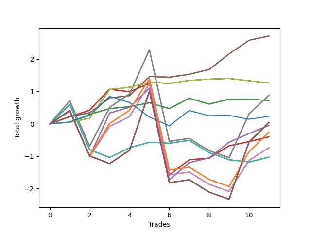

# Long Pointer 004 
- Symbol: SPY_Unlimited
- Date Range: 03/23/2022 - 07/08/2022
- Trading Period: 7:20-12:30
- Number of Trades: 11



| Name | Win Percent | Profit | Avg Profit / Trade | Avg Time / Trade |      | Name | Win Percent | Profit | Avg Profit / Trade | Avg Time / Trade |
| ---- | ----------- | ------ | ------------------ | ---------------- | ---- | ---- | ----------- | ------ | ------------------ | ---------------- |
| Sorted By <br> Profit | | | | | | Sorted By <br> Win Percentage ||||
| Sixty-Seven | 90.91 | 1355.00 | 123.18 | 09:08 |     | Sixty-Seven | 90.91 | 1355.00 | 123.18 | 09:08 |
| Fifty-Nine | 90.91 | 1355.00 | 123.18 | 09:08 |     | Fifty-Nine | 90.91 | 1355.00 | 123.18 | 09:08 |
| Fifty-One | 90.91 | 1355.00 | 123.18 | 09:08 |     | Fifty-One | 90.91 | 1355.00 | 123.18 | 09:08 |
| Forty-Three | 90.91 | 1355.00 | 123.18 | 09:08 |     | Forty-Three | 90.91 | 1355.00 | 123.18 | 09:08 |
| Three | 90.91 | 1355.00 | 123.18 | 09:08 |     | Three | 90.91 | 1355.00 | 123.18 | 09:08 |
| Seventy | 72.73 | 630.00 | 57.27 | 03:17 |     | Sixty-Six | 81.82 | -25.00 | -2.27 | 17:38 |
| Sixty-Two | 72.73 | 630.00 | 57.27 | 03:17 |     | Fifty-Eight | 81.82 | -25.00 | -2.27 | 17:38 |
| Fifty-Four | 72.73 | 630.00 | 57.27 | 03:17 |     | Fifty | 81.82 | -25.00 | -2.27 | 17:38 |
| Forty-Six | 72.73 | 630.00 | 57.27 | 03:17 |     | Forty-Two | 81.82 | -25.00 | -2.27 | 17:38 |
| Six | 72.73 | 630.00 | 57.27 | 03:17 |     | Two | 81.82 | -25.00 | -2.27 | 17:38 |
| Sixty-Nine | 63.64 | 440.00 | 40.00 | 25:50 |     | Sixty-Five | 81.82 | -200.00 | -18.18 | 10:23 |
| Sixty-One | 63.64 | 440.00 | 40.00 | 25:50 |     | Fifty-Seven | 81.82 | -200.00 | -18.18 | 10:23 |
| Fifty-Three | 63.64 | 440.00 | 40.00 | 25:50 |     | Forty-Nine | 81.82 | -200.00 | -18.18 | 10:23 |
| Forty-Five | 63.64 | 440.00 | 40.00 | 25:50 |     | Forty-One | 81.82 | -200.00 | -18.18 | 10:23 |
| Five | 63.64 | 440.00 | 40.00 | 25:50 |     | One | 81.82 | -200.00 | -18.18 | 10:23 |
| Sixty-Four | 72.73 | 360.00 | 32.73 | 03:49 |     | Seventy | 72.73 | 630.00 | 57.27 | 03:17 |
| Fifty-Six | 72.73 | 360.00 | 32.73 | 03:49 |     | Sixty-Two | 72.73 | 630.00 | 57.27 | 03:17 |
| Forty-Eight | 72.73 | 360.00 | 32.73 | 03:49 |     | Fifty-Four | 72.73 | 630.00 | 57.27 | 03:17 |
| Forty | 72.73 | 360.00 | 32.73 | 03:49 |     | Forty-Six | 72.73 | 630.00 | 57.27 | 03:17 |
| Zero | 72.73 | 360.00 | 32.73 | 03:49 |     | Six | 72.73 | 630.00 | 57.27 | 03:17 |
| Seventy-Three | 54.55 | 115.00 | 10.45 | 08:26 |     | Sixty-Four | 72.73 | 360.00 | 32.73 | 03:49 |
| One Hundred Thirty | 54.55 | 20.00 | 1.82 | 29:55 |     | Fifty-Six | 72.73 | 360.00 | 32.73 | 03:49 |
| One Hundred Twenty-Nine | 54.55 | 20.00 | 1.82 | 29:55 |     | Forty-Eight | 72.73 | 360.00 | 32.73 | 03:49 |
| One Hundred Twenty-Eight | 54.55 | 20.00 | 1.82 | 29:55 |     | Forty | 72.73 | 360.00 | 32.73 | 03:49 |
| One Hundred Twenty-Seven | 54.55 | 20.00 | 1.82 | 29:55 |     | Zero | 72.73 | 360.00 | 32.73 | 03:49 |
| One Hundred Twenty-Five | 54.55 | 20.00 | 1.82 | 29:55 |     | Sixty-Nine | 63.64 | 440.00 | 40.00 | 25:50 |
| One Hundred Twenty-Four | 54.55 | 20.00 | 1.82 | 29:55 |     | Sixty-One | 63.64 | 440.00 | 40.00 | 25:50 |
| One Hundred Twenty-Three | 54.55 | 20.00 | 1.82 | 29:55 |     | Fifty-Three | 63.64 | 440.00 | 40.00 | 25:50 |
| One Hundred Twenty-Two | 54.55 | 20.00 | 1.82 | 29:55 |     | Forty-Five | 63.64 | 440.00 | 40.00 | 25:50 |
| One Hundred Twenty | 54.55 | 20.00 | 1.82 | 29:55 |     | Five | 63.64 | 440.00 | 40.00 | 25:50 |
| One Hundred Ninteen | 54.55 | 20.00 | 1.82 | 29:55 |     | One Hundred Twenty-Six | 63.64 | -130.00 | -11.82 | 26:22 |
| One Hundred Eighteen | 54.55 | 20.00 | 1.82 | 29:55 |     | One Hundred Twenty-One | 63.64 | -130.00 | -11.82 | 26:22 |
| One Hundred Seventeen | 54.55 | 20.00 | 1.82 | 29:55 |     | One Hundred Sixteen | 63.64 | -130.00 | -11.82 | 26:22 |
| One Hundred Fifteen | 54.55 | 20.00 | 1.82 | 29:55 |     | One Hundred Eleven | 63.64 | -130.00 | -11.82 | 26:22 |
| One Hundred Fourteen | 54.55 | 20.00 | 1.82 | 29:55 |     | Eighty-One | 63.64 | -130.00 | -11.82 | 26:22 |
| One Hundred Thirteen | 54.55 | 20.00 | 1.82 | 29:55 |     | Sixty-Eight | 63.64 | -370.00 | -33.64 | 22:55 |
| One Hundred Twelve | 54.55 | 20.00 | 1.82 | 29:55 |     | Sixty | 63.64 | -370.00 | -33.64 | 22:55 |
| Eighty-Five | 54.55 | 20.00 | 1.82 | 29:55 |     | Fifty-Two | 63.64 | -370.00 | -33.64 | 22:55 |
| Eighty-Four | 54.55 | 20.00 | 1.82 | 29:55 |     | Forty-Four | 63.64 | -370.00 | -33.64 | 22:55 |
| Eighty-Three | 54.55 | 20.00 | 1.82 | 29:55 |     | Four | 63.64 | -370.00 | -33.64 | 22:55 |
| Eighty-Two | 54.55 | 20.00 | 1.82 | 29:55 |     | Seventy-Three | 54.55 | 115.00 | 10.45 | 08:26 |
| Sixty-Six | 81.82 | -25.00 | -2.27 | 17:38 |     | One Hundred Thirty | 54.55 | 20.00 | 1.82 | 29:55 |
| Fifty-Eight | 81.82 | -25.00 | -2.27 | 17:38 |     | One Hundred Twenty-Nine | 54.55 | 20.00 | 1.82 | 29:55 |
| Fifty | 81.82 | -25.00 | -2.27 | 17:38 |     | One Hundred Twenty-Eight | 54.55 | 20.00 | 1.82 | 29:55 |
| Forty-Two | 81.82 | -25.00 | -2.27 | 17:38 |     | One Hundred Twenty-Seven | 54.55 | 20.00 | 1.82 | 29:55 |
| Two | 81.82 | -25.00 | -2.27 | 17:38 |     | One Hundred Twenty-Five | 54.55 | 20.00 | 1.82 | 29:55 |
| One Hundred Twenty-Six | 63.64 | -130.00 | -11.82 | 26:22 |     | One Hundred Twenty-Four | 54.55 | 20.00 | 1.82 | 29:55 |
| One Hundred Twenty-One | 63.64 | -130.00 | -11.82 | 26:22 |     | One Hundred Twenty-Three | 54.55 | 20.00 | 1.82 | 29:55 |
| One Hundred Sixteen | 63.64 | -130.00 | -11.82 | 26:22 |     | One Hundred Twenty-Two | 54.55 | 20.00 | 1.82 | 29:55 |
| One Hundred Eleven | 63.64 | -130.00 | -11.82 | 26:22 |     | One Hundred Twenty | 54.55 | 20.00 | 1.82 | 29:55 |
| Eighty-One | 63.64 | -130.00 | -11.82 | 26:22 |     | One Hundred Ninteen | 54.55 | 20.00 | 1.82 | 29:55 |
| Sixty-Five | 81.82 | -200.00 | -18.18 | 10:23 |     | One Hundred Eighteen | 54.55 | 20.00 | 1.82 | 29:55 |
| Fifty-Seven | 81.82 | -200.00 | -18.18 | 10:23 |     | One Hundred Seventeen | 54.55 | 20.00 | 1.82 | 29:55 |
| Forty-Nine | 81.82 | -200.00 | -18.18 | 10:23 |     | One Hundred Fifteen | 54.55 | 20.00 | 1.82 | 29:55 |
| Forty-One | 81.82 | -200.00 | -18.18 | 10:23 |     | One Hundred Fourteen | 54.55 | 20.00 | 1.82 | 29:55 |
| One | 81.82 | -200.00 | -18.18 | 10:23 |     | One Hundred Thirteen | 54.55 | 20.00 | 1.82 | 29:55 |
| Sixty-Eight | 63.64 | -370.00 | -33.64 | 22:55 |     | One Hundred Twelve | 54.55 | 20.00 | 1.82 | 29:55 |
| Sixty | 63.64 | -370.00 | -33.64 | 22:55 |     | Eighty-Five | 54.55 | 20.00 | 1.82 | 29:55 |
| Fifty-Two | 63.64 | -370.00 | -33.64 | 22:55 |     | Eighty-Four | 54.55 | 20.00 | 1.82 | 29:55 |
| Forty-Four | 63.64 | -370.00 | -33.64 | 22:55 |     | Eighty-Three | 54.55 | 20.00 | 1.82 | 29:55 |
| Four | 63.64 | -370.00 | -33.64 | 22:55 |     | Eighty-Two | 54.55 | 20.00 | 1.82 | 29:55 |
| Seventy-One | 45.45 | -515.00 | -46.82 | 18:41 |     | Seventy-One | 45.45 | -515.00 | -46.82 | 18:41 |
| Sixty-Three | 45.45 | -515.00 | -46.82 | 18:41 |     | Sixty-Three | 45.45 | -515.00 | -46.82 | 18:41 |
| Fifty-Five | 45.45 | -515.00 | -46.82 | 18:41 |     | Fifty-Five | 45.45 | -515.00 | -46.82 | 18:41 |
| Forty-Seven | 45.45 | -515.00 | -46.82 | 18:41 |     | Forty-Seven | 45.45 | -515.00 | -46.82 | 18:41 |
| Seven | 45.45 | -515.00 | -46.82 | 18:41 |     | Seven | 45.45 | -515.00 | -46.82 | 18:41 |

## NO STOPLOSS

### Test Zero
* Sell when price hits the middle line of the 20p bollinger
* No Stoploss
* Results:
```
Total Trades: 11
Percent Up: 72.73
Percent Down: 27.27
Total Points Moved Up: 0.72
Potential Profit: 360.00
Total Points Ups: 1.12 Count Ups: 8
Total Points Downs: -0.40 Count Downs: 3
```

<details><summary>Trades</summary>

<code>In: 2022-03-24 09:38:00		Out: 2022-03-24 09:38:30		Total Position Time: 00:30		Total Move Up: 0.05		Total to Date: 0.05</code> <br />
<code>In: 2022-03-28 08:11:00		Out: 2022-03-28 08:11:45		Total Position Time: 00:45		Total Move Up: 0.24		Total to Date: 0.29</code> <br />
<code>In: 2022-05-19 10:19:00		Out: 2022-05-19 10:19:20		Total Position Time: 00:20		Total Move Up: 0.18		Total to Date: 0.47</code> <br />
<code>In: 2022-05-27 07:49:00		Out: 2022-05-27 07:50:15		Total Position Time: 01:15		Total Move Up: 0.06		Total to Date: 0.53</code> <br />
<code>In: 2022-05-31 10:26:00		Out: 2022-05-31 10:33:10		Total Position Time: 07:10		Total Move Up: 0.12		Total to Date: 0.65</code> <br />
<code>In: 2022-05-31 11:31:00		Out: 2022-05-31 11:38:05		Total Position Time: 07:05		Total Move Up: -0.18		Total to Date: 0.47</code> <br />
<code>In: 2022-06-08 09:48:00		Out: 2022-06-08 09:53:00		Total Position Time: 05:00		Total Move Up: 0.32		Total to Date: 0.79</code> <br />
<code>In: 2022-06-22 11:46:00		Out: 2022-06-22 11:55:25		Total Position Time: 09:25		Total Move Up: -0.18		Total to Date: 0.61</code> <br />
<code>In: 2022-06-22 11:55:00		Out: 2022-06-22 11:55:25		Total Position Time: 00:25		Total Move Up: 0.15		Total to Date: 0.76</code> <br />
<code>In: 2022-07-05 09:53:00		Out: 2022-07-05 10:01:05		Total Position Time: 08:05		Total Move Up: 0.00		Total to Date: 0.76</code> <br />
<code>In: 2022-07-07 08:35:00		Out: 2022-07-07 08:37:05		Total Position Time: 02:05		Total Move Up: -0.04		Total to Date: 0.72</code> <br />


</details>

### Test One
* Sell when the price hits the upper line of the 20p 1std bollinger
* No Stoploss
* Results:
```
Total Trades: 11
Percent Up: 81.82
Percent Down: 18.18
Total Points Moved Up: -0.40
Potential Profit: -200.00
Total Points Ups: 2.51 Count Ups: 9
Total Points Downs: -2.91 Count Downs: 2
```

<details><summary>Trades</summary>

<code>In: 2022-03-24 09:38:00		Out: 2022-03-24 09:43:25		Total Position Time: 05:25		Total Move Up: 0.22		Total to Date: 0.22</code> <br />
<code>In: 2022-03-28 08:11:00		Out: 2022-03-28 08:20:05		Total Position Time: 09:05		Total Move Up: 0.20		Total to Date: 0.42</code> <br />
<code>In: 2022-05-19 10:19:00		Out: 2022-05-19 10:22:45		Total Position Time: 03:45		Total Move Up: 0.65		Total to Date: 1.07</code> <br />
<code>In: 2022-05-27 07:49:00		Out: 2022-05-27 08:11:00		Total Position Time: 22:00		Total Move Up: -0.08		Total to Date: 0.99</code> <br />
<code>In: 2022-05-31 10:26:00		Out: 2022-05-31 10:33:15		Total Position Time: 07:15		Total Move Up: 0.26		Total to Date: 1.25</code> <br />
<code>In: 2022-05-31 11:31:00		Out: 2022-05-31 12:00:55		Total Position Time: 29:55		Total Move Up: -2.83		Total to Date: -1.58</code> <br />
<code>In: 2022-06-08 09:48:00		Out: 2022-06-08 09:59:05		Total Position Time: 11:05		Total Move Up: 0.47		Total to Date: -1.11</code> <br />
<code>In: 2022-06-22 11:46:00		Out: 2022-06-22 11:56:20		Total Position Time: 10:20		Total Move Up: 0.05		Total to Date: -1.06</code> <br />
<code>In: 2022-06-22 11:55:00		Out: 2022-06-22 11:56:20		Total Position Time: 01:20		Total Move Up: 0.38		Total to Date: -0.68</code> <br />
<code>In: 2022-07-05 09:53:00		Out: 2022-07-05 10:03:05		Total Position Time: 10:05		Total Move Up: 0.13		Total to Date: -0.55</code> <br />
<code>In: 2022-07-07 08:35:00		Out: 2022-07-07 08:39:05		Total Position Time: 04:05		Total Move Up: 0.15		Total to Date: -0.40</code> <br />


</details>

### Test Two
* Sell when the price hits the upper line of the 20p 2std bollinger
* No Stoploss
* Results:
```
Total Trades: 11
Percent Up: 81.82
Percent Down: 18.18
Total Points Moved Up: -0.05
Potential Profit: -25.00
Total Points Ups: 4.18 Count Ups: 9
Total Points Downs: -4.23 Count Downs: 2
```

<details><summary>Trades</summary>

<code>In: 2022-03-24 09:38:00		Out: 2022-03-24 09:56:25		Total Position Time: 18:25		Total Move Up: 0.39		Total to Date: 0.39</code> <br />
<code>In: 2022-03-28 08:11:00		Out: 2022-03-28 08:40:55		Total Position Time: 29:55		Total Move Up: -1.40		Total to Date: -1.01</code> <br />
<code>In: 2022-05-19 10:19:00		Out: 2022-05-19 10:44:05		Total Position Time: 25:05		Total Move Up: 1.34		Total to Date: 0.33</code> <br />
<code>In: 2022-05-27 07:49:00		Out: 2022-05-27 08:12:15		Total Position Time: 23:15		Total Move Up: 0.18		Total to Date: 0.51</code> <br />
<code>In: 2022-05-31 10:26:00		Out: 2022-05-31 10:34:50		Total Position Time: 08:50		Total Move Up: 0.59		Total to Date: 1.10</code> <br />
<code>In: 2022-05-31 11:31:00		Out: 2022-05-31 12:00:55		Total Position Time: 29:55		Total Move Up: -2.83		Total to Date: -1.73</code> <br />
<code>In: 2022-06-08 09:48:00		Out: 2022-06-08 09:59:15		Total Position Time: 11:15		Total Move Up: 0.53		Total to Date: -1.20</code> <br />
<code>In: 2022-06-22 11:46:00		Out: 2022-06-22 12:04:10		Total Position Time: 18:10		Total Move Up: 0.15		Total to Date: -1.05</code> <br />
<code>In: 2022-06-22 11:55:00		Out: 2022-06-22 12:04:10		Total Position Time: 09:10		Total Move Up: 0.48		Total to Date: -0.57</code> <br />
<code>In: 2022-07-05 09:53:00		Out: 2022-07-05 10:04:15		Total Position Time: 11:15		Total Move Up: 0.27		Total to Date: -0.30</code> <br />
<code>In: 2022-07-07 08:35:00		Out: 2022-07-07 08:43:45		Total Position Time: 08:45		Total Move Up: 0.25		Total to Date: -0.05</code> <br />


</details>

### Test Three
* Sell when price hits the middle line of the 50p bollinger
* No Stoploss
* Results:
```
Total Trades: 11
Percent Up: 90.91
Percent Down: 9.09
Total Points Moved Up: 2.71
Potential Profit: 1355.00
Total Points Ups: 2.73 Count Ups: 10
Total Points Downs: -0.02 Count Downs: 1
```

<details><summary>Trades</summary>

<code>In: 2022-03-24 09:38:00		Out: 2022-03-24 09:52:45		Total Position Time: 14:45		Total Move Up: 0.22		Total to Date: 0.22</code> <br />
<code>In: 2022-03-28 08:11:00		Out: 2022-03-28 08:11:35		Total Position Time: 00:35		Total Move Up: 0.12		Total to Date: 0.34</code> <br />
<code>In: 2022-05-19 10:19:00		Out: 2022-05-19 10:21:15		Total Position Time: 02:15		Total Move Up: 0.46		Total to Date: 0.80</code> <br />
<code>In: 2022-05-27 07:49:00		Out: 2022-05-27 07:49:45		Total Position Time: 00:45		Total Move Up: 0.07		Total to Date: 0.87</code> <br />
<code>In: 2022-05-31 10:26:00		Out: 2022-05-31 10:34:50		Total Position Time: 08:50		Total Move Up: 0.59		Total to Date: 1.46</code> <br />
<code>In: 2022-05-31 11:31:00		Out: 2022-05-31 11:31:15		Total Position Time: 00:15		Total Move Up: -0.02		Total to Date: 1.44</code> <br />
<code>In: 2022-06-08 09:48:00		Out: 2022-06-08 10:17:55		Total Position Time: 29:55		Total Move Up: 0.09		Total to Date: 1.53</code> <br />
<code>In: 2022-06-22 11:46:00		Out: 2022-06-22 12:04:10		Total Position Time: 18:10		Total Move Up: 0.15		Total to Date: 1.68</code> <br />
<code>In: 2022-06-22 11:55:00		Out: 2022-06-22 12:04:10		Total Position Time: 09:10		Total Move Up: 0.48		Total to Date: 2.16</code> <br />
<code>In: 2022-07-05 09:53:00		Out: 2022-07-05 10:04:45		Total Position Time: 11:45		Total Move Up: 0.42		Total to Date: 2.58</code> <br />
<code>In: 2022-07-07 08:35:00		Out: 2022-07-07 08:39:10		Total Position Time: 04:10		Total Move Up: 0.13		Total to Date: 2.71</code> <br />


</details>

### Test Four
* Sell when the price hits the upper line of the 50p 1std bollinger
* No Stoploss
* Results:
```
Total Trades: 11
Percent Up: 63.64
Percent Down: 36.36
Total Points Moved Up: -0.74
Potential Profit: -370.00
Total Points Ups: 4.09 Count Ups: 7
Total Points Downs: -4.83 Count Downs: 4
```

<details><summary>Trades</summary>

<code>In: 2022-03-24 09:38:00		Out: 2022-03-24 09:56:25		Total Position Time: 18:25		Total Move Up: 0.39		Total to Date: 0.39</code> <br />
<code>In: 2022-03-28 08:11:00		Out: 2022-03-28 08:40:55		Total Position Time: 29:55		Total Move Up: -1.40		Total to Date: -1.01</code> <br />
<code>In: 2022-05-19 10:19:00		Out: 2022-05-19 10:23:30		Total Position Time: 04:30		Total Move Up: 0.93		Total to Date: -0.08</code> <br />
<code>In: 2022-05-27 07:49:00		Out: 2022-05-27 08:16:05		Total Position Time: 27:05		Total Move Up: 0.30		Total to Date: 0.22</code> <br />
<code>In: 2022-05-31 10:26:00		Out: 2022-05-31 10:44:30		Total Position Time: 18:30		Total Move Up: 1.03		Total to Date: 1.25</code> <br />
<code>In: 2022-05-31 11:31:00		Out: 2022-05-31 12:00:55		Total Position Time: 29:55		Total Move Up: -2.83		Total to Date: -1.58</code> <br />
<code>In: 2022-06-08 09:48:00		Out: 2022-06-08 10:17:55		Total Position Time: 29:55		Total Move Up: 0.09		Total to Date: -1.49</code> <br />
<code>In: 2022-06-22 11:46:00		Out: 2022-06-22 12:15:55		Total Position Time: 29:55		Total Move Up: -0.38		Total to Date: -1.87</code> <br />
<code>In: 2022-06-22 11:55:00		Out: 2022-06-22 12:24:55		Total Position Time: 29:55		Total Move Up: -0.22		Total to Date: -2.09</code> <br />
<code>In: 2022-07-05 09:53:00		Out: 2022-07-05 10:17:45		Total Position Time: 24:45		Total Move Up: 0.96		Total to Date: -1.13</code> <br />
<code>In: 2022-07-07 08:35:00		Out: 2022-07-07 08:44:25		Total Position Time: 09:25		Total Move Up: 0.39		Total to Date: -0.74</code> <br />


</details>

### Test Five
* Sell when the price hits the upper line of the 50p 2std bollinger
* No Stoploss
* Results:
```
Total Trades: 11
Percent Up: 63.64
Percent Down: 36.36
Total Points Moved Up: 0.88
Potential Profit: 440.00
Total Points Ups: 5.71 Count Ups: 7
Total Points Downs: -4.83 Count Downs: 4
```

<details><summary>Trades</summary>

<code>In: 2022-03-24 09:38:00		Out: 2022-03-24 10:00:50		Total Position Time: 22:50		Total Move Up: 0.71		Total to Date: 0.71</code> <br />
<code>In: 2022-03-28 08:11:00		Out: 2022-03-28 08:40:55		Total Position Time: 29:55		Total Move Up: -1.40		Total to Date: -0.69</code> <br />
<code>In: 2022-05-19 10:19:00		Out: 2022-05-19 10:31:30		Total Position Time: 12:30		Total Move Up: 1.20		Total to Date: 0.51</code> <br />
<code>In: 2022-05-27 07:49:00		Out: 2022-05-27 08:18:55		Total Position Time: 29:55		Total Move Up: 0.41		Total to Date: 0.92</code> <br />
<code>In: 2022-05-31 10:26:00		Out: 2022-05-31 10:52:35		Total Position Time: 26:35		Total Move Up: 1.37		Total to Date: 2.29</code> <br />
<code>In: 2022-05-31 11:31:00		Out: 2022-05-31 12:00:55		Total Position Time: 29:55		Total Move Up: -2.83		Total to Date: -0.54</code> <br />
<code>In: 2022-06-08 09:48:00		Out: 2022-06-08 10:17:55		Total Position Time: 29:55		Total Move Up: 0.09		Total to Date: -0.45</code> <br />
<code>In: 2022-06-22 11:46:00		Out: 2022-06-22 12:15:55		Total Position Time: 29:55		Total Move Up: -0.38		Total to Date: -0.83</code> <br />
<code>In: 2022-06-22 11:55:00		Out: 2022-06-22 12:24:55		Total Position Time: 29:55		Total Move Up: -0.22		Total to Date: -1.05</code> <br />
<code>In: 2022-07-05 09:53:00		Out: 2022-07-05 10:19:15		Total Position Time: 26:15		Total Move Up: 1.36		Total to Date: 0.31</code> <br />
<code>In: 2022-07-07 08:35:00		Out: 2022-07-07 08:51:40		Total Position Time: 16:40		Total Move Up: 0.57		Total to Date: 0.88</code> <br />


</details>

### Test Six
* Sell when the price hits the middle line of the 1std VWAP
* No Stoploss
* Results:
```
Total Trades: 11
Percent Up: 72.73
Percent Down: 27.27
Total Points Moved Up: 1.26
Potential Profit: 630.00
Total Points Ups: 1.43 Count Ups: 8
Total Points Downs: -0.17 Count Downs: 3
```

<details><summary>Trades</summary>

<code>In: 2022-03-24 09:38:00		Out: 2022-03-24 09:38:10		Total Position Time: 00:10		Total Move Up: 0.05		Total to Date: 0.05</code> <br />
<code>In: 2022-03-28 08:11:00		Out: 2022-03-28 08:11:35		Total Position Time: 00:35		Total Move Up: 0.12		Total to Date: 0.17</code> <br />
<code>In: 2022-05-19 10:19:00		Out: 2022-05-19 10:23:20		Total Position Time: 04:20		Total Move Up: 0.89		Total to Date: 1.06</code> <br />
<code>In: 2022-05-27 07:49:00		Out: 2022-05-27 07:49:10		Total Position Time: 00:10		Total Move Up: 0.07		Total to Date: 1.13</code> <br />
<code>In: 2022-05-31 10:26:00		Out: 2022-05-31 10:26:10		Total Position Time: 00:10		Total Move Up: 0.15		Total to Date: 1.28</code> <br />
<code>In: 2022-05-31 11:31:00		Out: 2022-05-31 11:31:10		Total Position Time: 00:10		Total Move Up: -0.03		Total to Date: 1.25</code> <br />
<code>In: 2022-06-08 09:48:00		Out: 2022-06-08 10:17:55		Total Position Time: 29:55		Total Move Up: 0.09		Total to Date: 1.34</code> <br />
<code>In: 2022-06-22 11:46:00		Out: 2022-06-22 11:46:10		Total Position Time: 00:10		Total Move Up: 0.04		Total to Date: 1.38</code> <br />
<code>In: 2022-06-22 11:55:00		Out: 2022-06-22 11:55:10		Total Position Time: 00:10		Total Move Up: 0.02		Total to Date: 1.40</code> <br />
<code>In: 2022-07-05 09:53:00		Out: 2022-07-05 09:53:10		Total Position Time: 00:10		Total Move Up: -0.07		Total to Date: 1.33</code> <br />
<code>In: 2022-07-07 08:35:00		Out: 2022-07-07 08:35:10		Total Position Time: 00:10		Total Move Up: -0.07		Total to Date: 1.26</code> <br />


</details>

### Test Seven
* Sell when the price hits the upper line of the 1std VWAP
* No Stoploss
* Results:
```
Total Trades: 11
Percent Up: 45.45
Percent Down: 54.55
Total Points Moved Up: -1.03
Potential Profit: -515.00
Total Points Ups: 1.31 Count Ups: 5
Total Points Downs: -2.34 Count Downs: 6
```

<details><summary>Trades</summary>

<code>In: 2022-03-24 09:38:00		Out: 2022-03-24 10:00:45		Total Position Time: 22:45		Total Move Up: 0.60		Total to Date: 0.60</code> <br />
<code>In: 2022-03-28 08:11:00		Out: 2022-03-28 08:40:55		Total Position Time: 29:55		Total Move Up: -1.40		Total to Date: -0.80</code> <br />
<code>In: 2022-05-19 10:19:00		Out: 2022-05-19 10:48:55		Total Position Time: 29:55		Total Move Up: -0.24		Total to Date: -1.04</code> <br />
<code>In: 2022-05-27 07:49:00		Out: 2022-05-27 08:16:05		Total Position Time: 27:05		Total Move Up: 0.30		Total to Date: -0.74</code> <br />
<code>In: 2022-05-31 10:26:00		Out: 2022-05-31 10:27:50		Total Position Time: 01:50		Total Move Up: 0.17		Total to Date: -0.57</code> <br />
<code>In: 2022-05-31 11:31:00		Out: 2022-05-31 11:31:10		Total Position Time: 00:10		Total Move Up: -0.03		Total to Date: -0.60</code> <br />
<code>In: 2022-06-08 09:48:00		Out: 2022-06-08 10:17:55		Total Position Time: 29:55		Total Move Up: 0.09		Total to Date: -0.51</code> <br />
<code>In: 2022-06-22 11:46:00		Out: 2022-06-22 12:15:55		Total Position Time: 29:55		Total Move Up: -0.38		Total to Date: -0.89</code> <br />
<code>In: 2022-06-22 11:55:00		Out: 2022-06-22 12:24:55		Total Position Time: 29:55		Total Move Up: -0.22		Total to Date: -1.11</code> <br />
<code>In: 2022-07-05 09:53:00		Out: 2022-07-05 09:53:10		Total Position Time: 00:10		Total Move Up: -0.07		Total to Date: -1.18</code> <br />
<code>In: 2022-07-07 08:35:00		Out: 2022-07-07 08:39:05		Total Position Time: 04:05		Total Move Up: 0.15		Total to Date: -1.03</code> <br />


</details>

## STOPLOSS OF 5

### Test Forty
* Sell when price hits the middle line of the 20p bollinger
* Stoploss is 5 points
* Results:
```
Total Trades: 11
Percent Up: 72.73
Percent Down: 27.27
Total Points Moved Up: 0.72
Potential Profit: 360.00
Total Points Ups: 1.12 Count Ups: 8
Total Points Downs: -0.40 Count Downs: 3
```

<details><summary>Trades</summary>

<code>In: 2022-03-24 09:38:00		Out: 2022-03-24 09:38:30		Total Position Time: 00:30		Total Move Up: 0.05		Total to Date: 0.05</code> <br />
<code>In: 2022-03-28 08:11:00		Out: 2022-03-28 08:11:45		Total Position Time: 00:45		Total Move Up: 0.24		Total to Date: 0.29</code> <br />
<code>In: 2022-05-19 10:19:00		Out: 2022-05-19 10:19:20		Total Position Time: 00:20		Total Move Up: 0.18		Total to Date: 0.47</code> <br />
<code>In: 2022-05-27 07:49:00		Out: 2022-05-27 07:50:15		Total Position Time: 01:15		Total Move Up: 0.06		Total to Date: 0.53</code> <br />
<code>In: 2022-05-31 10:26:00		Out: 2022-05-31 10:33:10		Total Position Time: 07:10		Total Move Up: 0.12		Total to Date: 0.65</code> <br />
<code>In: 2022-05-31 11:31:00		Out: 2022-05-31 11:38:05		Total Position Time: 07:05		Total Move Up: -0.18		Total to Date: 0.47</code> <br />
<code>In: 2022-06-08 09:48:00		Out: 2022-06-08 09:53:00		Total Position Time: 05:00		Total Move Up: 0.32		Total to Date: 0.79</code> <br />
<code>In: 2022-06-22 11:46:00		Out: 2022-06-22 11:55:25		Total Position Time: 09:25		Total Move Up: -0.18		Total to Date: 0.61</code> <br />
<code>In: 2022-06-22 11:55:00		Out: 2022-06-22 11:55:25		Total Position Time: 00:25		Total Move Up: 0.15		Total to Date: 0.76</code> <br />
<code>In: 2022-07-05 09:53:00		Out: 2022-07-05 10:01:05		Total Position Time: 08:05		Total Move Up: 0.00		Total to Date: 0.76</code> <br />
<code>In: 2022-07-07 08:35:00		Out: 2022-07-07 08:37:05		Total Position Time: 02:05		Total Move Up: -0.04		Total to Date: 0.72</code> <br />


</details>

### Test Forty-One
* Sell when the price hits the upper line of the 20p 1std bollinger
* Stoploss is 5 points
* Results:
```
Total Trades: 11
Percent Up: 81.82
Percent Down: 18.18
Total Points Moved Up: -0.40
Potential Profit: -200.00
Total Points Ups: 2.51 Count Ups: 9
Total Points Downs: -2.91 Count Downs: 2
```

<details><summary>Trades</summary>

<code>In: 2022-03-24 09:38:00		Out: 2022-03-24 09:43:25		Total Position Time: 05:25		Total Move Up: 0.22		Total to Date: 0.22</code> <br />
<code>In: 2022-03-28 08:11:00		Out: 2022-03-28 08:20:05		Total Position Time: 09:05		Total Move Up: 0.20		Total to Date: 0.42</code> <br />
<code>In: 2022-05-19 10:19:00		Out: 2022-05-19 10:22:45		Total Position Time: 03:45		Total Move Up: 0.65		Total to Date: 1.07</code> <br />
<code>In: 2022-05-27 07:49:00		Out: 2022-05-27 08:11:00		Total Position Time: 22:00		Total Move Up: -0.08		Total to Date: 0.99</code> <br />
<code>In: 2022-05-31 10:26:00		Out: 2022-05-31 10:33:15		Total Position Time: 07:15		Total Move Up: 0.26		Total to Date: 1.25</code> <br />
<code>In: 2022-05-31 11:31:00		Out: 2022-05-31 12:00:55		Total Position Time: 29:55		Total Move Up: -2.83		Total to Date: -1.58</code> <br />
<code>In: 2022-06-08 09:48:00		Out: 2022-06-08 09:59:05		Total Position Time: 11:05		Total Move Up: 0.47		Total to Date: -1.11</code> <br />
<code>In: 2022-06-22 11:46:00		Out: 2022-06-22 11:56:20		Total Position Time: 10:20		Total Move Up: 0.05		Total to Date: -1.06</code> <br />
<code>In: 2022-06-22 11:55:00		Out: 2022-06-22 11:56:20		Total Position Time: 01:20		Total Move Up: 0.38		Total to Date: -0.68</code> <br />
<code>In: 2022-07-05 09:53:00		Out: 2022-07-05 10:03:05		Total Position Time: 10:05		Total Move Up: 0.13		Total to Date: -0.55</code> <br />
<code>In: 2022-07-07 08:35:00		Out: 2022-07-07 08:39:05		Total Position Time: 04:05		Total Move Up: 0.15		Total to Date: -0.40</code> <br />


</details>

### Test Forty-Two
* Sell when the price hits the upper line of the 20p 2std bollinger
* Stoploss is 5 points
* Results:
```
Total Trades: 11
Percent Up: 81.82
Percent Down: 18.18
Total Points Moved Up: -0.05
Potential Profit: -25.00
Total Points Ups: 4.18 Count Ups: 9
Total Points Downs: -4.23 Count Downs: 2
```

<details><summary>Trades</summary>

<code>In: 2022-03-24 09:38:00		Out: 2022-03-24 09:56:25		Total Position Time: 18:25		Total Move Up: 0.39		Total to Date: 0.39</code> <br />
<code>In: 2022-03-28 08:11:00		Out: 2022-03-28 08:40:55		Total Position Time: 29:55		Total Move Up: -1.40		Total to Date: -1.01</code> <br />
<code>In: 2022-05-19 10:19:00		Out: 2022-05-19 10:44:05		Total Position Time: 25:05		Total Move Up: 1.34		Total to Date: 0.33</code> <br />
<code>In: 2022-05-27 07:49:00		Out: 2022-05-27 08:12:15		Total Position Time: 23:15		Total Move Up: 0.18		Total to Date: 0.51</code> <br />
<code>In: 2022-05-31 10:26:00		Out: 2022-05-31 10:34:50		Total Position Time: 08:50		Total Move Up: 0.59		Total to Date: 1.10</code> <br />
<code>In: 2022-05-31 11:31:00		Out: 2022-05-31 12:00:55		Total Position Time: 29:55		Total Move Up: -2.83		Total to Date: -1.73</code> <br />
<code>In: 2022-06-08 09:48:00		Out: 2022-06-08 09:59:15		Total Position Time: 11:15		Total Move Up: 0.53		Total to Date: -1.20</code> <br />
<code>In: 2022-06-22 11:46:00		Out: 2022-06-22 12:04:10		Total Position Time: 18:10		Total Move Up: 0.15		Total to Date: -1.05</code> <br />
<code>In: 2022-06-22 11:55:00		Out: 2022-06-22 12:04:10		Total Position Time: 09:10		Total Move Up: 0.48		Total to Date: -0.57</code> <br />
<code>In: 2022-07-05 09:53:00		Out: 2022-07-05 10:04:15		Total Position Time: 11:15		Total Move Up: 0.27		Total to Date: -0.30</code> <br />
<code>In: 2022-07-07 08:35:00		Out: 2022-07-07 08:43:45		Total Position Time: 08:45		Total Move Up: 0.25		Total to Date: -0.05</code> <br />


</details>

### Test Forty-Three
* Sell when price hits the middle line of the 50p bollinger
* Stoploss is 5 points
* Results:
```
Total Trades: 11
Percent Up: 90.91
Percent Down: 9.09
Total Points Moved Up: 2.71
Potential Profit: 1355.00
Total Points Ups: 2.73 Count Ups: 10
Total Points Downs: -0.02 Count Downs: 1
```

<details><summary>Trades</summary>

<code>In: 2022-03-24 09:38:00		Out: 2022-03-24 09:52:45		Total Position Time: 14:45		Total Move Up: 0.22		Total to Date: 0.22</code> <br />
<code>In: 2022-03-28 08:11:00		Out: 2022-03-28 08:11:35		Total Position Time: 00:35		Total Move Up: 0.12		Total to Date: 0.34</code> <br />
<code>In: 2022-05-19 10:19:00		Out: 2022-05-19 10:21:15		Total Position Time: 02:15		Total Move Up: 0.46		Total to Date: 0.80</code> <br />
<code>In: 2022-05-27 07:49:00		Out: 2022-05-27 07:49:45		Total Position Time: 00:45		Total Move Up: 0.07		Total to Date: 0.87</code> <br />
<code>In: 2022-05-31 10:26:00		Out: 2022-05-31 10:34:50		Total Position Time: 08:50		Total Move Up: 0.59		Total to Date: 1.46</code> <br />
<code>In: 2022-05-31 11:31:00		Out: 2022-05-31 11:31:15		Total Position Time: 00:15		Total Move Up: -0.02		Total to Date: 1.44</code> <br />
<code>In: 2022-06-08 09:48:00		Out: 2022-06-08 10:17:55		Total Position Time: 29:55		Total Move Up: 0.09		Total to Date: 1.53</code> <br />
<code>In: 2022-06-22 11:46:00		Out: 2022-06-22 12:04:10		Total Position Time: 18:10		Total Move Up: 0.15		Total to Date: 1.68</code> <br />
<code>In: 2022-06-22 11:55:00		Out: 2022-06-22 12:04:10		Total Position Time: 09:10		Total Move Up: 0.48		Total to Date: 2.16</code> <br />
<code>In: 2022-07-05 09:53:00		Out: 2022-07-05 10:04:45		Total Position Time: 11:45		Total Move Up: 0.42		Total to Date: 2.58</code> <br />
<code>In: 2022-07-07 08:35:00		Out: 2022-07-07 08:39:10		Total Position Time: 04:10		Total Move Up: 0.13		Total to Date: 2.71</code> <br />


</details>

### Test Forty-Four
* Sell when the price hits the upper line of the 50p 1std bollinger
* Stoploss is 5 points
* Results:
```
Total Trades: 11
Percent Up: 63.64
Percent Down: 36.36
Total Points Moved Up: -0.74
Potential Profit: -370.00
Total Points Ups: 4.09 Count Ups: 7
Total Points Downs: -4.83 Count Downs: 4
```

<details><summary>Trades</summary>

<code>In: 2022-03-24 09:38:00		Out: 2022-03-24 09:56:25		Total Position Time: 18:25		Total Move Up: 0.39		Total to Date: 0.39</code> <br />
<code>In: 2022-03-28 08:11:00		Out: 2022-03-28 08:40:55		Total Position Time: 29:55		Total Move Up: -1.40		Total to Date: -1.01</code> <br />
<code>In: 2022-05-19 10:19:00		Out: 2022-05-19 10:23:30		Total Position Time: 04:30		Total Move Up: 0.93		Total to Date: -0.08</code> <br />
<code>In: 2022-05-27 07:49:00		Out: 2022-05-27 08:16:05		Total Position Time: 27:05		Total Move Up: 0.30		Total to Date: 0.22</code> <br />
<code>In: 2022-05-31 10:26:00		Out: 2022-05-31 10:44:30		Total Position Time: 18:30		Total Move Up: 1.03		Total to Date: 1.25</code> <br />
<code>In: 2022-05-31 11:31:00		Out: 2022-05-31 12:00:55		Total Position Time: 29:55		Total Move Up: -2.83		Total to Date: -1.58</code> <br />
<code>In: 2022-06-08 09:48:00		Out: 2022-06-08 10:17:55		Total Position Time: 29:55		Total Move Up: 0.09		Total to Date: -1.49</code> <br />
<code>In: 2022-06-22 11:46:00		Out: 2022-06-22 12:15:55		Total Position Time: 29:55		Total Move Up: -0.38		Total to Date: -1.87</code> <br />
<code>In: 2022-06-22 11:55:00		Out: 2022-06-22 12:24:55		Total Position Time: 29:55		Total Move Up: -0.22		Total to Date: -2.09</code> <br />
<code>In: 2022-07-05 09:53:00		Out: 2022-07-05 10:17:45		Total Position Time: 24:45		Total Move Up: 0.96		Total to Date: -1.13</code> <br />
<code>In: 2022-07-07 08:35:00		Out: 2022-07-07 08:44:25		Total Position Time: 09:25		Total Move Up: 0.39		Total to Date: -0.74</code> <br />


</details>

### Test Forty-Five
* Sell when the price hits the upper line of the 50p 2std bollinger
* Stoploss is 5 points
* Results:
```
Total Trades: 11
Percent Up: 63.64
Percent Down: 36.36
Total Points Moved Up: 0.88
Potential Profit: 440.00
Total Points Ups: 5.71 Count Ups: 7
Total Points Downs: -4.83 Count Downs: 4
```

<details><summary>Trades</summary>

<code>In: 2022-03-24 09:38:00		Out: 2022-03-24 10:00:50		Total Position Time: 22:50		Total Move Up: 0.71		Total to Date: 0.71</code> <br />
<code>In: 2022-03-28 08:11:00		Out: 2022-03-28 08:40:55		Total Position Time: 29:55		Total Move Up: -1.40		Total to Date: -0.69</code> <br />
<code>In: 2022-05-19 10:19:00		Out: 2022-05-19 10:31:30		Total Position Time: 12:30		Total Move Up: 1.20		Total to Date: 0.51</code> <br />
<code>In: 2022-05-27 07:49:00		Out: 2022-05-27 08:18:55		Total Position Time: 29:55		Total Move Up: 0.41		Total to Date: 0.92</code> <br />
<code>In: 2022-05-31 10:26:00		Out: 2022-05-31 10:52:35		Total Position Time: 26:35		Total Move Up: 1.37		Total to Date: 2.29</code> <br />
<code>In: 2022-05-31 11:31:00		Out: 2022-05-31 12:00:55		Total Position Time: 29:55		Total Move Up: -2.83		Total to Date: -0.54</code> <br />
<code>In: 2022-06-08 09:48:00		Out: 2022-06-08 10:17:55		Total Position Time: 29:55		Total Move Up: 0.09		Total to Date: -0.45</code> <br />
<code>In: 2022-06-22 11:46:00		Out: 2022-06-22 12:15:55		Total Position Time: 29:55		Total Move Up: -0.38		Total to Date: -0.83</code> <br />
<code>In: 2022-06-22 11:55:00		Out: 2022-06-22 12:24:55		Total Position Time: 29:55		Total Move Up: -0.22		Total to Date: -1.05</code> <br />
<code>In: 2022-07-05 09:53:00		Out: 2022-07-05 10:19:15		Total Position Time: 26:15		Total Move Up: 1.36		Total to Date: 0.31</code> <br />
<code>In: 2022-07-07 08:35:00		Out: 2022-07-07 08:51:40		Total Position Time: 16:40		Total Move Up: 0.57		Total to Date: 0.88</code> <br />


</details>

### Test Forty-Six
* Sell when the price hits the middle line of the 1std VWAP
* Stoploss is 5 points
* Results:
```
Total Trades: 11
Percent Up: 72.73
Percent Down: 27.27
Total Points Moved Up: 1.26
Potential Profit: 630.00
Total Points Ups: 1.43 Count Ups: 8
Total Points Downs: -0.17 Count Downs: 3
```

<details><summary>Trades</summary>

<code>In: 2022-03-24 09:38:00		Out: 2022-03-24 09:38:10		Total Position Time: 00:10		Total Move Up: 0.05		Total to Date: 0.05</code> <br />
<code>In: 2022-03-28 08:11:00		Out: 2022-03-28 08:11:35		Total Position Time: 00:35		Total Move Up: 0.12		Total to Date: 0.17</code> <br />
<code>In: 2022-05-19 10:19:00		Out: 2022-05-19 10:23:20		Total Position Time: 04:20		Total Move Up: 0.89		Total to Date: 1.06</code> <br />
<code>In: 2022-05-27 07:49:00		Out: 2022-05-27 07:49:10		Total Position Time: 00:10		Total Move Up: 0.07		Total to Date: 1.13</code> <br />
<code>In: 2022-05-31 10:26:00		Out: 2022-05-31 10:26:10		Total Position Time: 00:10		Total Move Up: 0.15		Total to Date: 1.28</code> <br />
<code>In: 2022-05-31 11:31:00		Out: 2022-05-31 11:31:10		Total Position Time: 00:10		Total Move Up: -0.03		Total to Date: 1.25</code> <br />
<code>In: 2022-06-08 09:48:00		Out: 2022-06-08 10:17:55		Total Position Time: 29:55		Total Move Up: 0.09		Total to Date: 1.34</code> <br />
<code>In: 2022-06-22 11:46:00		Out: 2022-06-22 11:46:10		Total Position Time: 00:10		Total Move Up: 0.04		Total to Date: 1.38</code> <br />
<code>In: 2022-06-22 11:55:00		Out: 2022-06-22 11:55:10		Total Position Time: 00:10		Total Move Up: 0.02		Total to Date: 1.40</code> <br />
<code>In: 2022-07-05 09:53:00		Out: 2022-07-05 09:53:10		Total Position Time: 00:10		Total Move Up: -0.07		Total to Date: 1.33</code> <br />
<code>In: 2022-07-07 08:35:00		Out: 2022-07-07 08:35:10		Total Position Time: 00:10		Total Move Up: -0.07		Total to Date: 1.26</code> <br />


</details>

### Test Forty-Seven
* Sell when the price hits the upper line of the 1std VWAP
* Stoploss is 5 points
* Results:
```
Total Trades: 11
Percent Up: 45.45
Percent Down: 54.55
Total Points Moved Up: -1.03
Potential Profit: -515.00
Total Points Ups: 1.31 Count Ups: 5
Total Points Downs: -2.34 Count Downs: 6
```

<details><summary>Trades</summary>

<code>In: 2022-03-24 09:38:00		Out: 2022-03-24 10:00:45		Total Position Time: 22:45		Total Move Up: 0.60		Total to Date: 0.60</code> <br />
<code>In: 2022-03-28 08:11:00		Out: 2022-03-28 08:40:55		Total Position Time: 29:55		Total Move Up: -1.40		Total to Date: -0.80</code> <br />
<code>In: 2022-05-19 10:19:00		Out: 2022-05-19 10:48:55		Total Position Time: 29:55		Total Move Up: -0.24		Total to Date: -1.04</code> <br />
<code>In: 2022-05-27 07:49:00		Out: 2022-05-27 08:16:05		Total Position Time: 27:05		Total Move Up: 0.30		Total to Date: -0.74</code> <br />
<code>In: 2022-05-31 10:26:00		Out: 2022-05-31 10:27:50		Total Position Time: 01:50		Total Move Up: 0.17		Total to Date: -0.57</code> <br />
<code>In: 2022-05-31 11:31:00		Out: 2022-05-31 11:31:10		Total Position Time: 00:10		Total Move Up: -0.03		Total to Date: -0.60</code> <br />
<code>In: 2022-06-08 09:48:00		Out: 2022-06-08 10:17:55		Total Position Time: 29:55		Total Move Up: 0.09		Total to Date: -0.51</code> <br />
<code>In: 2022-06-22 11:46:00		Out: 2022-06-22 12:15:55		Total Position Time: 29:55		Total Move Up: -0.38		Total to Date: -0.89</code> <br />
<code>In: 2022-06-22 11:55:00		Out: 2022-06-22 12:24:55		Total Position Time: 29:55		Total Move Up: -0.22		Total to Date: -1.11</code> <br />
<code>In: 2022-07-05 09:53:00		Out: 2022-07-05 09:53:10		Total Position Time: 00:10		Total Move Up: -0.07		Total to Date: -1.18</code> <br />
<code>In: 2022-07-07 08:35:00		Out: 2022-07-07 08:39:05		Total Position Time: 04:05		Total Move Up: 0.15		Total to Date: -1.03</code> <br />


</details>

## TRAIL STOP OF 5

### Test Forty-Eight
* Sell when price hits the middle line of the 20p bollinger
* Trailing Stop is 5 points
* Results:
```
Total Trades: 11
Percent Up: 72.73
Percent Down: 27.27
Total Points Moved Up: 0.72
Potential Profit: 360.00
Total Points Ups: 1.12 Count Ups: 8
Total Points Downs: -0.40 Count Downs: 3
```

<details><summary>Trades</summary>

<code>In: 2022-03-24 09:38:00		Out: 2022-03-24 09:38:30		Total Position Time: 00:30		Total Move Up: 0.05		Total to Date: 0.05</code> <br />
<code>In: 2022-03-28 08:11:00		Out: 2022-03-28 08:11:45		Total Position Time: 00:45		Total Move Up: 0.24		Total to Date: 0.29</code> <br />
<code>In: 2022-05-19 10:19:00		Out: 2022-05-19 10:19:20		Total Position Time: 00:20		Total Move Up: 0.18		Total to Date: 0.47</code> <br />
<code>In: 2022-05-27 07:49:00		Out: 2022-05-27 07:50:15		Total Position Time: 01:15		Total Move Up: 0.06		Total to Date: 0.53</code> <br />
<code>In: 2022-05-31 10:26:00		Out: 2022-05-31 10:33:10		Total Position Time: 07:10		Total Move Up: 0.12		Total to Date: 0.65</code> <br />
<code>In: 2022-05-31 11:31:00		Out: 2022-05-31 11:38:05		Total Position Time: 07:05		Total Move Up: -0.18		Total to Date: 0.47</code> <br />
<code>In: 2022-06-08 09:48:00		Out: 2022-06-08 09:53:00		Total Position Time: 05:00		Total Move Up: 0.32		Total to Date: 0.79</code> <br />
<code>In: 2022-06-22 11:46:00		Out: 2022-06-22 11:55:25		Total Position Time: 09:25		Total Move Up: -0.18		Total to Date: 0.61</code> <br />
<code>In: 2022-06-22 11:55:00		Out: 2022-06-22 11:55:25		Total Position Time: 00:25		Total Move Up: 0.15		Total to Date: 0.76</code> <br />
<code>In: 2022-07-05 09:53:00		Out: 2022-07-05 10:01:05		Total Position Time: 08:05		Total Move Up: 0.00		Total to Date: 0.76</code> <br />
<code>In: 2022-07-07 08:35:00		Out: 2022-07-07 08:37:05		Total Position Time: 02:05		Total Move Up: -0.04		Total to Date: 0.72</code> <br />


</details>

### Test Forty-Nine
* Sell when the price hits the upper line of the 20p 1std bollinger
* Trailing Stop is 5 points
* Results:
```
Total Trades: 11
Percent Up: 81.82
Percent Down: 18.18
Total Points Moved Up: -0.40
Potential Profit: -200.00
Total Points Ups: 2.51 Count Ups: 9
Total Points Downs: -2.91 Count Downs: 2
```

<details><summary>Trades</summary>

<code>In: 2022-03-24 09:38:00		Out: 2022-03-24 09:43:25		Total Position Time: 05:25		Total Move Up: 0.22		Total to Date: 0.22</code> <br />
<code>In: 2022-03-28 08:11:00		Out: 2022-03-28 08:20:05		Total Position Time: 09:05		Total Move Up: 0.20		Total to Date: 0.42</code> <br />
<code>In: 2022-05-19 10:19:00		Out: 2022-05-19 10:22:45		Total Position Time: 03:45		Total Move Up: 0.65		Total to Date: 1.07</code> <br />
<code>In: 2022-05-27 07:49:00		Out: 2022-05-27 08:11:00		Total Position Time: 22:00		Total Move Up: -0.08		Total to Date: 0.99</code> <br />
<code>In: 2022-05-31 10:26:00		Out: 2022-05-31 10:33:15		Total Position Time: 07:15		Total Move Up: 0.26		Total to Date: 1.25</code> <br />
<code>In: 2022-05-31 11:31:00		Out: 2022-05-31 12:00:55		Total Position Time: 29:55		Total Move Up: -2.83		Total to Date: -1.58</code> <br />
<code>In: 2022-06-08 09:48:00		Out: 2022-06-08 09:59:05		Total Position Time: 11:05		Total Move Up: 0.47		Total to Date: -1.11</code> <br />
<code>In: 2022-06-22 11:46:00		Out: 2022-06-22 11:56:20		Total Position Time: 10:20		Total Move Up: 0.05		Total to Date: -1.06</code> <br />
<code>In: 2022-06-22 11:55:00		Out: 2022-06-22 11:56:20		Total Position Time: 01:20		Total Move Up: 0.38		Total to Date: -0.68</code> <br />
<code>In: 2022-07-05 09:53:00		Out: 2022-07-05 10:03:05		Total Position Time: 10:05		Total Move Up: 0.13		Total to Date: -0.55</code> <br />
<code>In: 2022-07-07 08:35:00		Out: 2022-07-07 08:39:05		Total Position Time: 04:05		Total Move Up: 0.15		Total to Date: -0.40</code> <br />


</details>

### Test Fifty
* Sell when the price hits the upper line of the 20p 2std bollinger
* Trailing Stop is 5 points
* Results:
```
Total Trades: 11
Percent Up: 81.82
Percent Down: 18.18
Total Points Moved Up: -0.05
Potential Profit: -25.00
Total Points Ups: 4.18 Count Ups: 9
Total Points Downs: -4.23 Count Downs: 2
```

<details><summary>Trades</summary>

<code>In: 2022-03-24 09:38:00		Out: 2022-03-24 09:56:25		Total Position Time: 18:25		Total Move Up: 0.39		Total to Date: 0.39</code> <br />
<code>In: 2022-03-28 08:11:00		Out: 2022-03-28 08:40:55		Total Position Time: 29:55		Total Move Up: -1.40		Total to Date: -1.01</code> <br />
<code>In: 2022-05-19 10:19:00		Out: 2022-05-19 10:44:05		Total Position Time: 25:05		Total Move Up: 1.34		Total to Date: 0.33</code> <br />
<code>In: 2022-05-27 07:49:00		Out: 2022-05-27 08:12:15		Total Position Time: 23:15		Total Move Up: 0.18		Total to Date: 0.51</code> <br />
<code>In: 2022-05-31 10:26:00		Out: 2022-05-31 10:34:50		Total Position Time: 08:50		Total Move Up: 0.59		Total to Date: 1.10</code> <br />
<code>In: 2022-05-31 11:31:00		Out: 2022-05-31 12:00:55		Total Position Time: 29:55		Total Move Up: -2.83		Total to Date: -1.73</code> <br />
<code>In: 2022-06-08 09:48:00		Out: 2022-06-08 09:59:15		Total Position Time: 11:15		Total Move Up: 0.53		Total to Date: -1.20</code> <br />
<code>In: 2022-06-22 11:46:00		Out: 2022-06-22 12:04:10		Total Position Time: 18:10		Total Move Up: 0.15		Total to Date: -1.05</code> <br />
<code>In: 2022-06-22 11:55:00		Out: 2022-06-22 12:04:10		Total Position Time: 09:10		Total Move Up: 0.48		Total to Date: -0.57</code> <br />
<code>In: 2022-07-05 09:53:00		Out: 2022-07-05 10:04:15		Total Position Time: 11:15		Total Move Up: 0.27		Total to Date: -0.30</code> <br />
<code>In: 2022-07-07 08:35:00		Out: 2022-07-07 08:43:45		Total Position Time: 08:45		Total Move Up: 0.25		Total to Date: -0.05</code> <br />


</details>

### Test Fifty-One
* Sell when price hits the middle line of the 50p bollinger
* Trailing Stop is 5 points
* Results:
```
Total Trades: 11
Percent Up: 90.91
Percent Down: 9.09
Total Points Moved Up: 2.71
Potential Profit: 1355.00
Total Points Ups: 2.73 Count Ups: 10
Total Points Downs: -0.02 Count Downs: 1
```

<details><summary>Trades</summary>

<code>In: 2022-03-24 09:38:00		Out: 2022-03-24 09:52:45		Total Position Time: 14:45		Total Move Up: 0.22		Total to Date: 0.22</code> <br />
<code>In: 2022-03-28 08:11:00		Out: 2022-03-28 08:11:35		Total Position Time: 00:35		Total Move Up: 0.12		Total to Date: 0.34</code> <br />
<code>In: 2022-05-19 10:19:00		Out: 2022-05-19 10:21:15		Total Position Time: 02:15		Total Move Up: 0.46		Total to Date: 0.80</code> <br />
<code>In: 2022-05-27 07:49:00		Out: 2022-05-27 07:49:45		Total Position Time: 00:45		Total Move Up: 0.07		Total to Date: 0.87</code> <br />
<code>In: 2022-05-31 10:26:00		Out: 2022-05-31 10:34:50		Total Position Time: 08:50		Total Move Up: 0.59		Total to Date: 1.46</code> <br />
<code>In: 2022-05-31 11:31:00		Out: 2022-05-31 11:31:15		Total Position Time: 00:15		Total Move Up: -0.02		Total to Date: 1.44</code> <br />
<code>In: 2022-06-08 09:48:00		Out: 2022-06-08 10:17:55		Total Position Time: 29:55		Total Move Up: 0.09		Total to Date: 1.53</code> <br />
<code>In: 2022-06-22 11:46:00		Out: 2022-06-22 12:04:10		Total Position Time: 18:10		Total Move Up: 0.15		Total to Date: 1.68</code> <br />
<code>In: 2022-06-22 11:55:00		Out: 2022-06-22 12:04:10		Total Position Time: 09:10		Total Move Up: 0.48		Total to Date: 2.16</code> <br />
<code>In: 2022-07-05 09:53:00		Out: 2022-07-05 10:04:45		Total Position Time: 11:45		Total Move Up: 0.42		Total to Date: 2.58</code> <br />
<code>In: 2022-07-07 08:35:00		Out: 2022-07-07 08:39:10		Total Position Time: 04:10		Total Move Up: 0.13		Total to Date: 2.71</code> <br />


</details>

### Test Fifty-Two
* Sell when the price hits the upper line of the 50p 1std bollinger
* Trailing Stop is 5 points
* Results:
```
Total Trades: 11
Percent Up: 63.64
Percent Down: 36.36
Total Points Moved Up: -0.74
Potential Profit: -370.00
Total Points Ups: 4.09 Count Ups: 7
Total Points Downs: -4.83 Count Downs: 4
```

<details><summary>Trades</summary>

<code>In: 2022-03-24 09:38:00		Out: 2022-03-24 09:56:25		Total Position Time: 18:25		Total Move Up: 0.39		Total to Date: 0.39</code> <br />
<code>In: 2022-03-28 08:11:00		Out: 2022-03-28 08:40:55		Total Position Time: 29:55		Total Move Up: -1.40		Total to Date: -1.01</code> <br />
<code>In: 2022-05-19 10:19:00		Out: 2022-05-19 10:23:30		Total Position Time: 04:30		Total Move Up: 0.93		Total to Date: -0.08</code> <br />
<code>In: 2022-05-27 07:49:00		Out: 2022-05-27 08:16:05		Total Position Time: 27:05		Total Move Up: 0.30		Total to Date: 0.22</code> <br />
<code>In: 2022-05-31 10:26:00		Out: 2022-05-31 10:44:30		Total Position Time: 18:30		Total Move Up: 1.03		Total to Date: 1.25</code> <br />
<code>In: 2022-05-31 11:31:00		Out: 2022-05-31 12:00:55		Total Position Time: 29:55		Total Move Up: -2.83		Total to Date: -1.58</code> <br />
<code>In: 2022-06-08 09:48:00		Out: 2022-06-08 10:17:55		Total Position Time: 29:55		Total Move Up: 0.09		Total to Date: -1.49</code> <br />
<code>In: 2022-06-22 11:46:00		Out: 2022-06-22 12:15:55		Total Position Time: 29:55		Total Move Up: -0.38		Total to Date: -1.87</code> <br />
<code>In: 2022-06-22 11:55:00		Out: 2022-06-22 12:24:55		Total Position Time: 29:55		Total Move Up: -0.22		Total to Date: -2.09</code> <br />
<code>In: 2022-07-05 09:53:00		Out: 2022-07-05 10:17:45		Total Position Time: 24:45		Total Move Up: 0.96		Total to Date: -1.13</code> <br />
<code>In: 2022-07-07 08:35:00		Out: 2022-07-07 08:44:25		Total Position Time: 09:25		Total Move Up: 0.39		Total to Date: -0.74</code> <br />


</details>

### Test Fifty-Three
* Sell when the price hits the upper line of the 50p 2std bollinger
* Trailing Stop is 5 points
* Results:
```
Total Trades: 11
Percent Up: 63.64
Percent Down: 36.36
Total Points Moved Up: 0.88
Potential Profit: 440.00
Total Points Ups: 5.71 Count Ups: 7
Total Points Downs: -4.83 Count Downs: 4
```

<details><summary>Trades</summary>

<code>In: 2022-03-24 09:38:00		Out: 2022-03-24 10:00:50		Total Position Time: 22:50		Total Move Up: 0.71		Total to Date: 0.71</code> <br />
<code>In: 2022-03-28 08:11:00		Out: 2022-03-28 08:40:55		Total Position Time: 29:55		Total Move Up: -1.40		Total to Date: -0.69</code> <br />
<code>In: 2022-05-19 10:19:00		Out: 2022-05-19 10:31:30		Total Position Time: 12:30		Total Move Up: 1.20		Total to Date: 0.51</code> <br />
<code>In: 2022-05-27 07:49:00		Out: 2022-05-27 08:18:55		Total Position Time: 29:55		Total Move Up: 0.41		Total to Date: 0.92</code> <br />
<code>In: 2022-05-31 10:26:00		Out: 2022-05-31 10:52:35		Total Position Time: 26:35		Total Move Up: 1.37		Total to Date: 2.29</code> <br />
<code>In: 2022-05-31 11:31:00		Out: 2022-05-31 12:00:55		Total Position Time: 29:55		Total Move Up: -2.83		Total to Date: -0.54</code> <br />
<code>In: 2022-06-08 09:48:00		Out: 2022-06-08 10:17:55		Total Position Time: 29:55		Total Move Up: 0.09		Total to Date: -0.45</code> <br />
<code>In: 2022-06-22 11:46:00		Out: 2022-06-22 12:15:55		Total Position Time: 29:55		Total Move Up: -0.38		Total to Date: -0.83</code> <br />
<code>In: 2022-06-22 11:55:00		Out: 2022-06-22 12:24:55		Total Position Time: 29:55		Total Move Up: -0.22		Total to Date: -1.05</code> <br />
<code>In: 2022-07-05 09:53:00		Out: 2022-07-05 10:19:15		Total Position Time: 26:15		Total Move Up: 1.36		Total to Date: 0.31</code> <br />
<code>In: 2022-07-07 08:35:00		Out: 2022-07-07 08:51:40		Total Position Time: 16:40		Total Move Up: 0.57		Total to Date: 0.88</code> <br />


</details>

### Test Fifty-Four
* Sell when the price hits the middle line of the 1std VWAP
* Trailing Stop is 5 points
* Results:
```
Total Trades: 11
Percent Up: 72.73
Percent Down: 27.27
Total Points Moved Up: 1.26
Potential Profit: 630.00
Total Points Ups: 1.43 Count Ups: 8
Total Points Downs: -0.17 Count Downs: 3
```

<details><summary>Trades</summary>

<code>In: 2022-03-24 09:38:00		Out: 2022-03-24 09:38:10		Total Position Time: 00:10		Total Move Up: 0.05		Total to Date: 0.05</code> <br />
<code>In: 2022-03-28 08:11:00		Out: 2022-03-28 08:11:35		Total Position Time: 00:35		Total Move Up: 0.12		Total to Date: 0.17</code> <br />
<code>In: 2022-05-19 10:19:00		Out: 2022-05-19 10:23:20		Total Position Time: 04:20		Total Move Up: 0.89		Total to Date: 1.06</code> <br />
<code>In: 2022-05-27 07:49:00		Out: 2022-05-27 07:49:10		Total Position Time: 00:10		Total Move Up: 0.07		Total to Date: 1.13</code> <br />
<code>In: 2022-05-31 10:26:00		Out: 2022-05-31 10:26:10		Total Position Time: 00:10		Total Move Up: 0.15		Total to Date: 1.28</code> <br />
<code>In: 2022-05-31 11:31:00		Out: 2022-05-31 11:31:10		Total Position Time: 00:10		Total Move Up: -0.03		Total to Date: 1.25</code> <br />
<code>In: 2022-06-08 09:48:00		Out: 2022-06-08 10:17:55		Total Position Time: 29:55		Total Move Up: 0.09		Total to Date: 1.34</code> <br />
<code>In: 2022-06-22 11:46:00		Out: 2022-06-22 11:46:10		Total Position Time: 00:10		Total Move Up: 0.04		Total to Date: 1.38</code> <br />
<code>In: 2022-06-22 11:55:00		Out: 2022-06-22 11:55:10		Total Position Time: 00:10		Total Move Up: 0.02		Total to Date: 1.40</code> <br />
<code>In: 2022-07-05 09:53:00		Out: 2022-07-05 09:53:10		Total Position Time: 00:10		Total Move Up: -0.07		Total to Date: 1.33</code> <br />
<code>In: 2022-07-07 08:35:00		Out: 2022-07-07 08:35:10		Total Position Time: 00:10		Total Move Up: -0.07		Total to Date: 1.26</code> <br />


</details>

### Test Fifty-Five
* Sell when the price hits the upper line of the 1std VWAP
* Trailing Stop is 5 points
* Results:
```
Total Trades: 11
Percent Up: 45.45
Percent Down: 54.55
Total Points Moved Up: -1.03
Potential Profit: -515.00
Total Points Ups: 1.31 Count Ups: 5
Total Points Downs: -2.34 Count Downs: 6
```

<details><summary>Trades</summary>

<code>In: 2022-03-24 09:38:00		Out: 2022-03-24 10:00:45		Total Position Time: 22:45		Total Move Up: 0.60		Total to Date: 0.60</code> <br />
<code>In: 2022-03-28 08:11:00		Out: 2022-03-28 08:40:55		Total Position Time: 29:55		Total Move Up: -1.40		Total to Date: -0.80</code> <br />
<code>In: 2022-05-19 10:19:00		Out: 2022-05-19 10:48:55		Total Position Time: 29:55		Total Move Up: -0.24		Total to Date: -1.04</code> <br />
<code>In: 2022-05-27 07:49:00		Out: 2022-05-27 08:16:05		Total Position Time: 27:05		Total Move Up: 0.30		Total to Date: -0.74</code> <br />
<code>In: 2022-05-31 10:26:00		Out: 2022-05-31 10:27:50		Total Position Time: 01:50		Total Move Up: 0.17		Total to Date: -0.57</code> <br />
<code>In: 2022-05-31 11:31:00		Out: 2022-05-31 11:31:10		Total Position Time: 00:10		Total Move Up: -0.03		Total to Date: -0.60</code> <br />
<code>In: 2022-06-08 09:48:00		Out: 2022-06-08 10:17:55		Total Position Time: 29:55		Total Move Up: 0.09		Total to Date: -0.51</code> <br />
<code>In: 2022-06-22 11:46:00		Out: 2022-06-22 12:15:55		Total Position Time: 29:55		Total Move Up: -0.38		Total to Date: -0.89</code> <br />
<code>In: 2022-06-22 11:55:00		Out: 2022-06-22 12:24:55		Total Position Time: 29:55		Total Move Up: -0.22		Total to Date: -1.11</code> <br />
<code>In: 2022-07-05 09:53:00		Out: 2022-07-05 09:53:10		Total Position Time: 00:10		Total Move Up: -0.07		Total to Date: -1.18</code> <br />
<code>In: 2022-07-07 08:35:00		Out: 2022-07-07 08:39:05		Total Position Time: 04:05		Total Move Up: 0.15		Total to Date: -1.03</code> <br />


</details>

## STOPLOSS OF 10

### Test Fifty-Six
* Sell when price hits the middle line of the 20p bollinger
* Stoploss is 10 points
* Results:
```
Total Trades: 11
Percent Up: 72.73
Percent Down: 27.27
Total Points Moved Up: 0.72
Potential Profit: 360.00
Total Points Ups: 1.12 Count Ups: 8
Total Points Downs: -0.40 Count Downs: 3
```

<details><summary>Trades</summary>

<code>In: 2022-03-24 09:38:00		Out: 2022-03-24 09:38:30		Total Position Time: 00:30		Total Move Up: 0.05		Total to Date: 0.05</code> <br />
<code>In: 2022-03-28 08:11:00		Out: 2022-03-28 08:11:45		Total Position Time: 00:45		Total Move Up: 0.24		Total to Date: 0.29</code> <br />
<code>In: 2022-05-19 10:19:00		Out: 2022-05-19 10:19:20		Total Position Time: 00:20		Total Move Up: 0.18		Total to Date: 0.47</code> <br />
<code>In: 2022-05-27 07:49:00		Out: 2022-05-27 07:50:15		Total Position Time: 01:15		Total Move Up: 0.06		Total to Date: 0.53</code> <br />
<code>In: 2022-05-31 10:26:00		Out: 2022-05-31 10:33:10		Total Position Time: 07:10		Total Move Up: 0.12		Total to Date: 0.65</code> <br />
<code>In: 2022-05-31 11:31:00		Out: 2022-05-31 11:38:05		Total Position Time: 07:05		Total Move Up: -0.18		Total to Date: 0.47</code> <br />
<code>In: 2022-06-08 09:48:00		Out: 2022-06-08 09:53:00		Total Position Time: 05:00		Total Move Up: 0.32		Total to Date: 0.79</code> <br />
<code>In: 2022-06-22 11:46:00		Out: 2022-06-22 11:55:25		Total Position Time: 09:25		Total Move Up: -0.18		Total to Date: 0.61</code> <br />
<code>In: 2022-06-22 11:55:00		Out: 2022-06-22 11:55:25		Total Position Time: 00:25		Total Move Up: 0.15		Total to Date: 0.76</code> <br />
<code>In: 2022-07-05 09:53:00		Out: 2022-07-05 10:01:05		Total Position Time: 08:05		Total Move Up: 0.00		Total to Date: 0.76</code> <br />
<code>In: 2022-07-07 08:35:00		Out: 2022-07-07 08:37:05		Total Position Time: 02:05		Total Move Up: -0.04		Total to Date: 0.72</code> <br />


</details>

### Test Fifty-Seven
* Sell when the price hits the upper line of the 20p 1std bollinger
* Stoploss is 10 points
* Results:
```
Total Trades: 11
Percent Up: 81.82
Percent Down: 18.18
Total Points Moved Up: -0.40
Potential Profit: -200.00
Total Points Ups: 2.51 Count Ups: 9
Total Points Downs: -2.91 Count Downs: 2
```

<details><summary>Trades</summary>

<code>In: 2022-03-24 09:38:00		Out: 2022-03-24 09:43:25		Total Position Time: 05:25		Total Move Up: 0.22		Total to Date: 0.22</code> <br />
<code>In: 2022-03-28 08:11:00		Out: 2022-03-28 08:20:05		Total Position Time: 09:05		Total Move Up: 0.20		Total to Date: 0.42</code> <br />
<code>In: 2022-05-19 10:19:00		Out: 2022-05-19 10:22:45		Total Position Time: 03:45		Total Move Up: 0.65		Total to Date: 1.07</code> <br />
<code>In: 2022-05-27 07:49:00		Out: 2022-05-27 08:11:00		Total Position Time: 22:00		Total Move Up: -0.08		Total to Date: 0.99</code> <br />
<code>In: 2022-05-31 10:26:00		Out: 2022-05-31 10:33:15		Total Position Time: 07:15		Total Move Up: 0.26		Total to Date: 1.25</code> <br />
<code>In: 2022-05-31 11:31:00		Out: 2022-05-31 12:00:55		Total Position Time: 29:55		Total Move Up: -2.83		Total to Date: -1.58</code> <br />
<code>In: 2022-06-08 09:48:00		Out: 2022-06-08 09:59:05		Total Position Time: 11:05		Total Move Up: 0.47		Total to Date: -1.11</code> <br />
<code>In: 2022-06-22 11:46:00		Out: 2022-06-22 11:56:20		Total Position Time: 10:20		Total Move Up: 0.05		Total to Date: -1.06</code> <br />
<code>In: 2022-06-22 11:55:00		Out: 2022-06-22 11:56:20		Total Position Time: 01:20		Total Move Up: 0.38		Total to Date: -0.68</code> <br />
<code>In: 2022-07-05 09:53:00		Out: 2022-07-05 10:03:05		Total Position Time: 10:05		Total Move Up: 0.13		Total to Date: -0.55</code> <br />
<code>In: 2022-07-07 08:35:00		Out: 2022-07-07 08:39:05		Total Position Time: 04:05		Total Move Up: 0.15		Total to Date: -0.40</code> <br />


</details>

### Test Fifty-Eight
* Sell when the price hits the upper line of the 20p 2std bollinger
* Stoploss is 10 points
* Results:
```
Total Trades: 11
Percent Up: 81.82
Percent Down: 18.18
Total Points Moved Up: -0.05
Potential Profit: -25.00
Total Points Ups: 4.18 Count Ups: 9
Total Points Downs: -4.23 Count Downs: 2
```

<details><summary>Trades</summary>

<code>In: 2022-03-24 09:38:00		Out: 2022-03-24 09:56:25		Total Position Time: 18:25		Total Move Up: 0.39		Total to Date: 0.39</code> <br />
<code>In: 2022-03-28 08:11:00		Out: 2022-03-28 08:40:55		Total Position Time: 29:55		Total Move Up: -1.40		Total to Date: -1.01</code> <br />
<code>In: 2022-05-19 10:19:00		Out: 2022-05-19 10:44:05		Total Position Time: 25:05		Total Move Up: 1.34		Total to Date: 0.33</code> <br />
<code>In: 2022-05-27 07:49:00		Out: 2022-05-27 08:12:15		Total Position Time: 23:15		Total Move Up: 0.18		Total to Date: 0.51</code> <br />
<code>In: 2022-05-31 10:26:00		Out: 2022-05-31 10:34:50		Total Position Time: 08:50		Total Move Up: 0.59		Total to Date: 1.10</code> <br />
<code>In: 2022-05-31 11:31:00		Out: 2022-05-31 12:00:55		Total Position Time: 29:55		Total Move Up: -2.83		Total to Date: -1.73</code> <br />
<code>In: 2022-06-08 09:48:00		Out: 2022-06-08 09:59:15		Total Position Time: 11:15		Total Move Up: 0.53		Total to Date: -1.20</code> <br />
<code>In: 2022-06-22 11:46:00		Out: 2022-06-22 12:04:10		Total Position Time: 18:10		Total Move Up: 0.15		Total to Date: -1.05</code> <br />
<code>In: 2022-06-22 11:55:00		Out: 2022-06-22 12:04:10		Total Position Time: 09:10		Total Move Up: 0.48		Total to Date: -0.57</code> <br />
<code>In: 2022-07-05 09:53:00		Out: 2022-07-05 10:04:15		Total Position Time: 11:15		Total Move Up: 0.27		Total to Date: -0.30</code> <br />
<code>In: 2022-07-07 08:35:00		Out: 2022-07-07 08:43:45		Total Position Time: 08:45		Total Move Up: 0.25		Total to Date: -0.05</code> <br />


</details>

### Test Fifty-Nine
* Sell when price hits the middle line of the 50p bollinger
* Stoploss is 10 points
* Results:
```
Total Trades: 11
Percent Up: 90.91
Percent Down: 9.09
Total Points Moved Up: 2.71
Potential Profit: 1355.00
Total Points Ups: 2.73 Count Ups: 10
Total Points Downs: -0.02 Count Downs: 1
```

<details><summary>Trades</summary>

<code>In: 2022-03-24 09:38:00		Out: 2022-03-24 09:52:45		Total Position Time: 14:45		Total Move Up: 0.22		Total to Date: 0.22</code> <br />
<code>In: 2022-03-28 08:11:00		Out: 2022-03-28 08:11:35		Total Position Time: 00:35		Total Move Up: 0.12		Total to Date: 0.34</code> <br />
<code>In: 2022-05-19 10:19:00		Out: 2022-05-19 10:21:15		Total Position Time: 02:15		Total Move Up: 0.46		Total to Date: 0.80</code> <br />
<code>In: 2022-05-27 07:49:00		Out: 2022-05-27 07:49:45		Total Position Time: 00:45		Total Move Up: 0.07		Total to Date: 0.87</code> <br />
<code>In: 2022-05-31 10:26:00		Out: 2022-05-31 10:34:50		Total Position Time: 08:50		Total Move Up: 0.59		Total to Date: 1.46</code> <br />
<code>In: 2022-05-31 11:31:00		Out: 2022-05-31 11:31:15		Total Position Time: 00:15		Total Move Up: -0.02		Total to Date: 1.44</code> <br />
<code>In: 2022-06-08 09:48:00		Out: 2022-06-08 10:17:55		Total Position Time: 29:55		Total Move Up: 0.09		Total to Date: 1.53</code> <br />
<code>In: 2022-06-22 11:46:00		Out: 2022-06-22 12:04:10		Total Position Time: 18:10		Total Move Up: 0.15		Total to Date: 1.68</code> <br />
<code>In: 2022-06-22 11:55:00		Out: 2022-06-22 12:04:10		Total Position Time: 09:10		Total Move Up: 0.48		Total to Date: 2.16</code> <br />
<code>In: 2022-07-05 09:53:00		Out: 2022-07-05 10:04:45		Total Position Time: 11:45		Total Move Up: 0.42		Total to Date: 2.58</code> <br />
<code>In: 2022-07-07 08:35:00		Out: 2022-07-07 08:39:10		Total Position Time: 04:10		Total Move Up: 0.13		Total to Date: 2.71</code> <br />


</details>

### Test Sixty
* Sell when the price hits the upper line of the 50p 1std bollinger
* Stoploss is 10 points
* Results:
```
Total Trades: 11
Percent Up: 63.64
Percent Down: 36.36
Total Points Moved Up: -0.74
Potential Profit: -370.00
Total Points Ups: 4.09 Count Ups: 7
Total Points Downs: -4.83 Count Downs: 4
```

<details><summary>Trades</summary>

<code>In: 2022-03-24 09:38:00		Out: 2022-03-24 09:56:25		Total Position Time: 18:25		Total Move Up: 0.39		Total to Date: 0.39</code> <br />
<code>In: 2022-03-28 08:11:00		Out: 2022-03-28 08:40:55		Total Position Time: 29:55		Total Move Up: -1.40		Total to Date: -1.01</code> <br />
<code>In: 2022-05-19 10:19:00		Out: 2022-05-19 10:23:30		Total Position Time: 04:30		Total Move Up: 0.93		Total to Date: -0.08</code> <br />
<code>In: 2022-05-27 07:49:00		Out: 2022-05-27 08:16:05		Total Position Time: 27:05		Total Move Up: 0.30		Total to Date: 0.22</code> <br />
<code>In: 2022-05-31 10:26:00		Out: 2022-05-31 10:44:30		Total Position Time: 18:30		Total Move Up: 1.03		Total to Date: 1.25</code> <br />
<code>In: 2022-05-31 11:31:00		Out: 2022-05-31 12:00:55		Total Position Time: 29:55		Total Move Up: -2.83		Total to Date: -1.58</code> <br />
<code>In: 2022-06-08 09:48:00		Out: 2022-06-08 10:17:55		Total Position Time: 29:55		Total Move Up: 0.09		Total to Date: -1.49</code> <br />
<code>In: 2022-06-22 11:46:00		Out: 2022-06-22 12:15:55		Total Position Time: 29:55		Total Move Up: -0.38		Total to Date: -1.87</code> <br />
<code>In: 2022-06-22 11:55:00		Out: 2022-06-22 12:24:55		Total Position Time: 29:55		Total Move Up: -0.22		Total to Date: -2.09</code> <br />
<code>In: 2022-07-05 09:53:00		Out: 2022-07-05 10:17:45		Total Position Time: 24:45		Total Move Up: 0.96		Total to Date: -1.13</code> <br />
<code>In: 2022-07-07 08:35:00		Out: 2022-07-07 08:44:25		Total Position Time: 09:25		Total Move Up: 0.39		Total to Date: -0.74</code> <br />


</details>

### Test Sixty-One
* Sell when the price hits the upper line of the 50p 2std bollinger
* Stoploss is 10 points
* Results:
```
Total Trades: 11
Percent Up: 63.64
Percent Down: 36.36
Total Points Moved Up: 0.88
Potential Profit: 440.00
Total Points Ups: 5.71 Count Ups: 7
Total Points Downs: -4.83 Count Downs: 4
```

<details><summary>Trades</summary>

<code>In: 2022-03-24 09:38:00		Out: 2022-03-24 10:00:50		Total Position Time: 22:50		Total Move Up: 0.71		Total to Date: 0.71</code> <br />
<code>In: 2022-03-28 08:11:00		Out: 2022-03-28 08:40:55		Total Position Time: 29:55		Total Move Up: -1.40		Total to Date: -0.69</code> <br />
<code>In: 2022-05-19 10:19:00		Out: 2022-05-19 10:31:30		Total Position Time: 12:30		Total Move Up: 1.20		Total to Date: 0.51</code> <br />
<code>In: 2022-05-27 07:49:00		Out: 2022-05-27 08:18:55		Total Position Time: 29:55		Total Move Up: 0.41		Total to Date: 0.92</code> <br />
<code>In: 2022-05-31 10:26:00		Out: 2022-05-31 10:52:35		Total Position Time: 26:35		Total Move Up: 1.37		Total to Date: 2.29</code> <br />
<code>In: 2022-05-31 11:31:00		Out: 2022-05-31 12:00:55		Total Position Time: 29:55		Total Move Up: -2.83		Total to Date: -0.54</code> <br />
<code>In: 2022-06-08 09:48:00		Out: 2022-06-08 10:17:55		Total Position Time: 29:55		Total Move Up: 0.09		Total to Date: -0.45</code> <br />
<code>In: 2022-06-22 11:46:00		Out: 2022-06-22 12:15:55		Total Position Time: 29:55		Total Move Up: -0.38		Total to Date: -0.83</code> <br />
<code>In: 2022-06-22 11:55:00		Out: 2022-06-22 12:24:55		Total Position Time: 29:55		Total Move Up: -0.22		Total to Date: -1.05</code> <br />
<code>In: 2022-07-05 09:53:00		Out: 2022-07-05 10:19:15		Total Position Time: 26:15		Total Move Up: 1.36		Total to Date: 0.31</code> <br />
<code>In: 2022-07-07 08:35:00		Out: 2022-07-07 08:51:40		Total Position Time: 16:40		Total Move Up: 0.57		Total to Date: 0.88</code> <br />


</details>

### Test Sixty-Two
* Sell when the price hits the middle line of the 1std VWAP
* Stoploss is 10 points
* Results:
```
Total Trades: 11
Percent Up: 72.73
Percent Down: 27.27
Total Points Moved Up: 1.26
Potential Profit: 630.00
Total Points Ups: 1.43 Count Ups: 8
Total Points Downs: -0.17 Count Downs: 3
```

<details><summary>Trades</summary>

<code>In: 2022-03-24 09:38:00		Out: 2022-03-24 09:38:10		Total Position Time: 00:10		Total Move Up: 0.05		Total to Date: 0.05</code> <br />
<code>In: 2022-03-28 08:11:00		Out: 2022-03-28 08:11:35		Total Position Time: 00:35		Total Move Up: 0.12		Total to Date: 0.17</code> <br />
<code>In: 2022-05-19 10:19:00		Out: 2022-05-19 10:23:20		Total Position Time: 04:20		Total Move Up: 0.89		Total to Date: 1.06</code> <br />
<code>In: 2022-05-27 07:49:00		Out: 2022-05-27 07:49:10		Total Position Time: 00:10		Total Move Up: 0.07		Total to Date: 1.13</code> <br />
<code>In: 2022-05-31 10:26:00		Out: 2022-05-31 10:26:10		Total Position Time: 00:10		Total Move Up: 0.15		Total to Date: 1.28</code> <br />
<code>In: 2022-05-31 11:31:00		Out: 2022-05-31 11:31:10		Total Position Time: 00:10		Total Move Up: -0.03		Total to Date: 1.25</code> <br />
<code>In: 2022-06-08 09:48:00		Out: 2022-06-08 10:17:55		Total Position Time: 29:55		Total Move Up: 0.09		Total to Date: 1.34</code> <br />
<code>In: 2022-06-22 11:46:00		Out: 2022-06-22 11:46:10		Total Position Time: 00:10		Total Move Up: 0.04		Total to Date: 1.38</code> <br />
<code>In: 2022-06-22 11:55:00		Out: 2022-06-22 11:55:10		Total Position Time: 00:10		Total Move Up: 0.02		Total to Date: 1.40</code> <br />
<code>In: 2022-07-05 09:53:00		Out: 2022-07-05 09:53:10		Total Position Time: 00:10		Total Move Up: -0.07		Total to Date: 1.33</code> <br />
<code>In: 2022-07-07 08:35:00		Out: 2022-07-07 08:35:10		Total Position Time: 00:10		Total Move Up: -0.07		Total to Date: 1.26</code> <br />


</details>

### Test Sixty-Three
* Sell when the price hits the upper line of the 1std VWAP
* Stoploss is 10 points
* Results:
```
Total Trades: 11
Percent Up: 45.45
Percent Down: 54.55
Total Points Moved Up: -1.03
Potential Profit: -515.00
Total Points Ups: 1.31 Count Ups: 5
Total Points Downs: -2.34 Count Downs: 6
```

<details><summary>Trades</summary>

<code>In: 2022-03-24 09:38:00		Out: 2022-03-24 10:00:45		Total Position Time: 22:45		Total Move Up: 0.60		Total to Date: 0.60</code> <br />
<code>In: 2022-03-28 08:11:00		Out: 2022-03-28 08:40:55		Total Position Time: 29:55		Total Move Up: -1.40		Total to Date: -0.80</code> <br />
<code>In: 2022-05-19 10:19:00		Out: 2022-05-19 10:48:55		Total Position Time: 29:55		Total Move Up: -0.24		Total to Date: -1.04</code> <br />
<code>In: 2022-05-27 07:49:00		Out: 2022-05-27 08:16:05		Total Position Time: 27:05		Total Move Up: 0.30		Total to Date: -0.74</code> <br />
<code>In: 2022-05-31 10:26:00		Out: 2022-05-31 10:27:50		Total Position Time: 01:50		Total Move Up: 0.17		Total to Date: -0.57</code> <br />
<code>In: 2022-05-31 11:31:00		Out: 2022-05-31 11:31:10		Total Position Time: 00:10		Total Move Up: -0.03		Total to Date: -0.60</code> <br />
<code>In: 2022-06-08 09:48:00		Out: 2022-06-08 10:17:55		Total Position Time: 29:55		Total Move Up: 0.09		Total to Date: -0.51</code> <br />
<code>In: 2022-06-22 11:46:00		Out: 2022-06-22 12:15:55		Total Position Time: 29:55		Total Move Up: -0.38		Total to Date: -0.89</code> <br />
<code>In: 2022-06-22 11:55:00		Out: 2022-06-22 12:24:55		Total Position Time: 29:55		Total Move Up: -0.22		Total to Date: -1.11</code> <br />
<code>In: 2022-07-05 09:53:00		Out: 2022-07-05 09:53:10		Total Position Time: 00:10		Total Move Up: -0.07		Total to Date: -1.18</code> <br />
<code>In: 2022-07-07 08:35:00		Out: 2022-07-07 08:39:05		Total Position Time: 04:05		Total Move Up: 0.15		Total to Date: -1.03</code> <br />


</details>

## TRAIL STOP OF 10

### Test Sixty-Four
* Sell when price hits the middle line of the 20p bollinger
* Trailing Stop is 10 points
* Results:
```
Total Trades: 11
Percent Up: 72.73
Percent Down: 27.27
Total Points Moved Up: 0.72
Potential Profit: 360.00
Total Points Ups: 1.12 Count Ups: 8
Total Points Downs: -0.40 Count Downs: 3
```

<details><summary>Trades</summary>

<code>In: 2022-03-24 09:38:00		Out: 2022-03-24 09:38:30		Total Position Time: 00:30		Total Move Up: 0.05		Total to Date: 0.05</code> <br />
<code>In: 2022-03-28 08:11:00		Out: 2022-03-28 08:11:45		Total Position Time: 00:45		Total Move Up: 0.24		Total to Date: 0.29</code> <br />
<code>In: 2022-05-19 10:19:00		Out: 2022-05-19 10:19:20		Total Position Time: 00:20		Total Move Up: 0.18		Total to Date: 0.47</code> <br />
<code>In: 2022-05-27 07:49:00		Out: 2022-05-27 07:50:15		Total Position Time: 01:15		Total Move Up: 0.06		Total to Date: 0.53</code> <br />
<code>In: 2022-05-31 10:26:00		Out: 2022-05-31 10:33:10		Total Position Time: 07:10		Total Move Up: 0.12		Total to Date: 0.65</code> <br />
<code>In: 2022-05-31 11:31:00		Out: 2022-05-31 11:38:05		Total Position Time: 07:05		Total Move Up: -0.18		Total to Date: 0.47</code> <br />
<code>In: 2022-06-08 09:48:00		Out: 2022-06-08 09:53:00		Total Position Time: 05:00		Total Move Up: 0.32		Total to Date: 0.79</code> <br />
<code>In: 2022-06-22 11:46:00		Out: 2022-06-22 11:55:25		Total Position Time: 09:25		Total Move Up: -0.18		Total to Date: 0.61</code> <br />
<code>In: 2022-06-22 11:55:00		Out: 2022-06-22 11:55:25		Total Position Time: 00:25		Total Move Up: 0.15		Total to Date: 0.76</code> <br />
<code>In: 2022-07-05 09:53:00		Out: 2022-07-05 10:01:05		Total Position Time: 08:05		Total Move Up: 0.00		Total to Date: 0.76</code> <br />
<code>In: 2022-07-07 08:35:00		Out: 2022-07-07 08:37:05		Total Position Time: 02:05		Total Move Up: -0.04		Total to Date: 0.72</code> <br />


</details>

### Test Sixty-Five
* Sell when the price hits the upper line of the 20p 1std bollinger
* Trailing Stop is 10 points
* Results:
```
Total Trades: 11
Percent Up: 81.82
Percent Down: 18.18
Total Points Moved Up: -0.40
Potential Profit: -200.00
Total Points Ups: 2.51 Count Ups: 9
Total Points Downs: -2.91 Count Downs: 2
```

<details><summary>Trades</summary>

<code>In: 2022-03-24 09:38:00		Out: 2022-03-24 09:43:25		Total Position Time: 05:25		Total Move Up: 0.22		Total to Date: 0.22</code> <br />
<code>In: 2022-03-28 08:11:00		Out: 2022-03-28 08:20:05		Total Position Time: 09:05		Total Move Up: 0.20		Total to Date: 0.42</code> <br />
<code>In: 2022-05-19 10:19:00		Out: 2022-05-19 10:22:45		Total Position Time: 03:45		Total Move Up: 0.65		Total to Date: 1.07</code> <br />
<code>In: 2022-05-27 07:49:00		Out: 2022-05-27 08:11:00		Total Position Time: 22:00		Total Move Up: -0.08		Total to Date: 0.99</code> <br />
<code>In: 2022-05-31 10:26:00		Out: 2022-05-31 10:33:15		Total Position Time: 07:15		Total Move Up: 0.26		Total to Date: 1.25</code> <br />
<code>In: 2022-05-31 11:31:00		Out: 2022-05-31 12:00:55		Total Position Time: 29:55		Total Move Up: -2.83		Total to Date: -1.58</code> <br />
<code>In: 2022-06-08 09:48:00		Out: 2022-06-08 09:59:05		Total Position Time: 11:05		Total Move Up: 0.47		Total to Date: -1.11</code> <br />
<code>In: 2022-06-22 11:46:00		Out: 2022-06-22 11:56:20		Total Position Time: 10:20		Total Move Up: 0.05		Total to Date: -1.06</code> <br />
<code>In: 2022-06-22 11:55:00		Out: 2022-06-22 11:56:20		Total Position Time: 01:20		Total Move Up: 0.38		Total to Date: -0.68</code> <br />
<code>In: 2022-07-05 09:53:00		Out: 2022-07-05 10:03:05		Total Position Time: 10:05		Total Move Up: 0.13		Total to Date: -0.55</code> <br />
<code>In: 2022-07-07 08:35:00		Out: 2022-07-07 08:39:05		Total Position Time: 04:05		Total Move Up: 0.15		Total to Date: -0.40</code> <br />


</details>

### Test Sixty-Six
* Sell when the price hits the upper line of the 20p 2std bollinger
* Trailing Stop is 10 points
* Results:
```
Total Trades: 11
Percent Up: 81.82
Percent Down: 18.18
Total Points Moved Up: -0.05
Potential Profit: -25.00
Total Points Ups: 4.18 Count Ups: 9
Total Points Downs: -4.23 Count Downs: 2
```

<details><summary>Trades</summary>

<code>In: 2022-03-24 09:38:00		Out: 2022-03-24 09:56:25		Total Position Time: 18:25		Total Move Up: 0.39		Total to Date: 0.39</code> <br />
<code>In: 2022-03-28 08:11:00		Out: 2022-03-28 08:40:55		Total Position Time: 29:55		Total Move Up: -1.40		Total to Date: -1.01</code> <br />
<code>In: 2022-05-19 10:19:00		Out: 2022-05-19 10:44:05		Total Position Time: 25:05		Total Move Up: 1.34		Total to Date: 0.33</code> <br />
<code>In: 2022-05-27 07:49:00		Out: 2022-05-27 08:12:15		Total Position Time: 23:15		Total Move Up: 0.18		Total to Date: 0.51</code> <br />
<code>In: 2022-05-31 10:26:00		Out: 2022-05-31 10:34:50		Total Position Time: 08:50		Total Move Up: 0.59		Total to Date: 1.10</code> <br />
<code>In: 2022-05-31 11:31:00		Out: 2022-05-31 12:00:55		Total Position Time: 29:55		Total Move Up: -2.83		Total to Date: -1.73</code> <br />
<code>In: 2022-06-08 09:48:00		Out: 2022-06-08 09:59:15		Total Position Time: 11:15		Total Move Up: 0.53		Total to Date: -1.20</code> <br />
<code>In: 2022-06-22 11:46:00		Out: 2022-06-22 12:04:10		Total Position Time: 18:10		Total Move Up: 0.15		Total to Date: -1.05</code> <br />
<code>In: 2022-06-22 11:55:00		Out: 2022-06-22 12:04:10		Total Position Time: 09:10		Total Move Up: 0.48		Total to Date: -0.57</code> <br />
<code>In: 2022-07-05 09:53:00		Out: 2022-07-05 10:04:15		Total Position Time: 11:15		Total Move Up: 0.27		Total to Date: -0.30</code> <br />
<code>In: 2022-07-07 08:35:00		Out: 2022-07-07 08:43:45		Total Position Time: 08:45		Total Move Up: 0.25		Total to Date: -0.05</code> <br />


</details>

### Test Sixty-Seven
* Sell when price hits the middle line of the 50p bollinger
* Trailing Stop is 10 points
* Results:
```
Total Trades: 11
Percent Up: 90.91
Percent Down: 9.09
Total Points Moved Up: 2.71
Potential Profit: 1355.00
Total Points Ups: 2.73 Count Ups: 10
Total Points Downs: -0.02 Count Downs: 1
```

<details><summary>Trades</summary>

<code>In: 2022-03-24 09:38:00		Out: 2022-03-24 09:52:45		Total Position Time: 14:45		Total Move Up: 0.22		Total to Date: 0.22</code> <br />
<code>In: 2022-03-28 08:11:00		Out: 2022-03-28 08:11:35		Total Position Time: 00:35		Total Move Up: 0.12		Total to Date: 0.34</code> <br />
<code>In: 2022-05-19 10:19:00		Out: 2022-05-19 10:21:15		Total Position Time: 02:15		Total Move Up: 0.46		Total to Date: 0.80</code> <br />
<code>In: 2022-05-27 07:49:00		Out: 2022-05-27 07:49:45		Total Position Time: 00:45		Total Move Up: 0.07		Total to Date: 0.87</code> <br />
<code>In: 2022-05-31 10:26:00		Out: 2022-05-31 10:34:50		Total Position Time: 08:50		Total Move Up: 0.59		Total to Date: 1.46</code> <br />
<code>In: 2022-05-31 11:31:00		Out: 2022-05-31 11:31:15		Total Position Time: 00:15		Total Move Up: -0.02		Total to Date: 1.44</code> <br />
<code>In: 2022-06-08 09:48:00		Out: 2022-06-08 10:17:55		Total Position Time: 29:55		Total Move Up: 0.09		Total to Date: 1.53</code> <br />
<code>In: 2022-06-22 11:46:00		Out: 2022-06-22 12:04:10		Total Position Time: 18:10		Total Move Up: 0.15		Total to Date: 1.68</code> <br />
<code>In: 2022-06-22 11:55:00		Out: 2022-06-22 12:04:10		Total Position Time: 09:10		Total Move Up: 0.48		Total to Date: 2.16</code> <br />
<code>In: 2022-07-05 09:53:00		Out: 2022-07-05 10:04:45		Total Position Time: 11:45		Total Move Up: 0.42		Total to Date: 2.58</code> <br />
<code>In: 2022-07-07 08:35:00		Out: 2022-07-07 08:39:10		Total Position Time: 04:10		Total Move Up: 0.13		Total to Date: 2.71</code> <br />


</details>

### Test Sixty-Eight
* Sell when the price hits the upper line of the 50p 1std bollinger
* Trailing Stop is 10 points
* Results:
```
Total Trades: 11
Percent Up: 63.64
Percent Down: 36.36
Total Points Moved Up: -0.74
Potential Profit: -370.00
Total Points Ups: 4.09 Count Ups: 7
Total Points Downs: -4.83 Count Downs: 4
```

<details><summary>Trades</summary>

<code>In: 2022-03-24 09:38:00		Out: 2022-03-24 09:56:25		Total Position Time: 18:25		Total Move Up: 0.39		Total to Date: 0.39</code> <br />
<code>In: 2022-03-28 08:11:00		Out: 2022-03-28 08:40:55		Total Position Time: 29:55		Total Move Up: -1.40		Total to Date: -1.01</code> <br />
<code>In: 2022-05-19 10:19:00		Out: 2022-05-19 10:23:30		Total Position Time: 04:30		Total Move Up: 0.93		Total to Date: -0.08</code> <br />
<code>In: 2022-05-27 07:49:00		Out: 2022-05-27 08:16:05		Total Position Time: 27:05		Total Move Up: 0.30		Total to Date: 0.22</code> <br />
<code>In: 2022-05-31 10:26:00		Out: 2022-05-31 10:44:30		Total Position Time: 18:30		Total Move Up: 1.03		Total to Date: 1.25</code> <br />
<code>In: 2022-05-31 11:31:00		Out: 2022-05-31 12:00:55		Total Position Time: 29:55		Total Move Up: -2.83		Total to Date: -1.58</code> <br />
<code>In: 2022-06-08 09:48:00		Out: 2022-06-08 10:17:55		Total Position Time: 29:55		Total Move Up: 0.09		Total to Date: -1.49</code> <br />
<code>In: 2022-06-22 11:46:00		Out: 2022-06-22 12:15:55		Total Position Time: 29:55		Total Move Up: -0.38		Total to Date: -1.87</code> <br />
<code>In: 2022-06-22 11:55:00		Out: 2022-06-22 12:24:55		Total Position Time: 29:55		Total Move Up: -0.22		Total to Date: -2.09</code> <br />
<code>In: 2022-07-05 09:53:00		Out: 2022-07-05 10:17:45		Total Position Time: 24:45		Total Move Up: 0.96		Total to Date: -1.13</code> <br />
<code>In: 2022-07-07 08:35:00		Out: 2022-07-07 08:44:25		Total Position Time: 09:25		Total Move Up: 0.39		Total to Date: -0.74</code> <br />


</details>

### Test Sixty-Nine
* Sell when the price hits the upper line of the 50p 2std bollinger
* Trailing Stop is 10 points
* Results:
```
Total Trades: 11
Percent Up: 63.64
Percent Down: 36.36
Total Points Moved Up: 0.88
Potential Profit: 440.00
Total Points Ups: 5.71 Count Ups: 7
Total Points Downs: -4.83 Count Downs: 4
```

<details><summary>Trades</summary>

<code>In: 2022-03-24 09:38:00		Out: 2022-03-24 10:00:50		Total Position Time: 22:50		Total Move Up: 0.71		Total to Date: 0.71</code> <br />
<code>In: 2022-03-28 08:11:00		Out: 2022-03-28 08:40:55		Total Position Time: 29:55		Total Move Up: -1.40		Total to Date: -0.69</code> <br />
<code>In: 2022-05-19 10:19:00		Out: 2022-05-19 10:31:30		Total Position Time: 12:30		Total Move Up: 1.20		Total to Date: 0.51</code> <br />
<code>In: 2022-05-27 07:49:00		Out: 2022-05-27 08:18:55		Total Position Time: 29:55		Total Move Up: 0.41		Total to Date: 0.92</code> <br />
<code>In: 2022-05-31 10:26:00		Out: 2022-05-31 10:52:35		Total Position Time: 26:35		Total Move Up: 1.37		Total to Date: 2.29</code> <br />
<code>In: 2022-05-31 11:31:00		Out: 2022-05-31 12:00:55		Total Position Time: 29:55		Total Move Up: -2.83		Total to Date: -0.54</code> <br />
<code>In: 2022-06-08 09:48:00		Out: 2022-06-08 10:17:55		Total Position Time: 29:55		Total Move Up: 0.09		Total to Date: -0.45</code> <br />
<code>In: 2022-06-22 11:46:00		Out: 2022-06-22 12:15:55		Total Position Time: 29:55		Total Move Up: -0.38		Total to Date: -0.83</code> <br />
<code>In: 2022-06-22 11:55:00		Out: 2022-06-22 12:24:55		Total Position Time: 29:55		Total Move Up: -0.22		Total to Date: -1.05</code> <br />
<code>In: 2022-07-05 09:53:00		Out: 2022-07-05 10:19:15		Total Position Time: 26:15		Total Move Up: 1.36		Total to Date: 0.31</code> <br />
<code>In: 2022-07-07 08:35:00		Out: 2022-07-07 08:51:40		Total Position Time: 16:40		Total Move Up: 0.57		Total to Date: 0.88</code> <br />


</details>

### Test Seventy
* Sell when the price hits the middle line of the 1std VWAP
* Trailing Stop is 10 points
* Results:
```
Total Trades: 11
Percent Up: 72.73
Percent Down: 27.27
Total Points Moved Up: 1.26
Potential Profit: 630.00
Total Points Ups: 1.43 Count Ups: 8
Total Points Downs: -0.17 Count Downs: 3
```

<details><summary>Trades</summary>

<code>In: 2022-03-24 09:38:00		Out: 2022-03-24 09:38:10		Total Position Time: 00:10		Total Move Up: 0.05		Total to Date: 0.05</code> <br />
<code>In: 2022-03-28 08:11:00		Out: 2022-03-28 08:11:35		Total Position Time: 00:35		Total Move Up: 0.12		Total to Date: 0.17</code> <br />
<code>In: 2022-05-19 10:19:00		Out: 2022-05-19 10:23:20		Total Position Time: 04:20		Total Move Up: 0.89		Total to Date: 1.06</code> <br />
<code>In: 2022-05-27 07:49:00		Out: 2022-05-27 07:49:10		Total Position Time: 00:10		Total Move Up: 0.07		Total to Date: 1.13</code> <br />
<code>In: 2022-05-31 10:26:00		Out: 2022-05-31 10:26:10		Total Position Time: 00:10		Total Move Up: 0.15		Total to Date: 1.28</code> <br />
<code>In: 2022-05-31 11:31:00		Out: 2022-05-31 11:31:10		Total Position Time: 00:10		Total Move Up: -0.03		Total to Date: 1.25</code> <br />
<code>In: 2022-06-08 09:48:00		Out: 2022-06-08 10:17:55		Total Position Time: 29:55		Total Move Up: 0.09		Total to Date: 1.34</code> <br />
<code>In: 2022-06-22 11:46:00		Out: 2022-06-22 11:46:10		Total Position Time: 00:10		Total Move Up: 0.04		Total to Date: 1.38</code> <br />
<code>In: 2022-06-22 11:55:00		Out: 2022-06-22 11:55:10		Total Position Time: 00:10		Total Move Up: 0.02		Total to Date: 1.40</code> <br />
<code>In: 2022-07-05 09:53:00		Out: 2022-07-05 09:53:10		Total Position Time: 00:10		Total Move Up: -0.07		Total to Date: 1.33</code> <br />
<code>In: 2022-07-07 08:35:00		Out: 2022-07-07 08:35:10		Total Position Time: 00:10		Total Move Up: -0.07		Total to Date: 1.26</code> <br />


</details>

### Test Seventy-One
* Sell when the price hits the upper line of the 1std VWAP
* Trailing Stop is 10 points
* Results:
```
Total Trades: 11
Percent Up: 45.45
Percent Down: 54.55
Total Points Moved Up: -1.03
Potential Profit: -515.00
Total Points Ups: 1.31 Count Ups: 5
Total Points Downs: -2.34 Count Downs: 6
```

<details><summary>Trades</summary>

<code>In: 2022-03-24 09:38:00		Out: 2022-03-24 10:00:45		Total Position Time: 22:45		Total Move Up: 0.60		Total to Date: 0.60</code> <br />
<code>In: 2022-03-28 08:11:00		Out: 2022-03-28 08:40:55		Total Position Time: 29:55		Total Move Up: -1.40		Total to Date: -0.80</code> <br />
<code>In: 2022-05-19 10:19:00		Out: 2022-05-19 10:48:55		Total Position Time: 29:55		Total Move Up: -0.24		Total to Date: -1.04</code> <br />
<code>In: 2022-05-27 07:49:00		Out: 2022-05-27 08:16:05		Total Position Time: 27:05		Total Move Up: 0.30		Total to Date: -0.74</code> <br />
<code>In: 2022-05-31 10:26:00		Out: 2022-05-31 10:27:50		Total Position Time: 01:50		Total Move Up: 0.17		Total to Date: -0.57</code> <br />
<code>In: 2022-05-31 11:31:00		Out: 2022-05-31 11:31:10		Total Position Time: 00:10		Total Move Up: -0.03		Total to Date: -0.60</code> <br />
<code>In: 2022-06-08 09:48:00		Out: 2022-06-08 10:17:55		Total Position Time: 29:55		Total Move Up: 0.09		Total to Date: -0.51</code> <br />
<code>In: 2022-06-22 11:46:00		Out: 2022-06-22 12:15:55		Total Position Time: 29:55		Total Move Up: -0.38		Total to Date: -0.89</code> <br />
<code>In: 2022-06-22 11:55:00		Out: 2022-06-22 12:24:55		Total Position Time: 29:55		Total Move Up: -0.22		Total to Date: -1.11</code> <br />
<code>In: 2022-07-05 09:53:00		Out: 2022-07-05 09:53:10		Total Position Time: 00:10		Total Move Up: -0.07		Total to Date: -1.18</code> <br />
<code>In: 2022-07-07 08:35:00		Out: 2022-07-07 08:39:05		Total Position Time: 04:05		Total Move Up: 0.15		Total to Date: -1.03</code> <br />


</details>

## SPECIAL EXIT CONDITIONS 

### Test Seventy-Three
* Sell when the linear regression slope changes to negative
* No Stoploss
* Results:
```
Total Trades: 11
Percent Up: 54.55
Percent Down: 45.45
Total Points Moved Up: 0.23
Potential Profit: 115.00
Total Points Ups: 1.42 Count Ups: 6
Total Points Downs: -1.19 Count Downs: 5
```

<details><summary>Trades</summary>

<code>In: 2022-03-24 09:38:00		Out: 2022-03-24 09:48:05		Total Position Time: 10:05		Total Move Up: 0.06		Total to Date: 0.06</code> <br />
<code>In: 2022-03-28 08:11:00		Out: 2022-03-28 08:20:05		Total Position Time: 09:05		Total Move Up: 0.20		Total to Date: 0.26</code> <br />
<code>In: 2022-05-19 10:19:00		Out: 2022-05-19 10:29:05		Total Position Time: 10:05		Total Move Up: 0.59		Total to Date: 0.85</code> <br />
<code>In: 2022-05-27 07:49:00		Out: 2022-05-27 07:56:05		Total Position Time: 07:05		Total Move Up: -0.19		Total to Date: 0.66</code> <br />
<code>In: 2022-05-31 10:26:00		Out: 2022-05-31 10:29:05		Total Position Time: 03:05		Total Move Up: -0.45		Total to Date: 0.21</code> <br />
<code>In: 2022-05-31 11:31:00		Out: 2022-05-31 11:33:05		Total Position Time: 02:05		Total Move Up: -0.27		Total to Date: -0.06</code> <br />
<code>In: 2022-06-08 09:48:00		Out: 2022-06-08 09:59:05		Total Position Time: 11:05		Total Move Up: 0.47		Total to Date: 0.41</code> <br />
<code>In: 2022-06-22 11:46:00		Out: 2022-06-22 11:47:05		Total Position Time: 01:05		Total Move Up: -0.16		Total to Date: 0.25</code> <br />
<code>In: 2022-06-22 11:55:00		Out: 2022-06-22 12:02:05		Total Position Time: 07:05		Total Move Up: 0.01		Total to Date: 0.26</code> <br />
<code>In: 2022-07-05 09:53:00		Out: 2022-07-05 10:07:05		Total Position Time: 14:05		Total Move Up: -0.12		Total to Date: 0.14</code> <br />
<code>In: 2022-07-07 08:35:00		Out: 2022-07-07 08:53:05		Total Position Time: 18:05		Total Move Up: 0.09		Total to Date: 0.23</code> <br />


</details>

## TAKE PROFIT

### Test Eighty-One
* Take Profit of 1 Point
* No Stoploss
* Results:
```
Total Trades: 11
Percent Up: 63.64
Percent Down: 36.36
Total Points Moved Up: -0.26
Potential Profit: -130.00
Total Points Ups: 4.57 Count Ups: 7
Total Points Downs: -4.83 Count Downs: 4
```

<details><summary>Trades</summary>

<code>In: 2022-03-24 09:38:00		Out: 2022-03-24 10:07:55		Total Position Time: 29:55		Total Move Up: 0.41		Total to Date: 0.41</code> <br />
<code>In: 2022-03-28 08:11:00		Out: 2022-03-28 08:40:55		Total Position Time: 29:55		Total Move Up: -1.40		Total to Date: -0.99</code> <br />
<code>In: 2022-05-19 10:19:00		Out: 2022-05-19 10:26:05		Total Position Time: 07:05		Total Move Up: 1.00		Total to Date: 0.01</code> <br />
<code>In: 2022-05-27 07:49:00		Out: 2022-05-27 08:18:55		Total Position Time: 29:55		Total Move Up: 0.41		Total to Date: 0.42</code> <br />
<code>In: 2022-05-31 10:26:00		Out: 2022-05-31 10:44:20		Total Position Time: 18:20		Total Move Up: 0.98		Total to Date: 1.40</code> <br />
<code>In: 2022-05-31 11:31:00		Out: 2022-05-31 12:00:55		Total Position Time: 29:55		Total Move Up: -2.83		Total to Date: -1.43</code> <br />
<code>In: 2022-06-08 09:48:00		Out: 2022-06-08 10:17:55		Total Position Time: 29:55		Total Move Up: 0.09		Total to Date: -1.34</code> <br />
<code>In: 2022-06-22 11:46:00		Out: 2022-06-22 12:15:55		Total Position Time: 29:55		Total Move Up: -0.38		Total to Date: -1.72</code> <br />
<code>In: 2022-06-22 11:55:00		Out: 2022-06-22 12:24:55		Total Position Time: 29:55		Total Move Up: -0.22		Total to Date: -1.94</code> <br />
<code>In: 2022-07-05 09:53:00		Out: 2022-07-05 10:18:25		Total Position Time: 25:25		Total Move Up: 1.08		Total to Date: -0.86</code> <br />
<code>In: 2022-07-07 08:35:00		Out: 2022-07-07 09:04:55		Total Position Time: 29:55		Total Move Up: 0.60		Total to Date: -0.26</code> <br />


</details>

### Test Eighty-Two
* Take Profit of 2 Point
* No Stoploss
* Results:
```
Total Trades: 11
Percent Up: 54.55
Percent Down: 45.45
Total Points Moved Up: 0.04
Potential Profit: 20.00
Total Points Ups: 5.11 Count Ups: 6
Total Points Downs: -5.07 Count Downs: 5
```

<details><summary>Trades</summary>

<code>In: 2022-03-24 09:38:00		Out: 2022-03-24 10:07:55		Total Position Time: 29:55		Total Move Up: 0.41		Total to Date: 0.41</code> <br />
<code>In: 2022-03-28 08:11:00		Out: 2022-03-28 08:40:55		Total Position Time: 29:55		Total Move Up: -1.40		Total to Date: -0.99</code> <br />
<code>In: 2022-05-19 10:19:00		Out: 2022-05-19 10:48:55		Total Position Time: 29:55		Total Move Up: -0.24		Total to Date: -1.23</code> <br />
<code>In: 2022-05-27 07:49:00		Out: 2022-05-27 08:18:55		Total Position Time: 29:55		Total Move Up: 0.41		Total to Date: -0.82</code> <br />
<code>In: 2022-05-31 10:26:00		Out: 2022-05-31 10:55:55		Total Position Time: 29:55		Total Move Up: 1.83		Total to Date: 1.01</code> <br />
<code>In: 2022-05-31 11:31:00		Out: 2022-05-31 12:00:55		Total Position Time: 29:55		Total Move Up: -2.83		Total to Date: -1.82</code> <br />
<code>In: 2022-06-08 09:48:00		Out: 2022-06-08 10:17:55		Total Position Time: 29:55		Total Move Up: 0.09		Total to Date: -1.73</code> <br />
<code>In: 2022-06-22 11:46:00		Out: 2022-06-22 12:15:55		Total Position Time: 29:55		Total Move Up: -0.38		Total to Date: -2.11</code> <br />
<code>In: 2022-06-22 11:55:00		Out: 2022-06-22 12:24:55		Total Position Time: 29:55		Total Move Up: -0.22		Total to Date: -2.33</code> <br />
<code>In: 2022-07-05 09:53:00		Out: 2022-07-05 10:22:55		Total Position Time: 29:55		Total Move Up: 1.77		Total to Date: -0.56</code> <br />
<code>In: 2022-07-07 08:35:00		Out: 2022-07-07 09:04:55		Total Position Time: 29:55		Total Move Up: 0.60		Total to Date: 0.04</code> <br />


</details>

### Test Eighty-Three
* Take Profit of 3 Point
* No Stoploss
* Results:
```
Total Trades: 11
Percent Up: 54.55
Percent Down: 45.45
Total Points Moved Up: 0.04
Potential Profit: 20.00
Total Points Ups: 5.11 Count Ups: 6
Total Points Downs: -5.07 Count Downs: 5
```

<details><summary>Trades</summary>

<code>In: 2022-03-24 09:38:00		Out: 2022-03-24 10:07:55		Total Position Time: 29:55		Total Move Up: 0.41		Total to Date: 0.41</code> <br />
<code>In: 2022-03-28 08:11:00		Out: 2022-03-28 08:40:55		Total Position Time: 29:55		Total Move Up: -1.40		Total to Date: -0.99</code> <br />
<code>In: 2022-05-19 10:19:00		Out: 2022-05-19 10:48:55		Total Position Time: 29:55		Total Move Up: -0.24		Total to Date: -1.23</code> <br />
<code>In: 2022-05-27 07:49:00		Out: 2022-05-27 08:18:55		Total Position Time: 29:55		Total Move Up: 0.41		Total to Date: -0.82</code> <br />
<code>In: 2022-05-31 10:26:00		Out: 2022-05-31 10:55:55		Total Position Time: 29:55		Total Move Up: 1.83		Total to Date: 1.01</code> <br />
<code>In: 2022-05-31 11:31:00		Out: 2022-05-31 12:00:55		Total Position Time: 29:55		Total Move Up: -2.83		Total to Date: -1.82</code> <br />
<code>In: 2022-06-08 09:48:00		Out: 2022-06-08 10:17:55		Total Position Time: 29:55		Total Move Up: 0.09		Total to Date: -1.73</code> <br />
<code>In: 2022-06-22 11:46:00		Out: 2022-06-22 12:15:55		Total Position Time: 29:55		Total Move Up: -0.38		Total to Date: -2.11</code> <br />
<code>In: 2022-06-22 11:55:00		Out: 2022-06-22 12:24:55		Total Position Time: 29:55		Total Move Up: -0.22		Total to Date: -2.33</code> <br />
<code>In: 2022-07-05 09:53:00		Out: 2022-07-05 10:22:55		Total Position Time: 29:55		Total Move Up: 1.77		Total to Date: -0.56</code> <br />
<code>In: 2022-07-07 08:35:00		Out: 2022-07-07 09:04:55		Total Position Time: 29:55		Total Move Up: 0.60		Total to Date: 0.04</code> <br />


</details>

### Test Eighty-Four
* Take Profit of 4 Point
* No Stoploss
* Results:
```
Total Trades: 11
Percent Up: 54.55
Percent Down: 45.45
Total Points Moved Up: 0.04
Potential Profit: 20.00
Total Points Ups: 5.11 Count Ups: 6
Total Points Downs: -5.07 Count Downs: 5
```

<details><summary>Trades</summary>

<code>In: 2022-03-24 09:38:00		Out: 2022-03-24 10:07:55		Total Position Time: 29:55		Total Move Up: 0.41		Total to Date: 0.41</code> <br />
<code>In: 2022-03-28 08:11:00		Out: 2022-03-28 08:40:55		Total Position Time: 29:55		Total Move Up: -1.40		Total to Date: -0.99</code> <br />
<code>In: 2022-05-19 10:19:00		Out: 2022-05-19 10:48:55		Total Position Time: 29:55		Total Move Up: -0.24		Total to Date: -1.23</code> <br />
<code>In: 2022-05-27 07:49:00		Out: 2022-05-27 08:18:55		Total Position Time: 29:55		Total Move Up: 0.41		Total to Date: -0.82</code> <br />
<code>In: 2022-05-31 10:26:00		Out: 2022-05-31 10:55:55		Total Position Time: 29:55		Total Move Up: 1.83		Total to Date: 1.01</code> <br />
<code>In: 2022-05-31 11:31:00		Out: 2022-05-31 12:00:55		Total Position Time: 29:55		Total Move Up: -2.83		Total to Date: -1.82</code> <br />
<code>In: 2022-06-08 09:48:00		Out: 2022-06-08 10:17:55		Total Position Time: 29:55		Total Move Up: 0.09		Total to Date: -1.73</code> <br />
<code>In: 2022-06-22 11:46:00		Out: 2022-06-22 12:15:55		Total Position Time: 29:55		Total Move Up: -0.38		Total to Date: -2.11</code> <br />
<code>In: 2022-06-22 11:55:00		Out: 2022-06-22 12:24:55		Total Position Time: 29:55		Total Move Up: -0.22		Total to Date: -2.33</code> <br />
<code>In: 2022-07-05 09:53:00		Out: 2022-07-05 10:22:55		Total Position Time: 29:55		Total Move Up: 1.77		Total to Date: -0.56</code> <br />
<code>In: 2022-07-07 08:35:00		Out: 2022-07-07 09:04:55		Total Position Time: 29:55		Total Move Up: 0.60		Total to Date: 0.04</code> <br />


</details>

### Test Eighty-Five
* Take Profit of 5 Point
* No Stoploss
* Results:
```
Total Trades: 11
Percent Up: 54.55
Percent Down: 45.45
Total Points Moved Up: 0.04
Potential Profit: 20.00
Total Points Ups: 5.11 Count Ups: 6
Total Points Downs: -5.07 Count Downs: 5
```

<details><summary>Trades</summary>

<code>In: 2022-03-24 09:38:00		Out: 2022-03-24 10:07:55		Total Position Time: 29:55		Total Move Up: 0.41		Total to Date: 0.41</code> <br />
<code>In: 2022-03-28 08:11:00		Out: 2022-03-28 08:40:55		Total Position Time: 29:55		Total Move Up: -1.40		Total to Date: -0.99</code> <br />
<code>In: 2022-05-19 10:19:00		Out: 2022-05-19 10:48:55		Total Position Time: 29:55		Total Move Up: -0.24		Total to Date: -1.23</code> <br />
<code>In: 2022-05-27 07:49:00		Out: 2022-05-27 08:18:55		Total Position Time: 29:55		Total Move Up: 0.41		Total to Date: -0.82</code> <br />
<code>In: 2022-05-31 10:26:00		Out: 2022-05-31 10:55:55		Total Position Time: 29:55		Total Move Up: 1.83		Total to Date: 1.01</code> <br />
<code>In: 2022-05-31 11:31:00		Out: 2022-05-31 12:00:55		Total Position Time: 29:55		Total Move Up: -2.83		Total to Date: -1.82</code> <br />
<code>In: 2022-06-08 09:48:00		Out: 2022-06-08 10:17:55		Total Position Time: 29:55		Total Move Up: 0.09		Total to Date: -1.73</code> <br />
<code>In: 2022-06-22 11:46:00		Out: 2022-06-22 12:15:55		Total Position Time: 29:55		Total Move Up: -0.38		Total to Date: -2.11</code> <br />
<code>In: 2022-06-22 11:55:00		Out: 2022-06-22 12:24:55		Total Position Time: 29:55		Total Move Up: -0.22		Total to Date: -2.33</code> <br />
<code>In: 2022-07-05 09:53:00		Out: 2022-07-05 10:22:55		Total Position Time: 29:55		Total Move Up: 1.77		Total to Date: -0.56</code> <br />
<code>In: 2022-07-07 08:35:00		Out: 2022-07-07 09:04:55		Total Position Time: 29:55		Total Move Up: 0.60		Total to Date: 0.04</code> <br />


</details>

## TAKE PROFIT Stoploss of Five

### Test One Hundred Eleven
* Take Profit of 1 Point
* Stoploss is 5 points
* Results:
```
Total Trades: 11
Percent Up: 63.64
Percent Down: 36.36
Total Points Moved Up: -0.26
Potential Profit: -130.00
Total Points Ups: 4.57 Count Ups: 7
Total Points Downs: -4.83 Count Downs: 4
```

<details><summary>Trades</summary>

<code>In: 2022-03-24 09:38:00		Out: 2022-03-24 10:07:55		Total Position Time: 29:55		Total Move Up: 0.41		Total to Date: 0.41</code> <br />
<code>In: 2022-03-28 08:11:00		Out: 2022-03-28 08:40:55		Total Position Time: 29:55		Total Move Up: -1.40		Total to Date: -0.99</code> <br />
<code>In: 2022-05-19 10:19:00		Out: 2022-05-19 10:26:05		Total Position Time: 07:05		Total Move Up: 1.00		Total to Date: 0.01</code> <br />
<code>In: 2022-05-27 07:49:00		Out: 2022-05-27 08:18:55		Total Position Time: 29:55		Total Move Up: 0.41		Total to Date: 0.42</code> <br />
<code>In: 2022-05-31 10:26:00		Out: 2022-05-31 10:44:20		Total Position Time: 18:20		Total Move Up: 0.98		Total to Date: 1.40</code> <br />
<code>In: 2022-05-31 11:31:00		Out: 2022-05-31 12:00:55		Total Position Time: 29:55		Total Move Up: -2.83		Total to Date: -1.43</code> <br />
<code>In: 2022-06-08 09:48:00		Out: 2022-06-08 10:17:55		Total Position Time: 29:55		Total Move Up: 0.09		Total to Date: -1.34</code> <br />
<code>In: 2022-06-22 11:46:00		Out: 2022-06-22 12:15:55		Total Position Time: 29:55		Total Move Up: -0.38		Total to Date: -1.72</code> <br />
<code>In: 2022-06-22 11:55:00		Out: 2022-06-22 12:24:55		Total Position Time: 29:55		Total Move Up: -0.22		Total to Date: -1.94</code> <br />
<code>In: 2022-07-05 09:53:00		Out: 2022-07-05 10:18:25		Total Position Time: 25:25		Total Move Up: 1.08		Total to Date: -0.86</code> <br />
<code>In: 2022-07-07 08:35:00		Out: 2022-07-07 09:04:55		Total Position Time: 29:55		Total Move Up: 0.60		Total to Date: -0.26</code> <br />


</details>

### Test One Hundred Twelve
* Take Profit of 2 Point
* Stoploss is 5 points
* Results:
```
Total Trades: 11
Percent Up: 54.55
Percent Down: 45.45
Total Points Moved Up: 0.04
Potential Profit: 20.00
Total Points Ups: 5.11 Count Ups: 6
Total Points Downs: -5.07 Count Downs: 5
```

<details><summary>Trades</summary>

<code>In: 2022-03-24 09:38:00		Out: 2022-03-24 10:07:55		Total Position Time: 29:55		Total Move Up: 0.41		Total to Date: 0.41</code> <br />
<code>In: 2022-03-28 08:11:00		Out: 2022-03-28 08:40:55		Total Position Time: 29:55		Total Move Up: -1.40		Total to Date: -0.99</code> <br />
<code>In: 2022-05-19 10:19:00		Out: 2022-05-19 10:48:55		Total Position Time: 29:55		Total Move Up: -0.24		Total to Date: -1.23</code> <br />
<code>In: 2022-05-27 07:49:00		Out: 2022-05-27 08:18:55		Total Position Time: 29:55		Total Move Up: 0.41		Total to Date: -0.82</code> <br />
<code>In: 2022-05-31 10:26:00		Out: 2022-05-31 10:55:55		Total Position Time: 29:55		Total Move Up: 1.83		Total to Date: 1.01</code> <br />
<code>In: 2022-05-31 11:31:00		Out: 2022-05-31 12:00:55		Total Position Time: 29:55		Total Move Up: -2.83		Total to Date: -1.82</code> <br />
<code>In: 2022-06-08 09:48:00		Out: 2022-06-08 10:17:55		Total Position Time: 29:55		Total Move Up: 0.09		Total to Date: -1.73</code> <br />
<code>In: 2022-06-22 11:46:00		Out: 2022-06-22 12:15:55		Total Position Time: 29:55		Total Move Up: -0.38		Total to Date: -2.11</code> <br />
<code>In: 2022-06-22 11:55:00		Out: 2022-06-22 12:24:55		Total Position Time: 29:55		Total Move Up: -0.22		Total to Date: -2.33</code> <br />
<code>In: 2022-07-05 09:53:00		Out: 2022-07-05 10:22:55		Total Position Time: 29:55		Total Move Up: 1.77		Total to Date: -0.56</code> <br />
<code>In: 2022-07-07 08:35:00		Out: 2022-07-07 09:04:55		Total Position Time: 29:55		Total Move Up: 0.60		Total to Date: 0.04</code> <br />


</details>

### Test One Hundred Thirteen
* Take Profit of 3 Point
* Stoploss is 5 points
* Results:
```
Total Trades: 11
Percent Up: 54.55
Percent Down: 45.45
Total Points Moved Up: 0.04
Potential Profit: 20.00
Total Points Ups: 5.11 Count Ups: 6
Total Points Downs: -5.07 Count Downs: 5
```

<details><summary>Trades</summary>

<code>In: 2022-03-24 09:38:00		Out: 2022-03-24 10:07:55		Total Position Time: 29:55		Total Move Up: 0.41		Total to Date: 0.41</code> <br />
<code>In: 2022-03-28 08:11:00		Out: 2022-03-28 08:40:55		Total Position Time: 29:55		Total Move Up: -1.40		Total to Date: -0.99</code> <br />
<code>In: 2022-05-19 10:19:00		Out: 2022-05-19 10:48:55		Total Position Time: 29:55		Total Move Up: -0.24		Total to Date: -1.23</code> <br />
<code>In: 2022-05-27 07:49:00		Out: 2022-05-27 08:18:55		Total Position Time: 29:55		Total Move Up: 0.41		Total to Date: -0.82</code> <br />
<code>In: 2022-05-31 10:26:00		Out: 2022-05-31 10:55:55		Total Position Time: 29:55		Total Move Up: 1.83		Total to Date: 1.01</code> <br />
<code>In: 2022-05-31 11:31:00		Out: 2022-05-31 12:00:55		Total Position Time: 29:55		Total Move Up: -2.83		Total to Date: -1.82</code> <br />
<code>In: 2022-06-08 09:48:00		Out: 2022-06-08 10:17:55		Total Position Time: 29:55		Total Move Up: 0.09		Total to Date: -1.73</code> <br />
<code>In: 2022-06-22 11:46:00		Out: 2022-06-22 12:15:55		Total Position Time: 29:55		Total Move Up: -0.38		Total to Date: -2.11</code> <br />
<code>In: 2022-06-22 11:55:00		Out: 2022-06-22 12:24:55		Total Position Time: 29:55		Total Move Up: -0.22		Total to Date: -2.33</code> <br />
<code>In: 2022-07-05 09:53:00		Out: 2022-07-05 10:22:55		Total Position Time: 29:55		Total Move Up: 1.77		Total to Date: -0.56</code> <br />
<code>In: 2022-07-07 08:35:00		Out: 2022-07-07 09:04:55		Total Position Time: 29:55		Total Move Up: 0.60		Total to Date: 0.04</code> <br />


</details>

### Test One Hundred Fourteen
* Take Profit of 4 Point
* Stoploss is 5 points
* Results:
```
Total Trades: 11
Percent Up: 54.55
Percent Down: 45.45
Total Points Moved Up: 0.04
Potential Profit: 20.00
Total Points Ups: 5.11 Count Ups: 6
Total Points Downs: -5.07 Count Downs: 5
```

<details><summary>Trades</summary>

<code>In: 2022-03-24 09:38:00		Out: 2022-03-24 10:07:55		Total Position Time: 29:55		Total Move Up: 0.41		Total to Date: 0.41</code> <br />
<code>In: 2022-03-28 08:11:00		Out: 2022-03-28 08:40:55		Total Position Time: 29:55		Total Move Up: -1.40		Total to Date: -0.99</code> <br />
<code>In: 2022-05-19 10:19:00		Out: 2022-05-19 10:48:55		Total Position Time: 29:55		Total Move Up: -0.24		Total to Date: -1.23</code> <br />
<code>In: 2022-05-27 07:49:00		Out: 2022-05-27 08:18:55		Total Position Time: 29:55		Total Move Up: 0.41		Total to Date: -0.82</code> <br />
<code>In: 2022-05-31 10:26:00		Out: 2022-05-31 10:55:55		Total Position Time: 29:55		Total Move Up: 1.83		Total to Date: 1.01</code> <br />
<code>In: 2022-05-31 11:31:00		Out: 2022-05-31 12:00:55		Total Position Time: 29:55		Total Move Up: -2.83		Total to Date: -1.82</code> <br />
<code>In: 2022-06-08 09:48:00		Out: 2022-06-08 10:17:55		Total Position Time: 29:55		Total Move Up: 0.09		Total to Date: -1.73</code> <br />
<code>In: 2022-06-22 11:46:00		Out: 2022-06-22 12:15:55		Total Position Time: 29:55		Total Move Up: -0.38		Total to Date: -2.11</code> <br />
<code>In: 2022-06-22 11:55:00		Out: 2022-06-22 12:24:55		Total Position Time: 29:55		Total Move Up: -0.22		Total to Date: -2.33</code> <br />
<code>In: 2022-07-05 09:53:00		Out: 2022-07-05 10:22:55		Total Position Time: 29:55		Total Move Up: 1.77		Total to Date: -0.56</code> <br />
<code>In: 2022-07-07 08:35:00		Out: 2022-07-07 09:04:55		Total Position Time: 29:55		Total Move Up: 0.60		Total to Date: 0.04</code> <br />


</details>

### Test One Hundred Fifteen
* Take Profit of 5 Point
* Stoploss is 5 points
* Results:
```
Total Trades: 11
Percent Up: 54.55
Percent Down: 45.45
Total Points Moved Up: 0.04
Potential Profit: 20.00
Total Points Ups: 5.11 Count Ups: 6
Total Points Downs: -5.07 Count Downs: 5
```

<details><summary>Trades</summary>

<code>In: 2022-03-24 09:38:00		Out: 2022-03-24 10:07:55		Total Position Time: 29:55		Total Move Up: 0.41		Total to Date: 0.41</code> <br />
<code>In: 2022-03-28 08:11:00		Out: 2022-03-28 08:40:55		Total Position Time: 29:55		Total Move Up: -1.40		Total to Date: -0.99</code> <br />
<code>In: 2022-05-19 10:19:00		Out: 2022-05-19 10:48:55		Total Position Time: 29:55		Total Move Up: -0.24		Total to Date: -1.23</code> <br />
<code>In: 2022-05-27 07:49:00		Out: 2022-05-27 08:18:55		Total Position Time: 29:55		Total Move Up: 0.41		Total to Date: -0.82</code> <br />
<code>In: 2022-05-31 10:26:00		Out: 2022-05-31 10:55:55		Total Position Time: 29:55		Total Move Up: 1.83		Total to Date: 1.01</code> <br />
<code>In: 2022-05-31 11:31:00		Out: 2022-05-31 12:00:55		Total Position Time: 29:55		Total Move Up: -2.83		Total to Date: -1.82</code> <br />
<code>In: 2022-06-08 09:48:00		Out: 2022-06-08 10:17:55		Total Position Time: 29:55		Total Move Up: 0.09		Total to Date: -1.73</code> <br />
<code>In: 2022-06-22 11:46:00		Out: 2022-06-22 12:15:55		Total Position Time: 29:55		Total Move Up: -0.38		Total to Date: -2.11</code> <br />
<code>In: 2022-06-22 11:55:00		Out: 2022-06-22 12:24:55		Total Position Time: 29:55		Total Move Up: -0.22		Total to Date: -2.33</code> <br />
<code>In: 2022-07-05 09:53:00		Out: 2022-07-05 10:22:55		Total Position Time: 29:55		Total Move Up: 1.77		Total to Date: -0.56</code> <br />
<code>In: 2022-07-07 08:35:00		Out: 2022-07-07 09:04:55		Total Position Time: 29:55		Total Move Up: 0.60		Total to Date: 0.04</code> <br />


</details>

## TAKE PROFIT Trailstop of Five

### Test One Hundred Sixteen
* Take Profit of 1 Point
* Trailing stop is 5 points
* Results:
```
Total Trades: 11
Percent Up: 63.64
Percent Down: 36.36
Total Points Moved Up: -0.26
Potential Profit: -130.00
Total Points Ups: 4.57 Count Ups: 7
Total Points Downs: -4.83 Count Downs: 4
```

<details><summary>Trades</summary>

<code>In: 2022-03-24 09:38:00		Out: 2022-03-24 10:07:55		Total Position Time: 29:55		Total Move Up: 0.41		Total to Date: 0.41</code> <br />
<code>In: 2022-03-28 08:11:00		Out: 2022-03-28 08:40:55		Total Position Time: 29:55		Total Move Up: -1.40		Total to Date: -0.99</code> <br />
<code>In: 2022-05-19 10:19:00		Out: 2022-05-19 10:26:05		Total Position Time: 07:05		Total Move Up: 1.00		Total to Date: 0.01</code> <br />
<code>In: 2022-05-27 07:49:00		Out: 2022-05-27 08:18:55		Total Position Time: 29:55		Total Move Up: 0.41		Total to Date: 0.42</code> <br />
<code>In: 2022-05-31 10:26:00		Out: 2022-05-31 10:44:20		Total Position Time: 18:20		Total Move Up: 0.98		Total to Date: 1.40</code> <br />
<code>In: 2022-05-31 11:31:00		Out: 2022-05-31 12:00:55		Total Position Time: 29:55		Total Move Up: -2.83		Total to Date: -1.43</code> <br />
<code>In: 2022-06-08 09:48:00		Out: 2022-06-08 10:17:55		Total Position Time: 29:55		Total Move Up: 0.09		Total to Date: -1.34</code> <br />
<code>In: 2022-06-22 11:46:00		Out: 2022-06-22 12:15:55		Total Position Time: 29:55		Total Move Up: -0.38		Total to Date: -1.72</code> <br />
<code>In: 2022-06-22 11:55:00		Out: 2022-06-22 12:24:55		Total Position Time: 29:55		Total Move Up: -0.22		Total to Date: -1.94</code> <br />
<code>In: 2022-07-05 09:53:00		Out: 2022-07-05 10:18:25		Total Position Time: 25:25		Total Move Up: 1.08		Total to Date: -0.86</code> <br />
<code>In: 2022-07-07 08:35:00		Out: 2022-07-07 09:04:55		Total Position Time: 29:55		Total Move Up: 0.60		Total to Date: -0.26</code> <br />


</details>

### Test One Hundred Seventeen
* Take Profit of 2 Point
* Trailing stop is 5 points
* Results:
```
Total Trades: 11
Percent Up: 54.55
Percent Down: 45.45
Total Points Moved Up: 0.04
Potential Profit: 20.00
Total Points Ups: 5.11 Count Ups: 6
Total Points Downs: -5.07 Count Downs: 5
```

<details><summary>Trades</summary>

<code>In: 2022-03-24 09:38:00		Out: 2022-03-24 10:07:55		Total Position Time: 29:55		Total Move Up: 0.41		Total to Date: 0.41</code> <br />
<code>In: 2022-03-28 08:11:00		Out: 2022-03-28 08:40:55		Total Position Time: 29:55		Total Move Up: -1.40		Total to Date: -0.99</code> <br />
<code>In: 2022-05-19 10:19:00		Out: 2022-05-19 10:48:55		Total Position Time: 29:55		Total Move Up: -0.24		Total to Date: -1.23</code> <br />
<code>In: 2022-05-27 07:49:00		Out: 2022-05-27 08:18:55		Total Position Time: 29:55		Total Move Up: 0.41		Total to Date: -0.82</code> <br />
<code>In: 2022-05-31 10:26:00		Out: 2022-05-31 10:55:55		Total Position Time: 29:55		Total Move Up: 1.83		Total to Date: 1.01</code> <br />
<code>In: 2022-05-31 11:31:00		Out: 2022-05-31 12:00:55		Total Position Time: 29:55		Total Move Up: -2.83		Total to Date: -1.82</code> <br />
<code>In: 2022-06-08 09:48:00		Out: 2022-06-08 10:17:55		Total Position Time: 29:55		Total Move Up: 0.09		Total to Date: -1.73</code> <br />
<code>In: 2022-06-22 11:46:00		Out: 2022-06-22 12:15:55		Total Position Time: 29:55		Total Move Up: -0.38		Total to Date: -2.11</code> <br />
<code>In: 2022-06-22 11:55:00		Out: 2022-06-22 12:24:55		Total Position Time: 29:55		Total Move Up: -0.22		Total to Date: -2.33</code> <br />
<code>In: 2022-07-05 09:53:00		Out: 2022-07-05 10:22:55		Total Position Time: 29:55		Total Move Up: 1.77		Total to Date: -0.56</code> <br />
<code>In: 2022-07-07 08:35:00		Out: 2022-07-07 09:04:55		Total Position Time: 29:55		Total Move Up: 0.60		Total to Date: 0.04</code> <br />


</details>

### Test One Hundred Eighteen
* Take Profit of 3 Point
* Trailing stop is 5 points
* Results:
```
Total Trades: 11
Percent Up: 54.55
Percent Down: 45.45
Total Points Moved Up: 0.04
Potential Profit: 20.00
Total Points Ups: 5.11 Count Ups: 6
Total Points Downs: -5.07 Count Downs: 5
```

<details><summary>Trades</summary>

<code>In: 2022-03-24 09:38:00		Out: 2022-03-24 10:07:55		Total Position Time: 29:55		Total Move Up: 0.41		Total to Date: 0.41</code> <br />
<code>In: 2022-03-28 08:11:00		Out: 2022-03-28 08:40:55		Total Position Time: 29:55		Total Move Up: -1.40		Total to Date: -0.99</code> <br />
<code>In: 2022-05-19 10:19:00		Out: 2022-05-19 10:48:55		Total Position Time: 29:55		Total Move Up: -0.24		Total to Date: -1.23</code> <br />
<code>In: 2022-05-27 07:49:00		Out: 2022-05-27 08:18:55		Total Position Time: 29:55		Total Move Up: 0.41		Total to Date: -0.82</code> <br />
<code>In: 2022-05-31 10:26:00		Out: 2022-05-31 10:55:55		Total Position Time: 29:55		Total Move Up: 1.83		Total to Date: 1.01</code> <br />
<code>In: 2022-05-31 11:31:00		Out: 2022-05-31 12:00:55		Total Position Time: 29:55		Total Move Up: -2.83		Total to Date: -1.82</code> <br />
<code>In: 2022-06-08 09:48:00		Out: 2022-06-08 10:17:55		Total Position Time: 29:55		Total Move Up: 0.09		Total to Date: -1.73</code> <br />
<code>In: 2022-06-22 11:46:00		Out: 2022-06-22 12:15:55		Total Position Time: 29:55		Total Move Up: -0.38		Total to Date: -2.11</code> <br />
<code>In: 2022-06-22 11:55:00		Out: 2022-06-22 12:24:55		Total Position Time: 29:55		Total Move Up: -0.22		Total to Date: -2.33</code> <br />
<code>In: 2022-07-05 09:53:00		Out: 2022-07-05 10:22:55		Total Position Time: 29:55		Total Move Up: 1.77		Total to Date: -0.56</code> <br />
<code>In: 2022-07-07 08:35:00		Out: 2022-07-07 09:04:55		Total Position Time: 29:55		Total Move Up: 0.60		Total to Date: 0.04</code> <br />


</details>

### Test One Hundred Ninteen
* Take Profit of 4 Point
* Trailing stop is 5 points
* Results:
```
Total Trades: 11
Percent Up: 54.55
Percent Down: 45.45
Total Points Moved Up: 0.04
Potential Profit: 20.00
Total Points Ups: 5.11 Count Ups: 6
Total Points Downs: -5.07 Count Downs: 5
```

<details><summary>Trades</summary>

<code>In: 2022-03-24 09:38:00		Out: 2022-03-24 10:07:55		Total Position Time: 29:55		Total Move Up: 0.41		Total to Date: 0.41</code> <br />
<code>In: 2022-03-28 08:11:00		Out: 2022-03-28 08:40:55		Total Position Time: 29:55		Total Move Up: -1.40		Total to Date: -0.99</code> <br />
<code>In: 2022-05-19 10:19:00		Out: 2022-05-19 10:48:55		Total Position Time: 29:55		Total Move Up: -0.24		Total to Date: -1.23</code> <br />
<code>In: 2022-05-27 07:49:00		Out: 2022-05-27 08:18:55		Total Position Time: 29:55		Total Move Up: 0.41		Total to Date: -0.82</code> <br />
<code>In: 2022-05-31 10:26:00		Out: 2022-05-31 10:55:55		Total Position Time: 29:55		Total Move Up: 1.83		Total to Date: 1.01</code> <br />
<code>In: 2022-05-31 11:31:00		Out: 2022-05-31 12:00:55		Total Position Time: 29:55		Total Move Up: -2.83		Total to Date: -1.82</code> <br />
<code>In: 2022-06-08 09:48:00		Out: 2022-06-08 10:17:55		Total Position Time: 29:55		Total Move Up: 0.09		Total to Date: -1.73</code> <br />
<code>In: 2022-06-22 11:46:00		Out: 2022-06-22 12:15:55		Total Position Time: 29:55		Total Move Up: -0.38		Total to Date: -2.11</code> <br />
<code>In: 2022-06-22 11:55:00		Out: 2022-06-22 12:24:55		Total Position Time: 29:55		Total Move Up: -0.22		Total to Date: -2.33</code> <br />
<code>In: 2022-07-05 09:53:00		Out: 2022-07-05 10:22:55		Total Position Time: 29:55		Total Move Up: 1.77		Total to Date: -0.56</code> <br />
<code>In: 2022-07-07 08:35:00		Out: 2022-07-07 09:04:55		Total Position Time: 29:55		Total Move Up: 0.60		Total to Date: 0.04</code> <br />


</details>

### Test One Hundred Twenty
* Take Profit of 5 Point
* Trailing stop is 5 points
* Results:
```
Total Trades: 11
Percent Up: 54.55
Percent Down: 45.45
Total Points Moved Up: 0.04
Potential Profit: 20.00
Total Points Ups: 5.11 Count Ups: 6
Total Points Downs: -5.07 Count Downs: 5
```

<details><summary>Trades</summary>

<code>In: 2022-03-24 09:38:00		Out: 2022-03-24 10:07:55		Total Position Time: 29:55		Total Move Up: 0.41		Total to Date: 0.41</code> <br />
<code>In: 2022-03-28 08:11:00		Out: 2022-03-28 08:40:55		Total Position Time: 29:55		Total Move Up: -1.40		Total to Date: -0.99</code> <br />
<code>In: 2022-05-19 10:19:00		Out: 2022-05-19 10:48:55		Total Position Time: 29:55		Total Move Up: -0.24		Total to Date: -1.23</code> <br />
<code>In: 2022-05-27 07:49:00		Out: 2022-05-27 08:18:55		Total Position Time: 29:55		Total Move Up: 0.41		Total to Date: -0.82</code> <br />
<code>In: 2022-05-31 10:26:00		Out: 2022-05-31 10:55:55		Total Position Time: 29:55		Total Move Up: 1.83		Total to Date: 1.01</code> <br />
<code>In: 2022-05-31 11:31:00		Out: 2022-05-31 12:00:55		Total Position Time: 29:55		Total Move Up: -2.83		Total to Date: -1.82</code> <br />
<code>In: 2022-06-08 09:48:00		Out: 2022-06-08 10:17:55		Total Position Time: 29:55		Total Move Up: 0.09		Total to Date: -1.73</code> <br />
<code>In: 2022-06-22 11:46:00		Out: 2022-06-22 12:15:55		Total Position Time: 29:55		Total Move Up: -0.38		Total to Date: -2.11</code> <br />
<code>In: 2022-06-22 11:55:00		Out: 2022-06-22 12:24:55		Total Position Time: 29:55		Total Move Up: -0.22		Total to Date: -2.33</code> <br />
<code>In: 2022-07-05 09:53:00		Out: 2022-07-05 10:22:55		Total Position Time: 29:55		Total Move Up: 1.77		Total to Date: -0.56</code> <br />
<code>In: 2022-07-07 08:35:00		Out: 2022-07-07 09:04:55		Total Position Time: 29:55		Total Move Up: 0.60		Total to Date: 0.04</code> <br />


</details>

## TAKE PROFIT Stoploss of Ten

### Test One Hundred Twenty-One
* Take Profit of 1 Point
* Stoploss is 10 points
* Results:
```
Total Trades: 11
Percent Up: 63.64
Percent Down: 36.36
Total Points Moved Up: -0.26
Potential Profit: -130.00
Total Points Ups: 4.57 Count Ups: 7
Total Points Downs: -4.83 Count Downs: 4
```

<details><summary>Trades</summary>

<code>In: 2022-03-24 09:38:00		Out: 2022-03-24 10:07:55		Total Position Time: 29:55		Total Move Up: 0.41		Total to Date: 0.41</code> <br />
<code>In: 2022-03-28 08:11:00		Out: 2022-03-28 08:40:55		Total Position Time: 29:55		Total Move Up: -1.40		Total to Date: -0.99</code> <br />
<code>In: 2022-05-19 10:19:00		Out: 2022-05-19 10:26:05		Total Position Time: 07:05		Total Move Up: 1.00		Total to Date: 0.01</code> <br />
<code>In: 2022-05-27 07:49:00		Out: 2022-05-27 08:18:55		Total Position Time: 29:55		Total Move Up: 0.41		Total to Date: 0.42</code> <br />
<code>In: 2022-05-31 10:26:00		Out: 2022-05-31 10:44:20		Total Position Time: 18:20		Total Move Up: 0.98		Total to Date: 1.40</code> <br />
<code>In: 2022-05-31 11:31:00		Out: 2022-05-31 12:00:55		Total Position Time: 29:55		Total Move Up: -2.83		Total to Date: -1.43</code> <br />
<code>In: 2022-06-08 09:48:00		Out: 2022-06-08 10:17:55		Total Position Time: 29:55		Total Move Up: 0.09		Total to Date: -1.34</code> <br />
<code>In: 2022-06-22 11:46:00		Out: 2022-06-22 12:15:55		Total Position Time: 29:55		Total Move Up: -0.38		Total to Date: -1.72</code> <br />
<code>In: 2022-06-22 11:55:00		Out: 2022-06-22 12:24:55		Total Position Time: 29:55		Total Move Up: -0.22		Total to Date: -1.94</code> <br />
<code>In: 2022-07-05 09:53:00		Out: 2022-07-05 10:18:25		Total Position Time: 25:25		Total Move Up: 1.08		Total to Date: -0.86</code> <br />
<code>In: 2022-07-07 08:35:00		Out: 2022-07-07 09:04:55		Total Position Time: 29:55		Total Move Up: 0.60		Total to Date: -0.26</code> <br />


</details>

### Test One Hundred Twenty-Two
* Take Profit of 2 Point
* Stoploss is 10 points
* Results:
```
Total Trades: 11
Percent Up: 54.55
Percent Down: 45.45
Total Points Moved Up: 0.04
Potential Profit: 20.00
Total Points Ups: 5.11 Count Ups: 6
Total Points Downs: -5.07 Count Downs: 5
```

<details><summary>Trades</summary>

<code>In: 2022-03-24 09:38:00		Out: 2022-03-24 10:07:55		Total Position Time: 29:55		Total Move Up: 0.41		Total to Date: 0.41</code> <br />
<code>In: 2022-03-28 08:11:00		Out: 2022-03-28 08:40:55		Total Position Time: 29:55		Total Move Up: -1.40		Total to Date: -0.99</code> <br />
<code>In: 2022-05-19 10:19:00		Out: 2022-05-19 10:48:55		Total Position Time: 29:55		Total Move Up: -0.24		Total to Date: -1.23</code> <br />
<code>In: 2022-05-27 07:49:00		Out: 2022-05-27 08:18:55		Total Position Time: 29:55		Total Move Up: 0.41		Total to Date: -0.82</code> <br />
<code>In: 2022-05-31 10:26:00		Out: 2022-05-31 10:55:55		Total Position Time: 29:55		Total Move Up: 1.83		Total to Date: 1.01</code> <br />
<code>In: 2022-05-31 11:31:00		Out: 2022-05-31 12:00:55		Total Position Time: 29:55		Total Move Up: -2.83		Total to Date: -1.82</code> <br />
<code>In: 2022-06-08 09:48:00		Out: 2022-06-08 10:17:55		Total Position Time: 29:55		Total Move Up: 0.09		Total to Date: -1.73</code> <br />
<code>In: 2022-06-22 11:46:00		Out: 2022-06-22 12:15:55		Total Position Time: 29:55		Total Move Up: -0.38		Total to Date: -2.11</code> <br />
<code>In: 2022-06-22 11:55:00		Out: 2022-06-22 12:24:55		Total Position Time: 29:55		Total Move Up: -0.22		Total to Date: -2.33</code> <br />
<code>In: 2022-07-05 09:53:00		Out: 2022-07-05 10:22:55		Total Position Time: 29:55		Total Move Up: 1.77		Total to Date: -0.56</code> <br />
<code>In: 2022-07-07 08:35:00		Out: 2022-07-07 09:04:55		Total Position Time: 29:55		Total Move Up: 0.60		Total to Date: 0.04</code> <br />


</details>

### Test One Hundred Twenty-Three
* Take Profit of 3 Point
* Stoploss is 10 points
* Results:
```
Total Trades: 11
Percent Up: 54.55
Percent Down: 45.45
Total Points Moved Up: 0.04
Potential Profit: 20.00
Total Points Ups: 5.11 Count Ups: 6
Total Points Downs: -5.07 Count Downs: 5
```

<details><summary>Trades</summary>

<code>In: 2022-03-24 09:38:00		Out: 2022-03-24 10:07:55		Total Position Time: 29:55		Total Move Up: 0.41		Total to Date: 0.41</code> <br />
<code>In: 2022-03-28 08:11:00		Out: 2022-03-28 08:40:55		Total Position Time: 29:55		Total Move Up: -1.40		Total to Date: -0.99</code> <br />
<code>In: 2022-05-19 10:19:00		Out: 2022-05-19 10:48:55		Total Position Time: 29:55		Total Move Up: -0.24		Total to Date: -1.23</code> <br />
<code>In: 2022-05-27 07:49:00		Out: 2022-05-27 08:18:55		Total Position Time: 29:55		Total Move Up: 0.41		Total to Date: -0.82</code> <br />
<code>In: 2022-05-31 10:26:00		Out: 2022-05-31 10:55:55		Total Position Time: 29:55		Total Move Up: 1.83		Total to Date: 1.01</code> <br />
<code>In: 2022-05-31 11:31:00		Out: 2022-05-31 12:00:55		Total Position Time: 29:55		Total Move Up: -2.83		Total to Date: -1.82</code> <br />
<code>In: 2022-06-08 09:48:00		Out: 2022-06-08 10:17:55		Total Position Time: 29:55		Total Move Up: 0.09		Total to Date: -1.73</code> <br />
<code>In: 2022-06-22 11:46:00		Out: 2022-06-22 12:15:55		Total Position Time: 29:55		Total Move Up: -0.38		Total to Date: -2.11</code> <br />
<code>In: 2022-06-22 11:55:00		Out: 2022-06-22 12:24:55		Total Position Time: 29:55		Total Move Up: -0.22		Total to Date: -2.33</code> <br />
<code>In: 2022-07-05 09:53:00		Out: 2022-07-05 10:22:55		Total Position Time: 29:55		Total Move Up: 1.77		Total to Date: -0.56</code> <br />
<code>In: 2022-07-07 08:35:00		Out: 2022-07-07 09:04:55		Total Position Time: 29:55		Total Move Up: 0.60		Total to Date: 0.04</code> <br />


</details>

### Test One Hundred Twenty-Four
* Take Profit of 4 Point
* Stoploss is 10 points
* Results:
```
Total Trades: 11
Percent Up: 54.55
Percent Down: 45.45
Total Points Moved Up: 0.04
Potential Profit: 20.00
Total Points Ups: 5.11 Count Ups: 6
Total Points Downs: -5.07 Count Downs: 5
```

<details><summary>Trades</summary>

<code>In: 2022-03-24 09:38:00		Out: 2022-03-24 10:07:55		Total Position Time: 29:55		Total Move Up: 0.41		Total to Date: 0.41</code> <br />
<code>In: 2022-03-28 08:11:00		Out: 2022-03-28 08:40:55		Total Position Time: 29:55		Total Move Up: -1.40		Total to Date: -0.99</code> <br />
<code>In: 2022-05-19 10:19:00		Out: 2022-05-19 10:48:55		Total Position Time: 29:55		Total Move Up: -0.24		Total to Date: -1.23</code> <br />
<code>In: 2022-05-27 07:49:00		Out: 2022-05-27 08:18:55		Total Position Time: 29:55		Total Move Up: 0.41		Total to Date: -0.82</code> <br />
<code>In: 2022-05-31 10:26:00		Out: 2022-05-31 10:55:55		Total Position Time: 29:55		Total Move Up: 1.83		Total to Date: 1.01</code> <br />
<code>In: 2022-05-31 11:31:00		Out: 2022-05-31 12:00:55		Total Position Time: 29:55		Total Move Up: -2.83		Total to Date: -1.82</code> <br />
<code>In: 2022-06-08 09:48:00		Out: 2022-06-08 10:17:55		Total Position Time: 29:55		Total Move Up: 0.09		Total to Date: -1.73</code> <br />
<code>In: 2022-06-22 11:46:00		Out: 2022-06-22 12:15:55		Total Position Time: 29:55		Total Move Up: -0.38		Total to Date: -2.11</code> <br />
<code>In: 2022-06-22 11:55:00		Out: 2022-06-22 12:24:55		Total Position Time: 29:55		Total Move Up: -0.22		Total to Date: -2.33</code> <br />
<code>In: 2022-07-05 09:53:00		Out: 2022-07-05 10:22:55		Total Position Time: 29:55		Total Move Up: 1.77		Total to Date: -0.56</code> <br />
<code>In: 2022-07-07 08:35:00		Out: 2022-07-07 09:04:55		Total Position Time: 29:55		Total Move Up: 0.60		Total to Date: 0.04</code> <br />


</details>

### Test One Hundred Twenty-Five
* Take Profit of 5 Point
* Stoploss is 10 points
* Results:
```
Total Trades: 11
Percent Up: 54.55
Percent Down: 45.45
Total Points Moved Up: 0.04
Potential Profit: 20.00
Total Points Ups: 5.11 Count Ups: 6
Total Points Downs: -5.07 Count Downs: 5
```

<details><summary>Trades</summary>

<code>In: 2022-03-24 09:38:00		Out: 2022-03-24 10:07:55		Total Position Time: 29:55		Total Move Up: 0.41		Total to Date: 0.41</code> <br />
<code>In: 2022-03-28 08:11:00		Out: 2022-03-28 08:40:55		Total Position Time: 29:55		Total Move Up: -1.40		Total to Date: -0.99</code> <br />
<code>In: 2022-05-19 10:19:00		Out: 2022-05-19 10:48:55		Total Position Time: 29:55		Total Move Up: -0.24		Total to Date: -1.23</code> <br />
<code>In: 2022-05-27 07:49:00		Out: 2022-05-27 08:18:55		Total Position Time: 29:55		Total Move Up: 0.41		Total to Date: -0.82</code> <br />
<code>In: 2022-05-31 10:26:00		Out: 2022-05-31 10:55:55		Total Position Time: 29:55		Total Move Up: 1.83		Total to Date: 1.01</code> <br />
<code>In: 2022-05-31 11:31:00		Out: 2022-05-31 12:00:55		Total Position Time: 29:55		Total Move Up: -2.83		Total to Date: -1.82</code> <br />
<code>In: 2022-06-08 09:48:00		Out: 2022-06-08 10:17:55		Total Position Time: 29:55		Total Move Up: 0.09		Total to Date: -1.73</code> <br />
<code>In: 2022-06-22 11:46:00		Out: 2022-06-22 12:15:55		Total Position Time: 29:55		Total Move Up: -0.38		Total to Date: -2.11</code> <br />
<code>In: 2022-06-22 11:55:00		Out: 2022-06-22 12:24:55		Total Position Time: 29:55		Total Move Up: -0.22		Total to Date: -2.33</code> <br />
<code>In: 2022-07-05 09:53:00		Out: 2022-07-05 10:22:55		Total Position Time: 29:55		Total Move Up: 1.77		Total to Date: -0.56</code> <br />
<code>In: 2022-07-07 08:35:00		Out: 2022-07-07 09:04:55		Total Position Time: 29:55		Total Move Up: 0.60		Total to Date: 0.04</code> <br />


</details>

## TAKE PROFIT Trailstop of Ten

### Test One Hundred Twenty-Six
* Take Profit of 1 Point
* Trailing stop is 10 points
* Results:
```
Total Trades: 11
Percent Up: 63.64
Percent Down: 36.36
Total Points Moved Up: -0.26
Potential Profit: -130.00
Total Points Ups: 4.57 Count Ups: 7
Total Points Downs: -4.83 Count Downs: 4
```

<details><summary>Trades</summary>

<code>In: 2022-03-24 09:38:00		Out: 2022-03-24 10:07:55		Total Position Time: 29:55		Total Move Up: 0.41		Total to Date: 0.41</code> <br />
<code>In: 2022-03-28 08:11:00		Out: 2022-03-28 08:40:55		Total Position Time: 29:55		Total Move Up: -1.40		Total to Date: -0.99</code> <br />
<code>In: 2022-05-19 10:19:00		Out: 2022-05-19 10:26:05		Total Position Time: 07:05		Total Move Up: 1.00		Total to Date: 0.01</code> <br />
<code>In: 2022-05-27 07:49:00		Out: 2022-05-27 08:18:55		Total Position Time: 29:55		Total Move Up: 0.41		Total to Date: 0.42</code> <br />
<code>In: 2022-05-31 10:26:00		Out: 2022-05-31 10:44:20		Total Position Time: 18:20		Total Move Up: 0.98		Total to Date: 1.40</code> <br />
<code>In: 2022-05-31 11:31:00		Out: 2022-05-31 12:00:55		Total Position Time: 29:55		Total Move Up: -2.83		Total to Date: -1.43</code> <br />
<code>In: 2022-06-08 09:48:00		Out: 2022-06-08 10:17:55		Total Position Time: 29:55		Total Move Up: 0.09		Total to Date: -1.34</code> <br />
<code>In: 2022-06-22 11:46:00		Out: 2022-06-22 12:15:55		Total Position Time: 29:55		Total Move Up: -0.38		Total to Date: -1.72</code> <br />
<code>In: 2022-06-22 11:55:00		Out: 2022-06-22 12:24:55		Total Position Time: 29:55		Total Move Up: -0.22		Total to Date: -1.94</code> <br />
<code>In: 2022-07-05 09:53:00		Out: 2022-07-05 10:18:25		Total Position Time: 25:25		Total Move Up: 1.08		Total to Date: -0.86</code> <br />
<code>In: 2022-07-07 08:35:00		Out: 2022-07-07 09:04:55		Total Position Time: 29:55		Total Move Up: 0.60		Total to Date: -0.26</code> <br />


</details>

### Test One Hundred Twenty-Seven
* Take Profit of 2 Point
* Trailing stop is 10 points
* Results:
```
Total Trades: 11
Percent Up: 54.55
Percent Down: 45.45
Total Points Moved Up: 0.04
Potential Profit: 20.00
Total Points Ups: 5.11 Count Ups: 6
Total Points Downs: -5.07 Count Downs: 5
```

<details><summary>Trades</summary>

<code>In: 2022-03-24 09:38:00		Out: 2022-03-24 10:07:55		Total Position Time: 29:55		Total Move Up: 0.41		Total to Date: 0.41</code> <br />
<code>In: 2022-03-28 08:11:00		Out: 2022-03-28 08:40:55		Total Position Time: 29:55		Total Move Up: -1.40		Total to Date: -0.99</code> <br />
<code>In: 2022-05-19 10:19:00		Out: 2022-05-19 10:48:55		Total Position Time: 29:55		Total Move Up: -0.24		Total to Date: -1.23</code> <br />
<code>In: 2022-05-27 07:49:00		Out: 2022-05-27 08:18:55		Total Position Time: 29:55		Total Move Up: 0.41		Total to Date: -0.82</code> <br />
<code>In: 2022-05-31 10:26:00		Out: 2022-05-31 10:55:55		Total Position Time: 29:55		Total Move Up: 1.83		Total to Date: 1.01</code> <br />
<code>In: 2022-05-31 11:31:00		Out: 2022-05-31 12:00:55		Total Position Time: 29:55		Total Move Up: -2.83		Total to Date: -1.82</code> <br />
<code>In: 2022-06-08 09:48:00		Out: 2022-06-08 10:17:55		Total Position Time: 29:55		Total Move Up: 0.09		Total to Date: -1.73</code> <br />
<code>In: 2022-06-22 11:46:00		Out: 2022-06-22 12:15:55		Total Position Time: 29:55		Total Move Up: -0.38		Total to Date: -2.11</code> <br />
<code>In: 2022-06-22 11:55:00		Out: 2022-06-22 12:24:55		Total Position Time: 29:55		Total Move Up: -0.22		Total to Date: -2.33</code> <br />
<code>In: 2022-07-05 09:53:00		Out: 2022-07-05 10:22:55		Total Position Time: 29:55		Total Move Up: 1.77		Total to Date: -0.56</code> <br />
<code>In: 2022-07-07 08:35:00		Out: 2022-07-07 09:04:55		Total Position Time: 29:55		Total Move Up: 0.60		Total to Date: 0.04</code> <br />


</details>

### Test One Hundred Twenty-Eight
* Take Profit of 3 Point
* Trailing stop is 10 points
* Results:
```
Total Trades: 11
Percent Up: 54.55
Percent Down: 45.45
Total Points Moved Up: 0.04
Potential Profit: 20.00
Total Points Ups: 5.11 Count Ups: 6
Total Points Downs: -5.07 Count Downs: 5
```

<details><summary>Trades</summary>

<code>In: 2022-03-24 09:38:00		Out: 2022-03-24 10:07:55		Total Position Time: 29:55		Total Move Up: 0.41		Total to Date: 0.41</code> <br />
<code>In: 2022-03-28 08:11:00		Out: 2022-03-28 08:40:55		Total Position Time: 29:55		Total Move Up: -1.40		Total to Date: -0.99</code> <br />
<code>In: 2022-05-19 10:19:00		Out: 2022-05-19 10:48:55		Total Position Time: 29:55		Total Move Up: -0.24		Total to Date: -1.23</code> <br />
<code>In: 2022-05-27 07:49:00		Out: 2022-05-27 08:18:55		Total Position Time: 29:55		Total Move Up: 0.41		Total to Date: -0.82</code> <br />
<code>In: 2022-05-31 10:26:00		Out: 2022-05-31 10:55:55		Total Position Time: 29:55		Total Move Up: 1.83		Total to Date: 1.01</code> <br />
<code>In: 2022-05-31 11:31:00		Out: 2022-05-31 12:00:55		Total Position Time: 29:55		Total Move Up: -2.83		Total to Date: -1.82</code> <br />
<code>In: 2022-06-08 09:48:00		Out: 2022-06-08 10:17:55		Total Position Time: 29:55		Total Move Up: 0.09		Total to Date: -1.73</code> <br />
<code>In: 2022-06-22 11:46:00		Out: 2022-06-22 12:15:55		Total Position Time: 29:55		Total Move Up: -0.38		Total to Date: -2.11</code> <br />
<code>In: 2022-06-22 11:55:00		Out: 2022-06-22 12:24:55		Total Position Time: 29:55		Total Move Up: -0.22		Total to Date: -2.33</code> <br />
<code>In: 2022-07-05 09:53:00		Out: 2022-07-05 10:22:55		Total Position Time: 29:55		Total Move Up: 1.77		Total to Date: -0.56</code> <br />
<code>In: 2022-07-07 08:35:00		Out: 2022-07-07 09:04:55		Total Position Time: 29:55		Total Move Up: 0.60		Total to Date: 0.04</code> <br />


</details>

### Test One Hundred Twenty-Nine
* Take Profit of 4 Point
* Trailing stop is 10 points
* Results:
```
Total Trades: 11
Percent Up: 54.55
Percent Down: 45.45
Total Points Moved Up: 0.04
Potential Profit: 20.00
Total Points Ups: 5.11 Count Ups: 6
Total Points Downs: -5.07 Count Downs: 5
```

<details><summary>Trades</summary>

<code>In: 2022-03-24 09:38:00		Out: 2022-03-24 10:07:55		Total Position Time: 29:55		Total Move Up: 0.41		Total to Date: 0.41</code> <br />
<code>In: 2022-03-28 08:11:00		Out: 2022-03-28 08:40:55		Total Position Time: 29:55		Total Move Up: -1.40		Total to Date: -0.99</code> <br />
<code>In: 2022-05-19 10:19:00		Out: 2022-05-19 10:48:55		Total Position Time: 29:55		Total Move Up: -0.24		Total to Date: -1.23</code> <br />
<code>In: 2022-05-27 07:49:00		Out: 2022-05-27 08:18:55		Total Position Time: 29:55		Total Move Up: 0.41		Total to Date: -0.82</code> <br />
<code>In: 2022-05-31 10:26:00		Out: 2022-05-31 10:55:55		Total Position Time: 29:55		Total Move Up: 1.83		Total to Date: 1.01</code> <br />
<code>In: 2022-05-31 11:31:00		Out: 2022-05-31 12:00:55		Total Position Time: 29:55		Total Move Up: -2.83		Total to Date: -1.82</code> <br />
<code>In: 2022-06-08 09:48:00		Out: 2022-06-08 10:17:55		Total Position Time: 29:55		Total Move Up: 0.09		Total to Date: -1.73</code> <br />
<code>In: 2022-06-22 11:46:00		Out: 2022-06-22 12:15:55		Total Position Time: 29:55		Total Move Up: -0.38		Total to Date: -2.11</code> <br />
<code>In: 2022-06-22 11:55:00		Out: 2022-06-22 12:24:55		Total Position Time: 29:55		Total Move Up: -0.22		Total to Date: -2.33</code> <br />
<code>In: 2022-07-05 09:53:00		Out: 2022-07-05 10:22:55		Total Position Time: 29:55		Total Move Up: 1.77		Total to Date: -0.56</code> <br />
<code>In: 2022-07-07 08:35:00		Out: 2022-07-07 09:04:55		Total Position Time: 29:55		Total Move Up: 0.60		Total to Date: 0.04</code> <br />


</details>

### Test One Hundred Thirty
* Take Profit of 5 Point
* Trailing stop is 10 points
* Results:
```
Total Trades: 11
Percent Up: 54.55
Percent Down: 45.45
Total Points Moved Up: 0.04
Potential Profit: 20.00
Total Points Ups: 5.11 Count Ups: 6
Total Points Downs: -5.07 Count Downs: 5
```

<details><summary>Trades</summary>

<code>In: 2022-03-24 09:38:00		Out: 2022-03-24 10:07:55		Total Position Time: 29:55		Total Move Up: 0.41		Total to Date: 0.41</code> <br />
<code>In: 2022-03-28 08:11:00		Out: 2022-03-28 08:40:55		Total Position Time: 29:55		Total Move Up: -1.40		Total to Date: -0.99</code> <br />
<code>In: 2022-05-19 10:19:00		Out: 2022-05-19 10:48:55		Total Position Time: 29:55		Total Move Up: -0.24		Total to Date: -1.23</code> <br />
<code>In: 2022-05-27 07:49:00		Out: 2022-05-27 08:18:55		Total Position Time: 29:55		Total Move Up: 0.41		Total to Date: -0.82</code> <br />
<code>In: 2022-05-31 10:26:00		Out: 2022-05-31 10:55:55		Total Position Time: 29:55		Total Move Up: 1.83		Total to Date: 1.01</code> <br />
<code>In: 2022-05-31 11:31:00		Out: 2022-05-31 12:00:55		Total Position Time: 29:55		Total Move Up: -2.83		Total to Date: -1.82</code> <br />
<code>In: 2022-06-08 09:48:00		Out: 2022-06-08 10:17:55		Total Position Time: 29:55		Total Move Up: 0.09		Total to Date: -1.73</code> <br />
<code>In: 2022-06-22 11:46:00		Out: 2022-06-22 12:15:55		Total Position Time: 29:55		Total Move Up: -0.38		Total to Date: -2.11</code> <br />
<code>In: 2022-06-22 11:55:00		Out: 2022-06-22 12:24:55		Total Position Time: 29:55		Total Move Up: -0.22		Total to Date: -2.33</code> <br />
<code>In: 2022-07-05 09:53:00		Out: 2022-07-05 10:22:55		Total Position Time: 29:55		Total Move Up: 1.77		Total to Date: -0.56</code> <br />
<code>In: 2022-07-07 08:35:00		Out: 2022-07-07 09:04:55		Total Position Time: 29:55		Total Move Up: 0.60		Total to Date: 0.04</code> <br />


</details>