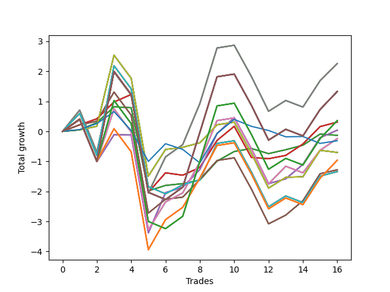

# Long Pointer 005 
- Symbol: SPY_Unlimited
- Date Range: 03/23/2022 - 07/08/2022
- Trading Period: 7:20-12:30
- Number of Trades: 16



| Name | Win Percent | Profit | Avg Profit / Trade | Avg Time / Trade |      | Name | Win Percent | Profit | Avg Profit / Trade | Avg Time / Trade |
| ---- | ----------- | ------ | ------------------ | ---------------- | ---- | ---- | ----------- | ------ | ------------------ | ---------------- |
| Sorted By <br> Profit | | | | | | Sorted By <br> Win Percentage ||||
| Sixty-Nine | 62.50 | 1130.00 | 70.62 | 26:49 |     | Sixty-Five | 75.00 | 155.00 | 9.69 | 11:19 |
| Sixty-One | 62.50 | 1130.00 | 70.62 | 26:49 |     | Fifty-Seven | 75.00 | 155.00 | 9.69 | 11:19 |
| Fifty-Three | 62.50 | 1130.00 | 70.62 | 26:49 |     | Forty-Nine | 75.00 | 155.00 | 9.69 | 11:19 |
| Forty-Five | 62.50 | 1130.00 | 70.62 | 26:49 |     | Forty-One | 75.00 | 155.00 | 9.69 | 11:19 |
| Five | 62.50 | 1130.00 | 70.62 | 26:49 |     | One | 75.00 | 155.00 | 9.69 | 11:19 |
| One Hundred Thirty | 56.25 | 665.00 | 41.56 | 29:55 |     | Sixty-Four | 75.00 | -65.00 | -4.06 | 04:40 |
| One Hundred Twenty-Nine | 56.25 | 665.00 | 41.56 | 29:55 |     | Fifty-Six | 75.00 | -65.00 | -4.06 | 04:40 |
| One Hundred Twenty-Eight | 56.25 | 665.00 | 41.56 | 29:55 |     | Forty-Eight | 75.00 | -65.00 | -4.06 | 04:40 |
| One Hundred Twenty-Five | 56.25 | 665.00 | 41.56 | 29:55 |     | Forty | 75.00 | -65.00 | -4.06 | 04:40 |
| One Hundred Twenty-Four | 56.25 | 665.00 | 41.56 | 29:55 |     | Zero | 75.00 | -65.00 | -4.06 | 04:40 |
| One Hundred Twenty-Three | 56.25 | 665.00 | 41.56 | 29:55 |     | Sixty-Seven | 75.00 | -640.00 | -40.00 | 14:09 |
| One Hundred Twenty | 56.25 | 665.00 | 41.56 | 29:55 |     | Fifty-Nine | 75.00 | -640.00 | -40.00 | 14:09 |
| One Hundred Ninteen | 56.25 | 665.00 | 41.56 | 29:55 |     | Fifty-One | 75.00 | -640.00 | -40.00 | 14:09 |
| One Hundred Eighteen | 56.25 | 665.00 | 41.56 | 29:55 |     | Forty-Three | 75.00 | -640.00 | -40.00 | 14:09 |
| One Hundred Fifteen | 56.25 | 665.00 | 41.56 | 29:55 |     | Three | 75.00 | -640.00 | -40.00 | 14:09 |
| One Hundred Fourteen | 56.25 | 665.00 | 41.56 | 29:55 |     | Sixty-Six | 68.75 | 20.00 | 1.25 | 18:12 |
| One Hundred Thirteen | 56.25 | 665.00 | 41.56 | 29:55 |     | Fifty-Eight | 68.75 | 20.00 | 1.25 | 18:12 |
| Eighty-Five | 56.25 | 665.00 | 41.56 | 29:55 |     | Fifty | 68.75 | 20.00 | 1.25 | 18:12 |
| Eighty-Four | 56.25 | 665.00 | 41.56 | 29:55 |     | Forty-Two | 68.75 | 20.00 | 1.25 | 18:12 |
| Eighty-Three | 56.25 | 665.00 | 41.56 | 29:55 |     | Two | 68.75 | 20.00 | 1.25 | 18:12 |
| One Hundred Twenty-Seven | 56.25 | 180.00 | 11.25 | 28:48 |     | Seventy | 68.75 | -350.00 | -21.88 | 14:31 |
| One Hundred Twenty-Two | 56.25 | 180.00 | 11.25 | 28:48 |     | Sixty-Two | 68.75 | -350.00 | -21.88 | 14:31 |
| One Hundred Seventeen | 56.25 | 180.00 | 11.25 | 28:48 |     | Fifty-Four | 68.75 | -350.00 | -21.88 | 14:31 |
| One Hundred Twelve | 56.25 | 180.00 | 11.25 | 28:48 |     | Forty-Six | 68.75 | -350.00 | -21.88 | 14:31 |
| Eighty-Two | 56.25 | 180.00 | 11.25 | 28:48 |     | Six | 68.75 | -350.00 | -21.88 | 14:31 |
| Sixty-Five | 75.00 | 155.00 | 9.69 | 11:19 |     | Sixty-Nine | 62.50 | 1130.00 | 70.62 | 26:49 |
| Fifty-Seven | 75.00 | 155.00 | 9.69 | 11:19 |     | Sixty-One | 62.50 | 1130.00 | 70.62 | 26:49 |
| Forty-Nine | 75.00 | 155.00 | 9.69 | 11:19 |     | Fifty-Three | 62.50 | 1130.00 | 70.62 | 26:49 |
| Forty-One | 75.00 | 155.00 | 9.69 | 11:19 |     | Forty-Five | 62.50 | 1130.00 | 70.62 | 26:49 |
| One | 75.00 | 155.00 | 9.69 | 11:19 |     | Five | 62.50 | 1130.00 | 70.62 | 26:49 |
| Sixty-Six | 68.75 | 20.00 | 1.25 | 18:12 |     | Sixty-Eight | 62.50 | -120.00 | -7.50 | 22:43 |
| Fifty-Eight | 68.75 | 20.00 | 1.25 | 18:12 |     | Sixty | 62.50 | -120.00 | -7.50 | 22:43 |
| Fifty | 68.75 | 20.00 | 1.25 | 18:12 |     | Fifty-Two | 62.50 | -120.00 | -7.50 | 22:43 |
| Forty-Two | 68.75 | 20.00 | 1.25 | 18:12 |     | Forty-Four | 62.50 | -120.00 | -7.50 | 22:43 |
| Two | 68.75 | 20.00 | 1.25 | 18:12 |     | Four | 62.50 | -120.00 | -7.50 | 22:43 |
| Sixty-Four | 75.00 | -65.00 | -4.06 | 04:40 |     | One Hundred Twenty-Six | 62.50 | -480.00 | -30.00 | 25:18 |
| Fifty-Six | 75.00 | -65.00 | -4.06 | 04:40 |     | One Hundred Twenty-One | 62.50 | -480.00 | -30.00 | 25:18 |
| Forty-Eight | 75.00 | -65.00 | -4.06 | 04:40 |     | One Hundred Sixteen | 62.50 | -480.00 | -30.00 | 25:18 |
| Forty | 75.00 | -65.00 | -4.06 | 04:40 |     | One Hundred Eleven | 62.50 | -480.00 | -30.00 | 25:18 |
| Zero | 75.00 | -65.00 | -4.06 | 04:40 |     | Eighty-One | 62.50 | -480.00 | -30.00 | 25:18 |
| Sixty-Eight | 62.50 | -120.00 | -7.50 | 22:43 |     | One Hundred Thirty | 56.25 | 665.00 | 41.56 | 29:55 |
| Sixty | 62.50 | -120.00 | -7.50 | 22:43 |     | One Hundred Twenty-Nine | 56.25 | 665.00 | 41.56 | 29:55 |
| Fifty-Two | 62.50 | -120.00 | -7.50 | 22:43 |     | One Hundred Twenty-Eight | 56.25 | 665.00 | 41.56 | 29:55 |
| Forty-Four | 62.50 | -120.00 | -7.50 | 22:43 |     | One Hundred Twenty-Five | 56.25 | 665.00 | 41.56 | 29:55 |
| Four | 62.50 | -120.00 | -7.50 | 22:43 |     | One Hundred Twenty-Four | 56.25 | 665.00 | 41.56 | 29:55 |
| Seventy-Three | 50.00 | -155.00 | -9.69 | 06:38 |     | One Hundred Twenty-Three | 56.25 | 665.00 | 41.56 | 29:55 |
| Seventy | 68.75 | -350.00 | -21.88 | 14:31 |     | One Hundred Twenty | 56.25 | 665.00 | 41.56 | 29:55 |
| Sixty-Two | 68.75 | -350.00 | -21.88 | 14:31 |     | One Hundred Ninteen | 56.25 | 665.00 | 41.56 | 29:55 |
| Fifty-Four | 68.75 | -350.00 | -21.88 | 14:31 |     | One Hundred Eighteen | 56.25 | 665.00 | 41.56 | 29:55 |
| Forty-Six | 68.75 | -350.00 | -21.88 | 14:31 |     | One Hundred Fifteen | 56.25 | 665.00 | 41.56 | 29:55 |
| Six | 68.75 | -350.00 | -21.88 | 14:31 |     | One Hundred Fourteen | 56.25 | 665.00 | 41.56 | 29:55 |
| One Hundred Twenty-Six | 62.50 | -480.00 | -30.00 | 25:18 |     | One Hundred Thirteen | 56.25 | 665.00 | 41.56 | 29:55 |
| One Hundred Twenty-One | 62.50 | -480.00 | -30.00 | 25:18 |     | Eighty-Five | 56.25 | 665.00 | 41.56 | 29:55 |
| One Hundred Sixteen | 62.50 | -480.00 | -30.00 | 25:18 |     | Eighty-Four | 56.25 | 665.00 | 41.56 | 29:55 |
| One Hundred Eleven | 62.50 | -480.00 | -30.00 | 25:18 |     | Eighty-Three | 56.25 | 665.00 | 41.56 | 29:55 |
| Eighty-One | 62.50 | -480.00 | -30.00 | 25:18 |     | One Hundred Twenty-Seven | 56.25 | 180.00 | 11.25 | 28:48 |
| Sixty-Seven | 75.00 | -640.00 | -40.00 | 14:09 |     | One Hundred Twenty-Two | 56.25 | 180.00 | 11.25 | 28:48 |
| Fifty-Nine | 75.00 | -640.00 | -40.00 | 14:09 |     | One Hundred Seventeen | 56.25 | 180.00 | 11.25 | 28:48 |
| Fifty-One | 75.00 | -640.00 | -40.00 | 14:09 |     | One Hundred Twelve | 56.25 | 180.00 | 11.25 | 28:48 |
| Forty-Three | 75.00 | -640.00 | -40.00 | 14:09 |     | Eighty-Two | 56.25 | 180.00 | 11.25 | 28:48 |
| Three | 75.00 | -640.00 | -40.00 | 14:09 |     | Seventy-One | 56.25 | -670.00 | -41.88 | 24:57 |
| Seventy-One | 56.25 | -670.00 | -41.88 | 24:57 |     | Sixty-Three | 56.25 | -670.00 | -41.88 | 24:57 |
| Sixty-Three | 56.25 | -670.00 | -41.88 | 24:57 |     | Fifty-Five | 56.25 | -670.00 | -41.88 | 24:57 |
| Fifty-Five | 56.25 | -670.00 | -41.88 | 24:57 |     | Forty-Seven | 56.25 | -670.00 | -41.88 | 24:57 |
| Forty-Seven | 56.25 | -670.00 | -41.88 | 24:57 |     | Seven | 56.25 | -670.00 | -41.88 | 24:57 |
| Seven | 56.25 | -670.00 | -41.88 | 24:57 |     | Seventy-Three | 50.00 | -155.00 | -9.69 | 06:38 |

## NO STOPLOSS

### Test Zero
* Sell when price hits the middle line of the 20p bollinger
* No Stoploss
* Results:
```
Total Trades: 16
Percent Up: 75.00
Percent Down: 25.00
Total Points Moved Up: -0.13
Potential Profit: -65.00
Total Points Ups: 2.88 Count Ups: 12
Total Points Downs: -3.01 Count Downs: 4
```

<details><summary>Trades</summary>

<code>In: 2022-03-24 09:38:00		Out: 2022-03-24 09:38:30		Total Position Time: 00:30		Total Move Up: 0.05		Total to Date: 0.05</code> <br />
<code>In: 2022-03-28 08:11:00		Out: 2022-03-28 08:11:45		Total Position Time: 00:45		Total Move Up: 0.24		Total to Date: 0.29</code> <br />
<code>In: 2022-04-25 08:55:00		Out: 2022-04-25 08:57:10		Total Position Time: 02:10		Total Move Up: 0.53		Total to Date: 0.82</code> <br />
<code>In: 2022-04-27 12:07:00		Out: 2022-04-27 12:13:55		Total Position Time: 06:55		Total Move Up: -0.03		Total to Date: 0.79</code> <br />
<code>In: 2022-05-10 07:33:00		Out: 2022-05-10 07:59:00		Total Position Time: 26:00		Total Move Up: -2.77		Total to Date: -1.98</code> <br />
<code>In: 2022-05-19 10:19:00		Out: 2022-05-19 10:19:20		Total Position Time: 00:20		Total Move Up: 0.18		Total to Date: -1.80</code> <br />
<code>In: 2022-05-27 07:49:00		Out: 2022-05-27 07:50:15		Total Position Time: 01:15		Total Move Up: 0.06		Total to Date: -1.74</code> <br />
<code>In: 2022-05-31 10:26:00		Out: 2022-05-31 10:33:10		Total Position Time: 07:10		Total Move Up: 0.12		Total to Date: -1.62</code> <br />
<code>In: 2022-06-02 07:30:00		Out: 2022-06-02 07:34:10		Total Position Time: 04:10		Total Move Up: 0.63		Total to Date: -0.99</code> <br />
<code>In: 2022-06-08 09:48:00		Out: 2022-06-08 09:53:00		Total Position Time: 05:00		Total Move Up: 0.32		Total to Date: -0.67</code> <br />
<code>In: 2022-06-09 11:28:00		Out: 2022-06-09 11:28:10		Total Position Time: 00:10		Total Move Up: 0.10		Total to Date: -0.57</code> <br />
<code>In: 2022-06-15 07:51:00		Out: 2022-06-15 07:58:55		Total Position Time: 07:55		Total Move Up: -0.17		Total to Date: -0.74</code> <br />
<code>In: 2022-06-15 08:19:00		Out: 2022-06-15 08:24:20		Total Position Time: 05:20		Total Move Up: 0.13		Total to Date: -0.61</code> <br />
<code>In: 2022-06-22 11:55:00		Out: 2022-06-22 11:55:25		Total Position Time: 00:25		Total Move Up: 0.15		Total to Date: -0.46</code> <br />
<code>In: 2022-06-29 09:32:00		Out: 2022-06-29 09:36:40		Total Position Time: 04:40		Total Move Up: 0.37		Total to Date: -0.09</code> <br />
<code>In: 2022-07-07 08:35:00		Out: 2022-07-07 08:37:05		Total Position Time: 02:05		Total Move Up: -0.04		Total to Date: -0.13</code> <br />


</details>

### Test One
* Sell when the price hits the upper line of the 20p 1std bollinger
* No Stoploss
* Results:
```
Total Trades: 16
Percent Up: 75.00
Percent Down: 25.00
Total Points Moved Up: 0.31
Potential Profit: 155.00
Total Points Ups: 4.73 Count Ups: 12
Total Points Downs: -4.42 Count Downs: 4
```

<details><summary>Trades</summary>

<code>In: 2022-03-24 09:38:00		Out: 2022-03-24 09:43:25		Total Position Time: 05:25		Total Move Up: 0.22		Total to Date: 0.22</code> <br />
<code>In: 2022-03-28 08:11:00		Out: 2022-03-28 08:20:05		Total Position Time: 09:05		Total Move Up: 0.20		Total to Date: 0.42</code> <br />
<code>In: 2022-04-25 08:55:00		Out: 2022-04-25 09:03:45		Total Position Time: 08:45		Total Move Up: 0.56		Total to Date: 0.98</code> <br />
<code>In: 2022-04-27 12:07:00		Out: 2022-04-27 12:15:20		Total Position Time: 08:20		Total Move Up: 0.25		Total to Date: 1.23</code> <br />
<code>In: 2022-05-10 07:33:00		Out: 2022-05-10 08:02:55		Total Position Time: 29:55		Total Move Up: -3.26		Total to Date: -2.03</code> <br />
<code>In: 2022-05-19 10:19:00		Out: 2022-05-19 10:22:45		Total Position Time: 03:45		Total Move Up: 0.65		Total to Date: -1.38</code> <br />
<code>In: 2022-05-27 07:49:00		Out: 2022-05-27 08:11:00		Total Position Time: 22:00		Total Move Up: -0.08		Total to Date: -1.46</code> <br />
<code>In: 2022-05-31 10:26:00		Out: 2022-05-31 10:33:15		Total Position Time: 07:15		Total Move Up: 0.26		Total to Date: -1.20</code> <br />
<code>In: 2022-06-02 07:30:00		Out: 2022-06-02 07:38:35		Total Position Time: 08:35		Total Move Up: 0.90		Total to Date: -0.30</code> <br />
<code>In: 2022-06-08 09:48:00		Out: 2022-06-08 09:59:05		Total Position Time: 11:05		Total Move Up: 0.47		Total to Date: 0.17</code> <br />
<code>In: 2022-06-09 11:28:00		Out: 2022-06-09 11:57:55		Total Position Time: 29:55		Total Move Up: -1.04		Total to Date: -0.87</code> <br />
<code>In: 2022-06-15 07:51:00		Out: 2022-06-15 08:07:20		Total Position Time: 16:20		Total Move Up: -0.04		Total to Date: -0.91</code> <br />
<code>In: 2022-06-15 08:19:00		Out: 2022-06-15 08:29:05		Total Position Time: 10:05		Total Move Up: 0.11		Total to Date: -0.80</code> <br />
<code>In: 2022-06-22 11:55:00		Out: 2022-06-22 11:56:20		Total Position Time: 01:20		Total Move Up: 0.38		Total to Date: -0.42</code> <br />
<code>In: 2022-06-29 09:32:00		Out: 2022-06-29 09:37:15		Total Position Time: 05:15		Total Move Up: 0.58		Total to Date: 0.16</code> <br />
<code>In: 2022-07-07 08:35:00		Out: 2022-07-07 08:39:05		Total Position Time: 04:05		Total Move Up: 0.15		Total to Date: 0.31</code> <br />


</details>

### Test Two
* Sell when the price hits the upper line of the 20p 2std bollinger
* No Stoploss
* Results:
```
Total Trades: 16
Percent Up: 68.75
Percent Down: 31.25
Total Points Moved Up: 0.04
Potential Profit: 20.00
Total Points Ups: 6.91 Count Ups: 11
Total Points Downs: -6.87 Count Downs: 5
```

<details><summary>Trades</summary>

<code>In: 2022-03-24 09:38:00		Out: 2022-03-24 09:56:25		Total Position Time: 18:25		Total Move Up: 0.39		Total to Date: 0.39</code> <br />
<code>In: 2022-03-28 08:11:00		Out: 2022-03-28 08:40:55		Total Position Time: 29:55		Total Move Up: -1.40		Total to Date: -1.01</code> <br />
<code>In: 2022-04-25 08:55:00		Out: 2022-04-25 09:05:10		Total Position Time: 10:10		Total Move Up: 0.90		Total to Date: -0.11</code> <br />
<code>In: 2022-04-27 12:07:00		Out: 2022-04-27 12:31:35		Total Position Time: 24:35		Total Move Up: -0.01		Total to Date: -0.12</code> <br />
<code>In: 2022-05-10 07:33:00		Out: 2022-05-10 08:02:55		Total Position Time: 29:55		Total Move Up: -3.26		Total to Date: -3.38</code> <br />
<code>In: 2022-05-19 10:19:00		Out: 2022-05-19 10:44:05		Total Position Time: 25:05		Total Move Up: 1.34		Total to Date: -2.04</code> <br />
<code>In: 2022-05-27 07:49:00		Out: 2022-05-27 08:12:15		Total Position Time: 23:15		Total Move Up: 0.18		Total to Date: -1.86</code> <br />
<code>In: 2022-05-31 10:26:00		Out: 2022-05-31 10:34:50		Total Position Time: 08:50		Total Move Up: 0.59		Total to Date: -1.27</code> <br />
<code>In: 2022-06-02 07:30:00		Out: 2022-06-02 07:42:40		Total Position Time: 12:40		Total Move Up: 1.20		Total to Date: -0.07</code> <br />
<code>In: 2022-06-08 09:48:00		Out: 2022-06-08 09:59:15		Total Position Time: 11:15		Total Move Up: 0.53		Total to Date: 0.46</code> <br />
<code>In: 2022-06-09 11:28:00		Out: 2022-06-09 11:57:55		Total Position Time: 29:55		Total Move Up: -1.04		Total to Date: -0.58</code> <br />
<code>In: 2022-06-15 07:51:00		Out: 2022-06-15 08:20:55		Total Position Time: 29:55		Total Move Up: -1.16		Total to Date: -1.74</code> <br />
<code>In: 2022-06-15 08:19:00		Out: 2022-06-15 08:31:50		Total Position Time: 12:50		Total Move Up: 0.16		Total to Date: -1.58</code> <br />
<code>In: 2022-06-22 11:55:00		Out: 2022-06-22 12:04:10		Total Position Time: 09:10		Total Move Up: 0.48		Total to Date: -1.10</code> <br />
<code>In: 2022-06-29 09:32:00		Out: 2022-06-29 09:38:35		Total Position Time: 06:35		Total Move Up: 0.89		Total to Date: -0.21</code> <br />
<code>In: 2022-07-07 08:35:00		Out: 2022-07-07 08:43:45		Total Position Time: 08:45		Total Move Up: 0.25		Total to Date: 0.04</code> <br />


</details>

### Test Three
* Sell when price hits the middle line of the 50p bollinger
* No Stoploss
* Results:
```
Total Trades: 16
Percent Up: 75.00
Percent Down: 25.00
Total Points Moved Up: -1.28
Potential Profit: -640.00
Total Points Ups: 4.95 Count Ups: 12
Total Points Downs: -6.23 Count Downs: 4
```

<details><summary>Trades</summary>

<code>In: 2022-03-24 09:38:00		Out: 2022-03-24 09:52:45		Total Position Time: 14:45		Total Move Up: 0.22		Total to Date: 0.22</code> <br />
<code>In: 2022-03-28 08:11:00		Out: 2022-03-28 08:11:35		Total Position Time: 00:35		Total Move Up: 0.12		Total to Date: 0.34</code> <br />
<code>In: 2022-04-25 08:55:00		Out: 2022-04-25 09:05:20		Total Position Time: 10:20		Total Move Up: 0.97		Total to Date: 1.31</code> <br />
<code>In: 2022-04-27 12:07:00		Out: 2022-04-27 12:36:55		Total Position Time: 29:55		Total Move Up: -0.77		Total to Date: 0.54</code> <br />
<code>In: 2022-05-10 07:33:00		Out: 2022-05-10 08:02:55		Total Position Time: 29:55		Total Move Up: -3.26		Total to Date: -2.72</code> <br />
<code>In: 2022-05-19 10:19:00		Out: 2022-05-19 10:21:15		Total Position Time: 02:15		Total Move Up: 0.46		Total to Date: -2.26</code> <br />
<code>In: 2022-05-27 07:49:00		Out: 2022-05-27 07:49:45		Total Position Time: 00:45		Total Move Up: 0.07		Total to Date: -2.19</code> <br />
<code>In: 2022-05-31 10:26:00		Out: 2022-05-31 10:34:50		Total Position Time: 08:50		Total Move Up: 0.59		Total to Date: -1.60</code> <br />
<code>In: 2022-06-02 07:30:00		Out: 2022-06-02 07:34:10		Total Position Time: 04:10		Total Move Up: 0.63		Total to Date: -0.97</code> <br />
<code>In: 2022-06-08 09:48:00		Out: 2022-06-08 10:17:55		Total Position Time: 29:55		Total Move Up: 0.09		Total to Date: -0.88</code> <br />
<code>In: 2022-06-09 11:28:00		Out: 2022-06-09 11:57:55		Total Position Time: 29:55		Total Move Up: -1.04		Total to Date: -1.92</code> <br />
<code>In: 2022-06-15 07:51:00		Out: 2022-06-15 08:20:55		Total Position Time: 29:55		Total Move Up: -1.16		Total to Date: -3.08</code> <br />
<code>In: 2022-06-15 08:19:00		Out: 2022-06-15 08:34:25		Total Position Time: 15:25		Total Move Up: 0.29		Total to Date: -2.79</code> <br />
<code>In: 2022-06-22 11:55:00		Out: 2022-06-22 12:04:10		Total Position Time: 09:10		Total Move Up: 0.48		Total to Date: -2.31</code> <br />
<code>In: 2022-06-29 09:32:00		Out: 2022-06-29 09:38:30		Total Position Time: 06:30		Total Move Up: 0.90		Total to Date: -1.41</code> <br />
<code>In: 2022-07-07 08:35:00		Out: 2022-07-07 08:39:10		Total Position Time: 04:10		Total Move Up: 0.13		Total to Date: -1.28</code> <br />


</details>

### Test Four
* Sell when the price hits the upper line of the 50p 1std bollinger
* No Stoploss
* Results:
```
Total Trades: 16
Percent Up: 62.50
Percent Down: 37.50
Total Points Moved Up: -0.24
Potential Profit: -120.00
Total Points Ups: 7.61 Count Ups: 10
Total Points Downs: -7.85 Count Downs: 6
```

<details><summary>Trades</summary>

<code>In: 2022-03-24 09:38:00		Out: 2022-03-24 09:56:25		Total Position Time: 18:25		Total Move Up: 0.39		Total to Date: 0.39</code> <br />
<code>In: 2022-03-28 08:11:00		Out: 2022-03-28 08:40:55		Total Position Time: 29:55		Total Move Up: -1.40		Total to Date: -1.01</code> <br />
<code>In: 2022-04-25 08:55:00		Out: 2022-04-25 09:07:05		Total Position Time: 12:05		Total Move Up: 1.76		Total to Date: 0.75</code> <br />
<code>In: 2022-04-27 12:07:00		Out: 2022-04-27 12:36:55		Total Position Time: 29:55		Total Move Up: -0.77		Total to Date: -0.02</code> <br />
<code>In: 2022-05-10 07:33:00		Out: 2022-05-10 08:02:55		Total Position Time: 29:55		Total Move Up: -3.26		Total to Date: -3.28</code> <br />
<code>In: 2022-05-19 10:19:00		Out: 2022-05-19 10:23:30		Total Position Time: 04:30		Total Move Up: 0.93		Total to Date: -2.35</code> <br />
<code>In: 2022-05-27 07:49:00		Out: 2022-05-27 08:16:05		Total Position Time: 27:05		Total Move Up: 0.30		Total to Date: -2.05</code> <br />
<code>In: 2022-05-31 10:26:00		Out: 2022-05-31 10:44:30		Total Position Time: 18:30		Total Move Up: 1.03		Total to Date: -1.02</code> <br />
<code>In: 2022-06-02 07:30:00		Out: 2022-06-02 07:47:05		Total Position Time: 17:05		Total Move Up: 1.38		Total to Date: 0.36</code> <br />
<code>In: 2022-06-08 09:48:00		Out: 2022-06-08 10:17:55		Total Position Time: 29:55		Total Move Up: 0.09		Total to Date: 0.45</code> <br />
<code>In: 2022-06-09 11:28:00		Out: 2022-06-09 11:57:55		Total Position Time: 29:55		Total Move Up: -1.04		Total to Date: -0.59</code> <br />
<code>In: 2022-06-15 07:51:00		Out: 2022-06-15 08:20:55		Total Position Time: 29:55		Total Move Up: -1.16		Total to Date: -1.75</code> <br />
<code>In: 2022-06-15 08:19:00		Out: 2022-06-15 08:38:55		Total Position Time: 19:55		Total Move Up: 0.59		Total to Date: -1.16</code> <br />
<code>In: 2022-06-22 11:55:00		Out: 2022-06-22 12:24:55		Total Position Time: 29:55		Total Move Up: -0.22		Total to Date: -1.38</code> <br />
<code>In: 2022-06-29 09:32:00		Out: 2022-06-29 09:59:15		Total Position Time: 27:15		Total Move Up: 0.75		Total to Date: -0.63</code> <br />
<code>In: 2022-07-07 08:35:00		Out: 2022-07-07 08:44:25		Total Position Time: 09:25		Total Move Up: 0.39		Total to Date: -0.24</code> <br />


</details>

### Test Five
* Sell when the price hits the upper line of the 50p 2std bollinger
* No Stoploss
* Results:
```
Total Trades: 16
Percent Up: 62.50
Percent Down: 37.50
Total Points Moved Up: 2.26
Potential Profit: 1130.00
Total Points Ups: 10.11 Count Ups: 10
Total Points Downs: -7.85 Count Downs: 6
```

<details><summary>Trades</summary>

<code>In: 2022-03-24 09:38:00		Out: 2022-03-24 10:00:50		Total Position Time: 22:50		Total Move Up: 0.71		Total to Date: 0.71</code> <br />
<code>In: 2022-03-28 08:11:00		Out: 2022-03-28 08:40:55		Total Position Time: 29:55		Total Move Up: -1.40		Total to Date: -0.69</code> <br />
<code>In: 2022-04-25 08:55:00		Out: 2022-04-25 09:16:30		Total Position Time: 21:30		Total Move Up: 2.67		Total to Date: 1.98</code> <br />
<code>In: 2022-04-27 12:07:00		Out: 2022-04-27 12:36:55		Total Position Time: 29:55		Total Move Up: -0.77		Total to Date: 1.21</code> <br />
<code>In: 2022-05-10 07:33:00		Out: 2022-05-10 08:02:55		Total Position Time: 29:55		Total Move Up: -3.26		Total to Date: -2.05</code> <br />
<code>In: 2022-05-19 10:19:00		Out: 2022-05-19 10:31:30		Total Position Time: 12:30		Total Move Up: 1.20		Total to Date: -0.85</code> <br />
<code>In: 2022-05-27 07:49:00		Out: 2022-05-27 08:18:55		Total Position Time: 29:55		Total Move Up: 0.41		Total to Date: -0.44</code> <br />
<code>In: 2022-05-31 10:26:00		Out: 2022-05-31 10:52:35		Total Position Time: 26:35		Total Move Up: 1.37		Total to Date: 0.93</code> <br />
<code>In: 2022-06-02 07:30:00		Out: 2022-06-02 07:59:55		Total Position Time: 29:55		Total Move Up: 1.85		Total to Date: 2.78</code> <br />
<code>In: 2022-06-08 09:48:00		Out: 2022-06-08 10:17:55		Total Position Time: 29:55		Total Move Up: 0.09		Total to Date: 2.87</code> <br />
<code>In: 2022-06-09 11:28:00		Out: 2022-06-09 11:57:55		Total Position Time: 29:55		Total Move Up: -1.04		Total to Date: 1.83</code> <br />
<code>In: 2022-06-15 07:51:00		Out: 2022-06-15 08:20:55		Total Position Time: 29:55		Total Move Up: -1.16		Total to Date: 0.67</code> <br />
<code>In: 2022-06-15 08:19:00		Out: 2022-06-15 08:48:55		Total Position Time: 29:55		Total Move Up: 0.36		Total to Date: 1.03</code> <br />
<code>In: 2022-06-22 11:55:00		Out: 2022-06-22 12:24:55		Total Position Time: 29:55		Total Move Up: -0.22		Total to Date: 0.81</code> <br />
<code>In: 2022-06-29 09:32:00		Out: 2022-06-29 10:01:55		Total Position Time: 29:55		Total Move Up: 0.88		Total to Date: 1.69</code> <br />
<code>In: 2022-07-07 08:35:00		Out: 2022-07-07 08:51:40		Total Position Time: 16:40		Total Move Up: 0.57		Total to Date: 2.26</code> <br />


</details>

### Test Six
* Sell when the price hits the middle line of the 1std VWAP
* No Stoploss
* Results:
```
Total Trades: 16
Percent Up: 68.75
Percent Down: 31.25
Total Points Moved Up: -0.70
Potential Profit: -350.00
Total Points Ups: 5.60 Count Ups: 11
Total Points Downs: -6.30 Count Downs: 5
```

<details><summary>Trades</summary>

<code>In: 2022-03-24 09:38:00		Out: 2022-03-24 09:38:10		Total Position Time: 00:10		Total Move Up: 0.05		Total to Date: 0.05</code> <br />
<code>In: 2022-03-28 08:11:00		Out: 2022-03-28 08:11:35		Total Position Time: 00:35		Total Move Up: 0.12		Total to Date: 0.17</code> <br />
<code>In: 2022-04-25 08:55:00		Out: 2022-04-25 09:08:05		Total Position Time: 13:05		Total Move Up: 2.37		Total to Date: 2.54</code> <br />
<code>In: 2022-04-27 12:07:00		Out: 2022-04-27 12:36:55		Total Position Time: 29:55		Total Move Up: -0.77		Total to Date: 1.77</code> <br />
<code>In: 2022-05-10 07:33:00		Out: 2022-05-10 08:02:55		Total Position Time: 29:55		Total Move Up: -3.26		Total to Date: -1.49</code> <br />
<code>In: 2022-05-19 10:19:00		Out: 2022-05-19 10:23:20		Total Position Time: 04:20		Total Move Up: 0.89		Total to Date: -0.60</code> <br />
<code>In: 2022-05-27 07:49:00		Out: 2022-05-27 07:49:10		Total Position Time: 00:10		Total Move Up: 0.07		Total to Date: -0.53</code> <br />
<code>In: 2022-05-31 10:26:00		Out: 2022-05-31 10:26:10		Total Position Time: 00:10		Total Move Up: 0.15		Total to Date: -0.38</code> <br />
<code>In: 2022-06-02 07:30:00		Out: 2022-06-02 07:34:15		Total Position Time: 04:15		Total Move Up: 0.60		Total to Date: 0.22</code> <br />
<code>In: 2022-06-08 09:48:00		Out: 2022-06-08 10:17:55		Total Position Time: 29:55		Total Move Up: 0.09		Total to Date: 0.31</code> <br />
<code>In: 2022-06-09 11:28:00		Out: 2022-06-09 11:57:55		Total Position Time: 29:55		Total Move Up: -1.04		Total to Date: -0.73</code> <br />
<code>In: 2022-06-15 07:51:00		Out: 2022-06-15 08:20:55		Total Position Time: 29:55		Total Move Up: -1.16		Total to Date: -1.89</code> <br />
<code>In: 2022-06-15 08:19:00		Out: 2022-06-15 08:48:55		Total Position Time: 29:55		Total Move Up: 0.36		Total to Date: -1.53</code> <br />
<code>In: 2022-06-22 11:55:00		Out: 2022-06-22 11:55:10		Total Position Time: 00:10		Total Move Up: 0.02		Total to Date: -1.51</code> <br />
<code>In: 2022-06-29 09:32:00		Out: 2022-06-29 10:01:55		Total Position Time: 29:55		Total Move Up: 0.88		Total to Date: -0.63</code> <br />
<code>In: 2022-07-07 08:35:00		Out: 2022-07-07 08:35:10		Total Position Time: 00:10		Total Move Up: -0.07		Total to Date: -0.70</code> <br />


</details>

### Test Seven
* Sell when the price hits the upper line of the 1std VWAP
* No Stoploss
* Results:
```
Total Trades: 16
Percent Up: 56.25
Percent Down: 43.75
Total Points Moved Up: -1.34
Potential Profit: -670.00
Total Points Ups: 6.75 Count Ups: 9
Total Points Downs: -8.09 Count Downs: 7
```

<details><summary>Trades</summary>

<code>In: 2022-03-24 09:38:00		Out: 2022-03-24 10:00:45		Total Position Time: 22:45		Total Move Up: 0.60		Total to Date: 0.60</code> <br />
<code>In: 2022-03-28 08:11:00		Out: 2022-03-28 08:40:55		Total Position Time: 29:55		Total Move Up: -1.40		Total to Date: -0.80</code> <br />
<code>In: 2022-04-25 08:55:00		Out: 2022-04-25 09:24:55		Total Position Time: 29:55		Total Move Up: 2.99		Total to Date: 2.19</code> <br />
<code>In: 2022-04-27 12:07:00		Out: 2022-04-27 12:36:55		Total Position Time: 29:55		Total Move Up: -0.77		Total to Date: 1.42</code> <br />
<code>In: 2022-05-10 07:33:00		Out: 2022-05-10 08:02:55		Total Position Time: 29:55		Total Move Up: -3.26		Total to Date: -1.84</code> <br />
<code>In: 2022-05-19 10:19:00		Out: 2022-05-19 10:48:55		Total Position Time: 29:55		Total Move Up: -0.24		Total to Date: -2.08</code> <br />
<code>In: 2022-05-27 07:49:00		Out: 2022-05-27 08:16:05		Total Position Time: 27:05		Total Move Up: 0.30		Total to Date: -1.78</code> <br />
<code>In: 2022-05-31 10:26:00		Out: 2022-05-31 10:27:50		Total Position Time: 01:50		Total Move Up: 0.17		Total to Date: -1.61</code> <br />
<code>In: 2022-06-02 07:30:00		Out: 2022-06-02 07:44:30		Total Position Time: 14:30		Total Move Up: 1.21		Total to Date: -0.40</code> <br />
<code>In: 2022-06-08 09:48:00		Out: 2022-06-08 10:17:55		Total Position Time: 29:55		Total Move Up: 0.09		Total to Date: -0.31</code> <br />
<code>In: 2022-06-09 11:28:00		Out: 2022-06-09 11:57:55		Total Position Time: 29:55		Total Move Up: -1.04		Total to Date: -1.35</code> <br />
<code>In: 2022-06-15 07:51:00		Out: 2022-06-15 08:20:55		Total Position Time: 29:55		Total Move Up: -1.16		Total to Date: -2.51</code> <br />
<code>In: 2022-06-15 08:19:00		Out: 2022-06-15 08:48:55		Total Position Time: 29:55		Total Move Up: 0.36		Total to Date: -2.15</code> <br />
<code>In: 2022-06-22 11:55:00		Out: 2022-06-22 12:24:55		Total Position Time: 29:55		Total Move Up: -0.22		Total to Date: -2.37</code> <br />
<code>In: 2022-06-29 09:32:00		Out: 2022-06-29 10:01:55		Total Position Time: 29:55		Total Move Up: 0.88		Total to Date: -1.49</code> <br />
<code>In: 2022-07-07 08:35:00		Out: 2022-07-07 08:39:05		Total Position Time: 04:05		Total Move Up: 0.15		Total to Date: -1.34</code> <br />


</details>

## STOPLOSS OF 5

### Test Forty
* Sell when price hits the middle line of the 20p bollinger
* Stoploss is 5 points
* Results:
```
Total Trades: 16
Percent Up: 75.00
Percent Down: 25.00
Total Points Moved Up: -0.13
Potential Profit: -65.00
Total Points Ups: 2.88 Count Ups: 12
Total Points Downs: -3.01 Count Downs: 4
```

<details><summary>Trades</summary>

<code>In: 2022-03-24 09:38:00		Out: 2022-03-24 09:38:30		Total Position Time: 00:30		Total Move Up: 0.05		Total to Date: 0.05</code> <br />
<code>In: 2022-03-28 08:11:00		Out: 2022-03-28 08:11:45		Total Position Time: 00:45		Total Move Up: 0.24		Total to Date: 0.29</code> <br />
<code>In: 2022-04-25 08:55:00		Out: 2022-04-25 08:57:10		Total Position Time: 02:10		Total Move Up: 0.53		Total to Date: 0.82</code> <br />
<code>In: 2022-04-27 12:07:00		Out: 2022-04-27 12:13:55		Total Position Time: 06:55		Total Move Up: -0.03		Total to Date: 0.79</code> <br />
<code>In: 2022-05-10 07:33:00		Out: 2022-05-10 07:59:00		Total Position Time: 26:00		Total Move Up: -2.77		Total to Date: -1.98</code> <br />
<code>In: 2022-05-19 10:19:00		Out: 2022-05-19 10:19:20		Total Position Time: 00:20		Total Move Up: 0.18		Total to Date: -1.80</code> <br />
<code>In: 2022-05-27 07:49:00		Out: 2022-05-27 07:50:15		Total Position Time: 01:15		Total Move Up: 0.06		Total to Date: -1.74</code> <br />
<code>In: 2022-05-31 10:26:00		Out: 2022-05-31 10:33:10		Total Position Time: 07:10		Total Move Up: 0.12		Total to Date: -1.62</code> <br />
<code>In: 2022-06-02 07:30:00		Out: 2022-06-02 07:34:10		Total Position Time: 04:10		Total Move Up: 0.63		Total to Date: -0.99</code> <br />
<code>In: 2022-06-08 09:48:00		Out: 2022-06-08 09:53:00		Total Position Time: 05:00		Total Move Up: 0.32		Total to Date: -0.67</code> <br />
<code>In: 2022-06-09 11:28:00		Out: 2022-06-09 11:28:10		Total Position Time: 00:10		Total Move Up: 0.10		Total to Date: -0.57</code> <br />
<code>In: 2022-06-15 07:51:00		Out: 2022-06-15 07:58:55		Total Position Time: 07:55		Total Move Up: -0.17		Total to Date: -0.74</code> <br />
<code>In: 2022-06-15 08:19:00		Out: 2022-06-15 08:24:20		Total Position Time: 05:20		Total Move Up: 0.13		Total to Date: -0.61</code> <br />
<code>In: 2022-06-22 11:55:00		Out: 2022-06-22 11:55:25		Total Position Time: 00:25		Total Move Up: 0.15		Total to Date: -0.46</code> <br />
<code>In: 2022-06-29 09:32:00		Out: 2022-06-29 09:36:40		Total Position Time: 04:40		Total Move Up: 0.37		Total to Date: -0.09</code> <br />
<code>In: 2022-07-07 08:35:00		Out: 2022-07-07 08:37:05		Total Position Time: 02:05		Total Move Up: -0.04		Total to Date: -0.13</code> <br />


</details>

### Test Forty-One
* Sell when the price hits the upper line of the 20p 1std bollinger
* Stoploss is 5 points
* Results:
```
Total Trades: 16
Percent Up: 75.00
Percent Down: 25.00
Total Points Moved Up: 0.31
Potential Profit: 155.00
Total Points Ups: 4.73 Count Ups: 12
Total Points Downs: -4.42 Count Downs: 4
```

<details><summary>Trades</summary>

<code>In: 2022-03-24 09:38:00		Out: 2022-03-24 09:43:25		Total Position Time: 05:25		Total Move Up: 0.22		Total to Date: 0.22</code> <br />
<code>In: 2022-03-28 08:11:00		Out: 2022-03-28 08:20:05		Total Position Time: 09:05		Total Move Up: 0.20		Total to Date: 0.42</code> <br />
<code>In: 2022-04-25 08:55:00		Out: 2022-04-25 09:03:45		Total Position Time: 08:45		Total Move Up: 0.56		Total to Date: 0.98</code> <br />
<code>In: 2022-04-27 12:07:00		Out: 2022-04-27 12:15:20		Total Position Time: 08:20		Total Move Up: 0.25		Total to Date: 1.23</code> <br />
<code>In: 2022-05-10 07:33:00		Out: 2022-05-10 08:02:55		Total Position Time: 29:55		Total Move Up: -3.26		Total to Date: -2.03</code> <br />
<code>In: 2022-05-19 10:19:00		Out: 2022-05-19 10:22:45		Total Position Time: 03:45		Total Move Up: 0.65		Total to Date: -1.38</code> <br />
<code>In: 2022-05-27 07:49:00		Out: 2022-05-27 08:11:00		Total Position Time: 22:00		Total Move Up: -0.08		Total to Date: -1.46</code> <br />
<code>In: 2022-05-31 10:26:00		Out: 2022-05-31 10:33:15		Total Position Time: 07:15		Total Move Up: 0.26		Total to Date: -1.20</code> <br />
<code>In: 2022-06-02 07:30:00		Out: 2022-06-02 07:38:35		Total Position Time: 08:35		Total Move Up: 0.90		Total to Date: -0.30</code> <br />
<code>In: 2022-06-08 09:48:00		Out: 2022-06-08 09:59:05		Total Position Time: 11:05		Total Move Up: 0.47		Total to Date: 0.17</code> <br />
<code>In: 2022-06-09 11:28:00		Out: 2022-06-09 11:57:55		Total Position Time: 29:55		Total Move Up: -1.04		Total to Date: -0.87</code> <br />
<code>In: 2022-06-15 07:51:00		Out: 2022-06-15 08:07:20		Total Position Time: 16:20		Total Move Up: -0.04		Total to Date: -0.91</code> <br />
<code>In: 2022-06-15 08:19:00		Out: 2022-06-15 08:29:05		Total Position Time: 10:05		Total Move Up: 0.11		Total to Date: -0.80</code> <br />
<code>In: 2022-06-22 11:55:00		Out: 2022-06-22 11:56:20		Total Position Time: 01:20		Total Move Up: 0.38		Total to Date: -0.42</code> <br />
<code>In: 2022-06-29 09:32:00		Out: 2022-06-29 09:37:15		Total Position Time: 05:15		Total Move Up: 0.58		Total to Date: 0.16</code> <br />
<code>In: 2022-07-07 08:35:00		Out: 2022-07-07 08:39:05		Total Position Time: 04:05		Total Move Up: 0.15		Total to Date: 0.31</code> <br />


</details>

### Test Forty-Two
* Sell when the price hits the upper line of the 20p 2std bollinger
* Stoploss is 5 points
* Results:
```
Total Trades: 16
Percent Up: 68.75
Percent Down: 31.25
Total Points Moved Up: 0.04
Potential Profit: 20.00
Total Points Ups: 6.91 Count Ups: 11
Total Points Downs: -6.87 Count Downs: 5
```

<details><summary>Trades</summary>

<code>In: 2022-03-24 09:38:00		Out: 2022-03-24 09:56:25		Total Position Time: 18:25		Total Move Up: 0.39		Total to Date: 0.39</code> <br />
<code>In: 2022-03-28 08:11:00		Out: 2022-03-28 08:40:55		Total Position Time: 29:55		Total Move Up: -1.40		Total to Date: -1.01</code> <br />
<code>In: 2022-04-25 08:55:00		Out: 2022-04-25 09:05:10		Total Position Time: 10:10		Total Move Up: 0.90		Total to Date: -0.11</code> <br />
<code>In: 2022-04-27 12:07:00		Out: 2022-04-27 12:31:35		Total Position Time: 24:35		Total Move Up: -0.01		Total to Date: -0.12</code> <br />
<code>In: 2022-05-10 07:33:00		Out: 2022-05-10 08:02:55		Total Position Time: 29:55		Total Move Up: -3.26		Total to Date: -3.38</code> <br />
<code>In: 2022-05-19 10:19:00		Out: 2022-05-19 10:44:05		Total Position Time: 25:05		Total Move Up: 1.34		Total to Date: -2.04</code> <br />
<code>In: 2022-05-27 07:49:00		Out: 2022-05-27 08:12:15		Total Position Time: 23:15		Total Move Up: 0.18		Total to Date: -1.86</code> <br />
<code>In: 2022-05-31 10:26:00		Out: 2022-05-31 10:34:50		Total Position Time: 08:50		Total Move Up: 0.59		Total to Date: -1.27</code> <br />
<code>In: 2022-06-02 07:30:00		Out: 2022-06-02 07:42:40		Total Position Time: 12:40		Total Move Up: 1.20		Total to Date: -0.07</code> <br />
<code>In: 2022-06-08 09:48:00		Out: 2022-06-08 09:59:15		Total Position Time: 11:15		Total Move Up: 0.53		Total to Date: 0.46</code> <br />
<code>In: 2022-06-09 11:28:00		Out: 2022-06-09 11:57:55		Total Position Time: 29:55		Total Move Up: -1.04		Total to Date: -0.58</code> <br />
<code>In: 2022-06-15 07:51:00		Out: 2022-06-15 08:20:55		Total Position Time: 29:55		Total Move Up: -1.16		Total to Date: -1.74</code> <br />
<code>In: 2022-06-15 08:19:00		Out: 2022-06-15 08:31:50		Total Position Time: 12:50		Total Move Up: 0.16		Total to Date: -1.58</code> <br />
<code>In: 2022-06-22 11:55:00		Out: 2022-06-22 12:04:10		Total Position Time: 09:10		Total Move Up: 0.48		Total to Date: -1.10</code> <br />
<code>In: 2022-06-29 09:32:00		Out: 2022-06-29 09:38:35		Total Position Time: 06:35		Total Move Up: 0.89		Total to Date: -0.21</code> <br />
<code>In: 2022-07-07 08:35:00		Out: 2022-07-07 08:43:45		Total Position Time: 08:45		Total Move Up: 0.25		Total to Date: 0.04</code> <br />


</details>

### Test Forty-Three
* Sell when price hits the middle line of the 50p bollinger
* Stoploss is 5 points
* Results:
```
Total Trades: 16
Percent Up: 75.00
Percent Down: 25.00
Total Points Moved Up: -1.28
Potential Profit: -640.00
Total Points Ups: 4.95 Count Ups: 12
Total Points Downs: -6.23 Count Downs: 4
```

<details><summary>Trades</summary>

<code>In: 2022-03-24 09:38:00		Out: 2022-03-24 09:52:45		Total Position Time: 14:45		Total Move Up: 0.22		Total to Date: 0.22</code> <br />
<code>In: 2022-03-28 08:11:00		Out: 2022-03-28 08:11:35		Total Position Time: 00:35		Total Move Up: 0.12		Total to Date: 0.34</code> <br />
<code>In: 2022-04-25 08:55:00		Out: 2022-04-25 09:05:20		Total Position Time: 10:20		Total Move Up: 0.97		Total to Date: 1.31</code> <br />
<code>In: 2022-04-27 12:07:00		Out: 2022-04-27 12:36:55		Total Position Time: 29:55		Total Move Up: -0.77		Total to Date: 0.54</code> <br />
<code>In: 2022-05-10 07:33:00		Out: 2022-05-10 08:02:55		Total Position Time: 29:55		Total Move Up: -3.26		Total to Date: -2.72</code> <br />
<code>In: 2022-05-19 10:19:00		Out: 2022-05-19 10:21:15		Total Position Time: 02:15		Total Move Up: 0.46		Total to Date: -2.26</code> <br />
<code>In: 2022-05-27 07:49:00		Out: 2022-05-27 07:49:45		Total Position Time: 00:45		Total Move Up: 0.07		Total to Date: -2.19</code> <br />
<code>In: 2022-05-31 10:26:00		Out: 2022-05-31 10:34:50		Total Position Time: 08:50		Total Move Up: 0.59		Total to Date: -1.60</code> <br />
<code>In: 2022-06-02 07:30:00		Out: 2022-06-02 07:34:10		Total Position Time: 04:10		Total Move Up: 0.63		Total to Date: -0.97</code> <br />
<code>In: 2022-06-08 09:48:00		Out: 2022-06-08 10:17:55		Total Position Time: 29:55		Total Move Up: 0.09		Total to Date: -0.88</code> <br />
<code>In: 2022-06-09 11:28:00		Out: 2022-06-09 11:57:55		Total Position Time: 29:55		Total Move Up: -1.04		Total to Date: -1.92</code> <br />
<code>In: 2022-06-15 07:51:00		Out: 2022-06-15 08:20:55		Total Position Time: 29:55		Total Move Up: -1.16		Total to Date: -3.08</code> <br />
<code>In: 2022-06-15 08:19:00		Out: 2022-06-15 08:34:25		Total Position Time: 15:25		Total Move Up: 0.29		Total to Date: -2.79</code> <br />
<code>In: 2022-06-22 11:55:00		Out: 2022-06-22 12:04:10		Total Position Time: 09:10		Total Move Up: 0.48		Total to Date: -2.31</code> <br />
<code>In: 2022-06-29 09:32:00		Out: 2022-06-29 09:38:30		Total Position Time: 06:30		Total Move Up: 0.90		Total to Date: -1.41</code> <br />
<code>In: 2022-07-07 08:35:00		Out: 2022-07-07 08:39:10		Total Position Time: 04:10		Total Move Up: 0.13		Total to Date: -1.28</code> <br />


</details>

### Test Forty-Four
* Sell when the price hits the upper line of the 50p 1std bollinger
* Stoploss is 5 points
* Results:
```
Total Trades: 16
Percent Up: 62.50
Percent Down: 37.50
Total Points Moved Up: -0.24
Potential Profit: -120.00
Total Points Ups: 7.61 Count Ups: 10
Total Points Downs: -7.85 Count Downs: 6
```

<details><summary>Trades</summary>

<code>In: 2022-03-24 09:38:00		Out: 2022-03-24 09:56:25		Total Position Time: 18:25		Total Move Up: 0.39		Total to Date: 0.39</code> <br />
<code>In: 2022-03-28 08:11:00		Out: 2022-03-28 08:40:55		Total Position Time: 29:55		Total Move Up: -1.40		Total to Date: -1.01</code> <br />
<code>In: 2022-04-25 08:55:00		Out: 2022-04-25 09:07:05		Total Position Time: 12:05		Total Move Up: 1.76		Total to Date: 0.75</code> <br />
<code>In: 2022-04-27 12:07:00		Out: 2022-04-27 12:36:55		Total Position Time: 29:55		Total Move Up: -0.77		Total to Date: -0.02</code> <br />
<code>In: 2022-05-10 07:33:00		Out: 2022-05-10 08:02:55		Total Position Time: 29:55		Total Move Up: -3.26		Total to Date: -3.28</code> <br />
<code>In: 2022-05-19 10:19:00		Out: 2022-05-19 10:23:30		Total Position Time: 04:30		Total Move Up: 0.93		Total to Date: -2.35</code> <br />
<code>In: 2022-05-27 07:49:00		Out: 2022-05-27 08:16:05		Total Position Time: 27:05		Total Move Up: 0.30		Total to Date: -2.05</code> <br />
<code>In: 2022-05-31 10:26:00		Out: 2022-05-31 10:44:30		Total Position Time: 18:30		Total Move Up: 1.03		Total to Date: -1.02</code> <br />
<code>In: 2022-06-02 07:30:00		Out: 2022-06-02 07:47:05		Total Position Time: 17:05		Total Move Up: 1.38		Total to Date: 0.36</code> <br />
<code>In: 2022-06-08 09:48:00		Out: 2022-06-08 10:17:55		Total Position Time: 29:55		Total Move Up: 0.09		Total to Date: 0.45</code> <br />
<code>In: 2022-06-09 11:28:00		Out: 2022-06-09 11:57:55		Total Position Time: 29:55		Total Move Up: -1.04		Total to Date: -0.59</code> <br />
<code>In: 2022-06-15 07:51:00		Out: 2022-06-15 08:20:55		Total Position Time: 29:55		Total Move Up: -1.16		Total to Date: -1.75</code> <br />
<code>In: 2022-06-15 08:19:00		Out: 2022-06-15 08:38:55		Total Position Time: 19:55		Total Move Up: 0.59		Total to Date: -1.16</code> <br />
<code>In: 2022-06-22 11:55:00		Out: 2022-06-22 12:24:55		Total Position Time: 29:55		Total Move Up: -0.22		Total to Date: -1.38</code> <br />
<code>In: 2022-06-29 09:32:00		Out: 2022-06-29 09:59:15		Total Position Time: 27:15		Total Move Up: 0.75		Total to Date: -0.63</code> <br />
<code>In: 2022-07-07 08:35:00		Out: 2022-07-07 08:44:25		Total Position Time: 09:25		Total Move Up: 0.39		Total to Date: -0.24</code> <br />


</details>

### Test Forty-Five
* Sell when the price hits the upper line of the 50p 2std bollinger
* Stoploss is 5 points
* Results:
```
Total Trades: 16
Percent Up: 62.50
Percent Down: 37.50
Total Points Moved Up: 2.26
Potential Profit: 1130.00
Total Points Ups: 10.11 Count Ups: 10
Total Points Downs: -7.85 Count Downs: 6
```

<details><summary>Trades</summary>

<code>In: 2022-03-24 09:38:00		Out: 2022-03-24 10:00:50		Total Position Time: 22:50		Total Move Up: 0.71		Total to Date: 0.71</code> <br />
<code>In: 2022-03-28 08:11:00		Out: 2022-03-28 08:40:55		Total Position Time: 29:55		Total Move Up: -1.40		Total to Date: -0.69</code> <br />
<code>In: 2022-04-25 08:55:00		Out: 2022-04-25 09:16:30		Total Position Time: 21:30		Total Move Up: 2.67		Total to Date: 1.98</code> <br />
<code>In: 2022-04-27 12:07:00		Out: 2022-04-27 12:36:55		Total Position Time: 29:55		Total Move Up: -0.77		Total to Date: 1.21</code> <br />
<code>In: 2022-05-10 07:33:00		Out: 2022-05-10 08:02:55		Total Position Time: 29:55		Total Move Up: -3.26		Total to Date: -2.05</code> <br />
<code>In: 2022-05-19 10:19:00		Out: 2022-05-19 10:31:30		Total Position Time: 12:30		Total Move Up: 1.20		Total to Date: -0.85</code> <br />
<code>In: 2022-05-27 07:49:00		Out: 2022-05-27 08:18:55		Total Position Time: 29:55		Total Move Up: 0.41		Total to Date: -0.44</code> <br />
<code>In: 2022-05-31 10:26:00		Out: 2022-05-31 10:52:35		Total Position Time: 26:35		Total Move Up: 1.37		Total to Date: 0.93</code> <br />
<code>In: 2022-06-02 07:30:00		Out: 2022-06-02 07:59:55		Total Position Time: 29:55		Total Move Up: 1.85		Total to Date: 2.78</code> <br />
<code>In: 2022-06-08 09:48:00		Out: 2022-06-08 10:17:55		Total Position Time: 29:55		Total Move Up: 0.09		Total to Date: 2.87</code> <br />
<code>In: 2022-06-09 11:28:00		Out: 2022-06-09 11:57:55		Total Position Time: 29:55		Total Move Up: -1.04		Total to Date: 1.83</code> <br />
<code>In: 2022-06-15 07:51:00		Out: 2022-06-15 08:20:55		Total Position Time: 29:55		Total Move Up: -1.16		Total to Date: 0.67</code> <br />
<code>In: 2022-06-15 08:19:00		Out: 2022-06-15 08:48:55		Total Position Time: 29:55		Total Move Up: 0.36		Total to Date: 1.03</code> <br />
<code>In: 2022-06-22 11:55:00		Out: 2022-06-22 12:24:55		Total Position Time: 29:55		Total Move Up: -0.22		Total to Date: 0.81</code> <br />
<code>In: 2022-06-29 09:32:00		Out: 2022-06-29 10:01:55		Total Position Time: 29:55		Total Move Up: 0.88		Total to Date: 1.69</code> <br />
<code>In: 2022-07-07 08:35:00		Out: 2022-07-07 08:51:40		Total Position Time: 16:40		Total Move Up: 0.57		Total to Date: 2.26</code> <br />


</details>

### Test Forty-Six
* Sell when the price hits the middle line of the 1std VWAP
* Stoploss is 5 points
* Results:
```
Total Trades: 16
Percent Up: 68.75
Percent Down: 31.25
Total Points Moved Up: -0.70
Potential Profit: -350.00
Total Points Ups: 5.60 Count Ups: 11
Total Points Downs: -6.30 Count Downs: 5
```

<details><summary>Trades</summary>

<code>In: 2022-03-24 09:38:00		Out: 2022-03-24 09:38:10		Total Position Time: 00:10		Total Move Up: 0.05		Total to Date: 0.05</code> <br />
<code>In: 2022-03-28 08:11:00		Out: 2022-03-28 08:11:35		Total Position Time: 00:35		Total Move Up: 0.12		Total to Date: 0.17</code> <br />
<code>In: 2022-04-25 08:55:00		Out: 2022-04-25 09:08:05		Total Position Time: 13:05		Total Move Up: 2.37		Total to Date: 2.54</code> <br />
<code>In: 2022-04-27 12:07:00		Out: 2022-04-27 12:36:55		Total Position Time: 29:55		Total Move Up: -0.77		Total to Date: 1.77</code> <br />
<code>In: 2022-05-10 07:33:00		Out: 2022-05-10 08:02:55		Total Position Time: 29:55		Total Move Up: -3.26		Total to Date: -1.49</code> <br />
<code>In: 2022-05-19 10:19:00		Out: 2022-05-19 10:23:20		Total Position Time: 04:20		Total Move Up: 0.89		Total to Date: -0.60</code> <br />
<code>In: 2022-05-27 07:49:00		Out: 2022-05-27 07:49:10		Total Position Time: 00:10		Total Move Up: 0.07		Total to Date: -0.53</code> <br />
<code>In: 2022-05-31 10:26:00		Out: 2022-05-31 10:26:10		Total Position Time: 00:10		Total Move Up: 0.15		Total to Date: -0.38</code> <br />
<code>In: 2022-06-02 07:30:00		Out: 2022-06-02 07:34:15		Total Position Time: 04:15		Total Move Up: 0.60		Total to Date: 0.22</code> <br />
<code>In: 2022-06-08 09:48:00		Out: 2022-06-08 10:17:55		Total Position Time: 29:55		Total Move Up: 0.09		Total to Date: 0.31</code> <br />
<code>In: 2022-06-09 11:28:00		Out: 2022-06-09 11:57:55		Total Position Time: 29:55		Total Move Up: -1.04		Total to Date: -0.73</code> <br />
<code>In: 2022-06-15 07:51:00		Out: 2022-06-15 08:20:55		Total Position Time: 29:55		Total Move Up: -1.16		Total to Date: -1.89</code> <br />
<code>In: 2022-06-15 08:19:00		Out: 2022-06-15 08:48:55		Total Position Time: 29:55		Total Move Up: 0.36		Total to Date: -1.53</code> <br />
<code>In: 2022-06-22 11:55:00		Out: 2022-06-22 11:55:10		Total Position Time: 00:10		Total Move Up: 0.02		Total to Date: -1.51</code> <br />
<code>In: 2022-06-29 09:32:00		Out: 2022-06-29 10:01:55		Total Position Time: 29:55		Total Move Up: 0.88		Total to Date: -0.63</code> <br />
<code>In: 2022-07-07 08:35:00		Out: 2022-07-07 08:35:10		Total Position Time: 00:10		Total Move Up: -0.07		Total to Date: -0.70</code> <br />


</details>

### Test Forty-Seven
* Sell when the price hits the upper line of the 1std VWAP
* Stoploss is 5 points
* Results:
```
Total Trades: 16
Percent Up: 56.25
Percent Down: 43.75
Total Points Moved Up: -1.34
Potential Profit: -670.00
Total Points Ups: 6.75 Count Ups: 9
Total Points Downs: -8.09 Count Downs: 7
```

<details><summary>Trades</summary>

<code>In: 2022-03-24 09:38:00		Out: 2022-03-24 10:00:45		Total Position Time: 22:45		Total Move Up: 0.60		Total to Date: 0.60</code> <br />
<code>In: 2022-03-28 08:11:00		Out: 2022-03-28 08:40:55		Total Position Time: 29:55		Total Move Up: -1.40		Total to Date: -0.80</code> <br />
<code>In: 2022-04-25 08:55:00		Out: 2022-04-25 09:24:55		Total Position Time: 29:55		Total Move Up: 2.99		Total to Date: 2.19</code> <br />
<code>In: 2022-04-27 12:07:00		Out: 2022-04-27 12:36:55		Total Position Time: 29:55		Total Move Up: -0.77		Total to Date: 1.42</code> <br />
<code>In: 2022-05-10 07:33:00		Out: 2022-05-10 08:02:55		Total Position Time: 29:55		Total Move Up: -3.26		Total to Date: -1.84</code> <br />
<code>In: 2022-05-19 10:19:00		Out: 2022-05-19 10:48:55		Total Position Time: 29:55		Total Move Up: -0.24		Total to Date: -2.08</code> <br />
<code>In: 2022-05-27 07:49:00		Out: 2022-05-27 08:16:05		Total Position Time: 27:05		Total Move Up: 0.30		Total to Date: -1.78</code> <br />
<code>In: 2022-05-31 10:26:00		Out: 2022-05-31 10:27:50		Total Position Time: 01:50		Total Move Up: 0.17		Total to Date: -1.61</code> <br />
<code>In: 2022-06-02 07:30:00		Out: 2022-06-02 07:44:30		Total Position Time: 14:30		Total Move Up: 1.21		Total to Date: -0.40</code> <br />
<code>In: 2022-06-08 09:48:00		Out: 2022-06-08 10:17:55		Total Position Time: 29:55		Total Move Up: 0.09		Total to Date: -0.31</code> <br />
<code>In: 2022-06-09 11:28:00		Out: 2022-06-09 11:57:55		Total Position Time: 29:55		Total Move Up: -1.04		Total to Date: -1.35</code> <br />
<code>In: 2022-06-15 07:51:00		Out: 2022-06-15 08:20:55		Total Position Time: 29:55		Total Move Up: -1.16		Total to Date: -2.51</code> <br />
<code>In: 2022-06-15 08:19:00		Out: 2022-06-15 08:48:55		Total Position Time: 29:55		Total Move Up: 0.36		Total to Date: -2.15</code> <br />
<code>In: 2022-06-22 11:55:00		Out: 2022-06-22 12:24:55		Total Position Time: 29:55		Total Move Up: -0.22		Total to Date: -2.37</code> <br />
<code>In: 2022-06-29 09:32:00		Out: 2022-06-29 10:01:55		Total Position Time: 29:55		Total Move Up: 0.88		Total to Date: -1.49</code> <br />
<code>In: 2022-07-07 08:35:00		Out: 2022-07-07 08:39:05		Total Position Time: 04:05		Total Move Up: 0.15		Total to Date: -1.34</code> <br />


</details>

## TRAIL STOP OF 5

### Test Forty-Eight
* Sell when price hits the middle line of the 20p bollinger
* Trailing Stop is 5 points
* Results:
```
Total Trades: 16
Percent Up: 75.00
Percent Down: 25.00
Total Points Moved Up: -0.13
Potential Profit: -65.00
Total Points Ups: 2.88 Count Ups: 12
Total Points Downs: -3.01 Count Downs: 4
```

<details><summary>Trades</summary>

<code>In: 2022-03-24 09:38:00		Out: 2022-03-24 09:38:30		Total Position Time: 00:30		Total Move Up: 0.05		Total to Date: 0.05</code> <br />
<code>In: 2022-03-28 08:11:00		Out: 2022-03-28 08:11:45		Total Position Time: 00:45		Total Move Up: 0.24		Total to Date: 0.29</code> <br />
<code>In: 2022-04-25 08:55:00		Out: 2022-04-25 08:57:10		Total Position Time: 02:10		Total Move Up: 0.53		Total to Date: 0.82</code> <br />
<code>In: 2022-04-27 12:07:00		Out: 2022-04-27 12:13:55		Total Position Time: 06:55		Total Move Up: -0.03		Total to Date: 0.79</code> <br />
<code>In: 2022-05-10 07:33:00		Out: 2022-05-10 07:59:00		Total Position Time: 26:00		Total Move Up: -2.77		Total to Date: -1.98</code> <br />
<code>In: 2022-05-19 10:19:00		Out: 2022-05-19 10:19:20		Total Position Time: 00:20		Total Move Up: 0.18		Total to Date: -1.80</code> <br />
<code>In: 2022-05-27 07:49:00		Out: 2022-05-27 07:50:15		Total Position Time: 01:15		Total Move Up: 0.06		Total to Date: -1.74</code> <br />
<code>In: 2022-05-31 10:26:00		Out: 2022-05-31 10:33:10		Total Position Time: 07:10		Total Move Up: 0.12		Total to Date: -1.62</code> <br />
<code>In: 2022-06-02 07:30:00		Out: 2022-06-02 07:34:10		Total Position Time: 04:10		Total Move Up: 0.63		Total to Date: -0.99</code> <br />
<code>In: 2022-06-08 09:48:00		Out: 2022-06-08 09:53:00		Total Position Time: 05:00		Total Move Up: 0.32		Total to Date: -0.67</code> <br />
<code>In: 2022-06-09 11:28:00		Out: 2022-06-09 11:28:10		Total Position Time: 00:10		Total Move Up: 0.10		Total to Date: -0.57</code> <br />
<code>In: 2022-06-15 07:51:00		Out: 2022-06-15 07:58:55		Total Position Time: 07:55		Total Move Up: -0.17		Total to Date: -0.74</code> <br />
<code>In: 2022-06-15 08:19:00		Out: 2022-06-15 08:24:20		Total Position Time: 05:20		Total Move Up: 0.13		Total to Date: -0.61</code> <br />
<code>In: 2022-06-22 11:55:00		Out: 2022-06-22 11:55:25		Total Position Time: 00:25		Total Move Up: 0.15		Total to Date: -0.46</code> <br />
<code>In: 2022-06-29 09:32:00		Out: 2022-06-29 09:36:40		Total Position Time: 04:40		Total Move Up: 0.37		Total to Date: -0.09</code> <br />
<code>In: 2022-07-07 08:35:00		Out: 2022-07-07 08:37:05		Total Position Time: 02:05		Total Move Up: -0.04		Total to Date: -0.13</code> <br />


</details>

### Test Forty-Nine
* Sell when the price hits the upper line of the 20p 1std bollinger
* Trailing Stop is 5 points
* Results:
```
Total Trades: 16
Percent Up: 75.00
Percent Down: 25.00
Total Points Moved Up: 0.31
Potential Profit: 155.00
Total Points Ups: 4.73 Count Ups: 12
Total Points Downs: -4.42 Count Downs: 4
```

<details><summary>Trades</summary>

<code>In: 2022-03-24 09:38:00		Out: 2022-03-24 09:43:25		Total Position Time: 05:25		Total Move Up: 0.22		Total to Date: 0.22</code> <br />
<code>In: 2022-03-28 08:11:00		Out: 2022-03-28 08:20:05		Total Position Time: 09:05		Total Move Up: 0.20		Total to Date: 0.42</code> <br />
<code>In: 2022-04-25 08:55:00		Out: 2022-04-25 09:03:45		Total Position Time: 08:45		Total Move Up: 0.56		Total to Date: 0.98</code> <br />
<code>In: 2022-04-27 12:07:00		Out: 2022-04-27 12:15:20		Total Position Time: 08:20		Total Move Up: 0.25		Total to Date: 1.23</code> <br />
<code>In: 2022-05-10 07:33:00		Out: 2022-05-10 08:02:55		Total Position Time: 29:55		Total Move Up: -3.26		Total to Date: -2.03</code> <br />
<code>In: 2022-05-19 10:19:00		Out: 2022-05-19 10:22:45		Total Position Time: 03:45		Total Move Up: 0.65		Total to Date: -1.38</code> <br />
<code>In: 2022-05-27 07:49:00		Out: 2022-05-27 08:11:00		Total Position Time: 22:00		Total Move Up: -0.08		Total to Date: -1.46</code> <br />
<code>In: 2022-05-31 10:26:00		Out: 2022-05-31 10:33:15		Total Position Time: 07:15		Total Move Up: 0.26		Total to Date: -1.20</code> <br />
<code>In: 2022-06-02 07:30:00		Out: 2022-06-02 07:38:35		Total Position Time: 08:35		Total Move Up: 0.90		Total to Date: -0.30</code> <br />
<code>In: 2022-06-08 09:48:00		Out: 2022-06-08 09:59:05		Total Position Time: 11:05		Total Move Up: 0.47		Total to Date: 0.17</code> <br />
<code>In: 2022-06-09 11:28:00		Out: 2022-06-09 11:57:55		Total Position Time: 29:55		Total Move Up: -1.04		Total to Date: -0.87</code> <br />
<code>In: 2022-06-15 07:51:00		Out: 2022-06-15 08:07:20		Total Position Time: 16:20		Total Move Up: -0.04		Total to Date: -0.91</code> <br />
<code>In: 2022-06-15 08:19:00		Out: 2022-06-15 08:29:05		Total Position Time: 10:05		Total Move Up: 0.11		Total to Date: -0.80</code> <br />
<code>In: 2022-06-22 11:55:00		Out: 2022-06-22 11:56:20		Total Position Time: 01:20		Total Move Up: 0.38		Total to Date: -0.42</code> <br />
<code>In: 2022-06-29 09:32:00		Out: 2022-06-29 09:37:15		Total Position Time: 05:15		Total Move Up: 0.58		Total to Date: 0.16</code> <br />
<code>In: 2022-07-07 08:35:00		Out: 2022-07-07 08:39:05		Total Position Time: 04:05		Total Move Up: 0.15		Total to Date: 0.31</code> <br />


</details>

### Test Fifty
* Sell when the price hits the upper line of the 20p 2std bollinger
* Trailing Stop is 5 points
* Results:
```
Total Trades: 16
Percent Up: 68.75
Percent Down: 31.25
Total Points Moved Up: 0.04
Potential Profit: 20.00
Total Points Ups: 6.91 Count Ups: 11
Total Points Downs: -6.87 Count Downs: 5
```

<details><summary>Trades</summary>

<code>In: 2022-03-24 09:38:00		Out: 2022-03-24 09:56:25		Total Position Time: 18:25		Total Move Up: 0.39		Total to Date: 0.39</code> <br />
<code>In: 2022-03-28 08:11:00		Out: 2022-03-28 08:40:55		Total Position Time: 29:55		Total Move Up: -1.40		Total to Date: -1.01</code> <br />
<code>In: 2022-04-25 08:55:00		Out: 2022-04-25 09:05:10		Total Position Time: 10:10		Total Move Up: 0.90		Total to Date: -0.11</code> <br />
<code>In: 2022-04-27 12:07:00		Out: 2022-04-27 12:31:35		Total Position Time: 24:35		Total Move Up: -0.01		Total to Date: -0.12</code> <br />
<code>In: 2022-05-10 07:33:00		Out: 2022-05-10 08:02:55		Total Position Time: 29:55		Total Move Up: -3.26		Total to Date: -3.38</code> <br />
<code>In: 2022-05-19 10:19:00		Out: 2022-05-19 10:44:05		Total Position Time: 25:05		Total Move Up: 1.34		Total to Date: -2.04</code> <br />
<code>In: 2022-05-27 07:49:00		Out: 2022-05-27 08:12:15		Total Position Time: 23:15		Total Move Up: 0.18		Total to Date: -1.86</code> <br />
<code>In: 2022-05-31 10:26:00		Out: 2022-05-31 10:34:50		Total Position Time: 08:50		Total Move Up: 0.59		Total to Date: -1.27</code> <br />
<code>In: 2022-06-02 07:30:00		Out: 2022-06-02 07:42:40		Total Position Time: 12:40		Total Move Up: 1.20		Total to Date: -0.07</code> <br />
<code>In: 2022-06-08 09:48:00		Out: 2022-06-08 09:59:15		Total Position Time: 11:15		Total Move Up: 0.53		Total to Date: 0.46</code> <br />
<code>In: 2022-06-09 11:28:00		Out: 2022-06-09 11:57:55		Total Position Time: 29:55		Total Move Up: -1.04		Total to Date: -0.58</code> <br />
<code>In: 2022-06-15 07:51:00		Out: 2022-06-15 08:20:55		Total Position Time: 29:55		Total Move Up: -1.16		Total to Date: -1.74</code> <br />
<code>In: 2022-06-15 08:19:00		Out: 2022-06-15 08:31:50		Total Position Time: 12:50		Total Move Up: 0.16		Total to Date: -1.58</code> <br />
<code>In: 2022-06-22 11:55:00		Out: 2022-06-22 12:04:10		Total Position Time: 09:10		Total Move Up: 0.48		Total to Date: -1.10</code> <br />
<code>In: 2022-06-29 09:32:00		Out: 2022-06-29 09:38:35		Total Position Time: 06:35		Total Move Up: 0.89		Total to Date: -0.21</code> <br />
<code>In: 2022-07-07 08:35:00		Out: 2022-07-07 08:43:45		Total Position Time: 08:45		Total Move Up: 0.25		Total to Date: 0.04</code> <br />


</details>

### Test Fifty-One
* Sell when price hits the middle line of the 50p bollinger
* Trailing Stop is 5 points
* Results:
```
Total Trades: 16
Percent Up: 75.00
Percent Down: 25.00
Total Points Moved Up: -1.28
Potential Profit: -640.00
Total Points Ups: 4.95 Count Ups: 12
Total Points Downs: -6.23 Count Downs: 4
```

<details><summary>Trades</summary>

<code>In: 2022-03-24 09:38:00		Out: 2022-03-24 09:52:45		Total Position Time: 14:45		Total Move Up: 0.22		Total to Date: 0.22</code> <br />
<code>In: 2022-03-28 08:11:00		Out: 2022-03-28 08:11:35		Total Position Time: 00:35		Total Move Up: 0.12		Total to Date: 0.34</code> <br />
<code>In: 2022-04-25 08:55:00		Out: 2022-04-25 09:05:20		Total Position Time: 10:20		Total Move Up: 0.97		Total to Date: 1.31</code> <br />
<code>In: 2022-04-27 12:07:00		Out: 2022-04-27 12:36:55		Total Position Time: 29:55		Total Move Up: -0.77		Total to Date: 0.54</code> <br />
<code>In: 2022-05-10 07:33:00		Out: 2022-05-10 08:02:55		Total Position Time: 29:55		Total Move Up: -3.26		Total to Date: -2.72</code> <br />
<code>In: 2022-05-19 10:19:00		Out: 2022-05-19 10:21:15		Total Position Time: 02:15		Total Move Up: 0.46		Total to Date: -2.26</code> <br />
<code>In: 2022-05-27 07:49:00		Out: 2022-05-27 07:49:45		Total Position Time: 00:45		Total Move Up: 0.07		Total to Date: -2.19</code> <br />
<code>In: 2022-05-31 10:26:00		Out: 2022-05-31 10:34:50		Total Position Time: 08:50		Total Move Up: 0.59		Total to Date: -1.60</code> <br />
<code>In: 2022-06-02 07:30:00		Out: 2022-06-02 07:34:10		Total Position Time: 04:10		Total Move Up: 0.63		Total to Date: -0.97</code> <br />
<code>In: 2022-06-08 09:48:00		Out: 2022-06-08 10:17:55		Total Position Time: 29:55		Total Move Up: 0.09		Total to Date: -0.88</code> <br />
<code>In: 2022-06-09 11:28:00		Out: 2022-06-09 11:57:55		Total Position Time: 29:55		Total Move Up: -1.04		Total to Date: -1.92</code> <br />
<code>In: 2022-06-15 07:51:00		Out: 2022-06-15 08:20:55		Total Position Time: 29:55		Total Move Up: -1.16		Total to Date: -3.08</code> <br />
<code>In: 2022-06-15 08:19:00		Out: 2022-06-15 08:34:25		Total Position Time: 15:25		Total Move Up: 0.29		Total to Date: -2.79</code> <br />
<code>In: 2022-06-22 11:55:00		Out: 2022-06-22 12:04:10		Total Position Time: 09:10		Total Move Up: 0.48		Total to Date: -2.31</code> <br />
<code>In: 2022-06-29 09:32:00		Out: 2022-06-29 09:38:30		Total Position Time: 06:30		Total Move Up: 0.90		Total to Date: -1.41</code> <br />
<code>In: 2022-07-07 08:35:00		Out: 2022-07-07 08:39:10		Total Position Time: 04:10		Total Move Up: 0.13		Total to Date: -1.28</code> <br />


</details>

### Test Fifty-Two
* Sell when the price hits the upper line of the 50p 1std bollinger
* Trailing Stop is 5 points
* Results:
```
Total Trades: 16
Percent Up: 62.50
Percent Down: 37.50
Total Points Moved Up: -0.24
Potential Profit: -120.00
Total Points Ups: 7.61 Count Ups: 10
Total Points Downs: -7.85 Count Downs: 6
```

<details><summary>Trades</summary>

<code>In: 2022-03-24 09:38:00		Out: 2022-03-24 09:56:25		Total Position Time: 18:25		Total Move Up: 0.39		Total to Date: 0.39</code> <br />
<code>In: 2022-03-28 08:11:00		Out: 2022-03-28 08:40:55		Total Position Time: 29:55		Total Move Up: -1.40		Total to Date: -1.01</code> <br />
<code>In: 2022-04-25 08:55:00		Out: 2022-04-25 09:07:05		Total Position Time: 12:05		Total Move Up: 1.76		Total to Date: 0.75</code> <br />
<code>In: 2022-04-27 12:07:00		Out: 2022-04-27 12:36:55		Total Position Time: 29:55		Total Move Up: -0.77		Total to Date: -0.02</code> <br />
<code>In: 2022-05-10 07:33:00		Out: 2022-05-10 08:02:55		Total Position Time: 29:55		Total Move Up: -3.26		Total to Date: -3.28</code> <br />
<code>In: 2022-05-19 10:19:00		Out: 2022-05-19 10:23:30		Total Position Time: 04:30		Total Move Up: 0.93		Total to Date: -2.35</code> <br />
<code>In: 2022-05-27 07:49:00		Out: 2022-05-27 08:16:05		Total Position Time: 27:05		Total Move Up: 0.30		Total to Date: -2.05</code> <br />
<code>In: 2022-05-31 10:26:00		Out: 2022-05-31 10:44:30		Total Position Time: 18:30		Total Move Up: 1.03		Total to Date: -1.02</code> <br />
<code>In: 2022-06-02 07:30:00		Out: 2022-06-02 07:47:05		Total Position Time: 17:05		Total Move Up: 1.38		Total to Date: 0.36</code> <br />
<code>In: 2022-06-08 09:48:00		Out: 2022-06-08 10:17:55		Total Position Time: 29:55		Total Move Up: 0.09		Total to Date: 0.45</code> <br />
<code>In: 2022-06-09 11:28:00		Out: 2022-06-09 11:57:55		Total Position Time: 29:55		Total Move Up: -1.04		Total to Date: -0.59</code> <br />
<code>In: 2022-06-15 07:51:00		Out: 2022-06-15 08:20:55		Total Position Time: 29:55		Total Move Up: -1.16		Total to Date: -1.75</code> <br />
<code>In: 2022-06-15 08:19:00		Out: 2022-06-15 08:38:55		Total Position Time: 19:55		Total Move Up: 0.59		Total to Date: -1.16</code> <br />
<code>In: 2022-06-22 11:55:00		Out: 2022-06-22 12:24:55		Total Position Time: 29:55		Total Move Up: -0.22		Total to Date: -1.38</code> <br />
<code>In: 2022-06-29 09:32:00		Out: 2022-06-29 09:59:15		Total Position Time: 27:15		Total Move Up: 0.75		Total to Date: -0.63</code> <br />
<code>In: 2022-07-07 08:35:00		Out: 2022-07-07 08:44:25		Total Position Time: 09:25		Total Move Up: 0.39		Total to Date: -0.24</code> <br />


</details>

### Test Fifty-Three
* Sell when the price hits the upper line of the 50p 2std bollinger
* Trailing Stop is 5 points
* Results:
```
Total Trades: 16
Percent Up: 62.50
Percent Down: 37.50
Total Points Moved Up: 2.26
Potential Profit: 1130.00
Total Points Ups: 10.11 Count Ups: 10
Total Points Downs: -7.85 Count Downs: 6
```

<details><summary>Trades</summary>

<code>In: 2022-03-24 09:38:00		Out: 2022-03-24 10:00:50		Total Position Time: 22:50		Total Move Up: 0.71		Total to Date: 0.71</code> <br />
<code>In: 2022-03-28 08:11:00		Out: 2022-03-28 08:40:55		Total Position Time: 29:55		Total Move Up: -1.40		Total to Date: -0.69</code> <br />
<code>In: 2022-04-25 08:55:00		Out: 2022-04-25 09:16:30		Total Position Time: 21:30		Total Move Up: 2.67		Total to Date: 1.98</code> <br />
<code>In: 2022-04-27 12:07:00		Out: 2022-04-27 12:36:55		Total Position Time: 29:55		Total Move Up: -0.77		Total to Date: 1.21</code> <br />
<code>In: 2022-05-10 07:33:00		Out: 2022-05-10 08:02:55		Total Position Time: 29:55		Total Move Up: -3.26		Total to Date: -2.05</code> <br />
<code>In: 2022-05-19 10:19:00		Out: 2022-05-19 10:31:30		Total Position Time: 12:30		Total Move Up: 1.20		Total to Date: -0.85</code> <br />
<code>In: 2022-05-27 07:49:00		Out: 2022-05-27 08:18:55		Total Position Time: 29:55		Total Move Up: 0.41		Total to Date: -0.44</code> <br />
<code>In: 2022-05-31 10:26:00		Out: 2022-05-31 10:52:35		Total Position Time: 26:35		Total Move Up: 1.37		Total to Date: 0.93</code> <br />
<code>In: 2022-06-02 07:30:00		Out: 2022-06-02 07:59:55		Total Position Time: 29:55		Total Move Up: 1.85		Total to Date: 2.78</code> <br />
<code>In: 2022-06-08 09:48:00		Out: 2022-06-08 10:17:55		Total Position Time: 29:55		Total Move Up: 0.09		Total to Date: 2.87</code> <br />
<code>In: 2022-06-09 11:28:00		Out: 2022-06-09 11:57:55		Total Position Time: 29:55		Total Move Up: -1.04		Total to Date: 1.83</code> <br />
<code>In: 2022-06-15 07:51:00		Out: 2022-06-15 08:20:55		Total Position Time: 29:55		Total Move Up: -1.16		Total to Date: 0.67</code> <br />
<code>In: 2022-06-15 08:19:00		Out: 2022-06-15 08:48:55		Total Position Time: 29:55		Total Move Up: 0.36		Total to Date: 1.03</code> <br />
<code>In: 2022-06-22 11:55:00		Out: 2022-06-22 12:24:55		Total Position Time: 29:55		Total Move Up: -0.22		Total to Date: 0.81</code> <br />
<code>In: 2022-06-29 09:32:00		Out: 2022-06-29 10:01:55		Total Position Time: 29:55		Total Move Up: 0.88		Total to Date: 1.69</code> <br />
<code>In: 2022-07-07 08:35:00		Out: 2022-07-07 08:51:40		Total Position Time: 16:40		Total Move Up: 0.57		Total to Date: 2.26</code> <br />


</details>

### Test Fifty-Four
* Sell when the price hits the middle line of the 1std VWAP
* Trailing Stop is 5 points
* Results:
```
Total Trades: 16
Percent Up: 68.75
Percent Down: 31.25
Total Points Moved Up: -0.70
Potential Profit: -350.00
Total Points Ups: 5.60 Count Ups: 11
Total Points Downs: -6.30 Count Downs: 5
```

<details><summary>Trades</summary>

<code>In: 2022-03-24 09:38:00		Out: 2022-03-24 09:38:10		Total Position Time: 00:10		Total Move Up: 0.05		Total to Date: 0.05</code> <br />
<code>In: 2022-03-28 08:11:00		Out: 2022-03-28 08:11:35		Total Position Time: 00:35		Total Move Up: 0.12		Total to Date: 0.17</code> <br />
<code>In: 2022-04-25 08:55:00		Out: 2022-04-25 09:08:05		Total Position Time: 13:05		Total Move Up: 2.37		Total to Date: 2.54</code> <br />
<code>In: 2022-04-27 12:07:00		Out: 2022-04-27 12:36:55		Total Position Time: 29:55		Total Move Up: -0.77		Total to Date: 1.77</code> <br />
<code>In: 2022-05-10 07:33:00		Out: 2022-05-10 08:02:55		Total Position Time: 29:55		Total Move Up: -3.26		Total to Date: -1.49</code> <br />
<code>In: 2022-05-19 10:19:00		Out: 2022-05-19 10:23:20		Total Position Time: 04:20		Total Move Up: 0.89		Total to Date: -0.60</code> <br />
<code>In: 2022-05-27 07:49:00		Out: 2022-05-27 07:49:10		Total Position Time: 00:10		Total Move Up: 0.07		Total to Date: -0.53</code> <br />
<code>In: 2022-05-31 10:26:00		Out: 2022-05-31 10:26:10		Total Position Time: 00:10		Total Move Up: 0.15		Total to Date: -0.38</code> <br />
<code>In: 2022-06-02 07:30:00		Out: 2022-06-02 07:34:15		Total Position Time: 04:15		Total Move Up: 0.60		Total to Date: 0.22</code> <br />
<code>In: 2022-06-08 09:48:00		Out: 2022-06-08 10:17:55		Total Position Time: 29:55		Total Move Up: 0.09		Total to Date: 0.31</code> <br />
<code>In: 2022-06-09 11:28:00		Out: 2022-06-09 11:57:55		Total Position Time: 29:55		Total Move Up: -1.04		Total to Date: -0.73</code> <br />
<code>In: 2022-06-15 07:51:00		Out: 2022-06-15 08:20:55		Total Position Time: 29:55		Total Move Up: -1.16		Total to Date: -1.89</code> <br />
<code>In: 2022-06-15 08:19:00		Out: 2022-06-15 08:48:55		Total Position Time: 29:55		Total Move Up: 0.36		Total to Date: -1.53</code> <br />
<code>In: 2022-06-22 11:55:00		Out: 2022-06-22 11:55:10		Total Position Time: 00:10		Total Move Up: 0.02		Total to Date: -1.51</code> <br />
<code>In: 2022-06-29 09:32:00		Out: 2022-06-29 10:01:55		Total Position Time: 29:55		Total Move Up: 0.88		Total to Date: -0.63</code> <br />
<code>In: 2022-07-07 08:35:00		Out: 2022-07-07 08:35:10		Total Position Time: 00:10		Total Move Up: -0.07		Total to Date: -0.70</code> <br />


</details>

### Test Fifty-Five
* Sell when the price hits the upper line of the 1std VWAP
* Trailing Stop is 5 points
* Results:
```
Total Trades: 16
Percent Up: 56.25
Percent Down: 43.75
Total Points Moved Up: -1.34
Potential Profit: -670.00
Total Points Ups: 6.75 Count Ups: 9
Total Points Downs: -8.09 Count Downs: 7
```

<details><summary>Trades</summary>

<code>In: 2022-03-24 09:38:00		Out: 2022-03-24 10:00:45		Total Position Time: 22:45		Total Move Up: 0.60		Total to Date: 0.60</code> <br />
<code>In: 2022-03-28 08:11:00		Out: 2022-03-28 08:40:55		Total Position Time: 29:55		Total Move Up: -1.40		Total to Date: -0.80</code> <br />
<code>In: 2022-04-25 08:55:00		Out: 2022-04-25 09:24:55		Total Position Time: 29:55		Total Move Up: 2.99		Total to Date: 2.19</code> <br />
<code>In: 2022-04-27 12:07:00		Out: 2022-04-27 12:36:55		Total Position Time: 29:55		Total Move Up: -0.77		Total to Date: 1.42</code> <br />
<code>In: 2022-05-10 07:33:00		Out: 2022-05-10 08:02:55		Total Position Time: 29:55		Total Move Up: -3.26		Total to Date: -1.84</code> <br />
<code>In: 2022-05-19 10:19:00		Out: 2022-05-19 10:48:55		Total Position Time: 29:55		Total Move Up: -0.24		Total to Date: -2.08</code> <br />
<code>In: 2022-05-27 07:49:00		Out: 2022-05-27 08:16:05		Total Position Time: 27:05		Total Move Up: 0.30		Total to Date: -1.78</code> <br />
<code>In: 2022-05-31 10:26:00		Out: 2022-05-31 10:27:50		Total Position Time: 01:50		Total Move Up: 0.17		Total to Date: -1.61</code> <br />
<code>In: 2022-06-02 07:30:00		Out: 2022-06-02 07:44:30		Total Position Time: 14:30		Total Move Up: 1.21		Total to Date: -0.40</code> <br />
<code>In: 2022-06-08 09:48:00		Out: 2022-06-08 10:17:55		Total Position Time: 29:55		Total Move Up: 0.09		Total to Date: -0.31</code> <br />
<code>In: 2022-06-09 11:28:00		Out: 2022-06-09 11:57:55		Total Position Time: 29:55		Total Move Up: -1.04		Total to Date: -1.35</code> <br />
<code>In: 2022-06-15 07:51:00		Out: 2022-06-15 08:20:55		Total Position Time: 29:55		Total Move Up: -1.16		Total to Date: -2.51</code> <br />
<code>In: 2022-06-15 08:19:00		Out: 2022-06-15 08:48:55		Total Position Time: 29:55		Total Move Up: 0.36		Total to Date: -2.15</code> <br />
<code>In: 2022-06-22 11:55:00		Out: 2022-06-22 12:24:55		Total Position Time: 29:55		Total Move Up: -0.22		Total to Date: -2.37</code> <br />
<code>In: 2022-06-29 09:32:00		Out: 2022-06-29 10:01:55		Total Position Time: 29:55		Total Move Up: 0.88		Total to Date: -1.49</code> <br />
<code>In: 2022-07-07 08:35:00		Out: 2022-07-07 08:39:05		Total Position Time: 04:05		Total Move Up: 0.15		Total to Date: -1.34</code> <br />


</details>

## STOPLOSS OF 10

### Test Fifty-Six
* Sell when price hits the middle line of the 20p bollinger
* Stoploss is 10 points
* Results:
```
Total Trades: 16
Percent Up: 75.00
Percent Down: 25.00
Total Points Moved Up: -0.13
Potential Profit: -65.00
Total Points Ups: 2.88 Count Ups: 12
Total Points Downs: -3.01 Count Downs: 4
```

<details><summary>Trades</summary>

<code>In: 2022-03-24 09:38:00		Out: 2022-03-24 09:38:30		Total Position Time: 00:30		Total Move Up: 0.05		Total to Date: 0.05</code> <br />
<code>In: 2022-03-28 08:11:00		Out: 2022-03-28 08:11:45		Total Position Time: 00:45		Total Move Up: 0.24		Total to Date: 0.29</code> <br />
<code>In: 2022-04-25 08:55:00		Out: 2022-04-25 08:57:10		Total Position Time: 02:10		Total Move Up: 0.53		Total to Date: 0.82</code> <br />
<code>In: 2022-04-27 12:07:00		Out: 2022-04-27 12:13:55		Total Position Time: 06:55		Total Move Up: -0.03		Total to Date: 0.79</code> <br />
<code>In: 2022-05-10 07:33:00		Out: 2022-05-10 07:59:00		Total Position Time: 26:00		Total Move Up: -2.77		Total to Date: -1.98</code> <br />
<code>In: 2022-05-19 10:19:00		Out: 2022-05-19 10:19:20		Total Position Time: 00:20		Total Move Up: 0.18		Total to Date: -1.80</code> <br />
<code>In: 2022-05-27 07:49:00		Out: 2022-05-27 07:50:15		Total Position Time: 01:15		Total Move Up: 0.06		Total to Date: -1.74</code> <br />
<code>In: 2022-05-31 10:26:00		Out: 2022-05-31 10:33:10		Total Position Time: 07:10		Total Move Up: 0.12		Total to Date: -1.62</code> <br />
<code>In: 2022-06-02 07:30:00		Out: 2022-06-02 07:34:10		Total Position Time: 04:10		Total Move Up: 0.63		Total to Date: -0.99</code> <br />
<code>In: 2022-06-08 09:48:00		Out: 2022-06-08 09:53:00		Total Position Time: 05:00		Total Move Up: 0.32		Total to Date: -0.67</code> <br />
<code>In: 2022-06-09 11:28:00		Out: 2022-06-09 11:28:10		Total Position Time: 00:10		Total Move Up: 0.10		Total to Date: -0.57</code> <br />
<code>In: 2022-06-15 07:51:00		Out: 2022-06-15 07:58:55		Total Position Time: 07:55		Total Move Up: -0.17		Total to Date: -0.74</code> <br />
<code>In: 2022-06-15 08:19:00		Out: 2022-06-15 08:24:20		Total Position Time: 05:20		Total Move Up: 0.13		Total to Date: -0.61</code> <br />
<code>In: 2022-06-22 11:55:00		Out: 2022-06-22 11:55:25		Total Position Time: 00:25		Total Move Up: 0.15		Total to Date: -0.46</code> <br />
<code>In: 2022-06-29 09:32:00		Out: 2022-06-29 09:36:40		Total Position Time: 04:40		Total Move Up: 0.37		Total to Date: -0.09</code> <br />
<code>In: 2022-07-07 08:35:00		Out: 2022-07-07 08:37:05		Total Position Time: 02:05		Total Move Up: -0.04		Total to Date: -0.13</code> <br />


</details>

### Test Fifty-Seven
* Sell when the price hits the upper line of the 20p 1std bollinger
* Stoploss is 10 points
* Results:
```
Total Trades: 16
Percent Up: 75.00
Percent Down: 25.00
Total Points Moved Up: 0.31
Potential Profit: 155.00
Total Points Ups: 4.73 Count Ups: 12
Total Points Downs: -4.42 Count Downs: 4
```

<details><summary>Trades</summary>

<code>In: 2022-03-24 09:38:00		Out: 2022-03-24 09:43:25		Total Position Time: 05:25		Total Move Up: 0.22		Total to Date: 0.22</code> <br />
<code>In: 2022-03-28 08:11:00		Out: 2022-03-28 08:20:05		Total Position Time: 09:05		Total Move Up: 0.20		Total to Date: 0.42</code> <br />
<code>In: 2022-04-25 08:55:00		Out: 2022-04-25 09:03:45		Total Position Time: 08:45		Total Move Up: 0.56		Total to Date: 0.98</code> <br />
<code>In: 2022-04-27 12:07:00		Out: 2022-04-27 12:15:20		Total Position Time: 08:20		Total Move Up: 0.25		Total to Date: 1.23</code> <br />
<code>In: 2022-05-10 07:33:00		Out: 2022-05-10 08:02:55		Total Position Time: 29:55		Total Move Up: -3.26		Total to Date: -2.03</code> <br />
<code>In: 2022-05-19 10:19:00		Out: 2022-05-19 10:22:45		Total Position Time: 03:45		Total Move Up: 0.65		Total to Date: -1.38</code> <br />
<code>In: 2022-05-27 07:49:00		Out: 2022-05-27 08:11:00		Total Position Time: 22:00		Total Move Up: -0.08		Total to Date: -1.46</code> <br />
<code>In: 2022-05-31 10:26:00		Out: 2022-05-31 10:33:15		Total Position Time: 07:15		Total Move Up: 0.26		Total to Date: -1.20</code> <br />
<code>In: 2022-06-02 07:30:00		Out: 2022-06-02 07:38:35		Total Position Time: 08:35		Total Move Up: 0.90		Total to Date: -0.30</code> <br />
<code>In: 2022-06-08 09:48:00		Out: 2022-06-08 09:59:05		Total Position Time: 11:05		Total Move Up: 0.47		Total to Date: 0.17</code> <br />
<code>In: 2022-06-09 11:28:00		Out: 2022-06-09 11:57:55		Total Position Time: 29:55		Total Move Up: -1.04		Total to Date: -0.87</code> <br />
<code>In: 2022-06-15 07:51:00		Out: 2022-06-15 08:07:20		Total Position Time: 16:20		Total Move Up: -0.04		Total to Date: -0.91</code> <br />
<code>In: 2022-06-15 08:19:00		Out: 2022-06-15 08:29:05		Total Position Time: 10:05		Total Move Up: 0.11		Total to Date: -0.80</code> <br />
<code>In: 2022-06-22 11:55:00		Out: 2022-06-22 11:56:20		Total Position Time: 01:20		Total Move Up: 0.38		Total to Date: -0.42</code> <br />
<code>In: 2022-06-29 09:32:00		Out: 2022-06-29 09:37:15		Total Position Time: 05:15		Total Move Up: 0.58		Total to Date: 0.16</code> <br />
<code>In: 2022-07-07 08:35:00		Out: 2022-07-07 08:39:05		Total Position Time: 04:05		Total Move Up: 0.15		Total to Date: 0.31</code> <br />


</details>

### Test Fifty-Eight
* Sell when the price hits the upper line of the 20p 2std bollinger
* Stoploss is 10 points
* Results:
```
Total Trades: 16
Percent Up: 68.75
Percent Down: 31.25
Total Points Moved Up: 0.04
Potential Profit: 20.00
Total Points Ups: 6.91 Count Ups: 11
Total Points Downs: -6.87 Count Downs: 5
```

<details><summary>Trades</summary>

<code>In: 2022-03-24 09:38:00		Out: 2022-03-24 09:56:25		Total Position Time: 18:25		Total Move Up: 0.39		Total to Date: 0.39</code> <br />
<code>In: 2022-03-28 08:11:00		Out: 2022-03-28 08:40:55		Total Position Time: 29:55		Total Move Up: -1.40		Total to Date: -1.01</code> <br />
<code>In: 2022-04-25 08:55:00		Out: 2022-04-25 09:05:10		Total Position Time: 10:10		Total Move Up: 0.90		Total to Date: -0.11</code> <br />
<code>In: 2022-04-27 12:07:00		Out: 2022-04-27 12:31:35		Total Position Time: 24:35		Total Move Up: -0.01		Total to Date: -0.12</code> <br />
<code>In: 2022-05-10 07:33:00		Out: 2022-05-10 08:02:55		Total Position Time: 29:55		Total Move Up: -3.26		Total to Date: -3.38</code> <br />
<code>In: 2022-05-19 10:19:00		Out: 2022-05-19 10:44:05		Total Position Time: 25:05		Total Move Up: 1.34		Total to Date: -2.04</code> <br />
<code>In: 2022-05-27 07:49:00		Out: 2022-05-27 08:12:15		Total Position Time: 23:15		Total Move Up: 0.18		Total to Date: -1.86</code> <br />
<code>In: 2022-05-31 10:26:00		Out: 2022-05-31 10:34:50		Total Position Time: 08:50		Total Move Up: 0.59		Total to Date: -1.27</code> <br />
<code>In: 2022-06-02 07:30:00		Out: 2022-06-02 07:42:40		Total Position Time: 12:40		Total Move Up: 1.20		Total to Date: -0.07</code> <br />
<code>In: 2022-06-08 09:48:00		Out: 2022-06-08 09:59:15		Total Position Time: 11:15		Total Move Up: 0.53		Total to Date: 0.46</code> <br />
<code>In: 2022-06-09 11:28:00		Out: 2022-06-09 11:57:55		Total Position Time: 29:55		Total Move Up: -1.04		Total to Date: -0.58</code> <br />
<code>In: 2022-06-15 07:51:00		Out: 2022-06-15 08:20:55		Total Position Time: 29:55		Total Move Up: -1.16		Total to Date: -1.74</code> <br />
<code>In: 2022-06-15 08:19:00		Out: 2022-06-15 08:31:50		Total Position Time: 12:50		Total Move Up: 0.16		Total to Date: -1.58</code> <br />
<code>In: 2022-06-22 11:55:00		Out: 2022-06-22 12:04:10		Total Position Time: 09:10		Total Move Up: 0.48		Total to Date: -1.10</code> <br />
<code>In: 2022-06-29 09:32:00		Out: 2022-06-29 09:38:35		Total Position Time: 06:35		Total Move Up: 0.89		Total to Date: -0.21</code> <br />
<code>In: 2022-07-07 08:35:00		Out: 2022-07-07 08:43:45		Total Position Time: 08:45		Total Move Up: 0.25		Total to Date: 0.04</code> <br />


</details>

### Test Fifty-Nine
* Sell when price hits the middle line of the 50p bollinger
* Stoploss is 10 points
* Results:
```
Total Trades: 16
Percent Up: 75.00
Percent Down: 25.00
Total Points Moved Up: -1.28
Potential Profit: -640.00
Total Points Ups: 4.95 Count Ups: 12
Total Points Downs: -6.23 Count Downs: 4
```

<details><summary>Trades</summary>

<code>In: 2022-03-24 09:38:00		Out: 2022-03-24 09:52:45		Total Position Time: 14:45		Total Move Up: 0.22		Total to Date: 0.22</code> <br />
<code>In: 2022-03-28 08:11:00		Out: 2022-03-28 08:11:35		Total Position Time: 00:35		Total Move Up: 0.12		Total to Date: 0.34</code> <br />
<code>In: 2022-04-25 08:55:00		Out: 2022-04-25 09:05:20		Total Position Time: 10:20		Total Move Up: 0.97		Total to Date: 1.31</code> <br />
<code>In: 2022-04-27 12:07:00		Out: 2022-04-27 12:36:55		Total Position Time: 29:55		Total Move Up: -0.77		Total to Date: 0.54</code> <br />
<code>In: 2022-05-10 07:33:00		Out: 2022-05-10 08:02:55		Total Position Time: 29:55		Total Move Up: -3.26		Total to Date: -2.72</code> <br />
<code>In: 2022-05-19 10:19:00		Out: 2022-05-19 10:21:15		Total Position Time: 02:15		Total Move Up: 0.46		Total to Date: -2.26</code> <br />
<code>In: 2022-05-27 07:49:00		Out: 2022-05-27 07:49:45		Total Position Time: 00:45		Total Move Up: 0.07		Total to Date: -2.19</code> <br />
<code>In: 2022-05-31 10:26:00		Out: 2022-05-31 10:34:50		Total Position Time: 08:50		Total Move Up: 0.59		Total to Date: -1.60</code> <br />
<code>In: 2022-06-02 07:30:00		Out: 2022-06-02 07:34:10		Total Position Time: 04:10		Total Move Up: 0.63		Total to Date: -0.97</code> <br />
<code>In: 2022-06-08 09:48:00		Out: 2022-06-08 10:17:55		Total Position Time: 29:55		Total Move Up: 0.09		Total to Date: -0.88</code> <br />
<code>In: 2022-06-09 11:28:00		Out: 2022-06-09 11:57:55		Total Position Time: 29:55		Total Move Up: -1.04		Total to Date: -1.92</code> <br />
<code>In: 2022-06-15 07:51:00		Out: 2022-06-15 08:20:55		Total Position Time: 29:55		Total Move Up: -1.16		Total to Date: -3.08</code> <br />
<code>In: 2022-06-15 08:19:00		Out: 2022-06-15 08:34:25		Total Position Time: 15:25		Total Move Up: 0.29		Total to Date: -2.79</code> <br />
<code>In: 2022-06-22 11:55:00		Out: 2022-06-22 12:04:10		Total Position Time: 09:10		Total Move Up: 0.48		Total to Date: -2.31</code> <br />
<code>In: 2022-06-29 09:32:00		Out: 2022-06-29 09:38:30		Total Position Time: 06:30		Total Move Up: 0.90		Total to Date: -1.41</code> <br />
<code>In: 2022-07-07 08:35:00		Out: 2022-07-07 08:39:10		Total Position Time: 04:10		Total Move Up: 0.13		Total to Date: -1.28</code> <br />


</details>

### Test Sixty
* Sell when the price hits the upper line of the 50p 1std bollinger
* Stoploss is 10 points
* Results:
```
Total Trades: 16
Percent Up: 62.50
Percent Down: 37.50
Total Points Moved Up: -0.24
Potential Profit: -120.00
Total Points Ups: 7.61 Count Ups: 10
Total Points Downs: -7.85 Count Downs: 6
```

<details><summary>Trades</summary>

<code>In: 2022-03-24 09:38:00		Out: 2022-03-24 09:56:25		Total Position Time: 18:25		Total Move Up: 0.39		Total to Date: 0.39</code> <br />
<code>In: 2022-03-28 08:11:00		Out: 2022-03-28 08:40:55		Total Position Time: 29:55		Total Move Up: -1.40		Total to Date: -1.01</code> <br />
<code>In: 2022-04-25 08:55:00		Out: 2022-04-25 09:07:05		Total Position Time: 12:05		Total Move Up: 1.76		Total to Date: 0.75</code> <br />
<code>In: 2022-04-27 12:07:00		Out: 2022-04-27 12:36:55		Total Position Time: 29:55		Total Move Up: -0.77		Total to Date: -0.02</code> <br />
<code>In: 2022-05-10 07:33:00		Out: 2022-05-10 08:02:55		Total Position Time: 29:55		Total Move Up: -3.26		Total to Date: -3.28</code> <br />
<code>In: 2022-05-19 10:19:00		Out: 2022-05-19 10:23:30		Total Position Time: 04:30		Total Move Up: 0.93		Total to Date: -2.35</code> <br />
<code>In: 2022-05-27 07:49:00		Out: 2022-05-27 08:16:05		Total Position Time: 27:05		Total Move Up: 0.30		Total to Date: -2.05</code> <br />
<code>In: 2022-05-31 10:26:00		Out: 2022-05-31 10:44:30		Total Position Time: 18:30		Total Move Up: 1.03		Total to Date: -1.02</code> <br />
<code>In: 2022-06-02 07:30:00		Out: 2022-06-02 07:47:05		Total Position Time: 17:05		Total Move Up: 1.38		Total to Date: 0.36</code> <br />
<code>In: 2022-06-08 09:48:00		Out: 2022-06-08 10:17:55		Total Position Time: 29:55		Total Move Up: 0.09		Total to Date: 0.45</code> <br />
<code>In: 2022-06-09 11:28:00		Out: 2022-06-09 11:57:55		Total Position Time: 29:55		Total Move Up: -1.04		Total to Date: -0.59</code> <br />
<code>In: 2022-06-15 07:51:00		Out: 2022-06-15 08:20:55		Total Position Time: 29:55		Total Move Up: -1.16		Total to Date: -1.75</code> <br />
<code>In: 2022-06-15 08:19:00		Out: 2022-06-15 08:38:55		Total Position Time: 19:55		Total Move Up: 0.59		Total to Date: -1.16</code> <br />
<code>In: 2022-06-22 11:55:00		Out: 2022-06-22 12:24:55		Total Position Time: 29:55		Total Move Up: -0.22		Total to Date: -1.38</code> <br />
<code>In: 2022-06-29 09:32:00		Out: 2022-06-29 09:59:15		Total Position Time: 27:15		Total Move Up: 0.75		Total to Date: -0.63</code> <br />
<code>In: 2022-07-07 08:35:00		Out: 2022-07-07 08:44:25		Total Position Time: 09:25		Total Move Up: 0.39		Total to Date: -0.24</code> <br />


</details>

### Test Sixty-One
* Sell when the price hits the upper line of the 50p 2std bollinger
* Stoploss is 10 points
* Results:
```
Total Trades: 16
Percent Up: 62.50
Percent Down: 37.50
Total Points Moved Up: 2.26
Potential Profit: 1130.00
Total Points Ups: 10.11 Count Ups: 10
Total Points Downs: -7.85 Count Downs: 6
```

<details><summary>Trades</summary>

<code>In: 2022-03-24 09:38:00		Out: 2022-03-24 10:00:50		Total Position Time: 22:50		Total Move Up: 0.71		Total to Date: 0.71</code> <br />
<code>In: 2022-03-28 08:11:00		Out: 2022-03-28 08:40:55		Total Position Time: 29:55		Total Move Up: -1.40		Total to Date: -0.69</code> <br />
<code>In: 2022-04-25 08:55:00		Out: 2022-04-25 09:16:30		Total Position Time: 21:30		Total Move Up: 2.67		Total to Date: 1.98</code> <br />
<code>In: 2022-04-27 12:07:00		Out: 2022-04-27 12:36:55		Total Position Time: 29:55		Total Move Up: -0.77		Total to Date: 1.21</code> <br />
<code>In: 2022-05-10 07:33:00		Out: 2022-05-10 08:02:55		Total Position Time: 29:55		Total Move Up: -3.26		Total to Date: -2.05</code> <br />
<code>In: 2022-05-19 10:19:00		Out: 2022-05-19 10:31:30		Total Position Time: 12:30		Total Move Up: 1.20		Total to Date: -0.85</code> <br />
<code>In: 2022-05-27 07:49:00		Out: 2022-05-27 08:18:55		Total Position Time: 29:55		Total Move Up: 0.41		Total to Date: -0.44</code> <br />
<code>In: 2022-05-31 10:26:00		Out: 2022-05-31 10:52:35		Total Position Time: 26:35		Total Move Up: 1.37		Total to Date: 0.93</code> <br />
<code>In: 2022-06-02 07:30:00		Out: 2022-06-02 07:59:55		Total Position Time: 29:55		Total Move Up: 1.85		Total to Date: 2.78</code> <br />
<code>In: 2022-06-08 09:48:00		Out: 2022-06-08 10:17:55		Total Position Time: 29:55		Total Move Up: 0.09		Total to Date: 2.87</code> <br />
<code>In: 2022-06-09 11:28:00		Out: 2022-06-09 11:57:55		Total Position Time: 29:55		Total Move Up: -1.04		Total to Date: 1.83</code> <br />
<code>In: 2022-06-15 07:51:00		Out: 2022-06-15 08:20:55		Total Position Time: 29:55		Total Move Up: -1.16		Total to Date: 0.67</code> <br />
<code>In: 2022-06-15 08:19:00		Out: 2022-06-15 08:48:55		Total Position Time: 29:55		Total Move Up: 0.36		Total to Date: 1.03</code> <br />
<code>In: 2022-06-22 11:55:00		Out: 2022-06-22 12:24:55		Total Position Time: 29:55		Total Move Up: -0.22		Total to Date: 0.81</code> <br />
<code>In: 2022-06-29 09:32:00		Out: 2022-06-29 10:01:55		Total Position Time: 29:55		Total Move Up: 0.88		Total to Date: 1.69</code> <br />
<code>In: 2022-07-07 08:35:00		Out: 2022-07-07 08:51:40		Total Position Time: 16:40		Total Move Up: 0.57		Total to Date: 2.26</code> <br />


</details>

### Test Sixty-Two
* Sell when the price hits the middle line of the 1std VWAP
* Stoploss is 10 points
* Results:
```
Total Trades: 16
Percent Up: 68.75
Percent Down: 31.25
Total Points Moved Up: -0.70
Potential Profit: -350.00
Total Points Ups: 5.60 Count Ups: 11
Total Points Downs: -6.30 Count Downs: 5
```

<details><summary>Trades</summary>

<code>In: 2022-03-24 09:38:00		Out: 2022-03-24 09:38:10		Total Position Time: 00:10		Total Move Up: 0.05		Total to Date: 0.05</code> <br />
<code>In: 2022-03-28 08:11:00		Out: 2022-03-28 08:11:35		Total Position Time: 00:35		Total Move Up: 0.12		Total to Date: 0.17</code> <br />
<code>In: 2022-04-25 08:55:00		Out: 2022-04-25 09:08:05		Total Position Time: 13:05		Total Move Up: 2.37		Total to Date: 2.54</code> <br />
<code>In: 2022-04-27 12:07:00		Out: 2022-04-27 12:36:55		Total Position Time: 29:55		Total Move Up: -0.77		Total to Date: 1.77</code> <br />
<code>In: 2022-05-10 07:33:00		Out: 2022-05-10 08:02:55		Total Position Time: 29:55		Total Move Up: -3.26		Total to Date: -1.49</code> <br />
<code>In: 2022-05-19 10:19:00		Out: 2022-05-19 10:23:20		Total Position Time: 04:20		Total Move Up: 0.89		Total to Date: -0.60</code> <br />
<code>In: 2022-05-27 07:49:00		Out: 2022-05-27 07:49:10		Total Position Time: 00:10		Total Move Up: 0.07		Total to Date: -0.53</code> <br />
<code>In: 2022-05-31 10:26:00		Out: 2022-05-31 10:26:10		Total Position Time: 00:10		Total Move Up: 0.15		Total to Date: -0.38</code> <br />
<code>In: 2022-06-02 07:30:00		Out: 2022-06-02 07:34:15		Total Position Time: 04:15		Total Move Up: 0.60		Total to Date: 0.22</code> <br />
<code>In: 2022-06-08 09:48:00		Out: 2022-06-08 10:17:55		Total Position Time: 29:55		Total Move Up: 0.09		Total to Date: 0.31</code> <br />
<code>In: 2022-06-09 11:28:00		Out: 2022-06-09 11:57:55		Total Position Time: 29:55		Total Move Up: -1.04		Total to Date: -0.73</code> <br />
<code>In: 2022-06-15 07:51:00		Out: 2022-06-15 08:20:55		Total Position Time: 29:55		Total Move Up: -1.16		Total to Date: -1.89</code> <br />
<code>In: 2022-06-15 08:19:00		Out: 2022-06-15 08:48:55		Total Position Time: 29:55		Total Move Up: 0.36		Total to Date: -1.53</code> <br />
<code>In: 2022-06-22 11:55:00		Out: 2022-06-22 11:55:10		Total Position Time: 00:10		Total Move Up: 0.02		Total to Date: -1.51</code> <br />
<code>In: 2022-06-29 09:32:00		Out: 2022-06-29 10:01:55		Total Position Time: 29:55		Total Move Up: 0.88		Total to Date: -0.63</code> <br />
<code>In: 2022-07-07 08:35:00		Out: 2022-07-07 08:35:10		Total Position Time: 00:10		Total Move Up: -0.07		Total to Date: -0.70</code> <br />


</details>

### Test Sixty-Three
* Sell when the price hits the upper line of the 1std VWAP
* Stoploss is 10 points
* Results:
```
Total Trades: 16
Percent Up: 56.25
Percent Down: 43.75
Total Points Moved Up: -1.34
Potential Profit: -670.00
Total Points Ups: 6.75 Count Ups: 9
Total Points Downs: -8.09 Count Downs: 7
```

<details><summary>Trades</summary>

<code>In: 2022-03-24 09:38:00		Out: 2022-03-24 10:00:45		Total Position Time: 22:45		Total Move Up: 0.60		Total to Date: 0.60</code> <br />
<code>In: 2022-03-28 08:11:00		Out: 2022-03-28 08:40:55		Total Position Time: 29:55		Total Move Up: -1.40		Total to Date: -0.80</code> <br />
<code>In: 2022-04-25 08:55:00		Out: 2022-04-25 09:24:55		Total Position Time: 29:55		Total Move Up: 2.99		Total to Date: 2.19</code> <br />
<code>In: 2022-04-27 12:07:00		Out: 2022-04-27 12:36:55		Total Position Time: 29:55		Total Move Up: -0.77		Total to Date: 1.42</code> <br />
<code>In: 2022-05-10 07:33:00		Out: 2022-05-10 08:02:55		Total Position Time: 29:55		Total Move Up: -3.26		Total to Date: -1.84</code> <br />
<code>In: 2022-05-19 10:19:00		Out: 2022-05-19 10:48:55		Total Position Time: 29:55		Total Move Up: -0.24		Total to Date: -2.08</code> <br />
<code>In: 2022-05-27 07:49:00		Out: 2022-05-27 08:16:05		Total Position Time: 27:05		Total Move Up: 0.30		Total to Date: -1.78</code> <br />
<code>In: 2022-05-31 10:26:00		Out: 2022-05-31 10:27:50		Total Position Time: 01:50		Total Move Up: 0.17		Total to Date: -1.61</code> <br />
<code>In: 2022-06-02 07:30:00		Out: 2022-06-02 07:44:30		Total Position Time: 14:30		Total Move Up: 1.21		Total to Date: -0.40</code> <br />
<code>In: 2022-06-08 09:48:00		Out: 2022-06-08 10:17:55		Total Position Time: 29:55		Total Move Up: 0.09		Total to Date: -0.31</code> <br />
<code>In: 2022-06-09 11:28:00		Out: 2022-06-09 11:57:55		Total Position Time: 29:55		Total Move Up: -1.04		Total to Date: -1.35</code> <br />
<code>In: 2022-06-15 07:51:00		Out: 2022-06-15 08:20:55		Total Position Time: 29:55		Total Move Up: -1.16		Total to Date: -2.51</code> <br />
<code>In: 2022-06-15 08:19:00		Out: 2022-06-15 08:48:55		Total Position Time: 29:55		Total Move Up: 0.36		Total to Date: -2.15</code> <br />
<code>In: 2022-06-22 11:55:00		Out: 2022-06-22 12:24:55		Total Position Time: 29:55		Total Move Up: -0.22		Total to Date: -2.37</code> <br />
<code>In: 2022-06-29 09:32:00		Out: 2022-06-29 10:01:55		Total Position Time: 29:55		Total Move Up: 0.88		Total to Date: -1.49</code> <br />
<code>In: 2022-07-07 08:35:00		Out: 2022-07-07 08:39:05		Total Position Time: 04:05		Total Move Up: 0.15		Total to Date: -1.34</code> <br />


</details>

## TRAIL STOP OF 10

### Test Sixty-Four
* Sell when price hits the middle line of the 20p bollinger
* Trailing Stop is 10 points
* Results:
```
Total Trades: 16
Percent Up: 75.00
Percent Down: 25.00
Total Points Moved Up: -0.13
Potential Profit: -65.00
Total Points Ups: 2.88 Count Ups: 12
Total Points Downs: -3.01 Count Downs: 4
```

<details><summary>Trades</summary>

<code>In: 2022-03-24 09:38:00		Out: 2022-03-24 09:38:30		Total Position Time: 00:30		Total Move Up: 0.05		Total to Date: 0.05</code> <br />
<code>In: 2022-03-28 08:11:00		Out: 2022-03-28 08:11:45		Total Position Time: 00:45		Total Move Up: 0.24		Total to Date: 0.29</code> <br />
<code>In: 2022-04-25 08:55:00		Out: 2022-04-25 08:57:10		Total Position Time: 02:10		Total Move Up: 0.53		Total to Date: 0.82</code> <br />
<code>In: 2022-04-27 12:07:00		Out: 2022-04-27 12:13:55		Total Position Time: 06:55		Total Move Up: -0.03		Total to Date: 0.79</code> <br />
<code>In: 2022-05-10 07:33:00		Out: 2022-05-10 07:59:00		Total Position Time: 26:00		Total Move Up: -2.77		Total to Date: -1.98</code> <br />
<code>In: 2022-05-19 10:19:00		Out: 2022-05-19 10:19:20		Total Position Time: 00:20		Total Move Up: 0.18		Total to Date: -1.80</code> <br />
<code>In: 2022-05-27 07:49:00		Out: 2022-05-27 07:50:15		Total Position Time: 01:15		Total Move Up: 0.06		Total to Date: -1.74</code> <br />
<code>In: 2022-05-31 10:26:00		Out: 2022-05-31 10:33:10		Total Position Time: 07:10		Total Move Up: 0.12		Total to Date: -1.62</code> <br />
<code>In: 2022-06-02 07:30:00		Out: 2022-06-02 07:34:10		Total Position Time: 04:10		Total Move Up: 0.63		Total to Date: -0.99</code> <br />
<code>In: 2022-06-08 09:48:00		Out: 2022-06-08 09:53:00		Total Position Time: 05:00		Total Move Up: 0.32		Total to Date: -0.67</code> <br />
<code>In: 2022-06-09 11:28:00		Out: 2022-06-09 11:28:10		Total Position Time: 00:10		Total Move Up: 0.10		Total to Date: -0.57</code> <br />
<code>In: 2022-06-15 07:51:00		Out: 2022-06-15 07:58:55		Total Position Time: 07:55		Total Move Up: -0.17		Total to Date: -0.74</code> <br />
<code>In: 2022-06-15 08:19:00		Out: 2022-06-15 08:24:20		Total Position Time: 05:20		Total Move Up: 0.13		Total to Date: -0.61</code> <br />
<code>In: 2022-06-22 11:55:00		Out: 2022-06-22 11:55:25		Total Position Time: 00:25		Total Move Up: 0.15		Total to Date: -0.46</code> <br />
<code>In: 2022-06-29 09:32:00		Out: 2022-06-29 09:36:40		Total Position Time: 04:40		Total Move Up: 0.37		Total to Date: -0.09</code> <br />
<code>In: 2022-07-07 08:35:00		Out: 2022-07-07 08:37:05		Total Position Time: 02:05		Total Move Up: -0.04		Total to Date: -0.13</code> <br />


</details>

### Test Sixty-Five
* Sell when the price hits the upper line of the 20p 1std bollinger
* Trailing Stop is 10 points
* Results:
```
Total Trades: 16
Percent Up: 75.00
Percent Down: 25.00
Total Points Moved Up: 0.31
Potential Profit: 155.00
Total Points Ups: 4.73 Count Ups: 12
Total Points Downs: -4.42 Count Downs: 4
```

<details><summary>Trades</summary>

<code>In: 2022-03-24 09:38:00		Out: 2022-03-24 09:43:25		Total Position Time: 05:25		Total Move Up: 0.22		Total to Date: 0.22</code> <br />
<code>In: 2022-03-28 08:11:00		Out: 2022-03-28 08:20:05		Total Position Time: 09:05		Total Move Up: 0.20		Total to Date: 0.42</code> <br />
<code>In: 2022-04-25 08:55:00		Out: 2022-04-25 09:03:45		Total Position Time: 08:45		Total Move Up: 0.56		Total to Date: 0.98</code> <br />
<code>In: 2022-04-27 12:07:00		Out: 2022-04-27 12:15:20		Total Position Time: 08:20		Total Move Up: 0.25		Total to Date: 1.23</code> <br />
<code>In: 2022-05-10 07:33:00		Out: 2022-05-10 08:02:55		Total Position Time: 29:55		Total Move Up: -3.26		Total to Date: -2.03</code> <br />
<code>In: 2022-05-19 10:19:00		Out: 2022-05-19 10:22:45		Total Position Time: 03:45		Total Move Up: 0.65		Total to Date: -1.38</code> <br />
<code>In: 2022-05-27 07:49:00		Out: 2022-05-27 08:11:00		Total Position Time: 22:00		Total Move Up: -0.08		Total to Date: -1.46</code> <br />
<code>In: 2022-05-31 10:26:00		Out: 2022-05-31 10:33:15		Total Position Time: 07:15		Total Move Up: 0.26		Total to Date: -1.20</code> <br />
<code>In: 2022-06-02 07:30:00		Out: 2022-06-02 07:38:35		Total Position Time: 08:35		Total Move Up: 0.90		Total to Date: -0.30</code> <br />
<code>In: 2022-06-08 09:48:00		Out: 2022-06-08 09:59:05		Total Position Time: 11:05		Total Move Up: 0.47		Total to Date: 0.17</code> <br />
<code>In: 2022-06-09 11:28:00		Out: 2022-06-09 11:57:55		Total Position Time: 29:55		Total Move Up: -1.04		Total to Date: -0.87</code> <br />
<code>In: 2022-06-15 07:51:00		Out: 2022-06-15 08:07:20		Total Position Time: 16:20		Total Move Up: -0.04		Total to Date: -0.91</code> <br />
<code>In: 2022-06-15 08:19:00		Out: 2022-06-15 08:29:05		Total Position Time: 10:05		Total Move Up: 0.11		Total to Date: -0.80</code> <br />
<code>In: 2022-06-22 11:55:00		Out: 2022-06-22 11:56:20		Total Position Time: 01:20		Total Move Up: 0.38		Total to Date: -0.42</code> <br />
<code>In: 2022-06-29 09:32:00		Out: 2022-06-29 09:37:15		Total Position Time: 05:15		Total Move Up: 0.58		Total to Date: 0.16</code> <br />
<code>In: 2022-07-07 08:35:00		Out: 2022-07-07 08:39:05		Total Position Time: 04:05		Total Move Up: 0.15		Total to Date: 0.31</code> <br />


</details>

### Test Sixty-Six
* Sell when the price hits the upper line of the 20p 2std bollinger
* Trailing Stop is 10 points
* Results:
```
Total Trades: 16
Percent Up: 68.75
Percent Down: 31.25
Total Points Moved Up: 0.04
Potential Profit: 20.00
Total Points Ups: 6.91 Count Ups: 11
Total Points Downs: -6.87 Count Downs: 5
```

<details><summary>Trades</summary>

<code>In: 2022-03-24 09:38:00		Out: 2022-03-24 09:56:25		Total Position Time: 18:25		Total Move Up: 0.39		Total to Date: 0.39</code> <br />
<code>In: 2022-03-28 08:11:00		Out: 2022-03-28 08:40:55		Total Position Time: 29:55		Total Move Up: -1.40		Total to Date: -1.01</code> <br />
<code>In: 2022-04-25 08:55:00		Out: 2022-04-25 09:05:10		Total Position Time: 10:10		Total Move Up: 0.90		Total to Date: -0.11</code> <br />
<code>In: 2022-04-27 12:07:00		Out: 2022-04-27 12:31:35		Total Position Time: 24:35		Total Move Up: -0.01		Total to Date: -0.12</code> <br />
<code>In: 2022-05-10 07:33:00		Out: 2022-05-10 08:02:55		Total Position Time: 29:55		Total Move Up: -3.26		Total to Date: -3.38</code> <br />
<code>In: 2022-05-19 10:19:00		Out: 2022-05-19 10:44:05		Total Position Time: 25:05		Total Move Up: 1.34		Total to Date: -2.04</code> <br />
<code>In: 2022-05-27 07:49:00		Out: 2022-05-27 08:12:15		Total Position Time: 23:15		Total Move Up: 0.18		Total to Date: -1.86</code> <br />
<code>In: 2022-05-31 10:26:00		Out: 2022-05-31 10:34:50		Total Position Time: 08:50		Total Move Up: 0.59		Total to Date: -1.27</code> <br />
<code>In: 2022-06-02 07:30:00		Out: 2022-06-02 07:42:40		Total Position Time: 12:40		Total Move Up: 1.20		Total to Date: -0.07</code> <br />
<code>In: 2022-06-08 09:48:00		Out: 2022-06-08 09:59:15		Total Position Time: 11:15		Total Move Up: 0.53		Total to Date: 0.46</code> <br />
<code>In: 2022-06-09 11:28:00		Out: 2022-06-09 11:57:55		Total Position Time: 29:55		Total Move Up: -1.04		Total to Date: -0.58</code> <br />
<code>In: 2022-06-15 07:51:00		Out: 2022-06-15 08:20:55		Total Position Time: 29:55		Total Move Up: -1.16		Total to Date: -1.74</code> <br />
<code>In: 2022-06-15 08:19:00		Out: 2022-06-15 08:31:50		Total Position Time: 12:50		Total Move Up: 0.16		Total to Date: -1.58</code> <br />
<code>In: 2022-06-22 11:55:00		Out: 2022-06-22 12:04:10		Total Position Time: 09:10		Total Move Up: 0.48		Total to Date: -1.10</code> <br />
<code>In: 2022-06-29 09:32:00		Out: 2022-06-29 09:38:35		Total Position Time: 06:35		Total Move Up: 0.89		Total to Date: -0.21</code> <br />
<code>In: 2022-07-07 08:35:00		Out: 2022-07-07 08:43:45		Total Position Time: 08:45		Total Move Up: 0.25		Total to Date: 0.04</code> <br />


</details>

### Test Sixty-Seven
* Sell when price hits the middle line of the 50p bollinger
* Trailing Stop is 10 points
* Results:
```
Total Trades: 16
Percent Up: 75.00
Percent Down: 25.00
Total Points Moved Up: -1.28
Potential Profit: -640.00
Total Points Ups: 4.95 Count Ups: 12
Total Points Downs: -6.23 Count Downs: 4
```

<details><summary>Trades</summary>

<code>In: 2022-03-24 09:38:00		Out: 2022-03-24 09:52:45		Total Position Time: 14:45		Total Move Up: 0.22		Total to Date: 0.22</code> <br />
<code>In: 2022-03-28 08:11:00		Out: 2022-03-28 08:11:35		Total Position Time: 00:35		Total Move Up: 0.12		Total to Date: 0.34</code> <br />
<code>In: 2022-04-25 08:55:00		Out: 2022-04-25 09:05:20		Total Position Time: 10:20		Total Move Up: 0.97		Total to Date: 1.31</code> <br />
<code>In: 2022-04-27 12:07:00		Out: 2022-04-27 12:36:55		Total Position Time: 29:55		Total Move Up: -0.77		Total to Date: 0.54</code> <br />
<code>In: 2022-05-10 07:33:00		Out: 2022-05-10 08:02:55		Total Position Time: 29:55		Total Move Up: -3.26		Total to Date: -2.72</code> <br />
<code>In: 2022-05-19 10:19:00		Out: 2022-05-19 10:21:15		Total Position Time: 02:15		Total Move Up: 0.46		Total to Date: -2.26</code> <br />
<code>In: 2022-05-27 07:49:00		Out: 2022-05-27 07:49:45		Total Position Time: 00:45		Total Move Up: 0.07		Total to Date: -2.19</code> <br />
<code>In: 2022-05-31 10:26:00		Out: 2022-05-31 10:34:50		Total Position Time: 08:50		Total Move Up: 0.59		Total to Date: -1.60</code> <br />
<code>In: 2022-06-02 07:30:00		Out: 2022-06-02 07:34:10		Total Position Time: 04:10		Total Move Up: 0.63		Total to Date: -0.97</code> <br />
<code>In: 2022-06-08 09:48:00		Out: 2022-06-08 10:17:55		Total Position Time: 29:55		Total Move Up: 0.09		Total to Date: -0.88</code> <br />
<code>In: 2022-06-09 11:28:00		Out: 2022-06-09 11:57:55		Total Position Time: 29:55		Total Move Up: -1.04		Total to Date: -1.92</code> <br />
<code>In: 2022-06-15 07:51:00		Out: 2022-06-15 08:20:55		Total Position Time: 29:55		Total Move Up: -1.16		Total to Date: -3.08</code> <br />
<code>In: 2022-06-15 08:19:00		Out: 2022-06-15 08:34:25		Total Position Time: 15:25		Total Move Up: 0.29		Total to Date: -2.79</code> <br />
<code>In: 2022-06-22 11:55:00		Out: 2022-06-22 12:04:10		Total Position Time: 09:10		Total Move Up: 0.48		Total to Date: -2.31</code> <br />
<code>In: 2022-06-29 09:32:00		Out: 2022-06-29 09:38:30		Total Position Time: 06:30		Total Move Up: 0.90		Total to Date: -1.41</code> <br />
<code>In: 2022-07-07 08:35:00		Out: 2022-07-07 08:39:10		Total Position Time: 04:10		Total Move Up: 0.13		Total to Date: -1.28</code> <br />


</details>

### Test Sixty-Eight
* Sell when the price hits the upper line of the 50p 1std bollinger
* Trailing Stop is 10 points
* Results:
```
Total Trades: 16
Percent Up: 62.50
Percent Down: 37.50
Total Points Moved Up: -0.24
Potential Profit: -120.00
Total Points Ups: 7.61 Count Ups: 10
Total Points Downs: -7.85 Count Downs: 6
```

<details><summary>Trades</summary>

<code>In: 2022-03-24 09:38:00		Out: 2022-03-24 09:56:25		Total Position Time: 18:25		Total Move Up: 0.39		Total to Date: 0.39</code> <br />
<code>In: 2022-03-28 08:11:00		Out: 2022-03-28 08:40:55		Total Position Time: 29:55		Total Move Up: -1.40		Total to Date: -1.01</code> <br />
<code>In: 2022-04-25 08:55:00		Out: 2022-04-25 09:07:05		Total Position Time: 12:05		Total Move Up: 1.76		Total to Date: 0.75</code> <br />
<code>In: 2022-04-27 12:07:00		Out: 2022-04-27 12:36:55		Total Position Time: 29:55		Total Move Up: -0.77		Total to Date: -0.02</code> <br />
<code>In: 2022-05-10 07:33:00		Out: 2022-05-10 08:02:55		Total Position Time: 29:55		Total Move Up: -3.26		Total to Date: -3.28</code> <br />
<code>In: 2022-05-19 10:19:00		Out: 2022-05-19 10:23:30		Total Position Time: 04:30		Total Move Up: 0.93		Total to Date: -2.35</code> <br />
<code>In: 2022-05-27 07:49:00		Out: 2022-05-27 08:16:05		Total Position Time: 27:05		Total Move Up: 0.30		Total to Date: -2.05</code> <br />
<code>In: 2022-05-31 10:26:00		Out: 2022-05-31 10:44:30		Total Position Time: 18:30		Total Move Up: 1.03		Total to Date: -1.02</code> <br />
<code>In: 2022-06-02 07:30:00		Out: 2022-06-02 07:47:05		Total Position Time: 17:05		Total Move Up: 1.38		Total to Date: 0.36</code> <br />
<code>In: 2022-06-08 09:48:00		Out: 2022-06-08 10:17:55		Total Position Time: 29:55		Total Move Up: 0.09		Total to Date: 0.45</code> <br />
<code>In: 2022-06-09 11:28:00		Out: 2022-06-09 11:57:55		Total Position Time: 29:55		Total Move Up: -1.04		Total to Date: -0.59</code> <br />
<code>In: 2022-06-15 07:51:00		Out: 2022-06-15 08:20:55		Total Position Time: 29:55		Total Move Up: -1.16		Total to Date: -1.75</code> <br />
<code>In: 2022-06-15 08:19:00		Out: 2022-06-15 08:38:55		Total Position Time: 19:55		Total Move Up: 0.59		Total to Date: -1.16</code> <br />
<code>In: 2022-06-22 11:55:00		Out: 2022-06-22 12:24:55		Total Position Time: 29:55		Total Move Up: -0.22		Total to Date: -1.38</code> <br />
<code>In: 2022-06-29 09:32:00		Out: 2022-06-29 09:59:15		Total Position Time: 27:15		Total Move Up: 0.75		Total to Date: -0.63</code> <br />
<code>In: 2022-07-07 08:35:00		Out: 2022-07-07 08:44:25		Total Position Time: 09:25		Total Move Up: 0.39		Total to Date: -0.24</code> <br />


</details>

### Test Sixty-Nine
* Sell when the price hits the upper line of the 50p 2std bollinger
* Trailing Stop is 10 points
* Results:
```
Total Trades: 16
Percent Up: 62.50
Percent Down: 37.50
Total Points Moved Up: 2.26
Potential Profit: 1130.00
Total Points Ups: 10.11 Count Ups: 10
Total Points Downs: -7.85 Count Downs: 6
```

<details><summary>Trades</summary>

<code>In: 2022-03-24 09:38:00		Out: 2022-03-24 10:00:50		Total Position Time: 22:50		Total Move Up: 0.71		Total to Date: 0.71</code> <br />
<code>In: 2022-03-28 08:11:00		Out: 2022-03-28 08:40:55		Total Position Time: 29:55		Total Move Up: -1.40		Total to Date: -0.69</code> <br />
<code>In: 2022-04-25 08:55:00		Out: 2022-04-25 09:16:30		Total Position Time: 21:30		Total Move Up: 2.67		Total to Date: 1.98</code> <br />
<code>In: 2022-04-27 12:07:00		Out: 2022-04-27 12:36:55		Total Position Time: 29:55		Total Move Up: -0.77		Total to Date: 1.21</code> <br />
<code>In: 2022-05-10 07:33:00		Out: 2022-05-10 08:02:55		Total Position Time: 29:55		Total Move Up: -3.26		Total to Date: -2.05</code> <br />
<code>In: 2022-05-19 10:19:00		Out: 2022-05-19 10:31:30		Total Position Time: 12:30		Total Move Up: 1.20		Total to Date: -0.85</code> <br />
<code>In: 2022-05-27 07:49:00		Out: 2022-05-27 08:18:55		Total Position Time: 29:55		Total Move Up: 0.41		Total to Date: -0.44</code> <br />
<code>In: 2022-05-31 10:26:00		Out: 2022-05-31 10:52:35		Total Position Time: 26:35		Total Move Up: 1.37		Total to Date: 0.93</code> <br />
<code>In: 2022-06-02 07:30:00		Out: 2022-06-02 07:59:55		Total Position Time: 29:55		Total Move Up: 1.85		Total to Date: 2.78</code> <br />
<code>In: 2022-06-08 09:48:00		Out: 2022-06-08 10:17:55		Total Position Time: 29:55		Total Move Up: 0.09		Total to Date: 2.87</code> <br />
<code>In: 2022-06-09 11:28:00		Out: 2022-06-09 11:57:55		Total Position Time: 29:55		Total Move Up: -1.04		Total to Date: 1.83</code> <br />
<code>In: 2022-06-15 07:51:00		Out: 2022-06-15 08:20:55		Total Position Time: 29:55		Total Move Up: -1.16		Total to Date: 0.67</code> <br />
<code>In: 2022-06-15 08:19:00		Out: 2022-06-15 08:48:55		Total Position Time: 29:55		Total Move Up: 0.36		Total to Date: 1.03</code> <br />
<code>In: 2022-06-22 11:55:00		Out: 2022-06-22 12:24:55		Total Position Time: 29:55		Total Move Up: -0.22		Total to Date: 0.81</code> <br />
<code>In: 2022-06-29 09:32:00		Out: 2022-06-29 10:01:55		Total Position Time: 29:55		Total Move Up: 0.88		Total to Date: 1.69</code> <br />
<code>In: 2022-07-07 08:35:00		Out: 2022-07-07 08:51:40		Total Position Time: 16:40		Total Move Up: 0.57		Total to Date: 2.26</code> <br />


</details>

### Test Seventy
* Sell when the price hits the middle line of the 1std VWAP
* Trailing Stop is 10 points
* Results:
```
Total Trades: 16
Percent Up: 68.75
Percent Down: 31.25
Total Points Moved Up: -0.70
Potential Profit: -350.00
Total Points Ups: 5.60 Count Ups: 11
Total Points Downs: -6.30 Count Downs: 5
```

<details><summary>Trades</summary>

<code>In: 2022-03-24 09:38:00		Out: 2022-03-24 09:38:10		Total Position Time: 00:10		Total Move Up: 0.05		Total to Date: 0.05</code> <br />
<code>In: 2022-03-28 08:11:00		Out: 2022-03-28 08:11:35		Total Position Time: 00:35		Total Move Up: 0.12		Total to Date: 0.17</code> <br />
<code>In: 2022-04-25 08:55:00		Out: 2022-04-25 09:08:05		Total Position Time: 13:05		Total Move Up: 2.37		Total to Date: 2.54</code> <br />
<code>In: 2022-04-27 12:07:00		Out: 2022-04-27 12:36:55		Total Position Time: 29:55		Total Move Up: -0.77		Total to Date: 1.77</code> <br />
<code>In: 2022-05-10 07:33:00		Out: 2022-05-10 08:02:55		Total Position Time: 29:55		Total Move Up: -3.26		Total to Date: -1.49</code> <br />
<code>In: 2022-05-19 10:19:00		Out: 2022-05-19 10:23:20		Total Position Time: 04:20		Total Move Up: 0.89		Total to Date: -0.60</code> <br />
<code>In: 2022-05-27 07:49:00		Out: 2022-05-27 07:49:10		Total Position Time: 00:10		Total Move Up: 0.07		Total to Date: -0.53</code> <br />
<code>In: 2022-05-31 10:26:00		Out: 2022-05-31 10:26:10		Total Position Time: 00:10		Total Move Up: 0.15		Total to Date: -0.38</code> <br />
<code>In: 2022-06-02 07:30:00		Out: 2022-06-02 07:34:15		Total Position Time: 04:15		Total Move Up: 0.60		Total to Date: 0.22</code> <br />
<code>In: 2022-06-08 09:48:00		Out: 2022-06-08 10:17:55		Total Position Time: 29:55		Total Move Up: 0.09		Total to Date: 0.31</code> <br />
<code>In: 2022-06-09 11:28:00		Out: 2022-06-09 11:57:55		Total Position Time: 29:55		Total Move Up: -1.04		Total to Date: -0.73</code> <br />
<code>In: 2022-06-15 07:51:00		Out: 2022-06-15 08:20:55		Total Position Time: 29:55		Total Move Up: -1.16		Total to Date: -1.89</code> <br />
<code>In: 2022-06-15 08:19:00		Out: 2022-06-15 08:48:55		Total Position Time: 29:55		Total Move Up: 0.36		Total to Date: -1.53</code> <br />
<code>In: 2022-06-22 11:55:00		Out: 2022-06-22 11:55:10		Total Position Time: 00:10		Total Move Up: 0.02		Total to Date: -1.51</code> <br />
<code>In: 2022-06-29 09:32:00		Out: 2022-06-29 10:01:55		Total Position Time: 29:55		Total Move Up: 0.88		Total to Date: -0.63</code> <br />
<code>In: 2022-07-07 08:35:00		Out: 2022-07-07 08:35:10		Total Position Time: 00:10		Total Move Up: -0.07		Total to Date: -0.70</code> <br />


</details>

### Test Seventy-One
* Sell when the price hits the upper line of the 1std VWAP
* Trailing Stop is 10 points
* Results:
```
Total Trades: 16
Percent Up: 56.25
Percent Down: 43.75
Total Points Moved Up: -1.34
Potential Profit: -670.00
Total Points Ups: 6.75 Count Ups: 9
Total Points Downs: -8.09 Count Downs: 7
```

<details><summary>Trades</summary>

<code>In: 2022-03-24 09:38:00		Out: 2022-03-24 10:00:45		Total Position Time: 22:45		Total Move Up: 0.60		Total to Date: 0.60</code> <br />
<code>In: 2022-03-28 08:11:00		Out: 2022-03-28 08:40:55		Total Position Time: 29:55		Total Move Up: -1.40		Total to Date: -0.80</code> <br />
<code>In: 2022-04-25 08:55:00		Out: 2022-04-25 09:24:55		Total Position Time: 29:55		Total Move Up: 2.99		Total to Date: 2.19</code> <br />
<code>In: 2022-04-27 12:07:00		Out: 2022-04-27 12:36:55		Total Position Time: 29:55		Total Move Up: -0.77		Total to Date: 1.42</code> <br />
<code>In: 2022-05-10 07:33:00		Out: 2022-05-10 08:02:55		Total Position Time: 29:55		Total Move Up: -3.26		Total to Date: -1.84</code> <br />
<code>In: 2022-05-19 10:19:00		Out: 2022-05-19 10:48:55		Total Position Time: 29:55		Total Move Up: -0.24		Total to Date: -2.08</code> <br />
<code>In: 2022-05-27 07:49:00		Out: 2022-05-27 08:16:05		Total Position Time: 27:05		Total Move Up: 0.30		Total to Date: -1.78</code> <br />
<code>In: 2022-05-31 10:26:00		Out: 2022-05-31 10:27:50		Total Position Time: 01:50		Total Move Up: 0.17		Total to Date: -1.61</code> <br />
<code>In: 2022-06-02 07:30:00		Out: 2022-06-02 07:44:30		Total Position Time: 14:30		Total Move Up: 1.21		Total to Date: -0.40</code> <br />
<code>In: 2022-06-08 09:48:00		Out: 2022-06-08 10:17:55		Total Position Time: 29:55		Total Move Up: 0.09		Total to Date: -0.31</code> <br />
<code>In: 2022-06-09 11:28:00		Out: 2022-06-09 11:57:55		Total Position Time: 29:55		Total Move Up: -1.04		Total to Date: -1.35</code> <br />
<code>In: 2022-06-15 07:51:00		Out: 2022-06-15 08:20:55		Total Position Time: 29:55		Total Move Up: -1.16		Total to Date: -2.51</code> <br />
<code>In: 2022-06-15 08:19:00		Out: 2022-06-15 08:48:55		Total Position Time: 29:55		Total Move Up: 0.36		Total to Date: -2.15</code> <br />
<code>In: 2022-06-22 11:55:00		Out: 2022-06-22 12:24:55		Total Position Time: 29:55		Total Move Up: -0.22		Total to Date: -2.37</code> <br />
<code>In: 2022-06-29 09:32:00		Out: 2022-06-29 10:01:55		Total Position Time: 29:55		Total Move Up: 0.88		Total to Date: -1.49</code> <br />
<code>In: 2022-07-07 08:35:00		Out: 2022-07-07 08:39:05		Total Position Time: 04:05		Total Move Up: 0.15		Total to Date: -1.34</code> <br />


</details>

## SPECIAL EXIT CONDITIONS 

### Test Seventy-Three
* Sell when the linear regression slope changes to negative
* No Stoploss
* Results:
```
Total Trades: 16
Percent Up: 50.00
Percent Down: 50.00
Total Points Moved Up: -0.31
Potential Profit: -155.00
Total Points Ups: 2.80 Count Ups: 8
Total Points Downs: -3.11 Count Downs: 8
```

<details><summary>Trades</summary>

<code>In: 2022-03-24 09:38:00		Out: 2022-03-24 09:48:05		Total Position Time: 10:05		Total Move Up: 0.06		Total to Date: 0.06</code> <br />
<code>In: 2022-03-28 08:11:00		Out: 2022-03-28 08:20:05		Total Position Time: 09:05		Total Move Up: 0.20		Total to Date: 0.26</code> <br />
<code>In: 2022-04-25 08:55:00		Out: 2022-04-25 09:03:05		Total Position Time: 08:05		Total Move Up: 0.40		Total to Date: 0.66</code> <br />
<code>In: 2022-04-27 12:07:00		Out: 2022-04-27 12:09:05		Total Position Time: 02:05		Total Move Up: -0.63		Total to Date: 0.03</code> <br />
<code>In: 2022-05-10 07:33:00		Out: 2022-05-10 07:34:05		Total Position Time: 01:05		Total Move Up: -1.03		Total to Date: -1.00</code> <br />
<code>In: 2022-05-19 10:19:00		Out: 2022-05-19 10:29:05		Total Position Time: 10:05		Total Move Up: 0.59		Total to Date: -0.41</code> <br />
<code>In: 2022-05-27 07:49:00		Out: 2022-05-27 07:56:05		Total Position Time: 07:05		Total Move Up: -0.19		Total to Date: -0.60</code> <br />
<code>In: 2022-05-31 10:26:00		Out: 2022-05-31 10:29:05		Total Position Time: 03:05		Total Move Up: -0.45		Total to Date: -1.05</code> <br />
<code>In: 2022-06-02 07:30:00		Out: 2022-06-02 07:42:05		Total Position Time: 12:05		Total Move Up: 0.98		Total to Date: -0.07</code> <br />
<code>In: 2022-06-08 09:48:00		Out: 2022-06-08 09:59:05		Total Position Time: 11:05		Total Move Up: 0.47		Total to Date: 0.40</code> <br />
<code>In: 2022-06-09 11:28:00		Out: 2022-06-09 11:31:05		Total Position Time: 03:05		Total Move Up: -0.23		Total to Date: 0.17</code> <br />
<code>In: 2022-06-15 07:51:00		Out: 2022-06-15 07:52:05		Total Position Time: 01:05		Total Move Up: -0.14		Total to Date: 0.03</code> <br />
<code>In: 2022-06-15 08:19:00		Out: 2022-06-15 08:20:05		Total Position Time: 01:05		Total Move Up: -0.21		Total to Date: -0.18</code> <br />
<code>In: 2022-06-22 11:55:00		Out: 2022-06-22 12:02:05		Total Position Time: 07:05		Total Move Up: 0.01		Total to Date: -0.17</code> <br />
<code>In: 2022-06-29 09:32:00		Out: 2022-06-29 09:34:05		Total Position Time: 02:05		Total Move Up: -0.23		Total to Date: -0.40</code> <br />
<code>In: 2022-07-07 08:35:00		Out: 2022-07-07 08:53:05		Total Position Time: 18:05		Total Move Up: 0.09		Total to Date: -0.31</code> <br />


</details>

## TAKE PROFIT

### Test Eighty-One
* Take Profit of 1 Point
* No Stoploss
* Results:
```
Total Trades: 16
Percent Up: 62.50
Percent Down: 37.50
Total Points Moved Up: -0.96
Potential Profit: -480.00
Total Points Ups: 6.89 Count Ups: 10
Total Points Downs: -7.85 Count Downs: 6
```

<details><summary>Trades</summary>

<code>In: 2022-03-24 09:38:00		Out: 2022-03-24 10:07:55		Total Position Time: 29:55		Total Move Up: 0.41		Total to Date: 0.41</code> <br />
<code>In: 2022-03-28 08:11:00		Out: 2022-03-28 08:40:55		Total Position Time: 29:55		Total Move Up: -1.40		Total to Date: -0.99</code> <br />
<code>In: 2022-04-25 08:55:00		Out: 2022-04-25 09:05:25		Total Position Time: 10:25		Total Move Up: 1.08		Total to Date: 0.09</code> <br />
<code>In: 2022-04-27 12:07:00		Out: 2022-04-27 12:36:55		Total Position Time: 29:55		Total Move Up: -0.77		Total to Date: -0.68</code> <br />
<code>In: 2022-05-10 07:33:00		Out: 2022-05-10 08:02:55		Total Position Time: 29:55		Total Move Up: -3.26		Total to Date: -3.94</code> <br />
<code>In: 2022-05-19 10:19:00		Out: 2022-05-19 10:26:05		Total Position Time: 07:05		Total Move Up: 1.00		Total to Date: -2.94</code> <br />
<code>In: 2022-05-27 07:49:00		Out: 2022-05-27 08:18:55		Total Position Time: 29:55		Total Move Up: 0.41		Total to Date: -2.53</code> <br />
<code>In: 2022-05-31 10:26:00		Out: 2022-05-31 10:44:20		Total Position Time: 18:20		Total Move Up: 0.98		Total to Date: -1.55</code> <br />
<code>In: 2022-06-02 07:30:00		Out: 2022-06-02 07:40:10		Total Position Time: 10:10		Total Move Up: 1.08		Total to Date: -0.47</code> <br />
<code>In: 2022-06-08 09:48:00		Out: 2022-06-08 10:17:55		Total Position Time: 29:55		Total Move Up: 0.09		Total to Date: -0.38</code> <br />
<code>In: 2022-06-09 11:28:00		Out: 2022-06-09 11:57:55		Total Position Time: 29:55		Total Move Up: -1.04		Total to Date: -1.42</code> <br />
<code>In: 2022-06-15 07:51:00		Out: 2022-06-15 08:20:55		Total Position Time: 29:55		Total Move Up: -1.16		Total to Date: -2.58</code> <br />
<code>In: 2022-06-15 08:19:00		Out: 2022-06-15 08:48:55		Total Position Time: 29:55		Total Move Up: 0.36		Total to Date: -2.22</code> <br />
<code>In: 2022-06-22 11:55:00		Out: 2022-06-22 12:24:55		Total Position Time: 29:55		Total Move Up: -0.22		Total to Date: -2.44</code> <br />
<code>In: 2022-06-29 09:32:00		Out: 2022-06-29 10:01:55		Total Position Time: 29:55		Total Move Up: 0.88		Total to Date: -1.56</code> <br />
<code>In: 2022-07-07 08:35:00		Out: 2022-07-07 09:04:55		Total Position Time: 29:55		Total Move Up: 0.60		Total to Date: -0.96</code> <br />


</details>

### Test Eighty-Two
* Take Profit of 2 Point
* No Stoploss
* Results:
```
Total Trades: 16
Percent Up: 56.25
Percent Down: 43.75
Total Points Moved Up: 0.36
Potential Profit: 180.00
Total Points Ups: 8.45 Count Ups: 9
Total Points Downs: -8.09 Count Downs: 7
```

<details><summary>Trades</summary>

<code>In: 2022-03-24 09:38:00		Out: 2022-03-24 10:07:55		Total Position Time: 29:55		Total Move Up: 0.41		Total to Date: 0.41</code> <br />
<code>In: 2022-03-28 08:11:00		Out: 2022-03-28 08:40:55		Total Position Time: 29:55		Total Move Up: -1.40		Total to Date: -0.99</code> <br />
<code>In: 2022-04-25 08:55:00		Out: 2022-04-25 09:07:15		Total Position Time: 12:15		Total Move Up: 2.02		Total to Date: 1.03</code> <br />
<code>In: 2022-04-27 12:07:00		Out: 2022-04-27 12:36:55		Total Position Time: 29:55		Total Move Up: -0.77		Total to Date: 0.26</code> <br />
<code>In: 2022-05-10 07:33:00		Out: 2022-05-10 08:02:55		Total Position Time: 29:55		Total Move Up: -3.26		Total to Date: -3.00</code> <br />
<code>In: 2022-05-19 10:19:00		Out: 2022-05-19 10:48:55		Total Position Time: 29:55		Total Move Up: -0.24		Total to Date: -3.24</code> <br />
<code>In: 2022-05-27 07:49:00		Out: 2022-05-27 08:18:55		Total Position Time: 29:55		Total Move Up: 0.41		Total to Date: -2.83</code> <br />
<code>In: 2022-05-31 10:26:00		Out: 2022-05-31 10:55:55		Total Position Time: 29:55		Total Move Up: 1.83		Total to Date: -1.00</code> <br />
<code>In: 2022-06-02 07:30:00		Out: 2022-06-02 07:59:55		Total Position Time: 29:55		Total Move Up: 1.85		Total to Date: 0.85</code> <br />
<code>In: 2022-06-08 09:48:00		Out: 2022-06-08 10:17:55		Total Position Time: 29:55		Total Move Up: 0.09		Total to Date: 0.94</code> <br />
<code>In: 2022-06-09 11:28:00		Out: 2022-06-09 11:57:55		Total Position Time: 29:55		Total Move Up: -1.04		Total to Date: -0.10</code> <br />
<code>In: 2022-06-15 07:51:00		Out: 2022-06-15 08:20:55		Total Position Time: 29:55		Total Move Up: -1.16		Total to Date: -1.26</code> <br />
<code>In: 2022-06-15 08:19:00		Out: 2022-06-15 08:48:55		Total Position Time: 29:55		Total Move Up: 0.36		Total to Date: -0.90</code> <br />
<code>In: 2022-06-22 11:55:00		Out: 2022-06-22 12:24:55		Total Position Time: 29:55		Total Move Up: -0.22		Total to Date: -1.12</code> <br />
<code>In: 2022-06-29 09:32:00		Out: 2022-06-29 10:01:55		Total Position Time: 29:55		Total Move Up: 0.88		Total to Date: -0.24</code> <br />
<code>In: 2022-07-07 08:35:00		Out: 2022-07-07 09:04:55		Total Position Time: 29:55		Total Move Up: 0.60		Total to Date: 0.36</code> <br />


</details>

### Test Eighty-Three
* Take Profit of 3 Point
* No Stoploss
* Results:
```
Total Trades: 16
Percent Up: 56.25
Percent Down: 43.75
Total Points Moved Up: 1.33
Potential Profit: 665.00
Total Points Ups: 9.42 Count Ups: 9
Total Points Downs: -8.09 Count Downs: 7
```

<details><summary>Trades</summary>

<code>In: 2022-03-24 09:38:00		Out: 2022-03-24 10:07:55		Total Position Time: 29:55		Total Move Up: 0.41		Total to Date: 0.41</code> <br />
<code>In: 2022-03-28 08:11:00		Out: 2022-03-28 08:40:55		Total Position Time: 29:55		Total Move Up: -1.40		Total to Date: -0.99</code> <br />
<code>In: 2022-04-25 08:55:00		Out: 2022-04-25 09:24:55		Total Position Time: 29:55		Total Move Up: 2.99		Total to Date: 2.00</code> <br />
<code>In: 2022-04-27 12:07:00		Out: 2022-04-27 12:36:55		Total Position Time: 29:55		Total Move Up: -0.77		Total to Date: 1.23</code> <br />
<code>In: 2022-05-10 07:33:00		Out: 2022-05-10 08:02:55		Total Position Time: 29:55		Total Move Up: -3.26		Total to Date: -2.03</code> <br />
<code>In: 2022-05-19 10:19:00		Out: 2022-05-19 10:48:55		Total Position Time: 29:55		Total Move Up: -0.24		Total to Date: -2.27</code> <br />
<code>In: 2022-05-27 07:49:00		Out: 2022-05-27 08:18:55		Total Position Time: 29:55		Total Move Up: 0.41		Total to Date: -1.86</code> <br />
<code>In: 2022-05-31 10:26:00		Out: 2022-05-31 10:55:55		Total Position Time: 29:55		Total Move Up: 1.83		Total to Date: -0.03</code> <br />
<code>In: 2022-06-02 07:30:00		Out: 2022-06-02 07:59:55		Total Position Time: 29:55		Total Move Up: 1.85		Total to Date: 1.82</code> <br />
<code>In: 2022-06-08 09:48:00		Out: 2022-06-08 10:17:55		Total Position Time: 29:55		Total Move Up: 0.09		Total to Date: 1.91</code> <br />
<code>In: 2022-06-09 11:28:00		Out: 2022-06-09 11:57:55		Total Position Time: 29:55		Total Move Up: -1.04		Total to Date: 0.87</code> <br />
<code>In: 2022-06-15 07:51:00		Out: 2022-06-15 08:20:55		Total Position Time: 29:55		Total Move Up: -1.16		Total to Date: -0.29</code> <br />
<code>In: 2022-06-15 08:19:00		Out: 2022-06-15 08:48:55		Total Position Time: 29:55		Total Move Up: 0.36		Total to Date: 0.07</code> <br />
<code>In: 2022-06-22 11:55:00		Out: 2022-06-22 12:24:55		Total Position Time: 29:55		Total Move Up: -0.22		Total to Date: -0.15</code> <br />
<code>In: 2022-06-29 09:32:00		Out: 2022-06-29 10:01:55		Total Position Time: 29:55		Total Move Up: 0.88		Total to Date: 0.73</code> <br />
<code>In: 2022-07-07 08:35:00		Out: 2022-07-07 09:04:55		Total Position Time: 29:55		Total Move Up: 0.60		Total to Date: 1.33</code> <br />


</details>

### Test Eighty-Four
* Take Profit of 4 Point
* No Stoploss
* Results:
```
Total Trades: 16
Percent Up: 56.25
Percent Down: 43.75
Total Points Moved Up: 1.33
Potential Profit: 665.00
Total Points Ups: 9.42 Count Ups: 9
Total Points Downs: -8.09 Count Downs: 7
```

<details><summary>Trades</summary>

<code>In: 2022-03-24 09:38:00		Out: 2022-03-24 10:07:55		Total Position Time: 29:55		Total Move Up: 0.41		Total to Date: 0.41</code> <br />
<code>In: 2022-03-28 08:11:00		Out: 2022-03-28 08:40:55		Total Position Time: 29:55		Total Move Up: -1.40		Total to Date: -0.99</code> <br />
<code>In: 2022-04-25 08:55:00		Out: 2022-04-25 09:24:55		Total Position Time: 29:55		Total Move Up: 2.99		Total to Date: 2.00</code> <br />
<code>In: 2022-04-27 12:07:00		Out: 2022-04-27 12:36:55		Total Position Time: 29:55		Total Move Up: -0.77		Total to Date: 1.23</code> <br />
<code>In: 2022-05-10 07:33:00		Out: 2022-05-10 08:02:55		Total Position Time: 29:55		Total Move Up: -3.26		Total to Date: -2.03</code> <br />
<code>In: 2022-05-19 10:19:00		Out: 2022-05-19 10:48:55		Total Position Time: 29:55		Total Move Up: -0.24		Total to Date: -2.27</code> <br />
<code>In: 2022-05-27 07:49:00		Out: 2022-05-27 08:18:55		Total Position Time: 29:55		Total Move Up: 0.41		Total to Date: -1.86</code> <br />
<code>In: 2022-05-31 10:26:00		Out: 2022-05-31 10:55:55		Total Position Time: 29:55		Total Move Up: 1.83		Total to Date: -0.03</code> <br />
<code>In: 2022-06-02 07:30:00		Out: 2022-06-02 07:59:55		Total Position Time: 29:55		Total Move Up: 1.85		Total to Date: 1.82</code> <br />
<code>In: 2022-06-08 09:48:00		Out: 2022-06-08 10:17:55		Total Position Time: 29:55		Total Move Up: 0.09		Total to Date: 1.91</code> <br />
<code>In: 2022-06-09 11:28:00		Out: 2022-06-09 11:57:55		Total Position Time: 29:55		Total Move Up: -1.04		Total to Date: 0.87</code> <br />
<code>In: 2022-06-15 07:51:00		Out: 2022-06-15 08:20:55		Total Position Time: 29:55		Total Move Up: -1.16		Total to Date: -0.29</code> <br />
<code>In: 2022-06-15 08:19:00		Out: 2022-06-15 08:48:55		Total Position Time: 29:55		Total Move Up: 0.36		Total to Date: 0.07</code> <br />
<code>In: 2022-06-22 11:55:00		Out: 2022-06-22 12:24:55		Total Position Time: 29:55		Total Move Up: -0.22		Total to Date: -0.15</code> <br />
<code>In: 2022-06-29 09:32:00		Out: 2022-06-29 10:01:55		Total Position Time: 29:55		Total Move Up: 0.88		Total to Date: 0.73</code> <br />
<code>In: 2022-07-07 08:35:00		Out: 2022-07-07 09:04:55		Total Position Time: 29:55		Total Move Up: 0.60		Total to Date: 1.33</code> <br />


</details>

### Test Eighty-Five
* Take Profit of 5 Point
* No Stoploss
* Results:
```
Total Trades: 16
Percent Up: 56.25
Percent Down: 43.75
Total Points Moved Up: 1.33
Potential Profit: 665.00
Total Points Ups: 9.42 Count Ups: 9
Total Points Downs: -8.09 Count Downs: 7
```

<details><summary>Trades</summary>

<code>In: 2022-03-24 09:38:00		Out: 2022-03-24 10:07:55		Total Position Time: 29:55		Total Move Up: 0.41		Total to Date: 0.41</code> <br />
<code>In: 2022-03-28 08:11:00		Out: 2022-03-28 08:40:55		Total Position Time: 29:55		Total Move Up: -1.40		Total to Date: -0.99</code> <br />
<code>In: 2022-04-25 08:55:00		Out: 2022-04-25 09:24:55		Total Position Time: 29:55		Total Move Up: 2.99		Total to Date: 2.00</code> <br />
<code>In: 2022-04-27 12:07:00		Out: 2022-04-27 12:36:55		Total Position Time: 29:55		Total Move Up: -0.77		Total to Date: 1.23</code> <br />
<code>In: 2022-05-10 07:33:00		Out: 2022-05-10 08:02:55		Total Position Time: 29:55		Total Move Up: -3.26		Total to Date: -2.03</code> <br />
<code>In: 2022-05-19 10:19:00		Out: 2022-05-19 10:48:55		Total Position Time: 29:55		Total Move Up: -0.24		Total to Date: -2.27</code> <br />
<code>In: 2022-05-27 07:49:00		Out: 2022-05-27 08:18:55		Total Position Time: 29:55		Total Move Up: 0.41		Total to Date: -1.86</code> <br />
<code>In: 2022-05-31 10:26:00		Out: 2022-05-31 10:55:55		Total Position Time: 29:55		Total Move Up: 1.83		Total to Date: -0.03</code> <br />
<code>In: 2022-06-02 07:30:00		Out: 2022-06-02 07:59:55		Total Position Time: 29:55		Total Move Up: 1.85		Total to Date: 1.82</code> <br />
<code>In: 2022-06-08 09:48:00		Out: 2022-06-08 10:17:55		Total Position Time: 29:55		Total Move Up: 0.09		Total to Date: 1.91</code> <br />
<code>In: 2022-06-09 11:28:00		Out: 2022-06-09 11:57:55		Total Position Time: 29:55		Total Move Up: -1.04		Total to Date: 0.87</code> <br />
<code>In: 2022-06-15 07:51:00		Out: 2022-06-15 08:20:55		Total Position Time: 29:55		Total Move Up: -1.16		Total to Date: -0.29</code> <br />
<code>In: 2022-06-15 08:19:00		Out: 2022-06-15 08:48:55		Total Position Time: 29:55		Total Move Up: 0.36		Total to Date: 0.07</code> <br />
<code>In: 2022-06-22 11:55:00		Out: 2022-06-22 12:24:55		Total Position Time: 29:55		Total Move Up: -0.22		Total to Date: -0.15</code> <br />
<code>In: 2022-06-29 09:32:00		Out: 2022-06-29 10:01:55		Total Position Time: 29:55		Total Move Up: 0.88		Total to Date: 0.73</code> <br />
<code>In: 2022-07-07 08:35:00		Out: 2022-07-07 09:04:55		Total Position Time: 29:55		Total Move Up: 0.60		Total to Date: 1.33</code> <br />


</details>

## TAKE PROFIT Stoploss of Five

### Test One Hundred Eleven
* Take Profit of 1 Point
* Stoploss is 5 points
* Results:
```
Total Trades: 16
Percent Up: 62.50
Percent Down: 37.50
Total Points Moved Up: -0.96
Potential Profit: -480.00
Total Points Ups: 6.89 Count Ups: 10
Total Points Downs: -7.85 Count Downs: 6
```

<details><summary>Trades</summary>

<code>In: 2022-03-24 09:38:00		Out: 2022-03-24 10:07:55		Total Position Time: 29:55		Total Move Up: 0.41		Total to Date: 0.41</code> <br />
<code>In: 2022-03-28 08:11:00		Out: 2022-03-28 08:40:55		Total Position Time: 29:55		Total Move Up: -1.40		Total to Date: -0.99</code> <br />
<code>In: 2022-04-25 08:55:00		Out: 2022-04-25 09:05:25		Total Position Time: 10:25		Total Move Up: 1.08		Total to Date: 0.09</code> <br />
<code>In: 2022-04-27 12:07:00		Out: 2022-04-27 12:36:55		Total Position Time: 29:55		Total Move Up: -0.77		Total to Date: -0.68</code> <br />
<code>In: 2022-05-10 07:33:00		Out: 2022-05-10 08:02:55		Total Position Time: 29:55		Total Move Up: -3.26		Total to Date: -3.94</code> <br />
<code>In: 2022-05-19 10:19:00		Out: 2022-05-19 10:26:05		Total Position Time: 07:05		Total Move Up: 1.00		Total to Date: -2.94</code> <br />
<code>In: 2022-05-27 07:49:00		Out: 2022-05-27 08:18:55		Total Position Time: 29:55		Total Move Up: 0.41		Total to Date: -2.53</code> <br />
<code>In: 2022-05-31 10:26:00		Out: 2022-05-31 10:44:20		Total Position Time: 18:20		Total Move Up: 0.98		Total to Date: -1.55</code> <br />
<code>In: 2022-06-02 07:30:00		Out: 2022-06-02 07:40:10		Total Position Time: 10:10		Total Move Up: 1.08		Total to Date: -0.47</code> <br />
<code>In: 2022-06-08 09:48:00		Out: 2022-06-08 10:17:55		Total Position Time: 29:55		Total Move Up: 0.09		Total to Date: -0.38</code> <br />
<code>In: 2022-06-09 11:28:00		Out: 2022-06-09 11:57:55		Total Position Time: 29:55		Total Move Up: -1.04		Total to Date: -1.42</code> <br />
<code>In: 2022-06-15 07:51:00		Out: 2022-06-15 08:20:55		Total Position Time: 29:55		Total Move Up: -1.16		Total to Date: -2.58</code> <br />
<code>In: 2022-06-15 08:19:00		Out: 2022-06-15 08:48:55		Total Position Time: 29:55		Total Move Up: 0.36		Total to Date: -2.22</code> <br />
<code>In: 2022-06-22 11:55:00		Out: 2022-06-22 12:24:55		Total Position Time: 29:55		Total Move Up: -0.22		Total to Date: -2.44</code> <br />
<code>In: 2022-06-29 09:32:00		Out: 2022-06-29 10:01:55		Total Position Time: 29:55		Total Move Up: 0.88		Total to Date: -1.56</code> <br />
<code>In: 2022-07-07 08:35:00		Out: 2022-07-07 09:04:55		Total Position Time: 29:55		Total Move Up: 0.60		Total to Date: -0.96</code> <br />


</details>

### Test One Hundred Twelve
* Take Profit of 2 Point
* Stoploss is 5 points
* Results:
```
Total Trades: 16
Percent Up: 56.25
Percent Down: 43.75
Total Points Moved Up: 0.36
Potential Profit: 180.00
Total Points Ups: 8.45 Count Ups: 9
Total Points Downs: -8.09 Count Downs: 7
```

<details><summary>Trades</summary>

<code>In: 2022-03-24 09:38:00		Out: 2022-03-24 10:07:55		Total Position Time: 29:55		Total Move Up: 0.41		Total to Date: 0.41</code> <br />
<code>In: 2022-03-28 08:11:00		Out: 2022-03-28 08:40:55		Total Position Time: 29:55		Total Move Up: -1.40		Total to Date: -0.99</code> <br />
<code>In: 2022-04-25 08:55:00		Out: 2022-04-25 09:07:15		Total Position Time: 12:15		Total Move Up: 2.02		Total to Date: 1.03</code> <br />
<code>In: 2022-04-27 12:07:00		Out: 2022-04-27 12:36:55		Total Position Time: 29:55		Total Move Up: -0.77		Total to Date: 0.26</code> <br />
<code>In: 2022-05-10 07:33:00		Out: 2022-05-10 08:02:55		Total Position Time: 29:55		Total Move Up: -3.26		Total to Date: -3.00</code> <br />
<code>In: 2022-05-19 10:19:00		Out: 2022-05-19 10:48:55		Total Position Time: 29:55		Total Move Up: -0.24		Total to Date: -3.24</code> <br />
<code>In: 2022-05-27 07:49:00		Out: 2022-05-27 08:18:55		Total Position Time: 29:55		Total Move Up: 0.41		Total to Date: -2.83</code> <br />
<code>In: 2022-05-31 10:26:00		Out: 2022-05-31 10:55:55		Total Position Time: 29:55		Total Move Up: 1.83		Total to Date: -1.00</code> <br />
<code>In: 2022-06-02 07:30:00		Out: 2022-06-02 07:59:55		Total Position Time: 29:55		Total Move Up: 1.85		Total to Date: 0.85</code> <br />
<code>In: 2022-06-08 09:48:00		Out: 2022-06-08 10:17:55		Total Position Time: 29:55		Total Move Up: 0.09		Total to Date: 0.94</code> <br />
<code>In: 2022-06-09 11:28:00		Out: 2022-06-09 11:57:55		Total Position Time: 29:55		Total Move Up: -1.04		Total to Date: -0.10</code> <br />
<code>In: 2022-06-15 07:51:00		Out: 2022-06-15 08:20:55		Total Position Time: 29:55		Total Move Up: -1.16		Total to Date: -1.26</code> <br />
<code>In: 2022-06-15 08:19:00		Out: 2022-06-15 08:48:55		Total Position Time: 29:55		Total Move Up: 0.36		Total to Date: -0.90</code> <br />
<code>In: 2022-06-22 11:55:00		Out: 2022-06-22 12:24:55		Total Position Time: 29:55		Total Move Up: -0.22		Total to Date: -1.12</code> <br />
<code>In: 2022-06-29 09:32:00		Out: 2022-06-29 10:01:55		Total Position Time: 29:55		Total Move Up: 0.88		Total to Date: -0.24</code> <br />
<code>In: 2022-07-07 08:35:00		Out: 2022-07-07 09:04:55		Total Position Time: 29:55		Total Move Up: 0.60		Total to Date: 0.36</code> <br />


</details>

### Test One Hundred Thirteen
* Take Profit of 3 Point
* Stoploss is 5 points
* Results:
```
Total Trades: 16
Percent Up: 56.25
Percent Down: 43.75
Total Points Moved Up: 1.33
Potential Profit: 665.00
Total Points Ups: 9.42 Count Ups: 9
Total Points Downs: -8.09 Count Downs: 7
```

<details><summary>Trades</summary>

<code>In: 2022-03-24 09:38:00		Out: 2022-03-24 10:07:55		Total Position Time: 29:55		Total Move Up: 0.41		Total to Date: 0.41</code> <br />
<code>In: 2022-03-28 08:11:00		Out: 2022-03-28 08:40:55		Total Position Time: 29:55		Total Move Up: -1.40		Total to Date: -0.99</code> <br />
<code>In: 2022-04-25 08:55:00		Out: 2022-04-25 09:24:55		Total Position Time: 29:55		Total Move Up: 2.99		Total to Date: 2.00</code> <br />
<code>In: 2022-04-27 12:07:00		Out: 2022-04-27 12:36:55		Total Position Time: 29:55		Total Move Up: -0.77		Total to Date: 1.23</code> <br />
<code>In: 2022-05-10 07:33:00		Out: 2022-05-10 08:02:55		Total Position Time: 29:55		Total Move Up: -3.26		Total to Date: -2.03</code> <br />
<code>In: 2022-05-19 10:19:00		Out: 2022-05-19 10:48:55		Total Position Time: 29:55		Total Move Up: -0.24		Total to Date: -2.27</code> <br />
<code>In: 2022-05-27 07:49:00		Out: 2022-05-27 08:18:55		Total Position Time: 29:55		Total Move Up: 0.41		Total to Date: -1.86</code> <br />
<code>In: 2022-05-31 10:26:00		Out: 2022-05-31 10:55:55		Total Position Time: 29:55		Total Move Up: 1.83		Total to Date: -0.03</code> <br />
<code>In: 2022-06-02 07:30:00		Out: 2022-06-02 07:59:55		Total Position Time: 29:55		Total Move Up: 1.85		Total to Date: 1.82</code> <br />
<code>In: 2022-06-08 09:48:00		Out: 2022-06-08 10:17:55		Total Position Time: 29:55		Total Move Up: 0.09		Total to Date: 1.91</code> <br />
<code>In: 2022-06-09 11:28:00		Out: 2022-06-09 11:57:55		Total Position Time: 29:55		Total Move Up: -1.04		Total to Date: 0.87</code> <br />
<code>In: 2022-06-15 07:51:00		Out: 2022-06-15 08:20:55		Total Position Time: 29:55		Total Move Up: -1.16		Total to Date: -0.29</code> <br />
<code>In: 2022-06-15 08:19:00		Out: 2022-06-15 08:48:55		Total Position Time: 29:55		Total Move Up: 0.36		Total to Date: 0.07</code> <br />
<code>In: 2022-06-22 11:55:00		Out: 2022-06-22 12:24:55		Total Position Time: 29:55		Total Move Up: -0.22		Total to Date: -0.15</code> <br />
<code>In: 2022-06-29 09:32:00		Out: 2022-06-29 10:01:55		Total Position Time: 29:55		Total Move Up: 0.88		Total to Date: 0.73</code> <br />
<code>In: 2022-07-07 08:35:00		Out: 2022-07-07 09:04:55		Total Position Time: 29:55		Total Move Up: 0.60		Total to Date: 1.33</code> <br />


</details>

### Test One Hundred Fourteen
* Take Profit of 4 Point
* Stoploss is 5 points
* Results:
```
Total Trades: 16
Percent Up: 56.25
Percent Down: 43.75
Total Points Moved Up: 1.33
Potential Profit: 665.00
Total Points Ups: 9.42 Count Ups: 9
Total Points Downs: -8.09 Count Downs: 7
```

<details><summary>Trades</summary>

<code>In: 2022-03-24 09:38:00		Out: 2022-03-24 10:07:55		Total Position Time: 29:55		Total Move Up: 0.41		Total to Date: 0.41</code> <br />
<code>In: 2022-03-28 08:11:00		Out: 2022-03-28 08:40:55		Total Position Time: 29:55		Total Move Up: -1.40		Total to Date: -0.99</code> <br />
<code>In: 2022-04-25 08:55:00		Out: 2022-04-25 09:24:55		Total Position Time: 29:55		Total Move Up: 2.99		Total to Date: 2.00</code> <br />
<code>In: 2022-04-27 12:07:00		Out: 2022-04-27 12:36:55		Total Position Time: 29:55		Total Move Up: -0.77		Total to Date: 1.23</code> <br />
<code>In: 2022-05-10 07:33:00		Out: 2022-05-10 08:02:55		Total Position Time: 29:55		Total Move Up: -3.26		Total to Date: -2.03</code> <br />
<code>In: 2022-05-19 10:19:00		Out: 2022-05-19 10:48:55		Total Position Time: 29:55		Total Move Up: -0.24		Total to Date: -2.27</code> <br />
<code>In: 2022-05-27 07:49:00		Out: 2022-05-27 08:18:55		Total Position Time: 29:55		Total Move Up: 0.41		Total to Date: -1.86</code> <br />
<code>In: 2022-05-31 10:26:00		Out: 2022-05-31 10:55:55		Total Position Time: 29:55		Total Move Up: 1.83		Total to Date: -0.03</code> <br />
<code>In: 2022-06-02 07:30:00		Out: 2022-06-02 07:59:55		Total Position Time: 29:55		Total Move Up: 1.85		Total to Date: 1.82</code> <br />
<code>In: 2022-06-08 09:48:00		Out: 2022-06-08 10:17:55		Total Position Time: 29:55		Total Move Up: 0.09		Total to Date: 1.91</code> <br />
<code>In: 2022-06-09 11:28:00		Out: 2022-06-09 11:57:55		Total Position Time: 29:55		Total Move Up: -1.04		Total to Date: 0.87</code> <br />
<code>In: 2022-06-15 07:51:00		Out: 2022-06-15 08:20:55		Total Position Time: 29:55		Total Move Up: -1.16		Total to Date: -0.29</code> <br />
<code>In: 2022-06-15 08:19:00		Out: 2022-06-15 08:48:55		Total Position Time: 29:55		Total Move Up: 0.36		Total to Date: 0.07</code> <br />
<code>In: 2022-06-22 11:55:00		Out: 2022-06-22 12:24:55		Total Position Time: 29:55		Total Move Up: -0.22		Total to Date: -0.15</code> <br />
<code>In: 2022-06-29 09:32:00		Out: 2022-06-29 10:01:55		Total Position Time: 29:55		Total Move Up: 0.88		Total to Date: 0.73</code> <br />
<code>In: 2022-07-07 08:35:00		Out: 2022-07-07 09:04:55		Total Position Time: 29:55		Total Move Up: 0.60		Total to Date: 1.33</code> <br />


</details>

### Test One Hundred Fifteen
* Take Profit of 5 Point
* Stoploss is 5 points
* Results:
```
Total Trades: 16
Percent Up: 56.25
Percent Down: 43.75
Total Points Moved Up: 1.33
Potential Profit: 665.00
Total Points Ups: 9.42 Count Ups: 9
Total Points Downs: -8.09 Count Downs: 7
```

<details><summary>Trades</summary>

<code>In: 2022-03-24 09:38:00		Out: 2022-03-24 10:07:55		Total Position Time: 29:55		Total Move Up: 0.41		Total to Date: 0.41</code> <br />
<code>In: 2022-03-28 08:11:00		Out: 2022-03-28 08:40:55		Total Position Time: 29:55		Total Move Up: -1.40		Total to Date: -0.99</code> <br />
<code>In: 2022-04-25 08:55:00		Out: 2022-04-25 09:24:55		Total Position Time: 29:55		Total Move Up: 2.99		Total to Date: 2.00</code> <br />
<code>In: 2022-04-27 12:07:00		Out: 2022-04-27 12:36:55		Total Position Time: 29:55		Total Move Up: -0.77		Total to Date: 1.23</code> <br />
<code>In: 2022-05-10 07:33:00		Out: 2022-05-10 08:02:55		Total Position Time: 29:55		Total Move Up: -3.26		Total to Date: -2.03</code> <br />
<code>In: 2022-05-19 10:19:00		Out: 2022-05-19 10:48:55		Total Position Time: 29:55		Total Move Up: -0.24		Total to Date: -2.27</code> <br />
<code>In: 2022-05-27 07:49:00		Out: 2022-05-27 08:18:55		Total Position Time: 29:55		Total Move Up: 0.41		Total to Date: -1.86</code> <br />
<code>In: 2022-05-31 10:26:00		Out: 2022-05-31 10:55:55		Total Position Time: 29:55		Total Move Up: 1.83		Total to Date: -0.03</code> <br />
<code>In: 2022-06-02 07:30:00		Out: 2022-06-02 07:59:55		Total Position Time: 29:55		Total Move Up: 1.85		Total to Date: 1.82</code> <br />
<code>In: 2022-06-08 09:48:00		Out: 2022-06-08 10:17:55		Total Position Time: 29:55		Total Move Up: 0.09		Total to Date: 1.91</code> <br />
<code>In: 2022-06-09 11:28:00		Out: 2022-06-09 11:57:55		Total Position Time: 29:55		Total Move Up: -1.04		Total to Date: 0.87</code> <br />
<code>In: 2022-06-15 07:51:00		Out: 2022-06-15 08:20:55		Total Position Time: 29:55		Total Move Up: -1.16		Total to Date: -0.29</code> <br />
<code>In: 2022-06-15 08:19:00		Out: 2022-06-15 08:48:55		Total Position Time: 29:55		Total Move Up: 0.36		Total to Date: 0.07</code> <br />
<code>In: 2022-06-22 11:55:00		Out: 2022-06-22 12:24:55		Total Position Time: 29:55		Total Move Up: -0.22		Total to Date: -0.15</code> <br />
<code>In: 2022-06-29 09:32:00		Out: 2022-06-29 10:01:55		Total Position Time: 29:55		Total Move Up: 0.88		Total to Date: 0.73</code> <br />
<code>In: 2022-07-07 08:35:00		Out: 2022-07-07 09:04:55		Total Position Time: 29:55		Total Move Up: 0.60		Total to Date: 1.33</code> <br />


</details>

## TAKE PROFIT Trailstop of Five

### Test One Hundred Sixteen
* Take Profit of 1 Point
* Trailing stop is 5 points
* Results:
```
Total Trades: 16
Percent Up: 62.50
Percent Down: 37.50
Total Points Moved Up: -0.96
Potential Profit: -480.00
Total Points Ups: 6.89 Count Ups: 10
Total Points Downs: -7.85 Count Downs: 6
```

<details><summary>Trades</summary>

<code>In: 2022-03-24 09:38:00		Out: 2022-03-24 10:07:55		Total Position Time: 29:55		Total Move Up: 0.41		Total to Date: 0.41</code> <br />
<code>In: 2022-03-28 08:11:00		Out: 2022-03-28 08:40:55		Total Position Time: 29:55		Total Move Up: -1.40		Total to Date: -0.99</code> <br />
<code>In: 2022-04-25 08:55:00		Out: 2022-04-25 09:05:25		Total Position Time: 10:25		Total Move Up: 1.08		Total to Date: 0.09</code> <br />
<code>In: 2022-04-27 12:07:00		Out: 2022-04-27 12:36:55		Total Position Time: 29:55		Total Move Up: -0.77		Total to Date: -0.68</code> <br />
<code>In: 2022-05-10 07:33:00		Out: 2022-05-10 08:02:55		Total Position Time: 29:55		Total Move Up: -3.26		Total to Date: -3.94</code> <br />
<code>In: 2022-05-19 10:19:00		Out: 2022-05-19 10:26:05		Total Position Time: 07:05		Total Move Up: 1.00		Total to Date: -2.94</code> <br />
<code>In: 2022-05-27 07:49:00		Out: 2022-05-27 08:18:55		Total Position Time: 29:55		Total Move Up: 0.41		Total to Date: -2.53</code> <br />
<code>In: 2022-05-31 10:26:00		Out: 2022-05-31 10:44:20		Total Position Time: 18:20		Total Move Up: 0.98		Total to Date: -1.55</code> <br />
<code>In: 2022-06-02 07:30:00		Out: 2022-06-02 07:40:10		Total Position Time: 10:10		Total Move Up: 1.08		Total to Date: -0.47</code> <br />
<code>In: 2022-06-08 09:48:00		Out: 2022-06-08 10:17:55		Total Position Time: 29:55		Total Move Up: 0.09		Total to Date: -0.38</code> <br />
<code>In: 2022-06-09 11:28:00		Out: 2022-06-09 11:57:55		Total Position Time: 29:55		Total Move Up: -1.04		Total to Date: -1.42</code> <br />
<code>In: 2022-06-15 07:51:00		Out: 2022-06-15 08:20:55		Total Position Time: 29:55		Total Move Up: -1.16		Total to Date: -2.58</code> <br />
<code>In: 2022-06-15 08:19:00		Out: 2022-06-15 08:48:55		Total Position Time: 29:55		Total Move Up: 0.36		Total to Date: -2.22</code> <br />
<code>In: 2022-06-22 11:55:00		Out: 2022-06-22 12:24:55		Total Position Time: 29:55		Total Move Up: -0.22		Total to Date: -2.44</code> <br />
<code>In: 2022-06-29 09:32:00		Out: 2022-06-29 10:01:55		Total Position Time: 29:55		Total Move Up: 0.88		Total to Date: -1.56</code> <br />
<code>In: 2022-07-07 08:35:00		Out: 2022-07-07 09:04:55		Total Position Time: 29:55		Total Move Up: 0.60		Total to Date: -0.96</code> <br />


</details>

### Test One Hundred Seventeen
* Take Profit of 2 Point
* Trailing stop is 5 points
* Results:
```
Total Trades: 16
Percent Up: 56.25
Percent Down: 43.75
Total Points Moved Up: 0.36
Potential Profit: 180.00
Total Points Ups: 8.45 Count Ups: 9
Total Points Downs: -8.09 Count Downs: 7
```

<details><summary>Trades</summary>

<code>In: 2022-03-24 09:38:00		Out: 2022-03-24 10:07:55		Total Position Time: 29:55		Total Move Up: 0.41		Total to Date: 0.41</code> <br />
<code>In: 2022-03-28 08:11:00		Out: 2022-03-28 08:40:55		Total Position Time: 29:55		Total Move Up: -1.40		Total to Date: -0.99</code> <br />
<code>In: 2022-04-25 08:55:00		Out: 2022-04-25 09:07:15		Total Position Time: 12:15		Total Move Up: 2.02		Total to Date: 1.03</code> <br />
<code>In: 2022-04-27 12:07:00		Out: 2022-04-27 12:36:55		Total Position Time: 29:55		Total Move Up: -0.77		Total to Date: 0.26</code> <br />
<code>In: 2022-05-10 07:33:00		Out: 2022-05-10 08:02:55		Total Position Time: 29:55		Total Move Up: -3.26		Total to Date: -3.00</code> <br />
<code>In: 2022-05-19 10:19:00		Out: 2022-05-19 10:48:55		Total Position Time: 29:55		Total Move Up: -0.24		Total to Date: -3.24</code> <br />
<code>In: 2022-05-27 07:49:00		Out: 2022-05-27 08:18:55		Total Position Time: 29:55		Total Move Up: 0.41		Total to Date: -2.83</code> <br />
<code>In: 2022-05-31 10:26:00		Out: 2022-05-31 10:55:55		Total Position Time: 29:55		Total Move Up: 1.83		Total to Date: -1.00</code> <br />
<code>In: 2022-06-02 07:30:00		Out: 2022-06-02 07:59:55		Total Position Time: 29:55		Total Move Up: 1.85		Total to Date: 0.85</code> <br />
<code>In: 2022-06-08 09:48:00		Out: 2022-06-08 10:17:55		Total Position Time: 29:55		Total Move Up: 0.09		Total to Date: 0.94</code> <br />
<code>In: 2022-06-09 11:28:00		Out: 2022-06-09 11:57:55		Total Position Time: 29:55		Total Move Up: -1.04		Total to Date: -0.10</code> <br />
<code>In: 2022-06-15 07:51:00		Out: 2022-06-15 08:20:55		Total Position Time: 29:55		Total Move Up: -1.16		Total to Date: -1.26</code> <br />
<code>In: 2022-06-15 08:19:00		Out: 2022-06-15 08:48:55		Total Position Time: 29:55		Total Move Up: 0.36		Total to Date: -0.90</code> <br />
<code>In: 2022-06-22 11:55:00		Out: 2022-06-22 12:24:55		Total Position Time: 29:55		Total Move Up: -0.22		Total to Date: -1.12</code> <br />
<code>In: 2022-06-29 09:32:00		Out: 2022-06-29 10:01:55		Total Position Time: 29:55		Total Move Up: 0.88		Total to Date: -0.24</code> <br />
<code>In: 2022-07-07 08:35:00		Out: 2022-07-07 09:04:55		Total Position Time: 29:55		Total Move Up: 0.60		Total to Date: 0.36</code> <br />


</details>

### Test One Hundred Eighteen
* Take Profit of 3 Point
* Trailing stop is 5 points
* Results:
```
Total Trades: 16
Percent Up: 56.25
Percent Down: 43.75
Total Points Moved Up: 1.33
Potential Profit: 665.00
Total Points Ups: 9.42 Count Ups: 9
Total Points Downs: -8.09 Count Downs: 7
```

<details><summary>Trades</summary>

<code>In: 2022-03-24 09:38:00		Out: 2022-03-24 10:07:55		Total Position Time: 29:55		Total Move Up: 0.41		Total to Date: 0.41</code> <br />
<code>In: 2022-03-28 08:11:00		Out: 2022-03-28 08:40:55		Total Position Time: 29:55		Total Move Up: -1.40		Total to Date: -0.99</code> <br />
<code>In: 2022-04-25 08:55:00		Out: 2022-04-25 09:24:55		Total Position Time: 29:55		Total Move Up: 2.99		Total to Date: 2.00</code> <br />
<code>In: 2022-04-27 12:07:00		Out: 2022-04-27 12:36:55		Total Position Time: 29:55		Total Move Up: -0.77		Total to Date: 1.23</code> <br />
<code>In: 2022-05-10 07:33:00		Out: 2022-05-10 08:02:55		Total Position Time: 29:55		Total Move Up: -3.26		Total to Date: -2.03</code> <br />
<code>In: 2022-05-19 10:19:00		Out: 2022-05-19 10:48:55		Total Position Time: 29:55		Total Move Up: -0.24		Total to Date: -2.27</code> <br />
<code>In: 2022-05-27 07:49:00		Out: 2022-05-27 08:18:55		Total Position Time: 29:55		Total Move Up: 0.41		Total to Date: -1.86</code> <br />
<code>In: 2022-05-31 10:26:00		Out: 2022-05-31 10:55:55		Total Position Time: 29:55		Total Move Up: 1.83		Total to Date: -0.03</code> <br />
<code>In: 2022-06-02 07:30:00		Out: 2022-06-02 07:59:55		Total Position Time: 29:55		Total Move Up: 1.85		Total to Date: 1.82</code> <br />
<code>In: 2022-06-08 09:48:00		Out: 2022-06-08 10:17:55		Total Position Time: 29:55		Total Move Up: 0.09		Total to Date: 1.91</code> <br />
<code>In: 2022-06-09 11:28:00		Out: 2022-06-09 11:57:55		Total Position Time: 29:55		Total Move Up: -1.04		Total to Date: 0.87</code> <br />
<code>In: 2022-06-15 07:51:00		Out: 2022-06-15 08:20:55		Total Position Time: 29:55		Total Move Up: -1.16		Total to Date: -0.29</code> <br />
<code>In: 2022-06-15 08:19:00		Out: 2022-06-15 08:48:55		Total Position Time: 29:55		Total Move Up: 0.36		Total to Date: 0.07</code> <br />
<code>In: 2022-06-22 11:55:00		Out: 2022-06-22 12:24:55		Total Position Time: 29:55		Total Move Up: -0.22		Total to Date: -0.15</code> <br />
<code>In: 2022-06-29 09:32:00		Out: 2022-06-29 10:01:55		Total Position Time: 29:55		Total Move Up: 0.88		Total to Date: 0.73</code> <br />
<code>In: 2022-07-07 08:35:00		Out: 2022-07-07 09:04:55		Total Position Time: 29:55		Total Move Up: 0.60		Total to Date: 1.33</code> <br />


</details>

### Test One Hundred Ninteen
* Take Profit of 4 Point
* Trailing stop is 5 points
* Results:
```
Total Trades: 16
Percent Up: 56.25
Percent Down: 43.75
Total Points Moved Up: 1.33
Potential Profit: 665.00
Total Points Ups: 9.42 Count Ups: 9
Total Points Downs: -8.09 Count Downs: 7
```

<details><summary>Trades</summary>

<code>In: 2022-03-24 09:38:00		Out: 2022-03-24 10:07:55		Total Position Time: 29:55		Total Move Up: 0.41		Total to Date: 0.41</code> <br />
<code>In: 2022-03-28 08:11:00		Out: 2022-03-28 08:40:55		Total Position Time: 29:55		Total Move Up: -1.40		Total to Date: -0.99</code> <br />
<code>In: 2022-04-25 08:55:00		Out: 2022-04-25 09:24:55		Total Position Time: 29:55		Total Move Up: 2.99		Total to Date: 2.00</code> <br />
<code>In: 2022-04-27 12:07:00		Out: 2022-04-27 12:36:55		Total Position Time: 29:55		Total Move Up: -0.77		Total to Date: 1.23</code> <br />
<code>In: 2022-05-10 07:33:00		Out: 2022-05-10 08:02:55		Total Position Time: 29:55		Total Move Up: -3.26		Total to Date: -2.03</code> <br />
<code>In: 2022-05-19 10:19:00		Out: 2022-05-19 10:48:55		Total Position Time: 29:55		Total Move Up: -0.24		Total to Date: -2.27</code> <br />
<code>In: 2022-05-27 07:49:00		Out: 2022-05-27 08:18:55		Total Position Time: 29:55		Total Move Up: 0.41		Total to Date: -1.86</code> <br />
<code>In: 2022-05-31 10:26:00		Out: 2022-05-31 10:55:55		Total Position Time: 29:55		Total Move Up: 1.83		Total to Date: -0.03</code> <br />
<code>In: 2022-06-02 07:30:00		Out: 2022-06-02 07:59:55		Total Position Time: 29:55		Total Move Up: 1.85		Total to Date: 1.82</code> <br />
<code>In: 2022-06-08 09:48:00		Out: 2022-06-08 10:17:55		Total Position Time: 29:55		Total Move Up: 0.09		Total to Date: 1.91</code> <br />
<code>In: 2022-06-09 11:28:00		Out: 2022-06-09 11:57:55		Total Position Time: 29:55		Total Move Up: -1.04		Total to Date: 0.87</code> <br />
<code>In: 2022-06-15 07:51:00		Out: 2022-06-15 08:20:55		Total Position Time: 29:55		Total Move Up: -1.16		Total to Date: -0.29</code> <br />
<code>In: 2022-06-15 08:19:00		Out: 2022-06-15 08:48:55		Total Position Time: 29:55		Total Move Up: 0.36		Total to Date: 0.07</code> <br />
<code>In: 2022-06-22 11:55:00		Out: 2022-06-22 12:24:55		Total Position Time: 29:55		Total Move Up: -0.22		Total to Date: -0.15</code> <br />
<code>In: 2022-06-29 09:32:00		Out: 2022-06-29 10:01:55		Total Position Time: 29:55		Total Move Up: 0.88		Total to Date: 0.73</code> <br />
<code>In: 2022-07-07 08:35:00		Out: 2022-07-07 09:04:55		Total Position Time: 29:55		Total Move Up: 0.60		Total to Date: 1.33</code> <br />


</details>

### Test One Hundred Twenty
* Take Profit of 5 Point
* Trailing stop is 5 points
* Results:
```
Total Trades: 16
Percent Up: 56.25
Percent Down: 43.75
Total Points Moved Up: 1.33
Potential Profit: 665.00
Total Points Ups: 9.42 Count Ups: 9
Total Points Downs: -8.09 Count Downs: 7
```

<details><summary>Trades</summary>

<code>In: 2022-03-24 09:38:00		Out: 2022-03-24 10:07:55		Total Position Time: 29:55		Total Move Up: 0.41		Total to Date: 0.41</code> <br />
<code>In: 2022-03-28 08:11:00		Out: 2022-03-28 08:40:55		Total Position Time: 29:55		Total Move Up: -1.40		Total to Date: -0.99</code> <br />
<code>In: 2022-04-25 08:55:00		Out: 2022-04-25 09:24:55		Total Position Time: 29:55		Total Move Up: 2.99		Total to Date: 2.00</code> <br />
<code>In: 2022-04-27 12:07:00		Out: 2022-04-27 12:36:55		Total Position Time: 29:55		Total Move Up: -0.77		Total to Date: 1.23</code> <br />
<code>In: 2022-05-10 07:33:00		Out: 2022-05-10 08:02:55		Total Position Time: 29:55		Total Move Up: -3.26		Total to Date: -2.03</code> <br />
<code>In: 2022-05-19 10:19:00		Out: 2022-05-19 10:48:55		Total Position Time: 29:55		Total Move Up: -0.24		Total to Date: -2.27</code> <br />
<code>In: 2022-05-27 07:49:00		Out: 2022-05-27 08:18:55		Total Position Time: 29:55		Total Move Up: 0.41		Total to Date: -1.86</code> <br />
<code>In: 2022-05-31 10:26:00		Out: 2022-05-31 10:55:55		Total Position Time: 29:55		Total Move Up: 1.83		Total to Date: -0.03</code> <br />
<code>In: 2022-06-02 07:30:00		Out: 2022-06-02 07:59:55		Total Position Time: 29:55		Total Move Up: 1.85		Total to Date: 1.82</code> <br />
<code>In: 2022-06-08 09:48:00		Out: 2022-06-08 10:17:55		Total Position Time: 29:55		Total Move Up: 0.09		Total to Date: 1.91</code> <br />
<code>In: 2022-06-09 11:28:00		Out: 2022-06-09 11:57:55		Total Position Time: 29:55		Total Move Up: -1.04		Total to Date: 0.87</code> <br />
<code>In: 2022-06-15 07:51:00		Out: 2022-06-15 08:20:55		Total Position Time: 29:55		Total Move Up: -1.16		Total to Date: -0.29</code> <br />
<code>In: 2022-06-15 08:19:00		Out: 2022-06-15 08:48:55		Total Position Time: 29:55		Total Move Up: 0.36		Total to Date: 0.07</code> <br />
<code>In: 2022-06-22 11:55:00		Out: 2022-06-22 12:24:55		Total Position Time: 29:55		Total Move Up: -0.22		Total to Date: -0.15</code> <br />
<code>In: 2022-06-29 09:32:00		Out: 2022-06-29 10:01:55		Total Position Time: 29:55		Total Move Up: 0.88		Total to Date: 0.73</code> <br />
<code>In: 2022-07-07 08:35:00		Out: 2022-07-07 09:04:55		Total Position Time: 29:55		Total Move Up: 0.60		Total to Date: 1.33</code> <br />


</details>

## TAKE PROFIT Stoploss of Ten

### Test One Hundred Twenty-One
* Take Profit of 1 Point
* Stoploss is 10 points
* Results:
```
Total Trades: 16
Percent Up: 62.50
Percent Down: 37.50
Total Points Moved Up: -0.96
Potential Profit: -480.00
Total Points Ups: 6.89 Count Ups: 10
Total Points Downs: -7.85 Count Downs: 6
```

<details><summary>Trades</summary>

<code>In: 2022-03-24 09:38:00		Out: 2022-03-24 10:07:55		Total Position Time: 29:55		Total Move Up: 0.41		Total to Date: 0.41</code> <br />
<code>In: 2022-03-28 08:11:00		Out: 2022-03-28 08:40:55		Total Position Time: 29:55		Total Move Up: -1.40		Total to Date: -0.99</code> <br />
<code>In: 2022-04-25 08:55:00		Out: 2022-04-25 09:05:25		Total Position Time: 10:25		Total Move Up: 1.08		Total to Date: 0.09</code> <br />
<code>In: 2022-04-27 12:07:00		Out: 2022-04-27 12:36:55		Total Position Time: 29:55		Total Move Up: -0.77		Total to Date: -0.68</code> <br />
<code>In: 2022-05-10 07:33:00		Out: 2022-05-10 08:02:55		Total Position Time: 29:55		Total Move Up: -3.26		Total to Date: -3.94</code> <br />
<code>In: 2022-05-19 10:19:00		Out: 2022-05-19 10:26:05		Total Position Time: 07:05		Total Move Up: 1.00		Total to Date: -2.94</code> <br />
<code>In: 2022-05-27 07:49:00		Out: 2022-05-27 08:18:55		Total Position Time: 29:55		Total Move Up: 0.41		Total to Date: -2.53</code> <br />
<code>In: 2022-05-31 10:26:00		Out: 2022-05-31 10:44:20		Total Position Time: 18:20		Total Move Up: 0.98		Total to Date: -1.55</code> <br />
<code>In: 2022-06-02 07:30:00		Out: 2022-06-02 07:40:10		Total Position Time: 10:10		Total Move Up: 1.08		Total to Date: -0.47</code> <br />
<code>In: 2022-06-08 09:48:00		Out: 2022-06-08 10:17:55		Total Position Time: 29:55		Total Move Up: 0.09		Total to Date: -0.38</code> <br />
<code>In: 2022-06-09 11:28:00		Out: 2022-06-09 11:57:55		Total Position Time: 29:55		Total Move Up: -1.04		Total to Date: -1.42</code> <br />
<code>In: 2022-06-15 07:51:00		Out: 2022-06-15 08:20:55		Total Position Time: 29:55		Total Move Up: -1.16		Total to Date: -2.58</code> <br />
<code>In: 2022-06-15 08:19:00		Out: 2022-06-15 08:48:55		Total Position Time: 29:55		Total Move Up: 0.36		Total to Date: -2.22</code> <br />
<code>In: 2022-06-22 11:55:00		Out: 2022-06-22 12:24:55		Total Position Time: 29:55		Total Move Up: -0.22		Total to Date: -2.44</code> <br />
<code>In: 2022-06-29 09:32:00		Out: 2022-06-29 10:01:55		Total Position Time: 29:55		Total Move Up: 0.88		Total to Date: -1.56</code> <br />
<code>In: 2022-07-07 08:35:00		Out: 2022-07-07 09:04:55		Total Position Time: 29:55		Total Move Up: 0.60		Total to Date: -0.96</code> <br />


</details>

### Test One Hundred Twenty-Two
* Take Profit of 2 Point
* Stoploss is 10 points
* Results:
```
Total Trades: 16
Percent Up: 56.25
Percent Down: 43.75
Total Points Moved Up: 0.36
Potential Profit: 180.00
Total Points Ups: 8.45 Count Ups: 9
Total Points Downs: -8.09 Count Downs: 7
```

<details><summary>Trades</summary>

<code>In: 2022-03-24 09:38:00		Out: 2022-03-24 10:07:55		Total Position Time: 29:55		Total Move Up: 0.41		Total to Date: 0.41</code> <br />
<code>In: 2022-03-28 08:11:00		Out: 2022-03-28 08:40:55		Total Position Time: 29:55		Total Move Up: -1.40		Total to Date: -0.99</code> <br />
<code>In: 2022-04-25 08:55:00		Out: 2022-04-25 09:07:15		Total Position Time: 12:15		Total Move Up: 2.02		Total to Date: 1.03</code> <br />
<code>In: 2022-04-27 12:07:00		Out: 2022-04-27 12:36:55		Total Position Time: 29:55		Total Move Up: -0.77		Total to Date: 0.26</code> <br />
<code>In: 2022-05-10 07:33:00		Out: 2022-05-10 08:02:55		Total Position Time: 29:55		Total Move Up: -3.26		Total to Date: -3.00</code> <br />
<code>In: 2022-05-19 10:19:00		Out: 2022-05-19 10:48:55		Total Position Time: 29:55		Total Move Up: -0.24		Total to Date: -3.24</code> <br />
<code>In: 2022-05-27 07:49:00		Out: 2022-05-27 08:18:55		Total Position Time: 29:55		Total Move Up: 0.41		Total to Date: -2.83</code> <br />
<code>In: 2022-05-31 10:26:00		Out: 2022-05-31 10:55:55		Total Position Time: 29:55		Total Move Up: 1.83		Total to Date: -1.00</code> <br />
<code>In: 2022-06-02 07:30:00		Out: 2022-06-02 07:59:55		Total Position Time: 29:55		Total Move Up: 1.85		Total to Date: 0.85</code> <br />
<code>In: 2022-06-08 09:48:00		Out: 2022-06-08 10:17:55		Total Position Time: 29:55		Total Move Up: 0.09		Total to Date: 0.94</code> <br />
<code>In: 2022-06-09 11:28:00		Out: 2022-06-09 11:57:55		Total Position Time: 29:55		Total Move Up: -1.04		Total to Date: -0.10</code> <br />
<code>In: 2022-06-15 07:51:00		Out: 2022-06-15 08:20:55		Total Position Time: 29:55		Total Move Up: -1.16		Total to Date: -1.26</code> <br />
<code>In: 2022-06-15 08:19:00		Out: 2022-06-15 08:48:55		Total Position Time: 29:55		Total Move Up: 0.36		Total to Date: -0.90</code> <br />
<code>In: 2022-06-22 11:55:00		Out: 2022-06-22 12:24:55		Total Position Time: 29:55		Total Move Up: -0.22		Total to Date: -1.12</code> <br />
<code>In: 2022-06-29 09:32:00		Out: 2022-06-29 10:01:55		Total Position Time: 29:55		Total Move Up: 0.88		Total to Date: -0.24</code> <br />
<code>In: 2022-07-07 08:35:00		Out: 2022-07-07 09:04:55		Total Position Time: 29:55		Total Move Up: 0.60		Total to Date: 0.36</code> <br />


</details>

### Test One Hundred Twenty-Three
* Take Profit of 3 Point
* Stoploss is 10 points
* Results:
```
Total Trades: 16
Percent Up: 56.25
Percent Down: 43.75
Total Points Moved Up: 1.33
Potential Profit: 665.00
Total Points Ups: 9.42 Count Ups: 9
Total Points Downs: -8.09 Count Downs: 7
```

<details><summary>Trades</summary>

<code>In: 2022-03-24 09:38:00		Out: 2022-03-24 10:07:55		Total Position Time: 29:55		Total Move Up: 0.41		Total to Date: 0.41</code> <br />
<code>In: 2022-03-28 08:11:00		Out: 2022-03-28 08:40:55		Total Position Time: 29:55		Total Move Up: -1.40		Total to Date: -0.99</code> <br />
<code>In: 2022-04-25 08:55:00		Out: 2022-04-25 09:24:55		Total Position Time: 29:55		Total Move Up: 2.99		Total to Date: 2.00</code> <br />
<code>In: 2022-04-27 12:07:00		Out: 2022-04-27 12:36:55		Total Position Time: 29:55		Total Move Up: -0.77		Total to Date: 1.23</code> <br />
<code>In: 2022-05-10 07:33:00		Out: 2022-05-10 08:02:55		Total Position Time: 29:55		Total Move Up: -3.26		Total to Date: -2.03</code> <br />
<code>In: 2022-05-19 10:19:00		Out: 2022-05-19 10:48:55		Total Position Time: 29:55		Total Move Up: -0.24		Total to Date: -2.27</code> <br />
<code>In: 2022-05-27 07:49:00		Out: 2022-05-27 08:18:55		Total Position Time: 29:55		Total Move Up: 0.41		Total to Date: -1.86</code> <br />
<code>In: 2022-05-31 10:26:00		Out: 2022-05-31 10:55:55		Total Position Time: 29:55		Total Move Up: 1.83		Total to Date: -0.03</code> <br />
<code>In: 2022-06-02 07:30:00		Out: 2022-06-02 07:59:55		Total Position Time: 29:55		Total Move Up: 1.85		Total to Date: 1.82</code> <br />
<code>In: 2022-06-08 09:48:00		Out: 2022-06-08 10:17:55		Total Position Time: 29:55		Total Move Up: 0.09		Total to Date: 1.91</code> <br />
<code>In: 2022-06-09 11:28:00		Out: 2022-06-09 11:57:55		Total Position Time: 29:55		Total Move Up: -1.04		Total to Date: 0.87</code> <br />
<code>In: 2022-06-15 07:51:00		Out: 2022-06-15 08:20:55		Total Position Time: 29:55		Total Move Up: -1.16		Total to Date: -0.29</code> <br />
<code>In: 2022-06-15 08:19:00		Out: 2022-06-15 08:48:55		Total Position Time: 29:55		Total Move Up: 0.36		Total to Date: 0.07</code> <br />
<code>In: 2022-06-22 11:55:00		Out: 2022-06-22 12:24:55		Total Position Time: 29:55		Total Move Up: -0.22		Total to Date: -0.15</code> <br />
<code>In: 2022-06-29 09:32:00		Out: 2022-06-29 10:01:55		Total Position Time: 29:55		Total Move Up: 0.88		Total to Date: 0.73</code> <br />
<code>In: 2022-07-07 08:35:00		Out: 2022-07-07 09:04:55		Total Position Time: 29:55		Total Move Up: 0.60		Total to Date: 1.33</code> <br />


</details>

### Test One Hundred Twenty-Four
* Take Profit of 4 Point
* Stoploss is 10 points
* Results:
```
Total Trades: 16
Percent Up: 56.25
Percent Down: 43.75
Total Points Moved Up: 1.33
Potential Profit: 665.00
Total Points Ups: 9.42 Count Ups: 9
Total Points Downs: -8.09 Count Downs: 7
```

<details><summary>Trades</summary>

<code>In: 2022-03-24 09:38:00		Out: 2022-03-24 10:07:55		Total Position Time: 29:55		Total Move Up: 0.41		Total to Date: 0.41</code> <br />
<code>In: 2022-03-28 08:11:00		Out: 2022-03-28 08:40:55		Total Position Time: 29:55		Total Move Up: -1.40		Total to Date: -0.99</code> <br />
<code>In: 2022-04-25 08:55:00		Out: 2022-04-25 09:24:55		Total Position Time: 29:55		Total Move Up: 2.99		Total to Date: 2.00</code> <br />
<code>In: 2022-04-27 12:07:00		Out: 2022-04-27 12:36:55		Total Position Time: 29:55		Total Move Up: -0.77		Total to Date: 1.23</code> <br />
<code>In: 2022-05-10 07:33:00		Out: 2022-05-10 08:02:55		Total Position Time: 29:55		Total Move Up: -3.26		Total to Date: -2.03</code> <br />
<code>In: 2022-05-19 10:19:00		Out: 2022-05-19 10:48:55		Total Position Time: 29:55		Total Move Up: -0.24		Total to Date: -2.27</code> <br />
<code>In: 2022-05-27 07:49:00		Out: 2022-05-27 08:18:55		Total Position Time: 29:55		Total Move Up: 0.41		Total to Date: -1.86</code> <br />
<code>In: 2022-05-31 10:26:00		Out: 2022-05-31 10:55:55		Total Position Time: 29:55		Total Move Up: 1.83		Total to Date: -0.03</code> <br />
<code>In: 2022-06-02 07:30:00		Out: 2022-06-02 07:59:55		Total Position Time: 29:55		Total Move Up: 1.85		Total to Date: 1.82</code> <br />
<code>In: 2022-06-08 09:48:00		Out: 2022-06-08 10:17:55		Total Position Time: 29:55		Total Move Up: 0.09		Total to Date: 1.91</code> <br />
<code>In: 2022-06-09 11:28:00		Out: 2022-06-09 11:57:55		Total Position Time: 29:55		Total Move Up: -1.04		Total to Date: 0.87</code> <br />
<code>In: 2022-06-15 07:51:00		Out: 2022-06-15 08:20:55		Total Position Time: 29:55		Total Move Up: -1.16		Total to Date: -0.29</code> <br />
<code>In: 2022-06-15 08:19:00		Out: 2022-06-15 08:48:55		Total Position Time: 29:55		Total Move Up: 0.36		Total to Date: 0.07</code> <br />
<code>In: 2022-06-22 11:55:00		Out: 2022-06-22 12:24:55		Total Position Time: 29:55		Total Move Up: -0.22		Total to Date: -0.15</code> <br />
<code>In: 2022-06-29 09:32:00		Out: 2022-06-29 10:01:55		Total Position Time: 29:55		Total Move Up: 0.88		Total to Date: 0.73</code> <br />
<code>In: 2022-07-07 08:35:00		Out: 2022-07-07 09:04:55		Total Position Time: 29:55		Total Move Up: 0.60		Total to Date: 1.33</code> <br />


</details>

### Test One Hundred Twenty-Five
* Take Profit of 5 Point
* Stoploss is 10 points
* Results:
```
Total Trades: 16
Percent Up: 56.25
Percent Down: 43.75
Total Points Moved Up: 1.33
Potential Profit: 665.00
Total Points Ups: 9.42 Count Ups: 9
Total Points Downs: -8.09 Count Downs: 7
```

<details><summary>Trades</summary>

<code>In: 2022-03-24 09:38:00		Out: 2022-03-24 10:07:55		Total Position Time: 29:55		Total Move Up: 0.41		Total to Date: 0.41</code> <br />
<code>In: 2022-03-28 08:11:00		Out: 2022-03-28 08:40:55		Total Position Time: 29:55		Total Move Up: -1.40		Total to Date: -0.99</code> <br />
<code>In: 2022-04-25 08:55:00		Out: 2022-04-25 09:24:55		Total Position Time: 29:55		Total Move Up: 2.99		Total to Date: 2.00</code> <br />
<code>In: 2022-04-27 12:07:00		Out: 2022-04-27 12:36:55		Total Position Time: 29:55		Total Move Up: -0.77		Total to Date: 1.23</code> <br />
<code>In: 2022-05-10 07:33:00		Out: 2022-05-10 08:02:55		Total Position Time: 29:55		Total Move Up: -3.26		Total to Date: -2.03</code> <br />
<code>In: 2022-05-19 10:19:00		Out: 2022-05-19 10:48:55		Total Position Time: 29:55		Total Move Up: -0.24		Total to Date: -2.27</code> <br />
<code>In: 2022-05-27 07:49:00		Out: 2022-05-27 08:18:55		Total Position Time: 29:55		Total Move Up: 0.41		Total to Date: -1.86</code> <br />
<code>In: 2022-05-31 10:26:00		Out: 2022-05-31 10:55:55		Total Position Time: 29:55		Total Move Up: 1.83		Total to Date: -0.03</code> <br />
<code>In: 2022-06-02 07:30:00		Out: 2022-06-02 07:59:55		Total Position Time: 29:55		Total Move Up: 1.85		Total to Date: 1.82</code> <br />
<code>In: 2022-06-08 09:48:00		Out: 2022-06-08 10:17:55		Total Position Time: 29:55		Total Move Up: 0.09		Total to Date: 1.91</code> <br />
<code>In: 2022-06-09 11:28:00		Out: 2022-06-09 11:57:55		Total Position Time: 29:55		Total Move Up: -1.04		Total to Date: 0.87</code> <br />
<code>In: 2022-06-15 07:51:00		Out: 2022-06-15 08:20:55		Total Position Time: 29:55		Total Move Up: -1.16		Total to Date: -0.29</code> <br />
<code>In: 2022-06-15 08:19:00		Out: 2022-06-15 08:48:55		Total Position Time: 29:55		Total Move Up: 0.36		Total to Date: 0.07</code> <br />
<code>In: 2022-06-22 11:55:00		Out: 2022-06-22 12:24:55		Total Position Time: 29:55		Total Move Up: -0.22		Total to Date: -0.15</code> <br />
<code>In: 2022-06-29 09:32:00		Out: 2022-06-29 10:01:55		Total Position Time: 29:55		Total Move Up: 0.88		Total to Date: 0.73</code> <br />
<code>In: 2022-07-07 08:35:00		Out: 2022-07-07 09:04:55		Total Position Time: 29:55		Total Move Up: 0.60		Total to Date: 1.33</code> <br />


</details>

## TAKE PROFIT Trailstop of Ten

### Test One Hundred Twenty-Six
* Take Profit of 1 Point
* Trailing stop is 10 points
* Results:
```
Total Trades: 16
Percent Up: 62.50
Percent Down: 37.50
Total Points Moved Up: -0.96
Potential Profit: -480.00
Total Points Ups: 6.89 Count Ups: 10
Total Points Downs: -7.85 Count Downs: 6
```

<details><summary>Trades</summary>

<code>In: 2022-03-24 09:38:00		Out: 2022-03-24 10:07:55		Total Position Time: 29:55		Total Move Up: 0.41		Total to Date: 0.41</code> <br />
<code>In: 2022-03-28 08:11:00		Out: 2022-03-28 08:40:55		Total Position Time: 29:55		Total Move Up: -1.40		Total to Date: -0.99</code> <br />
<code>In: 2022-04-25 08:55:00		Out: 2022-04-25 09:05:25		Total Position Time: 10:25		Total Move Up: 1.08		Total to Date: 0.09</code> <br />
<code>In: 2022-04-27 12:07:00		Out: 2022-04-27 12:36:55		Total Position Time: 29:55		Total Move Up: -0.77		Total to Date: -0.68</code> <br />
<code>In: 2022-05-10 07:33:00		Out: 2022-05-10 08:02:55		Total Position Time: 29:55		Total Move Up: -3.26		Total to Date: -3.94</code> <br />
<code>In: 2022-05-19 10:19:00		Out: 2022-05-19 10:26:05		Total Position Time: 07:05		Total Move Up: 1.00		Total to Date: -2.94</code> <br />
<code>In: 2022-05-27 07:49:00		Out: 2022-05-27 08:18:55		Total Position Time: 29:55		Total Move Up: 0.41		Total to Date: -2.53</code> <br />
<code>In: 2022-05-31 10:26:00		Out: 2022-05-31 10:44:20		Total Position Time: 18:20		Total Move Up: 0.98		Total to Date: -1.55</code> <br />
<code>In: 2022-06-02 07:30:00		Out: 2022-06-02 07:40:10		Total Position Time: 10:10		Total Move Up: 1.08		Total to Date: -0.47</code> <br />
<code>In: 2022-06-08 09:48:00		Out: 2022-06-08 10:17:55		Total Position Time: 29:55		Total Move Up: 0.09		Total to Date: -0.38</code> <br />
<code>In: 2022-06-09 11:28:00		Out: 2022-06-09 11:57:55		Total Position Time: 29:55		Total Move Up: -1.04		Total to Date: -1.42</code> <br />
<code>In: 2022-06-15 07:51:00		Out: 2022-06-15 08:20:55		Total Position Time: 29:55		Total Move Up: -1.16		Total to Date: -2.58</code> <br />
<code>In: 2022-06-15 08:19:00		Out: 2022-06-15 08:48:55		Total Position Time: 29:55		Total Move Up: 0.36		Total to Date: -2.22</code> <br />
<code>In: 2022-06-22 11:55:00		Out: 2022-06-22 12:24:55		Total Position Time: 29:55		Total Move Up: -0.22		Total to Date: -2.44</code> <br />
<code>In: 2022-06-29 09:32:00		Out: 2022-06-29 10:01:55		Total Position Time: 29:55		Total Move Up: 0.88		Total to Date: -1.56</code> <br />
<code>In: 2022-07-07 08:35:00		Out: 2022-07-07 09:04:55		Total Position Time: 29:55		Total Move Up: 0.60		Total to Date: -0.96</code> <br />


</details>

### Test One Hundred Twenty-Seven
* Take Profit of 2 Point
* Trailing stop is 10 points
* Results:
```
Total Trades: 16
Percent Up: 56.25
Percent Down: 43.75
Total Points Moved Up: 0.36
Potential Profit: 180.00
Total Points Ups: 8.45 Count Ups: 9
Total Points Downs: -8.09 Count Downs: 7
```

<details><summary>Trades</summary>

<code>In: 2022-03-24 09:38:00		Out: 2022-03-24 10:07:55		Total Position Time: 29:55		Total Move Up: 0.41		Total to Date: 0.41</code> <br />
<code>In: 2022-03-28 08:11:00		Out: 2022-03-28 08:40:55		Total Position Time: 29:55		Total Move Up: -1.40		Total to Date: -0.99</code> <br />
<code>In: 2022-04-25 08:55:00		Out: 2022-04-25 09:07:15		Total Position Time: 12:15		Total Move Up: 2.02		Total to Date: 1.03</code> <br />
<code>In: 2022-04-27 12:07:00		Out: 2022-04-27 12:36:55		Total Position Time: 29:55		Total Move Up: -0.77		Total to Date: 0.26</code> <br />
<code>In: 2022-05-10 07:33:00		Out: 2022-05-10 08:02:55		Total Position Time: 29:55		Total Move Up: -3.26		Total to Date: -3.00</code> <br />
<code>In: 2022-05-19 10:19:00		Out: 2022-05-19 10:48:55		Total Position Time: 29:55		Total Move Up: -0.24		Total to Date: -3.24</code> <br />
<code>In: 2022-05-27 07:49:00		Out: 2022-05-27 08:18:55		Total Position Time: 29:55		Total Move Up: 0.41		Total to Date: -2.83</code> <br />
<code>In: 2022-05-31 10:26:00		Out: 2022-05-31 10:55:55		Total Position Time: 29:55		Total Move Up: 1.83		Total to Date: -1.00</code> <br />
<code>In: 2022-06-02 07:30:00		Out: 2022-06-02 07:59:55		Total Position Time: 29:55		Total Move Up: 1.85		Total to Date: 0.85</code> <br />
<code>In: 2022-06-08 09:48:00		Out: 2022-06-08 10:17:55		Total Position Time: 29:55		Total Move Up: 0.09		Total to Date: 0.94</code> <br />
<code>In: 2022-06-09 11:28:00		Out: 2022-06-09 11:57:55		Total Position Time: 29:55		Total Move Up: -1.04		Total to Date: -0.10</code> <br />
<code>In: 2022-06-15 07:51:00		Out: 2022-06-15 08:20:55		Total Position Time: 29:55		Total Move Up: -1.16		Total to Date: -1.26</code> <br />
<code>In: 2022-06-15 08:19:00		Out: 2022-06-15 08:48:55		Total Position Time: 29:55		Total Move Up: 0.36		Total to Date: -0.90</code> <br />
<code>In: 2022-06-22 11:55:00		Out: 2022-06-22 12:24:55		Total Position Time: 29:55		Total Move Up: -0.22		Total to Date: -1.12</code> <br />
<code>In: 2022-06-29 09:32:00		Out: 2022-06-29 10:01:55		Total Position Time: 29:55		Total Move Up: 0.88		Total to Date: -0.24</code> <br />
<code>In: 2022-07-07 08:35:00		Out: 2022-07-07 09:04:55		Total Position Time: 29:55		Total Move Up: 0.60		Total to Date: 0.36</code> <br />


</details>

### Test One Hundred Twenty-Eight
* Take Profit of 3 Point
* Trailing stop is 10 points
* Results:
```
Total Trades: 16
Percent Up: 56.25
Percent Down: 43.75
Total Points Moved Up: 1.33
Potential Profit: 665.00
Total Points Ups: 9.42 Count Ups: 9
Total Points Downs: -8.09 Count Downs: 7
```

<details><summary>Trades</summary>

<code>In: 2022-03-24 09:38:00		Out: 2022-03-24 10:07:55		Total Position Time: 29:55		Total Move Up: 0.41		Total to Date: 0.41</code> <br />
<code>In: 2022-03-28 08:11:00		Out: 2022-03-28 08:40:55		Total Position Time: 29:55		Total Move Up: -1.40		Total to Date: -0.99</code> <br />
<code>In: 2022-04-25 08:55:00		Out: 2022-04-25 09:24:55		Total Position Time: 29:55		Total Move Up: 2.99		Total to Date: 2.00</code> <br />
<code>In: 2022-04-27 12:07:00		Out: 2022-04-27 12:36:55		Total Position Time: 29:55		Total Move Up: -0.77		Total to Date: 1.23</code> <br />
<code>In: 2022-05-10 07:33:00		Out: 2022-05-10 08:02:55		Total Position Time: 29:55		Total Move Up: -3.26		Total to Date: -2.03</code> <br />
<code>In: 2022-05-19 10:19:00		Out: 2022-05-19 10:48:55		Total Position Time: 29:55		Total Move Up: -0.24		Total to Date: -2.27</code> <br />
<code>In: 2022-05-27 07:49:00		Out: 2022-05-27 08:18:55		Total Position Time: 29:55		Total Move Up: 0.41		Total to Date: -1.86</code> <br />
<code>In: 2022-05-31 10:26:00		Out: 2022-05-31 10:55:55		Total Position Time: 29:55		Total Move Up: 1.83		Total to Date: -0.03</code> <br />
<code>In: 2022-06-02 07:30:00		Out: 2022-06-02 07:59:55		Total Position Time: 29:55		Total Move Up: 1.85		Total to Date: 1.82</code> <br />
<code>In: 2022-06-08 09:48:00		Out: 2022-06-08 10:17:55		Total Position Time: 29:55		Total Move Up: 0.09		Total to Date: 1.91</code> <br />
<code>In: 2022-06-09 11:28:00		Out: 2022-06-09 11:57:55		Total Position Time: 29:55		Total Move Up: -1.04		Total to Date: 0.87</code> <br />
<code>In: 2022-06-15 07:51:00		Out: 2022-06-15 08:20:55		Total Position Time: 29:55		Total Move Up: -1.16		Total to Date: -0.29</code> <br />
<code>In: 2022-06-15 08:19:00		Out: 2022-06-15 08:48:55		Total Position Time: 29:55		Total Move Up: 0.36		Total to Date: 0.07</code> <br />
<code>In: 2022-06-22 11:55:00		Out: 2022-06-22 12:24:55		Total Position Time: 29:55		Total Move Up: -0.22		Total to Date: -0.15</code> <br />
<code>In: 2022-06-29 09:32:00		Out: 2022-06-29 10:01:55		Total Position Time: 29:55		Total Move Up: 0.88		Total to Date: 0.73</code> <br />
<code>In: 2022-07-07 08:35:00		Out: 2022-07-07 09:04:55		Total Position Time: 29:55		Total Move Up: 0.60		Total to Date: 1.33</code> <br />


</details>

### Test One Hundred Twenty-Nine
* Take Profit of 4 Point
* Trailing stop is 10 points
* Results:
```
Total Trades: 16
Percent Up: 56.25
Percent Down: 43.75
Total Points Moved Up: 1.33
Potential Profit: 665.00
Total Points Ups: 9.42 Count Ups: 9
Total Points Downs: -8.09 Count Downs: 7
```

<details><summary>Trades</summary>

<code>In: 2022-03-24 09:38:00		Out: 2022-03-24 10:07:55		Total Position Time: 29:55		Total Move Up: 0.41		Total to Date: 0.41</code> <br />
<code>In: 2022-03-28 08:11:00		Out: 2022-03-28 08:40:55		Total Position Time: 29:55		Total Move Up: -1.40		Total to Date: -0.99</code> <br />
<code>In: 2022-04-25 08:55:00		Out: 2022-04-25 09:24:55		Total Position Time: 29:55		Total Move Up: 2.99		Total to Date: 2.00</code> <br />
<code>In: 2022-04-27 12:07:00		Out: 2022-04-27 12:36:55		Total Position Time: 29:55		Total Move Up: -0.77		Total to Date: 1.23</code> <br />
<code>In: 2022-05-10 07:33:00		Out: 2022-05-10 08:02:55		Total Position Time: 29:55		Total Move Up: -3.26		Total to Date: -2.03</code> <br />
<code>In: 2022-05-19 10:19:00		Out: 2022-05-19 10:48:55		Total Position Time: 29:55		Total Move Up: -0.24		Total to Date: -2.27</code> <br />
<code>In: 2022-05-27 07:49:00		Out: 2022-05-27 08:18:55		Total Position Time: 29:55		Total Move Up: 0.41		Total to Date: -1.86</code> <br />
<code>In: 2022-05-31 10:26:00		Out: 2022-05-31 10:55:55		Total Position Time: 29:55		Total Move Up: 1.83		Total to Date: -0.03</code> <br />
<code>In: 2022-06-02 07:30:00		Out: 2022-06-02 07:59:55		Total Position Time: 29:55		Total Move Up: 1.85		Total to Date: 1.82</code> <br />
<code>In: 2022-06-08 09:48:00		Out: 2022-06-08 10:17:55		Total Position Time: 29:55		Total Move Up: 0.09		Total to Date: 1.91</code> <br />
<code>In: 2022-06-09 11:28:00		Out: 2022-06-09 11:57:55		Total Position Time: 29:55		Total Move Up: -1.04		Total to Date: 0.87</code> <br />
<code>In: 2022-06-15 07:51:00		Out: 2022-06-15 08:20:55		Total Position Time: 29:55		Total Move Up: -1.16		Total to Date: -0.29</code> <br />
<code>In: 2022-06-15 08:19:00		Out: 2022-06-15 08:48:55		Total Position Time: 29:55		Total Move Up: 0.36		Total to Date: 0.07</code> <br />
<code>In: 2022-06-22 11:55:00		Out: 2022-06-22 12:24:55		Total Position Time: 29:55		Total Move Up: -0.22		Total to Date: -0.15</code> <br />
<code>In: 2022-06-29 09:32:00		Out: 2022-06-29 10:01:55		Total Position Time: 29:55		Total Move Up: 0.88		Total to Date: 0.73</code> <br />
<code>In: 2022-07-07 08:35:00		Out: 2022-07-07 09:04:55		Total Position Time: 29:55		Total Move Up: 0.60		Total to Date: 1.33</code> <br />


</details>

### Test One Hundred Thirty
* Take Profit of 5 Point
* Trailing stop is 10 points
* Results:
```
Total Trades: 16
Percent Up: 56.25
Percent Down: 43.75
Total Points Moved Up: 1.33
Potential Profit: 665.00
Total Points Ups: 9.42 Count Ups: 9
Total Points Downs: -8.09 Count Downs: 7
```

<details><summary>Trades</summary>

<code>In: 2022-03-24 09:38:00		Out: 2022-03-24 10:07:55		Total Position Time: 29:55		Total Move Up: 0.41		Total to Date: 0.41</code> <br />
<code>In: 2022-03-28 08:11:00		Out: 2022-03-28 08:40:55		Total Position Time: 29:55		Total Move Up: -1.40		Total to Date: -0.99</code> <br />
<code>In: 2022-04-25 08:55:00		Out: 2022-04-25 09:24:55		Total Position Time: 29:55		Total Move Up: 2.99		Total to Date: 2.00</code> <br />
<code>In: 2022-04-27 12:07:00		Out: 2022-04-27 12:36:55		Total Position Time: 29:55		Total Move Up: -0.77		Total to Date: 1.23</code> <br />
<code>In: 2022-05-10 07:33:00		Out: 2022-05-10 08:02:55		Total Position Time: 29:55		Total Move Up: -3.26		Total to Date: -2.03</code> <br />
<code>In: 2022-05-19 10:19:00		Out: 2022-05-19 10:48:55		Total Position Time: 29:55		Total Move Up: -0.24		Total to Date: -2.27</code> <br />
<code>In: 2022-05-27 07:49:00		Out: 2022-05-27 08:18:55		Total Position Time: 29:55		Total Move Up: 0.41		Total to Date: -1.86</code> <br />
<code>In: 2022-05-31 10:26:00		Out: 2022-05-31 10:55:55		Total Position Time: 29:55		Total Move Up: 1.83		Total to Date: -0.03</code> <br />
<code>In: 2022-06-02 07:30:00		Out: 2022-06-02 07:59:55		Total Position Time: 29:55		Total Move Up: 1.85		Total to Date: 1.82</code> <br />
<code>In: 2022-06-08 09:48:00		Out: 2022-06-08 10:17:55		Total Position Time: 29:55		Total Move Up: 0.09		Total to Date: 1.91</code> <br />
<code>In: 2022-06-09 11:28:00		Out: 2022-06-09 11:57:55		Total Position Time: 29:55		Total Move Up: -1.04		Total to Date: 0.87</code> <br />
<code>In: 2022-06-15 07:51:00		Out: 2022-06-15 08:20:55		Total Position Time: 29:55		Total Move Up: -1.16		Total to Date: -0.29</code> <br />
<code>In: 2022-06-15 08:19:00		Out: 2022-06-15 08:48:55		Total Position Time: 29:55		Total Move Up: 0.36		Total to Date: 0.07</code> <br />
<code>In: 2022-06-22 11:55:00		Out: 2022-06-22 12:24:55		Total Position Time: 29:55		Total Move Up: -0.22		Total to Date: -0.15</code> <br />
<code>In: 2022-06-29 09:32:00		Out: 2022-06-29 10:01:55		Total Position Time: 29:55		Total Move Up: 0.88		Total to Date: 0.73</code> <br />
<code>In: 2022-07-07 08:35:00		Out: 2022-07-07 09:04:55		Total Position Time: 29:55		Total Move Up: 0.60		Total to Date: 1.33</code> <br />


</details>