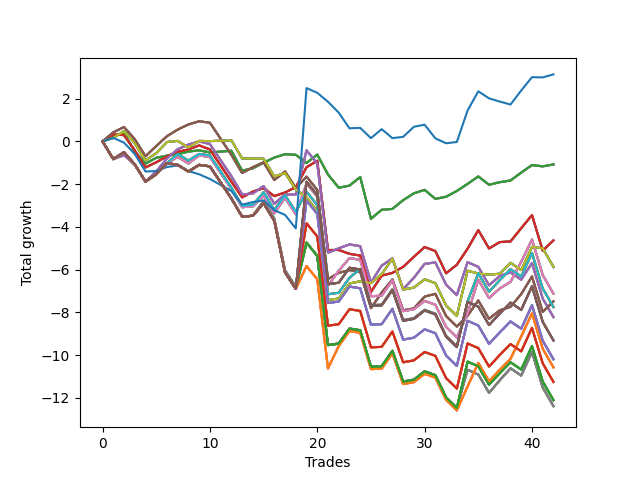

# Long Pointer 006 
- Symbol: SPY_Unlimited
- Date Range: 03/23/2022 - 07/08/2022
- Trading Period: 7:20-12:30
- Number of Trades: 42



| Name | Win Percent | Profit | Avg Profit / Trade | Avg Time / Trade |      | Name | Win Percent | Profit | Avg Profit / Trade | Avg Time / Trade |
| ---- | ----------- | ------ | ------------------ | ---------------- | ---- | ---- | ----------- | ------ | ------------------ | ---------------- |
| Sorted By <br> Profit | | | | | | Sorted By <br> Win Percentage ||||
| Seventy-Three | 42.86 | 1565.00 | 37.26 | 08:26 |     | Sixty-Four | 71.43 | -540.00 | -12.86 | 05:39 |
| Sixty-Four | 71.43 | -540.00 | -12.86 | 05:39 |     | Fifty-Six | 71.43 | -540.00 | -12.86 | 05:39 |
| Fifty-Six | 71.43 | -540.00 | -12.86 | 05:39 |     | Forty-Eight | 71.43 | -540.00 | -12.86 | 05:39 |
| Forty-Eight | 71.43 | -540.00 | -12.86 | 05:39 |     | Forty | 71.43 | -540.00 | -12.86 | 05:39 |
| Forty | 71.43 | -540.00 | -12.86 | 05:39 |     | Zero | 71.43 | -540.00 | -12.86 | 05:39 |
| Zero | 71.43 | -540.00 | -12.86 | 05:39 |     | Sixty-Five | 61.90 | -2315.00 | -55.12 | 15:09 |
| Sixty-Five | 61.90 | -2315.00 | -55.12 | 15:09 |     | Fifty-Seven | 61.90 | -2315.00 | -55.12 | 15:09 |
| Fifty-Seven | 61.90 | -2315.00 | -55.12 | 15:09 |     | Forty-Nine | 61.90 | -2315.00 | -55.12 | 15:09 |
| Forty-Nine | 61.90 | -2315.00 | -55.12 | 15:09 |     | Forty-One | 61.90 | -2315.00 | -55.12 | 15:09 |
| Forty-One | 61.90 | -2315.00 | -55.12 | 15:09 |     | One | 61.90 | -2315.00 | -55.12 | 15:09 |
| One | 61.90 | -2315.00 | -55.12 | 15:09 |     | Sixty-Seven | 59.52 | -3740.00 | -89.05 | 18:55 |
| Seventy | 50.00 | -2935.00 | -69.88 | 17:54 |     | Fifty-Nine | 59.52 | -3740.00 | -89.05 | 18:55 |
| Sixty-Two | 50.00 | -2935.00 | -69.88 | 17:54 |     | Fifty-One | 59.52 | -3740.00 | -89.05 | 18:55 |
| Fifty-Four | 50.00 | -2935.00 | -69.88 | 17:54 |     | Forty-Three | 59.52 | -3740.00 | -89.05 | 18:55 |
| Forty-Six | 50.00 | -2935.00 | -69.88 | 17:54 |     | Three | 59.52 | -3740.00 | -89.05 | 18:55 |
| Six | 50.00 | -2935.00 | -69.88 | 17:54 |     | Seventy | 50.00 | -2935.00 | -69.88 | 17:54 |
| Sixty-Eight | 50.00 | -3560.00 | -84.76 | 25:10 |     | Sixty-Two | 50.00 | -2935.00 | -69.88 | 17:54 |
| Sixty | 50.00 | -3560.00 | -84.76 | 25:10 |     | Fifty-Four | 50.00 | -2935.00 | -69.88 | 17:54 |
| Fifty-Two | 50.00 | -3560.00 | -84.76 | 25:10 |     | Forty-Six | 50.00 | -2935.00 | -69.88 | 17:54 |
| Forty-Four | 50.00 | -3560.00 | -84.76 | 25:10 |     | Six | 50.00 | -2935.00 | -69.88 | 17:54 |
| Four | 50.00 | -3560.00 | -84.76 | 25:10 |     | Sixty-Eight | 50.00 | -3560.00 | -84.76 | 25:10 |
| Sixty-Seven | 59.52 | -3740.00 | -89.05 | 18:55 |     | Sixty | 50.00 | -3560.00 | -84.76 | 25:10 |
| Fifty-Nine | 59.52 | -3740.00 | -89.05 | 18:55 |     | Fifty-Two | 50.00 | -3560.00 | -84.76 | 25:10 |
| Fifty-One | 59.52 | -3740.00 | -89.05 | 18:55 |     | Forty-Four | 50.00 | -3560.00 | -84.76 | 25:10 |
| Forty-Three | 59.52 | -3740.00 | -89.05 | 18:55 |     | Four | 50.00 | -3560.00 | -84.76 | 25:10 |
| Three | 59.52 | -3740.00 | -89.05 | 18:55 |     | Seventy-One | 50.00 | -3875.00 | -92.26 | 26:37 |
| Seventy-One | 50.00 | -3875.00 | -92.26 | 26:37 |     | Sixty-Three | 50.00 | -3875.00 | -92.26 | 26:37 |
| Sixty-Three | 50.00 | -3875.00 | -92.26 | 26:37 |     | Fifty-Five | 50.00 | -3875.00 | -92.26 | 26:37 |
| Fifty-Five | 50.00 | -3875.00 | -92.26 | 26:37 |     | Forty-Seven | 50.00 | -3875.00 | -92.26 | 26:37 |
| Forty-Seven | 50.00 | -3875.00 | -92.26 | 26:37 |     | Seven | 50.00 | -3875.00 | -92.26 | 26:37 |
| Seven | 50.00 | -3875.00 | -92.26 | 26:37 |     | Sixty-Six | 50.00 | -4110.00 | -97.86 | 21:32 |
| Sixty-Six | 50.00 | -4110.00 | -97.86 | 21:32 |     | Fifty-Eight | 50.00 | -4110.00 | -97.86 | 21:32 |
| Fifty-Eight | 50.00 | -4110.00 | -97.86 | 21:32 |     | Fifty | 50.00 | -4110.00 | -97.86 | 21:32 |
| Fifty | 50.00 | -4110.00 | -97.86 | 21:32 |     | Forty-Two | 50.00 | -4110.00 | -97.86 | 21:32 |
| Forty-Two | 50.00 | -4110.00 | -97.86 | 21:32 |     | Two | 50.00 | -4110.00 | -97.86 | 21:32 |
| Two | 50.00 | -4110.00 | -97.86 | 21:32 |     | One Hundred Twenty-Six | 45.24 | -5285.00 | -125.83 | 26:49 |
| One Hundred Thirty | 40.48 | -4655.00 | -110.83 | 29:05 |     | One Hundred Twenty-One | 45.24 | -5285.00 | -125.83 | 26:49 |
| One Hundred Twenty-Five | 40.48 | -4655.00 | -110.83 | 29:05 |     | One Hundred Sixteen | 45.24 | -5285.00 | -125.83 | 26:49 |
| One Hundred Twenty | 40.48 | -4655.00 | -110.83 | 29:05 |     | One Hundred Eleven | 45.24 | -5285.00 | -125.83 | 26:49 |
| One Hundred Fifteen | 40.48 | -4655.00 | -110.83 | 29:05 |     | Eighty-One | 45.24 | -5285.00 | -125.83 | 26:49 |
| Eighty-Five | 40.48 | -4655.00 | -110.83 | 29:05 |     | Seventy-Three | 42.86 | 1565.00 | 37.26 | 08:26 |
| One Hundred Twenty-Nine | 40.48 | -5095.00 | -121.31 | 29:05 |     | One Hundred Thirty | 40.48 | -4655.00 | -110.83 | 29:05 |
| One Hundred Twenty-Four | 40.48 | -5095.00 | -121.31 | 29:05 |     | One Hundred Twenty-Five | 40.48 | -4655.00 | -110.83 | 29:05 |
| One Hundred Ninteen | 40.48 | -5095.00 | -121.31 | 29:05 |     | One Hundred Twenty | 40.48 | -4655.00 | -110.83 | 29:05 |
| One Hundred Fourteen | 40.48 | -5095.00 | -121.31 | 29:05 |     | One Hundred Fifteen | 40.48 | -4655.00 | -110.83 | 29:05 |
| Eighty-Four | 40.48 | -5095.00 | -121.31 | 29:05 |     | Eighty-Five | 40.48 | -4655.00 | -110.83 | 29:05 |
| One Hundred Twenty-Six | 45.24 | -5285.00 | -125.83 | 26:49 |     | One Hundred Twenty-Nine | 40.48 | -5095.00 | -121.31 | 29:05 |
| One Hundred Twenty-One | 45.24 | -5285.00 | -125.83 | 26:49 |     | One Hundred Twenty-Four | 40.48 | -5095.00 | -121.31 | 29:05 |
| One Hundred Sixteen | 45.24 | -5285.00 | -125.83 | 26:49 |     | One Hundred Ninteen | 40.48 | -5095.00 | -121.31 | 29:05 |
| One Hundred Eleven | 45.24 | -5285.00 | -125.83 | 26:49 |     | One Hundred Fourteen | 40.48 | -5095.00 | -121.31 | 29:05 |
| Eighty-One | 45.24 | -5285.00 | -125.83 | 26:49 |     | Eighty-Four | 40.48 | -5095.00 | -121.31 | 29:05 |
| One Hundred Twenty-Eight | 40.48 | -5625.00 | -133.93 | 29:01 |     | One Hundred Twenty-Eight | 40.48 | -5625.00 | -133.93 | 29:01 |
| One Hundred Twenty-Three | 40.48 | -5625.00 | -133.93 | 29:01 |     | One Hundred Twenty-Three | 40.48 | -5625.00 | -133.93 | 29:01 |
| One Hundred Eighteen | 40.48 | -5625.00 | -133.93 | 29:01 |     | One Hundred Eighteen | 40.48 | -5625.00 | -133.93 | 29:01 |
| One Hundred Thirteen | 40.48 | -5625.00 | -133.93 | 29:01 |     | One Hundred Thirteen | 40.48 | -5625.00 | -133.93 | 29:01 |
| Eighty-Three | 40.48 | -5625.00 | -133.93 | 29:01 |     | Eighty-Three | 40.48 | -5625.00 | -133.93 | 29:01 |
| One Hundred Twenty-Seven | 40.48 | -6050.00 | -144.05 | 28:36 |     | One Hundred Twenty-Seven | 40.48 | -6050.00 | -144.05 | 28:36 |
| One Hundred Twenty-Two | 40.48 | -6050.00 | -144.05 | 28:36 |     | One Hundred Twenty-Two | 40.48 | -6050.00 | -144.05 | 28:36 |
| One Hundred Seventeen | 40.48 | -6050.00 | -144.05 | 28:36 |     | One Hundred Seventeen | 40.48 | -6050.00 | -144.05 | 28:36 |
| One Hundred Twelve | 40.48 | -6050.00 | -144.05 | 28:36 |     | One Hundred Twelve | 40.48 | -6050.00 | -144.05 | 28:36 |
| Eighty-Two | 40.48 | -6050.00 | -144.05 | 28:36 |     | Eighty-Two | 40.48 | -6050.00 | -144.05 | 28:36 |
| Sixty-Nine | 40.48 | -6190.00 | -147.38 | 28:10 |     | Sixty-Nine | 40.48 | -6190.00 | -147.38 | 28:10 |
| Sixty-One | 40.48 | -6190.00 | -147.38 | 28:10 |     | Sixty-One | 40.48 | -6190.00 | -147.38 | 28:10 |
| Fifty-Three | 40.48 | -6190.00 | -147.38 | 28:10 |     | Fifty-Three | 40.48 | -6190.00 | -147.38 | 28:10 |
| Forty-Five | 40.48 | -6190.00 | -147.38 | 28:10 |     | Forty-Five | 40.48 | -6190.00 | -147.38 | 28:10 |
| Five | 40.48 | -6190.00 | -147.38 | 28:10 |     | Five | 40.48 | -6190.00 | -147.38 | 28:10 |

## NO STOPLOSS

### Test Zero
* Sell when price hits the middle line of the 20p bollinger
* No Stoploss
* Results:
```
Total Trades: 42
Percent Up: 71.43
Percent Down: 28.57
Total Points Moved Up: -1.08
Potential Profit: -540.00
Total Points Ups: 6.13 Count Ups: 30
Total Points Downs: -7.21 Count Downs: 12
```

<details><summary>Trades</summary>

<code>In: 2022-03-23 09:16:00		Out: 2022-03-23 09:19:25		Total Position Time: 03:25		Total Move Up: 0.28		Total to Date: 0.28</code> <br />
<code>In: 2022-03-23 10:33:00		Out: 2022-03-23 10:38:15		Total Position Time: 05:15		Total Move Up: 0.08		Total to Date: 0.36</code> <br />
<code>In: 2022-03-25 08:17:00		Out: 2022-03-25 08:36:40		Total Position Time: 19:40		Total Move Up: -0.83		Total to Date: -0.47</code> <br />
<code>In: 2022-03-30 08:03:00		Out: 2022-03-30 08:19:15		Total Position Time: 16:15		Total Move Up: -0.57		Total to Date: -1.04</code> <br />
<code>In: 2022-03-30 08:15:00		Out: 2022-03-30 08:19:15		Total Position Time: 04:15		Total Move Up: 0.27		Total to Date: -0.77</code> <br />
<code>In: 2022-03-30 12:28:00		Out: 2022-03-30 12:28:15		Total Position Time: 00:15		Total Move Up: 0.10		Total to Date: -0.67</code> <br />
<code>In: 2022-03-31 08:38:00		Out: 2022-03-31 08:38:15		Total Position Time: 00:15		Total Move Up: 0.07		Total to Date: -0.60</code> <br />
<code>In: 2022-03-31 09:31:00		Out: 2022-03-31 09:32:25		Total Position Time: 01:25		Total Move Up: 0.12		Total to Date: -0.48</code> <br />
<code>In: 2022-03-31 10:19:00		Out: 2022-03-31 10:19:10		Total Position Time: 00:10		Total Move Up: 0.06		Total to Date: -0.42</code> <br />
<code>In: 2022-04-04 09:49:00		Out: 2022-04-04 09:58:05		Total Position Time: 09:05		Total Move Up: -0.10		Total to Date: -0.52</code> <br />
<code>In: 2022-04-08 10:22:00		Out: 2022-04-08 10:23:20		Total Position Time: 01:20		Total Move Up: 0.04		Total to Date: -0.48</code> <br />
<code>In: 2022-04-08 10:22:00		Out: 2022-04-08 10:23:20		Total Position Time: 01:20		Total Move Up: 0.04		Total to Date: -0.44</code> <br />
<code>In: 2022-04-12 07:34:00		Out: 2022-04-12 08:02:05		Total Position Time: 28:05		Total Move Up: -0.93		Total to Date: -1.37</code> <br />
<code>In: 2022-04-19 09:45:00		Out: 2022-04-19 09:47:30		Total Position Time: 02:30		Total Move Up: 0.11		Total to Date: -1.26</code> <br />
<code>In: 2022-04-19 10:32:00		Out: 2022-04-19 10:34:05		Total Position Time: 02:05		Total Move Up: 0.26		Total to Date: -1.00</code> <br />
<code>In: 2022-04-26 07:24:00		Out: 2022-04-26 07:31:30		Total Position Time: 07:30		Total Move Up: 0.24		Total to Date: -0.76</code> <br />
<code>In: 2022-04-27 11:41:00		Out: 2022-04-27 11:41:10		Total Position Time: 00:10		Total Move Up: 0.16		Total to Date: -0.60</code> <br />
<code>In: 2022-04-27 12:07:00		Out: 2022-04-27 12:13:55		Total Position Time: 06:55		Total Move Up: -0.03		Total to Date: -0.63</code> <br />
<code>In: 2022-05-04 11:37:00		Out: 2022-05-04 11:37:10		Total Position Time: 00:10		Total Move Up: -0.38		Total to Date: -1.01</code> <br />
<code>In: 2022-05-06 11:12:00		Out: 2022-05-06 11:12:20		Total Position Time: 00:20		Total Move Up: 0.39		Total to Date: -0.62</code> <br />
<code>In: 2022-05-10 07:45:00		Out: 2022-05-10 07:59:00		Total Position Time: 14:00		Total Move Up: -0.93		Total to Date: -1.55</code> <br />
<code>In: 2022-05-11 10:51:00		Out: 2022-05-11 11:00:40		Total Position Time: 09:40		Total Move Up: -0.62		Total to Date: -2.17</code> <br />
<code>In: 2022-05-12 11:46:00		Out: 2022-05-12 11:46:10		Total Position Time: 00:10		Total Move Up: 0.10		Total to Date: -2.07</code> <br />
<code>In: 2022-05-13 09:56:00		Out: 2022-05-13 10:00:15		Total Position Time: 04:15		Total Move Up: 0.40		Total to Date: -1.67</code> <br />
<code>In: 2022-05-13 10:50:00		Out: 2022-05-13 11:19:15		Total Position Time: 29:15		Total Move Up: -1.95		Total to Date: -3.62</code> <br />
<code>In: 2022-05-25 08:41:00		Out: 2022-05-25 08:44:05		Total Position Time: 03:05		Total Move Up: 0.42		Total to Date: -3.20</code> <br />
<code>In: 2022-05-25 09:30:00		Out: 2022-05-25 09:38:55		Total Position Time: 08:55		Total Move Up: 0.04		Total to Date: -3.16</code> <br />
<code>In: 2022-06-03 07:45:00		Out: 2022-06-03 07:46:35		Total Position Time: 01:35		Total Move Up: 0.41		Total to Date: -2.75</code> <br />
<code>In: 2022-06-08 09:48:00		Out: 2022-06-08 09:53:00		Total Position Time: 05:00		Total Move Up: 0.32		Total to Date: -2.43</code> <br />
<code>In: 2022-06-08 10:42:00		Out: 2022-06-08 10:42:15		Total Position Time: 00:15		Total Move Up: 0.16		Total to Date: -2.27</code> <br />
<code>In: 2022-06-09 07:57:00		Out: 2022-06-09 08:10:55		Total Position Time: 13:55		Total Move Up: -0.42		Total to Date: -2.69</code> <br />
<code>In: 2022-06-09 11:28:00		Out: 2022-06-09 11:28:10		Total Position Time: 00:10		Total Move Up: 0.10		Total to Date: -2.59</code> <br />
<code>In: 2022-06-15 07:58:00		Out: 2022-06-15 07:58:55		Total Position Time: 00:55		Total Move Up: 0.27		Total to Date: -2.32</code> <br />
<code>In: 2022-06-16 11:57:00		Out: 2022-06-16 12:00:20		Total Position Time: 03:20		Total Move Up: 0.33		Total to Date: -1.99</code> <br />
<code>In: 2022-06-17 12:19:00		Out: 2022-06-17 12:20:30		Total Position Time: 01:30		Total Move Up: 0.35		Total to Date: -1.64</code> <br />
<code>In: 2022-06-21 08:43:00		Out: 2022-06-21 08:57:50		Total Position Time: 14:50		Total Move Up: -0.39		Total to Date: -2.03</code> <br />
<code>In: 2022-06-21 11:06:00		Out: 2022-06-21 11:07:45		Total Position Time: 01:45		Total Move Up: 0.12		Total to Date: -1.91</code> <br />
<code>In: 2022-06-27 10:51:00		Out: 2022-06-27 10:51:15		Total Position Time: 00:15		Total Move Up: 0.08		Total to Date: -1.83</code> <br />
<code>In: 2022-06-27 12:09:00		Out: 2022-06-27 12:10:20		Total Position Time: 01:20		Total Move Up: 0.37		Total to Date: -1.46</code> <br />
<code>In: 2022-06-29 08:26:00		Out: 2022-06-29 08:28:25		Total Position Time: 02:25		Total Move Up: 0.35		Total to Date: -1.11</code> <br />
<code>In: 2022-06-30 11:29:00		Out: 2022-06-30 11:38:25		Total Position Time: 09:25		Total Move Up: -0.06		Total to Date: -1.17</code> <br />
<code>In: 2022-07-06 08:13:00		Out: 2022-07-06 08:14:30		Total Position Time: 01:30		Total Move Up: 0.09		Total to Date: -1.08</code> <br />


</details>

### Test One
* Sell when the price hits the upper line of the 20p 1std bollinger
* No Stoploss
* Results:
```
Total Trades: 42
Percent Up: 61.90
Percent Down: 38.10
Total Points Moved Up: -4.63
Potential Profit: -2315.00
Total Points Ups: 9.59 Count Ups: 26
Total Points Downs: -14.22 Count Downs: 16
```

<details><summary>Trades</summary>

<code>In: 2022-03-23 09:16:00		Out: 2022-03-23 09:30:20		Total Position Time: 14:20		Total Move Up: 0.32		Total to Date: 0.32</code> <br />
<code>In: 2022-03-23 10:33:00		Out: 2022-03-23 10:51:45		Total Position Time: 18:45		Total Move Up: -0.03		Total to Date: 0.29</code> <br />
<code>In: 2022-03-25 08:17:00		Out: 2022-03-25 08:41:05		Total Position Time: 24:05		Total Move Up: -0.71		Total to Date: -0.42</code> <br />
<code>In: 2022-03-30 08:03:00		Out: 2022-03-30 08:32:55		Total Position Time: 29:55		Total Move Up: -0.80		Total to Date: -1.22</code> <br />
<code>In: 2022-03-30 08:15:00		Out: 2022-03-30 08:34:40		Total Position Time: 19:40		Total Move Up: 0.24		Total to Date: -0.98</code> <br />
<code>In: 2022-03-30 12:28:00		Out: 2022-03-30 12:32:20		Total Position Time: 04:20		Total Move Up: 0.28		Total to Date: -0.70</code> <br />
<code>In: 2022-03-31 08:38:00		Out: 2022-03-31 08:40:35		Total Position Time: 02:35		Total Move Up: 0.21		Total to Date: -0.49</code> <br />
<code>In: 2022-03-31 09:31:00		Out: 2022-03-31 09:40:45		Total Position Time: 09:45		Total Move Up: 0.11		Total to Date: -0.38</code> <br />
<code>In: 2022-03-31 10:19:00		Out: 2022-03-31 10:19:40		Total Position Time: 00:40		Total Move Up: 0.19		Total to Date: -0.19</code> <br />
<code>In: 2022-04-04 09:49:00		Out: 2022-04-04 10:17:55		Total Position Time: 28:55		Total Move Up: -0.19		Total to Date: -0.38</code> <br />
<code>In: 2022-04-08 10:22:00		Out: 2022-04-08 10:51:55		Total Position Time: 29:55		Total Move Up: -0.75		Total to Date: -1.13</code> <br />
<code>In: 2022-04-08 10:22:00		Out: 2022-04-08 10:51:55		Total Position Time: 29:55		Total Move Up: -0.75		Total to Date: -1.88</code> <br />
<code>In: 2022-04-12 07:34:00		Out: 2022-04-12 08:02:35		Total Position Time: 28:35		Total Move Up: -0.74		Total to Date: -2.62</code> <br />
<code>In: 2022-04-19 09:45:00		Out: 2022-04-19 09:51:05		Total Position Time: 06:05		Total Move Up: 0.27		Total to Date: -2.35</code> <br />
<code>In: 2022-04-19 10:32:00		Out: 2022-04-19 10:48:55		Total Position Time: 16:55		Total Move Up: 0.16		Total to Date: -2.19</code> <br />
<code>In: 2022-04-26 07:24:00		Out: 2022-04-26 07:53:10		Total Position Time: 29:10		Total Move Up: -0.37		Total to Date: -2.56</code> <br />
<code>In: 2022-04-27 11:41:00		Out: 2022-04-27 11:42:30		Total Position Time: 01:30		Total Move Up: 0.17		Total to Date: -2.39</code> <br />
<code>In: 2022-04-27 12:07:00		Out: 2022-04-27 12:15:20		Total Position Time: 08:20		Total Move Up: 0.25		Total to Date: -2.14</code> <br />
<code>In: 2022-05-04 11:37:00		Out: 2022-05-04 11:41:35		Total Position Time: 04:35		Total Move Up: 0.93		Total to Date: -1.21</code> <br />
<code>In: 2022-05-06 11:12:00		Out: 2022-05-06 11:24:25		Total Position Time: 12:25		Total Move Up: 0.30		Total to Date: -0.91</code> <br />
<code>In: 2022-05-10 07:45:00		Out: 2022-05-10 08:14:55		Total Position Time: 29:55		Total Move Up: -4.17		Total to Date: -5.08</code> <br />
<code>In: 2022-05-11 10:51:00		Out: 2022-05-11 11:01:20		Total Position Time: 10:20		Total Move Up: 0.00		Total to Date: -5.08</code> <br />
<code>In: 2022-05-12 11:46:00		Out: 2022-05-12 11:52:05		Total Position Time: 06:05		Total Move Up: -0.18		Total to Date: -5.26</code> <br />
<code>In: 2022-05-13 09:56:00		Out: 2022-05-13 10:25:55		Total Position Time: 29:55		Total Move Up: -0.08		Total to Date: -5.34</code> <br />
<code>In: 2022-05-13 10:50:00		Out: 2022-05-13 11:19:55		Total Position Time: 29:55		Total Move Up: -1.70		Total to Date: -7.04</code> <br />
<code>In: 2022-05-25 08:41:00		Out: 2022-05-25 08:48:35		Total Position Time: 07:35		Total Move Up: 0.76		Total to Date: -6.28</code> <br />
<code>In: 2022-05-25 09:30:00		Out: 2022-05-25 09:44:25		Total Position Time: 14:25		Total Move Up: 0.13		Total to Date: -6.15</code> <br />
<code>In: 2022-06-03 07:45:00		Out: 2022-06-03 07:58:10		Total Position Time: 13:10		Total Move Up: 0.28		Total to Date: -5.87</code> <br />
<code>In: 2022-06-08 09:48:00		Out: 2022-06-08 09:59:05		Total Position Time: 11:05		Total Move Up: 0.47		Total to Date: -5.40</code> <br />
<code>In: 2022-06-08 10:42:00		Out: 2022-06-08 10:47:05		Total Position Time: 05:05		Total Move Up: 0.46		Total to Date: -4.94</code> <br />
<code>In: 2022-06-09 07:57:00		Out: 2022-06-09 08:21:10		Total Position Time: 24:10		Total Move Up: -0.19		Total to Date: -5.13</code> <br />
<code>In: 2022-06-09 11:28:00		Out: 2022-06-09 11:57:55		Total Position Time: 29:55		Total Move Up: -1.04		Total to Date: -6.17</code> <br />
<code>In: 2022-06-15 07:58:00		Out: 2022-06-15 08:07:20		Total Position Time: 09:20		Total Move Up: 0.40		Total to Date: -5.77</code> <br />
<code>In: 2022-06-16 11:57:00		Out: 2022-06-16 12:01:05		Total Position Time: 04:05		Total Move Up: 0.75		Total to Date: -5.02</code> <br />
<code>In: 2022-06-17 12:19:00		Out: 2022-06-17 12:21:30		Total Position Time: 02:30		Total Move Up: 0.87		Total to Date: -4.15</code> <br />
<code>In: 2022-06-21 08:43:00		Out: 2022-06-21 09:12:55		Total Position Time: 29:55		Total Move Up: -0.86		Total to Date: -5.01</code> <br />
<code>In: 2022-06-21 11:06:00		Out: 2022-06-21 11:08:35		Total Position Time: 02:35		Total Move Up: 0.30		Total to Date: -4.71</code> <br />
<code>In: 2022-06-27 10:51:00		Out: 2022-06-27 11:03:15		Total Position Time: 12:15		Total Move Up: 0.03		Total to Date: -4.68</code> <br />
<code>In: 2022-06-27 12:09:00		Out: 2022-06-27 12:12:00		Total Position Time: 03:00		Total Move Up: 0.62		Total to Date: -4.06</code> <br />
<code>In: 2022-06-29 08:26:00		Out: 2022-06-29 08:32:20		Total Position Time: 06:20		Total Move Up: 0.61		Total to Date: -3.45</code> <br />
<code>In: 2022-06-30 11:29:00		Out: 2022-06-30 11:58:55		Total Position Time: 29:55		Total Move Up: -1.66		Total to Date: -5.11</code> <br />
<code>In: 2022-07-06 08:13:00		Out: 2022-07-06 08:17:50		Total Position Time: 04:50		Total Move Up: 0.48		Total to Date: -4.63</code> <br />


</details>

### Test Two
* Sell when the price hits the upper line of the 20p 2std bollinger
* No Stoploss
* Results:
```
Total Trades: 42
Percent Up: 50.00
Percent Down: 50.00
Total Points Moved Up: -8.22
Potential Profit: -4110.00
Total Points Ups: 10.66 Count Ups: 21
Total Points Downs: -18.88 Count Downs: 21
```

<details><summary>Trades</summary>

<code>In: 2022-03-23 09:16:00		Out: 2022-03-23 09:45:55		Total Position Time: 29:55		Total Move Up: -0.83		Total to Date: -0.83</code> <br />
<code>In: 2022-03-23 10:33:00		Out: 2022-03-23 10:54:25		Total Position Time: 21:25		Total Move Up: 0.18		Total to Date: -0.65</code> <br />
<code>In: 2022-03-25 08:17:00		Out: 2022-03-25 08:41:45		Total Position Time: 24:45		Total Move Up: -0.44		Total to Date: -1.09</code> <br />
<code>In: 2022-03-30 08:03:00		Out: 2022-03-30 08:32:55		Total Position Time: 29:55		Total Move Up: -0.80		Total to Date: -1.89</code> <br />
<code>In: 2022-03-30 08:15:00		Out: 2022-03-30 08:35:15		Total Position Time: 20:15		Total Move Up: 0.48		Total to Date: -1.41</code> <br />
<code>In: 2022-03-30 12:28:00		Out: 2022-03-30 12:36:25		Total Position Time: 08:25		Total Move Up: 0.61		Total to Date: -0.80</code> <br />
<code>In: 2022-03-31 08:38:00		Out: 2022-03-31 08:41:10		Total Position Time: 03:10		Total Move Up: 0.43		Total to Date: -0.37</code> <br />
<code>In: 2022-03-31 09:31:00		Out: 2022-03-31 09:44:20		Total Position Time: 13:20		Total Move Up: 0.22		Total to Date: -0.15</code> <br />
<code>In: 2022-03-31 10:19:00		Out: 2022-03-31 10:27:25		Total Position Time: 08:25		Total Move Up: 0.15		Total to Date: -0.00</code> <br />
<code>In: 2022-04-04 09:49:00		Out: 2022-04-04 10:18:15		Total Position Time: 29:15		Total Move Up: -0.13		Total to Date: -0.13</code> <br />
<code>In: 2022-04-08 10:22:00		Out: 2022-04-08 10:51:55		Total Position Time: 29:55		Total Move Up: -0.75		Total to Date: -0.88</code> <br />
<code>In: 2022-04-08 10:22:00		Out: 2022-04-08 10:51:55		Total Position Time: 29:55		Total Move Up: -0.75		Total to Date: -1.63</code> <br />
<code>In: 2022-04-12 07:34:00		Out: 2022-04-12 08:03:55		Total Position Time: 29:55		Total Move Up: -0.85		Total to Date: -2.48</code> <br />
<code>In: 2022-04-19 09:45:00		Out: 2022-04-19 10:14:55		Total Position Time: 29:55		Total Move Up: 0.04		Total to Date: -2.44</code> <br />
<code>In: 2022-04-19 10:32:00		Out: 2022-04-19 10:49:55		Total Position Time: 17:55		Total Move Up: 0.35		Total to Date: -2.09</code> <br />
<code>In: 2022-04-26 07:24:00		Out: 2022-04-26 07:53:55		Total Position Time: 29:55		Total Move Up: -0.83		Total to Date: -2.92</code> <br />
<code>In: 2022-04-27 11:41:00		Out: 2022-04-27 11:42:40		Total Position Time: 01:40		Total Move Up: 0.44		Total to Date: -2.48</code> <br />
<code>In: 2022-04-27 12:07:00		Out: 2022-04-27 12:31:35		Total Position Time: 24:35		Total Move Up: -0.01		Total to Date: -2.49</code> <br />
<code>In: 2022-05-04 11:37:00		Out: 2022-05-04 11:43:45		Total Position Time: 06:45		Total Move Up: 2.07		Total to Date: -0.42</code> <br />
<code>In: 2022-05-06 11:12:00		Out: 2022-05-06 11:41:55		Total Position Time: 29:55		Total Move Up: -0.62		Total to Date: -1.04</code> <br />
<code>In: 2022-05-10 07:45:00		Out: 2022-05-10 08:14:55		Total Position Time: 29:55		Total Move Up: -4.17		Total to Date: -5.21</code> <br />
<code>In: 2022-05-11 10:51:00		Out: 2022-05-11 11:04:20		Total Position Time: 13:20		Total Move Up: 0.21		Total to Date: -5.00</code> <br />
<code>In: 2022-05-12 11:46:00		Out: 2022-05-12 11:53:00		Total Position Time: 07:00		Total Move Up: 0.18		Total to Date: -4.82</code> <br />
<code>In: 2022-05-13 09:56:00		Out: 2022-05-13 10:25:55		Total Position Time: 29:55		Total Move Up: -0.08		Total to Date: -4.90</code> <br />
<code>In: 2022-05-13 10:50:00		Out: 2022-05-13 11:19:55		Total Position Time: 29:55		Total Move Up: -1.70		Total to Date: -6.60</code> <br />
<code>In: 2022-05-25 08:41:00		Out: 2022-05-25 09:02:20		Total Position Time: 21:20		Total Move Up: 0.79		Total to Date: -5.81</code> <br />
<code>In: 2022-05-25 09:30:00		Out: 2022-05-25 09:45:20		Total Position Time: 15:20		Total Move Up: 0.34		Total to Date: -5.47</code> <br />
<code>In: 2022-06-03 07:45:00		Out: 2022-06-03 08:14:55		Total Position Time: 29:55		Total Move Up: -1.44		Total to Date: -6.91</code> <br />
<code>In: 2022-06-08 09:48:00		Out: 2022-06-08 09:59:15		Total Position Time: 11:15		Total Move Up: 0.53		Total to Date: -6.38</code> <br />
<code>In: 2022-06-08 10:42:00		Out: 2022-06-08 11:03:45		Total Position Time: 21:45		Total Move Up: 0.65		Total to Date: -5.73</code> <br />
<code>In: 2022-06-09 07:57:00		Out: 2022-06-09 08:22:35		Total Position Time: 25:35		Total Move Up: 0.07		Total to Date: -5.66</code> <br />
<code>In: 2022-06-09 11:28:00		Out: 2022-06-09 11:57:55		Total Position Time: 29:55		Total Move Up: -1.04		Total to Date: -6.70</code> <br />
<code>In: 2022-06-15 07:58:00		Out: 2022-06-15 08:27:55		Total Position Time: 29:55		Total Move Up: -0.49		Total to Date: -7.19</code> <br />
<code>In: 2022-06-16 11:57:00		Out: 2022-06-16 12:04:25		Total Position Time: 07:25		Total Move Up: 1.54		Total to Date: -5.65</code> <br />
<code>In: 2022-06-17 12:19:00		Out: 2022-06-17 12:46:00		Total Position Time: 27:00		Total Move Up: -0.22		Total to Date: -5.87</code> <br />
<code>In: 2022-06-21 08:43:00		Out: 2022-06-21 09:12:55		Total Position Time: 29:55		Total Move Up: -0.86		Total to Date: -6.73</code> <br />
<code>In: 2022-06-21 11:06:00		Out: 2022-06-21 11:10:45		Total Position Time: 04:45		Total Move Up: 0.44		Total to Date: -6.29</code> <br />
<code>In: 2022-06-27 10:51:00		Out: 2022-06-27 11:13:35		Total Position Time: 22:35		Total Move Up: 0.16		Total to Date: -6.13</code> <br />
<code>In: 2022-06-27 12:09:00		Out: 2022-06-27 12:38:55		Total Position Time: 29:55		Total Move Up: -0.34		Total to Date: -6.47</code> <br />
<code>In: 2022-06-29 08:26:00		Out: 2022-06-29 08:34:40		Total Position Time: 08:40		Total Move Up: 0.78		Total to Date: -5.69</code> <br />
<code>In: 2022-06-30 11:29:00		Out: 2022-06-30 11:58:55		Total Position Time: 29:55		Total Move Up: -1.66		Total to Date: -7.35</code> <br />
<code>In: 2022-07-06 08:13:00		Out: 2022-07-06 08:42:55		Total Position Time: 29:55		Total Move Up: -0.87		Total to Date: -8.22</code> <br />


</details>

### Test Three
* Sell when price hits the middle line of the 50p bollinger
* No Stoploss
* Results:
```
Total Trades: 42
Percent Up: 59.52
Percent Down: 40.48
Total Points Moved Up: -7.48
Potential Profit: -3740.00
Total Points Ups: 9.97 Count Ups: 25
Total Points Downs: -17.45 Count Downs: 17
```

<details><summary>Trades</summary>

<code>In: 2022-03-23 09:16:00		Out: 2022-03-23 09:30:30		Total Position Time: 14:30		Total Move Up: 0.42		Total to Date: 0.42</code> <br />
<code>In: 2022-03-23 10:33:00		Out: 2022-03-23 10:54:30		Total Position Time: 21:30		Total Move Up: 0.25		Total to Date: 0.67</code> <br />
<code>In: 2022-03-25 08:17:00		Out: 2022-03-25 08:46:55		Total Position Time: 29:55		Total Move Up: -0.57		Total to Date: 0.10</code> <br />
<code>In: 2022-03-30 08:03:00		Out: 2022-03-30 08:32:55		Total Position Time: 29:55		Total Move Up: -0.80		Total to Date: -0.70</code> <br />
<code>In: 2022-03-30 08:15:00		Out: 2022-03-30 08:35:15		Total Position Time: 20:15		Total Move Up: 0.48		Total to Date: -0.22</code> <br />
<code>In: 2022-03-30 12:28:00		Out: 2022-03-30 12:33:30		Total Position Time: 05:30		Total Move Up: 0.46		Total to Date: 0.24</code> <br />
<code>In: 2022-03-31 08:38:00		Out: 2022-03-31 08:41:05		Total Position Time: 03:05		Total Move Up: 0.31		Total to Date: 0.55</code> <br />
<code>In: 2022-03-31 09:31:00		Out: 2022-03-31 09:45:10		Total Position Time: 14:10		Total Move Up: 0.24		Total to Date: 0.79</code> <br />
<code>In: 2022-03-31 10:19:00		Out: 2022-03-31 10:27:25		Total Position Time: 08:25		Total Move Up: 0.15		Total to Date: 0.94</code> <br />
<code>In: 2022-04-04 09:49:00		Out: 2022-04-04 10:18:55		Total Position Time: 29:55		Total Move Up: -0.07		Total to Date: 0.87</code> <br />
<code>In: 2022-04-08 10:22:00		Out: 2022-04-08 10:51:55		Total Position Time: 29:55		Total Move Up: -0.75		Total to Date: 0.12</code> <br />
<code>In: 2022-04-08 10:22:00		Out: 2022-04-08 10:51:55		Total Position Time: 29:55		Total Move Up: -0.75		Total to Date: -0.63</code> <br />
<code>In: 2022-04-12 07:34:00		Out: 2022-04-12 08:03:55		Total Position Time: 29:55		Total Move Up: -0.85		Total to Date: -1.48</code> <br />
<code>In: 2022-04-19 09:45:00		Out: 2022-04-19 09:51:05		Total Position Time: 06:05		Total Move Up: 0.27		Total to Date: -1.21</code> <br />
<code>In: 2022-04-19 10:32:00		Out: 2022-04-19 10:49:10		Total Position Time: 17:10		Total Move Up: 0.23		Total to Date: -0.98</code> <br />
<code>In: 2022-04-26 07:24:00		Out: 2022-04-26 07:53:55		Total Position Time: 29:55		Total Move Up: -0.83		Total to Date: -1.81</code> <br />
<code>In: 2022-04-27 11:41:00		Out: 2022-04-27 11:42:35		Total Position Time: 01:35		Total Move Up: 0.40		Total to Date: -1.41</code> <br />
<code>In: 2022-04-27 12:07:00		Out: 2022-04-27 12:36:55		Total Position Time: 29:55		Total Move Up: -0.77		Total to Date: -2.18</code> <br />
<code>In: 2022-05-04 11:37:00		Out: 2022-05-04 11:41:15		Total Position Time: 04:15		Total Move Up: 0.53		Total to Date: -1.65</code> <br />
<code>In: 2022-05-06 11:12:00		Out: 2022-05-06 11:41:55		Total Position Time: 29:55		Total Move Up: -0.62		Total to Date: -2.27</code> <br />
<code>In: 2022-05-10 07:45:00		Out: 2022-05-10 08:14:55		Total Position Time: 29:55		Total Move Up: -4.17		Total to Date: -6.44</code> <br />
<code>In: 2022-05-11 10:51:00		Out: 2022-05-11 11:04:45		Total Position Time: 13:45		Total Move Up: 0.29		Total to Date: -6.15</code> <br />
<code>In: 2022-05-12 11:46:00		Out: 2022-05-12 11:53:05		Total Position Time: 07:05		Total Move Up: 0.13		Total to Date: -6.02</code> <br />
<code>In: 2022-05-13 09:56:00		Out: 2022-05-13 10:25:55		Total Position Time: 29:55		Total Move Up: -0.08		Total to Date: -6.10</code> <br />
<code>In: 2022-05-13 10:50:00		Out: 2022-05-13 11:19:55		Total Position Time: 29:55		Total Move Up: -1.70		Total to Date: -7.80</code> <br />
<code>In: 2022-05-25 08:41:00		Out: 2022-05-25 08:58:20		Total Position Time: 17:20		Total Move Up: 0.73		Total to Date: -7.07</code> <br />
<code>In: 2022-05-25 09:30:00		Out: 2022-05-25 09:49:05		Total Position Time: 19:05		Total Move Up: 0.61		Total to Date: -6.46</code> <br />
<code>In: 2022-06-03 07:45:00		Out: 2022-06-03 08:14:55		Total Position Time: 29:55		Total Move Up: -1.44		Total to Date: -7.90</code> <br />
<code>In: 2022-06-08 09:48:00		Out: 2022-06-08 10:17:55		Total Position Time: 29:55		Total Move Up: 0.09		Total to Date: -7.81</code> <br />
<code>In: 2022-06-08 10:42:00		Out: 2022-06-08 10:47:20		Total Position Time: 05:20		Total Move Up: 0.55		Total to Date: -7.26</code> <br />
<code>In: 2022-06-09 07:57:00		Out: 2022-06-09 08:22:45		Total Position Time: 25:45		Total Move Up: 0.13		Total to Date: -7.13</code> <br />
<code>In: 2022-06-09 11:28:00		Out: 2022-06-09 11:57:55		Total Position Time: 29:55		Total Move Up: -1.04		Total to Date: -8.17</code> <br />
<code>In: 2022-06-15 07:58:00		Out: 2022-06-15 08:27:55		Total Position Time: 29:55		Total Move Up: -0.49		Total to Date: -8.66</code> <br />
<code>In: 2022-06-16 11:57:00		Out: 2022-06-16 12:00:25		Total Position Time: 03:25		Total Move Up: 0.51		Total to Date: -8.15</code> <br />
<code>In: 2022-06-17 12:19:00		Out: 2022-06-17 12:21:15		Total Position Time: 02:15		Total Move Up: 0.71		Total to Date: -7.44</code> <br />
<code>In: 2022-06-21 08:43:00		Out: 2022-06-21 09:12:55		Total Position Time: 29:55		Total Move Up: -0.86		Total to Date: -8.30</code> <br />
<code>In: 2022-06-21 11:06:00		Out: 2022-06-21 11:10:20		Total Position Time: 04:20		Total Move Up: 0.40		Total to Date: -7.90</code> <br />
<code>In: 2022-06-27 10:51:00		Out: 2022-06-27 11:13:35		Total Position Time: 22:35		Total Move Up: 0.16		Total to Date: -7.74</code> <br />
<code>In: 2022-06-27 12:09:00		Out: 2022-06-27 12:10:30		Total Position Time: 01:30		Total Move Up: 0.60		Total to Date: -7.14</code> <br />
<code>In: 2022-06-29 08:26:00		Out: 2022-06-29 08:35:10		Total Position Time: 09:10		Total Move Up: 0.82		Total to Date: -6.32</code> <br />
<code>In: 2022-06-30 11:29:00		Out: 2022-06-30 11:58:55		Total Position Time: 29:55		Total Move Up: -1.66		Total to Date: -7.98</code> <br />
<code>In: 2022-07-06 08:13:00		Out: 2022-07-06 08:21:30		Total Position Time: 08:30		Total Move Up: 0.50		Total to Date: -7.48</code> <br />


</details>

### Test Four
* Sell when the price hits the upper line of the 50p 1std bollinger
* No Stoploss
* Results:
```
Total Trades: 42
Percent Up: 50.00
Percent Down: 50.00
Total Points Moved Up: -7.12
Potential Profit: -3560.00
Total Points Ups: 12.52 Count Ups: 21
Total Points Downs: -19.64 Count Downs: 21
```

<details><summary>Trades</summary>

<code>In: 2022-03-23 09:16:00		Out: 2022-03-23 09:45:55		Total Position Time: 29:55		Total Move Up: -0.83		Total to Date: -0.83</code> <br />
<code>In: 2022-03-23 10:33:00		Out: 2022-03-23 11:02:55		Total Position Time: 29:55		Total Move Up: 0.32		Total to Date: -0.51</code> <br />
<code>In: 2022-03-25 08:17:00		Out: 2022-03-25 08:46:55		Total Position Time: 29:55		Total Move Up: -0.57		Total to Date: -1.08</code> <br />
<code>In: 2022-03-30 08:03:00		Out: 2022-03-30 08:32:55		Total Position Time: 29:55		Total Move Up: -0.80		Total to Date: -1.88</code> <br />
<code>In: 2022-03-30 08:15:00		Out: 2022-03-30 08:44:55		Total Position Time: 29:55		Total Move Up: 0.34		Total to Date: -1.54</code> <br />
<code>In: 2022-03-30 12:28:00		Out: 2022-03-30 12:46:00		Total Position Time: 18:00		Total Move Up: 0.52		Total to Date: -1.02</code> <br />
<code>In: 2022-03-31 08:38:00		Out: 2022-03-31 09:00:15		Total Position Time: 22:15		Total Move Up: 0.29		Total to Date: -0.73</code> <br />
<code>In: 2022-03-31 09:31:00		Out: 2022-03-31 10:00:55		Total Position Time: 29:55		Total Move Up: -0.31		Total to Date: -1.04</code> <br />
<code>In: 2022-03-31 10:19:00		Out: 2022-03-31 10:29:50		Total Position Time: 10:50		Total Move Up: 0.38		Total to Date: -0.66</code> <br />
<code>In: 2022-04-04 09:49:00		Out: 2022-04-04 10:18:55		Total Position Time: 29:55		Total Move Up: -0.07		Total to Date: -0.73</code> <br />
<code>In: 2022-04-08 10:22:00		Out: 2022-04-08 10:51:55		Total Position Time: 29:55		Total Move Up: -0.75		Total to Date: -1.48</code> <br />
<code>In: 2022-04-08 10:22:00		Out: 2022-04-08 10:51:55		Total Position Time: 29:55		Total Move Up: -0.75		Total to Date: -2.23</code> <br />
<code>In: 2022-04-12 07:34:00		Out: 2022-04-12 08:03:55		Total Position Time: 29:55		Total Move Up: -0.85		Total to Date: -3.08</code> <br />
<code>In: 2022-04-19 09:45:00		Out: 2022-04-19 10:14:55		Total Position Time: 29:55		Total Move Up: 0.04		Total to Date: -3.04</code> <br />
<code>In: 2022-04-19 10:32:00		Out: 2022-04-19 10:50:15		Total Position Time: 18:15		Total Move Up: 0.50		Total to Date: -2.54</code> <br />
<code>In: 2022-04-26 07:24:00		Out: 2022-04-26 07:53:55		Total Position Time: 29:55		Total Move Up: -0.83		Total to Date: -3.37</code> <br />
<code>In: 2022-04-27 11:41:00		Out: 2022-04-27 11:45:25		Total Position Time: 04:25		Total Move Up: 0.73		Total to Date: -2.64</code> <br />
<code>In: 2022-04-27 12:07:00		Out: 2022-04-27 12:36:55		Total Position Time: 29:55		Total Move Up: -0.77		Total to Date: -3.41</code> <br />
<code>In: 2022-05-04 11:37:00		Out: 2022-05-04 11:42:00		Total Position Time: 05:00		Total Move Up: 1.44		Total to Date: -1.97</code> <br />
<code>In: 2022-05-06 11:12:00		Out: 2022-05-06 11:41:55		Total Position Time: 29:55		Total Move Up: -0.62		Total to Date: -2.59</code> <br />
<code>In: 2022-05-10 07:45:00		Out: 2022-05-10 08:14:55		Total Position Time: 29:55		Total Move Up: -4.17		Total to Date: -6.76</code> <br />
<code>In: 2022-05-11 10:51:00		Out: 2022-05-11 11:18:15		Total Position Time: 27:15		Total Move Up: 0.71		Total to Date: -6.05</code> <br />
<code>In: 2022-05-12 11:46:00		Out: 2022-05-12 12:03:55		Total Position Time: 17:55		Total Move Up: 0.59		Total to Date: -5.46</code> <br />
<code>In: 2022-05-13 09:56:00		Out: 2022-05-13 10:25:55		Total Position Time: 29:55		Total Move Up: -0.08		Total to Date: -5.54</code> <br />
<code>In: 2022-05-13 10:50:00		Out: 2022-05-13 11:19:55		Total Position Time: 29:55		Total Move Up: -1.70		Total to Date: -7.24</code> <br />
<code>In: 2022-05-25 08:41:00		Out: 2022-05-25 09:10:55		Total Position Time: 29:55		Total Move Up: 0.02		Total to Date: -7.22</code> <br />
<code>In: 2022-05-25 09:30:00		Out: 2022-05-25 09:59:55		Total Position Time: 29:55		Total Move Up: 0.72		Total to Date: -6.50</code> <br />
<code>In: 2022-06-03 07:45:00		Out: 2022-06-03 08:14:55		Total Position Time: 29:55		Total Move Up: -1.44		Total to Date: -7.94</code> <br />
<code>In: 2022-06-08 09:48:00		Out: 2022-06-08 10:17:55		Total Position Time: 29:55		Total Move Up: 0.09		Total to Date: -7.85</code> <br />
<code>In: 2022-06-08 10:42:00		Out: 2022-06-08 11:11:55		Total Position Time: 29:55		Total Move Up: 0.39		Total to Date: -7.46</code> <br />
<code>In: 2022-06-09 07:57:00		Out: 2022-06-09 08:26:55		Total Position Time: 29:55		Total Move Up: -0.18		Total to Date: -7.64</code> <br />
<code>In: 2022-06-09 11:28:00		Out: 2022-06-09 11:57:55		Total Position Time: 29:55		Total Move Up: -1.04		Total to Date: -8.68</code> <br />
<code>In: 2022-06-15 07:58:00		Out: 2022-06-15 08:27:55		Total Position Time: 29:55		Total Move Up: -0.49		Total to Date: -9.17</code> <br />
<code>In: 2022-06-16 11:57:00		Out: 2022-06-16 12:01:45		Total Position Time: 04:45		Total Move Up: 1.12		Total to Date: -8.05</code> <br />
<code>In: 2022-06-17 12:19:00		Out: 2022-06-17 12:27:15		Total Position Time: 08:15		Total Move Up: 1.58		Total to Date: -6.47</code> <br />
<code>In: 2022-06-21 08:43:00		Out: 2022-06-21 09:12:55		Total Position Time: 29:55		Total Move Up: -0.86		Total to Date: -7.33</code> <br />
<code>In: 2022-06-21 11:06:00		Out: 2022-06-21 11:29:15		Total Position Time: 23:15		Total Move Up: 0.45		Total to Date: -6.88</code> <br />
<code>In: 2022-06-27 10:51:00		Out: 2022-06-27 11:17:10		Total Position Time: 26:10		Total Move Up: 0.31		Total to Date: -6.57</code> <br />
<code>In: 2022-06-27 12:09:00		Out: 2022-06-27 12:15:20		Total Position Time: 06:20		Total Move Up: 0.94		Total to Date: -5.63</code> <br />
<code>In: 2022-06-29 08:26:00		Out: 2022-06-29 08:53:10		Total Position Time: 27:10		Total Move Up: 1.04		Total to Date: -4.59</code> <br />
<code>In: 2022-06-30 11:29:00		Out: 2022-06-30 11:58:55		Total Position Time: 29:55		Total Move Up: -1.66		Total to Date: -6.25</code> <br />
<code>In: 2022-07-06 08:13:00		Out: 2022-07-06 08:42:55		Total Position Time: 29:55		Total Move Up: -0.87		Total to Date: -7.12</code> <br />


</details>

### Test Five
* Sell when the price hits the upper line of the 50p 2std bollinger
* No Stoploss
* Results:
```
Total Trades: 42
Percent Up: 40.48
Percent Down: 59.52
Total Points Moved Up: -12.38
Potential Profit: -6190.00
Total Points Ups: 10.31 Count Ups: 17
Total Points Downs: -22.69 Count Downs: 25
```

<details><summary>Trades</summary>

<code>In: 2022-03-23 09:16:00		Out: 2022-03-23 09:45:55		Total Position Time: 29:55		Total Move Up: -0.83		Total to Date: -0.83</code> <br />
<code>In: 2022-03-23 10:33:00		Out: 2022-03-23 11:02:55		Total Position Time: 29:55		Total Move Up: 0.32		Total to Date: -0.51</code> <br />
<code>In: 2022-03-25 08:17:00		Out: 2022-03-25 08:46:55		Total Position Time: 29:55		Total Move Up: -0.57		Total to Date: -1.08</code> <br />
<code>In: 2022-03-30 08:03:00		Out: 2022-03-30 08:32:55		Total Position Time: 29:55		Total Move Up: -0.80		Total to Date: -1.88</code> <br />
<code>In: 2022-03-30 08:15:00		Out: 2022-03-30 08:44:55		Total Position Time: 29:55		Total Move Up: 0.34		Total to Date: -1.54</code> <br />
<code>In: 2022-03-30 12:28:00		Out: 2022-03-30 12:46:00		Total Position Time: 18:00		Total Move Up: 0.52		Total to Date: -1.02</code> <br />
<code>In: 2022-03-31 08:38:00		Out: 2022-03-31 09:07:55		Total Position Time: 29:55		Total Move Up: -0.08		Total to Date: -1.10</code> <br />
<code>In: 2022-03-31 09:31:00		Out: 2022-03-31 10:00:55		Total Position Time: 29:55		Total Move Up: -0.31		Total to Date: -1.41</code> <br />
<code>In: 2022-03-31 10:19:00		Out: 2022-03-31 10:48:55		Total Position Time: 29:55		Total Move Up: 0.31		Total to Date: -1.10</code> <br />
<code>In: 2022-04-04 09:49:00		Out: 2022-04-04 10:18:55		Total Position Time: 29:55		Total Move Up: -0.07		Total to Date: -1.17</code> <br />
<code>In: 2022-04-08 10:22:00		Out: 2022-04-08 10:51:55		Total Position Time: 29:55		Total Move Up: -0.75		Total to Date: -1.92</code> <br />
<code>In: 2022-04-08 10:22:00		Out: 2022-04-08 10:51:55		Total Position Time: 29:55		Total Move Up: -0.75		Total to Date: -2.67</code> <br />
<code>In: 2022-04-12 07:34:00		Out: 2022-04-12 08:03:55		Total Position Time: 29:55		Total Move Up: -0.85		Total to Date: -3.52</code> <br />
<code>In: 2022-04-19 09:45:00		Out: 2022-04-19 10:14:55		Total Position Time: 29:55		Total Move Up: 0.04		Total to Date: -3.48</code> <br />
<code>In: 2022-04-19 10:32:00		Out: 2022-04-19 10:50:50		Total Position Time: 18:50		Total Move Up: 0.69		Total to Date: -2.79</code> <br />
<code>In: 2022-04-26 07:24:00		Out: 2022-04-26 07:53:55		Total Position Time: 29:55		Total Move Up: -0.83		Total to Date: -3.62</code> <br />
<code>In: 2022-04-27 11:41:00		Out: 2022-04-27 12:10:55		Total Position Time: 29:55		Total Move Up: -2.41		Total to Date: -6.03</code> <br />
<code>In: 2022-04-27 12:07:00		Out: 2022-04-27 12:36:55		Total Position Time: 29:55		Total Move Up: -0.77		Total to Date: -6.80</code> <br />
<code>In: 2022-05-04 11:37:00		Out: 2022-05-04 11:43:45		Total Position Time: 06:45		Total Move Up: 2.07		Total to Date: -4.73</code> <br />
<code>In: 2022-05-06 11:12:00		Out: 2022-05-06 11:41:55		Total Position Time: 29:55		Total Move Up: -0.62		Total to Date: -5.35</code> <br />
<code>In: 2022-05-10 07:45:00		Out: 2022-05-10 08:14:55		Total Position Time: 29:55		Total Move Up: -4.17		Total to Date: -9.52</code> <br />
<code>In: 2022-05-11 10:51:00		Out: 2022-05-11 11:20:55		Total Position Time: 29:55		Total Move Up: 0.07		Total to Date: -9.45</code> <br />
<code>In: 2022-05-12 11:46:00		Out: 2022-05-12 12:15:55		Total Position Time: 29:55		Total Move Up: 0.70		Total to Date: -8.75</code> <br />
<code>In: 2022-05-13 09:56:00		Out: 2022-05-13 10:25:55		Total Position Time: 29:55		Total Move Up: -0.08		Total to Date: -8.83</code> <br />
<code>In: 2022-05-13 10:50:00		Out: 2022-05-13 11:19:55		Total Position Time: 29:55		Total Move Up: -1.70		Total to Date: -10.53</code> <br />
<code>In: 2022-05-25 08:41:00		Out: 2022-05-25 09:10:55		Total Position Time: 29:55		Total Move Up: 0.02		Total to Date: -10.51</code> <br />
<code>In: 2022-05-25 09:30:00		Out: 2022-05-25 09:59:55		Total Position Time: 29:55		Total Move Up: 0.72		Total to Date: -9.79</code> <br />
<code>In: 2022-06-03 07:45:00		Out: 2022-06-03 08:14:55		Total Position Time: 29:55		Total Move Up: -1.44		Total to Date: -11.23</code> <br />
<code>In: 2022-06-08 09:48:00		Out: 2022-06-08 10:17:55		Total Position Time: 29:55		Total Move Up: 0.09		Total to Date: -11.14</code> <br />
<code>In: 2022-06-08 10:42:00		Out: 2022-06-08 11:11:55		Total Position Time: 29:55		Total Move Up: 0.39		Total to Date: -10.75</code> <br />
<code>In: 2022-06-09 07:57:00		Out: 2022-06-09 08:26:55		Total Position Time: 29:55		Total Move Up: -0.18		Total to Date: -10.93</code> <br />
<code>In: 2022-06-09 11:28:00		Out: 2022-06-09 11:57:55		Total Position Time: 29:55		Total Move Up: -1.04		Total to Date: -11.97</code> <br />
<code>In: 2022-06-15 07:58:00		Out: 2022-06-15 08:27:55		Total Position Time: 29:55		Total Move Up: -0.49		Total to Date: -12.46</code> <br />
<code>In: 2022-06-16 11:57:00		Out: 2022-06-16 12:09:35		Total Position Time: 12:35		Total Move Up: 1.78		Total to Date: -10.68</code> <br />
<code>In: 2022-06-17 12:19:00		Out: 2022-06-17 12:46:00		Total Position Time: 27:00		Total Move Up: -0.22		Total to Date: -10.90</code> <br />
<code>In: 2022-06-21 08:43:00		Out: 2022-06-21 09:12:55		Total Position Time: 29:55		Total Move Up: -0.86		Total to Date: -11.76</code> <br />
<code>In: 2022-06-21 11:06:00		Out: 2022-06-21 11:30:15		Total Position Time: 24:15		Total Move Up: 0.59		Total to Date: -11.17</code> <br />
<code>In: 2022-06-27 10:51:00		Out: 2022-06-27 11:20:05		Total Position Time: 29:05		Total Move Up: 0.56		Total to Date: -10.61</code> <br />
<code>In: 2022-06-27 12:09:00		Out: 2022-06-27 12:38:55		Total Position Time: 29:55		Total Move Up: -0.34		Total to Date: -10.95</code> <br />
<code>In: 2022-06-29 08:26:00		Out: 2022-06-29 08:55:55		Total Position Time: 29:55		Total Move Up: 1.10		Total to Date: -9.85</code> <br />
<code>In: 2022-06-30 11:29:00		Out: 2022-06-30 11:58:55		Total Position Time: 29:55		Total Move Up: -1.66		Total to Date: -11.51</code> <br />
<code>In: 2022-07-06 08:13:00		Out: 2022-07-06 08:42:55		Total Position Time: 29:55		Total Move Up: -0.87		Total to Date: -12.38</code> <br />


</details>

### Test Six
* Sell when the price hits the middle line of the 1std VWAP
* No Stoploss
* Results:
```
Total Trades: 42
Percent Up: 50.00
Percent Down: 50.00
Total Points Moved Up: -5.87
Potential Profit: -2935.00
Total Points Ups: 8.14 Count Ups: 21
Total Points Downs: -14.01 Count Downs: 21
```

<details><summary>Trades</summary>

<code>In: 2022-03-23 09:16:00		Out: 2022-03-23 09:16:10		Total Position Time: 00:10		Total Move Up: 0.16		Total to Date: 0.16</code> <br />
<code>In: 2022-03-23 10:33:00		Out: 2022-03-23 11:02:55		Total Position Time: 29:55		Total Move Up: 0.32		Total to Date: 0.48</code> <br />
<code>In: 2022-03-25 08:17:00		Out: 2022-03-25 08:46:55		Total Position Time: 29:55		Total Move Up: -0.57		Total to Date: -0.09</code> <br />
<code>In: 2022-03-30 08:03:00		Out: 2022-03-30 08:32:55		Total Position Time: 29:55		Total Move Up: -0.80		Total to Date: -0.89</code> <br />
<code>In: 2022-03-30 08:15:00		Out: 2022-03-30 08:44:55		Total Position Time: 29:55		Total Move Up: 0.34		Total to Date: -0.55</code> <br />
<code>In: 2022-03-30 12:28:00		Out: 2022-03-30 12:46:00		Total Position Time: 18:00		Total Move Up: 0.52		Total to Date: -0.03</code> <br />
<code>In: 2022-03-31 08:38:00		Out: 2022-03-31 08:38:10		Total Position Time: 00:10		Total Move Up: 0.05		Total to Date: 0.02</code> <br />
<code>In: 2022-03-31 09:31:00		Out: 2022-03-31 10:00:55		Total Position Time: 29:55		Total Move Up: -0.31		Total to Date: -0.29</code> <br />
<code>In: 2022-03-31 10:19:00		Out: 2022-03-31 10:48:55		Total Position Time: 29:55		Total Move Up: 0.31		Total to Date: 0.02</code> <br />
<code>In: 2022-04-04 09:49:00		Out: 2022-04-04 09:49:10		Total Position Time: 00:10		Total Move Up: -0.01		Total to Date: 0.01</code> <br />
<code>In: 2022-04-08 10:22:00		Out: 2022-04-08 10:22:10		Total Position Time: 00:10		Total Move Up: 0.02		Total to Date: 0.03</code> <br />
<code>In: 2022-04-08 10:22:00		Out: 2022-04-08 10:22:10		Total Position Time: 00:10		Total Move Up: 0.02		Total to Date: 0.05</code> <br />
<code>In: 2022-04-12 07:34:00		Out: 2022-04-12 08:03:55		Total Position Time: 29:55		Total Move Up: -0.85		Total to Date: -0.80</code> <br />
<code>In: 2022-04-19 09:45:00		Out: 2022-04-19 09:45:10		Total Position Time: 00:10		Total Move Up: -0.01		Total to Date: -0.81</code> <br />
<code>In: 2022-04-19 10:32:00		Out: 2022-04-19 10:32:10		Total Position Time: 00:10		Total Move Up: 0.00		Total to Date: -0.81</code> <br />
<code>In: 2022-04-26 07:24:00		Out: 2022-04-26 07:53:55		Total Position Time: 29:55		Total Move Up: -0.83		Total to Date: -1.64</code> <br />
<code>In: 2022-04-27 11:41:00		Out: 2022-04-27 11:41:10		Total Position Time: 00:10		Total Move Up: 0.16		Total to Date: -1.48</code> <br />
<code>In: 2022-04-27 12:07:00		Out: 2022-04-27 12:36:55		Total Position Time: 29:55		Total Move Up: -0.77		Total to Date: -2.25</code> <br />
<code>In: 2022-05-04 11:37:00		Out: 2022-05-04 11:37:10		Total Position Time: 00:10		Total Move Up: -0.38		Total to Date: -2.63</code> <br />
<code>In: 2022-05-06 11:12:00		Out: 2022-05-06 11:41:55		Total Position Time: 29:55		Total Move Up: -0.62		Total to Date: -3.25</code> <br />
<code>In: 2022-05-10 07:45:00		Out: 2022-05-10 08:14:55		Total Position Time: 29:55		Total Move Up: -4.17		Total to Date: -7.42</code> <br />
<code>In: 2022-05-11 10:51:00		Out: 2022-05-11 11:20:55		Total Position Time: 29:55		Total Move Up: 0.07		Total to Date: -7.35</code> <br />
<code>In: 2022-05-12 11:46:00		Out: 2022-05-12 12:15:55		Total Position Time: 29:55		Total Move Up: 0.70		Total to Date: -6.65</code> <br />
<code>In: 2022-05-13 09:56:00		Out: 2022-05-13 09:56:10		Total Position Time: 00:10		Total Move Up: 0.11		Total to Date: -6.54</code> <br />
<code>In: 2022-05-13 10:50:00		Out: 2022-05-13 10:51:00		Total Position Time: 01:00		Total Move Up: -0.09		Total to Date: -6.63</code> <br />
<code>In: 2022-05-25 08:41:00		Out: 2022-05-25 08:44:05		Total Position Time: 03:05		Total Move Up: 0.42		Total to Date: -6.21</code> <br />
<code>In: 2022-05-25 09:30:00		Out: 2022-05-25 09:59:55		Total Position Time: 29:55		Total Move Up: 0.72		Total to Date: -5.49</code> <br />
<code>In: 2022-06-03 07:45:00		Out: 2022-06-03 08:14:55		Total Position Time: 29:55		Total Move Up: -1.44		Total to Date: -6.93</code> <br />
<code>In: 2022-06-08 09:48:00		Out: 2022-06-08 10:17:55		Total Position Time: 29:55		Total Move Up: 0.09		Total to Date: -6.84</code> <br />
<code>In: 2022-06-08 10:42:00		Out: 2022-06-08 11:11:55		Total Position Time: 29:55		Total Move Up: 0.39		Total to Date: -6.45</code> <br />
<code>In: 2022-06-09 07:57:00		Out: 2022-06-09 08:26:55		Total Position Time: 29:55		Total Move Up: -0.18		Total to Date: -6.63</code> <br />
<code>In: 2022-06-09 11:28:00		Out: 2022-06-09 11:57:55		Total Position Time: 29:55		Total Move Up: -1.04		Total to Date: -7.67</code> <br />
<code>In: 2022-06-15 07:58:00		Out: 2022-06-15 08:27:55		Total Position Time: 29:55		Total Move Up: -0.49		Total to Date: -8.16</code> <br />
<code>In: 2022-06-16 11:57:00		Out: 2022-06-16 12:26:55		Total Position Time: 29:55		Total Move Up: 2.11		Total to Date: -6.05</code> <br />
<code>In: 2022-06-17 12:19:00		Out: 2022-06-17 12:19:10		Total Position Time: 00:10		Total Move Up: -0.13		Total to Date: -6.18</code> <br />
<code>In: 2022-06-21 08:43:00		Out: 2022-06-21 08:43:10		Total Position Time: 00:10		Total Move Up: -0.05		Total to Date: -6.23</code> <br />
<code>In: 2022-06-21 11:06:00		Out: 2022-06-21 11:06:10		Total Position Time: 00:10		Total Move Up: 0.04		Total to Date: -6.19</code> <br />
<code>In: 2022-06-27 10:51:00		Out: 2022-06-27 11:20:55		Total Position Time: 29:55		Total Move Up: 0.51		Total to Date: -5.68</code> <br />
<code>In: 2022-06-27 12:09:00		Out: 2022-06-27 12:38:55		Total Position Time: 29:55		Total Move Up: -0.34		Total to Date: -6.02</code> <br />
<code>In: 2022-06-29 08:26:00		Out: 2022-06-29 08:35:35		Total Position Time: 09:35		Total Move Up: 1.08		Total to Date: -4.94</code> <br />
<code>In: 2022-06-30 11:29:00		Out: 2022-06-30 11:29:10		Total Position Time: 00:10		Total Move Up: -0.06		Total to Date: -5.00</code> <br />
<code>In: 2022-07-06 08:13:00		Out: 2022-07-06 08:42:55		Total Position Time: 29:55		Total Move Up: -0.87		Total to Date: -5.87</code> <br />


</details>

### Test Seven
* Sell when the price hits the upper line of the 1std VWAP
* No Stoploss
* Results:
```
Total Trades: 42
Percent Up: 50.00
Percent Down: 50.00
Total Points Moved Up: -7.75
Potential Profit: -3875.00
Total Points Ups: 12.15 Count Ups: 21
Total Points Downs: -19.90 Count Downs: 21
```

<details><summary>Trades</summary>

<code>In: 2022-03-23 09:16:00		Out: 2022-03-23 09:45:55		Total Position Time: 29:55		Total Move Up: -0.83		Total to Date: -0.83</code> <br />
<code>In: 2022-03-23 10:33:00		Out: 2022-03-23 11:02:55		Total Position Time: 29:55		Total Move Up: 0.32		Total to Date: -0.51</code> <br />
<code>In: 2022-03-25 08:17:00		Out: 2022-03-25 08:46:55		Total Position Time: 29:55		Total Move Up: -0.57		Total to Date: -1.08</code> <br />
<code>In: 2022-03-30 08:03:00		Out: 2022-03-30 08:32:55		Total Position Time: 29:55		Total Move Up: -0.80		Total to Date: -1.88</code> <br />
<code>In: 2022-03-30 08:15:00		Out: 2022-03-30 08:44:55		Total Position Time: 29:55		Total Move Up: 0.34		Total to Date: -1.54</code> <br />
<code>In: 2022-03-30 12:28:00		Out: 2022-03-30 12:46:00		Total Position Time: 18:00		Total Move Up: 0.52		Total to Date: -1.02</code> <br />
<code>In: 2022-03-31 08:38:00		Out: 2022-03-31 08:41:10		Total Position Time: 03:10		Total Move Up: 0.43		Total to Date: -0.59</code> <br />
<code>In: 2022-03-31 09:31:00		Out: 2022-03-31 10:00:55		Total Position Time: 29:55		Total Move Up: -0.31		Total to Date: -0.90</code> <br />
<code>In: 2022-03-31 10:19:00		Out: 2022-03-31 10:48:55		Total Position Time: 29:55		Total Move Up: 0.31		Total to Date: -0.59</code> <br />
<code>In: 2022-04-04 09:49:00		Out: 2022-04-04 10:18:55		Total Position Time: 29:55		Total Move Up: -0.07		Total to Date: -0.66</code> <br />
<code>In: 2022-04-08 10:22:00		Out: 2022-04-08 10:51:55		Total Position Time: 29:55		Total Move Up: -0.75		Total to Date: -1.41</code> <br />
<code>In: 2022-04-08 10:22:00		Out: 2022-04-08 10:51:55		Total Position Time: 29:55		Total Move Up: -0.75		Total to Date: -2.16</code> <br />
<code>In: 2022-04-12 07:34:00		Out: 2022-04-12 08:03:55		Total Position Time: 29:55		Total Move Up: -0.85		Total to Date: -3.01</code> <br />
<code>In: 2022-04-19 09:45:00		Out: 2022-04-19 10:14:55		Total Position Time: 29:55		Total Move Up: 0.04		Total to Date: -2.97</code> <br />
<code>In: 2022-04-19 10:32:00		Out: 2022-04-19 11:01:55		Total Position Time: 29:55		Total Move Up: 0.59		Total to Date: -2.38</code> <br />
<code>In: 2022-04-26 07:24:00		Out: 2022-04-26 07:53:55		Total Position Time: 29:55		Total Move Up: -0.83		Total to Date: -3.21</code> <br />
<code>In: 2022-04-27 11:41:00		Out: 2022-04-27 11:44:20		Total Position Time: 03:20		Total Move Up: 0.69		Total to Date: -2.52</code> <br />
<code>In: 2022-04-27 12:07:00		Out: 2022-04-27 12:36:55		Total Position Time: 29:55		Total Move Up: -0.77		Total to Date: -3.29</code> <br />
<code>In: 2022-05-04 11:37:00		Out: 2022-05-04 11:41:35		Total Position Time: 04:35		Total Move Up: 0.93		Total to Date: -2.36</code> <br />
<code>In: 2022-05-06 11:12:00		Out: 2022-05-06 11:41:55		Total Position Time: 29:55		Total Move Up: -0.62		Total to Date: -2.98</code> <br />
<code>In: 2022-05-10 07:45:00		Out: 2022-05-10 08:14:55		Total Position Time: 29:55		Total Move Up: -4.17		Total to Date: -7.15</code> <br />
<code>In: 2022-05-11 10:51:00		Out: 2022-05-11 11:20:55		Total Position Time: 29:55		Total Move Up: 0.07		Total to Date: -7.08</code> <br />
<code>In: 2022-05-12 11:46:00		Out: 2022-05-12 12:15:55		Total Position Time: 29:55		Total Move Up: 0.70		Total to Date: -6.38</code> <br />
<code>In: 2022-05-13 09:56:00		Out: 2022-05-13 10:00:25		Total Position Time: 04:25		Total Move Up: 0.42		Total to Date: -5.96</code> <br />
<code>In: 2022-05-13 10:50:00		Out: 2022-05-13 11:19:55		Total Position Time: 29:55		Total Move Up: -1.70		Total to Date: -7.66</code> <br />
<code>In: 2022-05-25 08:41:00		Out: 2022-05-25 09:10:55		Total Position Time: 29:55		Total Move Up: 0.02		Total to Date: -7.64</code> <br />
<code>In: 2022-05-25 09:30:00		Out: 2022-05-25 09:59:55		Total Position Time: 29:55		Total Move Up: 0.72		Total to Date: -6.92</code> <br />
<code>In: 2022-06-03 07:45:00		Out: 2022-06-03 08:14:55		Total Position Time: 29:55		Total Move Up: -1.44		Total to Date: -8.36</code> <br />
<code>In: 2022-06-08 09:48:00		Out: 2022-06-08 10:17:55		Total Position Time: 29:55		Total Move Up: 0.09		Total to Date: -8.27</code> <br />
<code>In: 2022-06-08 10:42:00		Out: 2022-06-08 11:11:55		Total Position Time: 29:55		Total Move Up: 0.39		Total to Date: -7.88</code> <br />
<code>In: 2022-06-09 07:57:00		Out: 2022-06-09 08:26:55		Total Position Time: 29:55		Total Move Up: -0.18		Total to Date: -8.06</code> <br />
<code>In: 2022-06-09 11:28:00		Out: 2022-06-09 11:57:55		Total Position Time: 29:55		Total Move Up: -1.04		Total to Date: -9.10</code> <br />
<code>In: 2022-06-15 07:58:00		Out: 2022-06-15 08:27:55		Total Position Time: 29:55		Total Move Up: -0.49		Total to Date: -9.59</code> <br />
<code>In: 2022-06-16 11:57:00		Out: 2022-06-16 12:26:55		Total Position Time: 29:55		Total Move Up: 2.11		Total to Date: -7.48</code> <br />
<code>In: 2022-06-17 12:19:00		Out: 2022-06-17 12:26:35		Total Position Time: 07:35		Total Move Up: 1.31		Total to Date: -6.17</code> <br />
<code>In: 2022-06-21 08:43:00		Out: 2022-06-21 09:12:55		Total Position Time: 29:55		Total Move Up: -0.86		Total to Date: -7.03</code> <br />
<code>In: 2022-06-21 11:06:00		Out: 2022-06-21 11:35:55		Total Position Time: 29:55		Total Move Up: 0.54		Total to Date: -6.49</code> <br />
<code>In: 2022-06-27 10:51:00		Out: 2022-06-27 11:20:55		Total Position Time: 29:55		Total Move Up: 0.51		Total to Date: -5.98</code> <br />
<code>In: 2022-06-27 12:09:00		Out: 2022-06-27 12:38:55		Total Position Time: 29:55		Total Move Up: -0.34		Total to Date: -6.32</code> <br />
<code>In: 2022-06-29 08:26:00		Out: 2022-06-29 08:55:55		Total Position Time: 29:55		Total Move Up: 1.10		Total to Date: -5.22</code> <br />
<code>In: 2022-06-30 11:29:00		Out: 2022-06-30 11:58:55		Total Position Time: 29:55		Total Move Up: -1.66		Total to Date: -6.88</code> <br />
<code>In: 2022-07-06 08:13:00		Out: 2022-07-06 08:42:55		Total Position Time: 29:55		Total Move Up: -0.87		Total to Date: -7.75</code> <br />


</details>

## STOPLOSS OF 5

### Test Forty
* Sell when price hits the middle line of the 20p bollinger
* Stoploss is 5 points
* Results:
```
Total Trades: 42
Percent Up: 71.43
Percent Down: 28.57
Total Points Moved Up: -1.08
Potential Profit: -540.00
Total Points Ups: 6.13 Count Ups: 30
Total Points Downs: -7.21 Count Downs: 12
```

<details><summary>Trades</summary>

<code>In: 2022-03-23 09:16:00		Out: 2022-03-23 09:19:25		Total Position Time: 03:25		Total Move Up: 0.28		Total to Date: 0.28</code> <br />
<code>In: 2022-03-23 10:33:00		Out: 2022-03-23 10:38:15		Total Position Time: 05:15		Total Move Up: 0.08		Total to Date: 0.36</code> <br />
<code>In: 2022-03-25 08:17:00		Out: 2022-03-25 08:36:40		Total Position Time: 19:40		Total Move Up: -0.83		Total to Date: -0.47</code> <br />
<code>In: 2022-03-30 08:03:00		Out: 2022-03-30 08:19:15		Total Position Time: 16:15		Total Move Up: -0.57		Total to Date: -1.04</code> <br />
<code>In: 2022-03-30 08:15:00		Out: 2022-03-30 08:19:15		Total Position Time: 04:15		Total Move Up: 0.27		Total to Date: -0.77</code> <br />
<code>In: 2022-03-30 12:28:00		Out: 2022-03-30 12:28:15		Total Position Time: 00:15		Total Move Up: 0.10		Total to Date: -0.67</code> <br />
<code>In: 2022-03-31 08:38:00		Out: 2022-03-31 08:38:15		Total Position Time: 00:15		Total Move Up: 0.07		Total to Date: -0.60</code> <br />
<code>In: 2022-03-31 09:31:00		Out: 2022-03-31 09:32:25		Total Position Time: 01:25		Total Move Up: 0.12		Total to Date: -0.48</code> <br />
<code>In: 2022-03-31 10:19:00		Out: 2022-03-31 10:19:10		Total Position Time: 00:10		Total Move Up: 0.06		Total to Date: -0.42</code> <br />
<code>In: 2022-04-04 09:49:00		Out: 2022-04-04 09:58:05		Total Position Time: 09:05		Total Move Up: -0.10		Total to Date: -0.52</code> <br />
<code>In: 2022-04-08 10:22:00		Out: 2022-04-08 10:23:20		Total Position Time: 01:20		Total Move Up: 0.04		Total to Date: -0.48</code> <br />
<code>In: 2022-04-08 10:22:00		Out: 2022-04-08 10:23:20		Total Position Time: 01:20		Total Move Up: 0.04		Total to Date: -0.44</code> <br />
<code>In: 2022-04-12 07:34:00		Out: 2022-04-12 08:02:05		Total Position Time: 28:05		Total Move Up: -0.93		Total to Date: -1.37</code> <br />
<code>In: 2022-04-19 09:45:00		Out: 2022-04-19 09:47:30		Total Position Time: 02:30		Total Move Up: 0.11		Total to Date: -1.26</code> <br />
<code>In: 2022-04-19 10:32:00		Out: 2022-04-19 10:34:05		Total Position Time: 02:05		Total Move Up: 0.26		Total to Date: -1.00</code> <br />
<code>In: 2022-04-26 07:24:00		Out: 2022-04-26 07:31:30		Total Position Time: 07:30		Total Move Up: 0.24		Total to Date: -0.76</code> <br />
<code>In: 2022-04-27 11:41:00		Out: 2022-04-27 11:41:10		Total Position Time: 00:10		Total Move Up: 0.16		Total to Date: -0.60</code> <br />
<code>In: 2022-04-27 12:07:00		Out: 2022-04-27 12:13:55		Total Position Time: 06:55		Total Move Up: -0.03		Total to Date: -0.63</code> <br />
<code>In: 2022-05-04 11:37:00		Out: 2022-05-04 11:37:10		Total Position Time: 00:10		Total Move Up: -0.38		Total to Date: -1.01</code> <br />
<code>In: 2022-05-06 11:12:00		Out: 2022-05-06 11:12:20		Total Position Time: 00:20		Total Move Up: 0.39		Total to Date: -0.62</code> <br />
<code>In: 2022-05-10 07:45:00		Out: 2022-05-10 07:59:00		Total Position Time: 14:00		Total Move Up: -0.93		Total to Date: -1.55</code> <br />
<code>In: 2022-05-11 10:51:00		Out: 2022-05-11 11:00:40		Total Position Time: 09:40		Total Move Up: -0.62		Total to Date: -2.17</code> <br />
<code>In: 2022-05-12 11:46:00		Out: 2022-05-12 11:46:10		Total Position Time: 00:10		Total Move Up: 0.10		Total to Date: -2.07</code> <br />
<code>In: 2022-05-13 09:56:00		Out: 2022-05-13 10:00:15		Total Position Time: 04:15		Total Move Up: 0.40		Total to Date: -1.67</code> <br />
<code>In: 2022-05-13 10:50:00		Out: 2022-05-13 11:19:15		Total Position Time: 29:15		Total Move Up: -1.95		Total to Date: -3.62</code> <br />
<code>In: 2022-05-25 08:41:00		Out: 2022-05-25 08:44:05		Total Position Time: 03:05		Total Move Up: 0.42		Total to Date: -3.20</code> <br />
<code>In: 2022-05-25 09:30:00		Out: 2022-05-25 09:38:55		Total Position Time: 08:55		Total Move Up: 0.04		Total to Date: -3.16</code> <br />
<code>In: 2022-06-03 07:45:00		Out: 2022-06-03 07:46:35		Total Position Time: 01:35		Total Move Up: 0.41		Total to Date: -2.75</code> <br />
<code>In: 2022-06-08 09:48:00		Out: 2022-06-08 09:53:00		Total Position Time: 05:00		Total Move Up: 0.32		Total to Date: -2.43</code> <br />
<code>In: 2022-06-08 10:42:00		Out: 2022-06-08 10:42:15		Total Position Time: 00:15		Total Move Up: 0.16		Total to Date: -2.27</code> <br />
<code>In: 2022-06-09 07:57:00		Out: 2022-06-09 08:10:55		Total Position Time: 13:55		Total Move Up: -0.42		Total to Date: -2.69</code> <br />
<code>In: 2022-06-09 11:28:00		Out: 2022-06-09 11:28:10		Total Position Time: 00:10		Total Move Up: 0.10		Total to Date: -2.59</code> <br />
<code>In: 2022-06-15 07:58:00		Out: 2022-06-15 07:58:55		Total Position Time: 00:55		Total Move Up: 0.27		Total to Date: -2.32</code> <br />
<code>In: 2022-06-16 11:57:00		Out: 2022-06-16 12:00:20		Total Position Time: 03:20		Total Move Up: 0.33		Total to Date: -1.99</code> <br />
<code>In: 2022-06-17 12:19:00		Out: 2022-06-17 12:20:30		Total Position Time: 01:30		Total Move Up: 0.35		Total to Date: -1.64</code> <br />
<code>In: 2022-06-21 08:43:00		Out: 2022-06-21 08:57:50		Total Position Time: 14:50		Total Move Up: -0.39		Total to Date: -2.03</code> <br />
<code>In: 2022-06-21 11:06:00		Out: 2022-06-21 11:07:45		Total Position Time: 01:45		Total Move Up: 0.12		Total to Date: -1.91</code> <br />
<code>In: 2022-06-27 10:51:00		Out: 2022-06-27 10:51:15		Total Position Time: 00:15		Total Move Up: 0.08		Total to Date: -1.83</code> <br />
<code>In: 2022-06-27 12:09:00		Out: 2022-06-27 12:10:20		Total Position Time: 01:20		Total Move Up: 0.37		Total to Date: -1.46</code> <br />
<code>In: 2022-06-29 08:26:00		Out: 2022-06-29 08:28:25		Total Position Time: 02:25		Total Move Up: 0.35		Total to Date: -1.11</code> <br />
<code>In: 2022-06-30 11:29:00		Out: 2022-06-30 11:38:25		Total Position Time: 09:25		Total Move Up: -0.06		Total to Date: -1.17</code> <br />
<code>In: 2022-07-06 08:13:00		Out: 2022-07-06 08:14:30		Total Position Time: 01:30		Total Move Up: 0.09		Total to Date: -1.08</code> <br />


</details>

### Test Forty-One
* Sell when the price hits the upper line of the 20p 1std bollinger
* Stoploss is 5 points
* Results:
```
Total Trades: 42
Percent Up: 61.90
Percent Down: 38.10
Total Points Moved Up: -4.63
Potential Profit: -2315.00
Total Points Ups: 9.59 Count Ups: 26
Total Points Downs: -14.22 Count Downs: 16
```

<details><summary>Trades</summary>

<code>In: 2022-03-23 09:16:00		Out: 2022-03-23 09:30:20		Total Position Time: 14:20		Total Move Up: 0.32		Total to Date: 0.32</code> <br />
<code>In: 2022-03-23 10:33:00		Out: 2022-03-23 10:51:45		Total Position Time: 18:45		Total Move Up: -0.03		Total to Date: 0.29</code> <br />
<code>In: 2022-03-25 08:17:00		Out: 2022-03-25 08:41:05		Total Position Time: 24:05		Total Move Up: -0.71		Total to Date: -0.42</code> <br />
<code>In: 2022-03-30 08:03:00		Out: 2022-03-30 08:32:55		Total Position Time: 29:55		Total Move Up: -0.80		Total to Date: -1.22</code> <br />
<code>In: 2022-03-30 08:15:00		Out: 2022-03-30 08:34:40		Total Position Time: 19:40		Total Move Up: 0.24		Total to Date: -0.98</code> <br />
<code>In: 2022-03-30 12:28:00		Out: 2022-03-30 12:32:20		Total Position Time: 04:20		Total Move Up: 0.28		Total to Date: -0.70</code> <br />
<code>In: 2022-03-31 08:38:00		Out: 2022-03-31 08:40:35		Total Position Time: 02:35		Total Move Up: 0.21		Total to Date: -0.49</code> <br />
<code>In: 2022-03-31 09:31:00		Out: 2022-03-31 09:40:45		Total Position Time: 09:45		Total Move Up: 0.11		Total to Date: -0.38</code> <br />
<code>In: 2022-03-31 10:19:00		Out: 2022-03-31 10:19:40		Total Position Time: 00:40		Total Move Up: 0.19		Total to Date: -0.19</code> <br />
<code>In: 2022-04-04 09:49:00		Out: 2022-04-04 10:17:55		Total Position Time: 28:55		Total Move Up: -0.19		Total to Date: -0.38</code> <br />
<code>In: 2022-04-08 10:22:00		Out: 2022-04-08 10:51:55		Total Position Time: 29:55		Total Move Up: -0.75		Total to Date: -1.13</code> <br />
<code>In: 2022-04-08 10:22:00		Out: 2022-04-08 10:51:55		Total Position Time: 29:55		Total Move Up: -0.75		Total to Date: -1.88</code> <br />
<code>In: 2022-04-12 07:34:00		Out: 2022-04-12 08:02:35		Total Position Time: 28:35		Total Move Up: -0.74		Total to Date: -2.62</code> <br />
<code>In: 2022-04-19 09:45:00		Out: 2022-04-19 09:51:05		Total Position Time: 06:05		Total Move Up: 0.27		Total to Date: -2.35</code> <br />
<code>In: 2022-04-19 10:32:00		Out: 2022-04-19 10:48:55		Total Position Time: 16:55		Total Move Up: 0.16		Total to Date: -2.19</code> <br />
<code>In: 2022-04-26 07:24:00		Out: 2022-04-26 07:53:10		Total Position Time: 29:10		Total Move Up: -0.37		Total to Date: -2.56</code> <br />
<code>In: 2022-04-27 11:41:00		Out: 2022-04-27 11:42:30		Total Position Time: 01:30		Total Move Up: 0.17		Total to Date: -2.39</code> <br />
<code>In: 2022-04-27 12:07:00		Out: 2022-04-27 12:15:20		Total Position Time: 08:20		Total Move Up: 0.25		Total to Date: -2.14</code> <br />
<code>In: 2022-05-04 11:37:00		Out: 2022-05-04 11:41:35		Total Position Time: 04:35		Total Move Up: 0.93		Total to Date: -1.21</code> <br />
<code>In: 2022-05-06 11:12:00		Out: 2022-05-06 11:24:25		Total Position Time: 12:25		Total Move Up: 0.30		Total to Date: -0.91</code> <br />
<code>In: 2022-05-10 07:45:00		Out: 2022-05-10 08:14:55		Total Position Time: 29:55		Total Move Up: -4.17		Total to Date: -5.08</code> <br />
<code>In: 2022-05-11 10:51:00		Out: 2022-05-11 11:01:20		Total Position Time: 10:20		Total Move Up: 0.00		Total to Date: -5.08</code> <br />
<code>In: 2022-05-12 11:46:00		Out: 2022-05-12 11:52:05		Total Position Time: 06:05		Total Move Up: -0.18		Total to Date: -5.26</code> <br />
<code>In: 2022-05-13 09:56:00		Out: 2022-05-13 10:25:55		Total Position Time: 29:55		Total Move Up: -0.08		Total to Date: -5.34</code> <br />
<code>In: 2022-05-13 10:50:00		Out: 2022-05-13 11:19:55		Total Position Time: 29:55		Total Move Up: -1.70		Total to Date: -7.04</code> <br />
<code>In: 2022-05-25 08:41:00		Out: 2022-05-25 08:48:35		Total Position Time: 07:35		Total Move Up: 0.76		Total to Date: -6.28</code> <br />
<code>In: 2022-05-25 09:30:00		Out: 2022-05-25 09:44:25		Total Position Time: 14:25		Total Move Up: 0.13		Total to Date: -6.15</code> <br />
<code>In: 2022-06-03 07:45:00		Out: 2022-06-03 07:58:10		Total Position Time: 13:10		Total Move Up: 0.28		Total to Date: -5.87</code> <br />
<code>In: 2022-06-08 09:48:00		Out: 2022-06-08 09:59:05		Total Position Time: 11:05		Total Move Up: 0.47		Total to Date: -5.40</code> <br />
<code>In: 2022-06-08 10:42:00		Out: 2022-06-08 10:47:05		Total Position Time: 05:05		Total Move Up: 0.46		Total to Date: -4.94</code> <br />
<code>In: 2022-06-09 07:57:00		Out: 2022-06-09 08:21:10		Total Position Time: 24:10		Total Move Up: -0.19		Total to Date: -5.13</code> <br />
<code>In: 2022-06-09 11:28:00		Out: 2022-06-09 11:57:55		Total Position Time: 29:55		Total Move Up: -1.04		Total to Date: -6.17</code> <br />
<code>In: 2022-06-15 07:58:00		Out: 2022-06-15 08:07:20		Total Position Time: 09:20		Total Move Up: 0.40		Total to Date: -5.77</code> <br />
<code>In: 2022-06-16 11:57:00		Out: 2022-06-16 12:01:05		Total Position Time: 04:05		Total Move Up: 0.75		Total to Date: -5.02</code> <br />
<code>In: 2022-06-17 12:19:00		Out: 2022-06-17 12:21:30		Total Position Time: 02:30		Total Move Up: 0.87		Total to Date: -4.15</code> <br />
<code>In: 2022-06-21 08:43:00		Out: 2022-06-21 09:12:55		Total Position Time: 29:55		Total Move Up: -0.86		Total to Date: -5.01</code> <br />
<code>In: 2022-06-21 11:06:00		Out: 2022-06-21 11:08:35		Total Position Time: 02:35		Total Move Up: 0.30		Total to Date: -4.71</code> <br />
<code>In: 2022-06-27 10:51:00		Out: 2022-06-27 11:03:15		Total Position Time: 12:15		Total Move Up: 0.03		Total to Date: -4.68</code> <br />
<code>In: 2022-06-27 12:09:00		Out: 2022-06-27 12:12:00		Total Position Time: 03:00		Total Move Up: 0.62		Total to Date: -4.06</code> <br />
<code>In: 2022-06-29 08:26:00		Out: 2022-06-29 08:32:20		Total Position Time: 06:20		Total Move Up: 0.61		Total to Date: -3.45</code> <br />
<code>In: 2022-06-30 11:29:00		Out: 2022-06-30 11:58:55		Total Position Time: 29:55		Total Move Up: -1.66		Total to Date: -5.11</code> <br />
<code>In: 2022-07-06 08:13:00		Out: 2022-07-06 08:17:50		Total Position Time: 04:50		Total Move Up: 0.48		Total to Date: -4.63</code> <br />


</details>

### Test Forty-Two
* Sell when the price hits the upper line of the 20p 2std bollinger
* Stoploss is 5 points
* Results:
```
Total Trades: 42
Percent Up: 50.00
Percent Down: 50.00
Total Points Moved Up: -8.22
Potential Profit: -4110.00
Total Points Ups: 10.66 Count Ups: 21
Total Points Downs: -18.88 Count Downs: 21
```

<details><summary>Trades</summary>

<code>In: 2022-03-23 09:16:00		Out: 2022-03-23 09:45:55		Total Position Time: 29:55		Total Move Up: -0.83		Total to Date: -0.83</code> <br />
<code>In: 2022-03-23 10:33:00		Out: 2022-03-23 10:54:25		Total Position Time: 21:25		Total Move Up: 0.18		Total to Date: -0.65</code> <br />
<code>In: 2022-03-25 08:17:00		Out: 2022-03-25 08:41:45		Total Position Time: 24:45		Total Move Up: -0.44		Total to Date: -1.09</code> <br />
<code>In: 2022-03-30 08:03:00		Out: 2022-03-30 08:32:55		Total Position Time: 29:55		Total Move Up: -0.80		Total to Date: -1.89</code> <br />
<code>In: 2022-03-30 08:15:00		Out: 2022-03-30 08:35:15		Total Position Time: 20:15		Total Move Up: 0.48		Total to Date: -1.41</code> <br />
<code>In: 2022-03-30 12:28:00		Out: 2022-03-30 12:36:25		Total Position Time: 08:25		Total Move Up: 0.61		Total to Date: -0.80</code> <br />
<code>In: 2022-03-31 08:38:00		Out: 2022-03-31 08:41:10		Total Position Time: 03:10		Total Move Up: 0.43		Total to Date: -0.37</code> <br />
<code>In: 2022-03-31 09:31:00		Out: 2022-03-31 09:44:20		Total Position Time: 13:20		Total Move Up: 0.22		Total to Date: -0.15</code> <br />
<code>In: 2022-03-31 10:19:00		Out: 2022-03-31 10:27:25		Total Position Time: 08:25		Total Move Up: 0.15		Total to Date: -0.00</code> <br />
<code>In: 2022-04-04 09:49:00		Out: 2022-04-04 10:18:15		Total Position Time: 29:15		Total Move Up: -0.13		Total to Date: -0.13</code> <br />
<code>In: 2022-04-08 10:22:00		Out: 2022-04-08 10:51:55		Total Position Time: 29:55		Total Move Up: -0.75		Total to Date: -0.88</code> <br />
<code>In: 2022-04-08 10:22:00		Out: 2022-04-08 10:51:55		Total Position Time: 29:55		Total Move Up: -0.75		Total to Date: -1.63</code> <br />
<code>In: 2022-04-12 07:34:00		Out: 2022-04-12 08:03:55		Total Position Time: 29:55		Total Move Up: -0.85		Total to Date: -2.48</code> <br />
<code>In: 2022-04-19 09:45:00		Out: 2022-04-19 10:14:55		Total Position Time: 29:55		Total Move Up: 0.04		Total to Date: -2.44</code> <br />
<code>In: 2022-04-19 10:32:00		Out: 2022-04-19 10:49:55		Total Position Time: 17:55		Total Move Up: 0.35		Total to Date: -2.09</code> <br />
<code>In: 2022-04-26 07:24:00		Out: 2022-04-26 07:53:55		Total Position Time: 29:55		Total Move Up: -0.83		Total to Date: -2.92</code> <br />
<code>In: 2022-04-27 11:41:00		Out: 2022-04-27 11:42:40		Total Position Time: 01:40		Total Move Up: 0.44		Total to Date: -2.48</code> <br />
<code>In: 2022-04-27 12:07:00		Out: 2022-04-27 12:31:35		Total Position Time: 24:35		Total Move Up: -0.01		Total to Date: -2.49</code> <br />
<code>In: 2022-05-04 11:37:00		Out: 2022-05-04 11:43:45		Total Position Time: 06:45		Total Move Up: 2.07		Total to Date: -0.42</code> <br />
<code>In: 2022-05-06 11:12:00		Out: 2022-05-06 11:41:55		Total Position Time: 29:55		Total Move Up: -0.62		Total to Date: -1.04</code> <br />
<code>In: 2022-05-10 07:45:00		Out: 2022-05-10 08:14:55		Total Position Time: 29:55		Total Move Up: -4.17		Total to Date: -5.21</code> <br />
<code>In: 2022-05-11 10:51:00		Out: 2022-05-11 11:04:20		Total Position Time: 13:20		Total Move Up: 0.21		Total to Date: -5.00</code> <br />
<code>In: 2022-05-12 11:46:00		Out: 2022-05-12 11:53:00		Total Position Time: 07:00		Total Move Up: 0.18		Total to Date: -4.82</code> <br />
<code>In: 2022-05-13 09:56:00		Out: 2022-05-13 10:25:55		Total Position Time: 29:55		Total Move Up: -0.08		Total to Date: -4.90</code> <br />
<code>In: 2022-05-13 10:50:00		Out: 2022-05-13 11:19:55		Total Position Time: 29:55		Total Move Up: -1.70		Total to Date: -6.60</code> <br />
<code>In: 2022-05-25 08:41:00		Out: 2022-05-25 09:02:20		Total Position Time: 21:20		Total Move Up: 0.79		Total to Date: -5.81</code> <br />
<code>In: 2022-05-25 09:30:00		Out: 2022-05-25 09:45:20		Total Position Time: 15:20		Total Move Up: 0.34		Total to Date: -5.47</code> <br />
<code>In: 2022-06-03 07:45:00		Out: 2022-06-03 08:14:55		Total Position Time: 29:55		Total Move Up: -1.44		Total to Date: -6.91</code> <br />
<code>In: 2022-06-08 09:48:00		Out: 2022-06-08 09:59:15		Total Position Time: 11:15		Total Move Up: 0.53		Total to Date: -6.38</code> <br />
<code>In: 2022-06-08 10:42:00		Out: 2022-06-08 11:03:45		Total Position Time: 21:45		Total Move Up: 0.65		Total to Date: -5.73</code> <br />
<code>In: 2022-06-09 07:57:00		Out: 2022-06-09 08:22:35		Total Position Time: 25:35		Total Move Up: 0.07		Total to Date: -5.66</code> <br />
<code>In: 2022-06-09 11:28:00		Out: 2022-06-09 11:57:55		Total Position Time: 29:55		Total Move Up: -1.04		Total to Date: -6.70</code> <br />
<code>In: 2022-06-15 07:58:00		Out: 2022-06-15 08:27:55		Total Position Time: 29:55		Total Move Up: -0.49		Total to Date: -7.19</code> <br />
<code>In: 2022-06-16 11:57:00		Out: 2022-06-16 12:04:25		Total Position Time: 07:25		Total Move Up: 1.54		Total to Date: -5.65</code> <br />
<code>In: 2022-06-17 12:19:00		Out: 2022-06-17 12:46:00		Total Position Time: 27:00		Total Move Up: -0.22		Total to Date: -5.87</code> <br />
<code>In: 2022-06-21 08:43:00		Out: 2022-06-21 09:12:55		Total Position Time: 29:55		Total Move Up: -0.86		Total to Date: -6.73</code> <br />
<code>In: 2022-06-21 11:06:00		Out: 2022-06-21 11:10:45		Total Position Time: 04:45		Total Move Up: 0.44		Total to Date: -6.29</code> <br />
<code>In: 2022-06-27 10:51:00		Out: 2022-06-27 11:13:35		Total Position Time: 22:35		Total Move Up: 0.16		Total to Date: -6.13</code> <br />
<code>In: 2022-06-27 12:09:00		Out: 2022-06-27 12:38:55		Total Position Time: 29:55		Total Move Up: -0.34		Total to Date: -6.47</code> <br />
<code>In: 2022-06-29 08:26:00		Out: 2022-06-29 08:34:40		Total Position Time: 08:40		Total Move Up: 0.78		Total to Date: -5.69</code> <br />
<code>In: 2022-06-30 11:29:00		Out: 2022-06-30 11:58:55		Total Position Time: 29:55		Total Move Up: -1.66		Total to Date: -7.35</code> <br />
<code>In: 2022-07-06 08:13:00		Out: 2022-07-06 08:42:55		Total Position Time: 29:55		Total Move Up: -0.87		Total to Date: -8.22</code> <br />


</details>

### Test Forty-Three
* Sell when price hits the middle line of the 50p bollinger
* Stoploss is 5 points
* Results:
```
Total Trades: 42
Percent Up: 59.52
Percent Down: 40.48
Total Points Moved Up: -7.48
Potential Profit: -3740.00
Total Points Ups: 9.97 Count Ups: 25
Total Points Downs: -17.45 Count Downs: 17
```

<details><summary>Trades</summary>

<code>In: 2022-03-23 09:16:00		Out: 2022-03-23 09:30:30		Total Position Time: 14:30		Total Move Up: 0.42		Total to Date: 0.42</code> <br />
<code>In: 2022-03-23 10:33:00		Out: 2022-03-23 10:54:30		Total Position Time: 21:30		Total Move Up: 0.25		Total to Date: 0.67</code> <br />
<code>In: 2022-03-25 08:17:00		Out: 2022-03-25 08:46:55		Total Position Time: 29:55		Total Move Up: -0.57		Total to Date: 0.10</code> <br />
<code>In: 2022-03-30 08:03:00		Out: 2022-03-30 08:32:55		Total Position Time: 29:55		Total Move Up: -0.80		Total to Date: -0.70</code> <br />
<code>In: 2022-03-30 08:15:00		Out: 2022-03-30 08:35:15		Total Position Time: 20:15		Total Move Up: 0.48		Total to Date: -0.22</code> <br />
<code>In: 2022-03-30 12:28:00		Out: 2022-03-30 12:33:30		Total Position Time: 05:30		Total Move Up: 0.46		Total to Date: 0.24</code> <br />
<code>In: 2022-03-31 08:38:00		Out: 2022-03-31 08:41:05		Total Position Time: 03:05		Total Move Up: 0.31		Total to Date: 0.55</code> <br />
<code>In: 2022-03-31 09:31:00		Out: 2022-03-31 09:45:10		Total Position Time: 14:10		Total Move Up: 0.24		Total to Date: 0.79</code> <br />
<code>In: 2022-03-31 10:19:00		Out: 2022-03-31 10:27:25		Total Position Time: 08:25		Total Move Up: 0.15		Total to Date: 0.94</code> <br />
<code>In: 2022-04-04 09:49:00		Out: 2022-04-04 10:18:55		Total Position Time: 29:55		Total Move Up: -0.07		Total to Date: 0.87</code> <br />
<code>In: 2022-04-08 10:22:00		Out: 2022-04-08 10:51:55		Total Position Time: 29:55		Total Move Up: -0.75		Total to Date: 0.12</code> <br />
<code>In: 2022-04-08 10:22:00		Out: 2022-04-08 10:51:55		Total Position Time: 29:55		Total Move Up: -0.75		Total to Date: -0.63</code> <br />
<code>In: 2022-04-12 07:34:00		Out: 2022-04-12 08:03:55		Total Position Time: 29:55		Total Move Up: -0.85		Total to Date: -1.48</code> <br />
<code>In: 2022-04-19 09:45:00		Out: 2022-04-19 09:51:05		Total Position Time: 06:05		Total Move Up: 0.27		Total to Date: -1.21</code> <br />
<code>In: 2022-04-19 10:32:00		Out: 2022-04-19 10:49:10		Total Position Time: 17:10		Total Move Up: 0.23		Total to Date: -0.98</code> <br />
<code>In: 2022-04-26 07:24:00		Out: 2022-04-26 07:53:55		Total Position Time: 29:55		Total Move Up: -0.83		Total to Date: -1.81</code> <br />
<code>In: 2022-04-27 11:41:00		Out: 2022-04-27 11:42:35		Total Position Time: 01:35		Total Move Up: 0.40		Total to Date: -1.41</code> <br />
<code>In: 2022-04-27 12:07:00		Out: 2022-04-27 12:36:55		Total Position Time: 29:55		Total Move Up: -0.77		Total to Date: -2.18</code> <br />
<code>In: 2022-05-04 11:37:00		Out: 2022-05-04 11:41:15		Total Position Time: 04:15		Total Move Up: 0.53		Total to Date: -1.65</code> <br />
<code>In: 2022-05-06 11:12:00		Out: 2022-05-06 11:41:55		Total Position Time: 29:55		Total Move Up: -0.62		Total to Date: -2.27</code> <br />
<code>In: 2022-05-10 07:45:00		Out: 2022-05-10 08:14:55		Total Position Time: 29:55		Total Move Up: -4.17		Total to Date: -6.44</code> <br />
<code>In: 2022-05-11 10:51:00		Out: 2022-05-11 11:04:45		Total Position Time: 13:45		Total Move Up: 0.29		Total to Date: -6.15</code> <br />
<code>In: 2022-05-12 11:46:00		Out: 2022-05-12 11:53:05		Total Position Time: 07:05		Total Move Up: 0.13		Total to Date: -6.02</code> <br />
<code>In: 2022-05-13 09:56:00		Out: 2022-05-13 10:25:55		Total Position Time: 29:55		Total Move Up: -0.08		Total to Date: -6.10</code> <br />
<code>In: 2022-05-13 10:50:00		Out: 2022-05-13 11:19:55		Total Position Time: 29:55		Total Move Up: -1.70		Total to Date: -7.80</code> <br />
<code>In: 2022-05-25 08:41:00		Out: 2022-05-25 08:58:20		Total Position Time: 17:20		Total Move Up: 0.73		Total to Date: -7.07</code> <br />
<code>In: 2022-05-25 09:30:00		Out: 2022-05-25 09:49:05		Total Position Time: 19:05		Total Move Up: 0.61		Total to Date: -6.46</code> <br />
<code>In: 2022-06-03 07:45:00		Out: 2022-06-03 08:14:55		Total Position Time: 29:55		Total Move Up: -1.44		Total to Date: -7.90</code> <br />
<code>In: 2022-06-08 09:48:00		Out: 2022-06-08 10:17:55		Total Position Time: 29:55		Total Move Up: 0.09		Total to Date: -7.81</code> <br />
<code>In: 2022-06-08 10:42:00		Out: 2022-06-08 10:47:20		Total Position Time: 05:20		Total Move Up: 0.55		Total to Date: -7.26</code> <br />
<code>In: 2022-06-09 07:57:00		Out: 2022-06-09 08:22:45		Total Position Time: 25:45		Total Move Up: 0.13		Total to Date: -7.13</code> <br />
<code>In: 2022-06-09 11:28:00		Out: 2022-06-09 11:57:55		Total Position Time: 29:55		Total Move Up: -1.04		Total to Date: -8.17</code> <br />
<code>In: 2022-06-15 07:58:00		Out: 2022-06-15 08:27:55		Total Position Time: 29:55		Total Move Up: -0.49		Total to Date: -8.66</code> <br />
<code>In: 2022-06-16 11:57:00		Out: 2022-06-16 12:00:25		Total Position Time: 03:25		Total Move Up: 0.51		Total to Date: -8.15</code> <br />
<code>In: 2022-06-17 12:19:00		Out: 2022-06-17 12:21:15		Total Position Time: 02:15		Total Move Up: 0.71		Total to Date: -7.44</code> <br />
<code>In: 2022-06-21 08:43:00		Out: 2022-06-21 09:12:55		Total Position Time: 29:55		Total Move Up: -0.86		Total to Date: -8.30</code> <br />
<code>In: 2022-06-21 11:06:00		Out: 2022-06-21 11:10:20		Total Position Time: 04:20		Total Move Up: 0.40		Total to Date: -7.90</code> <br />
<code>In: 2022-06-27 10:51:00		Out: 2022-06-27 11:13:35		Total Position Time: 22:35		Total Move Up: 0.16		Total to Date: -7.74</code> <br />
<code>In: 2022-06-27 12:09:00		Out: 2022-06-27 12:10:30		Total Position Time: 01:30		Total Move Up: 0.60		Total to Date: -7.14</code> <br />
<code>In: 2022-06-29 08:26:00		Out: 2022-06-29 08:35:10		Total Position Time: 09:10		Total Move Up: 0.82		Total to Date: -6.32</code> <br />
<code>In: 2022-06-30 11:29:00		Out: 2022-06-30 11:58:55		Total Position Time: 29:55		Total Move Up: -1.66		Total to Date: -7.98</code> <br />
<code>In: 2022-07-06 08:13:00		Out: 2022-07-06 08:21:30		Total Position Time: 08:30		Total Move Up: 0.50		Total to Date: -7.48</code> <br />


</details>

### Test Forty-Four
* Sell when the price hits the upper line of the 50p 1std bollinger
* Stoploss is 5 points
* Results:
```
Total Trades: 42
Percent Up: 50.00
Percent Down: 50.00
Total Points Moved Up: -7.12
Potential Profit: -3560.00
Total Points Ups: 12.52 Count Ups: 21
Total Points Downs: -19.64 Count Downs: 21
```

<details><summary>Trades</summary>

<code>In: 2022-03-23 09:16:00		Out: 2022-03-23 09:45:55		Total Position Time: 29:55		Total Move Up: -0.83		Total to Date: -0.83</code> <br />
<code>In: 2022-03-23 10:33:00		Out: 2022-03-23 11:02:55		Total Position Time: 29:55		Total Move Up: 0.32		Total to Date: -0.51</code> <br />
<code>In: 2022-03-25 08:17:00		Out: 2022-03-25 08:46:55		Total Position Time: 29:55		Total Move Up: -0.57		Total to Date: -1.08</code> <br />
<code>In: 2022-03-30 08:03:00		Out: 2022-03-30 08:32:55		Total Position Time: 29:55		Total Move Up: -0.80		Total to Date: -1.88</code> <br />
<code>In: 2022-03-30 08:15:00		Out: 2022-03-30 08:44:55		Total Position Time: 29:55		Total Move Up: 0.34		Total to Date: -1.54</code> <br />
<code>In: 2022-03-30 12:28:00		Out: 2022-03-30 12:46:00		Total Position Time: 18:00		Total Move Up: 0.52		Total to Date: -1.02</code> <br />
<code>In: 2022-03-31 08:38:00		Out: 2022-03-31 09:00:15		Total Position Time: 22:15		Total Move Up: 0.29		Total to Date: -0.73</code> <br />
<code>In: 2022-03-31 09:31:00		Out: 2022-03-31 10:00:55		Total Position Time: 29:55		Total Move Up: -0.31		Total to Date: -1.04</code> <br />
<code>In: 2022-03-31 10:19:00		Out: 2022-03-31 10:29:50		Total Position Time: 10:50		Total Move Up: 0.38		Total to Date: -0.66</code> <br />
<code>In: 2022-04-04 09:49:00		Out: 2022-04-04 10:18:55		Total Position Time: 29:55		Total Move Up: -0.07		Total to Date: -0.73</code> <br />
<code>In: 2022-04-08 10:22:00		Out: 2022-04-08 10:51:55		Total Position Time: 29:55		Total Move Up: -0.75		Total to Date: -1.48</code> <br />
<code>In: 2022-04-08 10:22:00		Out: 2022-04-08 10:51:55		Total Position Time: 29:55		Total Move Up: -0.75		Total to Date: -2.23</code> <br />
<code>In: 2022-04-12 07:34:00		Out: 2022-04-12 08:03:55		Total Position Time: 29:55		Total Move Up: -0.85		Total to Date: -3.08</code> <br />
<code>In: 2022-04-19 09:45:00		Out: 2022-04-19 10:14:55		Total Position Time: 29:55		Total Move Up: 0.04		Total to Date: -3.04</code> <br />
<code>In: 2022-04-19 10:32:00		Out: 2022-04-19 10:50:15		Total Position Time: 18:15		Total Move Up: 0.50		Total to Date: -2.54</code> <br />
<code>In: 2022-04-26 07:24:00		Out: 2022-04-26 07:53:55		Total Position Time: 29:55		Total Move Up: -0.83		Total to Date: -3.37</code> <br />
<code>In: 2022-04-27 11:41:00		Out: 2022-04-27 11:45:25		Total Position Time: 04:25		Total Move Up: 0.73		Total to Date: -2.64</code> <br />
<code>In: 2022-04-27 12:07:00		Out: 2022-04-27 12:36:55		Total Position Time: 29:55		Total Move Up: -0.77		Total to Date: -3.41</code> <br />
<code>In: 2022-05-04 11:37:00		Out: 2022-05-04 11:42:00		Total Position Time: 05:00		Total Move Up: 1.44		Total to Date: -1.97</code> <br />
<code>In: 2022-05-06 11:12:00		Out: 2022-05-06 11:41:55		Total Position Time: 29:55		Total Move Up: -0.62		Total to Date: -2.59</code> <br />
<code>In: 2022-05-10 07:45:00		Out: 2022-05-10 08:14:55		Total Position Time: 29:55		Total Move Up: -4.17		Total to Date: -6.76</code> <br />
<code>In: 2022-05-11 10:51:00		Out: 2022-05-11 11:18:15		Total Position Time: 27:15		Total Move Up: 0.71		Total to Date: -6.05</code> <br />
<code>In: 2022-05-12 11:46:00		Out: 2022-05-12 12:03:55		Total Position Time: 17:55		Total Move Up: 0.59		Total to Date: -5.46</code> <br />
<code>In: 2022-05-13 09:56:00		Out: 2022-05-13 10:25:55		Total Position Time: 29:55		Total Move Up: -0.08		Total to Date: -5.54</code> <br />
<code>In: 2022-05-13 10:50:00		Out: 2022-05-13 11:19:55		Total Position Time: 29:55		Total Move Up: -1.70		Total to Date: -7.24</code> <br />
<code>In: 2022-05-25 08:41:00		Out: 2022-05-25 09:10:55		Total Position Time: 29:55		Total Move Up: 0.02		Total to Date: -7.22</code> <br />
<code>In: 2022-05-25 09:30:00		Out: 2022-05-25 09:59:55		Total Position Time: 29:55		Total Move Up: 0.72		Total to Date: -6.50</code> <br />
<code>In: 2022-06-03 07:45:00		Out: 2022-06-03 08:14:55		Total Position Time: 29:55		Total Move Up: -1.44		Total to Date: -7.94</code> <br />
<code>In: 2022-06-08 09:48:00		Out: 2022-06-08 10:17:55		Total Position Time: 29:55		Total Move Up: 0.09		Total to Date: -7.85</code> <br />
<code>In: 2022-06-08 10:42:00		Out: 2022-06-08 11:11:55		Total Position Time: 29:55		Total Move Up: 0.39		Total to Date: -7.46</code> <br />
<code>In: 2022-06-09 07:57:00		Out: 2022-06-09 08:26:55		Total Position Time: 29:55		Total Move Up: -0.18		Total to Date: -7.64</code> <br />
<code>In: 2022-06-09 11:28:00		Out: 2022-06-09 11:57:55		Total Position Time: 29:55		Total Move Up: -1.04		Total to Date: -8.68</code> <br />
<code>In: 2022-06-15 07:58:00		Out: 2022-06-15 08:27:55		Total Position Time: 29:55		Total Move Up: -0.49		Total to Date: -9.17</code> <br />
<code>In: 2022-06-16 11:57:00		Out: 2022-06-16 12:01:45		Total Position Time: 04:45		Total Move Up: 1.12		Total to Date: -8.05</code> <br />
<code>In: 2022-06-17 12:19:00		Out: 2022-06-17 12:27:15		Total Position Time: 08:15		Total Move Up: 1.58		Total to Date: -6.47</code> <br />
<code>In: 2022-06-21 08:43:00		Out: 2022-06-21 09:12:55		Total Position Time: 29:55		Total Move Up: -0.86		Total to Date: -7.33</code> <br />
<code>In: 2022-06-21 11:06:00		Out: 2022-06-21 11:29:15		Total Position Time: 23:15		Total Move Up: 0.45		Total to Date: -6.88</code> <br />
<code>In: 2022-06-27 10:51:00		Out: 2022-06-27 11:17:10		Total Position Time: 26:10		Total Move Up: 0.31		Total to Date: -6.57</code> <br />
<code>In: 2022-06-27 12:09:00		Out: 2022-06-27 12:15:20		Total Position Time: 06:20		Total Move Up: 0.94		Total to Date: -5.63</code> <br />
<code>In: 2022-06-29 08:26:00		Out: 2022-06-29 08:53:10		Total Position Time: 27:10		Total Move Up: 1.04		Total to Date: -4.59</code> <br />
<code>In: 2022-06-30 11:29:00		Out: 2022-06-30 11:58:55		Total Position Time: 29:55		Total Move Up: -1.66		Total to Date: -6.25</code> <br />
<code>In: 2022-07-06 08:13:00		Out: 2022-07-06 08:42:55		Total Position Time: 29:55		Total Move Up: -0.87		Total to Date: -7.12</code> <br />


</details>

### Test Forty-Five
* Sell when the price hits the upper line of the 50p 2std bollinger
* Stoploss is 5 points
* Results:
```
Total Trades: 42
Percent Up: 40.48
Percent Down: 59.52
Total Points Moved Up: -12.38
Potential Profit: -6190.00
Total Points Ups: 10.31 Count Ups: 17
Total Points Downs: -22.69 Count Downs: 25
```

<details><summary>Trades</summary>

<code>In: 2022-03-23 09:16:00		Out: 2022-03-23 09:45:55		Total Position Time: 29:55		Total Move Up: -0.83		Total to Date: -0.83</code> <br />
<code>In: 2022-03-23 10:33:00		Out: 2022-03-23 11:02:55		Total Position Time: 29:55		Total Move Up: 0.32		Total to Date: -0.51</code> <br />
<code>In: 2022-03-25 08:17:00		Out: 2022-03-25 08:46:55		Total Position Time: 29:55		Total Move Up: -0.57		Total to Date: -1.08</code> <br />
<code>In: 2022-03-30 08:03:00		Out: 2022-03-30 08:32:55		Total Position Time: 29:55		Total Move Up: -0.80		Total to Date: -1.88</code> <br />
<code>In: 2022-03-30 08:15:00		Out: 2022-03-30 08:44:55		Total Position Time: 29:55		Total Move Up: 0.34		Total to Date: -1.54</code> <br />
<code>In: 2022-03-30 12:28:00		Out: 2022-03-30 12:46:00		Total Position Time: 18:00		Total Move Up: 0.52		Total to Date: -1.02</code> <br />
<code>In: 2022-03-31 08:38:00		Out: 2022-03-31 09:07:55		Total Position Time: 29:55		Total Move Up: -0.08		Total to Date: -1.10</code> <br />
<code>In: 2022-03-31 09:31:00		Out: 2022-03-31 10:00:55		Total Position Time: 29:55		Total Move Up: -0.31		Total to Date: -1.41</code> <br />
<code>In: 2022-03-31 10:19:00		Out: 2022-03-31 10:48:55		Total Position Time: 29:55		Total Move Up: 0.31		Total to Date: -1.10</code> <br />
<code>In: 2022-04-04 09:49:00		Out: 2022-04-04 10:18:55		Total Position Time: 29:55		Total Move Up: -0.07		Total to Date: -1.17</code> <br />
<code>In: 2022-04-08 10:22:00		Out: 2022-04-08 10:51:55		Total Position Time: 29:55		Total Move Up: -0.75		Total to Date: -1.92</code> <br />
<code>In: 2022-04-08 10:22:00		Out: 2022-04-08 10:51:55		Total Position Time: 29:55		Total Move Up: -0.75		Total to Date: -2.67</code> <br />
<code>In: 2022-04-12 07:34:00		Out: 2022-04-12 08:03:55		Total Position Time: 29:55		Total Move Up: -0.85		Total to Date: -3.52</code> <br />
<code>In: 2022-04-19 09:45:00		Out: 2022-04-19 10:14:55		Total Position Time: 29:55		Total Move Up: 0.04		Total to Date: -3.48</code> <br />
<code>In: 2022-04-19 10:32:00		Out: 2022-04-19 10:50:50		Total Position Time: 18:50		Total Move Up: 0.69		Total to Date: -2.79</code> <br />
<code>In: 2022-04-26 07:24:00		Out: 2022-04-26 07:53:55		Total Position Time: 29:55		Total Move Up: -0.83		Total to Date: -3.62</code> <br />
<code>In: 2022-04-27 11:41:00		Out: 2022-04-27 12:10:55		Total Position Time: 29:55		Total Move Up: -2.41		Total to Date: -6.03</code> <br />
<code>In: 2022-04-27 12:07:00		Out: 2022-04-27 12:36:55		Total Position Time: 29:55		Total Move Up: -0.77		Total to Date: -6.80</code> <br />
<code>In: 2022-05-04 11:37:00		Out: 2022-05-04 11:43:45		Total Position Time: 06:45		Total Move Up: 2.07		Total to Date: -4.73</code> <br />
<code>In: 2022-05-06 11:12:00		Out: 2022-05-06 11:41:55		Total Position Time: 29:55		Total Move Up: -0.62		Total to Date: -5.35</code> <br />
<code>In: 2022-05-10 07:45:00		Out: 2022-05-10 08:14:55		Total Position Time: 29:55		Total Move Up: -4.17		Total to Date: -9.52</code> <br />
<code>In: 2022-05-11 10:51:00		Out: 2022-05-11 11:20:55		Total Position Time: 29:55		Total Move Up: 0.07		Total to Date: -9.45</code> <br />
<code>In: 2022-05-12 11:46:00		Out: 2022-05-12 12:15:55		Total Position Time: 29:55		Total Move Up: 0.70		Total to Date: -8.75</code> <br />
<code>In: 2022-05-13 09:56:00		Out: 2022-05-13 10:25:55		Total Position Time: 29:55		Total Move Up: -0.08		Total to Date: -8.83</code> <br />
<code>In: 2022-05-13 10:50:00		Out: 2022-05-13 11:19:55		Total Position Time: 29:55		Total Move Up: -1.70		Total to Date: -10.53</code> <br />
<code>In: 2022-05-25 08:41:00		Out: 2022-05-25 09:10:55		Total Position Time: 29:55		Total Move Up: 0.02		Total to Date: -10.51</code> <br />
<code>In: 2022-05-25 09:30:00		Out: 2022-05-25 09:59:55		Total Position Time: 29:55		Total Move Up: 0.72		Total to Date: -9.79</code> <br />
<code>In: 2022-06-03 07:45:00		Out: 2022-06-03 08:14:55		Total Position Time: 29:55		Total Move Up: -1.44		Total to Date: -11.23</code> <br />
<code>In: 2022-06-08 09:48:00		Out: 2022-06-08 10:17:55		Total Position Time: 29:55		Total Move Up: 0.09		Total to Date: -11.14</code> <br />
<code>In: 2022-06-08 10:42:00		Out: 2022-06-08 11:11:55		Total Position Time: 29:55		Total Move Up: 0.39		Total to Date: -10.75</code> <br />
<code>In: 2022-06-09 07:57:00		Out: 2022-06-09 08:26:55		Total Position Time: 29:55		Total Move Up: -0.18		Total to Date: -10.93</code> <br />
<code>In: 2022-06-09 11:28:00		Out: 2022-06-09 11:57:55		Total Position Time: 29:55		Total Move Up: -1.04		Total to Date: -11.97</code> <br />
<code>In: 2022-06-15 07:58:00		Out: 2022-06-15 08:27:55		Total Position Time: 29:55		Total Move Up: -0.49		Total to Date: -12.46</code> <br />
<code>In: 2022-06-16 11:57:00		Out: 2022-06-16 12:09:35		Total Position Time: 12:35		Total Move Up: 1.78		Total to Date: -10.68</code> <br />
<code>In: 2022-06-17 12:19:00		Out: 2022-06-17 12:46:00		Total Position Time: 27:00		Total Move Up: -0.22		Total to Date: -10.90</code> <br />
<code>In: 2022-06-21 08:43:00		Out: 2022-06-21 09:12:55		Total Position Time: 29:55		Total Move Up: -0.86		Total to Date: -11.76</code> <br />
<code>In: 2022-06-21 11:06:00		Out: 2022-06-21 11:30:15		Total Position Time: 24:15		Total Move Up: 0.59		Total to Date: -11.17</code> <br />
<code>In: 2022-06-27 10:51:00		Out: 2022-06-27 11:20:05		Total Position Time: 29:05		Total Move Up: 0.56		Total to Date: -10.61</code> <br />
<code>In: 2022-06-27 12:09:00		Out: 2022-06-27 12:38:55		Total Position Time: 29:55		Total Move Up: -0.34		Total to Date: -10.95</code> <br />
<code>In: 2022-06-29 08:26:00		Out: 2022-06-29 08:55:55		Total Position Time: 29:55		Total Move Up: 1.10		Total to Date: -9.85</code> <br />
<code>In: 2022-06-30 11:29:00		Out: 2022-06-30 11:58:55		Total Position Time: 29:55		Total Move Up: -1.66		Total to Date: -11.51</code> <br />
<code>In: 2022-07-06 08:13:00		Out: 2022-07-06 08:42:55		Total Position Time: 29:55		Total Move Up: -0.87		Total to Date: -12.38</code> <br />


</details>

### Test Forty-Six
* Sell when the price hits the middle line of the 1std VWAP
* Stoploss is 5 points
* Results:
```
Total Trades: 42
Percent Up: 50.00
Percent Down: 50.00
Total Points Moved Up: -5.87
Potential Profit: -2935.00
Total Points Ups: 8.14 Count Ups: 21
Total Points Downs: -14.01 Count Downs: 21
```

<details><summary>Trades</summary>

<code>In: 2022-03-23 09:16:00		Out: 2022-03-23 09:16:10		Total Position Time: 00:10		Total Move Up: 0.16		Total to Date: 0.16</code> <br />
<code>In: 2022-03-23 10:33:00		Out: 2022-03-23 11:02:55		Total Position Time: 29:55		Total Move Up: 0.32		Total to Date: 0.48</code> <br />
<code>In: 2022-03-25 08:17:00		Out: 2022-03-25 08:46:55		Total Position Time: 29:55		Total Move Up: -0.57		Total to Date: -0.09</code> <br />
<code>In: 2022-03-30 08:03:00		Out: 2022-03-30 08:32:55		Total Position Time: 29:55		Total Move Up: -0.80		Total to Date: -0.89</code> <br />
<code>In: 2022-03-30 08:15:00		Out: 2022-03-30 08:44:55		Total Position Time: 29:55		Total Move Up: 0.34		Total to Date: -0.55</code> <br />
<code>In: 2022-03-30 12:28:00		Out: 2022-03-30 12:46:00		Total Position Time: 18:00		Total Move Up: 0.52		Total to Date: -0.03</code> <br />
<code>In: 2022-03-31 08:38:00		Out: 2022-03-31 08:38:10		Total Position Time: 00:10		Total Move Up: 0.05		Total to Date: 0.02</code> <br />
<code>In: 2022-03-31 09:31:00		Out: 2022-03-31 10:00:55		Total Position Time: 29:55		Total Move Up: -0.31		Total to Date: -0.29</code> <br />
<code>In: 2022-03-31 10:19:00		Out: 2022-03-31 10:48:55		Total Position Time: 29:55		Total Move Up: 0.31		Total to Date: 0.02</code> <br />
<code>In: 2022-04-04 09:49:00		Out: 2022-04-04 09:49:10		Total Position Time: 00:10		Total Move Up: -0.01		Total to Date: 0.01</code> <br />
<code>In: 2022-04-08 10:22:00		Out: 2022-04-08 10:22:10		Total Position Time: 00:10		Total Move Up: 0.02		Total to Date: 0.03</code> <br />
<code>In: 2022-04-08 10:22:00		Out: 2022-04-08 10:22:10		Total Position Time: 00:10		Total Move Up: 0.02		Total to Date: 0.05</code> <br />
<code>In: 2022-04-12 07:34:00		Out: 2022-04-12 08:03:55		Total Position Time: 29:55		Total Move Up: -0.85		Total to Date: -0.80</code> <br />
<code>In: 2022-04-19 09:45:00		Out: 2022-04-19 09:45:10		Total Position Time: 00:10		Total Move Up: -0.01		Total to Date: -0.81</code> <br />
<code>In: 2022-04-19 10:32:00		Out: 2022-04-19 10:32:10		Total Position Time: 00:10		Total Move Up: 0.00		Total to Date: -0.81</code> <br />
<code>In: 2022-04-26 07:24:00		Out: 2022-04-26 07:53:55		Total Position Time: 29:55		Total Move Up: -0.83		Total to Date: -1.64</code> <br />
<code>In: 2022-04-27 11:41:00		Out: 2022-04-27 11:41:10		Total Position Time: 00:10		Total Move Up: 0.16		Total to Date: -1.48</code> <br />
<code>In: 2022-04-27 12:07:00		Out: 2022-04-27 12:36:55		Total Position Time: 29:55		Total Move Up: -0.77		Total to Date: -2.25</code> <br />
<code>In: 2022-05-04 11:37:00		Out: 2022-05-04 11:37:10		Total Position Time: 00:10		Total Move Up: -0.38		Total to Date: -2.63</code> <br />
<code>In: 2022-05-06 11:12:00		Out: 2022-05-06 11:41:55		Total Position Time: 29:55		Total Move Up: -0.62		Total to Date: -3.25</code> <br />
<code>In: 2022-05-10 07:45:00		Out: 2022-05-10 08:14:55		Total Position Time: 29:55		Total Move Up: -4.17		Total to Date: -7.42</code> <br />
<code>In: 2022-05-11 10:51:00		Out: 2022-05-11 11:20:55		Total Position Time: 29:55		Total Move Up: 0.07		Total to Date: -7.35</code> <br />
<code>In: 2022-05-12 11:46:00		Out: 2022-05-12 12:15:55		Total Position Time: 29:55		Total Move Up: 0.70		Total to Date: -6.65</code> <br />
<code>In: 2022-05-13 09:56:00		Out: 2022-05-13 09:56:10		Total Position Time: 00:10		Total Move Up: 0.11		Total to Date: -6.54</code> <br />
<code>In: 2022-05-13 10:50:00		Out: 2022-05-13 10:51:00		Total Position Time: 01:00		Total Move Up: -0.09		Total to Date: -6.63</code> <br />
<code>In: 2022-05-25 08:41:00		Out: 2022-05-25 08:44:05		Total Position Time: 03:05		Total Move Up: 0.42		Total to Date: -6.21</code> <br />
<code>In: 2022-05-25 09:30:00		Out: 2022-05-25 09:59:55		Total Position Time: 29:55		Total Move Up: 0.72		Total to Date: -5.49</code> <br />
<code>In: 2022-06-03 07:45:00		Out: 2022-06-03 08:14:55		Total Position Time: 29:55		Total Move Up: -1.44		Total to Date: -6.93</code> <br />
<code>In: 2022-06-08 09:48:00		Out: 2022-06-08 10:17:55		Total Position Time: 29:55		Total Move Up: 0.09		Total to Date: -6.84</code> <br />
<code>In: 2022-06-08 10:42:00		Out: 2022-06-08 11:11:55		Total Position Time: 29:55		Total Move Up: 0.39		Total to Date: -6.45</code> <br />
<code>In: 2022-06-09 07:57:00		Out: 2022-06-09 08:26:55		Total Position Time: 29:55		Total Move Up: -0.18		Total to Date: -6.63</code> <br />
<code>In: 2022-06-09 11:28:00		Out: 2022-06-09 11:57:55		Total Position Time: 29:55		Total Move Up: -1.04		Total to Date: -7.67</code> <br />
<code>In: 2022-06-15 07:58:00		Out: 2022-06-15 08:27:55		Total Position Time: 29:55		Total Move Up: -0.49		Total to Date: -8.16</code> <br />
<code>In: 2022-06-16 11:57:00		Out: 2022-06-16 12:26:55		Total Position Time: 29:55		Total Move Up: 2.11		Total to Date: -6.05</code> <br />
<code>In: 2022-06-17 12:19:00		Out: 2022-06-17 12:19:10		Total Position Time: 00:10		Total Move Up: -0.13		Total to Date: -6.18</code> <br />
<code>In: 2022-06-21 08:43:00		Out: 2022-06-21 08:43:10		Total Position Time: 00:10		Total Move Up: -0.05		Total to Date: -6.23</code> <br />
<code>In: 2022-06-21 11:06:00		Out: 2022-06-21 11:06:10		Total Position Time: 00:10		Total Move Up: 0.04		Total to Date: -6.19</code> <br />
<code>In: 2022-06-27 10:51:00		Out: 2022-06-27 11:20:55		Total Position Time: 29:55		Total Move Up: 0.51		Total to Date: -5.68</code> <br />
<code>In: 2022-06-27 12:09:00		Out: 2022-06-27 12:38:55		Total Position Time: 29:55		Total Move Up: -0.34		Total to Date: -6.02</code> <br />
<code>In: 2022-06-29 08:26:00		Out: 2022-06-29 08:35:35		Total Position Time: 09:35		Total Move Up: 1.08		Total to Date: -4.94</code> <br />
<code>In: 2022-06-30 11:29:00		Out: 2022-06-30 11:29:10		Total Position Time: 00:10		Total Move Up: -0.06		Total to Date: -5.00</code> <br />
<code>In: 2022-07-06 08:13:00		Out: 2022-07-06 08:42:55		Total Position Time: 29:55		Total Move Up: -0.87		Total to Date: -5.87</code> <br />


</details>

### Test Forty-Seven
* Sell when the price hits the upper line of the 1std VWAP
* Stoploss is 5 points
* Results:
```
Total Trades: 42
Percent Up: 50.00
Percent Down: 50.00
Total Points Moved Up: -7.75
Potential Profit: -3875.00
Total Points Ups: 12.15 Count Ups: 21
Total Points Downs: -19.90 Count Downs: 21
```

<details><summary>Trades</summary>

<code>In: 2022-03-23 09:16:00		Out: 2022-03-23 09:45:55		Total Position Time: 29:55		Total Move Up: -0.83		Total to Date: -0.83</code> <br />
<code>In: 2022-03-23 10:33:00		Out: 2022-03-23 11:02:55		Total Position Time: 29:55		Total Move Up: 0.32		Total to Date: -0.51</code> <br />
<code>In: 2022-03-25 08:17:00		Out: 2022-03-25 08:46:55		Total Position Time: 29:55		Total Move Up: -0.57		Total to Date: -1.08</code> <br />
<code>In: 2022-03-30 08:03:00		Out: 2022-03-30 08:32:55		Total Position Time: 29:55		Total Move Up: -0.80		Total to Date: -1.88</code> <br />
<code>In: 2022-03-30 08:15:00		Out: 2022-03-30 08:44:55		Total Position Time: 29:55		Total Move Up: 0.34		Total to Date: -1.54</code> <br />
<code>In: 2022-03-30 12:28:00		Out: 2022-03-30 12:46:00		Total Position Time: 18:00		Total Move Up: 0.52		Total to Date: -1.02</code> <br />
<code>In: 2022-03-31 08:38:00		Out: 2022-03-31 08:41:10		Total Position Time: 03:10		Total Move Up: 0.43		Total to Date: -0.59</code> <br />
<code>In: 2022-03-31 09:31:00		Out: 2022-03-31 10:00:55		Total Position Time: 29:55		Total Move Up: -0.31		Total to Date: -0.90</code> <br />
<code>In: 2022-03-31 10:19:00		Out: 2022-03-31 10:48:55		Total Position Time: 29:55		Total Move Up: 0.31		Total to Date: -0.59</code> <br />
<code>In: 2022-04-04 09:49:00		Out: 2022-04-04 10:18:55		Total Position Time: 29:55		Total Move Up: -0.07		Total to Date: -0.66</code> <br />
<code>In: 2022-04-08 10:22:00		Out: 2022-04-08 10:51:55		Total Position Time: 29:55		Total Move Up: -0.75		Total to Date: -1.41</code> <br />
<code>In: 2022-04-08 10:22:00		Out: 2022-04-08 10:51:55		Total Position Time: 29:55		Total Move Up: -0.75		Total to Date: -2.16</code> <br />
<code>In: 2022-04-12 07:34:00		Out: 2022-04-12 08:03:55		Total Position Time: 29:55		Total Move Up: -0.85		Total to Date: -3.01</code> <br />
<code>In: 2022-04-19 09:45:00		Out: 2022-04-19 10:14:55		Total Position Time: 29:55		Total Move Up: 0.04		Total to Date: -2.97</code> <br />
<code>In: 2022-04-19 10:32:00		Out: 2022-04-19 11:01:55		Total Position Time: 29:55		Total Move Up: 0.59		Total to Date: -2.38</code> <br />
<code>In: 2022-04-26 07:24:00		Out: 2022-04-26 07:53:55		Total Position Time: 29:55		Total Move Up: -0.83		Total to Date: -3.21</code> <br />
<code>In: 2022-04-27 11:41:00		Out: 2022-04-27 11:44:20		Total Position Time: 03:20		Total Move Up: 0.69		Total to Date: -2.52</code> <br />
<code>In: 2022-04-27 12:07:00		Out: 2022-04-27 12:36:55		Total Position Time: 29:55		Total Move Up: -0.77		Total to Date: -3.29</code> <br />
<code>In: 2022-05-04 11:37:00		Out: 2022-05-04 11:41:35		Total Position Time: 04:35		Total Move Up: 0.93		Total to Date: -2.36</code> <br />
<code>In: 2022-05-06 11:12:00		Out: 2022-05-06 11:41:55		Total Position Time: 29:55		Total Move Up: -0.62		Total to Date: -2.98</code> <br />
<code>In: 2022-05-10 07:45:00		Out: 2022-05-10 08:14:55		Total Position Time: 29:55		Total Move Up: -4.17		Total to Date: -7.15</code> <br />
<code>In: 2022-05-11 10:51:00		Out: 2022-05-11 11:20:55		Total Position Time: 29:55		Total Move Up: 0.07		Total to Date: -7.08</code> <br />
<code>In: 2022-05-12 11:46:00		Out: 2022-05-12 12:15:55		Total Position Time: 29:55		Total Move Up: 0.70		Total to Date: -6.38</code> <br />
<code>In: 2022-05-13 09:56:00		Out: 2022-05-13 10:00:25		Total Position Time: 04:25		Total Move Up: 0.42		Total to Date: -5.96</code> <br />
<code>In: 2022-05-13 10:50:00		Out: 2022-05-13 11:19:55		Total Position Time: 29:55		Total Move Up: -1.70		Total to Date: -7.66</code> <br />
<code>In: 2022-05-25 08:41:00		Out: 2022-05-25 09:10:55		Total Position Time: 29:55		Total Move Up: 0.02		Total to Date: -7.64</code> <br />
<code>In: 2022-05-25 09:30:00		Out: 2022-05-25 09:59:55		Total Position Time: 29:55		Total Move Up: 0.72		Total to Date: -6.92</code> <br />
<code>In: 2022-06-03 07:45:00		Out: 2022-06-03 08:14:55		Total Position Time: 29:55		Total Move Up: -1.44		Total to Date: -8.36</code> <br />
<code>In: 2022-06-08 09:48:00		Out: 2022-06-08 10:17:55		Total Position Time: 29:55		Total Move Up: 0.09		Total to Date: -8.27</code> <br />
<code>In: 2022-06-08 10:42:00		Out: 2022-06-08 11:11:55		Total Position Time: 29:55		Total Move Up: 0.39		Total to Date: -7.88</code> <br />
<code>In: 2022-06-09 07:57:00		Out: 2022-06-09 08:26:55		Total Position Time: 29:55		Total Move Up: -0.18		Total to Date: -8.06</code> <br />
<code>In: 2022-06-09 11:28:00		Out: 2022-06-09 11:57:55		Total Position Time: 29:55		Total Move Up: -1.04		Total to Date: -9.10</code> <br />
<code>In: 2022-06-15 07:58:00		Out: 2022-06-15 08:27:55		Total Position Time: 29:55		Total Move Up: -0.49		Total to Date: -9.59</code> <br />
<code>In: 2022-06-16 11:57:00		Out: 2022-06-16 12:26:55		Total Position Time: 29:55		Total Move Up: 2.11		Total to Date: -7.48</code> <br />
<code>In: 2022-06-17 12:19:00		Out: 2022-06-17 12:26:35		Total Position Time: 07:35		Total Move Up: 1.31		Total to Date: -6.17</code> <br />
<code>In: 2022-06-21 08:43:00		Out: 2022-06-21 09:12:55		Total Position Time: 29:55		Total Move Up: -0.86		Total to Date: -7.03</code> <br />
<code>In: 2022-06-21 11:06:00		Out: 2022-06-21 11:35:55		Total Position Time: 29:55		Total Move Up: 0.54		Total to Date: -6.49</code> <br />
<code>In: 2022-06-27 10:51:00		Out: 2022-06-27 11:20:55		Total Position Time: 29:55		Total Move Up: 0.51		Total to Date: -5.98</code> <br />
<code>In: 2022-06-27 12:09:00		Out: 2022-06-27 12:38:55		Total Position Time: 29:55		Total Move Up: -0.34		Total to Date: -6.32</code> <br />
<code>In: 2022-06-29 08:26:00		Out: 2022-06-29 08:55:55		Total Position Time: 29:55		Total Move Up: 1.10		Total to Date: -5.22</code> <br />
<code>In: 2022-06-30 11:29:00		Out: 2022-06-30 11:58:55		Total Position Time: 29:55		Total Move Up: -1.66		Total to Date: -6.88</code> <br />
<code>In: 2022-07-06 08:13:00		Out: 2022-07-06 08:42:55		Total Position Time: 29:55		Total Move Up: -0.87		Total to Date: -7.75</code> <br />


</details>

## TRAIL STOP OF 5

### Test Forty-Eight
* Sell when price hits the middle line of the 20p bollinger
* Trailing Stop is 5 points
* Results:
```
Total Trades: 42
Percent Up: 71.43
Percent Down: 28.57
Total Points Moved Up: -1.08
Potential Profit: -540.00
Total Points Ups: 6.13 Count Ups: 30
Total Points Downs: -7.21 Count Downs: 12
```

<details><summary>Trades</summary>

<code>In: 2022-03-23 09:16:00		Out: 2022-03-23 09:19:25		Total Position Time: 03:25		Total Move Up: 0.28		Total to Date: 0.28</code> <br />
<code>In: 2022-03-23 10:33:00		Out: 2022-03-23 10:38:15		Total Position Time: 05:15		Total Move Up: 0.08		Total to Date: 0.36</code> <br />
<code>In: 2022-03-25 08:17:00		Out: 2022-03-25 08:36:40		Total Position Time: 19:40		Total Move Up: -0.83		Total to Date: -0.47</code> <br />
<code>In: 2022-03-30 08:03:00		Out: 2022-03-30 08:19:15		Total Position Time: 16:15		Total Move Up: -0.57		Total to Date: -1.04</code> <br />
<code>In: 2022-03-30 08:15:00		Out: 2022-03-30 08:19:15		Total Position Time: 04:15		Total Move Up: 0.27		Total to Date: -0.77</code> <br />
<code>In: 2022-03-30 12:28:00		Out: 2022-03-30 12:28:15		Total Position Time: 00:15		Total Move Up: 0.10		Total to Date: -0.67</code> <br />
<code>In: 2022-03-31 08:38:00		Out: 2022-03-31 08:38:15		Total Position Time: 00:15		Total Move Up: 0.07		Total to Date: -0.60</code> <br />
<code>In: 2022-03-31 09:31:00		Out: 2022-03-31 09:32:25		Total Position Time: 01:25		Total Move Up: 0.12		Total to Date: -0.48</code> <br />
<code>In: 2022-03-31 10:19:00		Out: 2022-03-31 10:19:10		Total Position Time: 00:10		Total Move Up: 0.06		Total to Date: -0.42</code> <br />
<code>In: 2022-04-04 09:49:00		Out: 2022-04-04 09:58:05		Total Position Time: 09:05		Total Move Up: -0.10		Total to Date: -0.52</code> <br />
<code>In: 2022-04-08 10:22:00		Out: 2022-04-08 10:23:20		Total Position Time: 01:20		Total Move Up: 0.04		Total to Date: -0.48</code> <br />
<code>In: 2022-04-08 10:22:00		Out: 2022-04-08 10:23:20		Total Position Time: 01:20		Total Move Up: 0.04		Total to Date: -0.44</code> <br />
<code>In: 2022-04-12 07:34:00		Out: 2022-04-12 08:02:05		Total Position Time: 28:05		Total Move Up: -0.93		Total to Date: -1.37</code> <br />
<code>In: 2022-04-19 09:45:00		Out: 2022-04-19 09:47:30		Total Position Time: 02:30		Total Move Up: 0.11		Total to Date: -1.26</code> <br />
<code>In: 2022-04-19 10:32:00		Out: 2022-04-19 10:34:05		Total Position Time: 02:05		Total Move Up: 0.26		Total to Date: -1.00</code> <br />
<code>In: 2022-04-26 07:24:00		Out: 2022-04-26 07:31:30		Total Position Time: 07:30		Total Move Up: 0.24		Total to Date: -0.76</code> <br />
<code>In: 2022-04-27 11:41:00		Out: 2022-04-27 11:41:10		Total Position Time: 00:10		Total Move Up: 0.16		Total to Date: -0.60</code> <br />
<code>In: 2022-04-27 12:07:00		Out: 2022-04-27 12:13:55		Total Position Time: 06:55		Total Move Up: -0.03		Total to Date: -0.63</code> <br />
<code>In: 2022-05-04 11:37:00		Out: 2022-05-04 11:37:10		Total Position Time: 00:10		Total Move Up: -0.38		Total to Date: -1.01</code> <br />
<code>In: 2022-05-06 11:12:00		Out: 2022-05-06 11:12:20		Total Position Time: 00:20		Total Move Up: 0.39		Total to Date: -0.62</code> <br />
<code>In: 2022-05-10 07:45:00		Out: 2022-05-10 07:59:00		Total Position Time: 14:00		Total Move Up: -0.93		Total to Date: -1.55</code> <br />
<code>In: 2022-05-11 10:51:00		Out: 2022-05-11 11:00:40		Total Position Time: 09:40		Total Move Up: -0.62		Total to Date: -2.17</code> <br />
<code>In: 2022-05-12 11:46:00		Out: 2022-05-12 11:46:10		Total Position Time: 00:10		Total Move Up: 0.10		Total to Date: -2.07</code> <br />
<code>In: 2022-05-13 09:56:00		Out: 2022-05-13 10:00:15		Total Position Time: 04:15		Total Move Up: 0.40		Total to Date: -1.67</code> <br />
<code>In: 2022-05-13 10:50:00		Out: 2022-05-13 11:19:15		Total Position Time: 29:15		Total Move Up: -1.95		Total to Date: -3.62</code> <br />
<code>In: 2022-05-25 08:41:00		Out: 2022-05-25 08:44:05		Total Position Time: 03:05		Total Move Up: 0.42		Total to Date: -3.20</code> <br />
<code>In: 2022-05-25 09:30:00		Out: 2022-05-25 09:38:55		Total Position Time: 08:55		Total Move Up: 0.04		Total to Date: -3.16</code> <br />
<code>In: 2022-06-03 07:45:00		Out: 2022-06-03 07:46:35		Total Position Time: 01:35		Total Move Up: 0.41		Total to Date: -2.75</code> <br />
<code>In: 2022-06-08 09:48:00		Out: 2022-06-08 09:53:00		Total Position Time: 05:00		Total Move Up: 0.32		Total to Date: -2.43</code> <br />
<code>In: 2022-06-08 10:42:00		Out: 2022-06-08 10:42:15		Total Position Time: 00:15		Total Move Up: 0.16		Total to Date: -2.27</code> <br />
<code>In: 2022-06-09 07:57:00		Out: 2022-06-09 08:10:55		Total Position Time: 13:55		Total Move Up: -0.42		Total to Date: -2.69</code> <br />
<code>In: 2022-06-09 11:28:00		Out: 2022-06-09 11:28:10		Total Position Time: 00:10		Total Move Up: 0.10		Total to Date: -2.59</code> <br />
<code>In: 2022-06-15 07:58:00		Out: 2022-06-15 07:58:55		Total Position Time: 00:55		Total Move Up: 0.27		Total to Date: -2.32</code> <br />
<code>In: 2022-06-16 11:57:00		Out: 2022-06-16 12:00:20		Total Position Time: 03:20		Total Move Up: 0.33		Total to Date: -1.99</code> <br />
<code>In: 2022-06-17 12:19:00		Out: 2022-06-17 12:20:30		Total Position Time: 01:30		Total Move Up: 0.35		Total to Date: -1.64</code> <br />
<code>In: 2022-06-21 08:43:00		Out: 2022-06-21 08:57:50		Total Position Time: 14:50		Total Move Up: -0.39		Total to Date: -2.03</code> <br />
<code>In: 2022-06-21 11:06:00		Out: 2022-06-21 11:07:45		Total Position Time: 01:45		Total Move Up: 0.12		Total to Date: -1.91</code> <br />
<code>In: 2022-06-27 10:51:00		Out: 2022-06-27 10:51:15		Total Position Time: 00:15		Total Move Up: 0.08		Total to Date: -1.83</code> <br />
<code>In: 2022-06-27 12:09:00		Out: 2022-06-27 12:10:20		Total Position Time: 01:20		Total Move Up: 0.37		Total to Date: -1.46</code> <br />
<code>In: 2022-06-29 08:26:00		Out: 2022-06-29 08:28:25		Total Position Time: 02:25		Total Move Up: 0.35		Total to Date: -1.11</code> <br />
<code>In: 2022-06-30 11:29:00		Out: 2022-06-30 11:38:25		Total Position Time: 09:25		Total Move Up: -0.06		Total to Date: -1.17</code> <br />
<code>In: 2022-07-06 08:13:00		Out: 2022-07-06 08:14:30		Total Position Time: 01:30		Total Move Up: 0.09		Total to Date: -1.08</code> <br />


</details>

### Test Forty-Nine
* Sell when the price hits the upper line of the 20p 1std bollinger
* Trailing Stop is 5 points
* Results:
```
Total Trades: 42
Percent Up: 61.90
Percent Down: 38.10
Total Points Moved Up: -4.63
Potential Profit: -2315.00
Total Points Ups: 9.59 Count Ups: 26
Total Points Downs: -14.22 Count Downs: 16
```

<details><summary>Trades</summary>

<code>In: 2022-03-23 09:16:00		Out: 2022-03-23 09:30:20		Total Position Time: 14:20		Total Move Up: 0.32		Total to Date: 0.32</code> <br />
<code>In: 2022-03-23 10:33:00		Out: 2022-03-23 10:51:45		Total Position Time: 18:45		Total Move Up: -0.03		Total to Date: 0.29</code> <br />
<code>In: 2022-03-25 08:17:00		Out: 2022-03-25 08:41:05		Total Position Time: 24:05		Total Move Up: -0.71		Total to Date: -0.42</code> <br />
<code>In: 2022-03-30 08:03:00		Out: 2022-03-30 08:32:55		Total Position Time: 29:55		Total Move Up: -0.80		Total to Date: -1.22</code> <br />
<code>In: 2022-03-30 08:15:00		Out: 2022-03-30 08:34:40		Total Position Time: 19:40		Total Move Up: 0.24		Total to Date: -0.98</code> <br />
<code>In: 2022-03-30 12:28:00		Out: 2022-03-30 12:32:20		Total Position Time: 04:20		Total Move Up: 0.28		Total to Date: -0.70</code> <br />
<code>In: 2022-03-31 08:38:00		Out: 2022-03-31 08:40:35		Total Position Time: 02:35		Total Move Up: 0.21		Total to Date: -0.49</code> <br />
<code>In: 2022-03-31 09:31:00		Out: 2022-03-31 09:40:45		Total Position Time: 09:45		Total Move Up: 0.11		Total to Date: -0.38</code> <br />
<code>In: 2022-03-31 10:19:00		Out: 2022-03-31 10:19:40		Total Position Time: 00:40		Total Move Up: 0.19		Total to Date: -0.19</code> <br />
<code>In: 2022-04-04 09:49:00		Out: 2022-04-04 10:17:55		Total Position Time: 28:55		Total Move Up: -0.19		Total to Date: -0.38</code> <br />
<code>In: 2022-04-08 10:22:00		Out: 2022-04-08 10:51:55		Total Position Time: 29:55		Total Move Up: -0.75		Total to Date: -1.13</code> <br />
<code>In: 2022-04-08 10:22:00		Out: 2022-04-08 10:51:55		Total Position Time: 29:55		Total Move Up: -0.75		Total to Date: -1.88</code> <br />
<code>In: 2022-04-12 07:34:00		Out: 2022-04-12 08:02:35		Total Position Time: 28:35		Total Move Up: -0.74		Total to Date: -2.62</code> <br />
<code>In: 2022-04-19 09:45:00		Out: 2022-04-19 09:51:05		Total Position Time: 06:05		Total Move Up: 0.27		Total to Date: -2.35</code> <br />
<code>In: 2022-04-19 10:32:00		Out: 2022-04-19 10:48:55		Total Position Time: 16:55		Total Move Up: 0.16		Total to Date: -2.19</code> <br />
<code>In: 2022-04-26 07:24:00		Out: 2022-04-26 07:53:10		Total Position Time: 29:10		Total Move Up: -0.37		Total to Date: -2.56</code> <br />
<code>In: 2022-04-27 11:41:00		Out: 2022-04-27 11:42:30		Total Position Time: 01:30		Total Move Up: 0.17		Total to Date: -2.39</code> <br />
<code>In: 2022-04-27 12:07:00		Out: 2022-04-27 12:15:20		Total Position Time: 08:20		Total Move Up: 0.25		Total to Date: -2.14</code> <br />
<code>In: 2022-05-04 11:37:00		Out: 2022-05-04 11:41:35		Total Position Time: 04:35		Total Move Up: 0.93		Total to Date: -1.21</code> <br />
<code>In: 2022-05-06 11:12:00		Out: 2022-05-06 11:24:25		Total Position Time: 12:25		Total Move Up: 0.30		Total to Date: -0.91</code> <br />
<code>In: 2022-05-10 07:45:00		Out: 2022-05-10 08:14:55		Total Position Time: 29:55		Total Move Up: -4.17		Total to Date: -5.08</code> <br />
<code>In: 2022-05-11 10:51:00		Out: 2022-05-11 11:01:20		Total Position Time: 10:20		Total Move Up: 0.00		Total to Date: -5.08</code> <br />
<code>In: 2022-05-12 11:46:00		Out: 2022-05-12 11:52:05		Total Position Time: 06:05		Total Move Up: -0.18		Total to Date: -5.26</code> <br />
<code>In: 2022-05-13 09:56:00		Out: 2022-05-13 10:25:55		Total Position Time: 29:55		Total Move Up: -0.08		Total to Date: -5.34</code> <br />
<code>In: 2022-05-13 10:50:00		Out: 2022-05-13 11:19:55		Total Position Time: 29:55		Total Move Up: -1.70		Total to Date: -7.04</code> <br />
<code>In: 2022-05-25 08:41:00		Out: 2022-05-25 08:48:35		Total Position Time: 07:35		Total Move Up: 0.76		Total to Date: -6.28</code> <br />
<code>In: 2022-05-25 09:30:00		Out: 2022-05-25 09:44:25		Total Position Time: 14:25		Total Move Up: 0.13		Total to Date: -6.15</code> <br />
<code>In: 2022-06-03 07:45:00		Out: 2022-06-03 07:58:10		Total Position Time: 13:10		Total Move Up: 0.28		Total to Date: -5.87</code> <br />
<code>In: 2022-06-08 09:48:00		Out: 2022-06-08 09:59:05		Total Position Time: 11:05		Total Move Up: 0.47		Total to Date: -5.40</code> <br />
<code>In: 2022-06-08 10:42:00		Out: 2022-06-08 10:47:05		Total Position Time: 05:05		Total Move Up: 0.46		Total to Date: -4.94</code> <br />
<code>In: 2022-06-09 07:57:00		Out: 2022-06-09 08:21:10		Total Position Time: 24:10		Total Move Up: -0.19		Total to Date: -5.13</code> <br />
<code>In: 2022-06-09 11:28:00		Out: 2022-06-09 11:57:55		Total Position Time: 29:55		Total Move Up: -1.04		Total to Date: -6.17</code> <br />
<code>In: 2022-06-15 07:58:00		Out: 2022-06-15 08:07:20		Total Position Time: 09:20		Total Move Up: 0.40		Total to Date: -5.77</code> <br />
<code>In: 2022-06-16 11:57:00		Out: 2022-06-16 12:01:05		Total Position Time: 04:05		Total Move Up: 0.75		Total to Date: -5.02</code> <br />
<code>In: 2022-06-17 12:19:00		Out: 2022-06-17 12:21:30		Total Position Time: 02:30		Total Move Up: 0.87		Total to Date: -4.15</code> <br />
<code>In: 2022-06-21 08:43:00		Out: 2022-06-21 09:12:55		Total Position Time: 29:55		Total Move Up: -0.86		Total to Date: -5.01</code> <br />
<code>In: 2022-06-21 11:06:00		Out: 2022-06-21 11:08:35		Total Position Time: 02:35		Total Move Up: 0.30		Total to Date: -4.71</code> <br />
<code>In: 2022-06-27 10:51:00		Out: 2022-06-27 11:03:15		Total Position Time: 12:15		Total Move Up: 0.03		Total to Date: -4.68</code> <br />
<code>In: 2022-06-27 12:09:00		Out: 2022-06-27 12:12:00		Total Position Time: 03:00		Total Move Up: 0.62		Total to Date: -4.06</code> <br />
<code>In: 2022-06-29 08:26:00		Out: 2022-06-29 08:32:20		Total Position Time: 06:20		Total Move Up: 0.61		Total to Date: -3.45</code> <br />
<code>In: 2022-06-30 11:29:00		Out: 2022-06-30 11:58:55		Total Position Time: 29:55		Total Move Up: -1.66		Total to Date: -5.11</code> <br />
<code>In: 2022-07-06 08:13:00		Out: 2022-07-06 08:17:50		Total Position Time: 04:50		Total Move Up: 0.48		Total to Date: -4.63</code> <br />


</details>

### Test Fifty
* Sell when the price hits the upper line of the 20p 2std bollinger
* Trailing Stop is 5 points
* Results:
```
Total Trades: 42
Percent Up: 50.00
Percent Down: 50.00
Total Points Moved Up: -8.22
Potential Profit: -4110.00
Total Points Ups: 10.66 Count Ups: 21
Total Points Downs: -18.88 Count Downs: 21
```

<details><summary>Trades</summary>

<code>In: 2022-03-23 09:16:00		Out: 2022-03-23 09:45:55		Total Position Time: 29:55		Total Move Up: -0.83		Total to Date: -0.83</code> <br />
<code>In: 2022-03-23 10:33:00		Out: 2022-03-23 10:54:25		Total Position Time: 21:25		Total Move Up: 0.18		Total to Date: -0.65</code> <br />
<code>In: 2022-03-25 08:17:00		Out: 2022-03-25 08:41:45		Total Position Time: 24:45		Total Move Up: -0.44		Total to Date: -1.09</code> <br />
<code>In: 2022-03-30 08:03:00		Out: 2022-03-30 08:32:55		Total Position Time: 29:55		Total Move Up: -0.80		Total to Date: -1.89</code> <br />
<code>In: 2022-03-30 08:15:00		Out: 2022-03-30 08:35:15		Total Position Time: 20:15		Total Move Up: 0.48		Total to Date: -1.41</code> <br />
<code>In: 2022-03-30 12:28:00		Out: 2022-03-30 12:36:25		Total Position Time: 08:25		Total Move Up: 0.61		Total to Date: -0.80</code> <br />
<code>In: 2022-03-31 08:38:00		Out: 2022-03-31 08:41:10		Total Position Time: 03:10		Total Move Up: 0.43		Total to Date: -0.37</code> <br />
<code>In: 2022-03-31 09:31:00		Out: 2022-03-31 09:44:20		Total Position Time: 13:20		Total Move Up: 0.22		Total to Date: -0.15</code> <br />
<code>In: 2022-03-31 10:19:00		Out: 2022-03-31 10:27:25		Total Position Time: 08:25		Total Move Up: 0.15		Total to Date: -0.00</code> <br />
<code>In: 2022-04-04 09:49:00		Out: 2022-04-04 10:18:15		Total Position Time: 29:15		Total Move Up: -0.13		Total to Date: -0.13</code> <br />
<code>In: 2022-04-08 10:22:00		Out: 2022-04-08 10:51:55		Total Position Time: 29:55		Total Move Up: -0.75		Total to Date: -0.88</code> <br />
<code>In: 2022-04-08 10:22:00		Out: 2022-04-08 10:51:55		Total Position Time: 29:55		Total Move Up: -0.75		Total to Date: -1.63</code> <br />
<code>In: 2022-04-12 07:34:00		Out: 2022-04-12 08:03:55		Total Position Time: 29:55		Total Move Up: -0.85		Total to Date: -2.48</code> <br />
<code>In: 2022-04-19 09:45:00		Out: 2022-04-19 10:14:55		Total Position Time: 29:55		Total Move Up: 0.04		Total to Date: -2.44</code> <br />
<code>In: 2022-04-19 10:32:00		Out: 2022-04-19 10:49:55		Total Position Time: 17:55		Total Move Up: 0.35		Total to Date: -2.09</code> <br />
<code>In: 2022-04-26 07:24:00		Out: 2022-04-26 07:53:55		Total Position Time: 29:55		Total Move Up: -0.83		Total to Date: -2.92</code> <br />
<code>In: 2022-04-27 11:41:00		Out: 2022-04-27 11:42:40		Total Position Time: 01:40		Total Move Up: 0.44		Total to Date: -2.48</code> <br />
<code>In: 2022-04-27 12:07:00		Out: 2022-04-27 12:31:35		Total Position Time: 24:35		Total Move Up: -0.01		Total to Date: -2.49</code> <br />
<code>In: 2022-05-04 11:37:00		Out: 2022-05-04 11:43:45		Total Position Time: 06:45		Total Move Up: 2.07		Total to Date: -0.42</code> <br />
<code>In: 2022-05-06 11:12:00		Out: 2022-05-06 11:41:55		Total Position Time: 29:55		Total Move Up: -0.62		Total to Date: -1.04</code> <br />
<code>In: 2022-05-10 07:45:00		Out: 2022-05-10 08:14:55		Total Position Time: 29:55		Total Move Up: -4.17		Total to Date: -5.21</code> <br />
<code>In: 2022-05-11 10:51:00		Out: 2022-05-11 11:04:20		Total Position Time: 13:20		Total Move Up: 0.21		Total to Date: -5.00</code> <br />
<code>In: 2022-05-12 11:46:00		Out: 2022-05-12 11:53:00		Total Position Time: 07:00		Total Move Up: 0.18		Total to Date: -4.82</code> <br />
<code>In: 2022-05-13 09:56:00		Out: 2022-05-13 10:25:55		Total Position Time: 29:55		Total Move Up: -0.08		Total to Date: -4.90</code> <br />
<code>In: 2022-05-13 10:50:00		Out: 2022-05-13 11:19:55		Total Position Time: 29:55		Total Move Up: -1.70		Total to Date: -6.60</code> <br />
<code>In: 2022-05-25 08:41:00		Out: 2022-05-25 09:02:20		Total Position Time: 21:20		Total Move Up: 0.79		Total to Date: -5.81</code> <br />
<code>In: 2022-05-25 09:30:00		Out: 2022-05-25 09:45:20		Total Position Time: 15:20		Total Move Up: 0.34		Total to Date: -5.47</code> <br />
<code>In: 2022-06-03 07:45:00		Out: 2022-06-03 08:14:55		Total Position Time: 29:55		Total Move Up: -1.44		Total to Date: -6.91</code> <br />
<code>In: 2022-06-08 09:48:00		Out: 2022-06-08 09:59:15		Total Position Time: 11:15		Total Move Up: 0.53		Total to Date: -6.38</code> <br />
<code>In: 2022-06-08 10:42:00		Out: 2022-06-08 11:03:45		Total Position Time: 21:45		Total Move Up: 0.65		Total to Date: -5.73</code> <br />
<code>In: 2022-06-09 07:57:00		Out: 2022-06-09 08:22:35		Total Position Time: 25:35		Total Move Up: 0.07		Total to Date: -5.66</code> <br />
<code>In: 2022-06-09 11:28:00		Out: 2022-06-09 11:57:55		Total Position Time: 29:55		Total Move Up: -1.04		Total to Date: -6.70</code> <br />
<code>In: 2022-06-15 07:58:00		Out: 2022-06-15 08:27:55		Total Position Time: 29:55		Total Move Up: -0.49		Total to Date: -7.19</code> <br />
<code>In: 2022-06-16 11:57:00		Out: 2022-06-16 12:04:25		Total Position Time: 07:25		Total Move Up: 1.54		Total to Date: -5.65</code> <br />
<code>In: 2022-06-17 12:19:00		Out: 2022-06-17 12:46:00		Total Position Time: 27:00		Total Move Up: -0.22		Total to Date: -5.87</code> <br />
<code>In: 2022-06-21 08:43:00		Out: 2022-06-21 09:12:55		Total Position Time: 29:55		Total Move Up: -0.86		Total to Date: -6.73</code> <br />
<code>In: 2022-06-21 11:06:00		Out: 2022-06-21 11:10:45		Total Position Time: 04:45		Total Move Up: 0.44		Total to Date: -6.29</code> <br />
<code>In: 2022-06-27 10:51:00		Out: 2022-06-27 11:13:35		Total Position Time: 22:35		Total Move Up: 0.16		Total to Date: -6.13</code> <br />
<code>In: 2022-06-27 12:09:00		Out: 2022-06-27 12:38:55		Total Position Time: 29:55		Total Move Up: -0.34		Total to Date: -6.47</code> <br />
<code>In: 2022-06-29 08:26:00		Out: 2022-06-29 08:34:40		Total Position Time: 08:40		Total Move Up: 0.78		Total to Date: -5.69</code> <br />
<code>In: 2022-06-30 11:29:00		Out: 2022-06-30 11:58:55		Total Position Time: 29:55		Total Move Up: -1.66		Total to Date: -7.35</code> <br />
<code>In: 2022-07-06 08:13:00		Out: 2022-07-06 08:42:55		Total Position Time: 29:55		Total Move Up: -0.87		Total to Date: -8.22</code> <br />


</details>

### Test Fifty-One
* Sell when price hits the middle line of the 50p bollinger
* Trailing Stop is 5 points
* Results:
```
Total Trades: 42
Percent Up: 59.52
Percent Down: 40.48
Total Points Moved Up: -7.48
Potential Profit: -3740.00
Total Points Ups: 9.97 Count Ups: 25
Total Points Downs: -17.45 Count Downs: 17
```

<details><summary>Trades</summary>

<code>In: 2022-03-23 09:16:00		Out: 2022-03-23 09:30:30		Total Position Time: 14:30		Total Move Up: 0.42		Total to Date: 0.42</code> <br />
<code>In: 2022-03-23 10:33:00		Out: 2022-03-23 10:54:30		Total Position Time: 21:30		Total Move Up: 0.25		Total to Date: 0.67</code> <br />
<code>In: 2022-03-25 08:17:00		Out: 2022-03-25 08:46:55		Total Position Time: 29:55		Total Move Up: -0.57		Total to Date: 0.10</code> <br />
<code>In: 2022-03-30 08:03:00		Out: 2022-03-30 08:32:55		Total Position Time: 29:55		Total Move Up: -0.80		Total to Date: -0.70</code> <br />
<code>In: 2022-03-30 08:15:00		Out: 2022-03-30 08:35:15		Total Position Time: 20:15		Total Move Up: 0.48		Total to Date: -0.22</code> <br />
<code>In: 2022-03-30 12:28:00		Out: 2022-03-30 12:33:30		Total Position Time: 05:30		Total Move Up: 0.46		Total to Date: 0.24</code> <br />
<code>In: 2022-03-31 08:38:00		Out: 2022-03-31 08:41:05		Total Position Time: 03:05		Total Move Up: 0.31		Total to Date: 0.55</code> <br />
<code>In: 2022-03-31 09:31:00		Out: 2022-03-31 09:45:10		Total Position Time: 14:10		Total Move Up: 0.24		Total to Date: 0.79</code> <br />
<code>In: 2022-03-31 10:19:00		Out: 2022-03-31 10:27:25		Total Position Time: 08:25		Total Move Up: 0.15		Total to Date: 0.94</code> <br />
<code>In: 2022-04-04 09:49:00		Out: 2022-04-04 10:18:55		Total Position Time: 29:55		Total Move Up: -0.07		Total to Date: 0.87</code> <br />
<code>In: 2022-04-08 10:22:00		Out: 2022-04-08 10:51:55		Total Position Time: 29:55		Total Move Up: -0.75		Total to Date: 0.12</code> <br />
<code>In: 2022-04-08 10:22:00		Out: 2022-04-08 10:51:55		Total Position Time: 29:55		Total Move Up: -0.75		Total to Date: -0.63</code> <br />
<code>In: 2022-04-12 07:34:00		Out: 2022-04-12 08:03:55		Total Position Time: 29:55		Total Move Up: -0.85		Total to Date: -1.48</code> <br />
<code>In: 2022-04-19 09:45:00		Out: 2022-04-19 09:51:05		Total Position Time: 06:05		Total Move Up: 0.27		Total to Date: -1.21</code> <br />
<code>In: 2022-04-19 10:32:00		Out: 2022-04-19 10:49:10		Total Position Time: 17:10		Total Move Up: 0.23		Total to Date: -0.98</code> <br />
<code>In: 2022-04-26 07:24:00		Out: 2022-04-26 07:53:55		Total Position Time: 29:55		Total Move Up: -0.83		Total to Date: -1.81</code> <br />
<code>In: 2022-04-27 11:41:00		Out: 2022-04-27 11:42:35		Total Position Time: 01:35		Total Move Up: 0.40		Total to Date: -1.41</code> <br />
<code>In: 2022-04-27 12:07:00		Out: 2022-04-27 12:36:55		Total Position Time: 29:55		Total Move Up: -0.77		Total to Date: -2.18</code> <br />
<code>In: 2022-05-04 11:37:00		Out: 2022-05-04 11:41:15		Total Position Time: 04:15		Total Move Up: 0.53		Total to Date: -1.65</code> <br />
<code>In: 2022-05-06 11:12:00		Out: 2022-05-06 11:41:55		Total Position Time: 29:55		Total Move Up: -0.62		Total to Date: -2.27</code> <br />
<code>In: 2022-05-10 07:45:00		Out: 2022-05-10 08:14:55		Total Position Time: 29:55		Total Move Up: -4.17		Total to Date: -6.44</code> <br />
<code>In: 2022-05-11 10:51:00		Out: 2022-05-11 11:04:45		Total Position Time: 13:45		Total Move Up: 0.29		Total to Date: -6.15</code> <br />
<code>In: 2022-05-12 11:46:00		Out: 2022-05-12 11:53:05		Total Position Time: 07:05		Total Move Up: 0.13		Total to Date: -6.02</code> <br />
<code>In: 2022-05-13 09:56:00		Out: 2022-05-13 10:25:55		Total Position Time: 29:55		Total Move Up: -0.08		Total to Date: -6.10</code> <br />
<code>In: 2022-05-13 10:50:00		Out: 2022-05-13 11:19:55		Total Position Time: 29:55		Total Move Up: -1.70		Total to Date: -7.80</code> <br />
<code>In: 2022-05-25 08:41:00		Out: 2022-05-25 08:58:20		Total Position Time: 17:20		Total Move Up: 0.73		Total to Date: -7.07</code> <br />
<code>In: 2022-05-25 09:30:00		Out: 2022-05-25 09:49:05		Total Position Time: 19:05		Total Move Up: 0.61		Total to Date: -6.46</code> <br />
<code>In: 2022-06-03 07:45:00		Out: 2022-06-03 08:14:55		Total Position Time: 29:55		Total Move Up: -1.44		Total to Date: -7.90</code> <br />
<code>In: 2022-06-08 09:48:00		Out: 2022-06-08 10:17:55		Total Position Time: 29:55		Total Move Up: 0.09		Total to Date: -7.81</code> <br />
<code>In: 2022-06-08 10:42:00		Out: 2022-06-08 10:47:20		Total Position Time: 05:20		Total Move Up: 0.55		Total to Date: -7.26</code> <br />
<code>In: 2022-06-09 07:57:00		Out: 2022-06-09 08:22:45		Total Position Time: 25:45		Total Move Up: 0.13		Total to Date: -7.13</code> <br />
<code>In: 2022-06-09 11:28:00		Out: 2022-06-09 11:57:55		Total Position Time: 29:55		Total Move Up: -1.04		Total to Date: -8.17</code> <br />
<code>In: 2022-06-15 07:58:00		Out: 2022-06-15 08:27:55		Total Position Time: 29:55		Total Move Up: -0.49		Total to Date: -8.66</code> <br />
<code>In: 2022-06-16 11:57:00		Out: 2022-06-16 12:00:25		Total Position Time: 03:25		Total Move Up: 0.51		Total to Date: -8.15</code> <br />
<code>In: 2022-06-17 12:19:00		Out: 2022-06-17 12:21:15		Total Position Time: 02:15		Total Move Up: 0.71		Total to Date: -7.44</code> <br />
<code>In: 2022-06-21 08:43:00		Out: 2022-06-21 09:12:55		Total Position Time: 29:55		Total Move Up: -0.86		Total to Date: -8.30</code> <br />
<code>In: 2022-06-21 11:06:00		Out: 2022-06-21 11:10:20		Total Position Time: 04:20		Total Move Up: 0.40		Total to Date: -7.90</code> <br />
<code>In: 2022-06-27 10:51:00		Out: 2022-06-27 11:13:35		Total Position Time: 22:35		Total Move Up: 0.16		Total to Date: -7.74</code> <br />
<code>In: 2022-06-27 12:09:00		Out: 2022-06-27 12:10:30		Total Position Time: 01:30		Total Move Up: 0.60		Total to Date: -7.14</code> <br />
<code>In: 2022-06-29 08:26:00		Out: 2022-06-29 08:35:10		Total Position Time: 09:10		Total Move Up: 0.82		Total to Date: -6.32</code> <br />
<code>In: 2022-06-30 11:29:00		Out: 2022-06-30 11:58:55		Total Position Time: 29:55		Total Move Up: -1.66		Total to Date: -7.98</code> <br />
<code>In: 2022-07-06 08:13:00		Out: 2022-07-06 08:21:30		Total Position Time: 08:30		Total Move Up: 0.50		Total to Date: -7.48</code> <br />


</details>

### Test Fifty-Two
* Sell when the price hits the upper line of the 50p 1std bollinger
* Trailing Stop is 5 points
* Results:
```
Total Trades: 42
Percent Up: 50.00
Percent Down: 50.00
Total Points Moved Up: -7.12
Potential Profit: -3560.00
Total Points Ups: 12.52 Count Ups: 21
Total Points Downs: -19.64 Count Downs: 21
```

<details><summary>Trades</summary>

<code>In: 2022-03-23 09:16:00		Out: 2022-03-23 09:45:55		Total Position Time: 29:55		Total Move Up: -0.83		Total to Date: -0.83</code> <br />
<code>In: 2022-03-23 10:33:00		Out: 2022-03-23 11:02:55		Total Position Time: 29:55		Total Move Up: 0.32		Total to Date: -0.51</code> <br />
<code>In: 2022-03-25 08:17:00		Out: 2022-03-25 08:46:55		Total Position Time: 29:55		Total Move Up: -0.57		Total to Date: -1.08</code> <br />
<code>In: 2022-03-30 08:03:00		Out: 2022-03-30 08:32:55		Total Position Time: 29:55		Total Move Up: -0.80		Total to Date: -1.88</code> <br />
<code>In: 2022-03-30 08:15:00		Out: 2022-03-30 08:44:55		Total Position Time: 29:55		Total Move Up: 0.34		Total to Date: -1.54</code> <br />
<code>In: 2022-03-30 12:28:00		Out: 2022-03-30 12:46:00		Total Position Time: 18:00		Total Move Up: 0.52		Total to Date: -1.02</code> <br />
<code>In: 2022-03-31 08:38:00		Out: 2022-03-31 09:00:15		Total Position Time: 22:15		Total Move Up: 0.29		Total to Date: -0.73</code> <br />
<code>In: 2022-03-31 09:31:00		Out: 2022-03-31 10:00:55		Total Position Time: 29:55		Total Move Up: -0.31		Total to Date: -1.04</code> <br />
<code>In: 2022-03-31 10:19:00		Out: 2022-03-31 10:29:50		Total Position Time: 10:50		Total Move Up: 0.38		Total to Date: -0.66</code> <br />
<code>In: 2022-04-04 09:49:00		Out: 2022-04-04 10:18:55		Total Position Time: 29:55		Total Move Up: -0.07		Total to Date: -0.73</code> <br />
<code>In: 2022-04-08 10:22:00		Out: 2022-04-08 10:51:55		Total Position Time: 29:55		Total Move Up: -0.75		Total to Date: -1.48</code> <br />
<code>In: 2022-04-08 10:22:00		Out: 2022-04-08 10:51:55		Total Position Time: 29:55		Total Move Up: -0.75		Total to Date: -2.23</code> <br />
<code>In: 2022-04-12 07:34:00		Out: 2022-04-12 08:03:55		Total Position Time: 29:55		Total Move Up: -0.85		Total to Date: -3.08</code> <br />
<code>In: 2022-04-19 09:45:00		Out: 2022-04-19 10:14:55		Total Position Time: 29:55		Total Move Up: 0.04		Total to Date: -3.04</code> <br />
<code>In: 2022-04-19 10:32:00		Out: 2022-04-19 10:50:15		Total Position Time: 18:15		Total Move Up: 0.50		Total to Date: -2.54</code> <br />
<code>In: 2022-04-26 07:24:00		Out: 2022-04-26 07:53:55		Total Position Time: 29:55		Total Move Up: -0.83		Total to Date: -3.37</code> <br />
<code>In: 2022-04-27 11:41:00		Out: 2022-04-27 11:45:25		Total Position Time: 04:25		Total Move Up: 0.73		Total to Date: -2.64</code> <br />
<code>In: 2022-04-27 12:07:00		Out: 2022-04-27 12:36:55		Total Position Time: 29:55		Total Move Up: -0.77		Total to Date: -3.41</code> <br />
<code>In: 2022-05-04 11:37:00		Out: 2022-05-04 11:42:00		Total Position Time: 05:00		Total Move Up: 1.44		Total to Date: -1.97</code> <br />
<code>In: 2022-05-06 11:12:00		Out: 2022-05-06 11:41:55		Total Position Time: 29:55		Total Move Up: -0.62		Total to Date: -2.59</code> <br />
<code>In: 2022-05-10 07:45:00		Out: 2022-05-10 08:14:55		Total Position Time: 29:55		Total Move Up: -4.17		Total to Date: -6.76</code> <br />
<code>In: 2022-05-11 10:51:00		Out: 2022-05-11 11:18:15		Total Position Time: 27:15		Total Move Up: 0.71		Total to Date: -6.05</code> <br />
<code>In: 2022-05-12 11:46:00		Out: 2022-05-12 12:03:55		Total Position Time: 17:55		Total Move Up: 0.59		Total to Date: -5.46</code> <br />
<code>In: 2022-05-13 09:56:00		Out: 2022-05-13 10:25:55		Total Position Time: 29:55		Total Move Up: -0.08		Total to Date: -5.54</code> <br />
<code>In: 2022-05-13 10:50:00		Out: 2022-05-13 11:19:55		Total Position Time: 29:55		Total Move Up: -1.70		Total to Date: -7.24</code> <br />
<code>In: 2022-05-25 08:41:00		Out: 2022-05-25 09:10:55		Total Position Time: 29:55		Total Move Up: 0.02		Total to Date: -7.22</code> <br />
<code>In: 2022-05-25 09:30:00		Out: 2022-05-25 09:59:55		Total Position Time: 29:55		Total Move Up: 0.72		Total to Date: -6.50</code> <br />
<code>In: 2022-06-03 07:45:00		Out: 2022-06-03 08:14:55		Total Position Time: 29:55		Total Move Up: -1.44		Total to Date: -7.94</code> <br />
<code>In: 2022-06-08 09:48:00		Out: 2022-06-08 10:17:55		Total Position Time: 29:55		Total Move Up: 0.09		Total to Date: -7.85</code> <br />
<code>In: 2022-06-08 10:42:00		Out: 2022-06-08 11:11:55		Total Position Time: 29:55		Total Move Up: 0.39		Total to Date: -7.46</code> <br />
<code>In: 2022-06-09 07:57:00		Out: 2022-06-09 08:26:55		Total Position Time: 29:55		Total Move Up: -0.18		Total to Date: -7.64</code> <br />
<code>In: 2022-06-09 11:28:00		Out: 2022-06-09 11:57:55		Total Position Time: 29:55		Total Move Up: -1.04		Total to Date: -8.68</code> <br />
<code>In: 2022-06-15 07:58:00		Out: 2022-06-15 08:27:55		Total Position Time: 29:55		Total Move Up: -0.49		Total to Date: -9.17</code> <br />
<code>In: 2022-06-16 11:57:00		Out: 2022-06-16 12:01:45		Total Position Time: 04:45		Total Move Up: 1.12		Total to Date: -8.05</code> <br />
<code>In: 2022-06-17 12:19:00		Out: 2022-06-17 12:27:15		Total Position Time: 08:15		Total Move Up: 1.58		Total to Date: -6.47</code> <br />
<code>In: 2022-06-21 08:43:00		Out: 2022-06-21 09:12:55		Total Position Time: 29:55		Total Move Up: -0.86		Total to Date: -7.33</code> <br />
<code>In: 2022-06-21 11:06:00		Out: 2022-06-21 11:29:15		Total Position Time: 23:15		Total Move Up: 0.45		Total to Date: -6.88</code> <br />
<code>In: 2022-06-27 10:51:00		Out: 2022-06-27 11:17:10		Total Position Time: 26:10		Total Move Up: 0.31		Total to Date: -6.57</code> <br />
<code>In: 2022-06-27 12:09:00		Out: 2022-06-27 12:15:20		Total Position Time: 06:20		Total Move Up: 0.94		Total to Date: -5.63</code> <br />
<code>In: 2022-06-29 08:26:00		Out: 2022-06-29 08:53:10		Total Position Time: 27:10		Total Move Up: 1.04		Total to Date: -4.59</code> <br />
<code>In: 2022-06-30 11:29:00		Out: 2022-06-30 11:58:55		Total Position Time: 29:55		Total Move Up: -1.66		Total to Date: -6.25</code> <br />
<code>In: 2022-07-06 08:13:00		Out: 2022-07-06 08:42:55		Total Position Time: 29:55		Total Move Up: -0.87		Total to Date: -7.12</code> <br />


</details>

### Test Fifty-Three
* Sell when the price hits the upper line of the 50p 2std bollinger
* Trailing Stop is 5 points
* Results:
```
Total Trades: 42
Percent Up: 40.48
Percent Down: 59.52
Total Points Moved Up: -12.38
Potential Profit: -6190.00
Total Points Ups: 10.31 Count Ups: 17
Total Points Downs: -22.69 Count Downs: 25
```

<details><summary>Trades</summary>

<code>In: 2022-03-23 09:16:00		Out: 2022-03-23 09:45:55		Total Position Time: 29:55		Total Move Up: -0.83		Total to Date: -0.83</code> <br />
<code>In: 2022-03-23 10:33:00		Out: 2022-03-23 11:02:55		Total Position Time: 29:55		Total Move Up: 0.32		Total to Date: -0.51</code> <br />
<code>In: 2022-03-25 08:17:00		Out: 2022-03-25 08:46:55		Total Position Time: 29:55		Total Move Up: -0.57		Total to Date: -1.08</code> <br />
<code>In: 2022-03-30 08:03:00		Out: 2022-03-30 08:32:55		Total Position Time: 29:55		Total Move Up: -0.80		Total to Date: -1.88</code> <br />
<code>In: 2022-03-30 08:15:00		Out: 2022-03-30 08:44:55		Total Position Time: 29:55		Total Move Up: 0.34		Total to Date: -1.54</code> <br />
<code>In: 2022-03-30 12:28:00		Out: 2022-03-30 12:46:00		Total Position Time: 18:00		Total Move Up: 0.52		Total to Date: -1.02</code> <br />
<code>In: 2022-03-31 08:38:00		Out: 2022-03-31 09:07:55		Total Position Time: 29:55		Total Move Up: -0.08		Total to Date: -1.10</code> <br />
<code>In: 2022-03-31 09:31:00		Out: 2022-03-31 10:00:55		Total Position Time: 29:55		Total Move Up: -0.31		Total to Date: -1.41</code> <br />
<code>In: 2022-03-31 10:19:00		Out: 2022-03-31 10:48:55		Total Position Time: 29:55		Total Move Up: 0.31		Total to Date: -1.10</code> <br />
<code>In: 2022-04-04 09:49:00		Out: 2022-04-04 10:18:55		Total Position Time: 29:55		Total Move Up: -0.07		Total to Date: -1.17</code> <br />
<code>In: 2022-04-08 10:22:00		Out: 2022-04-08 10:51:55		Total Position Time: 29:55		Total Move Up: -0.75		Total to Date: -1.92</code> <br />
<code>In: 2022-04-08 10:22:00		Out: 2022-04-08 10:51:55		Total Position Time: 29:55		Total Move Up: -0.75		Total to Date: -2.67</code> <br />
<code>In: 2022-04-12 07:34:00		Out: 2022-04-12 08:03:55		Total Position Time: 29:55		Total Move Up: -0.85		Total to Date: -3.52</code> <br />
<code>In: 2022-04-19 09:45:00		Out: 2022-04-19 10:14:55		Total Position Time: 29:55		Total Move Up: 0.04		Total to Date: -3.48</code> <br />
<code>In: 2022-04-19 10:32:00		Out: 2022-04-19 10:50:50		Total Position Time: 18:50		Total Move Up: 0.69		Total to Date: -2.79</code> <br />
<code>In: 2022-04-26 07:24:00		Out: 2022-04-26 07:53:55		Total Position Time: 29:55		Total Move Up: -0.83		Total to Date: -3.62</code> <br />
<code>In: 2022-04-27 11:41:00		Out: 2022-04-27 12:10:55		Total Position Time: 29:55		Total Move Up: -2.41		Total to Date: -6.03</code> <br />
<code>In: 2022-04-27 12:07:00		Out: 2022-04-27 12:36:55		Total Position Time: 29:55		Total Move Up: -0.77		Total to Date: -6.80</code> <br />
<code>In: 2022-05-04 11:37:00		Out: 2022-05-04 11:43:45		Total Position Time: 06:45		Total Move Up: 2.07		Total to Date: -4.73</code> <br />
<code>In: 2022-05-06 11:12:00		Out: 2022-05-06 11:41:55		Total Position Time: 29:55		Total Move Up: -0.62		Total to Date: -5.35</code> <br />
<code>In: 2022-05-10 07:45:00		Out: 2022-05-10 08:14:55		Total Position Time: 29:55		Total Move Up: -4.17		Total to Date: -9.52</code> <br />
<code>In: 2022-05-11 10:51:00		Out: 2022-05-11 11:20:55		Total Position Time: 29:55		Total Move Up: 0.07		Total to Date: -9.45</code> <br />
<code>In: 2022-05-12 11:46:00		Out: 2022-05-12 12:15:55		Total Position Time: 29:55		Total Move Up: 0.70		Total to Date: -8.75</code> <br />
<code>In: 2022-05-13 09:56:00		Out: 2022-05-13 10:25:55		Total Position Time: 29:55		Total Move Up: -0.08		Total to Date: -8.83</code> <br />
<code>In: 2022-05-13 10:50:00		Out: 2022-05-13 11:19:55		Total Position Time: 29:55		Total Move Up: -1.70		Total to Date: -10.53</code> <br />
<code>In: 2022-05-25 08:41:00		Out: 2022-05-25 09:10:55		Total Position Time: 29:55		Total Move Up: 0.02		Total to Date: -10.51</code> <br />
<code>In: 2022-05-25 09:30:00		Out: 2022-05-25 09:59:55		Total Position Time: 29:55		Total Move Up: 0.72		Total to Date: -9.79</code> <br />
<code>In: 2022-06-03 07:45:00		Out: 2022-06-03 08:14:55		Total Position Time: 29:55		Total Move Up: -1.44		Total to Date: -11.23</code> <br />
<code>In: 2022-06-08 09:48:00		Out: 2022-06-08 10:17:55		Total Position Time: 29:55		Total Move Up: 0.09		Total to Date: -11.14</code> <br />
<code>In: 2022-06-08 10:42:00		Out: 2022-06-08 11:11:55		Total Position Time: 29:55		Total Move Up: 0.39		Total to Date: -10.75</code> <br />
<code>In: 2022-06-09 07:57:00		Out: 2022-06-09 08:26:55		Total Position Time: 29:55		Total Move Up: -0.18		Total to Date: -10.93</code> <br />
<code>In: 2022-06-09 11:28:00		Out: 2022-06-09 11:57:55		Total Position Time: 29:55		Total Move Up: -1.04		Total to Date: -11.97</code> <br />
<code>In: 2022-06-15 07:58:00		Out: 2022-06-15 08:27:55		Total Position Time: 29:55		Total Move Up: -0.49		Total to Date: -12.46</code> <br />
<code>In: 2022-06-16 11:57:00		Out: 2022-06-16 12:09:35		Total Position Time: 12:35		Total Move Up: 1.78		Total to Date: -10.68</code> <br />
<code>In: 2022-06-17 12:19:00		Out: 2022-06-17 12:46:00		Total Position Time: 27:00		Total Move Up: -0.22		Total to Date: -10.90</code> <br />
<code>In: 2022-06-21 08:43:00		Out: 2022-06-21 09:12:55		Total Position Time: 29:55		Total Move Up: -0.86		Total to Date: -11.76</code> <br />
<code>In: 2022-06-21 11:06:00		Out: 2022-06-21 11:30:15		Total Position Time: 24:15		Total Move Up: 0.59		Total to Date: -11.17</code> <br />
<code>In: 2022-06-27 10:51:00		Out: 2022-06-27 11:20:05		Total Position Time: 29:05		Total Move Up: 0.56		Total to Date: -10.61</code> <br />
<code>In: 2022-06-27 12:09:00		Out: 2022-06-27 12:38:55		Total Position Time: 29:55		Total Move Up: -0.34		Total to Date: -10.95</code> <br />
<code>In: 2022-06-29 08:26:00		Out: 2022-06-29 08:55:55		Total Position Time: 29:55		Total Move Up: 1.10		Total to Date: -9.85</code> <br />
<code>In: 2022-06-30 11:29:00		Out: 2022-06-30 11:58:55		Total Position Time: 29:55		Total Move Up: -1.66		Total to Date: -11.51</code> <br />
<code>In: 2022-07-06 08:13:00		Out: 2022-07-06 08:42:55		Total Position Time: 29:55		Total Move Up: -0.87		Total to Date: -12.38</code> <br />


</details>

### Test Fifty-Four
* Sell when the price hits the middle line of the 1std VWAP
* Trailing Stop is 5 points
* Results:
```
Total Trades: 42
Percent Up: 50.00
Percent Down: 50.00
Total Points Moved Up: -5.87
Potential Profit: -2935.00
Total Points Ups: 8.14 Count Ups: 21
Total Points Downs: -14.01 Count Downs: 21
```

<details><summary>Trades</summary>

<code>In: 2022-03-23 09:16:00		Out: 2022-03-23 09:16:10		Total Position Time: 00:10		Total Move Up: 0.16		Total to Date: 0.16</code> <br />
<code>In: 2022-03-23 10:33:00		Out: 2022-03-23 11:02:55		Total Position Time: 29:55		Total Move Up: 0.32		Total to Date: 0.48</code> <br />
<code>In: 2022-03-25 08:17:00		Out: 2022-03-25 08:46:55		Total Position Time: 29:55		Total Move Up: -0.57		Total to Date: -0.09</code> <br />
<code>In: 2022-03-30 08:03:00		Out: 2022-03-30 08:32:55		Total Position Time: 29:55		Total Move Up: -0.80		Total to Date: -0.89</code> <br />
<code>In: 2022-03-30 08:15:00		Out: 2022-03-30 08:44:55		Total Position Time: 29:55		Total Move Up: 0.34		Total to Date: -0.55</code> <br />
<code>In: 2022-03-30 12:28:00		Out: 2022-03-30 12:46:00		Total Position Time: 18:00		Total Move Up: 0.52		Total to Date: -0.03</code> <br />
<code>In: 2022-03-31 08:38:00		Out: 2022-03-31 08:38:10		Total Position Time: 00:10		Total Move Up: 0.05		Total to Date: 0.02</code> <br />
<code>In: 2022-03-31 09:31:00		Out: 2022-03-31 10:00:55		Total Position Time: 29:55		Total Move Up: -0.31		Total to Date: -0.29</code> <br />
<code>In: 2022-03-31 10:19:00		Out: 2022-03-31 10:48:55		Total Position Time: 29:55		Total Move Up: 0.31		Total to Date: 0.02</code> <br />
<code>In: 2022-04-04 09:49:00		Out: 2022-04-04 09:49:10		Total Position Time: 00:10		Total Move Up: -0.01		Total to Date: 0.01</code> <br />
<code>In: 2022-04-08 10:22:00		Out: 2022-04-08 10:22:10		Total Position Time: 00:10		Total Move Up: 0.02		Total to Date: 0.03</code> <br />
<code>In: 2022-04-08 10:22:00		Out: 2022-04-08 10:22:10		Total Position Time: 00:10		Total Move Up: 0.02		Total to Date: 0.05</code> <br />
<code>In: 2022-04-12 07:34:00		Out: 2022-04-12 08:03:55		Total Position Time: 29:55		Total Move Up: -0.85		Total to Date: -0.80</code> <br />
<code>In: 2022-04-19 09:45:00		Out: 2022-04-19 09:45:10		Total Position Time: 00:10		Total Move Up: -0.01		Total to Date: -0.81</code> <br />
<code>In: 2022-04-19 10:32:00		Out: 2022-04-19 10:32:10		Total Position Time: 00:10		Total Move Up: 0.00		Total to Date: -0.81</code> <br />
<code>In: 2022-04-26 07:24:00		Out: 2022-04-26 07:53:55		Total Position Time: 29:55		Total Move Up: -0.83		Total to Date: -1.64</code> <br />
<code>In: 2022-04-27 11:41:00		Out: 2022-04-27 11:41:10		Total Position Time: 00:10		Total Move Up: 0.16		Total to Date: -1.48</code> <br />
<code>In: 2022-04-27 12:07:00		Out: 2022-04-27 12:36:55		Total Position Time: 29:55		Total Move Up: -0.77		Total to Date: -2.25</code> <br />
<code>In: 2022-05-04 11:37:00		Out: 2022-05-04 11:37:10		Total Position Time: 00:10		Total Move Up: -0.38		Total to Date: -2.63</code> <br />
<code>In: 2022-05-06 11:12:00		Out: 2022-05-06 11:41:55		Total Position Time: 29:55		Total Move Up: -0.62		Total to Date: -3.25</code> <br />
<code>In: 2022-05-10 07:45:00		Out: 2022-05-10 08:14:55		Total Position Time: 29:55		Total Move Up: -4.17		Total to Date: -7.42</code> <br />
<code>In: 2022-05-11 10:51:00		Out: 2022-05-11 11:20:55		Total Position Time: 29:55		Total Move Up: 0.07		Total to Date: -7.35</code> <br />
<code>In: 2022-05-12 11:46:00		Out: 2022-05-12 12:15:55		Total Position Time: 29:55		Total Move Up: 0.70		Total to Date: -6.65</code> <br />
<code>In: 2022-05-13 09:56:00		Out: 2022-05-13 09:56:10		Total Position Time: 00:10		Total Move Up: 0.11		Total to Date: -6.54</code> <br />
<code>In: 2022-05-13 10:50:00		Out: 2022-05-13 10:51:00		Total Position Time: 01:00		Total Move Up: -0.09		Total to Date: -6.63</code> <br />
<code>In: 2022-05-25 08:41:00		Out: 2022-05-25 08:44:05		Total Position Time: 03:05		Total Move Up: 0.42		Total to Date: -6.21</code> <br />
<code>In: 2022-05-25 09:30:00		Out: 2022-05-25 09:59:55		Total Position Time: 29:55		Total Move Up: 0.72		Total to Date: -5.49</code> <br />
<code>In: 2022-06-03 07:45:00		Out: 2022-06-03 08:14:55		Total Position Time: 29:55		Total Move Up: -1.44		Total to Date: -6.93</code> <br />
<code>In: 2022-06-08 09:48:00		Out: 2022-06-08 10:17:55		Total Position Time: 29:55		Total Move Up: 0.09		Total to Date: -6.84</code> <br />
<code>In: 2022-06-08 10:42:00		Out: 2022-06-08 11:11:55		Total Position Time: 29:55		Total Move Up: 0.39		Total to Date: -6.45</code> <br />
<code>In: 2022-06-09 07:57:00		Out: 2022-06-09 08:26:55		Total Position Time: 29:55		Total Move Up: -0.18		Total to Date: -6.63</code> <br />
<code>In: 2022-06-09 11:28:00		Out: 2022-06-09 11:57:55		Total Position Time: 29:55		Total Move Up: -1.04		Total to Date: -7.67</code> <br />
<code>In: 2022-06-15 07:58:00		Out: 2022-06-15 08:27:55		Total Position Time: 29:55		Total Move Up: -0.49		Total to Date: -8.16</code> <br />
<code>In: 2022-06-16 11:57:00		Out: 2022-06-16 12:26:55		Total Position Time: 29:55		Total Move Up: 2.11		Total to Date: -6.05</code> <br />
<code>In: 2022-06-17 12:19:00		Out: 2022-06-17 12:19:10		Total Position Time: 00:10		Total Move Up: -0.13		Total to Date: -6.18</code> <br />
<code>In: 2022-06-21 08:43:00		Out: 2022-06-21 08:43:10		Total Position Time: 00:10		Total Move Up: -0.05		Total to Date: -6.23</code> <br />
<code>In: 2022-06-21 11:06:00		Out: 2022-06-21 11:06:10		Total Position Time: 00:10		Total Move Up: 0.04		Total to Date: -6.19</code> <br />
<code>In: 2022-06-27 10:51:00		Out: 2022-06-27 11:20:55		Total Position Time: 29:55		Total Move Up: 0.51		Total to Date: -5.68</code> <br />
<code>In: 2022-06-27 12:09:00		Out: 2022-06-27 12:38:55		Total Position Time: 29:55		Total Move Up: -0.34		Total to Date: -6.02</code> <br />
<code>In: 2022-06-29 08:26:00		Out: 2022-06-29 08:35:35		Total Position Time: 09:35		Total Move Up: 1.08		Total to Date: -4.94</code> <br />
<code>In: 2022-06-30 11:29:00		Out: 2022-06-30 11:29:10		Total Position Time: 00:10		Total Move Up: -0.06		Total to Date: -5.00</code> <br />
<code>In: 2022-07-06 08:13:00		Out: 2022-07-06 08:42:55		Total Position Time: 29:55		Total Move Up: -0.87		Total to Date: -5.87</code> <br />


</details>

### Test Fifty-Five
* Sell when the price hits the upper line of the 1std VWAP
* Trailing Stop is 5 points
* Results:
```
Total Trades: 42
Percent Up: 50.00
Percent Down: 50.00
Total Points Moved Up: -7.75
Potential Profit: -3875.00
Total Points Ups: 12.15 Count Ups: 21
Total Points Downs: -19.90 Count Downs: 21
```

<details><summary>Trades</summary>

<code>In: 2022-03-23 09:16:00		Out: 2022-03-23 09:45:55		Total Position Time: 29:55		Total Move Up: -0.83		Total to Date: -0.83</code> <br />
<code>In: 2022-03-23 10:33:00		Out: 2022-03-23 11:02:55		Total Position Time: 29:55		Total Move Up: 0.32		Total to Date: -0.51</code> <br />
<code>In: 2022-03-25 08:17:00		Out: 2022-03-25 08:46:55		Total Position Time: 29:55		Total Move Up: -0.57		Total to Date: -1.08</code> <br />
<code>In: 2022-03-30 08:03:00		Out: 2022-03-30 08:32:55		Total Position Time: 29:55		Total Move Up: -0.80		Total to Date: -1.88</code> <br />
<code>In: 2022-03-30 08:15:00		Out: 2022-03-30 08:44:55		Total Position Time: 29:55		Total Move Up: 0.34		Total to Date: -1.54</code> <br />
<code>In: 2022-03-30 12:28:00		Out: 2022-03-30 12:46:00		Total Position Time: 18:00		Total Move Up: 0.52		Total to Date: -1.02</code> <br />
<code>In: 2022-03-31 08:38:00		Out: 2022-03-31 08:41:10		Total Position Time: 03:10		Total Move Up: 0.43		Total to Date: -0.59</code> <br />
<code>In: 2022-03-31 09:31:00		Out: 2022-03-31 10:00:55		Total Position Time: 29:55		Total Move Up: -0.31		Total to Date: -0.90</code> <br />
<code>In: 2022-03-31 10:19:00		Out: 2022-03-31 10:48:55		Total Position Time: 29:55		Total Move Up: 0.31		Total to Date: -0.59</code> <br />
<code>In: 2022-04-04 09:49:00		Out: 2022-04-04 10:18:55		Total Position Time: 29:55		Total Move Up: -0.07		Total to Date: -0.66</code> <br />
<code>In: 2022-04-08 10:22:00		Out: 2022-04-08 10:51:55		Total Position Time: 29:55		Total Move Up: -0.75		Total to Date: -1.41</code> <br />
<code>In: 2022-04-08 10:22:00		Out: 2022-04-08 10:51:55		Total Position Time: 29:55		Total Move Up: -0.75		Total to Date: -2.16</code> <br />
<code>In: 2022-04-12 07:34:00		Out: 2022-04-12 08:03:55		Total Position Time: 29:55		Total Move Up: -0.85		Total to Date: -3.01</code> <br />
<code>In: 2022-04-19 09:45:00		Out: 2022-04-19 10:14:55		Total Position Time: 29:55		Total Move Up: 0.04		Total to Date: -2.97</code> <br />
<code>In: 2022-04-19 10:32:00		Out: 2022-04-19 11:01:55		Total Position Time: 29:55		Total Move Up: 0.59		Total to Date: -2.38</code> <br />
<code>In: 2022-04-26 07:24:00		Out: 2022-04-26 07:53:55		Total Position Time: 29:55		Total Move Up: -0.83		Total to Date: -3.21</code> <br />
<code>In: 2022-04-27 11:41:00		Out: 2022-04-27 11:44:20		Total Position Time: 03:20		Total Move Up: 0.69		Total to Date: -2.52</code> <br />
<code>In: 2022-04-27 12:07:00		Out: 2022-04-27 12:36:55		Total Position Time: 29:55		Total Move Up: -0.77		Total to Date: -3.29</code> <br />
<code>In: 2022-05-04 11:37:00		Out: 2022-05-04 11:41:35		Total Position Time: 04:35		Total Move Up: 0.93		Total to Date: -2.36</code> <br />
<code>In: 2022-05-06 11:12:00		Out: 2022-05-06 11:41:55		Total Position Time: 29:55		Total Move Up: -0.62		Total to Date: -2.98</code> <br />
<code>In: 2022-05-10 07:45:00		Out: 2022-05-10 08:14:55		Total Position Time: 29:55		Total Move Up: -4.17		Total to Date: -7.15</code> <br />
<code>In: 2022-05-11 10:51:00		Out: 2022-05-11 11:20:55		Total Position Time: 29:55		Total Move Up: 0.07		Total to Date: -7.08</code> <br />
<code>In: 2022-05-12 11:46:00		Out: 2022-05-12 12:15:55		Total Position Time: 29:55		Total Move Up: 0.70		Total to Date: -6.38</code> <br />
<code>In: 2022-05-13 09:56:00		Out: 2022-05-13 10:00:25		Total Position Time: 04:25		Total Move Up: 0.42		Total to Date: -5.96</code> <br />
<code>In: 2022-05-13 10:50:00		Out: 2022-05-13 11:19:55		Total Position Time: 29:55		Total Move Up: -1.70		Total to Date: -7.66</code> <br />
<code>In: 2022-05-25 08:41:00		Out: 2022-05-25 09:10:55		Total Position Time: 29:55		Total Move Up: 0.02		Total to Date: -7.64</code> <br />
<code>In: 2022-05-25 09:30:00		Out: 2022-05-25 09:59:55		Total Position Time: 29:55		Total Move Up: 0.72		Total to Date: -6.92</code> <br />
<code>In: 2022-06-03 07:45:00		Out: 2022-06-03 08:14:55		Total Position Time: 29:55		Total Move Up: -1.44		Total to Date: -8.36</code> <br />
<code>In: 2022-06-08 09:48:00		Out: 2022-06-08 10:17:55		Total Position Time: 29:55		Total Move Up: 0.09		Total to Date: -8.27</code> <br />
<code>In: 2022-06-08 10:42:00		Out: 2022-06-08 11:11:55		Total Position Time: 29:55		Total Move Up: 0.39		Total to Date: -7.88</code> <br />
<code>In: 2022-06-09 07:57:00		Out: 2022-06-09 08:26:55		Total Position Time: 29:55		Total Move Up: -0.18		Total to Date: -8.06</code> <br />
<code>In: 2022-06-09 11:28:00		Out: 2022-06-09 11:57:55		Total Position Time: 29:55		Total Move Up: -1.04		Total to Date: -9.10</code> <br />
<code>In: 2022-06-15 07:58:00		Out: 2022-06-15 08:27:55		Total Position Time: 29:55		Total Move Up: -0.49		Total to Date: -9.59</code> <br />
<code>In: 2022-06-16 11:57:00		Out: 2022-06-16 12:26:55		Total Position Time: 29:55		Total Move Up: 2.11		Total to Date: -7.48</code> <br />
<code>In: 2022-06-17 12:19:00		Out: 2022-06-17 12:26:35		Total Position Time: 07:35		Total Move Up: 1.31		Total to Date: -6.17</code> <br />
<code>In: 2022-06-21 08:43:00		Out: 2022-06-21 09:12:55		Total Position Time: 29:55		Total Move Up: -0.86		Total to Date: -7.03</code> <br />
<code>In: 2022-06-21 11:06:00		Out: 2022-06-21 11:35:55		Total Position Time: 29:55		Total Move Up: 0.54		Total to Date: -6.49</code> <br />
<code>In: 2022-06-27 10:51:00		Out: 2022-06-27 11:20:55		Total Position Time: 29:55		Total Move Up: 0.51		Total to Date: -5.98</code> <br />
<code>In: 2022-06-27 12:09:00		Out: 2022-06-27 12:38:55		Total Position Time: 29:55		Total Move Up: -0.34		Total to Date: -6.32</code> <br />
<code>In: 2022-06-29 08:26:00		Out: 2022-06-29 08:55:55		Total Position Time: 29:55		Total Move Up: 1.10		Total to Date: -5.22</code> <br />
<code>In: 2022-06-30 11:29:00		Out: 2022-06-30 11:58:55		Total Position Time: 29:55		Total Move Up: -1.66		Total to Date: -6.88</code> <br />
<code>In: 2022-07-06 08:13:00		Out: 2022-07-06 08:42:55		Total Position Time: 29:55		Total Move Up: -0.87		Total to Date: -7.75</code> <br />


</details>

## STOPLOSS OF 10

### Test Fifty-Six
* Sell when price hits the middle line of the 20p bollinger
* Stoploss is 10 points
* Results:
```
Total Trades: 42
Percent Up: 71.43
Percent Down: 28.57
Total Points Moved Up: -1.08
Potential Profit: -540.00
Total Points Ups: 6.13 Count Ups: 30
Total Points Downs: -7.21 Count Downs: 12
```

<details><summary>Trades</summary>

<code>In: 2022-03-23 09:16:00		Out: 2022-03-23 09:19:25		Total Position Time: 03:25		Total Move Up: 0.28		Total to Date: 0.28</code> <br />
<code>In: 2022-03-23 10:33:00		Out: 2022-03-23 10:38:15		Total Position Time: 05:15		Total Move Up: 0.08		Total to Date: 0.36</code> <br />
<code>In: 2022-03-25 08:17:00		Out: 2022-03-25 08:36:40		Total Position Time: 19:40		Total Move Up: -0.83		Total to Date: -0.47</code> <br />
<code>In: 2022-03-30 08:03:00		Out: 2022-03-30 08:19:15		Total Position Time: 16:15		Total Move Up: -0.57		Total to Date: -1.04</code> <br />
<code>In: 2022-03-30 08:15:00		Out: 2022-03-30 08:19:15		Total Position Time: 04:15		Total Move Up: 0.27		Total to Date: -0.77</code> <br />
<code>In: 2022-03-30 12:28:00		Out: 2022-03-30 12:28:15		Total Position Time: 00:15		Total Move Up: 0.10		Total to Date: -0.67</code> <br />
<code>In: 2022-03-31 08:38:00		Out: 2022-03-31 08:38:15		Total Position Time: 00:15		Total Move Up: 0.07		Total to Date: -0.60</code> <br />
<code>In: 2022-03-31 09:31:00		Out: 2022-03-31 09:32:25		Total Position Time: 01:25		Total Move Up: 0.12		Total to Date: -0.48</code> <br />
<code>In: 2022-03-31 10:19:00		Out: 2022-03-31 10:19:10		Total Position Time: 00:10		Total Move Up: 0.06		Total to Date: -0.42</code> <br />
<code>In: 2022-04-04 09:49:00		Out: 2022-04-04 09:58:05		Total Position Time: 09:05		Total Move Up: -0.10		Total to Date: -0.52</code> <br />
<code>In: 2022-04-08 10:22:00		Out: 2022-04-08 10:23:20		Total Position Time: 01:20		Total Move Up: 0.04		Total to Date: -0.48</code> <br />
<code>In: 2022-04-08 10:22:00		Out: 2022-04-08 10:23:20		Total Position Time: 01:20		Total Move Up: 0.04		Total to Date: -0.44</code> <br />
<code>In: 2022-04-12 07:34:00		Out: 2022-04-12 08:02:05		Total Position Time: 28:05		Total Move Up: -0.93		Total to Date: -1.37</code> <br />
<code>In: 2022-04-19 09:45:00		Out: 2022-04-19 09:47:30		Total Position Time: 02:30		Total Move Up: 0.11		Total to Date: -1.26</code> <br />
<code>In: 2022-04-19 10:32:00		Out: 2022-04-19 10:34:05		Total Position Time: 02:05		Total Move Up: 0.26		Total to Date: -1.00</code> <br />
<code>In: 2022-04-26 07:24:00		Out: 2022-04-26 07:31:30		Total Position Time: 07:30		Total Move Up: 0.24		Total to Date: -0.76</code> <br />
<code>In: 2022-04-27 11:41:00		Out: 2022-04-27 11:41:10		Total Position Time: 00:10		Total Move Up: 0.16		Total to Date: -0.60</code> <br />
<code>In: 2022-04-27 12:07:00		Out: 2022-04-27 12:13:55		Total Position Time: 06:55		Total Move Up: -0.03		Total to Date: -0.63</code> <br />
<code>In: 2022-05-04 11:37:00		Out: 2022-05-04 11:37:10		Total Position Time: 00:10		Total Move Up: -0.38		Total to Date: -1.01</code> <br />
<code>In: 2022-05-06 11:12:00		Out: 2022-05-06 11:12:20		Total Position Time: 00:20		Total Move Up: 0.39		Total to Date: -0.62</code> <br />
<code>In: 2022-05-10 07:45:00		Out: 2022-05-10 07:59:00		Total Position Time: 14:00		Total Move Up: -0.93		Total to Date: -1.55</code> <br />
<code>In: 2022-05-11 10:51:00		Out: 2022-05-11 11:00:40		Total Position Time: 09:40		Total Move Up: -0.62		Total to Date: -2.17</code> <br />
<code>In: 2022-05-12 11:46:00		Out: 2022-05-12 11:46:10		Total Position Time: 00:10		Total Move Up: 0.10		Total to Date: -2.07</code> <br />
<code>In: 2022-05-13 09:56:00		Out: 2022-05-13 10:00:15		Total Position Time: 04:15		Total Move Up: 0.40		Total to Date: -1.67</code> <br />
<code>In: 2022-05-13 10:50:00		Out: 2022-05-13 11:19:15		Total Position Time: 29:15		Total Move Up: -1.95		Total to Date: -3.62</code> <br />
<code>In: 2022-05-25 08:41:00		Out: 2022-05-25 08:44:05		Total Position Time: 03:05		Total Move Up: 0.42		Total to Date: -3.20</code> <br />
<code>In: 2022-05-25 09:30:00		Out: 2022-05-25 09:38:55		Total Position Time: 08:55		Total Move Up: 0.04		Total to Date: -3.16</code> <br />
<code>In: 2022-06-03 07:45:00		Out: 2022-06-03 07:46:35		Total Position Time: 01:35		Total Move Up: 0.41		Total to Date: -2.75</code> <br />
<code>In: 2022-06-08 09:48:00		Out: 2022-06-08 09:53:00		Total Position Time: 05:00		Total Move Up: 0.32		Total to Date: -2.43</code> <br />
<code>In: 2022-06-08 10:42:00		Out: 2022-06-08 10:42:15		Total Position Time: 00:15		Total Move Up: 0.16		Total to Date: -2.27</code> <br />
<code>In: 2022-06-09 07:57:00		Out: 2022-06-09 08:10:55		Total Position Time: 13:55		Total Move Up: -0.42		Total to Date: -2.69</code> <br />
<code>In: 2022-06-09 11:28:00		Out: 2022-06-09 11:28:10		Total Position Time: 00:10		Total Move Up: 0.10		Total to Date: -2.59</code> <br />
<code>In: 2022-06-15 07:58:00		Out: 2022-06-15 07:58:55		Total Position Time: 00:55		Total Move Up: 0.27		Total to Date: -2.32</code> <br />
<code>In: 2022-06-16 11:57:00		Out: 2022-06-16 12:00:20		Total Position Time: 03:20		Total Move Up: 0.33		Total to Date: -1.99</code> <br />
<code>In: 2022-06-17 12:19:00		Out: 2022-06-17 12:20:30		Total Position Time: 01:30		Total Move Up: 0.35		Total to Date: -1.64</code> <br />
<code>In: 2022-06-21 08:43:00		Out: 2022-06-21 08:57:50		Total Position Time: 14:50		Total Move Up: -0.39		Total to Date: -2.03</code> <br />
<code>In: 2022-06-21 11:06:00		Out: 2022-06-21 11:07:45		Total Position Time: 01:45		Total Move Up: 0.12		Total to Date: -1.91</code> <br />
<code>In: 2022-06-27 10:51:00		Out: 2022-06-27 10:51:15		Total Position Time: 00:15		Total Move Up: 0.08		Total to Date: -1.83</code> <br />
<code>In: 2022-06-27 12:09:00		Out: 2022-06-27 12:10:20		Total Position Time: 01:20		Total Move Up: 0.37		Total to Date: -1.46</code> <br />
<code>In: 2022-06-29 08:26:00		Out: 2022-06-29 08:28:25		Total Position Time: 02:25		Total Move Up: 0.35		Total to Date: -1.11</code> <br />
<code>In: 2022-06-30 11:29:00		Out: 2022-06-30 11:38:25		Total Position Time: 09:25		Total Move Up: -0.06		Total to Date: -1.17</code> <br />
<code>In: 2022-07-06 08:13:00		Out: 2022-07-06 08:14:30		Total Position Time: 01:30		Total Move Up: 0.09		Total to Date: -1.08</code> <br />


</details>

### Test Fifty-Seven
* Sell when the price hits the upper line of the 20p 1std bollinger
* Stoploss is 10 points
* Results:
```
Total Trades: 42
Percent Up: 61.90
Percent Down: 38.10
Total Points Moved Up: -4.63
Potential Profit: -2315.00
Total Points Ups: 9.59 Count Ups: 26
Total Points Downs: -14.22 Count Downs: 16
```

<details><summary>Trades</summary>

<code>In: 2022-03-23 09:16:00		Out: 2022-03-23 09:30:20		Total Position Time: 14:20		Total Move Up: 0.32		Total to Date: 0.32</code> <br />
<code>In: 2022-03-23 10:33:00		Out: 2022-03-23 10:51:45		Total Position Time: 18:45		Total Move Up: -0.03		Total to Date: 0.29</code> <br />
<code>In: 2022-03-25 08:17:00		Out: 2022-03-25 08:41:05		Total Position Time: 24:05		Total Move Up: -0.71		Total to Date: -0.42</code> <br />
<code>In: 2022-03-30 08:03:00		Out: 2022-03-30 08:32:55		Total Position Time: 29:55		Total Move Up: -0.80		Total to Date: -1.22</code> <br />
<code>In: 2022-03-30 08:15:00		Out: 2022-03-30 08:34:40		Total Position Time: 19:40		Total Move Up: 0.24		Total to Date: -0.98</code> <br />
<code>In: 2022-03-30 12:28:00		Out: 2022-03-30 12:32:20		Total Position Time: 04:20		Total Move Up: 0.28		Total to Date: -0.70</code> <br />
<code>In: 2022-03-31 08:38:00		Out: 2022-03-31 08:40:35		Total Position Time: 02:35		Total Move Up: 0.21		Total to Date: -0.49</code> <br />
<code>In: 2022-03-31 09:31:00		Out: 2022-03-31 09:40:45		Total Position Time: 09:45		Total Move Up: 0.11		Total to Date: -0.38</code> <br />
<code>In: 2022-03-31 10:19:00		Out: 2022-03-31 10:19:40		Total Position Time: 00:40		Total Move Up: 0.19		Total to Date: -0.19</code> <br />
<code>In: 2022-04-04 09:49:00		Out: 2022-04-04 10:17:55		Total Position Time: 28:55		Total Move Up: -0.19		Total to Date: -0.38</code> <br />
<code>In: 2022-04-08 10:22:00		Out: 2022-04-08 10:51:55		Total Position Time: 29:55		Total Move Up: -0.75		Total to Date: -1.13</code> <br />
<code>In: 2022-04-08 10:22:00		Out: 2022-04-08 10:51:55		Total Position Time: 29:55		Total Move Up: -0.75		Total to Date: -1.88</code> <br />
<code>In: 2022-04-12 07:34:00		Out: 2022-04-12 08:02:35		Total Position Time: 28:35		Total Move Up: -0.74		Total to Date: -2.62</code> <br />
<code>In: 2022-04-19 09:45:00		Out: 2022-04-19 09:51:05		Total Position Time: 06:05		Total Move Up: 0.27		Total to Date: -2.35</code> <br />
<code>In: 2022-04-19 10:32:00		Out: 2022-04-19 10:48:55		Total Position Time: 16:55		Total Move Up: 0.16		Total to Date: -2.19</code> <br />
<code>In: 2022-04-26 07:24:00		Out: 2022-04-26 07:53:10		Total Position Time: 29:10		Total Move Up: -0.37		Total to Date: -2.56</code> <br />
<code>In: 2022-04-27 11:41:00		Out: 2022-04-27 11:42:30		Total Position Time: 01:30		Total Move Up: 0.17		Total to Date: -2.39</code> <br />
<code>In: 2022-04-27 12:07:00		Out: 2022-04-27 12:15:20		Total Position Time: 08:20		Total Move Up: 0.25		Total to Date: -2.14</code> <br />
<code>In: 2022-05-04 11:37:00		Out: 2022-05-04 11:41:35		Total Position Time: 04:35		Total Move Up: 0.93		Total to Date: -1.21</code> <br />
<code>In: 2022-05-06 11:12:00		Out: 2022-05-06 11:24:25		Total Position Time: 12:25		Total Move Up: 0.30		Total to Date: -0.91</code> <br />
<code>In: 2022-05-10 07:45:00		Out: 2022-05-10 08:14:55		Total Position Time: 29:55		Total Move Up: -4.17		Total to Date: -5.08</code> <br />
<code>In: 2022-05-11 10:51:00		Out: 2022-05-11 11:01:20		Total Position Time: 10:20		Total Move Up: 0.00		Total to Date: -5.08</code> <br />
<code>In: 2022-05-12 11:46:00		Out: 2022-05-12 11:52:05		Total Position Time: 06:05		Total Move Up: -0.18		Total to Date: -5.26</code> <br />
<code>In: 2022-05-13 09:56:00		Out: 2022-05-13 10:25:55		Total Position Time: 29:55		Total Move Up: -0.08		Total to Date: -5.34</code> <br />
<code>In: 2022-05-13 10:50:00		Out: 2022-05-13 11:19:55		Total Position Time: 29:55		Total Move Up: -1.70		Total to Date: -7.04</code> <br />
<code>In: 2022-05-25 08:41:00		Out: 2022-05-25 08:48:35		Total Position Time: 07:35		Total Move Up: 0.76		Total to Date: -6.28</code> <br />
<code>In: 2022-05-25 09:30:00		Out: 2022-05-25 09:44:25		Total Position Time: 14:25		Total Move Up: 0.13		Total to Date: -6.15</code> <br />
<code>In: 2022-06-03 07:45:00		Out: 2022-06-03 07:58:10		Total Position Time: 13:10		Total Move Up: 0.28		Total to Date: -5.87</code> <br />
<code>In: 2022-06-08 09:48:00		Out: 2022-06-08 09:59:05		Total Position Time: 11:05		Total Move Up: 0.47		Total to Date: -5.40</code> <br />
<code>In: 2022-06-08 10:42:00		Out: 2022-06-08 10:47:05		Total Position Time: 05:05		Total Move Up: 0.46		Total to Date: -4.94</code> <br />
<code>In: 2022-06-09 07:57:00		Out: 2022-06-09 08:21:10		Total Position Time: 24:10		Total Move Up: -0.19		Total to Date: -5.13</code> <br />
<code>In: 2022-06-09 11:28:00		Out: 2022-06-09 11:57:55		Total Position Time: 29:55		Total Move Up: -1.04		Total to Date: -6.17</code> <br />
<code>In: 2022-06-15 07:58:00		Out: 2022-06-15 08:07:20		Total Position Time: 09:20		Total Move Up: 0.40		Total to Date: -5.77</code> <br />
<code>In: 2022-06-16 11:57:00		Out: 2022-06-16 12:01:05		Total Position Time: 04:05		Total Move Up: 0.75		Total to Date: -5.02</code> <br />
<code>In: 2022-06-17 12:19:00		Out: 2022-06-17 12:21:30		Total Position Time: 02:30		Total Move Up: 0.87		Total to Date: -4.15</code> <br />
<code>In: 2022-06-21 08:43:00		Out: 2022-06-21 09:12:55		Total Position Time: 29:55		Total Move Up: -0.86		Total to Date: -5.01</code> <br />
<code>In: 2022-06-21 11:06:00		Out: 2022-06-21 11:08:35		Total Position Time: 02:35		Total Move Up: 0.30		Total to Date: -4.71</code> <br />
<code>In: 2022-06-27 10:51:00		Out: 2022-06-27 11:03:15		Total Position Time: 12:15		Total Move Up: 0.03		Total to Date: -4.68</code> <br />
<code>In: 2022-06-27 12:09:00		Out: 2022-06-27 12:12:00		Total Position Time: 03:00		Total Move Up: 0.62		Total to Date: -4.06</code> <br />
<code>In: 2022-06-29 08:26:00		Out: 2022-06-29 08:32:20		Total Position Time: 06:20		Total Move Up: 0.61		Total to Date: -3.45</code> <br />
<code>In: 2022-06-30 11:29:00		Out: 2022-06-30 11:58:55		Total Position Time: 29:55		Total Move Up: -1.66		Total to Date: -5.11</code> <br />
<code>In: 2022-07-06 08:13:00		Out: 2022-07-06 08:17:50		Total Position Time: 04:50		Total Move Up: 0.48		Total to Date: -4.63</code> <br />


</details>

### Test Fifty-Eight
* Sell when the price hits the upper line of the 20p 2std bollinger
* Stoploss is 10 points
* Results:
```
Total Trades: 42
Percent Up: 50.00
Percent Down: 50.00
Total Points Moved Up: -8.22
Potential Profit: -4110.00
Total Points Ups: 10.66 Count Ups: 21
Total Points Downs: -18.88 Count Downs: 21
```

<details><summary>Trades</summary>

<code>In: 2022-03-23 09:16:00		Out: 2022-03-23 09:45:55		Total Position Time: 29:55		Total Move Up: -0.83		Total to Date: -0.83</code> <br />
<code>In: 2022-03-23 10:33:00		Out: 2022-03-23 10:54:25		Total Position Time: 21:25		Total Move Up: 0.18		Total to Date: -0.65</code> <br />
<code>In: 2022-03-25 08:17:00		Out: 2022-03-25 08:41:45		Total Position Time: 24:45		Total Move Up: -0.44		Total to Date: -1.09</code> <br />
<code>In: 2022-03-30 08:03:00		Out: 2022-03-30 08:32:55		Total Position Time: 29:55		Total Move Up: -0.80		Total to Date: -1.89</code> <br />
<code>In: 2022-03-30 08:15:00		Out: 2022-03-30 08:35:15		Total Position Time: 20:15		Total Move Up: 0.48		Total to Date: -1.41</code> <br />
<code>In: 2022-03-30 12:28:00		Out: 2022-03-30 12:36:25		Total Position Time: 08:25		Total Move Up: 0.61		Total to Date: -0.80</code> <br />
<code>In: 2022-03-31 08:38:00		Out: 2022-03-31 08:41:10		Total Position Time: 03:10		Total Move Up: 0.43		Total to Date: -0.37</code> <br />
<code>In: 2022-03-31 09:31:00		Out: 2022-03-31 09:44:20		Total Position Time: 13:20		Total Move Up: 0.22		Total to Date: -0.15</code> <br />
<code>In: 2022-03-31 10:19:00		Out: 2022-03-31 10:27:25		Total Position Time: 08:25		Total Move Up: 0.15		Total to Date: -0.00</code> <br />
<code>In: 2022-04-04 09:49:00		Out: 2022-04-04 10:18:15		Total Position Time: 29:15		Total Move Up: -0.13		Total to Date: -0.13</code> <br />
<code>In: 2022-04-08 10:22:00		Out: 2022-04-08 10:51:55		Total Position Time: 29:55		Total Move Up: -0.75		Total to Date: -0.88</code> <br />
<code>In: 2022-04-08 10:22:00		Out: 2022-04-08 10:51:55		Total Position Time: 29:55		Total Move Up: -0.75		Total to Date: -1.63</code> <br />
<code>In: 2022-04-12 07:34:00		Out: 2022-04-12 08:03:55		Total Position Time: 29:55		Total Move Up: -0.85		Total to Date: -2.48</code> <br />
<code>In: 2022-04-19 09:45:00		Out: 2022-04-19 10:14:55		Total Position Time: 29:55		Total Move Up: 0.04		Total to Date: -2.44</code> <br />
<code>In: 2022-04-19 10:32:00		Out: 2022-04-19 10:49:55		Total Position Time: 17:55		Total Move Up: 0.35		Total to Date: -2.09</code> <br />
<code>In: 2022-04-26 07:24:00		Out: 2022-04-26 07:53:55		Total Position Time: 29:55		Total Move Up: -0.83		Total to Date: -2.92</code> <br />
<code>In: 2022-04-27 11:41:00		Out: 2022-04-27 11:42:40		Total Position Time: 01:40		Total Move Up: 0.44		Total to Date: -2.48</code> <br />
<code>In: 2022-04-27 12:07:00		Out: 2022-04-27 12:31:35		Total Position Time: 24:35		Total Move Up: -0.01		Total to Date: -2.49</code> <br />
<code>In: 2022-05-04 11:37:00		Out: 2022-05-04 11:43:45		Total Position Time: 06:45		Total Move Up: 2.07		Total to Date: -0.42</code> <br />
<code>In: 2022-05-06 11:12:00		Out: 2022-05-06 11:41:55		Total Position Time: 29:55		Total Move Up: -0.62		Total to Date: -1.04</code> <br />
<code>In: 2022-05-10 07:45:00		Out: 2022-05-10 08:14:55		Total Position Time: 29:55		Total Move Up: -4.17		Total to Date: -5.21</code> <br />
<code>In: 2022-05-11 10:51:00		Out: 2022-05-11 11:04:20		Total Position Time: 13:20		Total Move Up: 0.21		Total to Date: -5.00</code> <br />
<code>In: 2022-05-12 11:46:00		Out: 2022-05-12 11:53:00		Total Position Time: 07:00		Total Move Up: 0.18		Total to Date: -4.82</code> <br />
<code>In: 2022-05-13 09:56:00		Out: 2022-05-13 10:25:55		Total Position Time: 29:55		Total Move Up: -0.08		Total to Date: -4.90</code> <br />
<code>In: 2022-05-13 10:50:00		Out: 2022-05-13 11:19:55		Total Position Time: 29:55		Total Move Up: -1.70		Total to Date: -6.60</code> <br />
<code>In: 2022-05-25 08:41:00		Out: 2022-05-25 09:02:20		Total Position Time: 21:20		Total Move Up: 0.79		Total to Date: -5.81</code> <br />
<code>In: 2022-05-25 09:30:00		Out: 2022-05-25 09:45:20		Total Position Time: 15:20		Total Move Up: 0.34		Total to Date: -5.47</code> <br />
<code>In: 2022-06-03 07:45:00		Out: 2022-06-03 08:14:55		Total Position Time: 29:55		Total Move Up: -1.44		Total to Date: -6.91</code> <br />
<code>In: 2022-06-08 09:48:00		Out: 2022-06-08 09:59:15		Total Position Time: 11:15		Total Move Up: 0.53		Total to Date: -6.38</code> <br />
<code>In: 2022-06-08 10:42:00		Out: 2022-06-08 11:03:45		Total Position Time: 21:45		Total Move Up: 0.65		Total to Date: -5.73</code> <br />
<code>In: 2022-06-09 07:57:00		Out: 2022-06-09 08:22:35		Total Position Time: 25:35		Total Move Up: 0.07		Total to Date: -5.66</code> <br />
<code>In: 2022-06-09 11:28:00		Out: 2022-06-09 11:57:55		Total Position Time: 29:55		Total Move Up: -1.04		Total to Date: -6.70</code> <br />
<code>In: 2022-06-15 07:58:00		Out: 2022-06-15 08:27:55		Total Position Time: 29:55		Total Move Up: -0.49		Total to Date: -7.19</code> <br />
<code>In: 2022-06-16 11:57:00		Out: 2022-06-16 12:04:25		Total Position Time: 07:25		Total Move Up: 1.54		Total to Date: -5.65</code> <br />
<code>In: 2022-06-17 12:19:00		Out: 2022-06-17 12:46:00		Total Position Time: 27:00		Total Move Up: -0.22		Total to Date: -5.87</code> <br />
<code>In: 2022-06-21 08:43:00		Out: 2022-06-21 09:12:55		Total Position Time: 29:55		Total Move Up: -0.86		Total to Date: -6.73</code> <br />
<code>In: 2022-06-21 11:06:00		Out: 2022-06-21 11:10:45		Total Position Time: 04:45		Total Move Up: 0.44		Total to Date: -6.29</code> <br />
<code>In: 2022-06-27 10:51:00		Out: 2022-06-27 11:13:35		Total Position Time: 22:35		Total Move Up: 0.16		Total to Date: -6.13</code> <br />
<code>In: 2022-06-27 12:09:00		Out: 2022-06-27 12:38:55		Total Position Time: 29:55		Total Move Up: -0.34		Total to Date: -6.47</code> <br />
<code>In: 2022-06-29 08:26:00		Out: 2022-06-29 08:34:40		Total Position Time: 08:40		Total Move Up: 0.78		Total to Date: -5.69</code> <br />
<code>In: 2022-06-30 11:29:00		Out: 2022-06-30 11:58:55		Total Position Time: 29:55		Total Move Up: -1.66		Total to Date: -7.35</code> <br />
<code>In: 2022-07-06 08:13:00		Out: 2022-07-06 08:42:55		Total Position Time: 29:55		Total Move Up: -0.87		Total to Date: -8.22</code> <br />


</details>

### Test Fifty-Nine
* Sell when price hits the middle line of the 50p bollinger
* Stoploss is 10 points
* Results:
```
Total Trades: 42
Percent Up: 59.52
Percent Down: 40.48
Total Points Moved Up: -7.48
Potential Profit: -3740.00
Total Points Ups: 9.97 Count Ups: 25
Total Points Downs: -17.45 Count Downs: 17
```

<details><summary>Trades</summary>

<code>In: 2022-03-23 09:16:00		Out: 2022-03-23 09:30:30		Total Position Time: 14:30		Total Move Up: 0.42		Total to Date: 0.42</code> <br />
<code>In: 2022-03-23 10:33:00		Out: 2022-03-23 10:54:30		Total Position Time: 21:30		Total Move Up: 0.25		Total to Date: 0.67</code> <br />
<code>In: 2022-03-25 08:17:00		Out: 2022-03-25 08:46:55		Total Position Time: 29:55		Total Move Up: -0.57		Total to Date: 0.10</code> <br />
<code>In: 2022-03-30 08:03:00		Out: 2022-03-30 08:32:55		Total Position Time: 29:55		Total Move Up: -0.80		Total to Date: -0.70</code> <br />
<code>In: 2022-03-30 08:15:00		Out: 2022-03-30 08:35:15		Total Position Time: 20:15		Total Move Up: 0.48		Total to Date: -0.22</code> <br />
<code>In: 2022-03-30 12:28:00		Out: 2022-03-30 12:33:30		Total Position Time: 05:30		Total Move Up: 0.46		Total to Date: 0.24</code> <br />
<code>In: 2022-03-31 08:38:00		Out: 2022-03-31 08:41:05		Total Position Time: 03:05		Total Move Up: 0.31		Total to Date: 0.55</code> <br />
<code>In: 2022-03-31 09:31:00		Out: 2022-03-31 09:45:10		Total Position Time: 14:10		Total Move Up: 0.24		Total to Date: 0.79</code> <br />
<code>In: 2022-03-31 10:19:00		Out: 2022-03-31 10:27:25		Total Position Time: 08:25		Total Move Up: 0.15		Total to Date: 0.94</code> <br />
<code>In: 2022-04-04 09:49:00		Out: 2022-04-04 10:18:55		Total Position Time: 29:55		Total Move Up: -0.07		Total to Date: 0.87</code> <br />
<code>In: 2022-04-08 10:22:00		Out: 2022-04-08 10:51:55		Total Position Time: 29:55		Total Move Up: -0.75		Total to Date: 0.12</code> <br />
<code>In: 2022-04-08 10:22:00		Out: 2022-04-08 10:51:55		Total Position Time: 29:55		Total Move Up: -0.75		Total to Date: -0.63</code> <br />
<code>In: 2022-04-12 07:34:00		Out: 2022-04-12 08:03:55		Total Position Time: 29:55		Total Move Up: -0.85		Total to Date: -1.48</code> <br />
<code>In: 2022-04-19 09:45:00		Out: 2022-04-19 09:51:05		Total Position Time: 06:05		Total Move Up: 0.27		Total to Date: -1.21</code> <br />
<code>In: 2022-04-19 10:32:00		Out: 2022-04-19 10:49:10		Total Position Time: 17:10		Total Move Up: 0.23		Total to Date: -0.98</code> <br />
<code>In: 2022-04-26 07:24:00		Out: 2022-04-26 07:53:55		Total Position Time: 29:55		Total Move Up: -0.83		Total to Date: -1.81</code> <br />
<code>In: 2022-04-27 11:41:00		Out: 2022-04-27 11:42:35		Total Position Time: 01:35		Total Move Up: 0.40		Total to Date: -1.41</code> <br />
<code>In: 2022-04-27 12:07:00		Out: 2022-04-27 12:36:55		Total Position Time: 29:55		Total Move Up: -0.77		Total to Date: -2.18</code> <br />
<code>In: 2022-05-04 11:37:00		Out: 2022-05-04 11:41:15		Total Position Time: 04:15		Total Move Up: 0.53		Total to Date: -1.65</code> <br />
<code>In: 2022-05-06 11:12:00		Out: 2022-05-06 11:41:55		Total Position Time: 29:55		Total Move Up: -0.62		Total to Date: -2.27</code> <br />
<code>In: 2022-05-10 07:45:00		Out: 2022-05-10 08:14:55		Total Position Time: 29:55		Total Move Up: -4.17		Total to Date: -6.44</code> <br />
<code>In: 2022-05-11 10:51:00		Out: 2022-05-11 11:04:45		Total Position Time: 13:45		Total Move Up: 0.29		Total to Date: -6.15</code> <br />
<code>In: 2022-05-12 11:46:00		Out: 2022-05-12 11:53:05		Total Position Time: 07:05		Total Move Up: 0.13		Total to Date: -6.02</code> <br />
<code>In: 2022-05-13 09:56:00		Out: 2022-05-13 10:25:55		Total Position Time: 29:55		Total Move Up: -0.08		Total to Date: -6.10</code> <br />
<code>In: 2022-05-13 10:50:00		Out: 2022-05-13 11:19:55		Total Position Time: 29:55		Total Move Up: -1.70		Total to Date: -7.80</code> <br />
<code>In: 2022-05-25 08:41:00		Out: 2022-05-25 08:58:20		Total Position Time: 17:20		Total Move Up: 0.73		Total to Date: -7.07</code> <br />
<code>In: 2022-05-25 09:30:00		Out: 2022-05-25 09:49:05		Total Position Time: 19:05		Total Move Up: 0.61		Total to Date: -6.46</code> <br />
<code>In: 2022-06-03 07:45:00		Out: 2022-06-03 08:14:55		Total Position Time: 29:55		Total Move Up: -1.44		Total to Date: -7.90</code> <br />
<code>In: 2022-06-08 09:48:00		Out: 2022-06-08 10:17:55		Total Position Time: 29:55		Total Move Up: 0.09		Total to Date: -7.81</code> <br />
<code>In: 2022-06-08 10:42:00		Out: 2022-06-08 10:47:20		Total Position Time: 05:20		Total Move Up: 0.55		Total to Date: -7.26</code> <br />
<code>In: 2022-06-09 07:57:00		Out: 2022-06-09 08:22:45		Total Position Time: 25:45		Total Move Up: 0.13		Total to Date: -7.13</code> <br />
<code>In: 2022-06-09 11:28:00		Out: 2022-06-09 11:57:55		Total Position Time: 29:55		Total Move Up: -1.04		Total to Date: -8.17</code> <br />
<code>In: 2022-06-15 07:58:00		Out: 2022-06-15 08:27:55		Total Position Time: 29:55		Total Move Up: -0.49		Total to Date: -8.66</code> <br />
<code>In: 2022-06-16 11:57:00		Out: 2022-06-16 12:00:25		Total Position Time: 03:25		Total Move Up: 0.51		Total to Date: -8.15</code> <br />
<code>In: 2022-06-17 12:19:00		Out: 2022-06-17 12:21:15		Total Position Time: 02:15		Total Move Up: 0.71		Total to Date: -7.44</code> <br />
<code>In: 2022-06-21 08:43:00		Out: 2022-06-21 09:12:55		Total Position Time: 29:55		Total Move Up: -0.86		Total to Date: -8.30</code> <br />
<code>In: 2022-06-21 11:06:00		Out: 2022-06-21 11:10:20		Total Position Time: 04:20		Total Move Up: 0.40		Total to Date: -7.90</code> <br />
<code>In: 2022-06-27 10:51:00		Out: 2022-06-27 11:13:35		Total Position Time: 22:35		Total Move Up: 0.16		Total to Date: -7.74</code> <br />
<code>In: 2022-06-27 12:09:00		Out: 2022-06-27 12:10:30		Total Position Time: 01:30		Total Move Up: 0.60		Total to Date: -7.14</code> <br />
<code>In: 2022-06-29 08:26:00		Out: 2022-06-29 08:35:10		Total Position Time: 09:10		Total Move Up: 0.82		Total to Date: -6.32</code> <br />
<code>In: 2022-06-30 11:29:00		Out: 2022-06-30 11:58:55		Total Position Time: 29:55		Total Move Up: -1.66		Total to Date: -7.98</code> <br />
<code>In: 2022-07-06 08:13:00		Out: 2022-07-06 08:21:30		Total Position Time: 08:30		Total Move Up: 0.50		Total to Date: -7.48</code> <br />


</details>

### Test Sixty
* Sell when the price hits the upper line of the 50p 1std bollinger
* Stoploss is 10 points
* Results:
```
Total Trades: 42
Percent Up: 50.00
Percent Down: 50.00
Total Points Moved Up: -7.12
Potential Profit: -3560.00
Total Points Ups: 12.52 Count Ups: 21
Total Points Downs: -19.64 Count Downs: 21
```

<details><summary>Trades</summary>

<code>In: 2022-03-23 09:16:00		Out: 2022-03-23 09:45:55		Total Position Time: 29:55		Total Move Up: -0.83		Total to Date: -0.83</code> <br />
<code>In: 2022-03-23 10:33:00		Out: 2022-03-23 11:02:55		Total Position Time: 29:55		Total Move Up: 0.32		Total to Date: -0.51</code> <br />
<code>In: 2022-03-25 08:17:00		Out: 2022-03-25 08:46:55		Total Position Time: 29:55		Total Move Up: -0.57		Total to Date: -1.08</code> <br />
<code>In: 2022-03-30 08:03:00		Out: 2022-03-30 08:32:55		Total Position Time: 29:55		Total Move Up: -0.80		Total to Date: -1.88</code> <br />
<code>In: 2022-03-30 08:15:00		Out: 2022-03-30 08:44:55		Total Position Time: 29:55		Total Move Up: 0.34		Total to Date: -1.54</code> <br />
<code>In: 2022-03-30 12:28:00		Out: 2022-03-30 12:46:00		Total Position Time: 18:00		Total Move Up: 0.52		Total to Date: -1.02</code> <br />
<code>In: 2022-03-31 08:38:00		Out: 2022-03-31 09:00:15		Total Position Time: 22:15		Total Move Up: 0.29		Total to Date: -0.73</code> <br />
<code>In: 2022-03-31 09:31:00		Out: 2022-03-31 10:00:55		Total Position Time: 29:55		Total Move Up: -0.31		Total to Date: -1.04</code> <br />
<code>In: 2022-03-31 10:19:00		Out: 2022-03-31 10:29:50		Total Position Time: 10:50		Total Move Up: 0.38		Total to Date: -0.66</code> <br />
<code>In: 2022-04-04 09:49:00		Out: 2022-04-04 10:18:55		Total Position Time: 29:55		Total Move Up: -0.07		Total to Date: -0.73</code> <br />
<code>In: 2022-04-08 10:22:00		Out: 2022-04-08 10:51:55		Total Position Time: 29:55		Total Move Up: -0.75		Total to Date: -1.48</code> <br />
<code>In: 2022-04-08 10:22:00		Out: 2022-04-08 10:51:55		Total Position Time: 29:55		Total Move Up: -0.75		Total to Date: -2.23</code> <br />
<code>In: 2022-04-12 07:34:00		Out: 2022-04-12 08:03:55		Total Position Time: 29:55		Total Move Up: -0.85		Total to Date: -3.08</code> <br />
<code>In: 2022-04-19 09:45:00		Out: 2022-04-19 10:14:55		Total Position Time: 29:55		Total Move Up: 0.04		Total to Date: -3.04</code> <br />
<code>In: 2022-04-19 10:32:00		Out: 2022-04-19 10:50:15		Total Position Time: 18:15		Total Move Up: 0.50		Total to Date: -2.54</code> <br />
<code>In: 2022-04-26 07:24:00		Out: 2022-04-26 07:53:55		Total Position Time: 29:55		Total Move Up: -0.83		Total to Date: -3.37</code> <br />
<code>In: 2022-04-27 11:41:00		Out: 2022-04-27 11:45:25		Total Position Time: 04:25		Total Move Up: 0.73		Total to Date: -2.64</code> <br />
<code>In: 2022-04-27 12:07:00		Out: 2022-04-27 12:36:55		Total Position Time: 29:55		Total Move Up: -0.77		Total to Date: -3.41</code> <br />
<code>In: 2022-05-04 11:37:00		Out: 2022-05-04 11:42:00		Total Position Time: 05:00		Total Move Up: 1.44		Total to Date: -1.97</code> <br />
<code>In: 2022-05-06 11:12:00		Out: 2022-05-06 11:41:55		Total Position Time: 29:55		Total Move Up: -0.62		Total to Date: -2.59</code> <br />
<code>In: 2022-05-10 07:45:00		Out: 2022-05-10 08:14:55		Total Position Time: 29:55		Total Move Up: -4.17		Total to Date: -6.76</code> <br />
<code>In: 2022-05-11 10:51:00		Out: 2022-05-11 11:18:15		Total Position Time: 27:15		Total Move Up: 0.71		Total to Date: -6.05</code> <br />
<code>In: 2022-05-12 11:46:00		Out: 2022-05-12 12:03:55		Total Position Time: 17:55		Total Move Up: 0.59		Total to Date: -5.46</code> <br />
<code>In: 2022-05-13 09:56:00		Out: 2022-05-13 10:25:55		Total Position Time: 29:55		Total Move Up: -0.08		Total to Date: -5.54</code> <br />
<code>In: 2022-05-13 10:50:00		Out: 2022-05-13 11:19:55		Total Position Time: 29:55		Total Move Up: -1.70		Total to Date: -7.24</code> <br />
<code>In: 2022-05-25 08:41:00		Out: 2022-05-25 09:10:55		Total Position Time: 29:55		Total Move Up: 0.02		Total to Date: -7.22</code> <br />
<code>In: 2022-05-25 09:30:00		Out: 2022-05-25 09:59:55		Total Position Time: 29:55		Total Move Up: 0.72		Total to Date: -6.50</code> <br />
<code>In: 2022-06-03 07:45:00		Out: 2022-06-03 08:14:55		Total Position Time: 29:55		Total Move Up: -1.44		Total to Date: -7.94</code> <br />
<code>In: 2022-06-08 09:48:00		Out: 2022-06-08 10:17:55		Total Position Time: 29:55		Total Move Up: 0.09		Total to Date: -7.85</code> <br />
<code>In: 2022-06-08 10:42:00		Out: 2022-06-08 11:11:55		Total Position Time: 29:55		Total Move Up: 0.39		Total to Date: -7.46</code> <br />
<code>In: 2022-06-09 07:57:00		Out: 2022-06-09 08:26:55		Total Position Time: 29:55		Total Move Up: -0.18		Total to Date: -7.64</code> <br />
<code>In: 2022-06-09 11:28:00		Out: 2022-06-09 11:57:55		Total Position Time: 29:55		Total Move Up: -1.04		Total to Date: -8.68</code> <br />
<code>In: 2022-06-15 07:58:00		Out: 2022-06-15 08:27:55		Total Position Time: 29:55		Total Move Up: -0.49		Total to Date: -9.17</code> <br />
<code>In: 2022-06-16 11:57:00		Out: 2022-06-16 12:01:45		Total Position Time: 04:45		Total Move Up: 1.12		Total to Date: -8.05</code> <br />
<code>In: 2022-06-17 12:19:00		Out: 2022-06-17 12:27:15		Total Position Time: 08:15		Total Move Up: 1.58		Total to Date: -6.47</code> <br />
<code>In: 2022-06-21 08:43:00		Out: 2022-06-21 09:12:55		Total Position Time: 29:55		Total Move Up: -0.86		Total to Date: -7.33</code> <br />
<code>In: 2022-06-21 11:06:00		Out: 2022-06-21 11:29:15		Total Position Time: 23:15		Total Move Up: 0.45		Total to Date: -6.88</code> <br />
<code>In: 2022-06-27 10:51:00		Out: 2022-06-27 11:17:10		Total Position Time: 26:10		Total Move Up: 0.31		Total to Date: -6.57</code> <br />
<code>In: 2022-06-27 12:09:00		Out: 2022-06-27 12:15:20		Total Position Time: 06:20		Total Move Up: 0.94		Total to Date: -5.63</code> <br />
<code>In: 2022-06-29 08:26:00		Out: 2022-06-29 08:53:10		Total Position Time: 27:10		Total Move Up: 1.04		Total to Date: -4.59</code> <br />
<code>In: 2022-06-30 11:29:00		Out: 2022-06-30 11:58:55		Total Position Time: 29:55		Total Move Up: -1.66		Total to Date: -6.25</code> <br />
<code>In: 2022-07-06 08:13:00		Out: 2022-07-06 08:42:55		Total Position Time: 29:55		Total Move Up: -0.87		Total to Date: -7.12</code> <br />


</details>

### Test Sixty-One
* Sell when the price hits the upper line of the 50p 2std bollinger
* Stoploss is 10 points
* Results:
```
Total Trades: 42
Percent Up: 40.48
Percent Down: 59.52
Total Points Moved Up: -12.38
Potential Profit: -6190.00
Total Points Ups: 10.31 Count Ups: 17
Total Points Downs: -22.69 Count Downs: 25
```

<details><summary>Trades</summary>

<code>In: 2022-03-23 09:16:00		Out: 2022-03-23 09:45:55		Total Position Time: 29:55		Total Move Up: -0.83		Total to Date: -0.83</code> <br />
<code>In: 2022-03-23 10:33:00		Out: 2022-03-23 11:02:55		Total Position Time: 29:55		Total Move Up: 0.32		Total to Date: -0.51</code> <br />
<code>In: 2022-03-25 08:17:00		Out: 2022-03-25 08:46:55		Total Position Time: 29:55		Total Move Up: -0.57		Total to Date: -1.08</code> <br />
<code>In: 2022-03-30 08:03:00		Out: 2022-03-30 08:32:55		Total Position Time: 29:55		Total Move Up: -0.80		Total to Date: -1.88</code> <br />
<code>In: 2022-03-30 08:15:00		Out: 2022-03-30 08:44:55		Total Position Time: 29:55		Total Move Up: 0.34		Total to Date: -1.54</code> <br />
<code>In: 2022-03-30 12:28:00		Out: 2022-03-30 12:46:00		Total Position Time: 18:00		Total Move Up: 0.52		Total to Date: -1.02</code> <br />
<code>In: 2022-03-31 08:38:00		Out: 2022-03-31 09:07:55		Total Position Time: 29:55		Total Move Up: -0.08		Total to Date: -1.10</code> <br />
<code>In: 2022-03-31 09:31:00		Out: 2022-03-31 10:00:55		Total Position Time: 29:55		Total Move Up: -0.31		Total to Date: -1.41</code> <br />
<code>In: 2022-03-31 10:19:00		Out: 2022-03-31 10:48:55		Total Position Time: 29:55		Total Move Up: 0.31		Total to Date: -1.10</code> <br />
<code>In: 2022-04-04 09:49:00		Out: 2022-04-04 10:18:55		Total Position Time: 29:55		Total Move Up: -0.07		Total to Date: -1.17</code> <br />
<code>In: 2022-04-08 10:22:00		Out: 2022-04-08 10:51:55		Total Position Time: 29:55		Total Move Up: -0.75		Total to Date: -1.92</code> <br />
<code>In: 2022-04-08 10:22:00		Out: 2022-04-08 10:51:55		Total Position Time: 29:55		Total Move Up: -0.75		Total to Date: -2.67</code> <br />
<code>In: 2022-04-12 07:34:00		Out: 2022-04-12 08:03:55		Total Position Time: 29:55		Total Move Up: -0.85		Total to Date: -3.52</code> <br />
<code>In: 2022-04-19 09:45:00		Out: 2022-04-19 10:14:55		Total Position Time: 29:55		Total Move Up: 0.04		Total to Date: -3.48</code> <br />
<code>In: 2022-04-19 10:32:00		Out: 2022-04-19 10:50:50		Total Position Time: 18:50		Total Move Up: 0.69		Total to Date: -2.79</code> <br />
<code>In: 2022-04-26 07:24:00		Out: 2022-04-26 07:53:55		Total Position Time: 29:55		Total Move Up: -0.83		Total to Date: -3.62</code> <br />
<code>In: 2022-04-27 11:41:00		Out: 2022-04-27 12:10:55		Total Position Time: 29:55		Total Move Up: -2.41		Total to Date: -6.03</code> <br />
<code>In: 2022-04-27 12:07:00		Out: 2022-04-27 12:36:55		Total Position Time: 29:55		Total Move Up: -0.77		Total to Date: -6.80</code> <br />
<code>In: 2022-05-04 11:37:00		Out: 2022-05-04 11:43:45		Total Position Time: 06:45		Total Move Up: 2.07		Total to Date: -4.73</code> <br />
<code>In: 2022-05-06 11:12:00		Out: 2022-05-06 11:41:55		Total Position Time: 29:55		Total Move Up: -0.62		Total to Date: -5.35</code> <br />
<code>In: 2022-05-10 07:45:00		Out: 2022-05-10 08:14:55		Total Position Time: 29:55		Total Move Up: -4.17		Total to Date: -9.52</code> <br />
<code>In: 2022-05-11 10:51:00		Out: 2022-05-11 11:20:55		Total Position Time: 29:55		Total Move Up: 0.07		Total to Date: -9.45</code> <br />
<code>In: 2022-05-12 11:46:00		Out: 2022-05-12 12:15:55		Total Position Time: 29:55		Total Move Up: 0.70		Total to Date: -8.75</code> <br />
<code>In: 2022-05-13 09:56:00		Out: 2022-05-13 10:25:55		Total Position Time: 29:55		Total Move Up: -0.08		Total to Date: -8.83</code> <br />
<code>In: 2022-05-13 10:50:00		Out: 2022-05-13 11:19:55		Total Position Time: 29:55		Total Move Up: -1.70		Total to Date: -10.53</code> <br />
<code>In: 2022-05-25 08:41:00		Out: 2022-05-25 09:10:55		Total Position Time: 29:55		Total Move Up: 0.02		Total to Date: -10.51</code> <br />
<code>In: 2022-05-25 09:30:00		Out: 2022-05-25 09:59:55		Total Position Time: 29:55		Total Move Up: 0.72		Total to Date: -9.79</code> <br />
<code>In: 2022-06-03 07:45:00		Out: 2022-06-03 08:14:55		Total Position Time: 29:55		Total Move Up: -1.44		Total to Date: -11.23</code> <br />
<code>In: 2022-06-08 09:48:00		Out: 2022-06-08 10:17:55		Total Position Time: 29:55		Total Move Up: 0.09		Total to Date: -11.14</code> <br />
<code>In: 2022-06-08 10:42:00		Out: 2022-06-08 11:11:55		Total Position Time: 29:55		Total Move Up: 0.39		Total to Date: -10.75</code> <br />
<code>In: 2022-06-09 07:57:00		Out: 2022-06-09 08:26:55		Total Position Time: 29:55		Total Move Up: -0.18		Total to Date: -10.93</code> <br />
<code>In: 2022-06-09 11:28:00		Out: 2022-06-09 11:57:55		Total Position Time: 29:55		Total Move Up: -1.04		Total to Date: -11.97</code> <br />
<code>In: 2022-06-15 07:58:00		Out: 2022-06-15 08:27:55		Total Position Time: 29:55		Total Move Up: -0.49		Total to Date: -12.46</code> <br />
<code>In: 2022-06-16 11:57:00		Out: 2022-06-16 12:09:35		Total Position Time: 12:35		Total Move Up: 1.78		Total to Date: -10.68</code> <br />
<code>In: 2022-06-17 12:19:00		Out: 2022-06-17 12:46:00		Total Position Time: 27:00		Total Move Up: -0.22		Total to Date: -10.90</code> <br />
<code>In: 2022-06-21 08:43:00		Out: 2022-06-21 09:12:55		Total Position Time: 29:55		Total Move Up: -0.86		Total to Date: -11.76</code> <br />
<code>In: 2022-06-21 11:06:00		Out: 2022-06-21 11:30:15		Total Position Time: 24:15		Total Move Up: 0.59		Total to Date: -11.17</code> <br />
<code>In: 2022-06-27 10:51:00		Out: 2022-06-27 11:20:05		Total Position Time: 29:05		Total Move Up: 0.56		Total to Date: -10.61</code> <br />
<code>In: 2022-06-27 12:09:00		Out: 2022-06-27 12:38:55		Total Position Time: 29:55		Total Move Up: -0.34		Total to Date: -10.95</code> <br />
<code>In: 2022-06-29 08:26:00		Out: 2022-06-29 08:55:55		Total Position Time: 29:55		Total Move Up: 1.10		Total to Date: -9.85</code> <br />
<code>In: 2022-06-30 11:29:00		Out: 2022-06-30 11:58:55		Total Position Time: 29:55		Total Move Up: -1.66		Total to Date: -11.51</code> <br />
<code>In: 2022-07-06 08:13:00		Out: 2022-07-06 08:42:55		Total Position Time: 29:55		Total Move Up: -0.87		Total to Date: -12.38</code> <br />


</details>

### Test Sixty-Two
* Sell when the price hits the middle line of the 1std VWAP
* Stoploss is 10 points
* Results:
```
Total Trades: 42
Percent Up: 50.00
Percent Down: 50.00
Total Points Moved Up: -5.87
Potential Profit: -2935.00
Total Points Ups: 8.14 Count Ups: 21
Total Points Downs: -14.01 Count Downs: 21
```

<details><summary>Trades</summary>

<code>In: 2022-03-23 09:16:00		Out: 2022-03-23 09:16:10		Total Position Time: 00:10		Total Move Up: 0.16		Total to Date: 0.16</code> <br />
<code>In: 2022-03-23 10:33:00		Out: 2022-03-23 11:02:55		Total Position Time: 29:55		Total Move Up: 0.32		Total to Date: 0.48</code> <br />
<code>In: 2022-03-25 08:17:00		Out: 2022-03-25 08:46:55		Total Position Time: 29:55		Total Move Up: -0.57		Total to Date: -0.09</code> <br />
<code>In: 2022-03-30 08:03:00		Out: 2022-03-30 08:32:55		Total Position Time: 29:55		Total Move Up: -0.80		Total to Date: -0.89</code> <br />
<code>In: 2022-03-30 08:15:00		Out: 2022-03-30 08:44:55		Total Position Time: 29:55		Total Move Up: 0.34		Total to Date: -0.55</code> <br />
<code>In: 2022-03-30 12:28:00		Out: 2022-03-30 12:46:00		Total Position Time: 18:00		Total Move Up: 0.52		Total to Date: -0.03</code> <br />
<code>In: 2022-03-31 08:38:00		Out: 2022-03-31 08:38:10		Total Position Time: 00:10		Total Move Up: 0.05		Total to Date: 0.02</code> <br />
<code>In: 2022-03-31 09:31:00		Out: 2022-03-31 10:00:55		Total Position Time: 29:55		Total Move Up: -0.31		Total to Date: -0.29</code> <br />
<code>In: 2022-03-31 10:19:00		Out: 2022-03-31 10:48:55		Total Position Time: 29:55		Total Move Up: 0.31		Total to Date: 0.02</code> <br />
<code>In: 2022-04-04 09:49:00		Out: 2022-04-04 09:49:10		Total Position Time: 00:10		Total Move Up: -0.01		Total to Date: 0.01</code> <br />
<code>In: 2022-04-08 10:22:00		Out: 2022-04-08 10:22:10		Total Position Time: 00:10		Total Move Up: 0.02		Total to Date: 0.03</code> <br />
<code>In: 2022-04-08 10:22:00		Out: 2022-04-08 10:22:10		Total Position Time: 00:10		Total Move Up: 0.02		Total to Date: 0.05</code> <br />
<code>In: 2022-04-12 07:34:00		Out: 2022-04-12 08:03:55		Total Position Time: 29:55		Total Move Up: -0.85		Total to Date: -0.80</code> <br />
<code>In: 2022-04-19 09:45:00		Out: 2022-04-19 09:45:10		Total Position Time: 00:10		Total Move Up: -0.01		Total to Date: -0.81</code> <br />
<code>In: 2022-04-19 10:32:00		Out: 2022-04-19 10:32:10		Total Position Time: 00:10		Total Move Up: 0.00		Total to Date: -0.81</code> <br />
<code>In: 2022-04-26 07:24:00		Out: 2022-04-26 07:53:55		Total Position Time: 29:55		Total Move Up: -0.83		Total to Date: -1.64</code> <br />
<code>In: 2022-04-27 11:41:00		Out: 2022-04-27 11:41:10		Total Position Time: 00:10		Total Move Up: 0.16		Total to Date: -1.48</code> <br />
<code>In: 2022-04-27 12:07:00		Out: 2022-04-27 12:36:55		Total Position Time: 29:55		Total Move Up: -0.77		Total to Date: -2.25</code> <br />
<code>In: 2022-05-04 11:37:00		Out: 2022-05-04 11:37:10		Total Position Time: 00:10		Total Move Up: -0.38		Total to Date: -2.63</code> <br />
<code>In: 2022-05-06 11:12:00		Out: 2022-05-06 11:41:55		Total Position Time: 29:55		Total Move Up: -0.62		Total to Date: -3.25</code> <br />
<code>In: 2022-05-10 07:45:00		Out: 2022-05-10 08:14:55		Total Position Time: 29:55		Total Move Up: -4.17		Total to Date: -7.42</code> <br />
<code>In: 2022-05-11 10:51:00		Out: 2022-05-11 11:20:55		Total Position Time: 29:55		Total Move Up: 0.07		Total to Date: -7.35</code> <br />
<code>In: 2022-05-12 11:46:00		Out: 2022-05-12 12:15:55		Total Position Time: 29:55		Total Move Up: 0.70		Total to Date: -6.65</code> <br />
<code>In: 2022-05-13 09:56:00		Out: 2022-05-13 09:56:10		Total Position Time: 00:10		Total Move Up: 0.11		Total to Date: -6.54</code> <br />
<code>In: 2022-05-13 10:50:00		Out: 2022-05-13 10:51:00		Total Position Time: 01:00		Total Move Up: -0.09		Total to Date: -6.63</code> <br />
<code>In: 2022-05-25 08:41:00		Out: 2022-05-25 08:44:05		Total Position Time: 03:05		Total Move Up: 0.42		Total to Date: -6.21</code> <br />
<code>In: 2022-05-25 09:30:00		Out: 2022-05-25 09:59:55		Total Position Time: 29:55		Total Move Up: 0.72		Total to Date: -5.49</code> <br />
<code>In: 2022-06-03 07:45:00		Out: 2022-06-03 08:14:55		Total Position Time: 29:55		Total Move Up: -1.44		Total to Date: -6.93</code> <br />
<code>In: 2022-06-08 09:48:00		Out: 2022-06-08 10:17:55		Total Position Time: 29:55		Total Move Up: 0.09		Total to Date: -6.84</code> <br />
<code>In: 2022-06-08 10:42:00		Out: 2022-06-08 11:11:55		Total Position Time: 29:55		Total Move Up: 0.39		Total to Date: -6.45</code> <br />
<code>In: 2022-06-09 07:57:00		Out: 2022-06-09 08:26:55		Total Position Time: 29:55		Total Move Up: -0.18		Total to Date: -6.63</code> <br />
<code>In: 2022-06-09 11:28:00		Out: 2022-06-09 11:57:55		Total Position Time: 29:55		Total Move Up: -1.04		Total to Date: -7.67</code> <br />
<code>In: 2022-06-15 07:58:00		Out: 2022-06-15 08:27:55		Total Position Time: 29:55		Total Move Up: -0.49		Total to Date: -8.16</code> <br />
<code>In: 2022-06-16 11:57:00		Out: 2022-06-16 12:26:55		Total Position Time: 29:55		Total Move Up: 2.11		Total to Date: -6.05</code> <br />
<code>In: 2022-06-17 12:19:00		Out: 2022-06-17 12:19:10		Total Position Time: 00:10		Total Move Up: -0.13		Total to Date: -6.18</code> <br />
<code>In: 2022-06-21 08:43:00		Out: 2022-06-21 08:43:10		Total Position Time: 00:10		Total Move Up: -0.05		Total to Date: -6.23</code> <br />
<code>In: 2022-06-21 11:06:00		Out: 2022-06-21 11:06:10		Total Position Time: 00:10		Total Move Up: 0.04		Total to Date: -6.19</code> <br />
<code>In: 2022-06-27 10:51:00		Out: 2022-06-27 11:20:55		Total Position Time: 29:55		Total Move Up: 0.51		Total to Date: -5.68</code> <br />
<code>In: 2022-06-27 12:09:00		Out: 2022-06-27 12:38:55		Total Position Time: 29:55		Total Move Up: -0.34		Total to Date: -6.02</code> <br />
<code>In: 2022-06-29 08:26:00		Out: 2022-06-29 08:35:35		Total Position Time: 09:35		Total Move Up: 1.08		Total to Date: -4.94</code> <br />
<code>In: 2022-06-30 11:29:00		Out: 2022-06-30 11:29:10		Total Position Time: 00:10		Total Move Up: -0.06		Total to Date: -5.00</code> <br />
<code>In: 2022-07-06 08:13:00		Out: 2022-07-06 08:42:55		Total Position Time: 29:55		Total Move Up: -0.87		Total to Date: -5.87</code> <br />


</details>

### Test Sixty-Three
* Sell when the price hits the upper line of the 1std VWAP
* Stoploss is 10 points
* Results:
```
Total Trades: 42
Percent Up: 50.00
Percent Down: 50.00
Total Points Moved Up: -7.75
Potential Profit: -3875.00
Total Points Ups: 12.15 Count Ups: 21
Total Points Downs: -19.90 Count Downs: 21
```

<details><summary>Trades</summary>

<code>In: 2022-03-23 09:16:00		Out: 2022-03-23 09:45:55		Total Position Time: 29:55		Total Move Up: -0.83		Total to Date: -0.83</code> <br />
<code>In: 2022-03-23 10:33:00		Out: 2022-03-23 11:02:55		Total Position Time: 29:55		Total Move Up: 0.32		Total to Date: -0.51</code> <br />
<code>In: 2022-03-25 08:17:00		Out: 2022-03-25 08:46:55		Total Position Time: 29:55		Total Move Up: -0.57		Total to Date: -1.08</code> <br />
<code>In: 2022-03-30 08:03:00		Out: 2022-03-30 08:32:55		Total Position Time: 29:55		Total Move Up: -0.80		Total to Date: -1.88</code> <br />
<code>In: 2022-03-30 08:15:00		Out: 2022-03-30 08:44:55		Total Position Time: 29:55		Total Move Up: 0.34		Total to Date: -1.54</code> <br />
<code>In: 2022-03-30 12:28:00		Out: 2022-03-30 12:46:00		Total Position Time: 18:00		Total Move Up: 0.52		Total to Date: -1.02</code> <br />
<code>In: 2022-03-31 08:38:00		Out: 2022-03-31 08:41:10		Total Position Time: 03:10		Total Move Up: 0.43		Total to Date: -0.59</code> <br />
<code>In: 2022-03-31 09:31:00		Out: 2022-03-31 10:00:55		Total Position Time: 29:55		Total Move Up: -0.31		Total to Date: -0.90</code> <br />
<code>In: 2022-03-31 10:19:00		Out: 2022-03-31 10:48:55		Total Position Time: 29:55		Total Move Up: 0.31		Total to Date: -0.59</code> <br />
<code>In: 2022-04-04 09:49:00		Out: 2022-04-04 10:18:55		Total Position Time: 29:55		Total Move Up: -0.07		Total to Date: -0.66</code> <br />
<code>In: 2022-04-08 10:22:00		Out: 2022-04-08 10:51:55		Total Position Time: 29:55		Total Move Up: -0.75		Total to Date: -1.41</code> <br />
<code>In: 2022-04-08 10:22:00		Out: 2022-04-08 10:51:55		Total Position Time: 29:55		Total Move Up: -0.75		Total to Date: -2.16</code> <br />
<code>In: 2022-04-12 07:34:00		Out: 2022-04-12 08:03:55		Total Position Time: 29:55		Total Move Up: -0.85		Total to Date: -3.01</code> <br />
<code>In: 2022-04-19 09:45:00		Out: 2022-04-19 10:14:55		Total Position Time: 29:55		Total Move Up: 0.04		Total to Date: -2.97</code> <br />
<code>In: 2022-04-19 10:32:00		Out: 2022-04-19 11:01:55		Total Position Time: 29:55		Total Move Up: 0.59		Total to Date: -2.38</code> <br />
<code>In: 2022-04-26 07:24:00		Out: 2022-04-26 07:53:55		Total Position Time: 29:55		Total Move Up: -0.83		Total to Date: -3.21</code> <br />
<code>In: 2022-04-27 11:41:00		Out: 2022-04-27 11:44:20		Total Position Time: 03:20		Total Move Up: 0.69		Total to Date: -2.52</code> <br />
<code>In: 2022-04-27 12:07:00		Out: 2022-04-27 12:36:55		Total Position Time: 29:55		Total Move Up: -0.77		Total to Date: -3.29</code> <br />
<code>In: 2022-05-04 11:37:00		Out: 2022-05-04 11:41:35		Total Position Time: 04:35		Total Move Up: 0.93		Total to Date: -2.36</code> <br />
<code>In: 2022-05-06 11:12:00		Out: 2022-05-06 11:41:55		Total Position Time: 29:55		Total Move Up: -0.62		Total to Date: -2.98</code> <br />
<code>In: 2022-05-10 07:45:00		Out: 2022-05-10 08:14:55		Total Position Time: 29:55		Total Move Up: -4.17		Total to Date: -7.15</code> <br />
<code>In: 2022-05-11 10:51:00		Out: 2022-05-11 11:20:55		Total Position Time: 29:55		Total Move Up: 0.07		Total to Date: -7.08</code> <br />
<code>In: 2022-05-12 11:46:00		Out: 2022-05-12 12:15:55		Total Position Time: 29:55		Total Move Up: 0.70		Total to Date: -6.38</code> <br />
<code>In: 2022-05-13 09:56:00		Out: 2022-05-13 10:00:25		Total Position Time: 04:25		Total Move Up: 0.42		Total to Date: -5.96</code> <br />
<code>In: 2022-05-13 10:50:00		Out: 2022-05-13 11:19:55		Total Position Time: 29:55		Total Move Up: -1.70		Total to Date: -7.66</code> <br />
<code>In: 2022-05-25 08:41:00		Out: 2022-05-25 09:10:55		Total Position Time: 29:55		Total Move Up: 0.02		Total to Date: -7.64</code> <br />
<code>In: 2022-05-25 09:30:00		Out: 2022-05-25 09:59:55		Total Position Time: 29:55		Total Move Up: 0.72		Total to Date: -6.92</code> <br />
<code>In: 2022-06-03 07:45:00		Out: 2022-06-03 08:14:55		Total Position Time: 29:55		Total Move Up: -1.44		Total to Date: -8.36</code> <br />
<code>In: 2022-06-08 09:48:00		Out: 2022-06-08 10:17:55		Total Position Time: 29:55		Total Move Up: 0.09		Total to Date: -8.27</code> <br />
<code>In: 2022-06-08 10:42:00		Out: 2022-06-08 11:11:55		Total Position Time: 29:55		Total Move Up: 0.39		Total to Date: -7.88</code> <br />
<code>In: 2022-06-09 07:57:00		Out: 2022-06-09 08:26:55		Total Position Time: 29:55		Total Move Up: -0.18		Total to Date: -8.06</code> <br />
<code>In: 2022-06-09 11:28:00		Out: 2022-06-09 11:57:55		Total Position Time: 29:55		Total Move Up: -1.04		Total to Date: -9.10</code> <br />
<code>In: 2022-06-15 07:58:00		Out: 2022-06-15 08:27:55		Total Position Time: 29:55		Total Move Up: -0.49		Total to Date: -9.59</code> <br />
<code>In: 2022-06-16 11:57:00		Out: 2022-06-16 12:26:55		Total Position Time: 29:55		Total Move Up: 2.11		Total to Date: -7.48</code> <br />
<code>In: 2022-06-17 12:19:00		Out: 2022-06-17 12:26:35		Total Position Time: 07:35		Total Move Up: 1.31		Total to Date: -6.17</code> <br />
<code>In: 2022-06-21 08:43:00		Out: 2022-06-21 09:12:55		Total Position Time: 29:55		Total Move Up: -0.86		Total to Date: -7.03</code> <br />
<code>In: 2022-06-21 11:06:00		Out: 2022-06-21 11:35:55		Total Position Time: 29:55		Total Move Up: 0.54		Total to Date: -6.49</code> <br />
<code>In: 2022-06-27 10:51:00		Out: 2022-06-27 11:20:55		Total Position Time: 29:55		Total Move Up: 0.51		Total to Date: -5.98</code> <br />
<code>In: 2022-06-27 12:09:00		Out: 2022-06-27 12:38:55		Total Position Time: 29:55		Total Move Up: -0.34		Total to Date: -6.32</code> <br />
<code>In: 2022-06-29 08:26:00		Out: 2022-06-29 08:55:55		Total Position Time: 29:55		Total Move Up: 1.10		Total to Date: -5.22</code> <br />
<code>In: 2022-06-30 11:29:00		Out: 2022-06-30 11:58:55		Total Position Time: 29:55		Total Move Up: -1.66		Total to Date: -6.88</code> <br />
<code>In: 2022-07-06 08:13:00		Out: 2022-07-06 08:42:55		Total Position Time: 29:55		Total Move Up: -0.87		Total to Date: -7.75</code> <br />


</details>

## TRAIL STOP OF 10

### Test Sixty-Four
* Sell when price hits the middle line of the 20p bollinger
* Trailing Stop is 10 points
* Results:
```
Total Trades: 42
Percent Up: 71.43
Percent Down: 28.57
Total Points Moved Up: -1.08
Potential Profit: -540.00
Total Points Ups: 6.13 Count Ups: 30
Total Points Downs: -7.21 Count Downs: 12
```

<details><summary>Trades</summary>

<code>In: 2022-03-23 09:16:00		Out: 2022-03-23 09:19:25		Total Position Time: 03:25		Total Move Up: 0.28		Total to Date: 0.28</code> <br />
<code>In: 2022-03-23 10:33:00		Out: 2022-03-23 10:38:15		Total Position Time: 05:15		Total Move Up: 0.08		Total to Date: 0.36</code> <br />
<code>In: 2022-03-25 08:17:00		Out: 2022-03-25 08:36:40		Total Position Time: 19:40		Total Move Up: -0.83		Total to Date: -0.47</code> <br />
<code>In: 2022-03-30 08:03:00		Out: 2022-03-30 08:19:15		Total Position Time: 16:15		Total Move Up: -0.57		Total to Date: -1.04</code> <br />
<code>In: 2022-03-30 08:15:00		Out: 2022-03-30 08:19:15		Total Position Time: 04:15		Total Move Up: 0.27		Total to Date: -0.77</code> <br />
<code>In: 2022-03-30 12:28:00		Out: 2022-03-30 12:28:15		Total Position Time: 00:15		Total Move Up: 0.10		Total to Date: -0.67</code> <br />
<code>In: 2022-03-31 08:38:00		Out: 2022-03-31 08:38:15		Total Position Time: 00:15		Total Move Up: 0.07		Total to Date: -0.60</code> <br />
<code>In: 2022-03-31 09:31:00		Out: 2022-03-31 09:32:25		Total Position Time: 01:25		Total Move Up: 0.12		Total to Date: -0.48</code> <br />
<code>In: 2022-03-31 10:19:00		Out: 2022-03-31 10:19:10		Total Position Time: 00:10		Total Move Up: 0.06		Total to Date: -0.42</code> <br />
<code>In: 2022-04-04 09:49:00		Out: 2022-04-04 09:58:05		Total Position Time: 09:05		Total Move Up: -0.10		Total to Date: -0.52</code> <br />
<code>In: 2022-04-08 10:22:00		Out: 2022-04-08 10:23:20		Total Position Time: 01:20		Total Move Up: 0.04		Total to Date: -0.48</code> <br />
<code>In: 2022-04-08 10:22:00		Out: 2022-04-08 10:23:20		Total Position Time: 01:20		Total Move Up: 0.04		Total to Date: -0.44</code> <br />
<code>In: 2022-04-12 07:34:00		Out: 2022-04-12 08:02:05		Total Position Time: 28:05		Total Move Up: -0.93		Total to Date: -1.37</code> <br />
<code>In: 2022-04-19 09:45:00		Out: 2022-04-19 09:47:30		Total Position Time: 02:30		Total Move Up: 0.11		Total to Date: -1.26</code> <br />
<code>In: 2022-04-19 10:32:00		Out: 2022-04-19 10:34:05		Total Position Time: 02:05		Total Move Up: 0.26		Total to Date: -1.00</code> <br />
<code>In: 2022-04-26 07:24:00		Out: 2022-04-26 07:31:30		Total Position Time: 07:30		Total Move Up: 0.24		Total to Date: -0.76</code> <br />
<code>In: 2022-04-27 11:41:00		Out: 2022-04-27 11:41:10		Total Position Time: 00:10		Total Move Up: 0.16		Total to Date: -0.60</code> <br />
<code>In: 2022-04-27 12:07:00		Out: 2022-04-27 12:13:55		Total Position Time: 06:55		Total Move Up: -0.03		Total to Date: -0.63</code> <br />
<code>In: 2022-05-04 11:37:00		Out: 2022-05-04 11:37:10		Total Position Time: 00:10		Total Move Up: -0.38		Total to Date: -1.01</code> <br />
<code>In: 2022-05-06 11:12:00		Out: 2022-05-06 11:12:20		Total Position Time: 00:20		Total Move Up: 0.39		Total to Date: -0.62</code> <br />
<code>In: 2022-05-10 07:45:00		Out: 2022-05-10 07:59:00		Total Position Time: 14:00		Total Move Up: -0.93		Total to Date: -1.55</code> <br />
<code>In: 2022-05-11 10:51:00		Out: 2022-05-11 11:00:40		Total Position Time: 09:40		Total Move Up: -0.62		Total to Date: -2.17</code> <br />
<code>In: 2022-05-12 11:46:00		Out: 2022-05-12 11:46:10		Total Position Time: 00:10		Total Move Up: 0.10		Total to Date: -2.07</code> <br />
<code>In: 2022-05-13 09:56:00		Out: 2022-05-13 10:00:15		Total Position Time: 04:15		Total Move Up: 0.40		Total to Date: -1.67</code> <br />
<code>In: 2022-05-13 10:50:00		Out: 2022-05-13 11:19:15		Total Position Time: 29:15		Total Move Up: -1.95		Total to Date: -3.62</code> <br />
<code>In: 2022-05-25 08:41:00		Out: 2022-05-25 08:44:05		Total Position Time: 03:05		Total Move Up: 0.42		Total to Date: -3.20</code> <br />
<code>In: 2022-05-25 09:30:00		Out: 2022-05-25 09:38:55		Total Position Time: 08:55		Total Move Up: 0.04		Total to Date: -3.16</code> <br />
<code>In: 2022-06-03 07:45:00		Out: 2022-06-03 07:46:35		Total Position Time: 01:35		Total Move Up: 0.41		Total to Date: -2.75</code> <br />
<code>In: 2022-06-08 09:48:00		Out: 2022-06-08 09:53:00		Total Position Time: 05:00		Total Move Up: 0.32		Total to Date: -2.43</code> <br />
<code>In: 2022-06-08 10:42:00		Out: 2022-06-08 10:42:15		Total Position Time: 00:15		Total Move Up: 0.16		Total to Date: -2.27</code> <br />
<code>In: 2022-06-09 07:57:00		Out: 2022-06-09 08:10:55		Total Position Time: 13:55		Total Move Up: -0.42		Total to Date: -2.69</code> <br />
<code>In: 2022-06-09 11:28:00		Out: 2022-06-09 11:28:10		Total Position Time: 00:10		Total Move Up: 0.10		Total to Date: -2.59</code> <br />
<code>In: 2022-06-15 07:58:00		Out: 2022-06-15 07:58:55		Total Position Time: 00:55		Total Move Up: 0.27		Total to Date: -2.32</code> <br />
<code>In: 2022-06-16 11:57:00		Out: 2022-06-16 12:00:20		Total Position Time: 03:20		Total Move Up: 0.33		Total to Date: -1.99</code> <br />
<code>In: 2022-06-17 12:19:00		Out: 2022-06-17 12:20:30		Total Position Time: 01:30		Total Move Up: 0.35		Total to Date: -1.64</code> <br />
<code>In: 2022-06-21 08:43:00		Out: 2022-06-21 08:57:50		Total Position Time: 14:50		Total Move Up: -0.39		Total to Date: -2.03</code> <br />
<code>In: 2022-06-21 11:06:00		Out: 2022-06-21 11:07:45		Total Position Time: 01:45		Total Move Up: 0.12		Total to Date: -1.91</code> <br />
<code>In: 2022-06-27 10:51:00		Out: 2022-06-27 10:51:15		Total Position Time: 00:15		Total Move Up: 0.08		Total to Date: -1.83</code> <br />
<code>In: 2022-06-27 12:09:00		Out: 2022-06-27 12:10:20		Total Position Time: 01:20		Total Move Up: 0.37		Total to Date: -1.46</code> <br />
<code>In: 2022-06-29 08:26:00		Out: 2022-06-29 08:28:25		Total Position Time: 02:25		Total Move Up: 0.35		Total to Date: -1.11</code> <br />
<code>In: 2022-06-30 11:29:00		Out: 2022-06-30 11:38:25		Total Position Time: 09:25		Total Move Up: -0.06		Total to Date: -1.17</code> <br />
<code>In: 2022-07-06 08:13:00		Out: 2022-07-06 08:14:30		Total Position Time: 01:30		Total Move Up: 0.09		Total to Date: -1.08</code> <br />


</details>

### Test Sixty-Five
* Sell when the price hits the upper line of the 20p 1std bollinger
* Trailing Stop is 10 points
* Results:
```
Total Trades: 42
Percent Up: 61.90
Percent Down: 38.10
Total Points Moved Up: -4.63
Potential Profit: -2315.00
Total Points Ups: 9.59 Count Ups: 26
Total Points Downs: -14.22 Count Downs: 16
```

<details><summary>Trades</summary>

<code>In: 2022-03-23 09:16:00		Out: 2022-03-23 09:30:20		Total Position Time: 14:20		Total Move Up: 0.32		Total to Date: 0.32</code> <br />
<code>In: 2022-03-23 10:33:00		Out: 2022-03-23 10:51:45		Total Position Time: 18:45		Total Move Up: -0.03		Total to Date: 0.29</code> <br />
<code>In: 2022-03-25 08:17:00		Out: 2022-03-25 08:41:05		Total Position Time: 24:05		Total Move Up: -0.71		Total to Date: -0.42</code> <br />
<code>In: 2022-03-30 08:03:00		Out: 2022-03-30 08:32:55		Total Position Time: 29:55		Total Move Up: -0.80		Total to Date: -1.22</code> <br />
<code>In: 2022-03-30 08:15:00		Out: 2022-03-30 08:34:40		Total Position Time: 19:40		Total Move Up: 0.24		Total to Date: -0.98</code> <br />
<code>In: 2022-03-30 12:28:00		Out: 2022-03-30 12:32:20		Total Position Time: 04:20		Total Move Up: 0.28		Total to Date: -0.70</code> <br />
<code>In: 2022-03-31 08:38:00		Out: 2022-03-31 08:40:35		Total Position Time: 02:35		Total Move Up: 0.21		Total to Date: -0.49</code> <br />
<code>In: 2022-03-31 09:31:00		Out: 2022-03-31 09:40:45		Total Position Time: 09:45		Total Move Up: 0.11		Total to Date: -0.38</code> <br />
<code>In: 2022-03-31 10:19:00		Out: 2022-03-31 10:19:40		Total Position Time: 00:40		Total Move Up: 0.19		Total to Date: -0.19</code> <br />
<code>In: 2022-04-04 09:49:00		Out: 2022-04-04 10:17:55		Total Position Time: 28:55		Total Move Up: -0.19		Total to Date: -0.38</code> <br />
<code>In: 2022-04-08 10:22:00		Out: 2022-04-08 10:51:55		Total Position Time: 29:55		Total Move Up: -0.75		Total to Date: -1.13</code> <br />
<code>In: 2022-04-08 10:22:00		Out: 2022-04-08 10:51:55		Total Position Time: 29:55		Total Move Up: -0.75		Total to Date: -1.88</code> <br />
<code>In: 2022-04-12 07:34:00		Out: 2022-04-12 08:02:35		Total Position Time: 28:35		Total Move Up: -0.74		Total to Date: -2.62</code> <br />
<code>In: 2022-04-19 09:45:00		Out: 2022-04-19 09:51:05		Total Position Time: 06:05		Total Move Up: 0.27		Total to Date: -2.35</code> <br />
<code>In: 2022-04-19 10:32:00		Out: 2022-04-19 10:48:55		Total Position Time: 16:55		Total Move Up: 0.16		Total to Date: -2.19</code> <br />
<code>In: 2022-04-26 07:24:00		Out: 2022-04-26 07:53:10		Total Position Time: 29:10		Total Move Up: -0.37		Total to Date: -2.56</code> <br />
<code>In: 2022-04-27 11:41:00		Out: 2022-04-27 11:42:30		Total Position Time: 01:30		Total Move Up: 0.17		Total to Date: -2.39</code> <br />
<code>In: 2022-04-27 12:07:00		Out: 2022-04-27 12:15:20		Total Position Time: 08:20		Total Move Up: 0.25		Total to Date: -2.14</code> <br />
<code>In: 2022-05-04 11:37:00		Out: 2022-05-04 11:41:35		Total Position Time: 04:35		Total Move Up: 0.93		Total to Date: -1.21</code> <br />
<code>In: 2022-05-06 11:12:00		Out: 2022-05-06 11:24:25		Total Position Time: 12:25		Total Move Up: 0.30		Total to Date: -0.91</code> <br />
<code>In: 2022-05-10 07:45:00		Out: 2022-05-10 08:14:55		Total Position Time: 29:55		Total Move Up: -4.17		Total to Date: -5.08</code> <br />
<code>In: 2022-05-11 10:51:00		Out: 2022-05-11 11:01:20		Total Position Time: 10:20		Total Move Up: 0.00		Total to Date: -5.08</code> <br />
<code>In: 2022-05-12 11:46:00		Out: 2022-05-12 11:52:05		Total Position Time: 06:05		Total Move Up: -0.18		Total to Date: -5.26</code> <br />
<code>In: 2022-05-13 09:56:00		Out: 2022-05-13 10:25:55		Total Position Time: 29:55		Total Move Up: -0.08		Total to Date: -5.34</code> <br />
<code>In: 2022-05-13 10:50:00		Out: 2022-05-13 11:19:55		Total Position Time: 29:55		Total Move Up: -1.70		Total to Date: -7.04</code> <br />
<code>In: 2022-05-25 08:41:00		Out: 2022-05-25 08:48:35		Total Position Time: 07:35		Total Move Up: 0.76		Total to Date: -6.28</code> <br />
<code>In: 2022-05-25 09:30:00		Out: 2022-05-25 09:44:25		Total Position Time: 14:25		Total Move Up: 0.13		Total to Date: -6.15</code> <br />
<code>In: 2022-06-03 07:45:00		Out: 2022-06-03 07:58:10		Total Position Time: 13:10		Total Move Up: 0.28		Total to Date: -5.87</code> <br />
<code>In: 2022-06-08 09:48:00		Out: 2022-06-08 09:59:05		Total Position Time: 11:05		Total Move Up: 0.47		Total to Date: -5.40</code> <br />
<code>In: 2022-06-08 10:42:00		Out: 2022-06-08 10:47:05		Total Position Time: 05:05		Total Move Up: 0.46		Total to Date: -4.94</code> <br />
<code>In: 2022-06-09 07:57:00		Out: 2022-06-09 08:21:10		Total Position Time: 24:10		Total Move Up: -0.19		Total to Date: -5.13</code> <br />
<code>In: 2022-06-09 11:28:00		Out: 2022-06-09 11:57:55		Total Position Time: 29:55		Total Move Up: -1.04		Total to Date: -6.17</code> <br />
<code>In: 2022-06-15 07:58:00		Out: 2022-06-15 08:07:20		Total Position Time: 09:20		Total Move Up: 0.40		Total to Date: -5.77</code> <br />
<code>In: 2022-06-16 11:57:00		Out: 2022-06-16 12:01:05		Total Position Time: 04:05		Total Move Up: 0.75		Total to Date: -5.02</code> <br />
<code>In: 2022-06-17 12:19:00		Out: 2022-06-17 12:21:30		Total Position Time: 02:30		Total Move Up: 0.87		Total to Date: -4.15</code> <br />
<code>In: 2022-06-21 08:43:00		Out: 2022-06-21 09:12:55		Total Position Time: 29:55		Total Move Up: -0.86		Total to Date: -5.01</code> <br />
<code>In: 2022-06-21 11:06:00		Out: 2022-06-21 11:08:35		Total Position Time: 02:35		Total Move Up: 0.30		Total to Date: -4.71</code> <br />
<code>In: 2022-06-27 10:51:00		Out: 2022-06-27 11:03:15		Total Position Time: 12:15		Total Move Up: 0.03		Total to Date: -4.68</code> <br />
<code>In: 2022-06-27 12:09:00		Out: 2022-06-27 12:12:00		Total Position Time: 03:00		Total Move Up: 0.62		Total to Date: -4.06</code> <br />
<code>In: 2022-06-29 08:26:00		Out: 2022-06-29 08:32:20		Total Position Time: 06:20		Total Move Up: 0.61		Total to Date: -3.45</code> <br />
<code>In: 2022-06-30 11:29:00		Out: 2022-06-30 11:58:55		Total Position Time: 29:55		Total Move Up: -1.66		Total to Date: -5.11</code> <br />
<code>In: 2022-07-06 08:13:00		Out: 2022-07-06 08:17:50		Total Position Time: 04:50		Total Move Up: 0.48		Total to Date: -4.63</code> <br />


</details>

### Test Sixty-Six
* Sell when the price hits the upper line of the 20p 2std bollinger
* Trailing Stop is 10 points
* Results:
```
Total Trades: 42
Percent Up: 50.00
Percent Down: 50.00
Total Points Moved Up: -8.22
Potential Profit: -4110.00
Total Points Ups: 10.66 Count Ups: 21
Total Points Downs: -18.88 Count Downs: 21
```

<details><summary>Trades</summary>

<code>In: 2022-03-23 09:16:00		Out: 2022-03-23 09:45:55		Total Position Time: 29:55		Total Move Up: -0.83		Total to Date: -0.83</code> <br />
<code>In: 2022-03-23 10:33:00		Out: 2022-03-23 10:54:25		Total Position Time: 21:25		Total Move Up: 0.18		Total to Date: -0.65</code> <br />
<code>In: 2022-03-25 08:17:00		Out: 2022-03-25 08:41:45		Total Position Time: 24:45		Total Move Up: -0.44		Total to Date: -1.09</code> <br />
<code>In: 2022-03-30 08:03:00		Out: 2022-03-30 08:32:55		Total Position Time: 29:55		Total Move Up: -0.80		Total to Date: -1.89</code> <br />
<code>In: 2022-03-30 08:15:00		Out: 2022-03-30 08:35:15		Total Position Time: 20:15		Total Move Up: 0.48		Total to Date: -1.41</code> <br />
<code>In: 2022-03-30 12:28:00		Out: 2022-03-30 12:36:25		Total Position Time: 08:25		Total Move Up: 0.61		Total to Date: -0.80</code> <br />
<code>In: 2022-03-31 08:38:00		Out: 2022-03-31 08:41:10		Total Position Time: 03:10		Total Move Up: 0.43		Total to Date: -0.37</code> <br />
<code>In: 2022-03-31 09:31:00		Out: 2022-03-31 09:44:20		Total Position Time: 13:20		Total Move Up: 0.22		Total to Date: -0.15</code> <br />
<code>In: 2022-03-31 10:19:00		Out: 2022-03-31 10:27:25		Total Position Time: 08:25		Total Move Up: 0.15		Total to Date: -0.00</code> <br />
<code>In: 2022-04-04 09:49:00		Out: 2022-04-04 10:18:15		Total Position Time: 29:15		Total Move Up: -0.13		Total to Date: -0.13</code> <br />
<code>In: 2022-04-08 10:22:00		Out: 2022-04-08 10:51:55		Total Position Time: 29:55		Total Move Up: -0.75		Total to Date: -0.88</code> <br />
<code>In: 2022-04-08 10:22:00		Out: 2022-04-08 10:51:55		Total Position Time: 29:55		Total Move Up: -0.75		Total to Date: -1.63</code> <br />
<code>In: 2022-04-12 07:34:00		Out: 2022-04-12 08:03:55		Total Position Time: 29:55		Total Move Up: -0.85		Total to Date: -2.48</code> <br />
<code>In: 2022-04-19 09:45:00		Out: 2022-04-19 10:14:55		Total Position Time: 29:55		Total Move Up: 0.04		Total to Date: -2.44</code> <br />
<code>In: 2022-04-19 10:32:00		Out: 2022-04-19 10:49:55		Total Position Time: 17:55		Total Move Up: 0.35		Total to Date: -2.09</code> <br />
<code>In: 2022-04-26 07:24:00		Out: 2022-04-26 07:53:55		Total Position Time: 29:55		Total Move Up: -0.83		Total to Date: -2.92</code> <br />
<code>In: 2022-04-27 11:41:00		Out: 2022-04-27 11:42:40		Total Position Time: 01:40		Total Move Up: 0.44		Total to Date: -2.48</code> <br />
<code>In: 2022-04-27 12:07:00		Out: 2022-04-27 12:31:35		Total Position Time: 24:35		Total Move Up: -0.01		Total to Date: -2.49</code> <br />
<code>In: 2022-05-04 11:37:00		Out: 2022-05-04 11:43:45		Total Position Time: 06:45		Total Move Up: 2.07		Total to Date: -0.42</code> <br />
<code>In: 2022-05-06 11:12:00		Out: 2022-05-06 11:41:55		Total Position Time: 29:55		Total Move Up: -0.62		Total to Date: -1.04</code> <br />
<code>In: 2022-05-10 07:45:00		Out: 2022-05-10 08:14:55		Total Position Time: 29:55		Total Move Up: -4.17		Total to Date: -5.21</code> <br />
<code>In: 2022-05-11 10:51:00		Out: 2022-05-11 11:04:20		Total Position Time: 13:20		Total Move Up: 0.21		Total to Date: -5.00</code> <br />
<code>In: 2022-05-12 11:46:00		Out: 2022-05-12 11:53:00		Total Position Time: 07:00		Total Move Up: 0.18		Total to Date: -4.82</code> <br />
<code>In: 2022-05-13 09:56:00		Out: 2022-05-13 10:25:55		Total Position Time: 29:55		Total Move Up: -0.08		Total to Date: -4.90</code> <br />
<code>In: 2022-05-13 10:50:00		Out: 2022-05-13 11:19:55		Total Position Time: 29:55		Total Move Up: -1.70		Total to Date: -6.60</code> <br />
<code>In: 2022-05-25 08:41:00		Out: 2022-05-25 09:02:20		Total Position Time: 21:20		Total Move Up: 0.79		Total to Date: -5.81</code> <br />
<code>In: 2022-05-25 09:30:00		Out: 2022-05-25 09:45:20		Total Position Time: 15:20		Total Move Up: 0.34		Total to Date: -5.47</code> <br />
<code>In: 2022-06-03 07:45:00		Out: 2022-06-03 08:14:55		Total Position Time: 29:55		Total Move Up: -1.44		Total to Date: -6.91</code> <br />
<code>In: 2022-06-08 09:48:00		Out: 2022-06-08 09:59:15		Total Position Time: 11:15		Total Move Up: 0.53		Total to Date: -6.38</code> <br />
<code>In: 2022-06-08 10:42:00		Out: 2022-06-08 11:03:45		Total Position Time: 21:45		Total Move Up: 0.65		Total to Date: -5.73</code> <br />
<code>In: 2022-06-09 07:57:00		Out: 2022-06-09 08:22:35		Total Position Time: 25:35		Total Move Up: 0.07		Total to Date: -5.66</code> <br />
<code>In: 2022-06-09 11:28:00		Out: 2022-06-09 11:57:55		Total Position Time: 29:55		Total Move Up: -1.04		Total to Date: -6.70</code> <br />
<code>In: 2022-06-15 07:58:00		Out: 2022-06-15 08:27:55		Total Position Time: 29:55		Total Move Up: -0.49		Total to Date: -7.19</code> <br />
<code>In: 2022-06-16 11:57:00		Out: 2022-06-16 12:04:25		Total Position Time: 07:25		Total Move Up: 1.54		Total to Date: -5.65</code> <br />
<code>In: 2022-06-17 12:19:00		Out: 2022-06-17 12:46:00		Total Position Time: 27:00		Total Move Up: -0.22		Total to Date: -5.87</code> <br />
<code>In: 2022-06-21 08:43:00		Out: 2022-06-21 09:12:55		Total Position Time: 29:55		Total Move Up: -0.86		Total to Date: -6.73</code> <br />
<code>In: 2022-06-21 11:06:00		Out: 2022-06-21 11:10:45		Total Position Time: 04:45		Total Move Up: 0.44		Total to Date: -6.29</code> <br />
<code>In: 2022-06-27 10:51:00		Out: 2022-06-27 11:13:35		Total Position Time: 22:35		Total Move Up: 0.16		Total to Date: -6.13</code> <br />
<code>In: 2022-06-27 12:09:00		Out: 2022-06-27 12:38:55		Total Position Time: 29:55		Total Move Up: -0.34		Total to Date: -6.47</code> <br />
<code>In: 2022-06-29 08:26:00		Out: 2022-06-29 08:34:40		Total Position Time: 08:40		Total Move Up: 0.78		Total to Date: -5.69</code> <br />
<code>In: 2022-06-30 11:29:00		Out: 2022-06-30 11:58:55		Total Position Time: 29:55		Total Move Up: -1.66		Total to Date: -7.35</code> <br />
<code>In: 2022-07-06 08:13:00		Out: 2022-07-06 08:42:55		Total Position Time: 29:55		Total Move Up: -0.87		Total to Date: -8.22</code> <br />


</details>

### Test Sixty-Seven
* Sell when price hits the middle line of the 50p bollinger
* Trailing Stop is 10 points
* Results:
```
Total Trades: 42
Percent Up: 59.52
Percent Down: 40.48
Total Points Moved Up: -7.48
Potential Profit: -3740.00
Total Points Ups: 9.97 Count Ups: 25
Total Points Downs: -17.45 Count Downs: 17
```

<details><summary>Trades</summary>

<code>In: 2022-03-23 09:16:00		Out: 2022-03-23 09:30:30		Total Position Time: 14:30		Total Move Up: 0.42		Total to Date: 0.42</code> <br />
<code>In: 2022-03-23 10:33:00		Out: 2022-03-23 10:54:30		Total Position Time: 21:30		Total Move Up: 0.25		Total to Date: 0.67</code> <br />
<code>In: 2022-03-25 08:17:00		Out: 2022-03-25 08:46:55		Total Position Time: 29:55		Total Move Up: -0.57		Total to Date: 0.10</code> <br />
<code>In: 2022-03-30 08:03:00		Out: 2022-03-30 08:32:55		Total Position Time: 29:55		Total Move Up: -0.80		Total to Date: -0.70</code> <br />
<code>In: 2022-03-30 08:15:00		Out: 2022-03-30 08:35:15		Total Position Time: 20:15		Total Move Up: 0.48		Total to Date: -0.22</code> <br />
<code>In: 2022-03-30 12:28:00		Out: 2022-03-30 12:33:30		Total Position Time: 05:30		Total Move Up: 0.46		Total to Date: 0.24</code> <br />
<code>In: 2022-03-31 08:38:00		Out: 2022-03-31 08:41:05		Total Position Time: 03:05		Total Move Up: 0.31		Total to Date: 0.55</code> <br />
<code>In: 2022-03-31 09:31:00		Out: 2022-03-31 09:45:10		Total Position Time: 14:10		Total Move Up: 0.24		Total to Date: 0.79</code> <br />
<code>In: 2022-03-31 10:19:00		Out: 2022-03-31 10:27:25		Total Position Time: 08:25		Total Move Up: 0.15		Total to Date: 0.94</code> <br />
<code>In: 2022-04-04 09:49:00		Out: 2022-04-04 10:18:55		Total Position Time: 29:55		Total Move Up: -0.07		Total to Date: 0.87</code> <br />
<code>In: 2022-04-08 10:22:00		Out: 2022-04-08 10:51:55		Total Position Time: 29:55		Total Move Up: -0.75		Total to Date: 0.12</code> <br />
<code>In: 2022-04-08 10:22:00		Out: 2022-04-08 10:51:55		Total Position Time: 29:55		Total Move Up: -0.75		Total to Date: -0.63</code> <br />
<code>In: 2022-04-12 07:34:00		Out: 2022-04-12 08:03:55		Total Position Time: 29:55		Total Move Up: -0.85		Total to Date: -1.48</code> <br />
<code>In: 2022-04-19 09:45:00		Out: 2022-04-19 09:51:05		Total Position Time: 06:05		Total Move Up: 0.27		Total to Date: -1.21</code> <br />
<code>In: 2022-04-19 10:32:00		Out: 2022-04-19 10:49:10		Total Position Time: 17:10		Total Move Up: 0.23		Total to Date: -0.98</code> <br />
<code>In: 2022-04-26 07:24:00		Out: 2022-04-26 07:53:55		Total Position Time: 29:55		Total Move Up: -0.83		Total to Date: -1.81</code> <br />
<code>In: 2022-04-27 11:41:00		Out: 2022-04-27 11:42:35		Total Position Time: 01:35		Total Move Up: 0.40		Total to Date: -1.41</code> <br />
<code>In: 2022-04-27 12:07:00		Out: 2022-04-27 12:36:55		Total Position Time: 29:55		Total Move Up: -0.77		Total to Date: -2.18</code> <br />
<code>In: 2022-05-04 11:37:00		Out: 2022-05-04 11:41:15		Total Position Time: 04:15		Total Move Up: 0.53		Total to Date: -1.65</code> <br />
<code>In: 2022-05-06 11:12:00		Out: 2022-05-06 11:41:55		Total Position Time: 29:55		Total Move Up: -0.62		Total to Date: -2.27</code> <br />
<code>In: 2022-05-10 07:45:00		Out: 2022-05-10 08:14:55		Total Position Time: 29:55		Total Move Up: -4.17		Total to Date: -6.44</code> <br />
<code>In: 2022-05-11 10:51:00		Out: 2022-05-11 11:04:45		Total Position Time: 13:45		Total Move Up: 0.29		Total to Date: -6.15</code> <br />
<code>In: 2022-05-12 11:46:00		Out: 2022-05-12 11:53:05		Total Position Time: 07:05		Total Move Up: 0.13		Total to Date: -6.02</code> <br />
<code>In: 2022-05-13 09:56:00		Out: 2022-05-13 10:25:55		Total Position Time: 29:55		Total Move Up: -0.08		Total to Date: -6.10</code> <br />
<code>In: 2022-05-13 10:50:00		Out: 2022-05-13 11:19:55		Total Position Time: 29:55		Total Move Up: -1.70		Total to Date: -7.80</code> <br />
<code>In: 2022-05-25 08:41:00		Out: 2022-05-25 08:58:20		Total Position Time: 17:20		Total Move Up: 0.73		Total to Date: -7.07</code> <br />
<code>In: 2022-05-25 09:30:00		Out: 2022-05-25 09:49:05		Total Position Time: 19:05		Total Move Up: 0.61		Total to Date: -6.46</code> <br />
<code>In: 2022-06-03 07:45:00		Out: 2022-06-03 08:14:55		Total Position Time: 29:55		Total Move Up: -1.44		Total to Date: -7.90</code> <br />
<code>In: 2022-06-08 09:48:00		Out: 2022-06-08 10:17:55		Total Position Time: 29:55		Total Move Up: 0.09		Total to Date: -7.81</code> <br />
<code>In: 2022-06-08 10:42:00		Out: 2022-06-08 10:47:20		Total Position Time: 05:20		Total Move Up: 0.55		Total to Date: -7.26</code> <br />
<code>In: 2022-06-09 07:57:00		Out: 2022-06-09 08:22:45		Total Position Time: 25:45		Total Move Up: 0.13		Total to Date: -7.13</code> <br />
<code>In: 2022-06-09 11:28:00		Out: 2022-06-09 11:57:55		Total Position Time: 29:55		Total Move Up: -1.04		Total to Date: -8.17</code> <br />
<code>In: 2022-06-15 07:58:00		Out: 2022-06-15 08:27:55		Total Position Time: 29:55		Total Move Up: -0.49		Total to Date: -8.66</code> <br />
<code>In: 2022-06-16 11:57:00		Out: 2022-06-16 12:00:25		Total Position Time: 03:25		Total Move Up: 0.51		Total to Date: -8.15</code> <br />
<code>In: 2022-06-17 12:19:00		Out: 2022-06-17 12:21:15		Total Position Time: 02:15		Total Move Up: 0.71		Total to Date: -7.44</code> <br />
<code>In: 2022-06-21 08:43:00		Out: 2022-06-21 09:12:55		Total Position Time: 29:55		Total Move Up: -0.86		Total to Date: -8.30</code> <br />
<code>In: 2022-06-21 11:06:00		Out: 2022-06-21 11:10:20		Total Position Time: 04:20		Total Move Up: 0.40		Total to Date: -7.90</code> <br />
<code>In: 2022-06-27 10:51:00		Out: 2022-06-27 11:13:35		Total Position Time: 22:35		Total Move Up: 0.16		Total to Date: -7.74</code> <br />
<code>In: 2022-06-27 12:09:00		Out: 2022-06-27 12:10:30		Total Position Time: 01:30		Total Move Up: 0.60		Total to Date: -7.14</code> <br />
<code>In: 2022-06-29 08:26:00		Out: 2022-06-29 08:35:10		Total Position Time: 09:10		Total Move Up: 0.82		Total to Date: -6.32</code> <br />
<code>In: 2022-06-30 11:29:00		Out: 2022-06-30 11:58:55		Total Position Time: 29:55		Total Move Up: -1.66		Total to Date: -7.98</code> <br />
<code>In: 2022-07-06 08:13:00		Out: 2022-07-06 08:21:30		Total Position Time: 08:30		Total Move Up: 0.50		Total to Date: -7.48</code> <br />


</details>

### Test Sixty-Eight
* Sell when the price hits the upper line of the 50p 1std bollinger
* Trailing Stop is 10 points
* Results:
```
Total Trades: 42
Percent Up: 50.00
Percent Down: 50.00
Total Points Moved Up: -7.12
Potential Profit: -3560.00
Total Points Ups: 12.52 Count Ups: 21
Total Points Downs: -19.64 Count Downs: 21
```

<details><summary>Trades</summary>

<code>In: 2022-03-23 09:16:00		Out: 2022-03-23 09:45:55		Total Position Time: 29:55		Total Move Up: -0.83		Total to Date: -0.83</code> <br />
<code>In: 2022-03-23 10:33:00		Out: 2022-03-23 11:02:55		Total Position Time: 29:55		Total Move Up: 0.32		Total to Date: -0.51</code> <br />
<code>In: 2022-03-25 08:17:00		Out: 2022-03-25 08:46:55		Total Position Time: 29:55		Total Move Up: -0.57		Total to Date: -1.08</code> <br />
<code>In: 2022-03-30 08:03:00		Out: 2022-03-30 08:32:55		Total Position Time: 29:55		Total Move Up: -0.80		Total to Date: -1.88</code> <br />
<code>In: 2022-03-30 08:15:00		Out: 2022-03-30 08:44:55		Total Position Time: 29:55		Total Move Up: 0.34		Total to Date: -1.54</code> <br />
<code>In: 2022-03-30 12:28:00		Out: 2022-03-30 12:46:00		Total Position Time: 18:00		Total Move Up: 0.52		Total to Date: -1.02</code> <br />
<code>In: 2022-03-31 08:38:00		Out: 2022-03-31 09:00:15		Total Position Time: 22:15		Total Move Up: 0.29		Total to Date: -0.73</code> <br />
<code>In: 2022-03-31 09:31:00		Out: 2022-03-31 10:00:55		Total Position Time: 29:55		Total Move Up: -0.31		Total to Date: -1.04</code> <br />
<code>In: 2022-03-31 10:19:00		Out: 2022-03-31 10:29:50		Total Position Time: 10:50		Total Move Up: 0.38		Total to Date: -0.66</code> <br />
<code>In: 2022-04-04 09:49:00		Out: 2022-04-04 10:18:55		Total Position Time: 29:55		Total Move Up: -0.07		Total to Date: -0.73</code> <br />
<code>In: 2022-04-08 10:22:00		Out: 2022-04-08 10:51:55		Total Position Time: 29:55		Total Move Up: -0.75		Total to Date: -1.48</code> <br />
<code>In: 2022-04-08 10:22:00		Out: 2022-04-08 10:51:55		Total Position Time: 29:55		Total Move Up: -0.75		Total to Date: -2.23</code> <br />
<code>In: 2022-04-12 07:34:00		Out: 2022-04-12 08:03:55		Total Position Time: 29:55		Total Move Up: -0.85		Total to Date: -3.08</code> <br />
<code>In: 2022-04-19 09:45:00		Out: 2022-04-19 10:14:55		Total Position Time: 29:55		Total Move Up: 0.04		Total to Date: -3.04</code> <br />
<code>In: 2022-04-19 10:32:00		Out: 2022-04-19 10:50:15		Total Position Time: 18:15		Total Move Up: 0.50		Total to Date: -2.54</code> <br />
<code>In: 2022-04-26 07:24:00		Out: 2022-04-26 07:53:55		Total Position Time: 29:55		Total Move Up: -0.83		Total to Date: -3.37</code> <br />
<code>In: 2022-04-27 11:41:00		Out: 2022-04-27 11:45:25		Total Position Time: 04:25		Total Move Up: 0.73		Total to Date: -2.64</code> <br />
<code>In: 2022-04-27 12:07:00		Out: 2022-04-27 12:36:55		Total Position Time: 29:55		Total Move Up: -0.77		Total to Date: -3.41</code> <br />
<code>In: 2022-05-04 11:37:00		Out: 2022-05-04 11:42:00		Total Position Time: 05:00		Total Move Up: 1.44		Total to Date: -1.97</code> <br />
<code>In: 2022-05-06 11:12:00		Out: 2022-05-06 11:41:55		Total Position Time: 29:55		Total Move Up: -0.62		Total to Date: -2.59</code> <br />
<code>In: 2022-05-10 07:45:00		Out: 2022-05-10 08:14:55		Total Position Time: 29:55		Total Move Up: -4.17		Total to Date: -6.76</code> <br />
<code>In: 2022-05-11 10:51:00		Out: 2022-05-11 11:18:15		Total Position Time: 27:15		Total Move Up: 0.71		Total to Date: -6.05</code> <br />
<code>In: 2022-05-12 11:46:00		Out: 2022-05-12 12:03:55		Total Position Time: 17:55		Total Move Up: 0.59		Total to Date: -5.46</code> <br />
<code>In: 2022-05-13 09:56:00		Out: 2022-05-13 10:25:55		Total Position Time: 29:55		Total Move Up: -0.08		Total to Date: -5.54</code> <br />
<code>In: 2022-05-13 10:50:00		Out: 2022-05-13 11:19:55		Total Position Time: 29:55		Total Move Up: -1.70		Total to Date: -7.24</code> <br />
<code>In: 2022-05-25 08:41:00		Out: 2022-05-25 09:10:55		Total Position Time: 29:55		Total Move Up: 0.02		Total to Date: -7.22</code> <br />
<code>In: 2022-05-25 09:30:00		Out: 2022-05-25 09:59:55		Total Position Time: 29:55		Total Move Up: 0.72		Total to Date: -6.50</code> <br />
<code>In: 2022-06-03 07:45:00		Out: 2022-06-03 08:14:55		Total Position Time: 29:55		Total Move Up: -1.44		Total to Date: -7.94</code> <br />
<code>In: 2022-06-08 09:48:00		Out: 2022-06-08 10:17:55		Total Position Time: 29:55		Total Move Up: 0.09		Total to Date: -7.85</code> <br />
<code>In: 2022-06-08 10:42:00		Out: 2022-06-08 11:11:55		Total Position Time: 29:55		Total Move Up: 0.39		Total to Date: -7.46</code> <br />
<code>In: 2022-06-09 07:57:00		Out: 2022-06-09 08:26:55		Total Position Time: 29:55		Total Move Up: -0.18		Total to Date: -7.64</code> <br />
<code>In: 2022-06-09 11:28:00		Out: 2022-06-09 11:57:55		Total Position Time: 29:55		Total Move Up: -1.04		Total to Date: -8.68</code> <br />
<code>In: 2022-06-15 07:58:00		Out: 2022-06-15 08:27:55		Total Position Time: 29:55		Total Move Up: -0.49		Total to Date: -9.17</code> <br />
<code>In: 2022-06-16 11:57:00		Out: 2022-06-16 12:01:45		Total Position Time: 04:45		Total Move Up: 1.12		Total to Date: -8.05</code> <br />
<code>In: 2022-06-17 12:19:00		Out: 2022-06-17 12:27:15		Total Position Time: 08:15		Total Move Up: 1.58		Total to Date: -6.47</code> <br />
<code>In: 2022-06-21 08:43:00		Out: 2022-06-21 09:12:55		Total Position Time: 29:55		Total Move Up: -0.86		Total to Date: -7.33</code> <br />
<code>In: 2022-06-21 11:06:00		Out: 2022-06-21 11:29:15		Total Position Time: 23:15		Total Move Up: 0.45		Total to Date: -6.88</code> <br />
<code>In: 2022-06-27 10:51:00		Out: 2022-06-27 11:17:10		Total Position Time: 26:10		Total Move Up: 0.31		Total to Date: -6.57</code> <br />
<code>In: 2022-06-27 12:09:00		Out: 2022-06-27 12:15:20		Total Position Time: 06:20		Total Move Up: 0.94		Total to Date: -5.63</code> <br />
<code>In: 2022-06-29 08:26:00		Out: 2022-06-29 08:53:10		Total Position Time: 27:10		Total Move Up: 1.04		Total to Date: -4.59</code> <br />
<code>In: 2022-06-30 11:29:00		Out: 2022-06-30 11:58:55		Total Position Time: 29:55		Total Move Up: -1.66		Total to Date: -6.25</code> <br />
<code>In: 2022-07-06 08:13:00		Out: 2022-07-06 08:42:55		Total Position Time: 29:55		Total Move Up: -0.87		Total to Date: -7.12</code> <br />


</details>

### Test Sixty-Nine
* Sell when the price hits the upper line of the 50p 2std bollinger
* Trailing Stop is 10 points
* Results:
```
Total Trades: 42
Percent Up: 40.48
Percent Down: 59.52
Total Points Moved Up: -12.38
Potential Profit: -6190.00
Total Points Ups: 10.31 Count Ups: 17
Total Points Downs: -22.69 Count Downs: 25
```

<details><summary>Trades</summary>

<code>In: 2022-03-23 09:16:00		Out: 2022-03-23 09:45:55		Total Position Time: 29:55		Total Move Up: -0.83		Total to Date: -0.83</code> <br />
<code>In: 2022-03-23 10:33:00		Out: 2022-03-23 11:02:55		Total Position Time: 29:55		Total Move Up: 0.32		Total to Date: -0.51</code> <br />
<code>In: 2022-03-25 08:17:00		Out: 2022-03-25 08:46:55		Total Position Time: 29:55		Total Move Up: -0.57		Total to Date: -1.08</code> <br />
<code>In: 2022-03-30 08:03:00		Out: 2022-03-30 08:32:55		Total Position Time: 29:55		Total Move Up: -0.80		Total to Date: -1.88</code> <br />
<code>In: 2022-03-30 08:15:00		Out: 2022-03-30 08:44:55		Total Position Time: 29:55		Total Move Up: 0.34		Total to Date: -1.54</code> <br />
<code>In: 2022-03-30 12:28:00		Out: 2022-03-30 12:46:00		Total Position Time: 18:00		Total Move Up: 0.52		Total to Date: -1.02</code> <br />
<code>In: 2022-03-31 08:38:00		Out: 2022-03-31 09:07:55		Total Position Time: 29:55		Total Move Up: -0.08		Total to Date: -1.10</code> <br />
<code>In: 2022-03-31 09:31:00		Out: 2022-03-31 10:00:55		Total Position Time: 29:55		Total Move Up: -0.31		Total to Date: -1.41</code> <br />
<code>In: 2022-03-31 10:19:00		Out: 2022-03-31 10:48:55		Total Position Time: 29:55		Total Move Up: 0.31		Total to Date: -1.10</code> <br />
<code>In: 2022-04-04 09:49:00		Out: 2022-04-04 10:18:55		Total Position Time: 29:55		Total Move Up: -0.07		Total to Date: -1.17</code> <br />
<code>In: 2022-04-08 10:22:00		Out: 2022-04-08 10:51:55		Total Position Time: 29:55		Total Move Up: -0.75		Total to Date: -1.92</code> <br />
<code>In: 2022-04-08 10:22:00		Out: 2022-04-08 10:51:55		Total Position Time: 29:55		Total Move Up: -0.75		Total to Date: -2.67</code> <br />
<code>In: 2022-04-12 07:34:00		Out: 2022-04-12 08:03:55		Total Position Time: 29:55		Total Move Up: -0.85		Total to Date: -3.52</code> <br />
<code>In: 2022-04-19 09:45:00		Out: 2022-04-19 10:14:55		Total Position Time: 29:55		Total Move Up: 0.04		Total to Date: -3.48</code> <br />
<code>In: 2022-04-19 10:32:00		Out: 2022-04-19 10:50:50		Total Position Time: 18:50		Total Move Up: 0.69		Total to Date: -2.79</code> <br />
<code>In: 2022-04-26 07:24:00		Out: 2022-04-26 07:53:55		Total Position Time: 29:55		Total Move Up: -0.83		Total to Date: -3.62</code> <br />
<code>In: 2022-04-27 11:41:00		Out: 2022-04-27 12:10:55		Total Position Time: 29:55		Total Move Up: -2.41		Total to Date: -6.03</code> <br />
<code>In: 2022-04-27 12:07:00		Out: 2022-04-27 12:36:55		Total Position Time: 29:55		Total Move Up: -0.77		Total to Date: -6.80</code> <br />
<code>In: 2022-05-04 11:37:00		Out: 2022-05-04 11:43:45		Total Position Time: 06:45		Total Move Up: 2.07		Total to Date: -4.73</code> <br />
<code>In: 2022-05-06 11:12:00		Out: 2022-05-06 11:41:55		Total Position Time: 29:55		Total Move Up: -0.62		Total to Date: -5.35</code> <br />
<code>In: 2022-05-10 07:45:00		Out: 2022-05-10 08:14:55		Total Position Time: 29:55		Total Move Up: -4.17		Total to Date: -9.52</code> <br />
<code>In: 2022-05-11 10:51:00		Out: 2022-05-11 11:20:55		Total Position Time: 29:55		Total Move Up: 0.07		Total to Date: -9.45</code> <br />
<code>In: 2022-05-12 11:46:00		Out: 2022-05-12 12:15:55		Total Position Time: 29:55		Total Move Up: 0.70		Total to Date: -8.75</code> <br />
<code>In: 2022-05-13 09:56:00		Out: 2022-05-13 10:25:55		Total Position Time: 29:55		Total Move Up: -0.08		Total to Date: -8.83</code> <br />
<code>In: 2022-05-13 10:50:00		Out: 2022-05-13 11:19:55		Total Position Time: 29:55		Total Move Up: -1.70		Total to Date: -10.53</code> <br />
<code>In: 2022-05-25 08:41:00		Out: 2022-05-25 09:10:55		Total Position Time: 29:55		Total Move Up: 0.02		Total to Date: -10.51</code> <br />
<code>In: 2022-05-25 09:30:00		Out: 2022-05-25 09:59:55		Total Position Time: 29:55		Total Move Up: 0.72		Total to Date: -9.79</code> <br />
<code>In: 2022-06-03 07:45:00		Out: 2022-06-03 08:14:55		Total Position Time: 29:55		Total Move Up: -1.44		Total to Date: -11.23</code> <br />
<code>In: 2022-06-08 09:48:00		Out: 2022-06-08 10:17:55		Total Position Time: 29:55		Total Move Up: 0.09		Total to Date: -11.14</code> <br />
<code>In: 2022-06-08 10:42:00		Out: 2022-06-08 11:11:55		Total Position Time: 29:55		Total Move Up: 0.39		Total to Date: -10.75</code> <br />
<code>In: 2022-06-09 07:57:00		Out: 2022-06-09 08:26:55		Total Position Time: 29:55		Total Move Up: -0.18		Total to Date: -10.93</code> <br />
<code>In: 2022-06-09 11:28:00		Out: 2022-06-09 11:57:55		Total Position Time: 29:55		Total Move Up: -1.04		Total to Date: -11.97</code> <br />
<code>In: 2022-06-15 07:58:00		Out: 2022-06-15 08:27:55		Total Position Time: 29:55		Total Move Up: -0.49		Total to Date: -12.46</code> <br />
<code>In: 2022-06-16 11:57:00		Out: 2022-06-16 12:09:35		Total Position Time: 12:35		Total Move Up: 1.78		Total to Date: -10.68</code> <br />
<code>In: 2022-06-17 12:19:00		Out: 2022-06-17 12:46:00		Total Position Time: 27:00		Total Move Up: -0.22		Total to Date: -10.90</code> <br />
<code>In: 2022-06-21 08:43:00		Out: 2022-06-21 09:12:55		Total Position Time: 29:55		Total Move Up: -0.86		Total to Date: -11.76</code> <br />
<code>In: 2022-06-21 11:06:00		Out: 2022-06-21 11:30:15		Total Position Time: 24:15		Total Move Up: 0.59		Total to Date: -11.17</code> <br />
<code>In: 2022-06-27 10:51:00		Out: 2022-06-27 11:20:05		Total Position Time: 29:05		Total Move Up: 0.56		Total to Date: -10.61</code> <br />
<code>In: 2022-06-27 12:09:00		Out: 2022-06-27 12:38:55		Total Position Time: 29:55		Total Move Up: -0.34		Total to Date: -10.95</code> <br />
<code>In: 2022-06-29 08:26:00		Out: 2022-06-29 08:55:55		Total Position Time: 29:55		Total Move Up: 1.10		Total to Date: -9.85</code> <br />
<code>In: 2022-06-30 11:29:00		Out: 2022-06-30 11:58:55		Total Position Time: 29:55		Total Move Up: -1.66		Total to Date: -11.51</code> <br />
<code>In: 2022-07-06 08:13:00		Out: 2022-07-06 08:42:55		Total Position Time: 29:55		Total Move Up: -0.87		Total to Date: -12.38</code> <br />


</details>

### Test Seventy
* Sell when the price hits the middle line of the 1std VWAP
* Trailing Stop is 10 points
* Results:
```
Total Trades: 42
Percent Up: 50.00
Percent Down: 50.00
Total Points Moved Up: -5.87
Potential Profit: -2935.00
Total Points Ups: 8.14 Count Ups: 21
Total Points Downs: -14.01 Count Downs: 21
```

<details><summary>Trades</summary>

<code>In: 2022-03-23 09:16:00		Out: 2022-03-23 09:16:10		Total Position Time: 00:10		Total Move Up: 0.16		Total to Date: 0.16</code> <br />
<code>In: 2022-03-23 10:33:00		Out: 2022-03-23 11:02:55		Total Position Time: 29:55		Total Move Up: 0.32		Total to Date: 0.48</code> <br />
<code>In: 2022-03-25 08:17:00		Out: 2022-03-25 08:46:55		Total Position Time: 29:55		Total Move Up: -0.57		Total to Date: -0.09</code> <br />
<code>In: 2022-03-30 08:03:00		Out: 2022-03-30 08:32:55		Total Position Time: 29:55		Total Move Up: -0.80		Total to Date: -0.89</code> <br />
<code>In: 2022-03-30 08:15:00		Out: 2022-03-30 08:44:55		Total Position Time: 29:55		Total Move Up: 0.34		Total to Date: -0.55</code> <br />
<code>In: 2022-03-30 12:28:00		Out: 2022-03-30 12:46:00		Total Position Time: 18:00		Total Move Up: 0.52		Total to Date: -0.03</code> <br />
<code>In: 2022-03-31 08:38:00		Out: 2022-03-31 08:38:10		Total Position Time: 00:10		Total Move Up: 0.05		Total to Date: 0.02</code> <br />
<code>In: 2022-03-31 09:31:00		Out: 2022-03-31 10:00:55		Total Position Time: 29:55		Total Move Up: -0.31		Total to Date: -0.29</code> <br />
<code>In: 2022-03-31 10:19:00		Out: 2022-03-31 10:48:55		Total Position Time: 29:55		Total Move Up: 0.31		Total to Date: 0.02</code> <br />
<code>In: 2022-04-04 09:49:00		Out: 2022-04-04 09:49:10		Total Position Time: 00:10		Total Move Up: -0.01		Total to Date: 0.01</code> <br />
<code>In: 2022-04-08 10:22:00		Out: 2022-04-08 10:22:10		Total Position Time: 00:10		Total Move Up: 0.02		Total to Date: 0.03</code> <br />
<code>In: 2022-04-08 10:22:00		Out: 2022-04-08 10:22:10		Total Position Time: 00:10		Total Move Up: 0.02		Total to Date: 0.05</code> <br />
<code>In: 2022-04-12 07:34:00		Out: 2022-04-12 08:03:55		Total Position Time: 29:55		Total Move Up: -0.85		Total to Date: -0.80</code> <br />
<code>In: 2022-04-19 09:45:00		Out: 2022-04-19 09:45:10		Total Position Time: 00:10		Total Move Up: -0.01		Total to Date: -0.81</code> <br />
<code>In: 2022-04-19 10:32:00		Out: 2022-04-19 10:32:10		Total Position Time: 00:10		Total Move Up: 0.00		Total to Date: -0.81</code> <br />
<code>In: 2022-04-26 07:24:00		Out: 2022-04-26 07:53:55		Total Position Time: 29:55		Total Move Up: -0.83		Total to Date: -1.64</code> <br />
<code>In: 2022-04-27 11:41:00		Out: 2022-04-27 11:41:10		Total Position Time: 00:10		Total Move Up: 0.16		Total to Date: -1.48</code> <br />
<code>In: 2022-04-27 12:07:00		Out: 2022-04-27 12:36:55		Total Position Time: 29:55		Total Move Up: -0.77		Total to Date: -2.25</code> <br />
<code>In: 2022-05-04 11:37:00		Out: 2022-05-04 11:37:10		Total Position Time: 00:10		Total Move Up: -0.38		Total to Date: -2.63</code> <br />
<code>In: 2022-05-06 11:12:00		Out: 2022-05-06 11:41:55		Total Position Time: 29:55		Total Move Up: -0.62		Total to Date: -3.25</code> <br />
<code>In: 2022-05-10 07:45:00		Out: 2022-05-10 08:14:55		Total Position Time: 29:55		Total Move Up: -4.17		Total to Date: -7.42</code> <br />
<code>In: 2022-05-11 10:51:00		Out: 2022-05-11 11:20:55		Total Position Time: 29:55		Total Move Up: 0.07		Total to Date: -7.35</code> <br />
<code>In: 2022-05-12 11:46:00		Out: 2022-05-12 12:15:55		Total Position Time: 29:55		Total Move Up: 0.70		Total to Date: -6.65</code> <br />
<code>In: 2022-05-13 09:56:00		Out: 2022-05-13 09:56:10		Total Position Time: 00:10		Total Move Up: 0.11		Total to Date: -6.54</code> <br />
<code>In: 2022-05-13 10:50:00		Out: 2022-05-13 10:51:00		Total Position Time: 01:00		Total Move Up: -0.09		Total to Date: -6.63</code> <br />
<code>In: 2022-05-25 08:41:00		Out: 2022-05-25 08:44:05		Total Position Time: 03:05		Total Move Up: 0.42		Total to Date: -6.21</code> <br />
<code>In: 2022-05-25 09:30:00		Out: 2022-05-25 09:59:55		Total Position Time: 29:55		Total Move Up: 0.72		Total to Date: -5.49</code> <br />
<code>In: 2022-06-03 07:45:00		Out: 2022-06-03 08:14:55		Total Position Time: 29:55		Total Move Up: -1.44		Total to Date: -6.93</code> <br />
<code>In: 2022-06-08 09:48:00		Out: 2022-06-08 10:17:55		Total Position Time: 29:55		Total Move Up: 0.09		Total to Date: -6.84</code> <br />
<code>In: 2022-06-08 10:42:00		Out: 2022-06-08 11:11:55		Total Position Time: 29:55		Total Move Up: 0.39		Total to Date: -6.45</code> <br />
<code>In: 2022-06-09 07:57:00		Out: 2022-06-09 08:26:55		Total Position Time: 29:55		Total Move Up: -0.18		Total to Date: -6.63</code> <br />
<code>In: 2022-06-09 11:28:00		Out: 2022-06-09 11:57:55		Total Position Time: 29:55		Total Move Up: -1.04		Total to Date: -7.67</code> <br />
<code>In: 2022-06-15 07:58:00		Out: 2022-06-15 08:27:55		Total Position Time: 29:55		Total Move Up: -0.49		Total to Date: -8.16</code> <br />
<code>In: 2022-06-16 11:57:00		Out: 2022-06-16 12:26:55		Total Position Time: 29:55		Total Move Up: 2.11		Total to Date: -6.05</code> <br />
<code>In: 2022-06-17 12:19:00		Out: 2022-06-17 12:19:10		Total Position Time: 00:10		Total Move Up: -0.13		Total to Date: -6.18</code> <br />
<code>In: 2022-06-21 08:43:00		Out: 2022-06-21 08:43:10		Total Position Time: 00:10		Total Move Up: -0.05		Total to Date: -6.23</code> <br />
<code>In: 2022-06-21 11:06:00		Out: 2022-06-21 11:06:10		Total Position Time: 00:10		Total Move Up: 0.04		Total to Date: -6.19</code> <br />
<code>In: 2022-06-27 10:51:00		Out: 2022-06-27 11:20:55		Total Position Time: 29:55		Total Move Up: 0.51		Total to Date: -5.68</code> <br />
<code>In: 2022-06-27 12:09:00		Out: 2022-06-27 12:38:55		Total Position Time: 29:55		Total Move Up: -0.34		Total to Date: -6.02</code> <br />
<code>In: 2022-06-29 08:26:00		Out: 2022-06-29 08:35:35		Total Position Time: 09:35		Total Move Up: 1.08		Total to Date: -4.94</code> <br />
<code>In: 2022-06-30 11:29:00		Out: 2022-06-30 11:29:10		Total Position Time: 00:10		Total Move Up: -0.06		Total to Date: -5.00</code> <br />
<code>In: 2022-07-06 08:13:00		Out: 2022-07-06 08:42:55		Total Position Time: 29:55		Total Move Up: -0.87		Total to Date: -5.87</code> <br />


</details>

### Test Seventy-One
* Sell when the price hits the upper line of the 1std VWAP
* Trailing Stop is 10 points
* Results:
```
Total Trades: 42
Percent Up: 50.00
Percent Down: 50.00
Total Points Moved Up: -7.75
Potential Profit: -3875.00
Total Points Ups: 12.15 Count Ups: 21
Total Points Downs: -19.90 Count Downs: 21
```

<details><summary>Trades</summary>

<code>In: 2022-03-23 09:16:00		Out: 2022-03-23 09:45:55		Total Position Time: 29:55		Total Move Up: -0.83		Total to Date: -0.83</code> <br />
<code>In: 2022-03-23 10:33:00		Out: 2022-03-23 11:02:55		Total Position Time: 29:55		Total Move Up: 0.32		Total to Date: -0.51</code> <br />
<code>In: 2022-03-25 08:17:00		Out: 2022-03-25 08:46:55		Total Position Time: 29:55		Total Move Up: -0.57		Total to Date: -1.08</code> <br />
<code>In: 2022-03-30 08:03:00		Out: 2022-03-30 08:32:55		Total Position Time: 29:55		Total Move Up: -0.80		Total to Date: -1.88</code> <br />
<code>In: 2022-03-30 08:15:00		Out: 2022-03-30 08:44:55		Total Position Time: 29:55		Total Move Up: 0.34		Total to Date: -1.54</code> <br />
<code>In: 2022-03-30 12:28:00		Out: 2022-03-30 12:46:00		Total Position Time: 18:00		Total Move Up: 0.52		Total to Date: -1.02</code> <br />
<code>In: 2022-03-31 08:38:00		Out: 2022-03-31 08:41:10		Total Position Time: 03:10		Total Move Up: 0.43		Total to Date: -0.59</code> <br />
<code>In: 2022-03-31 09:31:00		Out: 2022-03-31 10:00:55		Total Position Time: 29:55		Total Move Up: -0.31		Total to Date: -0.90</code> <br />
<code>In: 2022-03-31 10:19:00		Out: 2022-03-31 10:48:55		Total Position Time: 29:55		Total Move Up: 0.31		Total to Date: -0.59</code> <br />
<code>In: 2022-04-04 09:49:00		Out: 2022-04-04 10:18:55		Total Position Time: 29:55		Total Move Up: -0.07		Total to Date: -0.66</code> <br />
<code>In: 2022-04-08 10:22:00		Out: 2022-04-08 10:51:55		Total Position Time: 29:55		Total Move Up: -0.75		Total to Date: -1.41</code> <br />
<code>In: 2022-04-08 10:22:00		Out: 2022-04-08 10:51:55		Total Position Time: 29:55		Total Move Up: -0.75		Total to Date: -2.16</code> <br />
<code>In: 2022-04-12 07:34:00		Out: 2022-04-12 08:03:55		Total Position Time: 29:55		Total Move Up: -0.85		Total to Date: -3.01</code> <br />
<code>In: 2022-04-19 09:45:00		Out: 2022-04-19 10:14:55		Total Position Time: 29:55		Total Move Up: 0.04		Total to Date: -2.97</code> <br />
<code>In: 2022-04-19 10:32:00		Out: 2022-04-19 11:01:55		Total Position Time: 29:55		Total Move Up: 0.59		Total to Date: -2.38</code> <br />
<code>In: 2022-04-26 07:24:00		Out: 2022-04-26 07:53:55		Total Position Time: 29:55		Total Move Up: -0.83		Total to Date: -3.21</code> <br />
<code>In: 2022-04-27 11:41:00		Out: 2022-04-27 11:44:20		Total Position Time: 03:20		Total Move Up: 0.69		Total to Date: -2.52</code> <br />
<code>In: 2022-04-27 12:07:00		Out: 2022-04-27 12:36:55		Total Position Time: 29:55		Total Move Up: -0.77		Total to Date: -3.29</code> <br />
<code>In: 2022-05-04 11:37:00		Out: 2022-05-04 11:41:35		Total Position Time: 04:35		Total Move Up: 0.93		Total to Date: -2.36</code> <br />
<code>In: 2022-05-06 11:12:00		Out: 2022-05-06 11:41:55		Total Position Time: 29:55		Total Move Up: -0.62		Total to Date: -2.98</code> <br />
<code>In: 2022-05-10 07:45:00		Out: 2022-05-10 08:14:55		Total Position Time: 29:55		Total Move Up: -4.17		Total to Date: -7.15</code> <br />
<code>In: 2022-05-11 10:51:00		Out: 2022-05-11 11:20:55		Total Position Time: 29:55		Total Move Up: 0.07		Total to Date: -7.08</code> <br />
<code>In: 2022-05-12 11:46:00		Out: 2022-05-12 12:15:55		Total Position Time: 29:55		Total Move Up: 0.70		Total to Date: -6.38</code> <br />
<code>In: 2022-05-13 09:56:00		Out: 2022-05-13 10:00:25		Total Position Time: 04:25		Total Move Up: 0.42		Total to Date: -5.96</code> <br />
<code>In: 2022-05-13 10:50:00		Out: 2022-05-13 11:19:55		Total Position Time: 29:55		Total Move Up: -1.70		Total to Date: -7.66</code> <br />
<code>In: 2022-05-25 08:41:00		Out: 2022-05-25 09:10:55		Total Position Time: 29:55		Total Move Up: 0.02		Total to Date: -7.64</code> <br />
<code>In: 2022-05-25 09:30:00		Out: 2022-05-25 09:59:55		Total Position Time: 29:55		Total Move Up: 0.72		Total to Date: -6.92</code> <br />
<code>In: 2022-06-03 07:45:00		Out: 2022-06-03 08:14:55		Total Position Time: 29:55		Total Move Up: -1.44		Total to Date: -8.36</code> <br />
<code>In: 2022-06-08 09:48:00		Out: 2022-06-08 10:17:55		Total Position Time: 29:55		Total Move Up: 0.09		Total to Date: -8.27</code> <br />
<code>In: 2022-06-08 10:42:00		Out: 2022-06-08 11:11:55		Total Position Time: 29:55		Total Move Up: 0.39		Total to Date: -7.88</code> <br />
<code>In: 2022-06-09 07:57:00		Out: 2022-06-09 08:26:55		Total Position Time: 29:55		Total Move Up: -0.18		Total to Date: -8.06</code> <br />
<code>In: 2022-06-09 11:28:00		Out: 2022-06-09 11:57:55		Total Position Time: 29:55		Total Move Up: -1.04		Total to Date: -9.10</code> <br />
<code>In: 2022-06-15 07:58:00		Out: 2022-06-15 08:27:55		Total Position Time: 29:55		Total Move Up: -0.49		Total to Date: -9.59</code> <br />
<code>In: 2022-06-16 11:57:00		Out: 2022-06-16 12:26:55		Total Position Time: 29:55		Total Move Up: 2.11		Total to Date: -7.48</code> <br />
<code>In: 2022-06-17 12:19:00		Out: 2022-06-17 12:26:35		Total Position Time: 07:35		Total Move Up: 1.31		Total to Date: -6.17</code> <br />
<code>In: 2022-06-21 08:43:00		Out: 2022-06-21 09:12:55		Total Position Time: 29:55		Total Move Up: -0.86		Total to Date: -7.03</code> <br />
<code>In: 2022-06-21 11:06:00		Out: 2022-06-21 11:35:55		Total Position Time: 29:55		Total Move Up: 0.54		Total to Date: -6.49</code> <br />
<code>In: 2022-06-27 10:51:00		Out: 2022-06-27 11:20:55		Total Position Time: 29:55		Total Move Up: 0.51		Total to Date: -5.98</code> <br />
<code>In: 2022-06-27 12:09:00		Out: 2022-06-27 12:38:55		Total Position Time: 29:55		Total Move Up: -0.34		Total to Date: -6.32</code> <br />
<code>In: 2022-06-29 08:26:00		Out: 2022-06-29 08:55:55		Total Position Time: 29:55		Total Move Up: 1.10		Total to Date: -5.22</code> <br />
<code>In: 2022-06-30 11:29:00		Out: 2022-06-30 11:58:55		Total Position Time: 29:55		Total Move Up: -1.66		Total to Date: -6.88</code> <br />
<code>In: 2022-07-06 08:13:00		Out: 2022-07-06 08:42:55		Total Position Time: 29:55		Total Move Up: -0.87		Total to Date: -7.75</code> <br />


</details>

## SPECIAL EXIT CONDITIONS 

### Test Seventy-Three
* Sell when the linear regression slope changes to negative
* No Stoploss
* Results:
```
Total Trades: 42
Percent Up: 42.86
Percent Down: 57.14
Total Points Moved Up: 3.13
Potential Profit: 1565.00
Total Points Ups: 12.12 Count Ups: 18
Total Points Downs: -8.99 Count Downs: 24
```

<details><summary>Trades</summary>

<code>In: 2022-03-23 09:16:00		Out: 2022-03-23 09:26:05		Total Position Time: 10:05		Total Move Up: 0.16		Total to Date: 0.16</code> <br />
<code>In: 2022-03-23 10:33:00		Out: 2022-03-23 10:41:05		Total Position Time: 08:05		Total Move Up: -0.22		Total to Date: -0.06</code> <br />
<code>In: 2022-03-25 08:17:00		Out: 2022-03-25 08:24:05		Total Position Time: 07:05		Total Move Up: -0.53		Total to Date: -0.59</code> <br />
<code>In: 2022-03-30 08:03:00		Out: 2022-03-30 08:26:05		Total Position Time: 23:05		Total Move Up: -0.82		Total to Date: -1.41</code> <br />
<code>In: 2022-03-30 08:15:00		Out: 2022-03-30 08:26:05		Total Position Time: 11:05		Total Move Up: 0.02		Total to Date: -1.39</code> <br />
<code>In: 2022-03-30 12:28:00		Out: 2022-03-30 12:39:05		Total Position Time: 11:05		Total Move Up: 0.19		Total to Date: -1.20</code> <br />
<code>In: 2022-03-31 08:38:00		Out: 2022-03-31 08:48:05		Total Position Time: 10:05		Total Move Up: 0.07		Total to Date: -1.13</code> <br />
<code>In: 2022-03-31 09:31:00		Out: 2022-03-31 09:35:05		Total Position Time: 04:05		Total Move Up: -0.26		Total to Date: -1.39</code> <br />
<code>In: 2022-03-31 10:19:00		Out: 2022-03-31 10:24:05		Total Position Time: 05:05		Total Move Up: -0.15		Total to Date: -1.54</code> <br />
<code>In: 2022-04-04 09:49:00		Out: 2022-04-04 09:57:05		Total Position Time: 08:05		Total Move Up: -0.22		Total to Date: -1.76</code> <br />
<code>In: 2022-04-08 10:22:00		Out: 2022-04-08 10:26:05		Total Position Time: 04:05		Total Move Up: -0.28		Total to Date: -2.04</code> <br />
<code>In: 2022-04-08 10:22:00		Out: 2022-04-08 10:26:05		Total Position Time: 04:05		Total Move Up: -0.28		Total to Date: -2.32</code> <br />
<code>In: 2022-04-12 07:34:00		Out: 2022-04-12 07:38:05		Total Position Time: 04:05		Total Move Up: -0.64		Total to Date: -2.96</code> <br />
<code>In: 2022-04-19 09:45:00		Out: 2022-04-19 09:57:05		Total Position Time: 12:05		Total Move Up: 0.12		Total to Date: -2.84</code> <br />
<code>In: 2022-04-19 10:32:00		Out: 2022-04-19 10:42:05		Total Position Time: 10:05		Total Move Up: 0.08		Total to Date: -2.76</code> <br />
<code>In: 2022-04-26 07:24:00		Out: 2022-04-26 07:27:05		Total Position Time: 03:05		Total Move Up: -0.46		Total to Date: -3.22</code> <br />
<code>In: 2022-04-27 11:41:00		Out: 2022-04-27 11:49:05		Total Position Time: 08:05		Total Move Up: -0.22		Total to Date: -3.44</code> <br />
<code>In: 2022-04-27 12:07:00		Out: 2022-04-27 12:09:05		Total Position Time: 02:05		Total Move Up: -0.63		Total to Date: -4.07</code> <br />
<code>In: 2022-05-04 11:37:00		Out: 2022-05-04 11:59:05		Total Position Time: 22:05		Total Move Up: 6.56		Total to Date: 2.49</code> <br />
<code>In: 2022-05-06 11:12:00		Out: 2022-05-06 11:20:05		Total Position Time: 08:05		Total Move Up: -0.22		Total to Date: 2.27</code> <br />
<code>In: 2022-05-10 07:45:00		Out: 2022-05-10 07:46:05		Total Position Time: 01:05		Total Move Up: -0.42		Total to Date: 1.85</code> <br />
<code>In: 2022-05-11 10:51:00		Out: 2022-05-11 10:54:05		Total Position Time: 03:05		Total Move Up: -0.51		Total to Date: 1.34</code> <br />
<code>In: 2022-05-12 11:46:00		Out: 2022-05-12 11:50:05		Total Position Time: 04:05		Total Move Up: -0.73		Total to Date: 0.61</code> <br />
<code>In: 2022-05-13 09:56:00		Out: 2022-05-13 10:06:05		Total Position Time: 10:05		Total Move Up: 0.02		Total to Date: 0.63</code> <br />
<code>In: 2022-05-13 10:50:00		Out: 2022-05-13 10:54:05		Total Position Time: 04:05		Total Move Up: -0.48		Total to Date: 0.15</code> <br />
<code>In: 2022-05-25 08:41:00		Out: 2022-05-25 08:52:05		Total Position Time: 11:05		Total Move Up: 0.42		Total to Date: 0.57</code> <br />
<code>In: 2022-05-25 09:30:00		Out: 2022-05-25 09:36:05		Total Position Time: 06:05		Total Move Up: -0.42		Total to Date: 0.15</code> <br />
<code>In: 2022-06-03 07:45:00		Out: 2022-06-03 07:55:05		Total Position Time: 10:05		Total Move Up: 0.06		Total to Date: 0.21</code> <br />
<code>In: 2022-06-08 09:48:00		Out: 2022-06-08 09:59:05		Total Position Time: 11:05		Total Move Up: 0.47		Total to Date: 0.68</code> <br />
<code>In: 2022-06-08 10:42:00		Out: 2022-06-08 10:52:05		Total Position Time: 10:05		Total Move Up: 0.10		Total to Date: 0.78</code> <br />
<code>In: 2022-06-09 07:57:00		Out: 2022-06-09 08:04:05		Total Position Time: 07:05		Total Move Up: -0.64		Total to Date: 0.14</code> <br />
<code>In: 2022-06-09 11:28:00		Out: 2022-06-09 11:31:05		Total Position Time: 03:05		Total Move Up: -0.23		Total to Date: -0.09</code> <br />
<code>In: 2022-06-15 07:58:00		Out: 2022-06-15 08:09:05		Total Position Time: 11:05		Total Move Up: 0.06		Total to Date: -0.03</code> <br />
<code>In: 2022-06-16 11:57:00		Out: 2022-06-16 12:13:05		Total Position Time: 16:05		Total Move Up: 1.47		Total to Date: 1.44</code> <br />
<code>In: 2022-06-17 12:19:00		Out: 2022-06-17 12:31:05		Total Position Time: 12:05		Total Move Up: 0.90		Total to Date: 2.34</code> <br />
<code>In: 2022-06-21 08:43:00		Out: 2022-06-21 08:52:05		Total Position Time: 09:05		Total Move Up: -0.33		Total to Date: 2.01</code> <br />
<code>In: 2022-06-21 11:06:00		Out: 2022-06-21 11:07:05		Total Position Time: 01:05		Total Move Up: -0.15		Total to Date: 1.86</code> <br />
<code>In: 2022-06-27 10:51:00		Out: 2022-06-27 11:00:05		Total Position Time: 09:05		Total Move Up: -0.14		Total to Date: 1.72</code> <br />
<code>In: 2022-06-27 12:09:00		Out: 2022-06-27 12:21:05		Total Position Time: 12:05		Total Move Up: 0.66		Total to Date: 2.38</code> <br />
<code>In: 2022-06-29 08:26:00		Out: 2022-06-29 08:43:05		Total Position Time: 17:05		Total Move Up: 0.62		Total to Date: 3.00</code> <br />
<code>In: 2022-06-30 11:29:00		Out: 2022-06-30 11:29:05		Total Position Time: 00:05		Total Move Up: -0.01		Total to Date: 2.99</code> <br />
<code>In: 2022-07-06 08:13:00		Out: 2022-07-06 08:23:05		Total Position Time: 10:05		Total Move Up: 0.14		Total to Date: 3.13</code> <br />


</details>

## TAKE PROFIT

### Test Eighty-One
* Take Profit of 1 Point
* No Stoploss
* Results:
```
Total Trades: 42
Percent Up: 45.24
Percent Down: 54.76
Total Points Moved Up: -10.57
Potential Profit: -5285.00
Total Points Ups: 11.56 Count Ups: 19
Total Points Downs: -22.13 Count Downs: 23
```

<details><summary>Trades</summary>

<code>In: 2022-03-23 09:16:00		Out: 2022-03-23 09:45:55		Total Position Time: 29:55		Total Move Up: -0.83		Total to Date: -0.83</code> <br />
<code>In: 2022-03-23 10:33:00		Out: 2022-03-23 11:02:55		Total Position Time: 29:55		Total Move Up: 0.32		Total to Date: -0.51</code> <br />
<code>In: 2022-03-25 08:17:00		Out: 2022-03-25 08:46:55		Total Position Time: 29:55		Total Move Up: -0.57		Total to Date: -1.08</code> <br />
<code>In: 2022-03-30 08:03:00		Out: 2022-03-30 08:32:55		Total Position Time: 29:55		Total Move Up: -0.80		Total to Date: -1.88</code> <br />
<code>In: 2022-03-30 08:15:00		Out: 2022-03-30 08:44:55		Total Position Time: 29:55		Total Move Up: 0.34		Total to Date: -1.54</code> <br />
<code>In: 2022-03-30 12:28:00		Out: 2022-03-30 12:46:00		Total Position Time: 18:00		Total Move Up: 0.52		Total to Date: -1.02</code> <br />
<code>In: 2022-03-31 08:38:00		Out: 2022-03-31 09:07:55		Total Position Time: 29:55		Total Move Up: -0.08		Total to Date: -1.10</code> <br />
<code>In: 2022-03-31 09:31:00		Out: 2022-03-31 10:00:55		Total Position Time: 29:55		Total Move Up: -0.31		Total to Date: -1.41</code> <br />
<code>In: 2022-03-31 10:19:00		Out: 2022-03-31 10:48:55		Total Position Time: 29:55		Total Move Up: 0.31		Total to Date: -1.10</code> <br />
<code>In: 2022-04-04 09:49:00		Out: 2022-04-04 10:18:55		Total Position Time: 29:55		Total Move Up: -0.07		Total to Date: -1.17</code> <br />
<code>In: 2022-04-08 10:22:00		Out: 2022-04-08 10:51:55		Total Position Time: 29:55		Total Move Up: -0.75		Total to Date: -1.92</code> <br />
<code>In: 2022-04-08 10:22:00		Out: 2022-04-08 10:51:55		Total Position Time: 29:55		Total Move Up: -0.75		Total to Date: -2.67</code> <br />
<code>In: 2022-04-12 07:34:00		Out: 2022-04-12 08:03:55		Total Position Time: 29:55		Total Move Up: -0.85		Total to Date: -3.52</code> <br />
<code>In: 2022-04-19 09:45:00		Out: 2022-04-19 10:14:55		Total Position Time: 29:55		Total Move Up: 0.04		Total to Date: -3.48</code> <br />
<code>In: 2022-04-19 10:32:00		Out: 2022-04-19 11:01:55		Total Position Time: 29:55		Total Move Up: 0.59		Total to Date: -2.89</code> <br />
<code>In: 2022-04-26 07:24:00		Out: 2022-04-26 07:53:55		Total Position Time: 29:55		Total Move Up: -0.83		Total to Date: -3.72</code> <br />
<code>In: 2022-04-27 11:41:00		Out: 2022-04-27 12:10:55		Total Position Time: 29:55		Total Move Up: -2.41		Total to Date: -6.13</code> <br />
<code>In: 2022-04-27 12:07:00		Out: 2022-04-27 12:36:55		Total Position Time: 29:55		Total Move Up: -0.77		Total to Date: -6.90</code> <br />
<code>In: 2022-05-04 11:37:00		Out: 2022-05-04 11:41:40		Total Position Time: 04:40		Total Move Up: 1.07		Total to Date: -5.83</code> <br />
<code>In: 2022-05-06 11:12:00		Out: 2022-05-06 11:41:55		Total Position Time: 29:55		Total Move Up: -0.62		Total to Date: -6.45</code> <br />
<code>In: 2022-05-10 07:45:00		Out: 2022-05-10 08:14:55		Total Position Time: 29:55		Total Move Up: -4.17		Total to Date: -10.62</code> <br />
<code>In: 2022-05-11 10:51:00		Out: 2022-05-11 11:18:30		Total Position Time: 27:30		Total Move Up: 1.05		Total to Date: -9.57</code> <br />
<code>In: 2022-05-12 11:46:00		Out: 2022-05-12 12:15:55		Total Position Time: 29:55		Total Move Up: 0.70		Total to Date: -8.87</code> <br />
<code>In: 2022-05-13 09:56:00		Out: 2022-05-13 10:25:55		Total Position Time: 29:55		Total Move Up: -0.08		Total to Date: -8.95</code> <br />
<code>In: 2022-05-13 10:50:00		Out: 2022-05-13 11:19:55		Total Position Time: 29:55		Total Move Up: -1.70		Total to Date: -10.65</code> <br />
<code>In: 2022-05-25 08:41:00		Out: 2022-05-25 09:10:55		Total Position Time: 29:55		Total Move Up: 0.02		Total to Date: -10.63</code> <br />
<code>In: 2022-05-25 09:30:00		Out: 2022-05-25 09:59:55		Total Position Time: 29:55		Total Move Up: 0.72		Total to Date: -9.91</code> <br />
<code>In: 2022-06-03 07:45:00		Out: 2022-06-03 08:14:55		Total Position Time: 29:55		Total Move Up: -1.44		Total to Date: -11.35</code> <br />
<code>In: 2022-06-08 09:48:00		Out: 2022-06-08 10:17:55		Total Position Time: 29:55		Total Move Up: 0.09		Total to Date: -11.26</code> <br />
<code>In: 2022-06-08 10:42:00		Out: 2022-06-08 11:11:55		Total Position Time: 29:55		Total Move Up: 0.39		Total to Date: -10.87</code> <br />
<code>In: 2022-06-09 07:57:00		Out: 2022-06-09 08:26:55		Total Position Time: 29:55		Total Move Up: -0.18		Total to Date: -11.05</code> <br />
<code>In: 2022-06-09 11:28:00		Out: 2022-06-09 11:57:55		Total Position Time: 29:55		Total Move Up: -1.04		Total to Date: -12.09</code> <br />
<code>In: 2022-06-15 07:58:00		Out: 2022-06-15 08:27:55		Total Position Time: 29:55		Total Move Up: -0.49		Total to Date: -12.58</code> <br />
<code>In: 2022-06-16 11:57:00		Out: 2022-06-16 12:01:45		Total Position Time: 04:45		Total Move Up: 1.12		Total to Date: -11.46</code> <br />
<code>In: 2022-06-17 12:19:00		Out: 2022-06-17 12:22:55		Total Position Time: 03:55		Total Move Up: 1.10		Total to Date: -10.36</code> <br />
<code>In: 2022-06-21 08:43:00		Out: 2022-06-21 09:12:55		Total Position Time: 29:55		Total Move Up: -0.86		Total to Date: -11.22</code> <br />
<code>In: 2022-06-21 11:06:00		Out: 2022-06-21 11:35:55		Total Position Time: 29:55		Total Move Up: 0.54		Total to Date: -10.68</code> <br />
<code>In: 2022-06-27 10:51:00		Out: 2022-06-27 11:20:55		Total Position Time: 29:55		Total Move Up: 0.51		Total to Date: -10.17</code> <br />
<code>In: 2022-06-27 12:09:00		Out: 2022-06-27 12:19:50		Total Position Time: 10:50		Total Move Up: 1.05		Total to Date: -9.12</code> <br />
<code>In: 2022-06-29 08:26:00		Out: 2022-06-29 08:35:35		Total Position Time: 09:35		Total Move Up: 1.08		Total to Date: -8.04</code> <br />
<code>In: 2022-06-30 11:29:00		Out: 2022-06-30 11:58:55		Total Position Time: 29:55		Total Move Up: -1.66		Total to Date: -9.70</code> <br />
<code>In: 2022-07-06 08:13:00		Out: 2022-07-06 08:42:55		Total Position Time: 29:55		Total Move Up: -0.87		Total to Date: -10.57</code> <br />


</details>

### Test Eighty-Two
* Take Profit of 2 Point
* No Stoploss
* Results:
```
Total Trades: 42
Percent Up: 40.48
Percent Down: 59.52
Total Points Moved Up: -12.10
Potential Profit: -6050.00
Total Points Ups: 10.59 Count Ups: 17
Total Points Downs: -22.69 Count Downs: 25
```

<details><summary>Trades</summary>

<code>In: 2022-03-23 09:16:00		Out: 2022-03-23 09:45:55		Total Position Time: 29:55		Total Move Up: -0.83		Total to Date: -0.83</code> <br />
<code>In: 2022-03-23 10:33:00		Out: 2022-03-23 11:02:55		Total Position Time: 29:55		Total Move Up: 0.32		Total to Date: -0.51</code> <br />
<code>In: 2022-03-25 08:17:00		Out: 2022-03-25 08:46:55		Total Position Time: 29:55		Total Move Up: -0.57		Total to Date: -1.08</code> <br />
<code>In: 2022-03-30 08:03:00		Out: 2022-03-30 08:32:55		Total Position Time: 29:55		Total Move Up: -0.80		Total to Date: -1.88</code> <br />
<code>In: 2022-03-30 08:15:00		Out: 2022-03-30 08:44:55		Total Position Time: 29:55		Total Move Up: 0.34		Total to Date: -1.54</code> <br />
<code>In: 2022-03-30 12:28:00		Out: 2022-03-30 12:46:00		Total Position Time: 18:00		Total Move Up: 0.52		Total to Date: -1.02</code> <br />
<code>In: 2022-03-31 08:38:00		Out: 2022-03-31 09:07:55		Total Position Time: 29:55		Total Move Up: -0.08		Total to Date: -1.10</code> <br />
<code>In: 2022-03-31 09:31:00		Out: 2022-03-31 10:00:55		Total Position Time: 29:55		Total Move Up: -0.31		Total to Date: -1.41</code> <br />
<code>In: 2022-03-31 10:19:00		Out: 2022-03-31 10:48:55		Total Position Time: 29:55		Total Move Up: 0.31		Total to Date: -1.10</code> <br />
<code>In: 2022-04-04 09:49:00		Out: 2022-04-04 10:18:55		Total Position Time: 29:55		Total Move Up: -0.07		Total to Date: -1.17</code> <br />
<code>In: 2022-04-08 10:22:00		Out: 2022-04-08 10:51:55		Total Position Time: 29:55		Total Move Up: -0.75		Total to Date: -1.92</code> <br />
<code>In: 2022-04-08 10:22:00		Out: 2022-04-08 10:51:55		Total Position Time: 29:55		Total Move Up: -0.75		Total to Date: -2.67</code> <br />
<code>In: 2022-04-12 07:34:00		Out: 2022-04-12 08:03:55		Total Position Time: 29:55		Total Move Up: -0.85		Total to Date: -3.52</code> <br />
<code>In: 2022-04-19 09:45:00		Out: 2022-04-19 10:14:55		Total Position Time: 29:55		Total Move Up: 0.04		Total to Date: -3.48</code> <br />
<code>In: 2022-04-19 10:32:00		Out: 2022-04-19 11:01:55		Total Position Time: 29:55		Total Move Up: 0.59		Total to Date: -2.89</code> <br />
<code>In: 2022-04-26 07:24:00		Out: 2022-04-26 07:53:55		Total Position Time: 29:55		Total Move Up: -0.83		Total to Date: -3.72</code> <br />
<code>In: 2022-04-27 11:41:00		Out: 2022-04-27 12:10:55		Total Position Time: 29:55		Total Move Up: -2.41		Total to Date: -6.13</code> <br />
<code>In: 2022-04-27 12:07:00		Out: 2022-04-27 12:36:55		Total Position Time: 29:55		Total Move Up: -0.77		Total to Date: -6.90</code> <br />
<code>In: 2022-05-04 11:37:00		Out: 2022-05-04 11:43:40		Total Position Time: 06:40		Total Move Up: 2.16		Total to Date: -4.74</code> <br />
<code>In: 2022-05-06 11:12:00		Out: 2022-05-06 11:41:55		Total Position Time: 29:55		Total Move Up: -0.62		Total to Date: -5.36</code> <br />
<code>In: 2022-05-10 07:45:00		Out: 2022-05-10 08:14:55		Total Position Time: 29:55		Total Move Up: -4.17		Total to Date: -9.53</code> <br />
<code>In: 2022-05-11 10:51:00		Out: 2022-05-11 11:20:55		Total Position Time: 29:55		Total Move Up: 0.07		Total to Date: -9.46</code> <br />
<code>In: 2022-05-12 11:46:00		Out: 2022-05-12 12:15:55		Total Position Time: 29:55		Total Move Up: 0.70		Total to Date: -8.76</code> <br />
<code>In: 2022-05-13 09:56:00		Out: 2022-05-13 10:25:55		Total Position Time: 29:55		Total Move Up: -0.08		Total to Date: -8.84</code> <br />
<code>In: 2022-05-13 10:50:00		Out: 2022-05-13 11:19:55		Total Position Time: 29:55		Total Move Up: -1.70		Total to Date: -10.54</code> <br />
<code>In: 2022-05-25 08:41:00		Out: 2022-05-25 09:10:55		Total Position Time: 29:55		Total Move Up: 0.02		Total to Date: -10.52</code> <br />
<code>In: 2022-05-25 09:30:00		Out: 2022-05-25 09:59:55		Total Position Time: 29:55		Total Move Up: 0.72		Total to Date: -9.80</code> <br />
<code>In: 2022-06-03 07:45:00		Out: 2022-06-03 08:14:55		Total Position Time: 29:55		Total Move Up: -1.44		Total to Date: -11.24</code> <br />
<code>In: 2022-06-08 09:48:00		Out: 2022-06-08 10:17:55		Total Position Time: 29:55		Total Move Up: 0.09		Total to Date: -11.15</code> <br />
<code>In: 2022-06-08 10:42:00		Out: 2022-06-08 11:11:55		Total Position Time: 29:55		Total Move Up: 0.39		Total to Date: -10.76</code> <br />
<code>In: 2022-06-09 07:57:00		Out: 2022-06-09 08:26:55		Total Position Time: 29:55		Total Move Up: -0.18		Total to Date: -10.94</code> <br />
<code>In: 2022-06-09 11:28:00		Out: 2022-06-09 11:57:55		Total Position Time: 29:55		Total Move Up: -1.04		Total to Date: -11.98</code> <br />
<code>In: 2022-06-15 07:58:00		Out: 2022-06-15 08:27:55		Total Position Time: 29:55		Total Move Up: -0.49		Total to Date: -12.47</code> <br />
<code>In: 2022-06-16 11:57:00		Out: 2022-06-16 12:10:05		Total Position Time: 13:05		Total Move Up: 2.17		Total to Date: -10.30</code> <br />
<code>In: 2022-06-17 12:19:00		Out: 2022-06-17 12:46:00		Total Position Time: 27:00		Total Move Up: -0.22		Total to Date: -10.52</code> <br />
<code>In: 2022-06-21 08:43:00		Out: 2022-06-21 09:12:55		Total Position Time: 29:55		Total Move Up: -0.86		Total to Date: -11.38</code> <br />
<code>In: 2022-06-21 11:06:00		Out: 2022-06-21 11:35:55		Total Position Time: 29:55		Total Move Up: 0.54		Total to Date: -10.84</code> <br />
<code>In: 2022-06-27 10:51:00		Out: 2022-06-27 11:20:55		Total Position Time: 29:55		Total Move Up: 0.51		Total to Date: -10.33</code> <br />
<code>In: 2022-06-27 12:09:00		Out: 2022-06-27 12:38:55		Total Position Time: 29:55		Total Move Up: -0.34		Total to Date: -10.67</code> <br />
<code>In: 2022-06-29 08:26:00		Out: 2022-06-29 08:55:55		Total Position Time: 29:55		Total Move Up: 1.10		Total to Date: -9.57</code> <br />
<code>In: 2022-06-30 11:29:00		Out: 2022-06-30 11:58:55		Total Position Time: 29:55		Total Move Up: -1.66		Total to Date: -11.23</code> <br />
<code>In: 2022-07-06 08:13:00		Out: 2022-07-06 08:42:55		Total Position Time: 29:55		Total Move Up: -0.87		Total to Date: -12.10</code> <br />


</details>

### Test Eighty-Three
* Take Profit of 3 Point
* No Stoploss
* Results:
```
Total Trades: 42
Percent Up: 40.48
Percent Down: 59.52
Total Points Moved Up: -11.25
Potential Profit: -5625.00
Total Points Ups: 11.44 Count Ups: 17
Total Points Downs: -22.69 Count Downs: 25
```

<details><summary>Trades</summary>

<code>In: 2022-03-23 09:16:00		Out: 2022-03-23 09:45:55		Total Position Time: 29:55		Total Move Up: -0.83		Total to Date: -0.83</code> <br />
<code>In: 2022-03-23 10:33:00		Out: 2022-03-23 11:02:55		Total Position Time: 29:55		Total Move Up: 0.32		Total to Date: -0.51</code> <br />
<code>In: 2022-03-25 08:17:00		Out: 2022-03-25 08:46:55		Total Position Time: 29:55		Total Move Up: -0.57		Total to Date: -1.08</code> <br />
<code>In: 2022-03-30 08:03:00		Out: 2022-03-30 08:32:55		Total Position Time: 29:55		Total Move Up: -0.80		Total to Date: -1.88</code> <br />
<code>In: 2022-03-30 08:15:00		Out: 2022-03-30 08:44:55		Total Position Time: 29:55		Total Move Up: 0.34		Total to Date: -1.54</code> <br />
<code>In: 2022-03-30 12:28:00		Out: 2022-03-30 12:46:00		Total Position Time: 18:00		Total Move Up: 0.52		Total to Date: -1.02</code> <br />
<code>In: 2022-03-31 08:38:00		Out: 2022-03-31 09:07:55		Total Position Time: 29:55		Total Move Up: -0.08		Total to Date: -1.10</code> <br />
<code>In: 2022-03-31 09:31:00		Out: 2022-03-31 10:00:55		Total Position Time: 29:55		Total Move Up: -0.31		Total to Date: -1.41</code> <br />
<code>In: 2022-03-31 10:19:00		Out: 2022-03-31 10:48:55		Total Position Time: 29:55		Total Move Up: 0.31		Total to Date: -1.10</code> <br />
<code>In: 2022-04-04 09:49:00		Out: 2022-04-04 10:18:55		Total Position Time: 29:55		Total Move Up: -0.07		Total to Date: -1.17</code> <br />
<code>In: 2022-04-08 10:22:00		Out: 2022-04-08 10:51:55		Total Position Time: 29:55		Total Move Up: -0.75		Total to Date: -1.92</code> <br />
<code>In: 2022-04-08 10:22:00		Out: 2022-04-08 10:51:55		Total Position Time: 29:55		Total Move Up: -0.75		Total to Date: -2.67</code> <br />
<code>In: 2022-04-12 07:34:00		Out: 2022-04-12 08:03:55		Total Position Time: 29:55		Total Move Up: -0.85		Total to Date: -3.52</code> <br />
<code>In: 2022-04-19 09:45:00		Out: 2022-04-19 10:14:55		Total Position Time: 29:55		Total Move Up: 0.04		Total to Date: -3.48</code> <br />
<code>In: 2022-04-19 10:32:00		Out: 2022-04-19 11:01:55		Total Position Time: 29:55		Total Move Up: 0.59		Total to Date: -2.89</code> <br />
<code>In: 2022-04-26 07:24:00		Out: 2022-04-26 07:53:55		Total Position Time: 29:55		Total Move Up: -0.83		Total to Date: -3.72</code> <br />
<code>In: 2022-04-27 11:41:00		Out: 2022-04-27 12:10:55		Total Position Time: 29:55		Total Move Up: -2.41		Total to Date: -6.13</code> <br />
<code>In: 2022-04-27 12:07:00		Out: 2022-04-27 12:36:55		Total Position Time: 29:55		Total Move Up: -0.77		Total to Date: -6.90</code> <br />
<code>In: 2022-05-04 11:37:00		Out: 2022-05-04 11:44:15		Total Position Time: 07:15		Total Move Up: 3.07		Total to Date: -3.83</code> <br />
<code>In: 2022-05-06 11:12:00		Out: 2022-05-06 11:41:55		Total Position Time: 29:55		Total Move Up: -0.62		Total to Date: -4.45</code> <br />
<code>In: 2022-05-10 07:45:00		Out: 2022-05-10 08:14:55		Total Position Time: 29:55		Total Move Up: -4.17		Total to Date: -8.62</code> <br />
<code>In: 2022-05-11 10:51:00		Out: 2022-05-11 11:20:55		Total Position Time: 29:55		Total Move Up: 0.07		Total to Date: -8.55</code> <br />
<code>In: 2022-05-12 11:46:00		Out: 2022-05-12 12:15:55		Total Position Time: 29:55		Total Move Up: 0.70		Total to Date: -7.85</code> <br />
<code>In: 2022-05-13 09:56:00		Out: 2022-05-13 10:25:55		Total Position Time: 29:55		Total Move Up: -0.08		Total to Date: -7.93</code> <br />
<code>In: 2022-05-13 10:50:00		Out: 2022-05-13 11:19:55		Total Position Time: 29:55		Total Move Up: -1.70		Total to Date: -9.63</code> <br />
<code>In: 2022-05-25 08:41:00		Out: 2022-05-25 09:10:55		Total Position Time: 29:55		Total Move Up: 0.02		Total to Date: -9.61</code> <br />
<code>In: 2022-05-25 09:30:00		Out: 2022-05-25 09:59:55		Total Position Time: 29:55		Total Move Up: 0.72		Total to Date: -8.89</code> <br />
<code>In: 2022-06-03 07:45:00		Out: 2022-06-03 08:14:55		Total Position Time: 29:55		Total Move Up: -1.44		Total to Date: -10.33</code> <br />
<code>In: 2022-06-08 09:48:00		Out: 2022-06-08 10:17:55		Total Position Time: 29:55		Total Move Up: 0.09		Total to Date: -10.24</code> <br />
<code>In: 2022-06-08 10:42:00		Out: 2022-06-08 11:11:55		Total Position Time: 29:55		Total Move Up: 0.39		Total to Date: -9.85</code> <br />
<code>In: 2022-06-09 07:57:00		Out: 2022-06-09 08:26:55		Total Position Time: 29:55		Total Move Up: -0.18		Total to Date: -10.03</code> <br />
<code>In: 2022-06-09 11:28:00		Out: 2022-06-09 11:57:55		Total Position Time: 29:55		Total Move Up: -1.04		Total to Date: -11.07</code> <br />
<code>In: 2022-06-15 07:58:00		Out: 2022-06-15 08:27:55		Total Position Time: 29:55		Total Move Up: -0.49		Total to Date: -11.56</code> <br />
<code>In: 2022-06-16 11:57:00		Out: 2022-06-16 12:26:55		Total Position Time: 29:55		Total Move Up: 2.11		Total to Date: -9.45</code> <br />
<code>In: 2022-06-17 12:19:00		Out: 2022-06-17 12:46:00		Total Position Time: 27:00		Total Move Up: -0.22		Total to Date: -9.67</code> <br />
<code>In: 2022-06-21 08:43:00		Out: 2022-06-21 09:12:55		Total Position Time: 29:55		Total Move Up: -0.86		Total to Date: -10.53</code> <br />
<code>In: 2022-06-21 11:06:00		Out: 2022-06-21 11:35:55		Total Position Time: 29:55		Total Move Up: 0.54		Total to Date: -9.99</code> <br />
<code>In: 2022-06-27 10:51:00		Out: 2022-06-27 11:20:55		Total Position Time: 29:55		Total Move Up: 0.51		Total to Date: -9.48</code> <br />
<code>In: 2022-06-27 12:09:00		Out: 2022-06-27 12:38:55		Total Position Time: 29:55		Total Move Up: -0.34		Total to Date: -9.82</code> <br />
<code>In: 2022-06-29 08:26:00		Out: 2022-06-29 08:55:55		Total Position Time: 29:55		Total Move Up: 1.10		Total to Date: -8.72</code> <br />
<code>In: 2022-06-30 11:29:00		Out: 2022-06-30 11:58:55		Total Position Time: 29:55		Total Move Up: -1.66		Total to Date: -10.38</code> <br />
<code>In: 2022-07-06 08:13:00		Out: 2022-07-06 08:42:55		Total Position Time: 29:55		Total Move Up: -0.87		Total to Date: -11.25</code> <br />


</details>

### Test Eighty-Four
* Take Profit of 4 Point
* No Stoploss
* Results:
```
Total Trades: 42
Percent Up: 40.48
Percent Down: 59.52
Total Points Moved Up: -10.19
Potential Profit: -5095.00
Total Points Ups: 12.50 Count Ups: 17
Total Points Downs: -22.69 Count Downs: 25
```

<details><summary>Trades</summary>

<code>In: 2022-03-23 09:16:00		Out: 2022-03-23 09:45:55		Total Position Time: 29:55		Total Move Up: -0.83		Total to Date: -0.83</code> <br />
<code>In: 2022-03-23 10:33:00		Out: 2022-03-23 11:02:55		Total Position Time: 29:55		Total Move Up: 0.32		Total to Date: -0.51</code> <br />
<code>In: 2022-03-25 08:17:00		Out: 2022-03-25 08:46:55		Total Position Time: 29:55		Total Move Up: -0.57		Total to Date: -1.08</code> <br />
<code>In: 2022-03-30 08:03:00		Out: 2022-03-30 08:32:55		Total Position Time: 29:55		Total Move Up: -0.80		Total to Date: -1.88</code> <br />
<code>In: 2022-03-30 08:15:00		Out: 2022-03-30 08:44:55		Total Position Time: 29:55		Total Move Up: 0.34		Total to Date: -1.54</code> <br />
<code>In: 2022-03-30 12:28:00		Out: 2022-03-30 12:46:00		Total Position Time: 18:00		Total Move Up: 0.52		Total to Date: -1.02</code> <br />
<code>In: 2022-03-31 08:38:00		Out: 2022-03-31 09:07:55		Total Position Time: 29:55		Total Move Up: -0.08		Total to Date: -1.10</code> <br />
<code>In: 2022-03-31 09:31:00		Out: 2022-03-31 10:00:55		Total Position Time: 29:55		Total Move Up: -0.31		Total to Date: -1.41</code> <br />
<code>In: 2022-03-31 10:19:00		Out: 2022-03-31 10:48:55		Total Position Time: 29:55		Total Move Up: 0.31		Total to Date: -1.10</code> <br />
<code>In: 2022-04-04 09:49:00		Out: 2022-04-04 10:18:55		Total Position Time: 29:55		Total Move Up: -0.07		Total to Date: -1.17</code> <br />
<code>In: 2022-04-08 10:22:00		Out: 2022-04-08 10:51:55		Total Position Time: 29:55		Total Move Up: -0.75		Total to Date: -1.92</code> <br />
<code>In: 2022-04-08 10:22:00		Out: 2022-04-08 10:51:55		Total Position Time: 29:55		Total Move Up: -0.75		Total to Date: -2.67</code> <br />
<code>In: 2022-04-12 07:34:00		Out: 2022-04-12 08:03:55		Total Position Time: 29:55		Total Move Up: -0.85		Total to Date: -3.52</code> <br />
<code>In: 2022-04-19 09:45:00		Out: 2022-04-19 10:14:55		Total Position Time: 29:55		Total Move Up: 0.04		Total to Date: -3.48</code> <br />
<code>In: 2022-04-19 10:32:00		Out: 2022-04-19 11:01:55		Total Position Time: 29:55		Total Move Up: 0.59		Total to Date: -2.89</code> <br />
<code>In: 2022-04-26 07:24:00		Out: 2022-04-26 07:53:55		Total Position Time: 29:55		Total Move Up: -0.83		Total to Date: -3.72</code> <br />
<code>In: 2022-04-27 11:41:00		Out: 2022-04-27 12:10:55		Total Position Time: 29:55		Total Move Up: -2.41		Total to Date: -6.13</code> <br />
<code>In: 2022-04-27 12:07:00		Out: 2022-04-27 12:36:55		Total Position Time: 29:55		Total Move Up: -0.77		Total to Date: -6.90</code> <br />
<code>In: 2022-05-04 11:37:00		Out: 2022-05-04 11:46:55		Total Position Time: 09:55		Total Move Up: 4.13		Total to Date: -2.77</code> <br />
<code>In: 2022-05-06 11:12:00		Out: 2022-05-06 11:41:55		Total Position Time: 29:55		Total Move Up: -0.62		Total to Date: -3.39</code> <br />
<code>In: 2022-05-10 07:45:00		Out: 2022-05-10 08:14:55		Total Position Time: 29:55		Total Move Up: -4.17		Total to Date: -7.56</code> <br />
<code>In: 2022-05-11 10:51:00		Out: 2022-05-11 11:20:55		Total Position Time: 29:55		Total Move Up: 0.07		Total to Date: -7.49</code> <br />
<code>In: 2022-05-12 11:46:00		Out: 2022-05-12 12:15:55		Total Position Time: 29:55		Total Move Up: 0.70		Total to Date: -6.79</code> <br />
<code>In: 2022-05-13 09:56:00		Out: 2022-05-13 10:25:55		Total Position Time: 29:55		Total Move Up: -0.08		Total to Date: -6.87</code> <br />
<code>In: 2022-05-13 10:50:00		Out: 2022-05-13 11:19:55		Total Position Time: 29:55		Total Move Up: -1.70		Total to Date: -8.57</code> <br />
<code>In: 2022-05-25 08:41:00		Out: 2022-05-25 09:10:55		Total Position Time: 29:55		Total Move Up: 0.02		Total to Date: -8.55</code> <br />
<code>In: 2022-05-25 09:30:00		Out: 2022-05-25 09:59:55		Total Position Time: 29:55		Total Move Up: 0.72		Total to Date: -7.83</code> <br />
<code>In: 2022-06-03 07:45:00		Out: 2022-06-03 08:14:55		Total Position Time: 29:55		Total Move Up: -1.44		Total to Date: -9.27</code> <br />
<code>In: 2022-06-08 09:48:00		Out: 2022-06-08 10:17:55		Total Position Time: 29:55		Total Move Up: 0.09		Total to Date: -9.18</code> <br />
<code>In: 2022-06-08 10:42:00		Out: 2022-06-08 11:11:55		Total Position Time: 29:55		Total Move Up: 0.39		Total to Date: -8.79</code> <br />
<code>In: 2022-06-09 07:57:00		Out: 2022-06-09 08:26:55		Total Position Time: 29:55		Total Move Up: -0.18		Total to Date: -8.97</code> <br />
<code>In: 2022-06-09 11:28:00		Out: 2022-06-09 11:57:55		Total Position Time: 29:55		Total Move Up: -1.04		Total to Date: -10.01</code> <br />
<code>In: 2022-06-15 07:58:00		Out: 2022-06-15 08:27:55		Total Position Time: 29:55		Total Move Up: -0.49		Total to Date: -10.50</code> <br />
<code>In: 2022-06-16 11:57:00		Out: 2022-06-16 12:26:55		Total Position Time: 29:55		Total Move Up: 2.11		Total to Date: -8.39</code> <br />
<code>In: 2022-06-17 12:19:00		Out: 2022-06-17 12:46:00		Total Position Time: 27:00		Total Move Up: -0.22		Total to Date: -8.61</code> <br />
<code>In: 2022-06-21 08:43:00		Out: 2022-06-21 09:12:55		Total Position Time: 29:55		Total Move Up: -0.86		Total to Date: -9.47</code> <br />
<code>In: 2022-06-21 11:06:00		Out: 2022-06-21 11:35:55		Total Position Time: 29:55		Total Move Up: 0.54		Total to Date: -8.93</code> <br />
<code>In: 2022-06-27 10:51:00		Out: 2022-06-27 11:20:55		Total Position Time: 29:55		Total Move Up: 0.51		Total to Date: -8.42</code> <br />
<code>In: 2022-06-27 12:09:00		Out: 2022-06-27 12:38:55		Total Position Time: 29:55		Total Move Up: -0.34		Total to Date: -8.76</code> <br />
<code>In: 2022-06-29 08:26:00		Out: 2022-06-29 08:55:55		Total Position Time: 29:55		Total Move Up: 1.10		Total to Date: -7.66</code> <br />
<code>In: 2022-06-30 11:29:00		Out: 2022-06-30 11:58:55		Total Position Time: 29:55		Total Move Up: -1.66		Total to Date: -9.32</code> <br />
<code>In: 2022-07-06 08:13:00		Out: 2022-07-06 08:42:55		Total Position Time: 29:55		Total Move Up: -0.87		Total to Date: -10.19</code> <br />


</details>

### Test Eighty-Five
* Take Profit of 5 Point
* No Stoploss
* Results:
```
Total Trades: 42
Percent Up: 40.48
Percent Down: 59.52
Total Points Moved Up: -9.31
Potential Profit: -4655.00
Total Points Ups: 13.38 Count Ups: 17
Total Points Downs: -22.69 Count Downs: 25
```

<details><summary>Trades</summary>

<code>In: 2022-03-23 09:16:00		Out: 2022-03-23 09:45:55		Total Position Time: 29:55		Total Move Up: -0.83		Total to Date: -0.83</code> <br />
<code>In: 2022-03-23 10:33:00		Out: 2022-03-23 11:02:55		Total Position Time: 29:55		Total Move Up: 0.32		Total to Date: -0.51</code> <br />
<code>In: 2022-03-25 08:17:00		Out: 2022-03-25 08:46:55		Total Position Time: 29:55		Total Move Up: -0.57		Total to Date: -1.08</code> <br />
<code>In: 2022-03-30 08:03:00		Out: 2022-03-30 08:32:55		Total Position Time: 29:55		Total Move Up: -0.80		Total to Date: -1.88</code> <br />
<code>In: 2022-03-30 08:15:00		Out: 2022-03-30 08:44:55		Total Position Time: 29:55		Total Move Up: 0.34		Total to Date: -1.54</code> <br />
<code>In: 2022-03-30 12:28:00		Out: 2022-03-30 12:46:00		Total Position Time: 18:00		Total Move Up: 0.52		Total to Date: -1.02</code> <br />
<code>In: 2022-03-31 08:38:00		Out: 2022-03-31 09:07:55		Total Position Time: 29:55		Total Move Up: -0.08		Total to Date: -1.10</code> <br />
<code>In: 2022-03-31 09:31:00		Out: 2022-03-31 10:00:55		Total Position Time: 29:55		Total Move Up: -0.31		Total to Date: -1.41</code> <br />
<code>In: 2022-03-31 10:19:00		Out: 2022-03-31 10:48:55		Total Position Time: 29:55		Total Move Up: 0.31		Total to Date: -1.10</code> <br />
<code>In: 2022-04-04 09:49:00		Out: 2022-04-04 10:18:55		Total Position Time: 29:55		Total Move Up: -0.07		Total to Date: -1.17</code> <br />
<code>In: 2022-04-08 10:22:00		Out: 2022-04-08 10:51:55		Total Position Time: 29:55		Total Move Up: -0.75		Total to Date: -1.92</code> <br />
<code>In: 2022-04-08 10:22:00		Out: 2022-04-08 10:51:55		Total Position Time: 29:55		Total Move Up: -0.75		Total to Date: -2.67</code> <br />
<code>In: 2022-04-12 07:34:00		Out: 2022-04-12 08:03:55		Total Position Time: 29:55		Total Move Up: -0.85		Total to Date: -3.52</code> <br />
<code>In: 2022-04-19 09:45:00		Out: 2022-04-19 10:14:55		Total Position Time: 29:55		Total Move Up: 0.04		Total to Date: -3.48</code> <br />
<code>In: 2022-04-19 10:32:00		Out: 2022-04-19 11:01:55		Total Position Time: 29:55		Total Move Up: 0.59		Total to Date: -2.89</code> <br />
<code>In: 2022-04-26 07:24:00		Out: 2022-04-26 07:53:55		Total Position Time: 29:55		Total Move Up: -0.83		Total to Date: -3.72</code> <br />
<code>In: 2022-04-27 11:41:00		Out: 2022-04-27 12:10:55		Total Position Time: 29:55		Total Move Up: -2.41		Total to Date: -6.13</code> <br />
<code>In: 2022-04-27 12:07:00		Out: 2022-04-27 12:36:55		Total Position Time: 29:55		Total Move Up: -0.77		Total to Date: -6.90</code> <br />
<code>In: 2022-05-04 11:37:00		Out: 2022-05-04 11:47:10		Total Position Time: 10:10		Total Move Up: 5.01		Total to Date: -1.89</code> <br />
<code>In: 2022-05-06 11:12:00		Out: 2022-05-06 11:41:55		Total Position Time: 29:55		Total Move Up: -0.62		Total to Date: -2.51</code> <br />
<code>In: 2022-05-10 07:45:00		Out: 2022-05-10 08:14:55		Total Position Time: 29:55		Total Move Up: -4.17		Total to Date: -6.68</code> <br />
<code>In: 2022-05-11 10:51:00		Out: 2022-05-11 11:20:55		Total Position Time: 29:55		Total Move Up: 0.07		Total to Date: -6.61</code> <br />
<code>In: 2022-05-12 11:46:00		Out: 2022-05-12 12:15:55		Total Position Time: 29:55		Total Move Up: 0.70		Total to Date: -5.91</code> <br />
<code>In: 2022-05-13 09:56:00		Out: 2022-05-13 10:25:55		Total Position Time: 29:55		Total Move Up: -0.08		Total to Date: -5.99</code> <br />
<code>In: 2022-05-13 10:50:00		Out: 2022-05-13 11:19:55		Total Position Time: 29:55		Total Move Up: -1.70		Total to Date: -7.69</code> <br />
<code>In: 2022-05-25 08:41:00		Out: 2022-05-25 09:10:55		Total Position Time: 29:55		Total Move Up: 0.02		Total to Date: -7.67</code> <br />
<code>In: 2022-05-25 09:30:00		Out: 2022-05-25 09:59:55		Total Position Time: 29:55		Total Move Up: 0.72		Total to Date: -6.95</code> <br />
<code>In: 2022-06-03 07:45:00		Out: 2022-06-03 08:14:55		Total Position Time: 29:55		Total Move Up: -1.44		Total to Date: -8.39</code> <br />
<code>In: 2022-06-08 09:48:00		Out: 2022-06-08 10:17:55		Total Position Time: 29:55		Total Move Up: 0.09		Total to Date: -8.30</code> <br />
<code>In: 2022-06-08 10:42:00		Out: 2022-06-08 11:11:55		Total Position Time: 29:55		Total Move Up: 0.39		Total to Date: -7.91</code> <br />
<code>In: 2022-06-09 07:57:00		Out: 2022-06-09 08:26:55		Total Position Time: 29:55		Total Move Up: -0.18		Total to Date: -8.09</code> <br />
<code>In: 2022-06-09 11:28:00		Out: 2022-06-09 11:57:55		Total Position Time: 29:55		Total Move Up: -1.04		Total to Date: -9.13</code> <br />
<code>In: 2022-06-15 07:58:00		Out: 2022-06-15 08:27:55		Total Position Time: 29:55		Total Move Up: -0.49		Total to Date: -9.62</code> <br />
<code>In: 2022-06-16 11:57:00		Out: 2022-06-16 12:26:55		Total Position Time: 29:55		Total Move Up: 2.11		Total to Date: -7.51</code> <br />
<code>In: 2022-06-17 12:19:00		Out: 2022-06-17 12:46:00		Total Position Time: 27:00		Total Move Up: -0.22		Total to Date: -7.73</code> <br />
<code>In: 2022-06-21 08:43:00		Out: 2022-06-21 09:12:55		Total Position Time: 29:55		Total Move Up: -0.86		Total to Date: -8.59</code> <br />
<code>In: 2022-06-21 11:06:00		Out: 2022-06-21 11:35:55		Total Position Time: 29:55		Total Move Up: 0.54		Total to Date: -8.05</code> <br />
<code>In: 2022-06-27 10:51:00		Out: 2022-06-27 11:20:55		Total Position Time: 29:55		Total Move Up: 0.51		Total to Date: -7.54</code> <br />
<code>In: 2022-06-27 12:09:00		Out: 2022-06-27 12:38:55		Total Position Time: 29:55		Total Move Up: -0.34		Total to Date: -7.88</code> <br />
<code>In: 2022-06-29 08:26:00		Out: 2022-06-29 08:55:55		Total Position Time: 29:55		Total Move Up: 1.10		Total to Date: -6.78</code> <br />
<code>In: 2022-06-30 11:29:00		Out: 2022-06-30 11:58:55		Total Position Time: 29:55		Total Move Up: -1.66		Total to Date: -8.44</code> <br />
<code>In: 2022-07-06 08:13:00		Out: 2022-07-06 08:42:55		Total Position Time: 29:55		Total Move Up: -0.87		Total to Date: -9.31</code> <br />


</details>

## TAKE PROFIT Stoploss of Five

### Test One Hundred Eleven
* Take Profit of 1 Point
* Stoploss is 5 points
* Results:
```
Total Trades: 42
Percent Up: 45.24
Percent Down: 54.76
Total Points Moved Up: -10.57
Potential Profit: -5285.00
Total Points Ups: 11.56 Count Ups: 19
Total Points Downs: -22.13 Count Downs: 23
```

<details><summary>Trades</summary>

<code>In: 2022-03-23 09:16:00		Out: 2022-03-23 09:45:55		Total Position Time: 29:55		Total Move Up: -0.83		Total to Date: -0.83</code> <br />
<code>In: 2022-03-23 10:33:00		Out: 2022-03-23 11:02:55		Total Position Time: 29:55		Total Move Up: 0.32		Total to Date: -0.51</code> <br />
<code>In: 2022-03-25 08:17:00		Out: 2022-03-25 08:46:55		Total Position Time: 29:55		Total Move Up: -0.57		Total to Date: -1.08</code> <br />
<code>In: 2022-03-30 08:03:00		Out: 2022-03-30 08:32:55		Total Position Time: 29:55		Total Move Up: -0.80		Total to Date: -1.88</code> <br />
<code>In: 2022-03-30 08:15:00		Out: 2022-03-30 08:44:55		Total Position Time: 29:55		Total Move Up: 0.34		Total to Date: -1.54</code> <br />
<code>In: 2022-03-30 12:28:00		Out: 2022-03-30 12:46:00		Total Position Time: 18:00		Total Move Up: 0.52		Total to Date: -1.02</code> <br />
<code>In: 2022-03-31 08:38:00		Out: 2022-03-31 09:07:55		Total Position Time: 29:55		Total Move Up: -0.08		Total to Date: -1.10</code> <br />
<code>In: 2022-03-31 09:31:00		Out: 2022-03-31 10:00:55		Total Position Time: 29:55		Total Move Up: -0.31		Total to Date: -1.41</code> <br />
<code>In: 2022-03-31 10:19:00		Out: 2022-03-31 10:48:55		Total Position Time: 29:55		Total Move Up: 0.31		Total to Date: -1.10</code> <br />
<code>In: 2022-04-04 09:49:00		Out: 2022-04-04 10:18:55		Total Position Time: 29:55		Total Move Up: -0.07		Total to Date: -1.17</code> <br />
<code>In: 2022-04-08 10:22:00		Out: 2022-04-08 10:51:55		Total Position Time: 29:55		Total Move Up: -0.75		Total to Date: -1.92</code> <br />
<code>In: 2022-04-08 10:22:00		Out: 2022-04-08 10:51:55		Total Position Time: 29:55		Total Move Up: -0.75		Total to Date: -2.67</code> <br />
<code>In: 2022-04-12 07:34:00		Out: 2022-04-12 08:03:55		Total Position Time: 29:55		Total Move Up: -0.85		Total to Date: -3.52</code> <br />
<code>In: 2022-04-19 09:45:00		Out: 2022-04-19 10:14:55		Total Position Time: 29:55		Total Move Up: 0.04		Total to Date: -3.48</code> <br />
<code>In: 2022-04-19 10:32:00		Out: 2022-04-19 11:01:55		Total Position Time: 29:55		Total Move Up: 0.59		Total to Date: -2.89</code> <br />
<code>In: 2022-04-26 07:24:00		Out: 2022-04-26 07:53:55		Total Position Time: 29:55		Total Move Up: -0.83		Total to Date: -3.72</code> <br />
<code>In: 2022-04-27 11:41:00		Out: 2022-04-27 12:10:55		Total Position Time: 29:55		Total Move Up: -2.41		Total to Date: -6.13</code> <br />
<code>In: 2022-04-27 12:07:00		Out: 2022-04-27 12:36:55		Total Position Time: 29:55		Total Move Up: -0.77		Total to Date: -6.90</code> <br />
<code>In: 2022-05-04 11:37:00		Out: 2022-05-04 11:41:40		Total Position Time: 04:40		Total Move Up: 1.07		Total to Date: -5.83</code> <br />
<code>In: 2022-05-06 11:12:00		Out: 2022-05-06 11:41:55		Total Position Time: 29:55		Total Move Up: -0.62		Total to Date: -6.45</code> <br />
<code>In: 2022-05-10 07:45:00		Out: 2022-05-10 08:14:55		Total Position Time: 29:55		Total Move Up: -4.17		Total to Date: -10.62</code> <br />
<code>In: 2022-05-11 10:51:00		Out: 2022-05-11 11:18:30		Total Position Time: 27:30		Total Move Up: 1.05		Total to Date: -9.57</code> <br />
<code>In: 2022-05-12 11:46:00		Out: 2022-05-12 12:15:55		Total Position Time: 29:55		Total Move Up: 0.70		Total to Date: -8.87</code> <br />
<code>In: 2022-05-13 09:56:00		Out: 2022-05-13 10:25:55		Total Position Time: 29:55		Total Move Up: -0.08		Total to Date: -8.95</code> <br />
<code>In: 2022-05-13 10:50:00		Out: 2022-05-13 11:19:55		Total Position Time: 29:55		Total Move Up: -1.70		Total to Date: -10.65</code> <br />
<code>In: 2022-05-25 08:41:00		Out: 2022-05-25 09:10:55		Total Position Time: 29:55		Total Move Up: 0.02		Total to Date: -10.63</code> <br />
<code>In: 2022-05-25 09:30:00		Out: 2022-05-25 09:59:55		Total Position Time: 29:55		Total Move Up: 0.72		Total to Date: -9.91</code> <br />
<code>In: 2022-06-03 07:45:00		Out: 2022-06-03 08:14:55		Total Position Time: 29:55		Total Move Up: -1.44		Total to Date: -11.35</code> <br />
<code>In: 2022-06-08 09:48:00		Out: 2022-06-08 10:17:55		Total Position Time: 29:55		Total Move Up: 0.09		Total to Date: -11.26</code> <br />
<code>In: 2022-06-08 10:42:00		Out: 2022-06-08 11:11:55		Total Position Time: 29:55		Total Move Up: 0.39		Total to Date: -10.87</code> <br />
<code>In: 2022-06-09 07:57:00		Out: 2022-06-09 08:26:55		Total Position Time: 29:55		Total Move Up: -0.18		Total to Date: -11.05</code> <br />
<code>In: 2022-06-09 11:28:00		Out: 2022-06-09 11:57:55		Total Position Time: 29:55		Total Move Up: -1.04		Total to Date: -12.09</code> <br />
<code>In: 2022-06-15 07:58:00		Out: 2022-06-15 08:27:55		Total Position Time: 29:55		Total Move Up: -0.49		Total to Date: -12.58</code> <br />
<code>In: 2022-06-16 11:57:00		Out: 2022-06-16 12:01:45		Total Position Time: 04:45		Total Move Up: 1.12		Total to Date: -11.46</code> <br />
<code>In: 2022-06-17 12:19:00		Out: 2022-06-17 12:22:55		Total Position Time: 03:55		Total Move Up: 1.10		Total to Date: -10.36</code> <br />
<code>In: 2022-06-21 08:43:00		Out: 2022-06-21 09:12:55		Total Position Time: 29:55		Total Move Up: -0.86		Total to Date: -11.22</code> <br />
<code>In: 2022-06-21 11:06:00		Out: 2022-06-21 11:35:55		Total Position Time: 29:55		Total Move Up: 0.54		Total to Date: -10.68</code> <br />
<code>In: 2022-06-27 10:51:00		Out: 2022-06-27 11:20:55		Total Position Time: 29:55		Total Move Up: 0.51		Total to Date: -10.17</code> <br />
<code>In: 2022-06-27 12:09:00		Out: 2022-06-27 12:19:50		Total Position Time: 10:50		Total Move Up: 1.05		Total to Date: -9.12</code> <br />
<code>In: 2022-06-29 08:26:00		Out: 2022-06-29 08:35:35		Total Position Time: 09:35		Total Move Up: 1.08		Total to Date: -8.04</code> <br />
<code>In: 2022-06-30 11:29:00		Out: 2022-06-30 11:58:55		Total Position Time: 29:55		Total Move Up: -1.66		Total to Date: -9.70</code> <br />
<code>In: 2022-07-06 08:13:00		Out: 2022-07-06 08:42:55		Total Position Time: 29:55		Total Move Up: -0.87		Total to Date: -10.57</code> <br />


</details>

### Test One Hundred Twelve
* Take Profit of 2 Point
* Stoploss is 5 points
* Results:
```
Total Trades: 42
Percent Up: 40.48
Percent Down: 59.52
Total Points Moved Up: -12.10
Potential Profit: -6050.00
Total Points Ups: 10.59 Count Ups: 17
Total Points Downs: -22.69 Count Downs: 25
```

<details><summary>Trades</summary>

<code>In: 2022-03-23 09:16:00		Out: 2022-03-23 09:45:55		Total Position Time: 29:55		Total Move Up: -0.83		Total to Date: -0.83</code> <br />
<code>In: 2022-03-23 10:33:00		Out: 2022-03-23 11:02:55		Total Position Time: 29:55		Total Move Up: 0.32		Total to Date: -0.51</code> <br />
<code>In: 2022-03-25 08:17:00		Out: 2022-03-25 08:46:55		Total Position Time: 29:55		Total Move Up: -0.57		Total to Date: -1.08</code> <br />
<code>In: 2022-03-30 08:03:00		Out: 2022-03-30 08:32:55		Total Position Time: 29:55		Total Move Up: -0.80		Total to Date: -1.88</code> <br />
<code>In: 2022-03-30 08:15:00		Out: 2022-03-30 08:44:55		Total Position Time: 29:55		Total Move Up: 0.34		Total to Date: -1.54</code> <br />
<code>In: 2022-03-30 12:28:00		Out: 2022-03-30 12:46:00		Total Position Time: 18:00		Total Move Up: 0.52		Total to Date: -1.02</code> <br />
<code>In: 2022-03-31 08:38:00		Out: 2022-03-31 09:07:55		Total Position Time: 29:55		Total Move Up: -0.08		Total to Date: -1.10</code> <br />
<code>In: 2022-03-31 09:31:00		Out: 2022-03-31 10:00:55		Total Position Time: 29:55		Total Move Up: -0.31		Total to Date: -1.41</code> <br />
<code>In: 2022-03-31 10:19:00		Out: 2022-03-31 10:48:55		Total Position Time: 29:55		Total Move Up: 0.31		Total to Date: -1.10</code> <br />
<code>In: 2022-04-04 09:49:00		Out: 2022-04-04 10:18:55		Total Position Time: 29:55		Total Move Up: -0.07		Total to Date: -1.17</code> <br />
<code>In: 2022-04-08 10:22:00		Out: 2022-04-08 10:51:55		Total Position Time: 29:55		Total Move Up: -0.75		Total to Date: -1.92</code> <br />
<code>In: 2022-04-08 10:22:00		Out: 2022-04-08 10:51:55		Total Position Time: 29:55		Total Move Up: -0.75		Total to Date: -2.67</code> <br />
<code>In: 2022-04-12 07:34:00		Out: 2022-04-12 08:03:55		Total Position Time: 29:55		Total Move Up: -0.85		Total to Date: -3.52</code> <br />
<code>In: 2022-04-19 09:45:00		Out: 2022-04-19 10:14:55		Total Position Time: 29:55		Total Move Up: 0.04		Total to Date: -3.48</code> <br />
<code>In: 2022-04-19 10:32:00		Out: 2022-04-19 11:01:55		Total Position Time: 29:55		Total Move Up: 0.59		Total to Date: -2.89</code> <br />
<code>In: 2022-04-26 07:24:00		Out: 2022-04-26 07:53:55		Total Position Time: 29:55		Total Move Up: -0.83		Total to Date: -3.72</code> <br />
<code>In: 2022-04-27 11:41:00		Out: 2022-04-27 12:10:55		Total Position Time: 29:55		Total Move Up: -2.41		Total to Date: -6.13</code> <br />
<code>In: 2022-04-27 12:07:00		Out: 2022-04-27 12:36:55		Total Position Time: 29:55		Total Move Up: -0.77		Total to Date: -6.90</code> <br />
<code>In: 2022-05-04 11:37:00		Out: 2022-05-04 11:43:40		Total Position Time: 06:40		Total Move Up: 2.16		Total to Date: -4.74</code> <br />
<code>In: 2022-05-06 11:12:00		Out: 2022-05-06 11:41:55		Total Position Time: 29:55		Total Move Up: -0.62		Total to Date: -5.36</code> <br />
<code>In: 2022-05-10 07:45:00		Out: 2022-05-10 08:14:55		Total Position Time: 29:55		Total Move Up: -4.17		Total to Date: -9.53</code> <br />
<code>In: 2022-05-11 10:51:00		Out: 2022-05-11 11:20:55		Total Position Time: 29:55		Total Move Up: 0.07		Total to Date: -9.46</code> <br />
<code>In: 2022-05-12 11:46:00		Out: 2022-05-12 12:15:55		Total Position Time: 29:55		Total Move Up: 0.70		Total to Date: -8.76</code> <br />
<code>In: 2022-05-13 09:56:00		Out: 2022-05-13 10:25:55		Total Position Time: 29:55		Total Move Up: -0.08		Total to Date: -8.84</code> <br />
<code>In: 2022-05-13 10:50:00		Out: 2022-05-13 11:19:55		Total Position Time: 29:55		Total Move Up: -1.70		Total to Date: -10.54</code> <br />
<code>In: 2022-05-25 08:41:00		Out: 2022-05-25 09:10:55		Total Position Time: 29:55		Total Move Up: 0.02		Total to Date: -10.52</code> <br />
<code>In: 2022-05-25 09:30:00		Out: 2022-05-25 09:59:55		Total Position Time: 29:55		Total Move Up: 0.72		Total to Date: -9.80</code> <br />
<code>In: 2022-06-03 07:45:00		Out: 2022-06-03 08:14:55		Total Position Time: 29:55		Total Move Up: -1.44		Total to Date: -11.24</code> <br />
<code>In: 2022-06-08 09:48:00		Out: 2022-06-08 10:17:55		Total Position Time: 29:55		Total Move Up: 0.09		Total to Date: -11.15</code> <br />
<code>In: 2022-06-08 10:42:00		Out: 2022-06-08 11:11:55		Total Position Time: 29:55		Total Move Up: 0.39		Total to Date: -10.76</code> <br />
<code>In: 2022-06-09 07:57:00		Out: 2022-06-09 08:26:55		Total Position Time: 29:55		Total Move Up: -0.18		Total to Date: -10.94</code> <br />
<code>In: 2022-06-09 11:28:00		Out: 2022-06-09 11:57:55		Total Position Time: 29:55		Total Move Up: -1.04		Total to Date: -11.98</code> <br />
<code>In: 2022-06-15 07:58:00		Out: 2022-06-15 08:27:55		Total Position Time: 29:55		Total Move Up: -0.49		Total to Date: -12.47</code> <br />
<code>In: 2022-06-16 11:57:00		Out: 2022-06-16 12:10:05		Total Position Time: 13:05		Total Move Up: 2.17		Total to Date: -10.30</code> <br />
<code>In: 2022-06-17 12:19:00		Out: 2022-06-17 12:46:00		Total Position Time: 27:00		Total Move Up: -0.22		Total to Date: -10.52</code> <br />
<code>In: 2022-06-21 08:43:00		Out: 2022-06-21 09:12:55		Total Position Time: 29:55		Total Move Up: -0.86		Total to Date: -11.38</code> <br />
<code>In: 2022-06-21 11:06:00		Out: 2022-06-21 11:35:55		Total Position Time: 29:55		Total Move Up: 0.54		Total to Date: -10.84</code> <br />
<code>In: 2022-06-27 10:51:00		Out: 2022-06-27 11:20:55		Total Position Time: 29:55		Total Move Up: 0.51		Total to Date: -10.33</code> <br />
<code>In: 2022-06-27 12:09:00		Out: 2022-06-27 12:38:55		Total Position Time: 29:55		Total Move Up: -0.34		Total to Date: -10.67</code> <br />
<code>In: 2022-06-29 08:26:00		Out: 2022-06-29 08:55:55		Total Position Time: 29:55		Total Move Up: 1.10		Total to Date: -9.57</code> <br />
<code>In: 2022-06-30 11:29:00		Out: 2022-06-30 11:58:55		Total Position Time: 29:55		Total Move Up: -1.66		Total to Date: -11.23</code> <br />
<code>In: 2022-07-06 08:13:00		Out: 2022-07-06 08:42:55		Total Position Time: 29:55		Total Move Up: -0.87		Total to Date: -12.10</code> <br />


</details>

### Test One Hundred Thirteen
* Take Profit of 3 Point
* Stoploss is 5 points
* Results:
```
Total Trades: 42
Percent Up: 40.48
Percent Down: 59.52
Total Points Moved Up: -11.25
Potential Profit: -5625.00
Total Points Ups: 11.44 Count Ups: 17
Total Points Downs: -22.69 Count Downs: 25
```

<details><summary>Trades</summary>

<code>In: 2022-03-23 09:16:00		Out: 2022-03-23 09:45:55		Total Position Time: 29:55		Total Move Up: -0.83		Total to Date: -0.83</code> <br />
<code>In: 2022-03-23 10:33:00		Out: 2022-03-23 11:02:55		Total Position Time: 29:55		Total Move Up: 0.32		Total to Date: -0.51</code> <br />
<code>In: 2022-03-25 08:17:00		Out: 2022-03-25 08:46:55		Total Position Time: 29:55		Total Move Up: -0.57		Total to Date: -1.08</code> <br />
<code>In: 2022-03-30 08:03:00		Out: 2022-03-30 08:32:55		Total Position Time: 29:55		Total Move Up: -0.80		Total to Date: -1.88</code> <br />
<code>In: 2022-03-30 08:15:00		Out: 2022-03-30 08:44:55		Total Position Time: 29:55		Total Move Up: 0.34		Total to Date: -1.54</code> <br />
<code>In: 2022-03-30 12:28:00		Out: 2022-03-30 12:46:00		Total Position Time: 18:00		Total Move Up: 0.52		Total to Date: -1.02</code> <br />
<code>In: 2022-03-31 08:38:00		Out: 2022-03-31 09:07:55		Total Position Time: 29:55		Total Move Up: -0.08		Total to Date: -1.10</code> <br />
<code>In: 2022-03-31 09:31:00		Out: 2022-03-31 10:00:55		Total Position Time: 29:55		Total Move Up: -0.31		Total to Date: -1.41</code> <br />
<code>In: 2022-03-31 10:19:00		Out: 2022-03-31 10:48:55		Total Position Time: 29:55		Total Move Up: 0.31		Total to Date: -1.10</code> <br />
<code>In: 2022-04-04 09:49:00		Out: 2022-04-04 10:18:55		Total Position Time: 29:55		Total Move Up: -0.07		Total to Date: -1.17</code> <br />
<code>In: 2022-04-08 10:22:00		Out: 2022-04-08 10:51:55		Total Position Time: 29:55		Total Move Up: -0.75		Total to Date: -1.92</code> <br />
<code>In: 2022-04-08 10:22:00		Out: 2022-04-08 10:51:55		Total Position Time: 29:55		Total Move Up: -0.75		Total to Date: -2.67</code> <br />
<code>In: 2022-04-12 07:34:00		Out: 2022-04-12 08:03:55		Total Position Time: 29:55		Total Move Up: -0.85		Total to Date: -3.52</code> <br />
<code>In: 2022-04-19 09:45:00		Out: 2022-04-19 10:14:55		Total Position Time: 29:55		Total Move Up: 0.04		Total to Date: -3.48</code> <br />
<code>In: 2022-04-19 10:32:00		Out: 2022-04-19 11:01:55		Total Position Time: 29:55		Total Move Up: 0.59		Total to Date: -2.89</code> <br />
<code>In: 2022-04-26 07:24:00		Out: 2022-04-26 07:53:55		Total Position Time: 29:55		Total Move Up: -0.83		Total to Date: -3.72</code> <br />
<code>In: 2022-04-27 11:41:00		Out: 2022-04-27 12:10:55		Total Position Time: 29:55		Total Move Up: -2.41		Total to Date: -6.13</code> <br />
<code>In: 2022-04-27 12:07:00		Out: 2022-04-27 12:36:55		Total Position Time: 29:55		Total Move Up: -0.77		Total to Date: -6.90</code> <br />
<code>In: 2022-05-04 11:37:00		Out: 2022-05-04 11:44:15		Total Position Time: 07:15		Total Move Up: 3.07		Total to Date: -3.83</code> <br />
<code>In: 2022-05-06 11:12:00		Out: 2022-05-06 11:41:55		Total Position Time: 29:55		Total Move Up: -0.62		Total to Date: -4.45</code> <br />
<code>In: 2022-05-10 07:45:00		Out: 2022-05-10 08:14:55		Total Position Time: 29:55		Total Move Up: -4.17		Total to Date: -8.62</code> <br />
<code>In: 2022-05-11 10:51:00		Out: 2022-05-11 11:20:55		Total Position Time: 29:55		Total Move Up: 0.07		Total to Date: -8.55</code> <br />
<code>In: 2022-05-12 11:46:00		Out: 2022-05-12 12:15:55		Total Position Time: 29:55		Total Move Up: 0.70		Total to Date: -7.85</code> <br />
<code>In: 2022-05-13 09:56:00		Out: 2022-05-13 10:25:55		Total Position Time: 29:55		Total Move Up: -0.08		Total to Date: -7.93</code> <br />
<code>In: 2022-05-13 10:50:00		Out: 2022-05-13 11:19:55		Total Position Time: 29:55		Total Move Up: -1.70		Total to Date: -9.63</code> <br />
<code>In: 2022-05-25 08:41:00		Out: 2022-05-25 09:10:55		Total Position Time: 29:55		Total Move Up: 0.02		Total to Date: -9.61</code> <br />
<code>In: 2022-05-25 09:30:00		Out: 2022-05-25 09:59:55		Total Position Time: 29:55		Total Move Up: 0.72		Total to Date: -8.89</code> <br />
<code>In: 2022-06-03 07:45:00		Out: 2022-06-03 08:14:55		Total Position Time: 29:55		Total Move Up: -1.44		Total to Date: -10.33</code> <br />
<code>In: 2022-06-08 09:48:00		Out: 2022-06-08 10:17:55		Total Position Time: 29:55		Total Move Up: 0.09		Total to Date: -10.24</code> <br />
<code>In: 2022-06-08 10:42:00		Out: 2022-06-08 11:11:55		Total Position Time: 29:55		Total Move Up: 0.39		Total to Date: -9.85</code> <br />
<code>In: 2022-06-09 07:57:00		Out: 2022-06-09 08:26:55		Total Position Time: 29:55		Total Move Up: -0.18		Total to Date: -10.03</code> <br />
<code>In: 2022-06-09 11:28:00		Out: 2022-06-09 11:57:55		Total Position Time: 29:55		Total Move Up: -1.04		Total to Date: -11.07</code> <br />
<code>In: 2022-06-15 07:58:00		Out: 2022-06-15 08:27:55		Total Position Time: 29:55		Total Move Up: -0.49		Total to Date: -11.56</code> <br />
<code>In: 2022-06-16 11:57:00		Out: 2022-06-16 12:26:55		Total Position Time: 29:55		Total Move Up: 2.11		Total to Date: -9.45</code> <br />
<code>In: 2022-06-17 12:19:00		Out: 2022-06-17 12:46:00		Total Position Time: 27:00		Total Move Up: -0.22		Total to Date: -9.67</code> <br />
<code>In: 2022-06-21 08:43:00		Out: 2022-06-21 09:12:55		Total Position Time: 29:55		Total Move Up: -0.86		Total to Date: -10.53</code> <br />
<code>In: 2022-06-21 11:06:00		Out: 2022-06-21 11:35:55		Total Position Time: 29:55		Total Move Up: 0.54		Total to Date: -9.99</code> <br />
<code>In: 2022-06-27 10:51:00		Out: 2022-06-27 11:20:55		Total Position Time: 29:55		Total Move Up: 0.51		Total to Date: -9.48</code> <br />
<code>In: 2022-06-27 12:09:00		Out: 2022-06-27 12:38:55		Total Position Time: 29:55		Total Move Up: -0.34		Total to Date: -9.82</code> <br />
<code>In: 2022-06-29 08:26:00		Out: 2022-06-29 08:55:55		Total Position Time: 29:55		Total Move Up: 1.10		Total to Date: -8.72</code> <br />
<code>In: 2022-06-30 11:29:00		Out: 2022-06-30 11:58:55		Total Position Time: 29:55		Total Move Up: -1.66		Total to Date: -10.38</code> <br />
<code>In: 2022-07-06 08:13:00		Out: 2022-07-06 08:42:55		Total Position Time: 29:55		Total Move Up: -0.87		Total to Date: -11.25</code> <br />


</details>

### Test One Hundred Fourteen
* Take Profit of 4 Point
* Stoploss is 5 points
* Results:
```
Total Trades: 42
Percent Up: 40.48
Percent Down: 59.52
Total Points Moved Up: -10.19
Potential Profit: -5095.00
Total Points Ups: 12.50 Count Ups: 17
Total Points Downs: -22.69 Count Downs: 25
```

<details><summary>Trades</summary>

<code>In: 2022-03-23 09:16:00		Out: 2022-03-23 09:45:55		Total Position Time: 29:55		Total Move Up: -0.83		Total to Date: -0.83</code> <br />
<code>In: 2022-03-23 10:33:00		Out: 2022-03-23 11:02:55		Total Position Time: 29:55		Total Move Up: 0.32		Total to Date: -0.51</code> <br />
<code>In: 2022-03-25 08:17:00		Out: 2022-03-25 08:46:55		Total Position Time: 29:55		Total Move Up: -0.57		Total to Date: -1.08</code> <br />
<code>In: 2022-03-30 08:03:00		Out: 2022-03-30 08:32:55		Total Position Time: 29:55		Total Move Up: -0.80		Total to Date: -1.88</code> <br />
<code>In: 2022-03-30 08:15:00		Out: 2022-03-30 08:44:55		Total Position Time: 29:55		Total Move Up: 0.34		Total to Date: -1.54</code> <br />
<code>In: 2022-03-30 12:28:00		Out: 2022-03-30 12:46:00		Total Position Time: 18:00		Total Move Up: 0.52		Total to Date: -1.02</code> <br />
<code>In: 2022-03-31 08:38:00		Out: 2022-03-31 09:07:55		Total Position Time: 29:55		Total Move Up: -0.08		Total to Date: -1.10</code> <br />
<code>In: 2022-03-31 09:31:00		Out: 2022-03-31 10:00:55		Total Position Time: 29:55		Total Move Up: -0.31		Total to Date: -1.41</code> <br />
<code>In: 2022-03-31 10:19:00		Out: 2022-03-31 10:48:55		Total Position Time: 29:55		Total Move Up: 0.31		Total to Date: -1.10</code> <br />
<code>In: 2022-04-04 09:49:00		Out: 2022-04-04 10:18:55		Total Position Time: 29:55		Total Move Up: -0.07		Total to Date: -1.17</code> <br />
<code>In: 2022-04-08 10:22:00		Out: 2022-04-08 10:51:55		Total Position Time: 29:55		Total Move Up: -0.75		Total to Date: -1.92</code> <br />
<code>In: 2022-04-08 10:22:00		Out: 2022-04-08 10:51:55		Total Position Time: 29:55		Total Move Up: -0.75		Total to Date: -2.67</code> <br />
<code>In: 2022-04-12 07:34:00		Out: 2022-04-12 08:03:55		Total Position Time: 29:55		Total Move Up: -0.85		Total to Date: -3.52</code> <br />
<code>In: 2022-04-19 09:45:00		Out: 2022-04-19 10:14:55		Total Position Time: 29:55		Total Move Up: 0.04		Total to Date: -3.48</code> <br />
<code>In: 2022-04-19 10:32:00		Out: 2022-04-19 11:01:55		Total Position Time: 29:55		Total Move Up: 0.59		Total to Date: -2.89</code> <br />
<code>In: 2022-04-26 07:24:00		Out: 2022-04-26 07:53:55		Total Position Time: 29:55		Total Move Up: -0.83		Total to Date: -3.72</code> <br />
<code>In: 2022-04-27 11:41:00		Out: 2022-04-27 12:10:55		Total Position Time: 29:55		Total Move Up: -2.41		Total to Date: -6.13</code> <br />
<code>In: 2022-04-27 12:07:00		Out: 2022-04-27 12:36:55		Total Position Time: 29:55		Total Move Up: -0.77		Total to Date: -6.90</code> <br />
<code>In: 2022-05-04 11:37:00		Out: 2022-05-04 11:46:55		Total Position Time: 09:55		Total Move Up: 4.13		Total to Date: -2.77</code> <br />
<code>In: 2022-05-06 11:12:00		Out: 2022-05-06 11:41:55		Total Position Time: 29:55		Total Move Up: -0.62		Total to Date: -3.39</code> <br />
<code>In: 2022-05-10 07:45:00		Out: 2022-05-10 08:14:55		Total Position Time: 29:55		Total Move Up: -4.17		Total to Date: -7.56</code> <br />
<code>In: 2022-05-11 10:51:00		Out: 2022-05-11 11:20:55		Total Position Time: 29:55		Total Move Up: 0.07		Total to Date: -7.49</code> <br />
<code>In: 2022-05-12 11:46:00		Out: 2022-05-12 12:15:55		Total Position Time: 29:55		Total Move Up: 0.70		Total to Date: -6.79</code> <br />
<code>In: 2022-05-13 09:56:00		Out: 2022-05-13 10:25:55		Total Position Time: 29:55		Total Move Up: -0.08		Total to Date: -6.87</code> <br />
<code>In: 2022-05-13 10:50:00		Out: 2022-05-13 11:19:55		Total Position Time: 29:55		Total Move Up: -1.70		Total to Date: -8.57</code> <br />
<code>In: 2022-05-25 08:41:00		Out: 2022-05-25 09:10:55		Total Position Time: 29:55		Total Move Up: 0.02		Total to Date: -8.55</code> <br />
<code>In: 2022-05-25 09:30:00		Out: 2022-05-25 09:59:55		Total Position Time: 29:55		Total Move Up: 0.72		Total to Date: -7.83</code> <br />
<code>In: 2022-06-03 07:45:00		Out: 2022-06-03 08:14:55		Total Position Time: 29:55		Total Move Up: -1.44		Total to Date: -9.27</code> <br />
<code>In: 2022-06-08 09:48:00		Out: 2022-06-08 10:17:55		Total Position Time: 29:55		Total Move Up: 0.09		Total to Date: -9.18</code> <br />
<code>In: 2022-06-08 10:42:00		Out: 2022-06-08 11:11:55		Total Position Time: 29:55		Total Move Up: 0.39		Total to Date: -8.79</code> <br />
<code>In: 2022-06-09 07:57:00		Out: 2022-06-09 08:26:55		Total Position Time: 29:55		Total Move Up: -0.18		Total to Date: -8.97</code> <br />
<code>In: 2022-06-09 11:28:00		Out: 2022-06-09 11:57:55		Total Position Time: 29:55		Total Move Up: -1.04		Total to Date: -10.01</code> <br />
<code>In: 2022-06-15 07:58:00		Out: 2022-06-15 08:27:55		Total Position Time: 29:55		Total Move Up: -0.49		Total to Date: -10.50</code> <br />
<code>In: 2022-06-16 11:57:00		Out: 2022-06-16 12:26:55		Total Position Time: 29:55		Total Move Up: 2.11		Total to Date: -8.39</code> <br />
<code>In: 2022-06-17 12:19:00		Out: 2022-06-17 12:46:00		Total Position Time: 27:00		Total Move Up: -0.22		Total to Date: -8.61</code> <br />
<code>In: 2022-06-21 08:43:00		Out: 2022-06-21 09:12:55		Total Position Time: 29:55		Total Move Up: -0.86		Total to Date: -9.47</code> <br />
<code>In: 2022-06-21 11:06:00		Out: 2022-06-21 11:35:55		Total Position Time: 29:55		Total Move Up: 0.54		Total to Date: -8.93</code> <br />
<code>In: 2022-06-27 10:51:00		Out: 2022-06-27 11:20:55		Total Position Time: 29:55		Total Move Up: 0.51		Total to Date: -8.42</code> <br />
<code>In: 2022-06-27 12:09:00		Out: 2022-06-27 12:38:55		Total Position Time: 29:55		Total Move Up: -0.34		Total to Date: -8.76</code> <br />
<code>In: 2022-06-29 08:26:00		Out: 2022-06-29 08:55:55		Total Position Time: 29:55		Total Move Up: 1.10		Total to Date: -7.66</code> <br />
<code>In: 2022-06-30 11:29:00		Out: 2022-06-30 11:58:55		Total Position Time: 29:55		Total Move Up: -1.66		Total to Date: -9.32</code> <br />
<code>In: 2022-07-06 08:13:00		Out: 2022-07-06 08:42:55		Total Position Time: 29:55		Total Move Up: -0.87		Total to Date: -10.19</code> <br />


</details>

### Test One Hundred Fifteen
* Take Profit of 5 Point
* Stoploss is 5 points
* Results:
```
Total Trades: 42
Percent Up: 40.48
Percent Down: 59.52
Total Points Moved Up: -9.31
Potential Profit: -4655.00
Total Points Ups: 13.38 Count Ups: 17
Total Points Downs: -22.69 Count Downs: 25
```

<details><summary>Trades</summary>

<code>In: 2022-03-23 09:16:00		Out: 2022-03-23 09:45:55		Total Position Time: 29:55		Total Move Up: -0.83		Total to Date: -0.83</code> <br />
<code>In: 2022-03-23 10:33:00		Out: 2022-03-23 11:02:55		Total Position Time: 29:55		Total Move Up: 0.32		Total to Date: -0.51</code> <br />
<code>In: 2022-03-25 08:17:00		Out: 2022-03-25 08:46:55		Total Position Time: 29:55		Total Move Up: -0.57		Total to Date: -1.08</code> <br />
<code>In: 2022-03-30 08:03:00		Out: 2022-03-30 08:32:55		Total Position Time: 29:55		Total Move Up: -0.80		Total to Date: -1.88</code> <br />
<code>In: 2022-03-30 08:15:00		Out: 2022-03-30 08:44:55		Total Position Time: 29:55		Total Move Up: 0.34		Total to Date: -1.54</code> <br />
<code>In: 2022-03-30 12:28:00		Out: 2022-03-30 12:46:00		Total Position Time: 18:00		Total Move Up: 0.52		Total to Date: -1.02</code> <br />
<code>In: 2022-03-31 08:38:00		Out: 2022-03-31 09:07:55		Total Position Time: 29:55		Total Move Up: -0.08		Total to Date: -1.10</code> <br />
<code>In: 2022-03-31 09:31:00		Out: 2022-03-31 10:00:55		Total Position Time: 29:55		Total Move Up: -0.31		Total to Date: -1.41</code> <br />
<code>In: 2022-03-31 10:19:00		Out: 2022-03-31 10:48:55		Total Position Time: 29:55		Total Move Up: 0.31		Total to Date: -1.10</code> <br />
<code>In: 2022-04-04 09:49:00		Out: 2022-04-04 10:18:55		Total Position Time: 29:55		Total Move Up: -0.07		Total to Date: -1.17</code> <br />
<code>In: 2022-04-08 10:22:00		Out: 2022-04-08 10:51:55		Total Position Time: 29:55		Total Move Up: -0.75		Total to Date: -1.92</code> <br />
<code>In: 2022-04-08 10:22:00		Out: 2022-04-08 10:51:55		Total Position Time: 29:55		Total Move Up: -0.75		Total to Date: -2.67</code> <br />
<code>In: 2022-04-12 07:34:00		Out: 2022-04-12 08:03:55		Total Position Time: 29:55		Total Move Up: -0.85		Total to Date: -3.52</code> <br />
<code>In: 2022-04-19 09:45:00		Out: 2022-04-19 10:14:55		Total Position Time: 29:55		Total Move Up: 0.04		Total to Date: -3.48</code> <br />
<code>In: 2022-04-19 10:32:00		Out: 2022-04-19 11:01:55		Total Position Time: 29:55		Total Move Up: 0.59		Total to Date: -2.89</code> <br />
<code>In: 2022-04-26 07:24:00		Out: 2022-04-26 07:53:55		Total Position Time: 29:55		Total Move Up: -0.83		Total to Date: -3.72</code> <br />
<code>In: 2022-04-27 11:41:00		Out: 2022-04-27 12:10:55		Total Position Time: 29:55		Total Move Up: -2.41		Total to Date: -6.13</code> <br />
<code>In: 2022-04-27 12:07:00		Out: 2022-04-27 12:36:55		Total Position Time: 29:55		Total Move Up: -0.77		Total to Date: -6.90</code> <br />
<code>In: 2022-05-04 11:37:00		Out: 2022-05-04 11:47:10		Total Position Time: 10:10		Total Move Up: 5.01		Total to Date: -1.89</code> <br />
<code>In: 2022-05-06 11:12:00		Out: 2022-05-06 11:41:55		Total Position Time: 29:55		Total Move Up: -0.62		Total to Date: -2.51</code> <br />
<code>In: 2022-05-10 07:45:00		Out: 2022-05-10 08:14:55		Total Position Time: 29:55		Total Move Up: -4.17		Total to Date: -6.68</code> <br />
<code>In: 2022-05-11 10:51:00		Out: 2022-05-11 11:20:55		Total Position Time: 29:55		Total Move Up: 0.07		Total to Date: -6.61</code> <br />
<code>In: 2022-05-12 11:46:00		Out: 2022-05-12 12:15:55		Total Position Time: 29:55		Total Move Up: 0.70		Total to Date: -5.91</code> <br />
<code>In: 2022-05-13 09:56:00		Out: 2022-05-13 10:25:55		Total Position Time: 29:55		Total Move Up: -0.08		Total to Date: -5.99</code> <br />
<code>In: 2022-05-13 10:50:00		Out: 2022-05-13 11:19:55		Total Position Time: 29:55		Total Move Up: -1.70		Total to Date: -7.69</code> <br />
<code>In: 2022-05-25 08:41:00		Out: 2022-05-25 09:10:55		Total Position Time: 29:55		Total Move Up: 0.02		Total to Date: -7.67</code> <br />
<code>In: 2022-05-25 09:30:00		Out: 2022-05-25 09:59:55		Total Position Time: 29:55		Total Move Up: 0.72		Total to Date: -6.95</code> <br />
<code>In: 2022-06-03 07:45:00		Out: 2022-06-03 08:14:55		Total Position Time: 29:55		Total Move Up: -1.44		Total to Date: -8.39</code> <br />
<code>In: 2022-06-08 09:48:00		Out: 2022-06-08 10:17:55		Total Position Time: 29:55		Total Move Up: 0.09		Total to Date: -8.30</code> <br />
<code>In: 2022-06-08 10:42:00		Out: 2022-06-08 11:11:55		Total Position Time: 29:55		Total Move Up: 0.39		Total to Date: -7.91</code> <br />
<code>In: 2022-06-09 07:57:00		Out: 2022-06-09 08:26:55		Total Position Time: 29:55		Total Move Up: -0.18		Total to Date: -8.09</code> <br />
<code>In: 2022-06-09 11:28:00		Out: 2022-06-09 11:57:55		Total Position Time: 29:55		Total Move Up: -1.04		Total to Date: -9.13</code> <br />
<code>In: 2022-06-15 07:58:00		Out: 2022-06-15 08:27:55		Total Position Time: 29:55		Total Move Up: -0.49		Total to Date: -9.62</code> <br />
<code>In: 2022-06-16 11:57:00		Out: 2022-06-16 12:26:55		Total Position Time: 29:55		Total Move Up: 2.11		Total to Date: -7.51</code> <br />
<code>In: 2022-06-17 12:19:00		Out: 2022-06-17 12:46:00		Total Position Time: 27:00		Total Move Up: -0.22		Total to Date: -7.73</code> <br />
<code>In: 2022-06-21 08:43:00		Out: 2022-06-21 09:12:55		Total Position Time: 29:55		Total Move Up: -0.86		Total to Date: -8.59</code> <br />
<code>In: 2022-06-21 11:06:00		Out: 2022-06-21 11:35:55		Total Position Time: 29:55		Total Move Up: 0.54		Total to Date: -8.05</code> <br />
<code>In: 2022-06-27 10:51:00		Out: 2022-06-27 11:20:55		Total Position Time: 29:55		Total Move Up: 0.51		Total to Date: -7.54</code> <br />
<code>In: 2022-06-27 12:09:00		Out: 2022-06-27 12:38:55		Total Position Time: 29:55		Total Move Up: -0.34		Total to Date: -7.88</code> <br />
<code>In: 2022-06-29 08:26:00		Out: 2022-06-29 08:55:55		Total Position Time: 29:55		Total Move Up: 1.10		Total to Date: -6.78</code> <br />
<code>In: 2022-06-30 11:29:00		Out: 2022-06-30 11:58:55		Total Position Time: 29:55		Total Move Up: -1.66		Total to Date: -8.44</code> <br />
<code>In: 2022-07-06 08:13:00		Out: 2022-07-06 08:42:55		Total Position Time: 29:55		Total Move Up: -0.87		Total to Date: -9.31</code> <br />


</details>

## TAKE PROFIT Trailstop of Five

### Test One Hundred Sixteen
* Take Profit of 1 Point
* Trailing stop is 5 points
* Results:
```
Total Trades: 42
Percent Up: 45.24
Percent Down: 54.76
Total Points Moved Up: -10.57
Potential Profit: -5285.00
Total Points Ups: 11.56 Count Ups: 19
Total Points Downs: -22.13 Count Downs: 23
```

<details><summary>Trades</summary>

<code>In: 2022-03-23 09:16:00		Out: 2022-03-23 09:45:55		Total Position Time: 29:55		Total Move Up: -0.83		Total to Date: -0.83</code> <br />
<code>In: 2022-03-23 10:33:00		Out: 2022-03-23 11:02:55		Total Position Time: 29:55		Total Move Up: 0.32		Total to Date: -0.51</code> <br />
<code>In: 2022-03-25 08:17:00		Out: 2022-03-25 08:46:55		Total Position Time: 29:55		Total Move Up: -0.57		Total to Date: -1.08</code> <br />
<code>In: 2022-03-30 08:03:00		Out: 2022-03-30 08:32:55		Total Position Time: 29:55		Total Move Up: -0.80		Total to Date: -1.88</code> <br />
<code>In: 2022-03-30 08:15:00		Out: 2022-03-30 08:44:55		Total Position Time: 29:55		Total Move Up: 0.34		Total to Date: -1.54</code> <br />
<code>In: 2022-03-30 12:28:00		Out: 2022-03-30 12:46:00		Total Position Time: 18:00		Total Move Up: 0.52		Total to Date: -1.02</code> <br />
<code>In: 2022-03-31 08:38:00		Out: 2022-03-31 09:07:55		Total Position Time: 29:55		Total Move Up: -0.08		Total to Date: -1.10</code> <br />
<code>In: 2022-03-31 09:31:00		Out: 2022-03-31 10:00:55		Total Position Time: 29:55		Total Move Up: -0.31		Total to Date: -1.41</code> <br />
<code>In: 2022-03-31 10:19:00		Out: 2022-03-31 10:48:55		Total Position Time: 29:55		Total Move Up: 0.31		Total to Date: -1.10</code> <br />
<code>In: 2022-04-04 09:49:00		Out: 2022-04-04 10:18:55		Total Position Time: 29:55		Total Move Up: -0.07		Total to Date: -1.17</code> <br />
<code>In: 2022-04-08 10:22:00		Out: 2022-04-08 10:51:55		Total Position Time: 29:55		Total Move Up: -0.75		Total to Date: -1.92</code> <br />
<code>In: 2022-04-08 10:22:00		Out: 2022-04-08 10:51:55		Total Position Time: 29:55		Total Move Up: -0.75		Total to Date: -2.67</code> <br />
<code>In: 2022-04-12 07:34:00		Out: 2022-04-12 08:03:55		Total Position Time: 29:55		Total Move Up: -0.85		Total to Date: -3.52</code> <br />
<code>In: 2022-04-19 09:45:00		Out: 2022-04-19 10:14:55		Total Position Time: 29:55		Total Move Up: 0.04		Total to Date: -3.48</code> <br />
<code>In: 2022-04-19 10:32:00		Out: 2022-04-19 11:01:55		Total Position Time: 29:55		Total Move Up: 0.59		Total to Date: -2.89</code> <br />
<code>In: 2022-04-26 07:24:00		Out: 2022-04-26 07:53:55		Total Position Time: 29:55		Total Move Up: -0.83		Total to Date: -3.72</code> <br />
<code>In: 2022-04-27 11:41:00		Out: 2022-04-27 12:10:55		Total Position Time: 29:55		Total Move Up: -2.41		Total to Date: -6.13</code> <br />
<code>In: 2022-04-27 12:07:00		Out: 2022-04-27 12:36:55		Total Position Time: 29:55		Total Move Up: -0.77		Total to Date: -6.90</code> <br />
<code>In: 2022-05-04 11:37:00		Out: 2022-05-04 11:41:40		Total Position Time: 04:40		Total Move Up: 1.07		Total to Date: -5.83</code> <br />
<code>In: 2022-05-06 11:12:00		Out: 2022-05-06 11:41:55		Total Position Time: 29:55		Total Move Up: -0.62		Total to Date: -6.45</code> <br />
<code>In: 2022-05-10 07:45:00		Out: 2022-05-10 08:14:55		Total Position Time: 29:55		Total Move Up: -4.17		Total to Date: -10.62</code> <br />
<code>In: 2022-05-11 10:51:00		Out: 2022-05-11 11:18:30		Total Position Time: 27:30		Total Move Up: 1.05		Total to Date: -9.57</code> <br />
<code>In: 2022-05-12 11:46:00		Out: 2022-05-12 12:15:55		Total Position Time: 29:55		Total Move Up: 0.70		Total to Date: -8.87</code> <br />
<code>In: 2022-05-13 09:56:00		Out: 2022-05-13 10:25:55		Total Position Time: 29:55		Total Move Up: -0.08		Total to Date: -8.95</code> <br />
<code>In: 2022-05-13 10:50:00		Out: 2022-05-13 11:19:55		Total Position Time: 29:55		Total Move Up: -1.70		Total to Date: -10.65</code> <br />
<code>In: 2022-05-25 08:41:00		Out: 2022-05-25 09:10:55		Total Position Time: 29:55		Total Move Up: 0.02		Total to Date: -10.63</code> <br />
<code>In: 2022-05-25 09:30:00		Out: 2022-05-25 09:59:55		Total Position Time: 29:55		Total Move Up: 0.72		Total to Date: -9.91</code> <br />
<code>In: 2022-06-03 07:45:00		Out: 2022-06-03 08:14:55		Total Position Time: 29:55		Total Move Up: -1.44		Total to Date: -11.35</code> <br />
<code>In: 2022-06-08 09:48:00		Out: 2022-06-08 10:17:55		Total Position Time: 29:55		Total Move Up: 0.09		Total to Date: -11.26</code> <br />
<code>In: 2022-06-08 10:42:00		Out: 2022-06-08 11:11:55		Total Position Time: 29:55		Total Move Up: 0.39		Total to Date: -10.87</code> <br />
<code>In: 2022-06-09 07:57:00		Out: 2022-06-09 08:26:55		Total Position Time: 29:55		Total Move Up: -0.18		Total to Date: -11.05</code> <br />
<code>In: 2022-06-09 11:28:00		Out: 2022-06-09 11:57:55		Total Position Time: 29:55		Total Move Up: -1.04		Total to Date: -12.09</code> <br />
<code>In: 2022-06-15 07:58:00		Out: 2022-06-15 08:27:55		Total Position Time: 29:55		Total Move Up: -0.49		Total to Date: -12.58</code> <br />
<code>In: 2022-06-16 11:57:00		Out: 2022-06-16 12:01:45		Total Position Time: 04:45		Total Move Up: 1.12		Total to Date: -11.46</code> <br />
<code>In: 2022-06-17 12:19:00		Out: 2022-06-17 12:22:55		Total Position Time: 03:55		Total Move Up: 1.10		Total to Date: -10.36</code> <br />
<code>In: 2022-06-21 08:43:00		Out: 2022-06-21 09:12:55		Total Position Time: 29:55		Total Move Up: -0.86		Total to Date: -11.22</code> <br />
<code>In: 2022-06-21 11:06:00		Out: 2022-06-21 11:35:55		Total Position Time: 29:55		Total Move Up: 0.54		Total to Date: -10.68</code> <br />
<code>In: 2022-06-27 10:51:00		Out: 2022-06-27 11:20:55		Total Position Time: 29:55		Total Move Up: 0.51		Total to Date: -10.17</code> <br />
<code>In: 2022-06-27 12:09:00		Out: 2022-06-27 12:19:50		Total Position Time: 10:50		Total Move Up: 1.05		Total to Date: -9.12</code> <br />
<code>In: 2022-06-29 08:26:00		Out: 2022-06-29 08:35:35		Total Position Time: 09:35		Total Move Up: 1.08		Total to Date: -8.04</code> <br />
<code>In: 2022-06-30 11:29:00		Out: 2022-06-30 11:58:55		Total Position Time: 29:55		Total Move Up: -1.66		Total to Date: -9.70</code> <br />
<code>In: 2022-07-06 08:13:00		Out: 2022-07-06 08:42:55		Total Position Time: 29:55		Total Move Up: -0.87		Total to Date: -10.57</code> <br />


</details>

### Test One Hundred Seventeen
* Take Profit of 2 Point
* Trailing stop is 5 points
* Results:
```
Total Trades: 42
Percent Up: 40.48
Percent Down: 59.52
Total Points Moved Up: -12.10
Potential Profit: -6050.00
Total Points Ups: 10.59 Count Ups: 17
Total Points Downs: -22.69 Count Downs: 25
```

<details><summary>Trades</summary>

<code>In: 2022-03-23 09:16:00		Out: 2022-03-23 09:45:55		Total Position Time: 29:55		Total Move Up: -0.83		Total to Date: -0.83</code> <br />
<code>In: 2022-03-23 10:33:00		Out: 2022-03-23 11:02:55		Total Position Time: 29:55		Total Move Up: 0.32		Total to Date: -0.51</code> <br />
<code>In: 2022-03-25 08:17:00		Out: 2022-03-25 08:46:55		Total Position Time: 29:55		Total Move Up: -0.57		Total to Date: -1.08</code> <br />
<code>In: 2022-03-30 08:03:00		Out: 2022-03-30 08:32:55		Total Position Time: 29:55		Total Move Up: -0.80		Total to Date: -1.88</code> <br />
<code>In: 2022-03-30 08:15:00		Out: 2022-03-30 08:44:55		Total Position Time: 29:55		Total Move Up: 0.34		Total to Date: -1.54</code> <br />
<code>In: 2022-03-30 12:28:00		Out: 2022-03-30 12:46:00		Total Position Time: 18:00		Total Move Up: 0.52		Total to Date: -1.02</code> <br />
<code>In: 2022-03-31 08:38:00		Out: 2022-03-31 09:07:55		Total Position Time: 29:55		Total Move Up: -0.08		Total to Date: -1.10</code> <br />
<code>In: 2022-03-31 09:31:00		Out: 2022-03-31 10:00:55		Total Position Time: 29:55		Total Move Up: -0.31		Total to Date: -1.41</code> <br />
<code>In: 2022-03-31 10:19:00		Out: 2022-03-31 10:48:55		Total Position Time: 29:55		Total Move Up: 0.31		Total to Date: -1.10</code> <br />
<code>In: 2022-04-04 09:49:00		Out: 2022-04-04 10:18:55		Total Position Time: 29:55		Total Move Up: -0.07		Total to Date: -1.17</code> <br />
<code>In: 2022-04-08 10:22:00		Out: 2022-04-08 10:51:55		Total Position Time: 29:55		Total Move Up: -0.75		Total to Date: -1.92</code> <br />
<code>In: 2022-04-08 10:22:00		Out: 2022-04-08 10:51:55		Total Position Time: 29:55		Total Move Up: -0.75		Total to Date: -2.67</code> <br />
<code>In: 2022-04-12 07:34:00		Out: 2022-04-12 08:03:55		Total Position Time: 29:55		Total Move Up: -0.85		Total to Date: -3.52</code> <br />
<code>In: 2022-04-19 09:45:00		Out: 2022-04-19 10:14:55		Total Position Time: 29:55		Total Move Up: 0.04		Total to Date: -3.48</code> <br />
<code>In: 2022-04-19 10:32:00		Out: 2022-04-19 11:01:55		Total Position Time: 29:55		Total Move Up: 0.59		Total to Date: -2.89</code> <br />
<code>In: 2022-04-26 07:24:00		Out: 2022-04-26 07:53:55		Total Position Time: 29:55		Total Move Up: -0.83		Total to Date: -3.72</code> <br />
<code>In: 2022-04-27 11:41:00		Out: 2022-04-27 12:10:55		Total Position Time: 29:55		Total Move Up: -2.41		Total to Date: -6.13</code> <br />
<code>In: 2022-04-27 12:07:00		Out: 2022-04-27 12:36:55		Total Position Time: 29:55		Total Move Up: -0.77		Total to Date: -6.90</code> <br />
<code>In: 2022-05-04 11:37:00		Out: 2022-05-04 11:43:40		Total Position Time: 06:40		Total Move Up: 2.16		Total to Date: -4.74</code> <br />
<code>In: 2022-05-06 11:12:00		Out: 2022-05-06 11:41:55		Total Position Time: 29:55		Total Move Up: -0.62		Total to Date: -5.36</code> <br />
<code>In: 2022-05-10 07:45:00		Out: 2022-05-10 08:14:55		Total Position Time: 29:55		Total Move Up: -4.17		Total to Date: -9.53</code> <br />
<code>In: 2022-05-11 10:51:00		Out: 2022-05-11 11:20:55		Total Position Time: 29:55		Total Move Up: 0.07		Total to Date: -9.46</code> <br />
<code>In: 2022-05-12 11:46:00		Out: 2022-05-12 12:15:55		Total Position Time: 29:55		Total Move Up: 0.70		Total to Date: -8.76</code> <br />
<code>In: 2022-05-13 09:56:00		Out: 2022-05-13 10:25:55		Total Position Time: 29:55		Total Move Up: -0.08		Total to Date: -8.84</code> <br />
<code>In: 2022-05-13 10:50:00		Out: 2022-05-13 11:19:55		Total Position Time: 29:55		Total Move Up: -1.70		Total to Date: -10.54</code> <br />
<code>In: 2022-05-25 08:41:00		Out: 2022-05-25 09:10:55		Total Position Time: 29:55		Total Move Up: 0.02		Total to Date: -10.52</code> <br />
<code>In: 2022-05-25 09:30:00		Out: 2022-05-25 09:59:55		Total Position Time: 29:55		Total Move Up: 0.72		Total to Date: -9.80</code> <br />
<code>In: 2022-06-03 07:45:00		Out: 2022-06-03 08:14:55		Total Position Time: 29:55		Total Move Up: -1.44		Total to Date: -11.24</code> <br />
<code>In: 2022-06-08 09:48:00		Out: 2022-06-08 10:17:55		Total Position Time: 29:55		Total Move Up: 0.09		Total to Date: -11.15</code> <br />
<code>In: 2022-06-08 10:42:00		Out: 2022-06-08 11:11:55		Total Position Time: 29:55		Total Move Up: 0.39		Total to Date: -10.76</code> <br />
<code>In: 2022-06-09 07:57:00		Out: 2022-06-09 08:26:55		Total Position Time: 29:55		Total Move Up: -0.18		Total to Date: -10.94</code> <br />
<code>In: 2022-06-09 11:28:00		Out: 2022-06-09 11:57:55		Total Position Time: 29:55		Total Move Up: -1.04		Total to Date: -11.98</code> <br />
<code>In: 2022-06-15 07:58:00		Out: 2022-06-15 08:27:55		Total Position Time: 29:55		Total Move Up: -0.49		Total to Date: -12.47</code> <br />
<code>In: 2022-06-16 11:57:00		Out: 2022-06-16 12:10:05		Total Position Time: 13:05		Total Move Up: 2.17		Total to Date: -10.30</code> <br />
<code>In: 2022-06-17 12:19:00		Out: 2022-06-17 12:46:00		Total Position Time: 27:00		Total Move Up: -0.22		Total to Date: -10.52</code> <br />
<code>In: 2022-06-21 08:43:00		Out: 2022-06-21 09:12:55		Total Position Time: 29:55		Total Move Up: -0.86		Total to Date: -11.38</code> <br />
<code>In: 2022-06-21 11:06:00		Out: 2022-06-21 11:35:55		Total Position Time: 29:55		Total Move Up: 0.54		Total to Date: -10.84</code> <br />
<code>In: 2022-06-27 10:51:00		Out: 2022-06-27 11:20:55		Total Position Time: 29:55		Total Move Up: 0.51		Total to Date: -10.33</code> <br />
<code>In: 2022-06-27 12:09:00		Out: 2022-06-27 12:38:55		Total Position Time: 29:55		Total Move Up: -0.34		Total to Date: -10.67</code> <br />
<code>In: 2022-06-29 08:26:00		Out: 2022-06-29 08:55:55		Total Position Time: 29:55		Total Move Up: 1.10		Total to Date: -9.57</code> <br />
<code>In: 2022-06-30 11:29:00		Out: 2022-06-30 11:58:55		Total Position Time: 29:55		Total Move Up: -1.66		Total to Date: -11.23</code> <br />
<code>In: 2022-07-06 08:13:00		Out: 2022-07-06 08:42:55		Total Position Time: 29:55		Total Move Up: -0.87		Total to Date: -12.10</code> <br />


</details>

### Test One Hundred Eighteen
* Take Profit of 3 Point
* Trailing stop is 5 points
* Results:
```
Total Trades: 42
Percent Up: 40.48
Percent Down: 59.52
Total Points Moved Up: -11.25
Potential Profit: -5625.00
Total Points Ups: 11.44 Count Ups: 17
Total Points Downs: -22.69 Count Downs: 25
```

<details><summary>Trades</summary>

<code>In: 2022-03-23 09:16:00		Out: 2022-03-23 09:45:55		Total Position Time: 29:55		Total Move Up: -0.83		Total to Date: -0.83</code> <br />
<code>In: 2022-03-23 10:33:00		Out: 2022-03-23 11:02:55		Total Position Time: 29:55		Total Move Up: 0.32		Total to Date: -0.51</code> <br />
<code>In: 2022-03-25 08:17:00		Out: 2022-03-25 08:46:55		Total Position Time: 29:55		Total Move Up: -0.57		Total to Date: -1.08</code> <br />
<code>In: 2022-03-30 08:03:00		Out: 2022-03-30 08:32:55		Total Position Time: 29:55		Total Move Up: -0.80		Total to Date: -1.88</code> <br />
<code>In: 2022-03-30 08:15:00		Out: 2022-03-30 08:44:55		Total Position Time: 29:55		Total Move Up: 0.34		Total to Date: -1.54</code> <br />
<code>In: 2022-03-30 12:28:00		Out: 2022-03-30 12:46:00		Total Position Time: 18:00		Total Move Up: 0.52		Total to Date: -1.02</code> <br />
<code>In: 2022-03-31 08:38:00		Out: 2022-03-31 09:07:55		Total Position Time: 29:55		Total Move Up: -0.08		Total to Date: -1.10</code> <br />
<code>In: 2022-03-31 09:31:00		Out: 2022-03-31 10:00:55		Total Position Time: 29:55		Total Move Up: -0.31		Total to Date: -1.41</code> <br />
<code>In: 2022-03-31 10:19:00		Out: 2022-03-31 10:48:55		Total Position Time: 29:55		Total Move Up: 0.31		Total to Date: -1.10</code> <br />
<code>In: 2022-04-04 09:49:00		Out: 2022-04-04 10:18:55		Total Position Time: 29:55		Total Move Up: -0.07		Total to Date: -1.17</code> <br />
<code>In: 2022-04-08 10:22:00		Out: 2022-04-08 10:51:55		Total Position Time: 29:55		Total Move Up: -0.75		Total to Date: -1.92</code> <br />
<code>In: 2022-04-08 10:22:00		Out: 2022-04-08 10:51:55		Total Position Time: 29:55		Total Move Up: -0.75		Total to Date: -2.67</code> <br />
<code>In: 2022-04-12 07:34:00		Out: 2022-04-12 08:03:55		Total Position Time: 29:55		Total Move Up: -0.85		Total to Date: -3.52</code> <br />
<code>In: 2022-04-19 09:45:00		Out: 2022-04-19 10:14:55		Total Position Time: 29:55		Total Move Up: 0.04		Total to Date: -3.48</code> <br />
<code>In: 2022-04-19 10:32:00		Out: 2022-04-19 11:01:55		Total Position Time: 29:55		Total Move Up: 0.59		Total to Date: -2.89</code> <br />
<code>In: 2022-04-26 07:24:00		Out: 2022-04-26 07:53:55		Total Position Time: 29:55		Total Move Up: -0.83		Total to Date: -3.72</code> <br />
<code>In: 2022-04-27 11:41:00		Out: 2022-04-27 12:10:55		Total Position Time: 29:55		Total Move Up: -2.41		Total to Date: -6.13</code> <br />
<code>In: 2022-04-27 12:07:00		Out: 2022-04-27 12:36:55		Total Position Time: 29:55		Total Move Up: -0.77		Total to Date: -6.90</code> <br />
<code>In: 2022-05-04 11:37:00		Out: 2022-05-04 11:44:15		Total Position Time: 07:15		Total Move Up: 3.07		Total to Date: -3.83</code> <br />
<code>In: 2022-05-06 11:12:00		Out: 2022-05-06 11:41:55		Total Position Time: 29:55		Total Move Up: -0.62		Total to Date: -4.45</code> <br />
<code>In: 2022-05-10 07:45:00		Out: 2022-05-10 08:14:55		Total Position Time: 29:55		Total Move Up: -4.17		Total to Date: -8.62</code> <br />
<code>In: 2022-05-11 10:51:00		Out: 2022-05-11 11:20:55		Total Position Time: 29:55		Total Move Up: 0.07		Total to Date: -8.55</code> <br />
<code>In: 2022-05-12 11:46:00		Out: 2022-05-12 12:15:55		Total Position Time: 29:55		Total Move Up: 0.70		Total to Date: -7.85</code> <br />
<code>In: 2022-05-13 09:56:00		Out: 2022-05-13 10:25:55		Total Position Time: 29:55		Total Move Up: -0.08		Total to Date: -7.93</code> <br />
<code>In: 2022-05-13 10:50:00		Out: 2022-05-13 11:19:55		Total Position Time: 29:55		Total Move Up: -1.70		Total to Date: -9.63</code> <br />
<code>In: 2022-05-25 08:41:00		Out: 2022-05-25 09:10:55		Total Position Time: 29:55		Total Move Up: 0.02		Total to Date: -9.61</code> <br />
<code>In: 2022-05-25 09:30:00		Out: 2022-05-25 09:59:55		Total Position Time: 29:55		Total Move Up: 0.72		Total to Date: -8.89</code> <br />
<code>In: 2022-06-03 07:45:00		Out: 2022-06-03 08:14:55		Total Position Time: 29:55		Total Move Up: -1.44		Total to Date: -10.33</code> <br />
<code>In: 2022-06-08 09:48:00		Out: 2022-06-08 10:17:55		Total Position Time: 29:55		Total Move Up: 0.09		Total to Date: -10.24</code> <br />
<code>In: 2022-06-08 10:42:00		Out: 2022-06-08 11:11:55		Total Position Time: 29:55		Total Move Up: 0.39		Total to Date: -9.85</code> <br />
<code>In: 2022-06-09 07:57:00		Out: 2022-06-09 08:26:55		Total Position Time: 29:55		Total Move Up: -0.18		Total to Date: -10.03</code> <br />
<code>In: 2022-06-09 11:28:00		Out: 2022-06-09 11:57:55		Total Position Time: 29:55		Total Move Up: -1.04		Total to Date: -11.07</code> <br />
<code>In: 2022-06-15 07:58:00		Out: 2022-06-15 08:27:55		Total Position Time: 29:55		Total Move Up: -0.49		Total to Date: -11.56</code> <br />
<code>In: 2022-06-16 11:57:00		Out: 2022-06-16 12:26:55		Total Position Time: 29:55		Total Move Up: 2.11		Total to Date: -9.45</code> <br />
<code>In: 2022-06-17 12:19:00		Out: 2022-06-17 12:46:00		Total Position Time: 27:00		Total Move Up: -0.22		Total to Date: -9.67</code> <br />
<code>In: 2022-06-21 08:43:00		Out: 2022-06-21 09:12:55		Total Position Time: 29:55		Total Move Up: -0.86		Total to Date: -10.53</code> <br />
<code>In: 2022-06-21 11:06:00		Out: 2022-06-21 11:35:55		Total Position Time: 29:55		Total Move Up: 0.54		Total to Date: -9.99</code> <br />
<code>In: 2022-06-27 10:51:00		Out: 2022-06-27 11:20:55		Total Position Time: 29:55		Total Move Up: 0.51		Total to Date: -9.48</code> <br />
<code>In: 2022-06-27 12:09:00		Out: 2022-06-27 12:38:55		Total Position Time: 29:55		Total Move Up: -0.34		Total to Date: -9.82</code> <br />
<code>In: 2022-06-29 08:26:00		Out: 2022-06-29 08:55:55		Total Position Time: 29:55		Total Move Up: 1.10		Total to Date: -8.72</code> <br />
<code>In: 2022-06-30 11:29:00		Out: 2022-06-30 11:58:55		Total Position Time: 29:55		Total Move Up: -1.66		Total to Date: -10.38</code> <br />
<code>In: 2022-07-06 08:13:00		Out: 2022-07-06 08:42:55		Total Position Time: 29:55		Total Move Up: -0.87		Total to Date: -11.25</code> <br />


</details>

### Test One Hundred Ninteen
* Take Profit of 4 Point
* Trailing stop is 5 points
* Results:
```
Total Trades: 42
Percent Up: 40.48
Percent Down: 59.52
Total Points Moved Up: -10.19
Potential Profit: -5095.00
Total Points Ups: 12.50 Count Ups: 17
Total Points Downs: -22.69 Count Downs: 25
```

<details><summary>Trades</summary>

<code>In: 2022-03-23 09:16:00		Out: 2022-03-23 09:45:55		Total Position Time: 29:55		Total Move Up: -0.83		Total to Date: -0.83</code> <br />
<code>In: 2022-03-23 10:33:00		Out: 2022-03-23 11:02:55		Total Position Time: 29:55		Total Move Up: 0.32		Total to Date: -0.51</code> <br />
<code>In: 2022-03-25 08:17:00		Out: 2022-03-25 08:46:55		Total Position Time: 29:55		Total Move Up: -0.57		Total to Date: -1.08</code> <br />
<code>In: 2022-03-30 08:03:00		Out: 2022-03-30 08:32:55		Total Position Time: 29:55		Total Move Up: -0.80		Total to Date: -1.88</code> <br />
<code>In: 2022-03-30 08:15:00		Out: 2022-03-30 08:44:55		Total Position Time: 29:55		Total Move Up: 0.34		Total to Date: -1.54</code> <br />
<code>In: 2022-03-30 12:28:00		Out: 2022-03-30 12:46:00		Total Position Time: 18:00		Total Move Up: 0.52		Total to Date: -1.02</code> <br />
<code>In: 2022-03-31 08:38:00		Out: 2022-03-31 09:07:55		Total Position Time: 29:55		Total Move Up: -0.08		Total to Date: -1.10</code> <br />
<code>In: 2022-03-31 09:31:00		Out: 2022-03-31 10:00:55		Total Position Time: 29:55		Total Move Up: -0.31		Total to Date: -1.41</code> <br />
<code>In: 2022-03-31 10:19:00		Out: 2022-03-31 10:48:55		Total Position Time: 29:55		Total Move Up: 0.31		Total to Date: -1.10</code> <br />
<code>In: 2022-04-04 09:49:00		Out: 2022-04-04 10:18:55		Total Position Time: 29:55		Total Move Up: -0.07		Total to Date: -1.17</code> <br />
<code>In: 2022-04-08 10:22:00		Out: 2022-04-08 10:51:55		Total Position Time: 29:55		Total Move Up: -0.75		Total to Date: -1.92</code> <br />
<code>In: 2022-04-08 10:22:00		Out: 2022-04-08 10:51:55		Total Position Time: 29:55		Total Move Up: -0.75		Total to Date: -2.67</code> <br />
<code>In: 2022-04-12 07:34:00		Out: 2022-04-12 08:03:55		Total Position Time: 29:55		Total Move Up: -0.85		Total to Date: -3.52</code> <br />
<code>In: 2022-04-19 09:45:00		Out: 2022-04-19 10:14:55		Total Position Time: 29:55		Total Move Up: 0.04		Total to Date: -3.48</code> <br />
<code>In: 2022-04-19 10:32:00		Out: 2022-04-19 11:01:55		Total Position Time: 29:55		Total Move Up: 0.59		Total to Date: -2.89</code> <br />
<code>In: 2022-04-26 07:24:00		Out: 2022-04-26 07:53:55		Total Position Time: 29:55		Total Move Up: -0.83		Total to Date: -3.72</code> <br />
<code>In: 2022-04-27 11:41:00		Out: 2022-04-27 12:10:55		Total Position Time: 29:55		Total Move Up: -2.41		Total to Date: -6.13</code> <br />
<code>In: 2022-04-27 12:07:00		Out: 2022-04-27 12:36:55		Total Position Time: 29:55		Total Move Up: -0.77		Total to Date: -6.90</code> <br />
<code>In: 2022-05-04 11:37:00		Out: 2022-05-04 11:46:55		Total Position Time: 09:55		Total Move Up: 4.13		Total to Date: -2.77</code> <br />
<code>In: 2022-05-06 11:12:00		Out: 2022-05-06 11:41:55		Total Position Time: 29:55		Total Move Up: -0.62		Total to Date: -3.39</code> <br />
<code>In: 2022-05-10 07:45:00		Out: 2022-05-10 08:14:55		Total Position Time: 29:55		Total Move Up: -4.17		Total to Date: -7.56</code> <br />
<code>In: 2022-05-11 10:51:00		Out: 2022-05-11 11:20:55		Total Position Time: 29:55		Total Move Up: 0.07		Total to Date: -7.49</code> <br />
<code>In: 2022-05-12 11:46:00		Out: 2022-05-12 12:15:55		Total Position Time: 29:55		Total Move Up: 0.70		Total to Date: -6.79</code> <br />
<code>In: 2022-05-13 09:56:00		Out: 2022-05-13 10:25:55		Total Position Time: 29:55		Total Move Up: -0.08		Total to Date: -6.87</code> <br />
<code>In: 2022-05-13 10:50:00		Out: 2022-05-13 11:19:55		Total Position Time: 29:55		Total Move Up: -1.70		Total to Date: -8.57</code> <br />
<code>In: 2022-05-25 08:41:00		Out: 2022-05-25 09:10:55		Total Position Time: 29:55		Total Move Up: 0.02		Total to Date: -8.55</code> <br />
<code>In: 2022-05-25 09:30:00		Out: 2022-05-25 09:59:55		Total Position Time: 29:55		Total Move Up: 0.72		Total to Date: -7.83</code> <br />
<code>In: 2022-06-03 07:45:00		Out: 2022-06-03 08:14:55		Total Position Time: 29:55		Total Move Up: -1.44		Total to Date: -9.27</code> <br />
<code>In: 2022-06-08 09:48:00		Out: 2022-06-08 10:17:55		Total Position Time: 29:55		Total Move Up: 0.09		Total to Date: -9.18</code> <br />
<code>In: 2022-06-08 10:42:00		Out: 2022-06-08 11:11:55		Total Position Time: 29:55		Total Move Up: 0.39		Total to Date: -8.79</code> <br />
<code>In: 2022-06-09 07:57:00		Out: 2022-06-09 08:26:55		Total Position Time: 29:55		Total Move Up: -0.18		Total to Date: -8.97</code> <br />
<code>In: 2022-06-09 11:28:00		Out: 2022-06-09 11:57:55		Total Position Time: 29:55		Total Move Up: -1.04		Total to Date: -10.01</code> <br />
<code>In: 2022-06-15 07:58:00		Out: 2022-06-15 08:27:55		Total Position Time: 29:55		Total Move Up: -0.49		Total to Date: -10.50</code> <br />
<code>In: 2022-06-16 11:57:00		Out: 2022-06-16 12:26:55		Total Position Time: 29:55		Total Move Up: 2.11		Total to Date: -8.39</code> <br />
<code>In: 2022-06-17 12:19:00		Out: 2022-06-17 12:46:00		Total Position Time: 27:00		Total Move Up: -0.22		Total to Date: -8.61</code> <br />
<code>In: 2022-06-21 08:43:00		Out: 2022-06-21 09:12:55		Total Position Time: 29:55		Total Move Up: -0.86		Total to Date: -9.47</code> <br />
<code>In: 2022-06-21 11:06:00		Out: 2022-06-21 11:35:55		Total Position Time: 29:55		Total Move Up: 0.54		Total to Date: -8.93</code> <br />
<code>In: 2022-06-27 10:51:00		Out: 2022-06-27 11:20:55		Total Position Time: 29:55		Total Move Up: 0.51		Total to Date: -8.42</code> <br />
<code>In: 2022-06-27 12:09:00		Out: 2022-06-27 12:38:55		Total Position Time: 29:55		Total Move Up: -0.34		Total to Date: -8.76</code> <br />
<code>In: 2022-06-29 08:26:00		Out: 2022-06-29 08:55:55		Total Position Time: 29:55		Total Move Up: 1.10		Total to Date: -7.66</code> <br />
<code>In: 2022-06-30 11:29:00		Out: 2022-06-30 11:58:55		Total Position Time: 29:55		Total Move Up: -1.66		Total to Date: -9.32</code> <br />
<code>In: 2022-07-06 08:13:00		Out: 2022-07-06 08:42:55		Total Position Time: 29:55		Total Move Up: -0.87		Total to Date: -10.19</code> <br />


</details>

### Test One Hundred Twenty
* Take Profit of 5 Point
* Trailing stop is 5 points
* Results:
```
Total Trades: 42
Percent Up: 40.48
Percent Down: 59.52
Total Points Moved Up: -9.31
Potential Profit: -4655.00
Total Points Ups: 13.38 Count Ups: 17
Total Points Downs: -22.69 Count Downs: 25
```

<details><summary>Trades</summary>

<code>In: 2022-03-23 09:16:00		Out: 2022-03-23 09:45:55		Total Position Time: 29:55		Total Move Up: -0.83		Total to Date: -0.83</code> <br />
<code>In: 2022-03-23 10:33:00		Out: 2022-03-23 11:02:55		Total Position Time: 29:55		Total Move Up: 0.32		Total to Date: -0.51</code> <br />
<code>In: 2022-03-25 08:17:00		Out: 2022-03-25 08:46:55		Total Position Time: 29:55		Total Move Up: -0.57		Total to Date: -1.08</code> <br />
<code>In: 2022-03-30 08:03:00		Out: 2022-03-30 08:32:55		Total Position Time: 29:55		Total Move Up: -0.80		Total to Date: -1.88</code> <br />
<code>In: 2022-03-30 08:15:00		Out: 2022-03-30 08:44:55		Total Position Time: 29:55		Total Move Up: 0.34		Total to Date: -1.54</code> <br />
<code>In: 2022-03-30 12:28:00		Out: 2022-03-30 12:46:00		Total Position Time: 18:00		Total Move Up: 0.52		Total to Date: -1.02</code> <br />
<code>In: 2022-03-31 08:38:00		Out: 2022-03-31 09:07:55		Total Position Time: 29:55		Total Move Up: -0.08		Total to Date: -1.10</code> <br />
<code>In: 2022-03-31 09:31:00		Out: 2022-03-31 10:00:55		Total Position Time: 29:55		Total Move Up: -0.31		Total to Date: -1.41</code> <br />
<code>In: 2022-03-31 10:19:00		Out: 2022-03-31 10:48:55		Total Position Time: 29:55		Total Move Up: 0.31		Total to Date: -1.10</code> <br />
<code>In: 2022-04-04 09:49:00		Out: 2022-04-04 10:18:55		Total Position Time: 29:55		Total Move Up: -0.07		Total to Date: -1.17</code> <br />
<code>In: 2022-04-08 10:22:00		Out: 2022-04-08 10:51:55		Total Position Time: 29:55		Total Move Up: -0.75		Total to Date: -1.92</code> <br />
<code>In: 2022-04-08 10:22:00		Out: 2022-04-08 10:51:55		Total Position Time: 29:55		Total Move Up: -0.75		Total to Date: -2.67</code> <br />
<code>In: 2022-04-12 07:34:00		Out: 2022-04-12 08:03:55		Total Position Time: 29:55		Total Move Up: -0.85		Total to Date: -3.52</code> <br />
<code>In: 2022-04-19 09:45:00		Out: 2022-04-19 10:14:55		Total Position Time: 29:55		Total Move Up: 0.04		Total to Date: -3.48</code> <br />
<code>In: 2022-04-19 10:32:00		Out: 2022-04-19 11:01:55		Total Position Time: 29:55		Total Move Up: 0.59		Total to Date: -2.89</code> <br />
<code>In: 2022-04-26 07:24:00		Out: 2022-04-26 07:53:55		Total Position Time: 29:55		Total Move Up: -0.83		Total to Date: -3.72</code> <br />
<code>In: 2022-04-27 11:41:00		Out: 2022-04-27 12:10:55		Total Position Time: 29:55		Total Move Up: -2.41		Total to Date: -6.13</code> <br />
<code>In: 2022-04-27 12:07:00		Out: 2022-04-27 12:36:55		Total Position Time: 29:55		Total Move Up: -0.77		Total to Date: -6.90</code> <br />
<code>In: 2022-05-04 11:37:00		Out: 2022-05-04 11:47:10		Total Position Time: 10:10		Total Move Up: 5.01		Total to Date: -1.89</code> <br />
<code>In: 2022-05-06 11:12:00		Out: 2022-05-06 11:41:55		Total Position Time: 29:55		Total Move Up: -0.62		Total to Date: -2.51</code> <br />
<code>In: 2022-05-10 07:45:00		Out: 2022-05-10 08:14:55		Total Position Time: 29:55		Total Move Up: -4.17		Total to Date: -6.68</code> <br />
<code>In: 2022-05-11 10:51:00		Out: 2022-05-11 11:20:55		Total Position Time: 29:55		Total Move Up: 0.07		Total to Date: -6.61</code> <br />
<code>In: 2022-05-12 11:46:00		Out: 2022-05-12 12:15:55		Total Position Time: 29:55		Total Move Up: 0.70		Total to Date: -5.91</code> <br />
<code>In: 2022-05-13 09:56:00		Out: 2022-05-13 10:25:55		Total Position Time: 29:55		Total Move Up: -0.08		Total to Date: -5.99</code> <br />
<code>In: 2022-05-13 10:50:00		Out: 2022-05-13 11:19:55		Total Position Time: 29:55		Total Move Up: -1.70		Total to Date: -7.69</code> <br />
<code>In: 2022-05-25 08:41:00		Out: 2022-05-25 09:10:55		Total Position Time: 29:55		Total Move Up: 0.02		Total to Date: -7.67</code> <br />
<code>In: 2022-05-25 09:30:00		Out: 2022-05-25 09:59:55		Total Position Time: 29:55		Total Move Up: 0.72		Total to Date: -6.95</code> <br />
<code>In: 2022-06-03 07:45:00		Out: 2022-06-03 08:14:55		Total Position Time: 29:55		Total Move Up: -1.44		Total to Date: -8.39</code> <br />
<code>In: 2022-06-08 09:48:00		Out: 2022-06-08 10:17:55		Total Position Time: 29:55		Total Move Up: 0.09		Total to Date: -8.30</code> <br />
<code>In: 2022-06-08 10:42:00		Out: 2022-06-08 11:11:55		Total Position Time: 29:55		Total Move Up: 0.39		Total to Date: -7.91</code> <br />
<code>In: 2022-06-09 07:57:00		Out: 2022-06-09 08:26:55		Total Position Time: 29:55		Total Move Up: -0.18		Total to Date: -8.09</code> <br />
<code>In: 2022-06-09 11:28:00		Out: 2022-06-09 11:57:55		Total Position Time: 29:55		Total Move Up: -1.04		Total to Date: -9.13</code> <br />
<code>In: 2022-06-15 07:58:00		Out: 2022-06-15 08:27:55		Total Position Time: 29:55		Total Move Up: -0.49		Total to Date: -9.62</code> <br />
<code>In: 2022-06-16 11:57:00		Out: 2022-06-16 12:26:55		Total Position Time: 29:55		Total Move Up: 2.11		Total to Date: -7.51</code> <br />
<code>In: 2022-06-17 12:19:00		Out: 2022-06-17 12:46:00		Total Position Time: 27:00		Total Move Up: -0.22		Total to Date: -7.73</code> <br />
<code>In: 2022-06-21 08:43:00		Out: 2022-06-21 09:12:55		Total Position Time: 29:55		Total Move Up: -0.86		Total to Date: -8.59</code> <br />
<code>In: 2022-06-21 11:06:00		Out: 2022-06-21 11:35:55		Total Position Time: 29:55		Total Move Up: 0.54		Total to Date: -8.05</code> <br />
<code>In: 2022-06-27 10:51:00		Out: 2022-06-27 11:20:55		Total Position Time: 29:55		Total Move Up: 0.51		Total to Date: -7.54</code> <br />
<code>In: 2022-06-27 12:09:00		Out: 2022-06-27 12:38:55		Total Position Time: 29:55		Total Move Up: -0.34		Total to Date: -7.88</code> <br />
<code>In: 2022-06-29 08:26:00		Out: 2022-06-29 08:55:55		Total Position Time: 29:55		Total Move Up: 1.10		Total to Date: -6.78</code> <br />
<code>In: 2022-06-30 11:29:00		Out: 2022-06-30 11:58:55		Total Position Time: 29:55		Total Move Up: -1.66		Total to Date: -8.44</code> <br />
<code>In: 2022-07-06 08:13:00		Out: 2022-07-06 08:42:55		Total Position Time: 29:55		Total Move Up: -0.87		Total to Date: -9.31</code> <br />


</details>

## TAKE PROFIT Stoploss of Ten

### Test One Hundred Twenty-One
* Take Profit of 1 Point
* Stoploss is 10 points
* Results:
```
Total Trades: 42
Percent Up: 45.24
Percent Down: 54.76
Total Points Moved Up: -10.57
Potential Profit: -5285.00
Total Points Ups: 11.56 Count Ups: 19
Total Points Downs: -22.13 Count Downs: 23
```

<details><summary>Trades</summary>

<code>In: 2022-03-23 09:16:00		Out: 2022-03-23 09:45:55		Total Position Time: 29:55		Total Move Up: -0.83		Total to Date: -0.83</code> <br />
<code>In: 2022-03-23 10:33:00		Out: 2022-03-23 11:02:55		Total Position Time: 29:55		Total Move Up: 0.32		Total to Date: -0.51</code> <br />
<code>In: 2022-03-25 08:17:00		Out: 2022-03-25 08:46:55		Total Position Time: 29:55		Total Move Up: -0.57		Total to Date: -1.08</code> <br />
<code>In: 2022-03-30 08:03:00		Out: 2022-03-30 08:32:55		Total Position Time: 29:55		Total Move Up: -0.80		Total to Date: -1.88</code> <br />
<code>In: 2022-03-30 08:15:00		Out: 2022-03-30 08:44:55		Total Position Time: 29:55		Total Move Up: 0.34		Total to Date: -1.54</code> <br />
<code>In: 2022-03-30 12:28:00		Out: 2022-03-30 12:46:00		Total Position Time: 18:00		Total Move Up: 0.52		Total to Date: -1.02</code> <br />
<code>In: 2022-03-31 08:38:00		Out: 2022-03-31 09:07:55		Total Position Time: 29:55		Total Move Up: -0.08		Total to Date: -1.10</code> <br />
<code>In: 2022-03-31 09:31:00		Out: 2022-03-31 10:00:55		Total Position Time: 29:55		Total Move Up: -0.31		Total to Date: -1.41</code> <br />
<code>In: 2022-03-31 10:19:00		Out: 2022-03-31 10:48:55		Total Position Time: 29:55		Total Move Up: 0.31		Total to Date: -1.10</code> <br />
<code>In: 2022-04-04 09:49:00		Out: 2022-04-04 10:18:55		Total Position Time: 29:55		Total Move Up: -0.07		Total to Date: -1.17</code> <br />
<code>In: 2022-04-08 10:22:00		Out: 2022-04-08 10:51:55		Total Position Time: 29:55		Total Move Up: -0.75		Total to Date: -1.92</code> <br />
<code>In: 2022-04-08 10:22:00		Out: 2022-04-08 10:51:55		Total Position Time: 29:55		Total Move Up: -0.75		Total to Date: -2.67</code> <br />
<code>In: 2022-04-12 07:34:00		Out: 2022-04-12 08:03:55		Total Position Time: 29:55		Total Move Up: -0.85		Total to Date: -3.52</code> <br />
<code>In: 2022-04-19 09:45:00		Out: 2022-04-19 10:14:55		Total Position Time: 29:55		Total Move Up: 0.04		Total to Date: -3.48</code> <br />
<code>In: 2022-04-19 10:32:00		Out: 2022-04-19 11:01:55		Total Position Time: 29:55		Total Move Up: 0.59		Total to Date: -2.89</code> <br />
<code>In: 2022-04-26 07:24:00		Out: 2022-04-26 07:53:55		Total Position Time: 29:55		Total Move Up: -0.83		Total to Date: -3.72</code> <br />
<code>In: 2022-04-27 11:41:00		Out: 2022-04-27 12:10:55		Total Position Time: 29:55		Total Move Up: -2.41		Total to Date: -6.13</code> <br />
<code>In: 2022-04-27 12:07:00		Out: 2022-04-27 12:36:55		Total Position Time: 29:55		Total Move Up: -0.77		Total to Date: -6.90</code> <br />
<code>In: 2022-05-04 11:37:00		Out: 2022-05-04 11:41:40		Total Position Time: 04:40		Total Move Up: 1.07		Total to Date: -5.83</code> <br />
<code>In: 2022-05-06 11:12:00		Out: 2022-05-06 11:41:55		Total Position Time: 29:55		Total Move Up: -0.62		Total to Date: -6.45</code> <br />
<code>In: 2022-05-10 07:45:00		Out: 2022-05-10 08:14:55		Total Position Time: 29:55		Total Move Up: -4.17		Total to Date: -10.62</code> <br />
<code>In: 2022-05-11 10:51:00		Out: 2022-05-11 11:18:30		Total Position Time: 27:30		Total Move Up: 1.05		Total to Date: -9.57</code> <br />
<code>In: 2022-05-12 11:46:00		Out: 2022-05-12 12:15:55		Total Position Time: 29:55		Total Move Up: 0.70		Total to Date: -8.87</code> <br />
<code>In: 2022-05-13 09:56:00		Out: 2022-05-13 10:25:55		Total Position Time: 29:55		Total Move Up: -0.08		Total to Date: -8.95</code> <br />
<code>In: 2022-05-13 10:50:00		Out: 2022-05-13 11:19:55		Total Position Time: 29:55		Total Move Up: -1.70		Total to Date: -10.65</code> <br />
<code>In: 2022-05-25 08:41:00		Out: 2022-05-25 09:10:55		Total Position Time: 29:55		Total Move Up: 0.02		Total to Date: -10.63</code> <br />
<code>In: 2022-05-25 09:30:00		Out: 2022-05-25 09:59:55		Total Position Time: 29:55		Total Move Up: 0.72		Total to Date: -9.91</code> <br />
<code>In: 2022-06-03 07:45:00		Out: 2022-06-03 08:14:55		Total Position Time: 29:55		Total Move Up: -1.44		Total to Date: -11.35</code> <br />
<code>In: 2022-06-08 09:48:00		Out: 2022-06-08 10:17:55		Total Position Time: 29:55		Total Move Up: 0.09		Total to Date: -11.26</code> <br />
<code>In: 2022-06-08 10:42:00		Out: 2022-06-08 11:11:55		Total Position Time: 29:55		Total Move Up: 0.39		Total to Date: -10.87</code> <br />
<code>In: 2022-06-09 07:57:00		Out: 2022-06-09 08:26:55		Total Position Time: 29:55		Total Move Up: -0.18		Total to Date: -11.05</code> <br />
<code>In: 2022-06-09 11:28:00		Out: 2022-06-09 11:57:55		Total Position Time: 29:55		Total Move Up: -1.04		Total to Date: -12.09</code> <br />
<code>In: 2022-06-15 07:58:00		Out: 2022-06-15 08:27:55		Total Position Time: 29:55		Total Move Up: -0.49		Total to Date: -12.58</code> <br />
<code>In: 2022-06-16 11:57:00		Out: 2022-06-16 12:01:45		Total Position Time: 04:45		Total Move Up: 1.12		Total to Date: -11.46</code> <br />
<code>In: 2022-06-17 12:19:00		Out: 2022-06-17 12:22:55		Total Position Time: 03:55		Total Move Up: 1.10		Total to Date: -10.36</code> <br />
<code>In: 2022-06-21 08:43:00		Out: 2022-06-21 09:12:55		Total Position Time: 29:55		Total Move Up: -0.86		Total to Date: -11.22</code> <br />
<code>In: 2022-06-21 11:06:00		Out: 2022-06-21 11:35:55		Total Position Time: 29:55		Total Move Up: 0.54		Total to Date: -10.68</code> <br />
<code>In: 2022-06-27 10:51:00		Out: 2022-06-27 11:20:55		Total Position Time: 29:55		Total Move Up: 0.51		Total to Date: -10.17</code> <br />
<code>In: 2022-06-27 12:09:00		Out: 2022-06-27 12:19:50		Total Position Time: 10:50		Total Move Up: 1.05		Total to Date: -9.12</code> <br />
<code>In: 2022-06-29 08:26:00		Out: 2022-06-29 08:35:35		Total Position Time: 09:35		Total Move Up: 1.08		Total to Date: -8.04</code> <br />
<code>In: 2022-06-30 11:29:00		Out: 2022-06-30 11:58:55		Total Position Time: 29:55		Total Move Up: -1.66		Total to Date: -9.70</code> <br />
<code>In: 2022-07-06 08:13:00		Out: 2022-07-06 08:42:55		Total Position Time: 29:55		Total Move Up: -0.87		Total to Date: -10.57</code> <br />


</details>

### Test One Hundred Twenty-Two
* Take Profit of 2 Point
* Stoploss is 10 points
* Results:
```
Total Trades: 42
Percent Up: 40.48
Percent Down: 59.52
Total Points Moved Up: -12.10
Potential Profit: -6050.00
Total Points Ups: 10.59 Count Ups: 17
Total Points Downs: -22.69 Count Downs: 25
```

<details><summary>Trades</summary>

<code>In: 2022-03-23 09:16:00		Out: 2022-03-23 09:45:55		Total Position Time: 29:55		Total Move Up: -0.83		Total to Date: -0.83</code> <br />
<code>In: 2022-03-23 10:33:00		Out: 2022-03-23 11:02:55		Total Position Time: 29:55		Total Move Up: 0.32		Total to Date: -0.51</code> <br />
<code>In: 2022-03-25 08:17:00		Out: 2022-03-25 08:46:55		Total Position Time: 29:55		Total Move Up: -0.57		Total to Date: -1.08</code> <br />
<code>In: 2022-03-30 08:03:00		Out: 2022-03-30 08:32:55		Total Position Time: 29:55		Total Move Up: -0.80		Total to Date: -1.88</code> <br />
<code>In: 2022-03-30 08:15:00		Out: 2022-03-30 08:44:55		Total Position Time: 29:55		Total Move Up: 0.34		Total to Date: -1.54</code> <br />
<code>In: 2022-03-30 12:28:00		Out: 2022-03-30 12:46:00		Total Position Time: 18:00		Total Move Up: 0.52		Total to Date: -1.02</code> <br />
<code>In: 2022-03-31 08:38:00		Out: 2022-03-31 09:07:55		Total Position Time: 29:55		Total Move Up: -0.08		Total to Date: -1.10</code> <br />
<code>In: 2022-03-31 09:31:00		Out: 2022-03-31 10:00:55		Total Position Time: 29:55		Total Move Up: -0.31		Total to Date: -1.41</code> <br />
<code>In: 2022-03-31 10:19:00		Out: 2022-03-31 10:48:55		Total Position Time: 29:55		Total Move Up: 0.31		Total to Date: -1.10</code> <br />
<code>In: 2022-04-04 09:49:00		Out: 2022-04-04 10:18:55		Total Position Time: 29:55		Total Move Up: -0.07		Total to Date: -1.17</code> <br />
<code>In: 2022-04-08 10:22:00		Out: 2022-04-08 10:51:55		Total Position Time: 29:55		Total Move Up: -0.75		Total to Date: -1.92</code> <br />
<code>In: 2022-04-08 10:22:00		Out: 2022-04-08 10:51:55		Total Position Time: 29:55		Total Move Up: -0.75		Total to Date: -2.67</code> <br />
<code>In: 2022-04-12 07:34:00		Out: 2022-04-12 08:03:55		Total Position Time: 29:55		Total Move Up: -0.85		Total to Date: -3.52</code> <br />
<code>In: 2022-04-19 09:45:00		Out: 2022-04-19 10:14:55		Total Position Time: 29:55		Total Move Up: 0.04		Total to Date: -3.48</code> <br />
<code>In: 2022-04-19 10:32:00		Out: 2022-04-19 11:01:55		Total Position Time: 29:55		Total Move Up: 0.59		Total to Date: -2.89</code> <br />
<code>In: 2022-04-26 07:24:00		Out: 2022-04-26 07:53:55		Total Position Time: 29:55		Total Move Up: -0.83		Total to Date: -3.72</code> <br />
<code>In: 2022-04-27 11:41:00		Out: 2022-04-27 12:10:55		Total Position Time: 29:55		Total Move Up: -2.41		Total to Date: -6.13</code> <br />
<code>In: 2022-04-27 12:07:00		Out: 2022-04-27 12:36:55		Total Position Time: 29:55		Total Move Up: -0.77		Total to Date: -6.90</code> <br />
<code>In: 2022-05-04 11:37:00		Out: 2022-05-04 11:43:40		Total Position Time: 06:40		Total Move Up: 2.16		Total to Date: -4.74</code> <br />
<code>In: 2022-05-06 11:12:00		Out: 2022-05-06 11:41:55		Total Position Time: 29:55		Total Move Up: -0.62		Total to Date: -5.36</code> <br />
<code>In: 2022-05-10 07:45:00		Out: 2022-05-10 08:14:55		Total Position Time: 29:55		Total Move Up: -4.17		Total to Date: -9.53</code> <br />
<code>In: 2022-05-11 10:51:00		Out: 2022-05-11 11:20:55		Total Position Time: 29:55		Total Move Up: 0.07		Total to Date: -9.46</code> <br />
<code>In: 2022-05-12 11:46:00		Out: 2022-05-12 12:15:55		Total Position Time: 29:55		Total Move Up: 0.70		Total to Date: -8.76</code> <br />
<code>In: 2022-05-13 09:56:00		Out: 2022-05-13 10:25:55		Total Position Time: 29:55		Total Move Up: -0.08		Total to Date: -8.84</code> <br />
<code>In: 2022-05-13 10:50:00		Out: 2022-05-13 11:19:55		Total Position Time: 29:55		Total Move Up: -1.70		Total to Date: -10.54</code> <br />
<code>In: 2022-05-25 08:41:00		Out: 2022-05-25 09:10:55		Total Position Time: 29:55		Total Move Up: 0.02		Total to Date: -10.52</code> <br />
<code>In: 2022-05-25 09:30:00		Out: 2022-05-25 09:59:55		Total Position Time: 29:55		Total Move Up: 0.72		Total to Date: -9.80</code> <br />
<code>In: 2022-06-03 07:45:00		Out: 2022-06-03 08:14:55		Total Position Time: 29:55		Total Move Up: -1.44		Total to Date: -11.24</code> <br />
<code>In: 2022-06-08 09:48:00		Out: 2022-06-08 10:17:55		Total Position Time: 29:55		Total Move Up: 0.09		Total to Date: -11.15</code> <br />
<code>In: 2022-06-08 10:42:00		Out: 2022-06-08 11:11:55		Total Position Time: 29:55		Total Move Up: 0.39		Total to Date: -10.76</code> <br />
<code>In: 2022-06-09 07:57:00		Out: 2022-06-09 08:26:55		Total Position Time: 29:55		Total Move Up: -0.18		Total to Date: -10.94</code> <br />
<code>In: 2022-06-09 11:28:00		Out: 2022-06-09 11:57:55		Total Position Time: 29:55		Total Move Up: -1.04		Total to Date: -11.98</code> <br />
<code>In: 2022-06-15 07:58:00		Out: 2022-06-15 08:27:55		Total Position Time: 29:55		Total Move Up: -0.49		Total to Date: -12.47</code> <br />
<code>In: 2022-06-16 11:57:00		Out: 2022-06-16 12:10:05		Total Position Time: 13:05		Total Move Up: 2.17		Total to Date: -10.30</code> <br />
<code>In: 2022-06-17 12:19:00		Out: 2022-06-17 12:46:00		Total Position Time: 27:00		Total Move Up: -0.22		Total to Date: -10.52</code> <br />
<code>In: 2022-06-21 08:43:00		Out: 2022-06-21 09:12:55		Total Position Time: 29:55		Total Move Up: -0.86		Total to Date: -11.38</code> <br />
<code>In: 2022-06-21 11:06:00		Out: 2022-06-21 11:35:55		Total Position Time: 29:55		Total Move Up: 0.54		Total to Date: -10.84</code> <br />
<code>In: 2022-06-27 10:51:00		Out: 2022-06-27 11:20:55		Total Position Time: 29:55		Total Move Up: 0.51		Total to Date: -10.33</code> <br />
<code>In: 2022-06-27 12:09:00		Out: 2022-06-27 12:38:55		Total Position Time: 29:55		Total Move Up: -0.34		Total to Date: -10.67</code> <br />
<code>In: 2022-06-29 08:26:00		Out: 2022-06-29 08:55:55		Total Position Time: 29:55		Total Move Up: 1.10		Total to Date: -9.57</code> <br />
<code>In: 2022-06-30 11:29:00		Out: 2022-06-30 11:58:55		Total Position Time: 29:55		Total Move Up: -1.66		Total to Date: -11.23</code> <br />
<code>In: 2022-07-06 08:13:00		Out: 2022-07-06 08:42:55		Total Position Time: 29:55		Total Move Up: -0.87		Total to Date: -12.10</code> <br />


</details>

### Test One Hundred Twenty-Three
* Take Profit of 3 Point
* Stoploss is 10 points
* Results:
```
Total Trades: 42
Percent Up: 40.48
Percent Down: 59.52
Total Points Moved Up: -11.25
Potential Profit: -5625.00
Total Points Ups: 11.44 Count Ups: 17
Total Points Downs: -22.69 Count Downs: 25
```

<details><summary>Trades</summary>

<code>In: 2022-03-23 09:16:00		Out: 2022-03-23 09:45:55		Total Position Time: 29:55		Total Move Up: -0.83		Total to Date: -0.83</code> <br />
<code>In: 2022-03-23 10:33:00		Out: 2022-03-23 11:02:55		Total Position Time: 29:55		Total Move Up: 0.32		Total to Date: -0.51</code> <br />
<code>In: 2022-03-25 08:17:00		Out: 2022-03-25 08:46:55		Total Position Time: 29:55		Total Move Up: -0.57		Total to Date: -1.08</code> <br />
<code>In: 2022-03-30 08:03:00		Out: 2022-03-30 08:32:55		Total Position Time: 29:55		Total Move Up: -0.80		Total to Date: -1.88</code> <br />
<code>In: 2022-03-30 08:15:00		Out: 2022-03-30 08:44:55		Total Position Time: 29:55		Total Move Up: 0.34		Total to Date: -1.54</code> <br />
<code>In: 2022-03-30 12:28:00		Out: 2022-03-30 12:46:00		Total Position Time: 18:00		Total Move Up: 0.52		Total to Date: -1.02</code> <br />
<code>In: 2022-03-31 08:38:00		Out: 2022-03-31 09:07:55		Total Position Time: 29:55		Total Move Up: -0.08		Total to Date: -1.10</code> <br />
<code>In: 2022-03-31 09:31:00		Out: 2022-03-31 10:00:55		Total Position Time: 29:55		Total Move Up: -0.31		Total to Date: -1.41</code> <br />
<code>In: 2022-03-31 10:19:00		Out: 2022-03-31 10:48:55		Total Position Time: 29:55		Total Move Up: 0.31		Total to Date: -1.10</code> <br />
<code>In: 2022-04-04 09:49:00		Out: 2022-04-04 10:18:55		Total Position Time: 29:55		Total Move Up: -0.07		Total to Date: -1.17</code> <br />
<code>In: 2022-04-08 10:22:00		Out: 2022-04-08 10:51:55		Total Position Time: 29:55		Total Move Up: -0.75		Total to Date: -1.92</code> <br />
<code>In: 2022-04-08 10:22:00		Out: 2022-04-08 10:51:55		Total Position Time: 29:55		Total Move Up: -0.75		Total to Date: -2.67</code> <br />
<code>In: 2022-04-12 07:34:00		Out: 2022-04-12 08:03:55		Total Position Time: 29:55		Total Move Up: -0.85		Total to Date: -3.52</code> <br />
<code>In: 2022-04-19 09:45:00		Out: 2022-04-19 10:14:55		Total Position Time: 29:55		Total Move Up: 0.04		Total to Date: -3.48</code> <br />
<code>In: 2022-04-19 10:32:00		Out: 2022-04-19 11:01:55		Total Position Time: 29:55		Total Move Up: 0.59		Total to Date: -2.89</code> <br />
<code>In: 2022-04-26 07:24:00		Out: 2022-04-26 07:53:55		Total Position Time: 29:55		Total Move Up: -0.83		Total to Date: -3.72</code> <br />
<code>In: 2022-04-27 11:41:00		Out: 2022-04-27 12:10:55		Total Position Time: 29:55		Total Move Up: -2.41		Total to Date: -6.13</code> <br />
<code>In: 2022-04-27 12:07:00		Out: 2022-04-27 12:36:55		Total Position Time: 29:55		Total Move Up: -0.77		Total to Date: -6.90</code> <br />
<code>In: 2022-05-04 11:37:00		Out: 2022-05-04 11:44:15		Total Position Time: 07:15		Total Move Up: 3.07		Total to Date: -3.83</code> <br />
<code>In: 2022-05-06 11:12:00		Out: 2022-05-06 11:41:55		Total Position Time: 29:55		Total Move Up: -0.62		Total to Date: -4.45</code> <br />
<code>In: 2022-05-10 07:45:00		Out: 2022-05-10 08:14:55		Total Position Time: 29:55		Total Move Up: -4.17		Total to Date: -8.62</code> <br />
<code>In: 2022-05-11 10:51:00		Out: 2022-05-11 11:20:55		Total Position Time: 29:55		Total Move Up: 0.07		Total to Date: -8.55</code> <br />
<code>In: 2022-05-12 11:46:00		Out: 2022-05-12 12:15:55		Total Position Time: 29:55		Total Move Up: 0.70		Total to Date: -7.85</code> <br />
<code>In: 2022-05-13 09:56:00		Out: 2022-05-13 10:25:55		Total Position Time: 29:55		Total Move Up: -0.08		Total to Date: -7.93</code> <br />
<code>In: 2022-05-13 10:50:00		Out: 2022-05-13 11:19:55		Total Position Time: 29:55		Total Move Up: -1.70		Total to Date: -9.63</code> <br />
<code>In: 2022-05-25 08:41:00		Out: 2022-05-25 09:10:55		Total Position Time: 29:55		Total Move Up: 0.02		Total to Date: -9.61</code> <br />
<code>In: 2022-05-25 09:30:00		Out: 2022-05-25 09:59:55		Total Position Time: 29:55		Total Move Up: 0.72		Total to Date: -8.89</code> <br />
<code>In: 2022-06-03 07:45:00		Out: 2022-06-03 08:14:55		Total Position Time: 29:55		Total Move Up: -1.44		Total to Date: -10.33</code> <br />
<code>In: 2022-06-08 09:48:00		Out: 2022-06-08 10:17:55		Total Position Time: 29:55		Total Move Up: 0.09		Total to Date: -10.24</code> <br />
<code>In: 2022-06-08 10:42:00		Out: 2022-06-08 11:11:55		Total Position Time: 29:55		Total Move Up: 0.39		Total to Date: -9.85</code> <br />
<code>In: 2022-06-09 07:57:00		Out: 2022-06-09 08:26:55		Total Position Time: 29:55		Total Move Up: -0.18		Total to Date: -10.03</code> <br />
<code>In: 2022-06-09 11:28:00		Out: 2022-06-09 11:57:55		Total Position Time: 29:55		Total Move Up: -1.04		Total to Date: -11.07</code> <br />
<code>In: 2022-06-15 07:58:00		Out: 2022-06-15 08:27:55		Total Position Time: 29:55		Total Move Up: -0.49		Total to Date: -11.56</code> <br />
<code>In: 2022-06-16 11:57:00		Out: 2022-06-16 12:26:55		Total Position Time: 29:55		Total Move Up: 2.11		Total to Date: -9.45</code> <br />
<code>In: 2022-06-17 12:19:00		Out: 2022-06-17 12:46:00		Total Position Time: 27:00		Total Move Up: -0.22		Total to Date: -9.67</code> <br />
<code>In: 2022-06-21 08:43:00		Out: 2022-06-21 09:12:55		Total Position Time: 29:55		Total Move Up: -0.86		Total to Date: -10.53</code> <br />
<code>In: 2022-06-21 11:06:00		Out: 2022-06-21 11:35:55		Total Position Time: 29:55		Total Move Up: 0.54		Total to Date: -9.99</code> <br />
<code>In: 2022-06-27 10:51:00		Out: 2022-06-27 11:20:55		Total Position Time: 29:55		Total Move Up: 0.51		Total to Date: -9.48</code> <br />
<code>In: 2022-06-27 12:09:00		Out: 2022-06-27 12:38:55		Total Position Time: 29:55		Total Move Up: -0.34		Total to Date: -9.82</code> <br />
<code>In: 2022-06-29 08:26:00		Out: 2022-06-29 08:55:55		Total Position Time: 29:55		Total Move Up: 1.10		Total to Date: -8.72</code> <br />
<code>In: 2022-06-30 11:29:00		Out: 2022-06-30 11:58:55		Total Position Time: 29:55		Total Move Up: -1.66		Total to Date: -10.38</code> <br />
<code>In: 2022-07-06 08:13:00		Out: 2022-07-06 08:42:55		Total Position Time: 29:55		Total Move Up: -0.87		Total to Date: -11.25</code> <br />


</details>

### Test One Hundred Twenty-Four
* Take Profit of 4 Point
* Stoploss is 10 points
* Results:
```
Total Trades: 42
Percent Up: 40.48
Percent Down: 59.52
Total Points Moved Up: -10.19
Potential Profit: -5095.00
Total Points Ups: 12.50 Count Ups: 17
Total Points Downs: -22.69 Count Downs: 25
```

<details><summary>Trades</summary>

<code>In: 2022-03-23 09:16:00		Out: 2022-03-23 09:45:55		Total Position Time: 29:55		Total Move Up: -0.83		Total to Date: -0.83</code> <br />
<code>In: 2022-03-23 10:33:00		Out: 2022-03-23 11:02:55		Total Position Time: 29:55		Total Move Up: 0.32		Total to Date: -0.51</code> <br />
<code>In: 2022-03-25 08:17:00		Out: 2022-03-25 08:46:55		Total Position Time: 29:55		Total Move Up: -0.57		Total to Date: -1.08</code> <br />
<code>In: 2022-03-30 08:03:00		Out: 2022-03-30 08:32:55		Total Position Time: 29:55		Total Move Up: -0.80		Total to Date: -1.88</code> <br />
<code>In: 2022-03-30 08:15:00		Out: 2022-03-30 08:44:55		Total Position Time: 29:55		Total Move Up: 0.34		Total to Date: -1.54</code> <br />
<code>In: 2022-03-30 12:28:00		Out: 2022-03-30 12:46:00		Total Position Time: 18:00		Total Move Up: 0.52		Total to Date: -1.02</code> <br />
<code>In: 2022-03-31 08:38:00		Out: 2022-03-31 09:07:55		Total Position Time: 29:55		Total Move Up: -0.08		Total to Date: -1.10</code> <br />
<code>In: 2022-03-31 09:31:00		Out: 2022-03-31 10:00:55		Total Position Time: 29:55		Total Move Up: -0.31		Total to Date: -1.41</code> <br />
<code>In: 2022-03-31 10:19:00		Out: 2022-03-31 10:48:55		Total Position Time: 29:55		Total Move Up: 0.31		Total to Date: -1.10</code> <br />
<code>In: 2022-04-04 09:49:00		Out: 2022-04-04 10:18:55		Total Position Time: 29:55		Total Move Up: -0.07		Total to Date: -1.17</code> <br />
<code>In: 2022-04-08 10:22:00		Out: 2022-04-08 10:51:55		Total Position Time: 29:55		Total Move Up: -0.75		Total to Date: -1.92</code> <br />
<code>In: 2022-04-08 10:22:00		Out: 2022-04-08 10:51:55		Total Position Time: 29:55		Total Move Up: -0.75		Total to Date: -2.67</code> <br />
<code>In: 2022-04-12 07:34:00		Out: 2022-04-12 08:03:55		Total Position Time: 29:55		Total Move Up: -0.85		Total to Date: -3.52</code> <br />
<code>In: 2022-04-19 09:45:00		Out: 2022-04-19 10:14:55		Total Position Time: 29:55		Total Move Up: 0.04		Total to Date: -3.48</code> <br />
<code>In: 2022-04-19 10:32:00		Out: 2022-04-19 11:01:55		Total Position Time: 29:55		Total Move Up: 0.59		Total to Date: -2.89</code> <br />
<code>In: 2022-04-26 07:24:00		Out: 2022-04-26 07:53:55		Total Position Time: 29:55		Total Move Up: -0.83		Total to Date: -3.72</code> <br />
<code>In: 2022-04-27 11:41:00		Out: 2022-04-27 12:10:55		Total Position Time: 29:55		Total Move Up: -2.41		Total to Date: -6.13</code> <br />
<code>In: 2022-04-27 12:07:00		Out: 2022-04-27 12:36:55		Total Position Time: 29:55		Total Move Up: -0.77		Total to Date: -6.90</code> <br />
<code>In: 2022-05-04 11:37:00		Out: 2022-05-04 11:46:55		Total Position Time: 09:55		Total Move Up: 4.13		Total to Date: -2.77</code> <br />
<code>In: 2022-05-06 11:12:00		Out: 2022-05-06 11:41:55		Total Position Time: 29:55		Total Move Up: -0.62		Total to Date: -3.39</code> <br />
<code>In: 2022-05-10 07:45:00		Out: 2022-05-10 08:14:55		Total Position Time: 29:55		Total Move Up: -4.17		Total to Date: -7.56</code> <br />
<code>In: 2022-05-11 10:51:00		Out: 2022-05-11 11:20:55		Total Position Time: 29:55		Total Move Up: 0.07		Total to Date: -7.49</code> <br />
<code>In: 2022-05-12 11:46:00		Out: 2022-05-12 12:15:55		Total Position Time: 29:55		Total Move Up: 0.70		Total to Date: -6.79</code> <br />
<code>In: 2022-05-13 09:56:00		Out: 2022-05-13 10:25:55		Total Position Time: 29:55		Total Move Up: -0.08		Total to Date: -6.87</code> <br />
<code>In: 2022-05-13 10:50:00		Out: 2022-05-13 11:19:55		Total Position Time: 29:55		Total Move Up: -1.70		Total to Date: -8.57</code> <br />
<code>In: 2022-05-25 08:41:00		Out: 2022-05-25 09:10:55		Total Position Time: 29:55		Total Move Up: 0.02		Total to Date: -8.55</code> <br />
<code>In: 2022-05-25 09:30:00		Out: 2022-05-25 09:59:55		Total Position Time: 29:55		Total Move Up: 0.72		Total to Date: -7.83</code> <br />
<code>In: 2022-06-03 07:45:00		Out: 2022-06-03 08:14:55		Total Position Time: 29:55		Total Move Up: -1.44		Total to Date: -9.27</code> <br />
<code>In: 2022-06-08 09:48:00		Out: 2022-06-08 10:17:55		Total Position Time: 29:55		Total Move Up: 0.09		Total to Date: -9.18</code> <br />
<code>In: 2022-06-08 10:42:00		Out: 2022-06-08 11:11:55		Total Position Time: 29:55		Total Move Up: 0.39		Total to Date: -8.79</code> <br />
<code>In: 2022-06-09 07:57:00		Out: 2022-06-09 08:26:55		Total Position Time: 29:55		Total Move Up: -0.18		Total to Date: -8.97</code> <br />
<code>In: 2022-06-09 11:28:00		Out: 2022-06-09 11:57:55		Total Position Time: 29:55		Total Move Up: -1.04		Total to Date: -10.01</code> <br />
<code>In: 2022-06-15 07:58:00		Out: 2022-06-15 08:27:55		Total Position Time: 29:55		Total Move Up: -0.49		Total to Date: -10.50</code> <br />
<code>In: 2022-06-16 11:57:00		Out: 2022-06-16 12:26:55		Total Position Time: 29:55		Total Move Up: 2.11		Total to Date: -8.39</code> <br />
<code>In: 2022-06-17 12:19:00		Out: 2022-06-17 12:46:00		Total Position Time: 27:00		Total Move Up: -0.22		Total to Date: -8.61</code> <br />
<code>In: 2022-06-21 08:43:00		Out: 2022-06-21 09:12:55		Total Position Time: 29:55		Total Move Up: -0.86		Total to Date: -9.47</code> <br />
<code>In: 2022-06-21 11:06:00		Out: 2022-06-21 11:35:55		Total Position Time: 29:55		Total Move Up: 0.54		Total to Date: -8.93</code> <br />
<code>In: 2022-06-27 10:51:00		Out: 2022-06-27 11:20:55		Total Position Time: 29:55		Total Move Up: 0.51		Total to Date: -8.42</code> <br />
<code>In: 2022-06-27 12:09:00		Out: 2022-06-27 12:38:55		Total Position Time: 29:55		Total Move Up: -0.34		Total to Date: -8.76</code> <br />
<code>In: 2022-06-29 08:26:00		Out: 2022-06-29 08:55:55		Total Position Time: 29:55		Total Move Up: 1.10		Total to Date: -7.66</code> <br />
<code>In: 2022-06-30 11:29:00		Out: 2022-06-30 11:58:55		Total Position Time: 29:55		Total Move Up: -1.66		Total to Date: -9.32</code> <br />
<code>In: 2022-07-06 08:13:00		Out: 2022-07-06 08:42:55		Total Position Time: 29:55		Total Move Up: -0.87		Total to Date: -10.19</code> <br />


</details>

### Test One Hundred Twenty-Five
* Take Profit of 5 Point
* Stoploss is 10 points
* Results:
```
Total Trades: 42
Percent Up: 40.48
Percent Down: 59.52
Total Points Moved Up: -9.31
Potential Profit: -4655.00
Total Points Ups: 13.38 Count Ups: 17
Total Points Downs: -22.69 Count Downs: 25
```

<details><summary>Trades</summary>

<code>In: 2022-03-23 09:16:00		Out: 2022-03-23 09:45:55		Total Position Time: 29:55		Total Move Up: -0.83		Total to Date: -0.83</code> <br />
<code>In: 2022-03-23 10:33:00		Out: 2022-03-23 11:02:55		Total Position Time: 29:55		Total Move Up: 0.32		Total to Date: -0.51</code> <br />
<code>In: 2022-03-25 08:17:00		Out: 2022-03-25 08:46:55		Total Position Time: 29:55		Total Move Up: -0.57		Total to Date: -1.08</code> <br />
<code>In: 2022-03-30 08:03:00		Out: 2022-03-30 08:32:55		Total Position Time: 29:55		Total Move Up: -0.80		Total to Date: -1.88</code> <br />
<code>In: 2022-03-30 08:15:00		Out: 2022-03-30 08:44:55		Total Position Time: 29:55		Total Move Up: 0.34		Total to Date: -1.54</code> <br />
<code>In: 2022-03-30 12:28:00		Out: 2022-03-30 12:46:00		Total Position Time: 18:00		Total Move Up: 0.52		Total to Date: -1.02</code> <br />
<code>In: 2022-03-31 08:38:00		Out: 2022-03-31 09:07:55		Total Position Time: 29:55		Total Move Up: -0.08		Total to Date: -1.10</code> <br />
<code>In: 2022-03-31 09:31:00		Out: 2022-03-31 10:00:55		Total Position Time: 29:55		Total Move Up: -0.31		Total to Date: -1.41</code> <br />
<code>In: 2022-03-31 10:19:00		Out: 2022-03-31 10:48:55		Total Position Time: 29:55		Total Move Up: 0.31		Total to Date: -1.10</code> <br />
<code>In: 2022-04-04 09:49:00		Out: 2022-04-04 10:18:55		Total Position Time: 29:55		Total Move Up: -0.07		Total to Date: -1.17</code> <br />
<code>In: 2022-04-08 10:22:00		Out: 2022-04-08 10:51:55		Total Position Time: 29:55		Total Move Up: -0.75		Total to Date: -1.92</code> <br />
<code>In: 2022-04-08 10:22:00		Out: 2022-04-08 10:51:55		Total Position Time: 29:55		Total Move Up: -0.75		Total to Date: -2.67</code> <br />
<code>In: 2022-04-12 07:34:00		Out: 2022-04-12 08:03:55		Total Position Time: 29:55		Total Move Up: -0.85		Total to Date: -3.52</code> <br />
<code>In: 2022-04-19 09:45:00		Out: 2022-04-19 10:14:55		Total Position Time: 29:55		Total Move Up: 0.04		Total to Date: -3.48</code> <br />
<code>In: 2022-04-19 10:32:00		Out: 2022-04-19 11:01:55		Total Position Time: 29:55		Total Move Up: 0.59		Total to Date: -2.89</code> <br />
<code>In: 2022-04-26 07:24:00		Out: 2022-04-26 07:53:55		Total Position Time: 29:55		Total Move Up: -0.83		Total to Date: -3.72</code> <br />
<code>In: 2022-04-27 11:41:00		Out: 2022-04-27 12:10:55		Total Position Time: 29:55		Total Move Up: -2.41		Total to Date: -6.13</code> <br />
<code>In: 2022-04-27 12:07:00		Out: 2022-04-27 12:36:55		Total Position Time: 29:55		Total Move Up: -0.77		Total to Date: -6.90</code> <br />
<code>In: 2022-05-04 11:37:00		Out: 2022-05-04 11:47:10		Total Position Time: 10:10		Total Move Up: 5.01		Total to Date: -1.89</code> <br />
<code>In: 2022-05-06 11:12:00		Out: 2022-05-06 11:41:55		Total Position Time: 29:55		Total Move Up: -0.62		Total to Date: -2.51</code> <br />
<code>In: 2022-05-10 07:45:00		Out: 2022-05-10 08:14:55		Total Position Time: 29:55		Total Move Up: -4.17		Total to Date: -6.68</code> <br />
<code>In: 2022-05-11 10:51:00		Out: 2022-05-11 11:20:55		Total Position Time: 29:55		Total Move Up: 0.07		Total to Date: -6.61</code> <br />
<code>In: 2022-05-12 11:46:00		Out: 2022-05-12 12:15:55		Total Position Time: 29:55		Total Move Up: 0.70		Total to Date: -5.91</code> <br />
<code>In: 2022-05-13 09:56:00		Out: 2022-05-13 10:25:55		Total Position Time: 29:55		Total Move Up: -0.08		Total to Date: -5.99</code> <br />
<code>In: 2022-05-13 10:50:00		Out: 2022-05-13 11:19:55		Total Position Time: 29:55		Total Move Up: -1.70		Total to Date: -7.69</code> <br />
<code>In: 2022-05-25 08:41:00		Out: 2022-05-25 09:10:55		Total Position Time: 29:55		Total Move Up: 0.02		Total to Date: -7.67</code> <br />
<code>In: 2022-05-25 09:30:00		Out: 2022-05-25 09:59:55		Total Position Time: 29:55		Total Move Up: 0.72		Total to Date: -6.95</code> <br />
<code>In: 2022-06-03 07:45:00		Out: 2022-06-03 08:14:55		Total Position Time: 29:55		Total Move Up: -1.44		Total to Date: -8.39</code> <br />
<code>In: 2022-06-08 09:48:00		Out: 2022-06-08 10:17:55		Total Position Time: 29:55		Total Move Up: 0.09		Total to Date: -8.30</code> <br />
<code>In: 2022-06-08 10:42:00		Out: 2022-06-08 11:11:55		Total Position Time: 29:55		Total Move Up: 0.39		Total to Date: -7.91</code> <br />
<code>In: 2022-06-09 07:57:00		Out: 2022-06-09 08:26:55		Total Position Time: 29:55		Total Move Up: -0.18		Total to Date: -8.09</code> <br />
<code>In: 2022-06-09 11:28:00		Out: 2022-06-09 11:57:55		Total Position Time: 29:55		Total Move Up: -1.04		Total to Date: -9.13</code> <br />
<code>In: 2022-06-15 07:58:00		Out: 2022-06-15 08:27:55		Total Position Time: 29:55		Total Move Up: -0.49		Total to Date: -9.62</code> <br />
<code>In: 2022-06-16 11:57:00		Out: 2022-06-16 12:26:55		Total Position Time: 29:55		Total Move Up: 2.11		Total to Date: -7.51</code> <br />
<code>In: 2022-06-17 12:19:00		Out: 2022-06-17 12:46:00		Total Position Time: 27:00		Total Move Up: -0.22		Total to Date: -7.73</code> <br />
<code>In: 2022-06-21 08:43:00		Out: 2022-06-21 09:12:55		Total Position Time: 29:55		Total Move Up: -0.86		Total to Date: -8.59</code> <br />
<code>In: 2022-06-21 11:06:00		Out: 2022-06-21 11:35:55		Total Position Time: 29:55		Total Move Up: 0.54		Total to Date: -8.05</code> <br />
<code>In: 2022-06-27 10:51:00		Out: 2022-06-27 11:20:55		Total Position Time: 29:55		Total Move Up: 0.51		Total to Date: -7.54</code> <br />
<code>In: 2022-06-27 12:09:00		Out: 2022-06-27 12:38:55		Total Position Time: 29:55		Total Move Up: -0.34		Total to Date: -7.88</code> <br />
<code>In: 2022-06-29 08:26:00		Out: 2022-06-29 08:55:55		Total Position Time: 29:55		Total Move Up: 1.10		Total to Date: -6.78</code> <br />
<code>In: 2022-06-30 11:29:00		Out: 2022-06-30 11:58:55		Total Position Time: 29:55		Total Move Up: -1.66		Total to Date: -8.44</code> <br />
<code>In: 2022-07-06 08:13:00		Out: 2022-07-06 08:42:55		Total Position Time: 29:55		Total Move Up: -0.87		Total to Date: -9.31</code> <br />


</details>

## TAKE PROFIT Trailstop of Ten

### Test One Hundred Twenty-Six
* Take Profit of 1 Point
* Trailing stop is 10 points
* Results:
```
Total Trades: 42
Percent Up: 45.24
Percent Down: 54.76
Total Points Moved Up: -10.57
Potential Profit: -5285.00
Total Points Ups: 11.56 Count Ups: 19
Total Points Downs: -22.13 Count Downs: 23
```

<details><summary>Trades</summary>

<code>In: 2022-03-23 09:16:00		Out: 2022-03-23 09:45:55		Total Position Time: 29:55		Total Move Up: -0.83		Total to Date: -0.83</code> <br />
<code>In: 2022-03-23 10:33:00		Out: 2022-03-23 11:02:55		Total Position Time: 29:55		Total Move Up: 0.32		Total to Date: -0.51</code> <br />
<code>In: 2022-03-25 08:17:00		Out: 2022-03-25 08:46:55		Total Position Time: 29:55		Total Move Up: -0.57		Total to Date: -1.08</code> <br />
<code>In: 2022-03-30 08:03:00		Out: 2022-03-30 08:32:55		Total Position Time: 29:55		Total Move Up: -0.80		Total to Date: -1.88</code> <br />
<code>In: 2022-03-30 08:15:00		Out: 2022-03-30 08:44:55		Total Position Time: 29:55		Total Move Up: 0.34		Total to Date: -1.54</code> <br />
<code>In: 2022-03-30 12:28:00		Out: 2022-03-30 12:46:00		Total Position Time: 18:00		Total Move Up: 0.52		Total to Date: -1.02</code> <br />
<code>In: 2022-03-31 08:38:00		Out: 2022-03-31 09:07:55		Total Position Time: 29:55		Total Move Up: -0.08		Total to Date: -1.10</code> <br />
<code>In: 2022-03-31 09:31:00		Out: 2022-03-31 10:00:55		Total Position Time: 29:55		Total Move Up: -0.31		Total to Date: -1.41</code> <br />
<code>In: 2022-03-31 10:19:00		Out: 2022-03-31 10:48:55		Total Position Time: 29:55		Total Move Up: 0.31		Total to Date: -1.10</code> <br />
<code>In: 2022-04-04 09:49:00		Out: 2022-04-04 10:18:55		Total Position Time: 29:55		Total Move Up: -0.07		Total to Date: -1.17</code> <br />
<code>In: 2022-04-08 10:22:00		Out: 2022-04-08 10:51:55		Total Position Time: 29:55		Total Move Up: -0.75		Total to Date: -1.92</code> <br />
<code>In: 2022-04-08 10:22:00		Out: 2022-04-08 10:51:55		Total Position Time: 29:55		Total Move Up: -0.75		Total to Date: -2.67</code> <br />
<code>In: 2022-04-12 07:34:00		Out: 2022-04-12 08:03:55		Total Position Time: 29:55		Total Move Up: -0.85		Total to Date: -3.52</code> <br />
<code>In: 2022-04-19 09:45:00		Out: 2022-04-19 10:14:55		Total Position Time: 29:55		Total Move Up: 0.04		Total to Date: -3.48</code> <br />
<code>In: 2022-04-19 10:32:00		Out: 2022-04-19 11:01:55		Total Position Time: 29:55		Total Move Up: 0.59		Total to Date: -2.89</code> <br />
<code>In: 2022-04-26 07:24:00		Out: 2022-04-26 07:53:55		Total Position Time: 29:55		Total Move Up: -0.83		Total to Date: -3.72</code> <br />
<code>In: 2022-04-27 11:41:00		Out: 2022-04-27 12:10:55		Total Position Time: 29:55		Total Move Up: -2.41		Total to Date: -6.13</code> <br />
<code>In: 2022-04-27 12:07:00		Out: 2022-04-27 12:36:55		Total Position Time: 29:55		Total Move Up: -0.77		Total to Date: -6.90</code> <br />
<code>In: 2022-05-04 11:37:00		Out: 2022-05-04 11:41:40		Total Position Time: 04:40		Total Move Up: 1.07		Total to Date: -5.83</code> <br />
<code>In: 2022-05-06 11:12:00		Out: 2022-05-06 11:41:55		Total Position Time: 29:55		Total Move Up: -0.62		Total to Date: -6.45</code> <br />
<code>In: 2022-05-10 07:45:00		Out: 2022-05-10 08:14:55		Total Position Time: 29:55		Total Move Up: -4.17		Total to Date: -10.62</code> <br />
<code>In: 2022-05-11 10:51:00		Out: 2022-05-11 11:18:30		Total Position Time: 27:30		Total Move Up: 1.05		Total to Date: -9.57</code> <br />
<code>In: 2022-05-12 11:46:00		Out: 2022-05-12 12:15:55		Total Position Time: 29:55		Total Move Up: 0.70		Total to Date: -8.87</code> <br />
<code>In: 2022-05-13 09:56:00		Out: 2022-05-13 10:25:55		Total Position Time: 29:55		Total Move Up: -0.08		Total to Date: -8.95</code> <br />
<code>In: 2022-05-13 10:50:00		Out: 2022-05-13 11:19:55		Total Position Time: 29:55		Total Move Up: -1.70		Total to Date: -10.65</code> <br />
<code>In: 2022-05-25 08:41:00		Out: 2022-05-25 09:10:55		Total Position Time: 29:55		Total Move Up: 0.02		Total to Date: -10.63</code> <br />
<code>In: 2022-05-25 09:30:00		Out: 2022-05-25 09:59:55		Total Position Time: 29:55		Total Move Up: 0.72		Total to Date: -9.91</code> <br />
<code>In: 2022-06-03 07:45:00		Out: 2022-06-03 08:14:55		Total Position Time: 29:55		Total Move Up: -1.44		Total to Date: -11.35</code> <br />
<code>In: 2022-06-08 09:48:00		Out: 2022-06-08 10:17:55		Total Position Time: 29:55		Total Move Up: 0.09		Total to Date: -11.26</code> <br />
<code>In: 2022-06-08 10:42:00		Out: 2022-06-08 11:11:55		Total Position Time: 29:55		Total Move Up: 0.39		Total to Date: -10.87</code> <br />
<code>In: 2022-06-09 07:57:00		Out: 2022-06-09 08:26:55		Total Position Time: 29:55		Total Move Up: -0.18		Total to Date: -11.05</code> <br />
<code>In: 2022-06-09 11:28:00		Out: 2022-06-09 11:57:55		Total Position Time: 29:55		Total Move Up: -1.04		Total to Date: -12.09</code> <br />
<code>In: 2022-06-15 07:58:00		Out: 2022-06-15 08:27:55		Total Position Time: 29:55		Total Move Up: -0.49		Total to Date: -12.58</code> <br />
<code>In: 2022-06-16 11:57:00		Out: 2022-06-16 12:01:45		Total Position Time: 04:45		Total Move Up: 1.12		Total to Date: -11.46</code> <br />
<code>In: 2022-06-17 12:19:00		Out: 2022-06-17 12:22:55		Total Position Time: 03:55		Total Move Up: 1.10		Total to Date: -10.36</code> <br />
<code>In: 2022-06-21 08:43:00		Out: 2022-06-21 09:12:55		Total Position Time: 29:55		Total Move Up: -0.86		Total to Date: -11.22</code> <br />
<code>In: 2022-06-21 11:06:00		Out: 2022-06-21 11:35:55		Total Position Time: 29:55		Total Move Up: 0.54		Total to Date: -10.68</code> <br />
<code>In: 2022-06-27 10:51:00		Out: 2022-06-27 11:20:55		Total Position Time: 29:55		Total Move Up: 0.51		Total to Date: -10.17</code> <br />
<code>In: 2022-06-27 12:09:00		Out: 2022-06-27 12:19:50		Total Position Time: 10:50		Total Move Up: 1.05		Total to Date: -9.12</code> <br />
<code>In: 2022-06-29 08:26:00		Out: 2022-06-29 08:35:35		Total Position Time: 09:35		Total Move Up: 1.08		Total to Date: -8.04</code> <br />
<code>In: 2022-06-30 11:29:00		Out: 2022-06-30 11:58:55		Total Position Time: 29:55		Total Move Up: -1.66		Total to Date: -9.70</code> <br />
<code>In: 2022-07-06 08:13:00		Out: 2022-07-06 08:42:55		Total Position Time: 29:55		Total Move Up: -0.87		Total to Date: -10.57</code> <br />


</details>

### Test One Hundred Twenty-Seven
* Take Profit of 2 Point
* Trailing stop is 10 points
* Results:
```
Total Trades: 42
Percent Up: 40.48
Percent Down: 59.52
Total Points Moved Up: -12.10
Potential Profit: -6050.00
Total Points Ups: 10.59 Count Ups: 17
Total Points Downs: -22.69 Count Downs: 25
```

<details><summary>Trades</summary>

<code>In: 2022-03-23 09:16:00		Out: 2022-03-23 09:45:55		Total Position Time: 29:55		Total Move Up: -0.83		Total to Date: -0.83</code> <br />
<code>In: 2022-03-23 10:33:00		Out: 2022-03-23 11:02:55		Total Position Time: 29:55		Total Move Up: 0.32		Total to Date: -0.51</code> <br />
<code>In: 2022-03-25 08:17:00		Out: 2022-03-25 08:46:55		Total Position Time: 29:55		Total Move Up: -0.57		Total to Date: -1.08</code> <br />
<code>In: 2022-03-30 08:03:00		Out: 2022-03-30 08:32:55		Total Position Time: 29:55		Total Move Up: -0.80		Total to Date: -1.88</code> <br />
<code>In: 2022-03-30 08:15:00		Out: 2022-03-30 08:44:55		Total Position Time: 29:55		Total Move Up: 0.34		Total to Date: -1.54</code> <br />
<code>In: 2022-03-30 12:28:00		Out: 2022-03-30 12:46:00		Total Position Time: 18:00		Total Move Up: 0.52		Total to Date: -1.02</code> <br />
<code>In: 2022-03-31 08:38:00		Out: 2022-03-31 09:07:55		Total Position Time: 29:55		Total Move Up: -0.08		Total to Date: -1.10</code> <br />
<code>In: 2022-03-31 09:31:00		Out: 2022-03-31 10:00:55		Total Position Time: 29:55		Total Move Up: -0.31		Total to Date: -1.41</code> <br />
<code>In: 2022-03-31 10:19:00		Out: 2022-03-31 10:48:55		Total Position Time: 29:55		Total Move Up: 0.31		Total to Date: -1.10</code> <br />
<code>In: 2022-04-04 09:49:00		Out: 2022-04-04 10:18:55		Total Position Time: 29:55		Total Move Up: -0.07		Total to Date: -1.17</code> <br />
<code>In: 2022-04-08 10:22:00		Out: 2022-04-08 10:51:55		Total Position Time: 29:55		Total Move Up: -0.75		Total to Date: -1.92</code> <br />
<code>In: 2022-04-08 10:22:00		Out: 2022-04-08 10:51:55		Total Position Time: 29:55		Total Move Up: -0.75		Total to Date: -2.67</code> <br />
<code>In: 2022-04-12 07:34:00		Out: 2022-04-12 08:03:55		Total Position Time: 29:55		Total Move Up: -0.85		Total to Date: -3.52</code> <br />
<code>In: 2022-04-19 09:45:00		Out: 2022-04-19 10:14:55		Total Position Time: 29:55		Total Move Up: 0.04		Total to Date: -3.48</code> <br />
<code>In: 2022-04-19 10:32:00		Out: 2022-04-19 11:01:55		Total Position Time: 29:55		Total Move Up: 0.59		Total to Date: -2.89</code> <br />
<code>In: 2022-04-26 07:24:00		Out: 2022-04-26 07:53:55		Total Position Time: 29:55		Total Move Up: -0.83		Total to Date: -3.72</code> <br />
<code>In: 2022-04-27 11:41:00		Out: 2022-04-27 12:10:55		Total Position Time: 29:55		Total Move Up: -2.41		Total to Date: -6.13</code> <br />
<code>In: 2022-04-27 12:07:00		Out: 2022-04-27 12:36:55		Total Position Time: 29:55		Total Move Up: -0.77		Total to Date: -6.90</code> <br />
<code>In: 2022-05-04 11:37:00		Out: 2022-05-04 11:43:40		Total Position Time: 06:40		Total Move Up: 2.16		Total to Date: -4.74</code> <br />
<code>In: 2022-05-06 11:12:00		Out: 2022-05-06 11:41:55		Total Position Time: 29:55		Total Move Up: -0.62		Total to Date: -5.36</code> <br />
<code>In: 2022-05-10 07:45:00		Out: 2022-05-10 08:14:55		Total Position Time: 29:55		Total Move Up: -4.17		Total to Date: -9.53</code> <br />
<code>In: 2022-05-11 10:51:00		Out: 2022-05-11 11:20:55		Total Position Time: 29:55		Total Move Up: 0.07		Total to Date: -9.46</code> <br />
<code>In: 2022-05-12 11:46:00		Out: 2022-05-12 12:15:55		Total Position Time: 29:55		Total Move Up: 0.70		Total to Date: -8.76</code> <br />
<code>In: 2022-05-13 09:56:00		Out: 2022-05-13 10:25:55		Total Position Time: 29:55		Total Move Up: -0.08		Total to Date: -8.84</code> <br />
<code>In: 2022-05-13 10:50:00		Out: 2022-05-13 11:19:55		Total Position Time: 29:55		Total Move Up: -1.70		Total to Date: -10.54</code> <br />
<code>In: 2022-05-25 08:41:00		Out: 2022-05-25 09:10:55		Total Position Time: 29:55		Total Move Up: 0.02		Total to Date: -10.52</code> <br />
<code>In: 2022-05-25 09:30:00		Out: 2022-05-25 09:59:55		Total Position Time: 29:55		Total Move Up: 0.72		Total to Date: -9.80</code> <br />
<code>In: 2022-06-03 07:45:00		Out: 2022-06-03 08:14:55		Total Position Time: 29:55		Total Move Up: -1.44		Total to Date: -11.24</code> <br />
<code>In: 2022-06-08 09:48:00		Out: 2022-06-08 10:17:55		Total Position Time: 29:55		Total Move Up: 0.09		Total to Date: -11.15</code> <br />
<code>In: 2022-06-08 10:42:00		Out: 2022-06-08 11:11:55		Total Position Time: 29:55		Total Move Up: 0.39		Total to Date: -10.76</code> <br />
<code>In: 2022-06-09 07:57:00		Out: 2022-06-09 08:26:55		Total Position Time: 29:55		Total Move Up: -0.18		Total to Date: -10.94</code> <br />
<code>In: 2022-06-09 11:28:00		Out: 2022-06-09 11:57:55		Total Position Time: 29:55		Total Move Up: -1.04		Total to Date: -11.98</code> <br />
<code>In: 2022-06-15 07:58:00		Out: 2022-06-15 08:27:55		Total Position Time: 29:55		Total Move Up: -0.49		Total to Date: -12.47</code> <br />
<code>In: 2022-06-16 11:57:00		Out: 2022-06-16 12:10:05		Total Position Time: 13:05		Total Move Up: 2.17		Total to Date: -10.30</code> <br />
<code>In: 2022-06-17 12:19:00		Out: 2022-06-17 12:46:00		Total Position Time: 27:00		Total Move Up: -0.22		Total to Date: -10.52</code> <br />
<code>In: 2022-06-21 08:43:00		Out: 2022-06-21 09:12:55		Total Position Time: 29:55		Total Move Up: -0.86		Total to Date: -11.38</code> <br />
<code>In: 2022-06-21 11:06:00		Out: 2022-06-21 11:35:55		Total Position Time: 29:55		Total Move Up: 0.54		Total to Date: -10.84</code> <br />
<code>In: 2022-06-27 10:51:00		Out: 2022-06-27 11:20:55		Total Position Time: 29:55		Total Move Up: 0.51		Total to Date: -10.33</code> <br />
<code>In: 2022-06-27 12:09:00		Out: 2022-06-27 12:38:55		Total Position Time: 29:55		Total Move Up: -0.34		Total to Date: -10.67</code> <br />
<code>In: 2022-06-29 08:26:00		Out: 2022-06-29 08:55:55		Total Position Time: 29:55		Total Move Up: 1.10		Total to Date: -9.57</code> <br />
<code>In: 2022-06-30 11:29:00		Out: 2022-06-30 11:58:55		Total Position Time: 29:55		Total Move Up: -1.66		Total to Date: -11.23</code> <br />
<code>In: 2022-07-06 08:13:00		Out: 2022-07-06 08:42:55		Total Position Time: 29:55		Total Move Up: -0.87		Total to Date: -12.10</code> <br />


</details>

### Test One Hundred Twenty-Eight
* Take Profit of 3 Point
* Trailing stop is 10 points
* Results:
```
Total Trades: 42
Percent Up: 40.48
Percent Down: 59.52
Total Points Moved Up: -11.25
Potential Profit: -5625.00
Total Points Ups: 11.44 Count Ups: 17
Total Points Downs: -22.69 Count Downs: 25
```

<details><summary>Trades</summary>

<code>In: 2022-03-23 09:16:00		Out: 2022-03-23 09:45:55		Total Position Time: 29:55		Total Move Up: -0.83		Total to Date: -0.83</code> <br />
<code>In: 2022-03-23 10:33:00		Out: 2022-03-23 11:02:55		Total Position Time: 29:55		Total Move Up: 0.32		Total to Date: -0.51</code> <br />
<code>In: 2022-03-25 08:17:00		Out: 2022-03-25 08:46:55		Total Position Time: 29:55		Total Move Up: -0.57		Total to Date: -1.08</code> <br />
<code>In: 2022-03-30 08:03:00		Out: 2022-03-30 08:32:55		Total Position Time: 29:55		Total Move Up: -0.80		Total to Date: -1.88</code> <br />
<code>In: 2022-03-30 08:15:00		Out: 2022-03-30 08:44:55		Total Position Time: 29:55		Total Move Up: 0.34		Total to Date: -1.54</code> <br />
<code>In: 2022-03-30 12:28:00		Out: 2022-03-30 12:46:00		Total Position Time: 18:00		Total Move Up: 0.52		Total to Date: -1.02</code> <br />
<code>In: 2022-03-31 08:38:00		Out: 2022-03-31 09:07:55		Total Position Time: 29:55		Total Move Up: -0.08		Total to Date: -1.10</code> <br />
<code>In: 2022-03-31 09:31:00		Out: 2022-03-31 10:00:55		Total Position Time: 29:55		Total Move Up: -0.31		Total to Date: -1.41</code> <br />
<code>In: 2022-03-31 10:19:00		Out: 2022-03-31 10:48:55		Total Position Time: 29:55		Total Move Up: 0.31		Total to Date: -1.10</code> <br />
<code>In: 2022-04-04 09:49:00		Out: 2022-04-04 10:18:55		Total Position Time: 29:55		Total Move Up: -0.07		Total to Date: -1.17</code> <br />
<code>In: 2022-04-08 10:22:00		Out: 2022-04-08 10:51:55		Total Position Time: 29:55		Total Move Up: -0.75		Total to Date: -1.92</code> <br />
<code>In: 2022-04-08 10:22:00		Out: 2022-04-08 10:51:55		Total Position Time: 29:55		Total Move Up: -0.75		Total to Date: -2.67</code> <br />
<code>In: 2022-04-12 07:34:00		Out: 2022-04-12 08:03:55		Total Position Time: 29:55		Total Move Up: -0.85		Total to Date: -3.52</code> <br />
<code>In: 2022-04-19 09:45:00		Out: 2022-04-19 10:14:55		Total Position Time: 29:55		Total Move Up: 0.04		Total to Date: -3.48</code> <br />
<code>In: 2022-04-19 10:32:00		Out: 2022-04-19 11:01:55		Total Position Time: 29:55		Total Move Up: 0.59		Total to Date: -2.89</code> <br />
<code>In: 2022-04-26 07:24:00		Out: 2022-04-26 07:53:55		Total Position Time: 29:55		Total Move Up: -0.83		Total to Date: -3.72</code> <br />
<code>In: 2022-04-27 11:41:00		Out: 2022-04-27 12:10:55		Total Position Time: 29:55		Total Move Up: -2.41		Total to Date: -6.13</code> <br />
<code>In: 2022-04-27 12:07:00		Out: 2022-04-27 12:36:55		Total Position Time: 29:55		Total Move Up: -0.77		Total to Date: -6.90</code> <br />
<code>In: 2022-05-04 11:37:00		Out: 2022-05-04 11:44:15		Total Position Time: 07:15		Total Move Up: 3.07		Total to Date: -3.83</code> <br />
<code>In: 2022-05-06 11:12:00		Out: 2022-05-06 11:41:55		Total Position Time: 29:55		Total Move Up: -0.62		Total to Date: -4.45</code> <br />
<code>In: 2022-05-10 07:45:00		Out: 2022-05-10 08:14:55		Total Position Time: 29:55		Total Move Up: -4.17		Total to Date: -8.62</code> <br />
<code>In: 2022-05-11 10:51:00		Out: 2022-05-11 11:20:55		Total Position Time: 29:55		Total Move Up: 0.07		Total to Date: -8.55</code> <br />
<code>In: 2022-05-12 11:46:00		Out: 2022-05-12 12:15:55		Total Position Time: 29:55		Total Move Up: 0.70		Total to Date: -7.85</code> <br />
<code>In: 2022-05-13 09:56:00		Out: 2022-05-13 10:25:55		Total Position Time: 29:55		Total Move Up: -0.08		Total to Date: -7.93</code> <br />
<code>In: 2022-05-13 10:50:00		Out: 2022-05-13 11:19:55		Total Position Time: 29:55		Total Move Up: -1.70		Total to Date: -9.63</code> <br />
<code>In: 2022-05-25 08:41:00		Out: 2022-05-25 09:10:55		Total Position Time: 29:55		Total Move Up: 0.02		Total to Date: -9.61</code> <br />
<code>In: 2022-05-25 09:30:00		Out: 2022-05-25 09:59:55		Total Position Time: 29:55		Total Move Up: 0.72		Total to Date: -8.89</code> <br />
<code>In: 2022-06-03 07:45:00		Out: 2022-06-03 08:14:55		Total Position Time: 29:55		Total Move Up: -1.44		Total to Date: -10.33</code> <br />
<code>In: 2022-06-08 09:48:00		Out: 2022-06-08 10:17:55		Total Position Time: 29:55		Total Move Up: 0.09		Total to Date: -10.24</code> <br />
<code>In: 2022-06-08 10:42:00		Out: 2022-06-08 11:11:55		Total Position Time: 29:55		Total Move Up: 0.39		Total to Date: -9.85</code> <br />
<code>In: 2022-06-09 07:57:00		Out: 2022-06-09 08:26:55		Total Position Time: 29:55		Total Move Up: -0.18		Total to Date: -10.03</code> <br />
<code>In: 2022-06-09 11:28:00		Out: 2022-06-09 11:57:55		Total Position Time: 29:55		Total Move Up: -1.04		Total to Date: -11.07</code> <br />
<code>In: 2022-06-15 07:58:00		Out: 2022-06-15 08:27:55		Total Position Time: 29:55		Total Move Up: -0.49		Total to Date: -11.56</code> <br />
<code>In: 2022-06-16 11:57:00		Out: 2022-06-16 12:26:55		Total Position Time: 29:55		Total Move Up: 2.11		Total to Date: -9.45</code> <br />
<code>In: 2022-06-17 12:19:00		Out: 2022-06-17 12:46:00		Total Position Time: 27:00		Total Move Up: -0.22		Total to Date: -9.67</code> <br />
<code>In: 2022-06-21 08:43:00		Out: 2022-06-21 09:12:55		Total Position Time: 29:55		Total Move Up: -0.86		Total to Date: -10.53</code> <br />
<code>In: 2022-06-21 11:06:00		Out: 2022-06-21 11:35:55		Total Position Time: 29:55		Total Move Up: 0.54		Total to Date: -9.99</code> <br />
<code>In: 2022-06-27 10:51:00		Out: 2022-06-27 11:20:55		Total Position Time: 29:55		Total Move Up: 0.51		Total to Date: -9.48</code> <br />
<code>In: 2022-06-27 12:09:00		Out: 2022-06-27 12:38:55		Total Position Time: 29:55		Total Move Up: -0.34		Total to Date: -9.82</code> <br />
<code>In: 2022-06-29 08:26:00		Out: 2022-06-29 08:55:55		Total Position Time: 29:55		Total Move Up: 1.10		Total to Date: -8.72</code> <br />
<code>In: 2022-06-30 11:29:00		Out: 2022-06-30 11:58:55		Total Position Time: 29:55		Total Move Up: -1.66		Total to Date: -10.38</code> <br />
<code>In: 2022-07-06 08:13:00		Out: 2022-07-06 08:42:55		Total Position Time: 29:55		Total Move Up: -0.87		Total to Date: -11.25</code> <br />


</details>

### Test One Hundred Twenty-Nine
* Take Profit of 4 Point
* Trailing stop is 10 points
* Results:
```
Total Trades: 42
Percent Up: 40.48
Percent Down: 59.52
Total Points Moved Up: -10.19
Potential Profit: -5095.00
Total Points Ups: 12.50 Count Ups: 17
Total Points Downs: -22.69 Count Downs: 25
```

<details><summary>Trades</summary>

<code>In: 2022-03-23 09:16:00		Out: 2022-03-23 09:45:55		Total Position Time: 29:55		Total Move Up: -0.83		Total to Date: -0.83</code> <br />
<code>In: 2022-03-23 10:33:00		Out: 2022-03-23 11:02:55		Total Position Time: 29:55		Total Move Up: 0.32		Total to Date: -0.51</code> <br />
<code>In: 2022-03-25 08:17:00		Out: 2022-03-25 08:46:55		Total Position Time: 29:55		Total Move Up: -0.57		Total to Date: -1.08</code> <br />
<code>In: 2022-03-30 08:03:00		Out: 2022-03-30 08:32:55		Total Position Time: 29:55		Total Move Up: -0.80		Total to Date: -1.88</code> <br />
<code>In: 2022-03-30 08:15:00		Out: 2022-03-30 08:44:55		Total Position Time: 29:55		Total Move Up: 0.34		Total to Date: -1.54</code> <br />
<code>In: 2022-03-30 12:28:00		Out: 2022-03-30 12:46:00		Total Position Time: 18:00		Total Move Up: 0.52		Total to Date: -1.02</code> <br />
<code>In: 2022-03-31 08:38:00		Out: 2022-03-31 09:07:55		Total Position Time: 29:55		Total Move Up: -0.08		Total to Date: -1.10</code> <br />
<code>In: 2022-03-31 09:31:00		Out: 2022-03-31 10:00:55		Total Position Time: 29:55		Total Move Up: -0.31		Total to Date: -1.41</code> <br />
<code>In: 2022-03-31 10:19:00		Out: 2022-03-31 10:48:55		Total Position Time: 29:55		Total Move Up: 0.31		Total to Date: -1.10</code> <br />
<code>In: 2022-04-04 09:49:00		Out: 2022-04-04 10:18:55		Total Position Time: 29:55		Total Move Up: -0.07		Total to Date: -1.17</code> <br />
<code>In: 2022-04-08 10:22:00		Out: 2022-04-08 10:51:55		Total Position Time: 29:55		Total Move Up: -0.75		Total to Date: -1.92</code> <br />
<code>In: 2022-04-08 10:22:00		Out: 2022-04-08 10:51:55		Total Position Time: 29:55		Total Move Up: -0.75		Total to Date: -2.67</code> <br />
<code>In: 2022-04-12 07:34:00		Out: 2022-04-12 08:03:55		Total Position Time: 29:55		Total Move Up: -0.85		Total to Date: -3.52</code> <br />
<code>In: 2022-04-19 09:45:00		Out: 2022-04-19 10:14:55		Total Position Time: 29:55		Total Move Up: 0.04		Total to Date: -3.48</code> <br />
<code>In: 2022-04-19 10:32:00		Out: 2022-04-19 11:01:55		Total Position Time: 29:55		Total Move Up: 0.59		Total to Date: -2.89</code> <br />
<code>In: 2022-04-26 07:24:00		Out: 2022-04-26 07:53:55		Total Position Time: 29:55		Total Move Up: -0.83		Total to Date: -3.72</code> <br />
<code>In: 2022-04-27 11:41:00		Out: 2022-04-27 12:10:55		Total Position Time: 29:55		Total Move Up: -2.41		Total to Date: -6.13</code> <br />
<code>In: 2022-04-27 12:07:00		Out: 2022-04-27 12:36:55		Total Position Time: 29:55		Total Move Up: -0.77		Total to Date: -6.90</code> <br />
<code>In: 2022-05-04 11:37:00		Out: 2022-05-04 11:46:55		Total Position Time: 09:55		Total Move Up: 4.13		Total to Date: -2.77</code> <br />
<code>In: 2022-05-06 11:12:00		Out: 2022-05-06 11:41:55		Total Position Time: 29:55		Total Move Up: -0.62		Total to Date: -3.39</code> <br />
<code>In: 2022-05-10 07:45:00		Out: 2022-05-10 08:14:55		Total Position Time: 29:55		Total Move Up: -4.17		Total to Date: -7.56</code> <br />
<code>In: 2022-05-11 10:51:00		Out: 2022-05-11 11:20:55		Total Position Time: 29:55		Total Move Up: 0.07		Total to Date: -7.49</code> <br />
<code>In: 2022-05-12 11:46:00		Out: 2022-05-12 12:15:55		Total Position Time: 29:55		Total Move Up: 0.70		Total to Date: -6.79</code> <br />
<code>In: 2022-05-13 09:56:00		Out: 2022-05-13 10:25:55		Total Position Time: 29:55		Total Move Up: -0.08		Total to Date: -6.87</code> <br />
<code>In: 2022-05-13 10:50:00		Out: 2022-05-13 11:19:55		Total Position Time: 29:55		Total Move Up: -1.70		Total to Date: -8.57</code> <br />
<code>In: 2022-05-25 08:41:00		Out: 2022-05-25 09:10:55		Total Position Time: 29:55		Total Move Up: 0.02		Total to Date: -8.55</code> <br />
<code>In: 2022-05-25 09:30:00		Out: 2022-05-25 09:59:55		Total Position Time: 29:55		Total Move Up: 0.72		Total to Date: -7.83</code> <br />
<code>In: 2022-06-03 07:45:00		Out: 2022-06-03 08:14:55		Total Position Time: 29:55		Total Move Up: -1.44		Total to Date: -9.27</code> <br />
<code>In: 2022-06-08 09:48:00		Out: 2022-06-08 10:17:55		Total Position Time: 29:55		Total Move Up: 0.09		Total to Date: -9.18</code> <br />
<code>In: 2022-06-08 10:42:00		Out: 2022-06-08 11:11:55		Total Position Time: 29:55		Total Move Up: 0.39		Total to Date: -8.79</code> <br />
<code>In: 2022-06-09 07:57:00		Out: 2022-06-09 08:26:55		Total Position Time: 29:55		Total Move Up: -0.18		Total to Date: -8.97</code> <br />
<code>In: 2022-06-09 11:28:00		Out: 2022-06-09 11:57:55		Total Position Time: 29:55		Total Move Up: -1.04		Total to Date: -10.01</code> <br />
<code>In: 2022-06-15 07:58:00		Out: 2022-06-15 08:27:55		Total Position Time: 29:55		Total Move Up: -0.49		Total to Date: -10.50</code> <br />
<code>In: 2022-06-16 11:57:00		Out: 2022-06-16 12:26:55		Total Position Time: 29:55		Total Move Up: 2.11		Total to Date: -8.39</code> <br />
<code>In: 2022-06-17 12:19:00		Out: 2022-06-17 12:46:00		Total Position Time: 27:00		Total Move Up: -0.22		Total to Date: -8.61</code> <br />
<code>In: 2022-06-21 08:43:00		Out: 2022-06-21 09:12:55		Total Position Time: 29:55		Total Move Up: -0.86		Total to Date: -9.47</code> <br />
<code>In: 2022-06-21 11:06:00		Out: 2022-06-21 11:35:55		Total Position Time: 29:55		Total Move Up: 0.54		Total to Date: -8.93</code> <br />
<code>In: 2022-06-27 10:51:00		Out: 2022-06-27 11:20:55		Total Position Time: 29:55		Total Move Up: 0.51		Total to Date: -8.42</code> <br />
<code>In: 2022-06-27 12:09:00		Out: 2022-06-27 12:38:55		Total Position Time: 29:55		Total Move Up: -0.34		Total to Date: -8.76</code> <br />
<code>In: 2022-06-29 08:26:00		Out: 2022-06-29 08:55:55		Total Position Time: 29:55		Total Move Up: 1.10		Total to Date: -7.66</code> <br />
<code>In: 2022-06-30 11:29:00		Out: 2022-06-30 11:58:55		Total Position Time: 29:55		Total Move Up: -1.66		Total to Date: -9.32</code> <br />
<code>In: 2022-07-06 08:13:00		Out: 2022-07-06 08:42:55		Total Position Time: 29:55		Total Move Up: -0.87		Total to Date: -10.19</code> <br />


</details>

### Test One Hundred Thirty
* Take Profit of 5 Point
* Trailing stop is 10 points
* Results:
```
Total Trades: 42
Percent Up: 40.48
Percent Down: 59.52
Total Points Moved Up: -9.31
Potential Profit: -4655.00
Total Points Ups: 13.38 Count Ups: 17
Total Points Downs: -22.69 Count Downs: 25
```

<details><summary>Trades</summary>

<code>In: 2022-03-23 09:16:00		Out: 2022-03-23 09:45:55		Total Position Time: 29:55		Total Move Up: -0.83		Total to Date: -0.83</code> <br />
<code>In: 2022-03-23 10:33:00		Out: 2022-03-23 11:02:55		Total Position Time: 29:55		Total Move Up: 0.32		Total to Date: -0.51</code> <br />
<code>In: 2022-03-25 08:17:00		Out: 2022-03-25 08:46:55		Total Position Time: 29:55		Total Move Up: -0.57		Total to Date: -1.08</code> <br />
<code>In: 2022-03-30 08:03:00		Out: 2022-03-30 08:32:55		Total Position Time: 29:55		Total Move Up: -0.80		Total to Date: -1.88</code> <br />
<code>In: 2022-03-30 08:15:00		Out: 2022-03-30 08:44:55		Total Position Time: 29:55		Total Move Up: 0.34		Total to Date: -1.54</code> <br />
<code>In: 2022-03-30 12:28:00		Out: 2022-03-30 12:46:00		Total Position Time: 18:00		Total Move Up: 0.52		Total to Date: -1.02</code> <br />
<code>In: 2022-03-31 08:38:00		Out: 2022-03-31 09:07:55		Total Position Time: 29:55		Total Move Up: -0.08		Total to Date: -1.10</code> <br />
<code>In: 2022-03-31 09:31:00		Out: 2022-03-31 10:00:55		Total Position Time: 29:55		Total Move Up: -0.31		Total to Date: -1.41</code> <br />
<code>In: 2022-03-31 10:19:00		Out: 2022-03-31 10:48:55		Total Position Time: 29:55		Total Move Up: 0.31		Total to Date: -1.10</code> <br />
<code>In: 2022-04-04 09:49:00		Out: 2022-04-04 10:18:55		Total Position Time: 29:55		Total Move Up: -0.07		Total to Date: -1.17</code> <br />
<code>In: 2022-04-08 10:22:00		Out: 2022-04-08 10:51:55		Total Position Time: 29:55		Total Move Up: -0.75		Total to Date: -1.92</code> <br />
<code>In: 2022-04-08 10:22:00		Out: 2022-04-08 10:51:55		Total Position Time: 29:55		Total Move Up: -0.75		Total to Date: -2.67</code> <br />
<code>In: 2022-04-12 07:34:00		Out: 2022-04-12 08:03:55		Total Position Time: 29:55		Total Move Up: -0.85		Total to Date: -3.52</code> <br />
<code>In: 2022-04-19 09:45:00		Out: 2022-04-19 10:14:55		Total Position Time: 29:55		Total Move Up: 0.04		Total to Date: -3.48</code> <br />
<code>In: 2022-04-19 10:32:00		Out: 2022-04-19 11:01:55		Total Position Time: 29:55		Total Move Up: 0.59		Total to Date: -2.89</code> <br />
<code>In: 2022-04-26 07:24:00		Out: 2022-04-26 07:53:55		Total Position Time: 29:55		Total Move Up: -0.83		Total to Date: -3.72</code> <br />
<code>In: 2022-04-27 11:41:00		Out: 2022-04-27 12:10:55		Total Position Time: 29:55		Total Move Up: -2.41		Total to Date: -6.13</code> <br />
<code>In: 2022-04-27 12:07:00		Out: 2022-04-27 12:36:55		Total Position Time: 29:55		Total Move Up: -0.77		Total to Date: -6.90</code> <br />
<code>In: 2022-05-04 11:37:00		Out: 2022-05-04 11:47:10		Total Position Time: 10:10		Total Move Up: 5.01		Total to Date: -1.89</code> <br />
<code>In: 2022-05-06 11:12:00		Out: 2022-05-06 11:41:55		Total Position Time: 29:55		Total Move Up: -0.62		Total to Date: -2.51</code> <br />
<code>In: 2022-05-10 07:45:00		Out: 2022-05-10 08:14:55		Total Position Time: 29:55		Total Move Up: -4.17		Total to Date: -6.68</code> <br />
<code>In: 2022-05-11 10:51:00		Out: 2022-05-11 11:20:55		Total Position Time: 29:55		Total Move Up: 0.07		Total to Date: -6.61</code> <br />
<code>In: 2022-05-12 11:46:00		Out: 2022-05-12 12:15:55		Total Position Time: 29:55		Total Move Up: 0.70		Total to Date: -5.91</code> <br />
<code>In: 2022-05-13 09:56:00		Out: 2022-05-13 10:25:55		Total Position Time: 29:55		Total Move Up: -0.08		Total to Date: -5.99</code> <br />
<code>In: 2022-05-13 10:50:00		Out: 2022-05-13 11:19:55		Total Position Time: 29:55		Total Move Up: -1.70		Total to Date: -7.69</code> <br />
<code>In: 2022-05-25 08:41:00		Out: 2022-05-25 09:10:55		Total Position Time: 29:55		Total Move Up: 0.02		Total to Date: -7.67</code> <br />
<code>In: 2022-05-25 09:30:00		Out: 2022-05-25 09:59:55		Total Position Time: 29:55		Total Move Up: 0.72		Total to Date: -6.95</code> <br />
<code>In: 2022-06-03 07:45:00		Out: 2022-06-03 08:14:55		Total Position Time: 29:55		Total Move Up: -1.44		Total to Date: -8.39</code> <br />
<code>In: 2022-06-08 09:48:00		Out: 2022-06-08 10:17:55		Total Position Time: 29:55		Total Move Up: 0.09		Total to Date: -8.30</code> <br />
<code>In: 2022-06-08 10:42:00		Out: 2022-06-08 11:11:55		Total Position Time: 29:55		Total Move Up: 0.39		Total to Date: -7.91</code> <br />
<code>In: 2022-06-09 07:57:00		Out: 2022-06-09 08:26:55		Total Position Time: 29:55		Total Move Up: -0.18		Total to Date: -8.09</code> <br />
<code>In: 2022-06-09 11:28:00		Out: 2022-06-09 11:57:55		Total Position Time: 29:55		Total Move Up: -1.04		Total to Date: -9.13</code> <br />
<code>In: 2022-06-15 07:58:00		Out: 2022-06-15 08:27:55		Total Position Time: 29:55		Total Move Up: -0.49		Total to Date: -9.62</code> <br />
<code>In: 2022-06-16 11:57:00		Out: 2022-06-16 12:26:55		Total Position Time: 29:55		Total Move Up: 2.11		Total to Date: -7.51</code> <br />
<code>In: 2022-06-17 12:19:00		Out: 2022-06-17 12:46:00		Total Position Time: 27:00		Total Move Up: -0.22		Total to Date: -7.73</code> <br />
<code>In: 2022-06-21 08:43:00		Out: 2022-06-21 09:12:55		Total Position Time: 29:55		Total Move Up: -0.86		Total to Date: -8.59</code> <br />
<code>In: 2022-06-21 11:06:00		Out: 2022-06-21 11:35:55		Total Position Time: 29:55		Total Move Up: 0.54		Total to Date: -8.05</code> <br />
<code>In: 2022-06-27 10:51:00		Out: 2022-06-27 11:20:55		Total Position Time: 29:55		Total Move Up: 0.51		Total to Date: -7.54</code> <br />
<code>In: 2022-06-27 12:09:00		Out: 2022-06-27 12:38:55		Total Position Time: 29:55		Total Move Up: -0.34		Total to Date: -7.88</code> <br />
<code>In: 2022-06-29 08:26:00		Out: 2022-06-29 08:55:55		Total Position Time: 29:55		Total Move Up: 1.10		Total to Date: -6.78</code> <br />
<code>In: 2022-06-30 11:29:00		Out: 2022-06-30 11:58:55		Total Position Time: 29:55		Total Move Up: -1.66		Total to Date: -8.44</code> <br />
<code>In: 2022-07-06 08:13:00		Out: 2022-07-06 08:42:55		Total Position Time: 29:55		Total Move Up: -0.87		Total to Date: -9.31</code> <br />


</details>