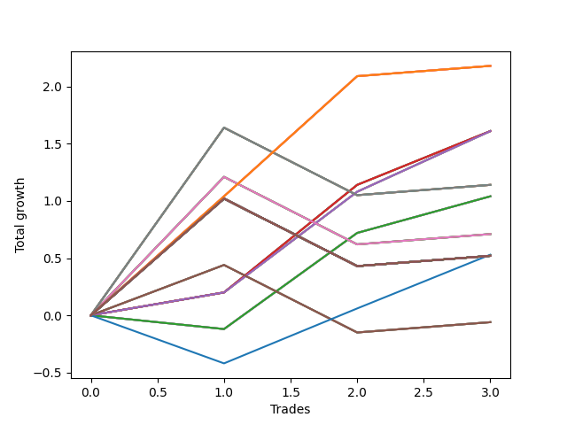

# Long Pointer 007 
- Symbol: SPY_Unlimited
- Date Range: 03/23/2022 - 07/08/2022
- Trading Period: 7:20-12:30
- Number of Trades: 3



| Name | Win Percent | Profit | Avg Profit / Trade | Avg Time / Trade |      | Name | Win Percent | Profit | Avg Profit / Trade | Avg Time / Trade |
| ---- | ----------- | ------ | ------------------ | ---------------- | ---- | ---- | ----------- | ------ | ------------------ | ---------------- |
| Sorted By <br> Profit | | | | | | Sorted By <br> Win Percentage ||||
| One Hundred Twenty-Six | 100.00 | 1090.00 | 363.33 | 17:16 |     | One Hundred Twenty-Six | 100.00 | 1090.00 | 363.33 | 17:16 |
| One Hundred Twenty-One | 100.00 | 1090.00 | 363.33 | 17:16 |     | One Hundred Twenty-One | 100.00 | 1090.00 | 363.33 | 17:16 |
| One Hundred Sixteen | 100.00 | 1090.00 | 363.33 | 17:16 |     | One Hundred Sixteen | 100.00 | 1090.00 | 363.33 | 17:16 |
| One Hundred Eleven | 100.00 | 1090.00 | 363.33 | 17:16 |     | One Hundred Eleven | 100.00 | 1090.00 | 363.33 | 17:16 |
| Eighty-One | 100.00 | 1090.00 | 363.33 | 17:16 |     | Eighty-One | 100.00 | 1090.00 | 363.33 | 17:16 |
| Sixty-Six | 100.00 | 805.00 | 268.33 | 14:46 |     | Sixty-Six | 100.00 | 805.00 | 268.33 | 14:46 |
| Sixty-Five | 100.00 | 805.00 | 268.33 | 10:13 |     | Sixty-Five | 100.00 | 805.00 | 268.33 | 10:13 |
| Fifty-Eight | 100.00 | 805.00 | 268.33 | 14:46 |     | Fifty-Eight | 100.00 | 805.00 | 268.33 | 14:46 |
| Fifty-Seven | 100.00 | 805.00 | 268.33 | 10:13 |     | Fifty-Seven | 100.00 | 805.00 | 268.33 | 10:13 |
| Fifty | 100.00 | 805.00 | 268.33 | 14:46 |     | Fifty | 100.00 | 805.00 | 268.33 | 14:46 |
| Forty-Nine | 100.00 | 805.00 | 268.33 | 10:13 |     | Forty-Nine | 100.00 | 805.00 | 268.33 | 10:13 |
| Forty-Two | 100.00 | 805.00 | 268.33 | 14:46 |     | Forty-Two | 100.00 | 805.00 | 268.33 | 14:46 |
| Forty-One | 100.00 | 805.00 | 268.33 | 10:13 |     | Forty-One | 100.00 | 805.00 | 268.33 | 10:13 |
| Two | 100.00 | 805.00 | 268.33 | 14:46 |     | Two | 100.00 | 805.00 | 268.33 | 14:46 |
| One | 100.00 | 805.00 | 268.33 | 10:13 |     | One | 100.00 | 805.00 | 268.33 | 10:13 |
| Sixty-Nine | 66.67 | 570.00 | 190.00 | 25:31 |     | Sixty-Nine | 66.67 | 570.00 | 190.00 | 25:31 |
| Sixty-One | 66.67 | 570.00 | 190.00 | 25:31 |     | Sixty-One | 66.67 | 570.00 | 190.00 | 25:31 |
| Fifty-Three | 66.67 | 570.00 | 190.00 | 25:31 |     | Fifty-Three | 66.67 | 570.00 | 190.00 | 25:31 |
| Forty-Five | 66.67 | 570.00 | 190.00 | 25:31 |     | Forty-Five | 66.67 | 570.00 | 190.00 | 25:31 |
| Five | 66.67 | 570.00 | 190.00 | 25:31 |     | Five | 66.67 | 570.00 | 190.00 | 25:31 |
| Sixty-Four | 66.67 | 520.00 | 173.33 | 04:33 |     | Sixty-Four | 66.67 | 520.00 | 173.33 | 04:33 |
| Fifty-Six | 66.67 | 520.00 | 173.33 | 04:33 |     | Fifty-Six | 66.67 | 520.00 | 173.33 | 04:33 |
| Forty-Eight | 66.67 | 520.00 | 173.33 | 04:33 |     | Forty-Eight | 66.67 | 520.00 | 173.33 | 04:33 |
| Forty | 66.67 | 520.00 | 173.33 | 04:33 |     | Forty | 66.67 | 520.00 | 173.33 | 04:33 |
| Zero | 66.67 | 520.00 | 173.33 | 04:33 |     | Zero | 66.67 | 520.00 | 173.33 | 04:33 |
| Sixty-Eight | 66.67 | 355.00 | 118.33 | 24:40 |     | Sixty-Eight | 66.67 | 355.00 | 118.33 | 24:40 |
| Sixty | 66.67 | 355.00 | 118.33 | 24:40 |     | Sixty | 66.67 | 355.00 | 118.33 | 24:40 |
| Fifty-Two | 66.67 | 355.00 | 118.33 | 24:40 |     | Fifty-Two | 66.67 | 355.00 | 118.33 | 24:40 |
| Forty-Four | 66.67 | 355.00 | 118.33 | 24:40 |     | Forty-Four | 66.67 | 355.00 | 118.33 | 24:40 |
| Four | 66.67 | 355.00 | 118.33 | 24:40 |     | Four | 66.67 | 355.00 | 118.33 | 24:40 |
| Seventy-Three | 66.67 | 265.00 | 88.33 | 10:45 |     | Seventy-Three | 66.67 | 265.00 | 88.33 | 10:45 |
| One Hundred Thirty | 66.67 | 260.00 | 86.67 | 29:55 |     | One Hundred Thirty | 66.67 | 260.00 | 86.67 | 29:55 |
| One Hundred Twenty-Nine | 66.67 | 260.00 | 86.67 | 29:55 |     | One Hundred Twenty-Nine | 66.67 | 260.00 | 86.67 | 29:55 |
| One Hundred Twenty-Eight | 66.67 | 260.00 | 86.67 | 29:55 |     | One Hundred Twenty-Eight | 66.67 | 260.00 | 86.67 | 29:55 |
| One Hundred Twenty-Seven | 66.67 | 260.00 | 86.67 | 29:55 |     | One Hundred Twenty-Seven | 66.67 | 260.00 | 86.67 | 29:55 |
| One Hundred Twenty-Five | 66.67 | 260.00 | 86.67 | 29:55 |     | One Hundred Twenty-Five | 66.67 | 260.00 | 86.67 | 29:55 |
| One Hundred Twenty-Four | 66.67 | 260.00 | 86.67 | 29:55 |     | One Hundred Twenty-Four | 66.67 | 260.00 | 86.67 | 29:55 |
| One Hundred Twenty-Three | 66.67 | 260.00 | 86.67 | 29:55 |     | One Hundred Twenty-Three | 66.67 | 260.00 | 86.67 | 29:55 |
| One Hundred Twenty-Two | 66.67 | 260.00 | 86.67 | 29:55 |     | One Hundred Twenty-Two | 66.67 | 260.00 | 86.67 | 29:55 |
| One Hundred Twenty | 66.67 | 260.00 | 86.67 | 29:55 |     | One Hundred Twenty | 66.67 | 260.00 | 86.67 | 29:55 |
| One Hundred Ninteen | 66.67 | 260.00 | 86.67 | 29:55 |     | One Hundred Ninteen | 66.67 | 260.00 | 86.67 | 29:55 |
| One Hundred Eighteen | 66.67 | 260.00 | 86.67 | 29:55 |     | One Hundred Eighteen | 66.67 | 260.00 | 86.67 | 29:55 |
| One Hundred Seventeen | 66.67 | 260.00 | 86.67 | 29:55 |     | One Hundred Seventeen | 66.67 | 260.00 | 86.67 | 29:55 |
| One Hundred Fifteen | 66.67 | 260.00 | 86.67 | 29:55 |     | One Hundred Fifteen | 66.67 | 260.00 | 86.67 | 29:55 |
| One Hundred Fourteen | 66.67 | 260.00 | 86.67 | 29:55 |     | One Hundred Fourteen | 66.67 | 260.00 | 86.67 | 29:55 |
| One Hundred Thirteen | 66.67 | 260.00 | 86.67 | 29:55 |     | One Hundred Thirteen | 66.67 | 260.00 | 86.67 | 29:55 |
| One Hundred Twelve | 66.67 | 260.00 | 86.67 | 29:55 |     | One Hundred Twelve | 66.67 | 260.00 | 86.67 | 29:55 |
| Eighty-Five | 66.67 | 260.00 | 86.67 | 29:55 |     | Eighty-Five | 66.67 | 260.00 | 86.67 | 29:55 |
| Eighty-Four | 66.67 | 260.00 | 86.67 | 29:55 |     | Eighty-Four | 66.67 | 260.00 | 86.67 | 29:55 |
| Eighty-Three | 66.67 | 260.00 | 86.67 | 29:55 |     | Eighty-Three | 66.67 | 260.00 | 86.67 | 29:55 |
| Eighty-Two | 66.67 | 260.00 | 86.67 | 29:55 |     | Eighty-Two | 66.67 | 260.00 | 86.67 | 29:55 |
| Seventy-One | 66.67 | 260.00 | 86.67 | 29:55 |     | Seventy-One | 66.67 | 260.00 | 86.67 | 29:55 |
| Seventy | 66.67 | 260.00 | 86.67 | 29:55 |     | Seventy | 66.67 | 260.00 | 86.67 | 29:55 |
| Sixty-Three | 66.67 | 260.00 | 86.67 | 29:55 |     | Sixty-Three | 66.67 | 260.00 | 86.67 | 29:55 |
| Sixty-Two | 66.67 | 260.00 | 86.67 | 29:55 |     | Sixty-Two | 66.67 | 260.00 | 86.67 | 29:55 |
| Fifty-Five | 66.67 | 260.00 | 86.67 | 29:55 |     | Fifty-Five | 66.67 | 260.00 | 86.67 | 29:55 |
| Fifty-Four | 66.67 | 260.00 | 86.67 | 29:55 |     | Fifty-Four | 66.67 | 260.00 | 86.67 | 29:55 |
| Forty-Seven | 66.67 | 260.00 | 86.67 | 29:55 |     | Forty-Seven | 66.67 | 260.00 | 86.67 | 29:55 |
| Forty-Six | 66.67 | 260.00 | 86.67 | 29:55 |     | Forty-Six | 66.67 | 260.00 | 86.67 | 29:55 |
| Seven | 66.67 | 260.00 | 86.67 | 29:55 |     | Seven | 66.67 | 260.00 | 86.67 | 29:55 |
| Six | 66.67 | 260.00 | 86.67 | 29:55 |     | Six | 66.67 | 260.00 | 86.67 | 29:55 |
| Sixty-Seven | 66.67 | -30.00 | -10.00 | 24:15 |     | Sixty-Seven | 66.67 | -30.00 | -10.00 | 24:15 |
| Fifty-Nine | 66.67 | -30.00 | -10.00 | 24:15 |     | Fifty-Nine | 66.67 | -30.00 | -10.00 | 24:15 |
| Fifty-One | 66.67 | -30.00 | -10.00 | 24:15 |     | Fifty-One | 66.67 | -30.00 | -10.00 | 24:15 |
| Forty-Three | 66.67 | -30.00 | -10.00 | 24:15 |     | Forty-Three | 66.67 | -30.00 | -10.00 | 24:15 |
| Three | 66.67 | -30.00 | -10.00 | 24:15 |     | Three | 66.67 | -30.00 | -10.00 | 24:15 |

## NO STOPLOSS

### Test Zero
* Sell when price hits the middle line of the 20p bollinger
* No Stoploss
* Results:
```
Total Trades: 3
Percent Up: 66.67
Percent Down: 33.33
Total Points Moved Up: 1.04
Potential Profit: 520.00
Total Points Ups: 1.16 Count Ups: 2
Total Points Downs: -0.12 Count Downs: 1
```

<details><summary>Trades</summary>

<code>In: 2022-04-22 12:00:00		Out: 2022-04-22 12:07:25		Total Position Time: 07:25		Total Move Up: -0.12		Total to Date: -0.12</code> <br />
<code>In: 2022-05-24 07:22:00		Out: 2022-05-24 07:23:15		Total Position Time: 01:15		Total Move Up: 0.84		Total to Date: 0.72</code> <br />
<code>In: 2022-06-08 09:48:00		Out: 2022-06-08 09:53:00		Total Position Time: 05:00		Total Move Up: 0.32		Total to Date: 1.04</code> <br />


</details>

### Test One
* Sell when the price hits the upper line of the 20p 1std bollinger
* No Stoploss
* Results:
```
Total Trades: 3
Percent Up: 100.00
Percent Down: 0.00
Total Points Moved Up: 1.61
Potential Profit: 805.00
Total Points Ups: 1.61 Count Ups: 3
Total Points Downs: 0.00 Count Downs: 0
```

<details><summary>Trades</summary>

<code>In: 2022-04-22 12:00:00		Out: 2022-04-22 12:11:50		Total Position Time: 11:50		Total Move Up: 0.20		Total to Date: 0.20</code> <br />
<code>In: 2022-05-24 07:22:00		Out: 2022-05-24 07:29:45		Total Position Time: 07:45		Total Move Up: 0.94		Total to Date: 1.14</code> <br />
<code>In: 2022-06-08 09:48:00		Out: 2022-06-08 09:59:05		Total Position Time: 11:05		Total Move Up: 0.47		Total to Date: 1.61</code> <br />


</details>

### Test Two
* Sell when the price hits the upper line of the 20p 2std bollinger
* No Stoploss
* Results:
```
Total Trades: 3
Percent Up: 100.00
Percent Down: 0.00
Total Points Moved Up: 1.61
Potential Profit: 805.00
Total Points Ups: 1.61 Count Ups: 3
Total Points Downs: 0.00 Count Downs: 0
```

<details><summary>Trades</summary>

<code>In: 2022-04-22 12:00:00		Out: 2022-04-22 12:11:50		Total Position Time: 11:50		Total Move Up: 0.20		Total to Date: 0.20</code> <br />
<code>In: 2022-05-24 07:22:00		Out: 2022-05-24 07:43:15		Total Position Time: 21:15		Total Move Up: 0.88		Total to Date: 1.08</code> <br />
<code>In: 2022-06-08 09:48:00		Out: 2022-06-08 09:59:15		Total Position Time: 11:15		Total Move Up: 0.53		Total to Date: 1.61</code> <br />


</details>

### Test Three
* Sell when price hits the middle line of the 50p bollinger
* No Stoploss
* Results:
```
Total Trades: 3
Percent Up: 66.67
Percent Down: 33.33
Total Points Moved Up: -0.06
Potential Profit: -30.00
Total Points Ups: 0.53 Count Ups: 2
Total Points Downs: -0.59 Count Downs: 1
```

<details><summary>Trades</summary>

<code>In: 2022-04-22 12:00:00		Out: 2022-04-22 12:12:55		Total Position Time: 12:55		Total Move Up: 0.44		Total to Date: 0.44</code> <br />
<code>In: 2022-05-24 07:22:00		Out: 2022-05-24 07:51:55		Total Position Time: 29:55		Total Move Up: -0.59		Total to Date: -0.15</code> <br />
<code>In: 2022-06-08 09:48:00		Out: 2022-06-08 10:17:55		Total Position Time: 29:55		Total Move Up: 0.09		Total to Date: -0.06</code> <br />


</details>

### Test Four
* Sell when the price hits the upper line of the 50p 1std bollinger
* No Stoploss
* Results:
```
Total Trades: 3
Percent Up: 66.67
Percent Down: 33.33
Total Points Moved Up: 0.71
Potential Profit: 355.00
Total Points Ups: 1.30 Count Ups: 2
Total Points Downs: -0.59 Count Downs: 1
```

<details><summary>Trades</summary>

<code>In: 2022-04-22 12:00:00		Out: 2022-04-22 12:14:10		Total Position Time: 14:10		Total Move Up: 1.21		Total to Date: 1.21</code> <br />
<code>In: 2022-05-24 07:22:00		Out: 2022-05-24 07:51:55		Total Position Time: 29:55		Total Move Up: -0.59		Total to Date: 0.62</code> <br />
<code>In: 2022-06-08 09:48:00		Out: 2022-06-08 10:17:55		Total Position Time: 29:55		Total Move Up: 0.09		Total to Date: 0.71</code> <br />


</details>

### Test Five
* Sell when the price hits the upper line of the 50p 2std bollinger
* No Stoploss
* Results:
```
Total Trades: 3
Percent Up: 66.67
Percent Down: 33.33
Total Points Moved Up: 1.14
Potential Profit: 570.00
Total Points Ups: 1.73 Count Ups: 2
Total Points Downs: -0.59 Count Downs: 1
```

<details><summary>Trades</summary>

<code>In: 2022-04-22 12:00:00		Out: 2022-04-22 12:16:45		Total Position Time: 16:45		Total Move Up: 1.64		Total to Date: 1.64</code> <br />
<code>In: 2022-05-24 07:22:00		Out: 2022-05-24 07:51:55		Total Position Time: 29:55		Total Move Up: -0.59		Total to Date: 1.05</code> <br />
<code>In: 2022-06-08 09:48:00		Out: 2022-06-08 10:17:55		Total Position Time: 29:55		Total Move Up: 0.09		Total to Date: 1.14</code> <br />


</details>

### Test Six
* Sell when the price hits the middle line of the 1std VWAP
* No Stoploss
* Results:
```
Total Trades: 3
Percent Up: 66.67
Percent Down: 33.33
Total Points Moved Up: 0.52
Potential Profit: 260.00
Total Points Ups: 1.11 Count Ups: 2
Total Points Downs: -0.59 Count Downs: 1
```

<details><summary>Trades</summary>

<code>In: 2022-04-22 12:00:00		Out: 2022-04-22 12:29:55		Total Position Time: 29:55		Total Move Up: 1.02		Total to Date: 1.02</code> <br />
<code>In: 2022-05-24 07:22:00		Out: 2022-05-24 07:51:55		Total Position Time: 29:55		Total Move Up: -0.59		Total to Date: 0.43</code> <br />
<code>In: 2022-06-08 09:48:00		Out: 2022-06-08 10:17:55		Total Position Time: 29:55		Total Move Up: 0.09		Total to Date: 0.52</code> <br />


</details>

### Test Seven
* Sell when the price hits the upper line of the 1std VWAP
* No Stoploss
* Results:
```
Total Trades: 3
Percent Up: 66.67
Percent Down: 33.33
Total Points Moved Up: 0.52
Potential Profit: 260.00
Total Points Ups: 1.11 Count Ups: 2
Total Points Downs: -0.59 Count Downs: 1
```

<details><summary>Trades</summary>

<code>In: 2022-04-22 12:00:00		Out: 2022-04-22 12:29:55		Total Position Time: 29:55		Total Move Up: 1.02		Total to Date: 1.02</code> <br />
<code>In: 2022-05-24 07:22:00		Out: 2022-05-24 07:51:55		Total Position Time: 29:55		Total Move Up: -0.59		Total to Date: 0.43</code> <br />
<code>In: 2022-06-08 09:48:00		Out: 2022-06-08 10:17:55		Total Position Time: 29:55		Total Move Up: 0.09		Total to Date: 0.52</code> <br />


</details>

## STOPLOSS OF 5

### Test Forty
* Sell when price hits the middle line of the 20p bollinger
* Stoploss is 5 points
* Results:
```
Total Trades: 3
Percent Up: 66.67
Percent Down: 33.33
Total Points Moved Up: 1.04
Potential Profit: 520.00
Total Points Ups: 1.16 Count Ups: 2
Total Points Downs: -0.12 Count Downs: 1
```

<details><summary>Trades</summary>

<code>In: 2022-04-22 12:00:00		Out: 2022-04-22 12:07:25		Total Position Time: 07:25		Total Move Up: -0.12		Total to Date: -0.12</code> <br />
<code>In: 2022-05-24 07:22:00		Out: 2022-05-24 07:23:15		Total Position Time: 01:15		Total Move Up: 0.84		Total to Date: 0.72</code> <br />
<code>In: 2022-06-08 09:48:00		Out: 2022-06-08 09:53:00		Total Position Time: 05:00		Total Move Up: 0.32		Total to Date: 1.04</code> <br />


</details>

### Test Forty-One
* Sell when the price hits the upper line of the 20p 1std bollinger
* Stoploss is 5 points
* Results:
```
Total Trades: 3
Percent Up: 100.00
Percent Down: 0.00
Total Points Moved Up: 1.61
Potential Profit: 805.00
Total Points Ups: 1.61 Count Ups: 3
Total Points Downs: 0.00 Count Downs: 0
```

<details><summary>Trades</summary>

<code>In: 2022-04-22 12:00:00		Out: 2022-04-22 12:11:50		Total Position Time: 11:50		Total Move Up: 0.20		Total to Date: 0.20</code> <br />
<code>In: 2022-05-24 07:22:00		Out: 2022-05-24 07:29:45		Total Position Time: 07:45		Total Move Up: 0.94		Total to Date: 1.14</code> <br />
<code>In: 2022-06-08 09:48:00		Out: 2022-06-08 09:59:05		Total Position Time: 11:05		Total Move Up: 0.47		Total to Date: 1.61</code> <br />


</details>

### Test Forty-Two
* Sell when the price hits the upper line of the 20p 2std bollinger
* Stoploss is 5 points
* Results:
```
Total Trades: 3
Percent Up: 100.00
Percent Down: 0.00
Total Points Moved Up: 1.61
Potential Profit: 805.00
Total Points Ups: 1.61 Count Ups: 3
Total Points Downs: 0.00 Count Downs: 0
```

<details><summary>Trades</summary>

<code>In: 2022-04-22 12:00:00		Out: 2022-04-22 12:11:50		Total Position Time: 11:50		Total Move Up: 0.20		Total to Date: 0.20</code> <br />
<code>In: 2022-05-24 07:22:00		Out: 2022-05-24 07:43:15		Total Position Time: 21:15		Total Move Up: 0.88		Total to Date: 1.08</code> <br />
<code>In: 2022-06-08 09:48:00		Out: 2022-06-08 09:59:15		Total Position Time: 11:15		Total Move Up: 0.53		Total to Date: 1.61</code> <br />


</details>

### Test Forty-Three
* Sell when price hits the middle line of the 50p bollinger
* Stoploss is 5 points
* Results:
```
Total Trades: 3
Percent Up: 66.67
Percent Down: 33.33
Total Points Moved Up: -0.06
Potential Profit: -30.00
Total Points Ups: 0.53 Count Ups: 2
Total Points Downs: -0.59 Count Downs: 1
```

<details><summary>Trades</summary>

<code>In: 2022-04-22 12:00:00		Out: 2022-04-22 12:12:55		Total Position Time: 12:55		Total Move Up: 0.44		Total to Date: 0.44</code> <br />
<code>In: 2022-05-24 07:22:00		Out: 2022-05-24 07:51:55		Total Position Time: 29:55		Total Move Up: -0.59		Total to Date: -0.15</code> <br />
<code>In: 2022-06-08 09:48:00		Out: 2022-06-08 10:17:55		Total Position Time: 29:55		Total Move Up: 0.09		Total to Date: -0.06</code> <br />


</details>

### Test Forty-Four
* Sell when the price hits the upper line of the 50p 1std bollinger
* Stoploss is 5 points
* Results:
```
Total Trades: 3
Percent Up: 66.67
Percent Down: 33.33
Total Points Moved Up: 0.71
Potential Profit: 355.00
Total Points Ups: 1.30 Count Ups: 2
Total Points Downs: -0.59 Count Downs: 1
```

<details><summary>Trades</summary>

<code>In: 2022-04-22 12:00:00		Out: 2022-04-22 12:14:10		Total Position Time: 14:10		Total Move Up: 1.21		Total to Date: 1.21</code> <br />
<code>In: 2022-05-24 07:22:00		Out: 2022-05-24 07:51:55		Total Position Time: 29:55		Total Move Up: -0.59		Total to Date: 0.62</code> <br />
<code>In: 2022-06-08 09:48:00		Out: 2022-06-08 10:17:55		Total Position Time: 29:55		Total Move Up: 0.09		Total to Date: 0.71</code> <br />


</details>

### Test Forty-Five
* Sell when the price hits the upper line of the 50p 2std bollinger
* Stoploss is 5 points
* Results:
```
Total Trades: 3
Percent Up: 66.67
Percent Down: 33.33
Total Points Moved Up: 1.14
Potential Profit: 570.00
Total Points Ups: 1.73 Count Ups: 2
Total Points Downs: -0.59 Count Downs: 1
```

<details><summary>Trades</summary>

<code>In: 2022-04-22 12:00:00		Out: 2022-04-22 12:16:45		Total Position Time: 16:45		Total Move Up: 1.64		Total to Date: 1.64</code> <br />
<code>In: 2022-05-24 07:22:00		Out: 2022-05-24 07:51:55		Total Position Time: 29:55		Total Move Up: -0.59		Total to Date: 1.05</code> <br />
<code>In: 2022-06-08 09:48:00		Out: 2022-06-08 10:17:55		Total Position Time: 29:55		Total Move Up: 0.09		Total to Date: 1.14</code> <br />


</details>

### Test Forty-Six
* Sell when the price hits the middle line of the 1std VWAP
* Stoploss is 5 points
* Results:
```
Total Trades: 3
Percent Up: 66.67
Percent Down: 33.33
Total Points Moved Up: 0.52
Potential Profit: 260.00
Total Points Ups: 1.11 Count Ups: 2
Total Points Downs: -0.59 Count Downs: 1
```

<details><summary>Trades</summary>

<code>In: 2022-04-22 12:00:00		Out: 2022-04-22 12:29:55		Total Position Time: 29:55		Total Move Up: 1.02		Total to Date: 1.02</code> <br />
<code>In: 2022-05-24 07:22:00		Out: 2022-05-24 07:51:55		Total Position Time: 29:55		Total Move Up: -0.59		Total to Date: 0.43</code> <br />
<code>In: 2022-06-08 09:48:00		Out: 2022-06-08 10:17:55		Total Position Time: 29:55		Total Move Up: 0.09		Total to Date: 0.52</code> <br />


</details>

### Test Forty-Seven
* Sell when the price hits the upper line of the 1std VWAP
* Stoploss is 5 points
* Results:
```
Total Trades: 3
Percent Up: 66.67
Percent Down: 33.33
Total Points Moved Up: 0.52
Potential Profit: 260.00
Total Points Ups: 1.11 Count Ups: 2
Total Points Downs: -0.59 Count Downs: 1
```

<details><summary>Trades</summary>

<code>In: 2022-04-22 12:00:00		Out: 2022-04-22 12:29:55		Total Position Time: 29:55		Total Move Up: 1.02		Total to Date: 1.02</code> <br />
<code>In: 2022-05-24 07:22:00		Out: 2022-05-24 07:51:55		Total Position Time: 29:55		Total Move Up: -0.59		Total to Date: 0.43</code> <br />
<code>In: 2022-06-08 09:48:00		Out: 2022-06-08 10:17:55		Total Position Time: 29:55		Total Move Up: 0.09		Total to Date: 0.52</code> <br />


</details>

## TRAIL STOP OF 5

### Test Forty-Eight
* Sell when price hits the middle line of the 20p bollinger
* Trailing Stop is 5 points
* Results:
```
Total Trades: 3
Percent Up: 66.67
Percent Down: 33.33
Total Points Moved Up: 1.04
Potential Profit: 520.00
Total Points Ups: 1.16 Count Ups: 2
Total Points Downs: -0.12 Count Downs: 1
```

<details><summary>Trades</summary>

<code>In: 2022-04-22 12:00:00		Out: 2022-04-22 12:07:25		Total Position Time: 07:25		Total Move Up: -0.12		Total to Date: -0.12</code> <br />
<code>In: 2022-05-24 07:22:00		Out: 2022-05-24 07:23:15		Total Position Time: 01:15		Total Move Up: 0.84		Total to Date: 0.72</code> <br />
<code>In: 2022-06-08 09:48:00		Out: 2022-06-08 09:53:00		Total Position Time: 05:00		Total Move Up: 0.32		Total to Date: 1.04</code> <br />


</details>

### Test Forty-Nine
* Sell when the price hits the upper line of the 20p 1std bollinger
* Trailing Stop is 5 points
* Results:
```
Total Trades: 3
Percent Up: 100.00
Percent Down: 0.00
Total Points Moved Up: 1.61
Potential Profit: 805.00
Total Points Ups: 1.61 Count Ups: 3
Total Points Downs: 0.00 Count Downs: 0
```

<details><summary>Trades</summary>

<code>In: 2022-04-22 12:00:00		Out: 2022-04-22 12:11:50		Total Position Time: 11:50		Total Move Up: 0.20		Total to Date: 0.20</code> <br />
<code>In: 2022-05-24 07:22:00		Out: 2022-05-24 07:29:45		Total Position Time: 07:45		Total Move Up: 0.94		Total to Date: 1.14</code> <br />
<code>In: 2022-06-08 09:48:00		Out: 2022-06-08 09:59:05		Total Position Time: 11:05		Total Move Up: 0.47		Total to Date: 1.61</code> <br />


</details>

### Test Fifty
* Sell when the price hits the upper line of the 20p 2std bollinger
* Trailing Stop is 5 points
* Results:
```
Total Trades: 3
Percent Up: 100.00
Percent Down: 0.00
Total Points Moved Up: 1.61
Potential Profit: 805.00
Total Points Ups: 1.61 Count Ups: 3
Total Points Downs: 0.00 Count Downs: 0
```

<details><summary>Trades</summary>

<code>In: 2022-04-22 12:00:00		Out: 2022-04-22 12:11:50		Total Position Time: 11:50		Total Move Up: 0.20		Total to Date: 0.20</code> <br />
<code>In: 2022-05-24 07:22:00		Out: 2022-05-24 07:43:15		Total Position Time: 21:15		Total Move Up: 0.88		Total to Date: 1.08</code> <br />
<code>In: 2022-06-08 09:48:00		Out: 2022-06-08 09:59:15		Total Position Time: 11:15		Total Move Up: 0.53		Total to Date: 1.61</code> <br />


</details>

### Test Fifty-One
* Sell when price hits the middle line of the 50p bollinger
* Trailing Stop is 5 points
* Results:
```
Total Trades: 3
Percent Up: 66.67
Percent Down: 33.33
Total Points Moved Up: -0.06
Potential Profit: -30.00
Total Points Ups: 0.53 Count Ups: 2
Total Points Downs: -0.59 Count Downs: 1
```

<details><summary>Trades</summary>

<code>In: 2022-04-22 12:00:00		Out: 2022-04-22 12:12:55		Total Position Time: 12:55		Total Move Up: 0.44		Total to Date: 0.44</code> <br />
<code>In: 2022-05-24 07:22:00		Out: 2022-05-24 07:51:55		Total Position Time: 29:55		Total Move Up: -0.59		Total to Date: -0.15</code> <br />
<code>In: 2022-06-08 09:48:00		Out: 2022-06-08 10:17:55		Total Position Time: 29:55		Total Move Up: 0.09		Total to Date: -0.06</code> <br />


</details>

### Test Fifty-Two
* Sell when the price hits the upper line of the 50p 1std bollinger
* Trailing Stop is 5 points
* Results:
```
Total Trades: 3
Percent Up: 66.67
Percent Down: 33.33
Total Points Moved Up: 0.71
Potential Profit: 355.00
Total Points Ups: 1.30 Count Ups: 2
Total Points Downs: -0.59 Count Downs: 1
```

<details><summary>Trades</summary>

<code>In: 2022-04-22 12:00:00		Out: 2022-04-22 12:14:10		Total Position Time: 14:10		Total Move Up: 1.21		Total to Date: 1.21</code> <br />
<code>In: 2022-05-24 07:22:00		Out: 2022-05-24 07:51:55		Total Position Time: 29:55		Total Move Up: -0.59		Total to Date: 0.62</code> <br />
<code>In: 2022-06-08 09:48:00		Out: 2022-06-08 10:17:55		Total Position Time: 29:55		Total Move Up: 0.09		Total to Date: 0.71</code> <br />


</details>

### Test Fifty-Three
* Sell when the price hits the upper line of the 50p 2std bollinger
* Trailing Stop is 5 points
* Results:
```
Total Trades: 3
Percent Up: 66.67
Percent Down: 33.33
Total Points Moved Up: 1.14
Potential Profit: 570.00
Total Points Ups: 1.73 Count Ups: 2
Total Points Downs: -0.59 Count Downs: 1
```

<details><summary>Trades</summary>

<code>In: 2022-04-22 12:00:00		Out: 2022-04-22 12:16:45		Total Position Time: 16:45		Total Move Up: 1.64		Total to Date: 1.64</code> <br />
<code>In: 2022-05-24 07:22:00		Out: 2022-05-24 07:51:55		Total Position Time: 29:55		Total Move Up: -0.59		Total to Date: 1.05</code> <br />
<code>In: 2022-06-08 09:48:00		Out: 2022-06-08 10:17:55		Total Position Time: 29:55		Total Move Up: 0.09		Total to Date: 1.14</code> <br />


</details>

### Test Fifty-Four
* Sell when the price hits the middle line of the 1std VWAP
* Trailing Stop is 5 points
* Results:
```
Total Trades: 3
Percent Up: 66.67
Percent Down: 33.33
Total Points Moved Up: 0.52
Potential Profit: 260.00
Total Points Ups: 1.11 Count Ups: 2
Total Points Downs: -0.59 Count Downs: 1
```

<details><summary>Trades</summary>

<code>In: 2022-04-22 12:00:00		Out: 2022-04-22 12:29:55		Total Position Time: 29:55		Total Move Up: 1.02		Total to Date: 1.02</code> <br />
<code>In: 2022-05-24 07:22:00		Out: 2022-05-24 07:51:55		Total Position Time: 29:55		Total Move Up: -0.59		Total to Date: 0.43</code> <br />
<code>In: 2022-06-08 09:48:00		Out: 2022-06-08 10:17:55		Total Position Time: 29:55		Total Move Up: 0.09		Total to Date: 0.52</code> <br />


</details>

### Test Fifty-Five
* Sell when the price hits the upper line of the 1std VWAP
* Trailing Stop is 5 points
* Results:
```
Total Trades: 3
Percent Up: 66.67
Percent Down: 33.33
Total Points Moved Up: 0.52
Potential Profit: 260.00
Total Points Ups: 1.11 Count Ups: 2
Total Points Downs: -0.59 Count Downs: 1
```

<details><summary>Trades</summary>

<code>In: 2022-04-22 12:00:00		Out: 2022-04-22 12:29:55		Total Position Time: 29:55		Total Move Up: 1.02		Total to Date: 1.02</code> <br />
<code>In: 2022-05-24 07:22:00		Out: 2022-05-24 07:51:55		Total Position Time: 29:55		Total Move Up: -0.59		Total to Date: 0.43</code> <br />
<code>In: 2022-06-08 09:48:00		Out: 2022-06-08 10:17:55		Total Position Time: 29:55		Total Move Up: 0.09		Total to Date: 0.52</code> <br />


</details>

## STOPLOSS OF 10

### Test Fifty-Six
* Sell when price hits the middle line of the 20p bollinger
* Stoploss is 10 points
* Results:
```
Total Trades: 3
Percent Up: 66.67
Percent Down: 33.33
Total Points Moved Up: 1.04
Potential Profit: 520.00
Total Points Ups: 1.16 Count Ups: 2
Total Points Downs: -0.12 Count Downs: 1
```

<details><summary>Trades</summary>

<code>In: 2022-04-22 12:00:00		Out: 2022-04-22 12:07:25		Total Position Time: 07:25		Total Move Up: -0.12		Total to Date: -0.12</code> <br />
<code>In: 2022-05-24 07:22:00		Out: 2022-05-24 07:23:15		Total Position Time: 01:15		Total Move Up: 0.84		Total to Date: 0.72</code> <br />
<code>In: 2022-06-08 09:48:00		Out: 2022-06-08 09:53:00		Total Position Time: 05:00		Total Move Up: 0.32		Total to Date: 1.04</code> <br />


</details>

### Test Fifty-Seven
* Sell when the price hits the upper line of the 20p 1std bollinger
* Stoploss is 10 points
* Results:
```
Total Trades: 3
Percent Up: 100.00
Percent Down: 0.00
Total Points Moved Up: 1.61
Potential Profit: 805.00
Total Points Ups: 1.61 Count Ups: 3
Total Points Downs: 0.00 Count Downs: 0
```

<details><summary>Trades</summary>

<code>In: 2022-04-22 12:00:00		Out: 2022-04-22 12:11:50		Total Position Time: 11:50		Total Move Up: 0.20		Total to Date: 0.20</code> <br />
<code>In: 2022-05-24 07:22:00		Out: 2022-05-24 07:29:45		Total Position Time: 07:45		Total Move Up: 0.94		Total to Date: 1.14</code> <br />
<code>In: 2022-06-08 09:48:00		Out: 2022-06-08 09:59:05		Total Position Time: 11:05		Total Move Up: 0.47		Total to Date: 1.61</code> <br />


</details>

### Test Fifty-Eight
* Sell when the price hits the upper line of the 20p 2std bollinger
* Stoploss is 10 points
* Results:
```
Total Trades: 3
Percent Up: 100.00
Percent Down: 0.00
Total Points Moved Up: 1.61
Potential Profit: 805.00
Total Points Ups: 1.61 Count Ups: 3
Total Points Downs: 0.00 Count Downs: 0
```

<details><summary>Trades</summary>

<code>In: 2022-04-22 12:00:00		Out: 2022-04-22 12:11:50		Total Position Time: 11:50		Total Move Up: 0.20		Total to Date: 0.20</code> <br />
<code>In: 2022-05-24 07:22:00		Out: 2022-05-24 07:43:15		Total Position Time: 21:15		Total Move Up: 0.88		Total to Date: 1.08</code> <br />
<code>In: 2022-06-08 09:48:00		Out: 2022-06-08 09:59:15		Total Position Time: 11:15		Total Move Up: 0.53		Total to Date: 1.61</code> <br />


</details>

### Test Fifty-Nine
* Sell when price hits the middle line of the 50p bollinger
* Stoploss is 10 points
* Results:
```
Total Trades: 3
Percent Up: 66.67
Percent Down: 33.33
Total Points Moved Up: -0.06
Potential Profit: -30.00
Total Points Ups: 0.53 Count Ups: 2
Total Points Downs: -0.59 Count Downs: 1
```

<details><summary>Trades</summary>

<code>In: 2022-04-22 12:00:00		Out: 2022-04-22 12:12:55		Total Position Time: 12:55		Total Move Up: 0.44		Total to Date: 0.44</code> <br />
<code>In: 2022-05-24 07:22:00		Out: 2022-05-24 07:51:55		Total Position Time: 29:55		Total Move Up: -0.59		Total to Date: -0.15</code> <br />
<code>In: 2022-06-08 09:48:00		Out: 2022-06-08 10:17:55		Total Position Time: 29:55		Total Move Up: 0.09		Total to Date: -0.06</code> <br />


</details>

### Test Sixty
* Sell when the price hits the upper line of the 50p 1std bollinger
* Stoploss is 10 points
* Results:
```
Total Trades: 3
Percent Up: 66.67
Percent Down: 33.33
Total Points Moved Up: 0.71
Potential Profit: 355.00
Total Points Ups: 1.30 Count Ups: 2
Total Points Downs: -0.59 Count Downs: 1
```

<details><summary>Trades</summary>

<code>In: 2022-04-22 12:00:00		Out: 2022-04-22 12:14:10		Total Position Time: 14:10		Total Move Up: 1.21		Total to Date: 1.21</code> <br />
<code>In: 2022-05-24 07:22:00		Out: 2022-05-24 07:51:55		Total Position Time: 29:55		Total Move Up: -0.59		Total to Date: 0.62</code> <br />
<code>In: 2022-06-08 09:48:00		Out: 2022-06-08 10:17:55		Total Position Time: 29:55		Total Move Up: 0.09		Total to Date: 0.71</code> <br />


</details>

### Test Sixty-One
* Sell when the price hits the upper line of the 50p 2std bollinger
* Stoploss is 10 points
* Results:
```
Total Trades: 3
Percent Up: 66.67
Percent Down: 33.33
Total Points Moved Up: 1.14
Potential Profit: 570.00
Total Points Ups: 1.73 Count Ups: 2
Total Points Downs: -0.59 Count Downs: 1
```

<details><summary>Trades</summary>

<code>In: 2022-04-22 12:00:00		Out: 2022-04-22 12:16:45		Total Position Time: 16:45		Total Move Up: 1.64		Total to Date: 1.64</code> <br />
<code>In: 2022-05-24 07:22:00		Out: 2022-05-24 07:51:55		Total Position Time: 29:55		Total Move Up: -0.59		Total to Date: 1.05</code> <br />
<code>In: 2022-06-08 09:48:00		Out: 2022-06-08 10:17:55		Total Position Time: 29:55		Total Move Up: 0.09		Total to Date: 1.14</code> <br />


</details>

### Test Sixty-Two
* Sell when the price hits the middle line of the 1std VWAP
* Stoploss is 10 points
* Results:
```
Total Trades: 3
Percent Up: 66.67
Percent Down: 33.33
Total Points Moved Up: 0.52
Potential Profit: 260.00
Total Points Ups: 1.11 Count Ups: 2
Total Points Downs: -0.59 Count Downs: 1
```

<details><summary>Trades</summary>

<code>In: 2022-04-22 12:00:00		Out: 2022-04-22 12:29:55		Total Position Time: 29:55		Total Move Up: 1.02		Total to Date: 1.02</code> <br />
<code>In: 2022-05-24 07:22:00		Out: 2022-05-24 07:51:55		Total Position Time: 29:55		Total Move Up: -0.59		Total to Date: 0.43</code> <br />
<code>In: 2022-06-08 09:48:00		Out: 2022-06-08 10:17:55		Total Position Time: 29:55		Total Move Up: 0.09		Total to Date: 0.52</code> <br />


</details>

### Test Sixty-Three
* Sell when the price hits the upper line of the 1std VWAP
* Stoploss is 10 points
* Results:
```
Total Trades: 3
Percent Up: 66.67
Percent Down: 33.33
Total Points Moved Up: 0.52
Potential Profit: 260.00
Total Points Ups: 1.11 Count Ups: 2
Total Points Downs: -0.59 Count Downs: 1
```

<details><summary>Trades</summary>

<code>In: 2022-04-22 12:00:00		Out: 2022-04-22 12:29:55		Total Position Time: 29:55		Total Move Up: 1.02		Total to Date: 1.02</code> <br />
<code>In: 2022-05-24 07:22:00		Out: 2022-05-24 07:51:55		Total Position Time: 29:55		Total Move Up: -0.59		Total to Date: 0.43</code> <br />
<code>In: 2022-06-08 09:48:00		Out: 2022-06-08 10:17:55		Total Position Time: 29:55		Total Move Up: 0.09		Total to Date: 0.52</code> <br />


</details>

## TRAIL STOP OF 10

### Test Sixty-Four
* Sell when price hits the middle line of the 20p bollinger
* Trailing Stop is 10 points
* Results:
```
Total Trades: 3
Percent Up: 66.67
Percent Down: 33.33
Total Points Moved Up: 1.04
Potential Profit: 520.00
Total Points Ups: 1.16 Count Ups: 2
Total Points Downs: -0.12 Count Downs: 1
```

<details><summary>Trades</summary>

<code>In: 2022-04-22 12:00:00		Out: 2022-04-22 12:07:25		Total Position Time: 07:25		Total Move Up: -0.12		Total to Date: -0.12</code> <br />
<code>In: 2022-05-24 07:22:00		Out: 2022-05-24 07:23:15		Total Position Time: 01:15		Total Move Up: 0.84		Total to Date: 0.72</code> <br />
<code>In: 2022-06-08 09:48:00		Out: 2022-06-08 09:53:00		Total Position Time: 05:00		Total Move Up: 0.32		Total to Date: 1.04</code> <br />


</details>

### Test Sixty-Five
* Sell when the price hits the upper line of the 20p 1std bollinger
* Trailing Stop is 10 points
* Results:
```
Total Trades: 3
Percent Up: 100.00
Percent Down: 0.00
Total Points Moved Up: 1.61
Potential Profit: 805.00
Total Points Ups: 1.61 Count Ups: 3
Total Points Downs: 0.00 Count Downs: 0
```

<details><summary>Trades</summary>

<code>In: 2022-04-22 12:00:00		Out: 2022-04-22 12:11:50		Total Position Time: 11:50		Total Move Up: 0.20		Total to Date: 0.20</code> <br />
<code>In: 2022-05-24 07:22:00		Out: 2022-05-24 07:29:45		Total Position Time: 07:45		Total Move Up: 0.94		Total to Date: 1.14</code> <br />
<code>In: 2022-06-08 09:48:00		Out: 2022-06-08 09:59:05		Total Position Time: 11:05		Total Move Up: 0.47		Total to Date: 1.61</code> <br />


</details>

### Test Sixty-Six
* Sell when the price hits the upper line of the 20p 2std bollinger
* Trailing Stop is 10 points
* Results:
```
Total Trades: 3
Percent Up: 100.00
Percent Down: 0.00
Total Points Moved Up: 1.61
Potential Profit: 805.00
Total Points Ups: 1.61 Count Ups: 3
Total Points Downs: 0.00 Count Downs: 0
```

<details><summary>Trades</summary>

<code>In: 2022-04-22 12:00:00		Out: 2022-04-22 12:11:50		Total Position Time: 11:50		Total Move Up: 0.20		Total to Date: 0.20</code> <br />
<code>In: 2022-05-24 07:22:00		Out: 2022-05-24 07:43:15		Total Position Time: 21:15		Total Move Up: 0.88		Total to Date: 1.08</code> <br />
<code>In: 2022-06-08 09:48:00		Out: 2022-06-08 09:59:15		Total Position Time: 11:15		Total Move Up: 0.53		Total to Date: 1.61</code> <br />


</details>

### Test Sixty-Seven
* Sell when price hits the middle line of the 50p bollinger
* Trailing Stop is 10 points
* Results:
```
Total Trades: 3
Percent Up: 66.67
Percent Down: 33.33
Total Points Moved Up: -0.06
Potential Profit: -30.00
Total Points Ups: 0.53 Count Ups: 2
Total Points Downs: -0.59 Count Downs: 1
```

<details><summary>Trades</summary>

<code>In: 2022-04-22 12:00:00		Out: 2022-04-22 12:12:55		Total Position Time: 12:55		Total Move Up: 0.44		Total to Date: 0.44</code> <br />
<code>In: 2022-05-24 07:22:00		Out: 2022-05-24 07:51:55		Total Position Time: 29:55		Total Move Up: -0.59		Total to Date: -0.15</code> <br />
<code>In: 2022-06-08 09:48:00		Out: 2022-06-08 10:17:55		Total Position Time: 29:55		Total Move Up: 0.09		Total to Date: -0.06</code> <br />


</details>

### Test Sixty-Eight
* Sell when the price hits the upper line of the 50p 1std bollinger
* Trailing Stop is 10 points
* Results:
```
Total Trades: 3
Percent Up: 66.67
Percent Down: 33.33
Total Points Moved Up: 0.71
Potential Profit: 355.00
Total Points Ups: 1.30 Count Ups: 2
Total Points Downs: -0.59 Count Downs: 1
```

<details><summary>Trades</summary>

<code>In: 2022-04-22 12:00:00		Out: 2022-04-22 12:14:10		Total Position Time: 14:10		Total Move Up: 1.21		Total to Date: 1.21</code> <br />
<code>In: 2022-05-24 07:22:00		Out: 2022-05-24 07:51:55		Total Position Time: 29:55		Total Move Up: -0.59		Total to Date: 0.62</code> <br />
<code>In: 2022-06-08 09:48:00		Out: 2022-06-08 10:17:55		Total Position Time: 29:55		Total Move Up: 0.09		Total to Date: 0.71</code> <br />


</details>

### Test Sixty-Nine
* Sell when the price hits the upper line of the 50p 2std bollinger
* Trailing Stop is 10 points
* Results:
```
Total Trades: 3
Percent Up: 66.67
Percent Down: 33.33
Total Points Moved Up: 1.14
Potential Profit: 570.00
Total Points Ups: 1.73 Count Ups: 2
Total Points Downs: -0.59 Count Downs: 1
```

<details><summary>Trades</summary>

<code>In: 2022-04-22 12:00:00		Out: 2022-04-22 12:16:45		Total Position Time: 16:45		Total Move Up: 1.64		Total to Date: 1.64</code> <br />
<code>In: 2022-05-24 07:22:00		Out: 2022-05-24 07:51:55		Total Position Time: 29:55		Total Move Up: -0.59		Total to Date: 1.05</code> <br />
<code>In: 2022-06-08 09:48:00		Out: 2022-06-08 10:17:55		Total Position Time: 29:55		Total Move Up: 0.09		Total to Date: 1.14</code> <br />


</details>

### Test Seventy
* Sell when the price hits the middle line of the 1std VWAP
* Trailing Stop is 10 points
* Results:
```
Total Trades: 3
Percent Up: 66.67
Percent Down: 33.33
Total Points Moved Up: 0.52
Potential Profit: 260.00
Total Points Ups: 1.11 Count Ups: 2
Total Points Downs: -0.59 Count Downs: 1
```

<details><summary>Trades</summary>

<code>In: 2022-04-22 12:00:00		Out: 2022-04-22 12:29:55		Total Position Time: 29:55		Total Move Up: 1.02		Total to Date: 1.02</code> <br />
<code>In: 2022-05-24 07:22:00		Out: 2022-05-24 07:51:55		Total Position Time: 29:55		Total Move Up: -0.59		Total to Date: 0.43</code> <br />
<code>In: 2022-06-08 09:48:00		Out: 2022-06-08 10:17:55		Total Position Time: 29:55		Total Move Up: 0.09		Total to Date: 0.52</code> <br />


</details>

### Test Seventy-One
* Sell when the price hits the upper line of the 1std VWAP
* Trailing Stop is 10 points
* Results:
```
Total Trades: 3
Percent Up: 66.67
Percent Down: 33.33
Total Points Moved Up: 0.52
Potential Profit: 260.00
Total Points Ups: 1.11 Count Ups: 2
Total Points Downs: -0.59 Count Downs: 1
```

<details><summary>Trades</summary>

<code>In: 2022-04-22 12:00:00		Out: 2022-04-22 12:29:55		Total Position Time: 29:55		Total Move Up: 1.02		Total to Date: 1.02</code> <br />
<code>In: 2022-05-24 07:22:00		Out: 2022-05-24 07:51:55		Total Position Time: 29:55		Total Move Up: -0.59		Total to Date: 0.43</code> <br />
<code>In: 2022-06-08 09:48:00		Out: 2022-06-08 10:17:55		Total Position Time: 29:55		Total Move Up: 0.09		Total to Date: 0.52</code> <br />


</details>

## SPECIAL EXIT CONDITIONS 

### Test Seventy-Three
* Sell when the linear regression slope changes to negative
* No Stoploss
* Results:
```
Total Trades: 3
Percent Up: 66.67
Percent Down: 33.33
Total Points Moved Up: 0.53
Potential Profit: 265.00
Total Points Ups: 0.95 Count Ups: 2
Total Points Downs: -0.42 Count Downs: 1
```

<details><summary>Trades</summary>

<code>In: 2022-04-22 12:00:00		Out: 2022-04-22 12:10:05		Total Position Time: 10:05		Total Move Up: -0.42		Total to Date: -0.42</code> <br />
<code>In: 2022-05-24 07:22:00		Out: 2022-05-24 07:33:05		Total Position Time: 11:05		Total Move Up: 0.48		Total to Date: 0.06</code> <br />
<code>In: 2022-06-08 09:48:00		Out: 2022-06-08 09:59:05		Total Position Time: 11:05		Total Move Up: 0.47		Total to Date: 0.53</code> <br />


</details>

## TAKE PROFIT

### Test Eighty-One
* Take Profit of 1 Point
* No Stoploss
* Results:
```
Total Trades: 3
Percent Up: 100.00
Percent Down: 0.00
Total Points Moved Up: 2.18
Potential Profit: 1090.00
Total Points Ups: 2.18 Count Ups: 3
Total Points Downs: 0.00 Count Downs: 0
```

<details><summary>Trades</summary>

<code>In: 2022-04-22 12:00:00		Out: 2022-04-22 12:14:05		Total Position Time: 14:05		Total Move Up: 1.04		Total to Date: 1.04</code> <br />
<code>In: 2022-05-24 07:22:00		Out: 2022-05-24 07:29:50		Total Position Time: 07:50		Total Move Up: 1.05		Total to Date: 2.09</code> <br />
<code>In: 2022-06-08 09:48:00		Out: 2022-06-08 10:17:55		Total Position Time: 29:55		Total Move Up: 0.09		Total to Date: 2.18</code> <br />


</details>

### Test Eighty-Two
* Take Profit of 2 Point
* No Stoploss
* Results:
```
Total Trades: 3
Percent Up: 66.67
Percent Down: 33.33
Total Points Moved Up: 0.52
Potential Profit: 260.00
Total Points Ups: 1.11 Count Ups: 2
Total Points Downs: -0.59 Count Downs: 1
```

<details><summary>Trades</summary>

<code>In: 2022-04-22 12:00:00		Out: 2022-04-22 12:29:55		Total Position Time: 29:55		Total Move Up: 1.02		Total to Date: 1.02</code> <br />
<code>In: 2022-05-24 07:22:00		Out: 2022-05-24 07:51:55		Total Position Time: 29:55		Total Move Up: -0.59		Total to Date: 0.43</code> <br />
<code>In: 2022-06-08 09:48:00		Out: 2022-06-08 10:17:55		Total Position Time: 29:55		Total Move Up: 0.09		Total to Date: 0.52</code> <br />


</details>

### Test Eighty-Three
* Take Profit of 3 Point
* No Stoploss
* Results:
```
Total Trades: 3
Percent Up: 66.67
Percent Down: 33.33
Total Points Moved Up: 0.52
Potential Profit: 260.00
Total Points Ups: 1.11 Count Ups: 2
Total Points Downs: -0.59 Count Downs: 1
```

<details><summary>Trades</summary>

<code>In: 2022-04-22 12:00:00		Out: 2022-04-22 12:29:55		Total Position Time: 29:55		Total Move Up: 1.02		Total to Date: 1.02</code> <br />
<code>In: 2022-05-24 07:22:00		Out: 2022-05-24 07:51:55		Total Position Time: 29:55		Total Move Up: -0.59		Total to Date: 0.43</code> <br />
<code>In: 2022-06-08 09:48:00		Out: 2022-06-08 10:17:55		Total Position Time: 29:55		Total Move Up: 0.09		Total to Date: 0.52</code> <br />


</details>

### Test Eighty-Four
* Take Profit of 4 Point
* No Stoploss
* Results:
```
Total Trades: 3
Percent Up: 66.67
Percent Down: 33.33
Total Points Moved Up: 0.52
Potential Profit: 260.00
Total Points Ups: 1.11 Count Ups: 2
Total Points Downs: -0.59 Count Downs: 1
```

<details><summary>Trades</summary>

<code>In: 2022-04-22 12:00:00		Out: 2022-04-22 12:29:55		Total Position Time: 29:55		Total Move Up: 1.02		Total to Date: 1.02</code> <br />
<code>In: 2022-05-24 07:22:00		Out: 2022-05-24 07:51:55		Total Position Time: 29:55		Total Move Up: -0.59		Total to Date: 0.43</code> <br />
<code>In: 2022-06-08 09:48:00		Out: 2022-06-08 10:17:55		Total Position Time: 29:55		Total Move Up: 0.09		Total to Date: 0.52</code> <br />


</details>

### Test Eighty-Five
* Take Profit of 5 Point
* No Stoploss
* Results:
```
Total Trades: 3
Percent Up: 66.67
Percent Down: 33.33
Total Points Moved Up: 0.52
Potential Profit: 260.00
Total Points Ups: 1.11 Count Ups: 2
Total Points Downs: -0.59 Count Downs: 1
```

<details><summary>Trades</summary>

<code>In: 2022-04-22 12:00:00		Out: 2022-04-22 12:29:55		Total Position Time: 29:55		Total Move Up: 1.02		Total to Date: 1.02</code> <br />
<code>In: 2022-05-24 07:22:00		Out: 2022-05-24 07:51:55		Total Position Time: 29:55		Total Move Up: -0.59		Total to Date: 0.43</code> <br />
<code>In: 2022-06-08 09:48:00		Out: 2022-06-08 10:17:55		Total Position Time: 29:55		Total Move Up: 0.09		Total to Date: 0.52</code> <br />


</details>

## TAKE PROFIT Stoploss of Five

### Test One Hundred Eleven
* Take Profit of 1 Point
* Stoploss is 5 points
* Results:
```
Total Trades: 3
Percent Up: 100.00
Percent Down: 0.00
Total Points Moved Up: 2.18
Potential Profit: 1090.00
Total Points Ups: 2.18 Count Ups: 3
Total Points Downs: 0.00 Count Downs: 0
```

<details><summary>Trades</summary>

<code>In: 2022-04-22 12:00:00		Out: 2022-04-22 12:14:05		Total Position Time: 14:05		Total Move Up: 1.04		Total to Date: 1.04</code> <br />
<code>In: 2022-05-24 07:22:00		Out: 2022-05-24 07:29:50		Total Position Time: 07:50		Total Move Up: 1.05		Total to Date: 2.09</code> <br />
<code>In: 2022-06-08 09:48:00		Out: 2022-06-08 10:17:55		Total Position Time: 29:55		Total Move Up: 0.09		Total to Date: 2.18</code> <br />


</details>

### Test One Hundred Twelve
* Take Profit of 2 Point
* Stoploss is 5 points
* Results:
```
Total Trades: 3
Percent Up: 66.67
Percent Down: 33.33
Total Points Moved Up: 0.52
Potential Profit: 260.00
Total Points Ups: 1.11 Count Ups: 2
Total Points Downs: -0.59 Count Downs: 1
```

<details><summary>Trades</summary>

<code>In: 2022-04-22 12:00:00		Out: 2022-04-22 12:29:55		Total Position Time: 29:55		Total Move Up: 1.02		Total to Date: 1.02</code> <br />
<code>In: 2022-05-24 07:22:00		Out: 2022-05-24 07:51:55		Total Position Time: 29:55		Total Move Up: -0.59		Total to Date: 0.43</code> <br />
<code>In: 2022-06-08 09:48:00		Out: 2022-06-08 10:17:55		Total Position Time: 29:55		Total Move Up: 0.09		Total to Date: 0.52</code> <br />


</details>

### Test One Hundred Thirteen
* Take Profit of 3 Point
* Stoploss is 5 points
* Results:
```
Total Trades: 3
Percent Up: 66.67
Percent Down: 33.33
Total Points Moved Up: 0.52
Potential Profit: 260.00
Total Points Ups: 1.11 Count Ups: 2
Total Points Downs: -0.59 Count Downs: 1
```

<details><summary>Trades</summary>

<code>In: 2022-04-22 12:00:00		Out: 2022-04-22 12:29:55		Total Position Time: 29:55		Total Move Up: 1.02		Total to Date: 1.02</code> <br />
<code>In: 2022-05-24 07:22:00		Out: 2022-05-24 07:51:55		Total Position Time: 29:55		Total Move Up: -0.59		Total to Date: 0.43</code> <br />
<code>In: 2022-06-08 09:48:00		Out: 2022-06-08 10:17:55		Total Position Time: 29:55		Total Move Up: 0.09		Total to Date: 0.52</code> <br />


</details>

### Test One Hundred Fourteen
* Take Profit of 4 Point
* Stoploss is 5 points
* Results:
```
Total Trades: 3
Percent Up: 66.67
Percent Down: 33.33
Total Points Moved Up: 0.52
Potential Profit: 260.00
Total Points Ups: 1.11 Count Ups: 2
Total Points Downs: -0.59 Count Downs: 1
```

<details><summary>Trades</summary>

<code>In: 2022-04-22 12:00:00		Out: 2022-04-22 12:29:55		Total Position Time: 29:55		Total Move Up: 1.02		Total to Date: 1.02</code> <br />
<code>In: 2022-05-24 07:22:00		Out: 2022-05-24 07:51:55		Total Position Time: 29:55		Total Move Up: -0.59		Total to Date: 0.43</code> <br />
<code>In: 2022-06-08 09:48:00		Out: 2022-06-08 10:17:55		Total Position Time: 29:55		Total Move Up: 0.09		Total to Date: 0.52</code> <br />


</details>

### Test One Hundred Fifteen
* Take Profit of 5 Point
* Stoploss is 5 points
* Results:
```
Total Trades: 3
Percent Up: 66.67
Percent Down: 33.33
Total Points Moved Up: 0.52
Potential Profit: 260.00
Total Points Ups: 1.11 Count Ups: 2
Total Points Downs: -0.59 Count Downs: 1
```

<details><summary>Trades</summary>

<code>In: 2022-04-22 12:00:00		Out: 2022-04-22 12:29:55		Total Position Time: 29:55		Total Move Up: 1.02		Total to Date: 1.02</code> <br />
<code>In: 2022-05-24 07:22:00		Out: 2022-05-24 07:51:55		Total Position Time: 29:55		Total Move Up: -0.59		Total to Date: 0.43</code> <br />
<code>In: 2022-06-08 09:48:00		Out: 2022-06-08 10:17:55		Total Position Time: 29:55		Total Move Up: 0.09		Total to Date: 0.52</code> <br />


</details>

## TAKE PROFIT Trailstop of Five

### Test One Hundred Sixteen
* Take Profit of 1 Point
* Trailing stop is 5 points
* Results:
```
Total Trades: 3
Percent Up: 100.00
Percent Down: 0.00
Total Points Moved Up: 2.18
Potential Profit: 1090.00
Total Points Ups: 2.18 Count Ups: 3
Total Points Downs: 0.00 Count Downs: 0
```

<details><summary>Trades</summary>

<code>In: 2022-04-22 12:00:00		Out: 2022-04-22 12:14:05		Total Position Time: 14:05		Total Move Up: 1.04		Total to Date: 1.04</code> <br />
<code>In: 2022-05-24 07:22:00		Out: 2022-05-24 07:29:50		Total Position Time: 07:50		Total Move Up: 1.05		Total to Date: 2.09</code> <br />
<code>In: 2022-06-08 09:48:00		Out: 2022-06-08 10:17:55		Total Position Time: 29:55		Total Move Up: 0.09		Total to Date: 2.18</code> <br />


</details>

### Test One Hundred Seventeen
* Take Profit of 2 Point
* Trailing stop is 5 points
* Results:
```
Total Trades: 3
Percent Up: 66.67
Percent Down: 33.33
Total Points Moved Up: 0.52
Potential Profit: 260.00
Total Points Ups: 1.11 Count Ups: 2
Total Points Downs: -0.59 Count Downs: 1
```

<details><summary>Trades</summary>

<code>In: 2022-04-22 12:00:00		Out: 2022-04-22 12:29:55		Total Position Time: 29:55		Total Move Up: 1.02		Total to Date: 1.02</code> <br />
<code>In: 2022-05-24 07:22:00		Out: 2022-05-24 07:51:55		Total Position Time: 29:55		Total Move Up: -0.59		Total to Date: 0.43</code> <br />
<code>In: 2022-06-08 09:48:00		Out: 2022-06-08 10:17:55		Total Position Time: 29:55		Total Move Up: 0.09		Total to Date: 0.52</code> <br />


</details>

### Test One Hundred Eighteen
* Take Profit of 3 Point
* Trailing stop is 5 points
* Results:
```
Total Trades: 3
Percent Up: 66.67
Percent Down: 33.33
Total Points Moved Up: 0.52
Potential Profit: 260.00
Total Points Ups: 1.11 Count Ups: 2
Total Points Downs: -0.59 Count Downs: 1
```

<details><summary>Trades</summary>

<code>In: 2022-04-22 12:00:00		Out: 2022-04-22 12:29:55		Total Position Time: 29:55		Total Move Up: 1.02		Total to Date: 1.02</code> <br />
<code>In: 2022-05-24 07:22:00		Out: 2022-05-24 07:51:55		Total Position Time: 29:55		Total Move Up: -0.59		Total to Date: 0.43</code> <br />
<code>In: 2022-06-08 09:48:00		Out: 2022-06-08 10:17:55		Total Position Time: 29:55		Total Move Up: 0.09		Total to Date: 0.52</code> <br />


</details>

### Test One Hundred Ninteen
* Take Profit of 4 Point
* Trailing stop is 5 points
* Results:
```
Total Trades: 3
Percent Up: 66.67
Percent Down: 33.33
Total Points Moved Up: 0.52
Potential Profit: 260.00
Total Points Ups: 1.11 Count Ups: 2
Total Points Downs: -0.59 Count Downs: 1
```

<details><summary>Trades</summary>

<code>In: 2022-04-22 12:00:00		Out: 2022-04-22 12:29:55		Total Position Time: 29:55		Total Move Up: 1.02		Total to Date: 1.02</code> <br />
<code>In: 2022-05-24 07:22:00		Out: 2022-05-24 07:51:55		Total Position Time: 29:55		Total Move Up: -0.59		Total to Date: 0.43</code> <br />
<code>In: 2022-06-08 09:48:00		Out: 2022-06-08 10:17:55		Total Position Time: 29:55		Total Move Up: 0.09		Total to Date: 0.52</code> <br />


</details>

### Test One Hundred Twenty
* Take Profit of 5 Point
* Trailing stop is 5 points
* Results:
```
Total Trades: 3
Percent Up: 66.67
Percent Down: 33.33
Total Points Moved Up: 0.52
Potential Profit: 260.00
Total Points Ups: 1.11 Count Ups: 2
Total Points Downs: -0.59 Count Downs: 1
```

<details><summary>Trades</summary>

<code>In: 2022-04-22 12:00:00		Out: 2022-04-22 12:29:55		Total Position Time: 29:55		Total Move Up: 1.02		Total to Date: 1.02</code> <br />
<code>In: 2022-05-24 07:22:00		Out: 2022-05-24 07:51:55		Total Position Time: 29:55		Total Move Up: -0.59		Total to Date: 0.43</code> <br />
<code>In: 2022-06-08 09:48:00		Out: 2022-06-08 10:17:55		Total Position Time: 29:55		Total Move Up: 0.09		Total to Date: 0.52</code> <br />


</details>

## TAKE PROFIT Stoploss of Ten

### Test One Hundred Twenty-One
* Take Profit of 1 Point
* Stoploss is 10 points
* Results:
```
Total Trades: 3
Percent Up: 100.00
Percent Down: 0.00
Total Points Moved Up: 2.18
Potential Profit: 1090.00
Total Points Ups: 2.18 Count Ups: 3
Total Points Downs: 0.00 Count Downs: 0
```

<details><summary>Trades</summary>

<code>In: 2022-04-22 12:00:00		Out: 2022-04-22 12:14:05		Total Position Time: 14:05		Total Move Up: 1.04		Total to Date: 1.04</code> <br />
<code>In: 2022-05-24 07:22:00		Out: 2022-05-24 07:29:50		Total Position Time: 07:50		Total Move Up: 1.05		Total to Date: 2.09</code> <br />
<code>In: 2022-06-08 09:48:00		Out: 2022-06-08 10:17:55		Total Position Time: 29:55		Total Move Up: 0.09		Total to Date: 2.18</code> <br />


</details>

### Test One Hundred Twenty-Two
* Take Profit of 2 Point
* Stoploss is 10 points
* Results:
```
Total Trades: 3
Percent Up: 66.67
Percent Down: 33.33
Total Points Moved Up: 0.52
Potential Profit: 260.00
Total Points Ups: 1.11 Count Ups: 2
Total Points Downs: -0.59 Count Downs: 1
```

<details><summary>Trades</summary>

<code>In: 2022-04-22 12:00:00		Out: 2022-04-22 12:29:55		Total Position Time: 29:55		Total Move Up: 1.02		Total to Date: 1.02</code> <br />
<code>In: 2022-05-24 07:22:00		Out: 2022-05-24 07:51:55		Total Position Time: 29:55		Total Move Up: -0.59		Total to Date: 0.43</code> <br />
<code>In: 2022-06-08 09:48:00		Out: 2022-06-08 10:17:55		Total Position Time: 29:55		Total Move Up: 0.09		Total to Date: 0.52</code> <br />


</details>

### Test One Hundred Twenty-Three
* Take Profit of 3 Point
* Stoploss is 10 points
* Results:
```
Total Trades: 3
Percent Up: 66.67
Percent Down: 33.33
Total Points Moved Up: 0.52
Potential Profit: 260.00
Total Points Ups: 1.11 Count Ups: 2
Total Points Downs: -0.59 Count Downs: 1
```

<details><summary>Trades</summary>

<code>In: 2022-04-22 12:00:00		Out: 2022-04-22 12:29:55		Total Position Time: 29:55		Total Move Up: 1.02		Total to Date: 1.02</code> <br />
<code>In: 2022-05-24 07:22:00		Out: 2022-05-24 07:51:55		Total Position Time: 29:55		Total Move Up: -0.59		Total to Date: 0.43</code> <br />
<code>In: 2022-06-08 09:48:00		Out: 2022-06-08 10:17:55		Total Position Time: 29:55		Total Move Up: 0.09		Total to Date: 0.52</code> <br />


</details>

### Test One Hundred Twenty-Four
* Take Profit of 4 Point
* Stoploss is 10 points
* Results:
```
Total Trades: 3
Percent Up: 66.67
Percent Down: 33.33
Total Points Moved Up: 0.52
Potential Profit: 260.00
Total Points Ups: 1.11 Count Ups: 2
Total Points Downs: -0.59 Count Downs: 1
```

<details><summary>Trades</summary>

<code>In: 2022-04-22 12:00:00		Out: 2022-04-22 12:29:55		Total Position Time: 29:55		Total Move Up: 1.02		Total to Date: 1.02</code> <br />
<code>In: 2022-05-24 07:22:00		Out: 2022-05-24 07:51:55		Total Position Time: 29:55		Total Move Up: -0.59		Total to Date: 0.43</code> <br />
<code>In: 2022-06-08 09:48:00		Out: 2022-06-08 10:17:55		Total Position Time: 29:55		Total Move Up: 0.09		Total to Date: 0.52</code> <br />


</details>

### Test One Hundred Twenty-Five
* Take Profit of 5 Point
* Stoploss is 10 points
* Results:
```
Total Trades: 3
Percent Up: 66.67
Percent Down: 33.33
Total Points Moved Up: 0.52
Potential Profit: 260.00
Total Points Ups: 1.11 Count Ups: 2
Total Points Downs: -0.59 Count Downs: 1
```

<details><summary>Trades</summary>

<code>In: 2022-04-22 12:00:00		Out: 2022-04-22 12:29:55		Total Position Time: 29:55		Total Move Up: 1.02		Total to Date: 1.02</code> <br />
<code>In: 2022-05-24 07:22:00		Out: 2022-05-24 07:51:55		Total Position Time: 29:55		Total Move Up: -0.59		Total to Date: 0.43</code> <br />
<code>In: 2022-06-08 09:48:00		Out: 2022-06-08 10:17:55		Total Position Time: 29:55		Total Move Up: 0.09		Total to Date: 0.52</code> <br />


</details>

## TAKE PROFIT Trailstop of Ten

### Test One Hundred Twenty-Six
* Take Profit of 1 Point
* Trailing stop is 10 points
* Results:
```
Total Trades: 3
Percent Up: 100.00
Percent Down: 0.00
Total Points Moved Up: 2.18
Potential Profit: 1090.00
Total Points Ups: 2.18 Count Ups: 3
Total Points Downs: 0.00 Count Downs: 0
```

<details><summary>Trades</summary>

<code>In: 2022-04-22 12:00:00		Out: 2022-04-22 12:14:05		Total Position Time: 14:05		Total Move Up: 1.04		Total to Date: 1.04</code> <br />
<code>In: 2022-05-24 07:22:00		Out: 2022-05-24 07:29:50		Total Position Time: 07:50		Total Move Up: 1.05		Total to Date: 2.09</code> <br />
<code>In: 2022-06-08 09:48:00		Out: 2022-06-08 10:17:55		Total Position Time: 29:55		Total Move Up: 0.09		Total to Date: 2.18</code> <br />


</details>

### Test One Hundred Twenty-Seven
* Take Profit of 2 Point
* Trailing stop is 10 points
* Results:
```
Total Trades: 3
Percent Up: 66.67
Percent Down: 33.33
Total Points Moved Up: 0.52
Potential Profit: 260.00
Total Points Ups: 1.11 Count Ups: 2
Total Points Downs: -0.59 Count Downs: 1
```

<details><summary>Trades</summary>

<code>In: 2022-04-22 12:00:00		Out: 2022-04-22 12:29:55		Total Position Time: 29:55		Total Move Up: 1.02		Total to Date: 1.02</code> <br />
<code>In: 2022-05-24 07:22:00		Out: 2022-05-24 07:51:55		Total Position Time: 29:55		Total Move Up: -0.59		Total to Date: 0.43</code> <br />
<code>In: 2022-06-08 09:48:00		Out: 2022-06-08 10:17:55		Total Position Time: 29:55		Total Move Up: 0.09		Total to Date: 0.52</code> <br />


</details>

### Test One Hundred Twenty-Eight
* Take Profit of 3 Point
* Trailing stop is 10 points
* Results:
```
Total Trades: 3
Percent Up: 66.67
Percent Down: 33.33
Total Points Moved Up: 0.52
Potential Profit: 260.00
Total Points Ups: 1.11 Count Ups: 2
Total Points Downs: -0.59 Count Downs: 1
```

<details><summary>Trades</summary>

<code>In: 2022-04-22 12:00:00		Out: 2022-04-22 12:29:55		Total Position Time: 29:55		Total Move Up: 1.02		Total to Date: 1.02</code> <br />
<code>In: 2022-05-24 07:22:00		Out: 2022-05-24 07:51:55		Total Position Time: 29:55		Total Move Up: -0.59		Total to Date: 0.43</code> <br />
<code>In: 2022-06-08 09:48:00		Out: 2022-06-08 10:17:55		Total Position Time: 29:55		Total Move Up: 0.09		Total to Date: 0.52</code> <br />


</details>

### Test One Hundred Twenty-Nine
* Take Profit of 4 Point
* Trailing stop is 10 points
* Results:
```
Total Trades: 3
Percent Up: 66.67
Percent Down: 33.33
Total Points Moved Up: 0.52
Potential Profit: 260.00
Total Points Ups: 1.11 Count Ups: 2
Total Points Downs: -0.59 Count Downs: 1
```

<details><summary>Trades</summary>

<code>In: 2022-04-22 12:00:00		Out: 2022-04-22 12:29:55		Total Position Time: 29:55		Total Move Up: 1.02		Total to Date: 1.02</code> <br />
<code>In: 2022-05-24 07:22:00		Out: 2022-05-24 07:51:55		Total Position Time: 29:55		Total Move Up: -0.59		Total to Date: 0.43</code> <br />
<code>In: 2022-06-08 09:48:00		Out: 2022-06-08 10:17:55		Total Position Time: 29:55		Total Move Up: 0.09		Total to Date: 0.52</code> <br />


</details>

### Test One Hundred Thirty
* Take Profit of 5 Point
* Trailing stop is 10 points
* Results:
```
Total Trades: 3
Percent Up: 66.67
Percent Down: 33.33
Total Points Moved Up: 0.52
Potential Profit: 260.00
Total Points Ups: 1.11 Count Ups: 2
Total Points Downs: -0.59 Count Downs: 1
```

<details><summary>Trades</summary>

<code>In: 2022-04-22 12:00:00		Out: 2022-04-22 12:29:55		Total Position Time: 29:55		Total Move Up: 1.02		Total to Date: 1.02</code> <br />
<code>In: 2022-05-24 07:22:00		Out: 2022-05-24 07:51:55		Total Position Time: 29:55		Total Move Up: -0.59		Total to Date: 0.43</code> <br />
<code>In: 2022-06-08 09:48:00		Out: 2022-06-08 10:17:55		Total Position Time: 29:55		Total Move Up: 0.09		Total to Date: 0.52</code> <br />


</details>