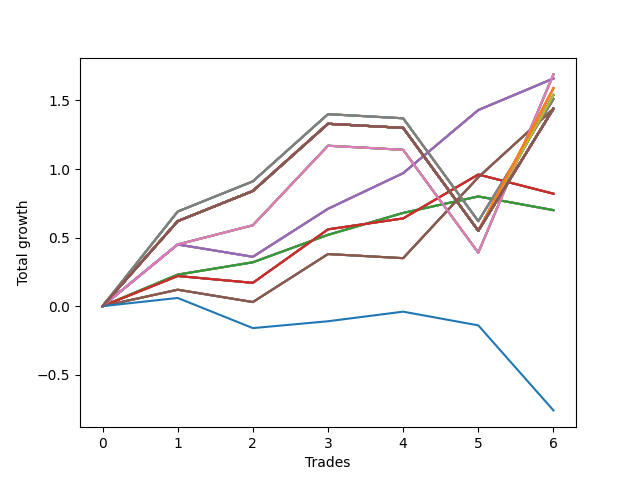

# Long Pointer 008 
- Symbol: SPY_Unlimited
- Date Range: 03/23/2022 - 07/08/2022
- Trading Period: 7:20-12:30
- Number of Trades: 6



| Name | Win Percent | Profit | Avg Profit / Trade | Avg Time / Trade |      | Name | Win Percent | Profit | Avg Profit / Trade | Avg Time / Trade |
| ---- | ----------- | ------ | ------------------ | ---------------- | ---- | ---- | ----------- | ------ | ------------------ | ---------------- |
| Sorted By <br> Profit | | | | | | Sorted By <br> Win Percentage ||||
| Sixty-Eight | 66.67 | 845.00 | 140.83 | 21:42 |     | Sixty-Six | 83.33 | 830.00 | 138.33 | 13:55 |
| Sixty | 66.67 | 845.00 | 140.83 | 21:42 |     | Fifty-Eight | 83.33 | 830.00 | 138.33 | 13:55 |
| Fifty-Two | 66.67 | 845.00 | 140.83 | 21:42 |     | Fifty | 83.33 | 830.00 | 138.33 | 13:55 |
| Forty-Four | 66.67 | 845.00 | 140.83 | 21:42 |     | Forty-Two | 83.33 | 830.00 | 138.33 | 13:55 |
| Four | 66.67 | 845.00 | 140.83 | 21:42 |     | Two | 83.33 | 830.00 | 138.33 | 13:55 |
| Sixty-Six | 83.33 | 830.00 | 138.33 | 13:55 |     | Sixty-Four | 83.33 | 350.00 | 58.33 | 03:00 |
| Fifty-Eight | 83.33 | 830.00 | 138.33 | 13:55 |     | Fifty-Six | 83.33 | 350.00 | 58.33 | 03:00 |
| Fifty | 83.33 | 830.00 | 138.33 | 13:55 |     | Forty-Eight | 83.33 | 350.00 | 58.33 | 03:00 |
| Forty-Two | 83.33 | 830.00 | 138.33 | 13:55 |     | Forty | 83.33 | 350.00 | 58.33 | 03:00 |
| Two | 83.33 | 830.00 | 138.33 | 13:55 |     | Zero | 83.33 | 350.00 | 58.33 | 03:00 |
| One Hundred Twenty-Six | 66.67 | 795.00 | 132.50 | 28:06 |     | Sixty-Eight | 66.67 | 845.00 | 140.83 | 21:42 |
| One Hundred Twenty-One | 66.67 | 795.00 | 132.50 | 28:06 |     | Sixty | 66.67 | 845.00 | 140.83 | 21:42 |
| One Hundred Sixteen | 66.67 | 795.00 | 132.50 | 28:06 |     | Fifty-Two | 66.67 | 845.00 | 140.83 | 21:42 |
| One Hundred Eleven | 66.67 | 795.00 | 132.50 | 28:06 |     | Forty-Four | 66.67 | 845.00 | 140.83 | 21:42 |
| Eighty-One | 66.67 | 795.00 | 132.50 | 28:06 |     | Four | 66.67 | 845.00 | 140.83 | 21:42 |
| Seventy | 66.67 | 770.00 | 128.33 | 28:05 |     | One Hundred Twenty-Six | 66.67 | 795.00 | 132.50 | 28:06 |
| Sixty-Two | 66.67 | 770.00 | 128.33 | 28:05 |     | One Hundred Twenty-One | 66.67 | 795.00 | 132.50 | 28:06 |
| Fifty-Four | 66.67 | 770.00 | 128.33 | 28:05 |     | One Hundred Sixteen | 66.67 | 795.00 | 132.50 | 28:06 |
| Forty-Six | 66.67 | 770.00 | 128.33 | 28:05 |     | One Hundred Eleven | 66.67 | 795.00 | 132.50 | 28:06 |
| Six | 66.67 | 770.00 | 128.33 | 28:05 |     | Eighty-One | 66.67 | 795.00 | 132.50 | 28:06 |
| Sixty-Nine | 66.67 | 755.00 | 125.83 | 27:05 |     | Seventy | 66.67 | 770.00 | 128.33 | 28:05 |
| Sixty-One | 66.67 | 755.00 | 125.83 | 27:05 |     | Sixty-Two | 66.67 | 770.00 | 128.33 | 28:05 |
| Fifty-Three | 66.67 | 755.00 | 125.83 | 27:05 |     | Fifty-Four | 66.67 | 770.00 | 128.33 | 28:05 |
| Forty-Five | 66.67 | 755.00 | 125.83 | 27:05 |     | Forty-Six | 66.67 | 770.00 | 128.33 | 28:05 |
| Five | 66.67 | 755.00 | 125.83 | 27:05 |     | Six | 66.67 | 770.00 | 128.33 | 28:05 |
| One Hundred Thirty | 66.67 | 720.00 | 120.00 | 29:55 |     | Sixty-Nine | 66.67 | 755.00 | 125.83 | 27:05 |
| One Hundred Twenty-Nine | 66.67 | 720.00 | 120.00 | 29:55 |     | Sixty-One | 66.67 | 755.00 | 125.83 | 27:05 |
| One Hundred Twenty-Eight | 66.67 | 720.00 | 120.00 | 29:55 |     | Fifty-Three | 66.67 | 755.00 | 125.83 | 27:05 |
| One Hundred Twenty-Seven | 66.67 | 720.00 | 120.00 | 29:55 |     | Forty-Five | 66.67 | 755.00 | 125.83 | 27:05 |
| One Hundred Twenty-Five | 66.67 | 720.00 | 120.00 | 29:55 |     | Five | 66.67 | 755.00 | 125.83 | 27:05 |
| One Hundred Twenty-Four | 66.67 | 720.00 | 120.00 | 29:55 |     | One Hundred Thirty | 66.67 | 720.00 | 120.00 | 29:55 |
| One Hundred Twenty-Three | 66.67 | 720.00 | 120.00 | 29:55 |     | One Hundred Twenty-Nine | 66.67 | 720.00 | 120.00 | 29:55 |
| One Hundred Twenty-Two | 66.67 | 720.00 | 120.00 | 29:55 |     | One Hundred Twenty-Eight | 66.67 | 720.00 | 120.00 | 29:55 |
| One Hundred Twenty | 66.67 | 720.00 | 120.00 | 29:55 |     | One Hundred Twenty-Seven | 66.67 | 720.00 | 120.00 | 29:55 |
| One Hundred Ninteen | 66.67 | 720.00 | 120.00 | 29:55 |     | One Hundred Twenty-Five | 66.67 | 720.00 | 120.00 | 29:55 |
| One Hundred Eighteen | 66.67 | 720.00 | 120.00 | 29:55 |     | One Hundred Twenty-Four | 66.67 | 720.00 | 120.00 | 29:55 |
| One Hundred Seventeen | 66.67 | 720.00 | 120.00 | 29:55 |     | One Hundred Twenty-Three | 66.67 | 720.00 | 120.00 | 29:55 |
| One Hundred Fifteen | 66.67 | 720.00 | 120.00 | 29:55 |     | One Hundred Twenty-Two | 66.67 | 720.00 | 120.00 | 29:55 |
| One Hundred Fourteen | 66.67 | 720.00 | 120.00 | 29:55 |     | One Hundred Twenty | 66.67 | 720.00 | 120.00 | 29:55 |
| One Hundred Thirteen | 66.67 | 720.00 | 120.00 | 29:55 |     | One Hundred Ninteen | 66.67 | 720.00 | 120.00 | 29:55 |
| One Hundred Twelve | 66.67 | 720.00 | 120.00 | 29:55 |     | One Hundred Eighteen | 66.67 | 720.00 | 120.00 | 29:55 |
| Eighty-Five | 66.67 | 720.00 | 120.00 | 29:55 |     | One Hundred Seventeen | 66.67 | 720.00 | 120.00 | 29:55 |
| Eighty-Four | 66.67 | 720.00 | 120.00 | 29:55 |     | One Hundred Fifteen | 66.67 | 720.00 | 120.00 | 29:55 |
| Eighty-Three | 66.67 | 720.00 | 120.00 | 29:55 |     | One Hundred Fourteen | 66.67 | 720.00 | 120.00 | 29:55 |
| Eighty-Two | 66.67 | 720.00 | 120.00 | 29:55 |     | One Hundred Thirteen | 66.67 | 720.00 | 120.00 | 29:55 |
| Seventy-One | 66.67 | 720.00 | 120.00 | 29:55 |     | One Hundred Twelve | 66.67 | 720.00 | 120.00 | 29:55 |
| Sixty-Seven | 66.67 | 720.00 | 120.00 | 15:36 |     | Eighty-Five | 66.67 | 720.00 | 120.00 | 29:55 |
| Sixty-Three | 66.67 | 720.00 | 120.00 | 29:55 |     | Eighty-Four | 66.67 | 720.00 | 120.00 | 29:55 |
| Fifty-Nine | 66.67 | 720.00 | 120.00 | 15:36 |     | Eighty-Three | 66.67 | 720.00 | 120.00 | 29:55 |
| Fifty-Five | 66.67 | 720.00 | 120.00 | 29:55 |     | Eighty-Two | 66.67 | 720.00 | 120.00 | 29:55 |
| Fifty-One | 66.67 | 720.00 | 120.00 | 15:36 |     | Seventy-One | 66.67 | 720.00 | 120.00 | 29:55 |
| Forty-Seven | 66.67 | 720.00 | 120.00 | 29:55 |     | Sixty-Seven | 66.67 | 720.00 | 120.00 | 15:36 |
| Forty-Three | 66.67 | 720.00 | 120.00 | 15:36 |     | Sixty-Three | 66.67 | 720.00 | 120.00 | 29:55 |
| Seven | 66.67 | 720.00 | 120.00 | 29:55 |     | Fifty-Nine | 66.67 | 720.00 | 120.00 | 15:36 |
| Three | 66.67 | 720.00 | 120.00 | 15:36 |     | Fifty-Five | 66.67 | 720.00 | 120.00 | 29:55 |
| Sixty-Five | 66.67 | 410.00 | 68.33 | 09:20 |     | Fifty-One | 66.67 | 720.00 | 120.00 | 15:36 |
| Fifty-Seven | 66.67 | 410.00 | 68.33 | 09:20 |     | Forty-Seven | 66.67 | 720.00 | 120.00 | 29:55 |
| Forty-Nine | 66.67 | 410.00 | 68.33 | 09:20 |     | Forty-Three | 66.67 | 720.00 | 120.00 | 15:36 |
| Forty-One | 66.67 | 410.00 | 68.33 | 09:20 |     | Seven | 66.67 | 720.00 | 120.00 | 29:55 |
| One | 66.67 | 410.00 | 68.33 | 09:20 |     | Three | 66.67 | 720.00 | 120.00 | 15:36 |
| Sixty-Four | 83.33 | 350.00 | 58.33 | 03:00 |     | Sixty-Five | 66.67 | 410.00 | 68.33 | 09:20 |
| Fifty-Six | 83.33 | 350.00 | 58.33 | 03:00 |     | Fifty-Seven | 66.67 | 410.00 | 68.33 | 09:20 |
| Forty-Eight | 83.33 | 350.00 | 58.33 | 03:00 |     | Forty-Nine | 66.67 | 410.00 | 68.33 | 09:20 |
| Forty | 83.33 | 350.00 | 58.33 | 03:00 |     | Forty-One | 66.67 | 410.00 | 68.33 | 09:20 |
| Zero | 83.33 | 350.00 | 58.33 | 03:00 |     | One | 66.67 | 410.00 | 68.33 | 09:20 |
| Seventy-Three | 50.00 | -380.00 | -63.33 | 06:45 |     | Seventy-Three | 50.00 | -380.00 | -63.33 | 06:45 |

## NO STOPLOSS

### Test Zero
* Sell when price hits the middle line of the 20p bollinger
* No Stoploss
* Results:
```
Total Trades: 6
Percent Up: 83.33
Percent Down: 16.67
Total Points Moved Up: 0.70
Potential Profit: 350.00
Total Points Ups: 0.80 Count Ups: 5
Total Points Downs: -0.10 Count Downs: 1
```

<details><summary>Trades</summary>

<code>In: 2022-03-23 11:17:00		Out: 2022-03-23 11:18:00		Total Position Time: 01:00		Total Move Up: 0.23		Total to Date: 0.23</code> <br />
<code>In: 2022-03-31 10:02:00		Out: 2022-03-31 10:04:00		Total Position Time: 02:00		Total Move Up: 0.09		Total to Date: 0.32</code> <br />
<code>In: 2022-03-31 10:18:00		Out: 2022-03-31 10:19:00		Total Position Time: 01:00		Total Move Up: 0.20		Total to Date: 0.52</code> <br />
<code>In: 2022-04-06 09:23:00		Out: 2022-04-06 09:31:15		Total Position Time: 08:15		Total Move Up: 0.16		Total to Date: 0.68</code> <br />
<code>In: 2022-04-12 11:35:00		Out: 2022-04-12 11:35:45		Total Position Time: 00:45		Total Move Up: 0.12		Total to Date: 0.80</code> <br />
<code>In: 2022-06-14 07:32:00		Out: 2022-06-14 07:37:00		Total Position Time: 05:00		Total Move Up: -0.10		Total to Date: 0.70</code> <br />


</details>

### Test One
* Sell when the price hits the upper line of the 20p 1std bollinger
* No Stoploss
* Results:
```
Total Trades: 6
Percent Up: 66.67
Percent Down: 33.33
Total Points Moved Up: 0.82
Potential Profit: 410.00
Total Points Ups: 1.01 Count Ups: 4
Total Points Downs: -0.19 Count Downs: 2
```

<details><summary>Trades</summary>

<code>In: 2022-03-23 11:17:00		Out: 2022-03-23 11:26:05		Total Position Time: 09:05		Total Move Up: 0.22		Total to Date: 0.22</code> <br />
<code>In: 2022-03-31 10:02:00		Out: 2022-03-31 10:19:40		Total Position Time: 17:40		Total Move Up: -0.05		Total to Date: 0.17</code> <br />
<code>In: 2022-03-31 10:18:00		Out: 2022-03-31 10:19:40		Total Position Time: 01:40		Total Move Up: 0.39		Total to Date: 0.56</code> <br />
<code>In: 2022-04-06 09:23:00		Out: 2022-04-06 09:33:05		Total Position Time: 10:05		Total Move Up: 0.08		Total to Date: 0.64</code> <br />
<code>In: 2022-04-12 11:35:00		Out: 2022-04-12 11:37:25		Total Position Time: 02:25		Total Move Up: 0.32		Total to Date: 0.96</code> <br />
<code>In: 2022-06-14 07:32:00		Out: 2022-06-14 07:47:05		Total Position Time: 15:05		Total Move Up: -0.14		Total to Date: 0.82</code> <br />


</details>

### Test Two
* Sell when the price hits the upper line of the 20p 2std bollinger
* No Stoploss
* Results:
```
Total Trades: 6
Percent Up: 83.33
Percent Down: 16.67
Total Points Moved Up: 1.66
Potential Profit: 830.00
Total Points Ups: 1.75 Count Ups: 5
Total Points Downs: -0.09 Count Downs: 1
```

<details><summary>Trades</summary>

<code>In: 2022-03-23 11:17:00		Out: 2022-03-23 11:27:00		Total Position Time: 10:00		Total Move Up: 0.45		Total to Date: 0.45</code> <br />
<code>In: 2022-03-31 10:02:00		Out: 2022-03-31 10:27:25		Total Position Time: 25:25		Total Move Up: -0.09		Total to Date: 0.36</code> <br />
<code>In: 2022-03-31 10:18:00		Out: 2022-03-31 10:27:25		Total Position Time: 09:25		Total Move Up: 0.35		Total to Date: 0.71</code> <br />
<code>In: 2022-04-06 09:23:00		Out: 2022-04-06 09:34:25		Total Position Time: 11:25		Total Move Up: 0.26		Total to Date: 0.97</code> <br />
<code>In: 2022-04-12 11:35:00		Out: 2022-04-12 11:47:00		Total Position Time: 12:00		Total Move Up: 0.46		Total to Date: 1.43</code> <br />
<code>In: 2022-06-14 07:32:00		Out: 2022-06-14 07:47:20		Total Position Time: 15:20		Total Move Up: 0.23		Total to Date: 1.66</code> <br />


</details>

### Test Three
* Sell when price hits the middle line of the 50p bollinger
* No Stoploss
* Results:
```
Total Trades: 6
Percent Up: 66.67
Percent Down: 33.33
Total Points Moved Up: 1.44
Potential Profit: 720.00
Total Points Ups: 1.56 Count Ups: 4
Total Points Downs: -0.12 Count Downs: 2
```

<details><summary>Trades</summary>

<code>In: 2022-03-23 11:17:00		Out: 2022-03-23 11:17:20		Total Position Time: 00:20		Total Move Up: 0.12		Total to Date: 0.12</code> <br />
<code>In: 2022-03-31 10:02:00		Out: 2022-03-31 10:27:25		Total Position Time: 25:25		Total Move Up: -0.09		Total to Date: 0.03</code> <br />
<code>In: 2022-03-31 10:18:00		Out: 2022-03-31 10:27:25		Total Position Time: 09:25		Total Move Up: 0.35		Total to Date: 0.38</code> <br />
<code>In: 2022-04-06 09:23:00		Out: 2022-04-06 09:52:55		Total Position Time: 29:55		Total Move Up: -0.03		Total to Date: 0.35</code> <br />
<code>In: 2022-04-12 11:35:00		Out: 2022-04-12 11:47:05		Total Position Time: 12:05		Total Move Up: 0.59		Total to Date: 0.94</code> <br />
<code>In: 2022-06-14 07:32:00		Out: 2022-06-14 07:48:30		Total Position Time: 16:30		Total Move Up: 0.50		Total to Date: 1.44</code> <br />


</details>

### Test Four
* Sell when the price hits the upper line of the 50p 1std bollinger
* No Stoploss
* Results:
```
Total Trades: 6
Percent Up: 66.67
Percent Down: 33.33
Total Points Moved Up: 1.69
Potential Profit: 845.00
Total Points Ups: 2.47 Count Ups: 4
Total Points Downs: -0.78 Count Downs: 2
```

<details><summary>Trades</summary>

<code>In: 2022-03-23 11:17:00		Out: 2022-03-23 11:27:00		Total Position Time: 10:00		Total Move Up: 0.45		Total to Date: 0.45</code> <br />
<code>In: 2022-03-31 10:02:00		Out: 2022-03-31 10:29:50		Total Position Time: 27:50		Total Move Up: 0.14		Total to Date: 0.59</code> <br />
<code>In: 2022-03-31 10:18:00		Out: 2022-03-31 10:29:50		Total Position Time: 11:50		Total Move Up: 0.58		Total to Date: 1.17</code> <br />
<code>In: 2022-04-06 09:23:00		Out: 2022-04-06 09:52:55		Total Position Time: 29:55		Total Move Up: -0.03		Total to Date: 1.14</code> <br />
<code>In: 2022-04-12 11:35:00		Out: 2022-04-12 12:04:55		Total Position Time: 29:55		Total Move Up: -0.75		Total to Date: 0.39</code> <br />
<code>In: 2022-06-14 07:32:00		Out: 2022-06-14 07:52:45		Total Position Time: 20:45		Total Move Up: 1.30		Total to Date: 1.69</code> <br />


</details>

### Test Five
* Sell when the price hits the upper line of the 50p 2std bollinger
* No Stoploss
* Results:
```
Total Trades: 6
Percent Up: 66.67
Percent Down: 33.33
Total Points Moved Up: 1.51
Potential Profit: 755.00
Total Points Ups: 2.29 Count Ups: 4
Total Points Downs: -0.78 Count Downs: 2
```

<details><summary>Trades</summary>

<code>In: 2022-03-23 11:17:00		Out: 2022-03-23 11:30:00		Total Position Time: 13:00		Total Move Up: 0.69		Total to Date: 0.69</code> <br />
<code>In: 2022-03-31 10:02:00		Out: 2022-03-31 10:31:55		Total Position Time: 29:55		Total Move Up: 0.22		Total to Date: 0.91</code> <br />
<code>In: 2022-03-31 10:18:00		Out: 2022-03-31 10:47:55		Total Position Time: 29:55		Total Move Up: 0.49		Total to Date: 1.40</code> <br />
<code>In: 2022-04-06 09:23:00		Out: 2022-04-06 09:52:55		Total Position Time: 29:55		Total Move Up: -0.03		Total to Date: 1.37</code> <br />
<code>In: 2022-04-12 11:35:00		Out: 2022-04-12 12:04:55		Total Position Time: 29:55		Total Move Up: -0.75		Total to Date: 0.62</code> <br />
<code>In: 2022-06-14 07:32:00		Out: 2022-06-14 08:01:55		Total Position Time: 29:55		Total Move Up: 0.89		Total to Date: 1.51</code> <br />


</details>

### Test Six
* Sell when the price hits the middle line of the 1std VWAP
* No Stoploss
* Results:
```
Total Trades: 6
Percent Up: 66.67
Percent Down: 33.33
Total Points Moved Up: 1.54
Potential Profit: 770.00
Total Points Ups: 2.32 Count Ups: 4
Total Points Downs: -0.78 Count Downs: 2
```

<details><summary>Trades</summary>

<code>In: 2022-03-23 11:17:00		Out: 2022-03-23 11:46:55		Total Position Time: 29:55		Total Move Up: 0.62		Total to Date: 0.62</code> <br />
<code>In: 2022-03-31 10:02:00		Out: 2022-03-31 10:31:55		Total Position Time: 29:55		Total Move Up: 0.22		Total to Date: 0.84</code> <br />
<code>In: 2022-03-31 10:18:00		Out: 2022-03-31 10:47:55		Total Position Time: 29:55		Total Move Up: 0.49		Total to Date: 1.33</code> <br />
<code>In: 2022-04-06 09:23:00		Out: 2022-04-06 09:52:55		Total Position Time: 29:55		Total Move Up: -0.03		Total to Date: 1.30</code> <br />
<code>In: 2022-04-12 11:35:00		Out: 2022-04-12 12:04:55		Total Position Time: 29:55		Total Move Up: -0.75		Total to Date: 0.55</code> <br />
<code>In: 2022-06-14 07:32:00		Out: 2022-06-14 07:51:00		Total Position Time: 19:00		Total Move Up: 0.99		Total to Date: 1.54</code> <br />


</details>

### Test Seven
* Sell when the price hits the upper line of the 1std VWAP
* No Stoploss
* Results:
```
Total Trades: 6
Percent Up: 66.67
Percent Down: 33.33
Total Points Moved Up: 1.44
Potential Profit: 720.00
Total Points Ups: 2.22 Count Ups: 4
Total Points Downs: -0.78 Count Downs: 2
```

<details><summary>Trades</summary>

<code>In: 2022-03-23 11:17:00		Out: 2022-03-23 11:46:55		Total Position Time: 29:55		Total Move Up: 0.62		Total to Date: 0.62</code> <br />
<code>In: 2022-03-31 10:02:00		Out: 2022-03-31 10:31:55		Total Position Time: 29:55		Total Move Up: 0.22		Total to Date: 0.84</code> <br />
<code>In: 2022-03-31 10:18:00		Out: 2022-03-31 10:47:55		Total Position Time: 29:55		Total Move Up: 0.49		Total to Date: 1.33</code> <br />
<code>In: 2022-04-06 09:23:00		Out: 2022-04-06 09:52:55		Total Position Time: 29:55		Total Move Up: -0.03		Total to Date: 1.30</code> <br />
<code>In: 2022-04-12 11:35:00		Out: 2022-04-12 12:04:55		Total Position Time: 29:55		Total Move Up: -0.75		Total to Date: 0.55</code> <br />
<code>In: 2022-06-14 07:32:00		Out: 2022-06-14 08:01:55		Total Position Time: 29:55		Total Move Up: 0.89		Total to Date: 1.44</code> <br />


</details>

## STOPLOSS OF 5

### Test Forty
* Sell when price hits the middle line of the 20p bollinger
* Stoploss is 5 points
* Results:
```
Total Trades: 6
Percent Up: 83.33
Percent Down: 16.67
Total Points Moved Up: 0.70
Potential Profit: 350.00
Total Points Ups: 0.80 Count Ups: 5
Total Points Downs: -0.10 Count Downs: 1
```

<details><summary>Trades</summary>

<code>In: 2022-03-23 11:17:00		Out: 2022-03-23 11:18:00		Total Position Time: 01:00		Total Move Up: 0.23		Total to Date: 0.23</code> <br />
<code>In: 2022-03-31 10:02:00		Out: 2022-03-31 10:04:00		Total Position Time: 02:00		Total Move Up: 0.09		Total to Date: 0.32</code> <br />
<code>In: 2022-03-31 10:18:00		Out: 2022-03-31 10:19:00		Total Position Time: 01:00		Total Move Up: 0.20		Total to Date: 0.52</code> <br />
<code>In: 2022-04-06 09:23:00		Out: 2022-04-06 09:31:15		Total Position Time: 08:15		Total Move Up: 0.16		Total to Date: 0.68</code> <br />
<code>In: 2022-04-12 11:35:00		Out: 2022-04-12 11:35:45		Total Position Time: 00:45		Total Move Up: 0.12		Total to Date: 0.80</code> <br />
<code>In: 2022-06-14 07:32:00		Out: 2022-06-14 07:37:00		Total Position Time: 05:00		Total Move Up: -0.10		Total to Date: 0.70</code> <br />


</details>

### Test Forty-One
* Sell when the price hits the upper line of the 20p 1std bollinger
* Stoploss is 5 points
* Results:
```
Total Trades: 6
Percent Up: 66.67
Percent Down: 33.33
Total Points Moved Up: 0.82
Potential Profit: 410.00
Total Points Ups: 1.01 Count Ups: 4
Total Points Downs: -0.19 Count Downs: 2
```

<details><summary>Trades</summary>

<code>In: 2022-03-23 11:17:00		Out: 2022-03-23 11:26:05		Total Position Time: 09:05		Total Move Up: 0.22		Total to Date: 0.22</code> <br />
<code>In: 2022-03-31 10:02:00		Out: 2022-03-31 10:19:40		Total Position Time: 17:40		Total Move Up: -0.05		Total to Date: 0.17</code> <br />
<code>In: 2022-03-31 10:18:00		Out: 2022-03-31 10:19:40		Total Position Time: 01:40		Total Move Up: 0.39		Total to Date: 0.56</code> <br />
<code>In: 2022-04-06 09:23:00		Out: 2022-04-06 09:33:05		Total Position Time: 10:05		Total Move Up: 0.08		Total to Date: 0.64</code> <br />
<code>In: 2022-04-12 11:35:00		Out: 2022-04-12 11:37:25		Total Position Time: 02:25		Total Move Up: 0.32		Total to Date: 0.96</code> <br />
<code>In: 2022-06-14 07:32:00		Out: 2022-06-14 07:47:05		Total Position Time: 15:05		Total Move Up: -0.14		Total to Date: 0.82</code> <br />


</details>

### Test Forty-Two
* Sell when the price hits the upper line of the 20p 2std bollinger
* Stoploss is 5 points
* Results:
```
Total Trades: 6
Percent Up: 83.33
Percent Down: 16.67
Total Points Moved Up: 1.66
Potential Profit: 830.00
Total Points Ups: 1.75 Count Ups: 5
Total Points Downs: -0.09 Count Downs: 1
```

<details><summary>Trades</summary>

<code>In: 2022-03-23 11:17:00		Out: 2022-03-23 11:27:00		Total Position Time: 10:00		Total Move Up: 0.45		Total to Date: 0.45</code> <br />
<code>In: 2022-03-31 10:02:00		Out: 2022-03-31 10:27:25		Total Position Time: 25:25		Total Move Up: -0.09		Total to Date: 0.36</code> <br />
<code>In: 2022-03-31 10:18:00		Out: 2022-03-31 10:27:25		Total Position Time: 09:25		Total Move Up: 0.35		Total to Date: 0.71</code> <br />
<code>In: 2022-04-06 09:23:00		Out: 2022-04-06 09:34:25		Total Position Time: 11:25		Total Move Up: 0.26		Total to Date: 0.97</code> <br />
<code>In: 2022-04-12 11:35:00		Out: 2022-04-12 11:47:00		Total Position Time: 12:00		Total Move Up: 0.46		Total to Date: 1.43</code> <br />
<code>In: 2022-06-14 07:32:00		Out: 2022-06-14 07:47:20		Total Position Time: 15:20		Total Move Up: 0.23		Total to Date: 1.66</code> <br />


</details>

### Test Forty-Three
* Sell when price hits the middle line of the 50p bollinger
* Stoploss is 5 points
* Results:
```
Total Trades: 6
Percent Up: 66.67
Percent Down: 33.33
Total Points Moved Up: 1.44
Potential Profit: 720.00
Total Points Ups: 1.56 Count Ups: 4
Total Points Downs: -0.12 Count Downs: 2
```

<details><summary>Trades</summary>

<code>In: 2022-03-23 11:17:00		Out: 2022-03-23 11:17:20		Total Position Time: 00:20		Total Move Up: 0.12		Total to Date: 0.12</code> <br />
<code>In: 2022-03-31 10:02:00		Out: 2022-03-31 10:27:25		Total Position Time: 25:25		Total Move Up: -0.09		Total to Date: 0.03</code> <br />
<code>In: 2022-03-31 10:18:00		Out: 2022-03-31 10:27:25		Total Position Time: 09:25		Total Move Up: 0.35		Total to Date: 0.38</code> <br />
<code>In: 2022-04-06 09:23:00		Out: 2022-04-06 09:52:55		Total Position Time: 29:55		Total Move Up: -0.03		Total to Date: 0.35</code> <br />
<code>In: 2022-04-12 11:35:00		Out: 2022-04-12 11:47:05		Total Position Time: 12:05		Total Move Up: 0.59		Total to Date: 0.94</code> <br />
<code>In: 2022-06-14 07:32:00		Out: 2022-06-14 07:48:30		Total Position Time: 16:30		Total Move Up: 0.50		Total to Date: 1.44</code> <br />


</details>

### Test Forty-Four
* Sell when the price hits the upper line of the 50p 1std bollinger
* Stoploss is 5 points
* Results:
```
Total Trades: 6
Percent Up: 66.67
Percent Down: 33.33
Total Points Moved Up: 1.69
Potential Profit: 845.00
Total Points Ups: 2.47 Count Ups: 4
Total Points Downs: -0.78 Count Downs: 2
```

<details><summary>Trades</summary>

<code>In: 2022-03-23 11:17:00		Out: 2022-03-23 11:27:00		Total Position Time: 10:00		Total Move Up: 0.45		Total to Date: 0.45</code> <br />
<code>In: 2022-03-31 10:02:00		Out: 2022-03-31 10:29:50		Total Position Time: 27:50		Total Move Up: 0.14		Total to Date: 0.59</code> <br />
<code>In: 2022-03-31 10:18:00		Out: 2022-03-31 10:29:50		Total Position Time: 11:50		Total Move Up: 0.58		Total to Date: 1.17</code> <br />
<code>In: 2022-04-06 09:23:00		Out: 2022-04-06 09:52:55		Total Position Time: 29:55		Total Move Up: -0.03		Total to Date: 1.14</code> <br />
<code>In: 2022-04-12 11:35:00		Out: 2022-04-12 12:04:55		Total Position Time: 29:55		Total Move Up: -0.75		Total to Date: 0.39</code> <br />
<code>In: 2022-06-14 07:32:00		Out: 2022-06-14 07:52:45		Total Position Time: 20:45		Total Move Up: 1.30		Total to Date: 1.69</code> <br />


</details>

### Test Forty-Five
* Sell when the price hits the upper line of the 50p 2std bollinger
* Stoploss is 5 points
* Results:
```
Total Trades: 6
Percent Up: 66.67
Percent Down: 33.33
Total Points Moved Up: 1.51
Potential Profit: 755.00
Total Points Ups: 2.29 Count Ups: 4
Total Points Downs: -0.78 Count Downs: 2
```

<details><summary>Trades</summary>

<code>In: 2022-03-23 11:17:00		Out: 2022-03-23 11:30:00		Total Position Time: 13:00		Total Move Up: 0.69		Total to Date: 0.69</code> <br />
<code>In: 2022-03-31 10:02:00		Out: 2022-03-31 10:31:55		Total Position Time: 29:55		Total Move Up: 0.22		Total to Date: 0.91</code> <br />
<code>In: 2022-03-31 10:18:00		Out: 2022-03-31 10:47:55		Total Position Time: 29:55		Total Move Up: 0.49		Total to Date: 1.40</code> <br />
<code>In: 2022-04-06 09:23:00		Out: 2022-04-06 09:52:55		Total Position Time: 29:55		Total Move Up: -0.03		Total to Date: 1.37</code> <br />
<code>In: 2022-04-12 11:35:00		Out: 2022-04-12 12:04:55		Total Position Time: 29:55		Total Move Up: -0.75		Total to Date: 0.62</code> <br />
<code>In: 2022-06-14 07:32:00		Out: 2022-06-14 08:01:55		Total Position Time: 29:55		Total Move Up: 0.89		Total to Date: 1.51</code> <br />


</details>

### Test Forty-Six
* Sell when the price hits the middle line of the 1std VWAP
* Stoploss is 5 points
* Results:
```
Total Trades: 6
Percent Up: 66.67
Percent Down: 33.33
Total Points Moved Up: 1.54
Potential Profit: 770.00
Total Points Ups: 2.32 Count Ups: 4
Total Points Downs: -0.78 Count Downs: 2
```

<details><summary>Trades</summary>

<code>In: 2022-03-23 11:17:00		Out: 2022-03-23 11:46:55		Total Position Time: 29:55		Total Move Up: 0.62		Total to Date: 0.62</code> <br />
<code>In: 2022-03-31 10:02:00		Out: 2022-03-31 10:31:55		Total Position Time: 29:55		Total Move Up: 0.22		Total to Date: 0.84</code> <br />
<code>In: 2022-03-31 10:18:00		Out: 2022-03-31 10:47:55		Total Position Time: 29:55		Total Move Up: 0.49		Total to Date: 1.33</code> <br />
<code>In: 2022-04-06 09:23:00		Out: 2022-04-06 09:52:55		Total Position Time: 29:55		Total Move Up: -0.03		Total to Date: 1.30</code> <br />
<code>In: 2022-04-12 11:35:00		Out: 2022-04-12 12:04:55		Total Position Time: 29:55		Total Move Up: -0.75		Total to Date: 0.55</code> <br />
<code>In: 2022-06-14 07:32:00		Out: 2022-06-14 07:51:00		Total Position Time: 19:00		Total Move Up: 0.99		Total to Date: 1.54</code> <br />


</details>

### Test Forty-Seven
* Sell when the price hits the upper line of the 1std VWAP
* Stoploss is 5 points
* Results:
```
Total Trades: 6
Percent Up: 66.67
Percent Down: 33.33
Total Points Moved Up: 1.44
Potential Profit: 720.00
Total Points Ups: 2.22 Count Ups: 4
Total Points Downs: -0.78 Count Downs: 2
```

<details><summary>Trades</summary>

<code>In: 2022-03-23 11:17:00		Out: 2022-03-23 11:46:55		Total Position Time: 29:55		Total Move Up: 0.62		Total to Date: 0.62</code> <br />
<code>In: 2022-03-31 10:02:00		Out: 2022-03-31 10:31:55		Total Position Time: 29:55		Total Move Up: 0.22		Total to Date: 0.84</code> <br />
<code>In: 2022-03-31 10:18:00		Out: 2022-03-31 10:47:55		Total Position Time: 29:55		Total Move Up: 0.49		Total to Date: 1.33</code> <br />
<code>In: 2022-04-06 09:23:00		Out: 2022-04-06 09:52:55		Total Position Time: 29:55		Total Move Up: -0.03		Total to Date: 1.30</code> <br />
<code>In: 2022-04-12 11:35:00		Out: 2022-04-12 12:04:55		Total Position Time: 29:55		Total Move Up: -0.75		Total to Date: 0.55</code> <br />
<code>In: 2022-06-14 07:32:00		Out: 2022-06-14 08:01:55		Total Position Time: 29:55		Total Move Up: 0.89		Total to Date: 1.44</code> <br />


</details>

## TRAIL STOP OF 5

### Test Forty-Eight
* Sell when price hits the middle line of the 20p bollinger
* Trailing Stop is 5 points
* Results:
```
Total Trades: 6
Percent Up: 83.33
Percent Down: 16.67
Total Points Moved Up: 0.70
Potential Profit: 350.00
Total Points Ups: 0.80 Count Ups: 5
Total Points Downs: -0.10 Count Downs: 1
```

<details><summary>Trades</summary>

<code>In: 2022-03-23 11:17:00		Out: 2022-03-23 11:18:00		Total Position Time: 01:00		Total Move Up: 0.23		Total to Date: 0.23</code> <br />
<code>In: 2022-03-31 10:02:00		Out: 2022-03-31 10:04:00		Total Position Time: 02:00		Total Move Up: 0.09		Total to Date: 0.32</code> <br />
<code>In: 2022-03-31 10:18:00		Out: 2022-03-31 10:19:00		Total Position Time: 01:00		Total Move Up: 0.20		Total to Date: 0.52</code> <br />
<code>In: 2022-04-06 09:23:00		Out: 2022-04-06 09:31:15		Total Position Time: 08:15		Total Move Up: 0.16		Total to Date: 0.68</code> <br />
<code>In: 2022-04-12 11:35:00		Out: 2022-04-12 11:35:45		Total Position Time: 00:45		Total Move Up: 0.12		Total to Date: 0.80</code> <br />
<code>In: 2022-06-14 07:32:00		Out: 2022-06-14 07:37:00		Total Position Time: 05:00		Total Move Up: -0.10		Total to Date: 0.70</code> <br />


</details>

### Test Forty-Nine
* Sell when the price hits the upper line of the 20p 1std bollinger
* Trailing Stop is 5 points
* Results:
```
Total Trades: 6
Percent Up: 66.67
Percent Down: 33.33
Total Points Moved Up: 0.82
Potential Profit: 410.00
Total Points Ups: 1.01 Count Ups: 4
Total Points Downs: -0.19 Count Downs: 2
```

<details><summary>Trades</summary>

<code>In: 2022-03-23 11:17:00		Out: 2022-03-23 11:26:05		Total Position Time: 09:05		Total Move Up: 0.22		Total to Date: 0.22</code> <br />
<code>In: 2022-03-31 10:02:00		Out: 2022-03-31 10:19:40		Total Position Time: 17:40		Total Move Up: -0.05		Total to Date: 0.17</code> <br />
<code>In: 2022-03-31 10:18:00		Out: 2022-03-31 10:19:40		Total Position Time: 01:40		Total Move Up: 0.39		Total to Date: 0.56</code> <br />
<code>In: 2022-04-06 09:23:00		Out: 2022-04-06 09:33:05		Total Position Time: 10:05		Total Move Up: 0.08		Total to Date: 0.64</code> <br />
<code>In: 2022-04-12 11:35:00		Out: 2022-04-12 11:37:25		Total Position Time: 02:25		Total Move Up: 0.32		Total to Date: 0.96</code> <br />
<code>In: 2022-06-14 07:32:00		Out: 2022-06-14 07:47:05		Total Position Time: 15:05		Total Move Up: -0.14		Total to Date: 0.82</code> <br />


</details>

### Test Fifty
* Sell when the price hits the upper line of the 20p 2std bollinger
* Trailing Stop is 5 points
* Results:
```
Total Trades: 6
Percent Up: 83.33
Percent Down: 16.67
Total Points Moved Up: 1.66
Potential Profit: 830.00
Total Points Ups: 1.75 Count Ups: 5
Total Points Downs: -0.09 Count Downs: 1
```

<details><summary>Trades</summary>

<code>In: 2022-03-23 11:17:00		Out: 2022-03-23 11:27:00		Total Position Time: 10:00		Total Move Up: 0.45		Total to Date: 0.45</code> <br />
<code>In: 2022-03-31 10:02:00		Out: 2022-03-31 10:27:25		Total Position Time: 25:25		Total Move Up: -0.09		Total to Date: 0.36</code> <br />
<code>In: 2022-03-31 10:18:00		Out: 2022-03-31 10:27:25		Total Position Time: 09:25		Total Move Up: 0.35		Total to Date: 0.71</code> <br />
<code>In: 2022-04-06 09:23:00		Out: 2022-04-06 09:34:25		Total Position Time: 11:25		Total Move Up: 0.26		Total to Date: 0.97</code> <br />
<code>In: 2022-04-12 11:35:00		Out: 2022-04-12 11:47:00		Total Position Time: 12:00		Total Move Up: 0.46		Total to Date: 1.43</code> <br />
<code>In: 2022-06-14 07:32:00		Out: 2022-06-14 07:47:20		Total Position Time: 15:20		Total Move Up: 0.23		Total to Date: 1.66</code> <br />


</details>

### Test Fifty-One
* Sell when price hits the middle line of the 50p bollinger
* Trailing Stop is 5 points
* Results:
```
Total Trades: 6
Percent Up: 66.67
Percent Down: 33.33
Total Points Moved Up: 1.44
Potential Profit: 720.00
Total Points Ups: 1.56 Count Ups: 4
Total Points Downs: -0.12 Count Downs: 2
```

<details><summary>Trades</summary>

<code>In: 2022-03-23 11:17:00		Out: 2022-03-23 11:17:20		Total Position Time: 00:20		Total Move Up: 0.12		Total to Date: 0.12</code> <br />
<code>In: 2022-03-31 10:02:00		Out: 2022-03-31 10:27:25		Total Position Time: 25:25		Total Move Up: -0.09		Total to Date: 0.03</code> <br />
<code>In: 2022-03-31 10:18:00		Out: 2022-03-31 10:27:25		Total Position Time: 09:25		Total Move Up: 0.35		Total to Date: 0.38</code> <br />
<code>In: 2022-04-06 09:23:00		Out: 2022-04-06 09:52:55		Total Position Time: 29:55		Total Move Up: -0.03		Total to Date: 0.35</code> <br />
<code>In: 2022-04-12 11:35:00		Out: 2022-04-12 11:47:05		Total Position Time: 12:05		Total Move Up: 0.59		Total to Date: 0.94</code> <br />
<code>In: 2022-06-14 07:32:00		Out: 2022-06-14 07:48:30		Total Position Time: 16:30		Total Move Up: 0.50		Total to Date: 1.44</code> <br />


</details>

### Test Fifty-Two
* Sell when the price hits the upper line of the 50p 1std bollinger
* Trailing Stop is 5 points
* Results:
```
Total Trades: 6
Percent Up: 66.67
Percent Down: 33.33
Total Points Moved Up: 1.69
Potential Profit: 845.00
Total Points Ups: 2.47 Count Ups: 4
Total Points Downs: -0.78 Count Downs: 2
```

<details><summary>Trades</summary>

<code>In: 2022-03-23 11:17:00		Out: 2022-03-23 11:27:00		Total Position Time: 10:00		Total Move Up: 0.45		Total to Date: 0.45</code> <br />
<code>In: 2022-03-31 10:02:00		Out: 2022-03-31 10:29:50		Total Position Time: 27:50		Total Move Up: 0.14		Total to Date: 0.59</code> <br />
<code>In: 2022-03-31 10:18:00		Out: 2022-03-31 10:29:50		Total Position Time: 11:50		Total Move Up: 0.58		Total to Date: 1.17</code> <br />
<code>In: 2022-04-06 09:23:00		Out: 2022-04-06 09:52:55		Total Position Time: 29:55		Total Move Up: -0.03		Total to Date: 1.14</code> <br />
<code>In: 2022-04-12 11:35:00		Out: 2022-04-12 12:04:55		Total Position Time: 29:55		Total Move Up: -0.75		Total to Date: 0.39</code> <br />
<code>In: 2022-06-14 07:32:00		Out: 2022-06-14 07:52:45		Total Position Time: 20:45		Total Move Up: 1.30		Total to Date: 1.69</code> <br />


</details>

### Test Fifty-Three
* Sell when the price hits the upper line of the 50p 2std bollinger
* Trailing Stop is 5 points
* Results:
```
Total Trades: 6
Percent Up: 66.67
Percent Down: 33.33
Total Points Moved Up: 1.51
Potential Profit: 755.00
Total Points Ups: 2.29 Count Ups: 4
Total Points Downs: -0.78 Count Downs: 2
```

<details><summary>Trades</summary>

<code>In: 2022-03-23 11:17:00		Out: 2022-03-23 11:30:00		Total Position Time: 13:00		Total Move Up: 0.69		Total to Date: 0.69</code> <br />
<code>In: 2022-03-31 10:02:00		Out: 2022-03-31 10:31:55		Total Position Time: 29:55		Total Move Up: 0.22		Total to Date: 0.91</code> <br />
<code>In: 2022-03-31 10:18:00		Out: 2022-03-31 10:47:55		Total Position Time: 29:55		Total Move Up: 0.49		Total to Date: 1.40</code> <br />
<code>In: 2022-04-06 09:23:00		Out: 2022-04-06 09:52:55		Total Position Time: 29:55		Total Move Up: -0.03		Total to Date: 1.37</code> <br />
<code>In: 2022-04-12 11:35:00		Out: 2022-04-12 12:04:55		Total Position Time: 29:55		Total Move Up: -0.75		Total to Date: 0.62</code> <br />
<code>In: 2022-06-14 07:32:00		Out: 2022-06-14 08:01:55		Total Position Time: 29:55		Total Move Up: 0.89		Total to Date: 1.51</code> <br />


</details>

### Test Fifty-Four
* Sell when the price hits the middle line of the 1std VWAP
* Trailing Stop is 5 points
* Results:
```
Total Trades: 6
Percent Up: 66.67
Percent Down: 33.33
Total Points Moved Up: 1.54
Potential Profit: 770.00
Total Points Ups: 2.32 Count Ups: 4
Total Points Downs: -0.78 Count Downs: 2
```

<details><summary>Trades</summary>

<code>In: 2022-03-23 11:17:00		Out: 2022-03-23 11:46:55		Total Position Time: 29:55		Total Move Up: 0.62		Total to Date: 0.62</code> <br />
<code>In: 2022-03-31 10:02:00		Out: 2022-03-31 10:31:55		Total Position Time: 29:55		Total Move Up: 0.22		Total to Date: 0.84</code> <br />
<code>In: 2022-03-31 10:18:00		Out: 2022-03-31 10:47:55		Total Position Time: 29:55		Total Move Up: 0.49		Total to Date: 1.33</code> <br />
<code>In: 2022-04-06 09:23:00		Out: 2022-04-06 09:52:55		Total Position Time: 29:55		Total Move Up: -0.03		Total to Date: 1.30</code> <br />
<code>In: 2022-04-12 11:35:00		Out: 2022-04-12 12:04:55		Total Position Time: 29:55		Total Move Up: -0.75		Total to Date: 0.55</code> <br />
<code>In: 2022-06-14 07:32:00		Out: 2022-06-14 07:51:00		Total Position Time: 19:00		Total Move Up: 0.99		Total to Date: 1.54</code> <br />


</details>

### Test Fifty-Five
* Sell when the price hits the upper line of the 1std VWAP
* Trailing Stop is 5 points
* Results:
```
Total Trades: 6
Percent Up: 66.67
Percent Down: 33.33
Total Points Moved Up: 1.44
Potential Profit: 720.00
Total Points Ups: 2.22 Count Ups: 4
Total Points Downs: -0.78 Count Downs: 2
```

<details><summary>Trades</summary>

<code>In: 2022-03-23 11:17:00		Out: 2022-03-23 11:46:55		Total Position Time: 29:55		Total Move Up: 0.62		Total to Date: 0.62</code> <br />
<code>In: 2022-03-31 10:02:00		Out: 2022-03-31 10:31:55		Total Position Time: 29:55		Total Move Up: 0.22		Total to Date: 0.84</code> <br />
<code>In: 2022-03-31 10:18:00		Out: 2022-03-31 10:47:55		Total Position Time: 29:55		Total Move Up: 0.49		Total to Date: 1.33</code> <br />
<code>In: 2022-04-06 09:23:00		Out: 2022-04-06 09:52:55		Total Position Time: 29:55		Total Move Up: -0.03		Total to Date: 1.30</code> <br />
<code>In: 2022-04-12 11:35:00		Out: 2022-04-12 12:04:55		Total Position Time: 29:55		Total Move Up: -0.75		Total to Date: 0.55</code> <br />
<code>In: 2022-06-14 07:32:00		Out: 2022-06-14 08:01:55		Total Position Time: 29:55		Total Move Up: 0.89		Total to Date: 1.44</code> <br />


</details>

## STOPLOSS OF 10

### Test Fifty-Six
* Sell when price hits the middle line of the 20p bollinger
* Stoploss is 10 points
* Results:
```
Total Trades: 6
Percent Up: 83.33
Percent Down: 16.67
Total Points Moved Up: 0.70
Potential Profit: 350.00
Total Points Ups: 0.80 Count Ups: 5
Total Points Downs: -0.10 Count Downs: 1
```

<details><summary>Trades</summary>

<code>In: 2022-03-23 11:17:00		Out: 2022-03-23 11:18:00		Total Position Time: 01:00		Total Move Up: 0.23		Total to Date: 0.23</code> <br />
<code>In: 2022-03-31 10:02:00		Out: 2022-03-31 10:04:00		Total Position Time: 02:00		Total Move Up: 0.09		Total to Date: 0.32</code> <br />
<code>In: 2022-03-31 10:18:00		Out: 2022-03-31 10:19:00		Total Position Time: 01:00		Total Move Up: 0.20		Total to Date: 0.52</code> <br />
<code>In: 2022-04-06 09:23:00		Out: 2022-04-06 09:31:15		Total Position Time: 08:15		Total Move Up: 0.16		Total to Date: 0.68</code> <br />
<code>In: 2022-04-12 11:35:00		Out: 2022-04-12 11:35:45		Total Position Time: 00:45		Total Move Up: 0.12		Total to Date: 0.80</code> <br />
<code>In: 2022-06-14 07:32:00		Out: 2022-06-14 07:37:00		Total Position Time: 05:00		Total Move Up: -0.10		Total to Date: 0.70</code> <br />


</details>

### Test Fifty-Seven
* Sell when the price hits the upper line of the 20p 1std bollinger
* Stoploss is 10 points
* Results:
```
Total Trades: 6
Percent Up: 66.67
Percent Down: 33.33
Total Points Moved Up: 0.82
Potential Profit: 410.00
Total Points Ups: 1.01 Count Ups: 4
Total Points Downs: -0.19 Count Downs: 2
```

<details><summary>Trades</summary>

<code>In: 2022-03-23 11:17:00		Out: 2022-03-23 11:26:05		Total Position Time: 09:05		Total Move Up: 0.22		Total to Date: 0.22</code> <br />
<code>In: 2022-03-31 10:02:00		Out: 2022-03-31 10:19:40		Total Position Time: 17:40		Total Move Up: -0.05		Total to Date: 0.17</code> <br />
<code>In: 2022-03-31 10:18:00		Out: 2022-03-31 10:19:40		Total Position Time: 01:40		Total Move Up: 0.39		Total to Date: 0.56</code> <br />
<code>In: 2022-04-06 09:23:00		Out: 2022-04-06 09:33:05		Total Position Time: 10:05		Total Move Up: 0.08		Total to Date: 0.64</code> <br />
<code>In: 2022-04-12 11:35:00		Out: 2022-04-12 11:37:25		Total Position Time: 02:25		Total Move Up: 0.32		Total to Date: 0.96</code> <br />
<code>In: 2022-06-14 07:32:00		Out: 2022-06-14 07:47:05		Total Position Time: 15:05		Total Move Up: -0.14		Total to Date: 0.82</code> <br />


</details>

### Test Fifty-Eight
* Sell when the price hits the upper line of the 20p 2std bollinger
* Stoploss is 10 points
* Results:
```
Total Trades: 6
Percent Up: 83.33
Percent Down: 16.67
Total Points Moved Up: 1.66
Potential Profit: 830.00
Total Points Ups: 1.75 Count Ups: 5
Total Points Downs: -0.09 Count Downs: 1
```

<details><summary>Trades</summary>

<code>In: 2022-03-23 11:17:00		Out: 2022-03-23 11:27:00		Total Position Time: 10:00		Total Move Up: 0.45		Total to Date: 0.45</code> <br />
<code>In: 2022-03-31 10:02:00		Out: 2022-03-31 10:27:25		Total Position Time: 25:25		Total Move Up: -0.09		Total to Date: 0.36</code> <br />
<code>In: 2022-03-31 10:18:00		Out: 2022-03-31 10:27:25		Total Position Time: 09:25		Total Move Up: 0.35		Total to Date: 0.71</code> <br />
<code>In: 2022-04-06 09:23:00		Out: 2022-04-06 09:34:25		Total Position Time: 11:25		Total Move Up: 0.26		Total to Date: 0.97</code> <br />
<code>In: 2022-04-12 11:35:00		Out: 2022-04-12 11:47:00		Total Position Time: 12:00		Total Move Up: 0.46		Total to Date: 1.43</code> <br />
<code>In: 2022-06-14 07:32:00		Out: 2022-06-14 07:47:20		Total Position Time: 15:20		Total Move Up: 0.23		Total to Date: 1.66</code> <br />


</details>

### Test Fifty-Nine
* Sell when price hits the middle line of the 50p bollinger
* Stoploss is 10 points
* Results:
```
Total Trades: 6
Percent Up: 66.67
Percent Down: 33.33
Total Points Moved Up: 1.44
Potential Profit: 720.00
Total Points Ups: 1.56 Count Ups: 4
Total Points Downs: -0.12 Count Downs: 2
```

<details><summary>Trades</summary>

<code>In: 2022-03-23 11:17:00		Out: 2022-03-23 11:17:20		Total Position Time: 00:20		Total Move Up: 0.12		Total to Date: 0.12</code> <br />
<code>In: 2022-03-31 10:02:00		Out: 2022-03-31 10:27:25		Total Position Time: 25:25		Total Move Up: -0.09		Total to Date: 0.03</code> <br />
<code>In: 2022-03-31 10:18:00		Out: 2022-03-31 10:27:25		Total Position Time: 09:25		Total Move Up: 0.35		Total to Date: 0.38</code> <br />
<code>In: 2022-04-06 09:23:00		Out: 2022-04-06 09:52:55		Total Position Time: 29:55		Total Move Up: -0.03		Total to Date: 0.35</code> <br />
<code>In: 2022-04-12 11:35:00		Out: 2022-04-12 11:47:05		Total Position Time: 12:05		Total Move Up: 0.59		Total to Date: 0.94</code> <br />
<code>In: 2022-06-14 07:32:00		Out: 2022-06-14 07:48:30		Total Position Time: 16:30		Total Move Up: 0.50		Total to Date: 1.44</code> <br />


</details>

### Test Sixty
* Sell when the price hits the upper line of the 50p 1std bollinger
* Stoploss is 10 points
* Results:
```
Total Trades: 6
Percent Up: 66.67
Percent Down: 33.33
Total Points Moved Up: 1.69
Potential Profit: 845.00
Total Points Ups: 2.47 Count Ups: 4
Total Points Downs: -0.78 Count Downs: 2
```

<details><summary>Trades</summary>

<code>In: 2022-03-23 11:17:00		Out: 2022-03-23 11:27:00		Total Position Time: 10:00		Total Move Up: 0.45		Total to Date: 0.45</code> <br />
<code>In: 2022-03-31 10:02:00		Out: 2022-03-31 10:29:50		Total Position Time: 27:50		Total Move Up: 0.14		Total to Date: 0.59</code> <br />
<code>In: 2022-03-31 10:18:00		Out: 2022-03-31 10:29:50		Total Position Time: 11:50		Total Move Up: 0.58		Total to Date: 1.17</code> <br />
<code>In: 2022-04-06 09:23:00		Out: 2022-04-06 09:52:55		Total Position Time: 29:55		Total Move Up: -0.03		Total to Date: 1.14</code> <br />
<code>In: 2022-04-12 11:35:00		Out: 2022-04-12 12:04:55		Total Position Time: 29:55		Total Move Up: -0.75		Total to Date: 0.39</code> <br />
<code>In: 2022-06-14 07:32:00		Out: 2022-06-14 07:52:45		Total Position Time: 20:45		Total Move Up: 1.30		Total to Date: 1.69</code> <br />


</details>

### Test Sixty-One
* Sell when the price hits the upper line of the 50p 2std bollinger
* Stoploss is 10 points
* Results:
```
Total Trades: 6
Percent Up: 66.67
Percent Down: 33.33
Total Points Moved Up: 1.51
Potential Profit: 755.00
Total Points Ups: 2.29 Count Ups: 4
Total Points Downs: -0.78 Count Downs: 2
```

<details><summary>Trades</summary>

<code>In: 2022-03-23 11:17:00		Out: 2022-03-23 11:30:00		Total Position Time: 13:00		Total Move Up: 0.69		Total to Date: 0.69</code> <br />
<code>In: 2022-03-31 10:02:00		Out: 2022-03-31 10:31:55		Total Position Time: 29:55		Total Move Up: 0.22		Total to Date: 0.91</code> <br />
<code>In: 2022-03-31 10:18:00		Out: 2022-03-31 10:47:55		Total Position Time: 29:55		Total Move Up: 0.49		Total to Date: 1.40</code> <br />
<code>In: 2022-04-06 09:23:00		Out: 2022-04-06 09:52:55		Total Position Time: 29:55		Total Move Up: -0.03		Total to Date: 1.37</code> <br />
<code>In: 2022-04-12 11:35:00		Out: 2022-04-12 12:04:55		Total Position Time: 29:55		Total Move Up: -0.75		Total to Date: 0.62</code> <br />
<code>In: 2022-06-14 07:32:00		Out: 2022-06-14 08:01:55		Total Position Time: 29:55		Total Move Up: 0.89		Total to Date: 1.51</code> <br />


</details>

### Test Sixty-Two
* Sell when the price hits the middle line of the 1std VWAP
* Stoploss is 10 points
* Results:
```
Total Trades: 6
Percent Up: 66.67
Percent Down: 33.33
Total Points Moved Up: 1.54
Potential Profit: 770.00
Total Points Ups: 2.32 Count Ups: 4
Total Points Downs: -0.78 Count Downs: 2
```

<details><summary>Trades</summary>

<code>In: 2022-03-23 11:17:00		Out: 2022-03-23 11:46:55		Total Position Time: 29:55		Total Move Up: 0.62		Total to Date: 0.62</code> <br />
<code>In: 2022-03-31 10:02:00		Out: 2022-03-31 10:31:55		Total Position Time: 29:55		Total Move Up: 0.22		Total to Date: 0.84</code> <br />
<code>In: 2022-03-31 10:18:00		Out: 2022-03-31 10:47:55		Total Position Time: 29:55		Total Move Up: 0.49		Total to Date: 1.33</code> <br />
<code>In: 2022-04-06 09:23:00		Out: 2022-04-06 09:52:55		Total Position Time: 29:55		Total Move Up: -0.03		Total to Date: 1.30</code> <br />
<code>In: 2022-04-12 11:35:00		Out: 2022-04-12 12:04:55		Total Position Time: 29:55		Total Move Up: -0.75		Total to Date: 0.55</code> <br />
<code>In: 2022-06-14 07:32:00		Out: 2022-06-14 07:51:00		Total Position Time: 19:00		Total Move Up: 0.99		Total to Date: 1.54</code> <br />


</details>

### Test Sixty-Three
* Sell when the price hits the upper line of the 1std VWAP
* Stoploss is 10 points
* Results:
```
Total Trades: 6
Percent Up: 66.67
Percent Down: 33.33
Total Points Moved Up: 1.44
Potential Profit: 720.00
Total Points Ups: 2.22 Count Ups: 4
Total Points Downs: -0.78 Count Downs: 2
```

<details><summary>Trades</summary>

<code>In: 2022-03-23 11:17:00		Out: 2022-03-23 11:46:55		Total Position Time: 29:55		Total Move Up: 0.62		Total to Date: 0.62</code> <br />
<code>In: 2022-03-31 10:02:00		Out: 2022-03-31 10:31:55		Total Position Time: 29:55		Total Move Up: 0.22		Total to Date: 0.84</code> <br />
<code>In: 2022-03-31 10:18:00		Out: 2022-03-31 10:47:55		Total Position Time: 29:55		Total Move Up: 0.49		Total to Date: 1.33</code> <br />
<code>In: 2022-04-06 09:23:00		Out: 2022-04-06 09:52:55		Total Position Time: 29:55		Total Move Up: -0.03		Total to Date: 1.30</code> <br />
<code>In: 2022-04-12 11:35:00		Out: 2022-04-12 12:04:55		Total Position Time: 29:55		Total Move Up: -0.75		Total to Date: 0.55</code> <br />
<code>In: 2022-06-14 07:32:00		Out: 2022-06-14 08:01:55		Total Position Time: 29:55		Total Move Up: 0.89		Total to Date: 1.44</code> <br />


</details>

## TRAIL STOP OF 10

### Test Sixty-Four
* Sell when price hits the middle line of the 20p bollinger
* Trailing Stop is 10 points
* Results:
```
Total Trades: 6
Percent Up: 83.33
Percent Down: 16.67
Total Points Moved Up: 0.70
Potential Profit: 350.00
Total Points Ups: 0.80 Count Ups: 5
Total Points Downs: -0.10 Count Downs: 1
```

<details><summary>Trades</summary>

<code>In: 2022-03-23 11:17:00		Out: 2022-03-23 11:18:00		Total Position Time: 01:00		Total Move Up: 0.23		Total to Date: 0.23</code> <br />
<code>In: 2022-03-31 10:02:00		Out: 2022-03-31 10:04:00		Total Position Time: 02:00		Total Move Up: 0.09		Total to Date: 0.32</code> <br />
<code>In: 2022-03-31 10:18:00		Out: 2022-03-31 10:19:00		Total Position Time: 01:00		Total Move Up: 0.20		Total to Date: 0.52</code> <br />
<code>In: 2022-04-06 09:23:00		Out: 2022-04-06 09:31:15		Total Position Time: 08:15		Total Move Up: 0.16		Total to Date: 0.68</code> <br />
<code>In: 2022-04-12 11:35:00		Out: 2022-04-12 11:35:45		Total Position Time: 00:45		Total Move Up: 0.12		Total to Date: 0.80</code> <br />
<code>In: 2022-06-14 07:32:00		Out: 2022-06-14 07:37:00		Total Position Time: 05:00		Total Move Up: -0.10		Total to Date: 0.70</code> <br />


</details>

### Test Sixty-Five
* Sell when the price hits the upper line of the 20p 1std bollinger
* Trailing Stop is 10 points
* Results:
```
Total Trades: 6
Percent Up: 66.67
Percent Down: 33.33
Total Points Moved Up: 0.82
Potential Profit: 410.00
Total Points Ups: 1.01 Count Ups: 4
Total Points Downs: -0.19 Count Downs: 2
```

<details><summary>Trades</summary>

<code>In: 2022-03-23 11:17:00		Out: 2022-03-23 11:26:05		Total Position Time: 09:05		Total Move Up: 0.22		Total to Date: 0.22</code> <br />
<code>In: 2022-03-31 10:02:00		Out: 2022-03-31 10:19:40		Total Position Time: 17:40		Total Move Up: -0.05		Total to Date: 0.17</code> <br />
<code>In: 2022-03-31 10:18:00		Out: 2022-03-31 10:19:40		Total Position Time: 01:40		Total Move Up: 0.39		Total to Date: 0.56</code> <br />
<code>In: 2022-04-06 09:23:00		Out: 2022-04-06 09:33:05		Total Position Time: 10:05		Total Move Up: 0.08		Total to Date: 0.64</code> <br />
<code>In: 2022-04-12 11:35:00		Out: 2022-04-12 11:37:25		Total Position Time: 02:25		Total Move Up: 0.32		Total to Date: 0.96</code> <br />
<code>In: 2022-06-14 07:32:00		Out: 2022-06-14 07:47:05		Total Position Time: 15:05		Total Move Up: -0.14		Total to Date: 0.82</code> <br />


</details>

### Test Sixty-Six
* Sell when the price hits the upper line of the 20p 2std bollinger
* Trailing Stop is 10 points
* Results:
```
Total Trades: 6
Percent Up: 83.33
Percent Down: 16.67
Total Points Moved Up: 1.66
Potential Profit: 830.00
Total Points Ups: 1.75 Count Ups: 5
Total Points Downs: -0.09 Count Downs: 1
```

<details><summary>Trades</summary>

<code>In: 2022-03-23 11:17:00		Out: 2022-03-23 11:27:00		Total Position Time: 10:00		Total Move Up: 0.45		Total to Date: 0.45</code> <br />
<code>In: 2022-03-31 10:02:00		Out: 2022-03-31 10:27:25		Total Position Time: 25:25		Total Move Up: -0.09		Total to Date: 0.36</code> <br />
<code>In: 2022-03-31 10:18:00		Out: 2022-03-31 10:27:25		Total Position Time: 09:25		Total Move Up: 0.35		Total to Date: 0.71</code> <br />
<code>In: 2022-04-06 09:23:00		Out: 2022-04-06 09:34:25		Total Position Time: 11:25		Total Move Up: 0.26		Total to Date: 0.97</code> <br />
<code>In: 2022-04-12 11:35:00		Out: 2022-04-12 11:47:00		Total Position Time: 12:00		Total Move Up: 0.46		Total to Date: 1.43</code> <br />
<code>In: 2022-06-14 07:32:00		Out: 2022-06-14 07:47:20		Total Position Time: 15:20		Total Move Up: 0.23		Total to Date: 1.66</code> <br />


</details>

### Test Sixty-Seven
* Sell when price hits the middle line of the 50p bollinger
* Trailing Stop is 10 points
* Results:
```
Total Trades: 6
Percent Up: 66.67
Percent Down: 33.33
Total Points Moved Up: 1.44
Potential Profit: 720.00
Total Points Ups: 1.56 Count Ups: 4
Total Points Downs: -0.12 Count Downs: 2
```

<details><summary>Trades</summary>

<code>In: 2022-03-23 11:17:00		Out: 2022-03-23 11:17:20		Total Position Time: 00:20		Total Move Up: 0.12		Total to Date: 0.12</code> <br />
<code>In: 2022-03-31 10:02:00		Out: 2022-03-31 10:27:25		Total Position Time: 25:25		Total Move Up: -0.09		Total to Date: 0.03</code> <br />
<code>In: 2022-03-31 10:18:00		Out: 2022-03-31 10:27:25		Total Position Time: 09:25		Total Move Up: 0.35		Total to Date: 0.38</code> <br />
<code>In: 2022-04-06 09:23:00		Out: 2022-04-06 09:52:55		Total Position Time: 29:55		Total Move Up: -0.03		Total to Date: 0.35</code> <br />
<code>In: 2022-04-12 11:35:00		Out: 2022-04-12 11:47:05		Total Position Time: 12:05		Total Move Up: 0.59		Total to Date: 0.94</code> <br />
<code>In: 2022-06-14 07:32:00		Out: 2022-06-14 07:48:30		Total Position Time: 16:30		Total Move Up: 0.50		Total to Date: 1.44</code> <br />


</details>

### Test Sixty-Eight
* Sell when the price hits the upper line of the 50p 1std bollinger
* Trailing Stop is 10 points
* Results:
```
Total Trades: 6
Percent Up: 66.67
Percent Down: 33.33
Total Points Moved Up: 1.69
Potential Profit: 845.00
Total Points Ups: 2.47 Count Ups: 4
Total Points Downs: -0.78 Count Downs: 2
```

<details><summary>Trades</summary>

<code>In: 2022-03-23 11:17:00		Out: 2022-03-23 11:27:00		Total Position Time: 10:00		Total Move Up: 0.45		Total to Date: 0.45</code> <br />
<code>In: 2022-03-31 10:02:00		Out: 2022-03-31 10:29:50		Total Position Time: 27:50		Total Move Up: 0.14		Total to Date: 0.59</code> <br />
<code>In: 2022-03-31 10:18:00		Out: 2022-03-31 10:29:50		Total Position Time: 11:50		Total Move Up: 0.58		Total to Date: 1.17</code> <br />
<code>In: 2022-04-06 09:23:00		Out: 2022-04-06 09:52:55		Total Position Time: 29:55		Total Move Up: -0.03		Total to Date: 1.14</code> <br />
<code>In: 2022-04-12 11:35:00		Out: 2022-04-12 12:04:55		Total Position Time: 29:55		Total Move Up: -0.75		Total to Date: 0.39</code> <br />
<code>In: 2022-06-14 07:32:00		Out: 2022-06-14 07:52:45		Total Position Time: 20:45		Total Move Up: 1.30		Total to Date: 1.69</code> <br />


</details>

### Test Sixty-Nine
* Sell when the price hits the upper line of the 50p 2std bollinger
* Trailing Stop is 10 points
* Results:
```
Total Trades: 6
Percent Up: 66.67
Percent Down: 33.33
Total Points Moved Up: 1.51
Potential Profit: 755.00
Total Points Ups: 2.29 Count Ups: 4
Total Points Downs: -0.78 Count Downs: 2
```

<details><summary>Trades</summary>

<code>In: 2022-03-23 11:17:00		Out: 2022-03-23 11:30:00		Total Position Time: 13:00		Total Move Up: 0.69		Total to Date: 0.69</code> <br />
<code>In: 2022-03-31 10:02:00		Out: 2022-03-31 10:31:55		Total Position Time: 29:55		Total Move Up: 0.22		Total to Date: 0.91</code> <br />
<code>In: 2022-03-31 10:18:00		Out: 2022-03-31 10:47:55		Total Position Time: 29:55		Total Move Up: 0.49		Total to Date: 1.40</code> <br />
<code>In: 2022-04-06 09:23:00		Out: 2022-04-06 09:52:55		Total Position Time: 29:55		Total Move Up: -0.03		Total to Date: 1.37</code> <br />
<code>In: 2022-04-12 11:35:00		Out: 2022-04-12 12:04:55		Total Position Time: 29:55		Total Move Up: -0.75		Total to Date: 0.62</code> <br />
<code>In: 2022-06-14 07:32:00		Out: 2022-06-14 08:01:55		Total Position Time: 29:55		Total Move Up: 0.89		Total to Date: 1.51</code> <br />


</details>

### Test Seventy
* Sell when the price hits the middle line of the 1std VWAP
* Trailing Stop is 10 points
* Results:
```
Total Trades: 6
Percent Up: 66.67
Percent Down: 33.33
Total Points Moved Up: 1.54
Potential Profit: 770.00
Total Points Ups: 2.32 Count Ups: 4
Total Points Downs: -0.78 Count Downs: 2
```

<details><summary>Trades</summary>

<code>In: 2022-03-23 11:17:00		Out: 2022-03-23 11:46:55		Total Position Time: 29:55		Total Move Up: 0.62		Total to Date: 0.62</code> <br />
<code>In: 2022-03-31 10:02:00		Out: 2022-03-31 10:31:55		Total Position Time: 29:55		Total Move Up: 0.22		Total to Date: 0.84</code> <br />
<code>In: 2022-03-31 10:18:00		Out: 2022-03-31 10:47:55		Total Position Time: 29:55		Total Move Up: 0.49		Total to Date: 1.33</code> <br />
<code>In: 2022-04-06 09:23:00		Out: 2022-04-06 09:52:55		Total Position Time: 29:55		Total Move Up: -0.03		Total to Date: 1.30</code> <br />
<code>In: 2022-04-12 11:35:00		Out: 2022-04-12 12:04:55		Total Position Time: 29:55		Total Move Up: -0.75		Total to Date: 0.55</code> <br />
<code>In: 2022-06-14 07:32:00		Out: 2022-06-14 07:51:00		Total Position Time: 19:00		Total Move Up: 0.99		Total to Date: 1.54</code> <br />


</details>

### Test Seventy-One
* Sell when the price hits the upper line of the 1std VWAP
* Trailing Stop is 10 points
* Results:
```
Total Trades: 6
Percent Up: 66.67
Percent Down: 33.33
Total Points Moved Up: 1.44
Potential Profit: 720.00
Total Points Ups: 2.22 Count Ups: 4
Total Points Downs: -0.78 Count Downs: 2
```

<details><summary>Trades</summary>

<code>In: 2022-03-23 11:17:00		Out: 2022-03-23 11:46:55		Total Position Time: 29:55		Total Move Up: 0.62		Total to Date: 0.62</code> <br />
<code>In: 2022-03-31 10:02:00		Out: 2022-03-31 10:31:55		Total Position Time: 29:55		Total Move Up: 0.22		Total to Date: 0.84</code> <br />
<code>In: 2022-03-31 10:18:00		Out: 2022-03-31 10:47:55		Total Position Time: 29:55		Total Move Up: 0.49		Total to Date: 1.33</code> <br />
<code>In: 2022-04-06 09:23:00		Out: 2022-04-06 09:52:55		Total Position Time: 29:55		Total Move Up: -0.03		Total to Date: 1.30</code> <br />
<code>In: 2022-04-12 11:35:00		Out: 2022-04-12 12:04:55		Total Position Time: 29:55		Total Move Up: -0.75		Total to Date: 0.55</code> <br />
<code>In: 2022-06-14 07:32:00		Out: 2022-06-14 08:01:55		Total Position Time: 29:55		Total Move Up: 0.89		Total to Date: 1.44</code> <br />


</details>

## SPECIAL EXIT CONDITIONS 

### Test Seventy-Three
* Sell when the linear regression slope changes to negative
* No Stoploss
* Results:
```
Total Trades: 6
Percent Up: 50.00
Percent Down: 50.00
Total Points Moved Up: -0.76
Potential Profit: -380.00
Total Points Ups: 0.18 Count Ups: 3
Total Points Downs: -0.94 Count Downs: 3
```

<details><summary>Trades</summary>

<code>In: 2022-03-23 11:17:00		Out: 2022-03-23 11:25:05		Total Position Time: 08:05		Total Move Up: 0.06		Total to Date: 0.06</code> <br />
<code>In: 2022-03-31 10:02:00		Out: 2022-03-31 10:07:05		Total Position Time: 05:05		Total Move Up: -0.22		Total to Date: -0.16</code> <br />
<code>In: 2022-03-31 10:18:00		Out: 2022-03-31 10:24:05		Total Position Time: 06:05		Total Move Up: 0.05		Total to Date: -0.11</code> <br />
<code>In: 2022-04-06 09:23:00		Out: 2022-04-06 09:36:05		Total Position Time: 13:05		Total Move Up: 0.07		Total to Date: -0.04</code> <br />
<code>In: 2022-04-12 11:35:00		Out: 2022-04-12 11:41:05		Total Position Time: 06:05		Total Move Up: -0.10		Total to Date: -0.14</code> <br />
<code>In: 2022-06-14 07:32:00		Out: 2022-06-14 07:34:05		Total Position Time: 02:05		Total Move Up: -0.62		Total to Date: -0.76</code> <br />


</details>

## TAKE PROFIT

### Test Eighty-One
* Take Profit of 1 Point
* No Stoploss
* Results:
```
Total Trades: 6
Percent Up: 66.67
Percent Down: 33.33
Total Points Moved Up: 1.59
Potential Profit: 795.00
Total Points Ups: 2.37 Count Ups: 4
Total Points Downs: -0.78 Count Downs: 2
```

<details><summary>Trades</summary>

<code>In: 2022-03-23 11:17:00		Out: 2022-03-23 11:46:55		Total Position Time: 29:55		Total Move Up: 0.62		Total to Date: 0.62</code> <br />
<code>In: 2022-03-31 10:02:00		Out: 2022-03-31 10:31:55		Total Position Time: 29:55		Total Move Up: 0.22		Total to Date: 0.84</code> <br />
<code>In: 2022-03-31 10:18:00		Out: 2022-03-31 10:47:55		Total Position Time: 29:55		Total Move Up: 0.49		Total to Date: 1.33</code> <br />
<code>In: 2022-04-06 09:23:00		Out: 2022-04-06 09:52:55		Total Position Time: 29:55		Total Move Up: -0.03		Total to Date: 1.30</code> <br />
<code>In: 2022-04-12 11:35:00		Out: 2022-04-12 12:04:55		Total Position Time: 29:55		Total Move Up: -0.75		Total to Date: 0.55</code> <br />
<code>In: 2022-06-14 07:32:00		Out: 2022-06-14 07:51:05		Total Position Time: 19:05		Total Move Up: 1.04		Total to Date: 1.59</code> <br />


</details>

### Test Eighty-Two
* Take Profit of 2 Point
* No Stoploss
* Results:
```
Total Trades: 6
Percent Up: 66.67
Percent Down: 33.33
Total Points Moved Up: 1.44
Potential Profit: 720.00
Total Points Ups: 2.22 Count Ups: 4
Total Points Downs: -0.78 Count Downs: 2
```

<details><summary>Trades</summary>

<code>In: 2022-03-23 11:17:00		Out: 2022-03-23 11:46:55		Total Position Time: 29:55		Total Move Up: 0.62		Total to Date: 0.62</code> <br />
<code>In: 2022-03-31 10:02:00		Out: 2022-03-31 10:31:55		Total Position Time: 29:55		Total Move Up: 0.22		Total to Date: 0.84</code> <br />
<code>In: 2022-03-31 10:18:00		Out: 2022-03-31 10:47:55		Total Position Time: 29:55		Total Move Up: 0.49		Total to Date: 1.33</code> <br />
<code>In: 2022-04-06 09:23:00		Out: 2022-04-06 09:52:55		Total Position Time: 29:55		Total Move Up: -0.03		Total to Date: 1.30</code> <br />
<code>In: 2022-04-12 11:35:00		Out: 2022-04-12 12:04:55		Total Position Time: 29:55		Total Move Up: -0.75		Total to Date: 0.55</code> <br />
<code>In: 2022-06-14 07:32:00		Out: 2022-06-14 08:01:55		Total Position Time: 29:55		Total Move Up: 0.89		Total to Date: 1.44</code> <br />


</details>

### Test Eighty-Three
* Take Profit of 3 Point
* No Stoploss
* Results:
```
Total Trades: 6
Percent Up: 66.67
Percent Down: 33.33
Total Points Moved Up: 1.44
Potential Profit: 720.00
Total Points Ups: 2.22 Count Ups: 4
Total Points Downs: -0.78 Count Downs: 2
```

<details><summary>Trades</summary>

<code>In: 2022-03-23 11:17:00		Out: 2022-03-23 11:46:55		Total Position Time: 29:55		Total Move Up: 0.62		Total to Date: 0.62</code> <br />
<code>In: 2022-03-31 10:02:00		Out: 2022-03-31 10:31:55		Total Position Time: 29:55		Total Move Up: 0.22		Total to Date: 0.84</code> <br />
<code>In: 2022-03-31 10:18:00		Out: 2022-03-31 10:47:55		Total Position Time: 29:55		Total Move Up: 0.49		Total to Date: 1.33</code> <br />
<code>In: 2022-04-06 09:23:00		Out: 2022-04-06 09:52:55		Total Position Time: 29:55		Total Move Up: -0.03		Total to Date: 1.30</code> <br />
<code>In: 2022-04-12 11:35:00		Out: 2022-04-12 12:04:55		Total Position Time: 29:55		Total Move Up: -0.75		Total to Date: 0.55</code> <br />
<code>In: 2022-06-14 07:32:00		Out: 2022-06-14 08:01:55		Total Position Time: 29:55		Total Move Up: 0.89		Total to Date: 1.44</code> <br />


</details>

### Test Eighty-Four
* Take Profit of 4 Point
* No Stoploss
* Results:
```
Total Trades: 6
Percent Up: 66.67
Percent Down: 33.33
Total Points Moved Up: 1.44
Potential Profit: 720.00
Total Points Ups: 2.22 Count Ups: 4
Total Points Downs: -0.78 Count Downs: 2
```

<details><summary>Trades</summary>

<code>In: 2022-03-23 11:17:00		Out: 2022-03-23 11:46:55		Total Position Time: 29:55		Total Move Up: 0.62		Total to Date: 0.62</code> <br />
<code>In: 2022-03-31 10:02:00		Out: 2022-03-31 10:31:55		Total Position Time: 29:55		Total Move Up: 0.22		Total to Date: 0.84</code> <br />
<code>In: 2022-03-31 10:18:00		Out: 2022-03-31 10:47:55		Total Position Time: 29:55		Total Move Up: 0.49		Total to Date: 1.33</code> <br />
<code>In: 2022-04-06 09:23:00		Out: 2022-04-06 09:52:55		Total Position Time: 29:55		Total Move Up: -0.03		Total to Date: 1.30</code> <br />
<code>In: 2022-04-12 11:35:00		Out: 2022-04-12 12:04:55		Total Position Time: 29:55		Total Move Up: -0.75		Total to Date: 0.55</code> <br />
<code>In: 2022-06-14 07:32:00		Out: 2022-06-14 08:01:55		Total Position Time: 29:55		Total Move Up: 0.89		Total to Date: 1.44</code> <br />


</details>

### Test Eighty-Five
* Take Profit of 5 Point
* No Stoploss
* Results:
```
Total Trades: 6
Percent Up: 66.67
Percent Down: 33.33
Total Points Moved Up: 1.44
Potential Profit: 720.00
Total Points Ups: 2.22 Count Ups: 4
Total Points Downs: -0.78 Count Downs: 2
```

<details><summary>Trades</summary>

<code>In: 2022-03-23 11:17:00		Out: 2022-03-23 11:46:55		Total Position Time: 29:55		Total Move Up: 0.62		Total to Date: 0.62</code> <br />
<code>In: 2022-03-31 10:02:00		Out: 2022-03-31 10:31:55		Total Position Time: 29:55		Total Move Up: 0.22		Total to Date: 0.84</code> <br />
<code>In: 2022-03-31 10:18:00		Out: 2022-03-31 10:47:55		Total Position Time: 29:55		Total Move Up: 0.49		Total to Date: 1.33</code> <br />
<code>In: 2022-04-06 09:23:00		Out: 2022-04-06 09:52:55		Total Position Time: 29:55		Total Move Up: -0.03		Total to Date: 1.30</code> <br />
<code>In: 2022-04-12 11:35:00		Out: 2022-04-12 12:04:55		Total Position Time: 29:55		Total Move Up: -0.75		Total to Date: 0.55</code> <br />
<code>In: 2022-06-14 07:32:00		Out: 2022-06-14 08:01:55		Total Position Time: 29:55		Total Move Up: 0.89		Total to Date: 1.44</code> <br />


</details>

## TAKE PROFIT Stoploss of Five

### Test One Hundred Eleven
* Take Profit of 1 Point
* Stoploss is 5 points
* Results:
```
Total Trades: 6
Percent Up: 66.67
Percent Down: 33.33
Total Points Moved Up: 1.59
Potential Profit: 795.00
Total Points Ups: 2.37 Count Ups: 4
Total Points Downs: -0.78 Count Downs: 2
```

<details><summary>Trades</summary>

<code>In: 2022-03-23 11:17:00		Out: 2022-03-23 11:46:55		Total Position Time: 29:55		Total Move Up: 0.62		Total to Date: 0.62</code> <br />
<code>In: 2022-03-31 10:02:00		Out: 2022-03-31 10:31:55		Total Position Time: 29:55		Total Move Up: 0.22		Total to Date: 0.84</code> <br />
<code>In: 2022-03-31 10:18:00		Out: 2022-03-31 10:47:55		Total Position Time: 29:55		Total Move Up: 0.49		Total to Date: 1.33</code> <br />
<code>In: 2022-04-06 09:23:00		Out: 2022-04-06 09:52:55		Total Position Time: 29:55		Total Move Up: -0.03		Total to Date: 1.30</code> <br />
<code>In: 2022-04-12 11:35:00		Out: 2022-04-12 12:04:55		Total Position Time: 29:55		Total Move Up: -0.75		Total to Date: 0.55</code> <br />
<code>In: 2022-06-14 07:32:00		Out: 2022-06-14 07:51:05		Total Position Time: 19:05		Total Move Up: 1.04		Total to Date: 1.59</code> <br />


</details>

### Test One Hundred Twelve
* Take Profit of 2 Point
* Stoploss is 5 points
* Results:
```
Total Trades: 6
Percent Up: 66.67
Percent Down: 33.33
Total Points Moved Up: 1.44
Potential Profit: 720.00
Total Points Ups: 2.22 Count Ups: 4
Total Points Downs: -0.78 Count Downs: 2
```

<details><summary>Trades</summary>

<code>In: 2022-03-23 11:17:00		Out: 2022-03-23 11:46:55		Total Position Time: 29:55		Total Move Up: 0.62		Total to Date: 0.62</code> <br />
<code>In: 2022-03-31 10:02:00		Out: 2022-03-31 10:31:55		Total Position Time: 29:55		Total Move Up: 0.22		Total to Date: 0.84</code> <br />
<code>In: 2022-03-31 10:18:00		Out: 2022-03-31 10:47:55		Total Position Time: 29:55		Total Move Up: 0.49		Total to Date: 1.33</code> <br />
<code>In: 2022-04-06 09:23:00		Out: 2022-04-06 09:52:55		Total Position Time: 29:55		Total Move Up: -0.03		Total to Date: 1.30</code> <br />
<code>In: 2022-04-12 11:35:00		Out: 2022-04-12 12:04:55		Total Position Time: 29:55		Total Move Up: -0.75		Total to Date: 0.55</code> <br />
<code>In: 2022-06-14 07:32:00		Out: 2022-06-14 08:01:55		Total Position Time: 29:55		Total Move Up: 0.89		Total to Date: 1.44</code> <br />


</details>

### Test One Hundred Thirteen
* Take Profit of 3 Point
* Stoploss is 5 points
* Results:
```
Total Trades: 6
Percent Up: 66.67
Percent Down: 33.33
Total Points Moved Up: 1.44
Potential Profit: 720.00
Total Points Ups: 2.22 Count Ups: 4
Total Points Downs: -0.78 Count Downs: 2
```

<details><summary>Trades</summary>

<code>In: 2022-03-23 11:17:00		Out: 2022-03-23 11:46:55		Total Position Time: 29:55		Total Move Up: 0.62		Total to Date: 0.62</code> <br />
<code>In: 2022-03-31 10:02:00		Out: 2022-03-31 10:31:55		Total Position Time: 29:55		Total Move Up: 0.22		Total to Date: 0.84</code> <br />
<code>In: 2022-03-31 10:18:00		Out: 2022-03-31 10:47:55		Total Position Time: 29:55		Total Move Up: 0.49		Total to Date: 1.33</code> <br />
<code>In: 2022-04-06 09:23:00		Out: 2022-04-06 09:52:55		Total Position Time: 29:55		Total Move Up: -0.03		Total to Date: 1.30</code> <br />
<code>In: 2022-04-12 11:35:00		Out: 2022-04-12 12:04:55		Total Position Time: 29:55		Total Move Up: -0.75		Total to Date: 0.55</code> <br />
<code>In: 2022-06-14 07:32:00		Out: 2022-06-14 08:01:55		Total Position Time: 29:55		Total Move Up: 0.89		Total to Date: 1.44</code> <br />


</details>

### Test One Hundred Fourteen
* Take Profit of 4 Point
* Stoploss is 5 points
* Results:
```
Total Trades: 6
Percent Up: 66.67
Percent Down: 33.33
Total Points Moved Up: 1.44
Potential Profit: 720.00
Total Points Ups: 2.22 Count Ups: 4
Total Points Downs: -0.78 Count Downs: 2
```

<details><summary>Trades</summary>

<code>In: 2022-03-23 11:17:00		Out: 2022-03-23 11:46:55		Total Position Time: 29:55		Total Move Up: 0.62		Total to Date: 0.62</code> <br />
<code>In: 2022-03-31 10:02:00		Out: 2022-03-31 10:31:55		Total Position Time: 29:55		Total Move Up: 0.22		Total to Date: 0.84</code> <br />
<code>In: 2022-03-31 10:18:00		Out: 2022-03-31 10:47:55		Total Position Time: 29:55		Total Move Up: 0.49		Total to Date: 1.33</code> <br />
<code>In: 2022-04-06 09:23:00		Out: 2022-04-06 09:52:55		Total Position Time: 29:55		Total Move Up: -0.03		Total to Date: 1.30</code> <br />
<code>In: 2022-04-12 11:35:00		Out: 2022-04-12 12:04:55		Total Position Time: 29:55		Total Move Up: -0.75		Total to Date: 0.55</code> <br />
<code>In: 2022-06-14 07:32:00		Out: 2022-06-14 08:01:55		Total Position Time: 29:55		Total Move Up: 0.89		Total to Date: 1.44</code> <br />


</details>

### Test One Hundred Fifteen
* Take Profit of 5 Point
* Stoploss is 5 points
* Results:
```
Total Trades: 6
Percent Up: 66.67
Percent Down: 33.33
Total Points Moved Up: 1.44
Potential Profit: 720.00
Total Points Ups: 2.22 Count Ups: 4
Total Points Downs: -0.78 Count Downs: 2
```

<details><summary>Trades</summary>

<code>In: 2022-03-23 11:17:00		Out: 2022-03-23 11:46:55		Total Position Time: 29:55		Total Move Up: 0.62		Total to Date: 0.62</code> <br />
<code>In: 2022-03-31 10:02:00		Out: 2022-03-31 10:31:55		Total Position Time: 29:55		Total Move Up: 0.22		Total to Date: 0.84</code> <br />
<code>In: 2022-03-31 10:18:00		Out: 2022-03-31 10:47:55		Total Position Time: 29:55		Total Move Up: 0.49		Total to Date: 1.33</code> <br />
<code>In: 2022-04-06 09:23:00		Out: 2022-04-06 09:52:55		Total Position Time: 29:55		Total Move Up: -0.03		Total to Date: 1.30</code> <br />
<code>In: 2022-04-12 11:35:00		Out: 2022-04-12 12:04:55		Total Position Time: 29:55		Total Move Up: -0.75		Total to Date: 0.55</code> <br />
<code>In: 2022-06-14 07:32:00		Out: 2022-06-14 08:01:55		Total Position Time: 29:55		Total Move Up: 0.89		Total to Date: 1.44</code> <br />


</details>

## TAKE PROFIT Trailstop of Five

### Test One Hundred Sixteen
* Take Profit of 1 Point
* Trailing stop is 5 points
* Results:
```
Total Trades: 6
Percent Up: 66.67
Percent Down: 33.33
Total Points Moved Up: 1.59
Potential Profit: 795.00
Total Points Ups: 2.37 Count Ups: 4
Total Points Downs: -0.78 Count Downs: 2
```

<details><summary>Trades</summary>

<code>In: 2022-03-23 11:17:00		Out: 2022-03-23 11:46:55		Total Position Time: 29:55		Total Move Up: 0.62		Total to Date: 0.62</code> <br />
<code>In: 2022-03-31 10:02:00		Out: 2022-03-31 10:31:55		Total Position Time: 29:55		Total Move Up: 0.22		Total to Date: 0.84</code> <br />
<code>In: 2022-03-31 10:18:00		Out: 2022-03-31 10:47:55		Total Position Time: 29:55		Total Move Up: 0.49		Total to Date: 1.33</code> <br />
<code>In: 2022-04-06 09:23:00		Out: 2022-04-06 09:52:55		Total Position Time: 29:55		Total Move Up: -0.03		Total to Date: 1.30</code> <br />
<code>In: 2022-04-12 11:35:00		Out: 2022-04-12 12:04:55		Total Position Time: 29:55		Total Move Up: -0.75		Total to Date: 0.55</code> <br />
<code>In: 2022-06-14 07:32:00		Out: 2022-06-14 07:51:05		Total Position Time: 19:05		Total Move Up: 1.04		Total to Date: 1.59</code> <br />


</details>

### Test One Hundred Seventeen
* Take Profit of 2 Point
* Trailing stop is 5 points
* Results:
```
Total Trades: 6
Percent Up: 66.67
Percent Down: 33.33
Total Points Moved Up: 1.44
Potential Profit: 720.00
Total Points Ups: 2.22 Count Ups: 4
Total Points Downs: -0.78 Count Downs: 2
```

<details><summary>Trades</summary>

<code>In: 2022-03-23 11:17:00		Out: 2022-03-23 11:46:55		Total Position Time: 29:55		Total Move Up: 0.62		Total to Date: 0.62</code> <br />
<code>In: 2022-03-31 10:02:00		Out: 2022-03-31 10:31:55		Total Position Time: 29:55		Total Move Up: 0.22		Total to Date: 0.84</code> <br />
<code>In: 2022-03-31 10:18:00		Out: 2022-03-31 10:47:55		Total Position Time: 29:55		Total Move Up: 0.49		Total to Date: 1.33</code> <br />
<code>In: 2022-04-06 09:23:00		Out: 2022-04-06 09:52:55		Total Position Time: 29:55		Total Move Up: -0.03		Total to Date: 1.30</code> <br />
<code>In: 2022-04-12 11:35:00		Out: 2022-04-12 12:04:55		Total Position Time: 29:55		Total Move Up: -0.75		Total to Date: 0.55</code> <br />
<code>In: 2022-06-14 07:32:00		Out: 2022-06-14 08:01:55		Total Position Time: 29:55		Total Move Up: 0.89		Total to Date: 1.44</code> <br />


</details>

### Test One Hundred Eighteen
* Take Profit of 3 Point
* Trailing stop is 5 points
* Results:
```
Total Trades: 6
Percent Up: 66.67
Percent Down: 33.33
Total Points Moved Up: 1.44
Potential Profit: 720.00
Total Points Ups: 2.22 Count Ups: 4
Total Points Downs: -0.78 Count Downs: 2
```

<details><summary>Trades</summary>

<code>In: 2022-03-23 11:17:00		Out: 2022-03-23 11:46:55		Total Position Time: 29:55		Total Move Up: 0.62		Total to Date: 0.62</code> <br />
<code>In: 2022-03-31 10:02:00		Out: 2022-03-31 10:31:55		Total Position Time: 29:55		Total Move Up: 0.22		Total to Date: 0.84</code> <br />
<code>In: 2022-03-31 10:18:00		Out: 2022-03-31 10:47:55		Total Position Time: 29:55		Total Move Up: 0.49		Total to Date: 1.33</code> <br />
<code>In: 2022-04-06 09:23:00		Out: 2022-04-06 09:52:55		Total Position Time: 29:55		Total Move Up: -0.03		Total to Date: 1.30</code> <br />
<code>In: 2022-04-12 11:35:00		Out: 2022-04-12 12:04:55		Total Position Time: 29:55		Total Move Up: -0.75		Total to Date: 0.55</code> <br />
<code>In: 2022-06-14 07:32:00		Out: 2022-06-14 08:01:55		Total Position Time: 29:55		Total Move Up: 0.89		Total to Date: 1.44</code> <br />


</details>

### Test One Hundred Ninteen
* Take Profit of 4 Point
* Trailing stop is 5 points
* Results:
```
Total Trades: 6
Percent Up: 66.67
Percent Down: 33.33
Total Points Moved Up: 1.44
Potential Profit: 720.00
Total Points Ups: 2.22 Count Ups: 4
Total Points Downs: -0.78 Count Downs: 2
```

<details><summary>Trades</summary>

<code>In: 2022-03-23 11:17:00		Out: 2022-03-23 11:46:55		Total Position Time: 29:55		Total Move Up: 0.62		Total to Date: 0.62</code> <br />
<code>In: 2022-03-31 10:02:00		Out: 2022-03-31 10:31:55		Total Position Time: 29:55		Total Move Up: 0.22		Total to Date: 0.84</code> <br />
<code>In: 2022-03-31 10:18:00		Out: 2022-03-31 10:47:55		Total Position Time: 29:55		Total Move Up: 0.49		Total to Date: 1.33</code> <br />
<code>In: 2022-04-06 09:23:00		Out: 2022-04-06 09:52:55		Total Position Time: 29:55		Total Move Up: -0.03		Total to Date: 1.30</code> <br />
<code>In: 2022-04-12 11:35:00		Out: 2022-04-12 12:04:55		Total Position Time: 29:55		Total Move Up: -0.75		Total to Date: 0.55</code> <br />
<code>In: 2022-06-14 07:32:00		Out: 2022-06-14 08:01:55		Total Position Time: 29:55		Total Move Up: 0.89		Total to Date: 1.44</code> <br />


</details>

### Test One Hundred Twenty
* Take Profit of 5 Point
* Trailing stop is 5 points
* Results:
```
Total Trades: 6
Percent Up: 66.67
Percent Down: 33.33
Total Points Moved Up: 1.44
Potential Profit: 720.00
Total Points Ups: 2.22 Count Ups: 4
Total Points Downs: -0.78 Count Downs: 2
```

<details><summary>Trades</summary>

<code>In: 2022-03-23 11:17:00		Out: 2022-03-23 11:46:55		Total Position Time: 29:55		Total Move Up: 0.62		Total to Date: 0.62</code> <br />
<code>In: 2022-03-31 10:02:00		Out: 2022-03-31 10:31:55		Total Position Time: 29:55		Total Move Up: 0.22		Total to Date: 0.84</code> <br />
<code>In: 2022-03-31 10:18:00		Out: 2022-03-31 10:47:55		Total Position Time: 29:55		Total Move Up: 0.49		Total to Date: 1.33</code> <br />
<code>In: 2022-04-06 09:23:00		Out: 2022-04-06 09:52:55		Total Position Time: 29:55		Total Move Up: -0.03		Total to Date: 1.30</code> <br />
<code>In: 2022-04-12 11:35:00		Out: 2022-04-12 12:04:55		Total Position Time: 29:55		Total Move Up: -0.75		Total to Date: 0.55</code> <br />
<code>In: 2022-06-14 07:32:00		Out: 2022-06-14 08:01:55		Total Position Time: 29:55		Total Move Up: 0.89		Total to Date: 1.44</code> <br />


</details>

## TAKE PROFIT Stoploss of Ten

### Test One Hundred Twenty-One
* Take Profit of 1 Point
* Stoploss is 10 points
* Results:
```
Total Trades: 6
Percent Up: 66.67
Percent Down: 33.33
Total Points Moved Up: 1.59
Potential Profit: 795.00
Total Points Ups: 2.37 Count Ups: 4
Total Points Downs: -0.78 Count Downs: 2
```

<details><summary>Trades</summary>

<code>In: 2022-03-23 11:17:00		Out: 2022-03-23 11:46:55		Total Position Time: 29:55		Total Move Up: 0.62		Total to Date: 0.62</code> <br />
<code>In: 2022-03-31 10:02:00		Out: 2022-03-31 10:31:55		Total Position Time: 29:55		Total Move Up: 0.22		Total to Date: 0.84</code> <br />
<code>In: 2022-03-31 10:18:00		Out: 2022-03-31 10:47:55		Total Position Time: 29:55		Total Move Up: 0.49		Total to Date: 1.33</code> <br />
<code>In: 2022-04-06 09:23:00		Out: 2022-04-06 09:52:55		Total Position Time: 29:55		Total Move Up: -0.03		Total to Date: 1.30</code> <br />
<code>In: 2022-04-12 11:35:00		Out: 2022-04-12 12:04:55		Total Position Time: 29:55		Total Move Up: -0.75		Total to Date: 0.55</code> <br />
<code>In: 2022-06-14 07:32:00		Out: 2022-06-14 07:51:05		Total Position Time: 19:05		Total Move Up: 1.04		Total to Date: 1.59</code> <br />


</details>

### Test One Hundred Twenty-Two
* Take Profit of 2 Point
* Stoploss is 10 points
* Results:
```
Total Trades: 6
Percent Up: 66.67
Percent Down: 33.33
Total Points Moved Up: 1.44
Potential Profit: 720.00
Total Points Ups: 2.22 Count Ups: 4
Total Points Downs: -0.78 Count Downs: 2
```

<details><summary>Trades</summary>

<code>In: 2022-03-23 11:17:00		Out: 2022-03-23 11:46:55		Total Position Time: 29:55		Total Move Up: 0.62		Total to Date: 0.62</code> <br />
<code>In: 2022-03-31 10:02:00		Out: 2022-03-31 10:31:55		Total Position Time: 29:55		Total Move Up: 0.22		Total to Date: 0.84</code> <br />
<code>In: 2022-03-31 10:18:00		Out: 2022-03-31 10:47:55		Total Position Time: 29:55		Total Move Up: 0.49		Total to Date: 1.33</code> <br />
<code>In: 2022-04-06 09:23:00		Out: 2022-04-06 09:52:55		Total Position Time: 29:55		Total Move Up: -0.03		Total to Date: 1.30</code> <br />
<code>In: 2022-04-12 11:35:00		Out: 2022-04-12 12:04:55		Total Position Time: 29:55		Total Move Up: -0.75		Total to Date: 0.55</code> <br />
<code>In: 2022-06-14 07:32:00		Out: 2022-06-14 08:01:55		Total Position Time: 29:55		Total Move Up: 0.89		Total to Date: 1.44</code> <br />


</details>

### Test One Hundred Twenty-Three
* Take Profit of 3 Point
* Stoploss is 10 points
* Results:
```
Total Trades: 6
Percent Up: 66.67
Percent Down: 33.33
Total Points Moved Up: 1.44
Potential Profit: 720.00
Total Points Ups: 2.22 Count Ups: 4
Total Points Downs: -0.78 Count Downs: 2
```

<details><summary>Trades</summary>

<code>In: 2022-03-23 11:17:00		Out: 2022-03-23 11:46:55		Total Position Time: 29:55		Total Move Up: 0.62		Total to Date: 0.62</code> <br />
<code>In: 2022-03-31 10:02:00		Out: 2022-03-31 10:31:55		Total Position Time: 29:55		Total Move Up: 0.22		Total to Date: 0.84</code> <br />
<code>In: 2022-03-31 10:18:00		Out: 2022-03-31 10:47:55		Total Position Time: 29:55		Total Move Up: 0.49		Total to Date: 1.33</code> <br />
<code>In: 2022-04-06 09:23:00		Out: 2022-04-06 09:52:55		Total Position Time: 29:55		Total Move Up: -0.03		Total to Date: 1.30</code> <br />
<code>In: 2022-04-12 11:35:00		Out: 2022-04-12 12:04:55		Total Position Time: 29:55		Total Move Up: -0.75		Total to Date: 0.55</code> <br />
<code>In: 2022-06-14 07:32:00		Out: 2022-06-14 08:01:55		Total Position Time: 29:55		Total Move Up: 0.89		Total to Date: 1.44</code> <br />


</details>

### Test One Hundred Twenty-Four
* Take Profit of 4 Point
* Stoploss is 10 points
* Results:
```
Total Trades: 6
Percent Up: 66.67
Percent Down: 33.33
Total Points Moved Up: 1.44
Potential Profit: 720.00
Total Points Ups: 2.22 Count Ups: 4
Total Points Downs: -0.78 Count Downs: 2
```

<details><summary>Trades</summary>

<code>In: 2022-03-23 11:17:00		Out: 2022-03-23 11:46:55		Total Position Time: 29:55		Total Move Up: 0.62		Total to Date: 0.62</code> <br />
<code>In: 2022-03-31 10:02:00		Out: 2022-03-31 10:31:55		Total Position Time: 29:55		Total Move Up: 0.22		Total to Date: 0.84</code> <br />
<code>In: 2022-03-31 10:18:00		Out: 2022-03-31 10:47:55		Total Position Time: 29:55		Total Move Up: 0.49		Total to Date: 1.33</code> <br />
<code>In: 2022-04-06 09:23:00		Out: 2022-04-06 09:52:55		Total Position Time: 29:55		Total Move Up: -0.03		Total to Date: 1.30</code> <br />
<code>In: 2022-04-12 11:35:00		Out: 2022-04-12 12:04:55		Total Position Time: 29:55		Total Move Up: -0.75		Total to Date: 0.55</code> <br />
<code>In: 2022-06-14 07:32:00		Out: 2022-06-14 08:01:55		Total Position Time: 29:55		Total Move Up: 0.89		Total to Date: 1.44</code> <br />


</details>

### Test One Hundred Twenty-Five
* Take Profit of 5 Point
* Stoploss is 10 points
* Results:
```
Total Trades: 6
Percent Up: 66.67
Percent Down: 33.33
Total Points Moved Up: 1.44
Potential Profit: 720.00
Total Points Ups: 2.22 Count Ups: 4
Total Points Downs: -0.78 Count Downs: 2
```

<details><summary>Trades</summary>

<code>In: 2022-03-23 11:17:00		Out: 2022-03-23 11:46:55		Total Position Time: 29:55		Total Move Up: 0.62		Total to Date: 0.62</code> <br />
<code>In: 2022-03-31 10:02:00		Out: 2022-03-31 10:31:55		Total Position Time: 29:55		Total Move Up: 0.22		Total to Date: 0.84</code> <br />
<code>In: 2022-03-31 10:18:00		Out: 2022-03-31 10:47:55		Total Position Time: 29:55		Total Move Up: 0.49		Total to Date: 1.33</code> <br />
<code>In: 2022-04-06 09:23:00		Out: 2022-04-06 09:52:55		Total Position Time: 29:55		Total Move Up: -0.03		Total to Date: 1.30</code> <br />
<code>In: 2022-04-12 11:35:00		Out: 2022-04-12 12:04:55		Total Position Time: 29:55		Total Move Up: -0.75		Total to Date: 0.55</code> <br />
<code>In: 2022-06-14 07:32:00		Out: 2022-06-14 08:01:55		Total Position Time: 29:55		Total Move Up: 0.89		Total to Date: 1.44</code> <br />


</details>

## TAKE PROFIT Trailstop of Ten

### Test One Hundred Twenty-Six
* Take Profit of 1 Point
* Trailing stop is 10 points
* Results:
```
Total Trades: 6
Percent Up: 66.67
Percent Down: 33.33
Total Points Moved Up: 1.59
Potential Profit: 795.00
Total Points Ups: 2.37 Count Ups: 4
Total Points Downs: -0.78 Count Downs: 2
```

<details><summary>Trades</summary>

<code>In: 2022-03-23 11:17:00		Out: 2022-03-23 11:46:55		Total Position Time: 29:55		Total Move Up: 0.62		Total to Date: 0.62</code> <br />
<code>In: 2022-03-31 10:02:00		Out: 2022-03-31 10:31:55		Total Position Time: 29:55		Total Move Up: 0.22		Total to Date: 0.84</code> <br />
<code>In: 2022-03-31 10:18:00		Out: 2022-03-31 10:47:55		Total Position Time: 29:55		Total Move Up: 0.49		Total to Date: 1.33</code> <br />
<code>In: 2022-04-06 09:23:00		Out: 2022-04-06 09:52:55		Total Position Time: 29:55		Total Move Up: -0.03		Total to Date: 1.30</code> <br />
<code>In: 2022-04-12 11:35:00		Out: 2022-04-12 12:04:55		Total Position Time: 29:55		Total Move Up: -0.75		Total to Date: 0.55</code> <br />
<code>In: 2022-06-14 07:32:00		Out: 2022-06-14 07:51:05		Total Position Time: 19:05		Total Move Up: 1.04		Total to Date: 1.59</code> <br />


</details>

### Test One Hundred Twenty-Seven
* Take Profit of 2 Point
* Trailing stop is 10 points
* Results:
```
Total Trades: 6
Percent Up: 66.67
Percent Down: 33.33
Total Points Moved Up: 1.44
Potential Profit: 720.00
Total Points Ups: 2.22 Count Ups: 4
Total Points Downs: -0.78 Count Downs: 2
```

<details><summary>Trades</summary>

<code>In: 2022-03-23 11:17:00		Out: 2022-03-23 11:46:55		Total Position Time: 29:55		Total Move Up: 0.62		Total to Date: 0.62</code> <br />
<code>In: 2022-03-31 10:02:00		Out: 2022-03-31 10:31:55		Total Position Time: 29:55		Total Move Up: 0.22		Total to Date: 0.84</code> <br />
<code>In: 2022-03-31 10:18:00		Out: 2022-03-31 10:47:55		Total Position Time: 29:55		Total Move Up: 0.49		Total to Date: 1.33</code> <br />
<code>In: 2022-04-06 09:23:00		Out: 2022-04-06 09:52:55		Total Position Time: 29:55		Total Move Up: -0.03		Total to Date: 1.30</code> <br />
<code>In: 2022-04-12 11:35:00		Out: 2022-04-12 12:04:55		Total Position Time: 29:55		Total Move Up: -0.75		Total to Date: 0.55</code> <br />
<code>In: 2022-06-14 07:32:00		Out: 2022-06-14 08:01:55		Total Position Time: 29:55		Total Move Up: 0.89		Total to Date: 1.44</code> <br />


</details>

### Test One Hundred Twenty-Eight
* Take Profit of 3 Point
* Trailing stop is 10 points
* Results:
```
Total Trades: 6
Percent Up: 66.67
Percent Down: 33.33
Total Points Moved Up: 1.44
Potential Profit: 720.00
Total Points Ups: 2.22 Count Ups: 4
Total Points Downs: -0.78 Count Downs: 2
```

<details><summary>Trades</summary>

<code>In: 2022-03-23 11:17:00		Out: 2022-03-23 11:46:55		Total Position Time: 29:55		Total Move Up: 0.62		Total to Date: 0.62</code> <br />
<code>In: 2022-03-31 10:02:00		Out: 2022-03-31 10:31:55		Total Position Time: 29:55		Total Move Up: 0.22		Total to Date: 0.84</code> <br />
<code>In: 2022-03-31 10:18:00		Out: 2022-03-31 10:47:55		Total Position Time: 29:55		Total Move Up: 0.49		Total to Date: 1.33</code> <br />
<code>In: 2022-04-06 09:23:00		Out: 2022-04-06 09:52:55		Total Position Time: 29:55		Total Move Up: -0.03		Total to Date: 1.30</code> <br />
<code>In: 2022-04-12 11:35:00		Out: 2022-04-12 12:04:55		Total Position Time: 29:55		Total Move Up: -0.75		Total to Date: 0.55</code> <br />
<code>In: 2022-06-14 07:32:00		Out: 2022-06-14 08:01:55		Total Position Time: 29:55		Total Move Up: 0.89		Total to Date: 1.44</code> <br />


</details>

### Test One Hundred Twenty-Nine
* Take Profit of 4 Point
* Trailing stop is 10 points
* Results:
```
Total Trades: 6
Percent Up: 66.67
Percent Down: 33.33
Total Points Moved Up: 1.44
Potential Profit: 720.00
Total Points Ups: 2.22 Count Ups: 4
Total Points Downs: -0.78 Count Downs: 2
```

<details><summary>Trades</summary>

<code>In: 2022-03-23 11:17:00		Out: 2022-03-23 11:46:55		Total Position Time: 29:55		Total Move Up: 0.62		Total to Date: 0.62</code> <br />
<code>In: 2022-03-31 10:02:00		Out: 2022-03-31 10:31:55		Total Position Time: 29:55		Total Move Up: 0.22		Total to Date: 0.84</code> <br />
<code>In: 2022-03-31 10:18:00		Out: 2022-03-31 10:47:55		Total Position Time: 29:55		Total Move Up: 0.49		Total to Date: 1.33</code> <br />
<code>In: 2022-04-06 09:23:00		Out: 2022-04-06 09:52:55		Total Position Time: 29:55		Total Move Up: -0.03		Total to Date: 1.30</code> <br />
<code>In: 2022-04-12 11:35:00		Out: 2022-04-12 12:04:55		Total Position Time: 29:55		Total Move Up: -0.75		Total to Date: 0.55</code> <br />
<code>In: 2022-06-14 07:32:00		Out: 2022-06-14 08:01:55		Total Position Time: 29:55		Total Move Up: 0.89		Total to Date: 1.44</code> <br />


</details>

### Test One Hundred Thirty
* Take Profit of 5 Point
* Trailing stop is 10 points
* Results:
```
Total Trades: 6
Percent Up: 66.67
Percent Down: 33.33
Total Points Moved Up: 1.44
Potential Profit: 720.00
Total Points Ups: 2.22 Count Ups: 4
Total Points Downs: -0.78 Count Downs: 2
```

<details><summary>Trades</summary>

<code>In: 2022-03-23 11:17:00		Out: 2022-03-23 11:46:55		Total Position Time: 29:55		Total Move Up: 0.62		Total to Date: 0.62</code> <br />
<code>In: 2022-03-31 10:02:00		Out: 2022-03-31 10:31:55		Total Position Time: 29:55		Total Move Up: 0.22		Total to Date: 0.84</code> <br />
<code>In: 2022-03-31 10:18:00		Out: 2022-03-31 10:47:55		Total Position Time: 29:55		Total Move Up: 0.49		Total to Date: 1.33</code> <br />
<code>In: 2022-04-06 09:23:00		Out: 2022-04-06 09:52:55		Total Position Time: 29:55		Total Move Up: -0.03		Total to Date: 1.30</code> <br />
<code>In: 2022-04-12 11:35:00		Out: 2022-04-12 12:04:55		Total Position Time: 29:55		Total Move Up: -0.75		Total to Date: 0.55</code> <br />
<code>In: 2022-06-14 07:32:00		Out: 2022-06-14 08:01:55		Total Position Time: 29:55		Total Move Up: 0.89		Total to Date: 1.44</code> <br />


</details>