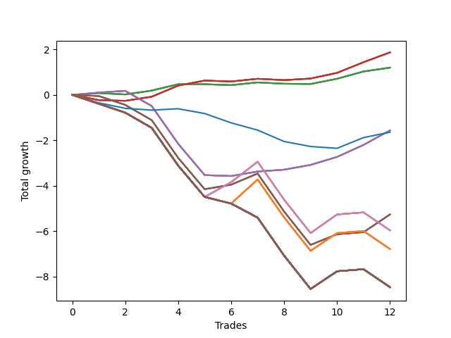

# Long Shepard 001 
- Symbol: SPY_Unlimited
- Date Range: 03/23/2022 - 07/08/2022
- Trading Period: 7:20-12:30
- Number of Trades: 12



| Name | Win Percent | Profit | Avg Profit / Trade | Avg Time / Trade |      | Name | Win Percent | Profit | Avg Profit / Trade | Avg Time / Trade |
| ---- | ----------- | ------ | ------------------ | ---------------- | ---- | ---- | ----------- | ------ | ------------------ | ---------------- |
| Sorted By <br> Profit | | | | | | Sorted By <br> Win Percentage ||||
| Sixty-Five | 66.67 | 935.00 | 77.92 | 07:35 |     | Sixty-Five | 66.67 | 935.00 | 77.92 | 07:35 |
| Fifty-Seven | 66.67 | 935.00 | 77.92 | 07:35 |     | Fifty-Seven | 66.67 | 935.00 | 77.92 | 07:35 |
| Forty-Nine | 66.67 | 935.00 | 77.92 | 07:35 |     | Forty-Nine | 66.67 | 935.00 | 77.92 | 07:35 |
| Forty-One | 66.67 | 935.00 | 77.92 | 07:35 |     | Forty-One | 66.67 | 935.00 | 77.92 | 07:35 |
| One | 66.67 | 935.00 | 77.92 | 07:35 |     | One | 66.67 | 935.00 | 77.92 | 07:35 |
| Sixty-Four | 66.67 | 600.00 | 50.00 | 03:07 |     | Sixty-Four | 66.67 | 600.00 | 50.00 | 03:07 |
| Fifty-Six | 66.67 | 600.00 | 50.00 | 03:07 |     | Fifty-Six | 66.67 | 600.00 | 50.00 | 03:07 |
| Forty-Eight | 66.67 | 600.00 | 50.00 | 03:07 |     | Forty-Eight | 66.67 | 600.00 | 50.00 | 03:07 |
| Forty | 66.67 | 600.00 | 50.00 | 03:07 |     | Forty | 66.67 | 600.00 | 50.00 | 03:07 |
| Zero | 66.67 | 600.00 | 50.00 | 03:07 |     | Zero | 66.67 | 600.00 | 50.00 | 03:07 |
| Sixty-Six | 66.67 | -780.00 | -65.00 | 15:29 |     | Sixty-Six | 66.67 | -780.00 | -65.00 | 15:29 |
| Fifty-Eight | 66.67 | -780.00 | -65.00 | 15:29 |     | Fifty-Eight | 66.67 | -780.00 | -65.00 | 15:29 |
| Fifty | 66.67 | -780.00 | -65.00 | 15:29 |     | Fifty | 66.67 | -780.00 | -65.00 | 15:29 |
| Forty-Two | 66.67 | -780.00 | -65.00 | 15:29 |     | Forty-Two | 66.67 | -780.00 | -65.00 | 15:29 |
| Two | 66.67 | -780.00 | -65.00 | 15:29 |     | Two | 66.67 | -780.00 | -65.00 | 15:29 |
| Seventy-Three | 25.00 | -820.00 | -68.33 | 05:40 |     | Sixty-Seven | 41.67 | -2630.00 | -219.17 | 22:13 |
| Sixty-Seven | 41.67 | -2630.00 | -219.17 | 22:13 |     | Fifty-Nine | 41.67 | -2630.00 | -219.17 | 22:13 |
| Fifty-Nine | 41.67 | -2630.00 | -219.17 | 22:13 |     | Fifty-One | 41.67 | -2630.00 | -219.17 | 22:13 |
| Fifty-One | 41.67 | -2630.00 | -219.17 | 22:13 |     | Forty-Three | 41.67 | -2630.00 | -219.17 | 22:13 |
| Forty-Three | 41.67 | -2630.00 | -219.17 | 22:13 |     | Three | 41.67 | -2630.00 | -219.17 | 22:13 |
| Three | 41.67 | -2630.00 | -219.17 | 22:13 |     | Sixty-Eight | 33.33 | -2980.00 | -248.33 | 26:45 |
| Sixty-Eight | 33.33 | -2980.00 | -248.33 | 26:45 |     | Sixty | 33.33 | -2980.00 | -248.33 | 26:45 |
| Sixty | 33.33 | -2980.00 | -248.33 | 26:45 |     | Fifty-Two | 33.33 | -2980.00 | -248.33 | 26:45 |
| Fifty-Two | 33.33 | -2980.00 | -248.33 | 26:45 |     | Forty-Four | 33.33 | -2980.00 | -248.33 | 26:45 |
| Forty-Four | 33.33 | -2980.00 | -248.33 | 26:45 |     | Four | 33.33 | -2980.00 | -248.33 | 26:45 |
| Four | 33.33 | -2980.00 | -248.33 | 26:45 |     | Seventy-Three | 25.00 | -820.00 | -68.33 | 05:40 |
| One Hundred Twenty-Six | 25.00 | -3390.00 | -282.50 | 28:35 |     | One Hundred Twenty-Six | 25.00 | -3390.00 | -282.50 | 28:35 |
| One Hundred Twenty-One | 25.00 | -3390.00 | -282.50 | 28:35 |     | One Hundred Twenty-One | 25.00 | -3390.00 | -282.50 | 28:35 |
| One Hundred Sixteen | 25.00 | -3390.00 | -282.50 | 28:35 |     | One Hundred Sixteen | 25.00 | -3390.00 | -282.50 | 28:35 |
| One Hundred Eleven | 25.00 | -3390.00 | -282.50 | 28:35 |     | One Hundred Eleven | 25.00 | -3390.00 | -282.50 | 28:35 |
| Eighty-One | 25.00 | -3390.00 | -282.50 | 28:35 |     | Eighty-One | 25.00 | -3390.00 | -282.50 | 28:35 |
| One Hundred Thirty | 16.67 | -4230.00 | -352.50 | 29:55 |     | One Hundred Thirty | 16.67 | -4230.00 | -352.50 | 29:55 |
| One Hundred Twenty-Nine | 16.67 | -4230.00 | -352.50 | 29:55 |     | One Hundred Twenty-Nine | 16.67 | -4230.00 | -352.50 | 29:55 |
| One Hundred Twenty-Eight | 16.67 | -4230.00 | -352.50 | 29:55 |     | One Hundred Twenty-Eight | 16.67 | -4230.00 | -352.50 | 29:55 |
| One Hundred Twenty-Seven | 16.67 | -4230.00 | -352.50 | 29:55 |     | One Hundred Twenty-Seven | 16.67 | -4230.00 | -352.50 | 29:55 |
| One Hundred Twenty-Five | 16.67 | -4230.00 | -352.50 | 29:55 |     | One Hundred Twenty-Five | 16.67 | -4230.00 | -352.50 | 29:55 |
| One Hundred Twenty-Four | 16.67 | -4230.00 | -352.50 | 29:55 |     | One Hundred Twenty-Four | 16.67 | -4230.00 | -352.50 | 29:55 |
| One Hundred Twenty-Three | 16.67 | -4230.00 | -352.50 | 29:55 |     | One Hundred Twenty-Three | 16.67 | -4230.00 | -352.50 | 29:55 |
| One Hundred Twenty-Two | 16.67 | -4230.00 | -352.50 | 29:55 |     | One Hundred Twenty-Two | 16.67 | -4230.00 | -352.50 | 29:55 |
| One Hundred Twenty | 16.67 | -4230.00 | -352.50 | 29:55 |     | One Hundred Twenty | 16.67 | -4230.00 | -352.50 | 29:55 |
| One Hundred Ninteen | 16.67 | -4230.00 | -352.50 | 29:55 |     | One Hundred Ninteen | 16.67 | -4230.00 | -352.50 | 29:55 |
| One Hundred Eighteen | 16.67 | -4230.00 | -352.50 | 29:55 |     | One Hundred Eighteen | 16.67 | -4230.00 | -352.50 | 29:55 |
| One Hundred Seventeen | 16.67 | -4230.00 | -352.50 | 29:55 |     | One Hundred Seventeen | 16.67 | -4230.00 | -352.50 | 29:55 |
| One Hundred Fifteen | 16.67 | -4230.00 | -352.50 | 29:55 |     | One Hundred Fifteen | 16.67 | -4230.00 | -352.50 | 29:55 |
| One Hundred Fourteen | 16.67 | -4230.00 | -352.50 | 29:55 |     | One Hundred Fourteen | 16.67 | -4230.00 | -352.50 | 29:55 |
| One Hundred Thirteen | 16.67 | -4230.00 | -352.50 | 29:55 |     | One Hundred Thirteen | 16.67 | -4230.00 | -352.50 | 29:55 |
| One Hundred Twelve | 16.67 | -4230.00 | -352.50 | 29:55 |     | One Hundred Twelve | 16.67 | -4230.00 | -352.50 | 29:55 |
| Eighty-Five | 16.67 | -4230.00 | -352.50 | 29:55 |     | Eighty-Five | 16.67 | -4230.00 | -352.50 | 29:55 |
| Eighty-Four | 16.67 | -4230.00 | -352.50 | 29:55 |     | Eighty-Four | 16.67 | -4230.00 | -352.50 | 29:55 |
| Eighty-Three | 16.67 | -4230.00 | -352.50 | 29:55 |     | Eighty-Three | 16.67 | -4230.00 | -352.50 | 29:55 |
| Eighty-Two | 16.67 | -4230.00 | -352.50 | 29:55 |     | Eighty-Two | 16.67 | -4230.00 | -352.50 | 29:55 |
| Seventy-One | 16.67 | -4230.00 | -352.50 | 29:55 |     | Seventy-One | 16.67 | -4230.00 | -352.50 | 29:55 |
| Seventy | 16.67 | -4230.00 | -352.50 | 29:55 |     | Seventy | 16.67 | -4230.00 | -352.50 | 29:55 |
| Sixty-Nine | 16.67 | -4230.00 | -352.50 | 29:55 |     | Sixty-Nine | 16.67 | -4230.00 | -352.50 | 29:55 |
| Sixty-Three | 16.67 | -4230.00 | -352.50 | 29:55 |     | Sixty-Three | 16.67 | -4230.00 | -352.50 | 29:55 |
| Sixty-Two | 16.67 | -4230.00 | -352.50 | 29:55 |     | Sixty-Two | 16.67 | -4230.00 | -352.50 | 29:55 |
| Sixty-One | 16.67 | -4230.00 | -352.50 | 29:55 |     | Sixty-One | 16.67 | -4230.00 | -352.50 | 29:55 |
| Fifty-Five | 16.67 | -4230.00 | -352.50 | 29:55 |     | Fifty-Five | 16.67 | -4230.00 | -352.50 | 29:55 |
| Fifty-Four | 16.67 | -4230.00 | -352.50 | 29:55 |     | Fifty-Four | 16.67 | -4230.00 | -352.50 | 29:55 |
| Fifty-Three | 16.67 | -4230.00 | -352.50 | 29:55 |     | Fifty-Three | 16.67 | -4230.00 | -352.50 | 29:55 |
| Forty-Seven | 16.67 | -4230.00 | -352.50 | 29:55 |     | Forty-Seven | 16.67 | -4230.00 | -352.50 | 29:55 |
| Forty-Six | 16.67 | -4230.00 | -352.50 | 29:55 |     | Forty-Six | 16.67 | -4230.00 | -352.50 | 29:55 |
| Forty-Five | 16.67 | -4230.00 | -352.50 | 29:55 |     | Forty-Five | 16.67 | -4230.00 | -352.50 | 29:55 |
| Seven | 16.67 | -4230.00 | -352.50 | 29:55 |     | Seven | 16.67 | -4230.00 | -352.50 | 29:55 |
| Six | 16.67 | -4230.00 | -352.50 | 29:55 |     | Six | 16.67 | -4230.00 | -352.50 | 29:55 |
| Five | 16.67 | -4230.00 | -352.50 | 29:55 |     | Five | 16.67 | -4230.00 | -352.50 | 29:55 |

## NO STOPLOSS

### Test Zero
* Sell when price hits the middle line of the 20p bollinger
* No Stoploss
* Results:
```
Total Trades: 12
Percent Up: 66.67
Percent Down: 33.33
Total Points Moved Up: 1.20
Potential Profit: 600.00
Total Points Ups: 1.37 Count Ups: 8
Total Points Downs: -0.17 Count Downs: 4
```

<details><summary>Trades</summary>

<code>In: 2022-03-30 12:15:00		Out: 2022-03-30 12:15:25		Total Position Time: 00:25		Total Move Up: 0.08		Total to Date: 0.08</code> <br />
<code>In: 2022-03-31 11:13:00		Out: 2022-03-31 11:22:10		Total Position Time: 09:10		Total Move Up: -0.06		Total to Date: 0.02</code> <br />
<code>In: 2022-04-05 09:05:00		Out: 2022-04-05 09:06:10		Total Position Time: 01:10		Total Move Up: 0.17		Total to Date: 0.19</code> <br />
<code>In: 2022-04-12 11:04:00		Out: 2022-04-12 11:04:55		Total Position Time: 00:55		Total Move Up: 0.28		Total to Date: 0.47</code> <br />
<code>In: 2022-04-12 11:05:00		Out: 2022-04-12 11:05:10		Total Position Time: 00:10		Total Move Up: 0.00		Total to Date: 0.47</code> <br />
<code>In: 2022-04-21 10:22:00		Out: 2022-04-21 10:22:10		Total Position Time: 00:10		Total Move Up: -0.04		Total to Date: 0.43</code> <br />
<code>In: 2022-04-22 11:07:00		Out: 2022-04-22 11:17:15		Total Position Time: 10:15		Total Move Up: 0.12		Total to Date: 0.55</code> <br />
<code>In: 2022-05-18 10:22:00		Out: 2022-05-18 10:28:30		Total Position Time: 06:30		Total Move Up: -0.06		Total to Date: 0.49</code> <br />
<code>In: 2022-05-18 10:29:00		Out: 2022-05-18 10:29:10		Total Position Time: 00:10		Total Move Up: -0.01		Total to Date: 0.48</code> <br />
<code>In: 2022-05-18 10:58:00		Out: 2022-05-18 11:01:00		Total Position Time: 03:00		Total Move Up: 0.23		Total to Date: 0.71</code> <br />
<code>In: 2022-06-08 09:48:00		Out: 2022-06-08 09:53:00		Total Position Time: 05:00		Total Move Up: 0.32		Total to Date: 1.03</code> <br />
<code>In: 2022-06-23 09:14:00		Out: 2022-06-23 09:14:30		Total Position Time: 00:30		Total Move Up: 0.17		Total to Date: 1.20</code> <br />


</details>

### Test One
* Sell when the price hits the upper line of the 20p 1std bollinger
* No Stoploss
* Results:
```
Total Trades: 12
Percent Up: 66.67
Percent Down: 33.33
Total Points Moved Up: 1.87
Potential Profit: 935.00
Total Points Ups: 2.23 Count Ups: 8
Total Points Downs: -0.36 Count Downs: 4
```

<details><summary>Trades</summary>

<code>In: 2022-03-30 12:15:00		Out: 2022-03-30 12:32:20		Total Position Time: 17:20		Total Move Up: -0.23		Total to Date: -0.23</code> <br />
<code>In: 2022-03-31 11:13:00		Out: 2022-03-31 11:29:15		Total Position Time: 16:15		Total Move Up: -0.03		Total to Date: -0.26</code> <br />
<code>In: 2022-04-05 09:05:00		Out: 2022-04-05 09:13:50		Total Position Time: 08:50		Total Move Up: 0.18		Total to Date: -0.08</code> <br />
<code>In: 2022-04-12 11:04:00		Out: 2022-04-12 11:06:15		Total Position Time: 02:15		Total Move Up: 0.49		Total to Date: 0.41</code> <br />
<code>In: 2022-04-12 11:05:00		Out: 2022-04-12 11:06:15		Total Position Time: 01:15		Total Move Up: 0.22		Total to Date: 0.63</code> <br />
<code>In: 2022-04-21 10:22:00		Out: 2022-04-21 10:22:10		Total Position Time: 00:10		Total Move Up: -0.04		Total to Date: 0.59</code> <br />
<code>In: 2022-04-22 11:07:00		Out: 2022-04-22 11:17:15		Total Position Time: 10:15		Total Move Up: 0.12		Total to Date: 0.71</code> <br />
<code>In: 2022-05-18 10:22:00		Out: 2022-05-18 10:31:30		Total Position Time: 09:30		Total Move Up: -0.06		Total to Date: 0.65</code> <br />
<code>In: 2022-05-18 10:29:00		Out: 2022-05-18 10:31:30		Total Position Time: 02:30		Total Move Up: 0.07		Total to Date: 0.72</code> <br />
<code>In: 2022-05-18 10:58:00		Out: 2022-05-18 11:05:20		Total Position Time: 07:20		Total Move Up: 0.25		Total to Date: 0.97</code> <br />
<code>In: 2022-06-08 09:48:00		Out: 2022-06-08 09:59:05		Total Position Time: 11:05		Total Move Up: 0.47		Total to Date: 1.44</code> <br />
<code>In: 2022-06-23 09:14:00		Out: 2022-06-23 09:18:25		Total Position Time: 04:25		Total Move Up: 0.43		Total to Date: 1.87</code> <br />


</details>

### Test Two
* Sell when the price hits the upper line of the 20p 2std bollinger
* No Stoploss
* Results:
```
Total Trades: 12
Percent Up: 66.67
Percent Down: 33.33
Total Points Moved Up: -1.56
Potential Profit: -780.00
Total Points Ups: 2.19 Count Ups: 8
Total Points Downs: -3.75 Count Downs: 4
```

<details><summary>Trades</summary>

<code>In: 2022-03-30 12:15:00		Out: 2022-03-30 12:36:25		Total Position Time: 21:25		Total Move Up: 0.10		Total to Date: 0.10</code> <br />
<code>In: 2022-03-31 11:13:00		Out: 2022-03-31 11:29:25		Total Position Time: 16:25		Total Move Up: 0.08		Total to Date: 0.18</code> <br />
<code>In: 2022-04-05 09:05:00		Out: 2022-04-05 09:34:55		Total Position Time: 29:55		Total Move Up: -0.67		Total to Date: -0.49</code> <br />
<code>In: 2022-04-12 11:04:00		Out: 2022-04-12 11:33:55		Total Position Time: 29:55		Total Move Up: -1.66		Total to Date: -2.15</code> <br />
<code>In: 2022-04-12 11:05:00		Out: 2022-04-12 11:34:55		Total Position Time: 29:55		Total Move Up: -1.38		Total to Date: -3.53</code> <br />
<code>In: 2022-04-21 10:22:00		Out: 2022-04-21 10:22:10		Total Position Time: 00:10		Total Move Up: -0.04		Total to Date: -3.57</code> <br />
<code>In: 2022-04-22 11:07:00		Out: 2022-04-22 11:17:35		Total Position Time: 10:35		Total Move Up: 0.20		Total to Date: -3.37</code> <br />
<code>In: 2022-05-18 10:22:00		Out: 2022-05-18 10:35:05		Total Position Time: 13:05		Total Move Up: 0.08		Total to Date: -3.29</code> <br />
<code>In: 2022-05-18 10:29:00		Out: 2022-05-18 10:35:05		Total Position Time: 06:05		Total Move Up: 0.21		Total to Date: -3.08</code> <br />
<code>In: 2022-05-18 10:58:00		Out: 2022-05-18 11:10:05		Total Position Time: 12:05		Total Move Up: 0.35		Total to Date: -2.73</code> <br />
<code>In: 2022-06-08 09:48:00		Out: 2022-06-08 09:59:15		Total Position Time: 11:15		Total Move Up: 0.53		Total to Date: -2.20</code> <br />
<code>In: 2022-06-23 09:14:00		Out: 2022-06-23 09:19:05		Total Position Time: 05:05		Total Move Up: 0.64		Total to Date: -1.56</code> <br />


</details>

### Test Three
* Sell when price hits the middle line of the 50p bollinger
* No Stoploss
* Results:
```
Total Trades: 12
Percent Up: 41.67
Percent Down: 58.33
Total Points Moved Up: -5.26
Potential Profit: -2630.00
Total Points Ups: 2.03 Count Ups: 5
Total Points Downs: -7.29 Count Downs: 7
```

<details><summary>Trades</summary>

<code>In: 2022-03-30 12:15:00		Out: 2022-03-30 12:33:30		Total Position Time: 18:30		Total Move Up: -0.05		Total to Date: -0.05</code> <br />
<code>In: 2022-03-31 11:13:00		Out: 2022-03-31 11:42:55		Total Position Time: 29:55		Total Move Up: -0.39		Total to Date: -0.44</code> <br />
<code>In: 2022-04-05 09:05:00		Out: 2022-04-05 09:34:55		Total Position Time: 29:55		Total Move Up: -0.67		Total to Date: -1.11</code> <br />
<code>In: 2022-04-12 11:04:00		Out: 2022-04-12 11:33:55		Total Position Time: 29:55		Total Move Up: -1.66		Total to Date: -2.77</code> <br />
<code>In: 2022-04-12 11:05:00		Out: 2022-04-12 11:34:55		Total Position Time: 29:55		Total Move Up: -1.38		Total to Date: -4.15</code> <br />
<code>In: 2022-04-21 10:22:00		Out: 2022-04-21 10:22:25		Total Position Time: 00:25		Total Move Up: 0.20		Total to Date: -3.95</code> <br />
<code>In: 2022-04-22 11:07:00		Out: 2022-04-22 11:17:55		Total Position Time: 10:55		Total Move Up: 0.49		Total to Date: -3.46</code> <br />
<code>In: 2022-05-18 10:22:00		Out: 2022-05-18 10:51:55		Total Position Time: 29:55		Total Move Up: -1.67		Total to Date: -5.13</code> <br />
<code>In: 2022-05-18 10:29:00		Out: 2022-05-18 10:58:55		Total Position Time: 29:55		Total Move Up: -1.47		Total to Date: -6.60</code> <br />
<code>In: 2022-05-18 10:58:00		Out: 2022-05-18 11:18:15		Total Position Time: 20:15		Total Move Up: 0.47		Total to Date: -6.13</code> <br />
<code>In: 2022-06-08 09:48:00		Out: 2022-06-08 10:17:55		Total Position Time: 29:55		Total Move Up: 0.09		Total to Date: -6.04</code> <br />
<code>In: 2022-06-23 09:14:00		Out: 2022-06-23 09:21:10		Total Position Time: 07:10		Total Move Up: 0.78		Total to Date: -5.26</code> <br />


</details>

### Test Four
* Sell when the price hits the upper line of the 50p 1std bollinger
* No Stoploss
* Results:
```
Total Trades: 12
Percent Up: 33.33
Percent Down: 66.67
Total Points Moved Up: -5.96
Potential Profit: -2980.00
Total Points Ups: 2.46 Count Ups: 4
Total Points Downs: -8.42 Count Downs: 8
```

<details><summary>Trades</summary>

<code>In: 2022-03-30 12:15:00		Out: 2022-03-30 12:44:55		Total Position Time: 29:55		Total Move Up: -0.39		Total to Date: -0.39</code> <br />
<code>In: 2022-03-31 11:13:00		Out: 2022-03-31 11:42:55		Total Position Time: 29:55		Total Move Up: -0.39		Total to Date: -0.78</code> <br />
<code>In: 2022-04-05 09:05:00		Out: 2022-04-05 09:34:55		Total Position Time: 29:55		Total Move Up: -0.67		Total to Date: -1.45</code> <br />
<code>In: 2022-04-12 11:04:00		Out: 2022-04-12 11:33:55		Total Position Time: 29:55		Total Move Up: -1.66		Total to Date: -3.11</code> <br />
<code>In: 2022-04-12 11:05:00		Out: 2022-04-12 11:34:55		Total Position Time: 29:55		Total Move Up: -1.38		Total to Date: -4.49</code> <br />
<code>In: 2022-04-21 10:22:00		Out: 2022-04-21 10:31:05		Total Position Time: 09:05		Total Move Up: 0.65		Total to Date: -3.84</code> <br />
<code>In: 2022-04-22 11:07:00		Out: 2022-04-22 11:19:55		Total Position Time: 12:55		Total Move Up: 0.90		Total to Date: -2.94</code> <br />
<code>In: 2022-05-18 10:22:00		Out: 2022-05-18 10:51:55		Total Position Time: 29:55		Total Move Up: -1.67		Total to Date: -4.61</code> <br />
<code>In: 2022-05-18 10:29:00		Out: 2022-05-18 10:58:55		Total Position Time: 29:55		Total Move Up: -1.47		Total to Date: -6.08</code> <br />
<code>In: 2022-05-18 10:58:00		Out: 2022-05-18 11:27:45		Total Position Time: 29:45		Total Move Up: 0.82		Total to Date: -5.26</code> <br />
<code>In: 2022-06-08 09:48:00		Out: 2022-06-08 10:17:55		Total Position Time: 29:55		Total Move Up: 0.09		Total to Date: -5.17</code> <br />
<code>In: 2022-06-23 09:14:00		Out: 2022-06-23 09:43:55		Total Position Time: 29:55		Total Move Up: -0.79		Total to Date: -5.96</code> <br />


</details>

### Test Five
* Sell when the price hits the upper line of the 50p 2std bollinger
* No Stoploss
* Results:
```
Total Trades: 12
Percent Up: 16.67
Percent Down: 83.33
Total Points Moved Up: -8.46
Potential Profit: -4230.00
Total Points Ups: 0.87 Count Ups: 2
Total Points Downs: -9.33 Count Downs: 10
```

<details><summary>Trades</summary>

<code>In: 2022-03-30 12:15:00		Out: 2022-03-30 12:44:55		Total Position Time: 29:55		Total Move Up: -0.39		Total to Date: -0.39</code> <br />
<code>In: 2022-03-31 11:13:00		Out: 2022-03-31 11:42:55		Total Position Time: 29:55		Total Move Up: -0.39		Total to Date: -0.78</code> <br />
<code>In: 2022-04-05 09:05:00		Out: 2022-04-05 09:34:55		Total Position Time: 29:55		Total Move Up: -0.67		Total to Date: -1.45</code> <br />
<code>In: 2022-04-12 11:04:00		Out: 2022-04-12 11:33:55		Total Position Time: 29:55		Total Move Up: -1.66		Total to Date: -3.11</code> <br />
<code>In: 2022-04-12 11:05:00		Out: 2022-04-12 11:34:55		Total Position Time: 29:55		Total Move Up: -1.38		Total to Date: -4.49</code> <br />
<code>In: 2022-04-21 10:22:00		Out: 2022-04-21 10:51:55		Total Position Time: 29:55		Total Move Up: -0.29		Total to Date: -4.78</code> <br />
<code>In: 2022-04-22 11:07:00		Out: 2022-04-22 11:36:55		Total Position Time: 29:55		Total Move Up: -0.62		Total to Date: -5.40</code> <br />
<code>In: 2022-05-18 10:22:00		Out: 2022-05-18 10:51:55		Total Position Time: 29:55		Total Move Up: -1.67		Total to Date: -7.07</code> <br />
<code>In: 2022-05-18 10:29:00		Out: 2022-05-18 10:58:55		Total Position Time: 29:55		Total Move Up: -1.47		Total to Date: -8.54</code> <br />
<code>In: 2022-05-18 10:58:00		Out: 2022-05-18 11:27:55		Total Position Time: 29:55		Total Move Up: 0.78		Total to Date: -7.76</code> <br />
<code>In: 2022-06-08 09:48:00		Out: 2022-06-08 10:17:55		Total Position Time: 29:55		Total Move Up: 0.09		Total to Date: -7.67</code> <br />
<code>In: 2022-06-23 09:14:00		Out: 2022-06-23 09:43:55		Total Position Time: 29:55		Total Move Up: -0.79		Total to Date: -8.46</code> <br />


</details>

### Test Six
* Sell when the price hits the middle line of the 1std VWAP
* No Stoploss
* Results:
```
Total Trades: 12
Percent Up: 16.67
Percent Down: 83.33
Total Points Moved Up: -8.46
Potential Profit: -4230.00
Total Points Ups: 0.87 Count Ups: 2
Total Points Downs: -9.33 Count Downs: 10
```

<details><summary>Trades</summary>

<code>In: 2022-03-30 12:15:00		Out: 2022-03-30 12:44:55		Total Position Time: 29:55		Total Move Up: -0.39		Total to Date: -0.39</code> <br />
<code>In: 2022-03-31 11:13:00		Out: 2022-03-31 11:42:55		Total Position Time: 29:55		Total Move Up: -0.39		Total to Date: -0.78</code> <br />
<code>In: 2022-04-05 09:05:00		Out: 2022-04-05 09:34:55		Total Position Time: 29:55		Total Move Up: -0.67		Total to Date: -1.45</code> <br />
<code>In: 2022-04-12 11:04:00		Out: 2022-04-12 11:33:55		Total Position Time: 29:55		Total Move Up: -1.66		Total to Date: -3.11</code> <br />
<code>In: 2022-04-12 11:05:00		Out: 2022-04-12 11:34:55		Total Position Time: 29:55		Total Move Up: -1.38		Total to Date: -4.49</code> <br />
<code>In: 2022-04-21 10:22:00		Out: 2022-04-21 10:51:55		Total Position Time: 29:55		Total Move Up: -0.29		Total to Date: -4.78</code> <br />
<code>In: 2022-04-22 11:07:00		Out: 2022-04-22 11:36:55		Total Position Time: 29:55		Total Move Up: -0.62		Total to Date: -5.40</code> <br />
<code>In: 2022-05-18 10:22:00		Out: 2022-05-18 10:51:55		Total Position Time: 29:55		Total Move Up: -1.67		Total to Date: -7.07</code> <br />
<code>In: 2022-05-18 10:29:00		Out: 2022-05-18 10:58:55		Total Position Time: 29:55		Total Move Up: -1.47		Total to Date: -8.54</code> <br />
<code>In: 2022-05-18 10:58:00		Out: 2022-05-18 11:27:55		Total Position Time: 29:55		Total Move Up: 0.78		Total to Date: -7.76</code> <br />
<code>In: 2022-06-08 09:48:00		Out: 2022-06-08 10:17:55		Total Position Time: 29:55		Total Move Up: 0.09		Total to Date: -7.67</code> <br />
<code>In: 2022-06-23 09:14:00		Out: 2022-06-23 09:43:55		Total Position Time: 29:55		Total Move Up: -0.79		Total to Date: -8.46</code> <br />


</details>

### Test Seven
* Sell when the price hits the upper line of the 1std VWAP
* No Stoploss
* Results:
```
Total Trades: 12
Percent Up: 16.67
Percent Down: 83.33
Total Points Moved Up: -8.46
Potential Profit: -4230.00
Total Points Ups: 0.87 Count Ups: 2
Total Points Downs: -9.33 Count Downs: 10
```

<details><summary>Trades</summary>

<code>In: 2022-03-30 12:15:00		Out: 2022-03-30 12:44:55		Total Position Time: 29:55		Total Move Up: -0.39		Total to Date: -0.39</code> <br />
<code>In: 2022-03-31 11:13:00		Out: 2022-03-31 11:42:55		Total Position Time: 29:55		Total Move Up: -0.39		Total to Date: -0.78</code> <br />
<code>In: 2022-04-05 09:05:00		Out: 2022-04-05 09:34:55		Total Position Time: 29:55		Total Move Up: -0.67		Total to Date: -1.45</code> <br />
<code>In: 2022-04-12 11:04:00		Out: 2022-04-12 11:33:55		Total Position Time: 29:55		Total Move Up: -1.66		Total to Date: -3.11</code> <br />
<code>In: 2022-04-12 11:05:00		Out: 2022-04-12 11:34:55		Total Position Time: 29:55		Total Move Up: -1.38		Total to Date: -4.49</code> <br />
<code>In: 2022-04-21 10:22:00		Out: 2022-04-21 10:51:55		Total Position Time: 29:55		Total Move Up: -0.29		Total to Date: -4.78</code> <br />
<code>In: 2022-04-22 11:07:00		Out: 2022-04-22 11:36:55		Total Position Time: 29:55		Total Move Up: -0.62		Total to Date: -5.40</code> <br />
<code>In: 2022-05-18 10:22:00		Out: 2022-05-18 10:51:55		Total Position Time: 29:55		Total Move Up: -1.67		Total to Date: -7.07</code> <br />
<code>In: 2022-05-18 10:29:00		Out: 2022-05-18 10:58:55		Total Position Time: 29:55		Total Move Up: -1.47		Total to Date: -8.54</code> <br />
<code>In: 2022-05-18 10:58:00		Out: 2022-05-18 11:27:55		Total Position Time: 29:55		Total Move Up: 0.78		Total to Date: -7.76</code> <br />
<code>In: 2022-06-08 09:48:00		Out: 2022-06-08 10:17:55		Total Position Time: 29:55		Total Move Up: 0.09		Total to Date: -7.67</code> <br />
<code>In: 2022-06-23 09:14:00		Out: 2022-06-23 09:43:55		Total Position Time: 29:55		Total Move Up: -0.79		Total to Date: -8.46</code> <br />


</details>

## STOPLOSS OF 5

### Test Forty
* Sell when price hits the middle line of the 20p bollinger
* Stoploss is 5 points
* Results:
```
Total Trades: 12
Percent Up: 66.67
Percent Down: 33.33
Total Points Moved Up: 1.20
Potential Profit: 600.00
Total Points Ups: 1.37 Count Ups: 8
Total Points Downs: -0.17 Count Downs: 4
```

<details><summary>Trades</summary>

<code>In: 2022-03-30 12:15:00		Out: 2022-03-30 12:15:25		Total Position Time: 00:25		Total Move Up: 0.08		Total to Date: 0.08</code> <br />
<code>In: 2022-03-31 11:13:00		Out: 2022-03-31 11:22:10		Total Position Time: 09:10		Total Move Up: -0.06		Total to Date: 0.02</code> <br />
<code>In: 2022-04-05 09:05:00		Out: 2022-04-05 09:06:10		Total Position Time: 01:10		Total Move Up: 0.17		Total to Date: 0.19</code> <br />
<code>In: 2022-04-12 11:04:00		Out: 2022-04-12 11:04:55		Total Position Time: 00:55		Total Move Up: 0.28		Total to Date: 0.47</code> <br />
<code>In: 2022-04-12 11:05:00		Out: 2022-04-12 11:05:10		Total Position Time: 00:10		Total Move Up: 0.00		Total to Date: 0.47</code> <br />
<code>In: 2022-04-21 10:22:00		Out: 2022-04-21 10:22:10		Total Position Time: 00:10		Total Move Up: -0.04		Total to Date: 0.43</code> <br />
<code>In: 2022-04-22 11:07:00		Out: 2022-04-22 11:17:15		Total Position Time: 10:15		Total Move Up: 0.12		Total to Date: 0.55</code> <br />
<code>In: 2022-05-18 10:22:00		Out: 2022-05-18 10:28:30		Total Position Time: 06:30		Total Move Up: -0.06		Total to Date: 0.49</code> <br />
<code>In: 2022-05-18 10:29:00		Out: 2022-05-18 10:29:10		Total Position Time: 00:10		Total Move Up: -0.01		Total to Date: 0.48</code> <br />
<code>In: 2022-05-18 10:58:00		Out: 2022-05-18 11:01:00		Total Position Time: 03:00		Total Move Up: 0.23		Total to Date: 0.71</code> <br />
<code>In: 2022-06-08 09:48:00		Out: 2022-06-08 09:53:00		Total Position Time: 05:00		Total Move Up: 0.32		Total to Date: 1.03</code> <br />
<code>In: 2022-06-23 09:14:00		Out: 2022-06-23 09:14:30		Total Position Time: 00:30		Total Move Up: 0.17		Total to Date: 1.20</code> <br />


</details>

### Test Forty-One
* Sell when the price hits the upper line of the 20p 1std bollinger
* Stoploss is 5 points
* Results:
```
Total Trades: 12
Percent Up: 66.67
Percent Down: 33.33
Total Points Moved Up: 1.87
Potential Profit: 935.00
Total Points Ups: 2.23 Count Ups: 8
Total Points Downs: -0.36 Count Downs: 4
```

<details><summary>Trades</summary>

<code>In: 2022-03-30 12:15:00		Out: 2022-03-30 12:32:20		Total Position Time: 17:20		Total Move Up: -0.23		Total to Date: -0.23</code> <br />
<code>In: 2022-03-31 11:13:00		Out: 2022-03-31 11:29:15		Total Position Time: 16:15		Total Move Up: -0.03		Total to Date: -0.26</code> <br />
<code>In: 2022-04-05 09:05:00		Out: 2022-04-05 09:13:50		Total Position Time: 08:50		Total Move Up: 0.18		Total to Date: -0.08</code> <br />
<code>In: 2022-04-12 11:04:00		Out: 2022-04-12 11:06:15		Total Position Time: 02:15		Total Move Up: 0.49		Total to Date: 0.41</code> <br />
<code>In: 2022-04-12 11:05:00		Out: 2022-04-12 11:06:15		Total Position Time: 01:15		Total Move Up: 0.22		Total to Date: 0.63</code> <br />
<code>In: 2022-04-21 10:22:00		Out: 2022-04-21 10:22:10		Total Position Time: 00:10		Total Move Up: -0.04		Total to Date: 0.59</code> <br />
<code>In: 2022-04-22 11:07:00		Out: 2022-04-22 11:17:15		Total Position Time: 10:15		Total Move Up: 0.12		Total to Date: 0.71</code> <br />
<code>In: 2022-05-18 10:22:00		Out: 2022-05-18 10:31:30		Total Position Time: 09:30		Total Move Up: -0.06		Total to Date: 0.65</code> <br />
<code>In: 2022-05-18 10:29:00		Out: 2022-05-18 10:31:30		Total Position Time: 02:30		Total Move Up: 0.07		Total to Date: 0.72</code> <br />
<code>In: 2022-05-18 10:58:00		Out: 2022-05-18 11:05:20		Total Position Time: 07:20		Total Move Up: 0.25		Total to Date: 0.97</code> <br />
<code>In: 2022-06-08 09:48:00		Out: 2022-06-08 09:59:05		Total Position Time: 11:05		Total Move Up: 0.47		Total to Date: 1.44</code> <br />
<code>In: 2022-06-23 09:14:00		Out: 2022-06-23 09:18:25		Total Position Time: 04:25		Total Move Up: 0.43		Total to Date: 1.87</code> <br />


</details>

### Test Forty-Two
* Sell when the price hits the upper line of the 20p 2std bollinger
* Stoploss is 5 points
* Results:
```
Total Trades: 12
Percent Up: 66.67
Percent Down: 33.33
Total Points Moved Up: -1.56
Potential Profit: -780.00
Total Points Ups: 2.19 Count Ups: 8
Total Points Downs: -3.75 Count Downs: 4
```

<details><summary>Trades</summary>

<code>In: 2022-03-30 12:15:00		Out: 2022-03-30 12:36:25		Total Position Time: 21:25		Total Move Up: 0.10		Total to Date: 0.10</code> <br />
<code>In: 2022-03-31 11:13:00		Out: 2022-03-31 11:29:25		Total Position Time: 16:25		Total Move Up: 0.08		Total to Date: 0.18</code> <br />
<code>In: 2022-04-05 09:05:00		Out: 2022-04-05 09:34:55		Total Position Time: 29:55		Total Move Up: -0.67		Total to Date: -0.49</code> <br />
<code>In: 2022-04-12 11:04:00		Out: 2022-04-12 11:33:55		Total Position Time: 29:55		Total Move Up: -1.66		Total to Date: -2.15</code> <br />
<code>In: 2022-04-12 11:05:00		Out: 2022-04-12 11:34:55		Total Position Time: 29:55		Total Move Up: -1.38		Total to Date: -3.53</code> <br />
<code>In: 2022-04-21 10:22:00		Out: 2022-04-21 10:22:10		Total Position Time: 00:10		Total Move Up: -0.04		Total to Date: -3.57</code> <br />
<code>In: 2022-04-22 11:07:00		Out: 2022-04-22 11:17:35		Total Position Time: 10:35		Total Move Up: 0.20		Total to Date: -3.37</code> <br />
<code>In: 2022-05-18 10:22:00		Out: 2022-05-18 10:35:05		Total Position Time: 13:05		Total Move Up: 0.08		Total to Date: -3.29</code> <br />
<code>In: 2022-05-18 10:29:00		Out: 2022-05-18 10:35:05		Total Position Time: 06:05		Total Move Up: 0.21		Total to Date: -3.08</code> <br />
<code>In: 2022-05-18 10:58:00		Out: 2022-05-18 11:10:05		Total Position Time: 12:05		Total Move Up: 0.35		Total to Date: -2.73</code> <br />
<code>In: 2022-06-08 09:48:00		Out: 2022-06-08 09:59:15		Total Position Time: 11:15		Total Move Up: 0.53		Total to Date: -2.20</code> <br />
<code>In: 2022-06-23 09:14:00		Out: 2022-06-23 09:19:05		Total Position Time: 05:05		Total Move Up: 0.64		Total to Date: -1.56</code> <br />


</details>

### Test Forty-Three
* Sell when price hits the middle line of the 50p bollinger
* Stoploss is 5 points
* Results:
```
Total Trades: 12
Percent Up: 41.67
Percent Down: 58.33
Total Points Moved Up: -5.26
Potential Profit: -2630.00
Total Points Ups: 2.03 Count Ups: 5
Total Points Downs: -7.29 Count Downs: 7
```

<details><summary>Trades</summary>

<code>In: 2022-03-30 12:15:00		Out: 2022-03-30 12:33:30		Total Position Time: 18:30		Total Move Up: -0.05		Total to Date: -0.05</code> <br />
<code>In: 2022-03-31 11:13:00		Out: 2022-03-31 11:42:55		Total Position Time: 29:55		Total Move Up: -0.39		Total to Date: -0.44</code> <br />
<code>In: 2022-04-05 09:05:00		Out: 2022-04-05 09:34:55		Total Position Time: 29:55		Total Move Up: -0.67		Total to Date: -1.11</code> <br />
<code>In: 2022-04-12 11:04:00		Out: 2022-04-12 11:33:55		Total Position Time: 29:55		Total Move Up: -1.66		Total to Date: -2.77</code> <br />
<code>In: 2022-04-12 11:05:00		Out: 2022-04-12 11:34:55		Total Position Time: 29:55		Total Move Up: -1.38		Total to Date: -4.15</code> <br />
<code>In: 2022-04-21 10:22:00		Out: 2022-04-21 10:22:25		Total Position Time: 00:25		Total Move Up: 0.20		Total to Date: -3.95</code> <br />
<code>In: 2022-04-22 11:07:00		Out: 2022-04-22 11:17:55		Total Position Time: 10:55		Total Move Up: 0.49		Total to Date: -3.46</code> <br />
<code>In: 2022-05-18 10:22:00		Out: 2022-05-18 10:51:55		Total Position Time: 29:55		Total Move Up: -1.67		Total to Date: -5.13</code> <br />
<code>In: 2022-05-18 10:29:00		Out: 2022-05-18 10:58:55		Total Position Time: 29:55		Total Move Up: -1.47		Total to Date: -6.60</code> <br />
<code>In: 2022-05-18 10:58:00		Out: 2022-05-18 11:18:15		Total Position Time: 20:15		Total Move Up: 0.47		Total to Date: -6.13</code> <br />
<code>In: 2022-06-08 09:48:00		Out: 2022-06-08 10:17:55		Total Position Time: 29:55		Total Move Up: 0.09		Total to Date: -6.04</code> <br />
<code>In: 2022-06-23 09:14:00		Out: 2022-06-23 09:21:10		Total Position Time: 07:10		Total Move Up: 0.78		Total to Date: -5.26</code> <br />


</details>

### Test Forty-Four
* Sell when the price hits the upper line of the 50p 1std bollinger
* Stoploss is 5 points
* Results:
```
Total Trades: 12
Percent Up: 33.33
Percent Down: 66.67
Total Points Moved Up: -5.96
Potential Profit: -2980.00
Total Points Ups: 2.46 Count Ups: 4
Total Points Downs: -8.42 Count Downs: 8
```

<details><summary>Trades</summary>

<code>In: 2022-03-30 12:15:00		Out: 2022-03-30 12:44:55		Total Position Time: 29:55		Total Move Up: -0.39		Total to Date: -0.39</code> <br />
<code>In: 2022-03-31 11:13:00		Out: 2022-03-31 11:42:55		Total Position Time: 29:55		Total Move Up: -0.39		Total to Date: -0.78</code> <br />
<code>In: 2022-04-05 09:05:00		Out: 2022-04-05 09:34:55		Total Position Time: 29:55		Total Move Up: -0.67		Total to Date: -1.45</code> <br />
<code>In: 2022-04-12 11:04:00		Out: 2022-04-12 11:33:55		Total Position Time: 29:55		Total Move Up: -1.66		Total to Date: -3.11</code> <br />
<code>In: 2022-04-12 11:05:00		Out: 2022-04-12 11:34:55		Total Position Time: 29:55		Total Move Up: -1.38		Total to Date: -4.49</code> <br />
<code>In: 2022-04-21 10:22:00		Out: 2022-04-21 10:31:05		Total Position Time: 09:05		Total Move Up: 0.65		Total to Date: -3.84</code> <br />
<code>In: 2022-04-22 11:07:00		Out: 2022-04-22 11:19:55		Total Position Time: 12:55		Total Move Up: 0.90		Total to Date: -2.94</code> <br />
<code>In: 2022-05-18 10:22:00		Out: 2022-05-18 10:51:55		Total Position Time: 29:55		Total Move Up: -1.67		Total to Date: -4.61</code> <br />
<code>In: 2022-05-18 10:29:00		Out: 2022-05-18 10:58:55		Total Position Time: 29:55		Total Move Up: -1.47		Total to Date: -6.08</code> <br />
<code>In: 2022-05-18 10:58:00		Out: 2022-05-18 11:27:45		Total Position Time: 29:45		Total Move Up: 0.82		Total to Date: -5.26</code> <br />
<code>In: 2022-06-08 09:48:00		Out: 2022-06-08 10:17:55		Total Position Time: 29:55		Total Move Up: 0.09		Total to Date: -5.17</code> <br />
<code>In: 2022-06-23 09:14:00		Out: 2022-06-23 09:43:55		Total Position Time: 29:55		Total Move Up: -0.79		Total to Date: -5.96</code> <br />


</details>

### Test Forty-Five
* Sell when the price hits the upper line of the 50p 2std bollinger
* Stoploss is 5 points
* Results:
```
Total Trades: 12
Percent Up: 16.67
Percent Down: 83.33
Total Points Moved Up: -8.46
Potential Profit: -4230.00
Total Points Ups: 0.87 Count Ups: 2
Total Points Downs: -9.33 Count Downs: 10
```

<details><summary>Trades</summary>

<code>In: 2022-03-30 12:15:00		Out: 2022-03-30 12:44:55		Total Position Time: 29:55		Total Move Up: -0.39		Total to Date: -0.39</code> <br />
<code>In: 2022-03-31 11:13:00		Out: 2022-03-31 11:42:55		Total Position Time: 29:55		Total Move Up: -0.39		Total to Date: -0.78</code> <br />
<code>In: 2022-04-05 09:05:00		Out: 2022-04-05 09:34:55		Total Position Time: 29:55		Total Move Up: -0.67		Total to Date: -1.45</code> <br />
<code>In: 2022-04-12 11:04:00		Out: 2022-04-12 11:33:55		Total Position Time: 29:55		Total Move Up: -1.66		Total to Date: -3.11</code> <br />
<code>In: 2022-04-12 11:05:00		Out: 2022-04-12 11:34:55		Total Position Time: 29:55		Total Move Up: -1.38		Total to Date: -4.49</code> <br />
<code>In: 2022-04-21 10:22:00		Out: 2022-04-21 10:51:55		Total Position Time: 29:55		Total Move Up: -0.29		Total to Date: -4.78</code> <br />
<code>In: 2022-04-22 11:07:00		Out: 2022-04-22 11:36:55		Total Position Time: 29:55		Total Move Up: -0.62		Total to Date: -5.40</code> <br />
<code>In: 2022-05-18 10:22:00		Out: 2022-05-18 10:51:55		Total Position Time: 29:55		Total Move Up: -1.67		Total to Date: -7.07</code> <br />
<code>In: 2022-05-18 10:29:00		Out: 2022-05-18 10:58:55		Total Position Time: 29:55		Total Move Up: -1.47		Total to Date: -8.54</code> <br />
<code>In: 2022-05-18 10:58:00		Out: 2022-05-18 11:27:55		Total Position Time: 29:55		Total Move Up: 0.78		Total to Date: -7.76</code> <br />
<code>In: 2022-06-08 09:48:00		Out: 2022-06-08 10:17:55		Total Position Time: 29:55		Total Move Up: 0.09		Total to Date: -7.67</code> <br />
<code>In: 2022-06-23 09:14:00		Out: 2022-06-23 09:43:55		Total Position Time: 29:55		Total Move Up: -0.79		Total to Date: -8.46</code> <br />


</details>

### Test Forty-Six
* Sell when the price hits the middle line of the 1std VWAP
* Stoploss is 5 points
* Results:
```
Total Trades: 12
Percent Up: 16.67
Percent Down: 83.33
Total Points Moved Up: -8.46
Potential Profit: -4230.00
Total Points Ups: 0.87 Count Ups: 2
Total Points Downs: -9.33 Count Downs: 10
```

<details><summary>Trades</summary>

<code>In: 2022-03-30 12:15:00		Out: 2022-03-30 12:44:55		Total Position Time: 29:55		Total Move Up: -0.39		Total to Date: -0.39</code> <br />
<code>In: 2022-03-31 11:13:00		Out: 2022-03-31 11:42:55		Total Position Time: 29:55		Total Move Up: -0.39		Total to Date: -0.78</code> <br />
<code>In: 2022-04-05 09:05:00		Out: 2022-04-05 09:34:55		Total Position Time: 29:55		Total Move Up: -0.67		Total to Date: -1.45</code> <br />
<code>In: 2022-04-12 11:04:00		Out: 2022-04-12 11:33:55		Total Position Time: 29:55		Total Move Up: -1.66		Total to Date: -3.11</code> <br />
<code>In: 2022-04-12 11:05:00		Out: 2022-04-12 11:34:55		Total Position Time: 29:55		Total Move Up: -1.38		Total to Date: -4.49</code> <br />
<code>In: 2022-04-21 10:22:00		Out: 2022-04-21 10:51:55		Total Position Time: 29:55		Total Move Up: -0.29		Total to Date: -4.78</code> <br />
<code>In: 2022-04-22 11:07:00		Out: 2022-04-22 11:36:55		Total Position Time: 29:55		Total Move Up: -0.62		Total to Date: -5.40</code> <br />
<code>In: 2022-05-18 10:22:00		Out: 2022-05-18 10:51:55		Total Position Time: 29:55		Total Move Up: -1.67		Total to Date: -7.07</code> <br />
<code>In: 2022-05-18 10:29:00		Out: 2022-05-18 10:58:55		Total Position Time: 29:55		Total Move Up: -1.47		Total to Date: -8.54</code> <br />
<code>In: 2022-05-18 10:58:00		Out: 2022-05-18 11:27:55		Total Position Time: 29:55		Total Move Up: 0.78		Total to Date: -7.76</code> <br />
<code>In: 2022-06-08 09:48:00		Out: 2022-06-08 10:17:55		Total Position Time: 29:55		Total Move Up: 0.09		Total to Date: -7.67</code> <br />
<code>In: 2022-06-23 09:14:00		Out: 2022-06-23 09:43:55		Total Position Time: 29:55		Total Move Up: -0.79		Total to Date: -8.46</code> <br />


</details>

### Test Forty-Seven
* Sell when the price hits the upper line of the 1std VWAP
* Stoploss is 5 points
* Results:
```
Total Trades: 12
Percent Up: 16.67
Percent Down: 83.33
Total Points Moved Up: -8.46
Potential Profit: -4230.00
Total Points Ups: 0.87 Count Ups: 2
Total Points Downs: -9.33 Count Downs: 10
```

<details><summary>Trades</summary>

<code>In: 2022-03-30 12:15:00		Out: 2022-03-30 12:44:55		Total Position Time: 29:55		Total Move Up: -0.39		Total to Date: -0.39</code> <br />
<code>In: 2022-03-31 11:13:00		Out: 2022-03-31 11:42:55		Total Position Time: 29:55		Total Move Up: -0.39		Total to Date: -0.78</code> <br />
<code>In: 2022-04-05 09:05:00		Out: 2022-04-05 09:34:55		Total Position Time: 29:55		Total Move Up: -0.67		Total to Date: -1.45</code> <br />
<code>In: 2022-04-12 11:04:00		Out: 2022-04-12 11:33:55		Total Position Time: 29:55		Total Move Up: -1.66		Total to Date: -3.11</code> <br />
<code>In: 2022-04-12 11:05:00		Out: 2022-04-12 11:34:55		Total Position Time: 29:55		Total Move Up: -1.38		Total to Date: -4.49</code> <br />
<code>In: 2022-04-21 10:22:00		Out: 2022-04-21 10:51:55		Total Position Time: 29:55		Total Move Up: -0.29		Total to Date: -4.78</code> <br />
<code>In: 2022-04-22 11:07:00		Out: 2022-04-22 11:36:55		Total Position Time: 29:55		Total Move Up: -0.62		Total to Date: -5.40</code> <br />
<code>In: 2022-05-18 10:22:00		Out: 2022-05-18 10:51:55		Total Position Time: 29:55		Total Move Up: -1.67		Total to Date: -7.07</code> <br />
<code>In: 2022-05-18 10:29:00		Out: 2022-05-18 10:58:55		Total Position Time: 29:55		Total Move Up: -1.47		Total to Date: -8.54</code> <br />
<code>In: 2022-05-18 10:58:00		Out: 2022-05-18 11:27:55		Total Position Time: 29:55		Total Move Up: 0.78		Total to Date: -7.76</code> <br />
<code>In: 2022-06-08 09:48:00		Out: 2022-06-08 10:17:55		Total Position Time: 29:55		Total Move Up: 0.09		Total to Date: -7.67</code> <br />
<code>In: 2022-06-23 09:14:00		Out: 2022-06-23 09:43:55		Total Position Time: 29:55		Total Move Up: -0.79		Total to Date: -8.46</code> <br />


</details>

## TRAIL STOP OF 5

### Test Forty-Eight
* Sell when price hits the middle line of the 20p bollinger
* Trailing Stop is 5 points
* Results:
```
Total Trades: 12
Percent Up: 66.67
Percent Down: 33.33
Total Points Moved Up: 1.20
Potential Profit: 600.00
Total Points Ups: 1.37 Count Ups: 8
Total Points Downs: -0.17 Count Downs: 4
```

<details><summary>Trades</summary>

<code>In: 2022-03-30 12:15:00		Out: 2022-03-30 12:15:25		Total Position Time: 00:25		Total Move Up: 0.08		Total to Date: 0.08</code> <br />
<code>In: 2022-03-31 11:13:00		Out: 2022-03-31 11:22:10		Total Position Time: 09:10		Total Move Up: -0.06		Total to Date: 0.02</code> <br />
<code>In: 2022-04-05 09:05:00		Out: 2022-04-05 09:06:10		Total Position Time: 01:10		Total Move Up: 0.17		Total to Date: 0.19</code> <br />
<code>In: 2022-04-12 11:04:00		Out: 2022-04-12 11:04:55		Total Position Time: 00:55		Total Move Up: 0.28		Total to Date: 0.47</code> <br />
<code>In: 2022-04-12 11:05:00		Out: 2022-04-12 11:05:10		Total Position Time: 00:10		Total Move Up: 0.00		Total to Date: 0.47</code> <br />
<code>In: 2022-04-21 10:22:00		Out: 2022-04-21 10:22:10		Total Position Time: 00:10		Total Move Up: -0.04		Total to Date: 0.43</code> <br />
<code>In: 2022-04-22 11:07:00		Out: 2022-04-22 11:17:15		Total Position Time: 10:15		Total Move Up: 0.12		Total to Date: 0.55</code> <br />
<code>In: 2022-05-18 10:22:00		Out: 2022-05-18 10:28:30		Total Position Time: 06:30		Total Move Up: -0.06		Total to Date: 0.49</code> <br />
<code>In: 2022-05-18 10:29:00		Out: 2022-05-18 10:29:10		Total Position Time: 00:10		Total Move Up: -0.01		Total to Date: 0.48</code> <br />
<code>In: 2022-05-18 10:58:00		Out: 2022-05-18 11:01:00		Total Position Time: 03:00		Total Move Up: 0.23		Total to Date: 0.71</code> <br />
<code>In: 2022-06-08 09:48:00		Out: 2022-06-08 09:53:00		Total Position Time: 05:00		Total Move Up: 0.32		Total to Date: 1.03</code> <br />
<code>In: 2022-06-23 09:14:00		Out: 2022-06-23 09:14:30		Total Position Time: 00:30		Total Move Up: 0.17		Total to Date: 1.20</code> <br />


</details>

### Test Forty-Nine
* Sell when the price hits the upper line of the 20p 1std bollinger
* Trailing Stop is 5 points
* Results:
```
Total Trades: 12
Percent Up: 66.67
Percent Down: 33.33
Total Points Moved Up: 1.87
Potential Profit: 935.00
Total Points Ups: 2.23 Count Ups: 8
Total Points Downs: -0.36 Count Downs: 4
```

<details><summary>Trades</summary>

<code>In: 2022-03-30 12:15:00		Out: 2022-03-30 12:32:20		Total Position Time: 17:20		Total Move Up: -0.23		Total to Date: -0.23</code> <br />
<code>In: 2022-03-31 11:13:00		Out: 2022-03-31 11:29:15		Total Position Time: 16:15		Total Move Up: -0.03		Total to Date: -0.26</code> <br />
<code>In: 2022-04-05 09:05:00		Out: 2022-04-05 09:13:50		Total Position Time: 08:50		Total Move Up: 0.18		Total to Date: -0.08</code> <br />
<code>In: 2022-04-12 11:04:00		Out: 2022-04-12 11:06:15		Total Position Time: 02:15		Total Move Up: 0.49		Total to Date: 0.41</code> <br />
<code>In: 2022-04-12 11:05:00		Out: 2022-04-12 11:06:15		Total Position Time: 01:15		Total Move Up: 0.22		Total to Date: 0.63</code> <br />
<code>In: 2022-04-21 10:22:00		Out: 2022-04-21 10:22:10		Total Position Time: 00:10		Total Move Up: -0.04		Total to Date: 0.59</code> <br />
<code>In: 2022-04-22 11:07:00		Out: 2022-04-22 11:17:15		Total Position Time: 10:15		Total Move Up: 0.12		Total to Date: 0.71</code> <br />
<code>In: 2022-05-18 10:22:00		Out: 2022-05-18 10:31:30		Total Position Time: 09:30		Total Move Up: -0.06		Total to Date: 0.65</code> <br />
<code>In: 2022-05-18 10:29:00		Out: 2022-05-18 10:31:30		Total Position Time: 02:30		Total Move Up: 0.07		Total to Date: 0.72</code> <br />
<code>In: 2022-05-18 10:58:00		Out: 2022-05-18 11:05:20		Total Position Time: 07:20		Total Move Up: 0.25		Total to Date: 0.97</code> <br />
<code>In: 2022-06-08 09:48:00		Out: 2022-06-08 09:59:05		Total Position Time: 11:05		Total Move Up: 0.47		Total to Date: 1.44</code> <br />
<code>In: 2022-06-23 09:14:00		Out: 2022-06-23 09:18:25		Total Position Time: 04:25		Total Move Up: 0.43		Total to Date: 1.87</code> <br />


</details>

### Test Fifty
* Sell when the price hits the upper line of the 20p 2std bollinger
* Trailing Stop is 5 points
* Results:
```
Total Trades: 12
Percent Up: 66.67
Percent Down: 33.33
Total Points Moved Up: -1.56
Potential Profit: -780.00
Total Points Ups: 2.19 Count Ups: 8
Total Points Downs: -3.75 Count Downs: 4
```

<details><summary>Trades</summary>

<code>In: 2022-03-30 12:15:00		Out: 2022-03-30 12:36:25		Total Position Time: 21:25		Total Move Up: 0.10		Total to Date: 0.10</code> <br />
<code>In: 2022-03-31 11:13:00		Out: 2022-03-31 11:29:25		Total Position Time: 16:25		Total Move Up: 0.08		Total to Date: 0.18</code> <br />
<code>In: 2022-04-05 09:05:00		Out: 2022-04-05 09:34:55		Total Position Time: 29:55		Total Move Up: -0.67		Total to Date: -0.49</code> <br />
<code>In: 2022-04-12 11:04:00		Out: 2022-04-12 11:33:55		Total Position Time: 29:55		Total Move Up: -1.66		Total to Date: -2.15</code> <br />
<code>In: 2022-04-12 11:05:00		Out: 2022-04-12 11:34:55		Total Position Time: 29:55		Total Move Up: -1.38		Total to Date: -3.53</code> <br />
<code>In: 2022-04-21 10:22:00		Out: 2022-04-21 10:22:10		Total Position Time: 00:10		Total Move Up: -0.04		Total to Date: -3.57</code> <br />
<code>In: 2022-04-22 11:07:00		Out: 2022-04-22 11:17:35		Total Position Time: 10:35		Total Move Up: 0.20		Total to Date: -3.37</code> <br />
<code>In: 2022-05-18 10:22:00		Out: 2022-05-18 10:35:05		Total Position Time: 13:05		Total Move Up: 0.08		Total to Date: -3.29</code> <br />
<code>In: 2022-05-18 10:29:00		Out: 2022-05-18 10:35:05		Total Position Time: 06:05		Total Move Up: 0.21		Total to Date: -3.08</code> <br />
<code>In: 2022-05-18 10:58:00		Out: 2022-05-18 11:10:05		Total Position Time: 12:05		Total Move Up: 0.35		Total to Date: -2.73</code> <br />
<code>In: 2022-06-08 09:48:00		Out: 2022-06-08 09:59:15		Total Position Time: 11:15		Total Move Up: 0.53		Total to Date: -2.20</code> <br />
<code>In: 2022-06-23 09:14:00		Out: 2022-06-23 09:19:05		Total Position Time: 05:05		Total Move Up: 0.64		Total to Date: -1.56</code> <br />


</details>

### Test Fifty-One
* Sell when price hits the middle line of the 50p bollinger
* Trailing Stop is 5 points
* Results:
```
Total Trades: 12
Percent Up: 41.67
Percent Down: 58.33
Total Points Moved Up: -5.26
Potential Profit: -2630.00
Total Points Ups: 2.03 Count Ups: 5
Total Points Downs: -7.29 Count Downs: 7
```

<details><summary>Trades</summary>

<code>In: 2022-03-30 12:15:00		Out: 2022-03-30 12:33:30		Total Position Time: 18:30		Total Move Up: -0.05		Total to Date: -0.05</code> <br />
<code>In: 2022-03-31 11:13:00		Out: 2022-03-31 11:42:55		Total Position Time: 29:55		Total Move Up: -0.39		Total to Date: -0.44</code> <br />
<code>In: 2022-04-05 09:05:00		Out: 2022-04-05 09:34:55		Total Position Time: 29:55		Total Move Up: -0.67		Total to Date: -1.11</code> <br />
<code>In: 2022-04-12 11:04:00		Out: 2022-04-12 11:33:55		Total Position Time: 29:55		Total Move Up: -1.66		Total to Date: -2.77</code> <br />
<code>In: 2022-04-12 11:05:00		Out: 2022-04-12 11:34:55		Total Position Time: 29:55		Total Move Up: -1.38		Total to Date: -4.15</code> <br />
<code>In: 2022-04-21 10:22:00		Out: 2022-04-21 10:22:25		Total Position Time: 00:25		Total Move Up: 0.20		Total to Date: -3.95</code> <br />
<code>In: 2022-04-22 11:07:00		Out: 2022-04-22 11:17:55		Total Position Time: 10:55		Total Move Up: 0.49		Total to Date: -3.46</code> <br />
<code>In: 2022-05-18 10:22:00		Out: 2022-05-18 10:51:55		Total Position Time: 29:55		Total Move Up: -1.67		Total to Date: -5.13</code> <br />
<code>In: 2022-05-18 10:29:00		Out: 2022-05-18 10:58:55		Total Position Time: 29:55		Total Move Up: -1.47		Total to Date: -6.60</code> <br />
<code>In: 2022-05-18 10:58:00		Out: 2022-05-18 11:18:15		Total Position Time: 20:15		Total Move Up: 0.47		Total to Date: -6.13</code> <br />
<code>In: 2022-06-08 09:48:00		Out: 2022-06-08 10:17:55		Total Position Time: 29:55		Total Move Up: 0.09		Total to Date: -6.04</code> <br />
<code>In: 2022-06-23 09:14:00		Out: 2022-06-23 09:21:10		Total Position Time: 07:10		Total Move Up: 0.78		Total to Date: -5.26</code> <br />


</details>

### Test Fifty-Two
* Sell when the price hits the upper line of the 50p 1std bollinger
* Trailing Stop is 5 points
* Results:
```
Total Trades: 12
Percent Up: 33.33
Percent Down: 66.67
Total Points Moved Up: -5.96
Potential Profit: -2980.00
Total Points Ups: 2.46 Count Ups: 4
Total Points Downs: -8.42 Count Downs: 8
```

<details><summary>Trades</summary>

<code>In: 2022-03-30 12:15:00		Out: 2022-03-30 12:44:55		Total Position Time: 29:55		Total Move Up: -0.39		Total to Date: -0.39</code> <br />
<code>In: 2022-03-31 11:13:00		Out: 2022-03-31 11:42:55		Total Position Time: 29:55		Total Move Up: -0.39		Total to Date: -0.78</code> <br />
<code>In: 2022-04-05 09:05:00		Out: 2022-04-05 09:34:55		Total Position Time: 29:55		Total Move Up: -0.67		Total to Date: -1.45</code> <br />
<code>In: 2022-04-12 11:04:00		Out: 2022-04-12 11:33:55		Total Position Time: 29:55		Total Move Up: -1.66		Total to Date: -3.11</code> <br />
<code>In: 2022-04-12 11:05:00		Out: 2022-04-12 11:34:55		Total Position Time: 29:55		Total Move Up: -1.38		Total to Date: -4.49</code> <br />
<code>In: 2022-04-21 10:22:00		Out: 2022-04-21 10:31:05		Total Position Time: 09:05		Total Move Up: 0.65		Total to Date: -3.84</code> <br />
<code>In: 2022-04-22 11:07:00		Out: 2022-04-22 11:19:55		Total Position Time: 12:55		Total Move Up: 0.90		Total to Date: -2.94</code> <br />
<code>In: 2022-05-18 10:22:00		Out: 2022-05-18 10:51:55		Total Position Time: 29:55		Total Move Up: -1.67		Total to Date: -4.61</code> <br />
<code>In: 2022-05-18 10:29:00		Out: 2022-05-18 10:58:55		Total Position Time: 29:55		Total Move Up: -1.47		Total to Date: -6.08</code> <br />
<code>In: 2022-05-18 10:58:00		Out: 2022-05-18 11:27:45		Total Position Time: 29:45		Total Move Up: 0.82		Total to Date: -5.26</code> <br />
<code>In: 2022-06-08 09:48:00		Out: 2022-06-08 10:17:55		Total Position Time: 29:55		Total Move Up: 0.09		Total to Date: -5.17</code> <br />
<code>In: 2022-06-23 09:14:00		Out: 2022-06-23 09:43:55		Total Position Time: 29:55		Total Move Up: -0.79		Total to Date: -5.96</code> <br />


</details>

### Test Fifty-Three
* Sell when the price hits the upper line of the 50p 2std bollinger
* Trailing Stop is 5 points
* Results:
```
Total Trades: 12
Percent Up: 16.67
Percent Down: 83.33
Total Points Moved Up: -8.46
Potential Profit: -4230.00
Total Points Ups: 0.87 Count Ups: 2
Total Points Downs: -9.33 Count Downs: 10
```

<details><summary>Trades</summary>

<code>In: 2022-03-30 12:15:00		Out: 2022-03-30 12:44:55		Total Position Time: 29:55		Total Move Up: -0.39		Total to Date: -0.39</code> <br />
<code>In: 2022-03-31 11:13:00		Out: 2022-03-31 11:42:55		Total Position Time: 29:55		Total Move Up: -0.39		Total to Date: -0.78</code> <br />
<code>In: 2022-04-05 09:05:00		Out: 2022-04-05 09:34:55		Total Position Time: 29:55		Total Move Up: -0.67		Total to Date: -1.45</code> <br />
<code>In: 2022-04-12 11:04:00		Out: 2022-04-12 11:33:55		Total Position Time: 29:55		Total Move Up: -1.66		Total to Date: -3.11</code> <br />
<code>In: 2022-04-12 11:05:00		Out: 2022-04-12 11:34:55		Total Position Time: 29:55		Total Move Up: -1.38		Total to Date: -4.49</code> <br />
<code>In: 2022-04-21 10:22:00		Out: 2022-04-21 10:51:55		Total Position Time: 29:55		Total Move Up: -0.29		Total to Date: -4.78</code> <br />
<code>In: 2022-04-22 11:07:00		Out: 2022-04-22 11:36:55		Total Position Time: 29:55		Total Move Up: -0.62		Total to Date: -5.40</code> <br />
<code>In: 2022-05-18 10:22:00		Out: 2022-05-18 10:51:55		Total Position Time: 29:55		Total Move Up: -1.67		Total to Date: -7.07</code> <br />
<code>In: 2022-05-18 10:29:00		Out: 2022-05-18 10:58:55		Total Position Time: 29:55		Total Move Up: -1.47		Total to Date: -8.54</code> <br />
<code>In: 2022-05-18 10:58:00		Out: 2022-05-18 11:27:55		Total Position Time: 29:55		Total Move Up: 0.78		Total to Date: -7.76</code> <br />
<code>In: 2022-06-08 09:48:00		Out: 2022-06-08 10:17:55		Total Position Time: 29:55		Total Move Up: 0.09		Total to Date: -7.67</code> <br />
<code>In: 2022-06-23 09:14:00		Out: 2022-06-23 09:43:55		Total Position Time: 29:55		Total Move Up: -0.79		Total to Date: -8.46</code> <br />


</details>

### Test Fifty-Four
* Sell when the price hits the middle line of the 1std VWAP
* Trailing Stop is 5 points
* Results:
```
Total Trades: 12
Percent Up: 16.67
Percent Down: 83.33
Total Points Moved Up: -8.46
Potential Profit: -4230.00
Total Points Ups: 0.87 Count Ups: 2
Total Points Downs: -9.33 Count Downs: 10
```

<details><summary>Trades</summary>

<code>In: 2022-03-30 12:15:00		Out: 2022-03-30 12:44:55		Total Position Time: 29:55		Total Move Up: -0.39		Total to Date: -0.39</code> <br />
<code>In: 2022-03-31 11:13:00		Out: 2022-03-31 11:42:55		Total Position Time: 29:55		Total Move Up: -0.39		Total to Date: -0.78</code> <br />
<code>In: 2022-04-05 09:05:00		Out: 2022-04-05 09:34:55		Total Position Time: 29:55		Total Move Up: -0.67		Total to Date: -1.45</code> <br />
<code>In: 2022-04-12 11:04:00		Out: 2022-04-12 11:33:55		Total Position Time: 29:55		Total Move Up: -1.66		Total to Date: -3.11</code> <br />
<code>In: 2022-04-12 11:05:00		Out: 2022-04-12 11:34:55		Total Position Time: 29:55		Total Move Up: -1.38		Total to Date: -4.49</code> <br />
<code>In: 2022-04-21 10:22:00		Out: 2022-04-21 10:51:55		Total Position Time: 29:55		Total Move Up: -0.29		Total to Date: -4.78</code> <br />
<code>In: 2022-04-22 11:07:00		Out: 2022-04-22 11:36:55		Total Position Time: 29:55		Total Move Up: -0.62		Total to Date: -5.40</code> <br />
<code>In: 2022-05-18 10:22:00		Out: 2022-05-18 10:51:55		Total Position Time: 29:55		Total Move Up: -1.67		Total to Date: -7.07</code> <br />
<code>In: 2022-05-18 10:29:00		Out: 2022-05-18 10:58:55		Total Position Time: 29:55		Total Move Up: -1.47		Total to Date: -8.54</code> <br />
<code>In: 2022-05-18 10:58:00		Out: 2022-05-18 11:27:55		Total Position Time: 29:55		Total Move Up: 0.78		Total to Date: -7.76</code> <br />
<code>In: 2022-06-08 09:48:00		Out: 2022-06-08 10:17:55		Total Position Time: 29:55		Total Move Up: 0.09		Total to Date: -7.67</code> <br />
<code>In: 2022-06-23 09:14:00		Out: 2022-06-23 09:43:55		Total Position Time: 29:55		Total Move Up: -0.79		Total to Date: -8.46</code> <br />


</details>

### Test Fifty-Five
* Sell when the price hits the upper line of the 1std VWAP
* Trailing Stop is 5 points
* Results:
```
Total Trades: 12
Percent Up: 16.67
Percent Down: 83.33
Total Points Moved Up: -8.46
Potential Profit: -4230.00
Total Points Ups: 0.87 Count Ups: 2
Total Points Downs: -9.33 Count Downs: 10
```

<details><summary>Trades</summary>

<code>In: 2022-03-30 12:15:00		Out: 2022-03-30 12:44:55		Total Position Time: 29:55		Total Move Up: -0.39		Total to Date: -0.39</code> <br />
<code>In: 2022-03-31 11:13:00		Out: 2022-03-31 11:42:55		Total Position Time: 29:55		Total Move Up: -0.39		Total to Date: -0.78</code> <br />
<code>In: 2022-04-05 09:05:00		Out: 2022-04-05 09:34:55		Total Position Time: 29:55		Total Move Up: -0.67		Total to Date: -1.45</code> <br />
<code>In: 2022-04-12 11:04:00		Out: 2022-04-12 11:33:55		Total Position Time: 29:55		Total Move Up: -1.66		Total to Date: -3.11</code> <br />
<code>In: 2022-04-12 11:05:00		Out: 2022-04-12 11:34:55		Total Position Time: 29:55		Total Move Up: -1.38		Total to Date: -4.49</code> <br />
<code>In: 2022-04-21 10:22:00		Out: 2022-04-21 10:51:55		Total Position Time: 29:55		Total Move Up: -0.29		Total to Date: -4.78</code> <br />
<code>In: 2022-04-22 11:07:00		Out: 2022-04-22 11:36:55		Total Position Time: 29:55		Total Move Up: -0.62		Total to Date: -5.40</code> <br />
<code>In: 2022-05-18 10:22:00		Out: 2022-05-18 10:51:55		Total Position Time: 29:55		Total Move Up: -1.67		Total to Date: -7.07</code> <br />
<code>In: 2022-05-18 10:29:00		Out: 2022-05-18 10:58:55		Total Position Time: 29:55		Total Move Up: -1.47		Total to Date: -8.54</code> <br />
<code>In: 2022-05-18 10:58:00		Out: 2022-05-18 11:27:55		Total Position Time: 29:55		Total Move Up: 0.78		Total to Date: -7.76</code> <br />
<code>In: 2022-06-08 09:48:00		Out: 2022-06-08 10:17:55		Total Position Time: 29:55		Total Move Up: 0.09		Total to Date: -7.67</code> <br />
<code>In: 2022-06-23 09:14:00		Out: 2022-06-23 09:43:55		Total Position Time: 29:55		Total Move Up: -0.79		Total to Date: -8.46</code> <br />


</details>

## STOPLOSS OF 10

### Test Fifty-Six
* Sell when price hits the middle line of the 20p bollinger
* Stoploss is 10 points
* Results:
```
Total Trades: 12
Percent Up: 66.67
Percent Down: 33.33
Total Points Moved Up: 1.20
Potential Profit: 600.00
Total Points Ups: 1.37 Count Ups: 8
Total Points Downs: -0.17 Count Downs: 4
```

<details><summary>Trades</summary>

<code>In: 2022-03-30 12:15:00		Out: 2022-03-30 12:15:25		Total Position Time: 00:25		Total Move Up: 0.08		Total to Date: 0.08</code> <br />
<code>In: 2022-03-31 11:13:00		Out: 2022-03-31 11:22:10		Total Position Time: 09:10		Total Move Up: -0.06		Total to Date: 0.02</code> <br />
<code>In: 2022-04-05 09:05:00		Out: 2022-04-05 09:06:10		Total Position Time: 01:10		Total Move Up: 0.17		Total to Date: 0.19</code> <br />
<code>In: 2022-04-12 11:04:00		Out: 2022-04-12 11:04:55		Total Position Time: 00:55		Total Move Up: 0.28		Total to Date: 0.47</code> <br />
<code>In: 2022-04-12 11:05:00		Out: 2022-04-12 11:05:10		Total Position Time: 00:10		Total Move Up: 0.00		Total to Date: 0.47</code> <br />
<code>In: 2022-04-21 10:22:00		Out: 2022-04-21 10:22:10		Total Position Time: 00:10		Total Move Up: -0.04		Total to Date: 0.43</code> <br />
<code>In: 2022-04-22 11:07:00		Out: 2022-04-22 11:17:15		Total Position Time: 10:15		Total Move Up: 0.12		Total to Date: 0.55</code> <br />
<code>In: 2022-05-18 10:22:00		Out: 2022-05-18 10:28:30		Total Position Time: 06:30		Total Move Up: -0.06		Total to Date: 0.49</code> <br />
<code>In: 2022-05-18 10:29:00		Out: 2022-05-18 10:29:10		Total Position Time: 00:10		Total Move Up: -0.01		Total to Date: 0.48</code> <br />
<code>In: 2022-05-18 10:58:00		Out: 2022-05-18 11:01:00		Total Position Time: 03:00		Total Move Up: 0.23		Total to Date: 0.71</code> <br />
<code>In: 2022-06-08 09:48:00		Out: 2022-06-08 09:53:00		Total Position Time: 05:00		Total Move Up: 0.32		Total to Date: 1.03</code> <br />
<code>In: 2022-06-23 09:14:00		Out: 2022-06-23 09:14:30		Total Position Time: 00:30		Total Move Up: 0.17		Total to Date: 1.20</code> <br />


</details>

### Test Fifty-Seven
* Sell when the price hits the upper line of the 20p 1std bollinger
* Stoploss is 10 points
* Results:
```
Total Trades: 12
Percent Up: 66.67
Percent Down: 33.33
Total Points Moved Up: 1.87
Potential Profit: 935.00
Total Points Ups: 2.23 Count Ups: 8
Total Points Downs: -0.36 Count Downs: 4
```

<details><summary>Trades</summary>

<code>In: 2022-03-30 12:15:00		Out: 2022-03-30 12:32:20		Total Position Time: 17:20		Total Move Up: -0.23		Total to Date: -0.23</code> <br />
<code>In: 2022-03-31 11:13:00		Out: 2022-03-31 11:29:15		Total Position Time: 16:15		Total Move Up: -0.03		Total to Date: -0.26</code> <br />
<code>In: 2022-04-05 09:05:00		Out: 2022-04-05 09:13:50		Total Position Time: 08:50		Total Move Up: 0.18		Total to Date: -0.08</code> <br />
<code>In: 2022-04-12 11:04:00		Out: 2022-04-12 11:06:15		Total Position Time: 02:15		Total Move Up: 0.49		Total to Date: 0.41</code> <br />
<code>In: 2022-04-12 11:05:00		Out: 2022-04-12 11:06:15		Total Position Time: 01:15		Total Move Up: 0.22		Total to Date: 0.63</code> <br />
<code>In: 2022-04-21 10:22:00		Out: 2022-04-21 10:22:10		Total Position Time: 00:10		Total Move Up: -0.04		Total to Date: 0.59</code> <br />
<code>In: 2022-04-22 11:07:00		Out: 2022-04-22 11:17:15		Total Position Time: 10:15		Total Move Up: 0.12		Total to Date: 0.71</code> <br />
<code>In: 2022-05-18 10:22:00		Out: 2022-05-18 10:31:30		Total Position Time: 09:30		Total Move Up: -0.06		Total to Date: 0.65</code> <br />
<code>In: 2022-05-18 10:29:00		Out: 2022-05-18 10:31:30		Total Position Time: 02:30		Total Move Up: 0.07		Total to Date: 0.72</code> <br />
<code>In: 2022-05-18 10:58:00		Out: 2022-05-18 11:05:20		Total Position Time: 07:20		Total Move Up: 0.25		Total to Date: 0.97</code> <br />
<code>In: 2022-06-08 09:48:00		Out: 2022-06-08 09:59:05		Total Position Time: 11:05		Total Move Up: 0.47		Total to Date: 1.44</code> <br />
<code>In: 2022-06-23 09:14:00		Out: 2022-06-23 09:18:25		Total Position Time: 04:25		Total Move Up: 0.43		Total to Date: 1.87</code> <br />


</details>

### Test Fifty-Eight
* Sell when the price hits the upper line of the 20p 2std bollinger
* Stoploss is 10 points
* Results:
```
Total Trades: 12
Percent Up: 66.67
Percent Down: 33.33
Total Points Moved Up: -1.56
Potential Profit: -780.00
Total Points Ups: 2.19 Count Ups: 8
Total Points Downs: -3.75 Count Downs: 4
```

<details><summary>Trades</summary>

<code>In: 2022-03-30 12:15:00		Out: 2022-03-30 12:36:25		Total Position Time: 21:25		Total Move Up: 0.10		Total to Date: 0.10</code> <br />
<code>In: 2022-03-31 11:13:00		Out: 2022-03-31 11:29:25		Total Position Time: 16:25		Total Move Up: 0.08		Total to Date: 0.18</code> <br />
<code>In: 2022-04-05 09:05:00		Out: 2022-04-05 09:34:55		Total Position Time: 29:55		Total Move Up: -0.67		Total to Date: -0.49</code> <br />
<code>In: 2022-04-12 11:04:00		Out: 2022-04-12 11:33:55		Total Position Time: 29:55		Total Move Up: -1.66		Total to Date: -2.15</code> <br />
<code>In: 2022-04-12 11:05:00		Out: 2022-04-12 11:34:55		Total Position Time: 29:55		Total Move Up: -1.38		Total to Date: -3.53</code> <br />
<code>In: 2022-04-21 10:22:00		Out: 2022-04-21 10:22:10		Total Position Time: 00:10		Total Move Up: -0.04		Total to Date: -3.57</code> <br />
<code>In: 2022-04-22 11:07:00		Out: 2022-04-22 11:17:35		Total Position Time: 10:35		Total Move Up: 0.20		Total to Date: -3.37</code> <br />
<code>In: 2022-05-18 10:22:00		Out: 2022-05-18 10:35:05		Total Position Time: 13:05		Total Move Up: 0.08		Total to Date: -3.29</code> <br />
<code>In: 2022-05-18 10:29:00		Out: 2022-05-18 10:35:05		Total Position Time: 06:05		Total Move Up: 0.21		Total to Date: -3.08</code> <br />
<code>In: 2022-05-18 10:58:00		Out: 2022-05-18 11:10:05		Total Position Time: 12:05		Total Move Up: 0.35		Total to Date: -2.73</code> <br />
<code>In: 2022-06-08 09:48:00		Out: 2022-06-08 09:59:15		Total Position Time: 11:15		Total Move Up: 0.53		Total to Date: -2.20</code> <br />
<code>In: 2022-06-23 09:14:00		Out: 2022-06-23 09:19:05		Total Position Time: 05:05		Total Move Up: 0.64		Total to Date: -1.56</code> <br />


</details>

### Test Fifty-Nine
* Sell when price hits the middle line of the 50p bollinger
* Stoploss is 10 points
* Results:
```
Total Trades: 12
Percent Up: 41.67
Percent Down: 58.33
Total Points Moved Up: -5.26
Potential Profit: -2630.00
Total Points Ups: 2.03 Count Ups: 5
Total Points Downs: -7.29 Count Downs: 7
```

<details><summary>Trades</summary>

<code>In: 2022-03-30 12:15:00		Out: 2022-03-30 12:33:30		Total Position Time: 18:30		Total Move Up: -0.05		Total to Date: -0.05</code> <br />
<code>In: 2022-03-31 11:13:00		Out: 2022-03-31 11:42:55		Total Position Time: 29:55		Total Move Up: -0.39		Total to Date: -0.44</code> <br />
<code>In: 2022-04-05 09:05:00		Out: 2022-04-05 09:34:55		Total Position Time: 29:55		Total Move Up: -0.67		Total to Date: -1.11</code> <br />
<code>In: 2022-04-12 11:04:00		Out: 2022-04-12 11:33:55		Total Position Time: 29:55		Total Move Up: -1.66		Total to Date: -2.77</code> <br />
<code>In: 2022-04-12 11:05:00		Out: 2022-04-12 11:34:55		Total Position Time: 29:55		Total Move Up: -1.38		Total to Date: -4.15</code> <br />
<code>In: 2022-04-21 10:22:00		Out: 2022-04-21 10:22:25		Total Position Time: 00:25		Total Move Up: 0.20		Total to Date: -3.95</code> <br />
<code>In: 2022-04-22 11:07:00		Out: 2022-04-22 11:17:55		Total Position Time: 10:55		Total Move Up: 0.49		Total to Date: -3.46</code> <br />
<code>In: 2022-05-18 10:22:00		Out: 2022-05-18 10:51:55		Total Position Time: 29:55		Total Move Up: -1.67		Total to Date: -5.13</code> <br />
<code>In: 2022-05-18 10:29:00		Out: 2022-05-18 10:58:55		Total Position Time: 29:55		Total Move Up: -1.47		Total to Date: -6.60</code> <br />
<code>In: 2022-05-18 10:58:00		Out: 2022-05-18 11:18:15		Total Position Time: 20:15		Total Move Up: 0.47		Total to Date: -6.13</code> <br />
<code>In: 2022-06-08 09:48:00		Out: 2022-06-08 10:17:55		Total Position Time: 29:55		Total Move Up: 0.09		Total to Date: -6.04</code> <br />
<code>In: 2022-06-23 09:14:00		Out: 2022-06-23 09:21:10		Total Position Time: 07:10		Total Move Up: 0.78		Total to Date: -5.26</code> <br />


</details>

### Test Sixty
* Sell when the price hits the upper line of the 50p 1std bollinger
* Stoploss is 10 points
* Results:
```
Total Trades: 12
Percent Up: 33.33
Percent Down: 66.67
Total Points Moved Up: -5.96
Potential Profit: -2980.00
Total Points Ups: 2.46 Count Ups: 4
Total Points Downs: -8.42 Count Downs: 8
```

<details><summary>Trades</summary>

<code>In: 2022-03-30 12:15:00		Out: 2022-03-30 12:44:55		Total Position Time: 29:55		Total Move Up: -0.39		Total to Date: -0.39</code> <br />
<code>In: 2022-03-31 11:13:00		Out: 2022-03-31 11:42:55		Total Position Time: 29:55		Total Move Up: -0.39		Total to Date: -0.78</code> <br />
<code>In: 2022-04-05 09:05:00		Out: 2022-04-05 09:34:55		Total Position Time: 29:55		Total Move Up: -0.67		Total to Date: -1.45</code> <br />
<code>In: 2022-04-12 11:04:00		Out: 2022-04-12 11:33:55		Total Position Time: 29:55		Total Move Up: -1.66		Total to Date: -3.11</code> <br />
<code>In: 2022-04-12 11:05:00		Out: 2022-04-12 11:34:55		Total Position Time: 29:55		Total Move Up: -1.38		Total to Date: -4.49</code> <br />
<code>In: 2022-04-21 10:22:00		Out: 2022-04-21 10:31:05		Total Position Time: 09:05		Total Move Up: 0.65		Total to Date: -3.84</code> <br />
<code>In: 2022-04-22 11:07:00		Out: 2022-04-22 11:19:55		Total Position Time: 12:55		Total Move Up: 0.90		Total to Date: -2.94</code> <br />
<code>In: 2022-05-18 10:22:00		Out: 2022-05-18 10:51:55		Total Position Time: 29:55		Total Move Up: -1.67		Total to Date: -4.61</code> <br />
<code>In: 2022-05-18 10:29:00		Out: 2022-05-18 10:58:55		Total Position Time: 29:55		Total Move Up: -1.47		Total to Date: -6.08</code> <br />
<code>In: 2022-05-18 10:58:00		Out: 2022-05-18 11:27:45		Total Position Time: 29:45		Total Move Up: 0.82		Total to Date: -5.26</code> <br />
<code>In: 2022-06-08 09:48:00		Out: 2022-06-08 10:17:55		Total Position Time: 29:55		Total Move Up: 0.09		Total to Date: -5.17</code> <br />
<code>In: 2022-06-23 09:14:00		Out: 2022-06-23 09:43:55		Total Position Time: 29:55		Total Move Up: -0.79		Total to Date: -5.96</code> <br />


</details>

### Test Sixty-One
* Sell when the price hits the upper line of the 50p 2std bollinger
* Stoploss is 10 points
* Results:
```
Total Trades: 12
Percent Up: 16.67
Percent Down: 83.33
Total Points Moved Up: -8.46
Potential Profit: -4230.00
Total Points Ups: 0.87 Count Ups: 2
Total Points Downs: -9.33 Count Downs: 10
```

<details><summary>Trades</summary>

<code>In: 2022-03-30 12:15:00		Out: 2022-03-30 12:44:55		Total Position Time: 29:55		Total Move Up: -0.39		Total to Date: -0.39</code> <br />
<code>In: 2022-03-31 11:13:00		Out: 2022-03-31 11:42:55		Total Position Time: 29:55		Total Move Up: -0.39		Total to Date: -0.78</code> <br />
<code>In: 2022-04-05 09:05:00		Out: 2022-04-05 09:34:55		Total Position Time: 29:55		Total Move Up: -0.67		Total to Date: -1.45</code> <br />
<code>In: 2022-04-12 11:04:00		Out: 2022-04-12 11:33:55		Total Position Time: 29:55		Total Move Up: -1.66		Total to Date: -3.11</code> <br />
<code>In: 2022-04-12 11:05:00		Out: 2022-04-12 11:34:55		Total Position Time: 29:55		Total Move Up: -1.38		Total to Date: -4.49</code> <br />
<code>In: 2022-04-21 10:22:00		Out: 2022-04-21 10:51:55		Total Position Time: 29:55		Total Move Up: -0.29		Total to Date: -4.78</code> <br />
<code>In: 2022-04-22 11:07:00		Out: 2022-04-22 11:36:55		Total Position Time: 29:55		Total Move Up: -0.62		Total to Date: -5.40</code> <br />
<code>In: 2022-05-18 10:22:00		Out: 2022-05-18 10:51:55		Total Position Time: 29:55		Total Move Up: -1.67		Total to Date: -7.07</code> <br />
<code>In: 2022-05-18 10:29:00		Out: 2022-05-18 10:58:55		Total Position Time: 29:55		Total Move Up: -1.47		Total to Date: -8.54</code> <br />
<code>In: 2022-05-18 10:58:00		Out: 2022-05-18 11:27:55		Total Position Time: 29:55		Total Move Up: 0.78		Total to Date: -7.76</code> <br />
<code>In: 2022-06-08 09:48:00		Out: 2022-06-08 10:17:55		Total Position Time: 29:55		Total Move Up: 0.09		Total to Date: -7.67</code> <br />
<code>In: 2022-06-23 09:14:00		Out: 2022-06-23 09:43:55		Total Position Time: 29:55		Total Move Up: -0.79		Total to Date: -8.46</code> <br />


</details>

### Test Sixty-Two
* Sell when the price hits the middle line of the 1std VWAP
* Stoploss is 10 points
* Results:
```
Total Trades: 12
Percent Up: 16.67
Percent Down: 83.33
Total Points Moved Up: -8.46
Potential Profit: -4230.00
Total Points Ups: 0.87 Count Ups: 2
Total Points Downs: -9.33 Count Downs: 10
```

<details><summary>Trades</summary>

<code>In: 2022-03-30 12:15:00		Out: 2022-03-30 12:44:55		Total Position Time: 29:55		Total Move Up: -0.39		Total to Date: -0.39</code> <br />
<code>In: 2022-03-31 11:13:00		Out: 2022-03-31 11:42:55		Total Position Time: 29:55		Total Move Up: -0.39		Total to Date: -0.78</code> <br />
<code>In: 2022-04-05 09:05:00		Out: 2022-04-05 09:34:55		Total Position Time: 29:55		Total Move Up: -0.67		Total to Date: -1.45</code> <br />
<code>In: 2022-04-12 11:04:00		Out: 2022-04-12 11:33:55		Total Position Time: 29:55		Total Move Up: -1.66		Total to Date: -3.11</code> <br />
<code>In: 2022-04-12 11:05:00		Out: 2022-04-12 11:34:55		Total Position Time: 29:55		Total Move Up: -1.38		Total to Date: -4.49</code> <br />
<code>In: 2022-04-21 10:22:00		Out: 2022-04-21 10:51:55		Total Position Time: 29:55		Total Move Up: -0.29		Total to Date: -4.78</code> <br />
<code>In: 2022-04-22 11:07:00		Out: 2022-04-22 11:36:55		Total Position Time: 29:55		Total Move Up: -0.62		Total to Date: -5.40</code> <br />
<code>In: 2022-05-18 10:22:00		Out: 2022-05-18 10:51:55		Total Position Time: 29:55		Total Move Up: -1.67		Total to Date: -7.07</code> <br />
<code>In: 2022-05-18 10:29:00		Out: 2022-05-18 10:58:55		Total Position Time: 29:55		Total Move Up: -1.47		Total to Date: -8.54</code> <br />
<code>In: 2022-05-18 10:58:00		Out: 2022-05-18 11:27:55		Total Position Time: 29:55		Total Move Up: 0.78		Total to Date: -7.76</code> <br />
<code>In: 2022-06-08 09:48:00		Out: 2022-06-08 10:17:55		Total Position Time: 29:55		Total Move Up: 0.09		Total to Date: -7.67</code> <br />
<code>In: 2022-06-23 09:14:00		Out: 2022-06-23 09:43:55		Total Position Time: 29:55		Total Move Up: -0.79		Total to Date: -8.46</code> <br />


</details>

### Test Sixty-Three
* Sell when the price hits the upper line of the 1std VWAP
* Stoploss is 10 points
* Results:
```
Total Trades: 12
Percent Up: 16.67
Percent Down: 83.33
Total Points Moved Up: -8.46
Potential Profit: -4230.00
Total Points Ups: 0.87 Count Ups: 2
Total Points Downs: -9.33 Count Downs: 10
```

<details><summary>Trades</summary>

<code>In: 2022-03-30 12:15:00		Out: 2022-03-30 12:44:55		Total Position Time: 29:55		Total Move Up: -0.39		Total to Date: -0.39</code> <br />
<code>In: 2022-03-31 11:13:00		Out: 2022-03-31 11:42:55		Total Position Time: 29:55		Total Move Up: -0.39		Total to Date: -0.78</code> <br />
<code>In: 2022-04-05 09:05:00		Out: 2022-04-05 09:34:55		Total Position Time: 29:55		Total Move Up: -0.67		Total to Date: -1.45</code> <br />
<code>In: 2022-04-12 11:04:00		Out: 2022-04-12 11:33:55		Total Position Time: 29:55		Total Move Up: -1.66		Total to Date: -3.11</code> <br />
<code>In: 2022-04-12 11:05:00		Out: 2022-04-12 11:34:55		Total Position Time: 29:55		Total Move Up: -1.38		Total to Date: -4.49</code> <br />
<code>In: 2022-04-21 10:22:00		Out: 2022-04-21 10:51:55		Total Position Time: 29:55		Total Move Up: -0.29		Total to Date: -4.78</code> <br />
<code>In: 2022-04-22 11:07:00		Out: 2022-04-22 11:36:55		Total Position Time: 29:55		Total Move Up: -0.62		Total to Date: -5.40</code> <br />
<code>In: 2022-05-18 10:22:00		Out: 2022-05-18 10:51:55		Total Position Time: 29:55		Total Move Up: -1.67		Total to Date: -7.07</code> <br />
<code>In: 2022-05-18 10:29:00		Out: 2022-05-18 10:58:55		Total Position Time: 29:55		Total Move Up: -1.47		Total to Date: -8.54</code> <br />
<code>In: 2022-05-18 10:58:00		Out: 2022-05-18 11:27:55		Total Position Time: 29:55		Total Move Up: 0.78		Total to Date: -7.76</code> <br />
<code>In: 2022-06-08 09:48:00		Out: 2022-06-08 10:17:55		Total Position Time: 29:55		Total Move Up: 0.09		Total to Date: -7.67</code> <br />
<code>In: 2022-06-23 09:14:00		Out: 2022-06-23 09:43:55		Total Position Time: 29:55		Total Move Up: -0.79		Total to Date: -8.46</code> <br />


</details>

## TRAIL STOP OF 10

### Test Sixty-Four
* Sell when price hits the middle line of the 20p bollinger
* Trailing Stop is 10 points
* Results:
```
Total Trades: 12
Percent Up: 66.67
Percent Down: 33.33
Total Points Moved Up: 1.20
Potential Profit: 600.00
Total Points Ups: 1.37 Count Ups: 8
Total Points Downs: -0.17 Count Downs: 4
```

<details><summary>Trades</summary>

<code>In: 2022-03-30 12:15:00		Out: 2022-03-30 12:15:25		Total Position Time: 00:25		Total Move Up: 0.08		Total to Date: 0.08</code> <br />
<code>In: 2022-03-31 11:13:00		Out: 2022-03-31 11:22:10		Total Position Time: 09:10		Total Move Up: -0.06		Total to Date: 0.02</code> <br />
<code>In: 2022-04-05 09:05:00		Out: 2022-04-05 09:06:10		Total Position Time: 01:10		Total Move Up: 0.17		Total to Date: 0.19</code> <br />
<code>In: 2022-04-12 11:04:00		Out: 2022-04-12 11:04:55		Total Position Time: 00:55		Total Move Up: 0.28		Total to Date: 0.47</code> <br />
<code>In: 2022-04-12 11:05:00		Out: 2022-04-12 11:05:10		Total Position Time: 00:10		Total Move Up: 0.00		Total to Date: 0.47</code> <br />
<code>In: 2022-04-21 10:22:00		Out: 2022-04-21 10:22:10		Total Position Time: 00:10		Total Move Up: -0.04		Total to Date: 0.43</code> <br />
<code>In: 2022-04-22 11:07:00		Out: 2022-04-22 11:17:15		Total Position Time: 10:15		Total Move Up: 0.12		Total to Date: 0.55</code> <br />
<code>In: 2022-05-18 10:22:00		Out: 2022-05-18 10:28:30		Total Position Time: 06:30		Total Move Up: -0.06		Total to Date: 0.49</code> <br />
<code>In: 2022-05-18 10:29:00		Out: 2022-05-18 10:29:10		Total Position Time: 00:10		Total Move Up: -0.01		Total to Date: 0.48</code> <br />
<code>In: 2022-05-18 10:58:00		Out: 2022-05-18 11:01:00		Total Position Time: 03:00		Total Move Up: 0.23		Total to Date: 0.71</code> <br />
<code>In: 2022-06-08 09:48:00		Out: 2022-06-08 09:53:00		Total Position Time: 05:00		Total Move Up: 0.32		Total to Date: 1.03</code> <br />
<code>In: 2022-06-23 09:14:00		Out: 2022-06-23 09:14:30		Total Position Time: 00:30		Total Move Up: 0.17		Total to Date: 1.20</code> <br />


</details>

### Test Sixty-Five
* Sell when the price hits the upper line of the 20p 1std bollinger
* Trailing Stop is 10 points
* Results:
```
Total Trades: 12
Percent Up: 66.67
Percent Down: 33.33
Total Points Moved Up: 1.87
Potential Profit: 935.00
Total Points Ups: 2.23 Count Ups: 8
Total Points Downs: -0.36 Count Downs: 4
```

<details><summary>Trades</summary>

<code>In: 2022-03-30 12:15:00		Out: 2022-03-30 12:32:20		Total Position Time: 17:20		Total Move Up: -0.23		Total to Date: -0.23</code> <br />
<code>In: 2022-03-31 11:13:00		Out: 2022-03-31 11:29:15		Total Position Time: 16:15		Total Move Up: -0.03		Total to Date: -0.26</code> <br />
<code>In: 2022-04-05 09:05:00		Out: 2022-04-05 09:13:50		Total Position Time: 08:50		Total Move Up: 0.18		Total to Date: -0.08</code> <br />
<code>In: 2022-04-12 11:04:00		Out: 2022-04-12 11:06:15		Total Position Time: 02:15		Total Move Up: 0.49		Total to Date: 0.41</code> <br />
<code>In: 2022-04-12 11:05:00		Out: 2022-04-12 11:06:15		Total Position Time: 01:15		Total Move Up: 0.22		Total to Date: 0.63</code> <br />
<code>In: 2022-04-21 10:22:00		Out: 2022-04-21 10:22:10		Total Position Time: 00:10		Total Move Up: -0.04		Total to Date: 0.59</code> <br />
<code>In: 2022-04-22 11:07:00		Out: 2022-04-22 11:17:15		Total Position Time: 10:15		Total Move Up: 0.12		Total to Date: 0.71</code> <br />
<code>In: 2022-05-18 10:22:00		Out: 2022-05-18 10:31:30		Total Position Time: 09:30		Total Move Up: -0.06		Total to Date: 0.65</code> <br />
<code>In: 2022-05-18 10:29:00		Out: 2022-05-18 10:31:30		Total Position Time: 02:30		Total Move Up: 0.07		Total to Date: 0.72</code> <br />
<code>In: 2022-05-18 10:58:00		Out: 2022-05-18 11:05:20		Total Position Time: 07:20		Total Move Up: 0.25		Total to Date: 0.97</code> <br />
<code>In: 2022-06-08 09:48:00		Out: 2022-06-08 09:59:05		Total Position Time: 11:05		Total Move Up: 0.47		Total to Date: 1.44</code> <br />
<code>In: 2022-06-23 09:14:00		Out: 2022-06-23 09:18:25		Total Position Time: 04:25		Total Move Up: 0.43		Total to Date: 1.87</code> <br />


</details>

### Test Sixty-Six
* Sell when the price hits the upper line of the 20p 2std bollinger
* Trailing Stop is 10 points
* Results:
```
Total Trades: 12
Percent Up: 66.67
Percent Down: 33.33
Total Points Moved Up: -1.56
Potential Profit: -780.00
Total Points Ups: 2.19 Count Ups: 8
Total Points Downs: -3.75 Count Downs: 4
```

<details><summary>Trades</summary>

<code>In: 2022-03-30 12:15:00		Out: 2022-03-30 12:36:25		Total Position Time: 21:25		Total Move Up: 0.10		Total to Date: 0.10</code> <br />
<code>In: 2022-03-31 11:13:00		Out: 2022-03-31 11:29:25		Total Position Time: 16:25		Total Move Up: 0.08		Total to Date: 0.18</code> <br />
<code>In: 2022-04-05 09:05:00		Out: 2022-04-05 09:34:55		Total Position Time: 29:55		Total Move Up: -0.67		Total to Date: -0.49</code> <br />
<code>In: 2022-04-12 11:04:00		Out: 2022-04-12 11:33:55		Total Position Time: 29:55		Total Move Up: -1.66		Total to Date: -2.15</code> <br />
<code>In: 2022-04-12 11:05:00		Out: 2022-04-12 11:34:55		Total Position Time: 29:55		Total Move Up: -1.38		Total to Date: -3.53</code> <br />
<code>In: 2022-04-21 10:22:00		Out: 2022-04-21 10:22:10		Total Position Time: 00:10		Total Move Up: -0.04		Total to Date: -3.57</code> <br />
<code>In: 2022-04-22 11:07:00		Out: 2022-04-22 11:17:35		Total Position Time: 10:35		Total Move Up: 0.20		Total to Date: -3.37</code> <br />
<code>In: 2022-05-18 10:22:00		Out: 2022-05-18 10:35:05		Total Position Time: 13:05		Total Move Up: 0.08		Total to Date: -3.29</code> <br />
<code>In: 2022-05-18 10:29:00		Out: 2022-05-18 10:35:05		Total Position Time: 06:05		Total Move Up: 0.21		Total to Date: -3.08</code> <br />
<code>In: 2022-05-18 10:58:00		Out: 2022-05-18 11:10:05		Total Position Time: 12:05		Total Move Up: 0.35		Total to Date: -2.73</code> <br />
<code>In: 2022-06-08 09:48:00		Out: 2022-06-08 09:59:15		Total Position Time: 11:15		Total Move Up: 0.53		Total to Date: -2.20</code> <br />
<code>In: 2022-06-23 09:14:00		Out: 2022-06-23 09:19:05		Total Position Time: 05:05		Total Move Up: 0.64		Total to Date: -1.56</code> <br />


</details>

### Test Sixty-Seven
* Sell when price hits the middle line of the 50p bollinger
* Trailing Stop is 10 points
* Results:
```
Total Trades: 12
Percent Up: 41.67
Percent Down: 58.33
Total Points Moved Up: -5.26
Potential Profit: -2630.00
Total Points Ups: 2.03 Count Ups: 5
Total Points Downs: -7.29 Count Downs: 7
```

<details><summary>Trades</summary>

<code>In: 2022-03-30 12:15:00		Out: 2022-03-30 12:33:30		Total Position Time: 18:30		Total Move Up: -0.05		Total to Date: -0.05</code> <br />
<code>In: 2022-03-31 11:13:00		Out: 2022-03-31 11:42:55		Total Position Time: 29:55		Total Move Up: -0.39		Total to Date: -0.44</code> <br />
<code>In: 2022-04-05 09:05:00		Out: 2022-04-05 09:34:55		Total Position Time: 29:55		Total Move Up: -0.67		Total to Date: -1.11</code> <br />
<code>In: 2022-04-12 11:04:00		Out: 2022-04-12 11:33:55		Total Position Time: 29:55		Total Move Up: -1.66		Total to Date: -2.77</code> <br />
<code>In: 2022-04-12 11:05:00		Out: 2022-04-12 11:34:55		Total Position Time: 29:55		Total Move Up: -1.38		Total to Date: -4.15</code> <br />
<code>In: 2022-04-21 10:22:00		Out: 2022-04-21 10:22:25		Total Position Time: 00:25		Total Move Up: 0.20		Total to Date: -3.95</code> <br />
<code>In: 2022-04-22 11:07:00		Out: 2022-04-22 11:17:55		Total Position Time: 10:55		Total Move Up: 0.49		Total to Date: -3.46</code> <br />
<code>In: 2022-05-18 10:22:00		Out: 2022-05-18 10:51:55		Total Position Time: 29:55		Total Move Up: -1.67		Total to Date: -5.13</code> <br />
<code>In: 2022-05-18 10:29:00		Out: 2022-05-18 10:58:55		Total Position Time: 29:55		Total Move Up: -1.47		Total to Date: -6.60</code> <br />
<code>In: 2022-05-18 10:58:00		Out: 2022-05-18 11:18:15		Total Position Time: 20:15		Total Move Up: 0.47		Total to Date: -6.13</code> <br />
<code>In: 2022-06-08 09:48:00		Out: 2022-06-08 10:17:55		Total Position Time: 29:55		Total Move Up: 0.09		Total to Date: -6.04</code> <br />
<code>In: 2022-06-23 09:14:00		Out: 2022-06-23 09:21:10		Total Position Time: 07:10		Total Move Up: 0.78		Total to Date: -5.26</code> <br />


</details>

### Test Sixty-Eight
* Sell when the price hits the upper line of the 50p 1std bollinger
* Trailing Stop is 10 points
* Results:
```
Total Trades: 12
Percent Up: 33.33
Percent Down: 66.67
Total Points Moved Up: -5.96
Potential Profit: -2980.00
Total Points Ups: 2.46 Count Ups: 4
Total Points Downs: -8.42 Count Downs: 8
```

<details><summary>Trades</summary>

<code>In: 2022-03-30 12:15:00		Out: 2022-03-30 12:44:55		Total Position Time: 29:55		Total Move Up: -0.39		Total to Date: -0.39</code> <br />
<code>In: 2022-03-31 11:13:00		Out: 2022-03-31 11:42:55		Total Position Time: 29:55		Total Move Up: -0.39		Total to Date: -0.78</code> <br />
<code>In: 2022-04-05 09:05:00		Out: 2022-04-05 09:34:55		Total Position Time: 29:55		Total Move Up: -0.67		Total to Date: -1.45</code> <br />
<code>In: 2022-04-12 11:04:00		Out: 2022-04-12 11:33:55		Total Position Time: 29:55		Total Move Up: -1.66		Total to Date: -3.11</code> <br />
<code>In: 2022-04-12 11:05:00		Out: 2022-04-12 11:34:55		Total Position Time: 29:55		Total Move Up: -1.38		Total to Date: -4.49</code> <br />
<code>In: 2022-04-21 10:22:00		Out: 2022-04-21 10:31:05		Total Position Time: 09:05		Total Move Up: 0.65		Total to Date: -3.84</code> <br />
<code>In: 2022-04-22 11:07:00		Out: 2022-04-22 11:19:55		Total Position Time: 12:55		Total Move Up: 0.90		Total to Date: -2.94</code> <br />
<code>In: 2022-05-18 10:22:00		Out: 2022-05-18 10:51:55		Total Position Time: 29:55		Total Move Up: -1.67		Total to Date: -4.61</code> <br />
<code>In: 2022-05-18 10:29:00		Out: 2022-05-18 10:58:55		Total Position Time: 29:55		Total Move Up: -1.47		Total to Date: -6.08</code> <br />
<code>In: 2022-05-18 10:58:00		Out: 2022-05-18 11:27:45		Total Position Time: 29:45		Total Move Up: 0.82		Total to Date: -5.26</code> <br />
<code>In: 2022-06-08 09:48:00		Out: 2022-06-08 10:17:55		Total Position Time: 29:55		Total Move Up: 0.09		Total to Date: -5.17</code> <br />
<code>In: 2022-06-23 09:14:00		Out: 2022-06-23 09:43:55		Total Position Time: 29:55		Total Move Up: -0.79		Total to Date: -5.96</code> <br />


</details>

### Test Sixty-Nine
* Sell when the price hits the upper line of the 50p 2std bollinger
* Trailing Stop is 10 points
* Results:
```
Total Trades: 12
Percent Up: 16.67
Percent Down: 83.33
Total Points Moved Up: -8.46
Potential Profit: -4230.00
Total Points Ups: 0.87 Count Ups: 2
Total Points Downs: -9.33 Count Downs: 10
```

<details><summary>Trades</summary>

<code>In: 2022-03-30 12:15:00		Out: 2022-03-30 12:44:55		Total Position Time: 29:55		Total Move Up: -0.39		Total to Date: -0.39</code> <br />
<code>In: 2022-03-31 11:13:00		Out: 2022-03-31 11:42:55		Total Position Time: 29:55		Total Move Up: -0.39		Total to Date: -0.78</code> <br />
<code>In: 2022-04-05 09:05:00		Out: 2022-04-05 09:34:55		Total Position Time: 29:55		Total Move Up: -0.67		Total to Date: -1.45</code> <br />
<code>In: 2022-04-12 11:04:00		Out: 2022-04-12 11:33:55		Total Position Time: 29:55		Total Move Up: -1.66		Total to Date: -3.11</code> <br />
<code>In: 2022-04-12 11:05:00		Out: 2022-04-12 11:34:55		Total Position Time: 29:55		Total Move Up: -1.38		Total to Date: -4.49</code> <br />
<code>In: 2022-04-21 10:22:00		Out: 2022-04-21 10:51:55		Total Position Time: 29:55		Total Move Up: -0.29		Total to Date: -4.78</code> <br />
<code>In: 2022-04-22 11:07:00		Out: 2022-04-22 11:36:55		Total Position Time: 29:55		Total Move Up: -0.62		Total to Date: -5.40</code> <br />
<code>In: 2022-05-18 10:22:00		Out: 2022-05-18 10:51:55		Total Position Time: 29:55		Total Move Up: -1.67		Total to Date: -7.07</code> <br />
<code>In: 2022-05-18 10:29:00		Out: 2022-05-18 10:58:55		Total Position Time: 29:55		Total Move Up: -1.47		Total to Date: -8.54</code> <br />
<code>In: 2022-05-18 10:58:00		Out: 2022-05-18 11:27:55		Total Position Time: 29:55		Total Move Up: 0.78		Total to Date: -7.76</code> <br />
<code>In: 2022-06-08 09:48:00		Out: 2022-06-08 10:17:55		Total Position Time: 29:55		Total Move Up: 0.09		Total to Date: -7.67</code> <br />
<code>In: 2022-06-23 09:14:00		Out: 2022-06-23 09:43:55		Total Position Time: 29:55		Total Move Up: -0.79		Total to Date: -8.46</code> <br />


</details>

### Test Seventy
* Sell when the price hits the middle line of the 1std VWAP
* Trailing Stop is 10 points
* Results:
```
Total Trades: 12
Percent Up: 16.67
Percent Down: 83.33
Total Points Moved Up: -8.46
Potential Profit: -4230.00
Total Points Ups: 0.87 Count Ups: 2
Total Points Downs: -9.33 Count Downs: 10
```

<details><summary>Trades</summary>

<code>In: 2022-03-30 12:15:00		Out: 2022-03-30 12:44:55		Total Position Time: 29:55		Total Move Up: -0.39		Total to Date: -0.39</code> <br />
<code>In: 2022-03-31 11:13:00		Out: 2022-03-31 11:42:55		Total Position Time: 29:55		Total Move Up: -0.39		Total to Date: -0.78</code> <br />
<code>In: 2022-04-05 09:05:00		Out: 2022-04-05 09:34:55		Total Position Time: 29:55		Total Move Up: -0.67		Total to Date: -1.45</code> <br />
<code>In: 2022-04-12 11:04:00		Out: 2022-04-12 11:33:55		Total Position Time: 29:55		Total Move Up: -1.66		Total to Date: -3.11</code> <br />
<code>In: 2022-04-12 11:05:00		Out: 2022-04-12 11:34:55		Total Position Time: 29:55		Total Move Up: -1.38		Total to Date: -4.49</code> <br />
<code>In: 2022-04-21 10:22:00		Out: 2022-04-21 10:51:55		Total Position Time: 29:55		Total Move Up: -0.29		Total to Date: -4.78</code> <br />
<code>In: 2022-04-22 11:07:00		Out: 2022-04-22 11:36:55		Total Position Time: 29:55		Total Move Up: -0.62		Total to Date: -5.40</code> <br />
<code>In: 2022-05-18 10:22:00		Out: 2022-05-18 10:51:55		Total Position Time: 29:55		Total Move Up: -1.67		Total to Date: -7.07</code> <br />
<code>In: 2022-05-18 10:29:00		Out: 2022-05-18 10:58:55		Total Position Time: 29:55		Total Move Up: -1.47		Total to Date: -8.54</code> <br />
<code>In: 2022-05-18 10:58:00		Out: 2022-05-18 11:27:55		Total Position Time: 29:55		Total Move Up: 0.78		Total to Date: -7.76</code> <br />
<code>In: 2022-06-08 09:48:00		Out: 2022-06-08 10:17:55		Total Position Time: 29:55		Total Move Up: 0.09		Total to Date: -7.67</code> <br />
<code>In: 2022-06-23 09:14:00		Out: 2022-06-23 09:43:55		Total Position Time: 29:55		Total Move Up: -0.79		Total to Date: -8.46</code> <br />


</details>

### Test Seventy-One
* Sell when the price hits the upper line of the 1std VWAP
* Trailing Stop is 10 points
* Results:
```
Total Trades: 12
Percent Up: 16.67
Percent Down: 83.33
Total Points Moved Up: -8.46
Potential Profit: -4230.00
Total Points Ups: 0.87 Count Ups: 2
Total Points Downs: -9.33 Count Downs: 10
```

<details><summary>Trades</summary>

<code>In: 2022-03-30 12:15:00		Out: 2022-03-30 12:44:55		Total Position Time: 29:55		Total Move Up: -0.39		Total to Date: -0.39</code> <br />
<code>In: 2022-03-31 11:13:00		Out: 2022-03-31 11:42:55		Total Position Time: 29:55		Total Move Up: -0.39		Total to Date: -0.78</code> <br />
<code>In: 2022-04-05 09:05:00		Out: 2022-04-05 09:34:55		Total Position Time: 29:55		Total Move Up: -0.67		Total to Date: -1.45</code> <br />
<code>In: 2022-04-12 11:04:00		Out: 2022-04-12 11:33:55		Total Position Time: 29:55		Total Move Up: -1.66		Total to Date: -3.11</code> <br />
<code>In: 2022-04-12 11:05:00		Out: 2022-04-12 11:34:55		Total Position Time: 29:55		Total Move Up: -1.38		Total to Date: -4.49</code> <br />
<code>In: 2022-04-21 10:22:00		Out: 2022-04-21 10:51:55		Total Position Time: 29:55		Total Move Up: -0.29		Total to Date: -4.78</code> <br />
<code>In: 2022-04-22 11:07:00		Out: 2022-04-22 11:36:55		Total Position Time: 29:55		Total Move Up: -0.62		Total to Date: -5.40</code> <br />
<code>In: 2022-05-18 10:22:00		Out: 2022-05-18 10:51:55		Total Position Time: 29:55		Total Move Up: -1.67		Total to Date: -7.07</code> <br />
<code>In: 2022-05-18 10:29:00		Out: 2022-05-18 10:58:55		Total Position Time: 29:55		Total Move Up: -1.47		Total to Date: -8.54</code> <br />
<code>In: 2022-05-18 10:58:00		Out: 2022-05-18 11:27:55		Total Position Time: 29:55		Total Move Up: 0.78		Total to Date: -7.76</code> <br />
<code>In: 2022-06-08 09:48:00		Out: 2022-06-08 10:17:55		Total Position Time: 29:55		Total Move Up: 0.09		Total to Date: -7.67</code> <br />
<code>In: 2022-06-23 09:14:00		Out: 2022-06-23 09:43:55		Total Position Time: 29:55		Total Move Up: -0.79		Total to Date: -8.46</code> <br />


</details>

## SPECIAL EXIT CONDITIONS 

### Test Seventy-Three
* Sell when the linear regression slope changes to negative
* No Stoploss
* Results:
```
Total Trades: 12
Percent Up: 25.00
Percent Down: 75.00
Total Points Moved Up: -1.64
Potential Profit: -820.00
Total Points Ups: 0.77 Count Ups: 3
Total Points Downs: -2.41 Count Downs: 9
```

<details><summary>Trades</summary>

<code>In: 2022-03-30 12:15:00		Out: 2022-03-30 12:17:05		Total Position Time: 02:05		Total Move Up: -0.35		Total to Date: -0.35</code> <br />
<code>In: 2022-03-31 11:13:00		Out: 2022-03-31 11:15:05		Total Position Time: 02:05		Total Move Up: -0.24		Total to Date: -0.59</code> <br />
<code>In: 2022-04-05 09:05:00		Out: 2022-04-05 09:16:05		Total Position Time: 11:05		Total Move Up: -0.08		Total to Date: -0.67</code> <br />
<code>In: 2022-04-12 11:04:00		Out: 2022-04-12 11:11:05		Total Position Time: 07:05		Total Move Up: 0.06		Total to Date: -0.61</code> <br />
<code>In: 2022-04-12 11:05:00		Out: 2022-04-12 11:11:05		Total Position Time: 06:05		Total Move Up: -0.21		Total to Date: -0.82</code> <br />
<code>In: 2022-04-21 10:22:00		Out: 2022-04-21 10:26:05		Total Position Time: 04:05		Total Move Up: -0.41		Total to Date: -1.23</code> <br />
<code>In: 2022-04-22 11:07:00		Out: 2022-04-22 11:09:05		Total Position Time: 02:05		Total Move Up: -0.32		Total to Date: -1.55</code> <br />
<code>In: 2022-05-18 10:22:00		Out: 2022-05-18 10:26:05		Total Position Time: 04:05		Total Move Up: -0.50		Total to Date: -2.05</code> <br />
<code>In: 2022-05-18 10:29:00		Out: 2022-05-18 10:31:05		Total Position Time: 02:05		Total Move Up: -0.22		Total to Date: -2.27</code> <br />
<code>In: 2022-05-18 10:58:00		Out: 2022-05-18 11:04:05		Total Position Time: 06:05		Total Move Up: -0.08		Total to Date: -2.35</code> <br />
<code>In: 2022-06-08 09:48:00		Out: 2022-06-08 09:59:05		Total Position Time: 11:05		Total Move Up: 0.47		Total to Date: -1.88</code> <br />
<code>In: 2022-06-23 09:14:00		Out: 2022-06-23 09:24:05		Total Position Time: 10:05		Total Move Up: 0.24		Total to Date: -1.64</code> <br />


</details>

## TAKE PROFIT

### Test Eighty-One
* Take Profit of 1 Point
* No Stoploss
* Results:
```
Total Trades: 12
Percent Up: 25.00
Percent Down: 75.00
Total Points Moved Up: -6.78
Potential Profit: -3390.00
Total Points Ups: 1.93 Count Ups: 3
Total Points Downs: -8.71 Count Downs: 9
```

<details><summary>Trades</summary>

<code>In: 2022-03-30 12:15:00		Out: 2022-03-30 12:44:55		Total Position Time: 29:55		Total Move Up: -0.39		Total to Date: -0.39</code> <br />
<code>In: 2022-03-31 11:13:00		Out: 2022-03-31 11:42:55		Total Position Time: 29:55		Total Move Up: -0.39		Total to Date: -0.78</code> <br />
<code>In: 2022-04-05 09:05:00		Out: 2022-04-05 09:34:55		Total Position Time: 29:55		Total Move Up: -0.67		Total to Date: -1.45</code> <br />
<code>In: 2022-04-12 11:04:00		Out: 2022-04-12 11:33:55		Total Position Time: 29:55		Total Move Up: -1.66		Total to Date: -3.11</code> <br />
<code>In: 2022-04-12 11:05:00		Out: 2022-04-12 11:34:55		Total Position Time: 29:55		Total Move Up: -1.38		Total to Date: -4.49</code> <br />
<code>In: 2022-04-21 10:22:00		Out: 2022-04-21 10:51:55		Total Position Time: 29:55		Total Move Up: -0.29		Total to Date: -4.78</code> <br />
<code>In: 2022-04-22 11:07:00		Out: 2022-04-22 11:21:05		Total Position Time: 14:05		Total Move Up: 1.06		Total to Date: -3.72</code> <br />
<code>In: 2022-05-18 10:22:00		Out: 2022-05-18 10:51:55		Total Position Time: 29:55		Total Move Up: -1.67		Total to Date: -5.39</code> <br />
<code>In: 2022-05-18 10:29:00		Out: 2022-05-18 10:58:55		Total Position Time: 29:55		Total Move Up: -1.47		Total to Date: -6.86</code> <br />
<code>In: 2022-05-18 10:58:00		Out: 2022-05-18 11:27:55		Total Position Time: 29:55		Total Move Up: 0.78		Total to Date: -6.08</code> <br />
<code>In: 2022-06-08 09:48:00		Out: 2022-06-08 10:17:55		Total Position Time: 29:55		Total Move Up: 0.09		Total to Date: -5.99</code> <br />
<code>In: 2022-06-23 09:14:00		Out: 2022-06-23 09:43:55		Total Position Time: 29:55		Total Move Up: -0.79		Total to Date: -6.78</code> <br />


</details>

### Test Eighty-Two
* Take Profit of 2 Point
* No Stoploss
* Results:
```
Total Trades: 12
Percent Up: 16.67
Percent Down: 83.33
Total Points Moved Up: -8.46
Potential Profit: -4230.00
Total Points Ups: 0.87 Count Ups: 2
Total Points Downs: -9.33 Count Downs: 10
```

<details><summary>Trades</summary>

<code>In: 2022-03-30 12:15:00		Out: 2022-03-30 12:44:55		Total Position Time: 29:55		Total Move Up: -0.39		Total to Date: -0.39</code> <br />
<code>In: 2022-03-31 11:13:00		Out: 2022-03-31 11:42:55		Total Position Time: 29:55		Total Move Up: -0.39		Total to Date: -0.78</code> <br />
<code>In: 2022-04-05 09:05:00		Out: 2022-04-05 09:34:55		Total Position Time: 29:55		Total Move Up: -0.67		Total to Date: -1.45</code> <br />
<code>In: 2022-04-12 11:04:00		Out: 2022-04-12 11:33:55		Total Position Time: 29:55		Total Move Up: -1.66		Total to Date: -3.11</code> <br />
<code>In: 2022-04-12 11:05:00		Out: 2022-04-12 11:34:55		Total Position Time: 29:55		Total Move Up: -1.38		Total to Date: -4.49</code> <br />
<code>In: 2022-04-21 10:22:00		Out: 2022-04-21 10:51:55		Total Position Time: 29:55		Total Move Up: -0.29		Total to Date: -4.78</code> <br />
<code>In: 2022-04-22 11:07:00		Out: 2022-04-22 11:36:55		Total Position Time: 29:55		Total Move Up: -0.62		Total to Date: -5.40</code> <br />
<code>In: 2022-05-18 10:22:00		Out: 2022-05-18 10:51:55		Total Position Time: 29:55		Total Move Up: -1.67		Total to Date: -7.07</code> <br />
<code>In: 2022-05-18 10:29:00		Out: 2022-05-18 10:58:55		Total Position Time: 29:55		Total Move Up: -1.47		Total to Date: -8.54</code> <br />
<code>In: 2022-05-18 10:58:00		Out: 2022-05-18 11:27:55		Total Position Time: 29:55		Total Move Up: 0.78		Total to Date: -7.76</code> <br />
<code>In: 2022-06-08 09:48:00		Out: 2022-06-08 10:17:55		Total Position Time: 29:55		Total Move Up: 0.09		Total to Date: -7.67</code> <br />
<code>In: 2022-06-23 09:14:00		Out: 2022-06-23 09:43:55		Total Position Time: 29:55		Total Move Up: -0.79		Total to Date: -8.46</code> <br />


</details>

### Test Eighty-Three
* Take Profit of 3 Point
* No Stoploss
* Results:
```
Total Trades: 12
Percent Up: 16.67
Percent Down: 83.33
Total Points Moved Up: -8.46
Potential Profit: -4230.00
Total Points Ups: 0.87 Count Ups: 2
Total Points Downs: -9.33 Count Downs: 10
```

<details><summary>Trades</summary>

<code>In: 2022-03-30 12:15:00		Out: 2022-03-30 12:44:55		Total Position Time: 29:55		Total Move Up: -0.39		Total to Date: -0.39</code> <br />
<code>In: 2022-03-31 11:13:00		Out: 2022-03-31 11:42:55		Total Position Time: 29:55		Total Move Up: -0.39		Total to Date: -0.78</code> <br />
<code>In: 2022-04-05 09:05:00		Out: 2022-04-05 09:34:55		Total Position Time: 29:55		Total Move Up: -0.67		Total to Date: -1.45</code> <br />
<code>In: 2022-04-12 11:04:00		Out: 2022-04-12 11:33:55		Total Position Time: 29:55		Total Move Up: -1.66		Total to Date: -3.11</code> <br />
<code>In: 2022-04-12 11:05:00		Out: 2022-04-12 11:34:55		Total Position Time: 29:55		Total Move Up: -1.38		Total to Date: -4.49</code> <br />
<code>In: 2022-04-21 10:22:00		Out: 2022-04-21 10:51:55		Total Position Time: 29:55		Total Move Up: -0.29		Total to Date: -4.78</code> <br />
<code>In: 2022-04-22 11:07:00		Out: 2022-04-22 11:36:55		Total Position Time: 29:55		Total Move Up: -0.62		Total to Date: -5.40</code> <br />
<code>In: 2022-05-18 10:22:00		Out: 2022-05-18 10:51:55		Total Position Time: 29:55		Total Move Up: -1.67		Total to Date: -7.07</code> <br />
<code>In: 2022-05-18 10:29:00		Out: 2022-05-18 10:58:55		Total Position Time: 29:55		Total Move Up: -1.47		Total to Date: -8.54</code> <br />
<code>In: 2022-05-18 10:58:00		Out: 2022-05-18 11:27:55		Total Position Time: 29:55		Total Move Up: 0.78		Total to Date: -7.76</code> <br />
<code>In: 2022-06-08 09:48:00		Out: 2022-06-08 10:17:55		Total Position Time: 29:55		Total Move Up: 0.09		Total to Date: -7.67</code> <br />
<code>In: 2022-06-23 09:14:00		Out: 2022-06-23 09:43:55		Total Position Time: 29:55		Total Move Up: -0.79		Total to Date: -8.46</code> <br />


</details>

### Test Eighty-Four
* Take Profit of 4 Point
* No Stoploss
* Results:
```
Total Trades: 12
Percent Up: 16.67
Percent Down: 83.33
Total Points Moved Up: -8.46
Potential Profit: -4230.00
Total Points Ups: 0.87 Count Ups: 2
Total Points Downs: -9.33 Count Downs: 10
```

<details><summary>Trades</summary>

<code>In: 2022-03-30 12:15:00		Out: 2022-03-30 12:44:55		Total Position Time: 29:55		Total Move Up: -0.39		Total to Date: -0.39</code> <br />
<code>In: 2022-03-31 11:13:00		Out: 2022-03-31 11:42:55		Total Position Time: 29:55		Total Move Up: -0.39		Total to Date: -0.78</code> <br />
<code>In: 2022-04-05 09:05:00		Out: 2022-04-05 09:34:55		Total Position Time: 29:55		Total Move Up: -0.67		Total to Date: -1.45</code> <br />
<code>In: 2022-04-12 11:04:00		Out: 2022-04-12 11:33:55		Total Position Time: 29:55		Total Move Up: -1.66		Total to Date: -3.11</code> <br />
<code>In: 2022-04-12 11:05:00		Out: 2022-04-12 11:34:55		Total Position Time: 29:55		Total Move Up: -1.38		Total to Date: -4.49</code> <br />
<code>In: 2022-04-21 10:22:00		Out: 2022-04-21 10:51:55		Total Position Time: 29:55		Total Move Up: -0.29		Total to Date: -4.78</code> <br />
<code>In: 2022-04-22 11:07:00		Out: 2022-04-22 11:36:55		Total Position Time: 29:55		Total Move Up: -0.62		Total to Date: -5.40</code> <br />
<code>In: 2022-05-18 10:22:00		Out: 2022-05-18 10:51:55		Total Position Time: 29:55		Total Move Up: -1.67		Total to Date: -7.07</code> <br />
<code>In: 2022-05-18 10:29:00		Out: 2022-05-18 10:58:55		Total Position Time: 29:55		Total Move Up: -1.47		Total to Date: -8.54</code> <br />
<code>In: 2022-05-18 10:58:00		Out: 2022-05-18 11:27:55		Total Position Time: 29:55		Total Move Up: 0.78		Total to Date: -7.76</code> <br />
<code>In: 2022-06-08 09:48:00		Out: 2022-06-08 10:17:55		Total Position Time: 29:55		Total Move Up: 0.09		Total to Date: -7.67</code> <br />
<code>In: 2022-06-23 09:14:00		Out: 2022-06-23 09:43:55		Total Position Time: 29:55		Total Move Up: -0.79		Total to Date: -8.46</code> <br />


</details>

### Test Eighty-Five
* Take Profit of 5 Point
* No Stoploss
* Results:
```
Total Trades: 12
Percent Up: 16.67
Percent Down: 83.33
Total Points Moved Up: -8.46
Potential Profit: -4230.00
Total Points Ups: 0.87 Count Ups: 2
Total Points Downs: -9.33 Count Downs: 10
```

<details><summary>Trades</summary>

<code>In: 2022-03-30 12:15:00		Out: 2022-03-30 12:44:55		Total Position Time: 29:55		Total Move Up: -0.39		Total to Date: -0.39</code> <br />
<code>In: 2022-03-31 11:13:00		Out: 2022-03-31 11:42:55		Total Position Time: 29:55		Total Move Up: -0.39		Total to Date: -0.78</code> <br />
<code>In: 2022-04-05 09:05:00		Out: 2022-04-05 09:34:55		Total Position Time: 29:55		Total Move Up: -0.67		Total to Date: -1.45</code> <br />
<code>In: 2022-04-12 11:04:00		Out: 2022-04-12 11:33:55		Total Position Time: 29:55		Total Move Up: -1.66		Total to Date: -3.11</code> <br />
<code>In: 2022-04-12 11:05:00		Out: 2022-04-12 11:34:55		Total Position Time: 29:55		Total Move Up: -1.38		Total to Date: -4.49</code> <br />
<code>In: 2022-04-21 10:22:00		Out: 2022-04-21 10:51:55		Total Position Time: 29:55		Total Move Up: -0.29		Total to Date: -4.78</code> <br />
<code>In: 2022-04-22 11:07:00		Out: 2022-04-22 11:36:55		Total Position Time: 29:55		Total Move Up: -0.62		Total to Date: -5.40</code> <br />
<code>In: 2022-05-18 10:22:00		Out: 2022-05-18 10:51:55		Total Position Time: 29:55		Total Move Up: -1.67		Total to Date: -7.07</code> <br />
<code>In: 2022-05-18 10:29:00		Out: 2022-05-18 10:58:55		Total Position Time: 29:55		Total Move Up: -1.47		Total to Date: -8.54</code> <br />
<code>In: 2022-05-18 10:58:00		Out: 2022-05-18 11:27:55		Total Position Time: 29:55		Total Move Up: 0.78		Total to Date: -7.76</code> <br />
<code>In: 2022-06-08 09:48:00		Out: 2022-06-08 10:17:55		Total Position Time: 29:55		Total Move Up: 0.09		Total to Date: -7.67</code> <br />
<code>In: 2022-06-23 09:14:00		Out: 2022-06-23 09:43:55		Total Position Time: 29:55		Total Move Up: -0.79		Total to Date: -8.46</code> <br />


</details>

## TAKE PROFIT Stoploss of Five

### Test One Hundred Eleven
* Take Profit of 1 Point
* Stoploss is 5 points
* Results:
```
Total Trades: 12
Percent Up: 25.00
Percent Down: 75.00
Total Points Moved Up: -6.78
Potential Profit: -3390.00
Total Points Ups: 1.93 Count Ups: 3
Total Points Downs: -8.71 Count Downs: 9
```

<details><summary>Trades</summary>

<code>In: 2022-03-30 12:15:00		Out: 2022-03-30 12:44:55		Total Position Time: 29:55		Total Move Up: -0.39		Total to Date: -0.39</code> <br />
<code>In: 2022-03-31 11:13:00		Out: 2022-03-31 11:42:55		Total Position Time: 29:55		Total Move Up: -0.39		Total to Date: -0.78</code> <br />
<code>In: 2022-04-05 09:05:00		Out: 2022-04-05 09:34:55		Total Position Time: 29:55		Total Move Up: -0.67		Total to Date: -1.45</code> <br />
<code>In: 2022-04-12 11:04:00		Out: 2022-04-12 11:33:55		Total Position Time: 29:55		Total Move Up: -1.66		Total to Date: -3.11</code> <br />
<code>In: 2022-04-12 11:05:00		Out: 2022-04-12 11:34:55		Total Position Time: 29:55		Total Move Up: -1.38		Total to Date: -4.49</code> <br />
<code>In: 2022-04-21 10:22:00		Out: 2022-04-21 10:51:55		Total Position Time: 29:55		Total Move Up: -0.29		Total to Date: -4.78</code> <br />
<code>In: 2022-04-22 11:07:00		Out: 2022-04-22 11:21:05		Total Position Time: 14:05		Total Move Up: 1.06		Total to Date: -3.72</code> <br />
<code>In: 2022-05-18 10:22:00		Out: 2022-05-18 10:51:55		Total Position Time: 29:55		Total Move Up: -1.67		Total to Date: -5.39</code> <br />
<code>In: 2022-05-18 10:29:00		Out: 2022-05-18 10:58:55		Total Position Time: 29:55		Total Move Up: -1.47		Total to Date: -6.86</code> <br />
<code>In: 2022-05-18 10:58:00		Out: 2022-05-18 11:27:55		Total Position Time: 29:55		Total Move Up: 0.78		Total to Date: -6.08</code> <br />
<code>In: 2022-06-08 09:48:00		Out: 2022-06-08 10:17:55		Total Position Time: 29:55		Total Move Up: 0.09		Total to Date: -5.99</code> <br />
<code>In: 2022-06-23 09:14:00		Out: 2022-06-23 09:43:55		Total Position Time: 29:55		Total Move Up: -0.79		Total to Date: -6.78</code> <br />


</details>

### Test One Hundred Twelve
* Take Profit of 2 Point
* Stoploss is 5 points
* Results:
```
Total Trades: 12
Percent Up: 16.67
Percent Down: 83.33
Total Points Moved Up: -8.46
Potential Profit: -4230.00
Total Points Ups: 0.87 Count Ups: 2
Total Points Downs: -9.33 Count Downs: 10
```

<details><summary>Trades</summary>

<code>In: 2022-03-30 12:15:00		Out: 2022-03-30 12:44:55		Total Position Time: 29:55		Total Move Up: -0.39		Total to Date: -0.39</code> <br />
<code>In: 2022-03-31 11:13:00		Out: 2022-03-31 11:42:55		Total Position Time: 29:55		Total Move Up: -0.39		Total to Date: -0.78</code> <br />
<code>In: 2022-04-05 09:05:00		Out: 2022-04-05 09:34:55		Total Position Time: 29:55		Total Move Up: -0.67		Total to Date: -1.45</code> <br />
<code>In: 2022-04-12 11:04:00		Out: 2022-04-12 11:33:55		Total Position Time: 29:55		Total Move Up: -1.66		Total to Date: -3.11</code> <br />
<code>In: 2022-04-12 11:05:00		Out: 2022-04-12 11:34:55		Total Position Time: 29:55		Total Move Up: -1.38		Total to Date: -4.49</code> <br />
<code>In: 2022-04-21 10:22:00		Out: 2022-04-21 10:51:55		Total Position Time: 29:55		Total Move Up: -0.29		Total to Date: -4.78</code> <br />
<code>In: 2022-04-22 11:07:00		Out: 2022-04-22 11:36:55		Total Position Time: 29:55		Total Move Up: -0.62		Total to Date: -5.40</code> <br />
<code>In: 2022-05-18 10:22:00		Out: 2022-05-18 10:51:55		Total Position Time: 29:55		Total Move Up: -1.67		Total to Date: -7.07</code> <br />
<code>In: 2022-05-18 10:29:00		Out: 2022-05-18 10:58:55		Total Position Time: 29:55		Total Move Up: -1.47		Total to Date: -8.54</code> <br />
<code>In: 2022-05-18 10:58:00		Out: 2022-05-18 11:27:55		Total Position Time: 29:55		Total Move Up: 0.78		Total to Date: -7.76</code> <br />
<code>In: 2022-06-08 09:48:00		Out: 2022-06-08 10:17:55		Total Position Time: 29:55		Total Move Up: 0.09		Total to Date: -7.67</code> <br />
<code>In: 2022-06-23 09:14:00		Out: 2022-06-23 09:43:55		Total Position Time: 29:55		Total Move Up: -0.79		Total to Date: -8.46</code> <br />


</details>

### Test One Hundred Thirteen
* Take Profit of 3 Point
* Stoploss is 5 points
* Results:
```
Total Trades: 12
Percent Up: 16.67
Percent Down: 83.33
Total Points Moved Up: -8.46
Potential Profit: -4230.00
Total Points Ups: 0.87 Count Ups: 2
Total Points Downs: -9.33 Count Downs: 10
```

<details><summary>Trades</summary>

<code>In: 2022-03-30 12:15:00		Out: 2022-03-30 12:44:55		Total Position Time: 29:55		Total Move Up: -0.39		Total to Date: -0.39</code> <br />
<code>In: 2022-03-31 11:13:00		Out: 2022-03-31 11:42:55		Total Position Time: 29:55		Total Move Up: -0.39		Total to Date: -0.78</code> <br />
<code>In: 2022-04-05 09:05:00		Out: 2022-04-05 09:34:55		Total Position Time: 29:55		Total Move Up: -0.67		Total to Date: -1.45</code> <br />
<code>In: 2022-04-12 11:04:00		Out: 2022-04-12 11:33:55		Total Position Time: 29:55		Total Move Up: -1.66		Total to Date: -3.11</code> <br />
<code>In: 2022-04-12 11:05:00		Out: 2022-04-12 11:34:55		Total Position Time: 29:55		Total Move Up: -1.38		Total to Date: -4.49</code> <br />
<code>In: 2022-04-21 10:22:00		Out: 2022-04-21 10:51:55		Total Position Time: 29:55		Total Move Up: -0.29		Total to Date: -4.78</code> <br />
<code>In: 2022-04-22 11:07:00		Out: 2022-04-22 11:36:55		Total Position Time: 29:55		Total Move Up: -0.62		Total to Date: -5.40</code> <br />
<code>In: 2022-05-18 10:22:00		Out: 2022-05-18 10:51:55		Total Position Time: 29:55		Total Move Up: -1.67		Total to Date: -7.07</code> <br />
<code>In: 2022-05-18 10:29:00		Out: 2022-05-18 10:58:55		Total Position Time: 29:55		Total Move Up: -1.47		Total to Date: -8.54</code> <br />
<code>In: 2022-05-18 10:58:00		Out: 2022-05-18 11:27:55		Total Position Time: 29:55		Total Move Up: 0.78		Total to Date: -7.76</code> <br />
<code>In: 2022-06-08 09:48:00		Out: 2022-06-08 10:17:55		Total Position Time: 29:55		Total Move Up: 0.09		Total to Date: -7.67</code> <br />
<code>In: 2022-06-23 09:14:00		Out: 2022-06-23 09:43:55		Total Position Time: 29:55		Total Move Up: -0.79		Total to Date: -8.46</code> <br />


</details>

### Test One Hundred Fourteen
* Take Profit of 4 Point
* Stoploss is 5 points
* Results:
```
Total Trades: 12
Percent Up: 16.67
Percent Down: 83.33
Total Points Moved Up: -8.46
Potential Profit: -4230.00
Total Points Ups: 0.87 Count Ups: 2
Total Points Downs: -9.33 Count Downs: 10
```

<details><summary>Trades</summary>

<code>In: 2022-03-30 12:15:00		Out: 2022-03-30 12:44:55		Total Position Time: 29:55		Total Move Up: -0.39		Total to Date: -0.39</code> <br />
<code>In: 2022-03-31 11:13:00		Out: 2022-03-31 11:42:55		Total Position Time: 29:55		Total Move Up: -0.39		Total to Date: -0.78</code> <br />
<code>In: 2022-04-05 09:05:00		Out: 2022-04-05 09:34:55		Total Position Time: 29:55		Total Move Up: -0.67		Total to Date: -1.45</code> <br />
<code>In: 2022-04-12 11:04:00		Out: 2022-04-12 11:33:55		Total Position Time: 29:55		Total Move Up: -1.66		Total to Date: -3.11</code> <br />
<code>In: 2022-04-12 11:05:00		Out: 2022-04-12 11:34:55		Total Position Time: 29:55		Total Move Up: -1.38		Total to Date: -4.49</code> <br />
<code>In: 2022-04-21 10:22:00		Out: 2022-04-21 10:51:55		Total Position Time: 29:55		Total Move Up: -0.29		Total to Date: -4.78</code> <br />
<code>In: 2022-04-22 11:07:00		Out: 2022-04-22 11:36:55		Total Position Time: 29:55		Total Move Up: -0.62		Total to Date: -5.40</code> <br />
<code>In: 2022-05-18 10:22:00		Out: 2022-05-18 10:51:55		Total Position Time: 29:55		Total Move Up: -1.67		Total to Date: -7.07</code> <br />
<code>In: 2022-05-18 10:29:00		Out: 2022-05-18 10:58:55		Total Position Time: 29:55		Total Move Up: -1.47		Total to Date: -8.54</code> <br />
<code>In: 2022-05-18 10:58:00		Out: 2022-05-18 11:27:55		Total Position Time: 29:55		Total Move Up: 0.78		Total to Date: -7.76</code> <br />
<code>In: 2022-06-08 09:48:00		Out: 2022-06-08 10:17:55		Total Position Time: 29:55		Total Move Up: 0.09		Total to Date: -7.67</code> <br />
<code>In: 2022-06-23 09:14:00		Out: 2022-06-23 09:43:55		Total Position Time: 29:55		Total Move Up: -0.79		Total to Date: -8.46</code> <br />


</details>

### Test One Hundred Fifteen
* Take Profit of 5 Point
* Stoploss is 5 points
* Results:
```
Total Trades: 12
Percent Up: 16.67
Percent Down: 83.33
Total Points Moved Up: -8.46
Potential Profit: -4230.00
Total Points Ups: 0.87 Count Ups: 2
Total Points Downs: -9.33 Count Downs: 10
```

<details><summary>Trades</summary>

<code>In: 2022-03-30 12:15:00		Out: 2022-03-30 12:44:55		Total Position Time: 29:55		Total Move Up: -0.39		Total to Date: -0.39</code> <br />
<code>In: 2022-03-31 11:13:00		Out: 2022-03-31 11:42:55		Total Position Time: 29:55		Total Move Up: -0.39		Total to Date: -0.78</code> <br />
<code>In: 2022-04-05 09:05:00		Out: 2022-04-05 09:34:55		Total Position Time: 29:55		Total Move Up: -0.67		Total to Date: -1.45</code> <br />
<code>In: 2022-04-12 11:04:00		Out: 2022-04-12 11:33:55		Total Position Time: 29:55		Total Move Up: -1.66		Total to Date: -3.11</code> <br />
<code>In: 2022-04-12 11:05:00		Out: 2022-04-12 11:34:55		Total Position Time: 29:55		Total Move Up: -1.38		Total to Date: -4.49</code> <br />
<code>In: 2022-04-21 10:22:00		Out: 2022-04-21 10:51:55		Total Position Time: 29:55		Total Move Up: -0.29		Total to Date: -4.78</code> <br />
<code>In: 2022-04-22 11:07:00		Out: 2022-04-22 11:36:55		Total Position Time: 29:55		Total Move Up: -0.62		Total to Date: -5.40</code> <br />
<code>In: 2022-05-18 10:22:00		Out: 2022-05-18 10:51:55		Total Position Time: 29:55		Total Move Up: -1.67		Total to Date: -7.07</code> <br />
<code>In: 2022-05-18 10:29:00		Out: 2022-05-18 10:58:55		Total Position Time: 29:55		Total Move Up: -1.47		Total to Date: -8.54</code> <br />
<code>In: 2022-05-18 10:58:00		Out: 2022-05-18 11:27:55		Total Position Time: 29:55		Total Move Up: 0.78		Total to Date: -7.76</code> <br />
<code>In: 2022-06-08 09:48:00		Out: 2022-06-08 10:17:55		Total Position Time: 29:55		Total Move Up: 0.09		Total to Date: -7.67</code> <br />
<code>In: 2022-06-23 09:14:00		Out: 2022-06-23 09:43:55		Total Position Time: 29:55		Total Move Up: -0.79		Total to Date: -8.46</code> <br />


</details>

## TAKE PROFIT Trailstop of Five

### Test One Hundred Sixteen
* Take Profit of 1 Point
* Trailing stop is 5 points
* Results:
```
Total Trades: 12
Percent Up: 25.00
Percent Down: 75.00
Total Points Moved Up: -6.78
Potential Profit: -3390.00
Total Points Ups: 1.93 Count Ups: 3
Total Points Downs: -8.71 Count Downs: 9
```

<details><summary>Trades</summary>

<code>In: 2022-03-30 12:15:00		Out: 2022-03-30 12:44:55		Total Position Time: 29:55		Total Move Up: -0.39		Total to Date: -0.39</code> <br />
<code>In: 2022-03-31 11:13:00		Out: 2022-03-31 11:42:55		Total Position Time: 29:55		Total Move Up: -0.39		Total to Date: -0.78</code> <br />
<code>In: 2022-04-05 09:05:00		Out: 2022-04-05 09:34:55		Total Position Time: 29:55		Total Move Up: -0.67		Total to Date: -1.45</code> <br />
<code>In: 2022-04-12 11:04:00		Out: 2022-04-12 11:33:55		Total Position Time: 29:55		Total Move Up: -1.66		Total to Date: -3.11</code> <br />
<code>In: 2022-04-12 11:05:00		Out: 2022-04-12 11:34:55		Total Position Time: 29:55		Total Move Up: -1.38		Total to Date: -4.49</code> <br />
<code>In: 2022-04-21 10:22:00		Out: 2022-04-21 10:51:55		Total Position Time: 29:55		Total Move Up: -0.29		Total to Date: -4.78</code> <br />
<code>In: 2022-04-22 11:07:00		Out: 2022-04-22 11:21:05		Total Position Time: 14:05		Total Move Up: 1.06		Total to Date: -3.72</code> <br />
<code>In: 2022-05-18 10:22:00		Out: 2022-05-18 10:51:55		Total Position Time: 29:55		Total Move Up: -1.67		Total to Date: -5.39</code> <br />
<code>In: 2022-05-18 10:29:00		Out: 2022-05-18 10:58:55		Total Position Time: 29:55		Total Move Up: -1.47		Total to Date: -6.86</code> <br />
<code>In: 2022-05-18 10:58:00		Out: 2022-05-18 11:27:55		Total Position Time: 29:55		Total Move Up: 0.78		Total to Date: -6.08</code> <br />
<code>In: 2022-06-08 09:48:00		Out: 2022-06-08 10:17:55		Total Position Time: 29:55		Total Move Up: 0.09		Total to Date: -5.99</code> <br />
<code>In: 2022-06-23 09:14:00		Out: 2022-06-23 09:43:55		Total Position Time: 29:55		Total Move Up: -0.79		Total to Date: -6.78</code> <br />


</details>

### Test One Hundred Seventeen
* Take Profit of 2 Point
* Trailing stop is 5 points
* Results:
```
Total Trades: 12
Percent Up: 16.67
Percent Down: 83.33
Total Points Moved Up: -8.46
Potential Profit: -4230.00
Total Points Ups: 0.87 Count Ups: 2
Total Points Downs: -9.33 Count Downs: 10
```

<details><summary>Trades</summary>

<code>In: 2022-03-30 12:15:00		Out: 2022-03-30 12:44:55		Total Position Time: 29:55		Total Move Up: -0.39		Total to Date: -0.39</code> <br />
<code>In: 2022-03-31 11:13:00		Out: 2022-03-31 11:42:55		Total Position Time: 29:55		Total Move Up: -0.39		Total to Date: -0.78</code> <br />
<code>In: 2022-04-05 09:05:00		Out: 2022-04-05 09:34:55		Total Position Time: 29:55		Total Move Up: -0.67		Total to Date: -1.45</code> <br />
<code>In: 2022-04-12 11:04:00		Out: 2022-04-12 11:33:55		Total Position Time: 29:55		Total Move Up: -1.66		Total to Date: -3.11</code> <br />
<code>In: 2022-04-12 11:05:00		Out: 2022-04-12 11:34:55		Total Position Time: 29:55		Total Move Up: -1.38		Total to Date: -4.49</code> <br />
<code>In: 2022-04-21 10:22:00		Out: 2022-04-21 10:51:55		Total Position Time: 29:55		Total Move Up: -0.29		Total to Date: -4.78</code> <br />
<code>In: 2022-04-22 11:07:00		Out: 2022-04-22 11:36:55		Total Position Time: 29:55		Total Move Up: -0.62		Total to Date: -5.40</code> <br />
<code>In: 2022-05-18 10:22:00		Out: 2022-05-18 10:51:55		Total Position Time: 29:55		Total Move Up: -1.67		Total to Date: -7.07</code> <br />
<code>In: 2022-05-18 10:29:00		Out: 2022-05-18 10:58:55		Total Position Time: 29:55		Total Move Up: -1.47		Total to Date: -8.54</code> <br />
<code>In: 2022-05-18 10:58:00		Out: 2022-05-18 11:27:55		Total Position Time: 29:55		Total Move Up: 0.78		Total to Date: -7.76</code> <br />
<code>In: 2022-06-08 09:48:00		Out: 2022-06-08 10:17:55		Total Position Time: 29:55		Total Move Up: 0.09		Total to Date: -7.67</code> <br />
<code>In: 2022-06-23 09:14:00		Out: 2022-06-23 09:43:55		Total Position Time: 29:55		Total Move Up: -0.79		Total to Date: -8.46</code> <br />


</details>

### Test One Hundred Eighteen
* Take Profit of 3 Point
* Trailing stop is 5 points
* Results:
```
Total Trades: 12
Percent Up: 16.67
Percent Down: 83.33
Total Points Moved Up: -8.46
Potential Profit: -4230.00
Total Points Ups: 0.87 Count Ups: 2
Total Points Downs: -9.33 Count Downs: 10
```

<details><summary>Trades</summary>

<code>In: 2022-03-30 12:15:00		Out: 2022-03-30 12:44:55		Total Position Time: 29:55		Total Move Up: -0.39		Total to Date: -0.39</code> <br />
<code>In: 2022-03-31 11:13:00		Out: 2022-03-31 11:42:55		Total Position Time: 29:55		Total Move Up: -0.39		Total to Date: -0.78</code> <br />
<code>In: 2022-04-05 09:05:00		Out: 2022-04-05 09:34:55		Total Position Time: 29:55		Total Move Up: -0.67		Total to Date: -1.45</code> <br />
<code>In: 2022-04-12 11:04:00		Out: 2022-04-12 11:33:55		Total Position Time: 29:55		Total Move Up: -1.66		Total to Date: -3.11</code> <br />
<code>In: 2022-04-12 11:05:00		Out: 2022-04-12 11:34:55		Total Position Time: 29:55		Total Move Up: -1.38		Total to Date: -4.49</code> <br />
<code>In: 2022-04-21 10:22:00		Out: 2022-04-21 10:51:55		Total Position Time: 29:55		Total Move Up: -0.29		Total to Date: -4.78</code> <br />
<code>In: 2022-04-22 11:07:00		Out: 2022-04-22 11:36:55		Total Position Time: 29:55		Total Move Up: -0.62		Total to Date: -5.40</code> <br />
<code>In: 2022-05-18 10:22:00		Out: 2022-05-18 10:51:55		Total Position Time: 29:55		Total Move Up: -1.67		Total to Date: -7.07</code> <br />
<code>In: 2022-05-18 10:29:00		Out: 2022-05-18 10:58:55		Total Position Time: 29:55		Total Move Up: -1.47		Total to Date: -8.54</code> <br />
<code>In: 2022-05-18 10:58:00		Out: 2022-05-18 11:27:55		Total Position Time: 29:55		Total Move Up: 0.78		Total to Date: -7.76</code> <br />
<code>In: 2022-06-08 09:48:00		Out: 2022-06-08 10:17:55		Total Position Time: 29:55		Total Move Up: 0.09		Total to Date: -7.67</code> <br />
<code>In: 2022-06-23 09:14:00		Out: 2022-06-23 09:43:55		Total Position Time: 29:55		Total Move Up: -0.79		Total to Date: -8.46</code> <br />


</details>

### Test One Hundred Ninteen
* Take Profit of 4 Point
* Trailing stop is 5 points
* Results:
```
Total Trades: 12
Percent Up: 16.67
Percent Down: 83.33
Total Points Moved Up: -8.46
Potential Profit: -4230.00
Total Points Ups: 0.87 Count Ups: 2
Total Points Downs: -9.33 Count Downs: 10
```

<details><summary>Trades</summary>

<code>In: 2022-03-30 12:15:00		Out: 2022-03-30 12:44:55		Total Position Time: 29:55		Total Move Up: -0.39		Total to Date: -0.39</code> <br />
<code>In: 2022-03-31 11:13:00		Out: 2022-03-31 11:42:55		Total Position Time: 29:55		Total Move Up: -0.39		Total to Date: -0.78</code> <br />
<code>In: 2022-04-05 09:05:00		Out: 2022-04-05 09:34:55		Total Position Time: 29:55		Total Move Up: -0.67		Total to Date: -1.45</code> <br />
<code>In: 2022-04-12 11:04:00		Out: 2022-04-12 11:33:55		Total Position Time: 29:55		Total Move Up: -1.66		Total to Date: -3.11</code> <br />
<code>In: 2022-04-12 11:05:00		Out: 2022-04-12 11:34:55		Total Position Time: 29:55		Total Move Up: -1.38		Total to Date: -4.49</code> <br />
<code>In: 2022-04-21 10:22:00		Out: 2022-04-21 10:51:55		Total Position Time: 29:55		Total Move Up: -0.29		Total to Date: -4.78</code> <br />
<code>In: 2022-04-22 11:07:00		Out: 2022-04-22 11:36:55		Total Position Time: 29:55		Total Move Up: -0.62		Total to Date: -5.40</code> <br />
<code>In: 2022-05-18 10:22:00		Out: 2022-05-18 10:51:55		Total Position Time: 29:55		Total Move Up: -1.67		Total to Date: -7.07</code> <br />
<code>In: 2022-05-18 10:29:00		Out: 2022-05-18 10:58:55		Total Position Time: 29:55		Total Move Up: -1.47		Total to Date: -8.54</code> <br />
<code>In: 2022-05-18 10:58:00		Out: 2022-05-18 11:27:55		Total Position Time: 29:55		Total Move Up: 0.78		Total to Date: -7.76</code> <br />
<code>In: 2022-06-08 09:48:00		Out: 2022-06-08 10:17:55		Total Position Time: 29:55		Total Move Up: 0.09		Total to Date: -7.67</code> <br />
<code>In: 2022-06-23 09:14:00		Out: 2022-06-23 09:43:55		Total Position Time: 29:55		Total Move Up: -0.79		Total to Date: -8.46</code> <br />


</details>

### Test One Hundred Twenty
* Take Profit of 5 Point
* Trailing stop is 5 points
* Results:
```
Total Trades: 12
Percent Up: 16.67
Percent Down: 83.33
Total Points Moved Up: -8.46
Potential Profit: -4230.00
Total Points Ups: 0.87 Count Ups: 2
Total Points Downs: -9.33 Count Downs: 10
```

<details><summary>Trades</summary>

<code>In: 2022-03-30 12:15:00		Out: 2022-03-30 12:44:55		Total Position Time: 29:55		Total Move Up: -0.39		Total to Date: -0.39</code> <br />
<code>In: 2022-03-31 11:13:00		Out: 2022-03-31 11:42:55		Total Position Time: 29:55		Total Move Up: -0.39		Total to Date: -0.78</code> <br />
<code>In: 2022-04-05 09:05:00		Out: 2022-04-05 09:34:55		Total Position Time: 29:55		Total Move Up: -0.67		Total to Date: -1.45</code> <br />
<code>In: 2022-04-12 11:04:00		Out: 2022-04-12 11:33:55		Total Position Time: 29:55		Total Move Up: -1.66		Total to Date: -3.11</code> <br />
<code>In: 2022-04-12 11:05:00		Out: 2022-04-12 11:34:55		Total Position Time: 29:55		Total Move Up: -1.38		Total to Date: -4.49</code> <br />
<code>In: 2022-04-21 10:22:00		Out: 2022-04-21 10:51:55		Total Position Time: 29:55		Total Move Up: -0.29		Total to Date: -4.78</code> <br />
<code>In: 2022-04-22 11:07:00		Out: 2022-04-22 11:36:55		Total Position Time: 29:55		Total Move Up: -0.62		Total to Date: -5.40</code> <br />
<code>In: 2022-05-18 10:22:00		Out: 2022-05-18 10:51:55		Total Position Time: 29:55		Total Move Up: -1.67		Total to Date: -7.07</code> <br />
<code>In: 2022-05-18 10:29:00		Out: 2022-05-18 10:58:55		Total Position Time: 29:55		Total Move Up: -1.47		Total to Date: -8.54</code> <br />
<code>In: 2022-05-18 10:58:00		Out: 2022-05-18 11:27:55		Total Position Time: 29:55		Total Move Up: 0.78		Total to Date: -7.76</code> <br />
<code>In: 2022-06-08 09:48:00		Out: 2022-06-08 10:17:55		Total Position Time: 29:55		Total Move Up: 0.09		Total to Date: -7.67</code> <br />
<code>In: 2022-06-23 09:14:00		Out: 2022-06-23 09:43:55		Total Position Time: 29:55		Total Move Up: -0.79		Total to Date: -8.46</code> <br />


</details>

## TAKE PROFIT Stoploss of Ten

### Test One Hundred Twenty-One
* Take Profit of 1 Point
* Stoploss is 10 points
* Results:
```
Total Trades: 12
Percent Up: 25.00
Percent Down: 75.00
Total Points Moved Up: -6.78
Potential Profit: -3390.00
Total Points Ups: 1.93 Count Ups: 3
Total Points Downs: -8.71 Count Downs: 9
```

<details><summary>Trades</summary>

<code>In: 2022-03-30 12:15:00		Out: 2022-03-30 12:44:55		Total Position Time: 29:55		Total Move Up: -0.39		Total to Date: -0.39</code> <br />
<code>In: 2022-03-31 11:13:00		Out: 2022-03-31 11:42:55		Total Position Time: 29:55		Total Move Up: -0.39		Total to Date: -0.78</code> <br />
<code>In: 2022-04-05 09:05:00		Out: 2022-04-05 09:34:55		Total Position Time: 29:55		Total Move Up: -0.67		Total to Date: -1.45</code> <br />
<code>In: 2022-04-12 11:04:00		Out: 2022-04-12 11:33:55		Total Position Time: 29:55		Total Move Up: -1.66		Total to Date: -3.11</code> <br />
<code>In: 2022-04-12 11:05:00		Out: 2022-04-12 11:34:55		Total Position Time: 29:55		Total Move Up: -1.38		Total to Date: -4.49</code> <br />
<code>In: 2022-04-21 10:22:00		Out: 2022-04-21 10:51:55		Total Position Time: 29:55		Total Move Up: -0.29		Total to Date: -4.78</code> <br />
<code>In: 2022-04-22 11:07:00		Out: 2022-04-22 11:21:05		Total Position Time: 14:05		Total Move Up: 1.06		Total to Date: -3.72</code> <br />
<code>In: 2022-05-18 10:22:00		Out: 2022-05-18 10:51:55		Total Position Time: 29:55		Total Move Up: -1.67		Total to Date: -5.39</code> <br />
<code>In: 2022-05-18 10:29:00		Out: 2022-05-18 10:58:55		Total Position Time: 29:55		Total Move Up: -1.47		Total to Date: -6.86</code> <br />
<code>In: 2022-05-18 10:58:00		Out: 2022-05-18 11:27:55		Total Position Time: 29:55		Total Move Up: 0.78		Total to Date: -6.08</code> <br />
<code>In: 2022-06-08 09:48:00		Out: 2022-06-08 10:17:55		Total Position Time: 29:55		Total Move Up: 0.09		Total to Date: -5.99</code> <br />
<code>In: 2022-06-23 09:14:00		Out: 2022-06-23 09:43:55		Total Position Time: 29:55		Total Move Up: -0.79		Total to Date: -6.78</code> <br />


</details>

### Test One Hundred Twenty-Two
* Take Profit of 2 Point
* Stoploss is 10 points
* Results:
```
Total Trades: 12
Percent Up: 16.67
Percent Down: 83.33
Total Points Moved Up: -8.46
Potential Profit: -4230.00
Total Points Ups: 0.87 Count Ups: 2
Total Points Downs: -9.33 Count Downs: 10
```

<details><summary>Trades</summary>

<code>In: 2022-03-30 12:15:00		Out: 2022-03-30 12:44:55		Total Position Time: 29:55		Total Move Up: -0.39		Total to Date: -0.39</code> <br />
<code>In: 2022-03-31 11:13:00		Out: 2022-03-31 11:42:55		Total Position Time: 29:55		Total Move Up: -0.39		Total to Date: -0.78</code> <br />
<code>In: 2022-04-05 09:05:00		Out: 2022-04-05 09:34:55		Total Position Time: 29:55		Total Move Up: -0.67		Total to Date: -1.45</code> <br />
<code>In: 2022-04-12 11:04:00		Out: 2022-04-12 11:33:55		Total Position Time: 29:55		Total Move Up: -1.66		Total to Date: -3.11</code> <br />
<code>In: 2022-04-12 11:05:00		Out: 2022-04-12 11:34:55		Total Position Time: 29:55		Total Move Up: -1.38		Total to Date: -4.49</code> <br />
<code>In: 2022-04-21 10:22:00		Out: 2022-04-21 10:51:55		Total Position Time: 29:55		Total Move Up: -0.29		Total to Date: -4.78</code> <br />
<code>In: 2022-04-22 11:07:00		Out: 2022-04-22 11:36:55		Total Position Time: 29:55		Total Move Up: -0.62		Total to Date: -5.40</code> <br />
<code>In: 2022-05-18 10:22:00		Out: 2022-05-18 10:51:55		Total Position Time: 29:55		Total Move Up: -1.67		Total to Date: -7.07</code> <br />
<code>In: 2022-05-18 10:29:00		Out: 2022-05-18 10:58:55		Total Position Time: 29:55		Total Move Up: -1.47		Total to Date: -8.54</code> <br />
<code>In: 2022-05-18 10:58:00		Out: 2022-05-18 11:27:55		Total Position Time: 29:55		Total Move Up: 0.78		Total to Date: -7.76</code> <br />
<code>In: 2022-06-08 09:48:00		Out: 2022-06-08 10:17:55		Total Position Time: 29:55		Total Move Up: 0.09		Total to Date: -7.67</code> <br />
<code>In: 2022-06-23 09:14:00		Out: 2022-06-23 09:43:55		Total Position Time: 29:55		Total Move Up: -0.79		Total to Date: -8.46</code> <br />


</details>

### Test One Hundred Twenty-Three
* Take Profit of 3 Point
* Stoploss is 10 points
* Results:
```
Total Trades: 12
Percent Up: 16.67
Percent Down: 83.33
Total Points Moved Up: -8.46
Potential Profit: -4230.00
Total Points Ups: 0.87 Count Ups: 2
Total Points Downs: -9.33 Count Downs: 10
```

<details><summary>Trades</summary>

<code>In: 2022-03-30 12:15:00		Out: 2022-03-30 12:44:55		Total Position Time: 29:55		Total Move Up: -0.39		Total to Date: -0.39</code> <br />
<code>In: 2022-03-31 11:13:00		Out: 2022-03-31 11:42:55		Total Position Time: 29:55		Total Move Up: -0.39		Total to Date: -0.78</code> <br />
<code>In: 2022-04-05 09:05:00		Out: 2022-04-05 09:34:55		Total Position Time: 29:55		Total Move Up: -0.67		Total to Date: -1.45</code> <br />
<code>In: 2022-04-12 11:04:00		Out: 2022-04-12 11:33:55		Total Position Time: 29:55		Total Move Up: -1.66		Total to Date: -3.11</code> <br />
<code>In: 2022-04-12 11:05:00		Out: 2022-04-12 11:34:55		Total Position Time: 29:55		Total Move Up: -1.38		Total to Date: -4.49</code> <br />
<code>In: 2022-04-21 10:22:00		Out: 2022-04-21 10:51:55		Total Position Time: 29:55		Total Move Up: -0.29		Total to Date: -4.78</code> <br />
<code>In: 2022-04-22 11:07:00		Out: 2022-04-22 11:36:55		Total Position Time: 29:55		Total Move Up: -0.62		Total to Date: -5.40</code> <br />
<code>In: 2022-05-18 10:22:00		Out: 2022-05-18 10:51:55		Total Position Time: 29:55		Total Move Up: -1.67		Total to Date: -7.07</code> <br />
<code>In: 2022-05-18 10:29:00		Out: 2022-05-18 10:58:55		Total Position Time: 29:55		Total Move Up: -1.47		Total to Date: -8.54</code> <br />
<code>In: 2022-05-18 10:58:00		Out: 2022-05-18 11:27:55		Total Position Time: 29:55		Total Move Up: 0.78		Total to Date: -7.76</code> <br />
<code>In: 2022-06-08 09:48:00		Out: 2022-06-08 10:17:55		Total Position Time: 29:55		Total Move Up: 0.09		Total to Date: -7.67</code> <br />
<code>In: 2022-06-23 09:14:00		Out: 2022-06-23 09:43:55		Total Position Time: 29:55		Total Move Up: -0.79		Total to Date: -8.46</code> <br />


</details>

### Test One Hundred Twenty-Four
* Take Profit of 4 Point
* Stoploss is 10 points
* Results:
```
Total Trades: 12
Percent Up: 16.67
Percent Down: 83.33
Total Points Moved Up: -8.46
Potential Profit: -4230.00
Total Points Ups: 0.87 Count Ups: 2
Total Points Downs: -9.33 Count Downs: 10
```

<details><summary>Trades</summary>

<code>In: 2022-03-30 12:15:00		Out: 2022-03-30 12:44:55		Total Position Time: 29:55		Total Move Up: -0.39		Total to Date: -0.39</code> <br />
<code>In: 2022-03-31 11:13:00		Out: 2022-03-31 11:42:55		Total Position Time: 29:55		Total Move Up: -0.39		Total to Date: -0.78</code> <br />
<code>In: 2022-04-05 09:05:00		Out: 2022-04-05 09:34:55		Total Position Time: 29:55		Total Move Up: -0.67		Total to Date: -1.45</code> <br />
<code>In: 2022-04-12 11:04:00		Out: 2022-04-12 11:33:55		Total Position Time: 29:55		Total Move Up: -1.66		Total to Date: -3.11</code> <br />
<code>In: 2022-04-12 11:05:00		Out: 2022-04-12 11:34:55		Total Position Time: 29:55		Total Move Up: -1.38		Total to Date: -4.49</code> <br />
<code>In: 2022-04-21 10:22:00		Out: 2022-04-21 10:51:55		Total Position Time: 29:55		Total Move Up: -0.29		Total to Date: -4.78</code> <br />
<code>In: 2022-04-22 11:07:00		Out: 2022-04-22 11:36:55		Total Position Time: 29:55		Total Move Up: -0.62		Total to Date: -5.40</code> <br />
<code>In: 2022-05-18 10:22:00		Out: 2022-05-18 10:51:55		Total Position Time: 29:55		Total Move Up: -1.67		Total to Date: -7.07</code> <br />
<code>In: 2022-05-18 10:29:00		Out: 2022-05-18 10:58:55		Total Position Time: 29:55		Total Move Up: -1.47		Total to Date: -8.54</code> <br />
<code>In: 2022-05-18 10:58:00		Out: 2022-05-18 11:27:55		Total Position Time: 29:55		Total Move Up: 0.78		Total to Date: -7.76</code> <br />
<code>In: 2022-06-08 09:48:00		Out: 2022-06-08 10:17:55		Total Position Time: 29:55		Total Move Up: 0.09		Total to Date: -7.67</code> <br />
<code>In: 2022-06-23 09:14:00		Out: 2022-06-23 09:43:55		Total Position Time: 29:55		Total Move Up: -0.79		Total to Date: -8.46</code> <br />


</details>

### Test One Hundred Twenty-Five
* Take Profit of 5 Point
* Stoploss is 10 points
* Results:
```
Total Trades: 12
Percent Up: 16.67
Percent Down: 83.33
Total Points Moved Up: -8.46
Potential Profit: -4230.00
Total Points Ups: 0.87 Count Ups: 2
Total Points Downs: -9.33 Count Downs: 10
```

<details><summary>Trades</summary>

<code>In: 2022-03-30 12:15:00		Out: 2022-03-30 12:44:55		Total Position Time: 29:55		Total Move Up: -0.39		Total to Date: -0.39</code> <br />
<code>In: 2022-03-31 11:13:00		Out: 2022-03-31 11:42:55		Total Position Time: 29:55		Total Move Up: -0.39		Total to Date: -0.78</code> <br />
<code>In: 2022-04-05 09:05:00		Out: 2022-04-05 09:34:55		Total Position Time: 29:55		Total Move Up: -0.67		Total to Date: -1.45</code> <br />
<code>In: 2022-04-12 11:04:00		Out: 2022-04-12 11:33:55		Total Position Time: 29:55		Total Move Up: -1.66		Total to Date: -3.11</code> <br />
<code>In: 2022-04-12 11:05:00		Out: 2022-04-12 11:34:55		Total Position Time: 29:55		Total Move Up: -1.38		Total to Date: -4.49</code> <br />
<code>In: 2022-04-21 10:22:00		Out: 2022-04-21 10:51:55		Total Position Time: 29:55		Total Move Up: -0.29		Total to Date: -4.78</code> <br />
<code>In: 2022-04-22 11:07:00		Out: 2022-04-22 11:36:55		Total Position Time: 29:55		Total Move Up: -0.62		Total to Date: -5.40</code> <br />
<code>In: 2022-05-18 10:22:00		Out: 2022-05-18 10:51:55		Total Position Time: 29:55		Total Move Up: -1.67		Total to Date: -7.07</code> <br />
<code>In: 2022-05-18 10:29:00		Out: 2022-05-18 10:58:55		Total Position Time: 29:55		Total Move Up: -1.47		Total to Date: -8.54</code> <br />
<code>In: 2022-05-18 10:58:00		Out: 2022-05-18 11:27:55		Total Position Time: 29:55		Total Move Up: 0.78		Total to Date: -7.76</code> <br />
<code>In: 2022-06-08 09:48:00		Out: 2022-06-08 10:17:55		Total Position Time: 29:55		Total Move Up: 0.09		Total to Date: -7.67</code> <br />
<code>In: 2022-06-23 09:14:00		Out: 2022-06-23 09:43:55		Total Position Time: 29:55		Total Move Up: -0.79		Total to Date: -8.46</code> <br />


</details>

## TAKE PROFIT Trailstop of Ten

### Test One Hundred Twenty-Six
* Take Profit of 1 Point
* Trailing stop is 10 points
* Results:
```
Total Trades: 12
Percent Up: 25.00
Percent Down: 75.00
Total Points Moved Up: -6.78
Potential Profit: -3390.00
Total Points Ups: 1.93 Count Ups: 3
Total Points Downs: -8.71 Count Downs: 9
```

<details><summary>Trades</summary>

<code>In: 2022-03-30 12:15:00		Out: 2022-03-30 12:44:55		Total Position Time: 29:55		Total Move Up: -0.39		Total to Date: -0.39</code> <br />
<code>In: 2022-03-31 11:13:00		Out: 2022-03-31 11:42:55		Total Position Time: 29:55		Total Move Up: -0.39		Total to Date: -0.78</code> <br />
<code>In: 2022-04-05 09:05:00		Out: 2022-04-05 09:34:55		Total Position Time: 29:55		Total Move Up: -0.67		Total to Date: -1.45</code> <br />
<code>In: 2022-04-12 11:04:00		Out: 2022-04-12 11:33:55		Total Position Time: 29:55		Total Move Up: -1.66		Total to Date: -3.11</code> <br />
<code>In: 2022-04-12 11:05:00		Out: 2022-04-12 11:34:55		Total Position Time: 29:55		Total Move Up: -1.38		Total to Date: -4.49</code> <br />
<code>In: 2022-04-21 10:22:00		Out: 2022-04-21 10:51:55		Total Position Time: 29:55		Total Move Up: -0.29		Total to Date: -4.78</code> <br />
<code>In: 2022-04-22 11:07:00		Out: 2022-04-22 11:21:05		Total Position Time: 14:05		Total Move Up: 1.06		Total to Date: -3.72</code> <br />
<code>In: 2022-05-18 10:22:00		Out: 2022-05-18 10:51:55		Total Position Time: 29:55		Total Move Up: -1.67		Total to Date: -5.39</code> <br />
<code>In: 2022-05-18 10:29:00		Out: 2022-05-18 10:58:55		Total Position Time: 29:55		Total Move Up: -1.47		Total to Date: -6.86</code> <br />
<code>In: 2022-05-18 10:58:00		Out: 2022-05-18 11:27:55		Total Position Time: 29:55		Total Move Up: 0.78		Total to Date: -6.08</code> <br />
<code>In: 2022-06-08 09:48:00		Out: 2022-06-08 10:17:55		Total Position Time: 29:55		Total Move Up: 0.09		Total to Date: -5.99</code> <br />
<code>In: 2022-06-23 09:14:00		Out: 2022-06-23 09:43:55		Total Position Time: 29:55		Total Move Up: -0.79		Total to Date: -6.78</code> <br />


</details>

### Test One Hundred Twenty-Seven
* Take Profit of 2 Point
* Trailing stop is 10 points
* Results:
```
Total Trades: 12
Percent Up: 16.67
Percent Down: 83.33
Total Points Moved Up: -8.46
Potential Profit: -4230.00
Total Points Ups: 0.87 Count Ups: 2
Total Points Downs: -9.33 Count Downs: 10
```

<details><summary>Trades</summary>

<code>In: 2022-03-30 12:15:00		Out: 2022-03-30 12:44:55		Total Position Time: 29:55		Total Move Up: -0.39		Total to Date: -0.39</code> <br />
<code>In: 2022-03-31 11:13:00		Out: 2022-03-31 11:42:55		Total Position Time: 29:55		Total Move Up: -0.39		Total to Date: -0.78</code> <br />
<code>In: 2022-04-05 09:05:00		Out: 2022-04-05 09:34:55		Total Position Time: 29:55		Total Move Up: -0.67		Total to Date: -1.45</code> <br />
<code>In: 2022-04-12 11:04:00		Out: 2022-04-12 11:33:55		Total Position Time: 29:55		Total Move Up: -1.66		Total to Date: -3.11</code> <br />
<code>In: 2022-04-12 11:05:00		Out: 2022-04-12 11:34:55		Total Position Time: 29:55		Total Move Up: -1.38		Total to Date: -4.49</code> <br />
<code>In: 2022-04-21 10:22:00		Out: 2022-04-21 10:51:55		Total Position Time: 29:55		Total Move Up: -0.29		Total to Date: -4.78</code> <br />
<code>In: 2022-04-22 11:07:00		Out: 2022-04-22 11:36:55		Total Position Time: 29:55		Total Move Up: -0.62		Total to Date: -5.40</code> <br />
<code>In: 2022-05-18 10:22:00		Out: 2022-05-18 10:51:55		Total Position Time: 29:55		Total Move Up: -1.67		Total to Date: -7.07</code> <br />
<code>In: 2022-05-18 10:29:00		Out: 2022-05-18 10:58:55		Total Position Time: 29:55		Total Move Up: -1.47		Total to Date: -8.54</code> <br />
<code>In: 2022-05-18 10:58:00		Out: 2022-05-18 11:27:55		Total Position Time: 29:55		Total Move Up: 0.78		Total to Date: -7.76</code> <br />
<code>In: 2022-06-08 09:48:00		Out: 2022-06-08 10:17:55		Total Position Time: 29:55		Total Move Up: 0.09		Total to Date: -7.67</code> <br />
<code>In: 2022-06-23 09:14:00		Out: 2022-06-23 09:43:55		Total Position Time: 29:55		Total Move Up: -0.79		Total to Date: -8.46</code> <br />


</details>

### Test One Hundred Twenty-Eight
* Take Profit of 3 Point
* Trailing stop is 10 points
* Results:
```
Total Trades: 12
Percent Up: 16.67
Percent Down: 83.33
Total Points Moved Up: -8.46
Potential Profit: -4230.00
Total Points Ups: 0.87 Count Ups: 2
Total Points Downs: -9.33 Count Downs: 10
```

<details><summary>Trades</summary>

<code>In: 2022-03-30 12:15:00		Out: 2022-03-30 12:44:55		Total Position Time: 29:55		Total Move Up: -0.39		Total to Date: -0.39</code> <br />
<code>In: 2022-03-31 11:13:00		Out: 2022-03-31 11:42:55		Total Position Time: 29:55		Total Move Up: -0.39		Total to Date: -0.78</code> <br />
<code>In: 2022-04-05 09:05:00		Out: 2022-04-05 09:34:55		Total Position Time: 29:55		Total Move Up: -0.67		Total to Date: -1.45</code> <br />
<code>In: 2022-04-12 11:04:00		Out: 2022-04-12 11:33:55		Total Position Time: 29:55		Total Move Up: -1.66		Total to Date: -3.11</code> <br />
<code>In: 2022-04-12 11:05:00		Out: 2022-04-12 11:34:55		Total Position Time: 29:55		Total Move Up: -1.38		Total to Date: -4.49</code> <br />
<code>In: 2022-04-21 10:22:00		Out: 2022-04-21 10:51:55		Total Position Time: 29:55		Total Move Up: -0.29		Total to Date: -4.78</code> <br />
<code>In: 2022-04-22 11:07:00		Out: 2022-04-22 11:36:55		Total Position Time: 29:55		Total Move Up: -0.62		Total to Date: -5.40</code> <br />
<code>In: 2022-05-18 10:22:00		Out: 2022-05-18 10:51:55		Total Position Time: 29:55		Total Move Up: -1.67		Total to Date: -7.07</code> <br />
<code>In: 2022-05-18 10:29:00		Out: 2022-05-18 10:58:55		Total Position Time: 29:55		Total Move Up: -1.47		Total to Date: -8.54</code> <br />
<code>In: 2022-05-18 10:58:00		Out: 2022-05-18 11:27:55		Total Position Time: 29:55		Total Move Up: 0.78		Total to Date: -7.76</code> <br />
<code>In: 2022-06-08 09:48:00		Out: 2022-06-08 10:17:55		Total Position Time: 29:55		Total Move Up: 0.09		Total to Date: -7.67</code> <br />
<code>In: 2022-06-23 09:14:00		Out: 2022-06-23 09:43:55		Total Position Time: 29:55		Total Move Up: -0.79		Total to Date: -8.46</code> <br />


</details>

### Test One Hundred Twenty-Nine
* Take Profit of 4 Point
* Trailing stop is 10 points
* Results:
```
Total Trades: 12
Percent Up: 16.67
Percent Down: 83.33
Total Points Moved Up: -8.46
Potential Profit: -4230.00
Total Points Ups: 0.87 Count Ups: 2
Total Points Downs: -9.33 Count Downs: 10
```

<details><summary>Trades</summary>

<code>In: 2022-03-30 12:15:00		Out: 2022-03-30 12:44:55		Total Position Time: 29:55		Total Move Up: -0.39		Total to Date: -0.39</code> <br />
<code>In: 2022-03-31 11:13:00		Out: 2022-03-31 11:42:55		Total Position Time: 29:55		Total Move Up: -0.39		Total to Date: -0.78</code> <br />
<code>In: 2022-04-05 09:05:00		Out: 2022-04-05 09:34:55		Total Position Time: 29:55		Total Move Up: -0.67		Total to Date: -1.45</code> <br />
<code>In: 2022-04-12 11:04:00		Out: 2022-04-12 11:33:55		Total Position Time: 29:55		Total Move Up: -1.66		Total to Date: -3.11</code> <br />
<code>In: 2022-04-12 11:05:00		Out: 2022-04-12 11:34:55		Total Position Time: 29:55		Total Move Up: -1.38		Total to Date: -4.49</code> <br />
<code>In: 2022-04-21 10:22:00		Out: 2022-04-21 10:51:55		Total Position Time: 29:55		Total Move Up: -0.29		Total to Date: -4.78</code> <br />
<code>In: 2022-04-22 11:07:00		Out: 2022-04-22 11:36:55		Total Position Time: 29:55		Total Move Up: -0.62		Total to Date: -5.40</code> <br />
<code>In: 2022-05-18 10:22:00		Out: 2022-05-18 10:51:55		Total Position Time: 29:55		Total Move Up: -1.67		Total to Date: -7.07</code> <br />
<code>In: 2022-05-18 10:29:00		Out: 2022-05-18 10:58:55		Total Position Time: 29:55		Total Move Up: -1.47		Total to Date: -8.54</code> <br />
<code>In: 2022-05-18 10:58:00		Out: 2022-05-18 11:27:55		Total Position Time: 29:55		Total Move Up: 0.78		Total to Date: -7.76</code> <br />
<code>In: 2022-06-08 09:48:00		Out: 2022-06-08 10:17:55		Total Position Time: 29:55		Total Move Up: 0.09		Total to Date: -7.67</code> <br />
<code>In: 2022-06-23 09:14:00		Out: 2022-06-23 09:43:55		Total Position Time: 29:55		Total Move Up: -0.79		Total to Date: -8.46</code> <br />


</details>

### Test One Hundred Thirty
* Take Profit of 5 Point
* Trailing stop is 10 points
* Results:
```
Total Trades: 12
Percent Up: 16.67
Percent Down: 83.33
Total Points Moved Up: -8.46
Potential Profit: -4230.00
Total Points Ups: 0.87 Count Ups: 2
Total Points Downs: -9.33 Count Downs: 10
```

<details><summary>Trades</summary>

<code>In: 2022-03-30 12:15:00		Out: 2022-03-30 12:44:55		Total Position Time: 29:55		Total Move Up: -0.39		Total to Date: -0.39</code> <br />
<code>In: 2022-03-31 11:13:00		Out: 2022-03-31 11:42:55		Total Position Time: 29:55		Total Move Up: -0.39		Total to Date: -0.78</code> <br />
<code>In: 2022-04-05 09:05:00		Out: 2022-04-05 09:34:55		Total Position Time: 29:55		Total Move Up: -0.67		Total to Date: -1.45</code> <br />
<code>In: 2022-04-12 11:04:00		Out: 2022-04-12 11:33:55		Total Position Time: 29:55		Total Move Up: -1.66		Total to Date: -3.11</code> <br />
<code>In: 2022-04-12 11:05:00		Out: 2022-04-12 11:34:55		Total Position Time: 29:55		Total Move Up: -1.38		Total to Date: -4.49</code> <br />
<code>In: 2022-04-21 10:22:00		Out: 2022-04-21 10:51:55		Total Position Time: 29:55		Total Move Up: -0.29		Total to Date: -4.78</code> <br />
<code>In: 2022-04-22 11:07:00		Out: 2022-04-22 11:36:55		Total Position Time: 29:55		Total Move Up: -0.62		Total to Date: -5.40</code> <br />
<code>In: 2022-05-18 10:22:00		Out: 2022-05-18 10:51:55		Total Position Time: 29:55		Total Move Up: -1.67		Total to Date: -7.07</code> <br />
<code>In: 2022-05-18 10:29:00		Out: 2022-05-18 10:58:55		Total Position Time: 29:55		Total Move Up: -1.47		Total to Date: -8.54</code> <br />
<code>In: 2022-05-18 10:58:00		Out: 2022-05-18 11:27:55		Total Position Time: 29:55		Total Move Up: 0.78		Total to Date: -7.76</code> <br />
<code>In: 2022-06-08 09:48:00		Out: 2022-06-08 10:17:55		Total Position Time: 29:55		Total Move Up: 0.09		Total to Date: -7.67</code> <br />
<code>In: 2022-06-23 09:14:00		Out: 2022-06-23 09:43:55		Total Position Time: 29:55		Total Move Up: -0.79		Total to Date: -8.46</code> <br />


</details>