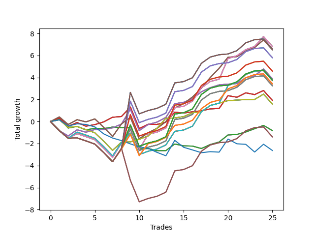

# Long Shepard 002 
- Symbol: SPY_Unlimited
- Date Range: 03/23/2022 - 07/08/2022
- Trading Period: 7:20-12:30
- Number of Trades: 25



| Name | Win Percent | Profit | Avg Profit / Trade | Avg Time / Trade |      | Name | Win Percent | Profit | Avg Profit / Trade | Avg Time / Trade |
| ---- | ----------- | ------ | ------------------ | ---------------- | ---- | ---- | ----------- | ------ | ------------------ | ---------------- |
| Sorted By <br> Profit | | | | | | Sorted By <br> Win Percentage ||||
| Sixty-Eight | 68.00 | 3410.00 | 136.40 | 25:29 |     | Sixty-Seven | 76.00 | 3260.00 | 130.40 | 17:17 |
| Sixty | 68.00 | 3410.00 | 136.40 | 25:29 |     | Fifty-Nine | 76.00 | 3260.00 | 130.40 | 17:17 |
| Fifty-Two | 68.00 | 3410.00 | 136.40 | 25:29 |     | Fifty-One | 76.00 | 3260.00 | 130.40 | 17:17 |
| Forty-Four | 68.00 | 3410.00 | 136.40 | 25:29 |     | Forty-Three | 76.00 | 3260.00 | 130.40 | 17:17 |
| Four | 68.00 | 3410.00 | 136.40 | 25:29 |     | Three | 76.00 | 3260.00 | 130.40 | 17:17 |
| One Hundred Thirty | 68.00 | 3300.00 | 132.00 | 29:35 |     | Sixty-Six | 76.00 | 1940.00 | 77.60 | 16:50 |
| One Hundred Twenty-Five | 68.00 | 3300.00 | 132.00 | 29:35 |     | Fifty-Eight | 76.00 | 1940.00 | 77.60 | 16:50 |
| One Hundred Fifteen | 68.00 | 3300.00 | 132.00 | 29:35 |     | Fifty | 76.00 | 1940.00 | 77.60 | 16:50 |
| Eighty-Five | 68.00 | 3300.00 | 132.00 | 29:35 |     | Forty-Two | 76.00 | 1940.00 | 77.60 | 16:50 |
| Sixty-Seven | 76.00 | 3260.00 | 130.40 | 17:17 |     | Two | 76.00 | 1940.00 | 77.60 | 16:50 |
| Fifty-Nine | 76.00 | 3260.00 | 130.40 | 17:17 |     | Seventy | 76.00 | 795.00 | 31.80 | 15:55 |
| Fifty-One | 76.00 | 3260.00 | 130.40 | 17:17 |     | Sixty-Two | 76.00 | 795.00 | 31.80 | 15:55 |
| Forty-Three | 76.00 | 3260.00 | 130.40 | 17:17 |     | Fifty-Four | 76.00 | 795.00 | 31.80 | 15:55 |
| Three | 76.00 | 3260.00 | 130.40 | 17:17 |     | Forty-Six | 76.00 | 795.00 | 31.80 | 15:55 |
| One Hundred Twenty-Nine | 68.00 | 2900.00 | 116.00 | 29:33 |     | Six | 76.00 | 795.00 | 31.80 | 15:55 |
| One Hundred Twenty-Four | 68.00 | 2900.00 | 116.00 | 29:33 |     | Sixty-Eight | 68.00 | 3410.00 | 136.40 | 25:29 |
| One Hundred Fourteen | 68.00 | 2900.00 | 116.00 | 29:33 |     | Sixty | 68.00 | 3410.00 | 136.40 | 25:29 |
| Eighty-Four | 68.00 | 2900.00 | 116.00 | 29:33 |     | Fifty-Two | 68.00 | 3410.00 | 136.40 | 25:29 |
| One Hundred Twenty-Eight | 68.00 | 2290.00 | 91.60 | 29:29 |     | Forty-Four | 68.00 | 3410.00 | 136.40 | 25:29 |
| One Hundred Twenty-Three | 68.00 | 2290.00 | 91.60 | 29:29 |     | Four | 68.00 | 3410.00 | 136.40 | 25:29 |
| One Hundred Thirteen | 68.00 | 2290.00 | 91.60 | 29:29 |     | One Hundred Thirty | 68.00 | 3300.00 | 132.00 | 29:35 |
| Eighty-Three | 68.00 | 2290.00 | 91.60 | 29:29 |     | One Hundred Twenty-Five | 68.00 | 3300.00 | 132.00 | 29:35 |
| Sixty-Six | 76.00 | 1940.00 | 77.60 | 16:50 |     | One Hundred Fifteen | 68.00 | 3300.00 | 132.00 | 29:35 |
| Fifty-Eight | 76.00 | 1940.00 | 77.60 | 16:50 |     | Eighty-Five | 68.00 | 3300.00 | 132.00 | 29:35 |
| Fifty | 76.00 | 1940.00 | 77.60 | 16:50 |     | One Hundred Twenty-Nine | 68.00 | 2900.00 | 116.00 | 29:33 |
| Forty-Two | 76.00 | 1940.00 | 77.60 | 16:50 |     | One Hundred Twenty-Four | 68.00 | 2900.00 | 116.00 | 29:33 |
| Two | 76.00 | 1940.00 | 77.60 | 16:50 |     | One Hundred Fourteen | 68.00 | 2900.00 | 116.00 | 29:33 |
| One Hundred Twenty-Seven | 68.00 | 1885.00 | 75.40 | 28:09 |     | Eighty-Four | 68.00 | 2900.00 | 116.00 | 29:33 |
| One Hundred Twenty-Two | 68.00 | 1885.00 | 75.40 | 28:09 |     | One Hundred Twenty-Eight | 68.00 | 2290.00 | 91.60 | 29:29 |
| One Hundred Seventeen | 68.00 | 1885.00 | 75.40 | 28:09 |     | One Hundred Twenty-Three | 68.00 | 2290.00 | 91.60 | 29:29 |
| One Hundred Twelve | 68.00 | 1885.00 | 75.40 | 28:09 |     | One Hundred Thirteen | 68.00 | 2290.00 | 91.60 | 29:29 |
| Eighty-Two | 68.00 | 1885.00 | 75.40 | 28:09 |     | Eighty-Three | 68.00 | 2290.00 | 91.60 | 29:29 |
| Seventy-One | 68.00 | 1865.00 | 74.60 | 26:01 |     | One Hundred Twenty-Seven | 68.00 | 1885.00 | 75.40 | 28:09 |
| Sixty-Three | 68.00 | 1865.00 | 74.60 | 26:01 |     | One Hundred Twenty-Two | 68.00 | 1885.00 | 75.40 | 28:09 |
| Fifty-Five | 68.00 | 1865.00 | 74.60 | 26:01 |     | One Hundred Seventeen | 68.00 | 1885.00 | 75.40 | 28:09 |
| Forty-Seven | 68.00 | 1865.00 | 74.60 | 26:01 |     | One Hundred Twelve | 68.00 | 1885.00 | 75.40 | 28:09 |
| Seven | 68.00 | 1865.00 | 74.60 | 26:01 |     | Eighty-Two | 68.00 | 1885.00 | 75.40 | 28:09 |
| One Hundred Twenty-Six | 68.00 | 1715.00 | 68.60 | 25:20 |     | Seventy-One | 68.00 | 1865.00 | 74.60 | 26:01 |
| One Hundred Twenty-One | 68.00 | 1715.00 | 68.60 | 25:20 |     | Sixty-Three | 68.00 | 1865.00 | 74.60 | 26:01 |
| One Hundred Sixteen | 68.00 | 1715.00 | 68.60 | 25:20 |     | Fifty-Five | 68.00 | 1865.00 | 74.60 | 26:01 |
| One Hundred Eleven | 68.00 | 1715.00 | 68.60 | 25:20 |     | Forty-Seven | 68.00 | 1865.00 | 74.60 | 26:01 |
| Eighty-One | 68.00 | 1715.00 | 68.60 | 25:20 |     | Seven | 68.00 | 1865.00 | 74.60 | 26:01 |
| Sixty-Nine | 68.00 | 1625.00 | 65.00 | 28:36 |     | One Hundred Twenty-Six | 68.00 | 1715.00 | 68.60 | 25:20 |
| Sixty-One | 68.00 | 1625.00 | 65.00 | 28:36 |     | One Hundred Twenty-One | 68.00 | 1715.00 | 68.60 | 25:20 |
| Fifty-Three | 68.00 | 1625.00 | 65.00 | 28:36 |     | One Hundred Sixteen | 68.00 | 1715.00 | 68.60 | 25:20 |
| Forty-Five | 68.00 | 1625.00 | 65.00 | 28:36 |     | One Hundred Eleven | 68.00 | 1715.00 | 68.60 | 25:20 |
| Five | 68.00 | 1625.00 | 65.00 | 28:36 |     | Eighty-One | 68.00 | 1715.00 | 68.60 | 25:20 |
| Sixty-Five | 68.00 | 960.00 | 38.40 | 12:00 |     | Sixty-Nine | 68.00 | 1625.00 | 65.00 | 28:36 |
| Fifty-Seven | 68.00 | 960.00 | 38.40 | 12:00 |     | Sixty-One | 68.00 | 1625.00 | 65.00 | 28:36 |
| Forty-Nine | 68.00 | 960.00 | 38.40 | 12:00 |     | Fifty-Three | 68.00 | 1625.00 | 65.00 | 28:36 |
| Forty-One | 68.00 | 960.00 | 38.40 | 12:00 |     | Forty-Five | 68.00 | 1625.00 | 65.00 | 28:36 |
| One | 68.00 | 960.00 | 38.40 | 12:00 |     | Five | 68.00 | 1625.00 | 65.00 | 28:36 |
| Seventy | 76.00 | 795.00 | 31.80 | 15:55 |     | Sixty-Five | 68.00 | 960.00 | 38.40 | 12:00 |
| Sixty-Two | 76.00 | 795.00 | 31.80 | 15:55 |     | Fifty-Seven | 68.00 | 960.00 | 38.40 | 12:00 |
| Fifty-Four | 76.00 | 795.00 | 31.80 | 15:55 |     | Forty-Nine | 68.00 | 960.00 | 38.40 | 12:00 |
| Forty-Six | 76.00 | 795.00 | 31.80 | 15:55 |     | Forty-One | 68.00 | 960.00 | 38.40 | 12:00 |
| Six | 76.00 | 795.00 | 31.80 | 15:55 |     | One | 68.00 | 960.00 | 38.40 | 12:00 |
| Sixty-Four | 60.00 | -410.00 | -16.40 | 06:48 |     | One Hundred Twenty | 64.00 | -695.00 | -27.80 | 29:05 |
| Fifty-Six | 60.00 | -410.00 | -16.40 | 06:48 |     | One Hundred Ninteen | 64.00 | -695.00 | -27.80 | 29:05 |
| Forty-Eight | 60.00 | -410.00 | -16.40 | 06:48 |     | One Hundred Eighteen | 64.00 | -695.00 | -27.80 | 29:05 |
| Forty | 60.00 | -410.00 | -16.40 | 06:48 |     | Sixty-Four | 60.00 | -410.00 | -16.40 | 06:48 |
| Zero | 60.00 | -410.00 | -16.40 | 06:48 |     | Fifty-Six | 60.00 | -410.00 | -16.40 | 06:48 |
| One Hundred Twenty | 64.00 | -695.00 | -27.80 | 29:05 |     | Forty-Eight | 60.00 | -410.00 | -16.40 | 06:48 |
| One Hundred Ninteen | 64.00 | -695.00 | -27.80 | 29:05 |     | Forty | 60.00 | -410.00 | -16.40 | 06:48 |
| One Hundred Eighteen | 64.00 | -695.00 | -27.80 | 29:05 |     | Zero | 60.00 | -410.00 | -16.40 | 06:48 |
| Seventy-Three | 24.00 | -1315.00 | -52.60 | 06:00 |     | Seventy-Three | 24.00 | -1315.00 | -52.60 | 06:00 |

## NO STOPLOSS

### Test Zero
* Sell when price hits the middle line of the 20p bollinger
* No Stoploss
* Results:
```
Total Trades: 25
Percent Up: 60.00
Percent Down: 40.00
Total Points Moved Up: -0.82
Potential Profit: -410.00
Total Points Ups: 3.49 Count Ups: 15
Total Points Downs: -4.31 Count Downs: 10
```

<details><summary>Trades</summary>

<code>In: 2022-03-23 09:16:00		Out: 2022-03-23 09:19:25		Total Position Time: 03:25		Total Move Up: 0.28		Total to Date: 0.28</code> <br />
<code>In: 2022-03-25 08:18:00		Out: 2022-03-25 08:36:40		Total Position Time: 18:40		Total Move Up: -0.87		Total to Date: -0.59</code> <br />
<code>In: 2022-03-31 08:37:00		Out: 2022-03-31 08:38:05		Total Position Time: 01:05		Total Move Up: 0.15		Total to Date: -0.44</code> <br />
<code>In: 2022-03-31 09:16:00		Out: 2022-03-31 09:32:25		Total Position Time: 16:25		Total Move Up: -0.32		Total to Date: -0.76</code> <br />
<code>In: 2022-03-31 09:30:00		Out: 2022-03-31 09:32:25		Total Position Time: 02:25		Total Move Up: 0.15		Total to Date: -0.61</code> <br />
<code>In: 2022-04-27 12:07:00		Out: 2022-04-27 12:13:55		Total Position Time: 06:55		Total Move Up: -0.03		Total to Date: -0.64</code> <br />
<code>In: 2022-04-27 12:11:00		Out: 2022-04-27 12:13:55		Total Position Time: 02:55		Total Move Up: 0.14		Total to Date: -0.50</code> <br />
<code>In: 2022-05-03 11:23:00		Out: 2022-05-03 11:32:05		Total Position Time: 09:05		Total Move Up: -0.06		Total to Date: -0.56</code> <br />
<code>In: 2022-05-04 11:24:00		Out: 2022-05-04 11:24:20		Total Position Time: 00:20		Total Move Up: 0.03		Total to Date: -0.53</code> <br />
<code>In: 2022-05-13 10:49:00		Out: 2022-05-13 11:18:55		Total Position Time: 29:55		Total Move Up: -1.95		Total to Date: -2.48</code> <br />
<code>In: 2022-05-13 11:10:00		Out: 2022-05-13 11:19:15		Total Position Time: 09:15		Total Move Up: 0.03		Total to Date: -2.45</code> <br />
<code>In: 2022-05-16 07:58:00		Out: 2022-05-16 08:05:30		Total Position Time: 07:30		Total Move Up: -0.20		Total to Date: -2.65</code> <br />
<code>In: 2022-05-16 08:02:00		Out: 2022-05-16 08:05:30		Total Position Time: 03:30		Total Move Up: 0.01		Total to Date: -2.64</code> <br />
<code>In: 2022-05-24 11:57:00		Out: 2022-05-24 12:01:10		Total Position Time: 04:10		Total Move Up: 0.60		Total to Date: -2.04</code> <br />
<code>In: 2022-05-25 09:31:00		Out: 2022-05-25 09:38:55		Total Position Time: 07:55		Total Move Up: -0.17		Total to Date: -2.21</code> <br />
<code>In: 2022-05-25 09:39:00		Out: 2022-05-25 09:41:25		Total Position Time: 02:25		Total Move Up: -0.02		Total to Date: -2.23</code> <br />
<code>In: 2022-05-31 11:59:00		Out: 2022-05-31 12:07:20		Total Position Time: 08:20		Total Move Up: -0.22		Total to Date: -2.45</code> <br />
<code>In: 2022-06-06 08:24:00		Out: 2022-06-06 08:31:35		Total Position Time: 07:35		Total Move Up: 0.36		Total to Date: -2.09</code> <br />
<code>In: 2022-06-06 08:27:00		Out: 2022-06-06 08:31:35		Total Position Time: 04:35		Total Move Up: 0.23		Total to Date: -1.86</code> <br />
<code>In: 2022-06-17 12:18:00		Out: 2022-06-17 12:20:30		Total Position Time: 02:30		Total Move Up: 0.64		Total to Date: -1.22</code> <br />
<code>In: 2022-06-21 09:02:00		Out: 2022-06-21 09:02:10		Total Position Time: 00:10		Total Move Up: 0.05		Total to Date: -1.17</code> <br />
<code>In: 2022-06-21 11:05:00		Out: 2022-06-21 11:07:45		Total Position Time: 02:45		Total Move Up: 0.22		Total to Date: -0.95</code> <br />
<code>In: 2022-06-22 09:01:00		Out: 2022-06-22 09:01:20		Total Position Time: 00:20		Total Move Up: 0.30		Total to Date: -0.65</code> <br />
<code>In: 2022-06-27 09:36:00		Out: 2022-06-27 09:41:05		Total Position Time: 05:05		Total Move Up: 0.30		Total to Date: -0.35</code> <br />
<code>In: 2022-07-08 09:36:00		Out: 2022-07-08 09:48:45		Total Position Time: 12:45		Total Move Up: -0.47		Total to Date: -0.82</code> <br />


</details>

### Test One
* Sell when the price hits the upper line of the 20p 1std bollinger
* No Stoploss
* Results:
```
Total Trades: 25
Percent Up: 68.00
Percent Down: 32.00
Total Points Moved Up: 1.92
Potential Profit: 960.00
Total Points Ups: 6.24 Count Ups: 17
Total Points Downs: -4.32 Count Downs: 8
```

<details><summary>Trades</summary>

<code>In: 2022-03-23 09:16:00		Out: 2022-03-23 09:30:20		Total Position Time: 14:20		Total Move Up: 0.32		Total to Date: 0.32</code> <br />
<code>In: 2022-03-25 08:18:00		Out: 2022-03-25 08:41:05		Total Position Time: 23:05		Total Move Up: -0.75		Total to Date: -0.43</code> <br />
<code>In: 2022-03-31 08:37:00		Out: 2022-03-31 08:40:35		Total Position Time: 03:35		Total Move Up: 0.34		Total to Date: -0.09</code> <br />
<code>In: 2022-03-31 09:16:00		Out: 2022-03-31 09:40:45		Total Position Time: 24:45		Total Move Up: -0.33		Total to Date: -0.42</code> <br />
<code>In: 2022-03-31 09:30:00		Out: 2022-03-31 09:40:45		Total Position Time: 10:45		Total Move Up: 0.14		Total to Date: -0.28</code> <br />
<code>In: 2022-04-27 12:07:00		Out: 2022-04-27 12:15:20		Total Position Time: 08:20		Total Move Up: 0.25		Total to Date: -0.03</code> <br />
<code>In: 2022-04-27 12:11:00		Out: 2022-04-27 12:15:20		Total Position Time: 04:20		Total Move Up: 0.42		Total to Date: 0.39</code> <br />
<code>In: 2022-05-03 11:23:00		Out: 2022-05-03 11:32:25		Total Position Time: 09:25		Total Move Up: 0.07		Total to Date: 0.46</code> <br />
<code>In: 2022-05-04 11:24:00		Out: 2022-05-04 11:27:15		Total Position Time: 03:15		Total Move Up: 0.86		Total to Date: 1.32</code> <br />
<code>In: 2022-05-13 10:49:00		Out: 2022-05-13 11:18:55		Total Position Time: 29:55		Total Move Up: -1.95		Total to Date: -0.63</code> <br />
<code>In: 2022-05-13 11:10:00		Out: 2022-05-13 11:20:00		Total Position Time: 10:00		Total Move Up: 0.38		Total to Date: -0.25</code> <br />
<code>In: 2022-05-16 07:58:00		Out: 2022-05-16 08:09:50		Total Position Time: 11:50		Total Move Up: -0.01		Total to Date: -0.26</code> <br />
<code>In: 2022-05-16 08:02:00		Out: 2022-05-16 08:09:50		Total Position Time: 07:50		Total Move Up: 0.20		Total to Date: -0.06</code> <br />
<code>In: 2022-05-24 11:57:00		Out: 2022-05-24 12:03:15		Total Position Time: 06:15		Total Move Up: 0.91		Total to Date: 0.85</code> <br />
<code>In: 2022-05-25 09:31:00		Out: 2022-05-25 09:44:25		Total Position Time: 13:25		Total Move Up: -0.08		Total to Date: 0.77</code> <br />
<code>In: 2022-05-25 09:39:00		Out: 2022-05-25 09:44:25		Total Position Time: 05:25		Total Move Up: 0.12		Total to Date: 0.89</code> <br />
<code>In: 2022-05-31 11:59:00		Out: 2022-05-31 12:09:15		Total Position Time: 10:15		Total Move Up: 0.09		Total to Date: 0.98</code> <br />
<code>In: 2022-06-06 08:24:00		Out: 2022-06-06 08:39:15		Total Position Time: 15:15		Total Move Up: 0.17		Total to Date: 1.15</code> <br />
<code>In: 2022-06-06 08:27:00		Out: 2022-06-06 08:39:15		Total Position Time: 12:15		Total Move Up: 0.04		Total to Date: 1.19</code> <br />
<code>In: 2022-06-17 12:18:00		Out: 2022-06-17 12:21:30		Total Position Time: 03:30		Total Move Up: 1.16		Total to Date: 2.35</code> <br />
<code>In: 2022-06-21 09:02:00		Out: 2022-06-21 09:16:20		Total Position Time: 14:20		Total Move Up: -0.14		Total to Date: 2.21</code> <br />
<code>In: 2022-06-21 11:05:00		Out: 2022-06-21 11:08:35		Total Position Time: 03:35		Total Move Up: 0.40		Total to Date: 2.61</code> <br />
<code>In: 2022-06-22 09:01:00		Out: 2022-06-22 09:17:40		Total Position Time: 16:40		Total Move Up: -0.16		Total to Date: 2.45</code> <br />
<code>In: 2022-06-27 09:36:00		Out: 2022-06-27 09:44:05		Total Position Time: 08:05		Total Move Up: 0.37		Total to Date: 2.82</code> <br />
<code>In: 2022-07-08 09:36:00		Out: 2022-07-08 10:05:55		Total Position Time: 29:55		Total Move Up: -0.90		Total to Date: 1.92</code> <br />


</details>

### Test Two
* Sell when the price hits the upper line of the 20p 2std bollinger
* No Stoploss
* Results:
```
Total Trades: 25
Percent Up: 76.00
Percent Down: 24.00
Total Points Moved Up: 3.88
Potential Profit: 1940.00
Total Points Ups: 8.27 Count Ups: 19
Total Points Downs: -4.39 Count Downs: 6
```

<details><summary>Trades</summary>

<code>In: 2022-03-23 09:16:00		Out: 2022-03-23 09:45:55		Total Position Time: 29:55		Total Move Up: -0.83		Total to Date: -0.83</code> <br />
<code>In: 2022-03-25 08:18:00		Out: 2022-03-25 08:41:45		Total Position Time: 23:45		Total Move Up: -0.48		Total to Date: -1.31</code> <br />
<code>In: 2022-03-31 08:37:00		Out: 2022-03-31 08:41:10		Total Position Time: 04:10		Total Move Up: 0.56		Total to Date: -0.75</code> <br />
<code>In: 2022-03-31 09:16:00		Out: 2022-03-31 09:44:20		Total Position Time: 28:20		Total Move Up: -0.22		Total to Date: -0.97</code> <br />
<code>In: 2022-03-31 09:30:00		Out: 2022-03-31 09:44:20		Total Position Time: 14:20		Total Move Up: 0.25		Total to Date: -0.72</code> <br />
<code>In: 2022-04-27 12:07:00		Out: 2022-04-27 12:31:35		Total Position Time: 24:35		Total Move Up: -0.01		Total to Date: -0.73</code> <br />
<code>In: 2022-04-27 12:11:00		Out: 2022-04-27 12:31:35		Total Position Time: 20:35		Total Move Up: 0.16		Total to Date: -0.57</code> <br />
<code>In: 2022-05-03 11:23:00		Out: 2022-05-03 11:34:50		Total Position Time: 11:50		Total Move Up: 0.34		Total to Date: -0.23</code> <br />
<code>In: 2022-05-04 11:24:00		Out: 2022-05-04 11:27:35		Total Position Time: 03:35		Total Move Up: 1.36		Total to Date: 1.13</code> <br />
<code>In: 2022-05-13 10:49:00		Out: 2022-05-13 11:18:55		Total Position Time: 29:55		Total Move Up: -1.95		Total to Date: -0.82</code> <br />
<code>In: 2022-05-13 11:10:00		Out: 2022-05-13 11:31:20		Total Position Time: 21:20		Total Move Up: 0.55		Total to Date: -0.27</code> <br />
<code>In: 2022-05-16 07:58:00		Out: 2022-05-16 08:11:15		Total Position Time: 13:15		Total Move Up: 0.22		Total to Date: -0.05</code> <br />
<code>In: 2022-05-16 08:02:00		Out: 2022-05-16 08:11:15		Total Position Time: 09:15		Total Move Up: 0.43		Total to Date: 0.38</code> <br />
<code>In: 2022-05-24 11:57:00		Out: 2022-05-24 12:03:30		Total Position Time: 06:30		Total Move Up: 1.24		Total to Date: 1.62</code> <br />
<code>In: 2022-05-25 09:31:00		Out: 2022-05-25 09:45:20		Total Position Time: 14:20		Total Move Up: 0.13		Total to Date: 1.75</code> <br />
<code>In: 2022-05-25 09:39:00		Out: 2022-05-25 09:45:20		Total Position Time: 06:20		Total Move Up: 0.33		Total to Date: 2.08</code> <br />
<code>In: 2022-05-31 11:59:00		Out: 2022-05-31 12:15:05		Total Position Time: 16:05		Total Move Up: 0.62		Total to Date: 2.70</code> <br />
<code>In: 2022-06-06 08:24:00		Out: 2022-06-06 08:43:00		Total Position Time: 19:00		Total Move Up: 0.38		Total to Date: 3.08</code> <br />
<code>In: 2022-06-06 08:27:00		Out: 2022-06-06 08:43:00		Total Position Time: 16:00		Total Move Up: 0.25		Total to Date: 3.33</code> <br />
<code>In: 2022-06-17 12:18:00		Out: 2022-06-17 12:46:00		Total Position Time: 28:00		Total Move Up: 0.07		Total to Date: 3.40</code> <br />
<code>In: 2022-06-21 09:02:00		Out: 2022-06-21 09:19:55		Total Position Time: 17:55		Total Move Up: 0.05		Total to Date: 3.45</code> <br />
<code>In: 2022-06-21 11:05:00		Out: 2022-06-21 11:10:45		Total Position Time: 05:45		Total Move Up: 0.54		Total to Date: 3.99</code> <br />
<code>In: 2022-06-22 09:01:00		Out: 2022-06-22 09:18:30		Total Position Time: 17:30		Total Move Up: 0.18		Total to Date: 4.17</code> <br />
<code>In: 2022-06-27 09:36:00		Out: 2022-06-27 09:45:00		Total Position Time: 09:00		Total Move Up: 0.61		Total to Date: 4.78</code> <br />
<code>In: 2022-07-08 09:36:00		Out: 2022-07-08 10:05:55		Total Position Time: 29:55		Total Move Up: -0.90		Total to Date: 3.88</code> <br />


</details>

### Test Three
* Sell when price hits the middle line of the 50p bollinger
* No Stoploss
* Results:
```
Total Trades: 25
Percent Up: 76.00
Percent Down: 24.00
Total Points Moved Up: 6.52
Potential Profit: 3260.00
Total Points Ups: 11.86 Count Ups: 19
Total Points Downs: -5.34 Count Downs: 6
```

<details><summary>Trades</summary>

<code>In: 2022-03-23 09:16:00		Out: 2022-03-23 09:30:30		Total Position Time: 14:30		Total Move Up: 0.42		Total to Date: 0.42</code> <br />
<code>In: 2022-03-25 08:18:00		Out: 2022-03-25 08:47:55		Total Position Time: 29:55		Total Move Up: -0.69		Total to Date: -0.27</code> <br />
<code>In: 2022-03-31 08:37:00		Out: 2022-03-31 08:41:05		Total Position Time: 04:05		Total Move Up: 0.44		Total to Date: 0.17</code> <br />
<code>In: 2022-03-31 09:16:00		Out: 2022-03-31 09:45:10		Total Position Time: 29:10		Total Move Up: -0.20		Total to Date: -0.03</code> <br />
<code>In: 2022-03-31 09:30:00		Out: 2022-03-31 09:45:10		Total Position Time: 15:10		Total Move Up: 0.27		Total to Date: 0.24</code> <br />
<code>In: 2022-04-27 12:07:00		Out: 2022-04-27 12:36:55		Total Position Time: 29:55		Total Move Up: -0.77		Total to Date: -0.53</code> <br />
<code>In: 2022-04-27 12:11:00		Out: 2022-04-27 12:40:55		Total Position Time: 29:55		Total Move Up: -0.83		Total to Date: -1.36</code> <br />
<code>In: 2022-05-03 11:23:00		Out: 2022-05-03 11:36:10		Total Position Time: 13:10		Total Move Up: 1.15		Total to Date: -0.21</code> <br />
<code>In: 2022-05-04 11:24:00		Out: 2022-05-04 11:26:55		Total Position Time: 02:55		Total Move Up: 0.59		Total to Date: 0.38</code> <br />
<code>In: 2022-05-13 10:49:00		Out: 2022-05-13 11:18:55		Total Position Time: 29:55		Total Move Up: -1.95		Total to Date: -1.57</code> <br />
<code>In: 2022-05-13 11:10:00		Out: 2022-05-13 11:31:20		Total Position Time: 21:20		Total Move Up: 0.55		Total to Date: -1.02</code> <br />
<code>In: 2022-05-16 07:58:00		Out: 2022-05-16 08:17:05		Total Position Time: 19:05		Total Move Up: 0.40		Total to Date: -0.62</code> <br />
<code>In: 2022-05-16 08:02:00		Out: 2022-05-16 08:17:05		Total Position Time: 15:05		Total Move Up: 0.61		Total to Date: -0.01</code> <br />
<code>In: 2022-05-24 11:57:00		Out: 2022-05-24 12:03:30		Total Position Time: 06:30		Total Move Up: 1.24		Total to Date: 1.23</code> <br />
<code>In: 2022-05-25 09:31:00		Out: 2022-05-25 09:49:05		Total Position Time: 18:05		Total Move Up: 0.40		Total to Date: 1.63</code> <br />
<code>In: 2022-05-25 09:39:00		Out: 2022-05-25 09:49:05		Total Position Time: 10:05		Total Move Up: 0.60		Total to Date: 2.23</code> <br />
<code>In: 2022-05-31 11:59:00		Out: 2022-05-31 12:15:15		Total Position Time: 16:15		Total Move Up: 0.80		Total to Date: 3.03</code> <br />
<code>In: 2022-06-06 08:24:00		Out: 2022-06-06 08:46:10		Total Position Time: 22:10		Total Move Up: 0.97		Total to Date: 4.00</code> <br />
<code>In: 2022-06-06 08:27:00		Out: 2022-06-06 08:46:10		Total Position Time: 19:10		Total Move Up: 0.84		Total to Date: 4.84</code> <br />
<code>In: 2022-06-17 12:18:00		Out: 2022-06-17 12:21:15		Total Position Time: 03:15		Total Move Up: 1.00		Total to Date: 5.84</code> <br />
<code>In: 2022-06-21 09:02:00		Out: 2022-06-21 09:20:00		Total Position Time: 18:00		Total Move Up: 0.06		Total to Date: 5.90</code> <br />
<code>In: 2022-06-21 11:05:00		Out: 2022-06-21 11:10:20		Total Position Time: 05:20		Total Move Up: 0.50		Total to Date: 6.40</code> <br />
<code>In: 2022-06-22 09:01:00		Out: 2022-06-22 09:21:15		Total Position Time: 20:15		Total Move Up: 0.33		Total to Date: 6.73</code> <br />
<code>In: 2022-06-27 09:36:00		Out: 2022-06-27 09:45:05		Total Position Time: 09:05		Total Move Up: 0.69		Total to Date: 7.42</code> <br />
<code>In: 2022-07-08 09:36:00		Out: 2022-07-08 10:05:55		Total Position Time: 29:55		Total Move Up: -0.90		Total to Date: 6.52</code> <br />


</details>

### Test Four
* Sell when the price hits the upper line of the 50p 1std bollinger
* No Stoploss
* Results:
```
Total Trades: 25
Percent Up: 68.00
Percent Down: 32.00
Total Points Moved Up: 6.82
Potential Profit: 3410.00
Total Points Ups: 13.35 Count Ups: 17
Total Points Downs: -6.53 Count Downs: 8
```

<details><summary>Trades</summary>

<code>In: 2022-03-23 09:16:00		Out: 2022-03-23 09:45:55		Total Position Time: 29:55		Total Move Up: -0.83		Total to Date: -0.83</code> <br />
<code>In: 2022-03-25 08:18:00		Out: 2022-03-25 08:47:55		Total Position Time: 29:55		Total Move Up: -0.69		Total to Date: -1.52</code> <br />
<code>In: 2022-03-31 08:37:00		Out: 2022-03-31 09:00:15		Total Position Time: 23:15		Total Move Up: 0.42		Total to Date: -1.10</code> <br />
<code>In: 2022-03-31 09:16:00		Out: 2022-03-31 09:45:55		Total Position Time: 29:55		Total Move Up: -0.27		Total to Date: -1.37</code> <br />
<code>In: 2022-03-31 09:30:00		Out: 2022-03-31 09:59:55		Total Position Time: 29:55		Total Move Up: -0.29		Total to Date: -1.66</code> <br />
<code>In: 2022-04-27 12:07:00		Out: 2022-04-27 12:36:55		Total Position Time: 29:55		Total Move Up: -0.77		Total to Date: -2.43</code> <br />
<code>In: 2022-04-27 12:11:00		Out: 2022-04-27 12:40:55		Total Position Time: 29:55		Total Move Up: -0.83		Total to Date: -3.26</code> <br />
<code>In: 2022-05-03 11:23:00		Out: 2022-05-03 11:52:05		Total Position Time: 29:05		Total Move Up: 1.32		Total to Date: -1.94</code> <br />
<code>In: 2022-05-04 11:24:00		Out: 2022-05-04 11:27:35		Total Position Time: 03:35		Total Move Up: 1.36		Total to Date: -0.58</code> <br />
<code>In: 2022-05-13 10:49:00		Out: 2022-05-13 11:18:55		Total Position Time: 29:55		Total Move Up: -1.95		Total to Date: -2.53</code> <br />
<code>In: 2022-05-13 11:10:00		Out: 2022-05-13 11:32:00		Total Position Time: 22:00		Total Move Up: 1.37		Total to Date: -1.16</code> <br />
<code>In: 2022-05-16 07:58:00		Out: 2022-05-16 08:27:55		Total Position Time: 29:55		Total Move Up: 0.20		Total to Date: -0.96</code> <br />
<code>In: 2022-05-16 08:02:00		Out: 2022-05-16 08:31:55		Total Position Time: 29:55		Total Move Up: 0.37		Total to Date: -0.59</code> <br />
<code>In: 2022-05-24 11:57:00		Out: 2022-05-24 12:05:50		Total Position Time: 08:50		Total Move Up: 1.86		Total to Date: 1.27</code> <br />
<code>In: 2022-05-25 09:31:00		Out: 2022-05-25 10:00:55		Total Position Time: 29:55		Total Move Up: 0.12		Total to Date: 1.39</code> <br />
<code>In: 2022-05-25 09:39:00		Out: 2022-05-25 10:06:15		Total Position Time: 27:15		Total Move Up: 0.47		Total to Date: 1.86</code> <br />
<code>In: 2022-05-31 11:59:00		Out: 2022-05-31 12:28:20		Total Position Time: 29:20		Total Move Up: 1.21		Total to Date: 3.07</code> <br />
<code>In: 2022-06-06 08:24:00		Out: 2022-06-06 08:53:55		Total Position Time: 29:55		Total Move Up: 0.57		Total to Date: 3.64</code> <br />
<code>In: 2022-06-06 08:27:00		Out: 2022-06-06 08:56:55		Total Position Time: 29:55		Total Move Up: 0.21		Total to Date: 3.85</code> <br />
<code>In: 2022-06-17 12:18:00		Out: 2022-06-17 12:27:15		Total Position Time: 09:15		Total Move Up: 1.87		Total to Date: 5.72</code> <br />
<code>In: 2022-06-21 09:02:00		Out: 2022-06-21 09:26:05		Total Position Time: 24:05		Total Move Up: 0.26		Total to Date: 5.98</code> <br />
<code>In: 2022-06-21 11:05:00		Out: 2022-06-21 11:29:15		Total Position Time: 24:15		Total Move Up: 0.55		Total to Date: 6.53</code> <br />
<code>In: 2022-06-22 09:01:00		Out: 2022-06-22 09:30:55		Total Position Time: 29:55		Total Move Up: 0.29		Total to Date: 6.82</code> <br />
<code>In: 2022-06-27 09:36:00		Out: 2022-06-27 09:53:20		Total Position Time: 17:20		Total Move Up: 0.90		Total to Date: 7.72</code> <br />
<code>In: 2022-07-08 09:36:00		Out: 2022-07-08 10:05:55		Total Position Time: 29:55		Total Move Up: -0.90		Total to Date: 6.82</code> <br />


</details>

### Test Five
* Sell when the price hits the upper line of the 50p 2std bollinger
* No Stoploss
* Results:
```
Total Trades: 25
Percent Up: 68.00
Percent Down: 32.00
Total Points Moved Up: 3.25
Potential Profit: 1625.00
Total Points Ups: 9.78 Count Ups: 17
Total Points Downs: -6.53 Count Downs: 8
```

<details><summary>Trades</summary>

<code>In: 2022-03-23 09:16:00		Out: 2022-03-23 09:45:55		Total Position Time: 29:55		Total Move Up: -0.83		Total to Date: -0.83</code> <br />
<code>In: 2022-03-25 08:18:00		Out: 2022-03-25 08:47:55		Total Position Time: 29:55		Total Move Up: -0.69		Total to Date: -1.52</code> <br />
<code>In: 2022-03-31 08:37:00		Out: 2022-03-31 09:06:55		Total Position Time: 29:55		Total Move Up: 0.03		Total to Date: -1.49</code> <br />
<code>In: 2022-03-31 09:16:00		Out: 2022-03-31 09:45:55		Total Position Time: 29:55		Total Move Up: -0.27		Total to Date: -1.76</code> <br />
<code>In: 2022-03-31 09:30:00		Out: 2022-03-31 09:59:55		Total Position Time: 29:55		Total Move Up: -0.29		Total to Date: -2.05</code> <br />
<code>In: 2022-04-27 12:07:00		Out: 2022-04-27 12:36:55		Total Position Time: 29:55		Total Move Up: -0.77		Total to Date: -2.82</code> <br />
<code>In: 2022-04-27 12:11:00		Out: 2022-04-27 12:40:55		Total Position Time: 29:55		Total Move Up: -0.83		Total to Date: -3.65</code> <br />
<code>In: 2022-05-03 11:23:00		Out: 2022-05-03 11:52:55		Total Position Time: 29:55		Total Move Up: 1.21		Total to Date: -2.44</code> <br />
<code>In: 2022-05-04 11:24:00		Out: 2022-05-04 11:27:50		Total Position Time: 03:50		Total Move Up: 1.76		Total to Date: -0.68</code> <br />
<code>In: 2022-05-13 10:49:00		Out: 2022-05-13 11:18:55		Total Position Time: 29:55		Total Move Up: -1.95		Total to Date: -2.63</code> <br />
<code>In: 2022-05-13 11:10:00		Out: 2022-05-13 11:39:55		Total Position Time: 29:55		Total Move Up: 0.30		Total to Date: -2.33</code> <br />
<code>In: 2022-05-16 07:58:00		Out: 2022-05-16 08:27:55		Total Position Time: 29:55		Total Move Up: 0.20		Total to Date: -2.13</code> <br />
<code>In: 2022-05-16 08:02:00		Out: 2022-05-16 08:31:55		Total Position Time: 29:55		Total Move Up: 0.37		Total to Date: -1.76</code> <br />
<code>In: 2022-05-24 11:57:00		Out: 2022-05-24 12:26:55		Total Position Time: 29:55		Total Move Up: 1.94		Total to Date: 0.18</code> <br />
<code>In: 2022-05-25 09:31:00		Out: 2022-05-25 10:00:55		Total Position Time: 29:55		Total Move Up: 0.12		Total to Date: 0.30</code> <br />
<code>In: 2022-05-25 09:39:00		Out: 2022-05-25 10:08:55		Total Position Time: 29:55		Total Move Up: 0.35		Total to Date: 0.65</code> <br />
<code>In: 2022-05-31 11:59:00		Out: 2022-05-31 12:28:55		Total Position Time: 29:55		Total Move Up: 1.31		Total to Date: 1.96</code> <br />
<code>In: 2022-06-06 08:24:00		Out: 2022-06-06 08:53:55		Total Position Time: 29:55		Total Move Up: 0.57		Total to Date: 2.53</code> <br />
<code>In: 2022-06-06 08:27:00		Out: 2022-06-06 08:56:55		Total Position Time: 29:55		Total Move Up: 0.21		Total to Date: 2.74</code> <br />
<code>In: 2022-06-17 12:18:00		Out: 2022-06-17 12:46:00		Total Position Time: 28:00		Total Move Up: 0.07		Total to Date: 2.81</code> <br />
<code>In: 2022-06-21 09:02:00		Out: 2022-06-21 09:31:55		Total Position Time: 29:55		Total Move Up: 0.30		Total to Date: 3.11</code> <br />
<code>In: 2022-06-21 11:05:00		Out: 2022-06-21 11:30:15		Total Position Time: 25:15		Total Move Up: 0.69		Total to Date: 3.80</code> <br />
<code>In: 2022-06-22 09:01:00		Out: 2022-06-22 09:30:55		Total Position Time: 29:55		Total Move Up: 0.29		Total to Date: 4.09</code> <br />
<code>In: 2022-06-27 09:36:00		Out: 2022-06-27 10:05:55		Total Position Time: 29:55		Total Move Up: 0.06		Total to Date: 4.15</code> <br />
<code>In: 2022-07-08 09:36:00		Out: 2022-07-08 10:05:55		Total Position Time: 29:55		Total Move Up: -0.90		Total to Date: 3.25</code> <br />


</details>

### Test Six
* Sell when the price hits the middle line of the 1std VWAP
* No Stoploss
* Results:
```
Total Trades: 25
Percent Up: 76.00
Percent Down: 24.00
Total Points Moved Up: 1.59
Potential Profit: 795.00
Total Points Ups: 5.34 Count Ups: 19
Total Points Downs: -3.75 Count Downs: 6
```

<details><summary>Trades</summary>

<code>In: 2022-03-23 09:16:00		Out: 2022-03-23 09:16:10		Total Position Time: 00:10		Total Move Up: 0.16		Total to Date: 0.16</code> <br />
<code>In: 2022-03-25 08:18:00		Out: 2022-03-25 08:47:55		Total Position Time: 29:55		Total Move Up: -0.69		Total to Date: -0.53</code> <br />
<code>In: 2022-03-31 08:37:00		Out: 2022-03-31 08:37:10		Total Position Time: 00:10		Total Move Up: 0.07		Total to Date: -0.46</code> <br />
<code>In: 2022-03-31 09:16:00		Out: 2022-03-31 09:45:55		Total Position Time: 29:55		Total Move Up: -0.27		Total to Date: -0.73</code> <br />
<code>In: 2022-03-31 09:30:00		Out: 2022-03-31 09:59:55		Total Position Time: 29:55		Total Move Up: -0.29		Total to Date: -1.02</code> <br />
<code>In: 2022-04-27 12:07:00		Out: 2022-04-27 12:36:55		Total Position Time: 29:55		Total Move Up: -0.77		Total to Date: -1.79</code> <br />
<code>In: 2022-04-27 12:11:00		Out: 2022-04-27 12:40:55		Total Position Time: 29:55		Total Move Up: -0.83		Total to Date: -2.62</code> <br />
<code>In: 2022-05-03 11:23:00		Out: 2022-05-03 11:36:00		Total Position Time: 13:00		Total Move Up: 0.75		Total to Date: -1.87</code> <br />
<code>In: 2022-05-04 11:24:00		Out: 2022-05-04 11:24:10		Total Position Time: 00:10		Total Move Up: 0.02		Total to Date: -1.85</code> <br />
<code>In: 2022-05-13 10:49:00		Out: 2022-05-13 10:49:45		Total Position Time: 00:45		Total Move Up: 0.24		Total to Date: -1.61</code> <br />
<code>In: 2022-05-13 11:10:00		Out: 2022-05-13 11:39:55		Total Position Time: 29:55		Total Move Up: 0.30		Total to Date: -1.31</code> <br />
<code>In: 2022-05-16 07:58:00		Out: 2022-05-16 08:17:40		Total Position Time: 19:40		Total Move Up: 0.70		Total to Date: -0.61</code> <br />
<code>In: 2022-05-16 08:02:00		Out: 2022-05-16 08:17:40		Total Position Time: 15:40		Total Move Up: 0.91		Total to Date: 0.30</code> <br />
<code>In: 2022-05-24 11:57:00		Out: 2022-05-24 11:57:10		Total Position Time: 00:10		Total Move Up: 0.03		Total to Date: 0.33</code> <br />
<code>In: 2022-05-25 09:31:00		Out: 2022-05-25 10:00:55		Total Position Time: 29:55		Total Move Up: 0.12		Total to Date: 0.45</code> <br />
<code>In: 2022-05-25 09:39:00		Out: 2022-05-25 10:08:55		Total Position Time: 29:55		Total Move Up: 0.35		Total to Date: 0.80</code> <br />
<code>In: 2022-05-31 11:59:00		Out: 2022-05-31 12:09:15		Total Position Time: 10:15		Total Move Up: 0.09		Total to Date: 0.89</code> <br />
<code>In: 2022-06-06 08:24:00		Out: 2022-06-06 08:53:55		Total Position Time: 29:55		Total Move Up: 0.57		Total to Date: 1.46</code> <br />
<code>In: 2022-06-06 08:27:00		Out: 2022-06-06 08:56:55		Total Position Time: 29:55		Total Move Up: 0.21		Total to Date: 1.67</code> <br />
<code>In: 2022-06-17 12:18:00		Out: 2022-06-17 12:18:10		Total Position Time: 00:10		Total Move Up: 0.23		Total to Date: 1.90</code> <br />
<code>In: 2022-06-21 09:02:00		Out: 2022-06-21 09:02:10		Total Position Time: 00:10		Total Move Up: 0.05		Total to Date: 1.95</code> <br />
<code>In: 2022-06-21 11:05:00		Out: 2022-06-21 11:05:10		Total Position Time: 00:10		Total Move Up: 0.05		Total to Date: 2.00</code> <br />
<code>In: 2022-06-22 09:01:00		Out: 2022-06-22 09:01:10		Total Position Time: 00:10		Total Move Up: 0.01		Total to Date: 2.01</code> <br />
<code>In: 2022-06-27 09:36:00		Out: 2022-06-27 09:44:20		Total Position Time: 08:20		Total Move Up: 0.48		Total to Date: 2.49</code> <br />
<code>In: 2022-07-08 09:36:00		Out: 2022-07-08 10:05:55		Total Position Time: 29:55		Total Move Up: -0.90		Total to Date: 1.59</code> <br />


</details>

### Test Seven
* Sell when the price hits the upper line of the 1std VWAP
* No Stoploss
* Results:
```
Total Trades: 25
Percent Up: 68.00
Percent Down: 32.00
Total Points Moved Up: 3.73
Potential Profit: 1865.00
Total Points Ups: 10.26 Count Ups: 17
Total Points Downs: -6.53 Count Downs: 8
```

<details><summary>Trades</summary>

<code>In: 2022-03-23 09:16:00		Out: 2022-03-23 09:45:55		Total Position Time: 29:55		Total Move Up: -0.83		Total to Date: -0.83</code> <br />
<code>In: 2022-03-25 08:18:00		Out: 2022-03-25 08:47:55		Total Position Time: 29:55		Total Move Up: -0.69		Total to Date: -1.52</code> <br />
<code>In: 2022-03-31 08:37:00		Out: 2022-03-31 08:41:10		Total Position Time: 04:10		Total Move Up: 0.56		Total to Date: -0.96</code> <br />
<code>In: 2022-03-31 09:16:00		Out: 2022-03-31 09:45:55		Total Position Time: 29:55		Total Move Up: -0.27		Total to Date: -1.23</code> <br />
<code>In: 2022-03-31 09:30:00		Out: 2022-03-31 09:59:55		Total Position Time: 29:55		Total Move Up: -0.29		Total to Date: -1.52</code> <br />
<code>In: 2022-04-27 12:07:00		Out: 2022-04-27 12:36:55		Total Position Time: 29:55		Total Move Up: -0.77		Total to Date: -2.29</code> <br />
<code>In: 2022-04-27 12:11:00		Out: 2022-04-27 12:40:55		Total Position Time: 29:55		Total Move Up: -0.83		Total to Date: -3.12</code> <br />
<code>In: 2022-05-03 11:23:00		Out: 2022-05-03 11:52:55		Total Position Time: 29:55		Total Move Up: 1.21		Total to Date: -1.91</code> <br />
<code>In: 2022-05-04 11:24:00		Out: 2022-05-04 11:27:15		Total Position Time: 03:15		Total Move Up: 0.86		Total to Date: -1.05</code> <br />
<code>In: 2022-05-13 10:49:00		Out: 2022-05-13 11:18:55		Total Position Time: 29:55		Total Move Up: -1.95		Total to Date: -3.00</code> <br />
<code>In: 2022-05-13 11:10:00		Out: 2022-05-13 11:39:55		Total Position Time: 29:55		Total Move Up: 0.30		Total to Date: -2.70</code> <br />
<code>In: 2022-05-16 07:58:00		Out: 2022-05-16 08:27:55		Total Position Time: 29:55		Total Move Up: 0.20		Total to Date: -2.50</code> <br />
<code>In: 2022-05-16 08:02:00		Out: 2022-05-16 08:31:55		Total Position Time: 29:55		Total Move Up: 0.37		Total to Date: -2.13</code> <br />
<code>In: 2022-05-24 11:57:00		Out: 2022-05-24 12:03:30		Total Position Time: 06:30		Total Move Up: 1.24		Total to Date: -0.89</code> <br />
<code>In: 2022-05-25 09:31:00		Out: 2022-05-25 10:00:55		Total Position Time: 29:55		Total Move Up: 0.12		Total to Date: -0.77</code> <br />
<code>In: 2022-05-25 09:39:00		Out: 2022-05-25 10:08:55		Total Position Time: 29:55		Total Move Up: 0.35		Total to Date: -0.42</code> <br />
<code>In: 2022-05-31 11:59:00		Out: 2022-05-31 12:28:55		Total Position Time: 29:55		Total Move Up: 1.31		Total to Date: 0.89</code> <br />
<code>In: 2022-06-06 08:24:00		Out: 2022-06-06 08:53:55		Total Position Time: 29:55		Total Move Up: 0.57		Total to Date: 1.46</code> <br />
<code>In: 2022-06-06 08:27:00		Out: 2022-06-06 08:56:55		Total Position Time: 29:55		Total Move Up: 0.21		Total to Date: 1.67</code> <br />
<code>In: 2022-06-17 12:18:00		Out: 2022-06-17 12:26:35		Total Position Time: 08:35		Total Move Up: 1.60		Total to Date: 3.27</code> <br />
<code>In: 2022-06-21 09:02:00		Out: 2022-06-21 09:31:55		Total Position Time: 29:55		Total Move Up: 0.30		Total to Date: 3.57</code> <br />
<code>In: 2022-06-21 11:05:00		Out: 2022-06-21 11:34:55		Total Position Time: 29:55		Total Move Up: 0.71		Total to Date: 4.28</code> <br />
<code>In: 2022-06-22 09:01:00		Out: 2022-06-22 09:30:55		Total Position Time: 29:55		Total Move Up: 0.29		Total to Date: 4.57</code> <br />
<code>In: 2022-06-27 09:36:00		Out: 2022-06-27 10:05:55		Total Position Time: 29:55		Total Move Up: 0.06		Total to Date: 4.63</code> <br />
<code>In: 2022-07-08 09:36:00		Out: 2022-07-08 10:05:55		Total Position Time: 29:55		Total Move Up: -0.90		Total to Date: 3.73</code> <br />


</details>

## STOPLOSS OF 5

### Test Forty
* Sell when price hits the middle line of the 20p bollinger
* Stoploss is 5 points
* Results:
```
Total Trades: 25
Percent Up: 60.00
Percent Down: 40.00
Total Points Moved Up: -0.82
Potential Profit: -410.00
Total Points Ups: 3.49 Count Ups: 15
Total Points Downs: -4.31 Count Downs: 10
```

<details><summary>Trades</summary>

<code>In: 2022-03-23 09:16:00		Out: 2022-03-23 09:19:25		Total Position Time: 03:25		Total Move Up: 0.28		Total to Date: 0.28</code> <br />
<code>In: 2022-03-25 08:18:00		Out: 2022-03-25 08:36:40		Total Position Time: 18:40		Total Move Up: -0.87		Total to Date: -0.59</code> <br />
<code>In: 2022-03-31 08:37:00		Out: 2022-03-31 08:38:05		Total Position Time: 01:05		Total Move Up: 0.15		Total to Date: -0.44</code> <br />
<code>In: 2022-03-31 09:16:00		Out: 2022-03-31 09:32:25		Total Position Time: 16:25		Total Move Up: -0.32		Total to Date: -0.76</code> <br />
<code>In: 2022-03-31 09:30:00		Out: 2022-03-31 09:32:25		Total Position Time: 02:25		Total Move Up: 0.15		Total to Date: -0.61</code> <br />
<code>In: 2022-04-27 12:07:00		Out: 2022-04-27 12:13:55		Total Position Time: 06:55		Total Move Up: -0.03		Total to Date: -0.64</code> <br />
<code>In: 2022-04-27 12:11:00		Out: 2022-04-27 12:13:55		Total Position Time: 02:55		Total Move Up: 0.14		Total to Date: -0.50</code> <br />
<code>In: 2022-05-03 11:23:00		Out: 2022-05-03 11:32:05		Total Position Time: 09:05		Total Move Up: -0.06		Total to Date: -0.56</code> <br />
<code>In: 2022-05-04 11:24:00		Out: 2022-05-04 11:24:20		Total Position Time: 00:20		Total Move Up: 0.03		Total to Date: -0.53</code> <br />
<code>In: 2022-05-13 10:49:00		Out: 2022-05-13 11:18:55		Total Position Time: 29:55		Total Move Up: -1.95		Total to Date: -2.48</code> <br />
<code>In: 2022-05-13 11:10:00		Out: 2022-05-13 11:19:15		Total Position Time: 09:15		Total Move Up: 0.03		Total to Date: -2.45</code> <br />
<code>In: 2022-05-16 07:58:00		Out: 2022-05-16 08:05:30		Total Position Time: 07:30		Total Move Up: -0.20		Total to Date: -2.65</code> <br />
<code>In: 2022-05-16 08:02:00		Out: 2022-05-16 08:05:30		Total Position Time: 03:30		Total Move Up: 0.01		Total to Date: -2.64</code> <br />
<code>In: 2022-05-24 11:57:00		Out: 2022-05-24 12:01:10		Total Position Time: 04:10		Total Move Up: 0.60		Total to Date: -2.04</code> <br />
<code>In: 2022-05-25 09:31:00		Out: 2022-05-25 09:38:55		Total Position Time: 07:55		Total Move Up: -0.17		Total to Date: -2.21</code> <br />
<code>In: 2022-05-25 09:39:00		Out: 2022-05-25 09:41:25		Total Position Time: 02:25		Total Move Up: -0.02		Total to Date: -2.23</code> <br />
<code>In: 2022-05-31 11:59:00		Out: 2022-05-31 12:07:20		Total Position Time: 08:20		Total Move Up: -0.22		Total to Date: -2.45</code> <br />
<code>In: 2022-06-06 08:24:00		Out: 2022-06-06 08:31:35		Total Position Time: 07:35		Total Move Up: 0.36		Total to Date: -2.09</code> <br />
<code>In: 2022-06-06 08:27:00		Out: 2022-06-06 08:31:35		Total Position Time: 04:35		Total Move Up: 0.23		Total to Date: -1.86</code> <br />
<code>In: 2022-06-17 12:18:00		Out: 2022-06-17 12:20:30		Total Position Time: 02:30		Total Move Up: 0.64		Total to Date: -1.22</code> <br />
<code>In: 2022-06-21 09:02:00		Out: 2022-06-21 09:02:10		Total Position Time: 00:10		Total Move Up: 0.05		Total to Date: -1.17</code> <br />
<code>In: 2022-06-21 11:05:00		Out: 2022-06-21 11:07:45		Total Position Time: 02:45		Total Move Up: 0.22		Total to Date: -0.95</code> <br />
<code>In: 2022-06-22 09:01:00		Out: 2022-06-22 09:01:20		Total Position Time: 00:20		Total Move Up: 0.30		Total to Date: -0.65</code> <br />
<code>In: 2022-06-27 09:36:00		Out: 2022-06-27 09:41:05		Total Position Time: 05:05		Total Move Up: 0.30		Total to Date: -0.35</code> <br />
<code>In: 2022-07-08 09:36:00		Out: 2022-07-08 09:48:45		Total Position Time: 12:45		Total Move Up: -0.47		Total to Date: -0.82</code> <br />


</details>

### Test Forty-One
* Sell when the price hits the upper line of the 20p 1std bollinger
* Stoploss is 5 points
* Results:
```
Total Trades: 25
Percent Up: 68.00
Percent Down: 32.00
Total Points Moved Up: 1.92
Potential Profit: 960.00
Total Points Ups: 6.24 Count Ups: 17
Total Points Downs: -4.32 Count Downs: 8
```

<details><summary>Trades</summary>

<code>In: 2022-03-23 09:16:00		Out: 2022-03-23 09:30:20		Total Position Time: 14:20		Total Move Up: 0.32		Total to Date: 0.32</code> <br />
<code>In: 2022-03-25 08:18:00		Out: 2022-03-25 08:41:05		Total Position Time: 23:05		Total Move Up: -0.75		Total to Date: -0.43</code> <br />
<code>In: 2022-03-31 08:37:00		Out: 2022-03-31 08:40:35		Total Position Time: 03:35		Total Move Up: 0.34		Total to Date: -0.09</code> <br />
<code>In: 2022-03-31 09:16:00		Out: 2022-03-31 09:40:45		Total Position Time: 24:45		Total Move Up: -0.33		Total to Date: -0.42</code> <br />
<code>In: 2022-03-31 09:30:00		Out: 2022-03-31 09:40:45		Total Position Time: 10:45		Total Move Up: 0.14		Total to Date: -0.28</code> <br />
<code>In: 2022-04-27 12:07:00		Out: 2022-04-27 12:15:20		Total Position Time: 08:20		Total Move Up: 0.25		Total to Date: -0.03</code> <br />
<code>In: 2022-04-27 12:11:00		Out: 2022-04-27 12:15:20		Total Position Time: 04:20		Total Move Up: 0.42		Total to Date: 0.39</code> <br />
<code>In: 2022-05-03 11:23:00		Out: 2022-05-03 11:32:25		Total Position Time: 09:25		Total Move Up: 0.07		Total to Date: 0.46</code> <br />
<code>In: 2022-05-04 11:24:00		Out: 2022-05-04 11:27:15		Total Position Time: 03:15		Total Move Up: 0.86		Total to Date: 1.32</code> <br />
<code>In: 2022-05-13 10:49:00		Out: 2022-05-13 11:18:55		Total Position Time: 29:55		Total Move Up: -1.95		Total to Date: -0.63</code> <br />
<code>In: 2022-05-13 11:10:00		Out: 2022-05-13 11:20:00		Total Position Time: 10:00		Total Move Up: 0.38		Total to Date: -0.25</code> <br />
<code>In: 2022-05-16 07:58:00		Out: 2022-05-16 08:09:50		Total Position Time: 11:50		Total Move Up: -0.01		Total to Date: -0.26</code> <br />
<code>In: 2022-05-16 08:02:00		Out: 2022-05-16 08:09:50		Total Position Time: 07:50		Total Move Up: 0.20		Total to Date: -0.06</code> <br />
<code>In: 2022-05-24 11:57:00		Out: 2022-05-24 12:03:15		Total Position Time: 06:15		Total Move Up: 0.91		Total to Date: 0.85</code> <br />
<code>In: 2022-05-25 09:31:00		Out: 2022-05-25 09:44:25		Total Position Time: 13:25		Total Move Up: -0.08		Total to Date: 0.77</code> <br />
<code>In: 2022-05-25 09:39:00		Out: 2022-05-25 09:44:25		Total Position Time: 05:25		Total Move Up: 0.12		Total to Date: 0.89</code> <br />
<code>In: 2022-05-31 11:59:00		Out: 2022-05-31 12:09:15		Total Position Time: 10:15		Total Move Up: 0.09		Total to Date: 0.98</code> <br />
<code>In: 2022-06-06 08:24:00		Out: 2022-06-06 08:39:15		Total Position Time: 15:15		Total Move Up: 0.17		Total to Date: 1.15</code> <br />
<code>In: 2022-06-06 08:27:00		Out: 2022-06-06 08:39:15		Total Position Time: 12:15		Total Move Up: 0.04		Total to Date: 1.19</code> <br />
<code>In: 2022-06-17 12:18:00		Out: 2022-06-17 12:21:30		Total Position Time: 03:30		Total Move Up: 1.16		Total to Date: 2.35</code> <br />
<code>In: 2022-06-21 09:02:00		Out: 2022-06-21 09:16:20		Total Position Time: 14:20		Total Move Up: -0.14		Total to Date: 2.21</code> <br />
<code>In: 2022-06-21 11:05:00		Out: 2022-06-21 11:08:35		Total Position Time: 03:35		Total Move Up: 0.40		Total to Date: 2.61</code> <br />
<code>In: 2022-06-22 09:01:00		Out: 2022-06-22 09:17:40		Total Position Time: 16:40		Total Move Up: -0.16		Total to Date: 2.45</code> <br />
<code>In: 2022-06-27 09:36:00		Out: 2022-06-27 09:44:05		Total Position Time: 08:05		Total Move Up: 0.37		Total to Date: 2.82</code> <br />
<code>In: 2022-07-08 09:36:00		Out: 2022-07-08 10:05:55		Total Position Time: 29:55		Total Move Up: -0.90		Total to Date: 1.92</code> <br />


</details>

### Test Forty-Two
* Sell when the price hits the upper line of the 20p 2std bollinger
* Stoploss is 5 points
* Results:
```
Total Trades: 25
Percent Up: 76.00
Percent Down: 24.00
Total Points Moved Up: 3.88
Potential Profit: 1940.00
Total Points Ups: 8.27 Count Ups: 19
Total Points Downs: -4.39 Count Downs: 6
```

<details><summary>Trades</summary>

<code>In: 2022-03-23 09:16:00		Out: 2022-03-23 09:45:55		Total Position Time: 29:55		Total Move Up: -0.83		Total to Date: -0.83</code> <br />
<code>In: 2022-03-25 08:18:00		Out: 2022-03-25 08:41:45		Total Position Time: 23:45		Total Move Up: -0.48		Total to Date: -1.31</code> <br />
<code>In: 2022-03-31 08:37:00		Out: 2022-03-31 08:41:10		Total Position Time: 04:10		Total Move Up: 0.56		Total to Date: -0.75</code> <br />
<code>In: 2022-03-31 09:16:00		Out: 2022-03-31 09:44:20		Total Position Time: 28:20		Total Move Up: -0.22		Total to Date: -0.97</code> <br />
<code>In: 2022-03-31 09:30:00		Out: 2022-03-31 09:44:20		Total Position Time: 14:20		Total Move Up: 0.25		Total to Date: -0.72</code> <br />
<code>In: 2022-04-27 12:07:00		Out: 2022-04-27 12:31:35		Total Position Time: 24:35		Total Move Up: -0.01		Total to Date: -0.73</code> <br />
<code>In: 2022-04-27 12:11:00		Out: 2022-04-27 12:31:35		Total Position Time: 20:35		Total Move Up: 0.16		Total to Date: -0.57</code> <br />
<code>In: 2022-05-03 11:23:00		Out: 2022-05-03 11:34:50		Total Position Time: 11:50		Total Move Up: 0.34		Total to Date: -0.23</code> <br />
<code>In: 2022-05-04 11:24:00		Out: 2022-05-04 11:27:35		Total Position Time: 03:35		Total Move Up: 1.36		Total to Date: 1.13</code> <br />
<code>In: 2022-05-13 10:49:00		Out: 2022-05-13 11:18:55		Total Position Time: 29:55		Total Move Up: -1.95		Total to Date: -0.82</code> <br />
<code>In: 2022-05-13 11:10:00		Out: 2022-05-13 11:31:20		Total Position Time: 21:20		Total Move Up: 0.55		Total to Date: -0.27</code> <br />
<code>In: 2022-05-16 07:58:00		Out: 2022-05-16 08:11:15		Total Position Time: 13:15		Total Move Up: 0.22		Total to Date: -0.05</code> <br />
<code>In: 2022-05-16 08:02:00		Out: 2022-05-16 08:11:15		Total Position Time: 09:15		Total Move Up: 0.43		Total to Date: 0.38</code> <br />
<code>In: 2022-05-24 11:57:00		Out: 2022-05-24 12:03:30		Total Position Time: 06:30		Total Move Up: 1.24		Total to Date: 1.62</code> <br />
<code>In: 2022-05-25 09:31:00		Out: 2022-05-25 09:45:20		Total Position Time: 14:20		Total Move Up: 0.13		Total to Date: 1.75</code> <br />
<code>In: 2022-05-25 09:39:00		Out: 2022-05-25 09:45:20		Total Position Time: 06:20		Total Move Up: 0.33		Total to Date: 2.08</code> <br />
<code>In: 2022-05-31 11:59:00		Out: 2022-05-31 12:15:05		Total Position Time: 16:05		Total Move Up: 0.62		Total to Date: 2.70</code> <br />
<code>In: 2022-06-06 08:24:00		Out: 2022-06-06 08:43:00		Total Position Time: 19:00		Total Move Up: 0.38		Total to Date: 3.08</code> <br />
<code>In: 2022-06-06 08:27:00		Out: 2022-06-06 08:43:00		Total Position Time: 16:00		Total Move Up: 0.25		Total to Date: 3.33</code> <br />
<code>In: 2022-06-17 12:18:00		Out: 2022-06-17 12:46:00		Total Position Time: 28:00		Total Move Up: 0.07		Total to Date: 3.40</code> <br />
<code>In: 2022-06-21 09:02:00		Out: 2022-06-21 09:19:55		Total Position Time: 17:55		Total Move Up: 0.05		Total to Date: 3.45</code> <br />
<code>In: 2022-06-21 11:05:00		Out: 2022-06-21 11:10:45		Total Position Time: 05:45		Total Move Up: 0.54		Total to Date: 3.99</code> <br />
<code>In: 2022-06-22 09:01:00		Out: 2022-06-22 09:18:30		Total Position Time: 17:30		Total Move Up: 0.18		Total to Date: 4.17</code> <br />
<code>In: 2022-06-27 09:36:00		Out: 2022-06-27 09:45:00		Total Position Time: 09:00		Total Move Up: 0.61		Total to Date: 4.78</code> <br />
<code>In: 2022-07-08 09:36:00		Out: 2022-07-08 10:05:55		Total Position Time: 29:55		Total Move Up: -0.90		Total to Date: 3.88</code> <br />


</details>

### Test Forty-Three
* Sell when price hits the middle line of the 50p bollinger
* Stoploss is 5 points
* Results:
```
Total Trades: 25
Percent Up: 76.00
Percent Down: 24.00
Total Points Moved Up: 6.52
Potential Profit: 3260.00
Total Points Ups: 11.86 Count Ups: 19
Total Points Downs: -5.34 Count Downs: 6
```

<details><summary>Trades</summary>

<code>In: 2022-03-23 09:16:00		Out: 2022-03-23 09:30:30		Total Position Time: 14:30		Total Move Up: 0.42		Total to Date: 0.42</code> <br />
<code>In: 2022-03-25 08:18:00		Out: 2022-03-25 08:47:55		Total Position Time: 29:55		Total Move Up: -0.69		Total to Date: -0.27</code> <br />
<code>In: 2022-03-31 08:37:00		Out: 2022-03-31 08:41:05		Total Position Time: 04:05		Total Move Up: 0.44		Total to Date: 0.17</code> <br />
<code>In: 2022-03-31 09:16:00		Out: 2022-03-31 09:45:10		Total Position Time: 29:10		Total Move Up: -0.20		Total to Date: -0.03</code> <br />
<code>In: 2022-03-31 09:30:00		Out: 2022-03-31 09:45:10		Total Position Time: 15:10		Total Move Up: 0.27		Total to Date: 0.24</code> <br />
<code>In: 2022-04-27 12:07:00		Out: 2022-04-27 12:36:55		Total Position Time: 29:55		Total Move Up: -0.77		Total to Date: -0.53</code> <br />
<code>In: 2022-04-27 12:11:00		Out: 2022-04-27 12:40:55		Total Position Time: 29:55		Total Move Up: -0.83		Total to Date: -1.36</code> <br />
<code>In: 2022-05-03 11:23:00		Out: 2022-05-03 11:36:10		Total Position Time: 13:10		Total Move Up: 1.15		Total to Date: -0.21</code> <br />
<code>In: 2022-05-04 11:24:00		Out: 2022-05-04 11:26:55		Total Position Time: 02:55		Total Move Up: 0.59		Total to Date: 0.38</code> <br />
<code>In: 2022-05-13 10:49:00		Out: 2022-05-13 11:18:55		Total Position Time: 29:55		Total Move Up: -1.95		Total to Date: -1.57</code> <br />
<code>In: 2022-05-13 11:10:00		Out: 2022-05-13 11:31:20		Total Position Time: 21:20		Total Move Up: 0.55		Total to Date: -1.02</code> <br />
<code>In: 2022-05-16 07:58:00		Out: 2022-05-16 08:17:05		Total Position Time: 19:05		Total Move Up: 0.40		Total to Date: -0.62</code> <br />
<code>In: 2022-05-16 08:02:00		Out: 2022-05-16 08:17:05		Total Position Time: 15:05		Total Move Up: 0.61		Total to Date: -0.01</code> <br />
<code>In: 2022-05-24 11:57:00		Out: 2022-05-24 12:03:30		Total Position Time: 06:30		Total Move Up: 1.24		Total to Date: 1.23</code> <br />
<code>In: 2022-05-25 09:31:00		Out: 2022-05-25 09:49:05		Total Position Time: 18:05		Total Move Up: 0.40		Total to Date: 1.63</code> <br />
<code>In: 2022-05-25 09:39:00		Out: 2022-05-25 09:49:05		Total Position Time: 10:05		Total Move Up: 0.60		Total to Date: 2.23</code> <br />
<code>In: 2022-05-31 11:59:00		Out: 2022-05-31 12:15:15		Total Position Time: 16:15		Total Move Up: 0.80		Total to Date: 3.03</code> <br />
<code>In: 2022-06-06 08:24:00		Out: 2022-06-06 08:46:10		Total Position Time: 22:10		Total Move Up: 0.97		Total to Date: 4.00</code> <br />
<code>In: 2022-06-06 08:27:00		Out: 2022-06-06 08:46:10		Total Position Time: 19:10		Total Move Up: 0.84		Total to Date: 4.84</code> <br />
<code>In: 2022-06-17 12:18:00		Out: 2022-06-17 12:21:15		Total Position Time: 03:15		Total Move Up: 1.00		Total to Date: 5.84</code> <br />
<code>In: 2022-06-21 09:02:00		Out: 2022-06-21 09:20:00		Total Position Time: 18:00		Total Move Up: 0.06		Total to Date: 5.90</code> <br />
<code>In: 2022-06-21 11:05:00		Out: 2022-06-21 11:10:20		Total Position Time: 05:20		Total Move Up: 0.50		Total to Date: 6.40</code> <br />
<code>In: 2022-06-22 09:01:00		Out: 2022-06-22 09:21:15		Total Position Time: 20:15		Total Move Up: 0.33		Total to Date: 6.73</code> <br />
<code>In: 2022-06-27 09:36:00		Out: 2022-06-27 09:45:05		Total Position Time: 09:05		Total Move Up: 0.69		Total to Date: 7.42</code> <br />
<code>In: 2022-07-08 09:36:00		Out: 2022-07-08 10:05:55		Total Position Time: 29:55		Total Move Up: -0.90		Total to Date: 6.52</code> <br />


</details>

### Test Forty-Four
* Sell when the price hits the upper line of the 50p 1std bollinger
* Stoploss is 5 points
* Results:
```
Total Trades: 25
Percent Up: 68.00
Percent Down: 32.00
Total Points Moved Up: 6.82
Potential Profit: 3410.00
Total Points Ups: 13.35 Count Ups: 17
Total Points Downs: -6.53 Count Downs: 8
```

<details><summary>Trades</summary>

<code>In: 2022-03-23 09:16:00		Out: 2022-03-23 09:45:55		Total Position Time: 29:55		Total Move Up: -0.83		Total to Date: -0.83</code> <br />
<code>In: 2022-03-25 08:18:00		Out: 2022-03-25 08:47:55		Total Position Time: 29:55		Total Move Up: -0.69		Total to Date: -1.52</code> <br />
<code>In: 2022-03-31 08:37:00		Out: 2022-03-31 09:00:15		Total Position Time: 23:15		Total Move Up: 0.42		Total to Date: -1.10</code> <br />
<code>In: 2022-03-31 09:16:00		Out: 2022-03-31 09:45:55		Total Position Time: 29:55		Total Move Up: -0.27		Total to Date: -1.37</code> <br />
<code>In: 2022-03-31 09:30:00		Out: 2022-03-31 09:59:55		Total Position Time: 29:55		Total Move Up: -0.29		Total to Date: -1.66</code> <br />
<code>In: 2022-04-27 12:07:00		Out: 2022-04-27 12:36:55		Total Position Time: 29:55		Total Move Up: -0.77		Total to Date: -2.43</code> <br />
<code>In: 2022-04-27 12:11:00		Out: 2022-04-27 12:40:55		Total Position Time: 29:55		Total Move Up: -0.83		Total to Date: -3.26</code> <br />
<code>In: 2022-05-03 11:23:00		Out: 2022-05-03 11:52:05		Total Position Time: 29:05		Total Move Up: 1.32		Total to Date: -1.94</code> <br />
<code>In: 2022-05-04 11:24:00		Out: 2022-05-04 11:27:35		Total Position Time: 03:35		Total Move Up: 1.36		Total to Date: -0.58</code> <br />
<code>In: 2022-05-13 10:49:00		Out: 2022-05-13 11:18:55		Total Position Time: 29:55		Total Move Up: -1.95		Total to Date: -2.53</code> <br />
<code>In: 2022-05-13 11:10:00		Out: 2022-05-13 11:32:00		Total Position Time: 22:00		Total Move Up: 1.37		Total to Date: -1.16</code> <br />
<code>In: 2022-05-16 07:58:00		Out: 2022-05-16 08:27:55		Total Position Time: 29:55		Total Move Up: 0.20		Total to Date: -0.96</code> <br />
<code>In: 2022-05-16 08:02:00		Out: 2022-05-16 08:31:55		Total Position Time: 29:55		Total Move Up: 0.37		Total to Date: -0.59</code> <br />
<code>In: 2022-05-24 11:57:00		Out: 2022-05-24 12:05:50		Total Position Time: 08:50		Total Move Up: 1.86		Total to Date: 1.27</code> <br />
<code>In: 2022-05-25 09:31:00		Out: 2022-05-25 10:00:55		Total Position Time: 29:55		Total Move Up: 0.12		Total to Date: 1.39</code> <br />
<code>In: 2022-05-25 09:39:00		Out: 2022-05-25 10:06:15		Total Position Time: 27:15		Total Move Up: 0.47		Total to Date: 1.86</code> <br />
<code>In: 2022-05-31 11:59:00		Out: 2022-05-31 12:28:20		Total Position Time: 29:20		Total Move Up: 1.21		Total to Date: 3.07</code> <br />
<code>In: 2022-06-06 08:24:00		Out: 2022-06-06 08:53:55		Total Position Time: 29:55		Total Move Up: 0.57		Total to Date: 3.64</code> <br />
<code>In: 2022-06-06 08:27:00		Out: 2022-06-06 08:56:55		Total Position Time: 29:55		Total Move Up: 0.21		Total to Date: 3.85</code> <br />
<code>In: 2022-06-17 12:18:00		Out: 2022-06-17 12:27:15		Total Position Time: 09:15		Total Move Up: 1.87		Total to Date: 5.72</code> <br />
<code>In: 2022-06-21 09:02:00		Out: 2022-06-21 09:26:05		Total Position Time: 24:05		Total Move Up: 0.26		Total to Date: 5.98</code> <br />
<code>In: 2022-06-21 11:05:00		Out: 2022-06-21 11:29:15		Total Position Time: 24:15		Total Move Up: 0.55		Total to Date: 6.53</code> <br />
<code>In: 2022-06-22 09:01:00		Out: 2022-06-22 09:30:55		Total Position Time: 29:55		Total Move Up: 0.29		Total to Date: 6.82</code> <br />
<code>In: 2022-06-27 09:36:00		Out: 2022-06-27 09:53:20		Total Position Time: 17:20		Total Move Up: 0.90		Total to Date: 7.72</code> <br />
<code>In: 2022-07-08 09:36:00		Out: 2022-07-08 10:05:55		Total Position Time: 29:55		Total Move Up: -0.90		Total to Date: 6.82</code> <br />


</details>

### Test Forty-Five
* Sell when the price hits the upper line of the 50p 2std bollinger
* Stoploss is 5 points
* Results:
```
Total Trades: 25
Percent Up: 68.00
Percent Down: 32.00
Total Points Moved Up: 3.25
Potential Profit: 1625.00
Total Points Ups: 9.78 Count Ups: 17
Total Points Downs: -6.53 Count Downs: 8
```

<details><summary>Trades</summary>

<code>In: 2022-03-23 09:16:00		Out: 2022-03-23 09:45:55		Total Position Time: 29:55		Total Move Up: -0.83		Total to Date: -0.83</code> <br />
<code>In: 2022-03-25 08:18:00		Out: 2022-03-25 08:47:55		Total Position Time: 29:55		Total Move Up: -0.69		Total to Date: -1.52</code> <br />
<code>In: 2022-03-31 08:37:00		Out: 2022-03-31 09:06:55		Total Position Time: 29:55		Total Move Up: 0.03		Total to Date: -1.49</code> <br />
<code>In: 2022-03-31 09:16:00		Out: 2022-03-31 09:45:55		Total Position Time: 29:55		Total Move Up: -0.27		Total to Date: -1.76</code> <br />
<code>In: 2022-03-31 09:30:00		Out: 2022-03-31 09:59:55		Total Position Time: 29:55		Total Move Up: -0.29		Total to Date: -2.05</code> <br />
<code>In: 2022-04-27 12:07:00		Out: 2022-04-27 12:36:55		Total Position Time: 29:55		Total Move Up: -0.77		Total to Date: -2.82</code> <br />
<code>In: 2022-04-27 12:11:00		Out: 2022-04-27 12:40:55		Total Position Time: 29:55		Total Move Up: -0.83		Total to Date: -3.65</code> <br />
<code>In: 2022-05-03 11:23:00		Out: 2022-05-03 11:52:55		Total Position Time: 29:55		Total Move Up: 1.21		Total to Date: -2.44</code> <br />
<code>In: 2022-05-04 11:24:00		Out: 2022-05-04 11:27:50		Total Position Time: 03:50		Total Move Up: 1.76		Total to Date: -0.68</code> <br />
<code>In: 2022-05-13 10:49:00		Out: 2022-05-13 11:18:55		Total Position Time: 29:55		Total Move Up: -1.95		Total to Date: -2.63</code> <br />
<code>In: 2022-05-13 11:10:00		Out: 2022-05-13 11:39:55		Total Position Time: 29:55		Total Move Up: 0.30		Total to Date: -2.33</code> <br />
<code>In: 2022-05-16 07:58:00		Out: 2022-05-16 08:27:55		Total Position Time: 29:55		Total Move Up: 0.20		Total to Date: -2.13</code> <br />
<code>In: 2022-05-16 08:02:00		Out: 2022-05-16 08:31:55		Total Position Time: 29:55		Total Move Up: 0.37		Total to Date: -1.76</code> <br />
<code>In: 2022-05-24 11:57:00		Out: 2022-05-24 12:26:55		Total Position Time: 29:55		Total Move Up: 1.94		Total to Date: 0.18</code> <br />
<code>In: 2022-05-25 09:31:00		Out: 2022-05-25 10:00:55		Total Position Time: 29:55		Total Move Up: 0.12		Total to Date: 0.30</code> <br />
<code>In: 2022-05-25 09:39:00		Out: 2022-05-25 10:08:55		Total Position Time: 29:55		Total Move Up: 0.35		Total to Date: 0.65</code> <br />
<code>In: 2022-05-31 11:59:00		Out: 2022-05-31 12:28:55		Total Position Time: 29:55		Total Move Up: 1.31		Total to Date: 1.96</code> <br />
<code>In: 2022-06-06 08:24:00		Out: 2022-06-06 08:53:55		Total Position Time: 29:55		Total Move Up: 0.57		Total to Date: 2.53</code> <br />
<code>In: 2022-06-06 08:27:00		Out: 2022-06-06 08:56:55		Total Position Time: 29:55		Total Move Up: 0.21		Total to Date: 2.74</code> <br />
<code>In: 2022-06-17 12:18:00		Out: 2022-06-17 12:46:00		Total Position Time: 28:00		Total Move Up: 0.07		Total to Date: 2.81</code> <br />
<code>In: 2022-06-21 09:02:00		Out: 2022-06-21 09:31:55		Total Position Time: 29:55		Total Move Up: 0.30		Total to Date: 3.11</code> <br />
<code>In: 2022-06-21 11:05:00		Out: 2022-06-21 11:30:15		Total Position Time: 25:15		Total Move Up: 0.69		Total to Date: 3.80</code> <br />
<code>In: 2022-06-22 09:01:00		Out: 2022-06-22 09:30:55		Total Position Time: 29:55		Total Move Up: 0.29		Total to Date: 4.09</code> <br />
<code>In: 2022-06-27 09:36:00		Out: 2022-06-27 10:05:55		Total Position Time: 29:55		Total Move Up: 0.06		Total to Date: 4.15</code> <br />
<code>In: 2022-07-08 09:36:00		Out: 2022-07-08 10:05:55		Total Position Time: 29:55		Total Move Up: -0.90		Total to Date: 3.25</code> <br />


</details>

### Test Forty-Six
* Sell when the price hits the middle line of the 1std VWAP
* Stoploss is 5 points
* Results:
```
Total Trades: 25
Percent Up: 76.00
Percent Down: 24.00
Total Points Moved Up: 1.59
Potential Profit: 795.00
Total Points Ups: 5.34 Count Ups: 19
Total Points Downs: -3.75 Count Downs: 6
```

<details><summary>Trades</summary>

<code>In: 2022-03-23 09:16:00		Out: 2022-03-23 09:16:10		Total Position Time: 00:10		Total Move Up: 0.16		Total to Date: 0.16</code> <br />
<code>In: 2022-03-25 08:18:00		Out: 2022-03-25 08:47:55		Total Position Time: 29:55		Total Move Up: -0.69		Total to Date: -0.53</code> <br />
<code>In: 2022-03-31 08:37:00		Out: 2022-03-31 08:37:10		Total Position Time: 00:10		Total Move Up: 0.07		Total to Date: -0.46</code> <br />
<code>In: 2022-03-31 09:16:00		Out: 2022-03-31 09:45:55		Total Position Time: 29:55		Total Move Up: -0.27		Total to Date: -0.73</code> <br />
<code>In: 2022-03-31 09:30:00		Out: 2022-03-31 09:59:55		Total Position Time: 29:55		Total Move Up: -0.29		Total to Date: -1.02</code> <br />
<code>In: 2022-04-27 12:07:00		Out: 2022-04-27 12:36:55		Total Position Time: 29:55		Total Move Up: -0.77		Total to Date: -1.79</code> <br />
<code>In: 2022-04-27 12:11:00		Out: 2022-04-27 12:40:55		Total Position Time: 29:55		Total Move Up: -0.83		Total to Date: -2.62</code> <br />
<code>In: 2022-05-03 11:23:00		Out: 2022-05-03 11:36:00		Total Position Time: 13:00		Total Move Up: 0.75		Total to Date: -1.87</code> <br />
<code>In: 2022-05-04 11:24:00		Out: 2022-05-04 11:24:10		Total Position Time: 00:10		Total Move Up: 0.02		Total to Date: -1.85</code> <br />
<code>In: 2022-05-13 10:49:00		Out: 2022-05-13 10:49:45		Total Position Time: 00:45		Total Move Up: 0.24		Total to Date: -1.61</code> <br />
<code>In: 2022-05-13 11:10:00		Out: 2022-05-13 11:39:55		Total Position Time: 29:55		Total Move Up: 0.30		Total to Date: -1.31</code> <br />
<code>In: 2022-05-16 07:58:00		Out: 2022-05-16 08:17:40		Total Position Time: 19:40		Total Move Up: 0.70		Total to Date: -0.61</code> <br />
<code>In: 2022-05-16 08:02:00		Out: 2022-05-16 08:17:40		Total Position Time: 15:40		Total Move Up: 0.91		Total to Date: 0.30</code> <br />
<code>In: 2022-05-24 11:57:00		Out: 2022-05-24 11:57:10		Total Position Time: 00:10		Total Move Up: 0.03		Total to Date: 0.33</code> <br />
<code>In: 2022-05-25 09:31:00		Out: 2022-05-25 10:00:55		Total Position Time: 29:55		Total Move Up: 0.12		Total to Date: 0.45</code> <br />
<code>In: 2022-05-25 09:39:00		Out: 2022-05-25 10:08:55		Total Position Time: 29:55		Total Move Up: 0.35		Total to Date: 0.80</code> <br />
<code>In: 2022-05-31 11:59:00		Out: 2022-05-31 12:09:15		Total Position Time: 10:15		Total Move Up: 0.09		Total to Date: 0.89</code> <br />
<code>In: 2022-06-06 08:24:00		Out: 2022-06-06 08:53:55		Total Position Time: 29:55		Total Move Up: 0.57		Total to Date: 1.46</code> <br />
<code>In: 2022-06-06 08:27:00		Out: 2022-06-06 08:56:55		Total Position Time: 29:55		Total Move Up: 0.21		Total to Date: 1.67</code> <br />
<code>In: 2022-06-17 12:18:00		Out: 2022-06-17 12:18:10		Total Position Time: 00:10		Total Move Up: 0.23		Total to Date: 1.90</code> <br />
<code>In: 2022-06-21 09:02:00		Out: 2022-06-21 09:02:10		Total Position Time: 00:10		Total Move Up: 0.05		Total to Date: 1.95</code> <br />
<code>In: 2022-06-21 11:05:00		Out: 2022-06-21 11:05:10		Total Position Time: 00:10		Total Move Up: 0.05		Total to Date: 2.00</code> <br />
<code>In: 2022-06-22 09:01:00		Out: 2022-06-22 09:01:10		Total Position Time: 00:10		Total Move Up: 0.01		Total to Date: 2.01</code> <br />
<code>In: 2022-06-27 09:36:00		Out: 2022-06-27 09:44:20		Total Position Time: 08:20		Total Move Up: 0.48		Total to Date: 2.49</code> <br />
<code>In: 2022-07-08 09:36:00		Out: 2022-07-08 10:05:55		Total Position Time: 29:55		Total Move Up: -0.90		Total to Date: 1.59</code> <br />


</details>

### Test Forty-Seven
* Sell when the price hits the upper line of the 1std VWAP
* Stoploss is 5 points
* Results:
```
Total Trades: 25
Percent Up: 68.00
Percent Down: 32.00
Total Points Moved Up: 3.73
Potential Profit: 1865.00
Total Points Ups: 10.26 Count Ups: 17
Total Points Downs: -6.53 Count Downs: 8
```

<details><summary>Trades</summary>

<code>In: 2022-03-23 09:16:00		Out: 2022-03-23 09:45:55		Total Position Time: 29:55		Total Move Up: -0.83		Total to Date: -0.83</code> <br />
<code>In: 2022-03-25 08:18:00		Out: 2022-03-25 08:47:55		Total Position Time: 29:55		Total Move Up: -0.69		Total to Date: -1.52</code> <br />
<code>In: 2022-03-31 08:37:00		Out: 2022-03-31 08:41:10		Total Position Time: 04:10		Total Move Up: 0.56		Total to Date: -0.96</code> <br />
<code>In: 2022-03-31 09:16:00		Out: 2022-03-31 09:45:55		Total Position Time: 29:55		Total Move Up: -0.27		Total to Date: -1.23</code> <br />
<code>In: 2022-03-31 09:30:00		Out: 2022-03-31 09:59:55		Total Position Time: 29:55		Total Move Up: -0.29		Total to Date: -1.52</code> <br />
<code>In: 2022-04-27 12:07:00		Out: 2022-04-27 12:36:55		Total Position Time: 29:55		Total Move Up: -0.77		Total to Date: -2.29</code> <br />
<code>In: 2022-04-27 12:11:00		Out: 2022-04-27 12:40:55		Total Position Time: 29:55		Total Move Up: -0.83		Total to Date: -3.12</code> <br />
<code>In: 2022-05-03 11:23:00		Out: 2022-05-03 11:52:55		Total Position Time: 29:55		Total Move Up: 1.21		Total to Date: -1.91</code> <br />
<code>In: 2022-05-04 11:24:00		Out: 2022-05-04 11:27:15		Total Position Time: 03:15		Total Move Up: 0.86		Total to Date: -1.05</code> <br />
<code>In: 2022-05-13 10:49:00		Out: 2022-05-13 11:18:55		Total Position Time: 29:55		Total Move Up: -1.95		Total to Date: -3.00</code> <br />
<code>In: 2022-05-13 11:10:00		Out: 2022-05-13 11:39:55		Total Position Time: 29:55		Total Move Up: 0.30		Total to Date: -2.70</code> <br />
<code>In: 2022-05-16 07:58:00		Out: 2022-05-16 08:27:55		Total Position Time: 29:55		Total Move Up: 0.20		Total to Date: -2.50</code> <br />
<code>In: 2022-05-16 08:02:00		Out: 2022-05-16 08:31:55		Total Position Time: 29:55		Total Move Up: 0.37		Total to Date: -2.13</code> <br />
<code>In: 2022-05-24 11:57:00		Out: 2022-05-24 12:03:30		Total Position Time: 06:30		Total Move Up: 1.24		Total to Date: -0.89</code> <br />
<code>In: 2022-05-25 09:31:00		Out: 2022-05-25 10:00:55		Total Position Time: 29:55		Total Move Up: 0.12		Total to Date: -0.77</code> <br />
<code>In: 2022-05-25 09:39:00		Out: 2022-05-25 10:08:55		Total Position Time: 29:55		Total Move Up: 0.35		Total to Date: -0.42</code> <br />
<code>In: 2022-05-31 11:59:00		Out: 2022-05-31 12:28:55		Total Position Time: 29:55		Total Move Up: 1.31		Total to Date: 0.89</code> <br />
<code>In: 2022-06-06 08:24:00		Out: 2022-06-06 08:53:55		Total Position Time: 29:55		Total Move Up: 0.57		Total to Date: 1.46</code> <br />
<code>In: 2022-06-06 08:27:00		Out: 2022-06-06 08:56:55		Total Position Time: 29:55		Total Move Up: 0.21		Total to Date: 1.67</code> <br />
<code>In: 2022-06-17 12:18:00		Out: 2022-06-17 12:26:35		Total Position Time: 08:35		Total Move Up: 1.60		Total to Date: 3.27</code> <br />
<code>In: 2022-06-21 09:02:00		Out: 2022-06-21 09:31:55		Total Position Time: 29:55		Total Move Up: 0.30		Total to Date: 3.57</code> <br />
<code>In: 2022-06-21 11:05:00		Out: 2022-06-21 11:34:55		Total Position Time: 29:55		Total Move Up: 0.71		Total to Date: 4.28</code> <br />
<code>In: 2022-06-22 09:01:00		Out: 2022-06-22 09:30:55		Total Position Time: 29:55		Total Move Up: 0.29		Total to Date: 4.57</code> <br />
<code>In: 2022-06-27 09:36:00		Out: 2022-06-27 10:05:55		Total Position Time: 29:55		Total Move Up: 0.06		Total to Date: 4.63</code> <br />
<code>In: 2022-07-08 09:36:00		Out: 2022-07-08 10:05:55		Total Position Time: 29:55		Total Move Up: -0.90		Total to Date: 3.73</code> <br />


</details>

## TRAIL STOP OF 5

### Test Forty-Eight
* Sell when price hits the middle line of the 20p bollinger
* Trailing Stop is 5 points
* Results:
```
Total Trades: 25
Percent Up: 60.00
Percent Down: 40.00
Total Points Moved Up: -0.82
Potential Profit: -410.00
Total Points Ups: 3.49 Count Ups: 15
Total Points Downs: -4.31 Count Downs: 10
```

<details><summary>Trades</summary>

<code>In: 2022-03-23 09:16:00		Out: 2022-03-23 09:19:25		Total Position Time: 03:25		Total Move Up: 0.28		Total to Date: 0.28</code> <br />
<code>In: 2022-03-25 08:18:00		Out: 2022-03-25 08:36:40		Total Position Time: 18:40		Total Move Up: -0.87		Total to Date: -0.59</code> <br />
<code>In: 2022-03-31 08:37:00		Out: 2022-03-31 08:38:05		Total Position Time: 01:05		Total Move Up: 0.15		Total to Date: -0.44</code> <br />
<code>In: 2022-03-31 09:16:00		Out: 2022-03-31 09:32:25		Total Position Time: 16:25		Total Move Up: -0.32		Total to Date: -0.76</code> <br />
<code>In: 2022-03-31 09:30:00		Out: 2022-03-31 09:32:25		Total Position Time: 02:25		Total Move Up: 0.15		Total to Date: -0.61</code> <br />
<code>In: 2022-04-27 12:07:00		Out: 2022-04-27 12:13:55		Total Position Time: 06:55		Total Move Up: -0.03		Total to Date: -0.64</code> <br />
<code>In: 2022-04-27 12:11:00		Out: 2022-04-27 12:13:55		Total Position Time: 02:55		Total Move Up: 0.14		Total to Date: -0.50</code> <br />
<code>In: 2022-05-03 11:23:00		Out: 2022-05-03 11:32:05		Total Position Time: 09:05		Total Move Up: -0.06		Total to Date: -0.56</code> <br />
<code>In: 2022-05-04 11:24:00		Out: 2022-05-04 11:24:20		Total Position Time: 00:20		Total Move Up: 0.03		Total to Date: -0.53</code> <br />
<code>In: 2022-05-13 10:49:00		Out: 2022-05-13 11:18:55		Total Position Time: 29:55		Total Move Up: -1.95		Total to Date: -2.48</code> <br />
<code>In: 2022-05-13 11:10:00		Out: 2022-05-13 11:19:15		Total Position Time: 09:15		Total Move Up: 0.03		Total to Date: -2.45</code> <br />
<code>In: 2022-05-16 07:58:00		Out: 2022-05-16 08:05:30		Total Position Time: 07:30		Total Move Up: -0.20		Total to Date: -2.65</code> <br />
<code>In: 2022-05-16 08:02:00		Out: 2022-05-16 08:05:30		Total Position Time: 03:30		Total Move Up: 0.01		Total to Date: -2.64</code> <br />
<code>In: 2022-05-24 11:57:00		Out: 2022-05-24 12:01:10		Total Position Time: 04:10		Total Move Up: 0.60		Total to Date: -2.04</code> <br />
<code>In: 2022-05-25 09:31:00		Out: 2022-05-25 09:38:55		Total Position Time: 07:55		Total Move Up: -0.17		Total to Date: -2.21</code> <br />
<code>In: 2022-05-25 09:39:00		Out: 2022-05-25 09:41:25		Total Position Time: 02:25		Total Move Up: -0.02		Total to Date: -2.23</code> <br />
<code>In: 2022-05-31 11:59:00		Out: 2022-05-31 12:07:20		Total Position Time: 08:20		Total Move Up: -0.22		Total to Date: -2.45</code> <br />
<code>In: 2022-06-06 08:24:00		Out: 2022-06-06 08:31:35		Total Position Time: 07:35		Total Move Up: 0.36		Total to Date: -2.09</code> <br />
<code>In: 2022-06-06 08:27:00		Out: 2022-06-06 08:31:35		Total Position Time: 04:35		Total Move Up: 0.23		Total to Date: -1.86</code> <br />
<code>In: 2022-06-17 12:18:00		Out: 2022-06-17 12:20:30		Total Position Time: 02:30		Total Move Up: 0.64		Total to Date: -1.22</code> <br />
<code>In: 2022-06-21 09:02:00		Out: 2022-06-21 09:02:10		Total Position Time: 00:10		Total Move Up: 0.05		Total to Date: -1.17</code> <br />
<code>In: 2022-06-21 11:05:00		Out: 2022-06-21 11:07:45		Total Position Time: 02:45		Total Move Up: 0.22		Total to Date: -0.95</code> <br />
<code>In: 2022-06-22 09:01:00		Out: 2022-06-22 09:01:20		Total Position Time: 00:20		Total Move Up: 0.30		Total to Date: -0.65</code> <br />
<code>In: 2022-06-27 09:36:00		Out: 2022-06-27 09:41:05		Total Position Time: 05:05		Total Move Up: 0.30		Total to Date: -0.35</code> <br />
<code>In: 2022-07-08 09:36:00		Out: 2022-07-08 09:48:45		Total Position Time: 12:45		Total Move Up: -0.47		Total to Date: -0.82</code> <br />


</details>

### Test Forty-Nine
* Sell when the price hits the upper line of the 20p 1std bollinger
* Trailing Stop is 5 points
* Results:
```
Total Trades: 25
Percent Up: 68.00
Percent Down: 32.00
Total Points Moved Up: 1.92
Potential Profit: 960.00
Total Points Ups: 6.24 Count Ups: 17
Total Points Downs: -4.32 Count Downs: 8
```

<details><summary>Trades</summary>

<code>In: 2022-03-23 09:16:00		Out: 2022-03-23 09:30:20		Total Position Time: 14:20		Total Move Up: 0.32		Total to Date: 0.32</code> <br />
<code>In: 2022-03-25 08:18:00		Out: 2022-03-25 08:41:05		Total Position Time: 23:05		Total Move Up: -0.75		Total to Date: -0.43</code> <br />
<code>In: 2022-03-31 08:37:00		Out: 2022-03-31 08:40:35		Total Position Time: 03:35		Total Move Up: 0.34		Total to Date: -0.09</code> <br />
<code>In: 2022-03-31 09:16:00		Out: 2022-03-31 09:40:45		Total Position Time: 24:45		Total Move Up: -0.33		Total to Date: -0.42</code> <br />
<code>In: 2022-03-31 09:30:00		Out: 2022-03-31 09:40:45		Total Position Time: 10:45		Total Move Up: 0.14		Total to Date: -0.28</code> <br />
<code>In: 2022-04-27 12:07:00		Out: 2022-04-27 12:15:20		Total Position Time: 08:20		Total Move Up: 0.25		Total to Date: -0.03</code> <br />
<code>In: 2022-04-27 12:11:00		Out: 2022-04-27 12:15:20		Total Position Time: 04:20		Total Move Up: 0.42		Total to Date: 0.39</code> <br />
<code>In: 2022-05-03 11:23:00		Out: 2022-05-03 11:32:25		Total Position Time: 09:25		Total Move Up: 0.07		Total to Date: 0.46</code> <br />
<code>In: 2022-05-04 11:24:00		Out: 2022-05-04 11:27:15		Total Position Time: 03:15		Total Move Up: 0.86		Total to Date: 1.32</code> <br />
<code>In: 2022-05-13 10:49:00		Out: 2022-05-13 11:18:55		Total Position Time: 29:55		Total Move Up: -1.95		Total to Date: -0.63</code> <br />
<code>In: 2022-05-13 11:10:00		Out: 2022-05-13 11:20:00		Total Position Time: 10:00		Total Move Up: 0.38		Total to Date: -0.25</code> <br />
<code>In: 2022-05-16 07:58:00		Out: 2022-05-16 08:09:50		Total Position Time: 11:50		Total Move Up: -0.01		Total to Date: -0.26</code> <br />
<code>In: 2022-05-16 08:02:00		Out: 2022-05-16 08:09:50		Total Position Time: 07:50		Total Move Up: 0.20		Total to Date: -0.06</code> <br />
<code>In: 2022-05-24 11:57:00		Out: 2022-05-24 12:03:15		Total Position Time: 06:15		Total Move Up: 0.91		Total to Date: 0.85</code> <br />
<code>In: 2022-05-25 09:31:00		Out: 2022-05-25 09:44:25		Total Position Time: 13:25		Total Move Up: -0.08		Total to Date: 0.77</code> <br />
<code>In: 2022-05-25 09:39:00		Out: 2022-05-25 09:44:25		Total Position Time: 05:25		Total Move Up: 0.12		Total to Date: 0.89</code> <br />
<code>In: 2022-05-31 11:59:00		Out: 2022-05-31 12:09:15		Total Position Time: 10:15		Total Move Up: 0.09		Total to Date: 0.98</code> <br />
<code>In: 2022-06-06 08:24:00		Out: 2022-06-06 08:39:15		Total Position Time: 15:15		Total Move Up: 0.17		Total to Date: 1.15</code> <br />
<code>In: 2022-06-06 08:27:00		Out: 2022-06-06 08:39:15		Total Position Time: 12:15		Total Move Up: 0.04		Total to Date: 1.19</code> <br />
<code>In: 2022-06-17 12:18:00		Out: 2022-06-17 12:21:30		Total Position Time: 03:30		Total Move Up: 1.16		Total to Date: 2.35</code> <br />
<code>In: 2022-06-21 09:02:00		Out: 2022-06-21 09:16:20		Total Position Time: 14:20		Total Move Up: -0.14		Total to Date: 2.21</code> <br />
<code>In: 2022-06-21 11:05:00		Out: 2022-06-21 11:08:35		Total Position Time: 03:35		Total Move Up: 0.40		Total to Date: 2.61</code> <br />
<code>In: 2022-06-22 09:01:00		Out: 2022-06-22 09:17:40		Total Position Time: 16:40		Total Move Up: -0.16		Total to Date: 2.45</code> <br />
<code>In: 2022-06-27 09:36:00		Out: 2022-06-27 09:44:05		Total Position Time: 08:05		Total Move Up: 0.37		Total to Date: 2.82</code> <br />
<code>In: 2022-07-08 09:36:00		Out: 2022-07-08 10:05:55		Total Position Time: 29:55		Total Move Up: -0.90		Total to Date: 1.92</code> <br />


</details>

### Test Fifty
* Sell when the price hits the upper line of the 20p 2std bollinger
* Trailing Stop is 5 points
* Results:
```
Total Trades: 25
Percent Up: 76.00
Percent Down: 24.00
Total Points Moved Up: 3.88
Potential Profit: 1940.00
Total Points Ups: 8.27 Count Ups: 19
Total Points Downs: -4.39 Count Downs: 6
```

<details><summary>Trades</summary>

<code>In: 2022-03-23 09:16:00		Out: 2022-03-23 09:45:55		Total Position Time: 29:55		Total Move Up: -0.83		Total to Date: -0.83</code> <br />
<code>In: 2022-03-25 08:18:00		Out: 2022-03-25 08:41:45		Total Position Time: 23:45		Total Move Up: -0.48		Total to Date: -1.31</code> <br />
<code>In: 2022-03-31 08:37:00		Out: 2022-03-31 08:41:10		Total Position Time: 04:10		Total Move Up: 0.56		Total to Date: -0.75</code> <br />
<code>In: 2022-03-31 09:16:00		Out: 2022-03-31 09:44:20		Total Position Time: 28:20		Total Move Up: -0.22		Total to Date: -0.97</code> <br />
<code>In: 2022-03-31 09:30:00		Out: 2022-03-31 09:44:20		Total Position Time: 14:20		Total Move Up: 0.25		Total to Date: -0.72</code> <br />
<code>In: 2022-04-27 12:07:00		Out: 2022-04-27 12:31:35		Total Position Time: 24:35		Total Move Up: -0.01		Total to Date: -0.73</code> <br />
<code>In: 2022-04-27 12:11:00		Out: 2022-04-27 12:31:35		Total Position Time: 20:35		Total Move Up: 0.16		Total to Date: -0.57</code> <br />
<code>In: 2022-05-03 11:23:00		Out: 2022-05-03 11:34:50		Total Position Time: 11:50		Total Move Up: 0.34		Total to Date: -0.23</code> <br />
<code>In: 2022-05-04 11:24:00		Out: 2022-05-04 11:27:35		Total Position Time: 03:35		Total Move Up: 1.36		Total to Date: 1.13</code> <br />
<code>In: 2022-05-13 10:49:00		Out: 2022-05-13 11:18:55		Total Position Time: 29:55		Total Move Up: -1.95		Total to Date: -0.82</code> <br />
<code>In: 2022-05-13 11:10:00		Out: 2022-05-13 11:31:20		Total Position Time: 21:20		Total Move Up: 0.55		Total to Date: -0.27</code> <br />
<code>In: 2022-05-16 07:58:00		Out: 2022-05-16 08:11:15		Total Position Time: 13:15		Total Move Up: 0.22		Total to Date: -0.05</code> <br />
<code>In: 2022-05-16 08:02:00		Out: 2022-05-16 08:11:15		Total Position Time: 09:15		Total Move Up: 0.43		Total to Date: 0.38</code> <br />
<code>In: 2022-05-24 11:57:00		Out: 2022-05-24 12:03:30		Total Position Time: 06:30		Total Move Up: 1.24		Total to Date: 1.62</code> <br />
<code>In: 2022-05-25 09:31:00		Out: 2022-05-25 09:45:20		Total Position Time: 14:20		Total Move Up: 0.13		Total to Date: 1.75</code> <br />
<code>In: 2022-05-25 09:39:00		Out: 2022-05-25 09:45:20		Total Position Time: 06:20		Total Move Up: 0.33		Total to Date: 2.08</code> <br />
<code>In: 2022-05-31 11:59:00		Out: 2022-05-31 12:15:05		Total Position Time: 16:05		Total Move Up: 0.62		Total to Date: 2.70</code> <br />
<code>In: 2022-06-06 08:24:00		Out: 2022-06-06 08:43:00		Total Position Time: 19:00		Total Move Up: 0.38		Total to Date: 3.08</code> <br />
<code>In: 2022-06-06 08:27:00		Out: 2022-06-06 08:43:00		Total Position Time: 16:00		Total Move Up: 0.25		Total to Date: 3.33</code> <br />
<code>In: 2022-06-17 12:18:00		Out: 2022-06-17 12:46:00		Total Position Time: 28:00		Total Move Up: 0.07		Total to Date: 3.40</code> <br />
<code>In: 2022-06-21 09:02:00		Out: 2022-06-21 09:19:55		Total Position Time: 17:55		Total Move Up: 0.05		Total to Date: 3.45</code> <br />
<code>In: 2022-06-21 11:05:00		Out: 2022-06-21 11:10:45		Total Position Time: 05:45		Total Move Up: 0.54		Total to Date: 3.99</code> <br />
<code>In: 2022-06-22 09:01:00		Out: 2022-06-22 09:18:30		Total Position Time: 17:30		Total Move Up: 0.18		Total to Date: 4.17</code> <br />
<code>In: 2022-06-27 09:36:00		Out: 2022-06-27 09:45:00		Total Position Time: 09:00		Total Move Up: 0.61		Total to Date: 4.78</code> <br />
<code>In: 2022-07-08 09:36:00		Out: 2022-07-08 10:05:55		Total Position Time: 29:55		Total Move Up: -0.90		Total to Date: 3.88</code> <br />


</details>

### Test Fifty-One
* Sell when price hits the middle line of the 50p bollinger
* Trailing Stop is 5 points
* Results:
```
Total Trades: 25
Percent Up: 76.00
Percent Down: 24.00
Total Points Moved Up: 6.52
Potential Profit: 3260.00
Total Points Ups: 11.86 Count Ups: 19
Total Points Downs: -5.34 Count Downs: 6
```

<details><summary>Trades</summary>

<code>In: 2022-03-23 09:16:00		Out: 2022-03-23 09:30:30		Total Position Time: 14:30		Total Move Up: 0.42		Total to Date: 0.42</code> <br />
<code>In: 2022-03-25 08:18:00		Out: 2022-03-25 08:47:55		Total Position Time: 29:55		Total Move Up: -0.69		Total to Date: -0.27</code> <br />
<code>In: 2022-03-31 08:37:00		Out: 2022-03-31 08:41:05		Total Position Time: 04:05		Total Move Up: 0.44		Total to Date: 0.17</code> <br />
<code>In: 2022-03-31 09:16:00		Out: 2022-03-31 09:45:10		Total Position Time: 29:10		Total Move Up: -0.20		Total to Date: -0.03</code> <br />
<code>In: 2022-03-31 09:30:00		Out: 2022-03-31 09:45:10		Total Position Time: 15:10		Total Move Up: 0.27		Total to Date: 0.24</code> <br />
<code>In: 2022-04-27 12:07:00		Out: 2022-04-27 12:36:55		Total Position Time: 29:55		Total Move Up: -0.77		Total to Date: -0.53</code> <br />
<code>In: 2022-04-27 12:11:00		Out: 2022-04-27 12:40:55		Total Position Time: 29:55		Total Move Up: -0.83		Total to Date: -1.36</code> <br />
<code>In: 2022-05-03 11:23:00		Out: 2022-05-03 11:36:10		Total Position Time: 13:10		Total Move Up: 1.15		Total to Date: -0.21</code> <br />
<code>In: 2022-05-04 11:24:00		Out: 2022-05-04 11:26:55		Total Position Time: 02:55		Total Move Up: 0.59		Total to Date: 0.38</code> <br />
<code>In: 2022-05-13 10:49:00		Out: 2022-05-13 11:18:55		Total Position Time: 29:55		Total Move Up: -1.95		Total to Date: -1.57</code> <br />
<code>In: 2022-05-13 11:10:00		Out: 2022-05-13 11:31:20		Total Position Time: 21:20		Total Move Up: 0.55		Total to Date: -1.02</code> <br />
<code>In: 2022-05-16 07:58:00		Out: 2022-05-16 08:17:05		Total Position Time: 19:05		Total Move Up: 0.40		Total to Date: -0.62</code> <br />
<code>In: 2022-05-16 08:02:00		Out: 2022-05-16 08:17:05		Total Position Time: 15:05		Total Move Up: 0.61		Total to Date: -0.01</code> <br />
<code>In: 2022-05-24 11:57:00		Out: 2022-05-24 12:03:30		Total Position Time: 06:30		Total Move Up: 1.24		Total to Date: 1.23</code> <br />
<code>In: 2022-05-25 09:31:00		Out: 2022-05-25 09:49:05		Total Position Time: 18:05		Total Move Up: 0.40		Total to Date: 1.63</code> <br />
<code>In: 2022-05-25 09:39:00		Out: 2022-05-25 09:49:05		Total Position Time: 10:05		Total Move Up: 0.60		Total to Date: 2.23</code> <br />
<code>In: 2022-05-31 11:59:00		Out: 2022-05-31 12:15:15		Total Position Time: 16:15		Total Move Up: 0.80		Total to Date: 3.03</code> <br />
<code>In: 2022-06-06 08:24:00		Out: 2022-06-06 08:46:10		Total Position Time: 22:10		Total Move Up: 0.97		Total to Date: 4.00</code> <br />
<code>In: 2022-06-06 08:27:00		Out: 2022-06-06 08:46:10		Total Position Time: 19:10		Total Move Up: 0.84		Total to Date: 4.84</code> <br />
<code>In: 2022-06-17 12:18:00		Out: 2022-06-17 12:21:15		Total Position Time: 03:15		Total Move Up: 1.00		Total to Date: 5.84</code> <br />
<code>In: 2022-06-21 09:02:00		Out: 2022-06-21 09:20:00		Total Position Time: 18:00		Total Move Up: 0.06		Total to Date: 5.90</code> <br />
<code>In: 2022-06-21 11:05:00		Out: 2022-06-21 11:10:20		Total Position Time: 05:20		Total Move Up: 0.50		Total to Date: 6.40</code> <br />
<code>In: 2022-06-22 09:01:00		Out: 2022-06-22 09:21:15		Total Position Time: 20:15		Total Move Up: 0.33		Total to Date: 6.73</code> <br />
<code>In: 2022-06-27 09:36:00		Out: 2022-06-27 09:45:05		Total Position Time: 09:05		Total Move Up: 0.69		Total to Date: 7.42</code> <br />
<code>In: 2022-07-08 09:36:00		Out: 2022-07-08 10:05:55		Total Position Time: 29:55		Total Move Up: -0.90		Total to Date: 6.52</code> <br />


</details>

### Test Fifty-Two
* Sell when the price hits the upper line of the 50p 1std bollinger
* Trailing Stop is 5 points
* Results:
```
Total Trades: 25
Percent Up: 68.00
Percent Down: 32.00
Total Points Moved Up: 6.82
Potential Profit: 3410.00
Total Points Ups: 13.35 Count Ups: 17
Total Points Downs: -6.53 Count Downs: 8
```

<details><summary>Trades</summary>

<code>In: 2022-03-23 09:16:00		Out: 2022-03-23 09:45:55		Total Position Time: 29:55		Total Move Up: -0.83		Total to Date: -0.83</code> <br />
<code>In: 2022-03-25 08:18:00		Out: 2022-03-25 08:47:55		Total Position Time: 29:55		Total Move Up: -0.69		Total to Date: -1.52</code> <br />
<code>In: 2022-03-31 08:37:00		Out: 2022-03-31 09:00:15		Total Position Time: 23:15		Total Move Up: 0.42		Total to Date: -1.10</code> <br />
<code>In: 2022-03-31 09:16:00		Out: 2022-03-31 09:45:55		Total Position Time: 29:55		Total Move Up: -0.27		Total to Date: -1.37</code> <br />
<code>In: 2022-03-31 09:30:00		Out: 2022-03-31 09:59:55		Total Position Time: 29:55		Total Move Up: -0.29		Total to Date: -1.66</code> <br />
<code>In: 2022-04-27 12:07:00		Out: 2022-04-27 12:36:55		Total Position Time: 29:55		Total Move Up: -0.77		Total to Date: -2.43</code> <br />
<code>In: 2022-04-27 12:11:00		Out: 2022-04-27 12:40:55		Total Position Time: 29:55		Total Move Up: -0.83		Total to Date: -3.26</code> <br />
<code>In: 2022-05-03 11:23:00		Out: 2022-05-03 11:52:05		Total Position Time: 29:05		Total Move Up: 1.32		Total to Date: -1.94</code> <br />
<code>In: 2022-05-04 11:24:00		Out: 2022-05-04 11:27:35		Total Position Time: 03:35		Total Move Up: 1.36		Total to Date: -0.58</code> <br />
<code>In: 2022-05-13 10:49:00		Out: 2022-05-13 11:18:55		Total Position Time: 29:55		Total Move Up: -1.95		Total to Date: -2.53</code> <br />
<code>In: 2022-05-13 11:10:00		Out: 2022-05-13 11:32:00		Total Position Time: 22:00		Total Move Up: 1.37		Total to Date: -1.16</code> <br />
<code>In: 2022-05-16 07:58:00		Out: 2022-05-16 08:27:55		Total Position Time: 29:55		Total Move Up: 0.20		Total to Date: -0.96</code> <br />
<code>In: 2022-05-16 08:02:00		Out: 2022-05-16 08:31:55		Total Position Time: 29:55		Total Move Up: 0.37		Total to Date: -0.59</code> <br />
<code>In: 2022-05-24 11:57:00		Out: 2022-05-24 12:05:50		Total Position Time: 08:50		Total Move Up: 1.86		Total to Date: 1.27</code> <br />
<code>In: 2022-05-25 09:31:00		Out: 2022-05-25 10:00:55		Total Position Time: 29:55		Total Move Up: 0.12		Total to Date: 1.39</code> <br />
<code>In: 2022-05-25 09:39:00		Out: 2022-05-25 10:06:15		Total Position Time: 27:15		Total Move Up: 0.47		Total to Date: 1.86</code> <br />
<code>In: 2022-05-31 11:59:00		Out: 2022-05-31 12:28:20		Total Position Time: 29:20		Total Move Up: 1.21		Total to Date: 3.07</code> <br />
<code>In: 2022-06-06 08:24:00		Out: 2022-06-06 08:53:55		Total Position Time: 29:55		Total Move Up: 0.57		Total to Date: 3.64</code> <br />
<code>In: 2022-06-06 08:27:00		Out: 2022-06-06 08:56:55		Total Position Time: 29:55		Total Move Up: 0.21		Total to Date: 3.85</code> <br />
<code>In: 2022-06-17 12:18:00		Out: 2022-06-17 12:27:15		Total Position Time: 09:15		Total Move Up: 1.87		Total to Date: 5.72</code> <br />
<code>In: 2022-06-21 09:02:00		Out: 2022-06-21 09:26:05		Total Position Time: 24:05		Total Move Up: 0.26		Total to Date: 5.98</code> <br />
<code>In: 2022-06-21 11:05:00		Out: 2022-06-21 11:29:15		Total Position Time: 24:15		Total Move Up: 0.55		Total to Date: 6.53</code> <br />
<code>In: 2022-06-22 09:01:00		Out: 2022-06-22 09:30:55		Total Position Time: 29:55		Total Move Up: 0.29		Total to Date: 6.82</code> <br />
<code>In: 2022-06-27 09:36:00		Out: 2022-06-27 09:53:20		Total Position Time: 17:20		Total Move Up: 0.90		Total to Date: 7.72</code> <br />
<code>In: 2022-07-08 09:36:00		Out: 2022-07-08 10:05:55		Total Position Time: 29:55		Total Move Up: -0.90		Total to Date: 6.82</code> <br />


</details>

### Test Fifty-Three
* Sell when the price hits the upper line of the 50p 2std bollinger
* Trailing Stop is 5 points
* Results:
```
Total Trades: 25
Percent Up: 68.00
Percent Down: 32.00
Total Points Moved Up: 3.25
Potential Profit: 1625.00
Total Points Ups: 9.78 Count Ups: 17
Total Points Downs: -6.53 Count Downs: 8
```

<details><summary>Trades</summary>

<code>In: 2022-03-23 09:16:00		Out: 2022-03-23 09:45:55		Total Position Time: 29:55		Total Move Up: -0.83		Total to Date: -0.83</code> <br />
<code>In: 2022-03-25 08:18:00		Out: 2022-03-25 08:47:55		Total Position Time: 29:55		Total Move Up: -0.69		Total to Date: -1.52</code> <br />
<code>In: 2022-03-31 08:37:00		Out: 2022-03-31 09:06:55		Total Position Time: 29:55		Total Move Up: 0.03		Total to Date: -1.49</code> <br />
<code>In: 2022-03-31 09:16:00		Out: 2022-03-31 09:45:55		Total Position Time: 29:55		Total Move Up: -0.27		Total to Date: -1.76</code> <br />
<code>In: 2022-03-31 09:30:00		Out: 2022-03-31 09:59:55		Total Position Time: 29:55		Total Move Up: -0.29		Total to Date: -2.05</code> <br />
<code>In: 2022-04-27 12:07:00		Out: 2022-04-27 12:36:55		Total Position Time: 29:55		Total Move Up: -0.77		Total to Date: -2.82</code> <br />
<code>In: 2022-04-27 12:11:00		Out: 2022-04-27 12:40:55		Total Position Time: 29:55		Total Move Up: -0.83		Total to Date: -3.65</code> <br />
<code>In: 2022-05-03 11:23:00		Out: 2022-05-03 11:52:55		Total Position Time: 29:55		Total Move Up: 1.21		Total to Date: -2.44</code> <br />
<code>In: 2022-05-04 11:24:00		Out: 2022-05-04 11:27:50		Total Position Time: 03:50		Total Move Up: 1.76		Total to Date: -0.68</code> <br />
<code>In: 2022-05-13 10:49:00		Out: 2022-05-13 11:18:55		Total Position Time: 29:55		Total Move Up: -1.95		Total to Date: -2.63</code> <br />
<code>In: 2022-05-13 11:10:00		Out: 2022-05-13 11:39:55		Total Position Time: 29:55		Total Move Up: 0.30		Total to Date: -2.33</code> <br />
<code>In: 2022-05-16 07:58:00		Out: 2022-05-16 08:27:55		Total Position Time: 29:55		Total Move Up: 0.20		Total to Date: -2.13</code> <br />
<code>In: 2022-05-16 08:02:00		Out: 2022-05-16 08:31:55		Total Position Time: 29:55		Total Move Up: 0.37		Total to Date: -1.76</code> <br />
<code>In: 2022-05-24 11:57:00		Out: 2022-05-24 12:26:55		Total Position Time: 29:55		Total Move Up: 1.94		Total to Date: 0.18</code> <br />
<code>In: 2022-05-25 09:31:00		Out: 2022-05-25 10:00:55		Total Position Time: 29:55		Total Move Up: 0.12		Total to Date: 0.30</code> <br />
<code>In: 2022-05-25 09:39:00		Out: 2022-05-25 10:08:55		Total Position Time: 29:55		Total Move Up: 0.35		Total to Date: 0.65</code> <br />
<code>In: 2022-05-31 11:59:00		Out: 2022-05-31 12:28:55		Total Position Time: 29:55		Total Move Up: 1.31		Total to Date: 1.96</code> <br />
<code>In: 2022-06-06 08:24:00		Out: 2022-06-06 08:53:55		Total Position Time: 29:55		Total Move Up: 0.57		Total to Date: 2.53</code> <br />
<code>In: 2022-06-06 08:27:00		Out: 2022-06-06 08:56:55		Total Position Time: 29:55		Total Move Up: 0.21		Total to Date: 2.74</code> <br />
<code>In: 2022-06-17 12:18:00		Out: 2022-06-17 12:46:00		Total Position Time: 28:00		Total Move Up: 0.07		Total to Date: 2.81</code> <br />
<code>In: 2022-06-21 09:02:00		Out: 2022-06-21 09:31:55		Total Position Time: 29:55		Total Move Up: 0.30		Total to Date: 3.11</code> <br />
<code>In: 2022-06-21 11:05:00		Out: 2022-06-21 11:30:15		Total Position Time: 25:15		Total Move Up: 0.69		Total to Date: 3.80</code> <br />
<code>In: 2022-06-22 09:01:00		Out: 2022-06-22 09:30:55		Total Position Time: 29:55		Total Move Up: 0.29		Total to Date: 4.09</code> <br />
<code>In: 2022-06-27 09:36:00		Out: 2022-06-27 10:05:55		Total Position Time: 29:55		Total Move Up: 0.06		Total to Date: 4.15</code> <br />
<code>In: 2022-07-08 09:36:00		Out: 2022-07-08 10:05:55		Total Position Time: 29:55		Total Move Up: -0.90		Total to Date: 3.25</code> <br />


</details>

### Test Fifty-Four
* Sell when the price hits the middle line of the 1std VWAP
* Trailing Stop is 5 points
* Results:
```
Total Trades: 25
Percent Up: 76.00
Percent Down: 24.00
Total Points Moved Up: 1.59
Potential Profit: 795.00
Total Points Ups: 5.34 Count Ups: 19
Total Points Downs: -3.75 Count Downs: 6
```

<details><summary>Trades</summary>

<code>In: 2022-03-23 09:16:00		Out: 2022-03-23 09:16:10		Total Position Time: 00:10		Total Move Up: 0.16		Total to Date: 0.16</code> <br />
<code>In: 2022-03-25 08:18:00		Out: 2022-03-25 08:47:55		Total Position Time: 29:55		Total Move Up: -0.69		Total to Date: -0.53</code> <br />
<code>In: 2022-03-31 08:37:00		Out: 2022-03-31 08:37:10		Total Position Time: 00:10		Total Move Up: 0.07		Total to Date: -0.46</code> <br />
<code>In: 2022-03-31 09:16:00		Out: 2022-03-31 09:45:55		Total Position Time: 29:55		Total Move Up: -0.27		Total to Date: -0.73</code> <br />
<code>In: 2022-03-31 09:30:00		Out: 2022-03-31 09:59:55		Total Position Time: 29:55		Total Move Up: -0.29		Total to Date: -1.02</code> <br />
<code>In: 2022-04-27 12:07:00		Out: 2022-04-27 12:36:55		Total Position Time: 29:55		Total Move Up: -0.77		Total to Date: -1.79</code> <br />
<code>In: 2022-04-27 12:11:00		Out: 2022-04-27 12:40:55		Total Position Time: 29:55		Total Move Up: -0.83		Total to Date: -2.62</code> <br />
<code>In: 2022-05-03 11:23:00		Out: 2022-05-03 11:36:00		Total Position Time: 13:00		Total Move Up: 0.75		Total to Date: -1.87</code> <br />
<code>In: 2022-05-04 11:24:00		Out: 2022-05-04 11:24:10		Total Position Time: 00:10		Total Move Up: 0.02		Total to Date: -1.85</code> <br />
<code>In: 2022-05-13 10:49:00		Out: 2022-05-13 10:49:45		Total Position Time: 00:45		Total Move Up: 0.24		Total to Date: -1.61</code> <br />
<code>In: 2022-05-13 11:10:00		Out: 2022-05-13 11:39:55		Total Position Time: 29:55		Total Move Up: 0.30		Total to Date: -1.31</code> <br />
<code>In: 2022-05-16 07:58:00		Out: 2022-05-16 08:17:40		Total Position Time: 19:40		Total Move Up: 0.70		Total to Date: -0.61</code> <br />
<code>In: 2022-05-16 08:02:00		Out: 2022-05-16 08:17:40		Total Position Time: 15:40		Total Move Up: 0.91		Total to Date: 0.30</code> <br />
<code>In: 2022-05-24 11:57:00		Out: 2022-05-24 11:57:10		Total Position Time: 00:10		Total Move Up: 0.03		Total to Date: 0.33</code> <br />
<code>In: 2022-05-25 09:31:00		Out: 2022-05-25 10:00:55		Total Position Time: 29:55		Total Move Up: 0.12		Total to Date: 0.45</code> <br />
<code>In: 2022-05-25 09:39:00		Out: 2022-05-25 10:08:55		Total Position Time: 29:55		Total Move Up: 0.35		Total to Date: 0.80</code> <br />
<code>In: 2022-05-31 11:59:00		Out: 2022-05-31 12:09:15		Total Position Time: 10:15		Total Move Up: 0.09		Total to Date: 0.89</code> <br />
<code>In: 2022-06-06 08:24:00		Out: 2022-06-06 08:53:55		Total Position Time: 29:55		Total Move Up: 0.57		Total to Date: 1.46</code> <br />
<code>In: 2022-06-06 08:27:00		Out: 2022-06-06 08:56:55		Total Position Time: 29:55		Total Move Up: 0.21		Total to Date: 1.67</code> <br />
<code>In: 2022-06-17 12:18:00		Out: 2022-06-17 12:18:10		Total Position Time: 00:10		Total Move Up: 0.23		Total to Date: 1.90</code> <br />
<code>In: 2022-06-21 09:02:00		Out: 2022-06-21 09:02:10		Total Position Time: 00:10		Total Move Up: 0.05		Total to Date: 1.95</code> <br />
<code>In: 2022-06-21 11:05:00		Out: 2022-06-21 11:05:10		Total Position Time: 00:10		Total Move Up: 0.05		Total to Date: 2.00</code> <br />
<code>In: 2022-06-22 09:01:00		Out: 2022-06-22 09:01:10		Total Position Time: 00:10		Total Move Up: 0.01		Total to Date: 2.01</code> <br />
<code>In: 2022-06-27 09:36:00		Out: 2022-06-27 09:44:20		Total Position Time: 08:20		Total Move Up: 0.48		Total to Date: 2.49</code> <br />
<code>In: 2022-07-08 09:36:00		Out: 2022-07-08 10:05:55		Total Position Time: 29:55		Total Move Up: -0.90		Total to Date: 1.59</code> <br />


</details>

### Test Fifty-Five
* Sell when the price hits the upper line of the 1std VWAP
* Trailing Stop is 5 points
* Results:
```
Total Trades: 25
Percent Up: 68.00
Percent Down: 32.00
Total Points Moved Up: 3.73
Potential Profit: 1865.00
Total Points Ups: 10.26 Count Ups: 17
Total Points Downs: -6.53 Count Downs: 8
```

<details><summary>Trades</summary>

<code>In: 2022-03-23 09:16:00		Out: 2022-03-23 09:45:55		Total Position Time: 29:55		Total Move Up: -0.83		Total to Date: -0.83</code> <br />
<code>In: 2022-03-25 08:18:00		Out: 2022-03-25 08:47:55		Total Position Time: 29:55		Total Move Up: -0.69		Total to Date: -1.52</code> <br />
<code>In: 2022-03-31 08:37:00		Out: 2022-03-31 08:41:10		Total Position Time: 04:10		Total Move Up: 0.56		Total to Date: -0.96</code> <br />
<code>In: 2022-03-31 09:16:00		Out: 2022-03-31 09:45:55		Total Position Time: 29:55		Total Move Up: -0.27		Total to Date: -1.23</code> <br />
<code>In: 2022-03-31 09:30:00		Out: 2022-03-31 09:59:55		Total Position Time: 29:55		Total Move Up: -0.29		Total to Date: -1.52</code> <br />
<code>In: 2022-04-27 12:07:00		Out: 2022-04-27 12:36:55		Total Position Time: 29:55		Total Move Up: -0.77		Total to Date: -2.29</code> <br />
<code>In: 2022-04-27 12:11:00		Out: 2022-04-27 12:40:55		Total Position Time: 29:55		Total Move Up: -0.83		Total to Date: -3.12</code> <br />
<code>In: 2022-05-03 11:23:00		Out: 2022-05-03 11:52:55		Total Position Time: 29:55		Total Move Up: 1.21		Total to Date: -1.91</code> <br />
<code>In: 2022-05-04 11:24:00		Out: 2022-05-04 11:27:15		Total Position Time: 03:15		Total Move Up: 0.86		Total to Date: -1.05</code> <br />
<code>In: 2022-05-13 10:49:00		Out: 2022-05-13 11:18:55		Total Position Time: 29:55		Total Move Up: -1.95		Total to Date: -3.00</code> <br />
<code>In: 2022-05-13 11:10:00		Out: 2022-05-13 11:39:55		Total Position Time: 29:55		Total Move Up: 0.30		Total to Date: -2.70</code> <br />
<code>In: 2022-05-16 07:58:00		Out: 2022-05-16 08:27:55		Total Position Time: 29:55		Total Move Up: 0.20		Total to Date: -2.50</code> <br />
<code>In: 2022-05-16 08:02:00		Out: 2022-05-16 08:31:55		Total Position Time: 29:55		Total Move Up: 0.37		Total to Date: -2.13</code> <br />
<code>In: 2022-05-24 11:57:00		Out: 2022-05-24 12:03:30		Total Position Time: 06:30		Total Move Up: 1.24		Total to Date: -0.89</code> <br />
<code>In: 2022-05-25 09:31:00		Out: 2022-05-25 10:00:55		Total Position Time: 29:55		Total Move Up: 0.12		Total to Date: -0.77</code> <br />
<code>In: 2022-05-25 09:39:00		Out: 2022-05-25 10:08:55		Total Position Time: 29:55		Total Move Up: 0.35		Total to Date: -0.42</code> <br />
<code>In: 2022-05-31 11:59:00		Out: 2022-05-31 12:28:55		Total Position Time: 29:55		Total Move Up: 1.31		Total to Date: 0.89</code> <br />
<code>In: 2022-06-06 08:24:00		Out: 2022-06-06 08:53:55		Total Position Time: 29:55		Total Move Up: 0.57		Total to Date: 1.46</code> <br />
<code>In: 2022-06-06 08:27:00		Out: 2022-06-06 08:56:55		Total Position Time: 29:55		Total Move Up: 0.21		Total to Date: 1.67</code> <br />
<code>In: 2022-06-17 12:18:00		Out: 2022-06-17 12:26:35		Total Position Time: 08:35		Total Move Up: 1.60		Total to Date: 3.27</code> <br />
<code>In: 2022-06-21 09:02:00		Out: 2022-06-21 09:31:55		Total Position Time: 29:55		Total Move Up: 0.30		Total to Date: 3.57</code> <br />
<code>In: 2022-06-21 11:05:00		Out: 2022-06-21 11:34:55		Total Position Time: 29:55		Total Move Up: 0.71		Total to Date: 4.28</code> <br />
<code>In: 2022-06-22 09:01:00		Out: 2022-06-22 09:30:55		Total Position Time: 29:55		Total Move Up: 0.29		Total to Date: 4.57</code> <br />
<code>In: 2022-06-27 09:36:00		Out: 2022-06-27 10:05:55		Total Position Time: 29:55		Total Move Up: 0.06		Total to Date: 4.63</code> <br />
<code>In: 2022-07-08 09:36:00		Out: 2022-07-08 10:05:55		Total Position Time: 29:55		Total Move Up: -0.90		Total to Date: 3.73</code> <br />


</details>

## STOPLOSS OF 10

### Test Fifty-Six
* Sell when price hits the middle line of the 20p bollinger
* Stoploss is 10 points
* Results:
```
Total Trades: 25
Percent Up: 60.00
Percent Down: 40.00
Total Points Moved Up: -0.82
Potential Profit: -410.00
Total Points Ups: 3.49 Count Ups: 15
Total Points Downs: -4.31 Count Downs: 10
```

<details><summary>Trades</summary>

<code>In: 2022-03-23 09:16:00		Out: 2022-03-23 09:19:25		Total Position Time: 03:25		Total Move Up: 0.28		Total to Date: 0.28</code> <br />
<code>In: 2022-03-25 08:18:00		Out: 2022-03-25 08:36:40		Total Position Time: 18:40		Total Move Up: -0.87		Total to Date: -0.59</code> <br />
<code>In: 2022-03-31 08:37:00		Out: 2022-03-31 08:38:05		Total Position Time: 01:05		Total Move Up: 0.15		Total to Date: -0.44</code> <br />
<code>In: 2022-03-31 09:16:00		Out: 2022-03-31 09:32:25		Total Position Time: 16:25		Total Move Up: -0.32		Total to Date: -0.76</code> <br />
<code>In: 2022-03-31 09:30:00		Out: 2022-03-31 09:32:25		Total Position Time: 02:25		Total Move Up: 0.15		Total to Date: -0.61</code> <br />
<code>In: 2022-04-27 12:07:00		Out: 2022-04-27 12:13:55		Total Position Time: 06:55		Total Move Up: -0.03		Total to Date: -0.64</code> <br />
<code>In: 2022-04-27 12:11:00		Out: 2022-04-27 12:13:55		Total Position Time: 02:55		Total Move Up: 0.14		Total to Date: -0.50</code> <br />
<code>In: 2022-05-03 11:23:00		Out: 2022-05-03 11:32:05		Total Position Time: 09:05		Total Move Up: -0.06		Total to Date: -0.56</code> <br />
<code>In: 2022-05-04 11:24:00		Out: 2022-05-04 11:24:20		Total Position Time: 00:20		Total Move Up: 0.03		Total to Date: -0.53</code> <br />
<code>In: 2022-05-13 10:49:00		Out: 2022-05-13 11:18:55		Total Position Time: 29:55		Total Move Up: -1.95		Total to Date: -2.48</code> <br />
<code>In: 2022-05-13 11:10:00		Out: 2022-05-13 11:19:15		Total Position Time: 09:15		Total Move Up: 0.03		Total to Date: -2.45</code> <br />
<code>In: 2022-05-16 07:58:00		Out: 2022-05-16 08:05:30		Total Position Time: 07:30		Total Move Up: -0.20		Total to Date: -2.65</code> <br />
<code>In: 2022-05-16 08:02:00		Out: 2022-05-16 08:05:30		Total Position Time: 03:30		Total Move Up: 0.01		Total to Date: -2.64</code> <br />
<code>In: 2022-05-24 11:57:00		Out: 2022-05-24 12:01:10		Total Position Time: 04:10		Total Move Up: 0.60		Total to Date: -2.04</code> <br />
<code>In: 2022-05-25 09:31:00		Out: 2022-05-25 09:38:55		Total Position Time: 07:55		Total Move Up: -0.17		Total to Date: -2.21</code> <br />
<code>In: 2022-05-25 09:39:00		Out: 2022-05-25 09:41:25		Total Position Time: 02:25		Total Move Up: -0.02		Total to Date: -2.23</code> <br />
<code>In: 2022-05-31 11:59:00		Out: 2022-05-31 12:07:20		Total Position Time: 08:20		Total Move Up: -0.22		Total to Date: -2.45</code> <br />
<code>In: 2022-06-06 08:24:00		Out: 2022-06-06 08:31:35		Total Position Time: 07:35		Total Move Up: 0.36		Total to Date: -2.09</code> <br />
<code>In: 2022-06-06 08:27:00		Out: 2022-06-06 08:31:35		Total Position Time: 04:35		Total Move Up: 0.23		Total to Date: -1.86</code> <br />
<code>In: 2022-06-17 12:18:00		Out: 2022-06-17 12:20:30		Total Position Time: 02:30		Total Move Up: 0.64		Total to Date: -1.22</code> <br />
<code>In: 2022-06-21 09:02:00		Out: 2022-06-21 09:02:10		Total Position Time: 00:10		Total Move Up: 0.05		Total to Date: -1.17</code> <br />
<code>In: 2022-06-21 11:05:00		Out: 2022-06-21 11:07:45		Total Position Time: 02:45		Total Move Up: 0.22		Total to Date: -0.95</code> <br />
<code>In: 2022-06-22 09:01:00		Out: 2022-06-22 09:01:20		Total Position Time: 00:20		Total Move Up: 0.30		Total to Date: -0.65</code> <br />
<code>In: 2022-06-27 09:36:00		Out: 2022-06-27 09:41:05		Total Position Time: 05:05		Total Move Up: 0.30		Total to Date: -0.35</code> <br />
<code>In: 2022-07-08 09:36:00		Out: 2022-07-08 09:48:45		Total Position Time: 12:45		Total Move Up: -0.47		Total to Date: -0.82</code> <br />


</details>

### Test Fifty-Seven
* Sell when the price hits the upper line of the 20p 1std bollinger
* Stoploss is 10 points
* Results:
```
Total Trades: 25
Percent Up: 68.00
Percent Down: 32.00
Total Points Moved Up: 1.92
Potential Profit: 960.00
Total Points Ups: 6.24 Count Ups: 17
Total Points Downs: -4.32 Count Downs: 8
```

<details><summary>Trades</summary>

<code>In: 2022-03-23 09:16:00		Out: 2022-03-23 09:30:20		Total Position Time: 14:20		Total Move Up: 0.32		Total to Date: 0.32</code> <br />
<code>In: 2022-03-25 08:18:00		Out: 2022-03-25 08:41:05		Total Position Time: 23:05		Total Move Up: -0.75		Total to Date: -0.43</code> <br />
<code>In: 2022-03-31 08:37:00		Out: 2022-03-31 08:40:35		Total Position Time: 03:35		Total Move Up: 0.34		Total to Date: -0.09</code> <br />
<code>In: 2022-03-31 09:16:00		Out: 2022-03-31 09:40:45		Total Position Time: 24:45		Total Move Up: -0.33		Total to Date: -0.42</code> <br />
<code>In: 2022-03-31 09:30:00		Out: 2022-03-31 09:40:45		Total Position Time: 10:45		Total Move Up: 0.14		Total to Date: -0.28</code> <br />
<code>In: 2022-04-27 12:07:00		Out: 2022-04-27 12:15:20		Total Position Time: 08:20		Total Move Up: 0.25		Total to Date: -0.03</code> <br />
<code>In: 2022-04-27 12:11:00		Out: 2022-04-27 12:15:20		Total Position Time: 04:20		Total Move Up: 0.42		Total to Date: 0.39</code> <br />
<code>In: 2022-05-03 11:23:00		Out: 2022-05-03 11:32:25		Total Position Time: 09:25		Total Move Up: 0.07		Total to Date: 0.46</code> <br />
<code>In: 2022-05-04 11:24:00		Out: 2022-05-04 11:27:15		Total Position Time: 03:15		Total Move Up: 0.86		Total to Date: 1.32</code> <br />
<code>In: 2022-05-13 10:49:00		Out: 2022-05-13 11:18:55		Total Position Time: 29:55		Total Move Up: -1.95		Total to Date: -0.63</code> <br />
<code>In: 2022-05-13 11:10:00		Out: 2022-05-13 11:20:00		Total Position Time: 10:00		Total Move Up: 0.38		Total to Date: -0.25</code> <br />
<code>In: 2022-05-16 07:58:00		Out: 2022-05-16 08:09:50		Total Position Time: 11:50		Total Move Up: -0.01		Total to Date: -0.26</code> <br />
<code>In: 2022-05-16 08:02:00		Out: 2022-05-16 08:09:50		Total Position Time: 07:50		Total Move Up: 0.20		Total to Date: -0.06</code> <br />
<code>In: 2022-05-24 11:57:00		Out: 2022-05-24 12:03:15		Total Position Time: 06:15		Total Move Up: 0.91		Total to Date: 0.85</code> <br />
<code>In: 2022-05-25 09:31:00		Out: 2022-05-25 09:44:25		Total Position Time: 13:25		Total Move Up: -0.08		Total to Date: 0.77</code> <br />
<code>In: 2022-05-25 09:39:00		Out: 2022-05-25 09:44:25		Total Position Time: 05:25		Total Move Up: 0.12		Total to Date: 0.89</code> <br />
<code>In: 2022-05-31 11:59:00		Out: 2022-05-31 12:09:15		Total Position Time: 10:15		Total Move Up: 0.09		Total to Date: 0.98</code> <br />
<code>In: 2022-06-06 08:24:00		Out: 2022-06-06 08:39:15		Total Position Time: 15:15		Total Move Up: 0.17		Total to Date: 1.15</code> <br />
<code>In: 2022-06-06 08:27:00		Out: 2022-06-06 08:39:15		Total Position Time: 12:15		Total Move Up: 0.04		Total to Date: 1.19</code> <br />
<code>In: 2022-06-17 12:18:00		Out: 2022-06-17 12:21:30		Total Position Time: 03:30		Total Move Up: 1.16		Total to Date: 2.35</code> <br />
<code>In: 2022-06-21 09:02:00		Out: 2022-06-21 09:16:20		Total Position Time: 14:20		Total Move Up: -0.14		Total to Date: 2.21</code> <br />
<code>In: 2022-06-21 11:05:00		Out: 2022-06-21 11:08:35		Total Position Time: 03:35		Total Move Up: 0.40		Total to Date: 2.61</code> <br />
<code>In: 2022-06-22 09:01:00		Out: 2022-06-22 09:17:40		Total Position Time: 16:40		Total Move Up: -0.16		Total to Date: 2.45</code> <br />
<code>In: 2022-06-27 09:36:00		Out: 2022-06-27 09:44:05		Total Position Time: 08:05		Total Move Up: 0.37		Total to Date: 2.82</code> <br />
<code>In: 2022-07-08 09:36:00		Out: 2022-07-08 10:05:55		Total Position Time: 29:55		Total Move Up: -0.90		Total to Date: 1.92</code> <br />


</details>

### Test Fifty-Eight
* Sell when the price hits the upper line of the 20p 2std bollinger
* Stoploss is 10 points
* Results:
```
Total Trades: 25
Percent Up: 76.00
Percent Down: 24.00
Total Points Moved Up: 3.88
Potential Profit: 1940.00
Total Points Ups: 8.27 Count Ups: 19
Total Points Downs: -4.39 Count Downs: 6
```

<details><summary>Trades</summary>

<code>In: 2022-03-23 09:16:00		Out: 2022-03-23 09:45:55		Total Position Time: 29:55		Total Move Up: -0.83		Total to Date: -0.83</code> <br />
<code>In: 2022-03-25 08:18:00		Out: 2022-03-25 08:41:45		Total Position Time: 23:45		Total Move Up: -0.48		Total to Date: -1.31</code> <br />
<code>In: 2022-03-31 08:37:00		Out: 2022-03-31 08:41:10		Total Position Time: 04:10		Total Move Up: 0.56		Total to Date: -0.75</code> <br />
<code>In: 2022-03-31 09:16:00		Out: 2022-03-31 09:44:20		Total Position Time: 28:20		Total Move Up: -0.22		Total to Date: -0.97</code> <br />
<code>In: 2022-03-31 09:30:00		Out: 2022-03-31 09:44:20		Total Position Time: 14:20		Total Move Up: 0.25		Total to Date: -0.72</code> <br />
<code>In: 2022-04-27 12:07:00		Out: 2022-04-27 12:31:35		Total Position Time: 24:35		Total Move Up: -0.01		Total to Date: -0.73</code> <br />
<code>In: 2022-04-27 12:11:00		Out: 2022-04-27 12:31:35		Total Position Time: 20:35		Total Move Up: 0.16		Total to Date: -0.57</code> <br />
<code>In: 2022-05-03 11:23:00		Out: 2022-05-03 11:34:50		Total Position Time: 11:50		Total Move Up: 0.34		Total to Date: -0.23</code> <br />
<code>In: 2022-05-04 11:24:00		Out: 2022-05-04 11:27:35		Total Position Time: 03:35		Total Move Up: 1.36		Total to Date: 1.13</code> <br />
<code>In: 2022-05-13 10:49:00		Out: 2022-05-13 11:18:55		Total Position Time: 29:55		Total Move Up: -1.95		Total to Date: -0.82</code> <br />
<code>In: 2022-05-13 11:10:00		Out: 2022-05-13 11:31:20		Total Position Time: 21:20		Total Move Up: 0.55		Total to Date: -0.27</code> <br />
<code>In: 2022-05-16 07:58:00		Out: 2022-05-16 08:11:15		Total Position Time: 13:15		Total Move Up: 0.22		Total to Date: -0.05</code> <br />
<code>In: 2022-05-16 08:02:00		Out: 2022-05-16 08:11:15		Total Position Time: 09:15		Total Move Up: 0.43		Total to Date: 0.38</code> <br />
<code>In: 2022-05-24 11:57:00		Out: 2022-05-24 12:03:30		Total Position Time: 06:30		Total Move Up: 1.24		Total to Date: 1.62</code> <br />
<code>In: 2022-05-25 09:31:00		Out: 2022-05-25 09:45:20		Total Position Time: 14:20		Total Move Up: 0.13		Total to Date: 1.75</code> <br />
<code>In: 2022-05-25 09:39:00		Out: 2022-05-25 09:45:20		Total Position Time: 06:20		Total Move Up: 0.33		Total to Date: 2.08</code> <br />
<code>In: 2022-05-31 11:59:00		Out: 2022-05-31 12:15:05		Total Position Time: 16:05		Total Move Up: 0.62		Total to Date: 2.70</code> <br />
<code>In: 2022-06-06 08:24:00		Out: 2022-06-06 08:43:00		Total Position Time: 19:00		Total Move Up: 0.38		Total to Date: 3.08</code> <br />
<code>In: 2022-06-06 08:27:00		Out: 2022-06-06 08:43:00		Total Position Time: 16:00		Total Move Up: 0.25		Total to Date: 3.33</code> <br />
<code>In: 2022-06-17 12:18:00		Out: 2022-06-17 12:46:00		Total Position Time: 28:00		Total Move Up: 0.07		Total to Date: 3.40</code> <br />
<code>In: 2022-06-21 09:02:00		Out: 2022-06-21 09:19:55		Total Position Time: 17:55		Total Move Up: 0.05		Total to Date: 3.45</code> <br />
<code>In: 2022-06-21 11:05:00		Out: 2022-06-21 11:10:45		Total Position Time: 05:45		Total Move Up: 0.54		Total to Date: 3.99</code> <br />
<code>In: 2022-06-22 09:01:00		Out: 2022-06-22 09:18:30		Total Position Time: 17:30		Total Move Up: 0.18		Total to Date: 4.17</code> <br />
<code>In: 2022-06-27 09:36:00		Out: 2022-06-27 09:45:00		Total Position Time: 09:00		Total Move Up: 0.61		Total to Date: 4.78</code> <br />
<code>In: 2022-07-08 09:36:00		Out: 2022-07-08 10:05:55		Total Position Time: 29:55		Total Move Up: -0.90		Total to Date: 3.88</code> <br />


</details>

### Test Fifty-Nine
* Sell when price hits the middle line of the 50p bollinger
* Stoploss is 10 points
* Results:
```
Total Trades: 25
Percent Up: 76.00
Percent Down: 24.00
Total Points Moved Up: 6.52
Potential Profit: 3260.00
Total Points Ups: 11.86 Count Ups: 19
Total Points Downs: -5.34 Count Downs: 6
```

<details><summary>Trades</summary>

<code>In: 2022-03-23 09:16:00		Out: 2022-03-23 09:30:30		Total Position Time: 14:30		Total Move Up: 0.42		Total to Date: 0.42</code> <br />
<code>In: 2022-03-25 08:18:00		Out: 2022-03-25 08:47:55		Total Position Time: 29:55		Total Move Up: -0.69		Total to Date: -0.27</code> <br />
<code>In: 2022-03-31 08:37:00		Out: 2022-03-31 08:41:05		Total Position Time: 04:05		Total Move Up: 0.44		Total to Date: 0.17</code> <br />
<code>In: 2022-03-31 09:16:00		Out: 2022-03-31 09:45:10		Total Position Time: 29:10		Total Move Up: -0.20		Total to Date: -0.03</code> <br />
<code>In: 2022-03-31 09:30:00		Out: 2022-03-31 09:45:10		Total Position Time: 15:10		Total Move Up: 0.27		Total to Date: 0.24</code> <br />
<code>In: 2022-04-27 12:07:00		Out: 2022-04-27 12:36:55		Total Position Time: 29:55		Total Move Up: -0.77		Total to Date: -0.53</code> <br />
<code>In: 2022-04-27 12:11:00		Out: 2022-04-27 12:40:55		Total Position Time: 29:55		Total Move Up: -0.83		Total to Date: -1.36</code> <br />
<code>In: 2022-05-03 11:23:00		Out: 2022-05-03 11:36:10		Total Position Time: 13:10		Total Move Up: 1.15		Total to Date: -0.21</code> <br />
<code>In: 2022-05-04 11:24:00		Out: 2022-05-04 11:26:55		Total Position Time: 02:55		Total Move Up: 0.59		Total to Date: 0.38</code> <br />
<code>In: 2022-05-13 10:49:00		Out: 2022-05-13 11:18:55		Total Position Time: 29:55		Total Move Up: -1.95		Total to Date: -1.57</code> <br />
<code>In: 2022-05-13 11:10:00		Out: 2022-05-13 11:31:20		Total Position Time: 21:20		Total Move Up: 0.55		Total to Date: -1.02</code> <br />
<code>In: 2022-05-16 07:58:00		Out: 2022-05-16 08:17:05		Total Position Time: 19:05		Total Move Up: 0.40		Total to Date: -0.62</code> <br />
<code>In: 2022-05-16 08:02:00		Out: 2022-05-16 08:17:05		Total Position Time: 15:05		Total Move Up: 0.61		Total to Date: -0.01</code> <br />
<code>In: 2022-05-24 11:57:00		Out: 2022-05-24 12:03:30		Total Position Time: 06:30		Total Move Up: 1.24		Total to Date: 1.23</code> <br />
<code>In: 2022-05-25 09:31:00		Out: 2022-05-25 09:49:05		Total Position Time: 18:05		Total Move Up: 0.40		Total to Date: 1.63</code> <br />
<code>In: 2022-05-25 09:39:00		Out: 2022-05-25 09:49:05		Total Position Time: 10:05		Total Move Up: 0.60		Total to Date: 2.23</code> <br />
<code>In: 2022-05-31 11:59:00		Out: 2022-05-31 12:15:15		Total Position Time: 16:15		Total Move Up: 0.80		Total to Date: 3.03</code> <br />
<code>In: 2022-06-06 08:24:00		Out: 2022-06-06 08:46:10		Total Position Time: 22:10		Total Move Up: 0.97		Total to Date: 4.00</code> <br />
<code>In: 2022-06-06 08:27:00		Out: 2022-06-06 08:46:10		Total Position Time: 19:10		Total Move Up: 0.84		Total to Date: 4.84</code> <br />
<code>In: 2022-06-17 12:18:00		Out: 2022-06-17 12:21:15		Total Position Time: 03:15		Total Move Up: 1.00		Total to Date: 5.84</code> <br />
<code>In: 2022-06-21 09:02:00		Out: 2022-06-21 09:20:00		Total Position Time: 18:00		Total Move Up: 0.06		Total to Date: 5.90</code> <br />
<code>In: 2022-06-21 11:05:00		Out: 2022-06-21 11:10:20		Total Position Time: 05:20		Total Move Up: 0.50		Total to Date: 6.40</code> <br />
<code>In: 2022-06-22 09:01:00		Out: 2022-06-22 09:21:15		Total Position Time: 20:15		Total Move Up: 0.33		Total to Date: 6.73</code> <br />
<code>In: 2022-06-27 09:36:00		Out: 2022-06-27 09:45:05		Total Position Time: 09:05		Total Move Up: 0.69		Total to Date: 7.42</code> <br />
<code>In: 2022-07-08 09:36:00		Out: 2022-07-08 10:05:55		Total Position Time: 29:55		Total Move Up: -0.90		Total to Date: 6.52</code> <br />


</details>

### Test Sixty
* Sell when the price hits the upper line of the 50p 1std bollinger
* Stoploss is 10 points
* Results:
```
Total Trades: 25
Percent Up: 68.00
Percent Down: 32.00
Total Points Moved Up: 6.82
Potential Profit: 3410.00
Total Points Ups: 13.35 Count Ups: 17
Total Points Downs: -6.53 Count Downs: 8
```

<details><summary>Trades</summary>

<code>In: 2022-03-23 09:16:00		Out: 2022-03-23 09:45:55		Total Position Time: 29:55		Total Move Up: -0.83		Total to Date: -0.83</code> <br />
<code>In: 2022-03-25 08:18:00		Out: 2022-03-25 08:47:55		Total Position Time: 29:55		Total Move Up: -0.69		Total to Date: -1.52</code> <br />
<code>In: 2022-03-31 08:37:00		Out: 2022-03-31 09:00:15		Total Position Time: 23:15		Total Move Up: 0.42		Total to Date: -1.10</code> <br />
<code>In: 2022-03-31 09:16:00		Out: 2022-03-31 09:45:55		Total Position Time: 29:55		Total Move Up: -0.27		Total to Date: -1.37</code> <br />
<code>In: 2022-03-31 09:30:00		Out: 2022-03-31 09:59:55		Total Position Time: 29:55		Total Move Up: -0.29		Total to Date: -1.66</code> <br />
<code>In: 2022-04-27 12:07:00		Out: 2022-04-27 12:36:55		Total Position Time: 29:55		Total Move Up: -0.77		Total to Date: -2.43</code> <br />
<code>In: 2022-04-27 12:11:00		Out: 2022-04-27 12:40:55		Total Position Time: 29:55		Total Move Up: -0.83		Total to Date: -3.26</code> <br />
<code>In: 2022-05-03 11:23:00		Out: 2022-05-03 11:52:05		Total Position Time: 29:05		Total Move Up: 1.32		Total to Date: -1.94</code> <br />
<code>In: 2022-05-04 11:24:00		Out: 2022-05-04 11:27:35		Total Position Time: 03:35		Total Move Up: 1.36		Total to Date: -0.58</code> <br />
<code>In: 2022-05-13 10:49:00		Out: 2022-05-13 11:18:55		Total Position Time: 29:55		Total Move Up: -1.95		Total to Date: -2.53</code> <br />
<code>In: 2022-05-13 11:10:00		Out: 2022-05-13 11:32:00		Total Position Time: 22:00		Total Move Up: 1.37		Total to Date: -1.16</code> <br />
<code>In: 2022-05-16 07:58:00		Out: 2022-05-16 08:27:55		Total Position Time: 29:55		Total Move Up: 0.20		Total to Date: -0.96</code> <br />
<code>In: 2022-05-16 08:02:00		Out: 2022-05-16 08:31:55		Total Position Time: 29:55		Total Move Up: 0.37		Total to Date: -0.59</code> <br />
<code>In: 2022-05-24 11:57:00		Out: 2022-05-24 12:05:50		Total Position Time: 08:50		Total Move Up: 1.86		Total to Date: 1.27</code> <br />
<code>In: 2022-05-25 09:31:00		Out: 2022-05-25 10:00:55		Total Position Time: 29:55		Total Move Up: 0.12		Total to Date: 1.39</code> <br />
<code>In: 2022-05-25 09:39:00		Out: 2022-05-25 10:06:15		Total Position Time: 27:15		Total Move Up: 0.47		Total to Date: 1.86</code> <br />
<code>In: 2022-05-31 11:59:00		Out: 2022-05-31 12:28:20		Total Position Time: 29:20		Total Move Up: 1.21		Total to Date: 3.07</code> <br />
<code>In: 2022-06-06 08:24:00		Out: 2022-06-06 08:53:55		Total Position Time: 29:55		Total Move Up: 0.57		Total to Date: 3.64</code> <br />
<code>In: 2022-06-06 08:27:00		Out: 2022-06-06 08:56:55		Total Position Time: 29:55		Total Move Up: 0.21		Total to Date: 3.85</code> <br />
<code>In: 2022-06-17 12:18:00		Out: 2022-06-17 12:27:15		Total Position Time: 09:15		Total Move Up: 1.87		Total to Date: 5.72</code> <br />
<code>In: 2022-06-21 09:02:00		Out: 2022-06-21 09:26:05		Total Position Time: 24:05		Total Move Up: 0.26		Total to Date: 5.98</code> <br />
<code>In: 2022-06-21 11:05:00		Out: 2022-06-21 11:29:15		Total Position Time: 24:15		Total Move Up: 0.55		Total to Date: 6.53</code> <br />
<code>In: 2022-06-22 09:01:00		Out: 2022-06-22 09:30:55		Total Position Time: 29:55		Total Move Up: 0.29		Total to Date: 6.82</code> <br />
<code>In: 2022-06-27 09:36:00		Out: 2022-06-27 09:53:20		Total Position Time: 17:20		Total Move Up: 0.90		Total to Date: 7.72</code> <br />
<code>In: 2022-07-08 09:36:00		Out: 2022-07-08 10:05:55		Total Position Time: 29:55		Total Move Up: -0.90		Total to Date: 6.82</code> <br />


</details>

### Test Sixty-One
* Sell when the price hits the upper line of the 50p 2std bollinger
* Stoploss is 10 points
* Results:
```
Total Trades: 25
Percent Up: 68.00
Percent Down: 32.00
Total Points Moved Up: 3.25
Potential Profit: 1625.00
Total Points Ups: 9.78 Count Ups: 17
Total Points Downs: -6.53 Count Downs: 8
```

<details><summary>Trades</summary>

<code>In: 2022-03-23 09:16:00		Out: 2022-03-23 09:45:55		Total Position Time: 29:55		Total Move Up: -0.83		Total to Date: -0.83</code> <br />
<code>In: 2022-03-25 08:18:00		Out: 2022-03-25 08:47:55		Total Position Time: 29:55		Total Move Up: -0.69		Total to Date: -1.52</code> <br />
<code>In: 2022-03-31 08:37:00		Out: 2022-03-31 09:06:55		Total Position Time: 29:55		Total Move Up: 0.03		Total to Date: -1.49</code> <br />
<code>In: 2022-03-31 09:16:00		Out: 2022-03-31 09:45:55		Total Position Time: 29:55		Total Move Up: -0.27		Total to Date: -1.76</code> <br />
<code>In: 2022-03-31 09:30:00		Out: 2022-03-31 09:59:55		Total Position Time: 29:55		Total Move Up: -0.29		Total to Date: -2.05</code> <br />
<code>In: 2022-04-27 12:07:00		Out: 2022-04-27 12:36:55		Total Position Time: 29:55		Total Move Up: -0.77		Total to Date: -2.82</code> <br />
<code>In: 2022-04-27 12:11:00		Out: 2022-04-27 12:40:55		Total Position Time: 29:55		Total Move Up: -0.83		Total to Date: -3.65</code> <br />
<code>In: 2022-05-03 11:23:00		Out: 2022-05-03 11:52:55		Total Position Time: 29:55		Total Move Up: 1.21		Total to Date: -2.44</code> <br />
<code>In: 2022-05-04 11:24:00		Out: 2022-05-04 11:27:50		Total Position Time: 03:50		Total Move Up: 1.76		Total to Date: -0.68</code> <br />
<code>In: 2022-05-13 10:49:00		Out: 2022-05-13 11:18:55		Total Position Time: 29:55		Total Move Up: -1.95		Total to Date: -2.63</code> <br />
<code>In: 2022-05-13 11:10:00		Out: 2022-05-13 11:39:55		Total Position Time: 29:55		Total Move Up: 0.30		Total to Date: -2.33</code> <br />
<code>In: 2022-05-16 07:58:00		Out: 2022-05-16 08:27:55		Total Position Time: 29:55		Total Move Up: 0.20		Total to Date: -2.13</code> <br />
<code>In: 2022-05-16 08:02:00		Out: 2022-05-16 08:31:55		Total Position Time: 29:55		Total Move Up: 0.37		Total to Date: -1.76</code> <br />
<code>In: 2022-05-24 11:57:00		Out: 2022-05-24 12:26:55		Total Position Time: 29:55		Total Move Up: 1.94		Total to Date: 0.18</code> <br />
<code>In: 2022-05-25 09:31:00		Out: 2022-05-25 10:00:55		Total Position Time: 29:55		Total Move Up: 0.12		Total to Date: 0.30</code> <br />
<code>In: 2022-05-25 09:39:00		Out: 2022-05-25 10:08:55		Total Position Time: 29:55		Total Move Up: 0.35		Total to Date: 0.65</code> <br />
<code>In: 2022-05-31 11:59:00		Out: 2022-05-31 12:28:55		Total Position Time: 29:55		Total Move Up: 1.31		Total to Date: 1.96</code> <br />
<code>In: 2022-06-06 08:24:00		Out: 2022-06-06 08:53:55		Total Position Time: 29:55		Total Move Up: 0.57		Total to Date: 2.53</code> <br />
<code>In: 2022-06-06 08:27:00		Out: 2022-06-06 08:56:55		Total Position Time: 29:55		Total Move Up: 0.21		Total to Date: 2.74</code> <br />
<code>In: 2022-06-17 12:18:00		Out: 2022-06-17 12:46:00		Total Position Time: 28:00		Total Move Up: 0.07		Total to Date: 2.81</code> <br />
<code>In: 2022-06-21 09:02:00		Out: 2022-06-21 09:31:55		Total Position Time: 29:55		Total Move Up: 0.30		Total to Date: 3.11</code> <br />
<code>In: 2022-06-21 11:05:00		Out: 2022-06-21 11:30:15		Total Position Time: 25:15		Total Move Up: 0.69		Total to Date: 3.80</code> <br />
<code>In: 2022-06-22 09:01:00		Out: 2022-06-22 09:30:55		Total Position Time: 29:55		Total Move Up: 0.29		Total to Date: 4.09</code> <br />
<code>In: 2022-06-27 09:36:00		Out: 2022-06-27 10:05:55		Total Position Time: 29:55		Total Move Up: 0.06		Total to Date: 4.15</code> <br />
<code>In: 2022-07-08 09:36:00		Out: 2022-07-08 10:05:55		Total Position Time: 29:55		Total Move Up: -0.90		Total to Date: 3.25</code> <br />


</details>

### Test Sixty-Two
* Sell when the price hits the middle line of the 1std VWAP
* Stoploss is 10 points
* Results:
```
Total Trades: 25
Percent Up: 76.00
Percent Down: 24.00
Total Points Moved Up: 1.59
Potential Profit: 795.00
Total Points Ups: 5.34 Count Ups: 19
Total Points Downs: -3.75 Count Downs: 6
```

<details><summary>Trades</summary>

<code>In: 2022-03-23 09:16:00		Out: 2022-03-23 09:16:10		Total Position Time: 00:10		Total Move Up: 0.16		Total to Date: 0.16</code> <br />
<code>In: 2022-03-25 08:18:00		Out: 2022-03-25 08:47:55		Total Position Time: 29:55		Total Move Up: -0.69		Total to Date: -0.53</code> <br />
<code>In: 2022-03-31 08:37:00		Out: 2022-03-31 08:37:10		Total Position Time: 00:10		Total Move Up: 0.07		Total to Date: -0.46</code> <br />
<code>In: 2022-03-31 09:16:00		Out: 2022-03-31 09:45:55		Total Position Time: 29:55		Total Move Up: -0.27		Total to Date: -0.73</code> <br />
<code>In: 2022-03-31 09:30:00		Out: 2022-03-31 09:59:55		Total Position Time: 29:55		Total Move Up: -0.29		Total to Date: -1.02</code> <br />
<code>In: 2022-04-27 12:07:00		Out: 2022-04-27 12:36:55		Total Position Time: 29:55		Total Move Up: -0.77		Total to Date: -1.79</code> <br />
<code>In: 2022-04-27 12:11:00		Out: 2022-04-27 12:40:55		Total Position Time: 29:55		Total Move Up: -0.83		Total to Date: -2.62</code> <br />
<code>In: 2022-05-03 11:23:00		Out: 2022-05-03 11:36:00		Total Position Time: 13:00		Total Move Up: 0.75		Total to Date: -1.87</code> <br />
<code>In: 2022-05-04 11:24:00		Out: 2022-05-04 11:24:10		Total Position Time: 00:10		Total Move Up: 0.02		Total to Date: -1.85</code> <br />
<code>In: 2022-05-13 10:49:00		Out: 2022-05-13 10:49:45		Total Position Time: 00:45		Total Move Up: 0.24		Total to Date: -1.61</code> <br />
<code>In: 2022-05-13 11:10:00		Out: 2022-05-13 11:39:55		Total Position Time: 29:55		Total Move Up: 0.30		Total to Date: -1.31</code> <br />
<code>In: 2022-05-16 07:58:00		Out: 2022-05-16 08:17:40		Total Position Time: 19:40		Total Move Up: 0.70		Total to Date: -0.61</code> <br />
<code>In: 2022-05-16 08:02:00		Out: 2022-05-16 08:17:40		Total Position Time: 15:40		Total Move Up: 0.91		Total to Date: 0.30</code> <br />
<code>In: 2022-05-24 11:57:00		Out: 2022-05-24 11:57:10		Total Position Time: 00:10		Total Move Up: 0.03		Total to Date: 0.33</code> <br />
<code>In: 2022-05-25 09:31:00		Out: 2022-05-25 10:00:55		Total Position Time: 29:55		Total Move Up: 0.12		Total to Date: 0.45</code> <br />
<code>In: 2022-05-25 09:39:00		Out: 2022-05-25 10:08:55		Total Position Time: 29:55		Total Move Up: 0.35		Total to Date: 0.80</code> <br />
<code>In: 2022-05-31 11:59:00		Out: 2022-05-31 12:09:15		Total Position Time: 10:15		Total Move Up: 0.09		Total to Date: 0.89</code> <br />
<code>In: 2022-06-06 08:24:00		Out: 2022-06-06 08:53:55		Total Position Time: 29:55		Total Move Up: 0.57		Total to Date: 1.46</code> <br />
<code>In: 2022-06-06 08:27:00		Out: 2022-06-06 08:56:55		Total Position Time: 29:55		Total Move Up: 0.21		Total to Date: 1.67</code> <br />
<code>In: 2022-06-17 12:18:00		Out: 2022-06-17 12:18:10		Total Position Time: 00:10		Total Move Up: 0.23		Total to Date: 1.90</code> <br />
<code>In: 2022-06-21 09:02:00		Out: 2022-06-21 09:02:10		Total Position Time: 00:10		Total Move Up: 0.05		Total to Date: 1.95</code> <br />
<code>In: 2022-06-21 11:05:00		Out: 2022-06-21 11:05:10		Total Position Time: 00:10		Total Move Up: 0.05		Total to Date: 2.00</code> <br />
<code>In: 2022-06-22 09:01:00		Out: 2022-06-22 09:01:10		Total Position Time: 00:10		Total Move Up: 0.01		Total to Date: 2.01</code> <br />
<code>In: 2022-06-27 09:36:00		Out: 2022-06-27 09:44:20		Total Position Time: 08:20		Total Move Up: 0.48		Total to Date: 2.49</code> <br />
<code>In: 2022-07-08 09:36:00		Out: 2022-07-08 10:05:55		Total Position Time: 29:55		Total Move Up: -0.90		Total to Date: 1.59</code> <br />


</details>

### Test Sixty-Three
* Sell when the price hits the upper line of the 1std VWAP
* Stoploss is 10 points
* Results:
```
Total Trades: 25
Percent Up: 68.00
Percent Down: 32.00
Total Points Moved Up: 3.73
Potential Profit: 1865.00
Total Points Ups: 10.26 Count Ups: 17
Total Points Downs: -6.53 Count Downs: 8
```

<details><summary>Trades</summary>

<code>In: 2022-03-23 09:16:00		Out: 2022-03-23 09:45:55		Total Position Time: 29:55		Total Move Up: -0.83		Total to Date: -0.83</code> <br />
<code>In: 2022-03-25 08:18:00		Out: 2022-03-25 08:47:55		Total Position Time: 29:55		Total Move Up: -0.69		Total to Date: -1.52</code> <br />
<code>In: 2022-03-31 08:37:00		Out: 2022-03-31 08:41:10		Total Position Time: 04:10		Total Move Up: 0.56		Total to Date: -0.96</code> <br />
<code>In: 2022-03-31 09:16:00		Out: 2022-03-31 09:45:55		Total Position Time: 29:55		Total Move Up: -0.27		Total to Date: -1.23</code> <br />
<code>In: 2022-03-31 09:30:00		Out: 2022-03-31 09:59:55		Total Position Time: 29:55		Total Move Up: -0.29		Total to Date: -1.52</code> <br />
<code>In: 2022-04-27 12:07:00		Out: 2022-04-27 12:36:55		Total Position Time: 29:55		Total Move Up: -0.77		Total to Date: -2.29</code> <br />
<code>In: 2022-04-27 12:11:00		Out: 2022-04-27 12:40:55		Total Position Time: 29:55		Total Move Up: -0.83		Total to Date: -3.12</code> <br />
<code>In: 2022-05-03 11:23:00		Out: 2022-05-03 11:52:55		Total Position Time: 29:55		Total Move Up: 1.21		Total to Date: -1.91</code> <br />
<code>In: 2022-05-04 11:24:00		Out: 2022-05-04 11:27:15		Total Position Time: 03:15		Total Move Up: 0.86		Total to Date: -1.05</code> <br />
<code>In: 2022-05-13 10:49:00		Out: 2022-05-13 11:18:55		Total Position Time: 29:55		Total Move Up: -1.95		Total to Date: -3.00</code> <br />
<code>In: 2022-05-13 11:10:00		Out: 2022-05-13 11:39:55		Total Position Time: 29:55		Total Move Up: 0.30		Total to Date: -2.70</code> <br />
<code>In: 2022-05-16 07:58:00		Out: 2022-05-16 08:27:55		Total Position Time: 29:55		Total Move Up: 0.20		Total to Date: -2.50</code> <br />
<code>In: 2022-05-16 08:02:00		Out: 2022-05-16 08:31:55		Total Position Time: 29:55		Total Move Up: 0.37		Total to Date: -2.13</code> <br />
<code>In: 2022-05-24 11:57:00		Out: 2022-05-24 12:03:30		Total Position Time: 06:30		Total Move Up: 1.24		Total to Date: -0.89</code> <br />
<code>In: 2022-05-25 09:31:00		Out: 2022-05-25 10:00:55		Total Position Time: 29:55		Total Move Up: 0.12		Total to Date: -0.77</code> <br />
<code>In: 2022-05-25 09:39:00		Out: 2022-05-25 10:08:55		Total Position Time: 29:55		Total Move Up: 0.35		Total to Date: -0.42</code> <br />
<code>In: 2022-05-31 11:59:00		Out: 2022-05-31 12:28:55		Total Position Time: 29:55		Total Move Up: 1.31		Total to Date: 0.89</code> <br />
<code>In: 2022-06-06 08:24:00		Out: 2022-06-06 08:53:55		Total Position Time: 29:55		Total Move Up: 0.57		Total to Date: 1.46</code> <br />
<code>In: 2022-06-06 08:27:00		Out: 2022-06-06 08:56:55		Total Position Time: 29:55		Total Move Up: 0.21		Total to Date: 1.67</code> <br />
<code>In: 2022-06-17 12:18:00		Out: 2022-06-17 12:26:35		Total Position Time: 08:35		Total Move Up: 1.60		Total to Date: 3.27</code> <br />
<code>In: 2022-06-21 09:02:00		Out: 2022-06-21 09:31:55		Total Position Time: 29:55		Total Move Up: 0.30		Total to Date: 3.57</code> <br />
<code>In: 2022-06-21 11:05:00		Out: 2022-06-21 11:34:55		Total Position Time: 29:55		Total Move Up: 0.71		Total to Date: 4.28</code> <br />
<code>In: 2022-06-22 09:01:00		Out: 2022-06-22 09:30:55		Total Position Time: 29:55		Total Move Up: 0.29		Total to Date: 4.57</code> <br />
<code>In: 2022-06-27 09:36:00		Out: 2022-06-27 10:05:55		Total Position Time: 29:55		Total Move Up: 0.06		Total to Date: 4.63</code> <br />
<code>In: 2022-07-08 09:36:00		Out: 2022-07-08 10:05:55		Total Position Time: 29:55		Total Move Up: -0.90		Total to Date: 3.73</code> <br />


</details>

## TRAIL STOP OF 10

### Test Sixty-Four
* Sell when price hits the middle line of the 20p bollinger
* Trailing Stop is 10 points
* Results:
```
Total Trades: 25
Percent Up: 60.00
Percent Down: 40.00
Total Points Moved Up: -0.82
Potential Profit: -410.00
Total Points Ups: 3.49 Count Ups: 15
Total Points Downs: -4.31 Count Downs: 10
```

<details><summary>Trades</summary>

<code>In: 2022-03-23 09:16:00		Out: 2022-03-23 09:19:25		Total Position Time: 03:25		Total Move Up: 0.28		Total to Date: 0.28</code> <br />
<code>In: 2022-03-25 08:18:00		Out: 2022-03-25 08:36:40		Total Position Time: 18:40		Total Move Up: -0.87		Total to Date: -0.59</code> <br />
<code>In: 2022-03-31 08:37:00		Out: 2022-03-31 08:38:05		Total Position Time: 01:05		Total Move Up: 0.15		Total to Date: -0.44</code> <br />
<code>In: 2022-03-31 09:16:00		Out: 2022-03-31 09:32:25		Total Position Time: 16:25		Total Move Up: -0.32		Total to Date: -0.76</code> <br />
<code>In: 2022-03-31 09:30:00		Out: 2022-03-31 09:32:25		Total Position Time: 02:25		Total Move Up: 0.15		Total to Date: -0.61</code> <br />
<code>In: 2022-04-27 12:07:00		Out: 2022-04-27 12:13:55		Total Position Time: 06:55		Total Move Up: -0.03		Total to Date: -0.64</code> <br />
<code>In: 2022-04-27 12:11:00		Out: 2022-04-27 12:13:55		Total Position Time: 02:55		Total Move Up: 0.14		Total to Date: -0.50</code> <br />
<code>In: 2022-05-03 11:23:00		Out: 2022-05-03 11:32:05		Total Position Time: 09:05		Total Move Up: -0.06		Total to Date: -0.56</code> <br />
<code>In: 2022-05-04 11:24:00		Out: 2022-05-04 11:24:20		Total Position Time: 00:20		Total Move Up: 0.03		Total to Date: -0.53</code> <br />
<code>In: 2022-05-13 10:49:00		Out: 2022-05-13 11:18:55		Total Position Time: 29:55		Total Move Up: -1.95		Total to Date: -2.48</code> <br />
<code>In: 2022-05-13 11:10:00		Out: 2022-05-13 11:19:15		Total Position Time: 09:15		Total Move Up: 0.03		Total to Date: -2.45</code> <br />
<code>In: 2022-05-16 07:58:00		Out: 2022-05-16 08:05:30		Total Position Time: 07:30		Total Move Up: -0.20		Total to Date: -2.65</code> <br />
<code>In: 2022-05-16 08:02:00		Out: 2022-05-16 08:05:30		Total Position Time: 03:30		Total Move Up: 0.01		Total to Date: -2.64</code> <br />
<code>In: 2022-05-24 11:57:00		Out: 2022-05-24 12:01:10		Total Position Time: 04:10		Total Move Up: 0.60		Total to Date: -2.04</code> <br />
<code>In: 2022-05-25 09:31:00		Out: 2022-05-25 09:38:55		Total Position Time: 07:55		Total Move Up: -0.17		Total to Date: -2.21</code> <br />
<code>In: 2022-05-25 09:39:00		Out: 2022-05-25 09:41:25		Total Position Time: 02:25		Total Move Up: -0.02		Total to Date: -2.23</code> <br />
<code>In: 2022-05-31 11:59:00		Out: 2022-05-31 12:07:20		Total Position Time: 08:20		Total Move Up: -0.22		Total to Date: -2.45</code> <br />
<code>In: 2022-06-06 08:24:00		Out: 2022-06-06 08:31:35		Total Position Time: 07:35		Total Move Up: 0.36		Total to Date: -2.09</code> <br />
<code>In: 2022-06-06 08:27:00		Out: 2022-06-06 08:31:35		Total Position Time: 04:35		Total Move Up: 0.23		Total to Date: -1.86</code> <br />
<code>In: 2022-06-17 12:18:00		Out: 2022-06-17 12:20:30		Total Position Time: 02:30		Total Move Up: 0.64		Total to Date: -1.22</code> <br />
<code>In: 2022-06-21 09:02:00		Out: 2022-06-21 09:02:10		Total Position Time: 00:10		Total Move Up: 0.05		Total to Date: -1.17</code> <br />
<code>In: 2022-06-21 11:05:00		Out: 2022-06-21 11:07:45		Total Position Time: 02:45		Total Move Up: 0.22		Total to Date: -0.95</code> <br />
<code>In: 2022-06-22 09:01:00		Out: 2022-06-22 09:01:20		Total Position Time: 00:20		Total Move Up: 0.30		Total to Date: -0.65</code> <br />
<code>In: 2022-06-27 09:36:00		Out: 2022-06-27 09:41:05		Total Position Time: 05:05		Total Move Up: 0.30		Total to Date: -0.35</code> <br />
<code>In: 2022-07-08 09:36:00		Out: 2022-07-08 09:48:45		Total Position Time: 12:45		Total Move Up: -0.47		Total to Date: -0.82</code> <br />


</details>

### Test Sixty-Five
* Sell when the price hits the upper line of the 20p 1std bollinger
* Trailing Stop is 10 points
* Results:
```
Total Trades: 25
Percent Up: 68.00
Percent Down: 32.00
Total Points Moved Up: 1.92
Potential Profit: 960.00
Total Points Ups: 6.24 Count Ups: 17
Total Points Downs: -4.32 Count Downs: 8
```

<details><summary>Trades</summary>

<code>In: 2022-03-23 09:16:00		Out: 2022-03-23 09:30:20		Total Position Time: 14:20		Total Move Up: 0.32		Total to Date: 0.32</code> <br />
<code>In: 2022-03-25 08:18:00		Out: 2022-03-25 08:41:05		Total Position Time: 23:05		Total Move Up: -0.75		Total to Date: -0.43</code> <br />
<code>In: 2022-03-31 08:37:00		Out: 2022-03-31 08:40:35		Total Position Time: 03:35		Total Move Up: 0.34		Total to Date: -0.09</code> <br />
<code>In: 2022-03-31 09:16:00		Out: 2022-03-31 09:40:45		Total Position Time: 24:45		Total Move Up: -0.33		Total to Date: -0.42</code> <br />
<code>In: 2022-03-31 09:30:00		Out: 2022-03-31 09:40:45		Total Position Time: 10:45		Total Move Up: 0.14		Total to Date: -0.28</code> <br />
<code>In: 2022-04-27 12:07:00		Out: 2022-04-27 12:15:20		Total Position Time: 08:20		Total Move Up: 0.25		Total to Date: -0.03</code> <br />
<code>In: 2022-04-27 12:11:00		Out: 2022-04-27 12:15:20		Total Position Time: 04:20		Total Move Up: 0.42		Total to Date: 0.39</code> <br />
<code>In: 2022-05-03 11:23:00		Out: 2022-05-03 11:32:25		Total Position Time: 09:25		Total Move Up: 0.07		Total to Date: 0.46</code> <br />
<code>In: 2022-05-04 11:24:00		Out: 2022-05-04 11:27:15		Total Position Time: 03:15		Total Move Up: 0.86		Total to Date: 1.32</code> <br />
<code>In: 2022-05-13 10:49:00		Out: 2022-05-13 11:18:55		Total Position Time: 29:55		Total Move Up: -1.95		Total to Date: -0.63</code> <br />
<code>In: 2022-05-13 11:10:00		Out: 2022-05-13 11:20:00		Total Position Time: 10:00		Total Move Up: 0.38		Total to Date: -0.25</code> <br />
<code>In: 2022-05-16 07:58:00		Out: 2022-05-16 08:09:50		Total Position Time: 11:50		Total Move Up: -0.01		Total to Date: -0.26</code> <br />
<code>In: 2022-05-16 08:02:00		Out: 2022-05-16 08:09:50		Total Position Time: 07:50		Total Move Up: 0.20		Total to Date: -0.06</code> <br />
<code>In: 2022-05-24 11:57:00		Out: 2022-05-24 12:03:15		Total Position Time: 06:15		Total Move Up: 0.91		Total to Date: 0.85</code> <br />
<code>In: 2022-05-25 09:31:00		Out: 2022-05-25 09:44:25		Total Position Time: 13:25		Total Move Up: -0.08		Total to Date: 0.77</code> <br />
<code>In: 2022-05-25 09:39:00		Out: 2022-05-25 09:44:25		Total Position Time: 05:25		Total Move Up: 0.12		Total to Date: 0.89</code> <br />
<code>In: 2022-05-31 11:59:00		Out: 2022-05-31 12:09:15		Total Position Time: 10:15		Total Move Up: 0.09		Total to Date: 0.98</code> <br />
<code>In: 2022-06-06 08:24:00		Out: 2022-06-06 08:39:15		Total Position Time: 15:15		Total Move Up: 0.17		Total to Date: 1.15</code> <br />
<code>In: 2022-06-06 08:27:00		Out: 2022-06-06 08:39:15		Total Position Time: 12:15		Total Move Up: 0.04		Total to Date: 1.19</code> <br />
<code>In: 2022-06-17 12:18:00		Out: 2022-06-17 12:21:30		Total Position Time: 03:30		Total Move Up: 1.16		Total to Date: 2.35</code> <br />
<code>In: 2022-06-21 09:02:00		Out: 2022-06-21 09:16:20		Total Position Time: 14:20		Total Move Up: -0.14		Total to Date: 2.21</code> <br />
<code>In: 2022-06-21 11:05:00		Out: 2022-06-21 11:08:35		Total Position Time: 03:35		Total Move Up: 0.40		Total to Date: 2.61</code> <br />
<code>In: 2022-06-22 09:01:00		Out: 2022-06-22 09:17:40		Total Position Time: 16:40		Total Move Up: -0.16		Total to Date: 2.45</code> <br />
<code>In: 2022-06-27 09:36:00		Out: 2022-06-27 09:44:05		Total Position Time: 08:05		Total Move Up: 0.37		Total to Date: 2.82</code> <br />
<code>In: 2022-07-08 09:36:00		Out: 2022-07-08 10:05:55		Total Position Time: 29:55		Total Move Up: -0.90		Total to Date: 1.92</code> <br />


</details>

### Test Sixty-Six
* Sell when the price hits the upper line of the 20p 2std bollinger
* Trailing Stop is 10 points
* Results:
```
Total Trades: 25
Percent Up: 76.00
Percent Down: 24.00
Total Points Moved Up: 3.88
Potential Profit: 1940.00
Total Points Ups: 8.27 Count Ups: 19
Total Points Downs: -4.39 Count Downs: 6
```

<details><summary>Trades</summary>

<code>In: 2022-03-23 09:16:00		Out: 2022-03-23 09:45:55		Total Position Time: 29:55		Total Move Up: -0.83		Total to Date: -0.83</code> <br />
<code>In: 2022-03-25 08:18:00		Out: 2022-03-25 08:41:45		Total Position Time: 23:45		Total Move Up: -0.48		Total to Date: -1.31</code> <br />
<code>In: 2022-03-31 08:37:00		Out: 2022-03-31 08:41:10		Total Position Time: 04:10		Total Move Up: 0.56		Total to Date: -0.75</code> <br />
<code>In: 2022-03-31 09:16:00		Out: 2022-03-31 09:44:20		Total Position Time: 28:20		Total Move Up: -0.22		Total to Date: -0.97</code> <br />
<code>In: 2022-03-31 09:30:00		Out: 2022-03-31 09:44:20		Total Position Time: 14:20		Total Move Up: 0.25		Total to Date: -0.72</code> <br />
<code>In: 2022-04-27 12:07:00		Out: 2022-04-27 12:31:35		Total Position Time: 24:35		Total Move Up: -0.01		Total to Date: -0.73</code> <br />
<code>In: 2022-04-27 12:11:00		Out: 2022-04-27 12:31:35		Total Position Time: 20:35		Total Move Up: 0.16		Total to Date: -0.57</code> <br />
<code>In: 2022-05-03 11:23:00		Out: 2022-05-03 11:34:50		Total Position Time: 11:50		Total Move Up: 0.34		Total to Date: -0.23</code> <br />
<code>In: 2022-05-04 11:24:00		Out: 2022-05-04 11:27:35		Total Position Time: 03:35		Total Move Up: 1.36		Total to Date: 1.13</code> <br />
<code>In: 2022-05-13 10:49:00		Out: 2022-05-13 11:18:55		Total Position Time: 29:55		Total Move Up: -1.95		Total to Date: -0.82</code> <br />
<code>In: 2022-05-13 11:10:00		Out: 2022-05-13 11:31:20		Total Position Time: 21:20		Total Move Up: 0.55		Total to Date: -0.27</code> <br />
<code>In: 2022-05-16 07:58:00		Out: 2022-05-16 08:11:15		Total Position Time: 13:15		Total Move Up: 0.22		Total to Date: -0.05</code> <br />
<code>In: 2022-05-16 08:02:00		Out: 2022-05-16 08:11:15		Total Position Time: 09:15		Total Move Up: 0.43		Total to Date: 0.38</code> <br />
<code>In: 2022-05-24 11:57:00		Out: 2022-05-24 12:03:30		Total Position Time: 06:30		Total Move Up: 1.24		Total to Date: 1.62</code> <br />
<code>In: 2022-05-25 09:31:00		Out: 2022-05-25 09:45:20		Total Position Time: 14:20		Total Move Up: 0.13		Total to Date: 1.75</code> <br />
<code>In: 2022-05-25 09:39:00		Out: 2022-05-25 09:45:20		Total Position Time: 06:20		Total Move Up: 0.33		Total to Date: 2.08</code> <br />
<code>In: 2022-05-31 11:59:00		Out: 2022-05-31 12:15:05		Total Position Time: 16:05		Total Move Up: 0.62		Total to Date: 2.70</code> <br />
<code>In: 2022-06-06 08:24:00		Out: 2022-06-06 08:43:00		Total Position Time: 19:00		Total Move Up: 0.38		Total to Date: 3.08</code> <br />
<code>In: 2022-06-06 08:27:00		Out: 2022-06-06 08:43:00		Total Position Time: 16:00		Total Move Up: 0.25		Total to Date: 3.33</code> <br />
<code>In: 2022-06-17 12:18:00		Out: 2022-06-17 12:46:00		Total Position Time: 28:00		Total Move Up: 0.07		Total to Date: 3.40</code> <br />
<code>In: 2022-06-21 09:02:00		Out: 2022-06-21 09:19:55		Total Position Time: 17:55		Total Move Up: 0.05		Total to Date: 3.45</code> <br />
<code>In: 2022-06-21 11:05:00		Out: 2022-06-21 11:10:45		Total Position Time: 05:45		Total Move Up: 0.54		Total to Date: 3.99</code> <br />
<code>In: 2022-06-22 09:01:00		Out: 2022-06-22 09:18:30		Total Position Time: 17:30		Total Move Up: 0.18		Total to Date: 4.17</code> <br />
<code>In: 2022-06-27 09:36:00		Out: 2022-06-27 09:45:00		Total Position Time: 09:00		Total Move Up: 0.61		Total to Date: 4.78</code> <br />
<code>In: 2022-07-08 09:36:00		Out: 2022-07-08 10:05:55		Total Position Time: 29:55		Total Move Up: -0.90		Total to Date: 3.88</code> <br />


</details>

### Test Sixty-Seven
* Sell when price hits the middle line of the 50p bollinger
* Trailing Stop is 10 points
* Results:
```
Total Trades: 25
Percent Up: 76.00
Percent Down: 24.00
Total Points Moved Up: 6.52
Potential Profit: 3260.00
Total Points Ups: 11.86 Count Ups: 19
Total Points Downs: -5.34 Count Downs: 6
```

<details><summary>Trades</summary>

<code>In: 2022-03-23 09:16:00		Out: 2022-03-23 09:30:30		Total Position Time: 14:30		Total Move Up: 0.42		Total to Date: 0.42</code> <br />
<code>In: 2022-03-25 08:18:00		Out: 2022-03-25 08:47:55		Total Position Time: 29:55		Total Move Up: -0.69		Total to Date: -0.27</code> <br />
<code>In: 2022-03-31 08:37:00		Out: 2022-03-31 08:41:05		Total Position Time: 04:05		Total Move Up: 0.44		Total to Date: 0.17</code> <br />
<code>In: 2022-03-31 09:16:00		Out: 2022-03-31 09:45:10		Total Position Time: 29:10		Total Move Up: -0.20		Total to Date: -0.03</code> <br />
<code>In: 2022-03-31 09:30:00		Out: 2022-03-31 09:45:10		Total Position Time: 15:10		Total Move Up: 0.27		Total to Date: 0.24</code> <br />
<code>In: 2022-04-27 12:07:00		Out: 2022-04-27 12:36:55		Total Position Time: 29:55		Total Move Up: -0.77		Total to Date: -0.53</code> <br />
<code>In: 2022-04-27 12:11:00		Out: 2022-04-27 12:40:55		Total Position Time: 29:55		Total Move Up: -0.83		Total to Date: -1.36</code> <br />
<code>In: 2022-05-03 11:23:00		Out: 2022-05-03 11:36:10		Total Position Time: 13:10		Total Move Up: 1.15		Total to Date: -0.21</code> <br />
<code>In: 2022-05-04 11:24:00		Out: 2022-05-04 11:26:55		Total Position Time: 02:55		Total Move Up: 0.59		Total to Date: 0.38</code> <br />
<code>In: 2022-05-13 10:49:00		Out: 2022-05-13 11:18:55		Total Position Time: 29:55		Total Move Up: -1.95		Total to Date: -1.57</code> <br />
<code>In: 2022-05-13 11:10:00		Out: 2022-05-13 11:31:20		Total Position Time: 21:20		Total Move Up: 0.55		Total to Date: -1.02</code> <br />
<code>In: 2022-05-16 07:58:00		Out: 2022-05-16 08:17:05		Total Position Time: 19:05		Total Move Up: 0.40		Total to Date: -0.62</code> <br />
<code>In: 2022-05-16 08:02:00		Out: 2022-05-16 08:17:05		Total Position Time: 15:05		Total Move Up: 0.61		Total to Date: -0.01</code> <br />
<code>In: 2022-05-24 11:57:00		Out: 2022-05-24 12:03:30		Total Position Time: 06:30		Total Move Up: 1.24		Total to Date: 1.23</code> <br />
<code>In: 2022-05-25 09:31:00		Out: 2022-05-25 09:49:05		Total Position Time: 18:05		Total Move Up: 0.40		Total to Date: 1.63</code> <br />
<code>In: 2022-05-25 09:39:00		Out: 2022-05-25 09:49:05		Total Position Time: 10:05		Total Move Up: 0.60		Total to Date: 2.23</code> <br />
<code>In: 2022-05-31 11:59:00		Out: 2022-05-31 12:15:15		Total Position Time: 16:15		Total Move Up: 0.80		Total to Date: 3.03</code> <br />
<code>In: 2022-06-06 08:24:00		Out: 2022-06-06 08:46:10		Total Position Time: 22:10		Total Move Up: 0.97		Total to Date: 4.00</code> <br />
<code>In: 2022-06-06 08:27:00		Out: 2022-06-06 08:46:10		Total Position Time: 19:10		Total Move Up: 0.84		Total to Date: 4.84</code> <br />
<code>In: 2022-06-17 12:18:00		Out: 2022-06-17 12:21:15		Total Position Time: 03:15		Total Move Up: 1.00		Total to Date: 5.84</code> <br />
<code>In: 2022-06-21 09:02:00		Out: 2022-06-21 09:20:00		Total Position Time: 18:00		Total Move Up: 0.06		Total to Date: 5.90</code> <br />
<code>In: 2022-06-21 11:05:00		Out: 2022-06-21 11:10:20		Total Position Time: 05:20		Total Move Up: 0.50		Total to Date: 6.40</code> <br />
<code>In: 2022-06-22 09:01:00		Out: 2022-06-22 09:21:15		Total Position Time: 20:15		Total Move Up: 0.33		Total to Date: 6.73</code> <br />
<code>In: 2022-06-27 09:36:00		Out: 2022-06-27 09:45:05		Total Position Time: 09:05		Total Move Up: 0.69		Total to Date: 7.42</code> <br />
<code>In: 2022-07-08 09:36:00		Out: 2022-07-08 10:05:55		Total Position Time: 29:55		Total Move Up: -0.90		Total to Date: 6.52</code> <br />


</details>

### Test Sixty-Eight
* Sell when the price hits the upper line of the 50p 1std bollinger
* Trailing Stop is 10 points
* Results:
```
Total Trades: 25
Percent Up: 68.00
Percent Down: 32.00
Total Points Moved Up: 6.82
Potential Profit: 3410.00
Total Points Ups: 13.35 Count Ups: 17
Total Points Downs: -6.53 Count Downs: 8
```

<details><summary>Trades</summary>

<code>In: 2022-03-23 09:16:00		Out: 2022-03-23 09:45:55		Total Position Time: 29:55		Total Move Up: -0.83		Total to Date: -0.83</code> <br />
<code>In: 2022-03-25 08:18:00		Out: 2022-03-25 08:47:55		Total Position Time: 29:55		Total Move Up: -0.69		Total to Date: -1.52</code> <br />
<code>In: 2022-03-31 08:37:00		Out: 2022-03-31 09:00:15		Total Position Time: 23:15		Total Move Up: 0.42		Total to Date: -1.10</code> <br />
<code>In: 2022-03-31 09:16:00		Out: 2022-03-31 09:45:55		Total Position Time: 29:55		Total Move Up: -0.27		Total to Date: -1.37</code> <br />
<code>In: 2022-03-31 09:30:00		Out: 2022-03-31 09:59:55		Total Position Time: 29:55		Total Move Up: -0.29		Total to Date: -1.66</code> <br />
<code>In: 2022-04-27 12:07:00		Out: 2022-04-27 12:36:55		Total Position Time: 29:55		Total Move Up: -0.77		Total to Date: -2.43</code> <br />
<code>In: 2022-04-27 12:11:00		Out: 2022-04-27 12:40:55		Total Position Time: 29:55		Total Move Up: -0.83		Total to Date: -3.26</code> <br />
<code>In: 2022-05-03 11:23:00		Out: 2022-05-03 11:52:05		Total Position Time: 29:05		Total Move Up: 1.32		Total to Date: -1.94</code> <br />
<code>In: 2022-05-04 11:24:00		Out: 2022-05-04 11:27:35		Total Position Time: 03:35		Total Move Up: 1.36		Total to Date: -0.58</code> <br />
<code>In: 2022-05-13 10:49:00		Out: 2022-05-13 11:18:55		Total Position Time: 29:55		Total Move Up: -1.95		Total to Date: -2.53</code> <br />
<code>In: 2022-05-13 11:10:00		Out: 2022-05-13 11:32:00		Total Position Time: 22:00		Total Move Up: 1.37		Total to Date: -1.16</code> <br />
<code>In: 2022-05-16 07:58:00		Out: 2022-05-16 08:27:55		Total Position Time: 29:55		Total Move Up: 0.20		Total to Date: -0.96</code> <br />
<code>In: 2022-05-16 08:02:00		Out: 2022-05-16 08:31:55		Total Position Time: 29:55		Total Move Up: 0.37		Total to Date: -0.59</code> <br />
<code>In: 2022-05-24 11:57:00		Out: 2022-05-24 12:05:50		Total Position Time: 08:50		Total Move Up: 1.86		Total to Date: 1.27</code> <br />
<code>In: 2022-05-25 09:31:00		Out: 2022-05-25 10:00:55		Total Position Time: 29:55		Total Move Up: 0.12		Total to Date: 1.39</code> <br />
<code>In: 2022-05-25 09:39:00		Out: 2022-05-25 10:06:15		Total Position Time: 27:15		Total Move Up: 0.47		Total to Date: 1.86</code> <br />
<code>In: 2022-05-31 11:59:00		Out: 2022-05-31 12:28:20		Total Position Time: 29:20		Total Move Up: 1.21		Total to Date: 3.07</code> <br />
<code>In: 2022-06-06 08:24:00		Out: 2022-06-06 08:53:55		Total Position Time: 29:55		Total Move Up: 0.57		Total to Date: 3.64</code> <br />
<code>In: 2022-06-06 08:27:00		Out: 2022-06-06 08:56:55		Total Position Time: 29:55		Total Move Up: 0.21		Total to Date: 3.85</code> <br />
<code>In: 2022-06-17 12:18:00		Out: 2022-06-17 12:27:15		Total Position Time: 09:15		Total Move Up: 1.87		Total to Date: 5.72</code> <br />
<code>In: 2022-06-21 09:02:00		Out: 2022-06-21 09:26:05		Total Position Time: 24:05		Total Move Up: 0.26		Total to Date: 5.98</code> <br />
<code>In: 2022-06-21 11:05:00		Out: 2022-06-21 11:29:15		Total Position Time: 24:15		Total Move Up: 0.55		Total to Date: 6.53</code> <br />
<code>In: 2022-06-22 09:01:00		Out: 2022-06-22 09:30:55		Total Position Time: 29:55		Total Move Up: 0.29		Total to Date: 6.82</code> <br />
<code>In: 2022-06-27 09:36:00		Out: 2022-06-27 09:53:20		Total Position Time: 17:20		Total Move Up: 0.90		Total to Date: 7.72</code> <br />
<code>In: 2022-07-08 09:36:00		Out: 2022-07-08 10:05:55		Total Position Time: 29:55		Total Move Up: -0.90		Total to Date: 6.82</code> <br />


</details>

### Test Sixty-Nine
* Sell when the price hits the upper line of the 50p 2std bollinger
* Trailing Stop is 10 points
* Results:
```
Total Trades: 25
Percent Up: 68.00
Percent Down: 32.00
Total Points Moved Up: 3.25
Potential Profit: 1625.00
Total Points Ups: 9.78 Count Ups: 17
Total Points Downs: -6.53 Count Downs: 8
```

<details><summary>Trades</summary>

<code>In: 2022-03-23 09:16:00		Out: 2022-03-23 09:45:55		Total Position Time: 29:55		Total Move Up: -0.83		Total to Date: -0.83</code> <br />
<code>In: 2022-03-25 08:18:00		Out: 2022-03-25 08:47:55		Total Position Time: 29:55		Total Move Up: -0.69		Total to Date: -1.52</code> <br />
<code>In: 2022-03-31 08:37:00		Out: 2022-03-31 09:06:55		Total Position Time: 29:55		Total Move Up: 0.03		Total to Date: -1.49</code> <br />
<code>In: 2022-03-31 09:16:00		Out: 2022-03-31 09:45:55		Total Position Time: 29:55		Total Move Up: -0.27		Total to Date: -1.76</code> <br />
<code>In: 2022-03-31 09:30:00		Out: 2022-03-31 09:59:55		Total Position Time: 29:55		Total Move Up: -0.29		Total to Date: -2.05</code> <br />
<code>In: 2022-04-27 12:07:00		Out: 2022-04-27 12:36:55		Total Position Time: 29:55		Total Move Up: -0.77		Total to Date: -2.82</code> <br />
<code>In: 2022-04-27 12:11:00		Out: 2022-04-27 12:40:55		Total Position Time: 29:55		Total Move Up: -0.83		Total to Date: -3.65</code> <br />
<code>In: 2022-05-03 11:23:00		Out: 2022-05-03 11:52:55		Total Position Time: 29:55		Total Move Up: 1.21		Total to Date: -2.44</code> <br />
<code>In: 2022-05-04 11:24:00		Out: 2022-05-04 11:27:50		Total Position Time: 03:50		Total Move Up: 1.76		Total to Date: -0.68</code> <br />
<code>In: 2022-05-13 10:49:00		Out: 2022-05-13 11:18:55		Total Position Time: 29:55		Total Move Up: -1.95		Total to Date: -2.63</code> <br />
<code>In: 2022-05-13 11:10:00		Out: 2022-05-13 11:39:55		Total Position Time: 29:55		Total Move Up: 0.30		Total to Date: -2.33</code> <br />
<code>In: 2022-05-16 07:58:00		Out: 2022-05-16 08:27:55		Total Position Time: 29:55		Total Move Up: 0.20		Total to Date: -2.13</code> <br />
<code>In: 2022-05-16 08:02:00		Out: 2022-05-16 08:31:55		Total Position Time: 29:55		Total Move Up: 0.37		Total to Date: -1.76</code> <br />
<code>In: 2022-05-24 11:57:00		Out: 2022-05-24 12:26:55		Total Position Time: 29:55		Total Move Up: 1.94		Total to Date: 0.18</code> <br />
<code>In: 2022-05-25 09:31:00		Out: 2022-05-25 10:00:55		Total Position Time: 29:55		Total Move Up: 0.12		Total to Date: 0.30</code> <br />
<code>In: 2022-05-25 09:39:00		Out: 2022-05-25 10:08:55		Total Position Time: 29:55		Total Move Up: 0.35		Total to Date: 0.65</code> <br />
<code>In: 2022-05-31 11:59:00		Out: 2022-05-31 12:28:55		Total Position Time: 29:55		Total Move Up: 1.31		Total to Date: 1.96</code> <br />
<code>In: 2022-06-06 08:24:00		Out: 2022-06-06 08:53:55		Total Position Time: 29:55		Total Move Up: 0.57		Total to Date: 2.53</code> <br />
<code>In: 2022-06-06 08:27:00		Out: 2022-06-06 08:56:55		Total Position Time: 29:55		Total Move Up: 0.21		Total to Date: 2.74</code> <br />
<code>In: 2022-06-17 12:18:00		Out: 2022-06-17 12:46:00		Total Position Time: 28:00		Total Move Up: 0.07		Total to Date: 2.81</code> <br />
<code>In: 2022-06-21 09:02:00		Out: 2022-06-21 09:31:55		Total Position Time: 29:55		Total Move Up: 0.30		Total to Date: 3.11</code> <br />
<code>In: 2022-06-21 11:05:00		Out: 2022-06-21 11:30:15		Total Position Time: 25:15		Total Move Up: 0.69		Total to Date: 3.80</code> <br />
<code>In: 2022-06-22 09:01:00		Out: 2022-06-22 09:30:55		Total Position Time: 29:55		Total Move Up: 0.29		Total to Date: 4.09</code> <br />
<code>In: 2022-06-27 09:36:00		Out: 2022-06-27 10:05:55		Total Position Time: 29:55		Total Move Up: 0.06		Total to Date: 4.15</code> <br />
<code>In: 2022-07-08 09:36:00		Out: 2022-07-08 10:05:55		Total Position Time: 29:55		Total Move Up: -0.90		Total to Date: 3.25</code> <br />


</details>

### Test Seventy
* Sell when the price hits the middle line of the 1std VWAP
* Trailing Stop is 10 points
* Results:
```
Total Trades: 25
Percent Up: 76.00
Percent Down: 24.00
Total Points Moved Up: 1.59
Potential Profit: 795.00
Total Points Ups: 5.34 Count Ups: 19
Total Points Downs: -3.75 Count Downs: 6
```

<details><summary>Trades</summary>

<code>In: 2022-03-23 09:16:00		Out: 2022-03-23 09:16:10		Total Position Time: 00:10		Total Move Up: 0.16		Total to Date: 0.16</code> <br />
<code>In: 2022-03-25 08:18:00		Out: 2022-03-25 08:47:55		Total Position Time: 29:55		Total Move Up: -0.69		Total to Date: -0.53</code> <br />
<code>In: 2022-03-31 08:37:00		Out: 2022-03-31 08:37:10		Total Position Time: 00:10		Total Move Up: 0.07		Total to Date: -0.46</code> <br />
<code>In: 2022-03-31 09:16:00		Out: 2022-03-31 09:45:55		Total Position Time: 29:55		Total Move Up: -0.27		Total to Date: -0.73</code> <br />
<code>In: 2022-03-31 09:30:00		Out: 2022-03-31 09:59:55		Total Position Time: 29:55		Total Move Up: -0.29		Total to Date: -1.02</code> <br />
<code>In: 2022-04-27 12:07:00		Out: 2022-04-27 12:36:55		Total Position Time: 29:55		Total Move Up: -0.77		Total to Date: -1.79</code> <br />
<code>In: 2022-04-27 12:11:00		Out: 2022-04-27 12:40:55		Total Position Time: 29:55		Total Move Up: -0.83		Total to Date: -2.62</code> <br />
<code>In: 2022-05-03 11:23:00		Out: 2022-05-03 11:36:00		Total Position Time: 13:00		Total Move Up: 0.75		Total to Date: -1.87</code> <br />
<code>In: 2022-05-04 11:24:00		Out: 2022-05-04 11:24:10		Total Position Time: 00:10		Total Move Up: 0.02		Total to Date: -1.85</code> <br />
<code>In: 2022-05-13 10:49:00		Out: 2022-05-13 10:49:45		Total Position Time: 00:45		Total Move Up: 0.24		Total to Date: -1.61</code> <br />
<code>In: 2022-05-13 11:10:00		Out: 2022-05-13 11:39:55		Total Position Time: 29:55		Total Move Up: 0.30		Total to Date: -1.31</code> <br />
<code>In: 2022-05-16 07:58:00		Out: 2022-05-16 08:17:40		Total Position Time: 19:40		Total Move Up: 0.70		Total to Date: -0.61</code> <br />
<code>In: 2022-05-16 08:02:00		Out: 2022-05-16 08:17:40		Total Position Time: 15:40		Total Move Up: 0.91		Total to Date: 0.30</code> <br />
<code>In: 2022-05-24 11:57:00		Out: 2022-05-24 11:57:10		Total Position Time: 00:10		Total Move Up: 0.03		Total to Date: 0.33</code> <br />
<code>In: 2022-05-25 09:31:00		Out: 2022-05-25 10:00:55		Total Position Time: 29:55		Total Move Up: 0.12		Total to Date: 0.45</code> <br />
<code>In: 2022-05-25 09:39:00		Out: 2022-05-25 10:08:55		Total Position Time: 29:55		Total Move Up: 0.35		Total to Date: 0.80</code> <br />
<code>In: 2022-05-31 11:59:00		Out: 2022-05-31 12:09:15		Total Position Time: 10:15		Total Move Up: 0.09		Total to Date: 0.89</code> <br />
<code>In: 2022-06-06 08:24:00		Out: 2022-06-06 08:53:55		Total Position Time: 29:55		Total Move Up: 0.57		Total to Date: 1.46</code> <br />
<code>In: 2022-06-06 08:27:00		Out: 2022-06-06 08:56:55		Total Position Time: 29:55		Total Move Up: 0.21		Total to Date: 1.67</code> <br />
<code>In: 2022-06-17 12:18:00		Out: 2022-06-17 12:18:10		Total Position Time: 00:10		Total Move Up: 0.23		Total to Date: 1.90</code> <br />
<code>In: 2022-06-21 09:02:00		Out: 2022-06-21 09:02:10		Total Position Time: 00:10		Total Move Up: 0.05		Total to Date: 1.95</code> <br />
<code>In: 2022-06-21 11:05:00		Out: 2022-06-21 11:05:10		Total Position Time: 00:10		Total Move Up: 0.05		Total to Date: 2.00</code> <br />
<code>In: 2022-06-22 09:01:00		Out: 2022-06-22 09:01:10		Total Position Time: 00:10		Total Move Up: 0.01		Total to Date: 2.01</code> <br />
<code>In: 2022-06-27 09:36:00		Out: 2022-06-27 09:44:20		Total Position Time: 08:20		Total Move Up: 0.48		Total to Date: 2.49</code> <br />
<code>In: 2022-07-08 09:36:00		Out: 2022-07-08 10:05:55		Total Position Time: 29:55		Total Move Up: -0.90		Total to Date: 1.59</code> <br />


</details>

### Test Seventy-One
* Sell when the price hits the upper line of the 1std VWAP
* Trailing Stop is 10 points
* Results:
```
Total Trades: 25
Percent Up: 68.00
Percent Down: 32.00
Total Points Moved Up: 3.73
Potential Profit: 1865.00
Total Points Ups: 10.26 Count Ups: 17
Total Points Downs: -6.53 Count Downs: 8
```

<details><summary>Trades</summary>

<code>In: 2022-03-23 09:16:00		Out: 2022-03-23 09:45:55		Total Position Time: 29:55		Total Move Up: -0.83		Total to Date: -0.83</code> <br />
<code>In: 2022-03-25 08:18:00		Out: 2022-03-25 08:47:55		Total Position Time: 29:55		Total Move Up: -0.69		Total to Date: -1.52</code> <br />
<code>In: 2022-03-31 08:37:00		Out: 2022-03-31 08:41:10		Total Position Time: 04:10		Total Move Up: 0.56		Total to Date: -0.96</code> <br />
<code>In: 2022-03-31 09:16:00		Out: 2022-03-31 09:45:55		Total Position Time: 29:55		Total Move Up: -0.27		Total to Date: -1.23</code> <br />
<code>In: 2022-03-31 09:30:00		Out: 2022-03-31 09:59:55		Total Position Time: 29:55		Total Move Up: -0.29		Total to Date: -1.52</code> <br />
<code>In: 2022-04-27 12:07:00		Out: 2022-04-27 12:36:55		Total Position Time: 29:55		Total Move Up: -0.77		Total to Date: -2.29</code> <br />
<code>In: 2022-04-27 12:11:00		Out: 2022-04-27 12:40:55		Total Position Time: 29:55		Total Move Up: -0.83		Total to Date: -3.12</code> <br />
<code>In: 2022-05-03 11:23:00		Out: 2022-05-03 11:52:55		Total Position Time: 29:55		Total Move Up: 1.21		Total to Date: -1.91</code> <br />
<code>In: 2022-05-04 11:24:00		Out: 2022-05-04 11:27:15		Total Position Time: 03:15		Total Move Up: 0.86		Total to Date: -1.05</code> <br />
<code>In: 2022-05-13 10:49:00		Out: 2022-05-13 11:18:55		Total Position Time: 29:55		Total Move Up: -1.95		Total to Date: -3.00</code> <br />
<code>In: 2022-05-13 11:10:00		Out: 2022-05-13 11:39:55		Total Position Time: 29:55		Total Move Up: 0.30		Total to Date: -2.70</code> <br />
<code>In: 2022-05-16 07:58:00		Out: 2022-05-16 08:27:55		Total Position Time: 29:55		Total Move Up: 0.20		Total to Date: -2.50</code> <br />
<code>In: 2022-05-16 08:02:00		Out: 2022-05-16 08:31:55		Total Position Time: 29:55		Total Move Up: 0.37		Total to Date: -2.13</code> <br />
<code>In: 2022-05-24 11:57:00		Out: 2022-05-24 12:03:30		Total Position Time: 06:30		Total Move Up: 1.24		Total to Date: -0.89</code> <br />
<code>In: 2022-05-25 09:31:00		Out: 2022-05-25 10:00:55		Total Position Time: 29:55		Total Move Up: 0.12		Total to Date: -0.77</code> <br />
<code>In: 2022-05-25 09:39:00		Out: 2022-05-25 10:08:55		Total Position Time: 29:55		Total Move Up: 0.35		Total to Date: -0.42</code> <br />
<code>In: 2022-05-31 11:59:00		Out: 2022-05-31 12:28:55		Total Position Time: 29:55		Total Move Up: 1.31		Total to Date: 0.89</code> <br />
<code>In: 2022-06-06 08:24:00		Out: 2022-06-06 08:53:55		Total Position Time: 29:55		Total Move Up: 0.57		Total to Date: 1.46</code> <br />
<code>In: 2022-06-06 08:27:00		Out: 2022-06-06 08:56:55		Total Position Time: 29:55		Total Move Up: 0.21		Total to Date: 1.67</code> <br />
<code>In: 2022-06-17 12:18:00		Out: 2022-06-17 12:26:35		Total Position Time: 08:35		Total Move Up: 1.60		Total to Date: 3.27</code> <br />
<code>In: 2022-06-21 09:02:00		Out: 2022-06-21 09:31:55		Total Position Time: 29:55		Total Move Up: 0.30		Total to Date: 3.57</code> <br />
<code>In: 2022-06-21 11:05:00		Out: 2022-06-21 11:34:55		Total Position Time: 29:55		Total Move Up: 0.71		Total to Date: 4.28</code> <br />
<code>In: 2022-06-22 09:01:00		Out: 2022-06-22 09:30:55		Total Position Time: 29:55		Total Move Up: 0.29		Total to Date: 4.57</code> <br />
<code>In: 2022-06-27 09:36:00		Out: 2022-06-27 10:05:55		Total Position Time: 29:55		Total Move Up: 0.06		Total to Date: 4.63</code> <br />
<code>In: 2022-07-08 09:36:00		Out: 2022-07-08 10:05:55		Total Position Time: 29:55		Total Move Up: -0.90		Total to Date: 3.73</code> <br />


</details>

## SPECIAL EXIT CONDITIONS 

### Test Seventy-Three
* Sell when the linear regression slope changes to negative
* No Stoploss
* Results:
```
Total Trades: 25
Percent Up: 24.00
Percent Down: 76.00
Total Points Moved Up: -2.63
Potential Profit: -1315.00
Total Points Ups: 3.75 Count Ups: 6
Total Points Downs: -6.38 Count Downs: 19
```

<details><summary>Trades</summary>

<code>In: 2022-03-23 09:16:00		Out: 2022-03-23 09:26:05		Total Position Time: 10:05		Total Move Up: 0.16		Total to Date: 0.16</code> <br />
<code>In: 2022-03-25 08:18:00		Out: 2022-03-25 08:24:05		Total Position Time: 06:05		Total Move Up: -0.57		Total to Date: -0.41</code> <br />
<code>In: 2022-03-31 08:37:00		Out: 2022-03-31 08:48:05		Total Position Time: 11:05		Total Move Up: 0.20		Total to Date: -0.21</code> <br />
<code>In: 2022-03-31 09:16:00		Out: 2022-03-31 09:17:05		Total Position Time: 01:05		Total Move Up: -0.05		Total to Date: -0.26</code> <br />
<code>In: 2022-03-31 09:30:00		Out: 2022-03-31 09:35:05		Total Position Time: 05:05		Total Move Up: -0.23		Total to Date: -0.49</code> <br />
<code>In: 2022-04-27 12:07:00		Out: 2022-04-27 12:09:05		Total Position Time: 02:05		Total Move Up: -0.63		Total to Date: -1.12</code> <br />
<code>In: 2022-04-27 12:11:00		Out: 2022-04-27 12:12:05		Total Position Time: 01:05		Total Move Up: -0.38		Total to Date: -1.50</code> <br />
<code>In: 2022-05-03 11:23:00		Out: 2022-05-03 11:30:05		Total Position Time: 07:05		Total Move Up: -0.23		Total to Date: -1.73</code> <br />
<code>In: 2022-05-04 11:24:00		Out: 2022-05-04 11:31:05		Total Position Time: 07:05		Total Move Up: -0.30		Total to Date: -2.03</code> <br />
<code>In: 2022-05-13 10:49:00		Out: 2022-05-13 10:54:05		Total Position Time: 05:05		Total Move Up: -0.27		Total to Date: -2.30</code> <br />
<code>In: 2022-05-13 11:10:00		Out: 2022-05-13 11:18:05		Total Position Time: 08:05		Total Move Up: -0.13		Total to Date: -2.43</code> <br />
<code>In: 2022-05-16 07:58:00		Out: 2022-05-16 07:59:05		Total Position Time: 01:05		Total Move Up: -0.37		Total to Date: -2.80</code> <br />
<code>In: 2022-05-16 08:02:00		Out: 2022-05-16 08:03:05		Total Position Time: 01:05		Total Move Up: -0.31		Total to Date: -3.11</code> <br />
<code>In: 2022-05-24 11:57:00		Out: 2022-05-24 12:10:05		Total Position Time: 13:05		Total Move Up: 1.40		Total to Date: -1.71</code> <br />
<code>In: 2022-05-25 09:31:00		Out: 2022-05-25 09:36:05		Total Position Time: 05:05		Total Move Up: -0.63		Total to Date: -2.34</code> <br />
<code>In: 2022-05-25 09:39:00		Out: 2022-05-25 09:40:05		Total Position Time: 01:05		Total Move Up: -0.24		Total to Date: -2.58</code> <br />
<code>In: 2022-05-31 11:59:00		Out: 2022-05-31 12:01:05		Total Position Time: 02:05		Total Move Up: -0.25		Total to Date: -2.83</code> <br />
<code>In: 2022-06-06 08:24:00		Out: 2022-06-06 08:34:05		Total Position Time: 10:05		Total Move Up: 0.09		Total to Date: -2.74</code> <br />
<code>In: 2022-06-06 08:27:00		Out: 2022-06-06 08:34:05		Total Position Time: 07:05		Total Move Up: -0.04		Total to Date: -2.78</code> <br />
<code>In: 2022-06-17 12:18:00		Out: 2022-06-17 12:31:05		Total Position Time: 13:05		Total Move Up: 1.19		Total to Date: -1.59</code> <br />
<code>In: 2022-06-21 09:02:00		Out: 2022-06-21 09:04:05		Total Position Time: 02:05		Total Move Up: -0.43		Total to Date: -2.02</code> <br />
<code>In: 2022-06-21 11:05:00		Out: 2022-06-21 11:07:05		Total Position Time: 02:05		Total Move Up: -0.05		Total to Date: -2.07</code> <br />
<code>In: 2022-06-22 09:01:00		Out: 2022-06-22 09:05:05		Total Position Time: 04:05		Total Move Up: -0.70		Total to Date: -2.77</code> <br />
<code>In: 2022-06-27 09:36:00		Out: 2022-06-27 09:57:05		Total Position Time: 21:05		Total Move Up: 0.71		Total to Date: -2.06</code> <br />
<code>In: 2022-07-08 09:36:00		Out: 2022-07-08 09:39:05		Total Position Time: 03:05		Total Move Up: -0.57		Total to Date: -2.63</code> <br />


</details>

## TAKE PROFIT

### Test Eighty-One
* Take Profit of 1 Point
* No Stoploss
* Results:
```
Total Trades: 25
Percent Up: 68.00
Percent Down: 32.00
Total Points Moved Up: 3.43
Potential Profit: 1715.00
Total Points Ups: 9.96 Count Ups: 17
Total Points Downs: -6.53 Count Downs: 8
```

<details><summary>Trades</summary>

<code>In: 2022-03-23 09:16:00		Out: 2022-03-23 09:45:55		Total Position Time: 29:55		Total Move Up: -0.83		Total to Date: -0.83</code> <br />
<code>In: 2022-03-25 08:18:00		Out: 2022-03-25 08:47:55		Total Position Time: 29:55		Total Move Up: -0.69		Total to Date: -1.52</code> <br />
<code>In: 2022-03-31 08:37:00		Out: 2022-03-31 09:06:55		Total Position Time: 29:55		Total Move Up: 0.03		Total to Date: -1.49</code> <br />
<code>In: 2022-03-31 09:16:00		Out: 2022-03-31 09:45:55		Total Position Time: 29:55		Total Move Up: -0.27		Total to Date: -1.76</code> <br />
<code>In: 2022-03-31 09:30:00		Out: 2022-03-31 09:59:55		Total Position Time: 29:55		Total Move Up: -0.29		Total to Date: -2.05</code> <br />
<code>In: 2022-04-27 12:07:00		Out: 2022-04-27 12:36:55		Total Position Time: 29:55		Total Move Up: -0.77		Total to Date: -2.82</code> <br />
<code>In: 2022-04-27 12:11:00		Out: 2022-04-27 12:40:55		Total Position Time: 29:55		Total Move Up: -0.83		Total to Date: -3.65</code> <br />
<code>In: 2022-05-03 11:23:00		Out: 2022-05-03 11:36:10		Total Position Time: 13:10		Total Move Up: 1.15		Total to Date: -2.50</code> <br />
<code>In: 2022-05-04 11:24:00		Out: 2022-05-04 11:27:35		Total Position Time: 03:35		Total Move Up: 1.36		Total to Date: -1.14</code> <br />
<code>In: 2022-05-13 10:49:00		Out: 2022-05-13 11:18:55		Total Position Time: 29:55		Total Move Up: -1.95		Total to Date: -3.09</code> <br />
<code>In: 2022-05-13 11:10:00		Out: 2022-05-13 11:31:45		Total Position Time: 21:45		Total Move Up: 1.08		Total to Date: -2.01</code> <br />
<code>In: 2022-05-16 07:58:00		Out: 2022-05-16 08:27:55		Total Position Time: 29:55		Total Move Up: 0.20		Total to Date: -1.81</code> <br />
<code>In: 2022-05-16 08:02:00		Out: 2022-05-16 08:31:55		Total Position Time: 29:55		Total Move Up: 0.37		Total to Date: -1.44</code> <br />
<code>In: 2022-05-24 11:57:00		Out: 2022-05-24 12:03:20		Total Position Time: 06:20		Total Move Up: 1.09		Total to Date: -0.35</code> <br />
<code>In: 2022-05-25 09:31:00		Out: 2022-05-25 10:00:55		Total Position Time: 29:55		Total Move Up: 0.12		Total to Date: -0.23</code> <br />
<code>In: 2022-05-25 09:39:00		Out: 2022-05-25 10:08:55		Total Position Time: 29:55		Total Move Up: 0.35		Total to Date: 0.12</code> <br />
<code>In: 2022-05-31 11:59:00		Out: 2022-05-31 12:16:10		Total Position Time: 17:10		Total Move Up: 1.05		Total to Date: 1.17</code> <br />
<code>In: 2022-06-06 08:24:00		Out: 2022-06-06 08:53:55		Total Position Time: 29:55		Total Move Up: 0.57		Total to Date: 1.74</code> <br />
<code>In: 2022-06-06 08:27:00		Out: 2022-06-06 08:56:55		Total Position Time: 29:55		Total Move Up: 0.21		Total to Date: 1.95</code> <br />
<code>In: 2022-06-17 12:18:00		Out: 2022-06-17 12:21:10		Total Position Time: 03:10		Total Move Up: 1.02		Total to Date: 2.97</code> <br />
<code>In: 2022-06-21 09:02:00		Out: 2022-06-21 09:31:55		Total Position Time: 29:55		Total Move Up: 0.30		Total to Date: 3.27</code> <br />
<code>In: 2022-06-21 11:05:00		Out: 2022-06-21 11:34:55		Total Position Time: 29:55		Total Move Up: 0.71		Total to Date: 3.98</code> <br />
<code>In: 2022-06-22 09:01:00		Out: 2022-06-22 09:30:55		Total Position Time: 29:55		Total Move Up: 0.29		Total to Date: 4.27</code> <br />
<code>In: 2022-06-27 09:36:00		Out: 2022-06-27 10:05:55		Total Position Time: 29:55		Total Move Up: 0.06		Total to Date: 4.33</code> <br />
<code>In: 2022-07-08 09:36:00		Out: 2022-07-08 10:05:55		Total Position Time: 29:55		Total Move Up: -0.90		Total to Date: 3.43</code> <br />


</details>

### Test Eighty-Two
* Take Profit of 2 Point
* No Stoploss
* Results:
```
Total Trades: 25
Percent Up: 68.00
Percent Down: 32.00
Total Points Moved Up: 3.77
Potential Profit: 1885.00
Total Points Ups: 10.30 Count Ups: 17
Total Points Downs: -6.53 Count Downs: 8
```

<details><summary>Trades</summary>

<code>In: 2022-03-23 09:16:00		Out: 2022-03-23 09:45:55		Total Position Time: 29:55		Total Move Up: -0.83		Total to Date: -0.83</code> <br />
<code>In: 2022-03-25 08:18:00		Out: 2022-03-25 08:47:55		Total Position Time: 29:55		Total Move Up: -0.69		Total to Date: -1.52</code> <br />
<code>In: 2022-03-31 08:37:00		Out: 2022-03-31 09:06:55		Total Position Time: 29:55		Total Move Up: 0.03		Total to Date: -1.49</code> <br />
<code>In: 2022-03-31 09:16:00		Out: 2022-03-31 09:45:55		Total Position Time: 29:55		Total Move Up: -0.27		Total to Date: -1.76</code> <br />
<code>In: 2022-03-31 09:30:00		Out: 2022-03-31 09:59:55		Total Position Time: 29:55		Total Move Up: -0.29		Total to Date: -2.05</code> <br />
<code>In: 2022-04-27 12:07:00		Out: 2022-04-27 12:36:55		Total Position Time: 29:55		Total Move Up: -0.77		Total to Date: -2.82</code> <br />
<code>In: 2022-04-27 12:11:00		Out: 2022-04-27 12:40:55		Total Position Time: 29:55		Total Move Up: -0.83		Total to Date: -3.65</code> <br />
<code>In: 2022-05-03 11:23:00		Out: 2022-05-03 11:52:55		Total Position Time: 29:55		Total Move Up: 1.21		Total to Date: -2.44</code> <br />
<code>In: 2022-05-04 11:24:00		Out: 2022-05-04 11:28:05		Total Position Time: 04:05		Total Move Up: 2.14		Total to Date: -0.30</code> <br />
<code>In: 2022-05-13 10:49:00		Out: 2022-05-13 11:18:55		Total Position Time: 29:55		Total Move Up: -1.95		Total to Date: -2.25</code> <br />
<code>In: 2022-05-13 11:10:00		Out: 2022-05-13 11:39:55		Total Position Time: 29:55		Total Move Up: 0.30		Total to Date: -1.95</code> <br />
<code>In: 2022-05-16 07:58:00		Out: 2022-05-16 08:27:55		Total Position Time: 29:55		Total Move Up: 0.20		Total to Date: -1.75</code> <br />
<code>In: 2022-05-16 08:02:00		Out: 2022-05-16 08:31:55		Total Position Time: 29:55		Total Move Up: 0.37		Total to Date: -1.38</code> <br />
<code>In: 2022-05-24 11:57:00		Out: 2022-05-24 12:10:30		Total Position Time: 13:30		Total Move Up: 2.06		Total to Date: 0.68</code> <br />
<code>In: 2022-05-25 09:31:00		Out: 2022-05-25 10:00:55		Total Position Time: 29:55		Total Move Up: 0.12		Total to Date: 0.80</code> <br />
<code>In: 2022-05-25 09:39:00		Out: 2022-05-25 10:08:55		Total Position Time: 29:55		Total Move Up: 0.35		Total to Date: 1.15</code> <br />
<code>In: 2022-05-31 11:59:00		Out: 2022-05-31 12:28:55		Total Position Time: 29:55		Total Move Up: 1.31		Total to Date: 2.46</code> <br />
<code>In: 2022-06-06 08:24:00		Out: 2022-06-06 08:53:55		Total Position Time: 29:55		Total Move Up: 0.57		Total to Date: 3.03</code> <br />
<code>In: 2022-06-06 08:27:00		Out: 2022-06-06 08:56:55		Total Position Time: 29:55		Total Move Up: 0.21		Total to Date: 3.24</code> <br />
<code>In: 2022-06-17 12:18:00		Out: 2022-06-17 12:46:00		Total Position Time: 28:00		Total Move Up: 0.07		Total to Date: 3.31</code> <br />
<code>In: 2022-06-21 09:02:00		Out: 2022-06-21 09:31:55		Total Position Time: 29:55		Total Move Up: 0.30		Total to Date: 3.61</code> <br />
<code>In: 2022-06-21 11:05:00		Out: 2022-06-21 11:34:55		Total Position Time: 29:55		Total Move Up: 0.71		Total to Date: 4.32</code> <br />
<code>In: 2022-06-22 09:01:00		Out: 2022-06-22 09:30:55		Total Position Time: 29:55		Total Move Up: 0.29		Total to Date: 4.61</code> <br />
<code>In: 2022-06-27 09:36:00		Out: 2022-06-27 10:05:55		Total Position Time: 29:55		Total Move Up: 0.06		Total to Date: 4.67</code> <br />
<code>In: 2022-07-08 09:36:00		Out: 2022-07-08 10:05:55		Total Position Time: 29:55		Total Move Up: -0.90		Total to Date: 3.77</code> <br />


</details>

### Test Eighty-Three
* Take Profit of 3 Point
* No Stoploss
* Results:
```
Total Trades: 25
Percent Up: 68.00
Percent Down: 32.00
Total Points Moved Up: 4.58
Potential Profit: 2290.00
Total Points Ups: 11.11 Count Ups: 17
Total Points Downs: -6.53 Count Downs: 8
```

<details><summary>Trades</summary>

<code>In: 2022-03-23 09:16:00		Out: 2022-03-23 09:45:55		Total Position Time: 29:55		Total Move Up: -0.83		Total to Date: -0.83</code> <br />
<code>In: 2022-03-25 08:18:00		Out: 2022-03-25 08:47:55		Total Position Time: 29:55		Total Move Up: -0.69		Total to Date: -1.52</code> <br />
<code>In: 2022-03-31 08:37:00		Out: 2022-03-31 09:06:55		Total Position Time: 29:55		Total Move Up: 0.03		Total to Date: -1.49</code> <br />
<code>In: 2022-03-31 09:16:00		Out: 2022-03-31 09:45:55		Total Position Time: 29:55		Total Move Up: -0.27		Total to Date: -1.76</code> <br />
<code>In: 2022-03-31 09:30:00		Out: 2022-03-31 09:59:55		Total Position Time: 29:55		Total Move Up: -0.29		Total to Date: -2.05</code> <br />
<code>In: 2022-04-27 12:07:00		Out: 2022-04-27 12:36:55		Total Position Time: 29:55		Total Move Up: -0.77		Total to Date: -2.82</code> <br />
<code>In: 2022-04-27 12:11:00		Out: 2022-04-27 12:40:55		Total Position Time: 29:55		Total Move Up: -0.83		Total to Date: -3.65</code> <br />
<code>In: 2022-05-03 11:23:00		Out: 2022-05-03 11:52:55		Total Position Time: 29:55		Total Move Up: 1.21		Total to Date: -2.44</code> <br />
<code>In: 2022-05-04 11:24:00		Out: 2022-05-04 11:45:20		Total Position Time: 21:20		Total Move Up: 3.07		Total to Date: 0.63</code> <br />
<code>In: 2022-05-13 10:49:00		Out: 2022-05-13 11:18:55		Total Position Time: 29:55		Total Move Up: -1.95		Total to Date: -1.32</code> <br />
<code>In: 2022-05-13 11:10:00		Out: 2022-05-13 11:39:55		Total Position Time: 29:55		Total Move Up: 0.30		Total to Date: -1.02</code> <br />
<code>In: 2022-05-16 07:58:00		Out: 2022-05-16 08:27:55		Total Position Time: 29:55		Total Move Up: 0.20		Total to Date: -0.82</code> <br />
<code>In: 2022-05-16 08:02:00		Out: 2022-05-16 08:31:55		Total Position Time: 29:55		Total Move Up: 0.37		Total to Date: -0.45</code> <br />
<code>In: 2022-05-24 11:57:00		Out: 2022-05-24 12:26:55		Total Position Time: 29:55		Total Move Up: 1.94		Total to Date: 1.49</code> <br />
<code>In: 2022-05-25 09:31:00		Out: 2022-05-25 10:00:55		Total Position Time: 29:55		Total Move Up: 0.12		Total to Date: 1.61</code> <br />
<code>In: 2022-05-25 09:39:00		Out: 2022-05-25 10:08:55		Total Position Time: 29:55		Total Move Up: 0.35		Total to Date: 1.96</code> <br />
<code>In: 2022-05-31 11:59:00		Out: 2022-05-31 12:28:55		Total Position Time: 29:55		Total Move Up: 1.31		Total to Date: 3.27</code> <br />
<code>In: 2022-06-06 08:24:00		Out: 2022-06-06 08:53:55		Total Position Time: 29:55		Total Move Up: 0.57		Total to Date: 3.84</code> <br />
<code>In: 2022-06-06 08:27:00		Out: 2022-06-06 08:56:55		Total Position Time: 29:55		Total Move Up: 0.21		Total to Date: 4.05</code> <br />
<code>In: 2022-06-17 12:18:00		Out: 2022-06-17 12:46:00		Total Position Time: 28:00		Total Move Up: 0.07		Total to Date: 4.12</code> <br />
<code>In: 2022-06-21 09:02:00		Out: 2022-06-21 09:31:55		Total Position Time: 29:55		Total Move Up: 0.30		Total to Date: 4.42</code> <br />
<code>In: 2022-06-21 11:05:00		Out: 2022-06-21 11:34:55		Total Position Time: 29:55		Total Move Up: 0.71		Total to Date: 5.13</code> <br />
<code>In: 2022-06-22 09:01:00		Out: 2022-06-22 09:30:55		Total Position Time: 29:55		Total Move Up: 0.29		Total to Date: 5.42</code> <br />
<code>In: 2022-06-27 09:36:00		Out: 2022-06-27 10:05:55		Total Position Time: 29:55		Total Move Up: 0.06		Total to Date: 5.48</code> <br />
<code>In: 2022-07-08 09:36:00		Out: 2022-07-08 10:05:55		Total Position Time: 29:55		Total Move Up: -0.90		Total to Date: 4.58</code> <br />


</details>

### Test Eighty-Four
* Take Profit of 4 Point
* No Stoploss
* Results:
```
Total Trades: 25
Percent Up: 68.00
Percent Down: 32.00
Total Points Moved Up: 5.80
Potential Profit: 2900.00
Total Points Ups: 12.33 Count Ups: 17
Total Points Downs: -6.53 Count Downs: 8
```

<details><summary>Trades</summary>

<code>In: 2022-03-23 09:16:00		Out: 2022-03-23 09:45:55		Total Position Time: 29:55		Total Move Up: -0.83		Total to Date: -0.83</code> <br />
<code>In: 2022-03-25 08:18:00		Out: 2022-03-25 08:47:55		Total Position Time: 29:55		Total Move Up: -0.69		Total to Date: -1.52</code> <br />
<code>In: 2022-03-31 08:37:00		Out: 2022-03-31 09:06:55		Total Position Time: 29:55		Total Move Up: 0.03		Total to Date: -1.49</code> <br />
<code>In: 2022-03-31 09:16:00		Out: 2022-03-31 09:45:55		Total Position Time: 29:55		Total Move Up: -0.27		Total to Date: -1.76</code> <br />
<code>In: 2022-03-31 09:30:00		Out: 2022-03-31 09:59:55		Total Position Time: 29:55		Total Move Up: -0.29		Total to Date: -2.05</code> <br />
<code>In: 2022-04-27 12:07:00		Out: 2022-04-27 12:36:55		Total Position Time: 29:55		Total Move Up: -0.77		Total to Date: -2.82</code> <br />
<code>In: 2022-04-27 12:11:00		Out: 2022-04-27 12:40:55		Total Position Time: 29:55		Total Move Up: -0.83		Total to Date: -3.65</code> <br />
<code>In: 2022-05-03 11:23:00		Out: 2022-05-03 11:52:55		Total Position Time: 29:55		Total Move Up: 1.21		Total to Date: -2.44</code> <br />
<code>In: 2022-05-04 11:24:00		Out: 2022-05-04 11:47:00		Total Position Time: 23:00		Total Move Up: 4.29		Total to Date: 1.85</code> <br />
<code>In: 2022-05-13 10:49:00		Out: 2022-05-13 11:18:55		Total Position Time: 29:55		Total Move Up: -1.95		Total to Date: -0.10</code> <br />
<code>In: 2022-05-13 11:10:00		Out: 2022-05-13 11:39:55		Total Position Time: 29:55		Total Move Up: 0.30		Total to Date: 0.20</code> <br />
<code>In: 2022-05-16 07:58:00		Out: 2022-05-16 08:27:55		Total Position Time: 29:55		Total Move Up: 0.20		Total to Date: 0.40</code> <br />
<code>In: 2022-05-16 08:02:00		Out: 2022-05-16 08:31:55		Total Position Time: 29:55		Total Move Up: 0.37		Total to Date: 0.77</code> <br />
<code>In: 2022-05-24 11:57:00		Out: 2022-05-24 12:26:55		Total Position Time: 29:55		Total Move Up: 1.94		Total to Date: 2.71</code> <br />
<code>In: 2022-05-25 09:31:00		Out: 2022-05-25 10:00:55		Total Position Time: 29:55		Total Move Up: 0.12		Total to Date: 2.83</code> <br />
<code>In: 2022-05-25 09:39:00		Out: 2022-05-25 10:08:55		Total Position Time: 29:55		Total Move Up: 0.35		Total to Date: 3.18</code> <br />
<code>In: 2022-05-31 11:59:00		Out: 2022-05-31 12:28:55		Total Position Time: 29:55		Total Move Up: 1.31		Total to Date: 4.49</code> <br />
<code>In: 2022-06-06 08:24:00		Out: 2022-06-06 08:53:55		Total Position Time: 29:55		Total Move Up: 0.57		Total to Date: 5.06</code> <br />
<code>In: 2022-06-06 08:27:00		Out: 2022-06-06 08:56:55		Total Position Time: 29:55		Total Move Up: 0.21		Total to Date: 5.27</code> <br />
<code>In: 2022-06-17 12:18:00		Out: 2022-06-17 12:46:00		Total Position Time: 28:00		Total Move Up: 0.07		Total to Date: 5.34</code> <br />
<code>In: 2022-06-21 09:02:00		Out: 2022-06-21 09:31:55		Total Position Time: 29:55		Total Move Up: 0.30		Total to Date: 5.64</code> <br />
<code>In: 2022-06-21 11:05:00		Out: 2022-06-21 11:34:55		Total Position Time: 29:55		Total Move Up: 0.71		Total to Date: 6.35</code> <br />
<code>In: 2022-06-22 09:01:00		Out: 2022-06-22 09:30:55		Total Position Time: 29:55		Total Move Up: 0.29		Total to Date: 6.64</code> <br />
<code>In: 2022-06-27 09:36:00		Out: 2022-06-27 10:05:55		Total Position Time: 29:55		Total Move Up: 0.06		Total to Date: 6.70</code> <br />
<code>In: 2022-07-08 09:36:00		Out: 2022-07-08 10:05:55		Total Position Time: 29:55		Total Move Up: -0.90		Total to Date: 5.80</code> <br />


</details>

### Test Eighty-Five
* Take Profit of 5 Point
* No Stoploss
* Results:
```
Total Trades: 25
Percent Up: 68.00
Percent Down: 32.00
Total Points Moved Up: 6.60
Potential Profit: 3300.00
Total Points Ups: 13.13 Count Ups: 17
Total Points Downs: -6.53 Count Downs: 8
```

<details><summary>Trades</summary>

<code>In: 2022-03-23 09:16:00		Out: 2022-03-23 09:45:55		Total Position Time: 29:55		Total Move Up: -0.83		Total to Date: -0.83</code> <br />
<code>In: 2022-03-25 08:18:00		Out: 2022-03-25 08:47:55		Total Position Time: 29:55		Total Move Up: -0.69		Total to Date: -1.52</code> <br />
<code>In: 2022-03-31 08:37:00		Out: 2022-03-31 09:06:55		Total Position Time: 29:55		Total Move Up: 0.03		Total to Date: -1.49</code> <br />
<code>In: 2022-03-31 09:16:00		Out: 2022-03-31 09:45:55		Total Position Time: 29:55		Total Move Up: -0.27		Total to Date: -1.76</code> <br />
<code>In: 2022-03-31 09:30:00		Out: 2022-03-31 09:59:55		Total Position Time: 29:55		Total Move Up: -0.29		Total to Date: -2.05</code> <br />
<code>In: 2022-04-27 12:07:00		Out: 2022-04-27 12:36:55		Total Position Time: 29:55		Total Move Up: -0.77		Total to Date: -2.82</code> <br />
<code>In: 2022-04-27 12:11:00		Out: 2022-04-27 12:40:55		Total Position Time: 29:55		Total Move Up: -0.83		Total to Date: -3.65</code> <br />
<code>In: 2022-05-03 11:23:00		Out: 2022-05-03 11:52:55		Total Position Time: 29:55		Total Move Up: 1.21		Total to Date: -2.44</code> <br />
<code>In: 2022-05-04 11:24:00		Out: 2022-05-04 11:47:30		Total Position Time: 23:30		Total Move Up: 5.09		Total to Date: 2.65</code> <br />
<code>In: 2022-05-13 10:49:00		Out: 2022-05-13 11:18:55		Total Position Time: 29:55		Total Move Up: -1.95		Total to Date: 0.70</code> <br />
<code>In: 2022-05-13 11:10:00		Out: 2022-05-13 11:39:55		Total Position Time: 29:55		Total Move Up: 0.30		Total to Date: 1.00</code> <br />
<code>In: 2022-05-16 07:58:00		Out: 2022-05-16 08:27:55		Total Position Time: 29:55		Total Move Up: 0.20		Total to Date: 1.20</code> <br />
<code>In: 2022-05-16 08:02:00		Out: 2022-05-16 08:31:55		Total Position Time: 29:55		Total Move Up: 0.37		Total to Date: 1.57</code> <br />
<code>In: 2022-05-24 11:57:00		Out: 2022-05-24 12:26:55		Total Position Time: 29:55		Total Move Up: 1.94		Total to Date: 3.51</code> <br />
<code>In: 2022-05-25 09:31:00		Out: 2022-05-25 10:00:55		Total Position Time: 29:55		Total Move Up: 0.12		Total to Date: 3.63</code> <br />
<code>In: 2022-05-25 09:39:00		Out: 2022-05-25 10:08:55		Total Position Time: 29:55		Total Move Up: 0.35		Total to Date: 3.98</code> <br />
<code>In: 2022-05-31 11:59:00		Out: 2022-05-31 12:28:55		Total Position Time: 29:55		Total Move Up: 1.31		Total to Date: 5.29</code> <br />
<code>In: 2022-06-06 08:24:00		Out: 2022-06-06 08:53:55		Total Position Time: 29:55		Total Move Up: 0.57		Total to Date: 5.86</code> <br />
<code>In: 2022-06-06 08:27:00		Out: 2022-06-06 08:56:55		Total Position Time: 29:55		Total Move Up: 0.21		Total to Date: 6.07</code> <br />
<code>In: 2022-06-17 12:18:00		Out: 2022-06-17 12:46:00		Total Position Time: 28:00		Total Move Up: 0.07		Total to Date: 6.14</code> <br />
<code>In: 2022-06-21 09:02:00		Out: 2022-06-21 09:31:55		Total Position Time: 29:55		Total Move Up: 0.30		Total to Date: 6.44</code> <br />
<code>In: 2022-06-21 11:05:00		Out: 2022-06-21 11:34:55		Total Position Time: 29:55		Total Move Up: 0.71		Total to Date: 7.15</code> <br />
<code>In: 2022-06-22 09:01:00		Out: 2022-06-22 09:30:55		Total Position Time: 29:55		Total Move Up: 0.29		Total to Date: 7.44</code> <br />
<code>In: 2022-06-27 09:36:00		Out: 2022-06-27 10:05:55		Total Position Time: 29:55		Total Move Up: 0.06		Total to Date: 7.50</code> <br />
<code>In: 2022-07-08 09:36:00		Out: 2022-07-08 10:05:55		Total Position Time: 29:55		Total Move Up: -0.90		Total to Date: 6.60</code> <br />


</details>

## TAKE PROFIT Stoploss of Five

### Test One Hundred Eleven
* Take Profit of 1 Point
* Stoploss is 5 points
* Results:
```
Total Trades: 25
Percent Up: 68.00
Percent Down: 32.00
Total Points Moved Up: 3.43
Potential Profit: 1715.00
Total Points Ups: 9.96 Count Ups: 17
Total Points Downs: -6.53 Count Downs: 8
```

<details><summary>Trades</summary>

<code>In: 2022-03-23 09:16:00		Out: 2022-03-23 09:45:55		Total Position Time: 29:55		Total Move Up: -0.83		Total to Date: -0.83</code> <br />
<code>In: 2022-03-25 08:18:00		Out: 2022-03-25 08:47:55		Total Position Time: 29:55		Total Move Up: -0.69		Total to Date: -1.52</code> <br />
<code>In: 2022-03-31 08:37:00		Out: 2022-03-31 09:06:55		Total Position Time: 29:55		Total Move Up: 0.03		Total to Date: -1.49</code> <br />
<code>In: 2022-03-31 09:16:00		Out: 2022-03-31 09:45:55		Total Position Time: 29:55		Total Move Up: -0.27		Total to Date: -1.76</code> <br />
<code>In: 2022-03-31 09:30:00		Out: 2022-03-31 09:59:55		Total Position Time: 29:55		Total Move Up: -0.29		Total to Date: -2.05</code> <br />
<code>In: 2022-04-27 12:07:00		Out: 2022-04-27 12:36:55		Total Position Time: 29:55		Total Move Up: -0.77		Total to Date: -2.82</code> <br />
<code>In: 2022-04-27 12:11:00		Out: 2022-04-27 12:40:55		Total Position Time: 29:55		Total Move Up: -0.83		Total to Date: -3.65</code> <br />
<code>In: 2022-05-03 11:23:00		Out: 2022-05-03 11:36:10		Total Position Time: 13:10		Total Move Up: 1.15		Total to Date: -2.50</code> <br />
<code>In: 2022-05-04 11:24:00		Out: 2022-05-04 11:27:35		Total Position Time: 03:35		Total Move Up: 1.36		Total to Date: -1.14</code> <br />
<code>In: 2022-05-13 10:49:00		Out: 2022-05-13 11:18:55		Total Position Time: 29:55		Total Move Up: -1.95		Total to Date: -3.09</code> <br />
<code>In: 2022-05-13 11:10:00		Out: 2022-05-13 11:31:45		Total Position Time: 21:45		Total Move Up: 1.08		Total to Date: -2.01</code> <br />
<code>In: 2022-05-16 07:58:00		Out: 2022-05-16 08:27:55		Total Position Time: 29:55		Total Move Up: 0.20		Total to Date: -1.81</code> <br />
<code>In: 2022-05-16 08:02:00		Out: 2022-05-16 08:31:55		Total Position Time: 29:55		Total Move Up: 0.37		Total to Date: -1.44</code> <br />
<code>In: 2022-05-24 11:57:00		Out: 2022-05-24 12:03:20		Total Position Time: 06:20		Total Move Up: 1.09		Total to Date: -0.35</code> <br />
<code>In: 2022-05-25 09:31:00		Out: 2022-05-25 10:00:55		Total Position Time: 29:55		Total Move Up: 0.12		Total to Date: -0.23</code> <br />
<code>In: 2022-05-25 09:39:00		Out: 2022-05-25 10:08:55		Total Position Time: 29:55		Total Move Up: 0.35		Total to Date: 0.12</code> <br />
<code>In: 2022-05-31 11:59:00		Out: 2022-05-31 12:16:10		Total Position Time: 17:10		Total Move Up: 1.05		Total to Date: 1.17</code> <br />
<code>In: 2022-06-06 08:24:00		Out: 2022-06-06 08:53:55		Total Position Time: 29:55		Total Move Up: 0.57		Total to Date: 1.74</code> <br />
<code>In: 2022-06-06 08:27:00		Out: 2022-06-06 08:56:55		Total Position Time: 29:55		Total Move Up: 0.21		Total to Date: 1.95</code> <br />
<code>In: 2022-06-17 12:18:00		Out: 2022-06-17 12:21:10		Total Position Time: 03:10		Total Move Up: 1.02		Total to Date: 2.97</code> <br />
<code>In: 2022-06-21 09:02:00		Out: 2022-06-21 09:31:55		Total Position Time: 29:55		Total Move Up: 0.30		Total to Date: 3.27</code> <br />
<code>In: 2022-06-21 11:05:00		Out: 2022-06-21 11:34:55		Total Position Time: 29:55		Total Move Up: 0.71		Total to Date: 3.98</code> <br />
<code>In: 2022-06-22 09:01:00		Out: 2022-06-22 09:30:55		Total Position Time: 29:55		Total Move Up: 0.29		Total to Date: 4.27</code> <br />
<code>In: 2022-06-27 09:36:00		Out: 2022-06-27 10:05:55		Total Position Time: 29:55		Total Move Up: 0.06		Total to Date: 4.33</code> <br />
<code>In: 2022-07-08 09:36:00		Out: 2022-07-08 10:05:55		Total Position Time: 29:55		Total Move Up: -0.90		Total to Date: 3.43</code> <br />


</details>

### Test One Hundred Twelve
* Take Profit of 2 Point
* Stoploss is 5 points
* Results:
```
Total Trades: 25
Percent Up: 68.00
Percent Down: 32.00
Total Points Moved Up: 3.77
Potential Profit: 1885.00
Total Points Ups: 10.30 Count Ups: 17
Total Points Downs: -6.53 Count Downs: 8
```

<details><summary>Trades</summary>

<code>In: 2022-03-23 09:16:00		Out: 2022-03-23 09:45:55		Total Position Time: 29:55		Total Move Up: -0.83		Total to Date: -0.83</code> <br />
<code>In: 2022-03-25 08:18:00		Out: 2022-03-25 08:47:55		Total Position Time: 29:55		Total Move Up: -0.69		Total to Date: -1.52</code> <br />
<code>In: 2022-03-31 08:37:00		Out: 2022-03-31 09:06:55		Total Position Time: 29:55		Total Move Up: 0.03		Total to Date: -1.49</code> <br />
<code>In: 2022-03-31 09:16:00		Out: 2022-03-31 09:45:55		Total Position Time: 29:55		Total Move Up: -0.27		Total to Date: -1.76</code> <br />
<code>In: 2022-03-31 09:30:00		Out: 2022-03-31 09:59:55		Total Position Time: 29:55		Total Move Up: -0.29		Total to Date: -2.05</code> <br />
<code>In: 2022-04-27 12:07:00		Out: 2022-04-27 12:36:55		Total Position Time: 29:55		Total Move Up: -0.77		Total to Date: -2.82</code> <br />
<code>In: 2022-04-27 12:11:00		Out: 2022-04-27 12:40:55		Total Position Time: 29:55		Total Move Up: -0.83		Total to Date: -3.65</code> <br />
<code>In: 2022-05-03 11:23:00		Out: 2022-05-03 11:52:55		Total Position Time: 29:55		Total Move Up: 1.21		Total to Date: -2.44</code> <br />
<code>In: 2022-05-04 11:24:00		Out: 2022-05-04 11:28:05		Total Position Time: 04:05		Total Move Up: 2.14		Total to Date: -0.30</code> <br />
<code>In: 2022-05-13 10:49:00		Out: 2022-05-13 11:18:55		Total Position Time: 29:55		Total Move Up: -1.95		Total to Date: -2.25</code> <br />
<code>In: 2022-05-13 11:10:00		Out: 2022-05-13 11:39:55		Total Position Time: 29:55		Total Move Up: 0.30		Total to Date: -1.95</code> <br />
<code>In: 2022-05-16 07:58:00		Out: 2022-05-16 08:27:55		Total Position Time: 29:55		Total Move Up: 0.20		Total to Date: -1.75</code> <br />
<code>In: 2022-05-16 08:02:00		Out: 2022-05-16 08:31:55		Total Position Time: 29:55		Total Move Up: 0.37		Total to Date: -1.38</code> <br />
<code>In: 2022-05-24 11:57:00		Out: 2022-05-24 12:10:30		Total Position Time: 13:30		Total Move Up: 2.06		Total to Date: 0.68</code> <br />
<code>In: 2022-05-25 09:31:00		Out: 2022-05-25 10:00:55		Total Position Time: 29:55		Total Move Up: 0.12		Total to Date: 0.80</code> <br />
<code>In: 2022-05-25 09:39:00		Out: 2022-05-25 10:08:55		Total Position Time: 29:55		Total Move Up: 0.35		Total to Date: 1.15</code> <br />
<code>In: 2022-05-31 11:59:00		Out: 2022-05-31 12:28:55		Total Position Time: 29:55		Total Move Up: 1.31		Total to Date: 2.46</code> <br />
<code>In: 2022-06-06 08:24:00		Out: 2022-06-06 08:53:55		Total Position Time: 29:55		Total Move Up: 0.57		Total to Date: 3.03</code> <br />
<code>In: 2022-06-06 08:27:00		Out: 2022-06-06 08:56:55		Total Position Time: 29:55		Total Move Up: 0.21		Total to Date: 3.24</code> <br />
<code>In: 2022-06-17 12:18:00		Out: 2022-06-17 12:46:00		Total Position Time: 28:00		Total Move Up: 0.07		Total to Date: 3.31</code> <br />
<code>In: 2022-06-21 09:02:00		Out: 2022-06-21 09:31:55		Total Position Time: 29:55		Total Move Up: 0.30		Total to Date: 3.61</code> <br />
<code>In: 2022-06-21 11:05:00		Out: 2022-06-21 11:34:55		Total Position Time: 29:55		Total Move Up: 0.71		Total to Date: 4.32</code> <br />
<code>In: 2022-06-22 09:01:00		Out: 2022-06-22 09:30:55		Total Position Time: 29:55		Total Move Up: 0.29		Total to Date: 4.61</code> <br />
<code>In: 2022-06-27 09:36:00		Out: 2022-06-27 10:05:55		Total Position Time: 29:55		Total Move Up: 0.06		Total to Date: 4.67</code> <br />
<code>In: 2022-07-08 09:36:00		Out: 2022-07-08 10:05:55		Total Position Time: 29:55		Total Move Up: -0.90		Total to Date: 3.77</code> <br />


</details>

### Test One Hundred Thirteen
* Take Profit of 3 Point
* Stoploss is 5 points
* Results:
```
Total Trades: 25
Percent Up: 68.00
Percent Down: 32.00
Total Points Moved Up: 4.58
Potential Profit: 2290.00
Total Points Ups: 11.11 Count Ups: 17
Total Points Downs: -6.53 Count Downs: 8
```

<details><summary>Trades</summary>

<code>In: 2022-03-23 09:16:00		Out: 2022-03-23 09:45:55		Total Position Time: 29:55		Total Move Up: -0.83		Total to Date: -0.83</code> <br />
<code>In: 2022-03-25 08:18:00		Out: 2022-03-25 08:47:55		Total Position Time: 29:55		Total Move Up: -0.69		Total to Date: -1.52</code> <br />
<code>In: 2022-03-31 08:37:00		Out: 2022-03-31 09:06:55		Total Position Time: 29:55		Total Move Up: 0.03		Total to Date: -1.49</code> <br />
<code>In: 2022-03-31 09:16:00		Out: 2022-03-31 09:45:55		Total Position Time: 29:55		Total Move Up: -0.27		Total to Date: -1.76</code> <br />
<code>In: 2022-03-31 09:30:00		Out: 2022-03-31 09:59:55		Total Position Time: 29:55		Total Move Up: -0.29		Total to Date: -2.05</code> <br />
<code>In: 2022-04-27 12:07:00		Out: 2022-04-27 12:36:55		Total Position Time: 29:55		Total Move Up: -0.77		Total to Date: -2.82</code> <br />
<code>In: 2022-04-27 12:11:00		Out: 2022-04-27 12:40:55		Total Position Time: 29:55		Total Move Up: -0.83		Total to Date: -3.65</code> <br />
<code>In: 2022-05-03 11:23:00		Out: 2022-05-03 11:52:55		Total Position Time: 29:55		Total Move Up: 1.21		Total to Date: -2.44</code> <br />
<code>In: 2022-05-04 11:24:00		Out: 2022-05-04 11:45:20		Total Position Time: 21:20		Total Move Up: 3.07		Total to Date: 0.63</code> <br />
<code>In: 2022-05-13 10:49:00		Out: 2022-05-13 11:18:55		Total Position Time: 29:55		Total Move Up: -1.95		Total to Date: -1.32</code> <br />
<code>In: 2022-05-13 11:10:00		Out: 2022-05-13 11:39:55		Total Position Time: 29:55		Total Move Up: 0.30		Total to Date: -1.02</code> <br />
<code>In: 2022-05-16 07:58:00		Out: 2022-05-16 08:27:55		Total Position Time: 29:55		Total Move Up: 0.20		Total to Date: -0.82</code> <br />
<code>In: 2022-05-16 08:02:00		Out: 2022-05-16 08:31:55		Total Position Time: 29:55		Total Move Up: 0.37		Total to Date: -0.45</code> <br />
<code>In: 2022-05-24 11:57:00		Out: 2022-05-24 12:26:55		Total Position Time: 29:55		Total Move Up: 1.94		Total to Date: 1.49</code> <br />
<code>In: 2022-05-25 09:31:00		Out: 2022-05-25 10:00:55		Total Position Time: 29:55		Total Move Up: 0.12		Total to Date: 1.61</code> <br />
<code>In: 2022-05-25 09:39:00		Out: 2022-05-25 10:08:55		Total Position Time: 29:55		Total Move Up: 0.35		Total to Date: 1.96</code> <br />
<code>In: 2022-05-31 11:59:00		Out: 2022-05-31 12:28:55		Total Position Time: 29:55		Total Move Up: 1.31		Total to Date: 3.27</code> <br />
<code>In: 2022-06-06 08:24:00		Out: 2022-06-06 08:53:55		Total Position Time: 29:55		Total Move Up: 0.57		Total to Date: 3.84</code> <br />
<code>In: 2022-06-06 08:27:00		Out: 2022-06-06 08:56:55		Total Position Time: 29:55		Total Move Up: 0.21		Total to Date: 4.05</code> <br />
<code>In: 2022-06-17 12:18:00		Out: 2022-06-17 12:46:00		Total Position Time: 28:00		Total Move Up: 0.07		Total to Date: 4.12</code> <br />
<code>In: 2022-06-21 09:02:00		Out: 2022-06-21 09:31:55		Total Position Time: 29:55		Total Move Up: 0.30		Total to Date: 4.42</code> <br />
<code>In: 2022-06-21 11:05:00		Out: 2022-06-21 11:34:55		Total Position Time: 29:55		Total Move Up: 0.71		Total to Date: 5.13</code> <br />
<code>In: 2022-06-22 09:01:00		Out: 2022-06-22 09:30:55		Total Position Time: 29:55		Total Move Up: 0.29		Total to Date: 5.42</code> <br />
<code>In: 2022-06-27 09:36:00		Out: 2022-06-27 10:05:55		Total Position Time: 29:55		Total Move Up: 0.06		Total to Date: 5.48</code> <br />
<code>In: 2022-07-08 09:36:00		Out: 2022-07-08 10:05:55		Total Position Time: 29:55		Total Move Up: -0.90		Total to Date: 4.58</code> <br />


</details>

### Test One Hundred Fourteen
* Take Profit of 4 Point
* Stoploss is 5 points
* Results:
```
Total Trades: 25
Percent Up: 68.00
Percent Down: 32.00
Total Points Moved Up: 5.80
Potential Profit: 2900.00
Total Points Ups: 12.33 Count Ups: 17
Total Points Downs: -6.53 Count Downs: 8
```

<details><summary>Trades</summary>

<code>In: 2022-03-23 09:16:00		Out: 2022-03-23 09:45:55		Total Position Time: 29:55		Total Move Up: -0.83		Total to Date: -0.83</code> <br />
<code>In: 2022-03-25 08:18:00		Out: 2022-03-25 08:47:55		Total Position Time: 29:55		Total Move Up: -0.69		Total to Date: -1.52</code> <br />
<code>In: 2022-03-31 08:37:00		Out: 2022-03-31 09:06:55		Total Position Time: 29:55		Total Move Up: 0.03		Total to Date: -1.49</code> <br />
<code>In: 2022-03-31 09:16:00		Out: 2022-03-31 09:45:55		Total Position Time: 29:55		Total Move Up: -0.27		Total to Date: -1.76</code> <br />
<code>In: 2022-03-31 09:30:00		Out: 2022-03-31 09:59:55		Total Position Time: 29:55		Total Move Up: -0.29		Total to Date: -2.05</code> <br />
<code>In: 2022-04-27 12:07:00		Out: 2022-04-27 12:36:55		Total Position Time: 29:55		Total Move Up: -0.77		Total to Date: -2.82</code> <br />
<code>In: 2022-04-27 12:11:00		Out: 2022-04-27 12:40:55		Total Position Time: 29:55		Total Move Up: -0.83		Total to Date: -3.65</code> <br />
<code>In: 2022-05-03 11:23:00		Out: 2022-05-03 11:52:55		Total Position Time: 29:55		Total Move Up: 1.21		Total to Date: -2.44</code> <br />
<code>In: 2022-05-04 11:24:00		Out: 2022-05-04 11:47:00		Total Position Time: 23:00		Total Move Up: 4.29		Total to Date: 1.85</code> <br />
<code>In: 2022-05-13 10:49:00		Out: 2022-05-13 11:18:55		Total Position Time: 29:55		Total Move Up: -1.95		Total to Date: -0.10</code> <br />
<code>In: 2022-05-13 11:10:00		Out: 2022-05-13 11:39:55		Total Position Time: 29:55		Total Move Up: 0.30		Total to Date: 0.20</code> <br />
<code>In: 2022-05-16 07:58:00		Out: 2022-05-16 08:27:55		Total Position Time: 29:55		Total Move Up: 0.20		Total to Date: 0.40</code> <br />
<code>In: 2022-05-16 08:02:00		Out: 2022-05-16 08:31:55		Total Position Time: 29:55		Total Move Up: 0.37		Total to Date: 0.77</code> <br />
<code>In: 2022-05-24 11:57:00		Out: 2022-05-24 12:26:55		Total Position Time: 29:55		Total Move Up: 1.94		Total to Date: 2.71</code> <br />
<code>In: 2022-05-25 09:31:00		Out: 2022-05-25 10:00:55		Total Position Time: 29:55		Total Move Up: 0.12		Total to Date: 2.83</code> <br />
<code>In: 2022-05-25 09:39:00		Out: 2022-05-25 10:08:55		Total Position Time: 29:55		Total Move Up: 0.35		Total to Date: 3.18</code> <br />
<code>In: 2022-05-31 11:59:00		Out: 2022-05-31 12:28:55		Total Position Time: 29:55		Total Move Up: 1.31		Total to Date: 4.49</code> <br />
<code>In: 2022-06-06 08:24:00		Out: 2022-06-06 08:53:55		Total Position Time: 29:55		Total Move Up: 0.57		Total to Date: 5.06</code> <br />
<code>In: 2022-06-06 08:27:00		Out: 2022-06-06 08:56:55		Total Position Time: 29:55		Total Move Up: 0.21		Total to Date: 5.27</code> <br />
<code>In: 2022-06-17 12:18:00		Out: 2022-06-17 12:46:00		Total Position Time: 28:00		Total Move Up: 0.07		Total to Date: 5.34</code> <br />
<code>In: 2022-06-21 09:02:00		Out: 2022-06-21 09:31:55		Total Position Time: 29:55		Total Move Up: 0.30		Total to Date: 5.64</code> <br />
<code>In: 2022-06-21 11:05:00		Out: 2022-06-21 11:34:55		Total Position Time: 29:55		Total Move Up: 0.71		Total to Date: 6.35</code> <br />
<code>In: 2022-06-22 09:01:00		Out: 2022-06-22 09:30:55		Total Position Time: 29:55		Total Move Up: 0.29		Total to Date: 6.64</code> <br />
<code>In: 2022-06-27 09:36:00		Out: 2022-06-27 10:05:55		Total Position Time: 29:55		Total Move Up: 0.06		Total to Date: 6.70</code> <br />
<code>In: 2022-07-08 09:36:00		Out: 2022-07-08 10:05:55		Total Position Time: 29:55		Total Move Up: -0.90		Total to Date: 5.80</code> <br />


</details>

### Test One Hundred Fifteen
* Take Profit of 5 Point
* Stoploss is 5 points
* Results:
```
Total Trades: 25
Percent Up: 68.00
Percent Down: 32.00
Total Points Moved Up: 6.60
Potential Profit: 3300.00
Total Points Ups: 13.13 Count Ups: 17
Total Points Downs: -6.53 Count Downs: 8
```

<details><summary>Trades</summary>

<code>In: 2022-03-23 09:16:00		Out: 2022-03-23 09:45:55		Total Position Time: 29:55		Total Move Up: -0.83		Total to Date: -0.83</code> <br />
<code>In: 2022-03-25 08:18:00		Out: 2022-03-25 08:47:55		Total Position Time: 29:55		Total Move Up: -0.69		Total to Date: -1.52</code> <br />
<code>In: 2022-03-31 08:37:00		Out: 2022-03-31 09:06:55		Total Position Time: 29:55		Total Move Up: 0.03		Total to Date: -1.49</code> <br />
<code>In: 2022-03-31 09:16:00		Out: 2022-03-31 09:45:55		Total Position Time: 29:55		Total Move Up: -0.27		Total to Date: -1.76</code> <br />
<code>In: 2022-03-31 09:30:00		Out: 2022-03-31 09:59:55		Total Position Time: 29:55		Total Move Up: -0.29		Total to Date: -2.05</code> <br />
<code>In: 2022-04-27 12:07:00		Out: 2022-04-27 12:36:55		Total Position Time: 29:55		Total Move Up: -0.77		Total to Date: -2.82</code> <br />
<code>In: 2022-04-27 12:11:00		Out: 2022-04-27 12:40:55		Total Position Time: 29:55		Total Move Up: -0.83		Total to Date: -3.65</code> <br />
<code>In: 2022-05-03 11:23:00		Out: 2022-05-03 11:52:55		Total Position Time: 29:55		Total Move Up: 1.21		Total to Date: -2.44</code> <br />
<code>In: 2022-05-04 11:24:00		Out: 2022-05-04 11:47:30		Total Position Time: 23:30		Total Move Up: 5.09		Total to Date: 2.65</code> <br />
<code>In: 2022-05-13 10:49:00		Out: 2022-05-13 11:18:55		Total Position Time: 29:55		Total Move Up: -1.95		Total to Date: 0.70</code> <br />
<code>In: 2022-05-13 11:10:00		Out: 2022-05-13 11:39:55		Total Position Time: 29:55		Total Move Up: 0.30		Total to Date: 1.00</code> <br />
<code>In: 2022-05-16 07:58:00		Out: 2022-05-16 08:27:55		Total Position Time: 29:55		Total Move Up: 0.20		Total to Date: 1.20</code> <br />
<code>In: 2022-05-16 08:02:00		Out: 2022-05-16 08:31:55		Total Position Time: 29:55		Total Move Up: 0.37		Total to Date: 1.57</code> <br />
<code>In: 2022-05-24 11:57:00		Out: 2022-05-24 12:26:55		Total Position Time: 29:55		Total Move Up: 1.94		Total to Date: 3.51</code> <br />
<code>In: 2022-05-25 09:31:00		Out: 2022-05-25 10:00:55		Total Position Time: 29:55		Total Move Up: 0.12		Total to Date: 3.63</code> <br />
<code>In: 2022-05-25 09:39:00		Out: 2022-05-25 10:08:55		Total Position Time: 29:55		Total Move Up: 0.35		Total to Date: 3.98</code> <br />
<code>In: 2022-05-31 11:59:00		Out: 2022-05-31 12:28:55		Total Position Time: 29:55		Total Move Up: 1.31		Total to Date: 5.29</code> <br />
<code>In: 2022-06-06 08:24:00		Out: 2022-06-06 08:53:55		Total Position Time: 29:55		Total Move Up: 0.57		Total to Date: 5.86</code> <br />
<code>In: 2022-06-06 08:27:00		Out: 2022-06-06 08:56:55		Total Position Time: 29:55		Total Move Up: 0.21		Total to Date: 6.07</code> <br />
<code>In: 2022-06-17 12:18:00		Out: 2022-06-17 12:46:00		Total Position Time: 28:00		Total Move Up: 0.07		Total to Date: 6.14</code> <br />
<code>In: 2022-06-21 09:02:00		Out: 2022-06-21 09:31:55		Total Position Time: 29:55		Total Move Up: 0.30		Total to Date: 6.44</code> <br />
<code>In: 2022-06-21 11:05:00		Out: 2022-06-21 11:34:55		Total Position Time: 29:55		Total Move Up: 0.71		Total to Date: 7.15</code> <br />
<code>In: 2022-06-22 09:01:00		Out: 2022-06-22 09:30:55		Total Position Time: 29:55		Total Move Up: 0.29		Total to Date: 7.44</code> <br />
<code>In: 2022-06-27 09:36:00		Out: 2022-06-27 10:05:55		Total Position Time: 29:55		Total Move Up: 0.06		Total to Date: 7.50</code> <br />
<code>In: 2022-07-08 09:36:00		Out: 2022-07-08 10:05:55		Total Position Time: 29:55		Total Move Up: -0.90		Total to Date: 6.60</code> <br />


</details>

## TAKE PROFIT Trailstop of Five

### Test One Hundred Sixteen
* Take Profit of 1 Point
* Trailing stop is 5 points
* Results:
```
Total Trades: 25
Percent Up: 68.00
Percent Down: 32.00
Total Points Moved Up: 3.43
Potential Profit: 1715.00
Total Points Ups: 9.96 Count Ups: 17
Total Points Downs: -6.53 Count Downs: 8
```

<details><summary>Trades</summary>

<code>In: 2022-03-23 09:16:00		Out: 2022-03-23 09:45:55		Total Position Time: 29:55		Total Move Up: -0.83		Total to Date: -0.83</code> <br />
<code>In: 2022-03-25 08:18:00		Out: 2022-03-25 08:47:55		Total Position Time: 29:55		Total Move Up: -0.69		Total to Date: -1.52</code> <br />
<code>In: 2022-03-31 08:37:00		Out: 2022-03-31 09:06:55		Total Position Time: 29:55		Total Move Up: 0.03		Total to Date: -1.49</code> <br />
<code>In: 2022-03-31 09:16:00		Out: 2022-03-31 09:45:55		Total Position Time: 29:55		Total Move Up: -0.27		Total to Date: -1.76</code> <br />
<code>In: 2022-03-31 09:30:00		Out: 2022-03-31 09:59:55		Total Position Time: 29:55		Total Move Up: -0.29		Total to Date: -2.05</code> <br />
<code>In: 2022-04-27 12:07:00		Out: 2022-04-27 12:36:55		Total Position Time: 29:55		Total Move Up: -0.77		Total to Date: -2.82</code> <br />
<code>In: 2022-04-27 12:11:00		Out: 2022-04-27 12:40:55		Total Position Time: 29:55		Total Move Up: -0.83		Total to Date: -3.65</code> <br />
<code>In: 2022-05-03 11:23:00		Out: 2022-05-03 11:36:10		Total Position Time: 13:10		Total Move Up: 1.15		Total to Date: -2.50</code> <br />
<code>In: 2022-05-04 11:24:00		Out: 2022-05-04 11:27:35		Total Position Time: 03:35		Total Move Up: 1.36		Total to Date: -1.14</code> <br />
<code>In: 2022-05-13 10:49:00		Out: 2022-05-13 11:18:55		Total Position Time: 29:55		Total Move Up: -1.95		Total to Date: -3.09</code> <br />
<code>In: 2022-05-13 11:10:00		Out: 2022-05-13 11:31:45		Total Position Time: 21:45		Total Move Up: 1.08		Total to Date: -2.01</code> <br />
<code>In: 2022-05-16 07:58:00		Out: 2022-05-16 08:27:55		Total Position Time: 29:55		Total Move Up: 0.20		Total to Date: -1.81</code> <br />
<code>In: 2022-05-16 08:02:00		Out: 2022-05-16 08:31:55		Total Position Time: 29:55		Total Move Up: 0.37		Total to Date: -1.44</code> <br />
<code>In: 2022-05-24 11:57:00		Out: 2022-05-24 12:03:20		Total Position Time: 06:20		Total Move Up: 1.09		Total to Date: -0.35</code> <br />
<code>In: 2022-05-25 09:31:00		Out: 2022-05-25 10:00:55		Total Position Time: 29:55		Total Move Up: 0.12		Total to Date: -0.23</code> <br />
<code>In: 2022-05-25 09:39:00		Out: 2022-05-25 10:08:55		Total Position Time: 29:55		Total Move Up: 0.35		Total to Date: 0.12</code> <br />
<code>In: 2022-05-31 11:59:00		Out: 2022-05-31 12:16:10		Total Position Time: 17:10		Total Move Up: 1.05		Total to Date: 1.17</code> <br />
<code>In: 2022-06-06 08:24:00		Out: 2022-06-06 08:53:55		Total Position Time: 29:55		Total Move Up: 0.57		Total to Date: 1.74</code> <br />
<code>In: 2022-06-06 08:27:00		Out: 2022-06-06 08:56:55		Total Position Time: 29:55		Total Move Up: 0.21		Total to Date: 1.95</code> <br />
<code>In: 2022-06-17 12:18:00		Out: 2022-06-17 12:21:10		Total Position Time: 03:10		Total Move Up: 1.02		Total to Date: 2.97</code> <br />
<code>In: 2022-06-21 09:02:00		Out: 2022-06-21 09:31:55		Total Position Time: 29:55		Total Move Up: 0.30		Total to Date: 3.27</code> <br />
<code>In: 2022-06-21 11:05:00		Out: 2022-06-21 11:34:55		Total Position Time: 29:55		Total Move Up: 0.71		Total to Date: 3.98</code> <br />
<code>In: 2022-06-22 09:01:00		Out: 2022-06-22 09:30:55		Total Position Time: 29:55		Total Move Up: 0.29		Total to Date: 4.27</code> <br />
<code>In: 2022-06-27 09:36:00		Out: 2022-06-27 10:05:55		Total Position Time: 29:55		Total Move Up: 0.06		Total to Date: 4.33</code> <br />
<code>In: 2022-07-08 09:36:00		Out: 2022-07-08 10:05:55		Total Position Time: 29:55		Total Move Up: -0.90		Total to Date: 3.43</code> <br />


</details>

### Test One Hundred Seventeen
* Take Profit of 2 Point
* Trailing stop is 5 points
* Results:
```
Total Trades: 25
Percent Up: 68.00
Percent Down: 32.00
Total Points Moved Up: 3.77
Potential Profit: 1885.00
Total Points Ups: 10.30 Count Ups: 17
Total Points Downs: -6.53 Count Downs: 8
```

<details><summary>Trades</summary>

<code>In: 2022-03-23 09:16:00		Out: 2022-03-23 09:45:55		Total Position Time: 29:55		Total Move Up: -0.83		Total to Date: -0.83</code> <br />
<code>In: 2022-03-25 08:18:00		Out: 2022-03-25 08:47:55		Total Position Time: 29:55		Total Move Up: -0.69		Total to Date: -1.52</code> <br />
<code>In: 2022-03-31 08:37:00		Out: 2022-03-31 09:06:55		Total Position Time: 29:55		Total Move Up: 0.03		Total to Date: -1.49</code> <br />
<code>In: 2022-03-31 09:16:00		Out: 2022-03-31 09:45:55		Total Position Time: 29:55		Total Move Up: -0.27		Total to Date: -1.76</code> <br />
<code>In: 2022-03-31 09:30:00		Out: 2022-03-31 09:59:55		Total Position Time: 29:55		Total Move Up: -0.29		Total to Date: -2.05</code> <br />
<code>In: 2022-04-27 12:07:00		Out: 2022-04-27 12:36:55		Total Position Time: 29:55		Total Move Up: -0.77		Total to Date: -2.82</code> <br />
<code>In: 2022-04-27 12:11:00		Out: 2022-04-27 12:40:55		Total Position Time: 29:55		Total Move Up: -0.83		Total to Date: -3.65</code> <br />
<code>In: 2022-05-03 11:23:00		Out: 2022-05-03 11:52:55		Total Position Time: 29:55		Total Move Up: 1.21		Total to Date: -2.44</code> <br />
<code>In: 2022-05-04 11:24:00		Out: 2022-05-04 11:28:05		Total Position Time: 04:05		Total Move Up: 2.14		Total to Date: -0.30</code> <br />
<code>In: 2022-05-13 10:49:00		Out: 2022-05-13 11:18:55		Total Position Time: 29:55		Total Move Up: -1.95		Total to Date: -2.25</code> <br />
<code>In: 2022-05-13 11:10:00		Out: 2022-05-13 11:39:55		Total Position Time: 29:55		Total Move Up: 0.30		Total to Date: -1.95</code> <br />
<code>In: 2022-05-16 07:58:00		Out: 2022-05-16 08:27:55		Total Position Time: 29:55		Total Move Up: 0.20		Total to Date: -1.75</code> <br />
<code>In: 2022-05-16 08:02:00		Out: 2022-05-16 08:31:55		Total Position Time: 29:55		Total Move Up: 0.37		Total to Date: -1.38</code> <br />
<code>In: 2022-05-24 11:57:00		Out: 2022-05-24 12:10:30		Total Position Time: 13:30		Total Move Up: 2.06		Total to Date: 0.68</code> <br />
<code>In: 2022-05-25 09:31:00		Out: 2022-05-25 10:00:55		Total Position Time: 29:55		Total Move Up: 0.12		Total to Date: 0.80</code> <br />
<code>In: 2022-05-25 09:39:00		Out: 2022-05-25 10:08:55		Total Position Time: 29:55		Total Move Up: 0.35		Total to Date: 1.15</code> <br />
<code>In: 2022-05-31 11:59:00		Out: 2022-05-31 12:28:55		Total Position Time: 29:55		Total Move Up: 1.31		Total to Date: 2.46</code> <br />
<code>In: 2022-06-06 08:24:00		Out: 2022-06-06 08:53:55		Total Position Time: 29:55		Total Move Up: 0.57		Total to Date: 3.03</code> <br />
<code>In: 2022-06-06 08:27:00		Out: 2022-06-06 08:56:55		Total Position Time: 29:55		Total Move Up: 0.21		Total to Date: 3.24</code> <br />
<code>In: 2022-06-17 12:18:00		Out: 2022-06-17 12:46:00		Total Position Time: 28:00		Total Move Up: 0.07		Total to Date: 3.31</code> <br />
<code>In: 2022-06-21 09:02:00		Out: 2022-06-21 09:31:55		Total Position Time: 29:55		Total Move Up: 0.30		Total to Date: 3.61</code> <br />
<code>In: 2022-06-21 11:05:00		Out: 2022-06-21 11:34:55		Total Position Time: 29:55		Total Move Up: 0.71		Total to Date: 4.32</code> <br />
<code>In: 2022-06-22 09:01:00		Out: 2022-06-22 09:30:55		Total Position Time: 29:55		Total Move Up: 0.29		Total to Date: 4.61</code> <br />
<code>In: 2022-06-27 09:36:00		Out: 2022-06-27 10:05:55		Total Position Time: 29:55		Total Move Up: 0.06		Total to Date: 4.67</code> <br />
<code>In: 2022-07-08 09:36:00		Out: 2022-07-08 10:05:55		Total Position Time: 29:55		Total Move Up: -0.90		Total to Date: 3.77</code> <br />


</details>

### Test One Hundred Eighteen
* Take Profit of 3 Point
* Trailing stop is 5 points
* Results:
```
Total Trades: 25
Percent Up: 64.00
Percent Down: 36.00
Total Points Moved Up: -1.39
Potential Profit: -695.00
Total Points Ups: 8.04 Count Ups: 16
Total Points Downs: -9.43 Count Downs: 9
```

<details><summary>Trades</summary>

<code>In: 2022-03-23 09:16:00		Out: 2022-03-23 09:45:55		Total Position Time: 29:55		Total Move Up: -0.83		Total to Date: -0.83</code> <br />
<code>In: 2022-03-25 08:18:00		Out: 2022-03-25 08:47:55		Total Position Time: 29:55		Total Move Up: -0.69		Total to Date: -1.52</code> <br />
<code>In: 2022-03-31 08:37:00		Out: 2022-03-31 09:06:55		Total Position Time: 29:55		Total Move Up: 0.03		Total to Date: -1.49</code> <br />
<code>In: 2022-03-31 09:16:00		Out: 2022-03-31 09:45:55		Total Position Time: 29:55		Total Move Up: -0.27		Total to Date: -1.76</code> <br />
<code>In: 2022-03-31 09:30:00		Out: 2022-03-31 09:59:55		Total Position Time: 29:55		Total Move Up: -0.29		Total to Date: -2.05</code> <br />
<code>In: 2022-04-27 12:07:00		Out: 2022-04-27 12:36:55		Total Position Time: 29:55		Total Move Up: -0.77		Total to Date: -2.82</code> <br />
<code>In: 2022-04-27 12:11:00		Out: 2022-04-27 12:40:55		Total Position Time: 29:55		Total Move Up: -0.83		Total to Date: -3.65</code> <br />
<code>In: 2022-05-03 11:23:00		Out: 2022-05-03 11:52:55		Total Position Time: 29:55		Total Move Up: 1.21		Total to Date: -2.44</code> <br />
<code>In: 2022-05-04 11:24:00		Out: 2022-05-04 11:35:15		Total Position Time: 11:15		Total Move Up: -2.90		Total to Date: -5.34</code> <br />
<code>In: 2022-05-13 10:49:00		Out: 2022-05-13 11:18:55		Total Position Time: 29:55		Total Move Up: -1.95		Total to Date: -7.29</code> <br />
<code>In: 2022-05-13 11:10:00		Out: 2022-05-13 11:39:55		Total Position Time: 29:55		Total Move Up: 0.30		Total to Date: -6.99</code> <br />
<code>In: 2022-05-16 07:58:00		Out: 2022-05-16 08:27:55		Total Position Time: 29:55		Total Move Up: 0.20		Total to Date: -6.79</code> <br />
<code>In: 2022-05-16 08:02:00		Out: 2022-05-16 08:31:55		Total Position Time: 29:55		Total Move Up: 0.37		Total to Date: -6.42</code> <br />
<code>In: 2022-05-24 11:57:00		Out: 2022-05-24 12:26:55		Total Position Time: 29:55		Total Move Up: 1.94		Total to Date: -4.48</code> <br />
<code>In: 2022-05-25 09:31:00		Out: 2022-05-25 10:00:55		Total Position Time: 29:55		Total Move Up: 0.12		Total to Date: -4.36</code> <br />
<code>In: 2022-05-25 09:39:00		Out: 2022-05-25 10:08:55		Total Position Time: 29:55		Total Move Up: 0.35		Total to Date: -4.01</code> <br />
<code>In: 2022-05-31 11:59:00		Out: 2022-05-31 12:28:55		Total Position Time: 29:55		Total Move Up: 1.31		Total to Date: -2.70</code> <br />
<code>In: 2022-06-06 08:24:00		Out: 2022-06-06 08:53:55		Total Position Time: 29:55		Total Move Up: 0.57		Total to Date: -2.13</code> <br />
<code>In: 2022-06-06 08:27:00		Out: 2022-06-06 08:56:55		Total Position Time: 29:55		Total Move Up: 0.21		Total to Date: -1.92</code> <br />
<code>In: 2022-06-17 12:18:00		Out: 2022-06-17 12:46:00		Total Position Time: 28:00		Total Move Up: 0.07		Total to Date: -1.85</code> <br />
<code>In: 2022-06-21 09:02:00		Out: 2022-06-21 09:31:55		Total Position Time: 29:55		Total Move Up: 0.30		Total to Date: -1.55</code> <br />
<code>In: 2022-06-21 11:05:00		Out: 2022-06-21 11:34:55		Total Position Time: 29:55		Total Move Up: 0.71		Total to Date: -0.84</code> <br />
<code>In: 2022-06-22 09:01:00		Out: 2022-06-22 09:30:55		Total Position Time: 29:55		Total Move Up: 0.29		Total to Date: -0.55</code> <br />
<code>In: 2022-06-27 09:36:00		Out: 2022-06-27 10:05:55		Total Position Time: 29:55		Total Move Up: 0.06		Total to Date: -0.49</code> <br />
<code>In: 2022-07-08 09:36:00		Out: 2022-07-08 10:05:55		Total Position Time: 29:55		Total Move Up: -0.90		Total to Date: -1.39</code> <br />


</details>

### Test One Hundred Ninteen
* Take Profit of 4 Point
* Trailing stop is 5 points
* Results:
```
Total Trades: 25
Percent Up: 64.00
Percent Down: 36.00
Total Points Moved Up: -1.39
Potential Profit: -695.00
Total Points Ups: 8.04 Count Ups: 16
Total Points Downs: -9.43 Count Downs: 9
```

<details><summary>Trades</summary>

<code>In: 2022-03-23 09:16:00		Out: 2022-03-23 09:45:55		Total Position Time: 29:55		Total Move Up: -0.83		Total to Date: -0.83</code> <br />
<code>In: 2022-03-25 08:18:00		Out: 2022-03-25 08:47:55		Total Position Time: 29:55		Total Move Up: -0.69		Total to Date: -1.52</code> <br />
<code>In: 2022-03-31 08:37:00		Out: 2022-03-31 09:06:55		Total Position Time: 29:55		Total Move Up: 0.03		Total to Date: -1.49</code> <br />
<code>In: 2022-03-31 09:16:00		Out: 2022-03-31 09:45:55		Total Position Time: 29:55		Total Move Up: -0.27		Total to Date: -1.76</code> <br />
<code>In: 2022-03-31 09:30:00		Out: 2022-03-31 09:59:55		Total Position Time: 29:55		Total Move Up: -0.29		Total to Date: -2.05</code> <br />
<code>In: 2022-04-27 12:07:00		Out: 2022-04-27 12:36:55		Total Position Time: 29:55		Total Move Up: -0.77		Total to Date: -2.82</code> <br />
<code>In: 2022-04-27 12:11:00		Out: 2022-04-27 12:40:55		Total Position Time: 29:55		Total Move Up: -0.83		Total to Date: -3.65</code> <br />
<code>In: 2022-05-03 11:23:00		Out: 2022-05-03 11:52:55		Total Position Time: 29:55		Total Move Up: 1.21		Total to Date: -2.44</code> <br />
<code>In: 2022-05-04 11:24:00		Out: 2022-05-04 11:35:15		Total Position Time: 11:15		Total Move Up: -2.90		Total to Date: -5.34</code> <br />
<code>In: 2022-05-13 10:49:00		Out: 2022-05-13 11:18:55		Total Position Time: 29:55		Total Move Up: -1.95		Total to Date: -7.29</code> <br />
<code>In: 2022-05-13 11:10:00		Out: 2022-05-13 11:39:55		Total Position Time: 29:55		Total Move Up: 0.30		Total to Date: -6.99</code> <br />
<code>In: 2022-05-16 07:58:00		Out: 2022-05-16 08:27:55		Total Position Time: 29:55		Total Move Up: 0.20		Total to Date: -6.79</code> <br />
<code>In: 2022-05-16 08:02:00		Out: 2022-05-16 08:31:55		Total Position Time: 29:55		Total Move Up: 0.37		Total to Date: -6.42</code> <br />
<code>In: 2022-05-24 11:57:00		Out: 2022-05-24 12:26:55		Total Position Time: 29:55		Total Move Up: 1.94		Total to Date: -4.48</code> <br />
<code>In: 2022-05-25 09:31:00		Out: 2022-05-25 10:00:55		Total Position Time: 29:55		Total Move Up: 0.12		Total to Date: -4.36</code> <br />
<code>In: 2022-05-25 09:39:00		Out: 2022-05-25 10:08:55		Total Position Time: 29:55		Total Move Up: 0.35		Total to Date: -4.01</code> <br />
<code>In: 2022-05-31 11:59:00		Out: 2022-05-31 12:28:55		Total Position Time: 29:55		Total Move Up: 1.31		Total to Date: -2.70</code> <br />
<code>In: 2022-06-06 08:24:00		Out: 2022-06-06 08:53:55		Total Position Time: 29:55		Total Move Up: 0.57		Total to Date: -2.13</code> <br />
<code>In: 2022-06-06 08:27:00		Out: 2022-06-06 08:56:55		Total Position Time: 29:55		Total Move Up: 0.21		Total to Date: -1.92</code> <br />
<code>In: 2022-06-17 12:18:00		Out: 2022-06-17 12:46:00		Total Position Time: 28:00		Total Move Up: 0.07		Total to Date: -1.85</code> <br />
<code>In: 2022-06-21 09:02:00		Out: 2022-06-21 09:31:55		Total Position Time: 29:55		Total Move Up: 0.30		Total to Date: -1.55</code> <br />
<code>In: 2022-06-21 11:05:00		Out: 2022-06-21 11:34:55		Total Position Time: 29:55		Total Move Up: 0.71		Total to Date: -0.84</code> <br />
<code>In: 2022-06-22 09:01:00		Out: 2022-06-22 09:30:55		Total Position Time: 29:55		Total Move Up: 0.29		Total to Date: -0.55</code> <br />
<code>In: 2022-06-27 09:36:00		Out: 2022-06-27 10:05:55		Total Position Time: 29:55		Total Move Up: 0.06		Total to Date: -0.49</code> <br />
<code>In: 2022-07-08 09:36:00		Out: 2022-07-08 10:05:55		Total Position Time: 29:55		Total Move Up: -0.90		Total to Date: -1.39</code> <br />


</details>

### Test One Hundred Twenty
* Take Profit of 5 Point
* Trailing stop is 5 points
* Results:
```
Total Trades: 25
Percent Up: 64.00
Percent Down: 36.00
Total Points Moved Up: -1.39
Potential Profit: -695.00
Total Points Ups: 8.04 Count Ups: 16
Total Points Downs: -9.43 Count Downs: 9
```

<details><summary>Trades</summary>

<code>In: 2022-03-23 09:16:00		Out: 2022-03-23 09:45:55		Total Position Time: 29:55		Total Move Up: -0.83		Total to Date: -0.83</code> <br />
<code>In: 2022-03-25 08:18:00		Out: 2022-03-25 08:47:55		Total Position Time: 29:55		Total Move Up: -0.69		Total to Date: -1.52</code> <br />
<code>In: 2022-03-31 08:37:00		Out: 2022-03-31 09:06:55		Total Position Time: 29:55		Total Move Up: 0.03		Total to Date: -1.49</code> <br />
<code>In: 2022-03-31 09:16:00		Out: 2022-03-31 09:45:55		Total Position Time: 29:55		Total Move Up: -0.27		Total to Date: -1.76</code> <br />
<code>In: 2022-03-31 09:30:00		Out: 2022-03-31 09:59:55		Total Position Time: 29:55		Total Move Up: -0.29		Total to Date: -2.05</code> <br />
<code>In: 2022-04-27 12:07:00		Out: 2022-04-27 12:36:55		Total Position Time: 29:55		Total Move Up: -0.77		Total to Date: -2.82</code> <br />
<code>In: 2022-04-27 12:11:00		Out: 2022-04-27 12:40:55		Total Position Time: 29:55		Total Move Up: -0.83		Total to Date: -3.65</code> <br />
<code>In: 2022-05-03 11:23:00		Out: 2022-05-03 11:52:55		Total Position Time: 29:55		Total Move Up: 1.21		Total to Date: -2.44</code> <br />
<code>In: 2022-05-04 11:24:00		Out: 2022-05-04 11:35:15		Total Position Time: 11:15		Total Move Up: -2.90		Total to Date: -5.34</code> <br />
<code>In: 2022-05-13 10:49:00		Out: 2022-05-13 11:18:55		Total Position Time: 29:55		Total Move Up: -1.95		Total to Date: -7.29</code> <br />
<code>In: 2022-05-13 11:10:00		Out: 2022-05-13 11:39:55		Total Position Time: 29:55		Total Move Up: 0.30		Total to Date: -6.99</code> <br />
<code>In: 2022-05-16 07:58:00		Out: 2022-05-16 08:27:55		Total Position Time: 29:55		Total Move Up: 0.20		Total to Date: -6.79</code> <br />
<code>In: 2022-05-16 08:02:00		Out: 2022-05-16 08:31:55		Total Position Time: 29:55		Total Move Up: 0.37		Total to Date: -6.42</code> <br />
<code>In: 2022-05-24 11:57:00		Out: 2022-05-24 12:26:55		Total Position Time: 29:55		Total Move Up: 1.94		Total to Date: -4.48</code> <br />
<code>In: 2022-05-25 09:31:00		Out: 2022-05-25 10:00:55		Total Position Time: 29:55		Total Move Up: 0.12		Total to Date: -4.36</code> <br />
<code>In: 2022-05-25 09:39:00		Out: 2022-05-25 10:08:55		Total Position Time: 29:55		Total Move Up: 0.35		Total to Date: -4.01</code> <br />
<code>In: 2022-05-31 11:59:00		Out: 2022-05-31 12:28:55		Total Position Time: 29:55		Total Move Up: 1.31		Total to Date: -2.70</code> <br />
<code>In: 2022-06-06 08:24:00		Out: 2022-06-06 08:53:55		Total Position Time: 29:55		Total Move Up: 0.57		Total to Date: -2.13</code> <br />
<code>In: 2022-06-06 08:27:00		Out: 2022-06-06 08:56:55		Total Position Time: 29:55		Total Move Up: 0.21		Total to Date: -1.92</code> <br />
<code>In: 2022-06-17 12:18:00		Out: 2022-06-17 12:46:00		Total Position Time: 28:00		Total Move Up: 0.07		Total to Date: -1.85</code> <br />
<code>In: 2022-06-21 09:02:00		Out: 2022-06-21 09:31:55		Total Position Time: 29:55		Total Move Up: 0.30		Total to Date: -1.55</code> <br />
<code>In: 2022-06-21 11:05:00		Out: 2022-06-21 11:34:55		Total Position Time: 29:55		Total Move Up: 0.71		Total to Date: -0.84</code> <br />
<code>In: 2022-06-22 09:01:00		Out: 2022-06-22 09:30:55		Total Position Time: 29:55		Total Move Up: 0.29		Total to Date: -0.55</code> <br />
<code>In: 2022-06-27 09:36:00		Out: 2022-06-27 10:05:55		Total Position Time: 29:55		Total Move Up: 0.06		Total to Date: -0.49</code> <br />
<code>In: 2022-07-08 09:36:00		Out: 2022-07-08 10:05:55		Total Position Time: 29:55		Total Move Up: -0.90		Total to Date: -1.39</code> <br />


</details>

## TAKE PROFIT Stoploss of Ten

### Test One Hundred Twenty-One
* Take Profit of 1 Point
* Stoploss is 10 points
* Results:
```
Total Trades: 25
Percent Up: 68.00
Percent Down: 32.00
Total Points Moved Up: 3.43
Potential Profit: 1715.00
Total Points Ups: 9.96 Count Ups: 17
Total Points Downs: -6.53 Count Downs: 8
```

<details><summary>Trades</summary>

<code>In: 2022-03-23 09:16:00		Out: 2022-03-23 09:45:55		Total Position Time: 29:55		Total Move Up: -0.83		Total to Date: -0.83</code> <br />
<code>In: 2022-03-25 08:18:00		Out: 2022-03-25 08:47:55		Total Position Time: 29:55		Total Move Up: -0.69		Total to Date: -1.52</code> <br />
<code>In: 2022-03-31 08:37:00		Out: 2022-03-31 09:06:55		Total Position Time: 29:55		Total Move Up: 0.03		Total to Date: -1.49</code> <br />
<code>In: 2022-03-31 09:16:00		Out: 2022-03-31 09:45:55		Total Position Time: 29:55		Total Move Up: -0.27		Total to Date: -1.76</code> <br />
<code>In: 2022-03-31 09:30:00		Out: 2022-03-31 09:59:55		Total Position Time: 29:55		Total Move Up: -0.29		Total to Date: -2.05</code> <br />
<code>In: 2022-04-27 12:07:00		Out: 2022-04-27 12:36:55		Total Position Time: 29:55		Total Move Up: -0.77		Total to Date: -2.82</code> <br />
<code>In: 2022-04-27 12:11:00		Out: 2022-04-27 12:40:55		Total Position Time: 29:55		Total Move Up: -0.83		Total to Date: -3.65</code> <br />
<code>In: 2022-05-03 11:23:00		Out: 2022-05-03 11:36:10		Total Position Time: 13:10		Total Move Up: 1.15		Total to Date: -2.50</code> <br />
<code>In: 2022-05-04 11:24:00		Out: 2022-05-04 11:27:35		Total Position Time: 03:35		Total Move Up: 1.36		Total to Date: -1.14</code> <br />
<code>In: 2022-05-13 10:49:00		Out: 2022-05-13 11:18:55		Total Position Time: 29:55		Total Move Up: -1.95		Total to Date: -3.09</code> <br />
<code>In: 2022-05-13 11:10:00		Out: 2022-05-13 11:31:45		Total Position Time: 21:45		Total Move Up: 1.08		Total to Date: -2.01</code> <br />
<code>In: 2022-05-16 07:58:00		Out: 2022-05-16 08:27:55		Total Position Time: 29:55		Total Move Up: 0.20		Total to Date: -1.81</code> <br />
<code>In: 2022-05-16 08:02:00		Out: 2022-05-16 08:31:55		Total Position Time: 29:55		Total Move Up: 0.37		Total to Date: -1.44</code> <br />
<code>In: 2022-05-24 11:57:00		Out: 2022-05-24 12:03:20		Total Position Time: 06:20		Total Move Up: 1.09		Total to Date: -0.35</code> <br />
<code>In: 2022-05-25 09:31:00		Out: 2022-05-25 10:00:55		Total Position Time: 29:55		Total Move Up: 0.12		Total to Date: -0.23</code> <br />
<code>In: 2022-05-25 09:39:00		Out: 2022-05-25 10:08:55		Total Position Time: 29:55		Total Move Up: 0.35		Total to Date: 0.12</code> <br />
<code>In: 2022-05-31 11:59:00		Out: 2022-05-31 12:16:10		Total Position Time: 17:10		Total Move Up: 1.05		Total to Date: 1.17</code> <br />
<code>In: 2022-06-06 08:24:00		Out: 2022-06-06 08:53:55		Total Position Time: 29:55		Total Move Up: 0.57		Total to Date: 1.74</code> <br />
<code>In: 2022-06-06 08:27:00		Out: 2022-06-06 08:56:55		Total Position Time: 29:55		Total Move Up: 0.21		Total to Date: 1.95</code> <br />
<code>In: 2022-06-17 12:18:00		Out: 2022-06-17 12:21:10		Total Position Time: 03:10		Total Move Up: 1.02		Total to Date: 2.97</code> <br />
<code>In: 2022-06-21 09:02:00		Out: 2022-06-21 09:31:55		Total Position Time: 29:55		Total Move Up: 0.30		Total to Date: 3.27</code> <br />
<code>In: 2022-06-21 11:05:00		Out: 2022-06-21 11:34:55		Total Position Time: 29:55		Total Move Up: 0.71		Total to Date: 3.98</code> <br />
<code>In: 2022-06-22 09:01:00		Out: 2022-06-22 09:30:55		Total Position Time: 29:55		Total Move Up: 0.29		Total to Date: 4.27</code> <br />
<code>In: 2022-06-27 09:36:00		Out: 2022-06-27 10:05:55		Total Position Time: 29:55		Total Move Up: 0.06		Total to Date: 4.33</code> <br />
<code>In: 2022-07-08 09:36:00		Out: 2022-07-08 10:05:55		Total Position Time: 29:55		Total Move Up: -0.90		Total to Date: 3.43</code> <br />


</details>

### Test One Hundred Twenty-Two
* Take Profit of 2 Point
* Stoploss is 10 points
* Results:
```
Total Trades: 25
Percent Up: 68.00
Percent Down: 32.00
Total Points Moved Up: 3.77
Potential Profit: 1885.00
Total Points Ups: 10.30 Count Ups: 17
Total Points Downs: -6.53 Count Downs: 8
```

<details><summary>Trades</summary>

<code>In: 2022-03-23 09:16:00		Out: 2022-03-23 09:45:55		Total Position Time: 29:55		Total Move Up: -0.83		Total to Date: -0.83</code> <br />
<code>In: 2022-03-25 08:18:00		Out: 2022-03-25 08:47:55		Total Position Time: 29:55		Total Move Up: -0.69		Total to Date: -1.52</code> <br />
<code>In: 2022-03-31 08:37:00		Out: 2022-03-31 09:06:55		Total Position Time: 29:55		Total Move Up: 0.03		Total to Date: -1.49</code> <br />
<code>In: 2022-03-31 09:16:00		Out: 2022-03-31 09:45:55		Total Position Time: 29:55		Total Move Up: -0.27		Total to Date: -1.76</code> <br />
<code>In: 2022-03-31 09:30:00		Out: 2022-03-31 09:59:55		Total Position Time: 29:55		Total Move Up: -0.29		Total to Date: -2.05</code> <br />
<code>In: 2022-04-27 12:07:00		Out: 2022-04-27 12:36:55		Total Position Time: 29:55		Total Move Up: -0.77		Total to Date: -2.82</code> <br />
<code>In: 2022-04-27 12:11:00		Out: 2022-04-27 12:40:55		Total Position Time: 29:55		Total Move Up: -0.83		Total to Date: -3.65</code> <br />
<code>In: 2022-05-03 11:23:00		Out: 2022-05-03 11:52:55		Total Position Time: 29:55		Total Move Up: 1.21		Total to Date: -2.44</code> <br />
<code>In: 2022-05-04 11:24:00		Out: 2022-05-04 11:28:05		Total Position Time: 04:05		Total Move Up: 2.14		Total to Date: -0.30</code> <br />
<code>In: 2022-05-13 10:49:00		Out: 2022-05-13 11:18:55		Total Position Time: 29:55		Total Move Up: -1.95		Total to Date: -2.25</code> <br />
<code>In: 2022-05-13 11:10:00		Out: 2022-05-13 11:39:55		Total Position Time: 29:55		Total Move Up: 0.30		Total to Date: -1.95</code> <br />
<code>In: 2022-05-16 07:58:00		Out: 2022-05-16 08:27:55		Total Position Time: 29:55		Total Move Up: 0.20		Total to Date: -1.75</code> <br />
<code>In: 2022-05-16 08:02:00		Out: 2022-05-16 08:31:55		Total Position Time: 29:55		Total Move Up: 0.37		Total to Date: -1.38</code> <br />
<code>In: 2022-05-24 11:57:00		Out: 2022-05-24 12:10:30		Total Position Time: 13:30		Total Move Up: 2.06		Total to Date: 0.68</code> <br />
<code>In: 2022-05-25 09:31:00		Out: 2022-05-25 10:00:55		Total Position Time: 29:55		Total Move Up: 0.12		Total to Date: 0.80</code> <br />
<code>In: 2022-05-25 09:39:00		Out: 2022-05-25 10:08:55		Total Position Time: 29:55		Total Move Up: 0.35		Total to Date: 1.15</code> <br />
<code>In: 2022-05-31 11:59:00		Out: 2022-05-31 12:28:55		Total Position Time: 29:55		Total Move Up: 1.31		Total to Date: 2.46</code> <br />
<code>In: 2022-06-06 08:24:00		Out: 2022-06-06 08:53:55		Total Position Time: 29:55		Total Move Up: 0.57		Total to Date: 3.03</code> <br />
<code>In: 2022-06-06 08:27:00		Out: 2022-06-06 08:56:55		Total Position Time: 29:55		Total Move Up: 0.21		Total to Date: 3.24</code> <br />
<code>In: 2022-06-17 12:18:00		Out: 2022-06-17 12:46:00		Total Position Time: 28:00		Total Move Up: 0.07		Total to Date: 3.31</code> <br />
<code>In: 2022-06-21 09:02:00		Out: 2022-06-21 09:31:55		Total Position Time: 29:55		Total Move Up: 0.30		Total to Date: 3.61</code> <br />
<code>In: 2022-06-21 11:05:00		Out: 2022-06-21 11:34:55		Total Position Time: 29:55		Total Move Up: 0.71		Total to Date: 4.32</code> <br />
<code>In: 2022-06-22 09:01:00		Out: 2022-06-22 09:30:55		Total Position Time: 29:55		Total Move Up: 0.29		Total to Date: 4.61</code> <br />
<code>In: 2022-06-27 09:36:00		Out: 2022-06-27 10:05:55		Total Position Time: 29:55		Total Move Up: 0.06		Total to Date: 4.67</code> <br />
<code>In: 2022-07-08 09:36:00		Out: 2022-07-08 10:05:55		Total Position Time: 29:55		Total Move Up: -0.90		Total to Date: 3.77</code> <br />


</details>

### Test One Hundred Twenty-Three
* Take Profit of 3 Point
* Stoploss is 10 points
* Results:
```
Total Trades: 25
Percent Up: 68.00
Percent Down: 32.00
Total Points Moved Up: 4.58
Potential Profit: 2290.00
Total Points Ups: 11.11 Count Ups: 17
Total Points Downs: -6.53 Count Downs: 8
```

<details><summary>Trades</summary>

<code>In: 2022-03-23 09:16:00		Out: 2022-03-23 09:45:55		Total Position Time: 29:55		Total Move Up: -0.83		Total to Date: -0.83</code> <br />
<code>In: 2022-03-25 08:18:00		Out: 2022-03-25 08:47:55		Total Position Time: 29:55		Total Move Up: -0.69		Total to Date: -1.52</code> <br />
<code>In: 2022-03-31 08:37:00		Out: 2022-03-31 09:06:55		Total Position Time: 29:55		Total Move Up: 0.03		Total to Date: -1.49</code> <br />
<code>In: 2022-03-31 09:16:00		Out: 2022-03-31 09:45:55		Total Position Time: 29:55		Total Move Up: -0.27		Total to Date: -1.76</code> <br />
<code>In: 2022-03-31 09:30:00		Out: 2022-03-31 09:59:55		Total Position Time: 29:55		Total Move Up: -0.29		Total to Date: -2.05</code> <br />
<code>In: 2022-04-27 12:07:00		Out: 2022-04-27 12:36:55		Total Position Time: 29:55		Total Move Up: -0.77		Total to Date: -2.82</code> <br />
<code>In: 2022-04-27 12:11:00		Out: 2022-04-27 12:40:55		Total Position Time: 29:55		Total Move Up: -0.83		Total to Date: -3.65</code> <br />
<code>In: 2022-05-03 11:23:00		Out: 2022-05-03 11:52:55		Total Position Time: 29:55		Total Move Up: 1.21		Total to Date: -2.44</code> <br />
<code>In: 2022-05-04 11:24:00		Out: 2022-05-04 11:45:20		Total Position Time: 21:20		Total Move Up: 3.07		Total to Date: 0.63</code> <br />
<code>In: 2022-05-13 10:49:00		Out: 2022-05-13 11:18:55		Total Position Time: 29:55		Total Move Up: -1.95		Total to Date: -1.32</code> <br />
<code>In: 2022-05-13 11:10:00		Out: 2022-05-13 11:39:55		Total Position Time: 29:55		Total Move Up: 0.30		Total to Date: -1.02</code> <br />
<code>In: 2022-05-16 07:58:00		Out: 2022-05-16 08:27:55		Total Position Time: 29:55		Total Move Up: 0.20		Total to Date: -0.82</code> <br />
<code>In: 2022-05-16 08:02:00		Out: 2022-05-16 08:31:55		Total Position Time: 29:55		Total Move Up: 0.37		Total to Date: -0.45</code> <br />
<code>In: 2022-05-24 11:57:00		Out: 2022-05-24 12:26:55		Total Position Time: 29:55		Total Move Up: 1.94		Total to Date: 1.49</code> <br />
<code>In: 2022-05-25 09:31:00		Out: 2022-05-25 10:00:55		Total Position Time: 29:55		Total Move Up: 0.12		Total to Date: 1.61</code> <br />
<code>In: 2022-05-25 09:39:00		Out: 2022-05-25 10:08:55		Total Position Time: 29:55		Total Move Up: 0.35		Total to Date: 1.96</code> <br />
<code>In: 2022-05-31 11:59:00		Out: 2022-05-31 12:28:55		Total Position Time: 29:55		Total Move Up: 1.31		Total to Date: 3.27</code> <br />
<code>In: 2022-06-06 08:24:00		Out: 2022-06-06 08:53:55		Total Position Time: 29:55		Total Move Up: 0.57		Total to Date: 3.84</code> <br />
<code>In: 2022-06-06 08:27:00		Out: 2022-06-06 08:56:55		Total Position Time: 29:55		Total Move Up: 0.21		Total to Date: 4.05</code> <br />
<code>In: 2022-06-17 12:18:00		Out: 2022-06-17 12:46:00		Total Position Time: 28:00		Total Move Up: 0.07		Total to Date: 4.12</code> <br />
<code>In: 2022-06-21 09:02:00		Out: 2022-06-21 09:31:55		Total Position Time: 29:55		Total Move Up: 0.30		Total to Date: 4.42</code> <br />
<code>In: 2022-06-21 11:05:00		Out: 2022-06-21 11:34:55		Total Position Time: 29:55		Total Move Up: 0.71		Total to Date: 5.13</code> <br />
<code>In: 2022-06-22 09:01:00		Out: 2022-06-22 09:30:55		Total Position Time: 29:55		Total Move Up: 0.29		Total to Date: 5.42</code> <br />
<code>In: 2022-06-27 09:36:00		Out: 2022-06-27 10:05:55		Total Position Time: 29:55		Total Move Up: 0.06		Total to Date: 5.48</code> <br />
<code>In: 2022-07-08 09:36:00		Out: 2022-07-08 10:05:55		Total Position Time: 29:55		Total Move Up: -0.90		Total to Date: 4.58</code> <br />


</details>

### Test One Hundred Twenty-Four
* Take Profit of 4 Point
* Stoploss is 10 points
* Results:
```
Total Trades: 25
Percent Up: 68.00
Percent Down: 32.00
Total Points Moved Up: 5.80
Potential Profit: 2900.00
Total Points Ups: 12.33 Count Ups: 17
Total Points Downs: -6.53 Count Downs: 8
```

<details><summary>Trades</summary>

<code>In: 2022-03-23 09:16:00		Out: 2022-03-23 09:45:55		Total Position Time: 29:55		Total Move Up: -0.83		Total to Date: -0.83</code> <br />
<code>In: 2022-03-25 08:18:00		Out: 2022-03-25 08:47:55		Total Position Time: 29:55		Total Move Up: -0.69		Total to Date: -1.52</code> <br />
<code>In: 2022-03-31 08:37:00		Out: 2022-03-31 09:06:55		Total Position Time: 29:55		Total Move Up: 0.03		Total to Date: -1.49</code> <br />
<code>In: 2022-03-31 09:16:00		Out: 2022-03-31 09:45:55		Total Position Time: 29:55		Total Move Up: -0.27		Total to Date: -1.76</code> <br />
<code>In: 2022-03-31 09:30:00		Out: 2022-03-31 09:59:55		Total Position Time: 29:55		Total Move Up: -0.29		Total to Date: -2.05</code> <br />
<code>In: 2022-04-27 12:07:00		Out: 2022-04-27 12:36:55		Total Position Time: 29:55		Total Move Up: -0.77		Total to Date: -2.82</code> <br />
<code>In: 2022-04-27 12:11:00		Out: 2022-04-27 12:40:55		Total Position Time: 29:55		Total Move Up: -0.83		Total to Date: -3.65</code> <br />
<code>In: 2022-05-03 11:23:00		Out: 2022-05-03 11:52:55		Total Position Time: 29:55		Total Move Up: 1.21		Total to Date: -2.44</code> <br />
<code>In: 2022-05-04 11:24:00		Out: 2022-05-04 11:47:00		Total Position Time: 23:00		Total Move Up: 4.29		Total to Date: 1.85</code> <br />
<code>In: 2022-05-13 10:49:00		Out: 2022-05-13 11:18:55		Total Position Time: 29:55		Total Move Up: -1.95		Total to Date: -0.10</code> <br />
<code>In: 2022-05-13 11:10:00		Out: 2022-05-13 11:39:55		Total Position Time: 29:55		Total Move Up: 0.30		Total to Date: 0.20</code> <br />
<code>In: 2022-05-16 07:58:00		Out: 2022-05-16 08:27:55		Total Position Time: 29:55		Total Move Up: 0.20		Total to Date: 0.40</code> <br />
<code>In: 2022-05-16 08:02:00		Out: 2022-05-16 08:31:55		Total Position Time: 29:55		Total Move Up: 0.37		Total to Date: 0.77</code> <br />
<code>In: 2022-05-24 11:57:00		Out: 2022-05-24 12:26:55		Total Position Time: 29:55		Total Move Up: 1.94		Total to Date: 2.71</code> <br />
<code>In: 2022-05-25 09:31:00		Out: 2022-05-25 10:00:55		Total Position Time: 29:55		Total Move Up: 0.12		Total to Date: 2.83</code> <br />
<code>In: 2022-05-25 09:39:00		Out: 2022-05-25 10:08:55		Total Position Time: 29:55		Total Move Up: 0.35		Total to Date: 3.18</code> <br />
<code>In: 2022-05-31 11:59:00		Out: 2022-05-31 12:28:55		Total Position Time: 29:55		Total Move Up: 1.31		Total to Date: 4.49</code> <br />
<code>In: 2022-06-06 08:24:00		Out: 2022-06-06 08:53:55		Total Position Time: 29:55		Total Move Up: 0.57		Total to Date: 5.06</code> <br />
<code>In: 2022-06-06 08:27:00		Out: 2022-06-06 08:56:55		Total Position Time: 29:55		Total Move Up: 0.21		Total to Date: 5.27</code> <br />
<code>In: 2022-06-17 12:18:00		Out: 2022-06-17 12:46:00		Total Position Time: 28:00		Total Move Up: 0.07		Total to Date: 5.34</code> <br />
<code>In: 2022-06-21 09:02:00		Out: 2022-06-21 09:31:55		Total Position Time: 29:55		Total Move Up: 0.30		Total to Date: 5.64</code> <br />
<code>In: 2022-06-21 11:05:00		Out: 2022-06-21 11:34:55		Total Position Time: 29:55		Total Move Up: 0.71		Total to Date: 6.35</code> <br />
<code>In: 2022-06-22 09:01:00		Out: 2022-06-22 09:30:55		Total Position Time: 29:55		Total Move Up: 0.29		Total to Date: 6.64</code> <br />
<code>In: 2022-06-27 09:36:00		Out: 2022-06-27 10:05:55		Total Position Time: 29:55		Total Move Up: 0.06		Total to Date: 6.70</code> <br />
<code>In: 2022-07-08 09:36:00		Out: 2022-07-08 10:05:55		Total Position Time: 29:55		Total Move Up: -0.90		Total to Date: 5.80</code> <br />


</details>

### Test One Hundred Twenty-Five
* Take Profit of 5 Point
* Stoploss is 10 points
* Results:
```
Total Trades: 25
Percent Up: 68.00
Percent Down: 32.00
Total Points Moved Up: 6.60
Potential Profit: 3300.00
Total Points Ups: 13.13 Count Ups: 17
Total Points Downs: -6.53 Count Downs: 8
```

<details><summary>Trades</summary>

<code>In: 2022-03-23 09:16:00		Out: 2022-03-23 09:45:55		Total Position Time: 29:55		Total Move Up: -0.83		Total to Date: -0.83</code> <br />
<code>In: 2022-03-25 08:18:00		Out: 2022-03-25 08:47:55		Total Position Time: 29:55		Total Move Up: -0.69		Total to Date: -1.52</code> <br />
<code>In: 2022-03-31 08:37:00		Out: 2022-03-31 09:06:55		Total Position Time: 29:55		Total Move Up: 0.03		Total to Date: -1.49</code> <br />
<code>In: 2022-03-31 09:16:00		Out: 2022-03-31 09:45:55		Total Position Time: 29:55		Total Move Up: -0.27		Total to Date: -1.76</code> <br />
<code>In: 2022-03-31 09:30:00		Out: 2022-03-31 09:59:55		Total Position Time: 29:55		Total Move Up: -0.29		Total to Date: -2.05</code> <br />
<code>In: 2022-04-27 12:07:00		Out: 2022-04-27 12:36:55		Total Position Time: 29:55		Total Move Up: -0.77		Total to Date: -2.82</code> <br />
<code>In: 2022-04-27 12:11:00		Out: 2022-04-27 12:40:55		Total Position Time: 29:55		Total Move Up: -0.83		Total to Date: -3.65</code> <br />
<code>In: 2022-05-03 11:23:00		Out: 2022-05-03 11:52:55		Total Position Time: 29:55		Total Move Up: 1.21		Total to Date: -2.44</code> <br />
<code>In: 2022-05-04 11:24:00		Out: 2022-05-04 11:47:30		Total Position Time: 23:30		Total Move Up: 5.09		Total to Date: 2.65</code> <br />
<code>In: 2022-05-13 10:49:00		Out: 2022-05-13 11:18:55		Total Position Time: 29:55		Total Move Up: -1.95		Total to Date: 0.70</code> <br />
<code>In: 2022-05-13 11:10:00		Out: 2022-05-13 11:39:55		Total Position Time: 29:55		Total Move Up: 0.30		Total to Date: 1.00</code> <br />
<code>In: 2022-05-16 07:58:00		Out: 2022-05-16 08:27:55		Total Position Time: 29:55		Total Move Up: 0.20		Total to Date: 1.20</code> <br />
<code>In: 2022-05-16 08:02:00		Out: 2022-05-16 08:31:55		Total Position Time: 29:55		Total Move Up: 0.37		Total to Date: 1.57</code> <br />
<code>In: 2022-05-24 11:57:00		Out: 2022-05-24 12:26:55		Total Position Time: 29:55		Total Move Up: 1.94		Total to Date: 3.51</code> <br />
<code>In: 2022-05-25 09:31:00		Out: 2022-05-25 10:00:55		Total Position Time: 29:55		Total Move Up: 0.12		Total to Date: 3.63</code> <br />
<code>In: 2022-05-25 09:39:00		Out: 2022-05-25 10:08:55		Total Position Time: 29:55		Total Move Up: 0.35		Total to Date: 3.98</code> <br />
<code>In: 2022-05-31 11:59:00		Out: 2022-05-31 12:28:55		Total Position Time: 29:55		Total Move Up: 1.31		Total to Date: 5.29</code> <br />
<code>In: 2022-06-06 08:24:00		Out: 2022-06-06 08:53:55		Total Position Time: 29:55		Total Move Up: 0.57		Total to Date: 5.86</code> <br />
<code>In: 2022-06-06 08:27:00		Out: 2022-06-06 08:56:55		Total Position Time: 29:55		Total Move Up: 0.21		Total to Date: 6.07</code> <br />
<code>In: 2022-06-17 12:18:00		Out: 2022-06-17 12:46:00		Total Position Time: 28:00		Total Move Up: 0.07		Total to Date: 6.14</code> <br />
<code>In: 2022-06-21 09:02:00		Out: 2022-06-21 09:31:55		Total Position Time: 29:55		Total Move Up: 0.30		Total to Date: 6.44</code> <br />
<code>In: 2022-06-21 11:05:00		Out: 2022-06-21 11:34:55		Total Position Time: 29:55		Total Move Up: 0.71		Total to Date: 7.15</code> <br />
<code>In: 2022-06-22 09:01:00		Out: 2022-06-22 09:30:55		Total Position Time: 29:55		Total Move Up: 0.29		Total to Date: 7.44</code> <br />
<code>In: 2022-06-27 09:36:00		Out: 2022-06-27 10:05:55		Total Position Time: 29:55		Total Move Up: 0.06		Total to Date: 7.50</code> <br />
<code>In: 2022-07-08 09:36:00		Out: 2022-07-08 10:05:55		Total Position Time: 29:55		Total Move Up: -0.90		Total to Date: 6.60</code> <br />


</details>

## TAKE PROFIT Trailstop of Ten

### Test One Hundred Twenty-Six
* Take Profit of 1 Point
* Trailing stop is 10 points
* Results:
```
Total Trades: 25
Percent Up: 68.00
Percent Down: 32.00
Total Points Moved Up: 3.43
Potential Profit: 1715.00
Total Points Ups: 9.96 Count Ups: 17
Total Points Downs: -6.53 Count Downs: 8
```

<details><summary>Trades</summary>

<code>In: 2022-03-23 09:16:00		Out: 2022-03-23 09:45:55		Total Position Time: 29:55		Total Move Up: -0.83		Total to Date: -0.83</code> <br />
<code>In: 2022-03-25 08:18:00		Out: 2022-03-25 08:47:55		Total Position Time: 29:55		Total Move Up: -0.69		Total to Date: -1.52</code> <br />
<code>In: 2022-03-31 08:37:00		Out: 2022-03-31 09:06:55		Total Position Time: 29:55		Total Move Up: 0.03		Total to Date: -1.49</code> <br />
<code>In: 2022-03-31 09:16:00		Out: 2022-03-31 09:45:55		Total Position Time: 29:55		Total Move Up: -0.27		Total to Date: -1.76</code> <br />
<code>In: 2022-03-31 09:30:00		Out: 2022-03-31 09:59:55		Total Position Time: 29:55		Total Move Up: -0.29		Total to Date: -2.05</code> <br />
<code>In: 2022-04-27 12:07:00		Out: 2022-04-27 12:36:55		Total Position Time: 29:55		Total Move Up: -0.77		Total to Date: -2.82</code> <br />
<code>In: 2022-04-27 12:11:00		Out: 2022-04-27 12:40:55		Total Position Time: 29:55		Total Move Up: -0.83		Total to Date: -3.65</code> <br />
<code>In: 2022-05-03 11:23:00		Out: 2022-05-03 11:36:10		Total Position Time: 13:10		Total Move Up: 1.15		Total to Date: -2.50</code> <br />
<code>In: 2022-05-04 11:24:00		Out: 2022-05-04 11:27:35		Total Position Time: 03:35		Total Move Up: 1.36		Total to Date: -1.14</code> <br />
<code>In: 2022-05-13 10:49:00		Out: 2022-05-13 11:18:55		Total Position Time: 29:55		Total Move Up: -1.95		Total to Date: -3.09</code> <br />
<code>In: 2022-05-13 11:10:00		Out: 2022-05-13 11:31:45		Total Position Time: 21:45		Total Move Up: 1.08		Total to Date: -2.01</code> <br />
<code>In: 2022-05-16 07:58:00		Out: 2022-05-16 08:27:55		Total Position Time: 29:55		Total Move Up: 0.20		Total to Date: -1.81</code> <br />
<code>In: 2022-05-16 08:02:00		Out: 2022-05-16 08:31:55		Total Position Time: 29:55		Total Move Up: 0.37		Total to Date: -1.44</code> <br />
<code>In: 2022-05-24 11:57:00		Out: 2022-05-24 12:03:20		Total Position Time: 06:20		Total Move Up: 1.09		Total to Date: -0.35</code> <br />
<code>In: 2022-05-25 09:31:00		Out: 2022-05-25 10:00:55		Total Position Time: 29:55		Total Move Up: 0.12		Total to Date: -0.23</code> <br />
<code>In: 2022-05-25 09:39:00		Out: 2022-05-25 10:08:55		Total Position Time: 29:55		Total Move Up: 0.35		Total to Date: 0.12</code> <br />
<code>In: 2022-05-31 11:59:00		Out: 2022-05-31 12:16:10		Total Position Time: 17:10		Total Move Up: 1.05		Total to Date: 1.17</code> <br />
<code>In: 2022-06-06 08:24:00		Out: 2022-06-06 08:53:55		Total Position Time: 29:55		Total Move Up: 0.57		Total to Date: 1.74</code> <br />
<code>In: 2022-06-06 08:27:00		Out: 2022-06-06 08:56:55		Total Position Time: 29:55		Total Move Up: 0.21		Total to Date: 1.95</code> <br />
<code>In: 2022-06-17 12:18:00		Out: 2022-06-17 12:21:10		Total Position Time: 03:10		Total Move Up: 1.02		Total to Date: 2.97</code> <br />
<code>In: 2022-06-21 09:02:00		Out: 2022-06-21 09:31:55		Total Position Time: 29:55		Total Move Up: 0.30		Total to Date: 3.27</code> <br />
<code>In: 2022-06-21 11:05:00		Out: 2022-06-21 11:34:55		Total Position Time: 29:55		Total Move Up: 0.71		Total to Date: 3.98</code> <br />
<code>In: 2022-06-22 09:01:00		Out: 2022-06-22 09:30:55		Total Position Time: 29:55		Total Move Up: 0.29		Total to Date: 4.27</code> <br />
<code>In: 2022-06-27 09:36:00		Out: 2022-06-27 10:05:55		Total Position Time: 29:55		Total Move Up: 0.06		Total to Date: 4.33</code> <br />
<code>In: 2022-07-08 09:36:00		Out: 2022-07-08 10:05:55		Total Position Time: 29:55		Total Move Up: -0.90		Total to Date: 3.43</code> <br />


</details>

### Test One Hundred Twenty-Seven
* Take Profit of 2 Point
* Trailing stop is 10 points
* Results:
```
Total Trades: 25
Percent Up: 68.00
Percent Down: 32.00
Total Points Moved Up: 3.77
Potential Profit: 1885.00
Total Points Ups: 10.30 Count Ups: 17
Total Points Downs: -6.53 Count Downs: 8
```

<details><summary>Trades</summary>

<code>In: 2022-03-23 09:16:00		Out: 2022-03-23 09:45:55		Total Position Time: 29:55		Total Move Up: -0.83		Total to Date: -0.83</code> <br />
<code>In: 2022-03-25 08:18:00		Out: 2022-03-25 08:47:55		Total Position Time: 29:55		Total Move Up: -0.69		Total to Date: -1.52</code> <br />
<code>In: 2022-03-31 08:37:00		Out: 2022-03-31 09:06:55		Total Position Time: 29:55		Total Move Up: 0.03		Total to Date: -1.49</code> <br />
<code>In: 2022-03-31 09:16:00		Out: 2022-03-31 09:45:55		Total Position Time: 29:55		Total Move Up: -0.27		Total to Date: -1.76</code> <br />
<code>In: 2022-03-31 09:30:00		Out: 2022-03-31 09:59:55		Total Position Time: 29:55		Total Move Up: -0.29		Total to Date: -2.05</code> <br />
<code>In: 2022-04-27 12:07:00		Out: 2022-04-27 12:36:55		Total Position Time: 29:55		Total Move Up: -0.77		Total to Date: -2.82</code> <br />
<code>In: 2022-04-27 12:11:00		Out: 2022-04-27 12:40:55		Total Position Time: 29:55		Total Move Up: -0.83		Total to Date: -3.65</code> <br />
<code>In: 2022-05-03 11:23:00		Out: 2022-05-03 11:52:55		Total Position Time: 29:55		Total Move Up: 1.21		Total to Date: -2.44</code> <br />
<code>In: 2022-05-04 11:24:00		Out: 2022-05-04 11:28:05		Total Position Time: 04:05		Total Move Up: 2.14		Total to Date: -0.30</code> <br />
<code>In: 2022-05-13 10:49:00		Out: 2022-05-13 11:18:55		Total Position Time: 29:55		Total Move Up: -1.95		Total to Date: -2.25</code> <br />
<code>In: 2022-05-13 11:10:00		Out: 2022-05-13 11:39:55		Total Position Time: 29:55		Total Move Up: 0.30		Total to Date: -1.95</code> <br />
<code>In: 2022-05-16 07:58:00		Out: 2022-05-16 08:27:55		Total Position Time: 29:55		Total Move Up: 0.20		Total to Date: -1.75</code> <br />
<code>In: 2022-05-16 08:02:00		Out: 2022-05-16 08:31:55		Total Position Time: 29:55		Total Move Up: 0.37		Total to Date: -1.38</code> <br />
<code>In: 2022-05-24 11:57:00		Out: 2022-05-24 12:10:30		Total Position Time: 13:30		Total Move Up: 2.06		Total to Date: 0.68</code> <br />
<code>In: 2022-05-25 09:31:00		Out: 2022-05-25 10:00:55		Total Position Time: 29:55		Total Move Up: 0.12		Total to Date: 0.80</code> <br />
<code>In: 2022-05-25 09:39:00		Out: 2022-05-25 10:08:55		Total Position Time: 29:55		Total Move Up: 0.35		Total to Date: 1.15</code> <br />
<code>In: 2022-05-31 11:59:00		Out: 2022-05-31 12:28:55		Total Position Time: 29:55		Total Move Up: 1.31		Total to Date: 2.46</code> <br />
<code>In: 2022-06-06 08:24:00		Out: 2022-06-06 08:53:55		Total Position Time: 29:55		Total Move Up: 0.57		Total to Date: 3.03</code> <br />
<code>In: 2022-06-06 08:27:00		Out: 2022-06-06 08:56:55		Total Position Time: 29:55		Total Move Up: 0.21		Total to Date: 3.24</code> <br />
<code>In: 2022-06-17 12:18:00		Out: 2022-06-17 12:46:00		Total Position Time: 28:00		Total Move Up: 0.07		Total to Date: 3.31</code> <br />
<code>In: 2022-06-21 09:02:00		Out: 2022-06-21 09:31:55		Total Position Time: 29:55		Total Move Up: 0.30		Total to Date: 3.61</code> <br />
<code>In: 2022-06-21 11:05:00		Out: 2022-06-21 11:34:55		Total Position Time: 29:55		Total Move Up: 0.71		Total to Date: 4.32</code> <br />
<code>In: 2022-06-22 09:01:00		Out: 2022-06-22 09:30:55		Total Position Time: 29:55		Total Move Up: 0.29		Total to Date: 4.61</code> <br />
<code>In: 2022-06-27 09:36:00		Out: 2022-06-27 10:05:55		Total Position Time: 29:55		Total Move Up: 0.06		Total to Date: 4.67</code> <br />
<code>In: 2022-07-08 09:36:00		Out: 2022-07-08 10:05:55		Total Position Time: 29:55		Total Move Up: -0.90		Total to Date: 3.77</code> <br />


</details>

### Test One Hundred Twenty-Eight
* Take Profit of 3 Point
* Trailing stop is 10 points
* Results:
```
Total Trades: 25
Percent Up: 68.00
Percent Down: 32.00
Total Points Moved Up: 4.58
Potential Profit: 2290.00
Total Points Ups: 11.11 Count Ups: 17
Total Points Downs: -6.53 Count Downs: 8
```

<details><summary>Trades</summary>

<code>In: 2022-03-23 09:16:00		Out: 2022-03-23 09:45:55		Total Position Time: 29:55		Total Move Up: -0.83		Total to Date: -0.83</code> <br />
<code>In: 2022-03-25 08:18:00		Out: 2022-03-25 08:47:55		Total Position Time: 29:55		Total Move Up: -0.69		Total to Date: -1.52</code> <br />
<code>In: 2022-03-31 08:37:00		Out: 2022-03-31 09:06:55		Total Position Time: 29:55		Total Move Up: 0.03		Total to Date: -1.49</code> <br />
<code>In: 2022-03-31 09:16:00		Out: 2022-03-31 09:45:55		Total Position Time: 29:55		Total Move Up: -0.27		Total to Date: -1.76</code> <br />
<code>In: 2022-03-31 09:30:00		Out: 2022-03-31 09:59:55		Total Position Time: 29:55		Total Move Up: -0.29		Total to Date: -2.05</code> <br />
<code>In: 2022-04-27 12:07:00		Out: 2022-04-27 12:36:55		Total Position Time: 29:55		Total Move Up: -0.77		Total to Date: -2.82</code> <br />
<code>In: 2022-04-27 12:11:00		Out: 2022-04-27 12:40:55		Total Position Time: 29:55		Total Move Up: -0.83		Total to Date: -3.65</code> <br />
<code>In: 2022-05-03 11:23:00		Out: 2022-05-03 11:52:55		Total Position Time: 29:55		Total Move Up: 1.21		Total to Date: -2.44</code> <br />
<code>In: 2022-05-04 11:24:00		Out: 2022-05-04 11:45:20		Total Position Time: 21:20		Total Move Up: 3.07		Total to Date: 0.63</code> <br />
<code>In: 2022-05-13 10:49:00		Out: 2022-05-13 11:18:55		Total Position Time: 29:55		Total Move Up: -1.95		Total to Date: -1.32</code> <br />
<code>In: 2022-05-13 11:10:00		Out: 2022-05-13 11:39:55		Total Position Time: 29:55		Total Move Up: 0.30		Total to Date: -1.02</code> <br />
<code>In: 2022-05-16 07:58:00		Out: 2022-05-16 08:27:55		Total Position Time: 29:55		Total Move Up: 0.20		Total to Date: -0.82</code> <br />
<code>In: 2022-05-16 08:02:00		Out: 2022-05-16 08:31:55		Total Position Time: 29:55		Total Move Up: 0.37		Total to Date: -0.45</code> <br />
<code>In: 2022-05-24 11:57:00		Out: 2022-05-24 12:26:55		Total Position Time: 29:55		Total Move Up: 1.94		Total to Date: 1.49</code> <br />
<code>In: 2022-05-25 09:31:00		Out: 2022-05-25 10:00:55		Total Position Time: 29:55		Total Move Up: 0.12		Total to Date: 1.61</code> <br />
<code>In: 2022-05-25 09:39:00		Out: 2022-05-25 10:08:55		Total Position Time: 29:55		Total Move Up: 0.35		Total to Date: 1.96</code> <br />
<code>In: 2022-05-31 11:59:00		Out: 2022-05-31 12:28:55		Total Position Time: 29:55		Total Move Up: 1.31		Total to Date: 3.27</code> <br />
<code>In: 2022-06-06 08:24:00		Out: 2022-06-06 08:53:55		Total Position Time: 29:55		Total Move Up: 0.57		Total to Date: 3.84</code> <br />
<code>In: 2022-06-06 08:27:00		Out: 2022-06-06 08:56:55		Total Position Time: 29:55		Total Move Up: 0.21		Total to Date: 4.05</code> <br />
<code>In: 2022-06-17 12:18:00		Out: 2022-06-17 12:46:00		Total Position Time: 28:00		Total Move Up: 0.07		Total to Date: 4.12</code> <br />
<code>In: 2022-06-21 09:02:00		Out: 2022-06-21 09:31:55		Total Position Time: 29:55		Total Move Up: 0.30		Total to Date: 4.42</code> <br />
<code>In: 2022-06-21 11:05:00		Out: 2022-06-21 11:34:55		Total Position Time: 29:55		Total Move Up: 0.71		Total to Date: 5.13</code> <br />
<code>In: 2022-06-22 09:01:00		Out: 2022-06-22 09:30:55		Total Position Time: 29:55		Total Move Up: 0.29		Total to Date: 5.42</code> <br />
<code>In: 2022-06-27 09:36:00		Out: 2022-06-27 10:05:55		Total Position Time: 29:55		Total Move Up: 0.06		Total to Date: 5.48</code> <br />
<code>In: 2022-07-08 09:36:00		Out: 2022-07-08 10:05:55		Total Position Time: 29:55		Total Move Up: -0.90		Total to Date: 4.58</code> <br />


</details>

### Test One Hundred Twenty-Nine
* Take Profit of 4 Point
* Trailing stop is 10 points
* Results:
```
Total Trades: 25
Percent Up: 68.00
Percent Down: 32.00
Total Points Moved Up: 5.80
Potential Profit: 2900.00
Total Points Ups: 12.33 Count Ups: 17
Total Points Downs: -6.53 Count Downs: 8
```

<details><summary>Trades</summary>

<code>In: 2022-03-23 09:16:00		Out: 2022-03-23 09:45:55		Total Position Time: 29:55		Total Move Up: -0.83		Total to Date: -0.83</code> <br />
<code>In: 2022-03-25 08:18:00		Out: 2022-03-25 08:47:55		Total Position Time: 29:55		Total Move Up: -0.69		Total to Date: -1.52</code> <br />
<code>In: 2022-03-31 08:37:00		Out: 2022-03-31 09:06:55		Total Position Time: 29:55		Total Move Up: 0.03		Total to Date: -1.49</code> <br />
<code>In: 2022-03-31 09:16:00		Out: 2022-03-31 09:45:55		Total Position Time: 29:55		Total Move Up: -0.27		Total to Date: -1.76</code> <br />
<code>In: 2022-03-31 09:30:00		Out: 2022-03-31 09:59:55		Total Position Time: 29:55		Total Move Up: -0.29		Total to Date: -2.05</code> <br />
<code>In: 2022-04-27 12:07:00		Out: 2022-04-27 12:36:55		Total Position Time: 29:55		Total Move Up: -0.77		Total to Date: -2.82</code> <br />
<code>In: 2022-04-27 12:11:00		Out: 2022-04-27 12:40:55		Total Position Time: 29:55		Total Move Up: -0.83		Total to Date: -3.65</code> <br />
<code>In: 2022-05-03 11:23:00		Out: 2022-05-03 11:52:55		Total Position Time: 29:55		Total Move Up: 1.21		Total to Date: -2.44</code> <br />
<code>In: 2022-05-04 11:24:00		Out: 2022-05-04 11:47:00		Total Position Time: 23:00		Total Move Up: 4.29		Total to Date: 1.85</code> <br />
<code>In: 2022-05-13 10:49:00		Out: 2022-05-13 11:18:55		Total Position Time: 29:55		Total Move Up: -1.95		Total to Date: -0.10</code> <br />
<code>In: 2022-05-13 11:10:00		Out: 2022-05-13 11:39:55		Total Position Time: 29:55		Total Move Up: 0.30		Total to Date: 0.20</code> <br />
<code>In: 2022-05-16 07:58:00		Out: 2022-05-16 08:27:55		Total Position Time: 29:55		Total Move Up: 0.20		Total to Date: 0.40</code> <br />
<code>In: 2022-05-16 08:02:00		Out: 2022-05-16 08:31:55		Total Position Time: 29:55		Total Move Up: 0.37		Total to Date: 0.77</code> <br />
<code>In: 2022-05-24 11:57:00		Out: 2022-05-24 12:26:55		Total Position Time: 29:55		Total Move Up: 1.94		Total to Date: 2.71</code> <br />
<code>In: 2022-05-25 09:31:00		Out: 2022-05-25 10:00:55		Total Position Time: 29:55		Total Move Up: 0.12		Total to Date: 2.83</code> <br />
<code>In: 2022-05-25 09:39:00		Out: 2022-05-25 10:08:55		Total Position Time: 29:55		Total Move Up: 0.35		Total to Date: 3.18</code> <br />
<code>In: 2022-05-31 11:59:00		Out: 2022-05-31 12:28:55		Total Position Time: 29:55		Total Move Up: 1.31		Total to Date: 4.49</code> <br />
<code>In: 2022-06-06 08:24:00		Out: 2022-06-06 08:53:55		Total Position Time: 29:55		Total Move Up: 0.57		Total to Date: 5.06</code> <br />
<code>In: 2022-06-06 08:27:00		Out: 2022-06-06 08:56:55		Total Position Time: 29:55		Total Move Up: 0.21		Total to Date: 5.27</code> <br />
<code>In: 2022-06-17 12:18:00		Out: 2022-06-17 12:46:00		Total Position Time: 28:00		Total Move Up: 0.07		Total to Date: 5.34</code> <br />
<code>In: 2022-06-21 09:02:00		Out: 2022-06-21 09:31:55		Total Position Time: 29:55		Total Move Up: 0.30		Total to Date: 5.64</code> <br />
<code>In: 2022-06-21 11:05:00		Out: 2022-06-21 11:34:55		Total Position Time: 29:55		Total Move Up: 0.71		Total to Date: 6.35</code> <br />
<code>In: 2022-06-22 09:01:00		Out: 2022-06-22 09:30:55		Total Position Time: 29:55		Total Move Up: 0.29		Total to Date: 6.64</code> <br />
<code>In: 2022-06-27 09:36:00		Out: 2022-06-27 10:05:55		Total Position Time: 29:55		Total Move Up: 0.06		Total to Date: 6.70</code> <br />
<code>In: 2022-07-08 09:36:00		Out: 2022-07-08 10:05:55		Total Position Time: 29:55		Total Move Up: -0.90		Total to Date: 5.80</code> <br />


</details>

### Test One Hundred Thirty
* Take Profit of 5 Point
* Trailing stop is 10 points
* Results:
```
Total Trades: 25
Percent Up: 68.00
Percent Down: 32.00
Total Points Moved Up: 6.60
Potential Profit: 3300.00
Total Points Ups: 13.13 Count Ups: 17
Total Points Downs: -6.53 Count Downs: 8
```

<details><summary>Trades</summary>

<code>In: 2022-03-23 09:16:00		Out: 2022-03-23 09:45:55		Total Position Time: 29:55		Total Move Up: -0.83		Total to Date: -0.83</code> <br />
<code>In: 2022-03-25 08:18:00		Out: 2022-03-25 08:47:55		Total Position Time: 29:55		Total Move Up: -0.69		Total to Date: -1.52</code> <br />
<code>In: 2022-03-31 08:37:00		Out: 2022-03-31 09:06:55		Total Position Time: 29:55		Total Move Up: 0.03		Total to Date: -1.49</code> <br />
<code>In: 2022-03-31 09:16:00		Out: 2022-03-31 09:45:55		Total Position Time: 29:55		Total Move Up: -0.27		Total to Date: -1.76</code> <br />
<code>In: 2022-03-31 09:30:00		Out: 2022-03-31 09:59:55		Total Position Time: 29:55		Total Move Up: -0.29		Total to Date: -2.05</code> <br />
<code>In: 2022-04-27 12:07:00		Out: 2022-04-27 12:36:55		Total Position Time: 29:55		Total Move Up: -0.77		Total to Date: -2.82</code> <br />
<code>In: 2022-04-27 12:11:00		Out: 2022-04-27 12:40:55		Total Position Time: 29:55		Total Move Up: -0.83		Total to Date: -3.65</code> <br />
<code>In: 2022-05-03 11:23:00		Out: 2022-05-03 11:52:55		Total Position Time: 29:55		Total Move Up: 1.21		Total to Date: -2.44</code> <br />
<code>In: 2022-05-04 11:24:00		Out: 2022-05-04 11:47:30		Total Position Time: 23:30		Total Move Up: 5.09		Total to Date: 2.65</code> <br />
<code>In: 2022-05-13 10:49:00		Out: 2022-05-13 11:18:55		Total Position Time: 29:55		Total Move Up: -1.95		Total to Date: 0.70</code> <br />
<code>In: 2022-05-13 11:10:00		Out: 2022-05-13 11:39:55		Total Position Time: 29:55		Total Move Up: 0.30		Total to Date: 1.00</code> <br />
<code>In: 2022-05-16 07:58:00		Out: 2022-05-16 08:27:55		Total Position Time: 29:55		Total Move Up: 0.20		Total to Date: 1.20</code> <br />
<code>In: 2022-05-16 08:02:00		Out: 2022-05-16 08:31:55		Total Position Time: 29:55		Total Move Up: 0.37		Total to Date: 1.57</code> <br />
<code>In: 2022-05-24 11:57:00		Out: 2022-05-24 12:26:55		Total Position Time: 29:55		Total Move Up: 1.94		Total to Date: 3.51</code> <br />
<code>In: 2022-05-25 09:31:00		Out: 2022-05-25 10:00:55		Total Position Time: 29:55		Total Move Up: 0.12		Total to Date: 3.63</code> <br />
<code>In: 2022-05-25 09:39:00		Out: 2022-05-25 10:08:55		Total Position Time: 29:55		Total Move Up: 0.35		Total to Date: 3.98</code> <br />
<code>In: 2022-05-31 11:59:00		Out: 2022-05-31 12:28:55		Total Position Time: 29:55		Total Move Up: 1.31		Total to Date: 5.29</code> <br />
<code>In: 2022-06-06 08:24:00		Out: 2022-06-06 08:53:55		Total Position Time: 29:55		Total Move Up: 0.57		Total to Date: 5.86</code> <br />
<code>In: 2022-06-06 08:27:00		Out: 2022-06-06 08:56:55		Total Position Time: 29:55		Total Move Up: 0.21		Total to Date: 6.07</code> <br />
<code>In: 2022-06-17 12:18:00		Out: 2022-06-17 12:46:00		Total Position Time: 28:00		Total Move Up: 0.07		Total to Date: 6.14</code> <br />
<code>In: 2022-06-21 09:02:00		Out: 2022-06-21 09:31:55		Total Position Time: 29:55		Total Move Up: 0.30		Total to Date: 6.44</code> <br />
<code>In: 2022-06-21 11:05:00		Out: 2022-06-21 11:34:55		Total Position Time: 29:55		Total Move Up: 0.71		Total to Date: 7.15</code> <br />
<code>In: 2022-06-22 09:01:00		Out: 2022-06-22 09:30:55		Total Position Time: 29:55		Total Move Up: 0.29		Total to Date: 7.44</code> <br />
<code>In: 2022-06-27 09:36:00		Out: 2022-06-27 10:05:55		Total Position Time: 29:55		Total Move Up: 0.06		Total to Date: 7.50</code> <br />
<code>In: 2022-07-08 09:36:00		Out: 2022-07-08 10:05:55		Total Position Time: 29:55		Total Move Up: -0.90		Total to Date: 6.60</code> <br />


</details>