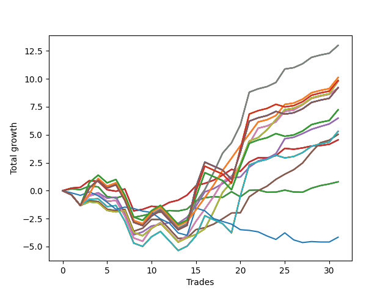

# Long Shepard 003 DB 
- Symbol: SPY_Unlimited
- Date Range: 03/23/2022 - 07/08/2022
- Trading Period: 7:20-12:30
- Number of Trades: 31



| Name | Win Percent | Profit | Avg Profit / Trade | Avg Time / Trade |      | Name | Win Percent | Profit | Avg Profit / Trade | Avg Time / Trade |
| ---- | ----------- | ------ | ------------------ | ---------------- | ---- | ---- | ----------- | ------ | ------------------ | ---------------- |
| Sorted By <br> Profit | | | | | | Sorted By <br> Win Percentage ||||
| Sixty-Nine | 74.19 | 6490.00 | 209.35 | 24:17 |     | Sixty-Six | 80.65 | 3240.00 | 104.52 | 14:03 |
| Sixty-One | 74.19 | 6490.00 | 209.35 | 24:17 |     | Fifty-Eight | 80.65 | 3240.00 | 104.52 | 14:03 |
| Fifty-Three | 74.19 | 6490.00 | 209.35 | 24:17 |     | Fifty | 80.65 | 3240.00 | 104.52 | 14:03 |
| Forty-Five | 74.19 | 6490.00 | 209.35 | 24:17 |     | Forty-Two | 80.65 | 3240.00 | 104.52 | 14:03 |
| Five | 74.19 | 6490.00 | 209.35 | 24:17 |     | Two | 80.65 | 3240.00 | 104.52 | 14:03 |
| One Hundred Twenty-Six | 74.19 | 5055.00 | 163.06 | 22:17 |     | Sixty-Nine | 74.19 | 6490.00 | 209.35 | 24:17 |
| One Hundred Twenty-One | 74.19 | 5055.00 | 163.06 | 22:17 |     | Sixty-One | 74.19 | 6490.00 | 209.35 | 24:17 |
| One Hundred Sixteen | 74.19 | 5055.00 | 163.06 | 22:17 |     | Fifty-Three | 74.19 | 6490.00 | 209.35 | 24:17 |
| One Hundred Eleven | 74.19 | 5055.00 | 163.06 | 22:17 |     | Forty-Five | 74.19 | 6490.00 | 209.35 | 24:17 |
| Eighty-One | 74.19 | 5055.00 | 163.06 | 22:17 |     | Five | 74.19 | 6490.00 | 209.35 | 24:17 |
| One Hundred Twenty-Eight | 61.29 | 4925.00 | 158.87 | 28:51 |     | One Hundred Twenty-Six | 74.19 | 5055.00 | 163.06 | 22:17 |
| One Hundred Twenty-Three | 61.29 | 4925.00 | 158.87 | 28:51 |     | One Hundred Twenty-One | 74.19 | 5055.00 | 163.06 | 22:17 |
| One Hundred Eighteen | 61.29 | 4925.00 | 158.87 | 28:51 |     | One Hundred Sixteen | 74.19 | 5055.00 | 163.06 | 22:17 |
| One Hundred Thirteen | 61.29 | 4925.00 | 158.87 | 28:51 |     | One Hundred Eleven | 74.19 | 5055.00 | 163.06 | 22:17 |
| Eighty-Three | 61.29 | 4925.00 | 158.87 | 28:51 |     | Eighty-One | 74.19 | 5055.00 | 163.06 | 22:17 |
| Seventy | 70.97 | 4890.00 | 157.74 | 18:24 |     | Sixty-Eight | 74.19 | 4585.00 | 147.90 | 20:17 |
| Sixty-Two | 70.97 | 4890.00 | 157.74 | 18:24 |     | Sixty | 74.19 | 4585.00 | 147.90 | 20:17 |
| Fifty-Four | 70.97 | 4890.00 | 157.74 | 18:24 |     | Fifty-Two | 74.19 | 4585.00 | 147.90 | 20:17 |
| Forty-Six | 70.97 | 4890.00 | 157.74 | 18:24 |     | Forty-Four | 74.19 | 4585.00 | 147.90 | 20:17 |
| Six | 70.97 | 4890.00 | 157.74 | 18:24 |     | Four | 74.19 | 4585.00 | 147.90 | 20:17 |
| One Hundred Thirty | 61.29 | 4605.00 | 148.55 | 29:32 |     | Sixty-Seven | 74.19 | 2515.00 | 81.13 | 14:23 |
| One Hundred Twenty-Nine | 61.29 | 4605.00 | 148.55 | 29:32 |     | Fifty-Nine | 74.19 | 2515.00 | 81.13 | 14:23 |
| One Hundred Twenty-Five | 61.29 | 4605.00 | 148.55 | 29:32 |     | Fifty-One | 74.19 | 2515.00 | 81.13 | 14:23 |
| One Hundred Twenty-Four | 61.29 | 4605.00 | 148.55 | 29:32 |     | Forty-Three | 74.19 | 2515.00 | 81.13 | 14:23 |
| One Hundred Twenty | 61.29 | 4605.00 | 148.55 | 29:32 |     | Three | 74.19 | 2515.00 | 81.13 | 14:23 |
| One Hundred Ninteen | 61.29 | 4605.00 | 148.55 | 29:32 |     | Sixty-Five | 74.19 | 2270.00 | 73.23 | 08:15 |
| One Hundred Fifteen | 61.29 | 4605.00 | 148.55 | 29:32 |     | Fifty-Seven | 74.19 | 2270.00 | 73.23 | 08:15 |
| One Hundred Fourteen | 61.29 | 4605.00 | 148.55 | 29:32 |     | Forty-Nine | 74.19 | 2270.00 | 73.23 | 08:15 |
| Eighty-Five | 61.29 | 4605.00 | 148.55 | 29:32 |     | Forty-One | 74.19 | 2270.00 | 73.23 | 08:15 |
| Eighty-Four | 61.29 | 4605.00 | 148.55 | 29:32 |     | One | 74.19 | 2270.00 | 73.23 | 08:15 |
| Sixty-Eight | 74.19 | 4585.00 | 147.90 | 20:17 |     | Seventy | 70.97 | 4890.00 | 157.74 | 18:24 |
| Sixty | 74.19 | 4585.00 | 147.90 | 20:17 |     | Sixty-Two | 70.97 | 4890.00 | 157.74 | 18:24 |
| Fifty-Two | 74.19 | 4585.00 | 147.90 | 20:17 |     | Fifty-Four | 70.97 | 4890.00 | 157.74 | 18:24 |
| Forty-Four | 74.19 | 4585.00 | 147.90 | 20:17 |     | Forty-Six | 70.97 | 4890.00 | 157.74 | 18:24 |
| Four | 74.19 | 4585.00 | 147.90 | 20:17 |     | Six | 70.97 | 4890.00 | 157.74 | 18:24 |
| One Hundred Twenty-Seven | 61.29 | 3615.00 | 116.61 | 28:14 |     | Sixty-Four | 64.52 | 395.00 | 12.74 | 04:00 |
| One Hundred Twenty-Two | 61.29 | 3615.00 | 116.61 | 28:14 |     | Fifty-Six | 64.52 | 395.00 | 12.74 | 04:00 |
| One Hundred Seventeen | 61.29 | 3615.00 | 116.61 | 28:14 |     | Forty-Eight | 64.52 | 395.00 | 12.74 | 04:00 |
| One Hundred Twelve | 61.29 | 3615.00 | 116.61 | 28:14 |     | Forty | 64.52 | 395.00 | 12.74 | 04:00 |
| Eighty-Two | 61.29 | 3615.00 | 116.61 | 28:14 |     | Zero | 64.52 | 395.00 | 12.74 | 04:00 |
| Sixty-Six | 80.65 | 3240.00 | 104.52 | 14:03 |     | One Hundred Twenty-Eight | 61.29 | 4925.00 | 158.87 | 28:51 |
| Fifty-Eight | 80.65 | 3240.00 | 104.52 | 14:03 |     | One Hundred Twenty-Three | 61.29 | 4925.00 | 158.87 | 28:51 |
| Fifty | 80.65 | 3240.00 | 104.52 | 14:03 |     | One Hundred Eighteen | 61.29 | 4925.00 | 158.87 | 28:51 |
| Forty-Two | 80.65 | 3240.00 | 104.52 | 14:03 |     | One Hundred Thirteen | 61.29 | 4925.00 | 158.87 | 28:51 |
| Two | 80.65 | 3240.00 | 104.52 | 14:03 |     | Eighty-Three | 61.29 | 4925.00 | 158.87 | 28:51 |
| Seventy-One | 61.29 | 2650.00 | 85.48 | 25:17 |     | One Hundred Thirty | 61.29 | 4605.00 | 148.55 | 29:32 |
| Sixty-Three | 61.29 | 2650.00 | 85.48 | 25:17 |     | One Hundred Twenty-Nine | 61.29 | 4605.00 | 148.55 | 29:32 |
| Fifty-Five | 61.29 | 2650.00 | 85.48 | 25:17 |     | One Hundred Twenty-Five | 61.29 | 4605.00 | 148.55 | 29:32 |
| Forty-Seven | 61.29 | 2650.00 | 85.48 | 25:17 |     | One Hundred Twenty-Four | 61.29 | 4605.00 | 148.55 | 29:32 |
| Seven | 61.29 | 2650.00 | 85.48 | 25:17 |     | One Hundred Twenty | 61.29 | 4605.00 | 148.55 | 29:32 |
| Sixty-Seven | 74.19 | 2515.00 | 81.13 | 14:23 |     | One Hundred Ninteen | 61.29 | 4605.00 | 148.55 | 29:32 |
| Fifty-Nine | 74.19 | 2515.00 | 81.13 | 14:23 |     | One Hundred Fifteen | 61.29 | 4605.00 | 148.55 | 29:32 |
| Fifty-One | 74.19 | 2515.00 | 81.13 | 14:23 |     | One Hundred Fourteen | 61.29 | 4605.00 | 148.55 | 29:32 |
| Forty-Three | 74.19 | 2515.00 | 81.13 | 14:23 |     | Eighty-Five | 61.29 | 4605.00 | 148.55 | 29:32 |
| Three | 74.19 | 2515.00 | 81.13 | 14:23 |     | Eighty-Four | 61.29 | 4605.00 | 148.55 | 29:32 |
| Sixty-Five | 74.19 | 2270.00 | 73.23 | 08:15 |     | One Hundred Twenty-Seven | 61.29 | 3615.00 | 116.61 | 28:14 |
| Fifty-Seven | 74.19 | 2270.00 | 73.23 | 08:15 |     | One Hundred Twenty-Two | 61.29 | 3615.00 | 116.61 | 28:14 |
| Forty-Nine | 74.19 | 2270.00 | 73.23 | 08:15 |     | One Hundred Seventeen | 61.29 | 3615.00 | 116.61 | 28:14 |
| Forty-One | 74.19 | 2270.00 | 73.23 | 08:15 |     | One Hundred Twelve | 61.29 | 3615.00 | 116.61 | 28:14 |
| One | 74.19 | 2270.00 | 73.23 | 08:15 |     | Eighty-Two | 61.29 | 3615.00 | 116.61 | 28:14 |
| Sixty-Four | 64.52 | 395.00 | 12.74 | 04:00 |     | Seventy-One | 61.29 | 2650.00 | 85.48 | 25:17 |
| Fifty-Six | 64.52 | 395.00 | 12.74 | 04:00 |     | Sixty-Three | 61.29 | 2650.00 | 85.48 | 25:17 |
| Forty-Eight | 64.52 | 395.00 | 12.74 | 04:00 |     | Fifty-Five | 61.29 | 2650.00 | 85.48 | 25:17 |
| Forty | 64.52 | 395.00 | 12.74 | 04:00 |     | Forty-Seven | 61.29 | 2650.00 | 85.48 | 25:17 |
| Zero | 64.52 | 395.00 | 12.74 | 04:00 |     | Seven | 61.29 | 2650.00 | 85.48 | 25:17 |
| Seventy-Three | 22.58 | -2080.00 | -67.10 | 05:20 |     | Seventy-Three | 22.58 | -2080.00 | -67.10 | 05:20 |

## NO STOPLOSS

### Test Zero
* Sell when price hits the middle line of the 20p bollinger
* No Stoploss
* Results:
```
Total Trades: 31
Percent Up: 64.52
Percent Down: 35.48
Total Points Moved Up: 0.79
Potential Profit: 395.00
Total Points Ups: 4.85 Count Ups: 20
Total Points Downs: -4.06 Count Downs: 11
```

<details><summary>Trades</summary>

<code>In: 2022-03-23 09:49:00		Out: 2022-03-23 09:53:00		Total Position Time: 04:00		Total Move Up: 0.16		Total to Date: 0.16</code> <br />
<code>In: 2022-03-23 09:53:00		Out: 2022-03-23 09:54:05		Total Position Time: 01:05		Total Move Up: -0.07		Total to Date: 0.09</code> <br />
<code>In: 2022-03-24 07:32:00		Out: 2022-03-24 07:32:40		Total Position Time: 00:40		Total Move Up: 0.32		Total to Date: 0.41</code> <br />
<code>In: 2022-03-24 07:33:00		Out: 2022-03-24 07:33:10		Total Position Time: 00:10		Total Move Up: -0.07		Total to Date: 0.34</code> <br />
<code>In: 2022-03-25 08:18:00		Out: 2022-03-25 08:36:40		Total Position Time: 18:40		Total Move Up: -0.87		Total to Date: -0.53</code> <br />
<code>In: 2022-03-28 07:30:00		Out: 2022-03-28 07:30:10		Total Position Time: 00:10		Total Move Up: -0.13		Total to Date: -0.66</code> <br />
<code>In: 2022-03-28 08:11:00		Out: 2022-03-28 08:11:45		Total Position Time: 00:45		Total Move Up: 0.24		Total to Date: -0.42</code> <br />
<code>In: 2022-03-28 08:30:00		Out: 2022-03-28 08:59:55		Total Position Time: 29:55		Total Move Up: -1.96		Total to Date: -2.38</code> <br />
<code>In: 2022-03-31 09:30:00		Out: 2022-03-31 09:32:25		Total Position Time: 02:25		Total Move Up: 0.15		Total to Date: -2.23</code> <br />
<code>In: 2022-04-20 08:27:00		Out: 2022-04-20 08:28:55		Total Position Time: 01:55		Total Move Up: 0.19		Total to Date: -2.04</code> <br />
<code>In: 2022-04-20 11:48:00		Out: 2022-04-20 11:48:15		Total Position Time: 00:15		Total Move Up: 0.12		Total to Date: -1.92</code> <br />
<code>In: 2022-04-27 12:11:00		Out: 2022-04-27 12:13:55		Total Position Time: 02:55		Total Move Up: 0.14		Total to Date: -1.78</code> <br />
<code>In: 2022-04-27 12:14:00		Out: 2022-04-27 12:14:35		Total Position Time: 00:35		Total Move Up: -0.04		Total to Date: -1.82</code> <br />
<code>In: 2022-04-27 12:24:00		Out: 2022-04-27 12:24:15		Total Position Time: 00:15		Total Move Up: 0.17		Total to Date: -1.65</code> <br />
<code>In: 2022-05-03 07:51:00		Out: 2022-05-03 07:54:05		Total Position Time: 03:05		Total Move Up: 0.74		Total to Date: -0.91</code> <br />
<code>In: 2022-05-03 11:45:00		Out: 2022-05-03 11:45:10		Total Position Time: 00:10		Total Move Up: 0.27		Total to Date: -0.64</code> <br />
<code>In: 2022-05-06 11:41:00		Out: 2022-05-06 11:41:10		Total Position Time: 00:10		Total Move Up: 0.11		Total to Date: -0.53</code> <br />
<code>In: 2022-05-06 11:47:00		Out: 2022-05-06 11:48:15		Total Position Time: 01:15		Total Move Up: -0.07		Total to Date: -0.60</code> <br />
<code>In: 2022-05-06 11:50:00		Out: 2022-05-06 11:50:10		Total Position Time: 00:10		Total Move Up: 0.51		Total to Date: -0.09</code> <br />
<code>In: 2022-05-06 12:20:00		Out: 2022-05-06 12:27:50		Total Position Time: 07:50		Total Move Up: -0.46		Total to Date: -0.55</code> <br />
<code>In: 2022-05-12 09:04:00		Out: 2022-05-12 09:07:35		Total Position Time: 03:35		Total Move Up: 0.58		Total to Date: 0.03</code> <br />
<code>In: 2022-05-13 11:10:00		Out: 2022-05-13 11:19:15		Total Position Time: 09:15		Total Move Up: 0.03		Total to Date: 0.06</code> <br />
<code>In: 2022-05-16 07:58:00		Out: 2022-05-16 08:05:30		Total Position Time: 07:30		Total Move Up: -0.20		Total to Date: -0.14</code> <br />
<code>In: 2022-05-16 08:02:00		Out: 2022-05-16 08:05:30		Total Position Time: 03:30		Total Move Up: 0.01		Total to Date: -0.13</code> <br />
<code>In: 2022-05-19 10:19:00		Out: 2022-05-19 10:19:20		Total Position Time: 00:20		Total Move Up: 0.18		Total to Date: 0.05</code> <br />
<code>In: 2022-05-25 09:31:00		Out: 2022-05-25 09:38:55		Total Position Time: 07:55		Total Move Up: -0.17		Total to Date: -0.12</code> <br />
<code>In: 2022-05-25 09:39:00		Out: 2022-05-25 09:41:25		Total Position Time: 02:25		Total Move Up: -0.02		Total to Date: -0.14</code> <br />
<code>In: 2022-06-06 08:24:00		Out: 2022-06-06 08:31:35		Total Position Time: 07:35		Total Move Up: 0.36		Total to Date: 0.22</code> <br />
<code>In: 2022-06-06 08:27:00		Out: 2022-06-06 08:31:35		Total Position Time: 04:35		Total Move Up: 0.23		Total to Date: 0.45</code> <br />
<code>In: 2022-07-08 09:48:00		Out: 2022-07-08 09:48:45		Total Position Time: 00:45		Total Move Up: 0.15		Total to Date: 0.60</code> <br />
<code>In: 2022-07-08 10:06:00		Out: 2022-07-08 10:06:10		Total Position Time: 00:10		Total Move Up: 0.19		Total to Date: 0.79</code> <br />


</details>

### Test One
* Sell when the price hits the upper line of the 20p 1std bollinger
* No Stoploss
* Results:
```
Total Trades: 31
Percent Up: 74.19
Percent Down: 25.81
Total Points Moved Up: 4.54
Potential Profit: 2270.00
Total Points Ups: 7.79 Count Ups: 23
Total Points Downs: -3.25 Count Downs: 8
```

<details><summary>Trades</summary>

<code>In: 2022-03-23 09:49:00		Out: 2022-03-23 09:59:10		Total Position Time: 10:10		Total Move Up: 0.23		Total to Date: 0.23</code> <br />
<code>In: 2022-03-23 09:53:00		Out: 2022-03-23 09:59:10		Total Position Time: 06:10		Total Move Up: 0.07		Total to Date: 0.30</code> <br />
<code>In: 2022-03-24 07:32:00		Out: 2022-03-24 07:32:55		Total Position Time: 00:55		Total Move Up: 0.60		Total to Date: 0.90</code> <br />
<code>In: 2022-03-24 07:33:00		Out: 2022-03-24 07:33:10		Total Position Time: 00:10		Total Move Up: -0.07		Total to Date: 0.83</code> <br />
<code>In: 2022-03-25 08:18:00		Out: 2022-03-25 08:41:05		Total Position Time: 23:05		Total Move Up: -0.75		Total to Date: 0.08</code> <br />
<code>In: 2022-03-28 07:30:00		Out: 2022-03-28 07:30:10		Total Position Time: 00:10		Total Move Up: -0.13		Total to Date: -0.05</code> <br />
<code>In: 2022-03-28 08:11:00		Out: 2022-03-28 08:20:05		Total Position Time: 09:05		Total Move Up: 0.20		Total to Date: 0.15</code> <br />
<code>In: 2022-03-28 08:30:00		Out: 2022-03-28 08:59:55		Total Position Time: 29:55		Total Move Up: -1.96		Total to Date: -1.81</code> <br />
<code>In: 2022-03-31 09:30:00		Out: 2022-03-31 09:40:45		Total Position Time: 10:45		Total Move Up: 0.14		Total to Date: -1.67</code> <br />
<code>In: 2022-04-20 08:27:00		Out: 2022-04-20 08:30:05		Total Position Time: 03:05		Total Move Up: 0.28		Total to Date: -1.39</code> <br />
<code>In: 2022-04-20 11:48:00		Out: 2022-04-20 12:04:20		Total Position Time: 16:20		Total Move Up: -0.08		Total to Date: -1.47</code> <br />
<code>In: 2022-04-27 12:11:00		Out: 2022-04-27 12:15:20		Total Position Time: 04:20		Total Move Up: 0.42		Total to Date: -1.05</code> <br />
<code>In: 2022-04-27 12:14:00		Out: 2022-04-27 12:15:20		Total Position Time: 01:20		Total Move Up: 0.20		Total to Date: -0.85</code> <br />
<code>In: 2022-04-27 12:24:00		Out: 2022-04-27 12:27:15		Total Position Time: 03:15		Total Move Up: 0.45		Total to Date: -0.40</code> <br />
<code>In: 2022-05-03 07:51:00		Out: 2022-05-03 07:57:05		Total Position Time: 06:05		Total Move Up: 0.84		Total to Date: 0.44</code> <br />
<code>In: 2022-05-03 11:45:00		Out: 2022-05-03 11:45:15		Total Position Time: 00:15		Total Move Up: 0.21		Total to Date: 0.65</code> <br />
<code>In: 2022-05-06 11:41:00		Out: 2022-05-06 11:49:10		Total Position Time: 08:10		Total Move Up: 0.29		Total to Date: 0.94</code> <br />
<code>In: 2022-05-06 11:47:00		Out: 2022-05-06 11:49:10		Total Position Time: 02:10		Total Move Up: 0.45		Total to Date: 1.39</code> <br />
<code>In: 2022-05-06 11:50:00		Out: 2022-05-06 11:50:10		Total Position Time: 00:10		Total Move Up: 0.51		Total to Date: 1.90</code> <br />
<code>In: 2022-05-06 12:20:00		Out: 2022-05-06 12:28:05		Total Position Time: 08:05		Total Move Up: -0.17		Total to Date: 1.73</code> <br />
<code>In: 2022-05-12 09:04:00		Out: 2022-05-12 09:11:10		Total Position Time: 07:10		Total Move Up: 0.83		Total to Date: 2.56</code> <br />
<code>In: 2022-05-13 11:10:00		Out: 2022-05-13 11:20:00		Total Position Time: 10:00		Total Move Up: 0.38		Total to Date: 2.94</code> <br />
<code>In: 2022-05-16 07:58:00		Out: 2022-05-16 08:09:50		Total Position Time: 11:50		Total Move Up: -0.01		Total to Date: 2.93</code> <br />
<code>In: 2022-05-16 08:02:00		Out: 2022-05-16 08:09:50		Total Position Time: 07:50		Total Move Up: 0.20		Total to Date: 3.13</code> <br />
<code>In: 2022-05-19 10:19:00		Out: 2022-05-19 10:22:45		Total Position Time: 03:45		Total Move Up: 0.65		Total to Date: 3.78</code> <br />
<code>In: 2022-05-25 09:31:00		Out: 2022-05-25 09:44:25		Total Position Time: 13:25		Total Move Up: -0.08		Total to Date: 3.70</code> <br />
<code>In: 2022-05-25 09:39:00		Out: 2022-05-25 09:44:25		Total Position Time: 05:25		Total Move Up: 0.12		Total to Date: 3.82</code> <br />
<code>In: 2022-06-06 08:24:00		Out: 2022-06-06 08:39:15		Total Position Time: 15:15		Total Move Up: 0.17		Total to Date: 3.99</code> <br />
<code>In: 2022-06-06 08:27:00		Out: 2022-06-06 08:39:15		Total Position Time: 12:15		Total Move Up: 0.04		Total to Date: 4.03</code> <br />
<code>In: 2022-07-08 09:48:00		Out: 2022-07-08 10:09:40		Total Position Time: 21:40		Total Move Up: 0.11		Total to Date: 4.14</code> <br />
<code>In: 2022-07-08 10:06:00		Out: 2022-07-08 10:09:40		Total Position Time: 03:40		Total Move Up: 0.40		Total to Date: 4.54</code> <br />


</details>

### Test Two
* Sell when the price hits the upper line of the 20p 2std bollinger
* No Stoploss
* Results:
```
Total Trades: 31
Percent Up: 80.65
Percent Down: 19.35
Total Points Moved Up: 6.48
Potential Profit: 3240.00
Total Points Ups: 11.71 Count Ups: 25
Total Points Downs: -5.23 Count Downs: 6
```

<details><summary>Trades</summary>

<code>In: 2022-03-23 09:49:00		Out: 2022-03-23 10:18:55		Total Position Time: 29:55		Total Move Up: -0.38		Total to Date: -0.38</code> <br />
<code>In: 2022-03-23 09:53:00		Out: 2022-03-23 10:22:55		Total Position Time: 29:55		Total Move Up: -0.95		Total to Date: -1.33</code> <br />
<code>In: 2022-03-24 07:32:00		Out: 2022-03-24 07:34:20		Total Position Time: 02:20		Total Move Up: 0.90		Total to Date: -0.43</code> <br />
<code>In: 2022-03-24 07:33:00		Out: 2022-03-24 07:34:20		Total Position Time: 01:20		Total Move Up: 0.24		Total to Date: -0.19</code> <br />
<code>In: 2022-03-25 08:18:00		Out: 2022-03-25 08:41:45		Total Position Time: 23:45		Total Move Up: -0.48		Total to Date: -0.67</code> <br />
<code>In: 2022-03-28 07:30:00		Out: 2022-03-28 07:30:25		Total Position Time: 00:25		Total Move Up: 0.09		Total to Date: -0.58</code> <br />
<code>In: 2022-03-28 08:11:00		Out: 2022-03-28 08:40:55		Total Position Time: 29:55		Total Move Up: -1.40		Total to Date: -1.98</code> <br />
<code>In: 2022-03-28 08:30:00		Out: 2022-03-28 08:59:55		Total Position Time: 29:55		Total Move Up: -1.96		Total to Date: -3.94</code> <br />
<code>In: 2022-03-31 09:30:00		Out: 2022-03-31 09:44:20		Total Position Time: 14:20		Total Move Up: 0.25		Total to Date: -3.69</code> <br />
<code>In: 2022-04-20 08:27:00		Out: 2022-04-20 08:30:55		Total Position Time: 03:55		Total Move Up: 0.53		Total to Date: -3.16</code> <br />
<code>In: 2022-04-20 11:48:00		Out: 2022-04-20 12:12:35		Total Position Time: 24:35		Total Move Up: 0.14		Total to Date: -3.02</code> <br />
<code>In: 2022-04-27 12:11:00		Out: 2022-04-27 12:31:35		Total Position Time: 20:35		Total Move Up: 0.16		Total to Date: -2.86</code> <br />
<code>In: 2022-04-27 12:14:00		Out: 2022-04-27 12:31:35		Total Position Time: 17:35		Total Move Up: -0.06		Total to Date: -2.92</code> <br />
<code>In: 2022-04-27 12:24:00		Out: 2022-04-27 12:31:35		Total Position Time: 07:35		Total Move Up: 0.54		Total to Date: -2.38</code> <br />
<code>In: 2022-05-03 07:51:00		Out: 2022-05-03 07:59:10		Total Position Time: 08:10		Total Move Up: 1.00		Total to Date: -1.38</code> <br />
<code>In: 2022-05-03 11:45:00		Out: 2022-05-03 11:52:15		Total Position Time: 07:15		Total Move Up: 1.27		Total to Date: -0.11</code> <br />
<code>In: 2022-05-06 11:41:00		Out: 2022-05-06 11:49:10		Total Position Time: 08:10		Total Move Up: 0.29		Total to Date: 0.18</code> <br />
<code>In: 2022-05-06 11:47:00		Out: 2022-05-06 11:49:10		Total Position Time: 02:10		Total Move Up: 0.45		Total to Date: 0.63</code> <br />
<code>In: 2022-05-06 11:50:00		Out: 2022-05-06 11:50:10		Total Position Time: 00:10		Total Move Up: 0.51		Total to Date: 1.14</code> <br />
<code>In: 2022-05-06 12:20:00		Out: 2022-05-06 12:28:30		Total Position Time: 08:30		Total Move Up: 0.08		Total to Date: 1.22</code> <br />
<code>In: 2022-05-12 09:04:00		Out: 2022-05-12 09:16:10		Total Position Time: 12:10		Total Move Up: 0.88		Total to Date: 2.10</code> <br />
<code>In: 2022-05-13 11:10:00		Out: 2022-05-13 11:31:20		Total Position Time: 21:20		Total Move Up: 0.55		Total to Date: 2.65</code> <br />
<code>In: 2022-05-16 07:58:00		Out: 2022-05-16 08:11:15		Total Position Time: 13:15		Total Move Up: 0.22		Total to Date: 2.87</code> <br />
<code>In: 2022-05-16 08:02:00		Out: 2022-05-16 08:11:15		Total Position Time: 09:15		Total Move Up: 0.43		Total to Date: 3.30</code> <br />
<code>In: 2022-05-19 10:19:00		Out: 2022-05-19 10:44:05		Total Position Time: 25:05		Total Move Up: 1.34		Total to Date: 4.64</code> <br />
<code>In: 2022-05-25 09:31:00		Out: 2022-05-25 09:45:20		Total Position Time: 14:20		Total Move Up: 0.13		Total to Date: 4.77</code> <br />
<code>In: 2022-05-25 09:39:00		Out: 2022-05-25 09:45:20		Total Position Time: 06:20		Total Move Up: 0.33		Total to Date: 5.10</code> <br />
<code>In: 2022-06-06 08:24:00		Out: 2022-06-06 08:43:00		Total Position Time: 19:00		Total Move Up: 0.38		Total to Date: 5.48</code> <br />
<code>In: 2022-06-06 08:27:00		Out: 2022-06-06 08:43:00		Total Position Time: 16:00		Total Move Up: 0.25		Total to Date: 5.73</code> <br />
<code>In: 2022-07-08 09:48:00		Out: 2022-07-08 10:11:10		Total Position Time: 23:10		Total Move Up: 0.23		Total to Date: 5.96</code> <br />
<code>In: 2022-07-08 10:06:00		Out: 2022-07-08 10:11:10		Total Position Time: 05:10		Total Move Up: 0.52		Total to Date: 6.48</code> <br />


</details>

### Test Three
* Sell when price hits the middle line of the 50p bollinger
* No Stoploss
* Results:
```
Total Trades: 31
Percent Up: 74.19
Percent Down: 25.81
Total Points Moved Up: 5.03
Potential Profit: 2515.00
Total Points Ups: 10.91 Count Ups: 23
Total Points Downs: -5.88 Count Downs: 8
```

<details><summary>Trades</summary>

<code>In: 2022-03-23 09:49:00		Out: 2022-03-23 10:18:55		Total Position Time: 29:55		Total Move Up: -0.38		Total to Date: -0.38</code> <br />
<code>In: 2022-03-23 09:53:00		Out: 2022-03-23 10:22:55		Total Position Time: 29:55		Total Move Up: -0.95		Total to Date: -1.33</code> <br />
<code>In: 2022-03-24 07:32:00		Out: 2022-03-24 07:32:45		Total Position Time: 00:45		Total Move Up: 0.43		Total to Date: -0.90</code> <br />
<code>In: 2022-03-24 07:33:00		Out: 2022-03-24 07:33:10		Total Position Time: 00:10		Total Move Up: -0.07		Total to Date: -0.97</code> <br />
<code>In: 2022-03-25 08:18:00		Out: 2022-03-25 08:47:55		Total Position Time: 29:55		Total Move Up: -0.69		Total to Date: -1.66</code> <br />
<code>In: 2022-03-28 07:30:00		Out: 2022-03-28 07:30:10		Total Position Time: 00:10		Total Move Up: -0.13		Total to Date: -1.79</code> <br />
<code>In: 2022-03-28 08:11:00		Out: 2022-03-28 08:11:35		Total Position Time: 00:35		Total Move Up: 0.12		Total to Date: -1.67</code> <br />
<code>In: 2022-03-28 08:30:00		Out: 2022-03-28 08:59:55		Total Position Time: 29:55		Total Move Up: -1.96		Total to Date: -3.63</code> <br />
<code>In: 2022-03-31 09:30:00		Out: 2022-03-31 09:45:10		Total Position Time: 15:10		Total Move Up: 0.27		Total to Date: -3.36</code> <br />
<code>In: 2022-04-20 08:27:00		Out: 2022-04-20 08:36:10		Total Position Time: 09:10		Total Move Up: 0.78		Total to Date: -2.58</code> <br />
<code>In: 2022-04-20 11:48:00		Out: 2022-04-20 12:10:10		Total Position Time: 22:10		Total Move Up: 0.00		Total to Date: -2.58</code> <br />
<code>In: 2022-04-27 12:11:00		Out: 2022-04-27 12:40:55		Total Position Time: 29:55		Total Move Up: -0.83		Total to Date: -3.41</code> <br />
<code>In: 2022-04-27 12:14:00		Out: 2022-04-27 12:43:55		Total Position Time: 29:55		Total Move Up: -0.87		Total to Date: -4.28</code> <br />
<code>In: 2022-04-27 12:24:00		Out: 2022-04-27 12:44:15		Total Position Time: 20:15		Total Move Up: 0.06		Total to Date: -4.22</code> <br />
<code>In: 2022-05-03 07:51:00		Out: 2022-05-03 07:54:05		Total Position Time: 03:05		Total Move Up: 0.74		Total to Date: -3.48</code> <br />
<code>In: 2022-05-03 11:45:00		Out: 2022-05-03 11:48:05		Total Position Time: 03:05		Total Move Up: 0.17		Total to Date: -3.31</code> <br />
<code>In: 2022-05-06 11:41:00		Out: 2022-05-06 11:49:15		Total Position Time: 08:15		Total Move Up: 0.32		Total to Date: -2.99</code> <br />
<code>In: 2022-05-06 11:47:00		Out: 2022-05-06 11:49:15		Total Position Time: 02:15		Total Move Up: 0.48		Total to Date: -2.51</code> <br />
<code>In: 2022-05-06 11:50:00		Out: 2022-05-06 11:50:10		Total Position Time: 00:10		Total Move Up: 0.51		Total to Date: -2.00</code> <br />
<code>In: 2022-05-06 12:20:00		Out: 2022-05-06 12:28:10		Total Position Time: 08:10		Total Move Up: 0.02		Total to Date: -1.98</code> <br />
<code>In: 2022-05-12 09:04:00		Out: 2022-05-12 09:21:35		Total Position Time: 17:35		Total Move Up: 1.43		Total to Date: -0.55</code> <br />
<code>In: 2022-05-13 11:10:00		Out: 2022-05-13 11:31:20		Total Position Time: 21:20		Total Move Up: 0.55		Total to Date: 0.00</code> <br />
<code>In: 2022-05-16 07:58:00		Out: 2022-05-16 08:17:05		Total Position Time: 19:05		Total Move Up: 0.40		Total to Date: 0.40</code> <br />
<code>In: 2022-05-16 08:02:00		Out: 2022-05-16 08:17:05		Total Position Time: 15:05		Total Move Up: 0.61		Total to Date: 1.01</code> <br />
<code>In: 2022-05-19 10:19:00		Out: 2022-05-19 10:21:15		Total Position Time: 02:15		Total Move Up: 0.46		Total to Date: 1.47</code> <br />
<code>In: 2022-05-25 09:31:00		Out: 2022-05-25 09:49:05		Total Position Time: 18:05		Total Move Up: 0.40		Total to Date: 1.87</code> <br />
<code>In: 2022-05-25 09:39:00		Out: 2022-05-25 09:49:05		Total Position Time: 10:05		Total Move Up: 0.60		Total to Date: 2.47</code> <br />
<code>In: 2022-06-06 08:24:00		Out: 2022-06-06 08:46:10		Total Position Time: 22:10		Total Move Up: 0.97		Total to Date: 3.44</code> <br />
<code>In: 2022-06-06 08:27:00		Out: 2022-06-06 08:46:10		Total Position Time: 19:10		Total Move Up: 0.84		Total to Date: 4.28</code> <br />
<code>In: 2022-07-08 09:48:00		Out: 2022-07-08 10:11:05		Total Position Time: 23:05		Total Move Up: 0.23		Total to Date: 4.51</code> <br />
<code>In: 2022-07-08 10:06:00		Out: 2022-07-08 10:11:05		Total Position Time: 05:05		Total Move Up: 0.52		Total to Date: 5.03</code> <br />


</details>

### Test Four
* Sell when the price hits the upper line of the 50p 1std bollinger
* No Stoploss
* Results:
```
Total Trades: 31
Percent Up: 74.19
Percent Down: 25.81
Total Points Moved Up: 9.17
Potential Profit: 4585.00
Total Points Ups: 16.54 Count Ups: 23
Total Points Downs: -7.37 Count Downs: 8
```

<details><summary>Trades</summary>

<code>In: 2022-03-23 09:49:00		Out: 2022-03-23 10:18:55		Total Position Time: 29:55		Total Move Up: -0.38		Total to Date: -0.38</code> <br />
<code>In: 2022-03-23 09:53:00		Out: 2022-03-23 10:22:55		Total Position Time: 29:55		Total Move Up: -0.95		Total to Date: -1.33</code> <br />
<code>In: 2022-03-24 07:32:00		Out: 2022-03-24 07:34:15		Total Position Time: 02:15		Total Move Up: 0.86		Total to Date: -0.47</code> <br />
<code>In: 2022-03-24 07:33:00		Out: 2022-03-24 07:34:15		Total Position Time: 01:15		Total Move Up: 0.20		Total to Date: -0.27</code> <br />
<code>In: 2022-03-25 08:18:00		Out: 2022-03-25 08:47:55		Total Position Time: 29:55		Total Move Up: -0.69		Total to Date: -0.96</code> <br />
<code>In: 2022-03-28 07:30:00		Out: 2022-03-28 07:30:25		Total Position Time: 00:25		Total Move Up: 0.09		Total to Date: -0.87</code> <br />
<code>In: 2022-03-28 08:11:00		Out: 2022-03-28 08:40:55		Total Position Time: 29:55		Total Move Up: -1.40		Total to Date: -2.27</code> <br />
<code>In: 2022-03-28 08:30:00		Out: 2022-03-28 08:59:55		Total Position Time: 29:55		Total Move Up: -1.96		Total to Date: -4.23</code> <br />
<code>In: 2022-03-31 09:30:00		Out: 2022-03-31 09:59:55		Total Position Time: 29:55		Total Move Up: -0.29		Total to Date: -4.52</code> <br />
<code>In: 2022-04-20 08:27:00		Out: 2022-04-20 08:45:05		Total Position Time: 18:05		Total Move Up: 1.16		Total to Date: -3.36</code> <br />
<code>In: 2022-04-20 11:48:00		Out: 2022-04-20 12:13:35		Total Position Time: 25:35		Total Move Up: 0.50		Total to Date: -2.86</code> <br />
<code>In: 2022-04-27 12:11:00		Out: 2022-04-27 12:40:55		Total Position Time: 29:55		Total Move Up: -0.83		Total to Date: -3.69</code> <br />
<code>In: 2022-04-27 12:14:00		Out: 2022-04-27 12:43:55		Total Position Time: 29:55		Total Move Up: -0.87		Total to Date: -4.56</code> <br />
<code>In: 2022-04-27 12:24:00		Out: 2022-04-27 12:44:35		Total Position Time: 20:35		Total Move Up: 0.54		Total to Date: -4.02</code> <br />
<code>In: 2022-05-03 07:51:00		Out: 2022-05-03 08:02:25		Total Position Time: 11:25		Total Move Up: 1.28		Total to Date: -2.74</code> <br />
<code>In: 2022-05-03 11:45:00		Out: 2022-05-03 11:52:05		Total Position Time: 07:05		Total Move Up: 1.09		Total to Date: -1.65</code> <br />
<code>In: 2022-05-06 11:41:00		Out: 2022-05-06 11:50:10		Total Position Time: 09:10		Total Move Up: 1.14		Total to Date: -0.51</code> <br />
<code>In: 2022-05-06 11:47:00		Out: 2022-05-06 11:50:10		Total Position Time: 03:10		Total Move Up: 1.30		Total to Date: 0.79</code> <br />
<code>In: 2022-05-06 11:50:00		Out: 2022-05-06 11:50:10		Total Position Time: 00:10		Total Move Up: 0.51		Total to Date: 1.30</code> <br />
<code>In: 2022-05-06 12:20:00		Out: 2022-05-06 12:30:30		Total Position Time: 10:30		Total Move Up: 0.91		Total to Date: 2.21</code> <br />
<code>In: 2022-05-12 09:04:00		Out: 2022-05-12 09:30:10		Total Position Time: 26:10		Total Move Up: 2.00		Total to Date: 4.21</code> <br />
<code>In: 2022-05-13 11:10:00		Out: 2022-05-13 11:32:00		Total Position Time: 22:00		Total Move Up: 1.37		Total to Date: 5.58</code> <br />
<code>In: 2022-05-16 07:58:00		Out: 2022-05-16 08:27:55		Total Position Time: 29:55		Total Move Up: 0.20		Total to Date: 5.78</code> <br />
<code>In: 2022-05-16 08:02:00		Out: 2022-05-16 08:31:55		Total Position Time: 29:55		Total Move Up: 0.37		Total to Date: 6.15</code> <br />
<code>In: 2022-05-19 10:19:00		Out: 2022-05-19 10:23:30		Total Position Time: 04:30		Total Move Up: 0.93		Total to Date: 7.08</code> <br />
<code>In: 2022-05-25 09:31:00		Out: 2022-05-25 10:00:55		Total Position Time: 29:55		Total Move Up: 0.12		Total to Date: 7.20</code> <br />
<code>In: 2022-05-25 09:39:00		Out: 2022-05-25 10:06:15		Total Position Time: 27:15		Total Move Up: 0.47		Total to Date: 7.67</code> <br />
<code>In: 2022-06-06 08:24:00		Out: 2022-06-06 08:53:55		Total Position Time: 29:55		Total Move Up: 0.57		Total to Date: 8.24</code> <br />
<code>In: 2022-06-06 08:27:00		Out: 2022-06-06 08:56:55		Total Position Time: 29:55		Total Move Up: 0.21		Total to Date: 8.45</code> <br />
<code>In: 2022-07-08 09:48:00		Out: 2022-07-08 10:17:55		Total Position Time: 29:55		Total Move Up: 0.16		Total to Date: 8.61</code> <br />
<code>In: 2022-07-08 10:06:00		Out: 2022-07-08 10:26:30		Total Position Time: 20:30		Total Move Up: 0.56		Total to Date: 9.17</code> <br />


</details>

### Test Five
* Sell when the price hits the upper line of the 50p 2std bollinger
* No Stoploss
* Results:
```
Total Trades: 31
Percent Up: 74.19
Percent Down: 25.81
Total Points Moved Up: 12.98
Potential Profit: 6490.00
Total Points Ups: 20.35 Count Ups: 23
Total Points Downs: -7.37 Count Downs: 8
```

<details><summary>Trades</summary>

<code>In: 2022-03-23 09:49:00		Out: 2022-03-23 10:18:55		Total Position Time: 29:55		Total Move Up: -0.38		Total to Date: -0.38</code> <br />
<code>In: 2022-03-23 09:53:00		Out: 2022-03-23 10:22:55		Total Position Time: 29:55		Total Move Up: -0.95		Total to Date: -1.33</code> <br />
<code>In: 2022-03-24 07:32:00		Out: 2022-03-24 08:01:10		Total Position Time: 29:10		Total Move Up: 1.52		Total to Date: 0.19</code> <br />
<code>In: 2022-03-24 07:33:00		Out: 2022-03-24 08:01:10		Total Position Time: 28:10		Total Move Up: 0.86		Total to Date: 1.05</code> <br />
<code>In: 2022-03-25 08:18:00		Out: 2022-03-25 08:47:55		Total Position Time: 29:55		Total Move Up: -0.69		Total to Date: 0.36</code> <br />
<code>In: 2022-03-28 07:30:00		Out: 2022-03-28 07:48:40		Total Position Time: 18:40		Total Move Up: 0.31		Total to Date: 0.67</code> <br />
<code>In: 2022-03-28 08:11:00		Out: 2022-03-28 08:40:55		Total Position Time: 29:55		Total Move Up: -1.40		Total to Date: -0.73</code> <br />
<code>In: 2022-03-28 08:30:00		Out: 2022-03-28 08:59:55		Total Position Time: 29:55		Total Move Up: -1.96		Total to Date: -2.69</code> <br />
<code>In: 2022-03-31 09:30:00		Out: 2022-03-31 09:59:55		Total Position Time: 29:55		Total Move Up: -0.29		Total to Date: -2.98</code> <br />
<code>In: 2022-04-20 08:27:00		Out: 2022-04-20 08:56:55		Total Position Time: 29:55		Total Move Up: 0.86		Total to Date: -2.12</code> <br />
<code>In: 2022-04-20 11:48:00		Out: 2022-04-20 12:17:55		Total Position Time: 29:55		Total Move Up: 0.47		Total to Date: -1.65</code> <br />
<code>In: 2022-04-27 12:11:00		Out: 2022-04-27 12:40:55		Total Position Time: 29:55		Total Move Up: -0.83		Total to Date: -2.48</code> <br />
<code>In: 2022-04-27 12:14:00		Out: 2022-04-27 12:43:55		Total Position Time: 29:55		Total Move Up: -0.87		Total to Date: -3.35</code> <br />
<code>In: 2022-04-27 12:24:00		Out: 2022-04-27 12:46:00		Total Position Time: 22:00		Total Move Up: 0.39		Total to Date: -2.96</code> <br />
<code>In: 2022-05-03 07:51:00		Out: 2022-05-03 08:05:00		Total Position Time: 14:00		Total Move Up: 1.92		Total to Date: -1.04</code> <br />
<code>In: 2022-05-03 11:45:00		Out: 2022-05-03 11:56:15		Total Position Time: 11:15		Total Move Up: 1.13		Total to Date: 0.09</code> <br />
<code>In: 2022-05-06 11:41:00		Out: 2022-05-06 11:50:35		Total Position Time: 09:35		Total Move Up: 1.55		Total to Date: 1.64</code> <br />
<code>In: 2022-05-06 11:47:00		Out: 2022-05-06 11:50:35		Total Position Time: 03:35		Total Move Up: 1.71		Total to Date: 3.35</code> <br />
<code>In: 2022-05-06 11:50:00		Out: 2022-05-06 11:50:35		Total Position Time: 00:35		Total Move Up: 0.92		Total to Date: 4.27</code> <br />
<code>In: 2022-05-06 12:20:00		Out: 2022-05-06 12:35:40		Total Position Time: 15:40		Total Move Up: 1.61		Total to Date: 5.88</code> <br />
<code>In: 2022-05-12 09:04:00		Out: 2022-05-12 09:32:35		Total Position Time: 28:35		Total Move Up: 2.92		Total to Date: 8.80</code> <br />
<code>In: 2022-05-13 11:10:00		Out: 2022-05-13 11:39:55		Total Position Time: 29:55		Total Move Up: 0.30		Total to Date: 9.10</code> <br />
<code>In: 2022-05-16 07:58:00		Out: 2022-05-16 08:27:55		Total Position Time: 29:55		Total Move Up: 0.20		Total to Date: 9.30</code> <br />
<code>In: 2022-05-16 08:02:00		Out: 2022-05-16 08:31:55		Total Position Time: 29:55		Total Move Up: 0.37		Total to Date: 9.67</code> <br />
<code>In: 2022-05-19 10:19:00		Out: 2022-05-19 10:31:30		Total Position Time: 12:30		Total Move Up: 1.20		Total to Date: 10.87</code> <br />
<code>In: 2022-05-25 09:31:00		Out: 2022-05-25 10:00:55		Total Position Time: 29:55		Total Move Up: 0.12		Total to Date: 10.99</code> <br />
<code>In: 2022-05-25 09:39:00		Out: 2022-05-25 10:08:55		Total Position Time: 29:55		Total Move Up: 0.35		Total to Date: 11.34</code> <br />
<code>In: 2022-06-06 08:24:00		Out: 2022-06-06 08:53:55		Total Position Time: 29:55		Total Move Up: 0.57		Total to Date: 11.91</code> <br />
<code>In: 2022-06-06 08:27:00		Out: 2022-06-06 08:56:55		Total Position Time: 29:55		Total Move Up: 0.21		Total to Date: 12.12</code> <br />
<code>In: 2022-07-08 09:48:00		Out: 2022-07-08 10:17:55		Total Position Time: 29:55		Total Move Up: 0.16		Total to Date: 12.28</code> <br />
<code>In: 2022-07-08 10:06:00		Out: 2022-07-08 10:26:55		Total Position Time: 20:55		Total Move Up: 0.70		Total to Date: 12.98</code> <br />


</details>

### Test Six
* Sell when the price hits the middle line of the 1std VWAP
* No Stoploss
* Results:
```
Total Trades: 31
Percent Up: 70.97
Percent Down: 29.03
Total Points Moved Up: 9.78
Potential Profit: 4890.00
Total Points Ups: 15.95 Count Ups: 22
Total Points Downs: -6.17 Count Downs: 9
```

<details><summary>Trades</summary>

<code>In: 2022-03-23 09:49:00		Out: 2022-03-23 10:18:55		Total Position Time: 29:55		Total Move Up: -0.38		Total to Date: -0.38</code> <br />
<code>In: 2022-03-23 09:53:00		Out: 2022-03-23 10:22:55		Total Position Time: 29:55		Total Move Up: -0.95		Total to Date: -1.33</code> <br />
<code>In: 2022-03-24 07:32:00		Out: 2022-03-24 07:32:40		Total Position Time: 00:40		Total Move Up: 0.32		Total to Date: -1.01</code> <br />
<code>In: 2022-03-24 07:33:00		Out: 2022-03-24 07:33:10		Total Position Time: 00:10		Total Move Up: -0.07		Total to Date: -1.08</code> <br />
<code>In: 2022-03-25 08:18:00		Out: 2022-03-25 08:47:55		Total Position Time: 29:55		Total Move Up: -0.69		Total to Date: -1.77</code> <br />
<code>In: 2022-03-28 07:30:00		Out: 2022-03-28 07:30:10		Total Position Time: 00:10		Total Move Up: -0.13		Total to Date: -1.90</code> <br />
<code>In: 2022-03-28 08:11:00		Out: 2022-03-28 08:11:35		Total Position Time: 00:35		Total Move Up: 0.12		Total to Date: -1.78</code> <br />
<code>In: 2022-03-28 08:30:00		Out: 2022-03-28 08:59:55		Total Position Time: 29:55		Total Move Up: -1.96		Total to Date: -3.74</code> <br />
<code>In: 2022-03-31 09:30:00		Out: 2022-03-31 09:59:55		Total Position Time: 29:55		Total Move Up: -0.29		Total to Date: -4.03</code> <br />
<code>In: 2022-04-20 08:27:00		Out: 2022-04-20 08:32:40		Total Position Time: 05:40		Total Move Up: 0.66		Total to Date: -3.37</code> <br />
<code>In: 2022-04-20 11:48:00		Out: 2022-04-20 12:17:55		Total Position Time: 29:55		Total Move Up: 0.47		Total to Date: -2.90</code> <br />
<code>In: 2022-04-27 12:11:00		Out: 2022-04-27 12:40:55		Total Position Time: 29:55		Total Move Up: -0.83		Total to Date: -3.73</code> <br />
<code>In: 2022-04-27 12:14:00		Out: 2022-04-27 12:43:55		Total Position Time: 29:55		Total Move Up: -0.87		Total to Date: -4.60</code> <br />
<code>In: 2022-04-27 12:24:00		Out: 2022-04-27 12:46:00		Total Position Time: 22:00		Total Move Up: 0.39		Total to Date: -4.21</code> <br />
<code>In: 2022-05-03 07:51:00		Out: 2022-05-03 07:52:30		Total Position Time: 01:30		Total Move Up: 0.29		Total to Date: -3.92</code> <br />
<code>In: 2022-05-03 11:45:00		Out: 2022-05-03 11:50:45		Total Position Time: 05:45		Total Move Up: 0.51		Total to Date: -3.41</code> <br />
<code>In: 2022-05-06 11:41:00		Out: 2022-05-06 11:50:20		Total Position Time: 09:20		Total Move Up: 1.55		Total to Date: -1.86</code> <br />
<code>In: 2022-05-06 11:47:00		Out: 2022-05-06 11:50:20		Total Position Time: 03:20		Total Move Up: 1.71		Total to Date: -0.15</code> <br />
<code>In: 2022-05-06 11:50:00		Out: 2022-05-06 11:50:20		Total Position Time: 00:20		Total Move Up: 0.92		Total to Date: 0.77</code> <br />
<code>In: 2022-05-06 12:20:00		Out: 2022-05-06 12:35:40		Total Position Time: 15:40		Total Move Up: 1.61		Total to Date: 2.38</code> <br />
<code>In: 2022-05-12 09:04:00		Out: 2022-05-12 09:27:25		Total Position Time: 23:25		Total Move Up: 2.06		Total to Date: 4.44</code> <br />
<code>In: 2022-05-13 11:10:00		Out: 2022-05-13 11:39:55		Total Position Time: 29:55		Total Move Up: 0.30		Total to Date: 4.74</code> <br />
<code>In: 2022-05-16 07:58:00		Out: 2022-05-16 08:17:40		Total Position Time: 19:40		Total Move Up: 0.70		Total to Date: 5.44</code> <br />
<code>In: 2022-05-16 08:02:00		Out: 2022-05-16 08:17:40		Total Position Time: 15:40		Total Move Up: 0.91		Total to Date: 6.35</code> <br />
<code>In: 2022-05-19 10:19:00		Out: 2022-05-19 10:23:20		Total Position Time: 04:20		Total Move Up: 0.89		Total to Date: 7.24</code> <br />
<code>In: 2022-05-25 09:31:00		Out: 2022-05-25 10:00:55		Total Position Time: 29:55		Total Move Up: 0.12		Total to Date: 7.36</code> <br />
<code>In: 2022-05-25 09:39:00		Out: 2022-05-25 10:08:55		Total Position Time: 29:55		Total Move Up: 0.35		Total to Date: 7.71</code> <br />
<code>In: 2022-06-06 08:24:00		Out: 2022-06-06 08:53:55		Total Position Time: 29:55		Total Move Up: 0.57		Total to Date: 8.28</code> <br />
<code>In: 2022-06-06 08:27:00		Out: 2022-06-06 08:56:55		Total Position Time: 29:55		Total Move Up: 0.21		Total to Date: 8.49</code> <br />
<code>In: 2022-07-08 09:48:00		Out: 2022-07-08 10:17:55		Total Position Time: 29:55		Total Move Up: 0.16		Total to Date: 8.65</code> <br />
<code>In: 2022-07-08 10:06:00		Out: 2022-07-08 10:29:45		Total Position Time: 23:45		Total Move Up: 1.13		Total to Date: 9.78</code> <br />


</details>

### Test Seven
* Sell when the price hits the upper line of the 1std VWAP
* No Stoploss
* Results:
```
Total Trades: 31
Percent Up: 61.29
Percent Down: 38.71
Total Points Moved Up: 5.30
Potential Profit: 2650.00
Total Points Ups: 14.44 Count Ups: 19
Total Points Downs: -9.14 Count Downs: 12
```

<details><summary>Trades</summary>

<code>In: 2022-03-23 09:49:00		Out: 2022-03-23 10:18:55		Total Position Time: 29:55		Total Move Up: -0.38		Total to Date: -0.38</code> <br />
<code>In: 2022-03-23 09:53:00		Out: 2022-03-23 10:22:55		Total Position Time: 29:55		Total Move Up: -0.95		Total to Date: -1.33</code> <br />
<code>In: 2022-03-24 07:32:00		Out: 2022-03-24 07:33:05		Total Position Time: 01:05		Total Move Up: 0.56		Total to Date: -0.77</code> <br />
<code>In: 2022-03-24 07:33:00		Out: 2022-03-24 07:33:25		Total Position Time: 00:25		Total Move Up: 0.04		Total to Date: -0.73</code> <br />
<code>In: 2022-03-25 08:18:00		Out: 2022-03-25 08:47:55		Total Position Time: 29:55		Total Move Up: -0.69		Total to Date: -1.42</code> <br />
<code>In: 2022-03-28 07:30:00		Out: 2022-03-28 07:30:25		Total Position Time: 00:25		Total Move Up: 0.09		Total to Date: -1.33</code> <br />
<code>In: 2022-03-28 08:11:00		Out: 2022-03-28 08:40:55		Total Position Time: 29:55		Total Move Up: -1.40		Total to Date: -2.73</code> <br />
<code>In: 2022-03-28 08:30:00		Out: 2022-03-28 08:59:55		Total Position Time: 29:55		Total Move Up: -1.96		Total to Date: -4.69</code> <br />
<code>In: 2022-03-31 09:30:00		Out: 2022-03-31 09:59:55		Total Position Time: 29:55		Total Move Up: -0.29		Total to Date: -4.98</code> <br />
<code>In: 2022-04-20 08:27:00		Out: 2022-04-20 08:56:55		Total Position Time: 29:55		Total Move Up: 0.86		Total to Date: -4.12</code> <br />
<code>In: 2022-04-20 11:48:00		Out: 2022-04-20 12:17:55		Total Position Time: 29:55		Total Move Up: 0.47		Total to Date: -3.65</code> <br />
<code>In: 2022-04-27 12:11:00		Out: 2022-04-27 12:40:55		Total Position Time: 29:55		Total Move Up: -0.83		Total to Date: -4.48</code> <br />
<code>In: 2022-04-27 12:14:00		Out: 2022-04-27 12:43:55		Total Position Time: 29:55		Total Move Up: -0.87		Total to Date: -5.35</code> <br />
<code>In: 2022-04-27 12:24:00		Out: 2022-04-27 12:46:00		Total Position Time: 22:00		Total Move Up: 0.39		Total to Date: -4.96</code> <br />
<code>In: 2022-05-03 07:51:00		Out: 2022-05-03 07:58:50		Total Position Time: 07:50		Total Move Up: 0.91		Total to Date: -4.05</code> <br />
<code>In: 2022-05-03 11:45:00		Out: 2022-05-03 11:59:30		Total Position Time: 14:30		Total Move Up: 1.81		Total to Date: -2.24</code> <br />
<code>In: 2022-05-06 11:41:00		Out: 2022-05-06 12:10:55		Total Position Time: 29:55		Total Move Up: -0.36		Total to Date: -2.60</code> <br />
<code>In: 2022-05-06 11:47:00		Out: 2022-05-06 12:16:55		Total Position Time: 29:55		Total Move Up: -0.35		Total to Date: -2.95</code> <br />
<code>In: 2022-05-06 11:50:00		Out: 2022-05-06 12:19:55		Total Position Time: 29:55		Total Move Up: -0.82		Total to Date: -3.77</code> <br />
<code>In: 2022-05-06 12:20:00		Out: 2022-05-06 12:40:00		Total Position Time: 20:00		Total Move Up: 3.30		Total to Date: -0.47</code> <br />
<code>In: 2022-05-12 09:04:00		Out: 2022-05-12 09:33:55		Total Position Time: 29:55		Total Move Up: 2.77		Total to Date: 2.30</code> <br />
<code>In: 2022-05-13 11:10:00		Out: 2022-05-13 11:39:55		Total Position Time: 29:55		Total Move Up: 0.30		Total to Date: 2.60</code> <br />
<code>In: 2022-05-16 07:58:00		Out: 2022-05-16 08:27:55		Total Position Time: 29:55		Total Move Up: 0.20		Total to Date: 2.80</code> <br />
<code>In: 2022-05-16 08:02:00		Out: 2022-05-16 08:31:55		Total Position Time: 29:55		Total Move Up: 0.37		Total to Date: 3.17</code> <br />
<code>In: 2022-05-19 10:19:00		Out: 2022-05-19 10:48:55		Total Position Time: 29:55		Total Move Up: -0.24		Total to Date: 2.93</code> <br />
<code>In: 2022-05-25 09:31:00		Out: 2022-05-25 10:00:55		Total Position Time: 29:55		Total Move Up: 0.12		Total to Date: 3.05</code> <br />
<code>In: 2022-05-25 09:39:00		Out: 2022-05-25 10:08:55		Total Position Time: 29:55		Total Move Up: 0.35		Total to Date: 3.40</code> <br />
<code>In: 2022-06-06 08:24:00		Out: 2022-06-06 08:53:55		Total Position Time: 29:55		Total Move Up: 0.57		Total to Date: 3.97</code> <br />
<code>In: 2022-06-06 08:27:00		Out: 2022-06-06 08:56:55		Total Position Time: 29:55		Total Move Up: 0.21		Total to Date: 4.18</code> <br />
<code>In: 2022-07-08 09:48:00		Out: 2022-07-08 10:17:55		Total Position Time: 29:55		Total Move Up: 0.16		Total to Date: 4.34</code> <br />
<code>In: 2022-07-08 10:06:00		Out: 2022-07-08 10:35:55		Total Position Time: 29:55		Total Move Up: 0.96		Total to Date: 5.30</code> <br />


</details>

## STOPLOSS OF 5

### Test Forty
* Sell when price hits the middle line of the 20p bollinger
* Stoploss is 5 points
* Results:
```
Total Trades: 31
Percent Up: 64.52
Percent Down: 35.48
Total Points Moved Up: 0.79
Potential Profit: 395.00
Total Points Ups: 4.85 Count Ups: 20
Total Points Downs: -4.06 Count Downs: 11
```

<details><summary>Trades</summary>

<code>In: 2022-03-23 09:49:00		Out: 2022-03-23 09:53:00		Total Position Time: 04:00		Total Move Up: 0.16		Total to Date: 0.16</code> <br />
<code>In: 2022-03-23 09:53:00		Out: 2022-03-23 09:54:05		Total Position Time: 01:05		Total Move Up: -0.07		Total to Date: 0.09</code> <br />
<code>In: 2022-03-24 07:32:00		Out: 2022-03-24 07:32:40		Total Position Time: 00:40		Total Move Up: 0.32		Total to Date: 0.41</code> <br />
<code>In: 2022-03-24 07:33:00		Out: 2022-03-24 07:33:10		Total Position Time: 00:10		Total Move Up: -0.07		Total to Date: 0.34</code> <br />
<code>In: 2022-03-25 08:18:00		Out: 2022-03-25 08:36:40		Total Position Time: 18:40		Total Move Up: -0.87		Total to Date: -0.53</code> <br />
<code>In: 2022-03-28 07:30:00		Out: 2022-03-28 07:30:10		Total Position Time: 00:10		Total Move Up: -0.13		Total to Date: -0.66</code> <br />
<code>In: 2022-03-28 08:11:00		Out: 2022-03-28 08:11:45		Total Position Time: 00:45		Total Move Up: 0.24		Total to Date: -0.42</code> <br />
<code>In: 2022-03-28 08:30:00		Out: 2022-03-28 08:59:55		Total Position Time: 29:55		Total Move Up: -1.96		Total to Date: -2.38</code> <br />
<code>In: 2022-03-31 09:30:00		Out: 2022-03-31 09:32:25		Total Position Time: 02:25		Total Move Up: 0.15		Total to Date: -2.23</code> <br />
<code>In: 2022-04-20 08:27:00		Out: 2022-04-20 08:28:55		Total Position Time: 01:55		Total Move Up: 0.19		Total to Date: -2.04</code> <br />
<code>In: 2022-04-20 11:48:00		Out: 2022-04-20 11:48:15		Total Position Time: 00:15		Total Move Up: 0.12		Total to Date: -1.92</code> <br />
<code>In: 2022-04-27 12:11:00		Out: 2022-04-27 12:13:55		Total Position Time: 02:55		Total Move Up: 0.14		Total to Date: -1.78</code> <br />
<code>In: 2022-04-27 12:14:00		Out: 2022-04-27 12:14:35		Total Position Time: 00:35		Total Move Up: -0.04		Total to Date: -1.82</code> <br />
<code>In: 2022-04-27 12:24:00		Out: 2022-04-27 12:24:15		Total Position Time: 00:15		Total Move Up: 0.17		Total to Date: -1.65</code> <br />
<code>In: 2022-05-03 07:51:00		Out: 2022-05-03 07:54:05		Total Position Time: 03:05		Total Move Up: 0.74		Total to Date: -0.91</code> <br />
<code>In: 2022-05-03 11:45:00		Out: 2022-05-03 11:45:10		Total Position Time: 00:10		Total Move Up: 0.27		Total to Date: -0.64</code> <br />
<code>In: 2022-05-06 11:41:00		Out: 2022-05-06 11:41:10		Total Position Time: 00:10		Total Move Up: 0.11		Total to Date: -0.53</code> <br />
<code>In: 2022-05-06 11:47:00		Out: 2022-05-06 11:48:15		Total Position Time: 01:15		Total Move Up: -0.07		Total to Date: -0.60</code> <br />
<code>In: 2022-05-06 11:50:00		Out: 2022-05-06 11:50:10		Total Position Time: 00:10		Total Move Up: 0.51		Total to Date: -0.09</code> <br />
<code>In: 2022-05-06 12:20:00		Out: 2022-05-06 12:27:50		Total Position Time: 07:50		Total Move Up: -0.46		Total to Date: -0.55</code> <br />
<code>In: 2022-05-12 09:04:00		Out: 2022-05-12 09:07:35		Total Position Time: 03:35		Total Move Up: 0.58		Total to Date: 0.03</code> <br />
<code>In: 2022-05-13 11:10:00		Out: 2022-05-13 11:19:15		Total Position Time: 09:15		Total Move Up: 0.03		Total to Date: 0.06</code> <br />
<code>In: 2022-05-16 07:58:00		Out: 2022-05-16 08:05:30		Total Position Time: 07:30		Total Move Up: -0.20		Total to Date: -0.14</code> <br />
<code>In: 2022-05-16 08:02:00		Out: 2022-05-16 08:05:30		Total Position Time: 03:30		Total Move Up: 0.01		Total to Date: -0.13</code> <br />
<code>In: 2022-05-19 10:19:00		Out: 2022-05-19 10:19:20		Total Position Time: 00:20		Total Move Up: 0.18		Total to Date: 0.05</code> <br />
<code>In: 2022-05-25 09:31:00		Out: 2022-05-25 09:38:55		Total Position Time: 07:55		Total Move Up: -0.17		Total to Date: -0.12</code> <br />
<code>In: 2022-05-25 09:39:00		Out: 2022-05-25 09:41:25		Total Position Time: 02:25		Total Move Up: -0.02		Total to Date: -0.14</code> <br />
<code>In: 2022-06-06 08:24:00		Out: 2022-06-06 08:31:35		Total Position Time: 07:35		Total Move Up: 0.36		Total to Date: 0.22</code> <br />
<code>In: 2022-06-06 08:27:00		Out: 2022-06-06 08:31:35		Total Position Time: 04:35		Total Move Up: 0.23		Total to Date: 0.45</code> <br />
<code>In: 2022-07-08 09:48:00		Out: 2022-07-08 09:48:45		Total Position Time: 00:45		Total Move Up: 0.15		Total to Date: 0.60</code> <br />
<code>In: 2022-07-08 10:06:00		Out: 2022-07-08 10:06:10		Total Position Time: 00:10		Total Move Up: 0.19		Total to Date: 0.79</code> <br />


</details>

### Test Forty-One
* Sell when the price hits the upper line of the 20p 1std bollinger
* Stoploss is 5 points
* Results:
```
Total Trades: 31
Percent Up: 74.19
Percent Down: 25.81
Total Points Moved Up: 4.54
Potential Profit: 2270.00
Total Points Ups: 7.79 Count Ups: 23
Total Points Downs: -3.25 Count Downs: 8
```

<details><summary>Trades</summary>

<code>In: 2022-03-23 09:49:00		Out: 2022-03-23 09:59:10		Total Position Time: 10:10		Total Move Up: 0.23		Total to Date: 0.23</code> <br />
<code>In: 2022-03-23 09:53:00		Out: 2022-03-23 09:59:10		Total Position Time: 06:10		Total Move Up: 0.07		Total to Date: 0.30</code> <br />
<code>In: 2022-03-24 07:32:00		Out: 2022-03-24 07:32:55		Total Position Time: 00:55		Total Move Up: 0.60		Total to Date: 0.90</code> <br />
<code>In: 2022-03-24 07:33:00		Out: 2022-03-24 07:33:10		Total Position Time: 00:10		Total Move Up: -0.07		Total to Date: 0.83</code> <br />
<code>In: 2022-03-25 08:18:00		Out: 2022-03-25 08:41:05		Total Position Time: 23:05		Total Move Up: -0.75		Total to Date: 0.08</code> <br />
<code>In: 2022-03-28 07:30:00		Out: 2022-03-28 07:30:10		Total Position Time: 00:10		Total Move Up: -0.13		Total to Date: -0.05</code> <br />
<code>In: 2022-03-28 08:11:00		Out: 2022-03-28 08:20:05		Total Position Time: 09:05		Total Move Up: 0.20		Total to Date: 0.15</code> <br />
<code>In: 2022-03-28 08:30:00		Out: 2022-03-28 08:59:55		Total Position Time: 29:55		Total Move Up: -1.96		Total to Date: -1.81</code> <br />
<code>In: 2022-03-31 09:30:00		Out: 2022-03-31 09:40:45		Total Position Time: 10:45		Total Move Up: 0.14		Total to Date: -1.67</code> <br />
<code>In: 2022-04-20 08:27:00		Out: 2022-04-20 08:30:05		Total Position Time: 03:05		Total Move Up: 0.28		Total to Date: -1.39</code> <br />
<code>In: 2022-04-20 11:48:00		Out: 2022-04-20 12:04:20		Total Position Time: 16:20		Total Move Up: -0.08		Total to Date: -1.47</code> <br />
<code>In: 2022-04-27 12:11:00		Out: 2022-04-27 12:15:20		Total Position Time: 04:20		Total Move Up: 0.42		Total to Date: -1.05</code> <br />
<code>In: 2022-04-27 12:14:00		Out: 2022-04-27 12:15:20		Total Position Time: 01:20		Total Move Up: 0.20		Total to Date: -0.85</code> <br />
<code>In: 2022-04-27 12:24:00		Out: 2022-04-27 12:27:15		Total Position Time: 03:15		Total Move Up: 0.45		Total to Date: -0.40</code> <br />
<code>In: 2022-05-03 07:51:00		Out: 2022-05-03 07:57:05		Total Position Time: 06:05		Total Move Up: 0.84		Total to Date: 0.44</code> <br />
<code>In: 2022-05-03 11:45:00		Out: 2022-05-03 11:45:15		Total Position Time: 00:15		Total Move Up: 0.21		Total to Date: 0.65</code> <br />
<code>In: 2022-05-06 11:41:00		Out: 2022-05-06 11:49:10		Total Position Time: 08:10		Total Move Up: 0.29		Total to Date: 0.94</code> <br />
<code>In: 2022-05-06 11:47:00		Out: 2022-05-06 11:49:10		Total Position Time: 02:10		Total Move Up: 0.45		Total to Date: 1.39</code> <br />
<code>In: 2022-05-06 11:50:00		Out: 2022-05-06 11:50:10		Total Position Time: 00:10		Total Move Up: 0.51		Total to Date: 1.90</code> <br />
<code>In: 2022-05-06 12:20:00		Out: 2022-05-06 12:28:05		Total Position Time: 08:05		Total Move Up: -0.17		Total to Date: 1.73</code> <br />
<code>In: 2022-05-12 09:04:00		Out: 2022-05-12 09:11:10		Total Position Time: 07:10		Total Move Up: 0.83		Total to Date: 2.56</code> <br />
<code>In: 2022-05-13 11:10:00		Out: 2022-05-13 11:20:00		Total Position Time: 10:00		Total Move Up: 0.38		Total to Date: 2.94</code> <br />
<code>In: 2022-05-16 07:58:00		Out: 2022-05-16 08:09:50		Total Position Time: 11:50		Total Move Up: -0.01		Total to Date: 2.93</code> <br />
<code>In: 2022-05-16 08:02:00		Out: 2022-05-16 08:09:50		Total Position Time: 07:50		Total Move Up: 0.20		Total to Date: 3.13</code> <br />
<code>In: 2022-05-19 10:19:00		Out: 2022-05-19 10:22:45		Total Position Time: 03:45		Total Move Up: 0.65		Total to Date: 3.78</code> <br />
<code>In: 2022-05-25 09:31:00		Out: 2022-05-25 09:44:25		Total Position Time: 13:25		Total Move Up: -0.08		Total to Date: 3.70</code> <br />
<code>In: 2022-05-25 09:39:00		Out: 2022-05-25 09:44:25		Total Position Time: 05:25		Total Move Up: 0.12		Total to Date: 3.82</code> <br />
<code>In: 2022-06-06 08:24:00		Out: 2022-06-06 08:39:15		Total Position Time: 15:15		Total Move Up: 0.17		Total to Date: 3.99</code> <br />
<code>In: 2022-06-06 08:27:00		Out: 2022-06-06 08:39:15		Total Position Time: 12:15		Total Move Up: 0.04		Total to Date: 4.03</code> <br />
<code>In: 2022-07-08 09:48:00		Out: 2022-07-08 10:09:40		Total Position Time: 21:40		Total Move Up: 0.11		Total to Date: 4.14</code> <br />
<code>In: 2022-07-08 10:06:00		Out: 2022-07-08 10:09:40		Total Position Time: 03:40		Total Move Up: 0.40		Total to Date: 4.54</code> <br />


</details>

### Test Forty-Two
* Sell when the price hits the upper line of the 20p 2std bollinger
* Stoploss is 5 points
* Results:
```
Total Trades: 31
Percent Up: 80.65
Percent Down: 19.35
Total Points Moved Up: 6.48
Potential Profit: 3240.00
Total Points Ups: 11.71 Count Ups: 25
Total Points Downs: -5.23 Count Downs: 6
```

<details><summary>Trades</summary>

<code>In: 2022-03-23 09:49:00		Out: 2022-03-23 10:18:55		Total Position Time: 29:55		Total Move Up: -0.38		Total to Date: -0.38</code> <br />
<code>In: 2022-03-23 09:53:00		Out: 2022-03-23 10:22:55		Total Position Time: 29:55		Total Move Up: -0.95		Total to Date: -1.33</code> <br />
<code>In: 2022-03-24 07:32:00		Out: 2022-03-24 07:34:20		Total Position Time: 02:20		Total Move Up: 0.90		Total to Date: -0.43</code> <br />
<code>In: 2022-03-24 07:33:00		Out: 2022-03-24 07:34:20		Total Position Time: 01:20		Total Move Up: 0.24		Total to Date: -0.19</code> <br />
<code>In: 2022-03-25 08:18:00		Out: 2022-03-25 08:41:45		Total Position Time: 23:45		Total Move Up: -0.48		Total to Date: -0.67</code> <br />
<code>In: 2022-03-28 07:30:00		Out: 2022-03-28 07:30:25		Total Position Time: 00:25		Total Move Up: 0.09		Total to Date: -0.58</code> <br />
<code>In: 2022-03-28 08:11:00		Out: 2022-03-28 08:40:55		Total Position Time: 29:55		Total Move Up: -1.40		Total to Date: -1.98</code> <br />
<code>In: 2022-03-28 08:30:00		Out: 2022-03-28 08:59:55		Total Position Time: 29:55		Total Move Up: -1.96		Total to Date: -3.94</code> <br />
<code>In: 2022-03-31 09:30:00		Out: 2022-03-31 09:44:20		Total Position Time: 14:20		Total Move Up: 0.25		Total to Date: -3.69</code> <br />
<code>In: 2022-04-20 08:27:00		Out: 2022-04-20 08:30:55		Total Position Time: 03:55		Total Move Up: 0.53		Total to Date: -3.16</code> <br />
<code>In: 2022-04-20 11:48:00		Out: 2022-04-20 12:12:35		Total Position Time: 24:35		Total Move Up: 0.14		Total to Date: -3.02</code> <br />
<code>In: 2022-04-27 12:11:00		Out: 2022-04-27 12:31:35		Total Position Time: 20:35		Total Move Up: 0.16		Total to Date: -2.86</code> <br />
<code>In: 2022-04-27 12:14:00		Out: 2022-04-27 12:31:35		Total Position Time: 17:35		Total Move Up: -0.06		Total to Date: -2.92</code> <br />
<code>In: 2022-04-27 12:24:00		Out: 2022-04-27 12:31:35		Total Position Time: 07:35		Total Move Up: 0.54		Total to Date: -2.38</code> <br />
<code>In: 2022-05-03 07:51:00		Out: 2022-05-03 07:59:10		Total Position Time: 08:10		Total Move Up: 1.00		Total to Date: -1.38</code> <br />
<code>In: 2022-05-03 11:45:00		Out: 2022-05-03 11:52:15		Total Position Time: 07:15		Total Move Up: 1.27		Total to Date: -0.11</code> <br />
<code>In: 2022-05-06 11:41:00		Out: 2022-05-06 11:49:10		Total Position Time: 08:10		Total Move Up: 0.29		Total to Date: 0.18</code> <br />
<code>In: 2022-05-06 11:47:00		Out: 2022-05-06 11:49:10		Total Position Time: 02:10		Total Move Up: 0.45		Total to Date: 0.63</code> <br />
<code>In: 2022-05-06 11:50:00		Out: 2022-05-06 11:50:10		Total Position Time: 00:10		Total Move Up: 0.51		Total to Date: 1.14</code> <br />
<code>In: 2022-05-06 12:20:00		Out: 2022-05-06 12:28:30		Total Position Time: 08:30		Total Move Up: 0.08		Total to Date: 1.22</code> <br />
<code>In: 2022-05-12 09:04:00		Out: 2022-05-12 09:16:10		Total Position Time: 12:10		Total Move Up: 0.88		Total to Date: 2.10</code> <br />
<code>In: 2022-05-13 11:10:00		Out: 2022-05-13 11:31:20		Total Position Time: 21:20		Total Move Up: 0.55		Total to Date: 2.65</code> <br />
<code>In: 2022-05-16 07:58:00		Out: 2022-05-16 08:11:15		Total Position Time: 13:15		Total Move Up: 0.22		Total to Date: 2.87</code> <br />
<code>In: 2022-05-16 08:02:00		Out: 2022-05-16 08:11:15		Total Position Time: 09:15		Total Move Up: 0.43		Total to Date: 3.30</code> <br />
<code>In: 2022-05-19 10:19:00		Out: 2022-05-19 10:44:05		Total Position Time: 25:05		Total Move Up: 1.34		Total to Date: 4.64</code> <br />
<code>In: 2022-05-25 09:31:00		Out: 2022-05-25 09:45:20		Total Position Time: 14:20		Total Move Up: 0.13		Total to Date: 4.77</code> <br />
<code>In: 2022-05-25 09:39:00		Out: 2022-05-25 09:45:20		Total Position Time: 06:20		Total Move Up: 0.33		Total to Date: 5.10</code> <br />
<code>In: 2022-06-06 08:24:00		Out: 2022-06-06 08:43:00		Total Position Time: 19:00		Total Move Up: 0.38		Total to Date: 5.48</code> <br />
<code>In: 2022-06-06 08:27:00		Out: 2022-06-06 08:43:00		Total Position Time: 16:00		Total Move Up: 0.25		Total to Date: 5.73</code> <br />
<code>In: 2022-07-08 09:48:00		Out: 2022-07-08 10:11:10		Total Position Time: 23:10		Total Move Up: 0.23		Total to Date: 5.96</code> <br />
<code>In: 2022-07-08 10:06:00		Out: 2022-07-08 10:11:10		Total Position Time: 05:10		Total Move Up: 0.52		Total to Date: 6.48</code> <br />


</details>

### Test Forty-Three
* Sell when price hits the middle line of the 50p bollinger
* Stoploss is 5 points
* Results:
```
Total Trades: 31
Percent Up: 74.19
Percent Down: 25.81
Total Points Moved Up: 5.03
Potential Profit: 2515.00
Total Points Ups: 10.91 Count Ups: 23
Total Points Downs: -5.88 Count Downs: 8
```

<details><summary>Trades</summary>

<code>In: 2022-03-23 09:49:00		Out: 2022-03-23 10:18:55		Total Position Time: 29:55		Total Move Up: -0.38		Total to Date: -0.38</code> <br />
<code>In: 2022-03-23 09:53:00		Out: 2022-03-23 10:22:55		Total Position Time: 29:55		Total Move Up: -0.95		Total to Date: -1.33</code> <br />
<code>In: 2022-03-24 07:32:00		Out: 2022-03-24 07:32:45		Total Position Time: 00:45		Total Move Up: 0.43		Total to Date: -0.90</code> <br />
<code>In: 2022-03-24 07:33:00		Out: 2022-03-24 07:33:10		Total Position Time: 00:10		Total Move Up: -0.07		Total to Date: -0.97</code> <br />
<code>In: 2022-03-25 08:18:00		Out: 2022-03-25 08:47:55		Total Position Time: 29:55		Total Move Up: -0.69		Total to Date: -1.66</code> <br />
<code>In: 2022-03-28 07:30:00		Out: 2022-03-28 07:30:10		Total Position Time: 00:10		Total Move Up: -0.13		Total to Date: -1.79</code> <br />
<code>In: 2022-03-28 08:11:00		Out: 2022-03-28 08:11:35		Total Position Time: 00:35		Total Move Up: 0.12		Total to Date: -1.67</code> <br />
<code>In: 2022-03-28 08:30:00		Out: 2022-03-28 08:59:55		Total Position Time: 29:55		Total Move Up: -1.96		Total to Date: -3.63</code> <br />
<code>In: 2022-03-31 09:30:00		Out: 2022-03-31 09:45:10		Total Position Time: 15:10		Total Move Up: 0.27		Total to Date: -3.36</code> <br />
<code>In: 2022-04-20 08:27:00		Out: 2022-04-20 08:36:10		Total Position Time: 09:10		Total Move Up: 0.78		Total to Date: -2.58</code> <br />
<code>In: 2022-04-20 11:48:00		Out: 2022-04-20 12:10:10		Total Position Time: 22:10		Total Move Up: 0.00		Total to Date: -2.58</code> <br />
<code>In: 2022-04-27 12:11:00		Out: 2022-04-27 12:40:55		Total Position Time: 29:55		Total Move Up: -0.83		Total to Date: -3.41</code> <br />
<code>In: 2022-04-27 12:14:00		Out: 2022-04-27 12:43:55		Total Position Time: 29:55		Total Move Up: -0.87		Total to Date: -4.28</code> <br />
<code>In: 2022-04-27 12:24:00		Out: 2022-04-27 12:44:15		Total Position Time: 20:15		Total Move Up: 0.06		Total to Date: -4.22</code> <br />
<code>In: 2022-05-03 07:51:00		Out: 2022-05-03 07:54:05		Total Position Time: 03:05		Total Move Up: 0.74		Total to Date: -3.48</code> <br />
<code>In: 2022-05-03 11:45:00		Out: 2022-05-03 11:48:05		Total Position Time: 03:05		Total Move Up: 0.17		Total to Date: -3.31</code> <br />
<code>In: 2022-05-06 11:41:00		Out: 2022-05-06 11:49:15		Total Position Time: 08:15		Total Move Up: 0.32		Total to Date: -2.99</code> <br />
<code>In: 2022-05-06 11:47:00		Out: 2022-05-06 11:49:15		Total Position Time: 02:15		Total Move Up: 0.48		Total to Date: -2.51</code> <br />
<code>In: 2022-05-06 11:50:00		Out: 2022-05-06 11:50:10		Total Position Time: 00:10		Total Move Up: 0.51		Total to Date: -2.00</code> <br />
<code>In: 2022-05-06 12:20:00		Out: 2022-05-06 12:28:10		Total Position Time: 08:10		Total Move Up: 0.02		Total to Date: -1.98</code> <br />
<code>In: 2022-05-12 09:04:00		Out: 2022-05-12 09:21:35		Total Position Time: 17:35		Total Move Up: 1.43		Total to Date: -0.55</code> <br />
<code>In: 2022-05-13 11:10:00		Out: 2022-05-13 11:31:20		Total Position Time: 21:20		Total Move Up: 0.55		Total to Date: 0.00</code> <br />
<code>In: 2022-05-16 07:58:00		Out: 2022-05-16 08:17:05		Total Position Time: 19:05		Total Move Up: 0.40		Total to Date: 0.40</code> <br />
<code>In: 2022-05-16 08:02:00		Out: 2022-05-16 08:17:05		Total Position Time: 15:05		Total Move Up: 0.61		Total to Date: 1.01</code> <br />
<code>In: 2022-05-19 10:19:00		Out: 2022-05-19 10:21:15		Total Position Time: 02:15		Total Move Up: 0.46		Total to Date: 1.47</code> <br />
<code>In: 2022-05-25 09:31:00		Out: 2022-05-25 09:49:05		Total Position Time: 18:05		Total Move Up: 0.40		Total to Date: 1.87</code> <br />
<code>In: 2022-05-25 09:39:00		Out: 2022-05-25 09:49:05		Total Position Time: 10:05		Total Move Up: 0.60		Total to Date: 2.47</code> <br />
<code>In: 2022-06-06 08:24:00		Out: 2022-06-06 08:46:10		Total Position Time: 22:10		Total Move Up: 0.97		Total to Date: 3.44</code> <br />
<code>In: 2022-06-06 08:27:00		Out: 2022-06-06 08:46:10		Total Position Time: 19:10		Total Move Up: 0.84		Total to Date: 4.28</code> <br />
<code>In: 2022-07-08 09:48:00		Out: 2022-07-08 10:11:05		Total Position Time: 23:05		Total Move Up: 0.23		Total to Date: 4.51</code> <br />
<code>In: 2022-07-08 10:06:00		Out: 2022-07-08 10:11:05		Total Position Time: 05:05		Total Move Up: 0.52		Total to Date: 5.03</code> <br />


</details>

### Test Forty-Four
* Sell when the price hits the upper line of the 50p 1std bollinger
* Stoploss is 5 points
* Results:
```
Total Trades: 31
Percent Up: 74.19
Percent Down: 25.81
Total Points Moved Up: 9.17
Potential Profit: 4585.00
Total Points Ups: 16.54 Count Ups: 23
Total Points Downs: -7.37 Count Downs: 8
```

<details><summary>Trades</summary>

<code>In: 2022-03-23 09:49:00		Out: 2022-03-23 10:18:55		Total Position Time: 29:55		Total Move Up: -0.38		Total to Date: -0.38</code> <br />
<code>In: 2022-03-23 09:53:00		Out: 2022-03-23 10:22:55		Total Position Time: 29:55		Total Move Up: -0.95		Total to Date: -1.33</code> <br />
<code>In: 2022-03-24 07:32:00		Out: 2022-03-24 07:34:15		Total Position Time: 02:15		Total Move Up: 0.86		Total to Date: -0.47</code> <br />
<code>In: 2022-03-24 07:33:00		Out: 2022-03-24 07:34:15		Total Position Time: 01:15		Total Move Up: 0.20		Total to Date: -0.27</code> <br />
<code>In: 2022-03-25 08:18:00		Out: 2022-03-25 08:47:55		Total Position Time: 29:55		Total Move Up: -0.69		Total to Date: -0.96</code> <br />
<code>In: 2022-03-28 07:30:00		Out: 2022-03-28 07:30:25		Total Position Time: 00:25		Total Move Up: 0.09		Total to Date: -0.87</code> <br />
<code>In: 2022-03-28 08:11:00		Out: 2022-03-28 08:40:55		Total Position Time: 29:55		Total Move Up: -1.40		Total to Date: -2.27</code> <br />
<code>In: 2022-03-28 08:30:00		Out: 2022-03-28 08:59:55		Total Position Time: 29:55		Total Move Up: -1.96		Total to Date: -4.23</code> <br />
<code>In: 2022-03-31 09:30:00		Out: 2022-03-31 09:59:55		Total Position Time: 29:55		Total Move Up: -0.29		Total to Date: -4.52</code> <br />
<code>In: 2022-04-20 08:27:00		Out: 2022-04-20 08:45:05		Total Position Time: 18:05		Total Move Up: 1.16		Total to Date: -3.36</code> <br />
<code>In: 2022-04-20 11:48:00		Out: 2022-04-20 12:13:35		Total Position Time: 25:35		Total Move Up: 0.50		Total to Date: -2.86</code> <br />
<code>In: 2022-04-27 12:11:00		Out: 2022-04-27 12:40:55		Total Position Time: 29:55		Total Move Up: -0.83		Total to Date: -3.69</code> <br />
<code>In: 2022-04-27 12:14:00		Out: 2022-04-27 12:43:55		Total Position Time: 29:55		Total Move Up: -0.87		Total to Date: -4.56</code> <br />
<code>In: 2022-04-27 12:24:00		Out: 2022-04-27 12:44:35		Total Position Time: 20:35		Total Move Up: 0.54		Total to Date: -4.02</code> <br />
<code>In: 2022-05-03 07:51:00		Out: 2022-05-03 08:02:25		Total Position Time: 11:25		Total Move Up: 1.28		Total to Date: -2.74</code> <br />
<code>In: 2022-05-03 11:45:00		Out: 2022-05-03 11:52:05		Total Position Time: 07:05		Total Move Up: 1.09		Total to Date: -1.65</code> <br />
<code>In: 2022-05-06 11:41:00		Out: 2022-05-06 11:50:10		Total Position Time: 09:10		Total Move Up: 1.14		Total to Date: -0.51</code> <br />
<code>In: 2022-05-06 11:47:00		Out: 2022-05-06 11:50:10		Total Position Time: 03:10		Total Move Up: 1.30		Total to Date: 0.79</code> <br />
<code>In: 2022-05-06 11:50:00		Out: 2022-05-06 11:50:10		Total Position Time: 00:10		Total Move Up: 0.51		Total to Date: 1.30</code> <br />
<code>In: 2022-05-06 12:20:00		Out: 2022-05-06 12:30:30		Total Position Time: 10:30		Total Move Up: 0.91		Total to Date: 2.21</code> <br />
<code>In: 2022-05-12 09:04:00		Out: 2022-05-12 09:30:10		Total Position Time: 26:10		Total Move Up: 2.00		Total to Date: 4.21</code> <br />
<code>In: 2022-05-13 11:10:00		Out: 2022-05-13 11:32:00		Total Position Time: 22:00		Total Move Up: 1.37		Total to Date: 5.58</code> <br />
<code>In: 2022-05-16 07:58:00		Out: 2022-05-16 08:27:55		Total Position Time: 29:55		Total Move Up: 0.20		Total to Date: 5.78</code> <br />
<code>In: 2022-05-16 08:02:00		Out: 2022-05-16 08:31:55		Total Position Time: 29:55		Total Move Up: 0.37		Total to Date: 6.15</code> <br />
<code>In: 2022-05-19 10:19:00		Out: 2022-05-19 10:23:30		Total Position Time: 04:30		Total Move Up: 0.93		Total to Date: 7.08</code> <br />
<code>In: 2022-05-25 09:31:00		Out: 2022-05-25 10:00:55		Total Position Time: 29:55		Total Move Up: 0.12		Total to Date: 7.20</code> <br />
<code>In: 2022-05-25 09:39:00		Out: 2022-05-25 10:06:15		Total Position Time: 27:15		Total Move Up: 0.47		Total to Date: 7.67</code> <br />
<code>In: 2022-06-06 08:24:00		Out: 2022-06-06 08:53:55		Total Position Time: 29:55		Total Move Up: 0.57		Total to Date: 8.24</code> <br />
<code>In: 2022-06-06 08:27:00		Out: 2022-06-06 08:56:55		Total Position Time: 29:55		Total Move Up: 0.21		Total to Date: 8.45</code> <br />
<code>In: 2022-07-08 09:48:00		Out: 2022-07-08 10:17:55		Total Position Time: 29:55		Total Move Up: 0.16		Total to Date: 8.61</code> <br />
<code>In: 2022-07-08 10:06:00		Out: 2022-07-08 10:26:30		Total Position Time: 20:30		Total Move Up: 0.56		Total to Date: 9.17</code> <br />


</details>

### Test Forty-Five
* Sell when the price hits the upper line of the 50p 2std bollinger
* Stoploss is 5 points
* Results:
```
Total Trades: 31
Percent Up: 74.19
Percent Down: 25.81
Total Points Moved Up: 12.98
Potential Profit: 6490.00
Total Points Ups: 20.35 Count Ups: 23
Total Points Downs: -7.37 Count Downs: 8
```

<details><summary>Trades</summary>

<code>In: 2022-03-23 09:49:00		Out: 2022-03-23 10:18:55		Total Position Time: 29:55		Total Move Up: -0.38		Total to Date: -0.38</code> <br />
<code>In: 2022-03-23 09:53:00		Out: 2022-03-23 10:22:55		Total Position Time: 29:55		Total Move Up: -0.95		Total to Date: -1.33</code> <br />
<code>In: 2022-03-24 07:32:00		Out: 2022-03-24 08:01:10		Total Position Time: 29:10		Total Move Up: 1.52		Total to Date: 0.19</code> <br />
<code>In: 2022-03-24 07:33:00		Out: 2022-03-24 08:01:10		Total Position Time: 28:10		Total Move Up: 0.86		Total to Date: 1.05</code> <br />
<code>In: 2022-03-25 08:18:00		Out: 2022-03-25 08:47:55		Total Position Time: 29:55		Total Move Up: -0.69		Total to Date: 0.36</code> <br />
<code>In: 2022-03-28 07:30:00		Out: 2022-03-28 07:48:40		Total Position Time: 18:40		Total Move Up: 0.31		Total to Date: 0.67</code> <br />
<code>In: 2022-03-28 08:11:00		Out: 2022-03-28 08:40:55		Total Position Time: 29:55		Total Move Up: -1.40		Total to Date: -0.73</code> <br />
<code>In: 2022-03-28 08:30:00		Out: 2022-03-28 08:59:55		Total Position Time: 29:55		Total Move Up: -1.96		Total to Date: -2.69</code> <br />
<code>In: 2022-03-31 09:30:00		Out: 2022-03-31 09:59:55		Total Position Time: 29:55		Total Move Up: -0.29		Total to Date: -2.98</code> <br />
<code>In: 2022-04-20 08:27:00		Out: 2022-04-20 08:56:55		Total Position Time: 29:55		Total Move Up: 0.86		Total to Date: -2.12</code> <br />
<code>In: 2022-04-20 11:48:00		Out: 2022-04-20 12:17:55		Total Position Time: 29:55		Total Move Up: 0.47		Total to Date: -1.65</code> <br />
<code>In: 2022-04-27 12:11:00		Out: 2022-04-27 12:40:55		Total Position Time: 29:55		Total Move Up: -0.83		Total to Date: -2.48</code> <br />
<code>In: 2022-04-27 12:14:00		Out: 2022-04-27 12:43:55		Total Position Time: 29:55		Total Move Up: -0.87		Total to Date: -3.35</code> <br />
<code>In: 2022-04-27 12:24:00		Out: 2022-04-27 12:46:00		Total Position Time: 22:00		Total Move Up: 0.39		Total to Date: -2.96</code> <br />
<code>In: 2022-05-03 07:51:00		Out: 2022-05-03 08:05:00		Total Position Time: 14:00		Total Move Up: 1.92		Total to Date: -1.04</code> <br />
<code>In: 2022-05-03 11:45:00		Out: 2022-05-03 11:56:15		Total Position Time: 11:15		Total Move Up: 1.13		Total to Date: 0.09</code> <br />
<code>In: 2022-05-06 11:41:00		Out: 2022-05-06 11:50:35		Total Position Time: 09:35		Total Move Up: 1.55		Total to Date: 1.64</code> <br />
<code>In: 2022-05-06 11:47:00		Out: 2022-05-06 11:50:35		Total Position Time: 03:35		Total Move Up: 1.71		Total to Date: 3.35</code> <br />
<code>In: 2022-05-06 11:50:00		Out: 2022-05-06 11:50:35		Total Position Time: 00:35		Total Move Up: 0.92		Total to Date: 4.27</code> <br />
<code>In: 2022-05-06 12:20:00		Out: 2022-05-06 12:35:40		Total Position Time: 15:40		Total Move Up: 1.61		Total to Date: 5.88</code> <br />
<code>In: 2022-05-12 09:04:00		Out: 2022-05-12 09:32:35		Total Position Time: 28:35		Total Move Up: 2.92		Total to Date: 8.80</code> <br />
<code>In: 2022-05-13 11:10:00		Out: 2022-05-13 11:39:55		Total Position Time: 29:55		Total Move Up: 0.30		Total to Date: 9.10</code> <br />
<code>In: 2022-05-16 07:58:00		Out: 2022-05-16 08:27:55		Total Position Time: 29:55		Total Move Up: 0.20		Total to Date: 9.30</code> <br />
<code>In: 2022-05-16 08:02:00		Out: 2022-05-16 08:31:55		Total Position Time: 29:55		Total Move Up: 0.37		Total to Date: 9.67</code> <br />
<code>In: 2022-05-19 10:19:00		Out: 2022-05-19 10:31:30		Total Position Time: 12:30		Total Move Up: 1.20		Total to Date: 10.87</code> <br />
<code>In: 2022-05-25 09:31:00		Out: 2022-05-25 10:00:55		Total Position Time: 29:55		Total Move Up: 0.12		Total to Date: 10.99</code> <br />
<code>In: 2022-05-25 09:39:00		Out: 2022-05-25 10:08:55		Total Position Time: 29:55		Total Move Up: 0.35		Total to Date: 11.34</code> <br />
<code>In: 2022-06-06 08:24:00		Out: 2022-06-06 08:53:55		Total Position Time: 29:55		Total Move Up: 0.57		Total to Date: 11.91</code> <br />
<code>In: 2022-06-06 08:27:00		Out: 2022-06-06 08:56:55		Total Position Time: 29:55		Total Move Up: 0.21		Total to Date: 12.12</code> <br />
<code>In: 2022-07-08 09:48:00		Out: 2022-07-08 10:17:55		Total Position Time: 29:55		Total Move Up: 0.16		Total to Date: 12.28</code> <br />
<code>In: 2022-07-08 10:06:00		Out: 2022-07-08 10:26:55		Total Position Time: 20:55		Total Move Up: 0.70		Total to Date: 12.98</code> <br />


</details>

### Test Forty-Six
* Sell when the price hits the middle line of the 1std VWAP
* Stoploss is 5 points
* Results:
```
Total Trades: 31
Percent Up: 70.97
Percent Down: 29.03
Total Points Moved Up: 9.78
Potential Profit: 4890.00
Total Points Ups: 15.95 Count Ups: 22
Total Points Downs: -6.17 Count Downs: 9
```

<details><summary>Trades</summary>

<code>In: 2022-03-23 09:49:00		Out: 2022-03-23 10:18:55		Total Position Time: 29:55		Total Move Up: -0.38		Total to Date: -0.38</code> <br />
<code>In: 2022-03-23 09:53:00		Out: 2022-03-23 10:22:55		Total Position Time: 29:55		Total Move Up: -0.95		Total to Date: -1.33</code> <br />
<code>In: 2022-03-24 07:32:00		Out: 2022-03-24 07:32:40		Total Position Time: 00:40		Total Move Up: 0.32		Total to Date: -1.01</code> <br />
<code>In: 2022-03-24 07:33:00		Out: 2022-03-24 07:33:10		Total Position Time: 00:10		Total Move Up: -0.07		Total to Date: -1.08</code> <br />
<code>In: 2022-03-25 08:18:00		Out: 2022-03-25 08:47:55		Total Position Time: 29:55		Total Move Up: -0.69		Total to Date: -1.77</code> <br />
<code>In: 2022-03-28 07:30:00		Out: 2022-03-28 07:30:10		Total Position Time: 00:10		Total Move Up: -0.13		Total to Date: -1.90</code> <br />
<code>In: 2022-03-28 08:11:00		Out: 2022-03-28 08:11:35		Total Position Time: 00:35		Total Move Up: 0.12		Total to Date: -1.78</code> <br />
<code>In: 2022-03-28 08:30:00		Out: 2022-03-28 08:59:55		Total Position Time: 29:55		Total Move Up: -1.96		Total to Date: -3.74</code> <br />
<code>In: 2022-03-31 09:30:00		Out: 2022-03-31 09:59:55		Total Position Time: 29:55		Total Move Up: -0.29		Total to Date: -4.03</code> <br />
<code>In: 2022-04-20 08:27:00		Out: 2022-04-20 08:32:40		Total Position Time: 05:40		Total Move Up: 0.66		Total to Date: -3.37</code> <br />
<code>In: 2022-04-20 11:48:00		Out: 2022-04-20 12:17:55		Total Position Time: 29:55		Total Move Up: 0.47		Total to Date: -2.90</code> <br />
<code>In: 2022-04-27 12:11:00		Out: 2022-04-27 12:40:55		Total Position Time: 29:55		Total Move Up: -0.83		Total to Date: -3.73</code> <br />
<code>In: 2022-04-27 12:14:00		Out: 2022-04-27 12:43:55		Total Position Time: 29:55		Total Move Up: -0.87		Total to Date: -4.60</code> <br />
<code>In: 2022-04-27 12:24:00		Out: 2022-04-27 12:46:00		Total Position Time: 22:00		Total Move Up: 0.39		Total to Date: -4.21</code> <br />
<code>In: 2022-05-03 07:51:00		Out: 2022-05-03 07:52:30		Total Position Time: 01:30		Total Move Up: 0.29		Total to Date: -3.92</code> <br />
<code>In: 2022-05-03 11:45:00		Out: 2022-05-03 11:50:45		Total Position Time: 05:45		Total Move Up: 0.51		Total to Date: -3.41</code> <br />
<code>In: 2022-05-06 11:41:00		Out: 2022-05-06 11:50:20		Total Position Time: 09:20		Total Move Up: 1.55		Total to Date: -1.86</code> <br />
<code>In: 2022-05-06 11:47:00		Out: 2022-05-06 11:50:20		Total Position Time: 03:20		Total Move Up: 1.71		Total to Date: -0.15</code> <br />
<code>In: 2022-05-06 11:50:00		Out: 2022-05-06 11:50:20		Total Position Time: 00:20		Total Move Up: 0.92		Total to Date: 0.77</code> <br />
<code>In: 2022-05-06 12:20:00		Out: 2022-05-06 12:35:40		Total Position Time: 15:40		Total Move Up: 1.61		Total to Date: 2.38</code> <br />
<code>In: 2022-05-12 09:04:00		Out: 2022-05-12 09:27:25		Total Position Time: 23:25		Total Move Up: 2.06		Total to Date: 4.44</code> <br />
<code>In: 2022-05-13 11:10:00		Out: 2022-05-13 11:39:55		Total Position Time: 29:55		Total Move Up: 0.30		Total to Date: 4.74</code> <br />
<code>In: 2022-05-16 07:58:00		Out: 2022-05-16 08:17:40		Total Position Time: 19:40		Total Move Up: 0.70		Total to Date: 5.44</code> <br />
<code>In: 2022-05-16 08:02:00		Out: 2022-05-16 08:17:40		Total Position Time: 15:40		Total Move Up: 0.91		Total to Date: 6.35</code> <br />
<code>In: 2022-05-19 10:19:00		Out: 2022-05-19 10:23:20		Total Position Time: 04:20		Total Move Up: 0.89		Total to Date: 7.24</code> <br />
<code>In: 2022-05-25 09:31:00		Out: 2022-05-25 10:00:55		Total Position Time: 29:55		Total Move Up: 0.12		Total to Date: 7.36</code> <br />
<code>In: 2022-05-25 09:39:00		Out: 2022-05-25 10:08:55		Total Position Time: 29:55		Total Move Up: 0.35		Total to Date: 7.71</code> <br />
<code>In: 2022-06-06 08:24:00		Out: 2022-06-06 08:53:55		Total Position Time: 29:55		Total Move Up: 0.57		Total to Date: 8.28</code> <br />
<code>In: 2022-06-06 08:27:00		Out: 2022-06-06 08:56:55		Total Position Time: 29:55		Total Move Up: 0.21		Total to Date: 8.49</code> <br />
<code>In: 2022-07-08 09:48:00		Out: 2022-07-08 10:17:55		Total Position Time: 29:55		Total Move Up: 0.16		Total to Date: 8.65</code> <br />
<code>In: 2022-07-08 10:06:00		Out: 2022-07-08 10:29:45		Total Position Time: 23:45		Total Move Up: 1.13		Total to Date: 9.78</code> <br />


</details>

### Test Forty-Seven
* Sell when the price hits the upper line of the 1std VWAP
* Stoploss is 5 points
* Results:
```
Total Trades: 31
Percent Up: 61.29
Percent Down: 38.71
Total Points Moved Up: 5.30
Potential Profit: 2650.00
Total Points Ups: 14.44 Count Ups: 19
Total Points Downs: -9.14 Count Downs: 12
```

<details><summary>Trades</summary>

<code>In: 2022-03-23 09:49:00		Out: 2022-03-23 10:18:55		Total Position Time: 29:55		Total Move Up: -0.38		Total to Date: -0.38</code> <br />
<code>In: 2022-03-23 09:53:00		Out: 2022-03-23 10:22:55		Total Position Time: 29:55		Total Move Up: -0.95		Total to Date: -1.33</code> <br />
<code>In: 2022-03-24 07:32:00		Out: 2022-03-24 07:33:05		Total Position Time: 01:05		Total Move Up: 0.56		Total to Date: -0.77</code> <br />
<code>In: 2022-03-24 07:33:00		Out: 2022-03-24 07:33:25		Total Position Time: 00:25		Total Move Up: 0.04		Total to Date: -0.73</code> <br />
<code>In: 2022-03-25 08:18:00		Out: 2022-03-25 08:47:55		Total Position Time: 29:55		Total Move Up: -0.69		Total to Date: -1.42</code> <br />
<code>In: 2022-03-28 07:30:00		Out: 2022-03-28 07:30:25		Total Position Time: 00:25		Total Move Up: 0.09		Total to Date: -1.33</code> <br />
<code>In: 2022-03-28 08:11:00		Out: 2022-03-28 08:40:55		Total Position Time: 29:55		Total Move Up: -1.40		Total to Date: -2.73</code> <br />
<code>In: 2022-03-28 08:30:00		Out: 2022-03-28 08:59:55		Total Position Time: 29:55		Total Move Up: -1.96		Total to Date: -4.69</code> <br />
<code>In: 2022-03-31 09:30:00		Out: 2022-03-31 09:59:55		Total Position Time: 29:55		Total Move Up: -0.29		Total to Date: -4.98</code> <br />
<code>In: 2022-04-20 08:27:00		Out: 2022-04-20 08:56:55		Total Position Time: 29:55		Total Move Up: 0.86		Total to Date: -4.12</code> <br />
<code>In: 2022-04-20 11:48:00		Out: 2022-04-20 12:17:55		Total Position Time: 29:55		Total Move Up: 0.47		Total to Date: -3.65</code> <br />
<code>In: 2022-04-27 12:11:00		Out: 2022-04-27 12:40:55		Total Position Time: 29:55		Total Move Up: -0.83		Total to Date: -4.48</code> <br />
<code>In: 2022-04-27 12:14:00		Out: 2022-04-27 12:43:55		Total Position Time: 29:55		Total Move Up: -0.87		Total to Date: -5.35</code> <br />
<code>In: 2022-04-27 12:24:00		Out: 2022-04-27 12:46:00		Total Position Time: 22:00		Total Move Up: 0.39		Total to Date: -4.96</code> <br />
<code>In: 2022-05-03 07:51:00		Out: 2022-05-03 07:58:50		Total Position Time: 07:50		Total Move Up: 0.91		Total to Date: -4.05</code> <br />
<code>In: 2022-05-03 11:45:00		Out: 2022-05-03 11:59:30		Total Position Time: 14:30		Total Move Up: 1.81		Total to Date: -2.24</code> <br />
<code>In: 2022-05-06 11:41:00		Out: 2022-05-06 12:10:55		Total Position Time: 29:55		Total Move Up: -0.36		Total to Date: -2.60</code> <br />
<code>In: 2022-05-06 11:47:00		Out: 2022-05-06 12:16:55		Total Position Time: 29:55		Total Move Up: -0.35		Total to Date: -2.95</code> <br />
<code>In: 2022-05-06 11:50:00		Out: 2022-05-06 12:19:55		Total Position Time: 29:55		Total Move Up: -0.82		Total to Date: -3.77</code> <br />
<code>In: 2022-05-06 12:20:00		Out: 2022-05-06 12:40:00		Total Position Time: 20:00		Total Move Up: 3.30		Total to Date: -0.47</code> <br />
<code>In: 2022-05-12 09:04:00		Out: 2022-05-12 09:33:55		Total Position Time: 29:55		Total Move Up: 2.77		Total to Date: 2.30</code> <br />
<code>In: 2022-05-13 11:10:00		Out: 2022-05-13 11:39:55		Total Position Time: 29:55		Total Move Up: 0.30		Total to Date: 2.60</code> <br />
<code>In: 2022-05-16 07:58:00		Out: 2022-05-16 08:27:55		Total Position Time: 29:55		Total Move Up: 0.20		Total to Date: 2.80</code> <br />
<code>In: 2022-05-16 08:02:00		Out: 2022-05-16 08:31:55		Total Position Time: 29:55		Total Move Up: 0.37		Total to Date: 3.17</code> <br />
<code>In: 2022-05-19 10:19:00		Out: 2022-05-19 10:48:55		Total Position Time: 29:55		Total Move Up: -0.24		Total to Date: 2.93</code> <br />
<code>In: 2022-05-25 09:31:00		Out: 2022-05-25 10:00:55		Total Position Time: 29:55		Total Move Up: 0.12		Total to Date: 3.05</code> <br />
<code>In: 2022-05-25 09:39:00		Out: 2022-05-25 10:08:55		Total Position Time: 29:55		Total Move Up: 0.35		Total to Date: 3.40</code> <br />
<code>In: 2022-06-06 08:24:00		Out: 2022-06-06 08:53:55		Total Position Time: 29:55		Total Move Up: 0.57		Total to Date: 3.97</code> <br />
<code>In: 2022-06-06 08:27:00		Out: 2022-06-06 08:56:55		Total Position Time: 29:55		Total Move Up: 0.21		Total to Date: 4.18</code> <br />
<code>In: 2022-07-08 09:48:00		Out: 2022-07-08 10:17:55		Total Position Time: 29:55		Total Move Up: 0.16		Total to Date: 4.34</code> <br />
<code>In: 2022-07-08 10:06:00		Out: 2022-07-08 10:35:55		Total Position Time: 29:55		Total Move Up: 0.96		Total to Date: 5.30</code> <br />


</details>

## TRAIL STOP OF 5

### Test Forty-Eight
* Sell when price hits the middle line of the 20p bollinger
* Trailing Stop is 5 points
* Results:
```
Total Trades: 31
Percent Up: 64.52
Percent Down: 35.48
Total Points Moved Up: 0.79
Potential Profit: 395.00
Total Points Ups: 4.85 Count Ups: 20
Total Points Downs: -4.06 Count Downs: 11
```

<details><summary>Trades</summary>

<code>In: 2022-03-23 09:49:00		Out: 2022-03-23 09:53:00		Total Position Time: 04:00		Total Move Up: 0.16		Total to Date: 0.16</code> <br />
<code>In: 2022-03-23 09:53:00		Out: 2022-03-23 09:54:05		Total Position Time: 01:05		Total Move Up: -0.07		Total to Date: 0.09</code> <br />
<code>In: 2022-03-24 07:32:00		Out: 2022-03-24 07:32:40		Total Position Time: 00:40		Total Move Up: 0.32		Total to Date: 0.41</code> <br />
<code>In: 2022-03-24 07:33:00		Out: 2022-03-24 07:33:10		Total Position Time: 00:10		Total Move Up: -0.07		Total to Date: 0.34</code> <br />
<code>In: 2022-03-25 08:18:00		Out: 2022-03-25 08:36:40		Total Position Time: 18:40		Total Move Up: -0.87		Total to Date: -0.53</code> <br />
<code>In: 2022-03-28 07:30:00		Out: 2022-03-28 07:30:10		Total Position Time: 00:10		Total Move Up: -0.13		Total to Date: -0.66</code> <br />
<code>In: 2022-03-28 08:11:00		Out: 2022-03-28 08:11:45		Total Position Time: 00:45		Total Move Up: 0.24		Total to Date: -0.42</code> <br />
<code>In: 2022-03-28 08:30:00		Out: 2022-03-28 08:59:55		Total Position Time: 29:55		Total Move Up: -1.96		Total to Date: -2.38</code> <br />
<code>In: 2022-03-31 09:30:00		Out: 2022-03-31 09:32:25		Total Position Time: 02:25		Total Move Up: 0.15		Total to Date: -2.23</code> <br />
<code>In: 2022-04-20 08:27:00		Out: 2022-04-20 08:28:55		Total Position Time: 01:55		Total Move Up: 0.19		Total to Date: -2.04</code> <br />
<code>In: 2022-04-20 11:48:00		Out: 2022-04-20 11:48:15		Total Position Time: 00:15		Total Move Up: 0.12		Total to Date: -1.92</code> <br />
<code>In: 2022-04-27 12:11:00		Out: 2022-04-27 12:13:55		Total Position Time: 02:55		Total Move Up: 0.14		Total to Date: -1.78</code> <br />
<code>In: 2022-04-27 12:14:00		Out: 2022-04-27 12:14:35		Total Position Time: 00:35		Total Move Up: -0.04		Total to Date: -1.82</code> <br />
<code>In: 2022-04-27 12:24:00		Out: 2022-04-27 12:24:15		Total Position Time: 00:15		Total Move Up: 0.17		Total to Date: -1.65</code> <br />
<code>In: 2022-05-03 07:51:00		Out: 2022-05-03 07:54:05		Total Position Time: 03:05		Total Move Up: 0.74		Total to Date: -0.91</code> <br />
<code>In: 2022-05-03 11:45:00		Out: 2022-05-03 11:45:10		Total Position Time: 00:10		Total Move Up: 0.27		Total to Date: -0.64</code> <br />
<code>In: 2022-05-06 11:41:00		Out: 2022-05-06 11:41:10		Total Position Time: 00:10		Total Move Up: 0.11		Total to Date: -0.53</code> <br />
<code>In: 2022-05-06 11:47:00		Out: 2022-05-06 11:48:15		Total Position Time: 01:15		Total Move Up: -0.07		Total to Date: -0.60</code> <br />
<code>In: 2022-05-06 11:50:00		Out: 2022-05-06 11:50:10		Total Position Time: 00:10		Total Move Up: 0.51		Total to Date: -0.09</code> <br />
<code>In: 2022-05-06 12:20:00		Out: 2022-05-06 12:27:50		Total Position Time: 07:50		Total Move Up: -0.46		Total to Date: -0.55</code> <br />
<code>In: 2022-05-12 09:04:00		Out: 2022-05-12 09:07:35		Total Position Time: 03:35		Total Move Up: 0.58		Total to Date: 0.03</code> <br />
<code>In: 2022-05-13 11:10:00		Out: 2022-05-13 11:19:15		Total Position Time: 09:15		Total Move Up: 0.03		Total to Date: 0.06</code> <br />
<code>In: 2022-05-16 07:58:00		Out: 2022-05-16 08:05:30		Total Position Time: 07:30		Total Move Up: -0.20		Total to Date: -0.14</code> <br />
<code>In: 2022-05-16 08:02:00		Out: 2022-05-16 08:05:30		Total Position Time: 03:30		Total Move Up: 0.01		Total to Date: -0.13</code> <br />
<code>In: 2022-05-19 10:19:00		Out: 2022-05-19 10:19:20		Total Position Time: 00:20		Total Move Up: 0.18		Total to Date: 0.05</code> <br />
<code>In: 2022-05-25 09:31:00		Out: 2022-05-25 09:38:55		Total Position Time: 07:55		Total Move Up: -0.17		Total to Date: -0.12</code> <br />
<code>In: 2022-05-25 09:39:00		Out: 2022-05-25 09:41:25		Total Position Time: 02:25		Total Move Up: -0.02		Total to Date: -0.14</code> <br />
<code>In: 2022-06-06 08:24:00		Out: 2022-06-06 08:31:35		Total Position Time: 07:35		Total Move Up: 0.36		Total to Date: 0.22</code> <br />
<code>In: 2022-06-06 08:27:00		Out: 2022-06-06 08:31:35		Total Position Time: 04:35		Total Move Up: 0.23		Total to Date: 0.45</code> <br />
<code>In: 2022-07-08 09:48:00		Out: 2022-07-08 09:48:45		Total Position Time: 00:45		Total Move Up: 0.15		Total to Date: 0.60</code> <br />
<code>In: 2022-07-08 10:06:00		Out: 2022-07-08 10:06:10		Total Position Time: 00:10		Total Move Up: 0.19		Total to Date: 0.79</code> <br />


</details>

### Test Forty-Nine
* Sell when the price hits the upper line of the 20p 1std bollinger
* Trailing Stop is 5 points
* Results:
```
Total Trades: 31
Percent Up: 74.19
Percent Down: 25.81
Total Points Moved Up: 4.54
Potential Profit: 2270.00
Total Points Ups: 7.79 Count Ups: 23
Total Points Downs: -3.25 Count Downs: 8
```

<details><summary>Trades</summary>

<code>In: 2022-03-23 09:49:00		Out: 2022-03-23 09:59:10		Total Position Time: 10:10		Total Move Up: 0.23		Total to Date: 0.23</code> <br />
<code>In: 2022-03-23 09:53:00		Out: 2022-03-23 09:59:10		Total Position Time: 06:10		Total Move Up: 0.07		Total to Date: 0.30</code> <br />
<code>In: 2022-03-24 07:32:00		Out: 2022-03-24 07:32:55		Total Position Time: 00:55		Total Move Up: 0.60		Total to Date: 0.90</code> <br />
<code>In: 2022-03-24 07:33:00		Out: 2022-03-24 07:33:10		Total Position Time: 00:10		Total Move Up: -0.07		Total to Date: 0.83</code> <br />
<code>In: 2022-03-25 08:18:00		Out: 2022-03-25 08:41:05		Total Position Time: 23:05		Total Move Up: -0.75		Total to Date: 0.08</code> <br />
<code>In: 2022-03-28 07:30:00		Out: 2022-03-28 07:30:10		Total Position Time: 00:10		Total Move Up: -0.13		Total to Date: -0.05</code> <br />
<code>In: 2022-03-28 08:11:00		Out: 2022-03-28 08:20:05		Total Position Time: 09:05		Total Move Up: 0.20		Total to Date: 0.15</code> <br />
<code>In: 2022-03-28 08:30:00		Out: 2022-03-28 08:59:55		Total Position Time: 29:55		Total Move Up: -1.96		Total to Date: -1.81</code> <br />
<code>In: 2022-03-31 09:30:00		Out: 2022-03-31 09:40:45		Total Position Time: 10:45		Total Move Up: 0.14		Total to Date: -1.67</code> <br />
<code>In: 2022-04-20 08:27:00		Out: 2022-04-20 08:30:05		Total Position Time: 03:05		Total Move Up: 0.28		Total to Date: -1.39</code> <br />
<code>In: 2022-04-20 11:48:00		Out: 2022-04-20 12:04:20		Total Position Time: 16:20		Total Move Up: -0.08		Total to Date: -1.47</code> <br />
<code>In: 2022-04-27 12:11:00		Out: 2022-04-27 12:15:20		Total Position Time: 04:20		Total Move Up: 0.42		Total to Date: -1.05</code> <br />
<code>In: 2022-04-27 12:14:00		Out: 2022-04-27 12:15:20		Total Position Time: 01:20		Total Move Up: 0.20		Total to Date: -0.85</code> <br />
<code>In: 2022-04-27 12:24:00		Out: 2022-04-27 12:27:15		Total Position Time: 03:15		Total Move Up: 0.45		Total to Date: -0.40</code> <br />
<code>In: 2022-05-03 07:51:00		Out: 2022-05-03 07:57:05		Total Position Time: 06:05		Total Move Up: 0.84		Total to Date: 0.44</code> <br />
<code>In: 2022-05-03 11:45:00		Out: 2022-05-03 11:45:15		Total Position Time: 00:15		Total Move Up: 0.21		Total to Date: 0.65</code> <br />
<code>In: 2022-05-06 11:41:00		Out: 2022-05-06 11:49:10		Total Position Time: 08:10		Total Move Up: 0.29		Total to Date: 0.94</code> <br />
<code>In: 2022-05-06 11:47:00		Out: 2022-05-06 11:49:10		Total Position Time: 02:10		Total Move Up: 0.45		Total to Date: 1.39</code> <br />
<code>In: 2022-05-06 11:50:00		Out: 2022-05-06 11:50:10		Total Position Time: 00:10		Total Move Up: 0.51		Total to Date: 1.90</code> <br />
<code>In: 2022-05-06 12:20:00		Out: 2022-05-06 12:28:05		Total Position Time: 08:05		Total Move Up: -0.17		Total to Date: 1.73</code> <br />
<code>In: 2022-05-12 09:04:00		Out: 2022-05-12 09:11:10		Total Position Time: 07:10		Total Move Up: 0.83		Total to Date: 2.56</code> <br />
<code>In: 2022-05-13 11:10:00		Out: 2022-05-13 11:20:00		Total Position Time: 10:00		Total Move Up: 0.38		Total to Date: 2.94</code> <br />
<code>In: 2022-05-16 07:58:00		Out: 2022-05-16 08:09:50		Total Position Time: 11:50		Total Move Up: -0.01		Total to Date: 2.93</code> <br />
<code>In: 2022-05-16 08:02:00		Out: 2022-05-16 08:09:50		Total Position Time: 07:50		Total Move Up: 0.20		Total to Date: 3.13</code> <br />
<code>In: 2022-05-19 10:19:00		Out: 2022-05-19 10:22:45		Total Position Time: 03:45		Total Move Up: 0.65		Total to Date: 3.78</code> <br />
<code>In: 2022-05-25 09:31:00		Out: 2022-05-25 09:44:25		Total Position Time: 13:25		Total Move Up: -0.08		Total to Date: 3.70</code> <br />
<code>In: 2022-05-25 09:39:00		Out: 2022-05-25 09:44:25		Total Position Time: 05:25		Total Move Up: 0.12		Total to Date: 3.82</code> <br />
<code>In: 2022-06-06 08:24:00		Out: 2022-06-06 08:39:15		Total Position Time: 15:15		Total Move Up: 0.17		Total to Date: 3.99</code> <br />
<code>In: 2022-06-06 08:27:00		Out: 2022-06-06 08:39:15		Total Position Time: 12:15		Total Move Up: 0.04		Total to Date: 4.03</code> <br />
<code>In: 2022-07-08 09:48:00		Out: 2022-07-08 10:09:40		Total Position Time: 21:40		Total Move Up: 0.11		Total to Date: 4.14</code> <br />
<code>In: 2022-07-08 10:06:00		Out: 2022-07-08 10:09:40		Total Position Time: 03:40		Total Move Up: 0.40		Total to Date: 4.54</code> <br />


</details>

### Test Fifty
* Sell when the price hits the upper line of the 20p 2std bollinger
* Trailing Stop is 5 points
* Results:
```
Total Trades: 31
Percent Up: 80.65
Percent Down: 19.35
Total Points Moved Up: 6.48
Potential Profit: 3240.00
Total Points Ups: 11.71 Count Ups: 25
Total Points Downs: -5.23 Count Downs: 6
```

<details><summary>Trades</summary>

<code>In: 2022-03-23 09:49:00		Out: 2022-03-23 10:18:55		Total Position Time: 29:55		Total Move Up: -0.38		Total to Date: -0.38</code> <br />
<code>In: 2022-03-23 09:53:00		Out: 2022-03-23 10:22:55		Total Position Time: 29:55		Total Move Up: -0.95		Total to Date: -1.33</code> <br />
<code>In: 2022-03-24 07:32:00		Out: 2022-03-24 07:34:20		Total Position Time: 02:20		Total Move Up: 0.90		Total to Date: -0.43</code> <br />
<code>In: 2022-03-24 07:33:00		Out: 2022-03-24 07:34:20		Total Position Time: 01:20		Total Move Up: 0.24		Total to Date: -0.19</code> <br />
<code>In: 2022-03-25 08:18:00		Out: 2022-03-25 08:41:45		Total Position Time: 23:45		Total Move Up: -0.48		Total to Date: -0.67</code> <br />
<code>In: 2022-03-28 07:30:00		Out: 2022-03-28 07:30:25		Total Position Time: 00:25		Total Move Up: 0.09		Total to Date: -0.58</code> <br />
<code>In: 2022-03-28 08:11:00		Out: 2022-03-28 08:40:55		Total Position Time: 29:55		Total Move Up: -1.40		Total to Date: -1.98</code> <br />
<code>In: 2022-03-28 08:30:00		Out: 2022-03-28 08:59:55		Total Position Time: 29:55		Total Move Up: -1.96		Total to Date: -3.94</code> <br />
<code>In: 2022-03-31 09:30:00		Out: 2022-03-31 09:44:20		Total Position Time: 14:20		Total Move Up: 0.25		Total to Date: -3.69</code> <br />
<code>In: 2022-04-20 08:27:00		Out: 2022-04-20 08:30:55		Total Position Time: 03:55		Total Move Up: 0.53		Total to Date: -3.16</code> <br />
<code>In: 2022-04-20 11:48:00		Out: 2022-04-20 12:12:35		Total Position Time: 24:35		Total Move Up: 0.14		Total to Date: -3.02</code> <br />
<code>In: 2022-04-27 12:11:00		Out: 2022-04-27 12:31:35		Total Position Time: 20:35		Total Move Up: 0.16		Total to Date: -2.86</code> <br />
<code>In: 2022-04-27 12:14:00		Out: 2022-04-27 12:31:35		Total Position Time: 17:35		Total Move Up: -0.06		Total to Date: -2.92</code> <br />
<code>In: 2022-04-27 12:24:00		Out: 2022-04-27 12:31:35		Total Position Time: 07:35		Total Move Up: 0.54		Total to Date: -2.38</code> <br />
<code>In: 2022-05-03 07:51:00		Out: 2022-05-03 07:59:10		Total Position Time: 08:10		Total Move Up: 1.00		Total to Date: -1.38</code> <br />
<code>In: 2022-05-03 11:45:00		Out: 2022-05-03 11:52:15		Total Position Time: 07:15		Total Move Up: 1.27		Total to Date: -0.11</code> <br />
<code>In: 2022-05-06 11:41:00		Out: 2022-05-06 11:49:10		Total Position Time: 08:10		Total Move Up: 0.29		Total to Date: 0.18</code> <br />
<code>In: 2022-05-06 11:47:00		Out: 2022-05-06 11:49:10		Total Position Time: 02:10		Total Move Up: 0.45		Total to Date: 0.63</code> <br />
<code>In: 2022-05-06 11:50:00		Out: 2022-05-06 11:50:10		Total Position Time: 00:10		Total Move Up: 0.51		Total to Date: 1.14</code> <br />
<code>In: 2022-05-06 12:20:00		Out: 2022-05-06 12:28:30		Total Position Time: 08:30		Total Move Up: 0.08		Total to Date: 1.22</code> <br />
<code>In: 2022-05-12 09:04:00		Out: 2022-05-12 09:16:10		Total Position Time: 12:10		Total Move Up: 0.88		Total to Date: 2.10</code> <br />
<code>In: 2022-05-13 11:10:00		Out: 2022-05-13 11:31:20		Total Position Time: 21:20		Total Move Up: 0.55		Total to Date: 2.65</code> <br />
<code>In: 2022-05-16 07:58:00		Out: 2022-05-16 08:11:15		Total Position Time: 13:15		Total Move Up: 0.22		Total to Date: 2.87</code> <br />
<code>In: 2022-05-16 08:02:00		Out: 2022-05-16 08:11:15		Total Position Time: 09:15		Total Move Up: 0.43		Total to Date: 3.30</code> <br />
<code>In: 2022-05-19 10:19:00		Out: 2022-05-19 10:44:05		Total Position Time: 25:05		Total Move Up: 1.34		Total to Date: 4.64</code> <br />
<code>In: 2022-05-25 09:31:00		Out: 2022-05-25 09:45:20		Total Position Time: 14:20		Total Move Up: 0.13		Total to Date: 4.77</code> <br />
<code>In: 2022-05-25 09:39:00		Out: 2022-05-25 09:45:20		Total Position Time: 06:20		Total Move Up: 0.33		Total to Date: 5.10</code> <br />
<code>In: 2022-06-06 08:24:00		Out: 2022-06-06 08:43:00		Total Position Time: 19:00		Total Move Up: 0.38		Total to Date: 5.48</code> <br />
<code>In: 2022-06-06 08:27:00		Out: 2022-06-06 08:43:00		Total Position Time: 16:00		Total Move Up: 0.25		Total to Date: 5.73</code> <br />
<code>In: 2022-07-08 09:48:00		Out: 2022-07-08 10:11:10		Total Position Time: 23:10		Total Move Up: 0.23		Total to Date: 5.96</code> <br />
<code>In: 2022-07-08 10:06:00		Out: 2022-07-08 10:11:10		Total Position Time: 05:10		Total Move Up: 0.52		Total to Date: 6.48</code> <br />


</details>

### Test Fifty-One
* Sell when price hits the middle line of the 50p bollinger
* Trailing Stop is 5 points
* Results:
```
Total Trades: 31
Percent Up: 74.19
Percent Down: 25.81
Total Points Moved Up: 5.03
Potential Profit: 2515.00
Total Points Ups: 10.91 Count Ups: 23
Total Points Downs: -5.88 Count Downs: 8
```

<details><summary>Trades</summary>

<code>In: 2022-03-23 09:49:00		Out: 2022-03-23 10:18:55		Total Position Time: 29:55		Total Move Up: -0.38		Total to Date: -0.38</code> <br />
<code>In: 2022-03-23 09:53:00		Out: 2022-03-23 10:22:55		Total Position Time: 29:55		Total Move Up: -0.95		Total to Date: -1.33</code> <br />
<code>In: 2022-03-24 07:32:00		Out: 2022-03-24 07:32:45		Total Position Time: 00:45		Total Move Up: 0.43		Total to Date: -0.90</code> <br />
<code>In: 2022-03-24 07:33:00		Out: 2022-03-24 07:33:10		Total Position Time: 00:10		Total Move Up: -0.07		Total to Date: -0.97</code> <br />
<code>In: 2022-03-25 08:18:00		Out: 2022-03-25 08:47:55		Total Position Time: 29:55		Total Move Up: -0.69		Total to Date: -1.66</code> <br />
<code>In: 2022-03-28 07:30:00		Out: 2022-03-28 07:30:10		Total Position Time: 00:10		Total Move Up: -0.13		Total to Date: -1.79</code> <br />
<code>In: 2022-03-28 08:11:00		Out: 2022-03-28 08:11:35		Total Position Time: 00:35		Total Move Up: 0.12		Total to Date: -1.67</code> <br />
<code>In: 2022-03-28 08:30:00		Out: 2022-03-28 08:59:55		Total Position Time: 29:55		Total Move Up: -1.96		Total to Date: -3.63</code> <br />
<code>In: 2022-03-31 09:30:00		Out: 2022-03-31 09:45:10		Total Position Time: 15:10		Total Move Up: 0.27		Total to Date: -3.36</code> <br />
<code>In: 2022-04-20 08:27:00		Out: 2022-04-20 08:36:10		Total Position Time: 09:10		Total Move Up: 0.78		Total to Date: -2.58</code> <br />
<code>In: 2022-04-20 11:48:00		Out: 2022-04-20 12:10:10		Total Position Time: 22:10		Total Move Up: 0.00		Total to Date: -2.58</code> <br />
<code>In: 2022-04-27 12:11:00		Out: 2022-04-27 12:40:55		Total Position Time: 29:55		Total Move Up: -0.83		Total to Date: -3.41</code> <br />
<code>In: 2022-04-27 12:14:00		Out: 2022-04-27 12:43:55		Total Position Time: 29:55		Total Move Up: -0.87		Total to Date: -4.28</code> <br />
<code>In: 2022-04-27 12:24:00		Out: 2022-04-27 12:44:15		Total Position Time: 20:15		Total Move Up: 0.06		Total to Date: -4.22</code> <br />
<code>In: 2022-05-03 07:51:00		Out: 2022-05-03 07:54:05		Total Position Time: 03:05		Total Move Up: 0.74		Total to Date: -3.48</code> <br />
<code>In: 2022-05-03 11:45:00		Out: 2022-05-03 11:48:05		Total Position Time: 03:05		Total Move Up: 0.17		Total to Date: -3.31</code> <br />
<code>In: 2022-05-06 11:41:00		Out: 2022-05-06 11:49:15		Total Position Time: 08:15		Total Move Up: 0.32		Total to Date: -2.99</code> <br />
<code>In: 2022-05-06 11:47:00		Out: 2022-05-06 11:49:15		Total Position Time: 02:15		Total Move Up: 0.48		Total to Date: -2.51</code> <br />
<code>In: 2022-05-06 11:50:00		Out: 2022-05-06 11:50:10		Total Position Time: 00:10		Total Move Up: 0.51		Total to Date: -2.00</code> <br />
<code>In: 2022-05-06 12:20:00		Out: 2022-05-06 12:28:10		Total Position Time: 08:10		Total Move Up: 0.02		Total to Date: -1.98</code> <br />
<code>In: 2022-05-12 09:04:00		Out: 2022-05-12 09:21:35		Total Position Time: 17:35		Total Move Up: 1.43		Total to Date: -0.55</code> <br />
<code>In: 2022-05-13 11:10:00		Out: 2022-05-13 11:31:20		Total Position Time: 21:20		Total Move Up: 0.55		Total to Date: 0.00</code> <br />
<code>In: 2022-05-16 07:58:00		Out: 2022-05-16 08:17:05		Total Position Time: 19:05		Total Move Up: 0.40		Total to Date: 0.40</code> <br />
<code>In: 2022-05-16 08:02:00		Out: 2022-05-16 08:17:05		Total Position Time: 15:05		Total Move Up: 0.61		Total to Date: 1.01</code> <br />
<code>In: 2022-05-19 10:19:00		Out: 2022-05-19 10:21:15		Total Position Time: 02:15		Total Move Up: 0.46		Total to Date: 1.47</code> <br />
<code>In: 2022-05-25 09:31:00		Out: 2022-05-25 09:49:05		Total Position Time: 18:05		Total Move Up: 0.40		Total to Date: 1.87</code> <br />
<code>In: 2022-05-25 09:39:00		Out: 2022-05-25 09:49:05		Total Position Time: 10:05		Total Move Up: 0.60		Total to Date: 2.47</code> <br />
<code>In: 2022-06-06 08:24:00		Out: 2022-06-06 08:46:10		Total Position Time: 22:10		Total Move Up: 0.97		Total to Date: 3.44</code> <br />
<code>In: 2022-06-06 08:27:00		Out: 2022-06-06 08:46:10		Total Position Time: 19:10		Total Move Up: 0.84		Total to Date: 4.28</code> <br />
<code>In: 2022-07-08 09:48:00		Out: 2022-07-08 10:11:05		Total Position Time: 23:05		Total Move Up: 0.23		Total to Date: 4.51</code> <br />
<code>In: 2022-07-08 10:06:00		Out: 2022-07-08 10:11:05		Total Position Time: 05:05		Total Move Up: 0.52		Total to Date: 5.03</code> <br />


</details>

### Test Fifty-Two
* Sell when the price hits the upper line of the 50p 1std bollinger
* Trailing Stop is 5 points
* Results:
```
Total Trades: 31
Percent Up: 74.19
Percent Down: 25.81
Total Points Moved Up: 9.17
Potential Profit: 4585.00
Total Points Ups: 16.54 Count Ups: 23
Total Points Downs: -7.37 Count Downs: 8
```

<details><summary>Trades</summary>

<code>In: 2022-03-23 09:49:00		Out: 2022-03-23 10:18:55		Total Position Time: 29:55		Total Move Up: -0.38		Total to Date: -0.38</code> <br />
<code>In: 2022-03-23 09:53:00		Out: 2022-03-23 10:22:55		Total Position Time: 29:55		Total Move Up: -0.95		Total to Date: -1.33</code> <br />
<code>In: 2022-03-24 07:32:00		Out: 2022-03-24 07:34:15		Total Position Time: 02:15		Total Move Up: 0.86		Total to Date: -0.47</code> <br />
<code>In: 2022-03-24 07:33:00		Out: 2022-03-24 07:34:15		Total Position Time: 01:15		Total Move Up: 0.20		Total to Date: -0.27</code> <br />
<code>In: 2022-03-25 08:18:00		Out: 2022-03-25 08:47:55		Total Position Time: 29:55		Total Move Up: -0.69		Total to Date: -0.96</code> <br />
<code>In: 2022-03-28 07:30:00		Out: 2022-03-28 07:30:25		Total Position Time: 00:25		Total Move Up: 0.09		Total to Date: -0.87</code> <br />
<code>In: 2022-03-28 08:11:00		Out: 2022-03-28 08:40:55		Total Position Time: 29:55		Total Move Up: -1.40		Total to Date: -2.27</code> <br />
<code>In: 2022-03-28 08:30:00		Out: 2022-03-28 08:59:55		Total Position Time: 29:55		Total Move Up: -1.96		Total to Date: -4.23</code> <br />
<code>In: 2022-03-31 09:30:00		Out: 2022-03-31 09:59:55		Total Position Time: 29:55		Total Move Up: -0.29		Total to Date: -4.52</code> <br />
<code>In: 2022-04-20 08:27:00		Out: 2022-04-20 08:45:05		Total Position Time: 18:05		Total Move Up: 1.16		Total to Date: -3.36</code> <br />
<code>In: 2022-04-20 11:48:00		Out: 2022-04-20 12:13:35		Total Position Time: 25:35		Total Move Up: 0.50		Total to Date: -2.86</code> <br />
<code>In: 2022-04-27 12:11:00		Out: 2022-04-27 12:40:55		Total Position Time: 29:55		Total Move Up: -0.83		Total to Date: -3.69</code> <br />
<code>In: 2022-04-27 12:14:00		Out: 2022-04-27 12:43:55		Total Position Time: 29:55		Total Move Up: -0.87		Total to Date: -4.56</code> <br />
<code>In: 2022-04-27 12:24:00		Out: 2022-04-27 12:44:35		Total Position Time: 20:35		Total Move Up: 0.54		Total to Date: -4.02</code> <br />
<code>In: 2022-05-03 07:51:00		Out: 2022-05-03 08:02:25		Total Position Time: 11:25		Total Move Up: 1.28		Total to Date: -2.74</code> <br />
<code>In: 2022-05-03 11:45:00		Out: 2022-05-03 11:52:05		Total Position Time: 07:05		Total Move Up: 1.09		Total to Date: -1.65</code> <br />
<code>In: 2022-05-06 11:41:00		Out: 2022-05-06 11:50:10		Total Position Time: 09:10		Total Move Up: 1.14		Total to Date: -0.51</code> <br />
<code>In: 2022-05-06 11:47:00		Out: 2022-05-06 11:50:10		Total Position Time: 03:10		Total Move Up: 1.30		Total to Date: 0.79</code> <br />
<code>In: 2022-05-06 11:50:00		Out: 2022-05-06 11:50:10		Total Position Time: 00:10		Total Move Up: 0.51		Total to Date: 1.30</code> <br />
<code>In: 2022-05-06 12:20:00		Out: 2022-05-06 12:30:30		Total Position Time: 10:30		Total Move Up: 0.91		Total to Date: 2.21</code> <br />
<code>In: 2022-05-12 09:04:00		Out: 2022-05-12 09:30:10		Total Position Time: 26:10		Total Move Up: 2.00		Total to Date: 4.21</code> <br />
<code>In: 2022-05-13 11:10:00		Out: 2022-05-13 11:32:00		Total Position Time: 22:00		Total Move Up: 1.37		Total to Date: 5.58</code> <br />
<code>In: 2022-05-16 07:58:00		Out: 2022-05-16 08:27:55		Total Position Time: 29:55		Total Move Up: 0.20		Total to Date: 5.78</code> <br />
<code>In: 2022-05-16 08:02:00		Out: 2022-05-16 08:31:55		Total Position Time: 29:55		Total Move Up: 0.37		Total to Date: 6.15</code> <br />
<code>In: 2022-05-19 10:19:00		Out: 2022-05-19 10:23:30		Total Position Time: 04:30		Total Move Up: 0.93		Total to Date: 7.08</code> <br />
<code>In: 2022-05-25 09:31:00		Out: 2022-05-25 10:00:55		Total Position Time: 29:55		Total Move Up: 0.12		Total to Date: 7.20</code> <br />
<code>In: 2022-05-25 09:39:00		Out: 2022-05-25 10:06:15		Total Position Time: 27:15		Total Move Up: 0.47		Total to Date: 7.67</code> <br />
<code>In: 2022-06-06 08:24:00		Out: 2022-06-06 08:53:55		Total Position Time: 29:55		Total Move Up: 0.57		Total to Date: 8.24</code> <br />
<code>In: 2022-06-06 08:27:00		Out: 2022-06-06 08:56:55		Total Position Time: 29:55		Total Move Up: 0.21		Total to Date: 8.45</code> <br />
<code>In: 2022-07-08 09:48:00		Out: 2022-07-08 10:17:55		Total Position Time: 29:55		Total Move Up: 0.16		Total to Date: 8.61</code> <br />
<code>In: 2022-07-08 10:06:00		Out: 2022-07-08 10:26:30		Total Position Time: 20:30		Total Move Up: 0.56		Total to Date: 9.17</code> <br />


</details>

### Test Fifty-Three
* Sell when the price hits the upper line of the 50p 2std bollinger
* Trailing Stop is 5 points
* Results:
```
Total Trades: 31
Percent Up: 74.19
Percent Down: 25.81
Total Points Moved Up: 12.98
Potential Profit: 6490.00
Total Points Ups: 20.35 Count Ups: 23
Total Points Downs: -7.37 Count Downs: 8
```

<details><summary>Trades</summary>

<code>In: 2022-03-23 09:49:00		Out: 2022-03-23 10:18:55		Total Position Time: 29:55		Total Move Up: -0.38		Total to Date: -0.38</code> <br />
<code>In: 2022-03-23 09:53:00		Out: 2022-03-23 10:22:55		Total Position Time: 29:55		Total Move Up: -0.95		Total to Date: -1.33</code> <br />
<code>In: 2022-03-24 07:32:00		Out: 2022-03-24 08:01:10		Total Position Time: 29:10		Total Move Up: 1.52		Total to Date: 0.19</code> <br />
<code>In: 2022-03-24 07:33:00		Out: 2022-03-24 08:01:10		Total Position Time: 28:10		Total Move Up: 0.86		Total to Date: 1.05</code> <br />
<code>In: 2022-03-25 08:18:00		Out: 2022-03-25 08:47:55		Total Position Time: 29:55		Total Move Up: -0.69		Total to Date: 0.36</code> <br />
<code>In: 2022-03-28 07:30:00		Out: 2022-03-28 07:48:40		Total Position Time: 18:40		Total Move Up: 0.31		Total to Date: 0.67</code> <br />
<code>In: 2022-03-28 08:11:00		Out: 2022-03-28 08:40:55		Total Position Time: 29:55		Total Move Up: -1.40		Total to Date: -0.73</code> <br />
<code>In: 2022-03-28 08:30:00		Out: 2022-03-28 08:59:55		Total Position Time: 29:55		Total Move Up: -1.96		Total to Date: -2.69</code> <br />
<code>In: 2022-03-31 09:30:00		Out: 2022-03-31 09:59:55		Total Position Time: 29:55		Total Move Up: -0.29		Total to Date: -2.98</code> <br />
<code>In: 2022-04-20 08:27:00		Out: 2022-04-20 08:56:55		Total Position Time: 29:55		Total Move Up: 0.86		Total to Date: -2.12</code> <br />
<code>In: 2022-04-20 11:48:00		Out: 2022-04-20 12:17:55		Total Position Time: 29:55		Total Move Up: 0.47		Total to Date: -1.65</code> <br />
<code>In: 2022-04-27 12:11:00		Out: 2022-04-27 12:40:55		Total Position Time: 29:55		Total Move Up: -0.83		Total to Date: -2.48</code> <br />
<code>In: 2022-04-27 12:14:00		Out: 2022-04-27 12:43:55		Total Position Time: 29:55		Total Move Up: -0.87		Total to Date: -3.35</code> <br />
<code>In: 2022-04-27 12:24:00		Out: 2022-04-27 12:46:00		Total Position Time: 22:00		Total Move Up: 0.39		Total to Date: -2.96</code> <br />
<code>In: 2022-05-03 07:51:00		Out: 2022-05-03 08:05:00		Total Position Time: 14:00		Total Move Up: 1.92		Total to Date: -1.04</code> <br />
<code>In: 2022-05-03 11:45:00		Out: 2022-05-03 11:56:15		Total Position Time: 11:15		Total Move Up: 1.13		Total to Date: 0.09</code> <br />
<code>In: 2022-05-06 11:41:00		Out: 2022-05-06 11:50:35		Total Position Time: 09:35		Total Move Up: 1.55		Total to Date: 1.64</code> <br />
<code>In: 2022-05-06 11:47:00		Out: 2022-05-06 11:50:35		Total Position Time: 03:35		Total Move Up: 1.71		Total to Date: 3.35</code> <br />
<code>In: 2022-05-06 11:50:00		Out: 2022-05-06 11:50:35		Total Position Time: 00:35		Total Move Up: 0.92		Total to Date: 4.27</code> <br />
<code>In: 2022-05-06 12:20:00		Out: 2022-05-06 12:35:40		Total Position Time: 15:40		Total Move Up: 1.61		Total to Date: 5.88</code> <br />
<code>In: 2022-05-12 09:04:00		Out: 2022-05-12 09:32:35		Total Position Time: 28:35		Total Move Up: 2.92		Total to Date: 8.80</code> <br />
<code>In: 2022-05-13 11:10:00		Out: 2022-05-13 11:39:55		Total Position Time: 29:55		Total Move Up: 0.30		Total to Date: 9.10</code> <br />
<code>In: 2022-05-16 07:58:00		Out: 2022-05-16 08:27:55		Total Position Time: 29:55		Total Move Up: 0.20		Total to Date: 9.30</code> <br />
<code>In: 2022-05-16 08:02:00		Out: 2022-05-16 08:31:55		Total Position Time: 29:55		Total Move Up: 0.37		Total to Date: 9.67</code> <br />
<code>In: 2022-05-19 10:19:00		Out: 2022-05-19 10:31:30		Total Position Time: 12:30		Total Move Up: 1.20		Total to Date: 10.87</code> <br />
<code>In: 2022-05-25 09:31:00		Out: 2022-05-25 10:00:55		Total Position Time: 29:55		Total Move Up: 0.12		Total to Date: 10.99</code> <br />
<code>In: 2022-05-25 09:39:00		Out: 2022-05-25 10:08:55		Total Position Time: 29:55		Total Move Up: 0.35		Total to Date: 11.34</code> <br />
<code>In: 2022-06-06 08:24:00		Out: 2022-06-06 08:53:55		Total Position Time: 29:55		Total Move Up: 0.57		Total to Date: 11.91</code> <br />
<code>In: 2022-06-06 08:27:00		Out: 2022-06-06 08:56:55		Total Position Time: 29:55		Total Move Up: 0.21		Total to Date: 12.12</code> <br />
<code>In: 2022-07-08 09:48:00		Out: 2022-07-08 10:17:55		Total Position Time: 29:55		Total Move Up: 0.16		Total to Date: 12.28</code> <br />
<code>In: 2022-07-08 10:06:00		Out: 2022-07-08 10:26:55		Total Position Time: 20:55		Total Move Up: 0.70		Total to Date: 12.98</code> <br />


</details>

### Test Fifty-Four
* Sell when the price hits the middle line of the 1std VWAP
* Trailing Stop is 5 points
* Results:
```
Total Trades: 31
Percent Up: 70.97
Percent Down: 29.03
Total Points Moved Up: 9.78
Potential Profit: 4890.00
Total Points Ups: 15.95 Count Ups: 22
Total Points Downs: -6.17 Count Downs: 9
```

<details><summary>Trades</summary>

<code>In: 2022-03-23 09:49:00		Out: 2022-03-23 10:18:55		Total Position Time: 29:55		Total Move Up: -0.38		Total to Date: -0.38</code> <br />
<code>In: 2022-03-23 09:53:00		Out: 2022-03-23 10:22:55		Total Position Time: 29:55		Total Move Up: -0.95		Total to Date: -1.33</code> <br />
<code>In: 2022-03-24 07:32:00		Out: 2022-03-24 07:32:40		Total Position Time: 00:40		Total Move Up: 0.32		Total to Date: -1.01</code> <br />
<code>In: 2022-03-24 07:33:00		Out: 2022-03-24 07:33:10		Total Position Time: 00:10		Total Move Up: -0.07		Total to Date: -1.08</code> <br />
<code>In: 2022-03-25 08:18:00		Out: 2022-03-25 08:47:55		Total Position Time: 29:55		Total Move Up: -0.69		Total to Date: -1.77</code> <br />
<code>In: 2022-03-28 07:30:00		Out: 2022-03-28 07:30:10		Total Position Time: 00:10		Total Move Up: -0.13		Total to Date: -1.90</code> <br />
<code>In: 2022-03-28 08:11:00		Out: 2022-03-28 08:11:35		Total Position Time: 00:35		Total Move Up: 0.12		Total to Date: -1.78</code> <br />
<code>In: 2022-03-28 08:30:00		Out: 2022-03-28 08:59:55		Total Position Time: 29:55		Total Move Up: -1.96		Total to Date: -3.74</code> <br />
<code>In: 2022-03-31 09:30:00		Out: 2022-03-31 09:59:55		Total Position Time: 29:55		Total Move Up: -0.29		Total to Date: -4.03</code> <br />
<code>In: 2022-04-20 08:27:00		Out: 2022-04-20 08:32:40		Total Position Time: 05:40		Total Move Up: 0.66		Total to Date: -3.37</code> <br />
<code>In: 2022-04-20 11:48:00		Out: 2022-04-20 12:17:55		Total Position Time: 29:55		Total Move Up: 0.47		Total to Date: -2.90</code> <br />
<code>In: 2022-04-27 12:11:00		Out: 2022-04-27 12:40:55		Total Position Time: 29:55		Total Move Up: -0.83		Total to Date: -3.73</code> <br />
<code>In: 2022-04-27 12:14:00		Out: 2022-04-27 12:43:55		Total Position Time: 29:55		Total Move Up: -0.87		Total to Date: -4.60</code> <br />
<code>In: 2022-04-27 12:24:00		Out: 2022-04-27 12:46:00		Total Position Time: 22:00		Total Move Up: 0.39		Total to Date: -4.21</code> <br />
<code>In: 2022-05-03 07:51:00		Out: 2022-05-03 07:52:30		Total Position Time: 01:30		Total Move Up: 0.29		Total to Date: -3.92</code> <br />
<code>In: 2022-05-03 11:45:00		Out: 2022-05-03 11:50:45		Total Position Time: 05:45		Total Move Up: 0.51		Total to Date: -3.41</code> <br />
<code>In: 2022-05-06 11:41:00		Out: 2022-05-06 11:50:20		Total Position Time: 09:20		Total Move Up: 1.55		Total to Date: -1.86</code> <br />
<code>In: 2022-05-06 11:47:00		Out: 2022-05-06 11:50:20		Total Position Time: 03:20		Total Move Up: 1.71		Total to Date: -0.15</code> <br />
<code>In: 2022-05-06 11:50:00		Out: 2022-05-06 11:50:20		Total Position Time: 00:20		Total Move Up: 0.92		Total to Date: 0.77</code> <br />
<code>In: 2022-05-06 12:20:00		Out: 2022-05-06 12:35:40		Total Position Time: 15:40		Total Move Up: 1.61		Total to Date: 2.38</code> <br />
<code>In: 2022-05-12 09:04:00		Out: 2022-05-12 09:27:25		Total Position Time: 23:25		Total Move Up: 2.06		Total to Date: 4.44</code> <br />
<code>In: 2022-05-13 11:10:00		Out: 2022-05-13 11:39:55		Total Position Time: 29:55		Total Move Up: 0.30		Total to Date: 4.74</code> <br />
<code>In: 2022-05-16 07:58:00		Out: 2022-05-16 08:17:40		Total Position Time: 19:40		Total Move Up: 0.70		Total to Date: 5.44</code> <br />
<code>In: 2022-05-16 08:02:00		Out: 2022-05-16 08:17:40		Total Position Time: 15:40		Total Move Up: 0.91		Total to Date: 6.35</code> <br />
<code>In: 2022-05-19 10:19:00		Out: 2022-05-19 10:23:20		Total Position Time: 04:20		Total Move Up: 0.89		Total to Date: 7.24</code> <br />
<code>In: 2022-05-25 09:31:00		Out: 2022-05-25 10:00:55		Total Position Time: 29:55		Total Move Up: 0.12		Total to Date: 7.36</code> <br />
<code>In: 2022-05-25 09:39:00		Out: 2022-05-25 10:08:55		Total Position Time: 29:55		Total Move Up: 0.35		Total to Date: 7.71</code> <br />
<code>In: 2022-06-06 08:24:00		Out: 2022-06-06 08:53:55		Total Position Time: 29:55		Total Move Up: 0.57		Total to Date: 8.28</code> <br />
<code>In: 2022-06-06 08:27:00		Out: 2022-06-06 08:56:55		Total Position Time: 29:55		Total Move Up: 0.21		Total to Date: 8.49</code> <br />
<code>In: 2022-07-08 09:48:00		Out: 2022-07-08 10:17:55		Total Position Time: 29:55		Total Move Up: 0.16		Total to Date: 8.65</code> <br />
<code>In: 2022-07-08 10:06:00		Out: 2022-07-08 10:29:45		Total Position Time: 23:45		Total Move Up: 1.13		Total to Date: 9.78</code> <br />


</details>

### Test Fifty-Five
* Sell when the price hits the upper line of the 1std VWAP
* Trailing Stop is 5 points
* Results:
```
Total Trades: 31
Percent Up: 61.29
Percent Down: 38.71
Total Points Moved Up: 5.30
Potential Profit: 2650.00
Total Points Ups: 14.44 Count Ups: 19
Total Points Downs: -9.14 Count Downs: 12
```

<details><summary>Trades</summary>

<code>In: 2022-03-23 09:49:00		Out: 2022-03-23 10:18:55		Total Position Time: 29:55		Total Move Up: -0.38		Total to Date: -0.38</code> <br />
<code>In: 2022-03-23 09:53:00		Out: 2022-03-23 10:22:55		Total Position Time: 29:55		Total Move Up: -0.95		Total to Date: -1.33</code> <br />
<code>In: 2022-03-24 07:32:00		Out: 2022-03-24 07:33:05		Total Position Time: 01:05		Total Move Up: 0.56		Total to Date: -0.77</code> <br />
<code>In: 2022-03-24 07:33:00		Out: 2022-03-24 07:33:25		Total Position Time: 00:25		Total Move Up: 0.04		Total to Date: -0.73</code> <br />
<code>In: 2022-03-25 08:18:00		Out: 2022-03-25 08:47:55		Total Position Time: 29:55		Total Move Up: -0.69		Total to Date: -1.42</code> <br />
<code>In: 2022-03-28 07:30:00		Out: 2022-03-28 07:30:25		Total Position Time: 00:25		Total Move Up: 0.09		Total to Date: -1.33</code> <br />
<code>In: 2022-03-28 08:11:00		Out: 2022-03-28 08:40:55		Total Position Time: 29:55		Total Move Up: -1.40		Total to Date: -2.73</code> <br />
<code>In: 2022-03-28 08:30:00		Out: 2022-03-28 08:59:55		Total Position Time: 29:55		Total Move Up: -1.96		Total to Date: -4.69</code> <br />
<code>In: 2022-03-31 09:30:00		Out: 2022-03-31 09:59:55		Total Position Time: 29:55		Total Move Up: -0.29		Total to Date: -4.98</code> <br />
<code>In: 2022-04-20 08:27:00		Out: 2022-04-20 08:56:55		Total Position Time: 29:55		Total Move Up: 0.86		Total to Date: -4.12</code> <br />
<code>In: 2022-04-20 11:48:00		Out: 2022-04-20 12:17:55		Total Position Time: 29:55		Total Move Up: 0.47		Total to Date: -3.65</code> <br />
<code>In: 2022-04-27 12:11:00		Out: 2022-04-27 12:40:55		Total Position Time: 29:55		Total Move Up: -0.83		Total to Date: -4.48</code> <br />
<code>In: 2022-04-27 12:14:00		Out: 2022-04-27 12:43:55		Total Position Time: 29:55		Total Move Up: -0.87		Total to Date: -5.35</code> <br />
<code>In: 2022-04-27 12:24:00		Out: 2022-04-27 12:46:00		Total Position Time: 22:00		Total Move Up: 0.39		Total to Date: -4.96</code> <br />
<code>In: 2022-05-03 07:51:00		Out: 2022-05-03 07:58:50		Total Position Time: 07:50		Total Move Up: 0.91		Total to Date: -4.05</code> <br />
<code>In: 2022-05-03 11:45:00		Out: 2022-05-03 11:59:30		Total Position Time: 14:30		Total Move Up: 1.81		Total to Date: -2.24</code> <br />
<code>In: 2022-05-06 11:41:00		Out: 2022-05-06 12:10:55		Total Position Time: 29:55		Total Move Up: -0.36		Total to Date: -2.60</code> <br />
<code>In: 2022-05-06 11:47:00		Out: 2022-05-06 12:16:55		Total Position Time: 29:55		Total Move Up: -0.35		Total to Date: -2.95</code> <br />
<code>In: 2022-05-06 11:50:00		Out: 2022-05-06 12:19:55		Total Position Time: 29:55		Total Move Up: -0.82		Total to Date: -3.77</code> <br />
<code>In: 2022-05-06 12:20:00		Out: 2022-05-06 12:40:00		Total Position Time: 20:00		Total Move Up: 3.30		Total to Date: -0.47</code> <br />
<code>In: 2022-05-12 09:04:00		Out: 2022-05-12 09:33:55		Total Position Time: 29:55		Total Move Up: 2.77		Total to Date: 2.30</code> <br />
<code>In: 2022-05-13 11:10:00		Out: 2022-05-13 11:39:55		Total Position Time: 29:55		Total Move Up: 0.30		Total to Date: 2.60</code> <br />
<code>In: 2022-05-16 07:58:00		Out: 2022-05-16 08:27:55		Total Position Time: 29:55		Total Move Up: 0.20		Total to Date: 2.80</code> <br />
<code>In: 2022-05-16 08:02:00		Out: 2022-05-16 08:31:55		Total Position Time: 29:55		Total Move Up: 0.37		Total to Date: 3.17</code> <br />
<code>In: 2022-05-19 10:19:00		Out: 2022-05-19 10:48:55		Total Position Time: 29:55		Total Move Up: -0.24		Total to Date: 2.93</code> <br />
<code>In: 2022-05-25 09:31:00		Out: 2022-05-25 10:00:55		Total Position Time: 29:55		Total Move Up: 0.12		Total to Date: 3.05</code> <br />
<code>In: 2022-05-25 09:39:00		Out: 2022-05-25 10:08:55		Total Position Time: 29:55		Total Move Up: 0.35		Total to Date: 3.40</code> <br />
<code>In: 2022-06-06 08:24:00		Out: 2022-06-06 08:53:55		Total Position Time: 29:55		Total Move Up: 0.57		Total to Date: 3.97</code> <br />
<code>In: 2022-06-06 08:27:00		Out: 2022-06-06 08:56:55		Total Position Time: 29:55		Total Move Up: 0.21		Total to Date: 4.18</code> <br />
<code>In: 2022-07-08 09:48:00		Out: 2022-07-08 10:17:55		Total Position Time: 29:55		Total Move Up: 0.16		Total to Date: 4.34</code> <br />
<code>In: 2022-07-08 10:06:00		Out: 2022-07-08 10:35:55		Total Position Time: 29:55		Total Move Up: 0.96		Total to Date: 5.30</code> <br />


</details>

## STOPLOSS OF 10

### Test Fifty-Six
* Sell when price hits the middle line of the 20p bollinger
* Stoploss is 10 points
* Results:
```
Total Trades: 31
Percent Up: 64.52
Percent Down: 35.48
Total Points Moved Up: 0.79
Potential Profit: 395.00
Total Points Ups: 4.85 Count Ups: 20
Total Points Downs: -4.06 Count Downs: 11
```

<details><summary>Trades</summary>

<code>In: 2022-03-23 09:49:00		Out: 2022-03-23 09:53:00		Total Position Time: 04:00		Total Move Up: 0.16		Total to Date: 0.16</code> <br />
<code>In: 2022-03-23 09:53:00		Out: 2022-03-23 09:54:05		Total Position Time: 01:05		Total Move Up: -0.07		Total to Date: 0.09</code> <br />
<code>In: 2022-03-24 07:32:00		Out: 2022-03-24 07:32:40		Total Position Time: 00:40		Total Move Up: 0.32		Total to Date: 0.41</code> <br />
<code>In: 2022-03-24 07:33:00		Out: 2022-03-24 07:33:10		Total Position Time: 00:10		Total Move Up: -0.07		Total to Date: 0.34</code> <br />
<code>In: 2022-03-25 08:18:00		Out: 2022-03-25 08:36:40		Total Position Time: 18:40		Total Move Up: -0.87		Total to Date: -0.53</code> <br />
<code>In: 2022-03-28 07:30:00		Out: 2022-03-28 07:30:10		Total Position Time: 00:10		Total Move Up: -0.13		Total to Date: -0.66</code> <br />
<code>In: 2022-03-28 08:11:00		Out: 2022-03-28 08:11:45		Total Position Time: 00:45		Total Move Up: 0.24		Total to Date: -0.42</code> <br />
<code>In: 2022-03-28 08:30:00		Out: 2022-03-28 08:59:55		Total Position Time: 29:55		Total Move Up: -1.96		Total to Date: -2.38</code> <br />
<code>In: 2022-03-31 09:30:00		Out: 2022-03-31 09:32:25		Total Position Time: 02:25		Total Move Up: 0.15		Total to Date: -2.23</code> <br />
<code>In: 2022-04-20 08:27:00		Out: 2022-04-20 08:28:55		Total Position Time: 01:55		Total Move Up: 0.19		Total to Date: -2.04</code> <br />
<code>In: 2022-04-20 11:48:00		Out: 2022-04-20 11:48:15		Total Position Time: 00:15		Total Move Up: 0.12		Total to Date: -1.92</code> <br />
<code>In: 2022-04-27 12:11:00		Out: 2022-04-27 12:13:55		Total Position Time: 02:55		Total Move Up: 0.14		Total to Date: -1.78</code> <br />
<code>In: 2022-04-27 12:14:00		Out: 2022-04-27 12:14:35		Total Position Time: 00:35		Total Move Up: -0.04		Total to Date: -1.82</code> <br />
<code>In: 2022-04-27 12:24:00		Out: 2022-04-27 12:24:15		Total Position Time: 00:15		Total Move Up: 0.17		Total to Date: -1.65</code> <br />
<code>In: 2022-05-03 07:51:00		Out: 2022-05-03 07:54:05		Total Position Time: 03:05		Total Move Up: 0.74		Total to Date: -0.91</code> <br />
<code>In: 2022-05-03 11:45:00		Out: 2022-05-03 11:45:10		Total Position Time: 00:10		Total Move Up: 0.27		Total to Date: -0.64</code> <br />
<code>In: 2022-05-06 11:41:00		Out: 2022-05-06 11:41:10		Total Position Time: 00:10		Total Move Up: 0.11		Total to Date: -0.53</code> <br />
<code>In: 2022-05-06 11:47:00		Out: 2022-05-06 11:48:15		Total Position Time: 01:15		Total Move Up: -0.07		Total to Date: -0.60</code> <br />
<code>In: 2022-05-06 11:50:00		Out: 2022-05-06 11:50:10		Total Position Time: 00:10		Total Move Up: 0.51		Total to Date: -0.09</code> <br />
<code>In: 2022-05-06 12:20:00		Out: 2022-05-06 12:27:50		Total Position Time: 07:50		Total Move Up: -0.46		Total to Date: -0.55</code> <br />
<code>In: 2022-05-12 09:04:00		Out: 2022-05-12 09:07:35		Total Position Time: 03:35		Total Move Up: 0.58		Total to Date: 0.03</code> <br />
<code>In: 2022-05-13 11:10:00		Out: 2022-05-13 11:19:15		Total Position Time: 09:15		Total Move Up: 0.03		Total to Date: 0.06</code> <br />
<code>In: 2022-05-16 07:58:00		Out: 2022-05-16 08:05:30		Total Position Time: 07:30		Total Move Up: -0.20		Total to Date: -0.14</code> <br />
<code>In: 2022-05-16 08:02:00		Out: 2022-05-16 08:05:30		Total Position Time: 03:30		Total Move Up: 0.01		Total to Date: -0.13</code> <br />
<code>In: 2022-05-19 10:19:00		Out: 2022-05-19 10:19:20		Total Position Time: 00:20		Total Move Up: 0.18		Total to Date: 0.05</code> <br />
<code>In: 2022-05-25 09:31:00		Out: 2022-05-25 09:38:55		Total Position Time: 07:55		Total Move Up: -0.17		Total to Date: -0.12</code> <br />
<code>In: 2022-05-25 09:39:00		Out: 2022-05-25 09:41:25		Total Position Time: 02:25		Total Move Up: -0.02		Total to Date: -0.14</code> <br />
<code>In: 2022-06-06 08:24:00		Out: 2022-06-06 08:31:35		Total Position Time: 07:35		Total Move Up: 0.36		Total to Date: 0.22</code> <br />
<code>In: 2022-06-06 08:27:00		Out: 2022-06-06 08:31:35		Total Position Time: 04:35		Total Move Up: 0.23		Total to Date: 0.45</code> <br />
<code>In: 2022-07-08 09:48:00		Out: 2022-07-08 09:48:45		Total Position Time: 00:45		Total Move Up: 0.15		Total to Date: 0.60</code> <br />
<code>In: 2022-07-08 10:06:00		Out: 2022-07-08 10:06:10		Total Position Time: 00:10		Total Move Up: 0.19		Total to Date: 0.79</code> <br />


</details>

### Test Fifty-Seven
* Sell when the price hits the upper line of the 20p 1std bollinger
* Stoploss is 10 points
* Results:
```
Total Trades: 31
Percent Up: 74.19
Percent Down: 25.81
Total Points Moved Up: 4.54
Potential Profit: 2270.00
Total Points Ups: 7.79 Count Ups: 23
Total Points Downs: -3.25 Count Downs: 8
```

<details><summary>Trades</summary>

<code>In: 2022-03-23 09:49:00		Out: 2022-03-23 09:59:10		Total Position Time: 10:10		Total Move Up: 0.23		Total to Date: 0.23</code> <br />
<code>In: 2022-03-23 09:53:00		Out: 2022-03-23 09:59:10		Total Position Time: 06:10		Total Move Up: 0.07		Total to Date: 0.30</code> <br />
<code>In: 2022-03-24 07:32:00		Out: 2022-03-24 07:32:55		Total Position Time: 00:55		Total Move Up: 0.60		Total to Date: 0.90</code> <br />
<code>In: 2022-03-24 07:33:00		Out: 2022-03-24 07:33:10		Total Position Time: 00:10		Total Move Up: -0.07		Total to Date: 0.83</code> <br />
<code>In: 2022-03-25 08:18:00		Out: 2022-03-25 08:41:05		Total Position Time: 23:05		Total Move Up: -0.75		Total to Date: 0.08</code> <br />
<code>In: 2022-03-28 07:30:00		Out: 2022-03-28 07:30:10		Total Position Time: 00:10		Total Move Up: -0.13		Total to Date: -0.05</code> <br />
<code>In: 2022-03-28 08:11:00		Out: 2022-03-28 08:20:05		Total Position Time: 09:05		Total Move Up: 0.20		Total to Date: 0.15</code> <br />
<code>In: 2022-03-28 08:30:00		Out: 2022-03-28 08:59:55		Total Position Time: 29:55		Total Move Up: -1.96		Total to Date: -1.81</code> <br />
<code>In: 2022-03-31 09:30:00		Out: 2022-03-31 09:40:45		Total Position Time: 10:45		Total Move Up: 0.14		Total to Date: -1.67</code> <br />
<code>In: 2022-04-20 08:27:00		Out: 2022-04-20 08:30:05		Total Position Time: 03:05		Total Move Up: 0.28		Total to Date: -1.39</code> <br />
<code>In: 2022-04-20 11:48:00		Out: 2022-04-20 12:04:20		Total Position Time: 16:20		Total Move Up: -0.08		Total to Date: -1.47</code> <br />
<code>In: 2022-04-27 12:11:00		Out: 2022-04-27 12:15:20		Total Position Time: 04:20		Total Move Up: 0.42		Total to Date: -1.05</code> <br />
<code>In: 2022-04-27 12:14:00		Out: 2022-04-27 12:15:20		Total Position Time: 01:20		Total Move Up: 0.20		Total to Date: -0.85</code> <br />
<code>In: 2022-04-27 12:24:00		Out: 2022-04-27 12:27:15		Total Position Time: 03:15		Total Move Up: 0.45		Total to Date: -0.40</code> <br />
<code>In: 2022-05-03 07:51:00		Out: 2022-05-03 07:57:05		Total Position Time: 06:05		Total Move Up: 0.84		Total to Date: 0.44</code> <br />
<code>In: 2022-05-03 11:45:00		Out: 2022-05-03 11:45:15		Total Position Time: 00:15		Total Move Up: 0.21		Total to Date: 0.65</code> <br />
<code>In: 2022-05-06 11:41:00		Out: 2022-05-06 11:49:10		Total Position Time: 08:10		Total Move Up: 0.29		Total to Date: 0.94</code> <br />
<code>In: 2022-05-06 11:47:00		Out: 2022-05-06 11:49:10		Total Position Time: 02:10		Total Move Up: 0.45		Total to Date: 1.39</code> <br />
<code>In: 2022-05-06 11:50:00		Out: 2022-05-06 11:50:10		Total Position Time: 00:10		Total Move Up: 0.51		Total to Date: 1.90</code> <br />
<code>In: 2022-05-06 12:20:00		Out: 2022-05-06 12:28:05		Total Position Time: 08:05		Total Move Up: -0.17		Total to Date: 1.73</code> <br />
<code>In: 2022-05-12 09:04:00		Out: 2022-05-12 09:11:10		Total Position Time: 07:10		Total Move Up: 0.83		Total to Date: 2.56</code> <br />
<code>In: 2022-05-13 11:10:00		Out: 2022-05-13 11:20:00		Total Position Time: 10:00		Total Move Up: 0.38		Total to Date: 2.94</code> <br />
<code>In: 2022-05-16 07:58:00		Out: 2022-05-16 08:09:50		Total Position Time: 11:50		Total Move Up: -0.01		Total to Date: 2.93</code> <br />
<code>In: 2022-05-16 08:02:00		Out: 2022-05-16 08:09:50		Total Position Time: 07:50		Total Move Up: 0.20		Total to Date: 3.13</code> <br />
<code>In: 2022-05-19 10:19:00		Out: 2022-05-19 10:22:45		Total Position Time: 03:45		Total Move Up: 0.65		Total to Date: 3.78</code> <br />
<code>In: 2022-05-25 09:31:00		Out: 2022-05-25 09:44:25		Total Position Time: 13:25		Total Move Up: -0.08		Total to Date: 3.70</code> <br />
<code>In: 2022-05-25 09:39:00		Out: 2022-05-25 09:44:25		Total Position Time: 05:25		Total Move Up: 0.12		Total to Date: 3.82</code> <br />
<code>In: 2022-06-06 08:24:00		Out: 2022-06-06 08:39:15		Total Position Time: 15:15		Total Move Up: 0.17		Total to Date: 3.99</code> <br />
<code>In: 2022-06-06 08:27:00		Out: 2022-06-06 08:39:15		Total Position Time: 12:15		Total Move Up: 0.04		Total to Date: 4.03</code> <br />
<code>In: 2022-07-08 09:48:00		Out: 2022-07-08 10:09:40		Total Position Time: 21:40		Total Move Up: 0.11		Total to Date: 4.14</code> <br />
<code>In: 2022-07-08 10:06:00		Out: 2022-07-08 10:09:40		Total Position Time: 03:40		Total Move Up: 0.40		Total to Date: 4.54</code> <br />


</details>

### Test Fifty-Eight
* Sell when the price hits the upper line of the 20p 2std bollinger
* Stoploss is 10 points
* Results:
```
Total Trades: 31
Percent Up: 80.65
Percent Down: 19.35
Total Points Moved Up: 6.48
Potential Profit: 3240.00
Total Points Ups: 11.71 Count Ups: 25
Total Points Downs: -5.23 Count Downs: 6
```

<details><summary>Trades</summary>

<code>In: 2022-03-23 09:49:00		Out: 2022-03-23 10:18:55		Total Position Time: 29:55		Total Move Up: -0.38		Total to Date: -0.38</code> <br />
<code>In: 2022-03-23 09:53:00		Out: 2022-03-23 10:22:55		Total Position Time: 29:55		Total Move Up: -0.95		Total to Date: -1.33</code> <br />
<code>In: 2022-03-24 07:32:00		Out: 2022-03-24 07:34:20		Total Position Time: 02:20		Total Move Up: 0.90		Total to Date: -0.43</code> <br />
<code>In: 2022-03-24 07:33:00		Out: 2022-03-24 07:34:20		Total Position Time: 01:20		Total Move Up: 0.24		Total to Date: -0.19</code> <br />
<code>In: 2022-03-25 08:18:00		Out: 2022-03-25 08:41:45		Total Position Time: 23:45		Total Move Up: -0.48		Total to Date: -0.67</code> <br />
<code>In: 2022-03-28 07:30:00		Out: 2022-03-28 07:30:25		Total Position Time: 00:25		Total Move Up: 0.09		Total to Date: -0.58</code> <br />
<code>In: 2022-03-28 08:11:00		Out: 2022-03-28 08:40:55		Total Position Time: 29:55		Total Move Up: -1.40		Total to Date: -1.98</code> <br />
<code>In: 2022-03-28 08:30:00		Out: 2022-03-28 08:59:55		Total Position Time: 29:55		Total Move Up: -1.96		Total to Date: -3.94</code> <br />
<code>In: 2022-03-31 09:30:00		Out: 2022-03-31 09:44:20		Total Position Time: 14:20		Total Move Up: 0.25		Total to Date: -3.69</code> <br />
<code>In: 2022-04-20 08:27:00		Out: 2022-04-20 08:30:55		Total Position Time: 03:55		Total Move Up: 0.53		Total to Date: -3.16</code> <br />
<code>In: 2022-04-20 11:48:00		Out: 2022-04-20 12:12:35		Total Position Time: 24:35		Total Move Up: 0.14		Total to Date: -3.02</code> <br />
<code>In: 2022-04-27 12:11:00		Out: 2022-04-27 12:31:35		Total Position Time: 20:35		Total Move Up: 0.16		Total to Date: -2.86</code> <br />
<code>In: 2022-04-27 12:14:00		Out: 2022-04-27 12:31:35		Total Position Time: 17:35		Total Move Up: -0.06		Total to Date: -2.92</code> <br />
<code>In: 2022-04-27 12:24:00		Out: 2022-04-27 12:31:35		Total Position Time: 07:35		Total Move Up: 0.54		Total to Date: -2.38</code> <br />
<code>In: 2022-05-03 07:51:00		Out: 2022-05-03 07:59:10		Total Position Time: 08:10		Total Move Up: 1.00		Total to Date: -1.38</code> <br />
<code>In: 2022-05-03 11:45:00		Out: 2022-05-03 11:52:15		Total Position Time: 07:15		Total Move Up: 1.27		Total to Date: -0.11</code> <br />
<code>In: 2022-05-06 11:41:00		Out: 2022-05-06 11:49:10		Total Position Time: 08:10		Total Move Up: 0.29		Total to Date: 0.18</code> <br />
<code>In: 2022-05-06 11:47:00		Out: 2022-05-06 11:49:10		Total Position Time: 02:10		Total Move Up: 0.45		Total to Date: 0.63</code> <br />
<code>In: 2022-05-06 11:50:00		Out: 2022-05-06 11:50:10		Total Position Time: 00:10		Total Move Up: 0.51		Total to Date: 1.14</code> <br />
<code>In: 2022-05-06 12:20:00		Out: 2022-05-06 12:28:30		Total Position Time: 08:30		Total Move Up: 0.08		Total to Date: 1.22</code> <br />
<code>In: 2022-05-12 09:04:00		Out: 2022-05-12 09:16:10		Total Position Time: 12:10		Total Move Up: 0.88		Total to Date: 2.10</code> <br />
<code>In: 2022-05-13 11:10:00		Out: 2022-05-13 11:31:20		Total Position Time: 21:20		Total Move Up: 0.55		Total to Date: 2.65</code> <br />
<code>In: 2022-05-16 07:58:00		Out: 2022-05-16 08:11:15		Total Position Time: 13:15		Total Move Up: 0.22		Total to Date: 2.87</code> <br />
<code>In: 2022-05-16 08:02:00		Out: 2022-05-16 08:11:15		Total Position Time: 09:15		Total Move Up: 0.43		Total to Date: 3.30</code> <br />
<code>In: 2022-05-19 10:19:00		Out: 2022-05-19 10:44:05		Total Position Time: 25:05		Total Move Up: 1.34		Total to Date: 4.64</code> <br />
<code>In: 2022-05-25 09:31:00		Out: 2022-05-25 09:45:20		Total Position Time: 14:20		Total Move Up: 0.13		Total to Date: 4.77</code> <br />
<code>In: 2022-05-25 09:39:00		Out: 2022-05-25 09:45:20		Total Position Time: 06:20		Total Move Up: 0.33		Total to Date: 5.10</code> <br />
<code>In: 2022-06-06 08:24:00		Out: 2022-06-06 08:43:00		Total Position Time: 19:00		Total Move Up: 0.38		Total to Date: 5.48</code> <br />
<code>In: 2022-06-06 08:27:00		Out: 2022-06-06 08:43:00		Total Position Time: 16:00		Total Move Up: 0.25		Total to Date: 5.73</code> <br />
<code>In: 2022-07-08 09:48:00		Out: 2022-07-08 10:11:10		Total Position Time: 23:10		Total Move Up: 0.23		Total to Date: 5.96</code> <br />
<code>In: 2022-07-08 10:06:00		Out: 2022-07-08 10:11:10		Total Position Time: 05:10		Total Move Up: 0.52		Total to Date: 6.48</code> <br />


</details>

### Test Fifty-Nine
* Sell when price hits the middle line of the 50p bollinger
* Stoploss is 10 points
* Results:
```
Total Trades: 31
Percent Up: 74.19
Percent Down: 25.81
Total Points Moved Up: 5.03
Potential Profit: 2515.00
Total Points Ups: 10.91 Count Ups: 23
Total Points Downs: -5.88 Count Downs: 8
```

<details><summary>Trades</summary>

<code>In: 2022-03-23 09:49:00		Out: 2022-03-23 10:18:55		Total Position Time: 29:55		Total Move Up: -0.38		Total to Date: -0.38</code> <br />
<code>In: 2022-03-23 09:53:00		Out: 2022-03-23 10:22:55		Total Position Time: 29:55		Total Move Up: -0.95		Total to Date: -1.33</code> <br />
<code>In: 2022-03-24 07:32:00		Out: 2022-03-24 07:32:45		Total Position Time: 00:45		Total Move Up: 0.43		Total to Date: -0.90</code> <br />
<code>In: 2022-03-24 07:33:00		Out: 2022-03-24 07:33:10		Total Position Time: 00:10		Total Move Up: -0.07		Total to Date: -0.97</code> <br />
<code>In: 2022-03-25 08:18:00		Out: 2022-03-25 08:47:55		Total Position Time: 29:55		Total Move Up: -0.69		Total to Date: -1.66</code> <br />
<code>In: 2022-03-28 07:30:00		Out: 2022-03-28 07:30:10		Total Position Time: 00:10		Total Move Up: -0.13		Total to Date: -1.79</code> <br />
<code>In: 2022-03-28 08:11:00		Out: 2022-03-28 08:11:35		Total Position Time: 00:35		Total Move Up: 0.12		Total to Date: -1.67</code> <br />
<code>In: 2022-03-28 08:30:00		Out: 2022-03-28 08:59:55		Total Position Time: 29:55		Total Move Up: -1.96		Total to Date: -3.63</code> <br />
<code>In: 2022-03-31 09:30:00		Out: 2022-03-31 09:45:10		Total Position Time: 15:10		Total Move Up: 0.27		Total to Date: -3.36</code> <br />
<code>In: 2022-04-20 08:27:00		Out: 2022-04-20 08:36:10		Total Position Time: 09:10		Total Move Up: 0.78		Total to Date: -2.58</code> <br />
<code>In: 2022-04-20 11:48:00		Out: 2022-04-20 12:10:10		Total Position Time: 22:10		Total Move Up: 0.00		Total to Date: -2.58</code> <br />
<code>In: 2022-04-27 12:11:00		Out: 2022-04-27 12:40:55		Total Position Time: 29:55		Total Move Up: -0.83		Total to Date: -3.41</code> <br />
<code>In: 2022-04-27 12:14:00		Out: 2022-04-27 12:43:55		Total Position Time: 29:55		Total Move Up: -0.87		Total to Date: -4.28</code> <br />
<code>In: 2022-04-27 12:24:00		Out: 2022-04-27 12:44:15		Total Position Time: 20:15		Total Move Up: 0.06		Total to Date: -4.22</code> <br />
<code>In: 2022-05-03 07:51:00		Out: 2022-05-03 07:54:05		Total Position Time: 03:05		Total Move Up: 0.74		Total to Date: -3.48</code> <br />
<code>In: 2022-05-03 11:45:00		Out: 2022-05-03 11:48:05		Total Position Time: 03:05		Total Move Up: 0.17		Total to Date: -3.31</code> <br />
<code>In: 2022-05-06 11:41:00		Out: 2022-05-06 11:49:15		Total Position Time: 08:15		Total Move Up: 0.32		Total to Date: -2.99</code> <br />
<code>In: 2022-05-06 11:47:00		Out: 2022-05-06 11:49:15		Total Position Time: 02:15		Total Move Up: 0.48		Total to Date: -2.51</code> <br />
<code>In: 2022-05-06 11:50:00		Out: 2022-05-06 11:50:10		Total Position Time: 00:10		Total Move Up: 0.51		Total to Date: -2.00</code> <br />
<code>In: 2022-05-06 12:20:00		Out: 2022-05-06 12:28:10		Total Position Time: 08:10		Total Move Up: 0.02		Total to Date: -1.98</code> <br />
<code>In: 2022-05-12 09:04:00		Out: 2022-05-12 09:21:35		Total Position Time: 17:35		Total Move Up: 1.43		Total to Date: -0.55</code> <br />
<code>In: 2022-05-13 11:10:00		Out: 2022-05-13 11:31:20		Total Position Time: 21:20		Total Move Up: 0.55		Total to Date: 0.00</code> <br />
<code>In: 2022-05-16 07:58:00		Out: 2022-05-16 08:17:05		Total Position Time: 19:05		Total Move Up: 0.40		Total to Date: 0.40</code> <br />
<code>In: 2022-05-16 08:02:00		Out: 2022-05-16 08:17:05		Total Position Time: 15:05		Total Move Up: 0.61		Total to Date: 1.01</code> <br />
<code>In: 2022-05-19 10:19:00		Out: 2022-05-19 10:21:15		Total Position Time: 02:15		Total Move Up: 0.46		Total to Date: 1.47</code> <br />
<code>In: 2022-05-25 09:31:00		Out: 2022-05-25 09:49:05		Total Position Time: 18:05		Total Move Up: 0.40		Total to Date: 1.87</code> <br />
<code>In: 2022-05-25 09:39:00		Out: 2022-05-25 09:49:05		Total Position Time: 10:05		Total Move Up: 0.60		Total to Date: 2.47</code> <br />
<code>In: 2022-06-06 08:24:00		Out: 2022-06-06 08:46:10		Total Position Time: 22:10		Total Move Up: 0.97		Total to Date: 3.44</code> <br />
<code>In: 2022-06-06 08:27:00		Out: 2022-06-06 08:46:10		Total Position Time: 19:10		Total Move Up: 0.84		Total to Date: 4.28</code> <br />
<code>In: 2022-07-08 09:48:00		Out: 2022-07-08 10:11:05		Total Position Time: 23:05		Total Move Up: 0.23		Total to Date: 4.51</code> <br />
<code>In: 2022-07-08 10:06:00		Out: 2022-07-08 10:11:05		Total Position Time: 05:05		Total Move Up: 0.52		Total to Date: 5.03</code> <br />


</details>

### Test Sixty
* Sell when the price hits the upper line of the 50p 1std bollinger
* Stoploss is 10 points
* Results:
```
Total Trades: 31
Percent Up: 74.19
Percent Down: 25.81
Total Points Moved Up: 9.17
Potential Profit: 4585.00
Total Points Ups: 16.54 Count Ups: 23
Total Points Downs: -7.37 Count Downs: 8
```

<details><summary>Trades</summary>

<code>In: 2022-03-23 09:49:00		Out: 2022-03-23 10:18:55		Total Position Time: 29:55		Total Move Up: -0.38		Total to Date: -0.38</code> <br />
<code>In: 2022-03-23 09:53:00		Out: 2022-03-23 10:22:55		Total Position Time: 29:55		Total Move Up: -0.95		Total to Date: -1.33</code> <br />
<code>In: 2022-03-24 07:32:00		Out: 2022-03-24 07:34:15		Total Position Time: 02:15		Total Move Up: 0.86		Total to Date: -0.47</code> <br />
<code>In: 2022-03-24 07:33:00		Out: 2022-03-24 07:34:15		Total Position Time: 01:15		Total Move Up: 0.20		Total to Date: -0.27</code> <br />
<code>In: 2022-03-25 08:18:00		Out: 2022-03-25 08:47:55		Total Position Time: 29:55		Total Move Up: -0.69		Total to Date: -0.96</code> <br />
<code>In: 2022-03-28 07:30:00		Out: 2022-03-28 07:30:25		Total Position Time: 00:25		Total Move Up: 0.09		Total to Date: -0.87</code> <br />
<code>In: 2022-03-28 08:11:00		Out: 2022-03-28 08:40:55		Total Position Time: 29:55		Total Move Up: -1.40		Total to Date: -2.27</code> <br />
<code>In: 2022-03-28 08:30:00		Out: 2022-03-28 08:59:55		Total Position Time: 29:55		Total Move Up: -1.96		Total to Date: -4.23</code> <br />
<code>In: 2022-03-31 09:30:00		Out: 2022-03-31 09:59:55		Total Position Time: 29:55		Total Move Up: -0.29		Total to Date: -4.52</code> <br />
<code>In: 2022-04-20 08:27:00		Out: 2022-04-20 08:45:05		Total Position Time: 18:05		Total Move Up: 1.16		Total to Date: -3.36</code> <br />
<code>In: 2022-04-20 11:48:00		Out: 2022-04-20 12:13:35		Total Position Time: 25:35		Total Move Up: 0.50		Total to Date: -2.86</code> <br />
<code>In: 2022-04-27 12:11:00		Out: 2022-04-27 12:40:55		Total Position Time: 29:55		Total Move Up: -0.83		Total to Date: -3.69</code> <br />
<code>In: 2022-04-27 12:14:00		Out: 2022-04-27 12:43:55		Total Position Time: 29:55		Total Move Up: -0.87		Total to Date: -4.56</code> <br />
<code>In: 2022-04-27 12:24:00		Out: 2022-04-27 12:44:35		Total Position Time: 20:35		Total Move Up: 0.54		Total to Date: -4.02</code> <br />
<code>In: 2022-05-03 07:51:00		Out: 2022-05-03 08:02:25		Total Position Time: 11:25		Total Move Up: 1.28		Total to Date: -2.74</code> <br />
<code>In: 2022-05-03 11:45:00		Out: 2022-05-03 11:52:05		Total Position Time: 07:05		Total Move Up: 1.09		Total to Date: -1.65</code> <br />
<code>In: 2022-05-06 11:41:00		Out: 2022-05-06 11:50:10		Total Position Time: 09:10		Total Move Up: 1.14		Total to Date: -0.51</code> <br />
<code>In: 2022-05-06 11:47:00		Out: 2022-05-06 11:50:10		Total Position Time: 03:10		Total Move Up: 1.30		Total to Date: 0.79</code> <br />
<code>In: 2022-05-06 11:50:00		Out: 2022-05-06 11:50:10		Total Position Time: 00:10		Total Move Up: 0.51		Total to Date: 1.30</code> <br />
<code>In: 2022-05-06 12:20:00		Out: 2022-05-06 12:30:30		Total Position Time: 10:30		Total Move Up: 0.91		Total to Date: 2.21</code> <br />
<code>In: 2022-05-12 09:04:00		Out: 2022-05-12 09:30:10		Total Position Time: 26:10		Total Move Up: 2.00		Total to Date: 4.21</code> <br />
<code>In: 2022-05-13 11:10:00		Out: 2022-05-13 11:32:00		Total Position Time: 22:00		Total Move Up: 1.37		Total to Date: 5.58</code> <br />
<code>In: 2022-05-16 07:58:00		Out: 2022-05-16 08:27:55		Total Position Time: 29:55		Total Move Up: 0.20		Total to Date: 5.78</code> <br />
<code>In: 2022-05-16 08:02:00		Out: 2022-05-16 08:31:55		Total Position Time: 29:55		Total Move Up: 0.37		Total to Date: 6.15</code> <br />
<code>In: 2022-05-19 10:19:00		Out: 2022-05-19 10:23:30		Total Position Time: 04:30		Total Move Up: 0.93		Total to Date: 7.08</code> <br />
<code>In: 2022-05-25 09:31:00		Out: 2022-05-25 10:00:55		Total Position Time: 29:55		Total Move Up: 0.12		Total to Date: 7.20</code> <br />
<code>In: 2022-05-25 09:39:00		Out: 2022-05-25 10:06:15		Total Position Time: 27:15		Total Move Up: 0.47		Total to Date: 7.67</code> <br />
<code>In: 2022-06-06 08:24:00		Out: 2022-06-06 08:53:55		Total Position Time: 29:55		Total Move Up: 0.57		Total to Date: 8.24</code> <br />
<code>In: 2022-06-06 08:27:00		Out: 2022-06-06 08:56:55		Total Position Time: 29:55		Total Move Up: 0.21		Total to Date: 8.45</code> <br />
<code>In: 2022-07-08 09:48:00		Out: 2022-07-08 10:17:55		Total Position Time: 29:55		Total Move Up: 0.16		Total to Date: 8.61</code> <br />
<code>In: 2022-07-08 10:06:00		Out: 2022-07-08 10:26:30		Total Position Time: 20:30		Total Move Up: 0.56		Total to Date: 9.17</code> <br />


</details>

### Test Sixty-One
* Sell when the price hits the upper line of the 50p 2std bollinger
* Stoploss is 10 points
* Results:
```
Total Trades: 31
Percent Up: 74.19
Percent Down: 25.81
Total Points Moved Up: 12.98
Potential Profit: 6490.00
Total Points Ups: 20.35 Count Ups: 23
Total Points Downs: -7.37 Count Downs: 8
```

<details><summary>Trades</summary>

<code>In: 2022-03-23 09:49:00		Out: 2022-03-23 10:18:55		Total Position Time: 29:55		Total Move Up: -0.38		Total to Date: -0.38</code> <br />
<code>In: 2022-03-23 09:53:00		Out: 2022-03-23 10:22:55		Total Position Time: 29:55		Total Move Up: -0.95		Total to Date: -1.33</code> <br />
<code>In: 2022-03-24 07:32:00		Out: 2022-03-24 08:01:10		Total Position Time: 29:10		Total Move Up: 1.52		Total to Date: 0.19</code> <br />
<code>In: 2022-03-24 07:33:00		Out: 2022-03-24 08:01:10		Total Position Time: 28:10		Total Move Up: 0.86		Total to Date: 1.05</code> <br />
<code>In: 2022-03-25 08:18:00		Out: 2022-03-25 08:47:55		Total Position Time: 29:55		Total Move Up: -0.69		Total to Date: 0.36</code> <br />
<code>In: 2022-03-28 07:30:00		Out: 2022-03-28 07:48:40		Total Position Time: 18:40		Total Move Up: 0.31		Total to Date: 0.67</code> <br />
<code>In: 2022-03-28 08:11:00		Out: 2022-03-28 08:40:55		Total Position Time: 29:55		Total Move Up: -1.40		Total to Date: -0.73</code> <br />
<code>In: 2022-03-28 08:30:00		Out: 2022-03-28 08:59:55		Total Position Time: 29:55		Total Move Up: -1.96		Total to Date: -2.69</code> <br />
<code>In: 2022-03-31 09:30:00		Out: 2022-03-31 09:59:55		Total Position Time: 29:55		Total Move Up: -0.29		Total to Date: -2.98</code> <br />
<code>In: 2022-04-20 08:27:00		Out: 2022-04-20 08:56:55		Total Position Time: 29:55		Total Move Up: 0.86		Total to Date: -2.12</code> <br />
<code>In: 2022-04-20 11:48:00		Out: 2022-04-20 12:17:55		Total Position Time: 29:55		Total Move Up: 0.47		Total to Date: -1.65</code> <br />
<code>In: 2022-04-27 12:11:00		Out: 2022-04-27 12:40:55		Total Position Time: 29:55		Total Move Up: -0.83		Total to Date: -2.48</code> <br />
<code>In: 2022-04-27 12:14:00		Out: 2022-04-27 12:43:55		Total Position Time: 29:55		Total Move Up: -0.87		Total to Date: -3.35</code> <br />
<code>In: 2022-04-27 12:24:00		Out: 2022-04-27 12:46:00		Total Position Time: 22:00		Total Move Up: 0.39		Total to Date: -2.96</code> <br />
<code>In: 2022-05-03 07:51:00		Out: 2022-05-03 08:05:00		Total Position Time: 14:00		Total Move Up: 1.92		Total to Date: -1.04</code> <br />
<code>In: 2022-05-03 11:45:00		Out: 2022-05-03 11:56:15		Total Position Time: 11:15		Total Move Up: 1.13		Total to Date: 0.09</code> <br />
<code>In: 2022-05-06 11:41:00		Out: 2022-05-06 11:50:35		Total Position Time: 09:35		Total Move Up: 1.55		Total to Date: 1.64</code> <br />
<code>In: 2022-05-06 11:47:00		Out: 2022-05-06 11:50:35		Total Position Time: 03:35		Total Move Up: 1.71		Total to Date: 3.35</code> <br />
<code>In: 2022-05-06 11:50:00		Out: 2022-05-06 11:50:35		Total Position Time: 00:35		Total Move Up: 0.92		Total to Date: 4.27</code> <br />
<code>In: 2022-05-06 12:20:00		Out: 2022-05-06 12:35:40		Total Position Time: 15:40		Total Move Up: 1.61		Total to Date: 5.88</code> <br />
<code>In: 2022-05-12 09:04:00		Out: 2022-05-12 09:32:35		Total Position Time: 28:35		Total Move Up: 2.92		Total to Date: 8.80</code> <br />
<code>In: 2022-05-13 11:10:00		Out: 2022-05-13 11:39:55		Total Position Time: 29:55		Total Move Up: 0.30		Total to Date: 9.10</code> <br />
<code>In: 2022-05-16 07:58:00		Out: 2022-05-16 08:27:55		Total Position Time: 29:55		Total Move Up: 0.20		Total to Date: 9.30</code> <br />
<code>In: 2022-05-16 08:02:00		Out: 2022-05-16 08:31:55		Total Position Time: 29:55		Total Move Up: 0.37		Total to Date: 9.67</code> <br />
<code>In: 2022-05-19 10:19:00		Out: 2022-05-19 10:31:30		Total Position Time: 12:30		Total Move Up: 1.20		Total to Date: 10.87</code> <br />
<code>In: 2022-05-25 09:31:00		Out: 2022-05-25 10:00:55		Total Position Time: 29:55		Total Move Up: 0.12		Total to Date: 10.99</code> <br />
<code>In: 2022-05-25 09:39:00		Out: 2022-05-25 10:08:55		Total Position Time: 29:55		Total Move Up: 0.35		Total to Date: 11.34</code> <br />
<code>In: 2022-06-06 08:24:00		Out: 2022-06-06 08:53:55		Total Position Time: 29:55		Total Move Up: 0.57		Total to Date: 11.91</code> <br />
<code>In: 2022-06-06 08:27:00		Out: 2022-06-06 08:56:55		Total Position Time: 29:55		Total Move Up: 0.21		Total to Date: 12.12</code> <br />
<code>In: 2022-07-08 09:48:00		Out: 2022-07-08 10:17:55		Total Position Time: 29:55		Total Move Up: 0.16		Total to Date: 12.28</code> <br />
<code>In: 2022-07-08 10:06:00		Out: 2022-07-08 10:26:55		Total Position Time: 20:55		Total Move Up: 0.70		Total to Date: 12.98</code> <br />


</details>

### Test Sixty-Two
* Sell when the price hits the middle line of the 1std VWAP
* Stoploss is 10 points
* Results:
```
Total Trades: 31
Percent Up: 70.97
Percent Down: 29.03
Total Points Moved Up: 9.78
Potential Profit: 4890.00
Total Points Ups: 15.95 Count Ups: 22
Total Points Downs: -6.17 Count Downs: 9
```

<details><summary>Trades</summary>

<code>In: 2022-03-23 09:49:00		Out: 2022-03-23 10:18:55		Total Position Time: 29:55		Total Move Up: -0.38		Total to Date: -0.38</code> <br />
<code>In: 2022-03-23 09:53:00		Out: 2022-03-23 10:22:55		Total Position Time: 29:55		Total Move Up: -0.95		Total to Date: -1.33</code> <br />
<code>In: 2022-03-24 07:32:00		Out: 2022-03-24 07:32:40		Total Position Time: 00:40		Total Move Up: 0.32		Total to Date: -1.01</code> <br />
<code>In: 2022-03-24 07:33:00		Out: 2022-03-24 07:33:10		Total Position Time: 00:10		Total Move Up: -0.07		Total to Date: -1.08</code> <br />
<code>In: 2022-03-25 08:18:00		Out: 2022-03-25 08:47:55		Total Position Time: 29:55		Total Move Up: -0.69		Total to Date: -1.77</code> <br />
<code>In: 2022-03-28 07:30:00		Out: 2022-03-28 07:30:10		Total Position Time: 00:10		Total Move Up: -0.13		Total to Date: -1.90</code> <br />
<code>In: 2022-03-28 08:11:00		Out: 2022-03-28 08:11:35		Total Position Time: 00:35		Total Move Up: 0.12		Total to Date: -1.78</code> <br />
<code>In: 2022-03-28 08:30:00		Out: 2022-03-28 08:59:55		Total Position Time: 29:55		Total Move Up: -1.96		Total to Date: -3.74</code> <br />
<code>In: 2022-03-31 09:30:00		Out: 2022-03-31 09:59:55		Total Position Time: 29:55		Total Move Up: -0.29		Total to Date: -4.03</code> <br />
<code>In: 2022-04-20 08:27:00		Out: 2022-04-20 08:32:40		Total Position Time: 05:40		Total Move Up: 0.66		Total to Date: -3.37</code> <br />
<code>In: 2022-04-20 11:48:00		Out: 2022-04-20 12:17:55		Total Position Time: 29:55		Total Move Up: 0.47		Total to Date: -2.90</code> <br />
<code>In: 2022-04-27 12:11:00		Out: 2022-04-27 12:40:55		Total Position Time: 29:55		Total Move Up: -0.83		Total to Date: -3.73</code> <br />
<code>In: 2022-04-27 12:14:00		Out: 2022-04-27 12:43:55		Total Position Time: 29:55		Total Move Up: -0.87		Total to Date: -4.60</code> <br />
<code>In: 2022-04-27 12:24:00		Out: 2022-04-27 12:46:00		Total Position Time: 22:00		Total Move Up: 0.39		Total to Date: -4.21</code> <br />
<code>In: 2022-05-03 07:51:00		Out: 2022-05-03 07:52:30		Total Position Time: 01:30		Total Move Up: 0.29		Total to Date: -3.92</code> <br />
<code>In: 2022-05-03 11:45:00		Out: 2022-05-03 11:50:45		Total Position Time: 05:45		Total Move Up: 0.51		Total to Date: -3.41</code> <br />
<code>In: 2022-05-06 11:41:00		Out: 2022-05-06 11:50:20		Total Position Time: 09:20		Total Move Up: 1.55		Total to Date: -1.86</code> <br />
<code>In: 2022-05-06 11:47:00		Out: 2022-05-06 11:50:20		Total Position Time: 03:20		Total Move Up: 1.71		Total to Date: -0.15</code> <br />
<code>In: 2022-05-06 11:50:00		Out: 2022-05-06 11:50:20		Total Position Time: 00:20		Total Move Up: 0.92		Total to Date: 0.77</code> <br />
<code>In: 2022-05-06 12:20:00		Out: 2022-05-06 12:35:40		Total Position Time: 15:40		Total Move Up: 1.61		Total to Date: 2.38</code> <br />
<code>In: 2022-05-12 09:04:00		Out: 2022-05-12 09:27:25		Total Position Time: 23:25		Total Move Up: 2.06		Total to Date: 4.44</code> <br />
<code>In: 2022-05-13 11:10:00		Out: 2022-05-13 11:39:55		Total Position Time: 29:55		Total Move Up: 0.30		Total to Date: 4.74</code> <br />
<code>In: 2022-05-16 07:58:00		Out: 2022-05-16 08:17:40		Total Position Time: 19:40		Total Move Up: 0.70		Total to Date: 5.44</code> <br />
<code>In: 2022-05-16 08:02:00		Out: 2022-05-16 08:17:40		Total Position Time: 15:40		Total Move Up: 0.91		Total to Date: 6.35</code> <br />
<code>In: 2022-05-19 10:19:00		Out: 2022-05-19 10:23:20		Total Position Time: 04:20		Total Move Up: 0.89		Total to Date: 7.24</code> <br />
<code>In: 2022-05-25 09:31:00		Out: 2022-05-25 10:00:55		Total Position Time: 29:55		Total Move Up: 0.12		Total to Date: 7.36</code> <br />
<code>In: 2022-05-25 09:39:00		Out: 2022-05-25 10:08:55		Total Position Time: 29:55		Total Move Up: 0.35		Total to Date: 7.71</code> <br />
<code>In: 2022-06-06 08:24:00		Out: 2022-06-06 08:53:55		Total Position Time: 29:55		Total Move Up: 0.57		Total to Date: 8.28</code> <br />
<code>In: 2022-06-06 08:27:00		Out: 2022-06-06 08:56:55		Total Position Time: 29:55		Total Move Up: 0.21		Total to Date: 8.49</code> <br />
<code>In: 2022-07-08 09:48:00		Out: 2022-07-08 10:17:55		Total Position Time: 29:55		Total Move Up: 0.16		Total to Date: 8.65</code> <br />
<code>In: 2022-07-08 10:06:00		Out: 2022-07-08 10:29:45		Total Position Time: 23:45		Total Move Up: 1.13		Total to Date: 9.78</code> <br />


</details>

### Test Sixty-Three
* Sell when the price hits the upper line of the 1std VWAP
* Stoploss is 10 points
* Results:
```
Total Trades: 31
Percent Up: 61.29
Percent Down: 38.71
Total Points Moved Up: 5.30
Potential Profit: 2650.00
Total Points Ups: 14.44 Count Ups: 19
Total Points Downs: -9.14 Count Downs: 12
```

<details><summary>Trades</summary>

<code>In: 2022-03-23 09:49:00		Out: 2022-03-23 10:18:55		Total Position Time: 29:55		Total Move Up: -0.38		Total to Date: -0.38</code> <br />
<code>In: 2022-03-23 09:53:00		Out: 2022-03-23 10:22:55		Total Position Time: 29:55		Total Move Up: -0.95		Total to Date: -1.33</code> <br />
<code>In: 2022-03-24 07:32:00		Out: 2022-03-24 07:33:05		Total Position Time: 01:05		Total Move Up: 0.56		Total to Date: -0.77</code> <br />
<code>In: 2022-03-24 07:33:00		Out: 2022-03-24 07:33:25		Total Position Time: 00:25		Total Move Up: 0.04		Total to Date: -0.73</code> <br />
<code>In: 2022-03-25 08:18:00		Out: 2022-03-25 08:47:55		Total Position Time: 29:55		Total Move Up: -0.69		Total to Date: -1.42</code> <br />
<code>In: 2022-03-28 07:30:00		Out: 2022-03-28 07:30:25		Total Position Time: 00:25		Total Move Up: 0.09		Total to Date: -1.33</code> <br />
<code>In: 2022-03-28 08:11:00		Out: 2022-03-28 08:40:55		Total Position Time: 29:55		Total Move Up: -1.40		Total to Date: -2.73</code> <br />
<code>In: 2022-03-28 08:30:00		Out: 2022-03-28 08:59:55		Total Position Time: 29:55		Total Move Up: -1.96		Total to Date: -4.69</code> <br />
<code>In: 2022-03-31 09:30:00		Out: 2022-03-31 09:59:55		Total Position Time: 29:55		Total Move Up: -0.29		Total to Date: -4.98</code> <br />
<code>In: 2022-04-20 08:27:00		Out: 2022-04-20 08:56:55		Total Position Time: 29:55		Total Move Up: 0.86		Total to Date: -4.12</code> <br />
<code>In: 2022-04-20 11:48:00		Out: 2022-04-20 12:17:55		Total Position Time: 29:55		Total Move Up: 0.47		Total to Date: -3.65</code> <br />
<code>In: 2022-04-27 12:11:00		Out: 2022-04-27 12:40:55		Total Position Time: 29:55		Total Move Up: -0.83		Total to Date: -4.48</code> <br />
<code>In: 2022-04-27 12:14:00		Out: 2022-04-27 12:43:55		Total Position Time: 29:55		Total Move Up: -0.87		Total to Date: -5.35</code> <br />
<code>In: 2022-04-27 12:24:00		Out: 2022-04-27 12:46:00		Total Position Time: 22:00		Total Move Up: 0.39		Total to Date: -4.96</code> <br />
<code>In: 2022-05-03 07:51:00		Out: 2022-05-03 07:58:50		Total Position Time: 07:50		Total Move Up: 0.91		Total to Date: -4.05</code> <br />
<code>In: 2022-05-03 11:45:00		Out: 2022-05-03 11:59:30		Total Position Time: 14:30		Total Move Up: 1.81		Total to Date: -2.24</code> <br />
<code>In: 2022-05-06 11:41:00		Out: 2022-05-06 12:10:55		Total Position Time: 29:55		Total Move Up: -0.36		Total to Date: -2.60</code> <br />
<code>In: 2022-05-06 11:47:00		Out: 2022-05-06 12:16:55		Total Position Time: 29:55		Total Move Up: -0.35		Total to Date: -2.95</code> <br />
<code>In: 2022-05-06 11:50:00		Out: 2022-05-06 12:19:55		Total Position Time: 29:55		Total Move Up: -0.82		Total to Date: -3.77</code> <br />
<code>In: 2022-05-06 12:20:00		Out: 2022-05-06 12:40:00		Total Position Time: 20:00		Total Move Up: 3.30		Total to Date: -0.47</code> <br />
<code>In: 2022-05-12 09:04:00		Out: 2022-05-12 09:33:55		Total Position Time: 29:55		Total Move Up: 2.77		Total to Date: 2.30</code> <br />
<code>In: 2022-05-13 11:10:00		Out: 2022-05-13 11:39:55		Total Position Time: 29:55		Total Move Up: 0.30		Total to Date: 2.60</code> <br />
<code>In: 2022-05-16 07:58:00		Out: 2022-05-16 08:27:55		Total Position Time: 29:55		Total Move Up: 0.20		Total to Date: 2.80</code> <br />
<code>In: 2022-05-16 08:02:00		Out: 2022-05-16 08:31:55		Total Position Time: 29:55		Total Move Up: 0.37		Total to Date: 3.17</code> <br />
<code>In: 2022-05-19 10:19:00		Out: 2022-05-19 10:48:55		Total Position Time: 29:55		Total Move Up: -0.24		Total to Date: 2.93</code> <br />
<code>In: 2022-05-25 09:31:00		Out: 2022-05-25 10:00:55		Total Position Time: 29:55		Total Move Up: 0.12		Total to Date: 3.05</code> <br />
<code>In: 2022-05-25 09:39:00		Out: 2022-05-25 10:08:55		Total Position Time: 29:55		Total Move Up: 0.35		Total to Date: 3.40</code> <br />
<code>In: 2022-06-06 08:24:00		Out: 2022-06-06 08:53:55		Total Position Time: 29:55		Total Move Up: 0.57		Total to Date: 3.97</code> <br />
<code>In: 2022-06-06 08:27:00		Out: 2022-06-06 08:56:55		Total Position Time: 29:55		Total Move Up: 0.21		Total to Date: 4.18</code> <br />
<code>In: 2022-07-08 09:48:00		Out: 2022-07-08 10:17:55		Total Position Time: 29:55		Total Move Up: 0.16		Total to Date: 4.34</code> <br />
<code>In: 2022-07-08 10:06:00		Out: 2022-07-08 10:35:55		Total Position Time: 29:55		Total Move Up: 0.96		Total to Date: 5.30</code> <br />


</details>

## TRAIL STOP OF 10

### Test Sixty-Four
* Sell when price hits the middle line of the 20p bollinger
* Trailing Stop is 10 points
* Results:
```
Total Trades: 31
Percent Up: 64.52
Percent Down: 35.48
Total Points Moved Up: 0.79
Potential Profit: 395.00
Total Points Ups: 4.85 Count Ups: 20
Total Points Downs: -4.06 Count Downs: 11
```

<details><summary>Trades</summary>

<code>In: 2022-03-23 09:49:00		Out: 2022-03-23 09:53:00		Total Position Time: 04:00		Total Move Up: 0.16		Total to Date: 0.16</code> <br />
<code>In: 2022-03-23 09:53:00		Out: 2022-03-23 09:54:05		Total Position Time: 01:05		Total Move Up: -0.07		Total to Date: 0.09</code> <br />
<code>In: 2022-03-24 07:32:00		Out: 2022-03-24 07:32:40		Total Position Time: 00:40		Total Move Up: 0.32		Total to Date: 0.41</code> <br />
<code>In: 2022-03-24 07:33:00		Out: 2022-03-24 07:33:10		Total Position Time: 00:10		Total Move Up: -0.07		Total to Date: 0.34</code> <br />
<code>In: 2022-03-25 08:18:00		Out: 2022-03-25 08:36:40		Total Position Time: 18:40		Total Move Up: -0.87		Total to Date: -0.53</code> <br />
<code>In: 2022-03-28 07:30:00		Out: 2022-03-28 07:30:10		Total Position Time: 00:10		Total Move Up: -0.13		Total to Date: -0.66</code> <br />
<code>In: 2022-03-28 08:11:00		Out: 2022-03-28 08:11:45		Total Position Time: 00:45		Total Move Up: 0.24		Total to Date: -0.42</code> <br />
<code>In: 2022-03-28 08:30:00		Out: 2022-03-28 08:59:55		Total Position Time: 29:55		Total Move Up: -1.96		Total to Date: -2.38</code> <br />
<code>In: 2022-03-31 09:30:00		Out: 2022-03-31 09:32:25		Total Position Time: 02:25		Total Move Up: 0.15		Total to Date: -2.23</code> <br />
<code>In: 2022-04-20 08:27:00		Out: 2022-04-20 08:28:55		Total Position Time: 01:55		Total Move Up: 0.19		Total to Date: -2.04</code> <br />
<code>In: 2022-04-20 11:48:00		Out: 2022-04-20 11:48:15		Total Position Time: 00:15		Total Move Up: 0.12		Total to Date: -1.92</code> <br />
<code>In: 2022-04-27 12:11:00		Out: 2022-04-27 12:13:55		Total Position Time: 02:55		Total Move Up: 0.14		Total to Date: -1.78</code> <br />
<code>In: 2022-04-27 12:14:00		Out: 2022-04-27 12:14:35		Total Position Time: 00:35		Total Move Up: -0.04		Total to Date: -1.82</code> <br />
<code>In: 2022-04-27 12:24:00		Out: 2022-04-27 12:24:15		Total Position Time: 00:15		Total Move Up: 0.17		Total to Date: -1.65</code> <br />
<code>In: 2022-05-03 07:51:00		Out: 2022-05-03 07:54:05		Total Position Time: 03:05		Total Move Up: 0.74		Total to Date: -0.91</code> <br />
<code>In: 2022-05-03 11:45:00		Out: 2022-05-03 11:45:10		Total Position Time: 00:10		Total Move Up: 0.27		Total to Date: -0.64</code> <br />
<code>In: 2022-05-06 11:41:00		Out: 2022-05-06 11:41:10		Total Position Time: 00:10		Total Move Up: 0.11		Total to Date: -0.53</code> <br />
<code>In: 2022-05-06 11:47:00		Out: 2022-05-06 11:48:15		Total Position Time: 01:15		Total Move Up: -0.07		Total to Date: -0.60</code> <br />
<code>In: 2022-05-06 11:50:00		Out: 2022-05-06 11:50:10		Total Position Time: 00:10		Total Move Up: 0.51		Total to Date: -0.09</code> <br />
<code>In: 2022-05-06 12:20:00		Out: 2022-05-06 12:27:50		Total Position Time: 07:50		Total Move Up: -0.46		Total to Date: -0.55</code> <br />
<code>In: 2022-05-12 09:04:00		Out: 2022-05-12 09:07:35		Total Position Time: 03:35		Total Move Up: 0.58		Total to Date: 0.03</code> <br />
<code>In: 2022-05-13 11:10:00		Out: 2022-05-13 11:19:15		Total Position Time: 09:15		Total Move Up: 0.03		Total to Date: 0.06</code> <br />
<code>In: 2022-05-16 07:58:00		Out: 2022-05-16 08:05:30		Total Position Time: 07:30		Total Move Up: -0.20		Total to Date: -0.14</code> <br />
<code>In: 2022-05-16 08:02:00		Out: 2022-05-16 08:05:30		Total Position Time: 03:30		Total Move Up: 0.01		Total to Date: -0.13</code> <br />
<code>In: 2022-05-19 10:19:00		Out: 2022-05-19 10:19:20		Total Position Time: 00:20		Total Move Up: 0.18		Total to Date: 0.05</code> <br />
<code>In: 2022-05-25 09:31:00		Out: 2022-05-25 09:38:55		Total Position Time: 07:55		Total Move Up: -0.17		Total to Date: -0.12</code> <br />
<code>In: 2022-05-25 09:39:00		Out: 2022-05-25 09:41:25		Total Position Time: 02:25		Total Move Up: -0.02		Total to Date: -0.14</code> <br />
<code>In: 2022-06-06 08:24:00		Out: 2022-06-06 08:31:35		Total Position Time: 07:35		Total Move Up: 0.36		Total to Date: 0.22</code> <br />
<code>In: 2022-06-06 08:27:00		Out: 2022-06-06 08:31:35		Total Position Time: 04:35		Total Move Up: 0.23		Total to Date: 0.45</code> <br />
<code>In: 2022-07-08 09:48:00		Out: 2022-07-08 09:48:45		Total Position Time: 00:45		Total Move Up: 0.15		Total to Date: 0.60</code> <br />
<code>In: 2022-07-08 10:06:00		Out: 2022-07-08 10:06:10		Total Position Time: 00:10		Total Move Up: 0.19		Total to Date: 0.79</code> <br />


</details>

### Test Sixty-Five
* Sell when the price hits the upper line of the 20p 1std bollinger
* Trailing Stop is 10 points
* Results:
```
Total Trades: 31
Percent Up: 74.19
Percent Down: 25.81
Total Points Moved Up: 4.54
Potential Profit: 2270.00
Total Points Ups: 7.79 Count Ups: 23
Total Points Downs: -3.25 Count Downs: 8
```

<details><summary>Trades</summary>

<code>In: 2022-03-23 09:49:00		Out: 2022-03-23 09:59:10		Total Position Time: 10:10		Total Move Up: 0.23		Total to Date: 0.23</code> <br />
<code>In: 2022-03-23 09:53:00		Out: 2022-03-23 09:59:10		Total Position Time: 06:10		Total Move Up: 0.07		Total to Date: 0.30</code> <br />
<code>In: 2022-03-24 07:32:00		Out: 2022-03-24 07:32:55		Total Position Time: 00:55		Total Move Up: 0.60		Total to Date: 0.90</code> <br />
<code>In: 2022-03-24 07:33:00		Out: 2022-03-24 07:33:10		Total Position Time: 00:10		Total Move Up: -0.07		Total to Date: 0.83</code> <br />
<code>In: 2022-03-25 08:18:00		Out: 2022-03-25 08:41:05		Total Position Time: 23:05		Total Move Up: -0.75		Total to Date: 0.08</code> <br />
<code>In: 2022-03-28 07:30:00		Out: 2022-03-28 07:30:10		Total Position Time: 00:10		Total Move Up: -0.13		Total to Date: -0.05</code> <br />
<code>In: 2022-03-28 08:11:00		Out: 2022-03-28 08:20:05		Total Position Time: 09:05		Total Move Up: 0.20		Total to Date: 0.15</code> <br />
<code>In: 2022-03-28 08:30:00		Out: 2022-03-28 08:59:55		Total Position Time: 29:55		Total Move Up: -1.96		Total to Date: -1.81</code> <br />
<code>In: 2022-03-31 09:30:00		Out: 2022-03-31 09:40:45		Total Position Time: 10:45		Total Move Up: 0.14		Total to Date: -1.67</code> <br />
<code>In: 2022-04-20 08:27:00		Out: 2022-04-20 08:30:05		Total Position Time: 03:05		Total Move Up: 0.28		Total to Date: -1.39</code> <br />
<code>In: 2022-04-20 11:48:00		Out: 2022-04-20 12:04:20		Total Position Time: 16:20		Total Move Up: -0.08		Total to Date: -1.47</code> <br />
<code>In: 2022-04-27 12:11:00		Out: 2022-04-27 12:15:20		Total Position Time: 04:20		Total Move Up: 0.42		Total to Date: -1.05</code> <br />
<code>In: 2022-04-27 12:14:00		Out: 2022-04-27 12:15:20		Total Position Time: 01:20		Total Move Up: 0.20		Total to Date: -0.85</code> <br />
<code>In: 2022-04-27 12:24:00		Out: 2022-04-27 12:27:15		Total Position Time: 03:15		Total Move Up: 0.45		Total to Date: -0.40</code> <br />
<code>In: 2022-05-03 07:51:00		Out: 2022-05-03 07:57:05		Total Position Time: 06:05		Total Move Up: 0.84		Total to Date: 0.44</code> <br />
<code>In: 2022-05-03 11:45:00		Out: 2022-05-03 11:45:15		Total Position Time: 00:15		Total Move Up: 0.21		Total to Date: 0.65</code> <br />
<code>In: 2022-05-06 11:41:00		Out: 2022-05-06 11:49:10		Total Position Time: 08:10		Total Move Up: 0.29		Total to Date: 0.94</code> <br />
<code>In: 2022-05-06 11:47:00		Out: 2022-05-06 11:49:10		Total Position Time: 02:10		Total Move Up: 0.45		Total to Date: 1.39</code> <br />
<code>In: 2022-05-06 11:50:00		Out: 2022-05-06 11:50:10		Total Position Time: 00:10		Total Move Up: 0.51		Total to Date: 1.90</code> <br />
<code>In: 2022-05-06 12:20:00		Out: 2022-05-06 12:28:05		Total Position Time: 08:05		Total Move Up: -0.17		Total to Date: 1.73</code> <br />
<code>In: 2022-05-12 09:04:00		Out: 2022-05-12 09:11:10		Total Position Time: 07:10		Total Move Up: 0.83		Total to Date: 2.56</code> <br />
<code>In: 2022-05-13 11:10:00		Out: 2022-05-13 11:20:00		Total Position Time: 10:00		Total Move Up: 0.38		Total to Date: 2.94</code> <br />
<code>In: 2022-05-16 07:58:00		Out: 2022-05-16 08:09:50		Total Position Time: 11:50		Total Move Up: -0.01		Total to Date: 2.93</code> <br />
<code>In: 2022-05-16 08:02:00		Out: 2022-05-16 08:09:50		Total Position Time: 07:50		Total Move Up: 0.20		Total to Date: 3.13</code> <br />
<code>In: 2022-05-19 10:19:00		Out: 2022-05-19 10:22:45		Total Position Time: 03:45		Total Move Up: 0.65		Total to Date: 3.78</code> <br />
<code>In: 2022-05-25 09:31:00		Out: 2022-05-25 09:44:25		Total Position Time: 13:25		Total Move Up: -0.08		Total to Date: 3.70</code> <br />
<code>In: 2022-05-25 09:39:00		Out: 2022-05-25 09:44:25		Total Position Time: 05:25		Total Move Up: 0.12		Total to Date: 3.82</code> <br />
<code>In: 2022-06-06 08:24:00		Out: 2022-06-06 08:39:15		Total Position Time: 15:15		Total Move Up: 0.17		Total to Date: 3.99</code> <br />
<code>In: 2022-06-06 08:27:00		Out: 2022-06-06 08:39:15		Total Position Time: 12:15		Total Move Up: 0.04		Total to Date: 4.03</code> <br />
<code>In: 2022-07-08 09:48:00		Out: 2022-07-08 10:09:40		Total Position Time: 21:40		Total Move Up: 0.11		Total to Date: 4.14</code> <br />
<code>In: 2022-07-08 10:06:00		Out: 2022-07-08 10:09:40		Total Position Time: 03:40		Total Move Up: 0.40		Total to Date: 4.54</code> <br />


</details>

### Test Sixty-Six
* Sell when the price hits the upper line of the 20p 2std bollinger
* Trailing Stop is 10 points
* Results:
```
Total Trades: 31
Percent Up: 80.65
Percent Down: 19.35
Total Points Moved Up: 6.48
Potential Profit: 3240.00
Total Points Ups: 11.71 Count Ups: 25
Total Points Downs: -5.23 Count Downs: 6
```

<details><summary>Trades</summary>

<code>In: 2022-03-23 09:49:00		Out: 2022-03-23 10:18:55		Total Position Time: 29:55		Total Move Up: -0.38		Total to Date: -0.38</code> <br />
<code>In: 2022-03-23 09:53:00		Out: 2022-03-23 10:22:55		Total Position Time: 29:55		Total Move Up: -0.95		Total to Date: -1.33</code> <br />
<code>In: 2022-03-24 07:32:00		Out: 2022-03-24 07:34:20		Total Position Time: 02:20		Total Move Up: 0.90		Total to Date: -0.43</code> <br />
<code>In: 2022-03-24 07:33:00		Out: 2022-03-24 07:34:20		Total Position Time: 01:20		Total Move Up: 0.24		Total to Date: -0.19</code> <br />
<code>In: 2022-03-25 08:18:00		Out: 2022-03-25 08:41:45		Total Position Time: 23:45		Total Move Up: -0.48		Total to Date: -0.67</code> <br />
<code>In: 2022-03-28 07:30:00		Out: 2022-03-28 07:30:25		Total Position Time: 00:25		Total Move Up: 0.09		Total to Date: -0.58</code> <br />
<code>In: 2022-03-28 08:11:00		Out: 2022-03-28 08:40:55		Total Position Time: 29:55		Total Move Up: -1.40		Total to Date: -1.98</code> <br />
<code>In: 2022-03-28 08:30:00		Out: 2022-03-28 08:59:55		Total Position Time: 29:55		Total Move Up: -1.96		Total to Date: -3.94</code> <br />
<code>In: 2022-03-31 09:30:00		Out: 2022-03-31 09:44:20		Total Position Time: 14:20		Total Move Up: 0.25		Total to Date: -3.69</code> <br />
<code>In: 2022-04-20 08:27:00		Out: 2022-04-20 08:30:55		Total Position Time: 03:55		Total Move Up: 0.53		Total to Date: -3.16</code> <br />
<code>In: 2022-04-20 11:48:00		Out: 2022-04-20 12:12:35		Total Position Time: 24:35		Total Move Up: 0.14		Total to Date: -3.02</code> <br />
<code>In: 2022-04-27 12:11:00		Out: 2022-04-27 12:31:35		Total Position Time: 20:35		Total Move Up: 0.16		Total to Date: -2.86</code> <br />
<code>In: 2022-04-27 12:14:00		Out: 2022-04-27 12:31:35		Total Position Time: 17:35		Total Move Up: -0.06		Total to Date: -2.92</code> <br />
<code>In: 2022-04-27 12:24:00		Out: 2022-04-27 12:31:35		Total Position Time: 07:35		Total Move Up: 0.54		Total to Date: -2.38</code> <br />
<code>In: 2022-05-03 07:51:00		Out: 2022-05-03 07:59:10		Total Position Time: 08:10		Total Move Up: 1.00		Total to Date: -1.38</code> <br />
<code>In: 2022-05-03 11:45:00		Out: 2022-05-03 11:52:15		Total Position Time: 07:15		Total Move Up: 1.27		Total to Date: -0.11</code> <br />
<code>In: 2022-05-06 11:41:00		Out: 2022-05-06 11:49:10		Total Position Time: 08:10		Total Move Up: 0.29		Total to Date: 0.18</code> <br />
<code>In: 2022-05-06 11:47:00		Out: 2022-05-06 11:49:10		Total Position Time: 02:10		Total Move Up: 0.45		Total to Date: 0.63</code> <br />
<code>In: 2022-05-06 11:50:00		Out: 2022-05-06 11:50:10		Total Position Time: 00:10		Total Move Up: 0.51		Total to Date: 1.14</code> <br />
<code>In: 2022-05-06 12:20:00		Out: 2022-05-06 12:28:30		Total Position Time: 08:30		Total Move Up: 0.08		Total to Date: 1.22</code> <br />
<code>In: 2022-05-12 09:04:00		Out: 2022-05-12 09:16:10		Total Position Time: 12:10		Total Move Up: 0.88		Total to Date: 2.10</code> <br />
<code>In: 2022-05-13 11:10:00		Out: 2022-05-13 11:31:20		Total Position Time: 21:20		Total Move Up: 0.55		Total to Date: 2.65</code> <br />
<code>In: 2022-05-16 07:58:00		Out: 2022-05-16 08:11:15		Total Position Time: 13:15		Total Move Up: 0.22		Total to Date: 2.87</code> <br />
<code>In: 2022-05-16 08:02:00		Out: 2022-05-16 08:11:15		Total Position Time: 09:15		Total Move Up: 0.43		Total to Date: 3.30</code> <br />
<code>In: 2022-05-19 10:19:00		Out: 2022-05-19 10:44:05		Total Position Time: 25:05		Total Move Up: 1.34		Total to Date: 4.64</code> <br />
<code>In: 2022-05-25 09:31:00		Out: 2022-05-25 09:45:20		Total Position Time: 14:20		Total Move Up: 0.13		Total to Date: 4.77</code> <br />
<code>In: 2022-05-25 09:39:00		Out: 2022-05-25 09:45:20		Total Position Time: 06:20		Total Move Up: 0.33		Total to Date: 5.10</code> <br />
<code>In: 2022-06-06 08:24:00		Out: 2022-06-06 08:43:00		Total Position Time: 19:00		Total Move Up: 0.38		Total to Date: 5.48</code> <br />
<code>In: 2022-06-06 08:27:00		Out: 2022-06-06 08:43:00		Total Position Time: 16:00		Total Move Up: 0.25		Total to Date: 5.73</code> <br />
<code>In: 2022-07-08 09:48:00		Out: 2022-07-08 10:11:10		Total Position Time: 23:10		Total Move Up: 0.23		Total to Date: 5.96</code> <br />
<code>In: 2022-07-08 10:06:00		Out: 2022-07-08 10:11:10		Total Position Time: 05:10		Total Move Up: 0.52		Total to Date: 6.48</code> <br />


</details>

### Test Sixty-Seven
* Sell when price hits the middle line of the 50p bollinger
* Trailing Stop is 10 points
* Results:
```
Total Trades: 31
Percent Up: 74.19
Percent Down: 25.81
Total Points Moved Up: 5.03
Potential Profit: 2515.00
Total Points Ups: 10.91 Count Ups: 23
Total Points Downs: -5.88 Count Downs: 8
```

<details><summary>Trades</summary>

<code>In: 2022-03-23 09:49:00		Out: 2022-03-23 10:18:55		Total Position Time: 29:55		Total Move Up: -0.38		Total to Date: -0.38</code> <br />
<code>In: 2022-03-23 09:53:00		Out: 2022-03-23 10:22:55		Total Position Time: 29:55		Total Move Up: -0.95		Total to Date: -1.33</code> <br />
<code>In: 2022-03-24 07:32:00		Out: 2022-03-24 07:32:45		Total Position Time: 00:45		Total Move Up: 0.43		Total to Date: -0.90</code> <br />
<code>In: 2022-03-24 07:33:00		Out: 2022-03-24 07:33:10		Total Position Time: 00:10		Total Move Up: -0.07		Total to Date: -0.97</code> <br />
<code>In: 2022-03-25 08:18:00		Out: 2022-03-25 08:47:55		Total Position Time: 29:55		Total Move Up: -0.69		Total to Date: -1.66</code> <br />
<code>In: 2022-03-28 07:30:00		Out: 2022-03-28 07:30:10		Total Position Time: 00:10		Total Move Up: -0.13		Total to Date: -1.79</code> <br />
<code>In: 2022-03-28 08:11:00		Out: 2022-03-28 08:11:35		Total Position Time: 00:35		Total Move Up: 0.12		Total to Date: -1.67</code> <br />
<code>In: 2022-03-28 08:30:00		Out: 2022-03-28 08:59:55		Total Position Time: 29:55		Total Move Up: -1.96		Total to Date: -3.63</code> <br />
<code>In: 2022-03-31 09:30:00		Out: 2022-03-31 09:45:10		Total Position Time: 15:10		Total Move Up: 0.27		Total to Date: -3.36</code> <br />
<code>In: 2022-04-20 08:27:00		Out: 2022-04-20 08:36:10		Total Position Time: 09:10		Total Move Up: 0.78		Total to Date: -2.58</code> <br />
<code>In: 2022-04-20 11:48:00		Out: 2022-04-20 12:10:10		Total Position Time: 22:10		Total Move Up: 0.00		Total to Date: -2.58</code> <br />
<code>In: 2022-04-27 12:11:00		Out: 2022-04-27 12:40:55		Total Position Time: 29:55		Total Move Up: -0.83		Total to Date: -3.41</code> <br />
<code>In: 2022-04-27 12:14:00		Out: 2022-04-27 12:43:55		Total Position Time: 29:55		Total Move Up: -0.87		Total to Date: -4.28</code> <br />
<code>In: 2022-04-27 12:24:00		Out: 2022-04-27 12:44:15		Total Position Time: 20:15		Total Move Up: 0.06		Total to Date: -4.22</code> <br />
<code>In: 2022-05-03 07:51:00		Out: 2022-05-03 07:54:05		Total Position Time: 03:05		Total Move Up: 0.74		Total to Date: -3.48</code> <br />
<code>In: 2022-05-03 11:45:00		Out: 2022-05-03 11:48:05		Total Position Time: 03:05		Total Move Up: 0.17		Total to Date: -3.31</code> <br />
<code>In: 2022-05-06 11:41:00		Out: 2022-05-06 11:49:15		Total Position Time: 08:15		Total Move Up: 0.32		Total to Date: -2.99</code> <br />
<code>In: 2022-05-06 11:47:00		Out: 2022-05-06 11:49:15		Total Position Time: 02:15		Total Move Up: 0.48		Total to Date: -2.51</code> <br />
<code>In: 2022-05-06 11:50:00		Out: 2022-05-06 11:50:10		Total Position Time: 00:10		Total Move Up: 0.51		Total to Date: -2.00</code> <br />
<code>In: 2022-05-06 12:20:00		Out: 2022-05-06 12:28:10		Total Position Time: 08:10		Total Move Up: 0.02		Total to Date: -1.98</code> <br />
<code>In: 2022-05-12 09:04:00		Out: 2022-05-12 09:21:35		Total Position Time: 17:35		Total Move Up: 1.43		Total to Date: -0.55</code> <br />
<code>In: 2022-05-13 11:10:00		Out: 2022-05-13 11:31:20		Total Position Time: 21:20		Total Move Up: 0.55		Total to Date: 0.00</code> <br />
<code>In: 2022-05-16 07:58:00		Out: 2022-05-16 08:17:05		Total Position Time: 19:05		Total Move Up: 0.40		Total to Date: 0.40</code> <br />
<code>In: 2022-05-16 08:02:00		Out: 2022-05-16 08:17:05		Total Position Time: 15:05		Total Move Up: 0.61		Total to Date: 1.01</code> <br />
<code>In: 2022-05-19 10:19:00		Out: 2022-05-19 10:21:15		Total Position Time: 02:15		Total Move Up: 0.46		Total to Date: 1.47</code> <br />
<code>In: 2022-05-25 09:31:00		Out: 2022-05-25 09:49:05		Total Position Time: 18:05		Total Move Up: 0.40		Total to Date: 1.87</code> <br />
<code>In: 2022-05-25 09:39:00		Out: 2022-05-25 09:49:05		Total Position Time: 10:05		Total Move Up: 0.60		Total to Date: 2.47</code> <br />
<code>In: 2022-06-06 08:24:00		Out: 2022-06-06 08:46:10		Total Position Time: 22:10		Total Move Up: 0.97		Total to Date: 3.44</code> <br />
<code>In: 2022-06-06 08:27:00		Out: 2022-06-06 08:46:10		Total Position Time: 19:10		Total Move Up: 0.84		Total to Date: 4.28</code> <br />
<code>In: 2022-07-08 09:48:00		Out: 2022-07-08 10:11:05		Total Position Time: 23:05		Total Move Up: 0.23		Total to Date: 4.51</code> <br />
<code>In: 2022-07-08 10:06:00		Out: 2022-07-08 10:11:05		Total Position Time: 05:05		Total Move Up: 0.52		Total to Date: 5.03</code> <br />


</details>

### Test Sixty-Eight
* Sell when the price hits the upper line of the 50p 1std bollinger
* Trailing Stop is 10 points
* Results:
```
Total Trades: 31
Percent Up: 74.19
Percent Down: 25.81
Total Points Moved Up: 9.17
Potential Profit: 4585.00
Total Points Ups: 16.54 Count Ups: 23
Total Points Downs: -7.37 Count Downs: 8
```

<details><summary>Trades</summary>

<code>In: 2022-03-23 09:49:00		Out: 2022-03-23 10:18:55		Total Position Time: 29:55		Total Move Up: -0.38		Total to Date: -0.38</code> <br />
<code>In: 2022-03-23 09:53:00		Out: 2022-03-23 10:22:55		Total Position Time: 29:55		Total Move Up: -0.95		Total to Date: -1.33</code> <br />
<code>In: 2022-03-24 07:32:00		Out: 2022-03-24 07:34:15		Total Position Time: 02:15		Total Move Up: 0.86		Total to Date: -0.47</code> <br />
<code>In: 2022-03-24 07:33:00		Out: 2022-03-24 07:34:15		Total Position Time: 01:15		Total Move Up: 0.20		Total to Date: -0.27</code> <br />
<code>In: 2022-03-25 08:18:00		Out: 2022-03-25 08:47:55		Total Position Time: 29:55		Total Move Up: -0.69		Total to Date: -0.96</code> <br />
<code>In: 2022-03-28 07:30:00		Out: 2022-03-28 07:30:25		Total Position Time: 00:25		Total Move Up: 0.09		Total to Date: -0.87</code> <br />
<code>In: 2022-03-28 08:11:00		Out: 2022-03-28 08:40:55		Total Position Time: 29:55		Total Move Up: -1.40		Total to Date: -2.27</code> <br />
<code>In: 2022-03-28 08:30:00		Out: 2022-03-28 08:59:55		Total Position Time: 29:55		Total Move Up: -1.96		Total to Date: -4.23</code> <br />
<code>In: 2022-03-31 09:30:00		Out: 2022-03-31 09:59:55		Total Position Time: 29:55		Total Move Up: -0.29		Total to Date: -4.52</code> <br />
<code>In: 2022-04-20 08:27:00		Out: 2022-04-20 08:45:05		Total Position Time: 18:05		Total Move Up: 1.16		Total to Date: -3.36</code> <br />
<code>In: 2022-04-20 11:48:00		Out: 2022-04-20 12:13:35		Total Position Time: 25:35		Total Move Up: 0.50		Total to Date: -2.86</code> <br />
<code>In: 2022-04-27 12:11:00		Out: 2022-04-27 12:40:55		Total Position Time: 29:55		Total Move Up: -0.83		Total to Date: -3.69</code> <br />
<code>In: 2022-04-27 12:14:00		Out: 2022-04-27 12:43:55		Total Position Time: 29:55		Total Move Up: -0.87		Total to Date: -4.56</code> <br />
<code>In: 2022-04-27 12:24:00		Out: 2022-04-27 12:44:35		Total Position Time: 20:35		Total Move Up: 0.54		Total to Date: -4.02</code> <br />
<code>In: 2022-05-03 07:51:00		Out: 2022-05-03 08:02:25		Total Position Time: 11:25		Total Move Up: 1.28		Total to Date: -2.74</code> <br />
<code>In: 2022-05-03 11:45:00		Out: 2022-05-03 11:52:05		Total Position Time: 07:05		Total Move Up: 1.09		Total to Date: -1.65</code> <br />
<code>In: 2022-05-06 11:41:00		Out: 2022-05-06 11:50:10		Total Position Time: 09:10		Total Move Up: 1.14		Total to Date: -0.51</code> <br />
<code>In: 2022-05-06 11:47:00		Out: 2022-05-06 11:50:10		Total Position Time: 03:10		Total Move Up: 1.30		Total to Date: 0.79</code> <br />
<code>In: 2022-05-06 11:50:00		Out: 2022-05-06 11:50:10		Total Position Time: 00:10		Total Move Up: 0.51		Total to Date: 1.30</code> <br />
<code>In: 2022-05-06 12:20:00		Out: 2022-05-06 12:30:30		Total Position Time: 10:30		Total Move Up: 0.91		Total to Date: 2.21</code> <br />
<code>In: 2022-05-12 09:04:00		Out: 2022-05-12 09:30:10		Total Position Time: 26:10		Total Move Up: 2.00		Total to Date: 4.21</code> <br />
<code>In: 2022-05-13 11:10:00		Out: 2022-05-13 11:32:00		Total Position Time: 22:00		Total Move Up: 1.37		Total to Date: 5.58</code> <br />
<code>In: 2022-05-16 07:58:00		Out: 2022-05-16 08:27:55		Total Position Time: 29:55		Total Move Up: 0.20		Total to Date: 5.78</code> <br />
<code>In: 2022-05-16 08:02:00		Out: 2022-05-16 08:31:55		Total Position Time: 29:55		Total Move Up: 0.37		Total to Date: 6.15</code> <br />
<code>In: 2022-05-19 10:19:00		Out: 2022-05-19 10:23:30		Total Position Time: 04:30		Total Move Up: 0.93		Total to Date: 7.08</code> <br />
<code>In: 2022-05-25 09:31:00		Out: 2022-05-25 10:00:55		Total Position Time: 29:55		Total Move Up: 0.12		Total to Date: 7.20</code> <br />
<code>In: 2022-05-25 09:39:00		Out: 2022-05-25 10:06:15		Total Position Time: 27:15		Total Move Up: 0.47		Total to Date: 7.67</code> <br />
<code>In: 2022-06-06 08:24:00		Out: 2022-06-06 08:53:55		Total Position Time: 29:55		Total Move Up: 0.57		Total to Date: 8.24</code> <br />
<code>In: 2022-06-06 08:27:00		Out: 2022-06-06 08:56:55		Total Position Time: 29:55		Total Move Up: 0.21		Total to Date: 8.45</code> <br />
<code>In: 2022-07-08 09:48:00		Out: 2022-07-08 10:17:55		Total Position Time: 29:55		Total Move Up: 0.16		Total to Date: 8.61</code> <br />
<code>In: 2022-07-08 10:06:00		Out: 2022-07-08 10:26:30		Total Position Time: 20:30		Total Move Up: 0.56		Total to Date: 9.17</code> <br />


</details>

### Test Sixty-Nine
* Sell when the price hits the upper line of the 50p 2std bollinger
* Trailing Stop is 10 points
* Results:
```
Total Trades: 31
Percent Up: 74.19
Percent Down: 25.81
Total Points Moved Up: 12.98
Potential Profit: 6490.00
Total Points Ups: 20.35 Count Ups: 23
Total Points Downs: -7.37 Count Downs: 8
```

<details><summary>Trades</summary>

<code>In: 2022-03-23 09:49:00		Out: 2022-03-23 10:18:55		Total Position Time: 29:55		Total Move Up: -0.38		Total to Date: -0.38</code> <br />
<code>In: 2022-03-23 09:53:00		Out: 2022-03-23 10:22:55		Total Position Time: 29:55		Total Move Up: -0.95		Total to Date: -1.33</code> <br />
<code>In: 2022-03-24 07:32:00		Out: 2022-03-24 08:01:10		Total Position Time: 29:10		Total Move Up: 1.52		Total to Date: 0.19</code> <br />
<code>In: 2022-03-24 07:33:00		Out: 2022-03-24 08:01:10		Total Position Time: 28:10		Total Move Up: 0.86		Total to Date: 1.05</code> <br />
<code>In: 2022-03-25 08:18:00		Out: 2022-03-25 08:47:55		Total Position Time: 29:55		Total Move Up: -0.69		Total to Date: 0.36</code> <br />
<code>In: 2022-03-28 07:30:00		Out: 2022-03-28 07:48:40		Total Position Time: 18:40		Total Move Up: 0.31		Total to Date: 0.67</code> <br />
<code>In: 2022-03-28 08:11:00		Out: 2022-03-28 08:40:55		Total Position Time: 29:55		Total Move Up: -1.40		Total to Date: -0.73</code> <br />
<code>In: 2022-03-28 08:30:00		Out: 2022-03-28 08:59:55		Total Position Time: 29:55		Total Move Up: -1.96		Total to Date: -2.69</code> <br />
<code>In: 2022-03-31 09:30:00		Out: 2022-03-31 09:59:55		Total Position Time: 29:55		Total Move Up: -0.29		Total to Date: -2.98</code> <br />
<code>In: 2022-04-20 08:27:00		Out: 2022-04-20 08:56:55		Total Position Time: 29:55		Total Move Up: 0.86		Total to Date: -2.12</code> <br />
<code>In: 2022-04-20 11:48:00		Out: 2022-04-20 12:17:55		Total Position Time: 29:55		Total Move Up: 0.47		Total to Date: -1.65</code> <br />
<code>In: 2022-04-27 12:11:00		Out: 2022-04-27 12:40:55		Total Position Time: 29:55		Total Move Up: -0.83		Total to Date: -2.48</code> <br />
<code>In: 2022-04-27 12:14:00		Out: 2022-04-27 12:43:55		Total Position Time: 29:55		Total Move Up: -0.87		Total to Date: -3.35</code> <br />
<code>In: 2022-04-27 12:24:00		Out: 2022-04-27 12:46:00		Total Position Time: 22:00		Total Move Up: 0.39		Total to Date: -2.96</code> <br />
<code>In: 2022-05-03 07:51:00		Out: 2022-05-03 08:05:00		Total Position Time: 14:00		Total Move Up: 1.92		Total to Date: -1.04</code> <br />
<code>In: 2022-05-03 11:45:00		Out: 2022-05-03 11:56:15		Total Position Time: 11:15		Total Move Up: 1.13		Total to Date: 0.09</code> <br />
<code>In: 2022-05-06 11:41:00		Out: 2022-05-06 11:50:35		Total Position Time: 09:35		Total Move Up: 1.55		Total to Date: 1.64</code> <br />
<code>In: 2022-05-06 11:47:00		Out: 2022-05-06 11:50:35		Total Position Time: 03:35		Total Move Up: 1.71		Total to Date: 3.35</code> <br />
<code>In: 2022-05-06 11:50:00		Out: 2022-05-06 11:50:35		Total Position Time: 00:35		Total Move Up: 0.92		Total to Date: 4.27</code> <br />
<code>In: 2022-05-06 12:20:00		Out: 2022-05-06 12:35:40		Total Position Time: 15:40		Total Move Up: 1.61		Total to Date: 5.88</code> <br />
<code>In: 2022-05-12 09:04:00		Out: 2022-05-12 09:32:35		Total Position Time: 28:35		Total Move Up: 2.92		Total to Date: 8.80</code> <br />
<code>In: 2022-05-13 11:10:00		Out: 2022-05-13 11:39:55		Total Position Time: 29:55		Total Move Up: 0.30		Total to Date: 9.10</code> <br />
<code>In: 2022-05-16 07:58:00		Out: 2022-05-16 08:27:55		Total Position Time: 29:55		Total Move Up: 0.20		Total to Date: 9.30</code> <br />
<code>In: 2022-05-16 08:02:00		Out: 2022-05-16 08:31:55		Total Position Time: 29:55		Total Move Up: 0.37		Total to Date: 9.67</code> <br />
<code>In: 2022-05-19 10:19:00		Out: 2022-05-19 10:31:30		Total Position Time: 12:30		Total Move Up: 1.20		Total to Date: 10.87</code> <br />
<code>In: 2022-05-25 09:31:00		Out: 2022-05-25 10:00:55		Total Position Time: 29:55		Total Move Up: 0.12		Total to Date: 10.99</code> <br />
<code>In: 2022-05-25 09:39:00		Out: 2022-05-25 10:08:55		Total Position Time: 29:55		Total Move Up: 0.35		Total to Date: 11.34</code> <br />
<code>In: 2022-06-06 08:24:00		Out: 2022-06-06 08:53:55		Total Position Time: 29:55		Total Move Up: 0.57		Total to Date: 11.91</code> <br />
<code>In: 2022-06-06 08:27:00		Out: 2022-06-06 08:56:55		Total Position Time: 29:55		Total Move Up: 0.21		Total to Date: 12.12</code> <br />
<code>In: 2022-07-08 09:48:00		Out: 2022-07-08 10:17:55		Total Position Time: 29:55		Total Move Up: 0.16		Total to Date: 12.28</code> <br />
<code>In: 2022-07-08 10:06:00		Out: 2022-07-08 10:26:55		Total Position Time: 20:55		Total Move Up: 0.70		Total to Date: 12.98</code> <br />


</details>

### Test Seventy
* Sell when the price hits the middle line of the 1std VWAP
* Trailing Stop is 10 points
* Results:
```
Total Trades: 31
Percent Up: 70.97
Percent Down: 29.03
Total Points Moved Up: 9.78
Potential Profit: 4890.00
Total Points Ups: 15.95 Count Ups: 22
Total Points Downs: -6.17 Count Downs: 9
```

<details><summary>Trades</summary>

<code>In: 2022-03-23 09:49:00		Out: 2022-03-23 10:18:55		Total Position Time: 29:55		Total Move Up: -0.38		Total to Date: -0.38</code> <br />
<code>In: 2022-03-23 09:53:00		Out: 2022-03-23 10:22:55		Total Position Time: 29:55		Total Move Up: -0.95		Total to Date: -1.33</code> <br />
<code>In: 2022-03-24 07:32:00		Out: 2022-03-24 07:32:40		Total Position Time: 00:40		Total Move Up: 0.32		Total to Date: -1.01</code> <br />
<code>In: 2022-03-24 07:33:00		Out: 2022-03-24 07:33:10		Total Position Time: 00:10		Total Move Up: -0.07		Total to Date: -1.08</code> <br />
<code>In: 2022-03-25 08:18:00		Out: 2022-03-25 08:47:55		Total Position Time: 29:55		Total Move Up: -0.69		Total to Date: -1.77</code> <br />
<code>In: 2022-03-28 07:30:00		Out: 2022-03-28 07:30:10		Total Position Time: 00:10		Total Move Up: -0.13		Total to Date: -1.90</code> <br />
<code>In: 2022-03-28 08:11:00		Out: 2022-03-28 08:11:35		Total Position Time: 00:35		Total Move Up: 0.12		Total to Date: -1.78</code> <br />
<code>In: 2022-03-28 08:30:00		Out: 2022-03-28 08:59:55		Total Position Time: 29:55		Total Move Up: -1.96		Total to Date: -3.74</code> <br />
<code>In: 2022-03-31 09:30:00		Out: 2022-03-31 09:59:55		Total Position Time: 29:55		Total Move Up: -0.29		Total to Date: -4.03</code> <br />
<code>In: 2022-04-20 08:27:00		Out: 2022-04-20 08:32:40		Total Position Time: 05:40		Total Move Up: 0.66		Total to Date: -3.37</code> <br />
<code>In: 2022-04-20 11:48:00		Out: 2022-04-20 12:17:55		Total Position Time: 29:55		Total Move Up: 0.47		Total to Date: -2.90</code> <br />
<code>In: 2022-04-27 12:11:00		Out: 2022-04-27 12:40:55		Total Position Time: 29:55		Total Move Up: -0.83		Total to Date: -3.73</code> <br />
<code>In: 2022-04-27 12:14:00		Out: 2022-04-27 12:43:55		Total Position Time: 29:55		Total Move Up: -0.87		Total to Date: -4.60</code> <br />
<code>In: 2022-04-27 12:24:00		Out: 2022-04-27 12:46:00		Total Position Time: 22:00		Total Move Up: 0.39		Total to Date: -4.21</code> <br />
<code>In: 2022-05-03 07:51:00		Out: 2022-05-03 07:52:30		Total Position Time: 01:30		Total Move Up: 0.29		Total to Date: -3.92</code> <br />
<code>In: 2022-05-03 11:45:00		Out: 2022-05-03 11:50:45		Total Position Time: 05:45		Total Move Up: 0.51		Total to Date: -3.41</code> <br />
<code>In: 2022-05-06 11:41:00		Out: 2022-05-06 11:50:20		Total Position Time: 09:20		Total Move Up: 1.55		Total to Date: -1.86</code> <br />
<code>In: 2022-05-06 11:47:00		Out: 2022-05-06 11:50:20		Total Position Time: 03:20		Total Move Up: 1.71		Total to Date: -0.15</code> <br />
<code>In: 2022-05-06 11:50:00		Out: 2022-05-06 11:50:20		Total Position Time: 00:20		Total Move Up: 0.92		Total to Date: 0.77</code> <br />
<code>In: 2022-05-06 12:20:00		Out: 2022-05-06 12:35:40		Total Position Time: 15:40		Total Move Up: 1.61		Total to Date: 2.38</code> <br />
<code>In: 2022-05-12 09:04:00		Out: 2022-05-12 09:27:25		Total Position Time: 23:25		Total Move Up: 2.06		Total to Date: 4.44</code> <br />
<code>In: 2022-05-13 11:10:00		Out: 2022-05-13 11:39:55		Total Position Time: 29:55		Total Move Up: 0.30		Total to Date: 4.74</code> <br />
<code>In: 2022-05-16 07:58:00		Out: 2022-05-16 08:17:40		Total Position Time: 19:40		Total Move Up: 0.70		Total to Date: 5.44</code> <br />
<code>In: 2022-05-16 08:02:00		Out: 2022-05-16 08:17:40		Total Position Time: 15:40		Total Move Up: 0.91		Total to Date: 6.35</code> <br />
<code>In: 2022-05-19 10:19:00		Out: 2022-05-19 10:23:20		Total Position Time: 04:20		Total Move Up: 0.89		Total to Date: 7.24</code> <br />
<code>In: 2022-05-25 09:31:00		Out: 2022-05-25 10:00:55		Total Position Time: 29:55		Total Move Up: 0.12		Total to Date: 7.36</code> <br />
<code>In: 2022-05-25 09:39:00		Out: 2022-05-25 10:08:55		Total Position Time: 29:55		Total Move Up: 0.35		Total to Date: 7.71</code> <br />
<code>In: 2022-06-06 08:24:00		Out: 2022-06-06 08:53:55		Total Position Time: 29:55		Total Move Up: 0.57		Total to Date: 8.28</code> <br />
<code>In: 2022-06-06 08:27:00		Out: 2022-06-06 08:56:55		Total Position Time: 29:55		Total Move Up: 0.21		Total to Date: 8.49</code> <br />
<code>In: 2022-07-08 09:48:00		Out: 2022-07-08 10:17:55		Total Position Time: 29:55		Total Move Up: 0.16		Total to Date: 8.65</code> <br />
<code>In: 2022-07-08 10:06:00		Out: 2022-07-08 10:29:45		Total Position Time: 23:45		Total Move Up: 1.13		Total to Date: 9.78</code> <br />


</details>

### Test Seventy-One
* Sell when the price hits the upper line of the 1std VWAP
* Trailing Stop is 10 points
* Results:
```
Total Trades: 31
Percent Up: 61.29
Percent Down: 38.71
Total Points Moved Up: 5.30
Potential Profit: 2650.00
Total Points Ups: 14.44 Count Ups: 19
Total Points Downs: -9.14 Count Downs: 12
```

<details><summary>Trades</summary>

<code>In: 2022-03-23 09:49:00		Out: 2022-03-23 10:18:55		Total Position Time: 29:55		Total Move Up: -0.38		Total to Date: -0.38</code> <br />
<code>In: 2022-03-23 09:53:00		Out: 2022-03-23 10:22:55		Total Position Time: 29:55		Total Move Up: -0.95		Total to Date: -1.33</code> <br />
<code>In: 2022-03-24 07:32:00		Out: 2022-03-24 07:33:05		Total Position Time: 01:05		Total Move Up: 0.56		Total to Date: -0.77</code> <br />
<code>In: 2022-03-24 07:33:00		Out: 2022-03-24 07:33:25		Total Position Time: 00:25		Total Move Up: 0.04		Total to Date: -0.73</code> <br />
<code>In: 2022-03-25 08:18:00		Out: 2022-03-25 08:47:55		Total Position Time: 29:55		Total Move Up: -0.69		Total to Date: -1.42</code> <br />
<code>In: 2022-03-28 07:30:00		Out: 2022-03-28 07:30:25		Total Position Time: 00:25		Total Move Up: 0.09		Total to Date: -1.33</code> <br />
<code>In: 2022-03-28 08:11:00		Out: 2022-03-28 08:40:55		Total Position Time: 29:55		Total Move Up: -1.40		Total to Date: -2.73</code> <br />
<code>In: 2022-03-28 08:30:00		Out: 2022-03-28 08:59:55		Total Position Time: 29:55		Total Move Up: -1.96		Total to Date: -4.69</code> <br />
<code>In: 2022-03-31 09:30:00		Out: 2022-03-31 09:59:55		Total Position Time: 29:55		Total Move Up: -0.29		Total to Date: -4.98</code> <br />
<code>In: 2022-04-20 08:27:00		Out: 2022-04-20 08:56:55		Total Position Time: 29:55		Total Move Up: 0.86		Total to Date: -4.12</code> <br />
<code>In: 2022-04-20 11:48:00		Out: 2022-04-20 12:17:55		Total Position Time: 29:55		Total Move Up: 0.47		Total to Date: -3.65</code> <br />
<code>In: 2022-04-27 12:11:00		Out: 2022-04-27 12:40:55		Total Position Time: 29:55		Total Move Up: -0.83		Total to Date: -4.48</code> <br />
<code>In: 2022-04-27 12:14:00		Out: 2022-04-27 12:43:55		Total Position Time: 29:55		Total Move Up: -0.87		Total to Date: -5.35</code> <br />
<code>In: 2022-04-27 12:24:00		Out: 2022-04-27 12:46:00		Total Position Time: 22:00		Total Move Up: 0.39		Total to Date: -4.96</code> <br />
<code>In: 2022-05-03 07:51:00		Out: 2022-05-03 07:58:50		Total Position Time: 07:50		Total Move Up: 0.91		Total to Date: -4.05</code> <br />
<code>In: 2022-05-03 11:45:00		Out: 2022-05-03 11:59:30		Total Position Time: 14:30		Total Move Up: 1.81		Total to Date: -2.24</code> <br />
<code>In: 2022-05-06 11:41:00		Out: 2022-05-06 12:10:55		Total Position Time: 29:55		Total Move Up: -0.36		Total to Date: -2.60</code> <br />
<code>In: 2022-05-06 11:47:00		Out: 2022-05-06 12:16:55		Total Position Time: 29:55		Total Move Up: -0.35		Total to Date: -2.95</code> <br />
<code>In: 2022-05-06 11:50:00		Out: 2022-05-06 12:19:55		Total Position Time: 29:55		Total Move Up: -0.82		Total to Date: -3.77</code> <br />
<code>In: 2022-05-06 12:20:00		Out: 2022-05-06 12:40:00		Total Position Time: 20:00		Total Move Up: 3.30		Total to Date: -0.47</code> <br />
<code>In: 2022-05-12 09:04:00		Out: 2022-05-12 09:33:55		Total Position Time: 29:55		Total Move Up: 2.77		Total to Date: 2.30</code> <br />
<code>In: 2022-05-13 11:10:00		Out: 2022-05-13 11:39:55		Total Position Time: 29:55		Total Move Up: 0.30		Total to Date: 2.60</code> <br />
<code>In: 2022-05-16 07:58:00		Out: 2022-05-16 08:27:55		Total Position Time: 29:55		Total Move Up: 0.20		Total to Date: 2.80</code> <br />
<code>In: 2022-05-16 08:02:00		Out: 2022-05-16 08:31:55		Total Position Time: 29:55		Total Move Up: 0.37		Total to Date: 3.17</code> <br />
<code>In: 2022-05-19 10:19:00		Out: 2022-05-19 10:48:55		Total Position Time: 29:55		Total Move Up: -0.24		Total to Date: 2.93</code> <br />
<code>In: 2022-05-25 09:31:00		Out: 2022-05-25 10:00:55		Total Position Time: 29:55		Total Move Up: 0.12		Total to Date: 3.05</code> <br />
<code>In: 2022-05-25 09:39:00		Out: 2022-05-25 10:08:55		Total Position Time: 29:55		Total Move Up: 0.35		Total to Date: 3.40</code> <br />
<code>In: 2022-06-06 08:24:00		Out: 2022-06-06 08:53:55		Total Position Time: 29:55		Total Move Up: 0.57		Total to Date: 3.97</code> <br />
<code>In: 2022-06-06 08:27:00		Out: 2022-06-06 08:56:55		Total Position Time: 29:55		Total Move Up: 0.21		Total to Date: 4.18</code> <br />
<code>In: 2022-07-08 09:48:00		Out: 2022-07-08 10:17:55		Total Position Time: 29:55		Total Move Up: 0.16		Total to Date: 4.34</code> <br />
<code>In: 2022-07-08 10:06:00		Out: 2022-07-08 10:35:55		Total Position Time: 29:55		Total Move Up: 0.96		Total to Date: 5.30</code> <br />


</details>

## SPECIAL EXIT CONDITIONS 

### Test Seventy-Three
* Sell when the linear regression slope changes to negative
* No Stoploss
* Results:
```
Total Trades: 31
Percent Up: 22.58
Percent Down: 77.42
Total Points Moved Up: -4.16
Potential Profit: -2080.00
Total Points Ups: 4.06 Count Ups: 7
Total Points Downs: -8.22 Count Downs: 24
```

<details><summary>Trades</summary>

<code>In: 2022-03-23 09:49:00		Out: 2022-03-23 09:50:05		Total Position Time: 01:05		Total Move Up: -0.20		Total to Date: -0.20</code> <br />
<code>In: 2022-03-23 09:53:00		Out: 2022-03-23 10:02:05		Total Position Time: 09:05		Total Move Up: -0.22		Total to Date: -0.42</code> <br />
<code>In: 2022-03-24 07:32:00		Out: 2022-03-24 07:41:05		Total Position Time: 09:05		Total Move Up: 0.31		Total to Date: -0.11</code> <br />
<code>In: 2022-03-24 07:33:00		Out: 2022-03-24 07:41:05		Total Position Time: 08:05		Total Move Up: -0.35		Total to Date: -0.46</code> <br />
<code>In: 2022-03-25 08:18:00		Out: 2022-03-25 08:24:05		Total Position Time: 06:05		Total Move Up: -0.57		Total to Date: -1.03</code> <br />
<code>In: 2022-03-28 07:30:00		Out: 2022-03-28 07:34:05		Total Position Time: 04:05		Total Move Up: -0.64		Total to Date: -1.67</code> <br />
<code>In: 2022-03-28 08:11:00		Out: 2022-03-28 08:20:05		Total Position Time: 09:05		Total Move Up: 0.20		Total to Date: -1.47</code> <br />
<code>In: 2022-03-28 08:30:00		Out: 2022-03-28 08:31:05		Total Position Time: 01:05		Total Move Up: -0.13		Total to Date: -1.60</code> <br />
<code>In: 2022-03-31 09:30:00		Out: 2022-03-31 09:35:05		Total Position Time: 05:05		Total Move Up: -0.23		Total to Date: -1.83</code> <br />
<code>In: 2022-04-20 08:27:00		Out: 2022-04-20 08:28:05		Total Position Time: 01:05		Total Move Up: -0.12		Total to Date: -1.95</code> <br />
<code>In: 2022-04-20 11:48:00		Out: 2022-04-20 11:52:05		Total Position Time: 04:05		Total Move Up: -0.57		Total to Date: -2.52</code> <br />
<code>In: 2022-04-27 12:11:00		Out: 2022-04-27 12:12:05		Total Position Time: 01:05		Total Move Up: -0.38		Total to Date: -2.90</code> <br />
<code>In: 2022-04-27 12:14:00		Out: 2022-04-27 12:17:05		Total Position Time: 03:05		Total Move Up: -0.88		Total to Date: -3.78</code> <br />
<code>In: 2022-04-27 12:24:00		Out: 2022-04-27 12:25:05		Total Position Time: 01:05		Total Move Up: -0.21		Total to Date: -3.99</code> <br />
<code>In: 2022-05-03 07:51:00		Out: 2022-05-03 08:14:05		Total Position Time: 23:05		Total Move Up: 2.44		Total to Date: -1.55</code> <br />
<code>In: 2022-05-03 11:45:00		Out: 2022-05-03 11:46:05		Total Position Time: 01:05		Total Move Up: -0.25		Total to Date: -1.80</code> <br />
<code>In: 2022-05-06 11:41:00		Out: 2022-05-06 11:45:05		Total Position Time: 04:05		Total Move Up: -0.70		Total to Date: -2.50</code> <br />
<code>In: 2022-05-06 11:47:00		Out: 2022-05-06 11:48:05		Total Position Time: 01:05		Total Move Up: -0.25		Total to Date: -2.75</code> <br />
<code>In: 2022-05-06 11:50:00		Out: 2022-05-06 12:00:05		Total Position Time: 10:05		Total Move Up: -0.24		Total to Date: -2.99</code> <br />
<code>In: 2022-05-06 12:20:00		Out: 2022-05-06 12:21:05		Total Position Time: 01:05		Total Move Up: -0.50		Total to Date: -3.49</code> <br />
<code>In: 2022-05-12 09:04:00		Out: 2022-05-12 09:06:05		Total Position Time: 02:05		Total Move Up: -0.06		Total to Date: -3.55</code> <br />
<code>In: 2022-05-13 11:10:00		Out: 2022-05-13 11:18:05		Total Position Time: 08:05		Total Move Up: -0.13		Total to Date: -3.68</code> <br />
<code>In: 2022-05-16 07:58:00		Out: 2022-05-16 07:59:05		Total Position Time: 01:05		Total Move Up: -0.37		Total to Date: -4.05</code> <br />
<code>In: 2022-05-16 08:02:00		Out: 2022-05-16 08:03:05		Total Position Time: 01:05		Total Move Up: -0.31		Total to Date: -4.36</code> <br />
<code>In: 2022-05-19 10:19:00		Out: 2022-05-19 10:29:05		Total Position Time: 10:05		Total Move Up: 0.59		Total to Date: -3.77</code> <br />
<code>In: 2022-05-25 09:31:00		Out: 2022-05-25 09:36:05		Total Position Time: 05:05		Total Move Up: -0.63		Total to Date: -4.40</code> <br />
<code>In: 2022-05-25 09:39:00		Out: 2022-05-25 09:40:05		Total Position Time: 01:05		Total Move Up: -0.24		Total to Date: -4.64</code> <br />
<code>In: 2022-06-06 08:24:00		Out: 2022-06-06 08:34:05		Total Position Time: 10:05		Total Move Up: 0.09		Total to Date: -4.55</code> <br />
<code>In: 2022-06-06 08:27:00		Out: 2022-06-06 08:34:05		Total Position Time: 07:05		Total Move Up: -0.04		Total to Date: -4.59</code> <br />
<code>In: 2022-07-08 09:48:00		Out: 2022-07-08 09:53:05		Total Position Time: 05:05		Total Move Up: 0.00		Total to Date: -4.59</code> <br />
<code>In: 2022-07-08 10:06:00		Out: 2022-07-08 10:17:05		Total Position Time: 11:05		Total Move Up: 0.43		Total to Date: -4.16</code> <br />


</details>

## TAKE PROFIT

### Test Eighty-One
* Take Profit of 1 Point
* No Stoploss
* Results:
```
Total Trades: 31
Percent Up: 74.19
Percent Down: 25.81
Total Points Moved Up: 10.11
Potential Profit: 5055.00
Total Points Ups: 17.48 Count Ups: 23
Total Points Downs: -7.37 Count Downs: 8
```

<details><summary>Trades</summary>

<code>In: 2022-03-23 09:49:00		Out: 2022-03-23 10:18:55		Total Position Time: 29:55		Total Move Up: -0.38		Total to Date: -0.38</code> <br />
<code>In: 2022-03-23 09:53:00		Out: 2022-03-23 10:22:55		Total Position Time: 29:55		Total Move Up: -0.95		Total to Date: -1.33</code> <br />
<code>In: 2022-03-24 07:32:00		Out: 2022-03-24 07:35:45		Total Position Time: 03:45		Total Move Up: 1.03		Total to Date: -0.30</code> <br />
<code>In: 2022-03-24 07:33:00		Out: 2022-03-24 08:01:15		Total Position Time: 28:15		Total Move Up: 1.39		Total to Date: 1.09</code> <br />
<code>In: 2022-03-25 08:18:00		Out: 2022-03-25 08:47:55		Total Position Time: 29:55		Total Move Up: -0.69		Total to Date: 0.40</code> <br />
<code>In: 2022-03-28 07:30:00		Out: 2022-03-28 07:59:55		Total Position Time: 29:55		Total Move Up: 0.30		Total to Date: 0.70</code> <br />
<code>In: 2022-03-28 08:11:00		Out: 2022-03-28 08:40:55		Total Position Time: 29:55		Total Move Up: -1.40		Total to Date: -0.70</code> <br />
<code>In: 2022-03-28 08:30:00		Out: 2022-03-28 08:59:55		Total Position Time: 29:55		Total Move Up: -1.96		Total to Date: -2.66</code> <br />
<code>In: 2022-03-31 09:30:00		Out: 2022-03-31 09:59:55		Total Position Time: 29:55		Total Move Up: -0.29		Total to Date: -2.95</code> <br />
<code>In: 2022-04-20 08:27:00		Out: 2022-04-20 08:42:10		Total Position Time: 15:10		Total Move Up: 1.03		Total to Date: -1.92</code> <br />
<code>In: 2022-04-20 11:48:00		Out: 2022-04-20 12:17:55		Total Position Time: 29:55		Total Move Up: 0.47		Total to Date: -1.45</code> <br />
<code>In: 2022-04-27 12:11:00		Out: 2022-04-27 12:40:55		Total Position Time: 29:55		Total Move Up: -0.83		Total to Date: -2.28</code> <br />
<code>In: 2022-04-27 12:14:00		Out: 2022-04-27 12:43:55		Total Position Time: 29:55		Total Move Up: -0.87		Total to Date: -3.15</code> <br />
<code>In: 2022-04-27 12:24:00		Out: 2022-04-27 12:46:00		Total Position Time: 22:00		Total Move Up: 0.39		Total to Date: -2.76</code> <br />
<code>In: 2022-05-03 07:51:00		Out: 2022-05-03 07:59:15		Total Position Time: 08:15		Total Move Up: 1.04		Total to Date: -1.72</code> <br />
<code>In: 2022-05-03 11:45:00		Out: 2022-05-03 11:52:05		Total Position Time: 07:05		Total Move Up: 1.09		Total to Date: -0.63</code> <br />
<code>In: 2022-05-06 11:41:00		Out: 2022-05-06 11:50:10		Total Position Time: 09:10		Total Move Up: 1.14		Total to Date: 0.51</code> <br />
<code>In: 2022-05-06 11:47:00		Out: 2022-05-06 11:50:10		Total Position Time: 03:10		Total Move Up: 1.30		Total to Date: 1.81</code> <br />
<code>In: 2022-05-06 11:50:00		Out: 2022-05-06 11:55:05		Total Position Time: 05:05		Total Move Up: 1.09		Total to Date: 2.90</code> <br />
<code>In: 2022-05-06 12:20:00		Out: 2022-05-06 12:31:25		Total Position Time: 11:25		Total Move Up: 1.12		Total to Date: 4.02</code> <br />
<code>In: 2022-05-12 09:04:00		Out: 2022-05-12 09:21:20		Total Position Time: 17:20		Total Move Up: 1.04		Total to Date: 5.06</code> <br />
<code>In: 2022-05-13 11:10:00		Out: 2022-05-13 11:31:45		Total Position Time: 21:45		Total Move Up: 1.08		Total to Date: 6.14</code> <br />
<code>In: 2022-05-16 07:58:00		Out: 2022-05-16 08:27:55		Total Position Time: 29:55		Total Move Up: 0.20		Total to Date: 6.34</code> <br />
<code>In: 2022-05-16 08:02:00		Out: 2022-05-16 08:31:55		Total Position Time: 29:55		Total Move Up: 0.37		Total to Date: 6.71</code> <br />
<code>In: 2022-05-19 10:19:00		Out: 2022-05-19 10:26:05		Total Position Time: 07:05		Total Move Up: 1.00		Total to Date: 7.71</code> <br />
<code>In: 2022-05-25 09:31:00		Out: 2022-05-25 10:00:55		Total Position Time: 29:55		Total Move Up: 0.12		Total to Date: 7.83</code> <br />
<code>In: 2022-05-25 09:39:00		Out: 2022-05-25 10:08:55		Total Position Time: 29:55		Total Move Up: 0.35		Total to Date: 8.18</code> <br />
<code>In: 2022-06-06 08:24:00		Out: 2022-06-06 08:53:55		Total Position Time: 29:55		Total Move Up: 0.57		Total to Date: 8.75</code> <br />
<code>In: 2022-06-06 08:27:00		Out: 2022-06-06 08:56:55		Total Position Time: 29:55		Total Move Up: 0.21		Total to Date: 8.96</code> <br />
<code>In: 2022-07-08 09:48:00		Out: 2022-07-08 10:17:55		Total Position Time: 29:55		Total Move Up: 0.16		Total to Date: 9.12</code> <br />
<code>In: 2022-07-08 10:06:00		Out: 2022-07-08 10:28:55		Total Position Time: 22:55		Total Move Up: 0.99		Total to Date: 10.11</code> <br />


</details>

### Test Eighty-Two
* Take Profit of 2 Point
* No Stoploss
* Results:
```
Total Trades: 31
Percent Up: 61.29
Percent Down: 38.71
Total Points Moved Up: 7.23
Potential Profit: 3615.00
Total Points Ups: 16.37 Count Ups: 19
Total Points Downs: -9.14 Count Downs: 12
```

<details><summary>Trades</summary>

<code>In: 2022-03-23 09:49:00		Out: 2022-03-23 10:18:55		Total Position Time: 29:55		Total Move Up: -0.38		Total to Date: -0.38</code> <br />
<code>In: 2022-03-23 09:53:00		Out: 2022-03-23 10:22:55		Total Position Time: 29:55		Total Move Up: -0.95		Total to Date: -1.33</code> <br />
<code>In: 2022-03-24 07:32:00		Out: 2022-03-24 08:01:15		Total Position Time: 29:15		Total Move Up: 2.05		Total to Date: 0.72</code> <br />
<code>In: 2022-03-24 07:33:00		Out: 2022-03-24 08:02:55		Total Position Time: 29:55		Total Move Up: 0.67		Total to Date: 1.39</code> <br />
<code>In: 2022-03-25 08:18:00		Out: 2022-03-25 08:47:55		Total Position Time: 29:55		Total Move Up: -0.69		Total to Date: 0.70</code> <br />
<code>In: 2022-03-28 07:30:00		Out: 2022-03-28 07:59:55		Total Position Time: 29:55		Total Move Up: 0.30		Total to Date: 1.00</code> <br />
<code>In: 2022-03-28 08:11:00		Out: 2022-03-28 08:40:55		Total Position Time: 29:55		Total Move Up: -1.40		Total to Date: -0.40</code> <br />
<code>In: 2022-03-28 08:30:00		Out: 2022-03-28 08:59:55		Total Position Time: 29:55		Total Move Up: -1.96		Total to Date: -2.36</code> <br />
<code>In: 2022-03-31 09:30:00		Out: 2022-03-31 09:59:55		Total Position Time: 29:55		Total Move Up: -0.29		Total to Date: -2.65</code> <br />
<code>In: 2022-04-20 08:27:00		Out: 2022-04-20 08:56:55		Total Position Time: 29:55		Total Move Up: 0.86		Total to Date: -1.79</code> <br />
<code>In: 2022-04-20 11:48:00		Out: 2022-04-20 12:17:55		Total Position Time: 29:55		Total Move Up: 0.47		Total to Date: -1.32</code> <br />
<code>In: 2022-04-27 12:11:00		Out: 2022-04-27 12:40:55		Total Position Time: 29:55		Total Move Up: -0.83		Total to Date: -2.15</code> <br />
<code>In: 2022-04-27 12:14:00		Out: 2022-04-27 12:43:55		Total Position Time: 29:55		Total Move Up: -0.87		Total to Date: -3.02</code> <br />
<code>In: 2022-04-27 12:24:00		Out: 2022-04-27 12:46:00		Total Position Time: 22:00		Total Move Up: 0.39		Total to Date: -2.63</code> <br />
<code>In: 2022-05-03 07:51:00		Out: 2022-05-03 08:05:05		Total Position Time: 14:05		Total Move Up: 2.07		Total to Date: -0.56</code> <br />
<code>In: 2022-05-03 11:45:00		Out: 2022-05-03 12:06:40		Total Position Time: 21:40		Total Move Up: 2.17		Total to Date: 1.61</code> <br />
<code>In: 2022-05-06 11:41:00		Out: 2022-05-06 12:10:55		Total Position Time: 29:55		Total Move Up: -0.36		Total to Date: 1.25</code> <br />
<code>In: 2022-05-06 11:47:00		Out: 2022-05-06 12:16:55		Total Position Time: 29:55		Total Move Up: -0.35		Total to Date: 0.90</code> <br />
<code>In: 2022-05-06 11:50:00		Out: 2022-05-06 12:19:55		Total Position Time: 29:55		Total Move Up: -0.82		Total to Date: 0.08</code> <br />
<code>In: 2022-05-06 12:20:00		Out: 2022-05-06 12:37:20		Total Position Time: 17:20		Total Move Up: 2.14		Total to Date: 2.22</code> <br />
<code>In: 2022-05-12 09:04:00		Out: 2022-05-12 09:27:20		Total Position Time: 23:20		Total Move Up: 2.01		Total to Date: 4.23</code> <br />
<code>In: 2022-05-13 11:10:00		Out: 2022-05-13 11:39:55		Total Position Time: 29:55		Total Move Up: 0.30		Total to Date: 4.53</code> <br />
<code>In: 2022-05-16 07:58:00		Out: 2022-05-16 08:27:55		Total Position Time: 29:55		Total Move Up: 0.20		Total to Date: 4.73</code> <br />
<code>In: 2022-05-16 08:02:00		Out: 2022-05-16 08:31:55		Total Position Time: 29:55		Total Move Up: 0.37		Total to Date: 5.10</code> <br />
<code>In: 2022-05-19 10:19:00		Out: 2022-05-19 10:48:55		Total Position Time: 29:55		Total Move Up: -0.24		Total to Date: 4.86</code> <br />
<code>In: 2022-05-25 09:31:00		Out: 2022-05-25 10:00:55		Total Position Time: 29:55		Total Move Up: 0.12		Total to Date: 4.98</code> <br />
<code>In: 2022-05-25 09:39:00		Out: 2022-05-25 10:08:55		Total Position Time: 29:55		Total Move Up: 0.35		Total to Date: 5.33</code> <br />
<code>In: 2022-06-06 08:24:00		Out: 2022-06-06 08:53:55		Total Position Time: 29:55		Total Move Up: 0.57		Total to Date: 5.90</code> <br />
<code>In: 2022-06-06 08:27:00		Out: 2022-06-06 08:56:55		Total Position Time: 29:55		Total Move Up: 0.21		Total to Date: 6.11</code> <br />
<code>In: 2022-07-08 09:48:00		Out: 2022-07-08 10:17:55		Total Position Time: 29:55		Total Move Up: 0.16		Total to Date: 6.27</code> <br />
<code>In: 2022-07-08 10:06:00		Out: 2022-07-08 10:35:55		Total Position Time: 29:55		Total Move Up: 0.96		Total to Date: 7.23</code> <br />


</details>

### Test Eighty-Three
* Take Profit of 3 Point
* No Stoploss
* Results:
```
Total Trades: 31
Percent Up: 61.29
Percent Down: 38.71
Total Points Moved Up: 9.85
Potential Profit: 4925.00
Total Points Ups: 18.99 Count Ups: 19
Total Points Downs: -9.14 Count Downs: 12
```

<details><summary>Trades</summary>

<code>In: 2022-03-23 09:49:00		Out: 2022-03-23 10:18:55		Total Position Time: 29:55		Total Move Up: -0.38		Total to Date: -0.38</code> <br />
<code>In: 2022-03-23 09:53:00		Out: 2022-03-23 10:22:55		Total Position Time: 29:55		Total Move Up: -0.95		Total to Date: -1.33</code> <br />
<code>In: 2022-03-24 07:32:00		Out: 2022-03-24 08:01:55		Total Position Time: 29:55		Total Move Up: 1.58		Total to Date: 0.25</code> <br />
<code>In: 2022-03-24 07:33:00		Out: 2022-03-24 08:02:55		Total Position Time: 29:55		Total Move Up: 0.67		Total to Date: 0.92</code> <br />
<code>In: 2022-03-25 08:18:00		Out: 2022-03-25 08:47:55		Total Position Time: 29:55		Total Move Up: -0.69		Total to Date: 0.23</code> <br />
<code>In: 2022-03-28 07:30:00		Out: 2022-03-28 07:59:55		Total Position Time: 29:55		Total Move Up: 0.30		Total to Date: 0.53</code> <br />
<code>In: 2022-03-28 08:11:00		Out: 2022-03-28 08:40:55		Total Position Time: 29:55		Total Move Up: -1.40		Total to Date: -0.87</code> <br />
<code>In: 2022-03-28 08:30:00		Out: 2022-03-28 08:59:55		Total Position Time: 29:55		Total Move Up: -1.96		Total to Date: -2.83</code> <br />
<code>In: 2022-03-31 09:30:00		Out: 2022-03-31 09:59:55		Total Position Time: 29:55		Total Move Up: -0.29		Total to Date: -3.12</code> <br />
<code>In: 2022-04-20 08:27:00		Out: 2022-04-20 08:56:55		Total Position Time: 29:55		Total Move Up: 0.86		Total to Date: -2.26</code> <br />
<code>In: 2022-04-20 11:48:00		Out: 2022-04-20 12:17:55		Total Position Time: 29:55		Total Move Up: 0.47		Total to Date: -1.79</code> <br />
<code>In: 2022-04-27 12:11:00		Out: 2022-04-27 12:40:55		Total Position Time: 29:55		Total Move Up: -0.83		Total to Date: -2.62</code> <br />
<code>In: 2022-04-27 12:14:00		Out: 2022-04-27 12:43:55		Total Position Time: 29:55		Total Move Up: -0.87		Total to Date: -3.49</code> <br />
<code>In: 2022-04-27 12:24:00		Out: 2022-04-27 12:46:00		Total Position Time: 22:00		Total Move Up: 0.39		Total to Date: -3.10</code> <br />
<code>In: 2022-05-03 07:51:00		Out: 2022-05-03 08:08:05		Total Position Time: 17:05		Total Move Up: 3.07		Total to Date: -0.03</code> <br />
<code>In: 2022-05-03 11:45:00		Out: 2022-05-03 12:14:55		Total Position Time: 29:55		Total Move Up: 2.22		Total to Date: 2.19</code> <br />
<code>In: 2022-05-06 11:41:00		Out: 2022-05-06 12:10:55		Total Position Time: 29:55		Total Move Up: -0.36		Total to Date: 1.83</code> <br />
<code>In: 2022-05-06 11:47:00		Out: 2022-05-06 12:16:55		Total Position Time: 29:55		Total Move Up: -0.35		Total to Date: 1.48</code> <br />
<code>In: 2022-05-06 11:50:00		Out: 2022-05-06 12:19:55		Total Position Time: 29:55		Total Move Up: -0.82		Total to Date: 0.66</code> <br />
<code>In: 2022-05-06 12:20:00		Out: 2022-05-06 12:38:35		Total Position Time: 18:35		Total Move Up: 3.08		Total to Date: 3.74</code> <br />
<code>In: 2022-05-12 09:04:00		Out: 2022-05-12 09:33:10		Total Position Time: 29:10		Total Move Up: 3.11		Total to Date: 6.85</code> <br />
<code>In: 2022-05-13 11:10:00		Out: 2022-05-13 11:39:55		Total Position Time: 29:55		Total Move Up: 0.30		Total to Date: 7.15</code> <br />
<code>In: 2022-05-16 07:58:00		Out: 2022-05-16 08:27:55		Total Position Time: 29:55		Total Move Up: 0.20		Total to Date: 7.35</code> <br />
<code>In: 2022-05-16 08:02:00		Out: 2022-05-16 08:31:55		Total Position Time: 29:55		Total Move Up: 0.37		Total to Date: 7.72</code> <br />
<code>In: 2022-05-19 10:19:00		Out: 2022-05-19 10:48:55		Total Position Time: 29:55		Total Move Up: -0.24		Total to Date: 7.48</code> <br />
<code>In: 2022-05-25 09:31:00		Out: 2022-05-25 10:00:55		Total Position Time: 29:55		Total Move Up: 0.12		Total to Date: 7.60</code> <br />
<code>In: 2022-05-25 09:39:00		Out: 2022-05-25 10:08:55		Total Position Time: 29:55		Total Move Up: 0.35		Total to Date: 7.95</code> <br />
<code>In: 2022-06-06 08:24:00		Out: 2022-06-06 08:53:55		Total Position Time: 29:55		Total Move Up: 0.57		Total to Date: 8.52</code> <br />
<code>In: 2022-06-06 08:27:00		Out: 2022-06-06 08:56:55		Total Position Time: 29:55		Total Move Up: 0.21		Total to Date: 8.73</code> <br />
<code>In: 2022-07-08 09:48:00		Out: 2022-07-08 10:17:55		Total Position Time: 29:55		Total Move Up: 0.16		Total to Date: 8.89</code> <br />
<code>In: 2022-07-08 10:06:00		Out: 2022-07-08 10:35:55		Total Position Time: 29:55		Total Move Up: 0.96		Total to Date: 9.85</code> <br />


</details>

### Test Eighty-Four
* Take Profit of 4 Point
* No Stoploss
* Results:
```
Total Trades: 31
Percent Up: 61.29
Percent Down: 38.71
Total Points Moved Up: 9.21
Potential Profit: 4605.00
Total Points Ups: 18.35 Count Ups: 19
Total Points Downs: -9.14 Count Downs: 12
```

<details><summary>Trades</summary>

<code>In: 2022-03-23 09:49:00		Out: 2022-03-23 10:18:55		Total Position Time: 29:55		Total Move Up: -0.38		Total to Date: -0.38</code> <br />
<code>In: 2022-03-23 09:53:00		Out: 2022-03-23 10:22:55		Total Position Time: 29:55		Total Move Up: -0.95		Total to Date: -1.33</code> <br />
<code>In: 2022-03-24 07:32:00		Out: 2022-03-24 08:01:55		Total Position Time: 29:55		Total Move Up: 1.58		Total to Date: 0.25</code> <br />
<code>In: 2022-03-24 07:33:00		Out: 2022-03-24 08:02:55		Total Position Time: 29:55		Total Move Up: 0.67		Total to Date: 0.92</code> <br />
<code>In: 2022-03-25 08:18:00		Out: 2022-03-25 08:47:55		Total Position Time: 29:55		Total Move Up: -0.69		Total to Date: 0.23</code> <br />
<code>In: 2022-03-28 07:30:00		Out: 2022-03-28 07:59:55		Total Position Time: 29:55		Total Move Up: 0.30		Total to Date: 0.53</code> <br />
<code>In: 2022-03-28 08:11:00		Out: 2022-03-28 08:40:55		Total Position Time: 29:55		Total Move Up: -1.40		Total to Date: -0.87</code> <br />
<code>In: 2022-03-28 08:30:00		Out: 2022-03-28 08:59:55		Total Position Time: 29:55		Total Move Up: -1.96		Total to Date: -2.83</code> <br />
<code>In: 2022-03-31 09:30:00		Out: 2022-03-31 09:59:55		Total Position Time: 29:55		Total Move Up: -0.29		Total to Date: -3.12</code> <br />
<code>In: 2022-04-20 08:27:00		Out: 2022-04-20 08:56:55		Total Position Time: 29:55		Total Move Up: 0.86		Total to Date: -2.26</code> <br />
<code>In: 2022-04-20 11:48:00		Out: 2022-04-20 12:17:55		Total Position Time: 29:55		Total Move Up: 0.47		Total to Date: -1.79</code> <br />
<code>In: 2022-04-27 12:11:00		Out: 2022-04-27 12:40:55		Total Position Time: 29:55		Total Move Up: -0.83		Total to Date: -2.62</code> <br />
<code>In: 2022-04-27 12:14:00		Out: 2022-04-27 12:43:55		Total Position Time: 29:55		Total Move Up: -0.87		Total to Date: -3.49</code> <br />
<code>In: 2022-04-27 12:24:00		Out: 2022-04-27 12:46:00		Total Position Time: 22:00		Total Move Up: 0.39		Total to Date: -3.10</code> <br />
<code>In: 2022-05-03 07:51:00		Out: 2022-05-03 08:20:55		Total Position Time: 29:55		Total Move Up: 3.43		Total to Date: 0.33</code> <br />
<code>In: 2022-05-03 11:45:00		Out: 2022-05-03 12:14:55		Total Position Time: 29:55		Total Move Up: 2.22		Total to Date: 2.55</code> <br />
<code>In: 2022-05-06 11:41:00		Out: 2022-05-06 12:10:55		Total Position Time: 29:55		Total Move Up: -0.36		Total to Date: 2.19</code> <br />
<code>In: 2022-05-06 11:47:00		Out: 2022-05-06 12:16:55		Total Position Time: 29:55		Total Move Up: -0.35		Total to Date: 1.84</code> <br />
<code>In: 2022-05-06 11:50:00		Out: 2022-05-06 12:19:55		Total Position Time: 29:55		Total Move Up: -0.82		Total to Date: 1.02</code> <br />
<code>In: 2022-05-06 12:20:00		Out: 2022-05-06 12:46:00		Total Position Time: 26:00		Total Move Up: 2.42		Total to Date: 3.44</code> <br />
<code>In: 2022-05-12 09:04:00		Out: 2022-05-12 09:33:55		Total Position Time: 29:55		Total Move Up: 2.77		Total to Date: 6.21</code> <br />
<code>In: 2022-05-13 11:10:00		Out: 2022-05-13 11:39:55		Total Position Time: 29:55		Total Move Up: 0.30		Total to Date: 6.51</code> <br />
<code>In: 2022-05-16 07:58:00		Out: 2022-05-16 08:27:55		Total Position Time: 29:55		Total Move Up: 0.20		Total to Date: 6.71</code> <br />
<code>In: 2022-05-16 08:02:00		Out: 2022-05-16 08:31:55		Total Position Time: 29:55		Total Move Up: 0.37		Total to Date: 7.08</code> <br />
<code>In: 2022-05-19 10:19:00		Out: 2022-05-19 10:48:55		Total Position Time: 29:55		Total Move Up: -0.24		Total to Date: 6.84</code> <br />
<code>In: 2022-05-25 09:31:00		Out: 2022-05-25 10:00:55		Total Position Time: 29:55		Total Move Up: 0.12		Total to Date: 6.96</code> <br />
<code>In: 2022-05-25 09:39:00		Out: 2022-05-25 10:08:55		Total Position Time: 29:55		Total Move Up: 0.35		Total to Date: 7.31</code> <br />
<code>In: 2022-06-06 08:24:00		Out: 2022-06-06 08:53:55		Total Position Time: 29:55		Total Move Up: 0.57		Total to Date: 7.88</code> <br />
<code>In: 2022-06-06 08:27:00		Out: 2022-06-06 08:56:55		Total Position Time: 29:55		Total Move Up: 0.21		Total to Date: 8.09</code> <br />
<code>In: 2022-07-08 09:48:00		Out: 2022-07-08 10:17:55		Total Position Time: 29:55		Total Move Up: 0.16		Total to Date: 8.25</code> <br />
<code>In: 2022-07-08 10:06:00		Out: 2022-07-08 10:35:55		Total Position Time: 29:55		Total Move Up: 0.96		Total to Date: 9.21</code> <br />


</details>

### Test Eighty-Five
* Take Profit of 5 Point
* No Stoploss
* Results:
```
Total Trades: 31
Percent Up: 61.29
Percent Down: 38.71
Total Points Moved Up: 9.21
Potential Profit: 4605.00
Total Points Ups: 18.35 Count Ups: 19
Total Points Downs: -9.14 Count Downs: 12
```

<details><summary>Trades</summary>

<code>In: 2022-03-23 09:49:00		Out: 2022-03-23 10:18:55		Total Position Time: 29:55		Total Move Up: -0.38		Total to Date: -0.38</code> <br />
<code>In: 2022-03-23 09:53:00		Out: 2022-03-23 10:22:55		Total Position Time: 29:55		Total Move Up: -0.95		Total to Date: -1.33</code> <br />
<code>In: 2022-03-24 07:32:00		Out: 2022-03-24 08:01:55		Total Position Time: 29:55		Total Move Up: 1.58		Total to Date: 0.25</code> <br />
<code>In: 2022-03-24 07:33:00		Out: 2022-03-24 08:02:55		Total Position Time: 29:55		Total Move Up: 0.67		Total to Date: 0.92</code> <br />
<code>In: 2022-03-25 08:18:00		Out: 2022-03-25 08:47:55		Total Position Time: 29:55		Total Move Up: -0.69		Total to Date: 0.23</code> <br />
<code>In: 2022-03-28 07:30:00		Out: 2022-03-28 07:59:55		Total Position Time: 29:55		Total Move Up: 0.30		Total to Date: 0.53</code> <br />
<code>In: 2022-03-28 08:11:00		Out: 2022-03-28 08:40:55		Total Position Time: 29:55		Total Move Up: -1.40		Total to Date: -0.87</code> <br />
<code>In: 2022-03-28 08:30:00		Out: 2022-03-28 08:59:55		Total Position Time: 29:55		Total Move Up: -1.96		Total to Date: -2.83</code> <br />
<code>In: 2022-03-31 09:30:00		Out: 2022-03-31 09:59:55		Total Position Time: 29:55		Total Move Up: -0.29		Total to Date: -3.12</code> <br />
<code>In: 2022-04-20 08:27:00		Out: 2022-04-20 08:56:55		Total Position Time: 29:55		Total Move Up: 0.86		Total to Date: -2.26</code> <br />
<code>In: 2022-04-20 11:48:00		Out: 2022-04-20 12:17:55		Total Position Time: 29:55		Total Move Up: 0.47		Total to Date: -1.79</code> <br />
<code>In: 2022-04-27 12:11:00		Out: 2022-04-27 12:40:55		Total Position Time: 29:55		Total Move Up: -0.83		Total to Date: -2.62</code> <br />
<code>In: 2022-04-27 12:14:00		Out: 2022-04-27 12:43:55		Total Position Time: 29:55		Total Move Up: -0.87		Total to Date: -3.49</code> <br />
<code>In: 2022-04-27 12:24:00		Out: 2022-04-27 12:46:00		Total Position Time: 22:00		Total Move Up: 0.39		Total to Date: -3.10</code> <br />
<code>In: 2022-05-03 07:51:00		Out: 2022-05-03 08:20:55		Total Position Time: 29:55		Total Move Up: 3.43		Total to Date: 0.33</code> <br />
<code>In: 2022-05-03 11:45:00		Out: 2022-05-03 12:14:55		Total Position Time: 29:55		Total Move Up: 2.22		Total to Date: 2.55</code> <br />
<code>In: 2022-05-06 11:41:00		Out: 2022-05-06 12:10:55		Total Position Time: 29:55		Total Move Up: -0.36		Total to Date: 2.19</code> <br />
<code>In: 2022-05-06 11:47:00		Out: 2022-05-06 12:16:55		Total Position Time: 29:55		Total Move Up: -0.35		Total to Date: 1.84</code> <br />
<code>In: 2022-05-06 11:50:00		Out: 2022-05-06 12:19:55		Total Position Time: 29:55		Total Move Up: -0.82		Total to Date: 1.02</code> <br />
<code>In: 2022-05-06 12:20:00		Out: 2022-05-06 12:46:00		Total Position Time: 26:00		Total Move Up: 2.42		Total to Date: 3.44</code> <br />
<code>In: 2022-05-12 09:04:00		Out: 2022-05-12 09:33:55		Total Position Time: 29:55		Total Move Up: 2.77		Total to Date: 6.21</code> <br />
<code>In: 2022-05-13 11:10:00		Out: 2022-05-13 11:39:55		Total Position Time: 29:55		Total Move Up: 0.30		Total to Date: 6.51</code> <br />
<code>In: 2022-05-16 07:58:00		Out: 2022-05-16 08:27:55		Total Position Time: 29:55		Total Move Up: 0.20		Total to Date: 6.71</code> <br />
<code>In: 2022-05-16 08:02:00		Out: 2022-05-16 08:31:55		Total Position Time: 29:55		Total Move Up: 0.37		Total to Date: 7.08</code> <br />
<code>In: 2022-05-19 10:19:00		Out: 2022-05-19 10:48:55		Total Position Time: 29:55		Total Move Up: -0.24		Total to Date: 6.84</code> <br />
<code>In: 2022-05-25 09:31:00		Out: 2022-05-25 10:00:55		Total Position Time: 29:55		Total Move Up: 0.12		Total to Date: 6.96</code> <br />
<code>In: 2022-05-25 09:39:00		Out: 2022-05-25 10:08:55		Total Position Time: 29:55		Total Move Up: 0.35		Total to Date: 7.31</code> <br />
<code>In: 2022-06-06 08:24:00		Out: 2022-06-06 08:53:55		Total Position Time: 29:55		Total Move Up: 0.57		Total to Date: 7.88</code> <br />
<code>In: 2022-06-06 08:27:00		Out: 2022-06-06 08:56:55		Total Position Time: 29:55		Total Move Up: 0.21		Total to Date: 8.09</code> <br />
<code>In: 2022-07-08 09:48:00		Out: 2022-07-08 10:17:55		Total Position Time: 29:55		Total Move Up: 0.16		Total to Date: 8.25</code> <br />
<code>In: 2022-07-08 10:06:00		Out: 2022-07-08 10:35:55		Total Position Time: 29:55		Total Move Up: 0.96		Total to Date: 9.21</code> <br />


</details>

## TAKE PROFIT Stoploss of Five

### Test One Hundred Eleven
* Take Profit of 1 Point
* Stoploss is 5 points
* Results:
```
Total Trades: 31
Percent Up: 74.19
Percent Down: 25.81
Total Points Moved Up: 10.11
Potential Profit: 5055.00
Total Points Ups: 17.48 Count Ups: 23
Total Points Downs: -7.37 Count Downs: 8
```

<details><summary>Trades</summary>

<code>In: 2022-03-23 09:49:00		Out: 2022-03-23 10:18:55		Total Position Time: 29:55		Total Move Up: -0.38		Total to Date: -0.38</code> <br />
<code>In: 2022-03-23 09:53:00		Out: 2022-03-23 10:22:55		Total Position Time: 29:55		Total Move Up: -0.95		Total to Date: -1.33</code> <br />
<code>In: 2022-03-24 07:32:00		Out: 2022-03-24 07:35:45		Total Position Time: 03:45		Total Move Up: 1.03		Total to Date: -0.30</code> <br />
<code>In: 2022-03-24 07:33:00		Out: 2022-03-24 08:01:15		Total Position Time: 28:15		Total Move Up: 1.39		Total to Date: 1.09</code> <br />
<code>In: 2022-03-25 08:18:00		Out: 2022-03-25 08:47:55		Total Position Time: 29:55		Total Move Up: -0.69		Total to Date: 0.40</code> <br />
<code>In: 2022-03-28 07:30:00		Out: 2022-03-28 07:59:55		Total Position Time: 29:55		Total Move Up: 0.30		Total to Date: 0.70</code> <br />
<code>In: 2022-03-28 08:11:00		Out: 2022-03-28 08:40:55		Total Position Time: 29:55		Total Move Up: -1.40		Total to Date: -0.70</code> <br />
<code>In: 2022-03-28 08:30:00		Out: 2022-03-28 08:59:55		Total Position Time: 29:55		Total Move Up: -1.96		Total to Date: -2.66</code> <br />
<code>In: 2022-03-31 09:30:00		Out: 2022-03-31 09:59:55		Total Position Time: 29:55		Total Move Up: -0.29		Total to Date: -2.95</code> <br />
<code>In: 2022-04-20 08:27:00		Out: 2022-04-20 08:42:10		Total Position Time: 15:10		Total Move Up: 1.03		Total to Date: -1.92</code> <br />
<code>In: 2022-04-20 11:48:00		Out: 2022-04-20 12:17:55		Total Position Time: 29:55		Total Move Up: 0.47		Total to Date: -1.45</code> <br />
<code>In: 2022-04-27 12:11:00		Out: 2022-04-27 12:40:55		Total Position Time: 29:55		Total Move Up: -0.83		Total to Date: -2.28</code> <br />
<code>In: 2022-04-27 12:14:00		Out: 2022-04-27 12:43:55		Total Position Time: 29:55		Total Move Up: -0.87		Total to Date: -3.15</code> <br />
<code>In: 2022-04-27 12:24:00		Out: 2022-04-27 12:46:00		Total Position Time: 22:00		Total Move Up: 0.39		Total to Date: -2.76</code> <br />
<code>In: 2022-05-03 07:51:00		Out: 2022-05-03 07:59:15		Total Position Time: 08:15		Total Move Up: 1.04		Total to Date: -1.72</code> <br />
<code>In: 2022-05-03 11:45:00		Out: 2022-05-03 11:52:05		Total Position Time: 07:05		Total Move Up: 1.09		Total to Date: -0.63</code> <br />
<code>In: 2022-05-06 11:41:00		Out: 2022-05-06 11:50:10		Total Position Time: 09:10		Total Move Up: 1.14		Total to Date: 0.51</code> <br />
<code>In: 2022-05-06 11:47:00		Out: 2022-05-06 11:50:10		Total Position Time: 03:10		Total Move Up: 1.30		Total to Date: 1.81</code> <br />
<code>In: 2022-05-06 11:50:00		Out: 2022-05-06 11:55:05		Total Position Time: 05:05		Total Move Up: 1.09		Total to Date: 2.90</code> <br />
<code>In: 2022-05-06 12:20:00		Out: 2022-05-06 12:31:25		Total Position Time: 11:25		Total Move Up: 1.12		Total to Date: 4.02</code> <br />
<code>In: 2022-05-12 09:04:00		Out: 2022-05-12 09:21:20		Total Position Time: 17:20		Total Move Up: 1.04		Total to Date: 5.06</code> <br />
<code>In: 2022-05-13 11:10:00		Out: 2022-05-13 11:31:45		Total Position Time: 21:45		Total Move Up: 1.08		Total to Date: 6.14</code> <br />
<code>In: 2022-05-16 07:58:00		Out: 2022-05-16 08:27:55		Total Position Time: 29:55		Total Move Up: 0.20		Total to Date: 6.34</code> <br />
<code>In: 2022-05-16 08:02:00		Out: 2022-05-16 08:31:55		Total Position Time: 29:55		Total Move Up: 0.37		Total to Date: 6.71</code> <br />
<code>In: 2022-05-19 10:19:00		Out: 2022-05-19 10:26:05		Total Position Time: 07:05		Total Move Up: 1.00		Total to Date: 7.71</code> <br />
<code>In: 2022-05-25 09:31:00		Out: 2022-05-25 10:00:55		Total Position Time: 29:55		Total Move Up: 0.12		Total to Date: 7.83</code> <br />
<code>In: 2022-05-25 09:39:00		Out: 2022-05-25 10:08:55		Total Position Time: 29:55		Total Move Up: 0.35		Total to Date: 8.18</code> <br />
<code>In: 2022-06-06 08:24:00		Out: 2022-06-06 08:53:55		Total Position Time: 29:55		Total Move Up: 0.57		Total to Date: 8.75</code> <br />
<code>In: 2022-06-06 08:27:00		Out: 2022-06-06 08:56:55		Total Position Time: 29:55		Total Move Up: 0.21		Total to Date: 8.96</code> <br />
<code>In: 2022-07-08 09:48:00		Out: 2022-07-08 10:17:55		Total Position Time: 29:55		Total Move Up: 0.16		Total to Date: 9.12</code> <br />
<code>In: 2022-07-08 10:06:00		Out: 2022-07-08 10:28:55		Total Position Time: 22:55		Total Move Up: 0.99		Total to Date: 10.11</code> <br />


</details>

### Test One Hundred Twelve
* Take Profit of 2 Point
* Stoploss is 5 points
* Results:
```
Total Trades: 31
Percent Up: 61.29
Percent Down: 38.71
Total Points Moved Up: 7.23
Potential Profit: 3615.00
Total Points Ups: 16.37 Count Ups: 19
Total Points Downs: -9.14 Count Downs: 12
```

<details><summary>Trades</summary>

<code>In: 2022-03-23 09:49:00		Out: 2022-03-23 10:18:55		Total Position Time: 29:55		Total Move Up: -0.38		Total to Date: -0.38</code> <br />
<code>In: 2022-03-23 09:53:00		Out: 2022-03-23 10:22:55		Total Position Time: 29:55		Total Move Up: -0.95		Total to Date: -1.33</code> <br />
<code>In: 2022-03-24 07:32:00		Out: 2022-03-24 08:01:15		Total Position Time: 29:15		Total Move Up: 2.05		Total to Date: 0.72</code> <br />
<code>In: 2022-03-24 07:33:00		Out: 2022-03-24 08:02:55		Total Position Time: 29:55		Total Move Up: 0.67		Total to Date: 1.39</code> <br />
<code>In: 2022-03-25 08:18:00		Out: 2022-03-25 08:47:55		Total Position Time: 29:55		Total Move Up: -0.69		Total to Date: 0.70</code> <br />
<code>In: 2022-03-28 07:30:00		Out: 2022-03-28 07:59:55		Total Position Time: 29:55		Total Move Up: 0.30		Total to Date: 1.00</code> <br />
<code>In: 2022-03-28 08:11:00		Out: 2022-03-28 08:40:55		Total Position Time: 29:55		Total Move Up: -1.40		Total to Date: -0.40</code> <br />
<code>In: 2022-03-28 08:30:00		Out: 2022-03-28 08:59:55		Total Position Time: 29:55		Total Move Up: -1.96		Total to Date: -2.36</code> <br />
<code>In: 2022-03-31 09:30:00		Out: 2022-03-31 09:59:55		Total Position Time: 29:55		Total Move Up: -0.29		Total to Date: -2.65</code> <br />
<code>In: 2022-04-20 08:27:00		Out: 2022-04-20 08:56:55		Total Position Time: 29:55		Total Move Up: 0.86		Total to Date: -1.79</code> <br />
<code>In: 2022-04-20 11:48:00		Out: 2022-04-20 12:17:55		Total Position Time: 29:55		Total Move Up: 0.47		Total to Date: -1.32</code> <br />
<code>In: 2022-04-27 12:11:00		Out: 2022-04-27 12:40:55		Total Position Time: 29:55		Total Move Up: -0.83		Total to Date: -2.15</code> <br />
<code>In: 2022-04-27 12:14:00		Out: 2022-04-27 12:43:55		Total Position Time: 29:55		Total Move Up: -0.87		Total to Date: -3.02</code> <br />
<code>In: 2022-04-27 12:24:00		Out: 2022-04-27 12:46:00		Total Position Time: 22:00		Total Move Up: 0.39		Total to Date: -2.63</code> <br />
<code>In: 2022-05-03 07:51:00		Out: 2022-05-03 08:05:05		Total Position Time: 14:05		Total Move Up: 2.07		Total to Date: -0.56</code> <br />
<code>In: 2022-05-03 11:45:00		Out: 2022-05-03 12:06:40		Total Position Time: 21:40		Total Move Up: 2.17		Total to Date: 1.61</code> <br />
<code>In: 2022-05-06 11:41:00		Out: 2022-05-06 12:10:55		Total Position Time: 29:55		Total Move Up: -0.36		Total to Date: 1.25</code> <br />
<code>In: 2022-05-06 11:47:00		Out: 2022-05-06 12:16:55		Total Position Time: 29:55		Total Move Up: -0.35		Total to Date: 0.90</code> <br />
<code>In: 2022-05-06 11:50:00		Out: 2022-05-06 12:19:55		Total Position Time: 29:55		Total Move Up: -0.82		Total to Date: 0.08</code> <br />
<code>In: 2022-05-06 12:20:00		Out: 2022-05-06 12:37:20		Total Position Time: 17:20		Total Move Up: 2.14		Total to Date: 2.22</code> <br />
<code>In: 2022-05-12 09:04:00		Out: 2022-05-12 09:27:20		Total Position Time: 23:20		Total Move Up: 2.01		Total to Date: 4.23</code> <br />
<code>In: 2022-05-13 11:10:00		Out: 2022-05-13 11:39:55		Total Position Time: 29:55		Total Move Up: 0.30		Total to Date: 4.53</code> <br />
<code>In: 2022-05-16 07:58:00		Out: 2022-05-16 08:27:55		Total Position Time: 29:55		Total Move Up: 0.20		Total to Date: 4.73</code> <br />
<code>In: 2022-05-16 08:02:00		Out: 2022-05-16 08:31:55		Total Position Time: 29:55		Total Move Up: 0.37		Total to Date: 5.10</code> <br />
<code>In: 2022-05-19 10:19:00		Out: 2022-05-19 10:48:55		Total Position Time: 29:55		Total Move Up: -0.24		Total to Date: 4.86</code> <br />
<code>In: 2022-05-25 09:31:00		Out: 2022-05-25 10:00:55		Total Position Time: 29:55		Total Move Up: 0.12		Total to Date: 4.98</code> <br />
<code>In: 2022-05-25 09:39:00		Out: 2022-05-25 10:08:55		Total Position Time: 29:55		Total Move Up: 0.35		Total to Date: 5.33</code> <br />
<code>In: 2022-06-06 08:24:00		Out: 2022-06-06 08:53:55		Total Position Time: 29:55		Total Move Up: 0.57		Total to Date: 5.90</code> <br />
<code>In: 2022-06-06 08:27:00		Out: 2022-06-06 08:56:55		Total Position Time: 29:55		Total Move Up: 0.21		Total to Date: 6.11</code> <br />
<code>In: 2022-07-08 09:48:00		Out: 2022-07-08 10:17:55		Total Position Time: 29:55		Total Move Up: 0.16		Total to Date: 6.27</code> <br />
<code>In: 2022-07-08 10:06:00		Out: 2022-07-08 10:35:55		Total Position Time: 29:55		Total Move Up: 0.96		Total to Date: 7.23</code> <br />


</details>

### Test One Hundred Thirteen
* Take Profit of 3 Point
* Stoploss is 5 points
* Results:
```
Total Trades: 31
Percent Up: 61.29
Percent Down: 38.71
Total Points Moved Up: 9.85
Potential Profit: 4925.00
Total Points Ups: 18.99 Count Ups: 19
Total Points Downs: -9.14 Count Downs: 12
```

<details><summary>Trades</summary>

<code>In: 2022-03-23 09:49:00		Out: 2022-03-23 10:18:55		Total Position Time: 29:55		Total Move Up: -0.38		Total to Date: -0.38</code> <br />
<code>In: 2022-03-23 09:53:00		Out: 2022-03-23 10:22:55		Total Position Time: 29:55		Total Move Up: -0.95		Total to Date: -1.33</code> <br />
<code>In: 2022-03-24 07:32:00		Out: 2022-03-24 08:01:55		Total Position Time: 29:55		Total Move Up: 1.58		Total to Date: 0.25</code> <br />
<code>In: 2022-03-24 07:33:00		Out: 2022-03-24 08:02:55		Total Position Time: 29:55		Total Move Up: 0.67		Total to Date: 0.92</code> <br />
<code>In: 2022-03-25 08:18:00		Out: 2022-03-25 08:47:55		Total Position Time: 29:55		Total Move Up: -0.69		Total to Date: 0.23</code> <br />
<code>In: 2022-03-28 07:30:00		Out: 2022-03-28 07:59:55		Total Position Time: 29:55		Total Move Up: 0.30		Total to Date: 0.53</code> <br />
<code>In: 2022-03-28 08:11:00		Out: 2022-03-28 08:40:55		Total Position Time: 29:55		Total Move Up: -1.40		Total to Date: -0.87</code> <br />
<code>In: 2022-03-28 08:30:00		Out: 2022-03-28 08:59:55		Total Position Time: 29:55		Total Move Up: -1.96		Total to Date: -2.83</code> <br />
<code>In: 2022-03-31 09:30:00		Out: 2022-03-31 09:59:55		Total Position Time: 29:55		Total Move Up: -0.29		Total to Date: -3.12</code> <br />
<code>In: 2022-04-20 08:27:00		Out: 2022-04-20 08:56:55		Total Position Time: 29:55		Total Move Up: 0.86		Total to Date: -2.26</code> <br />
<code>In: 2022-04-20 11:48:00		Out: 2022-04-20 12:17:55		Total Position Time: 29:55		Total Move Up: 0.47		Total to Date: -1.79</code> <br />
<code>In: 2022-04-27 12:11:00		Out: 2022-04-27 12:40:55		Total Position Time: 29:55		Total Move Up: -0.83		Total to Date: -2.62</code> <br />
<code>In: 2022-04-27 12:14:00		Out: 2022-04-27 12:43:55		Total Position Time: 29:55		Total Move Up: -0.87		Total to Date: -3.49</code> <br />
<code>In: 2022-04-27 12:24:00		Out: 2022-04-27 12:46:00		Total Position Time: 22:00		Total Move Up: 0.39		Total to Date: -3.10</code> <br />
<code>In: 2022-05-03 07:51:00		Out: 2022-05-03 08:08:05		Total Position Time: 17:05		Total Move Up: 3.07		Total to Date: -0.03</code> <br />
<code>In: 2022-05-03 11:45:00		Out: 2022-05-03 12:14:55		Total Position Time: 29:55		Total Move Up: 2.22		Total to Date: 2.19</code> <br />
<code>In: 2022-05-06 11:41:00		Out: 2022-05-06 12:10:55		Total Position Time: 29:55		Total Move Up: -0.36		Total to Date: 1.83</code> <br />
<code>In: 2022-05-06 11:47:00		Out: 2022-05-06 12:16:55		Total Position Time: 29:55		Total Move Up: -0.35		Total to Date: 1.48</code> <br />
<code>In: 2022-05-06 11:50:00		Out: 2022-05-06 12:19:55		Total Position Time: 29:55		Total Move Up: -0.82		Total to Date: 0.66</code> <br />
<code>In: 2022-05-06 12:20:00		Out: 2022-05-06 12:38:35		Total Position Time: 18:35		Total Move Up: 3.08		Total to Date: 3.74</code> <br />
<code>In: 2022-05-12 09:04:00		Out: 2022-05-12 09:33:10		Total Position Time: 29:10		Total Move Up: 3.11		Total to Date: 6.85</code> <br />
<code>In: 2022-05-13 11:10:00		Out: 2022-05-13 11:39:55		Total Position Time: 29:55		Total Move Up: 0.30		Total to Date: 7.15</code> <br />
<code>In: 2022-05-16 07:58:00		Out: 2022-05-16 08:27:55		Total Position Time: 29:55		Total Move Up: 0.20		Total to Date: 7.35</code> <br />
<code>In: 2022-05-16 08:02:00		Out: 2022-05-16 08:31:55		Total Position Time: 29:55		Total Move Up: 0.37		Total to Date: 7.72</code> <br />
<code>In: 2022-05-19 10:19:00		Out: 2022-05-19 10:48:55		Total Position Time: 29:55		Total Move Up: -0.24		Total to Date: 7.48</code> <br />
<code>In: 2022-05-25 09:31:00		Out: 2022-05-25 10:00:55		Total Position Time: 29:55		Total Move Up: 0.12		Total to Date: 7.60</code> <br />
<code>In: 2022-05-25 09:39:00		Out: 2022-05-25 10:08:55		Total Position Time: 29:55		Total Move Up: 0.35		Total to Date: 7.95</code> <br />
<code>In: 2022-06-06 08:24:00		Out: 2022-06-06 08:53:55		Total Position Time: 29:55		Total Move Up: 0.57		Total to Date: 8.52</code> <br />
<code>In: 2022-06-06 08:27:00		Out: 2022-06-06 08:56:55		Total Position Time: 29:55		Total Move Up: 0.21		Total to Date: 8.73</code> <br />
<code>In: 2022-07-08 09:48:00		Out: 2022-07-08 10:17:55		Total Position Time: 29:55		Total Move Up: 0.16		Total to Date: 8.89</code> <br />
<code>In: 2022-07-08 10:06:00		Out: 2022-07-08 10:35:55		Total Position Time: 29:55		Total Move Up: 0.96		Total to Date: 9.85</code> <br />


</details>

### Test One Hundred Fourteen
* Take Profit of 4 Point
* Stoploss is 5 points
* Results:
```
Total Trades: 31
Percent Up: 61.29
Percent Down: 38.71
Total Points Moved Up: 9.21
Potential Profit: 4605.00
Total Points Ups: 18.35 Count Ups: 19
Total Points Downs: -9.14 Count Downs: 12
```

<details><summary>Trades</summary>

<code>In: 2022-03-23 09:49:00		Out: 2022-03-23 10:18:55		Total Position Time: 29:55		Total Move Up: -0.38		Total to Date: -0.38</code> <br />
<code>In: 2022-03-23 09:53:00		Out: 2022-03-23 10:22:55		Total Position Time: 29:55		Total Move Up: -0.95		Total to Date: -1.33</code> <br />
<code>In: 2022-03-24 07:32:00		Out: 2022-03-24 08:01:55		Total Position Time: 29:55		Total Move Up: 1.58		Total to Date: 0.25</code> <br />
<code>In: 2022-03-24 07:33:00		Out: 2022-03-24 08:02:55		Total Position Time: 29:55		Total Move Up: 0.67		Total to Date: 0.92</code> <br />
<code>In: 2022-03-25 08:18:00		Out: 2022-03-25 08:47:55		Total Position Time: 29:55		Total Move Up: -0.69		Total to Date: 0.23</code> <br />
<code>In: 2022-03-28 07:30:00		Out: 2022-03-28 07:59:55		Total Position Time: 29:55		Total Move Up: 0.30		Total to Date: 0.53</code> <br />
<code>In: 2022-03-28 08:11:00		Out: 2022-03-28 08:40:55		Total Position Time: 29:55		Total Move Up: -1.40		Total to Date: -0.87</code> <br />
<code>In: 2022-03-28 08:30:00		Out: 2022-03-28 08:59:55		Total Position Time: 29:55		Total Move Up: -1.96		Total to Date: -2.83</code> <br />
<code>In: 2022-03-31 09:30:00		Out: 2022-03-31 09:59:55		Total Position Time: 29:55		Total Move Up: -0.29		Total to Date: -3.12</code> <br />
<code>In: 2022-04-20 08:27:00		Out: 2022-04-20 08:56:55		Total Position Time: 29:55		Total Move Up: 0.86		Total to Date: -2.26</code> <br />
<code>In: 2022-04-20 11:48:00		Out: 2022-04-20 12:17:55		Total Position Time: 29:55		Total Move Up: 0.47		Total to Date: -1.79</code> <br />
<code>In: 2022-04-27 12:11:00		Out: 2022-04-27 12:40:55		Total Position Time: 29:55		Total Move Up: -0.83		Total to Date: -2.62</code> <br />
<code>In: 2022-04-27 12:14:00		Out: 2022-04-27 12:43:55		Total Position Time: 29:55		Total Move Up: -0.87		Total to Date: -3.49</code> <br />
<code>In: 2022-04-27 12:24:00		Out: 2022-04-27 12:46:00		Total Position Time: 22:00		Total Move Up: 0.39		Total to Date: -3.10</code> <br />
<code>In: 2022-05-03 07:51:00		Out: 2022-05-03 08:20:55		Total Position Time: 29:55		Total Move Up: 3.43		Total to Date: 0.33</code> <br />
<code>In: 2022-05-03 11:45:00		Out: 2022-05-03 12:14:55		Total Position Time: 29:55		Total Move Up: 2.22		Total to Date: 2.55</code> <br />
<code>In: 2022-05-06 11:41:00		Out: 2022-05-06 12:10:55		Total Position Time: 29:55		Total Move Up: -0.36		Total to Date: 2.19</code> <br />
<code>In: 2022-05-06 11:47:00		Out: 2022-05-06 12:16:55		Total Position Time: 29:55		Total Move Up: -0.35		Total to Date: 1.84</code> <br />
<code>In: 2022-05-06 11:50:00		Out: 2022-05-06 12:19:55		Total Position Time: 29:55		Total Move Up: -0.82		Total to Date: 1.02</code> <br />
<code>In: 2022-05-06 12:20:00		Out: 2022-05-06 12:46:00		Total Position Time: 26:00		Total Move Up: 2.42		Total to Date: 3.44</code> <br />
<code>In: 2022-05-12 09:04:00		Out: 2022-05-12 09:33:55		Total Position Time: 29:55		Total Move Up: 2.77		Total to Date: 6.21</code> <br />
<code>In: 2022-05-13 11:10:00		Out: 2022-05-13 11:39:55		Total Position Time: 29:55		Total Move Up: 0.30		Total to Date: 6.51</code> <br />
<code>In: 2022-05-16 07:58:00		Out: 2022-05-16 08:27:55		Total Position Time: 29:55		Total Move Up: 0.20		Total to Date: 6.71</code> <br />
<code>In: 2022-05-16 08:02:00		Out: 2022-05-16 08:31:55		Total Position Time: 29:55		Total Move Up: 0.37		Total to Date: 7.08</code> <br />
<code>In: 2022-05-19 10:19:00		Out: 2022-05-19 10:48:55		Total Position Time: 29:55		Total Move Up: -0.24		Total to Date: 6.84</code> <br />
<code>In: 2022-05-25 09:31:00		Out: 2022-05-25 10:00:55		Total Position Time: 29:55		Total Move Up: 0.12		Total to Date: 6.96</code> <br />
<code>In: 2022-05-25 09:39:00		Out: 2022-05-25 10:08:55		Total Position Time: 29:55		Total Move Up: 0.35		Total to Date: 7.31</code> <br />
<code>In: 2022-06-06 08:24:00		Out: 2022-06-06 08:53:55		Total Position Time: 29:55		Total Move Up: 0.57		Total to Date: 7.88</code> <br />
<code>In: 2022-06-06 08:27:00		Out: 2022-06-06 08:56:55		Total Position Time: 29:55		Total Move Up: 0.21		Total to Date: 8.09</code> <br />
<code>In: 2022-07-08 09:48:00		Out: 2022-07-08 10:17:55		Total Position Time: 29:55		Total Move Up: 0.16		Total to Date: 8.25</code> <br />
<code>In: 2022-07-08 10:06:00		Out: 2022-07-08 10:35:55		Total Position Time: 29:55		Total Move Up: 0.96		Total to Date: 9.21</code> <br />


</details>

### Test One Hundred Fifteen
* Take Profit of 5 Point
* Stoploss is 5 points
* Results:
```
Total Trades: 31
Percent Up: 61.29
Percent Down: 38.71
Total Points Moved Up: 9.21
Potential Profit: 4605.00
Total Points Ups: 18.35 Count Ups: 19
Total Points Downs: -9.14 Count Downs: 12
```

<details><summary>Trades</summary>

<code>In: 2022-03-23 09:49:00		Out: 2022-03-23 10:18:55		Total Position Time: 29:55		Total Move Up: -0.38		Total to Date: -0.38</code> <br />
<code>In: 2022-03-23 09:53:00		Out: 2022-03-23 10:22:55		Total Position Time: 29:55		Total Move Up: -0.95		Total to Date: -1.33</code> <br />
<code>In: 2022-03-24 07:32:00		Out: 2022-03-24 08:01:55		Total Position Time: 29:55		Total Move Up: 1.58		Total to Date: 0.25</code> <br />
<code>In: 2022-03-24 07:33:00		Out: 2022-03-24 08:02:55		Total Position Time: 29:55		Total Move Up: 0.67		Total to Date: 0.92</code> <br />
<code>In: 2022-03-25 08:18:00		Out: 2022-03-25 08:47:55		Total Position Time: 29:55		Total Move Up: -0.69		Total to Date: 0.23</code> <br />
<code>In: 2022-03-28 07:30:00		Out: 2022-03-28 07:59:55		Total Position Time: 29:55		Total Move Up: 0.30		Total to Date: 0.53</code> <br />
<code>In: 2022-03-28 08:11:00		Out: 2022-03-28 08:40:55		Total Position Time: 29:55		Total Move Up: -1.40		Total to Date: -0.87</code> <br />
<code>In: 2022-03-28 08:30:00		Out: 2022-03-28 08:59:55		Total Position Time: 29:55		Total Move Up: -1.96		Total to Date: -2.83</code> <br />
<code>In: 2022-03-31 09:30:00		Out: 2022-03-31 09:59:55		Total Position Time: 29:55		Total Move Up: -0.29		Total to Date: -3.12</code> <br />
<code>In: 2022-04-20 08:27:00		Out: 2022-04-20 08:56:55		Total Position Time: 29:55		Total Move Up: 0.86		Total to Date: -2.26</code> <br />
<code>In: 2022-04-20 11:48:00		Out: 2022-04-20 12:17:55		Total Position Time: 29:55		Total Move Up: 0.47		Total to Date: -1.79</code> <br />
<code>In: 2022-04-27 12:11:00		Out: 2022-04-27 12:40:55		Total Position Time: 29:55		Total Move Up: -0.83		Total to Date: -2.62</code> <br />
<code>In: 2022-04-27 12:14:00		Out: 2022-04-27 12:43:55		Total Position Time: 29:55		Total Move Up: -0.87		Total to Date: -3.49</code> <br />
<code>In: 2022-04-27 12:24:00		Out: 2022-04-27 12:46:00		Total Position Time: 22:00		Total Move Up: 0.39		Total to Date: -3.10</code> <br />
<code>In: 2022-05-03 07:51:00		Out: 2022-05-03 08:20:55		Total Position Time: 29:55		Total Move Up: 3.43		Total to Date: 0.33</code> <br />
<code>In: 2022-05-03 11:45:00		Out: 2022-05-03 12:14:55		Total Position Time: 29:55		Total Move Up: 2.22		Total to Date: 2.55</code> <br />
<code>In: 2022-05-06 11:41:00		Out: 2022-05-06 12:10:55		Total Position Time: 29:55		Total Move Up: -0.36		Total to Date: 2.19</code> <br />
<code>In: 2022-05-06 11:47:00		Out: 2022-05-06 12:16:55		Total Position Time: 29:55		Total Move Up: -0.35		Total to Date: 1.84</code> <br />
<code>In: 2022-05-06 11:50:00		Out: 2022-05-06 12:19:55		Total Position Time: 29:55		Total Move Up: -0.82		Total to Date: 1.02</code> <br />
<code>In: 2022-05-06 12:20:00		Out: 2022-05-06 12:46:00		Total Position Time: 26:00		Total Move Up: 2.42		Total to Date: 3.44</code> <br />
<code>In: 2022-05-12 09:04:00		Out: 2022-05-12 09:33:55		Total Position Time: 29:55		Total Move Up: 2.77		Total to Date: 6.21</code> <br />
<code>In: 2022-05-13 11:10:00		Out: 2022-05-13 11:39:55		Total Position Time: 29:55		Total Move Up: 0.30		Total to Date: 6.51</code> <br />
<code>In: 2022-05-16 07:58:00		Out: 2022-05-16 08:27:55		Total Position Time: 29:55		Total Move Up: 0.20		Total to Date: 6.71</code> <br />
<code>In: 2022-05-16 08:02:00		Out: 2022-05-16 08:31:55		Total Position Time: 29:55		Total Move Up: 0.37		Total to Date: 7.08</code> <br />
<code>In: 2022-05-19 10:19:00		Out: 2022-05-19 10:48:55		Total Position Time: 29:55		Total Move Up: -0.24		Total to Date: 6.84</code> <br />
<code>In: 2022-05-25 09:31:00		Out: 2022-05-25 10:00:55		Total Position Time: 29:55		Total Move Up: 0.12		Total to Date: 6.96</code> <br />
<code>In: 2022-05-25 09:39:00		Out: 2022-05-25 10:08:55		Total Position Time: 29:55		Total Move Up: 0.35		Total to Date: 7.31</code> <br />
<code>In: 2022-06-06 08:24:00		Out: 2022-06-06 08:53:55		Total Position Time: 29:55		Total Move Up: 0.57		Total to Date: 7.88</code> <br />
<code>In: 2022-06-06 08:27:00		Out: 2022-06-06 08:56:55		Total Position Time: 29:55		Total Move Up: 0.21		Total to Date: 8.09</code> <br />
<code>In: 2022-07-08 09:48:00		Out: 2022-07-08 10:17:55		Total Position Time: 29:55		Total Move Up: 0.16		Total to Date: 8.25</code> <br />
<code>In: 2022-07-08 10:06:00		Out: 2022-07-08 10:35:55		Total Position Time: 29:55		Total Move Up: 0.96		Total to Date: 9.21</code> <br />


</details>

## TAKE PROFIT Trailstop of Five

### Test One Hundred Sixteen
* Take Profit of 1 Point
* Trailing stop is 5 points
* Results:
```
Total Trades: 31
Percent Up: 74.19
Percent Down: 25.81
Total Points Moved Up: 10.11
Potential Profit: 5055.00
Total Points Ups: 17.48 Count Ups: 23
Total Points Downs: -7.37 Count Downs: 8
```

<details><summary>Trades</summary>

<code>In: 2022-03-23 09:49:00		Out: 2022-03-23 10:18:55		Total Position Time: 29:55		Total Move Up: -0.38		Total to Date: -0.38</code> <br />
<code>In: 2022-03-23 09:53:00		Out: 2022-03-23 10:22:55		Total Position Time: 29:55		Total Move Up: -0.95		Total to Date: -1.33</code> <br />
<code>In: 2022-03-24 07:32:00		Out: 2022-03-24 07:35:45		Total Position Time: 03:45		Total Move Up: 1.03		Total to Date: -0.30</code> <br />
<code>In: 2022-03-24 07:33:00		Out: 2022-03-24 08:01:15		Total Position Time: 28:15		Total Move Up: 1.39		Total to Date: 1.09</code> <br />
<code>In: 2022-03-25 08:18:00		Out: 2022-03-25 08:47:55		Total Position Time: 29:55		Total Move Up: -0.69		Total to Date: 0.40</code> <br />
<code>In: 2022-03-28 07:30:00		Out: 2022-03-28 07:59:55		Total Position Time: 29:55		Total Move Up: 0.30		Total to Date: 0.70</code> <br />
<code>In: 2022-03-28 08:11:00		Out: 2022-03-28 08:40:55		Total Position Time: 29:55		Total Move Up: -1.40		Total to Date: -0.70</code> <br />
<code>In: 2022-03-28 08:30:00		Out: 2022-03-28 08:59:55		Total Position Time: 29:55		Total Move Up: -1.96		Total to Date: -2.66</code> <br />
<code>In: 2022-03-31 09:30:00		Out: 2022-03-31 09:59:55		Total Position Time: 29:55		Total Move Up: -0.29		Total to Date: -2.95</code> <br />
<code>In: 2022-04-20 08:27:00		Out: 2022-04-20 08:42:10		Total Position Time: 15:10		Total Move Up: 1.03		Total to Date: -1.92</code> <br />
<code>In: 2022-04-20 11:48:00		Out: 2022-04-20 12:17:55		Total Position Time: 29:55		Total Move Up: 0.47		Total to Date: -1.45</code> <br />
<code>In: 2022-04-27 12:11:00		Out: 2022-04-27 12:40:55		Total Position Time: 29:55		Total Move Up: -0.83		Total to Date: -2.28</code> <br />
<code>In: 2022-04-27 12:14:00		Out: 2022-04-27 12:43:55		Total Position Time: 29:55		Total Move Up: -0.87		Total to Date: -3.15</code> <br />
<code>In: 2022-04-27 12:24:00		Out: 2022-04-27 12:46:00		Total Position Time: 22:00		Total Move Up: 0.39		Total to Date: -2.76</code> <br />
<code>In: 2022-05-03 07:51:00		Out: 2022-05-03 07:59:15		Total Position Time: 08:15		Total Move Up: 1.04		Total to Date: -1.72</code> <br />
<code>In: 2022-05-03 11:45:00		Out: 2022-05-03 11:52:05		Total Position Time: 07:05		Total Move Up: 1.09		Total to Date: -0.63</code> <br />
<code>In: 2022-05-06 11:41:00		Out: 2022-05-06 11:50:10		Total Position Time: 09:10		Total Move Up: 1.14		Total to Date: 0.51</code> <br />
<code>In: 2022-05-06 11:47:00		Out: 2022-05-06 11:50:10		Total Position Time: 03:10		Total Move Up: 1.30		Total to Date: 1.81</code> <br />
<code>In: 2022-05-06 11:50:00		Out: 2022-05-06 11:55:05		Total Position Time: 05:05		Total Move Up: 1.09		Total to Date: 2.90</code> <br />
<code>In: 2022-05-06 12:20:00		Out: 2022-05-06 12:31:25		Total Position Time: 11:25		Total Move Up: 1.12		Total to Date: 4.02</code> <br />
<code>In: 2022-05-12 09:04:00		Out: 2022-05-12 09:21:20		Total Position Time: 17:20		Total Move Up: 1.04		Total to Date: 5.06</code> <br />
<code>In: 2022-05-13 11:10:00		Out: 2022-05-13 11:31:45		Total Position Time: 21:45		Total Move Up: 1.08		Total to Date: 6.14</code> <br />
<code>In: 2022-05-16 07:58:00		Out: 2022-05-16 08:27:55		Total Position Time: 29:55		Total Move Up: 0.20		Total to Date: 6.34</code> <br />
<code>In: 2022-05-16 08:02:00		Out: 2022-05-16 08:31:55		Total Position Time: 29:55		Total Move Up: 0.37		Total to Date: 6.71</code> <br />
<code>In: 2022-05-19 10:19:00		Out: 2022-05-19 10:26:05		Total Position Time: 07:05		Total Move Up: 1.00		Total to Date: 7.71</code> <br />
<code>In: 2022-05-25 09:31:00		Out: 2022-05-25 10:00:55		Total Position Time: 29:55		Total Move Up: 0.12		Total to Date: 7.83</code> <br />
<code>In: 2022-05-25 09:39:00		Out: 2022-05-25 10:08:55		Total Position Time: 29:55		Total Move Up: 0.35		Total to Date: 8.18</code> <br />
<code>In: 2022-06-06 08:24:00		Out: 2022-06-06 08:53:55		Total Position Time: 29:55		Total Move Up: 0.57		Total to Date: 8.75</code> <br />
<code>In: 2022-06-06 08:27:00		Out: 2022-06-06 08:56:55		Total Position Time: 29:55		Total Move Up: 0.21		Total to Date: 8.96</code> <br />
<code>In: 2022-07-08 09:48:00		Out: 2022-07-08 10:17:55		Total Position Time: 29:55		Total Move Up: 0.16		Total to Date: 9.12</code> <br />
<code>In: 2022-07-08 10:06:00		Out: 2022-07-08 10:28:55		Total Position Time: 22:55		Total Move Up: 0.99		Total to Date: 10.11</code> <br />


</details>

### Test One Hundred Seventeen
* Take Profit of 2 Point
* Trailing stop is 5 points
* Results:
```
Total Trades: 31
Percent Up: 61.29
Percent Down: 38.71
Total Points Moved Up: 7.23
Potential Profit: 3615.00
Total Points Ups: 16.37 Count Ups: 19
Total Points Downs: -9.14 Count Downs: 12
```

<details><summary>Trades</summary>

<code>In: 2022-03-23 09:49:00		Out: 2022-03-23 10:18:55		Total Position Time: 29:55		Total Move Up: -0.38		Total to Date: -0.38</code> <br />
<code>In: 2022-03-23 09:53:00		Out: 2022-03-23 10:22:55		Total Position Time: 29:55		Total Move Up: -0.95		Total to Date: -1.33</code> <br />
<code>In: 2022-03-24 07:32:00		Out: 2022-03-24 08:01:15		Total Position Time: 29:15		Total Move Up: 2.05		Total to Date: 0.72</code> <br />
<code>In: 2022-03-24 07:33:00		Out: 2022-03-24 08:02:55		Total Position Time: 29:55		Total Move Up: 0.67		Total to Date: 1.39</code> <br />
<code>In: 2022-03-25 08:18:00		Out: 2022-03-25 08:47:55		Total Position Time: 29:55		Total Move Up: -0.69		Total to Date: 0.70</code> <br />
<code>In: 2022-03-28 07:30:00		Out: 2022-03-28 07:59:55		Total Position Time: 29:55		Total Move Up: 0.30		Total to Date: 1.00</code> <br />
<code>In: 2022-03-28 08:11:00		Out: 2022-03-28 08:40:55		Total Position Time: 29:55		Total Move Up: -1.40		Total to Date: -0.40</code> <br />
<code>In: 2022-03-28 08:30:00		Out: 2022-03-28 08:59:55		Total Position Time: 29:55		Total Move Up: -1.96		Total to Date: -2.36</code> <br />
<code>In: 2022-03-31 09:30:00		Out: 2022-03-31 09:59:55		Total Position Time: 29:55		Total Move Up: -0.29		Total to Date: -2.65</code> <br />
<code>In: 2022-04-20 08:27:00		Out: 2022-04-20 08:56:55		Total Position Time: 29:55		Total Move Up: 0.86		Total to Date: -1.79</code> <br />
<code>In: 2022-04-20 11:48:00		Out: 2022-04-20 12:17:55		Total Position Time: 29:55		Total Move Up: 0.47		Total to Date: -1.32</code> <br />
<code>In: 2022-04-27 12:11:00		Out: 2022-04-27 12:40:55		Total Position Time: 29:55		Total Move Up: -0.83		Total to Date: -2.15</code> <br />
<code>In: 2022-04-27 12:14:00		Out: 2022-04-27 12:43:55		Total Position Time: 29:55		Total Move Up: -0.87		Total to Date: -3.02</code> <br />
<code>In: 2022-04-27 12:24:00		Out: 2022-04-27 12:46:00		Total Position Time: 22:00		Total Move Up: 0.39		Total to Date: -2.63</code> <br />
<code>In: 2022-05-03 07:51:00		Out: 2022-05-03 08:05:05		Total Position Time: 14:05		Total Move Up: 2.07		Total to Date: -0.56</code> <br />
<code>In: 2022-05-03 11:45:00		Out: 2022-05-03 12:06:40		Total Position Time: 21:40		Total Move Up: 2.17		Total to Date: 1.61</code> <br />
<code>In: 2022-05-06 11:41:00		Out: 2022-05-06 12:10:55		Total Position Time: 29:55		Total Move Up: -0.36		Total to Date: 1.25</code> <br />
<code>In: 2022-05-06 11:47:00		Out: 2022-05-06 12:16:55		Total Position Time: 29:55		Total Move Up: -0.35		Total to Date: 0.90</code> <br />
<code>In: 2022-05-06 11:50:00		Out: 2022-05-06 12:19:55		Total Position Time: 29:55		Total Move Up: -0.82		Total to Date: 0.08</code> <br />
<code>In: 2022-05-06 12:20:00		Out: 2022-05-06 12:37:20		Total Position Time: 17:20		Total Move Up: 2.14		Total to Date: 2.22</code> <br />
<code>In: 2022-05-12 09:04:00		Out: 2022-05-12 09:27:20		Total Position Time: 23:20		Total Move Up: 2.01		Total to Date: 4.23</code> <br />
<code>In: 2022-05-13 11:10:00		Out: 2022-05-13 11:39:55		Total Position Time: 29:55		Total Move Up: 0.30		Total to Date: 4.53</code> <br />
<code>In: 2022-05-16 07:58:00		Out: 2022-05-16 08:27:55		Total Position Time: 29:55		Total Move Up: 0.20		Total to Date: 4.73</code> <br />
<code>In: 2022-05-16 08:02:00		Out: 2022-05-16 08:31:55		Total Position Time: 29:55		Total Move Up: 0.37		Total to Date: 5.10</code> <br />
<code>In: 2022-05-19 10:19:00		Out: 2022-05-19 10:48:55		Total Position Time: 29:55		Total Move Up: -0.24		Total to Date: 4.86</code> <br />
<code>In: 2022-05-25 09:31:00		Out: 2022-05-25 10:00:55		Total Position Time: 29:55		Total Move Up: 0.12		Total to Date: 4.98</code> <br />
<code>In: 2022-05-25 09:39:00		Out: 2022-05-25 10:08:55		Total Position Time: 29:55		Total Move Up: 0.35		Total to Date: 5.33</code> <br />
<code>In: 2022-06-06 08:24:00		Out: 2022-06-06 08:53:55		Total Position Time: 29:55		Total Move Up: 0.57		Total to Date: 5.90</code> <br />
<code>In: 2022-06-06 08:27:00		Out: 2022-06-06 08:56:55		Total Position Time: 29:55		Total Move Up: 0.21		Total to Date: 6.11</code> <br />
<code>In: 2022-07-08 09:48:00		Out: 2022-07-08 10:17:55		Total Position Time: 29:55		Total Move Up: 0.16		Total to Date: 6.27</code> <br />
<code>In: 2022-07-08 10:06:00		Out: 2022-07-08 10:35:55		Total Position Time: 29:55		Total Move Up: 0.96		Total to Date: 7.23</code> <br />


</details>

### Test One Hundred Eighteen
* Take Profit of 3 Point
* Trailing stop is 5 points
* Results:
```
Total Trades: 31
Percent Up: 61.29
Percent Down: 38.71
Total Points Moved Up: 9.85
Potential Profit: 4925.00
Total Points Ups: 18.99 Count Ups: 19
Total Points Downs: -9.14 Count Downs: 12
```

<details><summary>Trades</summary>

<code>In: 2022-03-23 09:49:00		Out: 2022-03-23 10:18:55		Total Position Time: 29:55		Total Move Up: -0.38		Total to Date: -0.38</code> <br />
<code>In: 2022-03-23 09:53:00		Out: 2022-03-23 10:22:55		Total Position Time: 29:55		Total Move Up: -0.95		Total to Date: -1.33</code> <br />
<code>In: 2022-03-24 07:32:00		Out: 2022-03-24 08:01:55		Total Position Time: 29:55		Total Move Up: 1.58		Total to Date: 0.25</code> <br />
<code>In: 2022-03-24 07:33:00		Out: 2022-03-24 08:02:55		Total Position Time: 29:55		Total Move Up: 0.67		Total to Date: 0.92</code> <br />
<code>In: 2022-03-25 08:18:00		Out: 2022-03-25 08:47:55		Total Position Time: 29:55		Total Move Up: -0.69		Total to Date: 0.23</code> <br />
<code>In: 2022-03-28 07:30:00		Out: 2022-03-28 07:59:55		Total Position Time: 29:55		Total Move Up: 0.30		Total to Date: 0.53</code> <br />
<code>In: 2022-03-28 08:11:00		Out: 2022-03-28 08:40:55		Total Position Time: 29:55		Total Move Up: -1.40		Total to Date: -0.87</code> <br />
<code>In: 2022-03-28 08:30:00		Out: 2022-03-28 08:59:55		Total Position Time: 29:55		Total Move Up: -1.96		Total to Date: -2.83</code> <br />
<code>In: 2022-03-31 09:30:00		Out: 2022-03-31 09:59:55		Total Position Time: 29:55		Total Move Up: -0.29		Total to Date: -3.12</code> <br />
<code>In: 2022-04-20 08:27:00		Out: 2022-04-20 08:56:55		Total Position Time: 29:55		Total Move Up: 0.86		Total to Date: -2.26</code> <br />
<code>In: 2022-04-20 11:48:00		Out: 2022-04-20 12:17:55		Total Position Time: 29:55		Total Move Up: 0.47		Total to Date: -1.79</code> <br />
<code>In: 2022-04-27 12:11:00		Out: 2022-04-27 12:40:55		Total Position Time: 29:55		Total Move Up: -0.83		Total to Date: -2.62</code> <br />
<code>In: 2022-04-27 12:14:00		Out: 2022-04-27 12:43:55		Total Position Time: 29:55		Total Move Up: -0.87		Total to Date: -3.49</code> <br />
<code>In: 2022-04-27 12:24:00		Out: 2022-04-27 12:46:00		Total Position Time: 22:00		Total Move Up: 0.39		Total to Date: -3.10</code> <br />
<code>In: 2022-05-03 07:51:00		Out: 2022-05-03 08:08:05		Total Position Time: 17:05		Total Move Up: 3.07		Total to Date: -0.03</code> <br />
<code>In: 2022-05-03 11:45:00		Out: 2022-05-03 12:14:55		Total Position Time: 29:55		Total Move Up: 2.22		Total to Date: 2.19</code> <br />
<code>In: 2022-05-06 11:41:00		Out: 2022-05-06 12:10:55		Total Position Time: 29:55		Total Move Up: -0.36		Total to Date: 1.83</code> <br />
<code>In: 2022-05-06 11:47:00		Out: 2022-05-06 12:16:55		Total Position Time: 29:55		Total Move Up: -0.35		Total to Date: 1.48</code> <br />
<code>In: 2022-05-06 11:50:00		Out: 2022-05-06 12:19:55		Total Position Time: 29:55		Total Move Up: -0.82		Total to Date: 0.66</code> <br />
<code>In: 2022-05-06 12:20:00		Out: 2022-05-06 12:38:35		Total Position Time: 18:35		Total Move Up: 3.08		Total to Date: 3.74</code> <br />
<code>In: 2022-05-12 09:04:00		Out: 2022-05-12 09:33:10		Total Position Time: 29:10		Total Move Up: 3.11		Total to Date: 6.85</code> <br />
<code>In: 2022-05-13 11:10:00		Out: 2022-05-13 11:39:55		Total Position Time: 29:55		Total Move Up: 0.30		Total to Date: 7.15</code> <br />
<code>In: 2022-05-16 07:58:00		Out: 2022-05-16 08:27:55		Total Position Time: 29:55		Total Move Up: 0.20		Total to Date: 7.35</code> <br />
<code>In: 2022-05-16 08:02:00		Out: 2022-05-16 08:31:55		Total Position Time: 29:55		Total Move Up: 0.37		Total to Date: 7.72</code> <br />
<code>In: 2022-05-19 10:19:00		Out: 2022-05-19 10:48:55		Total Position Time: 29:55		Total Move Up: -0.24		Total to Date: 7.48</code> <br />
<code>In: 2022-05-25 09:31:00		Out: 2022-05-25 10:00:55		Total Position Time: 29:55		Total Move Up: 0.12		Total to Date: 7.60</code> <br />
<code>In: 2022-05-25 09:39:00		Out: 2022-05-25 10:08:55		Total Position Time: 29:55		Total Move Up: 0.35		Total to Date: 7.95</code> <br />
<code>In: 2022-06-06 08:24:00		Out: 2022-06-06 08:53:55		Total Position Time: 29:55		Total Move Up: 0.57		Total to Date: 8.52</code> <br />
<code>In: 2022-06-06 08:27:00		Out: 2022-06-06 08:56:55		Total Position Time: 29:55		Total Move Up: 0.21		Total to Date: 8.73</code> <br />
<code>In: 2022-07-08 09:48:00		Out: 2022-07-08 10:17:55		Total Position Time: 29:55		Total Move Up: 0.16		Total to Date: 8.89</code> <br />
<code>In: 2022-07-08 10:06:00		Out: 2022-07-08 10:35:55		Total Position Time: 29:55		Total Move Up: 0.96		Total to Date: 9.85</code> <br />


</details>

### Test One Hundred Ninteen
* Take Profit of 4 Point
* Trailing stop is 5 points
* Results:
```
Total Trades: 31
Percent Up: 61.29
Percent Down: 38.71
Total Points Moved Up: 9.21
Potential Profit: 4605.00
Total Points Ups: 18.35 Count Ups: 19
Total Points Downs: -9.14 Count Downs: 12
```

<details><summary>Trades</summary>

<code>In: 2022-03-23 09:49:00		Out: 2022-03-23 10:18:55		Total Position Time: 29:55		Total Move Up: -0.38		Total to Date: -0.38</code> <br />
<code>In: 2022-03-23 09:53:00		Out: 2022-03-23 10:22:55		Total Position Time: 29:55		Total Move Up: -0.95		Total to Date: -1.33</code> <br />
<code>In: 2022-03-24 07:32:00		Out: 2022-03-24 08:01:55		Total Position Time: 29:55		Total Move Up: 1.58		Total to Date: 0.25</code> <br />
<code>In: 2022-03-24 07:33:00		Out: 2022-03-24 08:02:55		Total Position Time: 29:55		Total Move Up: 0.67		Total to Date: 0.92</code> <br />
<code>In: 2022-03-25 08:18:00		Out: 2022-03-25 08:47:55		Total Position Time: 29:55		Total Move Up: -0.69		Total to Date: 0.23</code> <br />
<code>In: 2022-03-28 07:30:00		Out: 2022-03-28 07:59:55		Total Position Time: 29:55		Total Move Up: 0.30		Total to Date: 0.53</code> <br />
<code>In: 2022-03-28 08:11:00		Out: 2022-03-28 08:40:55		Total Position Time: 29:55		Total Move Up: -1.40		Total to Date: -0.87</code> <br />
<code>In: 2022-03-28 08:30:00		Out: 2022-03-28 08:59:55		Total Position Time: 29:55		Total Move Up: -1.96		Total to Date: -2.83</code> <br />
<code>In: 2022-03-31 09:30:00		Out: 2022-03-31 09:59:55		Total Position Time: 29:55		Total Move Up: -0.29		Total to Date: -3.12</code> <br />
<code>In: 2022-04-20 08:27:00		Out: 2022-04-20 08:56:55		Total Position Time: 29:55		Total Move Up: 0.86		Total to Date: -2.26</code> <br />
<code>In: 2022-04-20 11:48:00		Out: 2022-04-20 12:17:55		Total Position Time: 29:55		Total Move Up: 0.47		Total to Date: -1.79</code> <br />
<code>In: 2022-04-27 12:11:00		Out: 2022-04-27 12:40:55		Total Position Time: 29:55		Total Move Up: -0.83		Total to Date: -2.62</code> <br />
<code>In: 2022-04-27 12:14:00		Out: 2022-04-27 12:43:55		Total Position Time: 29:55		Total Move Up: -0.87		Total to Date: -3.49</code> <br />
<code>In: 2022-04-27 12:24:00		Out: 2022-04-27 12:46:00		Total Position Time: 22:00		Total Move Up: 0.39		Total to Date: -3.10</code> <br />
<code>In: 2022-05-03 07:51:00		Out: 2022-05-03 08:20:55		Total Position Time: 29:55		Total Move Up: 3.43		Total to Date: 0.33</code> <br />
<code>In: 2022-05-03 11:45:00		Out: 2022-05-03 12:14:55		Total Position Time: 29:55		Total Move Up: 2.22		Total to Date: 2.55</code> <br />
<code>In: 2022-05-06 11:41:00		Out: 2022-05-06 12:10:55		Total Position Time: 29:55		Total Move Up: -0.36		Total to Date: 2.19</code> <br />
<code>In: 2022-05-06 11:47:00		Out: 2022-05-06 12:16:55		Total Position Time: 29:55		Total Move Up: -0.35		Total to Date: 1.84</code> <br />
<code>In: 2022-05-06 11:50:00		Out: 2022-05-06 12:19:55		Total Position Time: 29:55		Total Move Up: -0.82		Total to Date: 1.02</code> <br />
<code>In: 2022-05-06 12:20:00		Out: 2022-05-06 12:46:00		Total Position Time: 26:00		Total Move Up: 2.42		Total to Date: 3.44</code> <br />
<code>In: 2022-05-12 09:04:00		Out: 2022-05-12 09:33:55		Total Position Time: 29:55		Total Move Up: 2.77		Total to Date: 6.21</code> <br />
<code>In: 2022-05-13 11:10:00		Out: 2022-05-13 11:39:55		Total Position Time: 29:55		Total Move Up: 0.30		Total to Date: 6.51</code> <br />
<code>In: 2022-05-16 07:58:00		Out: 2022-05-16 08:27:55		Total Position Time: 29:55		Total Move Up: 0.20		Total to Date: 6.71</code> <br />
<code>In: 2022-05-16 08:02:00		Out: 2022-05-16 08:31:55		Total Position Time: 29:55		Total Move Up: 0.37		Total to Date: 7.08</code> <br />
<code>In: 2022-05-19 10:19:00		Out: 2022-05-19 10:48:55		Total Position Time: 29:55		Total Move Up: -0.24		Total to Date: 6.84</code> <br />
<code>In: 2022-05-25 09:31:00		Out: 2022-05-25 10:00:55		Total Position Time: 29:55		Total Move Up: 0.12		Total to Date: 6.96</code> <br />
<code>In: 2022-05-25 09:39:00		Out: 2022-05-25 10:08:55		Total Position Time: 29:55		Total Move Up: 0.35		Total to Date: 7.31</code> <br />
<code>In: 2022-06-06 08:24:00		Out: 2022-06-06 08:53:55		Total Position Time: 29:55		Total Move Up: 0.57		Total to Date: 7.88</code> <br />
<code>In: 2022-06-06 08:27:00		Out: 2022-06-06 08:56:55		Total Position Time: 29:55		Total Move Up: 0.21		Total to Date: 8.09</code> <br />
<code>In: 2022-07-08 09:48:00		Out: 2022-07-08 10:17:55		Total Position Time: 29:55		Total Move Up: 0.16		Total to Date: 8.25</code> <br />
<code>In: 2022-07-08 10:06:00		Out: 2022-07-08 10:35:55		Total Position Time: 29:55		Total Move Up: 0.96		Total to Date: 9.21</code> <br />


</details>

### Test One Hundred Twenty
* Take Profit of 5 Point
* Trailing stop is 5 points
* Results:
```
Total Trades: 31
Percent Up: 61.29
Percent Down: 38.71
Total Points Moved Up: 9.21
Potential Profit: 4605.00
Total Points Ups: 18.35 Count Ups: 19
Total Points Downs: -9.14 Count Downs: 12
```

<details><summary>Trades</summary>

<code>In: 2022-03-23 09:49:00		Out: 2022-03-23 10:18:55		Total Position Time: 29:55		Total Move Up: -0.38		Total to Date: -0.38</code> <br />
<code>In: 2022-03-23 09:53:00		Out: 2022-03-23 10:22:55		Total Position Time: 29:55		Total Move Up: -0.95		Total to Date: -1.33</code> <br />
<code>In: 2022-03-24 07:32:00		Out: 2022-03-24 08:01:55		Total Position Time: 29:55		Total Move Up: 1.58		Total to Date: 0.25</code> <br />
<code>In: 2022-03-24 07:33:00		Out: 2022-03-24 08:02:55		Total Position Time: 29:55		Total Move Up: 0.67		Total to Date: 0.92</code> <br />
<code>In: 2022-03-25 08:18:00		Out: 2022-03-25 08:47:55		Total Position Time: 29:55		Total Move Up: -0.69		Total to Date: 0.23</code> <br />
<code>In: 2022-03-28 07:30:00		Out: 2022-03-28 07:59:55		Total Position Time: 29:55		Total Move Up: 0.30		Total to Date: 0.53</code> <br />
<code>In: 2022-03-28 08:11:00		Out: 2022-03-28 08:40:55		Total Position Time: 29:55		Total Move Up: -1.40		Total to Date: -0.87</code> <br />
<code>In: 2022-03-28 08:30:00		Out: 2022-03-28 08:59:55		Total Position Time: 29:55		Total Move Up: -1.96		Total to Date: -2.83</code> <br />
<code>In: 2022-03-31 09:30:00		Out: 2022-03-31 09:59:55		Total Position Time: 29:55		Total Move Up: -0.29		Total to Date: -3.12</code> <br />
<code>In: 2022-04-20 08:27:00		Out: 2022-04-20 08:56:55		Total Position Time: 29:55		Total Move Up: 0.86		Total to Date: -2.26</code> <br />
<code>In: 2022-04-20 11:48:00		Out: 2022-04-20 12:17:55		Total Position Time: 29:55		Total Move Up: 0.47		Total to Date: -1.79</code> <br />
<code>In: 2022-04-27 12:11:00		Out: 2022-04-27 12:40:55		Total Position Time: 29:55		Total Move Up: -0.83		Total to Date: -2.62</code> <br />
<code>In: 2022-04-27 12:14:00		Out: 2022-04-27 12:43:55		Total Position Time: 29:55		Total Move Up: -0.87		Total to Date: -3.49</code> <br />
<code>In: 2022-04-27 12:24:00		Out: 2022-04-27 12:46:00		Total Position Time: 22:00		Total Move Up: 0.39		Total to Date: -3.10</code> <br />
<code>In: 2022-05-03 07:51:00		Out: 2022-05-03 08:20:55		Total Position Time: 29:55		Total Move Up: 3.43		Total to Date: 0.33</code> <br />
<code>In: 2022-05-03 11:45:00		Out: 2022-05-03 12:14:55		Total Position Time: 29:55		Total Move Up: 2.22		Total to Date: 2.55</code> <br />
<code>In: 2022-05-06 11:41:00		Out: 2022-05-06 12:10:55		Total Position Time: 29:55		Total Move Up: -0.36		Total to Date: 2.19</code> <br />
<code>In: 2022-05-06 11:47:00		Out: 2022-05-06 12:16:55		Total Position Time: 29:55		Total Move Up: -0.35		Total to Date: 1.84</code> <br />
<code>In: 2022-05-06 11:50:00		Out: 2022-05-06 12:19:55		Total Position Time: 29:55		Total Move Up: -0.82		Total to Date: 1.02</code> <br />
<code>In: 2022-05-06 12:20:00		Out: 2022-05-06 12:46:00		Total Position Time: 26:00		Total Move Up: 2.42		Total to Date: 3.44</code> <br />
<code>In: 2022-05-12 09:04:00		Out: 2022-05-12 09:33:55		Total Position Time: 29:55		Total Move Up: 2.77		Total to Date: 6.21</code> <br />
<code>In: 2022-05-13 11:10:00		Out: 2022-05-13 11:39:55		Total Position Time: 29:55		Total Move Up: 0.30		Total to Date: 6.51</code> <br />
<code>In: 2022-05-16 07:58:00		Out: 2022-05-16 08:27:55		Total Position Time: 29:55		Total Move Up: 0.20		Total to Date: 6.71</code> <br />
<code>In: 2022-05-16 08:02:00		Out: 2022-05-16 08:31:55		Total Position Time: 29:55		Total Move Up: 0.37		Total to Date: 7.08</code> <br />
<code>In: 2022-05-19 10:19:00		Out: 2022-05-19 10:48:55		Total Position Time: 29:55		Total Move Up: -0.24		Total to Date: 6.84</code> <br />
<code>In: 2022-05-25 09:31:00		Out: 2022-05-25 10:00:55		Total Position Time: 29:55		Total Move Up: 0.12		Total to Date: 6.96</code> <br />
<code>In: 2022-05-25 09:39:00		Out: 2022-05-25 10:08:55		Total Position Time: 29:55		Total Move Up: 0.35		Total to Date: 7.31</code> <br />
<code>In: 2022-06-06 08:24:00		Out: 2022-06-06 08:53:55		Total Position Time: 29:55		Total Move Up: 0.57		Total to Date: 7.88</code> <br />
<code>In: 2022-06-06 08:27:00		Out: 2022-06-06 08:56:55		Total Position Time: 29:55		Total Move Up: 0.21		Total to Date: 8.09</code> <br />
<code>In: 2022-07-08 09:48:00		Out: 2022-07-08 10:17:55		Total Position Time: 29:55		Total Move Up: 0.16		Total to Date: 8.25</code> <br />
<code>In: 2022-07-08 10:06:00		Out: 2022-07-08 10:35:55		Total Position Time: 29:55		Total Move Up: 0.96		Total to Date: 9.21</code> <br />


</details>

## TAKE PROFIT Stoploss of Ten

### Test One Hundred Twenty-One
* Take Profit of 1 Point
* Stoploss is 10 points
* Results:
```
Total Trades: 31
Percent Up: 74.19
Percent Down: 25.81
Total Points Moved Up: 10.11
Potential Profit: 5055.00
Total Points Ups: 17.48 Count Ups: 23
Total Points Downs: -7.37 Count Downs: 8
```

<details><summary>Trades</summary>

<code>In: 2022-03-23 09:49:00		Out: 2022-03-23 10:18:55		Total Position Time: 29:55		Total Move Up: -0.38		Total to Date: -0.38</code> <br />
<code>In: 2022-03-23 09:53:00		Out: 2022-03-23 10:22:55		Total Position Time: 29:55		Total Move Up: -0.95		Total to Date: -1.33</code> <br />
<code>In: 2022-03-24 07:32:00		Out: 2022-03-24 07:35:45		Total Position Time: 03:45		Total Move Up: 1.03		Total to Date: -0.30</code> <br />
<code>In: 2022-03-24 07:33:00		Out: 2022-03-24 08:01:15		Total Position Time: 28:15		Total Move Up: 1.39		Total to Date: 1.09</code> <br />
<code>In: 2022-03-25 08:18:00		Out: 2022-03-25 08:47:55		Total Position Time: 29:55		Total Move Up: -0.69		Total to Date: 0.40</code> <br />
<code>In: 2022-03-28 07:30:00		Out: 2022-03-28 07:59:55		Total Position Time: 29:55		Total Move Up: 0.30		Total to Date: 0.70</code> <br />
<code>In: 2022-03-28 08:11:00		Out: 2022-03-28 08:40:55		Total Position Time: 29:55		Total Move Up: -1.40		Total to Date: -0.70</code> <br />
<code>In: 2022-03-28 08:30:00		Out: 2022-03-28 08:59:55		Total Position Time: 29:55		Total Move Up: -1.96		Total to Date: -2.66</code> <br />
<code>In: 2022-03-31 09:30:00		Out: 2022-03-31 09:59:55		Total Position Time: 29:55		Total Move Up: -0.29		Total to Date: -2.95</code> <br />
<code>In: 2022-04-20 08:27:00		Out: 2022-04-20 08:42:10		Total Position Time: 15:10		Total Move Up: 1.03		Total to Date: -1.92</code> <br />
<code>In: 2022-04-20 11:48:00		Out: 2022-04-20 12:17:55		Total Position Time: 29:55		Total Move Up: 0.47		Total to Date: -1.45</code> <br />
<code>In: 2022-04-27 12:11:00		Out: 2022-04-27 12:40:55		Total Position Time: 29:55		Total Move Up: -0.83		Total to Date: -2.28</code> <br />
<code>In: 2022-04-27 12:14:00		Out: 2022-04-27 12:43:55		Total Position Time: 29:55		Total Move Up: -0.87		Total to Date: -3.15</code> <br />
<code>In: 2022-04-27 12:24:00		Out: 2022-04-27 12:46:00		Total Position Time: 22:00		Total Move Up: 0.39		Total to Date: -2.76</code> <br />
<code>In: 2022-05-03 07:51:00		Out: 2022-05-03 07:59:15		Total Position Time: 08:15		Total Move Up: 1.04		Total to Date: -1.72</code> <br />
<code>In: 2022-05-03 11:45:00		Out: 2022-05-03 11:52:05		Total Position Time: 07:05		Total Move Up: 1.09		Total to Date: -0.63</code> <br />
<code>In: 2022-05-06 11:41:00		Out: 2022-05-06 11:50:10		Total Position Time: 09:10		Total Move Up: 1.14		Total to Date: 0.51</code> <br />
<code>In: 2022-05-06 11:47:00		Out: 2022-05-06 11:50:10		Total Position Time: 03:10		Total Move Up: 1.30		Total to Date: 1.81</code> <br />
<code>In: 2022-05-06 11:50:00		Out: 2022-05-06 11:55:05		Total Position Time: 05:05		Total Move Up: 1.09		Total to Date: 2.90</code> <br />
<code>In: 2022-05-06 12:20:00		Out: 2022-05-06 12:31:25		Total Position Time: 11:25		Total Move Up: 1.12		Total to Date: 4.02</code> <br />
<code>In: 2022-05-12 09:04:00		Out: 2022-05-12 09:21:20		Total Position Time: 17:20		Total Move Up: 1.04		Total to Date: 5.06</code> <br />
<code>In: 2022-05-13 11:10:00		Out: 2022-05-13 11:31:45		Total Position Time: 21:45		Total Move Up: 1.08		Total to Date: 6.14</code> <br />
<code>In: 2022-05-16 07:58:00		Out: 2022-05-16 08:27:55		Total Position Time: 29:55		Total Move Up: 0.20		Total to Date: 6.34</code> <br />
<code>In: 2022-05-16 08:02:00		Out: 2022-05-16 08:31:55		Total Position Time: 29:55		Total Move Up: 0.37		Total to Date: 6.71</code> <br />
<code>In: 2022-05-19 10:19:00		Out: 2022-05-19 10:26:05		Total Position Time: 07:05		Total Move Up: 1.00		Total to Date: 7.71</code> <br />
<code>In: 2022-05-25 09:31:00		Out: 2022-05-25 10:00:55		Total Position Time: 29:55		Total Move Up: 0.12		Total to Date: 7.83</code> <br />
<code>In: 2022-05-25 09:39:00		Out: 2022-05-25 10:08:55		Total Position Time: 29:55		Total Move Up: 0.35		Total to Date: 8.18</code> <br />
<code>In: 2022-06-06 08:24:00		Out: 2022-06-06 08:53:55		Total Position Time: 29:55		Total Move Up: 0.57		Total to Date: 8.75</code> <br />
<code>In: 2022-06-06 08:27:00		Out: 2022-06-06 08:56:55		Total Position Time: 29:55		Total Move Up: 0.21		Total to Date: 8.96</code> <br />
<code>In: 2022-07-08 09:48:00		Out: 2022-07-08 10:17:55		Total Position Time: 29:55		Total Move Up: 0.16		Total to Date: 9.12</code> <br />
<code>In: 2022-07-08 10:06:00		Out: 2022-07-08 10:28:55		Total Position Time: 22:55		Total Move Up: 0.99		Total to Date: 10.11</code> <br />


</details>

### Test One Hundred Twenty-Two
* Take Profit of 2 Point
* Stoploss is 10 points
* Results:
```
Total Trades: 31
Percent Up: 61.29
Percent Down: 38.71
Total Points Moved Up: 7.23
Potential Profit: 3615.00
Total Points Ups: 16.37 Count Ups: 19
Total Points Downs: -9.14 Count Downs: 12
```

<details><summary>Trades</summary>

<code>In: 2022-03-23 09:49:00		Out: 2022-03-23 10:18:55		Total Position Time: 29:55		Total Move Up: -0.38		Total to Date: -0.38</code> <br />
<code>In: 2022-03-23 09:53:00		Out: 2022-03-23 10:22:55		Total Position Time: 29:55		Total Move Up: -0.95		Total to Date: -1.33</code> <br />
<code>In: 2022-03-24 07:32:00		Out: 2022-03-24 08:01:15		Total Position Time: 29:15		Total Move Up: 2.05		Total to Date: 0.72</code> <br />
<code>In: 2022-03-24 07:33:00		Out: 2022-03-24 08:02:55		Total Position Time: 29:55		Total Move Up: 0.67		Total to Date: 1.39</code> <br />
<code>In: 2022-03-25 08:18:00		Out: 2022-03-25 08:47:55		Total Position Time: 29:55		Total Move Up: -0.69		Total to Date: 0.70</code> <br />
<code>In: 2022-03-28 07:30:00		Out: 2022-03-28 07:59:55		Total Position Time: 29:55		Total Move Up: 0.30		Total to Date: 1.00</code> <br />
<code>In: 2022-03-28 08:11:00		Out: 2022-03-28 08:40:55		Total Position Time: 29:55		Total Move Up: -1.40		Total to Date: -0.40</code> <br />
<code>In: 2022-03-28 08:30:00		Out: 2022-03-28 08:59:55		Total Position Time: 29:55		Total Move Up: -1.96		Total to Date: -2.36</code> <br />
<code>In: 2022-03-31 09:30:00		Out: 2022-03-31 09:59:55		Total Position Time: 29:55		Total Move Up: -0.29		Total to Date: -2.65</code> <br />
<code>In: 2022-04-20 08:27:00		Out: 2022-04-20 08:56:55		Total Position Time: 29:55		Total Move Up: 0.86		Total to Date: -1.79</code> <br />
<code>In: 2022-04-20 11:48:00		Out: 2022-04-20 12:17:55		Total Position Time: 29:55		Total Move Up: 0.47		Total to Date: -1.32</code> <br />
<code>In: 2022-04-27 12:11:00		Out: 2022-04-27 12:40:55		Total Position Time: 29:55		Total Move Up: -0.83		Total to Date: -2.15</code> <br />
<code>In: 2022-04-27 12:14:00		Out: 2022-04-27 12:43:55		Total Position Time: 29:55		Total Move Up: -0.87		Total to Date: -3.02</code> <br />
<code>In: 2022-04-27 12:24:00		Out: 2022-04-27 12:46:00		Total Position Time: 22:00		Total Move Up: 0.39		Total to Date: -2.63</code> <br />
<code>In: 2022-05-03 07:51:00		Out: 2022-05-03 08:05:05		Total Position Time: 14:05		Total Move Up: 2.07		Total to Date: -0.56</code> <br />
<code>In: 2022-05-03 11:45:00		Out: 2022-05-03 12:06:40		Total Position Time: 21:40		Total Move Up: 2.17		Total to Date: 1.61</code> <br />
<code>In: 2022-05-06 11:41:00		Out: 2022-05-06 12:10:55		Total Position Time: 29:55		Total Move Up: -0.36		Total to Date: 1.25</code> <br />
<code>In: 2022-05-06 11:47:00		Out: 2022-05-06 12:16:55		Total Position Time: 29:55		Total Move Up: -0.35		Total to Date: 0.90</code> <br />
<code>In: 2022-05-06 11:50:00		Out: 2022-05-06 12:19:55		Total Position Time: 29:55		Total Move Up: -0.82		Total to Date: 0.08</code> <br />
<code>In: 2022-05-06 12:20:00		Out: 2022-05-06 12:37:20		Total Position Time: 17:20		Total Move Up: 2.14		Total to Date: 2.22</code> <br />
<code>In: 2022-05-12 09:04:00		Out: 2022-05-12 09:27:20		Total Position Time: 23:20		Total Move Up: 2.01		Total to Date: 4.23</code> <br />
<code>In: 2022-05-13 11:10:00		Out: 2022-05-13 11:39:55		Total Position Time: 29:55		Total Move Up: 0.30		Total to Date: 4.53</code> <br />
<code>In: 2022-05-16 07:58:00		Out: 2022-05-16 08:27:55		Total Position Time: 29:55		Total Move Up: 0.20		Total to Date: 4.73</code> <br />
<code>In: 2022-05-16 08:02:00		Out: 2022-05-16 08:31:55		Total Position Time: 29:55		Total Move Up: 0.37		Total to Date: 5.10</code> <br />
<code>In: 2022-05-19 10:19:00		Out: 2022-05-19 10:48:55		Total Position Time: 29:55		Total Move Up: -0.24		Total to Date: 4.86</code> <br />
<code>In: 2022-05-25 09:31:00		Out: 2022-05-25 10:00:55		Total Position Time: 29:55		Total Move Up: 0.12		Total to Date: 4.98</code> <br />
<code>In: 2022-05-25 09:39:00		Out: 2022-05-25 10:08:55		Total Position Time: 29:55		Total Move Up: 0.35		Total to Date: 5.33</code> <br />
<code>In: 2022-06-06 08:24:00		Out: 2022-06-06 08:53:55		Total Position Time: 29:55		Total Move Up: 0.57		Total to Date: 5.90</code> <br />
<code>In: 2022-06-06 08:27:00		Out: 2022-06-06 08:56:55		Total Position Time: 29:55		Total Move Up: 0.21		Total to Date: 6.11</code> <br />
<code>In: 2022-07-08 09:48:00		Out: 2022-07-08 10:17:55		Total Position Time: 29:55		Total Move Up: 0.16		Total to Date: 6.27</code> <br />
<code>In: 2022-07-08 10:06:00		Out: 2022-07-08 10:35:55		Total Position Time: 29:55		Total Move Up: 0.96		Total to Date: 7.23</code> <br />


</details>

### Test One Hundred Twenty-Three
* Take Profit of 3 Point
* Stoploss is 10 points
* Results:
```
Total Trades: 31
Percent Up: 61.29
Percent Down: 38.71
Total Points Moved Up: 9.85
Potential Profit: 4925.00
Total Points Ups: 18.99 Count Ups: 19
Total Points Downs: -9.14 Count Downs: 12
```

<details><summary>Trades</summary>

<code>In: 2022-03-23 09:49:00		Out: 2022-03-23 10:18:55		Total Position Time: 29:55		Total Move Up: -0.38		Total to Date: -0.38</code> <br />
<code>In: 2022-03-23 09:53:00		Out: 2022-03-23 10:22:55		Total Position Time: 29:55		Total Move Up: -0.95		Total to Date: -1.33</code> <br />
<code>In: 2022-03-24 07:32:00		Out: 2022-03-24 08:01:55		Total Position Time: 29:55		Total Move Up: 1.58		Total to Date: 0.25</code> <br />
<code>In: 2022-03-24 07:33:00		Out: 2022-03-24 08:02:55		Total Position Time: 29:55		Total Move Up: 0.67		Total to Date: 0.92</code> <br />
<code>In: 2022-03-25 08:18:00		Out: 2022-03-25 08:47:55		Total Position Time: 29:55		Total Move Up: -0.69		Total to Date: 0.23</code> <br />
<code>In: 2022-03-28 07:30:00		Out: 2022-03-28 07:59:55		Total Position Time: 29:55		Total Move Up: 0.30		Total to Date: 0.53</code> <br />
<code>In: 2022-03-28 08:11:00		Out: 2022-03-28 08:40:55		Total Position Time: 29:55		Total Move Up: -1.40		Total to Date: -0.87</code> <br />
<code>In: 2022-03-28 08:30:00		Out: 2022-03-28 08:59:55		Total Position Time: 29:55		Total Move Up: -1.96		Total to Date: -2.83</code> <br />
<code>In: 2022-03-31 09:30:00		Out: 2022-03-31 09:59:55		Total Position Time: 29:55		Total Move Up: -0.29		Total to Date: -3.12</code> <br />
<code>In: 2022-04-20 08:27:00		Out: 2022-04-20 08:56:55		Total Position Time: 29:55		Total Move Up: 0.86		Total to Date: -2.26</code> <br />
<code>In: 2022-04-20 11:48:00		Out: 2022-04-20 12:17:55		Total Position Time: 29:55		Total Move Up: 0.47		Total to Date: -1.79</code> <br />
<code>In: 2022-04-27 12:11:00		Out: 2022-04-27 12:40:55		Total Position Time: 29:55		Total Move Up: -0.83		Total to Date: -2.62</code> <br />
<code>In: 2022-04-27 12:14:00		Out: 2022-04-27 12:43:55		Total Position Time: 29:55		Total Move Up: -0.87		Total to Date: -3.49</code> <br />
<code>In: 2022-04-27 12:24:00		Out: 2022-04-27 12:46:00		Total Position Time: 22:00		Total Move Up: 0.39		Total to Date: -3.10</code> <br />
<code>In: 2022-05-03 07:51:00		Out: 2022-05-03 08:08:05		Total Position Time: 17:05		Total Move Up: 3.07		Total to Date: -0.03</code> <br />
<code>In: 2022-05-03 11:45:00		Out: 2022-05-03 12:14:55		Total Position Time: 29:55		Total Move Up: 2.22		Total to Date: 2.19</code> <br />
<code>In: 2022-05-06 11:41:00		Out: 2022-05-06 12:10:55		Total Position Time: 29:55		Total Move Up: -0.36		Total to Date: 1.83</code> <br />
<code>In: 2022-05-06 11:47:00		Out: 2022-05-06 12:16:55		Total Position Time: 29:55		Total Move Up: -0.35		Total to Date: 1.48</code> <br />
<code>In: 2022-05-06 11:50:00		Out: 2022-05-06 12:19:55		Total Position Time: 29:55		Total Move Up: -0.82		Total to Date: 0.66</code> <br />
<code>In: 2022-05-06 12:20:00		Out: 2022-05-06 12:38:35		Total Position Time: 18:35		Total Move Up: 3.08		Total to Date: 3.74</code> <br />
<code>In: 2022-05-12 09:04:00		Out: 2022-05-12 09:33:10		Total Position Time: 29:10		Total Move Up: 3.11		Total to Date: 6.85</code> <br />
<code>In: 2022-05-13 11:10:00		Out: 2022-05-13 11:39:55		Total Position Time: 29:55		Total Move Up: 0.30		Total to Date: 7.15</code> <br />
<code>In: 2022-05-16 07:58:00		Out: 2022-05-16 08:27:55		Total Position Time: 29:55		Total Move Up: 0.20		Total to Date: 7.35</code> <br />
<code>In: 2022-05-16 08:02:00		Out: 2022-05-16 08:31:55		Total Position Time: 29:55		Total Move Up: 0.37		Total to Date: 7.72</code> <br />
<code>In: 2022-05-19 10:19:00		Out: 2022-05-19 10:48:55		Total Position Time: 29:55		Total Move Up: -0.24		Total to Date: 7.48</code> <br />
<code>In: 2022-05-25 09:31:00		Out: 2022-05-25 10:00:55		Total Position Time: 29:55		Total Move Up: 0.12		Total to Date: 7.60</code> <br />
<code>In: 2022-05-25 09:39:00		Out: 2022-05-25 10:08:55		Total Position Time: 29:55		Total Move Up: 0.35		Total to Date: 7.95</code> <br />
<code>In: 2022-06-06 08:24:00		Out: 2022-06-06 08:53:55		Total Position Time: 29:55		Total Move Up: 0.57		Total to Date: 8.52</code> <br />
<code>In: 2022-06-06 08:27:00		Out: 2022-06-06 08:56:55		Total Position Time: 29:55		Total Move Up: 0.21		Total to Date: 8.73</code> <br />
<code>In: 2022-07-08 09:48:00		Out: 2022-07-08 10:17:55		Total Position Time: 29:55		Total Move Up: 0.16		Total to Date: 8.89</code> <br />
<code>In: 2022-07-08 10:06:00		Out: 2022-07-08 10:35:55		Total Position Time: 29:55		Total Move Up: 0.96		Total to Date: 9.85</code> <br />


</details>

### Test One Hundred Twenty-Four
* Take Profit of 4 Point
* Stoploss is 10 points
* Results:
```
Total Trades: 31
Percent Up: 61.29
Percent Down: 38.71
Total Points Moved Up: 9.21
Potential Profit: 4605.00
Total Points Ups: 18.35 Count Ups: 19
Total Points Downs: -9.14 Count Downs: 12
```

<details><summary>Trades</summary>

<code>In: 2022-03-23 09:49:00		Out: 2022-03-23 10:18:55		Total Position Time: 29:55		Total Move Up: -0.38		Total to Date: -0.38</code> <br />
<code>In: 2022-03-23 09:53:00		Out: 2022-03-23 10:22:55		Total Position Time: 29:55		Total Move Up: -0.95		Total to Date: -1.33</code> <br />
<code>In: 2022-03-24 07:32:00		Out: 2022-03-24 08:01:55		Total Position Time: 29:55		Total Move Up: 1.58		Total to Date: 0.25</code> <br />
<code>In: 2022-03-24 07:33:00		Out: 2022-03-24 08:02:55		Total Position Time: 29:55		Total Move Up: 0.67		Total to Date: 0.92</code> <br />
<code>In: 2022-03-25 08:18:00		Out: 2022-03-25 08:47:55		Total Position Time: 29:55		Total Move Up: -0.69		Total to Date: 0.23</code> <br />
<code>In: 2022-03-28 07:30:00		Out: 2022-03-28 07:59:55		Total Position Time: 29:55		Total Move Up: 0.30		Total to Date: 0.53</code> <br />
<code>In: 2022-03-28 08:11:00		Out: 2022-03-28 08:40:55		Total Position Time: 29:55		Total Move Up: -1.40		Total to Date: -0.87</code> <br />
<code>In: 2022-03-28 08:30:00		Out: 2022-03-28 08:59:55		Total Position Time: 29:55		Total Move Up: -1.96		Total to Date: -2.83</code> <br />
<code>In: 2022-03-31 09:30:00		Out: 2022-03-31 09:59:55		Total Position Time: 29:55		Total Move Up: -0.29		Total to Date: -3.12</code> <br />
<code>In: 2022-04-20 08:27:00		Out: 2022-04-20 08:56:55		Total Position Time: 29:55		Total Move Up: 0.86		Total to Date: -2.26</code> <br />
<code>In: 2022-04-20 11:48:00		Out: 2022-04-20 12:17:55		Total Position Time: 29:55		Total Move Up: 0.47		Total to Date: -1.79</code> <br />
<code>In: 2022-04-27 12:11:00		Out: 2022-04-27 12:40:55		Total Position Time: 29:55		Total Move Up: -0.83		Total to Date: -2.62</code> <br />
<code>In: 2022-04-27 12:14:00		Out: 2022-04-27 12:43:55		Total Position Time: 29:55		Total Move Up: -0.87		Total to Date: -3.49</code> <br />
<code>In: 2022-04-27 12:24:00		Out: 2022-04-27 12:46:00		Total Position Time: 22:00		Total Move Up: 0.39		Total to Date: -3.10</code> <br />
<code>In: 2022-05-03 07:51:00		Out: 2022-05-03 08:20:55		Total Position Time: 29:55		Total Move Up: 3.43		Total to Date: 0.33</code> <br />
<code>In: 2022-05-03 11:45:00		Out: 2022-05-03 12:14:55		Total Position Time: 29:55		Total Move Up: 2.22		Total to Date: 2.55</code> <br />
<code>In: 2022-05-06 11:41:00		Out: 2022-05-06 12:10:55		Total Position Time: 29:55		Total Move Up: -0.36		Total to Date: 2.19</code> <br />
<code>In: 2022-05-06 11:47:00		Out: 2022-05-06 12:16:55		Total Position Time: 29:55		Total Move Up: -0.35		Total to Date: 1.84</code> <br />
<code>In: 2022-05-06 11:50:00		Out: 2022-05-06 12:19:55		Total Position Time: 29:55		Total Move Up: -0.82		Total to Date: 1.02</code> <br />
<code>In: 2022-05-06 12:20:00		Out: 2022-05-06 12:46:00		Total Position Time: 26:00		Total Move Up: 2.42		Total to Date: 3.44</code> <br />
<code>In: 2022-05-12 09:04:00		Out: 2022-05-12 09:33:55		Total Position Time: 29:55		Total Move Up: 2.77		Total to Date: 6.21</code> <br />
<code>In: 2022-05-13 11:10:00		Out: 2022-05-13 11:39:55		Total Position Time: 29:55		Total Move Up: 0.30		Total to Date: 6.51</code> <br />
<code>In: 2022-05-16 07:58:00		Out: 2022-05-16 08:27:55		Total Position Time: 29:55		Total Move Up: 0.20		Total to Date: 6.71</code> <br />
<code>In: 2022-05-16 08:02:00		Out: 2022-05-16 08:31:55		Total Position Time: 29:55		Total Move Up: 0.37		Total to Date: 7.08</code> <br />
<code>In: 2022-05-19 10:19:00		Out: 2022-05-19 10:48:55		Total Position Time: 29:55		Total Move Up: -0.24		Total to Date: 6.84</code> <br />
<code>In: 2022-05-25 09:31:00		Out: 2022-05-25 10:00:55		Total Position Time: 29:55		Total Move Up: 0.12		Total to Date: 6.96</code> <br />
<code>In: 2022-05-25 09:39:00		Out: 2022-05-25 10:08:55		Total Position Time: 29:55		Total Move Up: 0.35		Total to Date: 7.31</code> <br />
<code>In: 2022-06-06 08:24:00		Out: 2022-06-06 08:53:55		Total Position Time: 29:55		Total Move Up: 0.57		Total to Date: 7.88</code> <br />
<code>In: 2022-06-06 08:27:00		Out: 2022-06-06 08:56:55		Total Position Time: 29:55		Total Move Up: 0.21		Total to Date: 8.09</code> <br />
<code>In: 2022-07-08 09:48:00		Out: 2022-07-08 10:17:55		Total Position Time: 29:55		Total Move Up: 0.16		Total to Date: 8.25</code> <br />
<code>In: 2022-07-08 10:06:00		Out: 2022-07-08 10:35:55		Total Position Time: 29:55		Total Move Up: 0.96		Total to Date: 9.21</code> <br />


</details>

### Test One Hundred Twenty-Five
* Take Profit of 5 Point
* Stoploss is 10 points
* Results:
```
Total Trades: 31
Percent Up: 61.29
Percent Down: 38.71
Total Points Moved Up: 9.21
Potential Profit: 4605.00
Total Points Ups: 18.35 Count Ups: 19
Total Points Downs: -9.14 Count Downs: 12
```

<details><summary>Trades</summary>

<code>In: 2022-03-23 09:49:00		Out: 2022-03-23 10:18:55		Total Position Time: 29:55		Total Move Up: -0.38		Total to Date: -0.38</code> <br />
<code>In: 2022-03-23 09:53:00		Out: 2022-03-23 10:22:55		Total Position Time: 29:55		Total Move Up: -0.95		Total to Date: -1.33</code> <br />
<code>In: 2022-03-24 07:32:00		Out: 2022-03-24 08:01:55		Total Position Time: 29:55		Total Move Up: 1.58		Total to Date: 0.25</code> <br />
<code>In: 2022-03-24 07:33:00		Out: 2022-03-24 08:02:55		Total Position Time: 29:55		Total Move Up: 0.67		Total to Date: 0.92</code> <br />
<code>In: 2022-03-25 08:18:00		Out: 2022-03-25 08:47:55		Total Position Time: 29:55		Total Move Up: -0.69		Total to Date: 0.23</code> <br />
<code>In: 2022-03-28 07:30:00		Out: 2022-03-28 07:59:55		Total Position Time: 29:55		Total Move Up: 0.30		Total to Date: 0.53</code> <br />
<code>In: 2022-03-28 08:11:00		Out: 2022-03-28 08:40:55		Total Position Time: 29:55		Total Move Up: -1.40		Total to Date: -0.87</code> <br />
<code>In: 2022-03-28 08:30:00		Out: 2022-03-28 08:59:55		Total Position Time: 29:55		Total Move Up: -1.96		Total to Date: -2.83</code> <br />
<code>In: 2022-03-31 09:30:00		Out: 2022-03-31 09:59:55		Total Position Time: 29:55		Total Move Up: -0.29		Total to Date: -3.12</code> <br />
<code>In: 2022-04-20 08:27:00		Out: 2022-04-20 08:56:55		Total Position Time: 29:55		Total Move Up: 0.86		Total to Date: -2.26</code> <br />
<code>In: 2022-04-20 11:48:00		Out: 2022-04-20 12:17:55		Total Position Time: 29:55		Total Move Up: 0.47		Total to Date: -1.79</code> <br />
<code>In: 2022-04-27 12:11:00		Out: 2022-04-27 12:40:55		Total Position Time: 29:55		Total Move Up: -0.83		Total to Date: -2.62</code> <br />
<code>In: 2022-04-27 12:14:00		Out: 2022-04-27 12:43:55		Total Position Time: 29:55		Total Move Up: -0.87		Total to Date: -3.49</code> <br />
<code>In: 2022-04-27 12:24:00		Out: 2022-04-27 12:46:00		Total Position Time: 22:00		Total Move Up: 0.39		Total to Date: -3.10</code> <br />
<code>In: 2022-05-03 07:51:00		Out: 2022-05-03 08:20:55		Total Position Time: 29:55		Total Move Up: 3.43		Total to Date: 0.33</code> <br />
<code>In: 2022-05-03 11:45:00		Out: 2022-05-03 12:14:55		Total Position Time: 29:55		Total Move Up: 2.22		Total to Date: 2.55</code> <br />
<code>In: 2022-05-06 11:41:00		Out: 2022-05-06 12:10:55		Total Position Time: 29:55		Total Move Up: -0.36		Total to Date: 2.19</code> <br />
<code>In: 2022-05-06 11:47:00		Out: 2022-05-06 12:16:55		Total Position Time: 29:55		Total Move Up: -0.35		Total to Date: 1.84</code> <br />
<code>In: 2022-05-06 11:50:00		Out: 2022-05-06 12:19:55		Total Position Time: 29:55		Total Move Up: -0.82		Total to Date: 1.02</code> <br />
<code>In: 2022-05-06 12:20:00		Out: 2022-05-06 12:46:00		Total Position Time: 26:00		Total Move Up: 2.42		Total to Date: 3.44</code> <br />
<code>In: 2022-05-12 09:04:00		Out: 2022-05-12 09:33:55		Total Position Time: 29:55		Total Move Up: 2.77		Total to Date: 6.21</code> <br />
<code>In: 2022-05-13 11:10:00		Out: 2022-05-13 11:39:55		Total Position Time: 29:55		Total Move Up: 0.30		Total to Date: 6.51</code> <br />
<code>In: 2022-05-16 07:58:00		Out: 2022-05-16 08:27:55		Total Position Time: 29:55		Total Move Up: 0.20		Total to Date: 6.71</code> <br />
<code>In: 2022-05-16 08:02:00		Out: 2022-05-16 08:31:55		Total Position Time: 29:55		Total Move Up: 0.37		Total to Date: 7.08</code> <br />
<code>In: 2022-05-19 10:19:00		Out: 2022-05-19 10:48:55		Total Position Time: 29:55		Total Move Up: -0.24		Total to Date: 6.84</code> <br />
<code>In: 2022-05-25 09:31:00		Out: 2022-05-25 10:00:55		Total Position Time: 29:55		Total Move Up: 0.12		Total to Date: 6.96</code> <br />
<code>In: 2022-05-25 09:39:00		Out: 2022-05-25 10:08:55		Total Position Time: 29:55		Total Move Up: 0.35		Total to Date: 7.31</code> <br />
<code>In: 2022-06-06 08:24:00		Out: 2022-06-06 08:53:55		Total Position Time: 29:55		Total Move Up: 0.57		Total to Date: 7.88</code> <br />
<code>In: 2022-06-06 08:27:00		Out: 2022-06-06 08:56:55		Total Position Time: 29:55		Total Move Up: 0.21		Total to Date: 8.09</code> <br />
<code>In: 2022-07-08 09:48:00		Out: 2022-07-08 10:17:55		Total Position Time: 29:55		Total Move Up: 0.16		Total to Date: 8.25</code> <br />
<code>In: 2022-07-08 10:06:00		Out: 2022-07-08 10:35:55		Total Position Time: 29:55		Total Move Up: 0.96		Total to Date: 9.21</code> <br />


</details>

## TAKE PROFIT Trailstop of Ten

### Test One Hundred Twenty-Six
* Take Profit of 1 Point
* Trailing stop is 10 points
* Results:
```
Total Trades: 31
Percent Up: 74.19
Percent Down: 25.81
Total Points Moved Up: 10.11
Potential Profit: 5055.00
Total Points Ups: 17.48 Count Ups: 23
Total Points Downs: -7.37 Count Downs: 8
```

<details><summary>Trades</summary>

<code>In: 2022-03-23 09:49:00		Out: 2022-03-23 10:18:55		Total Position Time: 29:55		Total Move Up: -0.38		Total to Date: -0.38</code> <br />
<code>In: 2022-03-23 09:53:00		Out: 2022-03-23 10:22:55		Total Position Time: 29:55		Total Move Up: -0.95		Total to Date: -1.33</code> <br />
<code>In: 2022-03-24 07:32:00		Out: 2022-03-24 07:35:45		Total Position Time: 03:45		Total Move Up: 1.03		Total to Date: -0.30</code> <br />
<code>In: 2022-03-24 07:33:00		Out: 2022-03-24 08:01:15		Total Position Time: 28:15		Total Move Up: 1.39		Total to Date: 1.09</code> <br />
<code>In: 2022-03-25 08:18:00		Out: 2022-03-25 08:47:55		Total Position Time: 29:55		Total Move Up: -0.69		Total to Date: 0.40</code> <br />
<code>In: 2022-03-28 07:30:00		Out: 2022-03-28 07:59:55		Total Position Time: 29:55		Total Move Up: 0.30		Total to Date: 0.70</code> <br />
<code>In: 2022-03-28 08:11:00		Out: 2022-03-28 08:40:55		Total Position Time: 29:55		Total Move Up: -1.40		Total to Date: -0.70</code> <br />
<code>In: 2022-03-28 08:30:00		Out: 2022-03-28 08:59:55		Total Position Time: 29:55		Total Move Up: -1.96		Total to Date: -2.66</code> <br />
<code>In: 2022-03-31 09:30:00		Out: 2022-03-31 09:59:55		Total Position Time: 29:55		Total Move Up: -0.29		Total to Date: -2.95</code> <br />
<code>In: 2022-04-20 08:27:00		Out: 2022-04-20 08:42:10		Total Position Time: 15:10		Total Move Up: 1.03		Total to Date: -1.92</code> <br />
<code>In: 2022-04-20 11:48:00		Out: 2022-04-20 12:17:55		Total Position Time: 29:55		Total Move Up: 0.47		Total to Date: -1.45</code> <br />
<code>In: 2022-04-27 12:11:00		Out: 2022-04-27 12:40:55		Total Position Time: 29:55		Total Move Up: -0.83		Total to Date: -2.28</code> <br />
<code>In: 2022-04-27 12:14:00		Out: 2022-04-27 12:43:55		Total Position Time: 29:55		Total Move Up: -0.87		Total to Date: -3.15</code> <br />
<code>In: 2022-04-27 12:24:00		Out: 2022-04-27 12:46:00		Total Position Time: 22:00		Total Move Up: 0.39		Total to Date: -2.76</code> <br />
<code>In: 2022-05-03 07:51:00		Out: 2022-05-03 07:59:15		Total Position Time: 08:15		Total Move Up: 1.04		Total to Date: -1.72</code> <br />
<code>In: 2022-05-03 11:45:00		Out: 2022-05-03 11:52:05		Total Position Time: 07:05		Total Move Up: 1.09		Total to Date: -0.63</code> <br />
<code>In: 2022-05-06 11:41:00		Out: 2022-05-06 11:50:10		Total Position Time: 09:10		Total Move Up: 1.14		Total to Date: 0.51</code> <br />
<code>In: 2022-05-06 11:47:00		Out: 2022-05-06 11:50:10		Total Position Time: 03:10		Total Move Up: 1.30		Total to Date: 1.81</code> <br />
<code>In: 2022-05-06 11:50:00		Out: 2022-05-06 11:55:05		Total Position Time: 05:05		Total Move Up: 1.09		Total to Date: 2.90</code> <br />
<code>In: 2022-05-06 12:20:00		Out: 2022-05-06 12:31:25		Total Position Time: 11:25		Total Move Up: 1.12		Total to Date: 4.02</code> <br />
<code>In: 2022-05-12 09:04:00		Out: 2022-05-12 09:21:20		Total Position Time: 17:20		Total Move Up: 1.04		Total to Date: 5.06</code> <br />
<code>In: 2022-05-13 11:10:00		Out: 2022-05-13 11:31:45		Total Position Time: 21:45		Total Move Up: 1.08		Total to Date: 6.14</code> <br />
<code>In: 2022-05-16 07:58:00		Out: 2022-05-16 08:27:55		Total Position Time: 29:55		Total Move Up: 0.20		Total to Date: 6.34</code> <br />
<code>In: 2022-05-16 08:02:00		Out: 2022-05-16 08:31:55		Total Position Time: 29:55		Total Move Up: 0.37		Total to Date: 6.71</code> <br />
<code>In: 2022-05-19 10:19:00		Out: 2022-05-19 10:26:05		Total Position Time: 07:05		Total Move Up: 1.00		Total to Date: 7.71</code> <br />
<code>In: 2022-05-25 09:31:00		Out: 2022-05-25 10:00:55		Total Position Time: 29:55		Total Move Up: 0.12		Total to Date: 7.83</code> <br />
<code>In: 2022-05-25 09:39:00		Out: 2022-05-25 10:08:55		Total Position Time: 29:55		Total Move Up: 0.35		Total to Date: 8.18</code> <br />
<code>In: 2022-06-06 08:24:00		Out: 2022-06-06 08:53:55		Total Position Time: 29:55		Total Move Up: 0.57		Total to Date: 8.75</code> <br />
<code>In: 2022-06-06 08:27:00		Out: 2022-06-06 08:56:55		Total Position Time: 29:55		Total Move Up: 0.21		Total to Date: 8.96</code> <br />
<code>In: 2022-07-08 09:48:00		Out: 2022-07-08 10:17:55		Total Position Time: 29:55		Total Move Up: 0.16		Total to Date: 9.12</code> <br />
<code>In: 2022-07-08 10:06:00		Out: 2022-07-08 10:28:55		Total Position Time: 22:55		Total Move Up: 0.99		Total to Date: 10.11</code> <br />


</details>

### Test One Hundred Twenty-Seven
* Take Profit of 2 Point
* Trailing stop is 10 points
* Results:
```
Total Trades: 31
Percent Up: 61.29
Percent Down: 38.71
Total Points Moved Up: 7.23
Potential Profit: 3615.00
Total Points Ups: 16.37 Count Ups: 19
Total Points Downs: -9.14 Count Downs: 12
```

<details><summary>Trades</summary>

<code>In: 2022-03-23 09:49:00		Out: 2022-03-23 10:18:55		Total Position Time: 29:55		Total Move Up: -0.38		Total to Date: -0.38</code> <br />
<code>In: 2022-03-23 09:53:00		Out: 2022-03-23 10:22:55		Total Position Time: 29:55		Total Move Up: -0.95		Total to Date: -1.33</code> <br />
<code>In: 2022-03-24 07:32:00		Out: 2022-03-24 08:01:15		Total Position Time: 29:15		Total Move Up: 2.05		Total to Date: 0.72</code> <br />
<code>In: 2022-03-24 07:33:00		Out: 2022-03-24 08:02:55		Total Position Time: 29:55		Total Move Up: 0.67		Total to Date: 1.39</code> <br />
<code>In: 2022-03-25 08:18:00		Out: 2022-03-25 08:47:55		Total Position Time: 29:55		Total Move Up: -0.69		Total to Date: 0.70</code> <br />
<code>In: 2022-03-28 07:30:00		Out: 2022-03-28 07:59:55		Total Position Time: 29:55		Total Move Up: 0.30		Total to Date: 1.00</code> <br />
<code>In: 2022-03-28 08:11:00		Out: 2022-03-28 08:40:55		Total Position Time: 29:55		Total Move Up: -1.40		Total to Date: -0.40</code> <br />
<code>In: 2022-03-28 08:30:00		Out: 2022-03-28 08:59:55		Total Position Time: 29:55		Total Move Up: -1.96		Total to Date: -2.36</code> <br />
<code>In: 2022-03-31 09:30:00		Out: 2022-03-31 09:59:55		Total Position Time: 29:55		Total Move Up: -0.29		Total to Date: -2.65</code> <br />
<code>In: 2022-04-20 08:27:00		Out: 2022-04-20 08:56:55		Total Position Time: 29:55		Total Move Up: 0.86		Total to Date: -1.79</code> <br />
<code>In: 2022-04-20 11:48:00		Out: 2022-04-20 12:17:55		Total Position Time: 29:55		Total Move Up: 0.47		Total to Date: -1.32</code> <br />
<code>In: 2022-04-27 12:11:00		Out: 2022-04-27 12:40:55		Total Position Time: 29:55		Total Move Up: -0.83		Total to Date: -2.15</code> <br />
<code>In: 2022-04-27 12:14:00		Out: 2022-04-27 12:43:55		Total Position Time: 29:55		Total Move Up: -0.87		Total to Date: -3.02</code> <br />
<code>In: 2022-04-27 12:24:00		Out: 2022-04-27 12:46:00		Total Position Time: 22:00		Total Move Up: 0.39		Total to Date: -2.63</code> <br />
<code>In: 2022-05-03 07:51:00		Out: 2022-05-03 08:05:05		Total Position Time: 14:05		Total Move Up: 2.07		Total to Date: -0.56</code> <br />
<code>In: 2022-05-03 11:45:00		Out: 2022-05-03 12:06:40		Total Position Time: 21:40		Total Move Up: 2.17		Total to Date: 1.61</code> <br />
<code>In: 2022-05-06 11:41:00		Out: 2022-05-06 12:10:55		Total Position Time: 29:55		Total Move Up: -0.36		Total to Date: 1.25</code> <br />
<code>In: 2022-05-06 11:47:00		Out: 2022-05-06 12:16:55		Total Position Time: 29:55		Total Move Up: -0.35		Total to Date: 0.90</code> <br />
<code>In: 2022-05-06 11:50:00		Out: 2022-05-06 12:19:55		Total Position Time: 29:55		Total Move Up: -0.82		Total to Date: 0.08</code> <br />
<code>In: 2022-05-06 12:20:00		Out: 2022-05-06 12:37:20		Total Position Time: 17:20		Total Move Up: 2.14		Total to Date: 2.22</code> <br />
<code>In: 2022-05-12 09:04:00		Out: 2022-05-12 09:27:20		Total Position Time: 23:20		Total Move Up: 2.01		Total to Date: 4.23</code> <br />
<code>In: 2022-05-13 11:10:00		Out: 2022-05-13 11:39:55		Total Position Time: 29:55		Total Move Up: 0.30		Total to Date: 4.53</code> <br />
<code>In: 2022-05-16 07:58:00		Out: 2022-05-16 08:27:55		Total Position Time: 29:55		Total Move Up: 0.20		Total to Date: 4.73</code> <br />
<code>In: 2022-05-16 08:02:00		Out: 2022-05-16 08:31:55		Total Position Time: 29:55		Total Move Up: 0.37		Total to Date: 5.10</code> <br />
<code>In: 2022-05-19 10:19:00		Out: 2022-05-19 10:48:55		Total Position Time: 29:55		Total Move Up: -0.24		Total to Date: 4.86</code> <br />
<code>In: 2022-05-25 09:31:00		Out: 2022-05-25 10:00:55		Total Position Time: 29:55		Total Move Up: 0.12		Total to Date: 4.98</code> <br />
<code>In: 2022-05-25 09:39:00		Out: 2022-05-25 10:08:55		Total Position Time: 29:55		Total Move Up: 0.35		Total to Date: 5.33</code> <br />
<code>In: 2022-06-06 08:24:00		Out: 2022-06-06 08:53:55		Total Position Time: 29:55		Total Move Up: 0.57		Total to Date: 5.90</code> <br />
<code>In: 2022-06-06 08:27:00		Out: 2022-06-06 08:56:55		Total Position Time: 29:55		Total Move Up: 0.21		Total to Date: 6.11</code> <br />
<code>In: 2022-07-08 09:48:00		Out: 2022-07-08 10:17:55		Total Position Time: 29:55		Total Move Up: 0.16		Total to Date: 6.27</code> <br />
<code>In: 2022-07-08 10:06:00		Out: 2022-07-08 10:35:55		Total Position Time: 29:55		Total Move Up: 0.96		Total to Date: 7.23</code> <br />


</details>

### Test One Hundred Twenty-Eight
* Take Profit of 3 Point
* Trailing stop is 10 points
* Results:
```
Total Trades: 31
Percent Up: 61.29
Percent Down: 38.71
Total Points Moved Up: 9.85
Potential Profit: 4925.00
Total Points Ups: 18.99 Count Ups: 19
Total Points Downs: -9.14 Count Downs: 12
```

<details><summary>Trades</summary>

<code>In: 2022-03-23 09:49:00		Out: 2022-03-23 10:18:55		Total Position Time: 29:55		Total Move Up: -0.38		Total to Date: -0.38</code> <br />
<code>In: 2022-03-23 09:53:00		Out: 2022-03-23 10:22:55		Total Position Time: 29:55		Total Move Up: -0.95		Total to Date: -1.33</code> <br />
<code>In: 2022-03-24 07:32:00		Out: 2022-03-24 08:01:55		Total Position Time: 29:55		Total Move Up: 1.58		Total to Date: 0.25</code> <br />
<code>In: 2022-03-24 07:33:00		Out: 2022-03-24 08:02:55		Total Position Time: 29:55		Total Move Up: 0.67		Total to Date: 0.92</code> <br />
<code>In: 2022-03-25 08:18:00		Out: 2022-03-25 08:47:55		Total Position Time: 29:55		Total Move Up: -0.69		Total to Date: 0.23</code> <br />
<code>In: 2022-03-28 07:30:00		Out: 2022-03-28 07:59:55		Total Position Time: 29:55		Total Move Up: 0.30		Total to Date: 0.53</code> <br />
<code>In: 2022-03-28 08:11:00		Out: 2022-03-28 08:40:55		Total Position Time: 29:55		Total Move Up: -1.40		Total to Date: -0.87</code> <br />
<code>In: 2022-03-28 08:30:00		Out: 2022-03-28 08:59:55		Total Position Time: 29:55		Total Move Up: -1.96		Total to Date: -2.83</code> <br />
<code>In: 2022-03-31 09:30:00		Out: 2022-03-31 09:59:55		Total Position Time: 29:55		Total Move Up: -0.29		Total to Date: -3.12</code> <br />
<code>In: 2022-04-20 08:27:00		Out: 2022-04-20 08:56:55		Total Position Time: 29:55		Total Move Up: 0.86		Total to Date: -2.26</code> <br />
<code>In: 2022-04-20 11:48:00		Out: 2022-04-20 12:17:55		Total Position Time: 29:55		Total Move Up: 0.47		Total to Date: -1.79</code> <br />
<code>In: 2022-04-27 12:11:00		Out: 2022-04-27 12:40:55		Total Position Time: 29:55		Total Move Up: -0.83		Total to Date: -2.62</code> <br />
<code>In: 2022-04-27 12:14:00		Out: 2022-04-27 12:43:55		Total Position Time: 29:55		Total Move Up: -0.87		Total to Date: -3.49</code> <br />
<code>In: 2022-04-27 12:24:00		Out: 2022-04-27 12:46:00		Total Position Time: 22:00		Total Move Up: 0.39		Total to Date: -3.10</code> <br />
<code>In: 2022-05-03 07:51:00		Out: 2022-05-03 08:08:05		Total Position Time: 17:05		Total Move Up: 3.07		Total to Date: -0.03</code> <br />
<code>In: 2022-05-03 11:45:00		Out: 2022-05-03 12:14:55		Total Position Time: 29:55		Total Move Up: 2.22		Total to Date: 2.19</code> <br />
<code>In: 2022-05-06 11:41:00		Out: 2022-05-06 12:10:55		Total Position Time: 29:55		Total Move Up: -0.36		Total to Date: 1.83</code> <br />
<code>In: 2022-05-06 11:47:00		Out: 2022-05-06 12:16:55		Total Position Time: 29:55		Total Move Up: -0.35		Total to Date: 1.48</code> <br />
<code>In: 2022-05-06 11:50:00		Out: 2022-05-06 12:19:55		Total Position Time: 29:55		Total Move Up: -0.82		Total to Date: 0.66</code> <br />
<code>In: 2022-05-06 12:20:00		Out: 2022-05-06 12:38:35		Total Position Time: 18:35		Total Move Up: 3.08		Total to Date: 3.74</code> <br />
<code>In: 2022-05-12 09:04:00		Out: 2022-05-12 09:33:10		Total Position Time: 29:10		Total Move Up: 3.11		Total to Date: 6.85</code> <br />
<code>In: 2022-05-13 11:10:00		Out: 2022-05-13 11:39:55		Total Position Time: 29:55		Total Move Up: 0.30		Total to Date: 7.15</code> <br />
<code>In: 2022-05-16 07:58:00		Out: 2022-05-16 08:27:55		Total Position Time: 29:55		Total Move Up: 0.20		Total to Date: 7.35</code> <br />
<code>In: 2022-05-16 08:02:00		Out: 2022-05-16 08:31:55		Total Position Time: 29:55		Total Move Up: 0.37		Total to Date: 7.72</code> <br />
<code>In: 2022-05-19 10:19:00		Out: 2022-05-19 10:48:55		Total Position Time: 29:55		Total Move Up: -0.24		Total to Date: 7.48</code> <br />
<code>In: 2022-05-25 09:31:00		Out: 2022-05-25 10:00:55		Total Position Time: 29:55		Total Move Up: 0.12		Total to Date: 7.60</code> <br />
<code>In: 2022-05-25 09:39:00		Out: 2022-05-25 10:08:55		Total Position Time: 29:55		Total Move Up: 0.35		Total to Date: 7.95</code> <br />
<code>In: 2022-06-06 08:24:00		Out: 2022-06-06 08:53:55		Total Position Time: 29:55		Total Move Up: 0.57		Total to Date: 8.52</code> <br />
<code>In: 2022-06-06 08:27:00		Out: 2022-06-06 08:56:55		Total Position Time: 29:55		Total Move Up: 0.21		Total to Date: 8.73</code> <br />
<code>In: 2022-07-08 09:48:00		Out: 2022-07-08 10:17:55		Total Position Time: 29:55		Total Move Up: 0.16		Total to Date: 8.89</code> <br />
<code>In: 2022-07-08 10:06:00		Out: 2022-07-08 10:35:55		Total Position Time: 29:55		Total Move Up: 0.96		Total to Date: 9.85</code> <br />


</details>

### Test One Hundred Twenty-Nine
* Take Profit of 4 Point
* Trailing stop is 10 points
* Results:
```
Total Trades: 31
Percent Up: 61.29
Percent Down: 38.71
Total Points Moved Up: 9.21
Potential Profit: 4605.00
Total Points Ups: 18.35 Count Ups: 19
Total Points Downs: -9.14 Count Downs: 12
```

<details><summary>Trades</summary>

<code>In: 2022-03-23 09:49:00		Out: 2022-03-23 10:18:55		Total Position Time: 29:55		Total Move Up: -0.38		Total to Date: -0.38</code> <br />
<code>In: 2022-03-23 09:53:00		Out: 2022-03-23 10:22:55		Total Position Time: 29:55		Total Move Up: -0.95		Total to Date: -1.33</code> <br />
<code>In: 2022-03-24 07:32:00		Out: 2022-03-24 08:01:55		Total Position Time: 29:55		Total Move Up: 1.58		Total to Date: 0.25</code> <br />
<code>In: 2022-03-24 07:33:00		Out: 2022-03-24 08:02:55		Total Position Time: 29:55		Total Move Up: 0.67		Total to Date: 0.92</code> <br />
<code>In: 2022-03-25 08:18:00		Out: 2022-03-25 08:47:55		Total Position Time: 29:55		Total Move Up: -0.69		Total to Date: 0.23</code> <br />
<code>In: 2022-03-28 07:30:00		Out: 2022-03-28 07:59:55		Total Position Time: 29:55		Total Move Up: 0.30		Total to Date: 0.53</code> <br />
<code>In: 2022-03-28 08:11:00		Out: 2022-03-28 08:40:55		Total Position Time: 29:55		Total Move Up: -1.40		Total to Date: -0.87</code> <br />
<code>In: 2022-03-28 08:30:00		Out: 2022-03-28 08:59:55		Total Position Time: 29:55		Total Move Up: -1.96		Total to Date: -2.83</code> <br />
<code>In: 2022-03-31 09:30:00		Out: 2022-03-31 09:59:55		Total Position Time: 29:55		Total Move Up: -0.29		Total to Date: -3.12</code> <br />
<code>In: 2022-04-20 08:27:00		Out: 2022-04-20 08:56:55		Total Position Time: 29:55		Total Move Up: 0.86		Total to Date: -2.26</code> <br />
<code>In: 2022-04-20 11:48:00		Out: 2022-04-20 12:17:55		Total Position Time: 29:55		Total Move Up: 0.47		Total to Date: -1.79</code> <br />
<code>In: 2022-04-27 12:11:00		Out: 2022-04-27 12:40:55		Total Position Time: 29:55		Total Move Up: -0.83		Total to Date: -2.62</code> <br />
<code>In: 2022-04-27 12:14:00		Out: 2022-04-27 12:43:55		Total Position Time: 29:55		Total Move Up: -0.87		Total to Date: -3.49</code> <br />
<code>In: 2022-04-27 12:24:00		Out: 2022-04-27 12:46:00		Total Position Time: 22:00		Total Move Up: 0.39		Total to Date: -3.10</code> <br />
<code>In: 2022-05-03 07:51:00		Out: 2022-05-03 08:20:55		Total Position Time: 29:55		Total Move Up: 3.43		Total to Date: 0.33</code> <br />
<code>In: 2022-05-03 11:45:00		Out: 2022-05-03 12:14:55		Total Position Time: 29:55		Total Move Up: 2.22		Total to Date: 2.55</code> <br />
<code>In: 2022-05-06 11:41:00		Out: 2022-05-06 12:10:55		Total Position Time: 29:55		Total Move Up: -0.36		Total to Date: 2.19</code> <br />
<code>In: 2022-05-06 11:47:00		Out: 2022-05-06 12:16:55		Total Position Time: 29:55		Total Move Up: -0.35		Total to Date: 1.84</code> <br />
<code>In: 2022-05-06 11:50:00		Out: 2022-05-06 12:19:55		Total Position Time: 29:55		Total Move Up: -0.82		Total to Date: 1.02</code> <br />
<code>In: 2022-05-06 12:20:00		Out: 2022-05-06 12:46:00		Total Position Time: 26:00		Total Move Up: 2.42		Total to Date: 3.44</code> <br />
<code>In: 2022-05-12 09:04:00		Out: 2022-05-12 09:33:55		Total Position Time: 29:55		Total Move Up: 2.77		Total to Date: 6.21</code> <br />
<code>In: 2022-05-13 11:10:00		Out: 2022-05-13 11:39:55		Total Position Time: 29:55		Total Move Up: 0.30		Total to Date: 6.51</code> <br />
<code>In: 2022-05-16 07:58:00		Out: 2022-05-16 08:27:55		Total Position Time: 29:55		Total Move Up: 0.20		Total to Date: 6.71</code> <br />
<code>In: 2022-05-16 08:02:00		Out: 2022-05-16 08:31:55		Total Position Time: 29:55		Total Move Up: 0.37		Total to Date: 7.08</code> <br />
<code>In: 2022-05-19 10:19:00		Out: 2022-05-19 10:48:55		Total Position Time: 29:55		Total Move Up: -0.24		Total to Date: 6.84</code> <br />
<code>In: 2022-05-25 09:31:00		Out: 2022-05-25 10:00:55		Total Position Time: 29:55		Total Move Up: 0.12		Total to Date: 6.96</code> <br />
<code>In: 2022-05-25 09:39:00		Out: 2022-05-25 10:08:55		Total Position Time: 29:55		Total Move Up: 0.35		Total to Date: 7.31</code> <br />
<code>In: 2022-06-06 08:24:00		Out: 2022-06-06 08:53:55		Total Position Time: 29:55		Total Move Up: 0.57		Total to Date: 7.88</code> <br />
<code>In: 2022-06-06 08:27:00		Out: 2022-06-06 08:56:55		Total Position Time: 29:55		Total Move Up: 0.21		Total to Date: 8.09</code> <br />
<code>In: 2022-07-08 09:48:00		Out: 2022-07-08 10:17:55		Total Position Time: 29:55		Total Move Up: 0.16		Total to Date: 8.25</code> <br />
<code>In: 2022-07-08 10:06:00		Out: 2022-07-08 10:35:55		Total Position Time: 29:55		Total Move Up: 0.96		Total to Date: 9.21</code> <br />


</details>

### Test One Hundred Thirty
* Take Profit of 5 Point
* Trailing stop is 10 points
* Results:
```
Total Trades: 31
Percent Up: 61.29
Percent Down: 38.71
Total Points Moved Up: 9.21
Potential Profit: 4605.00
Total Points Ups: 18.35 Count Ups: 19
Total Points Downs: -9.14 Count Downs: 12
```

<details><summary>Trades</summary>

<code>In: 2022-03-23 09:49:00		Out: 2022-03-23 10:18:55		Total Position Time: 29:55		Total Move Up: -0.38		Total to Date: -0.38</code> <br />
<code>In: 2022-03-23 09:53:00		Out: 2022-03-23 10:22:55		Total Position Time: 29:55		Total Move Up: -0.95		Total to Date: -1.33</code> <br />
<code>In: 2022-03-24 07:32:00		Out: 2022-03-24 08:01:55		Total Position Time: 29:55		Total Move Up: 1.58		Total to Date: 0.25</code> <br />
<code>In: 2022-03-24 07:33:00		Out: 2022-03-24 08:02:55		Total Position Time: 29:55		Total Move Up: 0.67		Total to Date: 0.92</code> <br />
<code>In: 2022-03-25 08:18:00		Out: 2022-03-25 08:47:55		Total Position Time: 29:55		Total Move Up: -0.69		Total to Date: 0.23</code> <br />
<code>In: 2022-03-28 07:30:00		Out: 2022-03-28 07:59:55		Total Position Time: 29:55		Total Move Up: 0.30		Total to Date: 0.53</code> <br />
<code>In: 2022-03-28 08:11:00		Out: 2022-03-28 08:40:55		Total Position Time: 29:55		Total Move Up: -1.40		Total to Date: -0.87</code> <br />
<code>In: 2022-03-28 08:30:00		Out: 2022-03-28 08:59:55		Total Position Time: 29:55		Total Move Up: -1.96		Total to Date: -2.83</code> <br />
<code>In: 2022-03-31 09:30:00		Out: 2022-03-31 09:59:55		Total Position Time: 29:55		Total Move Up: -0.29		Total to Date: -3.12</code> <br />
<code>In: 2022-04-20 08:27:00		Out: 2022-04-20 08:56:55		Total Position Time: 29:55		Total Move Up: 0.86		Total to Date: -2.26</code> <br />
<code>In: 2022-04-20 11:48:00		Out: 2022-04-20 12:17:55		Total Position Time: 29:55		Total Move Up: 0.47		Total to Date: -1.79</code> <br />
<code>In: 2022-04-27 12:11:00		Out: 2022-04-27 12:40:55		Total Position Time: 29:55		Total Move Up: -0.83		Total to Date: -2.62</code> <br />
<code>In: 2022-04-27 12:14:00		Out: 2022-04-27 12:43:55		Total Position Time: 29:55		Total Move Up: -0.87		Total to Date: -3.49</code> <br />
<code>In: 2022-04-27 12:24:00		Out: 2022-04-27 12:46:00		Total Position Time: 22:00		Total Move Up: 0.39		Total to Date: -3.10</code> <br />
<code>In: 2022-05-03 07:51:00		Out: 2022-05-03 08:20:55		Total Position Time: 29:55		Total Move Up: 3.43		Total to Date: 0.33</code> <br />
<code>In: 2022-05-03 11:45:00		Out: 2022-05-03 12:14:55		Total Position Time: 29:55		Total Move Up: 2.22		Total to Date: 2.55</code> <br />
<code>In: 2022-05-06 11:41:00		Out: 2022-05-06 12:10:55		Total Position Time: 29:55		Total Move Up: -0.36		Total to Date: 2.19</code> <br />
<code>In: 2022-05-06 11:47:00		Out: 2022-05-06 12:16:55		Total Position Time: 29:55		Total Move Up: -0.35		Total to Date: 1.84</code> <br />
<code>In: 2022-05-06 11:50:00		Out: 2022-05-06 12:19:55		Total Position Time: 29:55		Total Move Up: -0.82		Total to Date: 1.02</code> <br />
<code>In: 2022-05-06 12:20:00		Out: 2022-05-06 12:46:00		Total Position Time: 26:00		Total Move Up: 2.42		Total to Date: 3.44</code> <br />
<code>In: 2022-05-12 09:04:00		Out: 2022-05-12 09:33:55		Total Position Time: 29:55		Total Move Up: 2.77		Total to Date: 6.21</code> <br />
<code>In: 2022-05-13 11:10:00		Out: 2022-05-13 11:39:55		Total Position Time: 29:55		Total Move Up: 0.30		Total to Date: 6.51</code> <br />
<code>In: 2022-05-16 07:58:00		Out: 2022-05-16 08:27:55		Total Position Time: 29:55		Total Move Up: 0.20		Total to Date: 6.71</code> <br />
<code>In: 2022-05-16 08:02:00		Out: 2022-05-16 08:31:55		Total Position Time: 29:55		Total Move Up: 0.37		Total to Date: 7.08</code> <br />
<code>In: 2022-05-19 10:19:00		Out: 2022-05-19 10:48:55		Total Position Time: 29:55		Total Move Up: -0.24		Total to Date: 6.84</code> <br />
<code>In: 2022-05-25 09:31:00		Out: 2022-05-25 10:00:55		Total Position Time: 29:55		Total Move Up: 0.12		Total to Date: 6.96</code> <br />
<code>In: 2022-05-25 09:39:00		Out: 2022-05-25 10:08:55		Total Position Time: 29:55		Total Move Up: 0.35		Total to Date: 7.31</code> <br />
<code>In: 2022-06-06 08:24:00		Out: 2022-06-06 08:53:55		Total Position Time: 29:55		Total Move Up: 0.57		Total to Date: 7.88</code> <br />
<code>In: 2022-06-06 08:27:00		Out: 2022-06-06 08:56:55		Total Position Time: 29:55		Total Move Up: 0.21		Total to Date: 8.09</code> <br />
<code>In: 2022-07-08 09:48:00		Out: 2022-07-08 10:17:55		Total Position Time: 29:55		Total Move Up: 0.16		Total to Date: 8.25</code> <br />
<code>In: 2022-07-08 10:06:00		Out: 2022-07-08 10:35:55		Total Position Time: 29:55		Total Move Up: 0.96		Total to Date: 9.21</code> <br />


</details>