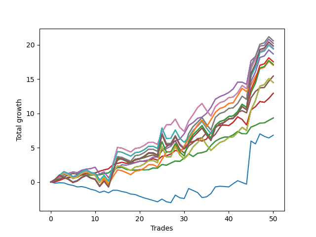

# Long Shepard 004 
- Symbol: SPY_Unlimited
- Date Range: 03/23/2022 - 07/08/2022
- Trading Period: 7:20-12:30
- Number of Trades: 50



| Name | Win Percent | Profit | Avg Profit / Trade | Avg Time / Trade |      | Name | Win Percent | Profit | Avg Profit / Trade | Avg Time / Trade |
| ---- | ----------- | ------ | ------------------ | ---------------- | ---- | ---- | ----------- | ------ | ------------------ | ---------------- |
| Sorted By <br> Profit | | | | | | Sorted By <br> Win Percentage ||||
| Sixty-Nine | 64.00 | 10295.00 | 205.90 | 27:13 |     | Sixty-Six | 86.00 | 10110.00 | 202.20 | 14:20 |
| Sixty-One | 64.00 | 10295.00 | 205.90 | 27:13 |     | Fifty-Eight | 86.00 | 10110.00 | 202.20 | 14:20 |
| Fifty-Three | 64.00 | 10295.00 | 205.90 | 27:13 |     | Fifty | 86.00 | 10110.00 | 202.20 | 14:20 |
| Forty-Five | 64.00 | 10295.00 | 205.90 | 27:13 |     | Forty-Two | 86.00 | 10110.00 | 202.20 | 14:20 |
| Five | 64.00 | 10295.00 | 205.90 | 27:13 |     | Two | 86.00 | 10110.00 | 202.20 | 14:20 |
| Sixty-Six | 86.00 | 10110.00 | 202.20 | 14:20 |     | Sixty-Five | 80.00 | 6470.00 | 129.40 | 09:57 |
| Fifty-Eight | 86.00 | 10110.00 | 202.20 | 14:20 |     | Fifty-Seven | 80.00 | 6470.00 | 129.40 | 09:57 |
| Fifty | 86.00 | 10110.00 | 202.20 | 14:20 |     | Forty-Nine | 80.00 | 6470.00 | 129.40 | 09:57 |
| Forty-Two | 86.00 | 10110.00 | 202.20 | 14:20 |     | Forty-One | 80.00 | 6470.00 | 129.40 | 09:57 |
| Two | 86.00 | 10110.00 | 202.20 | 14:20 |     | One | 80.00 | 6470.00 | 129.40 | 09:57 |
| One Hundred Thirty | 64.00 | 9915.00 | 198.30 | 29:24 |     | Sixty-Seven | 78.00 | 7725.00 | 154.50 | 17:15 |
| One Hundred Twenty-Five | 64.00 | 9915.00 | 198.30 | 29:24 |     | Fifty-Nine | 78.00 | 7725.00 | 154.50 | 17:15 |
| One Hundred Twenty | 64.00 | 9915.00 | 198.30 | 29:24 |     | Fifty-One | 78.00 | 7725.00 | 154.50 | 17:15 |
| One Hundred Fifteen | 64.00 | 9915.00 | 198.30 | 29:24 |     | Forty-Three | 78.00 | 7725.00 | 154.50 | 17:15 |
| Eighty-Five | 64.00 | 9915.00 | 198.30 | 29:24 |     | Three | 78.00 | 7725.00 | 154.50 | 17:15 |
| Sixty-Eight | 68.00 | 9750.00 | 195.00 | 23:37 |     | Sixty-Four | 78.00 | 4670.00 | 93.40 | 04:40 |
| Sixty | 68.00 | 9750.00 | 195.00 | 23:37 |     | Fifty-Six | 78.00 | 4670.00 | 93.40 | 04:40 |
| Fifty-Two | 68.00 | 9750.00 | 195.00 | 23:37 |     | Forty-Eight | 78.00 | 4670.00 | 93.40 | 04:40 |
| Forty-Four | 68.00 | 9750.00 | 195.00 | 23:37 |     | Forty | 78.00 | 4670.00 | 93.40 | 04:40 |
| Four | 68.00 | 9750.00 | 195.00 | 23:37 |     | Zero | 78.00 | 4670.00 | 93.40 | 04:40 |
| Seventy-One | 66.00 | 9700.00 | 194.00 | 28:04 |     | One Hundred Twenty-Six | 70.00 | 8510.00 | 170.20 | 24:13 |
| Sixty-Three | 66.00 | 9700.00 | 194.00 | 28:04 |     | One Hundred Twenty-One | 70.00 | 8510.00 | 170.20 | 24:13 |
| Fifty-Five | 66.00 | 9700.00 | 194.00 | 28:04 |     | One Hundred Sixteen | 70.00 | 8510.00 | 170.20 | 24:13 |
| Forty-Seven | 66.00 | 9700.00 | 194.00 | 28:04 |     | One Hundred Eleven | 70.00 | 8510.00 | 170.20 | 24:13 |
| Seven | 66.00 | 9700.00 | 194.00 | 28:04 |     | Eighty-One | 70.00 | 8510.00 | 170.20 | 24:13 |
| One Hundred Twenty-Nine | 64.00 | 9335.00 | 186.70 | 29:21 |     | Sixty-Eight | 68.00 | 9750.00 | 195.00 | 23:37 |
| One Hundred Twenty-Four | 64.00 | 9335.00 | 186.70 | 29:21 |     | Sixty | 68.00 | 9750.00 | 195.00 | 23:37 |
| One Hundred Ninteen | 64.00 | 9335.00 | 186.70 | 29:21 |     | Fifty-Two | 68.00 | 9750.00 | 195.00 | 23:37 |
| One Hundred Fourteen | 64.00 | 9335.00 | 186.70 | 29:21 |     | Forty-Four | 68.00 | 9750.00 | 195.00 | 23:37 |
| Eighty-Four | 64.00 | 9335.00 | 186.70 | 29:21 |     | Four | 68.00 | 9750.00 | 195.00 | 23:37 |
| One Hundred Twenty-Eight | 64.00 | 8765.00 | 175.30 | 29:20 |     | Seventy-One | 66.00 | 9700.00 | 194.00 | 28:04 |
| One Hundred Twenty-Three | 64.00 | 8765.00 | 175.30 | 29:20 |     | Sixty-Three | 66.00 | 9700.00 | 194.00 | 28:04 |
| One Hundred Eighteen | 64.00 | 8765.00 | 175.30 | 29:20 |     | Fifty-Five | 66.00 | 9700.00 | 194.00 | 28:04 |
| One Hundred Thirteen | 64.00 | 8765.00 | 175.30 | 29:20 |     | Forty-Seven | 66.00 | 9700.00 | 194.00 | 28:04 |
| Eighty-Three | 64.00 | 8765.00 | 175.30 | 29:20 |     | Seven | 66.00 | 9700.00 | 194.00 | 28:04 |
| One Hundred Twenty-Seven | 64.00 | 8560.00 | 171.20 | 27:31 |     | Seventy | 66.00 | 7250.00 | 145.00 | 26:57 |
| One Hundred Twenty-Two | 64.00 | 8560.00 | 171.20 | 27:31 |     | Sixty-Two | 66.00 | 7250.00 | 145.00 | 26:57 |
| One Hundred Seventeen | 64.00 | 8560.00 | 171.20 | 27:31 |     | Fifty-Four | 66.00 | 7250.00 | 145.00 | 26:57 |
| One Hundred Twelve | 64.00 | 8560.00 | 171.20 | 27:31 |     | Forty-Six | 66.00 | 7250.00 | 145.00 | 26:57 |
| Eighty-Two | 64.00 | 8560.00 | 171.20 | 27:31 |     | Six | 66.00 | 7250.00 | 145.00 | 26:57 |
| One Hundred Twenty-Six | 70.00 | 8510.00 | 170.20 | 24:13 |     | Sixty-Nine | 64.00 | 10295.00 | 205.90 | 27:13 |
| One Hundred Twenty-One | 70.00 | 8510.00 | 170.20 | 24:13 |     | Sixty-One | 64.00 | 10295.00 | 205.90 | 27:13 |
| One Hundred Sixteen | 70.00 | 8510.00 | 170.20 | 24:13 |     | Fifty-Three | 64.00 | 10295.00 | 205.90 | 27:13 |
| One Hundred Eleven | 70.00 | 8510.00 | 170.20 | 24:13 |     | Forty-Five | 64.00 | 10295.00 | 205.90 | 27:13 |
| Eighty-One | 70.00 | 8510.00 | 170.20 | 24:13 |     | Five | 64.00 | 10295.00 | 205.90 | 27:13 |
| Sixty-Seven | 78.00 | 7725.00 | 154.50 | 17:15 |     | One Hundred Thirty | 64.00 | 9915.00 | 198.30 | 29:24 |
| Fifty-Nine | 78.00 | 7725.00 | 154.50 | 17:15 |     | One Hundred Twenty-Five | 64.00 | 9915.00 | 198.30 | 29:24 |
| Fifty-One | 78.00 | 7725.00 | 154.50 | 17:15 |     | One Hundred Twenty | 64.00 | 9915.00 | 198.30 | 29:24 |
| Forty-Three | 78.00 | 7725.00 | 154.50 | 17:15 |     | One Hundred Fifteen | 64.00 | 9915.00 | 198.30 | 29:24 |
| Three | 78.00 | 7725.00 | 154.50 | 17:15 |     | Eighty-Five | 64.00 | 9915.00 | 198.30 | 29:24 |
| Seventy | 66.00 | 7250.00 | 145.00 | 26:57 |     | One Hundred Twenty-Nine | 64.00 | 9335.00 | 186.70 | 29:21 |
| Sixty-Two | 66.00 | 7250.00 | 145.00 | 26:57 |     | One Hundred Twenty-Four | 64.00 | 9335.00 | 186.70 | 29:21 |
| Fifty-Four | 66.00 | 7250.00 | 145.00 | 26:57 |     | One Hundred Ninteen | 64.00 | 9335.00 | 186.70 | 29:21 |
| Forty-Six | 66.00 | 7250.00 | 145.00 | 26:57 |     | One Hundred Fourteen | 64.00 | 9335.00 | 186.70 | 29:21 |
| Six | 66.00 | 7250.00 | 145.00 | 26:57 |     | Eighty-Four | 64.00 | 9335.00 | 186.70 | 29:21 |
| Sixty-Five | 80.00 | 6470.00 | 129.40 | 09:57 |     | One Hundred Twenty-Eight | 64.00 | 8765.00 | 175.30 | 29:20 |
| Fifty-Seven | 80.00 | 6470.00 | 129.40 | 09:57 |     | One Hundred Twenty-Three | 64.00 | 8765.00 | 175.30 | 29:20 |
| Forty-Nine | 80.00 | 6470.00 | 129.40 | 09:57 |     | One Hundred Eighteen | 64.00 | 8765.00 | 175.30 | 29:20 |
| Forty-One | 80.00 | 6470.00 | 129.40 | 09:57 |     | One Hundred Thirteen | 64.00 | 8765.00 | 175.30 | 29:20 |
| One | 80.00 | 6470.00 | 129.40 | 09:57 |     | Eighty-Three | 64.00 | 8765.00 | 175.30 | 29:20 |
| Sixty-Four | 78.00 | 4670.00 | 93.40 | 04:40 |     | One Hundred Twenty-Seven | 64.00 | 8560.00 | 171.20 | 27:31 |
| Fifty-Six | 78.00 | 4670.00 | 93.40 | 04:40 |     | One Hundred Twenty-Two | 64.00 | 8560.00 | 171.20 | 27:31 |
| Forty-Eight | 78.00 | 4670.00 | 93.40 | 04:40 |     | One Hundred Seventeen | 64.00 | 8560.00 | 171.20 | 27:31 |
| Forty | 78.00 | 4670.00 | 93.40 | 04:40 |     | One Hundred Twelve | 64.00 | 8560.00 | 171.20 | 27:31 |
| Zero | 78.00 | 4670.00 | 93.40 | 04:40 |     | Eighty-Two | 64.00 | 8560.00 | 171.20 | 27:31 |
| Seventy-Three | 32.00 | 3415.00 | 68.30 | 06:35 |     | Seventy-Three | 32.00 | 3415.00 | 68.30 | 06:35 |

## NO STOPLOSS

### Test Zero
* Sell when price hits the middle line of the 20p bollinger
* No Stoploss
* Results:
```
Total Trades: 50
Percent Up: 78.00
Percent Down: 22.00
Total Points Moved Up: 9.34
Potential Profit: 4670.00
Total Points Ups: 10.79 Count Ups: 39
Total Points Downs: -1.45 Count Downs: 11
```

<details><summary>Trades</summary>

<code>In: 2022-03-23 10:32:00		Out: 2022-03-23 10:38:15		Total Position Time: 06:15		Total Move Up: 0.14		Total to Date: 0.14</code> <br />
<code>In: 2022-03-23 11:17:00		Out: 2022-03-23 11:18:00		Total Position Time: 01:00		Total Move Up: 0.23		Total to Date: 0.37</code> <br />
<code>In: 2022-03-30 07:35:00		Out: 2022-03-30 07:36:25		Total Position Time: 01:25		Total Move Up: 0.16		Total to Date: 0.53</code> <br />
<code>In: 2022-03-31 09:30:00		Out: 2022-03-31 09:32:25		Total Position Time: 02:25		Total Move Up: 0.15		Total to Date: 0.68</code> <br />
<code>In: 2022-03-31 09:37:00		Out: 2022-03-31 09:37:10		Total Position Time: 00:10		Total Move Up: 0.03		Total to Date: 0.71</code> <br />
<code>In: 2022-03-31 10:02:00		Out: 2022-03-31 10:04:00		Total Position Time: 02:00		Total Move Up: 0.09		Total to Date: 0.80</code> <br />
<code>In: 2022-03-31 10:18:00		Out: 2022-03-31 10:19:00		Total Position Time: 01:00		Total Move Up: 0.20		Total to Date: 1.00</code> <br />
<code>In: 2022-03-31 10:19:00		Out: 2022-03-31 10:19:10		Total Position Time: 00:10		Total Move Up: 0.06		Total to Date: 1.06</code> <br />
<code>In: 2022-03-31 11:13:00		Out: 2022-03-31 11:22:10		Total Position Time: 09:10		Total Move Up: -0.06		Total to Date: 1.00</code> <br />
<code>In: 2022-03-31 11:21:00		Out: 2022-03-31 11:22:10		Total Position Time: 01:10		Total Move Up: 0.06		Total to Date: 1.06</code> <br />
<code>In: 2022-04-01 08:48:00		Out: 2022-04-01 08:53:05		Total Position Time: 05:05		Total Move Up: -0.01		Total to Date: 1.05</code> <br />
<code>In: 2022-04-01 10:23:00		Out: 2022-04-01 10:23:20		Total Position Time: 00:20		Total Move Up: 0.18		Total to Date: 1.23</code> <br />
<code>In: 2022-04-05 12:17:00		Out: 2022-04-05 12:23:40		Total Position Time: 06:40		Total Move Up: 0.11		Total to Date: 1.34</code> <br />
<code>In: 2022-04-06 11:21:00		Out: 2022-04-06 11:25:30		Total Position Time: 04:30		Total Move Up: 0.56		Total to Date: 1.90</code> <br />
<code>In: 2022-04-06 11:22:00		Out: 2022-04-06 11:25:30		Total Position Time: 03:30		Total Move Up: 0.17		Total to Date: 2.07</code> <br />
<code>In: 2022-04-07 08:36:00		Out: 2022-04-07 08:36:10		Total Position Time: 00:10		Total Move Up: 0.08		Total to Date: 2.15</code> <br />
<code>In: 2022-04-11 07:35:00		Out: 2022-04-11 07:51:10		Total Position Time: 16:10		Total Move Up: -0.30		Total to Date: 1.85</code> <br />
<code>In: 2022-04-11 07:39:00		Out: 2022-04-11 07:51:10		Total Position Time: 12:10		Total Move Up: -0.11		Total to Date: 1.74</code> <br />
<code>In: 2022-04-11 08:18:00		Out: 2022-04-11 08:26:20		Total Position Time: 08:20		Total Move Up: 0.00		Total to Date: 1.74</code> <br />
<code>In: 2022-04-12 09:32:00		Out: 2022-04-12 09:41:30		Total Position Time: 09:30		Total Move Up: 0.06		Total to Date: 1.80</code> <br />
<code>In: 2022-04-18 09:21:00		Out: 2022-04-18 09:32:05		Total Position Time: 11:05		Total Move Up: -0.03		Total to Date: 1.77</code> <br />
<code>In: 2022-04-18 09:24:00		Out: 2022-04-18 09:32:05		Total Position Time: 08:05		Total Move Up: 0.02		Total to Date: 1.79</code> <br />
<code>In: 2022-04-21 07:58:00		Out: 2022-04-21 08:01:10		Total Position Time: 03:10		Total Move Up: 0.26		Total to Date: 2.05</code> <br />
<code>In: 2022-04-21 09:12:00		Out: 2022-04-21 09:19:05		Total Position Time: 07:05		Total Move Up: -0.02		Total to Date: 2.03</code> <br />
<code>In: 2022-04-25 08:55:00		Out: 2022-04-25 08:57:10		Total Position Time: 02:10		Total Move Up: 0.53		Total to Date: 2.56</code> <br />
<code>In: 2022-05-02 10:56:00		Out: 2022-05-02 10:59:15		Total Position Time: 03:15		Total Move Up: -0.11		Total to Date: 2.45</code> <br />
<code>In: 2022-05-02 11:22:00		Out: 2022-05-02 11:28:00		Total Position Time: 06:00		Total Move Up: 0.32		Total to Date: 2.77</code> <br />
<code>In: 2022-05-04 08:37:00		Out: 2022-05-04 08:39:25		Total Position Time: 02:25		Total Move Up: 0.30		Total to Date: 3.07</code> <br />
<code>In: 2022-05-09 07:35:00		Out: 2022-05-09 07:42:30		Total Position Time: 07:30		Total Move Up: -0.06		Total to Date: 3.01</code> <br />
<code>In: 2022-05-09 07:42:00		Out: 2022-05-09 07:42:30		Total Position Time: 00:30		Total Move Up: 0.49		Total to Date: 3.50</code> <br />
<code>In: 2022-05-09 08:34:00		Out: 2022-05-09 08:35:10		Total Position Time: 01:10		Total Move Up: 0.62		Total to Date: 4.12</code> <br />
<code>In: 2022-05-11 10:50:00		Out: 2022-05-11 11:00:40		Total Position Time: 10:40		Total Move Up: -0.40		Total to Date: 3.72</code> <br />
<code>In: 2022-05-12 11:45:00		Out: 2022-05-12 11:45:20		Total Position Time: 00:20		Total Move Up: 0.47		Total to Date: 4.19</code> <br />
<code>In: 2022-05-12 11:46:00		Out: 2022-05-12 11:46:10		Total Position Time: 00:10		Total Move Up: 0.10		Total to Date: 4.29</code> <br />
<code>In: 2022-05-18 07:40:00		Out: 2022-05-18 07:46:15		Total Position Time: 06:15		Total Move Up: 0.20		Total to Date: 4.49</code> <br />
<code>In: 2022-05-24 07:21:00		Out: 2022-05-24 07:23:15		Total Position Time: 02:15		Total Move Up: 0.84		Total to Date: 5.33</code> <br />
<code>In: 2022-06-02 07:30:00		Out: 2022-06-02 07:34:10		Total Position Time: 04:10		Total Move Up: 0.63		Total to Date: 5.96</code> <br />
<code>In: 2022-06-06 08:24:00		Out: 2022-06-06 08:31:35		Total Position Time: 07:35		Total Move Up: 0.36		Total to Date: 6.32</code> <br />
<code>In: 2022-06-06 08:27:00		Out: 2022-06-06 08:31:35		Total Position Time: 04:35		Total Move Up: 0.23		Total to Date: 6.55</code> <br />
<code>In: 2022-06-06 09:17:00		Out: 2022-06-06 09:26:35		Total Position Time: 09:35		Total Move Up: 0.01		Total to Date: 6.56</code> <br />
<code>In: 2022-06-08 09:48:00		Out: 2022-06-08 09:53:00		Total Position Time: 05:00		Total Move Up: 0.32		Total to Date: 6.88</code> <br />
<code>In: 2022-06-08 10:41:00		Out: 2022-06-08 10:42:15		Total Position Time: 01:15		Total Move Up: 0.50		Total to Date: 7.38</code> <br />
<code>In: 2022-06-14 07:23:00		Out: 2022-06-14 07:37:00		Total Position Time: 14:00		Total Move Up: -0.34		Total to Date: 7.04</code> <br />
<code>In: 2022-06-14 11:58:00		Out: 2022-06-14 12:04:30		Total Position Time: 06:30		Total Move Up: -0.01		Total to Date: 7.03</code> <br />
<code>In: 2022-06-15 11:36:00		Out: 2022-06-15 11:37:20		Total Position Time: 01:20		Total Move Up: 0.98		Total to Date: 8.01</code> <br />
<code>In: 2022-06-16 07:55:00		Out: 2022-06-16 08:01:00		Total Position Time: 06:00		Total Move Up: 0.26		Total to Date: 8.27</code> <br />
<code>In: 2022-06-16 11:57:00		Out: 2022-06-16 12:00:20		Total Position Time: 03:20		Total Move Up: 0.33		Total to Date: 8.60</code> <br />
<code>In: 2022-06-23 09:49:00		Out: 2022-06-23 09:49:10		Total Position Time: 00:10		Total Move Up: 0.02		Total to Date: 8.62</code> <br />
<code>In: 2022-06-29 09:32:00		Out: 2022-06-29 09:36:40		Total Position Time: 04:40		Total Move Up: 0.37		Total to Date: 8.99</code> <br />
<code>In: 2022-07-06 08:12:00		Out: 2022-07-06 08:14:30		Total Position Time: 02:30		Total Move Up: 0.35		Total to Date: 9.34</code> <br />


</details>

### Test One
* Sell when the price hits the upper line of the 20p 1std bollinger
* No Stoploss
* Results:
```
Total Trades: 50
Percent Up: 80.00
Percent Down: 20.00
Total Points Moved Up: 12.94
Potential Profit: 6470.00
Total Points Ups: 15.04 Count Ups: 40
Total Points Downs: -2.10 Count Downs: 10
```

<details><summary>Trades</summary>

<code>In: 2022-03-23 10:32:00		Out: 2022-03-23 10:51:45		Total Position Time: 19:45		Total Move Up: 0.03		Total to Date: 0.03</code> <br />
<code>In: 2022-03-23 11:17:00		Out: 2022-03-23 11:26:05		Total Position Time: 09:05		Total Move Up: 0.22		Total to Date: 0.25</code> <br />
<code>In: 2022-03-30 07:35:00		Out: 2022-03-30 07:38:30		Total Position Time: 03:30		Total Move Up: 0.26		Total to Date: 0.51</code> <br />
<code>In: 2022-03-31 09:30:00		Out: 2022-03-31 09:40:45		Total Position Time: 10:45		Total Move Up: 0.14		Total to Date: 0.65</code> <br />
<code>In: 2022-03-31 09:37:00		Out: 2022-03-31 09:40:45		Total Position Time: 03:45		Total Move Up: 0.09		Total to Date: 0.74</code> <br />
<code>In: 2022-03-31 10:02:00		Out: 2022-03-31 10:19:40		Total Position Time: 17:40		Total Move Up: -0.05		Total to Date: 0.69</code> <br />
<code>In: 2022-03-31 10:18:00		Out: 2022-03-31 10:19:40		Total Position Time: 01:40		Total Move Up: 0.39		Total to Date: 1.08</code> <br />
<code>In: 2022-03-31 10:19:00		Out: 2022-03-31 10:19:40		Total Position Time: 00:40		Total Move Up: 0.19		Total to Date: 1.27</code> <br />
<code>In: 2022-03-31 11:13:00		Out: 2022-03-31 11:29:15		Total Position Time: 16:15		Total Move Up: -0.03		Total to Date: 1.24</code> <br />
<code>In: 2022-03-31 11:21:00		Out: 2022-03-31 11:29:15		Total Position Time: 08:15		Total Move Up: 0.09		Total to Date: 1.33</code> <br />
<code>In: 2022-04-01 08:48:00		Out: 2022-04-01 08:54:00		Total Position Time: 06:00		Total Move Up: 0.25		Total to Date: 1.58</code> <br />
<code>In: 2022-04-01 10:23:00		Out: 2022-04-01 10:29:05		Total Position Time: 06:05		Total Move Up: 0.19		Total to Date: 1.77</code> <br />
<code>In: 2022-04-05 12:17:00		Out: 2022-04-05 12:25:05		Total Position Time: 08:05		Total Move Up: 0.16		Total to Date: 1.93</code> <br />
<code>In: 2022-04-06 11:21:00		Out: 2022-04-06 11:30:30		Total Position Time: 09:30		Total Move Up: 0.59		Total to Date: 2.52</code> <br />
<code>In: 2022-04-06 11:22:00		Out: 2022-04-06 11:30:30		Total Position Time: 08:30		Total Move Up: 0.20		Total to Date: 2.72</code> <br />
<code>In: 2022-04-07 08:36:00		Out: 2022-04-07 08:47:05		Total Position Time: 11:05		Total Move Up: 0.16		Total to Date: 2.88</code> <br />
<code>In: 2022-04-11 07:35:00		Out: 2022-04-11 07:52:00		Total Position Time: 17:00		Total Move Up: -0.15		Total to Date: 2.73</code> <br />
<code>In: 2022-04-11 07:39:00		Out: 2022-04-11 07:52:00		Total Position Time: 13:00		Total Move Up: 0.04		Total to Date: 2.77</code> <br />
<code>In: 2022-04-11 08:18:00		Out: 2022-04-11 08:29:55		Total Position Time: 11:55		Total Move Up: 0.08		Total to Date: 2.85</code> <br />
<code>In: 2022-04-12 09:32:00		Out: 2022-04-12 09:50:15		Total Position Time: 18:15		Total Move Up: 0.19		Total to Date: 3.04</code> <br />
<code>In: 2022-04-18 09:21:00		Out: 2022-04-18 09:35:10		Total Position Time: 14:10		Total Move Up: 0.00		Total to Date: 3.04</code> <br />
<code>In: 2022-04-18 09:24:00		Out: 2022-04-18 09:35:10		Total Position Time: 11:10		Total Move Up: 0.05		Total to Date: 3.09</code> <br />
<code>In: 2022-04-21 07:58:00		Out: 2022-04-21 08:05:05		Total Position Time: 07:05		Total Move Up: 0.32		Total to Date: 3.41</code> <br />
<code>In: 2022-04-21 09:12:00		Out: 2022-04-21 09:34:10		Total Position Time: 22:10		Total Move Up: -0.22		Total to Date: 3.19</code> <br />
<code>In: 2022-04-25 08:55:00		Out: 2022-04-25 09:03:45		Total Position Time: 08:45		Total Move Up: 0.56		Total to Date: 3.75</code> <br />
<code>In: 2022-05-02 10:56:00		Out: 2022-05-02 11:02:25		Total Position Time: 06:25		Total Move Up: 0.09		Total to Date: 3.84</code> <br />
<code>In: 2022-05-02 11:22:00		Out: 2022-05-02 11:32:20		Total Position Time: 10:20		Total Move Up: 0.26		Total to Date: 4.10</code> <br />
<code>In: 2022-05-04 08:37:00		Out: 2022-05-04 08:40:55		Total Position Time: 03:55		Total Move Up: 0.50		Total to Date: 4.60</code> <br />
<code>In: 2022-05-09 07:35:00		Out: 2022-05-09 07:45:10		Total Position Time: 10:10		Total Move Up: -0.10		Total to Date: 4.50</code> <br />
<code>In: 2022-05-09 07:42:00		Out: 2022-05-09 07:45:10		Total Position Time: 03:10		Total Move Up: 0.45		Total to Date: 4.95</code> <br />
<code>In: 2022-05-09 08:34:00		Out: 2022-05-09 08:38:35		Total Position Time: 04:35		Total Move Up: 0.74		Total to Date: 5.69</code> <br />
<code>In: 2022-05-11 10:50:00		Out: 2022-05-11 11:01:20		Total Position Time: 11:20		Total Move Up: 0.22		Total to Date: 5.91</code> <br />
<code>In: 2022-05-12 11:45:00		Out: 2022-05-12 11:52:05		Total Position Time: 07:05		Total Move Up: 0.25		Total to Date: 6.16</code> <br />
<code>In: 2022-05-12 11:46:00		Out: 2022-05-12 11:52:05		Total Position Time: 06:05		Total Move Up: -0.18		Total to Date: 5.98</code> <br />
<code>In: 2022-05-18 07:40:00		Out: 2022-05-18 07:48:05		Total Position Time: 08:05		Total Move Up: 0.28		Total to Date: 6.26</code> <br />
<code>In: 2022-05-24 07:21:00		Out: 2022-05-24 07:29:45		Total Position Time: 08:45		Total Move Up: 0.94		Total to Date: 7.20</code> <br />
<code>In: 2022-06-02 07:30:00		Out: 2022-06-02 07:38:35		Total Position Time: 08:35		Total Move Up: 0.90		Total to Date: 8.10</code> <br />
<code>In: 2022-06-06 08:24:00		Out: 2022-06-06 08:39:15		Total Position Time: 15:15		Total Move Up: 0.17		Total to Date: 8.27</code> <br />
<code>In: 2022-06-06 08:27:00		Out: 2022-06-06 08:39:15		Total Position Time: 12:15		Total Move Up: 0.04		Total to Date: 8.31</code> <br />
<code>In: 2022-06-06 09:17:00		Out: 2022-06-06 09:35:30		Total Position Time: 18:30		Total Move Up: -0.07		Total to Date: 8.24</code> <br />
<code>In: 2022-06-08 09:48:00		Out: 2022-06-08 09:59:05		Total Position Time: 11:05		Total Move Up: 0.47		Total to Date: 8.71</code> <br />
<code>In: 2022-06-08 10:41:00		Out: 2022-06-08 10:47:05		Total Position Time: 06:05		Total Move Up: 0.80		Total to Date: 9.51</code> <br />
<code>In: 2022-06-14 07:23:00		Out: 2022-06-14 07:47:05		Total Position Time: 24:05		Total Move Up: -0.38		Total to Date: 9.13</code> <br />
<code>In: 2022-06-14 11:58:00		Out: 2022-06-14 12:26:35		Total Position Time: 28:35		Total Move Up: -0.80		Total to Date: 8.33</code> <br />
<code>In: 2022-06-15 11:36:00		Out: 2022-06-15 11:38:05		Total Position Time: 02:05		Total Move Up: 2.18		Total to Date: 10.51</code> <br />
<code>In: 2022-06-16 07:55:00		Out: 2022-06-16 08:02:05		Total Position Time: 07:05		Total Move Up: 0.48		Total to Date: 10.99</code> <br />
<code>In: 2022-06-16 11:57:00		Out: 2022-06-16 12:01:05		Total Position Time: 04:05		Total Move Up: 0.75		Total to Date: 11.74</code> <br />
<code>In: 2022-06-23 09:49:00		Out: 2022-06-23 09:54:15		Total Position Time: 05:15		Total Move Up: -0.12		Total to Date: 11.62</code> <br />
<code>In: 2022-06-29 09:32:00		Out: 2022-06-29 09:37:15		Total Position Time: 05:15		Total Move Up: 0.58		Total to Date: 12.20</code> <br />
<code>In: 2022-07-06 08:12:00		Out: 2022-07-06 08:17:50		Total Position Time: 05:50		Total Move Up: 0.74		Total to Date: 12.94</code> <br />


</details>

### Test Two
* Sell when the price hits the upper line of the 20p 2std bollinger
* No Stoploss
* Results:
```
Total Trades: 50
Percent Up: 86.00
Percent Down: 14.00
Total Points Moved Up: 20.22
Potential Profit: 10110.00
Total Points Ups: 23.13 Count Ups: 43
Total Points Downs: -2.91 Count Downs: 7
```

<details><summary>Trades</summary>

<code>In: 2022-03-23 10:32:00		Out: 2022-03-23 10:54:25		Total Position Time: 22:25		Total Move Up: 0.24		Total to Date: 0.24</code> <br />
<code>In: 2022-03-23 11:17:00		Out: 2022-03-23 11:27:00		Total Position Time: 10:00		Total Move Up: 0.45		Total to Date: 0.69</code> <br />
<code>In: 2022-03-30 07:35:00		Out: 2022-03-30 07:46:00		Total Position Time: 11:00		Total Move Up: 0.33		Total to Date: 1.02</code> <br />
<code>In: 2022-03-31 09:30:00		Out: 2022-03-31 09:44:20		Total Position Time: 14:20		Total Move Up: 0.25		Total to Date: 1.27</code> <br />
<code>In: 2022-03-31 09:37:00		Out: 2022-03-31 09:44:20		Total Position Time: 07:20		Total Move Up: 0.20		Total to Date: 1.47</code> <br />
<code>In: 2022-03-31 10:02:00		Out: 2022-03-31 10:27:25		Total Position Time: 25:25		Total Move Up: -0.09		Total to Date: 1.38</code> <br />
<code>In: 2022-03-31 10:18:00		Out: 2022-03-31 10:27:25		Total Position Time: 09:25		Total Move Up: 0.35		Total to Date: 1.73</code> <br />
<code>In: 2022-03-31 10:19:00		Out: 2022-03-31 10:27:25		Total Position Time: 08:25		Total Move Up: 0.15		Total to Date: 1.88</code> <br />
<code>In: 2022-03-31 11:13:00		Out: 2022-03-31 11:29:25		Total Position Time: 16:25		Total Move Up: 0.08		Total to Date: 1.96</code> <br />
<code>In: 2022-03-31 11:21:00		Out: 2022-03-31 11:29:25		Total Position Time: 08:25		Total Move Up: 0.20		Total to Date: 2.16</code> <br />
<code>In: 2022-04-01 08:48:00		Out: 2022-04-01 09:17:55		Total Position Time: 29:55		Total Move Up: -1.01		Total to Date: 1.15</code> <br />
<code>In: 2022-04-01 10:23:00		Out: 2022-04-01 10:30:30		Total Position Time: 07:30		Total Move Up: 0.33		Total to Date: 1.48</code> <br />
<code>In: 2022-04-05 12:17:00		Out: 2022-04-05 12:46:00		Total Position Time: 29:00		Total Move Up: -0.85		Total to Date: 0.63</code> <br />
<code>In: 2022-04-06 11:21:00		Out: 2022-04-06 11:31:55		Total Position Time: 10:55		Total Move Up: 0.94		Total to Date: 1.57</code> <br />
<code>In: 2022-04-06 11:22:00		Out: 2022-04-06 11:31:55		Total Position Time: 09:55		Total Move Up: 0.55		Total to Date: 2.12</code> <br />
<code>In: 2022-04-07 08:36:00		Out: 2022-04-07 08:48:05		Total Position Time: 12:05		Total Move Up: 0.39		Total to Date: 2.51</code> <br />
<code>In: 2022-04-11 07:35:00		Out: 2022-04-11 07:54:25		Total Position Time: 19:25		Total Move Up: -0.04		Total to Date: 2.47</code> <br />
<code>In: 2022-04-11 07:39:00		Out: 2022-04-11 07:54:25		Total Position Time: 15:25		Total Move Up: 0.15		Total to Date: 2.62</code> <br />
<code>In: 2022-04-11 08:18:00		Out: 2022-04-11 08:30:50		Total Position Time: 12:50		Total Move Up: 0.20		Total to Date: 2.82</code> <br />
<code>In: 2022-04-12 09:32:00		Out: 2022-04-12 09:50:15		Total Position Time: 18:15		Total Move Up: 0.19		Total to Date: 3.01</code> <br />
<code>In: 2022-04-18 09:21:00		Out: 2022-04-18 09:35:25		Total Position Time: 14:25		Total Move Up: 0.08		Total to Date: 3.09</code> <br />
<code>In: 2022-04-18 09:24:00		Out: 2022-04-18 09:35:25		Total Position Time: 11:25		Total Move Up: 0.13		Total to Date: 3.22</code> <br />
<code>In: 2022-04-21 07:58:00		Out: 2022-04-21 08:11:45		Total Position Time: 13:45		Total Move Up: 0.41		Total to Date: 3.63</code> <br />
<code>In: 2022-04-21 09:12:00		Out: 2022-04-21 09:35:55		Total Position Time: 23:55		Total Move Up: 0.02		Total to Date: 3.65</code> <br />
<code>In: 2022-04-25 08:55:00		Out: 2022-04-25 09:05:10		Total Position Time: 10:10		Total Move Up: 0.90		Total to Date: 4.55</code> <br />
<code>In: 2022-05-02 10:56:00		Out: 2022-05-02 11:03:45		Total Position Time: 07:45		Total Move Up: 0.33		Total to Date: 4.88</code> <br />
<code>In: 2022-05-02 11:22:00		Out: 2022-05-02 11:33:30		Total Position Time: 11:30		Total Move Up: 0.34		Total to Date: 5.22</code> <br />
<code>In: 2022-05-04 08:37:00		Out: 2022-05-04 08:47:05		Total Position Time: 10:05		Total Move Up: 0.81		Total to Date: 6.03</code> <br />
<code>In: 2022-05-09 07:35:00		Out: 2022-05-09 07:48:05		Total Position Time: 13:05		Total Move Up: 0.23		Total to Date: 6.26</code> <br />
<code>In: 2022-05-09 07:42:00		Out: 2022-05-09 07:48:05		Total Position Time: 06:05		Total Move Up: 0.78		Total to Date: 7.04</code> <br />
<code>In: 2022-05-09 08:34:00		Out: 2022-05-09 08:39:15		Total Position Time: 05:15		Total Move Up: 1.21		Total to Date: 8.25</code> <br />
<code>In: 2022-05-11 10:50:00		Out: 2022-05-11 11:04:20		Total Position Time: 14:20		Total Move Up: 0.43		Total to Date: 8.68</code> <br />
<code>In: 2022-05-12 11:45:00		Out: 2022-05-12 11:53:00		Total Position Time: 08:00		Total Move Up: 0.61		Total to Date: 9.29</code> <br />
<code>In: 2022-05-12 11:46:00		Out: 2022-05-12 11:53:00		Total Position Time: 07:00		Total Move Up: 0.18		Total to Date: 9.47</code> <br />
<code>In: 2022-05-18 07:40:00		Out: 2022-05-18 07:48:35		Total Position Time: 08:35		Total Move Up: 0.53		Total to Date: 10.00</code> <br />
<code>In: 2022-05-24 07:21:00		Out: 2022-05-24 07:43:15		Total Position Time: 22:15		Total Move Up: 0.88		Total to Date: 10.88</code> <br />
<code>In: 2022-06-02 07:30:00		Out: 2022-06-02 07:42:40		Total Position Time: 12:40		Total Move Up: 1.20		Total to Date: 12.08</code> <br />
<code>In: 2022-06-06 08:24:00		Out: 2022-06-06 08:43:00		Total Position Time: 19:00		Total Move Up: 0.38		Total to Date: 12.46</code> <br />
<code>In: 2022-06-06 08:27:00		Out: 2022-06-06 08:43:00		Total Position Time: 16:00		Total Move Up: 0.25		Total to Date: 12.71</code> <br />
<code>In: 2022-06-06 09:17:00		Out: 2022-06-06 09:41:50		Total Position Time: 24:50		Total Move Up: 0.34		Total to Date: 13.05</code> <br />
<code>In: 2022-06-08 09:48:00		Out: 2022-06-08 09:59:15		Total Position Time: 11:15		Total Move Up: 0.53		Total to Date: 13.58</code> <br />
<code>In: 2022-06-08 10:41:00		Out: 2022-06-08 11:03:45		Total Position Time: 22:45		Total Move Up: 0.99		Total to Date: 14.57</code> <br />
<code>In: 2022-06-14 07:23:00		Out: 2022-06-14 07:47:20		Total Position Time: 24:20		Total Move Up: -0.01		Total to Date: 14.56</code> <br />
<code>In: 2022-06-14 11:58:00		Out: 2022-06-14 12:27:20		Total Position Time: 29:20		Total Move Up: -0.32		Total to Date: 14.24</code> <br />
<code>In: 2022-06-15 11:36:00		Out: 2022-06-15 11:38:45		Total Position Time: 02:45		Total Move Up: 3.45		Total to Date: 17.69</code> <br />
<code>In: 2022-06-16 07:55:00		Out: 2022-06-16 08:11:25		Total Position Time: 16:25		Total Move Up: 0.59		Total to Date: 18.28</code> <br />
<code>In: 2022-06-16 11:57:00		Out: 2022-06-16 12:04:25		Total Position Time: 07:25		Total Move Up: 1.54		Total to Date: 19.82</code> <br />
<code>In: 2022-06-23 09:49:00		Out: 2022-06-23 09:56:50		Total Position Time: 07:50		Total Move Up: 0.10		Total to Date: 19.92</code> <br />
<code>In: 2022-06-29 09:32:00		Out: 2022-06-29 09:38:35		Total Position Time: 06:35		Total Move Up: 0.89		Total to Date: 20.81</code> <br />
<code>In: 2022-07-06 08:12:00		Out: 2022-07-06 08:41:55		Total Position Time: 29:55		Total Move Up: -0.59		Total to Date: 20.22</code> <br />


</details>

### Test Three
* Sell when price hits the middle line of the 50p bollinger
* No Stoploss
* Results:
```
Total Trades: 50
Percent Up: 78.00
Percent Down: 22.00
Total Points Moved Up: 15.45
Potential Profit: 7725.00
Total Points Ups: 21.63 Count Ups: 39
Total Points Downs: -6.18 Count Downs: 11
```

<details><summary>Trades</summary>

<code>In: 2022-03-23 10:32:00		Out: 2022-03-23 10:54:30		Total Position Time: 22:30		Total Move Up: 0.31		Total to Date: 0.31</code> <br />
<code>In: 2022-03-23 11:17:00		Out: 2022-03-23 11:17:20		Total Position Time: 00:20		Total Move Up: 0.12		Total to Date: 0.43</code> <br />
<code>In: 2022-03-30 07:35:00		Out: 2022-03-30 07:46:00		Total Position Time: 11:00		Total Move Up: 0.33		Total to Date: 0.76</code> <br />
<code>In: 2022-03-31 09:30:00		Out: 2022-03-31 09:45:10		Total Position Time: 15:10		Total Move Up: 0.27		Total to Date: 1.03</code> <br />
<code>In: 2022-03-31 09:37:00		Out: 2022-03-31 09:45:10		Total Position Time: 08:10		Total Move Up: 0.22		Total to Date: 1.25</code> <br />
<code>In: 2022-03-31 10:02:00		Out: 2022-03-31 10:27:25		Total Position Time: 25:25		Total Move Up: -0.09		Total to Date: 1.16</code> <br />
<code>In: 2022-03-31 10:18:00		Out: 2022-03-31 10:27:25		Total Position Time: 09:25		Total Move Up: 0.35		Total to Date: 1.51</code> <br />
<code>In: 2022-03-31 10:19:00		Out: 2022-03-31 10:27:25		Total Position Time: 08:25		Total Move Up: 0.15		Total to Date: 1.66</code> <br />
<code>In: 2022-03-31 11:13:00		Out: 2022-03-31 11:42:55		Total Position Time: 29:55		Total Move Up: -0.39		Total to Date: 1.27</code> <br />
<code>In: 2022-03-31 11:21:00		Out: 2022-03-31 11:49:05		Total Position Time: 28:05		Total Move Up: 0.05		Total to Date: 1.32</code> <br />
<code>In: 2022-04-01 08:48:00		Out: 2022-04-01 09:17:55		Total Position Time: 29:55		Total Move Up: -1.01		Total to Date: 0.31</code> <br />
<code>In: 2022-04-01 10:23:00		Out: 2022-04-01 10:30:40		Total Position Time: 07:40		Total Move Up: 0.35		Total to Date: 0.66</code> <br />
<code>In: 2022-04-05 12:17:00		Out: 2022-04-05 12:46:00		Total Position Time: 29:00		Total Move Up: -0.85		Total to Date: -0.19</code> <br />
<code>In: 2022-04-06 11:21:00		Out: 2022-04-06 11:32:40		Total Position Time: 11:40		Total Move Up: 1.87		Total to Date: 1.68</code> <br />
<code>In: 2022-04-06 11:22:00		Out: 2022-04-06 11:32:40		Total Position Time: 10:40		Total Move Up: 1.48		Total to Date: 3.16</code> <br />
<code>In: 2022-04-07 08:36:00		Out: 2022-04-07 08:47:35		Total Position Time: 11:35		Total Move Up: 0.36		Total to Date: 3.52</code> <br />
<code>In: 2022-04-11 07:35:00		Out: 2022-04-11 08:04:55		Total Position Time: 29:55		Total Move Up: -0.29		Total to Date: 3.23</code> <br />
<code>In: 2022-04-11 07:39:00		Out: 2022-04-11 08:08:55		Total Position Time: 29:55		Total Move Up: -0.28		Total to Date: 2.95</code> <br />
<code>In: 2022-04-11 08:18:00		Out: 2022-04-11 08:30:55		Total Position Time: 12:55		Total Move Up: 0.23		Total to Date: 3.18</code> <br />
<code>In: 2022-04-12 09:32:00		Out: 2022-04-12 09:59:05		Total Position Time: 27:05		Total Move Up: 0.19		Total to Date: 3.37</code> <br />
<code>In: 2022-04-18 09:21:00		Out: 2022-04-18 09:45:10		Total Position Time: 24:10		Total Move Up: 0.18		Total to Date: 3.55</code> <br />
<code>In: 2022-04-18 09:24:00		Out: 2022-04-18 09:45:10		Total Position Time: 21:10		Total Move Up: 0.23		Total to Date: 3.78</code> <br />
<code>In: 2022-04-21 07:58:00		Out: 2022-04-21 08:27:15		Total Position Time: 29:15		Total Move Up: 0.17		Total to Date: 3.95</code> <br />
<code>In: 2022-04-21 09:12:00		Out: 2022-04-21 09:41:55		Total Position Time: 29:55		Total Move Up: -0.32		Total to Date: 3.63</code> <br />
<code>In: 2022-04-25 08:55:00		Out: 2022-04-25 09:05:20		Total Position Time: 10:20		Total Move Up: 0.97		Total to Date: 4.60</code> <br />
<code>In: 2022-05-02 10:56:00		Out: 2022-05-02 11:04:00		Total Position Time: 08:00		Total Move Up: 0.55		Total to Date: 5.15</code> <br />
<code>In: 2022-05-02 11:22:00		Out: 2022-05-02 11:45:55		Total Position Time: 23:55		Total Move Up: 0.44		Total to Date: 5.59</code> <br />
<code>In: 2022-05-04 08:37:00		Out: 2022-05-04 08:41:00		Total Position Time: 04:00		Total Move Up: 0.43		Total to Date: 6.02</code> <br />
<code>In: 2022-05-09 07:35:00		Out: 2022-05-09 08:04:55		Total Position Time: 29:55		Total Move Up: -1.22		Total to Date: 4.80</code> <br />
<code>In: 2022-05-09 07:42:00		Out: 2022-05-09 08:11:55		Total Position Time: 29:55		Total Move Up: -0.58		Total to Date: 4.22</code> <br />
<code>In: 2022-05-09 08:34:00		Out: 2022-05-09 08:39:00		Total Position Time: 05:00		Total Move Up: 1.03		Total to Date: 5.25</code> <br />
<code>In: 2022-05-11 10:50:00		Out: 2022-05-11 11:04:45		Total Position Time: 14:45		Total Move Up: 0.51		Total to Date: 5.76</code> <br />
<code>In: 2022-05-12 11:45:00		Out: 2022-05-12 11:53:05		Total Position Time: 08:05		Total Move Up: 0.56		Total to Date: 6.32</code> <br />
<code>In: 2022-05-12 11:46:00		Out: 2022-05-12 11:53:05		Total Position Time: 07:05		Total Move Up: 0.13		Total to Date: 6.45</code> <br />
<code>In: 2022-05-18 07:40:00		Out: 2022-05-18 07:48:45		Total Position Time: 08:45		Total Move Up: 0.72		Total to Date: 7.17</code> <br />
<code>In: 2022-05-24 07:21:00		Out: 2022-05-24 07:50:55		Total Position Time: 29:55		Total Move Up: -0.83		Total to Date: 6.34</code> <br />
<code>In: 2022-06-02 07:30:00		Out: 2022-06-02 07:34:10		Total Position Time: 04:10		Total Move Up: 0.63		Total to Date: 6.97</code> <br />
<code>In: 2022-06-06 08:24:00		Out: 2022-06-06 08:46:10		Total Position Time: 22:10		Total Move Up: 0.97		Total to Date: 7.94</code> <br />
<code>In: 2022-06-06 08:27:00		Out: 2022-06-06 08:46:10		Total Position Time: 19:10		Total Move Up: 0.84		Total to Date: 8.78</code> <br />
<code>In: 2022-06-06 09:17:00		Out: 2022-06-06 09:43:15		Total Position Time: 26:15		Total Move Up: 0.39		Total to Date: 9.17</code> <br />
<code>In: 2022-06-08 09:48:00		Out: 2022-06-08 10:17:55		Total Position Time: 29:55		Total Move Up: 0.09		Total to Date: 9.26</code> <br />
<code>In: 2022-06-08 10:41:00		Out: 2022-06-08 10:47:20		Total Position Time: 06:20		Total Move Up: 0.89		Total to Date: 10.15</code> <br />
<code>In: 2022-06-14 07:23:00		Out: 2022-06-14 07:48:30		Total Position Time: 25:30		Total Move Up: 0.26		Total to Date: 10.41</code> <br />
<code>In: 2022-06-14 11:58:00		Out: 2022-06-14 12:27:20		Total Position Time: 29:20		Total Move Up: -0.32		Total to Date: 10.09</code> <br />
<code>In: 2022-06-15 11:36:00		Out: 2022-06-15 11:38:05		Total Position Time: 02:05		Total Move Up: 2.18		Total to Date: 12.27</code> <br />
<code>In: 2022-06-16 07:55:00		Out: 2022-06-16 08:11:45		Total Position Time: 16:45		Total Move Up: 0.94		Total to Date: 13.21</code> <br />
<code>In: 2022-06-16 11:57:00		Out: 2022-06-16 12:00:25		Total Position Time: 03:25		Total Move Up: 0.51		Total to Date: 13.72</code> <br />
<code>In: 2022-06-23 09:49:00		Out: 2022-06-23 10:07:35		Total Position Time: 18:35		Total Move Up: 0.07		Total to Date: 13.79</code> <br />
<code>In: 2022-06-29 09:32:00		Out: 2022-06-29 09:38:30		Total Position Time: 06:30		Total Move Up: 0.90		Total to Date: 14.69</code> <br />
<code>In: 2022-07-06 08:12:00		Out: 2022-07-06 08:21:30		Total Position Time: 09:30		Total Move Up: 0.76		Total to Date: 15.45</code> <br />


</details>

### Test Four
* Sell when the price hits the upper line of the 50p 1std bollinger
* No Stoploss
* Results:
```
Total Trades: 50
Percent Up: 68.00
Percent Down: 32.00
Total Points Moved Up: 19.50
Potential Profit: 9750.00
Total Points Ups: 28.36 Count Ups: 34
Total Points Downs: -8.86 Count Downs: 16
```

<details><summary>Trades</summary>

<code>In: 2022-03-23 10:32:00		Out: 2022-03-23 11:01:55		Total Position Time: 29:55		Total Move Up: 0.37		Total to Date: 0.37</code> <br />
<code>In: 2022-03-23 11:17:00		Out: 2022-03-23 11:27:00		Total Position Time: 10:00		Total Move Up: 0.45		Total to Date: 0.82</code> <br />
<code>In: 2022-03-30 07:35:00		Out: 2022-03-30 07:51:05		Total Position Time: 16:05		Total Move Up: 0.54		Total to Date: 1.36</code> <br />
<code>In: 2022-03-31 09:30:00		Out: 2022-03-31 09:59:55		Total Position Time: 29:55		Total Move Up: -0.29		Total to Date: 1.07</code> <br />
<code>In: 2022-03-31 09:37:00		Out: 2022-03-31 10:06:55		Total Position Time: 29:55		Total Move Up: -0.45		Total to Date: 0.62</code> <br />
<code>In: 2022-03-31 10:02:00		Out: 2022-03-31 10:29:50		Total Position Time: 27:50		Total Move Up: 0.14		Total to Date: 0.76</code> <br />
<code>In: 2022-03-31 10:18:00		Out: 2022-03-31 10:29:50		Total Position Time: 11:50		Total Move Up: 0.58		Total to Date: 1.34</code> <br />
<code>In: 2022-03-31 10:19:00		Out: 2022-03-31 10:29:50		Total Position Time: 10:50		Total Move Up: 0.38		Total to Date: 1.72</code> <br />
<code>In: 2022-03-31 11:13:00		Out: 2022-03-31 11:42:55		Total Position Time: 29:55		Total Move Up: -0.39		Total to Date: 1.33</code> <br />
<code>In: 2022-03-31 11:21:00		Out: 2022-03-31 11:50:55		Total Position Time: 29:55		Total Move Up: -0.19		Total to Date: 1.14</code> <br />
<code>In: 2022-04-01 08:48:00		Out: 2022-04-01 09:17:55		Total Position Time: 29:55		Total Move Up: -1.01		Total to Date: 0.13</code> <br />
<code>In: 2022-04-01 10:23:00		Out: 2022-04-01 10:36:50		Total Position Time: 13:50		Total Move Up: 0.62		Total to Date: 0.75</code> <br />
<code>In: 2022-04-05 12:17:00		Out: 2022-04-05 12:46:00		Total Position Time: 29:00		Total Move Up: -0.85		Total to Date: -0.10</code> <br />
<code>In: 2022-04-06 11:21:00		Out: 2022-04-06 11:34:30		Total Position Time: 13:30		Total Move Up: 2.77		Total to Date: 2.67</code> <br />
<code>In: 2022-04-06 11:22:00		Out: 2022-04-06 11:34:30		Total Position Time: 12:30		Total Move Up: 2.38		Total to Date: 5.05</code> <br />
<code>In: 2022-04-07 08:36:00		Out: 2022-04-07 09:05:55		Total Position Time: 29:55		Total Move Up: -0.10		Total to Date: 4.95</code> <br />
<code>In: 2022-04-11 07:35:00		Out: 2022-04-11 08:04:55		Total Position Time: 29:55		Total Move Up: -0.29		Total to Date: 4.66</code> <br />
<code>In: 2022-04-11 07:39:00		Out: 2022-04-11 08:08:55		Total Position Time: 29:55		Total Move Up: -0.28		Total to Date: 4.38</code> <br />
<code>In: 2022-04-11 08:18:00		Out: 2022-04-11 08:33:00		Total Position Time: 15:00		Total Move Up: 0.52		Total to Date: 4.90</code> <br />
<code>In: 2022-04-12 09:32:00		Out: 2022-04-12 10:01:55		Total Position Time: 29:55		Total Move Up: 0.10		Total to Date: 5.00</code> <br />
<code>In: 2022-04-18 09:21:00		Out: 2022-04-18 09:50:55		Total Position Time: 29:55		Total Move Up: 0.33		Total to Date: 5.33</code> <br />
<code>In: 2022-04-18 09:24:00		Out: 2022-04-18 09:53:30		Total Position Time: 29:30		Total Move Up: 0.47		Total to Date: 5.80</code> <br />
<code>In: 2022-04-21 07:58:00		Out: 2022-04-21 08:27:55		Total Position Time: 29:55		Total Move Up: 0.01		Total to Date: 5.81</code> <br />
<code>In: 2022-04-21 09:12:00		Out: 2022-04-21 09:41:55		Total Position Time: 29:55		Total Move Up: -0.32		Total to Date: 5.49</code> <br />
<code>In: 2022-04-25 08:55:00		Out: 2022-04-25 09:07:05		Total Position Time: 12:05		Total Move Up: 1.76		Total to Date: 7.25</code> <br />
<code>In: 2022-05-02 10:56:00		Out: 2022-05-02 11:07:10		Total Position Time: 11:10		Total Move Up: 1.09		Total to Date: 8.34</code> <br />
<code>In: 2022-05-02 11:22:00		Out: 2022-05-02 11:51:55		Total Position Time: 29:55		Total Move Up: 0.03		Total to Date: 8.37</code> <br />
<code>In: 2022-05-04 08:37:00		Out: 2022-05-04 08:47:05		Total Position Time: 10:05		Total Move Up: 0.81		Total to Date: 9.18</code> <br />
<code>In: 2022-05-09 07:35:00		Out: 2022-05-09 08:04:55		Total Position Time: 29:55		Total Move Up: -1.22		Total to Date: 7.96</code> <br />
<code>In: 2022-05-09 07:42:00		Out: 2022-05-09 08:11:55		Total Position Time: 29:55		Total Move Up: -0.58		Total to Date: 7.38</code> <br />
<code>In: 2022-05-09 08:34:00		Out: 2022-05-09 08:40:00		Total Position Time: 06:00		Total Move Up: 1.53		Total to Date: 8.91</code> <br />
<code>In: 2022-05-11 10:50:00		Out: 2022-05-11 11:18:15		Total Position Time: 28:15		Total Move Up: 0.93		Total to Date: 9.84</code> <br />
<code>In: 2022-05-12 11:45:00		Out: 2022-05-12 12:03:55		Total Position Time: 18:55		Total Move Up: 1.02		Total to Date: 10.86</code> <br />
<code>In: 2022-05-12 11:46:00		Out: 2022-05-12 12:03:55		Total Position Time: 17:55		Total Move Up: 0.59		Total to Date: 11.45</code> <br />
<code>In: 2022-05-18 07:40:00		Out: 2022-05-18 08:09:55		Total Position Time: 29:55		Total Move Up: -1.00		Total to Date: 10.45</code> <br />
<code>In: 2022-05-24 07:21:00		Out: 2022-05-24 07:50:55		Total Position Time: 29:55		Total Move Up: -0.83		Total to Date: 9.62</code> <br />
<code>In: 2022-06-02 07:30:00		Out: 2022-06-02 07:47:05		Total Position Time: 17:05		Total Move Up: 1.38		Total to Date: 11.00</code> <br />
<code>In: 2022-06-06 08:24:00		Out: 2022-06-06 08:53:55		Total Position Time: 29:55		Total Move Up: 0.57		Total to Date: 11.57</code> <br />
<code>In: 2022-06-06 08:27:00		Out: 2022-06-06 08:56:55		Total Position Time: 29:55		Total Move Up: 0.21		Total to Date: 11.78</code> <br />
<code>In: 2022-06-06 09:17:00		Out: 2022-06-06 09:46:55		Total Position Time: 29:55		Total Move Up: 0.52		Total to Date: 12.30</code> <br />
<code>In: 2022-06-08 09:48:00		Out: 2022-06-08 10:17:55		Total Position Time: 29:55		Total Move Up: 0.09		Total to Date: 12.39</code> <br />
<code>In: 2022-06-08 10:41:00		Out: 2022-06-08 11:10:55		Total Position Time: 29:55		Total Move Up: 0.63		Total to Date: 13.02</code> <br />
<code>In: 2022-06-14 07:23:00		Out: 2022-06-14 07:52:45		Total Position Time: 29:45		Total Move Up: 1.06		Total to Date: 14.08</code> <br />
<code>In: 2022-06-14 11:58:00		Out: 2022-06-14 12:27:55		Total Position Time: 29:55		Total Move Up: -0.47		Total to Date: 13.61</code> <br />
<code>In: 2022-06-15 11:36:00		Out: 2022-06-15 11:38:30		Total Position Time: 02:30		Total Move Up: 2.88		Total to Date: 16.49</code> <br />
<code>In: 2022-06-16 07:55:00		Out: 2022-06-16 08:23:50		Total Position Time: 28:50		Total Move Up: 1.43		Total to Date: 17.92</code> <br />
<code>In: 2022-06-16 11:57:00		Out: 2022-06-16 12:01:45		Total Position Time: 04:45		Total Move Up: 1.12		Total to Date: 19.04</code> <br />
<code>In: 2022-06-23 09:49:00		Out: 2022-06-23 10:17:35		Total Position Time: 28:35		Total Move Up: 0.30		Total to Date: 19.34</code> <br />
<code>In: 2022-06-29 09:32:00		Out: 2022-06-29 09:59:15		Total Position Time: 27:15		Total Move Up: 0.75		Total to Date: 20.09</code> <br />
<code>In: 2022-07-06 08:12:00		Out: 2022-07-06 08:41:55		Total Position Time: 29:55		Total Move Up: -0.59		Total to Date: 19.50</code> <br />


</details>

### Test Five
* Sell when the price hits the upper line of the 50p 2std bollinger
* No Stoploss
* Results:
```
Total Trades: 50
Percent Up: 64.00
Percent Down: 36.00
Total Points Moved Up: 20.59
Potential Profit: 10295.00
Total Points Ups: 31.29 Count Ups: 32
Total Points Downs: -10.70 Count Downs: 18
```

<details><summary>Trades</summary>

<code>In: 2022-03-23 10:32:00		Out: 2022-03-23 11:01:55		Total Position Time: 29:55		Total Move Up: 0.37		Total to Date: 0.37</code> <br />
<code>In: 2022-03-23 11:17:00		Out: 2022-03-23 11:30:00		Total Position Time: 13:00		Total Move Up: 0.69		Total to Date: 1.06</code> <br />
<code>In: 2022-03-30 07:35:00		Out: 2022-03-30 08:04:55		Total Position Time: 29:55		Total Move Up: -0.31		Total to Date: 0.75</code> <br />
<code>In: 2022-03-31 09:30:00		Out: 2022-03-31 09:59:55		Total Position Time: 29:55		Total Move Up: -0.29		Total to Date: 0.46</code> <br />
<code>In: 2022-03-31 09:37:00		Out: 2022-03-31 10:06:55		Total Position Time: 29:55		Total Move Up: -0.45		Total to Date: 0.01</code> <br />
<code>In: 2022-03-31 10:02:00		Out: 2022-03-31 10:31:55		Total Position Time: 29:55		Total Move Up: 0.22		Total to Date: 0.23</code> <br />
<code>In: 2022-03-31 10:18:00		Out: 2022-03-31 10:47:55		Total Position Time: 29:55		Total Move Up: 0.49		Total to Date: 0.72</code> <br />
<code>In: 2022-03-31 10:19:00		Out: 2022-03-31 10:48:55		Total Position Time: 29:55		Total Move Up: 0.31		Total to Date: 1.03</code> <br />
<code>In: 2022-03-31 11:13:00		Out: 2022-03-31 11:42:55		Total Position Time: 29:55		Total Move Up: -0.39		Total to Date: 0.64</code> <br />
<code>In: 2022-03-31 11:21:00		Out: 2022-03-31 11:50:55		Total Position Time: 29:55		Total Move Up: -0.19		Total to Date: 0.45</code> <br />
<code>In: 2022-04-01 08:48:00		Out: 2022-04-01 09:17:55		Total Position Time: 29:55		Total Move Up: -1.01		Total to Date: -0.56</code> <br />
<code>In: 2022-04-01 10:23:00		Out: 2022-04-01 10:37:40		Total Position Time: 14:40		Total Move Up: 0.91		Total to Date: 0.35</code> <br />
<code>In: 2022-04-05 12:17:00		Out: 2022-04-05 12:46:00		Total Position Time: 29:00		Total Move Up: -0.85		Total to Date: -0.50</code> <br />
<code>In: 2022-04-06 11:21:00		Out: 2022-04-06 11:50:55		Total Position Time: 29:55		Total Move Up: 2.15		Total to Date: 1.65</code> <br />
<code>In: 2022-04-06 11:22:00		Out: 2022-04-06 11:51:55		Total Position Time: 29:55		Total Move Up: 2.05		Total to Date: 3.70</code> <br />
<code>In: 2022-04-07 08:36:00		Out: 2022-04-07 09:05:55		Total Position Time: 29:55		Total Move Up: -0.10		Total to Date: 3.60</code> <br />
<code>In: 2022-04-11 07:35:00		Out: 2022-04-11 08:04:55		Total Position Time: 29:55		Total Move Up: -0.29		Total to Date: 3.31</code> <br />
<code>In: 2022-04-11 07:39:00		Out: 2022-04-11 08:08:55		Total Position Time: 29:55		Total Move Up: -0.28		Total to Date: 3.03</code> <br />
<code>In: 2022-04-11 08:18:00		Out: 2022-04-11 08:36:10		Total Position Time: 18:10		Total Move Up: 0.82		Total to Date: 3.85</code> <br />
<code>In: 2022-04-12 09:32:00		Out: 2022-04-12 10:01:55		Total Position Time: 29:55		Total Move Up: 0.10		Total to Date: 3.95</code> <br />
<code>In: 2022-04-18 09:21:00		Out: 2022-04-18 09:50:55		Total Position Time: 29:55		Total Move Up: 0.33		Total to Date: 4.28</code> <br />
<code>In: 2022-04-18 09:24:00		Out: 2022-04-18 09:53:55		Total Position Time: 29:55		Total Move Up: 0.50		Total to Date: 4.78</code> <br />
<code>In: 2022-04-21 07:58:00		Out: 2022-04-21 08:27:55		Total Position Time: 29:55		Total Move Up: 0.01		Total to Date: 4.79</code> <br />
<code>In: 2022-04-21 09:12:00		Out: 2022-04-21 09:41:55		Total Position Time: 29:55		Total Move Up: -0.32		Total to Date: 4.47</code> <br />
<code>In: 2022-04-25 08:55:00		Out: 2022-04-25 09:16:30		Total Position Time: 21:30		Total Move Up: 2.67		Total to Date: 7.14</code> <br />
<code>In: 2022-05-02 10:56:00		Out: 2022-05-02 11:25:55		Total Position Time: 29:55		Total Move Up: -1.53		Total to Date: 5.61</code> <br />
<code>In: 2022-05-02 11:22:00		Out: 2022-05-02 11:51:55		Total Position Time: 29:55		Total Move Up: 0.03		Total to Date: 5.64</code> <br />
<code>In: 2022-05-04 08:37:00		Out: 2022-05-04 08:48:35		Total Position Time: 11:35		Total Move Up: 1.13		Total to Date: 6.77</code> <br />
<code>In: 2022-05-09 07:35:00		Out: 2022-05-09 08:04:55		Total Position Time: 29:55		Total Move Up: -1.22		Total to Date: 5.55</code> <br />
<code>In: 2022-05-09 07:42:00		Out: 2022-05-09 08:11:55		Total Position Time: 29:55		Total Move Up: -0.58		Total to Date: 4.97</code> <br />
<code>In: 2022-05-09 08:34:00		Out: 2022-05-09 08:43:15		Total Position Time: 09:15		Total Move Up: 2.09		Total to Date: 7.06</code> <br />
<code>In: 2022-05-11 10:50:00		Out: 2022-05-11 11:19:55		Total Position Time: 29:55		Total Move Up: 1.04		Total to Date: 8.10</code> <br />
<code>In: 2022-05-12 11:45:00		Out: 2022-05-12 12:14:55		Total Position Time: 29:55		Total Move Up: 0.61		Total to Date: 8.71</code> <br />
<code>In: 2022-05-12 11:46:00		Out: 2022-05-12 12:15:55		Total Position Time: 29:55		Total Move Up: 0.70		Total to Date: 9.41</code> <br />
<code>In: 2022-05-18 07:40:00		Out: 2022-05-18 08:09:55		Total Position Time: 29:55		Total Move Up: -1.00		Total to Date: 8.41</code> <br />
<code>In: 2022-05-24 07:21:00		Out: 2022-05-24 07:50:55		Total Position Time: 29:55		Total Move Up: -0.83		Total to Date: 7.58</code> <br />
<code>In: 2022-06-02 07:30:00		Out: 2022-06-02 07:59:55		Total Position Time: 29:55		Total Move Up: 1.85		Total to Date: 9.43</code> <br />
<code>In: 2022-06-06 08:24:00		Out: 2022-06-06 08:53:55		Total Position Time: 29:55		Total Move Up: 0.57		Total to Date: 10.00</code> <br />
<code>In: 2022-06-06 08:27:00		Out: 2022-06-06 08:56:55		Total Position Time: 29:55		Total Move Up: 0.21		Total to Date: 10.21</code> <br />
<code>In: 2022-06-06 09:17:00		Out: 2022-06-06 09:46:55		Total Position Time: 29:55		Total Move Up: 0.52		Total to Date: 10.73</code> <br />
<code>In: 2022-06-08 09:48:00		Out: 2022-06-08 10:17:55		Total Position Time: 29:55		Total Move Up: 0.09		Total to Date: 10.82</code> <br />
<code>In: 2022-06-08 10:41:00		Out: 2022-06-08 11:10:55		Total Position Time: 29:55		Total Move Up: 0.63		Total to Date: 11.45</code> <br />
<code>In: 2022-06-14 07:23:00		Out: 2022-06-14 07:52:55		Total Position Time: 29:55		Total Move Up: 1.07		Total to Date: 12.52</code> <br />
<code>In: 2022-06-14 11:58:00		Out: 2022-06-14 12:27:55		Total Position Time: 29:55		Total Move Up: -0.47		Total to Date: 12.05</code> <br />
<code>In: 2022-06-15 11:36:00		Out: 2022-06-15 11:40:55		Total Position Time: 04:55		Total Move Up: 4.87		Total to Date: 16.92</code> <br />
<code>In: 2022-06-16 07:55:00		Out: 2022-06-16 08:24:55		Total Position Time: 29:55		Total Move Up: 1.38		Total to Date: 18.30</code> <br />
<code>In: 2022-06-16 11:57:00		Out: 2022-06-16 12:09:35		Total Position Time: 12:35		Total Move Up: 1.78		Total to Date: 20.08</code> <br />
<code>In: 2022-06-23 09:49:00		Out: 2022-06-23 10:18:55		Total Position Time: 29:55		Total Move Up: 0.22		Total to Date: 20.30</code> <br />
<code>In: 2022-06-29 09:32:00		Out: 2022-06-29 10:01:55		Total Position Time: 29:55		Total Move Up: 0.88		Total to Date: 21.18</code> <br />
<code>In: 2022-07-06 08:12:00		Out: 2022-07-06 08:41:55		Total Position Time: 29:55		Total Move Up: -0.59		Total to Date: 20.59</code> <br />


</details>

### Test Six
* Sell when the price hits the middle line of the 1std VWAP
* No Stoploss
* Results:
```
Total Trades: 50
Percent Up: 66.00
Percent Down: 34.00
Total Points Moved Up: 14.50
Potential Profit: 7250.00
Total Points Ups: 24.89 Count Ups: 33
Total Points Downs: -10.39 Count Downs: 17
```

<details><summary>Trades</summary>

<code>In: 2022-03-23 10:32:00		Out: 2022-03-23 11:01:55		Total Position Time: 29:55		Total Move Up: 0.37		Total to Date: 0.37</code> <br />
<code>In: 2022-03-23 11:17:00		Out: 2022-03-23 11:46:55		Total Position Time: 29:55		Total Move Up: 0.62		Total to Date: 0.99</code> <br />
<code>In: 2022-03-30 07:35:00		Out: 2022-03-30 07:40:25		Total Position Time: 05:25		Total Move Up: 0.26		Total to Date: 1.25</code> <br />
<code>In: 2022-03-31 09:30:00		Out: 2022-03-31 09:59:55		Total Position Time: 29:55		Total Move Up: -0.29		Total to Date: 0.96</code> <br />
<code>In: 2022-03-31 09:37:00		Out: 2022-03-31 10:06:55		Total Position Time: 29:55		Total Move Up: -0.45		Total to Date: 0.51</code> <br />
<code>In: 2022-03-31 10:02:00		Out: 2022-03-31 10:31:55		Total Position Time: 29:55		Total Move Up: 0.22		Total to Date: 0.73</code> <br />
<code>In: 2022-03-31 10:18:00		Out: 2022-03-31 10:47:55		Total Position Time: 29:55		Total Move Up: 0.49		Total to Date: 1.22</code> <br />
<code>In: 2022-03-31 10:19:00		Out: 2022-03-31 10:48:55		Total Position Time: 29:55		Total Move Up: 0.31		Total to Date: 1.53</code> <br />
<code>In: 2022-03-31 11:13:00		Out: 2022-03-31 11:42:55		Total Position Time: 29:55		Total Move Up: -0.39		Total to Date: 1.14</code> <br />
<code>In: 2022-03-31 11:21:00		Out: 2022-03-31 11:50:55		Total Position Time: 29:55		Total Move Up: -0.19		Total to Date: 0.95</code> <br />
<code>In: 2022-04-01 08:48:00		Out: 2022-04-01 09:17:55		Total Position Time: 29:55		Total Move Up: -1.01		Total to Date: -0.06</code> <br />
<code>In: 2022-04-01 10:23:00		Out: 2022-04-01 10:52:55		Total Position Time: 29:55		Total Move Up: 0.77		Total to Date: 0.71</code> <br />
<code>In: 2022-04-05 12:17:00		Out: 2022-04-05 12:46:00		Total Position Time: 29:00		Total Move Up: -0.85		Total to Date: -0.14</code> <br />
<code>In: 2022-04-06 11:21:00		Out: 2022-04-06 11:32:35		Total Position Time: 11:35		Total Move Up: 1.45		Total to Date: 1.31</code> <br />
<code>In: 2022-04-06 11:22:00		Out: 2022-04-06 11:32:35		Total Position Time: 10:35		Total Move Up: 1.06		Total to Date: 2.37</code> <br />
<code>In: 2022-04-07 08:36:00		Out: 2022-04-07 09:05:55		Total Position Time: 29:55		Total Move Up: -0.10		Total to Date: 2.27</code> <br />
<code>In: 2022-04-11 07:35:00		Out: 2022-04-11 08:04:55		Total Position Time: 29:55		Total Move Up: -0.29		Total to Date: 1.98</code> <br />
<code>In: 2022-04-11 07:39:00		Out: 2022-04-11 08:08:55		Total Position Time: 29:55		Total Move Up: -0.28		Total to Date: 1.70</code> <br />
<code>In: 2022-04-11 08:18:00		Out: 2022-04-11 08:47:55		Total Position Time: 29:55		Total Move Up: 0.50		Total to Date: 2.20</code> <br />
<code>In: 2022-04-12 09:32:00		Out: 2022-04-12 10:01:55		Total Position Time: 29:55		Total Move Up: 0.10		Total to Date: 2.30</code> <br />
<code>In: 2022-04-18 09:21:00		Out: 2022-04-18 09:50:55		Total Position Time: 29:55		Total Move Up: 0.33		Total to Date: 2.63</code> <br />
<code>In: 2022-04-18 09:24:00		Out: 2022-04-18 09:53:55		Total Position Time: 29:55		Total Move Up: 0.50		Total to Date: 3.13</code> <br />
<code>In: 2022-04-21 07:58:00		Out: 2022-04-21 08:27:55		Total Position Time: 29:55		Total Move Up: 0.01		Total to Date: 3.14</code> <br />
<code>In: 2022-04-21 09:12:00		Out: 2022-04-21 09:41:55		Total Position Time: 29:55		Total Move Up: -0.32		Total to Date: 2.82</code> <br />
<code>In: 2022-04-25 08:55:00		Out: 2022-04-25 09:08:05		Total Position Time: 13:05		Total Move Up: 2.37		Total to Date: 5.19</code> <br />
<code>In: 2022-05-02 10:56:00		Out: 2022-05-02 11:25:55		Total Position Time: 29:55		Total Move Up: -1.53		Total to Date: 3.66</code> <br />
<code>In: 2022-05-02 11:22:00		Out: 2022-05-02 11:51:55		Total Position Time: 29:55		Total Move Up: 0.03		Total to Date: 3.69</code> <br />
<code>In: 2022-05-04 08:37:00		Out: 2022-05-04 08:54:25		Total Position Time: 17:25		Total Move Up: 1.49		Total to Date: 5.18</code> <br />
<code>In: 2022-05-09 07:35:00		Out: 2022-05-09 08:04:55		Total Position Time: 29:55		Total Move Up: -1.22		Total to Date: 3.96</code> <br />
<code>In: 2022-05-09 07:42:00		Out: 2022-05-09 08:11:55		Total Position Time: 29:55		Total Move Up: -0.58		Total to Date: 3.38</code> <br />
<code>In: 2022-05-09 08:34:00		Out: 2022-05-09 09:03:55		Total Position Time: 29:55		Total Move Up: 0.71		Total to Date: 4.09</code> <br />
<code>In: 2022-05-11 10:50:00		Out: 2022-05-11 11:19:55		Total Position Time: 29:55		Total Move Up: 1.04		Total to Date: 5.13</code> <br />
<code>In: 2022-05-12 11:45:00		Out: 2022-05-12 12:14:55		Total Position Time: 29:55		Total Move Up: 0.61		Total to Date: 5.74</code> <br />
<code>In: 2022-05-12 11:46:00		Out: 2022-05-12 12:15:55		Total Position Time: 29:55		Total Move Up: 0.70		Total to Date: 6.44</code> <br />
<code>In: 2022-05-18 07:40:00		Out: 2022-05-18 08:09:55		Total Position Time: 29:55		Total Move Up: -1.00		Total to Date: 5.44</code> <br />
<code>In: 2022-05-24 07:21:00		Out: 2022-05-24 07:50:55		Total Position Time: 29:55		Total Move Up: -0.83		Total to Date: 4.61</code> <br />
<code>In: 2022-06-02 07:30:00		Out: 2022-06-02 07:34:15		Total Position Time: 04:15		Total Move Up: 0.60		Total to Date: 5.21</code> <br />
<code>In: 2022-06-06 08:24:00		Out: 2022-06-06 08:53:55		Total Position Time: 29:55		Total Move Up: 0.57		Total to Date: 5.78</code> <br />
<code>In: 2022-06-06 08:27:00		Out: 2022-06-06 08:56:55		Total Position Time: 29:55		Total Move Up: 0.21		Total to Date: 5.99</code> <br />
<code>In: 2022-06-06 09:17:00		Out: 2022-06-06 09:46:55		Total Position Time: 29:55		Total Move Up: 0.52		Total to Date: 6.51</code> <br />
<code>In: 2022-06-08 09:48:00		Out: 2022-06-08 10:17:55		Total Position Time: 29:55		Total Move Up: 0.09		Total to Date: 6.60</code> <br />
<code>In: 2022-06-08 10:41:00		Out: 2022-06-08 11:10:55		Total Position Time: 29:55		Total Move Up: 0.63		Total to Date: 7.23</code> <br />
<code>In: 2022-06-14 07:23:00		Out: 2022-06-14 07:51:00		Total Position Time: 28:00		Total Move Up: 0.75		Total to Date: 7.98</code> <br />
<code>In: 2022-06-14 11:58:00		Out: 2022-06-14 12:27:55		Total Position Time: 29:55		Total Move Up: -0.47		Total to Date: 7.51</code> <br />
<code>In: 2022-06-15 11:36:00		Out: 2022-06-15 11:38:10		Total Position Time: 02:10		Total Move Up: 2.99		Total to Date: 10.50</code> <br />
<code>In: 2022-06-16 07:55:00		Out: 2022-06-16 08:24:55		Total Position Time: 29:55		Total Move Up: 1.38		Total to Date: 11.88</code> <br />
<code>In: 2022-06-16 11:57:00		Out: 2022-06-16 12:26:55		Total Position Time: 29:55		Total Move Up: 2.11		Total to Date: 13.99</code> <br />
<code>In: 2022-06-23 09:49:00		Out: 2022-06-23 10:18:55		Total Position Time: 29:55		Total Move Up: 0.22		Total to Date: 14.21</code> <br />
<code>In: 2022-06-29 09:32:00		Out: 2022-06-29 10:01:55		Total Position Time: 29:55		Total Move Up: 0.88		Total to Date: 15.09</code> <br />
<code>In: 2022-07-06 08:12:00		Out: 2022-07-06 08:41:55		Total Position Time: 29:55		Total Move Up: -0.59		Total to Date: 14.50</code> <br />


</details>

### Test Seven
* Sell when the price hits the upper line of the 1std VWAP
* No Stoploss
* Results:
```
Total Trades: 50
Percent Up: 66.00
Percent Down: 34.00
Total Points Moved Up: 19.40
Potential Profit: 9700.00
Total Points Ups: 29.79 Count Ups: 33
Total Points Downs: -10.39 Count Downs: 17
```

<details><summary>Trades</summary>

<code>In: 2022-03-23 10:32:00		Out: 2022-03-23 11:01:55		Total Position Time: 29:55		Total Move Up: 0.37		Total to Date: 0.37</code> <br />
<code>In: 2022-03-23 11:17:00		Out: 2022-03-23 11:46:55		Total Position Time: 29:55		Total Move Up: 0.62		Total to Date: 0.99</code> <br />
<code>In: 2022-03-30 07:35:00		Out: 2022-03-30 07:51:05		Total Position Time: 16:05		Total Move Up: 0.54		Total to Date: 1.53</code> <br />
<code>In: 2022-03-31 09:30:00		Out: 2022-03-31 09:59:55		Total Position Time: 29:55		Total Move Up: -0.29		Total to Date: 1.24</code> <br />
<code>In: 2022-03-31 09:37:00		Out: 2022-03-31 10:06:55		Total Position Time: 29:55		Total Move Up: -0.45		Total to Date: 0.79</code> <br />
<code>In: 2022-03-31 10:02:00		Out: 2022-03-31 10:31:55		Total Position Time: 29:55		Total Move Up: 0.22		Total to Date: 1.01</code> <br />
<code>In: 2022-03-31 10:18:00		Out: 2022-03-31 10:47:55		Total Position Time: 29:55		Total Move Up: 0.49		Total to Date: 1.50</code> <br />
<code>In: 2022-03-31 10:19:00		Out: 2022-03-31 10:48:55		Total Position Time: 29:55		Total Move Up: 0.31		Total to Date: 1.81</code> <br />
<code>In: 2022-03-31 11:13:00		Out: 2022-03-31 11:42:55		Total Position Time: 29:55		Total Move Up: -0.39		Total to Date: 1.42</code> <br />
<code>In: 2022-03-31 11:21:00		Out: 2022-03-31 11:50:55		Total Position Time: 29:55		Total Move Up: -0.19		Total to Date: 1.23</code> <br />
<code>In: 2022-04-01 08:48:00		Out: 2022-04-01 09:17:55		Total Position Time: 29:55		Total Move Up: -1.01		Total to Date: 0.22</code> <br />
<code>In: 2022-04-01 10:23:00		Out: 2022-04-01 10:52:55		Total Position Time: 29:55		Total Move Up: 0.77		Total to Date: 0.99</code> <br />
<code>In: 2022-04-05 12:17:00		Out: 2022-04-05 12:46:00		Total Position Time: 29:00		Total Move Up: -0.85		Total to Date: 0.14</code> <br />
<code>In: 2022-04-06 11:21:00		Out: 2022-04-06 11:34:00		Total Position Time: 13:00		Total Move Up: 2.35		Total to Date: 2.49</code> <br />
<code>In: 2022-04-06 11:22:00		Out: 2022-04-06 11:34:00		Total Position Time: 12:00		Total Move Up: 1.96		Total to Date: 4.45</code> <br />
<code>In: 2022-04-07 08:36:00		Out: 2022-04-07 09:05:55		Total Position Time: 29:55		Total Move Up: -0.10		Total to Date: 4.35</code> <br />
<code>In: 2022-04-11 07:35:00		Out: 2022-04-11 08:04:55		Total Position Time: 29:55		Total Move Up: -0.29		Total to Date: 4.06</code> <br />
<code>In: 2022-04-11 07:39:00		Out: 2022-04-11 08:08:55		Total Position Time: 29:55		Total Move Up: -0.28		Total to Date: 3.78</code> <br />
<code>In: 2022-04-11 08:18:00		Out: 2022-04-11 08:47:55		Total Position Time: 29:55		Total Move Up: 0.50		Total to Date: 4.28</code> <br />
<code>In: 2022-04-12 09:32:00		Out: 2022-04-12 10:01:55		Total Position Time: 29:55		Total Move Up: 0.10		Total to Date: 4.38</code> <br />
<code>In: 2022-04-18 09:21:00		Out: 2022-04-18 09:50:55		Total Position Time: 29:55		Total Move Up: 0.33		Total to Date: 4.71</code> <br />
<code>In: 2022-04-18 09:24:00		Out: 2022-04-18 09:53:55		Total Position Time: 29:55		Total Move Up: 0.50		Total to Date: 5.21</code> <br />
<code>In: 2022-04-21 07:58:00		Out: 2022-04-21 08:27:55		Total Position Time: 29:55		Total Move Up: 0.01		Total to Date: 5.22</code> <br />
<code>In: 2022-04-21 09:12:00		Out: 2022-04-21 09:41:55		Total Position Time: 29:55		Total Move Up: -0.32		Total to Date: 4.90</code> <br />
<code>In: 2022-04-25 08:55:00		Out: 2022-04-25 09:24:55		Total Position Time: 29:55		Total Move Up: 2.99		Total to Date: 7.89</code> <br />
<code>In: 2022-05-02 10:56:00		Out: 2022-05-02 11:25:55		Total Position Time: 29:55		Total Move Up: -1.53		Total to Date: 6.36</code> <br />
<code>In: 2022-05-02 11:22:00		Out: 2022-05-02 11:51:55		Total Position Time: 29:55		Total Move Up: 0.03		Total to Date: 6.39</code> <br />
<code>In: 2022-05-04 08:37:00		Out: 2022-05-04 09:06:55		Total Position Time: 29:55		Total Move Up: 1.21		Total to Date: 7.60</code> <br />
<code>In: 2022-05-09 07:35:00		Out: 2022-05-09 08:04:55		Total Position Time: 29:55		Total Move Up: -1.22		Total to Date: 6.38</code> <br />
<code>In: 2022-05-09 07:42:00		Out: 2022-05-09 08:11:55		Total Position Time: 29:55		Total Move Up: -0.58		Total to Date: 5.80</code> <br />
<code>In: 2022-05-09 08:34:00		Out: 2022-05-09 09:03:55		Total Position Time: 29:55		Total Move Up: 0.71		Total to Date: 6.51</code> <br />
<code>In: 2022-05-11 10:50:00		Out: 2022-05-11 11:19:55		Total Position Time: 29:55		Total Move Up: 1.04		Total to Date: 7.55</code> <br />
<code>In: 2022-05-12 11:45:00		Out: 2022-05-12 12:14:55		Total Position Time: 29:55		Total Move Up: 0.61		Total to Date: 8.16</code> <br />
<code>In: 2022-05-12 11:46:00		Out: 2022-05-12 12:15:55		Total Position Time: 29:55		Total Move Up: 0.70		Total to Date: 8.86</code> <br />
<code>In: 2022-05-18 07:40:00		Out: 2022-05-18 08:09:55		Total Position Time: 29:55		Total Move Up: -1.00		Total to Date: 7.86</code> <br />
<code>In: 2022-05-24 07:21:00		Out: 2022-05-24 07:50:55		Total Position Time: 29:55		Total Move Up: -0.83		Total to Date: 7.03</code> <br />
<code>In: 2022-06-02 07:30:00		Out: 2022-06-02 07:44:30		Total Position Time: 14:30		Total Move Up: 1.21		Total to Date: 8.24</code> <br />
<code>In: 2022-06-06 08:24:00		Out: 2022-06-06 08:53:55		Total Position Time: 29:55		Total Move Up: 0.57		Total to Date: 8.81</code> <br />
<code>In: 2022-06-06 08:27:00		Out: 2022-06-06 08:56:55		Total Position Time: 29:55		Total Move Up: 0.21		Total to Date: 9.02</code> <br />
<code>In: 2022-06-06 09:17:00		Out: 2022-06-06 09:46:55		Total Position Time: 29:55		Total Move Up: 0.52		Total to Date: 9.54</code> <br />
<code>In: 2022-06-08 09:48:00		Out: 2022-06-08 10:17:55		Total Position Time: 29:55		Total Move Up: 0.09		Total to Date: 9.63</code> <br />
<code>In: 2022-06-08 10:41:00		Out: 2022-06-08 11:10:55		Total Position Time: 29:55		Total Move Up: 0.63		Total to Date: 10.26</code> <br />
<code>In: 2022-06-14 07:23:00		Out: 2022-06-14 07:52:55		Total Position Time: 29:55		Total Move Up: 1.07		Total to Date: 11.33</code> <br />
<code>In: 2022-06-14 11:58:00		Out: 2022-06-14 12:27:55		Total Position Time: 29:55		Total Move Up: -0.47		Total to Date: 10.86</code> <br />
<code>In: 2022-06-15 11:36:00		Out: 2022-06-15 11:39:00		Total Position Time: 03:00		Total Move Up: 4.54		Total to Date: 15.40</code> <br />
<code>In: 2022-06-16 07:55:00		Out: 2022-06-16 08:24:55		Total Position Time: 29:55		Total Move Up: 1.38		Total to Date: 16.78</code> <br />
<code>In: 2022-06-16 11:57:00		Out: 2022-06-16 12:26:55		Total Position Time: 29:55		Total Move Up: 2.11		Total to Date: 18.89</code> <br />
<code>In: 2022-06-23 09:49:00		Out: 2022-06-23 10:18:55		Total Position Time: 29:55		Total Move Up: 0.22		Total to Date: 19.11</code> <br />
<code>In: 2022-06-29 09:32:00		Out: 2022-06-29 10:01:55		Total Position Time: 29:55		Total Move Up: 0.88		Total to Date: 19.99</code> <br />
<code>In: 2022-07-06 08:12:00		Out: 2022-07-06 08:41:55		Total Position Time: 29:55		Total Move Up: -0.59		Total to Date: 19.40</code> <br />


</details>

## STOPLOSS OF 5

### Test Forty
* Sell when price hits the middle line of the 20p bollinger
* Stoploss is 5 points
* Results:
```
Total Trades: 50
Percent Up: 78.00
Percent Down: 22.00
Total Points Moved Up: 9.34
Potential Profit: 4670.00
Total Points Ups: 10.79 Count Ups: 39
Total Points Downs: -1.45 Count Downs: 11
```

<details><summary>Trades</summary>

<code>In: 2022-03-23 10:32:00		Out: 2022-03-23 10:38:15		Total Position Time: 06:15		Total Move Up: 0.14		Total to Date: 0.14</code> <br />
<code>In: 2022-03-23 11:17:00		Out: 2022-03-23 11:18:00		Total Position Time: 01:00		Total Move Up: 0.23		Total to Date: 0.37</code> <br />
<code>In: 2022-03-30 07:35:00		Out: 2022-03-30 07:36:25		Total Position Time: 01:25		Total Move Up: 0.16		Total to Date: 0.53</code> <br />
<code>In: 2022-03-31 09:30:00		Out: 2022-03-31 09:32:25		Total Position Time: 02:25		Total Move Up: 0.15		Total to Date: 0.68</code> <br />
<code>In: 2022-03-31 09:37:00		Out: 2022-03-31 09:37:10		Total Position Time: 00:10		Total Move Up: 0.03		Total to Date: 0.71</code> <br />
<code>In: 2022-03-31 10:02:00		Out: 2022-03-31 10:04:00		Total Position Time: 02:00		Total Move Up: 0.09		Total to Date: 0.80</code> <br />
<code>In: 2022-03-31 10:18:00		Out: 2022-03-31 10:19:00		Total Position Time: 01:00		Total Move Up: 0.20		Total to Date: 1.00</code> <br />
<code>In: 2022-03-31 10:19:00		Out: 2022-03-31 10:19:10		Total Position Time: 00:10		Total Move Up: 0.06		Total to Date: 1.06</code> <br />
<code>In: 2022-03-31 11:13:00		Out: 2022-03-31 11:22:10		Total Position Time: 09:10		Total Move Up: -0.06		Total to Date: 1.00</code> <br />
<code>In: 2022-03-31 11:21:00		Out: 2022-03-31 11:22:10		Total Position Time: 01:10		Total Move Up: 0.06		Total to Date: 1.06</code> <br />
<code>In: 2022-04-01 08:48:00		Out: 2022-04-01 08:53:05		Total Position Time: 05:05		Total Move Up: -0.01		Total to Date: 1.05</code> <br />
<code>In: 2022-04-01 10:23:00		Out: 2022-04-01 10:23:20		Total Position Time: 00:20		Total Move Up: 0.18		Total to Date: 1.23</code> <br />
<code>In: 2022-04-05 12:17:00		Out: 2022-04-05 12:23:40		Total Position Time: 06:40		Total Move Up: 0.11		Total to Date: 1.34</code> <br />
<code>In: 2022-04-06 11:21:00		Out: 2022-04-06 11:25:30		Total Position Time: 04:30		Total Move Up: 0.56		Total to Date: 1.90</code> <br />
<code>In: 2022-04-06 11:22:00		Out: 2022-04-06 11:25:30		Total Position Time: 03:30		Total Move Up: 0.17		Total to Date: 2.07</code> <br />
<code>In: 2022-04-07 08:36:00		Out: 2022-04-07 08:36:10		Total Position Time: 00:10		Total Move Up: 0.08		Total to Date: 2.15</code> <br />
<code>In: 2022-04-11 07:35:00		Out: 2022-04-11 07:51:10		Total Position Time: 16:10		Total Move Up: -0.30		Total to Date: 1.85</code> <br />
<code>In: 2022-04-11 07:39:00		Out: 2022-04-11 07:51:10		Total Position Time: 12:10		Total Move Up: -0.11		Total to Date: 1.74</code> <br />
<code>In: 2022-04-11 08:18:00		Out: 2022-04-11 08:26:20		Total Position Time: 08:20		Total Move Up: 0.00		Total to Date: 1.74</code> <br />
<code>In: 2022-04-12 09:32:00		Out: 2022-04-12 09:41:30		Total Position Time: 09:30		Total Move Up: 0.06		Total to Date: 1.80</code> <br />
<code>In: 2022-04-18 09:21:00		Out: 2022-04-18 09:32:05		Total Position Time: 11:05		Total Move Up: -0.03		Total to Date: 1.77</code> <br />
<code>In: 2022-04-18 09:24:00		Out: 2022-04-18 09:32:05		Total Position Time: 08:05		Total Move Up: 0.02		Total to Date: 1.79</code> <br />
<code>In: 2022-04-21 07:58:00		Out: 2022-04-21 08:01:10		Total Position Time: 03:10		Total Move Up: 0.26		Total to Date: 2.05</code> <br />
<code>In: 2022-04-21 09:12:00		Out: 2022-04-21 09:19:05		Total Position Time: 07:05		Total Move Up: -0.02		Total to Date: 2.03</code> <br />
<code>In: 2022-04-25 08:55:00		Out: 2022-04-25 08:57:10		Total Position Time: 02:10		Total Move Up: 0.53		Total to Date: 2.56</code> <br />
<code>In: 2022-05-02 10:56:00		Out: 2022-05-02 10:59:15		Total Position Time: 03:15		Total Move Up: -0.11		Total to Date: 2.45</code> <br />
<code>In: 2022-05-02 11:22:00		Out: 2022-05-02 11:28:00		Total Position Time: 06:00		Total Move Up: 0.32		Total to Date: 2.77</code> <br />
<code>In: 2022-05-04 08:37:00		Out: 2022-05-04 08:39:25		Total Position Time: 02:25		Total Move Up: 0.30		Total to Date: 3.07</code> <br />
<code>In: 2022-05-09 07:35:00		Out: 2022-05-09 07:42:30		Total Position Time: 07:30		Total Move Up: -0.06		Total to Date: 3.01</code> <br />
<code>In: 2022-05-09 07:42:00		Out: 2022-05-09 07:42:30		Total Position Time: 00:30		Total Move Up: 0.49		Total to Date: 3.50</code> <br />
<code>In: 2022-05-09 08:34:00		Out: 2022-05-09 08:35:10		Total Position Time: 01:10		Total Move Up: 0.62		Total to Date: 4.12</code> <br />
<code>In: 2022-05-11 10:50:00		Out: 2022-05-11 11:00:40		Total Position Time: 10:40		Total Move Up: -0.40		Total to Date: 3.72</code> <br />
<code>In: 2022-05-12 11:45:00		Out: 2022-05-12 11:45:20		Total Position Time: 00:20		Total Move Up: 0.47		Total to Date: 4.19</code> <br />
<code>In: 2022-05-12 11:46:00		Out: 2022-05-12 11:46:10		Total Position Time: 00:10		Total Move Up: 0.10		Total to Date: 4.29</code> <br />
<code>In: 2022-05-18 07:40:00		Out: 2022-05-18 07:46:15		Total Position Time: 06:15		Total Move Up: 0.20		Total to Date: 4.49</code> <br />
<code>In: 2022-05-24 07:21:00		Out: 2022-05-24 07:23:15		Total Position Time: 02:15		Total Move Up: 0.84		Total to Date: 5.33</code> <br />
<code>In: 2022-06-02 07:30:00		Out: 2022-06-02 07:34:10		Total Position Time: 04:10		Total Move Up: 0.63		Total to Date: 5.96</code> <br />
<code>In: 2022-06-06 08:24:00		Out: 2022-06-06 08:31:35		Total Position Time: 07:35		Total Move Up: 0.36		Total to Date: 6.32</code> <br />
<code>In: 2022-06-06 08:27:00		Out: 2022-06-06 08:31:35		Total Position Time: 04:35		Total Move Up: 0.23		Total to Date: 6.55</code> <br />
<code>In: 2022-06-06 09:17:00		Out: 2022-06-06 09:26:35		Total Position Time: 09:35		Total Move Up: 0.01		Total to Date: 6.56</code> <br />
<code>In: 2022-06-08 09:48:00		Out: 2022-06-08 09:53:00		Total Position Time: 05:00		Total Move Up: 0.32		Total to Date: 6.88</code> <br />
<code>In: 2022-06-08 10:41:00		Out: 2022-06-08 10:42:15		Total Position Time: 01:15		Total Move Up: 0.50		Total to Date: 7.38</code> <br />
<code>In: 2022-06-14 07:23:00		Out: 2022-06-14 07:37:00		Total Position Time: 14:00		Total Move Up: -0.34		Total to Date: 7.04</code> <br />
<code>In: 2022-06-14 11:58:00		Out: 2022-06-14 12:04:30		Total Position Time: 06:30		Total Move Up: -0.01		Total to Date: 7.03</code> <br />
<code>In: 2022-06-15 11:36:00		Out: 2022-06-15 11:37:20		Total Position Time: 01:20		Total Move Up: 0.98		Total to Date: 8.01</code> <br />
<code>In: 2022-06-16 07:55:00		Out: 2022-06-16 08:01:00		Total Position Time: 06:00		Total Move Up: 0.26		Total to Date: 8.27</code> <br />
<code>In: 2022-06-16 11:57:00		Out: 2022-06-16 12:00:20		Total Position Time: 03:20		Total Move Up: 0.33		Total to Date: 8.60</code> <br />
<code>In: 2022-06-23 09:49:00		Out: 2022-06-23 09:49:10		Total Position Time: 00:10		Total Move Up: 0.02		Total to Date: 8.62</code> <br />
<code>In: 2022-06-29 09:32:00		Out: 2022-06-29 09:36:40		Total Position Time: 04:40		Total Move Up: 0.37		Total to Date: 8.99</code> <br />
<code>In: 2022-07-06 08:12:00		Out: 2022-07-06 08:14:30		Total Position Time: 02:30		Total Move Up: 0.35		Total to Date: 9.34</code> <br />


</details>

### Test Forty-One
* Sell when the price hits the upper line of the 20p 1std bollinger
* Stoploss is 5 points
* Results:
```
Total Trades: 50
Percent Up: 80.00
Percent Down: 20.00
Total Points Moved Up: 12.94
Potential Profit: 6470.00
Total Points Ups: 15.04 Count Ups: 40
Total Points Downs: -2.10 Count Downs: 10
```

<details><summary>Trades</summary>

<code>In: 2022-03-23 10:32:00		Out: 2022-03-23 10:51:45		Total Position Time: 19:45		Total Move Up: 0.03		Total to Date: 0.03</code> <br />
<code>In: 2022-03-23 11:17:00		Out: 2022-03-23 11:26:05		Total Position Time: 09:05		Total Move Up: 0.22		Total to Date: 0.25</code> <br />
<code>In: 2022-03-30 07:35:00		Out: 2022-03-30 07:38:30		Total Position Time: 03:30		Total Move Up: 0.26		Total to Date: 0.51</code> <br />
<code>In: 2022-03-31 09:30:00		Out: 2022-03-31 09:40:45		Total Position Time: 10:45		Total Move Up: 0.14		Total to Date: 0.65</code> <br />
<code>In: 2022-03-31 09:37:00		Out: 2022-03-31 09:40:45		Total Position Time: 03:45		Total Move Up: 0.09		Total to Date: 0.74</code> <br />
<code>In: 2022-03-31 10:02:00		Out: 2022-03-31 10:19:40		Total Position Time: 17:40		Total Move Up: -0.05		Total to Date: 0.69</code> <br />
<code>In: 2022-03-31 10:18:00		Out: 2022-03-31 10:19:40		Total Position Time: 01:40		Total Move Up: 0.39		Total to Date: 1.08</code> <br />
<code>In: 2022-03-31 10:19:00		Out: 2022-03-31 10:19:40		Total Position Time: 00:40		Total Move Up: 0.19		Total to Date: 1.27</code> <br />
<code>In: 2022-03-31 11:13:00		Out: 2022-03-31 11:29:15		Total Position Time: 16:15		Total Move Up: -0.03		Total to Date: 1.24</code> <br />
<code>In: 2022-03-31 11:21:00		Out: 2022-03-31 11:29:15		Total Position Time: 08:15		Total Move Up: 0.09		Total to Date: 1.33</code> <br />
<code>In: 2022-04-01 08:48:00		Out: 2022-04-01 08:54:00		Total Position Time: 06:00		Total Move Up: 0.25		Total to Date: 1.58</code> <br />
<code>In: 2022-04-01 10:23:00		Out: 2022-04-01 10:29:05		Total Position Time: 06:05		Total Move Up: 0.19		Total to Date: 1.77</code> <br />
<code>In: 2022-04-05 12:17:00		Out: 2022-04-05 12:25:05		Total Position Time: 08:05		Total Move Up: 0.16		Total to Date: 1.93</code> <br />
<code>In: 2022-04-06 11:21:00		Out: 2022-04-06 11:30:30		Total Position Time: 09:30		Total Move Up: 0.59		Total to Date: 2.52</code> <br />
<code>In: 2022-04-06 11:22:00		Out: 2022-04-06 11:30:30		Total Position Time: 08:30		Total Move Up: 0.20		Total to Date: 2.72</code> <br />
<code>In: 2022-04-07 08:36:00		Out: 2022-04-07 08:47:05		Total Position Time: 11:05		Total Move Up: 0.16		Total to Date: 2.88</code> <br />
<code>In: 2022-04-11 07:35:00		Out: 2022-04-11 07:52:00		Total Position Time: 17:00		Total Move Up: -0.15		Total to Date: 2.73</code> <br />
<code>In: 2022-04-11 07:39:00		Out: 2022-04-11 07:52:00		Total Position Time: 13:00		Total Move Up: 0.04		Total to Date: 2.77</code> <br />
<code>In: 2022-04-11 08:18:00		Out: 2022-04-11 08:29:55		Total Position Time: 11:55		Total Move Up: 0.08		Total to Date: 2.85</code> <br />
<code>In: 2022-04-12 09:32:00		Out: 2022-04-12 09:50:15		Total Position Time: 18:15		Total Move Up: 0.19		Total to Date: 3.04</code> <br />
<code>In: 2022-04-18 09:21:00		Out: 2022-04-18 09:35:10		Total Position Time: 14:10		Total Move Up: 0.00		Total to Date: 3.04</code> <br />
<code>In: 2022-04-18 09:24:00		Out: 2022-04-18 09:35:10		Total Position Time: 11:10		Total Move Up: 0.05		Total to Date: 3.09</code> <br />
<code>In: 2022-04-21 07:58:00		Out: 2022-04-21 08:05:05		Total Position Time: 07:05		Total Move Up: 0.32		Total to Date: 3.41</code> <br />
<code>In: 2022-04-21 09:12:00		Out: 2022-04-21 09:34:10		Total Position Time: 22:10		Total Move Up: -0.22		Total to Date: 3.19</code> <br />
<code>In: 2022-04-25 08:55:00		Out: 2022-04-25 09:03:45		Total Position Time: 08:45		Total Move Up: 0.56		Total to Date: 3.75</code> <br />
<code>In: 2022-05-02 10:56:00		Out: 2022-05-02 11:02:25		Total Position Time: 06:25		Total Move Up: 0.09		Total to Date: 3.84</code> <br />
<code>In: 2022-05-02 11:22:00		Out: 2022-05-02 11:32:20		Total Position Time: 10:20		Total Move Up: 0.26		Total to Date: 4.10</code> <br />
<code>In: 2022-05-04 08:37:00		Out: 2022-05-04 08:40:55		Total Position Time: 03:55		Total Move Up: 0.50		Total to Date: 4.60</code> <br />
<code>In: 2022-05-09 07:35:00		Out: 2022-05-09 07:45:10		Total Position Time: 10:10		Total Move Up: -0.10		Total to Date: 4.50</code> <br />
<code>In: 2022-05-09 07:42:00		Out: 2022-05-09 07:45:10		Total Position Time: 03:10		Total Move Up: 0.45		Total to Date: 4.95</code> <br />
<code>In: 2022-05-09 08:34:00		Out: 2022-05-09 08:38:35		Total Position Time: 04:35		Total Move Up: 0.74		Total to Date: 5.69</code> <br />
<code>In: 2022-05-11 10:50:00		Out: 2022-05-11 11:01:20		Total Position Time: 11:20		Total Move Up: 0.22		Total to Date: 5.91</code> <br />
<code>In: 2022-05-12 11:45:00		Out: 2022-05-12 11:52:05		Total Position Time: 07:05		Total Move Up: 0.25		Total to Date: 6.16</code> <br />
<code>In: 2022-05-12 11:46:00		Out: 2022-05-12 11:52:05		Total Position Time: 06:05		Total Move Up: -0.18		Total to Date: 5.98</code> <br />
<code>In: 2022-05-18 07:40:00		Out: 2022-05-18 07:48:05		Total Position Time: 08:05		Total Move Up: 0.28		Total to Date: 6.26</code> <br />
<code>In: 2022-05-24 07:21:00		Out: 2022-05-24 07:29:45		Total Position Time: 08:45		Total Move Up: 0.94		Total to Date: 7.20</code> <br />
<code>In: 2022-06-02 07:30:00		Out: 2022-06-02 07:38:35		Total Position Time: 08:35		Total Move Up: 0.90		Total to Date: 8.10</code> <br />
<code>In: 2022-06-06 08:24:00		Out: 2022-06-06 08:39:15		Total Position Time: 15:15		Total Move Up: 0.17		Total to Date: 8.27</code> <br />
<code>In: 2022-06-06 08:27:00		Out: 2022-06-06 08:39:15		Total Position Time: 12:15		Total Move Up: 0.04		Total to Date: 8.31</code> <br />
<code>In: 2022-06-06 09:17:00		Out: 2022-06-06 09:35:30		Total Position Time: 18:30		Total Move Up: -0.07		Total to Date: 8.24</code> <br />
<code>In: 2022-06-08 09:48:00		Out: 2022-06-08 09:59:05		Total Position Time: 11:05		Total Move Up: 0.47		Total to Date: 8.71</code> <br />
<code>In: 2022-06-08 10:41:00		Out: 2022-06-08 10:47:05		Total Position Time: 06:05		Total Move Up: 0.80		Total to Date: 9.51</code> <br />
<code>In: 2022-06-14 07:23:00		Out: 2022-06-14 07:47:05		Total Position Time: 24:05		Total Move Up: -0.38		Total to Date: 9.13</code> <br />
<code>In: 2022-06-14 11:58:00		Out: 2022-06-14 12:26:35		Total Position Time: 28:35		Total Move Up: -0.80		Total to Date: 8.33</code> <br />
<code>In: 2022-06-15 11:36:00		Out: 2022-06-15 11:38:05		Total Position Time: 02:05		Total Move Up: 2.18		Total to Date: 10.51</code> <br />
<code>In: 2022-06-16 07:55:00		Out: 2022-06-16 08:02:05		Total Position Time: 07:05		Total Move Up: 0.48		Total to Date: 10.99</code> <br />
<code>In: 2022-06-16 11:57:00		Out: 2022-06-16 12:01:05		Total Position Time: 04:05		Total Move Up: 0.75		Total to Date: 11.74</code> <br />
<code>In: 2022-06-23 09:49:00		Out: 2022-06-23 09:54:15		Total Position Time: 05:15		Total Move Up: -0.12		Total to Date: 11.62</code> <br />
<code>In: 2022-06-29 09:32:00		Out: 2022-06-29 09:37:15		Total Position Time: 05:15		Total Move Up: 0.58		Total to Date: 12.20</code> <br />
<code>In: 2022-07-06 08:12:00		Out: 2022-07-06 08:17:50		Total Position Time: 05:50		Total Move Up: 0.74		Total to Date: 12.94</code> <br />


</details>

### Test Forty-Two
* Sell when the price hits the upper line of the 20p 2std bollinger
* Stoploss is 5 points
* Results:
```
Total Trades: 50
Percent Up: 86.00
Percent Down: 14.00
Total Points Moved Up: 20.22
Potential Profit: 10110.00
Total Points Ups: 23.13 Count Ups: 43
Total Points Downs: -2.91 Count Downs: 7
```

<details><summary>Trades</summary>

<code>In: 2022-03-23 10:32:00		Out: 2022-03-23 10:54:25		Total Position Time: 22:25		Total Move Up: 0.24		Total to Date: 0.24</code> <br />
<code>In: 2022-03-23 11:17:00		Out: 2022-03-23 11:27:00		Total Position Time: 10:00		Total Move Up: 0.45		Total to Date: 0.69</code> <br />
<code>In: 2022-03-30 07:35:00		Out: 2022-03-30 07:46:00		Total Position Time: 11:00		Total Move Up: 0.33		Total to Date: 1.02</code> <br />
<code>In: 2022-03-31 09:30:00		Out: 2022-03-31 09:44:20		Total Position Time: 14:20		Total Move Up: 0.25		Total to Date: 1.27</code> <br />
<code>In: 2022-03-31 09:37:00		Out: 2022-03-31 09:44:20		Total Position Time: 07:20		Total Move Up: 0.20		Total to Date: 1.47</code> <br />
<code>In: 2022-03-31 10:02:00		Out: 2022-03-31 10:27:25		Total Position Time: 25:25		Total Move Up: -0.09		Total to Date: 1.38</code> <br />
<code>In: 2022-03-31 10:18:00		Out: 2022-03-31 10:27:25		Total Position Time: 09:25		Total Move Up: 0.35		Total to Date: 1.73</code> <br />
<code>In: 2022-03-31 10:19:00		Out: 2022-03-31 10:27:25		Total Position Time: 08:25		Total Move Up: 0.15		Total to Date: 1.88</code> <br />
<code>In: 2022-03-31 11:13:00		Out: 2022-03-31 11:29:25		Total Position Time: 16:25		Total Move Up: 0.08		Total to Date: 1.96</code> <br />
<code>In: 2022-03-31 11:21:00		Out: 2022-03-31 11:29:25		Total Position Time: 08:25		Total Move Up: 0.20		Total to Date: 2.16</code> <br />
<code>In: 2022-04-01 08:48:00		Out: 2022-04-01 09:17:55		Total Position Time: 29:55		Total Move Up: -1.01		Total to Date: 1.15</code> <br />
<code>In: 2022-04-01 10:23:00		Out: 2022-04-01 10:30:30		Total Position Time: 07:30		Total Move Up: 0.33		Total to Date: 1.48</code> <br />
<code>In: 2022-04-05 12:17:00		Out: 2022-04-05 12:46:00		Total Position Time: 29:00		Total Move Up: -0.85		Total to Date: 0.63</code> <br />
<code>In: 2022-04-06 11:21:00		Out: 2022-04-06 11:31:55		Total Position Time: 10:55		Total Move Up: 0.94		Total to Date: 1.57</code> <br />
<code>In: 2022-04-06 11:22:00		Out: 2022-04-06 11:31:55		Total Position Time: 09:55		Total Move Up: 0.55		Total to Date: 2.12</code> <br />
<code>In: 2022-04-07 08:36:00		Out: 2022-04-07 08:48:05		Total Position Time: 12:05		Total Move Up: 0.39		Total to Date: 2.51</code> <br />
<code>In: 2022-04-11 07:35:00		Out: 2022-04-11 07:54:25		Total Position Time: 19:25		Total Move Up: -0.04		Total to Date: 2.47</code> <br />
<code>In: 2022-04-11 07:39:00		Out: 2022-04-11 07:54:25		Total Position Time: 15:25		Total Move Up: 0.15		Total to Date: 2.62</code> <br />
<code>In: 2022-04-11 08:18:00		Out: 2022-04-11 08:30:50		Total Position Time: 12:50		Total Move Up: 0.20		Total to Date: 2.82</code> <br />
<code>In: 2022-04-12 09:32:00		Out: 2022-04-12 09:50:15		Total Position Time: 18:15		Total Move Up: 0.19		Total to Date: 3.01</code> <br />
<code>In: 2022-04-18 09:21:00		Out: 2022-04-18 09:35:25		Total Position Time: 14:25		Total Move Up: 0.08		Total to Date: 3.09</code> <br />
<code>In: 2022-04-18 09:24:00		Out: 2022-04-18 09:35:25		Total Position Time: 11:25		Total Move Up: 0.13		Total to Date: 3.22</code> <br />
<code>In: 2022-04-21 07:58:00		Out: 2022-04-21 08:11:45		Total Position Time: 13:45		Total Move Up: 0.41		Total to Date: 3.63</code> <br />
<code>In: 2022-04-21 09:12:00		Out: 2022-04-21 09:35:55		Total Position Time: 23:55		Total Move Up: 0.02		Total to Date: 3.65</code> <br />
<code>In: 2022-04-25 08:55:00		Out: 2022-04-25 09:05:10		Total Position Time: 10:10		Total Move Up: 0.90		Total to Date: 4.55</code> <br />
<code>In: 2022-05-02 10:56:00		Out: 2022-05-02 11:03:45		Total Position Time: 07:45		Total Move Up: 0.33		Total to Date: 4.88</code> <br />
<code>In: 2022-05-02 11:22:00		Out: 2022-05-02 11:33:30		Total Position Time: 11:30		Total Move Up: 0.34		Total to Date: 5.22</code> <br />
<code>In: 2022-05-04 08:37:00		Out: 2022-05-04 08:47:05		Total Position Time: 10:05		Total Move Up: 0.81		Total to Date: 6.03</code> <br />
<code>In: 2022-05-09 07:35:00		Out: 2022-05-09 07:48:05		Total Position Time: 13:05		Total Move Up: 0.23		Total to Date: 6.26</code> <br />
<code>In: 2022-05-09 07:42:00		Out: 2022-05-09 07:48:05		Total Position Time: 06:05		Total Move Up: 0.78		Total to Date: 7.04</code> <br />
<code>In: 2022-05-09 08:34:00		Out: 2022-05-09 08:39:15		Total Position Time: 05:15		Total Move Up: 1.21		Total to Date: 8.25</code> <br />
<code>In: 2022-05-11 10:50:00		Out: 2022-05-11 11:04:20		Total Position Time: 14:20		Total Move Up: 0.43		Total to Date: 8.68</code> <br />
<code>In: 2022-05-12 11:45:00		Out: 2022-05-12 11:53:00		Total Position Time: 08:00		Total Move Up: 0.61		Total to Date: 9.29</code> <br />
<code>In: 2022-05-12 11:46:00		Out: 2022-05-12 11:53:00		Total Position Time: 07:00		Total Move Up: 0.18		Total to Date: 9.47</code> <br />
<code>In: 2022-05-18 07:40:00		Out: 2022-05-18 07:48:35		Total Position Time: 08:35		Total Move Up: 0.53		Total to Date: 10.00</code> <br />
<code>In: 2022-05-24 07:21:00		Out: 2022-05-24 07:43:15		Total Position Time: 22:15		Total Move Up: 0.88		Total to Date: 10.88</code> <br />
<code>In: 2022-06-02 07:30:00		Out: 2022-06-02 07:42:40		Total Position Time: 12:40		Total Move Up: 1.20		Total to Date: 12.08</code> <br />
<code>In: 2022-06-06 08:24:00		Out: 2022-06-06 08:43:00		Total Position Time: 19:00		Total Move Up: 0.38		Total to Date: 12.46</code> <br />
<code>In: 2022-06-06 08:27:00		Out: 2022-06-06 08:43:00		Total Position Time: 16:00		Total Move Up: 0.25		Total to Date: 12.71</code> <br />
<code>In: 2022-06-06 09:17:00		Out: 2022-06-06 09:41:50		Total Position Time: 24:50		Total Move Up: 0.34		Total to Date: 13.05</code> <br />
<code>In: 2022-06-08 09:48:00		Out: 2022-06-08 09:59:15		Total Position Time: 11:15		Total Move Up: 0.53		Total to Date: 13.58</code> <br />
<code>In: 2022-06-08 10:41:00		Out: 2022-06-08 11:03:45		Total Position Time: 22:45		Total Move Up: 0.99		Total to Date: 14.57</code> <br />
<code>In: 2022-06-14 07:23:00		Out: 2022-06-14 07:47:20		Total Position Time: 24:20		Total Move Up: -0.01		Total to Date: 14.56</code> <br />
<code>In: 2022-06-14 11:58:00		Out: 2022-06-14 12:27:20		Total Position Time: 29:20		Total Move Up: -0.32		Total to Date: 14.24</code> <br />
<code>In: 2022-06-15 11:36:00		Out: 2022-06-15 11:38:45		Total Position Time: 02:45		Total Move Up: 3.45		Total to Date: 17.69</code> <br />
<code>In: 2022-06-16 07:55:00		Out: 2022-06-16 08:11:25		Total Position Time: 16:25		Total Move Up: 0.59		Total to Date: 18.28</code> <br />
<code>In: 2022-06-16 11:57:00		Out: 2022-06-16 12:04:25		Total Position Time: 07:25		Total Move Up: 1.54		Total to Date: 19.82</code> <br />
<code>In: 2022-06-23 09:49:00		Out: 2022-06-23 09:56:50		Total Position Time: 07:50		Total Move Up: 0.10		Total to Date: 19.92</code> <br />
<code>In: 2022-06-29 09:32:00		Out: 2022-06-29 09:38:35		Total Position Time: 06:35		Total Move Up: 0.89		Total to Date: 20.81</code> <br />
<code>In: 2022-07-06 08:12:00		Out: 2022-07-06 08:41:55		Total Position Time: 29:55		Total Move Up: -0.59		Total to Date: 20.22</code> <br />


</details>

### Test Forty-Three
* Sell when price hits the middle line of the 50p bollinger
* Stoploss is 5 points
* Results:
```
Total Trades: 50
Percent Up: 78.00
Percent Down: 22.00
Total Points Moved Up: 15.45
Potential Profit: 7725.00
Total Points Ups: 21.63 Count Ups: 39
Total Points Downs: -6.18 Count Downs: 11
```

<details><summary>Trades</summary>

<code>In: 2022-03-23 10:32:00		Out: 2022-03-23 10:54:30		Total Position Time: 22:30		Total Move Up: 0.31		Total to Date: 0.31</code> <br />
<code>In: 2022-03-23 11:17:00		Out: 2022-03-23 11:17:20		Total Position Time: 00:20		Total Move Up: 0.12		Total to Date: 0.43</code> <br />
<code>In: 2022-03-30 07:35:00		Out: 2022-03-30 07:46:00		Total Position Time: 11:00		Total Move Up: 0.33		Total to Date: 0.76</code> <br />
<code>In: 2022-03-31 09:30:00		Out: 2022-03-31 09:45:10		Total Position Time: 15:10		Total Move Up: 0.27		Total to Date: 1.03</code> <br />
<code>In: 2022-03-31 09:37:00		Out: 2022-03-31 09:45:10		Total Position Time: 08:10		Total Move Up: 0.22		Total to Date: 1.25</code> <br />
<code>In: 2022-03-31 10:02:00		Out: 2022-03-31 10:27:25		Total Position Time: 25:25		Total Move Up: -0.09		Total to Date: 1.16</code> <br />
<code>In: 2022-03-31 10:18:00		Out: 2022-03-31 10:27:25		Total Position Time: 09:25		Total Move Up: 0.35		Total to Date: 1.51</code> <br />
<code>In: 2022-03-31 10:19:00		Out: 2022-03-31 10:27:25		Total Position Time: 08:25		Total Move Up: 0.15		Total to Date: 1.66</code> <br />
<code>In: 2022-03-31 11:13:00		Out: 2022-03-31 11:42:55		Total Position Time: 29:55		Total Move Up: -0.39		Total to Date: 1.27</code> <br />
<code>In: 2022-03-31 11:21:00		Out: 2022-03-31 11:49:05		Total Position Time: 28:05		Total Move Up: 0.05		Total to Date: 1.32</code> <br />
<code>In: 2022-04-01 08:48:00		Out: 2022-04-01 09:17:55		Total Position Time: 29:55		Total Move Up: -1.01		Total to Date: 0.31</code> <br />
<code>In: 2022-04-01 10:23:00		Out: 2022-04-01 10:30:40		Total Position Time: 07:40		Total Move Up: 0.35		Total to Date: 0.66</code> <br />
<code>In: 2022-04-05 12:17:00		Out: 2022-04-05 12:46:00		Total Position Time: 29:00		Total Move Up: -0.85		Total to Date: -0.19</code> <br />
<code>In: 2022-04-06 11:21:00		Out: 2022-04-06 11:32:40		Total Position Time: 11:40		Total Move Up: 1.87		Total to Date: 1.68</code> <br />
<code>In: 2022-04-06 11:22:00		Out: 2022-04-06 11:32:40		Total Position Time: 10:40		Total Move Up: 1.48		Total to Date: 3.16</code> <br />
<code>In: 2022-04-07 08:36:00		Out: 2022-04-07 08:47:35		Total Position Time: 11:35		Total Move Up: 0.36		Total to Date: 3.52</code> <br />
<code>In: 2022-04-11 07:35:00		Out: 2022-04-11 08:04:55		Total Position Time: 29:55		Total Move Up: -0.29		Total to Date: 3.23</code> <br />
<code>In: 2022-04-11 07:39:00		Out: 2022-04-11 08:08:55		Total Position Time: 29:55		Total Move Up: -0.28		Total to Date: 2.95</code> <br />
<code>In: 2022-04-11 08:18:00		Out: 2022-04-11 08:30:55		Total Position Time: 12:55		Total Move Up: 0.23		Total to Date: 3.18</code> <br />
<code>In: 2022-04-12 09:32:00		Out: 2022-04-12 09:59:05		Total Position Time: 27:05		Total Move Up: 0.19		Total to Date: 3.37</code> <br />
<code>In: 2022-04-18 09:21:00		Out: 2022-04-18 09:45:10		Total Position Time: 24:10		Total Move Up: 0.18		Total to Date: 3.55</code> <br />
<code>In: 2022-04-18 09:24:00		Out: 2022-04-18 09:45:10		Total Position Time: 21:10		Total Move Up: 0.23		Total to Date: 3.78</code> <br />
<code>In: 2022-04-21 07:58:00		Out: 2022-04-21 08:27:15		Total Position Time: 29:15		Total Move Up: 0.17		Total to Date: 3.95</code> <br />
<code>In: 2022-04-21 09:12:00		Out: 2022-04-21 09:41:55		Total Position Time: 29:55		Total Move Up: -0.32		Total to Date: 3.63</code> <br />
<code>In: 2022-04-25 08:55:00		Out: 2022-04-25 09:05:20		Total Position Time: 10:20		Total Move Up: 0.97		Total to Date: 4.60</code> <br />
<code>In: 2022-05-02 10:56:00		Out: 2022-05-02 11:04:00		Total Position Time: 08:00		Total Move Up: 0.55		Total to Date: 5.15</code> <br />
<code>In: 2022-05-02 11:22:00		Out: 2022-05-02 11:45:55		Total Position Time: 23:55		Total Move Up: 0.44		Total to Date: 5.59</code> <br />
<code>In: 2022-05-04 08:37:00		Out: 2022-05-04 08:41:00		Total Position Time: 04:00		Total Move Up: 0.43		Total to Date: 6.02</code> <br />
<code>In: 2022-05-09 07:35:00		Out: 2022-05-09 08:04:55		Total Position Time: 29:55		Total Move Up: -1.22		Total to Date: 4.80</code> <br />
<code>In: 2022-05-09 07:42:00		Out: 2022-05-09 08:11:55		Total Position Time: 29:55		Total Move Up: -0.58		Total to Date: 4.22</code> <br />
<code>In: 2022-05-09 08:34:00		Out: 2022-05-09 08:39:00		Total Position Time: 05:00		Total Move Up: 1.03		Total to Date: 5.25</code> <br />
<code>In: 2022-05-11 10:50:00		Out: 2022-05-11 11:04:45		Total Position Time: 14:45		Total Move Up: 0.51		Total to Date: 5.76</code> <br />
<code>In: 2022-05-12 11:45:00		Out: 2022-05-12 11:53:05		Total Position Time: 08:05		Total Move Up: 0.56		Total to Date: 6.32</code> <br />
<code>In: 2022-05-12 11:46:00		Out: 2022-05-12 11:53:05		Total Position Time: 07:05		Total Move Up: 0.13		Total to Date: 6.45</code> <br />
<code>In: 2022-05-18 07:40:00		Out: 2022-05-18 07:48:45		Total Position Time: 08:45		Total Move Up: 0.72		Total to Date: 7.17</code> <br />
<code>In: 2022-05-24 07:21:00		Out: 2022-05-24 07:50:55		Total Position Time: 29:55		Total Move Up: -0.83		Total to Date: 6.34</code> <br />
<code>In: 2022-06-02 07:30:00		Out: 2022-06-02 07:34:10		Total Position Time: 04:10		Total Move Up: 0.63		Total to Date: 6.97</code> <br />
<code>In: 2022-06-06 08:24:00		Out: 2022-06-06 08:46:10		Total Position Time: 22:10		Total Move Up: 0.97		Total to Date: 7.94</code> <br />
<code>In: 2022-06-06 08:27:00		Out: 2022-06-06 08:46:10		Total Position Time: 19:10		Total Move Up: 0.84		Total to Date: 8.78</code> <br />
<code>In: 2022-06-06 09:17:00		Out: 2022-06-06 09:43:15		Total Position Time: 26:15		Total Move Up: 0.39		Total to Date: 9.17</code> <br />
<code>In: 2022-06-08 09:48:00		Out: 2022-06-08 10:17:55		Total Position Time: 29:55		Total Move Up: 0.09		Total to Date: 9.26</code> <br />
<code>In: 2022-06-08 10:41:00		Out: 2022-06-08 10:47:20		Total Position Time: 06:20		Total Move Up: 0.89		Total to Date: 10.15</code> <br />
<code>In: 2022-06-14 07:23:00		Out: 2022-06-14 07:48:30		Total Position Time: 25:30		Total Move Up: 0.26		Total to Date: 10.41</code> <br />
<code>In: 2022-06-14 11:58:00		Out: 2022-06-14 12:27:20		Total Position Time: 29:20		Total Move Up: -0.32		Total to Date: 10.09</code> <br />
<code>In: 2022-06-15 11:36:00		Out: 2022-06-15 11:38:05		Total Position Time: 02:05		Total Move Up: 2.18		Total to Date: 12.27</code> <br />
<code>In: 2022-06-16 07:55:00		Out: 2022-06-16 08:11:45		Total Position Time: 16:45		Total Move Up: 0.94		Total to Date: 13.21</code> <br />
<code>In: 2022-06-16 11:57:00		Out: 2022-06-16 12:00:25		Total Position Time: 03:25		Total Move Up: 0.51		Total to Date: 13.72</code> <br />
<code>In: 2022-06-23 09:49:00		Out: 2022-06-23 10:07:35		Total Position Time: 18:35		Total Move Up: 0.07		Total to Date: 13.79</code> <br />
<code>In: 2022-06-29 09:32:00		Out: 2022-06-29 09:38:30		Total Position Time: 06:30		Total Move Up: 0.90		Total to Date: 14.69</code> <br />
<code>In: 2022-07-06 08:12:00		Out: 2022-07-06 08:21:30		Total Position Time: 09:30		Total Move Up: 0.76		Total to Date: 15.45</code> <br />


</details>

### Test Forty-Four
* Sell when the price hits the upper line of the 50p 1std bollinger
* Stoploss is 5 points
* Results:
```
Total Trades: 50
Percent Up: 68.00
Percent Down: 32.00
Total Points Moved Up: 19.50
Potential Profit: 9750.00
Total Points Ups: 28.36 Count Ups: 34
Total Points Downs: -8.86 Count Downs: 16
```

<details><summary>Trades</summary>

<code>In: 2022-03-23 10:32:00		Out: 2022-03-23 11:01:55		Total Position Time: 29:55		Total Move Up: 0.37		Total to Date: 0.37</code> <br />
<code>In: 2022-03-23 11:17:00		Out: 2022-03-23 11:27:00		Total Position Time: 10:00		Total Move Up: 0.45		Total to Date: 0.82</code> <br />
<code>In: 2022-03-30 07:35:00		Out: 2022-03-30 07:51:05		Total Position Time: 16:05		Total Move Up: 0.54		Total to Date: 1.36</code> <br />
<code>In: 2022-03-31 09:30:00		Out: 2022-03-31 09:59:55		Total Position Time: 29:55		Total Move Up: -0.29		Total to Date: 1.07</code> <br />
<code>In: 2022-03-31 09:37:00		Out: 2022-03-31 10:06:55		Total Position Time: 29:55		Total Move Up: -0.45		Total to Date: 0.62</code> <br />
<code>In: 2022-03-31 10:02:00		Out: 2022-03-31 10:29:50		Total Position Time: 27:50		Total Move Up: 0.14		Total to Date: 0.76</code> <br />
<code>In: 2022-03-31 10:18:00		Out: 2022-03-31 10:29:50		Total Position Time: 11:50		Total Move Up: 0.58		Total to Date: 1.34</code> <br />
<code>In: 2022-03-31 10:19:00		Out: 2022-03-31 10:29:50		Total Position Time: 10:50		Total Move Up: 0.38		Total to Date: 1.72</code> <br />
<code>In: 2022-03-31 11:13:00		Out: 2022-03-31 11:42:55		Total Position Time: 29:55		Total Move Up: -0.39		Total to Date: 1.33</code> <br />
<code>In: 2022-03-31 11:21:00		Out: 2022-03-31 11:50:55		Total Position Time: 29:55		Total Move Up: -0.19		Total to Date: 1.14</code> <br />
<code>In: 2022-04-01 08:48:00		Out: 2022-04-01 09:17:55		Total Position Time: 29:55		Total Move Up: -1.01		Total to Date: 0.13</code> <br />
<code>In: 2022-04-01 10:23:00		Out: 2022-04-01 10:36:50		Total Position Time: 13:50		Total Move Up: 0.62		Total to Date: 0.75</code> <br />
<code>In: 2022-04-05 12:17:00		Out: 2022-04-05 12:46:00		Total Position Time: 29:00		Total Move Up: -0.85		Total to Date: -0.10</code> <br />
<code>In: 2022-04-06 11:21:00		Out: 2022-04-06 11:34:30		Total Position Time: 13:30		Total Move Up: 2.77		Total to Date: 2.67</code> <br />
<code>In: 2022-04-06 11:22:00		Out: 2022-04-06 11:34:30		Total Position Time: 12:30		Total Move Up: 2.38		Total to Date: 5.05</code> <br />
<code>In: 2022-04-07 08:36:00		Out: 2022-04-07 09:05:55		Total Position Time: 29:55		Total Move Up: -0.10		Total to Date: 4.95</code> <br />
<code>In: 2022-04-11 07:35:00		Out: 2022-04-11 08:04:55		Total Position Time: 29:55		Total Move Up: -0.29		Total to Date: 4.66</code> <br />
<code>In: 2022-04-11 07:39:00		Out: 2022-04-11 08:08:55		Total Position Time: 29:55		Total Move Up: -0.28		Total to Date: 4.38</code> <br />
<code>In: 2022-04-11 08:18:00		Out: 2022-04-11 08:33:00		Total Position Time: 15:00		Total Move Up: 0.52		Total to Date: 4.90</code> <br />
<code>In: 2022-04-12 09:32:00		Out: 2022-04-12 10:01:55		Total Position Time: 29:55		Total Move Up: 0.10		Total to Date: 5.00</code> <br />
<code>In: 2022-04-18 09:21:00		Out: 2022-04-18 09:50:55		Total Position Time: 29:55		Total Move Up: 0.33		Total to Date: 5.33</code> <br />
<code>In: 2022-04-18 09:24:00		Out: 2022-04-18 09:53:30		Total Position Time: 29:30		Total Move Up: 0.47		Total to Date: 5.80</code> <br />
<code>In: 2022-04-21 07:58:00		Out: 2022-04-21 08:27:55		Total Position Time: 29:55		Total Move Up: 0.01		Total to Date: 5.81</code> <br />
<code>In: 2022-04-21 09:12:00		Out: 2022-04-21 09:41:55		Total Position Time: 29:55		Total Move Up: -0.32		Total to Date: 5.49</code> <br />
<code>In: 2022-04-25 08:55:00		Out: 2022-04-25 09:07:05		Total Position Time: 12:05		Total Move Up: 1.76		Total to Date: 7.25</code> <br />
<code>In: 2022-05-02 10:56:00		Out: 2022-05-02 11:07:10		Total Position Time: 11:10		Total Move Up: 1.09		Total to Date: 8.34</code> <br />
<code>In: 2022-05-02 11:22:00		Out: 2022-05-02 11:51:55		Total Position Time: 29:55		Total Move Up: 0.03		Total to Date: 8.37</code> <br />
<code>In: 2022-05-04 08:37:00		Out: 2022-05-04 08:47:05		Total Position Time: 10:05		Total Move Up: 0.81		Total to Date: 9.18</code> <br />
<code>In: 2022-05-09 07:35:00		Out: 2022-05-09 08:04:55		Total Position Time: 29:55		Total Move Up: -1.22		Total to Date: 7.96</code> <br />
<code>In: 2022-05-09 07:42:00		Out: 2022-05-09 08:11:55		Total Position Time: 29:55		Total Move Up: -0.58		Total to Date: 7.38</code> <br />
<code>In: 2022-05-09 08:34:00		Out: 2022-05-09 08:40:00		Total Position Time: 06:00		Total Move Up: 1.53		Total to Date: 8.91</code> <br />
<code>In: 2022-05-11 10:50:00		Out: 2022-05-11 11:18:15		Total Position Time: 28:15		Total Move Up: 0.93		Total to Date: 9.84</code> <br />
<code>In: 2022-05-12 11:45:00		Out: 2022-05-12 12:03:55		Total Position Time: 18:55		Total Move Up: 1.02		Total to Date: 10.86</code> <br />
<code>In: 2022-05-12 11:46:00		Out: 2022-05-12 12:03:55		Total Position Time: 17:55		Total Move Up: 0.59		Total to Date: 11.45</code> <br />
<code>In: 2022-05-18 07:40:00		Out: 2022-05-18 08:09:55		Total Position Time: 29:55		Total Move Up: -1.00		Total to Date: 10.45</code> <br />
<code>In: 2022-05-24 07:21:00		Out: 2022-05-24 07:50:55		Total Position Time: 29:55		Total Move Up: -0.83		Total to Date: 9.62</code> <br />
<code>In: 2022-06-02 07:30:00		Out: 2022-06-02 07:47:05		Total Position Time: 17:05		Total Move Up: 1.38		Total to Date: 11.00</code> <br />
<code>In: 2022-06-06 08:24:00		Out: 2022-06-06 08:53:55		Total Position Time: 29:55		Total Move Up: 0.57		Total to Date: 11.57</code> <br />
<code>In: 2022-06-06 08:27:00		Out: 2022-06-06 08:56:55		Total Position Time: 29:55		Total Move Up: 0.21		Total to Date: 11.78</code> <br />
<code>In: 2022-06-06 09:17:00		Out: 2022-06-06 09:46:55		Total Position Time: 29:55		Total Move Up: 0.52		Total to Date: 12.30</code> <br />
<code>In: 2022-06-08 09:48:00		Out: 2022-06-08 10:17:55		Total Position Time: 29:55		Total Move Up: 0.09		Total to Date: 12.39</code> <br />
<code>In: 2022-06-08 10:41:00		Out: 2022-06-08 11:10:55		Total Position Time: 29:55		Total Move Up: 0.63		Total to Date: 13.02</code> <br />
<code>In: 2022-06-14 07:23:00		Out: 2022-06-14 07:52:45		Total Position Time: 29:45		Total Move Up: 1.06		Total to Date: 14.08</code> <br />
<code>In: 2022-06-14 11:58:00		Out: 2022-06-14 12:27:55		Total Position Time: 29:55		Total Move Up: -0.47		Total to Date: 13.61</code> <br />
<code>In: 2022-06-15 11:36:00		Out: 2022-06-15 11:38:30		Total Position Time: 02:30		Total Move Up: 2.88		Total to Date: 16.49</code> <br />
<code>In: 2022-06-16 07:55:00		Out: 2022-06-16 08:23:50		Total Position Time: 28:50		Total Move Up: 1.43		Total to Date: 17.92</code> <br />
<code>In: 2022-06-16 11:57:00		Out: 2022-06-16 12:01:45		Total Position Time: 04:45		Total Move Up: 1.12		Total to Date: 19.04</code> <br />
<code>In: 2022-06-23 09:49:00		Out: 2022-06-23 10:17:35		Total Position Time: 28:35		Total Move Up: 0.30		Total to Date: 19.34</code> <br />
<code>In: 2022-06-29 09:32:00		Out: 2022-06-29 09:59:15		Total Position Time: 27:15		Total Move Up: 0.75		Total to Date: 20.09</code> <br />
<code>In: 2022-07-06 08:12:00		Out: 2022-07-06 08:41:55		Total Position Time: 29:55		Total Move Up: -0.59		Total to Date: 19.50</code> <br />


</details>

### Test Forty-Five
* Sell when the price hits the upper line of the 50p 2std bollinger
* Stoploss is 5 points
* Results:
```
Total Trades: 50
Percent Up: 64.00
Percent Down: 36.00
Total Points Moved Up: 20.59
Potential Profit: 10295.00
Total Points Ups: 31.29 Count Ups: 32
Total Points Downs: -10.70 Count Downs: 18
```

<details><summary>Trades</summary>

<code>In: 2022-03-23 10:32:00		Out: 2022-03-23 11:01:55		Total Position Time: 29:55		Total Move Up: 0.37		Total to Date: 0.37</code> <br />
<code>In: 2022-03-23 11:17:00		Out: 2022-03-23 11:30:00		Total Position Time: 13:00		Total Move Up: 0.69		Total to Date: 1.06</code> <br />
<code>In: 2022-03-30 07:35:00		Out: 2022-03-30 08:04:55		Total Position Time: 29:55		Total Move Up: -0.31		Total to Date: 0.75</code> <br />
<code>In: 2022-03-31 09:30:00		Out: 2022-03-31 09:59:55		Total Position Time: 29:55		Total Move Up: -0.29		Total to Date: 0.46</code> <br />
<code>In: 2022-03-31 09:37:00		Out: 2022-03-31 10:06:55		Total Position Time: 29:55		Total Move Up: -0.45		Total to Date: 0.01</code> <br />
<code>In: 2022-03-31 10:02:00		Out: 2022-03-31 10:31:55		Total Position Time: 29:55		Total Move Up: 0.22		Total to Date: 0.23</code> <br />
<code>In: 2022-03-31 10:18:00		Out: 2022-03-31 10:47:55		Total Position Time: 29:55		Total Move Up: 0.49		Total to Date: 0.72</code> <br />
<code>In: 2022-03-31 10:19:00		Out: 2022-03-31 10:48:55		Total Position Time: 29:55		Total Move Up: 0.31		Total to Date: 1.03</code> <br />
<code>In: 2022-03-31 11:13:00		Out: 2022-03-31 11:42:55		Total Position Time: 29:55		Total Move Up: -0.39		Total to Date: 0.64</code> <br />
<code>In: 2022-03-31 11:21:00		Out: 2022-03-31 11:50:55		Total Position Time: 29:55		Total Move Up: -0.19		Total to Date: 0.45</code> <br />
<code>In: 2022-04-01 08:48:00		Out: 2022-04-01 09:17:55		Total Position Time: 29:55		Total Move Up: -1.01		Total to Date: -0.56</code> <br />
<code>In: 2022-04-01 10:23:00		Out: 2022-04-01 10:37:40		Total Position Time: 14:40		Total Move Up: 0.91		Total to Date: 0.35</code> <br />
<code>In: 2022-04-05 12:17:00		Out: 2022-04-05 12:46:00		Total Position Time: 29:00		Total Move Up: -0.85		Total to Date: -0.50</code> <br />
<code>In: 2022-04-06 11:21:00		Out: 2022-04-06 11:50:55		Total Position Time: 29:55		Total Move Up: 2.15		Total to Date: 1.65</code> <br />
<code>In: 2022-04-06 11:22:00		Out: 2022-04-06 11:51:55		Total Position Time: 29:55		Total Move Up: 2.05		Total to Date: 3.70</code> <br />
<code>In: 2022-04-07 08:36:00		Out: 2022-04-07 09:05:55		Total Position Time: 29:55		Total Move Up: -0.10		Total to Date: 3.60</code> <br />
<code>In: 2022-04-11 07:35:00		Out: 2022-04-11 08:04:55		Total Position Time: 29:55		Total Move Up: -0.29		Total to Date: 3.31</code> <br />
<code>In: 2022-04-11 07:39:00		Out: 2022-04-11 08:08:55		Total Position Time: 29:55		Total Move Up: -0.28		Total to Date: 3.03</code> <br />
<code>In: 2022-04-11 08:18:00		Out: 2022-04-11 08:36:10		Total Position Time: 18:10		Total Move Up: 0.82		Total to Date: 3.85</code> <br />
<code>In: 2022-04-12 09:32:00		Out: 2022-04-12 10:01:55		Total Position Time: 29:55		Total Move Up: 0.10		Total to Date: 3.95</code> <br />
<code>In: 2022-04-18 09:21:00		Out: 2022-04-18 09:50:55		Total Position Time: 29:55		Total Move Up: 0.33		Total to Date: 4.28</code> <br />
<code>In: 2022-04-18 09:24:00		Out: 2022-04-18 09:53:55		Total Position Time: 29:55		Total Move Up: 0.50		Total to Date: 4.78</code> <br />
<code>In: 2022-04-21 07:58:00		Out: 2022-04-21 08:27:55		Total Position Time: 29:55		Total Move Up: 0.01		Total to Date: 4.79</code> <br />
<code>In: 2022-04-21 09:12:00		Out: 2022-04-21 09:41:55		Total Position Time: 29:55		Total Move Up: -0.32		Total to Date: 4.47</code> <br />
<code>In: 2022-04-25 08:55:00		Out: 2022-04-25 09:16:30		Total Position Time: 21:30		Total Move Up: 2.67		Total to Date: 7.14</code> <br />
<code>In: 2022-05-02 10:56:00		Out: 2022-05-02 11:25:55		Total Position Time: 29:55		Total Move Up: -1.53		Total to Date: 5.61</code> <br />
<code>In: 2022-05-02 11:22:00		Out: 2022-05-02 11:51:55		Total Position Time: 29:55		Total Move Up: 0.03		Total to Date: 5.64</code> <br />
<code>In: 2022-05-04 08:37:00		Out: 2022-05-04 08:48:35		Total Position Time: 11:35		Total Move Up: 1.13		Total to Date: 6.77</code> <br />
<code>In: 2022-05-09 07:35:00		Out: 2022-05-09 08:04:55		Total Position Time: 29:55		Total Move Up: -1.22		Total to Date: 5.55</code> <br />
<code>In: 2022-05-09 07:42:00		Out: 2022-05-09 08:11:55		Total Position Time: 29:55		Total Move Up: -0.58		Total to Date: 4.97</code> <br />
<code>In: 2022-05-09 08:34:00		Out: 2022-05-09 08:43:15		Total Position Time: 09:15		Total Move Up: 2.09		Total to Date: 7.06</code> <br />
<code>In: 2022-05-11 10:50:00		Out: 2022-05-11 11:19:55		Total Position Time: 29:55		Total Move Up: 1.04		Total to Date: 8.10</code> <br />
<code>In: 2022-05-12 11:45:00		Out: 2022-05-12 12:14:55		Total Position Time: 29:55		Total Move Up: 0.61		Total to Date: 8.71</code> <br />
<code>In: 2022-05-12 11:46:00		Out: 2022-05-12 12:15:55		Total Position Time: 29:55		Total Move Up: 0.70		Total to Date: 9.41</code> <br />
<code>In: 2022-05-18 07:40:00		Out: 2022-05-18 08:09:55		Total Position Time: 29:55		Total Move Up: -1.00		Total to Date: 8.41</code> <br />
<code>In: 2022-05-24 07:21:00		Out: 2022-05-24 07:50:55		Total Position Time: 29:55		Total Move Up: -0.83		Total to Date: 7.58</code> <br />
<code>In: 2022-06-02 07:30:00		Out: 2022-06-02 07:59:55		Total Position Time: 29:55		Total Move Up: 1.85		Total to Date: 9.43</code> <br />
<code>In: 2022-06-06 08:24:00		Out: 2022-06-06 08:53:55		Total Position Time: 29:55		Total Move Up: 0.57		Total to Date: 10.00</code> <br />
<code>In: 2022-06-06 08:27:00		Out: 2022-06-06 08:56:55		Total Position Time: 29:55		Total Move Up: 0.21		Total to Date: 10.21</code> <br />
<code>In: 2022-06-06 09:17:00		Out: 2022-06-06 09:46:55		Total Position Time: 29:55		Total Move Up: 0.52		Total to Date: 10.73</code> <br />
<code>In: 2022-06-08 09:48:00		Out: 2022-06-08 10:17:55		Total Position Time: 29:55		Total Move Up: 0.09		Total to Date: 10.82</code> <br />
<code>In: 2022-06-08 10:41:00		Out: 2022-06-08 11:10:55		Total Position Time: 29:55		Total Move Up: 0.63		Total to Date: 11.45</code> <br />
<code>In: 2022-06-14 07:23:00		Out: 2022-06-14 07:52:55		Total Position Time: 29:55		Total Move Up: 1.07		Total to Date: 12.52</code> <br />
<code>In: 2022-06-14 11:58:00		Out: 2022-06-14 12:27:55		Total Position Time: 29:55		Total Move Up: -0.47		Total to Date: 12.05</code> <br />
<code>In: 2022-06-15 11:36:00		Out: 2022-06-15 11:40:55		Total Position Time: 04:55		Total Move Up: 4.87		Total to Date: 16.92</code> <br />
<code>In: 2022-06-16 07:55:00		Out: 2022-06-16 08:24:55		Total Position Time: 29:55		Total Move Up: 1.38		Total to Date: 18.30</code> <br />
<code>In: 2022-06-16 11:57:00		Out: 2022-06-16 12:09:35		Total Position Time: 12:35		Total Move Up: 1.78		Total to Date: 20.08</code> <br />
<code>In: 2022-06-23 09:49:00		Out: 2022-06-23 10:18:55		Total Position Time: 29:55		Total Move Up: 0.22		Total to Date: 20.30</code> <br />
<code>In: 2022-06-29 09:32:00		Out: 2022-06-29 10:01:55		Total Position Time: 29:55		Total Move Up: 0.88		Total to Date: 21.18</code> <br />
<code>In: 2022-07-06 08:12:00		Out: 2022-07-06 08:41:55		Total Position Time: 29:55		Total Move Up: -0.59		Total to Date: 20.59</code> <br />


</details>

### Test Forty-Six
* Sell when the price hits the middle line of the 1std VWAP
* Stoploss is 5 points
* Results:
```
Total Trades: 50
Percent Up: 66.00
Percent Down: 34.00
Total Points Moved Up: 14.50
Potential Profit: 7250.00
Total Points Ups: 24.89 Count Ups: 33
Total Points Downs: -10.39 Count Downs: 17
```

<details><summary>Trades</summary>

<code>In: 2022-03-23 10:32:00		Out: 2022-03-23 11:01:55		Total Position Time: 29:55		Total Move Up: 0.37		Total to Date: 0.37</code> <br />
<code>In: 2022-03-23 11:17:00		Out: 2022-03-23 11:46:55		Total Position Time: 29:55		Total Move Up: 0.62		Total to Date: 0.99</code> <br />
<code>In: 2022-03-30 07:35:00		Out: 2022-03-30 07:40:25		Total Position Time: 05:25		Total Move Up: 0.26		Total to Date: 1.25</code> <br />
<code>In: 2022-03-31 09:30:00		Out: 2022-03-31 09:59:55		Total Position Time: 29:55		Total Move Up: -0.29		Total to Date: 0.96</code> <br />
<code>In: 2022-03-31 09:37:00		Out: 2022-03-31 10:06:55		Total Position Time: 29:55		Total Move Up: -0.45		Total to Date: 0.51</code> <br />
<code>In: 2022-03-31 10:02:00		Out: 2022-03-31 10:31:55		Total Position Time: 29:55		Total Move Up: 0.22		Total to Date: 0.73</code> <br />
<code>In: 2022-03-31 10:18:00		Out: 2022-03-31 10:47:55		Total Position Time: 29:55		Total Move Up: 0.49		Total to Date: 1.22</code> <br />
<code>In: 2022-03-31 10:19:00		Out: 2022-03-31 10:48:55		Total Position Time: 29:55		Total Move Up: 0.31		Total to Date: 1.53</code> <br />
<code>In: 2022-03-31 11:13:00		Out: 2022-03-31 11:42:55		Total Position Time: 29:55		Total Move Up: -0.39		Total to Date: 1.14</code> <br />
<code>In: 2022-03-31 11:21:00		Out: 2022-03-31 11:50:55		Total Position Time: 29:55		Total Move Up: -0.19		Total to Date: 0.95</code> <br />
<code>In: 2022-04-01 08:48:00		Out: 2022-04-01 09:17:55		Total Position Time: 29:55		Total Move Up: -1.01		Total to Date: -0.06</code> <br />
<code>In: 2022-04-01 10:23:00		Out: 2022-04-01 10:52:55		Total Position Time: 29:55		Total Move Up: 0.77		Total to Date: 0.71</code> <br />
<code>In: 2022-04-05 12:17:00		Out: 2022-04-05 12:46:00		Total Position Time: 29:00		Total Move Up: -0.85		Total to Date: -0.14</code> <br />
<code>In: 2022-04-06 11:21:00		Out: 2022-04-06 11:32:35		Total Position Time: 11:35		Total Move Up: 1.45		Total to Date: 1.31</code> <br />
<code>In: 2022-04-06 11:22:00		Out: 2022-04-06 11:32:35		Total Position Time: 10:35		Total Move Up: 1.06		Total to Date: 2.37</code> <br />
<code>In: 2022-04-07 08:36:00		Out: 2022-04-07 09:05:55		Total Position Time: 29:55		Total Move Up: -0.10		Total to Date: 2.27</code> <br />
<code>In: 2022-04-11 07:35:00		Out: 2022-04-11 08:04:55		Total Position Time: 29:55		Total Move Up: -0.29		Total to Date: 1.98</code> <br />
<code>In: 2022-04-11 07:39:00		Out: 2022-04-11 08:08:55		Total Position Time: 29:55		Total Move Up: -0.28		Total to Date: 1.70</code> <br />
<code>In: 2022-04-11 08:18:00		Out: 2022-04-11 08:47:55		Total Position Time: 29:55		Total Move Up: 0.50		Total to Date: 2.20</code> <br />
<code>In: 2022-04-12 09:32:00		Out: 2022-04-12 10:01:55		Total Position Time: 29:55		Total Move Up: 0.10		Total to Date: 2.30</code> <br />
<code>In: 2022-04-18 09:21:00		Out: 2022-04-18 09:50:55		Total Position Time: 29:55		Total Move Up: 0.33		Total to Date: 2.63</code> <br />
<code>In: 2022-04-18 09:24:00		Out: 2022-04-18 09:53:55		Total Position Time: 29:55		Total Move Up: 0.50		Total to Date: 3.13</code> <br />
<code>In: 2022-04-21 07:58:00		Out: 2022-04-21 08:27:55		Total Position Time: 29:55		Total Move Up: 0.01		Total to Date: 3.14</code> <br />
<code>In: 2022-04-21 09:12:00		Out: 2022-04-21 09:41:55		Total Position Time: 29:55		Total Move Up: -0.32		Total to Date: 2.82</code> <br />
<code>In: 2022-04-25 08:55:00		Out: 2022-04-25 09:08:05		Total Position Time: 13:05		Total Move Up: 2.37		Total to Date: 5.19</code> <br />
<code>In: 2022-05-02 10:56:00		Out: 2022-05-02 11:25:55		Total Position Time: 29:55		Total Move Up: -1.53		Total to Date: 3.66</code> <br />
<code>In: 2022-05-02 11:22:00		Out: 2022-05-02 11:51:55		Total Position Time: 29:55		Total Move Up: 0.03		Total to Date: 3.69</code> <br />
<code>In: 2022-05-04 08:37:00		Out: 2022-05-04 08:54:25		Total Position Time: 17:25		Total Move Up: 1.49		Total to Date: 5.18</code> <br />
<code>In: 2022-05-09 07:35:00		Out: 2022-05-09 08:04:55		Total Position Time: 29:55		Total Move Up: -1.22		Total to Date: 3.96</code> <br />
<code>In: 2022-05-09 07:42:00		Out: 2022-05-09 08:11:55		Total Position Time: 29:55		Total Move Up: -0.58		Total to Date: 3.38</code> <br />
<code>In: 2022-05-09 08:34:00		Out: 2022-05-09 09:03:55		Total Position Time: 29:55		Total Move Up: 0.71		Total to Date: 4.09</code> <br />
<code>In: 2022-05-11 10:50:00		Out: 2022-05-11 11:19:55		Total Position Time: 29:55		Total Move Up: 1.04		Total to Date: 5.13</code> <br />
<code>In: 2022-05-12 11:45:00		Out: 2022-05-12 12:14:55		Total Position Time: 29:55		Total Move Up: 0.61		Total to Date: 5.74</code> <br />
<code>In: 2022-05-12 11:46:00		Out: 2022-05-12 12:15:55		Total Position Time: 29:55		Total Move Up: 0.70		Total to Date: 6.44</code> <br />
<code>In: 2022-05-18 07:40:00		Out: 2022-05-18 08:09:55		Total Position Time: 29:55		Total Move Up: -1.00		Total to Date: 5.44</code> <br />
<code>In: 2022-05-24 07:21:00		Out: 2022-05-24 07:50:55		Total Position Time: 29:55		Total Move Up: -0.83		Total to Date: 4.61</code> <br />
<code>In: 2022-06-02 07:30:00		Out: 2022-06-02 07:34:15		Total Position Time: 04:15		Total Move Up: 0.60		Total to Date: 5.21</code> <br />
<code>In: 2022-06-06 08:24:00		Out: 2022-06-06 08:53:55		Total Position Time: 29:55		Total Move Up: 0.57		Total to Date: 5.78</code> <br />
<code>In: 2022-06-06 08:27:00		Out: 2022-06-06 08:56:55		Total Position Time: 29:55		Total Move Up: 0.21		Total to Date: 5.99</code> <br />
<code>In: 2022-06-06 09:17:00		Out: 2022-06-06 09:46:55		Total Position Time: 29:55		Total Move Up: 0.52		Total to Date: 6.51</code> <br />
<code>In: 2022-06-08 09:48:00		Out: 2022-06-08 10:17:55		Total Position Time: 29:55		Total Move Up: 0.09		Total to Date: 6.60</code> <br />
<code>In: 2022-06-08 10:41:00		Out: 2022-06-08 11:10:55		Total Position Time: 29:55		Total Move Up: 0.63		Total to Date: 7.23</code> <br />
<code>In: 2022-06-14 07:23:00		Out: 2022-06-14 07:51:00		Total Position Time: 28:00		Total Move Up: 0.75		Total to Date: 7.98</code> <br />
<code>In: 2022-06-14 11:58:00		Out: 2022-06-14 12:27:55		Total Position Time: 29:55		Total Move Up: -0.47		Total to Date: 7.51</code> <br />
<code>In: 2022-06-15 11:36:00		Out: 2022-06-15 11:38:10		Total Position Time: 02:10		Total Move Up: 2.99		Total to Date: 10.50</code> <br />
<code>In: 2022-06-16 07:55:00		Out: 2022-06-16 08:24:55		Total Position Time: 29:55		Total Move Up: 1.38		Total to Date: 11.88</code> <br />
<code>In: 2022-06-16 11:57:00		Out: 2022-06-16 12:26:55		Total Position Time: 29:55		Total Move Up: 2.11		Total to Date: 13.99</code> <br />
<code>In: 2022-06-23 09:49:00		Out: 2022-06-23 10:18:55		Total Position Time: 29:55		Total Move Up: 0.22		Total to Date: 14.21</code> <br />
<code>In: 2022-06-29 09:32:00		Out: 2022-06-29 10:01:55		Total Position Time: 29:55		Total Move Up: 0.88		Total to Date: 15.09</code> <br />
<code>In: 2022-07-06 08:12:00		Out: 2022-07-06 08:41:55		Total Position Time: 29:55		Total Move Up: -0.59		Total to Date: 14.50</code> <br />


</details>

### Test Forty-Seven
* Sell when the price hits the upper line of the 1std VWAP
* Stoploss is 5 points
* Results:
```
Total Trades: 50
Percent Up: 66.00
Percent Down: 34.00
Total Points Moved Up: 19.40
Potential Profit: 9700.00
Total Points Ups: 29.79 Count Ups: 33
Total Points Downs: -10.39 Count Downs: 17
```

<details><summary>Trades</summary>

<code>In: 2022-03-23 10:32:00		Out: 2022-03-23 11:01:55		Total Position Time: 29:55		Total Move Up: 0.37		Total to Date: 0.37</code> <br />
<code>In: 2022-03-23 11:17:00		Out: 2022-03-23 11:46:55		Total Position Time: 29:55		Total Move Up: 0.62		Total to Date: 0.99</code> <br />
<code>In: 2022-03-30 07:35:00		Out: 2022-03-30 07:51:05		Total Position Time: 16:05		Total Move Up: 0.54		Total to Date: 1.53</code> <br />
<code>In: 2022-03-31 09:30:00		Out: 2022-03-31 09:59:55		Total Position Time: 29:55		Total Move Up: -0.29		Total to Date: 1.24</code> <br />
<code>In: 2022-03-31 09:37:00		Out: 2022-03-31 10:06:55		Total Position Time: 29:55		Total Move Up: -0.45		Total to Date: 0.79</code> <br />
<code>In: 2022-03-31 10:02:00		Out: 2022-03-31 10:31:55		Total Position Time: 29:55		Total Move Up: 0.22		Total to Date: 1.01</code> <br />
<code>In: 2022-03-31 10:18:00		Out: 2022-03-31 10:47:55		Total Position Time: 29:55		Total Move Up: 0.49		Total to Date: 1.50</code> <br />
<code>In: 2022-03-31 10:19:00		Out: 2022-03-31 10:48:55		Total Position Time: 29:55		Total Move Up: 0.31		Total to Date: 1.81</code> <br />
<code>In: 2022-03-31 11:13:00		Out: 2022-03-31 11:42:55		Total Position Time: 29:55		Total Move Up: -0.39		Total to Date: 1.42</code> <br />
<code>In: 2022-03-31 11:21:00		Out: 2022-03-31 11:50:55		Total Position Time: 29:55		Total Move Up: -0.19		Total to Date: 1.23</code> <br />
<code>In: 2022-04-01 08:48:00		Out: 2022-04-01 09:17:55		Total Position Time: 29:55		Total Move Up: -1.01		Total to Date: 0.22</code> <br />
<code>In: 2022-04-01 10:23:00		Out: 2022-04-01 10:52:55		Total Position Time: 29:55		Total Move Up: 0.77		Total to Date: 0.99</code> <br />
<code>In: 2022-04-05 12:17:00		Out: 2022-04-05 12:46:00		Total Position Time: 29:00		Total Move Up: -0.85		Total to Date: 0.14</code> <br />
<code>In: 2022-04-06 11:21:00		Out: 2022-04-06 11:34:00		Total Position Time: 13:00		Total Move Up: 2.35		Total to Date: 2.49</code> <br />
<code>In: 2022-04-06 11:22:00		Out: 2022-04-06 11:34:00		Total Position Time: 12:00		Total Move Up: 1.96		Total to Date: 4.45</code> <br />
<code>In: 2022-04-07 08:36:00		Out: 2022-04-07 09:05:55		Total Position Time: 29:55		Total Move Up: -0.10		Total to Date: 4.35</code> <br />
<code>In: 2022-04-11 07:35:00		Out: 2022-04-11 08:04:55		Total Position Time: 29:55		Total Move Up: -0.29		Total to Date: 4.06</code> <br />
<code>In: 2022-04-11 07:39:00		Out: 2022-04-11 08:08:55		Total Position Time: 29:55		Total Move Up: -0.28		Total to Date: 3.78</code> <br />
<code>In: 2022-04-11 08:18:00		Out: 2022-04-11 08:47:55		Total Position Time: 29:55		Total Move Up: 0.50		Total to Date: 4.28</code> <br />
<code>In: 2022-04-12 09:32:00		Out: 2022-04-12 10:01:55		Total Position Time: 29:55		Total Move Up: 0.10		Total to Date: 4.38</code> <br />
<code>In: 2022-04-18 09:21:00		Out: 2022-04-18 09:50:55		Total Position Time: 29:55		Total Move Up: 0.33		Total to Date: 4.71</code> <br />
<code>In: 2022-04-18 09:24:00		Out: 2022-04-18 09:53:55		Total Position Time: 29:55		Total Move Up: 0.50		Total to Date: 5.21</code> <br />
<code>In: 2022-04-21 07:58:00		Out: 2022-04-21 08:27:55		Total Position Time: 29:55		Total Move Up: 0.01		Total to Date: 5.22</code> <br />
<code>In: 2022-04-21 09:12:00		Out: 2022-04-21 09:41:55		Total Position Time: 29:55		Total Move Up: -0.32		Total to Date: 4.90</code> <br />
<code>In: 2022-04-25 08:55:00		Out: 2022-04-25 09:24:55		Total Position Time: 29:55		Total Move Up: 2.99		Total to Date: 7.89</code> <br />
<code>In: 2022-05-02 10:56:00		Out: 2022-05-02 11:25:55		Total Position Time: 29:55		Total Move Up: -1.53		Total to Date: 6.36</code> <br />
<code>In: 2022-05-02 11:22:00		Out: 2022-05-02 11:51:55		Total Position Time: 29:55		Total Move Up: 0.03		Total to Date: 6.39</code> <br />
<code>In: 2022-05-04 08:37:00		Out: 2022-05-04 09:06:55		Total Position Time: 29:55		Total Move Up: 1.21		Total to Date: 7.60</code> <br />
<code>In: 2022-05-09 07:35:00		Out: 2022-05-09 08:04:55		Total Position Time: 29:55		Total Move Up: -1.22		Total to Date: 6.38</code> <br />
<code>In: 2022-05-09 07:42:00		Out: 2022-05-09 08:11:55		Total Position Time: 29:55		Total Move Up: -0.58		Total to Date: 5.80</code> <br />
<code>In: 2022-05-09 08:34:00		Out: 2022-05-09 09:03:55		Total Position Time: 29:55		Total Move Up: 0.71		Total to Date: 6.51</code> <br />
<code>In: 2022-05-11 10:50:00		Out: 2022-05-11 11:19:55		Total Position Time: 29:55		Total Move Up: 1.04		Total to Date: 7.55</code> <br />
<code>In: 2022-05-12 11:45:00		Out: 2022-05-12 12:14:55		Total Position Time: 29:55		Total Move Up: 0.61		Total to Date: 8.16</code> <br />
<code>In: 2022-05-12 11:46:00		Out: 2022-05-12 12:15:55		Total Position Time: 29:55		Total Move Up: 0.70		Total to Date: 8.86</code> <br />
<code>In: 2022-05-18 07:40:00		Out: 2022-05-18 08:09:55		Total Position Time: 29:55		Total Move Up: -1.00		Total to Date: 7.86</code> <br />
<code>In: 2022-05-24 07:21:00		Out: 2022-05-24 07:50:55		Total Position Time: 29:55		Total Move Up: -0.83		Total to Date: 7.03</code> <br />
<code>In: 2022-06-02 07:30:00		Out: 2022-06-02 07:44:30		Total Position Time: 14:30		Total Move Up: 1.21		Total to Date: 8.24</code> <br />
<code>In: 2022-06-06 08:24:00		Out: 2022-06-06 08:53:55		Total Position Time: 29:55		Total Move Up: 0.57		Total to Date: 8.81</code> <br />
<code>In: 2022-06-06 08:27:00		Out: 2022-06-06 08:56:55		Total Position Time: 29:55		Total Move Up: 0.21		Total to Date: 9.02</code> <br />
<code>In: 2022-06-06 09:17:00		Out: 2022-06-06 09:46:55		Total Position Time: 29:55		Total Move Up: 0.52		Total to Date: 9.54</code> <br />
<code>In: 2022-06-08 09:48:00		Out: 2022-06-08 10:17:55		Total Position Time: 29:55		Total Move Up: 0.09		Total to Date: 9.63</code> <br />
<code>In: 2022-06-08 10:41:00		Out: 2022-06-08 11:10:55		Total Position Time: 29:55		Total Move Up: 0.63		Total to Date: 10.26</code> <br />
<code>In: 2022-06-14 07:23:00		Out: 2022-06-14 07:52:55		Total Position Time: 29:55		Total Move Up: 1.07		Total to Date: 11.33</code> <br />
<code>In: 2022-06-14 11:58:00		Out: 2022-06-14 12:27:55		Total Position Time: 29:55		Total Move Up: -0.47		Total to Date: 10.86</code> <br />
<code>In: 2022-06-15 11:36:00		Out: 2022-06-15 11:39:00		Total Position Time: 03:00		Total Move Up: 4.54		Total to Date: 15.40</code> <br />
<code>In: 2022-06-16 07:55:00		Out: 2022-06-16 08:24:55		Total Position Time: 29:55		Total Move Up: 1.38		Total to Date: 16.78</code> <br />
<code>In: 2022-06-16 11:57:00		Out: 2022-06-16 12:26:55		Total Position Time: 29:55		Total Move Up: 2.11		Total to Date: 18.89</code> <br />
<code>In: 2022-06-23 09:49:00		Out: 2022-06-23 10:18:55		Total Position Time: 29:55		Total Move Up: 0.22		Total to Date: 19.11</code> <br />
<code>In: 2022-06-29 09:32:00		Out: 2022-06-29 10:01:55		Total Position Time: 29:55		Total Move Up: 0.88		Total to Date: 19.99</code> <br />
<code>In: 2022-07-06 08:12:00		Out: 2022-07-06 08:41:55		Total Position Time: 29:55		Total Move Up: -0.59		Total to Date: 19.40</code> <br />


</details>

## TRAIL STOP OF 5

### Test Forty-Eight
* Sell when price hits the middle line of the 20p bollinger
* Trailing Stop is 5 points
* Results:
```
Total Trades: 50
Percent Up: 78.00
Percent Down: 22.00
Total Points Moved Up: 9.34
Potential Profit: 4670.00
Total Points Ups: 10.79 Count Ups: 39
Total Points Downs: -1.45 Count Downs: 11
```

<details><summary>Trades</summary>

<code>In: 2022-03-23 10:32:00		Out: 2022-03-23 10:38:15		Total Position Time: 06:15		Total Move Up: 0.14		Total to Date: 0.14</code> <br />
<code>In: 2022-03-23 11:17:00		Out: 2022-03-23 11:18:00		Total Position Time: 01:00		Total Move Up: 0.23		Total to Date: 0.37</code> <br />
<code>In: 2022-03-30 07:35:00		Out: 2022-03-30 07:36:25		Total Position Time: 01:25		Total Move Up: 0.16		Total to Date: 0.53</code> <br />
<code>In: 2022-03-31 09:30:00		Out: 2022-03-31 09:32:25		Total Position Time: 02:25		Total Move Up: 0.15		Total to Date: 0.68</code> <br />
<code>In: 2022-03-31 09:37:00		Out: 2022-03-31 09:37:10		Total Position Time: 00:10		Total Move Up: 0.03		Total to Date: 0.71</code> <br />
<code>In: 2022-03-31 10:02:00		Out: 2022-03-31 10:04:00		Total Position Time: 02:00		Total Move Up: 0.09		Total to Date: 0.80</code> <br />
<code>In: 2022-03-31 10:18:00		Out: 2022-03-31 10:19:00		Total Position Time: 01:00		Total Move Up: 0.20		Total to Date: 1.00</code> <br />
<code>In: 2022-03-31 10:19:00		Out: 2022-03-31 10:19:10		Total Position Time: 00:10		Total Move Up: 0.06		Total to Date: 1.06</code> <br />
<code>In: 2022-03-31 11:13:00		Out: 2022-03-31 11:22:10		Total Position Time: 09:10		Total Move Up: -0.06		Total to Date: 1.00</code> <br />
<code>In: 2022-03-31 11:21:00		Out: 2022-03-31 11:22:10		Total Position Time: 01:10		Total Move Up: 0.06		Total to Date: 1.06</code> <br />
<code>In: 2022-04-01 08:48:00		Out: 2022-04-01 08:53:05		Total Position Time: 05:05		Total Move Up: -0.01		Total to Date: 1.05</code> <br />
<code>In: 2022-04-01 10:23:00		Out: 2022-04-01 10:23:20		Total Position Time: 00:20		Total Move Up: 0.18		Total to Date: 1.23</code> <br />
<code>In: 2022-04-05 12:17:00		Out: 2022-04-05 12:23:40		Total Position Time: 06:40		Total Move Up: 0.11		Total to Date: 1.34</code> <br />
<code>In: 2022-04-06 11:21:00		Out: 2022-04-06 11:25:30		Total Position Time: 04:30		Total Move Up: 0.56		Total to Date: 1.90</code> <br />
<code>In: 2022-04-06 11:22:00		Out: 2022-04-06 11:25:30		Total Position Time: 03:30		Total Move Up: 0.17		Total to Date: 2.07</code> <br />
<code>In: 2022-04-07 08:36:00		Out: 2022-04-07 08:36:10		Total Position Time: 00:10		Total Move Up: 0.08		Total to Date: 2.15</code> <br />
<code>In: 2022-04-11 07:35:00		Out: 2022-04-11 07:51:10		Total Position Time: 16:10		Total Move Up: -0.30		Total to Date: 1.85</code> <br />
<code>In: 2022-04-11 07:39:00		Out: 2022-04-11 07:51:10		Total Position Time: 12:10		Total Move Up: -0.11		Total to Date: 1.74</code> <br />
<code>In: 2022-04-11 08:18:00		Out: 2022-04-11 08:26:20		Total Position Time: 08:20		Total Move Up: 0.00		Total to Date: 1.74</code> <br />
<code>In: 2022-04-12 09:32:00		Out: 2022-04-12 09:41:30		Total Position Time: 09:30		Total Move Up: 0.06		Total to Date: 1.80</code> <br />
<code>In: 2022-04-18 09:21:00		Out: 2022-04-18 09:32:05		Total Position Time: 11:05		Total Move Up: -0.03		Total to Date: 1.77</code> <br />
<code>In: 2022-04-18 09:24:00		Out: 2022-04-18 09:32:05		Total Position Time: 08:05		Total Move Up: 0.02		Total to Date: 1.79</code> <br />
<code>In: 2022-04-21 07:58:00		Out: 2022-04-21 08:01:10		Total Position Time: 03:10		Total Move Up: 0.26		Total to Date: 2.05</code> <br />
<code>In: 2022-04-21 09:12:00		Out: 2022-04-21 09:19:05		Total Position Time: 07:05		Total Move Up: -0.02		Total to Date: 2.03</code> <br />
<code>In: 2022-04-25 08:55:00		Out: 2022-04-25 08:57:10		Total Position Time: 02:10		Total Move Up: 0.53		Total to Date: 2.56</code> <br />
<code>In: 2022-05-02 10:56:00		Out: 2022-05-02 10:59:15		Total Position Time: 03:15		Total Move Up: -0.11		Total to Date: 2.45</code> <br />
<code>In: 2022-05-02 11:22:00		Out: 2022-05-02 11:28:00		Total Position Time: 06:00		Total Move Up: 0.32		Total to Date: 2.77</code> <br />
<code>In: 2022-05-04 08:37:00		Out: 2022-05-04 08:39:25		Total Position Time: 02:25		Total Move Up: 0.30		Total to Date: 3.07</code> <br />
<code>In: 2022-05-09 07:35:00		Out: 2022-05-09 07:42:30		Total Position Time: 07:30		Total Move Up: -0.06		Total to Date: 3.01</code> <br />
<code>In: 2022-05-09 07:42:00		Out: 2022-05-09 07:42:30		Total Position Time: 00:30		Total Move Up: 0.49		Total to Date: 3.50</code> <br />
<code>In: 2022-05-09 08:34:00		Out: 2022-05-09 08:35:10		Total Position Time: 01:10		Total Move Up: 0.62		Total to Date: 4.12</code> <br />
<code>In: 2022-05-11 10:50:00		Out: 2022-05-11 11:00:40		Total Position Time: 10:40		Total Move Up: -0.40		Total to Date: 3.72</code> <br />
<code>In: 2022-05-12 11:45:00		Out: 2022-05-12 11:45:20		Total Position Time: 00:20		Total Move Up: 0.47		Total to Date: 4.19</code> <br />
<code>In: 2022-05-12 11:46:00		Out: 2022-05-12 11:46:10		Total Position Time: 00:10		Total Move Up: 0.10		Total to Date: 4.29</code> <br />
<code>In: 2022-05-18 07:40:00		Out: 2022-05-18 07:46:15		Total Position Time: 06:15		Total Move Up: 0.20		Total to Date: 4.49</code> <br />
<code>In: 2022-05-24 07:21:00		Out: 2022-05-24 07:23:15		Total Position Time: 02:15		Total Move Up: 0.84		Total to Date: 5.33</code> <br />
<code>In: 2022-06-02 07:30:00		Out: 2022-06-02 07:34:10		Total Position Time: 04:10		Total Move Up: 0.63		Total to Date: 5.96</code> <br />
<code>In: 2022-06-06 08:24:00		Out: 2022-06-06 08:31:35		Total Position Time: 07:35		Total Move Up: 0.36		Total to Date: 6.32</code> <br />
<code>In: 2022-06-06 08:27:00		Out: 2022-06-06 08:31:35		Total Position Time: 04:35		Total Move Up: 0.23		Total to Date: 6.55</code> <br />
<code>In: 2022-06-06 09:17:00		Out: 2022-06-06 09:26:35		Total Position Time: 09:35		Total Move Up: 0.01		Total to Date: 6.56</code> <br />
<code>In: 2022-06-08 09:48:00		Out: 2022-06-08 09:53:00		Total Position Time: 05:00		Total Move Up: 0.32		Total to Date: 6.88</code> <br />
<code>In: 2022-06-08 10:41:00		Out: 2022-06-08 10:42:15		Total Position Time: 01:15		Total Move Up: 0.50		Total to Date: 7.38</code> <br />
<code>In: 2022-06-14 07:23:00		Out: 2022-06-14 07:37:00		Total Position Time: 14:00		Total Move Up: -0.34		Total to Date: 7.04</code> <br />
<code>In: 2022-06-14 11:58:00		Out: 2022-06-14 12:04:30		Total Position Time: 06:30		Total Move Up: -0.01		Total to Date: 7.03</code> <br />
<code>In: 2022-06-15 11:36:00		Out: 2022-06-15 11:37:20		Total Position Time: 01:20		Total Move Up: 0.98		Total to Date: 8.01</code> <br />
<code>In: 2022-06-16 07:55:00		Out: 2022-06-16 08:01:00		Total Position Time: 06:00		Total Move Up: 0.26		Total to Date: 8.27</code> <br />
<code>In: 2022-06-16 11:57:00		Out: 2022-06-16 12:00:20		Total Position Time: 03:20		Total Move Up: 0.33		Total to Date: 8.60</code> <br />
<code>In: 2022-06-23 09:49:00		Out: 2022-06-23 09:49:10		Total Position Time: 00:10		Total Move Up: 0.02		Total to Date: 8.62</code> <br />
<code>In: 2022-06-29 09:32:00		Out: 2022-06-29 09:36:40		Total Position Time: 04:40		Total Move Up: 0.37		Total to Date: 8.99</code> <br />
<code>In: 2022-07-06 08:12:00		Out: 2022-07-06 08:14:30		Total Position Time: 02:30		Total Move Up: 0.35		Total to Date: 9.34</code> <br />


</details>

### Test Forty-Nine
* Sell when the price hits the upper line of the 20p 1std bollinger
* Trailing Stop is 5 points
* Results:
```
Total Trades: 50
Percent Up: 80.00
Percent Down: 20.00
Total Points Moved Up: 12.94
Potential Profit: 6470.00
Total Points Ups: 15.04 Count Ups: 40
Total Points Downs: -2.10 Count Downs: 10
```

<details><summary>Trades</summary>

<code>In: 2022-03-23 10:32:00		Out: 2022-03-23 10:51:45		Total Position Time: 19:45		Total Move Up: 0.03		Total to Date: 0.03</code> <br />
<code>In: 2022-03-23 11:17:00		Out: 2022-03-23 11:26:05		Total Position Time: 09:05		Total Move Up: 0.22		Total to Date: 0.25</code> <br />
<code>In: 2022-03-30 07:35:00		Out: 2022-03-30 07:38:30		Total Position Time: 03:30		Total Move Up: 0.26		Total to Date: 0.51</code> <br />
<code>In: 2022-03-31 09:30:00		Out: 2022-03-31 09:40:45		Total Position Time: 10:45		Total Move Up: 0.14		Total to Date: 0.65</code> <br />
<code>In: 2022-03-31 09:37:00		Out: 2022-03-31 09:40:45		Total Position Time: 03:45		Total Move Up: 0.09		Total to Date: 0.74</code> <br />
<code>In: 2022-03-31 10:02:00		Out: 2022-03-31 10:19:40		Total Position Time: 17:40		Total Move Up: -0.05		Total to Date: 0.69</code> <br />
<code>In: 2022-03-31 10:18:00		Out: 2022-03-31 10:19:40		Total Position Time: 01:40		Total Move Up: 0.39		Total to Date: 1.08</code> <br />
<code>In: 2022-03-31 10:19:00		Out: 2022-03-31 10:19:40		Total Position Time: 00:40		Total Move Up: 0.19		Total to Date: 1.27</code> <br />
<code>In: 2022-03-31 11:13:00		Out: 2022-03-31 11:29:15		Total Position Time: 16:15		Total Move Up: -0.03		Total to Date: 1.24</code> <br />
<code>In: 2022-03-31 11:21:00		Out: 2022-03-31 11:29:15		Total Position Time: 08:15		Total Move Up: 0.09		Total to Date: 1.33</code> <br />
<code>In: 2022-04-01 08:48:00		Out: 2022-04-01 08:54:00		Total Position Time: 06:00		Total Move Up: 0.25		Total to Date: 1.58</code> <br />
<code>In: 2022-04-01 10:23:00		Out: 2022-04-01 10:29:05		Total Position Time: 06:05		Total Move Up: 0.19		Total to Date: 1.77</code> <br />
<code>In: 2022-04-05 12:17:00		Out: 2022-04-05 12:25:05		Total Position Time: 08:05		Total Move Up: 0.16		Total to Date: 1.93</code> <br />
<code>In: 2022-04-06 11:21:00		Out: 2022-04-06 11:30:30		Total Position Time: 09:30		Total Move Up: 0.59		Total to Date: 2.52</code> <br />
<code>In: 2022-04-06 11:22:00		Out: 2022-04-06 11:30:30		Total Position Time: 08:30		Total Move Up: 0.20		Total to Date: 2.72</code> <br />
<code>In: 2022-04-07 08:36:00		Out: 2022-04-07 08:47:05		Total Position Time: 11:05		Total Move Up: 0.16		Total to Date: 2.88</code> <br />
<code>In: 2022-04-11 07:35:00		Out: 2022-04-11 07:52:00		Total Position Time: 17:00		Total Move Up: -0.15		Total to Date: 2.73</code> <br />
<code>In: 2022-04-11 07:39:00		Out: 2022-04-11 07:52:00		Total Position Time: 13:00		Total Move Up: 0.04		Total to Date: 2.77</code> <br />
<code>In: 2022-04-11 08:18:00		Out: 2022-04-11 08:29:55		Total Position Time: 11:55		Total Move Up: 0.08		Total to Date: 2.85</code> <br />
<code>In: 2022-04-12 09:32:00		Out: 2022-04-12 09:50:15		Total Position Time: 18:15		Total Move Up: 0.19		Total to Date: 3.04</code> <br />
<code>In: 2022-04-18 09:21:00		Out: 2022-04-18 09:35:10		Total Position Time: 14:10		Total Move Up: 0.00		Total to Date: 3.04</code> <br />
<code>In: 2022-04-18 09:24:00		Out: 2022-04-18 09:35:10		Total Position Time: 11:10		Total Move Up: 0.05		Total to Date: 3.09</code> <br />
<code>In: 2022-04-21 07:58:00		Out: 2022-04-21 08:05:05		Total Position Time: 07:05		Total Move Up: 0.32		Total to Date: 3.41</code> <br />
<code>In: 2022-04-21 09:12:00		Out: 2022-04-21 09:34:10		Total Position Time: 22:10		Total Move Up: -0.22		Total to Date: 3.19</code> <br />
<code>In: 2022-04-25 08:55:00		Out: 2022-04-25 09:03:45		Total Position Time: 08:45		Total Move Up: 0.56		Total to Date: 3.75</code> <br />
<code>In: 2022-05-02 10:56:00		Out: 2022-05-02 11:02:25		Total Position Time: 06:25		Total Move Up: 0.09		Total to Date: 3.84</code> <br />
<code>In: 2022-05-02 11:22:00		Out: 2022-05-02 11:32:20		Total Position Time: 10:20		Total Move Up: 0.26		Total to Date: 4.10</code> <br />
<code>In: 2022-05-04 08:37:00		Out: 2022-05-04 08:40:55		Total Position Time: 03:55		Total Move Up: 0.50		Total to Date: 4.60</code> <br />
<code>In: 2022-05-09 07:35:00		Out: 2022-05-09 07:45:10		Total Position Time: 10:10		Total Move Up: -0.10		Total to Date: 4.50</code> <br />
<code>In: 2022-05-09 07:42:00		Out: 2022-05-09 07:45:10		Total Position Time: 03:10		Total Move Up: 0.45		Total to Date: 4.95</code> <br />
<code>In: 2022-05-09 08:34:00		Out: 2022-05-09 08:38:35		Total Position Time: 04:35		Total Move Up: 0.74		Total to Date: 5.69</code> <br />
<code>In: 2022-05-11 10:50:00		Out: 2022-05-11 11:01:20		Total Position Time: 11:20		Total Move Up: 0.22		Total to Date: 5.91</code> <br />
<code>In: 2022-05-12 11:45:00		Out: 2022-05-12 11:52:05		Total Position Time: 07:05		Total Move Up: 0.25		Total to Date: 6.16</code> <br />
<code>In: 2022-05-12 11:46:00		Out: 2022-05-12 11:52:05		Total Position Time: 06:05		Total Move Up: -0.18		Total to Date: 5.98</code> <br />
<code>In: 2022-05-18 07:40:00		Out: 2022-05-18 07:48:05		Total Position Time: 08:05		Total Move Up: 0.28		Total to Date: 6.26</code> <br />
<code>In: 2022-05-24 07:21:00		Out: 2022-05-24 07:29:45		Total Position Time: 08:45		Total Move Up: 0.94		Total to Date: 7.20</code> <br />
<code>In: 2022-06-02 07:30:00		Out: 2022-06-02 07:38:35		Total Position Time: 08:35		Total Move Up: 0.90		Total to Date: 8.10</code> <br />
<code>In: 2022-06-06 08:24:00		Out: 2022-06-06 08:39:15		Total Position Time: 15:15		Total Move Up: 0.17		Total to Date: 8.27</code> <br />
<code>In: 2022-06-06 08:27:00		Out: 2022-06-06 08:39:15		Total Position Time: 12:15		Total Move Up: 0.04		Total to Date: 8.31</code> <br />
<code>In: 2022-06-06 09:17:00		Out: 2022-06-06 09:35:30		Total Position Time: 18:30		Total Move Up: -0.07		Total to Date: 8.24</code> <br />
<code>In: 2022-06-08 09:48:00		Out: 2022-06-08 09:59:05		Total Position Time: 11:05		Total Move Up: 0.47		Total to Date: 8.71</code> <br />
<code>In: 2022-06-08 10:41:00		Out: 2022-06-08 10:47:05		Total Position Time: 06:05		Total Move Up: 0.80		Total to Date: 9.51</code> <br />
<code>In: 2022-06-14 07:23:00		Out: 2022-06-14 07:47:05		Total Position Time: 24:05		Total Move Up: -0.38		Total to Date: 9.13</code> <br />
<code>In: 2022-06-14 11:58:00		Out: 2022-06-14 12:26:35		Total Position Time: 28:35		Total Move Up: -0.80		Total to Date: 8.33</code> <br />
<code>In: 2022-06-15 11:36:00		Out: 2022-06-15 11:38:05		Total Position Time: 02:05		Total Move Up: 2.18		Total to Date: 10.51</code> <br />
<code>In: 2022-06-16 07:55:00		Out: 2022-06-16 08:02:05		Total Position Time: 07:05		Total Move Up: 0.48		Total to Date: 10.99</code> <br />
<code>In: 2022-06-16 11:57:00		Out: 2022-06-16 12:01:05		Total Position Time: 04:05		Total Move Up: 0.75		Total to Date: 11.74</code> <br />
<code>In: 2022-06-23 09:49:00		Out: 2022-06-23 09:54:15		Total Position Time: 05:15		Total Move Up: -0.12		Total to Date: 11.62</code> <br />
<code>In: 2022-06-29 09:32:00		Out: 2022-06-29 09:37:15		Total Position Time: 05:15		Total Move Up: 0.58		Total to Date: 12.20</code> <br />
<code>In: 2022-07-06 08:12:00		Out: 2022-07-06 08:17:50		Total Position Time: 05:50		Total Move Up: 0.74		Total to Date: 12.94</code> <br />


</details>

### Test Fifty
* Sell when the price hits the upper line of the 20p 2std bollinger
* Trailing Stop is 5 points
* Results:
```
Total Trades: 50
Percent Up: 86.00
Percent Down: 14.00
Total Points Moved Up: 20.22
Potential Profit: 10110.00
Total Points Ups: 23.13 Count Ups: 43
Total Points Downs: -2.91 Count Downs: 7
```

<details><summary>Trades</summary>

<code>In: 2022-03-23 10:32:00		Out: 2022-03-23 10:54:25		Total Position Time: 22:25		Total Move Up: 0.24		Total to Date: 0.24</code> <br />
<code>In: 2022-03-23 11:17:00		Out: 2022-03-23 11:27:00		Total Position Time: 10:00		Total Move Up: 0.45		Total to Date: 0.69</code> <br />
<code>In: 2022-03-30 07:35:00		Out: 2022-03-30 07:46:00		Total Position Time: 11:00		Total Move Up: 0.33		Total to Date: 1.02</code> <br />
<code>In: 2022-03-31 09:30:00		Out: 2022-03-31 09:44:20		Total Position Time: 14:20		Total Move Up: 0.25		Total to Date: 1.27</code> <br />
<code>In: 2022-03-31 09:37:00		Out: 2022-03-31 09:44:20		Total Position Time: 07:20		Total Move Up: 0.20		Total to Date: 1.47</code> <br />
<code>In: 2022-03-31 10:02:00		Out: 2022-03-31 10:27:25		Total Position Time: 25:25		Total Move Up: -0.09		Total to Date: 1.38</code> <br />
<code>In: 2022-03-31 10:18:00		Out: 2022-03-31 10:27:25		Total Position Time: 09:25		Total Move Up: 0.35		Total to Date: 1.73</code> <br />
<code>In: 2022-03-31 10:19:00		Out: 2022-03-31 10:27:25		Total Position Time: 08:25		Total Move Up: 0.15		Total to Date: 1.88</code> <br />
<code>In: 2022-03-31 11:13:00		Out: 2022-03-31 11:29:25		Total Position Time: 16:25		Total Move Up: 0.08		Total to Date: 1.96</code> <br />
<code>In: 2022-03-31 11:21:00		Out: 2022-03-31 11:29:25		Total Position Time: 08:25		Total Move Up: 0.20		Total to Date: 2.16</code> <br />
<code>In: 2022-04-01 08:48:00		Out: 2022-04-01 09:17:55		Total Position Time: 29:55		Total Move Up: -1.01		Total to Date: 1.15</code> <br />
<code>In: 2022-04-01 10:23:00		Out: 2022-04-01 10:30:30		Total Position Time: 07:30		Total Move Up: 0.33		Total to Date: 1.48</code> <br />
<code>In: 2022-04-05 12:17:00		Out: 2022-04-05 12:46:00		Total Position Time: 29:00		Total Move Up: -0.85		Total to Date: 0.63</code> <br />
<code>In: 2022-04-06 11:21:00		Out: 2022-04-06 11:31:55		Total Position Time: 10:55		Total Move Up: 0.94		Total to Date: 1.57</code> <br />
<code>In: 2022-04-06 11:22:00		Out: 2022-04-06 11:31:55		Total Position Time: 09:55		Total Move Up: 0.55		Total to Date: 2.12</code> <br />
<code>In: 2022-04-07 08:36:00		Out: 2022-04-07 08:48:05		Total Position Time: 12:05		Total Move Up: 0.39		Total to Date: 2.51</code> <br />
<code>In: 2022-04-11 07:35:00		Out: 2022-04-11 07:54:25		Total Position Time: 19:25		Total Move Up: -0.04		Total to Date: 2.47</code> <br />
<code>In: 2022-04-11 07:39:00		Out: 2022-04-11 07:54:25		Total Position Time: 15:25		Total Move Up: 0.15		Total to Date: 2.62</code> <br />
<code>In: 2022-04-11 08:18:00		Out: 2022-04-11 08:30:50		Total Position Time: 12:50		Total Move Up: 0.20		Total to Date: 2.82</code> <br />
<code>In: 2022-04-12 09:32:00		Out: 2022-04-12 09:50:15		Total Position Time: 18:15		Total Move Up: 0.19		Total to Date: 3.01</code> <br />
<code>In: 2022-04-18 09:21:00		Out: 2022-04-18 09:35:25		Total Position Time: 14:25		Total Move Up: 0.08		Total to Date: 3.09</code> <br />
<code>In: 2022-04-18 09:24:00		Out: 2022-04-18 09:35:25		Total Position Time: 11:25		Total Move Up: 0.13		Total to Date: 3.22</code> <br />
<code>In: 2022-04-21 07:58:00		Out: 2022-04-21 08:11:45		Total Position Time: 13:45		Total Move Up: 0.41		Total to Date: 3.63</code> <br />
<code>In: 2022-04-21 09:12:00		Out: 2022-04-21 09:35:55		Total Position Time: 23:55		Total Move Up: 0.02		Total to Date: 3.65</code> <br />
<code>In: 2022-04-25 08:55:00		Out: 2022-04-25 09:05:10		Total Position Time: 10:10		Total Move Up: 0.90		Total to Date: 4.55</code> <br />
<code>In: 2022-05-02 10:56:00		Out: 2022-05-02 11:03:45		Total Position Time: 07:45		Total Move Up: 0.33		Total to Date: 4.88</code> <br />
<code>In: 2022-05-02 11:22:00		Out: 2022-05-02 11:33:30		Total Position Time: 11:30		Total Move Up: 0.34		Total to Date: 5.22</code> <br />
<code>In: 2022-05-04 08:37:00		Out: 2022-05-04 08:47:05		Total Position Time: 10:05		Total Move Up: 0.81		Total to Date: 6.03</code> <br />
<code>In: 2022-05-09 07:35:00		Out: 2022-05-09 07:48:05		Total Position Time: 13:05		Total Move Up: 0.23		Total to Date: 6.26</code> <br />
<code>In: 2022-05-09 07:42:00		Out: 2022-05-09 07:48:05		Total Position Time: 06:05		Total Move Up: 0.78		Total to Date: 7.04</code> <br />
<code>In: 2022-05-09 08:34:00		Out: 2022-05-09 08:39:15		Total Position Time: 05:15		Total Move Up: 1.21		Total to Date: 8.25</code> <br />
<code>In: 2022-05-11 10:50:00		Out: 2022-05-11 11:04:20		Total Position Time: 14:20		Total Move Up: 0.43		Total to Date: 8.68</code> <br />
<code>In: 2022-05-12 11:45:00		Out: 2022-05-12 11:53:00		Total Position Time: 08:00		Total Move Up: 0.61		Total to Date: 9.29</code> <br />
<code>In: 2022-05-12 11:46:00		Out: 2022-05-12 11:53:00		Total Position Time: 07:00		Total Move Up: 0.18		Total to Date: 9.47</code> <br />
<code>In: 2022-05-18 07:40:00		Out: 2022-05-18 07:48:35		Total Position Time: 08:35		Total Move Up: 0.53		Total to Date: 10.00</code> <br />
<code>In: 2022-05-24 07:21:00		Out: 2022-05-24 07:43:15		Total Position Time: 22:15		Total Move Up: 0.88		Total to Date: 10.88</code> <br />
<code>In: 2022-06-02 07:30:00		Out: 2022-06-02 07:42:40		Total Position Time: 12:40		Total Move Up: 1.20		Total to Date: 12.08</code> <br />
<code>In: 2022-06-06 08:24:00		Out: 2022-06-06 08:43:00		Total Position Time: 19:00		Total Move Up: 0.38		Total to Date: 12.46</code> <br />
<code>In: 2022-06-06 08:27:00		Out: 2022-06-06 08:43:00		Total Position Time: 16:00		Total Move Up: 0.25		Total to Date: 12.71</code> <br />
<code>In: 2022-06-06 09:17:00		Out: 2022-06-06 09:41:50		Total Position Time: 24:50		Total Move Up: 0.34		Total to Date: 13.05</code> <br />
<code>In: 2022-06-08 09:48:00		Out: 2022-06-08 09:59:15		Total Position Time: 11:15		Total Move Up: 0.53		Total to Date: 13.58</code> <br />
<code>In: 2022-06-08 10:41:00		Out: 2022-06-08 11:03:45		Total Position Time: 22:45		Total Move Up: 0.99		Total to Date: 14.57</code> <br />
<code>In: 2022-06-14 07:23:00		Out: 2022-06-14 07:47:20		Total Position Time: 24:20		Total Move Up: -0.01		Total to Date: 14.56</code> <br />
<code>In: 2022-06-14 11:58:00		Out: 2022-06-14 12:27:20		Total Position Time: 29:20		Total Move Up: -0.32		Total to Date: 14.24</code> <br />
<code>In: 2022-06-15 11:36:00		Out: 2022-06-15 11:38:45		Total Position Time: 02:45		Total Move Up: 3.45		Total to Date: 17.69</code> <br />
<code>In: 2022-06-16 07:55:00		Out: 2022-06-16 08:11:25		Total Position Time: 16:25		Total Move Up: 0.59		Total to Date: 18.28</code> <br />
<code>In: 2022-06-16 11:57:00		Out: 2022-06-16 12:04:25		Total Position Time: 07:25		Total Move Up: 1.54		Total to Date: 19.82</code> <br />
<code>In: 2022-06-23 09:49:00		Out: 2022-06-23 09:56:50		Total Position Time: 07:50		Total Move Up: 0.10		Total to Date: 19.92</code> <br />
<code>In: 2022-06-29 09:32:00		Out: 2022-06-29 09:38:35		Total Position Time: 06:35		Total Move Up: 0.89		Total to Date: 20.81</code> <br />
<code>In: 2022-07-06 08:12:00		Out: 2022-07-06 08:41:55		Total Position Time: 29:55		Total Move Up: -0.59		Total to Date: 20.22</code> <br />


</details>

### Test Fifty-One
* Sell when price hits the middle line of the 50p bollinger
* Trailing Stop is 5 points
* Results:
```
Total Trades: 50
Percent Up: 78.00
Percent Down: 22.00
Total Points Moved Up: 15.45
Potential Profit: 7725.00
Total Points Ups: 21.63 Count Ups: 39
Total Points Downs: -6.18 Count Downs: 11
```

<details><summary>Trades</summary>

<code>In: 2022-03-23 10:32:00		Out: 2022-03-23 10:54:30		Total Position Time: 22:30		Total Move Up: 0.31		Total to Date: 0.31</code> <br />
<code>In: 2022-03-23 11:17:00		Out: 2022-03-23 11:17:20		Total Position Time: 00:20		Total Move Up: 0.12		Total to Date: 0.43</code> <br />
<code>In: 2022-03-30 07:35:00		Out: 2022-03-30 07:46:00		Total Position Time: 11:00		Total Move Up: 0.33		Total to Date: 0.76</code> <br />
<code>In: 2022-03-31 09:30:00		Out: 2022-03-31 09:45:10		Total Position Time: 15:10		Total Move Up: 0.27		Total to Date: 1.03</code> <br />
<code>In: 2022-03-31 09:37:00		Out: 2022-03-31 09:45:10		Total Position Time: 08:10		Total Move Up: 0.22		Total to Date: 1.25</code> <br />
<code>In: 2022-03-31 10:02:00		Out: 2022-03-31 10:27:25		Total Position Time: 25:25		Total Move Up: -0.09		Total to Date: 1.16</code> <br />
<code>In: 2022-03-31 10:18:00		Out: 2022-03-31 10:27:25		Total Position Time: 09:25		Total Move Up: 0.35		Total to Date: 1.51</code> <br />
<code>In: 2022-03-31 10:19:00		Out: 2022-03-31 10:27:25		Total Position Time: 08:25		Total Move Up: 0.15		Total to Date: 1.66</code> <br />
<code>In: 2022-03-31 11:13:00		Out: 2022-03-31 11:42:55		Total Position Time: 29:55		Total Move Up: -0.39		Total to Date: 1.27</code> <br />
<code>In: 2022-03-31 11:21:00		Out: 2022-03-31 11:49:05		Total Position Time: 28:05		Total Move Up: 0.05		Total to Date: 1.32</code> <br />
<code>In: 2022-04-01 08:48:00		Out: 2022-04-01 09:17:55		Total Position Time: 29:55		Total Move Up: -1.01		Total to Date: 0.31</code> <br />
<code>In: 2022-04-01 10:23:00		Out: 2022-04-01 10:30:40		Total Position Time: 07:40		Total Move Up: 0.35		Total to Date: 0.66</code> <br />
<code>In: 2022-04-05 12:17:00		Out: 2022-04-05 12:46:00		Total Position Time: 29:00		Total Move Up: -0.85		Total to Date: -0.19</code> <br />
<code>In: 2022-04-06 11:21:00		Out: 2022-04-06 11:32:40		Total Position Time: 11:40		Total Move Up: 1.87		Total to Date: 1.68</code> <br />
<code>In: 2022-04-06 11:22:00		Out: 2022-04-06 11:32:40		Total Position Time: 10:40		Total Move Up: 1.48		Total to Date: 3.16</code> <br />
<code>In: 2022-04-07 08:36:00		Out: 2022-04-07 08:47:35		Total Position Time: 11:35		Total Move Up: 0.36		Total to Date: 3.52</code> <br />
<code>In: 2022-04-11 07:35:00		Out: 2022-04-11 08:04:55		Total Position Time: 29:55		Total Move Up: -0.29		Total to Date: 3.23</code> <br />
<code>In: 2022-04-11 07:39:00		Out: 2022-04-11 08:08:55		Total Position Time: 29:55		Total Move Up: -0.28		Total to Date: 2.95</code> <br />
<code>In: 2022-04-11 08:18:00		Out: 2022-04-11 08:30:55		Total Position Time: 12:55		Total Move Up: 0.23		Total to Date: 3.18</code> <br />
<code>In: 2022-04-12 09:32:00		Out: 2022-04-12 09:59:05		Total Position Time: 27:05		Total Move Up: 0.19		Total to Date: 3.37</code> <br />
<code>In: 2022-04-18 09:21:00		Out: 2022-04-18 09:45:10		Total Position Time: 24:10		Total Move Up: 0.18		Total to Date: 3.55</code> <br />
<code>In: 2022-04-18 09:24:00		Out: 2022-04-18 09:45:10		Total Position Time: 21:10		Total Move Up: 0.23		Total to Date: 3.78</code> <br />
<code>In: 2022-04-21 07:58:00		Out: 2022-04-21 08:27:15		Total Position Time: 29:15		Total Move Up: 0.17		Total to Date: 3.95</code> <br />
<code>In: 2022-04-21 09:12:00		Out: 2022-04-21 09:41:55		Total Position Time: 29:55		Total Move Up: -0.32		Total to Date: 3.63</code> <br />
<code>In: 2022-04-25 08:55:00		Out: 2022-04-25 09:05:20		Total Position Time: 10:20		Total Move Up: 0.97		Total to Date: 4.60</code> <br />
<code>In: 2022-05-02 10:56:00		Out: 2022-05-02 11:04:00		Total Position Time: 08:00		Total Move Up: 0.55		Total to Date: 5.15</code> <br />
<code>In: 2022-05-02 11:22:00		Out: 2022-05-02 11:45:55		Total Position Time: 23:55		Total Move Up: 0.44		Total to Date: 5.59</code> <br />
<code>In: 2022-05-04 08:37:00		Out: 2022-05-04 08:41:00		Total Position Time: 04:00		Total Move Up: 0.43		Total to Date: 6.02</code> <br />
<code>In: 2022-05-09 07:35:00		Out: 2022-05-09 08:04:55		Total Position Time: 29:55		Total Move Up: -1.22		Total to Date: 4.80</code> <br />
<code>In: 2022-05-09 07:42:00		Out: 2022-05-09 08:11:55		Total Position Time: 29:55		Total Move Up: -0.58		Total to Date: 4.22</code> <br />
<code>In: 2022-05-09 08:34:00		Out: 2022-05-09 08:39:00		Total Position Time: 05:00		Total Move Up: 1.03		Total to Date: 5.25</code> <br />
<code>In: 2022-05-11 10:50:00		Out: 2022-05-11 11:04:45		Total Position Time: 14:45		Total Move Up: 0.51		Total to Date: 5.76</code> <br />
<code>In: 2022-05-12 11:45:00		Out: 2022-05-12 11:53:05		Total Position Time: 08:05		Total Move Up: 0.56		Total to Date: 6.32</code> <br />
<code>In: 2022-05-12 11:46:00		Out: 2022-05-12 11:53:05		Total Position Time: 07:05		Total Move Up: 0.13		Total to Date: 6.45</code> <br />
<code>In: 2022-05-18 07:40:00		Out: 2022-05-18 07:48:45		Total Position Time: 08:45		Total Move Up: 0.72		Total to Date: 7.17</code> <br />
<code>In: 2022-05-24 07:21:00		Out: 2022-05-24 07:50:55		Total Position Time: 29:55		Total Move Up: -0.83		Total to Date: 6.34</code> <br />
<code>In: 2022-06-02 07:30:00		Out: 2022-06-02 07:34:10		Total Position Time: 04:10		Total Move Up: 0.63		Total to Date: 6.97</code> <br />
<code>In: 2022-06-06 08:24:00		Out: 2022-06-06 08:46:10		Total Position Time: 22:10		Total Move Up: 0.97		Total to Date: 7.94</code> <br />
<code>In: 2022-06-06 08:27:00		Out: 2022-06-06 08:46:10		Total Position Time: 19:10		Total Move Up: 0.84		Total to Date: 8.78</code> <br />
<code>In: 2022-06-06 09:17:00		Out: 2022-06-06 09:43:15		Total Position Time: 26:15		Total Move Up: 0.39		Total to Date: 9.17</code> <br />
<code>In: 2022-06-08 09:48:00		Out: 2022-06-08 10:17:55		Total Position Time: 29:55		Total Move Up: 0.09		Total to Date: 9.26</code> <br />
<code>In: 2022-06-08 10:41:00		Out: 2022-06-08 10:47:20		Total Position Time: 06:20		Total Move Up: 0.89		Total to Date: 10.15</code> <br />
<code>In: 2022-06-14 07:23:00		Out: 2022-06-14 07:48:30		Total Position Time: 25:30		Total Move Up: 0.26		Total to Date: 10.41</code> <br />
<code>In: 2022-06-14 11:58:00		Out: 2022-06-14 12:27:20		Total Position Time: 29:20		Total Move Up: -0.32		Total to Date: 10.09</code> <br />
<code>In: 2022-06-15 11:36:00		Out: 2022-06-15 11:38:05		Total Position Time: 02:05		Total Move Up: 2.18		Total to Date: 12.27</code> <br />
<code>In: 2022-06-16 07:55:00		Out: 2022-06-16 08:11:45		Total Position Time: 16:45		Total Move Up: 0.94		Total to Date: 13.21</code> <br />
<code>In: 2022-06-16 11:57:00		Out: 2022-06-16 12:00:25		Total Position Time: 03:25		Total Move Up: 0.51		Total to Date: 13.72</code> <br />
<code>In: 2022-06-23 09:49:00		Out: 2022-06-23 10:07:35		Total Position Time: 18:35		Total Move Up: 0.07		Total to Date: 13.79</code> <br />
<code>In: 2022-06-29 09:32:00		Out: 2022-06-29 09:38:30		Total Position Time: 06:30		Total Move Up: 0.90		Total to Date: 14.69</code> <br />
<code>In: 2022-07-06 08:12:00		Out: 2022-07-06 08:21:30		Total Position Time: 09:30		Total Move Up: 0.76		Total to Date: 15.45</code> <br />


</details>

### Test Fifty-Two
* Sell when the price hits the upper line of the 50p 1std bollinger
* Trailing Stop is 5 points
* Results:
```
Total Trades: 50
Percent Up: 68.00
Percent Down: 32.00
Total Points Moved Up: 19.50
Potential Profit: 9750.00
Total Points Ups: 28.36 Count Ups: 34
Total Points Downs: -8.86 Count Downs: 16
```

<details><summary>Trades</summary>

<code>In: 2022-03-23 10:32:00		Out: 2022-03-23 11:01:55		Total Position Time: 29:55		Total Move Up: 0.37		Total to Date: 0.37</code> <br />
<code>In: 2022-03-23 11:17:00		Out: 2022-03-23 11:27:00		Total Position Time: 10:00		Total Move Up: 0.45		Total to Date: 0.82</code> <br />
<code>In: 2022-03-30 07:35:00		Out: 2022-03-30 07:51:05		Total Position Time: 16:05		Total Move Up: 0.54		Total to Date: 1.36</code> <br />
<code>In: 2022-03-31 09:30:00		Out: 2022-03-31 09:59:55		Total Position Time: 29:55		Total Move Up: -0.29		Total to Date: 1.07</code> <br />
<code>In: 2022-03-31 09:37:00		Out: 2022-03-31 10:06:55		Total Position Time: 29:55		Total Move Up: -0.45		Total to Date: 0.62</code> <br />
<code>In: 2022-03-31 10:02:00		Out: 2022-03-31 10:29:50		Total Position Time: 27:50		Total Move Up: 0.14		Total to Date: 0.76</code> <br />
<code>In: 2022-03-31 10:18:00		Out: 2022-03-31 10:29:50		Total Position Time: 11:50		Total Move Up: 0.58		Total to Date: 1.34</code> <br />
<code>In: 2022-03-31 10:19:00		Out: 2022-03-31 10:29:50		Total Position Time: 10:50		Total Move Up: 0.38		Total to Date: 1.72</code> <br />
<code>In: 2022-03-31 11:13:00		Out: 2022-03-31 11:42:55		Total Position Time: 29:55		Total Move Up: -0.39		Total to Date: 1.33</code> <br />
<code>In: 2022-03-31 11:21:00		Out: 2022-03-31 11:50:55		Total Position Time: 29:55		Total Move Up: -0.19		Total to Date: 1.14</code> <br />
<code>In: 2022-04-01 08:48:00		Out: 2022-04-01 09:17:55		Total Position Time: 29:55		Total Move Up: -1.01		Total to Date: 0.13</code> <br />
<code>In: 2022-04-01 10:23:00		Out: 2022-04-01 10:36:50		Total Position Time: 13:50		Total Move Up: 0.62		Total to Date: 0.75</code> <br />
<code>In: 2022-04-05 12:17:00		Out: 2022-04-05 12:46:00		Total Position Time: 29:00		Total Move Up: -0.85		Total to Date: -0.10</code> <br />
<code>In: 2022-04-06 11:21:00		Out: 2022-04-06 11:34:30		Total Position Time: 13:30		Total Move Up: 2.77		Total to Date: 2.67</code> <br />
<code>In: 2022-04-06 11:22:00		Out: 2022-04-06 11:34:30		Total Position Time: 12:30		Total Move Up: 2.38		Total to Date: 5.05</code> <br />
<code>In: 2022-04-07 08:36:00		Out: 2022-04-07 09:05:55		Total Position Time: 29:55		Total Move Up: -0.10		Total to Date: 4.95</code> <br />
<code>In: 2022-04-11 07:35:00		Out: 2022-04-11 08:04:55		Total Position Time: 29:55		Total Move Up: -0.29		Total to Date: 4.66</code> <br />
<code>In: 2022-04-11 07:39:00		Out: 2022-04-11 08:08:55		Total Position Time: 29:55		Total Move Up: -0.28		Total to Date: 4.38</code> <br />
<code>In: 2022-04-11 08:18:00		Out: 2022-04-11 08:33:00		Total Position Time: 15:00		Total Move Up: 0.52		Total to Date: 4.90</code> <br />
<code>In: 2022-04-12 09:32:00		Out: 2022-04-12 10:01:55		Total Position Time: 29:55		Total Move Up: 0.10		Total to Date: 5.00</code> <br />
<code>In: 2022-04-18 09:21:00		Out: 2022-04-18 09:50:55		Total Position Time: 29:55		Total Move Up: 0.33		Total to Date: 5.33</code> <br />
<code>In: 2022-04-18 09:24:00		Out: 2022-04-18 09:53:30		Total Position Time: 29:30		Total Move Up: 0.47		Total to Date: 5.80</code> <br />
<code>In: 2022-04-21 07:58:00		Out: 2022-04-21 08:27:55		Total Position Time: 29:55		Total Move Up: 0.01		Total to Date: 5.81</code> <br />
<code>In: 2022-04-21 09:12:00		Out: 2022-04-21 09:41:55		Total Position Time: 29:55		Total Move Up: -0.32		Total to Date: 5.49</code> <br />
<code>In: 2022-04-25 08:55:00		Out: 2022-04-25 09:07:05		Total Position Time: 12:05		Total Move Up: 1.76		Total to Date: 7.25</code> <br />
<code>In: 2022-05-02 10:56:00		Out: 2022-05-02 11:07:10		Total Position Time: 11:10		Total Move Up: 1.09		Total to Date: 8.34</code> <br />
<code>In: 2022-05-02 11:22:00		Out: 2022-05-02 11:51:55		Total Position Time: 29:55		Total Move Up: 0.03		Total to Date: 8.37</code> <br />
<code>In: 2022-05-04 08:37:00		Out: 2022-05-04 08:47:05		Total Position Time: 10:05		Total Move Up: 0.81		Total to Date: 9.18</code> <br />
<code>In: 2022-05-09 07:35:00		Out: 2022-05-09 08:04:55		Total Position Time: 29:55		Total Move Up: -1.22		Total to Date: 7.96</code> <br />
<code>In: 2022-05-09 07:42:00		Out: 2022-05-09 08:11:55		Total Position Time: 29:55		Total Move Up: -0.58		Total to Date: 7.38</code> <br />
<code>In: 2022-05-09 08:34:00		Out: 2022-05-09 08:40:00		Total Position Time: 06:00		Total Move Up: 1.53		Total to Date: 8.91</code> <br />
<code>In: 2022-05-11 10:50:00		Out: 2022-05-11 11:18:15		Total Position Time: 28:15		Total Move Up: 0.93		Total to Date: 9.84</code> <br />
<code>In: 2022-05-12 11:45:00		Out: 2022-05-12 12:03:55		Total Position Time: 18:55		Total Move Up: 1.02		Total to Date: 10.86</code> <br />
<code>In: 2022-05-12 11:46:00		Out: 2022-05-12 12:03:55		Total Position Time: 17:55		Total Move Up: 0.59		Total to Date: 11.45</code> <br />
<code>In: 2022-05-18 07:40:00		Out: 2022-05-18 08:09:55		Total Position Time: 29:55		Total Move Up: -1.00		Total to Date: 10.45</code> <br />
<code>In: 2022-05-24 07:21:00		Out: 2022-05-24 07:50:55		Total Position Time: 29:55		Total Move Up: -0.83		Total to Date: 9.62</code> <br />
<code>In: 2022-06-02 07:30:00		Out: 2022-06-02 07:47:05		Total Position Time: 17:05		Total Move Up: 1.38		Total to Date: 11.00</code> <br />
<code>In: 2022-06-06 08:24:00		Out: 2022-06-06 08:53:55		Total Position Time: 29:55		Total Move Up: 0.57		Total to Date: 11.57</code> <br />
<code>In: 2022-06-06 08:27:00		Out: 2022-06-06 08:56:55		Total Position Time: 29:55		Total Move Up: 0.21		Total to Date: 11.78</code> <br />
<code>In: 2022-06-06 09:17:00		Out: 2022-06-06 09:46:55		Total Position Time: 29:55		Total Move Up: 0.52		Total to Date: 12.30</code> <br />
<code>In: 2022-06-08 09:48:00		Out: 2022-06-08 10:17:55		Total Position Time: 29:55		Total Move Up: 0.09		Total to Date: 12.39</code> <br />
<code>In: 2022-06-08 10:41:00		Out: 2022-06-08 11:10:55		Total Position Time: 29:55		Total Move Up: 0.63		Total to Date: 13.02</code> <br />
<code>In: 2022-06-14 07:23:00		Out: 2022-06-14 07:52:45		Total Position Time: 29:45		Total Move Up: 1.06		Total to Date: 14.08</code> <br />
<code>In: 2022-06-14 11:58:00		Out: 2022-06-14 12:27:55		Total Position Time: 29:55		Total Move Up: -0.47		Total to Date: 13.61</code> <br />
<code>In: 2022-06-15 11:36:00		Out: 2022-06-15 11:38:30		Total Position Time: 02:30		Total Move Up: 2.88		Total to Date: 16.49</code> <br />
<code>In: 2022-06-16 07:55:00		Out: 2022-06-16 08:23:50		Total Position Time: 28:50		Total Move Up: 1.43		Total to Date: 17.92</code> <br />
<code>In: 2022-06-16 11:57:00		Out: 2022-06-16 12:01:45		Total Position Time: 04:45		Total Move Up: 1.12		Total to Date: 19.04</code> <br />
<code>In: 2022-06-23 09:49:00		Out: 2022-06-23 10:17:35		Total Position Time: 28:35		Total Move Up: 0.30		Total to Date: 19.34</code> <br />
<code>In: 2022-06-29 09:32:00		Out: 2022-06-29 09:59:15		Total Position Time: 27:15		Total Move Up: 0.75		Total to Date: 20.09</code> <br />
<code>In: 2022-07-06 08:12:00		Out: 2022-07-06 08:41:55		Total Position Time: 29:55		Total Move Up: -0.59		Total to Date: 19.50</code> <br />


</details>

### Test Fifty-Three
* Sell when the price hits the upper line of the 50p 2std bollinger
* Trailing Stop is 5 points
* Results:
```
Total Trades: 50
Percent Up: 64.00
Percent Down: 36.00
Total Points Moved Up: 20.59
Potential Profit: 10295.00
Total Points Ups: 31.29 Count Ups: 32
Total Points Downs: -10.70 Count Downs: 18
```

<details><summary>Trades</summary>

<code>In: 2022-03-23 10:32:00		Out: 2022-03-23 11:01:55		Total Position Time: 29:55		Total Move Up: 0.37		Total to Date: 0.37</code> <br />
<code>In: 2022-03-23 11:17:00		Out: 2022-03-23 11:30:00		Total Position Time: 13:00		Total Move Up: 0.69		Total to Date: 1.06</code> <br />
<code>In: 2022-03-30 07:35:00		Out: 2022-03-30 08:04:55		Total Position Time: 29:55		Total Move Up: -0.31		Total to Date: 0.75</code> <br />
<code>In: 2022-03-31 09:30:00		Out: 2022-03-31 09:59:55		Total Position Time: 29:55		Total Move Up: -0.29		Total to Date: 0.46</code> <br />
<code>In: 2022-03-31 09:37:00		Out: 2022-03-31 10:06:55		Total Position Time: 29:55		Total Move Up: -0.45		Total to Date: 0.01</code> <br />
<code>In: 2022-03-31 10:02:00		Out: 2022-03-31 10:31:55		Total Position Time: 29:55		Total Move Up: 0.22		Total to Date: 0.23</code> <br />
<code>In: 2022-03-31 10:18:00		Out: 2022-03-31 10:47:55		Total Position Time: 29:55		Total Move Up: 0.49		Total to Date: 0.72</code> <br />
<code>In: 2022-03-31 10:19:00		Out: 2022-03-31 10:48:55		Total Position Time: 29:55		Total Move Up: 0.31		Total to Date: 1.03</code> <br />
<code>In: 2022-03-31 11:13:00		Out: 2022-03-31 11:42:55		Total Position Time: 29:55		Total Move Up: -0.39		Total to Date: 0.64</code> <br />
<code>In: 2022-03-31 11:21:00		Out: 2022-03-31 11:50:55		Total Position Time: 29:55		Total Move Up: -0.19		Total to Date: 0.45</code> <br />
<code>In: 2022-04-01 08:48:00		Out: 2022-04-01 09:17:55		Total Position Time: 29:55		Total Move Up: -1.01		Total to Date: -0.56</code> <br />
<code>In: 2022-04-01 10:23:00		Out: 2022-04-01 10:37:40		Total Position Time: 14:40		Total Move Up: 0.91		Total to Date: 0.35</code> <br />
<code>In: 2022-04-05 12:17:00		Out: 2022-04-05 12:46:00		Total Position Time: 29:00		Total Move Up: -0.85		Total to Date: -0.50</code> <br />
<code>In: 2022-04-06 11:21:00		Out: 2022-04-06 11:50:55		Total Position Time: 29:55		Total Move Up: 2.15		Total to Date: 1.65</code> <br />
<code>In: 2022-04-06 11:22:00		Out: 2022-04-06 11:51:55		Total Position Time: 29:55		Total Move Up: 2.05		Total to Date: 3.70</code> <br />
<code>In: 2022-04-07 08:36:00		Out: 2022-04-07 09:05:55		Total Position Time: 29:55		Total Move Up: -0.10		Total to Date: 3.60</code> <br />
<code>In: 2022-04-11 07:35:00		Out: 2022-04-11 08:04:55		Total Position Time: 29:55		Total Move Up: -0.29		Total to Date: 3.31</code> <br />
<code>In: 2022-04-11 07:39:00		Out: 2022-04-11 08:08:55		Total Position Time: 29:55		Total Move Up: -0.28		Total to Date: 3.03</code> <br />
<code>In: 2022-04-11 08:18:00		Out: 2022-04-11 08:36:10		Total Position Time: 18:10		Total Move Up: 0.82		Total to Date: 3.85</code> <br />
<code>In: 2022-04-12 09:32:00		Out: 2022-04-12 10:01:55		Total Position Time: 29:55		Total Move Up: 0.10		Total to Date: 3.95</code> <br />
<code>In: 2022-04-18 09:21:00		Out: 2022-04-18 09:50:55		Total Position Time: 29:55		Total Move Up: 0.33		Total to Date: 4.28</code> <br />
<code>In: 2022-04-18 09:24:00		Out: 2022-04-18 09:53:55		Total Position Time: 29:55		Total Move Up: 0.50		Total to Date: 4.78</code> <br />
<code>In: 2022-04-21 07:58:00		Out: 2022-04-21 08:27:55		Total Position Time: 29:55		Total Move Up: 0.01		Total to Date: 4.79</code> <br />
<code>In: 2022-04-21 09:12:00		Out: 2022-04-21 09:41:55		Total Position Time: 29:55		Total Move Up: -0.32		Total to Date: 4.47</code> <br />
<code>In: 2022-04-25 08:55:00		Out: 2022-04-25 09:16:30		Total Position Time: 21:30		Total Move Up: 2.67		Total to Date: 7.14</code> <br />
<code>In: 2022-05-02 10:56:00		Out: 2022-05-02 11:25:55		Total Position Time: 29:55		Total Move Up: -1.53		Total to Date: 5.61</code> <br />
<code>In: 2022-05-02 11:22:00		Out: 2022-05-02 11:51:55		Total Position Time: 29:55		Total Move Up: 0.03		Total to Date: 5.64</code> <br />
<code>In: 2022-05-04 08:37:00		Out: 2022-05-04 08:48:35		Total Position Time: 11:35		Total Move Up: 1.13		Total to Date: 6.77</code> <br />
<code>In: 2022-05-09 07:35:00		Out: 2022-05-09 08:04:55		Total Position Time: 29:55		Total Move Up: -1.22		Total to Date: 5.55</code> <br />
<code>In: 2022-05-09 07:42:00		Out: 2022-05-09 08:11:55		Total Position Time: 29:55		Total Move Up: -0.58		Total to Date: 4.97</code> <br />
<code>In: 2022-05-09 08:34:00		Out: 2022-05-09 08:43:15		Total Position Time: 09:15		Total Move Up: 2.09		Total to Date: 7.06</code> <br />
<code>In: 2022-05-11 10:50:00		Out: 2022-05-11 11:19:55		Total Position Time: 29:55		Total Move Up: 1.04		Total to Date: 8.10</code> <br />
<code>In: 2022-05-12 11:45:00		Out: 2022-05-12 12:14:55		Total Position Time: 29:55		Total Move Up: 0.61		Total to Date: 8.71</code> <br />
<code>In: 2022-05-12 11:46:00		Out: 2022-05-12 12:15:55		Total Position Time: 29:55		Total Move Up: 0.70		Total to Date: 9.41</code> <br />
<code>In: 2022-05-18 07:40:00		Out: 2022-05-18 08:09:55		Total Position Time: 29:55		Total Move Up: -1.00		Total to Date: 8.41</code> <br />
<code>In: 2022-05-24 07:21:00		Out: 2022-05-24 07:50:55		Total Position Time: 29:55		Total Move Up: -0.83		Total to Date: 7.58</code> <br />
<code>In: 2022-06-02 07:30:00		Out: 2022-06-02 07:59:55		Total Position Time: 29:55		Total Move Up: 1.85		Total to Date: 9.43</code> <br />
<code>In: 2022-06-06 08:24:00		Out: 2022-06-06 08:53:55		Total Position Time: 29:55		Total Move Up: 0.57		Total to Date: 10.00</code> <br />
<code>In: 2022-06-06 08:27:00		Out: 2022-06-06 08:56:55		Total Position Time: 29:55		Total Move Up: 0.21		Total to Date: 10.21</code> <br />
<code>In: 2022-06-06 09:17:00		Out: 2022-06-06 09:46:55		Total Position Time: 29:55		Total Move Up: 0.52		Total to Date: 10.73</code> <br />
<code>In: 2022-06-08 09:48:00		Out: 2022-06-08 10:17:55		Total Position Time: 29:55		Total Move Up: 0.09		Total to Date: 10.82</code> <br />
<code>In: 2022-06-08 10:41:00		Out: 2022-06-08 11:10:55		Total Position Time: 29:55		Total Move Up: 0.63		Total to Date: 11.45</code> <br />
<code>In: 2022-06-14 07:23:00		Out: 2022-06-14 07:52:55		Total Position Time: 29:55		Total Move Up: 1.07		Total to Date: 12.52</code> <br />
<code>In: 2022-06-14 11:58:00		Out: 2022-06-14 12:27:55		Total Position Time: 29:55		Total Move Up: -0.47		Total to Date: 12.05</code> <br />
<code>In: 2022-06-15 11:36:00		Out: 2022-06-15 11:40:55		Total Position Time: 04:55		Total Move Up: 4.87		Total to Date: 16.92</code> <br />
<code>In: 2022-06-16 07:55:00		Out: 2022-06-16 08:24:55		Total Position Time: 29:55		Total Move Up: 1.38		Total to Date: 18.30</code> <br />
<code>In: 2022-06-16 11:57:00		Out: 2022-06-16 12:09:35		Total Position Time: 12:35		Total Move Up: 1.78		Total to Date: 20.08</code> <br />
<code>In: 2022-06-23 09:49:00		Out: 2022-06-23 10:18:55		Total Position Time: 29:55		Total Move Up: 0.22		Total to Date: 20.30</code> <br />
<code>In: 2022-06-29 09:32:00		Out: 2022-06-29 10:01:55		Total Position Time: 29:55		Total Move Up: 0.88		Total to Date: 21.18</code> <br />
<code>In: 2022-07-06 08:12:00		Out: 2022-07-06 08:41:55		Total Position Time: 29:55		Total Move Up: -0.59		Total to Date: 20.59</code> <br />


</details>

### Test Fifty-Four
* Sell when the price hits the middle line of the 1std VWAP
* Trailing Stop is 5 points
* Results:
```
Total Trades: 50
Percent Up: 66.00
Percent Down: 34.00
Total Points Moved Up: 14.50
Potential Profit: 7250.00
Total Points Ups: 24.89 Count Ups: 33
Total Points Downs: -10.39 Count Downs: 17
```

<details><summary>Trades</summary>

<code>In: 2022-03-23 10:32:00		Out: 2022-03-23 11:01:55		Total Position Time: 29:55		Total Move Up: 0.37		Total to Date: 0.37</code> <br />
<code>In: 2022-03-23 11:17:00		Out: 2022-03-23 11:46:55		Total Position Time: 29:55		Total Move Up: 0.62		Total to Date: 0.99</code> <br />
<code>In: 2022-03-30 07:35:00		Out: 2022-03-30 07:40:25		Total Position Time: 05:25		Total Move Up: 0.26		Total to Date: 1.25</code> <br />
<code>In: 2022-03-31 09:30:00		Out: 2022-03-31 09:59:55		Total Position Time: 29:55		Total Move Up: -0.29		Total to Date: 0.96</code> <br />
<code>In: 2022-03-31 09:37:00		Out: 2022-03-31 10:06:55		Total Position Time: 29:55		Total Move Up: -0.45		Total to Date: 0.51</code> <br />
<code>In: 2022-03-31 10:02:00		Out: 2022-03-31 10:31:55		Total Position Time: 29:55		Total Move Up: 0.22		Total to Date: 0.73</code> <br />
<code>In: 2022-03-31 10:18:00		Out: 2022-03-31 10:47:55		Total Position Time: 29:55		Total Move Up: 0.49		Total to Date: 1.22</code> <br />
<code>In: 2022-03-31 10:19:00		Out: 2022-03-31 10:48:55		Total Position Time: 29:55		Total Move Up: 0.31		Total to Date: 1.53</code> <br />
<code>In: 2022-03-31 11:13:00		Out: 2022-03-31 11:42:55		Total Position Time: 29:55		Total Move Up: -0.39		Total to Date: 1.14</code> <br />
<code>In: 2022-03-31 11:21:00		Out: 2022-03-31 11:50:55		Total Position Time: 29:55		Total Move Up: -0.19		Total to Date: 0.95</code> <br />
<code>In: 2022-04-01 08:48:00		Out: 2022-04-01 09:17:55		Total Position Time: 29:55		Total Move Up: -1.01		Total to Date: -0.06</code> <br />
<code>In: 2022-04-01 10:23:00		Out: 2022-04-01 10:52:55		Total Position Time: 29:55		Total Move Up: 0.77		Total to Date: 0.71</code> <br />
<code>In: 2022-04-05 12:17:00		Out: 2022-04-05 12:46:00		Total Position Time: 29:00		Total Move Up: -0.85		Total to Date: -0.14</code> <br />
<code>In: 2022-04-06 11:21:00		Out: 2022-04-06 11:32:35		Total Position Time: 11:35		Total Move Up: 1.45		Total to Date: 1.31</code> <br />
<code>In: 2022-04-06 11:22:00		Out: 2022-04-06 11:32:35		Total Position Time: 10:35		Total Move Up: 1.06		Total to Date: 2.37</code> <br />
<code>In: 2022-04-07 08:36:00		Out: 2022-04-07 09:05:55		Total Position Time: 29:55		Total Move Up: -0.10		Total to Date: 2.27</code> <br />
<code>In: 2022-04-11 07:35:00		Out: 2022-04-11 08:04:55		Total Position Time: 29:55		Total Move Up: -0.29		Total to Date: 1.98</code> <br />
<code>In: 2022-04-11 07:39:00		Out: 2022-04-11 08:08:55		Total Position Time: 29:55		Total Move Up: -0.28		Total to Date: 1.70</code> <br />
<code>In: 2022-04-11 08:18:00		Out: 2022-04-11 08:47:55		Total Position Time: 29:55		Total Move Up: 0.50		Total to Date: 2.20</code> <br />
<code>In: 2022-04-12 09:32:00		Out: 2022-04-12 10:01:55		Total Position Time: 29:55		Total Move Up: 0.10		Total to Date: 2.30</code> <br />
<code>In: 2022-04-18 09:21:00		Out: 2022-04-18 09:50:55		Total Position Time: 29:55		Total Move Up: 0.33		Total to Date: 2.63</code> <br />
<code>In: 2022-04-18 09:24:00		Out: 2022-04-18 09:53:55		Total Position Time: 29:55		Total Move Up: 0.50		Total to Date: 3.13</code> <br />
<code>In: 2022-04-21 07:58:00		Out: 2022-04-21 08:27:55		Total Position Time: 29:55		Total Move Up: 0.01		Total to Date: 3.14</code> <br />
<code>In: 2022-04-21 09:12:00		Out: 2022-04-21 09:41:55		Total Position Time: 29:55		Total Move Up: -0.32		Total to Date: 2.82</code> <br />
<code>In: 2022-04-25 08:55:00		Out: 2022-04-25 09:08:05		Total Position Time: 13:05		Total Move Up: 2.37		Total to Date: 5.19</code> <br />
<code>In: 2022-05-02 10:56:00		Out: 2022-05-02 11:25:55		Total Position Time: 29:55		Total Move Up: -1.53		Total to Date: 3.66</code> <br />
<code>In: 2022-05-02 11:22:00		Out: 2022-05-02 11:51:55		Total Position Time: 29:55		Total Move Up: 0.03		Total to Date: 3.69</code> <br />
<code>In: 2022-05-04 08:37:00		Out: 2022-05-04 08:54:25		Total Position Time: 17:25		Total Move Up: 1.49		Total to Date: 5.18</code> <br />
<code>In: 2022-05-09 07:35:00		Out: 2022-05-09 08:04:55		Total Position Time: 29:55		Total Move Up: -1.22		Total to Date: 3.96</code> <br />
<code>In: 2022-05-09 07:42:00		Out: 2022-05-09 08:11:55		Total Position Time: 29:55		Total Move Up: -0.58		Total to Date: 3.38</code> <br />
<code>In: 2022-05-09 08:34:00		Out: 2022-05-09 09:03:55		Total Position Time: 29:55		Total Move Up: 0.71		Total to Date: 4.09</code> <br />
<code>In: 2022-05-11 10:50:00		Out: 2022-05-11 11:19:55		Total Position Time: 29:55		Total Move Up: 1.04		Total to Date: 5.13</code> <br />
<code>In: 2022-05-12 11:45:00		Out: 2022-05-12 12:14:55		Total Position Time: 29:55		Total Move Up: 0.61		Total to Date: 5.74</code> <br />
<code>In: 2022-05-12 11:46:00		Out: 2022-05-12 12:15:55		Total Position Time: 29:55		Total Move Up: 0.70		Total to Date: 6.44</code> <br />
<code>In: 2022-05-18 07:40:00		Out: 2022-05-18 08:09:55		Total Position Time: 29:55		Total Move Up: -1.00		Total to Date: 5.44</code> <br />
<code>In: 2022-05-24 07:21:00		Out: 2022-05-24 07:50:55		Total Position Time: 29:55		Total Move Up: -0.83		Total to Date: 4.61</code> <br />
<code>In: 2022-06-02 07:30:00		Out: 2022-06-02 07:34:15		Total Position Time: 04:15		Total Move Up: 0.60		Total to Date: 5.21</code> <br />
<code>In: 2022-06-06 08:24:00		Out: 2022-06-06 08:53:55		Total Position Time: 29:55		Total Move Up: 0.57		Total to Date: 5.78</code> <br />
<code>In: 2022-06-06 08:27:00		Out: 2022-06-06 08:56:55		Total Position Time: 29:55		Total Move Up: 0.21		Total to Date: 5.99</code> <br />
<code>In: 2022-06-06 09:17:00		Out: 2022-06-06 09:46:55		Total Position Time: 29:55		Total Move Up: 0.52		Total to Date: 6.51</code> <br />
<code>In: 2022-06-08 09:48:00		Out: 2022-06-08 10:17:55		Total Position Time: 29:55		Total Move Up: 0.09		Total to Date: 6.60</code> <br />
<code>In: 2022-06-08 10:41:00		Out: 2022-06-08 11:10:55		Total Position Time: 29:55		Total Move Up: 0.63		Total to Date: 7.23</code> <br />
<code>In: 2022-06-14 07:23:00		Out: 2022-06-14 07:51:00		Total Position Time: 28:00		Total Move Up: 0.75		Total to Date: 7.98</code> <br />
<code>In: 2022-06-14 11:58:00		Out: 2022-06-14 12:27:55		Total Position Time: 29:55		Total Move Up: -0.47		Total to Date: 7.51</code> <br />
<code>In: 2022-06-15 11:36:00		Out: 2022-06-15 11:38:10		Total Position Time: 02:10		Total Move Up: 2.99		Total to Date: 10.50</code> <br />
<code>In: 2022-06-16 07:55:00		Out: 2022-06-16 08:24:55		Total Position Time: 29:55		Total Move Up: 1.38		Total to Date: 11.88</code> <br />
<code>In: 2022-06-16 11:57:00		Out: 2022-06-16 12:26:55		Total Position Time: 29:55		Total Move Up: 2.11		Total to Date: 13.99</code> <br />
<code>In: 2022-06-23 09:49:00		Out: 2022-06-23 10:18:55		Total Position Time: 29:55		Total Move Up: 0.22		Total to Date: 14.21</code> <br />
<code>In: 2022-06-29 09:32:00		Out: 2022-06-29 10:01:55		Total Position Time: 29:55		Total Move Up: 0.88		Total to Date: 15.09</code> <br />
<code>In: 2022-07-06 08:12:00		Out: 2022-07-06 08:41:55		Total Position Time: 29:55		Total Move Up: -0.59		Total to Date: 14.50</code> <br />


</details>

### Test Fifty-Five
* Sell when the price hits the upper line of the 1std VWAP
* Trailing Stop is 5 points
* Results:
```
Total Trades: 50
Percent Up: 66.00
Percent Down: 34.00
Total Points Moved Up: 19.40
Potential Profit: 9700.00
Total Points Ups: 29.79 Count Ups: 33
Total Points Downs: -10.39 Count Downs: 17
```

<details><summary>Trades</summary>

<code>In: 2022-03-23 10:32:00		Out: 2022-03-23 11:01:55		Total Position Time: 29:55		Total Move Up: 0.37		Total to Date: 0.37</code> <br />
<code>In: 2022-03-23 11:17:00		Out: 2022-03-23 11:46:55		Total Position Time: 29:55		Total Move Up: 0.62		Total to Date: 0.99</code> <br />
<code>In: 2022-03-30 07:35:00		Out: 2022-03-30 07:51:05		Total Position Time: 16:05		Total Move Up: 0.54		Total to Date: 1.53</code> <br />
<code>In: 2022-03-31 09:30:00		Out: 2022-03-31 09:59:55		Total Position Time: 29:55		Total Move Up: -0.29		Total to Date: 1.24</code> <br />
<code>In: 2022-03-31 09:37:00		Out: 2022-03-31 10:06:55		Total Position Time: 29:55		Total Move Up: -0.45		Total to Date: 0.79</code> <br />
<code>In: 2022-03-31 10:02:00		Out: 2022-03-31 10:31:55		Total Position Time: 29:55		Total Move Up: 0.22		Total to Date: 1.01</code> <br />
<code>In: 2022-03-31 10:18:00		Out: 2022-03-31 10:47:55		Total Position Time: 29:55		Total Move Up: 0.49		Total to Date: 1.50</code> <br />
<code>In: 2022-03-31 10:19:00		Out: 2022-03-31 10:48:55		Total Position Time: 29:55		Total Move Up: 0.31		Total to Date: 1.81</code> <br />
<code>In: 2022-03-31 11:13:00		Out: 2022-03-31 11:42:55		Total Position Time: 29:55		Total Move Up: -0.39		Total to Date: 1.42</code> <br />
<code>In: 2022-03-31 11:21:00		Out: 2022-03-31 11:50:55		Total Position Time: 29:55		Total Move Up: -0.19		Total to Date: 1.23</code> <br />
<code>In: 2022-04-01 08:48:00		Out: 2022-04-01 09:17:55		Total Position Time: 29:55		Total Move Up: -1.01		Total to Date: 0.22</code> <br />
<code>In: 2022-04-01 10:23:00		Out: 2022-04-01 10:52:55		Total Position Time: 29:55		Total Move Up: 0.77		Total to Date: 0.99</code> <br />
<code>In: 2022-04-05 12:17:00		Out: 2022-04-05 12:46:00		Total Position Time: 29:00		Total Move Up: -0.85		Total to Date: 0.14</code> <br />
<code>In: 2022-04-06 11:21:00		Out: 2022-04-06 11:34:00		Total Position Time: 13:00		Total Move Up: 2.35		Total to Date: 2.49</code> <br />
<code>In: 2022-04-06 11:22:00		Out: 2022-04-06 11:34:00		Total Position Time: 12:00		Total Move Up: 1.96		Total to Date: 4.45</code> <br />
<code>In: 2022-04-07 08:36:00		Out: 2022-04-07 09:05:55		Total Position Time: 29:55		Total Move Up: -0.10		Total to Date: 4.35</code> <br />
<code>In: 2022-04-11 07:35:00		Out: 2022-04-11 08:04:55		Total Position Time: 29:55		Total Move Up: -0.29		Total to Date: 4.06</code> <br />
<code>In: 2022-04-11 07:39:00		Out: 2022-04-11 08:08:55		Total Position Time: 29:55		Total Move Up: -0.28		Total to Date: 3.78</code> <br />
<code>In: 2022-04-11 08:18:00		Out: 2022-04-11 08:47:55		Total Position Time: 29:55		Total Move Up: 0.50		Total to Date: 4.28</code> <br />
<code>In: 2022-04-12 09:32:00		Out: 2022-04-12 10:01:55		Total Position Time: 29:55		Total Move Up: 0.10		Total to Date: 4.38</code> <br />
<code>In: 2022-04-18 09:21:00		Out: 2022-04-18 09:50:55		Total Position Time: 29:55		Total Move Up: 0.33		Total to Date: 4.71</code> <br />
<code>In: 2022-04-18 09:24:00		Out: 2022-04-18 09:53:55		Total Position Time: 29:55		Total Move Up: 0.50		Total to Date: 5.21</code> <br />
<code>In: 2022-04-21 07:58:00		Out: 2022-04-21 08:27:55		Total Position Time: 29:55		Total Move Up: 0.01		Total to Date: 5.22</code> <br />
<code>In: 2022-04-21 09:12:00		Out: 2022-04-21 09:41:55		Total Position Time: 29:55		Total Move Up: -0.32		Total to Date: 4.90</code> <br />
<code>In: 2022-04-25 08:55:00		Out: 2022-04-25 09:24:55		Total Position Time: 29:55		Total Move Up: 2.99		Total to Date: 7.89</code> <br />
<code>In: 2022-05-02 10:56:00		Out: 2022-05-02 11:25:55		Total Position Time: 29:55		Total Move Up: -1.53		Total to Date: 6.36</code> <br />
<code>In: 2022-05-02 11:22:00		Out: 2022-05-02 11:51:55		Total Position Time: 29:55		Total Move Up: 0.03		Total to Date: 6.39</code> <br />
<code>In: 2022-05-04 08:37:00		Out: 2022-05-04 09:06:55		Total Position Time: 29:55		Total Move Up: 1.21		Total to Date: 7.60</code> <br />
<code>In: 2022-05-09 07:35:00		Out: 2022-05-09 08:04:55		Total Position Time: 29:55		Total Move Up: -1.22		Total to Date: 6.38</code> <br />
<code>In: 2022-05-09 07:42:00		Out: 2022-05-09 08:11:55		Total Position Time: 29:55		Total Move Up: -0.58		Total to Date: 5.80</code> <br />
<code>In: 2022-05-09 08:34:00		Out: 2022-05-09 09:03:55		Total Position Time: 29:55		Total Move Up: 0.71		Total to Date: 6.51</code> <br />
<code>In: 2022-05-11 10:50:00		Out: 2022-05-11 11:19:55		Total Position Time: 29:55		Total Move Up: 1.04		Total to Date: 7.55</code> <br />
<code>In: 2022-05-12 11:45:00		Out: 2022-05-12 12:14:55		Total Position Time: 29:55		Total Move Up: 0.61		Total to Date: 8.16</code> <br />
<code>In: 2022-05-12 11:46:00		Out: 2022-05-12 12:15:55		Total Position Time: 29:55		Total Move Up: 0.70		Total to Date: 8.86</code> <br />
<code>In: 2022-05-18 07:40:00		Out: 2022-05-18 08:09:55		Total Position Time: 29:55		Total Move Up: -1.00		Total to Date: 7.86</code> <br />
<code>In: 2022-05-24 07:21:00		Out: 2022-05-24 07:50:55		Total Position Time: 29:55		Total Move Up: -0.83		Total to Date: 7.03</code> <br />
<code>In: 2022-06-02 07:30:00		Out: 2022-06-02 07:44:30		Total Position Time: 14:30		Total Move Up: 1.21		Total to Date: 8.24</code> <br />
<code>In: 2022-06-06 08:24:00		Out: 2022-06-06 08:53:55		Total Position Time: 29:55		Total Move Up: 0.57		Total to Date: 8.81</code> <br />
<code>In: 2022-06-06 08:27:00		Out: 2022-06-06 08:56:55		Total Position Time: 29:55		Total Move Up: 0.21		Total to Date: 9.02</code> <br />
<code>In: 2022-06-06 09:17:00		Out: 2022-06-06 09:46:55		Total Position Time: 29:55		Total Move Up: 0.52		Total to Date: 9.54</code> <br />
<code>In: 2022-06-08 09:48:00		Out: 2022-06-08 10:17:55		Total Position Time: 29:55		Total Move Up: 0.09		Total to Date: 9.63</code> <br />
<code>In: 2022-06-08 10:41:00		Out: 2022-06-08 11:10:55		Total Position Time: 29:55		Total Move Up: 0.63		Total to Date: 10.26</code> <br />
<code>In: 2022-06-14 07:23:00		Out: 2022-06-14 07:52:55		Total Position Time: 29:55		Total Move Up: 1.07		Total to Date: 11.33</code> <br />
<code>In: 2022-06-14 11:58:00		Out: 2022-06-14 12:27:55		Total Position Time: 29:55		Total Move Up: -0.47		Total to Date: 10.86</code> <br />
<code>In: 2022-06-15 11:36:00		Out: 2022-06-15 11:39:00		Total Position Time: 03:00		Total Move Up: 4.54		Total to Date: 15.40</code> <br />
<code>In: 2022-06-16 07:55:00		Out: 2022-06-16 08:24:55		Total Position Time: 29:55		Total Move Up: 1.38		Total to Date: 16.78</code> <br />
<code>In: 2022-06-16 11:57:00		Out: 2022-06-16 12:26:55		Total Position Time: 29:55		Total Move Up: 2.11		Total to Date: 18.89</code> <br />
<code>In: 2022-06-23 09:49:00		Out: 2022-06-23 10:18:55		Total Position Time: 29:55		Total Move Up: 0.22		Total to Date: 19.11</code> <br />
<code>In: 2022-06-29 09:32:00		Out: 2022-06-29 10:01:55		Total Position Time: 29:55		Total Move Up: 0.88		Total to Date: 19.99</code> <br />
<code>In: 2022-07-06 08:12:00		Out: 2022-07-06 08:41:55		Total Position Time: 29:55		Total Move Up: -0.59		Total to Date: 19.40</code> <br />


</details>

## STOPLOSS OF 10

### Test Fifty-Six
* Sell when price hits the middle line of the 20p bollinger
* Stoploss is 10 points
* Results:
```
Total Trades: 50
Percent Up: 78.00
Percent Down: 22.00
Total Points Moved Up: 9.34
Potential Profit: 4670.00
Total Points Ups: 10.79 Count Ups: 39
Total Points Downs: -1.45 Count Downs: 11
```

<details><summary>Trades</summary>

<code>In: 2022-03-23 10:32:00		Out: 2022-03-23 10:38:15		Total Position Time: 06:15		Total Move Up: 0.14		Total to Date: 0.14</code> <br />
<code>In: 2022-03-23 11:17:00		Out: 2022-03-23 11:18:00		Total Position Time: 01:00		Total Move Up: 0.23		Total to Date: 0.37</code> <br />
<code>In: 2022-03-30 07:35:00		Out: 2022-03-30 07:36:25		Total Position Time: 01:25		Total Move Up: 0.16		Total to Date: 0.53</code> <br />
<code>In: 2022-03-31 09:30:00		Out: 2022-03-31 09:32:25		Total Position Time: 02:25		Total Move Up: 0.15		Total to Date: 0.68</code> <br />
<code>In: 2022-03-31 09:37:00		Out: 2022-03-31 09:37:10		Total Position Time: 00:10		Total Move Up: 0.03		Total to Date: 0.71</code> <br />
<code>In: 2022-03-31 10:02:00		Out: 2022-03-31 10:04:00		Total Position Time: 02:00		Total Move Up: 0.09		Total to Date: 0.80</code> <br />
<code>In: 2022-03-31 10:18:00		Out: 2022-03-31 10:19:00		Total Position Time: 01:00		Total Move Up: 0.20		Total to Date: 1.00</code> <br />
<code>In: 2022-03-31 10:19:00		Out: 2022-03-31 10:19:10		Total Position Time: 00:10		Total Move Up: 0.06		Total to Date: 1.06</code> <br />
<code>In: 2022-03-31 11:13:00		Out: 2022-03-31 11:22:10		Total Position Time: 09:10		Total Move Up: -0.06		Total to Date: 1.00</code> <br />
<code>In: 2022-03-31 11:21:00		Out: 2022-03-31 11:22:10		Total Position Time: 01:10		Total Move Up: 0.06		Total to Date: 1.06</code> <br />
<code>In: 2022-04-01 08:48:00		Out: 2022-04-01 08:53:05		Total Position Time: 05:05		Total Move Up: -0.01		Total to Date: 1.05</code> <br />
<code>In: 2022-04-01 10:23:00		Out: 2022-04-01 10:23:20		Total Position Time: 00:20		Total Move Up: 0.18		Total to Date: 1.23</code> <br />
<code>In: 2022-04-05 12:17:00		Out: 2022-04-05 12:23:40		Total Position Time: 06:40		Total Move Up: 0.11		Total to Date: 1.34</code> <br />
<code>In: 2022-04-06 11:21:00		Out: 2022-04-06 11:25:30		Total Position Time: 04:30		Total Move Up: 0.56		Total to Date: 1.90</code> <br />
<code>In: 2022-04-06 11:22:00		Out: 2022-04-06 11:25:30		Total Position Time: 03:30		Total Move Up: 0.17		Total to Date: 2.07</code> <br />
<code>In: 2022-04-07 08:36:00		Out: 2022-04-07 08:36:10		Total Position Time: 00:10		Total Move Up: 0.08		Total to Date: 2.15</code> <br />
<code>In: 2022-04-11 07:35:00		Out: 2022-04-11 07:51:10		Total Position Time: 16:10		Total Move Up: -0.30		Total to Date: 1.85</code> <br />
<code>In: 2022-04-11 07:39:00		Out: 2022-04-11 07:51:10		Total Position Time: 12:10		Total Move Up: -0.11		Total to Date: 1.74</code> <br />
<code>In: 2022-04-11 08:18:00		Out: 2022-04-11 08:26:20		Total Position Time: 08:20		Total Move Up: 0.00		Total to Date: 1.74</code> <br />
<code>In: 2022-04-12 09:32:00		Out: 2022-04-12 09:41:30		Total Position Time: 09:30		Total Move Up: 0.06		Total to Date: 1.80</code> <br />
<code>In: 2022-04-18 09:21:00		Out: 2022-04-18 09:32:05		Total Position Time: 11:05		Total Move Up: -0.03		Total to Date: 1.77</code> <br />
<code>In: 2022-04-18 09:24:00		Out: 2022-04-18 09:32:05		Total Position Time: 08:05		Total Move Up: 0.02		Total to Date: 1.79</code> <br />
<code>In: 2022-04-21 07:58:00		Out: 2022-04-21 08:01:10		Total Position Time: 03:10		Total Move Up: 0.26		Total to Date: 2.05</code> <br />
<code>In: 2022-04-21 09:12:00		Out: 2022-04-21 09:19:05		Total Position Time: 07:05		Total Move Up: -0.02		Total to Date: 2.03</code> <br />
<code>In: 2022-04-25 08:55:00		Out: 2022-04-25 08:57:10		Total Position Time: 02:10		Total Move Up: 0.53		Total to Date: 2.56</code> <br />
<code>In: 2022-05-02 10:56:00		Out: 2022-05-02 10:59:15		Total Position Time: 03:15		Total Move Up: -0.11		Total to Date: 2.45</code> <br />
<code>In: 2022-05-02 11:22:00		Out: 2022-05-02 11:28:00		Total Position Time: 06:00		Total Move Up: 0.32		Total to Date: 2.77</code> <br />
<code>In: 2022-05-04 08:37:00		Out: 2022-05-04 08:39:25		Total Position Time: 02:25		Total Move Up: 0.30		Total to Date: 3.07</code> <br />
<code>In: 2022-05-09 07:35:00		Out: 2022-05-09 07:42:30		Total Position Time: 07:30		Total Move Up: -0.06		Total to Date: 3.01</code> <br />
<code>In: 2022-05-09 07:42:00		Out: 2022-05-09 07:42:30		Total Position Time: 00:30		Total Move Up: 0.49		Total to Date: 3.50</code> <br />
<code>In: 2022-05-09 08:34:00		Out: 2022-05-09 08:35:10		Total Position Time: 01:10		Total Move Up: 0.62		Total to Date: 4.12</code> <br />
<code>In: 2022-05-11 10:50:00		Out: 2022-05-11 11:00:40		Total Position Time: 10:40		Total Move Up: -0.40		Total to Date: 3.72</code> <br />
<code>In: 2022-05-12 11:45:00		Out: 2022-05-12 11:45:20		Total Position Time: 00:20		Total Move Up: 0.47		Total to Date: 4.19</code> <br />
<code>In: 2022-05-12 11:46:00		Out: 2022-05-12 11:46:10		Total Position Time: 00:10		Total Move Up: 0.10		Total to Date: 4.29</code> <br />
<code>In: 2022-05-18 07:40:00		Out: 2022-05-18 07:46:15		Total Position Time: 06:15		Total Move Up: 0.20		Total to Date: 4.49</code> <br />
<code>In: 2022-05-24 07:21:00		Out: 2022-05-24 07:23:15		Total Position Time: 02:15		Total Move Up: 0.84		Total to Date: 5.33</code> <br />
<code>In: 2022-06-02 07:30:00		Out: 2022-06-02 07:34:10		Total Position Time: 04:10		Total Move Up: 0.63		Total to Date: 5.96</code> <br />
<code>In: 2022-06-06 08:24:00		Out: 2022-06-06 08:31:35		Total Position Time: 07:35		Total Move Up: 0.36		Total to Date: 6.32</code> <br />
<code>In: 2022-06-06 08:27:00		Out: 2022-06-06 08:31:35		Total Position Time: 04:35		Total Move Up: 0.23		Total to Date: 6.55</code> <br />
<code>In: 2022-06-06 09:17:00		Out: 2022-06-06 09:26:35		Total Position Time: 09:35		Total Move Up: 0.01		Total to Date: 6.56</code> <br />
<code>In: 2022-06-08 09:48:00		Out: 2022-06-08 09:53:00		Total Position Time: 05:00		Total Move Up: 0.32		Total to Date: 6.88</code> <br />
<code>In: 2022-06-08 10:41:00		Out: 2022-06-08 10:42:15		Total Position Time: 01:15		Total Move Up: 0.50		Total to Date: 7.38</code> <br />
<code>In: 2022-06-14 07:23:00		Out: 2022-06-14 07:37:00		Total Position Time: 14:00		Total Move Up: -0.34		Total to Date: 7.04</code> <br />
<code>In: 2022-06-14 11:58:00		Out: 2022-06-14 12:04:30		Total Position Time: 06:30		Total Move Up: -0.01		Total to Date: 7.03</code> <br />
<code>In: 2022-06-15 11:36:00		Out: 2022-06-15 11:37:20		Total Position Time: 01:20		Total Move Up: 0.98		Total to Date: 8.01</code> <br />
<code>In: 2022-06-16 07:55:00		Out: 2022-06-16 08:01:00		Total Position Time: 06:00		Total Move Up: 0.26		Total to Date: 8.27</code> <br />
<code>In: 2022-06-16 11:57:00		Out: 2022-06-16 12:00:20		Total Position Time: 03:20		Total Move Up: 0.33		Total to Date: 8.60</code> <br />
<code>In: 2022-06-23 09:49:00		Out: 2022-06-23 09:49:10		Total Position Time: 00:10		Total Move Up: 0.02		Total to Date: 8.62</code> <br />
<code>In: 2022-06-29 09:32:00		Out: 2022-06-29 09:36:40		Total Position Time: 04:40		Total Move Up: 0.37		Total to Date: 8.99</code> <br />
<code>In: 2022-07-06 08:12:00		Out: 2022-07-06 08:14:30		Total Position Time: 02:30		Total Move Up: 0.35		Total to Date: 9.34</code> <br />


</details>

### Test Fifty-Seven
* Sell when the price hits the upper line of the 20p 1std bollinger
* Stoploss is 10 points
* Results:
```
Total Trades: 50
Percent Up: 80.00
Percent Down: 20.00
Total Points Moved Up: 12.94
Potential Profit: 6470.00
Total Points Ups: 15.04 Count Ups: 40
Total Points Downs: -2.10 Count Downs: 10
```

<details><summary>Trades</summary>

<code>In: 2022-03-23 10:32:00		Out: 2022-03-23 10:51:45		Total Position Time: 19:45		Total Move Up: 0.03		Total to Date: 0.03</code> <br />
<code>In: 2022-03-23 11:17:00		Out: 2022-03-23 11:26:05		Total Position Time: 09:05		Total Move Up: 0.22		Total to Date: 0.25</code> <br />
<code>In: 2022-03-30 07:35:00		Out: 2022-03-30 07:38:30		Total Position Time: 03:30		Total Move Up: 0.26		Total to Date: 0.51</code> <br />
<code>In: 2022-03-31 09:30:00		Out: 2022-03-31 09:40:45		Total Position Time: 10:45		Total Move Up: 0.14		Total to Date: 0.65</code> <br />
<code>In: 2022-03-31 09:37:00		Out: 2022-03-31 09:40:45		Total Position Time: 03:45		Total Move Up: 0.09		Total to Date: 0.74</code> <br />
<code>In: 2022-03-31 10:02:00		Out: 2022-03-31 10:19:40		Total Position Time: 17:40		Total Move Up: -0.05		Total to Date: 0.69</code> <br />
<code>In: 2022-03-31 10:18:00		Out: 2022-03-31 10:19:40		Total Position Time: 01:40		Total Move Up: 0.39		Total to Date: 1.08</code> <br />
<code>In: 2022-03-31 10:19:00		Out: 2022-03-31 10:19:40		Total Position Time: 00:40		Total Move Up: 0.19		Total to Date: 1.27</code> <br />
<code>In: 2022-03-31 11:13:00		Out: 2022-03-31 11:29:15		Total Position Time: 16:15		Total Move Up: -0.03		Total to Date: 1.24</code> <br />
<code>In: 2022-03-31 11:21:00		Out: 2022-03-31 11:29:15		Total Position Time: 08:15		Total Move Up: 0.09		Total to Date: 1.33</code> <br />
<code>In: 2022-04-01 08:48:00		Out: 2022-04-01 08:54:00		Total Position Time: 06:00		Total Move Up: 0.25		Total to Date: 1.58</code> <br />
<code>In: 2022-04-01 10:23:00		Out: 2022-04-01 10:29:05		Total Position Time: 06:05		Total Move Up: 0.19		Total to Date: 1.77</code> <br />
<code>In: 2022-04-05 12:17:00		Out: 2022-04-05 12:25:05		Total Position Time: 08:05		Total Move Up: 0.16		Total to Date: 1.93</code> <br />
<code>In: 2022-04-06 11:21:00		Out: 2022-04-06 11:30:30		Total Position Time: 09:30		Total Move Up: 0.59		Total to Date: 2.52</code> <br />
<code>In: 2022-04-06 11:22:00		Out: 2022-04-06 11:30:30		Total Position Time: 08:30		Total Move Up: 0.20		Total to Date: 2.72</code> <br />
<code>In: 2022-04-07 08:36:00		Out: 2022-04-07 08:47:05		Total Position Time: 11:05		Total Move Up: 0.16		Total to Date: 2.88</code> <br />
<code>In: 2022-04-11 07:35:00		Out: 2022-04-11 07:52:00		Total Position Time: 17:00		Total Move Up: -0.15		Total to Date: 2.73</code> <br />
<code>In: 2022-04-11 07:39:00		Out: 2022-04-11 07:52:00		Total Position Time: 13:00		Total Move Up: 0.04		Total to Date: 2.77</code> <br />
<code>In: 2022-04-11 08:18:00		Out: 2022-04-11 08:29:55		Total Position Time: 11:55		Total Move Up: 0.08		Total to Date: 2.85</code> <br />
<code>In: 2022-04-12 09:32:00		Out: 2022-04-12 09:50:15		Total Position Time: 18:15		Total Move Up: 0.19		Total to Date: 3.04</code> <br />
<code>In: 2022-04-18 09:21:00		Out: 2022-04-18 09:35:10		Total Position Time: 14:10		Total Move Up: 0.00		Total to Date: 3.04</code> <br />
<code>In: 2022-04-18 09:24:00		Out: 2022-04-18 09:35:10		Total Position Time: 11:10		Total Move Up: 0.05		Total to Date: 3.09</code> <br />
<code>In: 2022-04-21 07:58:00		Out: 2022-04-21 08:05:05		Total Position Time: 07:05		Total Move Up: 0.32		Total to Date: 3.41</code> <br />
<code>In: 2022-04-21 09:12:00		Out: 2022-04-21 09:34:10		Total Position Time: 22:10		Total Move Up: -0.22		Total to Date: 3.19</code> <br />
<code>In: 2022-04-25 08:55:00		Out: 2022-04-25 09:03:45		Total Position Time: 08:45		Total Move Up: 0.56		Total to Date: 3.75</code> <br />
<code>In: 2022-05-02 10:56:00		Out: 2022-05-02 11:02:25		Total Position Time: 06:25		Total Move Up: 0.09		Total to Date: 3.84</code> <br />
<code>In: 2022-05-02 11:22:00		Out: 2022-05-02 11:32:20		Total Position Time: 10:20		Total Move Up: 0.26		Total to Date: 4.10</code> <br />
<code>In: 2022-05-04 08:37:00		Out: 2022-05-04 08:40:55		Total Position Time: 03:55		Total Move Up: 0.50		Total to Date: 4.60</code> <br />
<code>In: 2022-05-09 07:35:00		Out: 2022-05-09 07:45:10		Total Position Time: 10:10		Total Move Up: -0.10		Total to Date: 4.50</code> <br />
<code>In: 2022-05-09 07:42:00		Out: 2022-05-09 07:45:10		Total Position Time: 03:10		Total Move Up: 0.45		Total to Date: 4.95</code> <br />
<code>In: 2022-05-09 08:34:00		Out: 2022-05-09 08:38:35		Total Position Time: 04:35		Total Move Up: 0.74		Total to Date: 5.69</code> <br />
<code>In: 2022-05-11 10:50:00		Out: 2022-05-11 11:01:20		Total Position Time: 11:20		Total Move Up: 0.22		Total to Date: 5.91</code> <br />
<code>In: 2022-05-12 11:45:00		Out: 2022-05-12 11:52:05		Total Position Time: 07:05		Total Move Up: 0.25		Total to Date: 6.16</code> <br />
<code>In: 2022-05-12 11:46:00		Out: 2022-05-12 11:52:05		Total Position Time: 06:05		Total Move Up: -0.18		Total to Date: 5.98</code> <br />
<code>In: 2022-05-18 07:40:00		Out: 2022-05-18 07:48:05		Total Position Time: 08:05		Total Move Up: 0.28		Total to Date: 6.26</code> <br />
<code>In: 2022-05-24 07:21:00		Out: 2022-05-24 07:29:45		Total Position Time: 08:45		Total Move Up: 0.94		Total to Date: 7.20</code> <br />
<code>In: 2022-06-02 07:30:00		Out: 2022-06-02 07:38:35		Total Position Time: 08:35		Total Move Up: 0.90		Total to Date: 8.10</code> <br />
<code>In: 2022-06-06 08:24:00		Out: 2022-06-06 08:39:15		Total Position Time: 15:15		Total Move Up: 0.17		Total to Date: 8.27</code> <br />
<code>In: 2022-06-06 08:27:00		Out: 2022-06-06 08:39:15		Total Position Time: 12:15		Total Move Up: 0.04		Total to Date: 8.31</code> <br />
<code>In: 2022-06-06 09:17:00		Out: 2022-06-06 09:35:30		Total Position Time: 18:30		Total Move Up: -0.07		Total to Date: 8.24</code> <br />
<code>In: 2022-06-08 09:48:00		Out: 2022-06-08 09:59:05		Total Position Time: 11:05		Total Move Up: 0.47		Total to Date: 8.71</code> <br />
<code>In: 2022-06-08 10:41:00		Out: 2022-06-08 10:47:05		Total Position Time: 06:05		Total Move Up: 0.80		Total to Date: 9.51</code> <br />
<code>In: 2022-06-14 07:23:00		Out: 2022-06-14 07:47:05		Total Position Time: 24:05		Total Move Up: -0.38		Total to Date: 9.13</code> <br />
<code>In: 2022-06-14 11:58:00		Out: 2022-06-14 12:26:35		Total Position Time: 28:35		Total Move Up: -0.80		Total to Date: 8.33</code> <br />
<code>In: 2022-06-15 11:36:00		Out: 2022-06-15 11:38:05		Total Position Time: 02:05		Total Move Up: 2.18		Total to Date: 10.51</code> <br />
<code>In: 2022-06-16 07:55:00		Out: 2022-06-16 08:02:05		Total Position Time: 07:05		Total Move Up: 0.48		Total to Date: 10.99</code> <br />
<code>In: 2022-06-16 11:57:00		Out: 2022-06-16 12:01:05		Total Position Time: 04:05		Total Move Up: 0.75		Total to Date: 11.74</code> <br />
<code>In: 2022-06-23 09:49:00		Out: 2022-06-23 09:54:15		Total Position Time: 05:15		Total Move Up: -0.12		Total to Date: 11.62</code> <br />
<code>In: 2022-06-29 09:32:00		Out: 2022-06-29 09:37:15		Total Position Time: 05:15		Total Move Up: 0.58		Total to Date: 12.20</code> <br />
<code>In: 2022-07-06 08:12:00		Out: 2022-07-06 08:17:50		Total Position Time: 05:50		Total Move Up: 0.74		Total to Date: 12.94</code> <br />


</details>

### Test Fifty-Eight
* Sell when the price hits the upper line of the 20p 2std bollinger
* Stoploss is 10 points
* Results:
```
Total Trades: 50
Percent Up: 86.00
Percent Down: 14.00
Total Points Moved Up: 20.22
Potential Profit: 10110.00
Total Points Ups: 23.13 Count Ups: 43
Total Points Downs: -2.91 Count Downs: 7
```

<details><summary>Trades</summary>

<code>In: 2022-03-23 10:32:00		Out: 2022-03-23 10:54:25		Total Position Time: 22:25		Total Move Up: 0.24		Total to Date: 0.24</code> <br />
<code>In: 2022-03-23 11:17:00		Out: 2022-03-23 11:27:00		Total Position Time: 10:00		Total Move Up: 0.45		Total to Date: 0.69</code> <br />
<code>In: 2022-03-30 07:35:00		Out: 2022-03-30 07:46:00		Total Position Time: 11:00		Total Move Up: 0.33		Total to Date: 1.02</code> <br />
<code>In: 2022-03-31 09:30:00		Out: 2022-03-31 09:44:20		Total Position Time: 14:20		Total Move Up: 0.25		Total to Date: 1.27</code> <br />
<code>In: 2022-03-31 09:37:00		Out: 2022-03-31 09:44:20		Total Position Time: 07:20		Total Move Up: 0.20		Total to Date: 1.47</code> <br />
<code>In: 2022-03-31 10:02:00		Out: 2022-03-31 10:27:25		Total Position Time: 25:25		Total Move Up: -0.09		Total to Date: 1.38</code> <br />
<code>In: 2022-03-31 10:18:00		Out: 2022-03-31 10:27:25		Total Position Time: 09:25		Total Move Up: 0.35		Total to Date: 1.73</code> <br />
<code>In: 2022-03-31 10:19:00		Out: 2022-03-31 10:27:25		Total Position Time: 08:25		Total Move Up: 0.15		Total to Date: 1.88</code> <br />
<code>In: 2022-03-31 11:13:00		Out: 2022-03-31 11:29:25		Total Position Time: 16:25		Total Move Up: 0.08		Total to Date: 1.96</code> <br />
<code>In: 2022-03-31 11:21:00		Out: 2022-03-31 11:29:25		Total Position Time: 08:25		Total Move Up: 0.20		Total to Date: 2.16</code> <br />
<code>In: 2022-04-01 08:48:00		Out: 2022-04-01 09:17:55		Total Position Time: 29:55		Total Move Up: -1.01		Total to Date: 1.15</code> <br />
<code>In: 2022-04-01 10:23:00		Out: 2022-04-01 10:30:30		Total Position Time: 07:30		Total Move Up: 0.33		Total to Date: 1.48</code> <br />
<code>In: 2022-04-05 12:17:00		Out: 2022-04-05 12:46:00		Total Position Time: 29:00		Total Move Up: -0.85		Total to Date: 0.63</code> <br />
<code>In: 2022-04-06 11:21:00		Out: 2022-04-06 11:31:55		Total Position Time: 10:55		Total Move Up: 0.94		Total to Date: 1.57</code> <br />
<code>In: 2022-04-06 11:22:00		Out: 2022-04-06 11:31:55		Total Position Time: 09:55		Total Move Up: 0.55		Total to Date: 2.12</code> <br />
<code>In: 2022-04-07 08:36:00		Out: 2022-04-07 08:48:05		Total Position Time: 12:05		Total Move Up: 0.39		Total to Date: 2.51</code> <br />
<code>In: 2022-04-11 07:35:00		Out: 2022-04-11 07:54:25		Total Position Time: 19:25		Total Move Up: -0.04		Total to Date: 2.47</code> <br />
<code>In: 2022-04-11 07:39:00		Out: 2022-04-11 07:54:25		Total Position Time: 15:25		Total Move Up: 0.15		Total to Date: 2.62</code> <br />
<code>In: 2022-04-11 08:18:00		Out: 2022-04-11 08:30:50		Total Position Time: 12:50		Total Move Up: 0.20		Total to Date: 2.82</code> <br />
<code>In: 2022-04-12 09:32:00		Out: 2022-04-12 09:50:15		Total Position Time: 18:15		Total Move Up: 0.19		Total to Date: 3.01</code> <br />
<code>In: 2022-04-18 09:21:00		Out: 2022-04-18 09:35:25		Total Position Time: 14:25		Total Move Up: 0.08		Total to Date: 3.09</code> <br />
<code>In: 2022-04-18 09:24:00		Out: 2022-04-18 09:35:25		Total Position Time: 11:25		Total Move Up: 0.13		Total to Date: 3.22</code> <br />
<code>In: 2022-04-21 07:58:00		Out: 2022-04-21 08:11:45		Total Position Time: 13:45		Total Move Up: 0.41		Total to Date: 3.63</code> <br />
<code>In: 2022-04-21 09:12:00		Out: 2022-04-21 09:35:55		Total Position Time: 23:55		Total Move Up: 0.02		Total to Date: 3.65</code> <br />
<code>In: 2022-04-25 08:55:00		Out: 2022-04-25 09:05:10		Total Position Time: 10:10		Total Move Up: 0.90		Total to Date: 4.55</code> <br />
<code>In: 2022-05-02 10:56:00		Out: 2022-05-02 11:03:45		Total Position Time: 07:45		Total Move Up: 0.33		Total to Date: 4.88</code> <br />
<code>In: 2022-05-02 11:22:00		Out: 2022-05-02 11:33:30		Total Position Time: 11:30		Total Move Up: 0.34		Total to Date: 5.22</code> <br />
<code>In: 2022-05-04 08:37:00		Out: 2022-05-04 08:47:05		Total Position Time: 10:05		Total Move Up: 0.81		Total to Date: 6.03</code> <br />
<code>In: 2022-05-09 07:35:00		Out: 2022-05-09 07:48:05		Total Position Time: 13:05		Total Move Up: 0.23		Total to Date: 6.26</code> <br />
<code>In: 2022-05-09 07:42:00		Out: 2022-05-09 07:48:05		Total Position Time: 06:05		Total Move Up: 0.78		Total to Date: 7.04</code> <br />
<code>In: 2022-05-09 08:34:00		Out: 2022-05-09 08:39:15		Total Position Time: 05:15		Total Move Up: 1.21		Total to Date: 8.25</code> <br />
<code>In: 2022-05-11 10:50:00		Out: 2022-05-11 11:04:20		Total Position Time: 14:20		Total Move Up: 0.43		Total to Date: 8.68</code> <br />
<code>In: 2022-05-12 11:45:00		Out: 2022-05-12 11:53:00		Total Position Time: 08:00		Total Move Up: 0.61		Total to Date: 9.29</code> <br />
<code>In: 2022-05-12 11:46:00		Out: 2022-05-12 11:53:00		Total Position Time: 07:00		Total Move Up: 0.18		Total to Date: 9.47</code> <br />
<code>In: 2022-05-18 07:40:00		Out: 2022-05-18 07:48:35		Total Position Time: 08:35		Total Move Up: 0.53		Total to Date: 10.00</code> <br />
<code>In: 2022-05-24 07:21:00		Out: 2022-05-24 07:43:15		Total Position Time: 22:15		Total Move Up: 0.88		Total to Date: 10.88</code> <br />
<code>In: 2022-06-02 07:30:00		Out: 2022-06-02 07:42:40		Total Position Time: 12:40		Total Move Up: 1.20		Total to Date: 12.08</code> <br />
<code>In: 2022-06-06 08:24:00		Out: 2022-06-06 08:43:00		Total Position Time: 19:00		Total Move Up: 0.38		Total to Date: 12.46</code> <br />
<code>In: 2022-06-06 08:27:00		Out: 2022-06-06 08:43:00		Total Position Time: 16:00		Total Move Up: 0.25		Total to Date: 12.71</code> <br />
<code>In: 2022-06-06 09:17:00		Out: 2022-06-06 09:41:50		Total Position Time: 24:50		Total Move Up: 0.34		Total to Date: 13.05</code> <br />
<code>In: 2022-06-08 09:48:00		Out: 2022-06-08 09:59:15		Total Position Time: 11:15		Total Move Up: 0.53		Total to Date: 13.58</code> <br />
<code>In: 2022-06-08 10:41:00		Out: 2022-06-08 11:03:45		Total Position Time: 22:45		Total Move Up: 0.99		Total to Date: 14.57</code> <br />
<code>In: 2022-06-14 07:23:00		Out: 2022-06-14 07:47:20		Total Position Time: 24:20		Total Move Up: -0.01		Total to Date: 14.56</code> <br />
<code>In: 2022-06-14 11:58:00		Out: 2022-06-14 12:27:20		Total Position Time: 29:20		Total Move Up: -0.32		Total to Date: 14.24</code> <br />
<code>In: 2022-06-15 11:36:00		Out: 2022-06-15 11:38:45		Total Position Time: 02:45		Total Move Up: 3.45		Total to Date: 17.69</code> <br />
<code>In: 2022-06-16 07:55:00		Out: 2022-06-16 08:11:25		Total Position Time: 16:25		Total Move Up: 0.59		Total to Date: 18.28</code> <br />
<code>In: 2022-06-16 11:57:00		Out: 2022-06-16 12:04:25		Total Position Time: 07:25		Total Move Up: 1.54		Total to Date: 19.82</code> <br />
<code>In: 2022-06-23 09:49:00		Out: 2022-06-23 09:56:50		Total Position Time: 07:50		Total Move Up: 0.10		Total to Date: 19.92</code> <br />
<code>In: 2022-06-29 09:32:00		Out: 2022-06-29 09:38:35		Total Position Time: 06:35		Total Move Up: 0.89		Total to Date: 20.81</code> <br />
<code>In: 2022-07-06 08:12:00		Out: 2022-07-06 08:41:55		Total Position Time: 29:55		Total Move Up: -0.59		Total to Date: 20.22</code> <br />


</details>

### Test Fifty-Nine
* Sell when price hits the middle line of the 50p bollinger
* Stoploss is 10 points
* Results:
```
Total Trades: 50
Percent Up: 78.00
Percent Down: 22.00
Total Points Moved Up: 15.45
Potential Profit: 7725.00
Total Points Ups: 21.63 Count Ups: 39
Total Points Downs: -6.18 Count Downs: 11
```

<details><summary>Trades</summary>

<code>In: 2022-03-23 10:32:00		Out: 2022-03-23 10:54:30		Total Position Time: 22:30		Total Move Up: 0.31		Total to Date: 0.31</code> <br />
<code>In: 2022-03-23 11:17:00		Out: 2022-03-23 11:17:20		Total Position Time: 00:20		Total Move Up: 0.12		Total to Date: 0.43</code> <br />
<code>In: 2022-03-30 07:35:00		Out: 2022-03-30 07:46:00		Total Position Time: 11:00		Total Move Up: 0.33		Total to Date: 0.76</code> <br />
<code>In: 2022-03-31 09:30:00		Out: 2022-03-31 09:45:10		Total Position Time: 15:10		Total Move Up: 0.27		Total to Date: 1.03</code> <br />
<code>In: 2022-03-31 09:37:00		Out: 2022-03-31 09:45:10		Total Position Time: 08:10		Total Move Up: 0.22		Total to Date: 1.25</code> <br />
<code>In: 2022-03-31 10:02:00		Out: 2022-03-31 10:27:25		Total Position Time: 25:25		Total Move Up: -0.09		Total to Date: 1.16</code> <br />
<code>In: 2022-03-31 10:18:00		Out: 2022-03-31 10:27:25		Total Position Time: 09:25		Total Move Up: 0.35		Total to Date: 1.51</code> <br />
<code>In: 2022-03-31 10:19:00		Out: 2022-03-31 10:27:25		Total Position Time: 08:25		Total Move Up: 0.15		Total to Date: 1.66</code> <br />
<code>In: 2022-03-31 11:13:00		Out: 2022-03-31 11:42:55		Total Position Time: 29:55		Total Move Up: -0.39		Total to Date: 1.27</code> <br />
<code>In: 2022-03-31 11:21:00		Out: 2022-03-31 11:49:05		Total Position Time: 28:05		Total Move Up: 0.05		Total to Date: 1.32</code> <br />
<code>In: 2022-04-01 08:48:00		Out: 2022-04-01 09:17:55		Total Position Time: 29:55		Total Move Up: -1.01		Total to Date: 0.31</code> <br />
<code>In: 2022-04-01 10:23:00		Out: 2022-04-01 10:30:40		Total Position Time: 07:40		Total Move Up: 0.35		Total to Date: 0.66</code> <br />
<code>In: 2022-04-05 12:17:00		Out: 2022-04-05 12:46:00		Total Position Time: 29:00		Total Move Up: -0.85		Total to Date: -0.19</code> <br />
<code>In: 2022-04-06 11:21:00		Out: 2022-04-06 11:32:40		Total Position Time: 11:40		Total Move Up: 1.87		Total to Date: 1.68</code> <br />
<code>In: 2022-04-06 11:22:00		Out: 2022-04-06 11:32:40		Total Position Time: 10:40		Total Move Up: 1.48		Total to Date: 3.16</code> <br />
<code>In: 2022-04-07 08:36:00		Out: 2022-04-07 08:47:35		Total Position Time: 11:35		Total Move Up: 0.36		Total to Date: 3.52</code> <br />
<code>In: 2022-04-11 07:35:00		Out: 2022-04-11 08:04:55		Total Position Time: 29:55		Total Move Up: -0.29		Total to Date: 3.23</code> <br />
<code>In: 2022-04-11 07:39:00		Out: 2022-04-11 08:08:55		Total Position Time: 29:55		Total Move Up: -0.28		Total to Date: 2.95</code> <br />
<code>In: 2022-04-11 08:18:00		Out: 2022-04-11 08:30:55		Total Position Time: 12:55		Total Move Up: 0.23		Total to Date: 3.18</code> <br />
<code>In: 2022-04-12 09:32:00		Out: 2022-04-12 09:59:05		Total Position Time: 27:05		Total Move Up: 0.19		Total to Date: 3.37</code> <br />
<code>In: 2022-04-18 09:21:00		Out: 2022-04-18 09:45:10		Total Position Time: 24:10		Total Move Up: 0.18		Total to Date: 3.55</code> <br />
<code>In: 2022-04-18 09:24:00		Out: 2022-04-18 09:45:10		Total Position Time: 21:10		Total Move Up: 0.23		Total to Date: 3.78</code> <br />
<code>In: 2022-04-21 07:58:00		Out: 2022-04-21 08:27:15		Total Position Time: 29:15		Total Move Up: 0.17		Total to Date: 3.95</code> <br />
<code>In: 2022-04-21 09:12:00		Out: 2022-04-21 09:41:55		Total Position Time: 29:55		Total Move Up: -0.32		Total to Date: 3.63</code> <br />
<code>In: 2022-04-25 08:55:00		Out: 2022-04-25 09:05:20		Total Position Time: 10:20		Total Move Up: 0.97		Total to Date: 4.60</code> <br />
<code>In: 2022-05-02 10:56:00		Out: 2022-05-02 11:04:00		Total Position Time: 08:00		Total Move Up: 0.55		Total to Date: 5.15</code> <br />
<code>In: 2022-05-02 11:22:00		Out: 2022-05-02 11:45:55		Total Position Time: 23:55		Total Move Up: 0.44		Total to Date: 5.59</code> <br />
<code>In: 2022-05-04 08:37:00		Out: 2022-05-04 08:41:00		Total Position Time: 04:00		Total Move Up: 0.43		Total to Date: 6.02</code> <br />
<code>In: 2022-05-09 07:35:00		Out: 2022-05-09 08:04:55		Total Position Time: 29:55		Total Move Up: -1.22		Total to Date: 4.80</code> <br />
<code>In: 2022-05-09 07:42:00		Out: 2022-05-09 08:11:55		Total Position Time: 29:55		Total Move Up: -0.58		Total to Date: 4.22</code> <br />
<code>In: 2022-05-09 08:34:00		Out: 2022-05-09 08:39:00		Total Position Time: 05:00		Total Move Up: 1.03		Total to Date: 5.25</code> <br />
<code>In: 2022-05-11 10:50:00		Out: 2022-05-11 11:04:45		Total Position Time: 14:45		Total Move Up: 0.51		Total to Date: 5.76</code> <br />
<code>In: 2022-05-12 11:45:00		Out: 2022-05-12 11:53:05		Total Position Time: 08:05		Total Move Up: 0.56		Total to Date: 6.32</code> <br />
<code>In: 2022-05-12 11:46:00		Out: 2022-05-12 11:53:05		Total Position Time: 07:05		Total Move Up: 0.13		Total to Date: 6.45</code> <br />
<code>In: 2022-05-18 07:40:00		Out: 2022-05-18 07:48:45		Total Position Time: 08:45		Total Move Up: 0.72		Total to Date: 7.17</code> <br />
<code>In: 2022-05-24 07:21:00		Out: 2022-05-24 07:50:55		Total Position Time: 29:55		Total Move Up: -0.83		Total to Date: 6.34</code> <br />
<code>In: 2022-06-02 07:30:00		Out: 2022-06-02 07:34:10		Total Position Time: 04:10		Total Move Up: 0.63		Total to Date: 6.97</code> <br />
<code>In: 2022-06-06 08:24:00		Out: 2022-06-06 08:46:10		Total Position Time: 22:10		Total Move Up: 0.97		Total to Date: 7.94</code> <br />
<code>In: 2022-06-06 08:27:00		Out: 2022-06-06 08:46:10		Total Position Time: 19:10		Total Move Up: 0.84		Total to Date: 8.78</code> <br />
<code>In: 2022-06-06 09:17:00		Out: 2022-06-06 09:43:15		Total Position Time: 26:15		Total Move Up: 0.39		Total to Date: 9.17</code> <br />
<code>In: 2022-06-08 09:48:00		Out: 2022-06-08 10:17:55		Total Position Time: 29:55		Total Move Up: 0.09		Total to Date: 9.26</code> <br />
<code>In: 2022-06-08 10:41:00		Out: 2022-06-08 10:47:20		Total Position Time: 06:20		Total Move Up: 0.89		Total to Date: 10.15</code> <br />
<code>In: 2022-06-14 07:23:00		Out: 2022-06-14 07:48:30		Total Position Time: 25:30		Total Move Up: 0.26		Total to Date: 10.41</code> <br />
<code>In: 2022-06-14 11:58:00		Out: 2022-06-14 12:27:20		Total Position Time: 29:20		Total Move Up: -0.32		Total to Date: 10.09</code> <br />
<code>In: 2022-06-15 11:36:00		Out: 2022-06-15 11:38:05		Total Position Time: 02:05		Total Move Up: 2.18		Total to Date: 12.27</code> <br />
<code>In: 2022-06-16 07:55:00		Out: 2022-06-16 08:11:45		Total Position Time: 16:45		Total Move Up: 0.94		Total to Date: 13.21</code> <br />
<code>In: 2022-06-16 11:57:00		Out: 2022-06-16 12:00:25		Total Position Time: 03:25		Total Move Up: 0.51		Total to Date: 13.72</code> <br />
<code>In: 2022-06-23 09:49:00		Out: 2022-06-23 10:07:35		Total Position Time: 18:35		Total Move Up: 0.07		Total to Date: 13.79</code> <br />
<code>In: 2022-06-29 09:32:00		Out: 2022-06-29 09:38:30		Total Position Time: 06:30		Total Move Up: 0.90		Total to Date: 14.69</code> <br />
<code>In: 2022-07-06 08:12:00		Out: 2022-07-06 08:21:30		Total Position Time: 09:30		Total Move Up: 0.76		Total to Date: 15.45</code> <br />


</details>

### Test Sixty
* Sell when the price hits the upper line of the 50p 1std bollinger
* Stoploss is 10 points
* Results:
```
Total Trades: 50
Percent Up: 68.00
Percent Down: 32.00
Total Points Moved Up: 19.50
Potential Profit: 9750.00
Total Points Ups: 28.36 Count Ups: 34
Total Points Downs: -8.86 Count Downs: 16
```

<details><summary>Trades</summary>

<code>In: 2022-03-23 10:32:00		Out: 2022-03-23 11:01:55		Total Position Time: 29:55		Total Move Up: 0.37		Total to Date: 0.37</code> <br />
<code>In: 2022-03-23 11:17:00		Out: 2022-03-23 11:27:00		Total Position Time: 10:00		Total Move Up: 0.45		Total to Date: 0.82</code> <br />
<code>In: 2022-03-30 07:35:00		Out: 2022-03-30 07:51:05		Total Position Time: 16:05		Total Move Up: 0.54		Total to Date: 1.36</code> <br />
<code>In: 2022-03-31 09:30:00		Out: 2022-03-31 09:59:55		Total Position Time: 29:55		Total Move Up: -0.29		Total to Date: 1.07</code> <br />
<code>In: 2022-03-31 09:37:00		Out: 2022-03-31 10:06:55		Total Position Time: 29:55		Total Move Up: -0.45		Total to Date: 0.62</code> <br />
<code>In: 2022-03-31 10:02:00		Out: 2022-03-31 10:29:50		Total Position Time: 27:50		Total Move Up: 0.14		Total to Date: 0.76</code> <br />
<code>In: 2022-03-31 10:18:00		Out: 2022-03-31 10:29:50		Total Position Time: 11:50		Total Move Up: 0.58		Total to Date: 1.34</code> <br />
<code>In: 2022-03-31 10:19:00		Out: 2022-03-31 10:29:50		Total Position Time: 10:50		Total Move Up: 0.38		Total to Date: 1.72</code> <br />
<code>In: 2022-03-31 11:13:00		Out: 2022-03-31 11:42:55		Total Position Time: 29:55		Total Move Up: -0.39		Total to Date: 1.33</code> <br />
<code>In: 2022-03-31 11:21:00		Out: 2022-03-31 11:50:55		Total Position Time: 29:55		Total Move Up: -0.19		Total to Date: 1.14</code> <br />
<code>In: 2022-04-01 08:48:00		Out: 2022-04-01 09:17:55		Total Position Time: 29:55		Total Move Up: -1.01		Total to Date: 0.13</code> <br />
<code>In: 2022-04-01 10:23:00		Out: 2022-04-01 10:36:50		Total Position Time: 13:50		Total Move Up: 0.62		Total to Date: 0.75</code> <br />
<code>In: 2022-04-05 12:17:00		Out: 2022-04-05 12:46:00		Total Position Time: 29:00		Total Move Up: -0.85		Total to Date: -0.10</code> <br />
<code>In: 2022-04-06 11:21:00		Out: 2022-04-06 11:34:30		Total Position Time: 13:30		Total Move Up: 2.77		Total to Date: 2.67</code> <br />
<code>In: 2022-04-06 11:22:00		Out: 2022-04-06 11:34:30		Total Position Time: 12:30		Total Move Up: 2.38		Total to Date: 5.05</code> <br />
<code>In: 2022-04-07 08:36:00		Out: 2022-04-07 09:05:55		Total Position Time: 29:55		Total Move Up: -0.10		Total to Date: 4.95</code> <br />
<code>In: 2022-04-11 07:35:00		Out: 2022-04-11 08:04:55		Total Position Time: 29:55		Total Move Up: -0.29		Total to Date: 4.66</code> <br />
<code>In: 2022-04-11 07:39:00		Out: 2022-04-11 08:08:55		Total Position Time: 29:55		Total Move Up: -0.28		Total to Date: 4.38</code> <br />
<code>In: 2022-04-11 08:18:00		Out: 2022-04-11 08:33:00		Total Position Time: 15:00		Total Move Up: 0.52		Total to Date: 4.90</code> <br />
<code>In: 2022-04-12 09:32:00		Out: 2022-04-12 10:01:55		Total Position Time: 29:55		Total Move Up: 0.10		Total to Date: 5.00</code> <br />
<code>In: 2022-04-18 09:21:00		Out: 2022-04-18 09:50:55		Total Position Time: 29:55		Total Move Up: 0.33		Total to Date: 5.33</code> <br />
<code>In: 2022-04-18 09:24:00		Out: 2022-04-18 09:53:30		Total Position Time: 29:30		Total Move Up: 0.47		Total to Date: 5.80</code> <br />
<code>In: 2022-04-21 07:58:00		Out: 2022-04-21 08:27:55		Total Position Time: 29:55		Total Move Up: 0.01		Total to Date: 5.81</code> <br />
<code>In: 2022-04-21 09:12:00		Out: 2022-04-21 09:41:55		Total Position Time: 29:55		Total Move Up: -0.32		Total to Date: 5.49</code> <br />
<code>In: 2022-04-25 08:55:00		Out: 2022-04-25 09:07:05		Total Position Time: 12:05		Total Move Up: 1.76		Total to Date: 7.25</code> <br />
<code>In: 2022-05-02 10:56:00		Out: 2022-05-02 11:07:10		Total Position Time: 11:10		Total Move Up: 1.09		Total to Date: 8.34</code> <br />
<code>In: 2022-05-02 11:22:00		Out: 2022-05-02 11:51:55		Total Position Time: 29:55		Total Move Up: 0.03		Total to Date: 8.37</code> <br />
<code>In: 2022-05-04 08:37:00		Out: 2022-05-04 08:47:05		Total Position Time: 10:05		Total Move Up: 0.81		Total to Date: 9.18</code> <br />
<code>In: 2022-05-09 07:35:00		Out: 2022-05-09 08:04:55		Total Position Time: 29:55		Total Move Up: -1.22		Total to Date: 7.96</code> <br />
<code>In: 2022-05-09 07:42:00		Out: 2022-05-09 08:11:55		Total Position Time: 29:55		Total Move Up: -0.58		Total to Date: 7.38</code> <br />
<code>In: 2022-05-09 08:34:00		Out: 2022-05-09 08:40:00		Total Position Time: 06:00		Total Move Up: 1.53		Total to Date: 8.91</code> <br />
<code>In: 2022-05-11 10:50:00		Out: 2022-05-11 11:18:15		Total Position Time: 28:15		Total Move Up: 0.93		Total to Date: 9.84</code> <br />
<code>In: 2022-05-12 11:45:00		Out: 2022-05-12 12:03:55		Total Position Time: 18:55		Total Move Up: 1.02		Total to Date: 10.86</code> <br />
<code>In: 2022-05-12 11:46:00		Out: 2022-05-12 12:03:55		Total Position Time: 17:55		Total Move Up: 0.59		Total to Date: 11.45</code> <br />
<code>In: 2022-05-18 07:40:00		Out: 2022-05-18 08:09:55		Total Position Time: 29:55		Total Move Up: -1.00		Total to Date: 10.45</code> <br />
<code>In: 2022-05-24 07:21:00		Out: 2022-05-24 07:50:55		Total Position Time: 29:55		Total Move Up: -0.83		Total to Date: 9.62</code> <br />
<code>In: 2022-06-02 07:30:00		Out: 2022-06-02 07:47:05		Total Position Time: 17:05		Total Move Up: 1.38		Total to Date: 11.00</code> <br />
<code>In: 2022-06-06 08:24:00		Out: 2022-06-06 08:53:55		Total Position Time: 29:55		Total Move Up: 0.57		Total to Date: 11.57</code> <br />
<code>In: 2022-06-06 08:27:00		Out: 2022-06-06 08:56:55		Total Position Time: 29:55		Total Move Up: 0.21		Total to Date: 11.78</code> <br />
<code>In: 2022-06-06 09:17:00		Out: 2022-06-06 09:46:55		Total Position Time: 29:55		Total Move Up: 0.52		Total to Date: 12.30</code> <br />
<code>In: 2022-06-08 09:48:00		Out: 2022-06-08 10:17:55		Total Position Time: 29:55		Total Move Up: 0.09		Total to Date: 12.39</code> <br />
<code>In: 2022-06-08 10:41:00		Out: 2022-06-08 11:10:55		Total Position Time: 29:55		Total Move Up: 0.63		Total to Date: 13.02</code> <br />
<code>In: 2022-06-14 07:23:00		Out: 2022-06-14 07:52:45		Total Position Time: 29:45		Total Move Up: 1.06		Total to Date: 14.08</code> <br />
<code>In: 2022-06-14 11:58:00		Out: 2022-06-14 12:27:55		Total Position Time: 29:55		Total Move Up: -0.47		Total to Date: 13.61</code> <br />
<code>In: 2022-06-15 11:36:00		Out: 2022-06-15 11:38:30		Total Position Time: 02:30		Total Move Up: 2.88		Total to Date: 16.49</code> <br />
<code>In: 2022-06-16 07:55:00		Out: 2022-06-16 08:23:50		Total Position Time: 28:50		Total Move Up: 1.43		Total to Date: 17.92</code> <br />
<code>In: 2022-06-16 11:57:00		Out: 2022-06-16 12:01:45		Total Position Time: 04:45		Total Move Up: 1.12		Total to Date: 19.04</code> <br />
<code>In: 2022-06-23 09:49:00		Out: 2022-06-23 10:17:35		Total Position Time: 28:35		Total Move Up: 0.30		Total to Date: 19.34</code> <br />
<code>In: 2022-06-29 09:32:00		Out: 2022-06-29 09:59:15		Total Position Time: 27:15		Total Move Up: 0.75		Total to Date: 20.09</code> <br />
<code>In: 2022-07-06 08:12:00		Out: 2022-07-06 08:41:55		Total Position Time: 29:55		Total Move Up: -0.59		Total to Date: 19.50</code> <br />


</details>

### Test Sixty-One
* Sell when the price hits the upper line of the 50p 2std bollinger
* Stoploss is 10 points
* Results:
```
Total Trades: 50
Percent Up: 64.00
Percent Down: 36.00
Total Points Moved Up: 20.59
Potential Profit: 10295.00
Total Points Ups: 31.29 Count Ups: 32
Total Points Downs: -10.70 Count Downs: 18
```

<details><summary>Trades</summary>

<code>In: 2022-03-23 10:32:00		Out: 2022-03-23 11:01:55		Total Position Time: 29:55		Total Move Up: 0.37		Total to Date: 0.37</code> <br />
<code>In: 2022-03-23 11:17:00		Out: 2022-03-23 11:30:00		Total Position Time: 13:00		Total Move Up: 0.69		Total to Date: 1.06</code> <br />
<code>In: 2022-03-30 07:35:00		Out: 2022-03-30 08:04:55		Total Position Time: 29:55		Total Move Up: -0.31		Total to Date: 0.75</code> <br />
<code>In: 2022-03-31 09:30:00		Out: 2022-03-31 09:59:55		Total Position Time: 29:55		Total Move Up: -0.29		Total to Date: 0.46</code> <br />
<code>In: 2022-03-31 09:37:00		Out: 2022-03-31 10:06:55		Total Position Time: 29:55		Total Move Up: -0.45		Total to Date: 0.01</code> <br />
<code>In: 2022-03-31 10:02:00		Out: 2022-03-31 10:31:55		Total Position Time: 29:55		Total Move Up: 0.22		Total to Date: 0.23</code> <br />
<code>In: 2022-03-31 10:18:00		Out: 2022-03-31 10:47:55		Total Position Time: 29:55		Total Move Up: 0.49		Total to Date: 0.72</code> <br />
<code>In: 2022-03-31 10:19:00		Out: 2022-03-31 10:48:55		Total Position Time: 29:55		Total Move Up: 0.31		Total to Date: 1.03</code> <br />
<code>In: 2022-03-31 11:13:00		Out: 2022-03-31 11:42:55		Total Position Time: 29:55		Total Move Up: -0.39		Total to Date: 0.64</code> <br />
<code>In: 2022-03-31 11:21:00		Out: 2022-03-31 11:50:55		Total Position Time: 29:55		Total Move Up: -0.19		Total to Date: 0.45</code> <br />
<code>In: 2022-04-01 08:48:00		Out: 2022-04-01 09:17:55		Total Position Time: 29:55		Total Move Up: -1.01		Total to Date: -0.56</code> <br />
<code>In: 2022-04-01 10:23:00		Out: 2022-04-01 10:37:40		Total Position Time: 14:40		Total Move Up: 0.91		Total to Date: 0.35</code> <br />
<code>In: 2022-04-05 12:17:00		Out: 2022-04-05 12:46:00		Total Position Time: 29:00		Total Move Up: -0.85		Total to Date: -0.50</code> <br />
<code>In: 2022-04-06 11:21:00		Out: 2022-04-06 11:50:55		Total Position Time: 29:55		Total Move Up: 2.15		Total to Date: 1.65</code> <br />
<code>In: 2022-04-06 11:22:00		Out: 2022-04-06 11:51:55		Total Position Time: 29:55		Total Move Up: 2.05		Total to Date: 3.70</code> <br />
<code>In: 2022-04-07 08:36:00		Out: 2022-04-07 09:05:55		Total Position Time: 29:55		Total Move Up: -0.10		Total to Date: 3.60</code> <br />
<code>In: 2022-04-11 07:35:00		Out: 2022-04-11 08:04:55		Total Position Time: 29:55		Total Move Up: -0.29		Total to Date: 3.31</code> <br />
<code>In: 2022-04-11 07:39:00		Out: 2022-04-11 08:08:55		Total Position Time: 29:55		Total Move Up: -0.28		Total to Date: 3.03</code> <br />
<code>In: 2022-04-11 08:18:00		Out: 2022-04-11 08:36:10		Total Position Time: 18:10		Total Move Up: 0.82		Total to Date: 3.85</code> <br />
<code>In: 2022-04-12 09:32:00		Out: 2022-04-12 10:01:55		Total Position Time: 29:55		Total Move Up: 0.10		Total to Date: 3.95</code> <br />
<code>In: 2022-04-18 09:21:00		Out: 2022-04-18 09:50:55		Total Position Time: 29:55		Total Move Up: 0.33		Total to Date: 4.28</code> <br />
<code>In: 2022-04-18 09:24:00		Out: 2022-04-18 09:53:55		Total Position Time: 29:55		Total Move Up: 0.50		Total to Date: 4.78</code> <br />
<code>In: 2022-04-21 07:58:00		Out: 2022-04-21 08:27:55		Total Position Time: 29:55		Total Move Up: 0.01		Total to Date: 4.79</code> <br />
<code>In: 2022-04-21 09:12:00		Out: 2022-04-21 09:41:55		Total Position Time: 29:55		Total Move Up: -0.32		Total to Date: 4.47</code> <br />
<code>In: 2022-04-25 08:55:00		Out: 2022-04-25 09:16:30		Total Position Time: 21:30		Total Move Up: 2.67		Total to Date: 7.14</code> <br />
<code>In: 2022-05-02 10:56:00		Out: 2022-05-02 11:25:55		Total Position Time: 29:55		Total Move Up: -1.53		Total to Date: 5.61</code> <br />
<code>In: 2022-05-02 11:22:00		Out: 2022-05-02 11:51:55		Total Position Time: 29:55		Total Move Up: 0.03		Total to Date: 5.64</code> <br />
<code>In: 2022-05-04 08:37:00		Out: 2022-05-04 08:48:35		Total Position Time: 11:35		Total Move Up: 1.13		Total to Date: 6.77</code> <br />
<code>In: 2022-05-09 07:35:00		Out: 2022-05-09 08:04:55		Total Position Time: 29:55		Total Move Up: -1.22		Total to Date: 5.55</code> <br />
<code>In: 2022-05-09 07:42:00		Out: 2022-05-09 08:11:55		Total Position Time: 29:55		Total Move Up: -0.58		Total to Date: 4.97</code> <br />
<code>In: 2022-05-09 08:34:00		Out: 2022-05-09 08:43:15		Total Position Time: 09:15		Total Move Up: 2.09		Total to Date: 7.06</code> <br />
<code>In: 2022-05-11 10:50:00		Out: 2022-05-11 11:19:55		Total Position Time: 29:55		Total Move Up: 1.04		Total to Date: 8.10</code> <br />
<code>In: 2022-05-12 11:45:00		Out: 2022-05-12 12:14:55		Total Position Time: 29:55		Total Move Up: 0.61		Total to Date: 8.71</code> <br />
<code>In: 2022-05-12 11:46:00		Out: 2022-05-12 12:15:55		Total Position Time: 29:55		Total Move Up: 0.70		Total to Date: 9.41</code> <br />
<code>In: 2022-05-18 07:40:00		Out: 2022-05-18 08:09:55		Total Position Time: 29:55		Total Move Up: -1.00		Total to Date: 8.41</code> <br />
<code>In: 2022-05-24 07:21:00		Out: 2022-05-24 07:50:55		Total Position Time: 29:55		Total Move Up: -0.83		Total to Date: 7.58</code> <br />
<code>In: 2022-06-02 07:30:00		Out: 2022-06-02 07:59:55		Total Position Time: 29:55		Total Move Up: 1.85		Total to Date: 9.43</code> <br />
<code>In: 2022-06-06 08:24:00		Out: 2022-06-06 08:53:55		Total Position Time: 29:55		Total Move Up: 0.57		Total to Date: 10.00</code> <br />
<code>In: 2022-06-06 08:27:00		Out: 2022-06-06 08:56:55		Total Position Time: 29:55		Total Move Up: 0.21		Total to Date: 10.21</code> <br />
<code>In: 2022-06-06 09:17:00		Out: 2022-06-06 09:46:55		Total Position Time: 29:55		Total Move Up: 0.52		Total to Date: 10.73</code> <br />
<code>In: 2022-06-08 09:48:00		Out: 2022-06-08 10:17:55		Total Position Time: 29:55		Total Move Up: 0.09		Total to Date: 10.82</code> <br />
<code>In: 2022-06-08 10:41:00		Out: 2022-06-08 11:10:55		Total Position Time: 29:55		Total Move Up: 0.63		Total to Date: 11.45</code> <br />
<code>In: 2022-06-14 07:23:00		Out: 2022-06-14 07:52:55		Total Position Time: 29:55		Total Move Up: 1.07		Total to Date: 12.52</code> <br />
<code>In: 2022-06-14 11:58:00		Out: 2022-06-14 12:27:55		Total Position Time: 29:55		Total Move Up: -0.47		Total to Date: 12.05</code> <br />
<code>In: 2022-06-15 11:36:00		Out: 2022-06-15 11:40:55		Total Position Time: 04:55		Total Move Up: 4.87		Total to Date: 16.92</code> <br />
<code>In: 2022-06-16 07:55:00		Out: 2022-06-16 08:24:55		Total Position Time: 29:55		Total Move Up: 1.38		Total to Date: 18.30</code> <br />
<code>In: 2022-06-16 11:57:00		Out: 2022-06-16 12:09:35		Total Position Time: 12:35		Total Move Up: 1.78		Total to Date: 20.08</code> <br />
<code>In: 2022-06-23 09:49:00		Out: 2022-06-23 10:18:55		Total Position Time: 29:55		Total Move Up: 0.22		Total to Date: 20.30</code> <br />
<code>In: 2022-06-29 09:32:00		Out: 2022-06-29 10:01:55		Total Position Time: 29:55		Total Move Up: 0.88		Total to Date: 21.18</code> <br />
<code>In: 2022-07-06 08:12:00		Out: 2022-07-06 08:41:55		Total Position Time: 29:55		Total Move Up: -0.59		Total to Date: 20.59</code> <br />


</details>

### Test Sixty-Two
* Sell when the price hits the middle line of the 1std VWAP
* Stoploss is 10 points
* Results:
```
Total Trades: 50
Percent Up: 66.00
Percent Down: 34.00
Total Points Moved Up: 14.50
Potential Profit: 7250.00
Total Points Ups: 24.89 Count Ups: 33
Total Points Downs: -10.39 Count Downs: 17
```

<details><summary>Trades</summary>

<code>In: 2022-03-23 10:32:00		Out: 2022-03-23 11:01:55		Total Position Time: 29:55		Total Move Up: 0.37		Total to Date: 0.37</code> <br />
<code>In: 2022-03-23 11:17:00		Out: 2022-03-23 11:46:55		Total Position Time: 29:55		Total Move Up: 0.62		Total to Date: 0.99</code> <br />
<code>In: 2022-03-30 07:35:00		Out: 2022-03-30 07:40:25		Total Position Time: 05:25		Total Move Up: 0.26		Total to Date: 1.25</code> <br />
<code>In: 2022-03-31 09:30:00		Out: 2022-03-31 09:59:55		Total Position Time: 29:55		Total Move Up: -0.29		Total to Date: 0.96</code> <br />
<code>In: 2022-03-31 09:37:00		Out: 2022-03-31 10:06:55		Total Position Time: 29:55		Total Move Up: -0.45		Total to Date: 0.51</code> <br />
<code>In: 2022-03-31 10:02:00		Out: 2022-03-31 10:31:55		Total Position Time: 29:55		Total Move Up: 0.22		Total to Date: 0.73</code> <br />
<code>In: 2022-03-31 10:18:00		Out: 2022-03-31 10:47:55		Total Position Time: 29:55		Total Move Up: 0.49		Total to Date: 1.22</code> <br />
<code>In: 2022-03-31 10:19:00		Out: 2022-03-31 10:48:55		Total Position Time: 29:55		Total Move Up: 0.31		Total to Date: 1.53</code> <br />
<code>In: 2022-03-31 11:13:00		Out: 2022-03-31 11:42:55		Total Position Time: 29:55		Total Move Up: -0.39		Total to Date: 1.14</code> <br />
<code>In: 2022-03-31 11:21:00		Out: 2022-03-31 11:50:55		Total Position Time: 29:55		Total Move Up: -0.19		Total to Date: 0.95</code> <br />
<code>In: 2022-04-01 08:48:00		Out: 2022-04-01 09:17:55		Total Position Time: 29:55		Total Move Up: -1.01		Total to Date: -0.06</code> <br />
<code>In: 2022-04-01 10:23:00		Out: 2022-04-01 10:52:55		Total Position Time: 29:55		Total Move Up: 0.77		Total to Date: 0.71</code> <br />
<code>In: 2022-04-05 12:17:00		Out: 2022-04-05 12:46:00		Total Position Time: 29:00		Total Move Up: -0.85		Total to Date: -0.14</code> <br />
<code>In: 2022-04-06 11:21:00		Out: 2022-04-06 11:32:35		Total Position Time: 11:35		Total Move Up: 1.45		Total to Date: 1.31</code> <br />
<code>In: 2022-04-06 11:22:00		Out: 2022-04-06 11:32:35		Total Position Time: 10:35		Total Move Up: 1.06		Total to Date: 2.37</code> <br />
<code>In: 2022-04-07 08:36:00		Out: 2022-04-07 09:05:55		Total Position Time: 29:55		Total Move Up: -0.10		Total to Date: 2.27</code> <br />
<code>In: 2022-04-11 07:35:00		Out: 2022-04-11 08:04:55		Total Position Time: 29:55		Total Move Up: -0.29		Total to Date: 1.98</code> <br />
<code>In: 2022-04-11 07:39:00		Out: 2022-04-11 08:08:55		Total Position Time: 29:55		Total Move Up: -0.28		Total to Date: 1.70</code> <br />
<code>In: 2022-04-11 08:18:00		Out: 2022-04-11 08:47:55		Total Position Time: 29:55		Total Move Up: 0.50		Total to Date: 2.20</code> <br />
<code>In: 2022-04-12 09:32:00		Out: 2022-04-12 10:01:55		Total Position Time: 29:55		Total Move Up: 0.10		Total to Date: 2.30</code> <br />
<code>In: 2022-04-18 09:21:00		Out: 2022-04-18 09:50:55		Total Position Time: 29:55		Total Move Up: 0.33		Total to Date: 2.63</code> <br />
<code>In: 2022-04-18 09:24:00		Out: 2022-04-18 09:53:55		Total Position Time: 29:55		Total Move Up: 0.50		Total to Date: 3.13</code> <br />
<code>In: 2022-04-21 07:58:00		Out: 2022-04-21 08:27:55		Total Position Time: 29:55		Total Move Up: 0.01		Total to Date: 3.14</code> <br />
<code>In: 2022-04-21 09:12:00		Out: 2022-04-21 09:41:55		Total Position Time: 29:55		Total Move Up: -0.32		Total to Date: 2.82</code> <br />
<code>In: 2022-04-25 08:55:00		Out: 2022-04-25 09:08:05		Total Position Time: 13:05		Total Move Up: 2.37		Total to Date: 5.19</code> <br />
<code>In: 2022-05-02 10:56:00		Out: 2022-05-02 11:25:55		Total Position Time: 29:55		Total Move Up: -1.53		Total to Date: 3.66</code> <br />
<code>In: 2022-05-02 11:22:00		Out: 2022-05-02 11:51:55		Total Position Time: 29:55		Total Move Up: 0.03		Total to Date: 3.69</code> <br />
<code>In: 2022-05-04 08:37:00		Out: 2022-05-04 08:54:25		Total Position Time: 17:25		Total Move Up: 1.49		Total to Date: 5.18</code> <br />
<code>In: 2022-05-09 07:35:00		Out: 2022-05-09 08:04:55		Total Position Time: 29:55		Total Move Up: -1.22		Total to Date: 3.96</code> <br />
<code>In: 2022-05-09 07:42:00		Out: 2022-05-09 08:11:55		Total Position Time: 29:55		Total Move Up: -0.58		Total to Date: 3.38</code> <br />
<code>In: 2022-05-09 08:34:00		Out: 2022-05-09 09:03:55		Total Position Time: 29:55		Total Move Up: 0.71		Total to Date: 4.09</code> <br />
<code>In: 2022-05-11 10:50:00		Out: 2022-05-11 11:19:55		Total Position Time: 29:55		Total Move Up: 1.04		Total to Date: 5.13</code> <br />
<code>In: 2022-05-12 11:45:00		Out: 2022-05-12 12:14:55		Total Position Time: 29:55		Total Move Up: 0.61		Total to Date: 5.74</code> <br />
<code>In: 2022-05-12 11:46:00		Out: 2022-05-12 12:15:55		Total Position Time: 29:55		Total Move Up: 0.70		Total to Date: 6.44</code> <br />
<code>In: 2022-05-18 07:40:00		Out: 2022-05-18 08:09:55		Total Position Time: 29:55		Total Move Up: -1.00		Total to Date: 5.44</code> <br />
<code>In: 2022-05-24 07:21:00		Out: 2022-05-24 07:50:55		Total Position Time: 29:55		Total Move Up: -0.83		Total to Date: 4.61</code> <br />
<code>In: 2022-06-02 07:30:00		Out: 2022-06-02 07:34:15		Total Position Time: 04:15		Total Move Up: 0.60		Total to Date: 5.21</code> <br />
<code>In: 2022-06-06 08:24:00		Out: 2022-06-06 08:53:55		Total Position Time: 29:55		Total Move Up: 0.57		Total to Date: 5.78</code> <br />
<code>In: 2022-06-06 08:27:00		Out: 2022-06-06 08:56:55		Total Position Time: 29:55		Total Move Up: 0.21		Total to Date: 5.99</code> <br />
<code>In: 2022-06-06 09:17:00		Out: 2022-06-06 09:46:55		Total Position Time: 29:55		Total Move Up: 0.52		Total to Date: 6.51</code> <br />
<code>In: 2022-06-08 09:48:00		Out: 2022-06-08 10:17:55		Total Position Time: 29:55		Total Move Up: 0.09		Total to Date: 6.60</code> <br />
<code>In: 2022-06-08 10:41:00		Out: 2022-06-08 11:10:55		Total Position Time: 29:55		Total Move Up: 0.63		Total to Date: 7.23</code> <br />
<code>In: 2022-06-14 07:23:00		Out: 2022-06-14 07:51:00		Total Position Time: 28:00		Total Move Up: 0.75		Total to Date: 7.98</code> <br />
<code>In: 2022-06-14 11:58:00		Out: 2022-06-14 12:27:55		Total Position Time: 29:55		Total Move Up: -0.47		Total to Date: 7.51</code> <br />
<code>In: 2022-06-15 11:36:00		Out: 2022-06-15 11:38:10		Total Position Time: 02:10		Total Move Up: 2.99		Total to Date: 10.50</code> <br />
<code>In: 2022-06-16 07:55:00		Out: 2022-06-16 08:24:55		Total Position Time: 29:55		Total Move Up: 1.38		Total to Date: 11.88</code> <br />
<code>In: 2022-06-16 11:57:00		Out: 2022-06-16 12:26:55		Total Position Time: 29:55		Total Move Up: 2.11		Total to Date: 13.99</code> <br />
<code>In: 2022-06-23 09:49:00		Out: 2022-06-23 10:18:55		Total Position Time: 29:55		Total Move Up: 0.22		Total to Date: 14.21</code> <br />
<code>In: 2022-06-29 09:32:00		Out: 2022-06-29 10:01:55		Total Position Time: 29:55		Total Move Up: 0.88		Total to Date: 15.09</code> <br />
<code>In: 2022-07-06 08:12:00		Out: 2022-07-06 08:41:55		Total Position Time: 29:55		Total Move Up: -0.59		Total to Date: 14.50</code> <br />


</details>

### Test Sixty-Three
* Sell when the price hits the upper line of the 1std VWAP
* Stoploss is 10 points
* Results:
```
Total Trades: 50
Percent Up: 66.00
Percent Down: 34.00
Total Points Moved Up: 19.40
Potential Profit: 9700.00
Total Points Ups: 29.79 Count Ups: 33
Total Points Downs: -10.39 Count Downs: 17
```

<details><summary>Trades</summary>

<code>In: 2022-03-23 10:32:00		Out: 2022-03-23 11:01:55		Total Position Time: 29:55		Total Move Up: 0.37		Total to Date: 0.37</code> <br />
<code>In: 2022-03-23 11:17:00		Out: 2022-03-23 11:46:55		Total Position Time: 29:55		Total Move Up: 0.62		Total to Date: 0.99</code> <br />
<code>In: 2022-03-30 07:35:00		Out: 2022-03-30 07:51:05		Total Position Time: 16:05		Total Move Up: 0.54		Total to Date: 1.53</code> <br />
<code>In: 2022-03-31 09:30:00		Out: 2022-03-31 09:59:55		Total Position Time: 29:55		Total Move Up: -0.29		Total to Date: 1.24</code> <br />
<code>In: 2022-03-31 09:37:00		Out: 2022-03-31 10:06:55		Total Position Time: 29:55		Total Move Up: -0.45		Total to Date: 0.79</code> <br />
<code>In: 2022-03-31 10:02:00		Out: 2022-03-31 10:31:55		Total Position Time: 29:55		Total Move Up: 0.22		Total to Date: 1.01</code> <br />
<code>In: 2022-03-31 10:18:00		Out: 2022-03-31 10:47:55		Total Position Time: 29:55		Total Move Up: 0.49		Total to Date: 1.50</code> <br />
<code>In: 2022-03-31 10:19:00		Out: 2022-03-31 10:48:55		Total Position Time: 29:55		Total Move Up: 0.31		Total to Date: 1.81</code> <br />
<code>In: 2022-03-31 11:13:00		Out: 2022-03-31 11:42:55		Total Position Time: 29:55		Total Move Up: -0.39		Total to Date: 1.42</code> <br />
<code>In: 2022-03-31 11:21:00		Out: 2022-03-31 11:50:55		Total Position Time: 29:55		Total Move Up: -0.19		Total to Date: 1.23</code> <br />
<code>In: 2022-04-01 08:48:00		Out: 2022-04-01 09:17:55		Total Position Time: 29:55		Total Move Up: -1.01		Total to Date: 0.22</code> <br />
<code>In: 2022-04-01 10:23:00		Out: 2022-04-01 10:52:55		Total Position Time: 29:55		Total Move Up: 0.77		Total to Date: 0.99</code> <br />
<code>In: 2022-04-05 12:17:00		Out: 2022-04-05 12:46:00		Total Position Time: 29:00		Total Move Up: -0.85		Total to Date: 0.14</code> <br />
<code>In: 2022-04-06 11:21:00		Out: 2022-04-06 11:34:00		Total Position Time: 13:00		Total Move Up: 2.35		Total to Date: 2.49</code> <br />
<code>In: 2022-04-06 11:22:00		Out: 2022-04-06 11:34:00		Total Position Time: 12:00		Total Move Up: 1.96		Total to Date: 4.45</code> <br />
<code>In: 2022-04-07 08:36:00		Out: 2022-04-07 09:05:55		Total Position Time: 29:55		Total Move Up: -0.10		Total to Date: 4.35</code> <br />
<code>In: 2022-04-11 07:35:00		Out: 2022-04-11 08:04:55		Total Position Time: 29:55		Total Move Up: -0.29		Total to Date: 4.06</code> <br />
<code>In: 2022-04-11 07:39:00		Out: 2022-04-11 08:08:55		Total Position Time: 29:55		Total Move Up: -0.28		Total to Date: 3.78</code> <br />
<code>In: 2022-04-11 08:18:00		Out: 2022-04-11 08:47:55		Total Position Time: 29:55		Total Move Up: 0.50		Total to Date: 4.28</code> <br />
<code>In: 2022-04-12 09:32:00		Out: 2022-04-12 10:01:55		Total Position Time: 29:55		Total Move Up: 0.10		Total to Date: 4.38</code> <br />
<code>In: 2022-04-18 09:21:00		Out: 2022-04-18 09:50:55		Total Position Time: 29:55		Total Move Up: 0.33		Total to Date: 4.71</code> <br />
<code>In: 2022-04-18 09:24:00		Out: 2022-04-18 09:53:55		Total Position Time: 29:55		Total Move Up: 0.50		Total to Date: 5.21</code> <br />
<code>In: 2022-04-21 07:58:00		Out: 2022-04-21 08:27:55		Total Position Time: 29:55		Total Move Up: 0.01		Total to Date: 5.22</code> <br />
<code>In: 2022-04-21 09:12:00		Out: 2022-04-21 09:41:55		Total Position Time: 29:55		Total Move Up: -0.32		Total to Date: 4.90</code> <br />
<code>In: 2022-04-25 08:55:00		Out: 2022-04-25 09:24:55		Total Position Time: 29:55		Total Move Up: 2.99		Total to Date: 7.89</code> <br />
<code>In: 2022-05-02 10:56:00		Out: 2022-05-02 11:25:55		Total Position Time: 29:55		Total Move Up: -1.53		Total to Date: 6.36</code> <br />
<code>In: 2022-05-02 11:22:00		Out: 2022-05-02 11:51:55		Total Position Time: 29:55		Total Move Up: 0.03		Total to Date: 6.39</code> <br />
<code>In: 2022-05-04 08:37:00		Out: 2022-05-04 09:06:55		Total Position Time: 29:55		Total Move Up: 1.21		Total to Date: 7.60</code> <br />
<code>In: 2022-05-09 07:35:00		Out: 2022-05-09 08:04:55		Total Position Time: 29:55		Total Move Up: -1.22		Total to Date: 6.38</code> <br />
<code>In: 2022-05-09 07:42:00		Out: 2022-05-09 08:11:55		Total Position Time: 29:55		Total Move Up: -0.58		Total to Date: 5.80</code> <br />
<code>In: 2022-05-09 08:34:00		Out: 2022-05-09 09:03:55		Total Position Time: 29:55		Total Move Up: 0.71		Total to Date: 6.51</code> <br />
<code>In: 2022-05-11 10:50:00		Out: 2022-05-11 11:19:55		Total Position Time: 29:55		Total Move Up: 1.04		Total to Date: 7.55</code> <br />
<code>In: 2022-05-12 11:45:00		Out: 2022-05-12 12:14:55		Total Position Time: 29:55		Total Move Up: 0.61		Total to Date: 8.16</code> <br />
<code>In: 2022-05-12 11:46:00		Out: 2022-05-12 12:15:55		Total Position Time: 29:55		Total Move Up: 0.70		Total to Date: 8.86</code> <br />
<code>In: 2022-05-18 07:40:00		Out: 2022-05-18 08:09:55		Total Position Time: 29:55		Total Move Up: -1.00		Total to Date: 7.86</code> <br />
<code>In: 2022-05-24 07:21:00		Out: 2022-05-24 07:50:55		Total Position Time: 29:55		Total Move Up: -0.83		Total to Date: 7.03</code> <br />
<code>In: 2022-06-02 07:30:00		Out: 2022-06-02 07:44:30		Total Position Time: 14:30		Total Move Up: 1.21		Total to Date: 8.24</code> <br />
<code>In: 2022-06-06 08:24:00		Out: 2022-06-06 08:53:55		Total Position Time: 29:55		Total Move Up: 0.57		Total to Date: 8.81</code> <br />
<code>In: 2022-06-06 08:27:00		Out: 2022-06-06 08:56:55		Total Position Time: 29:55		Total Move Up: 0.21		Total to Date: 9.02</code> <br />
<code>In: 2022-06-06 09:17:00		Out: 2022-06-06 09:46:55		Total Position Time: 29:55		Total Move Up: 0.52		Total to Date: 9.54</code> <br />
<code>In: 2022-06-08 09:48:00		Out: 2022-06-08 10:17:55		Total Position Time: 29:55		Total Move Up: 0.09		Total to Date: 9.63</code> <br />
<code>In: 2022-06-08 10:41:00		Out: 2022-06-08 11:10:55		Total Position Time: 29:55		Total Move Up: 0.63		Total to Date: 10.26</code> <br />
<code>In: 2022-06-14 07:23:00		Out: 2022-06-14 07:52:55		Total Position Time: 29:55		Total Move Up: 1.07		Total to Date: 11.33</code> <br />
<code>In: 2022-06-14 11:58:00		Out: 2022-06-14 12:27:55		Total Position Time: 29:55		Total Move Up: -0.47		Total to Date: 10.86</code> <br />
<code>In: 2022-06-15 11:36:00		Out: 2022-06-15 11:39:00		Total Position Time: 03:00		Total Move Up: 4.54		Total to Date: 15.40</code> <br />
<code>In: 2022-06-16 07:55:00		Out: 2022-06-16 08:24:55		Total Position Time: 29:55		Total Move Up: 1.38		Total to Date: 16.78</code> <br />
<code>In: 2022-06-16 11:57:00		Out: 2022-06-16 12:26:55		Total Position Time: 29:55		Total Move Up: 2.11		Total to Date: 18.89</code> <br />
<code>In: 2022-06-23 09:49:00		Out: 2022-06-23 10:18:55		Total Position Time: 29:55		Total Move Up: 0.22		Total to Date: 19.11</code> <br />
<code>In: 2022-06-29 09:32:00		Out: 2022-06-29 10:01:55		Total Position Time: 29:55		Total Move Up: 0.88		Total to Date: 19.99</code> <br />
<code>In: 2022-07-06 08:12:00		Out: 2022-07-06 08:41:55		Total Position Time: 29:55		Total Move Up: -0.59		Total to Date: 19.40</code> <br />


</details>

## TRAIL STOP OF 10

### Test Sixty-Four
* Sell when price hits the middle line of the 20p bollinger
* Trailing Stop is 10 points
* Results:
```
Total Trades: 50
Percent Up: 78.00
Percent Down: 22.00
Total Points Moved Up: 9.34
Potential Profit: 4670.00
Total Points Ups: 10.79 Count Ups: 39
Total Points Downs: -1.45 Count Downs: 11
```

<details><summary>Trades</summary>

<code>In: 2022-03-23 10:32:00		Out: 2022-03-23 10:38:15		Total Position Time: 06:15		Total Move Up: 0.14		Total to Date: 0.14</code> <br />
<code>In: 2022-03-23 11:17:00		Out: 2022-03-23 11:18:00		Total Position Time: 01:00		Total Move Up: 0.23		Total to Date: 0.37</code> <br />
<code>In: 2022-03-30 07:35:00		Out: 2022-03-30 07:36:25		Total Position Time: 01:25		Total Move Up: 0.16		Total to Date: 0.53</code> <br />
<code>In: 2022-03-31 09:30:00		Out: 2022-03-31 09:32:25		Total Position Time: 02:25		Total Move Up: 0.15		Total to Date: 0.68</code> <br />
<code>In: 2022-03-31 09:37:00		Out: 2022-03-31 09:37:10		Total Position Time: 00:10		Total Move Up: 0.03		Total to Date: 0.71</code> <br />
<code>In: 2022-03-31 10:02:00		Out: 2022-03-31 10:04:00		Total Position Time: 02:00		Total Move Up: 0.09		Total to Date: 0.80</code> <br />
<code>In: 2022-03-31 10:18:00		Out: 2022-03-31 10:19:00		Total Position Time: 01:00		Total Move Up: 0.20		Total to Date: 1.00</code> <br />
<code>In: 2022-03-31 10:19:00		Out: 2022-03-31 10:19:10		Total Position Time: 00:10		Total Move Up: 0.06		Total to Date: 1.06</code> <br />
<code>In: 2022-03-31 11:13:00		Out: 2022-03-31 11:22:10		Total Position Time: 09:10		Total Move Up: -0.06		Total to Date: 1.00</code> <br />
<code>In: 2022-03-31 11:21:00		Out: 2022-03-31 11:22:10		Total Position Time: 01:10		Total Move Up: 0.06		Total to Date: 1.06</code> <br />
<code>In: 2022-04-01 08:48:00		Out: 2022-04-01 08:53:05		Total Position Time: 05:05		Total Move Up: -0.01		Total to Date: 1.05</code> <br />
<code>In: 2022-04-01 10:23:00		Out: 2022-04-01 10:23:20		Total Position Time: 00:20		Total Move Up: 0.18		Total to Date: 1.23</code> <br />
<code>In: 2022-04-05 12:17:00		Out: 2022-04-05 12:23:40		Total Position Time: 06:40		Total Move Up: 0.11		Total to Date: 1.34</code> <br />
<code>In: 2022-04-06 11:21:00		Out: 2022-04-06 11:25:30		Total Position Time: 04:30		Total Move Up: 0.56		Total to Date: 1.90</code> <br />
<code>In: 2022-04-06 11:22:00		Out: 2022-04-06 11:25:30		Total Position Time: 03:30		Total Move Up: 0.17		Total to Date: 2.07</code> <br />
<code>In: 2022-04-07 08:36:00		Out: 2022-04-07 08:36:10		Total Position Time: 00:10		Total Move Up: 0.08		Total to Date: 2.15</code> <br />
<code>In: 2022-04-11 07:35:00		Out: 2022-04-11 07:51:10		Total Position Time: 16:10		Total Move Up: -0.30		Total to Date: 1.85</code> <br />
<code>In: 2022-04-11 07:39:00		Out: 2022-04-11 07:51:10		Total Position Time: 12:10		Total Move Up: -0.11		Total to Date: 1.74</code> <br />
<code>In: 2022-04-11 08:18:00		Out: 2022-04-11 08:26:20		Total Position Time: 08:20		Total Move Up: 0.00		Total to Date: 1.74</code> <br />
<code>In: 2022-04-12 09:32:00		Out: 2022-04-12 09:41:30		Total Position Time: 09:30		Total Move Up: 0.06		Total to Date: 1.80</code> <br />
<code>In: 2022-04-18 09:21:00		Out: 2022-04-18 09:32:05		Total Position Time: 11:05		Total Move Up: -0.03		Total to Date: 1.77</code> <br />
<code>In: 2022-04-18 09:24:00		Out: 2022-04-18 09:32:05		Total Position Time: 08:05		Total Move Up: 0.02		Total to Date: 1.79</code> <br />
<code>In: 2022-04-21 07:58:00		Out: 2022-04-21 08:01:10		Total Position Time: 03:10		Total Move Up: 0.26		Total to Date: 2.05</code> <br />
<code>In: 2022-04-21 09:12:00		Out: 2022-04-21 09:19:05		Total Position Time: 07:05		Total Move Up: -0.02		Total to Date: 2.03</code> <br />
<code>In: 2022-04-25 08:55:00		Out: 2022-04-25 08:57:10		Total Position Time: 02:10		Total Move Up: 0.53		Total to Date: 2.56</code> <br />
<code>In: 2022-05-02 10:56:00		Out: 2022-05-02 10:59:15		Total Position Time: 03:15		Total Move Up: -0.11		Total to Date: 2.45</code> <br />
<code>In: 2022-05-02 11:22:00		Out: 2022-05-02 11:28:00		Total Position Time: 06:00		Total Move Up: 0.32		Total to Date: 2.77</code> <br />
<code>In: 2022-05-04 08:37:00		Out: 2022-05-04 08:39:25		Total Position Time: 02:25		Total Move Up: 0.30		Total to Date: 3.07</code> <br />
<code>In: 2022-05-09 07:35:00		Out: 2022-05-09 07:42:30		Total Position Time: 07:30		Total Move Up: -0.06		Total to Date: 3.01</code> <br />
<code>In: 2022-05-09 07:42:00		Out: 2022-05-09 07:42:30		Total Position Time: 00:30		Total Move Up: 0.49		Total to Date: 3.50</code> <br />
<code>In: 2022-05-09 08:34:00		Out: 2022-05-09 08:35:10		Total Position Time: 01:10		Total Move Up: 0.62		Total to Date: 4.12</code> <br />
<code>In: 2022-05-11 10:50:00		Out: 2022-05-11 11:00:40		Total Position Time: 10:40		Total Move Up: -0.40		Total to Date: 3.72</code> <br />
<code>In: 2022-05-12 11:45:00		Out: 2022-05-12 11:45:20		Total Position Time: 00:20		Total Move Up: 0.47		Total to Date: 4.19</code> <br />
<code>In: 2022-05-12 11:46:00		Out: 2022-05-12 11:46:10		Total Position Time: 00:10		Total Move Up: 0.10		Total to Date: 4.29</code> <br />
<code>In: 2022-05-18 07:40:00		Out: 2022-05-18 07:46:15		Total Position Time: 06:15		Total Move Up: 0.20		Total to Date: 4.49</code> <br />
<code>In: 2022-05-24 07:21:00		Out: 2022-05-24 07:23:15		Total Position Time: 02:15		Total Move Up: 0.84		Total to Date: 5.33</code> <br />
<code>In: 2022-06-02 07:30:00		Out: 2022-06-02 07:34:10		Total Position Time: 04:10		Total Move Up: 0.63		Total to Date: 5.96</code> <br />
<code>In: 2022-06-06 08:24:00		Out: 2022-06-06 08:31:35		Total Position Time: 07:35		Total Move Up: 0.36		Total to Date: 6.32</code> <br />
<code>In: 2022-06-06 08:27:00		Out: 2022-06-06 08:31:35		Total Position Time: 04:35		Total Move Up: 0.23		Total to Date: 6.55</code> <br />
<code>In: 2022-06-06 09:17:00		Out: 2022-06-06 09:26:35		Total Position Time: 09:35		Total Move Up: 0.01		Total to Date: 6.56</code> <br />
<code>In: 2022-06-08 09:48:00		Out: 2022-06-08 09:53:00		Total Position Time: 05:00		Total Move Up: 0.32		Total to Date: 6.88</code> <br />
<code>In: 2022-06-08 10:41:00		Out: 2022-06-08 10:42:15		Total Position Time: 01:15		Total Move Up: 0.50		Total to Date: 7.38</code> <br />
<code>In: 2022-06-14 07:23:00		Out: 2022-06-14 07:37:00		Total Position Time: 14:00		Total Move Up: -0.34		Total to Date: 7.04</code> <br />
<code>In: 2022-06-14 11:58:00		Out: 2022-06-14 12:04:30		Total Position Time: 06:30		Total Move Up: -0.01		Total to Date: 7.03</code> <br />
<code>In: 2022-06-15 11:36:00		Out: 2022-06-15 11:37:20		Total Position Time: 01:20		Total Move Up: 0.98		Total to Date: 8.01</code> <br />
<code>In: 2022-06-16 07:55:00		Out: 2022-06-16 08:01:00		Total Position Time: 06:00		Total Move Up: 0.26		Total to Date: 8.27</code> <br />
<code>In: 2022-06-16 11:57:00		Out: 2022-06-16 12:00:20		Total Position Time: 03:20		Total Move Up: 0.33		Total to Date: 8.60</code> <br />
<code>In: 2022-06-23 09:49:00		Out: 2022-06-23 09:49:10		Total Position Time: 00:10		Total Move Up: 0.02		Total to Date: 8.62</code> <br />
<code>In: 2022-06-29 09:32:00		Out: 2022-06-29 09:36:40		Total Position Time: 04:40		Total Move Up: 0.37		Total to Date: 8.99</code> <br />
<code>In: 2022-07-06 08:12:00		Out: 2022-07-06 08:14:30		Total Position Time: 02:30		Total Move Up: 0.35		Total to Date: 9.34</code> <br />


</details>

### Test Sixty-Five
* Sell when the price hits the upper line of the 20p 1std bollinger
* Trailing Stop is 10 points
* Results:
```
Total Trades: 50
Percent Up: 80.00
Percent Down: 20.00
Total Points Moved Up: 12.94
Potential Profit: 6470.00
Total Points Ups: 15.04 Count Ups: 40
Total Points Downs: -2.10 Count Downs: 10
```

<details><summary>Trades</summary>

<code>In: 2022-03-23 10:32:00		Out: 2022-03-23 10:51:45		Total Position Time: 19:45		Total Move Up: 0.03		Total to Date: 0.03</code> <br />
<code>In: 2022-03-23 11:17:00		Out: 2022-03-23 11:26:05		Total Position Time: 09:05		Total Move Up: 0.22		Total to Date: 0.25</code> <br />
<code>In: 2022-03-30 07:35:00		Out: 2022-03-30 07:38:30		Total Position Time: 03:30		Total Move Up: 0.26		Total to Date: 0.51</code> <br />
<code>In: 2022-03-31 09:30:00		Out: 2022-03-31 09:40:45		Total Position Time: 10:45		Total Move Up: 0.14		Total to Date: 0.65</code> <br />
<code>In: 2022-03-31 09:37:00		Out: 2022-03-31 09:40:45		Total Position Time: 03:45		Total Move Up: 0.09		Total to Date: 0.74</code> <br />
<code>In: 2022-03-31 10:02:00		Out: 2022-03-31 10:19:40		Total Position Time: 17:40		Total Move Up: -0.05		Total to Date: 0.69</code> <br />
<code>In: 2022-03-31 10:18:00		Out: 2022-03-31 10:19:40		Total Position Time: 01:40		Total Move Up: 0.39		Total to Date: 1.08</code> <br />
<code>In: 2022-03-31 10:19:00		Out: 2022-03-31 10:19:40		Total Position Time: 00:40		Total Move Up: 0.19		Total to Date: 1.27</code> <br />
<code>In: 2022-03-31 11:13:00		Out: 2022-03-31 11:29:15		Total Position Time: 16:15		Total Move Up: -0.03		Total to Date: 1.24</code> <br />
<code>In: 2022-03-31 11:21:00		Out: 2022-03-31 11:29:15		Total Position Time: 08:15		Total Move Up: 0.09		Total to Date: 1.33</code> <br />
<code>In: 2022-04-01 08:48:00		Out: 2022-04-01 08:54:00		Total Position Time: 06:00		Total Move Up: 0.25		Total to Date: 1.58</code> <br />
<code>In: 2022-04-01 10:23:00		Out: 2022-04-01 10:29:05		Total Position Time: 06:05		Total Move Up: 0.19		Total to Date: 1.77</code> <br />
<code>In: 2022-04-05 12:17:00		Out: 2022-04-05 12:25:05		Total Position Time: 08:05		Total Move Up: 0.16		Total to Date: 1.93</code> <br />
<code>In: 2022-04-06 11:21:00		Out: 2022-04-06 11:30:30		Total Position Time: 09:30		Total Move Up: 0.59		Total to Date: 2.52</code> <br />
<code>In: 2022-04-06 11:22:00		Out: 2022-04-06 11:30:30		Total Position Time: 08:30		Total Move Up: 0.20		Total to Date: 2.72</code> <br />
<code>In: 2022-04-07 08:36:00		Out: 2022-04-07 08:47:05		Total Position Time: 11:05		Total Move Up: 0.16		Total to Date: 2.88</code> <br />
<code>In: 2022-04-11 07:35:00		Out: 2022-04-11 07:52:00		Total Position Time: 17:00		Total Move Up: -0.15		Total to Date: 2.73</code> <br />
<code>In: 2022-04-11 07:39:00		Out: 2022-04-11 07:52:00		Total Position Time: 13:00		Total Move Up: 0.04		Total to Date: 2.77</code> <br />
<code>In: 2022-04-11 08:18:00		Out: 2022-04-11 08:29:55		Total Position Time: 11:55		Total Move Up: 0.08		Total to Date: 2.85</code> <br />
<code>In: 2022-04-12 09:32:00		Out: 2022-04-12 09:50:15		Total Position Time: 18:15		Total Move Up: 0.19		Total to Date: 3.04</code> <br />
<code>In: 2022-04-18 09:21:00		Out: 2022-04-18 09:35:10		Total Position Time: 14:10		Total Move Up: 0.00		Total to Date: 3.04</code> <br />
<code>In: 2022-04-18 09:24:00		Out: 2022-04-18 09:35:10		Total Position Time: 11:10		Total Move Up: 0.05		Total to Date: 3.09</code> <br />
<code>In: 2022-04-21 07:58:00		Out: 2022-04-21 08:05:05		Total Position Time: 07:05		Total Move Up: 0.32		Total to Date: 3.41</code> <br />
<code>In: 2022-04-21 09:12:00		Out: 2022-04-21 09:34:10		Total Position Time: 22:10		Total Move Up: -0.22		Total to Date: 3.19</code> <br />
<code>In: 2022-04-25 08:55:00		Out: 2022-04-25 09:03:45		Total Position Time: 08:45		Total Move Up: 0.56		Total to Date: 3.75</code> <br />
<code>In: 2022-05-02 10:56:00		Out: 2022-05-02 11:02:25		Total Position Time: 06:25		Total Move Up: 0.09		Total to Date: 3.84</code> <br />
<code>In: 2022-05-02 11:22:00		Out: 2022-05-02 11:32:20		Total Position Time: 10:20		Total Move Up: 0.26		Total to Date: 4.10</code> <br />
<code>In: 2022-05-04 08:37:00		Out: 2022-05-04 08:40:55		Total Position Time: 03:55		Total Move Up: 0.50		Total to Date: 4.60</code> <br />
<code>In: 2022-05-09 07:35:00		Out: 2022-05-09 07:45:10		Total Position Time: 10:10		Total Move Up: -0.10		Total to Date: 4.50</code> <br />
<code>In: 2022-05-09 07:42:00		Out: 2022-05-09 07:45:10		Total Position Time: 03:10		Total Move Up: 0.45		Total to Date: 4.95</code> <br />
<code>In: 2022-05-09 08:34:00		Out: 2022-05-09 08:38:35		Total Position Time: 04:35		Total Move Up: 0.74		Total to Date: 5.69</code> <br />
<code>In: 2022-05-11 10:50:00		Out: 2022-05-11 11:01:20		Total Position Time: 11:20		Total Move Up: 0.22		Total to Date: 5.91</code> <br />
<code>In: 2022-05-12 11:45:00		Out: 2022-05-12 11:52:05		Total Position Time: 07:05		Total Move Up: 0.25		Total to Date: 6.16</code> <br />
<code>In: 2022-05-12 11:46:00		Out: 2022-05-12 11:52:05		Total Position Time: 06:05		Total Move Up: -0.18		Total to Date: 5.98</code> <br />
<code>In: 2022-05-18 07:40:00		Out: 2022-05-18 07:48:05		Total Position Time: 08:05		Total Move Up: 0.28		Total to Date: 6.26</code> <br />
<code>In: 2022-05-24 07:21:00		Out: 2022-05-24 07:29:45		Total Position Time: 08:45		Total Move Up: 0.94		Total to Date: 7.20</code> <br />
<code>In: 2022-06-02 07:30:00		Out: 2022-06-02 07:38:35		Total Position Time: 08:35		Total Move Up: 0.90		Total to Date: 8.10</code> <br />
<code>In: 2022-06-06 08:24:00		Out: 2022-06-06 08:39:15		Total Position Time: 15:15		Total Move Up: 0.17		Total to Date: 8.27</code> <br />
<code>In: 2022-06-06 08:27:00		Out: 2022-06-06 08:39:15		Total Position Time: 12:15		Total Move Up: 0.04		Total to Date: 8.31</code> <br />
<code>In: 2022-06-06 09:17:00		Out: 2022-06-06 09:35:30		Total Position Time: 18:30		Total Move Up: -0.07		Total to Date: 8.24</code> <br />
<code>In: 2022-06-08 09:48:00		Out: 2022-06-08 09:59:05		Total Position Time: 11:05		Total Move Up: 0.47		Total to Date: 8.71</code> <br />
<code>In: 2022-06-08 10:41:00		Out: 2022-06-08 10:47:05		Total Position Time: 06:05		Total Move Up: 0.80		Total to Date: 9.51</code> <br />
<code>In: 2022-06-14 07:23:00		Out: 2022-06-14 07:47:05		Total Position Time: 24:05		Total Move Up: -0.38		Total to Date: 9.13</code> <br />
<code>In: 2022-06-14 11:58:00		Out: 2022-06-14 12:26:35		Total Position Time: 28:35		Total Move Up: -0.80		Total to Date: 8.33</code> <br />
<code>In: 2022-06-15 11:36:00		Out: 2022-06-15 11:38:05		Total Position Time: 02:05		Total Move Up: 2.18		Total to Date: 10.51</code> <br />
<code>In: 2022-06-16 07:55:00		Out: 2022-06-16 08:02:05		Total Position Time: 07:05		Total Move Up: 0.48		Total to Date: 10.99</code> <br />
<code>In: 2022-06-16 11:57:00		Out: 2022-06-16 12:01:05		Total Position Time: 04:05		Total Move Up: 0.75		Total to Date: 11.74</code> <br />
<code>In: 2022-06-23 09:49:00		Out: 2022-06-23 09:54:15		Total Position Time: 05:15		Total Move Up: -0.12		Total to Date: 11.62</code> <br />
<code>In: 2022-06-29 09:32:00		Out: 2022-06-29 09:37:15		Total Position Time: 05:15		Total Move Up: 0.58		Total to Date: 12.20</code> <br />
<code>In: 2022-07-06 08:12:00		Out: 2022-07-06 08:17:50		Total Position Time: 05:50		Total Move Up: 0.74		Total to Date: 12.94</code> <br />


</details>

### Test Sixty-Six
* Sell when the price hits the upper line of the 20p 2std bollinger
* Trailing Stop is 10 points
* Results:
```
Total Trades: 50
Percent Up: 86.00
Percent Down: 14.00
Total Points Moved Up: 20.22
Potential Profit: 10110.00
Total Points Ups: 23.13 Count Ups: 43
Total Points Downs: -2.91 Count Downs: 7
```

<details><summary>Trades</summary>

<code>In: 2022-03-23 10:32:00		Out: 2022-03-23 10:54:25		Total Position Time: 22:25		Total Move Up: 0.24		Total to Date: 0.24</code> <br />
<code>In: 2022-03-23 11:17:00		Out: 2022-03-23 11:27:00		Total Position Time: 10:00		Total Move Up: 0.45		Total to Date: 0.69</code> <br />
<code>In: 2022-03-30 07:35:00		Out: 2022-03-30 07:46:00		Total Position Time: 11:00		Total Move Up: 0.33		Total to Date: 1.02</code> <br />
<code>In: 2022-03-31 09:30:00		Out: 2022-03-31 09:44:20		Total Position Time: 14:20		Total Move Up: 0.25		Total to Date: 1.27</code> <br />
<code>In: 2022-03-31 09:37:00		Out: 2022-03-31 09:44:20		Total Position Time: 07:20		Total Move Up: 0.20		Total to Date: 1.47</code> <br />
<code>In: 2022-03-31 10:02:00		Out: 2022-03-31 10:27:25		Total Position Time: 25:25		Total Move Up: -0.09		Total to Date: 1.38</code> <br />
<code>In: 2022-03-31 10:18:00		Out: 2022-03-31 10:27:25		Total Position Time: 09:25		Total Move Up: 0.35		Total to Date: 1.73</code> <br />
<code>In: 2022-03-31 10:19:00		Out: 2022-03-31 10:27:25		Total Position Time: 08:25		Total Move Up: 0.15		Total to Date: 1.88</code> <br />
<code>In: 2022-03-31 11:13:00		Out: 2022-03-31 11:29:25		Total Position Time: 16:25		Total Move Up: 0.08		Total to Date: 1.96</code> <br />
<code>In: 2022-03-31 11:21:00		Out: 2022-03-31 11:29:25		Total Position Time: 08:25		Total Move Up: 0.20		Total to Date: 2.16</code> <br />
<code>In: 2022-04-01 08:48:00		Out: 2022-04-01 09:17:55		Total Position Time: 29:55		Total Move Up: -1.01		Total to Date: 1.15</code> <br />
<code>In: 2022-04-01 10:23:00		Out: 2022-04-01 10:30:30		Total Position Time: 07:30		Total Move Up: 0.33		Total to Date: 1.48</code> <br />
<code>In: 2022-04-05 12:17:00		Out: 2022-04-05 12:46:00		Total Position Time: 29:00		Total Move Up: -0.85		Total to Date: 0.63</code> <br />
<code>In: 2022-04-06 11:21:00		Out: 2022-04-06 11:31:55		Total Position Time: 10:55		Total Move Up: 0.94		Total to Date: 1.57</code> <br />
<code>In: 2022-04-06 11:22:00		Out: 2022-04-06 11:31:55		Total Position Time: 09:55		Total Move Up: 0.55		Total to Date: 2.12</code> <br />
<code>In: 2022-04-07 08:36:00		Out: 2022-04-07 08:48:05		Total Position Time: 12:05		Total Move Up: 0.39		Total to Date: 2.51</code> <br />
<code>In: 2022-04-11 07:35:00		Out: 2022-04-11 07:54:25		Total Position Time: 19:25		Total Move Up: -0.04		Total to Date: 2.47</code> <br />
<code>In: 2022-04-11 07:39:00		Out: 2022-04-11 07:54:25		Total Position Time: 15:25		Total Move Up: 0.15		Total to Date: 2.62</code> <br />
<code>In: 2022-04-11 08:18:00		Out: 2022-04-11 08:30:50		Total Position Time: 12:50		Total Move Up: 0.20		Total to Date: 2.82</code> <br />
<code>In: 2022-04-12 09:32:00		Out: 2022-04-12 09:50:15		Total Position Time: 18:15		Total Move Up: 0.19		Total to Date: 3.01</code> <br />
<code>In: 2022-04-18 09:21:00		Out: 2022-04-18 09:35:25		Total Position Time: 14:25		Total Move Up: 0.08		Total to Date: 3.09</code> <br />
<code>In: 2022-04-18 09:24:00		Out: 2022-04-18 09:35:25		Total Position Time: 11:25		Total Move Up: 0.13		Total to Date: 3.22</code> <br />
<code>In: 2022-04-21 07:58:00		Out: 2022-04-21 08:11:45		Total Position Time: 13:45		Total Move Up: 0.41		Total to Date: 3.63</code> <br />
<code>In: 2022-04-21 09:12:00		Out: 2022-04-21 09:35:55		Total Position Time: 23:55		Total Move Up: 0.02		Total to Date: 3.65</code> <br />
<code>In: 2022-04-25 08:55:00		Out: 2022-04-25 09:05:10		Total Position Time: 10:10		Total Move Up: 0.90		Total to Date: 4.55</code> <br />
<code>In: 2022-05-02 10:56:00		Out: 2022-05-02 11:03:45		Total Position Time: 07:45		Total Move Up: 0.33		Total to Date: 4.88</code> <br />
<code>In: 2022-05-02 11:22:00		Out: 2022-05-02 11:33:30		Total Position Time: 11:30		Total Move Up: 0.34		Total to Date: 5.22</code> <br />
<code>In: 2022-05-04 08:37:00		Out: 2022-05-04 08:47:05		Total Position Time: 10:05		Total Move Up: 0.81		Total to Date: 6.03</code> <br />
<code>In: 2022-05-09 07:35:00		Out: 2022-05-09 07:48:05		Total Position Time: 13:05		Total Move Up: 0.23		Total to Date: 6.26</code> <br />
<code>In: 2022-05-09 07:42:00		Out: 2022-05-09 07:48:05		Total Position Time: 06:05		Total Move Up: 0.78		Total to Date: 7.04</code> <br />
<code>In: 2022-05-09 08:34:00		Out: 2022-05-09 08:39:15		Total Position Time: 05:15		Total Move Up: 1.21		Total to Date: 8.25</code> <br />
<code>In: 2022-05-11 10:50:00		Out: 2022-05-11 11:04:20		Total Position Time: 14:20		Total Move Up: 0.43		Total to Date: 8.68</code> <br />
<code>In: 2022-05-12 11:45:00		Out: 2022-05-12 11:53:00		Total Position Time: 08:00		Total Move Up: 0.61		Total to Date: 9.29</code> <br />
<code>In: 2022-05-12 11:46:00		Out: 2022-05-12 11:53:00		Total Position Time: 07:00		Total Move Up: 0.18		Total to Date: 9.47</code> <br />
<code>In: 2022-05-18 07:40:00		Out: 2022-05-18 07:48:35		Total Position Time: 08:35		Total Move Up: 0.53		Total to Date: 10.00</code> <br />
<code>In: 2022-05-24 07:21:00		Out: 2022-05-24 07:43:15		Total Position Time: 22:15		Total Move Up: 0.88		Total to Date: 10.88</code> <br />
<code>In: 2022-06-02 07:30:00		Out: 2022-06-02 07:42:40		Total Position Time: 12:40		Total Move Up: 1.20		Total to Date: 12.08</code> <br />
<code>In: 2022-06-06 08:24:00		Out: 2022-06-06 08:43:00		Total Position Time: 19:00		Total Move Up: 0.38		Total to Date: 12.46</code> <br />
<code>In: 2022-06-06 08:27:00		Out: 2022-06-06 08:43:00		Total Position Time: 16:00		Total Move Up: 0.25		Total to Date: 12.71</code> <br />
<code>In: 2022-06-06 09:17:00		Out: 2022-06-06 09:41:50		Total Position Time: 24:50		Total Move Up: 0.34		Total to Date: 13.05</code> <br />
<code>In: 2022-06-08 09:48:00		Out: 2022-06-08 09:59:15		Total Position Time: 11:15		Total Move Up: 0.53		Total to Date: 13.58</code> <br />
<code>In: 2022-06-08 10:41:00		Out: 2022-06-08 11:03:45		Total Position Time: 22:45		Total Move Up: 0.99		Total to Date: 14.57</code> <br />
<code>In: 2022-06-14 07:23:00		Out: 2022-06-14 07:47:20		Total Position Time: 24:20		Total Move Up: -0.01		Total to Date: 14.56</code> <br />
<code>In: 2022-06-14 11:58:00		Out: 2022-06-14 12:27:20		Total Position Time: 29:20		Total Move Up: -0.32		Total to Date: 14.24</code> <br />
<code>In: 2022-06-15 11:36:00		Out: 2022-06-15 11:38:45		Total Position Time: 02:45		Total Move Up: 3.45		Total to Date: 17.69</code> <br />
<code>In: 2022-06-16 07:55:00		Out: 2022-06-16 08:11:25		Total Position Time: 16:25		Total Move Up: 0.59		Total to Date: 18.28</code> <br />
<code>In: 2022-06-16 11:57:00		Out: 2022-06-16 12:04:25		Total Position Time: 07:25		Total Move Up: 1.54		Total to Date: 19.82</code> <br />
<code>In: 2022-06-23 09:49:00		Out: 2022-06-23 09:56:50		Total Position Time: 07:50		Total Move Up: 0.10		Total to Date: 19.92</code> <br />
<code>In: 2022-06-29 09:32:00		Out: 2022-06-29 09:38:35		Total Position Time: 06:35		Total Move Up: 0.89		Total to Date: 20.81</code> <br />
<code>In: 2022-07-06 08:12:00		Out: 2022-07-06 08:41:55		Total Position Time: 29:55		Total Move Up: -0.59		Total to Date: 20.22</code> <br />


</details>

### Test Sixty-Seven
* Sell when price hits the middle line of the 50p bollinger
* Trailing Stop is 10 points
* Results:
```
Total Trades: 50
Percent Up: 78.00
Percent Down: 22.00
Total Points Moved Up: 15.45
Potential Profit: 7725.00
Total Points Ups: 21.63 Count Ups: 39
Total Points Downs: -6.18 Count Downs: 11
```

<details><summary>Trades</summary>

<code>In: 2022-03-23 10:32:00		Out: 2022-03-23 10:54:30		Total Position Time: 22:30		Total Move Up: 0.31		Total to Date: 0.31</code> <br />
<code>In: 2022-03-23 11:17:00		Out: 2022-03-23 11:17:20		Total Position Time: 00:20		Total Move Up: 0.12		Total to Date: 0.43</code> <br />
<code>In: 2022-03-30 07:35:00		Out: 2022-03-30 07:46:00		Total Position Time: 11:00		Total Move Up: 0.33		Total to Date: 0.76</code> <br />
<code>In: 2022-03-31 09:30:00		Out: 2022-03-31 09:45:10		Total Position Time: 15:10		Total Move Up: 0.27		Total to Date: 1.03</code> <br />
<code>In: 2022-03-31 09:37:00		Out: 2022-03-31 09:45:10		Total Position Time: 08:10		Total Move Up: 0.22		Total to Date: 1.25</code> <br />
<code>In: 2022-03-31 10:02:00		Out: 2022-03-31 10:27:25		Total Position Time: 25:25		Total Move Up: -0.09		Total to Date: 1.16</code> <br />
<code>In: 2022-03-31 10:18:00		Out: 2022-03-31 10:27:25		Total Position Time: 09:25		Total Move Up: 0.35		Total to Date: 1.51</code> <br />
<code>In: 2022-03-31 10:19:00		Out: 2022-03-31 10:27:25		Total Position Time: 08:25		Total Move Up: 0.15		Total to Date: 1.66</code> <br />
<code>In: 2022-03-31 11:13:00		Out: 2022-03-31 11:42:55		Total Position Time: 29:55		Total Move Up: -0.39		Total to Date: 1.27</code> <br />
<code>In: 2022-03-31 11:21:00		Out: 2022-03-31 11:49:05		Total Position Time: 28:05		Total Move Up: 0.05		Total to Date: 1.32</code> <br />
<code>In: 2022-04-01 08:48:00		Out: 2022-04-01 09:17:55		Total Position Time: 29:55		Total Move Up: -1.01		Total to Date: 0.31</code> <br />
<code>In: 2022-04-01 10:23:00		Out: 2022-04-01 10:30:40		Total Position Time: 07:40		Total Move Up: 0.35		Total to Date: 0.66</code> <br />
<code>In: 2022-04-05 12:17:00		Out: 2022-04-05 12:46:00		Total Position Time: 29:00		Total Move Up: -0.85		Total to Date: -0.19</code> <br />
<code>In: 2022-04-06 11:21:00		Out: 2022-04-06 11:32:40		Total Position Time: 11:40		Total Move Up: 1.87		Total to Date: 1.68</code> <br />
<code>In: 2022-04-06 11:22:00		Out: 2022-04-06 11:32:40		Total Position Time: 10:40		Total Move Up: 1.48		Total to Date: 3.16</code> <br />
<code>In: 2022-04-07 08:36:00		Out: 2022-04-07 08:47:35		Total Position Time: 11:35		Total Move Up: 0.36		Total to Date: 3.52</code> <br />
<code>In: 2022-04-11 07:35:00		Out: 2022-04-11 08:04:55		Total Position Time: 29:55		Total Move Up: -0.29		Total to Date: 3.23</code> <br />
<code>In: 2022-04-11 07:39:00		Out: 2022-04-11 08:08:55		Total Position Time: 29:55		Total Move Up: -0.28		Total to Date: 2.95</code> <br />
<code>In: 2022-04-11 08:18:00		Out: 2022-04-11 08:30:55		Total Position Time: 12:55		Total Move Up: 0.23		Total to Date: 3.18</code> <br />
<code>In: 2022-04-12 09:32:00		Out: 2022-04-12 09:59:05		Total Position Time: 27:05		Total Move Up: 0.19		Total to Date: 3.37</code> <br />
<code>In: 2022-04-18 09:21:00		Out: 2022-04-18 09:45:10		Total Position Time: 24:10		Total Move Up: 0.18		Total to Date: 3.55</code> <br />
<code>In: 2022-04-18 09:24:00		Out: 2022-04-18 09:45:10		Total Position Time: 21:10		Total Move Up: 0.23		Total to Date: 3.78</code> <br />
<code>In: 2022-04-21 07:58:00		Out: 2022-04-21 08:27:15		Total Position Time: 29:15		Total Move Up: 0.17		Total to Date: 3.95</code> <br />
<code>In: 2022-04-21 09:12:00		Out: 2022-04-21 09:41:55		Total Position Time: 29:55		Total Move Up: -0.32		Total to Date: 3.63</code> <br />
<code>In: 2022-04-25 08:55:00		Out: 2022-04-25 09:05:20		Total Position Time: 10:20		Total Move Up: 0.97		Total to Date: 4.60</code> <br />
<code>In: 2022-05-02 10:56:00		Out: 2022-05-02 11:04:00		Total Position Time: 08:00		Total Move Up: 0.55		Total to Date: 5.15</code> <br />
<code>In: 2022-05-02 11:22:00		Out: 2022-05-02 11:45:55		Total Position Time: 23:55		Total Move Up: 0.44		Total to Date: 5.59</code> <br />
<code>In: 2022-05-04 08:37:00		Out: 2022-05-04 08:41:00		Total Position Time: 04:00		Total Move Up: 0.43		Total to Date: 6.02</code> <br />
<code>In: 2022-05-09 07:35:00		Out: 2022-05-09 08:04:55		Total Position Time: 29:55		Total Move Up: -1.22		Total to Date: 4.80</code> <br />
<code>In: 2022-05-09 07:42:00		Out: 2022-05-09 08:11:55		Total Position Time: 29:55		Total Move Up: -0.58		Total to Date: 4.22</code> <br />
<code>In: 2022-05-09 08:34:00		Out: 2022-05-09 08:39:00		Total Position Time: 05:00		Total Move Up: 1.03		Total to Date: 5.25</code> <br />
<code>In: 2022-05-11 10:50:00		Out: 2022-05-11 11:04:45		Total Position Time: 14:45		Total Move Up: 0.51		Total to Date: 5.76</code> <br />
<code>In: 2022-05-12 11:45:00		Out: 2022-05-12 11:53:05		Total Position Time: 08:05		Total Move Up: 0.56		Total to Date: 6.32</code> <br />
<code>In: 2022-05-12 11:46:00		Out: 2022-05-12 11:53:05		Total Position Time: 07:05		Total Move Up: 0.13		Total to Date: 6.45</code> <br />
<code>In: 2022-05-18 07:40:00		Out: 2022-05-18 07:48:45		Total Position Time: 08:45		Total Move Up: 0.72		Total to Date: 7.17</code> <br />
<code>In: 2022-05-24 07:21:00		Out: 2022-05-24 07:50:55		Total Position Time: 29:55		Total Move Up: -0.83		Total to Date: 6.34</code> <br />
<code>In: 2022-06-02 07:30:00		Out: 2022-06-02 07:34:10		Total Position Time: 04:10		Total Move Up: 0.63		Total to Date: 6.97</code> <br />
<code>In: 2022-06-06 08:24:00		Out: 2022-06-06 08:46:10		Total Position Time: 22:10		Total Move Up: 0.97		Total to Date: 7.94</code> <br />
<code>In: 2022-06-06 08:27:00		Out: 2022-06-06 08:46:10		Total Position Time: 19:10		Total Move Up: 0.84		Total to Date: 8.78</code> <br />
<code>In: 2022-06-06 09:17:00		Out: 2022-06-06 09:43:15		Total Position Time: 26:15		Total Move Up: 0.39		Total to Date: 9.17</code> <br />
<code>In: 2022-06-08 09:48:00		Out: 2022-06-08 10:17:55		Total Position Time: 29:55		Total Move Up: 0.09		Total to Date: 9.26</code> <br />
<code>In: 2022-06-08 10:41:00		Out: 2022-06-08 10:47:20		Total Position Time: 06:20		Total Move Up: 0.89		Total to Date: 10.15</code> <br />
<code>In: 2022-06-14 07:23:00		Out: 2022-06-14 07:48:30		Total Position Time: 25:30		Total Move Up: 0.26		Total to Date: 10.41</code> <br />
<code>In: 2022-06-14 11:58:00		Out: 2022-06-14 12:27:20		Total Position Time: 29:20		Total Move Up: -0.32		Total to Date: 10.09</code> <br />
<code>In: 2022-06-15 11:36:00		Out: 2022-06-15 11:38:05		Total Position Time: 02:05		Total Move Up: 2.18		Total to Date: 12.27</code> <br />
<code>In: 2022-06-16 07:55:00		Out: 2022-06-16 08:11:45		Total Position Time: 16:45		Total Move Up: 0.94		Total to Date: 13.21</code> <br />
<code>In: 2022-06-16 11:57:00		Out: 2022-06-16 12:00:25		Total Position Time: 03:25		Total Move Up: 0.51		Total to Date: 13.72</code> <br />
<code>In: 2022-06-23 09:49:00		Out: 2022-06-23 10:07:35		Total Position Time: 18:35		Total Move Up: 0.07		Total to Date: 13.79</code> <br />
<code>In: 2022-06-29 09:32:00		Out: 2022-06-29 09:38:30		Total Position Time: 06:30		Total Move Up: 0.90		Total to Date: 14.69</code> <br />
<code>In: 2022-07-06 08:12:00		Out: 2022-07-06 08:21:30		Total Position Time: 09:30		Total Move Up: 0.76		Total to Date: 15.45</code> <br />


</details>

### Test Sixty-Eight
* Sell when the price hits the upper line of the 50p 1std bollinger
* Trailing Stop is 10 points
* Results:
```
Total Trades: 50
Percent Up: 68.00
Percent Down: 32.00
Total Points Moved Up: 19.50
Potential Profit: 9750.00
Total Points Ups: 28.36 Count Ups: 34
Total Points Downs: -8.86 Count Downs: 16
```

<details><summary>Trades</summary>

<code>In: 2022-03-23 10:32:00		Out: 2022-03-23 11:01:55		Total Position Time: 29:55		Total Move Up: 0.37		Total to Date: 0.37</code> <br />
<code>In: 2022-03-23 11:17:00		Out: 2022-03-23 11:27:00		Total Position Time: 10:00		Total Move Up: 0.45		Total to Date: 0.82</code> <br />
<code>In: 2022-03-30 07:35:00		Out: 2022-03-30 07:51:05		Total Position Time: 16:05		Total Move Up: 0.54		Total to Date: 1.36</code> <br />
<code>In: 2022-03-31 09:30:00		Out: 2022-03-31 09:59:55		Total Position Time: 29:55		Total Move Up: -0.29		Total to Date: 1.07</code> <br />
<code>In: 2022-03-31 09:37:00		Out: 2022-03-31 10:06:55		Total Position Time: 29:55		Total Move Up: -0.45		Total to Date: 0.62</code> <br />
<code>In: 2022-03-31 10:02:00		Out: 2022-03-31 10:29:50		Total Position Time: 27:50		Total Move Up: 0.14		Total to Date: 0.76</code> <br />
<code>In: 2022-03-31 10:18:00		Out: 2022-03-31 10:29:50		Total Position Time: 11:50		Total Move Up: 0.58		Total to Date: 1.34</code> <br />
<code>In: 2022-03-31 10:19:00		Out: 2022-03-31 10:29:50		Total Position Time: 10:50		Total Move Up: 0.38		Total to Date: 1.72</code> <br />
<code>In: 2022-03-31 11:13:00		Out: 2022-03-31 11:42:55		Total Position Time: 29:55		Total Move Up: -0.39		Total to Date: 1.33</code> <br />
<code>In: 2022-03-31 11:21:00		Out: 2022-03-31 11:50:55		Total Position Time: 29:55		Total Move Up: -0.19		Total to Date: 1.14</code> <br />
<code>In: 2022-04-01 08:48:00		Out: 2022-04-01 09:17:55		Total Position Time: 29:55		Total Move Up: -1.01		Total to Date: 0.13</code> <br />
<code>In: 2022-04-01 10:23:00		Out: 2022-04-01 10:36:50		Total Position Time: 13:50		Total Move Up: 0.62		Total to Date: 0.75</code> <br />
<code>In: 2022-04-05 12:17:00		Out: 2022-04-05 12:46:00		Total Position Time: 29:00		Total Move Up: -0.85		Total to Date: -0.10</code> <br />
<code>In: 2022-04-06 11:21:00		Out: 2022-04-06 11:34:30		Total Position Time: 13:30		Total Move Up: 2.77		Total to Date: 2.67</code> <br />
<code>In: 2022-04-06 11:22:00		Out: 2022-04-06 11:34:30		Total Position Time: 12:30		Total Move Up: 2.38		Total to Date: 5.05</code> <br />
<code>In: 2022-04-07 08:36:00		Out: 2022-04-07 09:05:55		Total Position Time: 29:55		Total Move Up: -0.10		Total to Date: 4.95</code> <br />
<code>In: 2022-04-11 07:35:00		Out: 2022-04-11 08:04:55		Total Position Time: 29:55		Total Move Up: -0.29		Total to Date: 4.66</code> <br />
<code>In: 2022-04-11 07:39:00		Out: 2022-04-11 08:08:55		Total Position Time: 29:55		Total Move Up: -0.28		Total to Date: 4.38</code> <br />
<code>In: 2022-04-11 08:18:00		Out: 2022-04-11 08:33:00		Total Position Time: 15:00		Total Move Up: 0.52		Total to Date: 4.90</code> <br />
<code>In: 2022-04-12 09:32:00		Out: 2022-04-12 10:01:55		Total Position Time: 29:55		Total Move Up: 0.10		Total to Date: 5.00</code> <br />
<code>In: 2022-04-18 09:21:00		Out: 2022-04-18 09:50:55		Total Position Time: 29:55		Total Move Up: 0.33		Total to Date: 5.33</code> <br />
<code>In: 2022-04-18 09:24:00		Out: 2022-04-18 09:53:30		Total Position Time: 29:30		Total Move Up: 0.47		Total to Date: 5.80</code> <br />
<code>In: 2022-04-21 07:58:00		Out: 2022-04-21 08:27:55		Total Position Time: 29:55		Total Move Up: 0.01		Total to Date: 5.81</code> <br />
<code>In: 2022-04-21 09:12:00		Out: 2022-04-21 09:41:55		Total Position Time: 29:55		Total Move Up: -0.32		Total to Date: 5.49</code> <br />
<code>In: 2022-04-25 08:55:00		Out: 2022-04-25 09:07:05		Total Position Time: 12:05		Total Move Up: 1.76		Total to Date: 7.25</code> <br />
<code>In: 2022-05-02 10:56:00		Out: 2022-05-02 11:07:10		Total Position Time: 11:10		Total Move Up: 1.09		Total to Date: 8.34</code> <br />
<code>In: 2022-05-02 11:22:00		Out: 2022-05-02 11:51:55		Total Position Time: 29:55		Total Move Up: 0.03		Total to Date: 8.37</code> <br />
<code>In: 2022-05-04 08:37:00		Out: 2022-05-04 08:47:05		Total Position Time: 10:05		Total Move Up: 0.81		Total to Date: 9.18</code> <br />
<code>In: 2022-05-09 07:35:00		Out: 2022-05-09 08:04:55		Total Position Time: 29:55		Total Move Up: -1.22		Total to Date: 7.96</code> <br />
<code>In: 2022-05-09 07:42:00		Out: 2022-05-09 08:11:55		Total Position Time: 29:55		Total Move Up: -0.58		Total to Date: 7.38</code> <br />
<code>In: 2022-05-09 08:34:00		Out: 2022-05-09 08:40:00		Total Position Time: 06:00		Total Move Up: 1.53		Total to Date: 8.91</code> <br />
<code>In: 2022-05-11 10:50:00		Out: 2022-05-11 11:18:15		Total Position Time: 28:15		Total Move Up: 0.93		Total to Date: 9.84</code> <br />
<code>In: 2022-05-12 11:45:00		Out: 2022-05-12 12:03:55		Total Position Time: 18:55		Total Move Up: 1.02		Total to Date: 10.86</code> <br />
<code>In: 2022-05-12 11:46:00		Out: 2022-05-12 12:03:55		Total Position Time: 17:55		Total Move Up: 0.59		Total to Date: 11.45</code> <br />
<code>In: 2022-05-18 07:40:00		Out: 2022-05-18 08:09:55		Total Position Time: 29:55		Total Move Up: -1.00		Total to Date: 10.45</code> <br />
<code>In: 2022-05-24 07:21:00		Out: 2022-05-24 07:50:55		Total Position Time: 29:55		Total Move Up: -0.83		Total to Date: 9.62</code> <br />
<code>In: 2022-06-02 07:30:00		Out: 2022-06-02 07:47:05		Total Position Time: 17:05		Total Move Up: 1.38		Total to Date: 11.00</code> <br />
<code>In: 2022-06-06 08:24:00		Out: 2022-06-06 08:53:55		Total Position Time: 29:55		Total Move Up: 0.57		Total to Date: 11.57</code> <br />
<code>In: 2022-06-06 08:27:00		Out: 2022-06-06 08:56:55		Total Position Time: 29:55		Total Move Up: 0.21		Total to Date: 11.78</code> <br />
<code>In: 2022-06-06 09:17:00		Out: 2022-06-06 09:46:55		Total Position Time: 29:55		Total Move Up: 0.52		Total to Date: 12.30</code> <br />
<code>In: 2022-06-08 09:48:00		Out: 2022-06-08 10:17:55		Total Position Time: 29:55		Total Move Up: 0.09		Total to Date: 12.39</code> <br />
<code>In: 2022-06-08 10:41:00		Out: 2022-06-08 11:10:55		Total Position Time: 29:55		Total Move Up: 0.63		Total to Date: 13.02</code> <br />
<code>In: 2022-06-14 07:23:00		Out: 2022-06-14 07:52:45		Total Position Time: 29:45		Total Move Up: 1.06		Total to Date: 14.08</code> <br />
<code>In: 2022-06-14 11:58:00		Out: 2022-06-14 12:27:55		Total Position Time: 29:55		Total Move Up: -0.47		Total to Date: 13.61</code> <br />
<code>In: 2022-06-15 11:36:00		Out: 2022-06-15 11:38:30		Total Position Time: 02:30		Total Move Up: 2.88		Total to Date: 16.49</code> <br />
<code>In: 2022-06-16 07:55:00		Out: 2022-06-16 08:23:50		Total Position Time: 28:50		Total Move Up: 1.43		Total to Date: 17.92</code> <br />
<code>In: 2022-06-16 11:57:00		Out: 2022-06-16 12:01:45		Total Position Time: 04:45		Total Move Up: 1.12		Total to Date: 19.04</code> <br />
<code>In: 2022-06-23 09:49:00		Out: 2022-06-23 10:17:35		Total Position Time: 28:35		Total Move Up: 0.30		Total to Date: 19.34</code> <br />
<code>In: 2022-06-29 09:32:00		Out: 2022-06-29 09:59:15		Total Position Time: 27:15		Total Move Up: 0.75		Total to Date: 20.09</code> <br />
<code>In: 2022-07-06 08:12:00		Out: 2022-07-06 08:41:55		Total Position Time: 29:55		Total Move Up: -0.59		Total to Date: 19.50</code> <br />


</details>

### Test Sixty-Nine
* Sell when the price hits the upper line of the 50p 2std bollinger
* Trailing Stop is 10 points
* Results:
```
Total Trades: 50
Percent Up: 64.00
Percent Down: 36.00
Total Points Moved Up: 20.59
Potential Profit: 10295.00
Total Points Ups: 31.29 Count Ups: 32
Total Points Downs: -10.70 Count Downs: 18
```

<details><summary>Trades</summary>

<code>In: 2022-03-23 10:32:00		Out: 2022-03-23 11:01:55		Total Position Time: 29:55		Total Move Up: 0.37		Total to Date: 0.37</code> <br />
<code>In: 2022-03-23 11:17:00		Out: 2022-03-23 11:30:00		Total Position Time: 13:00		Total Move Up: 0.69		Total to Date: 1.06</code> <br />
<code>In: 2022-03-30 07:35:00		Out: 2022-03-30 08:04:55		Total Position Time: 29:55		Total Move Up: -0.31		Total to Date: 0.75</code> <br />
<code>In: 2022-03-31 09:30:00		Out: 2022-03-31 09:59:55		Total Position Time: 29:55		Total Move Up: -0.29		Total to Date: 0.46</code> <br />
<code>In: 2022-03-31 09:37:00		Out: 2022-03-31 10:06:55		Total Position Time: 29:55		Total Move Up: -0.45		Total to Date: 0.01</code> <br />
<code>In: 2022-03-31 10:02:00		Out: 2022-03-31 10:31:55		Total Position Time: 29:55		Total Move Up: 0.22		Total to Date: 0.23</code> <br />
<code>In: 2022-03-31 10:18:00		Out: 2022-03-31 10:47:55		Total Position Time: 29:55		Total Move Up: 0.49		Total to Date: 0.72</code> <br />
<code>In: 2022-03-31 10:19:00		Out: 2022-03-31 10:48:55		Total Position Time: 29:55		Total Move Up: 0.31		Total to Date: 1.03</code> <br />
<code>In: 2022-03-31 11:13:00		Out: 2022-03-31 11:42:55		Total Position Time: 29:55		Total Move Up: -0.39		Total to Date: 0.64</code> <br />
<code>In: 2022-03-31 11:21:00		Out: 2022-03-31 11:50:55		Total Position Time: 29:55		Total Move Up: -0.19		Total to Date: 0.45</code> <br />
<code>In: 2022-04-01 08:48:00		Out: 2022-04-01 09:17:55		Total Position Time: 29:55		Total Move Up: -1.01		Total to Date: -0.56</code> <br />
<code>In: 2022-04-01 10:23:00		Out: 2022-04-01 10:37:40		Total Position Time: 14:40		Total Move Up: 0.91		Total to Date: 0.35</code> <br />
<code>In: 2022-04-05 12:17:00		Out: 2022-04-05 12:46:00		Total Position Time: 29:00		Total Move Up: -0.85		Total to Date: -0.50</code> <br />
<code>In: 2022-04-06 11:21:00		Out: 2022-04-06 11:50:55		Total Position Time: 29:55		Total Move Up: 2.15		Total to Date: 1.65</code> <br />
<code>In: 2022-04-06 11:22:00		Out: 2022-04-06 11:51:55		Total Position Time: 29:55		Total Move Up: 2.05		Total to Date: 3.70</code> <br />
<code>In: 2022-04-07 08:36:00		Out: 2022-04-07 09:05:55		Total Position Time: 29:55		Total Move Up: -0.10		Total to Date: 3.60</code> <br />
<code>In: 2022-04-11 07:35:00		Out: 2022-04-11 08:04:55		Total Position Time: 29:55		Total Move Up: -0.29		Total to Date: 3.31</code> <br />
<code>In: 2022-04-11 07:39:00		Out: 2022-04-11 08:08:55		Total Position Time: 29:55		Total Move Up: -0.28		Total to Date: 3.03</code> <br />
<code>In: 2022-04-11 08:18:00		Out: 2022-04-11 08:36:10		Total Position Time: 18:10		Total Move Up: 0.82		Total to Date: 3.85</code> <br />
<code>In: 2022-04-12 09:32:00		Out: 2022-04-12 10:01:55		Total Position Time: 29:55		Total Move Up: 0.10		Total to Date: 3.95</code> <br />
<code>In: 2022-04-18 09:21:00		Out: 2022-04-18 09:50:55		Total Position Time: 29:55		Total Move Up: 0.33		Total to Date: 4.28</code> <br />
<code>In: 2022-04-18 09:24:00		Out: 2022-04-18 09:53:55		Total Position Time: 29:55		Total Move Up: 0.50		Total to Date: 4.78</code> <br />
<code>In: 2022-04-21 07:58:00		Out: 2022-04-21 08:27:55		Total Position Time: 29:55		Total Move Up: 0.01		Total to Date: 4.79</code> <br />
<code>In: 2022-04-21 09:12:00		Out: 2022-04-21 09:41:55		Total Position Time: 29:55		Total Move Up: -0.32		Total to Date: 4.47</code> <br />
<code>In: 2022-04-25 08:55:00		Out: 2022-04-25 09:16:30		Total Position Time: 21:30		Total Move Up: 2.67		Total to Date: 7.14</code> <br />
<code>In: 2022-05-02 10:56:00		Out: 2022-05-02 11:25:55		Total Position Time: 29:55		Total Move Up: -1.53		Total to Date: 5.61</code> <br />
<code>In: 2022-05-02 11:22:00		Out: 2022-05-02 11:51:55		Total Position Time: 29:55		Total Move Up: 0.03		Total to Date: 5.64</code> <br />
<code>In: 2022-05-04 08:37:00		Out: 2022-05-04 08:48:35		Total Position Time: 11:35		Total Move Up: 1.13		Total to Date: 6.77</code> <br />
<code>In: 2022-05-09 07:35:00		Out: 2022-05-09 08:04:55		Total Position Time: 29:55		Total Move Up: -1.22		Total to Date: 5.55</code> <br />
<code>In: 2022-05-09 07:42:00		Out: 2022-05-09 08:11:55		Total Position Time: 29:55		Total Move Up: -0.58		Total to Date: 4.97</code> <br />
<code>In: 2022-05-09 08:34:00		Out: 2022-05-09 08:43:15		Total Position Time: 09:15		Total Move Up: 2.09		Total to Date: 7.06</code> <br />
<code>In: 2022-05-11 10:50:00		Out: 2022-05-11 11:19:55		Total Position Time: 29:55		Total Move Up: 1.04		Total to Date: 8.10</code> <br />
<code>In: 2022-05-12 11:45:00		Out: 2022-05-12 12:14:55		Total Position Time: 29:55		Total Move Up: 0.61		Total to Date: 8.71</code> <br />
<code>In: 2022-05-12 11:46:00		Out: 2022-05-12 12:15:55		Total Position Time: 29:55		Total Move Up: 0.70		Total to Date: 9.41</code> <br />
<code>In: 2022-05-18 07:40:00		Out: 2022-05-18 08:09:55		Total Position Time: 29:55		Total Move Up: -1.00		Total to Date: 8.41</code> <br />
<code>In: 2022-05-24 07:21:00		Out: 2022-05-24 07:50:55		Total Position Time: 29:55		Total Move Up: -0.83		Total to Date: 7.58</code> <br />
<code>In: 2022-06-02 07:30:00		Out: 2022-06-02 07:59:55		Total Position Time: 29:55		Total Move Up: 1.85		Total to Date: 9.43</code> <br />
<code>In: 2022-06-06 08:24:00		Out: 2022-06-06 08:53:55		Total Position Time: 29:55		Total Move Up: 0.57		Total to Date: 10.00</code> <br />
<code>In: 2022-06-06 08:27:00		Out: 2022-06-06 08:56:55		Total Position Time: 29:55		Total Move Up: 0.21		Total to Date: 10.21</code> <br />
<code>In: 2022-06-06 09:17:00		Out: 2022-06-06 09:46:55		Total Position Time: 29:55		Total Move Up: 0.52		Total to Date: 10.73</code> <br />
<code>In: 2022-06-08 09:48:00		Out: 2022-06-08 10:17:55		Total Position Time: 29:55		Total Move Up: 0.09		Total to Date: 10.82</code> <br />
<code>In: 2022-06-08 10:41:00		Out: 2022-06-08 11:10:55		Total Position Time: 29:55		Total Move Up: 0.63		Total to Date: 11.45</code> <br />
<code>In: 2022-06-14 07:23:00		Out: 2022-06-14 07:52:55		Total Position Time: 29:55		Total Move Up: 1.07		Total to Date: 12.52</code> <br />
<code>In: 2022-06-14 11:58:00		Out: 2022-06-14 12:27:55		Total Position Time: 29:55		Total Move Up: -0.47		Total to Date: 12.05</code> <br />
<code>In: 2022-06-15 11:36:00		Out: 2022-06-15 11:40:55		Total Position Time: 04:55		Total Move Up: 4.87		Total to Date: 16.92</code> <br />
<code>In: 2022-06-16 07:55:00		Out: 2022-06-16 08:24:55		Total Position Time: 29:55		Total Move Up: 1.38		Total to Date: 18.30</code> <br />
<code>In: 2022-06-16 11:57:00		Out: 2022-06-16 12:09:35		Total Position Time: 12:35		Total Move Up: 1.78		Total to Date: 20.08</code> <br />
<code>In: 2022-06-23 09:49:00		Out: 2022-06-23 10:18:55		Total Position Time: 29:55		Total Move Up: 0.22		Total to Date: 20.30</code> <br />
<code>In: 2022-06-29 09:32:00		Out: 2022-06-29 10:01:55		Total Position Time: 29:55		Total Move Up: 0.88		Total to Date: 21.18</code> <br />
<code>In: 2022-07-06 08:12:00		Out: 2022-07-06 08:41:55		Total Position Time: 29:55		Total Move Up: -0.59		Total to Date: 20.59</code> <br />


</details>

### Test Seventy
* Sell when the price hits the middle line of the 1std VWAP
* Trailing Stop is 10 points
* Results:
```
Total Trades: 50
Percent Up: 66.00
Percent Down: 34.00
Total Points Moved Up: 14.50
Potential Profit: 7250.00
Total Points Ups: 24.89 Count Ups: 33
Total Points Downs: -10.39 Count Downs: 17
```

<details><summary>Trades</summary>

<code>In: 2022-03-23 10:32:00		Out: 2022-03-23 11:01:55		Total Position Time: 29:55		Total Move Up: 0.37		Total to Date: 0.37</code> <br />
<code>In: 2022-03-23 11:17:00		Out: 2022-03-23 11:46:55		Total Position Time: 29:55		Total Move Up: 0.62		Total to Date: 0.99</code> <br />
<code>In: 2022-03-30 07:35:00		Out: 2022-03-30 07:40:25		Total Position Time: 05:25		Total Move Up: 0.26		Total to Date: 1.25</code> <br />
<code>In: 2022-03-31 09:30:00		Out: 2022-03-31 09:59:55		Total Position Time: 29:55		Total Move Up: -0.29		Total to Date: 0.96</code> <br />
<code>In: 2022-03-31 09:37:00		Out: 2022-03-31 10:06:55		Total Position Time: 29:55		Total Move Up: -0.45		Total to Date: 0.51</code> <br />
<code>In: 2022-03-31 10:02:00		Out: 2022-03-31 10:31:55		Total Position Time: 29:55		Total Move Up: 0.22		Total to Date: 0.73</code> <br />
<code>In: 2022-03-31 10:18:00		Out: 2022-03-31 10:47:55		Total Position Time: 29:55		Total Move Up: 0.49		Total to Date: 1.22</code> <br />
<code>In: 2022-03-31 10:19:00		Out: 2022-03-31 10:48:55		Total Position Time: 29:55		Total Move Up: 0.31		Total to Date: 1.53</code> <br />
<code>In: 2022-03-31 11:13:00		Out: 2022-03-31 11:42:55		Total Position Time: 29:55		Total Move Up: -0.39		Total to Date: 1.14</code> <br />
<code>In: 2022-03-31 11:21:00		Out: 2022-03-31 11:50:55		Total Position Time: 29:55		Total Move Up: -0.19		Total to Date: 0.95</code> <br />
<code>In: 2022-04-01 08:48:00		Out: 2022-04-01 09:17:55		Total Position Time: 29:55		Total Move Up: -1.01		Total to Date: -0.06</code> <br />
<code>In: 2022-04-01 10:23:00		Out: 2022-04-01 10:52:55		Total Position Time: 29:55		Total Move Up: 0.77		Total to Date: 0.71</code> <br />
<code>In: 2022-04-05 12:17:00		Out: 2022-04-05 12:46:00		Total Position Time: 29:00		Total Move Up: -0.85		Total to Date: -0.14</code> <br />
<code>In: 2022-04-06 11:21:00		Out: 2022-04-06 11:32:35		Total Position Time: 11:35		Total Move Up: 1.45		Total to Date: 1.31</code> <br />
<code>In: 2022-04-06 11:22:00		Out: 2022-04-06 11:32:35		Total Position Time: 10:35		Total Move Up: 1.06		Total to Date: 2.37</code> <br />
<code>In: 2022-04-07 08:36:00		Out: 2022-04-07 09:05:55		Total Position Time: 29:55		Total Move Up: -0.10		Total to Date: 2.27</code> <br />
<code>In: 2022-04-11 07:35:00		Out: 2022-04-11 08:04:55		Total Position Time: 29:55		Total Move Up: -0.29		Total to Date: 1.98</code> <br />
<code>In: 2022-04-11 07:39:00		Out: 2022-04-11 08:08:55		Total Position Time: 29:55		Total Move Up: -0.28		Total to Date: 1.70</code> <br />
<code>In: 2022-04-11 08:18:00		Out: 2022-04-11 08:47:55		Total Position Time: 29:55		Total Move Up: 0.50		Total to Date: 2.20</code> <br />
<code>In: 2022-04-12 09:32:00		Out: 2022-04-12 10:01:55		Total Position Time: 29:55		Total Move Up: 0.10		Total to Date: 2.30</code> <br />
<code>In: 2022-04-18 09:21:00		Out: 2022-04-18 09:50:55		Total Position Time: 29:55		Total Move Up: 0.33		Total to Date: 2.63</code> <br />
<code>In: 2022-04-18 09:24:00		Out: 2022-04-18 09:53:55		Total Position Time: 29:55		Total Move Up: 0.50		Total to Date: 3.13</code> <br />
<code>In: 2022-04-21 07:58:00		Out: 2022-04-21 08:27:55		Total Position Time: 29:55		Total Move Up: 0.01		Total to Date: 3.14</code> <br />
<code>In: 2022-04-21 09:12:00		Out: 2022-04-21 09:41:55		Total Position Time: 29:55		Total Move Up: -0.32		Total to Date: 2.82</code> <br />
<code>In: 2022-04-25 08:55:00		Out: 2022-04-25 09:08:05		Total Position Time: 13:05		Total Move Up: 2.37		Total to Date: 5.19</code> <br />
<code>In: 2022-05-02 10:56:00		Out: 2022-05-02 11:25:55		Total Position Time: 29:55		Total Move Up: -1.53		Total to Date: 3.66</code> <br />
<code>In: 2022-05-02 11:22:00		Out: 2022-05-02 11:51:55		Total Position Time: 29:55		Total Move Up: 0.03		Total to Date: 3.69</code> <br />
<code>In: 2022-05-04 08:37:00		Out: 2022-05-04 08:54:25		Total Position Time: 17:25		Total Move Up: 1.49		Total to Date: 5.18</code> <br />
<code>In: 2022-05-09 07:35:00		Out: 2022-05-09 08:04:55		Total Position Time: 29:55		Total Move Up: -1.22		Total to Date: 3.96</code> <br />
<code>In: 2022-05-09 07:42:00		Out: 2022-05-09 08:11:55		Total Position Time: 29:55		Total Move Up: -0.58		Total to Date: 3.38</code> <br />
<code>In: 2022-05-09 08:34:00		Out: 2022-05-09 09:03:55		Total Position Time: 29:55		Total Move Up: 0.71		Total to Date: 4.09</code> <br />
<code>In: 2022-05-11 10:50:00		Out: 2022-05-11 11:19:55		Total Position Time: 29:55		Total Move Up: 1.04		Total to Date: 5.13</code> <br />
<code>In: 2022-05-12 11:45:00		Out: 2022-05-12 12:14:55		Total Position Time: 29:55		Total Move Up: 0.61		Total to Date: 5.74</code> <br />
<code>In: 2022-05-12 11:46:00		Out: 2022-05-12 12:15:55		Total Position Time: 29:55		Total Move Up: 0.70		Total to Date: 6.44</code> <br />
<code>In: 2022-05-18 07:40:00		Out: 2022-05-18 08:09:55		Total Position Time: 29:55		Total Move Up: -1.00		Total to Date: 5.44</code> <br />
<code>In: 2022-05-24 07:21:00		Out: 2022-05-24 07:50:55		Total Position Time: 29:55		Total Move Up: -0.83		Total to Date: 4.61</code> <br />
<code>In: 2022-06-02 07:30:00		Out: 2022-06-02 07:34:15		Total Position Time: 04:15		Total Move Up: 0.60		Total to Date: 5.21</code> <br />
<code>In: 2022-06-06 08:24:00		Out: 2022-06-06 08:53:55		Total Position Time: 29:55		Total Move Up: 0.57		Total to Date: 5.78</code> <br />
<code>In: 2022-06-06 08:27:00		Out: 2022-06-06 08:56:55		Total Position Time: 29:55		Total Move Up: 0.21		Total to Date: 5.99</code> <br />
<code>In: 2022-06-06 09:17:00		Out: 2022-06-06 09:46:55		Total Position Time: 29:55		Total Move Up: 0.52		Total to Date: 6.51</code> <br />
<code>In: 2022-06-08 09:48:00		Out: 2022-06-08 10:17:55		Total Position Time: 29:55		Total Move Up: 0.09		Total to Date: 6.60</code> <br />
<code>In: 2022-06-08 10:41:00		Out: 2022-06-08 11:10:55		Total Position Time: 29:55		Total Move Up: 0.63		Total to Date: 7.23</code> <br />
<code>In: 2022-06-14 07:23:00		Out: 2022-06-14 07:51:00		Total Position Time: 28:00		Total Move Up: 0.75		Total to Date: 7.98</code> <br />
<code>In: 2022-06-14 11:58:00		Out: 2022-06-14 12:27:55		Total Position Time: 29:55		Total Move Up: -0.47		Total to Date: 7.51</code> <br />
<code>In: 2022-06-15 11:36:00		Out: 2022-06-15 11:38:10		Total Position Time: 02:10		Total Move Up: 2.99		Total to Date: 10.50</code> <br />
<code>In: 2022-06-16 07:55:00		Out: 2022-06-16 08:24:55		Total Position Time: 29:55		Total Move Up: 1.38		Total to Date: 11.88</code> <br />
<code>In: 2022-06-16 11:57:00		Out: 2022-06-16 12:26:55		Total Position Time: 29:55		Total Move Up: 2.11		Total to Date: 13.99</code> <br />
<code>In: 2022-06-23 09:49:00		Out: 2022-06-23 10:18:55		Total Position Time: 29:55		Total Move Up: 0.22		Total to Date: 14.21</code> <br />
<code>In: 2022-06-29 09:32:00		Out: 2022-06-29 10:01:55		Total Position Time: 29:55		Total Move Up: 0.88		Total to Date: 15.09</code> <br />
<code>In: 2022-07-06 08:12:00		Out: 2022-07-06 08:41:55		Total Position Time: 29:55		Total Move Up: -0.59		Total to Date: 14.50</code> <br />


</details>

### Test Seventy-One
* Sell when the price hits the upper line of the 1std VWAP
* Trailing Stop is 10 points
* Results:
```
Total Trades: 50
Percent Up: 66.00
Percent Down: 34.00
Total Points Moved Up: 19.40
Potential Profit: 9700.00
Total Points Ups: 29.79 Count Ups: 33
Total Points Downs: -10.39 Count Downs: 17
```

<details><summary>Trades</summary>

<code>In: 2022-03-23 10:32:00		Out: 2022-03-23 11:01:55		Total Position Time: 29:55		Total Move Up: 0.37		Total to Date: 0.37</code> <br />
<code>In: 2022-03-23 11:17:00		Out: 2022-03-23 11:46:55		Total Position Time: 29:55		Total Move Up: 0.62		Total to Date: 0.99</code> <br />
<code>In: 2022-03-30 07:35:00		Out: 2022-03-30 07:51:05		Total Position Time: 16:05		Total Move Up: 0.54		Total to Date: 1.53</code> <br />
<code>In: 2022-03-31 09:30:00		Out: 2022-03-31 09:59:55		Total Position Time: 29:55		Total Move Up: -0.29		Total to Date: 1.24</code> <br />
<code>In: 2022-03-31 09:37:00		Out: 2022-03-31 10:06:55		Total Position Time: 29:55		Total Move Up: -0.45		Total to Date: 0.79</code> <br />
<code>In: 2022-03-31 10:02:00		Out: 2022-03-31 10:31:55		Total Position Time: 29:55		Total Move Up: 0.22		Total to Date: 1.01</code> <br />
<code>In: 2022-03-31 10:18:00		Out: 2022-03-31 10:47:55		Total Position Time: 29:55		Total Move Up: 0.49		Total to Date: 1.50</code> <br />
<code>In: 2022-03-31 10:19:00		Out: 2022-03-31 10:48:55		Total Position Time: 29:55		Total Move Up: 0.31		Total to Date: 1.81</code> <br />
<code>In: 2022-03-31 11:13:00		Out: 2022-03-31 11:42:55		Total Position Time: 29:55		Total Move Up: -0.39		Total to Date: 1.42</code> <br />
<code>In: 2022-03-31 11:21:00		Out: 2022-03-31 11:50:55		Total Position Time: 29:55		Total Move Up: -0.19		Total to Date: 1.23</code> <br />
<code>In: 2022-04-01 08:48:00		Out: 2022-04-01 09:17:55		Total Position Time: 29:55		Total Move Up: -1.01		Total to Date: 0.22</code> <br />
<code>In: 2022-04-01 10:23:00		Out: 2022-04-01 10:52:55		Total Position Time: 29:55		Total Move Up: 0.77		Total to Date: 0.99</code> <br />
<code>In: 2022-04-05 12:17:00		Out: 2022-04-05 12:46:00		Total Position Time: 29:00		Total Move Up: -0.85		Total to Date: 0.14</code> <br />
<code>In: 2022-04-06 11:21:00		Out: 2022-04-06 11:34:00		Total Position Time: 13:00		Total Move Up: 2.35		Total to Date: 2.49</code> <br />
<code>In: 2022-04-06 11:22:00		Out: 2022-04-06 11:34:00		Total Position Time: 12:00		Total Move Up: 1.96		Total to Date: 4.45</code> <br />
<code>In: 2022-04-07 08:36:00		Out: 2022-04-07 09:05:55		Total Position Time: 29:55		Total Move Up: -0.10		Total to Date: 4.35</code> <br />
<code>In: 2022-04-11 07:35:00		Out: 2022-04-11 08:04:55		Total Position Time: 29:55		Total Move Up: -0.29		Total to Date: 4.06</code> <br />
<code>In: 2022-04-11 07:39:00		Out: 2022-04-11 08:08:55		Total Position Time: 29:55		Total Move Up: -0.28		Total to Date: 3.78</code> <br />
<code>In: 2022-04-11 08:18:00		Out: 2022-04-11 08:47:55		Total Position Time: 29:55		Total Move Up: 0.50		Total to Date: 4.28</code> <br />
<code>In: 2022-04-12 09:32:00		Out: 2022-04-12 10:01:55		Total Position Time: 29:55		Total Move Up: 0.10		Total to Date: 4.38</code> <br />
<code>In: 2022-04-18 09:21:00		Out: 2022-04-18 09:50:55		Total Position Time: 29:55		Total Move Up: 0.33		Total to Date: 4.71</code> <br />
<code>In: 2022-04-18 09:24:00		Out: 2022-04-18 09:53:55		Total Position Time: 29:55		Total Move Up: 0.50		Total to Date: 5.21</code> <br />
<code>In: 2022-04-21 07:58:00		Out: 2022-04-21 08:27:55		Total Position Time: 29:55		Total Move Up: 0.01		Total to Date: 5.22</code> <br />
<code>In: 2022-04-21 09:12:00		Out: 2022-04-21 09:41:55		Total Position Time: 29:55		Total Move Up: -0.32		Total to Date: 4.90</code> <br />
<code>In: 2022-04-25 08:55:00		Out: 2022-04-25 09:24:55		Total Position Time: 29:55		Total Move Up: 2.99		Total to Date: 7.89</code> <br />
<code>In: 2022-05-02 10:56:00		Out: 2022-05-02 11:25:55		Total Position Time: 29:55		Total Move Up: -1.53		Total to Date: 6.36</code> <br />
<code>In: 2022-05-02 11:22:00		Out: 2022-05-02 11:51:55		Total Position Time: 29:55		Total Move Up: 0.03		Total to Date: 6.39</code> <br />
<code>In: 2022-05-04 08:37:00		Out: 2022-05-04 09:06:55		Total Position Time: 29:55		Total Move Up: 1.21		Total to Date: 7.60</code> <br />
<code>In: 2022-05-09 07:35:00		Out: 2022-05-09 08:04:55		Total Position Time: 29:55		Total Move Up: -1.22		Total to Date: 6.38</code> <br />
<code>In: 2022-05-09 07:42:00		Out: 2022-05-09 08:11:55		Total Position Time: 29:55		Total Move Up: -0.58		Total to Date: 5.80</code> <br />
<code>In: 2022-05-09 08:34:00		Out: 2022-05-09 09:03:55		Total Position Time: 29:55		Total Move Up: 0.71		Total to Date: 6.51</code> <br />
<code>In: 2022-05-11 10:50:00		Out: 2022-05-11 11:19:55		Total Position Time: 29:55		Total Move Up: 1.04		Total to Date: 7.55</code> <br />
<code>In: 2022-05-12 11:45:00		Out: 2022-05-12 12:14:55		Total Position Time: 29:55		Total Move Up: 0.61		Total to Date: 8.16</code> <br />
<code>In: 2022-05-12 11:46:00		Out: 2022-05-12 12:15:55		Total Position Time: 29:55		Total Move Up: 0.70		Total to Date: 8.86</code> <br />
<code>In: 2022-05-18 07:40:00		Out: 2022-05-18 08:09:55		Total Position Time: 29:55		Total Move Up: -1.00		Total to Date: 7.86</code> <br />
<code>In: 2022-05-24 07:21:00		Out: 2022-05-24 07:50:55		Total Position Time: 29:55		Total Move Up: -0.83		Total to Date: 7.03</code> <br />
<code>In: 2022-06-02 07:30:00		Out: 2022-06-02 07:44:30		Total Position Time: 14:30		Total Move Up: 1.21		Total to Date: 8.24</code> <br />
<code>In: 2022-06-06 08:24:00		Out: 2022-06-06 08:53:55		Total Position Time: 29:55		Total Move Up: 0.57		Total to Date: 8.81</code> <br />
<code>In: 2022-06-06 08:27:00		Out: 2022-06-06 08:56:55		Total Position Time: 29:55		Total Move Up: 0.21		Total to Date: 9.02</code> <br />
<code>In: 2022-06-06 09:17:00		Out: 2022-06-06 09:46:55		Total Position Time: 29:55		Total Move Up: 0.52		Total to Date: 9.54</code> <br />
<code>In: 2022-06-08 09:48:00		Out: 2022-06-08 10:17:55		Total Position Time: 29:55		Total Move Up: 0.09		Total to Date: 9.63</code> <br />
<code>In: 2022-06-08 10:41:00		Out: 2022-06-08 11:10:55		Total Position Time: 29:55		Total Move Up: 0.63		Total to Date: 10.26</code> <br />
<code>In: 2022-06-14 07:23:00		Out: 2022-06-14 07:52:55		Total Position Time: 29:55		Total Move Up: 1.07		Total to Date: 11.33</code> <br />
<code>In: 2022-06-14 11:58:00		Out: 2022-06-14 12:27:55		Total Position Time: 29:55		Total Move Up: -0.47		Total to Date: 10.86</code> <br />
<code>In: 2022-06-15 11:36:00		Out: 2022-06-15 11:39:00		Total Position Time: 03:00		Total Move Up: 4.54		Total to Date: 15.40</code> <br />
<code>In: 2022-06-16 07:55:00		Out: 2022-06-16 08:24:55		Total Position Time: 29:55		Total Move Up: 1.38		Total to Date: 16.78</code> <br />
<code>In: 2022-06-16 11:57:00		Out: 2022-06-16 12:26:55		Total Position Time: 29:55		Total Move Up: 2.11		Total to Date: 18.89</code> <br />
<code>In: 2022-06-23 09:49:00		Out: 2022-06-23 10:18:55		Total Position Time: 29:55		Total Move Up: 0.22		Total to Date: 19.11</code> <br />
<code>In: 2022-06-29 09:32:00		Out: 2022-06-29 10:01:55		Total Position Time: 29:55		Total Move Up: 0.88		Total to Date: 19.99</code> <br />
<code>In: 2022-07-06 08:12:00		Out: 2022-07-06 08:41:55		Total Position Time: 29:55		Total Move Up: -0.59		Total to Date: 19.40</code> <br />


</details>

## SPECIAL EXIT CONDITIONS 

### Test Seventy-Three
* Sell when the linear regression slope changes to negative
* No Stoploss
* Results:
```
Total Trades: 50
Percent Up: 32.00
Percent Down: 68.00
Total Points Moved Up: 6.83
Potential Profit: 3415.00
Total Points Ups: 14.37 Count Ups: 16
Total Points Downs: -7.54 Count Downs: 34
```

<details><summary>Trades</summary>

<code>In: 2022-03-23 10:32:00		Out: 2022-03-23 10:41:05		Total Position Time: 09:05		Total Move Up: -0.16		Total to Date: -0.16</code> <br />
<code>In: 2022-03-23 11:17:00		Out: 2022-03-23 11:25:05		Total Position Time: 08:05		Total Move Up: 0.06		Total to Date: -0.10</code> <br />
<code>In: 2022-03-30 07:35:00		Out: 2022-03-30 07:36:05		Total Position Time: 01:05		Total Move Up: -0.03		Total to Date: -0.13</code> <br />
<code>In: 2022-03-31 09:30:00		Out: 2022-03-31 09:35:05		Total Position Time: 05:05		Total Move Up: -0.23		Total to Date: -0.36</code> <br />
<code>In: 2022-03-31 09:37:00		Out: 2022-03-31 09:39:05		Total Position Time: 02:05		Total Move Up: -0.13		Total to Date: -0.49</code> <br />
<code>In: 2022-03-31 10:02:00		Out: 2022-03-31 10:07:05		Total Position Time: 05:05		Total Move Up: -0.22		Total to Date: -0.71</code> <br />
<code>In: 2022-03-31 10:18:00		Out: 2022-03-31 10:24:05		Total Position Time: 06:05		Total Move Up: 0.05		Total to Date: -0.66</code> <br />
<code>In: 2022-03-31 10:19:00		Out: 2022-03-31 10:24:05		Total Position Time: 05:05		Total Move Up: -0.15		Total to Date: -0.81</code> <br />
<code>In: 2022-03-31 11:13:00		Out: 2022-03-31 11:15:05		Total Position Time: 02:05		Total Move Up: -0.24		Total to Date: -1.05</code> <br />
<code>In: 2022-03-31 11:21:00		Out: 2022-03-31 11:27:05		Total Position Time: 06:05		Total Move Up: -0.15		Total to Date: -1.20</code> <br />
<code>In: 2022-04-01 08:48:00		Out: 2022-04-01 08:51:05		Total Position Time: 03:05		Total Move Up: -0.32		Total to Date: -1.52</code> <br />
<code>In: 2022-04-01 10:23:00		Out: 2022-04-01 10:35:05		Total Position Time: 12:05		Total Move Up: 0.20		Total to Date: -1.32</code> <br />
<code>In: 2022-04-05 12:17:00		Out: 2022-04-05 12:19:05		Total Position Time: 02:05		Total Move Up: -0.25		Total to Date: -1.57</code> <br />
<code>In: 2022-04-06 11:21:00		Out: 2022-04-06 11:31:05		Total Position Time: 10:05		Total Move Up: 0.38		Total to Date: -1.19</code> <br />
<code>In: 2022-04-06 11:22:00		Out: 2022-04-06 11:31:05		Total Position Time: 09:05		Total Move Up: -0.01		Total to Date: -1.20</code> <br />
<code>In: 2022-04-07 08:36:00		Out: 2022-04-07 08:44:05		Total Position Time: 08:05		Total Move Up: -0.18		Total to Date: -1.38</code> <br />
<code>In: 2022-04-11 07:35:00		Out: 2022-04-11 07:36:05		Total Position Time: 01:05		Total Move Up: -0.13		Total to Date: -1.51</code> <br />
<code>In: 2022-04-11 07:39:00		Out: 2022-04-11 07:41:05		Total Position Time: 02:05		Total Move Up: -0.24		Total to Date: -1.75</code> <br />
<code>In: 2022-04-11 08:18:00		Out: 2022-04-11 08:21:05		Total Position Time: 03:05		Total Move Up: -0.07		Total to Date: -1.82</code> <br />
<code>In: 2022-04-12 09:32:00		Out: 2022-04-12 09:35:05		Total Position Time: 03:05		Total Move Up: -0.26		Total to Date: -2.08</code> <br />
<code>In: 2022-04-18 09:21:00		Out: 2022-04-18 09:26:05		Total Position Time: 05:05		Total Move Up: -0.23		Total to Date: -2.31</code> <br />
<code>In: 2022-04-18 09:24:00		Out: 2022-04-18 09:26:05		Total Position Time: 02:05		Total Move Up: -0.18		Total to Date: -2.49</code> <br />
<code>In: 2022-04-21 07:58:00		Out: 2022-04-21 08:06:05		Total Position Time: 08:05		Total Move Up: -0.19		Total to Date: -2.68</code> <br />
<code>In: 2022-04-21 09:12:00		Out: 2022-04-21 09:13:05		Total Position Time: 01:05		Total Move Up: -0.20		Total to Date: -2.88</code> <br />
<code>In: 2022-04-25 08:55:00		Out: 2022-04-25 09:03:05		Total Position Time: 08:05		Total Move Up: 0.40		Total to Date: -2.48</code> <br />
<code>In: 2022-05-02 10:56:00		Out: 2022-05-02 11:01:05		Total Position Time: 05:05		Total Move Up: -0.39		Total to Date: -2.87</code> <br />
<code>In: 2022-05-02 11:22:00		Out: 2022-05-02 11:30:05		Total Position Time: 08:05		Total Move Up: -0.13		Total to Date: -3.00</code> <br />
<code>In: 2022-05-04 08:37:00		Out: 2022-05-04 08:58:05		Total Position Time: 21:05		Total Move Up: 1.10		Total to Date: -1.90</code> <br />
<code>In: 2022-05-09 07:35:00		Out: 2022-05-09 07:37:05		Total Position Time: 02:05		Total Move Up: -0.39		Total to Date: -2.29</code> <br />
<code>In: 2022-05-09 07:42:00		Out: 2022-05-09 07:52:05		Total Position Time: 10:05		Total Move Up: -0.11		Total to Date: -2.40</code> <br />
<code>In: 2022-05-09 08:34:00		Out: 2022-05-09 08:48:05		Total Position Time: 14:05		Total Move Up: 1.46		Total to Date: -0.94</code> <br />
<code>In: 2022-05-11 10:50:00		Out: 2022-05-11 10:54:05		Total Position Time: 04:05		Total Move Up: -0.29		Total to Date: -1.23</code> <br />
<code>In: 2022-05-12 11:45:00		Out: 2022-05-12 11:50:05		Total Position Time: 05:05		Total Move Up: -0.30		Total to Date: -1.53</code> <br />
<code>In: 2022-05-12 11:46:00		Out: 2022-05-12 11:50:05		Total Position Time: 04:05		Total Move Up: -0.73		Total to Date: -2.26</code> <br />
<code>In: 2022-05-18 07:40:00		Out: 2022-05-18 07:51:05		Total Position Time: 11:05		Total Move Up: 0.10		Total to Date: -2.16</code> <br />
<code>In: 2022-05-24 07:21:00		Out: 2022-05-24 07:33:05		Total Position Time: 12:05		Total Move Up: 0.48		Total to Date: -1.68</code> <br />
<code>In: 2022-06-02 07:30:00		Out: 2022-06-02 07:42:05		Total Position Time: 12:05		Total Move Up: 0.98		Total to Date: -0.70</code> <br />
<code>In: 2022-06-06 08:24:00		Out: 2022-06-06 08:34:05		Total Position Time: 10:05		Total Move Up: 0.09		Total to Date: -0.61</code> <br />
<code>In: 2022-06-06 08:27:00		Out: 2022-06-06 08:34:05		Total Position Time: 07:05		Total Move Up: -0.04		Total to Date: -0.65</code> <br />
<code>In: 2022-06-06 09:17:00		Out: 2022-06-06 09:18:05		Total Position Time: 01:05		Total Move Up: -0.06		Total to Date: -0.71</code> <br />
<code>In: 2022-06-08 09:48:00		Out: 2022-06-08 09:59:05		Total Position Time: 11:05		Total Move Up: 0.47		Total to Date: -0.24</code> <br />
<code>In: 2022-06-08 10:41:00		Out: 2022-06-08 10:52:05		Total Position Time: 11:05		Total Move Up: 0.44		Total to Date: 0.20</code> <br />
<code>In: 2022-06-14 07:23:00		Out: 2022-06-14 07:25:05		Total Position Time: 02:05		Total Move Up: -0.26		Total to Date: -0.06</code> <br />
<code>In: 2022-06-14 11:58:00		Out: 2022-06-14 11:59:05		Total Position Time: 01:05		Total Move Up: -0.25		Total to Date: -0.31</code> <br />
<code>In: 2022-06-15 11:36:00		Out: 2022-06-15 11:48:05		Total Position Time: 12:05		Total Move Up: 6.29		Total to Date: 5.98</code> <br />
<code>In: 2022-06-16 07:55:00		Out: 2022-06-16 08:00:05		Total Position Time: 05:05		Total Move Up: -0.42		Total to Date: 5.56</code> <br />
<code>In: 2022-06-16 11:57:00		Out: 2022-06-16 12:13:05		Total Position Time: 16:05		Total Move Up: 1.47		Total to Date: 7.03</code> <br />
<code>In: 2022-06-23 09:49:00		Out: 2022-06-23 09:51:05		Total Position Time: 02:05		Total Move Up: -0.37		Total to Date: 6.66</code> <br />
<code>In: 2022-06-29 09:32:00		Out: 2022-06-29 09:34:05		Total Position Time: 02:05		Total Move Up: -0.23		Total to Date: 6.43</code> <br />
<code>In: 2022-07-06 08:12:00		Out: 2022-07-06 08:23:05		Total Position Time: 11:05		Total Move Up: 0.40		Total to Date: 6.83</code> <br />


</details>

## TAKE PROFIT

### Test Eighty-One
* Take Profit of 1 Point
* No Stoploss
* Results:
```
Total Trades: 50
Percent Up: 70.00
Percent Down: 30.00
Total Points Moved Up: 17.02
Potential Profit: 8510.00
Total Points Ups: 24.78 Count Ups: 35
Total Points Downs: -7.76 Count Downs: 15
```

<details><summary>Trades</summary>

<code>In: 2022-03-23 10:32:00		Out: 2022-03-23 11:01:55		Total Position Time: 29:55		Total Move Up: 0.37		Total to Date: 0.37</code> <br />
<code>In: 2022-03-23 11:17:00		Out: 2022-03-23 11:46:55		Total Position Time: 29:55		Total Move Up: 0.62		Total to Date: 0.99</code> <br />
<code>In: 2022-03-30 07:35:00		Out: 2022-03-30 08:04:55		Total Position Time: 29:55		Total Move Up: -0.31		Total to Date: 0.68</code> <br />
<code>In: 2022-03-31 09:30:00		Out: 2022-03-31 09:59:55		Total Position Time: 29:55		Total Move Up: -0.29		Total to Date: 0.39</code> <br />
<code>In: 2022-03-31 09:37:00		Out: 2022-03-31 10:06:55		Total Position Time: 29:55		Total Move Up: -0.45		Total to Date: -0.06</code> <br />
<code>In: 2022-03-31 10:02:00		Out: 2022-03-31 10:31:55		Total Position Time: 29:55		Total Move Up: 0.22		Total to Date: 0.16</code> <br />
<code>In: 2022-03-31 10:18:00		Out: 2022-03-31 10:47:55		Total Position Time: 29:55		Total Move Up: 0.49		Total to Date: 0.65</code> <br />
<code>In: 2022-03-31 10:19:00		Out: 2022-03-31 10:48:55		Total Position Time: 29:55		Total Move Up: 0.31		Total to Date: 0.96</code> <br />
<code>In: 2022-03-31 11:13:00		Out: 2022-03-31 11:42:55		Total Position Time: 29:55		Total Move Up: -0.39		Total to Date: 0.57</code> <br />
<code>In: 2022-03-31 11:21:00		Out: 2022-03-31 11:50:55		Total Position Time: 29:55		Total Move Up: -0.19		Total to Date: 0.38</code> <br />
<code>In: 2022-04-01 08:48:00		Out: 2022-04-01 09:17:55		Total Position Time: 29:55		Total Move Up: -1.01		Total to Date: -0.63</code> <br />
<code>In: 2022-04-01 10:23:00		Out: 2022-04-01 10:38:20		Total Position Time: 15:20		Total Move Up: 1.12		Total to Date: 0.49</code> <br />
<code>In: 2022-04-05 12:17:00		Out: 2022-04-05 12:46:00		Total Position Time: 29:00		Total Move Up: -0.85		Total to Date: -0.36</code> <br />
<code>In: 2022-04-06 11:21:00		Out: 2022-04-06 11:32:10		Total Position Time: 11:10		Total Move Up: 1.13		Total to Date: 0.77</code> <br />
<code>In: 2022-04-06 11:22:00		Out: 2022-04-06 11:32:25		Total Position Time: 10:25		Total Move Up: 0.99		Total to Date: 1.76</code> <br />
<code>In: 2022-04-07 08:36:00		Out: 2022-04-07 09:05:55		Total Position Time: 29:55		Total Move Up: -0.10		Total to Date: 1.66</code> <br />
<code>In: 2022-04-11 07:35:00		Out: 2022-04-11 08:04:55		Total Position Time: 29:55		Total Move Up: -0.29		Total to Date: 1.37</code> <br />
<code>In: 2022-04-11 07:39:00		Out: 2022-04-11 08:08:55		Total Position Time: 29:55		Total Move Up: -0.28		Total to Date: 1.09</code> <br />
<code>In: 2022-04-11 08:18:00		Out: 2022-04-11 08:47:55		Total Position Time: 29:55		Total Move Up: 0.50		Total to Date: 1.59</code> <br />
<code>In: 2022-04-12 09:32:00		Out: 2022-04-12 10:01:55		Total Position Time: 29:55		Total Move Up: 0.10		Total to Date: 1.69</code> <br />
<code>In: 2022-04-18 09:21:00		Out: 2022-04-18 09:50:55		Total Position Time: 29:55		Total Move Up: 0.33		Total to Date: 2.02</code> <br />
<code>In: 2022-04-18 09:24:00		Out: 2022-04-18 09:53:55		Total Position Time: 29:55		Total Move Up: 0.50		Total to Date: 2.52</code> <br />
<code>In: 2022-04-21 07:58:00		Out: 2022-04-21 08:27:55		Total Position Time: 29:55		Total Move Up: 0.01		Total to Date: 2.53</code> <br />
<code>In: 2022-04-21 09:12:00		Out: 2022-04-21 09:41:55		Total Position Time: 29:55		Total Move Up: -0.32		Total to Date: 2.21</code> <br />
<code>In: 2022-04-25 08:55:00		Out: 2022-04-25 09:05:25		Total Position Time: 10:25		Total Move Up: 1.08		Total to Date: 3.29</code> <br />
<code>In: 2022-05-02 10:56:00		Out: 2022-05-02 11:07:05		Total Position Time: 11:05		Total Move Up: 1.10		Total to Date: 4.39</code> <br />
<code>In: 2022-05-02 11:22:00		Out: 2022-05-02 11:51:55		Total Position Time: 29:55		Total Move Up: 0.03		Total to Date: 4.42</code> <br />
<code>In: 2022-05-04 08:37:00		Out: 2022-05-04 08:48:25		Total Position Time: 11:25		Total Move Up: 1.01		Total to Date: 5.43</code> <br />
<code>In: 2022-05-09 07:35:00		Out: 2022-05-09 08:04:55		Total Position Time: 29:55		Total Move Up: -1.22		Total to Date: 4.21</code> <br />
<code>In: 2022-05-09 07:42:00		Out: 2022-05-09 07:49:10		Total Position Time: 07:10		Total Move Up: 1.05		Total to Date: 5.26</code> <br />
<code>In: 2022-05-09 08:34:00		Out: 2022-05-09 08:39:00		Total Position Time: 05:00		Total Move Up: 1.03		Total to Date: 6.29</code> <br />
<code>In: 2022-05-11 10:50:00		Out: 2022-05-11 11:18:20		Total Position Time: 28:20		Total Move Up: 1.02		Total to Date: 7.31</code> <br />
<code>In: 2022-05-12 11:45:00		Out: 2022-05-12 12:03:55		Total Position Time: 18:55		Total Move Up: 1.02		Total to Date: 8.33</code> <br />
<code>In: 2022-05-12 11:46:00		Out: 2022-05-12 12:15:55		Total Position Time: 29:55		Total Move Up: 0.70		Total to Date: 9.03</code> <br />
<code>In: 2022-05-18 07:40:00		Out: 2022-05-18 08:09:55		Total Position Time: 29:55		Total Move Up: -1.00		Total to Date: 8.03</code> <br />
<code>In: 2022-05-24 07:21:00		Out: 2022-05-24 07:29:50		Total Position Time: 08:50		Total Move Up: 1.05		Total to Date: 9.08</code> <br />
<code>In: 2022-06-02 07:30:00		Out: 2022-06-02 07:40:10		Total Position Time: 10:10		Total Move Up: 1.08		Total to Date: 10.16</code> <br />
<code>In: 2022-06-06 08:24:00		Out: 2022-06-06 08:53:55		Total Position Time: 29:55		Total Move Up: 0.57		Total to Date: 10.73</code> <br />
<code>In: 2022-06-06 08:27:00		Out: 2022-06-06 08:56:55		Total Position Time: 29:55		Total Move Up: 0.21		Total to Date: 10.94</code> <br />
<code>In: 2022-06-06 09:17:00		Out: 2022-06-06 09:46:55		Total Position Time: 29:55		Total Move Up: 0.52		Total to Date: 11.46</code> <br />
<code>In: 2022-06-08 09:48:00		Out: 2022-06-08 10:17:55		Total Position Time: 29:55		Total Move Up: 0.09		Total to Date: 11.55</code> <br />
<code>In: 2022-06-08 10:41:00		Out: 2022-06-08 11:03:50		Total Position Time: 22:50		Total Move Up: 1.04		Total to Date: 12.59</code> <br />
<code>In: 2022-06-14 07:23:00		Out: 2022-06-14 07:52:45		Total Position Time: 29:45		Total Move Up: 1.06		Total to Date: 13.65</code> <br />
<code>In: 2022-06-14 11:58:00		Out: 2022-06-14 12:27:55		Total Position Time: 29:55		Total Move Up: -0.47		Total to Date: 13.18</code> <br />
<code>In: 2022-06-15 11:36:00		Out: 2022-06-15 11:37:20		Total Position Time: 01:20		Total Move Up: 0.98		Total to Date: 14.16</code> <br />
<code>In: 2022-06-16 07:55:00		Out: 2022-06-16 08:12:35		Total Position Time: 17:35		Total Move Up: 1.23		Total to Date: 15.39</code> <br />
<code>In: 2022-06-16 11:57:00		Out: 2022-06-16 12:01:45		Total Position Time: 04:45		Total Move Up: 1.12		Total to Date: 16.51</code> <br />
<code>In: 2022-06-23 09:49:00		Out: 2022-06-23 10:18:55		Total Position Time: 29:55		Total Move Up: 0.22		Total to Date: 16.73</code> <br />
<code>In: 2022-06-29 09:32:00		Out: 2022-06-29 10:01:55		Total Position Time: 29:55		Total Move Up: 0.88		Total to Date: 17.61</code> <br />
<code>In: 2022-07-06 08:12:00		Out: 2022-07-06 08:41:55		Total Position Time: 29:55		Total Move Up: -0.59		Total to Date: 17.02</code> <br />


</details>

### Test Eighty-Two
* Take Profit of 2 Point
* No Stoploss
* Results:
```
Total Trades: 50
Percent Up: 64.00
Percent Down: 36.00
Total Points Moved Up: 17.12
Potential Profit: 8560.00
Total Points Ups: 27.82 Count Ups: 32
Total Points Downs: -10.70 Count Downs: 18
```

<details><summary>Trades</summary>

<code>In: 2022-03-23 10:32:00		Out: 2022-03-23 11:01:55		Total Position Time: 29:55		Total Move Up: 0.37		Total to Date: 0.37</code> <br />
<code>In: 2022-03-23 11:17:00		Out: 2022-03-23 11:46:55		Total Position Time: 29:55		Total Move Up: 0.62		Total to Date: 0.99</code> <br />
<code>In: 2022-03-30 07:35:00		Out: 2022-03-30 08:04:55		Total Position Time: 29:55		Total Move Up: -0.31		Total to Date: 0.68</code> <br />
<code>In: 2022-03-31 09:30:00		Out: 2022-03-31 09:59:55		Total Position Time: 29:55		Total Move Up: -0.29		Total to Date: 0.39</code> <br />
<code>In: 2022-03-31 09:37:00		Out: 2022-03-31 10:06:55		Total Position Time: 29:55		Total Move Up: -0.45		Total to Date: -0.06</code> <br />
<code>In: 2022-03-31 10:02:00		Out: 2022-03-31 10:31:55		Total Position Time: 29:55		Total Move Up: 0.22		Total to Date: 0.16</code> <br />
<code>In: 2022-03-31 10:18:00		Out: 2022-03-31 10:47:55		Total Position Time: 29:55		Total Move Up: 0.49		Total to Date: 0.65</code> <br />
<code>In: 2022-03-31 10:19:00		Out: 2022-03-31 10:48:55		Total Position Time: 29:55		Total Move Up: 0.31		Total to Date: 0.96</code> <br />
<code>In: 2022-03-31 11:13:00		Out: 2022-03-31 11:42:55		Total Position Time: 29:55		Total Move Up: -0.39		Total to Date: 0.57</code> <br />
<code>In: 2022-03-31 11:21:00		Out: 2022-03-31 11:50:55		Total Position Time: 29:55		Total Move Up: -0.19		Total to Date: 0.38</code> <br />
<code>In: 2022-04-01 08:48:00		Out: 2022-04-01 09:17:55		Total Position Time: 29:55		Total Move Up: -1.01		Total to Date: -0.63</code> <br />
<code>In: 2022-04-01 10:23:00		Out: 2022-04-01 10:52:55		Total Position Time: 29:55		Total Move Up: 0.77		Total to Date: 0.14</code> <br />
<code>In: 2022-04-05 12:17:00		Out: 2022-04-05 12:46:00		Total Position Time: 29:00		Total Move Up: -0.85		Total to Date: -0.71</code> <br />
<code>In: 2022-04-06 11:21:00		Out: 2022-04-06 11:32:50		Total Position Time: 11:50		Total Move Up: 2.05		Total to Date: 1.34</code> <br />
<code>In: 2022-04-06 11:22:00		Out: 2022-04-06 11:34:10		Total Position Time: 12:10		Total Move Up: 2.08		Total to Date: 3.42</code> <br />
<code>In: 2022-04-07 08:36:00		Out: 2022-04-07 09:05:55		Total Position Time: 29:55		Total Move Up: -0.10		Total to Date: 3.32</code> <br />
<code>In: 2022-04-11 07:35:00		Out: 2022-04-11 08:04:55		Total Position Time: 29:55		Total Move Up: -0.29		Total to Date: 3.03</code> <br />
<code>In: 2022-04-11 07:39:00		Out: 2022-04-11 08:08:55		Total Position Time: 29:55		Total Move Up: -0.28		Total to Date: 2.75</code> <br />
<code>In: 2022-04-11 08:18:00		Out: 2022-04-11 08:47:55		Total Position Time: 29:55		Total Move Up: 0.50		Total to Date: 3.25</code> <br />
<code>In: 2022-04-12 09:32:00		Out: 2022-04-12 10:01:55		Total Position Time: 29:55		Total Move Up: 0.10		Total to Date: 3.35</code> <br />
<code>In: 2022-04-18 09:21:00		Out: 2022-04-18 09:50:55		Total Position Time: 29:55		Total Move Up: 0.33		Total to Date: 3.68</code> <br />
<code>In: 2022-04-18 09:24:00		Out: 2022-04-18 09:53:55		Total Position Time: 29:55		Total Move Up: 0.50		Total to Date: 4.18</code> <br />
<code>In: 2022-04-21 07:58:00		Out: 2022-04-21 08:27:55		Total Position Time: 29:55		Total Move Up: 0.01		Total to Date: 4.19</code> <br />
<code>In: 2022-04-21 09:12:00		Out: 2022-04-21 09:41:55		Total Position Time: 29:55		Total Move Up: -0.32		Total to Date: 3.87</code> <br />
<code>In: 2022-04-25 08:55:00		Out: 2022-04-25 09:07:15		Total Position Time: 12:15		Total Move Up: 2.02		Total to Date: 5.89</code> <br />
<code>In: 2022-05-02 10:56:00		Out: 2022-05-02 11:25:55		Total Position Time: 29:55		Total Move Up: -1.53		Total to Date: 4.36</code> <br />
<code>In: 2022-05-02 11:22:00		Out: 2022-05-02 11:51:55		Total Position Time: 29:55		Total Move Up: 0.03		Total to Date: 4.39</code> <br />
<code>In: 2022-05-04 08:37:00		Out: 2022-05-04 09:06:55		Total Position Time: 29:55		Total Move Up: 1.21		Total to Date: 5.60</code> <br />
<code>In: 2022-05-09 07:35:00		Out: 2022-05-09 08:04:55		Total Position Time: 29:55		Total Move Up: -1.22		Total to Date: 4.38</code> <br />
<code>In: 2022-05-09 07:42:00		Out: 2022-05-09 08:11:55		Total Position Time: 29:55		Total Move Up: -0.58		Total to Date: 3.80</code> <br />
<code>In: 2022-05-09 08:34:00		Out: 2022-05-09 08:43:15		Total Position Time: 09:15		Total Move Up: 2.09		Total to Date: 5.89</code> <br />
<code>In: 2022-05-11 10:50:00		Out: 2022-05-11 11:19:55		Total Position Time: 29:55		Total Move Up: 1.04		Total to Date: 6.93</code> <br />
<code>In: 2022-05-12 11:45:00		Out: 2022-05-12 12:14:55		Total Position Time: 29:55		Total Move Up: 0.61		Total to Date: 7.54</code> <br />
<code>In: 2022-05-12 11:46:00		Out: 2022-05-12 12:15:55		Total Position Time: 29:55		Total Move Up: 0.70		Total to Date: 8.24</code> <br />
<code>In: 2022-05-18 07:40:00		Out: 2022-05-18 08:09:55		Total Position Time: 29:55		Total Move Up: -1.00		Total to Date: 7.24</code> <br />
<code>In: 2022-05-24 07:21:00		Out: 2022-05-24 07:50:55		Total Position Time: 29:55		Total Move Up: -0.83		Total to Date: 6.41</code> <br />
<code>In: 2022-06-02 07:30:00		Out: 2022-06-02 07:59:55		Total Position Time: 29:55		Total Move Up: 1.85		Total to Date: 8.26</code> <br />
<code>In: 2022-06-06 08:24:00		Out: 2022-06-06 08:53:55		Total Position Time: 29:55		Total Move Up: 0.57		Total to Date: 8.83</code> <br />
<code>In: 2022-06-06 08:27:00		Out: 2022-06-06 08:56:55		Total Position Time: 29:55		Total Move Up: 0.21		Total to Date: 9.04</code> <br />
<code>In: 2022-06-06 09:17:00		Out: 2022-06-06 09:46:55		Total Position Time: 29:55		Total Move Up: 0.52		Total to Date: 9.56</code> <br />
<code>In: 2022-06-08 09:48:00		Out: 2022-06-08 10:17:55		Total Position Time: 29:55		Total Move Up: 0.09		Total to Date: 9.65</code> <br />
<code>In: 2022-06-08 10:41:00		Out: 2022-06-08 11:10:55		Total Position Time: 29:55		Total Move Up: 0.63		Total to Date: 10.28</code> <br />
<code>In: 2022-06-14 07:23:00		Out: 2022-06-14 07:52:55		Total Position Time: 29:55		Total Move Up: 1.07		Total to Date: 11.35</code> <br />
<code>In: 2022-06-14 11:58:00		Out: 2022-06-14 12:27:55		Total Position Time: 29:55		Total Move Up: -0.47		Total to Date: 10.88</code> <br />
<code>In: 2022-06-15 11:36:00		Out: 2022-06-15 11:38:05		Total Position Time: 02:05		Total Move Up: 2.18		Total to Date: 13.06</code> <br />
<code>In: 2022-06-16 07:55:00		Out: 2022-06-16 08:24:55		Total Position Time: 29:55		Total Move Up: 1.38		Total to Date: 14.44</code> <br />
<code>In: 2022-06-16 11:57:00		Out: 2022-06-16 12:10:05		Total Position Time: 13:05		Total Move Up: 2.17		Total to Date: 16.61</code> <br />
<code>In: 2022-06-23 09:49:00		Out: 2022-06-23 10:18:55		Total Position Time: 29:55		Total Move Up: 0.22		Total to Date: 16.83</code> <br />
<code>In: 2022-06-29 09:32:00		Out: 2022-06-29 10:01:55		Total Position Time: 29:55		Total Move Up: 0.88		Total to Date: 17.71</code> <br />
<code>In: 2022-07-06 08:12:00		Out: 2022-07-06 08:41:55		Total Position Time: 29:55		Total Move Up: -0.59		Total to Date: 17.12</code> <br />


</details>

### Test Eighty-Three
* Take Profit of 3 Point
* No Stoploss
* Results:
```
Total Trades: 50
Percent Up: 64.00
Percent Down: 36.00
Total Points Moved Up: 17.53
Potential Profit: 8765.00
Total Points Ups: 28.23 Count Ups: 32
Total Points Downs: -10.70 Count Downs: 18
```

<details><summary>Trades</summary>

<code>In: 2022-03-23 10:32:00		Out: 2022-03-23 11:01:55		Total Position Time: 29:55		Total Move Up: 0.37		Total to Date: 0.37</code> <br />
<code>In: 2022-03-23 11:17:00		Out: 2022-03-23 11:46:55		Total Position Time: 29:55		Total Move Up: 0.62		Total to Date: 0.99</code> <br />
<code>In: 2022-03-30 07:35:00		Out: 2022-03-30 08:04:55		Total Position Time: 29:55		Total Move Up: -0.31		Total to Date: 0.68</code> <br />
<code>In: 2022-03-31 09:30:00		Out: 2022-03-31 09:59:55		Total Position Time: 29:55		Total Move Up: -0.29		Total to Date: 0.39</code> <br />
<code>In: 2022-03-31 09:37:00		Out: 2022-03-31 10:06:55		Total Position Time: 29:55		Total Move Up: -0.45		Total to Date: -0.06</code> <br />
<code>In: 2022-03-31 10:02:00		Out: 2022-03-31 10:31:55		Total Position Time: 29:55		Total Move Up: 0.22		Total to Date: 0.16</code> <br />
<code>In: 2022-03-31 10:18:00		Out: 2022-03-31 10:47:55		Total Position Time: 29:55		Total Move Up: 0.49		Total to Date: 0.65</code> <br />
<code>In: 2022-03-31 10:19:00		Out: 2022-03-31 10:48:55		Total Position Time: 29:55		Total Move Up: 0.31		Total to Date: 0.96</code> <br />
<code>In: 2022-03-31 11:13:00		Out: 2022-03-31 11:42:55		Total Position Time: 29:55		Total Move Up: -0.39		Total to Date: 0.57</code> <br />
<code>In: 2022-03-31 11:21:00		Out: 2022-03-31 11:50:55		Total Position Time: 29:55		Total Move Up: -0.19		Total to Date: 0.38</code> <br />
<code>In: 2022-04-01 08:48:00		Out: 2022-04-01 09:17:55		Total Position Time: 29:55		Total Move Up: -1.01		Total to Date: -0.63</code> <br />
<code>In: 2022-04-01 10:23:00		Out: 2022-04-01 10:52:55		Total Position Time: 29:55		Total Move Up: 0.77		Total to Date: 0.14</code> <br />
<code>In: 2022-04-05 12:17:00		Out: 2022-04-05 12:46:00		Total Position Time: 29:00		Total Move Up: -0.85		Total to Date: -0.71</code> <br />
<code>In: 2022-04-06 11:21:00		Out: 2022-04-06 11:50:55		Total Position Time: 29:55		Total Move Up: 2.15		Total to Date: 1.44</code> <br />
<code>In: 2022-04-06 11:22:00		Out: 2022-04-06 11:51:55		Total Position Time: 29:55		Total Move Up: 2.05		Total to Date: 3.49</code> <br />
<code>In: 2022-04-07 08:36:00		Out: 2022-04-07 09:05:55		Total Position Time: 29:55		Total Move Up: -0.10		Total to Date: 3.39</code> <br />
<code>In: 2022-04-11 07:35:00		Out: 2022-04-11 08:04:55		Total Position Time: 29:55		Total Move Up: -0.29		Total to Date: 3.10</code> <br />
<code>In: 2022-04-11 07:39:00		Out: 2022-04-11 08:08:55		Total Position Time: 29:55		Total Move Up: -0.28		Total to Date: 2.82</code> <br />
<code>In: 2022-04-11 08:18:00		Out: 2022-04-11 08:47:55		Total Position Time: 29:55		Total Move Up: 0.50		Total to Date: 3.32</code> <br />
<code>In: 2022-04-12 09:32:00		Out: 2022-04-12 10:01:55		Total Position Time: 29:55		Total Move Up: 0.10		Total to Date: 3.42</code> <br />
<code>In: 2022-04-18 09:21:00		Out: 2022-04-18 09:50:55		Total Position Time: 29:55		Total Move Up: 0.33		Total to Date: 3.75</code> <br />
<code>In: 2022-04-18 09:24:00		Out: 2022-04-18 09:53:55		Total Position Time: 29:55		Total Move Up: 0.50		Total to Date: 4.25</code> <br />
<code>In: 2022-04-21 07:58:00		Out: 2022-04-21 08:27:55		Total Position Time: 29:55		Total Move Up: 0.01		Total to Date: 4.26</code> <br />
<code>In: 2022-04-21 09:12:00		Out: 2022-04-21 09:41:55		Total Position Time: 29:55		Total Move Up: -0.32		Total to Date: 3.94</code> <br />
<code>In: 2022-04-25 08:55:00		Out: 2022-04-25 09:24:55		Total Position Time: 29:55		Total Move Up: 2.99		Total to Date: 6.93</code> <br />
<code>In: 2022-05-02 10:56:00		Out: 2022-05-02 11:25:55		Total Position Time: 29:55		Total Move Up: -1.53		Total to Date: 5.40</code> <br />
<code>In: 2022-05-02 11:22:00		Out: 2022-05-02 11:51:55		Total Position Time: 29:55		Total Move Up: 0.03		Total to Date: 5.43</code> <br />
<code>In: 2022-05-04 08:37:00		Out: 2022-05-04 09:06:55		Total Position Time: 29:55		Total Move Up: 1.21		Total to Date: 6.64</code> <br />
<code>In: 2022-05-09 07:35:00		Out: 2022-05-09 08:04:55		Total Position Time: 29:55		Total Move Up: -1.22		Total to Date: 5.42</code> <br />
<code>In: 2022-05-09 07:42:00		Out: 2022-05-09 08:11:55		Total Position Time: 29:55		Total Move Up: -0.58		Total to Date: 4.84</code> <br />
<code>In: 2022-05-09 08:34:00		Out: 2022-05-09 09:03:55		Total Position Time: 29:55		Total Move Up: 0.71		Total to Date: 5.55</code> <br />
<code>In: 2022-05-11 10:50:00		Out: 2022-05-11 11:19:55		Total Position Time: 29:55		Total Move Up: 1.04		Total to Date: 6.59</code> <br />
<code>In: 2022-05-12 11:45:00		Out: 2022-05-12 12:14:55		Total Position Time: 29:55		Total Move Up: 0.61		Total to Date: 7.20</code> <br />
<code>In: 2022-05-12 11:46:00		Out: 2022-05-12 12:15:55		Total Position Time: 29:55		Total Move Up: 0.70		Total to Date: 7.90</code> <br />
<code>In: 2022-05-18 07:40:00		Out: 2022-05-18 08:09:55		Total Position Time: 29:55		Total Move Up: -1.00		Total to Date: 6.90</code> <br />
<code>In: 2022-05-24 07:21:00		Out: 2022-05-24 07:50:55		Total Position Time: 29:55		Total Move Up: -0.83		Total to Date: 6.07</code> <br />
<code>In: 2022-06-02 07:30:00		Out: 2022-06-02 07:59:55		Total Position Time: 29:55		Total Move Up: 1.85		Total to Date: 7.92</code> <br />
<code>In: 2022-06-06 08:24:00		Out: 2022-06-06 08:53:55		Total Position Time: 29:55		Total Move Up: 0.57		Total to Date: 8.49</code> <br />
<code>In: 2022-06-06 08:27:00		Out: 2022-06-06 08:56:55		Total Position Time: 29:55		Total Move Up: 0.21		Total to Date: 8.70</code> <br />
<code>In: 2022-06-06 09:17:00		Out: 2022-06-06 09:46:55		Total Position Time: 29:55		Total Move Up: 0.52		Total to Date: 9.22</code> <br />
<code>In: 2022-06-08 09:48:00		Out: 2022-06-08 10:17:55		Total Position Time: 29:55		Total Move Up: 0.09		Total to Date: 9.31</code> <br />
<code>In: 2022-06-08 10:41:00		Out: 2022-06-08 11:10:55		Total Position Time: 29:55		Total Move Up: 0.63		Total to Date: 9.94</code> <br />
<code>In: 2022-06-14 07:23:00		Out: 2022-06-14 07:52:55		Total Position Time: 29:55		Total Move Up: 1.07		Total to Date: 11.01</code> <br />
<code>In: 2022-06-14 11:58:00		Out: 2022-06-14 12:27:55		Total Position Time: 29:55		Total Move Up: -0.47		Total to Date: 10.54</code> <br />
<code>In: 2022-06-15 11:36:00		Out: 2022-06-15 11:38:10		Total Position Time: 02:10		Total Move Up: 2.99		Total to Date: 13.53</code> <br />
<code>In: 2022-06-16 07:55:00		Out: 2022-06-16 08:24:55		Total Position Time: 29:55		Total Move Up: 1.38		Total to Date: 14.91</code> <br />
<code>In: 2022-06-16 11:57:00		Out: 2022-06-16 12:26:55		Total Position Time: 29:55		Total Move Up: 2.11		Total to Date: 17.02</code> <br />
<code>In: 2022-06-23 09:49:00		Out: 2022-06-23 10:18:55		Total Position Time: 29:55		Total Move Up: 0.22		Total to Date: 17.24</code> <br />
<code>In: 2022-06-29 09:32:00		Out: 2022-06-29 10:01:55		Total Position Time: 29:55		Total Move Up: 0.88		Total to Date: 18.12</code> <br />
<code>In: 2022-07-06 08:12:00		Out: 2022-07-06 08:41:55		Total Position Time: 29:55		Total Move Up: -0.59		Total to Date: 17.53</code> <br />


</details>

### Test Eighty-Four
* Take Profit of 4 Point
* No Stoploss
* Results:
```
Total Trades: 50
Percent Up: 64.00
Percent Down: 36.00
Total Points Moved Up: 18.67
Potential Profit: 9335.00
Total Points Ups: 29.37 Count Ups: 32
Total Points Downs: -10.70 Count Downs: 18
```

<details><summary>Trades</summary>

<code>In: 2022-03-23 10:32:00		Out: 2022-03-23 11:01:55		Total Position Time: 29:55		Total Move Up: 0.37		Total to Date: 0.37</code> <br />
<code>In: 2022-03-23 11:17:00		Out: 2022-03-23 11:46:55		Total Position Time: 29:55		Total Move Up: 0.62		Total to Date: 0.99</code> <br />
<code>In: 2022-03-30 07:35:00		Out: 2022-03-30 08:04:55		Total Position Time: 29:55		Total Move Up: -0.31		Total to Date: 0.68</code> <br />
<code>In: 2022-03-31 09:30:00		Out: 2022-03-31 09:59:55		Total Position Time: 29:55		Total Move Up: -0.29		Total to Date: 0.39</code> <br />
<code>In: 2022-03-31 09:37:00		Out: 2022-03-31 10:06:55		Total Position Time: 29:55		Total Move Up: -0.45		Total to Date: -0.06</code> <br />
<code>In: 2022-03-31 10:02:00		Out: 2022-03-31 10:31:55		Total Position Time: 29:55		Total Move Up: 0.22		Total to Date: 0.16</code> <br />
<code>In: 2022-03-31 10:18:00		Out: 2022-03-31 10:47:55		Total Position Time: 29:55		Total Move Up: 0.49		Total to Date: 0.65</code> <br />
<code>In: 2022-03-31 10:19:00		Out: 2022-03-31 10:48:55		Total Position Time: 29:55		Total Move Up: 0.31		Total to Date: 0.96</code> <br />
<code>In: 2022-03-31 11:13:00		Out: 2022-03-31 11:42:55		Total Position Time: 29:55		Total Move Up: -0.39		Total to Date: 0.57</code> <br />
<code>In: 2022-03-31 11:21:00		Out: 2022-03-31 11:50:55		Total Position Time: 29:55		Total Move Up: -0.19		Total to Date: 0.38</code> <br />
<code>In: 2022-04-01 08:48:00		Out: 2022-04-01 09:17:55		Total Position Time: 29:55		Total Move Up: -1.01		Total to Date: -0.63</code> <br />
<code>In: 2022-04-01 10:23:00		Out: 2022-04-01 10:52:55		Total Position Time: 29:55		Total Move Up: 0.77		Total to Date: 0.14</code> <br />
<code>In: 2022-04-05 12:17:00		Out: 2022-04-05 12:46:00		Total Position Time: 29:00		Total Move Up: -0.85		Total to Date: -0.71</code> <br />
<code>In: 2022-04-06 11:21:00		Out: 2022-04-06 11:50:55		Total Position Time: 29:55		Total Move Up: 2.15		Total to Date: 1.44</code> <br />
<code>In: 2022-04-06 11:22:00		Out: 2022-04-06 11:51:55		Total Position Time: 29:55		Total Move Up: 2.05		Total to Date: 3.49</code> <br />
<code>In: 2022-04-07 08:36:00		Out: 2022-04-07 09:05:55		Total Position Time: 29:55		Total Move Up: -0.10		Total to Date: 3.39</code> <br />
<code>In: 2022-04-11 07:35:00		Out: 2022-04-11 08:04:55		Total Position Time: 29:55		Total Move Up: -0.29		Total to Date: 3.10</code> <br />
<code>In: 2022-04-11 07:39:00		Out: 2022-04-11 08:08:55		Total Position Time: 29:55		Total Move Up: -0.28		Total to Date: 2.82</code> <br />
<code>In: 2022-04-11 08:18:00		Out: 2022-04-11 08:47:55		Total Position Time: 29:55		Total Move Up: 0.50		Total to Date: 3.32</code> <br />
<code>In: 2022-04-12 09:32:00		Out: 2022-04-12 10:01:55		Total Position Time: 29:55		Total Move Up: 0.10		Total to Date: 3.42</code> <br />
<code>In: 2022-04-18 09:21:00		Out: 2022-04-18 09:50:55		Total Position Time: 29:55		Total Move Up: 0.33		Total to Date: 3.75</code> <br />
<code>In: 2022-04-18 09:24:00		Out: 2022-04-18 09:53:55		Total Position Time: 29:55		Total Move Up: 0.50		Total to Date: 4.25</code> <br />
<code>In: 2022-04-21 07:58:00		Out: 2022-04-21 08:27:55		Total Position Time: 29:55		Total Move Up: 0.01		Total to Date: 4.26</code> <br />
<code>In: 2022-04-21 09:12:00		Out: 2022-04-21 09:41:55		Total Position Time: 29:55		Total Move Up: -0.32		Total to Date: 3.94</code> <br />
<code>In: 2022-04-25 08:55:00		Out: 2022-04-25 09:24:55		Total Position Time: 29:55		Total Move Up: 2.99		Total to Date: 6.93</code> <br />
<code>In: 2022-05-02 10:56:00		Out: 2022-05-02 11:25:55		Total Position Time: 29:55		Total Move Up: -1.53		Total to Date: 5.40</code> <br />
<code>In: 2022-05-02 11:22:00		Out: 2022-05-02 11:51:55		Total Position Time: 29:55		Total Move Up: 0.03		Total to Date: 5.43</code> <br />
<code>In: 2022-05-04 08:37:00		Out: 2022-05-04 09:06:55		Total Position Time: 29:55		Total Move Up: 1.21		Total to Date: 6.64</code> <br />
<code>In: 2022-05-09 07:35:00		Out: 2022-05-09 08:04:55		Total Position Time: 29:55		Total Move Up: -1.22		Total to Date: 5.42</code> <br />
<code>In: 2022-05-09 07:42:00		Out: 2022-05-09 08:11:55		Total Position Time: 29:55		Total Move Up: -0.58		Total to Date: 4.84</code> <br />
<code>In: 2022-05-09 08:34:00		Out: 2022-05-09 09:03:55		Total Position Time: 29:55		Total Move Up: 0.71		Total to Date: 5.55</code> <br />
<code>In: 2022-05-11 10:50:00		Out: 2022-05-11 11:19:55		Total Position Time: 29:55		Total Move Up: 1.04		Total to Date: 6.59</code> <br />
<code>In: 2022-05-12 11:45:00		Out: 2022-05-12 12:14:55		Total Position Time: 29:55		Total Move Up: 0.61		Total to Date: 7.20</code> <br />
<code>In: 2022-05-12 11:46:00		Out: 2022-05-12 12:15:55		Total Position Time: 29:55		Total Move Up: 0.70		Total to Date: 7.90</code> <br />
<code>In: 2022-05-18 07:40:00		Out: 2022-05-18 08:09:55		Total Position Time: 29:55		Total Move Up: -1.00		Total to Date: 6.90</code> <br />
<code>In: 2022-05-24 07:21:00		Out: 2022-05-24 07:50:55		Total Position Time: 29:55		Total Move Up: -0.83		Total to Date: 6.07</code> <br />
<code>In: 2022-06-02 07:30:00		Out: 2022-06-02 07:59:55		Total Position Time: 29:55		Total Move Up: 1.85		Total to Date: 7.92</code> <br />
<code>In: 2022-06-06 08:24:00		Out: 2022-06-06 08:53:55		Total Position Time: 29:55		Total Move Up: 0.57		Total to Date: 8.49</code> <br />
<code>In: 2022-06-06 08:27:00		Out: 2022-06-06 08:56:55		Total Position Time: 29:55		Total Move Up: 0.21		Total to Date: 8.70</code> <br />
<code>In: 2022-06-06 09:17:00		Out: 2022-06-06 09:46:55		Total Position Time: 29:55		Total Move Up: 0.52		Total to Date: 9.22</code> <br />
<code>In: 2022-06-08 09:48:00		Out: 2022-06-08 10:17:55		Total Position Time: 29:55		Total Move Up: 0.09		Total to Date: 9.31</code> <br />
<code>In: 2022-06-08 10:41:00		Out: 2022-06-08 11:10:55		Total Position Time: 29:55		Total Move Up: 0.63		Total to Date: 9.94</code> <br />
<code>In: 2022-06-14 07:23:00		Out: 2022-06-14 07:52:55		Total Position Time: 29:55		Total Move Up: 1.07		Total to Date: 11.01</code> <br />
<code>In: 2022-06-14 11:58:00		Out: 2022-06-14 12:27:55		Total Position Time: 29:55		Total Move Up: -0.47		Total to Date: 10.54</code> <br />
<code>In: 2022-06-15 11:36:00		Out: 2022-06-15 11:38:55		Total Position Time: 02:55		Total Move Up: 4.13		Total to Date: 14.67</code> <br />
<code>In: 2022-06-16 07:55:00		Out: 2022-06-16 08:24:55		Total Position Time: 29:55		Total Move Up: 1.38		Total to Date: 16.05</code> <br />
<code>In: 2022-06-16 11:57:00		Out: 2022-06-16 12:26:55		Total Position Time: 29:55		Total Move Up: 2.11		Total to Date: 18.16</code> <br />
<code>In: 2022-06-23 09:49:00		Out: 2022-06-23 10:18:55		Total Position Time: 29:55		Total Move Up: 0.22		Total to Date: 18.38</code> <br />
<code>In: 2022-06-29 09:32:00		Out: 2022-06-29 10:01:55		Total Position Time: 29:55		Total Move Up: 0.88		Total to Date: 19.26</code> <br />
<code>In: 2022-07-06 08:12:00		Out: 2022-07-06 08:41:55		Total Position Time: 29:55		Total Move Up: -0.59		Total to Date: 18.67</code> <br />


</details>

### Test Eighty-Five
* Take Profit of 5 Point
* No Stoploss
* Results:
```
Total Trades: 50
Percent Up: 64.00
Percent Down: 36.00
Total Points Moved Up: 19.83
Potential Profit: 9915.00
Total Points Ups: 30.53 Count Ups: 32
Total Points Downs: -10.70 Count Downs: 18
```

<details><summary>Trades</summary>

<code>In: 2022-03-23 10:32:00		Out: 2022-03-23 11:01:55		Total Position Time: 29:55		Total Move Up: 0.37		Total to Date: 0.37</code> <br />
<code>In: 2022-03-23 11:17:00		Out: 2022-03-23 11:46:55		Total Position Time: 29:55		Total Move Up: 0.62		Total to Date: 0.99</code> <br />
<code>In: 2022-03-30 07:35:00		Out: 2022-03-30 08:04:55		Total Position Time: 29:55		Total Move Up: -0.31		Total to Date: 0.68</code> <br />
<code>In: 2022-03-31 09:30:00		Out: 2022-03-31 09:59:55		Total Position Time: 29:55		Total Move Up: -0.29		Total to Date: 0.39</code> <br />
<code>In: 2022-03-31 09:37:00		Out: 2022-03-31 10:06:55		Total Position Time: 29:55		Total Move Up: -0.45		Total to Date: -0.06</code> <br />
<code>In: 2022-03-31 10:02:00		Out: 2022-03-31 10:31:55		Total Position Time: 29:55		Total Move Up: 0.22		Total to Date: 0.16</code> <br />
<code>In: 2022-03-31 10:18:00		Out: 2022-03-31 10:47:55		Total Position Time: 29:55		Total Move Up: 0.49		Total to Date: 0.65</code> <br />
<code>In: 2022-03-31 10:19:00		Out: 2022-03-31 10:48:55		Total Position Time: 29:55		Total Move Up: 0.31		Total to Date: 0.96</code> <br />
<code>In: 2022-03-31 11:13:00		Out: 2022-03-31 11:42:55		Total Position Time: 29:55		Total Move Up: -0.39		Total to Date: 0.57</code> <br />
<code>In: 2022-03-31 11:21:00		Out: 2022-03-31 11:50:55		Total Position Time: 29:55		Total Move Up: -0.19		Total to Date: 0.38</code> <br />
<code>In: 2022-04-01 08:48:00		Out: 2022-04-01 09:17:55		Total Position Time: 29:55		Total Move Up: -1.01		Total to Date: -0.63</code> <br />
<code>In: 2022-04-01 10:23:00		Out: 2022-04-01 10:52:55		Total Position Time: 29:55		Total Move Up: 0.77		Total to Date: 0.14</code> <br />
<code>In: 2022-04-05 12:17:00		Out: 2022-04-05 12:46:00		Total Position Time: 29:00		Total Move Up: -0.85		Total to Date: -0.71</code> <br />
<code>In: 2022-04-06 11:21:00		Out: 2022-04-06 11:50:55		Total Position Time: 29:55		Total Move Up: 2.15		Total to Date: 1.44</code> <br />
<code>In: 2022-04-06 11:22:00		Out: 2022-04-06 11:51:55		Total Position Time: 29:55		Total Move Up: 2.05		Total to Date: 3.49</code> <br />
<code>In: 2022-04-07 08:36:00		Out: 2022-04-07 09:05:55		Total Position Time: 29:55		Total Move Up: -0.10		Total to Date: 3.39</code> <br />
<code>In: 2022-04-11 07:35:00		Out: 2022-04-11 08:04:55		Total Position Time: 29:55		Total Move Up: -0.29		Total to Date: 3.10</code> <br />
<code>In: 2022-04-11 07:39:00		Out: 2022-04-11 08:08:55		Total Position Time: 29:55		Total Move Up: -0.28		Total to Date: 2.82</code> <br />
<code>In: 2022-04-11 08:18:00		Out: 2022-04-11 08:47:55		Total Position Time: 29:55		Total Move Up: 0.50		Total to Date: 3.32</code> <br />
<code>In: 2022-04-12 09:32:00		Out: 2022-04-12 10:01:55		Total Position Time: 29:55		Total Move Up: 0.10		Total to Date: 3.42</code> <br />
<code>In: 2022-04-18 09:21:00		Out: 2022-04-18 09:50:55		Total Position Time: 29:55		Total Move Up: 0.33		Total to Date: 3.75</code> <br />
<code>In: 2022-04-18 09:24:00		Out: 2022-04-18 09:53:55		Total Position Time: 29:55		Total Move Up: 0.50		Total to Date: 4.25</code> <br />
<code>In: 2022-04-21 07:58:00		Out: 2022-04-21 08:27:55		Total Position Time: 29:55		Total Move Up: 0.01		Total to Date: 4.26</code> <br />
<code>In: 2022-04-21 09:12:00		Out: 2022-04-21 09:41:55		Total Position Time: 29:55		Total Move Up: -0.32		Total to Date: 3.94</code> <br />
<code>In: 2022-04-25 08:55:00		Out: 2022-04-25 09:24:55		Total Position Time: 29:55		Total Move Up: 2.99		Total to Date: 6.93</code> <br />
<code>In: 2022-05-02 10:56:00		Out: 2022-05-02 11:25:55		Total Position Time: 29:55		Total Move Up: -1.53		Total to Date: 5.40</code> <br />
<code>In: 2022-05-02 11:22:00		Out: 2022-05-02 11:51:55		Total Position Time: 29:55		Total Move Up: 0.03		Total to Date: 5.43</code> <br />
<code>In: 2022-05-04 08:37:00		Out: 2022-05-04 09:06:55		Total Position Time: 29:55		Total Move Up: 1.21		Total to Date: 6.64</code> <br />
<code>In: 2022-05-09 07:35:00		Out: 2022-05-09 08:04:55		Total Position Time: 29:55		Total Move Up: -1.22		Total to Date: 5.42</code> <br />
<code>In: 2022-05-09 07:42:00		Out: 2022-05-09 08:11:55		Total Position Time: 29:55		Total Move Up: -0.58		Total to Date: 4.84</code> <br />
<code>In: 2022-05-09 08:34:00		Out: 2022-05-09 09:03:55		Total Position Time: 29:55		Total Move Up: 0.71		Total to Date: 5.55</code> <br />
<code>In: 2022-05-11 10:50:00		Out: 2022-05-11 11:19:55		Total Position Time: 29:55		Total Move Up: 1.04		Total to Date: 6.59</code> <br />
<code>In: 2022-05-12 11:45:00		Out: 2022-05-12 12:14:55		Total Position Time: 29:55		Total Move Up: 0.61		Total to Date: 7.20</code> <br />
<code>In: 2022-05-12 11:46:00		Out: 2022-05-12 12:15:55		Total Position Time: 29:55		Total Move Up: 0.70		Total to Date: 7.90</code> <br />
<code>In: 2022-05-18 07:40:00		Out: 2022-05-18 08:09:55		Total Position Time: 29:55		Total Move Up: -1.00		Total to Date: 6.90</code> <br />
<code>In: 2022-05-24 07:21:00		Out: 2022-05-24 07:50:55		Total Position Time: 29:55		Total Move Up: -0.83		Total to Date: 6.07</code> <br />
<code>In: 2022-06-02 07:30:00		Out: 2022-06-02 07:59:55		Total Position Time: 29:55		Total Move Up: 1.85		Total to Date: 7.92</code> <br />
<code>In: 2022-06-06 08:24:00		Out: 2022-06-06 08:53:55		Total Position Time: 29:55		Total Move Up: 0.57		Total to Date: 8.49</code> <br />
<code>In: 2022-06-06 08:27:00		Out: 2022-06-06 08:56:55		Total Position Time: 29:55		Total Move Up: 0.21		Total to Date: 8.70</code> <br />
<code>In: 2022-06-06 09:17:00		Out: 2022-06-06 09:46:55		Total Position Time: 29:55		Total Move Up: 0.52		Total to Date: 9.22</code> <br />
<code>In: 2022-06-08 09:48:00		Out: 2022-06-08 10:17:55		Total Position Time: 29:55		Total Move Up: 0.09		Total to Date: 9.31</code> <br />
<code>In: 2022-06-08 10:41:00		Out: 2022-06-08 11:10:55		Total Position Time: 29:55		Total Move Up: 0.63		Total to Date: 9.94</code> <br />
<code>In: 2022-06-14 07:23:00		Out: 2022-06-14 07:52:55		Total Position Time: 29:55		Total Move Up: 1.07		Total to Date: 11.01</code> <br />
<code>In: 2022-06-14 11:58:00		Out: 2022-06-14 12:27:55		Total Position Time: 29:55		Total Move Up: -0.47		Total to Date: 10.54</code> <br />
<code>In: 2022-06-15 11:36:00		Out: 2022-06-15 11:41:00		Total Position Time: 05:00		Total Move Up: 5.29		Total to Date: 15.83</code> <br />
<code>In: 2022-06-16 07:55:00		Out: 2022-06-16 08:24:55		Total Position Time: 29:55		Total Move Up: 1.38		Total to Date: 17.21</code> <br />
<code>In: 2022-06-16 11:57:00		Out: 2022-06-16 12:26:55		Total Position Time: 29:55		Total Move Up: 2.11		Total to Date: 19.32</code> <br />
<code>In: 2022-06-23 09:49:00		Out: 2022-06-23 10:18:55		Total Position Time: 29:55		Total Move Up: 0.22		Total to Date: 19.54</code> <br />
<code>In: 2022-06-29 09:32:00		Out: 2022-06-29 10:01:55		Total Position Time: 29:55		Total Move Up: 0.88		Total to Date: 20.42</code> <br />
<code>In: 2022-07-06 08:12:00		Out: 2022-07-06 08:41:55		Total Position Time: 29:55		Total Move Up: -0.59		Total to Date: 19.83</code> <br />


</details>

## TAKE PROFIT Stoploss of Five

### Test One Hundred Eleven
* Take Profit of 1 Point
* Stoploss is 5 points
* Results:
```
Total Trades: 50
Percent Up: 70.00
Percent Down: 30.00
Total Points Moved Up: 17.02
Potential Profit: 8510.00
Total Points Ups: 24.78 Count Ups: 35
Total Points Downs: -7.76 Count Downs: 15
```

<details><summary>Trades</summary>

<code>In: 2022-03-23 10:32:00		Out: 2022-03-23 11:01:55		Total Position Time: 29:55		Total Move Up: 0.37		Total to Date: 0.37</code> <br />
<code>In: 2022-03-23 11:17:00		Out: 2022-03-23 11:46:55		Total Position Time: 29:55		Total Move Up: 0.62		Total to Date: 0.99</code> <br />
<code>In: 2022-03-30 07:35:00		Out: 2022-03-30 08:04:55		Total Position Time: 29:55		Total Move Up: -0.31		Total to Date: 0.68</code> <br />
<code>In: 2022-03-31 09:30:00		Out: 2022-03-31 09:59:55		Total Position Time: 29:55		Total Move Up: -0.29		Total to Date: 0.39</code> <br />
<code>In: 2022-03-31 09:37:00		Out: 2022-03-31 10:06:55		Total Position Time: 29:55		Total Move Up: -0.45		Total to Date: -0.06</code> <br />
<code>In: 2022-03-31 10:02:00		Out: 2022-03-31 10:31:55		Total Position Time: 29:55		Total Move Up: 0.22		Total to Date: 0.16</code> <br />
<code>In: 2022-03-31 10:18:00		Out: 2022-03-31 10:47:55		Total Position Time: 29:55		Total Move Up: 0.49		Total to Date: 0.65</code> <br />
<code>In: 2022-03-31 10:19:00		Out: 2022-03-31 10:48:55		Total Position Time: 29:55		Total Move Up: 0.31		Total to Date: 0.96</code> <br />
<code>In: 2022-03-31 11:13:00		Out: 2022-03-31 11:42:55		Total Position Time: 29:55		Total Move Up: -0.39		Total to Date: 0.57</code> <br />
<code>In: 2022-03-31 11:21:00		Out: 2022-03-31 11:50:55		Total Position Time: 29:55		Total Move Up: -0.19		Total to Date: 0.38</code> <br />
<code>In: 2022-04-01 08:48:00		Out: 2022-04-01 09:17:55		Total Position Time: 29:55		Total Move Up: -1.01		Total to Date: -0.63</code> <br />
<code>In: 2022-04-01 10:23:00		Out: 2022-04-01 10:38:20		Total Position Time: 15:20		Total Move Up: 1.12		Total to Date: 0.49</code> <br />
<code>In: 2022-04-05 12:17:00		Out: 2022-04-05 12:46:00		Total Position Time: 29:00		Total Move Up: -0.85		Total to Date: -0.36</code> <br />
<code>In: 2022-04-06 11:21:00		Out: 2022-04-06 11:32:10		Total Position Time: 11:10		Total Move Up: 1.13		Total to Date: 0.77</code> <br />
<code>In: 2022-04-06 11:22:00		Out: 2022-04-06 11:32:25		Total Position Time: 10:25		Total Move Up: 0.99		Total to Date: 1.76</code> <br />
<code>In: 2022-04-07 08:36:00		Out: 2022-04-07 09:05:55		Total Position Time: 29:55		Total Move Up: -0.10		Total to Date: 1.66</code> <br />
<code>In: 2022-04-11 07:35:00		Out: 2022-04-11 08:04:55		Total Position Time: 29:55		Total Move Up: -0.29		Total to Date: 1.37</code> <br />
<code>In: 2022-04-11 07:39:00		Out: 2022-04-11 08:08:55		Total Position Time: 29:55		Total Move Up: -0.28		Total to Date: 1.09</code> <br />
<code>In: 2022-04-11 08:18:00		Out: 2022-04-11 08:47:55		Total Position Time: 29:55		Total Move Up: 0.50		Total to Date: 1.59</code> <br />
<code>In: 2022-04-12 09:32:00		Out: 2022-04-12 10:01:55		Total Position Time: 29:55		Total Move Up: 0.10		Total to Date: 1.69</code> <br />
<code>In: 2022-04-18 09:21:00		Out: 2022-04-18 09:50:55		Total Position Time: 29:55		Total Move Up: 0.33		Total to Date: 2.02</code> <br />
<code>In: 2022-04-18 09:24:00		Out: 2022-04-18 09:53:55		Total Position Time: 29:55		Total Move Up: 0.50		Total to Date: 2.52</code> <br />
<code>In: 2022-04-21 07:58:00		Out: 2022-04-21 08:27:55		Total Position Time: 29:55		Total Move Up: 0.01		Total to Date: 2.53</code> <br />
<code>In: 2022-04-21 09:12:00		Out: 2022-04-21 09:41:55		Total Position Time: 29:55		Total Move Up: -0.32		Total to Date: 2.21</code> <br />
<code>In: 2022-04-25 08:55:00		Out: 2022-04-25 09:05:25		Total Position Time: 10:25		Total Move Up: 1.08		Total to Date: 3.29</code> <br />
<code>In: 2022-05-02 10:56:00		Out: 2022-05-02 11:07:05		Total Position Time: 11:05		Total Move Up: 1.10		Total to Date: 4.39</code> <br />
<code>In: 2022-05-02 11:22:00		Out: 2022-05-02 11:51:55		Total Position Time: 29:55		Total Move Up: 0.03		Total to Date: 4.42</code> <br />
<code>In: 2022-05-04 08:37:00		Out: 2022-05-04 08:48:25		Total Position Time: 11:25		Total Move Up: 1.01		Total to Date: 5.43</code> <br />
<code>In: 2022-05-09 07:35:00		Out: 2022-05-09 08:04:55		Total Position Time: 29:55		Total Move Up: -1.22		Total to Date: 4.21</code> <br />
<code>In: 2022-05-09 07:42:00		Out: 2022-05-09 07:49:10		Total Position Time: 07:10		Total Move Up: 1.05		Total to Date: 5.26</code> <br />
<code>In: 2022-05-09 08:34:00		Out: 2022-05-09 08:39:00		Total Position Time: 05:00		Total Move Up: 1.03		Total to Date: 6.29</code> <br />
<code>In: 2022-05-11 10:50:00		Out: 2022-05-11 11:18:20		Total Position Time: 28:20		Total Move Up: 1.02		Total to Date: 7.31</code> <br />
<code>In: 2022-05-12 11:45:00		Out: 2022-05-12 12:03:55		Total Position Time: 18:55		Total Move Up: 1.02		Total to Date: 8.33</code> <br />
<code>In: 2022-05-12 11:46:00		Out: 2022-05-12 12:15:55		Total Position Time: 29:55		Total Move Up: 0.70		Total to Date: 9.03</code> <br />
<code>In: 2022-05-18 07:40:00		Out: 2022-05-18 08:09:55		Total Position Time: 29:55		Total Move Up: -1.00		Total to Date: 8.03</code> <br />
<code>In: 2022-05-24 07:21:00		Out: 2022-05-24 07:29:50		Total Position Time: 08:50		Total Move Up: 1.05		Total to Date: 9.08</code> <br />
<code>In: 2022-06-02 07:30:00		Out: 2022-06-02 07:40:10		Total Position Time: 10:10		Total Move Up: 1.08		Total to Date: 10.16</code> <br />
<code>In: 2022-06-06 08:24:00		Out: 2022-06-06 08:53:55		Total Position Time: 29:55		Total Move Up: 0.57		Total to Date: 10.73</code> <br />
<code>In: 2022-06-06 08:27:00		Out: 2022-06-06 08:56:55		Total Position Time: 29:55		Total Move Up: 0.21		Total to Date: 10.94</code> <br />
<code>In: 2022-06-06 09:17:00		Out: 2022-06-06 09:46:55		Total Position Time: 29:55		Total Move Up: 0.52		Total to Date: 11.46</code> <br />
<code>In: 2022-06-08 09:48:00		Out: 2022-06-08 10:17:55		Total Position Time: 29:55		Total Move Up: 0.09		Total to Date: 11.55</code> <br />
<code>In: 2022-06-08 10:41:00		Out: 2022-06-08 11:03:50		Total Position Time: 22:50		Total Move Up: 1.04		Total to Date: 12.59</code> <br />
<code>In: 2022-06-14 07:23:00		Out: 2022-06-14 07:52:45		Total Position Time: 29:45		Total Move Up: 1.06		Total to Date: 13.65</code> <br />
<code>In: 2022-06-14 11:58:00		Out: 2022-06-14 12:27:55		Total Position Time: 29:55		Total Move Up: -0.47		Total to Date: 13.18</code> <br />
<code>In: 2022-06-15 11:36:00		Out: 2022-06-15 11:37:20		Total Position Time: 01:20		Total Move Up: 0.98		Total to Date: 14.16</code> <br />
<code>In: 2022-06-16 07:55:00		Out: 2022-06-16 08:12:35		Total Position Time: 17:35		Total Move Up: 1.23		Total to Date: 15.39</code> <br />
<code>In: 2022-06-16 11:57:00		Out: 2022-06-16 12:01:45		Total Position Time: 04:45		Total Move Up: 1.12		Total to Date: 16.51</code> <br />
<code>In: 2022-06-23 09:49:00		Out: 2022-06-23 10:18:55		Total Position Time: 29:55		Total Move Up: 0.22		Total to Date: 16.73</code> <br />
<code>In: 2022-06-29 09:32:00		Out: 2022-06-29 10:01:55		Total Position Time: 29:55		Total Move Up: 0.88		Total to Date: 17.61</code> <br />
<code>In: 2022-07-06 08:12:00		Out: 2022-07-06 08:41:55		Total Position Time: 29:55		Total Move Up: -0.59		Total to Date: 17.02</code> <br />


</details>

### Test One Hundred Twelve
* Take Profit of 2 Point
* Stoploss is 5 points
* Results:
```
Total Trades: 50
Percent Up: 64.00
Percent Down: 36.00
Total Points Moved Up: 17.12
Potential Profit: 8560.00
Total Points Ups: 27.82 Count Ups: 32
Total Points Downs: -10.70 Count Downs: 18
```

<details><summary>Trades</summary>

<code>In: 2022-03-23 10:32:00		Out: 2022-03-23 11:01:55		Total Position Time: 29:55		Total Move Up: 0.37		Total to Date: 0.37</code> <br />
<code>In: 2022-03-23 11:17:00		Out: 2022-03-23 11:46:55		Total Position Time: 29:55		Total Move Up: 0.62		Total to Date: 0.99</code> <br />
<code>In: 2022-03-30 07:35:00		Out: 2022-03-30 08:04:55		Total Position Time: 29:55		Total Move Up: -0.31		Total to Date: 0.68</code> <br />
<code>In: 2022-03-31 09:30:00		Out: 2022-03-31 09:59:55		Total Position Time: 29:55		Total Move Up: -0.29		Total to Date: 0.39</code> <br />
<code>In: 2022-03-31 09:37:00		Out: 2022-03-31 10:06:55		Total Position Time: 29:55		Total Move Up: -0.45		Total to Date: -0.06</code> <br />
<code>In: 2022-03-31 10:02:00		Out: 2022-03-31 10:31:55		Total Position Time: 29:55		Total Move Up: 0.22		Total to Date: 0.16</code> <br />
<code>In: 2022-03-31 10:18:00		Out: 2022-03-31 10:47:55		Total Position Time: 29:55		Total Move Up: 0.49		Total to Date: 0.65</code> <br />
<code>In: 2022-03-31 10:19:00		Out: 2022-03-31 10:48:55		Total Position Time: 29:55		Total Move Up: 0.31		Total to Date: 0.96</code> <br />
<code>In: 2022-03-31 11:13:00		Out: 2022-03-31 11:42:55		Total Position Time: 29:55		Total Move Up: -0.39		Total to Date: 0.57</code> <br />
<code>In: 2022-03-31 11:21:00		Out: 2022-03-31 11:50:55		Total Position Time: 29:55		Total Move Up: -0.19		Total to Date: 0.38</code> <br />
<code>In: 2022-04-01 08:48:00		Out: 2022-04-01 09:17:55		Total Position Time: 29:55		Total Move Up: -1.01		Total to Date: -0.63</code> <br />
<code>In: 2022-04-01 10:23:00		Out: 2022-04-01 10:52:55		Total Position Time: 29:55		Total Move Up: 0.77		Total to Date: 0.14</code> <br />
<code>In: 2022-04-05 12:17:00		Out: 2022-04-05 12:46:00		Total Position Time: 29:00		Total Move Up: -0.85		Total to Date: -0.71</code> <br />
<code>In: 2022-04-06 11:21:00		Out: 2022-04-06 11:32:50		Total Position Time: 11:50		Total Move Up: 2.05		Total to Date: 1.34</code> <br />
<code>In: 2022-04-06 11:22:00		Out: 2022-04-06 11:34:10		Total Position Time: 12:10		Total Move Up: 2.08		Total to Date: 3.42</code> <br />
<code>In: 2022-04-07 08:36:00		Out: 2022-04-07 09:05:55		Total Position Time: 29:55		Total Move Up: -0.10		Total to Date: 3.32</code> <br />
<code>In: 2022-04-11 07:35:00		Out: 2022-04-11 08:04:55		Total Position Time: 29:55		Total Move Up: -0.29		Total to Date: 3.03</code> <br />
<code>In: 2022-04-11 07:39:00		Out: 2022-04-11 08:08:55		Total Position Time: 29:55		Total Move Up: -0.28		Total to Date: 2.75</code> <br />
<code>In: 2022-04-11 08:18:00		Out: 2022-04-11 08:47:55		Total Position Time: 29:55		Total Move Up: 0.50		Total to Date: 3.25</code> <br />
<code>In: 2022-04-12 09:32:00		Out: 2022-04-12 10:01:55		Total Position Time: 29:55		Total Move Up: 0.10		Total to Date: 3.35</code> <br />
<code>In: 2022-04-18 09:21:00		Out: 2022-04-18 09:50:55		Total Position Time: 29:55		Total Move Up: 0.33		Total to Date: 3.68</code> <br />
<code>In: 2022-04-18 09:24:00		Out: 2022-04-18 09:53:55		Total Position Time: 29:55		Total Move Up: 0.50		Total to Date: 4.18</code> <br />
<code>In: 2022-04-21 07:58:00		Out: 2022-04-21 08:27:55		Total Position Time: 29:55		Total Move Up: 0.01		Total to Date: 4.19</code> <br />
<code>In: 2022-04-21 09:12:00		Out: 2022-04-21 09:41:55		Total Position Time: 29:55		Total Move Up: -0.32		Total to Date: 3.87</code> <br />
<code>In: 2022-04-25 08:55:00		Out: 2022-04-25 09:07:15		Total Position Time: 12:15		Total Move Up: 2.02		Total to Date: 5.89</code> <br />
<code>In: 2022-05-02 10:56:00		Out: 2022-05-02 11:25:55		Total Position Time: 29:55		Total Move Up: -1.53		Total to Date: 4.36</code> <br />
<code>In: 2022-05-02 11:22:00		Out: 2022-05-02 11:51:55		Total Position Time: 29:55		Total Move Up: 0.03		Total to Date: 4.39</code> <br />
<code>In: 2022-05-04 08:37:00		Out: 2022-05-04 09:06:55		Total Position Time: 29:55		Total Move Up: 1.21		Total to Date: 5.60</code> <br />
<code>In: 2022-05-09 07:35:00		Out: 2022-05-09 08:04:55		Total Position Time: 29:55		Total Move Up: -1.22		Total to Date: 4.38</code> <br />
<code>In: 2022-05-09 07:42:00		Out: 2022-05-09 08:11:55		Total Position Time: 29:55		Total Move Up: -0.58		Total to Date: 3.80</code> <br />
<code>In: 2022-05-09 08:34:00		Out: 2022-05-09 08:43:15		Total Position Time: 09:15		Total Move Up: 2.09		Total to Date: 5.89</code> <br />
<code>In: 2022-05-11 10:50:00		Out: 2022-05-11 11:19:55		Total Position Time: 29:55		Total Move Up: 1.04		Total to Date: 6.93</code> <br />
<code>In: 2022-05-12 11:45:00		Out: 2022-05-12 12:14:55		Total Position Time: 29:55		Total Move Up: 0.61		Total to Date: 7.54</code> <br />
<code>In: 2022-05-12 11:46:00		Out: 2022-05-12 12:15:55		Total Position Time: 29:55		Total Move Up: 0.70		Total to Date: 8.24</code> <br />
<code>In: 2022-05-18 07:40:00		Out: 2022-05-18 08:09:55		Total Position Time: 29:55		Total Move Up: -1.00		Total to Date: 7.24</code> <br />
<code>In: 2022-05-24 07:21:00		Out: 2022-05-24 07:50:55		Total Position Time: 29:55		Total Move Up: -0.83		Total to Date: 6.41</code> <br />
<code>In: 2022-06-02 07:30:00		Out: 2022-06-02 07:59:55		Total Position Time: 29:55		Total Move Up: 1.85		Total to Date: 8.26</code> <br />
<code>In: 2022-06-06 08:24:00		Out: 2022-06-06 08:53:55		Total Position Time: 29:55		Total Move Up: 0.57		Total to Date: 8.83</code> <br />
<code>In: 2022-06-06 08:27:00		Out: 2022-06-06 08:56:55		Total Position Time: 29:55		Total Move Up: 0.21		Total to Date: 9.04</code> <br />
<code>In: 2022-06-06 09:17:00		Out: 2022-06-06 09:46:55		Total Position Time: 29:55		Total Move Up: 0.52		Total to Date: 9.56</code> <br />
<code>In: 2022-06-08 09:48:00		Out: 2022-06-08 10:17:55		Total Position Time: 29:55		Total Move Up: 0.09		Total to Date: 9.65</code> <br />
<code>In: 2022-06-08 10:41:00		Out: 2022-06-08 11:10:55		Total Position Time: 29:55		Total Move Up: 0.63		Total to Date: 10.28</code> <br />
<code>In: 2022-06-14 07:23:00		Out: 2022-06-14 07:52:55		Total Position Time: 29:55		Total Move Up: 1.07		Total to Date: 11.35</code> <br />
<code>In: 2022-06-14 11:58:00		Out: 2022-06-14 12:27:55		Total Position Time: 29:55		Total Move Up: -0.47		Total to Date: 10.88</code> <br />
<code>In: 2022-06-15 11:36:00		Out: 2022-06-15 11:38:05		Total Position Time: 02:05		Total Move Up: 2.18		Total to Date: 13.06</code> <br />
<code>In: 2022-06-16 07:55:00		Out: 2022-06-16 08:24:55		Total Position Time: 29:55		Total Move Up: 1.38		Total to Date: 14.44</code> <br />
<code>In: 2022-06-16 11:57:00		Out: 2022-06-16 12:10:05		Total Position Time: 13:05		Total Move Up: 2.17		Total to Date: 16.61</code> <br />
<code>In: 2022-06-23 09:49:00		Out: 2022-06-23 10:18:55		Total Position Time: 29:55		Total Move Up: 0.22		Total to Date: 16.83</code> <br />
<code>In: 2022-06-29 09:32:00		Out: 2022-06-29 10:01:55		Total Position Time: 29:55		Total Move Up: 0.88		Total to Date: 17.71</code> <br />
<code>In: 2022-07-06 08:12:00		Out: 2022-07-06 08:41:55		Total Position Time: 29:55		Total Move Up: -0.59		Total to Date: 17.12</code> <br />


</details>

### Test One Hundred Thirteen
* Take Profit of 3 Point
* Stoploss is 5 points
* Results:
```
Total Trades: 50
Percent Up: 64.00
Percent Down: 36.00
Total Points Moved Up: 17.53
Potential Profit: 8765.00
Total Points Ups: 28.23 Count Ups: 32
Total Points Downs: -10.70 Count Downs: 18
```

<details><summary>Trades</summary>

<code>In: 2022-03-23 10:32:00		Out: 2022-03-23 11:01:55		Total Position Time: 29:55		Total Move Up: 0.37		Total to Date: 0.37</code> <br />
<code>In: 2022-03-23 11:17:00		Out: 2022-03-23 11:46:55		Total Position Time: 29:55		Total Move Up: 0.62		Total to Date: 0.99</code> <br />
<code>In: 2022-03-30 07:35:00		Out: 2022-03-30 08:04:55		Total Position Time: 29:55		Total Move Up: -0.31		Total to Date: 0.68</code> <br />
<code>In: 2022-03-31 09:30:00		Out: 2022-03-31 09:59:55		Total Position Time: 29:55		Total Move Up: -0.29		Total to Date: 0.39</code> <br />
<code>In: 2022-03-31 09:37:00		Out: 2022-03-31 10:06:55		Total Position Time: 29:55		Total Move Up: -0.45		Total to Date: -0.06</code> <br />
<code>In: 2022-03-31 10:02:00		Out: 2022-03-31 10:31:55		Total Position Time: 29:55		Total Move Up: 0.22		Total to Date: 0.16</code> <br />
<code>In: 2022-03-31 10:18:00		Out: 2022-03-31 10:47:55		Total Position Time: 29:55		Total Move Up: 0.49		Total to Date: 0.65</code> <br />
<code>In: 2022-03-31 10:19:00		Out: 2022-03-31 10:48:55		Total Position Time: 29:55		Total Move Up: 0.31		Total to Date: 0.96</code> <br />
<code>In: 2022-03-31 11:13:00		Out: 2022-03-31 11:42:55		Total Position Time: 29:55		Total Move Up: -0.39		Total to Date: 0.57</code> <br />
<code>In: 2022-03-31 11:21:00		Out: 2022-03-31 11:50:55		Total Position Time: 29:55		Total Move Up: -0.19		Total to Date: 0.38</code> <br />
<code>In: 2022-04-01 08:48:00		Out: 2022-04-01 09:17:55		Total Position Time: 29:55		Total Move Up: -1.01		Total to Date: -0.63</code> <br />
<code>In: 2022-04-01 10:23:00		Out: 2022-04-01 10:52:55		Total Position Time: 29:55		Total Move Up: 0.77		Total to Date: 0.14</code> <br />
<code>In: 2022-04-05 12:17:00		Out: 2022-04-05 12:46:00		Total Position Time: 29:00		Total Move Up: -0.85		Total to Date: -0.71</code> <br />
<code>In: 2022-04-06 11:21:00		Out: 2022-04-06 11:50:55		Total Position Time: 29:55		Total Move Up: 2.15		Total to Date: 1.44</code> <br />
<code>In: 2022-04-06 11:22:00		Out: 2022-04-06 11:51:55		Total Position Time: 29:55		Total Move Up: 2.05		Total to Date: 3.49</code> <br />
<code>In: 2022-04-07 08:36:00		Out: 2022-04-07 09:05:55		Total Position Time: 29:55		Total Move Up: -0.10		Total to Date: 3.39</code> <br />
<code>In: 2022-04-11 07:35:00		Out: 2022-04-11 08:04:55		Total Position Time: 29:55		Total Move Up: -0.29		Total to Date: 3.10</code> <br />
<code>In: 2022-04-11 07:39:00		Out: 2022-04-11 08:08:55		Total Position Time: 29:55		Total Move Up: -0.28		Total to Date: 2.82</code> <br />
<code>In: 2022-04-11 08:18:00		Out: 2022-04-11 08:47:55		Total Position Time: 29:55		Total Move Up: 0.50		Total to Date: 3.32</code> <br />
<code>In: 2022-04-12 09:32:00		Out: 2022-04-12 10:01:55		Total Position Time: 29:55		Total Move Up: 0.10		Total to Date: 3.42</code> <br />
<code>In: 2022-04-18 09:21:00		Out: 2022-04-18 09:50:55		Total Position Time: 29:55		Total Move Up: 0.33		Total to Date: 3.75</code> <br />
<code>In: 2022-04-18 09:24:00		Out: 2022-04-18 09:53:55		Total Position Time: 29:55		Total Move Up: 0.50		Total to Date: 4.25</code> <br />
<code>In: 2022-04-21 07:58:00		Out: 2022-04-21 08:27:55		Total Position Time: 29:55		Total Move Up: 0.01		Total to Date: 4.26</code> <br />
<code>In: 2022-04-21 09:12:00		Out: 2022-04-21 09:41:55		Total Position Time: 29:55		Total Move Up: -0.32		Total to Date: 3.94</code> <br />
<code>In: 2022-04-25 08:55:00		Out: 2022-04-25 09:24:55		Total Position Time: 29:55		Total Move Up: 2.99		Total to Date: 6.93</code> <br />
<code>In: 2022-05-02 10:56:00		Out: 2022-05-02 11:25:55		Total Position Time: 29:55		Total Move Up: -1.53		Total to Date: 5.40</code> <br />
<code>In: 2022-05-02 11:22:00		Out: 2022-05-02 11:51:55		Total Position Time: 29:55		Total Move Up: 0.03		Total to Date: 5.43</code> <br />
<code>In: 2022-05-04 08:37:00		Out: 2022-05-04 09:06:55		Total Position Time: 29:55		Total Move Up: 1.21		Total to Date: 6.64</code> <br />
<code>In: 2022-05-09 07:35:00		Out: 2022-05-09 08:04:55		Total Position Time: 29:55		Total Move Up: -1.22		Total to Date: 5.42</code> <br />
<code>In: 2022-05-09 07:42:00		Out: 2022-05-09 08:11:55		Total Position Time: 29:55		Total Move Up: -0.58		Total to Date: 4.84</code> <br />
<code>In: 2022-05-09 08:34:00		Out: 2022-05-09 09:03:55		Total Position Time: 29:55		Total Move Up: 0.71		Total to Date: 5.55</code> <br />
<code>In: 2022-05-11 10:50:00		Out: 2022-05-11 11:19:55		Total Position Time: 29:55		Total Move Up: 1.04		Total to Date: 6.59</code> <br />
<code>In: 2022-05-12 11:45:00		Out: 2022-05-12 12:14:55		Total Position Time: 29:55		Total Move Up: 0.61		Total to Date: 7.20</code> <br />
<code>In: 2022-05-12 11:46:00		Out: 2022-05-12 12:15:55		Total Position Time: 29:55		Total Move Up: 0.70		Total to Date: 7.90</code> <br />
<code>In: 2022-05-18 07:40:00		Out: 2022-05-18 08:09:55		Total Position Time: 29:55		Total Move Up: -1.00		Total to Date: 6.90</code> <br />
<code>In: 2022-05-24 07:21:00		Out: 2022-05-24 07:50:55		Total Position Time: 29:55		Total Move Up: -0.83		Total to Date: 6.07</code> <br />
<code>In: 2022-06-02 07:30:00		Out: 2022-06-02 07:59:55		Total Position Time: 29:55		Total Move Up: 1.85		Total to Date: 7.92</code> <br />
<code>In: 2022-06-06 08:24:00		Out: 2022-06-06 08:53:55		Total Position Time: 29:55		Total Move Up: 0.57		Total to Date: 8.49</code> <br />
<code>In: 2022-06-06 08:27:00		Out: 2022-06-06 08:56:55		Total Position Time: 29:55		Total Move Up: 0.21		Total to Date: 8.70</code> <br />
<code>In: 2022-06-06 09:17:00		Out: 2022-06-06 09:46:55		Total Position Time: 29:55		Total Move Up: 0.52		Total to Date: 9.22</code> <br />
<code>In: 2022-06-08 09:48:00		Out: 2022-06-08 10:17:55		Total Position Time: 29:55		Total Move Up: 0.09		Total to Date: 9.31</code> <br />
<code>In: 2022-06-08 10:41:00		Out: 2022-06-08 11:10:55		Total Position Time: 29:55		Total Move Up: 0.63		Total to Date: 9.94</code> <br />
<code>In: 2022-06-14 07:23:00		Out: 2022-06-14 07:52:55		Total Position Time: 29:55		Total Move Up: 1.07		Total to Date: 11.01</code> <br />
<code>In: 2022-06-14 11:58:00		Out: 2022-06-14 12:27:55		Total Position Time: 29:55		Total Move Up: -0.47		Total to Date: 10.54</code> <br />
<code>In: 2022-06-15 11:36:00		Out: 2022-06-15 11:38:10		Total Position Time: 02:10		Total Move Up: 2.99		Total to Date: 13.53</code> <br />
<code>In: 2022-06-16 07:55:00		Out: 2022-06-16 08:24:55		Total Position Time: 29:55		Total Move Up: 1.38		Total to Date: 14.91</code> <br />
<code>In: 2022-06-16 11:57:00		Out: 2022-06-16 12:26:55		Total Position Time: 29:55		Total Move Up: 2.11		Total to Date: 17.02</code> <br />
<code>In: 2022-06-23 09:49:00		Out: 2022-06-23 10:18:55		Total Position Time: 29:55		Total Move Up: 0.22		Total to Date: 17.24</code> <br />
<code>In: 2022-06-29 09:32:00		Out: 2022-06-29 10:01:55		Total Position Time: 29:55		Total Move Up: 0.88		Total to Date: 18.12</code> <br />
<code>In: 2022-07-06 08:12:00		Out: 2022-07-06 08:41:55		Total Position Time: 29:55		Total Move Up: -0.59		Total to Date: 17.53</code> <br />


</details>

### Test One Hundred Fourteen
* Take Profit of 4 Point
* Stoploss is 5 points
* Results:
```
Total Trades: 50
Percent Up: 64.00
Percent Down: 36.00
Total Points Moved Up: 18.67
Potential Profit: 9335.00
Total Points Ups: 29.37 Count Ups: 32
Total Points Downs: -10.70 Count Downs: 18
```

<details><summary>Trades</summary>

<code>In: 2022-03-23 10:32:00		Out: 2022-03-23 11:01:55		Total Position Time: 29:55		Total Move Up: 0.37		Total to Date: 0.37</code> <br />
<code>In: 2022-03-23 11:17:00		Out: 2022-03-23 11:46:55		Total Position Time: 29:55		Total Move Up: 0.62		Total to Date: 0.99</code> <br />
<code>In: 2022-03-30 07:35:00		Out: 2022-03-30 08:04:55		Total Position Time: 29:55		Total Move Up: -0.31		Total to Date: 0.68</code> <br />
<code>In: 2022-03-31 09:30:00		Out: 2022-03-31 09:59:55		Total Position Time: 29:55		Total Move Up: -0.29		Total to Date: 0.39</code> <br />
<code>In: 2022-03-31 09:37:00		Out: 2022-03-31 10:06:55		Total Position Time: 29:55		Total Move Up: -0.45		Total to Date: -0.06</code> <br />
<code>In: 2022-03-31 10:02:00		Out: 2022-03-31 10:31:55		Total Position Time: 29:55		Total Move Up: 0.22		Total to Date: 0.16</code> <br />
<code>In: 2022-03-31 10:18:00		Out: 2022-03-31 10:47:55		Total Position Time: 29:55		Total Move Up: 0.49		Total to Date: 0.65</code> <br />
<code>In: 2022-03-31 10:19:00		Out: 2022-03-31 10:48:55		Total Position Time: 29:55		Total Move Up: 0.31		Total to Date: 0.96</code> <br />
<code>In: 2022-03-31 11:13:00		Out: 2022-03-31 11:42:55		Total Position Time: 29:55		Total Move Up: -0.39		Total to Date: 0.57</code> <br />
<code>In: 2022-03-31 11:21:00		Out: 2022-03-31 11:50:55		Total Position Time: 29:55		Total Move Up: -0.19		Total to Date: 0.38</code> <br />
<code>In: 2022-04-01 08:48:00		Out: 2022-04-01 09:17:55		Total Position Time: 29:55		Total Move Up: -1.01		Total to Date: -0.63</code> <br />
<code>In: 2022-04-01 10:23:00		Out: 2022-04-01 10:52:55		Total Position Time: 29:55		Total Move Up: 0.77		Total to Date: 0.14</code> <br />
<code>In: 2022-04-05 12:17:00		Out: 2022-04-05 12:46:00		Total Position Time: 29:00		Total Move Up: -0.85		Total to Date: -0.71</code> <br />
<code>In: 2022-04-06 11:21:00		Out: 2022-04-06 11:50:55		Total Position Time: 29:55		Total Move Up: 2.15		Total to Date: 1.44</code> <br />
<code>In: 2022-04-06 11:22:00		Out: 2022-04-06 11:51:55		Total Position Time: 29:55		Total Move Up: 2.05		Total to Date: 3.49</code> <br />
<code>In: 2022-04-07 08:36:00		Out: 2022-04-07 09:05:55		Total Position Time: 29:55		Total Move Up: -0.10		Total to Date: 3.39</code> <br />
<code>In: 2022-04-11 07:35:00		Out: 2022-04-11 08:04:55		Total Position Time: 29:55		Total Move Up: -0.29		Total to Date: 3.10</code> <br />
<code>In: 2022-04-11 07:39:00		Out: 2022-04-11 08:08:55		Total Position Time: 29:55		Total Move Up: -0.28		Total to Date: 2.82</code> <br />
<code>In: 2022-04-11 08:18:00		Out: 2022-04-11 08:47:55		Total Position Time: 29:55		Total Move Up: 0.50		Total to Date: 3.32</code> <br />
<code>In: 2022-04-12 09:32:00		Out: 2022-04-12 10:01:55		Total Position Time: 29:55		Total Move Up: 0.10		Total to Date: 3.42</code> <br />
<code>In: 2022-04-18 09:21:00		Out: 2022-04-18 09:50:55		Total Position Time: 29:55		Total Move Up: 0.33		Total to Date: 3.75</code> <br />
<code>In: 2022-04-18 09:24:00		Out: 2022-04-18 09:53:55		Total Position Time: 29:55		Total Move Up: 0.50		Total to Date: 4.25</code> <br />
<code>In: 2022-04-21 07:58:00		Out: 2022-04-21 08:27:55		Total Position Time: 29:55		Total Move Up: 0.01		Total to Date: 4.26</code> <br />
<code>In: 2022-04-21 09:12:00		Out: 2022-04-21 09:41:55		Total Position Time: 29:55		Total Move Up: -0.32		Total to Date: 3.94</code> <br />
<code>In: 2022-04-25 08:55:00		Out: 2022-04-25 09:24:55		Total Position Time: 29:55		Total Move Up: 2.99		Total to Date: 6.93</code> <br />
<code>In: 2022-05-02 10:56:00		Out: 2022-05-02 11:25:55		Total Position Time: 29:55		Total Move Up: -1.53		Total to Date: 5.40</code> <br />
<code>In: 2022-05-02 11:22:00		Out: 2022-05-02 11:51:55		Total Position Time: 29:55		Total Move Up: 0.03		Total to Date: 5.43</code> <br />
<code>In: 2022-05-04 08:37:00		Out: 2022-05-04 09:06:55		Total Position Time: 29:55		Total Move Up: 1.21		Total to Date: 6.64</code> <br />
<code>In: 2022-05-09 07:35:00		Out: 2022-05-09 08:04:55		Total Position Time: 29:55		Total Move Up: -1.22		Total to Date: 5.42</code> <br />
<code>In: 2022-05-09 07:42:00		Out: 2022-05-09 08:11:55		Total Position Time: 29:55		Total Move Up: -0.58		Total to Date: 4.84</code> <br />
<code>In: 2022-05-09 08:34:00		Out: 2022-05-09 09:03:55		Total Position Time: 29:55		Total Move Up: 0.71		Total to Date: 5.55</code> <br />
<code>In: 2022-05-11 10:50:00		Out: 2022-05-11 11:19:55		Total Position Time: 29:55		Total Move Up: 1.04		Total to Date: 6.59</code> <br />
<code>In: 2022-05-12 11:45:00		Out: 2022-05-12 12:14:55		Total Position Time: 29:55		Total Move Up: 0.61		Total to Date: 7.20</code> <br />
<code>In: 2022-05-12 11:46:00		Out: 2022-05-12 12:15:55		Total Position Time: 29:55		Total Move Up: 0.70		Total to Date: 7.90</code> <br />
<code>In: 2022-05-18 07:40:00		Out: 2022-05-18 08:09:55		Total Position Time: 29:55		Total Move Up: -1.00		Total to Date: 6.90</code> <br />
<code>In: 2022-05-24 07:21:00		Out: 2022-05-24 07:50:55		Total Position Time: 29:55		Total Move Up: -0.83		Total to Date: 6.07</code> <br />
<code>In: 2022-06-02 07:30:00		Out: 2022-06-02 07:59:55		Total Position Time: 29:55		Total Move Up: 1.85		Total to Date: 7.92</code> <br />
<code>In: 2022-06-06 08:24:00		Out: 2022-06-06 08:53:55		Total Position Time: 29:55		Total Move Up: 0.57		Total to Date: 8.49</code> <br />
<code>In: 2022-06-06 08:27:00		Out: 2022-06-06 08:56:55		Total Position Time: 29:55		Total Move Up: 0.21		Total to Date: 8.70</code> <br />
<code>In: 2022-06-06 09:17:00		Out: 2022-06-06 09:46:55		Total Position Time: 29:55		Total Move Up: 0.52		Total to Date: 9.22</code> <br />
<code>In: 2022-06-08 09:48:00		Out: 2022-06-08 10:17:55		Total Position Time: 29:55		Total Move Up: 0.09		Total to Date: 9.31</code> <br />
<code>In: 2022-06-08 10:41:00		Out: 2022-06-08 11:10:55		Total Position Time: 29:55		Total Move Up: 0.63		Total to Date: 9.94</code> <br />
<code>In: 2022-06-14 07:23:00		Out: 2022-06-14 07:52:55		Total Position Time: 29:55		Total Move Up: 1.07		Total to Date: 11.01</code> <br />
<code>In: 2022-06-14 11:58:00		Out: 2022-06-14 12:27:55		Total Position Time: 29:55		Total Move Up: -0.47		Total to Date: 10.54</code> <br />
<code>In: 2022-06-15 11:36:00		Out: 2022-06-15 11:38:55		Total Position Time: 02:55		Total Move Up: 4.13		Total to Date: 14.67</code> <br />
<code>In: 2022-06-16 07:55:00		Out: 2022-06-16 08:24:55		Total Position Time: 29:55		Total Move Up: 1.38		Total to Date: 16.05</code> <br />
<code>In: 2022-06-16 11:57:00		Out: 2022-06-16 12:26:55		Total Position Time: 29:55		Total Move Up: 2.11		Total to Date: 18.16</code> <br />
<code>In: 2022-06-23 09:49:00		Out: 2022-06-23 10:18:55		Total Position Time: 29:55		Total Move Up: 0.22		Total to Date: 18.38</code> <br />
<code>In: 2022-06-29 09:32:00		Out: 2022-06-29 10:01:55		Total Position Time: 29:55		Total Move Up: 0.88		Total to Date: 19.26</code> <br />
<code>In: 2022-07-06 08:12:00		Out: 2022-07-06 08:41:55		Total Position Time: 29:55		Total Move Up: -0.59		Total to Date: 18.67</code> <br />


</details>

### Test One Hundred Fifteen
* Take Profit of 5 Point
* Stoploss is 5 points
* Results:
```
Total Trades: 50
Percent Up: 64.00
Percent Down: 36.00
Total Points Moved Up: 19.83
Potential Profit: 9915.00
Total Points Ups: 30.53 Count Ups: 32
Total Points Downs: -10.70 Count Downs: 18
```

<details><summary>Trades</summary>

<code>In: 2022-03-23 10:32:00		Out: 2022-03-23 11:01:55		Total Position Time: 29:55		Total Move Up: 0.37		Total to Date: 0.37</code> <br />
<code>In: 2022-03-23 11:17:00		Out: 2022-03-23 11:46:55		Total Position Time: 29:55		Total Move Up: 0.62		Total to Date: 0.99</code> <br />
<code>In: 2022-03-30 07:35:00		Out: 2022-03-30 08:04:55		Total Position Time: 29:55		Total Move Up: -0.31		Total to Date: 0.68</code> <br />
<code>In: 2022-03-31 09:30:00		Out: 2022-03-31 09:59:55		Total Position Time: 29:55		Total Move Up: -0.29		Total to Date: 0.39</code> <br />
<code>In: 2022-03-31 09:37:00		Out: 2022-03-31 10:06:55		Total Position Time: 29:55		Total Move Up: -0.45		Total to Date: -0.06</code> <br />
<code>In: 2022-03-31 10:02:00		Out: 2022-03-31 10:31:55		Total Position Time: 29:55		Total Move Up: 0.22		Total to Date: 0.16</code> <br />
<code>In: 2022-03-31 10:18:00		Out: 2022-03-31 10:47:55		Total Position Time: 29:55		Total Move Up: 0.49		Total to Date: 0.65</code> <br />
<code>In: 2022-03-31 10:19:00		Out: 2022-03-31 10:48:55		Total Position Time: 29:55		Total Move Up: 0.31		Total to Date: 0.96</code> <br />
<code>In: 2022-03-31 11:13:00		Out: 2022-03-31 11:42:55		Total Position Time: 29:55		Total Move Up: -0.39		Total to Date: 0.57</code> <br />
<code>In: 2022-03-31 11:21:00		Out: 2022-03-31 11:50:55		Total Position Time: 29:55		Total Move Up: -0.19		Total to Date: 0.38</code> <br />
<code>In: 2022-04-01 08:48:00		Out: 2022-04-01 09:17:55		Total Position Time: 29:55		Total Move Up: -1.01		Total to Date: -0.63</code> <br />
<code>In: 2022-04-01 10:23:00		Out: 2022-04-01 10:52:55		Total Position Time: 29:55		Total Move Up: 0.77		Total to Date: 0.14</code> <br />
<code>In: 2022-04-05 12:17:00		Out: 2022-04-05 12:46:00		Total Position Time: 29:00		Total Move Up: -0.85		Total to Date: -0.71</code> <br />
<code>In: 2022-04-06 11:21:00		Out: 2022-04-06 11:50:55		Total Position Time: 29:55		Total Move Up: 2.15		Total to Date: 1.44</code> <br />
<code>In: 2022-04-06 11:22:00		Out: 2022-04-06 11:51:55		Total Position Time: 29:55		Total Move Up: 2.05		Total to Date: 3.49</code> <br />
<code>In: 2022-04-07 08:36:00		Out: 2022-04-07 09:05:55		Total Position Time: 29:55		Total Move Up: -0.10		Total to Date: 3.39</code> <br />
<code>In: 2022-04-11 07:35:00		Out: 2022-04-11 08:04:55		Total Position Time: 29:55		Total Move Up: -0.29		Total to Date: 3.10</code> <br />
<code>In: 2022-04-11 07:39:00		Out: 2022-04-11 08:08:55		Total Position Time: 29:55		Total Move Up: -0.28		Total to Date: 2.82</code> <br />
<code>In: 2022-04-11 08:18:00		Out: 2022-04-11 08:47:55		Total Position Time: 29:55		Total Move Up: 0.50		Total to Date: 3.32</code> <br />
<code>In: 2022-04-12 09:32:00		Out: 2022-04-12 10:01:55		Total Position Time: 29:55		Total Move Up: 0.10		Total to Date: 3.42</code> <br />
<code>In: 2022-04-18 09:21:00		Out: 2022-04-18 09:50:55		Total Position Time: 29:55		Total Move Up: 0.33		Total to Date: 3.75</code> <br />
<code>In: 2022-04-18 09:24:00		Out: 2022-04-18 09:53:55		Total Position Time: 29:55		Total Move Up: 0.50		Total to Date: 4.25</code> <br />
<code>In: 2022-04-21 07:58:00		Out: 2022-04-21 08:27:55		Total Position Time: 29:55		Total Move Up: 0.01		Total to Date: 4.26</code> <br />
<code>In: 2022-04-21 09:12:00		Out: 2022-04-21 09:41:55		Total Position Time: 29:55		Total Move Up: -0.32		Total to Date: 3.94</code> <br />
<code>In: 2022-04-25 08:55:00		Out: 2022-04-25 09:24:55		Total Position Time: 29:55		Total Move Up: 2.99		Total to Date: 6.93</code> <br />
<code>In: 2022-05-02 10:56:00		Out: 2022-05-02 11:25:55		Total Position Time: 29:55		Total Move Up: -1.53		Total to Date: 5.40</code> <br />
<code>In: 2022-05-02 11:22:00		Out: 2022-05-02 11:51:55		Total Position Time: 29:55		Total Move Up: 0.03		Total to Date: 5.43</code> <br />
<code>In: 2022-05-04 08:37:00		Out: 2022-05-04 09:06:55		Total Position Time: 29:55		Total Move Up: 1.21		Total to Date: 6.64</code> <br />
<code>In: 2022-05-09 07:35:00		Out: 2022-05-09 08:04:55		Total Position Time: 29:55		Total Move Up: -1.22		Total to Date: 5.42</code> <br />
<code>In: 2022-05-09 07:42:00		Out: 2022-05-09 08:11:55		Total Position Time: 29:55		Total Move Up: -0.58		Total to Date: 4.84</code> <br />
<code>In: 2022-05-09 08:34:00		Out: 2022-05-09 09:03:55		Total Position Time: 29:55		Total Move Up: 0.71		Total to Date: 5.55</code> <br />
<code>In: 2022-05-11 10:50:00		Out: 2022-05-11 11:19:55		Total Position Time: 29:55		Total Move Up: 1.04		Total to Date: 6.59</code> <br />
<code>In: 2022-05-12 11:45:00		Out: 2022-05-12 12:14:55		Total Position Time: 29:55		Total Move Up: 0.61		Total to Date: 7.20</code> <br />
<code>In: 2022-05-12 11:46:00		Out: 2022-05-12 12:15:55		Total Position Time: 29:55		Total Move Up: 0.70		Total to Date: 7.90</code> <br />
<code>In: 2022-05-18 07:40:00		Out: 2022-05-18 08:09:55		Total Position Time: 29:55		Total Move Up: -1.00		Total to Date: 6.90</code> <br />
<code>In: 2022-05-24 07:21:00		Out: 2022-05-24 07:50:55		Total Position Time: 29:55		Total Move Up: -0.83		Total to Date: 6.07</code> <br />
<code>In: 2022-06-02 07:30:00		Out: 2022-06-02 07:59:55		Total Position Time: 29:55		Total Move Up: 1.85		Total to Date: 7.92</code> <br />
<code>In: 2022-06-06 08:24:00		Out: 2022-06-06 08:53:55		Total Position Time: 29:55		Total Move Up: 0.57		Total to Date: 8.49</code> <br />
<code>In: 2022-06-06 08:27:00		Out: 2022-06-06 08:56:55		Total Position Time: 29:55		Total Move Up: 0.21		Total to Date: 8.70</code> <br />
<code>In: 2022-06-06 09:17:00		Out: 2022-06-06 09:46:55		Total Position Time: 29:55		Total Move Up: 0.52		Total to Date: 9.22</code> <br />
<code>In: 2022-06-08 09:48:00		Out: 2022-06-08 10:17:55		Total Position Time: 29:55		Total Move Up: 0.09		Total to Date: 9.31</code> <br />
<code>In: 2022-06-08 10:41:00		Out: 2022-06-08 11:10:55		Total Position Time: 29:55		Total Move Up: 0.63		Total to Date: 9.94</code> <br />
<code>In: 2022-06-14 07:23:00		Out: 2022-06-14 07:52:55		Total Position Time: 29:55		Total Move Up: 1.07		Total to Date: 11.01</code> <br />
<code>In: 2022-06-14 11:58:00		Out: 2022-06-14 12:27:55		Total Position Time: 29:55		Total Move Up: -0.47		Total to Date: 10.54</code> <br />
<code>In: 2022-06-15 11:36:00		Out: 2022-06-15 11:41:00		Total Position Time: 05:00		Total Move Up: 5.29		Total to Date: 15.83</code> <br />
<code>In: 2022-06-16 07:55:00		Out: 2022-06-16 08:24:55		Total Position Time: 29:55		Total Move Up: 1.38		Total to Date: 17.21</code> <br />
<code>In: 2022-06-16 11:57:00		Out: 2022-06-16 12:26:55		Total Position Time: 29:55		Total Move Up: 2.11		Total to Date: 19.32</code> <br />
<code>In: 2022-06-23 09:49:00		Out: 2022-06-23 10:18:55		Total Position Time: 29:55		Total Move Up: 0.22		Total to Date: 19.54</code> <br />
<code>In: 2022-06-29 09:32:00		Out: 2022-06-29 10:01:55		Total Position Time: 29:55		Total Move Up: 0.88		Total to Date: 20.42</code> <br />
<code>In: 2022-07-06 08:12:00		Out: 2022-07-06 08:41:55		Total Position Time: 29:55		Total Move Up: -0.59		Total to Date: 19.83</code> <br />


</details>

## TAKE PROFIT Trailstop of Five

### Test One Hundred Sixteen
* Take Profit of 1 Point
* Trailing stop is 5 points
* Results:
```
Total Trades: 50
Percent Up: 70.00
Percent Down: 30.00
Total Points Moved Up: 17.02
Potential Profit: 8510.00
Total Points Ups: 24.78 Count Ups: 35
Total Points Downs: -7.76 Count Downs: 15
```

<details><summary>Trades</summary>

<code>In: 2022-03-23 10:32:00		Out: 2022-03-23 11:01:55		Total Position Time: 29:55		Total Move Up: 0.37		Total to Date: 0.37</code> <br />
<code>In: 2022-03-23 11:17:00		Out: 2022-03-23 11:46:55		Total Position Time: 29:55		Total Move Up: 0.62		Total to Date: 0.99</code> <br />
<code>In: 2022-03-30 07:35:00		Out: 2022-03-30 08:04:55		Total Position Time: 29:55		Total Move Up: -0.31		Total to Date: 0.68</code> <br />
<code>In: 2022-03-31 09:30:00		Out: 2022-03-31 09:59:55		Total Position Time: 29:55		Total Move Up: -0.29		Total to Date: 0.39</code> <br />
<code>In: 2022-03-31 09:37:00		Out: 2022-03-31 10:06:55		Total Position Time: 29:55		Total Move Up: -0.45		Total to Date: -0.06</code> <br />
<code>In: 2022-03-31 10:02:00		Out: 2022-03-31 10:31:55		Total Position Time: 29:55		Total Move Up: 0.22		Total to Date: 0.16</code> <br />
<code>In: 2022-03-31 10:18:00		Out: 2022-03-31 10:47:55		Total Position Time: 29:55		Total Move Up: 0.49		Total to Date: 0.65</code> <br />
<code>In: 2022-03-31 10:19:00		Out: 2022-03-31 10:48:55		Total Position Time: 29:55		Total Move Up: 0.31		Total to Date: 0.96</code> <br />
<code>In: 2022-03-31 11:13:00		Out: 2022-03-31 11:42:55		Total Position Time: 29:55		Total Move Up: -0.39		Total to Date: 0.57</code> <br />
<code>In: 2022-03-31 11:21:00		Out: 2022-03-31 11:50:55		Total Position Time: 29:55		Total Move Up: -0.19		Total to Date: 0.38</code> <br />
<code>In: 2022-04-01 08:48:00		Out: 2022-04-01 09:17:55		Total Position Time: 29:55		Total Move Up: -1.01		Total to Date: -0.63</code> <br />
<code>In: 2022-04-01 10:23:00		Out: 2022-04-01 10:38:20		Total Position Time: 15:20		Total Move Up: 1.12		Total to Date: 0.49</code> <br />
<code>In: 2022-04-05 12:17:00		Out: 2022-04-05 12:46:00		Total Position Time: 29:00		Total Move Up: -0.85		Total to Date: -0.36</code> <br />
<code>In: 2022-04-06 11:21:00		Out: 2022-04-06 11:32:10		Total Position Time: 11:10		Total Move Up: 1.13		Total to Date: 0.77</code> <br />
<code>In: 2022-04-06 11:22:00		Out: 2022-04-06 11:32:25		Total Position Time: 10:25		Total Move Up: 0.99		Total to Date: 1.76</code> <br />
<code>In: 2022-04-07 08:36:00		Out: 2022-04-07 09:05:55		Total Position Time: 29:55		Total Move Up: -0.10		Total to Date: 1.66</code> <br />
<code>In: 2022-04-11 07:35:00		Out: 2022-04-11 08:04:55		Total Position Time: 29:55		Total Move Up: -0.29		Total to Date: 1.37</code> <br />
<code>In: 2022-04-11 07:39:00		Out: 2022-04-11 08:08:55		Total Position Time: 29:55		Total Move Up: -0.28		Total to Date: 1.09</code> <br />
<code>In: 2022-04-11 08:18:00		Out: 2022-04-11 08:47:55		Total Position Time: 29:55		Total Move Up: 0.50		Total to Date: 1.59</code> <br />
<code>In: 2022-04-12 09:32:00		Out: 2022-04-12 10:01:55		Total Position Time: 29:55		Total Move Up: 0.10		Total to Date: 1.69</code> <br />
<code>In: 2022-04-18 09:21:00		Out: 2022-04-18 09:50:55		Total Position Time: 29:55		Total Move Up: 0.33		Total to Date: 2.02</code> <br />
<code>In: 2022-04-18 09:24:00		Out: 2022-04-18 09:53:55		Total Position Time: 29:55		Total Move Up: 0.50		Total to Date: 2.52</code> <br />
<code>In: 2022-04-21 07:58:00		Out: 2022-04-21 08:27:55		Total Position Time: 29:55		Total Move Up: 0.01		Total to Date: 2.53</code> <br />
<code>In: 2022-04-21 09:12:00		Out: 2022-04-21 09:41:55		Total Position Time: 29:55		Total Move Up: -0.32		Total to Date: 2.21</code> <br />
<code>In: 2022-04-25 08:55:00		Out: 2022-04-25 09:05:25		Total Position Time: 10:25		Total Move Up: 1.08		Total to Date: 3.29</code> <br />
<code>In: 2022-05-02 10:56:00		Out: 2022-05-02 11:07:05		Total Position Time: 11:05		Total Move Up: 1.10		Total to Date: 4.39</code> <br />
<code>In: 2022-05-02 11:22:00		Out: 2022-05-02 11:51:55		Total Position Time: 29:55		Total Move Up: 0.03		Total to Date: 4.42</code> <br />
<code>In: 2022-05-04 08:37:00		Out: 2022-05-04 08:48:25		Total Position Time: 11:25		Total Move Up: 1.01		Total to Date: 5.43</code> <br />
<code>In: 2022-05-09 07:35:00		Out: 2022-05-09 08:04:55		Total Position Time: 29:55		Total Move Up: -1.22		Total to Date: 4.21</code> <br />
<code>In: 2022-05-09 07:42:00		Out: 2022-05-09 07:49:10		Total Position Time: 07:10		Total Move Up: 1.05		Total to Date: 5.26</code> <br />
<code>In: 2022-05-09 08:34:00		Out: 2022-05-09 08:39:00		Total Position Time: 05:00		Total Move Up: 1.03		Total to Date: 6.29</code> <br />
<code>In: 2022-05-11 10:50:00		Out: 2022-05-11 11:18:20		Total Position Time: 28:20		Total Move Up: 1.02		Total to Date: 7.31</code> <br />
<code>In: 2022-05-12 11:45:00		Out: 2022-05-12 12:03:55		Total Position Time: 18:55		Total Move Up: 1.02		Total to Date: 8.33</code> <br />
<code>In: 2022-05-12 11:46:00		Out: 2022-05-12 12:15:55		Total Position Time: 29:55		Total Move Up: 0.70		Total to Date: 9.03</code> <br />
<code>In: 2022-05-18 07:40:00		Out: 2022-05-18 08:09:55		Total Position Time: 29:55		Total Move Up: -1.00		Total to Date: 8.03</code> <br />
<code>In: 2022-05-24 07:21:00		Out: 2022-05-24 07:29:50		Total Position Time: 08:50		Total Move Up: 1.05		Total to Date: 9.08</code> <br />
<code>In: 2022-06-02 07:30:00		Out: 2022-06-02 07:40:10		Total Position Time: 10:10		Total Move Up: 1.08		Total to Date: 10.16</code> <br />
<code>In: 2022-06-06 08:24:00		Out: 2022-06-06 08:53:55		Total Position Time: 29:55		Total Move Up: 0.57		Total to Date: 10.73</code> <br />
<code>In: 2022-06-06 08:27:00		Out: 2022-06-06 08:56:55		Total Position Time: 29:55		Total Move Up: 0.21		Total to Date: 10.94</code> <br />
<code>In: 2022-06-06 09:17:00		Out: 2022-06-06 09:46:55		Total Position Time: 29:55		Total Move Up: 0.52		Total to Date: 11.46</code> <br />
<code>In: 2022-06-08 09:48:00		Out: 2022-06-08 10:17:55		Total Position Time: 29:55		Total Move Up: 0.09		Total to Date: 11.55</code> <br />
<code>In: 2022-06-08 10:41:00		Out: 2022-06-08 11:03:50		Total Position Time: 22:50		Total Move Up: 1.04		Total to Date: 12.59</code> <br />
<code>In: 2022-06-14 07:23:00		Out: 2022-06-14 07:52:45		Total Position Time: 29:45		Total Move Up: 1.06		Total to Date: 13.65</code> <br />
<code>In: 2022-06-14 11:58:00		Out: 2022-06-14 12:27:55		Total Position Time: 29:55		Total Move Up: -0.47		Total to Date: 13.18</code> <br />
<code>In: 2022-06-15 11:36:00		Out: 2022-06-15 11:37:20		Total Position Time: 01:20		Total Move Up: 0.98		Total to Date: 14.16</code> <br />
<code>In: 2022-06-16 07:55:00		Out: 2022-06-16 08:12:35		Total Position Time: 17:35		Total Move Up: 1.23		Total to Date: 15.39</code> <br />
<code>In: 2022-06-16 11:57:00		Out: 2022-06-16 12:01:45		Total Position Time: 04:45		Total Move Up: 1.12		Total to Date: 16.51</code> <br />
<code>In: 2022-06-23 09:49:00		Out: 2022-06-23 10:18:55		Total Position Time: 29:55		Total Move Up: 0.22		Total to Date: 16.73</code> <br />
<code>In: 2022-06-29 09:32:00		Out: 2022-06-29 10:01:55		Total Position Time: 29:55		Total Move Up: 0.88		Total to Date: 17.61</code> <br />
<code>In: 2022-07-06 08:12:00		Out: 2022-07-06 08:41:55		Total Position Time: 29:55		Total Move Up: -0.59		Total to Date: 17.02</code> <br />


</details>

### Test One Hundred Seventeen
* Take Profit of 2 Point
* Trailing stop is 5 points
* Results:
```
Total Trades: 50
Percent Up: 64.00
Percent Down: 36.00
Total Points Moved Up: 17.12
Potential Profit: 8560.00
Total Points Ups: 27.82 Count Ups: 32
Total Points Downs: -10.70 Count Downs: 18
```

<details><summary>Trades</summary>

<code>In: 2022-03-23 10:32:00		Out: 2022-03-23 11:01:55		Total Position Time: 29:55		Total Move Up: 0.37		Total to Date: 0.37</code> <br />
<code>In: 2022-03-23 11:17:00		Out: 2022-03-23 11:46:55		Total Position Time: 29:55		Total Move Up: 0.62		Total to Date: 0.99</code> <br />
<code>In: 2022-03-30 07:35:00		Out: 2022-03-30 08:04:55		Total Position Time: 29:55		Total Move Up: -0.31		Total to Date: 0.68</code> <br />
<code>In: 2022-03-31 09:30:00		Out: 2022-03-31 09:59:55		Total Position Time: 29:55		Total Move Up: -0.29		Total to Date: 0.39</code> <br />
<code>In: 2022-03-31 09:37:00		Out: 2022-03-31 10:06:55		Total Position Time: 29:55		Total Move Up: -0.45		Total to Date: -0.06</code> <br />
<code>In: 2022-03-31 10:02:00		Out: 2022-03-31 10:31:55		Total Position Time: 29:55		Total Move Up: 0.22		Total to Date: 0.16</code> <br />
<code>In: 2022-03-31 10:18:00		Out: 2022-03-31 10:47:55		Total Position Time: 29:55		Total Move Up: 0.49		Total to Date: 0.65</code> <br />
<code>In: 2022-03-31 10:19:00		Out: 2022-03-31 10:48:55		Total Position Time: 29:55		Total Move Up: 0.31		Total to Date: 0.96</code> <br />
<code>In: 2022-03-31 11:13:00		Out: 2022-03-31 11:42:55		Total Position Time: 29:55		Total Move Up: -0.39		Total to Date: 0.57</code> <br />
<code>In: 2022-03-31 11:21:00		Out: 2022-03-31 11:50:55		Total Position Time: 29:55		Total Move Up: -0.19		Total to Date: 0.38</code> <br />
<code>In: 2022-04-01 08:48:00		Out: 2022-04-01 09:17:55		Total Position Time: 29:55		Total Move Up: -1.01		Total to Date: -0.63</code> <br />
<code>In: 2022-04-01 10:23:00		Out: 2022-04-01 10:52:55		Total Position Time: 29:55		Total Move Up: 0.77		Total to Date: 0.14</code> <br />
<code>In: 2022-04-05 12:17:00		Out: 2022-04-05 12:46:00		Total Position Time: 29:00		Total Move Up: -0.85		Total to Date: -0.71</code> <br />
<code>In: 2022-04-06 11:21:00		Out: 2022-04-06 11:32:50		Total Position Time: 11:50		Total Move Up: 2.05		Total to Date: 1.34</code> <br />
<code>In: 2022-04-06 11:22:00		Out: 2022-04-06 11:34:10		Total Position Time: 12:10		Total Move Up: 2.08		Total to Date: 3.42</code> <br />
<code>In: 2022-04-07 08:36:00		Out: 2022-04-07 09:05:55		Total Position Time: 29:55		Total Move Up: -0.10		Total to Date: 3.32</code> <br />
<code>In: 2022-04-11 07:35:00		Out: 2022-04-11 08:04:55		Total Position Time: 29:55		Total Move Up: -0.29		Total to Date: 3.03</code> <br />
<code>In: 2022-04-11 07:39:00		Out: 2022-04-11 08:08:55		Total Position Time: 29:55		Total Move Up: -0.28		Total to Date: 2.75</code> <br />
<code>In: 2022-04-11 08:18:00		Out: 2022-04-11 08:47:55		Total Position Time: 29:55		Total Move Up: 0.50		Total to Date: 3.25</code> <br />
<code>In: 2022-04-12 09:32:00		Out: 2022-04-12 10:01:55		Total Position Time: 29:55		Total Move Up: 0.10		Total to Date: 3.35</code> <br />
<code>In: 2022-04-18 09:21:00		Out: 2022-04-18 09:50:55		Total Position Time: 29:55		Total Move Up: 0.33		Total to Date: 3.68</code> <br />
<code>In: 2022-04-18 09:24:00		Out: 2022-04-18 09:53:55		Total Position Time: 29:55		Total Move Up: 0.50		Total to Date: 4.18</code> <br />
<code>In: 2022-04-21 07:58:00		Out: 2022-04-21 08:27:55		Total Position Time: 29:55		Total Move Up: 0.01		Total to Date: 4.19</code> <br />
<code>In: 2022-04-21 09:12:00		Out: 2022-04-21 09:41:55		Total Position Time: 29:55		Total Move Up: -0.32		Total to Date: 3.87</code> <br />
<code>In: 2022-04-25 08:55:00		Out: 2022-04-25 09:07:15		Total Position Time: 12:15		Total Move Up: 2.02		Total to Date: 5.89</code> <br />
<code>In: 2022-05-02 10:56:00		Out: 2022-05-02 11:25:55		Total Position Time: 29:55		Total Move Up: -1.53		Total to Date: 4.36</code> <br />
<code>In: 2022-05-02 11:22:00		Out: 2022-05-02 11:51:55		Total Position Time: 29:55		Total Move Up: 0.03		Total to Date: 4.39</code> <br />
<code>In: 2022-05-04 08:37:00		Out: 2022-05-04 09:06:55		Total Position Time: 29:55		Total Move Up: 1.21		Total to Date: 5.60</code> <br />
<code>In: 2022-05-09 07:35:00		Out: 2022-05-09 08:04:55		Total Position Time: 29:55		Total Move Up: -1.22		Total to Date: 4.38</code> <br />
<code>In: 2022-05-09 07:42:00		Out: 2022-05-09 08:11:55		Total Position Time: 29:55		Total Move Up: -0.58		Total to Date: 3.80</code> <br />
<code>In: 2022-05-09 08:34:00		Out: 2022-05-09 08:43:15		Total Position Time: 09:15		Total Move Up: 2.09		Total to Date: 5.89</code> <br />
<code>In: 2022-05-11 10:50:00		Out: 2022-05-11 11:19:55		Total Position Time: 29:55		Total Move Up: 1.04		Total to Date: 6.93</code> <br />
<code>In: 2022-05-12 11:45:00		Out: 2022-05-12 12:14:55		Total Position Time: 29:55		Total Move Up: 0.61		Total to Date: 7.54</code> <br />
<code>In: 2022-05-12 11:46:00		Out: 2022-05-12 12:15:55		Total Position Time: 29:55		Total Move Up: 0.70		Total to Date: 8.24</code> <br />
<code>In: 2022-05-18 07:40:00		Out: 2022-05-18 08:09:55		Total Position Time: 29:55		Total Move Up: -1.00		Total to Date: 7.24</code> <br />
<code>In: 2022-05-24 07:21:00		Out: 2022-05-24 07:50:55		Total Position Time: 29:55		Total Move Up: -0.83		Total to Date: 6.41</code> <br />
<code>In: 2022-06-02 07:30:00		Out: 2022-06-02 07:59:55		Total Position Time: 29:55		Total Move Up: 1.85		Total to Date: 8.26</code> <br />
<code>In: 2022-06-06 08:24:00		Out: 2022-06-06 08:53:55		Total Position Time: 29:55		Total Move Up: 0.57		Total to Date: 8.83</code> <br />
<code>In: 2022-06-06 08:27:00		Out: 2022-06-06 08:56:55		Total Position Time: 29:55		Total Move Up: 0.21		Total to Date: 9.04</code> <br />
<code>In: 2022-06-06 09:17:00		Out: 2022-06-06 09:46:55		Total Position Time: 29:55		Total Move Up: 0.52		Total to Date: 9.56</code> <br />
<code>In: 2022-06-08 09:48:00		Out: 2022-06-08 10:17:55		Total Position Time: 29:55		Total Move Up: 0.09		Total to Date: 9.65</code> <br />
<code>In: 2022-06-08 10:41:00		Out: 2022-06-08 11:10:55		Total Position Time: 29:55		Total Move Up: 0.63		Total to Date: 10.28</code> <br />
<code>In: 2022-06-14 07:23:00		Out: 2022-06-14 07:52:55		Total Position Time: 29:55		Total Move Up: 1.07		Total to Date: 11.35</code> <br />
<code>In: 2022-06-14 11:58:00		Out: 2022-06-14 12:27:55		Total Position Time: 29:55		Total Move Up: -0.47		Total to Date: 10.88</code> <br />
<code>In: 2022-06-15 11:36:00		Out: 2022-06-15 11:38:05		Total Position Time: 02:05		Total Move Up: 2.18		Total to Date: 13.06</code> <br />
<code>In: 2022-06-16 07:55:00		Out: 2022-06-16 08:24:55		Total Position Time: 29:55		Total Move Up: 1.38		Total to Date: 14.44</code> <br />
<code>In: 2022-06-16 11:57:00		Out: 2022-06-16 12:10:05		Total Position Time: 13:05		Total Move Up: 2.17		Total to Date: 16.61</code> <br />
<code>In: 2022-06-23 09:49:00		Out: 2022-06-23 10:18:55		Total Position Time: 29:55		Total Move Up: 0.22		Total to Date: 16.83</code> <br />
<code>In: 2022-06-29 09:32:00		Out: 2022-06-29 10:01:55		Total Position Time: 29:55		Total Move Up: 0.88		Total to Date: 17.71</code> <br />
<code>In: 2022-07-06 08:12:00		Out: 2022-07-06 08:41:55		Total Position Time: 29:55		Total Move Up: -0.59		Total to Date: 17.12</code> <br />


</details>

### Test One Hundred Eighteen
* Take Profit of 3 Point
* Trailing stop is 5 points
* Results:
```
Total Trades: 50
Percent Up: 64.00
Percent Down: 36.00
Total Points Moved Up: 17.53
Potential Profit: 8765.00
Total Points Ups: 28.23 Count Ups: 32
Total Points Downs: -10.70 Count Downs: 18
```

<details><summary>Trades</summary>

<code>In: 2022-03-23 10:32:00		Out: 2022-03-23 11:01:55		Total Position Time: 29:55		Total Move Up: 0.37		Total to Date: 0.37</code> <br />
<code>In: 2022-03-23 11:17:00		Out: 2022-03-23 11:46:55		Total Position Time: 29:55		Total Move Up: 0.62		Total to Date: 0.99</code> <br />
<code>In: 2022-03-30 07:35:00		Out: 2022-03-30 08:04:55		Total Position Time: 29:55		Total Move Up: -0.31		Total to Date: 0.68</code> <br />
<code>In: 2022-03-31 09:30:00		Out: 2022-03-31 09:59:55		Total Position Time: 29:55		Total Move Up: -0.29		Total to Date: 0.39</code> <br />
<code>In: 2022-03-31 09:37:00		Out: 2022-03-31 10:06:55		Total Position Time: 29:55		Total Move Up: -0.45		Total to Date: -0.06</code> <br />
<code>In: 2022-03-31 10:02:00		Out: 2022-03-31 10:31:55		Total Position Time: 29:55		Total Move Up: 0.22		Total to Date: 0.16</code> <br />
<code>In: 2022-03-31 10:18:00		Out: 2022-03-31 10:47:55		Total Position Time: 29:55		Total Move Up: 0.49		Total to Date: 0.65</code> <br />
<code>In: 2022-03-31 10:19:00		Out: 2022-03-31 10:48:55		Total Position Time: 29:55		Total Move Up: 0.31		Total to Date: 0.96</code> <br />
<code>In: 2022-03-31 11:13:00		Out: 2022-03-31 11:42:55		Total Position Time: 29:55		Total Move Up: -0.39		Total to Date: 0.57</code> <br />
<code>In: 2022-03-31 11:21:00		Out: 2022-03-31 11:50:55		Total Position Time: 29:55		Total Move Up: -0.19		Total to Date: 0.38</code> <br />
<code>In: 2022-04-01 08:48:00		Out: 2022-04-01 09:17:55		Total Position Time: 29:55		Total Move Up: -1.01		Total to Date: -0.63</code> <br />
<code>In: 2022-04-01 10:23:00		Out: 2022-04-01 10:52:55		Total Position Time: 29:55		Total Move Up: 0.77		Total to Date: 0.14</code> <br />
<code>In: 2022-04-05 12:17:00		Out: 2022-04-05 12:46:00		Total Position Time: 29:00		Total Move Up: -0.85		Total to Date: -0.71</code> <br />
<code>In: 2022-04-06 11:21:00		Out: 2022-04-06 11:50:55		Total Position Time: 29:55		Total Move Up: 2.15		Total to Date: 1.44</code> <br />
<code>In: 2022-04-06 11:22:00		Out: 2022-04-06 11:51:55		Total Position Time: 29:55		Total Move Up: 2.05		Total to Date: 3.49</code> <br />
<code>In: 2022-04-07 08:36:00		Out: 2022-04-07 09:05:55		Total Position Time: 29:55		Total Move Up: -0.10		Total to Date: 3.39</code> <br />
<code>In: 2022-04-11 07:35:00		Out: 2022-04-11 08:04:55		Total Position Time: 29:55		Total Move Up: -0.29		Total to Date: 3.10</code> <br />
<code>In: 2022-04-11 07:39:00		Out: 2022-04-11 08:08:55		Total Position Time: 29:55		Total Move Up: -0.28		Total to Date: 2.82</code> <br />
<code>In: 2022-04-11 08:18:00		Out: 2022-04-11 08:47:55		Total Position Time: 29:55		Total Move Up: 0.50		Total to Date: 3.32</code> <br />
<code>In: 2022-04-12 09:32:00		Out: 2022-04-12 10:01:55		Total Position Time: 29:55		Total Move Up: 0.10		Total to Date: 3.42</code> <br />
<code>In: 2022-04-18 09:21:00		Out: 2022-04-18 09:50:55		Total Position Time: 29:55		Total Move Up: 0.33		Total to Date: 3.75</code> <br />
<code>In: 2022-04-18 09:24:00		Out: 2022-04-18 09:53:55		Total Position Time: 29:55		Total Move Up: 0.50		Total to Date: 4.25</code> <br />
<code>In: 2022-04-21 07:58:00		Out: 2022-04-21 08:27:55		Total Position Time: 29:55		Total Move Up: 0.01		Total to Date: 4.26</code> <br />
<code>In: 2022-04-21 09:12:00		Out: 2022-04-21 09:41:55		Total Position Time: 29:55		Total Move Up: -0.32		Total to Date: 3.94</code> <br />
<code>In: 2022-04-25 08:55:00		Out: 2022-04-25 09:24:55		Total Position Time: 29:55		Total Move Up: 2.99		Total to Date: 6.93</code> <br />
<code>In: 2022-05-02 10:56:00		Out: 2022-05-02 11:25:55		Total Position Time: 29:55		Total Move Up: -1.53		Total to Date: 5.40</code> <br />
<code>In: 2022-05-02 11:22:00		Out: 2022-05-02 11:51:55		Total Position Time: 29:55		Total Move Up: 0.03		Total to Date: 5.43</code> <br />
<code>In: 2022-05-04 08:37:00		Out: 2022-05-04 09:06:55		Total Position Time: 29:55		Total Move Up: 1.21		Total to Date: 6.64</code> <br />
<code>In: 2022-05-09 07:35:00		Out: 2022-05-09 08:04:55		Total Position Time: 29:55		Total Move Up: -1.22		Total to Date: 5.42</code> <br />
<code>In: 2022-05-09 07:42:00		Out: 2022-05-09 08:11:55		Total Position Time: 29:55		Total Move Up: -0.58		Total to Date: 4.84</code> <br />
<code>In: 2022-05-09 08:34:00		Out: 2022-05-09 09:03:55		Total Position Time: 29:55		Total Move Up: 0.71		Total to Date: 5.55</code> <br />
<code>In: 2022-05-11 10:50:00		Out: 2022-05-11 11:19:55		Total Position Time: 29:55		Total Move Up: 1.04		Total to Date: 6.59</code> <br />
<code>In: 2022-05-12 11:45:00		Out: 2022-05-12 12:14:55		Total Position Time: 29:55		Total Move Up: 0.61		Total to Date: 7.20</code> <br />
<code>In: 2022-05-12 11:46:00		Out: 2022-05-12 12:15:55		Total Position Time: 29:55		Total Move Up: 0.70		Total to Date: 7.90</code> <br />
<code>In: 2022-05-18 07:40:00		Out: 2022-05-18 08:09:55		Total Position Time: 29:55		Total Move Up: -1.00		Total to Date: 6.90</code> <br />
<code>In: 2022-05-24 07:21:00		Out: 2022-05-24 07:50:55		Total Position Time: 29:55		Total Move Up: -0.83		Total to Date: 6.07</code> <br />
<code>In: 2022-06-02 07:30:00		Out: 2022-06-02 07:59:55		Total Position Time: 29:55		Total Move Up: 1.85		Total to Date: 7.92</code> <br />
<code>In: 2022-06-06 08:24:00		Out: 2022-06-06 08:53:55		Total Position Time: 29:55		Total Move Up: 0.57		Total to Date: 8.49</code> <br />
<code>In: 2022-06-06 08:27:00		Out: 2022-06-06 08:56:55		Total Position Time: 29:55		Total Move Up: 0.21		Total to Date: 8.70</code> <br />
<code>In: 2022-06-06 09:17:00		Out: 2022-06-06 09:46:55		Total Position Time: 29:55		Total Move Up: 0.52		Total to Date: 9.22</code> <br />
<code>In: 2022-06-08 09:48:00		Out: 2022-06-08 10:17:55		Total Position Time: 29:55		Total Move Up: 0.09		Total to Date: 9.31</code> <br />
<code>In: 2022-06-08 10:41:00		Out: 2022-06-08 11:10:55		Total Position Time: 29:55		Total Move Up: 0.63		Total to Date: 9.94</code> <br />
<code>In: 2022-06-14 07:23:00		Out: 2022-06-14 07:52:55		Total Position Time: 29:55		Total Move Up: 1.07		Total to Date: 11.01</code> <br />
<code>In: 2022-06-14 11:58:00		Out: 2022-06-14 12:27:55		Total Position Time: 29:55		Total Move Up: -0.47		Total to Date: 10.54</code> <br />
<code>In: 2022-06-15 11:36:00		Out: 2022-06-15 11:38:10		Total Position Time: 02:10		Total Move Up: 2.99		Total to Date: 13.53</code> <br />
<code>In: 2022-06-16 07:55:00		Out: 2022-06-16 08:24:55		Total Position Time: 29:55		Total Move Up: 1.38		Total to Date: 14.91</code> <br />
<code>In: 2022-06-16 11:57:00		Out: 2022-06-16 12:26:55		Total Position Time: 29:55		Total Move Up: 2.11		Total to Date: 17.02</code> <br />
<code>In: 2022-06-23 09:49:00		Out: 2022-06-23 10:18:55		Total Position Time: 29:55		Total Move Up: 0.22		Total to Date: 17.24</code> <br />
<code>In: 2022-06-29 09:32:00		Out: 2022-06-29 10:01:55		Total Position Time: 29:55		Total Move Up: 0.88		Total to Date: 18.12</code> <br />
<code>In: 2022-07-06 08:12:00		Out: 2022-07-06 08:41:55		Total Position Time: 29:55		Total Move Up: -0.59		Total to Date: 17.53</code> <br />


</details>

### Test One Hundred Ninteen
* Take Profit of 4 Point
* Trailing stop is 5 points
* Results:
```
Total Trades: 50
Percent Up: 64.00
Percent Down: 36.00
Total Points Moved Up: 18.67
Potential Profit: 9335.00
Total Points Ups: 29.37 Count Ups: 32
Total Points Downs: -10.70 Count Downs: 18
```

<details><summary>Trades</summary>

<code>In: 2022-03-23 10:32:00		Out: 2022-03-23 11:01:55		Total Position Time: 29:55		Total Move Up: 0.37		Total to Date: 0.37</code> <br />
<code>In: 2022-03-23 11:17:00		Out: 2022-03-23 11:46:55		Total Position Time: 29:55		Total Move Up: 0.62		Total to Date: 0.99</code> <br />
<code>In: 2022-03-30 07:35:00		Out: 2022-03-30 08:04:55		Total Position Time: 29:55		Total Move Up: -0.31		Total to Date: 0.68</code> <br />
<code>In: 2022-03-31 09:30:00		Out: 2022-03-31 09:59:55		Total Position Time: 29:55		Total Move Up: -0.29		Total to Date: 0.39</code> <br />
<code>In: 2022-03-31 09:37:00		Out: 2022-03-31 10:06:55		Total Position Time: 29:55		Total Move Up: -0.45		Total to Date: -0.06</code> <br />
<code>In: 2022-03-31 10:02:00		Out: 2022-03-31 10:31:55		Total Position Time: 29:55		Total Move Up: 0.22		Total to Date: 0.16</code> <br />
<code>In: 2022-03-31 10:18:00		Out: 2022-03-31 10:47:55		Total Position Time: 29:55		Total Move Up: 0.49		Total to Date: 0.65</code> <br />
<code>In: 2022-03-31 10:19:00		Out: 2022-03-31 10:48:55		Total Position Time: 29:55		Total Move Up: 0.31		Total to Date: 0.96</code> <br />
<code>In: 2022-03-31 11:13:00		Out: 2022-03-31 11:42:55		Total Position Time: 29:55		Total Move Up: -0.39		Total to Date: 0.57</code> <br />
<code>In: 2022-03-31 11:21:00		Out: 2022-03-31 11:50:55		Total Position Time: 29:55		Total Move Up: -0.19		Total to Date: 0.38</code> <br />
<code>In: 2022-04-01 08:48:00		Out: 2022-04-01 09:17:55		Total Position Time: 29:55		Total Move Up: -1.01		Total to Date: -0.63</code> <br />
<code>In: 2022-04-01 10:23:00		Out: 2022-04-01 10:52:55		Total Position Time: 29:55		Total Move Up: 0.77		Total to Date: 0.14</code> <br />
<code>In: 2022-04-05 12:17:00		Out: 2022-04-05 12:46:00		Total Position Time: 29:00		Total Move Up: -0.85		Total to Date: -0.71</code> <br />
<code>In: 2022-04-06 11:21:00		Out: 2022-04-06 11:50:55		Total Position Time: 29:55		Total Move Up: 2.15		Total to Date: 1.44</code> <br />
<code>In: 2022-04-06 11:22:00		Out: 2022-04-06 11:51:55		Total Position Time: 29:55		Total Move Up: 2.05		Total to Date: 3.49</code> <br />
<code>In: 2022-04-07 08:36:00		Out: 2022-04-07 09:05:55		Total Position Time: 29:55		Total Move Up: -0.10		Total to Date: 3.39</code> <br />
<code>In: 2022-04-11 07:35:00		Out: 2022-04-11 08:04:55		Total Position Time: 29:55		Total Move Up: -0.29		Total to Date: 3.10</code> <br />
<code>In: 2022-04-11 07:39:00		Out: 2022-04-11 08:08:55		Total Position Time: 29:55		Total Move Up: -0.28		Total to Date: 2.82</code> <br />
<code>In: 2022-04-11 08:18:00		Out: 2022-04-11 08:47:55		Total Position Time: 29:55		Total Move Up: 0.50		Total to Date: 3.32</code> <br />
<code>In: 2022-04-12 09:32:00		Out: 2022-04-12 10:01:55		Total Position Time: 29:55		Total Move Up: 0.10		Total to Date: 3.42</code> <br />
<code>In: 2022-04-18 09:21:00		Out: 2022-04-18 09:50:55		Total Position Time: 29:55		Total Move Up: 0.33		Total to Date: 3.75</code> <br />
<code>In: 2022-04-18 09:24:00		Out: 2022-04-18 09:53:55		Total Position Time: 29:55		Total Move Up: 0.50		Total to Date: 4.25</code> <br />
<code>In: 2022-04-21 07:58:00		Out: 2022-04-21 08:27:55		Total Position Time: 29:55		Total Move Up: 0.01		Total to Date: 4.26</code> <br />
<code>In: 2022-04-21 09:12:00		Out: 2022-04-21 09:41:55		Total Position Time: 29:55		Total Move Up: -0.32		Total to Date: 3.94</code> <br />
<code>In: 2022-04-25 08:55:00		Out: 2022-04-25 09:24:55		Total Position Time: 29:55		Total Move Up: 2.99		Total to Date: 6.93</code> <br />
<code>In: 2022-05-02 10:56:00		Out: 2022-05-02 11:25:55		Total Position Time: 29:55		Total Move Up: -1.53		Total to Date: 5.40</code> <br />
<code>In: 2022-05-02 11:22:00		Out: 2022-05-02 11:51:55		Total Position Time: 29:55		Total Move Up: 0.03		Total to Date: 5.43</code> <br />
<code>In: 2022-05-04 08:37:00		Out: 2022-05-04 09:06:55		Total Position Time: 29:55		Total Move Up: 1.21		Total to Date: 6.64</code> <br />
<code>In: 2022-05-09 07:35:00		Out: 2022-05-09 08:04:55		Total Position Time: 29:55		Total Move Up: -1.22		Total to Date: 5.42</code> <br />
<code>In: 2022-05-09 07:42:00		Out: 2022-05-09 08:11:55		Total Position Time: 29:55		Total Move Up: -0.58		Total to Date: 4.84</code> <br />
<code>In: 2022-05-09 08:34:00		Out: 2022-05-09 09:03:55		Total Position Time: 29:55		Total Move Up: 0.71		Total to Date: 5.55</code> <br />
<code>In: 2022-05-11 10:50:00		Out: 2022-05-11 11:19:55		Total Position Time: 29:55		Total Move Up: 1.04		Total to Date: 6.59</code> <br />
<code>In: 2022-05-12 11:45:00		Out: 2022-05-12 12:14:55		Total Position Time: 29:55		Total Move Up: 0.61		Total to Date: 7.20</code> <br />
<code>In: 2022-05-12 11:46:00		Out: 2022-05-12 12:15:55		Total Position Time: 29:55		Total Move Up: 0.70		Total to Date: 7.90</code> <br />
<code>In: 2022-05-18 07:40:00		Out: 2022-05-18 08:09:55		Total Position Time: 29:55		Total Move Up: -1.00		Total to Date: 6.90</code> <br />
<code>In: 2022-05-24 07:21:00		Out: 2022-05-24 07:50:55		Total Position Time: 29:55		Total Move Up: -0.83		Total to Date: 6.07</code> <br />
<code>In: 2022-06-02 07:30:00		Out: 2022-06-02 07:59:55		Total Position Time: 29:55		Total Move Up: 1.85		Total to Date: 7.92</code> <br />
<code>In: 2022-06-06 08:24:00		Out: 2022-06-06 08:53:55		Total Position Time: 29:55		Total Move Up: 0.57		Total to Date: 8.49</code> <br />
<code>In: 2022-06-06 08:27:00		Out: 2022-06-06 08:56:55		Total Position Time: 29:55		Total Move Up: 0.21		Total to Date: 8.70</code> <br />
<code>In: 2022-06-06 09:17:00		Out: 2022-06-06 09:46:55		Total Position Time: 29:55		Total Move Up: 0.52		Total to Date: 9.22</code> <br />
<code>In: 2022-06-08 09:48:00		Out: 2022-06-08 10:17:55		Total Position Time: 29:55		Total Move Up: 0.09		Total to Date: 9.31</code> <br />
<code>In: 2022-06-08 10:41:00		Out: 2022-06-08 11:10:55		Total Position Time: 29:55		Total Move Up: 0.63		Total to Date: 9.94</code> <br />
<code>In: 2022-06-14 07:23:00		Out: 2022-06-14 07:52:55		Total Position Time: 29:55		Total Move Up: 1.07		Total to Date: 11.01</code> <br />
<code>In: 2022-06-14 11:58:00		Out: 2022-06-14 12:27:55		Total Position Time: 29:55		Total Move Up: -0.47		Total to Date: 10.54</code> <br />
<code>In: 2022-06-15 11:36:00		Out: 2022-06-15 11:38:55		Total Position Time: 02:55		Total Move Up: 4.13		Total to Date: 14.67</code> <br />
<code>In: 2022-06-16 07:55:00		Out: 2022-06-16 08:24:55		Total Position Time: 29:55		Total Move Up: 1.38		Total to Date: 16.05</code> <br />
<code>In: 2022-06-16 11:57:00		Out: 2022-06-16 12:26:55		Total Position Time: 29:55		Total Move Up: 2.11		Total to Date: 18.16</code> <br />
<code>In: 2022-06-23 09:49:00		Out: 2022-06-23 10:18:55		Total Position Time: 29:55		Total Move Up: 0.22		Total to Date: 18.38</code> <br />
<code>In: 2022-06-29 09:32:00		Out: 2022-06-29 10:01:55		Total Position Time: 29:55		Total Move Up: 0.88		Total to Date: 19.26</code> <br />
<code>In: 2022-07-06 08:12:00		Out: 2022-07-06 08:41:55		Total Position Time: 29:55		Total Move Up: -0.59		Total to Date: 18.67</code> <br />


</details>

### Test One Hundred Twenty
* Take Profit of 5 Point
* Trailing stop is 5 points
* Results:
```
Total Trades: 50
Percent Up: 64.00
Percent Down: 36.00
Total Points Moved Up: 19.83
Potential Profit: 9915.00
Total Points Ups: 30.53 Count Ups: 32
Total Points Downs: -10.70 Count Downs: 18
```

<details><summary>Trades</summary>

<code>In: 2022-03-23 10:32:00		Out: 2022-03-23 11:01:55		Total Position Time: 29:55		Total Move Up: 0.37		Total to Date: 0.37</code> <br />
<code>In: 2022-03-23 11:17:00		Out: 2022-03-23 11:46:55		Total Position Time: 29:55		Total Move Up: 0.62		Total to Date: 0.99</code> <br />
<code>In: 2022-03-30 07:35:00		Out: 2022-03-30 08:04:55		Total Position Time: 29:55		Total Move Up: -0.31		Total to Date: 0.68</code> <br />
<code>In: 2022-03-31 09:30:00		Out: 2022-03-31 09:59:55		Total Position Time: 29:55		Total Move Up: -0.29		Total to Date: 0.39</code> <br />
<code>In: 2022-03-31 09:37:00		Out: 2022-03-31 10:06:55		Total Position Time: 29:55		Total Move Up: -0.45		Total to Date: -0.06</code> <br />
<code>In: 2022-03-31 10:02:00		Out: 2022-03-31 10:31:55		Total Position Time: 29:55		Total Move Up: 0.22		Total to Date: 0.16</code> <br />
<code>In: 2022-03-31 10:18:00		Out: 2022-03-31 10:47:55		Total Position Time: 29:55		Total Move Up: 0.49		Total to Date: 0.65</code> <br />
<code>In: 2022-03-31 10:19:00		Out: 2022-03-31 10:48:55		Total Position Time: 29:55		Total Move Up: 0.31		Total to Date: 0.96</code> <br />
<code>In: 2022-03-31 11:13:00		Out: 2022-03-31 11:42:55		Total Position Time: 29:55		Total Move Up: -0.39		Total to Date: 0.57</code> <br />
<code>In: 2022-03-31 11:21:00		Out: 2022-03-31 11:50:55		Total Position Time: 29:55		Total Move Up: -0.19		Total to Date: 0.38</code> <br />
<code>In: 2022-04-01 08:48:00		Out: 2022-04-01 09:17:55		Total Position Time: 29:55		Total Move Up: -1.01		Total to Date: -0.63</code> <br />
<code>In: 2022-04-01 10:23:00		Out: 2022-04-01 10:52:55		Total Position Time: 29:55		Total Move Up: 0.77		Total to Date: 0.14</code> <br />
<code>In: 2022-04-05 12:17:00		Out: 2022-04-05 12:46:00		Total Position Time: 29:00		Total Move Up: -0.85		Total to Date: -0.71</code> <br />
<code>In: 2022-04-06 11:21:00		Out: 2022-04-06 11:50:55		Total Position Time: 29:55		Total Move Up: 2.15		Total to Date: 1.44</code> <br />
<code>In: 2022-04-06 11:22:00		Out: 2022-04-06 11:51:55		Total Position Time: 29:55		Total Move Up: 2.05		Total to Date: 3.49</code> <br />
<code>In: 2022-04-07 08:36:00		Out: 2022-04-07 09:05:55		Total Position Time: 29:55		Total Move Up: -0.10		Total to Date: 3.39</code> <br />
<code>In: 2022-04-11 07:35:00		Out: 2022-04-11 08:04:55		Total Position Time: 29:55		Total Move Up: -0.29		Total to Date: 3.10</code> <br />
<code>In: 2022-04-11 07:39:00		Out: 2022-04-11 08:08:55		Total Position Time: 29:55		Total Move Up: -0.28		Total to Date: 2.82</code> <br />
<code>In: 2022-04-11 08:18:00		Out: 2022-04-11 08:47:55		Total Position Time: 29:55		Total Move Up: 0.50		Total to Date: 3.32</code> <br />
<code>In: 2022-04-12 09:32:00		Out: 2022-04-12 10:01:55		Total Position Time: 29:55		Total Move Up: 0.10		Total to Date: 3.42</code> <br />
<code>In: 2022-04-18 09:21:00		Out: 2022-04-18 09:50:55		Total Position Time: 29:55		Total Move Up: 0.33		Total to Date: 3.75</code> <br />
<code>In: 2022-04-18 09:24:00		Out: 2022-04-18 09:53:55		Total Position Time: 29:55		Total Move Up: 0.50		Total to Date: 4.25</code> <br />
<code>In: 2022-04-21 07:58:00		Out: 2022-04-21 08:27:55		Total Position Time: 29:55		Total Move Up: 0.01		Total to Date: 4.26</code> <br />
<code>In: 2022-04-21 09:12:00		Out: 2022-04-21 09:41:55		Total Position Time: 29:55		Total Move Up: -0.32		Total to Date: 3.94</code> <br />
<code>In: 2022-04-25 08:55:00		Out: 2022-04-25 09:24:55		Total Position Time: 29:55		Total Move Up: 2.99		Total to Date: 6.93</code> <br />
<code>In: 2022-05-02 10:56:00		Out: 2022-05-02 11:25:55		Total Position Time: 29:55		Total Move Up: -1.53		Total to Date: 5.40</code> <br />
<code>In: 2022-05-02 11:22:00		Out: 2022-05-02 11:51:55		Total Position Time: 29:55		Total Move Up: 0.03		Total to Date: 5.43</code> <br />
<code>In: 2022-05-04 08:37:00		Out: 2022-05-04 09:06:55		Total Position Time: 29:55		Total Move Up: 1.21		Total to Date: 6.64</code> <br />
<code>In: 2022-05-09 07:35:00		Out: 2022-05-09 08:04:55		Total Position Time: 29:55		Total Move Up: -1.22		Total to Date: 5.42</code> <br />
<code>In: 2022-05-09 07:42:00		Out: 2022-05-09 08:11:55		Total Position Time: 29:55		Total Move Up: -0.58		Total to Date: 4.84</code> <br />
<code>In: 2022-05-09 08:34:00		Out: 2022-05-09 09:03:55		Total Position Time: 29:55		Total Move Up: 0.71		Total to Date: 5.55</code> <br />
<code>In: 2022-05-11 10:50:00		Out: 2022-05-11 11:19:55		Total Position Time: 29:55		Total Move Up: 1.04		Total to Date: 6.59</code> <br />
<code>In: 2022-05-12 11:45:00		Out: 2022-05-12 12:14:55		Total Position Time: 29:55		Total Move Up: 0.61		Total to Date: 7.20</code> <br />
<code>In: 2022-05-12 11:46:00		Out: 2022-05-12 12:15:55		Total Position Time: 29:55		Total Move Up: 0.70		Total to Date: 7.90</code> <br />
<code>In: 2022-05-18 07:40:00		Out: 2022-05-18 08:09:55		Total Position Time: 29:55		Total Move Up: -1.00		Total to Date: 6.90</code> <br />
<code>In: 2022-05-24 07:21:00		Out: 2022-05-24 07:50:55		Total Position Time: 29:55		Total Move Up: -0.83		Total to Date: 6.07</code> <br />
<code>In: 2022-06-02 07:30:00		Out: 2022-06-02 07:59:55		Total Position Time: 29:55		Total Move Up: 1.85		Total to Date: 7.92</code> <br />
<code>In: 2022-06-06 08:24:00		Out: 2022-06-06 08:53:55		Total Position Time: 29:55		Total Move Up: 0.57		Total to Date: 8.49</code> <br />
<code>In: 2022-06-06 08:27:00		Out: 2022-06-06 08:56:55		Total Position Time: 29:55		Total Move Up: 0.21		Total to Date: 8.70</code> <br />
<code>In: 2022-06-06 09:17:00		Out: 2022-06-06 09:46:55		Total Position Time: 29:55		Total Move Up: 0.52		Total to Date: 9.22</code> <br />
<code>In: 2022-06-08 09:48:00		Out: 2022-06-08 10:17:55		Total Position Time: 29:55		Total Move Up: 0.09		Total to Date: 9.31</code> <br />
<code>In: 2022-06-08 10:41:00		Out: 2022-06-08 11:10:55		Total Position Time: 29:55		Total Move Up: 0.63		Total to Date: 9.94</code> <br />
<code>In: 2022-06-14 07:23:00		Out: 2022-06-14 07:52:55		Total Position Time: 29:55		Total Move Up: 1.07		Total to Date: 11.01</code> <br />
<code>In: 2022-06-14 11:58:00		Out: 2022-06-14 12:27:55		Total Position Time: 29:55		Total Move Up: -0.47		Total to Date: 10.54</code> <br />
<code>In: 2022-06-15 11:36:00		Out: 2022-06-15 11:41:00		Total Position Time: 05:00		Total Move Up: 5.29		Total to Date: 15.83</code> <br />
<code>In: 2022-06-16 07:55:00		Out: 2022-06-16 08:24:55		Total Position Time: 29:55		Total Move Up: 1.38		Total to Date: 17.21</code> <br />
<code>In: 2022-06-16 11:57:00		Out: 2022-06-16 12:26:55		Total Position Time: 29:55		Total Move Up: 2.11		Total to Date: 19.32</code> <br />
<code>In: 2022-06-23 09:49:00		Out: 2022-06-23 10:18:55		Total Position Time: 29:55		Total Move Up: 0.22		Total to Date: 19.54</code> <br />
<code>In: 2022-06-29 09:32:00		Out: 2022-06-29 10:01:55		Total Position Time: 29:55		Total Move Up: 0.88		Total to Date: 20.42</code> <br />
<code>In: 2022-07-06 08:12:00		Out: 2022-07-06 08:41:55		Total Position Time: 29:55		Total Move Up: -0.59		Total to Date: 19.83</code> <br />


</details>

## TAKE PROFIT Stoploss of Ten

### Test One Hundred Twenty-One
* Take Profit of 1 Point
* Stoploss is 10 points
* Results:
```
Total Trades: 50
Percent Up: 70.00
Percent Down: 30.00
Total Points Moved Up: 17.02
Potential Profit: 8510.00
Total Points Ups: 24.78 Count Ups: 35
Total Points Downs: -7.76 Count Downs: 15
```

<details><summary>Trades</summary>

<code>In: 2022-03-23 10:32:00		Out: 2022-03-23 11:01:55		Total Position Time: 29:55		Total Move Up: 0.37		Total to Date: 0.37</code> <br />
<code>In: 2022-03-23 11:17:00		Out: 2022-03-23 11:46:55		Total Position Time: 29:55		Total Move Up: 0.62		Total to Date: 0.99</code> <br />
<code>In: 2022-03-30 07:35:00		Out: 2022-03-30 08:04:55		Total Position Time: 29:55		Total Move Up: -0.31		Total to Date: 0.68</code> <br />
<code>In: 2022-03-31 09:30:00		Out: 2022-03-31 09:59:55		Total Position Time: 29:55		Total Move Up: -0.29		Total to Date: 0.39</code> <br />
<code>In: 2022-03-31 09:37:00		Out: 2022-03-31 10:06:55		Total Position Time: 29:55		Total Move Up: -0.45		Total to Date: -0.06</code> <br />
<code>In: 2022-03-31 10:02:00		Out: 2022-03-31 10:31:55		Total Position Time: 29:55		Total Move Up: 0.22		Total to Date: 0.16</code> <br />
<code>In: 2022-03-31 10:18:00		Out: 2022-03-31 10:47:55		Total Position Time: 29:55		Total Move Up: 0.49		Total to Date: 0.65</code> <br />
<code>In: 2022-03-31 10:19:00		Out: 2022-03-31 10:48:55		Total Position Time: 29:55		Total Move Up: 0.31		Total to Date: 0.96</code> <br />
<code>In: 2022-03-31 11:13:00		Out: 2022-03-31 11:42:55		Total Position Time: 29:55		Total Move Up: -0.39		Total to Date: 0.57</code> <br />
<code>In: 2022-03-31 11:21:00		Out: 2022-03-31 11:50:55		Total Position Time: 29:55		Total Move Up: -0.19		Total to Date: 0.38</code> <br />
<code>In: 2022-04-01 08:48:00		Out: 2022-04-01 09:17:55		Total Position Time: 29:55		Total Move Up: -1.01		Total to Date: -0.63</code> <br />
<code>In: 2022-04-01 10:23:00		Out: 2022-04-01 10:38:20		Total Position Time: 15:20		Total Move Up: 1.12		Total to Date: 0.49</code> <br />
<code>In: 2022-04-05 12:17:00		Out: 2022-04-05 12:46:00		Total Position Time: 29:00		Total Move Up: -0.85		Total to Date: -0.36</code> <br />
<code>In: 2022-04-06 11:21:00		Out: 2022-04-06 11:32:10		Total Position Time: 11:10		Total Move Up: 1.13		Total to Date: 0.77</code> <br />
<code>In: 2022-04-06 11:22:00		Out: 2022-04-06 11:32:25		Total Position Time: 10:25		Total Move Up: 0.99		Total to Date: 1.76</code> <br />
<code>In: 2022-04-07 08:36:00		Out: 2022-04-07 09:05:55		Total Position Time: 29:55		Total Move Up: -0.10		Total to Date: 1.66</code> <br />
<code>In: 2022-04-11 07:35:00		Out: 2022-04-11 08:04:55		Total Position Time: 29:55		Total Move Up: -0.29		Total to Date: 1.37</code> <br />
<code>In: 2022-04-11 07:39:00		Out: 2022-04-11 08:08:55		Total Position Time: 29:55		Total Move Up: -0.28		Total to Date: 1.09</code> <br />
<code>In: 2022-04-11 08:18:00		Out: 2022-04-11 08:47:55		Total Position Time: 29:55		Total Move Up: 0.50		Total to Date: 1.59</code> <br />
<code>In: 2022-04-12 09:32:00		Out: 2022-04-12 10:01:55		Total Position Time: 29:55		Total Move Up: 0.10		Total to Date: 1.69</code> <br />
<code>In: 2022-04-18 09:21:00		Out: 2022-04-18 09:50:55		Total Position Time: 29:55		Total Move Up: 0.33		Total to Date: 2.02</code> <br />
<code>In: 2022-04-18 09:24:00		Out: 2022-04-18 09:53:55		Total Position Time: 29:55		Total Move Up: 0.50		Total to Date: 2.52</code> <br />
<code>In: 2022-04-21 07:58:00		Out: 2022-04-21 08:27:55		Total Position Time: 29:55		Total Move Up: 0.01		Total to Date: 2.53</code> <br />
<code>In: 2022-04-21 09:12:00		Out: 2022-04-21 09:41:55		Total Position Time: 29:55		Total Move Up: -0.32		Total to Date: 2.21</code> <br />
<code>In: 2022-04-25 08:55:00		Out: 2022-04-25 09:05:25		Total Position Time: 10:25		Total Move Up: 1.08		Total to Date: 3.29</code> <br />
<code>In: 2022-05-02 10:56:00		Out: 2022-05-02 11:07:05		Total Position Time: 11:05		Total Move Up: 1.10		Total to Date: 4.39</code> <br />
<code>In: 2022-05-02 11:22:00		Out: 2022-05-02 11:51:55		Total Position Time: 29:55		Total Move Up: 0.03		Total to Date: 4.42</code> <br />
<code>In: 2022-05-04 08:37:00		Out: 2022-05-04 08:48:25		Total Position Time: 11:25		Total Move Up: 1.01		Total to Date: 5.43</code> <br />
<code>In: 2022-05-09 07:35:00		Out: 2022-05-09 08:04:55		Total Position Time: 29:55		Total Move Up: -1.22		Total to Date: 4.21</code> <br />
<code>In: 2022-05-09 07:42:00		Out: 2022-05-09 07:49:10		Total Position Time: 07:10		Total Move Up: 1.05		Total to Date: 5.26</code> <br />
<code>In: 2022-05-09 08:34:00		Out: 2022-05-09 08:39:00		Total Position Time: 05:00		Total Move Up: 1.03		Total to Date: 6.29</code> <br />
<code>In: 2022-05-11 10:50:00		Out: 2022-05-11 11:18:20		Total Position Time: 28:20		Total Move Up: 1.02		Total to Date: 7.31</code> <br />
<code>In: 2022-05-12 11:45:00		Out: 2022-05-12 12:03:55		Total Position Time: 18:55		Total Move Up: 1.02		Total to Date: 8.33</code> <br />
<code>In: 2022-05-12 11:46:00		Out: 2022-05-12 12:15:55		Total Position Time: 29:55		Total Move Up: 0.70		Total to Date: 9.03</code> <br />
<code>In: 2022-05-18 07:40:00		Out: 2022-05-18 08:09:55		Total Position Time: 29:55		Total Move Up: -1.00		Total to Date: 8.03</code> <br />
<code>In: 2022-05-24 07:21:00		Out: 2022-05-24 07:29:50		Total Position Time: 08:50		Total Move Up: 1.05		Total to Date: 9.08</code> <br />
<code>In: 2022-06-02 07:30:00		Out: 2022-06-02 07:40:10		Total Position Time: 10:10		Total Move Up: 1.08		Total to Date: 10.16</code> <br />
<code>In: 2022-06-06 08:24:00		Out: 2022-06-06 08:53:55		Total Position Time: 29:55		Total Move Up: 0.57		Total to Date: 10.73</code> <br />
<code>In: 2022-06-06 08:27:00		Out: 2022-06-06 08:56:55		Total Position Time: 29:55		Total Move Up: 0.21		Total to Date: 10.94</code> <br />
<code>In: 2022-06-06 09:17:00		Out: 2022-06-06 09:46:55		Total Position Time: 29:55		Total Move Up: 0.52		Total to Date: 11.46</code> <br />
<code>In: 2022-06-08 09:48:00		Out: 2022-06-08 10:17:55		Total Position Time: 29:55		Total Move Up: 0.09		Total to Date: 11.55</code> <br />
<code>In: 2022-06-08 10:41:00		Out: 2022-06-08 11:03:50		Total Position Time: 22:50		Total Move Up: 1.04		Total to Date: 12.59</code> <br />
<code>In: 2022-06-14 07:23:00		Out: 2022-06-14 07:52:45		Total Position Time: 29:45		Total Move Up: 1.06		Total to Date: 13.65</code> <br />
<code>In: 2022-06-14 11:58:00		Out: 2022-06-14 12:27:55		Total Position Time: 29:55		Total Move Up: -0.47		Total to Date: 13.18</code> <br />
<code>In: 2022-06-15 11:36:00		Out: 2022-06-15 11:37:20		Total Position Time: 01:20		Total Move Up: 0.98		Total to Date: 14.16</code> <br />
<code>In: 2022-06-16 07:55:00		Out: 2022-06-16 08:12:35		Total Position Time: 17:35		Total Move Up: 1.23		Total to Date: 15.39</code> <br />
<code>In: 2022-06-16 11:57:00		Out: 2022-06-16 12:01:45		Total Position Time: 04:45		Total Move Up: 1.12		Total to Date: 16.51</code> <br />
<code>In: 2022-06-23 09:49:00		Out: 2022-06-23 10:18:55		Total Position Time: 29:55		Total Move Up: 0.22		Total to Date: 16.73</code> <br />
<code>In: 2022-06-29 09:32:00		Out: 2022-06-29 10:01:55		Total Position Time: 29:55		Total Move Up: 0.88		Total to Date: 17.61</code> <br />
<code>In: 2022-07-06 08:12:00		Out: 2022-07-06 08:41:55		Total Position Time: 29:55		Total Move Up: -0.59		Total to Date: 17.02</code> <br />


</details>

### Test One Hundred Twenty-Two
* Take Profit of 2 Point
* Stoploss is 10 points
* Results:
```
Total Trades: 50
Percent Up: 64.00
Percent Down: 36.00
Total Points Moved Up: 17.12
Potential Profit: 8560.00
Total Points Ups: 27.82 Count Ups: 32
Total Points Downs: -10.70 Count Downs: 18
```

<details><summary>Trades</summary>

<code>In: 2022-03-23 10:32:00		Out: 2022-03-23 11:01:55		Total Position Time: 29:55		Total Move Up: 0.37		Total to Date: 0.37</code> <br />
<code>In: 2022-03-23 11:17:00		Out: 2022-03-23 11:46:55		Total Position Time: 29:55		Total Move Up: 0.62		Total to Date: 0.99</code> <br />
<code>In: 2022-03-30 07:35:00		Out: 2022-03-30 08:04:55		Total Position Time: 29:55		Total Move Up: -0.31		Total to Date: 0.68</code> <br />
<code>In: 2022-03-31 09:30:00		Out: 2022-03-31 09:59:55		Total Position Time: 29:55		Total Move Up: -0.29		Total to Date: 0.39</code> <br />
<code>In: 2022-03-31 09:37:00		Out: 2022-03-31 10:06:55		Total Position Time: 29:55		Total Move Up: -0.45		Total to Date: -0.06</code> <br />
<code>In: 2022-03-31 10:02:00		Out: 2022-03-31 10:31:55		Total Position Time: 29:55		Total Move Up: 0.22		Total to Date: 0.16</code> <br />
<code>In: 2022-03-31 10:18:00		Out: 2022-03-31 10:47:55		Total Position Time: 29:55		Total Move Up: 0.49		Total to Date: 0.65</code> <br />
<code>In: 2022-03-31 10:19:00		Out: 2022-03-31 10:48:55		Total Position Time: 29:55		Total Move Up: 0.31		Total to Date: 0.96</code> <br />
<code>In: 2022-03-31 11:13:00		Out: 2022-03-31 11:42:55		Total Position Time: 29:55		Total Move Up: -0.39		Total to Date: 0.57</code> <br />
<code>In: 2022-03-31 11:21:00		Out: 2022-03-31 11:50:55		Total Position Time: 29:55		Total Move Up: -0.19		Total to Date: 0.38</code> <br />
<code>In: 2022-04-01 08:48:00		Out: 2022-04-01 09:17:55		Total Position Time: 29:55		Total Move Up: -1.01		Total to Date: -0.63</code> <br />
<code>In: 2022-04-01 10:23:00		Out: 2022-04-01 10:52:55		Total Position Time: 29:55		Total Move Up: 0.77		Total to Date: 0.14</code> <br />
<code>In: 2022-04-05 12:17:00		Out: 2022-04-05 12:46:00		Total Position Time: 29:00		Total Move Up: -0.85		Total to Date: -0.71</code> <br />
<code>In: 2022-04-06 11:21:00		Out: 2022-04-06 11:32:50		Total Position Time: 11:50		Total Move Up: 2.05		Total to Date: 1.34</code> <br />
<code>In: 2022-04-06 11:22:00		Out: 2022-04-06 11:34:10		Total Position Time: 12:10		Total Move Up: 2.08		Total to Date: 3.42</code> <br />
<code>In: 2022-04-07 08:36:00		Out: 2022-04-07 09:05:55		Total Position Time: 29:55		Total Move Up: -0.10		Total to Date: 3.32</code> <br />
<code>In: 2022-04-11 07:35:00		Out: 2022-04-11 08:04:55		Total Position Time: 29:55		Total Move Up: -0.29		Total to Date: 3.03</code> <br />
<code>In: 2022-04-11 07:39:00		Out: 2022-04-11 08:08:55		Total Position Time: 29:55		Total Move Up: -0.28		Total to Date: 2.75</code> <br />
<code>In: 2022-04-11 08:18:00		Out: 2022-04-11 08:47:55		Total Position Time: 29:55		Total Move Up: 0.50		Total to Date: 3.25</code> <br />
<code>In: 2022-04-12 09:32:00		Out: 2022-04-12 10:01:55		Total Position Time: 29:55		Total Move Up: 0.10		Total to Date: 3.35</code> <br />
<code>In: 2022-04-18 09:21:00		Out: 2022-04-18 09:50:55		Total Position Time: 29:55		Total Move Up: 0.33		Total to Date: 3.68</code> <br />
<code>In: 2022-04-18 09:24:00		Out: 2022-04-18 09:53:55		Total Position Time: 29:55		Total Move Up: 0.50		Total to Date: 4.18</code> <br />
<code>In: 2022-04-21 07:58:00		Out: 2022-04-21 08:27:55		Total Position Time: 29:55		Total Move Up: 0.01		Total to Date: 4.19</code> <br />
<code>In: 2022-04-21 09:12:00		Out: 2022-04-21 09:41:55		Total Position Time: 29:55		Total Move Up: -0.32		Total to Date: 3.87</code> <br />
<code>In: 2022-04-25 08:55:00		Out: 2022-04-25 09:07:15		Total Position Time: 12:15		Total Move Up: 2.02		Total to Date: 5.89</code> <br />
<code>In: 2022-05-02 10:56:00		Out: 2022-05-02 11:25:55		Total Position Time: 29:55		Total Move Up: -1.53		Total to Date: 4.36</code> <br />
<code>In: 2022-05-02 11:22:00		Out: 2022-05-02 11:51:55		Total Position Time: 29:55		Total Move Up: 0.03		Total to Date: 4.39</code> <br />
<code>In: 2022-05-04 08:37:00		Out: 2022-05-04 09:06:55		Total Position Time: 29:55		Total Move Up: 1.21		Total to Date: 5.60</code> <br />
<code>In: 2022-05-09 07:35:00		Out: 2022-05-09 08:04:55		Total Position Time: 29:55		Total Move Up: -1.22		Total to Date: 4.38</code> <br />
<code>In: 2022-05-09 07:42:00		Out: 2022-05-09 08:11:55		Total Position Time: 29:55		Total Move Up: -0.58		Total to Date: 3.80</code> <br />
<code>In: 2022-05-09 08:34:00		Out: 2022-05-09 08:43:15		Total Position Time: 09:15		Total Move Up: 2.09		Total to Date: 5.89</code> <br />
<code>In: 2022-05-11 10:50:00		Out: 2022-05-11 11:19:55		Total Position Time: 29:55		Total Move Up: 1.04		Total to Date: 6.93</code> <br />
<code>In: 2022-05-12 11:45:00		Out: 2022-05-12 12:14:55		Total Position Time: 29:55		Total Move Up: 0.61		Total to Date: 7.54</code> <br />
<code>In: 2022-05-12 11:46:00		Out: 2022-05-12 12:15:55		Total Position Time: 29:55		Total Move Up: 0.70		Total to Date: 8.24</code> <br />
<code>In: 2022-05-18 07:40:00		Out: 2022-05-18 08:09:55		Total Position Time: 29:55		Total Move Up: -1.00		Total to Date: 7.24</code> <br />
<code>In: 2022-05-24 07:21:00		Out: 2022-05-24 07:50:55		Total Position Time: 29:55		Total Move Up: -0.83		Total to Date: 6.41</code> <br />
<code>In: 2022-06-02 07:30:00		Out: 2022-06-02 07:59:55		Total Position Time: 29:55		Total Move Up: 1.85		Total to Date: 8.26</code> <br />
<code>In: 2022-06-06 08:24:00		Out: 2022-06-06 08:53:55		Total Position Time: 29:55		Total Move Up: 0.57		Total to Date: 8.83</code> <br />
<code>In: 2022-06-06 08:27:00		Out: 2022-06-06 08:56:55		Total Position Time: 29:55		Total Move Up: 0.21		Total to Date: 9.04</code> <br />
<code>In: 2022-06-06 09:17:00		Out: 2022-06-06 09:46:55		Total Position Time: 29:55		Total Move Up: 0.52		Total to Date: 9.56</code> <br />
<code>In: 2022-06-08 09:48:00		Out: 2022-06-08 10:17:55		Total Position Time: 29:55		Total Move Up: 0.09		Total to Date: 9.65</code> <br />
<code>In: 2022-06-08 10:41:00		Out: 2022-06-08 11:10:55		Total Position Time: 29:55		Total Move Up: 0.63		Total to Date: 10.28</code> <br />
<code>In: 2022-06-14 07:23:00		Out: 2022-06-14 07:52:55		Total Position Time: 29:55		Total Move Up: 1.07		Total to Date: 11.35</code> <br />
<code>In: 2022-06-14 11:58:00		Out: 2022-06-14 12:27:55		Total Position Time: 29:55		Total Move Up: -0.47		Total to Date: 10.88</code> <br />
<code>In: 2022-06-15 11:36:00		Out: 2022-06-15 11:38:05		Total Position Time: 02:05		Total Move Up: 2.18		Total to Date: 13.06</code> <br />
<code>In: 2022-06-16 07:55:00		Out: 2022-06-16 08:24:55		Total Position Time: 29:55		Total Move Up: 1.38		Total to Date: 14.44</code> <br />
<code>In: 2022-06-16 11:57:00		Out: 2022-06-16 12:10:05		Total Position Time: 13:05		Total Move Up: 2.17		Total to Date: 16.61</code> <br />
<code>In: 2022-06-23 09:49:00		Out: 2022-06-23 10:18:55		Total Position Time: 29:55		Total Move Up: 0.22		Total to Date: 16.83</code> <br />
<code>In: 2022-06-29 09:32:00		Out: 2022-06-29 10:01:55		Total Position Time: 29:55		Total Move Up: 0.88		Total to Date: 17.71</code> <br />
<code>In: 2022-07-06 08:12:00		Out: 2022-07-06 08:41:55		Total Position Time: 29:55		Total Move Up: -0.59		Total to Date: 17.12</code> <br />


</details>

### Test One Hundred Twenty-Three
* Take Profit of 3 Point
* Stoploss is 10 points
* Results:
```
Total Trades: 50
Percent Up: 64.00
Percent Down: 36.00
Total Points Moved Up: 17.53
Potential Profit: 8765.00
Total Points Ups: 28.23 Count Ups: 32
Total Points Downs: -10.70 Count Downs: 18
```

<details><summary>Trades</summary>

<code>In: 2022-03-23 10:32:00		Out: 2022-03-23 11:01:55		Total Position Time: 29:55		Total Move Up: 0.37		Total to Date: 0.37</code> <br />
<code>In: 2022-03-23 11:17:00		Out: 2022-03-23 11:46:55		Total Position Time: 29:55		Total Move Up: 0.62		Total to Date: 0.99</code> <br />
<code>In: 2022-03-30 07:35:00		Out: 2022-03-30 08:04:55		Total Position Time: 29:55		Total Move Up: -0.31		Total to Date: 0.68</code> <br />
<code>In: 2022-03-31 09:30:00		Out: 2022-03-31 09:59:55		Total Position Time: 29:55		Total Move Up: -0.29		Total to Date: 0.39</code> <br />
<code>In: 2022-03-31 09:37:00		Out: 2022-03-31 10:06:55		Total Position Time: 29:55		Total Move Up: -0.45		Total to Date: -0.06</code> <br />
<code>In: 2022-03-31 10:02:00		Out: 2022-03-31 10:31:55		Total Position Time: 29:55		Total Move Up: 0.22		Total to Date: 0.16</code> <br />
<code>In: 2022-03-31 10:18:00		Out: 2022-03-31 10:47:55		Total Position Time: 29:55		Total Move Up: 0.49		Total to Date: 0.65</code> <br />
<code>In: 2022-03-31 10:19:00		Out: 2022-03-31 10:48:55		Total Position Time: 29:55		Total Move Up: 0.31		Total to Date: 0.96</code> <br />
<code>In: 2022-03-31 11:13:00		Out: 2022-03-31 11:42:55		Total Position Time: 29:55		Total Move Up: -0.39		Total to Date: 0.57</code> <br />
<code>In: 2022-03-31 11:21:00		Out: 2022-03-31 11:50:55		Total Position Time: 29:55		Total Move Up: -0.19		Total to Date: 0.38</code> <br />
<code>In: 2022-04-01 08:48:00		Out: 2022-04-01 09:17:55		Total Position Time: 29:55		Total Move Up: -1.01		Total to Date: -0.63</code> <br />
<code>In: 2022-04-01 10:23:00		Out: 2022-04-01 10:52:55		Total Position Time: 29:55		Total Move Up: 0.77		Total to Date: 0.14</code> <br />
<code>In: 2022-04-05 12:17:00		Out: 2022-04-05 12:46:00		Total Position Time: 29:00		Total Move Up: -0.85		Total to Date: -0.71</code> <br />
<code>In: 2022-04-06 11:21:00		Out: 2022-04-06 11:50:55		Total Position Time: 29:55		Total Move Up: 2.15		Total to Date: 1.44</code> <br />
<code>In: 2022-04-06 11:22:00		Out: 2022-04-06 11:51:55		Total Position Time: 29:55		Total Move Up: 2.05		Total to Date: 3.49</code> <br />
<code>In: 2022-04-07 08:36:00		Out: 2022-04-07 09:05:55		Total Position Time: 29:55		Total Move Up: -0.10		Total to Date: 3.39</code> <br />
<code>In: 2022-04-11 07:35:00		Out: 2022-04-11 08:04:55		Total Position Time: 29:55		Total Move Up: -0.29		Total to Date: 3.10</code> <br />
<code>In: 2022-04-11 07:39:00		Out: 2022-04-11 08:08:55		Total Position Time: 29:55		Total Move Up: -0.28		Total to Date: 2.82</code> <br />
<code>In: 2022-04-11 08:18:00		Out: 2022-04-11 08:47:55		Total Position Time: 29:55		Total Move Up: 0.50		Total to Date: 3.32</code> <br />
<code>In: 2022-04-12 09:32:00		Out: 2022-04-12 10:01:55		Total Position Time: 29:55		Total Move Up: 0.10		Total to Date: 3.42</code> <br />
<code>In: 2022-04-18 09:21:00		Out: 2022-04-18 09:50:55		Total Position Time: 29:55		Total Move Up: 0.33		Total to Date: 3.75</code> <br />
<code>In: 2022-04-18 09:24:00		Out: 2022-04-18 09:53:55		Total Position Time: 29:55		Total Move Up: 0.50		Total to Date: 4.25</code> <br />
<code>In: 2022-04-21 07:58:00		Out: 2022-04-21 08:27:55		Total Position Time: 29:55		Total Move Up: 0.01		Total to Date: 4.26</code> <br />
<code>In: 2022-04-21 09:12:00		Out: 2022-04-21 09:41:55		Total Position Time: 29:55		Total Move Up: -0.32		Total to Date: 3.94</code> <br />
<code>In: 2022-04-25 08:55:00		Out: 2022-04-25 09:24:55		Total Position Time: 29:55		Total Move Up: 2.99		Total to Date: 6.93</code> <br />
<code>In: 2022-05-02 10:56:00		Out: 2022-05-02 11:25:55		Total Position Time: 29:55		Total Move Up: -1.53		Total to Date: 5.40</code> <br />
<code>In: 2022-05-02 11:22:00		Out: 2022-05-02 11:51:55		Total Position Time: 29:55		Total Move Up: 0.03		Total to Date: 5.43</code> <br />
<code>In: 2022-05-04 08:37:00		Out: 2022-05-04 09:06:55		Total Position Time: 29:55		Total Move Up: 1.21		Total to Date: 6.64</code> <br />
<code>In: 2022-05-09 07:35:00		Out: 2022-05-09 08:04:55		Total Position Time: 29:55		Total Move Up: -1.22		Total to Date: 5.42</code> <br />
<code>In: 2022-05-09 07:42:00		Out: 2022-05-09 08:11:55		Total Position Time: 29:55		Total Move Up: -0.58		Total to Date: 4.84</code> <br />
<code>In: 2022-05-09 08:34:00		Out: 2022-05-09 09:03:55		Total Position Time: 29:55		Total Move Up: 0.71		Total to Date: 5.55</code> <br />
<code>In: 2022-05-11 10:50:00		Out: 2022-05-11 11:19:55		Total Position Time: 29:55		Total Move Up: 1.04		Total to Date: 6.59</code> <br />
<code>In: 2022-05-12 11:45:00		Out: 2022-05-12 12:14:55		Total Position Time: 29:55		Total Move Up: 0.61		Total to Date: 7.20</code> <br />
<code>In: 2022-05-12 11:46:00		Out: 2022-05-12 12:15:55		Total Position Time: 29:55		Total Move Up: 0.70		Total to Date: 7.90</code> <br />
<code>In: 2022-05-18 07:40:00		Out: 2022-05-18 08:09:55		Total Position Time: 29:55		Total Move Up: -1.00		Total to Date: 6.90</code> <br />
<code>In: 2022-05-24 07:21:00		Out: 2022-05-24 07:50:55		Total Position Time: 29:55		Total Move Up: -0.83		Total to Date: 6.07</code> <br />
<code>In: 2022-06-02 07:30:00		Out: 2022-06-02 07:59:55		Total Position Time: 29:55		Total Move Up: 1.85		Total to Date: 7.92</code> <br />
<code>In: 2022-06-06 08:24:00		Out: 2022-06-06 08:53:55		Total Position Time: 29:55		Total Move Up: 0.57		Total to Date: 8.49</code> <br />
<code>In: 2022-06-06 08:27:00		Out: 2022-06-06 08:56:55		Total Position Time: 29:55		Total Move Up: 0.21		Total to Date: 8.70</code> <br />
<code>In: 2022-06-06 09:17:00		Out: 2022-06-06 09:46:55		Total Position Time: 29:55		Total Move Up: 0.52		Total to Date: 9.22</code> <br />
<code>In: 2022-06-08 09:48:00		Out: 2022-06-08 10:17:55		Total Position Time: 29:55		Total Move Up: 0.09		Total to Date: 9.31</code> <br />
<code>In: 2022-06-08 10:41:00		Out: 2022-06-08 11:10:55		Total Position Time: 29:55		Total Move Up: 0.63		Total to Date: 9.94</code> <br />
<code>In: 2022-06-14 07:23:00		Out: 2022-06-14 07:52:55		Total Position Time: 29:55		Total Move Up: 1.07		Total to Date: 11.01</code> <br />
<code>In: 2022-06-14 11:58:00		Out: 2022-06-14 12:27:55		Total Position Time: 29:55		Total Move Up: -0.47		Total to Date: 10.54</code> <br />
<code>In: 2022-06-15 11:36:00		Out: 2022-06-15 11:38:10		Total Position Time: 02:10		Total Move Up: 2.99		Total to Date: 13.53</code> <br />
<code>In: 2022-06-16 07:55:00		Out: 2022-06-16 08:24:55		Total Position Time: 29:55		Total Move Up: 1.38		Total to Date: 14.91</code> <br />
<code>In: 2022-06-16 11:57:00		Out: 2022-06-16 12:26:55		Total Position Time: 29:55		Total Move Up: 2.11		Total to Date: 17.02</code> <br />
<code>In: 2022-06-23 09:49:00		Out: 2022-06-23 10:18:55		Total Position Time: 29:55		Total Move Up: 0.22		Total to Date: 17.24</code> <br />
<code>In: 2022-06-29 09:32:00		Out: 2022-06-29 10:01:55		Total Position Time: 29:55		Total Move Up: 0.88		Total to Date: 18.12</code> <br />
<code>In: 2022-07-06 08:12:00		Out: 2022-07-06 08:41:55		Total Position Time: 29:55		Total Move Up: -0.59		Total to Date: 17.53</code> <br />


</details>

### Test One Hundred Twenty-Four
* Take Profit of 4 Point
* Stoploss is 10 points
* Results:
```
Total Trades: 50
Percent Up: 64.00
Percent Down: 36.00
Total Points Moved Up: 18.67
Potential Profit: 9335.00
Total Points Ups: 29.37 Count Ups: 32
Total Points Downs: -10.70 Count Downs: 18
```

<details><summary>Trades</summary>

<code>In: 2022-03-23 10:32:00		Out: 2022-03-23 11:01:55		Total Position Time: 29:55		Total Move Up: 0.37		Total to Date: 0.37</code> <br />
<code>In: 2022-03-23 11:17:00		Out: 2022-03-23 11:46:55		Total Position Time: 29:55		Total Move Up: 0.62		Total to Date: 0.99</code> <br />
<code>In: 2022-03-30 07:35:00		Out: 2022-03-30 08:04:55		Total Position Time: 29:55		Total Move Up: -0.31		Total to Date: 0.68</code> <br />
<code>In: 2022-03-31 09:30:00		Out: 2022-03-31 09:59:55		Total Position Time: 29:55		Total Move Up: -0.29		Total to Date: 0.39</code> <br />
<code>In: 2022-03-31 09:37:00		Out: 2022-03-31 10:06:55		Total Position Time: 29:55		Total Move Up: -0.45		Total to Date: -0.06</code> <br />
<code>In: 2022-03-31 10:02:00		Out: 2022-03-31 10:31:55		Total Position Time: 29:55		Total Move Up: 0.22		Total to Date: 0.16</code> <br />
<code>In: 2022-03-31 10:18:00		Out: 2022-03-31 10:47:55		Total Position Time: 29:55		Total Move Up: 0.49		Total to Date: 0.65</code> <br />
<code>In: 2022-03-31 10:19:00		Out: 2022-03-31 10:48:55		Total Position Time: 29:55		Total Move Up: 0.31		Total to Date: 0.96</code> <br />
<code>In: 2022-03-31 11:13:00		Out: 2022-03-31 11:42:55		Total Position Time: 29:55		Total Move Up: -0.39		Total to Date: 0.57</code> <br />
<code>In: 2022-03-31 11:21:00		Out: 2022-03-31 11:50:55		Total Position Time: 29:55		Total Move Up: -0.19		Total to Date: 0.38</code> <br />
<code>In: 2022-04-01 08:48:00		Out: 2022-04-01 09:17:55		Total Position Time: 29:55		Total Move Up: -1.01		Total to Date: -0.63</code> <br />
<code>In: 2022-04-01 10:23:00		Out: 2022-04-01 10:52:55		Total Position Time: 29:55		Total Move Up: 0.77		Total to Date: 0.14</code> <br />
<code>In: 2022-04-05 12:17:00		Out: 2022-04-05 12:46:00		Total Position Time: 29:00		Total Move Up: -0.85		Total to Date: -0.71</code> <br />
<code>In: 2022-04-06 11:21:00		Out: 2022-04-06 11:50:55		Total Position Time: 29:55		Total Move Up: 2.15		Total to Date: 1.44</code> <br />
<code>In: 2022-04-06 11:22:00		Out: 2022-04-06 11:51:55		Total Position Time: 29:55		Total Move Up: 2.05		Total to Date: 3.49</code> <br />
<code>In: 2022-04-07 08:36:00		Out: 2022-04-07 09:05:55		Total Position Time: 29:55		Total Move Up: -0.10		Total to Date: 3.39</code> <br />
<code>In: 2022-04-11 07:35:00		Out: 2022-04-11 08:04:55		Total Position Time: 29:55		Total Move Up: -0.29		Total to Date: 3.10</code> <br />
<code>In: 2022-04-11 07:39:00		Out: 2022-04-11 08:08:55		Total Position Time: 29:55		Total Move Up: -0.28		Total to Date: 2.82</code> <br />
<code>In: 2022-04-11 08:18:00		Out: 2022-04-11 08:47:55		Total Position Time: 29:55		Total Move Up: 0.50		Total to Date: 3.32</code> <br />
<code>In: 2022-04-12 09:32:00		Out: 2022-04-12 10:01:55		Total Position Time: 29:55		Total Move Up: 0.10		Total to Date: 3.42</code> <br />
<code>In: 2022-04-18 09:21:00		Out: 2022-04-18 09:50:55		Total Position Time: 29:55		Total Move Up: 0.33		Total to Date: 3.75</code> <br />
<code>In: 2022-04-18 09:24:00		Out: 2022-04-18 09:53:55		Total Position Time: 29:55		Total Move Up: 0.50		Total to Date: 4.25</code> <br />
<code>In: 2022-04-21 07:58:00		Out: 2022-04-21 08:27:55		Total Position Time: 29:55		Total Move Up: 0.01		Total to Date: 4.26</code> <br />
<code>In: 2022-04-21 09:12:00		Out: 2022-04-21 09:41:55		Total Position Time: 29:55		Total Move Up: -0.32		Total to Date: 3.94</code> <br />
<code>In: 2022-04-25 08:55:00		Out: 2022-04-25 09:24:55		Total Position Time: 29:55		Total Move Up: 2.99		Total to Date: 6.93</code> <br />
<code>In: 2022-05-02 10:56:00		Out: 2022-05-02 11:25:55		Total Position Time: 29:55		Total Move Up: -1.53		Total to Date: 5.40</code> <br />
<code>In: 2022-05-02 11:22:00		Out: 2022-05-02 11:51:55		Total Position Time: 29:55		Total Move Up: 0.03		Total to Date: 5.43</code> <br />
<code>In: 2022-05-04 08:37:00		Out: 2022-05-04 09:06:55		Total Position Time: 29:55		Total Move Up: 1.21		Total to Date: 6.64</code> <br />
<code>In: 2022-05-09 07:35:00		Out: 2022-05-09 08:04:55		Total Position Time: 29:55		Total Move Up: -1.22		Total to Date: 5.42</code> <br />
<code>In: 2022-05-09 07:42:00		Out: 2022-05-09 08:11:55		Total Position Time: 29:55		Total Move Up: -0.58		Total to Date: 4.84</code> <br />
<code>In: 2022-05-09 08:34:00		Out: 2022-05-09 09:03:55		Total Position Time: 29:55		Total Move Up: 0.71		Total to Date: 5.55</code> <br />
<code>In: 2022-05-11 10:50:00		Out: 2022-05-11 11:19:55		Total Position Time: 29:55		Total Move Up: 1.04		Total to Date: 6.59</code> <br />
<code>In: 2022-05-12 11:45:00		Out: 2022-05-12 12:14:55		Total Position Time: 29:55		Total Move Up: 0.61		Total to Date: 7.20</code> <br />
<code>In: 2022-05-12 11:46:00		Out: 2022-05-12 12:15:55		Total Position Time: 29:55		Total Move Up: 0.70		Total to Date: 7.90</code> <br />
<code>In: 2022-05-18 07:40:00		Out: 2022-05-18 08:09:55		Total Position Time: 29:55		Total Move Up: -1.00		Total to Date: 6.90</code> <br />
<code>In: 2022-05-24 07:21:00		Out: 2022-05-24 07:50:55		Total Position Time: 29:55		Total Move Up: -0.83		Total to Date: 6.07</code> <br />
<code>In: 2022-06-02 07:30:00		Out: 2022-06-02 07:59:55		Total Position Time: 29:55		Total Move Up: 1.85		Total to Date: 7.92</code> <br />
<code>In: 2022-06-06 08:24:00		Out: 2022-06-06 08:53:55		Total Position Time: 29:55		Total Move Up: 0.57		Total to Date: 8.49</code> <br />
<code>In: 2022-06-06 08:27:00		Out: 2022-06-06 08:56:55		Total Position Time: 29:55		Total Move Up: 0.21		Total to Date: 8.70</code> <br />
<code>In: 2022-06-06 09:17:00		Out: 2022-06-06 09:46:55		Total Position Time: 29:55		Total Move Up: 0.52		Total to Date: 9.22</code> <br />
<code>In: 2022-06-08 09:48:00		Out: 2022-06-08 10:17:55		Total Position Time: 29:55		Total Move Up: 0.09		Total to Date: 9.31</code> <br />
<code>In: 2022-06-08 10:41:00		Out: 2022-06-08 11:10:55		Total Position Time: 29:55		Total Move Up: 0.63		Total to Date: 9.94</code> <br />
<code>In: 2022-06-14 07:23:00		Out: 2022-06-14 07:52:55		Total Position Time: 29:55		Total Move Up: 1.07		Total to Date: 11.01</code> <br />
<code>In: 2022-06-14 11:58:00		Out: 2022-06-14 12:27:55		Total Position Time: 29:55		Total Move Up: -0.47		Total to Date: 10.54</code> <br />
<code>In: 2022-06-15 11:36:00		Out: 2022-06-15 11:38:55		Total Position Time: 02:55		Total Move Up: 4.13		Total to Date: 14.67</code> <br />
<code>In: 2022-06-16 07:55:00		Out: 2022-06-16 08:24:55		Total Position Time: 29:55		Total Move Up: 1.38		Total to Date: 16.05</code> <br />
<code>In: 2022-06-16 11:57:00		Out: 2022-06-16 12:26:55		Total Position Time: 29:55		Total Move Up: 2.11		Total to Date: 18.16</code> <br />
<code>In: 2022-06-23 09:49:00		Out: 2022-06-23 10:18:55		Total Position Time: 29:55		Total Move Up: 0.22		Total to Date: 18.38</code> <br />
<code>In: 2022-06-29 09:32:00		Out: 2022-06-29 10:01:55		Total Position Time: 29:55		Total Move Up: 0.88		Total to Date: 19.26</code> <br />
<code>In: 2022-07-06 08:12:00		Out: 2022-07-06 08:41:55		Total Position Time: 29:55		Total Move Up: -0.59		Total to Date: 18.67</code> <br />


</details>

### Test One Hundred Twenty-Five
* Take Profit of 5 Point
* Stoploss is 10 points
* Results:
```
Total Trades: 50
Percent Up: 64.00
Percent Down: 36.00
Total Points Moved Up: 19.83
Potential Profit: 9915.00
Total Points Ups: 30.53 Count Ups: 32
Total Points Downs: -10.70 Count Downs: 18
```

<details><summary>Trades</summary>

<code>In: 2022-03-23 10:32:00		Out: 2022-03-23 11:01:55		Total Position Time: 29:55		Total Move Up: 0.37		Total to Date: 0.37</code> <br />
<code>In: 2022-03-23 11:17:00		Out: 2022-03-23 11:46:55		Total Position Time: 29:55		Total Move Up: 0.62		Total to Date: 0.99</code> <br />
<code>In: 2022-03-30 07:35:00		Out: 2022-03-30 08:04:55		Total Position Time: 29:55		Total Move Up: -0.31		Total to Date: 0.68</code> <br />
<code>In: 2022-03-31 09:30:00		Out: 2022-03-31 09:59:55		Total Position Time: 29:55		Total Move Up: -0.29		Total to Date: 0.39</code> <br />
<code>In: 2022-03-31 09:37:00		Out: 2022-03-31 10:06:55		Total Position Time: 29:55		Total Move Up: -0.45		Total to Date: -0.06</code> <br />
<code>In: 2022-03-31 10:02:00		Out: 2022-03-31 10:31:55		Total Position Time: 29:55		Total Move Up: 0.22		Total to Date: 0.16</code> <br />
<code>In: 2022-03-31 10:18:00		Out: 2022-03-31 10:47:55		Total Position Time: 29:55		Total Move Up: 0.49		Total to Date: 0.65</code> <br />
<code>In: 2022-03-31 10:19:00		Out: 2022-03-31 10:48:55		Total Position Time: 29:55		Total Move Up: 0.31		Total to Date: 0.96</code> <br />
<code>In: 2022-03-31 11:13:00		Out: 2022-03-31 11:42:55		Total Position Time: 29:55		Total Move Up: -0.39		Total to Date: 0.57</code> <br />
<code>In: 2022-03-31 11:21:00		Out: 2022-03-31 11:50:55		Total Position Time: 29:55		Total Move Up: -0.19		Total to Date: 0.38</code> <br />
<code>In: 2022-04-01 08:48:00		Out: 2022-04-01 09:17:55		Total Position Time: 29:55		Total Move Up: -1.01		Total to Date: -0.63</code> <br />
<code>In: 2022-04-01 10:23:00		Out: 2022-04-01 10:52:55		Total Position Time: 29:55		Total Move Up: 0.77		Total to Date: 0.14</code> <br />
<code>In: 2022-04-05 12:17:00		Out: 2022-04-05 12:46:00		Total Position Time: 29:00		Total Move Up: -0.85		Total to Date: -0.71</code> <br />
<code>In: 2022-04-06 11:21:00		Out: 2022-04-06 11:50:55		Total Position Time: 29:55		Total Move Up: 2.15		Total to Date: 1.44</code> <br />
<code>In: 2022-04-06 11:22:00		Out: 2022-04-06 11:51:55		Total Position Time: 29:55		Total Move Up: 2.05		Total to Date: 3.49</code> <br />
<code>In: 2022-04-07 08:36:00		Out: 2022-04-07 09:05:55		Total Position Time: 29:55		Total Move Up: -0.10		Total to Date: 3.39</code> <br />
<code>In: 2022-04-11 07:35:00		Out: 2022-04-11 08:04:55		Total Position Time: 29:55		Total Move Up: -0.29		Total to Date: 3.10</code> <br />
<code>In: 2022-04-11 07:39:00		Out: 2022-04-11 08:08:55		Total Position Time: 29:55		Total Move Up: -0.28		Total to Date: 2.82</code> <br />
<code>In: 2022-04-11 08:18:00		Out: 2022-04-11 08:47:55		Total Position Time: 29:55		Total Move Up: 0.50		Total to Date: 3.32</code> <br />
<code>In: 2022-04-12 09:32:00		Out: 2022-04-12 10:01:55		Total Position Time: 29:55		Total Move Up: 0.10		Total to Date: 3.42</code> <br />
<code>In: 2022-04-18 09:21:00		Out: 2022-04-18 09:50:55		Total Position Time: 29:55		Total Move Up: 0.33		Total to Date: 3.75</code> <br />
<code>In: 2022-04-18 09:24:00		Out: 2022-04-18 09:53:55		Total Position Time: 29:55		Total Move Up: 0.50		Total to Date: 4.25</code> <br />
<code>In: 2022-04-21 07:58:00		Out: 2022-04-21 08:27:55		Total Position Time: 29:55		Total Move Up: 0.01		Total to Date: 4.26</code> <br />
<code>In: 2022-04-21 09:12:00		Out: 2022-04-21 09:41:55		Total Position Time: 29:55		Total Move Up: -0.32		Total to Date: 3.94</code> <br />
<code>In: 2022-04-25 08:55:00		Out: 2022-04-25 09:24:55		Total Position Time: 29:55		Total Move Up: 2.99		Total to Date: 6.93</code> <br />
<code>In: 2022-05-02 10:56:00		Out: 2022-05-02 11:25:55		Total Position Time: 29:55		Total Move Up: -1.53		Total to Date: 5.40</code> <br />
<code>In: 2022-05-02 11:22:00		Out: 2022-05-02 11:51:55		Total Position Time: 29:55		Total Move Up: 0.03		Total to Date: 5.43</code> <br />
<code>In: 2022-05-04 08:37:00		Out: 2022-05-04 09:06:55		Total Position Time: 29:55		Total Move Up: 1.21		Total to Date: 6.64</code> <br />
<code>In: 2022-05-09 07:35:00		Out: 2022-05-09 08:04:55		Total Position Time: 29:55		Total Move Up: -1.22		Total to Date: 5.42</code> <br />
<code>In: 2022-05-09 07:42:00		Out: 2022-05-09 08:11:55		Total Position Time: 29:55		Total Move Up: -0.58		Total to Date: 4.84</code> <br />
<code>In: 2022-05-09 08:34:00		Out: 2022-05-09 09:03:55		Total Position Time: 29:55		Total Move Up: 0.71		Total to Date: 5.55</code> <br />
<code>In: 2022-05-11 10:50:00		Out: 2022-05-11 11:19:55		Total Position Time: 29:55		Total Move Up: 1.04		Total to Date: 6.59</code> <br />
<code>In: 2022-05-12 11:45:00		Out: 2022-05-12 12:14:55		Total Position Time: 29:55		Total Move Up: 0.61		Total to Date: 7.20</code> <br />
<code>In: 2022-05-12 11:46:00		Out: 2022-05-12 12:15:55		Total Position Time: 29:55		Total Move Up: 0.70		Total to Date: 7.90</code> <br />
<code>In: 2022-05-18 07:40:00		Out: 2022-05-18 08:09:55		Total Position Time: 29:55		Total Move Up: -1.00		Total to Date: 6.90</code> <br />
<code>In: 2022-05-24 07:21:00		Out: 2022-05-24 07:50:55		Total Position Time: 29:55		Total Move Up: -0.83		Total to Date: 6.07</code> <br />
<code>In: 2022-06-02 07:30:00		Out: 2022-06-02 07:59:55		Total Position Time: 29:55		Total Move Up: 1.85		Total to Date: 7.92</code> <br />
<code>In: 2022-06-06 08:24:00		Out: 2022-06-06 08:53:55		Total Position Time: 29:55		Total Move Up: 0.57		Total to Date: 8.49</code> <br />
<code>In: 2022-06-06 08:27:00		Out: 2022-06-06 08:56:55		Total Position Time: 29:55		Total Move Up: 0.21		Total to Date: 8.70</code> <br />
<code>In: 2022-06-06 09:17:00		Out: 2022-06-06 09:46:55		Total Position Time: 29:55		Total Move Up: 0.52		Total to Date: 9.22</code> <br />
<code>In: 2022-06-08 09:48:00		Out: 2022-06-08 10:17:55		Total Position Time: 29:55		Total Move Up: 0.09		Total to Date: 9.31</code> <br />
<code>In: 2022-06-08 10:41:00		Out: 2022-06-08 11:10:55		Total Position Time: 29:55		Total Move Up: 0.63		Total to Date: 9.94</code> <br />
<code>In: 2022-06-14 07:23:00		Out: 2022-06-14 07:52:55		Total Position Time: 29:55		Total Move Up: 1.07		Total to Date: 11.01</code> <br />
<code>In: 2022-06-14 11:58:00		Out: 2022-06-14 12:27:55		Total Position Time: 29:55		Total Move Up: -0.47		Total to Date: 10.54</code> <br />
<code>In: 2022-06-15 11:36:00		Out: 2022-06-15 11:41:00		Total Position Time: 05:00		Total Move Up: 5.29		Total to Date: 15.83</code> <br />
<code>In: 2022-06-16 07:55:00		Out: 2022-06-16 08:24:55		Total Position Time: 29:55		Total Move Up: 1.38		Total to Date: 17.21</code> <br />
<code>In: 2022-06-16 11:57:00		Out: 2022-06-16 12:26:55		Total Position Time: 29:55		Total Move Up: 2.11		Total to Date: 19.32</code> <br />
<code>In: 2022-06-23 09:49:00		Out: 2022-06-23 10:18:55		Total Position Time: 29:55		Total Move Up: 0.22		Total to Date: 19.54</code> <br />
<code>In: 2022-06-29 09:32:00		Out: 2022-06-29 10:01:55		Total Position Time: 29:55		Total Move Up: 0.88		Total to Date: 20.42</code> <br />
<code>In: 2022-07-06 08:12:00		Out: 2022-07-06 08:41:55		Total Position Time: 29:55		Total Move Up: -0.59		Total to Date: 19.83</code> <br />


</details>

## TAKE PROFIT Trailstop of Ten

### Test One Hundred Twenty-Six
* Take Profit of 1 Point
* Trailing stop is 10 points
* Results:
```
Total Trades: 50
Percent Up: 70.00
Percent Down: 30.00
Total Points Moved Up: 17.02
Potential Profit: 8510.00
Total Points Ups: 24.78 Count Ups: 35
Total Points Downs: -7.76 Count Downs: 15
```

<details><summary>Trades</summary>

<code>In: 2022-03-23 10:32:00		Out: 2022-03-23 11:01:55		Total Position Time: 29:55		Total Move Up: 0.37		Total to Date: 0.37</code> <br />
<code>In: 2022-03-23 11:17:00		Out: 2022-03-23 11:46:55		Total Position Time: 29:55		Total Move Up: 0.62		Total to Date: 0.99</code> <br />
<code>In: 2022-03-30 07:35:00		Out: 2022-03-30 08:04:55		Total Position Time: 29:55		Total Move Up: -0.31		Total to Date: 0.68</code> <br />
<code>In: 2022-03-31 09:30:00		Out: 2022-03-31 09:59:55		Total Position Time: 29:55		Total Move Up: -0.29		Total to Date: 0.39</code> <br />
<code>In: 2022-03-31 09:37:00		Out: 2022-03-31 10:06:55		Total Position Time: 29:55		Total Move Up: -0.45		Total to Date: -0.06</code> <br />
<code>In: 2022-03-31 10:02:00		Out: 2022-03-31 10:31:55		Total Position Time: 29:55		Total Move Up: 0.22		Total to Date: 0.16</code> <br />
<code>In: 2022-03-31 10:18:00		Out: 2022-03-31 10:47:55		Total Position Time: 29:55		Total Move Up: 0.49		Total to Date: 0.65</code> <br />
<code>In: 2022-03-31 10:19:00		Out: 2022-03-31 10:48:55		Total Position Time: 29:55		Total Move Up: 0.31		Total to Date: 0.96</code> <br />
<code>In: 2022-03-31 11:13:00		Out: 2022-03-31 11:42:55		Total Position Time: 29:55		Total Move Up: -0.39		Total to Date: 0.57</code> <br />
<code>In: 2022-03-31 11:21:00		Out: 2022-03-31 11:50:55		Total Position Time: 29:55		Total Move Up: -0.19		Total to Date: 0.38</code> <br />
<code>In: 2022-04-01 08:48:00		Out: 2022-04-01 09:17:55		Total Position Time: 29:55		Total Move Up: -1.01		Total to Date: -0.63</code> <br />
<code>In: 2022-04-01 10:23:00		Out: 2022-04-01 10:38:20		Total Position Time: 15:20		Total Move Up: 1.12		Total to Date: 0.49</code> <br />
<code>In: 2022-04-05 12:17:00		Out: 2022-04-05 12:46:00		Total Position Time: 29:00		Total Move Up: -0.85		Total to Date: -0.36</code> <br />
<code>In: 2022-04-06 11:21:00		Out: 2022-04-06 11:32:10		Total Position Time: 11:10		Total Move Up: 1.13		Total to Date: 0.77</code> <br />
<code>In: 2022-04-06 11:22:00		Out: 2022-04-06 11:32:25		Total Position Time: 10:25		Total Move Up: 0.99		Total to Date: 1.76</code> <br />
<code>In: 2022-04-07 08:36:00		Out: 2022-04-07 09:05:55		Total Position Time: 29:55		Total Move Up: -0.10		Total to Date: 1.66</code> <br />
<code>In: 2022-04-11 07:35:00		Out: 2022-04-11 08:04:55		Total Position Time: 29:55		Total Move Up: -0.29		Total to Date: 1.37</code> <br />
<code>In: 2022-04-11 07:39:00		Out: 2022-04-11 08:08:55		Total Position Time: 29:55		Total Move Up: -0.28		Total to Date: 1.09</code> <br />
<code>In: 2022-04-11 08:18:00		Out: 2022-04-11 08:47:55		Total Position Time: 29:55		Total Move Up: 0.50		Total to Date: 1.59</code> <br />
<code>In: 2022-04-12 09:32:00		Out: 2022-04-12 10:01:55		Total Position Time: 29:55		Total Move Up: 0.10		Total to Date: 1.69</code> <br />
<code>In: 2022-04-18 09:21:00		Out: 2022-04-18 09:50:55		Total Position Time: 29:55		Total Move Up: 0.33		Total to Date: 2.02</code> <br />
<code>In: 2022-04-18 09:24:00		Out: 2022-04-18 09:53:55		Total Position Time: 29:55		Total Move Up: 0.50		Total to Date: 2.52</code> <br />
<code>In: 2022-04-21 07:58:00		Out: 2022-04-21 08:27:55		Total Position Time: 29:55		Total Move Up: 0.01		Total to Date: 2.53</code> <br />
<code>In: 2022-04-21 09:12:00		Out: 2022-04-21 09:41:55		Total Position Time: 29:55		Total Move Up: -0.32		Total to Date: 2.21</code> <br />
<code>In: 2022-04-25 08:55:00		Out: 2022-04-25 09:05:25		Total Position Time: 10:25		Total Move Up: 1.08		Total to Date: 3.29</code> <br />
<code>In: 2022-05-02 10:56:00		Out: 2022-05-02 11:07:05		Total Position Time: 11:05		Total Move Up: 1.10		Total to Date: 4.39</code> <br />
<code>In: 2022-05-02 11:22:00		Out: 2022-05-02 11:51:55		Total Position Time: 29:55		Total Move Up: 0.03		Total to Date: 4.42</code> <br />
<code>In: 2022-05-04 08:37:00		Out: 2022-05-04 08:48:25		Total Position Time: 11:25		Total Move Up: 1.01		Total to Date: 5.43</code> <br />
<code>In: 2022-05-09 07:35:00		Out: 2022-05-09 08:04:55		Total Position Time: 29:55		Total Move Up: -1.22		Total to Date: 4.21</code> <br />
<code>In: 2022-05-09 07:42:00		Out: 2022-05-09 07:49:10		Total Position Time: 07:10		Total Move Up: 1.05		Total to Date: 5.26</code> <br />
<code>In: 2022-05-09 08:34:00		Out: 2022-05-09 08:39:00		Total Position Time: 05:00		Total Move Up: 1.03		Total to Date: 6.29</code> <br />
<code>In: 2022-05-11 10:50:00		Out: 2022-05-11 11:18:20		Total Position Time: 28:20		Total Move Up: 1.02		Total to Date: 7.31</code> <br />
<code>In: 2022-05-12 11:45:00		Out: 2022-05-12 12:03:55		Total Position Time: 18:55		Total Move Up: 1.02		Total to Date: 8.33</code> <br />
<code>In: 2022-05-12 11:46:00		Out: 2022-05-12 12:15:55		Total Position Time: 29:55		Total Move Up: 0.70		Total to Date: 9.03</code> <br />
<code>In: 2022-05-18 07:40:00		Out: 2022-05-18 08:09:55		Total Position Time: 29:55		Total Move Up: -1.00		Total to Date: 8.03</code> <br />
<code>In: 2022-05-24 07:21:00		Out: 2022-05-24 07:29:50		Total Position Time: 08:50		Total Move Up: 1.05		Total to Date: 9.08</code> <br />
<code>In: 2022-06-02 07:30:00		Out: 2022-06-02 07:40:10		Total Position Time: 10:10		Total Move Up: 1.08		Total to Date: 10.16</code> <br />
<code>In: 2022-06-06 08:24:00		Out: 2022-06-06 08:53:55		Total Position Time: 29:55		Total Move Up: 0.57		Total to Date: 10.73</code> <br />
<code>In: 2022-06-06 08:27:00		Out: 2022-06-06 08:56:55		Total Position Time: 29:55		Total Move Up: 0.21		Total to Date: 10.94</code> <br />
<code>In: 2022-06-06 09:17:00		Out: 2022-06-06 09:46:55		Total Position Time: 29:55		Total Move Up: 0.52		Total to Date: 11.46</code> <br />
<code>In: 2022-06-08 09:48:00		Out: 2022-06-08 10:17:55		Total Position Time: 29:55		Total Move Up: 0.09		Total to Date: 11.55</code> <br />
<code>In: 2022-06-08 10:41:00		Out: 2022-06-08 11:03:50		Total Position Time: 22:50		Total Move Up: 1.04		Total to Date: 12.59</code> <br />
<code>In: 2022-06-14 07:23:00		Out: 2022-06-14 07:52:45		Total Position Time: 29:45		Total Move Up: 1.06		Total to Date: 13.65</code> <br />
<code>In: 2022-06-14 11:58:00		Out: 2022-06-14 12:27:55		Total Position Time: 29:55		Total Move Up: -0.47		Total to Date: 13.18</code> <br />
<code>In: 2022-06-15 11:36:00		Out: 2022-06-15 11:37:20		Total Position Time: 01:20		Total Move Up: 0.98		Total to Date: 14.16</code> <br />
<code>In: 2022-06-16 07:55:00		Out: 2022-06-16 08:12:35		Total Position Time: 17:35		Total Move Up: 1.23		Total to Date: 15.39</code> <br />
<code>In: 2022-06-16 11:57:00		Out: 2022-06-16 12:01:45		Total Position Time: 04:45		Total Move Up: 1.12		Total to Date: 16.51</code> <br />
<code>In: 2022-06-23 09:49:00		Out: 2022-06-23 10:18:55		Total Position Time: 29:55		Total Move Up: 0.22		Total to Date: 16.73</code> <br />
<code>In: 2022-06-29 09:32:00		Out: 2022-06-29 10:01:55		Total Position Time: 29:55		Total Move Up: 0.88		Total to Date: 17.61</code> <br />
<code>In: 2022-07-06 08:12:00		Out: 2022-07-06 08:41:55		Total Position Time: 29:55		Total Move Up: -0.59		Total to Date: 17.02</code> <br />


</details>

### Test One Hundred Twenty-Seven
* Take Profit of 2 Point
* Trailing stop is 10 points
* Results:
```
Total Trades: 50
Percent Up: 64.00
Percent Down: 36.00
Total Points Moved Up: 17.12
Potential Profit: 8560.00
Total Points Ups: 27.82 Count Ups: 32
Total Points Downs: -10.70 Count Downs: 18
```

<details><summary>Trades</summary>

<code>In: 2022-03-23 10:32:00		Out: 2022-03-23 11:01:55		Total Position Time: 29:55		Total Move Up: 0.37		Total to Date: 0.37</code> <br />
<code>In: 2022-03-23 11:17:00		Out: 2022-03-23 11:46:55		Total Position Time: 29:55		Total Move Up: 0.62		Total to Date: 0.99</code> <br />
<code>In: 2022-03-30 07:35:00		Out: 2022-03-30 08:04:55		Total Position Time: 29:55		Total Move Up: -0.31		Total to Date: 0.68</code> <br />
<code>In: 2022-03-31 09:30:00		Out: 2022-03-31 09:59:55		Total Position Time: 29:55		Total Move Up: -0.29		Total to Date: 0.39</code> <br />
<code>In: 2022-03-31 09:37:00		Out: 2022-03-31 10:06:55		Total Position Time: 29:55		Total Move Up: -0.45		Total to Date: -0.06</code> <br />
<code>In: 2022-03-31 10:02:00		Out: 2022-03-31 10:31:55		Total Position Time: 29:55		Total Move Up: 0.22		Total to Date: 0.16</code> <br />
<code>In: 2022-03-31 10:18:00		Out: 2022-03-31 10:47:55		Total Position Time: 29:55		Total Move Up: 0.49		Total to Date: 0.65</code> <br />
<code>In: 2022-03-31 10:19:00		Out: 2022-03-31 10:48:55		Total Position Time: 29:55		Total Move Up: 0.31		Total to Date: 0.96</code> <br />
<code>In: 2022-03-31 11:13:00		Out: 2022-03-31 11:42:55		Total Position Time: 29:55		Total Move Up: -0.39		Total to Date: 0.57</code> <br />
<code>In: 2022-03-31 11:21:00		Out: 2022-03-31 11:50:55		Total Position Time: 29:55		Total Move Up: -0.19		Total to Date: 0.38</code> <br />
<code>In: 2022-04-01 08:48:00		Out: 2022-04-01 09:17:55		Total Position Time: 29:55		Total Move Up: -1.01		Total to Date: -0.63</code> <br />
<code>In: 2022-04-01 10:23:00		Out: 2022-04-01 10:52:55		Total Position Time: 29:55		Total Move Up: 0.77		Total to Date: 0.14</code> <br />
<code>In: 2022-04-05 12:17:00		Out: 2022-04-05 12:46:00		Total Position Time: 29:00		Total Move Up: -0.85		Total to Date: -0.71</code> <br />
<code>In: 2022-04-06 11:21:00		Out: 2022-04-06 11:32:50		Total Position Time: 11:50		Total Move Up: 2.05		Total to Date: 1.34</code> <br />
<code>In: 2022-04-06 11:22:00		Out: 2022-04-06 11:34:10		Total Position Time: 12:10		Total Move Up: 2.08		Total to Date: 3.42</code> <br />
<code>In: 2022-04-07 08:36:00		Out: 2022-04-07 09:05:55		Total Position Time: 29:55		Total Move Up: -0.10		Total to Date: 3.32</code> <br />
<code>In: 2022-04-11 07:35:00		Out: 2022-04-11 08:04:55		Total Position Time: 29:55		Total Move Up: -0.29		Total to Date: 3.03</code> <br />
<code>In: 2022-04-11 07:39:00		Out: 2022-04-11 08:08:55		Total Position Time: 29:55		Total Move Up: -0.28		Total to Date: 2.75</code> <br />
<code>In: 2022-04-11 08:18:00		Out: 2022-04-11 08:47:55		Total Position Time: 29:55		Total Move Up: 0.50		Total to Date: 3.25</code> <br />
<code>In: 2022-04-12 09:32:00		Out: 2022-04-12 10:01:55		Total Position Time: 29:55		Total Move Up: 0.10		Total to Date: 3.35</code> <br />
<code>In: 2022-04-18 09:21:00		Out: 2022-04-18 09:50:55		Total Position Time: 29:55		Total Move Up: 0.33		Total to Date: 3.68</code> <br />
<code>In: 2022-04-18 09:24:00		Out: 2022-04-18 09:53:55		Total Position Time: 29:55		Total Move Up: 0.50		Total to Date: 4.18</code> <br />
<code>In: 2022-04-21 07:58:00		Out: 2022-04-21 08:27:55		Total Position Time: 29:55		Total Move Up: 0.01		Total to Date: 4.19</code> <br />
<code>In: 2022-04-21 09:12:00		Out: 2022-04-21 09:41:55		Total Position Time: 29:55		Total Move Up: -0.32		Total to Date: 3.87</code> <br />
<code>In: 2022-04-25 08:55:00		Out: 2022-04-25 09:07:15		Total Position Time: 12:15		Total Move Up: 2.02		Total to Date: 5.89</code> <br />
<code>In: 2022-05-02 10:56:00		Out: 2022-05-02 11:25:55		Total Position Time: 29:55		Total Move Up: -1.53		Total to Date: 4.36</code> <br />
<code>In: 2022-05-02 11:22:00		Out: 2022-05-02 11:51:55		Total Position Time: 29:55		Total Move Up: 0.03		Total to Date: 4.39</code> <br />
<code>In: 2022-05-04 08:37:00		Out: 2022-05-04 09:06:55		Total Position Time: 29:55		Total Move Up: 1.21		Total to Date: 5.60</code> <br />
<code>In: 2022-05-09 07:35:00		Out: 2022-05-09 08:04:55		Total Position Time: 29:55		Total Move Up: -1.22		Total to Date: 4.38</code> <br />
<code>In: 2022-05-09 07:42:00		Out: 2022-05-09 08:11:55		Total Position Time: 29:55		Total Move Up: -0.58		Total to Date: 3.80</code> <br />
<code>In: 2022-05-09 08:34:00		Out: 2022-05-09 08:43:15		Total Position Time: 09:15		Total Move Up: 2.09		Total to Date: 5.89</code> <br />
<code>In: 2022-05-11 10:50:00		Out: 2022-05-11 11:19:55		Total Position Time: 29:55		Total Move Up: 1.04		Total to Date: 6.93</code> <br />
<code>In: 2022-05-12 11:45:00		Out: 2022-05-12 12:14:55		Total Position Time: 29:55		Total Move Up: 0.61		Total to Date: 7.54</code> <br />
<code>In: 2022-05-12 11:46:00		Out: 2022-05-12 12:15:55		Total Position Time: 29:55		Total Move Up: 0.70		Total to Date: 8.24</code> <br />
<code>In: 2022-05-18 07:40:00		Out: 2022-05-18 08:09:55		Total Position Time: 29:55		Total Move Up: -1.00		Total to Date: 7.24</code> <br />
<code>In: 2022-05-24 07:21:00		Out: 2022-05-24 07:50:55		Total Position Time: 29:55		Total Move Up: -0.83		Total to Date: 6.41</code> <br />
<code>In: 2022-06-02 07:30:00		Out: 2022-06-02 07:59:55		Total Position Time: 29:55		Total Move Up: 1.85		Total to Date: 8.26</code> <br />
<code>In: 2022-06-06 08:24:00		Out: 2022-06-06 08:53:55		Total Position Time: 29:55		Total Move Up: 0.57		Total to Date: 8.83</code> <br />
<code>In: 2022-06-06 08:27:00		Out: 2022-06-06 08:56:55		Total Position Time: 29:55		Total Move Up: 0.21		Total to Date: 9.04</code> <br />
<code>In: 2022-06-06 09:17:00		Out: 2022-06-06 09:46:55		Total Position Time: 29:55		Total Move Up: 0.52		Total to Date: 9.56</code> <br />
<code>In: 2022-06-08 09:48:00		Out: 2022-06-08 10:17:55		Total Position Time: 29:55		Total Move Up: 0.09		Total to Date: 9.65</code> <br />
<code>In: 2022-06-08 10:41:00		Out: 2022-06-08 11:10:55		Total Position Time: 29:55		Total Move Up: 0.63		Total to Date: 10.28</code> <br />
<code>In: 2022-06-14 07:23:00		Out: 2022-06-14 07:52:55		Total Position Time: 29:55		Total Move Up: 1.07		Total to Date: 11.35</code> <br />
<code>In: 2022-06-14 11:58:00		Out: 2022-06-14 12:27:55		Total Position Time: 29:55		Total Move Up: -0.47		Total to Date: 10.88</code> <br />
<code>In: 2022-06-15 11:36:00		Out: 2022-06-15 11:38:05		Total Position Time: 02:05		Total Move Up: 2.18		Total to Date: 13.06</code> <br />
<code>In: 2022-06-16 07:55:00		Out: 2022-06-16 08:24:55		Total Position Time: 29:55		Total Move Up: 1.38		Total to Date: 14.44</code> <br />
<code>In: 2022-06-16 11:57:00		Out: 2022-06-16 12:10:05		Total Position Time: 13:05		Total Move Up: 2.17		Total to Date: 16.61</code> <br />
<code>In: 2022-06-23 09:49:00		Out: 2022-06-23 10:18:55		Total Position Time: 29:55		Total Move Up: 0.22		Total to Date: 16.83</code> <br />
<code>In: 2022-06-29 09:32:00		Out: 2022-06-29 10:01:55		Total Position Time: 29:55		Total Move Up: 0.88		Total to Date: 17.71</code> <br />
<code>In: 2022-07-06 08:12:00		Out: 2022-07-06 08:41:55		Total Position Time: 29:55		Total Move Up: -0.59		Total to Date: 17.12</code> <br />


</details>

### Test One Hundred Twenty-Eight
* Take Profit of 3 Point
* Trailing stop is 10 points
* Results:
```
Total Trades: 50
Percent Up: 64.00
Percent Down: 36.00
Total Points Moved Up: 17.53
Potential Profit: 8765.00
Total Points Ups: 28.23 Count Ups: 32
Total Points Downs: -10.70 Count Downs: 18
```

<details><summary>Trades</summary>

<code>In: 2022-03-23 10:32:00		Out: 2022-03-23 11:01:55		Total Position Time: 29:55		Total Move Up: 0.37		Total to Date: 0.37</code> <br />
<code>In: 2022-03-23 11:17:00		Out: 2022-03-23 11:46:55		Total Position Time: 29:55		Total Move Up: 0.62		Total to Date: 0.99</code> <br />
<code>In: 2022-03-30 07:35:00		Out: 2022-03-30 08:04:55		Total Position Time: 29:55		Total Move Up: -0.31		Total to Date: 0.68</code> <br />
<code>In: 2022-03-31 09:30:00		Out: 2022-03-31 09:59:55		Total Position Time: 29:55		Total Move Up: -0.29		Total to Date: 0.39</code> <br />
<code>In: 2022-03-31 09:37:00		Out: 2022-03-31 10:06:55		Total Position Time: 29:55		Total Move Up: -0.45		Total to Date: -0.06</code> <br />
<code>In: 2022-03-31 10:02:00		Out: 2022-03-31 10:31:55		Total Position Time: 29:55		Total Move Up: 0.22		Total to Date: 0.16</code> <br />
<code>In: 2022-03-31 10:18:00		Out: 2022-03-31 10:47:55		Total Position Time: 29:55		Total Move Up: 0.49		Total to Date: 0.65</code> <br />
<code>In: 2022-03-31 10:19:00		Out: 2022-03-31 10:48:55		Total Position Time: 29:55		Total Move Up: 0.31		Total to Date: 0.96</code> <br />
<code>In: 2022-03-31 11:13:00		Out: 2022-03-31 11:42:55		Total Position Time: 29:55		Total Move Up: -0.39		Total to Date: 0.57</code> <br />
<code>In: 2022-03-31 11:21:00		Out: 2022-03-31 11:50:55		Total Position Time: 29:55		Total Move Up: -0.19		Total to Date: 0.38</code> <br />
<code>In: 2022-04-01 08:48:00		Out: 2022-04-01 09:17:55		Total Position Time: 29:55		Total Move Up: -1.01		Total to Date: -0.63</code> <br />
<code>In: 2022-04-01 10:23:00		Out: 2022-04-01 10:52:55		Total Position Time: 29:55		Total Move Up: 0.77		Total to Date: 0.14</code> <br />
<code>In: 2022-04-05 12:17:00		Out: 2022-04-05 12:46:00		Total Position Time: 29:00		Total Move Up: -0.85		Total to Date: -0.71</code> <br />
<code>In: 2022-04-06 11:21:00		Out: 2022-04-06 11:50:55		Total Position Time: 29:55		Total Move Up: 2.15		Total to Date: 1.44</code> <br />
<code>In: 2022-04-06 11:22:00		Out: 2022-04-06 11:51:55		Total Position Time: 29:55		Total Move Up: 2.05		Total to Date: 3.49</code> <br />
<code>In: 2022-04-07 08:36:00		Out: 2022-04-07 09:05:55		Total Position Time: 29:55		Total Move Up: -0.10		Total to Date: 3.39</code> <br />
<code>In: 2022-04-11 07:35:00		Out: 2022-04-11 08:04:55		Total Position Time: 29:55		Total Move Up: -0.29		Total to Date: 3.10</code> <br />
<code>In: 2022-04-11 07:39:00		Out: 2022-04-11 08:08:55		Total Position Time: 29:55		Total Move Up: -0.28		Total to Date: 2.82</code> <br />
<code>In: 2022-04-11 08:18:00		Out: 2022-04-11 08:47:55		Total Position Time: 29:55		Total Move Up: 0.50		Total to Date: 3.32</code> <br />
<code>In: 2022-04-12 09:32:00		Out: 2022-04-12 10:01:55		Total Position Time: 29:55		Total Move Up: 0.10		Total to Date: 3.42</code> <br />
<code>In: 2022-04-18 09:21:00		Out: 2022-04-18 09:50:55		Total Position Time: 29:55		Total Move Up: 0.33		Total to Date: 3.75</code> <br />
<code>In: 2022-04-18 09:24:00		Out: 2022-04-18 09:53:55		Total Position Time: 29:55		Total Move Up: 0.50		Total to Date: 4.25</code> <br />
<code>In: 2022-04-21 07:58:00		Out: 2022-04-21 08:27:55		Total Position Time: 29:55		Total Move Up: 0.01		Total to Date: 4.26</code> <br />
<code>In: 2022-04-21 09:12:00		Out: 2022-04-21 09:41:55		Total Position Time: 29:55		Total Move Up: -0.32		Total to Date: 3.94</code> <br />
<code>In: 2022-04-25 08:55:00		Out: 2022-04-25 09:24:55		Total Position Time: 29:55		Total Move Up: 2.99		Total to Date: 6.93</code> <br />
<code>In: 2022-05-02 10:56:00		Out: 2022-05-02 11:25:55		Total Position Time: 29:55		Total Move Up: -1.53		Total to Date: 5.40</code> <br />
<code>In: 2022-05-02 11:22:00		Out: 2022-05-02 11:51:55		Total Position Time: 29:55		Total Move Up: 0.03		Total to Date: 5.43</code> <br />
<code>In: 2022-05-04 08:37:00		Out: 2022-05-04 09:06:55		Total Position Time: 29:55		Total Move Up: 1.21		Total to Date: 6.64</code> <br />
<code>In: 2022-05-09 07:35:00		Out: 2022-05-09 08:04:55		Total Position Time: 29:55		Total Move Up: -1.22		Total to Date: 5.42</code> <br />
<code>In: 2022-05-09 07:42:00		Out: 2022-05-09 08:11:55		Total Position Time: 29:55		Total Move Up: -0.58		Total to Date: 4.84</code> <br />
<code>In: 2022-05-09 08:34:00		Out: 2022-05-09 09:03:55		Total Position Time: 29:55		Total Move Up: 0.71		Total to Date: 5.55</code> <br />
<code>In: 2022-05-11 10:50:00		Out: 2022-05-11 11:19:55		Total Position Time: 29:55		Total Move Up: 1.04		Total to Date: 6.59</code> <br />
<code>In: 2022-05-12 11:45:00		Out: 2022-05-12 12:14:55		Total Position Time: 29:55		Total Move Up: 0.61		Total to Date: 7.20</code> <br />
<code>In: 2022-05-12 11:46:00		Out: 2022-05-12 12:15:55		Total Position Time: 29:55		Total Move Up: 0.70		Total to Date: 7.90</code> <br />
<code>In: 2022-05-18 07:40:00		Out: 2022-05-18 08:09:55		Total Position Time: 29:55		Total Move Up: -1.00		Total to Date: 6.90</code> <br />
<code>In: 2022-05-24 07:21:00		Out: 2022-05-24 07:50:55		Total Position Time: 29:55		Total Move Up: -0.83		Total to Date: 6.07</code> <br />
<code>In: 2022-06-02 07:30:00		Out: 2022-06-02 07:59:55		Total Position Time: 29:55		Total Move Up: 1.85		Total to Date: 7.92</code> <br />
<code>In: 2022-06-06 08:24:00		Out: 2022-06-06 08:53:55		Total Position Time: 29:55		Total Move Up: 0.57		Total to Date: 8.49</code> <br />
<code>In: 2022-06-06 08:27:00		Out: 2022-06-06 08:56:55		Total Position Time: 29:55		Total Move Up: 0.21		Total to Date: 8.70</code> <br />
<code>In: 2022-06-06 09:17:00		Out: 2022-06-06 09:46:55		Total Position Time: 29:55		Total Move Up: 0.52		Total to Date: 9.22</code> <br />
<code>In: 2022-06-08 09:48:00		Out: 2022-06-08 10:17:55		Total Position Time: 29:55		Total Move Up: 0.09		Total to Date: 9.31</code> <br />
<code>In: 2022-06-08 10:41:00		Out: 2022-06-08 11:10:55		Total Position Time: 29:55		Total Move Up: 0.63		Total to Date: 9.94</code> <br />
<code>In: 2022-06-14 07:23:00		Out: 2022-06-14 07:52:55		Total Position Time: 29:55		Total Move Up: 1.07		Total to Date: 11.01</code> <br />
<code>In: 2022-06-14 11:58:00		Out: 2022-06-14 12:27:55		Total Position Time: 29:55		Total Move Up: -0.47		Total to Date: 10.54</code> <br />
<code>In: 2022-06-15 11:36:00		Out: 2022-06-15 11:38:10		Total Position Time: 02:10		Total Move Up: 2.99		Total to Date: 13.53</code> <br />
<code>In: 2022-06-16 07:55:00		Out: 2022-06-16 08:24:55		Total Position Time: 29:55		Total Move Up: 1.38		Total to Date: 14.91</code> <br />
<code>In: 2022-06-16 11:57:00		Out: 2022-06-16 12:26:55		Total Position Time: 29:55		Total Move Up: 2.11		Total to Date: 17.02</code> <br />
<code>In: 2022-06-23 09:49:00		Out: 2022-06-23 10:18:55		Total Position Time: 29:55		Total Move Up: 0.22		Total to Date: 17.24</code> <br />
<code>In: 2022-06-29 09:32:00		Out: 2022-06-29 10:01:55		Total Position Time: 29:55		Total Move Up: 0.88		Total to Date: 18.12</code> <br />
<code>In: 2022-07-06 08:12:00		Out: 2022-07-06 08:41:55		Total Position Time: 29:55		Total Move Up: -0.59		Total to Date: 17.53</code> <br />


</details>

### Test One Hundred Twenty-Nine
* Take Profit of 4 Point
* Trailing stop is 10 points
* Results:
```
Total Trades: 50
Percent Up: 64.00
Percent Down: 36.00
Total Points Moved Up: 18.67
Potential Profit: 9335.00
Total Points Ups: 29.37 Count Ups: 32
Total Points Downs: -10.70 Count Downs: 18
```

<details><summary>Trades</summary>

<code>In: 2022-03-23 10:32:00		Out: 2022-03-23 11:01:55		Total Position Time: 29:55		Total Move Up: 0.37		Total to Date: 0.37</code> <br />
<code>In: 2022-03-23 11:17:00		Out: 2022-03-23 11:46:55		Total Position Time: 29:55		Total Move Up: 0.62		Total to Date: 0.99</code> <br />
<code>In: 2022-03-30 07:35:00		Out: 2022-03-30 08:04:55		Total Position Time: 29:55		Total Move Up: -0.31		Total to Date: 0.68</code> <br />
<code>In: 2022-03-31 09:30:00		Out: 2022-03-31 09:59:55		Total Position Time: 29:55		Total Move Up: -0.29		Total to Date: 0.39</code> <br />
<code>In: 2022-03-31 09:37:00		Out: 2022-03-31 10:06:55		Total Position Time: 29:55		Total Move Up: -0.45		Total to Date: -0.06</code> <br />
<code>In: 2022-03-31 10:02:00		Out: 2022-03-31 10:31:55		Total Position Time: 29:55		Total Move Up: 0.22		Total to Date: 0.16</code> <br />
<code>In: 2022-03-31 10:18:00		Out: 2022-03-31 10:47:55		Total Position Time: 29:55		Total Move Up: 0.49		Total to Date: 0.65</code> <br />
<code>In: 2022-03-31 10:19:00		Out: 2022-03-31 10:48:55		Total Position Time: 29:55		Total Move Up: 0.31		Total to Date: 0.96</code> <br />
<code>In: 2022-03-31 11:13:00		Out: 2022-03-31 11:42:55		Total Position Time: 29:55		Total Move Up: -0.39		Total to Date: 0.57</code> <br />
<code>In: 2022-03-31 11:21:00		Out: 2022-03-31 11:50:55		Total Position Time: 29:55		Total Move Up: -0.19		Total to Date: 0.38</code> <br />
<code>In: 2022-04-01 08:48:00		Out: 2022-04-01 09:17:55		Total Position Time: 29:55		Total Move Up: -1.01		Total to Date: -0.63</code> <br />
<code>In: 2022-04-01 10:23:00		Out: 2022-04-01 10:52:55		Total Position Time: 29:55		Total Move Up: 0.77		Total to Date: 0.14</code> <br />
<code>In: 2022-04-05 12:17:00		Out: 2022-04-05 12:46:00		Total Position Time: 29:00		Total Move Up: -0.85		Total to Date: -0.71</code> <br />
<code>In: 2022-04-06 11:21:00		Out: 2022-04-06 11:50:55		Total Position Time: 29:55		Total Move Up: 2.15		Total to Date: 1.44</code> <br />
<code>In: 2022-04-06 11:22:00		Out: 2022-04-06 11:51:55		Total Position Time: 29:55		Total Move Up: 2.05		Total to Date: 3.49</code> <br />
<code>In: 2022-04-07 08:36:00		Out: 2022-04-07 09:05:55		Total Position Time: 29:55		Total Move Up: -0.10		Total to Date: 3.39</code> <br />
<code>In: 2022-04-11 07:35:00		Out: 2022-04-11 08:04:55		Total Position Time: 29:55		Total Move Up: -0.29		Total to Date: 3.10</code> <br />
<code>In: 2022-04-11 07:39:00		Out: 2022-04-11 08:08:55		Total Position Time: 29:55		Total Move Up: -0.28		Total to Date: 2.82</code> <br />
<code>In: 2022-04-11 08:18:00		Out: 2022-04-11 08:47:55		Total Position Time: 29:55		Total Move Up: 0.50		Total to Date: 3.32</code> <br />
<code>In: 2022-04-12 09:32:00		Out: 2022-04-12 10:01:55		Total Position Time: 29:55		Total Move Up: 0.10		Total to Date: 3.42</code> <br />
<code>In: 2022-04-18 09:21:00		Out: 2022-04-18 09:50:55		Total Position Time: 29:55		Total Move Up: 0.33		Total to Date: 3.75</code> <br />
<code>In: 2022-04-18 09:24:00		Out: 2022-04-18 09:53:55		Total Position Time: 29:55		Total Move Up: 0.50		Total to Date: 4.25</code> <br />
<code>In: 2022-04-21 07:58:00		Out: 2022-04-21 08:27:55		Total Position Time: 29:55		Total Move Up: 0.01		Total to Date: 4.26</code> <br />
<code>In: 2022-04-21 09:12:00		Out: 2022-04-21 09:41:55		Total Position Time: 29:55		Total Move Up: -0.32		Total to Date: 3.94</code> <br />
<code>In: 2022-04-25 08:55:00		Out: 2022-04-25 09:24:55		Total Position Time: 29:55		Total Move Up: 2.99		Total to Date: 6.93</code> <br />
<code>In: 2022-05-02 10:56:00		Out: 2022-05-02 11:25:55		Total Position Time: 29:55		Total Move Up: -1.53		Total to Date: 5.40</code> <br />
<code>In: 2022-05-02 11:22:00		Out: 2022-05-02 11:51:55		Total Position Time: 29:55		Total Move Up: 0.03		Total to Date: 5.43</code> <br />
<code>In: 2022-05-04 08:37:00		Out: 2022-05-04 09:06:55		Total Position Time: 29:55		Total Move Up: 1.21		Total to Date: 6.64</code> <br />
<code>In: 2022-05-09 07:35:00		Out: 2022-05-09 08:04:55		Total Position Time: 29:55		Total Move Up: -1.22		Total to Date: 5.42</code> <br />
<code>In: 2022-05-09 07:42:00		Out: 2022-05-09 08:11:55		Total Position Time: 29:55		Total Move Up: -0.58		Total to Date: 4.84</code> <br />
<code>In: 2022-05-09 08:34:00		Out: 2022-05-09 09:03:55		Total Position Time: 29:55		Total Move Up: 0.71		Total to Date: 5.55</code> <br />
<code>In: 2022-05-11 10:50:00		Out: 2022-05-11 11:19:55		Total Position Time: 29:55		Total Move Up: 1.04		Total to Date: 6.59</code> <br />
<code>In: 2022-05-12 11:45:00		Out: 2022-05-12 12:14:55		Total Position Time: 29:55		Total Move Up: 0.61		Total to Date: 7.20</code> <br />
<code>In: 2022-05-12 11:46:00		Out: 2022-05-12 12:15:55		Total Position Time: 29:55		Total Move Up: 0.70		Total to Date: 7.90</code> <br />
<code>In: 2022-05-18 07:40:00		Out: 2022-05-18 08:09:55		Total Position Time: 29:55		Total Move Up: -1.00		Total to Date: 6.90</code> <br />
<code>In: 2022-05-24 07:21:00		Out: 2022-05-24 07:50:55		Total Position Time: 29:55		Total Move Up: -0.83		Total to Date: 6.07</code> <br />
<code>In: 2022-06-02 07:30:00		Out: 2022-06-02 07:59:55		Total Position Time: 29:55		Total Move Up: 1.85		Total to Date: 7.92</code> <br />
<code>In: 2022-06-06 08:24:00		Out: 2022-06-06 08:53:55		Total Position Time: 29:55		Total Move Up: 0.57		Total to Date: 8.49</code> <br />
<code>In: 2022-06-06 08:27:00		Out: 2022-06-06 08:56:55		Total Position Time: 29:55		Total Move Up: 0.21		Total to Date: 8.70</code> <br />
<code>In: 2022-06-06 09:17:00		Out: 2022-06-06 09:46:55		Total Position Time: 29:55		Total Move Up: 0.52		Total to Date: 9.22</code> <br />
<code>In: 2022-06-08 09:48:00		Out: 2022-06-08 10:17:55		Total Position Time: 29:55		Total Move Up: 0.09		Total to Date: 9.31</code> <br />
<code>In: 2022-06-08 10:41:00		Out: 2022-06-08 11:10:55		Total Position Time: 29:55		Total Move Up: 0.63		Total to Date: 9.94</code> <br />
<code>In: 2022-06-14 07:23:00		Out: 2022-06-14 07:52:55		Total Position Time: 29:55		Total Move Up: 1.07		Total to Date: 11.01</code> <br />
<code>In: 2022-06-14 11:58:00		Out: 2022-06-14 12:27:55		Total Position Time: 29:55		Total Move Up: -0.47		Total to Date: 10.54</code> <br />
<code>In: 2022-06-15 11:36:00		Out: 2022-06-15 11:38:55		Total Position Time: 02:55		Total Move Up: 4.13		Total to Date: 14.67</code> <br />
<code>In: 2022-06-16 07:55:00		Out: 2022-06-16 08:24:55		Total Position Time: 29:55		Total Move Up: 1.38		Total to Date: 16.05</code> <br />
<code>In: 2022-06-16 11:57:00		Out: 2022-06-16 12:26:55		Total Position Time: 29:55		Total Move Up: 2.11		Total to Date: 18.16</code> <br />
<code>In: 2022-06-23 09:49:00		Out: 2022-06-23 10:18:55		Total Position Time: 29:55		Total Move Up: 0.22		Total to Date: 18.38</code> <br />
<code>In: 2022-06-29 09:32:00		Out: 2022-06-29 10:01:55		Total Position Time: 29:55		Total Move Up: 0.88		Total to Date: 19.26</code> <br />
<code>In: 2022-07-06 08:12:00		Out: 2022-07-06 08:41:55		Total Position Time: 29:55		Total Move Up: -0.59		Total to Date: 18.67</code> <br />


</details>

### Test One Hundred Thirty
* Take Profit of 5 Point
* Trailing stop is 10 points
* Results:
```
Total Trades: 50
Percent Up: 64.00
Percent Down: 36.00
Total Points Moved Up: 19.83
Potential Profit: 9915.00
Total Points Ups: 30.53 Count Ups: 32
Total Points Downs: -10.70 Count Downs: 18
```

<details><summary>Trades</summary>

<code>In: 2022-03-23 10:32:00		Out: 2022-03-23 11:01:55		Total Position Time: 29:55		Total Move Up: 0.37		Total to Date: 0.37</code> <br />
<code>In: 2022-03-23 11:17:00		Out: 2022-03-23 11:46:55		Total Position Time: 29:55		Total Move Up: 0.62		Total to Date: 0.99</code> <br />
<code>In: 2022-03-30 07:35:00		Out: 2022-03-30 08:04:55		Total Position Time: 29:55		Total Move Up: -0.31		Total to Date: 0.68</code> <br />
<code>In: 2022-03-31 09:30:00		Out: 2022-03-31 09:59:55		Total Position Time: 29:55		Total Move Up: -0.29		Total to Date: 0.39</code> <br />
<code>In: 2022-03-31 09:37:00		Out: 2022-03-31 10:06:55		Total Position Time: 29:55		Total Move Up: -0.45		Total to Date: -0.06</code> <br />
<code>In: 2022-03-31 10:02:00		Out: 2022-03-31 10:31:55		Total Position Time: 29:55		Total Move Up: 0.22		Total to Date: 0.16</code> <br />
<code>In: 2022-03-31 10:18:00		Out: 2022-03-31 10:47:55		Total Position Time: 29:55		Total Move Up: 0.49		Total to Date: 0.65</code> <br />
<code>In: 2022-03-31 10:19:00		Out: 2022-03-31 10:48:55		Total Position Time: 29:55		Total Move Up: 0.31		Total to Date: 0.96</code> <br />
<code>In: 2022-03-31 11:13:00		Out: 2022-03-31 11:42:55		Total Position Time: 29:55		Total Move Up: -0.39		Total to Date: 0.57</code> <br />
<code>In: 2022-03-31 11:21:00		Out: 2022-03-31 11:50:55		Total Position Time: 29:55		Total Move Up: -0.19		Total to Date: 0.38</code> <br />
<code>In: 2022-04-01 08:48:00		Out: 2022-04-01 09:17:55		Total Position Time: 29:55		Total Move Up: -1.01		Total to Date: -0.63</code> <br />
<code>In: 2022-04-01 10:23:00		Out: 2022-04-01 10:52:55		Total Position Time: 29:55		Total Move Up: 0.77		Total to Date: 0.14</code> <br />
<code>In: 2022-04-05 12:17:00		Out: 2022-04-05 12:46:00		Total Position Time: 29:00		Total Move Up: -0.85		Total to Date: -0.71</code> <br />
<code>In: 2022-04-06 11:21:00		Out: 2022-04-06 11:50:55		Total Position Time: 29:55		Total Move Up: 2.15		Total to Date: 1.44</code> <br />
<code>In: 2022-04-06 11:22:00		Out: 2022-04-06 11:51:55		Total Position Time: 29:55		Total Move Up: 2.05		Total to Date: 3.49</code> <br />
<code>In: 2022-04-07 08:36:00		Out: 2022-04-07 09:05:55		Total Position Time: 29:55		Total Move Up: -0.10		Total to Date: 3.39</code> <br />
<code>In: 2022-04-11 07:35:00		Out: 2022-04-11 08:04:55		Total Position Time: 29:55		Total Move Up: -0.29		Total to Date: 3.10</code> <br />
<code>In: 2022-04-11 07:39:00		Out: 2022-04-11 08:08:55		Total Position Time: 29:55		Total Move Up: -0.28		Total to Date: 2.82</code> <br />
<code>In: 2022-04-11 08:18:00		Out: 2022-04-11 08:47:55		Total Position Time: 29:55		Total Move Up: 0.50		Total to Date: 3.32</code> <br />
<code>In: 2022-04-12 09:32:00		Out: 2022-04-12 10:01:55		Total Position Time: 29:55		Total Move Up: 0.10		Total to Date: 3.42</code> <br />
<code>In: 2022-04-18 09:21:00		Out: 2022-04-18 09:50:55		Total Position Time: 29:55		Total Move Up: 0.33		Total to Date: 3.75</code> <br />
<code>In: 2022-04-18 09:24:00		Out: 2022-04-18 09:53:55		Total Position Time: 29:55		Total Move Up: 0.50		Total to Date: 4.25</code> <br />
<code>In: 2022-04-21 07:58:00		Out: 2022-04-21 08:27:55		Total Position Time: 29:55		Total Move Up: 0.01		Total to Date: 4.26</code> <br />
<code>In: 2022-04-21 09:12:00		Out: 2022-04-21 09:41:55		Total Position Time: 29:55		Total Move Up: -0.32		Total to Date: 3.94</code> <br />
<code>In: 2022-04-25 08:55:00		Out: 2022-04-25 09:24:55		Total Position Time: 29:55		Total Move Up: 2.99		Total to Date: 6.93</code> <br />
<code>In: 2022-05-02 10:56:00		Out: 2022-05-02 11:25:55		Total Position Time: 29:55		Total Move Up: -1.53		Total to Date: 5.40</code> <br />
<code>In: 2022-05-02 11:22:00		Out: 2022-05-02 11:51:55		Total Position Time: 29:55		Total Move Up: 0.03		Total to Date: 5.43</code> <br />
<code>In: 2022-05-04 08:37:00		Out: 2022-05-04 09:06:55		Total Position Time: 29:55		Total Move Up: 1.21		Total to Date: 6.64</code> <br />
<code>In: 2022-05-09 07:35:00		Out: 2022-05-09 08:04:55		Total Position Time: 29:55		Total Move Up: -1.22		Total to Date: 5.42</code> <br />
<code>In: 2022-05-09 07:42:00		Out: 2022-05-09 08:11:55		Total Position Time: 29:55		Total Move Up: -0.58		Total to Date: 4.84</code> <br />
<code>In: 2022-05-09 08:34:00		Out: 2022-05-09 09:03:55		Total Position Time: 29:55		Total Move Up: 0.71		Total to Date: 5.55</code> <br />
<code>In: 2022-05-11 10:50:00		Out: 2022-05-11 11:19:55		Total Position Time: 29:55		Total Move Up: 1.04		Total to Date: 6.59</code> <br />
<code>In: 2022-05-12 11:45:00		Out: 2022-05-12 12:14:55		Total Position Time: 29:55		Total Move Up: 0.61		Total to Date: 7.20</code> <br />
<code>In: 2022-05-12 11:46:00		Out: 2022-05-12 12:15:55		Total Position Time: 29:55		Total Move Up: 0.70		Total to Date: 7.90</code> <br />
<code>In: 2022-05-18 07:40:00		Out: 2022-05-18 08:09:55		Total Position Time: 29:55		Total Move Up: -1.00		Total to Date: 6.90</code> <br />
<code>In: 2022-05-24 07:21:00		Out: 2022-05-24 07:50:55		Total Position Time: 29:55		Total Move Up: -0.83		Total to Date: 6.07</code> <br />
<code>In: 2022-06-02 07:30:00		Out: 2022-06-02 07:59:55		Total Position Time: 29:55		Total Move Up: 1.85		Total to Date: 7.92</code> <br />
<code>In: 2022-06-06 08:24:00		Out: 2022-06-06 08:53:55		Total Position Time: 29:55		Total Move Up: 0.57		Total to Date: 8.49</code> <br />
<code>In: 2022-06-06 08:27:00		Out: 2022-06-06 08:56:55		Total Position Time: 29:55		Total Move Up: 0.21		Total to Date: 8.70</code> <br />
<code>In: 2022-06-06 09:17:00		Out: 2022-06-06 09:46:55		Total Position Time: 29:55		Total Move Up: 0.52		Total to Date: 9.22</code> <br />
<code>In: 2022-06-08 09:48:00		Out: 2022-06-08 10:17:55		Total Position Time: 29:55		Total Move Up: 0.09		Total to Date: 9.31</code> <br />
<code>In: 2022-06-08 10:41:00		Out: 2022-06-08 11:10:55		Total Position Time: 29:55		Total Move Up: 0.63		Total to Date: 9.94</code> <br />
<code>In: 2022-06-14 07:23:00		Out: 2022-06-14 07:52:55		Total Position Time: 29:55		Total Move Up: 1.07		Total to Date: 11.01</code> <br />
<code>In: 2022-06-14 11:58:00		Out: 2022-06-14 12:27:55		Total Position Time: 29:55		Total Move Up: -0.47		Total to Date: 10.54</code> <br />
<code>In: 2022-06-15 11:36:00		Out: 2022-06-15 11:41:00		Total Position Time: 05:00		Total Move Up: 5.29		Total to Date: 15.83</code> <br />
<code>In: 2022-06-16 07:55:00		Out: 2022-06-16 08:24:55		Total Position Time: 29:55		Total Move Up: 1.38		Total to Date: 17.21</code> <br />
<code>In: 2022-06-16 11:57:00		Out: 2022-06-16 12:26:55		Total Position Time: 29:55		Total Move Up: 2.11		Total to Date: 19.32</code> <br />
<code>In: 2022-06-23 09:49:00		Out: 2022-06-23 10:18:55		Total Position Time: 29:55		Total Move Up: 0.22		Total to Date: 19.54</code> <br />
<code>In: 2022-06-29 09:32:00		Out: 2022-06-29 10:01:55		Total Position Time: 29:55		Total Move Up: 0.88		Total to Date: 20.42</code> <br />
<code>In: 2022-07-06 08:12:00		Out: 2022-07-06 08:41:55		Total Position Time: 29:55		Total Move Up: -0.59		Total to Date: 19.83</code> <br />


</details>