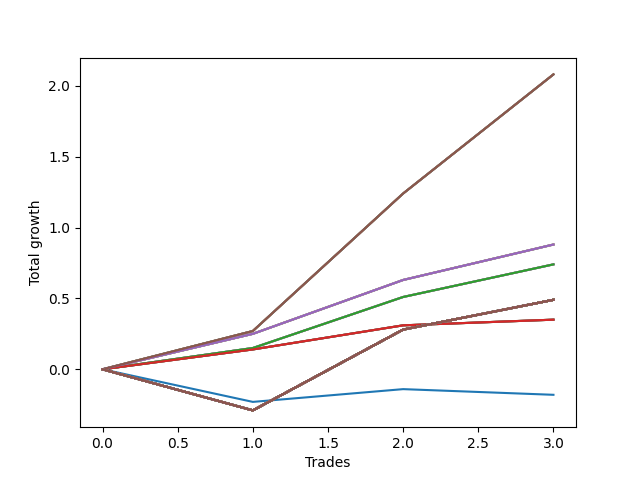

# Long Shepard 005 
- Symbol: SPY_Unlimited
- Date Range: 03/23/2022 - 07/08/2022
- Trading Period: 7:20-12:30
- Number of Trades: 3



| Name | Win Percent | Profit | Avg Profit / Trade | Avg Time / Trade |      | Name | Win Percent | Profit | Avg Profit / Trade | Avg Time / Trade |
| ---- | ----------- | ------ | ------------------ | ---------------- | ---- | ---- | ----------- | ------ | ------------------ | ---------------- |
| Sorted By <br> Profit | | | | | | Sorted By <br> Win Percentage ||||
| Sixty-Seven | 100.00 | 1040.00 | 346.67 | 18:50 |     | Sixty-Seven | 100.00 | 1040.00 | 346.67 | 18:50 |
| Fifty-Nine | 100.00 | 1040.00 | 346.67 | 18:50 |     | Fifty-Nine | 100.00 | 1040.00 | 346.67 | 18:50 |
| Fifty-One | 100.00 | 1040.00 | 346.67 | 18:50 |     | Fifty-One | 100.00 | 1040.00 | 346.67 | 18:50 |
| Forty-Three | 100.00 | 1040.00 | 346.67 | 18:50 |     | Forty-Three | 100.00 | 1040.00 | 346.67 | 18:50 |
| Three | 100.00 | 1040.00 | 346.67 | 18:50 |     | Three | 100.00 | 1040.00 | 346.67 | 18:50 |
| Sixty-Six | 100.00 | 440.00 | 146.67 | 16:26 |     | Sixty-Six | 100.00 | 440.00 | 146.67 | 16:26 |
| Fifty-Eight | 100.00 | 440.00 | 146.67 | 16:26 |     | Fifty-Eight | 100.00 | 440.00 | 146.67 | 16:26 |
| Fifty | 100.00 | 440.00 | 146.67 | 16:26 |     | Fifty | 100.00 | 440.00 | 146.67 | 16:26 |
| Forty-Two | 100.00 | 440.00 | 146.67 | 16:26 |     | Forty-Two | 100.00 | 440.00 | 146.67 | 16:26 |
| Two | 100.00 | 440.00 | 146.67 | 16:26 |     | Two | 100.00 | 440.00 | 146.67 | 16:26 |
| Sixty-Four | 100.00 | 370.00 | 123.33 | 04:51 |     | Sixty-Four | 100.00 | 370.00 | 123.33 | 04:51 |
| Fifty-Six | 100.00 | 370.00 | 123.33 | 04:51 |     | Fifty-Six | 100.00 | 370.00 | 123.33 | 04:51 |
| Forty-Eight | 100.00 | 370.00 | 123.33 | 04:51 |     | Forty-Eight | 100.00 | 370.00 | 123.33 | 04:51 |
| Forty | 100.00 | 370.00 | 123.33 | 04:51 |     | Forty | 100.00 | 370.00 | 123.33 | 04:51 |
| Zero | 100.00 | 370.00 | 123.33 | 04:51 |     | Zero | 100.00 | 370.00 | 123.33 | 04:51 |
| One Hundred Thirty | 66.67 | 245.00 | 81.67 | 29:55 |     | Sixty-Five | 100.00 | 175.00 | 58.33 | 12:45 |
| One Hundred Twenty-Nine | 66.67 | 245.00 | 81.67 | 29:55 |     | Fifty-Seven | 100.00 | 175.00 | 58.33 | 12:45 |
| One Hundred Twenty-Eight | 66.67 | 245.00 | 81.67 | 29:55 |     | Forty-Nine | 100.00 | 175.00 | 58.33 | 12:45 |
| One Hundred Twenty-Seven | 66.67 | 245.00 | 81.67 | 29:55 |     | Forty-One | 100.00 | 175.00 | 58.33 | 12:45 |
| One Hundred Twenty-Six | 66.67 | 245.00 | 81.67 | 29:55 |     | One | 100.00 | 175.00 | 58.33 | 12:45 |
| One Hundred Twenty-Five | 66.67 | 245.00 | 81.67 | 29:55 |     | One Hundred Thirty | 66.67 | 245.00 | 81.67 | 29:55 |
| One Hundred Twenty-Four | 66.67 | 245.00 | 81.67 | 29:55 |     | One Hundred Twenty-Nine | 66.67 | 245.00 | 81.67 | 29:55 |
| One Hundred Twenty-Three | 66.67 | 245.00 | 81.67 | 29:55 |     | One Hundred Twenty-Eight | 66.67 | 245.00 | 81.67 | 29:55 |
| One Hundred Twenty-Two | 66.67 | 245.00 | 81.67 | 29:55 |     | One Hundred Twenty-Seven | 66.67 | 245.00 | 81.67 | 29:55 |
| One Hundred Twenty-One | 66.67 | 245.00 | 81.67 | 29:55 |     | One Hundred Twenty-Six | 66.67 | 245.00 | 81.67 | 29:55 |
| One Hundred Twenty | 66.67 | 245.00 | 81.67 | 29:55 |     | One Hundred Twenty-Five | 66.67 | 245.00 | 81.67 | 29:55 |
| One Hundred Ninteen | 66.67 | 245.00 | 81.67 | 29:55 |     | One Hundred Twenty-Four | 66.67 | 245.00 | 81.67 | 29:55 |
| One Hundred Eighteen | 66.67 | 245.00 | 81.67 | 29:55 |     | One Hundred Twenty-Three | 66.67 | 245.00 | 81.67 | 29:55 |
| One Hundred Seventeen | 66.67 | 245.00 | 81.67 | 29:55 |     | One Hundred Twenty-Two | 66.67 | 245.00 | 81.67 | 29:55 |
| One Hundred Sixteen | 66.67 | 245.00 | 81.67 | 29:55 |     | One Hundred Twenty-One | 66.67 | 245.00 | 81.67 | 29:55 |
| One Hundred Fifteen | 66.67 | 245.00 | 81.67 | 29:55 |     | One Hundred Twenty | 66.67 | 245.00 | 81.67 | 29:55 |
| One Hundred Fourteen | 66.67 | 245.00 | 81.67 | 29:55 |     | One Hundred Ninteen | 66.67 | 245.00 | 81.67 | 29:55 |
| One Hundred Thirteen | 66.67 | 245.00 | 81.67 | 29:55 |     | One Hundred Eighteen | 66.67 | 245.00 | 81.67 | 29:55 |
| One Hundred Twelve | 66.67 | 245.00 | 81.67 | 29:55 |     | One Hundred Seventeen | 66.67 | 245.00 | 81.67 | 29:55 |
| One Hundred Eleven | 66.67 | 245.00 | 81.67 | 29:55 |     | One Hundred Sixteen | 66.67 | 245.00 | 81.67 | 29:55 |
| Eighty-Five | 66.67 | 245.00 | 81.67 | 29:55 |     | One Hundred Fifteen | 66.67 | 245.00 | 81.67 | 29:55 |
| Eighty-Four | 66.67 | 245.00 | 81.67 | 29:55 |     | One Hundred Fourteen | 66.67 | 245.00 | 81.67 | 29:55 |
| Eighty-Three | 66.67 | 245.00 | 81.67 | 29:55 |     | One Hundred Thirteen | 66.67 | 245.00 | 81.67 | 29:55 |
| Eighty-Two | 66.67 | 245.00 | 81.67 | 29:55 |     | One Hundred Twelve | 66.67 | 245.00 | 81.67 | 29:55 |
| Eighty-One | 66.67 | 245.00 | 81.67 | 29:55 |     | One Hundred Eleven | 66.67 | 245.00 | 81.67 | 29:55 |
| Seventy-One | 66.67 | 245.00 | 81.67 | 29:55 |     | Eighty-Five | 66.67 | 245.00 | 81.67 | 29:55 |
| Seventy | 66.67 | 245.00 | 81.67 | 29:55 |     | Eighty-Four | 66.67 | 245.00 | 81.67 | 29:55 |
| Sixty-Nine | 66.67 | 245.00 | 81.67 | 29:55 |     | Eighty-Three | 66.67 | 245.00 | 81.67 | 29:55 |
| Sixty-Eight | 66.67 | 245.00 | 81.67 | 29:55 |     | Eighty-Two | 66.67 | 245.00 | 81.67 | 29:55 |
| Sixty-Three | 66.67 | 245.00 | 81.67 | 29:55 |     | Eighty-One | 66.67 | 245.00 | 81.67 | 29:55 |
| Sixty-Two | 66.67 | 245.00 | 81.67 | 29:55 |     | Seventy-One | 66.67 | 245.00 | 81.67 | 29:55 |
| Sixty-One | 66.67 | 245.00 | 81.67 | 29:55 |     | Seventy | 66.67 | 245.00 | 81.67 | 29:55 |
| Sixty | 66.67 | 245.00 | 81.67 | 29:55 |     | Sixty-Nine | 66.67 | 245.00 | 81.67 | 29:55 |
| Fifty-Five | 66.67 | 245.00 | 81.67 | 29:55 |     | Sixty-Eight | 66.67 | 245.00 | 81.67 | 29:55 |
| Fifty-Four | 66.67 | 245.00 | 81.67 | 29:55 |     | Sixty-Three | 66.67 | 245.00 | 81.67 | 29:55 |
| Fifty-Three | 66.67 | 245.00 | 81.67 | 29:55 |     | Sixty-Two | 66.67 | 245.00 | 81.67 | 29:55 |
| Fifty-Two | 66.67 | 245.00 | 81.67 | 29:55 |     | Sixty-One | 66.67 | 245.00 | 81.67 | 29:55 |
| Forty-Seven | 66.67 | 245.00 | 81.67 | 29:55 |     | Sixty | 66.67 | 245.00 | 81.67 | 29:55 |
| Forty-Six | 66.67 | 245.00 | 81.67 | 29:55 |     | Fifty-Five | 66.67 | 245.00 | 81.67 | 29:55 |
| Forty-Five | 66.67 | 245.00 | 81.67 | 29:55 |     | Fifty-Four | 66.67 | 245.00 | 81.67 | 29:55 |
| Forty-Four | 66.67 | 245.00 | 81.67 | 29:55 |     | Fifty-Three | 66.67 | 245.00 | 81.67 | 29:55 |
| Seven | 66.67 | 245.00 | 81.67 | 29:55 |     | Fifty-Two | 66.67 | 245.00 | 81.67 | 29:55 |
| Six | 66.67 | 245.00 | 81.67 | 29:55 |     | Forty-Seven | 66.67 | 245.00 | 81.67 | 29:55 |
| Five | 66.67 | 245.00 | 81.67 | 29:55 |     | Forty-Six | 66.67 | 245.00 | 81.67 | 29:55 |
| Four | 66.67 | 245.00 | 81.67 | 29:55 |     | Forty-Five | 66.67 | 245.00 | 81.67 | 29:55 |
| Sixty-Five | 100.00 | 175.00 | 58.33 | 12:45 |     | Forty-Four | 66.67 | 245.00 | 81.67 | 29:55 |
| Fifty-Seven | 100.00 | 175.00 | 58.33 | 12:45 |     | Seven | 66.67 | 245.00 | 81.67 | 29:55 |
| Forty-Nine | 100.00 | 175.00 | 58.33 | 12:45 |     | Six | 66.67 | 245.00 | 81.67 | 29:55 |
| Forty-One | 100.00 | 175.00 | 58.33 | 12:45 |     | Five | 66.67 | 245.00 | 81.67 | 29:55 |
| One | 100.00 | 175.00 | 58.33 | 12:45 |     | Four | 66.67 | 245.00 | 81.67 | 29:55 |
| Seventy-Three | 33.33 | -90.00 | -30.00 | 07:25 |     | Seventy-Three | 33.33 | -90.00 | -30.00 | 07:25 |

## NO STOPLOSS

### Test Zero
* Sell when price hits the middle line of the 20p bollinger
* No Stoploss
* Results:
```
Total Trades: 3
Percent Up: 100.00
Percent Down: 0.00
Total Points Moved Up: 0.74
Potential Profit: 370.00
Total Points Ups: 0.74 Count Ups: 3
Total Points Downs: 0.00 Count Downs: 0
```

<details><summary>Trades</summary>

<code>In: 2022-03-31 09:30:00		Out: 2022-03-31 09:32:25		Total Position Time: 02:25		Total Move Up: 0.15		Total to Date: 0.15</code> <br />
<code>In: 2022-06-06 08:24:00		Out: 2022-06-06 08:31:35		Total Position Time: 07:35		Total Move Up: 0.36		Total to Date: 0.51</code> <br />
<code>In: 2022-06-06 08:27:00		Out: 2022-06-06 08:31:35		Total Position Time: 04:35		Total Move Up: 0.23		Total to Date: 0.74</code> <br />


</details>

### Test One
* Sell when the price hits the upper line of the 20p 1std bollinger
* No Stoploss
* Results:
```
Total Trades: 3
Percent Up: 100.00
Percent Down: 0.00
Total Points Moved Up: 0.35
Potential Profit: 175.00
Total Points Ups: 0.35 Count Ups: 3
Total Points Downs: 0.00 Count Downs: 0
```

<details><summary>Trades</summary>

<code>In: 2022-03-31 09:30:00		Out: 2022-03-31 09:40:45		Total Position Time: 10:45		Total Move Up: 0.14		Total to Date: 0.14</code> <br />
<code>In: 2022-06-06 08:24:00		Out: 2022-06-06 08:39:15		Total Position Time: 15:15		Total Move Up: 0.17		Total to Date: 0.31</code> <br />
<code>In: 2022-06-06 08:27:00		Out: 2022-06-06 08:39:15		Total Position Time: 12:15		Total Move Up: 0.04		Total to Date: 0.35</code> <br />


</details>

### Test Two
* Sell when the price hits the upper line of the 20p 2std bollinger
* No Stoploss
* Results:
```
Total Trades: 3
Percent Up: 100.00
Percent Down: 0.00
Total Points Moved Up: 0.88
Potential Profit: 440.00
Total Points Ups: 0.88 Count Ups: 3
Total Points Downs: 0.00 Count Downs: 0
```

<details><summary>Trades</summary>

<code>In: 2022-03-31 09:30:00		Out: 2022-03-31 09:44:20		Total Position Time: 14:20		Total Move Up: 0.25		Total to Date: 0.25</code> <br />
<code>In: 2022-06-06 08:24:00		Out: 2022-06-06 08:43:00		Total Position Time: 19:00		Total Move Up: 0.38		Total to Date: 0.63</code> <br />
<code>In: 2022-06-06 08:27:00		Out: 2022-06-06 08:43:00		Total Position Time: 16:00		Total Move Up: 0.25		Total to Date: 0.88</code> <br />


</details>

### Test Three
* Sell when price hits the middle line of the 50p bollinger
* No Stoploss
* Results:
```
Total Trades: 3
Percent Up: 100.00
Percent Down: 0.00
Total Points Moved Up: 2.08
Potential Profit: 1040.00
Total Points Ups: 2.08 Count Ups: 3
Total Points Downs: 0.00 Count Downs: 0
```

<details><summary>Trades</summary>

<code>In: 2022-03-31 09:30:00		Out: 2022-03-31 09:45:10		Total Position Time: 15:10		Total Move Up: 0.27		Total to Date: 0.27</code> <br />
<code>In: 2022-06-06 08:24:00		Out: 2022-06-06 08:46:10		Total Position Time: 22:10		Total Move Up: 0.97		Total to Date: 1.24</code> <br />
<code>In: 2022-06-06 08:27:00		Out: 2022-06-06 08:46:10		Total Position Time: 19:10		Total Move Up: 0.84		Total to Date: 2.08</code> <br />


</details>

### Test Four
* Sell when the price hits the upper line of the 50p 1std bollinger
* No Stoploss
* Results:
```
Total Trades: 3
Percent Up: 66.67
Percent Down: 33.33
Total Points Moved Up: 0.49
Potential Profit: 245.00
Total Points Ups: 0.78 Count Ups: 2
Total Points Downs: -0.29 Count Downs: 1
```

<details><summary>Trades</summary>

<code>In: 2022-03-31 09:30:00		Out: 2022-03-31 09:59:55		Total Position Time: 29:55		Total Move Up: -0.29		Total to Date: -0.29</code> <br />
<code>In: 2022-06-06 08:24:00		Out: 2022-06-06 08:53:55		Total Position Time: 29:55		Total Move Up: 0.57		Total to Date: 0.28</code> <br />
<code>In: 2022-06-06 08:27:00		Out: 2022-06-06 08:56:55		Total Position Time: 29:55		Total Move Up: 0.21		Total to Date: 0.49</code> <br />


</details>

### Test Five
* Sell when the price hits the upper line of the 50p 2std bollinger
* No Stoploss
* Results:
```
Total Trades: 3
Percent Up: 66.67
Percent Down: 33.33
Total Points Moved Up: 0.49
Potential Profit: 245.00
Total Points Ups: 0.78 Count Ups: 2
Total Points Downs: -0.29 Count Downs: 1
```

<details><summary>Trades</summary>

<code>In: 2022-03-31 09:30:00		Out: 2022-03-31 09:59:55		Total Position Time: 29:55		Total Move Up: -0.29		Total to Date: -0.29</code> <br />
<code>In: 2022-06-06 08:24:00		Out: 2022-06-06 08:53:55		Total Position Time: 29:55		Total Move Up: 0.57		Total to Date: 0.28</code> <br />
<code>In: 2022-06-06 08:27:00		Out: 2022-06-06 08:56:55		Total Position Time: 29:55		Total Move Up: 0.21		Total to Date: 0.49</code> <br />


</details>

### Test Six
* Sell when the price hits the middle line of the 1std VWAP
* No Stoploss
* Results:
```
Total Trades: 3
Percent Up: 66.67
Percent Down: 33.33
Total Points Moved Up: 0.49
Potential Profit: 245.00
Total Points Ups: 0.78 Count Ups: 2
Total Points Downs: -0.29 Count Downs: 1
```

<details><summary>Trades</summary>

<code>In: 2022-03-31 09:30:00		Out: 2022-03-31 09:59:55		Total Position Time: 29:55		Total Move Up: -0.29		Total to Date: -0.29</code> <br />
<code>In: 2022-06-06 08:24:00		Out: 2022-06-06 08:53:55		Total Position Time: 29:55		Total Move Up: 0.57		Total to Date: 0.28</code> <br />
<code>In: 2022-06-06 08:27:00		Out: 2022-06-06 08:56:55		Total Position Time: 29:55		Total Move Up: 0.21		Total to Date: 0.49</code> <br />


</details>

### Test Seven
* Sell when the price hits the upper line of the 1std VWAP
* No Stoploss
* Results:
```
Total Trades: 3
Percent Up: 66.67
Percent Down: 33.33
Total Points Moved Up: 0.49
Potential Profit: 245.00
Total Points Ups: 0.78 Count Ups: 2
Total Points Downs: -0.29 Count Downs: 1
```

<details><summary>Trades</summary>

<code>In: 2022-03-31 09:30:00		Out: 2022-03-31 09:59:55		Total Position Time: 29:55		Total Move Up: -0.29		Total to Date: -0.29</code> <br />
<code>In: 2022-06-06 08:24:00		Out: 2022-06-06 08:53:55		Total Position Time: 29:55		Total Move Up: 0.57		Total to Date: 0.28</code> <br />
<code>In: 2022-06-06 08:27:00		Out: 2022-06-06 08:56:55		Total Position Time: 29:55		Total Move Up: 0.21		Total to Date: 0.49</code> <br />


</details>

## STOPLOSS OF 5

### Test Forty
* Sell when price hits the middle line of the 20p bollinger
* Stoploss is 5 points
* Results:
```
Total Trades: 3
Percent Up: 100.00
Percent Down: 0.00
Total Points Moved Up: 0.74
Potential Profit: 370.00
Total Points Ups: 0.74 Count Ups: 3
Total Points Downs: 0.00 Count Downs: 0
```

<details><summary>Trades</summary>

<code>In: 2022-03-31 09:30:00		Out: 2022-03-31 09:32:25		Total Position Time: 02:25		Total Move Up: 0.15		Total to Date: 0.15</code> <br />
<code>In: 2022-06-06 08:24:00		Out: 2022-06-06 08:31:35		Total Position Time: 07:35		Total Move Up: 0.36		Total to Date: 0.51</code> <br />
<code>In: 2022-06-06 08:27:00		Out: 2022-06-06 08:31:35		Total Position Time: 04:35		Total Move Up: 0.23		Total to Date: 0.74</code> <br />


</details>

### Test Forty-One
* Sell when the price hits the upper line of the 20p 1std bollinger
* Stoploss is 5 points
* Results:
```
Total Trades: 3
Percent Up: 100.00
Percent Down: 0.00
Total Points Moved Up: 0.35
Potential Profit: 175.00
Total Points Ups: 0.35 Count Ups: 3
Total Points Downs: 0.00 Count Downs: 0
```

<details><summary>Trades</summary>

<code>In: 2022-03-31 09:30:00		Out: 2022-03-31 09:40:45		Total Position Time: 10:45		Total Move Up: 0.14		Total to Date: 0.14</code> <br />
<code>In: 2022-06-06 08:24:00		Out: 2022-06-06 08:39:15		Total Position Time: 15:15		Total Move Up: 0.17		Total to Date: 0.31</code> <br />
<code>In: 2022-06-06 08:27:00		Out: 2022-06-06 08:39:15		Total Position Time: 12:15		Total Move Up: 0.04		Total to Date: 0.35</code> <br />


</details>

### Test Forty-Two
* Sell when the price hits the upper line of the 20p 2std bollinger
* Stoploss is 5 points
* Results:
```
Total Trades: 3
Percent Up: 100.00
Percent Down: 0.00
Total Points Moved Up: 0.88
Potential Profit: 440.00
Total Points Ups: 0.88 Count Ups: 3
Total Points Downs: 0.00 Count Downs: 0
```

<details><summary>Trades</summary>

<code>In: 2022-03-31 09:30:00		Out: 2022-03-31 09:44:20		Total Position Time: 14:20		Total Move Up: 0.25		Total to Date: 0.25</code> <br />
<code>In: 2022-06-06 08:24:00		Out: 2022-06-06 08:43:00		Total Position Time: 19:00		Total Move Up: 0.38		Total to Date: 0.63</code> <br />
<code>In: 2022-06-06 08:27:00		Out: 2022-06-06 08:43:00		Total Position Time: 16:00		Total Move Up: 0.25		Total to Date: 0.88</code> <br />


</details>

### Test Forty-Three
* Sell when price hits the middle line of the 50p bollinger
* Stoploss is 5 points
* Results:
```
Total Trades: 3
Percent Up: 100.00
Percent Down: 0.00
Total Points Moved Up: 2.08
Potential Profit: 1040.00
Total Points Ups: 2.08 Count Ups: 3
Total Points Downs: 0.00 Count Downs: 0
```

<details><summary>Trades</summary>

<code>In: 2022-03-31 09:30:00		Out: 2022-03-31 09:45:10		Total Position Time: 15:10		Total Move Up: 0.27		Total to Date: 0.27</code> <br />
<code>In: 2022-06-06 08:24:00		Out: 2022-06-06 08:46:10		Total Position Time: 22:10		Total Move Up: 0.97		Total to Date: 1.24</code> <br />
<code>In: 2022-06-06 08:27:00		Out: 2022-06-06 08:46:10		Total Position Time: 19:10		Total Move Up: 0.84		Total to Date: 2.08</code> <br />


</details>

### Test Forty-Four
* Sell when the price hits the upper line of the 50p 1std bollinger
* Stoploss is 5 points
* Results:
```
Total Trades: 3
Percent Up: 66.67
Percent Down: 33.33
Total Points Moved Up: 0.49
Potential Profit: 245.00
Total Points Ups: 0.78 Count Ups: 2
Total Points Downs: -0.29 Count Downs: 1
```

<details><summary>Trades</summary>

<code>In: 2022-03-31 09:30:00		Out: 2022-03-31 09:59:55		Total Position Time: 29:55		Total Move Up: -0.29		Total to Date: -0.29</code> <br />
<code>In: 2022-06-06 08:24:00		Out: 2022-06-06 08:53:55		Total Position Time: 29:55		Total Move Up: 0.57		Total to Date: 0.28</code> <br />
<code>In: 2022-06-06 08:27:00		Out: 2022-06-06 08:56:55		Total Position Time: 29:55		Total Move Up: 0.21		Total to Date: 0.49</code> <br />


</details>

### Test Forty-Five
* Sell when the price hits the upper line of the 50p 2std bollinger
* Stoploss is 5 points
* Results:
```
Total Trades: 3
Percent Up: 66.67
Percent Down: 33.33
Total Points Moved Up: 0.49
Potential Profit: 245.00
Total Points Ups: 0.78 Count Ups: 2
Total Points Downs: -0.29 Count Downs: 1
```

<details><summary>Trades</summary>

<code>In: 2022-03-31 09:30:00		Out: 2022-03-31 09:59:55		Total Position Time: 29:55		Total Move Up: -0.29		Total to Date: -0.29</code> <br />
<code>In: 2022-06-06 08:24:00		Out: 2022-06-06 08:53:55		Total Position Time: 29:55		Total Move Up: 0.57		Total to Date: 0.28</code> <br />
<code>In: 2022-06-06 08:27:00		Out: 2022-06-06 08:56:55		Total Position Time: 29:55		Total Move Up: 0.21		Total to Date: 0.49</code> <br />


</details>

### Test Forty-Six
* Sell when the price hits the middle line of the 1std VWAP
* Stoploss is 5 points
* Results:
```
Total Trades: 3
Percent Up: 66.67
Percent Down: 33.33
Total Points Moved Up: 0.49
Potential Profit: 245.00
Total Points Ups: 0.78 Count Ups: 2
Total Points Downs: -0.29 Count Downs: 1
```

<details><summary>Trades</summary>

<code>In: 2022-03-31 09:30:00		Out: 2022-03-31 09:59:55		Total Position Time: 29:55		Total Move Up: -0.29		Total to Date: -0.29</code> <br />
<code>In: 2022-06-06 08:24:00		Out: 2022-06-06 08:53:55		Total Position Time: 29:55		Total Move Up: 0.57		Total to Date: 0.28</code> <br />
<code>In: 2022-06-06 08:27:00		Out: 2022-06-06 08:56:55		Total Position Time: 29:55		Total Move Up: 0.21		Total to Date: 0.49</code> <br />


</details>

### Test Forty-Seven
* Sell when the price hits the upper line of the 1std VWAP
* Stoploss is 5 points
* Results:
```
Total Trades: 3
Percent Up: 66.67
Percent Down: 33.33
Total Points Moved Up: 0.49
Potential Profit: 245.00
Total Points Ups: 0.78 Count Ups: 2
Total Points Downs: -0.29 Count Downs: 1
```

<details><summary>Trades</summary>

<code>In: 2022-03-31 09:30:00		Out: 2022-03-31 09:59:55		Total Position Time: 29:55		Total Move Up: -0.29		Total to Date: -0.29</code> <br />
<code>In: 2022-06-06 08:24:00		Out: 2022-06-06 08:53:55		Total Position Time: 29:55		Total Move Up: 0.57		Total to Date: 0.28</code> <br />
<code>In: 2022-06-06 08:27:00		Out: 2022-06-06 08:56:55		Total Position Time: 29:55		Total Move Up: 0.21		Total to Date: 0.49</code> <br />


</details>

## TRAIL STOP OF 5

### Test Forty-Eight
* Sell when price hits the middle line of the 20p bollinger
* Trailing Stop is 5 points
* Results:
```
Total Trades: 3
Percent Up: 100.00
Percent Down: 0.00
Total Points Moved Up: 0.74
Potential Profit: 370.00
Total Points Ups: 0.74 Count Ups: 3
Total Points Downs: 0.00 Count Downs: 0
```

<details><summary>Trades</summary>

<code>In: 2022-03-31 09:30:00		Out: 2022-03-31 09:32:25		Total Position Time: 02:25		Total Move Up: 0.15		Total to Date: 0.15</code> <br />
<code>In: 2022-06-06 08:24:00		Out: 2022-06-06 08:31:35		Total Position Time: 07:35		Total Move Up: 0.36		Total to Date: 0.51</code> <br />
<code>In: 2022-06-06 08:27:00		Out: 2022-06-06 08:31:35		Total Position Time: 04:35		Total Move Up: 0.23		Total to Date: 0.74</code> <br />


</details>

### Test Forty-Nine
* Sell when the price hits the upper line of the 20p 1std bollinger
* Trailing Stop is 5 points
* Results:
```
Total Trades: 3
Percent Up: 100.00
Percent Down: 0.00
Total Points Moved Up: 0.35
Potential Profit: 175.00
Total Points Ups: 0.35 Count Ups: 3
Total Points Downs: 0.00 Count Downs: 0
```

<details><summary>Trades</summary>

<code>In: 2022-03-31 09:30:00		Out: 2022-03-31 09:40:45		Total Position Time: 10:45		Total Move Up: 0.14		Total to Date: 0.14</code> <br />
<code>In: 2022-06-06 08:24:00		Out: 2022-06-06 08:39:15		Total Position Time: 15:15		Total Move Up: 0.17		Total to Date: 0.31</code> <br />
<code>In: 2022-06-06 08:27:00		Out: 2022-06-06 08:39:15		Total Position Time: 12:15		Total Move Up: 0.04		Total to Date: 0.35</code> <br />


</details>

### Test Fifty
* Sell when the price hits the upper line of the 20p 2std bollinger
* Trailing Stop is 5 points
* Results:
```
Total Trades: 3
Percent Up: 100.00
Percent Down: 0.00
Total Points Moved Up: 0.88
Potential Profit: 440.00
Total Points Ups: 0.88 Count Ups: 3
Total Points Downs: 0.00 Count Downs: 0
```

<details><summary>Trades</summary>

<code>In: 2022-03-31 09:30:00		Out: 2022-03-31 09:44:20		Total Position Time: 14:20		Total Move Up: 0.25		Total to Date: 0.25</code> <br />
<code>In: 2022-06-06 08:24:00		Out: 2022-06-06 08:43:00		Total Position Time: 19:00		Total Move Up: 0.38		Total to Date: 0.63</code> <br />
<code>In: 2022-06-06 08:27:00		Out: 2022-06-06 08:43:00		Total Position Time: 16:00		Total Move Up: 0.25		Total to Date: 0.88</code> <br />


</details>

### Test Fifty-One
* Sell when price hits the middle line of the 50p bollinger
* Trailing Stop is 5 points
* Results:
```
Total Trades: 3
Percent Up: 100.00
Percent Down: 0.00
Total Points Moved Up: 2.08
Potential Profit: 1040.00
Total Points Ups: 2.08 Count Ups: 3
Total Points Downs: 0.00 Count Downs: 0
```

<details><summary>Trades</summary>

<code>In: 2022-03-31 09:30:00		Out: 2022-03-31 09:45:10		Total Position Time: 15:10		Total Move Up: 0.27		Total to Date: 0.27</code> <br />
<code>In: 2022-06-06 08:24:00		Out: 2022-06-06 08:46:10		Total Position Time: 22:10		Total Move Up: 0.97		Total to Date: 1.24</code> <br />
<code>In: 2022-06-06 08:27:00		Out: 2022-06-06 08:46:10		Total Position Time: 19:10		Total Move Up: 0.84		Total to Date: 2.08</code> <br />


</details>

### Test Fifty-Two
* Sell when the price hits the upper line of the 50p 1std bollinger
* Trailing Stop is 5 points
* Results:
```
Total Trades: 3
Percent Up: 66.67
Percent Down: 33.33
Total Points Moved Up: 0.49
Potential Profit: 245.00
Total Points Ups: 0.78 Count Ups: 2
Total Points Downs: -0.29 Count Downs: 1
```

<details><summary>Trades</summary>

<code>In: 2022-03-31 09:30:00		Out: 2022-03-31 09:59:55		Total Position Time: 29:55		Total Move Up: -0.29		Total to Date: -0.29</code> <br />
<code>In: 2022-06-06 08:24:00		Out: 2022-06-06 08:53:55		Total Position Time: 29:55		Total Move Up: 0.57		Total to Date: 0.28</code> <br />
<code>In: 2022-06-06 08:27:00		Out: 2022-06-06 08:56:55		Total Position Time: 29:55		Total Move Up: 0.21		Total to Date: 0.49</code> <br />


</details>

### Test Fifty-Three
* Sell when the price hits the upper line of the 50p 2std bollinger
* Trailing Stop is 5 points
* Results:
```
Total Trades: 3
Percent Up: 66.67
Percent Down: 33.33
Total Points Moved Up: 0.49
Potential Profit: 245.00
Total Points Ups: 0.78 Count Ups: 2
Total Points Downs: -0.29 Count Downs: 1
```

<details><summary>Trades</summary>

<code>In: 2022-03-31 09:30:00		Out: 2022-03-31 09:59:55		Total Position Time: 29:55		Total Move Up: -0.29		Total to Date: -0.29</code> <br />
<code>In: 2022-06-06 08:24:00		Out: 2022-06-06 08:53:55		Total Position Time: 29:55		Total Move Up: 0.57		Total to Date: 0.28</code> <br />
<code>In: 2022-06-06 08:27:00		Out: 2022-06-06 08:56:55		Total Position Time: 29:55		Total Move Up: 0.21		Total to Date: 0.49</code> <br />


</details>

### Test Fifty-Four
* Sell when the price hits the middle line of the 1std VWAP
* Trailing Stop is 5 points
* Results:
```
Total Trades: 3
Percent Up: 66.67
Percent Down: 33.33
Total Points Moved Up: 0.49
Potential Profit: 245.00
Total Points Ups: 0.78 Count Ups: 2
Total Points Downs: -0.29 Count Downs: 1
```

<details><summary>Trades</summary>

<code>In: 2022-03-31 09:30:00		Out: 2022-03-31 09:59:55		Total Position Time: 29:55		Total Move Up: -0.29		Total to Date: -0.29</code> <br />
<code>In: 2022-06-06 08:24:00		Out: 2022-06-06 08:53:55		Total Position Time: 29:55		Total Move Up: 0.57		Total to Date: 0.28</code> <br />
<code>In: 2022-06-06 08:27:00		Out: 2022-06-06 08:56:55		Total Position Time: 29:55		Total Move Up: 0.21		Total to Date: 0.49</code> <br />


</details>

### Test Fifty-Five
* Sell when the price hits the upper line of the 1std VWAP
* Trailing Stop is 5 points
* Results:
```
Total Trades: 3
Percent Up: 66.67
Percent Down: 33.33
Total Points Moved Up: 0.49
Potential Profit: 245.00
Total Points Ups: 0.78 Count Ups: 2
Total Points Downs: -0.29 Count Downs: 1
```

<details><summary>Trades</summary>

<code>In: 2022-03-31 09:30:00		Out: 2022-03-31 09:59:55		Total Position Time: 29:55		Total Move Up: -0.29		Total to Date: -0.29</code> <br />
<code>In: 2022-06-06 08:24:00		Out: 2022-06-06 08:53:55		Total Position Time: 29:55		Total Move Up: 0.57		Total to Date: 0.28</code> <br />
<code>In: 2022-06-06 08:27:00		Out: 2022-06-06 08:56:55		Total Position Time: 29:55		Total Move Up: 0.21		Total to Date: 0.49</code> <br />


</details>

## STOPLOSS OF 10

### Test Fifty-Six
* Sell when price hits the middle line of the 20p bollinger
* Stoploss is 10 points
* Results:
```
Total Trades: 3
Percent Up: 100.00
Percent Down: 0.00
Total Points Moved Up: 0.74
Potential Profit: 370.00
Total Points Ups: 0.74 Count Ups: 3
Total Points Downs: 0.00 Count Downs: 0
```

<details><summary>Trades</summary>

<code>In: 2022-03-31 09:30:00		Out: 2022-03-31 09:32:25		Total Position Time: 02:25		Total Move Up: 0.15		Total to Date: 0.15</code> <br />
<code>In: 2022-06-06 08:24:00		Out: 2022-06-06 08:31:35		Total Position Time: 07:35		Total Move Up: 0.36		Total to Date: 0.51</code> <br />
<code>In: 2022-06-06 08:27:00		Out: 2022-06-06 08:31:35		Total Position Time: 04:35		Total Move Up: 0.23		Total to Date: 0.74</code> <br />


</details>

### Test Fifty-Seven
* Sell when the price hits the upper line of the 20p 1std bollinger
* Stoploss is 10 points
* Results:
```
Total Trades: 3
Percent Up: 100.00
Percent Down: 0.00
Total Points Moved Up: 0.35
Potential Profit: 175.00
Total Points Ups: 0.35 Count Ups: 3
Total Points Downs: 0.00 Count Downs: 0
```

<details><summary>Trades</summary>

<code>In: 2022-03-31 09:30:00		Out: 2022-03-31 09:40:45		Total Position Time: 10:45		Total Move Up: 0.14		Total to Date: 0.14</code> <br />
<code>In: 2022-06-06 08:24:00		Out: 2022-06-06 08:39:15		Total Position Time: 15:15		Total Move Up: 0.17		Total to Date: 0.31</code> <br />
<code>In: 2022-06-06 08:27:00		Out: 2022-06-06 08:39:15		Total Position Time: 12:15		Total Move Up: 0.04		Total to Date: 0.35</code> <br />


</details>

### Test Fifty-Eight
* Sell when the price hits the upper line of the 20p 2std bollinger
* Stoploss is 10 points
* Results:
```
Total Trades: 3
Percent Up: 100.00
Percent Down: 0.00
Total Points Moved Up: 0.88
Potential Profit: 440.00
Total Points Ups: 0.88 Count Ups: 3
Total Points Downs: 0.00 Count Downs: 0
```

<details><summary>Trades</summary>

<code>In: 2022-03-31 09:30:00		Out: 2022-03-31 09:44:20		Total Position Time: 14:20		Total Move Up: 0.25		Total to Date: 0.25</code> <br />
<code>In: 2022-06-06 08:24:00		Out: 2022-06-06 08:43:00		Total Position Time: 19:00		Total Move Up: 0.38		Total to Date: 0.63</code> <br />
<code>In: 2022-06-06 08:27:00		Out: 2022-06-06 08:43:00		Total Position Time: 16:00		Total Move Up: 0.25		Total to Date: 0.88</code> <br />


</details>

### Test Fifty-Nine
* Sell when price hits the middle line of the 50p bollinger
* Stoploss is 10 points
* Results:
```
Total Trades: 3
Percent Up: 100.00
Percent Down: 0.00
Total Points Moved Up: 2.08
Potential Profit: 1040.00
Total Points Ups: 2.08 Count Ups: 3
Total Points Downs: 0.00 Count Downs: 0
```

<details><summary>Trades</summary>

<code>In: 2022-03-31 09:30:00		Out: 2022-03-31 09:45:10		Total Position Time: 15:10		Total Move Up: 0.27		Total to Date: 0.27</code> <br />
<code>In: 2022-06-06 08:24:00		Out: 2022-06-06 08:46:10		Total Position Time: 22:10		Total Move Up: 0.97		Total to Date: 1.24</code> <br />
<code>In: 2022-06-06 08:27:00		Out: 2022-06-06 08:46:10		Total Position Time: 19:10		Total Move Up: 0.84		Total to Date: 2.08</code> <br />


</details>

### Test Sixty
* Sell when the price hits the upper line of the 50p 1std bollinger
* Stoploss is 10 points
* Results:
```
Total Trades: 3
Percent Up: 66.67
Percent Down: 33.33
Total Points Moved Up: 0.49
Potential Profit: 245.00
Total Points Ups: 0.78 Count Ups: 2
Total Points Downs: -0.29 Count Downs: 1
```

<details><summary>Trades</summary>

<code>In: 2022-03-31 09:30:00		Out: 2022-03-31 09:59:55		Total Position Time: 29:55		Total Move Up: -0.29		Total to Date: -0.29</code> <br />
<code>In: 2022-06-06 08:24:00		Out: 2022-06-06 08:53:55		Total Position Time: 29:55		Total Move Up: 0.57		Total to Date: 0.28</code> <br />
<code>In: 2022-06-06 08:27:00		Out: 2022-06-06 08:56:55		Total Position Time: 29:55		Total Move Up: 0.21		Total to Date: 0.49</code> <br />


</details>

### Test Sixty-One
* Sell when the price hits the upper line of the 50p 2std bollinger
* Stoploss is 10 points
* Results:
```
Total Trades: 3
Percent Up: 66.67
Percent Down: 33.33
Total Points Moved Up: 0.49
Potential Profit: 245.00
Total Points Ups: 0.78 Count Ups: 2
Total Points Downs: -0.29 Count Downs: 1
```

<details><summary>Trades</summary>

<code>In: 2022-03-31 09:30:00		Out: 2022-03-31 09:59:55		Total Position Time: 29:55		Total Move Up: -0.29		Total to Date: -0.29</code> <br />
<code>In: 2022-06-06 08:24:00		Out: 2022-06-06 08:53:55		Total Position Time: 29:55		Total Move Up: 0.57		Total to Date: 0.28</code> <br />
<code>In: 2022-06-06 08:27:00		Out: 2022-06-06 08:56:55		Total Position Time: 29:55		Total Move Up: 0.21		Total to Date: 0.49</code> <br />


</details>

### Test Sixty-Two
* Sell when the price hits the middle line of the 1std VWAP
* Stoploss is 10 points
* Results:
```
Total Trades: 3
Percent Up: 66.67
Percent Down: 33.33
Total Points Moved Up: 0.49
Potential Profit: 245.00
Total Points Ups: 0.78 Count Ups: 2
Total Points Downs: -0.29 Count Downs: 1
```

<details><summary>Trades</summary>

<code>In: 2022-03-31 09:30:00		Out: 2022-03-31 09:59:55		Total Position Time: 29:55		Total Move Up: -0.29		Total to Date: -0.29</code> <br />
<code>In: 2022-06-06 08:24:00		Out: 2022-06-06 08:53:55		Total Position Time: 29:55		Total Move Up: 0.57		Total to Date: 0.28</code> <br />
<code>In: 2022-06-06 08:27:00		Out: 2022-06-06 08:56:55		Total Position Time: 29:55		Total Move Up: 0.21		Total to Date: 0.49</code> <br />


</details>

### Test Sixty-Three
* Sell when the price hits the upper line of the 1std VWAP
* Stoploss is 10 points
* Results:
```
Total Trades: 3
Percent Up: 66.67
Percent Down: 33.33
Total Points Moved Up: 0.49
Potential Profit: 245.00
Total Points Ups: 0.78 Count Ups: 2
Total Points Downs: -0.29 Count Downs: 1
```

<details><summary>Trades</summary>

<code>In: 2022-03-31 09:30:00		Out: 2022-03-31 09:59:55		Total Position Time: 29:55		Total Move Up: -0.29		Total to Date: -0.29</code> <br />
<code>In: 2022-06-06 08:24:00		Out: 2022-06-06 08:53:55		Total Position Time: 29:55		Total Move Up: 0.57		Total to Date: 0.28</code> <br />
<code>In: 2022-06-06 08:27:00		Out: 2022-06-06 08:56:55		Total Position Time: 29:55		Total Move Up: 0.21		Total to Date: 0.49</code> <br />


</details>

## TRAIL STOP OF 10

### Test Sixty-Four
* Sell when price hits the middle line of the 20p bollinger
* Trailing Stop is 10 points
* Results:
```
Total Trades: 3
Percent Up: 100.00
Percent Down: 0.00
Total Points Moved Up: 0.74
Potential Profit: 370.00
Total Points Ups: 0.74 Count Ups: 3
Total Points Downs: 0.00 Count Downs: 0
```

<details><summary>Trades</summary>

<code>In: 2022-03-31 09:30:00		Out: 2022-03-31 09:32:25		Total Position Time: 02:25		Total Move Up: 0.15		Total to Date: 0.15</code> <br />
<code>In: 2022-06-06 08:24:00		Out: 2022-06-06 08:31:35		Total Position Time: 07:35		Total Move Up: 0.36		Total to Date: 0.51</code> <br />
<code>In: 2022-06-06 08:27:00		Out: 2022-06-06 08:31:35		Total Position Time: 04:35		Total Move Up: 0.23		Total to Date: 0.74</code> <br />


</details>

### Test Sixty-Five
* Sell when the price hits the upper line of the 20p 1std bollinger
* Trailing Stop is 10 points
* Results:
```
Total Trades: 3
Percent Up: 100.00
Percent Down: 0.00
Total Points Moved Up: 0.35
Potential Profit: 175.00
Total Points Ups: 0.35 Count Ups: 3
Total Points Downs: 0.00 Count Downs: 0
```

<details><summary>Trades</summary>

<code>In: 2022-03-31 09:30:00		Out: 2022-03-31 09:40:45		Total Position Time: 10:45		Total Move Up: 0.14		Total to Date: 0.14</code> <br />
<code>In: 2022-06-06 08:24:00		Out: 2022-06-06 08:39:15		Total Position Time: 15:15		Total Move Up: 0.17		Total to Date: 0.31</code> <br />
<code>In: 2022-06-06 08:27:00		Out: 2022-06-06 08:39:15		Total Position Time: 12:15		Total Move Up: 0.04		Total to Date: 0.35</code> <br />


</details>

### Test Sixty-Six
* Sell when the price hits the upper line of the 20p 2std bollinger
* Trailing Stop is 10 points
* Results:
```
Total Trades: 3
Percent Up: 100.00
Percent Down: 0.00
Total Points Moved Up: 0.88
Potential Profit: 440.00
Total Points Ups: 0.88 Count Ups: 3
Total Points Downs: 0.00 Count Downs: 0
```

<details><summary>Trades</summary>

<code>In: 2022-03-31 09:30:00		Out: 2022-03-31 09:44:20		Total Position Time: 14:20		Total Move Up: 0.25		Total to Date: 0.25</code> <br />
<code>In: 2022-06-06 08:24:00		Out: 2022-06-06 08:43:00		Total Position Time: 19:00		Total Move Up: 0.38		Total to Date: 0.63</code> <br />
<code>In: 2022-06-06 08:27:00		Out: 2022-06-06 08:43:00		Total Position Time: 16:00		Total Move Up: 0.25		Total to Date: 0.88</code> <br />


</details>

### Test Sixty-Seven
* Sell when price hits the middle line of the 50p bollinger
* Trailing Stop is 10 points
* Results:
```
Total Trades: 3
Percent Up: 100.00
Percent Down: 0.00
Total Points Moved Up: 2.08
Potential Profit: 1040.00
Total Points Ups: 2.08 Count Ups: 3
Total Points Downs: 0.00 Count Downs: 0
```

<details><summary>Trades</summary>

<code>In: 2022-03-31 09:30:00		Out: 2022-03-31 09:45:10		Total Position Time: 15:10		Total Move Up: 0.27		Total to Date: 0.27</code> <br />
<code>In: 2022-06-06 08:24:00		Out: 2022-06-06 08:46:10		Total Position Time: 22:10		Total Move Up: 0.97		Total to Date: 1.24</code> <br />
<code>In: 2022-06-06 08:27:00		Out: 2022-06-06 08:46:10		Total Position Time: 19:10		Total Move Up: 0.84		Total to Date: 2.08</code> <br />


</details>

### Test Sixty-Eight
* Sell when the price hits the upper line of the 50p 1std bollinger
* Trailing Stop is 10 points
* Results:
```
Total Trades: 3
Percent Up: 66.67
Percent Down: 33.33
Total Points Moved Up: 0.49
Potential Profit: 245.00
Total Points Ups: 0.78 Count Ups: 2
Total Points Downs: -0.29 Count Downs: 1
```

<details><summary>Trades</summary>

<code>In: 2022-03-31 09:30:00		Out: 2022-03-31 09:59:55		Total Position Time: 29:55		Total Move Up: -0.29		Total to Date: -0.29</code> <br />
<code>In: 2022-06-06 08:24:00		Out: 2022-06-06 08:53:55		Total Position Time: 29:55		Total Move Up: 0.57		Total to Date: 0.28</code> <br />
<code>In: 2022-06-06 08:27:00		Out: 2022-06-06 08:56:55		Total Position Time: 29:55		Total Move Up: 0.21		Total to Date: 0.49</code> <br />


</details>

### Test Sixty-Nine
* Sell when the price hits the upper line of the 50p 2std bollinger
* Trailing Stop is 10 points
* Results:
```
Total Trades: 3
Percent Up: 66.67
Percent Down: 33.33
Total Points Moved Up: 0.49
Potential Profit: 245.00
Total Points Ups: 0.78 Count Ups: 2
Total Points Downs: -0.29 Count Downs: 1
```

<details><summary>Trades</summary>

<code>In: 2022-03-31 09:30:00		Out: 2022-03-31 09:59:55		Total Position Time: 29:55		Total Move Up: -0.29		Total to Date: -0.29</code> <br />
<code>In: 2022-06-06 08:24:00		Out: 2022-06-06 08:53:55		Total Position Time: 29:55		Total Move Up: 0.57		Total to Date: 0.28</code> <br />
<code>In: 2022-06-06 08:27:00		Out: 2022-06-06 08:56:55		Total Position Time: 29:55		Total Move Up: 0.21		Total to Date: 0.49</code> <br />


</details>

### Test Seventy
* Sell when the price hits the middle line of the 1std VWAP
* Trailing Stop is 10 points
* Results:
```
Total Trades: 3
Percent Up: 66.67
Percent Down: 33.33
Total Points Moved Up: 0.49
Potential Profit: 245.00
Total Points Ups: 0.78 Count Ups: 2
Total Points Downs: -0.29 Count Downs: 1
```

<details><summary>Trades</summary>

<code>In: 2022-03-31 09:30:00		Out: 2022-03-31 09:59:55		Total Position Time: 29:55		Total Move Up: -0.29		Total to Date: -0.29</code> <br />
<code>In: 2022-06-06 08:24:00		Out: 2022-06-06 08:53:55		Total Position Time: 29:55		Total Move Up: 0.57		Total to Date: 0.28</code> <br />
<code>In: 2022-06-06 08:27:00		Out: 2022-06-06 08:56:55		Total Position Time: 29:55		Total Move Up: 0.21		Total to Date: 0.49</code> <br />


</details>

### Test Seventy-One
* Sell when the price hits the upper line of the 1std VWAP
* Trailing Stop is 10 points
* Results:
```
Total Trades: 3
Percent Up: 66.67
Percent Down: 33.33
Total Points Moved Up: 0.49
Potential Profit: 245.00
Total Points Ups: 0.78 Count Ups: 2
Total Points Downs: -0.29 Count Downs: 1
```

<details><summary>Trades</summary>

<code>In: 2022-03-31 09:30:00		Out: 2022-03-31 09:59:55		Total Position Time: 29:55		Total Move Up: -0.29		Total to Date: -0.29</code> <br />
<code>In: 2022-06-06 08:24:00		Out: 2022-06-06 08:53:55		Total Position Time: 29:55		Total Move Up: 0.57		Total to Date: 0.28</code> <br />
<code>In: 2022-06-06 08:27:00		Out: 2022-06-06 08:56:55		Total Position Time: 29:55		Total Move Up: 0.21		Total to Date: 0.49</code> <br />


</details>

## SPECIAL EXIT CONDITIONS 

### Test Seventy-Three
* Sell when the linear regression slope changes to negative
* No Stoploss
* Results:
```
Total Trades: 3
Percent Up: 33.33
Percent Down: 66.67
Total Points Moved Up: -0.18
Potential Profit: -90.00
Total Points Ups: 0.09 Count Ups: 1
Total Points Downs: -0.27 Count Downs: 2
```

<details><summary>Trades</summary>

<code>In: 2022-03-31 09:30:00		Out: 2022-03-31 09:35:05		Total Position Time: 05:05		Total Move Up: -0.23		Total to Date: -0.23</code> <br />
<code>In: 2022-06-06 08:24:00		Out: 2022-06-06 08:34:05		Total Position Time: 10:05		Total Move Up: 0.09		Total to Date: -0.14</code> <br />
<code>In: 2022-06-06 08:27:00		Out: 2022-06-06 08:34:05		Total Position Time: 07:05		Total Move Up: -0.04		Total to Date: -0.18</code> <br />


</details>

## TAKE PROFIT

### Test Eighty-One
* Take Profit of 1 Point
* No Stoploss
* Results:
```
Total Trades: 3
Percent Up: 66.67
Percent Down: 33.33
Total Points Moved Up: 0.49
Potential Profit: 245.00
Total Points Ups: 0.78 Count Ups: 2
Total Points Downs: -0.29 Count Downs: 1
```

<details><summary>Trades</summary>

<code>In: 2022-03-31 09:30:00		Out: 2022-03-31 09:59:55		Total Position Time: 29:55		Total Move Up: -0.29		Total to Date: -0.29</code> <br />
<code>In: 2022-06-06 08:24:00		Out: 2022-06-06 08:53:55		Total Position Time: 29:55		Total Move Up: 0.57		Total to Date: 0.28</code> <br />
<code>In: 2022-06-06 08:27:00		Out: 2022-06-06 08:56:55		Total Position Time: 29:55		Total Move Up: 0.21		Total to Date: 0.49</code> <br />


</details>

### Test Eighty-Two
* Take Profit of 2 Point
* No Stoploss
* Results:
```
Total Trades: 3
Percent Up: 66.67
Percent Down: 33.33
Total Points Moved Up: 0.49
Potential Profit: 245.00
Total Points Ups: 0.78 Count Ups: 2
Total Points Downs: -0.29 Count Downs: 1
```

<details><summary>Trades</summary>

<code>In: 2022-03-31 09:30:00		Out: 2022-03-31 09:59:55		Total Position Time: 29:55		Total Move Up: -0.29		Total to Date: -0.29</code> <br />
<code>In: 2022-06-06 08:24:00		Out: 2022-06-06 08:53:55		Total Position Time: 29:55		Total Move Up: 0.57		Total to Date: 0.28</code> <br />
<code>In: 2022-06-06 08:27:00		Out: 2022-06-06 08:56:55		Total Position Time: 29:55		Total Move Up: 0.21		Total to Date: 0.49</code> <br />


</details>

### Test Eighty-Three
* Take Profit of 3 Point
* No Stoploss
* Results:
```
Total Trades: 3
Percent Up: 66.67
Percent Down: 33.33
Total Points Moved Up: 0.49
Potential Profit: 245.00
Total Points Ups: 0.78 Count Ups: 2
Total Points Downs: -0.29 Count Downs: 1
```

<details><summary>Trades</summary>

<code>In: 2022-03-31 09:30:00		Out: 2022-03-31 09:59:55		Total Position Time: 29:55		Total Move Up: -0.29		Total to Date: -0.29</code> <br />
<code>In: 2022-06-06 08:24:00		Out: 2022-06-06 08:53:55		Total Position Time: 29:55		Total Move Up: 0.57		Total to Date: 0.28</code> <br />
<code>In: 2022-06-06 08:27:00		Out: 2022-06-06 08:56:55		Total Position Time: 29:55		Total Move Up: 0.21		Total to Date: 0.49</code> <br />


</details>

### Test Eighty-Four
* Take Profit of 4 Point
* No Stoploss
* Results:
```
Total Trades: 3
Percent Up: 66.67
Percent Down: 33.33
Total Points Moved Up: 0.49
Potential Profit: 245.00
Total Points Ups: 0.78 Count Ups: 2
Total Points Downs: -0.29 Count Downs: 1
```

<details><summary>Trades</summary>

<code>In: 2022-03-31 09:30:00		Out: 2022-03-31 09:59:55		Total Position Time: 29:55		Total Move Up: -0.29		Total to Date: -0.29</code> <br />
<code>In: 2022-06-06 08:24:00		Out: 2022-06-06 08:53:55		Total Position Time: 29:55		Total Move Up: 0.57		Total to Date: 0.28</code> <br />
<code>In: 2022-06-06 08:27:00		Out: 2022-06-06 08:56:55		Total Position Time: 29:55		Total Move Up: 0.21		Total to Date: 0.49</code> <br />


</details>

### Test Eighty-Five
* Take Profit of 5 Point
* No Stoploss
* Results:
```
Total Trades: 3
Percent Up: 66.67
Percent Down: 33.33
Total Points Moved Up: 0.49
Potential Profit: 245.00
Total Points Ups: 0.78 Count Ups: 2
Total Points Downs: -0.29 Count Downs: 1
```

<details><summary>Trades</summary>

<code>In: 2022-03-31 09:30:00		Out: 2022-03-31 09:59:55		Total Position Time: 29:55		Total Move Up: -0.29		Total to Date: -0.29</code> <br />
<code>In: 2022-06-06 08:24:00		Out: 2022-06-06 08:53:55		Total Position Time: 29:55		Total Move Up: 0.57		Total to Date: 0.28</code> <br />
<code>In: 2022-06-06 08:27:00		Out: 2022-06-06 08:56:55		Total Position Time: 29:55		Total Move Up: 0.21		Total to Date: 0.49</code> <br />


</details>

## TAKE PROFIT Stoploss of Five

### Test One Hundred Eleven
* Take Profit of 1 Point
* Stoploss is 5 points
* Results:
```
Total Trades: 3
Percent Up: 66.67
Percent Down: 33.33
Total Points Moved Up: 0.49
Potential Profit: 245.00
Total Points Ups: 0.78 Count Ups: 2
Total Points Downs: -0.29 Count Downs: 1
```

<details><summary>Trades</summary>

<code>In: 2022-03-31 09:30:00		Out: 2022-03-31 09:59:55		Total Position Time: 29:55		Total Move Up: -0.29		Total to Date: -0.29</code> <br />
<code>In: 2022-06-06 08:24:00		Out: 2022-06-06 08:53:55		Total Position Time: 29:55		Total Move Up: 0.57		Total to Date: 0.28</code> <br />
<code>In: 2022-06-06 08:27:00		Out: 2022-06-06 08:56:55		Total Position Time: 29:55		Total Move Up: 0.21		Total to Date: 0.49</code> <br />


</details>

### Test One Hundred Twelve
* Take Profit of 2 Point
* Stoploss is 5 points
* Results:
```
Total Trades: 3
Percent Up: 66.67
Percent Down: 33.33
Total Points Moved Up: 0.49
Potential Profit: 245.00
Total Points Ups: 0.78 Count Ups: 2
Total Points Downs: -0.29 Count Downs: 1
```

<details><summary>Trades</summary>

<code>In: 2022-03-31 09:30:00		Out: 2022-03-31 09:59:55		Total Position Time: 29:55		Total Move Up: -0.29		Total to Date: -0.29</code> <br />
<code>In: 2022-06-06 08:24:00		Out: 2022-06-06 08:53:55		Total Position Time: 29:55		Total Move Up: 0.57		Total to Date: 0.28</code> <br />
<code>In: 2022-06-06 08:27:00		Out: 2022-06-06 08:56:55		Total Position Time: 29:55		Total Move Up: 0.21		Total to Date: 0.49</code> <br />


</details>

### Test One Hundred Thirteen
* Take Profit of 3 Point
* Stoploss is 5 points
* Results:
```
Total Trades: 3
Percent Up: 66.67
Percent Down: 33.33
Total Points Moved Up: 0.49
Potential Profit: 245.00
Total Points Ups: 0.78 Count Ups: 2
Total Points Downs: -0.29 Count Downs: 1
```

<details><summary>Trades</summary>

<code>In: 2022-03-31 09:30:00		Out: 2022-03-31 09:59:55		Total Position Time: 29:55		Total Move Up: -0.29		Total to Date: -0.29</code> <br />
<code>In: 2022-06-06 08:24:00		Out: 2022-06-06 08:53:55		Total Position Time: 29:55		Total Move Up: 0.57		Total to Date: 0.28</code> <br />
<code>In: 2022-06-06 08:27:00		Out: 2022-06-06 08:56:55		Total Position Time: 29:55		Total Move Up: 0.21		Total to Date: 0.49</code> <br />


</details>

### Test One Hundred Fourteen
* Take Profit of 4 Point
* Stoploss is 5 points
* Results:
```
Total Trades: 3
Percent Up: 66.67
Percent Down: 33.33
Total Points Moved Up: 0.49
Potential Profit: 245.00
Total Points Ups: 0.78 Count Ups: 2
Total Points Downs: -0.29 Count Downs: 1
```

<details><summary>Trades</summary>

<code>In: 2022-03-31 09:30:00		Out: 2022-03-31 09:59:55		Total Position Time: 29:55		Total Move Up: -0.29		Total to Date: -0.29</code> <br />
<code>In: 2022-06-06 08:24:00		Out: 2022-06-06 08:53:55		Total Position Time: 29:55		Total Move Up: 0.57		Total to Date: 0.28</code> <br />
<code>In: 2022-06-06 08:27:00		Out: 2022-06-06 08:56:55		Total Position Time: 29:55		Total Move Up: 0.21		Total to Date: 0.49</code> <br />


</details>

### Test One Hundred Fifteen
* Take Profit of 5 Point
* Stoploss is 5 points
* Results:
```
Total Trades: 3
Percent Up: 66.67
Percent Down: 33.33
Total Points Moved Up: 0.49
Potential Profit: 245.00
Total Points Ups: 0.78 Count Ups: 2
Total Points Downs: -0.29 Count Downs: 1
```

<details><summary>Trades</summary>

<code>In: 2022-03-31 09:30:00		Out: 2022-03-31 09:59:55		Total Position Time: 29:55		Total Move Up: -0.29		Total to Date: -0.29</code> <br />
<code>In: 2022-06-06 08:24:00		Out: 2022-06-06 08:53:55		Total Position Time: 29:55		Total Move Up: 0.57		Total to Date: 0.28</code> <br />
<code>In: 2022-06-06 08:27:00		Out: 2022-06-06 08:56:55		Total Position Time: 29:55		Total Move Up: 0.21		Total to Date: 0.49</code> <br />


</details>

## TAKE PROFIT Trailstop of Five

### Test One Hundred Sixteen
* Take Profit of 1 Point
* Trailing stop is 5 points
* Results:
```
Total Trades: 3
Percent Up: 66.67
Percent Down: 33.33
Total Points Moved Up: 0.49
Potential Profit: 245.00
Total Points Ups: 0.78 Count Ups: 2
Total Points Downs: -0.29 Count Downs: 1
```

<details><summary>Trades</summary>

<code>In: 2022-03-31 09:30:00		Out: 2022-03-31 09:59:55		Total Position Time: 29:55		Total Move Up: -0.29		Total to Date: -0.29</code> <br />
<code>In: 2022-06-06 08:24:00		Out: 2022-06-06 08:53:55		Total Position Time: 29:55		Total Move Up: 0.57		Total to Date: 0.28</code> <br />
<code>In: 2022-06-06 08:27:00		Out: 2022-06-06 08:56:55		Total Position Time: 29:55		Total Move Up: 0.21		Total to Date: 0.49</code> <br />


</details>

### Test One Hundred Seventeen
* Take Profit of 2 Point
* Trailing stop is 5 points
* Results:
```
Total Trades: 3
Percent Up: 66.67
Percent Down: 33.33
Total Points Moved Up: 0.49
Potential Profit: 245.00
Total Points Ups: 0.78 Count Ups: 2
Total Points Downs: -0.29 Count Downs: 1
```

<details><summary>Trades</summary>

<code>In: 2022-03-31 09:30:00		Out: 2022-03-31 09:59:55		Total Position Time: 29:55		Total Move Up: -0.29		Total to Date: -0.29</code> <br />
<code>In: 2022-06-06 08:24:00		Out: 2022-06-06 08:53:55		Total Position Time: 29:55		Total Move Up: 0.57		Total to Date: 0.28</code> <br />
<code>In: 2022-06-06 08:27:00		Out: 2022-06-06 08:56:55		Total Position Time: 29:55		Total Move Up: 0.21		Total to Date: 0.49</code> <br />


</details>

### Test One Hundred Eighteen
* Take Profit of 3 Point
* Trailing stop is 5 points
* Results:
```
Total Trades: 3
Percent Up: 66.67
Percent Down: 33.33
Total Points Moved Up: 0.49
Potential Profit: 245.00
Total Points Ups: 0.78 Count Ups: 2
Total Points Downs: -0.29 Count Downs: 1
```

<details><summary>Trades</summary>

<code>In: 2022-03-31 09:30:00		Out: 2022-03-31 09:59:55		Total Position Time: 29:55		Total Move Up: -0.29		Total to Date: -0.29</code> <br />
<code>In: 2022-06-06 08:24:00		Out: 2022-06-06 08:53:55		Total Position Time: 29:55		Total Move Up: 0.57		Total to Date: 0.28</code> <br />
<code>In: 2022-06-06 08:27:00		Out: 2022-06-06 08:56:55		Total Position Time: 29:55		Total Move Up: 0.21		Total to Date: 0.49</code> <br />


</details>

### Test One Hundred Ninteen
* Take Profit of 4 Point
* Trailing stop is 5 points
* Results:
```
Total Trades: 3
Percent Up: 66.67
Percent Down: 33.33
Total Points Moved Up: 0.49
Potential Profit: 245.00
Total Points Ups: 0.78 Count Ups: 2
Total Points Downs: -0.29 Count Downs: 1
```

<details><summary>Trades</summary>

<code>In: 2022-03-31 09:30:00		Out: 2022-03-31 09:59:55		Total Position Time: 29:55		Total Move Up: -0.29		Total to Date: -0.29</code> <br />
<code>In: 2022-06-06 08:24:00		Out: 2022-06-06 08:53:55		Total Position Time: 29:55		Total Move Up: 0.57		Total to Date: 0.28</code> <br />
<code>In: 2022-06-06 08:27:00		Out: 2022-06-06 08:56:55		Total Position Time: 29:55		Total Move Up: 0.21		Total to Date: 0.49</code> <br />


</details>

### Test One Hundred Twenty
* Take Profit of 5 Point
* Trailing stop is 5 points
* Results:
```
Total Trades: 3
Percent Up: 66.67
Percent Down: 33.33
Total Points Moved Up: 0.49
Potential Profit: 245.00
Total Points Ups: 0.78 Count Ups: 2
Total Points Downs: -0.29 Count Downs: 1
```

<details><summary>Trades</summary>

<code>In: 2022-03-31 09:30:00		Out: 2022-03-31 09:59:55		Total Position Time: 29:55		Total Move Up: -0.29		Total to Date: -0.29</code> <br />
<code>In: 2022-06-06 08:24:00		Out: 2022-06-06 08:53:55		Total Position Time: 29:55		Total Move Up: 0.57		Total to Date: 0.28</code> <br />
<code>In: 2022-06-06 08:27:00		Out: 2022-06-06 08:56:55		Total Position Time: 29:55		Total Move Up: 0.21		Total to Date: 0.49</code> <br />


</details>

## TAKE PROFIT Stoploss of Ten

### Test One Hundred Twenty-One
* Take Profit of 1 Point
* Stoploss is 10 points
* Results:
```
Total Trades: 3
Percent Up: 66.67
Percent Down: 33.33
Total Points Moved Up: 0.49
Potential Profit: 245.00
Total Points Ups: 0.78 Count Ups: 2
Total Points Downs: -0.29 Count Downs: 1
```

<details><summary>Trades</summary>

<code>In: 2022-03-31 09:30:00		Out: 2022-03-31 09:59:55		Total Position Time: 29:55		Total Move Up: -0.29		Total to Date: -0.29</code> <br />
<code>In: 2022-06-06 08:24:00		Out: 2022-06-06 08:53:55		Total Position Time: 29:55		Total Move Up: 0.57		Total to Date: 0.28</code> <br />
<code>In: 2022-06-06 08:27:00		Out: 2022-06-06 08:56:55		Total Position Time: 29:55		Total Move Up: 0.21		Total to Date: 0.49</code> <br />


</details>

### Test One Hundred Twenty-Two
* Take Profit of 2 Point
* Stoploss is 10 points
* Results:
```
Total Trades: 3
Percent Up: 66.67
Percent Down: 33.33
Total Points Moved Up: 0.49
Potential Profit: 245.00
Total Points Ups: 0.78 Count Ups: 2
Total Points Downs: -0.29 Count Downs: 1
```

<details><summary>Trades</summary>

<code>In: 2022-03-31 09:30:00		Out: 2022-03-31 09:59:55		Total Position Time: 29:55		Total Move Up: -0.29		Total to Date: -0.29</code> <br />
<code>In: 2022-06-06 08:24:00		Out: 2022-06-06 08:53:55		Total Position Time: 29:55		Total Move Up: 0.57		Total to Date: 0.28</code> <br />
<code>In: 2022-06-06 08:27:00		Out: 2022-06-06 08:56:55		Total Position Time: 29:55		Total Move Up: 0.21		Total to Date: 0.49</code> <br />


</details>

### Test One Hundred Twenty-Three
* Take Profit of 3 Point
* Stoploss is 10 points
* Results:
```
Total Trades: 3
Percent Up: 66.67
Percent Down: 33.33
Total Points Moved Up: 0.49
Potential Profit: 245.00
Total Points Ups: 0.78 Count Ups: 2
Total Points Downs: -0.29 Count Downs: 1
```

<details><summary>Trades</summary>

<code>In: 2022-03-31 09:30:00		Out: 2022-03-31 09:59:55		Total Position Time: 29:55		Total Move Up: -0.29		Total to Date: -0.29</code> <br />
<code>In: 2022-06-06 08:24:00		Out: 2022-06-06 08:53:55		Total Position Time: 29:55		Total Move Up: 0.57		Total to Date: 0.28</code> <br />
<code>In: 2022-06-06 08:27:00		Out: 2022-06-06 08:56:55		Total Position Time: 29:55		Total Move Up: 0.21		Total to Date: 0.49</code> <br />


</details>

### Test One Hundred Twenty-Four
* Take Profit of 4 Point
* Stoploss is 10 points
* Results:
```
Total Trades: 3
Percent Up: 66.67
Percent Down: 33.33
Total Points Moved Up: 0.49
Potential Profit: 245.00
Total Points Ups: 0.78 Count Ups: 2
Total Points Downs: -0.29 Count Downs: 1
```

<details><summary>Trades</summary>

<code>In: 2022-03-31 09:30:00		Out: 2022-03-31 09:59:55		Total Position Time: 29:55		Total Move Up: -0.29		Total to Date: -0.29</code> <br />
<code>In: 2022-06-06 08:24:00		Out: 2022-06-06 08:53:55		Total Position Time: 29:55		Total Move Up: 0.57		Total to Date: 0.28</code> <br />
<code>In: 2022-06-06 08:27:00		Out: 2022-06-06 08:56:55		Total Position Time: 29:55		Total Move Up: 0.21		Total to Date: 0.49</code> <br />


</details>

### Test One Hundred Twenty-Five
* Take Profit of 5 Point
* Stoploss is 10 points
* Results:
```
Total Trades: 3
Percent Up: 66.67
Percent Down: 33.33
Total Points Moved Up: 0.49
Potential Profit: 245.00
Total Points Ups: 0.78 Count Ups: 2
Total Points Downs: -0.29 Count Downs: 1
```

<details><summary>Trades</summary>

<code>In: 2022-03-31 09:30:00		Out: 2022-03-31 09:59:55		Total Position Time: 29:55		Total Move Up: -0.29		Total to Date: -0.29</code> <br />
<code>In: 2022-06-06 08:24:00		Out: 2022-06-06 08:53:55		Total Position Time: 29:55		Total Move Up: 0.57		Total to Date: 0.28</code> <br />
<code>In: 2022-06-06 08:27:00		Out: 2022-06-06 08:56:55		Total Position Time: 29:55		Total Move Up: 0.21		Total to Date: 0.49</code> <br />


</details>

## TAKE PROFIT Trailstop of Ten

### Test One Hundred Twenty-Six
* Take Profit of 1 Point
* Trailing stop is 10 points
* Results:
```
Total Trades: 3
Percent Up: 66.67
Percent Down: 33.33
Total Points Moved Up: 0.49
Potential Profit: 245.00
Total Points Ups: 0.78 Count Ups: 2
Total Points Downs: -0.29 Count Downs: 1
```

<details><summary>Trades</summary>

<code>In: 2022-03-31 09:30:00		Out: 2022-03-31 09:59:55		Total Position Time: 29:55		Total Move Up: -0.29		Total to Date: -0.29</code> <br />
<code>In: 2022-06-06 08:24:00		Out: 2022-06-06 08:53:55		Total Position Time: 29:55		Total Move Up: 0.57		Total to Date: 0.28</code> <br />
<code>In: 2022-06-06 08:27:00		Out: 2022-06-06 08:56:55		Total Position Time: 29:55		Total Move Up: 0.21		Total to Date: 0.49</code> <br />


</details>

### Test One Hundred Twenty-Seven
* Take Profit of 2 Point
* Trailing stop is 10 points
* Results:
```
Total Trades: 3
Percent Up: 66.67
Percent Down: 33.33
Total Points Moved Up: 0.49
Potential Profit: 245.00
Total Points Ups: 0.78 Count Ups: 2
Total Points Downs: -0.29 Count Downs: 1
```

<details><summary>Trades</summary>

<code>In: 2022-03-31 09:30:00		Out: 2022-03-31 09:59:55		Total Position Time: 29:55		Total Move Up: -0.29		Total to Date: -0.29</code> <br />
<code>In: 2022-06-06 08:24:00		Out: 2022-06-06 08:53:55		Total Position Time: 29:55		Total Move Up: 0.57		Total to Date: 0.28</code> <br />
<code>In: 2022-06-06 08:27:00		Out: 2022-06-06 08:56:55		Total Position Time: 29:55		Total Move Up: 0.21		Total to Date: 0.49</code> <br />


</details>

### Test One Hundred Twenty-Eight
* Take Profit of 3 Point
* Trailing stop is 10 points
* Results:
```
Total Trades: 3
Percent Up: 66.67
Percent Down: 33.33
Total Points Moved Up: 0.49
Potential Profit: 245.00
Total Points Ups: 0.78 Count Ups: 2
Total Points Downs: -0.29 Count Downs: 1
```

<details><summary>Trades</summary>

<code>In: 2022-03-31 09:30:00		Out: 2022-03-31 09:59:55		Total Position Time: 29:55		Total Move Up: -0.29		Total to Date: -0.29</code> <br />
<code>In: 2022-06-06 08:24:00		Out: 2022-06-06 08:53:55		Total Position Time: 29:55		Total Move Up: 0.57		Total to Date: 0.28</code> <br />
<code>In: 2022-06-06 08:27:00		Out: 2022-06-06 08:56:55		Total Position Time: 29:55		Total Move Up: 0.21		Total to Date: 0.49</code> <br />


</details>

### Test One Hundred Twenty-Nine
* Take Profit of 4 Point
* Trailing stop is 10 points
* Results:
```
Total Trades: 3
Percent Up: 66.67
Percent Down: 33.33
Total Points Moved Up: 0.49
Potential Profit: 245.00
Total Points Ups: 0.78 Count Ups: 2
Total Points Downs: -0.29 Count Downs: 1
```

<details><summary>Trades</summary>

<code>In: 2022-03-31 09:30:00		Out: 2022-03-31 09:59:55		Total Position Time: 29:55		Total Move Up: -0.29		Total to Date: -0.29</code> <br />
<code>In: 2022-06-06 08:24:00		Out: 2022-06-06 08:53:55		Total Position Time: 29:55		Total Move Up: 0.57		Total to Date: 0.28</code> <br />
<code>In: 2022-06-06 08:27:00		Out: 2022-06-06 08:56:55		Total Position Time: 29:55		Total Move Up: 0.21		Total to Date: 0.49</code> <br />


</details>

### Test One Hundred Thirty
* Take Profit of 5 Point
* Trailing stop is 10 points
* Results:
```
Total Trades: 3
Percent Up: 66.67
Percent Down: 33.33
Total Points Moved Up: 0.49
Potential Profit: 245.00
Total Points Ups: 0.78 Count Ups: 2
Total Points Downs: -0.29 Count Downs: 1
```

<details><summary>Trades</summary>

<code>In: 2022-03-31 09:30:00		Out: 2022-03-31 09:59:55		Total Position Time: 29:55		Total Move Up: -0.29		Total to Date: -0.29</code> <br />
<code>In: 2022-06-06 08:24:00		Out: 2022-06-06 08:53:55		Total Position Time: 29:55		Total Move Up: 0.57		Total to Date: 0.28</code> <br />
<code>In: 2022-06-06 08:27:00		Out: 2022-06-06 08:56:55		Total Position Time: 29:55		Total Move Up: 0.21		Total to Date: 0.49</code> <br />


</details>