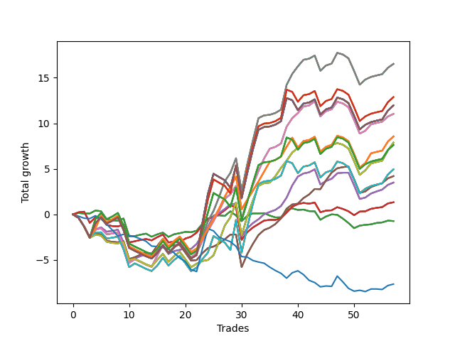

# Long Shepard 006 
- Symbol: SPY_Unlimited
- Date Range: 03/23/2022 - 07/08/2022
- Trading Period: 7:20-12:30
- Number of Trades: 57



| Name | Win Percent | Profit | Avg Profit / Trade | Avg Time / Trade |      | Name | Win Percent | Profit | Avg Profit / Trade | Avg Time / Trade |
| ---- | ----------- | ------ | ------------------ | ---------------- | ---- | ---- | ----------- | ------ | ------------------ | ---------------- |
| Sorted By <br> Profit | | | | | | Sorted By <br> Win Percentage ||||
| Sixty-Nine | 66.67 | 8260.00 | 144.91 | 25:16 |     | Sixty-Six | 77.19 | 1745.00 | 30.61 | 16:18 |
| Sixty-One | 66.67 | 8260.00 | 144.91 | 25:16 |     | Fifty-Eight | 77.19 | 1745.00 | 30.61 | 16:18 |
| Fifty-Three | 66.67 | 8260.00 | 144.91 | 25:16 |     | Fifty | 77.19 | 1745.00 | 30.61 | 16:18 |
| Forty-Five | 66.67 | 8260.00 | 144.91 | 25:16 |     | Forty-Two | 77.19 | 1745.00 | 30.61 | 16:18 |
| Five | 66.67 | 8260.00 | 144.91 | 25:16 |     | Two | 77.19 | 1745.00 | 30.61 | 16:18 |
| One Hundred Twenty-Eight | 57.89 | 6440.00 | 112.98 | 29:00 |     | Sixty-Seven | 71.93 | 2100.00 | 36.84 | 15:27 |
| One Hundred Twenty-Three | 57.89 | 6440.00 | 112.98 | 29:00 |     | Fifty-Nine | 71.93 | 2100.00 | 36.84 | 15:27 |
| One Hundred Eighteen | 57.89 | 6440.00 | 112.98 | 29:00 |     | Fifty-One | 71.93 | 2100.00 | 36.84 | 15:27 |
| One Hundred Thirteen | 57.89 | 6440.00 | 112.98 | 29:00 |     | Forty-Three | 71.93 | 2100.00 | 36.84 | 15:27 |
| Eighty-Three | 57.89 | 6440.00 | 112.98 | 29:00 |     | Three | 71.93 | 2100.00 | 36.84 | 15:27 |
| One Hundred Thirty | 57.89 | 5980.00 | 104.91 | 29:42 |     | Sixty-Five | 70.18 | 665.00 | 11.67 | 10:28 |
| One Hundred Twenty-Nine | 57.89 | 5980.00 | 104.91 | 29:42 |     | Fifty-Seven | 70.18 | 665.00 | 11.67 | 10:28 |
| One Hundred Twenty-Five | 57.89 | 5980.00 | 104.91 | 29:42 |     | Forty-Nine | 70.18 | 665.00 | 11.67 | 10:28 |
| One Hundred Twenty-Four | 57.89 | 5980.00 | 104.91 | 29:42 |     | Forty-One | 70.18 | 665.00 | 11.67 | 10:28 |
| One Hundred Twenty | 57.89 | 5980.00 | 104.91 | 29:42 |     | One | 70.18 | 665.00 | 11.67 | 10:28 |
| One Hundred Ninteen | 57.89 | 5980.00 | 104.91 | 29:42 |     | Sixty-Eight | 68.42 | 5515.00 | 96.75 | 21:59 |
| One Hundred Fifteen | 57.89 | 5980.00 | 104.91 | 29:42 |     | Sixty | 68.42 | 5515.00 | 96.75 | 21:59 |
| One Hundred Fourteen | 57.89 | 5980.00 | 104.91 | 29:42 |     | Fifty-Two | 68.42 | 5515.00 | 96.75 | 21:59 |
| Eighty-Five | 57.89 | 5980.00 | 104.91 | 29:42 |     | Forty-Four | 68.42 | 5515.00 | 96.75 | 21:59 |
| Eighty-Four | 57.89 | 5980.00 | 104.91 | 29:42 |     | Four | 68.42 | 5515.00 | 96.75 | 21:59 |
| Sixty-Eight | 68.42 | 5515.00 | 96.75 | 21:59 |     | Sixty-Nine | 66.67 | 8260.00 | 144.91 | 25:16 |
| Sixty | 68.42 | 5515.00 | 96.75 | 21:59 |     | Sixty-One | 66.67 | 8260.00 | 144.91 | 25:16 |
| Fifty-Two | 68.42 | 5515.00 | 96.75 | 21:59 |     | Fifty-Three | 66.67 | 8260.00 | 144.91 | 25:16 |
| Forty-Four | 68.42 | 5515.00 | 96.75 | 21:59 |     | Forty-Five | 66.67 | 8260.00 | 144.91 | 25:16 |
| Four | 68.42 | 5515.00 | 96.75 | 21:59 |     | Five | 66.67 | 8260.00 | 144.91 | 25:16 |
| One Hundred Twenty-Six | 64.91 | 4280.00 | 75.09 | 23:32 |     | One Hundred Twenty-Six | 64.91 | 4280.00 | 75.09 | 23:32 |
| One Hundred Twenty-One | 64.91 | 4280.00 | 75.09 | 23:32 |     | One Hundred Twenty-One | 64.91 | 4280.00 | 75.09 | 23:32 |
| One Hundred Sixteen | 64.91 | 4280.00 | 75.09 | 23:32 |     | One Hundred Sixteen | 64.91 | 4280.00 | 75.09 | 23:32 |
| One Hundred Eleven | 64.91 | 4280.00 | 75.09 | 23:32 |     | One Hundred Eleven | 64.91 | 4280.00 | 75.09 | 23:32 |
| Eighty-One | 64.91 | 4280.00 | 75.09 | 23:32 |     | Eighty-One | 64.91 | 4280.00 | 75.09 | 23:32 |
| Seventy | 64.91 | 3940.00 | 69.12 | 19:39 |     | Seventy | 64.91 | 3940.00 | 69.12 | 19:39 |
| Sixty-Two | 64.91 | 3940.00 | 69.12 | 19:39 |     | Sixty-Two | 64.91 | 3940.00 | 69.12 | 19:39 |
| Fifty-Four | 64.91 | 3940.00 | 69.12 | 19:39 |     | Fifty-Four | 64.91 | 3940.00 | 69.12 | 19:39 |
| Forty-Six | 64.91 | 3940.00 | 69.12 | 19:39 |     | Forty-Six | 64.91 | 3940.00 | 69.12 | 19:39 |
| Six | 64.91 | 3940.00 | 69.12 | 19:39 |     | Six | 64.91 | 3940.00 | 69.12 | 19:39 |
| One Hundred Twenty-Seven | 57.89 | 3815.00 | 66.93 | 28:24 |     | Seventy-One | 59.65 | 2470.00 | 43.33 | 26:02 |
| One Hundred Twenty-Two | 57.89 | 3815.00 | 66.93 | 28:24 |     | Sixty-Three | 59.65 | 2470.00 | 43.33 | 26:02 |
| One Hundred Seventeen | 57.89 | 3815.00 | 66.93 | 28:24 |     | Fifty-Five | 59.65 | 2470.00 | 43.33 | 26:02 |
| One Hundred Twelve | 57.89 | 3815.00 | 66.93 | 28:24 |     | Forty-Seven | 59.65 | 2470.00 | 43.33 | 26:02 |
| Eighty-Two | 57.89 | 3815.00 | 66.93 | 28:24 |     | Seven | 59.65 | 2470.00 | 43.33 | 26:02 |
| Seventy-One | 59.65 | 2470.00 | 43.33 | 26:02 |     | Sixty-Four | 59.65 | -365.00 | -6.40 | 04:47 |
| Sixty-Three | 59.65 | 2470.00 | 43.33 | 26:02 |     | Fifty-Six | 59.65 | -365.00 | -6.40 | 04:47 |
| Fifty-Five | 59.65 | 2470.00 | 43.33 | 26:02 |     | Forty-Eight | 59.65 | -365.00 | -6.40 | 04:47 |
| Forty-Seven | 59.65 | 2470.00 | 43.33 | 26:02 |     | Forty | 59.65 | -365.00 | -6.40 | 04:47 |
| Seven | 59.65 | 2470.00 | 43.33 | 26:02 |     | Zero | 59.65 | -365.00 | -6.40 | 04:47 |
| Sixty-Seven | 71.93 | 2100.00 | 36.84 | 15:27 |     | One Hundred Twenty-Eight | 57.89 | 6440.00 | 112.98 | 29:00 |
| Fifty-Nine | 71.93 | 2100.00 | 36.84 | 15:27 |     | One Hundred Twenty-Three | 57.89 | 6440.00 | 112.98 | 29:00 |
| Fifty-One | 71.93 | 2100.00 | 36.84 | 15:27 |     | One Hundred Eighteen | 57.89 | 6440.00 | 112.98 | 29:00 |
| Forty-Three | 71.93 | 2100.00 | 36.84 | 15:27 |     | One Hundred Thirteen | 57.89 | 6440.00 | 112.98 | 29:00 |
| Three | 71.93 | 2100.00 | 36.84 | 15:27 |     | Eighty-Three | 57.89 | 6440.00 | 112.98 | 29:00 |
| Sixty-Six | 77.19 | 1745.00 | 30.61 | 16:18 |     | One Hundred Thirty | 57.89 | 5980.00 | 104.91 | 29:42 |
| Fifty-Eight | 77.19 | 1745.00 | 30.61 | 16:18 |     | One Hundred Twenty-Nine | 57.89 | 5980.00 | 104.91 | 29:42 |
| Fifty | 77.19 | 1745.00 | 30.61 | 16:18 |     | One Hundred Twenty-Five | 57.89 | 5980.00 | 104.91 | 29:42 |
| Forty-Two | 77.19 | 1745.00 | 30.61 | 16:18 |     | One Hundred Twenty-Four | 57.89 | 5980.00 | 104.91 | 29:42 |
| Two | 77.19 | 1745.00 | 30.61 | 16:18 |     | One Hundred Twenty | 57.89 | 5980.00 | 104.91 | 29:42 |
| Sixty-Five | 70.18 | 665.00 | 11.67 | 10:28 |     | One Hundred Ninteen | 57.89 | 5980.00 | 104.91 | 29:42 |
| Fifty-Seven | 70.18 | 665.00 | 11.67 | 10:28 |     | One Hundred Fifteen | 57.89 | 5980.00 | 104.91 | 29:42 |
| Forty-Nine | 70.18 | 665.00 | 11.67 | 10:28 |     | One Hundred Fourteen | 57.89 | 5980.00 | 104.91 | 29:42 |
| Forty-One | 70.18 | 665.00 | 11.67 | 10:28 |     | Eighty-Five | 57.89 | 5980.00 | 104.91 | 29:42 |
| One | 70.18 | 665.00 | 11.67 | 10:28 |     | Eighty-Four | 57.89 | 5980.00 | 104.91 | 29:42 |
| Sixty-Four | 59.65 | -365.00 | -6.40 | 04:47 |     | One Hundred Twenty-Seven | 57.89 | 3815.00 | 66.93 | 28:24 |
| Fifty-Six | 59.65 | -365.00 | -6.40 | 04:47 |     | One Hundred Twenty-Two | 57.89 | 3815.00 | 66.93 | 28:24 |
| Forty-Eight | 59.65 | -365.00 | -6.40 | 04:47 |     | One Hundred Seventeen | 57.89 | 3815.00 | 66.93 | 28:24 |
| Forty | 59.65 | -365.00 | -6.40 | 04:47 |     | One Hundred Twelve | 57.89 | 3815.00 | 66.93 | 28:24 |
| Zero | 59.65 | -365.00 | -6.40 | 04:47 |     | Eighty-Two | 57.89 | 3815.00 | 66.93 | 28:24 |
| Seventy-Three | 22.81 | -3825.00 | -67.11 | 05:51 |     | Seventy-Three | 22.81 | -3825.00 | -67.11 | 05:51 |

## NO STOPLOSS

### Test Zero
* Sell when price hits the middle line of the 20p bollinger
* No Stoploss
* Results:
```
Total Trades: 57
Percent Up: 59.65
Percent Down: 40.35
Total Points Moved Up: -0.73
Potential Profit: -365.00
Total Points Ups: 7.72 Count Ups: 34
Total Points Downs: -8.45 Count Downs: 23
```

<details><summary>Trades</summary>

<code>In: 2022-03-23 09:49:00		Out: 2022-03-23 09:53:00		Total Position Time: 04:00		Total Move Up: 0.16		Total to Date: 0.16</code> <br />
<code>In: 2022-03-23 09:53:00		Out: 2022-03-23 09:54:05		Total Position Time: 01:05		Total Move Up: -0.07		Total to Date: 0.09</code> <br />
<code>In: 2022-03-23 10:07:00		Out: 2022-03-23 10:07:10		Total Position Time: 00:10		Total Move Up: 0.01		Total to Date: 0.10</code> <br />
<code>In: 2022-03-24 07:32:00		Out: 2022-03-24 07:32:40		Total Position Time: 00:40		Total Move Up: 0.32		Total to Date: 0.42</code> <br />
<code>In: 2022-03-24 07:33:00		Out: 2022-03-24 07:33:10		Total Position Time: 00:10		Total Move Up: -0.07		Total to Date: 0.35</code> <br />
<code>In: 2022-03-25 08:18:00		Out: 2022-03-25 08:36:40		Total Position Time: 18:40		Total Move Up: -0.87		Total to Date: -0.52</code> <br />
<code>In: 2022-03-28 07:30:00		Out: 2022-03-28 07:30:10		Total Position Time: 00:10		Total Move Up: -0.13		Total to Date: -0.65</code> <br />
<code>In: 2022-03-28 07:31:00		Out: 2022-03-28 07:31:10		Total Position Time: 00:10		Total Move Up: -0.04		Total to Date: -0.69</code> <br />
<code>In: 2022-03-28 08:11:00		Out: 2022-03-28 08:11:45		Total Position Time: 00:45		Total Move Up: 0.24		Total to Date: -0.45</code> <br />
<code>In: 2022-03-28 08:30:00		Out: 2022-03-28 08:59:55		Total Position Time: 29:55		Total Move Up: -1.96		Total to Date: -2.41</code> <br />
<code>In: 2022-03-30 07:29:00		Out: 2022-03-30 07:36:25		Total Position Time: 07:25		Total Move Up: 0.03		Total to Date: -2.38</code> <br />
<code>In: 2022-03-31 09:30:00		Out: 2022-03-31 09:32:25		Total Position Time: 02:25		Total Move Up: 0.15		Total to Date: -2.23</code> <br />
<code>In: 2022-03-31 09:31:00		Out: 2022-03-31 09:32:25		Total Position Time: 01:25		Total Move Up: 0.12		Total to Date: -2.11</code> <br />
<code>In: 2022-04-12 07:47:00		Out: 2022-04-12 08:02:05		Total Position Time: 15:05		Total Move Up: -0.34		Total to Date: -2.45</code> <br />
<code>In: 2022-04-20 08:26:00		Out: 2022-04-20 08:28:55		Total Position Time: 02:55		Total Move Up: 0.26		Total to Date: -2.19</code> <br />
<code>In: 2022-04-20 08:27:00		Out: 2022-04-20 08:28:55		Total Position Time: 01:55		Total Move Up: 0.19		Total to Date: -2.00</code> <br />
<code>In: 2022-04-20 11:32:00		Out: 2022-04-20 11:48:15		Total Position Time: 16:15		Total Move Up: -0.47		Total to Date: -2.47</code> <br />
<code>In: 2022-04-20 11:47:00		Out: 2022-04-20 11:48:15		Total Position Time: 01:15		Total Move Up: 0.29		Total to Date: -2.18</code> <br />
<code>In: 2022-04-20 11:48:00		Out: 2022-04-20 11:48:15		Total Position Time: 00:15		Total Move Up: 0.12		Total to Date: -2.06</code> <br />
<code>In: 2022-04-27 12:11:00		Out: 2022-04-27 12:13:55		Total Position Time: 02:55		Total Move Up: 0.14		Total to Date: -1.92</code> <br />
<code>In: 2022-04-27 12:14:00		Out: 2022-04-27 12:14:35		Total Position Time: 00:35		Total Move Up: -0.04		Total to Date: -1.96</code> <br />
<code>In: 2022-04-27 12:24:00		Out: 2022-04-27 12:24:15		Total Position Time: 00:15		Total Move Up: 0.17		Total to Date: -1.79</code> <br />
<code>In: 2022-05-03 07:51:00		Out: 2022-05-03 07:54:05		Total Position Time: 03:05		Total Move Up: 0.74		Total to Date: -1.05</code> <br />
<code>In: 2022-05-03 07:52:00		Out: 2022-05-03 07:54:05		Total Position Time: 02:05		Total Move Up: 0.57		Total to Date: -0.48</code> <br />
<code>In: 2022-05-03 11:45:00		Out: 2022-05-03 11:45:10		Total Position Time: 00:10		Total Move Up: 0.27		Total to Date: -0.21</code> <br />
<code>In: 2022-05-06 11:41:00		Out: 2022-05-06 11:41:10		Total Position Time: 00:10		Total Move Up: 0.11		Total to Date: -0.10</code> <br />
<code>In: 2022-05-06 11:47:00		Out: 2022-05-06 11:48:15		Total Position Time: 01:15		Total Move Up: -0.07		Total to Date: -0.17</code> <br />
<code>In: 2022-05-06 11:50:00		Out: 2022-05-06 11:50:10		Total Position Time: 00:10		Total Move Up: 0.51		Total to Date: 0.34</code> <br />
<code>In: 2022-05-06 12:20:00		Out: 2022-05-06 12:27:50		Total Position Time: 07:50		Total Move Up: -0.46		Total to Date: -0.12</code> <br />
<code>In: 2022-05-11 09:37:00		Out: 2022-05-11 09:49:15		Total Position Time: 12:15		Total Move Up: -0.62		Total to Date: -0.74</code> <br />
<code>In: 2022-05-12 09:04:00		Out: 2022-05-12 09:07:35		Total Position Time: 03:35		Total Move Up: 0.58		Total to Date: -0.16</code> <br />
<code>In: 2022-05-12 09:05:00		Out: 2022-05-12 09:07:35		Total Position Time: 02:35		Total Move Up: 0.27		Total to Date: 0.11</code> <br />
<code>In: 2022-05-12 09:08:00		Out: 2022-05-12 09:08:30		Total Position Time: 00:30		Total Move Up: 0.00		Total to Date: 0.11</code> <br />
<code>In: 2022-05-13 11:10:00		Out: 2022-05-13 11:19:15		Total Position Time: 09:15		Total Move Up: 0.03		Total to Date: 0.14</code> <br />
<code>In: 2022-05-13 11:11:00		Out: 2022-05-13 11:19:15		Total Position Time: 08:15		Total Move Up: -0.27		Total to Date: -0.13</code> <br />
<code>In: 2022-05-16 07:58:00		Out: 2022-05-16 08:05:30		Total Position Time: 07:30		Total Move Up: -0.20		Total to Date: -0.33</code> <br />
<code>In: 2022-05-16 08:02:00		Out: 2022-05-16 08:05:30		Total Position Time: 03:30		Total Move Up: 0.01		Total to Date: -0.32</code> <br />
<code>In: 2022-05-17 11:25:00		Out: 2022-05-17 11:27:25		Total Position Time: 02:25		Total Move Up: 0.80		Total to Date: 0.48</code> <br />
<code>In: 2022-05-19 10:19:00		Out: 2022-05-19 10:19:20		Total Position Time: 00:20		Total Move Up: 0.18		Total to Date: 0.66</code> <br />
<code>In: 2022-05-19 10:20:00		Out: 2022-05-19 10:20:10		Total Position Time: 00:10		Total Move Up: -0.17		Total to Date: 0.49</code> <br />
<code>In: 2022-05-25 09:30:00		Out: 2022-05-25 09:38:55		Total Position Time: 08:55		Total Move Up: 0.04		Total to Date: 0.53</code> <br />
<code>In: 2022-05-25 09:31:00		Out: 2022-05-25 09:38:55		Total Position Time: 07:55		Total Move Up: -0.17		Total to Date: 0.36</code> <br />
<code>In: 2022-05-25 09:39:00		Out: 2022-05-25 09:41:25		Total Position Time: 02:25		Total Move Up: -0.02		Total to Date: 0.34</code> <br />
<code>In: 2022-06-03 07:33:00		Out: 2022-06-03 07:46:35		Total Position Time: 13:35		Total Move Up: -0.93		Total to Date: -0.59</code> <br />
<code>In: 2022-06-06 08:24:00		Out: 2022-06-06 08:31:35		Total Position Time: 07:35		Total Move Up: 0.36		Total to Date: -0.23</code> <br />
<code>In: 2022-06-06 08:27:00		Out: 2022-06-06 08:31:35		Total Position Time: 04:35		Total Move Up: 0.23		Total to Date: 0.00</code> <br />
<code>In: 2022-06-08 08:06:00		Out: 2022-06-08 08:10:05		Total Position Time: 04:05		Total Move Up: -0.04		Total to Date: -0.04</code> <br />
<code>In: 2022-06-09 07:57:00		Out: 2022-06-09 08:10:55		Total Position Time: 13:55		Total Move Up: -0.42		Total to Date: -0.46</code> <br />
<code>In: 2022-06-09 07:58:00		Out: 2022-06-09 08:10:55		Total Position Time: 12:55		Total Move Up: -0.49		Total to Date: -0.95</code> <br />
<code>In: 2022-06-15 07:43:00		Out: 2022-06-15 07:58:55		Total Position Time: 15:55		Total Move Up: -0.56		Total to Date: -1.51</code> <br />
<code>In: 2022-06-23 08:43:00		Out: 2022-06-23 08:49:00		Total Position Time: 06:00		Total Move Up: 0.28		Total to Date: -1.23</code> <br />
<code>In: 2022-06-27 10:51:00		Out: 2022-06-27 10:51:15		Total Position Time: 00:15		Total Move Up: 0.08		Total to Date: -1.15</code> <br />
<code>In: 2022-06-29 08:29:00		Out: 2022-06-29 08:29:10		Total Position Time: 00:10		Total Move Up: 0.06		Total to Date: -1.09</code> <br />
<code>In: 2022-07-08 09:48:00		Out: 2022-07-08 09:48:45		Total Position Time: 00:45		Total Move Up: 0.15		Total to Date: -0.94</code> <br />
<code>In: 2022-07-08 09:56:00		Out: 2022-07-08 09:56:10		Total Position Time: 00:10		Total Move Up: 0.06		Total to Date: -0.88</code> <br />
<code>In: 2022-07-08 10:06:00		Out: 2022-07-08 10:06:10		Total Position Time: 00:10		Total Move Up: 0.19		Total to Date: -0.69</code> <br />
<code>In: 2022-07-08 10:07:00		Out: 2022-07-08 10:07:10		Total Position Time: 00:10		Total Move Up: -0.04		Total to Date: -0.73</code> <br />


</details>

### Test One
* Sell when the price hits the upper line of the 20p 1std bollinger
* No Stoploss
* Results:
```
Total Trades: 57
Percent Up: 70.18
Percent Down: 29.82
Total Points Moved Up: 1.33
Potential Profit: 665.00
Total Points Ups: 12.39 Count Ups: 40
Total Points Downs: -11.06 Count Downs: 17
```

<details><summary>Trades</summary>

<code>In: 2022-03-23 09:49:00		Out: 2022-03-23 09:59:10		Total Position Time: 10:10		Total Move Up: 0.23		Total to Date: 0.23</code> <br />
<code>In: 2022-03-23 09:53:00		Out: 2022-03-23 09:59:10		Total Position Time: 06:10		Total Move Up: 0.07		Total to Date: 0.30</code> <br />
<code>In: 2022-03-23 10:07:00		Out: 2022-03-23 10:36:55		Total Position Time: 29:55		Total Move Up: -1.23		Total to Date: -0.93</code> <br />
<code>In: 2022-03-24 07:32:00		Out: 2022-03-24 07:32:55		Total Position Time: 00:55		Total Move Up: 0.60		Total to Date: -0.33</code> <br />
<code>In: 2022-03-24 07:33:00		Out: 2022-03-24 07:33:10		Total Position Time: 00:10		Total Move Up: -0.07		Total to Date: -0.40</code> <br />
<code>In: 2022-03-25 08:18:00		Out: 2022-03-25 08:41:05		Total Position Time: 23:05		Total Move Up: -0.75		Total to Date: -1.15</code> <br />
<code>In: 2022-03-28 07:30:00		Out: 2022-03-28 07:30:10		Total Position Time: 00:10		Total Move Up: -0.13		Total to Date: -1.28</code> <br />
<code>In: 2022-03-28 07:31:00		Out: 2022-03-28 07:31:10		Total Position Time: 00:10		Total Move Up: -0.04		Total to Date: -1.32</code> <br />
<code>In: 2022-03-28 08:11:00		Out: 2022-03-28 08:20:05		Total Position Time: 09:05		Total Move Up: 0.20		Total to Date: -1.12</code> <br />
<code>In: 2022-03-28 08:30:00		Out: 2022-03-28 08:59:55		Total Position Time: 29:55		Total Move Up: -1.96		Total to Date: -3.08</code> <br />
<code>In: 2022-03-30 07:29:00		Out: 2022-03-30 07:38:30		Total Position Time: 09:30		Total Move Up: 0.13		Total to Date: -2.95</code> <br />
<code>In: 2022-03-31 09:30:00		Out: 2022-03-31 09:40:45		Total Position Time: 10:45		Total Move Up: 0.14		Total to Date: -2.81</code> <br />
<code>In: 2022-03-31 09:31:00		Out: 2022-03-31 09:40:45		Total Position Time: 09:45		Total Move Up: 0.11		Total to Date: -2.70</code> <br />
<code>In: 2022-04-12 07:47:00		Out: 2022-04-12 08:02:35		Total Position Time: 15:35		Total Move Up: -0.15		Total to Date: -2.85</code> <br />
<code>In: 2022-04-20 08:26:00		Out: 2022-04-20 08:30:05		Total Position Time: 04:05		Total Move Up: 0.35		Total to Date: -2.50</code> <br />
<code>In: 2022-04-20 08:27:00		Out: 2022-04-20 08:30:05		Total Position Time: 03:05		Total Move Up: 0.28		Total to Date: -2.22</code> <br />
<code>In: 2022-04-20 11:32:00		Out: 2022-04-20 12:01:55		Total Position Time: 29:55		Total Move Up: -0.86		Total to Date: -3.08</code> <br />
<code>In: 2022-04-20 11:47:00		Out: 2022-04-20 12:04:20		Total Position Time: 17:20		Total Move Up: 0.09		Total to Date: -2.99</code> <br />
<code>In: 2022-04-20 11:48:00		Out: 2022-04-20 12:04:20		Total Position Time: 16:20		Total Move Up: -0.08		Total to Date: -3.07</code> <br />
<code>In: 2022-04-27 12:11:00		Out: 2022-04-27 12:15:20		Total Position Time: 04:20		Total Move Up: 0.42		Total to Date: -2.65</code> <br />
<code>In: 2022-04-27 12:14:00		Out: 2022-04-27 12:15:20		Total Position Time: 01:20		Total Move Up: 0.20		Total to Date: -2.45</code> <br />
<code>In: 2022-04-27 12:24:00		Out: 2022-04-27 12:27:15		Total Position Time: 03:15		Total Move Up: 0.45		Total to Date: -2.00</code> <br />
<code>In: 2022-05-03 07:51:00		Out: 2022-05-03 07:57:05		Total Position Time: 06:05		Total Move Up: 0.84		Total to Date: -1.16</code> <br />
<code>In: 2022-05-03 07:52:00		Out: 2022-05-03 07:57:05		Total Position Time: 05:05		Total Move Up: 0.67		Total to Date: -0.49</code> <br />
<code>In: 2022-05-03 11:45:00		Out: 2022-05-03 11:45:15		Total Position Time: 00:15		Total Move Up: 0.21		Total to Date: -0.28</code> <br />
<code>In: 2022-05-06 11:41:00		Out: 2022-05-06 11:49:10		Total Position Time: 08:10		Total Move Up: 0.29		Total to Date: 0.01</code> <br />
<code>In: 2022-05-06 11:47:00		Out: 2022-05-06 11:49:10		Total Position Time: 02:10		Total Move Up: 0.45		Total to Date: 0.46</code> <br />
<code>In: 2022-05-06 11:50:00		Out: 2022-05-06 11:50:10		Total Position Time: 00:10		Total Move Up: 0.51		Total to Date: 0.97</code> <br />
<code>In: 2022-05-06 12:20:00		Out: 2022-05-06 12:28:05		Total Position Time: 08:05		Total Move Up: -0.17		Total to Date: 0.80</code> <br />
<code>In: 2022-05-11 09:37:00		Out: 2022-05-11 10:06:55		Total Position Time: 29:55		Total Move Up: -3.59		Total to Date: -2.79</code> <br />
<code>In: 2022-05-12 09:04:00		Out: 2022-05-12 09:11:10		Total Position Time: 07:10		Total Move Up: 0.83		Total to Date: -1.96</code> <br />
<code>In: 2022-05-12 09:05:00		Out: 2022-05-12 09:11:10		Total Position Time: 06:10		Total Move Up: 0.52		Total to Date: -1.44</code> <br />
<code>In: 2022-05-12 09:08:00		Out: 2022-05-12 09:11:10		Total Position Time: 03:10		Total Move Up: 0.38		Total to Date: -1.06</code> <br />
<code>In: 2022-05-13 11:10:00		Out: 2022-05-13 11:20:00		Total Position Time: 10:00		Total Move Up: 0.38		Total to Date: -0.68</code> <br />
<code>In: 2022-05-13 11:11:00		Out: 2022-05-13 11:20:00		Total Position Time: 09:00		Total Move Up: 0.08		Total to Date: -0.60</code> <br />
<code>In: 2022-05-16 07:58:00		Out: 2022-05-16 08:09:50		Total Position Time: 11:50		Total Move Up: -0.01		Total to Date: -0.61</code> <br />
<code>In: 2022-05-16 08:02:00		Out: 2022-05-16 08:09:50		Total Position Time: 07:50		Total Move Up: 0.20		Total to Date: -0.41</code> <br />
<code>In: 2022-05-17 11:25:00		Out: 2022-05-17 11:37:35		Total Position Time: 12:35		Total Move Up: 0.61		Total to Date: 0.20</code> <br />
<code>In: 2022-05-19 10:19:00		Out: 2022-05-19 10:22:45		Total Position Time: 03:45		Total Move Up: 0.65		Total to Date: 0.85</code> <br />
<code>In: 2022-05-19 10:20:00		Out: 2022-05-19 10:22:45		Total Position Time: 02:45		Total Move Up: 0.28		Total to Date: 1.13</code> <br />
<code>In: 2022-05-25 09:30:00		Out: 2022-05-25 09:44:25		Total Position Time: 14:25		Total Move Up: 0.13		Total to Date: 1.26</code> <br />
<code>In: 2022-05-25 09:31:00		Out: 2022-05-25 09:44:25		Total Position Time: 13:25		Total Move Up: -0.08		Total to Date: 1.18</code> <br />
<code>In: 2022-05-25 09:39:00		Out: 2022-05-25 09:44:25		Total Position Time: 05:25		Total Move Up: 0.12		Total to Date: 1.30</code> <br />
<code>In: 2022-06-03 07:33:00		Out: 2022-06-03 07:58:10		Total Position Time: 25:10		Total Move Up: -1.06		Total to Date: 0.24</code> <br />
<code>In: 2022-06-06 08:24:00		Out: 2022-06-06 08:39:15		Total Position Time: 15:15		Total Move Up: 0.17		Total to Date: 0.41</code> <br />
<code>In: 2022-06-06 08:27:00		Out: 2022-06-06 08:39:15		Total Position Time: 12:15		Total Move Up: 0.04		Total to Date: 0.45</code> <br />
<code>In: 2022-06-08 08:06:00		Out: 2022-06-08 08:11:10		Total Position Time: 05:10		Total Move Up: 0.34		Total to Date: 0.79</code> <br />
<code>In: 2022-06-09 07:57:00		Out: 2022-06-09 08:21:10		Total Position Time: 24:10		Total Move Up: -0.19		Total to Date: 0.60</code> <br />
<code>In: 2022-06-09 07:58:00		Out: 2022-06-09 08:21:10		Total Position Time: 23:10		Total Move Up: -0.26		Total to Date: 0.34</code> <br />
<code>In: 2022-06-15 07:43:00		Out: 2022-06-15 08:07:20		Total Position Time: 24:20		Total Move Up: -0.43		Total to Date: -0.09</code> <br />
<code>In: 2022-06-23 08:43:00		Out: 2022-06-23 08:51:05		Total Position Time: 08:05		Total Move Up: 0.40		Total to Date: 0.31</code> <br />
<code>In: 2022-06-27 10:51:00		Out: 2022-06-27 11:03:15		Total Position Time: 12:15		Total Move Up: 0.03		Total to Date: 0.34</code> <br />
<code>In: 2022-06-29 08:29:00		Out: 2022-06-29 08:32:20		Total Position Time: 03:20		Total Move Up: 0.27		Total to Date: 0.61</code> <br />
<code>In: 2022-07-08 09:48:00		Out: 2022-07-08 10:09:40		Total Position Time: 21:40		Total Move Up: 0.11		Total to Date: 0.72</code> <br />
<code>In: 2022-07-08 09:56:00		Out: 2022-07-08 10:09:40		Total Position Time: 13:40		Total Move Up: 0.08		Total to Date: 0.80</code> <br />
<code>In: 2022-07-08 10:06:00		Out: 2022-07-08 10:09:40		Total Position Time: 03:40		Total Move Up: 0.40		Total to Date: 1.20</code> <br />
<code>In: 2022-07-08 10:07:00		Out: 2022-07-08 10:09:40		Total Position Time: 02:40		Total Move Up: 0.13		Total to Date: 1.33</code> <br />


</details>

### Test Two
* Sell when the price hits the upper line of the 20p 2std bollinger
* No Stoploss
* Results:
```
Total Trades: 57
Percent Up: 77.19
Percent Down: 22.81
Total Points Moved Up: 3.49
Potential Profit: 1745.00
Total Points Ups: 19.20 Count Ups: 44
Total Points Downs: -15.71 Count Downs: 13
```

<details><summary>Trades</summary>

<code>In: 2022-03-23 09:49:00		Out: 2022-03-23 10:18:55		Total Position Time: 29:55		Total Move Up: -0.38		Total to Date: -0.38</code> <br />
<code>In: 2022-03-23 09:53:00		Out: 2022-03-23 10:22:55		Total Position Time: 29:55		Total Move Up: -0.95		Total to Date: -1.33</code> <br />
<code>In: 2022-03-23 10:07:00		Out: 2022-03-23 10:36:55		Total Position Time: 29:55		Total Move Up: -1.23		Total to Date: -2.56</code> <br />
<code>In: 2022-03-24 07:32:00		Out: 2022-03-24 07:34:20		Total Position Time: 02:20		Total Move Up: 0.90		Total to Date: -1.66</code> <br />
<code>In: 2022-03-24 07:33:00		Out: 2022-03-24 07:34:20		Total Position Time: 01:20		Total Move Up: 0.24		Total to Date: -1.42</code> <br />
<code>In: 2022-03-25 08:18:00		Out: 2022-03-25 08:41:45		Total Position Time: 23:45		Total Move Up: -0.48		Total to Date: -1.90</code> <br />
<code>In: 2022-03-28 07:30:00		Out: 2022-03-28 07:30:25		Total Position Time: 00:25		Total Move Up: 0.09		Total to Date: -1.81</code> <br />
<code>In: 2022-03-28 07:31:00		Out: 2022-03-28 07:48:05		Total Position Time: 17:05		Total Move Up: 0.13		Total to Date: -1.68</code> <br />
<code>In: 2022-03-28 08:11:00		Out: 2022-03-28 08:40:55		Total Position Time: 29:55		Total Move Up: -1.40		Total to Date: -3.08</code> <br />
<code>In: 2022-03-28 08:30:00		Out: 2022-03-28 08:59:55		Total Position Time: 29:55		Total Move Up: -1.96		Total to Date: -5.04</code> <br />
<code>In: 2022-03-30 07:29:00		Out: 2022-03-30 07:46:00		Total Position Time: 17:00		Total Move Up: 0.20		Total to Date: -4.84</code> <br />
<code>In: 2022-03-31 09:30:00		Out: 2022-03-31 09:44:20		Total Position Time: 14:20		Total Move Up: 0.25		Total to Date: -4.59</code> <br />
<code>In: 2022-03-31 09:31:00		Out: 2022-03-31 09:44:20		Total Position Time: 13:20		Total Move Up: 0.22		Total to Date: -4.37</code> <br />
<code>In: 2022-04-12 07:47:00		Out: 2022-04-12 08:16:55		Total Position Time: 29:55		Total Move Up: -0.24		Total to Date: -4.61</code> <br />
<code>In: 2022-04-20 08:26:00		Out: 2022-04-20 08:30:55		Total Position Time: 04:55		Total Move Up: 0.60		Total to Date: -4.01</code> <br />
<code>In: 2022-04-20 08:27:00		Out: 2022-04-20 08:30:55		Total Position Time: 03:55		Total Move Up: 0.53		Total to Date: -3.48</code> <br />
<code>In: 2022-04-20 11:32:00		Out: 2022-04-20 12:01:55		Total Position Time: 29:55		Total Move Up: -0.86		Total to Date: -4.34</code> <br />
<code>In: 2022-04-20 11:47:00		Out: 2022-04-20 12:12:35		Total Position Time: 25:35		Total Move Up: 0.31		Total to Date: -4.03</code> <br />
<code>In: 2022-04-20 11:48:00		Out: 2022-04-20 12:12:35		Total Position Time: 24:35		Total Move Up: 0.14		Total to Date: -3.89</code> <br />
<code>In: 2022-04-27 12:11:00		Out: 2022-04-27 12:31:35		Total Position Time: 20:35		Total Move Up: 0.16		Total to Date: -3.73</code> <br />
<code>In: 2022-04-27 12:14:00		Out: 2022-04-27 12:31:35		Total Position Time: 17:35		Total Move Up: -0.06		Total to Date: -3.79</code> <br />
<code>In: 2022-04-27 12:24:00		Out: 2022-04-27 12:31:35		Total Position Time: 07:35		Total Move Up: 0.54		Total to Date: -3.25</code> <br />
<code>In: 2022-05-03 07:51:00		Out: 2022-05-03 07:59:10		Total Position Time: 08:10		Total Move Up: 1.00		Total to Date: -2.25</code> <br />
<code>In: 2022-05-03 07:52:00		Out: 2022-05-03 07:59:10		Total Position Time: 07:10		Total Move Up: 0.83		Total to Date: -1.42</code> <br />
<code>In: 2022-05-03 11:45:00		Out: 2022-05-03 11:52:15		Total Position Time: 07:15		Total Move Up: 1.27		Total to Date: -0.15</code> <br />
<code>In: 2022-05-06 11:41:00		Out: 2022-05-06 11:49:10		Total Position Time: 08:10		Total Move Up: 0.29		Total to Date: 0.14</code> <br />
<code>In: 2022-05-06 11:47:00		Out: 2022-05-06 11:49:10		Total Position Time: 02:10		Total Move Up: 0.45		Total to Date: 0.59</code> <br />
<code>In: 2022-05-06 11:50:00		Out: 2022-05-06 11:50:10		Total Position Time: 00:10		Total Move Up: 0.51		Total to Date: 1.10</code> <br />
<code>In: 2022-05-06 12:20:00		Out: 2022-05-06 12:28:30		Total Position Time: 08:30		Total Move Up: 0.08		Total to Date: 1.18</code> <br />
<code>In: 2022-05-11 09:37:00		Out: 2022-05-11 10:06:55		Total Position Time: 29:55		Total Move Up: -3.59		Total to Date: -2.41</code> <br />
<code>In: 2022-05-12 09:04:00		Out: 2022-05-12 09:16:10		Total Position Time: 12:10		Total Move Up: 0.88		Total to Date: -1.53</code> <br />
<code>In: 2022-05-12 09:05:00		Out: 2022-05-12 09:16:10		Total Position Time: 11:10		Total Move Up: 0.57		Total to Date: -0.96</code> <br />
<code>In: 2022-05-12 09:08:00		Out: 2022-05-12 09:16:10		Total Position Time: 08:10		Total Move Up: 0.43		Total to Date: -0.53</code> <br />
<code>In: 2022-05-13 11:10:00		Out: 2022-05-13 11:31:20		Total Position Time: 21:20		Total Move Up: 0.55		Total to Date: 0.02</code> <br />
<code>In: 2022-05-13 11:11:00		Out: 2022-05-13 11:31:20		Total Position Time: 20:20		Total Move Up: 0.25		Total to Date: 0.27</code> <br />
<code>In: 2022-05-16 07:58:00		Out: 2022-05-16 08:11:15		Total Position Time: 13:15		Total Move Up: 0.22		Total to Date: 0.49</code> <br />
<code>In: 2022-05-16 08:02:00		Out: 2022-05-16 08:11:15		Total Position Time: 09:15		Total Move Up: 0.43		Total to Date: 0.92</code> <br />
<code>In: 2022-05-17 11:25:00		Out: 2022-05-17 11:40:00		Total Position Time: 15:00		Total Move Up: 0.92		Total to Date: 1.84</code> <br />
<code>In: 2022-05-19 10:19:00		Out: 2022-05-19 10:44:05		Total Position Time: 25:05		Total Move Up: 1.34		Total to Date: 3.18</code> <br />
<code>In: 2022-05-19 10:20:00		Out: 2022-05-19 10:44:05		Total Position Time: 24:05		Total Move Up: 0.97		Total to Date: 4.15</code> <br />
<code>In: 2022-05-25 09:30:00		Out: 2022-05-25 09:45:20		Total Position Time: 15:20		Total Move Up: 0.34		Total to Date: 4.49</code> <br />
<code>In: 2022-05-25 09:31:00		Out: 2022-05-25 09:45:20		Total Position Time: 14:20		Total Move Up: 0.13		Total to Date: 4.62</code> <br />
<code>In: 2022-05-25 09:39:00		Out: 2022-05-25 09:45:20		Total Position Time: 06:20		Total Move Up: 0.33		Total to Date: 4.95</code> <br />
<code>In: 2022-06-03 07:33:00		Out: 2022-06-03 08:02:55		Total Position Time: 29:55		Total Move Up: -1.67		Total to Date: 3.28</code> <br />
<code>In: 2022-06-06 08:24:00		Out: 2022-06-06 08:43:00		Total Position Time: 19:00		Total Move Up: 0.38		Total to Date: 3.66</code> <br />
<code>In: 2022-06-06 08:27:00		Out: 2022-06-06 08:43:00		Total Position Time: 16:00		Total Move Up: 0.25		Total to Date: 3.91</code> <br />
<code>In: 2022-06-08 08:06:00		Out: 2022-06-08 08:14:00		Total Position Time: 08:00		Total Move Up: 0.60		Total to Date: 4.51</code> <br />
<code>In: 2022-06-09 07:57:00		Out: 2022-06-09 08:22:35		Total Position Time: 25:35		Total Move Up: 0.07		Total to Date: 4.58</code> <br />
<code>In: 2022-06-09 07:58:00		Out: 2022-06-09 08:22:35		Total Position Time: 24:35		Total Move Up: 0.00		Total to Date: 4.58</code> <br />
<code>In: 2022-06-15 07:43:00		Out: 2022-06-15 08:12:55		Total Position Time: 29:55		Total Move Up: -1.39		Total to Date: 3.19</code> <br />
<code>In: 2022-06-23 08:43:00		Out: 2022-06-23 09:12:55		Total Position Time: 29:55		Total Move Up: -1.50		Total to Date: 1.69</code> <br />
<code>In: 2022-06-27 10:51:00		Out: 2022-06-27 11:13:35		Total Position Time: 22:35		Total Move Up: 0.16		Total to Date: 1.85</code> <br />
<code>In: 2022-06-29 08:29:00		Out: 2022-06-29 08:34:40		Total Position Time: 05:40		Total Move Up: 0.44		Total to Date: 2.29</code> <br />
<code>In: 2022-07-08 09:48:00		Out: 2022-07-08 10:11:10		Total Position Time: 23:10		Total Move Up: 0.23		Total to Date: 2.52</code> <br />
<code>In: 2022-07-08 09:56:00		Out: 2022-07-08 10:11:10		Total Position Time: 15:10		Total Move Up: 0.20		Total to Date: 2.72</code> <br />
<code>In: 2022-07-08 10:06:00		Out: 2022-07-08 10:11:10		Total Position Time: 05:10		Total Move Up: 0.52		Total to Date: 3.24</code> <br />
<code>In: 2022-07-08 10:07:00		Out: 2022-07-08 10:11:10		Total Position Time: 04:10		Total Move Up: 0.25		Total to Date: 3.49</code> <br />


</details>

### Test Three
* Sell when price hits the middle line of the 50p bollinger
* No Stoploss
* Results:
```
Total Trades: 57
Percent Up: 71.93
Percent Down: 28.07
Total Points Moved Up: 4.20
Potential Profit: 2100.00
Total Points Ups: 18.83 Count Ups: 41
Total Points Downs: -14.63 Count Downs: 16
```

<details><summary>Trades</summary>

<code>In: 2022-03-23 09:49:00		Out: 2022-03-23 10:18:55		Total Position Time: 29:55		Total Move Up: -0.38		Total to Date: -0.38</code> <br />
<code>In: 2022-03-23 09:53:00		Out: 2022-03-23 10:22:55		Total Position Time: 29:55		Total Move Up: -0.95		Total to Date: -1.33</code> <br />
<code>In: 2022-03-23 10:07:00		Out: 2022-03-23 10:36:55		Total Position Time: 29:55		Total Move Up: -1.23		Total to Date: -2.56</code> <br />
<code>In: 2022-03-24 07:32:00		Out: 2022-03-24 07:32:45		Total Position Time: 00:45		Total Move Up: 0.43		Total to Date: -2.13</code> <br />
<code>In: 2022-03-24 07:33:00		Out: 2022-03-24 07:33:10		Total Position Time: 00:10		Total Move Up: -0.07		Total to Date: -2.20</code> <br />
<code>In: 2022-03-25 08:18:00		Out: 2022-03-25 08:47:55		Total Position Time: 29:55		Total Move Up: -0.69		Total to Date: -2.89</code> <br />
<code>In: 2022-03-28 07:30:00		Out: 2022-03-28 07:30:10		Total Position Time: 00:10		Total Move Up: -0.13		Total to Date: -3.02</code> <br />
<code>In: 2022-03-28 07:31:00		Out: 2022-03-28 07:31:10		Total Position Time: 00:10		Total Move Up: -0.04		Total to Date: -3.06</code> <br />
<code>In: 2022-03-28 08:11:00		Out: 2022-03-28 08:11:35		Total Position Time: 00:35		Total Move Up: 0.12		Total to Date: -2.94</code> <br />
<code>In: 2022-03-28 08:30:00		Out: 2022-03-28 08:59:55		Total Position Time: 29:55		Total Move Up: -1.96		Total to Date: -4.90</code> <br />
<code>In: 2022-03-30 07:29:00		Out: 2022-03-30 07:46:00		Total Position Time: 17:00		Total Move Up: 0.20		Total to Date: -4.70</code> <br />
<code>In: 2022-03-31 09:30:00		Out: 2022-03-31 09:45:10		Total Position Time: 15:10		Total Move Up: 0.27		Total to Date: -4.43</code> <br />
<code>In: 2022-03-31 09:31:00		Out: 2022-03-31 09:45:10		Total Position Time: 14:10		Total Move Up: 0.24		Total to Date: -4.19</code> <br />
<code>In: 2022-04-12 07:47:00		Out: 2022-04-12 08:15:40		Total Position Time: 28:40		Total Move Up: -0.12		Total to Date: -4.31</code> <br />
<code>In: 2022-04-20 08:26:00		Out: 2022-04-20 08:36:10		Total Position Time: 10:10		Total Move Up: 0.85		Total to Date: -3.46</code> <br />
<code>In: 2022-04-20 08:27:00		Out: 2022-04-20 08:36:10		Total Position Time: 09:10		Total Move Up: 0.78		Total to Date: -2.68</code> <br />
<code>In: 2022-04-20 11:32:00		Out: 2022-04-20 12:01:55		Total Position Time: 29:55		Total Move Up: -0.86		Total to Date: -3.54</code> <br />
<code>In: 2022-04-20 11:47:00		Out: 2022-04-20 12:10:10		Total Position Time: 23:10		Total Move Up: 0.17		Total to Date: -3.37</code> <br />
<code>In: 2022-04-20 11:48:00		Out: 2022-04-20 12:10:10		Total Position Time: 22:10		Total Move Up: 0.00		Total to Date: -3.37</code> <br />
<code>In: 2022-04-27 12:11:00		Out: 2022-04-27 12:40:55		Total Position Time: 29:55		Total Move Up: -0.83		Total to Date: -4.20</code> <br />
<code>In: 2022-04-27 12:14:00		Out: 2022-04-27 12:43:55		Total Position Time: 29:55		Total Move Up: -0.87		Total to Date: -5.07</code> <br />
<code>In: 2022-04-27 12:24:00		Out: 2022-04-27 12:44:15		Total Position Time: 20:15		Total Move Up: 0.06		Total to Date: -5.01</code> <br />
<code>In: 2022-05-03 07:51:00		Out: 2022-05-03 07:54:05		Total Position Time: 03:05		Total Move Up: 0.74		Total to Date: -4.27</code> <br />
<code>In: 2022-05-03 07:52:00		Out: 2022-05-03 07:54:05		Total Position Time: 02:05		Total Move Up: 0.57		Total to Date: -3.70</code> <br />
<code>In: 2022-05-03 11:45:00		Out: 2022-05-03 11:48:05		Total Position Time: 03:05		Total Move Up: 0.17		Total to Date: -3.53</code> <br />
<code>In: 2022-05-06 11:41:00		Out: 2022-05-06 11:49:15		Total Position Time: 08:15		Total Move Up: 0.32		Total to Date: -3.21</code> <br />
<code>In: 2022-05-06 11:47:00		Out: 2022-05-06 11:49:15		Total Position Time: 02:15		Total Move Up: 0.48		Total to Date: -2.73</code> <br />
<code>In: 2022-05-06 11:50:00		Out: 2022-05-06 11:50:10		Total Position Time: 00:10		Total Move Up: 0.51		Total to Date: -2.22</code> <br />
<code>In: 2022-05-06 12:20:00		Out: 2022-05-06 12:28:10		Total Position Time: 08:10		Total Move Up: 0.02		Total to Date: -2.20</code> <br />
<code>In: 2022-05-11 09:37:00		Out: 2022-05-11 10:06:55		Total Position Time: 29:55		Total Move Up: -3.59		Total to Date: -5.79</code> <br />
<code>In: 2022-05-12 09:04:00		Out: 2022-05-12 09:21:35		Total Position Time: 17:35		Total Move Up: 1.43		Total to Date: -4.36</code> <br />
<code>In: 2022-05-12 09:05:00		Out: 2022-05-12 09:21:35		Total Position Time: 16:35		Total Move Up: 1.12		Total to Date: -3.24</code> <br />
<code>In: 2022-05-12 09:08:00		Out: 2022-05-12 09:21:35		Total Position Time: 13:35		Total Move Up: 0.98		Total to Date: -2.26</code> <br />
<code>In: 2022-05-13 11:10:00		Out: 2022-05-13 11:31:20		Total Position Time: 21:20		Total Move Up: 0.55		Total to Date: -1.71</code> <br />
<code>In: 2022-05-13 11:11:00		Out: 2022-05-13 11:31:20		Total Position Time: 20:20		Total Move Up: 0.25		Total to Date: -1.46</code> <br />
<code>In: 2022-05-16 07:58:00		Out: 2022-05-16 08:17:05		Total Position Time: 19:05		Total Move Up: 0.40		Total to Date: -1.06</code> <br />
<code>In: 2022-05-16 08:02:00		Out: 2022-05-16 08:17:05		Total Position Time: 15:05		Total Move Up: 0.61		Total to Date: -0.45</code> <br />
<code>In: 2022-05-17 11:25:00		Out: 2022-05-17 11:40:05		Total Position Time: 15:05		Total Move Up: 1.08		Total to Date: 0.63</code> <br />
<code>In: 2022-05-19 10:19:00		Out: 2022-05-19 10:21:15		Total Position Time: 02:15		Total Move Up: 0.46		Total to Date: 1.09</code> <br />
<code>In: 2022-05-19 10:20:00		Out: 2022-05-19 10:21:15		Total Position Time: 01:15		Total Move Up: 0.09		Total to Date: 1.18</code> <br />
<code>In: 2022-05-25 09:30:00		Out: 2022-05-25 09:49:05		Total Position Time: 19:05		Total Move Up: 0.61		Total to Date: 1.79</code> <br />
<code>In: 2022-05-25 09:31:00		Out: 2022-05-25 09:49:05		Total Position Time: 18:05		Total Move Up: 0.40		Total to Date: 2.19</code> <br />
<code>In: 2022-05-25 09:39:00		Out: 2022-05-25 09:49:05		Total Position Time: 10:05		Total Move Up: 0.60		Total to Date: 2.79</code> <br />
<code>In: 2022-06-03 07:33:00		Out: 2022-06-03 07:33:30		Total Position Time: 00:30		Total Move Up: -0.02		Total to Date: 2.77</code> <br />
<code>In: 2022-06-06 08:24:00		Out: 2022-06-06 08:46:10		Total Position Time: 22:10		Total Move Up: 0.97		Total to Date: 3.74</code> <br />
<code>In: 2022-06-06 08:27:00		Out: 2022-06-06 08:46:10		Total Position Time: 19:10		Total Move Up: 0.84		Total to Date: 4.58</code> <br />
<code>In: 2022-06-08 08:06:00		Out: 2022-06-08 08:11:20		Total Position Time: 05:20		Total Move Up: 0.48		Total to Date: 5.06</code> <br />
<code>In: 2022-06-09 07:57:00		Out: 2022-06-09 08:22:45		Total Position Time: 25:45		Total Move Up: 0.13		Total to Date: 5.19</code> <br />
<code>In: 2022-06-09 07:58:00		Out: 2022-06-09 08:22:45		Total Position Time: 24:45		Total Move Up: 0.06		Total to Date: 5.25</code> <br />
<code>In: 2022-06-15 07:43:00		Out: 2022-06-15 08:12:55		Total Position Time: 29:55		Total Move Up: -1.39		Total to Date: 3.86</code> <br />
<code>In: 2022-06-23 08:43:00		Out: 2022-06-23 09:12:55		Total Position Time: 29:55		Total Move Up: -1.50		Total to Date: 2.36</code> <br />
<code>In: 2022-06-27 10:51:00		Out: 2022-06-27 11:13:35		Total Position Time: 22:35		Total Move Up: 0.16		Total to Date: 2.52</code> <br />
<code>In: 2022-06-29 08:29:00		Out: 2022-06-29 08:35:10		Total Position Time: 06:10		Total Move Up: 0.48		Total to Date: 3.00</code> <br />
<code>In: 2022-07-08 09:48:00		Out: 2022-07-08 10:11:05		Total Position Time: 23:05		Total Move Up: 0.23		Total to Date: 3.23</code> <br />
<code>In: 2022-07-08 09:56:00		Out: 2022-07-08 10:11:05		Total Position Time: 15:05		Total Move Up: 0.20		Total to Date: 3.43</code> <br />
<code>In: 2022-07-08 10:06:00		Out: 2022-07-08 10:11:05		Total Position Time: 05:05		Total Move Up: 0.52		Total to Date: 3.95</code> <br />
<code>In: 2022-07-08 10:07:00		Out: 2022-07-08 10:11:05		Total Position Time: 04:05		Total Move Up: 0.25		Total to Date: 4.20</code> <br />


</details>

### Test Four
* Sell when the price hits the upper line of the 50p 1std bollinger
* No Stoploss
* Results:
```
Total Trades: 57
Percent Up: 68.42
Percent Down: 31.58
Total Points Moved Up: 11.03
Potential Profit: 5515.00
Total Points Ups: 29.79 Count Ups: 39
Total Points Downs: -18.76 Count Downs: 18
```

<details><summary>Trades</summary>

<code>In: 2022-03-23 09:49:00		Out: 2022-03-23 10:18:55		Total Position Time: 29:55		Total Move Up: -0.38		Total to Date: -0.38</code> <br />
<code>In: 2022-03-23 09:53:00		Out: 2022-03-23 10:22:55		Total Position Time: 29:55		Total Move Up: -0.95		Total to Date: -1.33</code> <br />
<code>In: 2022-03-23 10:07:00		Out: 2022-03-23 10:36:55		Total Position Time: 29:55		Total Move Up: -1.23		Total to Date: -2.56</code> <br />
<code>In: 2022-03-24 07:32:00		Out: 2022-03-24 07:34:15		Total Position Time: 02:15		Total Move Up: 0.86		Total to Date: -1.70</code> <br />
<code>In: 2022-03-24 07:33:00		Out: 2022-03-24 07:34:15		Total Position Time: 01:15		Total Move Up: 0.20		Total to Date: -1.50</code> <br />
<code>In: 2022-03-25 08:18:00		Out: 2022-03-25 08:47:55		Total Position Time: 29:55		Total Move Up: -0.69		Total to Date: -2.19</code> <br />
<code>In: 2022-03-28 07:30:00		Out: 2022-03-28 07:30:25		Total Position Time: 00:25		Total Move Up: 0.09		Total to Date: -2.10</code> <br />
<code>In: 2022-03-28 07:31:00		Out: 2022-03-28 07:48:05		Total Position Time: 17:05		Total Move Up: 0.13		Total to Date: -1.97</code> <br />
<code>In: 2022-03-28 08:11:00		Out: 2022-03-28 08:40:55		Total Position Time: 29:55		Total Move Up: -1.40		Total to Date: -3.37</code> <br />
<code>In: 2022-03-28 08:30:00		Out: 2022-03-28 08:59:55		Total Position Time: 29:55		Total Move Up: -1.96		Total to Date: -5.33</code> <br />
<code>In: 2022-03-30 07:29:00		Out: 2022-03-30 07:51:05		Total Position Time: 22:05		Total Move Up: 0.41		Total to Date: -4.92</code> <br />
<code>In: 2022-03-31 09:30:00		Out: 2022-03-31 09:59:55		Total Position Time: 29:55		Total Move Up: -0.29		Total to Date: -5.21</code> <br />
<code>In: 2022-03-31 09:31:00		Out: 2022-03-31 10:00:55		Total Position Time: 29:55		Total Move Up: -0.31		Total to Date: -5.52</code> <br />
<code>In: 2022-04-12 07:47:00		Out: 2022-04-12 08:16:55		Total Position Time: 29:55		Total Move Up: -0.24		Total to Date: -5.76</code> <br />
<code>In: 2022-04-20 08:26:00		Out: 2022-04-20 08:45:05		Total Position Time: 19:05		Total Move Up: 1.23		Total to Date: -4.53</code> <br />
<code>In: 2022-04-20 08:27:00		Out: 2022-04-20 08:45:05		Total Position Time: 18:05		Total Move Up: 1.16		Total to Date: -3.37</code> <br />
<code>In: 2022-04-20 11:32:00		Out: 2022-04-20 12:01:55		Total Position Time: 29:55		Total Move Up: -0.86		Total to Date: -4.23</code> <br />
<code>In: 2022-04-20 11:47:00		Out: 2022-04-20 12:13:35		Total Position Time: 26:35		Total Move Up: 0.67		Total to Date: -3.56</code> <br />
<code>In: 2022-04-20 11:48:00		Out: 2022-04-20 12:13:35		Total Position Time: 25:35		Total Move Up: 0.50		Total to Date: -3.06</code> <br />
<code>In: 2022-04-27 12:11:00		Out: 2022-04-27 12:40:55		Total Position Time: 29:55		Total Move Up: -0.83		Total to Date: -3.89</code> <br />
<code>In: 2022-04-27 12:14:00		Out: 2022-04-27 12:43:55		Total Position Time: 29:55		Total Move Up: -0.87		Total to Date: -4.76</code> <br />
<code>In: 2022-04-27 12:24:00		Out: 2022-04-27 12:44:35		Total Position Time: 20:35		Total Move Up: 0.54		Total to Date: -4.22</code> <br />
<code>In: 2022-05-03 07:51:00		Out: 2022-05-03 08:02:25		Total Position Time: 11:25		Total Move Up: 1.28		Total to Date: -2.94</code> <br />
<code>In: 2022-05-03 07:52:00		Out: 2022-05-03 08:02:25		Total Position Time: 10:25		Total Move Up: 1.11		Total to Date: -1.83</code> <br />
<code>In: 2022-05-03 11:45:00		Out: 2022-05-03 11:52:05		Total Position Time: 07:05		Total Move Up: 1.09		Total to Date: -0.74</code> <br />
<code>In: 2022-05-06 11:41:00		Out: 2022-05-06 11:50:10		Total Position Time: 09:10		Total Move Up: 1.14		Total to Date: 0.40</code> <br />
<code>In: 2022-05-06 11:47:00		Out: 2022-05-06 11:50:10		Total Position Time: 03:10		Total Move Up: 1.30		Total to Date: 1.70</code> <br />
<code>In: 2022-05-06 11:50:00		Out: 2022-05-06 11:50:10		Total Position Time: 00:10		Total Move Up: 0.51		Total to Date: 2.21</code> <br />
<code>In: 2022-05-06 12:20:00		Out: 2022-05-06 12:30:30		Total Position Time: 10:30		Total Move Up: 0.91		Total to Date: 3.12</code> <br />
<code>In: 2022-05-11 09:37:00		Out: 2022-05-11 10:06:55		Total Position Time: 29:55		Total Move Up: -3.59		Total to Date: -0.47</code> <br />
<code>In: 2022-05-12 09:04:00		Out: 2022-05-12 09:30:10		Total Position Time: 26:10		Total Move Up: 2.00		Total to Date: 1.53</code> <br />
<code>In: 2022-05-12 09:05:00		Out: 2022-05-12 09:30:10		Total Position Time: 25:10		Total Move Up: 1.69		Total to Date: 3.22</code> <br />
<code>In: 2022-05-12 09:08:00		Out: 2022-05-12 09:30:10		Total Position Time: 22:10		Total Move Up: 1.55		Total to Date: 4.77</code> <br />
<code>In: 2022-05-13 11:10:00		Out: 2022-05-13 11:32:00		Total Position Time: 22:00		Total Move Up: 1.37		Total to Date: 6.14</code> <br />
<code>In: 2022-05-13 11:11:00		Out: 2022-05-13 11:32:00		Total Position Time: 21:00		Total Move Up: 1.07		Total to Date: 7.21</code> <br />
<code>In: 2022-05-16 07:58:00		Out: 2022-05-16 08:27:55		Total Position Time: 29:55		Total Move Up: 0.20		Total to Date: 7.41</code> <br />
<code>In: 2022-05-16 08:02:00		Out: 2022-05-16 08:31:55		Total Position Time: 29:55		Total Move Up: 0.37		Total to Date: 7.78</code> <br />
<code>In: 2022-05-17 11:25:00		Out: 2022-05-17 11:44:30		Total Position Time: 19:30		Total Move Up: 1.85		Total to Date: 9.63</code> <br />
<code>In: 2022-05-19 10:19:00		Out: 2022-05-19 10:23:30		Total Position Time: 04:30		Total Move Up: 0.93		Total to Date: 10.56</code> <br />
<code>In: 2022-05-19 10:20:00		Out: 2022-05-19 10:23:30		Total Position Time: 03:30		Total Move Up: 0.56		Total to Date: 11.12</code> <br />
<code>In: 2022-05-25 09:30:00		Out: 2022-05-25 09:59:55		Total Position Time: 29:55		Total Move Up: 0.72		Total to Date: 11.84</code> <br />
<code>In: 2022-05-25 09:31:00		Out: 2022-05-25 10:00:55		Total Position Time: 29:55		Total Move Up: 0.12		Total to Date: 11.96</code> <br />
<code>In: 2022-05-25 09:39:00		Out: 2022-05-25 10:06:15		Total Position Time: 27:15		Total Move Up: 0.47		Total to Date: 12.43</code> <br />
<code>In: 2022-06-03 07:33:00		Out: 2022-06-03 08:02:55		Total Position Time: 29:55		Total Move Up: -1.67		Total to Date: 10.76</code> <br />
<code>In: 2022-06-06 08:24:00		Out: 2022-06-06 08:53:55		Total Position Time: 29:55		Total Move Up: 0.57		Total to Date: 11.33</code> <br />
<code>In: 2022-06-06 08:27:00		Out: 2022-06-06 08:56:55		Total Position Time: 29:55		Total Move Up: 0.21		Total to Date: 11.54</code> <br />
<code>In: 2022-06-08 08:06:00		Out: 2022-06-08 08:15:05		Total Position Time: 09:05		Total Move Up: 0.82		Total to Date: 12.36</code> <br />
<code>In: 2022-06-09 07:57:00		Out: 2022-06-09 08:26:55		Total Position Time: 29:55		Total Move Up: -0.18		Total to Date: 12.18</code> <br />
<code>In: 2022-06-09 07:58:00		Out: 2022-06-09 08:27:55		Total Position Time: 29:55		Total Move Up: -0.42		Total to Date: 11.76</code> <br />
<code>In: 2022-06-15 07:43:00		Out: 2022-06-15 08:12:55		Total Position Time: 29:55		Total Move Up: -1.39		Total to Date: 10.37</code> <br />
<code>In: 2022-06-23 08:43:00		Out: 2022-06-23 09:12:55		Total Position Time: 29:55		Total Move Up: -1.50		Total to Date: 8.87</code> <br />
<code>In: 2022-06-27 10:51:00		Out: 2022-06-27 11:17:10		Total Position Time: 26:10		Total Move Up: 0.31		Total to Date: 9.18</code> <br />
<code>In: 2022-06-29 08:29:00		Out: 2022-06-29 08:53:10		Total Position Time: 24:10		Total Move Up: 0.70		Total to Date: 9.88</code> <br />
<code>In: 2022-07-08 09:48:00		Out: 2022-07-08 10:17:55		Total Position Time: 29:55		Total Move Up: 0.16		Total to Date: 10.04</code> <br />
<code>In: 2022-07-08 09:56:00		Out: 2022-07-08 10:25:55		Total Position Time: 29:55		Total Move Up: 0.14		Total to Date: 10.18</code> <br />
<code>In: 2022-07-08 10:06:00		Out: 2022-07-08 10:26:30		Total Position Time: 20:30		Total Move Up: 0.56		Total to Date: 10.74</code> <br />
<code>In: 2022-07-08 10:07:00		Out: 2022-07-08 10:26:30		Total Position Time: 19:30		Total Move Up: 0.29		Total to Date: 11.03</code> <br />


</details>

### Test Five
* Sell when the price hits the upper line of the 50p 2std bollinger
* No Stoploss
* Results:
```
Total Trades: 57
Percent Up: 66.67
Percent Down: 33.33
Total Points Moved Up: 16.52
Potential Profit: 8260.00
Total Points Ups: 35.61 Count Ups: 38
Total Points Downs: -19.09 Count Downs: 19
```

<details><summary>Trades</summary>

<code>In: 2022-03-23 09:49:00		Out: 2022-03-23 10:18:55		Total Position Time: 29:55		Total Move Up: -0.38		Total to Date: -0.38</code> <br />
<code>In: 2022-03-23 09:53:00		Out: 2022-03-23 10:22:55		Total Position Time: 29:55		Total Move Up: -0.95		Total to Date: -1.33</code> <br />
<code>In: 2022-03-23 10:07:00		Out: 2022-03-23 10:36:55		Total Position Time: 29:55		Total Move Up: -1.23		Total to Date: -2.56</code> <br />
<code>In: 2022-03-24 07:32:00		Out: 2022-03-24 08:01:10		Total Position Time: 29:10		Total Move Up: 1.52		Total to Date: -1.04</code> <br />
<code>In: 2022-03-24 07:33:00		Out: 2022-03-24 08:01:10		Total Position Time: 28:10		Total Move Up: 0.86		Total to Date: -0.18</code> <br />
<code>In: 2022-03-25 08:18:00		Out: 2022-03-25 08:47:55		Total Position Time: 29:55		Total Move Up: -0.69		Total to Date: -0.87</code> <br />
<code>In: 2022-03-28 07:30:00		Out: 2022-03-28 07:48:40		Total Position Time: 18:40		Total Move Up: 0.31		Total to Date: -0.56</code> <br />
<code>In: 2022-03-28 07:31:00		Out: 2022-03-28 07:48:40		Total Position Time: 17:40		Total Move Up: 0.28		Total to Date: -0.28</code> <br />
<code>In: 2022-03-28 08:11:00		Out: 2022-03-28 08:40:55		Total Position Time: 29:55		Total Move Up: -1.40		Total to Date: -1.68</code> <br />
<code>In: 2022-03-28 08:30:00		Out: 2022-03-28 08:59:55		Total Position Time: 29:55		Total Move Up: -1.96		Total to Date: -3.64</code> <br />
<code>In: 2022-03-30 07:29:00		Out: 2022-03-30 07:58:55		Total Position Time: 29:55		Total Move Up: -0.33		Total to Date: -3.97</code> <br />
<code>In: 2022-03-31 09:30:00		Out: 2022-03-31 09:59:55		Total Position Time: 29:55		Total Move Up: -0.29		Total to Date: -4.26</code> <br />
<code>In: 2022-03-31 09:31:00		Out: 2022-03-31 10:00:55		Total Position Time: 29:55		Total Move Up: -0.31		Total to Date: -4.57</code> <br />
<code>In: 2022-04-12 07:47:00		Out: 2022-04-12 08:16:55		Total Position Time: 29:55		Total Move Up: -0.24		Total to Date: -4.81</code> <br />
<code>In: 2022-04-20 08:26:00		Out: 2022-04-20 08:55:55		Total Position Time: 29:55		Total Move Up: 0.60		Total to Date: -4.21</code> <br />
<code>In: 2022-04-20 08:27:00		Out: 2022-04-20 08:56:55		Total Position Time: 29:55		Total Move Up: 0.86		Total to Date: -3.35</code> <br />
<code>In: 2022-04-20 11:32:00		Out: 2022-04-20 12:01:55		Total Position Time: 29:55		Total Move Up: -0.86		Total to Date: -4.21</code> <br />
<code>In: 2022-04-20 11:47:00		Out: 2022-04-20 12:16:55		Total Position Time: 29:55		Total Move Up: 0.62		Total to Date: -3.59</code> <br />
<code>In: 2022-04-20 11:48:00		Out: 2022-04-20 12:17:55		Total Position Time: 29:55		Total Move Up: 0.47		Total to Date: -3.12</code> <br />
<code>In: 2022-04-27 12:11:00		Out: 2022-04-27 12:40:55		Total Position Time: 29:55		Total Move Up: -0.83		Total to Date: -3.95</code> <br />
<code>In: 2022-04-27 12:14:00		Out: 2022-04-27 12:43:55		Total Position Time: 29:55		Total Move Up: -0.87		Total to Date: -4.82</code> <br />
<code>In: 2022-04-27 12:24:00		Out: 2022-04-27 12:46:00		Total Position Time: 22:00		Total Move Up: 0.39		Total to Date: -4.43</code> <br />
<code>In: 2022-05-03 07:51:00		Out: 2022-05-03 08:05:00		Total Position Time: 14:00		Total Move Up: 1.92		Total to Date: -2.51</code> <br />
<code>In: 2022-05-03 07:52:00		Out: 2022-05-03 08:05:00		Total Position Time: 13:00		Total Move Up: 1.75		Total to Date: -0.76</code> <br />
<code>In: 2022-05-03 11:45:00		Out: 2022-05-03 11:56:15		Total Position Time: 11:15		Total Move Up: 1.13		Total to Date: 0.37</code> <br />
<code>In: 2022-05-06 11:41:00		Out: 2022-05-06 11:50:35		Total Position Time: 09:35		Total Move Up: 1.55		Total to Date: 1.92</code> <br />
<code>In: 2022-05-06 11:47:00		Out: 2022-05-06 11:50:35		Total Position Time: 03:35		Total Move Up: 1.71		Total to Date: 3.63</code> <br />
<code>In: 2022-05-06 11:50:00		Out: 2022-05-06 11:50:35		Total Position Time: 00:35		Total Move Up: 0.92		Total to Date: 4.55</code> <br />
<code>In: 2022-05-06 12:20:00		Out: 2022-05-06 12:35:40		Total Position Time: 15:40		Total Move Up: 1.61		Total to Date: 6.16</code> <br />
<code>In: 2022-05-11 09:37:00		Out: 2022-05-11 10:06:55		Total Position Time: 29:55		Total Move Up: -3.59		Total to Date: 2.57</code> <br />
<code>In: 2022-05-12 09:04:00		Out: 2022-05-12 09:32:35		Total Position Time: 28:35		Total Move Up: 2.92		Total to Date: 5.49</code> <br />
<code>In: 2022-05-12 09:05:00		Out: 2022-05-12 09:32:35		Total Position Time: 27:35		Total Move Up: 2.61		Total to Date: 8.10</code> <br />
<code>In: 2022-05-12 09:08:00		Out: 2022-05-12 09:32:35		Total Position Time: 24:35		Total Move Up: 2.47		Total to Date: 10.57</code> <br />
<code>In: 2022-05-13 11:10:00		Out: 2022-05-13 11:39:55		Total Position Time: 29:55		Total Move Up: 0.30		Total to Date: 10.87</code> <br />
<code>In: 2022-05-13 11:11:00		Out: 2022-05-13 11:40:55		Total Position Time: 29:55		Total Move Up: 0.06		Total to Date: 10.93</code> <br />
<code>In: 2022-05-16 07:58:00		Out: 2022-05-16 08:27:55		Total Position Time: 29:55		Total Move Up: 0.20		Total to Date: 11.13</code> <br />
<code>In: 2022-05-16 08:02:00		Out: 2022-05-16 08:31:55		Total Position Time: 29:55		Total Move Up: 0.37		Total to Date: 11.50</code> <br />
<code>In: 2022-05-17 11:25:00		Out: 2022-05-17 11:48:40		Total Position Time: 23:40		Total Move Up: 2.72		Total to Date: 14.22</code> <br />
<code>In: 2022-05-19 10:19:00		Out: 2022-05-19 10:31:30		Total Position Time: 12:30		Total Move Up: 1.20		Total to Date: 15.42</code> <br />
<code>In: 2022-05-19 10:20:00		Out: 2022-05-19 10:31:30		Total Position Time: 11:30		Total Move Up: 0.83		Total to Date: 16.25</code> <br />
<code>In: 2022-05-25 09:30:00		Out: 2022-05-25 09:59:55		Total Position Time: 29:55		Total Move Up: 0.72		Total to Date: 16.97</code> <br />
<code>In: 2022-05-25 09:31:00		Out: 2022-05-25 10:00:55		Total Position Time: 29:55		Total Move Up: 0.12		Total to Date: 17.09</code> <br />
<code>In: 2022-05-25 09:39:00		Out: 2022-05-25 10:08:55		Total Position Time: 29:55		Total Move Up: 0.35		Total to Date: 17.44</code> <br />
<code>In: 2022-06-03 07:33:00		Out: 2022-06-03 08:02:55		Total Position Time: 29:55		Total Move Up: -1.67		Total to Date: 15.77</code> <br />
<code>In: 2022-06-06 08:24:00		Out: 2022-06-06 08:53:55		Total Position Time: 29:55		Total Move Up: 0.57		Total to Date: 16.34</code> <br />
<code>In: 2022-06-06 08:27:00		Out: 2022-06-06 08:56:55		Total Position Time: 29:55		Total Move Up: 0.21		Total to Date: 16.55</code> <br />
<code>In: 2022-06-08 08:06:00		Out: 2022-06-08 08:17:35		Total Position Time: 11:35		Total Move Up: 1.18		Total to Date: 17.73</code> <br />
<code>In: 2022-06-09 07:57:00		Out: 2022-06-09 08:26:55		Total Position Time: 29:55		Total Move Up: -0.18		Total to Date: 17.55</code> <br />
<code>In: 2022-06-09 07:58:00		Out: 2022-06-09 08:27:55		Total Position Time: 29:55		Total Move Up: -0.42		Total to Date: 17.13</code> <br />
<code>In: 2022-06-15 07:43:00		Out: 2022-06-15 08:12:55		Total Position Time: 29:55		Total Move Up: -1.39		Total to Date: 15.74</code> <br />
<code>In: 2022-06-23 08:43:00		Out: 2022-06-23 09:12:55		Total Position Time: 29:55		Total Move Up: -1.50		Total to Date: 14.24</code> <br />
<code>In: 2022-06-27 10:51:00		Out: 2022-06-27 11:20:05		Total Position Time: 29:05		Total Move Up: 0.56		Total to Date: 14.80</code> <br />
<code>In: 2022-06-29 08:29:00		Out: 2022-06-29 08:58:55		Total Position Time: 29:55		Total Move Up: 0.29		Total to Date: 15.09</code> <br />
<code>In: 2022-07-08 09:48:00		Out: 2022-07-08 10:17:55		Total Position Time: 29:55		Total Move Up: 0.16		Total to Date: 15.25</code> <br />
<code>In: 2022-07-08 09:56:00		Out: 2022-07-08 10:25:55		Total Position Time: 29:55		Total Move Up: 0.14		Total to Date: 15.39</code> <br />
<code>In: 2022-07-08 10:06:00		Out: 2022-07-08 10:26:55		Total Position Time: 20:55		Total Move Up: 0.70		Total to Date: 16.09</code> <br />
<code>In: 2022-07-08 10:07:00		Out: 2022-07-08 10:26:55		Total Position Time: 19:55		Total Move Up: 0.43		Total to Date: 16.52</code> <br />


</details>

### Test Six
* Sell when the price hits the middle line of the 1std VWAP
* No Stoploss
* Results:
```
Total Trades: 57
Percent Up: 64.91
Percent Down: 35.09
Total Points Moved Up: 7.88
Potential Profit: 3940.00
Total Points Ups: 25.48 Count Ups: 37
Total Points Downs: -17.60 Count Downs: 20
```

<details><summary>Trades</summary>

<code>In: 2022-03-23 09:49:00		Out: 2022-03-23 10:18:55		Total Position Time: 29:55		Total Move Up: -0.38		Total to Date: -0.38</code> <br />
<code>In: 2022-03-23 09:53:00		Out: 2022-03-23 10:22:55		Total Position Time: 29:55		Total Move Up: -0.95		Total to Date: -1.33</code> <br />
<code>In: 2022-03-23 10:07:00		Out: 2022-03-23 10:36:55		Total Position Time: 29:55		Total Move Up: -1.23		Total to Date: -2.56</code> <br />
<code>In: 2022-03-24 07:32:00		Out: 2022-03-24 07:32:40		Total Position Time: 00:40		Total Move Up: 0.32		Total to Date: -2.24</code> <br />
<code>In: 2022-03-24 07:33:00		Out: 2022-03-24 07:33:10		Total Position Time: 00:10		Total Move Up: -0.07		Total to Date: -2.31</code> <br />
<code>In: 2022-03-25 08:18:00		Out: 2022-03-25 08:47:55		Total Position Time: 29:55		Total Move Up: -0.69		Total to Date: -3.00</code> <br />
<code>In: 2022-03-28 07:30:00		Out: 2022-03-28 07:30:10		Total Position Time: 00:10		Total Move Up: -0.13		Total to Date: -3.13</code> <br />
<code>In: 2022-03-28 07:31:00		Out: 2022-03-28 07:31:10		Total Position Time: 00:10		Total Move Up: -0.04		Total to Date: -3.17</code> <br />
<code>In: 2022-03-28 08:11:00		Out: 2022-03-28 08:11:35		Total Position Time: 00:35		Total Move Up: 0.12		Total to Date: -3.05</code> <br />
<code>In: 2022-03-28 08:30:00		Out: 2022-03-28 08:59:55		Total Position Time: 29:55		Total Move Up: -1.96		Total to Date: -5.01</code> <br />
<code>In: 2022-03-30 07:29:00		Out: 2022-03-30 07:40:25		Total Position Time: 11:25		Total Move Up: 0.13		Total to Date: -4.88</code> <br />
<code>In: 2022-03-31 09:30:00		Out: 2022-03-31 09:59:55		Total Position Time: 29:55		Total Move Up: -0.29		Total to Date: -5.17</code> <br />
<code>In: 2022-03-31 09:31:00		Out: 2022-03-31 10:00:55		Total Position Time: 29:55		Total Move Up: -0.31		Total to Date: -5.48</code> <br />
<code>In: 2022-04-12 07:47:00		Out: 2022-04-12 08:16:55		Total Position Time: 29:55		Total Move Up: -0.24		Total to Date: -5.72</code> <br />
<code>In: 2022-04-20 08:26:00		Out: 2022-04-20 08:32:40		Total Position Time: 06:40		Total Move Up: 0.73		Total to Date: -4.99</code> <br />
<code>In: 2022-04-20 08:27:00		Out: 2022-04-20 08:32:40		Total Position Time: 05:40		Total Move Up: 0.66		Total to Date: -4.33</code> <br />
<code>In: 2022-04-20 11:32:00		Out: 2022-04-20 12:01:55		Total Position Time: 29:55		Total Move Up: -0.86		Total to Date: -5.19</code> <br />
<code>In: 2022-04-20 11:47:00		Out: 2022-04-20 12:16:55		Total Position Time: 29:55		Total Move Up: 0.62		Total to Date: -4.57</code> <br />
<code>In: 2022-04-20 11:48:00		Out: 2022-04-20 12:17:55		Total Position Time: 29:55		Total Move Up: 0.47		Total to Date: -4.10</code> <br />
<code>In: 2022-04-27 12:11:00		Out: 2022-04-27 12:40:55		Total Position Time: 29:55		Total Move Up: -0.83		Total to Date: -4.93</code> <br />
<code>In: 2022-04-27 12:14:00		Out: 2022-04-27 12:43:55		Total Position Time: 29:55		Total Move Up: -0.87		Total to Date: -5.80</code> <br />
<code>In: 2022-04-27 12:24:00		Out: 2022-04-27 12:46:00		Total Position Time: 22:00		Total Move Up: 0.39		Total to Date: -5.41</code> <br />
<code>In: 2022-05-03 07:51:00		Out: 2022-05-03 07:52:30		Total Position Time: 01:30		Total Move Up: 0.29		Total to Date: -5.12</code> <br />
<code>In: 2022-05-03 07:52:00		Out: 2022-05-03 07:52:30		Total Position Time: 00:30		Total Move Up: 0.12		Total to Date: -5.00</code> <br />
<code>In: 2022-05-03 11:45:00		Out: 2022-05-03 11:50:45		Total Position Time: 05:45		Total Move Up: 0.51		Total to Date: -4.49</code> <br />
<code>In: 2022-05-06 11:41:00		Out: 2022-05-06 11:50:20		Total Position Time: 09:20		Total Move Up: 1.55		Total to Date: -2.94</code> <br />
<code>In: 2022-05-06 11:47:00		Out: 2022-05-06 11:50:20		Total Position Time: 03:20		Total Move Up: 1.71		Total to Date: -1.23</code> <br />
<code>In: 2022-05-06 11:50:00		Out: 2022-05-06 11:50:20		Total Position Time: 00:20		Total Move Up: 0.92		Total to Date: -0.31</code> <br />
<code>In: 2022-05-06 12:20:00		Out: 2022-05-06 12:35:40		Total Position Time: 15:40		Total Move Up: 1.61		Total to Date: 1.30</code> <br />
<code>In: 2022-05-11 09:37:00		Out: 2022-05-11 10:06:55		Total Position Time: 29:55		Total Move Up: -3.59		Total to Date: -2.29</code> <br />
<code>In: 2022-05-12 09:04:00		Out: 2022-05-12 09:27:25		Total Position Time: 23:25		Total Move Up: 2.06		Total to Date: -0.23</code> <br />
<code>In: 2022-05-12 09:05:00		Out: 2022-05-12 09:27:25		Total Position Time: 22:25		Total Move Up: 1.75		Total to Date: 1.52</code> <br />
<code>In: 2022-05-12 09:08:00		Out: 2022-05-12 09:27:25		Total Position Time: 19:25		Total Move Up: 1.61		Total to Date: 3.13</code> <br />
<code>In: 2022-05-13 11:10:00		Out: 2022-05-13 11:39:55		Total Position Time: 29:55		Total Move Up: 0.30		Total to Date: 3.43</code> <br />
<code>In: 2022-05-13 11:11:00		Out: 2022-05-13 11:40:55		Total Position Time: 29:55		Total Move Up: 0.06		Total to Date: 3.49</code> <br />
<code>In: 2022-05-16 07:58:00		Out: 2022-05-16 08:17:40		Total Position Time: 19:40		Total Move Up: 0.70		Total to Date: 4.19</code> <br />
<code>In: 2022-05-16 08:02:00		Out: 2022-05-16 08:17:40		Total Position Time: 15:40		Total Move Up: 0.91		Total to Date: 5.10</code> <br />
<code>In: 2022-05-17 11:25:00		Out: 2022-05-17 11:27:25		Total Position Time: 02:25		Total Move Up: 0.80		Total to Date: 5.90</code> <br />
<code>In: 2022-05-19 10:19:00		Out: 2022-05-19 10:23:20		Total Position Time: 04:20		Total Move Up: 0.89		Total to Date: 6.79</code> <br />
<code>In: 2022-05-19 10:20:00		Out: 2022-05-19 10:23:20		Total Position Time: 03:20		Total Move Up: 0.52		Total to Date: 7.31</code> <br />
<code>In: 2022-05-25 09:30:00		Out: 2022-05-25 09:59:55		Total Position Time: 29:55		Total Move Up: 0.72		Total to Date: 8.03</code> <br />
<code>In: 2022-05-25 09:31:00		Out: 2022-05-25 10:00:55		Total Position Time: 29:55		Total Move Up: 0.12		Total to Date: 8.15</code> <br />
<code>In: 2022-05-25 09:39:00		Out: 2022-05-25 10:08:55		Total Position Time: 29:55		Total Move Up: 0.35		Total to Date: 8.50</code> <br />
<code>In: 2022-06-03 07:33:00		Out: 2022-06-03 08:02:55		Total Position Time: 29:55		Total Move Up: -1.67		Total to Date: 6.83</code> <br />
<code>In: 2022-06-06 08:24:00		Out: 2022-06-06 08:53:55		Total Position Time: 29:55		Total Move Up: 0.57		Total to Date: 7.40</code> <br />
<code>In: 2022-06-06 08:27:00		Out: 2022-06-06 08:56:55		Total Position Time: 29:55		Total Move Up: 0.21		Total to Date: 7.61</code> <br />
<code>In: 2022-06-08 08:06:00		Out: 2022-06-08 08:10:50		Total Position Time: 04:50		Total Move Up: 0.22		Total to Date: 7.83</code> <br />
<code>In: 2022-06-09 07:57:00		Out: 2022-06-09 08:26:55		Total Position Time: 29:55		Total Move Up: -0.18		Total to Date: 7.65</code> <br />
<code>In: 2022-06-09 07:58:00		Out: 2022-06-09 08:27:55		Total Position Time: 29:55		Total Move Up: -0.42		Total to Date: 7.23</code> <br />
<code>In: 2022-06-15 07:43:00		Out: 2022-06-15 08:12:55		Total Position Time: 29:55		Total Move Up: -1.39		Total to Date: 5.84</code> <br />
<code>In: 2022-06-23 08:43:00		Out: 2022-06-23 09:12:55		Total Position Time: 29:55		Total Move Up: -1.50		Total to Date: 4.34</code> <br />
<code>In: 2022-06-27 10:51:00		Out: 2022-06-27 11:20:55		Total Position Time: 29:55		Total Move Up: 0.51		Total to Date: 4.85</code> <br />
<code>In: 2022-06-29 08:29:00		Out: 2022-06-29 08:35:35		Total Position Time: 06:35		Total Move Up: 0.74		Total to Date: 5.59</code> <br />
<code>In: 2022-07-08 09:48:00		Out: 2022-07-08 10:17:55		Total Position Time: 29:55		Total Move Up: 0.16		Total to Date: 5.75</code> <br />
<code>In: 2022-07-08 09:56:00		Out: 2022-07-08 10:25:55		Total Position Time: 29:55		Total Move Up: 0.14		Total to Date: 5.89</code> <br />
<code>In: 2022-07-08 10:06:00		Out: 2022-07-08 10:29:45		Total Position Time: 23:45		Total Move Up: 1.13		Total to Date: 7.02</code> <br />
<code>In: 2022-07-08 10:07:00		Out: 2022-07-08 10:29:45		Total Position Time: 22:45		Total Move Up: 0.86		Total to Date: 7.88</code> <br />


</details>

### Test Seven
* Sell when the price hits the upper line of the 1std VWAP
* No Stoploss
* Results:
```
Total Trades: 57
Percent Up: 59.65
Percent Down: 40.35
Total Points Moved Up: 4.94
Potential Profit: 2470.00
Total Points Ups: 26.56 Count Ups: 34
Total Points Downs: -21.62 Count Downs: 23
```

<details><summary>Trades</summary>

<code>In: 2022-03-23 09:49:00		Out: 2022-03-23 10:18:55		Total Position Time: 29:55		Total Move Up: -0.38		Total to Date: -0.38</code> <br />
<code>In: 2022-03-23 09:53:00		Out: 2022-03-23 10:22:55		Total Position Time: 29:55		Total Move Up: -0.95		Total to Date: -1.33</code> <br />
<code>In: 2022-03-23 10:07:00		Out: 2022-03-23 10:36:55		Total Position Time: 29:55		Total Move Up: -1.23		Total to Date: -2.56</code> <br />
<code>In: 2022-03-24 07:32:00		Out: 2022-03-24 07:33:05		Total Position Time: 01:05		Total Move Up: 0.56		Total to Date: -2.00</code> <br />
<code>In: 2022-03-24 07:33:00		Out: 2022-03-24 07:33:25		Total Position Time: 00:25		Total Move Up: 0.04		Total to Date: -1.96</code> <br />
<code>In: 2022-03-25 08:18:00		Out: 2022-03-25 08:47:55		Total Position Time: 29:55		Total Move Up: -0.69		Total to Date: -2.65</code> <br />
<code>In: 2022-03-28 07:30:00		Out: 2022-03-28 07:30:25		Total Position Time: 00:25		Total Move Up: 0.09		Total to Date: -2.56</code> <br />
<code>In: 2022-03-28 07:31:00		Out: 2022-03-28 07:48:05		Total Position Time: 17:05		Total Move Up: 0.13		Total to Date: -2.43</code> <br />
<code>In: 2022-03-28 08:11:00		Out: 2022-03-28 08:40:55		Total Position Time: 29:55		Total Move Up: -1.40		Total to Date: -3.83</code> <br />
<code>In: 2022-03-28 08:30:00		Out: 2022-03-28 08:59:55		Total Position Time: 29:55		Total Move Up: -1.96		Total to Date: -5.79</code> <br />
<code>In: 2022-03-30 07:29:00		Out: 2022-03-30 07:51:05		Total Position Time: 22:05		Total Move Up: 0.41		Total to Date: -5.38</code> <br />
<code>In: 2022-03-31 09:30:00		Out: 2022-03-31 09:59:55		Total Position Time: 29:55		Total Move Up: -0.29		Total to Date: -5.67</code> <br />
<code>In: 2022-03-31 09:31:00		Out: 2022-03-31 10:00:55		Total Position Time: 29:55		Total Move Up: -0.31		Total to Date: -5.98</code> <br />
<code>In: 2022-04-12 07:47:00		Out: 2022-04-12 08:16:55		Total Position Time: 29:55		Total Move Up: -0.24		Total to Date: -6.22</code> <br />
<code>In: 2022-04-20 08:26:00		Out: 2022-04-20 08:55:55		Total Position Time: 29:55		Total Move Up: 0.60		Total to Date: -5.62</code> <br />
<code>In: 2022-04-20 08:27:00		Out: 2022-04-20 08:56:55		Total Position Time: 29:55		Total Move Up: 0.86		Total to Date: -4.76</code> <br />
<code>In: 2022-04-20 11:32:00		Out: 2022-04-20 12:01:55		Total Position Time: 29:55		Total Move Up: -0.86		Total to Date: -5.62</code> <br />
<code>In: 2022-04-20 11:47:00		Out: 2022-04-20 12:16:55		Total Position Time: 29:55		Total Move Up: 0.62		Total to Date: -5.00</code> <br />
<code>In: 2022-04-20 11:48:00		Out: 2022-04-20 12:17:55		Total Position Time: 29:55		Total Move Up: 0.47		Total to Date: -4.53</code> <br />
<code>In: 2022-04-27 12:11:00		Out: 2022-04-27 12:40:55		Total Position Time: 29:55		Total Move Up: -0.83		Total to Date: -5.36</code> <br />
<code>In: 2022-04-27 12:14:00		Out: 2022-04-27 12:43:55		Total Position Time: 29:55		Total Move Up: -0.87		Total to Date: -6.23</code> <br />
<code>In: 2022-04-27 12:24:00		Out: 2022-04-27 12:46:00		Total Position Time: 22:00		Total Move Up: 0.39		Total to Date: -5.84</code> <br />
<code>In: 2022-05-03 07:51:00		Out: 2022-05-03 07:58:50		Total Position Time: 07:50		Total Move Up: 0.91		Total to Date: -4.93</code> <br />
<code>In: 2022-05-03 07:52:00		Out: 2022-05-03 07:58:50		Total Position Time: 06:50		Total Move Up: 0.74		Total to Date: -4.19</code> <br />
<code>In: 2022-05-03 11:45:00		Out: 2022-05-03 11:59:30		Total Position Time: 14:30		Total Move Up: 1.81		Total to Date: -2.38</code> <br />
<code>In: 2022-05-06 11:41:00		Out: 2022-05-06 12:10:55		Total Position Time: 29:55		Total Move Up: -0.36		Total to Date: -2.74</code> <br />
<code>In: 2022-05-06 11:47:00		Out: 2022-05-06 12:16:55		Total Position Time: 29:55		Total Move Up: -0.35		Total to Date: -3.09</code> <br />
<code>In: 2022-05-06 11:50:00		Out: 2022-05-06 12:19:55		Total Position Time: 29:55		Total Move Up: -0.82		Total to Date: -3.91</code> <br />
<code>In: 2022-05-06 12:20:00		Out: 2022-05-06 12:40:00		Total Position Time: 20:00		Total Move Up: 3.30		Total to Date: -0.61</code> <br />
<code>In: 2022-05-11 09:37:00		Out: 2022-05-11 10:06:55		Total Position Time: 29:55		Total Move Up: -3.59		Total to Date: -4.20</code> <br />
<code>In: 2022-05-12 09:04:00		Out: 2022-05-12 09:33:55		Total Position Time: 29:55		Total Move Up: 2.77		Total to Date: -1.43</code> <br />
<code>In: 2022-05-12 09:05:00		Out: 2022-05-12 09:34:55		Total Position Time: 29:55		Total Move Up: 2.58		Total to Date: 1.15</code> <br />
<code>In: 2022-05-12 09:08:00		Out: 2022-05-12 09:37:55		Total Position Time: 29:55		Total Move Up: 2.18		Total to Date: 3.33</code> <br />
<code>In: 2022-05-13 11:10:00		Out: 2022-05-13 11:39:55		Total Position Time: 29:55		Total Move Up: 0.30		Total to Date: 3.63</code> <br />
<code>In: 2022-05-13 11:11:00		Out: 2022-05-13 11:40:55		Total Position Time: 29:55		Total Move Up: 0.06		Total to Date: 3.69</code> <br />
<code>In: 2022-05-16 07:58:00		Out: 2022-05-16 08:27:55		Total Position Time: 29:55		Total Move Up: 0.20		Total to Date: 3.89</code> <br />
<code>In: 2022-05-16 08:02:00		Out: 2022-05-16 08:31:55		Total Position Time: 29:55		Total Move Up: 0.37		Total to Date: 4.26</code> <br />
<code>In: 2022-05-17 11:25:00		Out: 2022-05-17 11:40:25		Total Position Time: 15:25		Total Move Up: 1.60		Total to Date: 5.86</code> <br />
<code>In: 2022-05-19 10:19:00		Out: 2022-05-19 10:48:55		Total Position Time: 29:55		Total Move Up: -0.24		Total to Date: 5.62</code> <br />
<code>In: 2022-05-19 10:20:00		Out: 2022-05-19 10:49:55		Total Position Time: 29:55		Total Move Up: -1.09		Total to Date: 4.53</code> <br />
<code>In: 2022-05-25 09:30:00		Out: 2022-05-25 09:59:55		Total Position Time: 29:55		Total Move Up: 0.72		Total to Date: 5.25</code> <br />
<code>In: 2022-05-25 09:31:00		Out: 2022-05-25 10:00:55		Total Position Time: 29:55		Total Move Up: 0.12		Total to Date: 5.37</code> <br />
<code>In: 2022-05-25 09:39:00		Out: 2022-05-25 10:08:55		Total Position Time: 29:55		Total Move Up: 0.35		Total to Date: 5.72</code> <br />
<code>In: 2022-06-03 07:33:00		Out: 2022-06-03 08:02:55		Total Position Time: 29:55		Total Move Up: -1.67		Total to Date: 4.05</code> <br />
<code>In: 2022-06-06 08:24:00		Out: 2022-06-06 08:53:55		Total Position Time: 29:55		Total Move Up: 0.57		Total to Date: 4.62</code> <br />
<code>In: 2022-06-06 08:27:00		Out: 2022-06-06 08:56:55		Total Position Time: 29:55		Total Move Up: 0.21		Total to Date: 4.83</code> <br />
<code>In: 2022-06-08 08:06:00		Out: 2022-06-08 08:16:30		Total Position Time: 10:30		Total Move Up: 0.97		Total to Date: 5.80</code> <br />
<code>In: 2022-06-09 07:57:00		Out: 2022-06-09 08:26:55		Total Position Time: 29:55		Total Move Up: -0.18		Total to Date: 5.62</code> <br />
<code>In: 2022-06-09 07:58:00		Out: 2022-06-09 08:27:55		Total Position Time: 29:55		Total Move Up: -0.42		Total to Date: 5.20</code> <br />
<code>In: 2022-06-15 07:43:00		Out: 2022-06-15 08:12:55		Total Position Time: 29:55		Total Move Up: -1.39		Total to Date: 3.81</code> <br />
<code>In: 2022-06-23 08:43:00		Out: 2022-06-23 09:12:55		Total Position Time: 29:55		Total Move Up: -1.50		Total to Date: 2.31</code> <br />
<code>In: 2022-06-27 10:51:00		Out: 2022-06-27 11:20:55		Total Position Time: 29:55		Total Move Up: 0.51		Total to Date: 2.82</code> <br />
<code>In: 2022-06-29 08:29:00		Out: 2022-06-29 08:58:55		Total Position Time: 29:55		Total Move Up: 0.29		Total to Date: 3.11</code> <br />
<code>In: 2022-07-08 09:48:00		Out: 2022-07-08 10:17:55		Total Position Time: 29:55		Total Move Up: 0.16		Total to Date: 3.27</code> <br />
<code>In: 2022-07-08 09:56:00		Out: 2022-07-08 10:25:55		Total Position Time: 29:55		Total Move Up: 0.14		Total to Date: 3.41</code> <br />
<code>In: 2022-07-08 10:06:00		Out: 2022-07-08 10:35:55		Total Position Time: 29:55		Total Move Up: 0.96		Total to Date: 4.37</code> <br />
<code>In: 2022-07-08 10:07:00		Out: 2022-07-08 10:36:55		Total Position Time: 29:55		Total Move Up: 0.57		Total to Date: 4.94</code> <br />


</details>

## STOPLOSS OF 5

### Test Forty
* Sell when price hits the middle line of the 20p bollinger
* Stoploss is 5 points
* Results:
```
Total Trades: 57
Percent Up: 59.65
Percent Down: 40.35
Total Points Moved Up: -0.73
Potential Profit: -365.00
Total Points Ups: 7.72 Count Ups: 34
Total Points Downs: -8.45 Count Downs: 23
```

<details><summary>Trades</summary>

<code>In: 2022-03-23 09:49:00		Out: 2022-03-23 09:53:00		Total Position Time: 04:00		Total Move Up: 0.16		Total to Date: 0.16</code> <br />
<code>In: 2022-03-23 09:53:00		Out: 2022-03-23 09:54:05		Total Position Time: 01:05		Total Move Up: -0.07		Total to Date: 0.09</code> <br />
<code>In: 2022-03-23 10:07:00		Out: 2022-03-23 10:07:10		Total Position Time: 00:10		Total Move Up: 0.01		Total to Date: 0.10</code> <br />
<code>In: 2022-03-24 07:32:00		Out: 2022-03-24 07:32:40		Total Position Time: 00:40		Total Move Up: 0.32		Total to Date: 0.42</code> <br />
<code>In: 2022-03-24 07:33:00		Out: 2022-03-24 07:33:10		Total Position Time: 00:10		Total Move Up: -0.07		Total to Date: 0.35</code> <br />
<code>In: 2022-03-25 08:18:00		Out: 2022-03-25 08:36:40		Total Position Time: 18:40		Total Move Up: -0.87		Total to Date: -0.52</code> <br />
<code>In: 2022-03-28 07:30:00		Out: 2022-03-28 07:30:10		Total Position Time: 00:10		Total Move Up: -0.13		Total to Date: -0.65</code> <br />
<code>In: 2022-03-28 07:31:00		Out: 2022-03-28 07:31:10		Total Position Time: 00:10		Total Move Up: -0.04		Total to Date: -0.69</code> <br />
<code>In: 2022-03-28 08:11:00		Out: 2022-03-28 08:11:45		Total Position Time: 00:45		Total Move Up: 0.24		Total to Date: -0.45</code> <br />
<code>In: 2022-03-28 08:30:00		Out: 2022-03-28 08:59:55		Total Position Time: 29:55		Total Move Up: -1.96		Total to Date: -2.41</code> <br />
<code>In: 2022-03-30 07:29:00		Out: 2022-03-30 07:36:25		Total Position Time: 07:25		Total Move Up: 0.03		Total to Date: -2.38</code> <br />
<code>In: 2022-03-31 09:30:00		Out: 2022-03-31 09:32:25		Total Position Time: 02:25		Total Move Up: 0.15		Total to Date: -2.23</code> <br />
<code>In: 2022-03-31 09:31:00		Out: 2022-03-31 09:32:25		Total Position Time: 01:25		Total Move Up: 0.12		Total to Date: -2.11</code> <br />
<code>In: 2022-04-12 07:47:00		Out: 2022-04-12 08:02:05		Total Position Time: 15:05		Total Move Up: -0.34		Total to Date: -2.45</code> <br />
<code>In: 2022-04-20 08:26:00		Out: 2022-04-20 08:28:55		Total Position Time: 02:55		Total Move Up: 0.26		Total to Date: -2.19</code> <br />
<code>In: 2022-04-20 08:27:00		Out: 2022-04-20 08:28:55		Total Position Time: 01:55		Total Move Up: 0.19		Total to Date: -2.00</code> <br />
<code>In: 2022-04-20 11:32:00		Out: 2022-04-20 11:48:15		Total Position Time: 16:15		Total Move Up: -0.47		Total to Date: -2.47</code> <br />
<code>In: 2022-04-20 11:47:00		Out: 2022-04-20 11:48:15		Total Position Time: 01:15		Total Move Up: 0.29		Total to Date: -2.18</code> <br />
<code>In: 2022-04-20 11:48:00		Out: 2022-04-20 11:48:15		Total Position Time: 00:15		Total Move Up: 0.12		Total to Date: -2.06</code> <br />
<code>In: 2022-04-27 12:11:00		Out: 2022-04-27 12:13:55		Total Position Time: 02:55		Total Move Up: 0.14		Total to Date: -1.92</code> <br />
<code>In: 2022-04-27 12:14:00		Out: 2022-04-27 12:14:35		Total Position Time: 00:35		Total Move Up: -0.04		Total to Date: -1.96</code> <br />
<code>In: 2022-04-27 12:24:00		Out: 2022-04-27 12:24:15		Total Position Time: 00:15		Total Move Up: 0.17		Total to Date: -1.79</code> <br />
<code>In: 2022-05-03 07:51:00		Out: 2022-05-03 07:54:05		Total Position Time: 03:05		Total Move Up: 0.74		Total to Date: -1.05</code> <br />
<code>In: 2022-05-03 07:52:00		Out: 2022-05-03 07:54:05		Total Position Time: 02:05		Total Move Up: 0.57		Total to Date: -0.48</code> <br />
<code>In: 2022-05-03 11:45:00		Out: 2022-05-03 11:45:10		Total Position Time: 00:10		Total Move Up: 0.27		Total to Date: -0.21</code> <br />
<code>In: 2022-05-06 11:41:00		Out: 2022-05-06 11:41:10		Total Position Time: 00:10		Total Move Up: 0.11		Total to Date: -0.10</code> <br />
<code>In: 2022-05-06 11:47:00		Out: 2022-05-06 11:48:15		Total Position Time: 01:15		Total Move Up: -0.07		Total to Date: -0.17</code> <br />
<code>In: 2022-05-06 11:50:00		Out: 2022-05-06 11:50:10		Total Position Time: 00:10		Total Move Up: 0.51		Total to Date: 0.34</code> <br />
<code>In: 2022-05-06 12:20:00		Out: 2022-05-06 12:27:50		Total Position Time: 07:50		Total Move Up: -0.46		Total to Date: -0.12</code> <br />
<code>In: 2022-05-11 09:37:00		Out: 2022-05-11 09:49:15		Total Position Time: 12:15		Total Move Up: -0.62		Total to Date: -0.74</code> <br />
<code>In: 2022-05-12 09:04:00		Out: 2022-05-12 09:07:35		Total Position Time: 03:35		Total Move Up: 0.58		Total to Date: -0.16</code> <br />
<code>In: 2022-05-12 09:05:00		Out: 2022-05-12 09:07:35		Total Position Time: 02:35		Total Move Up: 0.27		Total to Date: 0.11</code> <br />
<code>In: 2022-05-12 09:08:00		Out: 2022-05-12 09:08:30		Total Position Time: 00:30		Total Move Up: 0.00		Total to Date: 0.11</code> <br />
<code>In: 2022-05-13 11:10:00		Out: 2022-05-13 11:19:15		Total Position Time: 09:15		Total Move Up: 0.03		Total to Date: 0.14</code> <br />
<code>In: 2022-05-13 11:11:00		Out: 2022-05-13 11:19:15		Total Position Time: 08:15		Total Move Up: -0.27		Total to Date: -0.13</code> <br />
<code>In: 2022-05-16 07:58:00		Out: 2022-05-16 08:05:30		Total Position Time: 07:30		Total Move Up: -0.20		Total to Date: -0.33</code> <br />
<code>In: 2022-05-16 08:02:00		Out: 2022-05-16 08:05:30		Total Position Time: 03:30		Total Move Up: 0.01		Total to Date: -0.32</code> <br />
<code>In: 2022-05-17 11:25:00		Out: 2022-05-17 11:27:25		Total Position Time: 02:25		Total Move Up: 0.80		Total to Date: 0.48</code> <br />
<code>In: 2022-05-19 10:19:00		Out: 2022-05-19 10:19:20		Total Position Time: 00:20		Total Move Up: 0.18		Total to Date: 0.66</code> <br />
<code>In: 2022-05-19 10:20:00		Out: 2022-05-19 10:20:10		Total Position Time: 00:10		Total Move Up: -0.17		Total to Date: 0.49</code> <br />
<code>In: 2022-05-25 09:30:00		Out: 2022-05-25 09:38:55		Total Position Time: 08:55		Total Move Up: 0.04		Total to Date: 0.53</code> <br />
<code>In: 2022-05-25 09:31:00		Out: 2022-05-25 09:38:55		Total Position Time: 07:55		Total Move Up: -0.17		Total to Date: 0.36</code> <br />
<code>In: 2022-05-25 09:39:00		Out: 2022-05-25 09:41:25		Total Position Time: 02:25		Total Move Up: -0.02		Total to Date: 0.34</code> <br />
<code>In: 2022-06-03 07:33:00		Out: 2022-06-03 07:46:35		Total Position Time: 13:35		Total Move Up: -0.93		Total to Date: -0.59</code> <br />
<code>In: 2022-06-06 08:24:00		Out: 2022-06-06 08:31:35		Total Position Time: 07:35		Total Move Up: 0.36		Total to Date: -0.23</code> <br />
<code>In: 2022-06-06 08:27:00		Out: 2022-06-06 08:31:35		Total Position Time: 04:35		Total Move Up: 0.23		Total to Date: 0.00</code> <br />
<code>In: 2022-06-08 08:06:00		Out: 2022-06-08 08:10:05		Total Position Time: 04:05		Total Move Up: -0.04		Total to Date: -0.04</code> <br />
<code>In: 2022-06-09 07:57:00		Out: 2022-06-09 08:10:55		Total Position Time: 13:55		Total Move Up: -0.42		Total to Date: -0.46</code> <br />
<code>In: 2022-06-09 07:58:00		Out: 2022-06-09 08:10:55		Total Position Time: 12:55		Total Move Up: -0.49		Total to Date: -0.95</code> <br />
<code>In: 2022-06-15 07:43:00		Out: 2022-06-15 07:58:55		Total Position Time: 15:55		Total Move Up: -0.56		Total to Date: -1.51</code> <br />
<code>In: 2022-06-23 08:43:00		Out: 2022-06-23 08:49:00		Total Position Time: 06:00		Total Move Up: 0.28		Total to Date: -1.23</code> <br />
<code>In: 2022-06-27 10:51:00		Out: 2022-06-27 10:51:15		Total Position Time: 00:15		Total Move Up: 0.08		Total to Date: -1.15</code> <br />
<code>In: 2022-06-29 08:29:00		Out: 2022-06-29 08:29:10		Total Position Time: 00:10		Total Move Up: 0.06		Total to Date: -1.09</code> <br />
<code>In: 2022-07-08 09:48:00		Out: 2022-07-08 09:48:45		Total Position Time: 00:45		Total Move Up: 0.15		Total to Date: -0.94</code> <br />
<code>In: 2022-07-08 09:56:00		Out: 2022-07-08 09:56:10		Total Position Time: 00:10		Total Move Up: 0.06		Total to Date: -0.88</code> <br />
<code>In: 2022-07-08 10:06:00		Out: 2022-07-08 10:06:10		Total Position Time: 00:10		Total Move Up: 0.19		Total to Date: -0.69</code> <br />
<code>In: 2022-07-08 10:07:00		Out: 2022-07-08 10:07:10		Total Position Time: 00:10		Total Move Up: -0.04		Total to Date: -0.73</code> <br />


</details>

### Test Forty-One
* Sell when the price hits the upper line of the 20p 1std bollinger
* Stoploss is 5 points
* Results:
```
Total Trades: 57
Percent Up: 70.18
Percent Down: 29.82
Total Points Moved Up: 1.33
Potential Profit: 665.00
Total Points Ups: 12.39 Count Ups: 40
Total Points Downs: -11.06 Count Downs: 17
```

<details><summary>Trades</summary>

<code>In: 2022-03-23 09:49:00		Out: 2022-03-23 09:59:10		Total Position Time: 10:10		Total Move Up: 0.23		Total to Date: 0.23</code> <br />
<code>In: 2022-03-23 09:53:00		Out: 2022-03-23 09:59:10		Total Position Time: 06:10		Total Move Up: 0.07		Total to Date: 0.30</code> <br />
<code>In: 2022-03-23 10:07:00		Out: 2022-03-23 10:36:55		Total Position Time: 29:55		Total Move Up: -1.23		Total to Date: -0.93</code> <br />
<code>In: 2022-03-24 07:32:00		Out: 2022-03-24 07:32:55		Total Position Time: 00:55		Total Move Up: 0.60		Total to Date: -0.33</code> <br />
<code>In: 2022-03-24 07:33:00		Out: 2022-03-24 07:33:10		Total Position Time: 00:10		Total Move Up: -0.07		Total to Date: -0.40</code> <br />
<code>In: 2022-03-25 08:18:00		Out: 2022-03-25 08:41:05		Total Position Time: 23:05		Total Move Up: -0.75		Total to Date: -1.15</code> <br />
<code>In: 2022-03-28 07:30:00		Out: 2022-03-28 07:30:10		Total Position Time: 00:10		Total Move Up: -0.13		Total to Date: -1.28</code> <br />
<code>In: 2022-03-28 07:31:00		Out: 2022-03-28 07:31:10		Total Position Time: 00:10		Total Move Up: -0.04		Total to Date: -1.32</code> <br />
<code>In: 2022-03-28 08:11:00		Out: 2022-03-28 08:20:05		Total Position Time: 09:05		Total Move Up: 0.20		Total to Date: -1.12</code> <br />
<code>In: 2022-03-28 08:30:00		Out: 2022-03-28 08:59:55		Total Position Time: 29:55		Total Move Up: -1.96		Total to Date: -3.08</code> <br />
<code>In: 2022-03-30 07:29:00		Out: 2022-03-30 07:38:30		Total Position Time: 09:30		Total Move Up: 0.13		Total to Date: -2.95</code> <br />
<code>In: 2022-03-31 09:30:00		Out: 2022-03-31 09:40:45		Total Position Time: 10:45		Total Move Up: 0.14		Total to Date: -2.81</code> <br />
<code>In: 2022-03-31 09:31:00		Out: 2022-03-31 09:40:45		Total Position Time: 09:45		Total Move Up: 0.11		Total to Date: -2.70</code> <br />
<code>In: 2022-04-12 07:47:00		Out: 2022-04-12 08:02:35		Total Position Time: 15:35		Total Move Up: -0.15		Total to Date: -2.85</code> <br />
<code>In: 2022-04-20 08:26:00		Out: 2022-04-20 08:30:05		Total Position Time: 04:05		Total Move Up: 0.35		Total to Date: -2.50</code> <br />
<code>In: 2022-04-20 08:27:00		Out: 2022-04-20 08:30:05		Total Position Time: 03:05		Total Move Up: 0.28		Total to Date: -2.22</code> <br />
<code>In: 2022-04-20 11:32:00		Out: 2022-04-20 12:01:55		Total Position Time: 29:55		Total Move Up: -0.86		Total to Date: -3.08</code> <br />
<code>In: 2022-04-20 11:47:00		Out: 2022-04-20 12:04:20		Total Position Time: 17:20		Total Move Up: 0.09		Total to Date: -2.99</code> <br />
<code>In: 2022-04-20 11:48:00		Out: 2022-04-20 12:04:20		Total Position Time: 16:20		Total Move Up: -0.08		Total to Date: -3.07</code> <br />
<code>In: 2022-04-27 12:11:00		Out: 2022-04-27 12:15:20		Total Position Time: 04:20		Total Move Up: 0.42		Total to Date: -2.65</code> <br />
<code>In: 2022-04-27 12:14:00		Out: 2022-04-27 12:15:20		Total Position Time: 01:20		Total Move Up: 0.20		Total to Date: -2.45</code> <br />
<code>In: 2022-04-27 12:24:00		Out: 2022-04-27 12:27:15		Total Position Time: 03:15		Total Move Up: 0.45		Total to Date: -2.00</code> <br />
<code>In: 2022-05-03 07:51:00		Out: 2022-05-03 07:57:05		Total Position Time: 06:05		Total Move Up: 0.84		Total to Date: -1.16</code> <br />
<code>In: 2022-05-03 07:52:00		Out: 2022-05-03 07:57:05		Total Position Time: 05:05		Total Move Up: 0.67		Total to Date: -0.49</code> <br />
<code>In: 2022-05-03 11:45:00		Out: 2022-05-03 11:45:15		Total Position Time: 00:15		Total Move Up: 0.21		Total to Date: -0.28</code> <br />
<code>In: 2022-05-06 11:41:00		Out: 2022-05-06 11:49:10		Total Position Time: 08:10		Total Move Up: 0.29		Total to Date: 0.01</code> <br />
<code>In: 2022-05-06 11:47:00		Out: 2022-05-06 11:49:10		Total Position Time: 02:10		Total Move Up: 0.45		Total to Date: 0.46</code> <br />
<code>In: 2022-05-06 11:50:00		Out: 2022-05-06 11:50:10		Total Position Time: 00:10		Total Move Up: 0.51		Total to Date: 0.97</code> <br />
<code>In: 2022-05-06 12:20:00		Out: 2022-05-06 12:28:05		Total Position Time: 08:05		Total Move Up: -0.17		Total to Date: 0.80</code> <br />
<code>In: 2022-05-11 09:37:00		Out: 2022-05-11 10:06:55		Total Position Time: 29:55		Total Move Up: -3.59		Total to Date: -2.79</code> <br />
<code>In: 2022-05-12 09:04:00		Out: 2022-05-12 09:11:10		Total Position Time: 07:10		Total Move Up: 0.83		Total to Date: -1.96</code> <br />
<code>In: 2022-05-12 09:05:00		Out: 2022-05-12 09:11:10		Total Position Time: 06:10		Total Move Up: 0.52		Total to Date: -1.44</code> <br />
<code>In: 2022-05-12 09:08:00		Out: 2022-05-12 09:11:10		Total Position Time: 03:10		Total Move Up: 0.38		Total to Date: -1.06</code> <br />
<code>In: 2022-05-13 11:10:00		Out: 2022-05-13 11:20:00		Total Position Time: 10:00		Total Move Up: 0.38		Total to Date: -0.68</code> <br />
<code>In: 2022-05-13 11:11:00		Out: 2022-05-13 11:20:00		Total Position Time: 09:00		Total Move Up: 0.08		Total to Date: -0.60</code> <br />
<code>In: 2022-05-16 07:58:00		Out: 2022-05-16 08:09:50		Total Position Time: 11:50		Total Move Up: -0.01		Total to Date: -0.61</code> <br />
<code>In: 2022-05-16 08:02:00		Out: 2022-05-16 08:09:50		Total Position Time: 07:50		Total Move Up: 0.20		Total to Date: -0.41</code> <br />
<code>In: 2022-05-17 11:25:00		Out: 2022-05-17 11:37:35		Total Position Time: 12:35		Total Move Up: 0.61		Total to Date: 0.20</code> <br />
<code>In: 2022-05-19 10:19:00		Out: 2022-05-19 10:22:45		Total Position Time: 03:45		Total Move Up: 0.65		Total to Date: 0.85</code> <br />
<code>In: 2022-05-19 10:20:00		Out: 2022-05-19 10:22:45		Total Position Time: 02:45		Total Move Up: 0.28		Total to Date: 1.13</code> <br />
<code>In: 2022-05-25 09:30:00		Out: 2022-05-25 09:44:25		Total Position Time: 14:25		Total Move Up: 0.13		Total to Date: 1.26</code> <br />
<code>In: 2022-05-25 09:31:00		Out: 2022-05-25 09:44:25		Total Position Time: 13:25		Total Move Up: -0.08		Total to Date: 1.18</code> <br />
<code>In: 2022-05-25 09:39:00		Out: 2022-05-25 09:44:25		Total Position Time: 05:25		Total Move Up: 0.12		Total to Date: 1.30</code> <br />
<code>In: 2022-06-03 07:33:00		Out: 2022-06-03 07:58:10		Total Position Time: 25:10		Total Move Up: -1.06		Total to Date: 0.24</code> <br />
<code>In: 2022-06-06 08:24:00		Out: 2022-06-06 08:39:15		Total Position Time: 15:15		Total Move Up: 0.17		Total to Date: 0.41</code> <br />
<code>In: 2022-06-06 08:27:00		Out: 2022-06-06 08:39:15		Total Position Time: 12:15		Total Move Up: 0.04		Total to Date: 0.45</code> <br />
<code>In: 2022-06-08 08:06:00		Out: 2022-06-08 08:11:10		Total Position Time: 05:10		Total Move Up: 0.34		Total to Date: 0.79</code> <br />
<code>In: 2022-06-09 07:57:00		Out: 2022-06-09 08:21:10		Total Position Time: 24:10		Total Move Up: -0.19		Total to Date: 0.60</code> <br />
<code>In: 2022-06-09 07:58:00		Out: 2022-06-09 08:21:10		Total Position Time: 23:10		Total Move Up: -0.26		Total to Date: 0.34</code> <br />
<code>In: 2022-06-15 07:43:00		Out: 2022-06-15 08:07:20		Total Position Time: 24:20		Total Move Up: -0.43		Total to Date: -0.09</code> <br />
<code>In: 2022-06-23 08:43:00		Out: 2022-06-23 08:51:05		Total Position Time: 08:05		Total Move Up: 0.40		Total to Date: 0.31</code> <br />
<code>In: 2022-06-27 10:51:00		Out: 2022-06-27 11:03:15		Total Position Time: 12:15		Total Move Up: 0.03		Total to Date: 0.34</code> <br />
<code>In: 2022-06-29 08:29:00		Out: 2022-06-29 08:32:20		Total Position Time: 03:20		Total Move Up: 0.27		Total to Date: 0.61</code> <br />
<code>In: 2022-07-08 09:48:00		Out: 2022-07-08 10:09:40		Total Position Time: 21:40		Total Move Up: 0.11		Total to Date: 0.72</code> <br />
<code>In: 2022-07-08 09:56:00		Out: 2022-07-08 10:09:40		Total Position Time: 13:40		Total Move Up: 0.08		Total to Date: 0.80</code> <br />
<code>In: 2022-07-08 10:06:00		Out: 2022-07-08 10:09:40		Total Position Time: 03:40		Total Move Up: 0.40		Total to Date: 1.20</code> <br />
<code>In: 2022-07-08 10:07:00		Out: 2022-07-08 10:09:40		Total Position Time: 02:40		Total Move Up: 0.13		Total to Date: 1.33</code> <br />


</details>

### Test Forty-Two
* Sell when the price hits the upper line of the 20p 2std bollinger
* Stoploss is 5 points
* Results:
```
Total Trades: 57
Percent Up: 77.19
Percent Down: 22.81
Total Points Moved Up: 3.49
Potential Profit: 1745.00
Total Points Ups: 19.20 Count Ups: 44
Total Points Downs: -15.71 Count Downs: 13
```

<details><summary>Trades</summary>

<code>In: 2022-03-23 09:49:00		Out: 2022-03-23 10:18:55		Total Position Time: 29:55		Total Move Up: -0.38		Total to Date: -0.38</code> <br />
<code>In: 2022-03-23 09:53:00		Out: 2022-03-23 10:22:55		Total Position Time: 29:55		Total Move Up: -0.95		Total to Date: -1.33</code> <br />
<code>In: 2022-03-23 10:07:00		Out: 2022-03-23 10:36:55		Total Position Time: 29:55		Total Move Up: -1.23		Total to Date: -2.56</code> <br />
<code>In: 2022-03-24 07:32:00		Out: 2022-03-24 07:34:20		Total Position Time: 02:20		Total Move Up: 0.90		Total to Date: -1.66</code> <br />
<code>In: 2022-03-24 07:33:00		Out: 2022-03-24 07:34:20		Total Position Time: 01:20		Total Move Up: 0.24		Total to Date: -1.42</code> <br />
<code>In: 2022-03-25 08:18:00		Out: 2022-03-25 08:41:45		Total Position Time: 23:45		Total Move Up: -0.48		Total to Date: -1.90</code> <br />
<code>In: 2022-03-28 07:30:00		Out: 2022-03-28 07:30:25		Total Position Time: 00:25		Total Move Up: 0.09		Total to Date: -1.81</code> <br />
<code>In: 2022-03-28 07:31:00		Out: 2022-03-28 07:48:05		Total Position Time: 17:05		Total Move Up: 0.13		Total to Date: -1.68</code> <br />
<code>In: 2022-03-28 08:11:00		Out: 2022-03-28 08:40:55		Total Position Time: 29:55		Total Move Up: -1.40		Total to Date: -3.08</code> <br />
<code>In: 2022-03-28 08:30:00		Out: 2022-03-28 08:59:55		Total Position Time: 29:55		Total Move Up: -1.96		Total to Date: -5.04</code> <br />
<code>In: 2022-03-30 07:29:00		Out: 2022-03-30 07:46:00		Total Position Time: 17:00		Total Move Up: 0.20		Total to Date: -4.84</code> <br />
<code>In: 2022-03-31 09:30:00		Out: 2022-03-31 09:44:20		Total Position Time: 14:20		Total Move Up: 0.25		Total to Date: -4.59</code> <br />
<code>In: 2022-03-31 09:31:00		Out: 2022-03-31 09:44:20		Total Position Time: 13:20		Total Move Up: 0.22		Total to Date: -4.37</code> <br />
<code>In: 2022-04-12 07:47:00		Out: 2022-04-12 08:16:55		Total Position Time: 29:55		Total Move Up: -0.24		Total to Date: -4.61</code> <br />
<code>In: 2022-04-20 08:26:00		Out: 2022-04-20 08:30:55		Total Position Time: 04:55		Total Move Up: 0.60		Total to Date: -4.01</code> <br />
<code>In: 2022-04-20 08:27:00		Out: 2022-04-20 08:30:55		Total Position Time: 03:55		Total Move Up: 0.53		Total to Date: -3.48</code> <br />
<code>In: 2022-04-20 11:32:00		Out: 2022-04-20 12:01:55		Total Position Time: 29:55		Total Move Up: -0.86		Total to Date: -4.34</code> <br />
<code>In: 2022-04-20 11:47:00		Out: 2022-04-20 12:12:35		Total Position Time: 25:35		Total Move Up: 0.31		Total to Date: -4.03</code> <br />
<code>In: 2022-04-20 11:48:00		Out: 2022-04-20 12:12:35		Total Position Time: 24:35		Total Move Up: 0.14		Total to Date: -3.89</code> <br />
<code>In: 2022-04-27 12:11:00		Out: 2022-04-27 12:31:35		Total Position Time: 20:35		Total Move Up: 0.16		Total to Date: -3.73</code> <br />
<code>In: 2022-04-27 12:14:00		Out: 2022-04-27 12:31:35		Total Position Time: 17:35		Total Move Up: -0.06		Total to Date: -3.79</code> <br />
<code>In: 2022-04-27 12:24:00		Out: 2022-04-27 12:31:35		Total Position Time: 07:35		Total Move Up: 0.54		Total to Date: -3.25</code> <br />
<code>In: 2022-05-03 07:51:00		Out: 2022-05-03 07:59:10		Total Position Time: 08:10		Total Move Up: 1.00		Total to Date: -2.25</code> <br />
<code>In: 2022-05-03 07:52:00		Out: 2022-05-03 07:59:10		Total Position Time: 07:10		Total Move Up: 0.83		Total to Date: -1.42</code> <br />
<code>In: 2022-05-03 11:45:00		Out: 2022-05-03 11:52:15		Total Position Time: 07:15		Total Move Up: 1.27		Total to Date: -0.15</code> <br />
<code>In: 2022-05-06 11:41:00		Out: 2022-05-06 11:49:10		Total Position Time: 08:10		Total Move Up: 0.29		Total to Date: 0.14</code> <br />
<code>In: 2022-05-06 11:47:00		Out: 2022-05-06 11:49:10		Total Position Time: 02:10		Total Move Up: 0.45		Total to Date: 0.59</code> <br />
<code>In: 2022-05-06 11:50:00		Out: 2022-05-06 11:50:10		Total Position Time: 00:10		Total Move Up: 0.51		Total to Date: 1.10</code> <br />
<code>In: 2022-05-06 12:20:00		Out: 2022-05-06 12:28:30		Total Position Time: 08:30		Total Move Up: 0.08		Total to Date: 1.18</code> <br />
<code>In: 2022-05-11 09:37:00		Out: 2022-05-11 10:06:55		Total Position Time: 29:55		Total Move Up: -3.59		Total to Date: -2.41</code> <br />
<code>In: 2022-05-12 09:04:00		Out: 2022-05-12 09:16:10		Total Position Time: 12:10		Total Move Up: 0.88		Total to Date: -1.53</code> <br />
<code>In: 2022-05-12 09:05:00		Out: 2022-05-12 09:16:10		Total Position Time: 11:10		Total Move Up: 0.57		Total to Date: -0.96</code> <br />
<code>In: 2022-05-12 09:08:00		Out: 2022-05-12 09:16:10		Total Position Time: 08:10		Total Move Up: 0.43		Total to Date: -0.53</code> <br />
<code>In: 2022-05-13 11:10:00		Out: 2022-05-13 11:31:20		Total Position Time: 21:20		Total Move Up: 0.55		Total to Date: 0.02</code> <br />
<code>In: 2022-05-13 11:11:00		Out: 2022-05-13 11:31:20		Total Position Time: 20:20		Total Move Up: 0.25		Total to Date: 0.27</code> <br />
<code>In: 2022-05-16 07:58:00		Out: 2022-05-16 08:11:15		Total Position Time: 13:15		Total Move Up: 0.22		Total to Date: 0.49</code> <br />
<code>In: 2022-05-16 08:02:00		Out: 2022-05-16 08:11:15		Total Position Time: 09:15		Total Move Up: 0.43		Total to Date: 0.92</code> <br />
<code>In: 2022-05-17 11:25:00		Out: 2022-05-17 11:40:00		Total Position Time: 15:00		Total Move Up: 0.92		Total to Date: 1.84</code> <br />
<code>In: 2022-05-19 10:19:00		Out: 2022-05-19 10:44:05		Total Position Time: 25:05		Total Move Up: 1.34		Total to Date: 3.18</code> <br />
<code>In: 2022-05-19 10:20:00		Out: 2022-05-19 10:44:05		Total Position Time: 24:05		Total Move Up: 0.97		Total to Date: 4.15</code> <br />
<code>In: 2022-05-25 09:30:00		Out: 2022-05-25 09:45:20		Total Position Time: 15:20		Total Move Up: 0.34		Total to Date: 4.49</code> <br />
<code>In: 2022-05-25 09:31:00		Out: 2022-05-25 09:45:20		Total Position Time: 14:20		Total Move Up: 0.13		Total to Date: 4.62</code> <br />
<code>In: 2022-05-25 09:39:00		Out: 2022-05-25 09:45:20		Total Position Time: 06:20		Total Move Up: 0.33		Total to Date: 4.95</code> <br />
<code>In: 2022-06-03 07:33:00		Out: 2022-06-03 08:02:55		Total Position Time: 29:55		Total Move Up: -1.67		Total to Date: 3.28</code> <br />
<code>In: 2022-06-06 08:24:00		Out: 2022-06-06 08:43:00		Total Position Time: 19:00		Total Move Up: 0.38		Total to Date: 3.66</code> <br />
<code>In: 2022-06-06 08:27:00		Out: 2022-06-06 08:43:00		Total Position Time: 16:00		Total Move Up: 0.25		Total to Date: 3.91</code> <br />
<code>In: 2022-06-08 08:06:00		Out: 2022-06-08 08:14:00		Total Position Time: 08:00		Total Move Up: 0.60		Total to Date: 4.51</code> <br />
<code>In: 2022-06-09 07:57:00		Out: 2022-06-09 08:22:35		Total Position Time: 25:35		Total Move Up: 0.07		Total to Date: 4.58</code> <br />
<code>In: 2022-06-09 07:58:00		Out: 2022-06-09 08:22:35		Total Position Time: 24:35		Total Move Up: 0.00		Total to Date: 4.58</code> <br />
<code>In: 2022-06-15 07:43:00		Out: 2022-06-15 08:12:55		Total Position Time: 29:55		Total Move Up: -1.39		Total to Date: 3.19</code> <br />
<code>In: 2022-06-23 08:43:00		Out: 2022-06-23 09:12:55		Total Position Time: 29:55		Total Move Up: -1.50		Total to Date: 1.69</code> <br />
<code>In: 2022-06-27 10:51:00		Out: 2022-06-27 11:13:35		Total Position Time: 22:35		Total Move Up: 0.16		Total to Date: 1.85</code> <br />
<code>In: 2022-06-29 08:29:00		Out: 2022-06-29 08:34:40		Total Position Time: 05:40		Total Move Up: 0.44		Total to Date: 2.29</code> <br />
<code>In: 2022-07-08 09:48:00		Out: 2022-07-08 10:11:10		Total Position Time: 23:10		Total Move Up: 0.23		Total to Date: 2.52</code> <br />
<code>In: 2022-07-08 09:56:00		Out: 2022-07-08 10:11:10		Total Position Time: 15:10		Total Move Up: 0.20		Total to Date: 2.72</code> <br />
<code>In: 2022-07-08 10:06:00		Out: 2022-07-08 10:11:10		Total Position Time: 05:10		Total Move Up: 0.52		Total to Date: 3.24</code> <br />
<code>In: 2022-07-08 10:07:00		Out: 2022-07-08 10:11:10		Total Position Time: 04:10		Total Move Up: 0.25		Total to Date: 3.49</code> <br />


</details>

### Test Forty-Three
* Sell when price hits the middle line of the 50p bollinger
* Stoploss is 5 points
* Results:
```
Total Trades: 57
Percent Up: 71.93
Percent Down: 28.07
Total Points Moved Up: 4.20
Potential Profit: 2100.00
Total Points Ups: 18.83 Count Ups: 41
Total Points Downs: -14.63 Count Downs: 16
```

<details><summary>Trades</summary>

<code>In: 2022-03-23 09:49:00		Out: 2022-03-23 10:18:55		Total Position Time: 29:55		Total Move Up: -0.38		Total to Date: -0.38</code> <br />
<code>In: 2022-03-23 09:53:00		Out: 2022-03-23 10:22:55		Total Position Time: 29:55		Total Move Up: -0.95		Total to Date: -1.33</code> <br />
<code>In: 2022-03-23 10:07:00		Out: 2022-03-23 10:36:55		Total Position Time: 29:55		Total Move Up: -1.23		Total to Date: -2.56</code> <br />
<code>In: 2022-03-24 07:32:00		Out: 2022-03-24 07:32:45		Total Position Time: 00:45		Total Move Up: 0.43		Total to Date: -2.13</code> <br />
<code>In: 2022-03-24 07:33:00		Out: 2022-03-24 07:33:10		Total Position Time: 00:10		Total Move Up: -0.07		Total to Date: -2.20</code> <br />
<code>In: 2022-03-25 08:18:00		Out: 2022-03-25 08:47:55		Total Position Time: 29:55		Total Move Up: -0.69		Total to Date: -2.89</code> <br />
<code>In: 2022-03-28 07:30:00		Out: 2022-03-28 07:30:10		Total Position Time: 00:10		Total Move Up: -0.13		Total to Date: -3.02</code> <br />
<code>In: 2022-03-28 07:31:00		Out: 2022-03-28 07:31:10		Total Position Time: 00:10		Total Move Up: -0.04		Total to Date: -3.06</code> <br />
<code>In: 2022-03-28 08:11:00		Out: 2022-03-28 08:11:35		Total Position Time: 00:35		Total Move Up: 0.12		Total to Date: -2.94</code> <br />
<code>In: 2022-03-28 08:30:00		Out: 2022-03-28 08:59:55		Total Position Time: 29:55		Total Move Up: -1.96		Total to Date: -4.90</code> <br />
<code>In: 2022-03-30 07:29:00		Out: 2022-03-30 07:46:00		Total Position Time: 17:00		Total Move Up: 0.20		Total to Date: -4.70</code> <br />
<code>In: 2022-03-31 09:30:00		Out: 2022-03-31 09:45:10		Total Position Time: 15:10		Total Move Up: 0.27		Total to Date: -4.43</code> <br />
<code>In: 2022-03-31 09:31:00		Out: 2022-03-31 09:45:10		Total Position Time: 14:10		Total Move Up: 0.24		Total to Date: -4.19</code> <br />
<code>In: 2022-04-12 07:47:00		Out: 2022-04-12 08:15:40		Total Position Time: 28:40		Total Move Up: -0.12		Total to Date: -4.31</code> <br />
<code>In: 2022-04-20 08:26:00		Out: 2022-04-20 08:36:10		Total Position Time: 10:10		Total Move Up: 0.85		Total to Date: -3.46</code> <br />
<code>In: 2022-04-20 08:27:00		Out: 2022-04-20 08:36:10		Total Position Time: 09:10		Total Move Up: 0.78		Total to Date: -2.68</code> <br />
<code>In: 2022-04-20 11:32:00		Out: 2022-04-20 12:01:55		Total Position Time: 29:55		Total Move Up: -0.86		Total to Date: -3.54</code> <br />
<code>In: 2022-04-20 11:47:00		Out: 2022-04-20 12:10:10		Total Position Time: 23:10		Total Move Up: 0.17		Total to Date: -3.37</code> <br />
<code>In: 2022-04-20 11:48:00		Out: 2022-04-20 12:10:10		Total Position Time: 22:10		Total Move Up: 0.00		Total to Date: -3.37</code> <br />
<code>In: 2022-04-27 12:11:00		Out: 2022-04-27 12:40:55		Total Position Time: 29:55		Total Move Up: -0.83		Total to Date: -4.20</code> <br />
<code>In: 2022-04-27 12:14:00		Out: 2022-04-27 12:43:55		Total Position Time: 29:55		Total Move Up: -0.87		Total to Date: -5.07</code> <br />
<code>In: 2022-04-27 12:24:00		Out: 2022-04-27 12:44:15		Total Position Time: 20:15		Total Move Up: 0.06		Total to Date: -5.01</code> <br />
<code>In: 2022-05-03 07:51:00		Out: 2022-05-03 07:54:05		Total Position Time: 03:05		Total Move Up: 0.74		Total to Date: -4.27</code> <br />
<code>In: 2022-05-03 07:52:00		Out: 2022-05-03 07:54:05		Total Position Time: 02:05		Total Move Up: 0.57		Total to Date: -3.70</code> <br />
<code>In: 2022-05-03 11:45:00		Out: 2022-05-03 11:48:05		Total Position Time: 03:05		Total Move Up: 0.17		Total to Date: -3.53</code> <br />
<code>In: 2022-05-06 11:41:00		Out: 2022-05-06 11:49:15		Total Position Time: 08:15		Total Move Up: 0.32		Total to Date: -3.21</code> <br />
<code>In: 2022-05-06 11:47:00		Out: 2022-05-06 11:49:15		Total Position Time: 02:15		Total Move Up: 0.48		Total to Date: -2.73</code> <br />
<code>In: 2022-05-06 11:50:00		Out: 2022-05-06 11:50:10		Total Position Time: 00:10		Total Move Up: 0.51		Total to Date: -2.22</code> <br />
<code>In: 2022-05-06 12:20:00		Out: 2022-05-06 12:28:10		Total Position Time: 08:10		Total Move Up: 0.02		Total to Date: -2.20</code> <br />
<code>In: 2022-05-11 09:37:00		Out: 2022-05-11 10:06:55		Total Position Time: 29:55		Total Move Up: -3.59		Total to Date: -5.79</code> <br />
<code>In: 2022-05-12 09:04:00		Out: 2022-05-12 09:21:35		Total Position Time: 17:35		Total Move Up: 1.43		Total to Date: -4.36</code> <br />
<code>In: 2022-05-12 09:05:00		Out: 2022-05-12 09:21:35		Total Position Time: 16:35		Total Move Up: 1.12		Total to Date: -3.24</code> <br />
<code>In: 2022-05-12 09:08:00		Out: 2022-05-12 09:21:35		Total Position Time: 13:35		Total Move Up: 0.98		Total to Date: -2.26</code> <br />
<code>In: 2022-05-13 11:10:00		Out: 2022-05-13 11:31:20		Total Position Time: 21:20		Total Move Up: 0.55		Total to Date: -1.71</code> <br />
<code>In: 2022-05-13 11:11:00		Out: 2022-05-13 11:31:20		Total Position Time: 20:20		Total Move Up: 0.25		Total to Date: -1.46</code> <br />
<code>In: 2022-05-16 07:58:00		Out: 2022-05-16 08:17:05		Total Position Time: 19:05		Total Move Up: 0.40		Total to Date: -1.06</code> <br />
<code>In: 2022-05-16 08:02:00		Out: 2022-05-16 08:17:05		Total Position Time: 15:05		Total Move Up: 0.61		Total to Date: -0.45</code> <br />
<code>In: 2022-05-17 11:25:00		Out: 2022-05-17 11:40:05		Total Position Time: 15:05		Total Move Up: 1.08		Total to Date: 0.63</code> <br />
<code>In: 2022-05-19 10:19:00		Out: 2022-05-19 10:21:15		Total Position Time: 02:15		Total Move Up: 0.46		Total to Date: 1.09</code> <br />
<code>In: 2022-05-19 10:20:00		Out: 2022-05-19 10:21:15		Total Position Time: 01:15		Total Move Up: 0.09		Total to Date: 1.18</code> <br />
<code>In: 2022-05-25 09:30:00		Out: 2022-05-25 09:49:05		Total Position Time: 19:05		Total Move Up: 0.61		Total to Date: 1.79</code> <br />
<code>In: 2022-05-25 09:31:00		Out: 2022-05-25 09:49:05		Total Position Time: 18:05		Total Move Up: 0.40		Total to Date: 2.19</code> <br />
<code>In: 2022-05-25 09:39:00		Out: 2022-05-25 09:49:05		Total Position Time: 10:05		Total Move Up: 0.60		Total to Date: 2.79</code> <br />
<code>In: 2022-06-03 07:33:00		Out: 2022-06-03 07:33:30		Total Position Time: 00:30		Total Move Up: -0.02		Total to Date: 2.77</code> <br />
<code>In: 2022-06-06 08:24:00		Out: 2022-06-06 08:46:10		Total Position Time: 22:10		Total Move Up: 0.97		Total to Date: 3.74</code> <br />
<code>In: 2022-06-06 08:27:00		Out: 2022-06-06 08:46:10		Total Position Time: 19:10		Total Move Up: 0.84		Total to Date: 4.58</code> <br />
<code>In: 2022-06-08 08:06:00		Out: 2022-06-08 08:11:20		Total Position Time: 05:20		Total Move Up: 0.48		Total to Date: 5.06</code> <br />
<code>In: 2022-06-09 07:57:00		Out: 2022-06-09 08:22:45		Total Position Time: 25:45		Total Move Up: 0.13		Total to Date: 5.19</code> <br />
<code>In: 2022-06-09 07:58:00		Out: 2022-06-09 08:22:45		Total Position Time: 24:45		Total Move Up: 0.06		Total to Date: 5.25</code> <br />
<code>In: 2022-06-15 07:43:00		Out: 2022-06-15 08:12:55		Total Position Time: 29:55		Total Move Up: -1.39		Total to Date: 3.86</code> <br />
<code>In: 2022-06-23 08:43:00		Out: 2022-06-23 09:12:55		Total Position Time: 29:55		Total Move Up: -1.50		Total to Date: 2.36</code> <br />
<code>In: 2022-06-27 10:51:00		Out: 2022-06-27 11:13:35		Total Position Time: 22:35		Total Move Up: 0.16		Total to Date: 2.52</code> <br />
<code>In: 2022-06-29 08:29:00		Out: 2022-06-29 08:35:10		Total Position Time: 06:10		Total Move Up: 0.48		Total to Date: 3.00</code> <br />
<code>In: 2022-07-08 09:48:00		Out: 2022-07-08 10:11:05		Total Position Time: 23:05		Total Move Up: 0.23		Total to Date: 3.23</code> <br />
<code>In: 2022-07-08 09:56:00		Out: 2022-07-08 10:11:05		Total Position Time: 15:05		Total Move Up: 0.20		Total to Date: 3.43</code> <br />
<code>In: 2022-07-08 10:06:00		Out: 2022-07-08 10:11:05		Total Position Time: 05:05		Total Move Up: 0.52		Total to Date: 3.95</code> <br />
<code>In: 2022-07-08 10:07:00		Out: 2022-07-08 10:11:05		Total Position Time: 04:05		Total Move Up: 0.25		Total to Date: 4.20</code> <br />


</details>

### Test Forty-Four
* Sell when the price hits the upper line of the 50p 1std bollinger
* Stoploss is 5 points
* Results:
```
Total Trades: 57
Percent Up: 68.42
Percent Down: 31.58
Total Points Moved Up: 11.03
Potential Profit: 5515.00
Total Points Ups: 29.79 Count Ups: 39
Total Points Downs: -18.76 Count Downs: 18
```

<details><summary>Trades</summary>

<code>In: 2022-03-23 09:49:00		Out: 2022-03-23 10:18:55		Total Position Time: 29:55		Total Move Up: -0.38		Total to Date: -0.38</code> <br />
<code>In: 2022-03-23 09:53:00		Out: 2022-03-23 10:22:55		Total Position Time: 29:55		Total Move Up: -0.95		Total to Date: -1.33</code> <br />
<code>In: 2022-03-23 10:07:00		Out: 2022-03-23 10:36:55		Total Position Time: 29:55		Total Move Up: -1.23		Total to Date: -2.56</code> <br />
<code>In: 2022-03-24 07:32:00		Out: 2022-03-24 07:34:15		Total Position Time: 02:15		Total Move Up: 0.86		Total to Date: -1.70</code> <br />
<code>In: 2022-03-24 07:33:00		Out: 2022-03-24 07:34:15		Total Position Time: 01:15		Total Move Up: 0.20		Total to Date: -1.50</code> <br />
<code>In: 2022-03-25 08:18:00		Out: 2022-03-25 08:47:55		Total Position Time: 29:55		Total Move Up: -0.69		Total to Date: -2.19</code> <br />
<code>In: 2022-03-28 07:30:00		Out: 2022-03-28 07:30:25		Total Position Time: 00:25		Total Move Up: 0.09		Total to Date: -2.10</code> <br />
<code>In: 2022-03-28 07:31:00		Out: 2022-03-28 07:48:05		Total Position Time: 17:05		Total Move Up: 0.13		Total to Date: -1.97</code> <br />
<code>In: 2022-03-28 08:11:00		Out: 2022-03-28 08:40:55		Total Position Time: 29:55		Total Move Up: -1.40		Total to Date: -3.37</code> <br />
<code>In: 2022-03-28 08:30:00		Out: 2022-03-28 08:59:55		Total Position Time: 29:55		Total Move Up: -1.96		Total to Date: -5.33</code> <br />
<code>In: 2022-03-30 07:29:00		Out: 2022-03-30 07:51:05		Total Position Time: 22:05		Total Move Up: 0.41		Total to Date: -4.92</code> <br />
<code>In: 2022-03-31 09:30:00		Out: 2022-03-31 09:59:55		Total Position Time: 29:55		Total Move Up: -0.29		Total to Date: -5.21</code> <br />
<code>In: 2022-03-31 09:31:00		Out: 2022-03-31 10:00:55		Total Position Time: 29:55		Total Move Up: -0.31		Total to Date: -5.52</code> <br />
<code>In: 2022-04-12 07:47:00		Out: 2022-04-12 08:16:55		Total Position Time: 29:55		Total Move Up: -0.24		Total to Date: -5.76</code> <br />
<code>In: 2022-04-20 08:26:00		Out: 2022-04-20 08:45:05		Total Position Time: 19:05		Total Move Up: 1.23		Total to Date: -4.53</code> <br />
<code>In: 2022-04-20 08:27:00		Out: 2022-04-20 08:45:05		Total Position Time: 18:05		Total Move Up: 1.16		Total to Date: -3.37</code> <br />
<code>In: 2022-04-20 11:32:00		Out: 2022-04-20 12:01:55		Total Position Time: 29:55		Total Move Up: -0.86		Total to Date: -4.23</code> <br />
<code>In: 2022-04-20 11:47:00		Out: 2022-04-20 12:13:35		Total Position Time: 26:35		Total Move Up: 0.67		Total to Date: -3.56</code> <br />
<code>In: 2022-04-20 11:48:00		Out: 2022-04-20 12:13:35		Total Position Time: 25:35		Total Move Up: 0.50		Total to Date: -3.06</code> <br />
<code>In: 2022-04-27 12:11:00		Out: 2022-04-27 12:40:55		Total Position Time: 29:55		Total Move Up: -0.83		Total to Date: -3.89</code> <br />
<code>In: 2022-04-27 12:14:00		Out: 2022-04-27 12:43:55		Total Position Time: 29:55		Total Move Up: -0.87		Total to Date: -4.76</code> <br />
<code>In: 2022-04-27 12:24:00		Out: 2022-04-27 12:44:35		Total Position Time: 20:35		Total Move Up: 0.54		Total to Date: -4.22</code> <br />
<code>In: 2022-05-03 07:51:00		Out: 2022-05-03 08:02:25		Total Position Time: 11:25		Total Move Up: 1.28		Total to Date: -2.94</code> <br />
<code>In: 2022-05-03 07:52:00		Out: 2022-05-03 08:02:25		Total Position Time: 10:25		Total Move Up: 1.11		Total to Date: -1.83</code> <br />
<code>In: 2022-05-03 11:45:00		Out: 2022-05-03 11:52:05		Total Position Time: 07:05		Total Move Up: 1.09		Total to Date: -0.74</code> <br />
<code>In: 2022-05-06 11:41:00		Out: 2022-05-06 11:50:10		Total Position Time: 09:10		Total Move Up: 1.14		Total to Date: 0.40</code> <br />
<code>In: 2022-05-06 11:47:00		Out: 2022-05-06 11:50:10		Total Position Time: 03:10		Total Move Up: 1.30		Total to Date: 1.70</code> <br />
<code>In: 2022-05-06 11:50:00		Out: 2022-05-06 11:50:10		Total Position Time: 00:10		Total Move Up: 0.51		Total to Date: 2.21</code> <br />
<code>In: 2022-05-06 12:20:00		Out: 2022-05-06 12:30:30		Total Position Time: 10:30		Total Move Up: 0.91		Total to Date: 3.12</code> <br />
<code>In: 2022-05-11 09:37:00		Out: 2022-05-11 10:06:55		Total Position Time: 29:55		Total Move Up: -3.59		Total to Date: -0.47</code> <br />
<code>In: 2022-05-12 09:04:00		Out: 2022-05-12 09:30:10		Total Position Time: 26:10		Total Move Up: 2.00		Total to Date: 1.53</code> <br />
<code>In: 2022-05-12 09:05:00		Out: 2022-05-12 09:30:10		Total Position Time: 25:10		Total Move Up: 1.69		Total to Date: 3.22</code> <br />
<code>In: 2022-05-12 09:08:00		Out: 2022-05-12 09:30:10		Total Position Time: 22:10		Total Move Up: 1.55		Total to Date: 4.77</code> <br />
<code>In: 2022-05-13 11:10:00		Out: 2022-05-13 11:32:00		Total Position Time: 22:00		Total Move Up: 1.37		Total to Date: 6.14</code> <br />
<code>In: 2022-05-13 11:11:00		Out: 2022-05-13 11:32:00		Total Position Time: 21:00		Total Move Up: 1.07		Total to Date: 7.21</code> <br />
<code>In: 2022-05-16 07:58:00		Out: 2022-05-16 08:27:55		Total Position Time: 29:55		Total Move Up: 0.20		Total to Date: 7.41</code> <br />
<code>In: 2022-05-16 08:02:00		Out: 2022-05-16 08:31:55		Total Position Time: 29:55		Total Move Up: 0.37		Total to Date: 7.78</code> <br />
<code>In: 2022-05-17 11:25:00		Out: 2022-05-17 11:44:30		Total Position Time: 19:30		Total Move Up: 1.85		Total to Date: 9.63</code> <br />
<code>In: 2022-05-19 10:19:00		Out: 2022-05-19 10:23:30		Total Position Time: 04:30		Total Move Up: 0.93		Total to Date: 10.56</code> <br />
<code>In: 2022-05-19 10:20:00		Out: 2022-05-19 10:23:30		Total Position Time: 03:30		Total Move Up: 0.56		Total to Date: 11.12</code> <br />
<code>In: 2022-05-25 09:30:00		Out: 2022-05-25 09:59:55		Total Position Time: 29:55		Total Move Up: 0.72		Total to Date: 11.84</code> <br />
<code>In: 2022-05-25 09:31:00		Out: 2022-05-25 10:00:55		Total Position Time: 29:55		Total Move Up: 0.12		Total to Date: 11.96</code> <br />
<code>In: 2022-05-25 09:39:00		Out: 2022-05-25 10:06:15		Total Position Time: 27:15		Total Move Up: 0.47		Total to Date: 12.43</code> <br />
<code>In: 2022-06-03 07:33:00		Out: 2022-06-03 08:02:55		Total Position Time: 29:55		Total Move Up: -1.67		Total to Date: 10.76</code> <br />
<code>In: 2022-06-06 08:24:00		Out: 2022-06-06 08:53:55		Total Position Time: 29:55		Total Move Up: 0.57		Total to Date: 11.33</code> <br />
<code>In: 2022-06-06 08:27:00		Out: 2022-06-06 08:56:55		Total Position Time: 29:55		Total Move Up: 0.21		Total to Date: 11.54</code> <br />
<code>In: 2022-06-08 08:06:00		Out: 2022-06-08 08:15:05		Total Position Time: 09:05		Total Move Up: 0.82		Total to Date: 12.36</code> <br />
<code>In: 2022-06-09 07:57:00		Out: 2022-06-09 08:26:55		Total Position Time: 29:55		Total Move Up: -0.18		Total to Date: 12.18</code> <br />
<code>In: 2022-06-09 07:58:00		Out: 2022-06-09 08:27:55		Total Position Time: 29:55		Total Move Up: -0.42		Total to Date: 11.76</code> <br />
<code>In: 2022-06-15 07:43:00		Out: 2022-06-15 08:12:55		Total Position Time: 29:55		Total Move Up: -1.39		Total to Date: 10.37</code> <br />
<code>In: 2022-06-23 08:43:00		Out: 2022-06-23 09:12:55		Total Position Time: 29:55		Total Move Up: -1.50		Total to Date: 8.87</code> <br />
<code>In: 2022-06-27 10:51:00		Out: 2022-06-27 11:17:10		Total Position Time: 26:10		Total Move Up: 0.31		Total to Date: 9.18</code> <br />
<code>In: 2022-06-29 08:29:00		Out: 2022-06-29 08:53:10		Total Position Time: 24:10		Total Move Up: 0.70		Total to Date: 9.88</code> <br />
<code>In: 2022-07-08 09:48:00		Out: 2022-07-08 10:17:55		Total Position Time: 29:55		Total Move Up: 0.16		Total to Date: 10.04</code> <br />
<code>In: 2022-07-08 09:56:00		Out: 2022-07-08 10:25:55		Total Position Time: 29:55		Total Move Up: 0.14		Total to Date: 10.18</code> <br />
<code>In: 2022-07-08 10:06:00		Out: 2022-07-08 10:26:30		Total Position Time: 20:30		Total Move Up: 0.56		Total to Date: 10.74</code> <br />
<code>In: 2022-07-08 10:07:00		Out: 2022-07-08 10:26:30		Total Position Time: 19:30		Total Move Up: 0.29		Total to Date: 11.03</code> <br />


</details>

### Test Forty-Five
* Sell when the price hits the upper line of the 50p 2std bollinger
* Stoploss is 5 points
* Results:
```
Total Trades: 57
Percent Up: 66.67
Percent Down: 33.33
Total Points Moved Up: 16.52
Potential Profit: 8260.00
Total Points Ups: 35.61 Count Ups: 38
Total Points Downs: -19.09 Count Downs: 19
```

<details><summary>Trades</summary>

<code>In: 2022-03-23 09:49:00		Out: 2022-03-23 10:18:55		Total Position Time: 29:55		Total Move Up: -0.38		Total to Date: -0.38</code> <br />
<code>In: 2022-03-23 09:53:00		Out: 2022-03-23 10:22:55		Total Position Time: 29:55		Total Move Up: -0.95		Total to Date: -1.33</code> <br />
<code>In: 2022-03-23 10:07:00		Out: 2022-03-23 10:36:55		Total Position Time: 29:55		Total Move Up: -1.23		Total to Date: -2.56</code> <br />
<code>In: 2022-03-24 07:32:00		Out: 2022-03-24 08:01:10		Total Position Time: 29:10		Total Move Up: 1.52		Total to Date: -1.04</code> <br />
<code>In: 2022-03-24 07:33:00		Out: 2022-03-24 08:01:10		Total Position Time: 28:10		Total Move Up: 0.86		Total to Date: -0.18</code> <br />
<code>In: 2022-03-25 08:18:00		Out: 2022-03-25 08:47:55		Total Position Time: 29:55		Total Move Up: -0.69		Total to Date: -0.87</code> <br />
<code>In: 2022-03-28 07:30:00		Out: 2022-03-28 07:48:40		Total Position Time: 18:40		Total Move Up: 0.31		Total to Date: -0.56</code> <br />
<code>In: 2022-03-28 07:31:00		Out: 2022-03-28 07:48:40		Total Position Time: 17:40		Total Move Up: 0.28		Total to Date: -0.28</code> <br />
<code>In: 2022-03-28 08:11:00		Out: 2022-03-28 08:40:55		Total Position Time: 29:55		Total Move Up: -1.40		Total to Date: -1.68</code> <br />
<code>In: 2022-03-28 08:30:00		Out: 2022-03-28 08:59:55		Total Position Time: 29:55		Total Move Up: -1.96		Total to Date: -3.64</code> <br />
<code>In: 2022-03-30 07:29:00		Out: 2022-03-30 07:58:55		Total Position Time: 29:55		Total Move Up: -0.33		Total to Date: -3.97</code> <br />
<code>In: 2022-03-31 09:30:00		Out: 2022-03-31 09:59:55		Total Position Time: 29:55		Total Move Up: -0.29		Total to Date: -4.26</code> <br />
<code>In: 2022-03-31 09:31:00		Out: 2022-03-31 10:00:55		Total Position Time: 29:55		Total Move Up: -0.31		Total to Date: -4.57</code> <br />
<code>In: 2022-04-12 07:47:00		Out: 2022-04-12 08:16:55		Total Position Time: 29:55		Total Move Up: -0.24		Total to Date: -4.81</code> <br />
<code>In: 2022-04-20 08:26:00		Out: 2022-04-20 08:55:55		Total Position Time: 29:55		Total Move Up: 0.60		Total to Date: -4.21</code> <br />
<code>In: 2022-04-20 08:27:00		Out: 2022-04-20 08:56:55		Total Position Time: 29:55		Total Move Up: 0.86		Total to Date: -3.35</code> <br />
<code>In: 2022-04-20 11:32:00		Out: 2022-04-20 12:01:55		Total Position Time: 29:55		Total Move Up: -0.86		Total to Date: -4.21</code> <br />
<code>In: 2022-04-20 11:47:00		Out: 2022-04-20 12:16:55		Total Position Time: 29:55		Total Move Up: 0.62		Total to Date: -3.59</code> <br />
<code>In: 2022-04-20 11:48:00		Out: 2022-04-20 12:17:55		Total Position Time: 29:55		Total Move Up: 0.47		Total to Date: -3.12</code> <br />
<code>In: 2022-04-27 12:11:00		Out: 2022-04-27 12:40:55		Total Position Time: 29:55		Total Move Up: -0.83		Total to Date: -3.95</code> <br />
<code>In: 2022-04-27 12:14:00		Out: 2022-04-27 12:43:55		Total Position Time: 29:55		Total Move Up: -0.87		Total to Date: -4.82</code> <br />
<code>In: 2022-04-27 12:24:00		Out: 2022-04-27 12:46:00		Total Position Time: 22:00		Total Move Up: 0.39		Total to Date: -4.43</code> <br />
<code>In: 2022-05-03 07:51:00		Out: 2022-05-03 08:05:00		Total Position Time: 14:00		Total Move Up: 1.92		Total to Date: -2.51</code> <br />
<code>In: 2022-05-03 07:52:00		Out: 2022-05-03 08:05:00		Total Position Time: 13:00		Total Move Up: 1.75		Total to Date: -0.76</code> <br />
<code>In: 2022-05-03 11:45:00		Out: 2022-05-03 11:56:15		Total Position Time: 11:15		Total Move Up: 1.13		Total to Date: 0.37</code> <br />
<code>In: 2022-05-06 11:41:00		Out: 2022-05-06 11:50:35		Total Position Time: 09:35		Total Move Up: 1.55		Total to Date: 1.92</code> <br />
<code>In: 2022-05-06 11:47:00		Out: 2022-05-06 11:50:35		Total Position Time: 03:35		Total Move Up: 1.71		Total to Date: 3.63</code> <br />
<code>In: 2022-05-06 11:50:00		Out: 2022-05-06 11:50:35		Total Position Time: 00:35		Total Move Up: 0.92		Total to Date: 4.55</code> <br />
<code>In: 2022-05-06 12:20:00		Out: 2022-05-06 12:35:40		Total Position Time: 15:40		Total Move Up: 1.61		Total to Date: 6.16</code> <br />
<code>In: 2022-05-11 09:37:00		Out: 2022-05-11 10:06:55		Total Position Time: 29:55		Total Move Up: -3.59		Total to Date: 2.57</code> <br />
<code>In: 2022-05-12 09:04:00		Out: 2022-05-12 09:32:35		Total Position Time: 28:35		Total Move Up: 2.92		Total to Date: 5.49</code> <br />
<code>In: 2022-05-12 09:05:00		Out: 2022-05-12 09:32:35		Total Position Time: 27:35		Total Move Up: 2.61		Total to Date: 8.10</code> <br />
<code>In: 2022-05-12 09:08:00		Out: 2022-05-12 09:32:35		Total Position Time: 24:35		Total Move Up: 2.47		Total to Date: 10.57</code> <br />
<code>In: 2022-05-13 11:10:00		Out: 2022-05-13 11:39:55		Total Position Time: 29:55		Total Move Up: 0.30		Total to Date: 10.87</code> <br />
<code>In: 2022-05-13 11:11:00		Out: 2022-05-13 11:40:55		Total Position Time: 29:55		Total Move Up: 0.06		Total to Date: 10.93</code> <br />
<code>In: 2022-05-16 07:58:00		Out: 2022-05-16 08:27:55		Total Position Time: 29:55		Total Move Up: 0.20		Total to Date: 11.13</code> <br />
<code>In: 2022-05-16 08:02:00		Out: 2022-05-16 08:31:55		Total Position Time: 29:55		Total Move Up: 0.37		Total to Date: 11.50</code> <br />
<code>In: 2022-05-17 11:25:00		Out: 2022-05-17 11:48:40		Total Position Time: 23:40		Total Move Up: 2.72		Total to Date: 14.22</code> <br />
<code>In: 2022-05-19 10:19:00		Out: 2022-05-19 10:31:30		Total Position Time: 12:30		Total Move Up: 1.20		Total to Date: 15.42</code> <br />
<code>In: 2022-05-19 10:20:00		Out: 2022-05-19 10:31:30		Total Position Time: 11:30		Total Move Up: 0.83		Total to Date: 16.25</code> <br />
<code>In: 2022-05-25 09:30:00		Out: 2022-05-25 09:59:55		Total Position Time: 29:55		Total Move Up: 0.72		Total to Date: 16.97</code> <br />
<code>In: 2022-05-25 09:31:00		Out: 2022-05-25 10:00:55		Total Position Time: 29:55		Total Move Up: 0.12		Total to Date: 17.09</code> <br />
<code>In: 2022-05-25 09:39:00		Out: 2022-05-25 10:08:55		Total Position Time: 29:55		Total Move Up: 0.35		Total to Date: 17.44</code> <br />
<code>In: 2022-06-03 07:33:00		Out: 2022-06-03 08:02:55		Total Position Time: 29:55		Total Move Up: -1.67		Total to Date: 15.77</code> <br />
<code>In: 2022-06-06 08:24:00		Out: 2022-06-06 08:53:55		Total Position Time: 29:55		Total Move Up: 0.57		Total to Date: 16.34</code> <br />
<code>In: 2022-06-06 08:27:00		Out: 2022-06-06 08:56:55		Total Position Time: 29:55		Total Move Up: 0.21		Total to Date: 16.55</code> <br />
<code>In: 2022-06-08 08:06:00		Out: 2022-06-08 08:17:35		Total Position Time: 11:35		Total Move Up: 1.18		Total to Date: 17.73</code> <br />
<code>In: 2022-06-09 07:57:00		Out: 2022-06-09 08:26:55		Total Position Time: 29:55		Total Move Up: -0.18		Total to Date: 17.55</code> <br />
<code>In: 2022-06-09 07:58:00		Out: 2022-06-09 08:27:55		Total Position Time: 29:55		Total Move Up: -0.42		Total to Date: 17.13</code> <br />
<code>In: 2022-06-15 07:43:00		Out: 2022-06-15 08:12:55		Total Position Time: 29:55		Total Move Up: -1.39		Total to Date: 15.74</code> <br />
<code>In: 2022-06-23 08:43:00		Out: 2022-06-23 09:12:55		Total Position Time: 29:55		Total Move Up: -1.50		Total to Date: 14.24</code> <br />
<code>In: 2022-06-27 10:51:00		Out: 2022-06-27 11:20:05		Total Position Time: 29:05		Total Move Up: 0.56		Total to Date: 14.80</code> <br />
<code>In: 2022-06-29 08:29:00		Out: 2022-06-29 08:58:55		Total Position Time: 29:55		Total Move Up: 0.29		Total to Date: 15.09</code> <br />
<code>In: 2022-07-08 09:48:00		Out: 2022-07-08 10:17:55		Total Position Time: 29:55		Total Move Up: 0.16		Total to Date: 15.25</code> <br />
<code>In: 2022-07-08 09:56:00		Out: 2022-07-08 10:25:55		Total Position Time: 29:55		Total Move Up: 0.14		Total to Date: 15.39</code> <br />
<code>In: 2022-07-08 10:06:00		Out: 2022-07-08 10:26:55		Total Position Time: 20:55		Total Move Up: 0.70		Total to Date: 16.09</code> <br />
<code>In: 2022-07-08 10:07:00		Out: 2022-07-08 10:26:55		Total Position Time: 19:55		Total Move Up: 0.43		Total to Date: 16.52</code> <br />


</details>

### Test Forty-Six
* Sell when the price hits the middle line of the 1std VWAP
* Stoploss is 5 points
* Results:
```
Total Trades: 57
Percent Up: 64.91
Percent Down: 35.09
Total Points Moved Up: 7.88
Potential Profit: 3940.00
Total Points Ups: 25.48 Count Ups: 37
Total Points Downs: -17.60 Count Downs: 20
```

<details><summary>Trades</summary>

<code>In: 2022-03-23 09:49:00		Out: 2022-03-23 10:18:55		Total Position Time: 29:55		Total Move Up: -0.38		Total to Date: -0.38</code> <br />
<code>In: 2022-03-23 09:53:00		Out: 2022-03-23 10:22:55		Total Position Time: 29:55		Total Move Up: -0.95		Total to Date: -1.33</code> <br />
<code>In: 2022-03-23 10:07:00		Out: 2022-03-23 10:36:55		Total Position Time: 29:55		Total Move Up: -1.23		Total to Date: -2.56</code> <br />
<code>In: 2022-03-24 07:32:00		Out: 2022-03-24 07:32:40		Total Position Time: 00:40		Total Move Up: 0.32		Total to Date: -2.24</code> <br />
<code>In: 2022-03-24 07:33:00		Out: 2022-03-24 07:33:10		Total Position Time: 00:10		Total Move Up: -0.07		Total to Date: -2.31</code> <br />
<code>In: 2022-03-25 08:18:00		Out: 2022-03-25 08:47:55		Total Position Time: 29:55		Total Move Up: -0.69		Total to Date: -3.00</code> <br />
<code>In: 2022-03-28 07:30:00		Out: 2022-03-28 07:30:10		Total Position Time: 00:10		Total Move Up: -0.13		Total to Date: -3.13</code> <br />
<code>In: 2022-03-28 07:31:00		Out: 2022-03-28 07:31:10		Total Position Time: 00:10		Total Move Up: -0.04		Total to Date: -3.17</code> <br />
<code>In: 2022-03-28 08:11:00		Out: 2022-03-28 08:11:35		Total Position Time: 00:35		Total Move Up: 0.12		Total to Date: -3.05</code> <br />
<code>In: 2022-03-28 08:30:00		Out: 2022-03-28 08:59:55		Total Position Time: 29:55		Total Move Up: -1.96		Total to Date: -5.01</code> <br />
<code>In: 2022-03-30 07:29:00		Out: 2022-03-30 07:40:25		Total Position Time: 11:25		Total Move Up: 0.13		Total to Date: -4.88</code> <br />
<code>In: 2022-03-31 09:30:00		Out: 2022-03-31 09:59:55		Total Position Time: 29:55		Total Move Up: -0.29		Total to Date: -5.17</code> <br />
<code>In: 2022-03-31 09:31:00		Out: 2022-03-31 10:00:55		Total Position Time: 29:55		Total Move Up: -0.31		Total to Date: -5.48</code> <br />
<code>In: 2022-04-12 07:47:00		Out: 2022-04-12 08:16:55		Total Position Time: 29:55		Total Move Up: -0.24		Total to Date: -5.72</code> <br />
<code>In: 2022-04-20 08:26:00		Out: 2022-04-20 08:32:40		Total Position Time: 06:40		Total Move Up: 0.73		Total to Date: -4.99</code> <br />
<code>In: 2022-04-20 08:27:00		Out: 2022-04-20 08:32:40		Total Position Time: 05:40		Total Move Up: 0.66		Total to Date: -4.33</code> <br />
<code>In: 2022-04-20 11:32:00		Out: 2022-04-20 12:01:55		Total Position Time: 29:55		Total Move Up: -0.86		Total to Date: -5.19</code> <br />
<code>In: 2022-04-20 11:47:00		Out: 2022-04-20 12:16:55		Total Position Time: 29:55		Total Move Up: 0.62		Total to Date: -4.57</code> <br />
<code>In: 2022-04-20 11:48:00		Out: 2022-04-20 12:17:55		Total Position Time: 29:55		Total Move Up: 0.47		Total to Date: -4.10</code> <br />
<code>In: 2022-04-27 12:11:00		Out: 2022-04-27 12:40:55		Total Position Time: 29:55		Total Move Up: -0.83		Total to Date: -4.93</code> <br />
<code>In: 2022-04-27 12:14:00		Out: 2022-04-27 12:43:55		Total Position Time: 29:55		Total Move Up: -0.87		Total to Date: -5.80</code> <br />
<code>In: 2022-04-27 12:24:00		Out: 2022-04-27 12:46:00		Total Position Time: 22:00		Total Move Up: 0.39		Total to Date: -5.41</code> <br />
<code>In: 2022-05-03 07:51:00		Out: 2022-05-03 07:52:30		Total Position Time: 01:30		Total Move Up: 0.29		Total to Date: -5.12</code> <br />
<code>In: 2022-05-03 07:52:00		Out: 2022-05-03 07:52:30		Total Position Time: 00:30		Total Move Up: 0.12		Total to Date: -5.00</code> <br />
<code>In: 2022-05-03 11:45:00		Out: 2022-05-03 11:50:45		Total Position Time: 05:45		Total Move Up: 0.51		Total to Date: -4.49</code> <br />
<code>In: 2022-05-06 11:41:00		Out: 2022-05-06 11:50:20		Total Position Time: 09:20		Total Move Up: 1.55		Total to Date: -2.94</code> <br />
<code>In: 2022-05-06 11:47:00		Out: 2022-05-06 11:50:20		Total Position Time: 03:20		Total Move Up: 1.71		Total to Date: -1.23</code> <br />
<code>In: 2022-05-06 11:50:00		Out: 2022-05-06 11:50:20		Total Position Time: 00:20		Total Move Up: 0.92		Total to Date: -0.31</code> <br />
<code>In: 2022-05-06 12:20:00		Out: 2022-05-06 12:35:40		Total Position Time: 15:40		Total Move Up: 1.61		Total to Date: 1.30</code> <br />
<code>In: 2022-05-11 09:37:00		Out: 2022-05-11 10:06:55		Total Position Time: 29:55		Total Move Up: -3.59		Total to Date: -2.29</code> <br />
<code>In: 2022-05-12 09:04:00		Out: 2022-05-12 09:27:25		Total Position Time: 23:25		Total Move Up: 2.06		Total to Date: -0.23</code> <br />
<code>In: 2022-05-12 09:05:00		Out: 2022-05-12 09:27:25		Total Position Time: 22:25		Total Move Up: 1.75		Total to Date: 1.52</code> <br />
<code>In: 2022-05-12 09:08:00		Out: 2022-05-12 09:27:25		Total Position Time: 19:25		Total Move Up: 1.61		Total to Date: 3.13</code> <br />
<code>In: 2022-05-13 11:10:00		Out: 2022-05-13 11:39:55		Total Position Time: 29:55		Total Move Up: 0.30		Total to Date: 3.43</code> <br />
<code>In: 2022-05-13 11:11:00		Out: 2022-05-13 11:40:55		Total Position Time: 29:55		Total Move Up: 0.06		Total to Date: 3.49</code> <br />
<code>In: 2022-05-16 07:58:00		Out: 2022-05-16 08:17:40		Total Position Time: 19:40		Total Move Up: 0.70		Total to Date: 4.19</code> <br />
<code>In: 2022-05-16 08:02:00		Out: 2022-05-16 08:17:40		Total Position Time: 15:40		Total Move Up: 0.91		Total to Date: 5.10</code> <br />
<code>In: 2022-05-17 11:25:00		Out: 2022-05-17 11:27:25		Total Position Time: 02:25		Total Move Up: 0.80		Total to Date: 5.90</code> <br />
<code>In: 2022-05-19 10:19:00		Out: 2022-05-19 10:23:20		Total Position Time: 04:20		Total Move Up: 0.89		Total to Date: 6.79</code> <br />
<code>In: 2022-05-19 10:20:00		Out: 2022-05-19 10:23:20		Total Position Time: 03:20		Total Move Up: 0.52		Total to Date: 7.31</code> <br />
<code>In: 2022-05-25 09:30:00		Out: 2022-05-25 09:59:55		Total Position Time: 29:55		Total Move Up: 0.72		Total to Date: 8.03</code> <br />
<code>In: 2022-05-25 09:31:00		Out: 2022-05-25 10:00:55		Total Position Time: 29:55		Total Move Up: 0.12		Total to Date: 8.15</code> <br />
<code>In: 2022-05-25 09:39:00		Out: 2022-05-25 10:08:55		Total Position Time: 29:55		Total Move Up: 0.35		Total to Date: 8.50</code> <br />
<code>In: 2022-06-03 07:33:00		Out: 2022-06-03 08:02:55		Total Position Time: 29:55		Total Move Up: -1.67		Total to Date: 6.83</code> <br />
<code>In: 2022-06-06 08:24:00		Out: 2022-06-06 08:53:55		Total Position Time: 29:55		Total Move Up: 0.57		Total to Date: 7.40</code> <br />
<code>In: 2022-06-06 08:27:00		Out: 2022-06-06 08:56:55		Total Position Time: 29:55		Total Move Up: 0.21		Total to Date: 7.61</code> <br />
<code>In: 2022-06-08 08:06:00		Out: 2022-06-08 08:10:50		Total Position Time: 04:50		Total Move Up: 0.22		Total to Date: 7.83</code> <br />
<code>In: 2022-06-09 07:57:00		Out: 2022-06-09 08:26:55		Total Position Time: 29:55		Total Move Up: -0.18		Total to Date: 7.65</code> <br />
<code>In: 2022-06-09 07:58:00		Out: 2022-06-09 08:27:55		Total Position Time: 29:55		Total Move Up: -0.42		Total to Date: 7.23</code> <br />
<code>In: 2022-06-15 07:43:00		Out: 2022-06-15 08:12:55		Total Position Time: 29:55		Total Move Up: -1.39		Total to Date: 5.84</code> <br />
<code>In: 2022-06-23 08:43:00		Out: 2022-06-23 09:12:55		Total Position Time: 29:55		Total Move Up: -1.50		Total to Date: 4.34</code> <br />
<code>In: 2022-06-27 10:51:00		Out: 2022-06-27 11:20:55		Total Position Time: 29:55		Total Move Up: 0.51		Total to Date: 4.85</code> <br />
<code>In: 2022-06-29 08:29:00		Out: 2022-06-29 08:35:35		Total Position Time: 06:35		Total Move Up: 0.74		Total to Date: 5.59</code> <br />
<code>In: 2022-07-08 09:48:00		Out: 2022-07-08 10:17:55		Total Position Time: 29:55		Total Move Up: 0.16		Total to Date: 5.75</code> <br />
<code>In: 2022-07-08 09:56:00		Out: 2022-07-08 10:25:55		Total Position Time: 29:55		Total Move Up: 0.14		Total to Date: 5.89</code> <br />
<code>In: 2022-07-08 10:06:00		Out: 2022-07-08 10:29:45		Total Position Time: 23:45		Total Move Up: 1.13		Total to Date: 7.02</code> <br />
<code>In: 2022-07-08 10:07:00		Out: 2022-07-08 10:29:45		Total Position Time: 22:45		Total Move Up: 0.86		Total to Date: 7.88</code> <br />


</details>

### Test Forty-Seven
* Sell when the price hits the upper line of the 1std VWAP
* Stoploss is 5 points
* Results:
```
Total Trades: 57
Percent Up: 59.65
Percent Down: 40.35
Total Points Moved Up: 4.94
Potential Profit: 2470.00
Total Points Ups: 26.56 Count Ups: 34
Total Points Downs: -21.62 Count Downs: 23
```

<details><summary>Trades</summary>

<code>In: 2022-03-23 09:49:00		Out: 2022-03-23 10:18:55		Total Position Time: 29:55		Total Move Up: -0.38		Total to Date: -0.38</code> <br />
<code>In: 2022-03-23 09:53:00		Out: 2022-03-23 10:22:55		Total Position Time: 29:55		Total Move Up: -0.95		Total to Date: -1.33</code> <br />
<code>In: 2022-03-23 10:07:00		Out: 2022-03-23 10:36:55		Total Position Time: 29:55		Total Move Up: -1.23		Total to Date: -2.56</code> <br />
<code>In: 2022-03-24 07:32:00		Out: 2022-03-24 07:33:05		Total Position Time: 01:05		Total Move Up: 0.56		Total to Date: -2.00</code> <br />
<code>In: 2022-03-24 07:33:00		Out: 2022-03-24 07:33:25		Total Position Time: 00:25		Total Move Up: 0.04		Total to Date: -1.96</code> <br />
<code>In: 2022-03-25 08:18:00		Out: 2022-03-25 08:47:55		Total Position Time: 29:55		Total Move Up: -0.69		Total to Date: -2.65</code> <br />
<code>In: 2022-03-28 07:30:00		Out: 2022-03-28 07:30:25		Total Position Time: 00:25		Total Move Up: 0.09		Total to Date: -2.56</code> <br />
<code>In: 2022-03-28 07:31:00		Out: 2022-03-28 07:48:05		Total Position Time: 17:05		Total Move Up: 0.13		Total to Date: -2.43</code> <br />
<code>In: 2022-03-28 08:11:00		Out: 2022-03-28 08:40:55		Total Position Time: 29:55		Total Move Up: -1.40		Total to Date: -3.83</code> <br />
<code>In: 2022-03-28 08:30:00		Out: 2022-03-28 08:59:55		Total Position Time: 29:55		Total Move Up: -1.96		Total to Date: -5.79</code> <br />
<code>In: 2022-03-30 07:29:00		Out: 2022-03-30 07:51:05		Total Position Time: 22:05		Total Move Up: 0.41		Total to Date: -5.38</code> <br />
<code>In: 2022-03-31 09:30:00		Out: 2022-03-31 09:59:55		Total Position Time: 29:55		Total Move Up: -0.29		Total to Date: -5.67</code> <br />
<code>In: 2022-03-31 09:31:00		Out: 2022-03-31 10:00:55		Total Position Time: 29:55		Total Move Up: -0.31		Total to Date: -5.98</code> <br />
<code>In: 2022-04-12 07:47:00		Out: 2022-04-12 08:16:55		Total Position Time: 29:55		Total Move Up: -0.24		Total to Date: -6.22</code> <br />
<code>In: 2022-04-20 08:26:00		Out: 2022-04-20 08:55:55		Total Position Time: 29:55		Total Move Up: 0.60		Total to Date: -5.62</code> <br />
<code>In: 2022-04-20 08:27:00		Out: 2022-04-20 08:56:55		Total Position Time: 29:55		Total Move Up: 0.86		Total to Date: -4.76</code> <br />
<code>In: 2022-04-20 11:32:00		Out: 2022-04-20 12:01:55		Total Position Time: 29:55		Total Move Up: -0.86		Total to Date: -5.62</code> <br />
<code>In: 2022-04-20 11:47:00		Out: 2022-04-20 12:16:55		Total Position Time: 29:55		Total Move Up: 0.62		Total to Date: -5.00</code> <br />
<code>In: 2022-04-20 11:48:00		Out: 2022-04-20 12:17:55		Total Position Time: 29:55		Total Move Up: 0.47		Total to Date: -4.53</code> <br />
<code>In: 2022-04-27 12:11:00		Out: 2022-04-27 12:40:55		Total Position Time: 29:55		Total Move Up: -0.83		Total to Date: -5.36</code> <br />
<code>In: 2022-04-27 12:14:00		Out: 2022-04-27 12:43:55		Total Position Time: 29:55		Total Move Up: -0.87		Total to Date: -6.23</code> <br />
<code>In: 2022-04-27 12:24:00		Out: 2022-04-27 12:46:00		Total Position Time: 22:00		Total Move Up: 0.39		Total to Date: -5.84</code> <br />
<code>In: 2022-05-03 07:51:00		Out: 2022-05-03 07:58:50		Total Position Time: 07:50		Total Move Up: 0.91		Total to Date: -4.93</code> <br />
<code>In: 2022-05-03 07:52:00		Out: 2022-05-03 07:58:50		Total Position Time: 06:50		Total Move Up: 0.74		Total to Date: -4.19</code> <br />
<code>In: 2022-05-03 11:45:00		Out: 2022-05-03 11:59:30		Total Position Time: 14:30		Total Move Up: 1.81		Total to Date: -2.38</code> <br />
<code>In: 2022-05-06 11:41:00		Out: 2022-05-06 12:10:55		Total Position Time: 29:55		Total Move Up: -0.36		Total to Date: -2.74</code> <br />
<code>In: 2022-05-06 11:47:00		Out: 2022-05-06 12:16:55		Total Position Time: 29:55		Total Move Up: -0.35		Total to Date: -3.09</code> <br />
<code>In: 2022-05-06 11:50:00		Out: 2022-05-06 12:19:55		Total Position Time: 29:55		Total Move Up: -0.82		Total to Date: -3.91</code> <br />
<code>In: 2022-05-06 12:20:00		Out: 2022-05-06 12:40:00		Total Position Time: 20:00		Total Move Up: 3.30		Total to Date: -0.61</code> <br />
<code>In: 2022-05-11 09:37:00		Out: 2022-05-11 10:06:55		Total Position Time: 29:55		Total Move Up: -3.59		Total to Date: -4.20</code> <br />
<code>In: 2022-05-12 09:04:00		Out: 2022-05-12 09:33:55		Total Position Time: 29:55		Total Move Up: 2.77		Total to Date: -1.43</code> <br />
<code>In: 2022-05-12 09:05:00		Out: 2022-05-12 09:34:55		Total Position Time: 29:55		Total Move Up: 2.58		Total to Date: 1.15</code> <br />
<code>In: 2022-05-12 09:08:00		Out: 2022-05-12 09:37:55		Total Position Time: 29:55		Total Move Up: 2.18		Total to Date: 3.33</code> <br />
<code>In: 2022-05-13 11:10:00		Out: 2022-05-13 11:39:55		Total Position Time: 29:55		Total Move Up: 0.30		Total to Date: 3.63</code> <br />
<code>In: 2022-05-13 11:11:00		Out: 2022-05-13 11:40:55		Total Position Time: 29:55		Total Move Up: 0.06		Total to Date: 3.69</code> <br />
<code>In: 2022-05-16 07:58:00		Out: 2022-05-16 08:27:55		Total Position Time: 29:55		Total Move Up: 0.20		Total to Date: 3.89</code> <br />
<code>In: 2022-05-16 08:02:00		Out: 2022-05-16 08:31:55		Total Position Time: 29:55		Total Move Up: 0.37		Total to Date: 4.26</code> <br />
<code>In: 2022-05-17 11:25:00		Out: 2022-05-17 11:40:25		Total Position Time: 15:25		Total Move Up: 1.60		Total to Date: 5.86</code> <br />
<code>In: 2022-05-19 10:19:00		Out: 2022-05-19 10:48:55		Total Position Time: 29:55		Total Move Up: -0.24		Total to Date: 5.62</code> <br />
<code>In: 2022-05-19 10:20:00		Out: 2022-05-19 10:49:55		Total Position Time: 29:55		Total Move Up: -1.09		Total to Date: 4.53</code> <br />
<code>In: 2022-05-25 09:30:00		Out: 2022-05-25 09:59:55		Total Position Time: 29:55		Total Move Up: 0.72		Total to Date: 5.25</code> <br />
<code>In: 2022-05-25 09:31:00		Out: 2022-05-25 10:00:55		Total Position Time: 29:55		Total Move Up: 0.12		Total to Date: 5.37</code> <br />
<code>In: 2022-05-25 09:39:00		Out: 2022-05-25 10:08:55		Total Position Time: 29:55		Total Move Up: 0.35		Total to Date: 5.72</code> <br />
<code>In: 2022-06-03 07:33:00		Out: 2022-06-03 08:02:55		Total Position Time: 29:55		Total Move Up: -1.67		Total to Date: 4.05</code> <br />
<code>In: 2022-06-06 08:24:00		Out: 2022-06-06 08:53:55		Total Position Time: 29:55		Total Move Up: 0.57		Total to Date: 4.62</code> <br />
<code>In: 2022-06-06 08:27:00		Out: 2022-06-06 08:56:55		Total Position Time: 29:55		Total Move Up: 0.21		Total to Date: 4.83</code> <br />
<code>In: 2022-06-08 08:06:00		Out: 2022-06-08 08:16:30		Total Position Time: 10:30		Total Move Up: 0.97		Total to Date: 5.80</code> <br />
<code>In: 2022-06-09 07:57:00		Out: 2022-06-09 08:26:55		Total Position Time: 29:55		Total Move Up: -0.18		Total to Date: 5.62</code> <br />
<code>In: 2022-06-09 07:58:00		Out: 2022-06-09 08:27:55		Total Position Time: 29:55		Total Move Up: -0.42		Total to Date: 5.20</code> <br />
<code>In: 2022-06-15 07:43:00		Out: 2022-06-15 08:12:55		Total Position Time: 29:55		Total Move Up: -1.39		Total to Date: 3.81</code> <br />
<code>In: 2022-06-23 08:43:00		Out: 2022-06-23 09:12:55		Total Position Time: 29:55		Total Move Up: -1.50		Total to Date: 2.31</code> <br />
<code>In: 2022-06-27 10:51:00		Out: 2022-06-27 11:20:55		Total Position Time: 29:55		Total Move Up: 0.51		Total to Date: 2.82</code> <br />
<code>In: 2022-06-29 08:29:00		Out: 2022-06-29 08:58:55		Total Position Time: 29:55		Total Move Up: 0.29		Total to Date: 3.11</code> <br />
<code>In: 2022-07-08 09:48:00		Out: 2022-07-08 10:17:55		Total Position Time: 29:55		Total Move Up: 0.16		Total to Date: 3.27</code> <br />
<code>In: 2022-07-08 09:56:00		Out: 2022-07-08 10:25:55		Total Position Time: 29:55		Total Move Up: 0.14		Total to Date: 3.41</code> <br />
<code>In: 2022-07-08 10:06:00		Out: 2022-07-08 10:35:55		Total Position Time: 29:55		Total Move Up: 0.96		Total to Date: 4.37</code> <br />
<code>In: 2022-07-08 10:07:00		Out: 2022-07-08 10:36:55		Total Position Time: 29:55		Total Move Up: 0.57		Total to Date: 4.94</code> <br />


</details>

## TRAIL STOP OF 5

### Test Forty-Eight
* Sell when price hits the middle line of the 20p bollinger
* Trailing Stop is 5 points
* Results:
```
Total Trades: 57
Percent Up: 59.65
Percent Down: 40.35
Total Points Moved Up: -0.73
Potential Profit: -365.00
Total Points Ups: 7.72 Count Ups: 34
Total Points Downs: -8.45 Count Downs: 23
```

<details><summary>Trades</summary>

<code>In: 2022-03-23 09:49:00		Out: 2022-03-23 09:53:00		Total Position Time: 04:00		Total Move Up: 0.16		Total to Date: 0.16</code> <br />
<code>In: 2022-03-23 09:53:00		Out: 2022-03-23 09:54:05		Total Position Time: 01:05		Total Move Up: -0.07		Total to Date: 0.09</code> <br />
<code>In: 2022-03-23 10:07:00		Out: 2022-03-23 10:07:10		Total Position Time: 00:10		Total Move Up: 0.01		Total to Date: 0.10</code> <br />
<code>In: 2022-03-24 07:32:00		Out: 2022-03-24 07:32:40		Total Position Time: 00:40		Total Move Up: 0.32		Total to Date: 0.42</code> <br />
<code>In: 2022-03-24 07:33:00		Out: 2022-03-24 07:33:10		Total Position Time: 00:10		Total Move Up: -0.07		Total to Date: 0.35</code> <br />
<code>In: 2022-03-25 08:18:00		Out: 2022-03-25 08:36:40		Total Position Time: 18:40		Total Move Up: -0.87		Total to Date: -0.52</code> <br />
<code>In: 2022-03-28 07:30:00		Out: 2022-03-28 07:30:10		Total Position Time: 00:10		Total Move Up: -0.13		Total to Date: -0.65</code> <br />
<code>In: 2022-03-28 07:31:00		Out: 2022-03-28 07:31:10		Total Position Time: 00:10		Total Move Up: -0.04		Total to Date: -0.69</code> <br />
<code>In: 2022-03-28 08:11:00		Out: 2022-03-28 08:11:45		Total Position Time: 00:45		Total Move Up: 0.24		Total to Date: -0.45</code> <br />
<code>In: 2022-03-28 08:30:00		Out: 2022-03-28 08:59:55		Total Position Time: 29:55		Total Move Up: -1.96		Total to Date: -2.41</code> <br />
<code>In: 2022-03-30 07:29:00		Out: 2022-03-30 07:36:25		Total Position Time: 07:25		Total Move Up: 0.03		Total to Date: -2.38</code> <br />
<code>In: 2022-03-31 09:30:00		Out: 2022-03-31 09:32:25		Total Position Time: 02:25		Total Move Up: 0.15		Total to Date: -2.23</code> <br />
<code>In: 2022-03-31 09:31:00		Out: 2022-03-31 09:32:25		Total Position Time: 01:25		Total Move Up: 0.12		Total to Date: -2.11</code> <br />
<code>In: 2022-04-12 07:47:00		Out: 2022-04-12 08:02:05		Total Position Time: 15:05		Total Move Up: -0.34		Total to Date: -2.45</code> <br />
<code>In: 2022-04-20 08:26:00		Out: 2022-04-20 08:28:55		Total Position Time: 02:55		Total Move Up: 0.26		Total to Date: -2.19</code> <br />
<code>In: 2022-04-20 08:27:00		Out: 2022-04-20 08:28:55		Total Position Time: 01:55		Total Move Up: 0.19		Total to Date: -2.00</code> <br />
<code>In: 2022-04-20 11:32:00		Out: 2022-04-20 11:48:15		Total Position Time: 16:15		Total Move Up: -0.47		Total to Date: -2.47</code> <br />
<code>In: 2022-04-20 11:47:00		Out: 2022-04-20 11:48:15		Total Position Time: 01:15		Total Move Up: 0.29		Total to Date: -2.18</code> <br />
<code>In: 2022-04-20 11:48:00		Out: 2022-04-20 11:48:15		Total Position Time: 00:15		Total Move Up: 0.12		Total to Date: -2.06</code> <br />
<code>In: 2022-04-27 12:11:00		Out: 2022-04-27 12:13:55		Total Position Time: 02:55		Total Move Up: 0.14		Total to Date: -1.92</code> <br />
<code>In: 2022-04-27 12:14:00		Out: 2022-04-27 12:14:35		Total Position Time: 00:35		Total Move Up: -0.04		Total to Date: -1.96</code> <br />
<code>In: 2022-04-27 12:24:00		Out: 2022-04-27 12:24:15		Total Position Time: 00:15		Total Move Up: 0.17		Total to Date: -1.79</code> <br />
<code>In: 2022-05-03 07:51:00		Out: 2022-05-03 07:54:05		Total Position Time: 03:05		Total Move Up: 0.74		Total to Date: -1.05</code> <br />
<code>In: 2022-05-03 07:52:00		Out: 2022-05-03 07:54:05		Total Position Time: 02:05		Total Move Up: 0.57		Total to Date: -0.48</code> <br />
<code>In: 2022-05-03 11:45:00		Out: 2022-05-03 11:45:10		Total Position Time: 00:10		Total Move Up: 0.27		Total to Date: -0.21</code> <br />
<code>In: 2022-05-06 11:41:00		Out: 2022-05-06 11:41:10		Total Position Time: 00:10		Total Move Up: 0.11		Total to Date: -0.10</code> <br />
<code>In: 2022-05-06 11:47:00		Out: 2022-05-06 11:48:15		Total Position Time: 01:15		Total Move Up: -0.07		Total to Date: -0.17</code> <br />
<code>In: 2022-05-06 11:50:00		Out: 2022-05-06 11:50:10		Total Position Time: 00:10		Total Move Up: 0.51		Total to Date: 0.34</code> <br />
<code>In: 2022-05-06 12:20:00		Out: 2022-05-06 12:27:50		Total Position Time: 07:50		Total Move Up: -0.46		Total to Date: -0.12</code> <br />
<code>In: 2022-05-11 09:37:00		Out: 2022-05-11 09:49:15		Total Position Time: 12:15		Total Move Up: -0.62		Total to Date: -0.74</code> <br />
<code>In: 2022-05-12 09:04:00		Out: 2022-05-12 09:07:35		Total Position Time: 03:35		Total Move Up: 0.58		Total to Date: -0.16</code> <br />
<code>In: 2022-05-12 09:05:00		Out: 2022-05-12 09:07:35		Total Position Time: 02:35		Total Move Up: 0.27		Total to Date: 0.11</code> <br />
<code>In: 2022-05-12 09:08:00		Out: 2022-05-12 09:08:30		Total Position Time: 00:30		Total Move Up: 0.00		Total to Date: 0.11</code> <br />
<code>In: 2022-05-13 11:10:00		Out: 2022-05-13 11:19:15		Total Position Time: 09:15		Total Move Up: 0.03		Total to Date: 0.14</code> <br />
<code>In: 2022-05-13 11:11:00		Out: 2022-05-13 11:19:15		Total Position Time: 08:15		Total Move Up: -0.27		Total to Date: -0.13</code> <br />
<code>In: 2022-05-16 07:58:00		Out: 2022-05-16 08:05:30		Total Position Time: 07:30		Total Move Up: -0.20		Total to Date: -0.33</code> <br />
<code>In: 2022-05-16 08:02:00		Out: 2022-05-16 08:05:30		Total Position Time: 03:30		Total Move Up: 0.01		Total to Date: -0.32</code> <br />
<code>In: 2022-05-17 11:25:00		Out: 2022-05-17 11:27:25		Total Position Time: 02:25		Total Move Up: 0.80		Total to Date: 0.48</code> <br />
<code>In: 2022-05-19 10:19:00		Out: 2022-05-19 10:19:20		Total Position Time: 00:20		Total Move Up: 0.18		Total to Date: 0.66</code> <br />
<code>In: 2022-05-19 10:20:00		Out: 2022-05-19 10:20:10		Total Position Time: 00:10		Total Move Up: -0.17		Total to Date: 0.49</code> <br />
<code>In: 2022-05-25 09:30:00		Out: 2022-05-25 09:38:55		Total Position Time: 08:55		Total Move Up: 0.04		Total to Date: 0.53</code> <br />
<code>In: 2022-05-25 09:31:00		Out: 2022-05-25 09:38:55		Total Position Time: 07:55		Total Move Up: -0.17		Total to Date: 0.36</code> <br />
<code>In: 2022-05-25 09:39:00		Out: 2022-05-25 09:41:25		Total Position Time: 02:25		Total Move Up: -0.02		Total to Date: 0.34</code> <br />
<code>In: 2022-06-03 07:33:00		Out: 2022-06-03 07:46:35		Total Position Time: 13:35		Total Move Up: -0.93		Total to Date: -0.59</code> <br />
<code>In: 2022-06-06 08:24:00		Out: 2022-06-06 08:31:35		Total Position Time: 07:35		Total Move Up: 0.36		Total to Date: -0.23</code> <br />
<code>In: 2022-06-06 08:27:00		Out: 2022-06-06 08:31:35		Total Position Time: 04:35		Total Move Up: 0.23		Total to Date: 0.00</code> <br />
<code>In: 2022-06-08 08:06:00		Out: 2022-06-08 08:10:05		Total Position Time: 04:05		Total Move Up: -0.04		Total to Date: -0.04</code> <br />
<code>In: 2022-06-09 07:57:00		Out: 2022-06-09 08:10:55		Total Position Time: 13:55		Total Move Up: -0.42		Total to Date: -0.46</code> <br />
<code>In: 2022-06-09 07:58:00		Out: 2022-06-09 08:10:55		Total Position Time: 12:55		Total Move Up: -0.49		Total to Date: -0.95</code> <br />
<code>In: 2022-06-15 07:43:00		Out: 2022-06-15 07:58:55		Total Position Time: 15:55		Total Move Up: -0.56		Total to Date: -1.51</code> <br />
<code>In: 2022-06-23 08:43:00		Out: 2022-06-23 08:49:00		Total Position Time: 06:00		Total Move Up: 0.28		Total to Date: -1.23</code> <br />
<code>In: 2022-06-27 10:51:00		Out: 2022-06-27 10:51:15		Total Position Time: 00:15		Total Move Up: 0.08		Total to Date: -1.15</code> <br />
<code>In: 2022-06-29 08:29:00		Out: 2022-06-29 08:29:10		Total Position Time: 00:10		Total Move Up: 0.06		Total to Date: -1.09</code> <br />
<code>In: 2022-07-08 09:48:00		Out: 2022-07-08 09:48:45		Total Position Time: 00:45		Total Move Up: 0.15		Total to Date: -0.94</code> <br />
<code>In: 2022-07-08 09:56:00		Out: 2022-07-08 09:56:10		Total Position Time: 00:10		Total Move Up: 0.06		Total to Date: -0.88</code> <br />
<code>In: 2022-07-08 10:06:00		Out: 2022-07-08 10:06:10		Total Position Time: 00:10		Total Move Up: 0.19		Total to Date: -0.69</code> <br />
<code>In: 2022-07-08 10:07:00		Out: 2022-07-08 10:07:10		Total Position Time: 00:10		Total Move Up: -0.04		Total to Date: -0.73</code> <br />


</details>

### Test Forty-Nine
* Sell when the price hits the upper line of the 20p 1std bollinger
* Trailing Stop is 5 points
* Results:
```
Total Trades: 57
Percent Up: 70.18
Percent Down: 29.82
Total Points Moved Up: 1.33
Potential Profit: 665.00
Total Points Ups: 12.39 Count Ups: 40
Total Points Downs: -11.06 Count Downs: 17
```

<details><summary>Trades</summary>

<code>In: 2022-03-23 09:49:00		Out: 2022-03-23 09:59:10		Total Position Time: 10:10		Total Move Up: 0.23		Total to Date: 0.23</code> <br />
<code>In: 2022-03-23 09:53:00		Out: 2022-03-23 09:59:10		Total Position Time: 06:10		Total Move Up: 0.07		Total to Date: 0.30</code> <br />
<code>In: 2022-03-23 10:07:00		Out: 2022-03-23 10:36:55		Total Position Time: 29:55		Total Move Up: -1.23		Total to Date: -0.93</code> <br />
<code>In: 2022-03-24 07:32:00		Out: 2022-03-24 07:32:55		Total Position Time: 00:55		Total Move Up: 0.60		Total to Date: -0.33</code> <br />
<code>In: 2022-03-24 07:33:00		Out: 2022-03-24 07:33:10		Total Position Time: 00:10		Total Move Up: -0.07		Total to Date: -0.40</code> <br />
<code>In: 2022-03-25 08:18:00		Out: 2022-03-25 08:41:05		Total Position Time: 23:05		Total Move Up: -0.75		Total to Date: -1.15</code> <br />
<code>In: 2022-03-28 07:30:00		Out: 2022-03-28 07:30:10		Total Position Time: 00:10		Total Move Up: -0.13		Total to Date: -1.28</code> <br />
<code>In: 2022-03-28 07:31:00		Out: 2022-03-28 07:31:10		Total Position Time: 00:10		Total Move Up: -0.04		Total to Date: -1.32</code> <br />
<code>In: 2022-03-28 08:11:00		Out: 2022-03-28 08:20:05		Total Position Time: 09:05		Total Move Up: 0.20		Total to Date: -1.12</code> <br />
<code>In: 2022-03-28 08:30:00		Out: 2022-03-28 08:59:55		Total Position Time: 29:55		Total Move Up: -1.96		Total to Date: -3.08</code> <br />
<code>In: 2022-03-30 07:29:00		Out: 2022-03-30 07:38:30		Total Position Time: 09:30		Total Move Up: 0.13		Total to Date: -2.95</code> <br />
<code>In: 2022-03-31 09:30:00		Out: 2022-03-31 09:40:45		Total Position Time: 10:45		Total Move Up: 0.14		Total to Date: -2.81</code> <br />
<code>In: 2022-03-31 09:31:00		Out: 2022-03-31 09:40:45		Total Position Time: 09:45		Total Move Up: 0.11		Total to Date: -2.70</code> <br />
<code>In: 2022-04-12 07:47:00		Out: 2022-04-12 08:02:35		Total Position Time: 15:35		Total Move Up: -0.15		Total to Date: -2.85</code> <br />
<code>In: 2022-04-20 08:26:00		Out: 2022-04-20 08:30:05		Total Position Time: 04:05		Total Move Up: 0.35		Total to Date: -2.50</code> <br />
<code>In: 2022-04-20 08:27:00		Out: 2022-04-20 08:30:05		Total Position Time: 03:05		Total Move Up: 0.28		Total to Date: -2.22</code> <br />
<code>In: 2022-04-20 11:32:00		Out: 2022-04-20 12:01:55		Total Position Time: 29:55		Total Move Up: -0.86		Total to Date: -3.08</code> <br />
<code>In: 2022-04-20 11:47:00		Out: 2022-04-20 12:04:20		Total Position Time: 17:20		Total Move Up: 0.09		Total to Date: -2.99</code> <br />
<code>In: 2022-04-20 11:48:00		Out: 2022-04-20 12:04:20		Total Position Time: 16:20		Total Move Up: -0.08		Total to Date: -3.07</code> <br />
<code>In: 2022-04-27 12:11:00		Out: 2022-04-27 12:15:20		Total Position Time: 04:20		Total Move Up: 0.42		Total to Date: -2.65</code> <br />
<code>In: 2022-04-27 12:14:00		Out: 2022-04-27 12:15:20		Total Position Time: 01:20		Total Move Up: 0.20		Total to Date: -2.45</code> <br />
<code>In: 2022-04-27 12:24:00		Out: 2022-04-27 12:27:15		Total Position Time: 03:15		Total Move Up: 0.45		Total to Date: -2.00</code> <br />
<code>In: 2022-05-03 07:51:00		Out: 2022-05-03 07:57:05		Total Position Time: 06:05		Total Move Up: 0.84		Total to Date: -1.16</code> <br />
<code>In: 2022-05-03 07:52:00		Out: 2022-05-03 07:57:05		Total Position Time: 05:05		Total Move Up: 0.67		Total to Date: -0.49</code> <br />
<code>In: 2022-05-03 11:45:00		Out: 2022-05-03 11:45:15		Total Position Time: 00:15		Total Move Up: 0.21		Total to Date: -0.28</code> <br />
<code>In: 2022-05-06 11:41:00		Out: 2022-05-06 11:49:10		Total Position Time: 08:10		Total Move Up: 0.29		Total to Date: 0.01</code> <br />
<code>In: 2022-05-06 11:47:00		Out: 2022-05-06 11:49:10		Total Position Time: 02:10		Total Move Up: 0.45		Total to Date: 0.46</code> <br />
<code>In: 2022-05-06 11:50:00		Out: 2022-05-06 11:50:10		Total Position Time: 00:10		Total Move Up: 0.51		Total to Date: 0.97</code> <br />
<code>In: 2022-05-06 12:20:00		Out: 2022-05-06 12:28:05		Total Position Time: 08:05		Total Move Up: -0.17		Total to Date: 0.80</code> <br />
<code>In: 2022-05-11 09:37:00		Out: 2022-05-11 10:06:55		Total Position Time: 29:55		Total Move Up: -3.59		Total to Date: -2.79</code> <br />
<code>In: 2022-05-12 09:04:00		Out: 2022-05-12 09:11:10		Total Position Time: 07:10		Total Move Up: 0.83		Total to Date: -1.96</code> <br />
<code>In: 2022-05-12 09:05:00		Out: 2022-05-12 09:11:10		Total Position Time: 06:10		Total Move Up: 0.52		Total to Date: -1.44</code> <br />
<code>In: 2022-05-12 09:08:00		Out: 2022-05-12 09:11:10		Total Position Time: 03:10		Total Move Up: 0.38		Total to Date: -1.06</code> <br />
<code>In: 2022-05-13 11:10:00		Out: 2022-05-13 11:20:00		Total Position Time: 10:00		Total Move Up: 0.38		Total to Date: -0.68</code> <br />
<code>In: 2022-05-13 11:11:00		Out: 2022-05-13 11:20:00		Total Position Time: 09:00		Total Move Up: 0.08		Total to Date: -0.60</code> <br />
<code>In: 2022-05-16 07:58:00		Out: 2022-05-16 08:09:50		Total Position Time: 11:50		Total Move Up: -0.01		Total to Date: -0.61</code> <br />
<code>In: 2022-05-16 08:02:00		Out: 2022-05-16 08:09:50		Total Position Time: 07:50		Total Move Up: 0.20		Total to Date: -0.41</code> <br />
<code>In: 2022-05-17 11:25:00		Out: 2022-05-17 11:37:35		Total Position Time: 12:35		Total Move Up: 0.61		Total to Date: 0.20</code> <br />
<code>In: 2022-05-19 10:19:00		Out: 2022-05-19 10:22:45		Total Position Time: 03:45		Total Move Up: 0.65		Total to Date: 0.85</code> <br />
<code>In: 2022-05-19 10:20:00		Out: 2022-05-19 10:22:45		Total Position Time: 02:45		Total Move Up: 0.28		Total to Date: 1.13</code> <br />
<code>In: 2022-05-25 09:30:00		Out: 2022-05-25 09:44:25		Total Position Time: 14:25		Total Move Up: 0.13		Total to Date: 1.26</code> <br />
<code>In: 2022-05-25 09:31:00		Out: 2022-05-25 09:44:25		Total Position Time: 13:25		Total Move Up: -0.08		Total to Date: 1.18</code> <br />
<code>In: 2022-05-25 09:39:00		Out: 2022-05-25 09:44:25		Total Position Time: 05:25		Total Move Up: 0.12		Total to Date: 1.30</code> <br />
<code>In: 2022-06-03 07:33:00		Out: 2022-06-03 07:58:10		Total Position Time: 25:10		Total Move Up: -1.06		Total to Date: 0.24</code> <br />
<code>In: 2022-06-06 08:24:00		Out: 2022-06-06 08:39:15		Total Position Time: 15:15		Total Move Up: 0.17		Total to Date: 0.41</code> <br />
<code>In: 2022-06-06 08:27:00		Out: 2022-06-06 08:39:15		Total Position Time: 12:15		Total Move Up: 0.04		Total to Date: 0.45</code> <br />
<code>In: 2022-06-08 08:06:00		Out: 2022-06-08 08:11:10		Total Position Time: 05:10		Total Move Up: 0.34		Total to Date: 0.79</code> <br />
<code>In: 2022-06-09 07:57:00		Out: 2022-06-09 08:21:10		Total Position Time: 24:10		Total Move Up: -0.19		Total to Date: 0.60</code> <br />
<code>In: 2022-06-09 07:58:00		Out: 2022-06-09 08:21:10		Total Position Time: 23:10		Total Move Up: -0.26		Total to Date: 0.34</code> <br />
<code>In: 2022-06-15 07:43:00		Out: 2022-06-15 08:07:20		Total Position Time: 24:20		Total Move Up: -0.43		Total to Date: -0.09</code> <br />
<code>In: 2022-06-23 08:43:00		Out: 2022-06-23 08:51:05		Total Position Time: 08:05		Total Move Up: 0.40		Total to Date: 0.31</code> <br />
<code>In: 2022-06-27 10:51:00		Out: 2022-06-27 11:03:15		Total Position Time: 12:15		Total Move Up: 0.03		Total to Date: 0.34</code> <br />
<code>In: 2022-06-29 08:29:00		Out: 2022-06-29 08:32:20		Total Position Time: 03:20		Total Move Up: 0.27		Total to Date: 0.61</code> <br />
<code>In: 2022-07-08 09:48:00		Out: 2022-07-08 10:09:40		Total Position Time: 21:40		Total Move Up: 0.11		Total to Date: 0.72</code> <br />
<code>In: 2022-07-08 09:56:00		Out: 2022-07-08 10:09:40		Total Position Time: 13:40		Total Move Up: 0.08		Total to Date: 0.80</code> <br />
<code>In: 2022-07-08 10:06:00		Out: 2022-07-08 10:09:40		Total Position Time: 03:40		Total Move Up: 0.40		Total to Date: 1.20</code> <br />
<code>In: 2022-07-08 10:07:00		Out: 2022-07-08 10:09:40		Total Position Time: 02:40		Total Move Up: 0.13		Total to Date: 1.33</code> <br />


</details>

### Test Fifty
* Sell when the price hits the upper line of the 20p 2std bollinger
* Trailing Stop is 5 points
* Results:
```
Total Trades: 57
Percent Up: 77.19
Percent Down: 22.81
Total Points Moved Up: 3.49
Potential Profit: 1745.00
Total Points Ups: 19.20 Count Ups: 44
Total Points Downs: -15.71 Count Downs: 13
```

<details><summary>Trades</summary>

<code>In: 2022-03-23 09:49:00		Out: 2022-03-23 10:18:55		Total Position Time: 29:55		Total Move Up: -0.38		Total to Date: -0.38</code> <br />
<code>In: 2022-03-23 09:53:00		Out: 2022-03-23 10:22:55		Total Position Time: 29:55		Total Move Up: -0.95		Total to Date: -1.33</code> <br />
<code>In: 2022-03-23 10:07:00		Out: 2022-03-23 10:36:55		Total Position Time: 29:55		Total Move Up: -1.23		Total to Date: -2.56</code> <br />
<code>In: 2022-03-24 07:32:00		Out: 2022-03-24 07:34:20		Total Position Time: 02:20		Total Move Up: 0.90		Total to Date: -1.66</code> <br />
<code>In: 2022-03-24 07:33:00		Out: 2022-03-24 07:34:20		Total Position Time: 01:20		Total Move Up: 0.24		Total to Date: -1.42</code> <br />
<code>In: 2022-03-25 08:18:00		Out: 2022-03-25 08:41:45		Total Position Time: 23:45		Total Move Up: -0.48		Total to Date: -1.90</code> <br />
<code>In: 2022-03-28 07:30:00		Out: 2022-03-28 07:30:25		Total Position Time: 00:25		Total Move Up: 0.09		Total to Date: -1.81</code> <br />
<code>In: 2022-03-28 07:31:00		Out: 2022-03-28 07:48:05		Total Position Time: 17:05		Total Move Up: 0.13		Total to Date: -1.68</code> <br />
<code>In: 2022-03-28 08:11:00		Out: 2022-03-28 08:40:55		Total Position Time: 29:55		Total Move Up: -1.40		Total to Date: -3.08</code> <br />
<code>In: 2022-03-28 08:30:00		Out: 2022-03-28 08:59:55		Total Position Time: 29:55		Total Move Up: -1.96		Total to Date: -5.04</code> <br />
<code>In: 2022-03-30 07:29:00		Out: 2022-03-30 07:46:00		Total Position Time: 17:00		Total Move Up: 0.20		Total to Date: -4.84</code> <br />
<code>In: 2022-03-31 09:30:00		Out: 2022-03-31 09:44:20		Total Position Time: 14:20		Total Move Up: 0.25		Total to Date: -4.59</code> <br />
<code>In: 2022-03-31 09:31:00		Out: 2022-03-31 09:44:20		Total Position Time: 13:20		Total Move Up: 0.22		Total to Date: -4.37</code> <br />
<code>In: 2022-04-12 07:47:00		Out: 2022-04-12 08:16:55		Total Position Time: 29:55		Total Move Up: -0.24		Total to Date: -4.61</code> <br />
<code>In: 2022-04-20 08:26:00		Out: 2022-04-20 08:30:55		Total Position Time: 04:55		Total Move Up: 0.60		Total to Date: -4.01</code> <br />
<code>In: 2022-04-20 08:27:00		Out: 2022-04-20 08:30:55		Total Position Time: 03:55		Total Move Up: 0.53		Total to Date: -3.48</code> <br />
<code>In: 2022-04-20 11:32:00		Out: 2022-04-20 12:01:55		Total Position Time: 29:55		Total Move Up: -0.86		Total to Date: -4.34</code> <br />
<code>In: 2022-04-20 11:47:00		Out: 2022-04-20 12:12:35		Total Position Time: 25:35		Total Move Up: 0.31		Total to Date: -4.03</code> <br />
<code>In: 2022-04-20 11:48:00		Out: 2022-04-20 12:12:35		Total Position Time: 24:35		Total Move Up: 0.14		Total to Date: -3.89</code> <br />
<code>In: 2022-04-27 12:11:00		Out: 2022-04-27 12:31:35		Total Position Time: 20:35		Total Move Up: 0.16		Total to Date: -3.73</code> <br />
<code>In: 2022-04-27 12:14:00		Out: 2022-04-27 12:31:35		Total Position Time: 17:35		Total Move Up: -0.06		Total to Date: -3.79</code> <br />
<code>In: 2022-04-27 12:24:00		Out: 2022-04-27 12:31:35		Total Position Time: 07:35		Total Move Up: 0.54		Total to Date: -3.25</code> <br />
<code>In: 2022-05-03 07:51:00		Out: 2022-05-03 07:59:10		Total Position Time: 08:10		Total Move Up: 1.00		Total to Date: -2.25</code> <br />
<code>In: 2022-05-03 07:52:00		Out: 2022-05-03 07:59:10		Total Position Time: 07:10		Total Move Up: 0.83		Total to Date: -1.42</code> <br />
<code>In: 2022-05-03 11:45:00		Out: 2022-05-03 11:52:15		Total Position Time: 07:15		Total Move Up: 1.27		Total to Date: -0.15</code> <br />
<code>In: 2022-05-06 11:41:00		Out: 2022-05-06 11:49:10		Total Position Time: 08:10		Total Move Up: 0.29		Total to Date: 0.14</code> <br />
<code>In: 2022-05-06 11:47:00		Out: 2022-05-06 11:49:10		Total Position Time: 02:10		Total Move Up: 0.45		Total to Date: 0.59</code> <br />
<code>In: 2022-05-06 11:50:00		Out: 2022-05-06 11:50:10		Total Position Time: 00:10		Total Move Up: 0.51		Total to Date: 1.10</code> <br />
<code>In: 2022-05-06 12:20:00		Out: 2022-05-06 12:28:30		Total Position Time: 08:30		Total Move Up: 0.08		Total to Date: 1.18</code> <br />
<code>In: 2022-05-11 09:37:00		Out: 2022-05-11 10:06:55		Total Position Time: 29:55		Total Move Up: -3.59		Total to Date: -2.41</code> <br />
<code>In: 2022-05-12 09:04:00		Out: 2022-05-12 09:16:10		Total Position Time: 12:10		Total Move Up: 0.88		Total to Date: -1.53</code> <br />
<code>In: 2022-05-12 09:05:00		Out: 2022-05-12 09:16:10		Total Position Time: 11:10		Total Move Up: 0.57		Total to Date: -0.96</code> <br />
<code>In: 2022-05-12 09:08:00		Out: 2022-05-12 09:16:10		Total Position Time: 08:10		Total Move Up: 0.43		Total to Date: -0.53</code> <br />
<code>In: 2022-05-13 11:10:00		Out: 2022-05-13 11:31:20		Total Position Time: 21:20		Total Move Up: 0.55		Total to Date: 0.02</code> <br />
<code>In: 2022-05-13 11:11:00		Out: 2022-05-13 11:31:20		Total Position Time: 20:20		Total Move Up: 0.25		Total to Date: 0.27</code> <br />
<code>In: 2022-05-16 07:58:00		Out: 2022-05-16 08:11:15		Total Position Time: 13:15		Total Move Up: 0.22		Total to Date: 0.49</code> <br />
<code>In: 2022-05-16 08:02:00		Out: 2022-05-16 08:11:15		Total Position Time: 09:15		Total Move Up: 0.43		Total to Date: 0.92</code> <br />
<code>In: 2022-05-17 11:25:00		Out: 2022-05-17 11:40:00		Total Position Time: 15:00		Total Move Up: 0.92		Total to Date: 1.84</code> <br />
<code>In: 2022-05-19 10:19:00		Out: 2022-05-19 10:44:05		Total Position Time: 25:05		Total Move Up: 1.34		Total to Date: 3.18</code> <br />
<code>In: 2022-05-19 10:20:00		Out: 2022-05-19 10:44:05		Total Position Time: 24:05		Total Move Up: 0.97		Total to Date: 4.15</code> <br />
<code>In: 2022-05-25 09:30:00		Out: 2022-05-25 09:45:20		Total Position Time: 15:20		Total Move Up: 0.34		Total to Date: 4.49</code> <br />
<code>In: 2022-05-25 09:31:00		Out: 2022-05-25 09:45:20		Total Position Time: 14:20		Total Move Up: 0.13		Total to Date: 4.62</code> <br />
<code>In: 2022-05-25 09:39:00		Out: 2022-05-25 09:45:20		Total Position Time: 06:20		Total Move Up: 0.33		Total to Date: 4.95</code> <br />
<code>In: 2022-06-03 07:33:00		Out: 2022-06-03 08:02:55		Total Position Time: 29:55		Total Move Up: -1.67		Total to Date: 3.28</code> <br />
<code>In: 2022-06-06 08:24:00		Out: 2022-06-06 08:43:00		Total Position Time: 19:00		Total Move Up: 0.38		Total to Date: 3.66</code> <br />
<code>In: 2022-06-06 08:27:00		Out: 2022-06-06 08:43:00		Total Position Time: 16:00		Total Move Up: 0.25		Total to Date: 3.91</code> <br />
<code>In: 2022-06-08 08:06:00		Out: 2022-06-08 08:14:00		Total Position Time: 08:00		Total Move Up: 0.60		Total to Date: 4.51</code> <br />
<code>In: 2022-06-09 07:57:00		Out: 2022-06-09 08:22:35		Total Position Time: 25:35		Total Move Up: 0.07		Total to Date: 4.58</code> <br />
<code>In: 2022-06-09 07:58:00		Out: 2022-06-09 08:22:35		Total Position Time: 24:35		Total Move Up: 0.00		Total to Date: 4.58</code> <br />
<code>In: 2022-06-15 07:43:00		Out: 2022-06-15 08:12:55		Total Position Time: 29:55		Total Move Up: -1.39		Total to Date: 3.19</code> <br />
<code>In: 2022-06-23 08:43:00		Out: 2022-06-23 09:12:55		Total Position Time: 29:55		Total Move Up: -1.50		Total to Date: 1.69</code> <br />
<code>In: 2022-06-27 10:51:00		Out: 2022-06-27 11:13:35		Total Position Time: 22:35		Total Move Up: 0.16		Total to Date: 1.85</code> <br />
<code>In: 2022-06-29 08:29:00		Out: 2022-06-29 08:34:40		Total Position Time: 05:40		Total Move Up: 0.44		Total to Date: 2.29</code> <br />
<code>In: 2022-07-08 09:48:00		Out: 2022-07-08 10:11:10		Total Position Time: 23:10		Total Move Up: 0.23		Total to Date: 2.52</code> <br />
<code>In: 2022-07-08 09:56:00		Out: 2022-07-08 10:11:10		Total Position Time: 15:10		Total Move Up: 0.20		Total to Date: 2.72</code> <br />
<code>In: 2022-07-08 10:06:00		Out: 2022-07-08 10:11:10		Total Position Time: 05:10		Total Move Up: 0.52		Total to Date: 3.24</code> <br />
<code>In: 2022-07-08 10:07:00		Out: 2022-07-08 10:11:10		Total Position Time: 04:10		Total Move Up: 0.25		Total to Date: 3.49</code> <br />


</details>

### Test Fifty-One
* Sell when price hits the middle line of the 50p bollinger
* Trailing Stop is 5 points
* Results:
```
Total Trades: 57
Percent Up: 71.93
Percent Down: 28.07
Total Points Moved Up: 4.20
Potential Profit: 2100.00
Total Points Ups: 18.83 Count Ups: 41
Total Points Downs: -14.63 Count Downs: 16
```

<details><summary>Trades</summary>

<code>In: 2022-03-23 09:49:00		Out: 2022-03-23 10:18:55		Total Position Time: 29:55		Total Move Up: -0.38		Total to Date: -0.38</code> <br />
<code>In: 2022-03-23 09:53:00		Out: 2022-03-23 10:22:55		Total Position Time: 29:55		Total Move Up: -0.95		Total to Date: -1.33</code> <br />
<code>In: 2022-03-23 10:07:00		Out: 2022-03-23 10:36:55		Total Position Time: 29:55		Total Move Up: -1.23		Total to Date: -2.56</code> <br />
<code>In: 2022-03-24 07:32:00		Out: 2022-03-24 07:32:45		Total Position Time: 00:45		Total Move Up: 0.43		Total to Date: -2.13</code> <br />
<code>In: 2022-03-24 07:33:00		Out: 2022-03-24 07:33:10		Total Position Time: 00:10		Total Move Up: -0.07		Total to Date: -2.20</code> <br />
<code>In: 2022-03-25 08:18:00		Out: 2022-03-25 08:47:55		Total Position Time: 29:55		Total Move Up: -0.69		Total to Date: -2.89</code> <br />
<code>In: 2022-03-28 07:30:00		Out: 2022-03-28 07:30:10		Total Position Time: 00:10		Total Move Up: -0.13		Total to Date: -3.02</code> <br />
<code>In: 2022-03-28 07:31:00		Out: 2022-03-28 07:31:10		Total Position Time: 00:10		Total Move Up: -0.04		Total to Date: -3.06</code> <br />
<code>In: 2022-03-28 08:11:00		Out: 2022-03-28 08:11:35		Total Position Time: 00:35		Total Move Up: 0.12		Total to Date: -2.94</code> <br />
<code>In: 2022-03-28 08:30:00		Out: 2022-03-28 08:59:55		Total Position Time: 29:55		Total Move Up: -1.96		Total to Date: -4.90</code> <br />
<code>In: 2022-03-30 07:29:00		Out: 2022-03-30 07:46:00		Total Position Time: 17:00		Total Move Up: 0.20		Total to Date: -4.70</code> <br />
<code>In: 2022-03-31 09:30:00		Out: 2022-03-31 09:45:10		Total Position Time: 15:10		Total Move Up: 0.27		Total to Date: -4.43</code> <br />
<code>In: 2022-03-31 09:31:00		Out: 2022-03-31 09:45:10		Total Position Time: 14:10		Total Move Up: 0.24		Total to Date: -4.19</code> <br />
<code>In: 2022-04-12 07:47:00		Out: 2022-04-12 08:15:40		Total Position Time: 28:40		Total Move Up: -0.12		Total to Date: -4.31</code> <br />
<code>In: 2022-04-20 08:26:00		Out: 2022-04-20 08:36:10		Total Position Time: 10:10		Total Move Up: 0.85		Total to Date: -3.46</code> <br />
<code>In: 2022-04-20 08:27:00		Out: 2022-04-20 08:36:10		Total Position Time: 09:10		Total Move Up: 0.78		Total to Date: -2.68</code> <br />
<code>In: 2022-04-20 11:32:00		Out: 2022-04-20 12:01:55		Total Position Time: 29:55		Total Move Up: -0.86		Total to Date: -3.54</code> <br />
<code>In: 2022-04-20 11:47:00		Out: 2022-04-20 12:10:10		Total Position Time: 23:10		Total Move Up: 0.17		Total to Date: -3.37</code> <br />
<code>In: 2022-04-20 11:48:00		Out: 2022-04-20 12:10:10		Total Position Time: 22:10		Total Move Up: 0.00		Total to Date: -3.37</code> <br />
<code>In: 2022-04-27 12:11:00		Out: 2022-04-27 12:40:55		Total Position Time: 29:55		Total Move Up: -0.83		Total to Date: -4.20</code> <br />
<code>In: 2022-04-27 12:14:00		Out: 2022-04-27 12:43:55		Total Position Time: 29:55		Total Move Up: -0.87		Total to Date: -5.07</code> <br />
<code>In: 2022-04-27 12:24:00		Out: 2022-04-27 12:44:15		Total Position Time: 20:15		Total Move Up: 0.06		Total to Date: -5.01</code> <br />
<code>In: 2022-05-03 07:51:00		Out: 2022-05-03 07:54:05		Total Position Time: 03:05		Total Move Up: 0.74		Total to Date: -4.27</code> <br />
<code>In: 2022-05-03 07:52:00		Out: 2022-05-03 07:54:05		Total Position Time: 02:05		Total Move Up: 0.57		Total to Date: -3.70</code> <br />
<code>In: 2022-05-03 11:45:00		Out: 2022-05-03 11:48:05		Total Position Time: 03:05		Total Move Up: 0.17		Total to Date: -3.53</code> <br />
<code>In: 2022-05-06 11:41:00		Out: 2022-05-06 11:49:15		Total Position Time: 08:15		Total Move Up: 0.32		Total to Date: -3.21</code> <br />
<code>In: 2022-05-06 11:47:00		Out: 2022-05-06 11:49:15		Total Position Time: 02:15		Total Move Up: 0.48		Total to Date: -2.73</code> <br />
<code>In: 2022-05-06 11:50:00		Out: 2022-05-06 11:50:10		Total Position Time: 00:10		Total Move Up: 0.51		Total to Date: -2.22</code> <br />
<code>In: 2022-05-06 12:20:00		Out: 2022-05-06 12:28:10		Total Position Time: 08:10		Total Move Up: 0.02		Total to Date: -2.20</code> <br />
<code>In: 2022-05-11 09:37:00		Out: 2022-05-11 10:06:55		Total Position Time: 29:55		Total Move Up: -3.59		Total to Date: -5.79</code> <br />
<code>In: 2022-05-12 09:04:00		Out: 2022-05-12 09:21:35		Total Position Time: 17:35		Total Move Up: 1.43		Total to Date: -4.36</code> <br />
<code>In: 2022-05-12 09:05:00		Out: 2022-05-12 09:21:35		Total Position Time: 16:35		Total Move Up: 1.12		Total to Date: -3.24</code> <br />
<code>In: 2022-05-12 09:08:00		Out: 2022-05-12 09:21:35		Total Position Time: 13:35		Total Move Up: 0.98		Total to Date: -2.26</code> <br />
<code>In: 2022-05-13 11:10:00		Out: 2022-05-13 11:31:20		Total Position Time: 21:20		Total Move Up: 0.55		Total to Date: -1.71</code> <br />
<code>In: 2022-05-13 11:11:00		Out: 2022-05-13 11:31:20		Total Position Time: 20:20		Total Move Up: 0.25		Total to Date: -1.46</code> <br />
<code>In: 2022-05-16 07:58:00		Out: 2022-05-16 08:17:05		Total Position Time: 19:05		Total Move Up: 0.40		Total to Date: -1.06</code> <br />
<code>In: 2022-05-16 08:02:00		Out: 2022-05-16 08:17:05		Total Position Time: 15:05		Total Move Up: 0.61		Total to Date: -0.45</code> <br />
<code>In: 2022-05-17 11:25:00		Out: 2022-05-17 11:40:05		Total Position Time: 15:05		Total Move Up: 1.08		Total to Date: 0.63</code> <br />
<code>In: 2022-05-19 10:19:00		Out: 2022-05-19 10:21:15		Total Position Time: 02:15		Total Move Up: 0.46		Total to Date: 1.09</code> <br />
<code>In: 2022-05-19 10:20:00		Out: 2022-05-19 10:21:15		Total Position Time: 01:15		Total Move Up: 0.09		Total to Date: 1.18</code> <br />
<code>In: 2022-05-25 09:30:00		Out: 2022-05-25 09:49:05		Total Position Time: 19:05		Total Move Up: 0.61		Total to Date: 1.79</code> <br />
<code>In: 2022-05-25 09:31:00		Out: 2022-05-25 09:49:05		Total Position Time: 18:05		Total Move Up: 0.40		Total to Date: 2.19</code> <br />
<code>In: 2022-05-25 09:39:00		Out: 2022-05-25 09:49:05		Total Position Time: 10:05		Total Move Up: 0.60		Total to Date: 2.79</code> <br />
<code>In: 2022-06-03 07:33:00		Out: 2022-06-03 07:33:30		Total Position Time: 00:30		Total Move Up: -0.02		Total to Date: 2.77</code> <br />
<code>In: 2022-06-06 08:24:00		Out: 2022-06-06 08:46:10		Total Position Time: 22:10		Total Move Up: 0.97		Total to Date: 3.74</code> <br />
<code>In: 2022-06-06 08:27:00		Out: 2022-06-06 08:46:10		Total Position Time: 19:10		Total Move Up: 0.84		Total to Date: 4.58</code> <br />
<code>In: 2022-06-08 08:06:00		Out: 2022-06-08 08:11:20		Total Position Time: 05:20		Total Move Up: 0.48		Total to Date: 5.06</code> <br />
<code>In: 2022-06-09 07:57:00		Out: 2022-06-09 08:22:45		Total Position Time: 25:45		Total Move Up: 0.13		Total to Date: 5.19</code> <br />
<code>In: 2022-06-09 07:58:00		Out: 2022-06-09 08:22:45		Total Position Time: 24:45		Total Move Up: 0.06		Total to Date: 5.25</code> <br />
<code>In: 2022-06-15 07:43:00		Out: 2022-06-15 08:12:55		Total Position Time: 29:55		Total Move Up: -1.39		Total to Date: 3.86</code> <br />
<code>In: 2022-06-23 08:43:00		Out: 2022-06-23 09:12:55		Total Position Time: 29:55		Total Move Up: -1.50		Total to Date: 2.36</code> <br />
<code>In: 2022-06-27 10:51:00		Out: 2022-06-27 11:13:35		Total Position Time: 22:35		Total Move Up: 0.16		Total to Date: 2.52</code> <br />
<code>In: 2022-06-29 08:29:00		Out: 2022-06-29 08:35:10		Total Position Time: 06:10		Total Move Up: 0.48		Total to Date: 3.00</code> <br />
<code>In: 2022-07-08 09:48:00		Out: 2022-07-08 10:11:05		Total Position Time: 23:05		Total Move Up: 0.23		Total to Date: 3.23</code> <br />
<code>In: 2022-07-08 09:56:00		Out: 2022-07-08 10:11:05		Total Position Time: 15:05		Total Move Up: 0.20		Total to Date: 3.43</code> <br />
<code>In: 2022-07-08 10:06:00		Out: 2022-07-08 10:11:05		Total Position Time: 05:05		Total Move Up: 0.52		Total to Date: 3.95</code> <br />
<code>In: 2022-07-08 10:07:00		Out: 2022-07-08 10:11:05		Total Position Time: 04:05		Total Move Up: 0.25		Total to Date: 4.20</code> <br />


</details>

### Test Fifty-Two
* Sell when the price hits the upper line of the 50p 1std bollinger
* Trailing Stop is 5 points
* Results:
```
Total Trades: 57
Percent Up: 68.42
Percent Down: 31.58
Total Points Moved Up: 11.03
Potential Profit: 5515.00
Total Points Ups: 29.79 Count Ups: 39
Total Points Downs: -18.76 Count Downs: 18
```

<details><summary>Trades</summary>

<code>In: 2022-03-23 09:49:00		Out: 2022-03-23 10:18:55		Total Position Time: 29:55		Total Move Up: -0.38		Total to Date: -0.38</code> <br />
<code>In: 2022-03-23 09:53:00		Out: 2022-03-23 10:22:55		Total Position Time: 29:55		Total Move Up: -0.95		Total to Date: -1.33</code> <br />
<code>In: 2022-03-23 10:07:00		Out: 2022-03-23 10:36:55		Total Position Time: 29:55		Total Move Up: -1.23		Total to Date: -2.56</code> <br />
<code>In: 2022-03-24 07:32:00		Out: 2022-03-24 07:34:15		Total Position Time: 02:15		Total Move Up: 0.86		Total to Date: -1.70</code> <br />
<code>In: 2022-03-24 07:33:00		Out: 2022-03-24 07:34:15		Total Position Time: 01:15		Total Move Up: 0.20		Total to Date: -1.50</code> <br />
<code>In: 2022-03-25 08:18:00		Out: 2022-03-25 08:47:55		Total Position Time: 29:55		Total Move Up: -0.69		Total to Date: -2.19</code> <br />
<code>In: 2022-03-28 07:30:00		Out: 2022-03-28 07:30:25		Total Position Time: 00:25		Total Move Up: 0.09		Total to Date: -2.10</code> <br />
<code>In: 2022-03-28 07:31:00		Out: 2022-03-28 07:48:05		Total Position Time: 17:05		Total Move Up: 0.13		Total to Date: -1.97</code> <br />
<code>In: 2022-03-28 08:11:00		Out: 2022-03-28 08:40:55		Total Position Time: 29:55		Total Move Up: -1.40		Total to Date: -3.37</code> <br />
<code>In: 2022-03-28 08:30:00		Out: 2022-03-28 08:59:55		Total Position Time: 29:55		Total Move Up: -1.96		Total to Date: -5.33</code> <br />
<code>In: 2022-03-30 07:29:00		Out: 2022-03-30 07:51:05		Total Position Time: 22:05		Total Move Up: 0.41		Total to Date: -4.92</code> <br />
<code>In: 2022-03-31 09:30:00		Out: 2022-03-31 09:59:55		Total Position Time: 29:55		Total Move Up: -0.29		Total to Date: -5.21</code> <br />
<code>In: 2022-03-31 09:31:00		Out: 2022-03-31 10:00:55		Total Position Time: 29:55		Total Move Up: -0.31		Total to Date: -5.52</code> <br />
<code>In: 2022-04-12 07:47:00		Out: 2022-04-12 08:16:55		Total Position Time: 29:55		Total Move Up: -0.24		Total to Date: -5.76</code> <br />
<code>In: 2022-04-20 08:26:00		Out: 2022-04-20 08:45:05		Total Position Time: 19:05		Total Move Up: 1.23		Total to Date: -4.53</code> <br />
<code>In: 2022-04-20 08:27:00		Out: 2022-04-20 08:45:05		Total Position Time: 18:05		Total Move Up: 1.16		Total to Date: -3.37</code> <br />
<code>In: 2022-04-20 11:32:00		Out: 2022-04-20 12:01:55		Total Position Time: 29:55		Total Move Up: -0.86		Total to Date: -4.23</code> <br />
<code>In: 2022-04-20 11:47:00		Out: 2022-04-20 12:13:35		Total Position Time: 26:35		Total Move Up: 0.67		Total to Date: -3.56</code> <br />
<code>In: 2022-04-20 11:48:00		Out: 2022-04-20 12:13:35		Total Position Time: 25:35		Total Move Up: 0.50		Total to Date: -3.06</code> <br />
<code>In: 2022-04-27 12:11:00		Out: 2022-04-27 12:40:55		Total Position Time: 29:55		Total Move Up: -0.83		Total to Date: -3.89</code> <br />
<code>In: 2022-04-27 12:14:00		Out: 2022-04-27 12:43:55		Total Position Time: 29:55		Total Move Up: -0.87		Total to Date: -4.76</code> <br />
<code>In: 2022-04-27 12:24:00		Out: 2022-04-27 12:44:35		Total Position Time: 20:35		Total Move Up: 0.54		Total to Date: -4.22</code> <br />
<code>In: 2022-05-03 07:51:00		Out: 2022-05-03 08:02:25		Total Position Time: 11:25		Total Move Up: 1.28		Total to Date: -2.94</code> <br />
<code>In: 2022-05-03 07:52:00		Out: 2022-05-03 08:02:25		Total Position Time: 10:25		Total Move Up: 1.11		Total to Date: -1.83</code> <br />
<code>In: 2022-05-03 11:45:00		Out: 2022-05-03 11:52:05		Total Position Time: 07:05		Total Move Up: 1.09		Total to Date: -0.74</code> <br />
<code>In: 2022-05-06 11:41:00		Out: 2022-05-06 11:50:10		Total Position Time: 09:10		Total Move Up: 1.14		Total to Date: 0.40</code> <br />
<code>In: 2022-05-06 11:47:00		Out: 2022-05-06 11:50:10		Total Position Time: 03:10		Total Move Up: 1.30		Total to Date: 1.70</code> <br />
<code>In: 2022-05-06 11:50:00		Out: 2022-05-06 11:50:10		Total Position Time: 00:10		Total Move Up: 0.51		Total to Date: 2.21</code> <br />
<code>In: 2022-05-06 12:20:00		Out: 2022-05-06 12:30:30		Total Position Time: 10:30		Total Move Up: 0.91		Total to Date: 3.12</code> <br />
<code>In: 2022-05-11 09:37:00		Out: 2022-05-11 10:06:55		Total Position Time: 29:55		Total Move Up: -3.59		Total to Date: -0.47</code> <br />
<code>In: 2022-05-12 09:04:00		Out: 2022-05-12 09:30:10		Total Position Time: 26:10		Total Move Up: 2.00		Total to Date: 1.53</code> <br />
<code>In: 2022-05-12 09:05:00		Out: 2022-05-12 09:30:10		Total Position Time: 25:10		Total Move Up: 1.69		Total to Date: 3.22</code> <br />
<code>In: 2022-05-12 09:08:00		Out: 2022-05-12 09:30:10		Total Position Time: 22:10		Total Move Up: 1.55		Total to Date: 4.77</code> <br />
<code>In: 2022-05-13 11:10:00		Out: 2022-05-13 11:32:00		Total Position Time: 22:00		Total Move Up: 1.37		Total to Date: 6.14</code> <br />
<code>In: 2022-05-13 11:11:00		Out: 2022-05-13 11:32:00		Total Position Time: 21:00		Total Move Up: 1.07		Total to Date: 7.21</code> <br />
<code>In: 2022-05-16 07:58:00		Out: 2022-05-16 08:27:55		Total Position Time: 29:55		Total Move Up: 0.20		Total to Date: 7.41</code> <br />
<code>In: 2022-05-16 08:02:00		Out: 2022-05-16 08:31:55		Total Position Time: 29:55		Total Move Up: 0.37		Total to Date: 7.78</code> <br />
<code>In: 2022-05-17 11:25:00		Out: 2022-05-17 11:44:30		Total Position Time: 19:30		Total Move Up: 1.85		Total to Date: 9.63</code> <br />
<code>In: 2022-05-19 10:19:00		Out: 2022-05-19 10:23:30		Total Position Time: 04:30		Total Move Up: 0.93		Total to Date: 10.56</code> <br />
<code>In: 2022-05-19 10:20:00		Out: 2022-05-19 10:23:30		Total Position Time: 03:30		Total Move Up: 0.56		Total to Date: 11.12</code> <br />
<code>In: 2022-05-25 09:30:00		Out: 2022-05-25 09:59:55		Total Position Time: 29:55		Total Move Up: 0.72		Total to Date: 11.84</code> <br />
<code>In: 2022-05-25 09:31:00		Out: 2022-05-25 10:00:55		Total Position Time: 29:55		Total Move Up: 0.12		Total to Date: 11.96</code> <br />
<code>In: 2022-05-25 09:39:00		Out: 2022-05-25 10:06:15		Total Position Time: 27:15		Total Move Up: 0.47		Total to Date: 12.43</code> <br />
<code>In: 2022-06-03 07:33:00		Out: 2022-06-03 08:02:55		Total Position Time: 29:55		Total Move Up: -1.67		Total to Date: 10.76</code> <br />
<code>In: 2022-06-06 08:24:00		Out: 2022-06-06 08:53:55		Total Position Time: 29:55		Total Move Up: 0.57		Total to Date: 11.33</code> <br />
<code>In: 2022-06-06 08:27:00		Out: 2022-06-06 08:56:55		Total Position Time: 29:55		Total Move Up: 0.21		Total to Date: 11.54</code> <br />
<code>In: 2022-06-08 08:06:00		Out: 2022-06-08 08:15:05		Total Position Time: 09:05		Total Move Up: 0.82		Total to Date: 12.36</code> <br />
<code>In: 2022-06-09 07:57:00		Out: 2022-06-09 08:26:55		Total Position Time: 29:55		Total Move Up: -0.18		Total to Date: 12.18</code> <br />
<code>In: 2022-06-09 07:58:00		Out: 2022-06-09 08:27:55		Total Position Time: 29:55		Total Move Up: -0.42		Total to Date: 11.76</code> <br />
<code>In: 2022-06-15 07:43:00		Out: 2022-06-15 08:12:55		Total Position Time: 29:55		Total Move Up: -1.39		Total to Date: 10.37</code> <br />
<code>In: 2022-06-23 08:43:00		Out: 2022-06-23 09:12:55		Total Position Time: 29:55		Total Move Up: -1.50		Total to Date: 8.87</code> <br />
<code>In: 2022-06-27 10:51:00		Out: 2022-06-27 11:17:10		Total Position Time: 26:10		Total Move Up: 0.31		Total to Date: 9.18</code> <br />
<code>In: 2022-06-29 08:29:00		Out: 2022-06-29 08:53:10		Total Position Time: 24:10		Total Move Up: 0.70		Total to Date: 9.88</code> <br />
<code>In: 2022-07-08 09:48:00		Out: 2022-07-08 10:17:55		Total Position Time: 29:55		Total Move Up: 0.16		Total to Date: 10.04</code> <br />
<code>In: 2022-07-08 09:56:00		Out: 2022-07-08 10:25:55		Total Position Time: 29:55		Total Move Up: 0.14		Total to Date: 10.18</code> <br />
<code>In: 2022-07-08 10:06:00		Out: 2022-07-08 10:26:30		Total Position Time: 20:30		Total Move Up: 0.56		Total to Date: 10.74</code> <br />
<code>In: 2022-07-08 10:07:00		Out: 2022-07-08 10:26:30		Total Position Time: 19:30		Total Move Up: 0.29		Total to Date: 11.03</code> <br />


</details>

### Test Fifty-Three
* Sell when the price hits the upper line of the 50p 2std bollinger
* Trailing Stop is 5 points
* Results:
```
Total Trades: 57
Percent Up: 66.67
Percent Down: 33.33
Total Points Moved Up: 16.52
Potential Profit: 8260.00
Total Points Ups: 35.61 Count Ups: 38
Total Points Downs: -19.09 Count Downs: 19
```

<details><summary>Trades</summary>

<code>In: 2022-03-23 09:49:00		Out: 2022-03-23 10:18:55		Total Position Time: 29:55		Total Move Up: -0.38		Total to Date: -0.38</code> <br />
<code>In: 2022-03-23 09:53:00		Out: 2022-03-23 10:22:55		Total Position Time: 29:55		Total Move Up: -0.95		Total to Date: -1.33</code> <br />
<code>In: 2022-03-23 10:07:00		Out: 2022-03-23 10:36:55		Total Position Time: 29:55		Total Move Up: -1.23		Total to Date: -2.56</code> <br />
<code>In: 2022-03-24 07:32:00		Out: 2022-03-24 08:01:10		Total Position Time: 29:10		Total Move Up: 1.52		Total to Date: -1.04</code> <br />
<code>In: 2022-03-24 07:33:00		Out: 2022-03-24 08:01:10		Total Position Time: 28:10		Total Move Up: 0.86		Total to Date: -0.18</code> <br />
<code>In: 2022-03-25 08:18:00		Out: 2022-03-25 08:47:55		Total Position Time: 29:55		Total Move Up: -0.69		Total to Date: -0.87</code> <br />
<code>In: 2022-03-28 07:30:00		Out: 2022-03-28 07:48:40		Total Position Time: 18:40		Total Move Up: 0.31		Total to Date: -0.56</code> <br />
<code>In: 2022-03-28 07:31:00		Out: 2022-03-28 07:48:40		Total Position Time: 17:40		Total Move Up: 0.28		Total to Date: -0.28</code> <br />
<code>In: 2022-03-28 08:11:00		Out: 2022-03-28 08:40:55		Total Position Time: 29:55		Total Move Up: -1.40		Total to Date: -1.68</code> <br />
<code>In: 2022-03-28 08:30:00		Out: 2022-03-28 08:59:55		Total Position Time: 29:55		Total Move Up: -1.96		Total to Date: -3.64</code> <br />
<code>In: 2022-03-30 07:29:00		Out: 2022-03-30 07:58:55		Total Position Time: 29:55		Total Move Up: -0.33		Total to Date: -3.97</code> <br />
<code>In: 2022-03-31 09:30:00		Out: 2022-03-31 09:59:55		Total Position Time: 29:55		Total Move Up: -0.29		Total to Date: -4.26</code> <br />
<code>In: 2022-03-31 09:31:00		Out: 2022-03-31 10:00:55		Total Position Time: 29:55		Total Move Up: -0.31		Total to Date: -4.57</code> <br />
<code>In: 2022-04-12 07:47:00		Out: 2022-04-12 08:16:55		Total Position Time: 29:55		Total Move Up: -0.24		Total to Date: -4.81</code> <br />
<code>In: 2022-04-20 08:26:00		Out: 2022-04-20 08:55:55		Total Position Time: 29:55		Total Move Up: 0.60		Total to Date: -4.21</code> <br />
<code>In: 2022-04-20 08:27:00		Out: 2022-04-20 08:56:55		Total Position Time: 29:55		Total Move Up: 0.86		Total to Date: -3.35</code> <br />
<code>In: 2022-04-20 11:32:00		Out: 2022-04-20 12:01:55		Total Position Time: 29:55		Total Move Up: -0.86		Total to Date: -4.21</code> <br />
<code>In: 2022-04-20 11:47:00		Out: 2022-04-20 12:16:55		Total Position Time: 29:55		Total Move Up: 0.62		Total to Date: -3.59</code> <br />
<code>In: 2022-04-20 11:48:00		Out: 2022-04-20 12:17:55		Total Position Time: 29:55		Total Move Up: 0.47		Total to Date: -3.12</code> <br />
<code>In: 2022-04-27 12:11:00		Out: 2022-04-27 12:40:55		Total Position Time: 29:55		Total Move Up: -0.83		Total to Date: -3.95</code> <br />
<code>In: 2022-04-27 12:14:00		Out: 2022-04-27 12:43:55		Total Position Time: 29:55		Total Move Up: -0.87		Total to Date: -4.82</code> <br />
<code>In: 2022-04-27 12:24:00		Out: 2022-04-27 12:46:00		Total Position Time: 22:00		Total Move Up: 0.39		Total to Date: -4.43</code> <br />
<code>In: 2022-05-03 07:51:00		Out: 2022-05-03 08:05:00		Total Position Time: 14:00		Total Move Up: 1.92		Total to Date: -2.51</code> <br />
<code>In: 2022-05-03 07:52:00		Out: 2022-05-03 08:05:00		Total Position Time: 13:00		Total Move Up: 1.75		Total to Date: -0.76</code> <br />
<code>In: 2022-05-03 11:45:00		Out: 2022-05-03 11:56:15		Total Position Time: 11:15		Total Move Up: 1.13		Total to Date: 0.37</code> <br />
<code>In: 2022-05-06 11:41:00		Out: 2022-05-06 11:50:35		Total Position Time: 09:35		Total Move Up: 1.55		Total to Date: 1.92</code> <br />
<code>In: 2022-05-06 11:47:00		Out: 2022-05-06 11:50:35		Total Position Time: 03:35		Total Move Up: 1.71		Total to Date: 3.63</code> <br />
<code>In: 2022-05-06 11:50:00		Out: 2022-05-06 11:50:35		Total Position Time: 00:35		Total Move Up: 0.92		Total to Date: 4.55</code> <br />
<code>In: 2022-05-06 12:20:00		Out: 2022-05-06 12:35:40		Total Position Time: 15:40		Total Move Up: 1.61		Total to Date: 6.16</code> <br />
<code>In: 2022-05-11 09:37:00		Out: 2022-05-11 10:06:55		Total Position Time: 29:55		Total Move Up: -3.59		Total to Date: 2.57</code> <br />
<code>In: 2022-05-12 09:04:00		Out: 2022-05-12 09:32:35		Total Position Time: 28:35		Total Move Up: 2.92		Total to Date: 5.49</code> <br />
<code>In: 2022-05-12 09:05:00		Out: 2022-05-12 09:32:35		Total Position Time: 27:35		Total Move Up: 2.61		Total to Date: 8.10</code> <br />
<code>In: 2022-05-12 09:08:00		Out: 2022-05-12 09:32:35		Total Position Time: 24:35		Total Move Up: 2.47		Total to Date: 10.57</code> <br />
<code>In: 2022-05-13 11:10:00		Out: 2022-05-13 11:39:55		Total Position Time: 29:55		Total Move Up: 0.30		Total to Date: 10.87</code> <br />
<code>In: 2022-05-13 11:11:00		Out: 2022-05-13 11:40:55		Total Position Time: 29:55		Total Move Up: 0.06		Total to Date: 10.93</code> <br />
<code>In: 2022-05-16 07:58:00		Out: 2022-05-16 08:27:55		Total Position Time: 29:55		Total Move Up: 0.20		Total to Date: 11.13</code> <br />
<code>In: 2022-05-16 08:02:00		Out: 2022-05-16 08:31:55		Total Position Time: 29:55		Total Move Up: 0.37		Total to Date: 11.50</code> <br />
<code>In: 2022-05-17 11:25:00		Out: 2022-05-17 11:48:40		Total Position Time: 23:40		Total Move Up: 2.72		Total to Date: 14.22</code> <br />
<code>In: 2022-05-19 10:19:00		Out: 2022-05-19 10:31:30		Total Position Time: 12:30		Total Move Up: 1.20		Total to Date: 15.42</code> <br />
<code>In: 2022-05-19 10:20:00		Out: 2022-05-19 10:31:30		Total Position Time: 11:30		Total Move Up: 0.83		Total to Date: 16.25</code> <br />
<code>In: 2022-05-25 09:30:00		Out: 2022-05-25 09:59:55		Total Position Time: 29:55		Total Move Up: 0.72		Total to Date: 16.97</code> <br />
<code>In: 2022-05-25 09:31:00		Out: 2022-05-25 10:00:55		Total Position Time: 29:55		Total Move Up: 0.12		Total to Date: 17.09</code> <br />
<code>In: 2022-05-25 09:39:00		Out: 2022-05-25 10:08:55		Total Position Time: 29:55		Total Move Up: 0.35		Total to Date: 17.44</code> <br />
<code>In: 2022-06-03 07:33:00		Out: 2022-06-03 08:02:55		Total Position Time: 29:55		Total Move Up: -1.67		Total to Date: 15.77</code> <br />
<code>In: 2022-06-06 08:24:00		Out: 2022-06-06 08:53:55		Total Position Time: 29:55		Total Move Up: 0.57		Total to Date: 16.34</code> <br />
<code>In: 2022-06-06 08:27:00		Out: 2022-06-06 08:56:55		Total Position Time: 29:55		Total Move Up: 0.21		Total to Date: 16.55</code> <br />
<code>In: 2022-06-08 08:06:00		Out: 2022-06-08 08:17:35		Total Position Time: 11:35		Total Move Up: 1.18		Total to Date: 17.73</code> <br />
<code>In: 2022-06-09 07:57:00		Out: 2022-06-09 08:26:55		Total Position Time: 29:55		Total Move Up: -0.18		Total to Date: 17.55</code> <br />
<code>In: 2022-06-09 07:58:00		Out: 2022-06-09 08:27:55		Total Position Time: 29:55		Total Move Up: -0.42		Total to Date: 17.13</code> <br />
<code>In: 2022-06-15 07:43:00		Out: 2022-06-15 08:12:55		Total Position Time: 29:55		Total Move Up: -1.39		Total to Date: 15.74</code> <br />
<code>In: 2022-06-23 08:43:00		Out: 2022-06-23 09:12:55		Total Position Time: 29:55		Total Move Up: -1.50		Total to Date: 14.24</code> <br />
<code>In: 2022-06-27 10:51:00		Out: 2022-06-27 11:20:05		Total Position Time: 29:05		Total Move Up: 0.56		Total to Date: 14.80</code> <br />
<code>In: 2022-06-29 08:29:00		Out: 2022-06-29 08:58:55		Total Position Time: 29:55		Total Move Up: 0.29		Total to Date: 15.09</code> <br />
<code>In: 2022-07-08 09:48:00		Out: 2022-07-08 10:17:55		Total Position Time: 29:55		Total Move Up: 0.16		Total to Date: 15.25</code> <br />
<code>In: 2022-07-08 09:56:00		Out: 2022-07-08 10:25:55		Total Position Time: 29:55		Total Move Up: 0.14		Total to Date: 15.39</code> <br />
<code>In: 2022-07-08 10:06:00		Out: 2022-07-08 10:26:55		Total Position Time: 20:55		Total Move Up: 0.70		Total to Date: 16.09</code> <br />
<code>In: 2022-07-08 10:07:00		Out: 2022-07-08 10:26:55		Total Position Time: 19:55		Total Move Up: 0.43		Total to Date: 16.52</code> <br />


</details>

### Test Fifty-Four
* Sell when the price hits the middle line of the 1std VWAP
* Trailing Stop is 5 points
* Results:
```
Total Trades: 57
Percent Up: 64.91
Percent Down: 35.09
Total Points Moved Up: 7.88
Potential Profit: 3940.00
Total Points Ups: 25.48 Count Ups: 37
Total Points Downs: -17.60 Count Downs: 20
```

<details><summary>Trades</summary>

<code>In: 2022-03-23 09:49:00		Out: 2022-03-23 10:18:55		Total Position Time: 29:55		Total Move Up: -0.38		Total to Date: -0.38</code> <br />
<code>In: 2022-03-23 09:53:00		Out: 2022-03-23 10:22:55		Total Position Time: 29:55		Total Move Up: -0.95		Total to Date: -1.33</code> <br />
<code>In: 2022-03-23 10:07:00		Out: 2022-03-23 10:36:55		Total Position Time: 29:55		Total Move Up: -1.23		Total to Date: -2.56</code> <br />
<code>In: 2022-03-24 07:32:00		Out: 2022-03-24 07:32:40		Total Position Time: 00:40		Total Move Up: 0.32		Total to Date: -2.24</code> <br />
<code>In: 2022-03-24 07:33:00		Out: 2022-03-24 07:33:10		Total Position Time: 00:10		Total Move Up: -0.07		Total to Date: -2.31</code> <br />
<code>In: 2022-03-25 08:18:00		Out: 2022-03-25 08:47:55		Total Position Time: 29:55		Total Move Up: -0.69		Total to Date: -3.00</code> <br />
<code>In: 2022-03-28 07:30:00		Out: 2022-03-28 07:30:10		Total Position Time: 00:10		Total Move Up: -0.13		Total to Date: -3.13</code> <br />
<code>In: 2022-03-28 07:31:00		Out: 2022-03-28 07:31:10		Total Position Time: 00:10		Total Move Up: -0.04		Total to Date: -3.17</code> <br />
<code>In: 2022-03-28 08:11:00		Out: 2022-03-28 08:11:35		Total Position Time: 00:35		Total Move Up: 0.12		Total to Date: -3.05</code> <br />
<code>In: 2022-03-28 08:30:00		Out: 2022-03-28 08:59:55		Total Position Time: 29:55		Total Move Up: -1.96		Total to Date: -5.01</code> <br />
<code>In: 2022-03-30 07:29:00		Out: 2022-03-30 07:40:25		Total Position Time: 11:25		Total Move Up: 0.13		Total to Date: -4.88</code> <br />
<code>In: 2022-03-31 09:30:00		Out: 2022-03-31 09:59:55		Total Position Time: 29:55		Total Move Up: -0.29		Total to Date: -5.17</code> <br />
<code>In: 2022-03-31 09:31:00		Out: 2022-03-31 10:00:55		Total Position Time: 29:55		Total Move Up: -0.31		Total to Date: -5.48</code> <br />
<code>In: 2022-04-12 07:47:00		Out: 2022-04-12 08:16:55		Total Position Time: 29:55		Total Move Up: -0.24		Total to Date: -5.72</code> <br />
<code>In: 2022-04-20 08:26:00		Out: 2022-04-20 08:32:40		Total Position Time: 06:40		Total Move Up: 0.73		Total to Date: -4.99</code> <br />
<code>In: 2022-04-20 08:27:00		Out: 2022-04-20 08:32:40		Total Position Time: 05:40		Total Move Up: 0.66		Total to Date: -4.33</code> <br />
<code>In: 2022-04-20 11:32:00		Out: 2022-04-20 12:01:55		Total Position Time: 29:55		Total Move Up: -0.86		Total to Date: -5.19</code> <br />
<code>In: 2022-04-20 11:47:00		Out: 2022-04-20 12:16:55		Total Position Time: 29:55		Total Move Up: 0.62		Total to Date: -4.57</code> <br />
<code>In: 2022-04-20 11:48:00		Out: 2022-04-20 12:17:55		Total Position Time: 29:55		Total Move Up: 0.47		Total to Date: -4.10</code> <br />
<code>In: 2022-04-27 12:11:00		Out: 2022-04-27 12:40:55		Total Position Time: 29:55		Total Move Up: -0.83		Total to Date: -4.93</code> <br />
<code>In: 2022-04-27 12:14:00		Out: 2022-04-27 12:43:55		Total Position Time: 29:55		Total Move Up: -0.87		Total to Date: -5.80</code> <br />
<code>In: 2022-04-27 12:24:00		Out: 2022-04-27 12:46:00		Total Position Time: 22:00		Total Move Up: 0.39		Total to Date: -5.41</code> <br />
<code>In: 2022-05-03 07:51:00		Out: 2022-05-03 07:52:30		Total Position Time: 01:30		Total Move Up: 0.29		Total to Date: -5.12</code> <br />
<code>In: 2022-05-03 07:52:00		Out: 2022-05-03 07:52:30		Total Position Time: 00:30		Total Move Up: 0.12		Total to Date: -5.00</code> <br />
<code>In: 2022-05-03 11:45:00		Out: 2022-05-03 11:50:45		Total Position Time: 05:45		Total Move Up: 0.51		Total to Date: -4.49</code> <br />
<code>In: 2022-05-06 11:41:00		Out: 2022-05-06 11:50:20		Total Position Time: 09:20		Total Move Up: 1.55		Total to Date: -2.94</code> <br />
<code>In: 2022-05-06 11:47:00		Out: 2022-05-06 11:50:20		Total Position Time: 03:20		Total Move Up: 1.71		Total to Date: -1.23</code> <br />
<code>In: 2022-05-06 11:50:00		Out: 2022-05-06 11:50:20		Total Position Time: 00:20		Total Move Up: 0.92		Total to Date: -0.31</code> <br />
<code>In: 2022-05-06 12:20:00		Out: 2022-05-06 12:35:40		Total Position Time: 15:40		Total Move Up: 1.61		Total to Date: 1.30</code> <br />
<code>In: 2022-05-11 09:37:00		Out: 2022-05-11 10:06:55		Total Position Time: 29:55		Total Move Up: -3.59		Total to Date: -2.29</code> <br />
<code>In: 2022-05-12 09:04:00		Out: 2022-05-12 09:27:25		Total Position Time: 23:25		Total Move Up: 2.06		Total to Date: -0.23</code> <br />
<code>In: 2022-05-12 09:05:00		Out: 2022-05-12 09:27:25		Total Position Time: 22:25		Total Move Up: 1.75		Total to Date: 1.52</code> <br />
<code>In: 2022-05-12 09:08:00		Out: 2022-05-12 09:27:25		Total Position Time: 19:25		Total Move Up: 1.61		Total to Date: 3.13</code> <br />
<code>In: 2022-05-13 11:10:00		Out: 2022-05-13 11:39:55		Total Position Time: 29:55		Total Move Up: 0.30		Total to Date: 3.43</code> <br />
<code>In: 2022-05-13 11:11:00		Out: 2022-05-13 11:40:55		Total Position Time: 29:55		Total Move Up: 0.06		Total to Date: 3.49</code> <br />
<code>In: 2022-05-16 07:58:00		Out: 2022-05-16 08:17:40		Total Position Time: 19:40		Total Move Up: 0.70		Total to Date: 4.19</code> <br />
<code>In: 2022-05-16 08:02:00		Out: 2022-05-16 08:17:40		Total Position Time: 15:40		Total Move Up: 0.91		Total to Date: 5.10</code> <br />
<code>In: 2022-05-17 11:25:00		Out: 2022-05-17 11:27:25		Total Position Time: 02:25		Total Move Up: 0.80		Total to Date: 5.90</code> <br />
<code>In: 2022-05-19 10:19:00		Out: 2022-05-19 10:23:20		Total Position Time: 04:20		Total Move Up: 0.89		Total to Date: 6.79</code> <br />
<code>In: 2022-05-19 10:20:00		Out: 2022-05-19 10:23:20		Total Position Time: 03:20		Total Move Up: 0.52		Total to Date: 7.31</code> <br />
<code>In: 2022-05-25 09:30:00		Out: 2022-05-25 09:59:55		Total Position Time: 29:55		Total Move Up: 0.72		Total to Date: 8.03</code> <br />
<code>In: 2022-05-25 09:31:00		Out: 2022-05-25 10:00:55		Total Position Time: 29:55		Total Move Up: 0.12		Total to Date: 8.15</code> <br />
<code>In: 2022-05-25 09:39:00		Out: 2022-05-25 10:08:55		Total Position Time: 29:55		Total Move Up: 0.35		Total to Date: 8.50</code> <br />
<code>In: 2022-06-03 07:33:00		Out: 2022-06-03 08:02:55		Total Position Time: 29:55		Total Move Up: -1.67		Total to Date: 6.83</code> <br />
<code>In: 2022-06-06 08:24:00		Out: 2022-06-06 08:53:55		Total Position Time: 29:55		Total Move Up: 0.57		Total to Date: 7.40</code> <br />
<code>In: 2022-06-06 08:27:00		Out: 2022-06-06 08:56:55		Total Position Time: 29:55		Total Move Up: 0.21		Total to Date: 7.61</code> <br />
<code>In: 2022-06-08 08:06:00		Out: 2022-06-08 08:10:50		Total Position Time: 04:50		Total Move Up: 0.22		Total to Date: 7.83</code> <br />
<code>In: 2022-06-09 07:57:00		Out: 2022-06-09 08:26:55		Total Position Time: 29:55		Total Move Up: -0.18		Total to Date: 7.65</code> <br />
<code>In: 2022-06-09 07:58:00		Out: 2022-06-09 08:27:55		Total Position Time: 29:55		Total Move Up: -0.42		Total to Date: 7.23</code> <br />
<code>In: 2022-06-15 07:43:00		Out: 2022-06-15 08:12:55		Total Position Time: 29:55		Total Move Up: -1.39		Total to Date: 5.84</code> <br />
<code>In: 2022-06-23 08:43:00		Out: 2022-06-23 09:12:55		Total Position Time: 29:55		Total Move Up: -1.50		Total to Date: 4.34</code> <br />
<code>In: 2022-06-27 10:51:00		Out: 2022-06-27 11:20:55		Total Position Time: 29:55		Total Move Up: 0.51		Total to Date: 4.85</code> <br />
<code>In: 2022-06-29 08:29:00		Out: 2022-06-29 08:35:35		Total Position Time: 06:35		Total Move Up: 0.74		Total to Date: 5.59</code> <br />
<code>In: 2022-07-08 09:48:00		Out: 2022-07-08 10:17:55		Total Position Time: 29:55		Total Move Up: 0.16		Total to Date: 5.75</code> <br />
<code>In: 2022-07-08 09:56:00		Out: 2022-07-08 10:25:55		Total Position Time: 29:55		Total Move Up: 0.14		Total to Date: 5.89</code> <br />
<code>In: 2022-07-08 10:06:00		Out: 2022-07-08 10:29:45		Total Position Time: 23:45		Total Move Up: 1.13		Total to Date: 7.02</code> <br />
<code>In: 2022-07-08 10:07:00		Out: 2022-07-08 10:29:45		Total Position Time: 22:45		Total Move Up: 0.86		Total to Date: 7.88</code> <br />


</details>

### Test Fifty-Five
* Sell when the price hits the upper line of the 1std VWAP
* Trailing Stop is 5 points
* Results:
```
Total Trades: 57
Percent Up: 59.65
Percent Down: 40.35
Total Points Moved Up: 4.94
Potential Profit: 2470.00
Total Points Ups: 26.56 Count Ups: 34
Total Points Downs: -21.62 Count Downs: 23
```

<details><summary>Trades</summary>

<code>In: 2022-03-23 09:49:00		Out: 2022-03-23 10:18:55		Total Position Time: 29:55		Total Move Up: -0.38		Total to Date: -0.38</code> <br />
<code>In: 2022-03-23 09:53:00		Out: 2022-03-23 10:22:55		Total Position Time: 29:55		Total Move Up: -0.95		Total to Date: -1.33</code> <br />
<code>In: 2022-03-23 10:07:00		Out: 2022-03-23 10:36:55		Total Position Time: 29:55		Total Move Up: -1.23		Total to Date: -2.56</code> <br />
<code>In: 2022-03-24 07:32:00		Out: 2022-03-24 07:33:05		Total Position Time: 01:05		Total Move Up: 0.56		Total to Date: -2.00</code> <br />
<code>In: 2022-03-24 07:33:00		Out: 2022-03-24 07:33:25		Total Position Time: 00:25		Total Move Up: 0.04		Total to Date: -1.96</code> <br />
<code>In: 2022-03-25 08:18:00		Out: 2022-03-25 08:47:55		Total Position Time: 29:55		Total Move Up: -0.69		Total to Date: -2.65</code> <br />
<code>In: 2022-03-28 07:30:00		Out: 2022-03-28 07:30:25		Total Position Time: 00:25		Total Move Up: 0.09		Total to Date: -2.56</code> <br />
<code>In: 2022-03-28 07:31:00		Out: 2022-03-28 07:48:05		Total Position Time: 17:05		Total Move Up: 0.13		Total to Date: -2.43</code> <br />
<code>In: 2022-03-28 08:11:00		Out: 2022-03-28 08:40:55		Total Position Time: 29:55		Total Move Up: -1.40		Total to Date: -3.83</code> <br />
<code>In: 2022-03-28 08:30:00		Out: 2022-03-28 08:59:55		Total Position Time: 29:55		Total Move Up: -1.96		Total to Date: -5.79</code> <br />
<code>In: 2022-03-30 07:29:00		Out: 2022-03-30 07:51:05		Total Position Time: 22:05		Total Move Up: 0.41		Total to Date: -5.38</code> <br />
<code>In: 2022-03-31 09:30:00		Out: 2022-03-31 09:59:55		Total Position Time: 29:55		Total Move Up: -0.29		Total to Date: -5.67</code> <br />
<code>In: 2022-03-31 09:31:00		Out: 2022-03-31 10:00:55		Total Position Time: 29:55		Total Move Up: -0.31		Total to Date: -5.98</code> <br />
<code>In: 2022-04-12 07:47:00		Out: 2022-04-12 08:16:55		Total Position Time: 29:55		Total Move Up: -0.24		Total to Date: -6.22</code> <br />
<code>In: 2022-04-20 08:26:00		Out: 2022-04-20 08:55:55		Total Position Time: 29:55		Total Move Up: 0.60		Total to Date: -5.62</code> <br />
<code>In: 2022-04-20 08:27:00		Out: 2022-04-20 08:56:55		Total Position Time: 29:55		Total Move Up: 0.86		Total to Date: -4.76</code> <br />
<code>In: 2022-04-20 11:32:00		Out: 2022-04-20 12:01:55		Total Position Time: 29:55		Total Move Up: -0.86		Total to Date: -5.62</code> <br />
<code>In: 2022-04-20 11:47:00		Out: 2022-04-20 12:16:55		Total Position Time: 29:55		Total Move Up: 0.62		Total to Date: -5.00</code> <br />
<code>In: 2022-04-20 11:48:00		Out: 2022-04-20 12:17:55		Total Position Time: 29:55		Total Move Up: 0.47		Total to Date: -4.53</code> <br />
<code>In: 2022-04-27 12:11:00		Out: 2022-04-27 12:40:55		Total Position Time: 29:55		Total Move Up: -0.83		Total to Date: -5.36</code> <br />
<code>In: 2022-04-27 12:14:00		Out: 2022-04-27 12:43:55		Total Position Time: 29:55		Total Move Up: -0.87		Total to Date: -6.23</code> <br />
<code>In: 2022-04-27 12:24:00		Out: 2022-04-27 12:46:00		Total Position Time: 22:00		Total Move Up: 0.39		Total to Date: -5.84</code> <br />
<code>In: 2022-05-03 07:51:00		Out: 2022-05-03 07:58:50		Total Position Time: 07:50		Total Move Up: 0.91		Total to Date: -4.93</code> <br />
<code>In: 2022-05-03 07:52:00		Out: 2022-05-03 07:58:50		Total Position Time: 06:50		Total Move Up: 0.74		Total to Date: -4.19</code> <br />
<code>In: 2022-05-03 11:45:00		Out: 2022-05-03 11:59:30		Total Position Time: 14:30		Total Move Up: 1.81		Total to Date: -2.38</code> <br />
<code>In: 2022-05-06 11:41:00		Out: 2022-05-06 12:10:55		Total Position Time: 29:55		Total Move Up: -0.36		Total to Date: -2.74</code> <br />
<code>In: 2022-05-06 11:47:00		Out: 2022-05-06 12:16:55		Total Position Time: 29:55		Total Move Up: -0.35		Total to Date: -3.09</code> <br />
<code>In: 2022-05-06 11:50:00		Out: 2022-05-06 12:19:55		Total Position Time: 29:55		Total Move Up: -0.82		Total to Date: -3.91</code> <br />
<code>In: 2022-05-06 12:20:00		Out: 2022-05-06 12:40:00		Total Position Time: 20:00		Total Move Up: 3.30		Total to Date: -0.61</code> <br />
<code>In: 2022-05-11 09:37:00		Out: 2022-05-11 10:06:55		Total Position Time: 29:55		Total Move Up: -3.59		Total to Date: -4.20</code> <br />
<code>In: 2022-05-12 09:04:00		Out: 2022-05-12 09:33:55		Total Position Time: 29:55		Total Move Up: 2.77		Total to Date: -1.43</code> <br />
<code>In: 2022-05-12 09:05:00		Out: 2022-05-12 09:34:55		Total Position Time: 29:55		Total Move Up: 2.58		Total to Date: 1.15</code> <br />
<code>In: 2022-05-12 09:08:00		Out: 2022-05-12 09:37:55		Total Position Time: 29:55		Total Move Up: 2.18		Total to Date: 3.33</code> <br />
<code>In: 2022-05-13 11:10:00		Out: 2022-05-13 11:39:55		Total Position Time: 29:55		Total Move Up: 0.30		Total to Date: 3.63</code> <br />
<code>In: 2022-05-13 11:11:00		Out: 2022-05-13 11:40:55		Total Position Time: 29:55		Total Move Up: 0.06		Total to Date: 3.69</code> <br />
<code>In: 2022-05-16 07:58:00		Out: 2022-05-16 08:27:55		Total Position Time: 29:55		Total Move Up: 0.20		Total to Date: 3.89</code> <br />
<code>In: 2022-05-16 08:02:00		Out: 2022-05-16 08:31:55		Total Position Time: 29:55		Total Move Up: 0.37		Total to Date: 4.26</code> <br />
<code>In: 2022-05-17 11:25:00		Out: 2022-05-17 11:40:25		Total Position Time: 15:25		Total Move Up: 1.60		Total to Date: 5.86</code> <br />
<code>In: 2022-05-19 10:19:00		Out: 2022-05-19 10:48:55		Total Position Time: 29:55		Total Move Up: -0.24		Total to Date: 5.62</code> <br />
<code>In: 2022-05-19 10:20:00		Out: 2022-05-19 10:49:55		Total Position Time: 29:55		Total Move Up: -1.09		Total to Date: 4.53</code> <br />
<code>In: 2022-05-25 09:30:00		Out: 2022-05-25 09:59:55		Total Position Time: 29:55		Total Move Up: 0.72		Total to Date: 5.25</code> <br />
<code>In: 2022-05-25 09:31:00		Out: 2022-05-25 10:00:55		Total Position Time: 29:55		Total Move Up: 0.12		Total to Date: 5.37</code> <br />
<code>In: 2022-05-25 09:39:00		Out: 2022-05-25 10:08:55		Total Position Time: 29:55		Total Move Up: 0.35		Total to Date: 5.72</code> <br />
<code>In: 2022-06-03 07:33:00		Out: 2022-06-03 08:02:55		Total Position Time: 29:55		Total Move Up: -1.67		Total to Date: 4.05</code> <br />
<code>In: 2022-06-06 08:24:00		Out: 2022-06-06 08:53:55		Total Position Time: 29:55		Total Move Up: 0.57		Total to Date: 4.62</code> <br />
<code>In: 2022-06-06 08:27:00		Out: 2022-06-06 08:56:55		Total Position Time: 29:55		Total Move Up: 0.21		Total to Date: 4.83</code> <br />
<code>In: 2022-06-08 08:06:00		Out: 2022-06-08 08:16:30		Total Position Time: 10:30		Total Move Up: 0.97		Total to Date: 5.80</code> <br />
<code>In: 2022-06-09 07:57:00		Out: 2022-06-09 08:26:55		Total Position Time: 29:55		Total Move Up: -0.18		Total to Date: 5.62</code> <br />
<code>In: 2022-06-09 07:58:00		Out: 2022-06-09 08:27:55		Total Position Time: 29:55		Total Move Up: -0.42		Total to Date: 5.20</code> <br />
<code>In: 2022-06-15 07:43:00		Out: 2022-06-15 08:12:55		Total Position Time: 29:55		Total Move Up: -1.39		Total to Date: 3.81</code> <br />
<code>In: 2022-06-23 08:43:00		Out: 2022-06-23 09:12:55		Total Position Time: 29:55		Total Move Up: -1.50		Total to Date: 2.31</code> <br />
<code>In: 2022-06-27 10:51:00		Out: 2022-06-27 11:20:55		Total Position Time: 29:55		Total Move Up: 0.51		Total to Date: 2.82</code> <br />
<code>In: 2022-06-29 08:29:00		Out: 2022-06-29 08:58:55		Total Position Time: 29:55		Total Move Up: 0.29		Total to Date: 3.11</code> <br />
<code>In: 2022-07-08 09:48:00		Out: 2022-07-08 10:17:55		Total Position Time: 29:55		Total Move Up: 0.16		Total to Date: 3.27</code> <br />
<code>In: 2022-07-08 09:56:00		Out: 2022-07-08 10:25:55		Total Position Time: 29:55		Total Move Up: 0.14		Total to Date: 3.41</code> <br />
<code>In: 2022-07-08 10:06:00		Out: 2022-07-08 10:35:55		Total Position Time: 29:55		Total Move Up: 0.96		Total to Date: 4.37</code> <br />
<code>In: 2022-07-08 10:07:00		Out: 2022-07-08 10:36:55		Total Position Time: 29:55		Total Move Up: 0.57		Total to Date: 4.94</code> <br />


</details>

## STOPLOSS OF 10

### Test Fifty-Six
* Sell when price hits the middle line of the 20p bollinger
* Stoploss is 10 points
* Results:
```
Total Trades: 57
Percent Up: 59.65
Percent Down: 40.35
Total Points Moved Up: -0.73
Potential Profit: -365.00
Total Points Ups: 7.72 Count Ups: 34
Total Points Downs: -8.45 Count Downs: 23
```

<details><summary>Trades</summary>

<code>In: 2022-03-23 09:49:00		Out: 2022-03-23 09:53:00		Total Position Time: 04:00		Total Move Up: 0.16		Total to Date: 0.16</code> <br />
<code>In: 2022-03-23 09:53:00		Out: 2022-03-23 09:54:05		Total Position Time: 01:05		Total Move Up: -0.07		Total to Date: 0.09</code> <br />
<code>In: 2022-03-23 10:07:00		Out: 2022-03-23 10:07:10		Total Position Time: 00:10		Total Move Up: 0.01		Total to Date: 0.10</code> <br />
<code>In: 2022-03-24 07:32:00		Out: 2022-03-24 07:32:40		Total Position Time: 00:40		Total Move Up: 0.32		Total to Date: 0.42</code> <br />
<code>In: 2022-03-24 07:33:00		Out: 2022-03-24 07:33:10		Total Position Time: 00:10		Total Move Up: -0.07		Total to Date: 0.35</code> <br />
<code>In: 2022-03-25 08:18:00		Out: 2022-03-25 08:36:40		Total Position Time: 18:40		Total Move Up: -0.87		Total to Date: -0.52</code> <br />
<code>In: 2022-03-28 07:30:00		Out: 2022-03-28 07:30:10		Total Position Time: 00:10		Total Move Up: -0.13		Total to Date: -0.65</code> <br />
<code>In: 2022-03-28 07:31:00		Out: 2022-03-28 07:31:10		Total Position Time: 00:10		Total Move Up: -0.04		Total to Date: -0.69</code> <br />
<code>In: 2022-03-28 08:11:00		Out: 2022-03-28 08:11:45		Total Position Time: 00:45		Total Move Up: 0.24		Total to Date: -0.45</code> <br />
<code>In: 2022-03-28 08:30:00		Out: 2022-03-28 08:59:55		Total Position Time: 29:55		Total Move Up: -1.96		Total to Date: -2.41</code> <br />
<code>In: 2022-03-30 07:29:00		Out: 2022-03-30 07:36:25		Total Position Time: 07:25		Total Move Up: 0.03		Total to Date: -2.38</code> <br />
<code>In: 2022-03-31 09:30:00		Out: 2022-03-31 09:32:25		Total Position Time: 02:25		Total Move Up: 0.15		Total to Date: -2.23</code> <br />
<code>In: 2022-03-31 09:31:00		Out: 2022-03-31 09:32:25		Total Position Time: 01:25		Total Move Up: 0.12		Total to Date: -2.11</code> <br />
<code>In: 2022-04-12 07:47:00		Out: 2022-04-12 08:02:05		Total Position Time: 15:05		Total Move Up: -0.34		Total to Date: -2.45</code> <br />
<code>In: 2022-04-20 08:26:00		Out: 2022-04-20 08:28:55		Total Position Time: 02:55		Total Move Up: 0.26		Total to Date: -2.19</code> <br />
<code>In: 2022-04-20 08:27:00		Out: 2022-04-20 08:28:55		Total Position Time: 01:55		Total Move Up: 0.19		Total to Date: -2.00</code> <br />
<code>In: 2022-04-20 11:32:00		Out: 2022-04-20 11:48:15		Total Position Time: 16:15		Total Move Up: -0.47		Total to Date: -2.47</code> <br />
<code>In: 2022-04-20 11:47:00		Out: 2022-04-20 11:48:15		Total Position Time: 01:15		Total Move Up: 0.29		Total to Date: -2.18</code> <br />
<code>In: 2022-04-20 11:48:00		Out: 2022-04-20 11:48:15		Total Position Time: 00:15		Total Move Up: 0.12		Total to Date: -2.06</code> <br />
<code>In: 2022-04-27 12:11:00		Out: 2022-04-27 12:13:55		Total Position Time: 02:55		Total Move Up: 0.14		Total to Date: -1.92</code> <br />
<code>In: 2022-04-27 12:14:00		Out: 2022-04-27 12:14:35		Total Position Time: 00:35		Total Move Up: -0.04		Total to Date: -1.96</code> <br />
<code>In: 2022-04-27 12:24:00		Out: 2022-04-27 12:24:15		Total Position Time: 00:15		Total Move Up: 0.17		Total to Date: -1.79</code> <br />
<code>In: 2022-05-03 07:51:00		Out: 2022-05-03 07:54:05		Total Position Time: 03:05		Total Move Up: 0.74		Total to Date: -1.05</code> <br />
<code>In: 2022-05-03 07:52:00		Out: 2022-05-03 07:54:05		Total Position Time: 02:05		Total Move Up: 0.57		Total to Date: -0.48</code> <br />
<code>In: 2022-05-03 11:45:00		Out: 2022-05-03 11:45:10		Total Position Time: 00:10		Total Move Up: 0.27		Total to Date: -0.21</code> <br />
<code>In: 2022-05-06 11:41:00		Out: 2022-05-06 11:41:10		Total Position Time: 00:10		Total Move Up: 0.11		Total to Date: -0.10</code> <br />
<code>In: 2022-05-06 11:47:00		Out: 2022-05-06 11:48:15		Total Position Time: 01:15		Total Move Up: -0.07		Total to Date: -0.17</code> <br />
<code>In: 2022-05-06 11:50:00		Out: 2022-05-06 11:50:10		Total Position Time: 00:10		Total Move Up: 0.51		Total to Date: 0.34</code> <br />
<code>In: 2022-05-06 12:20:00		Out: 2022-05-06 12:27:50		Total Position Time: 07:50		Total Move Up: -0.46		Total to Date: -0.12</code> <br />
<code>In: 2022-05-11 09:37:00		Out: 2022-05-11 09:49:15		Total Position Time: 12:15		Total Move Up: -0.62		Total to Date: -0.74</code> <br />
<code>In: 2022-05-12 09:04:00		Out: 2022-05-12 09:07:35		Total Position Time: 03:35		Total Move Up: 0.58		Total to Date: -0.16</code> <br />
<code>In: 2022-05-12 09:05:00		Out: 2022-05-12 09:07:35		Total Position Time: 02:35		Total Move Up: 0.27		Total to Date: 0.11</code> <br />
<code>In: 2022-05-12 09:08:00		Out: 2022-05-12 09:08:30		Total Position Time: 00:30		Total Move Up: 0.00		Total to Date: 0.11</code> <br />
<code>In: 2022-05-13 11:10:00		Out: 2022-05-13 11:19:15		Total Position Time: 09:15		Total Move Up: 0.03		Total to Date: 0.14</code> <br />
<code>In: 2022-05-13 11:11:00		Out: 2022-05-13 11:19:15		Total Position Time: 08:15		Total Move Up: -0.27		Total to Date: -0.13</code> <br />
<code>In: 2022-05-16 07:58:00		Out: 2022-05-16 08:05:30		Total Position Time: 07:30		Total Move Up: -0.20		Total to Date: -0.33</code> <br />
<code>In: 2022-05-16 08:02:00		Out: 2022-05-16 08:05:30		Total Position Time: 03:30		Total Move Up: 0.01		Total to Date: -0.32</code> <br />
<code>In: 2022-05-17 11:25:00		Out: 2022-05-17 11:27:25		Total Position Time: 02:25		Total Move Up: 0.80		Total to Date: 0.48</code> <br />
<code>In: 2022-05-19 10:19:00		Out: 2022-05-19 10:19:20		Total Position Time: 00:20		Total Move Up: 0.18		Total to Date: 0.66</code> <br />
<code>In: 2022-05-19 10:20:00		Out: 2022-05-19 10:20:10		Total Position Time: 00:10		Total Move Up: -0.17		Total to Date: 0.49</code> <br />
<code>In: 2022-05-25 09:30:00		Out: 2022-05-25 09:38:55		Total Position Time: 08:55		Total Move Up: 0.04		Total to Date: 0.53</code> <br />
<code>In: 2022-05-25 09:31:00		Out: 2022-05-25 09:38:55		Total Position Time: 07:55		Total Move Up: -0.17		Total to Date: 0.36</code> <br />
<code>In: 2022-05-25 09:39:00		Out: 2022-05-25 09:41:25		Total Position Time: 02:25		Total Move Up: -0.02		Total to Date: 0.34</code> <br />
<code>In: 2022-06-03 07:33:00		Out: 2022-06-03 07:46:35		Total Position Time: 13:35		Total Move Up: -0.93		Total to Date: -0.59</code> <br />
<code>In: 2022-06-06 08:24:00		Out: 2022-06-06 08:31:35		Total Position Time: 07:35		Total Move Up: 0.36		Total to Date: -0.23</code> <br />
<code>In: 2022-06-06 08:27:00		Out: 2022-06-06 08:31:35		Total Position Time: 04:35		Total Move Up: 0.23		Total to Date: 0.00</code> <br />
<code>In: 2022-06-08 08:06:00		Out: 2022-06-08 08:10:05		Total Position Time: 04:05		Total Move Up: -0.04		Total to Date: -0.04</code> <br />
<code>In: 2022-06-09 07:57:00		Out: 2022-06-09 08:10:55		Total Position Time: 13:55		Total Move Up: -0.42		Total to Date: -0.46</code> <br />
<code>In: 2022-06-09 07:58:00		Out: 2022-06-09 08:10:55		Total Position Time: 12:55		Total Move Up: -0.49		Total to Date: -0.95</code> <br />
<code>In: 2022-06-15 07:43:00		Out: 2022-06-15 07:58:55		Total Position Time: 15:55		Total Move Up: -0.56		Total to Date: -1.51</code> <br />
<code>In: 2022-06-23 08:43:00		Out: 2022-06-23 08:49:00		Total Position Time: 06:00		Total Move Up: 0.28		Total to Date: -1.23</code> <br />
<code>In: 2022-06-27 10:51:00		Out: 2022-06-27 10:51:15		Total Position Time: 00:15		Total Move Up: 0.08		Total to Date: -1.15</code> <br />
<code>In: 2022-06-29 08:29:00		Out: 2022-06-29 08:29:10		Total Position Time: 00:10		Total Move Up: 0.06		Total to Date: -1.09</code> <br />
<code>In: 2022-07-08 09:48:00		Out: 2022-07-08 09:48:45		Total Position Time: 00:45		Total Move Up: 0.15		Total to Date: -0.94</code> <br />
<code>In: 2022-07-08 09:56:00		Out: 2022-07-08 09:56:10		Total Position Time: 00:10		Total Move Up: 0.06		Total to Date: -0.88</code> <br />
<code>In: 2022-07-08 10:06:00		Out: 2022-07-08 10:06:10		Total Position Time: 00:10		Total Move Up: 0.19		Total to Date: -0.69</code> <br />
<code>In: 2022-07-08 10:07:00		Out: 2022-07-08 10:07:10		Total Position Time: 00:10		Total Move Up: -0.04		Total to Date: -0.73</code> <br />


</details>

### Test Fifty-Seven
* Sell when the price hits the upper line of the 20p 1std bollinger
* Stoploss is 10 points
* Results:
```
Total Trades: 57
Percent Up: 70.18
Percent Down: 29.82
Total Points Moved Up: 1.33
Potential Profit: 665.00
Total Points Ups: 12.39 Count Ups: 40
Total Points Downs: -11.06 Count Downs: 17
```

<details><summary>Trades</summary>

<code>In: 2022-03-23 09:49:00		Out: 2022-03-23 09:59:10		Total Position Time: 10:10		Total Move Up: 0.23		Total to Date: 0.23</code> <br />
<code>In: 2022-03-23 09:53:00		Out: 2022-03-23 09:59:10		Total Position Time: 06:10		Total Move Up: 0.07		Total to Date: 0.30</code> <br />
<code>In: 2022-03-23 10:07:00		Out: 2022-03-23 10:36:55		Total Position Time: 29:55		Total Move Up: -1.23		Total to Date: -0.93</code> <br />
<code>In: 2022-03-24 07:32:00		Out: 2022-03-24 07:32:55		Total Position Time: 00:55		Total Move Up: 0.60		Total to Date: -0.33</code> <br />
<code>In: 2022-03-24 07:33:00		Out: 2022-03-24 07:33:10		Total Position Time: 00:10		Total Move Up: -0.07		Total to Date: -0.40</code> <br />
<code>In: 2022-03-25 08:18:00		Out: 2022-03-25 08:41:05		Total Position Time: 23:05		Total Move Up: -0.75		Total to Date: -1.15</code> <br />
<code>In: 2022-03-28 07:30:00		Out: 2022-03-28 07:30:10		Total Position Time: 00:10		Total Move Up: -0.13		Total to Date: -1.28</code> <br />
<code>In: 2022-03-28 07:31:00		Out: 2022-03-28 07:31:10		Total Position Time: 00:10		Total Move Up: -0.04		Total to Date: -1.32</code> <br />
<code>In: 2022-03-28 08:11:00		Out: 2022-03-28 08:20:05		Total Position Time: 09:05		Total Move Up: 0.20		Total to Date: -1.12</code> <br />
<code>In: 2022-03-28 08:30:00		Out: 2022-03-28 08:59:55		Total Position Time: 29:55		Total Move Up: -1.96		Total to Date: -3.08</code> <br />
<code>In: 2022-03-30 07:29:00		Out: 2022-03-30 07:38:30		Total Position Time: 09:30		Total Move Up: 0.13		Total to Date: -2.95</code> <br />
<code>In: 2022-03-31 09:30:00		Out: 2022-03-31 09:40:45		Total Position Time: 10:45		Total Move Up: 0.14		Total to Date: -2.81</code> <br />
<code>In: 2022-03-31 09:31:00		Out: 2022-03-31 09:40:45		Total Position Time: 09:45		Total Move Up: 0.11		Total to Date: -2.70</code> <br />
<code>In: 2022-04-12 07:47:00		Out: 2022-04-12 08:02:35		Total Position Time: 15:35		Total Move Up: -0.15		Total to Date: -2.85</code> <br />
<code>In: 2022-04-20 08:26:00		Out: 2022-04-20 08:30:05		Total Position Time: 04:05		Total Move Up: 0.35		Total to Date: -2.50</code> <br />
<code>In: 2022-04-20 08:27:00		Out: 2022-04-20 08:30:05		Total Position Time: 03:05		Total Move Up: 0.28		Total to Date: -2.22</code> <br />
<code>In: 2022-04-20 11:32:00		Out: 2022-04-20 12:01:55		Total Position Time: 29:55		Total Move Up: -0.86		Total to Date: -3.08</code> <br />
<code>In: 2022-04-20 11:47:00		Out: 2022-04-20 12:04:20		Total Position Time: 17:20		Total Move Up: 0.09		Total to Date: -2.99</code> <br />
<code>In: 2022-04-20 11:48:00		Out: 2022-04-20 12:04:20		Total Position Time: 16:20		Total Move Up: -0.08		Total to Date: -3.07</code> <br />
<code>In: 2022-04-27 12:11:00		Out: 2022-04-27 12:15:20		Total Position Time: 04:20		Total Move Up: 0.42		Total to Date: -2.65</code> <br />
<code>In: 2022-04-27 12:14:00		Out: 2022-04-27 12:15:20		Total Position Time: 01:20		Total Move Up: 0.20		Total to Date: -2.45</code> <br />
<code>In: 2022-04-27 12:24:00		Out: 2022-04-27 12:27:15		Total Position Time: 03:15		Total Move Up: 0.45		Total to Date: -2.00</code> <br />
<code>In: 2022-05-03 07:51:00		Out: 2022-05-03 07:57:05		Total Position Time: 06:05		Total Move Up: 0.84		Total to Date: -1.16</code> <br />
<code>In: 2022-05-03 07:52:00		Out: 2022-05-03 07:57:05		Total Position Time: 05:05		Total Move Up: 0.67		Total to Date: -0.49</code> <br />
<code>In: 2022-05-03 11:45:00		Out: 2022-05-03 11:45:15		Total Position Time: 00:15		Total Move Up: 0.21		Total to Date: -0.28</code> <br />
<code>In: 2022-05-06 11:41:00		Out: 2022-05-06 11:49:10		Total Position Time: 08:10		Total Move Up: 0.29		Total to Date: 0.01</code> <br />
<code>In: 2022-05-06 11:47:00		Out: 2022-05-06 11:49:10		Total Position Time: 02:10		Total Move Up: 0.45		Total to Date: 0.46</code> <br />
<code>In: 2022-05-06 11:50:00		Out: 2022-05-06 11:50:10		Total Position Time: 00:10		Total Move Up: 0.51		Total to Date: 0.97</code> <br />
<code>In: 2022-05-06 12:20:00		Out: 2022-05-06 12:28:05		Total Position Time: 08:05		Total Move Up: -0.17		Total to Date: 0.80</code> <br />
<code>In: 2022-05-11 09:37:00		Out: 2022-05-11 10:06:55		Total Position Time: 29:55		Total Move Up: -3.59		Total to Date: -2.79</code> <br />
<code>In: 2022-05-12 09:04:00		Out: 2022-05-12 09:11:10		Total Position Time: 07:10		Total Move Up: 0.83		Total to Date: -1.96</code> <br />
<code>In: 2022-05-12 09:05:00		Out: 2022-05-12 09:11:10		Total Position Time: 06:10		Total Move Up: 0.52		Total to Date: -1.44</code> <br />
<code>In: 2022-05-12 09:08:00		Out: 2022-05-12 09:11:10		Total Position Time: 03:10		Total Move Up: 0.38		Total to Date: -1.06</code> <br />
<code>In: 2022-05-13 11:10:00		Out: 2022-05-13 11:20:00		Total Position Time: 10:00		Total Move Up: 0.38		Total to Date: -0.68</code> <br />
<code>In: 2022-05-13 11:11:00		Out: 2022-05-13 11:20:00		Total Position Time: 09:00		Total Move Up: 0.08		Total to Date: -0.60</code> <br />
<code>In: 2022-05-16 07:58:00		Out: 2022-05-16 08:09:50		Total Position Time: 11:50		Total Move Up: -0.01		Total to Date: -0.61</code> <br />
<code>In: 2022-05-16 08:02:00		Out: 2022-05-16 08:09:50		Total Position Time: 07:50		Total Move Up: 0.20		Total to Date: -0.41</code> <br />
<code>In: 2022-05-17 11:25:00		Out: 2022-05-17 11:37:35		Total Position Time: 12:35		Total Move Up: 0.61		Total to Date: 0.20</code> <br />
<code>In: 2022-05-19 10:19:00		Out: 2022-05-19 10:22:45		Total Position Time: 03:45		Total Move Up: 0.65		Total to Date: 0.85</code> <br />
<code>In: 2022-05-19 10:20:00		Out: 2022-05-19 10:22:45		Total Position Time: 02:45		Total Move Up: 0.28		Total to Date: 1.13</code> <br />
<code>In: 2022-05-25 09:30:00		Out: 2022-05-25 09:44:25		Total Position Time: 14:25		Total Move Up: 0.13		Total to Date: 1.26</code> <br />
<code>In: 2022-05-25 09:31:00		Out: 2022-05-25 09:44:25		Total Position Time: 13:25		Total Move Up: -0.08		Total to Date: 1.18</code> <br />
<code>In: 2022-05-25 09:39:00		Out: 2022-05-25 09:44:25		Total Position Time: 05:25		Total Move Up: 0.12		Total to Date: 1.30</code> <br />
<code>In: 2022-06-03 07:33:00		Out: 2022-06-03 07:58:10		Total Position Time: 25:10		Total Move Up: -1.06		Total to Date: 0.24</code> <br />
<code>In: 2022-06-06 08:24:00		Out: 2022-06-06 08:39:15		Total Position Time: 15:15		Total Move Up: 0.17		Total to Date: 0.41</code> <br />
<code>In: 2022-06-06 08:27:00		Out: 2022-06-06 08:39:15		Total Position Time: 12:15		Total Move Up: 0.04		Total to Date: 0.45</code> <br />
<code>In: 2022-06-08 08:06:00		Out: 2022-06-08 08:11:10		Total Position Time: 05:10		Total Move Up: 0.34		Total to Date: 0.79</code> <br />
<code>In: 2022-06-09 07:57:00		Out: 2022-06-09 08:21:10		Total Position Time: 24:10		Total Move Up: -0.19		Total to Date: 0.60</code> <br />
<code>In: 2022-06-09 07:58:00		Out: 2022-06-09 08:21:10		Total Position Time: 23:10		Total Move Up: -0.26		Total to Date: 0.34</code> <br />
<code>In: 2022-06-15 07:43:00		Out: 2022-06-15 08:07:20		Total Position Time: 24:20		Total Move Up: -0.43		Total to Date: -0.09</code> <br />
<code>In: 2022-06-23 08:43:00		Out: 2022-06-23 08:51:05		Total Position Time: 08:05		Total Move Up: 0.40		Total to Date: 0.31</code> <br />
<code>In: 2022-06-27 10:51:00		Out: 2022-06-27 11:03:15		Total Position Time: 12:15		Total Move Up: 0.03		Total to Date: 0.34</code> <br />
<code>In: 2022-06-29 08:29:00		Out: 2022-06-29 08:32:20		Total Position Time: 03:20		Total Move Up: 0.27		Total to Date: 0.61</code> <br />
<code>In: 2022-07-08 09:48:00		Out: 2022-07-08 10:09:40		Total Position Time: 21:40		Total Move Up: 0.11		Total to Date: 0.72</code> <br />
<code>In: 2022-07-08 09:56:00		Out: 2022-07-08 10:09:40		Total Position Time: 13:40		Total Move Up: 0.08		Total to Date: 0.80</code> <br />
<code>In: 2022-07-08 10:06:00		Out: 2022-07-08 10:09:40		Total Position Time: 03:40		Total Move Up: 0.40		Total to Date: 1.20</code> <br />
<code>In: 2022-07-08 10:07:00		Out: 2022-07-08 10:09:40		Total Position Time: 02:40		Total Move Up: 0.13		Total to Date: 1.33</code> <br />


</details>

### Test Fifty-Eight
* Sell when the price hits the upper line of the 20p 2std bollinger
* Stoploss is 10 points
* Results:
```
Total Trades: 57
Percent Up: 77.19
Percent Down: 22.81
Total Points Moved Up: 3.49
Potential Profit: 1745.00
Total Points Ups: 19.20 Count Ups: 44
Total Points Downs: -15.71 Count Downs: 13
```

<details><summary>Trades</summary>

<code>In: 2022-03-23 09:49:00		Out: 2022-03-23 10:18:55		Total Position Time: 29:55		Total Move Up: -0.38		Total to Date: -0.38</code> <br />
<code>In: 2022-03-23 09:53:00		Out: 2022-03-23 10:22:55		Total Position Time: 29:55		Total Move Up: -0.95		Total to Date: -1.33</code> <br />
<code>In: 2022-03-23 10:07:00		Out: 2022-03-23 10:36:55		Total Position Time: 29:55		Total Move Up: -1.23		Total to Date: -2.56</code> <br />
<code>In: 2022-03-24 07:32:00		Out: 2022-03-24 07:34:20		Total Position Time: 02:20		Total Move Up: 0.90		Total to Date: -1.66</code> <br />
<code>In: 2022-03-24 07:33:00		Out: 2022-03-24 07:34:20		Total Position Time: 01:20		Total Move Up: 0.24		Total to Date: -1.42</code> <br />
<code>In: 2022-03-25 08:18:00		Out: 2022-03-25 08:41:45		Total Position Time: 23:45		Total Move Up: -0.48		Total to Date: -1.90</code> <br />
<code>In: 2022-03-28 07:30:00		Out: 2022-03-28 07:30:25		Total Position Time: 00:25		Total Move Up: 0.09		Total to Date: -1.81</code> <br />
<code>In: 2022-03-28 07:31:00		Out: 2022-03-28 07:48:05		Total Position Time: 17:05		Total Move Up: 0.13		Total to Date: -1.68</code> <br />
<code>In: 2022-03-28 08:11:00		Out: 2022-03-28 08:40:55		Total Position Time: 29:55		Total Move Up: -1.40		Total to Date: -3.08</code> <br />
<code>In: 2022-03-28 08:30:00		Out: 2022-03-28 08:59:55		Total Position Time: 29:55		Total Move Up: -1.96		Total to Date: -5.04</code> <br />
<code>In: 2022-03-30 07:29:00		Out: 2022-03-30 07:46:00		Total Position Time: 17:00		Total Move Up: 0.20		Total to Date: -4.84</code> <br />
<code>In: 2022-03-31 09:30:00		Out: 2022-03-31 09:44:20		Total Position Time: 14:20		Total Move Up: 0.25		Total to Date: -4.59</code> <br />
<code>In: 2022-03-31 09:31:00		Out: 2022-03-31 09:44:20		Total Position Time: 13:20		Total Move Up: 0.22		Total to Date: -4.37</code> <br />
<code>In: 2022-04-12 07:47:00		Out: 2022-04-12 08:16:55		Total Position Time: 29:55		Total Move Up: -0.24		Total to Date: -4.61</code> <br />
<code>In: 2022-04-20 08:26:00		Out: 2022-04-20 08:30:55		Total Position Time: 04:55		Total Move Up: 0.60		Total to Date: -4.01</code> <br />
<code>In: 2022-04-20 08:27:00		Out: 2022-04-20 08:30:55		Total Position Time: 03:55		Total Move Up: 0.53		Total to Date: -3.48</code> <br />
<code>In: 2022-04-20 11:32:00		Out: 2022-04-20 12:01:55		Total Position Time: 29:55		Total Move Up: -0.86		Total to Date: -4.34</code> <br />
<code>In: 2022-04-20 11:47:00		Out: 2022-04-20 12:12:35		Total Position Time: 25:35		Total Move Up: 0.31		Total to Date: -4.03</code> <br />
<code>In: 2022-04-20 11:48:00		Out: 2022-04-20 12:12:35		Total Position Time: 24:35		Total Move Up: 0.14		Total to Date: -3.89</code> <br />
<code>In: 2022-04-27 12:11:00		Out: 2022-04-27 12:31:35		Total Position Time: 20:35		Total Move Up: 0.16		Total to Date: -3.73</code> <br />
<code>In: 2022-04-27 12:14:00		Out: 2022-04-27 12:31:35		Total Position Time: 17:35		Total Move Up: -0.06		Total to Date: -3.79</code> <br />
<code>In: 2022-04-27 12:24:00		Out: 2022-04-27 12:31:35		Total Position Time: 07:35		Total Move Up: 0.54		Total to Date: -3.25</code> <br />
<code>In: 2022-05-03 07:51:00		Out: 2022-05-03 07:59:10		Total Position Time: 08:10		Total Move Up: 1.00		Total to Date: -2.25</code> <br />
<code>In: 2022-05-03 07:52:00		Out: 2022-05-03 07:59:10		Total Position Time: 07:10		Total Move Up: 0.83		Total to Date: -1.42</code> <br />
<code>In: 2022-05-03 11:45:00		Out: 2022-05-03 11:52:15		Total Position Time: 07:15		Total Move Up: 1.27		Total to Date: -0.15</code> <br />
<code>In: 2022-05-06 11:41:00		Out: 2022-05-06 11:49:10		Total Position Time: 08:10		Total Move Up: 0.29		Total to Date: 0.14</code> <br />
<code>In: 2022-05-06 11:47:00		Out: 2022-05-06 11:49:10		Total Position Time: 02:10		Total Move Up: 0.45		Total to Date: 0.59</code> <br />
<code>In: 2022-05-06 11:50:00		Out: 2022-05-06 11:50:10		Total Position Time: 00:10		Total Move Up: 0.51		Total to Date: 1.10</code> <br />
<code>In: 2022-05-06 12:20:00		Out: 2022-05-06 12:28:30		Total Position Time: 08:30		Total Move Up: 0.08		Total to Date: 1.18</code> <br />
<code>In: 2022-05-11 09:37:00		Out: 2022-05-11 10:06:55		Total Position Time: 29:55		Total Move Up: -3.59		Total to Date: -2.41</code> <br />
<code>In: 2022-05-12 09:04:00		Out: 2022-05-12 09:16:10		Total Position Time: 12:10		Total Move Up: 0.88		Total to Date: -1.53</code> <br />
<code>In: 2022-05-12 09:05:00		Out: 2022-05-12 09:16:10		Total Position Time: 11:10		Total Move Up: 0.57		Total to Date: -0.96</code> <br />
<code>In: 2022-05-12 09:08:00		Out: 2022-05-12 09:16:10		Total Position Time: 08:10		Total Move Up: 0.43		Total to Date: -0.53</code> <br />
<code>In: 2022-05-13 11:10:00		Out: 2022-05-13 11:31:20		Total Position Time: 21:20		Total Move Up: 0.55		Total to Date: 0.02</code> <br />
<code>In: 2022-05-13 11:11:00		Out: 2022-05-13 11:31:20		Total Position Time: 20:20		Total Move Up: 0.25		Total to Date: 0.27</code> <br />
<code>In: 2022-05-16 07:58:00		Out: 2022-05-16 08:11:15		Total Position Time: 13:15		Total Move Up: 0.22		Total to Date: 0.49</code> <br />
<code>In: 2022-05-16 08:02:00		Out: 2022-05-16 08:11:15		Total Position Time: 09:15		Total Move Up: 0.43		Total to Date: 0.92</code> <br />
<code>In: 2022-05-17 11:25:00		Out: 2022-05-17 11:40:00		Total Position Time: 15:00		Total Move Up: 0.92		Total to Date: 1.84</code> <br />
<code>In: 2022-05-19 10:19:00		Out: 2022-05-19 10:44:05		Total Position Time: 25:05		Total Move Up: 1.34		Total to Date: 3.18</code> <br />
<code>In: 2022-05-19 10:20:00		Out: 2022-05-19 10:44:05		Total Position Time: 24:05		Total Move Up: 0.97		Total to Date: 4.15</code> <br />
<code>In: 2022-05-25 09:30:00		Out: 2022-05-25 09:45:20		Total Position Time: 15:20		Total Move Up: 0.34		Total to Date: 4.49</code> <br />
<code>In: 2022-05-25 09:31:00		Out: 2022-05-25 09:45:20		Total Position Time: 14:20		Total Move Up: 0.13		Total to Date: 4.62</code> <br />
<code>In: 2022-05-25 09:39:00		Out: 2022-05-25 09:45:20		Total Position Time: 06:20		Total Move Up: 0.33		Total to Date: 4.95</code> <br />
<code>In: 2022-06-03 07:33:00		Out: 2022-06-03 08:02:55		Total Position Time: 29:55		Total Move Up: -1.67		Total to Date: 3.28</code> <br />
<code>In: 2022-06-06 08:24:00		Out: 2022-06-06 08:43:00		Total Position Time: 19:00		Total Move Up: 0.38		Total to Date: 3.66</code> <br />
<code>In: 2022-06-06 08:27:00		Out: 2022-06-06 08:43:00		Total Position Time: 16:00		Total Move Up: 0.25		Total to Date: 3.91</code> <br />
<code>In: 2022-06-08 08:06:00		Out: 2022-06-08 08:14:00		Total Position Time: 08:00		Total Move Up: 0.60		Total to Date: 4.51</code> <br />
<code>In: 2022-06-09 07:57:00		Out: 2022-06-09 08:22:35		Total Position Time: 25:35		Total Move Up: 0.07		Total to Date: 4.58</code> <br />
<code>In: 2022-06-09 07:58:00		Out: 2022-06-09 08:22:35		Total Position Time: 24:35		Total Move Up: 0.00		Total to Date: 4.58</code> <br />
<code>In: 2022-06-15 07:43:00		Out: 2022-06-15 08:12:55		Total Position Time: 29:55		Total Move Up: -1.39		Total to Date: 3.19</code> <br />
<code>In: 2022-06-23 08:43:00		Out: 2022-06-23 09:12:55		Total Position Time: 29:55		Total Move Up: -1.50		Total to Date: 1.69</code> <br />
<code>In: 2022-06-27 10:51:00		Out: 2022-06-27 11:13:35		Total Position Time: 22:35		Total Move Up: 0.16		Total to Date: 1.85</code> <br />
<code>In: 2022-06-29 08:29:00		Out: 2022-06-29 08:34:40		Total Position Time: 05:40		Total Move Up: 0.44		Total to Date: 2.29</code> <br />
<code>In: 2022-07-08 09:48:00		Out: 2022-07-08 10:11:10		Total Position Time: 23:10		Total Move Up: 0.23		Total to Date: 2.52</code> <br />
<code>In: 2022-07-08 09:56:00		Out: 2022-07-08 10:11:10		Total Position Time: 15:10		Total Move Up: 0.20		Total to Date: 2.72</code> <br />
<code>In: 2022-07-08 10:06:00		Out: 2022-07-08 10:11:10		Total Position Time: 05:10		Total Move Up: 0.52		Total to Date: 3.24</code> <br />
<code>In: 2022-07-08 10:07:00		Out: 2022-07-08 10:11:10		Total Position Time: 04:10		Total Move Up: 0.25		Total to Date: 3.49</code> <br />


</details>

### Test Fifty-Nine
* Sell when price hits the middle line of the 50p bollinger
* Stoploss is 10 points
* Results:
```
Total Trades: 57
Percent Up: 71.93
Percent Down: 28.07
Total Points Moved Up: 4.20
Potential Profit: 2100.00
Total Points Ups: 18.83 Count Ups: 41
Total Points Downs: -14.63 Count Downs: 16
```

<details><summary>Trades</summary>

<code>In: 2022-03-23 09:49:00		Out: 2022-03-23 10:18:55		Total Position Time: 29:55		Total Move Up: -0.38		Total to Date: -0.38</code> <br />
<code>In: 2022-03-23 09:53:00		Out: 2022-03-23 10:22:55		Total Position Time: 29:55		Total Move Up: -0.95		Total to Date: -1.33</code> <br />
<code>In: 2022-03-23 10:07:00		Out: 2022-03-23 10:36:55		Total Position Time: 29:55		Total Move Up: -1.23		Total to Date: -2.56</code> <br />
<code>In: 2022-03-24 07:32:00		Out: 2022-03-24 07:32:45		Total Position Time: 00:45		Total Move Up: 0.43		Total to Date: -2.13</code> <br />
<code>In: 2022-03-24 07:33:00		Out: 2022-03-24 07:33:10		Total Position Time: 00:10		Total Move Up: -0.07		Total to Date: -2.20</code> <br />
<code>In: 2022-03-25 08:18:00		Out: 2022-03-25 08:47:55		Total Position Time: 29:55		Total Move Up: -0.69		Total to Date: -2.89</code> <br />
<code>In: 2022-03-28 07:30:00		Out: 2022-03-28 07:30:10		Total Position Time: 00:10		Total Move Up: -0.13		Total to Date: -3.02</code> <br />
<code>In: 2022-03-28 07:31:00		Out: 2022-03-28 07:31:10		Total Position Time: 00:10		Total Move Up: -0.04		Total to Date: -3.06</code> <br />
<code>In: 2022-03-28 08:11:00		Out: 2022-03-28 08:11:35		Total Position Time: 00:35		Total Move Up: 0.12		Total to Date: -2.94</code> <br />
<code>In: 2022-03-28 08:30:00		Out: 2022-03-28 08:59:55		Total Position Time: 29:55		Total Move Up: -1.96		Total to Date: -4.90</code> <br />
<code>In: 2022-03-30 07:29:00		Out: 2022-03-30 07:46:00		Total Position Time: 17:00		Total Move Up: 0.20		Total to Date: -4.70</code> <br />
<code>In: 2022-03-31 09:30:00		Out: 2022-03-31 09:45:10		Total Position Time: 15:10		Total Move Up: 0.27		Total to Date: -4.43</code> <br />
<code>In: 2022-03-31 09:31:00		Out: 2022-03-31 09:45:10		Total Position Time: 14:10		Total Move Up: 0.24		Total to Date: -4.19</code> <br />
<code>In: 2022-04-12 07:47:00		Out: 2022-04-12 08:15:40		Total Position Time: 28:40		Total Move Up: -0.12		Total to Date: -4.31</code> <br />
<code>In: 2022-04-20 08:26:00		Out: 2022-04-20 08:36:10		Total Position Time: 10:10		Total Move Up: 0.85		Total to Date: -3.46</code> <br />
<code>In: 2022-04-20 08:27:00		Out: 2022-04-20 08:36:10		Total Position Time: 09:10		Total Move Up: 0.78		Total to Date: -2.68</code> <br />
<code>In: 2022-04-20 11:32:00		Out: 2022-04-20 12:01:55		Total Position Time: 29:55		Total Move Up: -0.86		Total to Date: -3.54</code> <br />
<code>In: 2022-04-20 11:47:00		Out: 2022-04-20 12:10:10		Total Position Time: 23:10		Total Move Up: 0.17		Total to Date: -3.37</code> <br />
<code>In: 2022-04-20 11:48:00		Out: 2022-04-20 12:10:10		Total Position Time: 22:10		Total Move Up: 0.00		Total to Date: -3.37</code> <br />
<code>In: 2022-04-27 12:11:00		Out: 2022-04-27 12:40:55		Total Position Time: 29:55		Total Move Up: -0.83		Total to Date: -4.20</code> <br />
<code>In: 2022-04-27 12:14:00		Out: 2022-04-27 12:43:55		Total Position Time: 29:55		Total Move Up: -0.87		Total to Date: -5.07</code> <br />
<code>In: 2022-04-27 12:24:00		Out: 2022-04-27 12:44:15		Total Position Time: 20:15		Total Move Up: 0.06		Total to Date: -5.01</code> <br />
<code>In: 2022-05-03 07:51:00		Out: 2022-05-03 07:54:05		Total Position Time: 03:05		Total Move Up: 0.74		Total to Date: -4.27</code> <br />
<code>In: 2022-05-03 07:52:00		Out: 2022-05-03 07:54:05		Total Position Time: 02:05		Total Move Up: 0.57		Total to Date: -3.70</code> <br />
<code>In: 2022-05-03 11:45:00		Out: 2022-05-03 11:48:05		Total Position Time: 03:05		Total Move Up: 0.17		Total to Date: -3.53</code> <br />
<code>In: 2022-05-06 11:41:00		Out: 2022-05-06 11:49:15		Total Position Time: 08:15		Total Move Up: 0.32		Total to Date: -3.21</code> <br />
<code>In: 2022-05-06 11:47:00		Out: 2022-05-06 11:49:15		Total Position Time: 02:15		Total Move Up: 0.48		Total to Date: -2.73</code> <br />
<code>In: 2022-05-06 11:50:00		Out: 2022-05-06 11:50:10		Total Position Time: 00:10		Total Move Up: 0.51		Total to Date: -2.22</code> <br />
<code>In: 2022-05-06 12:20:00		Out: 2022-05-06 12:28:10		Total Position Time: 08:10		Total Move Up: 0.02		Total to Date: -2.20</code> <br />
<code>In: 2022-05-11 09:37:00		Out: 2022-05-11 10:06:55		Total Position Time: 29:55		Total Move Up: -3.59		Total to Date: -5.79</code> <br />
<code>In: 2022-05-12 09:04:00		Out: 2022-05-12 09:21:35		Total Position Time: 17:35		Total Move Up: 1.43		Total to Date: -4.36</code> <br />
<code>In: 2022-05-12 09:05:00		Out: 2022-05-12 09:21:35		Total Position Time: 16:35		Total Move Up: 1.12		Total to Date: -3.24</code> <br />
<code>In: 2022-05-12 09:08:00		Out: 2022-05-12 09:21:35		Total Position Time: 13:35		Total Move Up: 0.98		Total to Date: -2.26</code> <br />
<code>In: 2022-05-13 11:10:00		Out: 2022-05-13 11:31:20		Total Position Time: 21:20		Total Move Up: 0.55		Total to Date: -1.71</code> <br />
<code>In: 2022-05-13 11:11:00		Out: 2022-05-13 11:31:20		Total Position Time: 20:20		Total Move Up: 0.25		Total to Date: -1.46</code> <br />
<code>In: 2022-05-16 07:58:00		Out: 2022-05-16 08:17:05		Total Position Time: 19:05		Total Move Up: 0.40		Total to Date: -1.06</code> <br />
<code>In: 2022-05-16 08:02:00		Out: 2022-05-16 08:17:05		Total Position Time: 15:05		Total Move Up: 0.61		Total to Date: -0.45</code> <br />
<code>In: 2022-05-17 11:25:00		Out: 2022-05-17 11:40:05		Total Position Time: 15:05		Total Move Up: 1.08		Total to Date: 0.63</code> <br />
<code>In: 2022-05-19 10:19:00		Out: 2022-05-19 10:21:15		Total Position Time: 02:15		Total Move Up: 0.46		Total to Date: 1.09</code> <br />
<code>In: 2022-05-19 10:20:00		Out: 2022-05-19 10:21:15		Total Position Time: 01:15		Total Move Up: 0.09		Total to Date: 1.18</code> <br />
<code>In: 2022-05-25 09:30:00		Out: 2022-05-25 09:49:05		Total Position Time: 19:05		Total Move Up: 0.61		Total to Date: 1.79</code> <br />
<code>In: 2022-05-25 09:31:00		Out: 2022-05-25 09:49:05		Total Position Time: 18:05		Total Move Up: 0.40		Total to Date: 2.19</code> <br />
<code>In: 2022-05-25 09:39:00		Out: 2022-05-25 09:49:05		Total Position Time: 10:05		Total Move Up: 0.60		Total to Date: 2.79</code> <br />
<code>In: 2022-06-03 07:33:00		Out: 2022-06-03 07:33:30		Total Position Time: 00:30		Total Move Up: -0.02		Total to Date: 2.77</code> <br />
<code>In: 2022-06-06 08:24:00		Out: 2022-06-06 08:46:10		Total Position Time: 22:10		Total Move Up: 0.97		Total to Date: 3.74</code> <br />
<code>In: 2022-06-06 08:27:00		Out: 2022-06-06 08:46:10		Total Position Time: 19:10		Total Move Up: 0.84		Total to Date: 4.58</code> <br />
<code>In: 2022-06-08 08:06:00		Out: 2022-06-08 08:11:20		Total Position Time: 05:20		Total Move Up: 0.48		Total to Date: 5.06</code> <br />
<code>In: 2022-06-09 07:57:00		Out: 2022-06-09 08:22:45		Total Position Time: 25:45		Total Move Up: 0.13		Total to Date: 5.19</code> <br />
<code>In: 2022-06-09 07:58:00		Out: 2022-06-09 08:22:45		Total Position Time: 24:45		Total Move Up: 0.06		Total to Date: 5.25</code> <br />
<code>In: 2022-06-15 07:43:00		Out: 2022-06-15 08:12:55		Total Position Time: 29:55		Total Move Up: -1.39		Total to Date: 3.86</code> <br />
<code>In: 2022-06-23 08:43:00		Out: 2022-06-23 09:12:55		Total Position Time: 29:55		Total Move Up: -1.50		Total to Date: 2.36</code> <br />
<code>In: 2022-06-27 10:51:00		Out: 2022-06-27 11:13:35		Total Position Time: 22:35		Total Move Up: 0.16		Total to Date: 2.52</code> <br />
<code>In: 2022-06-29 08:29:00		Out: 2022-06-29 08:35:10		Total Position Time: 06:10		Total Move Up: 0.48		Total to Date: 3.00</code> <br />
<code>In: 2022-07-08 09:48:00		Out: 2022-07-08 10:11:05		Total Position Time: 23:05		Total Move Up: 0.23		Total to Date: 3.23</code> <br />
<code>In: 2022-07-08 09:56:00		Out: 2022-07-08 10:11:05		Total Position Time: 15:05		Total Move Up: 0.20		Total to Date: 3.43</code> <br />
<code>In: 2022-07-08 10:06:00		Out: 2022-07-08 10:11:05		Total Position Time: 05:05		Total Move Up: 0.52		Total to Date: 3.95</code> <br />
<code>In: 2022-07-08 10:07:00		Out: 2022-07-08 10:11:05		Total Position Time: 04:05		Total Move Up: 0.25		Total to Date: 4.20</code> <br />


</details>

### Test Sixty
* Sell when the price hits the upper line of the 50p 1std bollinger
* Stoploss is 10 points
* Results:
```
Total Trades: 57
Percent Up: 68.42
Percent Down: 31.58
Total Points Moved Up: 11.03
Potential Profit: 5515.00
Total Points Ups: 29.79 Count Ups: 39
Total Points Downs: -18.76 Count Downs: 18
```

<details><summary>Trades</summary>

<code>In: 2022-03-23 09:49:00		Out: 2022-03-23 10:18:55		Total Position Time: 29:55		Total Move Up: -0.38		Total to Date: -0.38</code> <br />
<code>In: 2022-03-23 09:53:00		Out: 2022-03-23 10:22:55		Total Position Time: 29:55		Total Move Up: -0.95		Total to Date: -1.33</code> <br />
<code>In: 2022-03-23 10:07:00		Out: 2022-03-23 10:36:55		Total Position Time: 29:55		Total Move Up: -1.23		Total to Date: -2.56</code> <br />
<code>In: 2022-03-24 07:32:00		Out: 2022-03-24 07:34:15		Total Position Time: 02:15		Total Move Up: 0.86		Total to Date: -1.70</code> <br />
<code>In: 2022-03-24 07:33:00		Out: 2022-03-24 07:34:15		Total Position Time: 01:15		Total Move Up: 0.20		Total to Date: -1.50</code> <br />
<code>In: 2022-03-25 08:18:00		Out: 2022-03-25 08:47:55		Total Position Time: 29:55		Total Move Up: -0.69		Total to Date: -2.19</code> <br />
<code>In: 2022-03-28 07:30:00		Out: 2022-03-28 07:30:25		Total Position Time: 00:25		Total Move Up: 0.09		Total to Date: -2.10</code> <br />
<code>In: 2022-03-28 07:31:00		Out: 2022-03-28 07:48:05		Total Position Time: 17:05		Total Move Up: 0.13		Total to Date: -1.97</code> <br />
<code>In: 2022-03-28 08:11:00		Out: 2022-03-28 08:40:55		Total Position Time: 29:55		Total Move Up: -1.40		Total to Date: -3.37</code> <br />
<code>In: 2022-03-28 08:30:00		Out: 2022-03-28 08:59:55		Total Position Time: 29:55		Total Move Up: -1.96		Total to Date: -5.33</code> <br />
<code>In: 2022-03-30 07:29:00		Out: 2022-03-30 07:51:05		Total Position Time: 22:05		Total Move Up: 0.41		Total to Date: -4.92</code> <br />
<code>In: 2022-03-31 09:30:00		Out: 2022-03-31 09:59:55		Total Position Time: 29:55		Total Move Up: -0.29		Total to Date: -5.21</code> <br />
<code>In: 2022-03-31 09:31:00		Out: 2022-03-31 10:00:55		Total Position Time: 29:55		Total Move Up: -0.31		Total to Date: -5.52</code> <br />
<code>In: 2022-04-12 07:47:00		Out: 2022-04-12 08:16:55		Total Position Time: 29:55		Total Move Up: -0.24		Total to Date: -5.76</code> <br />
<code>In: 2022-04-20 08:26:00		Out: 2022-04-20 08:45:05		Total Position Time: 19:05		Total Move Up: 1.23		Total to Date: -4.53</code> <br />
<code>In: 2022-04-20 08:27:00		Out: 2022-04-20 08:45:05		Total Position Time: 18:05		Total Move Up: 1.16		Total to Date: -3.37</code> <br />
<code>In: 2022-04-20 11:32:00		Out: 2022-04-20 12:01:55		Total Position Time: 29:55		Total Move Up: -0.86		Total to Date: -4.23</code> <br />
<code>In: 2022-04-20 11:47:00		Out: 2022-04-20 12:13:35		Total Position Time: 26:35		Total Move Up: 0.67		Total to Date: -3.56</code> <br />
<code>In: 2022-04-20 11:48:00		Out: 2022-04-20 12:13:35		Total Position Time: 25:35		Total Move Up: 0.50		Total to Date: -3.06</code> <br />
<code>In: 2022-04-27 12:11:00		Out: 2022-04-27 12:40:55		Total Position Time: 29:55		Total Move Up: -0.83		Total to Date: -3.89</code> <br />
<code>In: 2022-04-27 12:14:00		Out: 2022-04-27 12:43:55		Total Position Time: 29:55		Total Move Up: -0.87		Total to Date: -4.76</code> <br />
<code>In: 2022-04-27 12:24:00		Out: 2022-04-27 12:44:35		Total Position Time: 20:35		Total Move Up: 0.54		Total to Date: -4.22</code> <br />
<code>In: 2022-05-03 07:51:00		Out: 2022-05-03 08:02:25		Total Position Time: 11:25		Total Move Up: 1.28		Total to Date: -2.94</code> <br />
<code>In: 2022-05-03 07:52:00		Out: 2022-05-03 08:02:25		Total Position Time: 10:25		Total Move Up: 1.11		Total to Date: -1.83</code> <br />
<code>In: 2022-05-03 11:45:00		Out: 2022-05-03 11:52:05		Total Position Time: 07:05		Total Move Up: 1.09		Total to Date: -0.74</code> <br />
<code>In: 2022-05-06 11:41:00		Out: 2022-05-06 11:50:10		Total Position Time: 09:10		Total Move Up: 1.14		Total to Date: 0.40</code> <br />
<code>In: 2022-05-06 11:47:00		Out: 2022-05-06 11:50:10		Total Position Time: 03:10		Total Move Up: 1.30		Total to Date: 1.70</code> <br />
<code>In: 2022-05-06 11:50:00		Out: 2022-05-06 11:50:10		Total Position Time: 00:10		Total Move Up: 0.51		Total to Date: 2.21</code> <br />
<code>In: 2022-05-06 12:20:00		Out: 2022-05-06 12:30:30		Total Position Time: 10:30		Total Move Up: 0.91		Total to Date: 3.12</code> <br />
<code>In: 2022-05-11 09:37:00		Out: 2022-05-11 10:06:55		Total Position Time: 29:55		Total Move Up: -3.59		Total to Date: -0.47</code> <br />
<code>In: 2022-05-12 09:04:00		Out: 2022-05-12 09:30:10		Total Position Time: 26:10		Total Move Up: 2.00		Total to Date: 1.53</code> <br />
<code>In: 2022-05-12 09:05:00		Out: 2022-05-12 09:30:10		Total Position Time: 25:10		Total Move Up: 1.69		Total to Date: 3.22</code> <br />
<code>In: 2022-05-12 09:08:00		Out: 2022-05-12 09:30:10		Total Position Time: 22:10		Total Move Up: 1.55		Total to Date: 4.77</code> <br />
<code>In: 2022-05-13 11:10:00		Out: 2022-05-13 11:32:00		Total Position Time: 22:00		Total Move Up: 1.37		Total to Date: 6.14</code> <br />
<code>In: 2022-05-13 11:11:00		Out: 2022-05-13 11:32:00		Total Position Time: 21:00		Total Move Up: 1.07		Total to Date: 7.21</code> <br />
<code>In: 2022-05-16 07:58:00		Out: 2022-05-16 08:27:55		Total Position Time: 29:55		Total Move Up: 0.20		Total to Date: 7.41</code> <br />
<code>In: 2022-05-16 08:02:00		Out: 2022-05-16 08:31:55		Total Position Time: 29:55		Total Move Up: 0.37		Total to Date: 7.78</code> <br />
<code>In: 2022-05-17 11:25:00		Out: 2022-05-17 11:44:30		Total Position Time: 19:30		Total Move Up: 1.85		Total to Date: 9.63</code> <br />
<code>In: 2022-05-19 10:19:00		Out: 2022-05-19 10:23:30		Total Position Time: 04:30		Total Move Up: 0.93		Total to Date: 10.56</code> <br />
<code>In: 2022-05-19 10:20:00		Out: 2022-05-19 10:23:30		Total Position Time: 03:30		Total Move Up: 0.56		Total to Date: 11.12</code> <br />
<code>In: 2022-05-25 09:30:00		Out: 2022-05-25 09:59:55		Total Position Time: 29:55		Total Move Up: 0.72		Total to Date: 11.84</code> <br />
<code>In: 2022-05-25 09:31:00		Out: 2022-05-25 10:00:55		Total Position Time: 29:55		Total Move Up: 0.12		Total to Date: 11.96</code> <br />
<code>In: 2022-05-25 09:39:00		Out: 2022-05-25 10:06:15		Total Position Time: 27:15		Total Move Up: 0.47		Total to Date: 12.43</code> <br />
<code>In: 2022-06-03 07:33:00		Out: 2022-06-03 08:02:55		Total Position Time: 29:55		Total Move Up: -1.67		Total to Date: 10.76</code> <br />
<code>In: 2022-06-06 08:24:00		Out: 2022-06-06 08:53:55		Total Position Time: 29:55		Total Move Up: 0.57		Total to Date: 11.33</code> <br />
<code>In: 2022-06-06 08:27:00		Out: 2022-06-06 08:56:55		Total Position Time: 29:55		Total Move Up: 0.21		Total to Date: 11.54</code> <br />
<code>In: 2022-06-08 08:06:00		Out: 2022-06-08 08:15:05		Total Position Time: 09:05		Total Move Up: 0.82		Total to Date: 12.36</code> <br />
<code>In: 2022-06-09 07:57:00		Out: 2022-06-09 08:26:55		Total Position Time: 29:55		Total Move Up: -0.18		Total to Date: 12.18</code> <br />
<code>In: 2022-06-09 07:58:00		Out: 2022-06-09 08:27:55		Total Position Time: 29:55		Total Move Up: -0.42		Total to Date: 11.76</code> <br />
<code>In: 2022-06-15 07:43:00		Out: 2022-06-15 08:12:55		Total Position Time: 29:55		Total Move Up: -1.39		Total to Date: 10.37</code> <br />
<code>In: 2022-06-23 08:43:00		Out: 2022-06-23 09:12:55		Total Position Time: 29:55		Total Move Up: -1.50		Total to Date: 8.87</code> <br />
<code>In: 2022-06-27 10:51:00		Out: 2022-06-27 11:17:10		Total Position Time: 26:10		Total Move Up: 0.31		Total to Date: 9.18</code> <br />
<code>In: 2022-06-29 08:29:00		Out: 2022-06-29 08:53:10		Total Position Time: 24:10		Total Move Up: 0.70		Total to Date: 9.88</code> <br />
<code>In: 2022-07-08 09:48:00		Out: 2022-07-08 10:17:55		Total Position Time: 29:55		Total Move Up: 0.16		Total to Date: 10.04</code> <br />
<code>In: 2022-07-08 09:56:00		Out: 2022-07-08 10:25:55		Total Position Time: 29:55		Total Move Up: 0.14		Total to Date: 10.18</code> <br />
<code>In: 2022-07-08 10:06:00		Out: 2022-07-08 10:26:30		Total Position Time: 20:30		Total Move Up: 0.56		Total to Date: 10.74</code> <br />
<code>In: 2022-07-08 10:07:00		Out: 2022-07-08 10:26:30		Total Position Time: 19:30		Total Move Up: 0.29		Total to Date: 11.03</code> <br />


</details>

### Test Sixty-One
* Sell when the price hits the upper line of the 50p 2std bollinger
* Stoploss is 10 points
* Results:
```
Total Trades: 57
Percent Up: 66.67
Percent Down: 33.33
Total Points Moved Up: 16.52
Potential Profit: 8260.00
Total Points Ups: 35.61 Count Ups: 38
Total Points Downs: -19.09 Count Downs: 19
```

<details><summary>Trades</summary>

<code>In: 2022-03-23 09:49:00		Out: 2022-03-23 10:18:55		Total Position Time: 29:55		Total Move Up: -0.38		Total to Date: -0.38</code> <br />
<code>In: 2022-03-23 09:53:00		Out: 2022-03-23 10:22:55		Total Position Time: 29:55		Total Move Up: -0.95		Total to Date: -1.33</code> <br />
<code>In: 2022-03-23 10:07:00		Out: 2022-03-23 10:36:55		Total Position Time: 29:55		Total Move Up: -1.23		Total to Date: -2.56</code> <br />
<code>In: 2022-03-24 07:32:00		Out: 2022-03-24 08:01:10		Total Position Time: 29:10		Total Move Up: 1.52		Total to Date: -1.04</code> <br />
<code>In: 2022-03-24 07:33:00		Out: 2022-03-24 08:01:10		Total Position Time: 28:10		Total Move Up: 0.86		Total to Date: -0.18</code> <br />
<code>In: 2022-03-25 08:18:00		Out: 2022-03-25 08:47:55		Total Position Time: 29:55		Total Move Up: -0.69		Total to Date: -0.87</code> <br />
<code>In: 2022-03-28 07:30:00		Out: 2022-03-28 07:48:40		Total Position Time: 18:40		Total Move Up: 0.31		Total to Date: -0.56</code> <br />
<code>In: 2022-03-28 07:31:00		Out: 2022-03-28 07:48:40		Total Position Time: 17:40		Total Move Up: 0.28		Total to Date: -0.28</code> <br />
<code>In: 2022-03-28 08:11:00		Out: 2022-03-28 08:40:55		Total Position Time: 29:55		Total Move Up: -1.40		Total to Date: -1.68</code> <br />
<code>In: 2022-03-28 08:30:00		Out: 2022-03-28 08:59:55		Total Position Time: 29:55		Total Move Up: -1.96		Total to Date: -3.64</code> <br />
<code>In: 2022-03-30 07:29:00		Out: 2022-03-30 07:58:55		Total Position Time: 29:55		Total Move Up: -0.33		Total to Date: -3.97</code> <br />
<code>In: 2022-03-31 09:30:00		Out: 2022-03-31 09:59:55		Total Position Time: 29:55		Total Move Up: -0.29		Total to Date: -4.26</code> <br />
<code>In: 2022-03-31 09:31:00		Out: 2022-03-31 10:00:55		Total Position Time: 29:55		Total Move Up: -0.31		Total to Date: -4.57</code> <br />
<code>In: 2022-04-12 07:47:00		Out: 2022-04-12 08:16:55		Total Position Time: 29:55		Total Move Up: -0.24		Total to Date: -4.81</code> <br />
<code>In: 2022-04-20 08:26:00		Out: 2022-04-20 08:55:55		Total Position Time: 29:55		Total Move Up: 0.60		Total to Date: -4.21</code> <br />
<code>In: 2022-04-20 08:27:00		Out: 2022-04-20 08:56:55		Total Position Time: 29:55		Total Move Up: 0.86		Total to Date: -3.35</code> <br />
<code>In: 2022-04-20 11:32:00		Out: 2022-04-20 12:01:55		Total Position Time: 29:55		Total Move Up: -0.86		Total to Date: -4.21</code> <br />
<code>In: 2022-04-20 11:47:00		Out: 2022-04-20 12:16:55		Total Position Time: 29:55		Total Move Up: 0.62		Total to Date: -3.59</code> <br />
<code>In: 2022-04-20 11:48:00		Out: 2022-04-20 12:17:55		Total Position Time: 29:55		Total Move Up: 0.47		Total to Date: -3.12</code> <br />
<code>In: 2022-04-27 12:11:00		Out: 2022-04-27 12:40:55		Total Position Time: 29:55		Total Move Up: -0.83		Total to Date: -3.95</code> <br />
<code>In: 2022-04-27 12:14:00		Out: 2022-04-27 12:43:55		Total Position Time: 29:55		Total Move Up: -0.87		Total to Date: -4.82</code> <br />
<code>In: 2022-04-27 12:24:00		Out: 2022-04-27 12:46:00		Total Position Time: 22:00		Total Move Up: 0.39		Total to Date: -4.43</code> <br />
<code>In: 2022-05-03 07:51:00		Out: 2022-05-03 08:05:00		Total Position Time: 14:00		Total Move Up: 1.92		Total to Date: -2.51</code> <br />
<code>In: 2022-05-03 07:52:00		Out: 2022-05-03 08:05:00		Total Position Time: 13:00		Total Move Up: 1.75		Total to Date: -0.76</code> <br />
<code>In: 2022-05-03 11:45:00		Out: 2022-05-03 11:56:15		Total Position Time: 11:15		Total Move Up: 1.13		Total to Date: 0.37</code> <br />
<code>In: 2022-05-06 11:41:00		Out: 2022-05-06 11:50:35		Total Position Time: 09:35		Total Move Up: 1.55		Total to Date: 1.92</code> <br />
<code>In: 2022-05-06 11:47:00		Out: 2022-05-06 11:50:35		Total Position Time: 03:35		Total Move Up: 1.71		Total to Date: 3.63</code> <br />
<code>In: 2022-05-06 11:50:00		Out: 2022-05-06 11:50:35		Total Position Time: 00:35		Total Move Up: 0.92		Total to Date: 4.55</code> <br />
<code>In: 2022-05-06 12:20:00		Out: 2022-05-06 12:35:40		Total Position Time: 15:40		Total Move Up: 1.61		Total to Date: 6.16</code> <br />
<code>In: 2022-05-11 09:37:00		Out: 2022-05-11 10:06:55		Total Position Time: 29:55		Total Move Up: -3.59		Total to Date: 2.57</code> <br />
<code>In: 2022-05-12 09:04:00		Out: 2022-05-12 09:32:35		Total Position Time: 28:35		Total Move Up: 2.92		Total to Date: 5.49</code> <br />
<code>In: 2022-05-12 09:05:00		Out: 2022-05-12 09:32:35		Total Position Time: 27:35		Total Move Up: 2.61		Total to Date: 8.10</code> <br />
<code>In: 2022-05-12 09:08:00		Out: 2022-05-12 09:32:35		Total Position Time: 24:35		Total Move Up: 2.47		Total to Date: 10.57</code> <br />
<code>In: 2022-05-13 11:10:00		Out: 2022-05-13 11:39:55		Total Position Time: 29:55		Total Move Up: 0.30		Total to Date: 10.87</code> <br />
<code>In: 2022-05-13 11:11:00		Out: 2022-05-13 11:40:55		Total Position Time: 29:55		Total Move Up: 0.06		Total to Date: 10.93</code> <br />
<code>In: 2022-05-16 07:58:00		Out: 2022-05-16 08:27:55		Total Position Time: 29:55		Total Move Up: 0.20		Total to Date: 11.13</code> <br />
<code>In: 2022-05-16 08:02:00		Out: 2022-05-16 08:31:55		Total Position Time: 29:55		Total Move Up: 0.37		Total to Date: 11.50</code> <br />
<code>In: 2022-05-17 11:25:00		Out: 2022-05-17 11:48:40		Total Position Time: 23:40		Total Move Up: 2.72		Total to Date: 14.22</code> <br />
<code>In: 2022-05-19 10:19:00		Out: 2022-05-19 10:31:30		Total Position Time: 12:30		Total Move Up: 1.20		Total to Date: 15.42</code> <br />
<code>In: 2022-05-19 10:20:00		Out: 2022-05-19 10:31:30		Total Position Time: 11:30		Total Move Up: 0.83		Total to Date: 16.25</code> <br />
<code>In: 2022-05-25 09:30:00		Out: 2022-05-25 09:59:55		Total Position Time: 29:55		Total Move Up: 0.72		Total to Date: 16.97</code> <br />
<code>In: 2022-05-25 09:31:00		Out: 2022-05-25 10:00:55		Total Position Time: 29:55		Total Move Up: 0.12		Total to Date: 17.09</code> <br />
<code>In: 2022-05-25 09:39:00		Out: 2022-05-25 10:08:55		Total Position Time: 29:55		Total Move Up: 0.35		Total to Date: 17.44</code> <br />
<code>In: 2022-06-03 07:33:00		Out: 2022-06-03 08:02:55		Total Position Time: 29:55		Total Move Up: -1.67		Total to Date: 15.77</code> <br />
<code>In: 2022-06-06 08:24:00		Out: 2022-06-06 08:53:55		Total Position Time: 29:55		Total Move Up: 0.57		Total to Date: 16.34</code> <br />
<code>In: 2022-06-06 08:27:00		Out: 2022-06-06 08:56:55		Total Position Time: 29:55		Total Move Up: 0.21		Total to Date: 16.55</code> <br />
<code>In: 2022-06-08 08:06:00		Out: 2022-06-08 08:17:35		Total Position Time: 11:35		Total Move Up: 1.18		Total to Date: 17.73</code> <br />
<code>In: 2022-06-09 07:57:00		Out: 2022-06-09 08:26:55		Total Position Time: 29:55		Total Move Up: -0.18		Total to Date: 17.55</code> <br />
<code>In: 2022-06-09 07:58:00		Out: 2022-06-09 08:27:55		Total Position Time: 29:55		Total Move Up: -0.42		Total to Date: 17.13</code> <br />
<code>In: 2022-06-15 07:43:00		Out: 2022-06-15 08:12:55		Total Position Time: 29:55		Total Move Up: -1.39		Total to Date: 15.74</code> <br />
<code>In: 2022-06-23 08:43:00		Out: 2022-06-23 09:12:55		Total Position Time: 29:55		Total Move Up: -1.50		Total to Date: 14.24</code> <br />
<code>In: 2022-06-27 10:51:00		Out: 2022-06-27 11:20:05		Total Position Time: 29:05		Total Move Up: 0.56		Total to Date: 14.80</code> <br />
<code>In: 2022-06-29 08:29:00		Out: 2022-06-29 08:58:55		Total Position Time: 29:55		Total Move Up: 0.29		Total to Date: 15.09</code> <br />
<code>In: 2022-07-08 09:48:00		Out: 2022-07-08 10:17:55		Total Position Time: 29:55		Total Move Up: 0.16		Total to Date: 15.25</code> <br />
<code>In: 2022-07-08 09:56:00		Out: 2022-07-08 10:25:55		Total Position Time: 29:55		Total Move Up: 0.14		Total to Date: 15.39</code> <br />
<code>In: 2022-07-08 10:06:00		Out: 2022-07-08 10:26:55		Total Position Time: 20:55		Total Move Up: 0.70		Total to Date: 16.09</code> <br />
<code>In: 2022-07-08 10:07:00		Out: 2022-07-08 10:26:55		Total Position Time: 19:55		Total Move Up: 0.43		Total to Date: 16.52</code> <br />


</details>

### Test Sixty-Two
* Sell when the price hits the middle line of the 1std VWAP
* Stoploss is 10 points
* Results:
```
Total Trades: 57
Percent Up: 64.91
Percent Down: 35.09
Total Points Moved Up: 7.88
Potential Profit: 3940.00
Total Points Ups: 25.48 Count Ups: 37
Total Points Downs: -17.60 Count Downs: 20
```

<details><summary>Trades</summary>

<code>In: 2022-03-23 09:49:00		Out: 2022-03-23 10:18:55		Total Position Time: 29:55		Total Move Up: -0.38		Total to Date: -0.38</code> <br />
<code>In: 2022-03-23 09:53:00		Out: 2022-03-23 10:22:55		Total Position Time: 29:55		Total Move Up: -0.95		Total to Date: -1.33</code> <br />
<code>In: 2022-03-23 10:07:00		Out: 2022-03-23 10:36:55		Total Position Time: 29:55		Total Move Up: -1.23		Total to Date: -2.56</code> <br />
<code>In: 2022-03-24 07:32:00		Out: 2022-03-24 07:32:40		Total Position Time: 00:40		Total Move Up: 0.32		Total to Date: -2.24</code> <br />
<code>In: 2022-03-24 07:33:00		Out: 2022-03-24 07:33:10		Total Position Time: 00:10		Total Move Up: -0.07		Total to Date: -2.31</code> <br />
<code>In: 2022-03-25 08:18:00		Out: 2022-03-25 08:47:55		Total Position Time: 29:55		Total Move Up: -0.69		Total to Date: -3.00</code> <br />
<code>In: 2022-03-28 07:30:00		Out: 2022-03-28 07:30:10		Total Position Time: 00:10		Total Move Up: -0.13		Total to Date: -3.13</code> <br />
<code>In: 2022-03-28 07:31:00		Out: 2022-03-28 07:31:10		Total Position Time: 00:10		Total Move Up: -0.04		Total to Date: -3.17</code> <br />
<code>In: 2022-03-28 08:11:00		Out: 2022-03-28 08:11:35		Total Position Time: 00:35		Total Move Up: 0.12		Total to Date: -3.05</code> <br />
<code>In: 2022-03-28 08:30:00		Out: 2022-03-28 08:59:55		Total Position Time: 29:55		Total Move Up: -1.96		Total to Date: -5.01</code> <br />
<code>In: 2022-03-30 07:29:00		Out: 2022-03-30 07:40:25		Total Position Time: 11:25		Total Move Up: 0.13		Total to Date: -4.88</code> <br />
<code>In: 2022-03-31 09:30:00		Out: 2022-03-31 09:59:55		Total Position Time: 29:55		Total Move Up: -0.29		Total to Date: -5.17</code> <br />
<code>In: 2022-03-31 09:31:00		Out: 2022-03-31 10:00:55		Total Position Time: 29:55		Total Move Up: -0.31		Total to Date: -5.48</code> <br />
<code>In: 2022-04-12 07:47:00		Out: 2022-04-12 08:16:55		Total Position Time: 29:55		Total Move Up: -0.24		Total to Date: -5.72</code> <br />
<code>In: 2022-04-20 08:26:00		Out: 2022-04-20 08:32:40		Total Position Time: 06:40		Total Move Up: 0.73		Total to Date: -4.99</code> <br />
<code>In: 2022-04-20 08:27:00		Out: 2022-04-20 08:32:40		Total Position Time: 05:40		Total Move Up: 0.66		Total to Date: -4.33</code> <br />
<code>In: 2022-04-20 11:32:00		Out: 2022-04-20 12:01:55		Total Position Time: 29:55		Total Move Up: -0.86		Total to Date: -5.19</code> <br />
<code>In: 2022-04-20 11:47:00		Out: 2022-04-20 12:16:55		Total Position Time: 29:55		Total Move Up: 0.62		Total to Date: -4.57</code> <br />
<code>In: 2022-04-20 11:48:00		Out: 2022-04-20 12:17:55		Total Position Time: 29:55		Total Move Up: 0.47		Total to Date: -4.10</code> <br />
<code>In: 2022-04-27 12:11:00		Out: 2022-04-27 12:40:55		Total Position Time: 29:55		Total Move Up: -0.83		Total to Date: -4.93</code> <br />
<code>In: 2022-04-27 12:14:00		Out: 2022-04-27 12:43:55		Total Position Time: 29:55		Total Move Up: -0.87		Total to Date: -5.80</code> <br />
<code>In: 2022-04-27 12:24:00		Out: 2022-04-27 12:46:00		Total Position Time: 22:00		Total Move Up: 0.39		Total to Date: -5.41</code> <br />
<code>In: 2022-05-03 07:51:00		Out: 2022-05-03 07:52:30		Total Position Time: 01:30		Total Move Up: 0.29		Total to Date: -5.12</code> <br />
<code>In: 2022-05-03 07:52:00		Out: 2022-05-03 07:52:30		Total Position Time: 00:30		Total Move Up: 0.12		Total to Date: -5.00</code> <br />
<code>In: 2022-05-03 11:45:00		Out: 2022-05-03 11:50:45		Total Position Time: 05:45		Total Move Up: 0.51		Total to Date: -4.49</code> <br />
<code>In: 2022-05-06 11:41:00		Out: 2022-05-06 11:50:20		Total Position Time: 09:20		Total Move Up: 1.55		Total to Date: -2.94</code> <br />
<code>In: 2022-05-06 11:47:00		Out: 2022-05-06 11:50:20		Total Position Time: 03:20		Total Move Up: 1.71		Total to Date: -1.23</code> <br />
<code>In: 2022-05-06 11:50:00		Out: 2022-05-06 11:50:20		Total Position Time: 00:20		Total Move Up: 0.92		Total to Date: -0.31</code> <br />
<code>In: 2022-05-06 12:20:00		Out: 2022-05-06 12:35:40		Total Position Time: 15:40		Total Move Up: 1.61		Total to Date: 1.30</code> <br />
<code>In: 2022-05-11 09:37:00		Out: 2022-05-11 10:06:55		Total Position Time: 29:55		Total Move Up: -3.59		Total to Date: -2.29</code> <br />
<code>In: 2022-05-12 09:04:00		Out: 2022-05-12 09:27:25		Total Position Time: 23:25		Total Move Up: 2.06		Total to Date: -0.23</code> <br />
<code>In: 2022-05-12 09:05:00		Out: 2022-05-12 09:27:25		Total Position Time: 22:25		Total Move Up: 1.75		Total to Date: 1.52</code> <br />
<code>In: 2022-05-12 09:08:00		Out: 2022-05-12 09:27:25		Total Position Time: 19:25		Total Move Up: 1.61		Total to Date: 3.13</code> <br />
<code>In: 2022-05-13 11:10:00		Out: 2022-05-13 11:39:55		Total Position Time: 29:55		Total Move Up: 0.30		Total to Date: 3.43</code> <br />
<code>In: 2022-05-13 11:11:00		Out: 2022-05-13 11:40:55		Total Position Time: 29:55		Total Move Up: 0.06		Total to Date: 3.49</code> <br />
<code>In: 2022-05-16 07:58:00		Out: 2022-05-16 08:17:40		Total Position Time: 19:40		Total Move Up: 0.70		Total to Date: 4.19</code> <br />
<code>In: 2022-05-16 08:02:00		Out: 2022-05-16 08:17:40		Total Position Time: 15:40		Total Move Up: 0.91		Total to Date: 5.10</code> <br />
<code>In: 2022-05-17 11:25:00		Out: 2022-05-17 11:27:25		Total Position Time: 02:25		Total Move Up: 0.80		Total to Date: 5.90</code> <br />
<code>In: 2022-05-19 10:19:00		Out: 2022-05-19 10:23:20		Total Position Time: 04:20		Total Move Up: 0.89		Total to Date: 6.79</code> <br />
<code>In: 2022-05-19 10:20:00		Out: 2022-05-19 10:23:20		Total Position Time: 03:20		Total Move Up: 0.52		Total to Date: 7.31</code> <br />
<code>In: 2022-05-25 09:30:00		Out: 2022-05-25 09:59:55		Total Position Time: 29:55		Total Move Up: 0.72		Total to Date: 8.03</code> <br />
<code>In: 2022-05-25 09:31:00		Out: 2022-05-25 10:00:55		Total Position Time: 29:55		Total Move Up: 0.12		Total to Date: 8.15</code> <br />
<code>In: 2022-05-25 09:39:00		Out: 2022-05-25 10:08:55		Total Position Time: 29:55		Total Move Up: 0.35		Total to Date: 8.50</code> <br />
<code>In: 2022-06-03 07:33:00		Out: 2022-06-03 08:02:55		Total Position Time: 29:55		Total Move Up: -1.67		Total to Date: 6.83</code> <br />
<code>In: 2022-06-06 08:24:00		Out: 2022-06-06 08:53:55		Total Position Time: 29:55		Total Move Up: 0.57		Total to Date: 7.40</code> <br />
<code>In: 2022-06-06 08:27:00		Out: 2022-06-06 08:56:55		Total Position Time: 29:55		Total Move Up: 0.21		Total to Date: 7.61</code> <br />
<code>In: 2022-06-08 08:06:00		Out: 2022-06-08 08:10:50		Total Position Time: 04:50		Total Move Up: 0.22		Total to Date: 7.83</code> <br />
<code>In: 2022-06-09 07:57:00		Out: 2022-06-09 08:26:55		Total Position Time: 29:55		Total Move Up: -0.18		Total to Date: 7.65</code> <br />
<code>In: 2022-06-09 07:58:00		Out: 2022-06-09 08:27:55		Total Position Time: 29:55		Total Move Up: -0.42		Total to Date: 7.23</code> <br />
<code>In: 2022-06-15 07:43:00		Out: 2022-06-15 08:12:55		Total Position Time: 29:55		Total Move Up: -1.39		Total to Date: 5.84</code> <br />
<code>In: 2022-06-23 08:43:00		Out: 2022-06-23 09:12:55		Total Position Time: 29:55		Total Move Up: -1.50		Total to Date: 4.34</code> <br />
<code>In: 2022-06-27 10:51:00		Out: 2022-06-27 11:20:55		Total Position Time: 29:55		Total Move Up: 0.51		Total to Date: 4.85</code> <br />
<code>In: 2022-06-29 08:29:00		Out: 2022-06-29 08:35:35		Total Position Time: 06:35		Total Move Up: 0.74		Total to Date: 5.59</code> <br />
<code>In: 2022-07-08 09:48:00		Out: 2022-07-08 10:17:55		Total Position Time: 29:55		Total Move Up: 0.16		Total to Date: 5.75</code> <br />
<code>In: 2022-07-08 09:56:00		Out: 2022-07-08 10:25:55		Total Position Time: 29:55		Total Move Up: 0.14		Total to Date: 5.89</code> <br />
<code>In: 2022-07-08 10:06:00		Out: 2022-07-08 10:29:45		Total Position Time: 23:45		Total Move Up: 1.13		Total to Date: 7.02</code> <br />
<code>In: 2022-07-08 10:07:00		Out: 2022-07-08 10:29:45		Total Position Time: 22:45		Total Move Up: 0.86		Total to Date: 7.88</code> <br />


</details>

### Test Sixty-Three
* Sell when the price hits the upper line of the 1std VWAP
* Stoploss is 10 points
* Results:
```
Total Trades: 57
Percent Up: 59.65
Percent Down: 40.35
Total Points Moved Up: 4.94
Potential Profit: 2470.00
Total Points Ups: 26.56 Count Ups: 34
Total Points Downs: -21.62 Count Downs: 23
```

<details><summary>Trades</summary>

<code>In: 2022-03-23 09:49:00		Out: 2022-03-23 10:18:55		Total Position Time: 29:55		Total Move Up: -0.38		Total to Date: -0.38</code> <br />
<code>In: 2022-03-23 09:53:00		Out: 2022-03-23 10:22:55		Total Position Time: 29:55		Total Move Up: -0.95		Total to Date: -1.33</code> <br />
<code>In: 2022-03-23 10:07:00		Out: 2022-03-23 10:36:55		Total Position Time: 29:55		Total Move Up: -1.23		Total to Date: -2.56</code> <br />
<code>In: 2022-03-24 07:32:00		Out: 2022-03-24 07:33:05		Total Position Time: 01:05		Total Move Up: 0.56		Total to Date: -2.00</code> <br />
<code>In: 2022-03-24 07:33:00		Out: 2022-03-24 07:33:25		Total Position Time: 00:25		Total Move Up: 0.04		Total to Date: -1.96</code> <br />
<code>In: 2022-03-25 08:18:00		Out: 2022-03-25 08:47:55		Total Position Time: 29:55		Total Move Up: -0.69		Total to Date: -2.65</code> <br />
<code>In: 2022-03-28 07:30:00		Out: 2022-03-28 07:30:25		Total Position Time: 00:25		Total Move Up: 0.09		Total to Date: -2.56</code> <br />
<code>In: 2022-03-28 07:31:00		Out: 2022-03-28 07:48:05		Total Position Time: 17:05		Total Move Up: 0.13		Total to Date: -2.43</code> <br />
<code>In: 2022-03-28 08:11:00		Out: 2022-03-28 08:40:55		Total Position Time: 29:55		Total Move Up: -1.40		Total to Date: -3.83</code> <br />
<code>In: 2022-03-28 08:30:00		Out: 2022-03-28 08:59:55		Total Position Time: 29:55		Total Move Up: -1.96		Total to Date: -5.79</code> <br />
<code>In: 2022-03-30 07:29:00		Out: 2022-03-30 07:51:05		Total Position Time: 22:05		Total Move Up: 0.41		Total to Date: -5.38</code> <br />
<code>In: 2022-03-31 09:30:00		Out: 2022-03-31 09:59:55		Total Position Time: 29:55		Total Move Up: -0.29		Total to Date: -5.67</code> <br />
<code>In: 2022-03-31 09:31:00		Out: 2022-03-31 10:00:55		Total Position Time: 29:55		Total Move Up: -0.31		Total to Date: -5.98</code> <br />
<code>In: 2022-04-12 07:47:00		Out: 2022-04-12 08:16:55		Total Position Time: 29:55		Total Move Up: -0.24		Total to Date: -6.22</code> <br />
<code>In: 2022-04-20 08:26:00		Out: 2022-04-20 08:55:55		Total Position Time: 29:55		Total Move Up: 0.60		Total to Date: -5.62</code> <br />
<code>In: 2022-04-20 08:27:00		Out: 2022-04-20 08:56:55		Total Position Time: 29:55		Total Move Up: 0.86		Total to Date: -4.76</code> <br />
<code>In: 2022-04-20 11:32:00		Out: 2022-04-20 12:01:55		Total Position Time: 29:55		Total Move Up: -0.86		Total to Date: -5.62</code> <br />
<code>In: 2022-04-20 11:47:00		Out: 2022-04-20 12:16:55		Total Position Time: 29:55		Total Move Up: 0.62		Total to Date: -5.00</code> <br />
<code>In: 2022-04-20 11:48:00		Out: 2022-04-20 12:17:55		Total Position Time: 29:55		Total Move Up: 0.47		Total to Date: -4.53</code> <br />
<code>In: 2022-04-27 12:11:00		Out: 2022-04-27 12:40:55		Total Position Time: 29:55		Total Move Up: -0.83		Total to Date: -5.36</code> <br />
<code>In: 2022-04-27 12:14:00		Out: 2022-04-27 12:43:55		Total Position Time: 29:55		Total Move Up: -0.87		Total to Date: -6.23</code> <br />
<code>In: 2022-04-27 12:24:00		Out: 2022-04-27 12:46:00		Total Position Time: 22:00		Total Move Up: 0.39		Total to Date: -5.84</code> <br />
<code>In: 2022-05-03 07:51:00		Out: 2022-05-03 07:58:50		Total Position Time: 07:50		Total Move Up: 0.91		Total to Date: -4.93</code> <br />
<code>In: 2022-05-03 07:52:00		Out: 2022-05-03 07:58:50		Total Position Time: 06:50		Total Move Up: 0.74		Total to Date: -4.19</code> <br />
<code>In: 2022-05-03 11:45:00		Out: 2022-05-03 11:59:30		Total Position Time: 14:30		Total Move Up: 1.81		Total to Date: -2.38</code> <br />
<code>In: 2022-05-06 11:41:00		Out: 2022-05-06 12:10:55		Total Position Time: 29:55		Total Move Up: -0.36		Total to Date: -2.74</code> <br />
<code>In: 2022-05-06 11:47:00		Out: 2022-05-06 12:16:55		Total Position Time: 29:55		Total Move Up: -0.35		Total to Date: -3.09</code> <br />
<code>In: 2022-05-06 11:50:00		Out: 2022-05-06 12:19:55		Total Position Time: 29:55		Total Move Up: -0.82		Total to Date: -3.91</code> <br />
<code>In: 2022-05-06 12:20:00		Out: 2022-05-06 12:40:00		Total Position Time: 20:00		Total Move Up: 3.30		Total to Date: -0.61</code> <br />
<code>In: 2022-05-11 09:37:00		Out: 2022-05-11 10:06:55		Total Position Time: 29:55		Total Move Up: -3.59		Total to Date: -4.20</code> <br />
<code>In: 2022-05-12 09:04:00		Out: 2022-05-12 09:33:55		Total Position Time: 29:55		Total Move Up: 2.77		Total to Date: -1.43</code> <br />
<code>In: 2022-05-12 09:05:00		Out: 2022-05-12 09:34:55		Total Position Time: 29:55		Total Move Up: 2.58		Total to Date: 1.15</code> <br />
<code>In: 2022-05-12 09:08:00		Out: 2022-05-12 09:37:55		Total Position Time: 29:55		Total Move Up: 2.18		Total to Date: 3.33</code> <br />
<code>In: 2022-05-13 11:10:00		Out: 2022-05-13 11:39:55		Total Position Time: 29:55		Total Move Up: 0.30		Total to Date: 3.63</code> <br />
<code>In: 2022-05-13 11:11:00		Out: 2022-05-13 11:40:55		Total Position Time: 29:55		Total Move Up: 0.06		Total to Date: 3.69</code> <br />
<code>In: 2022-05-16 07:58:00		Out: 2022-05-16 08:27:55		Total Position Time: 29:55		Total Move Up: 0.20		Total to Date: 3.89</code> <br />
<code>In: 2022-05-16 08:02:00		Out: 2022-05-16 08:31:55		Total Position Time: 29:55		Total Move Up: 0.37		Total to Date: 4.26</code> <br />
<code>In: 2022-05-17 11:25:00		Out: 2022-05-17 11:40:25		Total Position Time: 15:25		Total Move Up: 1.60		Total to Date: 5.86</code> <br />
<code>In: 2022-05-19 10:19:00		Out: 2022-05-19 10:48:55		Total Position Time: 29:55		Total Move Up: -0.24		Total to Date: 5.62</code> <br />
<code>In: 2022-05-19 10:20:00		Out: 2022-05-19 10:49:55		Total Position Time: 29:55		Total Move Up: -1.09		Total to Date: 4.53</code> <br />
<code>In: 2022-05-25 09:30:00		Out: 2022-05-25 09:59:55		Total Position Time: 29:55		Total Move Up: 0.72		Total to Date: 5.25</code> <br />
<code>In: 2022-05-25 09:31:00		Out: 2022-05-25 10:00:55		Total Position Time: 29:55		Total Move Up: 0.12		Total to Date: 5.37</code> <br />
<code>In: 2022-05-25 09:39:00		Out: 2022-05-25 10:08:55		Total Position Time: 29:55		Total Move Up: 0.35		Total to Date: 5.72</code> <br />
<code>In: 2022-06-03 07:33:00		Out: 2022-06-03 08:02:55		Total Position Time: 29:55		Total Move Up: -1.67		Total to Date: 4.05</code> <br />
<code>In: 2022-06-06 08:24:00		Out: 2022-06-06 08:53:55		Total Position Time: 29:55		Total Move Up: 0.57		Total to Date: 4.62</code> <br />
<code>In: 2022-06-06 08:27:00		Out: 2022-06-06 08:56:55		Total Position Time: 29:55		Total Move Up: 0.21		Total to Date: 4.83</code> <br />
<code>In: 2022-06-08 08:06:00		Out: 2022-06-08 08:16:30		Total Position Time: 10:30		Total Move Up: 0.97		Total to Date: 5.80</code> <br />
<code>In: 2022-06-09 07:57:00		Out: 2022-06-09 08:26:55		Total Position Time: 29:55		Total Move Up: -0.18		Total to Date: 5.62</code> <br />
<code>In: 2022-06-09 07:58:00		Out: 2022-06-09 08:27:55		Total Position Time: 29:55		Total Move Up: -0.42		Total to Date: 5.20</code> <br />
<code>In: 2022-06-15 07:43:00		Out: 2022-06-15 08:12:55		Total Position Time: 29:55		Total Move Up: -1.39		Total to Date: 3.81</code> <br />
<code>In: 2022-06-23 08:43:00		Out: 2022-06-23 09:12:55		Total Position Time: 29:55		Total Move Up: -1.50		Total to Date: 2.31</code> <br />
<code>In: 2022-06-27 10:51:00		Out: 2022-06-27 11:20:55		Total Position Time: 29:55		Total Move Up: 0.51		Total to Date: 2.82</code> <br />
<code>In: 2022-06-29 08:29:00		Out: 2022-06-29 08:58:55		Total Position Time: 29:55		Total Move Up: 0.29		Total to Date: 3.11</code> <br />
<code>In: 2022-07-08 09:48:00		Out: 2022-07-08 10:17:55		Total Position Time: 29:55		Total Move Up: 0.16		Total to Date: 3.27</code> <br />
<code>In: 2022-07-08 09:56:00		Out: 2022-07-08 10:25:55		Total Position Time: 29:55		Total Move Up: 0.14		Total to Date: 3.41</code> <br />
<code>In: 2022-07-08 10:06:00		Out: 2022-07-08 10:35:55		Total Position Time: 29:55		Total Move Up: 0.96		Total to Date: 4.37</code> <br />
<code>In: 2022-07-08 10:07:00		Out: 2022-07-08 10:36:55		Total Position Time: 29:55		Total Move Up: 0.57		Total to Date: 4.94</code> <br />


</details>

## TRAIL STOP OF 10

### Test Sixty-Four
* Sell when price hits the middle line of the 20p bollinger
* Trailing Stop is 10 points
* Results:
```
Total Trades: 57
Percent Up: 59.65
Percent Down: 40.35
Total Points Moved Up: -0.73
Potential Profit: -365.00
Total Points Ups: 7.72 Count Ups: 34
Total Points Downs: -8.45 Count Downs: 23
```

<details><summary>Trades</summary>

<code>In: 2022-03-23 09:49:00		Out: 2022-03-23 09:53:00		Total Position Time: 04:00		Total Move Up: 0.16		Total to Date: 0.16</code> <br />
<code>In: 2022-03-23 09:53:00		Out: 2022-03-23 09:54:05		Total Position Time: 01:05		Total Move Up: -0.07		Total to Date: 0.09</code> <br />
<code>In: 2022-03-23 10:07:00		Out: 2022-03-23 10:07:10		Total Position Time: 00:10		Total Move Up: 0.01		Total to Date: 0.10</code> <br />
<code>In: 2022-03-24 07:32:00		Out: 2022-03-24 07:32:40		Total Position Time: 00:40		Total Move Up: 0.32		Total to Date: 0.42</code> <br />
<code>In: 2022-03-24 07:33:00		Out: 2022-03-24 07:33:10		Total Position Time: 00:10		Total Move Up: -0.07		Total to Date: 0.35</code> <br />
<code>In: 2022-03-25 08:18:00		Out: 2022-03-25 08:36:40		Total Position Time: 18:40		Total Move Up: -0.87		Total to Date: -0.52</code> <br />
<code>In: 2022-03-28 07:30:00		Out: 2022-03-28 07:30:10		Total Position Time: 00:10		Total Move Up: -0.13		Total to Date: -0.65</code> <br />
<code>In: 2022-03-28 07:31:00		Out: 2022-03-28 07:31:10		Total Position Time: 00:10		Total Move Up: -0.04		Total to Date: -0.69</code> <br />
<code>In: 2022-03-28 08:11:00		Out: 2022-03-28 08:11:45		Total Position Time: 00:45		Total Move Up: 0.24		Total to Date: -0.45</code> <br />
<code>In: 2022-03-28 08:30:00		Out: 2022-03-28 08:59:55		Total Position Time: 29:55		Total Move Up: -1.96		Total to Date: -2.41</code> <br />
<code>In: 2022-03-30 07:29:00		Out: 2022-03-30 07:36:25		Total Position Time: 07:25		Total Move Up: 0.03		Total to Date: -2.38</code> <br />
<code>In: 2022-03-31 09:30:00		Out: 2022-03-31 09:32:25		Total Position Time: 02:25		Total Move Up: 0.15		Total to Date: -2.23</code> <br />
<code>In: 2022-03-31 09:31:00		Out: 2022-03-31 09:32:25		Total Position Time: 01:25		Total Move Up: 0.12		Total to Date: -2.11</code> <br />
<code>In: 2022-04-12 07:47:00		Out: 2022-04-12 08:02:05		Total Position Time: 15:05		Total Move Up: -0.34		Total to Date: -2.45</code> <br />
<code>In: 2022-04-20 08:26:00		Out: 2022-04-20 08:28:55		Total Position Time: 02:55		Total Move Up: 0.26		Total to Date: -2.19</code> <br />
<code>In: 2022-04-20 08:27:00		Out: 2022-04-20 08:28:55		Total Position Time: 01:55		Total Move Up: 0.19		Total to Date: -2.00</code> <br />
<code>In: 2022-04-20 11:32:00		Out: 2022-04-20 11:48:15		Total Position Time: 16:15		Total Move Up: -0.47		Total to Date: -2.47</code> <br />
<code>In: 2022-04-20 11:47:00		Out: 2022-04-20 11:48:15		Total Position Time: 01:15		Total Move Up: 0.29		Total to Date: -2.18</code> <br />
<code>In: 2022-04-20 11:48:00		Out: 2022-04-20 11:48:15		Total Position Time: 00:15		Total Move Up: 0.12		Total to Date: -2.06</code> <br />
<code>In: 2022-04-27 12:11:00		Out: 2022-04-27 12:13:55		Total Position Time: 02:55		Total Move Up: 0.14		Total to Date: -1.92</code> <br />
<code>In: 2022-04-27 12:14:00		Out: 2022-04-27 12:14:35		Total Position Time: 00:35		Total Move Up: -0.04		Total to Date: -1.96</code> <br />
<code>In: 2022-04-27 12:24:00		Out: 2022-04-27 12:24:15		Total Position Time: 00:15		Total Move Up: 0.17		Total to Date: -1.79</code> <br />
<code>In: 2022-05-03 07:51:00		Out: 2022-05-03 07:54:05		Total Position Time: 03:05		Total Move Up: 0.74		Total to Date: -1.05</code> <br />
<code>In: 2022-05-03 07:52:00		Out: 2022-05-03 07:54:05		Total Position Time: 02:05		Total Move Up: 0.57		Total to Date: -0.48</code> <br />
<code>In: 2022-05-03 11:45:00		Out: 2022-05-03 11:45:10		Total Position Time: 00:10		Total Move Up: 0.27		Total to Date: -0.21</code> <br />
<code>In: 2022-05-06 11:41:00		Out: 2022-05-06 11:41:10		Total Position Time: 00:10		Total Move Up: 0.11		Total to Date: -0.10</code> <br />
<code>In: 2022-05-06 11:47:00		Out: 2022-05-06 11:48:15		Total Position Time: 01:15		Total Move Up: -0.07		Total to Date: -0.17</code> <br />
<code>In: 2022-05-06 11:50:00		Out: 2022-05-06 11:50:10		Total Position Time: 00:10		Total Move Up: 0.51		Total to Date: 0.34</code> <br />
<code>In: 2022-05-06 12:20:00		Out: 2022-05-06 12:27:50		Total Position Time: 07:50		Total Move Up: -0.46		Total to Date: -0.12</code> <br />
<code>In: 2022-05-11 09:37:00		Out: 2022-05-11 09:49:15		Total Position Time: 12:15		Total Move Up: -0.62		Total to Date: -0.74</code> <br />
<code>In: 2022-05-12 09:04:00		Out: 2022-05-12 09:07:35		Total Position Time: 03:35		Total Move Up: 0.58		Total to Date: -0.16</code> <br />
<code>In: 2022-05-12 09:05:00		Out: 2022-05-12 09:07:35		Total Position Time: 02:35		Total Move Up: 0.27		Total to Date: 0.11</code> <br />
<code>In: 2022-05-12 09:08:00		Out: 2022-05-12 09:08:30		Total Position Time: 00:30		Total Move Up: 0.00		Total to Date: 0.11</code> <br />
<code>In: 2022-05-13 11:10:00		Out: 2022-05-13 11:19:15		Total Position Time: 09:15		Total Move Up: 0.03		Total to Date: 0.14</code> <br />
<code>In: 2022-05-13 11:11:00		Out: 2022-05-13 11:19:15		Total Position Time: 08:15		Total Move Up: -0.27		Total to Date: -0.13</code> <br />
<code>In: 2022-05-16 07:58:00		Out: 2022-05-16 08:05:30		Total Position Time: 07:30		Total Move Up: -0.20		Total to Date: -0.33</code> <br />
<code>In: 2022-05-16 08:02:00		Out: 2022-05-16 08:05:30		Total Position Time: 03:30		Total Move Up: 0.01		Total to Date: -0.32</code> <br />
<code>In: 2022-05-17 11:25:00		Out: 2022-05-17 11:27:25		Total Position Time: 02:25		Total Move Up: 0.80		Total to Date: 0.48</code> <br />
<code>In: 2022-05-19 10:19:00		Out: 2022-05-19 10:19:20		Total Position Time: 00:20		Total Move Up: 0.18		Total to Date: 0.66</code> <br />
<code>In: 2022-05-19 10:20:00		Out: 2022-05-19 10:20:10		Total Position Time: 00:10		Total Move Up: -0.17		Total to Date: 0.49</code> <br />
<code>In: 2022-05-25 09:30:00		Out: 2022-05-25 09:38:55		Total Position Time: 08:55		Total Move Up: 0.04		Total to Date: 0.53</code> <br />
<code>In: 2022-05-25 09:31:00		Out: 2022-05-25 09:38:55		Total Position Time: 07:55		Total Move Up: -0.17		Total to Date: 0.36</code> <br />
<code>In: 2022-05-25 09:39:00		Out: 2022-05-25 09:41:25		Total Position Time: 02:25		Total Move Up: -0.02		Total to Date: 0.34</code> <br />
<code>In: 2022-06-03 07:33:00		Out: 2022-06-03 07:46:35		Total Position Time: 13:35		Total Move Up: -0.93		Total to Date: -0.59</code> <br />
<code>In: 2022-06-06 08:24:00		Out: 2022-06-06 08:31:35		Total Position Time: 07:35		Total Move Up: 0.36		Total to Date: -0.23</code> <br />
<code>In: 2022-06-06 08:27:00		Out: 2022-06-06 08:31:35		Total Position Time: 04:35		Total Move Up: 0.23		Total to Date: 0.00</code> <br />
<code>In: 2022-06-08 08:06:00		Out: 2022-06-08 08:10:05		Total Position Time: 04:05		Total Move Up: -0.04		Total to Date: -0.04</code> <br />
<code>In: 2022-06-09 07:57:00		Out: 2022-06-09 08:10:55		Total Position Time: 13:55		Total Move Up: -0.42		Total to Date: -0.46</code> <br />
<code>In: 2022-06-09 07:58:00		Out: 2022-06-09 08:10:55		Total Position Time: 12:55		Total Move Up: -0.49		Total to Date: -0.95</code> <br />
<code>In: 2022-06-15 07:43:00		Out: 2022-06-15 07:58:55		Total Position Time: 15:55		Total Move Up: -0.56		Total to Date: -1.51</code> <br />
<code>In: 2022-06-23 08:43:00		Out: 2022-06-23 08:49:00		Total Position Time: 06:00		Total Move Up: 0.28		Total to Date: -1.23</code> <br />
<code>In: 2022-06-27 10:51:00		Out: 2022-06-27 10:51:15		Total Position Time: 00:15		Total Move Up: 0.08		Total to Date: -1.15</code> <br />
<code>In: 2022-06-29 08:29:00		Out: 2022-06-29 08:29:10		Total Position Time: 00:10		Total Move Up: 0.06		Total to Date: -1.09</code> <br />
<code>In: 2022-07-08 09:48:00		Out: 2022-07-08 09:48:45		Total Position Time: 00:45		Total Move Up: 0.15		Total to Date: -0.94</code> <br />
<code>In: 2022-07-08 09:56:00		Out: 2022-07-08 09:56:10		Total Position Time: 00:10		Total Move Up: 0.06		Total to Date: -0.88</code> <br />
<code>In: 2022-07-08 10:06:00		Out: 2022-07-08 10:06:10		Total Position Time: 00:10		Total Move Up: 0.19		Total to Date: -0.69</code> <br />
<code>In: 2022-07-08 10:07:00		Out: 2022-07-08 10:07:10		Total Position Time: 00:10		Total Move Up: -0.04		Total to Date: -0.73</code> <br />


</details>

### Test Sixty-Five
* Sell when the price hits the upper line of the 20p 1std bollinger
* Trailing Stop is 10 points
* Results:
```
Total Trades: 57
Percent Up: 70.18
Percent Down: 29.82
Total Points Moved Up: 1.33
Potential Profit: 665.00
Total Points Ups: 12.39 Count Ups: 40
Total Points Downs: -11.06 Count Downs: 17
```

<details><summary>Trades</summary>

<code>In: 2022-03-23 09:49:00		Out: 2022-03-23 09:59:10		Total Position Time: 10:10		Total Move Up: 0.23		Total to Date: 0.23</code> <br />
<code>In: 2022-03-23 09:53:00		Out: 2022-03-23 09:59:10		Total Position Time: 06:10		Total Move Up: 0.07		Total to Date: 0.30</code> <br />
<code>In: 2022-03-23 10:07:00		Out: 2022-03-23 10:36:55		Total Position Time: 29:55		Total Move Up: -1.23		Total to Date: -0.93</code> <br />
<code>In: 2022-03-24 07:32:00		Out: 2022-03-24 07:32:55		Total Position Time: 00:55		Total Move Up: 0.60		Total to Date: -0.33</code> <br />
<code>In: 2022-03-24 07:33:00		Out: 2022-03-24 07:33:10		Total Position Time: 00:10		Total Move Up: -0.07		Total to Date: -0.40</code> <br />
<code>In: 2022-03-25 08:18:00		Out: 2022-03-25 08:41:05		Total Position Time: 23:05		Total Move Up: -0.75		Total to Date: -1.15</code> <br />
<code>In: 2022-03-28 07:30:00		Out: 2022-03-28 07:30:10		Total Position Time: 00:10		Total Move Up: -0.13		Total to Date: -1.28</code> <br />
<code>In: 2022-03-28 07:31:00		Out: 2022-03-28 07:31:10		Total Position Time: 00:10		Total Move Up: -0.04		Total to Date: -1.32</code> <br />
<code>In: 2022-03-28 08:11:00		Out: 2022-03-28 08:20:05		Total Position Time: 09:05		Total Move Up: 0.20		Total to Date: -1.12</code> <br />
<code>In: 2022-03-28 08:30:00		Out: 2022-03-28 08:59:55		Total Position Time: 29:55		Total Move Up: -1.96		Total to Date: -3.08</code> <br />
<code>In: 2022-03-30 07:29:00		Out: 2022-03-30 07:38:30		Total Position Time: 09:30		Total Move Up: 0.13		Total to Date: -2.95</code> <br />
<code>In: 2022-03-31 09:30:00		Out: 2022-03-31 09:40:45		Total Position Time: 10:45		Total Move Up: 0.14		Total to Date: -2.81</code> <br />
<code>In: 2022-03-31 09:31:00		Out: 2022-03-31 09:40:45		Total Position Time: 09:45		Total Move Up: 0.11		Total to Date: -2.70</code> <br />
<code>In: 2022-04-12 07:47:00		Out: 2022-04-12 08:02:35		Total Position Time: 15:35		Total Move Up: -0.15		Total to Date: -2.85</code> <br />
<code>In: 2022-04-20 08:26:00		Out: 2022-04-20 08:30:05		Total Position Time: 04:05		Total Move Up: 0.35		Total to Date: -2.50</code> <br />
<code>In: 2022-04-20 08:27:00		Out: 2022-04-20 08:30:05		Total Position Time: 03:05		Total Move Up: 0.28		Total to Date: -2.22</code> <br />
<code>In: 2022-04-20 11:32:00		Out: 2022-04-20 12:01:55		Total Position Time: 29:55		Total Move Up: -0.86		Total to Date: -3.08</code> <br />
<code>In: 2022-04-20 11:47:00		Out: 2022-04-20 12:04:20		Total Position Time: 17:20		Total Move Up: 0.09		Total to Date: -2.99</code> <br />
<code>In: 2022-04-20 11:48:00		Out: 2022-04-20 12:04:20		Total Position Time: 16:20		Total Move Up: -0.08		Total to Date: -3.07</code> <br />
<code>In: 2022-04-27 12:11:00		Out: 2022-04-27 12:15:20		Total Position Time: 04:20		Total Move Up: 0.42		Total to Date: -2.65</code> <br />
<code>In: 2022-04-27 12:14:00		Out: 2022-04-27 12:15:20		Total Position Time: 01:20		Total Move Up: 0.20		Total to Date: -2.45</code> <br />
<code>In: 2022-04-27 12:24:00		Out: 2022-04-27 12:27:15		Total Position Time: 03:15		Total Move Up: 0.45		Total to Date: -2.00</code> <br />
<code>In: 2022-05-03 07:51:00		Out: 2022-05-03 07:57:05		Total Position Time: 06:05		Total Move Up: 0.84		Total to Date: -1.16</code> <br />
<code>In: 2022-05-03 07:52:00		Out: 2022-05-03 07:57:05		Total Position Time: 05:05		Total Move Up: 0.67		Total to Date: -0.49</code> <br />
<code>In: 2022-05-03 11:45:00		Out: 2022-05-03 11:45:15		Total Position Time: 00:15		Total Move Up: 0.21		Total to Date: -0.28</code> <br />
<code>In: 2022-05-06 11:41:00		Out: 2022-05-06 11:49:10		Total Position Time: 08:10		Total Move Up: 0.29		Total to Date: 0.01</code> <br />
<code>In: 2022-05-06 11:47:00		Out: 2022-05-06 11:49:10		Total Position Time: 02:10		Total Move Up: 0.45		Total to Date: 0.46</code> <br />
<code>In: 2022-05-06 11:50:00		Out: 2022-05-06 11:50:10		Total Position Time: 00:10		Total Move Up: 0.51		Total to Date: 0.97</code> <br />
<code>In: 2022-05-06 12:20:00		Out: 2022-05-06 12:28:05		Total Position Time: 08:05		Total Move Up: -0.17		Total to Date: 0.80</code> <br />
<code>In: 2022-05-11 09:37:00		Out: 2022-05-11 10:06:55		Total Position Time: 29:55		Total Move Up: -3.59		Total to Date: -2.79</code> <br />
<code>In: 2022-05-12 09:04:00		Out: 2022-05-12 09:11:10		Total Position Time: 07:10		Total Move Up: 0.83		Total to Date: -1.96</code> <br />
<code>In: 2022-05-12 09:05:00		Out: 2022-05-12 09:11:10		Total Position Time: 06:10		Total Move Up: 0.52		Total to Date: -1.44</code> <br />
<code>In: 2022-05-12 09:08:00		Out: 2022-05-12 09:11:10		Total Position Time: 03:10		Total Move Up: 0.38		Total to Date: -1.06</code> <br />
<code>In: 2022-05-13 11:10:00		Out: 2022-05-13 11:20:00		Total Position Time: 10:00		Total Move Up: 0.38		Total to Date: -0.68</code> <br />
<code>In: 2022-05-13 11:11:00		Out: 2022-05-13 11:20:00		Total Position Time: 09:00		Total Move Up: 0.08		Total to Date: -0.60</code> <br />
<code>In: 2022-05-16 07:58:00		Out: 2022-05-16 08:09:50		Total Position Time: 11:50		Total Move Up: -0.01		Total to Date: -0.61</code> <br />
<code>In: 2022-05-16 08:02:00		Out: 2022-05-16 08:09:50		Total Position Time: 07:50		Total Move Up: 0.20		Total to Date: -0.41</code> <br />
<code>In: 2022-05-17 11:25:00		Out: 2022-05-17 11:37:35		Total Position Time: 12:35		Total Move Up: 0.61		Total to Date: 0.20</code> <br />
<code>In: 2022-05-19 10:19:00		Out: 2022-05-19 10:22:45		Total Position Time: 03:45		Total Move Up: 0.65		Total to Date: 0.85</code> <br />
<code>In: 2022-05-19 10:20:00		Out: 2022-05-19 10:22:45		Total Position Time: 02:45		Total Move Up: 0.28		Total to Date: 1.13</code> <br />
<code>In: 2022-05-25 09:30:00		Out: 2022-05-25 09:44:25		Total Position Time: 14:25		Total Move Up: 0.13		Total to Date: 1.26</code> <br />
<code>In: 2022-05-25 09:31:00		Out: 2022-05-25 09:44:25		Total Position Time: 13:25		Total Move Up: -0.08		Total to Date: 1.18</code> <br />
<code>In: 2022-05-25 09:39:00		Out: 2022-05-25 09:44:25		Total Position Time: 05:25		Total Move Up: 0.12		Total to Date: 1.30</code> <br />
<code>In: 2022-06-03 07:33:00		Out: 2022-06-03 07:58:10		Total Position Time: 25:10		Total Move Up: -1.06		Total to Date: 0.24</code> <br />
<code>In: 2022-06-06 08:24:00		Out: 2022-06-06 08:39:15		Total Position Time: 15:15		Total Move Up: 0.17		Total to Date: 0.41</code> <br />
<code>In: 2022-06-06 08:27:00		Out: 2022-06-06 08:39:15		Total Position Time: 12:15		Total Move Up: 0.04		Total to Date: 0.45</code> <br />
<code>In: 2022-06-08 08:06:00		Out: 2022-06-08 08:11:10		Total Position Time: 05:10		Total Move Up: 0.34		Total to Date: 0.79</code> <br />
<code>In: 2022-06-09 07:57:00		Out: 2022-06-09 08:21:10		Total Position Time: 24:10		Total Move Up: -0.19		Total to Date: 0.60</code> <br />
<code>In: 2022-06-09 07:58:00		Out: 2022-06-09 08:21:10		Total Position Time: 23:10		Total Move Up: -0.26		Total to Date: 0.34</code> <br />
<code>In: 2022-06-15 07:43:00		Out: 2022-06-15 08:07:20		Total Position Time: 24:20		Total Move Up: -0.43		Total to Date: -0.09</code> <br />
<code>In: 2022-06-23 08:43:00		Out: 2022-06-23 08:51:05		Total Position Time: 08:05		Total Move Up: 0.40		Total to Date: 0.31</code> <br />
<code>In: 2022-06-27 10:51:00		Out: 2022-06-27 11:03:15		Total Position Time: 12:15		Total Move Up: 0.03		Total to Date: 0.34</code> <br />
<code>In: 2022-06-29 08:29:00		Out: 2022-06-29 08:32:20		Total Position Time: 03:20		Total Move Up: 0.27		Total to Date: 0.61</code> <br />
<code>In: 2022-07-08 09:48:00		Out: 2022-07-08 10:09:40		Total Position Time: 21:40		Total Move Up: 0.11		Total to Date: 0.72</code> <br />
<code>In: 2022-07-08 09:56:00		Out: 2022-07-08 10:09:40		Total Position Time: 13:40		Total Move Up: 0.08		Total to Date: 0.80</code> <br />
<code>In: 2022-07-08 10:06:00		Out: 2022-07-08 10:09:40		Total Position Time: 03:40		Total Move Up: 0.40		Total to Date: 1.20</code> <br />
<code>In: 2022-07-08 10:07:00		Out: 2022-07-08 10:09:40		Total Position Time: 02:40		Total Move Up: 0.13		Total to Date: 1.33</code> <br />


</details>

### Test Sixty-Six
* Sell when the price hits the upper line of the 20p 2std bollinger
* Trailing Stop is 10 points
* Results:
```
Total Trades: 57
Percent Up: 77.19
Percent Down: 22.81
Total Points Moved Up: 3.49
Potential Profit: 1745.00
Total Points Ups: 19.20 Count Ups: 44
Total Points Downs: -15.71 Count Downs: 13
```

<details><summary>Trades</summary>

<code>In: 2022-03-23 09:49:00		Out: 2022-03-23 10:18:55		Total Position Time: 29:55		Total Move Up: -0.38		Total to Date: -0.38</code> <br />
<code>In: 2022-03-23 09:53:00		Out: 2022-03-23 10:22:55		Total Position Time: 29:55		Total Move Up: -0.95		Total to Date: -1.33</code> <br />
<code>In: 2022-03-23 10:07:00		Out: 2022-03-23 10:36:55		Total Position Time: 29:55		Total Move Up: -1.23		Total to Date: -2.56</code> <br />
<code>In: 2022-03-24 07:32:00		Out: 2022-03-24 07:34:20		Total Position Time: 02:20		Total Move Up: 0.90		Total to Date: -1.66</code> <br />
<code>In: 2022-03-24 07:33:00		Out: 2022-03-24 07:34:20		Total Position Time: 01:20		Total Move Up: 0.24		Total to Date: -1.42</code> <br />
<code>In: 2022-03-25 08:18:00		Out: 2022-03-25 08:41:45		Total Position Time: 23:45		Total Move Up: -0.48		Total to Date: -1.90</code> <br />
<code>In: 2022-03-28 07:30:00		Out: 2022-03-28 07:30:25		Total Position Time: 00:25		Total Move Up: 0.09		Total to Date: -1.81</code> <br />
<code>In: 2022-03-28 07:31:00		Out: 2022-03-28 07:48:05		Total Position Time: 17:05		Total Move Up: 0.13		Total to Date: -1.68</code> <br />
<code>In: 2022-03-28 08:11:00		Out: 2022-03-28 08:40:55		Total Position Time: 29:55		Total Move Up: -1.40		Total to Date: -3.08</code> <br />
<code>In: 2022-03-28 08:30:00		Out: 2022-03-28 08:59:55		Total Position Time: 29:55		Total Move Up: -1.96		Total to Date: -5.04</code> <br />
<code>In: 2022-03-30 07:29:00		Out: 2022-03-30 07:46:00		Total Position Time: 17:00		Total Move Up: 0.20		Total to Date: -4.84</code> <br />
<code>In: 2022-03-31 09:30:00		Out: 2022-03-31 09:44:20		Total Position Time: 14:20		Total Move Up: 0.25		Total to Date: -4.59</code> <br />
<code>In: 2022-03-31 09:31:00		Out: 2022-03-31 09:44:20		Total Position Time: 13:20		Total Move Up: 0.22		Total to Date: -4.37</code> <br />
<code>In: 2022-04-12 07:47:00		Out: 2022-04-12 08:16:55		Total Position Time: 29:55		Total Move Up: -0.24		Total to Date: -4.61</code> <br />
<code>In: 2022-04-20 08:26:00		Out: 2022-04-20 08:30:55		Total Position Time: 04:55		Total Move Up: 0.60		Total to Date: -4.01</code> <br />
<code>In: 2022-04-20 08:27:00		Out: 2022-04-20 08:30:55		Total Position Time: 03:55		Total Move Up: 0.53		Total to Date: -3.48</code> <br />
<code>In: 2022-04-20 11:32:00		Out: 2022-04-20 12:01:55		Total Position Time: 29:55		Total Move Up: -0.86		Total to Date: -4.34</code> <br />
<code>In: 2022-04-20 11:47:00		Out: 2022-04-20 12:12:35		Total Position Time: 25:35		Total Move Up: 0.31		Total to Date: -4.03</code> <br />
<code>In: 2022-04-20 11:48:00		Out: 2022-04-20 12:12:35		Total Position Time: 24:35		Total Move Up: 0.14		Total to Date: -3.89</code> <br />
<code>In: 2022-04-27 12:11:00		Out: 2022-04-27 12:31:35		Total Position Time: 20:35		Total Move Up: 0.16		Total to Date: -3.73</code> <br />
<code>In: 2022-04-27 12:14:00		Out: 2022-04-27 12:31:35		Total Position Time: 17:35		Total Move Up: -0.06		Total to Date: -3.79</code> <br />
<code>In: 2022-04-27 12:24:00		Out: 2022-04-27 12:31:35		Total Position Time: 07:35		Total Move Up: 0.54		Total to Date: -3.25</code> <br />
<code>In: 2022-05-03 07:51:00		Out: 2022-05-03 07:59:10		Total Position Time: 08:10		Total Move Up: 1.00		Total to Date: -2.25</code> <br />
<code>In: 2022-05-03 07:52:00		Out: 2022-05-03 07:59:10		Total Position Time: 07:10		Total Move Up: 0.83		Total to Date: -1.42</code> <br />
<code>In: 2022-05-03 11:45:00		Out: 2022-05-03 11:52:15		Total Position Time: 07:15		Total Move Up: 1.27		Total to Date: -0.15</code> <br />
<code>In: 2022-05-06 11:41:00		Out: 2022-05-06 11:49:10		Total Position Time: 08:10		Total Move Up: 0.29		Total to Date: 0.14</code> <br />
<code>In: 2022-05-06 11:47:00		Out: 2022-05-06 11:49:10		Total Position Time: 02:10		Total Move Up: 0.45		Total to Date: 0.59</code> <br />
<code>In: 2022-05-06 11:50:00		Out: 2022-05-06 11:50:10		Total Position Time: 00:10		Total Move Up: 0.51		Total to Date: 1.10</code> <br />
<code>In: 2022-05-06 12:20:00		Out: 2022-05-06 12:28:30		Total Position Time: 08:30		Total Move Up: 0.08		Total to Date: 1.18</code> <br />
<code>In: 2022-05-11 09:37:00		Out: 2022-05-11 10:06:55		Total Position Time: 29:55		Total Move Up: -3.59		Total to Date: -2.41</code> <br />
<code>In: 2022-05-12 09:04:00		Out: 2022-05-12 09:16:10		Total Position Time: 12:10		Total Move Up: 0.88		Total to Date: -1.53</code> <br />
<code>In: 2022-05-12 09:05:00		Out: 2022-05-12 09:16:10		Total Position Time: 11:10		Total Move Up: 0.57		Total to Date: -0.96</code> <br />
<code>In: 2022-05-12 09:08:00		Out: 2022-05-12 09:16:10		Total Position Time: 08:10		Total Move Up: 0.43		Total to Date: -0.53</code> <br />
<code>In: 2022-05-13 11:10:00		Out: 2022-05-13 11:31:20		Total Position Time: 21:20		Total Move Up: 0.55		Total to Date: 0.02</code> <br />
<code>In: 2022-05-13 11:11:00		Out: 2022-05-13 11:31:20		Total Position Time: 20:20		Total Move Up: 0.25		Total to Date: 0.27</code> <br />
<code>In: 2022-05-16 07:58:00		Out: 2022-05-16 08:11:15		Total Position Time: 13:15		Total Move Up: 0.22		Total to Date: 0.49</code> <br />
<code>In: 2022-05-16 08:02:00		Out: 2022-05-16 08:11:15		Total Position Time: 09:15		Total Move Up: 0.43		Total to Date: 0.92</code> <br />
<code>In: 2022-05-17 11:25:00		Out: 2022-05-17 11:40:00		Total Position Time: 15:00		Total Move Up: 0.92		Total to Date: 1.84</code> <br />
<code>In: 2022-05-19 10:19:00		Out: 2022-05-19 10:44:05		Total Position Time: 25:05		Total Move Up: 1.34		Total to Date: 3.18</code> <br />
<code>In: 2022-05-19 10:20:00		Out: 2022-05-19 10:44:05		Total Position Time: 24:05		Total Move Up: 0.97		Total to Date: 4.15</code> <br />
<code>In: 2022-05-25 09:30:00		Out: 2022-05-25 09:45:20		Total Position Time: 15:20		Total Move Up: 0.34		Total to Date: 4.49</code> <br />
<code>In: 2022-05-25 09:31:00		Out: 2022-05-25 09:45:20		Total Position Time: 14:20		Total Move Up: 0.13		Total to Date: 4.62</code> <br />
<code>In: 2022-05-25 09:39:00		Out: 2022-05-25 09:45:20		Total Position Time: 06:20		Total Move Up: 0.33		Total to Date: 4.95</code> <br />
<code>In: 2022-06-03 07:33:00		Out: 2022-06-03 08:02:55		Total Position Time: 29:55		Total Move Up: -1.67		Total to Date: 3.28</code> <br />
<code>In: 2022-06-06 08:24:00		Out: 2022-06-06 08:43:00		Total Position Time: 19:00		Total Move Up: 0.38		Total to Date: 3.66</code> <br />
<code>In: 2022-06-06 08:27:00		Out: 2022-06-06 08:43:00		Total Position Time: 16:00		Total Move Up: 0.25		Total to Date: 3.91</code> <br />
<code>In: 2022-06-08 08:06:00		Out: 2022-06-08 08:14:00		Total Position Time: 08:00		Total Move Up: 0.60		Total to Date: 4.51</code> <br />
<code>In: 2022-06-09 07:57:00		Out: 2022-06-09 08:22:35		Total Position Time: 25:35		Total Move Up: 0.07		Total to Date: 4.58</code> <br />
<code>In: 2022-06-09 07:58:00		Out: 2022-06-09 08:22:35		Total Position Time: 24:35		Total Move Up: 0.00		Total to Date: 4.58</code> <br />
<code>In: 2022-06-15 07:43:00		Out: 2022-06-15 08:12:55		Total Position Time: 29:55		Total Move Up: -1.39		Total to Date: 3.19</code> <br />
<code>In: 2022-06-23 08:43:00		Out: 2022-06-23 09:12:55		Total Position Time: 29:55		Total Move Up: -1.50		Total to Date: 1.69</code> <br />
<code>In: 2022-06-27 10:51:00		Out: 2022-06-27 11:13:35		Total Position Time: 22:35		Total Move Up: 0.16		Total to Date: 1.85</code> <br />
<code>In: 2022-06-29 08:29:00		Out: 2022-06-29 08:34:40		Total Position Time: 05:40		Total Move Up: 0.44		Total to Date: 2.29</code> <br />
<code>In: 2022-07-08 09:48:00		Out: 2022-07-08 10:11:10		Total Position Time: 23:10		Total Move Up: 0.23		Total to Date: 2.52</code> <br />
<code>In: 2022-07-08 09:56:00		Out: 2022-07-08 10:11:10		Total Position Time: 15:10		Total Move Up: 0.20		Total to Date: 2.72</code> <br />
<code>In: 2022-07-08 10:06:00		Out: 2022-07-08 10:11:10		Total Position Time: 05:10		Total Move Up: 0.52		Total to Date: 3.24</code> <br />
<code>In: 2022-07-08 10:07:00		Out: 2022-07-08 10:11:10		Total Position Time: 04:10		Total Move Up: 0.25		Total to Date: 3.49</code> <br />


</details>

### Test Sixty-Seven
* Sell when price hits the middle line of the 50p bollinger
* Trailing Stop is 10 points
* Results:
```
Total Trades: 57
Percent Up: 71.93
Percent Down: 28.07
Total Points Moved Up: 4.20
Potential Profit: 2100.00
Total Points Ups: 18.83 Count Ups: 41
Total Points Downs: -14.63 Count Downs: 16
```

<details><summary>Trades</summary>

<code>In: 2022-03-23 09:49:00		Out: 2022-03-23 10:18:55		Total Position Time: 29:55		Total Move Up: -0.38		Total to Date: -0.38</code> <br />
<code>In: 2022-03-23 09:53:00		Out: 2022-03-23 10:22:55		Total Position Time: 29:55		Total Move Up: -0.95		Total to Date: -1.33</code> <br />
<code>In: 2022-03-23 10:07:00		Out: 2022-03-23 10:36:55		Total Position Time: 29:55		Total Move Up: -1.23		Total to Date: -2.56</code> <br />
<code>In: 2022-03-24 07:32:00		Out: 2022-03-24 07:32:45		Total Position Time: 00:45		Total Move Up: 0.43		Total to Date: -2.13</code> <br />
<code>In: 2022-03-24 07:33:00		Out: 2022-03-24 07:33:10		Total Position Time: 00:10		Total Move Up: -0.07		Total to Date: -2.20</code> <br />
<code>In: 2022-03-25 08:18:00		Out: 2022-03-25 08:47:55		Total Position Time: 29:55		Total Move Up: -0.69		Total to Date: -2.89</code> <br />
<code>In: 2022-03-28 07:30:00		Out: 2022-03-28 07:30:10		Total Position Time: 00:10		Total Move Up: -0.13		Total to Date: -3.02</code> <br />
<code>In: 2022-03-28 07:31:00		Out: 2022-03-28 07:31:10		Total Position Time: 00:10		Total Move Up: -0.04		Total to Date: -3.06</code> <br />
<code>In: 2022-03-28 08:11:00		Out: 2022-03-28 08:11:35		Total Position Time: 00:35		Total Move Up: 0.12		Total to Date: -2.94</code> <br />
<code>In: 2022-03-28 08:30:00		Out: 2022-03-28 08:59:55		Total Position Time: 29:55		Total Move Up: -1.96		Total to Date: -4.90</code> <br />
<code>In: 2022-03-30 07:29:00		Out: 2022-03-30 07:46:00		Total Position Time: 17:00		Total Move Up: 0.20		Total to Date: -4.70</code> <br />
<code>In: 2022-03-31 09:30:00		Out: 2022-03-31 09:45:10		Total Position Time: 15:10		Total Move Up: 0.27		Total to Date: -4.43</code> <br />
<code>In: 2022-03-31 09:31:00		Out: 2022-03-31 09:45:10		Total Position Time: 14:10		Total Move Up: 0.24		Total to Date: -4.19</code> <br />
<code>In: 2022-04-12 07:47:00		Out: 2022-04-12 08:15:40		Total Position Time: 28:40		Total Move Up: -0.12		Total to Date: -4.31</code> <br />
<code>In: 2022-04-20 08:26:00		Out: 2022-04-20 08:36:10		Total Position Time: 10:10		Total Move Up: 0.85		Total to Date: -3.46</code> <br />
<code>In: 2022-04-20 08:27:00		Out: 2022-04-20 08:36:10		Total Position Time: 09:10		Total Move Up: 0.78		Total to Date: -2.68</code> <br />
<code>In: 2022-04-20 11:32:00		Out: 2022-04-20 12:01:55		Total Position Time: 29:55		Total Move Up: -0.86		Total to Date: -3.54</code> <br />
<code>In: 2022-04-20 11:47:00		Out: 2022-04-20 12:10:10		Total Position Time: 23:10		Total Move Up: 0.17		Total to Date: -3.37</code> <br />
<code>In: 2022-04-20 11:48:00		Out: 2022-04-20 12:10:10		Total Position Time: 22:10		Total Move Up: 0.00		Total to Date: -3.37</code> <br />
<code>In: 2022-04-27 12:11:00		Out: 2022-04-27 12:40:55		Total Position Time: 29:55		Total Move Up: -0.83		Total to Date: -4.20</code> <br />
<code>In: 2022-04-27 12:14:00		Out: 2022-04-27 12:43:55		Total Position Time: 29:55		Total Move Up: -0.87		Total to Date: -5.07</code> <br />
<code>In: 2022-04-27 12:24:00		Out: 2022-04-27 12:44:15		Total Position Time: 20:15		Total Move Up: 0.06		Total to Date: -5.01</code> <br />
<code>In: 2022-05-03 07:51:00		Out: 2022-05-03 07:54:05		Total Position Time: 03:05		Total Move Up: 0.74		Total to Date: -4.27</code> <br />
<code>In: 2022-05-03 07:52:00		Out: 2022-05-03 07:54:05		Total Position Time: 02:05		Total Move Up: 0.57		Total to Date: -3.70</code> <br />
<code>In: 2022-05-03 11:45:00		Out: 2022-05-03 11:48:05		Total Position Time: 03:05		Total Move Up: 0.17		Total to Date: -3.53</code> <br />
<code>In: 2022-05-06 11:41:00		Out: 2022-05-06 11:49:15		Total Position Time: 08:15		Total Move Up: 0.32		Total to Date: -3.21</code> <br />
<code>In: 2022-05-06 11:47:00		Out: 2022-05-06 11:49:15		Total Position Time: 02:15		Total Move Up: 0.48		Total to Date: -2.73</code> <br />
<code>In: 2022-05-06 11:50:00		Out: 2022-05-06 11:50:10		Total Position Time: 00:10		Total Move Up: 0.51		Total to Date: -2.22</code> <br />
<code>In: 2022-05-06 12:20:00		Out: 2022-05-06 12:28:10		Total Position Time: 08:10		Total Move Up: 0.02		Total to Date: -2.20</code> <br />
<code>In: 2022-05-11 09:37:00		Out: 2022-05-11 10:06:55		Total Position Time: 29:55		Total Move Up: -3.59		Total to Date: -5.79</code> <br />
<code>In: 2022-05-12 09:04:00		Out: 2022-05-12 09:21:35		Total Position Time: 17:35		Total Move Up: 1.43		Total to Date: -4.36</code> <br />
<code>In: 2022-05-12 09:05:00		Out: 2022-05-12 09:21:35		Total Position Time: 16:35		Total Move Up: 1.12		Total to Date: -3.24</code> <br />
<code>In: 2022-05-12 09:08:00		Out: 2022-05-12 09:21:35		Total Position Time: 13:35		Total Move Up: 0.98		Total to Date: -2.26</code> <br />
<code>In: 2022-05-13 11:10:00		Out: 2022-05-13 11:31:20		Total Position Time: 21:20		Total Move Up: 0.55		Total to Date: -1.71</code> <br />
<code>In: 2022-05-13 11:11:00		Out: 2022-05-13 11:31:20		Total Position Time: 20:20		Total Move Up: 0.25		Total to Date: -1.46</code> <br />
<code>In: 2022-05-16 07:58:00		Out: 2022-05-16 08:17:05		Total Position Time: 19:05		Total Move Up: 0.40		Total to Date: -1.06</code> <br />
<code>In: 2022-05-16 08:02:00		Out: 2022-05-16 08:17:05		Total Position Time: 15:05		Total Move Up: 0.61		Total to Date: -0.45</code> <br />
<code>In: 2022-05-17 11:25:00		Out: 2022-05-17 11:40:05		Total Position Time: 15:05		Total Move Up: 1.08		Total to Date: 0.63</code> <br />
<code>In: 2022-05-19 10:19:00		Out: 2022-05-19 10:21:15		Total Position Time: 02:15		Total Move Up: 0.46		Total to Date: 1.09</code> <br />
<code>In: 2022-05-19 10:20:00		Out: 2022-05-19 10:21:15		Total Position Time: 01:15		Total Move Up: 0.09		Total to Date: 1.18</code> <br />
<code>In: 2022-05-25 09:30:00		Out: 2022-05-25 09:49:05		Total Position Time: 19:05		Total Move Up: 0.61		Total to Date: 1.79</code> <br />
<code>In: 2022-05-25 09:31:00		Out: 2022-05-25 09:49:05		Total Position Time: 18:05		Total Move Up: 0.40		Total to Date: 2.19</code> <br />
<code>In: 2022-05-25 09:39:00		Out: 2022-05-25 09:49:05		Total Position Time: 10:05		Total Move Up: 0.60		Total to Date: 2.79</code> <br />
<code>In: 2022-06-03 07:33:00		Out: 2022-06-03 07:33:30		Total Position Time: 00:30		Total Move Up: -0.02		Total to Date: 2.77</code> <br />
<code>In: 2022-06-06 08:24:00		Out: 2022-06-06 08:46:10		Total Position Time: 22:10		Total Move Up: 0.97		Total to Date: 3.74</code> <br />
<code>In: 2022-06-06 08:27:00		Out: 2022-06-06 08:46:10		Total Position Time: 19:10		Total Move Up: 0.84		Total to Date: 4.58</code> <br />
<code>In: 2022-06-08 08:06:00		Out: 2022-06-08 08:11:20		Total Position Time: 05:20		Total Move Up: 0.48		Total to Date: 5.06</code> <br />
<code>In: 2022-06-09 07:57:00		Out: 2022-06-09 08:22:45		Total Position Time: 25:45		Total Move Up: 0.13		Total to Date: 5.19</code> <br />
<code>In: 2022-06-09 07:58:00		Out: 2022-06-09 08:22:45		Total Position Time: 24:45		Total Move Up: 0.06		Total to Date: 5.25</code> <br />
<code>In: 2022-06-15 07:43:00		Out: 2022-06-15 08:12:55		Total Position Time: 29:55		Total Move Up: -1.39		Total to Date: 3.86</code> <br />
<code>In: 2022-06-23 08:43:00		Out: 2022-06-23 09:12:55		Total Position Time: 29:55		Total Move Up: -1.50		Total to Date: 2.36</code> <br />
<code>In: 2022-06-27 10:51:00		Out: 2022-06-27 11:13:35		Total Position Time: 22:35		Total Move Up: 0.16		Total to Date: 2.52</code> <br />
<code>In: 2022-06-29 08:29:00		Out: 2022-06-29 08:35:10		Total Position Time: 06:10		Total Move Up: 0.48		Total to Date: 3.00</code> <br />
<code>In: 2022-07-08 09:48:00		Out: 2022-07-08 10:11:05		Total Position Time: 23:05		Total Move Up: 0.23		Total to Date: 3.23</code> <br />
<code>In: 2022-07-08 09:56:00		Out: 2022-07-08 10:11:05		Total Position Time: 15:05		Total Move Up: 0.20		Total to Date: 3.43</code> <br />
<code>In: 2022-07-08 10:06:00		Out: 2022-07-08 10:11:05		Total Position Time: 05:05		Total Move Up: 0.52		Total to Date: 3.95</code> <br />
<code>In: 2022-07-08 10:07:00		Out: 2022-07-08 10:11:05		Total Position Time: 04:05		Total Move Up: 0.25		Total to Date: 4.20</code> <br />


</details>

### Test Sixty-Eight
* Sell when the price hits the upper line of the 50p 1std bollinger
* Trailing Stop is 10 points
* Results:
```
Total Trades: 57
Percent Up: 68.42
Percent Down: 31.58
Total Points Moved Up: 11.03
Potential Profit: 5515.00
Total Points Ups: 29.79 Count Ups: 39
Total Points Downs: -18.76 Count Downs: 18
```

<details><summary>Trades</summary>

<code>In: 2022-03-23 09:49:00		Out: 2022-03-23 10:18:55		Total Position Time: 29:55		Total Move Up: -0.38		Total to Date: -0.38</code> <br />
<code>In: 2022-03-23 09:53:00		Out: 2022-03-23 10:22:55		Total Position Time: 29:55		Total Move Up: -0.95		Total to Date: -1.33</code> <br />
<code>In: 2022-03-23 10:07:00		Out: 2022-03-23 10:36:55		Total Position Time: 29:55		Total Move Up: -1.23		Total to Date: -2.56</code> <br />
<code>In: 2022-03-24 07:32:00		Out: 2022-03-24 07:34:15		Total Position Time: 02:15		Total Move Up: 0.86		Total to Date: -1.70</code> <br />
<code>In: 2022-03-24 07:33:00		Out: 2022-03-24 07:34:15		Total Position Time: 01:15		Total Move Up: 0.20		Total to Date: -1.50</code> <br />
<code>In: 2022-03-25 08:18:00		Out: 2022-03-25 08:47:55		Total Position Time: 29:55		Total Move Up: -0.69		Total to Date: -2.19</code> <br />
<code>In: 2022-03-28 07:30:00		Out: 2022-03-28 07:30:25		Total Position Time: 00:25		Total Move Up: 0.09		Total to Date: -2.10</code> <br />
<code>In: 2022-03-28 07:31:00		Out: 2022-03-28 07:48:05		Total Position Time: 17:05		Total Move Up: 0.13		Total to Date: -1.97</code> <br />
<code>In: 2022-03-28 08:11:00		Out: 2022-03-28 08:40:55		Total Position Time: 29:55		Total Move Up: -1.40		Total to Date: -3.37</code> <br />
<code>In: 2022-03-28 08:30:00		Out: 2022-03-28 08:59:55		Total Position Time: 29:55		Total Move Up: -1.96		Total to Date: -5.33</code> <br />
<code>In: 2022-03-30 07:29:00		Out: 2022-03-30 07:51:05		Total Position Time: 22:05		Total Move Up: 0.41		Total to Date: -4.92</code> <br />
<code>In: 2022-03-31 09:30:00		Out: 2022-03-31 09:59:55		Total Position Time: 29:55		Total Move Up: -0.29		Total to Date: -5.21</code> <br />
<code>In: 2022-03-31 09:31:00		Out: 2022-03-31 10:00:55		Total Position Time: 29:55		Total Move Up: -0.31		Total to Date: -5.52</code> <br />
<code>In: 2022-04-12 07:47:00		Out: 2022-04-12 08:16:55		Total Position Time: 29:55		Total Move Up: -0.24		Total to Date: -5.76</code> <br />
<code>In: 2022-04-20 08:26:00		Out: 2022-04-20 08:45:05		Total Position Time: 19:05		Total Move Up: 1.23		Total to Date: -4.53</code> <br />
<code>In: 2022-04-20 08:27:00		Out: 2022-04-20 08:45:05		Total Position Time: 18:05		Total Move Up: 1.16		Total to Date: -3.37</code> <br />
<code>In: 2022-04-20 11:32:00		Out: 2022-04-20 12:01:55		Total Position Time: 29:55		Total Move Up: -0.86		Total to Date: -4.23</code> <br />
<code>In: 2022-04-20 11:47:00		Out: 2022-04-20 12:13:35		Total Position Time: 26:35		Total Move Up: 0.67		Total to Date: -3.56</code> <br />
<code>In: 2022-04-20 11:48:00		Out: 2022-04-20 12:13:35		Total Position Time: 25:35		Total Move Up: 0.50		Total to Date: -3.06</code> <br />
<code>In: 2022-04-27 12:11:00		Out: 2022-04-27 12:40:55		Total Position Time: 29:55		Total Move Up: -0.83		Total to Date: -3.89</code> <br />
<code>In: 2022-04-27 12:14:00		Out: 2022-04-27 12:43:55		Total Position Time: 29:55		Total Move Up: -0.87		Total to Date: -4.76</code> <br />
<code>In: 2022-04-27 12:24:00		Out: 2022-04-27 12:44:35		Total Position Time: 20:35		Total Move Up: 0.54		Total to Date: -4.22</code> <br />
<code>In: 2022-05-03 07:51:00		Out: 2022-05-03 08:02:25		Total Position Time: 11:25		Total Move Up: 1.28		Total to Date: -2.94</code> <br />
<code>In: 2022-05-03 07:52:00		Out: 2022-05-03 08:02:25		Total Position Time: 10:25		Total Move Up: 1.11		Total to Date: -1.83</code> <br />
<code>In: 2022-05-03 11:45:00		Out: 2022-05-03 11:52:05		Total Position Time: 07:05		Total Move Up: 1.09		Total to Date: -0.74</code> <br />
<code>In: 2022-05-06 11:41:00		Out: 2022-05-06 11:50:10		Total Position Time: 09:10		Total Move Up: 1.14		Total to Date: 0.40</code> <br />
<code>In: 2022-05-06 11:47:00		Out: 2022-05-06 11:50:10		Total Position Time: 03:10		Total Move Up: 1.30		Total to Date: 1.70</code> <br />
<code>In: 2022-05-06 11:50:00		Out: 2022-05-06 11:50:10		Total Position Time: 00:10		Total Move Up: 0.51		Total to Date: 2.21</code> <br />
<code>In: 2022-05-06 12:20:00		Out: 2022-05-06 12:30:30		Total Position Time: 10:30		Total Move Up: 0.91		Total to Date: 3.12</code> <br />
<code>In: 2022-05-11 09:37:00		Out: 2022-05-11 10:06:55		Total Position Time: 29:55		Total Move Up: -3.59		Total to Date: -0.47</code> <br />
<code>In: 2022-05-12 09:04:00		Out: 2022-05-12 09:30:10		Total Position Time: 26:10		Total Move Up: 2.00		Total to Date: 1.53</code> <br />
<code>In: 2022-05-12 09:05:00		Out: 2022-05-12 09:30:10		Total Position Time: 25:10		Total Move Up: 1.69		Total to Date: 3.22</code> <br />
<code>In: 2022-05-12 09:08:00		Out: 2022-05-12 09:30:10		Total Position Time: 22:10		Total Move Up: 1.55		Total to Date: 4.77</code> <br />
<code>In: 2022-05-13 11:10:00		Out: 2022-05-13 11:32:00		Total Position Time: 22:00		Total Move Up: 1.37		Total to Date: 6.14</code> <br />
<code>In: 2022-05-13 11:11:00		Out: 2022-05-13 11:32:00		Total Position Time: 21:00		Total Move Up: 1.07		Total to Date: 7.21</code> <br />
<code>In: 2022-05-16 07:58:00		Out: 2022-05-16 08:27:55		Total Position Time: 29:55		Total Move Up: 0.20		Total to Date: 7.41</code> <br />
<code>In: 2022-05-16 08:02:00		Out: 2022-05-16 08:31:55		Total Position Time: 29:55		Total Move Up: 0.37		Total to Date: 7.78</code> <br />
<code>In: 2022-05-17 11:25:00		Out: 2022-05-17 11:44:30		Total Position Time: 19:30		Total Move Up: 1.85		Total to Date: 9.63</code> <br />
<code>In: 2022-05-19 10:19:00		Out: 2022-05-19 10:23:30		Total Position Time: 04:30		Total Move Up: 0.93		Total to Date: 10.56</code> <br />
<code>In: 2022-05-19 10:20:00		Out: 2022-05-19 10:23:30		Total Position Time: 03:30		Total Move Up: 0.56		Total to Date: 11.12</code> <br />
<code>In: 2022-05-25 09:30:00		Out: 2022-05-25 09:59:55		Total Position Time: 29:55		Total Move Up: 0.72		Total to Date: 11.84</code> <br />
<code>In: 2022-05-25 09:31:00		Out: 2022-05-25 10:00:55		Total Position Time: 29:55		Total Move Up: 0.12		Total to Date: 11.96</code> <br />
<code>In: 2022-05-25 09:39:00		Out: 2022-05-25 10:06:15		Total Position Time: 27:15		Total Move Up: 0.47		Total to Date: 12.43</code> <br />
<code>In: 2022-06-03 07:33:00		Out: 2022-06-03 08:02:55		Total Position Time: 29:55		Total Move Up: -1.67		Total to Date: 10.76</code> <br />
<code>In: 2022-06-06 08:24:00		Out: 2022-06-06 08:53:55		Total Position Time: 29:55		Total Move Up: 0.57		Total to Date: 11.33</code> <br />
<code>In: 2022-06-06 08:27:00		Out: 2022-06-06 08:56:55		Total Position Time: 29:55		Total Move Up: 0.21		Total to Date: 11.54</code> <br />
<code>In: 2022-06-08 08:06:00		Out: 2022-06-08 08:15:05		Total Position Time: 09:05		Total Move Up: 0.82		Total to Date: 12.36</code> <br />
<code>In: 2022-06-09 07:57:00		Out: 2022-06-09 08:26:55		Total Position Time: 29:55		Total Move Up: -0.18		Total to Date: 12.18</code> <br />
<code>In: 2022-06-09 07:58:00		Out: 2022-06-09 08:27:55		Total Position Time: 29:55		Total Move Up: -0.42		Total to Date: 11.76</code> <br />
<code>In: 2022-06-15 07:43:00		Out: 2022-06-15 08:12:55		Total Position Time: 29:55		Total Move Up: -1.39		Total to Date: 10.37</code> <br />
<code>In: 2022-06-23 08:43:00		Out: 2022-06-23 09:12:55		Total Position Time: 29:55		Total Move Up: -1.50		Total to Date: 8.87</code> <br />
<code>In: 2022-06-27 10:51:00		Out: 2022-06-27 11:17:10		Total Position Time: 26:10		Total Move Up: 0.31		Total to Date: 9.18</code> <br />
<code>In: 2022-06-29 08:29:00		Out: 2022-06-29 08:53:10		Total Position Time: 24:10		Total Move Up: 0.70		Total to Date: 9.88</code> <br />
<code>In: 2022-07-08 09:48:00		Out: 2022-07-08 10:17:55		Total Position Time: 29:55		Total Move Up: 0.16		Total to Date: 10.04</code> <br />
<code>In: 2022-07-08 09:56:00		Out: 2022-07-08 10:25:55		Total Position Time: 29:55		Total Move Up: 0.14		Total to Date: 10.18</code> <br />
<code>In: 2022-07-08 10:06:00		Out: 2022-07-08 10:26:30		Total Position Time: 20:30		Total Move Up: 0.56		Total to Date: 10.74</code> <br />
<code>In: 2022-07-08 10:07:00		Out: 2022-07-08 10:26:30		Total Position Time: 19:30		Total Move Up: 0.29		Total to Date: 11.03</code> <br />


</details>

### Test Sixty-Nine
* Sell when the price hits the upper line of the 50p 2std bollinger
* Trailing Stop is 10 points
* Results:
```
Total Trades: 57
Percent Up: 66.67
Percent Down: 33.33
Total Points Moved Up: 16.52
Potential Profit: 8260.00
Total Points Ups: 35.61 Count Ups: 38
Total Points Downs: -19.09 Count Downs: 19
```

<details><summary>Trades</summary>

<code>In: 2022-03-23 09:49:00		Out: 2022-03-23 10:18:55		Total Position Time: 29:55		Total Move Up: -0.38		Total to Date: -0.38</code> <br />
<code>In: 2022-03-23 09:53:00		Out: 2022-03-23 10:22:55		Total Position Time: 29:55		Total Move Up: -0.95		Total to Date: -1.33</code> <br />
<code>In: 2022-03-23 10:07:00		Out: 2022-03-23 10:36:55		Total Position Time: 29:55		Total Move Up: -1.23		Total to Date: -2.56</code> <br />
<code>In: 2022-03-24 07:32:00		Out: 2022-03-24 08:01:10		Total Position Time: 29:10		Total Move Up: 1.52		Total to Date: -1.04</code> <br />
<code>In: 2022-03-24 07:33:00		Out: 2022-03-24 08:01:10		Total Position Time: 28:10		Total Move Up: 0.86		Total to Date: -0.18</code> <br />
<code>In: 2022-03-25 08:18:00		Out: 2022-03-25 08:47:55		Total Position Time: 29:55		Total Move Up: -0.69		Total to Date: -0.87</code> <br />
<code>In: 2022-03-28 07:30:00		Out: 2022-03-28 07:48:40		Total Position Time: 18:40		Total Move Up: 0.31		Total to Date: -0.56</code> <br />
<code>In: 2022-03-28 07:31:00		Out: 2022-03-28 07:48:40		Total Position Time: 17:40		Total Move Up: 0.28		Total to Date: -0.28</code> <br />
<code>In: 2022-03-28 08:11:00		Out: 2022-03-28 08:40:55		Total Position Time: 29:55		Total Move Up: -1.40		Total to Date: -1.68</code> <br />
<code>In: 2022-03-28 08:30:00		Out: 2022-03-28 08:59:55		Total Position Time: 29:55		Total Move Up: -1.96		Total to Date: -3.64</code> <br />
<code>In: 2022-03-30 07:29:00		Out: 2022-03-30 07:58:55		Total Position Time: 29:55		Total Move Up: -0.33		Total to Date: -3.97</code> <br />
<code>In: 2022-03-31 09:30:00		Out: 2022-03-31 09:59:55		Total Position Time: 29:55		Total Move Up: -0.29		Total to Date: -4.26</code> <br />
<code>In: 2022-03-31 09:31:00		Out: 2022-03-31 10:00:55		Total Position Time: 29:55		Total Move Up: -0.31		Total to Date: -4.57</code> <br />
<code>In: 2022-04-12 07:47:00		Out: 2022-04-12 08:16:55		Total Position Time: 29:55		Total Move Up: -0.24		Total to Date: -4.81</code> <br />
<code>In: 2022-04-20 08:26:00		Out: 2022-04-20 08:55:55		Total Position Time: 29:55		Total Move Up: 0.60		Total to Date: -4.21</code> <br />
<code>In: 2022-04-20 08:27:00		Out: 2022-04-20 08:56:55		Total Position Time: 29:55		Total Move Up: 0.86		Total to Date: -3.35</code> <br />
<code>In: 2022-04-20 11:32:00		Out: 2022-04-20 12:01:55		Total Position Time: 29:55		Total Move Up: -0.86		Total to Date: -4.21</code> <br />
<code>In: 2022-04-20 11:47:00		Out: 2022-04-20 12:16:55		Total Position Time: 29:55		Total Move Up: 0.62		Total to Date: -3.59</code> <br />
<code>In: 2022-04-20 11:48:00		Out: 2022-04-20 12:17:55		Total Position Time: 29:55		Total Move Up: 0.47		Total to Date: -3.12</code> <br />
<code>In: 2022-04-27 12:11:00		Out: 2022-04-27 12:40:55		Total Position Time: 29:55		Total Move Up: -0.83		Total to Date: -3.95</code> <br />
<code>In: 2022-04-27 12:14:00		Out: 2022-04-27 12:43:55		Total Position Time: 29:55		Total Move Up: -0.87		Total to Date: -4.82</code> <br />
<code>In: 2022-04-27 12:24:00		Out: 2022-04-27 12:46:00		Total Position Time: 22:00		Total Move Up: 0.39		Total to Date: -4.43</code> <br />
<code>In: 2022-05-03 07:51:00		Out: 2022-05-03 08:05:00		Total Position Time: 14:00		Total Move Up: 1.92		Total to Date: -2.51</code> <br />
<code>In: 2022-05-03 07:52:00		Out: 2022-05-03 08:05:00		Total Position Time: 13:00		Total Move Up: 1.75		Total to Date: -0.76</code> <br />
<code>In: 2022-05-03 11:45:00		Out: 2022-05-03 11:56:15		Total Position Time: 11:15		Total Move Up: 1.13		Total to Date: 0.37</code> <br />
<code>In: 2022-05-06 11:41:00		Out: 2022-05-06 11:50:35		Total Position Time: 09:35		Total Move Up: 1.55		Total to Date: 1.92</code> <br />
<code>In: 2022-05-06 11:47:00		Out: 2022-05-06 11:50:35		Total Position Time: 03:35		Total Move Up: 1.71		Total to Date: 3.63</code> <br />
<code>In: 2022-05-06 11:50:00		Out: 2022-05-06 11:50:35		Total Position Time: 00:35		Total Move Up: 0.92		Total to Date: 4.55</code> <br />
<code>In: 2022-05-06 12:20:00		Out: 2022-05-06 12:35:40		Total Position Time: 15:40		Total Move Up: 1.61		Total to Date: 6.16</code> <br />
<code>In: 2022-05-11 09:37:00		Out: 2022-05-11 10:06:55		Total Position Time: 29:55		Total Move Up: -3.59		Total to Date: 2.57</code> <br />
<code>In: 2022-05-12 09:04:00		Out: 2022-05-12 09:32:35		Total Position Time: 28:35		Total Move Up: 2.92		Total to Date: 5.49</code> <br />
<code>In: 2022-05-12 09:05:00		Out: 2022-05-12 09:32:35		Total Position Time: 27:35		Total Move Up: 2.61		Total to Date: 8.10</code> <br />
<code>In: 2022-05-12 09:08:00		Out: 2022-05-12 09:32:35		Total Position Time: 24:35		Total Move Up: 2.47		Total to Date: 10.57</code> <br />
<code>In: 2022-05-13 11:10:00		Out: 2022-05-13 11:39:55		Total Position Time: 29:55		Total Move Up: 0.30		Total to Date: 10.87</code> <br />
<code>In: 2022-05-13 11:11:00		Out: 2022-05-13 11:40:55		Total Position Time: 29:55		Total Move Up: 0.06		Total to Date: 10.93</code> <br />
<code>In: 2022-05-16 07:58:00		Out: 2022-05-16 08:27:55		Total Position Time: 29:55		Total Move Up: 0.20		Total to Date: 11.13</code> <br />
<code>In: 2022-05-16 08:02:00		Out: 2022-05-16 08:31:55		Total Position Time: 29:55		Total Move Up: 0.37		Total to Date: 11.50</code> <br />
<code>In: 2022-05-17 11:25:00		Out: 2022-05-17 11:48:40		Total Position Time: 23:40		Total Move Up: 2.72		Total to Date: 14.22</code> <br />
<code>In: 2022-05-19 10:19:00		Out: 2022-05-19 10:31:30		Total Position Time: 12:30		Total Move Up: 1.20		Total to Date: 15.42</code> <br />
<code>In: 2022-05-19 10:20:00		Out: 2022-05-19 10:31:30		Total Position Time: 11:30		Total Move Up: 0.83		Total to Date: 16.25</code> <br />
<code>In: 2022-05-25 09:30:00		Out: 2022-05-25 09:59:55		Total Position Time: 29:55		Total Move Up: 0.72		Total to Date: 16.97</code> <br />
<code>In: 2022-05-25 09:31:00		Out: 2022-05-25 10:00:55		Total Position Time: 29:55		Total Move Up: 0.12		Total to Date: 17.09</code> <br />
<code>In: 2022-05-25 09:39:00		Out: 2022-05-25 10:08:55		Total Position Time: 29:55		Total Move Up: 0.35		Total to Date: 17.44</code> <br />
<code>In: 2022-06-03 07:33:00		Out: 2022-06-03 08:02:55		Total Position Time: 29:55		Total Move Up: -1.67		Total to Date: 15.77</code> <br />
<code>In: 2022-06-06 08:24:00		Out: 2022-06-06 08:53:55		Total Position Time: 29:55		Total Move Up: 0.57		Total to Date: 16.34</code> <br />
<code>In: 2022-06-06 08:27:00		Out: 2022-06-06 08:56:55		Total Position Time: 29:55		Total Move Up: 0.21		Total to Date: 16.55</code> <br />
<code>In: 2022-06-08 08:06:00		Out: 2022-06-08 08:17:35		Total Position Time: 11:35		Total Move Up: 1.18		Total to Date: 17.73</code> <br />
<code>In: 2022-06-09 07:57:00		Out: 2022-06-09 08:26:55		Total Position Time: 29:55		Total Move Up: -0.18		Total to Date: 17.55</code> <br />
<code>In: 2022-06-09 07:58:00		Out: 2022-06-09 08:27:55		Total Position Time: 29:55		Total Move Up: -0.42		Total to Date: 17.13</code> <br />
<code>In: 2022-06-15 07:43:00		Out: 2022-06-15 08:12:55		Total Position Time: 29:55		Total Move Up: -1.39		Total to Date: 15.74</code> <br />
<code>In: 2022-06-23 08:43:00		Out: 2022-06-23 09:12:55		Total Position Time: 29:55		Total Move Up: -1.50		Total to Date: 14.24</code> <br />
<code>In: 2022-06-27 10:51:00		Out: 2022-06-27 11:20:05		Total Position Time: 29:05		Total Move Up: 0.56		Total to Date: 14.80</code> <br />
<code>In: 2022-06-29 08:29:00		Out: 2022-06-29 08:58:55		Total Position Time: 29:55		Total Move Up: 0.29		Total to Date: 15.09</code> <br />
<code>In: 2022-07-08 09:48:00		Out: 2022-07-08 10:17:55		Total Position Time: 29:55		Total Move Up: 0.16		Total to Date: 15.25</code> <br />
<code>In: 2022-07-08 09:56:00		Out: 2022-07-08 10:25:55		Total Position Time: 29:55		Total Move Up: 0.14		Total to Date: 15.39</code> <br />
<code>In: 2022-07-08 10:06:00		Out: 2022-07-08 10:26:55		Total Position Time: 20:55		Total Move Up: 0.70		Total to Date: 16.09</code> <br />
<code>In: 2022-07-08 10:07:00		Out: 2022-07-08 10:26:55		Total Position Time: 19:55		Total Move Up: 0.43		Total to Date: 16.52</code> <br />


</details>

### Test Seventy
* Sell when the price hits the middle line of the 1std VWAP
* Trailing Stop is 10 points
* Results:
```
Total Trades: 57
Percent Up: 64.91
Percent Down: 35.09
Total Points Moved Up: 7.88
Potential Profit: 3940.00
Total Points Ups: 25.48 Count Ups: 37
Total Points Downs: -17.60 Count Downs: 20
```

<details><summary>Trades</summary>

<code>In: 2022-03-23 09:49:00		Out: 2022-03-23 10:18:55		Total Position Time: 29:55		Total Move Up: -0.38		Total to Date: -0.38</code> <br />
<code>In: 2022-03-23 09:53:00		Out: 2022-03-23 10:22:55		Total Position Time: 29:55		Total Move Up: -0.95		Total to Date: -1.33</code> <br />
<code>In: 2022-03-23 10:07:00		Out: 2022-03-23 10:36:55		Total Position Time: 29:55		Total Move Up: -1.23		Total to Date: -2.56</code> <br />
<code>In: 2022-03-24 07:32:00		Out: 2022-03-24 07:32:40		Total Position Time: 00:40		Total Move Up: 0.32		Total to Date: -2.24</code> <br />
<code>In: 2022-03-24 07:33:00		Out: 2022-03-24 07:33:10		Total Position Time: 00:10		Total Move Up: -0.07		Total to Date: -2.31</code> <br />
<code>In: 2022-03-25 08:18:00		Out: 2022-03-25 08:47:55		Total Position Time: 29:55		Total Move Up: -0.69		Total to Date: -3.00</code> <br />
<code>In: 2022-03-28 07:30:00		Out: 2022-03-28 07:30:10		Total Position Time: 00:10		Total Move Up: -0.13		Total to Date: -3.13</code> <br />
<code>In: 2022-03-28 07:31:00		Out: 2022-03-28 07:31:10		Total Position Time: 00:10		Total Move Up: -0.04		Total to Date: -3.17</code> <br />
<code>In: 2022-03-28 08:11:00		Out: 2022-03-28 08:11:35		Total Position Time: 00:35		Total Move Up: 0.12		Total to Date: -3.05</code> <br />
<code>In: 2022-03-28 08:30:00		Out: 2022-03-28 08:59:55		Total Position Time: 29:55		Total Move Up: -1.96		Total to Date: -5.01</code> <br />
<code>In: 2022-03-30 07:29:00		Out: 2022-03-30 07:40:25		Total Position Time: 11:25		Total Move Up: 0.13		Total to Date: -4.88</code> <br />
<code>In: 2022-03-31 09:30:00		Out: 2022-03-31 09:59:55		Total Position Time: 29:55		Total Move Up: -0.29		Total to Date: -5.17</code> <br />
<code>In: 2022-03-31 09:31:00		Out: 2022-03-31 10:00:55		Total Position Time: 29:55		Total Move Up: -0.31		Total to Date: -5.48</code> <br />
<code>In: 2022-04-12 07:47:00		Out: 2022-04-12 08:16:55		Total Position Time: 29:55		Total Move Up: -0.24		Total to Date: -5.72</code> <br />
<code>In: 2022-04-20 08:26:00		Out: 2022-04-20 08:32:40		Total Position Time: 06:40		Total Move Up: 0.73		Total to Date: -4.99</code> <br />
<code>In: 2022-04-20 08:27:00		Out: 2022-04-20 08:32:40		Total Position Time: 05:40		Total Move Up: 0.66		Total to Date: -4.33</code> <br />
<code>In: 2022-04-20 11:32:00		Out: 2022-04-20 12:01:55		Total Position Time: 29:55		Total Move Up: -0.86		Total to Date: -5.19</code> <br />
<code>In: 2022-04-20 11:47:00		Out: 2022-04-20 12:16:55		Total Position Time: 29:55		Total Move Up: 0.62		Total to Date: -4.57</code> <br />
<code>In: 2022-04-20 11:48:00		Out: 2022-04-20 12:17:55		Total Position Time: 29:55		Total Move Up: 0.47		Total to Date: -4.10</code> <br />
<code>In: 2022-04-27 12:11:00		Out: 2022-04-27 12:40:55		Total Position Time: 29:55		Total Move Up: -0.83		Total to Date: -4.93</code> <br />
<code>In: 2022-04-27 12:14:00		Out: 2022-04-27 12:43:55		Total Position Time: 29:55		Total Move Up: -0.87		Total to Date: -5.80</code> <br />
<code>In: 2022-04-27 12:24:00		Out: 2022-04-27 12:46:00		Total Position Time: 22:00		Total Move Up: 0.39		Total to Date: -5.41</code> <br />
<code>In: 2022-05-03 07:51:00		Out: 2022-05-03 07:52:30		Total Position Time: 01:30		Total Move Up: 0.29		Total to Date: -5.12</code> <br />
<code>In: 2022-05-03 07:52:00		Out: 2022-05-03 07:52:30		Total Position Time: 00:30		Total Move Up: 0.12		Total to Date: -5.00</code> <br />
<code>In: 2022-05-03 11:45:00		Out: 2022-05-03 11:50:45		Total Position Time: 05:45		Total Move Up: 0.51		Total to Date: -4.49</code> <br />
<code>In: 2022-05-06 11:41:00		Out: 2022-05-06 11:50:20		Total Position Time: 09:20		Total Move Up: 1.55		Total to Date: -2.94</code> <br />
<code>In: 2022-05-06 11:47:00		Out: 2022-05-06 11:50:20		Total Position Time: 03:20		Total Move Up: 1.71		Total to Date: -1.23</code> <br />
<code>In: 2022-05-06 11:50:00		Out: 2022-05-06 11:50:20		Total Position Time: 00:20		Total Move Up: 0.92		Total to Date: -0.31</code> <br />
<code>In: 2022-05-06 12:20:00		Out: 2022-05-06 12:35:40		Total Position Time: 15:40		Total Move Up: 1.61		Total to Date: 1.30</code> <br />
<code>In: 2022-05-11 09:37:00		Out: 2022-05-11 10:06:55		Total Position Time: 29:55		Total Move Up: -3.59		Total to Date: -2.29</code> <br />
<code>In: 2022-05-12 09:04:00		Out: 2022-05-12 09:27:25		Total Position Time: 23:25		Total Move Up: 2.06		Total to Date: -0.23</code> <br />
<code>In: 2022-05-12 09:05:00		Out: 2022-05-12 09:27:25		Total Position Time: 22:25		Total Move Up: 1.75		Total to Date: 1.52</code> <br />
<code>In: 2022-05-12 09:08:00		Out: 2022-05-12 09:27:25		Total Position Time: 19:25		Total Move Up: 1.61		Total to Date: 3.13</code> <br />
<code>In: 2022-05-13 11:10:00		Out: 2022-05-13 11:39:55		Total Position Time: 29:55		Total Move Up: 0.30		Total to Date: 3.43</code> <br />
<code>In: 2022-05-13 11:11:00		Out: 2022-05-13 11:40:55		Total Position Time: 29:55		Total Move Up: 0.06		Total to Date: 3.49</code> <br />
<code>In: 2022-05-16 07:58:00		Out: 2022-05-16 08:17:40		Total Position Time: 19:40		Total Move Up: 0.70		Total to Date: 4.19</code> <br />
<code>In: 2022-05-16 08:02:00		Out: 2022-05-16 08:17:40		Total Position Time: 15:40		Total Move Up: 0.91		Total to Date: 5.10</code> <br />
<code>In: 2022-05-17 11:25:00		Out: 2022-05-17 11:27:25		Total Position Time: 02:25		Total Move Up: 0.80		Total to Date: 5.90</code> <br />
<code>In: 2022-05-19 10:19:00		Out: 2022-05-19 10:23:20		Total Position Time: 04:20		Total Move Up: 0.89		Total to Date: 6.79</code> <br />
<code>In: 2022-05-19 10:20:00		Out: 2022-05-19 10:23:20		Total Position Time: 03:20		Total Move Up: 0.52		Total to Date: 7.31</code> <br />
<code>In: 2022-05-25 09:30:00		Out: 2022-05-25 09:59:55		Total Position Time: 29:55		Total Move Up: 0.72		Total to Date: 8.03</code> <br />
<code>In: 2022-05-25 09:31:00		Out: 2022-05-25 10:00:55		Total Position Time: 29:55		Total Move Up: 0.12		Total to Date: 8.15</code> <br />
<code>In: 2022-05-25 09:39:00		Out: 2022-05-25 10:08:55		Total Position Time: 29:55		Total Move Up: 0.35		Total to Date: 8.50</code> <br />
<code>In: 2022-06-03 07:33:00		Out: 2022-06-03 08:02:55		Total Position Time: 29:55		Total Move Up: -1.67		Total to Date: 6.83</code> <br />
<code>In: 2022-06-06 08:24:00		Out: 2022-06-06 08:53:55		Total Position Time: 29:55		Total Move Up: 0.57		Total to Date: 7.40</code> <br />
<code>In: 2022-06-06 08:27:00		Out: 2022-06-06 08:56:55		Total Position Time: 29:55		Total Move Up: 0.21		Total to Date: 7.61</code> <br />
<code>In: 2022-06-08 08:06:00		Out: 2022-06-08 08:10:50		Total Position Time: 04:50		Total Move Up: 0.22		Total to Date: 7.83</code> <br />
<code>In: 2022-06-09 07:57:00		Out: 2022-06-09 08:26:55		Total Position Time: 29:55		Total Move Up: -0.18		Total to Date: 7.65</code> <br />
<code>In: 2022-06-09 07:58:00		Out: 2022-06-09 08:27:55		Total Position Time: 29:55		Total Move Up: -0.42		Total to Date: 7.23</code> <br />
<code>In: 2022-06-15 07:43:00		Out: 2022-06-15 08:12:55		Total Position Time: 29:55		Total Move Up: -1.39		Total to Date: 5.84</code> <br />
<code>In: 2022-06-23 08:43:00		Out: 2022-06-23 09:12:55		Total Position Time: 29:55		Total Move Up: -1.50		Total to Date: 4.34</code> <br />
<code>In: 2022-06-27 10:51:00		Out: 2022-06-27 11:20:55		Total Position Time: 29:55		Total Move Up: 0.51		Total to Date: 4.85</code> <br />
<code>In: 2022-06-29 08:29:00		Out: 2022-06-29 08:35:35		Total Position Time: 06:35		Total Move Up: 0.74		Total to Date: 5.59</code> <br />
<code>In: 2022-07-08 09:48:00		Out: 2022-07-08 10:17:55		Total Position Time: 29:55		Total Move Up: 0.16		Total to Date: 5.75</code> <br />
<code>In: 2022-07-08 09:56:00		Out: 2022-07-08 10:25:55		Total Position Time: 29:55		Total Move Up: 0.14		Total to Date: 5.89</code> <br />
<code>In: 2022-07-08 10:06:00		Out: 2022-07-08 10:29:45		Total Position Time: 23:45		Total Move Up: 1.13		Total to Date: 7.02</code> <br />
<code>In: 2022-07-08 10:07:00		Out: 2022-07-08 10:29:45		Total Position Time: 22:45		Total Move Up: 0.86		Total to Date: 7.88</code> <br />


</details>

### Test Seventy-One
* Sell when the price hits the upper line of the 1std VWAP
* Trailing Stop is 10 points
* Results:
```
Total Trades: 57
Percent Up: 59.65
Percent Down: 40.35
Total Points Moved Up: 4.94
Potential Profit: 2470.00
Total Points Ups: 26.56 Count Ups: 34
Total Points Downs: -21.62 Count Downs: 23
```

<details><summary>Trades</summary>

<code>In: 2022-03-23 09:49:00		Out: 2022-03-23 10:18:55		Total Position Time: 29:55		Total Move Up: -0.38		Total to Date: -0.38</code> <br />
<code>In: 2022-03-23 09:53:00		Out: 2022-03-23 10:22:55		Total Position Time: 29:55		Total Move Up: -0.95		Total to Date: -1.33</code> <br />
<code>In: 2022-03-23 10:07:00		Out: 2022-03-23 10:36:55		Total Position Time: 29:55		Total Move Up: -1.23		Total to Date: -2.56</code> <br />
<code>In: 2022-03-24 07:32:00		Out: 2022-03-24 07:33:05		Total Position Time: 01:05		Total Move Up: 0.56		Total to Date: -2.00</code> <br />
<code>In: 2022-03-24 07:33:00		Out: 2022-03-24 07:33:25		Total Position Time: 00:25		Total Move Up: 0.04		Total to Date: -1.96</code> <br />
<code>In: 2022-03-25 08:18:00		Out: 2022-03-25 08:47:55		Total Position Time: 29:55		Total Move Up: -0.69		Total to Date: -2.65</code> <br />
<code>In: 2022-03-28 07:30:00		Out: 2022-03-28 07:30:25		Total Position Time: 00:25		Total Move Up: 0.09		Total to Date: -2.56</code> <br />
<code>In: 2022-03-28 07:31:00		Out: 2022-03-28 07:48:05		Total Position Time: 17:05		Total Move Up: 0.13		Total to Date: -2.43</code> <br />
<code>In: 2022-03-28 08:11:00		Out: 2022-03-28 08:40:55		Total Position Time: 29:55		Total Move Up: -1.40		Total to Date: -3.83</code> <br />
<code>In: 2022-03-28 08:30:00		Out: 2022-03-28 08:59:55		Total Position Time: 29:55		Total Move Up: -1.96		Total to Date: -5.79</code> <br />
<code>In: 2022-03-30 07:29:00		Out: 2022-03-30 07:51:05		Total Position Time: 22:05		Total Move Up: 0.41		Total to Date: -5.38</code> <br />
<code>In: 2022-03-31 09:30:00		Out: 2022-03-31 09:59:55		Total Position Time: 29:55		Total Move Up: -0.29		Total to Date: -5.67</code> <br />
<code>In: 2022-03-31 09:31:00		Out: 2022-03-31 10:00:55		Total Position Time: 29:55		Total Move Up: -0.31		Total to Date: -5.98</code> <br />
<code>In: 2022-04-12 07:47:00		Out: 2022-04-12 08:16:55		Total Position Time: 29:55		Total Move Up: -0.24		Total to Date: -6.22</code> <br />
<code>In: 2022-04-20 08:26:00		Out: 2022-04-20 08:55:55		Total Position Time: 29:55		Total Move Up: 0.60		Total to Date: -5.62</code> <br />
<code>In: 2022-04-20 08:27:00		Out: 2022-04-20 08:56:55		Total Position Time: 29:55		Total Move Up: 0.86		Total to Date: -4.76</code> <br />
<code>In: 2022-04-20 11:32:00		Out: 2022-04-20 12:01:55		Total Position Time: 29:55		Total Move Up: -0.86		Total to Date: -5.62</code> <br />
<code>In: 2022-04-20 11:47:00		Out: 2022-04-20 12:16:55		Total Position Time: 29:55		Total Move Up: 0.62		Total to Date: -5.00</code> <br />
<code>In: 2022-04-20 11:48:00		Out: 2022-04-20 12:17:55		Total Position Time: 29:55		Total Move Up: 0.47		Total to Date: -4.53</code> <br />
<code>In: 2022-04-27 12:11:00		Out: 2022-04-27 12:40:55		Total Position Time: 29:55		Total Move Up: -0.83		Total to Date: -5.36</code> <br />
<code>In: 2022-04-27 12:14:00		Out: 2022-04-27 12:43:55		Total Position Time: 29:55		Total Move Up: -0.87		Total to Date: -6.23</code> <br />
<code>In: 2022-04-27 12:24:00		Out: 2022-04-27 12:46:00		Total Position Time: 22:00		Total Move Up: 0.39		Total to Date: -5.84</code> <br />
<code>In: 2022-05-03 07:51:00		Out: 2022-05-03 07:58:50		Total Position Time: 07:50		Total Move Up: 0.91		Total to Date: -4.93</code> <br />
<code>In: 2022-05-03 07:52:00		Out: 2022-05-03 07:58:50		Total Position Time: 06:50		Total Move Up: 0.74		Total to Date: -4.19</code> <br />
<code>In: 2022-05-03 11:45:00		Out: 2022-05-03 11:59:30		Total Position Time: 14:30		Total Move Up: 1.81		Total to Date: -2.38</code> <br />
<code>In: 2022-05-06 11:41:00		Out: 2022-05-06 12:10:55		Total Position Time: 29:55		Total Move Up: -0.36		Total to Date: -2.74</code> <br />
<code>In: 2022-05-06 11:47:00		Out: 2022-05-06 12:16:55		Total Position Time: 29:55		Total Move Up: -0.35		Total to Date: -3.09</code> <br />
<code>In: 2022-05-06 11:50:00		Out: 2022-05-06 12:19:55		Total Position Time: 29:55		Total Move Up: -0.82		Total to Date: -3.91</code> <br />
<code>In: 2022-05-06 12:20:00		Out: 2022-05-06 12:40:00		Total Position Time: 20:00		Total Move Up: 3.30		Total to Date: -0.61</code> <br />
<code>In: 2022-05-11 09:37:00		Out: 2022-05-11 10:06:55		Total Position Time: 29:55		Total Move Up: -3.59		Total to Date: -4.20</code> <br />
<code>In: 2022-05-12 09:04:00		Out: 2022-05-12 09:33:55		Total Position Time: 29:55		Total Move Up: 2.77		Total to Date: -1.43</code> <br />
<code>In: 2022-05-12 09:05:00		Out: 2022-05-12 09:34:55		Total Position Time: 29:55		Total Move Up: 2.58		Total to Date: 1.15</code> <br />
<code>In: 2022-05-12 09:08:00		Out: 2022-05-12 09:37:55		Total Position Time: 29:55		Total Move Up: 2.18		Total to Date: 3.33</code> <br />
<code>In: 2022-05-13 11:10:00		Out: 2022-05-13 11:39:55		Total Position Time: 29:55		Total Move Up: 0.30		Total to Date: 3.63</code> <br />
<code>In: 2022-05-13 11:11:00		Out: 2022-05-13 11:40:55		Total Position Time: 29:55		Total Move Up: 0.06		Total to Date: 3.69</code> <br />
<code>In: 2022-05-16 07:58:00		Out: 2022-05-16 08:27:55		Total Position Time: 29:55		Total Move Up: 0.20		Total to Date: 3.89</code> <br />
<code>In: 2022-05-16 08:02:00		Out: 2022-05-16 08:31:55		Total Position Time: 29:55		Total Move Up: 0.37		Total to Date: 4.26</code> <br />
<code>In: 2022-05-17 11:25:00		Out: 2022-05-17 11:40:25		Total Position Time: 15:25		Total Move Up: 1.60		Total to Date: 5.86</code> <br />
<code>In: 2022-05-19 10:19:00		Out: 2022-05-19 10:48:55		Total Position Time: 29:55		Total Move Up: -0.24		Total to Date: 5.62</code> <br />
<code>In: 2022-05-19 10:20:00		Out: 2022-05-19 10:49:55		Total Position Time: 29:55		Total Move Up: -1.09		Total to Date: 4.53</code> <br />
<code>In: 2022-05-25 09:30:00		Out: 2022-05-25 09:59:55		Total Position Time: 29:55		Total Move Up: 0.72		Total to Date: 5.25</code> <br />
<code>In: 2022-05-25 09:31:00		Out: 2022-05-25 10:00:55		Total Position Time: 29:55		Total Move Up: 0.12		Total to Date: 5.37</code> <br />
<code>In: 2022-05-25 09:39:00		Out: 2022-05-25 10:08:55		Total Position Time: 29:55		Total Move Up: 0.35		Total to Date: 5.72</code> <br />
<code>In: 2022-06-03 07:33:00		Out: 2022-06-03 08:02:55		Total Position Time: 29:55		Total Move Up: -1.67		Total to Date: 4.05</code> <br />
<code>In: 2022-06-06 08:24:00		Out: 2022-06-06 08:53:55		Total Position Time: 29:55		Total Move Up: 0.57		Total to Date: 4.62</code> <br />
<code>In: 2022-06-06 08:27:00		Out: 2022-06-06 08:56:55		Total Position Time: 29:55		Total Move Up: 0.21		Total to Date: 4.83</code> <br />
<code>In: 2022-06-08 08:06:00		Out: 2022-06-08 08:16:30		Total Position Time: 10:30		Total Move Up: 0.97		Total to Date: 5.80</code> <br />
<code>In: 2022-06-09 07:57:00		Out: 2022-06-09 08:26:55		Total Position Time: 29:55		Total Move Up: -0.18		Total to Date: 5.62</code> <br />
<code>In: 2022-06-09 07:58:00		Out: 2022-06-09 08:27:55		Total Position Time: 29:55		Total Move Up: -0.42		Total to Date: 5.20</code> <br />
<code>In: 2022-06-15 07:43:00		Out: 2022-06-15 08:12:55		Total Position Time: 29:55		Total Move Up: -1.39		Total to Date: 3.81</code> <br />
<code>In: 2022-06-23 08:43:00		Out: 2022-06-23 09:12:55		Total Position Time: 29:55		Total Move Up: -1.50		Total to Date: 2.31</code> <br />
<code>In: 2022-06-27 10:51:00		Out: 2022-06-27 11:20:55		Total Position Time: 29:55		Total Move Up: 0.51		Total to Date: 2.82</code> <br />
<code>In: 2022-06-29 08:29:00		Out: 2022-06-29 08:58:55		Total Position Time: 29:55		Total Move Up: 0.29		Total to Date: 3.11</code> <br />
<code>In: 2022-07-08 09:48:00		Out: 2022-07-08 10:17:55		Total Position Time: 29:55		Total Move Up: 0.16		Total to Date: 3.27</code> <br />
<code>In: 2022-07-08 09:56:00		Out: 2022-07-08 10:25:55		Total Position Time: 29:55		Total Move Up: 0.14		Total to Date: 3.41</code> <br />
<code>In: 2022-07-08 10:06:00		Out: 2022-07-08 10:35:55		Total Position Time: 29:55		Total Move Up: 0.96		Total to Date: 4.37</code> <br />
<code>In: 2022-07-08 10:07:00		Out: 2022-07-08 10:36:55		Total Position Time: 29:55		Total Move Up: 0.57		Total to Date: 4.94</code> <br />


</details>

## SPECIAL EXIT CONDITIONS 

### Test Seventy-Three
* Sell when the linear regression slope changes to negative
* No Stoploss
* Results:
```
Total Trades: 57
Percent Up: 22.81
Percent Down: 77.19
Total Points Moved Up: -7.65
Potential Profit: -3825.00
Total Points Ups: 8.22 Count Ups: 13
Total Points Downs: -15.87 Count Downs: 44
```

<details><summary>Trades</summary>

<code>In: 2022-03-23 09:49:00		Out: 2022-03-23 09:50:05		Total Position Time: 01:05		Total Move Up: -0.20		Total to Date: -0.20</code> <br />
<code>In: 2022-03-23 09:53:00		Out: 2022-03-23 10:02:05		Total Position Time: 09:05		Total Move Up: -0.22		Total to Date: -0.42</code> <br />
<code>In: 2022-03-23 10:07:00		Out: 2022-03-23 10:08:05		Total Position Time: 01:05		Total Move Up: -0.04		Total to Date: -0.46</code> <br />
<code>In: 2022-03-24 07:32:00		Out: 2022-03-24 07:41:05		Total Position Time: 09:05		Total Move Up: 0.31		Total to Date: -0.15</code> <br />
<code>In: 2022-03-24 07:33:00		Out: 2022-03-24 07:41:05		Total Position Time: 08:05		Total Move Up: -0.35		Total to Date: -0.50</code> <br />
<code>In: 2022-03-25 08:18:00		Out: 2022-03-25 08:24:05		Total Position Time: 06:05		Total Move Up: -0.57		Total to Date: -1.07</code> <br />
<code>In: 2022-03-28 07:30:00		Out: 2022-03-28 07:34:05		Total Position Time: 04:05		Total Move Up: -0.64		Total to Date: -1.71</code> <br />
<code>In: 2022-03-28 07:31:00		Out: 2022-03-28 07:34:05		Total Position Time: 03:05		Total Move Up: -0.67		Total to Date: -2.38</code> <br />
<code>In: 2022-03-28 08:11:00		Out: 2022-03-28 08:20:05		Total Position Time: 09:05		Total Move Up: 0.20		Total to Date: -2.18</code> <br />
<code>In: 2022-03-28 08:30:00		Out: 2022-03-28 08:31:05		Total Position Time: 01:05		Total Move Up: -0.13		Total to Date: -2.31</code> <br />
<code>In: 2022-03-30 07:29:00		Out: 2022-03-30 07:30:05		Total Position Time: 01:05		Total Move Up: -0.15		Total to Date: -2.46</code> <br />
<code>In: 2022-03-31 09:30:00		Out: 2022-03-31 09:35:05		Total Position Time: 05:05		Total Move Up: -0.23		Total to Date: -2.69</code> <br />
<code>In: 2022-03-31 09:31:00		Out: 2022-03-31 09:35:05		Total Position Time: 04:05		Total Move Up: -0.26		Total to Date: -2.95</code> <br />
<code>In: 2022-04-12 07:47:00		Out: 2022-04-12 07:49:05		Total Position Time: 02:05		Total Move Up: -0.53		Total to Date: -3.48</code> <br />
<code>In: 2022-04-20 08:26:00		Out: 2022-04-20 08:28:05		Total Position Time: 02:05		Total Move Up: -0.05		Total to Date: -3.53</code> <br />
<code>In: 2022-04-20 08:27:00		Out: 2022-04-20 08:28:05		Total Position Time: 01:05		Total Move Up: -0.12		Total to Date: -3.65</code> <br />
<code>In: 2022-04-20 11:32:00		Out: 2022-04-20 11:33:05		Total Position Time: 01:05		Total Move Up: -0.18		Total to Date: -3.83</code> <br />
<code>In: 2022-04-20 11:47:00		Out: 2022-04-20 11:52:05		Total Position Time: 05:05		Total Move Up: -0.40		Total to Date: -4.23</code> <br />
<code>In: 2022-04-20 11:48:00		Out: 2022-04-20 11:52:05		Total Position Time: 04:05		Total Move Up: -0.57		Total to Date: -4.80</code> <br />
<code>In: 2022-04-27 12:11:00		Out: 2022-04-27 12:12:05		Total Position Time: 01:05		Total Move Up: -0.38		Total to Date: -5.18</code> <br />
<code>In: 2022-04-27 12:14:00		Out: 2022-04-27 12:17:05		Total Position Time: 03:05		Total Move Up: -0.88		Total to Date: -6.06</code> <br />
<code>In: 2022-04-27 12:24:00		Out: 2022-04-27 12:25:05		Total Position Time: 01:05		Total Move Up: -0.21		Total to Date: -6.27</code> <br />
<code>In: 2022-05-03 07:51:00		Out: 2022-05-03 08:14:05		Total Position Time: 23:05		Total Move Up: 2.44		Total to Date: -3.83</code> <br />
<code>In: 2022-05-03 07:52:00		Out: 2022-05-03 08:14:05		Total Position Time: 22:05		Total Move Up: 2.27		Total to Date: -1.56</code> <br />
<code>In: 2022-05-03 11:45:00		Out: 2022-05-03 11:46:05		Total Position Time: 01:05		Total Move Up: -0.25		Total to Date: -1.81</code> <br />
<code>In: 2022-05-06 11:41:00		Out: 2022-05-06 11:45:05		Total Position Time: 04:05		Total Move Up: -0.70		Total to Date: -2.51</code> <br />
<code>In: 2022-05-06 11:47:00		Out: 2022-05-06 11:48:05		Total Position Time: 01:05		Total Move Up: -0.25		Total to Date: -2.76</code> <br />
<code>In: 2022-05-06 11:50:00		Out: 2022-05-06 12:00:05		Total Position Time: 10:05		Total Move Up: -0.24		Total to Date: -3.00</code> <br />
<code>In: 2022-05-06 12:20:00		Out: 2022-05-06 12:21:05		Total Position Time: 01:05		Total Move Up: -0.50		Total to Date: -3.50</code> <br />
<code>In: 2022-05-11 09:37:00		Out: 2022-05-11 09:44:05		Total Position Time: 07:05		Total Move Up: -1.13		Total to Date: -4.63</code> <br />
<code>In: 2022-05-12 09:04:00		Out: 2022-05-12 09:06:05		Total Position Time: 02:05		Total Move Up: -0.06		Total to Date: -4.69</code> <br />
<code>In: 2022-05-12 09:05:00		Out: 2022-05-12 09:06:05		Total Position Time: 01:05		Total Move Up: -0.37		Total to Date: -5.06</code> <br />
<code>In: 2022-05-12 09:08:00		Out: 2022-05-12 09:13:05		Total Position Time: 05:05		Total Move Up: -0.17		Total to Date: -5.23</code> <br />
<code>In: 2022-05-13 11:10:00		Out: 2022-05-13 11:18:05		Total Position Time: 08:05		Total Move Up: -0.13		Total to Date: -5.36</code> <br />
<code>In: 2022-05-13 11:11:00		Out: 2022-05-13 11:18:05		Total Position Time: 07:05		Total Move Up: -0.43		Total to Date: -5.79</code> <br />
<code>In: 2022-05-16 07:58:00		Out: 2022-05-16 07:59:05		Total Position Time: 01:05		Total Move Up: -0.37		Total to Date: -6.16</code> <br />
<code>In: 2022-05-16 08:02:00		Out: 2022-05-16 08:03:05		Total Position Time: 01:05		Total Move Up: -0.31		Total to Date: -6.47</code> <br />
<code>In: 2022-05-17 11:25:00		Out: 2022-05-17 11:35:05		Total Position Time: 10:05		Total Move Up: -0.53		Total to Date: -7.00</code> <br />
<code>In: 2022-05-19 10:19:00		Out: 2022-05-19 10:29:05		Total Position Time: 10:05		Total Move Up: 0.59		Total to Date: -6.41</code> <br />
<code>In: 2022-05-19 10:20:00		Out: 2022-05-19 10:29:05		Total Position Time: 09:05		Total Move Up: 0.22		Total to Date: -6.19</code> <br />
<code>In: 2022-05-25 09:30:00		Out: 2022-05-25 09:36:05		Total Position Time: 06:05		Total Move Up: -0.42		Total to Date: -6.61</code> <br />
<code>In: 2022-05-25 09:31:00		Out: 2022-05-25 09:36:05		Total Position Time: 05:05		Total Move Up: -0.63		Total to Date: -7.24</code> <br />
<code>In: 2022-05-25 09:39:00		Out: 2022-05-25 09:40:05		Total Position Time: 01:05		Total Move Up: -0.24		Total to Date: -7.48</code> <br />
<code>In: 2022-06-03 07:33:00		Out: 2022-06-03 07:36:05		Total Position Time: 03:05		Total Move Up: -0.47		Total to Date: -7.95</code> <br />
<code>In: 2022-06-06 08:24:00		Out: 2022-06-06 08:34:05		Total Position Time: 10:05		Total Move Up: 0.09		Total to Date: -7.86</code> <br />
<code>In: 2022-06-06 08:27:00		Out: 2022-06-06 08:34:05		Total Position Time: 07:05		Total Move Up: -0.04		Total to Date: -7.90</code> <br />
<code>In: 2022-06-08 08:06:00		Out: 2022-06-08 08:23:05		Total Position Time: 17:05		Total Move Up: 1.13		Total to Date: -6.77</code> <br />
<code>In: 2022-06-09 07:57:00		Out: 2022-06-09 08:04:05		Total Position Time: 07:05		Total Move Up: -0.64		Total to Date: -7.41</code> <br />
<code>In: 2022-06-09 07:58:00		Out: 2022-06-09 08:04:05		Total Position Time: 06:05		Total Move Up: -0.71		Total to Date: -8.12</code> <br />
<code>In: 2022-06-15 07:43:00		Out: 2022-06-15 07:45:05		Total Position Time: 02:05		Total Move Up: -0.31		Total to Date: -8.43</code> <br />
<code>In: 2022-06-23 08:43:00		Out: 2022-06-23 08:54:05		Total Position Time: 11:05		Total Move Up: 0.10		Total to Date: -8.33</code> <br />
<code>In: 2022-06-27 10:51:00		Out: 2022-06-27 11:00:05		Total Position Time: 09:05		Total Move Up: -0.14		Total to Date: -8.47</code> <br />
<code>In: 2022-06-29 08:29:00		Out: 2022-06-29 08:43:05		Total Position Time: 14:05		Total Move Up: 0.28		Total to Date: -8.19</code> <br />
<code>In: 2022-07-08 09:48:00		Out: 2022-07-08 09:53:05		Total Position Time: 05:05		Total Move Up: 0.00		Total to Date: -8.19</code> <br />
<code>In: 2022-07-08 09:56:00		Out: 2022-07-08 09:57:05		Total Position Time: 01:05		Total Move Up: -0.05		Total to Date: -8.24</code> <br />
<code>In: 2022-07-08 10:06:00		Out: 2022-07-08 10:17:05		Total Position Time: 11:05		Total Move Up: 0.43		Total to Date: -7.81</code> <br />
<code>In: 2022-07-08 10:07:00		Out: 2022-07-08 10:17:05		Total Position Time: 10:05		Total Move Up: 0.16		Total to Date: -7.65</code> <br />


</details>

## TAKE PROFIT

### Test Eighty-One
* Take Profit of 1 Point
* No Stoploss
* Results:
```
Total Trades: 57
Percent Up: 64.91
Percent Down: 35.09
Total Points Moved Up: 8.56
Potential Profit: 4280.00
Total Points Ups: 28.74 Count Ups: 37
Total Points Downs: -20.18 Count Downs: 20
```

<details><summary>Trades</summary>

<code>In: 2022-03-23 09:49:00		Out: 2022-03-23 10:18:55		Total Position Time: 29:55		Total Move Up: -0.38		Total to Date: -0.38</code> <br />
<code>In: 2022-03-23 09:53:00		Out: 2022-03-23 10:22:55		Total Position Time: 29:55		Total Move Up: -0.95		Total to Date: -1.33</code> <br />
<code>In: 2022-03-23 10:07:00		Out: 2022-03-23 10:36:55		Total Position Time: 29:55		Total Move Up: -1.23		Total to Date: -2.56</code> <br />
<code>In: 2022-03-24 07:32:00		Out: 2022-03-24 07:35:45		Total Position Time: 03:45		Total Move Up: 1.03		Total to Date: -1.53</code> <br />
<code>In: 2022-03-24 07:33:00		Out: 2022-03-24 08:01:15		Total Position Time: 28:15		Total Move Up: 1.39		Total to Date: -0.14</code> <br />
<code>In: 2022-03-25 08:18:00		Out: 2022-03-25 08:47:55		Total Position Time: 29:55		Total Move Up: -0.69		Total to Date: -0.83</code> <br />
<code>In: 2022-03-28 07:30:00		Out: 2022-03-28 07:59:55		Total Position Time: 29:55		Total Move Up: 0.30		Total to Date: -0.53</code> <br />
<code>In: 2022-03-28 07:31:00		Out: 2022-03-28 08:00:55		Total Position Time: 29:55		Total Move Up: 0.39		Total to Date: -0.14</code> <br />
<code>In: 2022-03-28 08:11:00		Out: 2022-03-28 08:40:55		Total Position Time: 29:55		Total Move Up: -1.40		Total to Date: -1.54</code> <br />
<code>In: 2022-03-28 08:30:00		Out: 2022-03-28 08:59:55		Total Position Time: 29:55		Total Move Up: -1.96		Total to Date: -3.50</code> <br />
<code>In: 2022-03-30 07:29:00		Out: 2022-03-30 07:58:55		Total Position Time: 29:55		Total Move Up: -0.33		Total to Date: -3.83</code> <br />
<code>In: 2022-03-31 09:30:00		Out: 2022-03-31 09:59:55		Total Position Time: 29:55		Total Move Up: -0.29		Total to Date: -4.12</code> <br />
<code>In: 2022-03-31 09:31:00		Out: 2022-03-31 10:00:55		Total Position Time: 29:55		Total Move Up: -0.31		Total to Date: -4.43</code> <br />
<code>In: 2022-04-12 07:47:00		Out: 2022-04-12 08:16:55		Total Position Time: 29:55		Total Move Up: -0.24		Total to Date: -4.67</code> <br />
<code>In: 2022-04-20 08:26:00		Out: 2022-04-20 08:38:30		Total Position Time: 12:30		Total Move Up: 0.98		Total to Date: -3.69</code> <br />
<code>In: 2022-04-20 08:27:00		Out: 2022-04-20 08:42:10		Total Position Time: 15:10		Total Move Up: 1.03		Total to Date: -2.66</code> <br />
<code>In: 2022-04-20 11:32:00		Out: 2022-04-20 12:01:55		Total Position Time: 29:55		Total Move Up: -0.86		Total to Date: -3.52</code> <br />
<code>In: 2022-04-20 11:47:00		Out: 2022-04-20 12:16:55		Total Position Time: 29:55		Total Move Up: 0.62		Total to Date: -2.90</code> <br />
<code>In: 2022-04-20 11:48:00		Out: 2022-04-20 12:17:55		Total Position Time: 29:55		Total Move Up: 0.47		Total to Date: -2.43</code> <br />
<code>In: 2022-04-27 12:11:00		Out: 2022-04-27 12:40:55		Total Position Time: 29:55		Total Move Up: -0.83		Total to Date: -3.26</code> <br />
<code>In: 2022-04-27 12:14:00		Out: 2022-04-27 12:43:55		Total Position Time: 29:55		Total Move Up: -0.87		Total to Date: -4.13</code> <br />
<code>In: 2022-04-27 12:24:00		Out: 2022-04-27 12:46:00		Total Position Time: 22:00		Total Move Up: 0.39		Total to Date: -3.74</code> <br />
<code>In: 2022-05-03 07:51:00		Out: 2022-05-03 07:59:15		Total Position Time: 08:15		Total Move Up: 1.04		Total to Date: -2.70</code> <br />
<code>In: 2022-05-03 07:52:00		Out: 2022-05-03 08:02:25		Total Position Time: 10:25		Total Move Up: 1.11		Total to Date: -1.59</code> <br />
<code>In: 2022-05-03 11:45:00		Out: 2022-05-03 11:52:05		Total Position Time: 07:05		Total Move Up: 1.09		Total to Date: -0.50</code> <br />
<code>In: 2022-05-06 11:41:00		Out: 2022-05-06 11:50:10		Total Position Time: 09:10		Total Move Up: 1.14		Total to Date: 0.64</code> <br />
<code>In: 2022-05-06 11:47:00		Out: 2022-05-06 11:50:10		Total Position Time: 03:10		Total Move Up: 1.30		Total to Date: 1.94</code> <br />
<code>In: 2022-05-06 11:50:00		Out: 2022-05-06 11:55:05		Total Position Time: 05:05		Total Move Up: 1.09		Total to Date: 3.03</code> <br />
<code>In: 2022-05-06 12:20:00		Out: 2022-05-06 12:31:25		Total Position Time: 11:25		Total Move Up: 1.12		Total to Date: 4.15</code> <br />
<code>In: 2022-05-11 09:37:00		Out: 2022-05-11 10:06:55		Total Position Time: 29:55		Total Move Up: -3.59		Total to Date: 0.56</code> <br />
<code>In: 2022-05-12 09:04:00		Out: 2022-05-12 09:21:20		Total Position Time: 17:20		Total Move Up: 1.04		Total to Date: 1.60</code> <br />
<code>In: 2022-05-12 09:05:00		Out: 2022-05-12 09:21:30		Total Position Time: 16:30		Total Move Up: 1.00		Total to Date: 2.60</code> <br />
<code>In: 2022-05-12 09:08:00		Out: 2022-05-12 09:25:30		Total Position Time: 17:30		Total Move Up: 1.02		Total to Date: 3.62</code> <br />
<code>In: 2022-05-13 11:10:00		Out: 2022-05-13 11:31:45		Total Position Time: 21:45		Total Move Up: 1.08		Total to Date: 4.70</code> <br />
<code>In: 2022-05-13 11:11:00		Out: 2022-05-13 11:32:00		Total Position Time: 21:00		Total Move Up: 1.07		Total to Date: 5.77</code> <br />
<code>In: 2022-05-16 07:58:00		Out: 2022-05-16 08:27:55		Total Position Time: 29:55		Total Move Up: 0.20		Total to Date: 5.97</code> <br />
<code>In: 2022-05-16 08:02:00		Out: 2022-05-16 08:31:55		Total Position Time: 29:55		Total Move Up: 0.37		Total to Date: 6.34</code> <br />
<code>In: 2022-05-17 11:25:00		Out: 2022-05-17 11:40:05		Total Position Time: 15:05		Total Move Up: 1.08		Total to Date: 7.42</code> <br />
<code>In: 2022-05-19 10:19:00		Out: 2022-05-19 10:26:05		Total Position Time: 07:05		Total Move Up: 1.00		Total to Date: 8.42</code> <br />
<code>In: 2022-05-19 10:20:00		Out: 2022-05-19 10:49:55		Total Position Time: 29:55		Total Move Up: -1.09		Total to Date: 7.33</code> <br />
<code>In: 2022-05-25 09:30:00		Out: 2022-05-25 09:59:55		Total Position Time: 29:55		Total Move Up: 0.72		Total to Date: 8.05</code> <br />
<code>In: 2022-05-25 09:31:00		Out: 2022-05-25 10:00:55		Total Position Time: 29:55		Total Move Up: 0.12		Total to Date: 8.17</code> <br />
<code>In: 2022-05-25 09:39:00		Out: 2022-05-25 10:08:55		Total Position Time: 29:55		Total Move Up: 0.35		Total to Date: 8.52</code> <br />
<code>In: 2022-06-03 07:33:00		Out: 2022-06-03 08:02:55		Total Position Time: 29:55		Total Move Up: -1.67		Total to Date: 6.85</code> <br />
<code>In: 2022-06-06 08:24:00		Out: 2022-06-06 08:53:55		Total Position Time: 29:55		Total Move Up: 0.57		Total to Date: 7.42</code> <br />
<code>In: 2022-06-06 08:27:00		Out: 2022-06-06 08:56:55		Total Position Time: 29:55		Total Move Up: 0.21		Total to Date: 7.63</code> <br />
<code>In: 2022-06-08 08:06:00		Out: 2022-06-08 08:17:05		Total Position Time: 11:05		Total Move Up: 1.00		Total to Date: 8.63</code> <br />
<code>In: 2022-06-09 07:57:00		Out: 2022-06-09 08:26:55		Total Position Time: 29:55		Total Move Up: -0.18		Total to Date: 8.45</code> <br />
<code>In: 2022-06-09 07:58:00		Out: 2022-06-09 08:27:55		Total Position Time: 29:55		Total Move Up: -0.42		Total to Date: 8.03</code> <br />
<code>In: 2022-06-15 07:43:00		Out: 2022-06-15 08:12:55		Total Position Time: 29:55		Total Move Up: -1.39		Total to Date: 6.64</code> <br />
<code>In: 2022-06-23 08:43:00		Out: 2022-06-23 09:12:55		Total Position Time: 29:55		Total Move Up: -1.50		Total to Date: 5.14</code> <br />
<code>In: 2022-06-27 10:51:00		Out: 2022-06-27 11:20:55		Total Position Time: 29:55		Total Move Up: 0.51		Total to Date: 5.65</code> <br />
<code>In: 2022-06-29 08:29:00		Out: 2022-06-29 08:37:40		Total Position Time: 08:40		Total Move Up: 1.05		Total to Date: 6.70</code> <br />
<code>In: 2022-07-08 09:48:00		Out: 2022-07-08 10:17:55		Total Position Time: 29:55		Total Move Up: 0.16		Total to Date: 6.86</code> <br />
<code>In: 2022-07-08 09:56:00		Out: 2022-07-08 10:25:55		Total Position Time: 29:55		Total Move Up: 0.14		Total to Date: 7.00</code> <br />
<code>In: 2022-07-08 10:06:00		Out: 2022-07-08 10:28:55		Total Position Time: 22:55		Total Move Up: 0.99		Total to Date: 7.99</code> <br />
<code>In: 2022-07-08 10:07:00		Out: 2022-07-08 10:36:55		Total Position Time: 29:55		Total Move Up: 0.57		Total to Date: 8.56</code> <br />


</details>

### Test Eighty-Two
* Take Profit of 2 Point
* No Stoploss
* Results:
```
Total Trades: 57
Percent Up: 57.89
Percent Down: 42.11
Total Points Moved Up: 7.63
Potential Profit: 3815.00
Total Points Ups: 29.58 Count Ups: 33
Total Points Downs: -21.95 Count Downs: 24
```

<details><summary>Trades</summary>

<code>In: 2022-03-23 09:49:00		Out: 2022-03-23 10:18:55		Total Position Time: 29:55		Total Move Up: -0.38		Total to Date: -0.38</code> <br />
<code>In: 2022-03-23 09:53:00		Out: 2022-03-23 10:22:55		Total Position Time: 29:55		Total Move Up: -0.95		Total to Date: -1.33</code> <br />
<code>In: 2022-03-23 10:07:00		Out: 2022-03-23 10:36:55		Total Position Time: 29:55		Total Move Up: -1.23		Total to Date: -2.56</code> <br />
<code>In: 2022-03-24 07:32:00		Out: 2022-03-24 08:01:15		Total Position Time: 29:15		Total Move Up: 2.05		Total to Date: -0.51</code> <br />
<code>In: 2022-03-24 07:33:00		Out: 2022-03-24 08:02:55		Total Position Time: 29:55		Total Move Up: 0.67		Total to Date: 0.16</code> <br />
<code>In: 2022-03-25 08:18:00		Out: 2022-03-25 08:47:55		Total Position Time: 29:55		Total Move Up: -0.69		Total to Date: -0.53</code> <br />
<code>In: 2022-03-28 07:30:00		Out: 2022-03-28 07:59:55		Total Position Time: 29:55		Total Move Up: 0.30		Total to Date: -0.23</code> <br />
<code>In: 2022-03-28 07:31:00		Out: 2022-03-28 08:00:55		Total Position Time: 29:55		Total Move Up: 0.39		Total to Date: 0.16</code> <br />
<code>In: 2022-03-28 08:11:00		Out: 2022-03-28 08:40:55		Total Position Time: 29:55		Total Move Up: -1.40		Total to Date: -1.24</code> <br />
<code>In: 2022-03-28 08:30:00		Out: 2022-03-28 08:59:55		Total Position Time: 29:55		Total Move Up: -1.96		Total to Date: -3.20</code> <br />
<code>In: 2022-03-30 07:29:00		Out: 2022-03-30 07:58:55		Total Position Time: 29:55		Total Move Up: -0.33		Total to Date: -3.53</code> <br />
<code>In: 2022-03-31 09:30:00		Out: 2022-03-31 09:59:55		Total Position Time: 29:55		Total Move Up: -0.29		Total to Date: -3.82</code> <br />
<code>In: 2022-03-31 09:31:00		Out: 2022-03-31 10:00:55		Total Position Time: 29:55		Total Move Up: -0.31		Total to Date: -4.13</code> <br />
<code>In: 2022-04-12 07:47:00		Out: 2022-04-12 08:16:55		Total Position Time: 29:55		Total Move Up: -0.24		Total to Date: -4.37</code> <br />
<code>In: 2022-04-20 08:26:00		Out: 2022-04-20 08:55:55		Total Position Time: 29:55		Total Move Up: 0.60		Total to Date: -3.77</code> <br />
<code>In: 2022-04-20 08:27:00		Out: 2022-04-20 08:56:55		Total Position Time: 29:55		Total Move Up: 0.86		Total to Date: -2.91</code> <br />
<code>In: 2022-04-20 11:32:00		Out: 2022-04-20 12:01:55		Total Position Time: 29:55		Total Move Up: -0.86		Total to Date: -3.77</code> <br />
<code>In: 2022-04-20 11:47:00		Out: 2022-04-20 12:16:55		Total Position Time: 29:55		Total Move Up: 0.62		Total to Date: -3.15</code> <br />
<code>In: 2022-04-20 11:48:00		Out: 2022-04-20 12:17:55		Total Position Time: 29:55		Total Move Up: 0.47		Total to Date: -2.68</code> <br />
<code>In: 2022-04-27 12:11:00		Out: 2022-04-27 12:40:55		Total Position Time: 29:55		Total Move Up: -0.83		Total to Date: -3.51</code> <br />
<code>In: 2022-04-27 12:14:00		Out: 2022-04-27 12:43:55		Total Position Time: 29:55		Total Move Up: -0.87		Total to Date: -4.38</code> <br />
<code>In: 2022-04-27 12:24:00		Out: 2022-04-27 12:46:00		Total Position Time: 22:00		Total Move Up: 0.39		Total to Date: -3.99</code> <br />
<code>In: 2022-05-03 07:51:00		Out: 2022-05-03 08:05:05		Total Position Time: 14:05		Total Move Up: 2.07		Total to Date: -1.92</code> <br />
<code>In: 2022-05-03 07:52:00		Out: 2022-05-03 08:06:05		Total Position Time: 14:05		Total Move Up: 2.10		Total to Date: 0.18</code> <br />
<code>In: 2022-05-03 11:45:00		Out: 2022-05-03 12:06:40		Total Position Time: 21:40		Total Move Up: 2.17		Total to Date: 2.35</code> <br />
<code>In: 2022-05-06 11:41:00		Out: 2022-05-06 12:10:55		Total Position Time: 29:55		Total Move Up: -0.36		Total to Date: 1.99</code> <br />
<code>In: 2022-05-06 11:47:00		Out: 2022-05-06 12:16:55		Total Position Time: 29:55		Total Move Up: -0.35		Total to Date: 1.64</code> <br />
<code>In: 2022-05-06 11:50:00		Out: 2022-05-06 12:19:55		Total Position Time: 29:55		Total Move Up: -0.82		Total to Date: 0.82</code> <br />
<code>In: 2022-05-06 12:20:00		Out: 2022-05-06 12:37:20		Total Position Time: 17:20		Total Move Up: 2.14		Total to Date: 2.96</code> <br />
<code>In: 2022-05-11 09:37:00		Out: 2022-05-11 10:06:55		Total Position Time: 29:55		Total Move Up: -3.59		Total to Date: -0.63</code> <br />
<code>In: 2022-05-12 09:04:00		Out: 2022-05-12 09:27:20		Total Position Time: 23:20		Total Move Up: 2.01		Total to Date: 1.38</code> <br />
<code>In: 2022-05-12 09:05:00		Out: 2022-05-12 09:31:15		Total Position Time: 26:15		Total Move Up: 2.05		Total to Date: 3.43</code> <br />
<code>In: 2022-05-12 09:08:00		Out: 2022-05-12 09:31:20		Total Position Time: 23:20		Total Move Up: 1.99		Total to Date: 5.42</code> <br />
<code>In: 2022-05-13 11:10:00		Out: 2022-05-13 11:39:55		Total Position Time: 29:55		Total Move Up: 0.30		Total to Date: 5.72</code> <br />
<code>In: 2022-05-13 11:11:00		Out: 2022-05-13 11:40:55		Total Position Time: 29:55		Total Move Up: 0.06		Total to Date: 5.78</code> <br />
<code>In: 2022-05-16 07:58:00		Out: 2022-05-16 08:27:55		Total Position Time: 29:55		Total Move Up: 0.20		Total to Date: 5.98</code> <br />
<code>In: 2022-05-16 08:02:00		Out: 2022-05-16 08:31:55		Total Position Time: 29:55		Total Move Up: 0.37		Total to Date: 6.35</code> <br />
<code>In: 2022-05-17 11:25:00		Out: 2022-05-17 11:47:10		Total Position Time: 22:10		Total Move Up: 2.09		Total to Date: 8.44</code> <br />
<code>In: 2022-05-19 10:19:00		Out: 2022-05-19 10:48:55		Total Position Time: 29:55		Total Move Up: -0.24		Total to Date: 8.20</code> <br />
<code>In: 2022-05-19 10:20:00		Out: 2022-05-19 10:49:55		Total Position Time: 29:55		Total Move Up: -1.09		Total to Date: 7.11</code> <br />
<code>In: 2022-05-25 09:30:00		Out: 2022-05-25 09:59:55		Total Position Time: 29:55		Total Move Up: 0.72		Total to Date: 7.83</code> <br />
<code>In: 2022-05-25 09:31:00		Out: 2022-05-25 10:00:55		Total Position Time: 29:55		Total Move Up: 0.12		Total to Date: 7.95</code> <br />
<code>In: 2022-05-25 09:39:00		Out: 2022-05-25 10:08:55		Total Position Time: 29:55		Total Move Up: 0.35		Total to Date: 8.30</code> <br />
<code>In: 2022-06-03 07:33:00		Out: 2022-06-03 08:02:55		Total Position Time: 29:55		Total Move Up: -1.67		Total to Date: 6.63</code> <br />
<code>In: 2022-06-06 08:24:00		Out: 2022-06-06 08:53:55		Total Position Time: 29:55		Total Move Up: 0.57		Total to Date: 7.20</code> <br />
<code>In: 2022-06-06 08:27:00		Out: 2022-06-06 08:56:55		Total Position Time: 29:55		Total Move Up: 0.21		Total to Date: 7.41</code> <br />
<code>In: 2022-06-08 08:06:00		Out: 2022-06-08 08:35:55		Total Position Time: 29:55		Total Move Up: 1.08		Total to Date: 8.49</code> <br />
<code>In: 2022-06-09 07:57:00		Out: 2022-06-09 08:26:55		Total Position Time: 29:55		Total Move Up: -0.18		Total to Date: 8.31</code> <br />
<code>In: 2022-06-09 07:58:00		Out: 2022-06-09 08:27:55		Total Position Time: 29:55		Total Move Up: -0.42		Total to Date: 7.89</code> <br />
<code>In: 2022-06-15 07:43:00		Out: 2022-06-15 08:12:55		Total Position Time: 29:55		Total Move Up: -1.39		Total to Date: 6.50</code> <br />
<code>In: 2022-06-23 08:43:00		Out: 2022-06-23 09:12:55		Total Position Time: 29:55		Total Move Up: -1.50		Total to Date: 5.00</code> <br />
<code>In: 2022-06-27 10:51:00		Out: 2022-06-27 11:20:55		Total Position Time: 29:55		Total Move Up: 0.51		Total to Date: 5.51</code> <br />
<code>In: 2022-06-29 08:29:00		Out: 2022-06-29 08:58:55		Total Position Time: 29:55		Total Move Up: 0.29		Total to Date: 5.80</code> <br />
<code>In: 2022-07-08 09:48:00		Out: 2022-07-08 10:17:55		Total Position Time: 29:55		Total Move Up: 0.16		Total to Date: 5.96</code> <br />
<code>In: 2022-07-08 09:56:00		Out: 2022-07-08 10:25:55		Total Position Time: 29:55		Total Move Up: 0.14		Total to Date: 6.10</code> <br />
<code>In: 2022-07-08 10:06:00		Out: 2022-07-08 10:35:55		Total Position Time: 29:55		Total Move Up: 0.96		Total to Date: 7.06</code> <br />
<code>In: 2022-07-08 10:07:00		Out: 2022-07-08 10:36:55		Total Position Time: 29:55		Total Move Up: 0.57		Total to Date: 7.63</code> <br />


</details>

### Test Eighty-Three
* Take Profit of 3 Point
* No Stoploss
* Results:
```
Total Trades: 57
Percent Up: 57.89
Percent Down: 42.11
Total Points Moved Up: 12.88
Potential Profit: 6440.00
Total Points Ups: 34.83 Count Ups: 33
Total Points Downs: -21.95 Count Downs: 24
```

<details><summary>Trades</summary>

<code>In: 2022-03-23 09:49:00		Out: 2022-03-23 10:18:55		Total Position Time: 29:55		Total Move Up: -0.38		Total to Date: -0.38</code> <br />
<code>In: 2022-03-23 09:53:00		Out: 2022-03-23 10:22:55		Total Position Time: 29:55		Total Move Up: -0.95		Total to Date: -1.33</code> <br />
<code>In: 2022-03-23 10:07:00		Out: 2022-03-23 10:36:55		Total Position Time: 29:55		Total Move Up: -1.23		Total to Date: -2.56</code> <br />
<code>In: 2022-03-24 07:32:00		Out: 2022-03-24 08:01:55		Total Position Time: 29:55		Total Move Up: 1.58		Total to Date: -0.98</code> <br />
<code>In: 2022-03-24 07:33:00		Out: 2022-03-24 08:02:55		Total Position Time: 29:55		Total Move Up: 0.67		Total to Date: -0.31</code> <br />
<code>In: 2022-03-25 08:18:00		Out: 2022-03-25 08:47:55		Total Position Time: 29:55		Total Move Up: -0.69		Total to Date: -1.00</code> <br />
<code>In: 2022-03-28 07:30:00		Out: 2022-03-28 07:59:55		Total Position Time: 29:55		Total Move Up: 0.30		Total to Date: -0.70</code> <br />
<code>In: 2022-03-28 07:31:00		Out: 2022-03-28 08:00:55		Total Position Time: 29:55		Total Move Up: 0.39		Total to Date: -0.31</code> <br />
<code>In: 2022-03-28 08:11:00		Out: 2022-03-28 08:40:55		Total Position Time: 29:55		Total Move Up: -1.40		Total to Date: -1.71</code> <br />
<code>In: 2022-03-28 08:30:00		Out: 2022-03-28 08:59:55		Total Position Time: 29:55		Total Move Up: -1.96		Total to Date: -3.67</code> <br />
<code>In: 2022-03-30 07:29:00		Out: 2022-03-30 07:58:55		Total Position Time: 29:55		Total Move Up: -0.33		Total to Date: -4.00</code> <br />
<code>In: 2022-03-31 09:30:00		Out: 2022-03-31 09:59:55		Total Position Time: 29:55		Total Move Up: -0.29		Total to Date: -4.29</code> <br />
<code>In: 2022-03-31 09:31:00		Out: 2022-03-31 10:00:55		Total Position Time: 29:55		Total Move Up: -0.31		Total to Date: -4.60</code> <br />
<code>In: 2022-04-12 07:47:00		Out: 2022-04-12 08:16:55		Total Position Time: 29:55		Total Move Up: -0.24		Total to Date: -4.84</code> <br />
<code>In: 2022-04-20 08:26:00		Out: 2022-04-20 08:55:55		Total Position Time: 29:55		Total Move Up: 0.60		Total to Date: -4.24</code> <br />
<code>In: 2022-04-20 08:27:00		Out: 2022-04-20 08:56:55		Total Position Time: 29:55		Total Move Up: 0.86		Total to Date: -3.38</code> <br />
<code>In: 2022-04-20 11:32:00		Out: 2022-04-20 12:01:55		Total Position Time: 29:55		Total Move Up: -0.86		Total to Date: -4.24</code> <br />
<code>In: 2022-04-20 11:47:00		Out: 2022-04-20 12:16:55		Total Position Time: 29:55		Total Move Up: 0.62		Total to Date: -3.62</code> <br />
<code>In: 2022-04-20 11:48:00		Out: 2022-04-20 12:17:55		Total Position Time: 29:55		Total Move Up: 0.47		Total to Date: -3.15</code> <br />
<code>In: 2022-04-27 12:11:00		Out: 2022-04-27 12:40:55		Total Position Time: 29:55		Total Move Up: -0.83		Total to Date: -3.98</code> <br />
<code>In: 2022-04-27 12:14:00		Out: 2022-04-27 12:43:55		Total Position Time: 29:55		Total Move Up: -0.87		Total to Date: -4.85</code> <br />
<code>In: 2022-04-27 12:24:00		Out: 2022-04-27 12:46:00		Total Position Time: 22:00		Total Move Up: 0.39		Total to Date: -4.46</code> <br />
<code>In: 2022-05-03 07:51:00		Out: 2022-05-03 08:08:05		Total Position Time: 17:05		Total Move Up: 3.07		Total to Date: -1.39</code> <br />
<code>In: 2022-05-03 07:52:00		Out: 2022-05-03 08:08:20		Total Position Time: 16:20		Total Move Up: 3.01		Total to Date: 1.62</code> <br />
<code>In: 2022-05-03 11:45:00		Out: 2022-05-03 12:14:55		Total Position Time: 29:55		Total Move Up: 2.22		Total to Date: 3.84</code> <br />
<code>In: 2022-05-06 11:41:00		Out: 2022-05-06 12:10:55		Total Position Time: 29:55		Total Move Up: -0.36		Total to Date: 3.48</code> <br />
<code>In: 2022-05-06 11:47:00		Out: 2022-05-06 12:16:55		Total Position Time: 29:55		Total Move Up: -0.35		Total to Date: 3.13</code> <br />
<code>In: 2022-05-06 11:50:00		Out: 2022-05-06 12:19:55		Total Position Time: 29:55		Total Move Up: -0.82		Total to Date: 2.31</code> <br />
<code>In: 2022-05-06 12:20:00		Out: 2022-05-06 12:38:35		Total Position Time: 18:35		Total Move Up: 3.08		Total to Date: 5.39</code> <br />
<code>In: 2022-05-11 09:37:00		Out: 2022-05-11 10:06:55		Total Position Time: 29:55		Total Move Up: -3.59		Total to Date: 1.80</code> <br />
<code>In: 2022-05-12 09:04:00		Out: 2022-05-12 09:33:10		Total Position Time: 29:10		Total Move Up: 3.11		Total to Date: 4.91</code> <br />
<code>In: 2022-05-12 09:05:00		Out: 2022-05-12 09:34:55		Total Position Time: 29:55		Total Move Up: 2.58		Total to Date: 7.49</code> <br />
<code>In: 2022-05-12 09:08:00		Out: 2022-05-12 09:37:55		Total Position Time: 29:55		Total Move Up: 2.18		Total to Date: 9.67</code> <br />
<code>In: 2022-05-13 11:10:00		Out: 2022-05-13 11:39:55		Total Position Time: 29:55		Total Move Up: 0.30		Total to Date: 9.97</code> <br />
<code>In: 2022-05-13 11:11:00		Out: 2022-05-13 11:40:55		Total Position Time: 29:55		Total Move Up: 0.06		Total to Date: 10.03</code> <br />
<code>In: 2022-05-16 07:58:00		Out: 2022-05-16 08:27:55		Total Position Time: 29:55		Total Move Up: 0.20		Total to Date: 10.23</code> <br />
<code>In: 2022-05-16 08:02:00		Out: 2022-05-16 08:31:55		Total Position Time: 29:55		Total Move Up: 0.37		Total to Date: 10.60</code> <br />
<code>In: 2022-05-17 11:25:00		Out: 2022-05-17 11:49:50		Total Position Time: 24:50		Total Move Up: 3.09		Total to Date: 13.69</code> <br />
<code>In: 2022-05-19 10:19:00		Out: 2022-05-19 10:48:55		Total Position Time: 29:55		Total Move Up: -0.24		Total to Date: 13.45</code> <br />
<code>In: 2022-05-19 10:20:00		Out: 2022-05-19 10:49:55		Total Position Time: 29:55		Total Move Up: -1.09		Total to Date: 12.36</code> <br />
<code>In: 2022-05-25 09:30:00		Out: 2022-05-25 09:59:55		Total Position Time: 29:55		Total Move Up: 0.72		Total to Date: 13.08</code> <br />
<code>In: 2022-05-25 09:31:00		Out: 2022-05-25 10:00:55		Total Position Time: 29:55		Total Move Up: 0.12		Total to Date: 13.20</code> <br />
<code>In: 2022-05-25 09:39:00		Out: 2022-05-25 10:08:55		Total Position Time: 29:55		Total Move Up: 0.35		Total to Date: 13.55</code> <br />
<code>In: 2022-06-03 07:33:00		Out: 2022-06-03 08:02:55		Total Position Time: 29:55		Total Move Up: -1.67		Total to Date: 11.88</code> <br />
<code>In: 2022-06-06 08:24:00		Out: 2022-06-06 08:53:55		Total Position Time: 29:55		Total Move Up: 0.57		Total to Date: 12.45</code> <br />
<code>In: 2022-06-06 08:27:00		Out: 2022-06-06 08:56:55		Total Position Time: 29:55		Total Move Up: 0.21		Total to Date: 12.66</code> <br />
<code>In: 2022-06-08 08:06:00		Out: 2022-06-08 08:35:55		Total Position Time: 29:55		Total Move Up: 1.08		Total to Date: 13.74</code> <br />
<code>In: 2022-06-09 07:57:00		Out: 2022-06-09 08:26:55		Total Position Time: 29:55		Total Move Up: -0.18		Total to Date: 13.56</code> <br />
<code>In: 2022-06-09 07:58:00		Out: 2022-06-09 08:27:55		Total Position Time: 29:55		Total Move Up: -0.42		Total to Date: 13.14</code> <br />
<code>In: 2022-06-15 07:43:00		Out: 2022-06-15 08:12:55		Total Position Time: 29:55		Total Move Up: -1.39		Total to Date: 11.75</code> <br />
<code>In: 2022-06-23 08:43:00		Out: 2022-06-23 09:12:55		Total Position Time: 29:55		Total Move Up: -1.50		Total to Date: 10.25</code> <br />
<code>In: 2022-06-27 10:51:00		Out: 2022-06-27 11:20:55		Total Position Time: 29:55		Total Move Up: 0.51		Total to Date: 10.76</code> <br />
<code>In: 2022-06-29 08:29:00		Out: 2022-06-29 08:58:55		Total Position Time: 29:55		Total Move Up: 0.29		Total to Date: 11.05</code> <br />
<code>In: 2022-07-08 09:48:00		Out: 2022-07-08 10:17:55		Total Position Time: 29:55		Total Move Up: 0.16		Total to Date: 11.21</code> <br />
<code>In: 2022-07-08 09:56:00		Out: 2022-07-08 10:25:55		Total Position Time: 29:55		Total Move Up: 0.14		Total to Date: 11.35</code> <br />
<code>In: 2022-07-08 10:06:00		Out: 2022-07-08 10:35:55		Total Position Time: 29:55		Total Move Up: 0.96		Total to Date: 12.31</code> <br />
<code>In: 2022-07-08 10:07:00		Out: 2022-07-08 10:36:55		Total Position Time: 29:55		Total Move Up: 0.57		Total to Date: 12.88</code> <br />


</details>

### Test Eighty-Four
* Take Profit of 4 Point
* No Stoploss
* Results:
```
Total Trades: 57
Percent Up: 57.89
Percent Down: 42.11
Total Points Moved Up: 11.96
Potential Profit: 5980.00
Total Points Ups: 33.91 Count Ups: 33
Total Points Downs: -21.95 Count Downs: 24
```

<details><summary>Trades</summary>

<code>In: 2022-03-23 09:49:00		Out: 2022-03-23 10:18:55		Total Position Time: 29:55		Total Move Up: -0.38		Total to Date: -0.38</code> <br />
<code>In: 2022-03-23 09:53:00		Out: 2022-03-23 10:22:55		Total Position Time: 29:55		Total Move Up: -0.95		Total to Date: -1.33</code> <br />
<code>In: 2022-03-23 10:07:00		Out: 2022-03-23 10:36:55		Total Position Time: 29:55		Total Move Up: -1.23		Total to Date: -2.56</code> <br />
<code>In: 2022-03-24 07:32:00		Out: 2022-03-24 08:01:55		Total Position Time: 29:55		Total Move Up: 1.58		Total to Date: -0.98</code> <br />
<code>In: 2022-03-24 07:33:00		Out: 2022-03-24 08:02:55		Total Position Time: 29:55		Total Move Up: 0.67		Total to Date: -0.31</code> <br />
<code>In: 2022-03-25 08:18:00		Out: 2022-03-25 08:47:55		Total Position Time: 29:55		Total Move Up: -0.69		Total to Date: -1.00</code> <br />
<code>In: 2022-03-28 07:30:00		Out: 2022-03-28 07:59:55		Total Position Time: 29:55		Total Move Up: 0.30		Total to Date: -0.70</code> <br />
<code>In: 2022-03-28 07:31:00		Out: 2022-03-28 08:00:55		Total Position Time: 29:55		Total Move Up: 0.39		Total to Date: -0.31</code> <br />
<code>In: 2022-03-28 08:11:00		Out: 2022-03-28 08:40:55		Total Position Time: 29:55		Total Move Up: -1.40		Total to Date: -1.71</code> <br />
<code>In: 2022-03-28 08:30:00		Out: 2022-03-28 08:59:55		Total Position Time: 29:55		Total Move Up: -1.96		Total to Date: -3.67</code> <br />
<code>In: 2022-03-30 07:29:00		Out: 2022-03-30 07:58:55		Total Position Time: 29:55		Total Move Up: -0.33		Total to Date: -4.00</code> <br />
<code>In: 2022-03-31 09:30:00		Out: 2022-03-31 09:59:55		Total Position Time: 29:55		Total Move Up: -0.29		Total to Date: -4.29</code> <br />
<code>In: 2022-03-31 09:31:00		Out: 2022-03-31 10:00:55		Total Position Time: 29:55		Total Move Up: -0.31		Total to Date: -4.60</code> <br />
<code>In: 2022-04-12 07:47:00		Out: 2022-04-12 08:16:55		Total Position Time: 29:55		Total Move Up: -0.24		Total to Date: -4.84</code> <br />
<code>In: 2022-04-20 08:26:00		Out: 2022-04-20 08:55:55		Total Position Time: 29:55		Total Move Up: 0.60		Total to Date: -4.24</code> <br />
<code>In: 2022-04-20 08:27:00		Out: 2022-04-20 08:56:55		Total Position Time: 29:55		Total Move Up: 0.86		Total to Date: -3.38</code> <br />
<code>In: 2022-04-20 11:32:00		Out: 2022-04-20 12:01:55		Total Position Time: 29:55		Total Move Up: -0.86		Total to Date: -4.24</code> <br />
<code>In: 2022-04-20 11:47:00		Out: 2022-04-20 12:16:55		Total Position Time: 29:55		Total Move Up: 0.62		Total to Date: -3.62</code> <br />
<code>In: 2022-04-20 11:48:00		Out: 2022-04-20 12:17:55		Total Position Time: 29:55		Total Move Up: 0.47		Total to Date: -3.15</code> <br />
<code>In: 2022-04-27 12:11:00		Out: 2022-04-27 12:40:55		Total Position Time: 29:55		Total Move Up: -0.83		Total to Date: -3.98</code> <br />
<code>In: 2022-04-27 12:14:00		Out: 2022-04-27 12:43:55		Total Position Time: 29:55		Total Move Up: -0.87		Total to Date: -4.85</code> <br />
<code>In: 2022-04-27 12:24:00		Out: 2022-04-27 12:46:00		Total Position Time: 22:00		Total Move Up: 0.39		Total to Date: -4.46</code> <br />
<code>In: 2022-05-03 07:51:00		Out: 2022-05-03 08:20:55		Total Position Time: 29:55		Total Move Up: 3.43		Total to Date: -1.03</code> <br />
<code>In: 2022-05-03 07:52:00		Out: 2022-05-03 08:21:55		Total Position Time: 29:55		Total Move Up: 3.27		Total to Date: 2.24</code> <br />
<code>In: 2022-05-03 11:45:00		Out: 2022-05-03 12:14:55		Total Position Time: 29:55		Total Move Up: 2.22		Total to Date: 4.46</code> <br />
<code>In: 2022-05-06 11:41:00		Out: 2022-05-06 12:10:55		Total Position Time: 29:55		Total Move Up: -0.36		Total to Date: 4.10</code> <br />
<code>In: 2022-05-06 11:47:00		Out: 2022-05-06 12:16:55		Total Position Time: 29:55		Total Move Up: -0.35		Total to Date: 3.75</code> <br />
<code>In: 2022-05-06 11:50:00		Out: 2022-05-06 12:19:55		Total Position Time: 29:55		Total Move Up: -0.82		Total to Date: 2.93</code> <br />
<code>In: 2022-05-06 12:20:00		Out: 2022-05-06 12:46:00		Total Position Time: 26:00		Total Move Up: 2.42		Total to Date: 5.35</code> <br />
<code>In: 2022-05-11 09:37:00		Out: 2022-05-11 10:06:55		Total Position Time: 29:55		Total Move Up: -3.59		Total to Date: 1.76</code> <br />
<code>In: 2022-05-12 09:04:00		Out: 2022-05-12 09:33:55		Total Position Time: 29:55		Total Move Up: 2.77		Total to Date: 4.53</code> <br />
<code>In: 2022-05-12 09:05:00		Out: 2022-05-12 09:34:55		Total Position Time: 29:55		Total Move Up: 2.58		Total to Date: 7.11</code> <br />
<code>In: 2022-05-12 09:08:00		Out: 2022-05-12 09:37:55		Total Position Time: 29:55		Total Move Up: 2.18		Total to Date: 9.29</code> <br />
<code>In: 2022-05-13 11:10:00		Out: 2022-05-13 11:39:55		Total Position Time: 29:55		Total Move Up: 0.30		Total to Date: 9.59</code> <br />
<code>In: 2022-05-13 11:11:00		Out: 2022-05-13 11:40:55		Total Position Time: 29:55		Total Move Up: 0.06		Total to Date: 9.65</code> <br />
<code>In: 2022-05-16 07:58:00		Out: 2022-05-16 08:27:55		Total Position Time: 29:55		Total Move Up: 0.20		Total to Date: 9.85</code> <br />
<code>In: 2022-05-16 08:02:00		Out: 2022-05-16 08:31:55		Total Position Time: 29:55		Total Move Up: 0.37		Total to Date: 10.22</code> <br />
<code>In: 2022-05-17 11:25:00		Out: 2022-05-17 11:54:55		Total Position Time: 29:55		Total Move Up: 2.55		Total to Date: 12.77</code> <br />
<code>In: 2022-05-19 10:19:00		Out: 2022-05-19 10:48:55		Total Position Time: 29:55		Total Move Up: -0.24		Total to Date: 12.53</code> <br />
<code>In: 2022-05-19 10:20:00		Out: 2022-05-19 10:49:55		Total Position Time: 29:55		Total Move Up: -1.09		Total to Date: 11.44</code> <br />
<code>In: 2022-05-25 09:30:00		Out: 2022-05-25 09:59:55		Total Position Time: 29:55		Total Move Up: 0.72		Total to Date: 12.16</code> <br />
<code>In: 2022-05-25 09:31:00		Out: 2022-05-25 10:00:55		Total Position Time: 29:55		Total Move Up: 0.12		Total to Date: 12.28</code> <br />
<code>In: 2022-05-25 09:39:00		Out: 2022-05-25 10:08:55		Total Position Time: 29:55		Total Move Up: 0.35		Total to Date: 12.63</code> <br />
<code>In: 2022-06-03 07:33:00		Out: 2022-06-03 08:02:55		Total Position Time: 29:55		Total Move Up: -1.67		Total to Date: 10.96</code> <br />
<code>In: 2022-06-06 08:24:00		Out: 2022-06-06 08:53:55		Total Position Time: 29:55		Total Move Up: 0.57		Total to Date: 11.53</code> <br />
<code>In: 2022-06-06 08:27:00		Out: 2022-06-06 08:56:55		Total Position Time: 29:55		Total Move Up: 0.21		Total to Date: 11.74</code> <br />
<code>In: 2022-06-08 08:06:00		Out: 2022-06-08 08:35:55		Total Position Time: 29:55		Total Move Up: 1.08		Total to Date: 12.82</code> <br />
<code>In: 2022-06-09 07:57:00		Out: 2022-06-09 08:26:55		Total Position Time: 29:55		Total Move Up: -0.18		Total to Date: 12.64</code> <br />
<code>In: 2022-06-09 07:58:00		Out: 2022-06-09 08:27:55		Total Position Time: 29:55		Total Move Up: -0.42		Total to Date: 12.22</code> <br />
<code>In: 2022-06-15 07:43:00		Out: 2022-06-15 08:12:55		Total Position Time: 29:55		Total Move Up: -1.39		Total to Date: 10.83</code> <br />
<code>In: 2022-06-23 08:43:00		Out: 2022-06-23 09:12:55		Total Position Time: 29:55		Total Move Up: -1.50		Total to Date: 9.33</code> <br />
<code>In: 2022-06-27 10:51:00		Out: 2022-06-27 11:20:55		Total Position Time: 29:55		Total Move Up: 0.51		Total to Date: 9.84</code> <br />
<code>In: 2022-06-29 08:29:00		Out: 2022-06-29 08:58:55		Total Position Time: 29:55		Total Move Up: 0.29		Total to Date: 10.13</code> <br />
<code>In: 2022-07-08 09:48:00		Out: 2022-07-08 10:17:55		Total Position Time: 29:55		Total Move Up: 0.16		Total to Date: 10.29</code> <br />
<code>In: 2022-07-08 09:56:00		Out: 2022-07-08 10:25:55		Total Position Time: 29:55		Total Move Up: 0.14		Total to Date: 10.43</code> <br />
<code>In: 2022-07-08 10:06:00		Out: 2022-07-08 10:35:55		Total Position Time: 29:55		Total Move Up: 0.96		Total to Date: 11.39</code> <br />
<code>In: 2022-07-08 10:07:00		Out: 2022-07-08 10:36:55		Total Position Time: 29:55		Total Move Up: 0.57		Total to Date: 11.96</code> <br />


</details>

### Test Eighty-Five
* Take Profit of 5 Point
* No Stoploss
* Results:
```
Total Trades: 57
Percent Up: 57.89
Percent Down: 42.11
Total Points Moved Up: 11.96
Potential Profit: 5980.00
Total Points Ups: 33.91 Count Ups: 33
Total Points Downs: -21.95 Count Downs: 24
```

<details><summary>Trades</summary>

<code>In: 2022-03-23 09:49:00		Out: 2022-03-23 10:18:55		Total Position Time: 29:55		Total Move Up: -0.38		Total to Date: -0.38</code> <br />
<code>In: 2022-03-23 09:53:00		Out: 2022-03-23 10:22:55		Total Position Time: 29:55		Total Move Up: -0.95		Total to Date: -1.33</code> <br />
<code>In: 2022-03-23 10:07:00		Out: 2022-03-23 10:36:55		Total Position Time: 29:55		Total Move Up: -1.23		Total to Date: -2.56</code> <br />
<code>In: 2022-03-24 07:32:00		Out: 2022-03-24 08:01:55		Total Position Time: 29:55		Total Move Up: 1.58		Total to Date: -0.98</code> <br />
<code>In: 2022-03-24 07:33:00		Out: 2022-03-24 08:02:55		Total Position Time: 29:55		Total Move Up: 0.67		Total to Date: -0.31</code> <br />
<code>In: 2022-03-25 08:18:00		Out: 2022-03-25 08:47:55		Total Position Time: 29:55		Total Move Up: -0.69		Total to Date: -1.00</code> <br />
<code>In: 2022-03-28 07:30:00		Out: 2022-03-28 07:59:55		Total Position Time: 29:55		Total Move Up: 0.30		Total to Date: -0.70</code> <br />
<code>In: 2022-03-28 07:31:00		Out: 2022-03-28 08:00:55		Total Position Time: 29:55		Total Move Up: 0.39		Total to Date: -0.31</code> <br />
<code>In: 2022-03-28 08:11:00		Out: 2022-03-28 08:40:55		Total Position Time: 29:55		Total Move Up: -1.40		Total to Date: -1.71</code> <br />
<code>In: 2022-03-28 08:30:00		Out: 2022-03-28 08:59:55		Total Position Time: 29:55		Total Move Up: -1.96		Total to Date: -3.67</code> <br />
<code>In: 2022-03-30 07:29:00		Out: 2022-03-30 07:58:55		Total Position Time: 29:55		Total Move Up: -0.33		Total to Date: -4.00</code> <br />
<code>In: 2022-03-31 09:30:00		Out: 2022-03-31 09:59:55		Total Position Time: 29:55		Total Move Up: -0.29		Total to Date: -4.29</code> <br />
<code>In: 2022-03-31 09:31:00		Out: 2022-03-31 10:00:55		Total Position Time: 29:55		Total Move Up: -0.31		Total to Date: -4.60</code> <br />
<code>In: 2022-04-12 07:47:00		Out: 2022-04-12 08:16:55		Total Position Time: 29:55		Total Move Up: -0.24		Total to Date: -4.84</code> <br />
<code>In: 2022-04-20 08:26:00		Out: 2022-04-20 08:55:55		Total Position Time: 29:55		Total Move Up: 0.60		Total to Date: -4.24</code> <br />
<code>In: 2022-04-20 08:27:00		Out: 2022-04-20 08:56:55		Total Position Time: 29:55		Total Move Up: 0.86		Total to Date: -3.38</code> <br />
<code>In: 2022-04-20 11:32:00		Out: 2022-04-20 12:01:55		Total Position Time: 29:55		Total Move Up: -0.86		Total to Date: -4.24</code> <br />
<code>In: 2022-04-20 11:47:00		Out: 2022-04-20 12:16:55		Total Position Time: 29:55		Total Move Up: 0.62		Total to Date: -3.62</code> <br />
<code>In: 2022-04-20 11:48:00		Out: 2022-04-20 12:17:55		Total Position Time: 29:55		Total Move Up: 0.47		Total to Date: -3.15</code> <br />
<code>In: 2022-04-27 12:11:00		Out: 2022-04-27 12:40:55		Total Position Time: 29:55		Total Move Up: -0.83		Total to Date: -3.98</code> <br />
<code>In: 2022-04-27 12:14:00		Out: 2022-04-27 12:43:55		Total Position Time: 29:55		Total Move Up: -0.87		Total to Date: -4.85</code> <br />
<code>In: 2022-04-27 12:24:00		Out: 2022-04-27 12:46:00		Total Position Time: 22:00		Total Move Up: 0.39		Total to Date: -4.46</code> <br />
<code>In: 2022-05-03 07:51:00		Out: 2022-05-03 08:20:55		Total Position Time: 29:55		Total Move Up: 3.43		Total to Date: -1.03</code> <br />
<code>In: 2022-05-03 07:52:00		Out: 2022-05-03 08:21:55		Total Position Time: 29:55		Total Move Up: 3.27		Total to Date: 2.24</code> <br />
<code>In: 2022-05-03 11:45:00		Out: 2022-05-03 12:14:55		Total Position Time: 29:55		Total Move Up: 2.22		Total to Date: 4.46</code> <br />
<code>In: 2022-05-06 11:41:00		Out: 2022-05-06 12:10:55		Total Position Time: 29:55		Total Move Up: -0.36		Total to Date: 4.10</code> <br />
<code>In: 2022-05-06 11:47:00		Out: 2022-05-06 12:16:55		Total Position Time: 29:55		Total Move Up: -0.35		Total to Date: 3.75</code> <br />
<code>In: 2022-05-06 11:50:00		Out: 2022-05-06 12:19:55		Total Position Time: 29:55		Total Move Up: -0.82		Total to Date: 2.93</code> <br />
<code>In: 2022-05-06 12:20:00		Out: 2022-05-06 12:46:00		Total Position Time: 26:00		Total Move Up: 2.42		Total to Date: 5.35</code> <br />
<code>In: 2022-05-11 09:37:00		Out: 2022-05-11 10:06:55		Total Position Time: 29:55		Total Move Up: -3.59		Total to Date: 1.76</code> <br />
<code>In: 2022-05-12 09:04:00		Out: 2022-05-12 09:33:55		Total Position Time: 29:55		Total Move Up: 2.77		Total to Date: 4.53</code> <br />
<code>In: 2022-05-12 09:05:00		Out: 2022-05-12 09:34:55		Total Position Time: 29:55		Total Move Up: 2.58		Total to Date: 7.11</code> <br />
<code>In: 2022-05-12 09:08:00		Out: 2022-05-12 09:37:55		Total Position Time: 29:55		Total Move Up: 2.18		Total to Date: 9.29</code> <br />
<code>In: 2022-05-13 11:10:00		Out: 2022-05-13 11:39:55		Total Position Time: 29:55		Total Move Up: 0.30		Total to Date: 9.59</code> <br />
<code>In: 2022-05-13 11:11:00		Out: 2022-05-13 11:40:55		Total Position Time: 29:55		Total Move Up: 0.06		Total to Date: 9.65</code> <br />
<code>In: 2022-05-16 07:58:00		Out: 2022-05-16 08:27:55		Total Position Time: 29:55		Total Move Up: 0.20		Total to Date: 9.85</code> <br />
<code>In: 2022-05-16 08:02:00		Out: 2022-05-16 08:31:55		Total Position Time: 29:55		Total Move Up: 0.37		Total to Date: 10.22</code> <br />
<code>In: 2022-05-17 11:25:00		Out: 2022-05-17 11:54:55		Total Position Time: 29:55		Total Move Up: 2.55		Total to Date: 12.77</code> <br />
<code>In: 2022-05-19 10:19:00		Out: 2022-05-19 10:48:55		Total Position Time: 29:55		Total Move Up: -0.24		Total to Date: 12.53</code> <br />
<code>In: 2022-05-19 10:20:00		Out: 2022-05-19 10:49:55		Total Position Time: 29:55		Total Move Up: -1.09		Total to Date: 11.44</code> <br />
<code>In: 2022-05-25 09:30:00		Out: 2022-05-25 09:59:55		Total Position Time: 29:55		Total Move Up: 0.72		Total to Date: 12.16</code> <br />
<code>In: 2022-05-25 09:31:00		Out: 2022-05-25 10:00:55		Total Position Time: 29:55		Total Move Up: 0.12		Total to Date: 12.28</code> <br />
<code>In: 2022-05-25 09:39:00		Out: 2022-05-25 10:08:55		Total Position Time: 29:55		Total Move Up: 0.35		Total to Date: 12.63</code> <br />
<code>In: 2022-06-03 07:33:00		Out: 2022-06-03 08:02:55		Total Position Time: 29:55		Total Move Up: -1.67		Total to Date: 10.96</code> <br />
<code>In: 2022-06-06 08:24:00		Out: 2022-06-06 08:53:55		Total Position Time: 29:55		Total Move Up: 0.57		Total to Date: 11.53</code> <br />
<code>In: 2022-06-06 08:27:00		Out: 2022-06-06 08:56:55		Total Position Time: 29:55		Total Move Up: 0.21		Total to Date: 11.74</code> <br />
<code>In: 2022-06-08 08:06:00		Out: 2022-06-08 08:35:55		Total Position Time: 29:55		Total Move Up: 1.08		Total to Date: 12.82</code> <br />
<code>In: 2022-06-09 07:57:00		Out: 2022-06-09 08:26:55		Total Position Time: 29:55		Total Move Up: -0.18		Total to Date: 12.64</code> <br />
<code>In: 2022-06-09 07:58:00		Out: 2022-06-09 08:27:55		Total Position Time: 29:55		Total Move Up: -0.42		Total to Date: 12.22</code> <br />
<code>In: 2022-06-15 07:43:00		Out: 2022-06-15 08:12:55		Total Position Time: 29:55		Total Move Up: -1.39		Total to Date: 10.83</code> <br />
<code>In: 2022-06-23 08:43:00		Out: 2022-06-23 09:12:55		Total Position Time: 29:55		Total Move Up: -1.50		Total to Date: 9.33</code> <br />
<code>In: 2022-06-27 10:51:00		Out: 2022-06-27 11:20:55		Total Position Time: 29:55		Total Move Up: 0.51		Total to Date: 9.84</code> <br />
<code>In: 2022-06-29 08:29:00		Out: 2022-06-29 08:58:55		Total Position Time: 29:55		Total Move Up: 0.29		Total to Date: 10.13</code> <br />
<code>In: 2022-07-08 09:48:00		Out: 2022-07-08 10:17:55		Total Position Time: 29:55		Total Move Up: 0.16		Total to Date: 10.29</code> <br />
<code>In: 2022-07-08 09:56:00		Out: 2022-07-08 10:25:55		Total Position Time: 29:55		Total Move Up: 0.14		Total to Date: 10.43</code> <br />
<code>In: 2022-07-08 10:06:00		Out: 2022-07-08 10:35:55		Total Position Time: 29:55		Total Move Up: 0.96		Total to Date: 11.39</code> <br />
<code>In: 2022-07-08 10:07:00		Out: 2022-07-08 10:36:55		Total Position Time: 29:55		Total Move Up: 0.57		Total to Date: 11.96</code> <br />


</details>

## TAKE PROFIT Stoploss of Five

### Test One Hundred Eleven
* Take Profit of 1 Point
* Stoploss is 5 points
* Results:
```
Total Trades: 57
Percent Up: 64.91
Percent Down: 35.09
Total Points Moved Up: 8.56
Potential Profit: 4280.00
Total Points Ups: 28.74 Count Ups: 37
Total Points Downs: -20.18 Count Downs: 20
```

<details><summary>Trades</summary>

<code>In: 2022-03-23 09:49:00		Out: 2022-03-23 10:18:55		Total Position Time: 29:55		Total Move Up: -0.38		Total to Date: -0.38</code> <br />
<code>In: 2022-03-23 09:53:00		Out: 2022-03-23 10:22:55		Total Position Time: 29:55		Total Move Up: -0.95		Total to Date: -1.33</code> <br />
<code>In: 2022-03-23 10:07:00		Out: 2022-03-23 10:36:55		Total Position Time: 29:55		Total Move Up: -1.23		Total to Date: -2.56</code> <br />
<code>In: 2022-03-24 07:32:00		Out: 2022-03-24 07:35:45		Total Position Time: 03:45		Total Move Up: 1.03		Total to Date: -1.53</code> <br />
<code>In: 2022-03-24 07:33:00		Out: 2022-03-24 08:01:15		Total Position Time: 28:15		Total Move Up: 1.39		Total to Date: -0.14</code> <br />
<code>In: 2022-03-25 08:18:00		Out: 2022-03-25 08:47:55		Total Position Time: 29:55		Total Move Up: -0.69		Total to Date: -0.83</code> <br />
<code>In: 2022-03-28 07:30:00		Out: 2022-03-28 07:59:55		Total Position Time: 29:55		Total Move Up: 0.30		Total to Date: -0.53</code> <br />
<code>In: 2022-03-28 07:31:00		Out: 2022-03-28 08:00:55		Total Position Time: 29:55		Total Move Up: 0.39		Total to Date: -0.14</code> <br />
<code>In: 2022-03-28 08:11:00		Out: 2022-03-28 08:40:55		Total Position Time: 29:55		Total Move Up: -1.40		Total to Date: -1.54</code> <br />
<code>In: 2022-03-28 08:30:00		Out: 2022-03-28 08:59:55		Total Position Time: 29:55		Total Move Up: -1.96		Total to Date: -3.50</code> <br />
<code>In: 2022-03-30 07:29:00		Out: 2022-03-30 07:58:55		Total Position Time: 29:55		Total Move Up: -0.33		Total to Date: -3.83</code> <br />
<code>In: 2022-03-31 09:30:00		Out: 2022-03-31 09:59:55		Total Position Time: 29:55		Total Move Up: -0.29		Total to Date: -4.12</code> <br />
<code>In: 2022-03-31 09:31:00		Out: 2022-03-31 10:00:55		Total Position Time: 29:55		Total Move Up: -0.31		Total to Date: -4.43</code> <br />
<code>In: 2022-04-12 07:47:00		Out: 2022-04-12 08:16:55		Total Position Time: 29:55		Total Move Up: -0.24		Total to Date: -4.67</code> <br />
<code>In: 2022-04-20 08:26:00		Out: 2022-04-20 08:38:30		Total Position Time: 12:30		Total Move Up: 0.98		Total to Date: -3.69</code> <br />
<code>In: 2022-04-20 08:27:00		Out: 2022-04-20 08:42:10		Total Position Time: 15:10		Total Move Up: 1.03		Total to Date: -2.66</code> <br />
<code>In: 2022-04-20 11:32:00		Out: 2022-04-20 12:01:55		Total Position Time: 29:55		Total Move Up: -0.86		Total to Date: -3.52</code> <br />
<code>In: 2022-04-20 11:47:00		Out: 2022-04-20 12:16:55		Total Position Time: 29:55		Total Move Up: 0.62		Total to Date: -2.90</code> <br />
<code>In: 2022-04-20 11:48:00		Out: 2022-04-20 12:17:55		Total Position Time: 29:55		Total Move Up: 0.47		Total to Date: -2.43</code> <br />
<code>In: 2022-04-27 12:11:00		Out: 2022-04-27 12:40:55		Total Position Time: 29:55		Total Move Up: -0.83		Total to Date: -3.26</code> <br />
<code>In: 2022-04-27 12:14:00		Out: 2022-04-27 12:43:55		Total Position Time: 29:55		Total Move Up: -0.87		Total to Date: -4.13</code> <br />
<code>In: 2022-04-27 12:24:00		Out: 2022-04-27 12:46:00		Total Position Time: 22:00		Total Move Up: 0.39		Total to Date: -3.74</code> <br />
<code>In: 2022-05-03 07:51:00		Out: 2022-05-03 07:59:15		Total Position Time: 08:15		Total Move Up: 1.04		Total to Date: -2.70</code> <br />
<code>In: 2022-05-03 07:52:00		Out: 2022-05-03 08:02:25		Total Position Time: 10:25		Total Move Up: 1.11		Total to Date: -1.59</code> <br />
<code>In: 2022-05-03 11:45:00		Out: 2022-05-03 11:52:05		Total Position Time: 07:05		Total Move Up: 1.09		Total to Date: -0.50</code> <br />
<code>In: 2022-05-06 11:41:00		Out: 2022-05-06 11:50:10		Total Position Time: 09:10		Total Move Up: 1.14		Total to Date: 0.64</code> <br />
<code>In: 2022-05-06 11:47:00		Out: 2022-05-06 11:50:10		Total Position Time: 03:10		Total Move Up: 1.30		Total to Date: 1.94</code> <br />
<code>In: 2022-05-06 11:50:00		Out: 2022-05-06 11:55:05		Total Position Time: 05:05		Total Move Up: 1.09		Total to Date: 3.03</code> <br />
<code>In: 2022-05-06 12:20:00		Out: 2022-05-06 12:31:25		Total Position Time: 11:25		Total Move Up: 1.12		Total to Date: 4.15</code> <br />
<code>In: 2022-05-11 09:37:00		Out: 2022-05-11 10:06:55		Total Position Time: 29:55		Total Move Up: -3.59		Total to Date: 0.56</code> <br />
<code>In: 2022-05-12 09:04:00		Out: 2022-05-12 09:21:20		Total Position Time: 17:20		Total Move Up: 1.04		Total to Date: 1.60</code> <br />
<code>In: 2022-05-12 09:05:00		Out: 2022-05-12 09:21:30		Total Position Time: 16:30		Total Move Up: 1.00		Total to Date: 2.60</code> <br />
<code>In: 2022-05-12 09:08:00		Out: 2022-05-12 09:25:30		Total Position Time: 17:30		Total Move Up: 1.02		Total to Date: 3.62</code> <br />
<code>In: 2022-05-13 11:10:00		Out: 2022-05-13 11:31:45		Total Position Time: 21:45		Total Move Up: 1.08		Total to Date: 4.70</code> <br />
<code>In: 2022-05-13 11:11:00		Out: 2022-05-13 11:32:00		Total Position Time: 21:00		Total Move Up: 1.07		Total to Date: 5.77</code> <br />
<code>In: 2022-05-16 07:58:00		Out: 2022-05-16 08:27:55		Total Position Time: 29:55		Total Move Up: 0.20		Total to Date: 5.97</code> <br />
<code>In: 2022-05-16 08:02:00		Out: 2022-05-16 08:31:55		Total Position Time: 29:55		Total Move Up: 0.37		Total to Date: 6.34</code> <br />
<code>In: 2022-05-17 11:25:00		Out: 2022-05-17 11:40:05		Total Position Time: 15:05		Total Move Up: 1.08		Total to Date: 7.42</code> <br />
<code>In: 2022-05-19 10:19:00		Out: 2022-05-19 10:26:05		Total Position Time: 07:05		Total Move Up: 1.00		Total to Date: 8.42</code> <br />
<code>In: 2022-05-19 10:20:00		Out: 2022-05-19 10:49:55		Total Position Time: 29:55		Total Move Up: -1.09		Total to Date: 7.33</code> <br />
<code>In: 2022-05-25 09:30:00		Out: 2022-05-25 09:59:55		Total Position Time: 29:55		Total Move Up: 0.72		Total to Date: 8.05</code> <br />
<code>In: 2022-05-25 09:31:00		Out: 2022-05-25 10:00:55		Total Position Time: 29:55		Total Move Up: 0.12		Total to Date: 8.17</code> <br />
<code>In: 2022-05-25 09:39:00		Out: 2022-05-25 10:08:55		Total Position Time: 29:55		Total Move Up: 0.35		Total to Date: 8.52</code> <br />
<code>In: 2022-06-03 07:33:00		Out: 2022-06-03 08:02:55		Total Position Time: 29:55		Total Move Up: -1.67		Total to Date: 6.85</code> <br />
<code>In: 2022-06-06 08:24:00		Out: 2022-06-06 08:53:55		Total Position Time: 29:55		Total Move Up: 0.57		Total to Date: 7.42</code> <br />
<code>In: 2022-06-06 08:27:00		Out: 2022-06-06 08:56:55		Total Position Time: 29:55		Total Move Up: 0.21		Total to Date: 7.63</code> <br />
<code>In: 2022-06-08 08:06:00		Out: 2022-06-08 08:17:05		Total Position Time: 11:05		Total Move Up: 1.00		Total to Date: 8.63</code> <br />
<code>In: 2022-06-09 07:57:00		Out: 2022-06-09 08:26:55		Total Position Time: 29:55		Total Move Up: -0.18		Total to Date: 8.45</code> <br />
<code>In: 2022-06-09 07:58:00		Out: 2022-06-09 08:27:55		Total Position Time: 29:55		Total Move Up: -0.42		Total to Date: 8.03</code> <br />
<code>In: 2022-06-15 07:43:00		Out: 2022-06-15 08:12:55		Total Position Time: 29:55		Total Move Up: -1.39		Total to Date: 6.64</code> <br />
<code>In: 2022-06-23 08:43:00		Out: 2022-06-23 09:12:55		Total Position Time: 29:55		Total Move Up: -1.50		Total to Date: 5.14</code> <br />
<code>In: 2022-06-27 10:51:00		Out: 2022-06-27 11:20:55		Total Position Time: 29:55		Total Move Up: 0.51		Total to Date: 5.65</code> <br />
<code>In: 2022-06-29 08:29:00		Out: 2022-06-29 08:37:40		Total Position Time: 08:40		Total Move Up: 1.05		Total to Date: 6.70</code> <br />
<code>In: 2022-07-08 09:48:00		Out: 2022-07-08 10:17:55		Total Position Time: 29:55		Total Move Up: 0.16		Total to Date: 6.86</code> <br />
<code>In: 2022-07-08 09:56:00		Out: 2022-07-08 10:25:55		Total Position Time: 29:55		Total Move Up: 0.14		Total to Date: 7.00</code> <br />
<code>In: 2022-07-08 10:06:00		Out: 2022-07-08 10:28:55		Total Position Time: 22:55		Total Move Up: 0.99		Total to Date: 7.99</code> <br />
<code>In: 2022-07-08 10:07:00		Out: 2022-07-08 10:36:55		Total Position Time: 29:55		Total Move Up: 0.57		Total to Date: 8.56</code> <br />


</details>

### Test One Hundred Twelve
* Take Profit of 2 Point
* Stoploss is 5 points
* Results:
```
Total Trades: 57
Percent Up: 57.89
Percent Down: 42.11
Total Points Moved Up: 7.63
Potential Profit: 3815.00
Total Points Ups: 29.58 Count Ups: 33
Total Points Downs: -21.95 Count Downs: 24
```

<details><summary>Trades</summary>

<code>In: 2022-03-23 09:49:00		Out: 2022-03-23 10:18:55		Total Position Time: 29:55		Total Move Up: -0.38		Total to Date: -0.38</code> <br />
<code>In: 2022-03-23 09:53:00		Out: 2022-03-23 10:22:55		Total Position Time: 29:55		Total Move Up: -0.95		Total to Date: -1.33</code> <br />
<code>In: 2022-03-23 10:07:00		Out: 2022-03-23 10:36:55		Total Position Time: 29:55		Total Move Up: -1.23		Total to Date: -2.56</code> <br />
<code>In: 2022-03-24 07:32:00		Out: 2022-03-24 08:01:15		Total Position Time: 29:15		Total Move Up: 2.05		Total to Date: -0.51</code> <br />
<code>In: 2022-03-24 07:33:00		Out: 2022-03-24 08:02:55		Total Position Time: 29:55		Total Move Up: 0.67		Total to Date: 0.16</code> <br />
<code>In: 2022-03-25 08:18:00		Out: 2022-03-25 08:47:55		Total Position Time: 29:55		Total Move Up: -0.69		Total to Date: -0.53</code> <br />
<code>In: 2022-03-28 07:30:00		Out: 2022-03-28 07:59:55		Total Position Time: 29:55		Total Move Up: 0.30		Total to Date: -0.23</code> <br />
<code>In: 2022-03-28 07:31:00		Out: 2022-03-28 08:00:55		Total Position Time: 29:55		Total Move Up: 0.39		Total to Date: 0.16</code> <br />
<code>In: 2022-03-28 08:11:00		Out: 2022-03-28 08:40:55		Total Position Time: 29:55		Total Move Up: -1.40		Total to Date: -1.24</code> <br />
<code>In: 2022-03-28 08:30:00		Out: 2022-03-28 08:59:55		Total Position Time: 29:55		Total Move Up: -1.96		Total to Date: -3.20</code> <br />
<code>In: 2022-03-30 07:29:00		Out: 2022-03-30 07:58:55		Total Position Time: 29:55		Total Move Up: -0.33		Total to Date: -3.53</code> <br />
<code>In: 2022-03-31 09:30:00		Out: 2022-03-31 09:59:55		Total Position Time: 29:55		Total Move Up: -0.29		Total to Date: -3.82</code> <br />
<code>In: 2022-03-31 09:31:00		Out: 2022-03-31 10:00:55		Total Position Time: 29:55		Total Move Up: -0.31		Total to Date: -4.13</code> <br />
<code>In: 2022-04-12 07:47:00		Out: 2022-04-12 08:16:55		Total Position Time: 29:55		Total Move Up: -0.24		Total to Date: -4.37</code> <br />
<code>In: 2022-04-20 08:26:00		Out: 2022-04-20 08:55:55		Total Position Time: 29:55		Total Move Up: 0.60		Total to Date: -3.77</code> <br />
<code>In: 2022-04-20 08:27:00		Out: 2022-04-20 08:56:55		Total Position Time: 29:55		Total Move Up: 0.86		Total to Date: -2.91</code> <br />
<code>In: 2022-04-20 11:32:00		Out: 2022-04-20 12:01:55		Total Position Time: 29:55		Total Move Up: -0.86		Total to Date: -3.77</code> <br />
<code>In: 2022-04-20 11:47:00		Out: 2022-04-20 12:16:55		Total Position Time: 29:55		Total Move Up: 0.62		Total to Date: -3.15</code> <br />
<code>In: 2022-04-20 11:48:00		Out: 2022-04-20 12:17:55		Total Position Time: 29:55		Total Move Up: 0.47		Total to Date: -2.68</code> <br />
<code>In: 2022-04-27 12:11:00		Out: 2022-04-27 12:40:55		Total Position Time: 29:55		Total Move Up: -0.83		Total to Date: -3.51</code> <br />
<code>In: 2022-04-27 12:14:00		Out: 2022-04-27 12:43:55		Total Position Time: 29:55		Total Move Up: -0.87		Total to Date: -4.38</code> <br />
<code>In: 2022-04-27 12:24:00		Out: 2022-04-27 12:46:00		Total Position Time: 22:00		Total Move Up: 0.39		Total to Date: -3.99</code> <br />
<code>In: 2022-05-03 07:51:00		Out: 2022-05-03 08:05:05		Total Position Time: 14:05		Total Move Up: 2.07		Total to Date: -1.92</code> <br />
<code>In: 2022-05-03 07:52:00		Out: 2022-05-03 08:06:05		Total Position Time: 14:05		Total Move Up: 2.10		Total to Date: 0.18</code> <br />
<code>In: 2022-05-03 11:45:00		Out: 2022-05-03 12:06:40		Total Position Time: 21:40		Total Move Up: 2.17		Total to Date: 2.35</code> <br />
<code>In: 2022-05-06 11:41:00		Out: 2022-05-06 12:10:55		Total Position Time: 29:55		Total Move Up: -0.36		Total to Date: 1.99</code> <br />
<code>In: 2022-05-06 11:47:00		Out: 2022-05-06 12:16:55		Total Position Time: 29:55		Total Move Up: -0.35		Total to Date: 1.64</code> <br />
<code>In: 2022-05-06 11:50:00		Out: 2022-05-06 12:19:55		Total Position Time: 29:55		Total Move Up: -0.82		Total to Date: 0.82</code> <br />
<code>In: 2022-05-06 12:20:00		Out: 2022-05-06 12:37:20		Total Position Time: 17:20		Total Move Up: 2.14		Total to Date: 2.96</code> <br />
<code>In: 2022-05-11 09:37:00		Out: 2022-05-11 10:06:55		Total Position Time: 29:55		Total Move Up: -3.59		Total to Date: -0.63</code> <br />
<code>In: 2022-05-12 09:04:00		Out: 2022-05-12 09:27:20		Total Position Time: 23:20		Total Move Up: 2.01		Total to Date: 1.38</code> <br />
<code>In: 2022-05-12 09:05:00		Out: 2022-05-12 09:31:15		Total Position Time: 26:15		Total Move Up: 2.05		Total to Date: 3.43</code> <br />
<code>In: 2022-05-12 09:08:00		Out: 2022-05-12 09:31:20		Total Position Time: 23:20		Total Move Up: 1.99		Total to Date: 5.42</code> <br />
<code>In: 2022-05-13 11:10:00		Out: 2022-05-13 11:39:55		Total Position Time: 29:55		Total Move Up: 0.30		Total to Date: 5.72</code> <br />
<code>In: 2022-05-13 11:11:00		Out: 2022-05-13 11:40:55		Total Position Time: 29:55		Total Move Up: 0.06		Total to Date: 5.78</code> <br />
<code>In: 2022-05-16 07:58:00		Out: 2022-05-16 08:27:55		Total Position Time: 29:55		Total Move Up: 0.20		Total to Date: 5.98</code> <br />
<code>In: 2022-05-16 08:02:00		Out: 2022-05-16 08:31:55		Total Position Time: 29:55		Total Move Up: 0.37		Total to Date: 6.35</code> <br />
<code>In: 2022-05-17 11:25:00		Out: 2022-05-17 11:47:10		Total Position Time: 22:10		Total Move Up: 2.09		Total to Date: 8.44</code> <br />
<code>In: 2022-05-19 10:19:00		Out: 2022-05-19 10:48:55		Total Position Time: 29:55		Total Move Up: -0.24		Total to Date: 8.20</code> <br />
<code>In: 2022-05-19 10:20:00		Out: 2022-05-19 10:49:55		Total Position Time: 29:55		Total Move Up: -1.09		Total to Date: 7.11</code> <br />
<code>In: 2022-05-25 09:30:00		Out: 2022-05-25 09:59:55		Total Position Time: 29:55		Total Move Up: 0.72		Total to Date: 7.83</code> <br />
<code>In: 2022-05-25 09:31:00		Out: 2022-05-25 10:00:55		Total Position Time: 29:55		Total Move Up: 0.12		Total to Date: 7.95</code> <br />
<code>In: 2022-05-25 09:39:00		Out: 2022-05-25 10:08:55		Total Position Time: 29:55		Total Move Up: 0.35		Total to Date: 8.30</code> <br />
<code>In: 2022-06-03 07:33:00		Out: 2022-06-03 08:02:55		Total Position Time: 29:55		Total Move Up: -1.67		Total to Date: 6.63</code> <br />
<code>In: 2022-06-06 08:24:00		Out: 2022-06-06 08:53:55		Total Position Time: 29:55		Total Move Up: 0.57		Total to Date: 7.20</code> <br />
<code>In: 2022-06-06 08:27:00		Out: 2022-06-06 08:56:55		Total Position Time: 29:55		Total Move Up: 0.21		Total to Date: 7.41</code> <br />
<code>In: 2022-06-08 08:06:00		Out: 2022-06-08 08:35:55		Total Position Time: 29:55		Total Move Up: 1.08		Total to Date: 8.49</code> <br />
<code>In: 2022-06-09 07:57:00		Out: 2022-06-09 08:26:55		Total Position Time: 29:55		Total Move Up: -0.18		Total to Date: 8.31</code> <br />
<code>In: 2022-06-09 07:58:00		Out: 2022-06-09 08:27:55		Total Position Time: 29:55		Total Move Up: -0.42		Total to Date: 7.89</code> <br />
<code>In: 2022-06-15 07:43:00		Out: 2022-06-15 08:12:55		Total Position Time: 29:55		Total Move Up: -1.39		Total to Date: 6.50</code> <br />
<code>In: 2022-06-23 08:43:00		Out: 2022-06-23 09:12:55		Total Position Time: 29:55		Total Move Up: -1.50		Total to Date: 5.00</code> <br />
<code>In: 2022-06-27 10:51:00		Out: 2022-06-27 11:20:55		Total Position Time: 29:55		Total Move Up: 0.51		Total to Date: 5.51</code> <br />
<code>In: 2022-06-29 08:29:00		Out: 2022-06-29 08:58:55		Total Position Time: 29:55		Total Move Up: 0.29		Total to Date: 5.80</code> <br />
<code>In: 2022-07-08 09:48:00		Out: 2022-07-08 10:17:55		Total Position Time: 29:55		Total Move Up: 0.16		Total to Date: 5.96</code> <br />
<code>In: 2022-07-08 09:56:00		Out: 2022-07-08 10:25:55		Total Position Time: 29:55		Total Move Up: 0.14		Total to Date: 6.10</code> <br />
<code>In: 2022-07-08 10:06:00		Out: 2022-07-08 10:35:55		Total Position Time: 29:55		Total Move Up: 0.96		Total to Date: 7.06</code> <br />
<code>In: 2022-07-08 10:07:00		Out: 2022-07-08 10:36:55		Total Position Time: 29:55		Total Move Up: 0.57		Total to Date: 7.63</code> <br />


</details>

### Test One Hundred Thirteen
* Take Profit of 3 Point
* Stoploss is 5 points
* Results:
```
Total Trades: 57
Percent Up: 57.89
Percent Down: 42.11
Total Points Moved Up: 12.88
Potential Profit: 6440.00
Total Points Ups: 34.83 Count Ups: 33
Total Points Downs: -21.95 Count Downs: 24
```

<details><summary>Trades</summary>

<code>In: 2022-03-23 09:49:00		Out: 2022-03-23 10:18:55		Total Position Time: 29:55		Total Move Up: -0.38		Total to Date: -0.38</code> <br />
<code>In: 2022-03-23 09:53:00		Out: 2022-03-23 10:22:55		Total Position Time: 29:55		Total Move Up: -0.95		Total to Date: -1.33</code> <br />
<code>In: 2022-03-23 10:07:00		Out: 2022-03-23 10:36:55		Total Position Time: 29:55		Total Move Up: -1.23		Total to Date: -2.56</code> <br />
<code>In: 2022-03-24 07:32:00		Out: 2022-03-24 08:01:55		Total Position Time: 29:55		Total Move Up: 1.58		Total to Date: -0.98</code> <br />
<code>In: 2022-03-24 07:33:00		Out: 2022-03-24 08:02:55		Total Position Time: 29:55		Total Move Up: 0.67		Total to Date: -0.31</code> <br />
<code>In: 2022-03-25 08:18:00		Out: 2022-03-25 08:47:55		Total Position Time: 29:55		Total Move Up: -0.69		Total to Date: -1.00</code> <br />
<code>In: 2022-03-28 07:30:00		Out: 2022-03-28 07:59:55		Total Position Time: 29:55		Total Move Up: 0.30		Total to Date: -0.70</code> <br />
<code>In: 2022-03-28 07:31:00		Out: 2022-03-28 08:00:55		Total Position Time: 29:55		Total Move Up: 0.39		Total to Date: -0.31</code> <br />
<code>In: 2022-03-28 08:11:00		Out: 2022-03-28 08:40:55		Total Position Time: 29:55		Total Move Up: -1.40		Total to Date: -1.71</code> <br />
<code>In: 2022-03-28 08:30:00		Out: 2022-03-28 08:59:55		Total Position Time: 29:55		Total Move Up: -1.96		Total to Date: -3.67</code> <br />
<code>In: 2022-03-30 07:29:00		Out: 2022-03-30 07:58:55		Total Position Time: 29:55		Total Move Up: -0.33		Total to Date: -4.00</code> <br />
<code>In: 2022-03-31 09:30:00		Out: 2022-03-31 09:59:55		Total Position Time: 29:55		Total Move Up: -0.29		Total to Date: -4.29</code> <br />
<code>In: 2022-03-31 09:31:00		Out: 2022-03-31 10:00:55		Total Position Time: 29:55		Total Move Up: -0.31		Total to Date: -4.60</code> <br />
<code>In: 2022-04-12 07:47:00		Out: 2022-04-12 08:16:55		Total Position Time: 29:55		Total Move Up: -0.24		Total to Date: -4.84</code> <br />
<code>In: 2022-04-20 08:26:00		Out: 2022-04-20 08:55:55		Total Position Time: 29:55		Total Move Up: 0.60		Total to Date: -4.24</code> <br />
<code>In: 2022-04-20 08:27:00		Out: 2022-04-20 08:56:55		Total Position Time: 29:55		Total Move Up: 0.86		Total to Date: -3.38</code> <br />
<code>In: 2022-04-20 11:32:00		Out: 2022-04-20 12:01:55		Total Position Time: 29:55		Total Move Up: -0.86		Total to Date: -4.24</code> <br />
<code>In: 2022-04-20 11:47:00		Out: 2022-04-20 12:16:55		Total Position Time: 29:55		Total Move Up: 0.62		Total to Date: -3.62</code> <br />
<code>In: 2022-04-20 11:48:00		Out: 2022-04-20 12:17:55		Total Position Time: 29:55		Total Move Up: 0.47		Total to Date: -3.15</code> <br />
<code>In: 2022-04-27 12:11:00		Out: 2022-04-27 12:40:55		Total Position Time: 29:55		Total Move Up: -0.83		Total to Date: -3.98</code> <br />
<code>In: 2022-04-27 12:14:00		Out: 2022-04-27 12:43:55		Total Position Time: 29:55		Total Move Up: -0.87		Total to Date: -4.85</code> <br />
<code>In: 2022-04-27 12:24:00		Out: 2022-04-27 12:46:00		Total Position Time: 22:00		Total Move Up: 0.39		Total to Date: -4.46</code> <br />
<code>In: 2022-05-03 07:51:00		Out: 2022-05-03 08:08:05		Total Position Time: 17:05		Total Move Up: 3.07		Total to Date: -1.39</code> <br />
<code>In: 2022-05-03 07:52:00		Out: 2022-05-03 08:08:20		Total Position Time: 16:20		Total Move Up: 3.01		Total to Date: 1.62</code> <br />
<code>In: 2022-05-03 11:45:00		Out: 2022-05-03 12:14:55		Total Position Time: 29:55		Total Move Up: 2.22		Total to Date: 3.84</code> <br />
<code>In: 2022-05-06 11:41:00		Out: 2022-05-06 12:10:55		Total Position Time: 29:55		Total Move Up: -0.36		Total to Date: 3.48</code> <br />
<code>In: 2022-05-06 11:47:00		Out: 2022-05-06 12:16:55		Total Position Time: 29:55		Total Move Up: -0.35		Total to Date: 3.13</code> <br />
<code>In: 2022-05-06 11:50:00		Out: 2022-05-06 12:19:55		Total Position Time: 29:55		Total Move Up: -0.82		Total to Date: 2.31</code> <br />
<code>In: 2022-05-06 12:20:00		Out: 2022-05-06 12:38:35		Total Position Time: 18:35		Total Move Up: 3.08		Total to Date: 5.39</code> <br />
<code>In: 2022-05-11 09:37:00		Out: 2022-05-11 10:06:55		Total Position Time: 29:55		Total Move Up: -3.59		Total to Date: 1.80</code> <br />
<code>In: 2022-05-12 09:04:00		Out: 2022-05-12 09:33:10		Total Position Time: 29:10		Total Move Up: 3.11		Total to Date: 4.91</code> <br />
<code>In: 2022-05-12 09:05:00		Out: 2022-05-12 09:34:55		Total Position Time: 29:55		Total Move Up: 2.58		Total to Date: 7.49</code> <br />
<code>In: 2022-05-12 09:08:00		Out: 2022-05-12 09:37:55		Total Position Time: 29:55		Total Move Up: 2.18		Total to Date: 9.67</code> <br />
<code>In: 2022-05-13 11:10:00		Out: 2022-05-13 11:39:55		Total Position Time: 29:55		Total Move Up: 0.30		Total to Date: 9.97</code> <br />
<code>In: 2022-05-13 11:11:00		Out: 2022-05-13 11:40:55		Total Position Time: 29:55		Total Move Up: 0.06		Total to Date: 10.03</code> <br />
<code>In: 2022-05-16 07:58:00		Out: 2022-05-16 08:27:55		Total Position Time: 29:55		Total Move Up: 0.20		Total to Date: 10.23</code> <br />
<code>In: 2022-05-16 08:02:00		Out: 2022-05-16 08:31:55		Total Position Time: 29:55		Total Move Up: 0.37		Total to Date: 10.60</code> <br />
<code>In: 2022-05-17 11:25:00		Out: 2022-05-17 11:49:50		Total Position Time: 24:50		Total Move Up: 3.09		Total to Date: 13.69</code> <br />
<code>In: 2022-05-19 10:19:00		Out: 2022-05-19 10:48:55		Total Position Time: 29:55		Total Move Up: -0.24		Total to Date: 13.45</code> <br />
<code>In: 2022-05-19 10:20:00		Out: 2022-05-19 10:49:55		Total Position Time: 29:55		Total Move Up: -1.09		Total to Date: 12.36</code> <br />
<code>In: 2022-05-25 09:30:00		Out: 2022-05-25 09:59:55		Total Position Time: 29:55		Total Move Up: 0.72		Total to Date: 13.08</code> <br />
<code>In: 2022-05-25 09:31:00		Out: 2022-05-25 10:00:55		Total Position Time: 29:55		Total Move Up: 0.12		Total to Date: 13.20</code> <br />
<code>In: 2022-05-25 09:39:00		Out: 2022-05-25 10:08:55		Total Position Time: 29:55		Total Move Up: 0.35		Total to Date: 13.55</code> <br />
<code>In: 2022-06-03 07:33:00		Out: 2022-06-03 08:02:55		Total Position Time: 29:55		Total Move Up: -1.67		Total to Date: 11.88</code> <br />
<code>In: 2022-06-06 08:24:00		Out: 2022-06-06 08:53:55		Total Position Time: 29:55		Total Move Up: 0.57		Total to Date: 12.45</code> <br />
<code>In: 2022-06-06 08:27:00		Out: 2022-06-06 08:56:55		Total Position Time: 29:55		Total Move Up: 0.21		Total to Date: 12.66</code> <br />
<code>In: 2022-06-08 08:06:00		Out: 2022-06-08 08:35:55		Total Position Time: 29:55		Total Move Up: 1.08		Total to Date: 13.74</code> <br />
<code>In: 2022-06-09 07:57:00		Out: 2022-06-09 08:26:55		Total Position Time: 29:55		Total Move Up: -0.18		Total to Date: 13.56</code> <br />
<code>In: 2022-06-09 07:58:00		Out: 2022-06-09 08:27:55		Total Position Time: 29:55		Total Move Up: -0.42		Total to Date: 13.14</code> <br />
<code>In: 2022-06-15 07:43:00		Out: 2022-06-15 08:12:55		Total Position Time: 29:55		Total Move Up: -1.39		Total to Date: 11.75</code> <br />
<code>In: 2022-06-23 08:43:00		Out: 2022-06-23 09:12:55		Total Position Time: 29:55		Total Move Up: -1.50		Total to Date: 10.25</code> <br />
<code>In: 2022-06-27 10:51:00		Out: 2022-06-27 11:20:55		Total Position Time: 29:55		Total Move Up: 0.51		Total to Date: 10.76</code> <br />
<code>In: 2022-06-29 08:29:00		Out: 2022-06-29 08:58:55		Total Position Time: 29:55		Total Move Up: 0.29		Total to Date: 11.05</code> <br />
<code>In: 2022-07-08 09:48:00		Out: 2022-07-08 10:17:55		Total Position Time: 29:55		Total Move Up: 0.16		Total to Date: 11.21</code> <br />
<code>In: 2022-07-08 09:56:00		Out: 2022-07-08 10:25:55		Total Position Time: 29:55		Total Move Up: 0.14		Total to Date: 11.35</code> <br />
<code>In: 2022-07-08 10:06:00		Out: 2022-07-08 10:35:55		Total Position Time: 29:55		Total Move Up: 0.96		Total to Date: 12.31</code> <br />
<code>In: 2022-07-08 10:07:00		Out: 2022-07-08 10:36:55		Total Position Time: 29:55		Total Move Up: 0.57		Total to Date: 12.88</code> <br />


</details>

### Test One Hundred Fourteen
* Take Profit of 4 Point
* Stoploss is 5 points
* Results:
```
Total Trades: 57
Percent Up: 57.89
Percent Down: 42.11
Total Points Moved Up: 11.96
Potential Profit: 5980.00
Total Points Ups: 33.91 Count Ups: 33
Total Points Downs: -21.95 Count Downs: 24
```

<details><summary>Trades</summary>

<code>In: 2022-03-23 09:49:00		Out: 2022-03-23 10:18:55		Total Position Time: 29:55		Total Move Up: -0.38		Total to Date: -0.38</code> <br />
<code>In: 2022-03-23 09:53:00		Out: 2022-03-23 10:22:55		Total Position Time: 29:55		Total Move Up: -0.95		Total to Date: -1.33</code> <br />
<code>In: 2022-03-23 10:07:00		Out: 2022-03-23 10:36:55		Total Position Time: 29:55		Total Move Up: -1.23		Total to Date: -2.56</code> <br />
<code>In: 2022-03-24 07:32:00		Out: 2022-03-24 08:01:55		Total Position Time: 29:55		Total Move Up: 1.58		Total to Date: -0.98</code> <br />
<code>In: 2022-03-24 07:33:00		Out: 2022-03-24 08:02:55		Total Position Time: 29:55		Total Move Up: 0.67		Total to Date: -0.31</code> <br />
<code>In: 2022-03-25 08:18:00		Out: 2022-03-25 08:47:55		Total Position Time: 29:55		Total Move Up: -0.69		Total to Date: -1.00</code> <br />
<code>In: 2022-03-28 07:30:00		Out: 2022-03-28 07:59:55		Total Position Time: 29:55		Total Move Up: 0.30		Total to Date: -0.70</code> <br />
<code>In: 2022-03-28 07:31:00		Out: 2022-03-28 08:00:55		Total Position Time: 29:55		Total Move Up: 0.39		Total to Date: -0.31</code> <br />
<code>In: 2022-03-28 08:11:00		Out: 2022-03-28 08:40:55		Total Position Time: 29:55		Total Move Up: -1.40		Total to Date: -1.71</code> <br />
<code>In: 2022-03-28 08:30:00		Out: 2022-03-28 08:59:55		Total Position Time: 29:55		Total Move Up: -1.96		Total to Date: -3.67</code> <br />
<code>In: 2022-03-30 07:29:00		Out: 2022-03-30 07:58:55		Total Position Time: 29:55		Total Move Up: -0.33		Total to Date: -4.00</code> <br />
<code>In: 2022-03-31 09:30:00		Out: 2022-03-31 09:59:55		Total Position Time: 29:55		Total Move Up: -0.29		Total to Date: -4.29</code> <br />
<code>In: 2022-03-31 09:31:00		Out: 2022-03-31 10:00:55		Total Position Time: 29:55		Total Move Up: -0.31		Total to Date: -4.60</code> <br />
<code>In: 2022-04-12 07:47:00		Out: 2022-04-12 08:16:55		Total Position Time: 29:55		Total Move Up: -0.24		Total to Date: -4.84</code> <br />
<code>In: 2022-04-20 08:26:00		Out: 2022-04-20 08:55:55		Total Position Time: 29:55		Total Move Up: 0.60		Total to Date: -4.24</code> <br />
<code>In: 2022-04-20 08:27:00		Out: 2022-04-20 08:56:55		Total Position Time: 29:55		Total Move Up: 0.86		Total to Date: -3.38</code> <br />
<code>In: 2022-04-20 11:32:00		Out: 2022-04-20 12:01:55		Total Position Time: 29:55		Total Move Up: -0.86		Total to Date: -4.24</code> <br />
<code>In: 2022-04-20 11:47:00		Out: 2022-04-20 12:16:55		Total Position Time: 29:55		Total Move Up: 0.62		Total to Date: -3.62</code> <br />
<code>In: 2022-04-20 11:48:00		Out: 2022-04-20 12:17:55		Total Position Time: 29:55		Total Move Up: 0.47		Total to Date: -3.15</code> <br />
<code>In: 2022-04-27 12:11:00		Out: 2022-04-27 12:40:55		Total Position Time: 29:55		Total Move Up: -0.83		Total to Date: -3.98</code> <br />
<code>In: 2022-04-27 12:14:00		Out: 2022-04-27 12:43:55		Total Position Time: 29:55		Total Move Up: -0.87		Total to Date: -4.85</code> <br />
<code>In: 2022-04-27 12:24:00		Out: 2022-04-27 12:46:00		Total Position Time: 22:00		Total Move Up: 0.39		Total to Date: -4.46</code> <br />
<code>In: 2022-05-03 07:51:00		Out: 2022-05-03 08:20:55		Total Position Time: 29:55		Total Move Up: 3.43		Total to Date: -1.03</code> <br />
<code>In: 2022-05-03 07:52:00		Out: 2022-05-03 08:21:55		Total Position Time: 29:55		Total Move Up: 3.27		Total to Date: 2.24</code> <br />
<code>In: 2022-05-03 11:45:00		Out: 2022-05-03 12:14:55		Total Position Time: 29:55		Total Move Up: 2.22		Total to Date: 4.46</code> <br />
<code>In: 2022-05-06 11:41:00		Out: 2022-05-06 12:10:55		Total Position Time: 29:55		Total Move Up: -0.36		Total to Date: 4.10</code> <br />
<code>In: 2022-05-06 11:47:00		Out: 2022-05-06 12:16:55		Total Position Time: 29:55		Total Move Up: -0.35		Total to Date: 3.75</code> <br />
<code>In: 2022-05-06 11:50:00		Out: 2022-05-06 12:19:55		Total Position Time: 29:55		Total Move Up: -0.82		Total to Date: 2.93</code> <br />
<code>In: 2022-05-06 12:20:00		Out: 2022-05-06 12:46:00		Total Position Time: 26:00		Total Move Up: 2.42		Total to Date: 5.35</code> <br />
<code>In: 2022-05-11 09:37:00		Out: 2022-05-11 10:06:55		Total Position Time: 29:55		Total Move Up: -3.59		Total to Date: 1.76</code> <br />
<code>In: 2022-05-12 09:04:00		Out: 2022-05-12 09:33:55		Total Position Time: 29:55		Total Move Up: 2.77		Total to Date: 4.53</code> <br />
<code>In: 2022-05-12 09:05:00		Out: 2022-05-12 09:34:55		Total Position Time: 29:55		Total Move Up: 2.58		Total to Date: 7.11</code> <br />
<code>In: 2022-05-12 09:08:00		Out: 2022-05-12 09:37:55		Total Position Time: 29:55		Total Move Up: 2.18		Total to Date: 9.29</code> <br />
<code>In: 2022-05-13 11:10:00		Out: 2022-05-13 11:39:55		Total Position Time: 29:55		Total Move Up: 0.30		Total to Date: 9.59</code> <br />
<code>In: 2022-05-13 11:11:00		Out: 2022-05-13 11:40:55		Total Position Time: 29:55		Total Move Up: 0.06		Total to Date: 9.65</code> <br />
<code>In: 2022-05-16 07:58:00		Out: 2022-05-16 08:27:55		Total Position Time: 29:55		Total Move Up: 0.20		Total to Date: 9.85</code> <br />
<code>In: 2022-05-16 08:02:00		Out: 2022-05-16 08:31:55		Total Position Time: 29:55		Total Move Up: 0.37		Total to Date: 10.22</code> <br />
<code>In: 2022-05-17 11:25:00		Out: 2022-05-17 11:54:55		Total Position Time: 29:55		Total Move Up: 2.55		Total to Date: 12.77</code> <br />
<code>In: 2022-05-19 10:19:00		Out: 2022-05-19 10:48:55		Total Position Time: 29:55		Total Move Up: -0.24		Total to Date: 12.53</code> <br />
<code>In: 2022-05-19 10:20:00		Out: 2022-05-19 10:49:55		Total Position Time: 29:55		Total Move Up: -1.09		Total to Date: 11.44</code> <br />
<code>In: 2022-05-25 09:30:00		Out: 2022-05-25 09:59:55		Total Position Time: 29:55		Total Move Up: 0.72		Total to Date: 12.16</code> <br />
<code>In: 2022-05-25 09:31:00		Out: 2022-05-25 10:00:55		Total Position Time: 29:55		Total Move Up: 0.12		Total to Date: 12.28</code> <br />
<code>In: 2022-05-25 09:39:00		Out: 2022-05-25 10:08:55		Total Position Time: 29:55		Total Move Up: 0.35		Total to Date: 12.63</code> <br />
<code>In: 2022-06-03 07:33:00		Out: 2022-06-03 08:02:55		Total Position Time: 29:55		Total Move Up: -1.67		Total to Date: 10.96</code> <br />
<code>In: 2022-06-06 08:24:00		Out: 2022-06-06 08:53:55		Total Position Time: 29:55		Total Move Up: 0.57		Total to Date: 11.53</code> <br />
<code>In: 2022-06-06 08:27:00		Out: 2022-06-06 08:56:55		Total Position Time: 29:55		Total Move Up: 0.21		Total to Date: 11.74</code> <br />
<code>In: 2022-06-08 08:06:00		Out: 2022-06-08 08:35:55		Total Position Time: 29:55		Total Move Up: 1.08		Total to Date: 12.82</code> <br />
<code>In: 2022-06-09 07:57:00		Out: 2022-06-09 08:26:55		Total Position Time: 29:55		Total Move Up: -0.18		Total to Date: 12.64</code> <br />
<code>In: 2022-06-09 07:58:00		Out: 2022-06-09 08:27:55		Total Position Time: 29:55		Total Move Up: -0.42		Total to Date: 12.22</code> <br />
<code>In: 2022-06-15 07:43:00		Out: 2022-06-15 08:12:55		Total Position Time: 29:55		Total Move Up: -1.39		Total to Date: 10.83</code> <br />
<code>In: 2022-06-23 08:43:00		Out: 2022-06-23 09:12:55		Total Position Time: 29:55		Total Move Up: -1.50		Total to Date: 9.33</code> <br />
<code>In: 2022-06-27 10:51:00		Out: 2022-06-27 11:20:55		Total Position Time: 29:55		Total Move Up: 0.51		Total to Date: 9.84</code> <br />
<code>In: 2022-06-29 08:29:00		Out: 2022-06-29 08:58:55		Total Position Time: 29:55		Total Move Up: 0.29		Total to Date: 10.13</code> <br />
<code>In: 2022-07-08 09:48:00		Out: 2022-07-08 10:17:55		Total Position Time: 29:55		Total Move Up: 0.16		Total to Date: 10.29</code> <br />
<code>In: 2022-07-08 09:56:00		Out: 2022-07-08 10:25:55		Total Position Time: 29:55		Total Move Up: 0.14		Total to Date: 10.43</code> <br />
<code>In: 2022-07-08 10:06:00		Out: 2022-07-08 10:35:55		Total Position Time: 29:55		Total Move Up: 0.96		Total to Date: 11.39</code> <br />
<code>In: 2022-07-08 10:07:00		Out: 2022-07-08 10:36:55		Total Position Time: 29:55		Total Move Up: 0.57		Total to Date: 11.96</code> <br />


</details>

### Test One Hundred Fifteen
* Take Profit of 5 Point
* Stoploss is 5 points
* Results:
```
Total Trades: 57
Percent Up: 57.89
Percent Down: 42.11
Total Points Moved Up: 11.96
Potential Profit: 5980.00
Total Points Ups: 33.91 Count Ups: 33
Total Points Downs: -21.95 Count Downs: 24
```

<details><summary>Trades</summary>

<code>In: 2022-03-23 09:49:00		Out: 2022-03-23 10:18:55		Total Position Time: 29:55		Total Move Up: -0.38		Total to Date: -0.38</code> <br />
<code>In: 2022-03-23 09:53:00		Out: 2022-03-23 10:22:55		Total Position Time: 29:55		Total Move Up: -0.95		Total to Date: -1.33</code> <br />
<code>In: 2022-03-23 10:07:00		Out: 2022-03-23 10:36:55		Total Position Time: 29:55		Total Move Up: -1.23		Total to Date: -2.56</code> <br />
<code>In: 2022-03-24 07:32:00		Out: 2022-03-24 08:01:55		Total Position Time: 29:55		Total Move Up: 1.58		Total to Date: -0.98</code> <br />
<code>In: 2022-03-24 07:33:00		Out: 2022-03-24 08:02:55		Total Position Time: 29:55		Total Move Up: 0.67		Total to Date: -0.31</code> <br />
<code>In: 2022-03-25 08:18:00		Out: 2022-03-25 08:47:55		Total Position Time: 29:55		Total Move Up: -0.69		Total to Date: -1.00</code> <br />
<code>In: 2022-03-28 07:30:00		Out: 2022-03-28 07:59:55		Total Position Time: 29:55		Total Move Up: 0.30		Total to Date: -0.70</code> <br />
<code>In: 2022-03-28 07:31:00		Out: 2022-03-28 08:00:55		Total Position Time: 29:55		Total Move Up: 0.39		Total to Date: -0.31</code> <br />
<code>In: 2022-03-28 08:11:00		Out: 2022-03-28 08:40:55		Total Position Time: 29:55		Total Move Up: -1.40		Total to Date: -1.71</code> <br />
<code>In: 2022-03-28 08:30:00		Out: 2022-03-28 08:59:55		Total Position Time: 29:55		Total Move Up: -1.96		Total to Date: -3.67</code> <br />
<code>In: 2022-03-30 07:29:00		Out: 2022-03-30 07:58:55		Total Position Time: 29:55		Total Move Up: -0.33		Total to Date: -4.00</code> <br />
<code>In: 2022-03-31 09:30:00		Out: 2022-03-31 09:59:55		Total Position Time: 29:55		Total Move Up: -0.29		Total to Date: -4.29</code> <br />
<code>In: 2022-03-31 09:31:00		Out: 2022-03-31 10:00:55		Total Position Time: 29:55		Total Move Up: -0.31		Total to Date: -4.60</code> <br />
<code>In: 2022-04-12 07:47:00		Out: 2022-04-12 08:16:55		Total Position Time: 29:55		Total Move Up: -0.24		Total to Date: -4.84</code> <br />
<code>In: 2022-04-20 08:26:00		Out: 2022-04-20 08:55:55		Total Position Time: 29:55		Total Move Up: 0.60		Total to Date: -4.24</code> <br />
<code>In: 2022-04-20 08:27:00		Out: 2022-04-20 08:56:55		Total Position Time: 29:55		Total Move Up: 0.86		Total to Date: -3.38</code> <br />
<code>In: 2022-04-20 11:32:00		Out: 2022-04-20 12:01:55		Total Position Time: 29:55		Total Move Up: -0.86		Total to Date: -4.24</code> <br />
<code>In: 2022-04-20 11:47:00		Out: 2022-04-20 12:16:55		Total Position Time: 29:55		Total Move Up: 0.62		Total to Date: -3.62</code> <br />
<code>In: 2022-04-20 11:48:00		Out: 2022-04-20 12:17:55		Total Position Time: 29:55		Total Move Up: 0.47		Total to Date: -3.15</code> <br />
<code>In: 2022-04-27 12:11:00		Out: 2022-04-27 12:40:55		Total Position Time: 29:55		Total Move Up: -0.83		Total to Date: -3.98</code> <br />
<code>In: 2022-04-27 12:14:00		Out: 2022-04-27 12:43:55		Total Position Time: 29:55		Total Move Up: -0.87		Total to Date: -4.85</code> <br />
<code>In: 2022-04-27 12:24:00		Out: 2022-04-27 12:46:00		Total Position Time: 22:00		Total Move Up: 0.39		Total to Date: -4.46</code> <br />
<code>In: 2022-05-03 07:51:00		Out: 2022-05-03 08:20:55		Total Position Time: 29:55		Total Move Up: 3.43		Total to Date: -1.03</code> <br />
<code>In: 2022-05-03 07:52:00		Out: 2022-05-03 08:21:55		Total Position Time: 29:55		Total Move Up: 3.27		Total to Date: 2.24</code> <br />
<code>In: 2022-05-03 11:45:00		Out: 2022-05-03 12:14:55		Total Position Time: 29:55		Total Move Up: 2.22		Total to Date: 4.46</code> <br />
<code>In: 2022-05-06 11:41:00		Out: 2022-05-06 12:10:55		Total Position Time: 29:55		Total Move Up: -0.36		Total to Date: 4.10</code> <br />
<code>In: 2022-05-06 11:47:00		Out: 2022-05-06 12:16:55		Total Position Time: 29:55		Total Move Up: -0.35		Total to Date: 3.75</code> <br />
<code>In: 2022-05-06 11:50:00		Out: 2022-05-06 12:19:55		Total Position Time: 29:55		Total Move Up: -0.82		Total to Date: 2.93</code> <br />
<code>In: 2022-05-06 12:20:00		Out: 2022-05-06 12:46:00		Total Position Time: 26:00		Total Move Up: 2.42		Total to Date: 5.35</code> <br />
<code>In: 2022-05-11 09:37:00		Out: 2022-05-11 10:06:55		Total Position Time: 29:55		Total Move Up: -3.59		Total to Date: 1.76</code> <br />
<code>In: 2022-05-12 09:04:00		Out: 2022-05-12 09:33:55		Total Position Time: 29:55		Total Move Up: 2.77		Total to Date: 4.53</code> <br />
<code>In: 2022-05-12 09:05:00		Out: 2022-05-12 09:34:55		Total Position Time: 29:55		Total Move Up: 2.58		Total to Date: 7.11</code> <br />
<code>In: 2022-05-12 09:08:00		Out: 2022-05-12 09:37:55		Total Position Time: 29:55		Total Move Up: 2.18		Total to Date: 9.29</code> <br />
<code>In: 2022-05-13 11:10:00		Out: 2022-05-13 11:39:55		Total Position Time: 29:55		Total Move Up: 0.30		Total to Date: 9.59</code> <br />
<code>In: 2022-05-13 11:11:00		Out: 2022-05-13 11:40:55		Total Position Time: 29:55		Total Move Up: 0.06		Total to Date: 9.65</code> <br />
<code>In: 2022-05-16 07:58:00		Out: 2022-05-16 08:27:55		Total Position Time: 29:55		Total Move Up: 0.20		Total to Date: 9.85</code> <br />
<code>In: 2022-05-16 08:02:00		Out: 2022-05-16 08:31:55		Total Position Time: 29:55		Total Move Up: 0.37		Total to Date: 10.22</code> <br />
<code>In: 2022-05-17 11:25:00		Out: 2022-05-17 11:54:55		Total Position Time: 29:55		Total Move Up: 2.55		Total to Date: 12.77</code> <br />
<code>In: 2022-05-19 10:19:00		Out: 2022-05-19 10:48:55		Total Position Time: 29:55		Total Move Up: -0.24		Total to Date: 12.53</code> <br />
<code>In: 2022-05-19 10:20:00		Out: 2022-05-19 10:49:55		Total Position Time: 29:55		Total Move Up: -1.09		Total to Date: 11.44</code> <br />
<code>In: 2022-05-25 09:30:00		Out: 2022-05-25 09:59:55		Total Position Time: 29:55		Total Move Up: 0.72		Total to Date: 12.16</code> <br />
<code>In: 2022-05-25 09:31:00		Out: 2022-05-25 10:00:55		Total Position Time: 29:55		Total Move Up: 0.12		Total to Date: 12.28</code> <br />
<code>In: 2022-05-25 09:39:00		Out: 2022-05-25 10:08:55		Total Position Time: 29:55		Total Move Up: 0.35		Total to Date: 12.63</code> <br />
<code>In: 2022-06-03 07:33:00		Out: 2022-06-03 08:02:55		Total Position Time: 29:55		Total Move Up: -1.67		Total to Date: 10.96</code> <br />
<code>In: 2022-06-06 08:24:00		Out: 2022-06-06 08:53:55		Total Position Time: 29:55		Total Move Up: 0.57		Total to Date: 11.53</code> <br />
<code>In: 2022-06-06 08:27:00		Out: 2022-06-06 08:56:55		Total Position Time: 29:55		Total Move Up: 0.21		Total to Date: 11.74</code> <br />
<code>In: 2022-06-08 08:06:00		Out: 2022-06-08 08:35:55		Total Position Time: 29:55		Total Move Up: 1.08		Total to Date: 12.82</code> <br />
<code>In: 2022-06-09 07:57:00		Out: 2022-06-09 08:26:55		Total Position Time: 29:55		Total Move Up: -0.18		Total to Date: 12.64</code> <br />
<code>In: 2022-06-09 07:58:00		Out: 2022-06-09 08:27:55		Total Position Time: 29:55		Total Move Up: -0.42		Total to Date: 12.22</code> <br />
<code>In: 2022-06-15 07:43:00		Out: 2022-06-15 08:12:55		Total Position Time: 29:55		Total Move Up: -1.39		Total to Date: 10.83</code> <br />
<code>In: 2022-06-23 08:43:00		Out: 2022-06-23 09:12:55		Total Position Time: 29:55		Total Move Up: -1.50		Total to Date: 9.33</code> <br />
<code>In: 2022-06-27 10:51:00		Out: 2022-06-27 11:20:55		Total Position Time: 29:55		Total Move Up: 0.51		Total to Date: 9.84</code> <br />
<code>In: 2022-06-29 08:29:00		Out: 2022-06-29 08:58:55		Total Position Time: 29:55		Total Move Up: 0.29		Total to Date: 10.13</code> <br />
<code>In: 2022-07-08 09:48:00		Out: 2022-07-08 10:17:55		Total Position Time: 29:55		Total Move Up: 0.16		Total to Date: 10.29</code> <br />
<code>In: 2022-07-08 09:56:00		Out: 2022-07-08 10:25:55		Total Position Time: 29:55		Total Move Up: 0.14		Total to Date: 10.43</code> <br />
<code>In: 2022-07-08 10:06:00		Out: 2022-07-08 10:35:55		Total Position Time: 29:55		Total Move Up: 0.96		Total to Date: 11.39</code> <br />
<code>In: 2022-07-08 10:07:00		Out: 2022-07-08 10:36:55		Total Position Time: 29:55		Total Move Up: 0.57		Total to Date: 11.96</code> <br />


</details>

## TAKE PROFIT Trailstop of Five

### Test One Hundred Sixteen
* Take Profit of 1 Point
* Trailing stop is 5 points
* Results:
```
Total Trades: 57
Percent Up: 64.91
Percent Down: 35.09
Total Points Moved Up: 8.56
Potential Profit: 4280.00
Total Points Ups: 28.74 Count Ups: 37
Total Points Downs: -20.18 Count Downs: 20
```

<details><summary>Trades</summary>

<code>In: 2022-03-23 09:49:00		Out: 2022-03-23 10:18:55		Total Position Time: 29:55		Total Move Up: -0.38		Total to Date: -0.38</code> <br />
<code>In: 2022-03-23 09:53:00		Out: 2022-03-23 10:22:55		Total Position Time: 29:55		Total Move Up: -0.95		Total to Date: -1.33</code> <br />
<code>In: 2022-03-23 10:07:00		Out: 2022-03-23 10:36:55		Total Position Time: 29:55		Total Move Up: -1.23		Total to Date: -2.56</code> <br />
<code>In: 2022-03-24 07:32:00		Out: 2022-03-24 07:35:45		Total Position Time: 03:45		Total Move Up: 1.03		Total to Date: -1.53</code> <br />
<code>In: 2022-03-24 07:33:00		Out: 2022-03-24 08:01:15		Total Position Time: 28:15		Total Move Up: 1.39		Total to Date: -0.14</code> <br />
<code>In: 2022-03-25 08:18:00		Out: 2022-03-25 08:47:55		Total Position Time: 29:55		Total Move Up: -0.69		Total to Date: -0.83</code> <br />
<code>In: 2022-03-28 07:30:00		Out: 2022-03-28 07:59:55		Total Position Time: 29:55		Total Move Up: 0.30		Total to Date: -0.53</code> <br />
<code>In: 2022-03-28 07:31:00		Out: 2022-03-28 08:00:55		Total Position Time: 29:55		Total Move Up: 0.39		Total to Date: -0.14</code> <br />
<code>In: 2022-03-28 08:11:00		Out: 2022-03-28 08:40:55		Total Position Time: 29:55		Total Move Up: -1.40		Total to Date: -1.54</code> <br />
<code>In: 2022-03-28 08:30:00		Out: 2022-03-28 08:59:55		Total Position Time: 29:55		Total Move Up: -1.96		Total to Date: -3.50</code> <br />
<code>In: 2022-03-30 07:29:00		Out: 2022-03-30 07:58:55		Total Position Time: 29:55		Total Move Up: -0.33		Total to Date: -3.83</code> <br />
<code>In: 2022-03-31 09:30:00		Out: 2022-03-31 09:59:55		Total Position Time: 29:55		Total Move Up: -0.29		Total to Date: -4.12</code> <br />
<code>In: 2022-03-31 09:31:00		Out: 2022-03-31 10:00:55		Total Position Time: 29:55		Total Move Up: -0.31		Total to Date: -4.43</code> <br />
<code>In: 2022-04-12 07:47:00		Out: 2022-04-12 08:16:55		Total Position Time: 29:55		Total Move Up: -0.24		Total to Date: -4.67</code> <br />
<code>In: 2022-04-20 08:26:00		Out: 2022-04-20 08:38:30		Total Position Time: 12:30		Total Move Up: 0.98		Total to Date: -3.69</code> <br />
<code>In: 2022-04-20 08:27:00		Out: 2022-04-20 08:42:10		Total Position Time: 15:10		Total Move Up: 1.03		Total to Date: -2.66</code> <br />
<code>In: 2022-04-20 11:32:00		Out: 2022-04-20 12:01:55		Total Position Time: 29:55		Total Move Up: -0.86		Total to Date: -3.52</code> <br />
<code>In: 2022-04-20 11:47:00		Out: 2022-04-20 12:16:55		Total Position Time: 29:55		Total Move Up: 0.62		Total to Date: -2.90</code> <br />
<code>In: 2022-04-20 11:48:00		Out: 2022-04-20 12:17:55		Total Position Time: 29:55		Total Move Up: 0.47		Total to Date: -2.43</code> <br />
<code>In: 2022-04-27 12:11:00		Out: 2022-04-27 12:40:55		Total Position Time: 29:55		Total Move Up: -0.83		Total to Date: -3.26</code> <br />
<code>In: 2022-04-27 12:14:00		Out: 2022-04-27 12:43:55		Total Position Time: 29:55		Total Move Up: -0.87		Total to Date: -4.13</code> <br />
<code>In: 2022-04-27 12:24:00		Out: 2022-04-27 12:46:00		Total Position Time: 22:00		Total Move Up: 0.39		Total to Date: -3.74</code> <br />
<code>In: 2022-05-03 07:51:00		Out: 2022-05-03 07:59:15		Total Position Time: 08:15		Total Move Up: 1.04		Total to Date: -2.70</code> <br />
<code>In: 2022-05-03 07:52:00		Out: 2022-05-03 08:02:25		Total Position Time: 10:25		Total Move Up: 1.11		Total to Date: -1.59</code> <br />
<code>In: 2022-05-03 11:45:00		Out: 2022-05-03 11:52:05		Total Position Time: 07:05		Total Move Up: 1.09		Total to Date: -0.50</code> <br />
<code>In: 2022-05-06 11:41:00		Out: 2022-05-06 11:50:10		Total Position Time: 09:10		Total Move Up: 1.14		Total to Date: 0.64</code> <br />
<code>In: 2022-05-06 11:47:00		Out: 2022-05-06 11:50:10		Total Position Time: 03:10		Total Move Up: 1.30		Total to Date: 1.94</code> <br />
<code>In: 2022-05-06 11:50:00		Out: 2022-05-06 11:55:05		Total Position Time: 05:05		Total Move Up: 1.09		Total to Date: 3.03</code> <br />
<code>In: 2022-05-06 12:20:00		Out: 2022-05-06 12:31:25		Total Position Time: 11:25		Total Move Up: 1.12		Total to Date: 4.15</code> <br />
<code>In: 2022-05-11 09:37:00		Out: 2022-05-11 10:06:55		Total Position Time: 29:55		Total Move Up: -3.59		Total to Date: 0.56</code> <br />
<code>In: 2022-05-12 09:04:00		Out: 2022-05-12 09:21:20		Total Position Time: 17:20		Total Move Up: 1.04		Total to Date: 1.60</code> <br />
<code>In: 2022-05-12 09:05:00		Out: 2022-05-12 09:21:30		Total Position Time: 16:30		Total Move Up: 1.00		Total to Date: 2.60</code> <br />
<code>In: 2022-05-12 09:08:00		Out: 2022-05-12 09:25:30		Total Position Time: 17:30		Total Move Up: 1.02		Total to Date: 3.62</code> <br />
<code>In: 2022-05-13 11:10:00		Out: 2022-05-13 11:31:45		Total Position Time: 21:45		Total Move Up: 1.08		Total to Date: 4.70</code> <br />
<code>In: 2022-05-13 11:11:00		Out: 2022-05-13 11:32:00		Total Position Time: 21:00		Total Move Up: 1.07		Total to Date: 5.77</code> <br />
<code>In: 2022-05-16 07:58:00		Out: 2022-05-16 08:27:55		Total Position Time: 29:55		Total Move Up: 0.20		Total to Date: 5.97</code> <br />
<code>In: 2022-05-16 08:02:00		Out: 2022-05-16 08:31:55		Total Position Time: 29:55		Total Move Up: 0.37		Total to Date: 6.34</code> <br />
<code>In: 2022-05-17 11:25:00		Out: 2022-05-17 11:40:05		Total Position Time: 15:05		Total Move Up: 1.08		Total to Date: 7.42</code> <br />
<code>In: 2022-05-19 10:19:00		Out: 2022-05-19 10:26:05		Total Position Time: 07:05		Total Move Up: 1.00		Total to Date: 8.42</code> <br />
<code>In: 2022-05-19 10:20:00		Out: 2022-05-19 10:49:55		Total Position Time: 29:55		Total Move Up: -1.09		Total to Date: 7.33</code> <br />
<code>In: 2022-05-25 09:30:00		Out: 2022-05-25 09:59:55		Total Position Time: 29:55		Total Move Up: 0.72		Total to Date: 8.05</code> <br />
<code>In: 2022-05-25 09:31:00		Out: 2022-05-25 10:00:55		Total Position Time: 29:55		Total Move Up: 0.12		Total to Date: 8.17</code> <br />
<code>In: 2022-05-25 09:39:00		Out: 2022-05-25 10:08:55		Total Position Time: 29:55		Total Move Up: 0.35		Total to Date: 8.52</code> <br />
<code>In: 2022-06-03 07:33:00		Out: 2022-06-03 08:02:55		Total Position Time: 29:55		Total Move Up: -1.67		Total to Date: 6.85</code> <br />
<code>In: 2022-06-06 08:24:00		Out: 2022-06-06 08:53:55		Total Position Time: 29:55		Total Move Up: 0.57		Total to Date: 7.42</code> <br />
<code>In: 2022-06-06 08:27:00		Out: 2022-06-06 08:56:55		Total Position Time: 29:55		Total Move Up: 0.21		Total to Date: 7.63</code> <br />
<code>In: 2022-06-08 08:06:00		Out: 2022-06-08 08:17:05		Total Position Time: 11:05		Total Move Up: 1.00		Total to Date: 8.63</code> <br />
<code>In: 2022-06-09 07:57:00		Out: 2022-06-09 08:26:55		Total Position Time: 29:55		Total Move Up: -0.18		Total to Date: 8.45</code> <br />
<code>In: 2022-06-09 07:58:00		Out: 2022-06-09 08:27:55		Total Position Time: 29:55		Total Move Up: -0.42		Total to Date: 8.03</code> <br />
<code>In: 2022-06-15 07:43:00		Out: 2022-06-15 08:12:55		Total Position Time: 29:55		Total Move Up: -1.39		Total to Date: 6.64</code> <br />
<code>In: 2022-06-23 08:43:00		Out: 2022-06-23 09:12:55		Total Position Time: 29:55		Total Move Up: -1.50		Total to Date: 5.14</code> <br />
<code>In: 2022-06-27 10:51:00		Out: 2022-06-27 11:20:55		Total Position Time: 29:55		Total Move Up: 0.51		Total to Date: 5.65</code> <br />
<code>In: 2022-06-29 08:29:00		Out: 2022-06-29 08:37:40		Total Position Time: 08:40		Total Move Up: 1.05		Total to Date: 6.70</code> <br />
<code>In: 2022-07-08 09:48:00		Out: 2022-07-08 10:17:55		Total Position Time: 29:55		Total Move Up: 0.16		Total to Date: 6.86</code> <br />
<code>In: 2022-07-08 09:56:00		Out: 2022-07-08 10:25:55		Total Position Time: 29:55		Total Move Up: 0.14		Total to Date: 7.00</code> <br />
<code>In: 2022-07-08 10:06:00		Out: 2022-07-08 10:28:55		Total Position Time: 22:55		Total Move Up: 0.99		Total to Date: 7.99</code> <br />
<code>In: 2022-07-08 10:07:00		Out: 2022-07-08 10:36:55		Total Position Time: 29:55		Total Move Up: 0.57		Total to Date: 8.56</code> <br />


</details>

### Test One Hundred Seventeen
* Take Profit of 2 Point
* Trailing stop is 5 points
* Results:
```
Total Trades: 57
Percent Up: 57.89
Percent Down: 42.11
Total Points Moved Up: 7.63
Potential Profit: 3815.00
Total Points Ups: 29.58 Count Ups: 33
Total Points Downs: -21.95 Count Downs: 24
```

<details><summary>Trades</summary>

<code>In: 2022-03-23 09:49:00		Out: 2022-03-23 10:18:55		Total Position Time: 29:55		Total Move Up: -0.38		Total to Date: -0.38</code> <br />
<code>In: 2022-03-23 09:53:00		Out: 2022-03-23 10:22:55		Total Position Time: 29:55		Total Move Up: -0.95		Total to Date: -1.33</code> <br />
<code>In: 2022-03-23 10:07:00		Out: 2022-03-23 10:36:55		Total Position Time: 29:55		Total Move Up: -1.23		Total to Date: -2.56</code> <br />
<code>In: 2022-03-24 07:32:00		Out: 2022-03-24 08:01:15		Total Position Time: 29:15		Total Move Up: 2.05		Total to Date: -0.51</code> <br />
<code>In: 2022-03-24 07:33:00		Out: 2022-03-24 08:02:55		Total Position Time: 29:55		Total Move Up: 0.67		Total to Date: 0.16</code> <br />
<code>In: 2022-03-25 08:18:00		Out: 2022-03-25 08:47:55		Total Position Time: 29:55		Total Move Up: -0.69		Total to Date: -0.53</code> <br />
<code>In: 2022-03-28 07:30:00		Out: 2022-03-28 07:59:55		Total Position Time: 29:55		Total Move Up: 0.30		Total to Date: -0.23</code> <br />
<code>In: 2022-03-28 07:31:00		Out: 2022-03-28 08:00:55		Total Position Time: 29:55		Total Move Up: 0.39		Total to Date: 0.16</code> <br />
<code>In: 2022-03-28 08:11:00		Out: 2022-03-28 08:40:55		Total Position Time: 29:55		Total Move Up: -1.40		Total to Date: -1.24</code> <br />
<code>In: 2022-03-28 08:30:00		Out: 2022-03-28 08:59:55		Total Position Time: 29:55		Total Move Up: -1.96		Total to Date: -3.20</code> <br />
<code>In: 2022-03-30 07:29:00		Out: 2022-03-30 07:58:55		Total Position Time: 29:55		Total Move Up: -0.33		Total to Date: -3.53</code> <br />
<code>In: 2022-03-31 09:30:00		Out: 2022-03-31 09:59:55		Total Position Time: 29:55		Total Move Up: -0.29		Total to Date: -3.82</code> <br />
<code>In: 2022-03-31 09:31:00		Out: 2022-03-31 10:00:55		Total Position Time: 29:55		Total Move Up: -0.31		Total to Date: -4.13</code> <br />
<code>In: 2022-04-12 07:47:00		Out: 2022-04-12 08:16:55		Total Position Time: 29:55		Total Move Up: -0.24		Total to Date: -4.37</code> <br />
<code>In: 2022-04-20 08:26:00		Out: 2022-04-20 08:55:55		Total Position Time: 29:55		Total Move Up: 0.60		Total to Date: -3.77</code> <br />
<code>In: 2022-04-20 08:27:00		Out: 2022-04-20 08:56:55		Total Position Time: 29:55		Total Move Up: 0.86		Total to Date: -2.91</code> <br />
<code>In: 2022-04-20 11:32:00		Out: 2022-04-20 12:01:55		Total Position Time: 29:55		Total Move Up: -0.86		Total to Date: -3.77</code> <br />
<code>In: 2022-04-20 11:47:00		Out: 2022-04-20 12:16:55		Total Position Time: 29:55		Total Move Up: 0.62		Total to Date: -3.15</code> <br />
<code>In: 2022-04-20 11:48:00		Out: 2022-04-20 12:17:55		Total Position Time: 29:55		Total Move Up: 0.47		Total to Date: -2.68</code> <br />
<code>In: 2022-04-27 12:11:00		Out: 2022-04-27 12:40:55		Total Position Time: 29:55		Total Move Up: -0.83		Total to Date: -3.51</code> <br />
<code>In: 2022-04-27 12:14:00		Out: 2022-04-27 12:43:55		Total Position Time: 29:55		Total Move Up: -0.87		Total to Date: -4.38</code> <br />
<code>In: 2022-04-27 12:24:00		Out: 2022-04-27 12:46:00		Total Position Time: 22:00		Total Move Up: 0.39		Total to Date: -3.99</code> <br />
<code>In: 2022-05-03 07:51:00		Out: 2022-05-03 08:05:05		Total Position Time: 14:05		Total Move Up: 2.07		Total to Date: -1.92</code> <br />
<code>In: 2022-05-03 07:52:00		Out: 2022-05-03 08:06:05		Total Position Time: 14:05		Total Move Up: 2.10		Total to Date: 0.18</code> <br />
<code>In: 2022-05-03 11:45:00		Out: 2022-05-03 12:06:40		Total Position Time: 21:40		Total Move Up: 2.17		Total to Date: 2.35</code> <br />
<code>In: 2022-05-06 11:41:00		Out: 2022-05-06 12:10:55		Total Position Time: 29:55		Total Move Up: -0.36		Total to Date: 1.99</code> <br />
<code>In: 2022-05-06 11:47:00		Out: 2022-05-06 12:16:55		Total Position Time: 29:55		Total Move Up: -0.35		Total to Date: 1.64</code> <br />
<code>In: 2022-05-06 11:50:00		Out: 2022-05-06 12:19:55		Total Position Time: 29:55		Total Move Up: -0.82		Total to Date: 0.82</code> <br />
<code>In: 2022-05-06 12:20:00		Out: 2022-05-06 12:37:20		Total Position Time: 17:20		Total Move Up: 2.14		Total to Date: 2.96</code> <br />
<code>In: 2022-05-11 09:37:00		Out: 2022-05-11 10:06:55		Total Position Time: 29:55		Total Move Up: -3.59		Total to Date: -0.63</code> <br />
<code>In: 2022-05-12 09:04:00		Out: 2022-05-12 09:27:20		Total Position Time: 23:20		Total Move Up: 2.01		Total to Date: 1.38</code> <br />
<code>In: 2022-05-12 09:05:00		Out: 2022-05-12 09:31:15		Total Position Time: 26:15		Total Move Up: 2.05		Total to Date: 3.43</code> <br />
<code>In: 2022-05-12 09:08:00		Out: 2022-05-12 09:31:20		Total Position Time: 23:20		Total Move Up: 1.99		Total to Date: 5.42</code> <br />
<code>In: 2022-05-13 11:10:00		Out: 2022-05-13 11:39:55		Total Position Time: 29:55		Total Move Up: 0.30		Total to Date: 5.72</code> <br />
<code>In: 2022-05-13 11:11:00		Out: 2022-05-13 11:40:55		Total Position Time: 29:55		Total Move Up: 0.06		Total to Date: 5.78</code> <br />
<code>In: 2022-05-16 07:58:00		Out: 2022-05-16 08:27:55		Total Position Time: 29:55		Total Move Up: 0.20		Total to Date: 5.98</code> <br />
<code>In: 2022-05-16 08:02:00		Out: 2022-05-16 08:31:55		Total Position Time: 29:55		Total Move Up: 0.37		Total to Date: 6.35</code> <br />
<code>In: 2022-05-17 11:25:00		Out: 2022-05-17 11:47:10		Total Position Time: 22:10		Total Move Up: 2.09		Total to Date: 8.44</code> <br />
<code>In: 2022-05-19 10:19:00		Out: 2022-05-19 10:48:55		Total Position Time: 29:55		Total Move Up: -0.24		Total to Date: 8.20</code> <br />
<code>In: 2022-05-19 10:20:00		Out: 2022-05-19 10:49:55		Total Position Time: 29:55		Total Move Up: -1.09		Total to Date: 7.11</code> <br />
<code>In: 2022-05-25 09:30:00		Out: 2022-05-25 09:59:55		Total Position Time: 29:55		Total Move Up: 0.72		Total to Date: 7.83</code> <br />
<code>In: 2022-05-25 09:31:00		Out: 2022-05-25 10:00:55		Total Position Time: 29:55		Total Move Up: 0.12		Total to Date: 7.95</code> <br />
<code>In: 2022-05-25 09:39:00		Out: 2022-05-25 10:08:55		Total Position Time: 29:55		Total Move Up: 0.35		Total to Date: 8.30</code> <br />
<code>In: 2022-06-03 07:33:00		Out: 2022-06-03 08:02:55		Total Position Time: 29:55		Total Move Up: -1.67		Total to Date: 6.63</code> <br />
<code>In: 2022-06-06 08:24:00		Out: 2022-06-06 08:53:55		Total Position Time: 29:55		Total Move Up: 0.57		Total to Date: 7.20</code> <br />
<code>In: 2022-06-06 08:27:00		Out: 2022-06-06 08:56:55		Total Position Time: 29:55		Total Move Up: 0.21		Total to Date: 7.41</code> <br />
<code>In: 2022-06-08 08:06:00		Out: 2022-06-08 08:35:55		Total Position Time: 29:55		Total Move Up: 1.08		Total to Date: 8.49</code> <br />
<code>In: 2022-06-09 07:57:00		Out: 2022-06-09 08:26:55		Total Position Time: 29:55		Total Move Up: -0.18		Total to Date: 8.31</code> <br />
<code>In: 2022-06-09 07:58:00		Out: 2022-06-09 08:27:55		Total Position Time: 29:55		Total Move Up: -0.42		Total to Date: 7.89</code> <br />
<code>In: 2022-06-15 07:43:00		Out: 2022-06-15 08:12:55		Total Position Time: 29:55		Total Move Up: -1.39		Total to Date: 6.50</code> <br />
<code>In: 2022-06-23 08:43:00		Out: 2022-06-23 09:12:55		Total Position Time: 29:55		Total Move Up: -1.50		Total to Date: 5.00</code> <br />
<code>In: 2022-06-27 10:51:00		Out: 2022-06-27 11:20:55		Total Position Time: 29:55		Total Move Up: 0.51		Total to Date: 5.51</code> <br />
<code>In: 2022-06-29 08:29:00		Out: 2022-06-29 08:58:55		Total Position Time: 29:55		Total Move Up: 0.29		Total to Date: 5.80</code> <br />
<code>In: 2022-07-08 09:48:00		Out: 2022-07-08 10:17:55		Total Position Time: 29:55		Total Move Up: 0.16		Total to Date: 5.96</code> <br />
<code>In: 2022-07-08 09:56:00		Out: 2022-07-08 10:25:55		Total Position Time: 29:55		Total Move Up: 0.14		Total to Date: 6.10</code> <br />
<code>In: 2022-07-08 10:06:00		Out: 2022-07-08 10:35:55		Total Position Time: 29:55		Total Move Up: 0.96		Total to Date: 7.06</code> <br />
<code>In: 2022-07-08 10:07:00		Out: 2022-07-08 10:36:55		Total Position Time: 29:55		Total Move Up: 0.57		Total to Date: 7.63</code> <br />


</details>

### Test One Hundred Eighteen
* Take Profit of 3 Point
* Trailing stop is 5 points
* Results:
```
Total Trades: 57
Percent Up: 57.89
Percent Down: 42.11
Total Points Moved Up: 12.88
Potential Profit: 6440.00
Total Points Ups: 34.83 Count Ups: 33
Total Points Downs: -21.95 Count Downs: 24
```

<details><summary>Trades</summary>

<code>In: 2022-03-23 09:49:00		Out: 2022-03-23 10:18:55		Total Position Time: 29:55		Total Move Up: -0.38		Total to Date: -0.38</code> <br />
<code>In: 2022-03-23 09:53:00		Out: 2022-03-23 10:22:55		Total Position Time: 29:55		Total Move Up: -0.95		Total to Date: -1.33</code> <br />
<code>In: 2022-03-23 10:07:00		Out: 2022-03-23 10:36:55		Total Position Time: 29:55		Total Move Up: -1.23		Total to Date: -2.56</code> <br />
<code>In: 2022-03-24 07:32:00		Out: 2022-03-24 08:01:55		Total Position Time: 29:55		Total Move Up: 1.58		Total to Date: -0.98</code> <br />
<code>In: 2022-03-24 07:33:00		Out: 2022-03-24 08:02:55		Total Position Time: 29:55		Total Move Up: 0.67		Total to Date: -0.31</code> <br />
<code>In: 2022-03-25 08:18:00		Out: 2022-03-25 08:47:55		Total Position Time: 29:55		Total Move Up: -0.69		Total to Date: -1.00</code> <br />
<code>In: 2022-03-28 07:30:00		Out: 2022-03-28 07:59:55		Total Position Time: 29:55		Total Move Up: 0.30		Total to Date: -0.70</code> <br />
<code>In: 2022-03-28 07:31:00		Out: 2022-03-28 08:00:55		Total Position Time: 29:55		Total Move Up: 0.39		Total to Date: -0.31</code> <br />
<code>In: 2022-03-28 08:11:00		Out: 2022-03-28 08:40:55		Total Position Time: 29:55		Total Move Up: -1.40		Total to Date: -1.71</code> <br />
<code>In: 2022-03-28 08:30:00		Out: 2022-03-28 08:59:55		Total Position Time: 29:55		Total Move Up: -1.96		Total to Date: -3.67</code> <br />
<code>In: 2022-03-30 07:29:00		Out: 2022-03-30 07:58:55		Total Position Time: 29:55		Total Move Up: -0.33		Total to Date: -4.00</code> <br />
<code>In: 2022-03-31 09:30:00		Out: 2022-03-31 09:59:55		Total Position Time: 29:55		Total Move Up: -0.29		Total to Date: -4.29</code> <br />
<code>In: 2022-03-31 09:31:00		Out: 2022-03-31 10:00:55		Total Position Time: 29:55		Total Move Up: -0.31		Total to Date: -4.60</code> <br />
<code>In: 2022-04-12 07:47:00		Out: 2022-04-12 08:16:55		Total Position Time: 29:55		Total Move Up: -0.24		Total to Date: -4.84</code> <br />
<code>In: 2022-04-20 08:26:00		Out: 2022-04-20 08:55:55		Total Position Time: 29:55		Total Move Up: 0.60		Total to Date: -4.24</code> <br />
<code>In: 2022-04-20 08:27:00		Out: 2022-04-20 08:56:55		Total Position Time: 29:55		Total Move Up: 0.86		Total to Date: -3.38</code> <br />
<code>In: 2022-04-20 11:32:00		Out: 2022-04-20 12:01:55		Total Position Time: 29:55		Total Move Up: -0.86		Total to Date: -4.24</code> <br />
<code>In: 2022-04-20 11:47:00		Out: 2022-04-20 12:16:55		Total Position Time: 29:55		Total Move Up: 0.62		Total to Date: -3.62</code> <br />
<code>In: 2022-04-20 11:48:00		Out: 2022-04-20 12:17:55		Total Position Time: 29:55		Total Move Up: 0.47		Total to Date: -3.15</code> <br />
<code>In: 2022-04-27 12:11:00		Out: 2022-04-27 12:40:55		Total Position Time: 29:55		Total Move Up: -0.83		Total to Date: -3.98</code> <br />
<code>In: 2022-04-27 12:14:00		Out: 2022-04-27 12:43:55		Total Position Time: 29:55		Total Move Up: -0.87		Total to Date: -4.85</code> <br />
<code>In: 2022-04-27 12:24:00		Out: 2022-04-27 12:46:00		Total Position Time: 22:00		Total Move Up: 0.39		Total to Date: -4.46</code> <br />
<code>In: 2022-05-03 07:51:00		Out: 2022-05-03 08:08:05		Total Position Time: 17:05		Total Move Up: 3.07		Total to Date: -1.39</code> <br />
<code>In: 2022-05-03 07:52:00		Out: 2022-05-03 08:08:20		Total Position Time: 16:20		Total Move Up: 3.01		Total to Date: 1.62</code> <br />
<code>In: 2022-05-03 11:45:00		Out: 2022-05-03 12:14:55		Total Position Time: 29:55		Total Move Up: 2.22		Total to Date: 3.84</code> <br />
<code>In: 2022-05-06 11:41:00		Out: 2022-05-06 12:10:55		Total Position Time: 29:55		Total Move Up: -0.36		Total to Date: 3.48</code> <br />
<code>In: 2022-05-06 11:47:00		Out: 2022-05-06 12:16:55		Total Position Time: 29:55		Total Move Up: -0.35		Total to Date: 3.13</code> <br />
<code>In: 2022-05-06 11:50:00		Out: 2022-05-06 12:19:55		Total Position Time: 29:55		Total Move Up: -0.82		Total to Date: 2.31</code> <br />
<code>In: 2022-05-06 12:20:00		Out: 2022-05-06 12:38:35		Total Position Time: 18:35		Total Move Up: 3.08		Total to Date: 5.39</code> <br />
<code>In: 2022-05-11 09:37:00		Out: 2022-05-11 10:06:55		Total Position Time: 29:55		Total Move Up: -3.59		Total to Date: 1.80</code> <br />
<code>In: 2022-05-12 09:04:00		Out: 2022-05-12 09:33:10		Total Position Time: 29:10		Total Move Up: 3.11		Total to Date: 4.91</code> <br />
<code>In: 2022-05-12 09:05:00		Out: 2022-05-12 09:34:55		Total Position Time: 29:55		Total Move Up: 2.58		Total to Date: 7.49</code> <br />
<code>In: 2022-05-12 09:08:00		Out: 2022-05-12 09:37:55		Total Position Time: 29:55		Total Move Up: 2.18		Total to Date: 9.67</code> <br />
<code>In: 2022-05-13 11:10:00		Out: 2022-05-13 11:39:55		Total Position Time: 29:55		Total Move Up: 0.30		Total to Date: 9.97</code> <br />
<code>In: 2022-05-13 11:11:00		Out: 2022-05-13 11:40:55		Total Position Time: 29:55		Total Move Up: 0.06		Total to Date: 10.03</code> <br />
<code>In: 2022-05-16 07:58:00		Out: 2022-05-16 08:27:55		Total Position Time: 29:55		Total Move Up: 0.20		Total to Date: 10.23</code> <br />
<code>In: 2022-05-16 08:02:00		Out: 2022-05-16 08:31:55		Total Position Time: 29:55		Total Move Up: 0.37		Total to Date: 10.60</code> <br />
<code>In: 2022-05-17 11:25:00		Out: 2022-05-17 11:49:50		Total Position Time: 24:50		Total Move Up: 3.09		Total to Date: 13.69</code> <br />
<code>In: 2022-05-19 10:19:00		Out: 2022-05-19 10:48:55		Total Position Time: 29:55		Total Move Up: -0.24		Total to Date: 13.45</code> <br />
<code>In: 2022-05-19 10:20:00		Out: 2022-05-19 10:49:55		Total Position Time: 29:55		Total Move Up: -1.09		Total to Date: 12.36</code> <br />
<code>In: 2022-05-25 09:30:00		Out: 2022-05-25 09:59:55		Total Position Time: 29:55		Total Move Up: 0.72		Total to Date: 13.08</code> <br />
<code>In: 2022-05-25 09:31:00		Out: 2022-05-25 10:00:55		Total Position Time: 29:55		Total Move Up: 0.12		Total to Date: 13.20</code> <br />
<code>In: 2022-05-25 09:39:00		Out: 2022-05-25 10:08:55		Total Position Time: 29:55		Total Move Up: 0.35		Total to Date: 13.55</code> <br />
<code>In: 2022-06-03 07:33:00		Out: 2022-06-03 08:02:55		Total Position Time: 29:55		Total Move Up: -1.67		Total to Date: 11.88</code> <br />
<code>In: 2022-06-06 08:24:00		Out: 2022-06-06 08:53:55		Total Position Time: 29:55		Total Move Up: 0.57		Total to Date: 12.45</code> <br />
<code>In: 2022-06-06 08:27:00		Out: 2022-06-06 08:56:55		Total Position Time: 29:55		Total Move Up: 0.21		Total to Date: 12.66</code> <br />
<code>In: 2022-06-08 08:06:00		Out: 2022-06-08 08:35:55		Total Position Time: 29:55		Total Move Up: 1.08		Total to Date: 13.74</code> <br />
<code>In: 2022-06-09 07:57:00		Out: 2022-06-09 08:26:55		Total Position Time: 29:55		Total Move Up: -0.18		Total to Date: 13.56</code> <br />
<code>In: 2022-06-09 07:58:00		Out: 2022-06-09 08:27:55		Total Position Time: 29:55		Total Move Up: -0.42		Total to Date: 13.14</code> <br />
<code>In: 2022-06-15 07:43:00		Out: 2022-06-15 08:12:55		Total Position Time: 29:55		Total Move Up: -1.39		Total to Date: 11.75</code> <br />
<code>In: 2022-06-23 08:43:00		Out: 2022-06-23 09:12:55		Total Position Time: 29:55		Total Move Up: -1.50		Total to Date: 10.25</code> <br />
<code>In: 2022-06-27 10:51:00		Out: 2022-06-27 11:20:55		Total Position Time: 29:55		Total Move Up: 0.51		Total to Date: 10.76</code> <br />
<code>In: 2022-06-29 08:29:00		Out: 2022-06-29 08:58:55		Total Position Time: 29:55		Total Move Up: 0.29		Total to Date: 11.05</code> <br />
<code>In: 2022-07-08 09:48:00		Out: 2022-07-08 10:17:55		Total Position Time: 29:55		Total Move Up: 0.16		Total to Date: 11.21</code> <br />
<code>In: 2022-07-08 09:56:00		Out: 2022-07-08 10:25:55		Total Position Time: 29:55		Total Move Up: 0.14		Total to Date: 11.35</code> <br />
<code>In: 2022-07-08 10:06:00		Out: 2022-07-08 10:35:55		Total Position Time: 29:55		Total Move Up: 0.96		Total to Date: 12.31</code> <br />
<code>In: 2022-07-08 10:07:00		Out: 2022-07-08 10:36:55		Total Position Time: 29:55		Total Move Up: 0.57		Total to Date: 12.88</code> <br />


</details>

### Test One Hundred Ninteen
* Take Profit of 4 Point
* Trailing stop is 5 points
* Results:
```
Total Trades: 57
Percent Up: 57.89
Percent Down: 42.11
Total Points Moved Up: 11.96
Potential Profit: 5980.00
Total Points Ups: 33.91 Count Ups: 33
Total Points Downs: -21.95 Count Downs: 24
```

<details><summary>Trades</summary>

<code>In: 2022-03-23 09:49:00		Out: 2022-03-23 10:18:55		Total Position Time: 29:55		Total Move Up: -0.38		Total to Date: -0.38</code> <br />
<code>In: 2022-03-23 09:53:00		Out: 2022-03-23 10:22:55		Total Position Time: 29:55		Total Move Up: -0.95		Total to Date: -1.33</code> <br />
<code>In: 2022-03-23 10:07:00		Out: 2022-03-23 10:36:55		Total Position Time: 29:55		Total Move Up: -1.23		Total to Date: -2.56</code> <br />
<code>In: 2022-03-24 07:32:00		Out: 2022-03-24 08:01:55		Total Position Time: 29:55		Total Move Up: 1.58		Total to Date: -0.98</code> <br />
<code>In: 2022-03-24 07:33:00		Out: 2022-03-24 08:02:55		Total Position Time: 29:55		Total Move Up: 0.67		Total to Date: -0.31</code> <br />
<code>In: 2022-03-25 08:18:00		Out: 2022-03-25 08:47:55		Total Position Time: 29:55		Total Move Up: -0.69		Total to Date: -1.00</code> <br />
<code>In: 2022-03-28 07:30:00		Out: 2022-03-28 07:59:55		Total Position Time: 29:55		Total Move Up: 0.30		Total to Date: -0.70</code> <br />
<code>In: 2022-03-28 07:31:00		Out: 2022-03-28 08:00:55		Total Position Time: 29:55		Total Move Up: 0.39		Total to Date: -0.31</code> <br />
<code>In: 2022-03-28 08:11:00		Out: 2022-03-28 08:40:55		Total Position Time: 29:55		Total Move Up: -1.40		Total to Date: -1.71</code> <br />
<code>In: 2022-03-28 08:30:00		Out: 2022-03-28 08:59:55		Total Position Time: 29:55		Total Move Up: -1.96		Total to Date: -3.67</code> <br />
<code>In: 2022-03-30 07:29:00		Out: 2022-03-30 07:58:55		Total Position Time: 29:55		Total Move Up: -0.33		Total to Date: -4.00</code> <br />
<code>In: 2022-03-31 09:30:00		Out: 2022-03-31 09:59:55		Total Position Time: 29:55		Total Move Up: -0.29		Total to Date: -4.29</code> <br />
<code>In: 2022-03-31 09:31:00		Out: 2022-03-31 10:00:55		Total Position Time: 29:55		Total Move Up: -0.31		Total to Date: -4.60</code> <br />
<code>In: 2022-04-12 07:47:00		Out: 2022-04-12 08:16:55		Total Position Time: 29:55		Total Move Up: -0.24		Total to Date: -4.84</code> <br />
<code>In: 2022-04-20 08:26:00		Out: 2022-04-20 08:55:55		Total Position Time: 29:55		Total Move Up: 0.60		Total to Date: -4.24</code> <br />
<code>In: 2022-04-20 08:27:00		Out: 2022-04-20 08:56:55		Total Position Time: 29:55		Total Move Up: 0.86		Total to Date: -3.38</code> <br />
<code>In: 2022-04-20 11:32:00		Out: 2022-04-20 12:01:55		Total Position Time: 29:55		Total Move Up: -0.86		Total to Date: -4.24</code> <br />
<code>In: 2022-04-20 11:47:00		Out: 2022-04-20 12:16:55		Total Position Time: 29:55		Total Move Up: 0.62		Total to Date: -3.62</code> <br />
<code>In: 2022-04-20 11:48:00		Out: 2022-04-20 12:17:55		Total Position Time: 29:55		Total Move Up: 0.47		Total to Date: -3.15</code> <br />
<code>In: 2022-04-27 12:11:00		Out: 2022-04-27 12:40:55		Total Position Time: 29:55		Total Move Up: -0.83		Total to Date: -3.98</code> <br />
<code>In: 2022-04-27 12:14:00		Out: 2022-04-27 12:43:55		Total Position Time: 29:55		Total Move Up: -0.87		Total to Date: -4.85</code> <br />
<code>In: 2022-04-27 12:24:00		Out: 2022-04-27 12:46:00		Total Position Time: 22:00		Total Move Up: 0.39		Total to Date: -4.46</code> <br />
<code>In: 2022-05-03 07:51:00		Out: 2022-05-03 08:20:55		Total Position Time: 29:55		Total Move Up: 3.43		Total to Date: -1.03</code> <br />
<code>In: 2022-05-03 07:52:00		Out: 2022-05-03 08:21:55		Total Position Time: 29:55		Total Move Up: 3.27		Total to Date: 2.24</code> <br />
<code>In: 2022-05-03 11:45:00		Out: 2022-05-03 12:14:55		Total Position Time: 29:55		Total Move Up: 2.22		Total to Date: 4.46</code> <br />
<code>In: 2022-05-06 11:41:00		Out: 2022-05-06 12:10:55		Total Position Time: 29:55		Total Move Up: -0.36		Total to Date: 4.10</code> <br />
<code>In: 2022-05-06 11:47:00		Out: 2022-05-06 12:16:55		Total Position Time: 29:55		Total Move Up: -0.35		Total to Date: 3.75</code> <br />
<code>In: 2022-05-06 11:50:00		Out: 2022-05-06 12:19:55		Total Position Time: 29:55		Total Move Up: -0.82		Total to Date: 2.93</code> <br />
<code>In: 2022-05-06 12:20:00		Out: 2022-05-06 12:46:00		Total Position Time: 26:00		Total Move Up: 2.42		Total to Date: 5.35</code> <br />
<code>In: 2022-05-11 09:37:00		Out: 2022-05-11 10:06:55		Total Position Time: 29:55		Total Move Up: -3.59		Total to Date: 1.76</code> <br />
<code>In: 2022-05-12 09:04:00		Out: 2022-05-12 09:33:55		Total Position Time: 29:55		Total Move Up: 2.77		Total to Date: 4.53</code> <br />
<code>In: 2022-05-12 09:05:00		Out: 2022-05-12 09:34:55		Total Position Time: 29:55		Total Move Up: 2.58		Total to Date: 7.11</code> <br />
<code>In: 2022-05-12 09:08:00		Out: 2022-05-12 09:37:55		Total Position Time: 29:55		Total Move Up: 2.18		Total to Date: 9.29</code> <br />
<code>In: 2022-05-13 11:10:00		Out: 2022-05-13 11:39:55		Total Position Time: 29:55		Total Move Up: 0.30		Total to Date: 9.59</code> <br />
<code>In: 2022-05-13 11:11:00		Out: 2022-05-13 11:40:55		Total Position Time: 29:55		Total Move Up: 0.06		Total to Date: 9.65</code> <br />
<code>In: 2022-05-16 07:58:00		Out: 2022-05-16 08:27:55		Total Position Time: 29:55		Total Move Up: 0.20		Total to Date: 9.85</code> <br />
<code>In: 2022-05-16 08:02:00		Out: 2022-05-16 08:31:55		Total Position Time: 29:55		Total Move Up: 0.37		Total to Date: 10.22</code> <br />
<code>In: 2022-05-17 11:25:00		Out: 2022-05-17 11:54:55		Total Position Time: 29:55		Total Move Up: 2.55		Total to Date: 12.77</code> <br />
<code>In: 2022-05-19 10:19:00		Out: 2022-05-19 10:48:55		Total Position Time: 29:55		Total Move Up: -0.24		Total to Date: 12.53</code> <br />
<code>In: 2022-05-19 10:20:00		Out: 2022-05-19 10:49:55		Total Position Time: 29:55		Total Move Up: -1.09		Total to Date: 11.44</code> <br />
<code>In: 2022-05-25 09:30:00		Out: 2022-05-25 09:59:55		Total Position Time: 29:55		Total Move Up: 0.72		Total to Date: 12.16</code> <br />
<code>In: 2022-05-25 09:31:00		Out: 2022-05-25 10:00:55		Total Position Time: 29:55		Total Move Up: 0.12		Total to Date: 12.28</code> <br />
<code>In: 2022-05-25 09:39:00		Out: 2022-05-25 10:08:55		Total Position Time: 29:55		Total Move Up: 0.35		Total to Date: 12.63</code> <br />
<code>In: 2022-06-03 07:33:00		Out: 2022-06-03 08:02:55		Total Position Time: 29:55		Total Move Up: -1.67		Total to Date: 10.96</code> <br />
<code>In: 2022-06-06 08:24:00		Out: 2022-06-06 08:53:55		Total Position Time: 29:55		Total Move Up: 0.57		Total to Date: 11.53</code> <br />
<code>In: 2022-06-06 08:27:00		Out: 2022-06-06 08:56:55		Total Position Time: 29:55		Total Move Up: 0.21		Total to Date: 11.74</code> <br />
<code>In: 2022-06-08 08:06:00		Out: 2022-06-08 08:35:55		Total Position Time: 29:55		Total Move Up: 1.08		Total to Date: 12.82</code> <br />
<code>In: 2022-06-09 07:57:00		Out: 2022-06-09 08:26:55		Total Position Time: 29:55		Total Move Up: -0.18		Total to Date: 12.64</code> <br />
<code>In: 2022-06-09 07:58:00		Out: 2022-06-09 08:27:55		Total Position Time: 29:55		Total Move Up: -0.42		Total to Date: 12.22</code> <br />
<code>In: 2022-06-15 07:43:00		Out: 2022-06-15 08:12:55		Total Position Time: 29:55		Total Move Up: -1.39		Total to Date: 10.83</code> <br />
<code>In: 2022-06-23 08:43:00		Out: 2022-06-23 09:12:55		Total Position Time: 29:55		Total Move Up: -1.50		Total to Date: 9.33</code> <br />
<code>In: 2022-06-27 10:51:00		Out: 2022-06-27 11:20:55		Total Position Time: 29:55		Total Move Up: 0.51		Total to Date: 9.84</code> <br />
<code>In: 2022-06-29 08:29:00		Out: 2022-06-29 08:58:55		Total Position Time: 29:55		Total Move Up: 0.29		Total to Date: 10.13</code> <br />
<code>In: 2022-07-08 09:48:00		Out: 2022-07-08 10:17:55		Total Position Time: 29:55		Total Move Up: 0.16		Total to Date: 10.29</code> <br />
<code>In: 2022-07-08 09:56:00		Out: 2022-07-08 10:25:55		Total Position Time: 29:55		Total Move Up: 0.14		Total to Date: 10.43</code> <br />
<code>In: 2022-07-08 10:06:00		Out: 2022-07-08 10:35:55		Total Position Time: 29:55		Total Move Up: 0.96		Total to Date: 11.39</code> <br />
<code>In: 2022-07-08 10:07:00		Out: 2022-07-08 10:36:55		Total Position Time: 29:55		Total Move Up: 0.57		Total to Date: 11.96</code> <br />


</details>

### Test One Hundred Twenty
* Take Profit of 5 Point
* Trailing stop is 5 points
* Results:
```
Total Trades: 57
Percent Up: 57.89
Percent Down: 42.11
Total Points Moved Up: 11.96
Potential Profit: 5980.00
Total Points Ups: 33.91 Count Ups: 33
Total Points Downs: -21.95 Count Downs: 24
```

<details><summary>Trades</summary>

<code>In: 2022-03-23 09:49:00		Out: 2022-03-23 10:18:55		Total Position Time: 29:55		Total Move Up: -0.38		Total to Date: -0.38</code> <br />
<code>In: 2022-03-23 09:53:00		Out: 2022-03-23 10:22:55		Total Position Time: 29:55		Total Move Up: -0.95		Total to Date: -1.33</code> <br />
<code>In: 2022-03-23 10:07:00		Out: 2022-03-23 10:36:55		Total Position Time: 29:55		Total Move Up: -1.23		Total to Date: -2.56</code> <br />
<code>In: 2022-03-24 07:32:00		Out: 2022-03-24 08:01:55		Total Position Time: 29:55		Total Move Up: 1.58		Total to Date: -0.98</code> <br />
<code>In: 2022-03-24 07:33:00		Out: 2022-03-24 08:02:55		Total Position Time: 29:55		Total Move Up: 0.67		Total to Date: -0.31</code> <br />
<code>In: 2022-03-25 08:18:00		Out: 2022-03-25 08:47:55		Total Position Time: 29:55		Total Move Up: -0.69		Total to Date: -1.00</code> <br />
<code>In: 2022-03-28 07:30:00		Out: 2022-03-28 07:59:55		Total Position Time: 29:55		Total Move Up: 0.30		Total to Date: -0.70</code> <br />
<code>In: 2022-03-28 07:31:00		Out: 2022-03-28 08:00:55		Total Position Time: 29:55		Total Move Up: 0.39		Total to Date: -0.31</code> <br />
<code>In: 2022-03-28 08:11:00		Out: 2022-03-28 08:40:55		Total Position Time: 29:55		Total Move Up: -1.40		Total to Date: -1.71</code> <br />
<code>In: 2022-03-28 08:30:00		Out: 2022-03-28 08:59:55		Total Position Time: 29:55		Total Move Up: -1.96		Total to Date: -3.67</code> <br />
<code>In: 2022-03-30 07:29:00		Out: 2022-03-30 07:58:55		Total Position Time: 29:55		Total Move Up: -0.33		Total to Date: -4.00</code> <br />
<code>In: 2022-03-31 09:30:00		Out: 2022-03-31 09:59:55		Total Position Time: 29:55		Total Move Up: -0.29		Total to Date: -4.29</code> <br />
<code>In: 2022-03-31 09:31:00		Out: 2022-03-31 10:00:55		Total Position Time: 29:55		Total Move Up: -0.31		Total to Date: -4.60</code> <br />
<code>In: 2022-04-12 07:47:00		Out: 2022-04-12 08:16:55		Total Position Time: 29:55		Total Move Up: -0.24		Total to Date: -4.84</code> <br />
<code>In: 2022-04-20 08:26:00		Out: 2022-04-20 08:55:55		Total Position Time: 29:55		Total Move Up: 0.60		Total to Date: -4.24</code> <br />
<code>In: 2022-04-20 08:27:00		Out: 2022-04-20 08:56:55		Total Position Time: 29:55		Total Move Up: 0.86		Total to Date: -3.38</code> <br />
<code>In: 2022-04-20 11:32:00		Out: 2022-04-20 12:01:55		Total Position Time: 29:55		Total Move Up: -0.86		Total to Date: -4.24</code> <br />
<code>In: 2022-04-20 11:47:00		Out: 2022-04-20 12:16:55		Total Position Time: 29:55		Total Move Up: 0.62		Total to Date: -3.62</code> <br />
<code>In: 2022-04-20 11:48:00		Out: 2022-04-20 12:17:55		Total Position Time: 29:55		Total Move Up: 0.47		Total to Date: -3.15</code> <br />
<code>In: 2022-04-27 12:11:00		Out: 2022-04-27 12:40:55		Total Position Time: 29:55		Total Move Up: -0.83		Total to Date: -3.98</code> <br />
<code>In: 2022-04-27 12:14:00		Out: 2022-04-27 12:43:55		Total Position Time: 29:55		Total Move Up: -0.87		Total to Date: -4.85</code> <br />
<code>In: 2022-04-27 12:24:00		Out: 2022-04-27 12:46:00		Total Position Time: 22:00		Total Move Up: 0.39		Total to Date: -4.46</code> <br />
<code>In: 2022-05-03 07:51:00		Out: 2022-05-03 08:20:55		Total Position Time: 29:55		Total Move Up: 3.43		Total to Date: -1.03</code> <br />
<code>In: 2022-05-03 07:52:00		Out: 2022-05-03 08:21:55		Total Position Time: 29:55		Total Move Up: 3.27		Total to Date: 2.24</code> <br />
<code>In: 2022-05-03 11:45:00		Out: 2022-05-03 12:14:55		Total Position Time: 29:55		Total Move Up: 2.22		Total to Date: 4.46</code> <br />
<code>In: 2022-05-06 11:41:00		Out: 2022-05-06 12:10:55		Total Position Time: 29:55		Total Move Up: -0.36		Total to Date: 4.10</code> <br />
<code>In: 2022-05-06 11:47:00		Out: 2022-05-06 12:16:55		Total Position Time: 29:55		Total Move Up: -0.35		Total to Date: 3.75</code> <br />
<code>In: 2022-05-06 11:50:00		Out: 2022-05-06 12:19:55		Total Position Time: 29:55		Total Move Up: -0.82		Total to Date: 2.93</code> <br />
<code>In: 2022-05-06 12:20:00		Out: 2022-05-06 12:46:00		Total Position Time: 26:00		Total Move Up: 2.42		Total to Date: 5.35</code> <br />
<code>In: 2022-05-11 09:37:00		Out: 2022-05-11 10:06:55		Total Position Time: 29:55		Total Move Up: -3.59		Total to Date: 1.76</code> <br />
<code>In: 2022-05-12 09:04:00		Out: 2022-05-12 09:33:55		Total Position Time: 29:55		Total Move Up: 2.77		Total to Date: 4.53</code> <br />
<code>In: 2022-05-12 09:05:00		Out: 2022-05-12 09:34:55		Total Position Time: 29:55		Total Move Up: 2.58		Total to Date: 7.11</code> <br />
<code>In: 2022-05-12 09:08:00		Out: 2022-05-12 09:37:55		Total Position Time: 29:55		Total Move Up: 2.18		Total to Date: 9.29</code> <br />
<code>In: 2022-05-13 11:10:00		Out: 2022-05-13 11:39:55		Total Position Time: 29:55		Total Move Up: 0.30		Total to Date: 9.59</code> <br />
<code>In: 2022-05-13 11:11:00		Out: 2022-05-13 11:40:55		Total Position Time: 29:55		Total Move Up: 0.06		Total to Date: 9.65</code> <br />
<code>In: 2022-05-16 07:58:00		Out: 2022-05-16 08:27:55		Total Position Time: 29:55		Total Move Up: 0.20		Total to Date: 9.85</code> <br />
<code>In: 2022-05-16 08:02:00		Out: 2022-05-16 08:31:55		Total Position Time: 29:55		Total Move Up: 0.37		Total to Date: 10.22</code> <br />
<code>In: 2022-05-17 11:25:00		Out: 2022-05-17 11:54:55		Total Position Time: 29:55		Total Move Up: 2.55		Total to Date: 12.77</code> <br />
<code>In: 2022-05-19 10:19:00		Out: 2022-05-19 10:48:55		Total Position Time: 29:55		Total Move Up: -0.24		Total to Date: 12.53</code> <br />
<code>In: 2022-05-19 10:20:00		Out: 2022-05-19 10:49:55		Total Position Time: 29:55		Total Move Up: -1.09		Total to Date: 11.44</code> <br />
<code>In: 2022-05-25 09:30:00		Out: 2022-05-25 09:59:55		Total Position Time: 29:55		Total Move Up: 0.72		Total to Date: 12.16</code> <br />
<code>In: 2022-05-25 09:31:00		Out: 2022-05-25 10:00:55		Total Position Time: 29:55		Total Move Up: 0.12		Total to Date: 12.28</code> <br />
<code>In: 2022-05-25 09:39:00		Out: 2022-05-25 10:08:55		Total Position Time: 29:55		Total Move Up: 0.35		Total to Date: 12.63</code> <br />
<code>In: 2022-06-03 07:33:00		Out: 2022-06-03 08:02:55		Total Position Time: 29:55		Total Move Up: -1.67		Total to Date: 10.96</code> <br />
<code>In: 2022-06-06 08:24:00		Out: 2022-06-06 08:53:55		Total Position Time: 29:55		Total Move Up: 0.57		Total to Date: 11.53</code> <br />
<code>In: 2022-06-06 08:27:00		Out: 2022-06-06 08:56:55		Total Position Time: 29:55		Total Move Up: 0.21		Total to Date: 11.74</code> <br />
<code>In: 2022-06-08 08:06:00		Out: 2022-06-08 08:35:55		Total Position Time: 29:55		Total Move Up: 1.08		Total to Date: 12.82</code> <br />
<code>In: 2022-06-09 07:57:00		Out: 2022-06-09 08:26:55		Total Position Time: 29:55		Total Move Up: -0.18		Total to Date: 12.64</code> <br />
<code>In: 2022-06-09 07:58:00		Out: 2022-06-09 08:27:55		Total Position Time: 29:55		Total Move Up: -0.42		Total to Date: 12.22</code> <br />
<code>In: 2022-06-15 07:43:00		Out: 2022-06-15 08:12:55		Total Position Time: 29:55		Total Move Up: -1.39		Total to Date: 10.83</code> <br />
<code>In: 2022-06-23 08:43:00		Out: 2022-06-23 09:12:55		Total Position Time: 29:55		Total Move Up: -1.50		Total to Date: 9.33</code> <br />
<code>In: 2022-06-27 10:51:00		Out: 2022-06-27 11:20:55		Total Position Time: 29:55		Total Move Up: 0.51		Total to Date: 9.84</code> <br />
<code>In: 2022-06-29 08:29:00		Out: 2022-06-29 08:58:55		Total Position Time: 29:55		Total Move Up: 0.29		Total to Date: 10.13</code> <br />
<code>In: 2022-07-08 09:48:00		Out: 2022-07-08 10:17:55		Total Position Time: 29:55		Total Move Up: 0.16		Total to Date: 10.29</code> <br />
<code>In: 2022-07-08 09:56:00		Out: 2022-07-08 10:25:55		Total Position Time: 29:55		Total Move Up: 0.14		Total to Date: 10.43</code> <br />
<code>In: 2022-07-08 10:06:00		Out: 2022-07-08 10:35:55		Total Position Time: 29:55		Total Move Up: 0.96		Total to Date: 11.39</code> <br />
<code>In: 2022-07-08 10:07:00		Out: 2022-07-08 10:36:55		Total Position Time: 29:55		Total Move Up: 0.57		Total to Date: 11.96</code> <br />


</details>

## TAKE PROFIT Stoploss of Ten

### Test One Hundred Twenty-One
* Take Profit of 1 Point
* Stoploss is 10 points
* Results:
```
Total Trades: 57
Percent Up: 64.91
Percent Down: 35.09
Total Points Moved Up: 8.56
Potential Profit: 4280.00
Total Points Ups: 28.74 Count Ups: 37
Total Points Downs: -20.18 Count Downs: 20
```

<details><summary>Trades</summary>

<code>In: 2022-03-23 09:49:00		Out: 2022-03-23 10:18:55		Total Position Time: 29:55		Total Move Up: -0.38		Total to Date: -0.38</code> <br />
<code>In: 2022-03-23 09:53:00		Out: 2022-03-23 10:22:55		Total Position Time: 29:55		Total Move Up: -0.95		Total to Date: -1.33</code> <br />
<code>In: 2022-03-23 10:07:00		Out: 2022-03-23 10:36:55		Total Position Time: 29:55		Total Move Up: -1.23		Total to Date: -2.56</code> <br />
<code>In: 2022-03-24 07:32:00		Out: 2022-03-24 07:35:45		Total Position Time: 03:45		Total Move Up: 1.03		Total to Date: -1.53</code> <br />
<code>In: 2022-03-24 07:33:00		Out: 2022-03-24 08:01:15		Total Position Time: 28:15		Total Move Up: 1.39		Total to Date: -0.14</code> <br />
<code>In: 2022-03-25 08:18:00		Out: 2022-03-25 08:47:55		Total Position Time: 29:55		Total Move Up: -0.69		Total to Date: -0.83</code> <br />
<code>In: 2022-03-28 07:30:00		Out: 2022-03-28 07:59:55		Total Position Time: 29:55		Total Move Up: 0.30		Total to Date: -0.53</code> <br />
<code>In: 2022-03-28 07:31:00		Out: 2022-03-28 08:00:55		Total Position Time: 29:55		Total Move Up: 0.39		Total to Date: -0.14</code> <br />
<code>In: 2022-03-28 08:11:00		Out: 2022-03-28 08:40:55		Total Position Time: 29:55		Total Move Up: -1.40		Total to Date: -1.54</code> <br />
<code>In: 2022-03-28 08:30:00		Out: 2022-03-28 08:59:55		Total Position Time: 29:55		Total Move Up: -1.96		Total to Date: -3.50</code> <br />
<code>In: 2022-03-30 07:29:00		Out: 2022-03-30 07:58:55		Total Position Time: 29:55		Total Move Up: -0.33		Total to Date: -3.83</code> <br />
<code>In: 2022-03-31 09:30:00		Out: 2022-03-31 09:59:55		Total Position Time: 29:55		Total Move Up: -0.29		Total to Date: -4.12</code> <br />
<code>In: 2022-03-31 09:31:00		Out: 2022-03-31 10:00:55		Total Position Time: 29:55		Total Move Up: -0.31		Total to Date: -4.43</code> <br />
<code>In: 2022-04-12 07:47:00		Out: 2022-04-12 08:16:55		Total Position Time: 29:55		Total Move Up: -0.24		Total to Date: -4.67</code> <br />
<code>In: 2022-04-20 08:26:00		Out: 2022-04-20 08:38:30		Total Position Time: 12:30		Total Move Up: 0.98		Total to Date: -3.69</code> <br />
<code>In: 2022-04-20 08:27:00		Out: 2022-04-20 08:42:10		Total Position Time: 15:10		Total Move Up: 1.03		Total to Date: -2.66</code> <br />
<code>In: 2022-04-20 11:32:00		Out: 2022-04-20 12:01:55		Total Position Time: 29:55		Total Move Up: -0.86		Total to Date: -3.52</code> <br />
<code>In: 2022-04-20 11:47:00		Out: 2022-04-20 12:16:55		Total Position Time: 29:55		Total Move Up: 0.62		Total to Date: -2.90</code> <br />
<code>In: 2022-04-20 11:48:00		Out: 2022-04-20 12:17:55		Total Position Time: 29:55		Total Move Up: 0.47		Total to Date: -2.43</code> <br />
<code>In: 2022-04-27 12:11:00		Out: 2022-04-27 12:40:55		Total Position Time: 29:55		Total Move Up: -0.83		Total to Date: -3.26</code> <br />
<code>In: 2022-04-27 12:14:00		Out: 2022-04-27 12:43:55		Total Position Time: 29:55		Total Move Up: -0.87		Total to Date: -4.13</code> <br />
<code>In: 2022-04-27 12:24:00		Out: 2022-04-27 12:46:00		Total Position Time: 22:00		Total Move Up: 0.39		Total to Date: -3.74</code> <br />
<code>In: 2022-05-03 07:51:00		Out: 2022-05-03 07:59:15		Total Position Time: 08:15		Total Move Up: 1.04		Total to Date: -2.70</code> <br />
<code>In: 2022-05-03 07:52:00		Out: 2022-05-03 08:02:25		Total Position Time: 10:25		Total Move Up: 1.11		Total to Date: -1.59</code> <br />
<code>In: 2022-05-03 11:45:00		Out: 2022-05-03 11:52:05		Total Position Time: 07:05		Total Move Up: 1.09		Total to Date: -0.50</code> <br />
<code>In: 2022-05-06 11:41:00		Out: 2022-05-06 11:50:10		Total Position Time: 09:10		Total Move Up: 1.14		Total to Date: 0.64</code> <br />
<code>In: 2022-05-06 11:47:00		Out: 2022-05-06 11:50:10		Total Position Time: 03:10		Total Move Up: 1.30		Total to Date: 1.94</code> <br />
<code>In: 2022-05-06 11:50:00		Out: 2022-05-06 11:55:05		Total Position Time: 05:05		Total Move Up: 1.09		Total to Date: 3.03</code> <br />
<code>In: 2022-05-06 12:20:00		Out: 2022-05-06 12:31:25		Total Position Time: 11:25		Total Move Up: 1.12		Total to Date: 4.15</code> <br />
<code>In: 2022-05-11 09:37:00		Out: 2022-05-11 10:06:55		Total Position Time: 29:55		Total Move Up: -3.59		Total to Date: 0.56</code> <br />
<code>In: 2022-05-12 09:04:00		Out: 2022-05-12 09:21:20		Total Position Time: 17:20		Total Move Up: 1.04		Total to Date: 1.60</code> <br />
<code>In: 2022-05-12 09:05:00		Out: 2022-05-12 09:21:30		Total Position Time: 16:30		Total Move Up: 1.00		Total to Date: 2.60</code> <br />
<code>In: 2022-05-12 09:08:00		Out: 2022-05-12 09:25:30		Total Position Time: 17:30		Total Move Up: 1.02		Total to Date: 3.62</code> <br />
<code>In: 2022-05-13 11:10:00		Out: 2022-05-13 11:31:45		Total Position Time: 21:45		Total Move Up: 1.08		Total to Date: 4.70</code> <br />
<code>In: 2022-05-13 11:11:00		Out: 2022-05-13 11:32:00		Total Position Time: 21:00		Total Move Up: 1.07		Total to Date: 5.77</code> <br />
<code>In: 2022-05-16 07:58:00		Out: 2022-05-16 08:27:55		Total Position Time: 29:55		Total Move Up: 0.20		Total to Date: 5.97</code> <br />
<code>In: 2022-05-16 08:02:00		Out: 2022-05-16 08:31:55		Total Position Time: 29:55		Total Move Up: 0.37		Total to Date: 6.34</code> <br />
<code>In: 2022-05-17 11:25:00		Out: 2022-05-17 11:40:05		Total Position Time: 15:05		Total Move Up: 1.08		Total to Date: 7.42</code> <br />
<code>In: 2022-05-19 10:19:00		Out: 2022-05-19 10:26:05		Total Position Time: 07:05		Total Move Up: 1.00		Total to Date: 8.42</code> <br />
<code>In: 2022-05-19 10:20:00		Out: 2022-05-19 10:49:55		Total Position Time: 29:55		Total Move Up: -1.09		Total to Date: 7.33</code> <br />
<code>In: 2022-05-25 09:30:00		Out: 2022-05-25 09:59:55		Total Position Time: 29:55		Total Move Up: 0.72		Total to Date: 8.05</code> <br />
<code>In: 2022-05-25 09:31:00		Out: 2022-05-25 10:00:55		Total Position Time: 29:55		Total Move Up: 0.12		Total to Date: 8.17</code> <br />
<code>In: 2022-05-25 09:39:00		Out: 2022-05-25 10:08:55		Total Position Time: 29:55		Total Move Up: 0.35		Total to Date: 8.52</code> <br />
<code>In: 2022-06-03 07:33:00		Out: 2022-06-03 08:02:55		Total Position Time: 29:55		Total Move Up: -1.67		Total to Date: 6.85</code> <br />
<code>In: 2022-06-06 08:24:00		Out: 2022-06-06 08:53:55		Total Position Time: 29:55		Total Move Up: 0.57		Total to Date: 7.42</code> <br />
<code>In: 2022-06-06 08:27:00		Out: 2022-06-06 08:56:55		Total Position Time: 29:55		Total Move Up: 0.21		Total to Date: 7.63</code> <br />
<code>In: 2022-06-08 08:06:00		Out: 2022-06-08 08:17:05		Total Position Time: 11:05		Total Move Up: 1.00		Total to Date: 8.63</code> <br />
<code>In: 2022-06-09 07:57:00		Out: 2022-06-09 08:26:55		Total Position Time: 29:55		Total Move Up: -0.18		Total to Date: 8.45</code> <br />
<code>In: 2022-06-09 07:58:00		Out: 2022-06-09 08:27:55		Total Position Time: 29:55		Total Move Up: -0.42		Total to Date: 8.03</code> <br />
<code>In: 2022-06-15 07:43:00		Out: 2022-06-15 08:12:55		Total Position Time: 29:55		Total Move Up: -1.39		Total to Date: 6.64</code> <br />
<code>In: 2022-06-23 08:43:00		Out: 2022-06-23 09:12:55		Total Position Time: 29:55		Total Move Up: -1.50		Total to Date: 5.14</code> <br />
<code>In: 2022-06-27 10:51:00		Out: 2022-06-27 11:20:55		Total Position Time: 29:55		Total Move Up: 0.51		Total to Date: 5.65</code> <br />
<code>In: 2022-06-29 08:29:00		Out: 2022-06-29 08:37:40		Total Position Time: 08:40		Total Move Up: 1.05		Total to Date: 6.70</code> <br />
<code>In: 2022-07-08 09:48:00		Out: 2022-07-08 10:17:55		Total Position Time: 29:55		Total Move Up: 0.16		Total to Date: 6.86</code> <br />
<code>In: 2022-07-08 09:56:00		Out: 2022-07-08 10:25:55		Total Position Time: 29:55		Total Move Up: 0.14		Total to Date: 7.00</code> <br />
<code>In: 2022-07-08 10:06:00		Out: 2022-07-08 10:28:55		Total Position Time: 22:55		Total Move Up: 0.99		Total to Date: 7.99</code> <br />
<code>In: 2022-07-08 10:07:00		Out: 2022-07-08 10:36:55		Total Position Time: 29:55		Total Move Up: 0.57		Total to Date: 8.56</code> <br />


</details>

### Test One Hundred Twenty-Two
* Take Profit of 2 Point
* Stoploss is 10 points
* Results:
```
Total Trades: 57
Percent Up: 57.89
Percent Down: 42.11
Total Points Moved Up: 7.63
Potential Profit: 3815.00
Total Points Ups: 29.58 Count Ups: 33
Total Points Downs: -21.95 Count Downs: 24
```

<details><summary>Trades</summary>

<code>In: 2022-03-23 09:49:00		Out: 2022-03-23 10:18:55		Total Position Time: 29:55		Total Move Up: -0.38		Total to Date: -0.38</code> <br />
<code>In: 2022-03-23 09:53:00		Out: 2022-03-23 10:22:55		Total Position Time: 29:55		Total Move Up: -0.95		Total to Date: -1.33</code> <br />
<code>In: 2022-03-23 10:07:00		Out: 2022-03-23 10:36:55		Total Position Time: 29:55		Total Move Up: -1.23		Total to Date: -2.56</code> <br />
<code>In: 2022-03-24 07:32:00		Out: 2022-03-24 08:01:15		Total Position Time: 29:15		Total Move Up: 2.05		Total to Date: -0.51</code> <br />
<code>In: 2022-03-24 07:33:00		Out: 2022-03-24 08:02:55		Total Position Time: 29:55		Total Move Up: 0.67		Total to Date: 0.16</code> <br />
<code>In: 2022-03-25 08:18:00		Out: 2022-03-25 08:47:55		Total Position Time: 29:55		Total Move Up: -0.69		Total to Date: -0.53</code> <br />
<code>In: 2022-03-28 07:30:00		Out: 2022-03-28 07:59:55		Total Position Time: 29:55		Total Move Up: 0.30		Total to Date: -0.23</code> <br />
<code>In: 2022-03-28 07:31:00		Out: 2022-03-28 08:00:55		Total Position Time: 29:55		Total Move Up: 0.39		Total to Date: 0.16</code> <br />
<code>In: 2022-03-28 08:11:00		Out: 2022-03-28 08:40:55		Total Position Time: 29:55		Total Move Up: -1.40		Total to Date: -1.24</code> <br />
<code>In: 2022-03-28 08:30:00		Out: 2022-03-28 08:59:55		Total Position Time: 29:55		Total Move Up: -1.96		Total to Date: -3.20</code> <br />
<code>In: 2022-03-30 07:29:00		Out: 2022-03-30 07:58:55		Total Position Time: 29:55		Total Move Up: -0.33		Total to Date: -3.53</code> <br />
<code>In: 2022-03-31 09:30:00		Out: 2022-03-31 09:59:55		Total Position Time: 29:55		Total Move Up: -0.29		Total to Date: -3.82</code> <br />
<code>In: 2022-03-31 09:31:00		Out: 2022-03-31 10:00:55		Total Position Time: 29:55		Total Move Up: -0.31		Total to Date: -4.13</code> <br />
<code>In: 2022-04-12 07:47:00		Out: 2022-04-12 08:16:55		Total Position Time: 29:55		Total Move Up: -0.24		Total to Date: -4.37</code> <br />
<code>In: 2022-04-20 08:26:00		Out: 2022-04-20 08:55:55		Total Position Time: 29:55		Total Move Up: 0.60		Total to Date: -3.77</code> <br />
<code>In: 2022-04-20 08:27:00		Out: 2022-04-20 08:56:55		Total Position Time: 29:55		Total Move Up: 0.86		Total to Date: -2.91</code> <br />
<code>In: 2022-04-20 11:32:00		Out: 2022-04-20 12:01:55		Total Position Time: 29:55		Total Move Up: -0.86		Total to Date: -3.77</code> <br />
<code>In: 2022-04-20 11:47:00		Out: 2022-04-20 12:16:55		Total Position Time: 29:55		Total Move Up: 0.62		Total to Date: -3.15</code> <br />
<code>In: 2022-04-20 11:48:00		Out: 2022-04-20 12:17:55		Total Position Time: 29:55		Total Move Up: 0.47		Total to Date: -2.68</code> <br />
<code>In: 2022-04-27 12:11:00		Out: 2022-04-27 12:40:55		Total Position Time: 29:55		Total Move Up: -0.83		Total to Date: -3.51</code> <br />
<code>In: 2022-04-27 12:14:00		Out: 2022-04-27 12:43:55		Total Position Time: 29:55		Total Move Up: -0.87		Total to Date: -4.38</code> <br />
<code>In: 2022-04-27 12:24:00		Out: 2022-04-27 12:46:00		Total Position Time: 22:00		Total Move Up: 0.39		Total to Date: -3.99</code> <br />
<code>In: 2022-05-03 07:51:00		Out: 2022-05-03 08:05:05		Total Position Time: 14:05		Total Move Up: 2.07		Total to Date: -1.92</code> <br />
<code>In: 2022-05-03 07:52:00		Out: 2022-05-03 08:06:05		Total Position Time: 14:05		Total Move Up: 2.10		Total to Date: 0.18</code> <br />
<code>In: 2022-05-03 11:45:00		Out: 2022-05-03 12:06:40		Total Position Time: 21:40		Total Move Up: 2.17		Total to Date: 2.35</code> <br />
<code>In: 2022-05-06 11:41:00		Out: 2022-05-06 12:10:55		Total Position Time: 29:55		Total Move Up: -0.36		Total to Date: 1.99</code> <br />
<code>In: 2022-05-06 11:47:00		Out: 2022-05-06 12:16:55		Total Position Time: 29:55		Total Move Up: -0.35		Total to Date: 1.64</code> <br />
<code>In: 2022-05-06 11:50:00		Out: 2022-05-06 12:19:55		Total Position Time: 29:55		Total Move Up: -0.82		Total to Date: 0.82</code> <br />
<code>In: 2022-05-06 12:20:00		Out: 2022-05-06 12:37:20		Total Position Time: 17:20		Total Move Up: 2.14		Total to Date: 2.96</code> <br />
<code>In: 2022-05-11 09:37:00		Out: 2022-05-11 10:06:55		Total Position Time: 29:55		Total Move Up: -3.59		Total to Date: -0.63</code> <br />
<code>In: 2022-05-12 09:04:00		Out: 2022-05-12 09:27:20		Total Position Time: 23:20		Total Move Up: 2.01		Total to Date: 1.38</code> <br />
<code>In: 2022-05-12 09:05:00		Out: 2022-05-12 09:31:15		Total Position Time: 26:15		Total Move Up: 2.05		Total to Date: 3.43</code> <br />
<code>In: 2022-05-12 09:08:00		Out: 2022-05-12 09:31:20		Total Position Time: 23:20		Total Move Up: 1.99		Total to Date: 5.42</code> <br />
<code>In: 2022-05-13 11:10:00		Out: 2022-05-13 11:39:55		Total Position Time: 29:55		Total Move Up: 0.30		Total to Date: 5.72</code> <br />
<code>In: 2022-05-13 11:11:00		Out: 2022-05-13 11:40:55		Total Position Time: 29:55		Total Move Up: 0.06		Total to Date: 5.78</code> <br />
<code>In: 2022-05-16 07:58:00		Out: 2022-05-16 08:27:55		Total Position Time: 29:55		Total Move Up: 0.20		Total to Date: 5.98</code> <br />
<code>In: 2022-05-16 08:02:00		Out: 2022-05-16 08:31:55		Total Position Time: 29:55		Total Move Up: 0.37		Total to Date: 6.35</code> <br />
<code>In: 2022-05-17 11:25:00		Out: 2022-05-17 11:47:10		Total Position Time: 22:10		Total Move Up: 2.09		Total to Date: 8.44</code> <br />
<code>In: 2022-05-19 10:19:00		Out: 2022-05-19 10:48:55		Total Position Time: 29:55		Total Move Up: -0.24		Total to Date: 8.20</code> <br />
<code>In: 2022-05-19 10:20:00		Out: 2022-05-19 10:49:55		Total Position Time: 29:55		Total Move Up: -1.09		Total to Date: 7.11</code> <br />
<code>In: 2022-05-25 09:30:00		Out: 2022-05-25 09:59:55		Total Position Time: 29:55		Total Move Up: 0.72		Total to Date: 7.83</code> <br />
<code>In: 2022-05-25 09:31:00		Out: 2022-05-25 10:00:55		Total Position Time: 29:55		Total Move Up: 0.12		Total to Date: 7.95</code> <br />
<code>In: 2022-05-25 09:39:00		Out: 2022-05-25 10:08:55		Total Position Time: 29:55		Total Move Up: 0.35		Total to Date: 8.30</code> <br />
<code>In: 2022-06-03 07:33:00		Out: 2022-06-03 08:02:55		Total Position Time: 29:55		Total Move Up: -1.67		Total to Date: 6.63</code> <br />
<code>In: 2022-06-06 08:24:00		Out: 2022-06-06 08:53:55		Total Position Time: 29:55		Total Move Up: 0.57		Total to Date: 7.20</code> <br />
<code>In: 2022-06-06 08:27:00		Out: 2022-06-06 08:56:55		Total Position Time: 29:55		Total Move Up: 0.21		Total to Date: 7.41</code> <br />
<code>In: 2022-06-08 08:06:00		Out: 2022-06-08 08:35:55		Total Position Time: 29:55		Total Move Up: 1.08		Total to Date: 8.49</code> <br />
<code>In: 2022-06-09 07:57:00		Out: 2022-06-09 08:26:55		Total Position Time: 29:55		Total Move Up: -0.18		Total to Date: 8.31</code> <br />
<code>In: 2022-06-09 07:58:00		Out: 2022-06-09 08:27:55		Total Position Time: 29:55		Total Move Up: -0.42		Total to Date: 7.89</code> <br />
<code>In: 2022-06-15 07:43:00		Out: 2022-06-15 08:12:55		Total Position Time: 29:55		Total Move Up: -1.39		Total to Date: 6.50</code> <br />
<code>In: 2022-06-23 08:43:00		Out: 2022-06-23 09:12:55		Total Position Time: 29:55		Total Move Up: -1.50		Total to Date: 5.00</code> <br />
<code>In: 2022-06-27 10:51:00		Out: 2022-06-27 11:20:55		Total Position Time: 29:55		Total Move Up: 0.51		Total to Date: 5.51</code> <br />
<code>In: 2022-06-29 08:29:00		Out: 2022-06-29 08:58:55		Total Position Time: 29:55		Total Move Up: 0.29		Total to Date: 5.80</code> <br />
<code>In: 2022-07-08 09:48:00		Out: 2022-07-08 10:17:55		Total Position Time: 29:55		Total Move Up: 0.16		Total to Date: 5.96</code> <br />
<code>In: 2022-07-08 09:56:00		Out: 2022-07-08 10:25:55		Total Position Time: 29:55		Total Move Up: 0.14		Total to Date: 6.10</code> <br />
<code>In: 2022-07-08 10:06:00		Out: 2022-07-08 10:35:55		Total Position Time: 29:55		Total Move Up: 0.96		Total to Date: 7.06</code> <br />
<code>In: 2022-07-08 10:07:00		Out: 2022-07-08 10:36:55		Total Position Time: 29:55		Total Move Up: 0.57		Total to Date: 7.63</code> <br />


</details>

### Test One Hundred Twenty-Three
* Take Profit of 3 Point
* Stoploss is 10 points
* Results:
```
Total Trades: 57
Percent Up: 57.89
Percent Down: 42.11
Total Points Moved Up: 12.88
Potential Profit: 6440.00
Total Points Ups: 34.83 Count Ups: 33
Total Points Downs: -21.95 Count Downs: 24
```

<details><summary>Trades</summary>

<code>In: 2022-03-23 09:49:00		Out: 2022-03-23 10:18:55		Total Position Time: 29:55		Total Move Up: -0.38		Total to Date: -0.38</code> <br />
<code>In: 2022-03-23 09:53:00		Out: 2022-03-23 10:22:55		Total Position Time: 29:55		Total Move Up: -0.95		Total to Date: -1.33</code> <br />
<code>In: 2022-03-23 10:07:00		Out: 2022-03-23 10:36:55		Total Position Time: 29:55		Total Move Up: -1.23		Total to Date: -2.56</code> <br />
<code>In: 2022-03-24 07:32:00		Out: 2022-03-24 08:01:55		Total Position Time: 29:55		Total Move Up: 1.58		Total to Date: -0.98</code> <br />
<code>In: 2022-03-24 07:33:00		Out: 2022-03-24 08:02:55		Total Position Time: 29:55		Total Move Up: 0.67		Total to Date: -0.31</code> <br />
<code>In: 2022-03-25 08:18:00		Out: 2022-03-25 08:47:55		Total Position Time: 29:55		Total Move Up: -0.69		Total to Date: -1.00</code> <br />
<code>In: 2022-03-28 07:30:00		Out: 2022-03-28 07:59:55		Total Position Time: 29:55		Total Move Up: 0.30		Total to Date: -0.70</code> <br />
<code>In: 2022-03-28 07:31:00		Out: 2022-03-28 08:00:55		Total Position Time: 29:55		Total Move Up: 0.39		Total to Date: -0.31</code> <br />
<code>In: 2022-03-28 08:11:00		Out: 2022-03-28 08:40:55		Total Position Time: 29:55		Total Move Up: -1.40		Total to Date: -1.71</code> <br />
<code>In: 2022-03-28 08:30:00		Out: 2022-03-28 08:59:55		Total Position Time: 29:55		Total Move Up: -1.96		Total to Date: -3.67</code> <br />
<code>In: 2022-03-30 07:29:00		Out: 2022-03-30 07:58:55		Total Position Time: 29:55		Total Move Up: -0.33		Total to Date: -4.00</code> <br />
<code>In: 2022-03-31 09:30:00		Out: 2022-03-31 09:59:55		Total Position Time: 29:55		Total Move Up: -0.29		Total to Date: -4.29</code> <br />
<code>In: 2022-03-31 09:31:00		Out: 2022-03-31 10:00:55		Total Position Time: 29:55		Total Move Up: -0.31		Total to Date: -4.60</code> <br />
<code>In: 2022-04-12 07:47:00		Out: 2022-04-12 08:16:55		Total Position Time: 29:55		Total Move Up: -0.24		Total to Date: -4.84</code> <br />
<code>In: 2022-04-20 08:26:00		Out: 2022-04-20 08:55:55		Total Position Time: 29:55		Total Move Up: 0.60		Total to Date: -4.24</code> <br />
<code>In: 2022-04-20 08:27:00		Out: 2022-04-20 08:56:55		Total Position Time: 29:55		Total Move Up: 0.86		Total to Date: -3.38</code> <br />
<code>In: 2022-04-20 11:32:00		Out: 2022-04-20 12:01:55		Total Position Time: 29:55		Total Move Up: -0.86		Total to Date: -4.24</code> <br />
<code>In: 2022-04-20 11:47:00		Out: 2022-04-20 12:16:55		Total Position Time: 29:55		Total Move Up: 0.62		Total to Date: -3.62</code> <br />
<code>In: 2022-04-20 11:48:00		Out: 2022-04-20 12:17:55		Total Position Time: 29:55		Total Move Up: 0.47		Total to Date: -3.15</code> <br />
<code>In: 2022-04-27 12:11:00		Out: 2022-04-27 12:40:55		Total Position Time: 29:55		Total Move Up: -0.83		Total to Date: -3.98</code> <br />
<code>In: 2022-04-27 12:14:00		Out: 2022-04-27 12:43:55		Total Position Time: 29:55		Total Move Up: -0.87		Total to Date: -4.85</code> <br />
<code>In: 2022-04-27 12:24:00		Out: 2022-04-27 12:46:00		Total Position Time: 22:00		Total Move Up: 0.39		Total to Date: -4.46</code> <br />
<code>In: 2022-05-03 07:51:00		Out: 2022-05-03 08:08:05		Total Position Time: 17:05		Total Move Up: 3.07		Total to Date: -1.39</code> <br />
<code>In: 2022-05-03 07:52:00		Out: 2022-05-03 08:08:20		Total Position Time: 16:20		Total Move Up: 3.01		Total to Date: 1.62</code> <br />
<code>In: 2022-05-03 11:45:00		Out: 2022-05-03 12:14:55		Total Position Time: 29:55		Total Move Up: 2.22		Total to Date: 3.84</code> <br />
<code>In: 2022-05-06 11:41:00		Out: 2022-05-06 12:10:55		Total Position Time: 29:55		Total Move Up: -0.36		Total to Date: 3.48</code> <br />
<code>In: 2022-05-06 11:47:00		Out: 2022-05-06 12:16:55		Total Position Time: 29:55		Total Move Up: -0.35		Total to Date: 3.13</code> <br />
<code>In: 2022-05-06 11:50:00		Out: 2022-05-06 12:19:55		Total Position Time: 29:55		Total Move Up: -0.82		Total to Date: 2.31</code> <br />
<code>In: 2022-05-06 12:20:00		Out: 2022-05-06 12:38:35		Total Position Time: 18:35		Total Move Up: 3.08		Total to Date: 5.39</code> <br />
<code>In: 2022-05-11 09:37:00		Out: 2022-05-11 10:06:55		Total Position Time: 29:55		Total Move Up: -3.59		Total to Date: 1.80</code> <br />
<code>In: 2022-05-12 09:04:00		Out: 2022-05-12 09:33:10		Total Position Time: 29:10		Total Move Up: 3.11		Total to Date: 4.91</code> <br />
<code>In: 2022-05-12 09:05:00		Out: 2022-05-12 09:34:55		Total Position Time: 29:55		Total Move Up: 2.58		Total to Date: 7.49</code> <br />
<code>In: 2022-05-12 09:08:00		Out: 2022-05-12 09:37:55		Total Position Time: 29:55		Total Move Up: 2.18		Total to Date: 9.67</code> <br />
<code>In: 2022-05-13 11:10:00		Out: 2022-05-13 11:39:55		Total Position Time: 29:55		Total Move Up: 0.30		Total to Date: 9.97</code> <br />
<code>In: 2022-05-13 11:11:00		Out: 2022-05-13 11:40:55		Total Position Time: 29:55		Total Move Up: 0.06		Total to Date: 10.03</code> <br />
<code>In: 2022-05-16 07:58:00		Out: 2022-05-16 08:27:55		Total Position Time: 29:55		Total Move Up: 0.20		Total to Date: 10.23</code> <br />
<code>In: 2022-05-16 08:02:00		Out: 2022-05-16 08:31:55		Total Position Time: 29:55		Total Move Up: 0.37		Total to Date: 10.60</code> <br />
<code>In: 2022-05-17 11:25:00		Out: 2022-05-17 11:49:50		Total Position Time: 24:50		Total Move Up: 3.09		Total to Date: 13.69</code> <br />
<code>In: 2022-05-19 10:19:00		Out: 2022-05-19 10:48:55		Total Position Time: 29:55		Total Move Up: -0.24		Total to Date: 13.45</code> <br />
<code>In: 2022-05-19 10:20:00		Out: 2022-05-19 10:49:55		Total Position Time: 29:55		Total Move Up: -1.09		Total to Date: 12.36</code> <br />
<code>In: 2022-05-25 09:30:00		Out: 2022-05-25 09:59:55		Total Position Time: 29:55		Total Move Up: 0.72		Total to Date: 13.08</code> <br />
<code>In: 2022-05-25 09:31:00		Out: 2022-05-25 10:00:55		Total Position Time: 29:55		Total Move Up: 0.12		Total to Date: 13.20</code> <br />
<code>In: 2022-05-25 09:39:00		Out: 2022-05-25 10:08:55		Total Position Time: 29:55		Total Move Up: 0.35		Total to Date: 13.55</code> <br />
<code>In: 2022-06-03 07:33:00		Out: 2022-06-03 08:02:55		Total Position Time: 29:55		Total Move Up: -1.67		Total to Date: 11.88</code> <br />
<code>In: 2022-06-06 08:24:00		Out: 2022-06-06 08:53:55		Total Position Time: 29:55		Total Move Up: 0.57		Total to Date: 12.45</code> <br />
<code>In: 2022-06-06 08:27:00		Out: 2022-06-06 08:56:55		Total Position Time: 29:55		Total Move Up: 0.21		Total to Date: 12.66</code> <br />
<code>In: 2022-06-08 08:06:00		Out: 2022-06-08 08:35:55		Total Position Time: 29:55		Total Move Up: 1.08		Total to Date: 13.74</code> <br />
<code>In: 2022-06-09 07:57:00		Out: 2022-06-09 08:26:55		Total Position Time: 29:55		Total Move Up: -0.18		Total to Date: 13.56</code> <br />
<code>In: 2022-06-09 07:58:00		Out: 2022-06-09 08:27:55		Total Position Time: 29:55		Total Move Up: -0.42		Total to Date: 13.14</code> <br />
<code>In: 2022-06-15 07:43:00		Out: 2022-06-15 08:12:55		Total Position Time: 29:55		Total Move Up: -1.39		Total to Date: 11.75</code> <br />
<code>In: 2022-06-23 08:43:00		Out: 2022-06-23 09:12:55		Total Position Time: 29:55		Total Move Up: -1.50		Total to Date: 10.25</code> <br />
<code>In: 2022-06-27 10:51:00		Out: 2022-06-27 11:20:55		Total Position Time: 29:55		Total Move Up: 0.51		Total to Date: 10.76</code> <br />
<code>In: 2022-06-29 08:29:00		Out: 2022-06-29 08:58:55		Total Position Time: 29:55		Total Move Up: 0.29		Total to Date: 11.05</code> <br />
<code>In: 2022-07-08 09:48:00		Out: 2022-07-08 10:17:55		Total Position Time: 29:55		Total Move Up: 0.16		Total to Date: 11.21</code> <br />
<code>In: 2022-07-08 09:56:00		Out: 2022-07-08 10:25:55		Total Position Time: 29:55		Total Move Up: 0.14		Total to Date: 11.35</code> <br />
<code>In: 2022-07-08 10:06:00		Out: 2022-07-08 10:35:55		Total Position Time: 29:55		Total Move Up: 0.96		Total to Date: 12.31</code> <br />
<code>In: 2022-07-08 10:07:00		Out: 2022-07-08 10:36:55		Total Position Time: 29:55		Total Move Up: 0.57		Total to Date: 12.88</code> <br />


</details>

### Test One Hundred Twenty-Four
* Take Profit of 4 Point
* Stoploss is 10 points
* Results:
```
Total Trades: 57
Percent Up: 57.89
Percent Down: 42.11
Total Points Moved Up: 11.96
Potential Profit: 5980.00
Total Points Ups: 33.91 Count Ups: 33
Total Points Downs: -21.95 Count Downs: 24
```

<details><summary>Trades</summary>

<code>In: 2022-03-23 09:49:00		Out: 2022-03-23 10:18:55		Total Position Time: 29:55		Total Move Up: -0.38		Total to Date: -0.38</code> <br />
<code>In: 2022-03-23 09:53:00		Out: 2022-03-23 10:22:55		Total Position Time: 29:55		Total Move Up: -0.95		Total to Date: -1.33</code> <br />
<code>In: 2022-03-23 10:07:00		Out: 2022-03-23 10:36:55		Total Position Time: 29:55		Total Move Up: -1.23		Total to Date: -2.56</code> <br />
<code>In: 2022-03-24 07:32:00		Out: 2022-03-24 08:01:55		Total Position Time: 29:55		Total Move Up: 1.58		Total to Date: -0.98</code> <br />
<code>In: 2022-03-24 07:33:00		Out: 2022-03-24 08:02:55		Total Position Time: 29:55		Total Move Up: 0.67		Total to Date: -0.31</code> <br />
<code>In: 2022-03-25 08:18:00		Out: 2022-03-25 08:47:55		Total Position Time: 29:55		Total Move Up: -0.69		Total to Date: -1.00</code> <br />
<code>In: 2022-03-28 07:30:00		Out: 2022-03-28 07:59:55		Total Position Time: 29:55		Total Move Up: 0.30		Total to Date: -0.70</code> <br />
<code>In: 2022-03-28 07:31:00		Out: 2022-03-28 08:00:55		Total Position Time: 29:55		Total Move Up: 0.39		Total to Date: -0.31</code> <br />
<code>In: 2022-03-28 08:11:00		Out: 2022-03-28 08:40:55		Total Position Time: 29:55		Total Move Up: -1.40		Total to Date: -1.71</code> <br />
<code>In: 2022-03-28 08:30:00		Out: 2022-03-28 08:59:55		Total Position Time: 29:55		Total Move Up: -1.96		Total to Date: -3.67</code> <br />
<code>In: 2022-03-30 07:29:00		Out: 2022-03-30 07:58:55		Total Position Time: 29:55		Total Move Up: -0.33		Total to Date: -4.00</code> <br />
<code>In: 2022-03-31 09:30:00		Out: 2022-03-31 09:59:55		Total Position Time: 29:55		Total Move Up: -0.29		Total to Date: -4.29</code> <br />
<code>In: 2022-03-31 09:31:00		Out: 2022-03-31 10:00:55		Total Position Time: 29:55		Total Move Up: -0.31		Total to Date: -4.60</code> <br />
<code>In: 2022-04-12 07:47:00		Out: 2022-04-12 08:16:55		Total Position Time: 29:55		Total Move Up: -0.24		Total to Date: -4.84</code> <br />
<code>In: 2022-04-20 08:26:00		Out: 2022-04-20 08:55:55		Total Position Time: 29:55		Total Move Up: 0.60		Total to Date: -4.24</code> <br />
<code>In: 2022-04-20 08:27:00		Out: 2022-04-20 08:56:55		Total Position Time: 29:55		Total Move Up: 0.86		Total to Date: -3.38</code> <br />
<code>In: 2022-04-20 11:32:00		Out: 2022-04-20 12:01:55		Total Position Time: 29:55		Total Move Up: -0.86		Total to Date: -4.24</code> <br />
<code>In: 2022-04-20 11:47:00		Out: 2022-04-20 12:16:55		Total Position Time: 29:55		Total Move Up: 0.62		Total to Date: -3.62</code> <br />
<code>In: 2022-04-20 11:48:00		Out: 2022-04-20 12:17:55		Total Position Time: 29:55		Total Move Up: 0.47		Total to Date: -3.15</code> <br />
<code>In: 2022-04-27 12:11:00		Out: 2022-04-27 12:40:55		Total Position Time: 29:55		Total Move Up: -0.83		Total to Date: -3.98</code> <br />
<code>In: 2022-04-27 12:14:00		Out: 2022-04-27 12:43:55		Total Position Time: 29:55		Total Move Up: -0.87		Total to Date: -4.85</code> <br />
<code>In: 2022-04-27 12:24:00		Out: 2022-04-27 12:46:00		Total Position Time: 22:00		Total Move Up: 0.39		Total to Date: -4.46</code> <br />
<code>In: 2022-05-03 07:51:00		Out: 2022-05-03 08:20:55		Total Position Time: 29:55		Total Move Up: 3.43		Total to Date: -1.03</code> <br />
<code>In: 2022-05-03 07:52:00		Out: 2022-05-03 08:21:55		Total Position Time: 29:55		Total Move Up: 3.27		Total to Date: 2.24</code> <br />
<code>In: 2022-05-03 11:45:00		Out: 2022-05-03 12:14:55		Total Position Time: 29:55		Total Move Up: 2.22		Total to Date: 4.46</code> <br />
<code>In: 2022-05-06 11:41:00		Out: 2022-05-06 12:10:55		Total Position Time: 29:55		Total Move Up: -0.36		Total to Date: 4.10</code> <br />
<code>In: 2022-05-06 11:47:00		Out: 2022-05-06 12:16:55		Total Position Time: 29:55		Total Move Up: -0.35		Total to Date: 3.75</code> <br />
<code>In: 2022-05-06 11:50:00		Out: 2022-05-06 12:19:55		Total Position Time: 29:55		Total Move Up: -0.82		Total to Date: 2.93</code> <br />
<code>In: 2022-05-06 12:20:00		Out: 2022-05-06 12:46:00		Total Position Time: 26:00		Total Move Up: 2.42		Total to Date: 5.35</code> <br />
<code>In: 2022-05-11 09:37:00		Out: 2022-05-11 10:06:55		Total Position Time: 29:55		Total Move Up: -3.59		Total to Date: 1.76</code> <br />
<code>In: 2022-05-12 09:04:00		Out: 2022-05-12 09:33:55		Total Position Time: 29:55		Total Move Up: 2.77		Total to Date: 4.53</code> <br />
<code>In: 2022-05-12 09:05:00		Out: 2022-05-12 09:34:55		Total Position Time: 29:55		Total Move Up: 2.58		Total to Date: 7.11</code> <br />
<code>In: 2022-05-12 09:08:00		Out: 2022-05-12 09:37:55		Total Position Time: 29:55		Total Move Up: 2.18		Total to Date: 9.29</code> <br />
<code>In: 2022-05-13 11:10:00		Out: 2022-05-13 11:39:55		Total Position Time: 29:55		Total Move Up: 0.30		Total to Date: 9.59</code> <br />
<code>In: 2022-05-13 11:11:00		Out: 2022-05-13 11:40:55		Total Position Time: 29:55		Total Move Up: 0.06		Total to Date: 9.65</code> <br />
<code>In: 2022-05-16 07:58:00		Out: 2022-05-16 08:27:55		Total Position Time: 29:55		Total Move Up: 0.20		Total to Date: 9.85</code> <br />
<code>In: 2022-05-16 08:02:00		Out: 2022-05-16 08:31:55		Total Position Time: 29:55		Total Move Up: 0.37		Total to Date: 10.22</code> <br />
<code>In: 2022-05-17 11:25:00		Out: 2022-05-17 11:54:55		Total Position Time: 29:55		Total Move Up: 2.55		Total to Date: 12.77</code> <br />
<code>In: 2022-05-19 10:19:00		Out: 2022-05-19 10:48:55		Total Position Time: 29:55		Total Move Up: -0.24		Total to Date: 12.53</code> <br />
<code>In: 2022-05-19 10:20:00		Out: 2022-05-19 10:49:55		Total Position Time: 29:55		Total Move Up: -1.09		Total to Date: 11.44</code> <br />
<code>In: 2022-05-25 09:30:00		Out: 2022-05-25 09:59:55		Total Position Time: 29:55		Total Move Up: 0.72		Total to Date: 12.16</code> <br />
<code>In: 2022-05-25 09:31:00		Out: 2022-05-25 10:00:55		Total Position Time: 29:55		Total Move Up: 0.12		Total to Date: 12.28</code> <br />
<code>In: 2022-05-25 09:39:00		Out: 2022-05-25 10:08:55		Total Position Time: 29:55		Total Move Up: 0.35		Total to Date: 12.63</code> <br />
<code>In: 2022-06-03 07:33:00		Out: 2022-06-03 08:02:55		Total Position Time: 29:55		Total Move Up: -1.67		Total to Date: 10.96</code> <br />
<code>In: 2022-06-06 08:24:00		Out: 2022-06-06 08:53:55		Total Position Time: 29:55		Total Move Up: 0.57		Total to Date: 11.53</code> <br />
<code>In: 2022-06-06 08:27:00		Out: 2022-06-06 08:56:55		Total Position Time: 29:55		Total Move Up: 0.21		Total to Date: 11.74</code> <br />
<code>In: 2022-06-08 08:06:00		Out: 2022-06-08 08:35:55		Total Position Time: 29:55		Total Move Up: 1.08		Total to Date: 12.82</code> <br />
<code>In: 2022-06-09 07:57:00		Out: 2022-06-09 08:26:55		Total Position Time: 29:55		Total Move Up: -0.18		Total to Date: 12.64</code> <br />
<code>In: 2022-06-09 07:58:00		Out: 2022-06-09 08:27:55		Total Position Time: 29:55		Total Move Up: -0.42		Total to Date: 12.22</code> <br />
<code>In: 2022-06-15 07:43:00		Out: 2022-06-15 08:12:55		Total Position Time: 29:55		Total Move Up: -1.39		Total to Date: 10.83</code> <br />
<code>In: 2022-06-23 08:43:00		Out: 2022-06-23 09:12:55		Total Position Time: 29:55		Total Move Up: -1.50		Total to Date: 9.33</code> <br />
<code>In: 2022-06-27 10:51:00		Out: 2022-06-27 11:20:55		Total Position Time: 29:55		Total Move Up: 0.51		Total to Date: 9.84</code> <br />
<code>In: 2022-06-29 08:29:00		Out: 2022-06-29 08:58:55		Total Position Time: 29:55		Total Move Up: 0.29		Total to Date: 10.13</code> <br />
<code>In: 2022-07-08 09:48:00		Out: 2022-07-08 10:17:55		Total Position Time: 29:55		Total Move Up: 0.16		Total to Date: 10.29</code> <br />
<code>In: 2022-07-08 09:56:00		Out: 2022-07-08 10:25:55		Total Position Time: 29:55		Total Move Up: 0.14		Total to Date: 10.43</code> <br />
<code>In: 2022-07-08 10:06:00		Out: 2022-07-08 10:35:55		Total Position Time: 29:55		Total Move Up: 0.96		Total to Date: 11.39</code> <br />
<code>In: 2022-07-08 10:07:00		Out: 2022-07-08 10:36:55		Total Position Time: 29:55		Total Move Up: 0.57		Total to Date: 11.96</code> <br />


</details>

### Test One Hundred Twenty-Five
* Take Profit of 5 Point
* Stoploss is 10 points
* Results:
```
Total Trades: 57
Percent Up: 57.89
Percent Down: 42.11
Total Points Moved Up: 11.96
Potential Profit: 5980.00
Total Points Ups: 33.91 Count Ups: 33
Total Points Downs: -21.95 Count Downs: 24
```

<details><summary>Trades</summary>

<code>In: 2022-03-23 09:49:00		Out: 2022-03-23 10:18:55		Total Position Time: 29:55		Total Move Up: -0.38		Total to Date: -0.38</code> <br />
<code>In: 2022-03-23 09:53:00		Out: 2022-03-23 10:22:55		Total Position Time: 29:55		Total Move Up: -0.95		Total to Date: -1.33</code> <br />
<code>In: 2022-03-23 10:07:00		Out: 2022-03-23 10:36:55		Total Position Time: 29:55		Total Move Up: -1.23		Total to Date: -2.56</code> <br />
<code>In: 2022-03-24 07:32:00		Out: 2022-03-24 08:01:55		Total Position Time: 29:55		Total Move Up: 1.58		Total to Date: -0.98</code> <br />
<code>In: 2022-03-24 07:33:00		Out: 2022-03-24 08:02:55		Total Position Time: 29:55		Total Move Up: 0.67		Total to Date: -0.31</code> <br />
<code>In: 2022-03-25 08:18:00		Out: 2022-03-25 08:47:55		Total Position Time: 29:55		Total Move Up: -0.69		Total to Date: -1.00</code> <br />
<code>In: 2022-03-28 07:30:00		Out: 2022-03-28 07:59:55		Total Position Time: 29:55		Total Move Up: 0.30		Total to Date: -0.70</code> <br />
<code>In: 2022-03-28 07:31:00		Out: 2022-03-28 08:00:55		Total Position Time: 29:55		Total Move Up: 0.39		Total to Date: -0.31</code> <br />
<code>In: 2022-03-28 08:11:00		Out: 2022-03-28 08:40:55		Total Position Time: 29:55		Total Move Up: -1.40		Total to Date: -1.71</code> <br />
<code>In: 2022-03-28 08:30:00		Out: 2022-03-28 08:59:55		Total Position Time: 29:55		Total Move Up: -1.96		Total to Date: -3.67</code> <br />
<code>In: 2022-03-30 07:29:00		Out: 2022-03-30 07:58:55		Total Position Time: 29:55		Total Move Up: -0.33		Total to Date: -4.00</code> <br />
<code>In: 2022-03-31 09:30:00		Out: 2022-03-31 09:59:55		Total Position Time: 29:55		Total Move Up: -0.29		Total to Date: -4.29</code> <br />
<code>In: 2022-03-31 09:31:00		Out: 2022-03-31 10:00:55		Total Position Time: 29:55		Total Move Up: -0.31		Total to Date: -4.60</code> <br />
<code>In: 2022-04-12 07:47:00		Out: 2022-04-12 08:16:55		Total Position Time: 29:55		Total Move Up: -0.24		Total to Date: -4.84</code> <br />
<code>In: 2022-04-20 08:26:00		Out: 2022-04-20 08:55:55		Total Position Time: 29:55		Total Move Up: 0.60		Total to Date: -4.24</code> <br />
<code>In: 2022-04-20 08:27:00		Out: 2022-04-20 08:56:55		Total Position Time: 29:55		Total Move Up: 0.86		Total to Date: -3.38</code> <br />
<code>In: 2022-04-20 11:32:00		Out: 2022-04-20 12:01:55		Total Position Time: 29:55		Total Move Up: -0.86		Total to Date: -4.24</code> <br />
<code>In: 2022-04-20 11:47:00		Out: 2022-04-20 12:16:55		Total Position Time: 29:55		Total Move Up: 0.62		Total to Date: -3.62</code> <br />
<code>In: 2022-04-20 11:48:00		Out: 2022-04-20 12:17:55		Total Position Time: 29:55		Total Move Up: 0.47		Total to Date: -3.15</code> <br />
<code>In: 2022-04-27 12:11:00		Out: 2022-04-27 12:40:55		Total Position Time: 29:55		Total Move Up: -0.83		Total to Date: -3.98</code> <br />
<code>In: 2022-04-27 12:14:00		Out: 2022-04-27 12:43:55		Total Position Time: 29:55		Total Move Up: -0.87		Total to Date: -4.85</code> <br />
<code>In: 2022-04-27 12:24:00		Out: 2022-04-27 12:46:00		Total Position Time: 22:00		Total Move Up: 0.39		Total to Date: -4.46</code> <br />
<code>In: 2022-05-03 07:51:00		Out: 2022-05-03 08:20:55		Total Position Time: 29:55		Total Move Up: 3.43		Total to Date: -1.03</code> <br />
<code>In: 2022-05-03 07:52:00		Out: 2022-05-03 08:21:55		Total Position Time: 29:55		Total Move Up: 3.27		Total to Date: 2.24</code> <br />
<code>In: 2022-05-03 11:45:00		Out: 2022-05-03 12:14:55		Total Position Time: 29:55		Total Move Up: 2.22		Total to Date: 4.46</code> <br />
<code>In: 2022-05-06 11:41:00		Out: 2022-05-06 12:10:55		Total Position Time: 29:55		Total Move Up: -0.36		Total to Date: 4.10</code> <br />
<code>In: 2022-05-06 11:47:00		Out: 2022-05-06 12:16:55		Total Position Time: 29:55		Total Move Up: -0.35		Total to Date: 3.75</code> <br />
<code>In: 2022-05-06 11:50:00		Out: 2022-05-06 12:19:55		Total Position Time: 29:55		Total Move Up: -0.82		Total to Date: 2.93</code> <br />
<code>In: 2022-05-06 12:20:00		Out: 2022-05-06 12:46:00		Total Position Time: 26:00		Total Move Up: 2.42		Total to Date: 5.35</code> <br />
<code>In: 2022-05-11 09:37:00		Out: 2022-05-11 10:06:55		Total Position Time: 29:55		Total Move Up: -3.59		Total to Date: 1.76</code> <br />
<code>In: 2022-05-12 09:04:00		Out: 2022-05-12 09:33:55		Total Position Time: 29:55		Total Move Up: 2.77		Total to Date: 4.53</code> <br />
<code>In: 2022-05-12 09:05:00		Out: 2022-05-12 09:34:55		Total Position Time: 29:55		Total Move Up: 2.58		Total to Date: 7.11</code> <br />
<code>In: 2022-05-12 09:08:00		Out: 2022-05-12 09:37:55		Total Position Time: 29:55		Total Move Up: 2.18		Total to Date: 9.29</code> <br />
<code>In: 2022-05-13 11:10:00		Out: 2022-05-13 11:39:55		Total Position Time: 29:55		Total Move Up: 0.30		Total to Date: 9.59</code> <br />
<code>In: 2022-05-13 11:11:00		Out: 2022-05-13 11:40:55		Total Position Time: 29:55		Total Move Up: 0.06		Total to Date: 9.65</code> <br />
<code>In: 2022-05-16 07:58:00		Out: 2022-05-16 08:27:55		Total Position Time: 29:55		Total Move Up: 0.20		Total to Date: 9.85</code> <br />
<code>In: 2022-05-16 08:02:00		Out: 2022-05-16 08:31:55		Total Position Time: 29:55		Total Move Up: 0.37		Total to Date: 10.22</code> <br />
<code>In: 2022-05-17 11:25:00		Out: 2022-05-17 11:54:55		Total Position Time: 29:55		Total Move Up: 2.55		Total to Date: 12.77</code> <br />
<code>In: 2022-05-19 10:19:00		Out: 2022-05-19 10:48:55		Total Position Time: 29:55		Total Move Up: -0.24		Total to Date: 12.53</code> <br />
<code>In: 2022-05-19 10:20:00		Out: 2022-05-19 10:49:55		Total Position Time: 29:55		Total Move Up: -1.09		Total to Date: 11.44</code> <br />
<code>In: 2022-05-25 09:30:00		Out: 2022-05-25 09:59:55		Total Position Time: 29:55		Total Move Up: 0.72		Total to Date: 12.16</code> <br />
<code>In: 2022-05-25 09:31:00		Out: 2022-05-25 10:00:55		Total Position Time: 29:55		Total Move Up: 0.12		Total to Date: 12.28</code> <br />
<code>In: 2022-05-25 09:39:00		Out: 2022-05-25 10:08:55		Total Position Time: 29:55		Total Move Up: 0.35		Total to Date: 12.63</code> <br />
<code>In: 2022-06-03 07:33:00		Out: 2022-06-03 08:02:55		Total Position Time: 29:55		Total Move Up: -1.67		Total to Date: 10.96</code> <br />
<code>In: 2022-06-06 08:24:00		Out: 2022-06-06 08:53:55		Total Position Time: 29:55		Total Move Up: 0.57		Total to Date: 11.53</code> <br />
<code>In: 2022-06-06 08:27:00		Out: 2022-06-06 08:56:55		Total Position Time: 29:55		Total Move Up: 0.21		Total to Date: 11.74</code> <br />
<code>In: 2022-06-08 08:06:00		Out: 2022-06-08 08:35:55		Total Position Time: 29:55		Total Move Up: 1.08		Total to Date: 12.82</code> <br />
<code>In: 2022-06-09 07:57:00		Out: 2022-06-09 08:26:55		Total Position Time: 29:55		Total Move Up: -0.18		Total to Date: 12.64</code> <br />
<code>In: 2022-06-09 07:58:00		Out: 2022-06-09 08:27:55		Total Position Time: 29:55		Total Move Up: -0.42		Total to Date: 12.22</code> <br />
<code>In: 2022-06-15 07:43:00		Out: 2022-06-15 08:12:55		Total Position Time: 29:55		Total Move Up: -1.39		Total to Date: 10.83</code> <br />
<code>In: 2022-06-23 08:43:00		Out: 2022-06-23 09:12:55		Total Position Time: 29:55		Total Move Up: -1.50		Total to Date: 9.33</code> <br />
<code>In: 2022-06-27 10:51:00		Out: 2022-06-27 11:20:55		Total Position Time: 29:55		Total Move Up: 0.51		Total to Date: 9.84</code> <br />
<code>In: 2022-06-29 08:29:00		Out: 2022-06-29 08:58:55		Total Position Time: 29:55		Total Move Up: 0.29		Total to Date: 10.13</code> <br />
<code>In: 2022-07-08 09:48:00		Out: 2022-07-08 10:17:55		Total Position Time: 29:55		Total Move Up: 0.16		Total to Date: 10.29</code> <br />
<code>In: 2022-07-08 09:56:00		Out: 2022-07-08 10:25:55		Total Position Time: 29:55		Total Move Up: 0.14		Total to Date: 10.43</code> <br />
<code>In: 2022-07-08 10:06:00		Out: 2022-07-08 10:35:55		Total Position Time: 29:55		Total Move Up: 0.96		Total to Date: 11.39</code> <br />
<code>In: 2022-07-08 10:07:00		Out: 2022-07-08 10:36:55		Total Position Time: 29:55		Total Move Up: 0.57		Total to Date: 11.96</code> <br />


</details>

## TAKE PROFIT Trailstop of Ten

### Test One Hundred Twenty-Six
* Take Profit of 1 Point
* Trailing stop is 10 points
* Results:
```
Total Trades: 57
Percent Up: 64.91
Percent Down: 35.09
Total Points Moved Up: 8.56
Potential Profit: 4280.00
Total Points Ups: 28.74 Count Ups: 37
Total Points Downs: -20.18 Count Downs: 20
```

<details><summary>Trades</summary>

<code>In: 2022-03-23 09:49:00		Out: 2022-03-23 10:18:55		Total Position Time: 29:55		Total Move Up: -0.38		Total to Date: -0.38</code> <br />
<code>In: 2022-03-23 09:53:00		Out: 2022-03-23 10:22:55		Total Position Time: 29:55		Total Move Up: -0.95		Total to Date: -1.33</code> <br />
<code>In: 2022-03-23 10:07:00		Out: 2022-03-23 10:36:55		Total Position Time: 29:55		Total Move Up: -1.23		Total to Date: -2.56</code> <br />
<code>In: 2022-03-24 07:32:00		Out: 2022-03-24 07:35:45		Total Position Time: 03:45		Total Move Up: 1.03		Total to Date: -1.53</code> <br />
<code>In: 2022-03-24 07:33:00		Out: 2022-03-24 08:01:15		Total Position Time: 28:15		Total Move Up: 1.39		Total to Date: -0.14</code> <br />
<code>In: 2022-03-25 08:18:00		Out: 2022-03-25 08:47:55		Total Position Time: 29:55		Total Move Up: -0.69		Total to Date: -0.83</code> <br />
<code>In: 2022-03-28 07:30:00		Out: 2022-03-28 07:59:55		Total Position Time: 29:55		Total Move Up: 0.30		Total to Date: -0.53</code> <br />
<code>In: 2022-03-28 07:31:00		Out: 2022-03-28 08:00:55		Total Position Time: 29:55		Total Move Up: 0.39		Total to Date: -0.14</code> <br />
<code>In: 2022-03-28 08:11:00		Out: 2022-03-28 08:40:55		Total Position Time: 29:55		Total Move Up: -1.40		Total to Date: -1.54</code> <br />
<code>In: 2022-03-28 08:30:00		Out: 2022-03-28 08:59:55		Total Position Time: 29:55		Total Move Up: -1.96		Total to Date: -3.50</code> <br />
<code>In: 2022-03-30 07:29:00		Out: 2022-03-30 07:58:55		Total Position Time: 29:55		Total Move Up: -0.33		Total to Date: -3.83</code> <br />
<code>In: 2022-03-31 09:30:00		Out: 2022-03-31 09:59:55		Total Position Time: 29:55		Total Move Up: -0.29		Total to Date: -4.12</code> <br />
<code>In: 2022-03-31 09:31:00		Out: 2022-03-31 10:00:55		Total Position Time: 29:55		Total Move Up: -0.31		Total to Date: -4.43</code> <br />
<code>In: 2022-04-12 07:47:00		Out: 2022-04-12 08:16:55		Total Position Time: 29:55		Total Move Up: -0.24		Total to Date: -4.67</code> <br />
<code>In: 2022-04-20 08:26:00		Out: 2022-04-20 08:38:30		Total Position Time: 12:30		Total Move Up: 0.98		Total to Date: -3.69</code> <br />
<code>In: 2022-04-20 08:27:00		Out: 2022-04-20 08:42:10		Total Position Time: 15:10		Total Move Up: 1.03		Total to Date: -2.66</code> <br />
<code>In: 2022-04-20 11:32:00		Out: 2022-04-20 12:01:55		Total Position Time: 29:55		Total Move Up: -0.86		Total to Date: -3.52</code> <br />
<code>In: 2022-04-20 11:47:00		Out: 2022-04-20 12:16:55		Total Position Time: 29:55		Total Move Up: 0.62		Total to Date: -2.90</code> <br />
<code>In: 2022-04-20 11:48:00		Out: 2022-04-20 12:17:55		Total Position Time: 29:55		Total Move Up: 0.47		Total to Date: -2.43</code> <br />
<code>In: 2022-04-27 12:11:00		Out: 2022-04-27 12:40:55		Total Position Time: 29:55		Total Move Up: -0.83		Total to Date: -3.26</code> <br />
<code>In: 2022-04-27 12:14:00		Out: 2022-04-27 12:43:55		Total Position Time: 29:55		Total Move Up: -0.87		Total to Date: -4.13</code> <br />
<code>In: 2022-04-27 12:24:00		Out: 2022-04-27 12:46:00		Total Position Time: 22:00		Total Move Up: 0.39		Total to Date: -3.74</code> <br />
<code>In: 2022-05-03 07:51:00		Out: 2022-05-03 07:59:15		Total Position Time: 08:15		Total Move Up: 1.04		Total to Date: -2.70</code> <br />
<code>In: 2022-05-03 07:52:00		Out: 2022-05-03 08:02:25		Total Position Time: 10:25		Total Move Up: 1.11		Total to Date: -1.59</code> <br />
<code>In: 2022-05-03 11:45:00		Out: 2022-05-03 11:52:05		Total Position Time: 07:05		Total Move Up: 1.09		Total to Date: -0.50</code> <br />
<code>In: 2022-05-06 11:41:00		Out: 2022-05-06 11:50:10		Total Position Time: 09:10		Total Move Up: 1.14		Total to Date: 0.64</code> <br />
<code>In: 2022-05-06 11:47:00		Out: 2022-05-06 11:50:10		Total Position Time: 03:10		Total Move Up: 1.30		Total to Date: 1.94</code> <br />
<code>In: 2022-05-06 11:50:00		Out: 2022-05-06 11:55:05		Total Position Time: 05:05		Total Move Up: 1.09		Total to Date: 3.03</code> <br />
<code>In: 2022-05-06 12:20:00		Out: 2022-05-06 12:31:25		Total Position Time: 11:25		Total Move Up: 1.12		Total to Date: 4.15</code> <br />
<code>In: 2022-05-11 09:37:00		Out: 2022-05-11 10:06:55		Total Position Time: 29:55		Total Move Up: -3.59		Total to Date: 0.56</code> <br />
<code>In: 2022-05-12 09:04:00		Out: 2022-05-12 09:21:20		Total Position Time: 17:20		Total Move Up: 1.04		Total to Date: 1.60</code> <br />
<code>In: 2022-05-12 09:05:00		Out: 2022-05-12 09:21:30		Total Position Time: 16:30		Total Move Up: 1.00		Total to Date: 2.60</code> <br />
<code>In: 2022-05-12 09:08:00		Out: 2022-05-12 09:25:30		Total Position Time: 17:30		Total Move Up: 1.02		Total to Date: 3.62</code> <br />
<code>In: 2022-05-13 11:10:00		Out: 2022-05-13 11:31:45		Total Position Time: 21:45		Total Move Up: 1.08		Total to Date: 4.70</code> <br />
<code>In: 2022-05-13 11:11:00		Out: 2022-05-13 11:32:00		Total Position Time: 21:00		Total Move Up: 1.07		Total to Date: 5.77</code> <br />
<code>In: 2022-05-16 07:58:00		Out: 2022-05-16 08:27:55		Total Position Time: 29:55		Total Move Up: 0.20		Total to Date: 5.97</code> <br />
<code>In: 2022-05-16 08:02:00		Out: 2022-05-16 08:31:55		Total Position Time: 29:55		Total Move Up: 0.37		Total to Date: 6.34</code> <br />
<code>In: 2022-05-17 11:25:00		Out: 2022-05-17 11:40:05		Total Position Time: 15:05		Total Move Up: 1.08		Total to Date: 7.42</code> <br />
<code>In: 2022-05-19 10:19:00		Out: 2022-05-19 10:26:05		Total Position Time: 07:05		Total Move Up: 1.00		Total to Date: 8.42</code> <br />
<code>In: 2022-05-19 10:20:00		Out: 2022-05-19 10:49:55		Total Position Time: 29:55		Total Move Up: -1.09		Total to Date: 7.33</code> <br />
<code>In: 2022-05-25 09:30:00		Out: 2022-05-25 09:59:55		Total Position Time: 29:55		Total Move Up: 0.72		Total to Date: 8.05</code> <br />
<code>In: 2022-05-25 09:31:00		Out: 2022-05-25 10:00:55		Total Position Time: 29:55		Total Move Up: 0.12		Total to Date: 8.17</code> <br />
<code>In: 2022-05-25 09:39:00		Out: 2022-05-25 10:08:55		Total Position Time: 29:55		Total Move Up: 0.35		Total to Date: 8.52</code> <br />
<code>In: 2022-06-03 07:33:00		Out: 2022-06-03 08:02:55		Total Position Time: 29:55		Total Move Up: -1.67		Total to Date: 6.85</code> <br />
<code>In: 2022-06-06 08:24:00		Out: 2022-06-06 08:53:55		Total Position Time: 29:55		Total Move Up: 0.57		Total to Date: 7.42</code> <br />
<code>In: 2022-06-06 08:27:00		Out: 2022-06-06 08:56:55		Total Position Time: 29:55		Total Move Up: 0.21		Total to Date: 7.63</code> <br />
<code>In: 2022-06-08 08:06:00		Out: 2022-06-08 08:17:05		Total Position Time: 11:05		Total Move Up: 1.00		Total to Date: 8.63</code> <br />
<code>In: 2022-06-09 07:57:00		Out: 2022-06-09 08:26:55		Total Position Time: 29:55		Total Move Up: -0.18		Total to Date: 8.45</code> <br />
<code>In: 2022-06-09 07:58:00		Out: 2022-06-09 08:27:55		Total Position Time: 29:55		Total Move Up: -0.42		Total to Date: 8.03</code> <br />
<code>In: 2022-06-15 07:43:00		Out: 2022-06-15 08:12:55		Total Position Time: 29:55		Total Move Up: -1.39		Total to Date: 6.64</code> <br />
<code>In: 2022-06-23 08:43:00		Out: 2022-06-23 09:12:55		Total Position Time: 29:55		Total Move Up: -1.50		Total to Date: 5.14</code> <br />
<code>In: 2022-06-27 10:51:00		Out: 2022-06-27 11:20:55		Total Position Time: 29:55		Total Move Up: 0.51		Total to Date: 5.65</code> <br />
<code>In: 2022-06-29 08:29:00		Out: 2022-06-29 08:37:40		Total Position Time: 08:40		Total Move Up: 1.05		Total to Date: 6.70</code> <br />
<code>In: 2022-07-08 09:48:00		Out: 2022-07-08 10:17:55		Total Position Time: 29:55		Total Move Up: 0.16		Total to Date: 6.86</code> <br />
<code>In: 2022-07-08 09:56:00		Out: 2022-07-08 10:25:55		Total Position Time: 29:55		Total Move Up: 0.14		Total to Date: 7.00</code> <br />
<code>In: 2022-07-08 10:06:00		Out: 2022-07-08 10:28:55		Total Position Time: 22:55		Total Move Up: 0.99		Total to Date: 7.99</code> <br />
<code>In: 2022-07-08 10:07:00		Out: 2022-07-08 10:36:55		Total Position Time: 29:55		Total Move Up: 0.57		Total to Date: 8.56</code> <br />


</details>

### Test One Hundred Twenty-Seven
* Take Profit of 2 Point
* Trailing stop is 10 points
* Results:
```
Total Trades: 57
Percent Up: 57.89
Percent Down: 42.11
Total Points Moved Up: 7.63
Potential Profit: 3815.00
Total Points Ups: 29.58 Count Ups: 33
Total Points Downs: -21.95 Count Downs: 24
```

<details><summary>Trades</summary>

<code>In: 2022-03-23 09:49:00		Out: 2022-03-23 10:18:55		Total Position Time: 29:55		Total Move Up: -0.38		Total to Date: -0.38</code> <br />
<code>In: 2022-03-23 09:53:00		Out: 2022-03-23 10:22:55		Total Position Time: 29:55		Total Move Up: -0.95		Total to Date: -1.33</code> <br />
<code>In: 2022-03-23 10:07:00		Out: 2022-03-23 10:36:55		Total Position Time: 29:55		Total Move Up: -1.23		Total to Date: -2.56</code> <br />
<code>In: 2022-03-24 07:32:00		Out: 2022-03-24 08:01:15		Total Position Time: 29:15		Total Move Up: 2.05		Total to Date: -0.51</code> <br />
<code>In: 2022-03-24 07:33:00		Out: 2022-03-24 08:02:55		Total Position Time: 29:55		Total Move Up: 0.67		Total to Date: 0.16</code> <br />
<code>In: 2022-03-25 08:18:00		Out: 2022-03-25 08:47:55		Total Position Time: 29:55		Total Move Up: -0.69		Total to Date: -0.53</code> <br />
<code>In: 2022-03-28 07:30:00		Out: 2022-03-28 07:59:55		Total Position Time: 29:55		Total Move Up: 0.30		Total to Date: -0.23</code> <br />
<code>In: 2022-03-28 07:31:00		Out: 2022-03-28 08:00:55		Total Position Time: 29:55		Total Move Up: 0.39		Total to Date: 0.16</code> <br />
<code>In: 2022-03-28 08:11:00		Out: 2022-03-28 08:40:55		Total Position Time: 29:55		Total Move Up: -1.40		Total to Date: -1.24</code> <br />
<code>In: 2022-03-28 08:30:00		Out: 2022-03-28 08:59:55		Total Position Time: 29:55		Total Move Up: -1.96		Total to Date: -3.20</code> <br />
<code>In: 2022-03-30 07:29:00		Out: 2022-03-30 07:58:55		Total Position Time: 29:55		Total Move Up: -0.33		Total to Date: -3.53</code> <br />
<code>In: 2022-03-31 09:30:00		Out: 2022-03-31 09:59:55		Total Position Time: 29:55		Total Move Up: -0.29		Total to Date: -3.82</code> <br />
<code>In: 2022-03-31 09:31:00		Out: 2022-03-31 10:00:55		Total Position Time: 29:55		Total Move Up: -0.31		Total to Date: -4.13</code> <br />
<code>In: 2022-04-12 07:47:00		Out: 2022-04-12 08:16:55		Total Position Time: 29:55		Total Move Up: -0.24		Total to Date: -4.37</code> <br />
<code>In: 2022-04-20 08:26:00		Out: 2022-04-20 08:55:55		Total Position Time: 29:55		Total Move Up: 0.60		Total to Date: -3.77</code> <br />
<code>In: 2022-04-20 08:27:00		Out: 2022-04-20 08:56:55		Total Position Time: 29:55		Total Move Up: 0.86		Total to Date: -2.91</code> <br />
<code>In: 2022-04-20 11:32:00		Out: 2022-04-20 12:01:55		Total Position Time: 29:55		Total Move Up: -0.86		Total to Date: -3.77</code> <br />
<code>In: 2022-04-20 11:47:00		Out: 2022-04-20 12:16:55		Total Position Time: 29:55		Total Move Up: 0.62		Total to Date: -3.15</code> <br />
<code>In: 2022-04-20 11:48:00		Out: 2022-04-20 12:17:55		Total Position Time: 29:55		Total Move Up: 0.47		Total to Date: -2.68</code> <br />
<code>In: 2022-04-27 12:11:00		Out: 2022-04-27 12:40:55		Total Position Time: 29:55		Total Move Up: -0.83		Total to Date: -3.51</code> <br />
<code>In: 2022-04-27 12:14:00		Out: 2022-04-27 12:43:55		Total Position Time: 29:55		Total Move Up: -0.87		Total to Date: -4.38</code> <br />
<code>In: 2022-04-27 12:24:00		Out: 2022-04-27 12:46:00		Total Position Time: 22:00		Total Move Up: 0.39		Total to Date: -3.99</code> <br />
<code>In: 2022-05-03 07:51:00		Out: 2022-05-03 08:05:05		Total Position Time: 14:05		Total Move Up: 2.07		Total to Date: -1.92</code> <br />
<code>In: 2022-05-03 07:52:00		Out: 2022-05-03 08:06:05		Total Position Time: 14:05		Total Move Up: 2.10		Total to Date: 0.18</code> <br />
<code>In: 2022-05-03 11:45:00		Out: 2022-05-03 12:06:40		Total Position Time: 21:40		Total Move Up: 2.17		Total to Date: 2.35</code> <br />
<code>In: 2022-05-06 11:41:00		Out: 2022-05-06 12:10:55		Total Position Time: 29:55		Total Move Up: -0.36		Total to Date: 1.99</code> <br />
<code>In: 2022-05-06 11:47:00		Out: 2022-05-06 12:16:55		Total Position Time: 29:55		Total Move Up: -0.35		Total to Date: 1.64</code> <br />
<code>In: 2022-05-06 11:50:00		Out: 2022-05-06 12:19:55		Total Position Time: 29:55		Total Move Up: -0.82		Total to Date: 0.82</code> <br />
<code>In: 2022-05-06 12:20:00		Out: 2022-05-06 12:37:20		Total Position Time: 17:20		Total Move Up: 2.14		Total to Date: 2.96</code> <br />
<code>In: 2022-05-11 09:37:00		Out: 2022-05-11 10:06:55		Total Position Time: 29:55		Total Move Up: -3.59		Total to Date: -0.63</code> <br />
<code>In: 2022-05-12 09:04:00		Out: 2022-05-12 09:27:20		Total Position Time: 23:20		Total Move Up: 2.01		Total to Date: 1.38</code> <br />
<code>In: 2022-05-12 09:05:00		Out: 2022-05-12 09:31:15		Total Position Time: 26:15		Total Move Up: 2.05		Total to Date: 3.43</code> <br />
<code>In: 2022-05-12 09:08:00		Out: 2022-05-12 09:31:20		Total Position Time: 23:20		Total Move Up: 1.99		Total to Date: 5.42</code> <br />
<code>In: 2022-05-13 11:10:00		Out: 2022-05-13 11:39:55		Total Position Time: 29:55		Total Move Up: 0.30		Total to Date: 5.72</code> <br />
<code>In: 2022-05-13 11:11:00		Out: 2022-05-13 11:40:55		Total Position Time: 29:55		Total Move Up: 0.06		Total to Date: 5.78</code> <br />
<code>In: 2022-05-16 07:58:00		Out: 2022-05-16 08:27:55		Total Position Time: 29:55		Total Move Up: 0.20		Total to Date: 5.98</code> <br />
<code>In: 2022-05-16 08:02:00		Out: 2022-05-16 08:31:55		Total Position Time: 29:55		Total Move Up: 0.37		Total to Date: 6.35</code> <br />
<code>In: 2022-05-17 11:25:00		Out: 2022-05-17 11:47:10		Total Position Time: 22:10		Total Move Up: 2.09		Total to Date: 8.44</code> <br />
<code>In: 2022-05-19 10:19:00		Out: 2022-05-19 10:48:55		Total Position Time: 29:55		Total Move Up: -0.24		Total to Date: 8.20</code> <br />
<code>In: 2022-05-19 10:20:00		Out: 2022-05-19 10:49:55		Total Position Time: 29:55		Total Move Up: -1.09		Total to Date: 7.11</code> <br />
<code>In: 2022-05-25 09:30:00		Out: 2022-05-25 09:59:55		Total Position Time: 29:55		Total Move Up: 0.72		Total to Date: 7.83</code> <br />
<code>In: 2022-05-25 09:31:00		Out: 2022-05-25 10:00:55		Total Position Time: 29:55		Total Move Up: 0.12		Total to Date: 7.95</code> <br />
<code>In: 2022-05-25 09:39:00		Out: 2022-05-25 10:08:55		Total Position Time: 29:55		Total Move Up: 0.35		Total to Date: 8.30</code> <br />
<code>In: 2022-06-03 07:33:00		Out: 2022-06-03 08:02:55		Total Position Time: 29:55		Total Move Up: -1.67		Total to Date: 6.63</code> <br />
<code>In: 2022-06-06 08:24:00		Out: 2022-06-06 08:53:55		Total Position Time: 29:55		Total Move Up: 0.57		Total to Date: 7.20</code> <br />
<code>In: 2022-06-06 08:27:00		Out: 2022-06-06 08:56:55		Total Position Time: 29:55		Total Move Up: 0.21		Total to Date: 7.41</code> <br />
<code>In: 2022-06-08 08:06:00		Out: 2022-06-08 08:35:55		Total Position Time: 29:55		Total Move Up: 1.08		Total to Date: 8.49</code> <br />
<code>In: 2022-06-09 07:57:00		Out: 2022-06-09 08:26:55		Total Position Time: 29:55		Total Move Up: -0.18		Total to Date: 8.31</code> <br />
<code>In: 2022-06-09 07:58:00		Out: 2022-06-09 08:27:55		Total Position Time: 29:55		Total Move Up: -0.42		Total to Date: 7.89</code> <br />
<code>In: 2022-06-15 07:43:00		Out: 2022-06-15 08:12:55		Total Position Time: 29:55		Total Move Up: -1.39		Total to Date: 6.50</code> <br />
<code>In: 2022-06-23 08:43:00		Out: 2022-06-23 09:12:55		Total Position Time: 29:55		Total Move Up: -1.50		Total to Date: 5.00</code> <br />
<code>In: 2022-06-27 10:51:00		Out: 2022-06-27 11:20:55		Total Position Time: 29:55		Total Move Up: 0.51		Total to Date: 5.51</code> <br />
<code>In: 2022-06-29 08:29:00		Out: 2022-06-29 08:58:55		Total Position Time: 29:55		Total Move Up: 0.29		Total to Date: 5.80</code> <br />
<code>In: 2022-07-08 09:48:00		Out: 2022-07-08 10:17:55		Total Position Time: 29:55		Total Move Up: 0.16		Total to Date: 5.96</code> <br />
<code>In: 2022-07-08 09:56:00		Out: 2022-07-08 10:25:55		Total Position Time: 29:55		Total Move Up: 0.14		Total to Date: 6.10</code> <br />
<code>In: 2022-07-08 10:06:00		Out: 2022-07-08 10:35:55		Total Position Time: 29:55		Total Move Up: 0.96		Total to Date: 7.06</code> <br />
<code>In: 2022-07-08 10:07:00		Out: 2022-07-08 10:36:55		Total Position Time: 29:55		Total Move Up: 0.57		Total to Date: 7.63</code> <br />


</details>

### Test One Hundred Twenty-Eight
* Take Profit of 3 Point
* Trailing stop is 10 points
* Results:
```
Total Trades: 57
Percent Up: 57.89
Percent Down: 42.11
Total Points Moved Up: 12.88
Potential Profit: 6440.00
Total Points Ups: 34.83 Count Ups: 33
Total Points Downs: -21.95 Count Downs: 24
```

<details><summary>Trades</summary>

<code>In: 2022-03-23 09:49:00		Out: 2022-03-23 10:18:55		Total Position Time: 29:55		Total Move Up: -0.38		Total to Date: -0.38</code> <br />
<code>In: 2022-03-23 09:53:00		Out: 2022-03-23 10:22:55		Total Position Time: 29:55		Total Move Up: -0.95		Total to Date: -1.33</code> <br />
<code>In: 2022-03-23 10:07:00		Out: 2022-03-23 10:36:55		Total Position Time: 29:55		Total Move Up: -1.23		Total to Date: -2.56</code> <br />
<code>In: 2022-03-24 07:32:00		Out: 2022-03-24 08:01:55		Total Position Time: 29:55		Total Move Up: 1.58		Total to Date: -0.98</code> <br />
<code>In: 2022-03-24 07:33:00		Out: 2022-03-24 08:02:55		Total Position Time: 29:55		Total Move Up: 0.67		Total to Date: -0.31</code> <br />
<code>In: 2022-03-25 08:18:00		Out: 2022-03-25 08:47:55		Total Position Time: 29:55		Total Move Up: -0.69		Total to Date: -1.00</code> <br />
<code>In: 2022-03-28 07:30:00		Out: 2022-03-28 07:59:55		Total Position Time: 29:55		Total Move Up: 0.30		Total to Date: -0.70</code> <br />
<code>In: 2022-03-28 07:31:00		Out: 2022-03-28 08:00:55		Total Position Time: 29:55		Total Move Up: 0.39		Total to Date: -0.31</code> <br />
<code>In: 2022-03-28 08:11:00		Out: 2022-03-28 08:40:55		Total Position Time: 29:55		Total Move Up: -1.40		Total to Date: -1.71</code> <br />
<code>In: 2022-03-28 08:30:00		Out: 2022-03-28 08:59:55		Total Position Time: 29:55		Total Move Up: -1.96		Total to Date: -3.67</code> <br />
<code>In: 2022-03-30 07:29:00		Out: 2022-03-30 07:58:55		Total Position Time: 29:55		Total Move Up: -0.33		Total to Date: -4.00</code> <br />
<code>In: 2022-03-31 09:30:00		Out: 2022-03-31 09:59:55		Total Position Time: 29:55		Total Move Up: -0.29		Total to Date: -4.29</code> <br />
<code>In: 2022-03-31 09:31:00		Out: 2022-03-31 10:00:55		Total Position Time: 29:55		Total Move Up: -0.31		Total to Date: -4.60</code> <br />
<code>In: 2022-04-12 07:47:00		Out: 2022-04-12 08:16:55		Total Position Time: 29:55		Total Move Up: -0.24		Total to Date: -4.84</code> <br />
<code>In: 2022-04-20 08:26:00		Out: 2022-04-20 08:55:55		Total Position Time: 29:55		Total Move Up: 0.60		Total to Date: -4.24</code> <br />
<code>In: 2022-04-20 08:27:00		Out: 2022-04-20 08:56:55		Total Position Time: 29:55		Total Move Up: 0.86		Total to Date: -3.38</code> <br />
<code>In: 2022-04-20 11:32:00		Out: 2022-04-20 12:01:55		Total Position Time: 29:55		Total Move Up: -0.86		Total to Date: -4.24</code> <br />
<code>In: 2022-04-20 11:47:00		Out: 2022-04-20 12:16:55		Total Position Time: 29:55		Total Move Up: 0.62		Total to Date: -3.62</code> <br />
<code>In: 2022-04-20 11:48:00		Out: 2022-04-20 12:17:55		Total Position Time: 29:55		Total Move Up: 0.47		Total to Date: -3.15</code> <br />
<code>In: 2022-04-27 12:11:00		Out: 2022-04-27 12:40:55		Total Position Time: 29:55		Total Move Up: -0.83		Total to Date: -3.98</code> <br />
<code>In: 2022-04-27 12:14:00		Out: 2022-04-27 12:43:55		Total Position Time: 29:55		Total Move Up: -0.87		Total to Date: -4.85</code> <br />
<code>In: 2022-04-27 12:24:00		Out: 2022-04-27 12:46:00		Total Position Time: 22:00		Total Move Up: 0.39		Total to Date: -4.46</code> <br />
<code>In: 2022-05-03 07:51:00		Out: 2022-05-03 08:08:05		Total Position Time: 17:05		Total Move Up: 3.07		Total to Date: -1.39</code> <br />
<code>In: 2022-05-03 07:52:00		Out: 2022-05-03 08:08:20		Total Position Time: 16:20		Total Move Up: 3.01		Total to Date: 1.62</code> <br />
<code>In: 2022-05-03 11:45:00		Out: 2022-05-03 12:14:55		Total Position Time: 29:55		Total Move Up: 2.22		Total to Date: 3.84</code> <br />
<code>In: 2022-05-06 11:41:00		Out: 2022-05-06 12:10:55		Total Position Time: 29:55		Total Move Up: -0.36		Total to Date: 3.48</code> <br />
<code>In: 2022-05-06 11:47:00		Out: 2022-05-06 12:16:55		Total Position Time: 29:55		Total Move Up: -0.35		Total to Date: 3.13</code> <br />
<code>In: 2022-05-06 11:50:00		Out: 2022-05-06 12:19:55		Total Position Time: 29:55		Total Move Up: -0.82		Total to Date: 2.31</code> <br />
<code>In: 2022-05-06 12:20:00		Out: 2022-05-06 12:38:35		Total Position Time: 18:35		Total Move Up: 3.08		Total to Date: 5.39</code> <br />
<code>In: 2022-05-11 09:37:00		Out: 2022-05-11 10:06:55		Total Position Time: 29:55		Total Move Up: -3.59		Total to Date: 1.80</code> <br />
<code>In: 2022-05-12 09:04:00		Out: 2022-05-12 09:33:10		Total Position Time: 29:10		Total Move Up: 3.11		Total to Date: 4.91</code> <br />
<code>In: 2022-05-12 09:05:00		Out: 2022-05-12 09:34:55		Total Position Time: 29:55		Total Move Up: 2.58		Total to Date: 7.49</code> <br />
<code>In: 2022-05-12 09:08:00		Out: 2022-05-12 09:37:55		Total Position Time: 29:55		Total Move Up: 2.18		Total to Date: 9.67</code> <br />
<code>In: 2022-05-13 11:10:00		Out: 2022-05-13 11:39:55		Total Position Time: 29:55		Total Move Up: 0.30		Total to Date: 9.97</code> <br />
<code>In: 2022-05-13 11:11:00		Out: 2022-05-13 11:40:55		Total Position Time: 29:55		Total Move Up: 0.06		Total to Date: 10.03</code> <br />
<code>In: 2022-05-16 07:58:00		Out: 2022-05-16 08:27:55		Total Position Time: 29:55		Total Move Up: 0.20		Total to Date: 10.23</code> <br />
<code>In: 2022-05-16 08:02:00		Out: 2022-05-16 08:31:55		Total Position Time: 29:55		Total Move Up: 0.37		Total to Date: 10.60</code> <br />
<code>In: 2022-05-17 11:25:00		Out: 2022-05-17 11:49:50		Total Position Time: 24:50		Total Move Up: 3.09		Total to Date: 13.69</code> <br />
<code>In: 2022-05-19 10:19:00		Out: 2022-05-19 10:48:55		Total Position Time: 29:55		Total Move Up: -0.24		Total to Date: 13.45</code> <br />
<code>In: 2022-05-19 10:20:00		Out: 2022-05-19 10:49:55		Total Position Time: 29:55		Total Move Up: -1.09		Total to Date: 12.36</code> <br />
<code>In: 2022-05-25 09:30:00		Out: 2022-05-25 09:59:55		Total Position Time: 29:55		Total Move Up: 0.72		Total to Date: 13.08</code> <br />
<code>In: 2022-05-25 09:31:00		Out: 2022-05-25 10:00:55		Total Position Time: 29:55		Total Move Up: 0.12		Total to Date: 13.20</code> <br />
<code>In: 2022-05-25 09:39:00		Out: 2022-05-25 10:08:55		Total Position Time: 29:55		Total Move Up: 0.35		Total to Date: 13.55</code> <br />
<code>In: 2022-06-03 07:33:00		Out: 2022-06-03 08:02:55		Total Position Time: 29:55		Total Move Up: -1.67		Total to Date: 11.88</code> <br />
<code>In: 2022-06-06 08:24:00		Out: 2022-06-06 08:53:55		Total Position Time: 29:55		Total Move Up: 0.57		Total to Date: 12.45</code> <br />
<code>In: 2022-06-06 08:27:00		Out: 2022-06-06 08:56:55		Total Position Time: 29:55		Total Move Up: 0.21		Total to Date: 12.66</code> <br />
<code>In: 2022-06-08 08:06:00		Out: 2022-06-08 08:35:55		Total Position Time: 29:55		Total Move Up: 1.08		Total to Date: 13.74</code> <br />
<code>In: 2022-06-09 07:57:00		Out: 2022-06-09 08:26:55		Total Position Time: 29:55		Total Move Up: -0.18		Total to Date: 13.56</code> <br />
<code>In: 2022-06-09 07:58:00		Out: 2022-06-09 08:27:55		Total Position Time: 29:55		Total Move Up: -0.42		Total to Date: 13.14</code> <br />
<code>In: 2022-06-15 07:43:00		Out: 2022-06-15 08:12:55		Total Position Time: 29:55		Total Move Up: -1.39		Total to Date: 11.75</code> <br />
<code>In: 2022-06-23 08:43:00		Out: 2022-06-23 09:12:55		Total Position Time: 29:55		Total Move Up: -1.50		Total to Date: 10.25</code> <br />
<code>In: 2022-06-27 10:51:00		Out: 2022-06-27 11:20:55		Total Position Time: 29:55		Total Move Up: 0.51		Total to Date: 10.76</code> <br />
<code>In: 2022-06-29 08:29:00		Out: 2022-06-29 08:58:55		Total Position Time: 29:55		Total Move Up: 0.29		Total to Date: 11.05</code> <br />
<code>In: 2022-07-08 09:48:00		Out: 2022-07-08 10:17:55		Total Position Time: 29:55		Total Move Up: 0.16		Total to Date: 11.21</code> <br />
<code>In: 2022-07-08 09:56:00		Out: 2022-07-08 10:25:55		Total Position Time: 29:55		Total Move Up: 0.14		Total to Date: 11.35</code> <br />
<code>In: 2022-07-08 10:06:00		Out: 2022-07-08 10:35:55		Total Position Time: 29:55		Total Move Up: 0.96		Total to Date: 12.31</code> <br />
<code>In: 2022-07-08 10:07:00		Out: 2022-07-08 10:36:55		Total Position Time: 29:55		Total Move Up: 0.57		Total to Date: 12.88</code> <br />


</details>

### Test One Hundred Twenty-Nine
* Take Profit of 4 Point
* Trailing stop is 10 points
* Results:
```
Total Trades: 57
Percent Up: 57.89
Percent Down: 42.11
Total Points Moved Up: 11.96
Potential Profit: 5980.00
Total Points Ups: 33.91 Count Ups: 33
Total Points Downs: -21.95 Count Downs: 24
```

<details><summary>Trades</summary>

<code>In: 2022-03-23 09:49:00		Out: 2022-03-23 10:18:55		Total Position Time: 29:55		Total Move Up: -0.38		Total to Date: -0.38</code> <br />
<code>In: 2022-03-23 09:53:00		Out: 2022-03-23 10:22:55		Total Position Time: 29:55		Total Move Up: -0.95		Total to Date: -1.33</code> <br />
<code>In: 2022-03-23 10:07:00		Out: 2022-03-23 10:36:55		Total Position Time: 29:55		Total Move Up: -1.23		Total to Date: -2.56</code> <br />
<code>In: 2022-03-24 07:32:00		Out: 2022-03-24 08:01:55		Total Position Time: 29:55		Total Move Up: 1.58		Total to Date: -0.98</code> <br />
<code>In: 2022-03-24 07:33:00		Out: 2022-03-24 08:02:55		Total Position Time: 29:55		Total Move Up: 0.67		Total to Date: -0.31</code> <br />
<code>In: 2022-03-25 08:18:00		Out: 2022-03-25 08:47:55		Total Position Time: 29:55		Total Move Up: -0.69		Total to Date: -1.00</code> <br />
<code>In: 2022-03-28 07:30:00		Out: 2022-03-28 07:59:55		Total Position Time: 29:55		Total Move Up: 0.30		Total to Date: -0.70</code> <br />
<code>In: 2022-03-28 07:31:00		Out: 2022-03-28 08:00:55		Total Position Time: 29:55		Total Move Up: 0.39		Total to Date: -0.31</code> <br />
<code>In: 2022-03-28 08:11:00		Out: 2022-03-28 08:40:55		Total Position Time: 29:55		Total Move Up: -1.40		Total to Date: -1.71</code> <br />
<code>In: 2022-03-28 08:30:00		Out: 2022-03-28 08:59:55		Total Position Time: 29:55		Total Move Up: -1.96		Total to Date: -3.67</code> <br />
<code>In: 2022-03-30 07:29:00		Out: 2022-03-30 07:58:55		Total Position Time: 29:55		Total Move Up: -0.33		Total to Date: -4.00</code> <br />
<code>In: 2022-03-31 09:30:00		Out: 2022-03-31 09:59:55		Total Position Time: 29:55		Total Move Up: -0.29		Total to Date: -4.29</code> <br />
<code>In: 2022-03-31 09:31:00		Out: 2022-03-31 10:00:55		Total Position Time: 29:55		Total Move Up: -0.31		Total to Date: -4.60</code> <br />
<code>In: 2022-04-12 07:47:00		Out: 2022-04-12 08:16:55		Total Position Time: 29:55		Total Move Up: -0.24		Total to Date: -4.84</code> <br />
<code>In: 2022-04-20 08:26:00		Out: 2022-04-20 08:55:55		Total Position Time: 29:55		Total Move Up: 0.60		Total to Date: -4.24</code> <br />
<code>In: 2022-04-20 08:27:00		Out: 2022-04-20 08:56:55		Total Position Time: 29:55		Total Move Up: 0.86		Total to Date: -3.38</code> <br />
<code>In: 2022-04-20 11:32:00		Out: 2022-04-20 12:01:55		Total Position Time: 29:55		Total Move Up: -0.86		Total to Date: -4.24</code> <br />
<code>In: 2022-04-20 11:47:00		Out: 2022-04-20 12:16:55		Total Position Time: 29:55		Total Move Up: 0.62		Total to Date: -3.62</code> <br />
<code>In: 2022-04-20 11:48:00		Out: 2022-04-20 12:17:55		Total Position Time: 29:55		Total Move Up: 0.47		Total to Date: -3.15</code> <br />
<code>In: 2022-04-27 12:11:00		Out: 2022-04-27 12:40:55		Total Position Time: 29:55		Total Move Up: -0.83		Total to Date: -3.98</code> <br />
<code>In: 2022-04-27 12:14:00		Out: 2022-04-27 12:43:55		Total Position Time: 29:55		Total Move Up: -0.87		Total to Date: -4.85</code> <br />
<code>In: 2022-04-27 12:24:00		Out: 2022-04-27 12:46:00		Total Position Time: 22:00		Total Move Up: 0.39		Total to Date: -4.46</code> <br />
<code>In: 2022-05-03 07:51:00		Out: 2022-05-03 08:20:55		Total Position Time: 29:55		Total Move Up: 3.43		Total to Date: -1.03</code> <br />
<code>In: 2022-05-03 07:52:00		Out: 2022-05-03 08:21:55		Total Position Time: 29:55		Total Move Up: 3.27		Total to Date: 2.24</code> <br />
<code>In: 2022-05-03 11:45:00		Out: 2022-05-03 12:14:55		Total Position Time: 29:55		Total Move Up: 2.22		Total to Date: 4.46</code> <br />
<code>In: 2022-05-06 11:41:00		Out: 2022-05-06 12:10:55		Total Position Time: 29:55		Total Move Up: -0.36		Total to Date: 4.10</code> <br />
<code>In: 2022-05-06 11:47:00		Out: 2022-05-06 12:16:55		Total Position Time: 29:55		Total Move Up: -0.35		Total to Date: 3.75</code> <br />
<code>In: 2022-05-06 11:50:00		Out: 2022-05-06 12:19:55		Total Position Time: 29:55		Total Move Up: -0.82		Total to Date: 2.93</code> <br />
<code>In: 2022-05-06 12:20:00		Out: 2022-05-06 12:46:00		Total Position Time: 26:00		Total Move Up: 2.42		Total to Date: 5.35</code> <br />
<code>In: 2022-05-11 09:37:00		Out: 2022-05-11 10:06:55		Total Position Time: 29:55		Total Move Up: -3.59		Total to Date: 1.76</code> <br />
<code>In: 2022-05-12 09:04:00		Out: 2022-05-12 09:33:55		Total Position Time: 29:55		Total Move Up: 2.77		Total to Date: 4.53</code> <br />
<code>In: 2022-05-12 09:05:00		Out: 2022-05-12 09:34:55		Total Position Time: 29:55		Total Move Up: 2.58		Total to Date: 7.11</code> <br />
<code>In: 2022-05-12 09:08:00		Out: 2022-05-12 09:37:55		Total Position Time: 29:55		Total Move Up: 2.18		Total to Date: 9.29</code> <br />
<code>In: 2022-05-13 11:10:00		Out: 2022-05-13 11:39:55		Total Position Time: 29:55		Total Move Up: 0.30		Total to Date: 9.59</code> <br />
<code>In: 2022-05-13 11:11:00		Out: 2022-05-13 11:40:55		Total Position Time: 29:55		Total Move Up: 0.06		Total to Date: 9.65</code> <br />
<code>In: 2022-05-16 07:58:00		Out: 2022-05-16 08:27:55		Total Position Time: 29:55		Total Move Up: 0.20		Total to Date: 9.85</code> <br />
<code>In: 2022-05-16 08:02:00		Out: 2022-05-16 08:31:55		Total Position Time: 29:55		Total Move Up: 0.37		Total to Date: 10.22</code> <br />
<code>In: 2022-05-17 11:25:00		Out: 2022-05-17 11:54:55		Total Position Time: 29:55		Total Move Up: 2.55		Total to Date: 12.77</code> <br />
<code>In: 2022-05-19 10:19:00		Out: 2022-05-19 10:48:55		Total Position Time: 29:55		Total Move Up: -0.24		Total to Date: 12.53</code> <br />
<code>In: 2022-05-19 10:20:00		Out: 2022-05-19 10:49:55		Total Position Time: 29:55		Total Move Up: -1.09		Total to Date: 11.44</code> <br />
<code>In: 2022-05-25 09:30:00		Out: 2022-05-25 09:59:55		Total Position Time: 29:55		Total Move Up: 0.72		Total to Date: 12.16</code> <br />
<code>In: 2022-05-25 09:31:00		Out: 2022-05-25 10:00:55		Total Position Time: 29:55		Total Move Up: 0.12		Total to Date: 12.28</code> <br />
<code>In: 2022-05-25 09:39:00		Out: 2022-05-25 10:08:55		Total Position Time: 29:55		Total Move Up: 0.35		Total to Date: 12.63</code> <br />
<code>In: 2022-06-03 07:33:00		Out: 2022-06-03 08:02:55		Total Position Time: 29:55		Total Move Up: -1.67		Total to Date: 10.96</code> <br />
<code>In: 2022-06-06 08:24:00		Out: 2022-06-06 08:53:55		Total Position Time: 29:55		Total Move Up: 0.57		Total to Date: 11.53</code> <br />
<code>In: 2022-06-06 08:27:00		Out: 2022-06-06 08:56:55		Total Position Time: 29:55		Total Move Up: 0.21		Total to Date: 11.74</code> <br />
<code>In: 2022-06-08 08:06:00		Out: 2022-06-08 08:35:55		Total Position Time: 29:55		Total Move Up: 1.08		Total to Date: 12.82</code> <br />
<code>In: 2022-06-09 07:57:00		Out: 2022-06-09 08:26:55		Total Position Time: 29:55		Total Move Up: -0.18		Total to Date: 12.64</code> <br />
<code>In: 2022-06-09 07:58:00		Out: 2022-06-09 08:27:55		Total Position Time: 29:55		Total Move Up: -0.42		Total to Date: 12.22</code> <br />
<code>In: 2022-06-15 07:43:00		Out: 2022-06-15 08:12:55		Total Position Time: 29:55		Total Move Up: -1.39		Total to Date: 10.83</code> <br />
<code>In: 2022-06-23 08:43:00		Out: 2022-06-23 09:12:55		Total Position Time: 29:55		Total Move Up: -1.50		Total to Date: 9.33</code> <br />
<code>In: 2022-06-27 10:51:00		Out: 2022-06-27 11:20:55		Total Position Time: 29:55		Total Move Up: 0.51		Total to Date: 9.84</code> <br />
<code>In: 2022-06-29 08:29:00		Out: 2022-06-29 08:58:55		Total Position Time: 29:55		Total Move Up: 0.29		Total to Date: 10.13</code> <br />
<code>In: 2022-07-08 09:48:00		Out: 2022-07-08 10:17:55		Total Position Time: 29:55		Total Move Up: 0.16		Total to Date: 10.29</code> <br />
<code>In: 2022-07-08 09:56:00		Out: 2022-07-08 10:25:55		Total Position Time: 29:55		Total Move Up: 0.14		Total to Date: 10.43</code> <br />
<code>In: 2022-07-08 10:06:00		Out: 2022-07-08 10:35:55		Total Position Time: 29:55		Total Move Up: 0.96		Total to Date: 11.39</code> <br />
<code>In: 2022-07-08 10:07:00		Out: 2022-07-08 10:36:55		Total Position Time: 29:55		Total Move Up: 0.57		Total to Date: 11.96</code> <br />


</details>

### Test One Hundred Thirty
* Take Profit of 5 Point
* Trailing stop is 10 points
* Results:
```
Total Trades: 57
Percent Up: 57.89
Percent Down: 42.11
Total Points Moved Up: 11.96
Potential Profit: 5980.00
Total Points Ups: 33.91 Count Ups: 33
Total Points Downs: -21.95 Count Downs: 24
```

<details><summary>Trades</summary>

<code>In: 2022-03-23 09:49:00		Out: 2022-03-23 10:18:55		Total Position Time: 29:55		Total Move Up: -0.38		Total to Date: -0.38</code> <br />
<code>In: 2022-03-23 09:53:00		Out: 2022-03-23 10:22:55		Total Position Time: 29:55		Total Move Up: -0.95		Total to Date: -1.33</code> <br />
<code>In: 2022-03-23 10:07:00		Out: 2022-03-23 10:36:55		Total Position Time: 29:55		Total Move Up: -1.23		Total to Date: -2.56</code> <br />
<code>In: 2022-03-24 07:32:00		Out: 2022-03-24 08:01:55		Total Position Time: 29:55		Total Move Up: 1.58		Total to Date: -0.98</code> <br />
<code>In: 2022-03-24 07:33:00		Out: 2022-03-24 08:02:55		Total Position Time: 29:55		Total Move Up: 0.67		Total to Date: -0.31</code> <br />
<code>In: 2022-03-25 08:18:00		Out: 2022-03-25 08:47:55		Total Position Time: 29:55		Total Move Up: -0.69		Total to Date: -1.00</code> <br />
<code>In: 2022-03-28 07:30:00		Out: 2022-03-28 07:59:55		Total Position Time: 29:55		Total Move Up: 0.30		Total to Date: -0.70</code> <br />
<code>In: 2022-03-28 07:31:00		Out: 2022-03-28 08:00:55		Total Position Time: 29:55		Total Move Up: 0.39		Total to Date: -0.31</code> <br />
<code>In: 2022-03-28 08:11:00		Out: 2022-03-28 08:40:55		Total Position Time: 29:55		Total Move Up: -1.40		Total to Date: -1.71</code> <br />
<code>In: 2022-03-28 08:30:00		Out: 2022-03-28 08:59:55		Total Position Time: 29:55		Total Move Up: -1.96		Total to Date: -3.67</code> <br />
<code>In: 2022-03-30 07:29:00		Out: 2022-03-30 07:58:55		Total Position Time: 29:55		Total Move Up: -0.33		Total to Date: -4.00</code> <br />
<code>In: 2022-03-31 09:30:00		Out: 2022-03-31 09:59:55		Total Position Time: 29:55		Total Move Up: -0.29		Total to Date: -4.29</code> <br />
<code>In: 2022-03-31 09:31:00		Out: 2022-03-31 10:00:55		Total Position Time: 29:55		Total Move Up: -0.31		Total to Date: -4.60</code> <br />
<code>In: 2022-04-12 07:47:00		Out: 2022-04-12 08:16:55		Total Position Time: 29:55		Total Move Up: -0.24		Total to Date: -4.84</code> <br />
<code>In: 2022-04-20 08:26:00		Out: 2022-04-20 08:55:55		Total Position Time: 29:55		Total Move Up: 0.60		Total to Date: -4.24</code> <br />
<code>In: 2022-04-20 08:27:00		Out: 2022-04-20 08:56:55		Total Position Time: 29:55		Total Move Up: 0.86		Total to Date: -3.38</code> <br />
<code>In: 2022-04-20 11:32:00		Out: 2022-04-20 12:01:55		Total Position Time: 29:55		Total Move Up: -0.86		Total to Date: -4.24</code> <br />
<code>In: 2022-04-20 11:47:00		Out: 2022-04-20 12:16:55		Total Position Time: 29:55		Total Move Up: 0.62		Total to Date: -3.62</code> <br />
<code>In: 2022-04-20 11:48:00		Out: 2022-04-20 12:17:55		Total Position Time: 29:55		Total Move Up: 0.47		Total to Date: -3.15</code> <br />
<code>In: 2022-04-27 12:11:00		Out: 2022-04-27 12:40:55		Total Position Time: 29:55		Total Move Up: -0.83		Total to Date: -3.98</code> <br />
<code>In: 2022-04-27 12:14:00		Out: 2022-04-27 12:43:55		Total Position Time: 29:55		Total Move Up: -0.87		Total to Date: -4.85</code> <br />
<code>In: 2022-04-27 12:24:00		Out: 2022-04-27 12:46:00		Total Position Time: 22:00		Total Move Up: 0.39		Total to Date: -4.46</code> <br />
<code>In: 2022-05-03 07:51:00		Out: 2022-05-03 08:20:55		Total Position Time: 29:55		Total Move Up: 3.43		Total to Date: -1.03</code> <br />
<code>In: 2022-05-03 07:52:00		Out: 2022-05-03 08:21:55		Total Position Time: 29:55		Total Move Up: 3.27		Total to Date: 2.24</code> <br />
<code>In: 2022-05-03 11:45:00		Out: 2022-05-03 12:14:55		Total Position Time: 29:55		Total Move Up: 2.22		Total to Date: 4.46</code> <br />
<code>In: 2022-05-06 11:41:00		Out: 2022-05-06 12:10:55		Total Position Time: 29:55		Total Move Up: -0.36		Total to Date: 4.10</code> <br />
<code>In: 2022-05-06 11:47:00		Out: 2022-05-06 12:16:55		Total Position Time: 29:55		Total Move Up: -0.35		Total to Date: 3.75</code> <br />
<code>In: 2022-05-06 11:50:00		Out: 2022-05-06 12:19:55		Total Position Time: 29:55		Total Move Up: -0.82		Total to Date: 2.93</code> <br />
<code>In: 2022-05-06 12:20:00		Out: 2022-05-06 12:46:00		Total Position Time: 26:00		Total Move Up: 2.42		Total to Date: 5.35</code> <br />
<code>In: 2022-05-11 09:37:00		Out: 2022-05-11 10:06:55		Total Position Time: 29:55		Total Move Up: -3.59		Total to Date: 1.76</code> <br />
<code>In: 2022-05-12 09:04:00		Out: 2022-05-12 09:33:55		Total Position Time: 29:55		Total Move Up: 2.77		Total to Date: 4.53</code> <br />
<code>In: 2022-05-12 09:05:00		Out: 2022-05-12 09:34:55		Total Position Time: 29:55		Total Move Up: 2.58		Total to Date: 7.11</code> <br />
<code>In: 2022-05-12 09:08:00		Out: 2022-05-12 09:37:55		Total Position Time: 29:55		Total Move Up: 2.18		Total to Date: 9.29</code> <br />
<code>In: 2022-05-13 11:10:00		Out: 2022-05-13 11:39:55		Total Position Time: 29:55		Total Move Up: 0.30		Total to Date: 9.59</code> <br />
<code>In: 2022-05-13 11:11:00		Out: 2022-05-13 11:40:55		Total Position Time: 29:55		Total Move Up: 0.06		Total to Date: 9.65</code> <br />
<code>In: 2022-05-16 07:58:00		Out: 2022-05-16 08:27:55		Total Position Time: 29:55		Total Move Up: 0.20		Total to Date: 9.85</code> <br />
<code>In: 2022-05-16 08:02:00		Out: 2022-05-16 08:31:55		Total Position Time: 29:55		Total Move Up: 0.37		Total to Date: 10.22</code> <br />
<code>In: 2022-05-17 11:25:00		Out: 2022-05-17 11:54:55		Total Position Time: 29:55		Total Move Up: 2.55		Total to Date: 12.77</code> <br />
<code>In: 2022-05-19 10:19:00		Out: 2022-05-19 10:48:55		Total Position Time: 29:55		Total Move Up: -0.24		Total to Date: 12.53</code> <br />
<code>In: 2022-05-19 10:20:00		Out: 2022-05-19 10:49:55		Total Position Time: 29:55		Total Move Up: -1.09		Total to Date: 11.44</code> <br />
<code>In: 2022-05-25 09:30:00		Out: 2022-05-25 09:59:55		Total Position Time: 29:55		Total Move Up: 0.72		Total to Date: 12.16</code> <br />
<code>In: 2022-05-25 09:31:00		Out: 2022-05-25 10:00:55		Total Position Time: 29:55		Total Move Up: 0.12		Total to Date: 12.28</code> <br />
<code>In: 2022-05-25 09:39:00		Out: 2022-05-25 10:08:55		Total Position Time: 29:55		Total Move Up: 0.35		Total to Date: 12.63</code> <br />
<code>In: 2022-06-03 07:33:00		Out: 2022-06-03 08:02:55		Total Position Time: 29:55		Total Move Up: -1.67		Total to Date: 10.96</code> <br />
<code>In: 2022-06-06 08:24:00		Out: 2022-06-06 08:53:55		Total Position Time: 29:55		Total Move Up: 0.57		Total to Date: 11.53</code> <br />
<code>In: 2022-06-06 08:27:00		Out: 2022-06-06 08:56:55		Total Position Time: 29:55		Total Move Up: 0.21		Total to Date: 11.74</code> <br />
<code>In: 2022-06-08 08:06:00		Out: 2022-06-08 08:35:55		Total Position Time: 29:55		Total Move Up: 1.08		Total to Date: 12.82</code> <br />
<code>In: 2022-06-09 07:57:00		Out: 2022-06-09 08:26:55		Total Position Time: 29:55		Total Move Up: -0.18		Total to Date: 12.64</code> <br />
<code>In: 2022-06-09 07:58:00		Out: 2022-06-09 08:27:55		Total Position Time: 29:55		Total Move Up: -0.42		Total to Date: 12.22</code> <br />
<code>In: 2022-06-15 07:43:00		Out: 2022-06-15 08:12:55		Total Position Time: 29:55		Total Move Up: -1.39		Total to Date: 10.83</code> <br />
<code>In: 2022-06-23 08:43:00		Out: 2022-06-23 09:12:55		Total Position Time: 29:55		Total Move Up: -1.50		Total to Date: 9.33</code> <br />
<code>In: 2022-06-27 10:51:00		Out: 2022-06-27 11:20:55		Total Position Time: 29:55		Total Move Up: 0.51		Total to Date: 9.84</code> <br />
<code>In: 2022-06-29 08:29:00		Out: 2022-06-29 08:58:55		Total Position Time: 29:55		Total Move Up: 0.29		Total to Date: 10.13</code> <br />
<code>In: 2022-07-08 09:48:00		Out: 2022-07-08 10:17:55		Total Position Time: 29:55		Total Move Up: 0.16		Total to Date: 10.29</code> <br />
<code>In: 2022-07-08 09:56:00		Out: 2022-07-08 10:25:55		Total Position Time: 29:55		Total Move Up: 0.14		Total to Date: 10.43</code> <br />
<code>In: 2022-07-08 10:06:00		Out: 2022-07-08 10:35:55		Total Position Time: 29:55		Total Move Up: 0.96		Total to Date: 11.39</code> <br />
<code>In: 2022-07-08 10:07:00		Out: 2022-07-08 10:36:55		Total Position Time: 29:55		Total Move Up: 0.57		Total to Date: 11.96</code> <br />


</details>