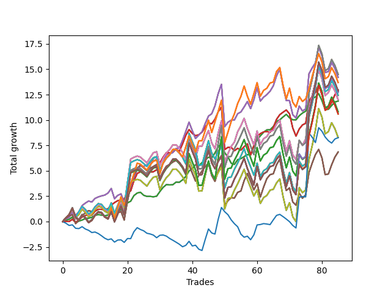

# Long Shepard 007 
- Symbol: SPY_Unlimited
- Date Range: 03/23/2022 - 07/08/2022
- Trading Period: 7:20-12:30
- Number of Trades: 85



| Name | Win Percent | Profit | Avg Profit / Trade | Avg Time / Trade |      | Name | Win Percent | Profit | Avg Profit / Trade | Avg Time / Trade |
| ---- | ----------- | ------ | ------------------ | ---------------- | ---- | ---- | ----------- | ------ | ------------------ | ---------------- |
| Sorted By <br> Profit | | | | | | Sorted By <br> Win Percentage ||||
| Sixty-Nine | 58.82 | 7250.00 | 85.29 | 27:08 |     | Sixty-Six | 75.29 | 7105.00 | 83.59 | 16:24 |
| Sixty-One | 58.82 | 7250.00 | 85.29 | 27:08 |     | Fifty-Eight | 75.29 | 7105.00 | 83.59 | 16:24 |
| Fifty-Three | 58.82 | 7250.00 | 85.29 | 27:08 |     | Fifty | 75.29 | 7105.00 | 83.59 | 16:24 |
| Forty-Five | 58.82 | 7250.00 | 85.29 | 27:08 |     | Forty-Two | 75.29 | 7105.00 | 83.59 | 16:24 |
| Five | 58.82 | 7250.00 | 85.29 | 27:08 |     | Two | 75.29 | 7105.00 | 83.59 | 16:24 |
| Sixty-Six | 75.29 | 7105.00 | 83.59 | 16:24 |     | Sixty-Five | 75.29 | 6485.00 | 76.29 | 10:59 |
| Fifty-Eight | 75.29 | 7105.00 | 83.59 | 16:24 |     | Fifty-Seven | 75.29 | 6485.00 | 76.29 | 10:59 |
| Fifty | 75.29 | 7105.00 | 83.59 | 16:24 |     | Forty-Nine | 75.29 | 6485.00 | 76.29 | 10:59 |
| Forty-Two | 75.29 | 7105.00 | 83.59 | 16:24 |     | Forty-One | 75.29 | 6485.00 | 76.29 | 10:59 |
| Two | 75.29 | 7105.00 | 83.59 | 16:24 |     | One | 75.29 | 6485.00 | 76.29 | 10:59 |
| One Hundred Twenty-Six | 63.53 | 6850.00 | 80.59 | 24:13 |     | Sixty-Four | 75.29 | 5935.00 | 69.82 | 04:58 |
| One Hundred Twenty-One | 63.53 | 6850.00 | 80.59 | 24:13 |     | Fifty-Six | 75.29 | 5935.00 | 69.82 | 04:58 |
| One Hundred Sixteen | 63.53 | 6850.00 | 80.59 | 24:13 |     | Forty-Eight | 75.29 | 5935.00 | 69.82 | 04:58 |
| One Hundred Eleven | 63.53 | 6850.00 | 80.59 | 24:13 |     | Forty | 75.29 | 5935.00 | 69.82 | 04:58 |
| Eighty-One | 63.53 | 6850.00 | 80.59 | 24:13 |     | Zero | 75.29 | 5935.00 | 69.82 | 04:58 |
| Sixty-Five | 75.29 | 6485.00 | 76.29 | 10:59 |     | Sixty-Seven | 67.06 | 3425.00 | 40.29 | 18:26 |
| Fifty-Seven | 75.29 | 6485.00 | 76.29 | 10:59 |     | Fifty-Nine | 67.06 | 3425.00 | 40.29 | 18:26 |
| Forty-Nine | 75.29 | 6485.00 | 76.29 | 10:59 |     | Fifty-One | 67.06 | 3425.00 | 40.29 | 18:26 |
| Forty-One | 75.29 | 6485.00 | 76.29 | 10:59 |     | Forty-Three | 67.06 | 3425.00 | 40.29 | 18:26 |
| One | 75.29 | 6485.00 | 76.29 | 10:59 |     | Three | 67.06 | 3425.00 | 40.29 | 18:26 |
| One Hundred Thirty | 58.82 | 6430.00 | 75.65 | 29:24 |     | One Hundred Twenty-Six | 63.53 | 6850.00 | 80.59 | 24:13 |
| One Hundred Twenty-Five | 58.82 | 6430.00 | 75.65 | 29:24 |     | One Hundred Twenty-One | 63.53 | 6850.00 | 80.59 | 24:13 |
| One Hundred Twenty | 58.82 | 6430.00 | 75.65 | 29:24 |     | One Hundred Sixteen | 63.53 | 6850.00 | 80.59 | 24:13 |
| One Hundred Fifteen | 58.82 | 6430.00 | 75.65 | 29:24 |     | One Hundred Eleven | 63.53 | 6850.00 | 80.59 | 24:13 |
| Eighty-Five | 58.82 | 6430.00 | 75.65 | 29:24 |     | Eighty-One | 63.53 | 6850.00 | 80.59 | 24:13 |
| One Hundred Twenty-Nine | 58.82 | 6370.00 | 74.94 | 29:20 |     | Sixty-Eight | 61.18 | 6000.00 | 70.59 | 24:32 |
| One Hundred Twenty-Four | 58.82 | 6370.00 | 74.94 | 29:20 |     | Sixty | 61.18 | 6000.00 | 70.59 | 24:32 |
| One Hundred Ninteen | 58.82 | 6370.00 | 74.94 | 29:20 |     | Fifty-Two | 61.18 | 6000.00 | 70.59 | 24:32 |
| One Hundred Fourteen | 58.82 | 6370.00 | 74.94 | 29:20 |     | Forty-Four | 61.18 | 6000.00 | 70.59 | 24:32 |
| Eighty-Four | 58.82 | 6370.00 | 74.94 | 29:20 |     | Four | 61.18 | 6000.00 | 70.59 | 24:32 |
| Seventy-One | 60.00 | 6215.00 | 73.12 | 28:37 |     | Seventy-One | 60.00 | 6215.00 | 73.12 | 28:37 |
| Sixty-Three | 60.00 | 6215.00 | 73.12 | 28:37 |     | Sixty-Three | 60.00 | 6215.00 | 73.12 | 28:37 |
| Fifty-Five | 60.00 | 6215.00 | 73.12 | 28:37 |     | Fifty-Five | 60.00 | 6215.00 | 73.12 | 28:37 |
| Forty-Seven | 60.00 | 6215.00 | 73.12 | 28:37 |     | Forty-Seven | 60.00 | 6215.00 | 73.12 | 28:37 |
| Seven | 60.00 | 6215.00 | 73.12 | 28:37 |     | Seven | 60.00 | 6215.00 | 73.12 | 28:37 |
| Sixty-Eight | 61.18 | 6000.00 | 70.59 | 24:32 |     | Seventy | 60.00 | 4140.00 | 48.71 | 27:36 |
| Sixty | 61.18 | 6000.00 | 70.59 | 24:32 |     | Sixty-Two | 60.00 | 4140.00 | 48.71 | 27:36 |
| Fifty-Two | 61.18 | 6000.00 | 70.59 | 24:32 |     | Fifty-Four | 60.00 | 4140.00 | 48.71 | 27:36 |
| Forty-Four | 61.18 | 6000.00 | 70.59 | 24:32 |     | Forty-Six | 60.00 | 4140.00 | 48.71 | 27:36 |
| Four | 61.18 | 6000.00 | 70.59 | 24:32 |     | Six | 60.00 | 4140.00 | 48.71 | 27:36 |
| Sixty-Four | 75.29 | 5935.00 | 69.82 | 04:58 |     | Sixty-Nine | 58.82 | 7250.00 | 85.29 | 27:08 |
| Fifty-Six | 75.29 | 5935.00 | 69.82 | 04:58 |     | Sixty-One | 58.82 | 7250.00 | 85.29 | 27:08 |
| Forty-Eight | 75.29 | 5935.00 | 69.82 | 04:58 |     | Fifty-Three | 58.82 | 7250.00 | 85.29 | 27:08 |
| Forty | 75.29 | 5935.00 | 69.82 | 04:58 |     | Forty-Five | 58.82 | 7250.00 | 85.29 | 27:08 |
| Zero | 75.29 | 5935.00 | 69.82 | 04:58 |     | Five | 58.82 | 7250.00 | 85.29 | 27:08 |
| One Hundred Twenty-Seven | 58.82 | 5400.00 | 63.53 | 28:02 |     | One Hundred Thirty | 58.82 | 6430.00 | 75.65 | 29:24 |
| One Hundred Twenty-Two | 58.82 | 5400.00 | 63.53 | 28:02 |     | One Hundred Twenty-Five | 58.82 | 6430.00 | 75.65 | 29:24 |
| One Hundred Seventeen | 58.82 | 5400.00 | 63.53 | 28:02 |     | One Hundred Twenty | 58.82 | 6430.00 | 75.65 | 29:24 |
| One Hundred Twelve | 58.82 | 5400.00 | 63.53 | 28:02 |     | One Hundred Fifteen | 58.82 | 6430.00 | 75.65 | 29:24 |
| Eighty-Two | 58.82 | 5400.00 | 63.53 | 28:02 |     | Eighty-Five | 58.82 | 6430.00 | 75.65 | 29:24 |
| One Hundred Twenty-Eight | 58.82 | 5300.00 | 62.35 | 29:16 |     | One Hundred Twenty-Nine | 58.82 | 6370.00 | 74.94 | 29:20 |
| One Hundred Twenty-Three | 58.82 | 5300.00 | 62.35 | 29:16 |     | One Hundred Twenty-Four | 58.82 | 6370.00 | 74.94 | 29:20 |
| One Hundred Eighteen | 58.82 | 5300.00 | 62.35 | 29:16 |     | One Hundred Ninteen | 58.82 | 6370.00 | 74.94 | 29:20 |
| One Hundred Thirteen | 58.82 | 5300.00 | 62.35 | 29:16 |     | One Hundred Fourteen | 58.82 | 6370.00 | 74.94 | 29:20 |
| Eighty-Three | 58.82 | 5300.00 | 62.35 | 29:16 |     | Eighty-Four | 58.82 | 6370.00 | 74.94 | 29:20 |
| Seventy | 60.00 | 4140.00 | 48.71 | 27:36 |     | One Hundred Twenty-Seven | 58.82 | 5400.00 | 63.53 | 28:02 |
| Sixty-Two | 60.00 | 4140.00 | 48.71 | 27:36 |     | One Hundred Twenty-Two | 58.82 | 5400.00 | 63.53 | 28:02 |
| Fifty-Four | 60.00 | 4140.00 | 48.71 | 27:36 |     | One Hundred Seventeen | 58.82 | 5400.00 | 63.53 | 28:02 |
| Forty-Six | 60.00 | 4140.00 | 48.71 | 27:36 |     | One Hundred Twelve | 58.82 | 5400.00 | 63.53 | 28:02 |
| Six | 60.00 | 4140.00 | 48.71 | 27:36 |     | Eighty-Two | 58.82 | 5400.00 | 63.53 | 28:02 |
| Seventy-Three | 37.65 | 4135.00 | 48.65 | 06:31 |     | One Hundred Twenty-Eight | 58.82 | 5300.00 | 62.35 | 29:16 |
| Sixty-Seven | 67.06 | 3425.00 | 40.29 | 18:26 |     | One Hundred Twenty-Three | 58.82 | 5300.00 | 62.35 | 29:16 |
| Fifty-Nine | 67.06 | 3425.00 | 40.29 | 18:26 |     | One Hundred Eighteen | 58.82 | 5300.00 | 62.35 | 29:16 |
| Fifty-One | 67.06 | 3425.00 | 40.29 | 18:26 |     | One Hundred Thirteen | 58.82 | 5300.00 | 62.35 | 29:16 |
| Forty-Three | 67.06 | 3425.00 | 40.29 | 18:26 |     | Eighty-Three | 58.82 | 5300.00 | 62.35 | 29:16 |
| Three | 67.06 | 3425.00 | 40.29 | 18:26 |     | Seventy-Three | 37.65 | 4135.00 | 48.65 | 06:31 |

## NO STOPLOSS

### Test Zero
* Sell when price hits the middle line of the 20p bollinger
* No Stoploss
* Results:
```
Total Trades: 85
Percent Up: 75.29
Percent Down: 24.71
Total Points Moved Up: 11.87
Potential Profit: 5935.00
Total Points Ups: 17.40 Count Ups: 64
Total Points Downs: -5.53 Count Downs: 21
```

<details><summary>Trades</summary>

<code>In: 2022-03-23 10:32:00		Out: 2022-03-23 10:38:15		Total Position Time: 06:15		Total Move Up: 0.14		Total to Date: 0.14</code> <br />
<code>In: 2022-03-23 10:33:00		Out: 2022-03-23 10:38:15		Total Position Time: 05:15		Total Move Up: 0.08		Total to Date: 0.22</code> <br />
<code>In: 2022-03-23 11:17:00		Out: 2022-03-23 11:18:00		Total Position Time: 01:00		Total Move Up: 0.23		Total to Date: 0.45</code> <br />
<code>In: 2022-03-28 08:43:00		Out: 2022-03-28 09:01:45		Total Position Time: 18:45		Total Move Up: -0.56		Total to Date: -0.11</code> <br />
<code>In: 2022-03-30 07:35:00		Out: 2022-03-30 07:36:25		Total Position Time: 01:25		Total Move Up: 0.16		Total to Date: 0.05</code> <br />
<code>In: 2022-03-30 12:28:00		Out: 2022-03-30 12:28:15		Total Position Time: 00:15		Total Move Up: 0.10		Total to Date: 0.15</code> <br />
<code>In: 2022-03-31 09:30:00		Out: 2022-03-31 09:32:25		Total Position Time: 02:25		Total Move Up: 0.15		Total to Date: 0.30</code> <br />
<code>In: 2022-03-31 09:37:00		Out: 2022-03-31 09:37:10		Total Position Time: 00:10		Total Move Up: 0.03		Total to Date: 0.33</code> <br />
<code>In: 2022-03-31 10:02:00		Out: 2022-03-31 10:04:00		Total Position Time: 02:00		Total Move Up: 0.09		Total to Date: 0.42</code> <br />
<code>In: 2022-03-31 10:18:00		Out: 2022-03-31 10:19:00		Total Position Time: 01:00		Total Move Up: 0.20		Total to Date: 0.62</code> <br />
<code>In: 2022-03-31 10:19:00		Out: 2022-03-31 10:19:10		Total Position Time: 00:10		Total Move Up: 0.06		Total to Date: 0.68</code> <br />
<code>In: 2022-03-31 11:12:00		Out: 2022-03-31 11:22:10		Total Position Time: 10:10		Total Move Up: -0.04		Total to Date: 0.64</code> <br />
<code>In: 2022-03-31 11:13:00		Out: 2022-03-31 11:22:10		Total Position Time: 09:10		Total Move Up: -0.06		Total to Date: 0.58</code> <br />
<code>In: 2022-03-31 11:21:00		Out: 2022-03-31 11:22:10		Total Position Time: 01:10		Total Move Up: 0.06		Total to Date: 0.64</code> <br />
<code>In: 2022-04-01 07:31:00		Out: 2022-04-01 07:34:30		Total Position Time: 03:30		Total Move Up: 0.27		Total to Date: 0.91</code> <br />
<code>In: 2022-04-01 08:48:00		Out: 2022-04-01 08:53:05		Total Position Time: 05:05		Total Move Up: -0.01		Total to Date: 0.90</code> <br />
<code>In: 2022-04-01 10:23:00		Out: 2022-04-01 10:23:20		Total Position Time: 00:20		Total Move Up: 0.18		Total to Date: 1.08</code> <br />
<code>In: 2022-04-01 10:24:00		Out: 2022-04-01 10:24:10		Total Position Time: 00:10		Total Move Up: 0.09		Total to Date: 1.17</code> <br />
<code>In: 2022-04-05 12:17:00		Out: 2022-04-05 12:23:40		Total Position Time: 06:40		Total Move Up: 0.11		Total to Date: 1.28</code> <br />
<code>In: 2022-04-06 11:21:00		Out: 2022-04-06 11:25:30		Total Position Time: 04:30		Total Move Up: 0.56		Total to Date: 1.84</code> <br />
<code>In: 2022-04-06 11:22:00		Out: 2022-04-06 11:25:30		Total Position Time: 03:30		Total Move Up: 0.17		Total to Date: 2.01</code> <br />
<code>In: 2022-04-07 07:50:00		Out: 2022-04-07 07:53:05		Total Position Time: 03:05		Total Move Up: 0.55		Total to Date: 2.56</code> <br />
<code>In: 2022-04-07 07:51:00		Out: 2022-04-07 07:53:05		Total Position Time: 02:05		Total Move Up: 0.25		Total to Date: 2.81</code> <br />
<code>In: 2022-04-07 08:36:00		Out: 2022-04-07 08:36:10		Total Position Time: 00:10		Total Move Up: 0.08		Total to Date: 2.89</code> <br />
<code>In: 2022-04-11 07:35:00		Out: 2022-04-11 07:51:10		Total Position Time: 16:10		Total Move Up: -0.30		Total to Date: 2.59</code> <br />
<code>In: 2022-04-11 07:39:00		Out: 2022-04-11 07:51:10		Total Position Time: 12:10		Total Move Up: -0.11		Total to Date: 2.48</code> <br />
<code>In: 2022-04-11 08:18:00		Out: 2022-04-11 08:26:20		Total Position Time: 08:20		Total Move Up: 0.00		Total to Date: 2.48</code> <br />
<code>In: 2022-04-11 08:19:00		Out: 2022-04-11 08:26:20		Total Position Time: 07:20		Total Move Up: -0.04		Total to Date: 2.44</code> <br />
<code>In: 2022-04-12 09:32:00		Out: 2022-04-12 09:41:30		Total Position Time: 09:30		Total Move Up: 0.06		Total to Date: 2.50</code> <br />
<code>In: 2022-04-12 11:03:00		Out: 2022-04-12 11:04:55		Total Position Time: 01:55		Total Move Up: 0.46		Total to Date: 2.96</code> <br />
<code>In: 2022-04-12 12:16:00		Out: 2022-04-12 12:20:05		Total Position Time: 04:05		Total Move Up: 0.41		Total to Date: 3.37</code> <br />
<code>In: 2022-04-12 12:17:00		Out: 2022-04-12 12:20:05		Total Position Time: 03:05		Total Move Up: 0.27		Total to Date: 3.64</code> <br />
<code>In: 2022-04-18 09:21:00		Out: 2022-04-18 09:32:05		Total Position Time: 11:05		Total Move Up: -0.03		Total to Date: 3.61</code> <br />
<code>In: 2022-04-18 09:24:00		Out: 2022-04-18 09:32:05		Total Position Time: 08:05		Total Move Up: 0.02		Total to Date: 3.63</code> <br />
<code>In: 2022-04-21 07:58:00		Out: 2022-04-21 08:01:10		Total Position Time: 03:10		Total Move Up: 0.26		Total to Date: 3.89</code> <br />
<code>In: 2022-04-21 09:12:00		Out: 2022-04-21 09:19:05		Total Position Time: 07:05		Total Move Up: -0.02		Total to Date: 3.87</code> <br />
<code>In: 2022-04-22 07:28:00		Out: 2022-04-22 07:34:00		Total Position Time: 06:00		Total Move Up: 0.24		Total to Date: 4.11</code> <br />
<code>In: 2022-04-22 07:32:00		Out: 2022-04-22 07:34:00		Total Position Time: 02:00		Total Move Up: 0.34		Total to Date: 4.45</code> <br />
<code>In: 2022-04-25 08:55:00		Out: 2022-04-25 08:57:10		Total Position Time: 02:10		Total Move Up: 0.53		Total to Date: 4.98</code> <br />
<code>In: 2022-04-26 07:24:00		Out: 2022-04-26 07:31:30		Total Position Time: 07:30		Total Move Up: 0.24		Total to Date: 5.22</code> <br />
<code>In: 2022-04-26 07:29:00		Out: 2022-04-26 07:31:30		Total Position Time: 02:30		Total Move Up: 0.38		Total to Date: 5.60</code> <br />
<code>In: 2022-05-02 10:56:00		Out: 2022-05-02 10:59:15		Total Position Time: 03:15		Total Move Up: -0.11		Total to Date: 5.49</code> <br />
<code>In: 2022-05-02 11:22:00		Out: 2022-05-02 11:28:00		Total Position Time: 06:00		Total Move Up: 0.32		Total to Date: 5.81</code> <br />
<code>In: 2022-05-04 08:37:00		Out: 2022-05-04 08:39:25		Total Position Time: 02:25		Total Move Up: 0.30		Total to Date: 6.11</code> <br />
<code>In: 2022-05-04 08:38:00		Out: 2022-05-04 08:39:25		Total Position Time: 01:25		Total Move Up: 0.22		Total to Date: 6.33</code> <br />
<code>In: 2022-05-09 07:35:00		Out: 2022-05-09 07:42:30		Total Position Time: 07:30		Total Move Up: -0.06		Total to Date: 6.27</code> <br />
<code>In: 2022-05-09 07:42:00		Out: 2022-05-09 07:42:30		Total Position Time: 00:30		Total Move Up: 0.49		Total to Date: 6.76</code> <br />
<code>In: 2022-05-09 08:34:00		Out: 2022-05-09 08:35:10		Total Position Time: 01:10		Total Move Up: 0.62		Total to Date: 7.38</code> <br />
<code>In: 2022-05-09 08:35:00		Out: 2022-05-09 08:35:10		Total Position Time: 00:10		Total Move Up: 0.32		Total to Date: 7.70</code> <br />
<code>In: 2022-05-10 07:45:00		Out: 2022-05-10 07:59:00		Total Position Time: 14:00		Total Move Up: -0.93		Total to Date: 6.77</code> <br />
<code>In: 2022-05-11 10:50:00		Out: 2022-05-11 11:00:40		Total Position Time: 10:40		Total Move Up: -0.40		Total to Date: 6.37</code> <br />
<code>In: 2022-05-11 10:51:00		Out: 2022-05-11 11:00:40		Total Position Time: 09:40		Total Move Up: -0.62		Total to Date: 5.75</code> <br />
<code>In: 2022-05-12 11:35:00		Out: 2022-05-12 11:45:20		Total Position Time: 10:20		Total Move Up: -0.12		Total to Date: 5.63</code> <br />
<code>In: 2022-05-12 11:45:00		Out: 2022-05-12 11:45:20		Total Position Time: 00:20		Total Move Up: 0.47		Total to Date: 6.10</code> <br />
<code>In: 2022-05-12 11:46:00		Out: 2022-05-12 11:46:10		Total Position Time: 00:10		Total Move Up: 0.10		Total to Date: 6.20</code> <br />
<code>In: 2022-05-17 07:48:00		Out: 2022-05-17 07:55:10		Total Position Time: 07:10		Total Move Up: 0.20		Total to Date: 6.40</code> <br />
<code>In: 2022-05-18 07:40:00		Out: 2022-05-18 07:46:15		Total Position Time: 06:15		Total Move Up: 0.20		Total to Date: 6.60</code> <br />
<code>In: 2022-05-20 08:04:00		Out: 2022-05-20 08:05:00		Total Position Time: 01:00		Total Move Up: -0.02		Total to Date: 6.58</code> <br />
<code>In: 2022-05-24 07:21:00		Out: 2022-05-24 07:23:15		Total Position Time: 02:15		Total Move Up: 0.84		Total to Date: 7.42</code> <br />
<code>In: 2022-06-02 07:30:00		Out: 2022-06-02 07:34:10		Total Position Time: 04:10		Total Move Up: 0.63		Total to Date: 8.05</code> <br />
<code>In: 2022-06-03 07:46:00		Out: 2022-06-03 07:46:35		Total Position Time: 00:35		Total Move Up: 0.39		Total to Date: 8.44</code> <br />
<code>In: 2022-06-06 08:24:00		Out: 2022-06-06 08:31:35		Total Position Time: 07:35		Total Move Up: 0.36		Total to Date: 8.80</code> <br />
<code>In: 2022-06-06 08:27:00		Out: 2022-06-06 08:31:35		Total Position Time: 04:35		Total Move Up: 0.23		Total to Date: 9.03</code> <br />
<code>In: 2022-06-06 09:17:00		Out: 2022-06-06 09:26:35		Total Position Time: 09:35		Total Move Up: 0.01		Total to Date: 9.04</code> <br />
<code>In: 2022-06-08 09:48:00		Out: 2022-06-08 09:53:00		Total Position Time: 05:00		Total Move Up: 0.32		Total to Date: 9.36</code> <br />
<code>In: 2022-06-08 10:41:00		Out: 2022-06-08 10:42:15		Total Position Time: 01:15		Total Move Up: 0.50		Total to Date: 9.86</code> <br />
<code>In: 2022-06-08 10:42:00		Out: 2022-06-08 10:42:15		Total Position Time: 00:15		Total Move Up: 0.16		Total to Date: 10.02</code> <br />
<code>In: 2022-06-09 12:12:00		Out: 2022-06-09 12:19:25		Total Position Time: 07:25		Total Move Up: 0.28		Total to Date: 10.30</code> <br />
<code>In: 2022-06-09 12:13:00		Out: 2022-06-09 12:19:25		Total Position Time: 06:25		Total Move Up: 0.26		Total to Date: 10.56</code> <br />
<code>In: 2022-06-14 07:23:00		Out: 2022-06-14 07:37:00		Total Position Time: 14:00		Total Move Up: -0.34		Total to Date: 10.22</code> <br />
<code>In: 2022-06-14 11:53:00		Out: 2022-06-14 12:04:30		Total Position Time: 11:30		Total Move Up: -0.19		Total to Date: 10.03</code> <br />
<code>In: 2022-06-14 11:58:00		Out: 2022-06-14 12:04:30		Total Position Time: 06:30		Total Move Up: -0.01		Total to Date: 10.02</code> <br />
<code>In: 2022-06-14 12:21:00		Out: 2022-06-14 12:25:30		Total Position Time: 04:30		Total Move Up: 0.40		Total to Date: 10.42</code> <br />
<code>In: 2022-06-15 07:58:00		Out: 2022-06-15 07:58:55		Total Position Time: 00:55		Total Move Up: 0.27		Total to Date: 10.69</code> <br />
<code>In: 2022-06-15 08:24:00		Out: 2022-06-15 08:24:20		Total Position Time: 00:20		Total Move Up: 0.18		Total to Date: 10.87</code> <br />
<code>In: 2022-06-15 11:36:00		Out: 2022-06-15 11:37:20		Total Position Time: 01:20		Total Move Up: 0.98		Total to Date: 11.85</code> <br />
<code>In: 2022-06-16 07:55:00		Out: 2022-06-16 08:01:00		Total Position Time: 06:00		Total Move Up: 0.26		Total to Date: 12.11</code> <br />
<code>In: 2022-06-16 07:56:00		Out: 2022-06-16 08:01:00		Total Position Time: 05:00		Total Move Up: 0.16		Total to Date: 12.27</code> <br />
<code>In: 2022-06-16 11:57:00		Out: 2022-06-16 12:00:20		Total Position Time: 03:20		Total Move Up: 0.33		Total to Date: 12.60</code> <br />
<code>In: 2022-06-17 07:30:00		Out: 2022-06-17 07:44:55		Total Position Time: 14:55		Total Move Up: -0.67		Total to Date: 11.93</code> <br />
<code>In: 2022-06-17 07:31:00		Out: 2022-06-17 07:44:55		Total Position Time: 13:55		Total Move Up: -0.89		Total to Date: 11.04</code> <br />
<code>In: 2022-06-23 09:49:00		Out: 2022-06-23 09:49:10		Total Position Time: 00:10		Total Move Up: 0.02		Total to Date: 11.06</code> <br />
<code>In: 2022-06-29 09:32:00		Out: 2022-06-29 09:36:40		Total Position Time: 04:40		Total Move Up: 0.37		Total to Date: 11.43</code> <br />
<code>In: 2022-07-06 08:12:00		Out: 2022-07-06 08:14:30		Total Position Time: 02:30		Total Move Up: 0.35		Total to Date: 11.78</code> <br />
<code>In: 2022-07-06 08:13:00		Out: 2022-07-06 08:14:30		Total Position Time: 01:30		Total Move Up: 0.09		Total to Date: 11.87</code> <br />


</details>

### Test One
* Sell when the price hits the upper line of the 20p 1std bollinger
* No Stoploss
* Results:
```
Total Trades: 85
Percent Up: 75.29
Percent Down: 24.71
Total Points Moved Up: 12.97
Potential Profit: 6485.00
Total Points Ups: 25.20 Count Ups: 64
Total Points Downs: -12.23 Count Downs: 21
```

<details><summary>Trades</summary>

<code>In: 2022-03-23 10:32:00		Out: 2022-03-23 10:51:45		Total Position Time: 19:45		Total Move Up: 0.03		Total to Date: 0.03</code> <br />
<code>In: 2022-03-23 10:33:00		Out: 2022-03-23 10:51:45		Total Position Time: 18:45		Total Move Up: -0.03		Total to Date: 0.00</code> <br />
<code>In: 2022-03-23 11:17:00		Out: 2022-03-23 11:26:05		Total Position Time: 09:05		Total Move Up: 0.22		Total to Date: 0.22</code> <br />
<code>In: 2022-03-28 08:43:00		Out: 2022-03-28 09:04:40		Total Position Time: 21:40		Total Move Up: -0.31		Total to Date: -0.09</code> <br />
<code>In: 2022-03-30 07:35:00		Out: 2022-03-30 07:38:30		Total Position Time: 03:30		Total Move Up: 0.26		Total to Date: 0.17</code> <br />
<code>In: 2022-03-30 12:28:00		Out: 2022-03-30 12:32:20		Total Position Time: 04:20		Total Move Up: 0.28		Total to Date: 0.45</code> <br />
<code>In: 2022-03-31 09:30:00		Out: 2022-03-31 09:40:45		Total Position Time: 10:45		Total Move Up: 0.14		Total to Date: 0.59</code> <br />
<code>In: 2022-03-31 09:37:00		Out: 2022-03-31 09:40:45		Total Position Time: 03:45		Total Move Up: 0.09		Total to Date: 0.68</code> <br />
<code>In: 2022-03-31 10:02:00		Out: 2022-03-31 10:19:40		Total Position Time: 17:40		Total Move Up: -0.05		Total to Date: 0.63</code> <br />
<code>In: 2022-03-31 10:18:00		Out: 2022-03-31 10:19:40		Total Position Time: 01:40		Total Move Up: 0.39		Total to Date: 1.02</code> <br />
<code>In: 2022-03-31 10:19:00		Out: 2022-03-31 10:19:40		Total Position Time: 00:40		Total Move Up: 0.19		Total to Date: 1.21</code> <br />
<code>In: 2022-03-31 11:12:00		Out: 2022-03-31 11:29:15		Total Position Time: 17:15		Total Move Up: -0.01		Total to Date: 1.20</code> <br />
<code>In: 2022-03-31 11:13:00		Out: 2022-03-31 11:29:15		Total Position Time: 16:15		Total Move Up: -0.03		Total to Date: 1.17</code> <br />
<code>In: 2022-03-31 11:21:00		Out: 2022-03-31 11:29:15		Total Position Time: 08:15		Total Move Up: 0.09		Total to Date: 1.26</code> <br />
<code>In: 2022-04-01 07:31:00		Out: 2022-04-01 07:38:20		Total Position Time: 07:20		Total Move Up: 0.36		Total to Date: 1.62</code> <br />
<code>In: 2022-04-01 08:48:00		Out: 2022-04-01 08:54:00		Total Position Time: 06:00		Total Move Up: 0.25		Total to Date: 1.87</code> <br />
<code>In: 2022-04-01 10:23:00		Out: 2022-04-01 10:29:05		Total Position Time: 06:05		Total Move Up: 0.19		Total to Date: 2.06</code> <br />
<code>In: 2022-04-01 10:24:00		Out: 2022-04-01 10:29:05		Total Position Time: 05:05		Total Move Up: 0.01		Total to Date: 2.07</code> <br />
<code>In: 2022-04-05 12:17:00		Out: 2022-04-05 12:25:05		Total Position Time: 08:05		Total Move Up: 0.16		Total to Date: 2.23</code> <br />
<code>In: 2022-04-06 11:21:00		Out: 2022-04-06 11:30:30		Total Position Time: 09:30		Total Move Up: 0.59		Total to Date: 2.82</code> <br />
<code>In: 2022-04-06 11:22:00		Out: 2022-04-06 11:30:30		Total Position Time: 08:30		Total Move Up: 0.20		Total to Date: 3.02</code> <br />
<code>In: 2022-04-07 07:50:00		Out: 2022-04-07 08:00:05		Total Position Time: 10:05		Total Move Up: 1.01		Total to Date: 4.03</code> <br />
<code>In: 2022-04-07 07:51:00		Out: 2022-04-07 08:00:05		Total Position Time: 09:05		Total Move Up: 0.71		Total to Date: 4.74</code> <br />
<code>In: 2022-04-07 08:36:00		Out: 2022-04-07 08:47:05		Total Position Time: 11:05		Total Move Up: 0.16		Total to Date: 4.90</code> <br />
<code>In: 2022-04-11 07:35:00		Out: 2022-04-11 07:52:00		Total Position Time: 17:00		Total Move Up: -0.15		Total to Date: 4.75</code> <br />
<code>In: 2022-04-11 07:39:00		Out: 2022-04-11 07:52:00		Total Position Time: 13:00		Total Move Up: 0.04		Total to Date: 4.79</code> <br />
<code>In: 2022-04-11 08:18:00		Out: 2022-04-11 08:29:55		Total Position Time: 11:55		Total Move Up: 0.08		Total to Date: 4.87</code> <br />
<code>In: 2022-04-11 08:19:00		Out: 2022-04-11 08:29:55		Total Position Time: 10:55		Total Move Up: 0.04		Total to Date: 4.91</code> <br />
<code>In: 2022-04-12 09:32:00		Out: 2022-04-12 09:50:15		Total Position Time: 18:15		Total Move Up: 0.19		Total to Date: 5.10</code> <br />
<code>In: 2022-04-12 11:03:00		Out: 2022-04-12 11:06:15		Total Position Time: 03:15		Total Move Up: 0.67		Total to Date: 5.77</code> <br />
<code>In: 2022-04-12 12:16:00		Out: 2022-04-12 12:22:05		Total Position Time: 06:05		Total Move Up: 0.57		Total to Date: 6.34</code> <br />
<code>In: 2022-04-12 12:17:00		Out: 2022-04-12 12:22:05		Total Position Time: 05:05		Total Move Up: 0.43		Total to Date: 6.77</code> <br />
<code>In: 2022-04-18 09:21:00		Out: 2022-04-18 09:35:10		Total Position Time: 14:10		Total Move Up: 0.00		Total to Date: 6.77</code> <br />
<code>In: 2022-04-18 09:24:00		Out: 2022-04-18 09:35:10		Total Position Time: 11:10		Total Move Up: 0.05		Total to Date: 6.82</code> <br />
<code>In: 2022-04-21 07:58:00		Out: 2022-04-21 08:05:05		Total Position Time: 07:05		Total Move Up: 0.32		Total to Date: 7.14</code> <br />
<code>In: 2022-04-21 09:12:00		Out: 2022-04-21 09:34:10		Total Position Time: 22:10		Total Move Up: -0.22		Total to Date: 6.92</code> <br />
<code>In: 2022-04-22 07:28:00		Out: 2022-04-22 07:36:30		Total Position Time: 08:30		Total Move Up: 0.74		Total to Date: 7.66</code> <br />
<code>In: 2022-04-22 07:32:00		Out: 2022-04-22 07:36:30		Total Position Time: 04:30		Total Move Up: 0.84		Total to Date: 8.50</code> <br />
<code>In: 2022-04-25 08:55:00		Out: 2022-04-25 09:03:45		Total Position Time: 08:45		Total Move Up: 0.56		Total to Date: 9.06</code> <br />
<code>In: 2022-04-26 07:24:00		Out: 2022-04-26 07:53:10		Total Position Time: 29:10		Total Move Up: -0.37		Total to Date: 8.69</code> <br />
<code>In: 2022-04-26 07:29:00		Out: 2022-04-26 07:53:10		Total Position Time: 24:10		Total Move Up: -0.23		Total to Date: 8.46</code> <br />
<code>In: 2022-05-02 10:56:00		Out: 2022-05-02 11:02:25		Total Position Time: 06:25		Total Move Up: 0.09		Total to Date: 8.55</code> <br />
<code>In: 2022-05-02 11:22:00		Out: 2022-05-02 11:32:20		Total Position Time: 10:20		Total Move Up: 0.26		Total to Date: 8.81</code> <br />
<code>In: 2022-05-04 08:37:00		Out: 2022-05-04 08:40:55		Total Position Time: 03:55		Total Move Up: 0.50		Total to Date: 9.31</code> <br />
<code>In: 2022-05-04 08:38:00		Out: 2022-05-04 08:40:55		Total Position Time: 02:55		Total Move Up: 0.42		Total to Date: 9.73</code> <br />
<code>In: 2022-05-09 07:35:00		Out: 2022-05-09 07:45:10		Total Position Time: 10:10		Total Move Up: -0.10		Total to Date: 9.63</code> <br />
<code>In: 2022-05-09 07:42:00		Out: 2022-05-09 07:45:10		Total Position Time: 03:10		Total Move Up: 0.45		Total to Date: 10.08</code> <br />
<code>In: 2022-05-09 08:34:00		Out: 2022-05-09 08:38:35		Total Position Time: 04:35		Total Move Up: 0.74		Total to Date: 10.82</code> <br />
<code>In: 2022-05-09 08:35:00		Out: 2022-05-09 08:38:35		Total Position Time: 03:35		Total Move Up: 0.44		Total to Date: 11.26</code> <br />
<code>In: 2022-05-10 07:45:00		Out: 2022-05-10 08:14:55		Total Position Time: 29:55		Total Move Up: -4.17		Total to Date: 7.09</code> <br />
<code>In: 2022-05-11 10:50:00		Out: 2022-05-11 11:01:20		Total Position Time: 11:20		Total Move Up: 0.22		Total to Date: 7.31</code> <br />
<code>In: 2022-05-11 10:51:00		Out: 2022-05-11 11:01:20		Total Position Time: 10:20		Total Move Up: 0.00		Total to Date: 7.31</code> <br />
<code>In: 2022-05-12 11:35:00		Out: 2022-05-12 11:52:05		Total Position Time: 17:05		Total Move Up: -0.34		Total to Date: 6.97</code> <br />
<code>In: 2022-05-12 11:45:00		Out: 2022-05-12 11:52:05		Total Position Time: 07:05		Total Move Up: 0.25		Total to Date: 7.22</code> <br />
<code>In: 2022-05-12 11:46:00		Out: 2022-05-12 11:52:05		Total Position Time: 06:05		Total Move Up: -0.18		Total to Date: 7.04</code> <br />
<code>In: 2022-05-17 07:48:00		Out: 2022-05-17 07:58:50		Total Position Time: 10:50		Total Move Up: 0.34		Total to Date: 7.38</code> <br />
<code>In: 2022-05-18 07:40:00		Out: 2022-05-18 07:48:05		Total Position Time: 08:05		Total Move Up: 0.28		Total to Date: 7.66</code> <br />
<code>In: 2022-05-20 08:04:00		Out: 2022-05-20 08:27:05		Total Position Time: 23:05		Total Move Up: -1.10		Total to Date: 6.56</code> <br />
<code>In: 2022-05-24 07:21:00		Out: 2022-05-24 07:29:45		Total Position Time: 08:45		Total Move Up: 0.94		Total to Date: 7.50</code> <br />
<code>In: 2022-06-02 07:30:00		Out: 2022-06-02 07:38:35		Total Position Time: 08:35		Total Move Up: 0.90		Total to Date: 8.40</code> <br />
<code>In: 2022-06-03 07:46:00		Out: 2022-06-03 07:58:10		Total Position Time: 12:10		Total Move Up: 0.26		Total to Date: 8.66</code> <br />
<code>In: 2022-06-06 08:24:00		Out: 2022-06-06 08:39:15		Total Position Time: 15:15		Total Move Up: 0.17		Total to Date: 8.83</code> <br />
<code>In: 2022-06-06 08:27:00		Out: 2022-06-06 08:39:15		Total Position Time: 12:15		Total Move Up: 0.04		Total to Date: 8.87</code> <br />
<code>In: 2022-06-06 09:17:00		Out: 2022-06-06 09:35:30		Total Position Time: 18:30		Total Move Up: -0.07		Total to Date: 8.80</code> <br />
<code>In: 2022-06-08 09:48:00		Out: 2022-06-08 09:59:05		Total Position Time: 11:05		Total Move Up: 0.47		Total to Date: 9.27</code> <br />
<code>In: 2022-06-08 10:41:00		Out: 2022-06-08 10:47:05		Total Position Time: 06:05		Total Move Up: 0.80		Total to Date: 10.07</code> <br />
<code>In: 2022-06-08 10:42:00		Out: 2022-06-08 10:47:05		Total Position Time: 05:05		Total Move Up: 0.46		Total to Date: 10.53</code> <br />
<code>In: 2022-06-09 12:12:00		Out: 2022-06-09 12:24:30		Total Position Time: 12:30		Total Move Up: 0.24		Total to Date: 10.77</code> <br />
<code>In: 2022-06-09 12:13:00		Out: 2022-06-09 12:24:30		Total Position Time: 11:30		Total Move Up: 0.22		Total to Date: 10.99</code> <br />
<code>In: 2022-06-14 07:23:00		Out: 2022-06-14 07:47:05		Total Position Time: 24:05		Total Move Up: -0.38		Total to Date: 10.61</code> <br />
<code>In: 2022-06-14 11:53:00		Out: 2022-06-14 12:22:55		Total Position Time: 29:55		Total Move Up: -1.39		Total to Date: 9.22</code> <br />
<code>In: 2022-06-14 11:58:00		Out: 2022-06-14 12:26:35		Total Position Time: 28:35		Total Move Up: -0.80		Total to Date: 8.42</code> <br />
<code>In: 2022-06-14 12:21:00		Out: 2022-06-14 12:26:35		Total Position Time: 05:35		Total Move Up: 0.70		Total to Date: 9.12</code> <br />
<code>In: 2022-06-15 07:58:00		Out: 2022-06-15 08:07:20		Total Position Time: 09:20		Total Move Up: 0.40		Total to Date: 9.52</code> <br />
<code>In: 2022-06-15 08:24:00		Out: 2022-06-15 08:29:05		Total Position Time: 05:05		Total Move Up: 0.16		Total to Date: 9.68</code> <br />
<code>In: 2022-06-15 11:36:00		Out: 2022-06-15 11:38:05		Total Position Time: 02:05		Total Move Up: 2.18		Total to Date: 11.86</code> <br />
<code>In: 2022-06-16 07:55:00		Out: 2022-06-16 08:02:05		Total Position Time: 07:05		Total Move Up: 0.48		Total to Date: 12.34</code> <br />
<code>In: 2022-06-16 07:56:00		Out: 2022-06-16 08:02:05		Total Position Time: 06:05		Total Move Up: 0.38		Total to Date: 12.72</code> <br />
<code>In: 2022-06-16 11:57:00		Out: 2022-06-16 12:01:05		Total Position Time: 04:05		Total Move Up: 0.75		Total to Date: 13.47</code> <br />
<code>In: 2022-06-17 07:30:00		Out: 2022-06-17 07:56:15		Total Position Time: 26:15		Total Move Up: -0.98		Total to Date: 12.49</code> <br />
<code>In: 2022-06-17 07:31:00		Out: 2022-06-17 07:56:15		Total Position Time: 25:15		Total Move Up: -1.20		Total to Date: 11.29</code> <br />
<code>In: 2022-06-23 09:49:00		Out: 2022-06-23 09:54:15		Total Position Time: 05:15		Total Move Up: -0.12		Total to Date: 11.17</code> <br />
<code>In: 2022-06-29 09:32:00		Out: 2022-06-29 09:37:15		Total Position Time: 05:15		Total Move Up: 0.58		Total to Date: 11.75</code> <br />
<code>In: 2022-07-06 08:12:00		Out: 2022-07-06 08:17:50		Total Position Time: 05:50		Total Move Up: 0.74		Total to Date: 12.49</code> <br />
<code>In: 2022-07-06 08:13:00		Out: 2022-07-06 08:17:50		Total Position Time: 04:50		Total Move Up: 0.48		Total to Date: 12.97</code> <br />


</details>

### Test Two
* Sell when the price hits the upper line of the 20p 2std bollinger
* No Stoploss
* Results:
```
Total Trades: 85
Percent Up: 75.29
Percent Down: 24.71
Total Points Moved Up: 14.21
Potential Profit: 7105.00
Total Points Ups: 34.83 Count Ups: 64
Total Points Downs: -20.62 Count Downs: 21
```

<details><summary>Trades</summary>

<code>In: 2022-03-23 10:32:00		Out: 2022-03-23 10:54:25		Total Position Time: 22:25		Total Move Up: 0.24		Total to Date: 0.24</code> <br />
<code>In: 2022-03-23 10:33:00		Out: 2022-03-23 10:54:25		Total Position Time: 21:25		Total Move Up: 0.18		Total to Date: 0.42</code> <br />
<code>In: 2022-03-23 11:17:00		Out: 2022-03-23 11:27:00		Total Position Time: 10:00		Total Move Up: 0.45		Total to Date: 0.87</code> <br />
<code>In: 2022-03-28 08:43:00		Out: 2022-03-28 09:07:15		Total Position Time: 24:15		Total Move Up: -0.24		Total to Date: 0.63</code> <br />
<code>In: 2022-03-30 07:35:00		Out: 2022-03-30 07:46:00		Total Position Time: 11:00		Total Move Up: 0.33		Total to Date: 0.96</code> <br />
<code>In: 2022-03-30 12:28:00		Out: 2022-03-30 12:36:25		Total Position Time: 08:25		Total Move Up: 0.61		Total to Date: 1.57</code> <br />
<code>In: 2022-03-31 09:30:00		Out: 2022-03-31 09:44:20		Total Position Time: 14:20		Total Move Up: 0.25		Total to Date: 1.82</code> <br />
<code>In: 2022-03-31 09:37:00		Out: 2022-03-31 09:44:20		Total Position Time: 07:20		Total Move Up: 0.20		Total to Date: 2.02</code> <br />
<code>In: 2022-03-31 10:02:00		Out: 2022-03-31 10:27:25		Total Position Time: 25:25		Total Move Up: -0.09		Total to Date: 1.93</code> <br />
<code>In: 2022-03-31 10:18:00		Out: 2022-03-31 10:27:25		Total Position Time: 09:25		Total Move Up: 0.35		Total to Date: 2.28</code> <br />
<code>In: 2022-03-31 10:19:00		Out: 2022-03-31 10:27:25		Total Position Time: 08:25		Total Move Up: 0.15		Total to Date: 2.43</code> <br />
<code>In: 2022-03-31 11:12:00		Out: 2022-03-31 11:29:25		Total Position Time: 17:25		Total Move Up: 0.10		Total to Date: 2.53</code> <br />
<code>In: 2022-03-31 11:13:00		Out: 2022-03-31 11:29:25		Total Position Time: 16:25		Total Move Up: 0.08		Total to Date: 2.61</code> <br />
<code>In: 2022-03-31 11:21:00		Out: 2022-03-31 11:29:25		Total Position Time: 08:25		Total Move Up: 0.20		Total to Date: 2.81</code> <br />
<code>In: 2022-04-01 07:31:00		Out: 2022-04-01 07:46:55		Total Position Time: 15:55		Total Move Up: 0.45		Total to Date: 3.26</code> <br />
<code>In: 2022-04-01 08:48:00		Out: 2022-04-01 09:17:55		Total Position Time: 29:55		Total Move Up: -1.01		Total to Date: 2.25</code> <br />
<code>In: 2022-04-01 10:23:00		Out: 2022-04-01 10:30:30		Total Position Time: 07:30		Total Move Up: 0.33		Total to Date: 2.58</code> <br />
<code>In: 2022-04-01 10:24:00		Out: 2022-04-01 10:30:30		Total Position Time: 06:30		Total Move Up: 0.15		Total to Date: 2.73</code> <br />
<code>In: 2022-04-05 12:17:00		Out: 2022-04-05 12:46:00		Total Position Time: 29:00		Total Move Up: -0.85		Total to Date: 1.88</code> <br />
<code>In: 2022-04-06 11:21:00		Out: 2022-04-06 11:31:55		Total Position Time: 10:55		Total Move Up: 0.94		Total to Date: 2.82</code> <br />
<code>In: 2022-04-06 11:22:00		Out: 2022-04-06 11:31:55		Total Position Time: 09:55		Total Move Up: 0.55		Total to Date: 3.37</code> <br />
<code>In: 2022-04-07 07:50:00		Out: 2022-04-07 08:00:05		Total Position Time: 10:05		Total Move Up: 1.01		Total to Date: 4.38</code> <br />
<code>In: 2022-04-07 07:51:00		Out: 2022-04-07 08:00:05		Total Position Time: 09:05		Total Move Up: 0.71		Total to Date: 5.09</code> <br />
<code>In: 2022-04-07 08:36:00		Out: 2022-04-07 08:48:05		Total Position Time: 12:05		Total Move Up: 0.39		Total to Date: 5.48</code> <br />
<code>In: 2022-04-11 07:35:00		Out: 2022-04-11 07:54:25		Total Position Time: 19:25		Total Move Up: -0.04		Total to Date: 5.44</code> <br />
<code>In: 2022-04-11 07:39:00		Out: 2022-04-11 07:54:25		Total Position Time: 15:25		Total Move Up: 0.15		Total to Date: 5.59</code> <br />
<code>In: 2022-04-11 08:18:00		Out: 2022-04-11 08:30:50		Total Position Time: 12:50		Total Move Up: 0.20		Total to Date: 5.79</code> <br />
<code>In: 2022-04-11 08:19:00		Out: 2022-04-11 08:30:50		Total Position Time: 11:50		Total Move Up: 0.16		Total to Date: 5.95</code> <br />
<code>In: 2022-04-12 09:32:00		Out: 2022-04-12 09:50:15		Total Position Time: 18:15		Total Move Up: 0.19		Total to Date: 6.14</code> <br />
<code>In: 2022-04-12 11:03:00		Out: 2022-04-12 11:32:55		Total Position Time: 29:55		Total Move Up: -1.33		Total to Date: 4.81</code> <br />
<code>In: 2022-04-12 12:16:00		Out: 2022-04-12 12:39:40		Total Position Time: 23:40		Total Move Up: 0.96		Total to Date: 5.77</code> <br />
<code>In: 2022-04-12 12:17:00		Out: 2022-04-12 12:39:40		Total Position Time: 22:40		Total Move Up: 0.82		Total to Date: 6.59</code> <br />
<code>In: 2022-04-18 09:21:00		Out: 2022-04-18 09:35:25		Total Position Time: 14:25		Total Move Up: 0.08		Total to Date: 6.67</code> <br />
<code>In: 2022-04-18 09:24:00		Out: 2022-04-18 09:35:25		Total Position Time: 11:25		Total Move Up: 0.13		Total to Date: 6.80</code> <br />
<code>In: 2022-04-21 07:58:00		Out: 2022-04-21 08:11:45		Total Position Time: 13:45		Total Move Up: 0.41		Total to Date: 7.21</code> <br />
<code>In: 2022-04-21 09:12:00		Out: 2022-04-21 09:35:55		Total Position Time: 23:55		Total Move Up: 0.02		Total to Date: 7.23</code> <br />
<code>In: 2022-04-22 07:28:00		Out: 2022-04-22 07:36:35		Total Position Time: 08:35		Total Move Up: 0.78		Total to Date: 8.01</code> <br />
<code>In: 2022-04-22 07:32:00		Out: 2022-04-22 07:36:35		Total Position Time: 04:35		Total Move Up: 0.88		Total to Date: 8.89</code> <br />
<code>In: 2022-04-25 08:55:00		Out: 2022-04-25 09:05:10		Total Position Time: 10:10		Total Move Up: 0.90		Total to Date: 9.79</code> <br />
<code>In: 2022-04-26 07:24:00		Out: 2022-04-26 07:53:55		Total Position Time: 29:55		Total Move Up: -0.83		Total to Date: 8.96</code> <br />
<code>In: 2022-04-26 07:29:00		Out: 2022-04-26 07:58:55		Total Position Time: 29:55		Total Move Up: -0.78		Total to Date: 8.18</code> <br />
<code>In: 2022-05-02 10:56:00		Out: 2022-05-02 11:03:45		Total Position Time: 07:45		Total Move Up: 0.33		Total to Date: 8.51</code> <br />
<code>In: 2022-05-02 11:22:00		Out: 2022-05-02 11:33:30		Total Position Time: 11:30		Total Move Up: 0.34		Total to Date: 8.85</code> <br />
<code>In: 2022-05-04 08:37:00		Out: 2022-05-04 08:47:05		Total Position Time: 10:05		Total Move Up: 0.81		Total to Date: 9.66</code> <br />
<code>In: 2022-05-04 08:38:00		Out: 2022-05-04 08:47:05		Total Position Time: 09:05		Total Move Up: 0.73		Total to Date: 10.39</code> <br />
<code>In: 2022-05-09 07:35:00		Out: 2022-05-09 07:48:05		Total Position Time: 13:05		Total Move Up: 0.23		Total to Date: 10.62</code> <br />
<code>In: 2022-05-09 07:42:00		Out: 2022-05-09 07:48:05		Total Position Time: 06:05		Total Move Up: 0.78		Total to Date: 11.40</code> <br />
<code>In: 2022-05-09 08:34:00		Out: 2022-05-09 08:39:15		Total Position Time: 05:15		Total Move Up: 1.21		Total to Date: 12.61</code> <br />
<code>In: 2022-05-09 08:35:00		Out: 2022-05-09 08:39:15		Total Position Time: 04:15		Total Move Up: 0.91		Total to Date: 13.52</code> <br />
<code>In: 2022-05-10 07:45:00		Out: 2022-05-10 08:14:55		Total Position Time: 29:55		Total Move Up: -4.17		Total to Date: 9.35</code> <br />
<code>In: 2022-05-11 10:50:00		Out: 2022-05-11 11:04:20		Total Position Time: 14:20		Total Move Up: 0.43		Total to Date: 9.78</code> <br />
<code>In: 2022-05-11 10:51:00		Out: 2022-05-11 11:04:20		Total Position Time: 13:20		Total Move Up: 0.21		Total to Date: 9.99</code> <br />
<code>In: 2022-05-12 11:35:00		Out: 2022-05-12 11:53:00		Total Position Time: 18:00		Total Move Up: 0.02		Total to Date: 10.01</code> <br />
<code>In: 2022-05-12 11:45:00		Out: 2022-05-12 11:53:00		Total Position Time: 08:00		Total Move Up: 0.61		Total to Date: 10.62</code> <br />
<code>In: 2022-05-12 11:46:00		Out: 2022-05-12 11:53:00		Total Position Time: 07:00		Total Move Up: 0.18		Total to Date: 10.80</code> <br />
<code>In: 2022-05-17 07:48:00		Out: 2022-05-17 07:59:25		Total Position Time: 11:25		Total Move Up: 0.49		Total to Date: 11.29</code> <br />
<code>In: 2022-05-18 07:40:00		Out: 2022-05-18 07:48:35		Total Position Time: 08:35		Total Move Up: 0.53		Total to Date: 11.82</code> <br />
<code>In: 2022-05-20 08:04:00		Out: 2022-05-20 08:30:50		Total Position Time: 26:50		Total Move Up: -0.70		Total to Date: 11.12</code> <br />
<code>In: 2022-05-24 07:21:00		Out: 2022-05-24 07:43:15		Total Position Time: 22:15		Total Move Up: 0.88		Total to Date: 12.00</code> <br />
<code>In: 2022-06-02 07:30:00		Out: 2022-06-02 07:42:40		Total Position Time: 12:40		Total Move Up: 1.20		Total to Date: 13.20</code> <br />
<code>In: 2022-06-03 07:46:00		Out: 2022-06-03 08:15:55		Total Position Time: 29:55		Total Move Up: -1.33		Total to Date: 11.87</code> <br />
<code>In: 2022-06-06 08:24:00		Out: 2022-06-06 08:43:00		Total Position Time: 19:00		Total Move Up: 0.38		Total to Date: 12.25</code> <br />
<code>In: 2022-06-06 08:27:00		Out: 2022-06-06 08:43:00		Total Position Time: 16:00		Total Move Up: 0.25		Total to Date: 12.50</code> <br />
<code>In: 2022-06-06 09:17:00		Out: 2022-06-06 09:41:50		Total Position Time: 24:50		Total Move Up: 0.34		Total to Date: 12.84</code> <br />
<code>In: 2022-06-08 09:48:00		Out: 2022-06-08 09:59:15		Total Position Time: 11:15		Total Move Up: 0.53		Total to Date: 13.37</code> <br />
<code>In: 2022-06-08 10:41:00		Out: 2022-06-08 11:03:45		Total Position Time: 22:45		Total Move Up: 0.99		Total to Date: 14.36</code> <br />
<code>In: 2022-06-08 10:42:00		Out: 2022-06-08 11:03:45		Total Position Time: 21:45		Total Move Up: 0.65		Total to Date: 15.01</code> <br />
<code>In: 2022-06-09 12:12:00		Out: 2022-06-09 12:41:55		Total Position Time: 29:55		Total Move Up: -1.72		Total to Date: 13.29</code> <br />
<code>In: 2022-06-09 12:13:00		Out: 2022-06-09 12:42:55		Total Position Time: 29:55		Total Move Up: -1.37		Total to Date: 11.92</code> <br />
<code>In: 2022-06-14 07:23:00		Out: 2022-06-14 07:47:20		Total Position Time: 24:20		Total Move Up: -0.01		Total to Date: 11.91</code> <br />
<code>In: 2022-06-14 11:53:00		Out: 2022-06-14 12:22:55		Total Position Time: 29:55		Total Move Up: -1.39		Total to Date: 10.52</code> <br />
<code>In: 2022-06-14 11:58:00		Out: 2022-06-14 12:27:20		Total Position Time: 29:20		Total Move Up: -0.32		Total to Date: 10.20</code> <br />
<code>In: 2022-06-14 12:21:00		Out: 2022-06-14 12:27:20		Total Position Time: 06:20		Total Move Up: 1.18		Total to Date: 11.38</code> <br />
<code>In: 2022-06-15 07:58:00		Out: 2022-06-15 08:27:55		Total Position Time: 29:55		Total Move Up: -0.49		Total to Date: 10.89</code> <br />
<code>In: 2022-06-15 08:24:00		Out: 2022-06-15 08:31:50		Total Position Time: 07:50		Total Move Up: 0.21		Total to Date: 11.10</code> <br />
<code>In: 2022-06-15 11:36:00		Out: 2022-06-15 11:38:45		Total Position Time: 02:45		Total Move Up: 3.45		Total to Date: 14.55</code> <br />
<code>In: 2022-06-16 07:55:00		Out: 2022-06-16 08:11:25		Total Position Time: 16:25		Total Move Up: 0.59		Total to Date: 15.14</code> <br />
<code>In: 2022-06-16 07:56:00		Out: 2022-06-16 08:11:25		Total Position Time: 15:25		Total Move Up: 0.49		Total to Date: 15.63</code> <br />
<code>In: 2022-06-16 11:57:00		Out: 2022-06-16 12:04:25		Total Position Time: 07:25		Total Move Up: 1.54		Total to Date: 17.17</code> <br />
<code>In: 2022-06-17 07:30:00		Out: 2022-06-17 07:59:55		Total Position Time: 29:55		Total Move Up: -0.83		Total to Date: 16.34</code> <br />
<code>In: 2022-06-17 07:31:00		Out: 2022-06-17 08:00:55		Total Position Time: 29:55		Total Move Up: -1.66		Total to Date: 14.68</code> <br />
<code>In: 2022-06-23 09:49:00		Out: 2022-06-23 09:56:50		Total Position Time: 07:50		Total Move Up: 0.10		Total to Date: 14.78</code> <br />
<code>In: 2022-06-29 09:32:00		Out: 2022-06-29 09:38:35		Total Position Time: 06:35		Total Move Up: 0.89		Total to Date: 15.67</code> <br />
<code>In: 2022-07-06 08:12:00		Out: 2022-07-06 08:41:55		Total Position Time: 29:55		Total Move Up: -0.59		Total to Date: 15.08</code> <br />
<code>In: 2022-07-06 08:13:00		Out: 2022-07-06 08:42:55		Total Position Time: 29:55		Total Move Up: -0.87		Total to Date: 14.21</code> <br />


</details>

### Test Three
* Sell when price hits the middle line of the 50p bollinger
* No Stoploss
* Results:
```
Total Trades: 85
Percent Up: 67.06
Percent Down: 32.94
Total Points Moved Up: 6.85
Potential Profit: 3425.00
Total Points Ups: 31.80 Count Ups: 57
Total Points Downs: -24.95 Count Downs: 28
```

<details><summary>Trades</summary>

<code>In: 2022-03-23 10:32:00		Out: 2022-03-23 10:54:30		Total Position Time: 22:30		Total Move Up: 0.31		Total to Date: 0.31</code> <br />
<code>In: 2022-03-23 10:33:00		Out: 2022-03-23 10:54:30		Total Position Time: 21:30		Total Move Up: 0.25		Total to Date: 0.56</code> <br />
<code>In: 2022-03-23 11:17:00		Out: 2022-03-23 11:17:20		Total Position Time: 00:20		Total Move Up: 0.12		Total to Date: 0.68</code> <br />
<code>In: 2022-03-28 08:43:00		Out: 2022-03-28 09:12:55		Total Position Time: 29:55		Total Move Up: -0.88		Total to Date: -0.20</code> <br />
<code>In: 2022-03-30 07:35:00		Out: 2022-03-30 07:46:00		Total Position Time: 11:00		Total Move Up: 0.33		Total to Date: 0.13</code> <br />
<code>In: 2022-03-30 12:28:00		Out: 2022-03-30 12:33:30		Total Position Time: 05:30		Total Move Up: 0.46		Total to Date: 0.59</code> <br />
<code>In: 2022-03-31 09:30:00		Out: 2022-03-31 09:45:10		Total Position Time: 15:10		Total Move Up: 0.27		Total to Date: 0.86</code> <br />
<code>In: 2022-03-31 09:37:00		Out: 2022-03-31 09:45:10		Total Position Time: 08:10		Total Move Up: 0.22		Total to Date: 1.08</code> <br />
<code>In: 2022-03-31 10:02:00		Out: 2022-03-31 10:27:25		Total Position Time: 25:25		Total Move Up: -0.09		Total to Date: 0.99</code> <br />
<code>In: 2022-03-31 10:18:00		Out: 2022-03-31 10:27:25		Total Position Time: 09:25		Total Move Up: 0.35		Total to Date: 1.34</code> <br />
<code>In: 2022-03-31 10:19:00		Out: 2022-03-31 10:27:25		Total Position Time: 08:25		Total Move Up: 0.15		Total to Date: 1.49</code> <br />
<code>In: 2022-03-31 11:12:00		Out: 2022-03-31 11:41:55		Total Position Time: 29:55		Total Move Up: -0.08		Total to Date: 1.41</code> <br />
<code>In: 2022-03-31 11:13:00		Out: 2022-03-31 11:42:55		Total Position Time: 29:55		Total Move Up: -0.39		Total to Date: 1.02</code> <br />
<code>In: 2022-03-31 11:21:00		Out: 2022-03-31 11:49:05		Total Position Time: 28:05		Total Move Up: 0.05		Total to Date: 1.07</code> <br />
<code>In: 2022-04-01 07:31:00		Out: 2022-04-01 07:46:45		Total Position Time: 15:45		Total Move Up: 0.42		Total to Date: 1.49</code> <br />
<code>In: 2022-04-01 08:48:00		Out: 2022-04-01 09:17:55		Total Position Time: 29:55		Total Move Up: -1.01		Total to Date: 0.48</code> <br />
<code>In: 2022-04-01 10:23:00		Out: 2022-04-01 10:30:40		Total Position Time: 07:40		Total Move Up: 0.35		Total to Date: 0.83</code> <br />
<code>In: 2022-04-01 10:24:00		Out: 2022-04-01 10:30:40		Total Position Time: 06:40		Total Move Up: 0.17		Total to Date: 1.00</code> <br />
<code>In: 2022-04-05 12:17:00		Out: 2022-04-05 12:46:00		Total Position Time: 29:00		Total Move Up: -0.85		Total to Date: 0.15</code> <br />
<code>In: 2022-04-06 11:21:00		Out: 2022-04-06 11:32:40		Total Position Time: 11:40		Total Move Up: 1.87		Total to Date: 2.02</code> <br />
<code>In: 2022-04-06 11:22:00		Out: 2022-04-06 11:32:40		Total Position Time: 10:40		Total Move Up: 1.48		Total to Date: 3.50</code> <br />
<code>In: 2022-04-07 07:50:00		Out: 2022-04-07 08:00:05		Total Position Time: 10:05		Total Move Up: 1.01		Total to Date: 4.51</code> <br />
<code>In: 2022-04-07 07:51:00		Out: 2022-04-07 08:00:05		Total Position Time: 09:05		Total Move Up: 0.71		Total to Date: 5.22</code> <br />
<code>In: 2022-04-07 08:36:00		Out: 2022-04-07 08:47:35		Total Position Time: 11:35		Total Move Up: 0.36		Total to Date: 5.58</code> <br />
<code>In: 2022-04-11 07:35:00		Out: 2022-04-11 08:04:55		Total Position Time: 29:55		Total Move Up: -0.29		Total to Date: 5.29</code> <br />
<code>In: 2022-04-11 07:39:00		Out: 2022-04-11 08:08:55		Total Position Time: 29:55		Total Move Up: -0.28		Total to Date: 5.01</code> <br />
<code>In: 2022-04-11 08:18:00		Out: 2022-04-11 08:30:55		Total Position Time: 12:55		Total Move Up: 0.23		Total to Date: 5.24</code> <br />
<code>In: 2022-04-11 08:19:00		Out: 2022-04-11 08:30:55		Total Position Time: 11:55		Total Move Up: 0.19		Total to Date: 5.43</code> <br />
<code>In: 2022-04-12 09:32:00		Out: 2022-04-12 09:59:05		Total Position Time: 27:05		Total Move Up: 0.19		Total to Date: 5.62</code> <br />
<code>In: 2022-04-12 11:03:00		Out: 2022-04-12 11:32:55		Total Position Time: 29:55		Total Move Up: -1.33		Total to Date: 4.29</code> <br />
<code>In: 2022-04-12 12:16:00		Out: 2022-04-12 12:38:45		Total Position Time: 22:45		Total Move Up: 0.65		Total to Date: 4.94</code> <br />
<code>In: 2022-04-12 12:17:00		Out: 2022-04-12 12:38:45		Total Position Time: 21:45		Total Move Up: 0.51		Total to Date: 5.45</code> <br />
<code>In: 2022-04-18 09:21:00		Out: 2022-04-18 09:45:10		Total Position Time: 24:10		Total Move Up: 0.18		Total to Date: 5.63</code> <br />
<code>In: 2022-04-18 09:24:00		Out: 2022-04-18 09:45:10		Total Position Time: 21:10		Total Move Up: 0.23		Total to Date: 5.86</code> <br />
<code>In: 2022-04-21 07:58:00		Out: 2022-04-21 08:27:15		Total Position Time: 29:15		Total Move Up: 0.17		Total to Date: 6.03</code> <br />
<code>In: 2022-04-21 09:12:00		Out: 2022-04-21 09:41:55		Total Position Time: 29:55		Total Move Up: -0.32		Total to Date: 5.71</code> <br />
<code>In: 2022-04-22 07:28:00		Out: 2022-04-22 07:57:55		Total Position Time: 29:55		Total Move Up: -0.43		Total to Date: 5.28</code> <br />
<code>In: 2022-04-22 07:32:00		Out: 2022-04-22 08:01:55		Total Position Time: 29:55		Total Move Up: -0.65		Total to Date: 4.63</code> <br />
<code>In: 2022-04-25 08:55:00		Out: 2022-04-25 09:05:20		Total Position Time: 10:20		Total Move Up: 0.97		Total to Date: 5.60</code> <br />
<code>In: 2022-04-26 07:24:00		Out: 2022-04-26 07:53:55		Total Position Time: 29:55		Total Move Up: -0.83		Total to Date: 4.77</code> <br />
<code>In: 2022-04-26 07:29:00		Out: 2022-04-26 07:58:55		Total Position Time: 29:55		Total Move Up: -0.78		Total to Date: 3.99</code> <br />
<code>In: 2022-05-02 10:56:00		Out: 2022-05-02 11:04:00		Total Position Time: 08:00		Total Move Up: 0.55		Total to Date: 4.54</code> <br />
<code>In: 2022-05-02 11:22:00		Out: 2022-05-02 11:45:55		Total Position Time: 23:55		Total Move Up: 0.44		Total to Date: 4.98</code> <br />
<code>In: 2022-05-04 08:37:00		Out: 2022-05-04 08:41:00		Total Position Time: 04:00		Total Move Up: 0.43		Total to Date: 5.41</code> <br />
<code>In: 2022-05-04 08:38:00		Out: 2022-05-04 08:41:00		Total Position Time: 03:00		Total Move Up: 0.35		Total to Date: 5.76</code> <br />
<code>In: 2022-05-09 07:35:00		Out: 2022-05-09 08:04:55		Total Position Time: 29:55		Total Move Up: -1.22		Total to Date: 4.54</code> <br />
<code>In: 2022-05-09 07:42:00		Out: 2022-05-09 08:11:55		Total Position Time: 29:55		Total Move Up: -0.58		Total to Date: 3.96</code> <br />
<code>In: 2022-05-09 08:34:00		Out: 2022-05-09 08:39:00		Total Position Time: 05:00		Total Move Up: 1.03		Total to Date: 4.99</code> <br />
<code>In: 2022-05-09 08:35:00		Out: 2022-05-09 08:39:00		Total Position Time: 04:00		Total Move Up: 0.73		Total to Date: 5.72</code> <br />
<code>In: 2022-05-10 07:45:00		Out: 2022-05-10 08:14:55		Total Position Time: 29:55		Total Move Up: -4.17		Total to Date: 1.55</code> <br />
<code>In: 2022-05-11 10:50:00		Out: 2022-05-11 11:04:45		Total Position Time: 14:45		Total Move Up: 0.51		Total to Date: 2.06</code> <br />
<code>In: 2022-05-11 10:51:00		Out: 2022-05-11 11:04:45		Total Position Time: 13:45		Total Move Up: 0.29		Total to Date: 2.35</code> <br />
<code>In: 2022-05-12 11:35:00		Out: 2022-05-12 11:53:05		Total Position Time: 18:05		Total Move Up: -0.03		Total to Date: 2.32</code> <br />
<code>In: 2022-05-12 11:45:00		Out: 2022-05-12 11:53:05		Total Position Time: 08:05		Total Move Up: 0.56		Total to Date: 2.88</code> <br />
<code>In: 2022-05-12 11:46:00		Out: 2022-05-12 11:53:05		Total Position Time: 07:05		Total Move Up: 0.13		Total to Date: 3.01</code> <br />
<code>In: 2022-05-17 07:48:00		Out: 2022-05-17 08:04:10		Total Position Time: 16:10		Total Move Up: 1.02		Total to Date: 4.03</code> <br />
<code>In: 2022-05-18 07:40:00		Out: 2022-05-18 07:48:45		Total Position Time: 08:45		Total Move Up: 0.72		Total to Date: 4.75</code> <br />
<code>In: 2022-05-20 08:04:00		Out: 2022-05-20 08:33:55		Total Position Time: 29:55		Total Move Up: -0.80		Total to Date: 3.95</code> <br />
<code>In: 2022-05-24 07:21:00		Out: 2022-05-24 07:50:55		Total Position Time: 29:55		Total Move Up: -0.83		Total to Date: 3.12</code> <br />
<code>In: 2022-06-02 07:30:00		Out: 2022-06-02 07:34:10		Total Position Time: 04:10		Total Move Up: 0.63		Total to Date: 3.75</code> <br />
<code>In: 2022-06-03 07:46:00		Out: 2022-06-03 08:15:55		Total Position Time: 29:55		Total Move Up: -1.33		Total to Date: 2.42</code> <br />
<code>In: 2022-06-06 08:24:00		Out: 2022-06-06 08:46:10		Total Position Time: 22:10		Total Move Up: 0.97		Total to Date: 3.39</code> <br />
<code>In: 2022-06-06 08:27:00		Out: 2022-06-06 08:46:10		Total Position Time: 19:10		Total Move Up: 0.84		Total to Date: 4.23</code> <br />
<code>In: 2022-06-06 09:17:00		Out: 2022-06-06 09:43:15		Total Position Time: 26:15		Total Move Up: 0.39		Total to Date: 4.62</code> <br />
<code>In: 2022-06-08 09:48:00		Out: 2022-06-08 10:17:55		Total Position Time: 29:55		Total Move Up: 0.09		Total to Date: 4.71</code> <br />
<code>In: 2022-06-08 10:41:00		Out: 2022-06-08 10:47:20		Total Position Time: 06:20		Total Move Up: 0.89		Total to Date: 5.60</code> <br />
<code>In: 2022-06-08 10:42:00		Out: 2022-06-08 10:47:20		Total Position Time: 05:20		Total Move Up: 0.55		Total to Date: 6.15</code> <br />
<code>In: 2022-06-09 12:12:00		Out: 2022-06-09 12:41:55		Total Position Time: 29:55		Total Move Up: -1.72		Total to Date: 4.43</code> <br />
<code>In: 2022-06-09 12:13:00		Out: 2022-06-09 12:42:55		Total Position Time: 29:55		Total Move Up: -1.37		Total to Date: 3.06</code> <br />
<code>In: 2022-06-14 07:23:00		Out: 2022-06-14 07:48:30		Total Position Time: 25:30		Total Move Up: 0.26		Total to Date: 3.32</code> <br />
<code>In: 2022-06-14 11:53:00		Out: 2022-06-14 12:22:55		Total Position Time: 29:55		Total Move Up: -1.39		Total to Date: 1.93</code> <br />
<code>In: 2022-06-14 11:58:00		Out: 2022-06-14 12:27:20		Total Position Time: 29:20		Total Move Up: -0.32		Total to Date: 1.61</code> <br />
<code>In: 2022-06-14 12:21:00		Out: 2022-06-14 12:27:20		Total Position Time: 06:20		Total Move Up: 1.18		Total to Date: 2.79</code> <br />
<code>In: 2022-06-15 07:58:00		Out: 2022-06-15 08:27:55		Total Position Time: 29:55		Total Move Up: -0.49		Total to Date: 2.30</code> <br />
<code>In: 2022-06-15 08:24:00		Out: 2022-06-15 08:34:25		Total Position Time: 10:25		Total Move Up: 0.34		Total to Date: 2.64</code> <br />
<code>In: 2022-06-15 11:36:00		Out: 2022-06-15 11:38:05		Total Position Time: 02:05		Total Move Up: 2.18		Total to Date: 4.82</code> <br />
<code>In: 2022-06-16 07:55:00		Out: 2022-06-16 08:11:45		Total Position Time: 16:45		Total Move Up: 0.94		Total to Date: 5.76</code> <br />
<code>In: 2022-06-16 07:56:00		Out: 2022-06-16 08:11:45		Total Position Time: 15:45		Total Move Up: 0.84		Total to Date: 6.60</code> <br />
<code>In: 2022-06-16 11:57:00		Out: 2022-06-16 12:00:25		Total Position Time: 03:25		Total Move Up: 0.51		Total to Date: 7.11</code> <br />
<code>In: 2022-06-17 07:30:00		Out: 2022-06-17 07:59:55		Total Position Time: 29:55		Total Move Up: -0.83		Total to Date: 6.28</code> <br />
<code>In: 2022-06-17 07:31:00		Out: 2022-06-17 08:00:55		Total Position Time: 29:55		Total Move Up: -1.66		Total to Date: 4.62</code> <br />
<code>In: 2022-06-23 09:49:00		Out: 2022-06-23 10:07:35		Total Position Time: 18:35		Total Move Up: 0.07		Total to Date: 4.69</code> <br />
<code>In: 2022-06-29 09:32:00		Out: 2022-06-29 09:38:30		Total Position Time: 06:30		Total Move Up: 0.90		Total to Date: 5.59</code> <br />
<code>In: 2022-07-06 08:12:00		Out: 2022-07-06 08:21:30		Total Position Time: 09:30		Total Move Up: 0.76		Total to Date: 6.35</code> <br />
<code>In: 2022-07-06 08:13:00		Out: 2022-07-06 08:21:30		Total Position Time: 08:30		Total Move Up: 0.50		Total to Date: 6.85</code> <br />


</details>

### Test Four
* Sell when the price hits the upper line of the 50p 1std bollinger
* No Stoploss
* Results:
```
Total Trades: 85
Percent Up: 61.18
Percent Down: 38.82
Total Points Moved Up: 12.00
Potential Profit: 6000.00
Total Points Ups: 40.47 Count Ups: 52
Total Points Downs: -28.47 Count Downs: 33
```

<details><summary>Trades</summary>

<code>In: 2022-03-23 10:32:00		Out: 2022-03-23 11:01:55		Total Position Time: 29:55		Total Move Up: 0.37		Total to Date: 0.37</code> <br />
<code>In: 2022-03-23 10:33:00		Out: 2022-03-23 11:02:55		Total Position Time: 29:55		Total Move Up: 0.32		Total to Date: 0.69</code> <br />
<code>In: 2022-03-23 11:17:00		Out: 2022-03-23 11:27:00		Total Position Time: 10:00		Total Move Up: 0.45		Total to Date: 1.14</code> <br />
<code>In: 2022-03-28 08:43:00		Out: 2022-03-28 09:12:55		Total Position Time: 29:55		Total Move Up: -0.88		Total to Date: 0.26</code> <br />
<code>In: 2022-03-30 07:35:00		Out: 2022-03-30 07:51:05		Total Position Time: 16:05		Total Move Up: 0.54		Total to Date: 0.80</code> <br />
<code>In: 2022-03-30 12:28:00		Out: 2022-03-30 12:46:00		Total Position Time: 18:00		Total Move Up: 0.52		Total to Date: 1.32</code> <br />
<code>In: 2022-03-31 09:30:00		Out: 2022-03-31 09:59:55		Total Position Time: 29:55		Total Move Up: -0.29		Total to Date: 1.03</code> <br />
<code>In: 2022-03-31 09:37:00		Out: 2022-03-31 10:06:55		Total Position Time: 29:55		Total Move Up: -0.45		Total to Date: 0.58</code> <br />
<code>In: 2022-03-31 10:02:00		Out: 2022-03-31 10:29:50		Total Position Time: 27:50		Total Move Up: 0.14		Total to Date: 0.72</code> <br />
<code>In: 2022-03-31 10:18:00		Out: 2022-03-31 10:29:50		Total Position Time: 11:50		Total Move Up: 0.58		Total to Date: 1.30</code> <br />
<code>In: 2022-03-31 10:19:00		Out: 2022-03-31 10:29:50		Total Position Time: 10:50		Total Move Up: 0.38		Total to Date: 1.68</code> <br />
<code>In: 2022-03-31 11:12:00		Out: 2022-03-31 11:41:55		Total Position Time: 29:55		Total Move Up: -0.08		Total to Date: 1.60</code> <br />
<code>In: 2022-03-31 11:13:00		Out: 2022-03-31 11:42:55		Total Position Time: 29:55		Total Move Up: -0.39		Total to Date: 1.21</code> <br />
<code>In: 2022-03-31 11:21:00		Out: 2022-03-31 11:50:55		Total Position Time: 29:55		Total Move Up: -0.19		Total to Date: 1.02</code> <br />
<code>In: 2022-04-01 07:31:00		Out: 2022-04-01 07:51:55		Total Position Time: 20:55		Total Move Up: 0.79		Total to Date: 1.81</code> <br />
<code>In: 2022-04-01 08:48:00		Out: 2022-04-01 09:17:55		Total Position Time: 29:55		Total Move Up: -1.01		Total to Date: 0.80</code> <br />
<code>In: 2022-04-01 10:23:00		Out: 2022-04-01 10:36:50		Total Position Time: 13:50		Total Move Up: 0.62		Total to Date: 1.42</code> <br />
<code>In: 2022-04-01 10:24:00		Out: 2022-04-01 10:36:50		Total Position Time: 12:50		Total Move Up: 0.44		Total to Date: 1.86</code> <br />
<code>In: 2022-04-05 12:17:00		Out: 2022-04-05 12:46:00		Total Position Time: 29:00		Total Move Up: -0.85		Total to Date: 1.01</code> <br />
<code>In: 2022-04-06 11:21:00		Out: 2022-04-06 11:34:30		Total Position Time: 13:30		Total Move Up: 2.77		Total to Date: 3.78</code> <br />
<code>In: 2022-04-06 11:22:00		Out: 2022-04-06 11:34:30		Total Position Time: 12:30		Total Move Up: 2.38		Total to Date: 6.16</code> <br />
<code>In: 2022-04-07 07:50:00		Out: 2022-04-07 08:19:55		Total Position Time: 29:55		Total Move Up: 0.17		Total to Date: 6.33</code> <br />
<code>In: 2022-04-07 07:51:00		Out: 2022-04-07 08:20:55		Total Position Time: 29:55		Total Move Up: 0.12		Total to Date: 6.45</code> <br />
<code>In: 2022-04-07 08:36:00		Out: 2022-04-07 09:05:55		Total Position Time: 29:55		Total Move Up: -0.10		Total to Date: 6.35</code> <br />
<code>In: 2022-04-11 07:35:00		Out: 2022-04-11 08:04:55		Total Position Time: 29:55		Total Move Up: -0.29		Total to Date: 6.06</code> <br />
<code>In: 2022-04-11 07:39:00		Out: 2022-04-11 08:08:55		Total Position Time: 29:55		Total Move Up: -0.28		Total to Date: 5.78</code> <br />
<code>In: 2022-04-11 08:18:00		Out: 2022-04-11 08:33:00		Total Position Time: 15:00		Total Move Up: 0.52		Total to Date: 6.30</code> <br />
<code>In: 2022-04-11 08:19:00		Out: 2022-04-11 08:33:00		Total Position Time: 14:00		Total Move Up: 0.48		Total to Date: 6.78</code> <br />
<code>In: 2022-04-12 09:32:00		Out: 2022-04-12 10:01:55		Total Position Time: 29:55		Total Move Up: 0.10		Total to Date: 6.88</code> <br />
<code>In: 2022-04-12 11:03:00		Out: 2022-04-12 11:32:55		Total Position Time: 29:55		Total Move Up: -1.33		Total to Date: 5.55</code> <br />
<code>In: 2022-04-12 12:16:00		Out: 2022-04-12 12:45:55		Total Position Time: 29:55		Total Move Up: 0.70		Total to Date: 6.25</code> <br />
<code>In: 2022-04-12 12:17:00		Out: 2022-04-12 12:46:00		Total Position Time: 29:00		Total Move Up: 0.50		Total to Date: 6.75</code> <br />
<code>In: 2022-04-18 09:21:00		Out: 2022-04-18 09:50:55		Total Position Time: 29:55		Total Move Up: 0.33		Total to Date: 7.08</code> <br />
<code>In: 2022-04-18 09:24:00		Out: 2022-04-18 09:53:30		Total Position Time: 29:30		Total Move Up: 0.47		Total to Date: 7.55</code> <br />
<code>In: 2022-04-21 07:58:00		Out: 2022-04-21 08:27:55		Total Position Time: 29:55		Total Move Up: 0.01		Total to Date: 7.56</code> <br />
<code>In: 2022-04-21 09:12:00		Out: 2022-04-21 09:41:55		Total Position Time: 29:55		Total Move Up: -0.32		Total to Date: 7.24</code> <br />
<code>In: 2022-04-22 07:28:00		Out: 2022-04-22 07:57:55		Total Position Time: 29:55		Total Move Up: -0.43		Total to Date: 6.81</code> <br />
<code>In: 2022-04-22 07:32:00		Out: 2022-04-22 08:01:55		Total Position Time: 29:55		Total Move Up: -0.65		Total to Date: 6.16</code> <br />
<code>In: 2022-04-25 08:55:00		Out: 2022-04-25 09:07:05		Total Position Time: 12:05		Total Move Up: 1.76		Total to Date: 7.92</code> <br />
<code>In: 2022-04-26 07:24:00		Out: 2022-04-26 07:53:55		Total Position Time: 29:55		Total Move Up: -0.83		Total to Date: 7.09</code> <br />
<code>In: 2022-04-26 07:29:00		Out: 2022-04-26 07:58:55		Total Position Time: 29:55		Total Move Up: -0.78		Total to Date: 6.31</code> <br />
<code>In: 2022-05-02 10:56:00		Out: 2022-05-02 11:07:10		Total Position Time: 11:10		Total Move Up: 1.09		Total to Date: 7.40</code> <br />
<code>In: 2022-05-02 11:22:00		Out: 2022-05-02 11:51:55		Total Position Time: 29:55		Total Move Up: 0.03		Total to Date: 7.43</code> <br />
<code>In: 2022-05-04 08:37:00		Out: 2022-05-04 08:47:05		Total Position Time: 10:05		Total Move Up: 0.81		Total to Date: 8.24</code> <br />
<code>In: 2022-05-04 08:38:00		Out: 2022-05-04 08:47:05		Total Position Time: 09:05		Total Move Up: 0.73		Total to Date: 8.97</code> <br />
<code>In: 2022-05-09 07:35:00		Out: 2022-05-09 08:04:55		Total Position Time: 29:55		Total Move Up: -1.22		Total to Date: 7.75</code> <br />
<code>In: 2022-05-09 07:42:00		Out: 2022-05-09 08:11:55		Total Position Time: 29:55		Total Move Up: -0.58		Total to Date: 7.17</code> <br />
<code>In: 2022-05-09 08:34:00		Out: 2022-05-09 08:40:00		Total Position Time: 06:00		Total Move Up: 1.53		Total to Date: 8.70</code> <br />
<code>In: 2022-05-09 08:35:00		Out: 2022-05-09 08:40:00		Total Position Time: 05:00		Total Move Up: 1.23		Total to Date: 9.93</code> <br />
<code>In: 2022-05-10 07:45:00		Out: 2022-05-10 08:14:55		Total Position Time: 29:55		Total Move Up: -4.17		Total to Date: 5.76</code> <br />
<code>In: 2022-05-11 10:50:00		Out: 2022-05-11 11:18:15		Total Position Time: 28:15		Total Move Up: 0.93		Total to Date: 6.69</code> <br />
<code>In: 2022-05-11 10:51:00		Out: 2022-05-11 11:18:15		Total Position Time: 27:15		Total Move Up: 0.71		Total to Date: 7.40</code> <br />
<code>In: 2022-05-12 11:35:00		Out: 2022-05-12 12:03:55		Total Position Time: 28:55		Total Move Up: 0.43		Total to Date: 7.83</code> <br />
<code>In: 2022-05-12 11:45:00		Out: 2022-05-12 12:03:55		Total Position Time: 18:55		Total Move Up: 1.02		Total to Date: 8.85</code> <br />
<code>In: 2022-05-12 11:46:00		Out: 2022-05-12 12:03:55		Total Position Time: 17:55		Total Move Up: 0.59		Total to Date: 9.44</code> <br />
<code>In: 2022-05-17 07:48:00		Out: 2022-05-17 08:17:55		Total Position Time: 29:55		Total Move Up: 0.73		Total to Date: 10.17</code> <br />
<code>In: 2022-05-18 07:40:00		Out: 2022-05-18 08:09:55		Total Position Time: 29:55		Total Move Up: -1.00		Total to Date: 9.17</code> <br />
<code>In: 2022-05-20 08:04:00		Out: 2022-05-20 08:33:55		Total Position Time: 29:55		Total Move Up: -0.80		Total to Date: 8.37</code> <br />
<code>In: 2022-05-24 07:21:00		Out: 2022-05-24 07:50:55		Total Position Time: 29:55		Total Move Up: -0.83		Total to Date: 7.54</code> <br />
<code>In: 2022-06-02 07:30:00		Out: 2022-06-02 07:47:05		Total Position Time: 17:05		Total Move Up: 1.38		Total to Date: 8.92</code> <br />
<code>In: 2022-06-03 07:46:00		Out: 2022-06-03 08:15:55		Total Position Time: 29:55		Total Move Up: -1.33		Total to Date: 7.59</code> <br />
<code>In: 2022-06-06 08:24:00		Out: 2022-06-06 08:53:55		Total Position Time: 29:55		Total Move Up: 0.57		Total to Date: 8.16</code> <br />
<code>In: 2022-06-06 08:27:00		Out: 2022-06-06 08:56:55		Total Position Time: 29:55		Total Move Up: 0.21		Total to Date: 8.37</code> <br />
<code>In: 2022-06-06 09:17:00		Out: 2022-06-06 09:46:55		Total Position Time: 29:55		Total Move Up: 0.52		Total to Date: 8.89</code> <br />
<code>In: 2022-06-08 09:48:00		Out: 2022-06-08 10:17:55		Total Position Time: 29:55		Total Move Up: 0.09		Total to Date: 8.98</code> <br />
<code>In: 2022-06-08 10:41:00		Out: 2022-06-08 11:10:55		Total Position Time: 29:55		Total Move Up: 0.63		Total to Date: 9.61</code> <br />
<code>In: 2022-06-08 10:42:00		Out: 2022-06-08 11:11:55		Total Position Time: 29:55		Total Move Up: 0.39		Total to Date: 10.00</code> <br />
<code>In: 2022-06-09 12:12:00		Out: 2022-06-09 12:41:55		Total Position Time: 29:55		Total Move Up: -1.72		Total to Date: 8.28</code> <br />
<code>In: 2022-06-09 12:13:00		Out: 2022-06-09 12:42:55		Total Position Time: 29:55		Total Move Up: -1.37		Total to Date: 6.91</code> <br />
<code>In: 2022-06-14 07:23:00		Out: 2022-06-14 07:52:45		Total Position Time: 29:45		Total Move Up: 1.06		Total to Date: 7.97</code> <br />
<code>In: 2022-06-14 11:53:00		Out: 2022-06-14 12:22:55		Total Position Time: 29:55		Total Move Up: -1.39		Total to Date: 6.58</code> <br />
<code>In: 2022-06-14 11:58:00		Out: 2022-06-14 12:27:55		Total Position Time: 29:55		Total Move Up: -0.47		Total to Date: 6.11</code> <br />
<code>In: 2022-06-14 12:21:00		Out: 2022-06-14 12:30:25		Total Position Time: 09:25		Total Move Up: 1.88		Total to Date: 7.99</code> <br />
<code>In: 2022-06-15 07:58:00		Out: 2022-06-15 08:27:55		Total Position Time: 29:55		Total Move Up: -0.49		Total to Date: 7.50</code> <br />
<code>In: 2022-06-15 08:24:00		Out: 2022-06-15 08:38:55		Total Position Time: 14:55		Total Move Up: 0.64		Total to Date: 8.14</code> <br />
<code>In: 2022-06-15 11:36:00		Out: 2022-06-15 11:38:30		Total Position Time: 02:30		Total Move Up: 2.88		Total to Date: 11.02</code> <br />
<code>In: 2022-06-16 07:55:00		Out: 2022-06-16 08:23:50		Total Position Time: 28:50		Total Move Up: 1.43		Total to Date: 12.45</code> <br />
<code>In: 2022-06-16 07:56:00		Out: 2022-06-16 08:23:50		Total Position Time: 27:50		Total Move Up: 1.33		Total to Date: 13.78</code> <br />
<code>In: 2022-06-16 11:57:00		Out: 2022-06-16 12:01:45		Total Position Time: 04:45		Total Move Up: 1.12		Total to Date: 14.90</code> <br />
<code>In: 2022-06-17 07:30:00		Out: 2022-06-17 07:59:55		Total Position Time: 29:55		Total Move Up: -0.83		Total to Date: 14.07</code> <br />
<code>In: 2022-06-17 07:31:00		Out: 2022-06-17 08:00:55		Total Position Time: 29:55		Total Move Up: -1.66		Total to Date: 12.41</code> <br />
<code>In: 2022-06-23 09:49:00		Out: 2022-06-23 10:17:35		Total Position Time: 28:35		Total Move Up: 0.30		Total to Date: 12.71</code> <br />
<code>In: 2022-06-29 09:32:00		Out: 2022-06-29 09:59:15		Total Position Time: 27:15		Total Move Up: 0.75		Total to Date: 13.46</code> <br />
<code>In: 2022-07-06 08:12:00		Out: 2022-07-06 08:41:55		Total Position Time: 29:55		Total Move Up: -0.59		Total to Date: 12.87</code> <br />
<code>In: 2022-07-06 08:13:00		Out: 2022-07-06 08:42:55		Total Position Time: 29:55		Total Move Up: -0.87		Total to Date: 12.00</code> <br />


</details>

### Test Five
* Sell when the price hits the upper line of the 50p 2std bollinger
* No Stoploss
* Results:
```
Total Trades: 85
Percent Up: 58.82
Percent Down: 41.18
Total Points Moved Up: 14.50
Potential Profit: 7250.00
Total Points Ups: 44.81 Count Ups: 50
Total Points Downs: -30.31 Count Downs: 35
```

<details><summary>Trades</summary>

<code>In: 2022-03-23 10:32:00		Out: 2022-03-23 11:01:55		Total Position Time: 29:55		Total Move Up: 0.37		Total to Date: 0.37</code> <br />
<code>In: 2022-03-23 10:33:00		Out: 2022-03-23 11:02:55		Total Position Time: 29:55		Total Move Up: 0.32		Total to Date: 0.69</code> <br />
<code>In: 2022-03-23 11:17:00		Out: 2022-03-23 11:30:00		Total Position Time: 13:00		Total Move Up: 0.69		Total to Date: 1.38</code> <br />
<code>In: 2022-03-28 08:43:00		Out: 2022-03-28 09:12:55		Total Position Time: 29:55		Total Move Up: -0.88		Total to Date: 0.50</code> <br />
<code>In: 2022-03-30 07:35:00		Out: 2022-03-30 08:04:55		Total Position Time: 29:55		Total Move Up: -0.31		Total to Date: 0.19</code> <br />
<code>In: 2022-03-30 12:28:00		Out: 2022-03-30 12:46:00		Total Position Time: 18:00		Total Move Up: 0.52		Total to Date: 0.71</code> <br />
<code>In: 2022-03-31 09:30:00		Out: 2022-03-31 09:59:55		Total Position Time: 29:55		Total Move Up: -0.29		Total to Date: 0.42</code> <br />
<code>In: 2022-03-31 09:37:00		Out: 2022-03-31 10:06:55		Total Position Time: 29:55		Total Move Up: -0.45		Total to Date: -0.03</code> <br />
<code>In: 2022-03-31 10:02:00		Out: 2022-03-31 10:31:55		Total Position Time: 29:55		Total Move Up: 0.22		Total to Date: 0.19</code> <br />
<code>In: 2022-03-31 10:18:00		Out: 2022-03-31 10:47:55		Total Position Time: 29:55		Total Move Up: 0.49		Total to Date: 0.68</code> <br />
<code>In: 2022-03-31 10:19:00		Out: 2022-03-31 10:48:55		Total Position Time: 29:55		Total Move Up: 0.31		Total to Date: 0.99</code> <br />
<code>In: 2022-03-31 11:12:00		Out: 2022-03-31 11:41:55		Total Position Time: 29:55		Total Move Up: -0.08		Total to Date: 0.91</code> <br />
<code>In: 2022-03-31 11:13:00		Out: 2022-03-31 11:42:55		Total Position Time: 29:55		Total Move Up: -0.39		Total to Date: 0.52</code> <br />
<code>In: 2022-03-31 11:21:00		Out: 2022-03-31 11:50:55		Total Position Time: 29:55		Total Move Up: -0.19		Total to Date: 0.33</code> <br />
<code>In: 2022-04-01 07:31:00		Out: 2022-04-01 08:00:55		Total Position Time: 29:55		Total Move Up: 0.73		Total to Date: 1.06</code> <br />
<code>In: 2022-04-01 08:48:00		Out: 2022-04-01 09:17:55		Total Position Time: 29:55		Total Move Up: -1.01		Total to Date: 0.05</code> <br />
<code>In: 2022-04-01 10:23:00		Out: 2022-04-01 10:37:40		Total Position Time: 14:40		Total Move Up: 0.91		Total to Date: 0.96</code> <br />
<code>In: 2022-04-01 10:24:00		Out: 2022-04-01 10:37:40		Total Position Time: 13:40		Total Move Up: 0.73		Total to Date: 1.69</code> <br />
<code>In: 2022-04-05 12:17:00		Out: 2022-04-05 12:46:00		Total Position Time: 29:00		Total Move Up: -0.85		Total to Date: 0.84</code> <br />
<code>In: 2022-04-06 11:21:00		Out: 2022-04-06 11:50:55		Total Position Time: 29:55		Total Move Up: 2.15		Total to Date: 2.99</code> <br />
<code>In: 2022-04-06 11:22:00		Out: 2022-04-06 11:51:55		Total Position Time: 29:55		Total Move Up: 2.05		Total to Date: 5.04</code> <br />
<code>In: 2022-04-07 07:50:00		Out: 2022-04-07 08:19:55		Total Position Time: 29:55		Total Move Up: 0.17		Total to Date: 5.21</code> <br />
<code>In: 2022-04-07 07:51:00		Out: 2022-04-07 08:20:55		Total Position Time: 29:55		Total Move Up: 0.12		Total to Date: 5.33</code> <br />
<code>In: 2022-04-07 08:36:00		Out: 2022-04-07 09:05:55		Total Position Time: 29:55		Total Move Up: -0.10		Total to Date: 5.23</code> <br />
<code>In: 2022-04-11 07:35:00		Out: 2022-04-11 08:04:55		Total Position Time: 29:55		Total Move Up: -0.29		Total to Date: 4.94</code> <br />
<code>In: 2022-04-11 07:39:00		Out: 2022-04-11 08:08:55		Total Position Time: 29:55		Total Move Up: -0.28		Total to Date: 4.66</code> <br />
<code>In: 2022-04-11 08:18:00		Out: 2022-04-11 08:36:10		Total Position Time: 18:10		Total Move Up: 0.82		Total to Date: 5.48</code> <br />
<code>In: 2022-04-11 08:19:00		Out: 2022-04-11 08:36:10		Total Position Time: 17:10		Total Move Up: 0.78		Total to Date: 6.26</code> <br />
<code>In: 2022-04-12 09:32:00		Out: 2022-04-12 10:01:55		Total Position Time: 29:55		Total Move Up: 0.10		Total to Date: 6.36</code> <br />
<code>In: 2022-04-12 11:03:00		Out: 2022-04-12 11:32:55		Total Position Time: 29:55		Total Move Up: -1.33		Total to Date: 5.03</code> <br />
<code>In: 2022-04-12 12:16:00		Out: 2022-04-12 12:45:55		Total Position Time: 29:55		Total Move Up: 0.70		Total to Date: 5.73</code> <br />
<code>In: 2022-04-12 12:17:00		Out: 2022-04-12 12:46:00		Total Position Time: 29:00		Total Move Up: 0.50		Total to Date: 6.23</code> <br />
<code>In: 2022-04-18 09:21:00		Out: 2022-04-18 09:50:55		Total Position Time: 29:55		Total Move Up: 0.33		Total to Date: 6.56</code> <br />
<code>In: 2022-04-18 09:24:00		Out: 2022-04-18 09:53:55		Total Position Time: 29:55		Total Move Up: 0.50		Total to Date: 7.06</code> <br />
<code>In: 2022-04-21 07:58:00		Out: 2022-04-21 08:27:55		Total Position Time: 29:55		Total Move Up: 0.01		Total to Date: 7.07</code> <br />
<code>In: 2022-04-21 09:12:00		Out: 2022-04-21 09:41:55		Total Position Time: 29:55		Total Move Up: -0.32		Total to Date: 6.75</code> <br />
<code>In: 2022-04-22 07:28:00		Out: 2022-04-22 07:57:55		Total Position Time: 29:55		Total Move Up: -0.43		Total to Date: 6.32</code> <br />
<code>In: 2022-04-22 07:32:00		Out: 2022-04-22 08:01:55		Total Position Time: 29:55		Total Move Up: -0.65		Total to Date: 5.67</code> <br />
<code>In: 2022-04-25 08:55:00		Out: 2022-04-25 09:16:30		Total Position Time: 21:30		Total Move Up: 2.67		Total to Date: 8.34</code> <br />
<code>In: 2022-04-26 07:24:00		Out: 2022-04-26 07:53:55		Total Position Time: 29:55		Total Move Up: -0.83		Total to Date: 7.51</code> <br />
<code>In: 2022-04-26 07:29:00		Out: 2022-04-26 07:58:55		Total Position Time: 29:55		Total Move Up: -0.78		Total to Date: 6.73</code> <br />
<code>In: 2022-05-02 10:56:00		Out: 2022-05-02 11:25:55		Total Position Time: 29:55		Total Move Up: -1.53		Total to Date: 5.20</code> <br />
<code>In: 2022-05-02 11:22:00		Out: 2022-05-02 11:51:55		Total Position Time: 29:55		Total Move Up: 0.03		Total to Date: 5.23</code> <br />
<code>In: 2022-05-04 08:37:00		Out: 2022-05-04 08:48:35		Total Position Time: 11:35		Total Move Up: 1.13		Total to Date: 6.36</code> <br />
<code>In: 2022-05-04 08:38:00		Out: 2022-05-04 08:48:35		Total Position Time: 10:35		Total Move Up: 1.05		Total to Date: 7.41</code> <br />
<code>In: 2022-05-09 07:35:00		Out: 2022-05-09 08:04:55		Total Position Time: 29:55		Total Move Up: -1.22		Total to Date: 6.19</code> <br />
<code>In: 2022-05-09 07:42:00		Out: 2022-05-09 08:11:55		Total Position Time: 29:55		Total Move Up: -0.58		Total to Date: 5.61</code> <br />
<code>In: 2022-05-09 08:34:00		Out: 2022-05-09 08:43:15		Total Position Time: 09:15		Total Move Up: 2.09		Total to Date: 7.70</code> <br />
<code>In: 2022-05-09 08:35:00		Out: 2022-05-09 08:43:15		Total Position Time: 08:15		Total Move Up: 1.79		Total to Date: 9.49</code> <br />
<code>In: 2022-05-10 07:45:00		Out: 2022-05-10 08:14:55		Total Position Time: 29:55		Total Move Up: -4.17		Total to Date: 5.32</code> <br />
<code>In: 2022-05-11 10:50:00		Out: 2022-05-11 11:19:55		Total Position Time: 29:55		Total Move Up: 1.04		Total to Date: 6.36</code> <br />
<code>In: 2022-05-11 10:51:00		Out: 2022-05-11 11:20:55		Total Position Time: 29:55		Total Move Up: 0.07		Total to Date: 6.43</code> <br />
<code>In: 2022-05-12 11:35:00		Out: 2022-05-12 12:04:55		Total Position Time: 29:55		Total Move Up: 0.76		Total to Date: 7.19</code> <br />
<code>In: 2022-05-12 11:45:00		Out: 2022-05-12 12:14:55		Total Position Time: 29:55		Total Move Up: 0.61		Total to Date: 7.80</code> <br />
<code>In: 2022-05-12 11:46:00		Out: 2022-05-12 12:15:55		Total Position Time: 29:55		Total Move Up: 0.70		Total to Date: 8.50</code> <br />
<code>In: 2022-05-17 07:48:00		Out: 2022-05-17 08:17:55		Total Position Time: 29:55		Total Move Up: 0.73		Total to Date: 9.23</code> <br />
<code>In: 2022-05-18 07:40:00		Out: 2022-05-18 08:09:55		Total Position Time: 29:55		Total Move Up: -1.00		Total to Date: 8.23</code> <br />
<code>In: 2022-05-20 08:04:00		Out: 2022-05-20 08:33:55		Total Position Time: 29:55		Total Move Up: -0.80		Total to Date: 7.43</code> <br />
<code>In: 2022-05-24 07:21:00		Out: 2022-05-24 07:50:55		Total Position Time: 29:55		Total Move Up: -0.83		Total to Date: 6.60</code> <br />
<code>In: 2022-06-02 07:30:00		Out: 2022-06-02 07:59:55		Total Position Time: 29:55		Total Move Up: 1.85		Total to Date: 8.45</code> <br />
<code>In: 2022-06-03 07:46:00		Out: 2022-06-03 08:15:55		Total Position Time: 29:55		Total Move Up: -1.33		Total to Date: 7.12</code> <br />
<code>In: 2022-06-06 08:24:00		Out: 2022-06-06 08:53:55		Total Position Time: 29:55		Total Move Up: 0.57		Total to Date: 7.69</code> <br />
<code>In: 2022-06-06 08:27:00		Out: 2022-06-06 08:56:55		Total Position Time: 29:55		Total Move Up: 0.21		Total to Date: 7.90</code> <br />
<code>In: 2022-06-06 09:17:00		Out: 2022-06-06 09:46:55		Total Position Time: 29:55		Total Move Up: 0.52		Total to Date: 8.42</code> <br />
<code>In: 2022-06-08 09:48:00		Out: 2022-06-08 10:17:55		Total Position Time: 29:55		Total Move Up: 0.09		Total to Date: 8.51</code> <br />
<code>In: 2022-06-08 10:41:00		Out: 2022-06-08 11:10:55		Total Position Time: 29:55		Total Move Up: 0.63		Total to Date: 9.14</code> <br />
<code>In: 2022-06-08 10:42:00		Out: 2022-06-08 11:11:55		Total Position Time: 29:55		Total Move Up: 0.39		Total to Date: 9.53</code> <br />
<code>In: 2022-06-09 12:12:00		Out: 2022-06-09 12:41:55		Total Position Time: 29:55		Total Move Up: -1.72		Total to Date: 7.81</code> <br />
<code>In: 2022-06-09 12:13:00		Out: 2022-06-09 12:42:55		Total Position Time: 29:55		Total Move Up: -1.37		Total to Date: 6.44</code> <br />
<code>In: 2022-06-14 07:23:00		Out: 2022-06-14 07:52:55		Total Position Time: 29:55		Total Move Up: 1.07		Total to Date: 7.51</code> <br />
<code>In: 2022-06-14 11:53:00		Out: 2022-06-14 12:22:55		Total Position Time: 29:55		Total Move Up: -1.39		Total to Date: 6.12</code> <br />
<code>In: 2022-06-14 11:58:00		Out: 2022-06-14 12:27:55		Total Position Time: 29:55		Total Move Up: -0.47		Total to Date: 5.65</code> <br />
<code>In: 2022-06-14 12:21:00		Out: 2022-06-14 12:32:35		Total Position Time: 11:35		Total Move Up: 2.36		Total to Date: 8.01</code> <br />
<code>In: 2022-06-15 07:58:00		Out: 2022-06-15 08:27:55		Total Position Time: 29:55		Total Move Up: -0.49		Total to Date: 7.52</code> <br />
<code>In: 2022-06-15 08:24:00		Out: 2022-06-15 08:53:55		Total Position Time: 29:55		Total Move Up: 0.26		Total to Date: 7.78</code> <br />
<code>In: 2022-06-15 11:36:00		Out: 2022-06-15 11:40:55		Total Position Time: 04:55		Total Move Up: 4.87		Total to Date: 12.65</code> <br />
<code>In: 2022-06-16 07:55:00		Out: 2022-06-16 08:24:55		Total Position Time: 29:55		Total Move Up: 1.38		Total to Date: 14.03</code> <br />
<code>In: 2022-06-16 07:56:00		Out: 2022-06-16 08:25:55		Total Position Time: 29:55		Total Move Up: 1.54		Total to Date: 15.57</code> <br />
<code>In: 2022-06-16 11:57:00		Out: 2022-06-16 12:09:35		Total Position Time: 12:35		Total Move Up: 1.78		Total to Date: 17.35</code> <br />
<code>In: 2022-06-17 07:30:00		Out: 2022-06-17 07:59:55		Total Position Time: 29:55		Total Move Up: -0.83		Total to Date: 16.52</code> <br />
<code>In: 2022-06-17 07:31:00		Out: 2022-06-17 08:00:55		Total Position Time: 29:55		Total Move Up: -1.66		Total to Date: 14.86</code> <br />
<code>In: 2022-06-23 09:49:00		Out: 2022-06-23 10:18:55		Total Position Time: 29:55		Total Move Up: 0.22		Total to Date: 15.08</code> <br />
<code>In: 2022-06-29 09:32:00		Out: 2022-06-29 10:01:55		Total Position Time: 29:55		Total Move Up: 0.88		Total to Date: 15.96</code> <br />
<code>In: 2022-07-06 08:12:00		Out: 2022-07-06 08:41:55		Total Position Time: 29:55		Total Move Up: -0.59		Total to Date: 15.37</code> <br />
<code>In: 2022-07-06 08:13:00		Out: 2022-07-06 08:42:55		Total Position Time: 29:55		Total Move Up: -0.87		Total to Date: 14.50</code> <br />


</details>

### Test Six
* Sell when the price hits the middle line of the 1std VWAP
* No Stoploss
* Results:
```
Total Trades: 85
Percent Up: 60.00
Percent Down: 40.00
Total Points Moved Up: 8.28
Potential Profit: 4140.00
Total Points Ups: 38.28 Count Ups: 51
Total Points Downs: -30.00 Count Downs: 34
```

<details><summary>Trades</summary>

<code>In: 2022-03-23 10:32:00		Out: 2022-03-23 11:01:55		Total Position Time: 29:55		Total Move Up: 0.37		Total to Date: 0.37</code> <br />
<code>In: 2022-03-23 10:33:00		Out: 2022-03-23 11:02:55		Total Position Time: 29:55		Total Move Up: 0.32		Total to Date: 0.69</code> <br />
<code>In: 2022-03-23 11:17:00		Out: 2022-03-23 11:46:55		Total Position Time: 29:55		Total Move Up: 0.62		Total to Date: 1.31</code> <br />
<code>In: 2022-03-28 08:43:00		Out: 2022-03-28 09:12:55		Total Position Time: 29:55		Total Move Up: -0.88		Total to Date: 0.43</code> <br />
<code>In: 2022-03-30 07:35:00		Out: 2022-03-30 07:40:25		Total Position Time: 05:25		Total Move Up: 0.26		Total to Date: 0.69</code> <br />
<code>In: 2022-03-30 12:28:00		Out: 2022-03-30 12:46:00		Total Position Time: 18:00		Total Move Up: 0.52		Total to Date: 1.21</code> <br />
<code>In: 2022-03-31 09:30:00		Out: 2022-03-31 09:59:55		Total Position Time: 29:55		Total Move Up: -0.29		Total to Date: 0.92</code> <br />
<code>In: 2022-03-31 09:37:00		Out: 2022-03-31 10:06:55		Total Position Time: 29:55		Total Move Up: -0.45		Total to Date: 0.47</code> <br />
<code>In: 2022-03-31 10:02:00		Out: 2022-03-31 10:31:55		Total Position Time: 29:55		Total Move Up: 0.22		Total to Date: 0.69</code> <br />
<code>In: 2022-03-31 10:18:00		Out: 2022-03-31 10:47:55		Total Position Time: 29:55		Total Move Up: 0.49		Total to Date: 1.18</code> <br />
<code>In: 2022-03-31 10:19:00		Out: 2022-03-31 10:48:55		Total Position Time: 29:55		Total Move Up: 0.31		Total to Date: 1.49</code> <br />
<code>In: 2022-03-31 11:12:00		Out: 2022-03-31 11:41:55		Total Position Time: 29:55		Total Move Up: -0.08		Total to Date: 1.41</code> <br />
<code>In: 2022-03-31 11:13:00		Out: 2022-03-31 11:42:55		Total Position Time: 29:55		Total Move Up: -0.39		Total to Date: 1.02</code> <br />
<code>In: 2022-03-31 11:21:00		Out: 2022-03-31 11:50:55		Total Position Time: 29:55		Total Move Up: -0.19		Total to Date: 0.83</code> <br />
<code>In: 2022-04-01 07:31:00		Out: 2022-04-01 07:51:50		Total Position Time: 20:50		Total Move Up: 0.87		Total to Date: 1.70</code> <br />
<code>In: 2022-04-01 08:48:00		Out: 2022-04-01 09:17:55		Total Position Time: 29:55		Total Move Up: -1.01		Total to Date: 0.69</code> <br />
<code>In: 2022-04-01 10:23:00		Out: 2022-04-01 10:52:55		Total Position Time: 29:55		Total Move Up: 0.77		Total to Date: 1.46</code> <br />
<code>In: 2022-04-01 10:24:00		Out: 2022-04-01 10:53:55		Total Position Time: 29:55		Total Move Up: 0.75		Total to Date: 2.21</code> <br />
<code>In: 2022-04-05 12:17:00		Out: 2022-04-05 12:46:00		Total Position Time: 29:00		Total Move Up: -0.85		Total to Date: 1.36</code> <br />
<code>In: 2022-04-06 11:21:00		Out: 2022-04-06 11:32:35		Total Position Time: 11:35		Total Move Up: 1.45		Total to Date: 2.81</code> <br />
<code>In: 2022-04-06 11:22:00		Out: 2022-04-06 11:32:35		Total Position Time: 10:35		Total Move Up: 1.06		Total to Date: 3.87</code> <br />
<code>In: 2022-04-07 07:50:00		Out: 2022-04-07 08:19:55		Total Position Time: 29:55		Total Move Up: 0.17		Total to Date: 4.04</code> <br />
<code>In: 2022-04-07 07:51:00		Out: 2022-04-07 08:20:55		Total Position Time: 29:55		Total Move Up: 0.12		Total to Date: 4.16</code> <br />
<code>In: 2022-04-07 08:36:00		Out: 2022-04-07 09:05:55		Total Position Time: 29:55		Total Move Up: -0.10		Total to Date: 4.06</code> <br />
<code>In: 2022-04-11 07:35:00		Out: 2022-04-11 08:04:55		Total Position Time: 29:55		Total Move Up: -0.29		Total to Date: 3.77</code> <br />
<code>In: 2022-04-11 07:39:00		Out: 2022-04-11 08:08:55		Total Position Time: 29:55		Total Move Up: -0.28		Total to Date: 3.49</code> <br />
<code>In: 2022-04-11 08:18:00		Out: 2022-04-11 08:47:55		Total Position Time: 29:55		Total Move Up: 0.50		Total to Date: 3.99</code> <br />
<code>In: 2022-04-11 08:19:00		Out: 2022-04-11 08:48:55		Total Position Time: 29:55		Total Move Up: 0.37		Total to Date: 4.36</code> <br />
<code>In: 2022-04-12 09:32:00		Out: 2022-04-12 10:01:55		Total Position Time: 29:55		Total Move Up: 0.10		Total to Date: 4.46</code> <br />
<code>In: 2022-04-12 11:03:00		Out: 2022-04-12 11:32:55		Total Position Time: 29:55		Total Move Up: -1.33		Total to Date: 3.13</code> <br />
<code>In: 2022-04-12 12:16:00		Out: 2022-04-12 12:45:55		Total Position Time: 29:55		Total Move Up: 0.70		Total to Date: 3.83</code> <br />
<code>In: 2022-04-12 12:17:00		Out: 2022-04-12 12:46:00		Total Position Time: 29:00		Total Move Up: 0.50		Total to Date: 4.33</code> <br />
<code>In: 2022-04-18 09:21:00		Out: 2022-04-18 09:50:55		Total Position Time: 29:55		Total Move Up: 0.33		Total to Date: 4.66</code> <br />
<code>In: 2022-04-18 09:24:00		Out: 2022-04-18 09:53:55		Total Position Time: 29:55		Total Move Up: 0.50		Total to Date: 5.16</code> <br />
<code>In: 2022-04-21 07:58:00		Out: 2022-04-21 08:27:55		Total Position Time: 29:55		Total Move Up: 0.01		Total to Date: 5.17</code> <br />
<code>In: 2022-04-21 09:12:00		Out: 2022-04-21 09:41:55		Total Position Time: 29:55		Total Move Up: -0.32		Total to Date: 4.85</code> <br />
<code>In: 2022-04-22 07:28:00		Out: 2022-04-22 07:57:55		Total Position Time: 29:55		Total Move Up: -0.43		Total to Date: 4.42</code> <br />
<code>In: 2022-04-22 07:32:00		Out: 2022-04-22 08:01:55		Total Position Time: 29:55		Total Move Up: -0.65		Total to Date: 3.77</code> <br />
<code>In: 2022-04-25 08:55:00		Out: 2022-04-25 09:08:05		Total Position Time: 13:05		Total Move Up: 2.37		Total to Date: 6.14</code> <br />
<code>In: 2022-04-26 07:24:00		Out: 2022-04-26 07:53:55		Total Position Time: 29:55		Total Move Up: -0.83		Total to Date: 5.31</code> <br />
<code>In: 2022-04-26 07:29:00		Out: 2022-04-26 07:58:55		Total Position Time: 29:55		Total Move Up: -0.78		Total to Date: 4.53</code> <br />
<code>In: 2022-05-02 10:56:00		Out: 2022-05-02 11:25:55		Total Position Time: 29:55		Total Move Up: -1.53		Total to Date: 3.00</code> <br />
<code>In: 2022-05-02 11:22:00		Out: 2022-05-02 11:51:55		Total Position Time: 29:55		Total Move Up: 0.03		Total to Date: 3.03</code> <br />
<code>In: 2022-05-04 08:37:00		Out: 2022-05-04 08:54:25		Total Position Time: 17:25		Total Move Up: 1.49		Total to Date: 4.52</code> <br />
<code>In: 2022-05-04 08:38:00		Out: 2022-05-04 08:54:25		Total Position Time: 16:25		Total Move Up: 1.41		Total to Date: 5.93</code> <br />
<code>In: 2022-05-09 07:35:00		Out: 2022-05-09 08:04:55		Total Position Time: 29:55		Total Move Up: -1.22		Total to Date: 4.71</code> <br />
<code>In: 2022-05-09 07:42:00		Out: 2022-05-09 08:11:55		Total Position Time: 29:55		Total Move Up: -0.58		Total to Date: 4.13</code> <br />
<code>In: 2022-05-09 08:34:00		Out: 2022-05-09 09:03:55		Total Position Time: 29:55		Total Move Up: 0.71		Total to Date: 4.84</code> <br />
<code>In: 2022-05-09 08:35:00		Out: 2022-05-09 09:04:55		Total Position Time: 29:55		Total Move Up: 0.57		Total to Date: 5.41</code> <br />
<code>In: 2022-05-10 07:45:00		Out: 2022-05-10 08:14:55		Total Position Time: 29:55		Total Move Up: -4.17		Total to Date: 1.24</code> <br />
<code>In: 2022-05-11 10:50:00		Out: 2022-05-11 11:19:55		Total Position Time: 29:55		Total Move Up: 1.04		Total to Date: 2.28</code> <br />
<code>In: 2022-05-11 10:51:00		Out: 2022-05-11 11:20:55		Total Position Time: 29:55		Total Move Up: 0.07		Total to Date: 2.35</code> <br />
<code>In: 2022-05-12 11:35:00		Out: 2022-05-12 12:04:55		Total Position Time: 29:55		Total Move Up: 0.76		Total to Date: 3.11</code> <br />
<code>In: 2022-05-12 11:45:00		Out: 2022-05-12 12:14:55		Total Position Time: 29:55		Total Move Up: 0.61		Total to Date: 3.72</code> <br />
<code>In: 2022-05-12 11:46:00		Out: 2022-05-12 12:15:55		Total Position Time: 29:55		Total Move Up: 0.70		Total to Date: 4.42</code> <br />
<code>In: 2022-05-17 07:48:00		Out: 2022-05-17 08:17:55		Total Position Time: 29:55		Total Move Up: 0.73		Total to Date: 5.15</code> <br />
<code>In: 2022-05-18 07:40:00		Out: 2022-05-18 08:09:55		Total Position Time: 29:55		Total Move Up: -1.00		Total to Date: 4.15</code> <br />
<code>In: 2022-05-20 08:04:00		Out: 2022-05-20 08:33:55		Total Position Time: 29:55		Total Move Up: -0.80		Total to Date: 3.35</code> <br />
<code>In: 2022-05-24 07:21:00		Out: 2022-05-24 07:50:55		Total Position Time: 29:55		Total Move Up: -0.83		Total to Date: 2.52</code> <br />
<code>In: 2022-06-02 07:30:00		Out: 2022-06-02 07:34:15		Total Position Time: 04:15		Total Move Up: 0.60		Total to Date: 3.12</code> <br />
<code>In: 2022-06-03 07:46:00		Out: 2022-06-03 08:15:55		Total Position Time: 29:55		Total Move Up: -1.33		Total to Date: 1.79</code> <br />
<code>In: 2022-06-06 08:24:00		Out: 2022-06-06 08:53:55		Total Position Time: 29:55		Total Move Up: 0.57		Total to Date: 2.36</code> <br />
<code>In: 2022-06-06 08:27:00		Out: 2022-06-06 08:56:55		Total Position Time: 29:55		Total Move Up: 0.21		Total to Date: 2.57</code> <br />
<code>In: 2022-06-06 09:17:00		Out: 2022-06-06 09:46:55		Total Position Time: 29:55		Total Move Up: 0.52		Total to Date: 3.09</code> <br />
<code>In: 2022-06-08 09:48:00		Out: 2022-06-08 10:17:55		Total Position Time: 29:55		Total Move Up: 0.09		Total to Date: 3.18</code> <br />
<code>In: 2022-06-08 10:41:00		Out: 2022-06-08 11:10:55		Total Position Time: 29:55		Total Move Up: 0.63		Total to Date: 3.81</code> <br />
<code>In: 2022-06-08 10:42:00		Out: 2022-06-08 11:11:55		Total Position Time: 29:55		Total Move Up: 0.39		Total to Date: 4.20</code> <br />
<code>In: 2022-06-09 12:12:00		Out: 2022-06-09 12:41:55		Total Position Time: 29:55		Total Move Up: -1.72		Total to Date: 2.48</code> <br />
<code>In: 2022-06-09 12:13:00		Out: 2022-06-09 12:42:55		Total Position Time: 29:55		Total Move Up: -1.37		Total to Date: 1.11</code> <br />
<code>In: 2022-06-14 07:23:00		Out: 2022-06-14 07:51:00		Total Position Time: 28:00		Total Move Up: 0.75		Total to Date: 1.86</code> <br />
<code>In: 2022-06-14 11:53:00		Out: 2022-06-14 12:22:55		Total Position Time: 29:55		Total Move Up: -1.39		Total to Date: 0.47</code> <br />
<code>In: 2022-06-14 11:58:00		Out: 2022-06-14 12:27:55		Total Position Time: 29:55		Total Move Up: -0.47		Total to Date: -0.00</code> <br />
<code>In: 2022-06-14 12:21:00		Out: 2022-06-14 12:38:20		Total Position Time: 17:20		Total Move Up: 3.34		Total to Date: 3.34</code> <br />
<code>In: 2022-06-15 07:58:00		Out: 2022-06-15 08:27:55		Total Position Time: 29:55		Total Move Up: -0.49		Total to Date: 2.85</code> <br />
<code>In: 2022-06-15 08:24:00		Out: 2022-06-15 08:53:55		Total Position Time: 29:55		Total Move Up: 0.26		Total to Date: 3.11</code> <br />
<code>In: 2022-06-15 11:36:00		Out: 2022-06-15 11:38:10		Total Position Time: 02:10		Total Move Up: 2.99		Total to Date: 6.10</code> <br />
<code>In: 2022-06-16 07:55:00		Out: 2022-06-16 08:24:55		Total Position Time: 29:55		Total Move Up: 1.38		Total to Date: 7.48</code> <br />
<code>In: 2022-06-16 07:56:00		Out: 2022-06-16 08:25:55		Total Position Time: 29:55		Total Move Up: 1.54		Total to Date: 9.02</code> <br />
<code>In: 2022-06-16 11:57:00		Out: 2022-06-16 12:26:55		Total Position Time: 29:55		Total Move Up: 2.11		Total to Date: 11.13</code> <br />
<code>In: 2022-06-17 07:30:00		Out: 2022-06-17 07:59:55		Total Position Time: 29:55		Total Move Up: -0.83		Total to Date: 10.30</code> <br />
<code>In: 2022-06-17 07:31:00		Out: 2022-06-17 08:00:55		Total Position Time: 29:55		Total Move Up: -1.66		Total to Date: 8.64</code> <br />
<code>In: 2022-06-23 09:49:00		Out: 2022-06-23 10:18:55		Total Position Time: 29:55		Total Move Up: 0.22		Total to Date: 8.86</code> <br />
<code>In: 2022-06-29 09:32:00		Out: 2022-06-29 10:01:55		Total Position Time: 29:55		Total Move Up: 0.88		Total to Date: 9.74</code> <br />
<code>In: 2022-07-06 08:12:00		Out: 2022-07-06 08:41:55		Total Position Time: 29:55		Total Move Up: -0.59		Total to Date: 9.15</code> <br />
<code>In: 2022-07-06 08:13:00		Out: 2022-07-06 08:42:55		Total Position Time: 29:55		Total Move Up: -0.87		Total to Date: 8.28</code> <br />


</details>

### Test Seven
* Sell when the price hits the upper line of the 1std VWAP
* No Stoploss
* Results:
```
Total Trades: 85
Percent Up: 60.00
Percent Down: 40.00
Total Points Moved Up: 12.43
Potential Profit: 6215.00
Total Points Ups: 42.43 Count Ups: 51
Total Points Downs: -30.00 Count Downs: 34
```

<details><summary>Trades</summary>

<code>In: 2022-03-23 10:32:00		Out: 2022-03-23 11:01:55		Total Position Time: 29:55		Total Move Up: 0.37		Total to Date: 0.37</code> <br />
<code>In: 2022-03-23 10:33:00		Out: 2022-03-23 11:02:55		Total Position Time: 29:55		Total Move Up: 0.32		Total to Date: 0.69</code> <br />
<code>In: 2022-03-23 11:17:00		Out: 2022-03-23 11:46:55		Total Position Time: 29:55		Total Move Up: 0.62		Total to Date: 1.31</code> <br />
<code>In: 2022-03-28 08:43:00		Out: 2022-03-28 09:12:55		Total Position Time: 29:55		Total Move Up: -0.88		Total to Date: 0.43</code> <br />
<code>In: 2022-03-30 07:35:00		Out: 2022-03-30 07:51:05		Total Position Time: 16:05		Total Move Up: 0.54		Total to Date: 0.97</code> <br />
<code>In: 2022-03-30 12:28:00		Out: 2022-03-30 12:46:00		Total Position Time: 18:00		Total Move Up: 0.52		Total to Date: 1.49</code> <br />
<code>In: 2022-03-31 09:30:00		Out: 2022-03-31 09:59:55		Total Position Time: 29:55		Total Move Up: -0.29		Total to Date: 1.20</code> <br />
<code>In: 2022-03-31 09:37:00		Out: 2022-03-31 10:06:55		Total Position Time: 29:55		Total Move Up: -0.45		Total to Date: 0.75</code> <br />
<code>In: 2022-03-31 10:02:00		Out: 2022-03-31 10:31:55		Total Position Time: 29:55		Total Move Up: 0.22		Total to Date: 0.97</code> <br />
<code>In: 2022-03-31 10:18:00		Out: 2022-03-31 10:47:55		Total Position Time: 29:55		Total Move Up: 0.49		Total to Date: 1.46</code> <br />
<code>In: 2022-03-31 10:19:00		Out: 2022-03-31 10:48:55		Total Position Time: 29:55		Total Move Up: 0.31		Total to Date: 1.77</code> <br />
<code>In: 2022-03-31 11:12:00		Out: 2022-03-31 11:41:55		Total Position Time: 29:55		Total Move Up: -0.08		Total to Date: 1.69</code> <br />
<code>In: 2022-03-31 11:13:00		Out: 2022-03-31 11:42:55		Total Position Time: 29:55		Total Move Up: -0.39		Total to Date: 1.30</code> <br />
<code>In: 2022-03-31 11:21:00		Out: 2022-03-31 11:50:55		Total Position Time: 29:55		Total Move Up: -0.19		Total to Date: 1.11</code> <br />
<code>In: 2022-04-01 07:31:00		Out: 2022-04-01 08:00:55		Total Position Time: 29:55		Total Move Up: 0.73		Total to Date: 1.84</code> <br />
<code>In: 2022-04-01 08:48:00		Out: 2022-04-01 09:17:55		Total Position Time: 29:55		Total Move Up: -1.01		Total to Date: 0.83</code> <br />
<code>In: 2022-04-01 10:23:00		Out: 2022-04-01 10:52:55		Total Position Time: 29:55		Total Move Up: 0.77		Total to Date: 1.60</code> <br />
<code>In: 2022-04-01 10:24:00		Out: 2022-04-01 10:53:55		Total Position Time: 29:55		Total Move Up: 0.75		Total to Date: 2.35</code> <br />
<code>In: 2022-04-05 12:17:00		Out: 2022-04-05 12:46:00		Total Position Time: 29:00		Total Move Up: -0.85		Total to Date: 1.50</code> <br />
<code>In: 2022-04-06 11:21:00		Out: 2022-04-06 11:34:00		Total Position Time: 13:00		Total Move Up: 2.35		Total to Date: 3.85</code> <br />
<code>In: 2022-04-06 11:22:00		Out: 2022-04-06 11:34:00		Total Position Time: 12:00		Total Move Up: 1.96		Total to Date: 5.81</code> <br />
<code>In: 2022-04-07 07:50:00		Out: 2022-04-07 08:19:55		Total Position Time: 29:55		Total Move Up: 0.17		Total to Date: 5.98</code> <br />
<code>In: 2022-04-07 07:51:00		Out: 2022-04-07 08:20:55		Total Position Time: 29:55		Total Move Up: 0.12		Total to Date: 6.10</code> <br />
<code>In: 2022-04-07 08:36:00		Out: 2022-04-07 09:05:55		Total Position Time: 29:55		Total Move Up: -0.10		Total to Date: 6.00</code> <br />
<code>In: 2022-04-11 07:35:00		Out: 2022-04-11 08:04:55		Total Position Time: 29:55		Total Move Up: -0.29		Total to Date: 5.71</code> <br />
<code>In: 2022-04-11 07:39:00		Out: 2022-04-11 08:08:55		Total Position Time: 29:55		Total Move Up: -0.28		Total to Date: 5.43</code> <br />
<code>In: 2022-04-11 08:18:00		Out: 2022-04-11 08:47:55		Total Position Time: 29:55		Total Move Up: 0.50		Total to Date: 5.93</code> <br />
<code>In: 2022-04-11 08:19:00		Out: 2022-04-11 08:48:55		Total Position Time: 29:55		Total Move Up: 0.37		Total to Date: 6.30</code> <br />
<code>In: 2022-04-12 09:32:00		Out: 2022-04-12 10:01:55		Total Position Time: 29:55		Total Move Up: 0.10		Total to Date: 6.40</code> <br />
<code>In: 2022-04-12 11:03:00		Out: 2022-04-12 11:32:55		Total Position Time: 29:55		Total Move Up: -1.33		Total to Date: 5.07</code> <br />
<code>In: 2022-04-12 12:16:00		Out: 2022-04-12 12:45:55		Total Position Time: 29:55		Total Move Up: 0.70		Total to Date: 5.77</code> <br />
<code>In: 2022-04-12 12:17:00		Out: 2022-04-12 12:46:00		Total Position Time: 29:00		Total Move Up: 0.50		Total to Date: 6.27</code> <br />
<code>In: 2022-04-18 09:21:00		Out: 2022-04-18 09:50:55		Total Position Time: 29:55		Total Move Up: 0.33		Total to Date: 6.60</code> <br />
<code>In: 2022-04-18 09:24:00		Out: 2022-04-18 09:53:55		Total Position Time: 29:55		Total Move Up: 0.50		Total to Date: 7.10</code> <br />
<code>In: 2022-04-21 07:58:00		Out: 2022-04-21 08:27:55		Total Position Time: 29:55		Total Move Up: 0.01		Total to Date: 7.11</code> <br />
<code>In: 2022-04-21 09:12:00		Out: 2022-04-21 09:41:55		Total Position Time: 29:55		Total Move Up: -0.32		Total to Date: 6.79</code> <br />
<code>In: 2022-04-22 07:28:00		Out: 2022-04-22 07:57:55		Total Position Time: 29:55		Total Move Up: -0.43		Total to Date: 6.36</code> <br />
<code>In: 2022-04-22 07:32:00		Out: 2022-04-22 08:01:55		Total Position Time: 29:55		Total Move Up: -0.65		Total to Date: 5.71</code> <br />
<code>In: 2022-04-25 08:55:00		Out: 2022-04-25 09:24:55		Total Position Time: 29:55		Total Move Up: 2.99		Total to Date: 8.70</code> <br />
<code>In: 2022-04-26 07:24:00		Out: 2022-04-26 07:53:55		Total Position Time: 29:55		Total Move Up: -0.83		Total to Date: 7.87</code> <br />
<code>In: 2022-04-26 07:29:00		Out: 2022-04-26 07:58:55		Total Position Time: 29:55		Total Move Up: -0.78		Total to Date: 7.09</code> <br />
<code>In: 2022-05-02 10:56:00		Out: 2022-05-02 11:25:55		Total Position Time: 29:55		Total Move Up: -1.53		Total to Date: 5.56</code> <br />
<code>In: 2022-05-02 11:22:00		Out: 2022-05-02 11:51:55		Total Position Time: 29:55		Total Move Up: 0.03		Total to Date: 5.59</code> <br />
<code>In: 2022-05-04 08:37:00		Out: 2022-05-04 09:06:55		Total Position Time: 29:55		Total Move Up: 1.21		Total to Date: 6.80</code> <br />
<code>In: 2022-05-04 08:38:00		Out: 2022-05-04 09:07:55		Total Position Time: 29:55		Total Move Up: 1.17		Total to Date: 7.97</code> <br />
<code>In: 2022-05-09 07:35:00		Out: 2022-05-09 08:04:55		Total Position Time: 29:55		Total Move Up: -1.22		Total to Date: 6.75</code> <br />
<code>In: 2022-05-09 07:42:00		Out: 2022-05-09 08:11:55		Total Position Time: 29:55		Total Move Up: -0.58		Total to Date: 6.17</code> <br />
<code>In: 2022-05-09 08:34:00		Out: 2022-05-09 09:03:55		Total Position Time: 29:55		Total Move Up: 0.71		Total to Date: 6.88</code> <br />
<code>In: 2022-05-09 08:35:00		Out: 2022-05-09 09:04:55		Total Position Time: 29:55		Total Move Up: 0.57		Total to Date: 7.45</code> <br />
<code>In: 2022-05-10 07:45:00		Out: 2022-05-10 08:14:55		Total Position Time: 29:55		Total Move Up: -4.17		Total to Date: 3.28</code> <br />
<code>In: 2022-05-11 10:50:00		Out: 2022-05-11 11:19:55		Total Position Time: 29:55		Total Move Up: 1.04		Total to Date: 4.32</code> <br />
<code>In: 2022-05-11 10:51:00		Out: 2022-05-11 11:20:55		Total Position Time: 29:55		Total Move Up: 0.07		Total to Date: 4.39</code> <br />
<code>In: 2022-05-12 11:35:00		Out: 2022-05-12 12:04:55		Total Position Time: 29:55		Total Move Up: 0.76		Total to Date: 5.15</code> <br />
<code>In: 2022-05-12 11:45:00		Out: 2022-05-12 12:14:55		Total Position Time: 29:55		Total Move Up: 0.61		Total to Date: 5.76</code> <br />
<code>In: 2022-05-12 11:46:00		Out: 2022-05-12 12:15:55		Total Position Time: 29:55		Total Move Up: 0.70		Total to Date: 6.46</code> <br />
<code>In: 2022-05-17 07:48:00		Out: 2022-05-17 08:17:55		Total Position Time: 29:55		Total Move Up: 0.73		Total to Date: 7.19</code> <br />
<code>In: 2022-05-18 07:40:00		Out: 2022-05-18 08:09:55		Total Position Time: 29:55		Total Move Up: -1.00		Total to Date: 6.19</code> <br />
<code>In: 2022-05-20 08:04:00		Out: 2022-05-20 08:33:55		Total Position Time: 29:55		Total Move Up: -0.80		Total to Date: 5.39</code> <br />
<code>In: 2022-05-24 07:21:00		Out: 2022-05-24 07:50:55		Total Position Time: 29:55		Total Move Up: -0.83		Total to Date: 4.56</code> <br />
<code>In: 2022-06-02 07:30:00		Out: 2022-06-02 07:44:30		Total Position Time: 14:30		Total Move Up: 1.21		Total to Date: 5.77</code> <br />
<code>In: 2022-06-03 07:46:00		Out: 2022-06-03 08:15:55		Total Position Time: 29:55		Total Move Up: -1.33		Total to Date: 4.44</code> <br />
<code>In: 2022-06-06 08:24:00		Out: 2022-06-06 08:53:55		Total Position Time: 29:55		Total Move Up: 0.57		Total to Date: 5.01</code> <br />
<code>In: 2022-06-06 08:27:00		Out: 2022-06-06 08:56:55		Total Position Time: 29:55		Total Move Up: 0.21		Total to Date: 5.22</code> <br />
<code>In: 2022-06-06 09:17:00		Out: 2022-06-06 09:46:55		Total Position Time: 29:55		Total Move Up: 0.52		Total to Date: 5.74</code> <br />
<code>In: 2022-06-08 09:48:00		Out: 2022-06-08 10:17:55		Total Position Time: 29:55		Total Move Up: 0.09		Total to Date: 5.83</code> <br />
<code>In: 2022-06-08 10:41:00		Out: 2022-06-08 11:10:55		Total Position Time: 29:55		Total Move Up: 0.63		Total to Date: 6.46</code> <br />
<code>In: 2022-06-08 10:42:00		Out: 2022-06-08 11:11:55		Total Position Time: 29:55		Total Move Up: 0.39		Total to Date: 6.85</code> <br />
<code>In: 2022-06-09 12:12:00		Out: 2022-06-09 12:41:55		Total Position Time: 29:55		Total Move Up: -1.72		Total to Date: 5.13</code> <br />
<code>In: 2022-06-09 12:13:00		Out: 2022-06-09 12:42:55		Total Position Time: 29:55		Total Move Up: -1.37		Total to Date: 3.76</code> <br />
<code>In: 2022-06-14 07:23:00		Out: 2022-06-14 07:52:55		Total Position Time: 29:55		Total Move Up: 1.07		Total to Date: 4.83</code> <br />
<code>In: 2022-06-14 11:53:00		Out: 2022-06-14 12:22:55		Total Position Time: 29:55		Total Move Up: -1.39		Total to Date: 3.44</code> <br />
<code>In: 2022-06-14 11:58:00		Out: 2022-06-14 12:27:55		Total Position Time: 29:55		Total Move Up: -0.47		Total to Date: 2.97</code> <br />
<code>In: 2022-06-14 12:21:00		Out: 2022-06-14 12:46:00		Total Position Time: 25:00		Total Move Up: 2.97		Total to Date: 5.94</code> <br />
<code>In: 2022-06-15 07:58:00		Out: 2022-06-15 08:27:55		Total Position Time: 29:55		Total Move Up: -0.49		Total to Date: 5.45</code> <br />
<code>In: 2022-06-15 08:24:00		Out: 2022-06-15 08:53:55		Total Position Time: 29:55		Total Move Up: 0.26		Total to Date: 5.71</code> <br />
<code>In: 2022-06-15 11:36:00		Out: 2022-06-15 11:39:00		Total Position Time: 03:00		Total Move Up: 4.54		Total to Date: 10.25</code> <br />
<code>In: 2022-06-16 07:55:00		Out: 2022-06-16 08:24:55		Total Position Time: 29:55		Total Move Up: 1.38		Total to Date: 11.63</code> <br />
<code>In: 2022-06-16 07:56:00		Out: 2022-06-16 08:25:55		Total Position Time: 29:55		Total Move Up: 1.54		Total to Date: 13.17</code> <br />
<code>In: 2022-06-16 11:57:00		Out: 2022-06-16 12:26:55		Total Position Time: 29:55		Total Move Up: 2.11		Total to Date: 15.28</code> <br />
<code>In: 2022-06-17 07:30:00		Out: 2022-06-17 07:59:55		Total Position Time: 29:55		Total Move Up: -0.83		Total to Date: 14.45</code> <br />
<code>In: 2022-06-17 07:31:00		Out: 2022-06-17 08:00:55		Total Position Time: 29:55		Total Move Up: -1.66		Total to Date: 12.79</code> <br />
<code>In: 2022-06-23 09:49:00		Out: 2022-06-23 10:18:55		Total Position Time: 29:55		Total Move Up: 0.22		Total to Date: 13.01</code> <br />
<code>In: 2022-06-29 09:32:00		Out: 2022-06-29 10:01:55		Total Position Time: 29:55		Total Move Up: 0.88		Total to Date: 13.89</code> <br />
<code>In: 2022-07-06 08:12:00		Out: 2022-07-06 08:41:55		Total Position Time: 29:55		Total Move Up: -0.59		Total to Date: 13.30</code> <br />
<code>In: 2022-07-06 08:13:00		Out: 2022-07-06 08:42:55		Total Position Time: 29:55		Total Move Up: -0.87		Total to Date: 12.43</code> <br />


</details>

## STOPLOSS OF 5

### Test Forty
* Sell when price hits the middle line of the 20p bollinger
* Stoploss is 5 points
* Results:
```
Total Trades: 85
Percent Up: 75.29
Percent Down: 24.71
Total Points Moved Up: 11.87
Potential Profit: 5935.00
Total Points Ups: 17.40 Count Ups: 64
Total Points Downs: -5.53 Count Downs: 21
```

<details><summary>Trades</summary>

<code>In: 2022-03-23 10:32:00		Out: 2022-03-23 10:38:15		Total Position Time: 06:15		Total Move Up: 0.14		Total to Date: 0.14</code> <br />
<code>In: 2022-03-23 10:33:00		Out: 2022-03-23 10:38:15		Total Position Time: 05:15		Total Move Up: 0.08		Total to Date: 0.22</code> <br />
<code>In: 2022-03-23 11:17:00		Out: 2022-03-23 11:18:00		Total Position Time: 01:00		Total Move Up: 0.23		Total to Date: 0.45</code> <br />
<code>In: 2022-03-28 08:43:00		Out: 2022-03-28 09:01:45		Total Position Time: 18:45		Total Move Up: -0.56		Total to Date: -0.11</code> <br />
<code>In: 2022-03-30 07:35:00		Out: 2022-03-30 07:36:25		Total Position Time: 01:25		Total Move Up: 0.16		Total to Date: 0.05</code> <br />
<code>In: 2022-03-30 12:28:00		Out: 2022-03-30 12:28:15		Total Position Time: 00:15		Total Move Up: 0.10		Total to Date: 0.15</code> <br />
<code>In: 2022-03-31 09:30:00		Out: 2022-03-31 09:32:25		Total Position Time: 02:25		Total Move Up: 0.15		Total to Date: 0.30</code> <br />
<code>In: 2022-03-31 09:37:00		Out: 2022-03-31 09:37:10		Total Position Time: 00:10		Total Move Up: 0.03		Total to Date: 0.33</code> <br />
<code>In: 2022-03-31 10:02:00		Out: 2022-03-31 10:04:00		Total Position Time: 02:00		Total Move Up: 0.09		Total to Date: 0.42</code> <br />
<code>In: 2022-03-31 10:18:00		Out: 2022-03-31 10:19:00		Total Position Time: 01:00		Total Move Up: 0.20		Total to Date: 0.62</code> <br />
<code>In: 2022-03-31 10:19:00		Out: 2022-03-31 10:19:10		Total Position Time: 00:10		Total Move Up: 0.06		Total to Date: 0.68</code> <br />
<code>In: 2022-03-31 11:12:00		Out: 2022-03-31 11:22:10		Total Position Time: 10:10		Total Move Up: -0.04		Total to Date: 0.64</code> <br />
<code>In: 2022-03-31 11:13:00		Out: 2022-03-31 11:22:10		Total Position Time: 09:10		Total Move Up: -0.06		Total to Date: 0.58</code> <br />
<code>In: 2022-03-31 11:21:00		Out: 2022-03-31 11:22:10		Total Position Time: 01:10		Total Move Up: 0.06		Total to Date: 0.64</code> <br />
<code>In: 2022-04-01 07:31:00		Out: 2022-04-01 07:34:30		Total Position Time: 03:30		Total Move Up: 0.27		Total to Date: 0.91</code> <br />
<code>In: 2022-04-01 08:48:00		Out: 2022-04-01 08:53:05		Total Position Time: 05:05		Total Move Up: -0.01		Total to Date: 0.90</code> <br />
<code>In: 2022-04-01 10:23:00		Out: 2022-04-01 10:23:20		Total Position Time: 00:20		Total Move Up: 0.18		Total to Date: 1.08</code> <br />
<code>In: 2022-04-01 10:24:00		Out: 2022-04-01 10:24:10		Total Position Time: 00:10		Total Move Up: 0.09		Total to Date: 1.17</code> <br />
<code>In: 2022-04-05 12:17:00		Out: 2022-04-05 12:23:40		Total Position Time: 06:40		Total Move Up: 0.11		Total to Date: 1.28</code> <br />
<code>In: 2022-04-06 11:21:00		Out: 2022-04-06 11:25:30		Total Position Time: 04:30		Total Move Up: 0.56		Total to Date: 1.84</code> <br />
<code>In: 2022-04-06 11:22:00		Out: 2022-04-06 11:25:30		Total Position Time: 03:30		Total Move Up: 0.17		Total to Date: 2.01</code> <br />
<code>In: 2022-04-07 07:50:00		Out: 2022-04-07 07:53:05		Total Position Time: 03:05		Total Move Up: 0.55		Total to Date: 2.56</code> <br />
<code>In: 2022-04-07 07:51:00		Out: 2022-04-07 07:53:05		Total Position Time: 02:05		Total Move Up: 0.25		Total to Date: 2.81</code> <br />
<code>In: 2022-04-07 08:36:00		Out: 2022-04-07 08:36:10		Total Position Time: 00:10		Total Move Up: 0.08		Total to Date: 2.89</code> <br />
<code>In: 2022-04-11 07:35:00		Out: 2022-04-11 07:51:10		Total Position Time: 16:10		Total Move Up: -0.30		Total to Date: 2.59</code> <br />
<code>In: 2022-04-11 07:39:00		Out: 2022-04-11 07:51:10		Total Position Time: 12:10		Total Move Up: -0.11		Total to Date: 2.48</code> <br />
<code>In: 2022-04-11 08:18:00		Out: 2022-04-11 08:26:20		Total Position Time: 08:20		Total Move Up: 0.00		Total to Date: 2.48</code> <br />
<code>In: 2022-04-11 08:19:00		Out: 2022-04-11 08:26:20		Total Position Time: 07:20		Total Move Up: -0.04		Total to Date: 2.44</code> <br />
<code>In: 2022-04-12 09:32:00		Out: 2022-04-12 09:41:30		Total Position Time: 09:30		Total Move Up: 0.06		Total to Date: 2.50</code> <br />
<code>In: 2022-04-12 11:03:00		Out: 2022-04-12 11:04:55		Total Position Time: 01:55		Total Move Up: 0.46		Total to Date: 2.96</code> <br />
<code>In: 2022-04-12 12:16:00		Out: 2022-04-12 12:20:05		Total Position Time: 04:05		Total Move Up: 0.41		Total to Date: 3.37</code> <br />
<code>In: 2022-04-12 12:17:00		Out: 2022-04-12 12:20:05		Total Position Time: 03:05		Total Move Up: 0.27		Total to Date: 3.64</code> <br />
<code>In: 2022-04-18 09:21:00		Out: 2022-04-18 09:32:05		Total Position Time: 11:05		Total Move Up: -0.03		Total to Date: 3.61</code> <br />
<code>In: 2022-04-18 09:24:00		Out: 2022-04-18 09:32:05		Total Position Time: 08:05		Total Move Up: 0.02		Total to Date: 3.63</code> <br />
<code>In: 2022-04-21 07:58:00		Out: 2022-04-21 08:01:10		Total Position Time: 03:10		Total Move Up: 0.26		Total to Date: 3.89</code> <br />
<code>In: 2022-04-21 09:12:00		Out: 2022-04-21 09:19:05		Total Position Time: 07:05		Total Move Up: -0.02		Total to Date: 3.87</code> <br />
<code>In: 2022-04-22 07:28:00		Out: 2022-04-22 07:34:00		Total Position Time: 06:00		Total Move Up: 0.24		Total to Date: 4.11</code> <br />
<code>In: 2022-04-22 07:32:00		Out: 2022-04-22 07:34:00		Total Position Time: 02:00		Total Move Up: 0.34		Total to Date: 4.45</code> <br />
<code>In: 2022-04-25 08:55:00		Out: 2022-04-25 08:57:10		Total Position Time: 02:10		Total Move Up: 0.53		Total to Date: 4.98</code> <br />
<code>In: 2022-04-26 07:24:00		Out: 2022-04-26 07:31:30		Total Position Time: 07:30		Total Move Up: 0.24		Total to Date: 5.22</code> <br />
<code>In: 2022-04-26 07:29:00		Out: 2022-04-26 07:31:30		Total Position Time: 02:30		Total Move Up: 0.38		Total to Date: 5.60</code> <br />
<code>In: 2022-05-02 10:56:00		Out: 2022-05-02 10:59:15		Total Position Time: 03:15		Total Move Up: -0.11		Total to Date: 5.49</code> <br />
<code>In: 2022-05-02 11:22:00		Out: 2022-05-02 11:28:00		Total Position Time: 06:00		Total Move Up: 0.32		Total to Date: 5.81</code> <br />
<code>In: 2022-05-04 08:37:00		Out: 2022-05-04 08:39:25		Total Position Time: 02:25		Total Move Up: 0.30		Total to Date: 6.11</code> <br />
<code>In: 2022-05-04 08:38:00		Out: 2022-05-04 08:39:25		Total Position Time: 01:25		Total Move Up: 0.22		Total to Date: 6.33</code> <br />
<code>In: 2022-05-09 07:35:00		Out: 2022-05-09 07:42:30		Total Position Time: 07:30		Total Move Up: -0.06		Total to Date: 6.27</code> <br />
<code>In: 2022-05-09 07:42:00		Out: 2022-05-09 07:42:30		Total Position Time: 00:30		Total Move Up: 0.49		Total to Date: 6.76</code> <br />
<code>In: 2022-05-09 08:34:00		Out: 2022-05-09 08:35:10		Total Position Time: 01:10		Total Move Up: 0.62		Total to Date: 7.38</code> <br />
<code>In: 2022-05-09 08:35:00		Out: 2022-05-09 08:35:10		Total Position Time: 00:10		Total Move Up: 0.32		Total to Date: 7.70</code> <br />
<code>In: 2022-05-10 07:45:00		Out: 2022-05-10 07:59:00		Total Position Time: 14:00		Total Move Up: -0.93		Total to Date: 6.77</code> <br />
<code>In: 2022-05-11 10:50:00		Out: 2022-05-11 11:00:40		Total Position Time: 10:40		Total Move Up: -0.40		Total to Date: 6.37</code> <br />
<code>In: 2022-05-11 10:51:00		Out: 2022-05-11 11:00:40		Total Position Time: 09:40		Total Move Up: -0.62		Total to Date: 5.75</code> <br />
<code>In: 2022-05-12 11:35:00		Out: 2022-05-12 11:45:20		Total Position Time: 10:20		Total Move Up: -0.12		Total to Date: 5.63</code> <br />
<code>In: 2022-05-12 11:45:00		Out: 2022-05-12 11:45:20		Total Position Time: 00:20		Total Move Up: 0.47		Total to Date: 6.10</code> <br />
<code>In: 2022-05-12 11:46:00		Out: 2022-05-12 11:46:10		Total Position Time: 00:10		Total Move Up: 0.10		Total to Date: 6.20</code> <br />
<code>In: 2022-05-17 07:48:00		Out: 2022-05-17 07:55:10		Total Position Time: 07:10		Total Move Up: 0.20		Total to Date: 6.40</code> <br />
<code>In: 2022-05-18 07:40:00		Out: 2022-05-18 07:46:15		Total Position Time: 06:15		Total Move Up: 0.20		Total to Date: 6.60</code> <br />
<code>In: 2022-05-20 08:04:00		Out: 2022-05-20 08:05:00		Total Position Time: 01:00		Total Move Up: -0.02		Total to Date: 6.58</code> <br />
<code>In: 2022-05-24 07:21:00		Out: 2022-05-24 07:23:15		Total Position Time: 02:15		Total Move Up: 0.84		Total to Date: 7.42</code> <br />
<code>In: 2022-06-02 07:30:00		Out: 2022-06-02 07:34:10		Total Position Time: 04:10		Total Move Up: 0.63		Total to Date: 8.05</code> <br />
<code>In: 2022-06-03 07:46:00		Out: 2022-06-03 07:46:35		Total Position Time: 00:35		Total Move Up: 0.39		Total to Date: 8.44</code> <br />
<code>In: 2022-06-06 08:24:00		Out: 2022-06-06 08:31:35		Total Position Time: 07:35		Total Move Up: 0.36		Total to Date: 8.80</code> <br />
<code>In: 2022-06-06 08:27:00		Out: 2022-06-06 08:31:35		Total Position Time: 04:35		Total Move Up: 0.23		Total to Date: 9.03</code> <br />
<code>In: 2022-06-06 09:17:00		Out: 2022-06-06 09:26:35		Total Position Time: 09:35		Total Move Up: 0.01		Total to Date: 9.04</code> <br />
<code>In: 2022-06-08 09:48:00		Out: 2022-06-08 09:53:00		Total Position Time: 05:00		Total Move Up: 0.32		Total to Date: 9.36</code> <br />
<code>In: 2022-06-08 10:41:00		Out: 2022-06-08 10:42:15		Total Position Time: 01:15		Total Move Up: 0.50		Total to Date: 9.86</code> <br />
<code>In: 2022-06-08 10:42:00		Out: 2022-06-08 10:42:15		Total Position Time: 00:15		Total Move Up: 0.16		Total to Date: 10.02</code> <br />
<code>In: 2022-06-09 12:12:00		Out: 2022-06-09 12:19:25		Total Position Time: 07:25		Total Move Up: 0.28		Total to Date: 10.30</code> <br />
<code>In: 2022-06-09 12:13:00		Out: 2022-06-09 12:19:25		Total Position Time: 06:25		Total Move Up: 0.26		Total to Date: 10.56</code> <br />
<code>In: 2022-06-14 07:23:00		Out: 2022-06-14 07:37:00		Total Position Time: 14:00		Total Move Up: -0.34		Total to Date: 10.22</code> <br />
<code>In: 2022-06-14 11:53:00		Out: 2022-06-14 12:04:30		Total Position Time: 11:30		Total Move Up: -0.19		Total to Date: 10.03</code> <br />
<code>In: 2022-06-14 11:58:00		Out: 2022-06-14 12:04:30		Total Position Time: 06:30		Total Move Up: -0.01		Total to Date: 10.02</code> <br />
<code>In: 2022-06-14 12:21:00		Out: 2022-06-14 12:25:30		Total Position Time: 04:30		Total Move Up: 0.40		Total to Date: 10.42</code> <br />
<code>In: 2022-06-15 07:58:00		Out: 2022-06-15 07:58:55		Total Position Time: 00:55		Total Move Up: 0.27		Total to Date: 10.69</code> <br />
<code>In: 2022-06-15 08:24:00		Out: 2022-06-15 08:24:20		Total Position Time: 00:20		Total Move Up: 0.18		Total to Date: 10.87</code> <br />
<code>In: 2022-06-15 11:36:00		Out: 2022-06-15 11:37:20		Total Position Time: 01:20		Total Move Up: 0.98		Total to Date: 11.85</code> <br />
<code>In: 2022-06-16 07:55:00		Out: 2022-06-16 08:01:00		Total Position Time: 06:00		Total Move Up: 0.26		Total to Date: 12.11</code> <br />
<code>In: 2022-06-16 07:56:00		Out: 2022-06-16 08:01:00		Total Position Time: 05:00		Total Move Up: 0.16		Total to Date: 12.27</code> <br />
<code>In: 2022-06-16 11:57:00		Out: 2022-06-16 12:00:20		Total Position Time: 03:20		Total Move Up: 0.33		Total to Date: 12.60</code> <br />
<code>In: 2022-06-17 07:30:00		Out: 2022-06-17 07:44:55		Total Position Time: 14:55		Total Move Up: -0.67		Total to Date: 11.93</code> <br />
<code>In: 2022-06-17 07:31:00		Out: 2022-06-17 07:44:55		Total Position Time: 13:55		Total Move Up: -0.89		Total to Date: 11.04</code> <br />
<code>In: 2022-06-23 09:49:00		Out: 2022-06-23 09:49:10		Total Position Time: 00:10		Total Move Up: 0.02		Total to Date: 11.06</code> <br />
<code>In: 2022-06-29 09:32:00		Out: 2022-06-29 09:36:40		Total Position Time: 04:40		Total Move Up: 0.37		Total to Date: 11.43</code> <br />
<code>In: 2022-07-06 08:12:00		Out: 2022-07-06 08:14:30		Total Position Time: 02:30		Total Move Up: 0.35		Total to Date: 11.78</code> <br />
<code>In: 2022-07-06 08:13:00		Out: 2022-07-06 08:14:30		Total Position Time: 01:30		Total Move Up: 0.09		Total to Date: 11.87</code> <br />


</details>

### Test Forty-One
* Sell when the price hits the upper line of the 20p 1std bollinger
* Stoploss is 5 points
* Results:
```
Total Trades: 85
Percent Up: 75.29
Percent Down: 24.71
Total Points Moved Up: 12.97
Potential Profit: 6485.00
Total Points Ups: 25.20 Count Ups: 64
Total Points Downs: -12.23 Count Downs: 21
```

<details><summary>Trades</summary>

<code>In: 2022-03-23 10:32:00		Out: 2022-03-23 10:51:45		Total Position Time: 19:45		Total Move Up: 0.03		Total to Date: 0.03</code> <br />
<code>In: 2022-03-23 10:33:00		Out: 2022-03-23 10:51:45		Total Position Time: 18:45		Total Move Up: -0.03		Total to Date: 0.00</code> <br />
<code>In: 2022-03-23 11:17:00		Out: 2022-03-23 11:26:05		Total Position Time: 09:05		Total Move Up: 0.22		Total to Date: 0.22</code> <br />
<code>In: 2022-03-28 08:43:00		Out: 2022-03-28 09:04:40		Total Position Time: 21:40		Total Move Up: -0.31		Total to Date: -0.09</code> <br />
<code>In: 2022-03-30 07:35:00		Out: 2022-03-30 07:38:30		Total Position Time: 03:30		Total Move Up: 0.26		Total to Date: 0.17</code> <br />
<code>In: 2022-03-30 12:28:00		Out: 2022-03-30 12:32:20		Total Position Time: 04:20		Total Move Up: 0.28		Total to Date: 0.45</code> <br />
<code>In: 2022-03-31 09:30:00		Out: 2022-03-31 09:40:45		Total Position Time: 10:45		Total Move Up: 0.14		Total to Date: 0.59</code> <br />
<code>In: 2022-03-31 09:37:00		Out: 2022-03-31 09:40:45		Total Position Time: 03:45		Total Move Up: 0.09		Total to Date: 0.68</code> <br />
<code>In: 2022-03-31 10:02:00		Out: 2022-03-31 10:19:40		Total Position Time: 17:40		Total Move Up: -0.05		Total to Date: 0.63</code> <br />
<code>In: 2022-03-31 10:18:00		Out: 2022-03-31 10:19:40		Total Position Time: 01:40		Total Move Up: 0.39		Total to Date: 1.02</code> <br />
<code>In: 2022-03-31 10:19:00		Out: 2022-03-31 10:19:40		Total Position Time: 00:40		Total Move Up: 0.19		Total to Date: 1.21</code> <br />
<code>In: 2022-03-31 11:12:00		Out: 2022-03-31 11:29:15		Total Position Time: 17:15		Total Move Up: -0.01		Total to Date: 1.20</code> <br />
<code>In: 2022-03-31 11:13:00		Out: 2022-03-31 11:29:15		Total Position Time: 16:15		Total Move Up: -0.03		Total to Date: 1.17</code> <br />
<code>In: 2022-03-31 11:21:00		Out: 2022-03-31 11:29:15		Total Position Time: 08:15		Total Move Up: 0.09		Total to Date: 1.26</code> <br />
<code>In: 2022-04-01 07:31:00		Out: 2022-04-01 07:38:20		Total Position Time: 07:20		Total Move Up: 0.36		Total to Date: 1.62</code> <br />
<code>In: 2022-04-01 08:48:00		Out: 2022-04-01 08:54:00		Total Position Time: 06:00		Total Move Up: 0.25		Total to Date: 1.87</code> <br />
<code>In: 2022-04-01 10:23:00		Out: 2022-04-01 10:29:05		Total Position Time: 06:05		Total Move Up: 0.19		Total to Date: 2.06</code> <br />
<code>In: 2022-04-01 10:24:00		Out: 2022-04-01 10:29:05		Total Position Time: 05:05		Total Move Up: 0.01		Total to Date: 2.07</code> <br />
<code>In: 2022-04-05 12:17:00		Out: 2022-04-05 12:25:05		Total Position Time: 08:05		Total Move Up: 0.16		Total to Date: 2.23</code> <br />
<code>In: 2022-04-06 11:21:00		Out: 2022-04-06 11:30:30		Total Position Time: 09:30		Total Move Up: 0.59		Total to Date: 2.82</code> <br />
<code>In: 2022-04-06 11:22:00		Out: 2022-04-06 11:30:30		Total Position Time: 08:30		Total Move Up: 0.20		Total to Date: 3.02</code> <br />
<code>In: 2022-04-07 07:50:00		Out: 2022-04-07 08:00:05		Total Position Time: 10:05		Total Move Up: 1.01		Total to Date: 4.03</code> <br />
<code>In: 2022-04-07 07:51:00		Out: 2022-04-07 08:00:05		Total Position Time: 09:05		Total Move Up: 0.71		Total to Date: 4.74</code> <br />
<code>In: 2022-04-07 08:36:00		Out: 2022-04-07 08:47:05		Total Position Time: 11:05		Total Move Up: 0.16		Total to Date: 4.90</code> <br />
<code>In: 2022-04-11 07:35:00		Out: 2022-04-11 07:52:00		Total Position Time: 17:00		Total Move Up: -0.15		Total to Date: 4.75</code> <br />
<code>In: 2022-04-11 07:39:00		Out: 2022-04-11 07:52:00		Total Position Time: 13:00		Total Move Up: 0.04		Total to Date: 4.79</code> <br />
<code>In: 2022-04-11 08:18:00		Out: 2022-04-11 08:29:55		Total Position Time: 11:55		Total Move Up: 0.08		Total to Date: 4.87</code> <br />
<code>In: 2022-04-11 08:19:00		Out: 2022-04-11 08:29:55		Total Position Time: 10:55		Total Move Up: 0.04		Total to Date: 4.91</code> <br />
<code>In: 2022-04-12 09:32:00		Out: 2022-04-12 09:50:15		Total Position Time: 18:15		Total Move Up: 0.19		Total to Date: 5.10</code> <br />
<code>In: 2022-04-12 11:03:00		Out: 2022-04-12 11:06:15		Total Position Time: 03:15		Total Move Up: 0.67		Total to Date: 5.77</code> <br />
<code>In: 2022-04-12 12:16:00		Out: 2022-04-12 12:22:05		Total Position Time: 06:05		Total Move Up: 0.57		Total to Date: 6.34</code> <br />
<code>In: 2022-04-12 12:17:00		Out: 2022-04-12 12:22:05		Total Position Time: 05:05		Total Move Up: 0.43		Total to Date: 6.77</code> <br />
<code>In: 2022-04-18 09:21:00		Out: 2022-04-18 09:35:10		Total Position Time: 14:10		Total Move Up: 0.00		Total to Date: 6.77</code> <br />
<code>In: 2022-04-18 09:24:00		Out: 2022-04-18 09:35:10		Total Position Time: 11:10		Total Move Up: 0.05		Total to Date: 6.82</code> <br />
<code>In: 2022-04-21 07:58:00		Out: 2022-04-21 08:05:05		Total Position Time: 07:05		Total Move Up: 0.32		Total to Date: 7.14</code> <br />
<code>In: 2022-04-21 09:12:00		Out: 2022-04-21 09:34:10		Total Position Time: 22:10		Total Move Up: -0.22		Total to Date: 6.92</code> <br />
<code>In: 2022-04-22 07:28:00		Out: 2022-04-22 07:36:30		Total Position Time: 08:30		Total Move Up: 0.74		Total to Date: 7.66</code> <br />
<code>In: 2022-04-22 07:32:00		Out: 2022-04-22 07:36:30		Total Position Time: 04:30		Total Move Up: 0.84		Total to Date: 8.50</code> <br />
<code>In: 2022-04-25 08:55:00		Out: 2022-04-25 09:03:45		Total Position Time: 08:45		Total Move Up: 0.56		Total to Date: 9.06</code> <br />
<code>In: 2022-04-26 07:24:00		Out: 2022-04-26 07:53:10		Total Position Time: 29:10		Total Move Up: -0.37		Total to Date: 8.69</code> <br />
<code>In: 2022-04-26 07:29:00		Out: 2022-04-26 07:53:10		Total Position Time: 24:10		Total Move Up: -0.23		Total to Date: 8.46</code> <br />
<code>In: 2022-05-02 10:56:00		Out: 2022-05-02 11:02:25		Total Position Time: 06:25		Total Move Up: 0.09		Total to Date: 8.55</code> <br />
<code>In: 2022-05-02 11:22:00		Out: 2022-05-02 11:32:20		Total Position Time: 10:20		Total Move Up: 0.26		Total to Date: 8.81</code> <br />
<code>In: 2022-05-04 08:37:00		Out: 2022-05-04 08:40:55		Total Position Time: 03:55		Total Move Up: 0.50		Total to Date: 9.31</code> <br />
<code>In: 2022-05-04 08:38:00		Out: 2022-05-04 08:40:55		Total Position Time: 02:55		Total Move Up: 0.42		Total to Date: 9.73</code> <br />
<code>In: 2022-05-09 07:35:00		Out: 2022-05-09 07:45:10		Total Position Time: 10:10		Total Move Up: -0.10		Total to Date: 9.63</code> <br />
<code>In: 2022-05-09 07:42:00		Out: 2022-05-09 07:45:10		Total Position Time: 03:10		Total Move Up: 0.45		Total to Date: 10.08</code> <br />
<code>In: 2022-05-09 08:34:00		Out: 2022-05-09 08:38:35		Total Position Time: 04:35		Total Move Up: 0.74		Total to Date: 10.82</code> <br />
<code>In: 2022-05-09 08:35:00		Out: 2022-05-09 08:38:35		Total Position Time: 03:35		Total Move Up: 0.44		Total to Date: 11.26</code> <br />
<code>In: 2022-05-10 07:45:00		Out: 2022-05-10 08:14:55		Total Position Time: 29:55		Total Move Up: -4.17		Total to Date: 7.09</code> <br />
<code>In: 2022-05-11 10:50:00		Out: 2022-05-11 11:01:20		Total Position Time: 11:20		Total Move Up: 0.22		Total to Date: 7.31</code> <br />
<code>In: 2022-05-11 10:51:00		Out: 2022-05-11 11:01:20		Total Position Time: 10:20		Total Move Up: 0.00		Total to Date: 7.31</code> <br />
<code>In: 2022-05-12 11:35:00		Out: 2022-05-12 11:52:05		Total Position Time: 17:05		Total Move Up: -0.34		Total to Date: 6.97</code> <br />
<code>In: 2022-05-12 11:45:00		Out: 2022-05-12 11:52:05		Total Position Time: 07:05		Total Move Up: 0.25		Total to Date: 7.22</code> <br />
<code>In: 2022-05-12 11:46:00		Out: 2022-05-12 11:52:05		Total Position Time: 06:05		Total Move Up: -0.18		Total to Date: 7.04</code> <br />
<code>In: 2022-05-17 07:48:00		Out: 2022-05-17 07:58:50		Total Position Time: 10:50		Total Move Up: 0.34		Total to Date: 7.38</code> <br />
<code>In: 2022-05-18 07:40:00		Out: 2022-05-18 07:48:05		Total Position Time: 08:05		Total Move Up: 0.28		Total to Date: 7.66</code> <br />
<code>In: 2022-05-20 08:04:00		Out: 2022-05-20 08:27:05		Total Position Time: 23:05		Total Move Up: -1.10		Total to Date: 6.56</code> <br />
<code>In: 2022-05-24 07:21:00		Out: 2022-05-24 07:29:45		Total Position Time: 08:45		Total Move Up: 0.94		Total to Date: 7.50</code> <br />
<code>In: 2022-06-02 07:30:00		Out: 2022-06-02 07:38:35		Total Position Time: 08:35		Total Move Up: 0.90		Total to Date: 8.40</code> <br />
<code>In: 2022-06-03 07:46:00		Out: 2022-06-03 07:58:10		Total Position Time: 12:10		Total Move Up: 0.26		Total to Date: 8.66</code> <br />
<code>In: 2022-06-06 08:24:00		Out: 2022-06-06 08:39:15		Total Position Time: 15:15		Total Move Up: 0.17		Total to Date: 8.83</code> <br />
<code>In: 2022-06-06 08:27:00		Out: 2022-06-06 08:39:15		Total Position Time: 12:15		Total Move Up: 0.04		Total to Date: 8.87</code> <br />
<code>In: 2022-06-06 09:17:00		Out: 2022-06-06 09:35:30		Total Position Time: 18:30		Total Move Up: -0.07		Total to Date: 8.80</code> <br />
<code>In: 2022-06-08 09:48:00		Out: 2022-06-08 09:59:05		Total Position Time: 11:05		Total Move Up: 0.47		Total to Date: 9.27</code> <br />
<code>In: 2022-06-08 10:41:00		Out: 2022-06-08 10:47:05		Total Position Time: 06:05		Total Move Up: 0.80		Total to Date: 10.07</code> <br />
<code>In: 2022-06-08 10:42:00		Out: 2022-06-08 10:47:05		Total Position Time: 05:05		Total Move Up: 0.46		Total to Date: 10.53</code> <br />
<code>In: 2022-06-09 12:12:00		Out: 2022-06-09 12:24:30		Total Position Time: 12:30		Total Move Up: 0.24		Total to Date: 10.77</code> <br />
<code>In: 2022-06-09 12:13:00		Out: 2022-06-09 12:24:30		Total Position Time: 11:30		Total Move Up: 0.22		Total to Date: 10.99</code> <br />
<code>In: 2022-06-14 07:23:00		Out: 2022-06-14 07:47:05		Total Position Time: 24:05		Total Move Up: -0.38		Total to Date: 10.61</code> <br />
<code>In: 2022-06-14 11:53:00		Out: 2022-06-14 12:22:55		Total Position Time: 29:55		Total Move Up: -1.39		Total to Date: 9.22</code> <br />
<code>In: 2022-06-14 11:58:00		Out: 2022-06-14 12:26:35		Total Position Time: 28:35		Total Move Up: -0.80		Total to Date: 8.42</code> <br />
<code>In: 2022-06-14 12:21:00		Out: 2022-06-14 12:26:35		Total Position Time: 05:35		Total Move Up: 0.70		Total to Date: 9.12</code> <br />
<code>In: 2022-06-15 07:58:00		Out: 2022-06-15 08:07:20		Total Position Time: 09:20		Total Move Up: 0.40		Total to Date: 9.52</code> <br />
<code>In: 2022-06-15 08:24:00		Out: 2022-06-15 08:29:05		Total Position Time: 05:05		Total Move Up: 0.16		Total to Date: 9.68</code> <br />
<code>In: 2022-06-15 11:36:00		Out: 2022-06-15 11:38:05		Total Position Time: 02:05		Total Move Up: 2.18		Total to Date: 11.86</code> <br />
<code>In: 2022-06-16 07:55:00		Out: 2022-06-16 08:02:05		Total Position Time: 07:05		Total Move Up: 0.48		Total to Date: 12.34</code> <br />
<code>In: 2022-06-16 07:56:00		Out: 2022-06-16 08:02:05		Total Position Time: 06:05		Total Move Up: 0.38		Total to Date: 12.72</code> <br />
<code>In: 2022-06-16 11:57:00		Out: 2022-06-16 12:01:05		Total Position Time: 04:05		Total Move Up: 0.75		Total to Date: 13.47</code> <br />
<code>In: 2022-06-17 07:30:00		Out: 2022-06-17 07:56:15		Total Position Time: 26:15		Total Move Up: -0.98		Total to Date: 12.49</code> <br />
<code>In: 2022-06-17 07:31:00		Out: 2022-06-17 07:56:15		Total Position Time: 25:15		Total Move Up: -1.20		Total to Date: 11.29</code> <br />
<code>In: 2022-06-23 09:49:00		Out: 2022-06-23 09:54:15		Total Position Time: 05:15		Total Move Up: -0.12		Total to Date: 11.17</code> <br />
<code>In: 2022-06-29 09:32:00		Out: 2022-06-29 09:37:15		Total Position Time: 05:15		Total Move Up: 0.58		Total to Date: 11.75</code> <br />
<code>In: 2022-07-06 08:12:00		Out: 2022-07-06 08:17:50		Total Position Time: 05:50		Total Move Up: 0.74		Total to Date: 12.49</code> <br />
<code>In: 2022-07-06 08:13:00		Out: 2022-07-06 08:17:50		Total Position Time: 04:50		Total Move Up: 0.48		Total to Date: 12.97</code> <br />


</details>

### Test Forty-Two
* Sell when the price hits the upper line of the 20p 2std bollinger
* Stoploss is 5 points
* Results:
```
Total Trades: 85
Percent Up: 75.29
Percent Down: 24.71
Total Points Moved Up: 14.21
Potential Profit: 7105.00
Total Points Ups: 34.83 Count Ups: 64
Total Points Downs: -20.62 Count Downs: 21
```

<details><summary>Trades</summary>

<code>In: 2022-03-23 10:32:00		Out: 2022-03-23 10:54:25		Total Position Time: 22:25		Total Move Up: 0.24		Total to Date: 0.24</code> <br />
<code>In: 2022-03-23 10:33:00		Out: 2022-03-23 10:54:25		Total Position Time: 21:25		Total Move Up: 0.18		Total to Date: 0.42</code> <br />
<code>In: 2022-03-23 11:17:00		Out: 2022-03-23 11:27:00		Total Position Time: 10:00		Total Move Up: 0.45		Total to Date: 0.87</code> <br />
<code>In: 2022-03-28 08:43:00		Out: 2022-03-28 09:07:15		Total Position Time: 24:15		Total Move Up: -0.24		Total to Date: 0.63</code> <br />
<code>In: 2022-03-30 07:35:00		Out: 2022-03-30 07:46:00		Total Position Time: 11:00		Total Move Up: 0.33		Total to Date: 0.96</code> <br />
<code>In: 2022-03-30 12:28:00		Out: 2022-03-30 12:36:25		Total Position Time: 08:25		Total Move Up: 0.61		Total to Date: 1.57</code> <br />
<code>In: 2022-03-31 09:30:00		Out: 2022-03-31 09:44:20		Total Position Time: 14:20		Total Move Up: 0.25		Total to Date: 1.82</code> <br />
<code>In: 2022-03-31 09:37:00		Out: 2022-03-31 09:44:20		Total Position Time: 07:20		Total Move Up: 0.20		Total to Date: 2.02</code> <br />
<code>In: 2022-03-31 10:02:00		Out: 2022-03-31 10:27:25		Total Position Time: 25:25		Total Move Up: -0.09		Total to Date: 1.93</code> <br />
<code>In: 2022-03-31 10:18:00		Out: 2022-03-31 10:27:25		Total Position Time: 09:25		Total Move Up: 0.35		Total to Date: 2.28</code> <br />
<code>In: 2022-03-31 10:19:00		Out: 2022-03-31 10:27:25		Total Position Time: 08:25		Total Move Up: 0.15		Total to Date: 2.43</code> <br />
<code>In: 2022-03-31 11:12:00		Out: 2022-03-31 11:29:25		Total Position Time: 17:25		Total Move Up: 0.10		Total to Date: 2.53</code> <br />
<code>In: 2022-03-31 11:13:00		Out: 2022-03-31 11:29:25		Total Position Time: 16:25		Total Move Up: 0.08		Total to Date: 2.61</code> <br />
<code>In: 2022-03-31 11:21:00		Out: 2022-03-31 11:29:25		Total Position Time: 08:25		Total Move Up: 0.20		Total to Date: 2.81</code> <br />
<code>In: 2022-04-01 07:31:00		Out: 2022-04-01 07:46:55		Total Position Time: 15:55		Total Move Up: 0.45		Total to Date: 3.26</code> <br />
<code>In: 2022-04-01 08:48:00		Out: 2022-04-01 09:17:55		Total Position Time: 29:55		Total Move Up: -1.01		Total to Date: 2.25</code> <br />
<code>In: 2022-04-01 10:23:00		Out: 2022-04-01 10:30:30		Total Position Time: 07:30		Total Move Up: 0.33		Total to Date: 2.58</code> <br />
<code>In: 2022-04-01 10:24:00		Out: 2022-04-01 10:30:30		Total Position Time: 06:30		Total Move Up: 0.15		Total to Date: 2.73</code> <br />
<code>In: 2022-04-05 12:17:00		Out: 2022-04-05 12:46:00		Total Position Time: 29:00		Total Move Up: -0.85		Total to Date: 1.88</code> <br />
<code>In: 2022-04-06 11:21:00		Out: 2022-04-06 11:31:55		Total Position Time: 10:55		Total Move Up: 0.94		Total to Date: 2.82</code> <br />
<code>In: 2022-04-06 11:22:00		Out: 2022-04-06 11:31:55		Total Position Time: 09:55		Total Move Up: 0.55		Total to Date: 3.37</code> <br />
<code>In: 2022-04-07 07:50:00		Out: 2022-04-07 08:00:05		Total Position Time: 10:05		Total Move Up: 1.01		Total to Date: 4.38</code> <br />
<code>In: 2022-04-07 07:51:00		Out: 2022-04-07 08:00:05		Total Position Time: 09:05		Total Move Up: 0.71		Total to Date: 5.09</code> <br />
<code>In: 2022-04-07 08:36:00		Out: 2022-04-07 08:48:05		Total Position Time: 12:05		Total Move Up: 0.39		Total to Date: 5.48</code> <br />
<code>In: 2022-04-11 07:35:00		Out: 2022-04-11 07:54:25		Total Position Time: 19:25		Total Move Up: -0.04		Total to Date: 5.44</code> <br />
<code>In: 2022-04-11 07:39:00		Out: 2022-04-11 07:54:25		Total Position Time: 15:25		Total Move Up: 0.15		Total to Date: 5.59</code> <br />
<code>In: 2022-04-11 08:18:00		Out: 2022-04-11 08:30:50		Total Position Time: 12:50		Total Move Up: 0.20		Total to Date: 5.79</code> <br />
<code>In: 2022-04-11 08:19:00		Out: 2022-04-11 08:30:50		Total Position Time: 11:50		Total Move Up: 0.16		Total to Date: 5.95</code> <br />
<code>In: 2022-04-12 09:32:00		Out: 2022-04-12 09:50:15		Total Position Time: 18:15		Total Move Up: 0.19		Total to Date: 6.14</code> <br />
<code>In: 2022-04-12 11:03:00		Out: 2022-04-12 11:32:55		Total Position Time: 29:55		Total Move Up: -1.33		Total to Date: 4.81</code> <br />
<code>In: 2022-04-12 12:16:00		Out: 2022-04-12 12:39:40		Total Position Time: 23:40		Total Move Up: 0.96		Total to Date: 5.77</code> <br />
<code>In: 2022-04-12 12:17:00		Out: 2022-04-12 12:39:40		Total Position Time: 22:40		Total Move Up: 0.82		Total to Date: 6.59</code> <br />
<code>In: 2022-04-18 09:21:00		Out: 2022-04-18 09:35:25		Total Position Time: 14:25		Total Move Up: 0.08		Total to Date: 6.67</code> <br />
<code>In: 2022-04-18 09:24:00		Out: 2022-04-18 09:35:25		Total Position Time: 11:25		Total Move Up: 0.13		Total to Date: 6.80</code> <br />
<code>In: 2022-04-21 07:58:00		Out: 2022-04-21 08:11:45		Total Position Time: 13:45		Total Move Up: 0.41		Total to Date: 7.21</code> <br />
<code>In: 2022-04-21 09:12:00		Out: 2022-04-21 09:35:55		Total Position Time: 23:55		Total Move Up: 0.02		Total to Date: 7.23</code> <br />
<code>In: 2022-04-22 07:28:00		Out: 2022-04-22 07:36:35		Total Position Time: 08:35		Total Move Up: 0.78		Total to Date: 8.01</code> <br />
<code>In: 2022-04-22 07:32:00		Out: 2022-04-22 07:36:35		Total Position Time: 04:35		Total Move Up: 0.88		Total to Date: 8.89</code> <br />
<code>In: 2022-04-25 08:55:00		Out: 2022-04-25 09:05:10		Total Position Time: 10:10		Total Move Up: 0.90		Total to Date: 9.79</code> <br />
<code>In: 2022-04-26 07:24:00		Out: 2022-04-26 07:53:55		Total Position Time: 29:55		Total Move Up: -0.83		Total to Date: 8.96</code> <br />
<code>In: 2022-04-26 07:29:00		Out: 2022-04-26 07:58:55		Total Position Time: 29:55		Total Move Up: -0.78		Total to Date: 8.18</code> <br />
<code>In: 2022-05-02 10:56:00		Out: 2022-05-02 11:03:45		Total Position Time: 07:45		Total Move Up: 0.33		Total to Date: 8.51</code> <br />
<code>In: 2022-05-02 11:22:00		Out: 2022-05-02 11:33:30		Total Position Time: 11:30		Total Move Up: 0.34		Total to Date: 8.85</code> <br />
<code>In: 2022-05-04 08:37:00		Out: 2022-05-04 08:47:05		Total Position Time: 10:05		Total Move Up: 0.81		Total to Date: 9.66</code> <br />
<code>In: 2022-05-04 08:38:00		Out: 2022-05-04 08:47:05		Total Position Time: 09:05		Total Move Up: 0.73		Total to Date: 10.39</code> <br />
<code>In: 2022-05-09 07:35:00		Out: 2022-05-09 07:48:05		Total Position Time: 13:05		Total Move Up: 0.23		Total to Date: 10.62</code> <br />
<code>In: 2022-05-09 07:42:00		Out: 2022-05-09 07:48:05		Total Position Time: 06:05		Total Move Up: 0.78		Total to Date: 11.40</code> <br />
<code>In: 2022-05-09 08:34:00		Out: 2022-05-09 08:39:15		Total Position Time: 05:15		Total Move Up: 1.21		Total to Date: 12.61</code> <br />
<code>In: 2022-05-09 08:35:00		Out: 2022-05-09 08:39:15		Total Position Time: 04:15		Total Move Up: 0.91		Total to Date: 13.52</code> <br />
<code>In: 2022-05-10 07:45:00		Out: 2022-05-10 08:14:55		Total Position Time: 29:55		Total Move Up: -4.17		Total to Date: 9.35</code> <br />
<code>In: 2022-05-11 10:50:00		Out: 2022-05-11 11:04:20		Total Position Time: 14:20		Total Move Up: 0.43		Total to Date: 9.78</code> <br />
<code>In: 2022-05-11 10:51:00		Out: 2022-05-11 11:04:20		Total Position Time: 13:20		Total Move Up: 0.21		Total to Date: 9.99</code> <br />
<code>In: 2022-05-12 11:35:00		Out: 2022-05-12 11:53:00		Total Position Time: 18:00		Total Move Up: 0.02		Total to Date: 10.01</code> <br />
<code>In: 2022-05-12 11:45:00		Out: 2022-05-12 11:53:00		Total Position Time: 08:00		Total Move Up: 0.61		Total to Date: 10.62</code> <br />
<code>In: 2022-05-12 11:46:00		Out: 2022-05-12 11:53:00		Total Position Time: 07:00		Total Move Up: 0.18		Total to Date: 10.80</code> <br />
<code>In: 2022-05-17 07:48:00		Out: 2022-05-17 07:59:25		Total Position Time: 11:25		Total Move Up: 0.49		Total to Date: 11.29</code> <br />
<code>In: 2022-05-18 07:40:00		Out: 2022-05-18 07:48:35		Total Position Time: 08:35		Total Move Up: 0.53		Total to Date: 11.82</code> <br />
<code>In: 2022-05-20 08:04:00		Out: 2022-05-20 08:30:50		Total Position Time: 26:50		Total Move Up: -0.70		Total to Date: 11.12</code> <br />
<code>In: 2022-05-24 07:21:00		Out: 2022-05-24 07:43:15		Total Position Time: 22:15		Total Move Up: 0.88		Total to Date: 12.00</code> <br />
<code>In: 2022-06-02 07:30:00		Out: 2022-06-02 07:42:40		Total Position Time: 12:40		Total Move Up: 1.20		Total to Date: 13.20</code> <br />
<code>In: 2022-06-03 07:46:00		Out: 2022-06-03 08:15:55		Total Position Time: 29:55		Total Move Up: -1.33		Total to Date: 11.87</code> <br />
<code>In: 2022-06-06 08:24:00		Out: 2022-06-06 08:43:00		Total Position Time: 19:00		Total Move Up: 0.38		Total to Date: 12.25</code> <br />
<code>In: 2022-06-06 08:27:00		Out: 2022-06-06 08:43:00		Total Position Time: 16:00		Total Move Up: 0.25		Total to Date: 12.50</code> <br />
<code>In: 2022-06-06 09:17:00		Out: 2022-06-06 09:41:50		Total Position Time: 24:50		Total Move Up: 0.34		Total to Date: 12.84</code> <br />
<code>In: 2022-06-08 09:48:00		Out: 2022-06-08 09:59:15		Total Position Time: 11:15		Total Move Up: 0.53		Total to Date: 13.37</code> <br />
<code>In: 2022-06-08 10:41:00		Out: 2022-06-08 11:03:45		Total Position Time: 22:45		Total Move Up: 0.99		Total to Date: 14.36</code> <br />
<code>In: 2022-06-08 10:42:00		Out: 2022-06-08 11:03:45		Total Position Time: 21:45		Total Move Up: 0.65		Total to Date: 15.01</code> <br />
<code>In: 2022-06-09 12:12:00		Out: 2022-06-09 12:41:55		Total Position Time: 29:55		Total Move Up: -1.72		Total to Date: 13.29</code> <br />
<code>In: 2022-06-09 12:13:00		Out: 2022-06-09 12:42:55		Total Position Time: 29:55		Total Move Up: -1.37		Total to Date: 11.92</code> <br />
<code>In: 2022-06-14 07:23:00		Out: 2022-06-14 07:47:20		Total Position Time: 24:20		Total Move Up: -0.01		Total to Date: 11.91</code> <br />
<code>In: 2022-06-14 11:53:00		Out: 2022-06-14 12:22:55		Total Position Time: 29:55		Total Move Up: -1.39		Total to Date: 10.52</code> <br />
<code>In: 2022-06-14 11:58:00		Out: 2022-06-14 12:27:20		Total Position Time: 29:20		Total Move Up: -0.32		Total to Date: 10.20</code> <br />
<code>In: 2022-06-14 12:21:00		Out: 2022-06-14 12:27:20		Total Position Time: 06:20		Total Move Up: 1.18		Total to Date: 11.38</code> <br />
<code>In: 2022-06-15 07:58:00		Out: 2022-06-15 08:27:55		Total Position Time: 29:55		Total Move Up: -0.49		Total to Date: 10.89</code> <br />
<code>In: 2022-06-15 08:24:00		Out: 2022-06-15 08:31:50		Total Position Time: 07:50		Total Move Up: 0.21		Total to Date: 11.10</code> <br />
<code>In: 2022-06-15 11:36:00		Out: 2022-06-15 11:38:45		Total Position Time: 02:45		Total Move Up: 3.45		Total to Date: 14.55</code> <br />
<code>In: 2022-06-16 07:55:00		Out: 2022-06-16 08:11:25		Total Position Time: 16:25		Total Move Up: 0.59		Total to Date: 15.14</code> <br />
<code>In: 2022-06-16 07:56:00		Out: 2022-06-16 08:11:25		Total Position Time: 15:25		Total Move Up: 0.49		Total to Date: 15.63</code> <br />
<code>In: 2022-06-16 11:57:00		Out: 2022-06-16 12:04:25		Total Position Time: 07:25		Total Move Up: 1.54		Total to Date: 17.17</code> <br />
<code>In: 2022-06-17 07:30:00		Out: 2022-06-17 07:59:55		Total Position Time: 29:55		Total Move Up: -0.83		Total to Date: 16.34</code> <br />
<code>In: 2022-06-17 07:31:00		Out: 2022-06-17 08:00:55		Total Position Time: 29:55		Total Move Up: -1.66		Total to Date: 14.68</code> <br />
<code>In: 2022-06-23 09:49:00		Out: 2022-06-23 09:56:50		Total Position Time: 07:50		Total Move Up: 0.10		Total to Date: 14.78</code> <br />
<code>In: 2022-06-29 09:32:00		Out: 2022-06-29 09:38:35		Total Position Time: 06:35		Total Move Up: 0.89		Total to Date: 15.67</code> <br />
<code>In: 2022-07-06 08:12:00		Out: 2022-07-06 08:41:55		Total Position Time: 29:55		Total Move Up: -0.59		Total to Date: 15.08</code> <br />
<code>In: 2022-07-06 08:13:00		Out: 2022-07-06 08:42:55		Total Position Time: 29:55		Total Move Up: -0.87		Total to Date: 14.21</code> <br />


</details>

### Test Forty-Three
* Sell when price hits the middle line of the 50p bollinger
* Stoploss is 5 points
* Results:
```
Total Trades: 85
Percent Up: 67.06
Percent Down: 32.94
Total Points Moved Up: 6.85
Potential Profit: 3425.00
Total Points Ups: 31.80 Count Ups: 57
Total Points Downs: -24.95 Count Downs: 28
```

<details><summary>Trades</summary>

<code>In: 2022-03-23 10:32:00		Out: 2022-03-23 10:54:30		Total Position Time: 22:30		Total Move Up: 0.31		Total to Date: 0.31</code> <br />
<code>In: 2022-03-23 10:33:00		Out: 2022-03-23 10:54:30		Total Position Time: 21:30		Total Move Up: 0.25		Total to Date: 0.56</code> <br />
<code>In: 2022-03-23 11:17:00		Out: 2022-03-23 11:17:20		Total Position Time: 00:20		Total Move Up: 0.12		Total to Date: 0.68</code> <br />
<code>In: 2022-03-28 08:43:00		Out: 2022-03-28 09:12:55		Total Position Time: 29:55		Total Move Up: -0.88		Total to Date: -0.20</code> <br />
<code>In: 2022-03-30 07:35:00		Out: 2022-03-30 07:46:00		Total Position Time: 11:00		Total Move Up: 0.33		Total to Date: 0.13</code> <br />
<code>In: 2022-03-30 12:28:00		Out: 2022-03-30 12:33:30		Total Position Time: 05:30		Total Move Up: 0.46		Total to Date: 0.59</code> <br />
<code>In: 2022-03-31 09:30:00		Out: 2022-03-31 09:45:10		Total Position Time: 15:10		Total Move Up: 0.27		Total to Date: 0.86</code> <br />
<code>In: 2022-03-31 09:37:00		Out: 2022-03-31 09:45:10		Total Position Time: 08:10		Total Move Up: 0.22		Total to Date: 1.08</code> <br />
<code>In: 2022-03-31 10:02:00		Out: 2022-03-31 10:27:25		Total Position Time: 25:25		Total Move Up: -0.09		Total to Date: 0.99</code> <br />
<code>In: 2022-03-31 10:18:00		Out: 2022-03-31 10:27:25		Total Position Time: 09:25		Total Move Up: 0.35		Total to Date: 1.34</code> <br />
<code>In: 2022-03-31 10:19:00		Out: 2022-03-31 10:27:25		Total Position Time: 08:25		Total Move Up: 0.15		Total to Date: 1.49</code> <br />
<code>In: 2022-03-31 11:12:00		Out: 2022-03-31 11:41:55		Total Position Time: 29:55		Total Move Up: -0.08		Total to Date: 1.41</code> <br />
<code>In: 2022-03-31 11:13:00		Out: 2022-03-31 11:42:55		Total Position Time: 29:55		Total Move Up: -0.39		Total to Date: 1.02</code> <br />
<code>In: 2022-03-31 11:21:00		Out: 2022-03-31 11:49:05		Total Position Time: 28:05		Total Move Up: 0.05		Total to Date: 1.07</code> <br />
<code>In: 2022-04-01 07:31:00		Out: 2022-04-01 07:46:45		Total Position Time: 15:45		Total Move Up: 0.42		Total to Date: 1.49</code> <br />
<code>In: 2022-04-01 08:48:00		Out: 2022-04-01 09:17:55		Total Position Time: 29:55		Total Move Up: -1.01		Total to Date: 0.48</code> <br />
<code>In: 2022-04-01 10:23:00		Out: 2022-04-01 10:30:40		Total Position Time: 07:40		Total Move Up: 0.35		Total to Date: 0.83</code> <br />
<code>In: 2022-04-01 10:24:00		Out: 2022-04-01 10:30:40		Total Position Time: 06:40		Total Move Up: 0.17		Total to Date: 1.00</code> <br />
<code>In: 2022-04-05 12:17:00		Out: 2022-04-05 12:46:00		Total Position Time: 29:00		Total Move Up: -0.85		Total to Date: 0.15</code> <br />
<code>In: 2022-04-06 11:21:00		Out: 2022-04-06 11:32:40		Total Position Time: 11:40		Total Move Up: 1.87		Total to Date: 2.02</code> <br />
<code>In: 2022-04-06 11:22:00		Out: 2022-04-06 11:32:40		Total Position Time: 10:40		Total Move Up: 1.48		Total to Date: 3.50</code> <br />
<code>In: 2022-04-07 07:50:00		Out: 2022-04-07 08:00:05		Total Position Time: 10:05		Total Move Up: 1.01		Total to Date: 4.51</code> <br />
<code>In: 2022-04-07 07:51:00		Out: 2022-04-07 08:00:05		Total Position Time: 09:05		Total Move Up: 0.71		Total to Date: 5.22</code> <br />
<code>In: 2022-04-07 08:36:00		Out: 2022-04-07 08:47:35		Total Position Time: 11:35		Total Move Up: 0.36		Total to Date: 5.58</code> <br />
<code>In: 2022-04-11 07:35:00		Out: 2022-04-11 08:04:55		Total Position Time: 29:55		Total Move Up: -0.29		Total to Date: 5.29</code> <br />
<code>In: 2022-04-11 07:39:00		Out: 2022-04-11 08:08:55		Total Position Time: 29:55		Total Move Up: -0.28		Total to Date: 5.01</code> <br />
<code>In: 2022-04-11 08:18:00		Out: 2022-04-11 08:30:55		Total Position Time: 12:55		Total Move Up: 0.23		Total to Date: 5.24</code> <br />
<code>In: 2022-04-11 08:19:00		Out: 2022-04-11 08:30:55		Total Position Time: 11:55		Total Move Up: 0.19		Total to Date: 5.43</code> <br />
<code>In: 2022-04-12 09:32:00		Out: 2022-04-12 09:59:05		Total Position Time: 27:05		Total Move Up: 0.19		Total to Date: 5.62</code> <br />
<code>In: 2022-04-12 11:03:00		Out: 2022-04-12 11:32:55		Total Position Time: 29:55		Total Move Up: -1.33		Total to Date: 4.29</code> <br />
<code>In: 2022-04-12 12:16:00		Out: 2022-04-12 12:38:45		Total Position Time: 22:45		Total Move Up: 0.65		Total to Date: 4.94</code> <br />
<code>In: 2022-04-12 12:17:00		Out: 2022-04-12 12:38:45		Total Position Time: 21:45		Total Move Up: 0.51		Total to Date: 5.45</code> <br />
<code>In: 2022-04-18 09:21:00		Out: 2022-04-18 09:45:10		Total Position Time: 24:10		Total Move Up: 0.18		Total to Date: 5.63</code> <br />
<code>In: 2022-04-18 09:24:00		Out: 2022-04-18 09:45:10		Total Position Time: 21:10		Total Move Up: 0.23		Total to Date: 5.86</code> <br />
<code>In: 2022-04-21 07:58:00		Out: 2022-04-21 08:27:15		Total Position Time: 29:15		Total Move Up: 0.17		Total to Date: 6.03</code> <br />
<code>In: 2022-04-21 09:12:00		Out: 2022-04-21 09:41:55		Total Position Time: 29:55		Total Move Up: -0.32		Total to Date: 5.71</code> <br />
<code>In: 2022-04-22 07:28:00		Out: 2022-04-22 07:57:55		Total Position Time: 29:55		Total Move Up: -0.43		Total to Date: 5.28</code> <br />
<code>In: 2022-04-22 07:32:00		Out: 2022-04-22 08:01:55		Total Position Time: 29:55		Total Move Up: -0.65		Total to Date: 4.63</code> <br />
<code>In: 2022-04-25 08:55:00		Out: 2022-04-25 09:05:20		Total Position Time: 10:20		Total Move Up: 0.97		Total to Date: 5.60</code> <br />
<code>In: 2022-04-26 07:24:00		Out: 2022-04-26 07:53:55		Total Position Time: 29:55		Total Move Up: -0.83		Total to Date: 4.77</code> <br />
<code>In: 2022-04-26 07:29:00		Out: 2022-04-26 07:58:55		Total Position Time: 29:55		Total Move Up: -0.78		Total to Date: 3.99</code> <br />
<code>In: 2022-05-02 10:56:00		Out: 2022-05-02 11:04:00		Total Position Time: 08:00		Total Move Up: 0.55		Total to Date: 4.54</code> <br />
<code>In: 2022-05-02 11:22:00		Out: 2022-05-02 11:45:55		Total Position Time: 23:55		Total Move Up: 0.44		Total to Date: 4.98</code> <br />
<code>In: 2022-05-04 08:37:00		Out: 2022-05-04 08:41:00		Total Position Time: 04:00		Total Move Up: 0.43		Total to Date: 5.41</code> <br />
<code>In: 2022-05-04 08:38:00		Out: 2022-05-04 08:41:00		Total Position Time: 03:00		Total Move Up: 0.35		Total to Date: 5.76</code> <br />
<code>In: 2022-05-09 07:35:00		Out: 2022-05-09 08:04:55		Total Position Time: 29:55		Total Move Up: -1.22		Total to Date: 4.54</code> <br />
<code>In: 2022-05-09 07:42:00		Out: 2022-05-09 08:11:55		Total Position Time: 29:55		Total Move Up: -0.58		Total to Date: 3.96</code> <br />
<code>In: 2022-05-09 08:34:00		Out: 2022-05-09 08:39:00		Total Position Time: 05:00		Total Move Up: 1.03		Total to Date: 4.99</code> <br />
<code>In: 2022-05-09 08:35:00		Out: 2022-05-09 08:39:00		Total Position Time: 04:00		Total Move Up: 0.73		Total to Date: 5.72</code> <br />
<code>In: 2022-05-10 07:45:00		Out: 2022-05-10 08:14:55		Total Position Time: 29:55		Total Move Up: -4.17		Total to Date: 1.55</code> <br />
<code>In: 2022-05-11 10:50:00		Out: 2022-05-11 11:04:45		Total Position Time: 14:45		Total Move Up: 0.51		Total to Date: 2.06</code> <br />
<code>In: 2022-05-11 10:51:00		Out: 2022-05-11 11:04:45		Total Position Time: 13:45		Total Move Up: 0.29		Total to Date: 2.35</code> <br />
<code>In: 2022-05-12 11:35:00		Out: 2022-05-12 11:53:05		Total Position Time: 18:05		Total Move Up: -0.03		Total to Date: 2.32</code> <br />
<code>In: 2022-05-12 11:45:00		Out: 2022-05-12 11:53:05		Total Position Time: 08:05		Total Move Up: 0.56		Total to Date: 2.88</code> <br />
<code>In: 2022-05-12 11:46:00		Out: 2022-05-12 11:53:05		Total Position Time: 07:05		Total Move Up: 0.13		Total to Date: 3.01</code> <br />
<code>In: 2022-05-17 07:48:00		Out: 2022-05-17 08:04:10		Total Position Time: 16:10		Total Move Up: 1.02		Total to Date: 4.03</code> <br />
<code>In: 2022-05-18 07:40:00		Out: 2022-05-18 07:48:45		Total Position Time: 08:45		Total Move Up: 0.72		Total to Date: 4.75</code> <br />
<code>In: 2022-05-20 08:04:00		Out: 2022-05-20 08:33:55		Total Position Time: 29:55		Total Move Up: -0.80		Total to Date: 3.95</code> <br />
<code>In: 2022-05-24 07:21:00		Out: 2022-05-24 07:50:55		Total Position Time: 29:55		Total Move Up: -0.83		Total to Date: 3.12</code> <br />
<code>In: 2022-06-02 07:30:00		Out: 2022-06-02 07:34:10		Total Position Time: 04:10		Total Move Up: 0.63		Total to Date: 3.75</code> <br />
<code>In: 2022-06-03 07:46:00		Out: 2022-06-03 08:15:55		Total Position Time: 29:55		Total Move Up: -1.33		Total to Date: 2.42</code> <br />
<code>In: 2022-06-06 08:24:00		Out: 2022-06-06 08:46:10		Total Position Time: 22:10		Total Move Up: 0.97		Total to Date: 3.39</code> <br />
<code>In: 2022-06-06 08:27:00		Out: 2022-06-06 08:46:10		Total Position Time: 19:10		Total Move Up: 0.84		Total to Date: 4.23</code> <br />
<code>In: 2022-06-06 09:17:00		Out: 2022-06-06 09:43:15		Total Position Time: 26:15		Total Move Up: 0.39		Total to Date: 4.62</code> <br />
<code>In: 2022-06-08 09:48:00		Out: 2022-06-08 10:17:55		Total Position Time: 29:55		Total Move Up: 0.09		Total to Date: 4.71</code> <br />
<code>In: 2022-06-08 10:41:00		Out: 2022-06-08 10:47:20		Total Position Time: 06:20		Total Move Up: 0.89		Total to Date: 5.60</code> <br />
<code>In: 2022-06-08 10:42:00		Out: 2022-06-08 10:47:20		Total Position Time: 05:20		Total Move Up: 0.55		Total to Date: 6.15</code> <br />
<code>In: 2022-06-09 12:12:00		Out: 2022-06-09 12:41:55		Total Position Time: 29:55		Total Move Up: -1.72		Total to Date: 4.43</code> <br />
<code>In: 2022-06-09 12:13:00		Out: 2022-06-09 12:42:55		Total Position Time: 29:55		Total Move Up: -1.37		Total to Date: 3.06</code> <br />
<code>In: 2022-06-14 07:23:00		Out: 2022-06-14 07:48:30		Total Position Time: 25:30		Total Move Up: 0.26		Total to Date: 3.32</code> <br />
<code>In: 2022-06-14 11:53:00		Out: 2022-06-14 12:22:55		Total Position Time: 29:55		Total Move Up: -1.39		Total to Date: 1.93</code> <br />
<code>In: 2022-06-14 11:58:00		Out: 2022-06-14 12:27:20		Total Position Time: 29:20		Total Move Up: -0.32		Total to Date: 1.61</code> <br />
<code>In: 2022-06-14 12:21:00		Out: 2022-06-14 12:27:20		Total Position Time: 06:20		Total Move Up: 1.18		Total to Date: 2.79</code> <br />
<code>In: 2022-06-15 07:58:00		Out: 2022-06-15 08:27:55		Total Position Time: 29:55		Total Move Up: -0.49		Total to Date: 2.30</code> <br />
<code>In: 2022-06-15 08:24:00		Out: 2022-06-15 08:34:25		Total Position Time: 10:25		Total Move Up: 0.34		Total to Date: 2.64</code> <br />
<code>In: 2022-06-15 11:36:00		Out: 2022-06-15 11:38:05		Total Position Time: 02:05		Total Move Up: 2.18		Total to Date: 4.82</code> <br />
<code>In: 2022-06-16 07:55:00		Out: 2022-06-16 08:11:45		Total Position Time: 16:45		Total Move Up: 0.94		Total to Date: 5.76</code> <br />
<code>In: 2022-06-16 07:56:00		Out: 2022-06-16 08:11:45		Total Position Time: 15:45		Total Move Up: 0.84		Total to Date: 6.60</code> <br />
<code>In: 2022-06-16 11:57:00		Out: 2022-06-16 12:00:25		Total Position Time: 03:25		Total Move Up: 0.51		Total to Date: 7.11</code> <br />
<code>In: 2022-06-17 07:30:00		Out: 2022-06-17 07:59:55		Total Position Time: 29:55		Total Move Up: -0.83		Total to Date: 6.28</code> <br />
<code>In: 2022-06-17 07:31:00		Out: 2022-06-17 08:00:55		Total Position Time: 29:55		Total Move Up: -1.66		Total to Date: 4.62</code> <br />
<code>In: 2022-06-23 09:49:00		Out: 2022-06-23 10:07:35		Total Position Time: 18:35		Total Move Up: 0.07		Total to Date: 4.69</code> <br />
<code>In: 2022-06-29 09:32:00		Out: 2022-06-29 09:38:30		Total Position Time: 06:30		Total Move Up: 0.90		Total to Date: 5.59</code> <br />
<code>In: 2022-07-06 08:12:00		Out: 2022-07-06 08:21:30		Total Position Time: 09:30		Total Move Up: 0.76		Total to Date: 6.35</code> <br />
<code>In: 2022-07-06 08:13:00		Out: 2022-07-06 08:21:30		Total Position Time: 08:30		Total Move Up: 0.50		Total to Date: 6.85</code> <br />


</details>

### Test Forty-Four
* Sell when the price hits the upper line of the 50p 1std bollinger
* Stoploss is 5 points
* Results:
```
Total Trades: 85
Percent Up: 61.18
Percent Down: 38.82
Total Points Moved Up: 12.00
Potential Profit: 6000.00
Total Points Ups: 40.47 Count Ups: 52
Total Points Downs: -28.47 Count Downs: 33
```

<details><summary>Trades</summary>

<code>In: 2022-03-23 10:32:00		Out: 2022-03-23 11:01:55		Total Position Time: 29:55		Total Move Up: 0.37		Total to Date: 0.37</code> <br />
<code>In: 2022-03-23 10:33:00		Out: 2022-03-23 11:02:55		Total Position Time: 29:55		Total Move Up: 0.32		Total to Date: 0.69</code> <br />
<code>In: 2022-03-23 11:17:00		Out: 2022-03-23 11:27:00		Total Position Time: 10:00		Total Move Up: 0.45		Total to Date: 1.14</code> <br />
<code>In: 2022-03-28 08:43:00		Out: 2022-03-28 09:12:55		Total Position Time: 29:55		Total Move Up: -0.88		Total to Date: 0.26</code> <br />
<code>In: 2022-03-30 07:35:00		Out: 2022-03-30 07:51:05		Total Position Time: 16:05		Total Move Up: 0.54		Total to Date: 0.80</code> <br />
<code>In: 2022-03-30 12:28:00		Out: 2022-03-30 12:46:00		Total Position Time: 18:00		Total Move Up: 0.52		Total to Date: 1.32</code> <br />
<code>In: 2022-03-31 09:30:00		Out: 2022-03-31 09:59:55		Total Position Time: 29:55		Total Move Up: -0.29		Total to Date: 1.03</code> <br />
<code>In: 2022-03-31 09:37:00		Out: 2022-03-31 10:06:55		Total Position Time: 29:55		Total Move Up: -0.45		Total to Date: 0.58</code> <br />
<code>In: 2022-03-31 10:02:00		Out: 2022-03-31 10:29:50		Total Position Time: 27:50		Total Move Up: 0.14		Total to Date: 0.72</code> <br />
<code>In: 2022-03-31 10:18:00		Out: 2022-03-31 10:29:50		Total Position Time: 11:50		Total Move Up: 0.58		Total to Date: 1.30</code> <br />
<code>In: 2022-03-31 10:19:00		Out: 2022-03-31 10:29:50		Total Position Time: 10:50		Total Move Up: 0.38		Total to Date: 1.68</code> <br />
<code>In: 2022-03-31 11:12:00		Out: 2022-03-31 11:41:55		Total Position Time: 29:55		Total Move Up: -0.08		Total to Date: 1.60</code> <br />
<code>In: 2022-03-31 11:13:00		Out: 2022-03-31 11:42:55		Total Position Time: 29:55		Total Move Up: -0.39		Total to Date: 1.21</code> <br />
<code>In: 2022-03-31 11:21:00		Out: 2022-03-31 11:50:55		Total Position Time: 29:55		Total Move Up: -0.19		Total to Date: 1.02</code> <br />
<code>In: 2022-04-01 07:31:00		Out: 2022-04-01 07:51:55		Total Position Time: 20:55		Total Move Up: 0.79		Total to Date: 1.81</code> <br />
<code>In: 2022-04-01 08:48:00		Out: 2022-04-01 09:17:55		Total Position Time: 29:55		Total Move Up: -1.01		Total to Date: 0.80</code> <br />
<code>In: 2022-04-01 10:23:00		Out: 2022-04-01 10:36:50		Total Position Time: 13:50		Total Move Up: 0.62		Total to Date: 1.42</code> <br />
<code>In: 2022-04-01 10:24:00		Out: 2022-04-01 10:36:50		Total Position Time: 12:50		Total Move Up: 0.44		Total to Date: 1.86</code> <br />
<code>In: 2022-04-05 12:17:00		Out: 2022-04-05 12:46:00		Total Position Time: 29:00		Total Move Up: -0.85		Total to Date: 1.01</code> <br />
<code>In: 2022-04-06 11:21:00		Out: 2022-04-06 11:34:30		Total Position Time: 13:30		Total Move Up: 2.77		Total to Date: 3.78</code> <br />
<code>In: 2022-04-06 11:22:00		Out: 2022-04-06 11:34:30		Total Position Time: 12:30		Total Move Up: 2.38		Total to Date: 6.16</code> <br />
<code>In: 2022-04-07 07:50:00		Out: 2022-04-07 08:19:55		Total Position Time: 29:55		Total Move Up: 0.17		Total to Date: 6.33</code> <br />
<code>In: 2022-04-07 07:51:00		Out: 2022-04-07 08:20:55		Total Position Time: 29:55		Total Move Up: 0.12		Total to Date: 6.45</code> <br />
<code>In: 2022-04-07 08:36:00		Out: 2022-04-07 09:05:55		Total Position Time: 29:55		Total Move Up: -0.10		Total to Date: 6.35</code> <br />
<code>In: 2022-04-11 07:35:00		Out: 2022-04-11 08:04:55		Total Position Time: 29:55		Total Move Up: -0.29		Total to Date: 6.06</code> <br />
<code>In: 2022-04-11 07:39:00		Out: 2022-04-11 08:08:55		Total Position Time: 29:55		Total Move Up: -0.28		Total to Date: 5.78</code> <br />
<code>In: 2022-04-11 08:18:00		Out: 2022-04-11 08:33:00		Total Position Time: 15:00		Total Move Up: 0.52		Total to Date: 6.30</code> <br />
<code>In: 2022-04-11 08:19:00		Out: 2022-04-11 08:33:00		Total Position Time: 14:00		Total Move Up: 0.48		Total to Date: 6.78</code> <br />
<code>In: 2022-04-12 09:32:00		Out: 2022-04-12 10:01:55		Total Position Time: 29:55		Total Move Up: 0.10		Total to Date: 6.88</code> <br />
<code>In: 2022-04-12 11:03:00		Out: 2022-04-12 11:32:55		Total Position Time: 29:55		Total Move Up: -1.33		Total to Date: 5.55</code> <br />
<code>In: 2022-04-12 12:16:00		Out: 2022-04-12 12:45:55		Total Position Time: 29:55		Total Move Up: 0.70		Total to Date: 6.25</code> <br />
<code>In: 2022-04-12 12:17:00		Out: 2022-04-12 12:46:00		Total Position Time: 29:00		Total Move Up: 0.50		Total to Date: 6.75</code> <br />
<code>In: 2022-04-18 09:21:00		Out: 2022-04-18 09:50:55		Total Position Time: 29:55		Total Move Up: 0.33		Total to Date: 7.08</code> <br />
<code>In: 2022-04-18 09:24:00		Out: 2022-04-18 09:53:30		Total Position Time: 29:30		Total Move Up: 0.47		Total to Date: 7.55</code> <br />
<code>In: 2022-04-21 07:58:00		Out: 2022-04-21 08:27:55		Total Position Time: 29:55		Total Move Up: 0.01		Total to Date: 7.56</code> <br />
<code>In: 2022-04-21 09:12:00		Out: 2022-04-21 09:41:55		Total Position Time: 29:55		Total Move Up: -0.32		Total to Date: 7.24</code> <br />
<code>In: 2022-04-22 07:28:00		Out: 2022-04-22 07:57:55		Total Position Time: 29:55		Total Move Up: -0.43		Total to Date: 6.81</code> <br />
<code>In: 2022-04-22 07:32:00		Out: 2022-04-22 08:01:55		Total Position Time: 29:55		Total Move Up: -0.65		Total to Date: 6.16</code> <br />
<code>In: 2022-04-25 08:55:00		Out: 2022-04-25 09:07:05		Total Position Time: 12:05		Total Move Up: 1.76		Total to Date: 7.92</code> <br />
<code>In: 2022-04-26 07:24:00		Out: 2022-04-26 07:53:55		Total Position Time: 29:55		Total Move Up: -0.83		Total to Date: 7.09</code> <br />
<code>In: 2022-04-26 07:29:00		Out: 2022-04-26 07:58:55		Total Position Time: 29:55		Total Move Up: -0.78		Total to Date: 6.31</code> <br />
<code>In: 2022-05-02 10:56:00		Out: 2022-05-02 11:07:10		Total Position Time: 11:10		Total Move Up: 1.09		Total to Date: 7.40</code> <br />
<code>In: 2022-05-02 11:22:00		Out: 2022-05-02 11:51:55		Total Position Time: 29:55		Total Move Up: 0.03		Total to Date: 7.43</code> <br />
<code>In: 2022-05-04 08:37:00		Out: 2022-05-04 08:47:05		Total Position Time: 10:05		Total Move Up: 0.81		Total to Date: 8.24</code> <br />
<code>In: 2022-05-04 08:38:00		Out: 2022-05-04 08:47:05		Total Position Time: 09:05		Total Move Up: 0.73		Total to Date: 8.97</code> <br />
<code>In: 2022-05-09 07:35:00		Out: 2022-05-09 08:04:55		Total Position Time: 29:55		Total Move Up: -1.22		Total to Date: 7.75</code> <br />
<code>In: 2022-05-09 07:42:00		Out: 2022-05-09 08:11:55		Total Position Time: 29:55		Total Move Up: -0.58		Total to Date: 7.17</code> <br />
<code>In: 2022-05-09 08:34:00		Out: 2022-05-09 08:40:00		Total Position Time: 06:00		Total Move Up: 1.53		Total to Date: 8.70</code> <br />
<code>In: 2022-05-09 08:35:00		Out: 2022-05-09 08:40:00		Total Position Time: 05:00		Total Move Up: 1.23		Total to Date: 9.93</code> <br />
<code>In: 2022-05-10 07:45:00		Out: 2022-05-10 08:14:55		Total Position Time: 29:55		Total Move Up: -4.17		Total to Date: 5.76</code> <br />
<code>In: 2022-05-11 10:50:00		Out: 2022-05-11 11:18:15		Total Position Time: 28:15		Total Move Up: 0.93		Total to Date: 6.69</code> <br />
<code>In: 2022-05-11 10:51:00		Out: 2022-05-11 11:18:15		Total Position Time: 27:15		Total Move Up: 0.71		Total to Date: 7.40</code> <br />
<code>In: 2022-05-12 11:35:00		Out: 2022-05-12 12:03:55		Total Position Time: 28:55		Total Move Up: 0.43		Total to Date: 7.83</code> <br />
<code>In: 2022-05-12 11:45:00		Out: 2022-05-12 12:03:55		Total Position Time: 18:55		Total Move Up: 1.02		Total to Date: 8.85</code> <br />
<code>In: 2022-05-12 11:46:00		Out: 2022-05-12 12:03:55		Total Position Time: 17:55		Total Move Up: 0.59		Total to Date: 9.44</code> <br />
<code>In: 2022-05-17 07:48:00		Out: 2022-05-17 08:17:55		Total Position Time: 29:55		Total Move Up: 0.73		Total to Date: 10.17</code> <br />
<code>In: 2022-05-18 07:40:00		Out: 2022-05-18 08:09:55		Total Position Time: 29:55		Total Move Up: -1.00		Total to Date: 9.17</code> <br />
<code>In: 2022-05-20 08:04:00		Out: 2022-05-20 08:33:55		Total Position Time: 29:55		Total Move Up: -0.80		Total to Date: 8.37</code> <br />
<code>In: 2022-05-24 07:21:00		Out: 2022-05-24 07:50:55		Total Position Time: 29:55		Total Move Up: -0.83		Total to Date: 7.54</code> <br />
<code>In: 2022-06-02 07:30:00		Out: 2022-06-02 07:47:05		Total Position Time: 17:05		Total Move Up: 1.38		Total to Date: 8.92</code> <br />
<code>In: 2022-06-03 07:46:00		Out: 2022-06-03 08:15:55		Total Position Time: 29:55		Total Move Up: -1.33		Total to Date: 7.59</code> <br />
<code>In: 2022-06-06 08:24:00		Out: 2022-06-06 08:53:55		Total Position Time: 29:55		Total Move Up: 0.57		Total to Date: 8.16</code> <br />
<code>In: 2022-06-06 08:27:00		Out: 2022-06-06 08:56:55		Total Position Time: 29:55		Total Move Up: 0.21		Total to Date: 8.37</code> <br />
<code>In: 2022-06-06 09:17:00		Out: 2022-06-06 09:46:55		Total Position Time: 29:55		Total Move Up: 0.52		Total to Date: 8.89</code> <br />
<code>In: 2022-06-08 09:48:00		Out: 2022-06-08 10:17:55		Total Position Time: 29:55		Total Move Up: 0.09		Total to Date: 8.98</code> <br />
<code>In: 2022-06-08 10:41:00		Out: 2022-06-08 11:10:55		Total Position Time: 29:55		Total Move Up: 0.63		Total to Date: 9.61</code> <br />
<code>In: 2022-06-08 10:42:00		Out: 2022-06-08 11:11:55		Total Position Time: 29:55		Total Move Up: 0.39		Total to Date: 10.00</code> <br />
<code>In: 2022-06-09 12:12:00		Out: 2022-06-09 12:41:55		Total Position Time: 29:55		Total Move Up: -1.72		Total to Date: 8.28</code> <br />
<code>In: 2022-06-09 12:13:00		Out: 2022-06-09 12:42:55		Total Position Time: 29:55		Total Move Up: -1.37		Total to Date: 6.91</code> <br />
<code>In: 2022-06-14 07:23:00		Out: 2022-06-14 07:52:45		Total Position Time: 29:45		Total Move Up: 1.06		Total to Date: 7.97</code> <br />
<code>In: 2022-06-14 11:53:00		Out: 2022-06-14 12:22:55		Total Position Time: 29:55		Total Move Up: -1.39		Total to Date: 6.58</code> <br />
<code>In: 2022-06-14 11:58:00		Out: 2022-06-14 12:27:55		Total Position Time: 29:55		Total Move Up: -0.47		Total to Date: 6.11</code> <br />
<code>In: 2022-06-14 12:21:00		Out: 2022-06-14 12:30:25		Total Position Time: 09:25		Total Move Up: 1.88		Total to Date: 7.99</code> <br />
<code>In: 2022-06-15 07:58:00		Out: 2022-06-15 08:27:55		Total Position Time: 29:55		Total Move Up: -0.49		Total to Date: 7.50</code> <br />
<code>In: 2022-06-15 08:24:00		Out: 2022-06-15 08:38:55		Total Position Time: 14:55		Total Move Up: 0.64		Total to Date: 8.14</code> <br />
<code>In: 2022-06-15 11:36:00		Out: 2022-06-15 11:38:30		Total Position Time: 02:30		Total Move Up: 2.88		Total to Date: 11.02</code> <br />
<code>In: 2022-06-16 07:55:00		Out: 2022-06-16 08:23:50		Total Position Time: 28:50		Total Move Up: 1.43		Total to Date: 12.45</code> <br />
<code>In: 2022-06-16 07:56:00		Out: 2022-06-16 08:23:50		Total Position Time: 27:50		Total Move Up: 1.33		Total to Date: 13.78</code> <br />
<code>In: 2022-06-16 11:57:00		Out: 2022-06-16 12:01:45		Total Position Time: 04:45		Total Move Up: 1.12		Total to Date: 14.90</code> <br />
<code>In: 2022-06-17 07:30:00		Out: 2022-06-17 07:59:55		Total Position Time: 29:55		Total Move Up: -0.83		Total to Date: 14.07</code> <br />
<code>In: 2022-06-17 07:31:00		Out: 2022-06-17 08:00:55		Total Position Time: 29:55		Total Move Up: -1.66		Total to Date: 12.41</code> <br />
<code>In: 2022-06-23 09:49:00		Out: 2022-06-23 10:17:35		Total Position Time: 28:35		Total Move Up: 0.30		Total to Date: 12.71</code> <br />
<code>In: 2022-06-29 09:32:00		Out: 2022-06-29 09:59:15		Total Position Time: 27:15		Total Move Up: 0.75		Total to Date: 13.46</code> <br />
<code>In: 2022-07-06 08:12:00		Out: 2022-07-06 08:41:55		Total Position Time: 29:55		Total Move Up: -0.59		Total to Date: 12.87</code> <br />
<code>In: 2022-07-06 08:13:00		Out: 2022-07-06 08:42:55		Total Position Time: 29:55		Total Move Up: -0.87		Total to Date: 12.00</code> <br />


</details>

### Test Forty-Five
* Sell when the price hits the upper line of the 50p 2std bollinger
* Stoploss is 5 points
* Results:
```
Total Trades: 85
Percent Up: 58.82
Percent Down: 41.18
Total Points Moved Up: 14.50
Potential Profit: 7250.00
Total Points Ups: 44.81 Count Ups: 50
Total Points Downs: -30.31 Count Downs: 35
```

<details><summary>Trades</summary>

<code>In: 2022-03-23 10:32:00		Out: 2022-03-23 11:01:55		Total Position Time: 29:55		Total Move Up: 0.37		Total to Date: 0.37</code> <br />
<code>In: 2022-03-23 10:33:00		Out: 2022-03-23 11:02:55		Total Position Time: 29:55		Total Move Up: 0.32		Total to Date: 0.69</code> <br />
<code>In: 2022-03-23 11:17:00		Out: 2022-03-23 11:30:00		Total Position Time: 13:00		Total Move Up: 0.69		Total to Date: 1.38</code> <br />
<code>In: 2022-03-28 08:43:00		Out: 2022-03-28 09:12:55		Total Position Time: 29:55		Total Move Up: -0.88		Total to Date: 0.50</code> <br />
<code>In: 2022-03-30 07:35:00		Out: 2022-03-30 08:04:55		Total Position Time: 29:55		Total Move Up: -0.31		Total to Date: 0.19</code> <br />
<code>In: 2022-03-30 12:28:00		Out: 2022-03-30 12:46:00		Total Position Time: 18:00		Total Move Up: 0.52		Total to Date: 0.71</code> <br />
<code>In: 2022-03-31 09:30:00		Out: 2022-03-31 09:59:55		Total Position Time: 29:55		Total Move Up: -0.29		Total to Date: 0.42</code> <br />
<code>In: 2022-03-31 09:37:00		Out: 2022-03-31 10:06:55		Total Position Time: 29:55		Total Move Up: -0.45		Total to Date: -0.03</code> <br />
<code>In: 2022-03-31 10:02:00		Out: 2022-03-31 10:31:55		Total Position Time: 29:55		Total Move Up: 0.22		Total to Date: 0.19</code> <br />
<code>In: 2022-03-31 10:18:00		Out: 2022-03-31 10:47:55		Total Position Time: 29:55		Total Move Up: 0.49		Total to Date: 0.68</code> <br />
<code>In: 2022-03-31 10:19:00		Out: 2022-03-31 10:48:55		Total Position Time: 29:55		Total Move Up: 0.31		Total to Date: 0.99</code> <br />
<code>In: 2022-03-31 11:12:00		Out: 2022-03-31 11:41:55		Total Position Time: 29:55		Total Move Up: -0.08		Total to Date: 0.91</code> <br />
<code>In: 2022-03-31 11:13:00		Out: 2022-03-31 11:42:55		Total Position Time: 29:55		Total Move Up: -0.39		Total to Date: 0.52</code> <br />
<code>In: 2022-03-31 11:21:00		Out: 2022-03-31 11:50:55		Total Position Time: 29:55		Total Move Up: -0.19		Total to Date: 0.33</code> <br />
<code>In: 2022-04-01 07:31:00		Out: 2022-04-01 08:00:55		Total Position Time: 29:55		Total Move Up: 0.73		Total to Date: 1.06</code> <br />
<code>In: 2022-04-01 08:48:00		Out: 2022-04-01 09:17:55		Total Position Time: 29:55		Total Move Up: -1.01		Total to Date: 0.05</code> <br />
<code>In: 2022-04-01 10:23:00		Out: 2022-04-01 10:37:40		Total Position Time: 14:40		Total Move Up: 0.91		Total to Date: 0.96</code> <br />
<code>In: 2022-04-01 10:24:00		Out: 2022-04-01 10:37:40		Total Position Time: 13:40		Total Move Up: 0.73		Total to Date: 1.69</code> <br />
<code>In: 2022-04-05 12:17:00		Out: 2022-04-05 12:46:00		Total Position Time: 29:00		Total Move Up: -0.85		Total to Date: 0.84</code> <br />
<code>In: 2022-04-06 11:21:00		Out: 2022-04-06 11:50:55		Total Position Time: 29:55		Total Move Up: 2.15		Total to Date: 2.99</code> <br />
<code>In: 2022-04-06 11:22:00		Out: 2022-04-06 11:51:55		Total Position Time: 29:55		Total Move Up: 2.05		Total to Date: 5.04</code> <br />
<code>In: 2022-04-07 07:50:00		Out: 2022-04-07 08:19:55		Total Position Time: 29:55		Total Move Up: 0.17		Total to Date: 5.21</code> <br />
<code>In: 2022-04-07 07:51:00		Out: 2022-04-07 08:20:55		Total Position Time: 29:55		Total Move Up: 0.12		Total to Date: 5.33</code> <br />
<code>In: 2022-04-07 08:36:00		Out: 2022-04-07 09:05:55		Total Position Time: 29:55		Total Move Up: -0.10		Total to Date: 5.23</code> <br />
<code>In: 2022-04-11 07:35:00		Out: 2022-04-11 08:04:55		Total Position Time: 29:55		Total Move Up: -0.29		Total to Date: 4.94</code> <br />
<code>In: 2022-04-11 07:39:00		Out: 2022-04-11 08:08:55		Total Position Time: 29:55		Total Move Up: -0.28		Total to Date: 4.66</code> <br />
<code>In: 2022-04-11 08:18:00		Out: 2022-04-11 08:36:10		Total Position Time: 18:10		Total Move Up: 0.82		Total to Date: 5.48</code> <br />
<code>In: 2022-04-11 08:19:00		Out: 2022-04-11 08:36:10		Total Position Time: 17:10		Total Move Up: 0.78		Total to Date: 6.26</code> <br />
<code>In: 2022-04-12 09:32:00		Out: 2022-04-12 10:01:55		Total Position Time: 29:55		Total Move Up: 0.10		Total to Date: 6.36</code> <br />
<code>In: 2022-04-12 11:03:00		Out: 2022-04-12 11:32:55		Total Position Time: 29:55		Total Move Up: -1.33		Total to Date: 5.03</code> <br />
<code>In: 2022-04-12 12:16:00		Out: 2022-04-12 12:45:55		Total Position Time: 29:55		Total Move Up: 0.70		Total to Date: 5.73</code> <br />
<code>In: 2022-04-12 12:17:00		Out: 2022-04-12 12:46:00		Total Position Time: 29:00		Total Move Up: 0.50		Total to Date: 6.23</code> <br />
<code>In: 2022-04-18 09:21:00		Out: 2022-04-18 09:50:55		Total Position Time: 29:55		Total Move Up: 0.33		Total to Date: 6.56</code> <br />
<code>In: 2022-04-18 09:24:00		Out: 2022-04-18 09:53:55		Total Position Time: 29:55		Total Move Up: 0.50		Total to Date: 7.06</code> <br />
<code>In: 2022-04-21 07:58:00		Out: 2022-04-21 08:27:55		Total Position Time: 29:55		Total Move Up: 0.01		Total to Date: 7.07</code> <br />
<code>In: 2022-04-21 09:12:00		Out: 2022-04-21 09:41:55		Total Position Time: 29:55		Total Move Up: -0.32		Total to Date: 6.75</code> <br />
<code>In: 2022-04-22 07:28:00		Out: 2022-04-22 07:57:55		Total Position Time: 29:55		Total Move Up: -0.43		Total to Date: 6.32</code> <br />
<code>In: 2022-04-22 07:32:00		Out: 2022-04-22 08:01:55		Total Position Time: 29:55		Total Move Up: -0.65		Total to Date: 5.67</code> <br />
<code>In: 2022-04-25 08:55:00		Out: 2022-04-25 09:16:30		Total Position Time: 21:30		Total Move Up: 2.67		Total to Date: 8.34</code> <br />
<code>In: 2022-04-26 07:24:00		Out: 2022-04-26 07:53:55		Total Position Time: 29:55		Total Move Up: -0.83		Total to Date: 7.51</code> <br />
<code>In: 2022-04-26 07:29:00		Out: 2022-04-26 07:58:55		Total Position Time: 29:55		Total Move Up: -0.78		Total to Date: 6.73</code> <br />
<code>In: 2022-05-02 10:56:00		Out: 2022-05-02 11:25:55		Total Position Time: 29:55		Total Move Up: -1.53		Total to Date: 5.20</code> <br />
<code>In: 2022-05-02 11:22:00		Out: 2022-05-02 11:51:55		Total Position Time: 29:55		Total Move Up: 0.03		Total to Date: 5.23</code> <br />
<code>In: 2022-05-04 08:37:00		Out: 2022-05-04 08:48:35		Total Position Time: 11:35		Total Move Up: 1.13		Total to Date: 6.36</code> <br />
<code>In: 2022-05-04 08:38:00		Out: 2022-05-04 08:48:35		Total Position Time: 10:35		Total Move Up: 1.05		Total to Date: 7.41</code> <br />
<code>In: 2022-05-09 07:35:00		Out: 2022-05-09 08:04:55		Total Position Time: 29:55		Total Move Up: -1.22		Total to Date: 6.19</code> <br />
<code>In: 2022-05-09 07:42:00		Out: 2022-05-09 08:11:55		Total Position Time: 29:55		Total Move Up: -0.58		Total to Date: 5.61</code> <br />
<code>In: 2022-05-09 08:34:00		Out: 2022-05-09 08:43:15		Total Position Time: 09:15		Total Move Up: 2.09		Total to Date: 7.70</code> <br />
<code>In: 2022-05-09 08:35:00		Out: 2022-05-09 08:43:15		Total Position Time: 08:15		Total Move Up: 1.79		Total to Date: 9.49</code> <br />
<code>In: 2022-05-10 07:45:00		Out: 2022-05-10 08:14:55		Total Position Time: 29:55		Total Move Up: -4.17		Total to Date: 5.32</code> <br />
<code>In: 2022-05-11 10:50:00		Out: 2022-05-11 11:19:55		Total Position Time: 29:55		Total Move Up: 1.04		Total to Date: 6.36</code> <br />
<code>In: 2022-05-11 10:51:00		Out: 2022-05-11 11:20:55		Total Position Time: 29:55		Total Move Up: 0.07		Total to Date: 6.43</code> <br />
<code>In: 2022-05-12 11:35:00		Out: 2022-05-12 12:04:55		Total Position Time: 29:55		Total Move Up: 0.76		Total to Date: 7.19</code> <br />
<code>In: 2022-05-12 11:45:00		Out: 2022-05-12 12:14:55		Total Position Time: 29:55		Total Move Up: 0.61		Total to Date: 7.80</code> <br />
<code>In: 2022-05-12 11:46:00		Out: 2022-05-12 12:15:55		Total Position Time: 29:55		Total Move Up: 0.70		Total to Date: 8.50</code> <br />
<code>In: 2022-05-17 07:48:00		Out: 2022-05-17 08:17:55		Total Position Time: 29:55		Total Move Up: 0.73		Total to Date: 9.23</code> <br />
<code>In: 2022-05-18 07:40:00		Out: 2022-05-18 08:09:55		Total Position Time: 29:55		Total Move Up: -1.00		Total to Date: 8.23</code> <br />
<code>In: 2022-05-20 08:04:00		Out: 2022-05-20 08:33:55		Total Position Time: 29:55		Total Move Up: -0.80		Total to Date: 7.43</code> <br />
<code>In: 2022-05-24 07:21:00		Out: 2022-05-24 07:50:55		Total Position Time: 29:55		Total Move Up: -0.83		Total to Date: 6.60</code> <br />
<code>In: 2022-06-02 07:30:00		Out: 2022-06-02 07:59:55		Total Position Time: 29:55		Total Move Up: 1.85		Total to Date: 8.45</code> <br />
<code>In: 2022-06-03 07:46:00		Out: 2022-06-03 08:15:55		Total Position Time: 29:55		Total Move Up: -1.33		Total to Date: 7.12</code> <br />
<code>In: 2022-06-06 08:24:00		Out: 2022-06-06 08:53:55		Total Position Time: 29:55		Total Move Up: 0.57		Total to Date: 7.69</code> <br />
<code>In: 2022-06-06 08:27:00		Out: 2022-06-06 08:56:55		Total Position Time: 29:55		Total Move Up: 0.21		Total to Date: 7.90</code> <br />
<code>In: 2022-06-06 09:17:00		Out: 2022-06-06 09:46:55		Total Position Time: 29:55		Total Move Up: 0.52		Total to Date: 8.42</code> <br />
<code>In: 2022-06-08 09:48:00		Out: 2022-06-08 10:17:55		Total Position Time: 29:55		Total Move Up: 0.09		Total to Date: 8.51</code> <br />
<code>In: 2022-06-08 10:41:00		Out: 2022-06-08 11:10:55		Total Position Time: 29:55		Total Move Up: 0.63		Total to Date: 9.14</code> <br />
<code>In: 2022-06-08 10:42:00		Out: 2022-06-08 11:11:55		Total Position Time: 29:55		Total Move Up: 0.39		Total to Date: 9.53</code> <br />
<code>In: 2022-06-09 12:12:00		Out: 2022-06-09 12:41:55		Total Position Time: 29:55		Total Move Up: -1.72		Total to Date: 7.81</code> <br />
<code>In: 2022-06-09 12:13:00		Out: 2022-06-09 12:42:55		Total Position Time: 29:55		Total Move Up: -1.37		Total to Date: 6.44</code> <br />
<code>In: 2022-06-14 07:23:00		Out: 2022-06-14 07:52:55		Total Position Time: 29:55		Total Move Up: 1.07		Total to Date: 7.51</code> <br />
<code>In: 2022-06-14 11:53:00		Out: 2022-06-14 12:22:55		Total Position Time: 29:55		Total Move Up: -1.39		Total to Date: 6.12</code> <br />
<code>In: 2022-06-14 11:58:00		Out: 2022-06-14 12:27:55		Total Position Time: 29:55		Total Move Up: -0.47		Total to Date: 5.65</code> <br />
<code>In: 2022-06-14 12:21:00		Out: 2022-06-14 12:32:35		Total Position Time: 11:35		Total Move Up: 2.36		Total to Date: 8.01</code> <br />
<code>In: 2022-06-15 07:58:00		Out: 2022-06-15 08:27:55		Total Position Time: 29:55		Total Move Up: -0.49		Total to Date: 7.52</code> <br />
<code>In: 2022-06-15 08:24:00		Out: 2022-06-15 08:53:55		Total Position Time: 29:55		Total Move Up: 0.26		Total to Date: 7.78</code> <br />
<code>In: 2022-06-15 11:36:00		Out: 2022-06-15 11:40:55		Total Position Time: 04:55		Total Move Up: 4.87		Total to Date: 12.65</code> <br />
<code>In: 2022-06-16 07:55:00		Out: 2022-06-16 08:24:55		Total Position Time: 29:55		Total Move Up: 1.38		Total to Date: 14.03</code> <br />
<code>In: 2022-06-16 07:56:00		Out: 2022-06-16 08:25:55		Total Position Time: 29:55		Total Move Up: 1.54		Total to Date: 15.57</code> <br />
<code>In: 2022-06-16 11:57:00		Out: 2022-06-16 12:09:35		Total Position Time: 12:35		Total Move Up: 1.78		Total to Date: 17.35</code> <br />
<code>In: 2022-06-17 07:30:00		Out: 2022-06-17 07:59:55		Total Position Time: 29:55		Total Move Up: -0.83		Total to Date: 16.52</code> <br />
<code>In: 2022-06-17 07:31:00		Out: 2022-06-17 08:00:55		Total Position Time: 29:55		Total Move Up: -1.66		Total to Date: 14.86</code> <br />
<code>In: 2022-06-23 09:49:00		Out: 2022-06-23 10:18:55		Total Position Time: 29:55		Total Move Up: 0.22		Total to Date: 15.08</code> <br />
<code>In: 2022-06-29 09:32:00		Out: 2022-06-29 10:01:55		Total Position Time: 29:55		Total Move Up: 0.88		Total to Date: 15.96</code> <br />
<code>In: 2022-07-06 08:12:00		Out: 2022-07-06 08:41:55		Total Position Time: 29:55		Total Move Up: -0.59		Total to Date: 15.37</code> <br />
<code>In: 2022-07-06 08:13:00		Out: 2022-07-06 08:42:55		Total Position Time: 29:55		Total Move Up: -0.87		Total to Date: 14.50</code> <br />


</details>

### Test Forty-Six
* Sell when the price hits the middle line of the 1std VWAP
* Stoploss is 5 points
* Results:
```
Total Trades: 85
Percent Up: 60.00
Percent Down: 40.00
Total Points Moved Up: 8.28
Potential Profit: 4140.00
Total Points Ups: 38.28 Count Ups: 51
Total Points Downs: -30.00 Count Downs: 34
```

<details><summary>Trades</summary>

<code>In: 2022-03-23 10:32:00		Out: 2022-03-23 11:01:55		Total Position Time: 29:55		Total Move Up: 0.37		Total to Date: 0.37</code> <br />
<code>In: 2022-03-23 10:33:00		Out: 2022-03-23 11:02:55		Total Position Time: 29:55		Total Move Up: 0.32		Total to Date: 0.69</code> <br />
<code>In: 2022-03-23 11:17:00		Out: 2022-03-23 11:46:55		Total Position Time: 29:55		Total Move Up: 0.62		Total to Date: 1.31</code> <br />
<code>In: 2022-03-28 08:43:00		Out: 2022-03-28 09:12:55		Total Position Time: 29:55		Total Move Up: -0.88		Total to Date: 0.43</code> <br />
<code>In: 2022-03-30 07:35:00		Out: 2022-03-30 07:40:25		Total Position Time: 05:25		Total Move Up: 0.26		Total to Date: 0.69</code> <br />
<code>In: 2022-03-30 12:28:00		Out: 2022-03-30 12:46:00		Total Position Time: 18:00		Total Move Up: 0.52		Total to Date: 1.21</code> <br />
<code>In: 2022-03-31 09:30:00		Out: 2022-03-31 09:59:55		Total Position Time: 29:55		Total Move Up: -0.29		Total to Date: 0.92</code> <br />
<code>In: 2022-03-31 09:37:00		Out: 2022-03-31 10:06:55		Total Position Time: 29:55		Total Move Up: -0.45		Total to Date: 0.47</code> <br />
<code>In: 2022-03-31 10:02:00		Out: 2022-03-31 10:31:55		Total Position Time: 29:55		Total Move Up: 0.22		Total to Date: 0.69</code> <br />
<code>In: 2022-03-31 10:18:00		Out: 2022-03-31 10:47:55		Total Position Time: 29:55		Total Move Up: 0.49		Total to Date: 1.18</code> <br />
<code>In: 2022-03-31 10:19:00		Out: 2022-03-31 10:48:55		Total Position Time: 29:55		Total Move Up: 0.31		Total to Date: 1.49</code> <br />
<code>In: 2022-03-31 11:12:00		Out: 2022-03-31 11:41:55		Total Position Time: 29:55		Total Move Up: -0.08		Total to Date: 1.41</code> <br />
<code>In: 2022-03-31 11:13:00		Out: 2022-03-31 11:42:55		Total Position Time: 29:55		Total Move Up: -0.39		Total to Date: 1.02</code> <br />
<code>In: 2022-03-31 11:21:00		Out: 2022-03-31 11:50:55		Total Position Time: 29:55		Total Move Up: -0.19		Total to Date: 0.83</code> <br />
<code>In: 2022-04-01 07:31:00		Out: 2022-04-01 07:51:50		Total Position Time: 20:50		Total Move Up: 0.87		Total to Date: 1.70</code> <br />
<code>In: 2022-04-01 08:48:00		Out: 2022-04-01 09:17:55		Total Position Time: 29:55		Total Move Up: -1.01		Total to Date: 0.69</code> <br />
<code>In: 2022-04-01 10:23:00		Out: 2022-04-01 10:52:55		Total Position Time: 29:55		Total Move Up: 0.77		Total to Date: 1.46</code> <br />
<code>In: 2022-04-01 10:24:00		Out: 2022-04-01 10:53:55		Total Position Time: 29:55		Total Move Up: 0.75		Total to Date: 2.21</code> <br />
<code>In: 2022-04-05 12:17:00		Out: 2022-04-05 12:46:00		Total Position Time: 29:00		Total Move Up: -0.85		Total to Date: 1.36</code> <br />
<code>In: 2022-04-06 11:21:00		Out: 2022-04-06 11:32:35		Total Position Time: 11:35		Total Move Up: 1.45		Total to Date: 2.81</code> <br />
<code>In: 2022-04-06 11:22:00		Out: 2022-04-06 11:32:35		Total Position Time: 10:35		Total Move Up: 1.06		Total to Date: 3.87</code> <br />
<code>In: 2022-04-07 07:50:00		Out: 2022-04-07 08:19:55		Total Position Time: 29:55		Total Move Up: 0.17		Total to Date: 4.04</code> <br />
<code>In: 2022-04-07 07:51:00		Out: 2022-04-07 08:20:55		Total Position Time: 29:55		Total Move Up: 0.12		Total to Date: 4.16</code> <br />
<code>In: 2022-04-07 08:36:00		Out: 2022-04-07 09:05:55		Total Position Time: 29:55		Total Move Up: -0.10		Total to Date: 4.06</code> <br />
<code>In: 2022-04-11 07:35:00		Out: 2022-04-11 08:04:55		Total Position Time: 29:55		Total Move Up: -0.29		Total to Date: 3.77</code> <br />
<code>In: 2022-04-11 07:39:00		Out: 2022-04-11 08:08:55		Total Position Time: 29:55		Total Move Up: -0.28		Total to Date: 3.49</code> <br />
<code>In: 2022-04-11 08:18:00		Out: 2022-04-11 08:47:55		Total Position Time: 29:55		Total Move Up: 0.50		Total to Date: 3.99</code> <br />
<code>In: 2022-04-11 08:19:00		Out: 2022-04-11 08:48:55		Total Position Time: 29:55		Total Move Up: 0.37		Total to Date: 4.36</code> <br />
<code>In: 2022-04-12 09:32:00		Out: 2022-04-12 10:01:55		Total Position Time: 29:55		Total Move Up: 0.10		Total to Date: 4.46</code> <br />
<code>In: 2022-04-12 11:03:00		Out: 2022-04-12 11:32:55		Total Position Time: 29:55		Total Move Up: -1.33		Total to Date: 3.13</code> <br />
<code>In: 2022-04-12 12:16:00		Out: 2022-04-12 12:45:55		Total Position Time: 29:55		Total Move Up: 0.70		Total to Date: 3.83</code> <br />
<code>In: 2022-04-12 12:17:00		Out: 2022-04-12 12:46:00		Total Position Time: 29:00		Total Move Up: 0.50		Total to Date: 4.33</code> <br />
<code>In: 2022-04-18 09:21:00		Out: 2022-04-18 09:50:55		Total Position Time: 29:55		Total Move Up: 0.33		Total to Date: 4.66</code> <br />
<code>In: 2022-04-18 09:24:00		Out: 2022-04-18 09:53:55		Total Position Time: 29:55		Total Move Up: 0.50		Total to Date: 5.16</code> <br />
<code>In: 2022-04-21 07:58:00		Out: 2022-04-21 08:27:55		Total Position Time: 29:55		Total Move Up: 0.01		Total to Date: 5.17</code> <br />
<code>In: 2022-04-21 09:12:00		Out: 2022-04-21 09:41:55		Total Position Time: 29:55		Total Move Up: -0.32		Total to Date: 4.85</code> <br />
<code>In: 2022-04-22 07:28:00		Out: 2022-04-22 07:57:55		Total Position Time: 29:55		Total Move Up: -0.43		Total to Date: 4.42</code> <br />
<code>In: 2022-04-22 07:32:00		Out: 2022-04-22 08:01:55		Total Position Time: 29:55		Total Move Up: -0.65		Total to Date: 3.77</code> <br />
<code>In: 2022-04-25 08:55:00		Out: 2022-04-25 09:08:05		Total Position Time: 13:05		Total Move Up: 2.37		Total to Date: 6.14</code> <br />
<code>In: 2022-04-26 07:24:00		Out: 2022-04-26 07:53:55		Total Position Time: 29:55		Total Move Up: -0.83		Total to Date: 5.31</code> <br />
<code>In: 2022-04-26 07:29:00		Out: 2022-04-26 07:58:55		Total Position Time: 29:55		Total Move Up: -0.78		Total to Date: 4.53</code> <br />
<code>In: 2022-05-02 10:56:00		Out: 2022-05-02 11:25:55		Total Position Time: 29:55		Total Move Up: -1.53		Total to Date: 3.00</code> <br />
<code>In: 2022-05-02 11:22:00		Out: 2022-05-02 11:51:55		Total Position Time: 29:55		Total Move Up: 0.03		Total to Date: 3.03</code> <br />
<code>In: 2022-05-04 08:37:00		Out: 2022-05-04 08:54:25		Total Position Time: 17:25		Total Move Up: 1.49		Total to Date: 4.52</code> <br />
<code>In: 2022-05-04 08:38:00		Out: 2022-05-04 08:54:25		Total Position Time: 16:25		Total Move Up: 1.41		Total to Date: 5.93</code> <br />
<code>In: 2022-05-09 07:35:00		Out: 2022-05-09 08:04:55		Total Position Time: 29:55		Total Move Up: -1.22		Total to Date: 4.71</code> <br />
<code>In: 2022-05-09 07:42:00		Out: 2022-05-09 08:11:55		Total Position Time: 29:55		Total Move Up: -0.58		Total to Date: 4.13</code> <br />
<code>In: 2022-05-09 08:34:00		Out: 2022-05-09 09:03:55		Total Position Time: 29:55		Total Move Up: 0.71		Total to Date: 4.84</code> <br />
<code>In: 2022-05-09 08:35:00		Out: 2022-05-09 09:04:55		Total Position Time: 29:55		Total Move Up: 0.57		Total to Date: 5.41</code> <br />
<code>In: 2022-05-10 07:45:00		Out: 2022-05-10 08:14:55		Total Position Time: 29:55		Total Move Up: -4.17		Total to Date: 1.24</code> <br />
<code>In: 2022-05-11 10:50:00		Out: 2022-05-11 11:19:55		Total Position Time: 29:55		Total Move Up: 1.04		Total to Date: 2.28</code> <br />
<code>In: 2022-05-11 10:51:00		Out: 2022-05-11 11:20:55		Total Position Time: 29:55		Total Move Up: 0.07		Total to Date: 2.35</code> <br />
<code>In: 2022-05-12 11:35:00		Out: 2022-05-12 12:04:55		Total Position Time: 29:55		Total Move Up: 0.76		Total to Date: 3.11</code> <br />
<code>In: 2022-05-12 11:45:00		Out: 2022-05-12 12:14:55		Total Position Time: 29:55		Total Move Up: 0.61		Total to Date: 3.72</code> <br />
<code>In: 2022-05-12 11:46:00		Out: 2022-05-12 12:15:55		Total Position Time: 29:55		Total Move Up: 0.70		Total to Date: 4.42</code> <br />
<code>In: 2022-05-17 07:48:00		Out: 2022-05-17 08:17:55		Total Position Time: 29:55		Total Move Up: 0.73		Total to Date: 5.15</code> <br />
<code>In: 2022-05-18 07:40:00		Out: 2022-05-18 08:09:55		Total Position Time: 29:55		Total Move Up: -1.00		Total to Date: 4.15</code> <br />
<code>In: 2022-05-20 08:04:00		Out: 2022-05-20 08:33:55		Total Position Time: 29:55		Total Move Up: -0.80		Total to Date: 3.35</code> <br />
<code>In: 2022-05-24 07:21:00		Out: 2022-05-24 07:50:55		Total Position Time: 29:55		Total Move Up: -0.83		Total to Date: 2.52</code> <br />
<code>In: 2022-06-02 07:30:00		Out: 2022-06-02 07:34:15		Total Position Time: 04:15		Total Move Up: 0.60		Total to Date: 3.12</code> <br />
<code>In: 2022-06-03 07:46:00		Out: 2022-06-03 08:15:55		Total Position Time: 29:55		Total Move Up: -1.33		Total to Date: 1.79</code> <br />
<code>In: 2022-06-06 08:24:00		Out: 2022-06-06 08:53:55		Total Position Time: 29:55		Total Move Up: 0.57		Total to Date: 2.36</code> <br />
<code>In: 2022-06-06 08:27:00		Out: 2022-06-06 08:56:55		Total Position Time: 29:55		Total Move Up: 0.21		Total to Date: 2.57</code> <br />
<code>In: 2022-06-06 09:17:00		Out: 2022-06-06 09:46:55		Total Position Time: 29:55		Total Move Up: 0.52		Total to Date: 3.09</code> <br />
<code>In: 2022-06-08 09:48:00		Out: 2022-06-08 10:17:55		Total Position Time: 29:55		Total Move Up: 0.09		Total to Date: 3.18</code> <br />
<code>In: 2022-06-08 10:41:00		Out: 2022-06-08 11:10:55		Total Position Time: 29:55		Total Move Up: 0.63		Total to Date: 3.81</code> <br />
<code>In: 2022-06-08 10:42:00		Out: 2022-06-08 11:11:55		Total Position Time: 29:55		Total Move Up: 0.39		Total to Date: 4.20</code> <br />
<code>In: 2022-06-09 12:12:00		Out: 2022-06-09 12:41:55		Total Position Time: 29:55		Total Move Up: -1.72		Total to Date: 2.48</code> <br />
<code>In: 2022-06-09 12:13:00		Out: 2022-06-09 12:42:55		Total Position Time: 29:55		Total Move Up: -1.37		Total to Date: 1.11</code> <br />
<code>In: 2022-06-14 07:23:00		Out: 2022-06-14 07:51:00		Total Position Time: 28:00		Total Move Up: 0.75		Total to Date: 1.86</code> <br />
<code>In: 2022-06-14 11:53:00		Out: 2022-06-14 12:22:55		Total Position Time: 29:55		Total Move Up: -1.39		Total to Date: 0.47</code> <br />
<code>In: 2022-06-14 11:58:00		Out: 2022-06-14 12:27:55		Total Position Time: 29:55		Total Move Up: -0.47		Total to Date: -0.00</code> <br />
<code>In: 2022-06-14 12:21:00		Out: 2022-06-14 12:38:20		Total Position Time: 17:20		Total Move Up: 3.34		Total to Date: 3.34</code> <br />
<code>In: 2022-06-15 07:58:00		Out: 2022-06-15 08:27:55		Total Position Time: 29:55		Total Move Up: -0.49		Total to Date: 2.85</code> <br />
<code>In: 2022-06-15 08:24:00		Out: 2022-06-15 08:53:55		Total Position Time: 29:55		Total Move Up: 0.26		Total to Date: 3.11</code> <br />
<code>In: 2022-06-15 11:36:00		Out: 2022-06-15 11:38:10		Total Position Time: 02:10		Total Move Up: 2.99		Total to Date: 6.10</code> <br />
<code>In: 2022-06-16 07:55:00		Out: 2022-06-16 08:24:55		Total Position Time: 29:55		Total Move Up: 1.38		Total to Date: 7.48</code> <br />
<code>In: 2022-06-16 07:56:00		Out: 2022-06-16 08:25:55		Total Position Time: 29:55		Total Move Up: 1.54		Total to Date: 9.02</code> <br />
<code>In: 2022-06-16 11:57:00		Out: 2022-06-16 12:26:55		Total Position Time: 29:55		Total Move Up: 2.11		Total to Date: 11.13</code> <br />
<code>In: 2022-06-17 07:30:00		Out: 2022-06-17 07:59:55		Total Position Time: 29:55		Total Move Up: -0.83		Total to Date: 10.30</code> <br />
<code>In: 2022-06-17 07:31:00		Out: 2022-06-17 08:00:55		Total Position Time: 29:55		Total Move Up: -1.66		Total to Date: 8.64</code> <br />
<code>In: 2022-06-23 09:49:00		Out: 2022-06-23 10:18:55		Total Position Time: 29:55		Total Move Up: 0.22		Total to Date: 8.86</code> <br />
<code>In: 2022-06-29 09:32:00		Out: 2022-06-29 10:01:55		Total Position Time: 29:55		Total Move Up: 0.88		Total to Date: 9.74</code> <br />
<code>In: 2022-07-06 08:12:00		Out: 2022-07-06 08:41:55		Total Position Time: 29:55		Total Move Up: -0.59		Total to Date: 9.15</code> <br />
<code>In: 2022-07-06 08:13:00		Out: 2022-07-06 08:42:55		Total Position Time: 29:55		Total Move Up: -0.87		Total to Date: 8.28</code> <br />


</details>

### Test Forty-Seven
* Sell when the price hits the upper line of the 1std VWAP
* Stoploss is 5 points
* Results:
```
Total Trades: 85
Percent Up: 60.00
Percent Down: 40.00
Total Points Moved Up: 12.43
Potential Profit: 6215.00
Total Points Ups: 42.43 Count Ups: 51
Total Points Downs: -30.00 Count Downs: 34
```

<details><summary>Trades</summary>

<code>In: 2022-03-23 10:32:00		Out: 2022-03-23 11:01:55		Total Position Time: 29:55		Total Move Up: 0.37		Total to Date: 0.37</code> <br />
<code>In: 2022-03-23 10:33:00		Out: 2022-03-23 11:02:55		Total Position Time: 29:55		Total Move Up: 0.32		Total to Date: 0.69</code> <br />
<code>In: 2022-03-23 11:17:00		Out: 2022-03-23 11:46:55		Total Position Time: 29:55		Total Move Up: 0.62		Total to Date: 1.31</code> <br />
<code>In: 2022-03-28 08:43:00		Out: 2022-03-28 09:12:55		Total Position Time: 29:55		Total Move Up: -0.88		Total to Date: 0.43</code> <br />
<code>In: 2022-03-30 07:35:00		Out: 2022-03-30 07:51:05		Total Position Time: 16:05		Total Move Up: 0.54		Total to Date: 0.97</code> <br />
<code>In: 2022-03-30 12:28:00		Out: 2022-03-30 12:46:00		Total Position Time: 18:00		Total Move Up: 0.52		Total to Date: 1.49</code> <br />
<code>In: 2022-03-31 09:30:00		Out: 2022-03-31 09:59:55		Total Position Time: 29:55		Total Move Up: -0.29		Total to Date: 1.20</code> <br />
<code>In: 2022-03-31 09:37:00		Out: 2022-03-31 10:06:55		Total Position Time: 29:55		Total Move Up: -0.45		Total to Date: 0.75</code> <br />
<code>In: 2022-03-31 10:02:00		Out: 2022-03-31 10:31:55		Total Position Time: 29:55		Total Move Up: 0.22		Total to Date: 0.97</code> <br />
<code>In: 2022-03-31 10:18:00		Out: 2022-03-31 10:47:55		Total Position Time: 29:55		Total Move Up: 0.49		Total to Date: 1.46</code> <br />
<code>In: 2022-03-31 10:19:00		Out: 2022-03-31 10:48:55		Total Position Time: 29:55		Total Move Up: 0.31		Total to Date: 1.77</code> <br />
<code>In: 2022-03-31 11:12:00		Out: 2022-03-31 11:41:55		Total Position Time: 29:55		Total Move Up: -0.08		Total to Date: 1.69</code> <br />
<code>In: 2022-03-31 11:13:00		Out: 2022-03-31 11:42:55		Total Position Time: 29:55		Total Move Up: -0.39		Total to Date: 1.30</code> <br />
<code>In: 2022-03-31 11:21:00		Out: 2022-03-31 11:50:55		Total Position Time: 29:55		Total Move Up: -0.19		Total to Date: 1.11</code> <br />
<code>In: 2022-04-01 07:31:00		Out: 2022-04-01 08:00:55		Total Position Time: 29:55		Total Move Up: 0.73		Total to Date: 1.84</code> <br />
<code>In: 2022-04-01 08:48:00		Out: 2022-04-01 09:17:55		Total Position Time: 29:55		Total Move Up: -1.01		Total to Date: 0.83</code> <br />
<code>In: 2022-04-01 10:23:00		Out: 2022-04-01 10:52:55		Total Position Time: 29:55		Total Move Up: 0.77		Total to Date: 1.60</code> <br />
<code>In: 2022-04-01 10:24:00		Out: 2022-04-01 10:53:55		Total Position Time: 29:55		Total Move Up: 0.75		Total to Date: 2.35</code> <br />
<code>In: 2022-04-05 12:17:00		Out: 2022-04-05 12:46:00		Total Position Time: 29:00		Total Move Up: -0.85		Total to Date: 1.50</code> <br />
<code>In: 2022-04-06 11:21:00		Out: 2022-04-06 11:34:00		Total Position Time: 13:00		Total Move Up: 2.35		Total to Date: 3.85</code> <br />
<code>In: 2022-04-06 11:22:00		Out: 2022-04-06 11:34:00		Total Position Time: 12:00		Total Move Up: 1.96		Total to Date: 5.81</code> <br />
<code>In: 2022-04-07 07:50:00		Out: 2022-04-07 08:19:55		Total Position Time: 29:55		Total Move Up: 0.17		Total to Date: 5.98</code> <br />
<code>In: 2022-04-07 07:51:00		Out: 2022-04-07 08:20:55		Total Position Time: 29:55		Total Move Up: 0.12		Total to Date: 6.10</code> <br />
<code>In: 2022-04-07 08:36:00		Out: 2022-04-07 09:05:55		Total Position Time: 29:55		Total Move Up: -0.10		Total to Date: 6.00</code> <br />
<code>In: 2022-04-11 07:35:00		Out: 2022-04-11 08:04:55		Total Position Time: 29:55		Total Move Up: -0.29		Total to Date: 5.71</code> <br />
<code>In: 2022-04-11 07:39:00		Out: 2022-04-11 08:08:55		Total Position Time: 29:55		Total Move Up: -0.28		Total to Date: 5.43</code> <br />
<code>In: 2022-04-11 08:18:00		Out: 2022-04-11 08:47:55		Total Position Time: 29:55		Total Move Up: 0.50		Total to Date: 5.93</code> <br />
<code>In: 2022-04-11 08:19:00		Out: 2022-04-11 08:48:55		Total Position Time: 29:55		Total Move Up: 0.37		Total to Date: 6.30</code> <br />
<code>In: 2022-04-12 09:32:00		Out: 2022-04-12 10:01:55		Total Position Time: 29:55		Total Move Up: 0.10		Total to Date: 6.40</code> <br />
<code>In: 2022-04-12 11:03:00		Out: 2022-04-12 11:32:55		Total Position Time: 29:55		Total Move Up: -1.33		Total to Date: 5.07</code> <br />
<code>In: 2022-04-12 12:16:00		Out: 2022-04-12 12:45:55		Total Position Time: 29:55		Total Move Up: 0.70		Total to Date: 5.77</code> <br />
<code>In: 2022-04-12 12:17:00		Out: 2022-04-12 12:46:00		Total Position Time: 29:00		Total Move Up: 0.50		Total to Date: 6.27</code> <br />
<code>In: 2022-04-18 09:21:00		Out: 2022-04-18 09:50:55		Total Position Time: 29:55		Total Move Up: 0.33		Total to Date: 6.60</code> <br />
<code>In: 2022-04-18 09:24:00		Out: 2022-04-18 09:53:55		Total Position Time: 29:55		Total Move Up: 0.50		Total to Date: 7.10</code> <br />
<code>In: 2022-04-21 07:58:00		Out: 2022-04-21 08:27:55		Total Position Time: 29:55		Total Move Up: 0.01		Total to Date: 7.11</code> <br />
<code>In: 2022-04-21 09:12:00		Out: 2022-04-21 09:41:55		Total Position Time: 29:55		Total Move Up: -0.32		Total to Date: 6.79</code> <br />
<code>In: 2022-04-22 07:28:00		Out: 2022-04-22 07:57:55		Total Position Time: 29:55		Total Move Up: -0.43		Total to Date: 6.36</code> <br />
<code>In: 2022-04-22 07:32:00		Out: 2022-04-22 08:01:55		Total Position Time: 29:55		Total Move Up: -0.65		Total to Date: 5.71</code> <br />
<code>In: 2022-04-25 08:55:00		Out: 2022-04-25 09:24:55		Total Position Time: 29:55		Total Move Up: 2.99		Total to Date: 8.70</code> <br />
<code>In: 2022-04-26 07:24:00		Out: 2022-04-26 07:53:55		Total Position Time: 29:55		Total Move Up: -0.83		Total to Date: 7.87</code> <br />
<code>In: 2022-04-26 07:29:00		Out: 2022-04-26 07:58:55		Total Position Time: 29:55		Total Move Up: -0.78		Total to Date: 7.09</code> <br />
<code>In: 2022-05-02 10:56:00		Out: 2022-05-02 11:25:55		Total Position Time: 29:55		Total Move Up: -1.53		Total to Date: 5.56</code> <br />
<code>In: 2022-05-02 11:22:00		Out: 2022-05-02 11:51:55		Total Position Time: 29:55		Total Move Up: 0.03		Total to Date: 5.59</code> <br />
<code>In: 2022-05-04 08:37:00		Out: 2022-05-04 09:06:55		Total Position Time: 29:55		Total Move Up: 1.21		Total to Date: 6.80</code> <br />
<code>In: 2022-05-04 08:38:00		Out: 2022-05-04 09:07:55		Total Position Time: 29:55		Total Move Up: 1.17		Total to Date: 7.97</code> <br />
<code>In: 2022-05-09 07:35:00		Out: 2022-05-09 08:04:55		Total Position Time: 29:55		Total Move Up: -1.22		Total to Date: 6.75</code> <br />
<code>In: 2022-05-09 07:42:00		Out: 2022-05-09 08:11:55		Total Position Time: 29:55		Total Move Up: -0.58		Total to Date: 6.17</code> <br />
<code>In: 2022-05-09 08:34:00		Out: 2022-05-09 09:03:55		Total Position Time: 29:55		Total Move Up: 0.71		Total to Date: 6.88</code> <br />
<code>In: 2022-05-09 08:35:00		Out: 2022-05-09 09:04:55		Total Position Time: 29:55		Total Move Up: 0.57		Total to Date: 7.45</code> <br />
<code>In: 2022-05-10 07:45:00		Out: 2022-05-10 08:14:55		Total Position Time: 29:55		Total Move Up: -4.17		Total to Date: 3.28</code> <br />
<code>In: 2022-05-11 10:50:00		Out: 2022-05-11 11:19:55		Total Position Time: 29:55		Total Move Up: 1.04		Total to Date: 4.32</code> <br />
<code>In: 2022-05-11 10:51:00		Out: 2022-05-11 11:20:55		Total Position Time: 29:55		Total Move Up: 0.07		Total to Date: 4.39</code> <br />
<code>In: 2022-05-12 11:35:00		Out: 2022-05-12 12:04:55		Total Position Time: 29:55		Total Move Up: 0.76		Total to Date: 5.15</code> <br />
<code>In: 2022-05-12 11:45:00		Out: 2022-05-12 12:14:55		Total Position Time: 29:55		Total Move Up: 0.61		Total to Date: 5.76</code> <br />
<code>In: 2022-05-12 11:46:00		Out: 2022-05-12 12:15:55		Total Position Time: 29:55		Total Move Up: 0.70		Total to Date: 6.46</code> <br />
<code>In: 2022-05-17 07:48:00		Out: 2022-05-17 08:17:55		Total Position Time: 29:55		Total Move Up: 0.73		Total to Date: 7.19</code> <br />
<code>In: 2022-05-18 07:40:00		Out: 2022-05-18 08:09:55		Total Position Time: 29:55		Total Move Up: -1.00		Total to Date: 6.19</code> <br />
<code>In: 2022-05-20 08:04:00		Out: 2022-05-20 08:33:55		Total Position Time: 29:55		Total Move Up: -0.80		Total to Date: 5.39</code> <br />
<code>In: 2022-05-24 07:21:00		Out: 2022-05-24 07:50:55		Total Position Time: 29:55		Total Move Up: -0.83		Total to Date: 4.56</code> <br />
<code>In: 2022-06-02 07:30:00		Out: 2022-06-02 07:44:30		Total Position Time: 14:30		Total Move Up: 1.21		Total to Date: 5.77</code> <br />
<code>In: 2022-06-03 07:46:00		Out: 2022-06-03 08:15:55		Total Position Time: 29:55		Total Move Up: -1.33		Total to Date: 4.44</code> <br />
<code>In: 2022-06-06 08:24:00		Out: 2022-06-06 08:53:55		Total Position Time: 29:55		Total Move Up: 0.57		Total to Date: 5.01</code> <br />
<code>In: 2022-06-06 08:27:00		Out: 2022-06-06 08:56:55		Total Position Time: 29:55		Total Move Up: 0.21		Total to Date: 5.22</code> <br />
<code>In: 2022-06-06 09:17:00		Out: 2022-06-06 09:46:55		Total Position Time: 29:55		Total Move Up: 0.52		Total to Date: 5.74</code> <br />
<code>In: 2022-06-08 09:48:00		Out: 2022-06-08 10:17:55		Total Position Time: 29:55		Total Move Up: 0.09		Total to Date: 5.83</code> <br />
<code>In: 2022-06-08 10:41:00		Out: 2022-06-08 11:10:55		Total Position Time: 29:55		Total Move Up: 0.63		Total to Date: 6.46</code> <br />
<code>In: 2022-06-08 10:42:00		Out: 2022-06-08 11:11:55		Total Position Time: 29:55		Total Move Up: 0.39		Total to Date: 6.85</code> <br />
<code>In: 2022-06-09 12:12:00		Out: 2022-06-09 12:41:55		Total Position Time: 29:55		Total Move Up: -1.72		Total to Date: 5.13</code> <br />
<code>In: 2022-06-09 12:13:00		Out: 2022-06-09 12:42:55		Total Position Time: 29:55		Total Move Up: -1.37		Total to Date: 3.76</code> <br />
<code>In: 2022-06-14 07:23:00		Out: 2022-06-14 07:52:55		Total Position Time: 29:55		Total Move Up: 1.07		Total to Date: 4.83</code> <br />
<code>In: 2022-06-14 11:53:00		Out: 2022-06-14 12:22:55		Total Position Time: 29:55		Total Move Up: -1.39		Total to Date: 3.44</code> <br />
<code>In: 2022-06-14 11:58:00		Out: 2022-06-14 12:27:55		Total Position Time: 29:55		Total Move Up: -0.47		Total to Date: 2.97</code> <br />
<code>In: 2022-06-14 12:21:00		Out: 2022-06-14 12:46:00		Total Position Time: 25:00		Total Move Up: 2.97		Total to Date: 5.94</code> <br />
<code>In: 2022-06-15 07:58:00		Out: 2022-06-15 08:27:55		Total Position Time: 29:55		Total Move Up: -0.49		Total to Date: 5.45</code> <br />
<code>In: 2022-06-15 08:24:00		Out: 2022-06-15 08:53:55		Total Position Time: 29:55		Total Move Up: 0.26		Total to Date: 5.71</code> <br />
<code>In: 2022-06-15 11:36:00		Out: 2022-06-15 11:39:00		Total Position Time: 03:00		Total Move Up: 4.54		Total to Date: 10.25</code> <br />
<code>In: 2022-06-16 07:55:00		Out: 2022-06-16 08:24:55		Total Position Time: 29:55		Total Move Up: 1.38		Total to Date: 11.63</code> <br />
<code>In: 2022-06-16 07:56:00		Out: 2022-06-16 08:25:55		Total Position Time: 29:55		Total Move Up: 1.54		Total to Date: 13.17</code> <br />
<code>In: 2022-06-16 11:57:00		Out: 2022-06-16 12:26:55		Total Position Time: 29:55		Total Move Up: 2.11		Total to Date: 15.28</code> <br />
<code>In: 2022-06-17 07:30:00		Out: 2022-06-17 07:59:55		Total Position Time: 29:55		Total Move Up: -0.83		Total to Date: 14.45</code> <br />
<code>In: 2022-06-17 07:31:00		Out: 2022-06-17 08:00:55		Total Position Time: 29:55		Total Move Up: -1.66		Total to Date: 12.79</code> <br />
<code>In: 2022-06-23 09:49:00		Out: 2022-06-23 10:18:55		Total Position Time: 29:55		Total Move Up: 0.22		Total to Date: 13.01</code> <br />
<code>In: 2022-06-29 09:32:00		Out: 2022-06-29 10:01:55		Total Position Time: 29:55		Total Move Up: 0.88		Total to Date: 13.89</code> <br />
<code>In: 2022-07-06 08:12:00		Out: 2022-07-06 08:41:55		Total Position Time: 29:55		Total Move Up: -0.59		Total to Date: 13.30</code> <br />
<code>In: 2022-07-06 08:13:00		Out: 2022-07-06 08:42:55		Total Position Time: 29:55		Total Move Up: -0.87		Total to Date: 12.43</code> <br />


</details>

## TRAIL STOP OF 5

### Test Forty-Eight
* Sell when price hits the middle line of the 20p bollinger
* Trailing Stop is 5 points
* Results:
```
Total Trades: 85
Percent Up: 75.29
Percent Down: 24.71
Total Points Moved Up: 11.87
Potential Profit: 5935.00
Total Points Ups: 17.40 Count Ups: 64
Total Points Downs: -5.53 Count Downs: 21
```

<details><summary>Trades</summary>

<code>In: 2022-03-23 10:32:00		Out: 2022-03-23 10:38:15		Total Position Time: 06:15		Total Move Up: 0.14		Total to Date: 0.14</code> <br />
<code>In: 2022-03-23 10:33:00		Out: 2022-03-23 10:38:15		Total Position Time: 05:15		Total Move Up: 0.08		Total to Date: 0.22</code> <br />
<code>In: 2022-03-23 11:17:00		Out: 2022-03-23 11:18:00		Total Position Time: 01:00		Total Move Up: 0.23		Total to Date: 0.45</code> <br />
<code>In: 2022-03-28 08:43:00		Out: 2022-03-28 09:01:45		Total Position Time: 18:45		Total Move Up: -0.56		Total to Date: -0.11</code> <br />
<code>In: 2022-03-30 07:35:00		Out: 2022-03-30 07:36:25		Total Position Time: 01:25		Total Move Up: 0.16		Total to Date: 0.05</code> <br />
<code>In: 2022-03-30 12:28:00		Out: 2022-03-30 12:28:15		Total Position Time: 00:15		Total Move Up: 0.10		Total to Date: 0.15</code> <br />
<code>In: 2022-03-31 09:30:00		Out: 2022-03-31 09:32:25		Total Position Time: 02:25		Total Move Up: 0.15		Total to Date: 0.30</code> <br />
<code>In: 2022-03-31 09:37:00		Out: 2022-03-31 09:37:10		Total Position Time: 00:10		Total Move Up: 0.03		Total to Date: 0.33</code> <br />
<code>In: 2022-03-31 10:02:00		Out: 2022-03-31 10:04:00		Total Position Time: 02:00		Total Move Up: 0.09		Total to Date: 0.42</code> <br />
<code>In: 2022-03-31 10:18:00		Out: 2022-03-31 10:19:00		Total Position Time: 01:00		Total Move Up: 0.20		Total to Date: 0.62</code> <br />
<code>In: 2022-03-31 10:19:00		Out: 2022-03-31 10:19:10		Total Position Time: 00:10		Total Move Up: 0.06		Total to Date: 0.68</code> <br />
<code>In: 2022-03-31 11:12:00		Out: 2022-03-31 11:22:10		Total Position Time: 10:10		Total Move Up: -0.04		Total to Date: 0.64</code> <br />
<code>In: 2022-03-31 11:13:00		Out: 2022-03-31 11:22:10		Total Position Time: 09:10		Total Move Up: -0.06		Total to Date: 0.58</code> <br />
<code>In: 2022-03-31 11:21:00		Out: 2022-03-31 11:22:10		Total Position Time: 01:10		Total Move Up: 0.06		Total to Date: 0.64</code> <br />
<code>In: 2022-04-01 07:31:00		Out: 2022-04-01 07:34:30		Total Position Time: 03:30		Total Move Up: 0.27		Total to Date: 0.91</code> <br />
<code>In: 2022-04-01 08:48:00		Out: 2022-04-01 08:53:05		Total Position Time: 05:05		Total Move Up: -0.01		Total to Date: 0.90</code> <br />
<code>In: 2022-04-01 10:23:00		Out: 2022-04-01 10:23:20		Total Position Time: 00:20		Total Move Up: 0.18		Total to Date: 1.08</code> <br />
<code>In: 2022-04-01 10:24:00		Out: 2022-04-01 10:24:10		Total Position Time: 00:10		Total Move Up: 0.09		Total to Date: 1.17</code> <br />
<code>In: 2022-04-05 12:17:00		Out: 2022-04-05 12:23:40		Total Position Time: 06:40		Total Move Up: 0.11		Total to Date: 1.28</code> <br />
<code>In: 2022-04-06 11:21:00		Out: 2022-04-06 11:25:30		Total Position Time: 04:30		Total Move Up: 0.56		Total to Date: 1.84</code> <br />
<code>In: 2022-04-06 11:22:00		Out: 2022-04-06 11:25:30		Total Position Time: 03:30		Total Move Up: 0.17		Total to Date: 2.01</code> <br />
<code>In: 2022-04-07 07:50:00		Out: 2022-04-07 07:53:05		Total Position Time: 03:05		Total Move Up: 0.55		Total to Date: 2.56</code> <br />
<code>In: 2022-04-07 07:51:00		Out: 2022-04-07 07:53:05		Total Position Time: 02:05		Total Move Up: 0.25		Total to Date: 2.81</code> <br />
<code>In: 2022-04-07 08:36:00		Out: 2022-04-07 08:36:10		Total Position Time: 00:10		Total Move Up: 0.08		Total to Date: 2.89</code> <br />
<code>In: 2022-04-11 07:35:00		Out: 2022-04-11 07:51:10		Total Position Time: 16:10		Total Move Up: -0.30		Total to Date: 2.59</code> <br />
<code>In: 2022-04-11 07:39:00		Out: 2022-04-11 07:51:10		Total Position Time: 12:10		Total Move Up: -0.11		Total to Date: 2.48</code> <br />
<code>In: 2022-04-11 08:18:00		Out: 2022-04-11 08:26:20		Total Position Time: 08:20		Total Move Up: 0.00		Total to Date: 2.48</code> <br />
<code>In: 2022-04-11 08:19:00		Out: 2022-04-11 08:26:20		Total Position Time: 07:20		Total Move Up: -0.04		Total to Date: 2.44</code> <br />
<code>In: 2022-04-12 09:32:00		Out: 2022-04-12 09:41:30		Total Position Time: 09:30		Total Move Up: 0.06		Total to Date: 2.50</code> <br />
<code>In: 2022-04-12 11:03:00		Out: 2022-04-12 11:04:55		Total Position Time: 01:55		Total Move Up: 0.46		Total to Date: 2.96</code> <br />
<code>In: 2022-04-12 12:16:00		Out: 2022-04-12 12:20:05		Total Position Time: 04:05		Total Move Up: 0.41		Total to Date: 3.37</code> <br />
<code>In: 2022-04-12 12:17:00		Out: 2022-04-12 12:20:05		Total Position Time: 03:05		Total Move Up: 0.27		Total to Date: 3.64</code> <br />
<code>In: 2022-04-18 09:21:00		Out: 2022-04-18 09:32:05		Total Position Time: 11:05		Total Move Up: -0.03		Total to Date: 3.61</code> <br />
<code>In: 2022-04-18 09:24:00		Out: 2022-04-18 09:32:05		Total Position Time: 08:05		Total Move Up: 0.02		Total to Date: 3.63</code> <br />
<code>In: 2022-04-21 07:58:00		Out: 2022-04-21 08:01:10		Total Position Time: 03:10		Total Move Up: 0.26		Total to Date: 3.89</code> <br />
<code>In: 2022-04-21 09:12:00		Out: 2022-04-21 09:19:05		Total Position Time: 07:05		Total Move Up: -0.02		Total to Date: 3.87</code> <br />
<code>In: 2022-04-22 07:28:00		Out: 2022-04-22 07:34:00		Total Position Time: 06:00		Total Move Up: 0.24		Total to Date: 4.11</code> <br />
<code>In: 2022-04-22 07:32:00		Out: 2022-04-22 07:34:00		Total Position Time: 02:00		Total Move Up: 0.34		Total to Date: 4.45</code> <br />
<code>In: 2022-04-25 08:55:00		Out: 2022-04-25 08:57:10		Total Position Time: 02:10		Total Move Up: 0.53		Total to Date: 4.98</code> <br />
<code>In: 2022-04-26 07:24:00		Out: 2022-04-26 07:31:30		Total Position Time: 07:30		Total Move Up: 0.24		Total to Date: 5.22</code> <br />
<code>In: 2022-04-26 07:29:00		Out: 2022-04-26 07:31:30		Total Position Time: 02:30		Total Move Up: 0.38		Total to Date: 5.60</code> <br />
<code>In: 2022-05-02 10:56:00		Out: 2022-05-02 10:59:15		Total Position Time: 03:15		Total Move Up: -0.11		Total to Date: 5.49</code> <br />
<code>In: 2022-05-02 11:22:00		Out: 2022-05-02 11:28:00		Total Position Time: 06:00		Total Move Up: 0.32		Total to Date: 5.81</code> <br />
<code>In: 2022-05-04 08:37:00		Out: 2022-05-04 08:39:25		Total Position Time: 02:25		Total Move Up: 0.30		Total to Date: 6.11</code> <br />
<code>In: 2022-05-04 08:38:00		Out: 2022-05-04 08:39:25		Total Position Time: 01:25		Total Move Up: 0.22		Total to Date: 6.33</code> <br />
<code>In: 2022-05-09 07:35:00		Out: 2022-05-09 07:42:30		Total Position Time: 07:30		Total Move Up: -0.06		Total to Date: 6.27</code> <br />
<code>In: 2022-05-09 07:42:00		Out: 2022-05-09 07:42:30		Total Position Time: 00:30		Total Move Up: 0.49		Total to Date: 6.76</code> <br />
<code>In: 2022-05-09 08:34:00		Out: 2022-05-09 08:35:10		Total Position Time: 01:10		Total Move Up: 0.62		Total to Date: 7.38</code> <br />
<code>In: 2022-05-09 08:35:00		Out: 2022-05-09 08:35:10		Total Position Time: 00:10		Total Move Up: 0.32		Total to Date: 7.70</code> <br />
<code>In: 2022-05-10 07:45:00		Out: 2022-05-10 07:59:00		Total Position Time: 14:00		Total Move Up: -0.93		Total to Date: 6.77</code> <br />
<code>In: 2022-05-11 10:50:00		Out: 2022-05-11 11:00:40		Total Position Time: 10:40		Total Move Up: -0.40		Total to Date: 6.37</code> <br />
<code>In: 2022-05-11 10:51:00		Out: 2022-05-11 11:00:40		Total Position Time: 09:40		Total Move Up: -0.62		Total to Date: 5.75</code> <br />
<code>In: 2022-05-12 11:35:00		Out: 2022-05-12 11:45:20		Total Position Time: 10:20		Total Move Up: -0.12		Total to Date: 5.63</code> <br />
<code>In: 2022-05-12 11:45:00		Out: 2022-05-12 11:45:20		Total Position Time: 00:20		Total Move Up: 0.47		Total to Date: 6.10</code> <br />
<code>In: 2022-05-12 11:46:00		Out: 2022-05-12 11:46:10		Total Position Time: 00:10		Total Move Up: 0.10		Total to Date: 6.20</code> <br />
<code>In: 2022-05-17 07:48:00		Out: 2022-05-17 07:55:10		Total Position Time: 07:10		Total Move Up: 0.20		Total to Date: 6.40</code> <br />
<code>In: 2022-05-18 07:40:00		Out: 2022-05-18 07:46:15		Total Position Time: 06:15		Total Move Up: 0.20		Total to Date: 6.60</code> <br />
<code>In: 2022-05-20 08:04:00		Out: 2022-05-20 08:05:00		Total Position Time: 01:00		Total Move Up: -0.02		Total to Date: 6.58</code> <br />
<code>In: 2022-05-24 07:21:00		Out: 2022-05-24 07:23:15		Total Position Time: 02:15		Total Move Up: 0.84		Total to Date: 7.42</code> <br />
<code>In: 2022-06-02 07:30:00		Out: 2022-06-02 07:34:10		Total Position Time: 04:10		Total Move Up: 0.63		Total to Date: 8.05</code> <br />
<code>In: 2022-06-03 07:46:00		Out: 2022-06-03 07:46:35		Total Position Time: 00:35		Total Move Up: 0.39		Total to Date: 8.44</code> <br />
<code>In: 2022-06-06 08:24:00		Out: 2022-06-06 08:31:35		Total Position Time: 07:35		Total Move Up: 0.36		Total to Date: 8.80</code> <br />
<code>In: 2022-06-06 08:27:00		Out: 2022-06-06 08:31:35		Total Position Time: 04:35		Total Move Up: 0.23		Total to Date: 9.03</code> <br />
<code>In: 2022-06-06 09:17:00		Out: 2022-06-06 09:26:35		Total Position Time: 09:35		Total Move Up: 0.01		Total to Date: 9.04</code> <br />
<code>In: 2022-06-08 09:48:00		Out: 2022-06-08 09:53:00		Total Position Time: 05:00		Total Move Up: 0.32		Total to Date: 9.36</code> <br />
<code>In: 2022-06-08 10:41:00		Out: 2022-06-08 10:42:15		Total Position Time: 01:15		Total Move Up: 0.50		Total to Date: 9.86</code> <br />
<code>In: 2022-06-08 10:42:00		Out: 2022-06-08 10:42:15		Total Position Time: 00:15		Total Move Up: 0.16		Total to Date: 10.02</code> <br />
<code>In: 2022-06-09 12:12:00		Out: 2022-06-09 12:19:25		Total Position Time: 07:25		Total Move Up: 0.28		Total to Date: 10.30</code> <br />
<code>In: 2022-06-09 12:13:00		Out: 2022-06-09 12:19:25		Total Position Time: 06:25		Total Move Up: 0.26		Total to Date: 10.56</code> <br />
<code>In: 2022-06-14 07:23:00		Out: 2022-06-14 07:37:00		Total Position Time: 14:00		Total Move Up: -0.34		Total to Date: 10.22</code> <br />
<code>In: 2022-06-14 11:53:00		Out: 2022-06-14 12:04:30		Total Position Time: 11:30		Total Move Up: -0.19		Total to Date: 10.03</code> <br />
<code>In: 2022-06-14 11:58:00		Out: 2022-06-14 12:04:30		Total Position Time: 06:30		Total Move Up: -0.01		Total to Date: 10.02</code> <br />
<code>In: 2022-06-14 12:21:00		Out: 2022-06-14 12:25:30		Total Position Time: 04:30		Total Move Up: 0.40		Total to Date: 10.42</code> <br />
<code>In: 2022-06-15 07:58:00		Out: 2022-06-15 07:58:55		Total Position Time: 00:55		Total Move Up: 0.27		Total to Date: 10.69</code> <br />
<code>In: 2022-06-15 08:24:00		Out: 2022-06-15 08:24:20		Total Position Time: 00:20		Total Move Up: 0.18		Total to Date: 10.87</code> <br />
<code>In: 2022-06-15 11:36:00		Out: 2022-06-15 11:37:20		Total Position Time: 01:20		Total Move Up: 0.98		Total to Date: 11.85</code> <br />
<code>In: 2022-06-16 07:55:00		Out: 2022-06-16 08:01:00		Total Position Time: 06:00		Total Move Up: 0.26		Total to Date: 12.11</code> <br />
<code>In: 2022-06-16 07:56:00		Out: 2022-06-16 08:01:00		Total Position Time: 05:00		Total Move Up: 0.16		Total to Date: 12.27</code> <br />
<code>In: 2022-06-16 11:57:00		Out: 2022-06-16 12:00:20		Total Position Time: 03:20		Total Move Up: 0.33		Total to Date: 12.60</code> <br />
<code>In: 2022-06-17 07:30:00		Out: 2022-06-17 07:44:55		Total Position Time: 14:55		Total Move Up: -0.67		Total to Date: 11.93</code> <br />
<code>In: 2022-06-17 07:31:00		Out: 2022-06-17 07:44:55		Total Position Time: 13:55		Total Move Up: -0.89		Total to Date: 11.04</code> <br />
<code>In: 2022-06-23 09:49:00		Out: 2022-06-23 09:49:10		Total Position Time: 00:10		Total Move Up: 0.02		Total to Date: 11.06</code> <br />
<code>In: 2022-06-29 09:32:00		Out: 2022-06-29 09:36:40		Total Position Time: 04:40		Total Move Up: 0.37		Total to Date: 11.43</code> <br />
<code>In: 2022-07-06 08:12:00		Out: 2022-07-06 08:14:30		Total Position Time: 02:30		Total Move Up: 0.35		Total to Date: 11.78</code> <br />
<code>In: 2022-07-06 08:13:00		Out: 2022-07-06 08:14:30		Total Position Time: 01:30		Total Move Up: 0.09		Total to Date: 11.87</code> <br />


</details>

### Test Forty-Nine
* Sell when the price hits the upper line of the 20p 1std bollinger
* Trailing Stop is 5 points
* Results:
```
Total Trades: 85
Percent Up: 75.29
Percent Down: 24.71
Total Points Moved Up: 12.97
Potential Profit: 6485.00
Total Points Ups: 25.20 Count Ups: 64
Total Points Downs: -12.23 Count Downs: 21
```

<details><summary>Trades</summary>

<code>In: 2022-03-23 10:32:00		Out: 2022-03-23 10:51:45		Total Position Time: 19:45		Total Move Up: 0.03		Total to Date: 0.03</code> <br />
<code>In: 2022-03-23 10:33:00		Out: 2022-03-23 10:51:45		Total Position Time: 18:45		Total Move Up: -0.03		Total to Date: 0.00</code> <br />
<code>In: 2022-03-23 11:17:00		Out: 2022-03-23 11:26:05		Total Position Time: 09:05		Total Move Up: 0.22		Total to Date: 0.22</code> <br />
<code>In: 2022-03-28 08:43:00		Out: 2022-03-28 09:04:40		Total Position Time: 21:40		Total Move Up: -0.31		Total to Date: -0.09</code> <br />
<code>In: 2022-03-30 07:35:00		Out: 2022-03-30 07:38:30		Total Position Time: 03:30		Total Move Up: 0.26		Total to Date: 0.17</code> <br />
<code>In: 2022-03-30 12:28:00		Out: 2022-03-30 12:32:20		Total Position Time: 04:20		Total Move Up: 0.28		Total to Date: 0.45</code> <br />
<code>In: 2022-03-31 09:30:00		Out: 2022-03-31 09:40:45		Total Position Time: 10:45		Total Move Up: 0.14		Total to Date: 0.59</code> <br />
<code>In: 2022-03-31 09:37:00		Out: 2022-03-31 09:40:45		Total Position Time: 03:45		Total Move Up: 0.09		Total to Date: 0.68</code> <br />
<code>In: 2022-03-31 10:02:00		Out: 2022-03-31 10:19:40		Total Position Time: 17:40		Total Move Up: -0.05		Total to Date: 0.63</code> <br />
<code>In: 2022-03-31 10:18:00		Out: 2022-03-31 10:19:40		Total Position Time: 01:40		Total Move Up: 0.39		Total to Date: 1.02</code> <br />
<code>In: 2022-03-31 10:19:00		Out: 2022-03-31 10:19:40		Total Position Time: 00:40		Total Move Up: 0.19		Total to Date: 1.21</code> <br />
<code>In: 2022-03-31 11:12:00		Out: 2022-03-31 11:29:15		Total Position Time: 17:15		Total Move Up: -0.01		Total to Date: 1.20</code> <br />
<code>In: 2022-03-31 11:13:00		Out: 2022-03-31 11:29:15		Total Position Time: 16:15		Total Move Up: -0.03		Total to Date: 1.17</code> <br />
<code>In: 2022-03-31 11:21:00		Out: 2022-03-31 11:29:15		Total Position Time: 08:15		Total Move Up: 0.09		Total to Date: 1.26</code> <br />
<code>In: 2022-04-01 07:31:00		Out: 2022-04-01 07:38:20		Total Position Time: 07:20		Total Move Up: 0.36		Total to Date: 1.62</code> <br />
<code>In: 2022-04-01 08:48:00		Out: 2022-04-01 08:54:00		Total Position Time: 06:00		Total Move Up: 0.25		Total to Date: 1.87</code> <br />
<code>In: 2022-04-01 10:23:00		Out: 2022-04-01 10:29:05		Total Position Time: 06:05		Total Move Up: 0.19		Total to Date: 2.06</code> <br />
<code>In: 2022-04-01 10:24:00		Out: 2022-04-01 10:29:05		Total Position Time: 05:05		Total Move Up: 0.01		Total to Date: 2.07</code> <br />
<code>In: 2022-04-05 12:17:00		Out: 2022-04-05 12:25:05		Total Position Time: 08:05		Total Move Up: 0.16		Total to Date: 2.23</code> <br />
<code>In: 2022-04-06 11:21:00		Out: 2022-04-06 11:30:30		Total Position Time: 09:30		Total Move Up: 0.59		Total to Date: 2.82</code> <br />
<code>In: 2022-04-06 11:22:00		Out: 2022-04-06 11:30:30		Total Position Time: 08:30		Total Move Up: 0.20		Total to Date: 3.02</code> <br />
<code>In: 2022-04-07 07:50:00		Out: 2022-04-07 08:00:05		Total Position Time: 10:05		Total Move Up: 1.01		Total to Date: 4.03</code> <br />
<code>In: 2022-04-07 07:51:00		Out: 2022-04-07 08:00:05		Total Position Time: 09:05		Total Move Up: 0.71		Total to Date: 4.74</code> <br />
<code>In: 2022-04-07 08:36:00		Out: 2022-04-07 08:47:05		Total Position Time: 11:05		Total Move Up: 0.16		Total to Date: 4.90</code> <br />
<code>In: 2022-04-11 07:35:00		Out: 2022-04-11 07:52:00		Total Position Time: 17:00		Total Move Up: -0.15		Total to Date: 4.75</code> <br />
<code>In: 2022-04-11 07:39:00		Out: 2022-04-11 07:52:00		Total Position Time: 13:00		Total Move Up: 0.04		Total to Date: 4.79</code> <br />
<code>In: 2022-04-11 08:18:00		Out: 2022-04-11 08:29:55		Total Position Time: 11:55		Total Move Up: 0.08		Total to Date: 4.87</code> <br />
<code>In: 2022-04-11 08:19:00		Out: 2022-04-11 08:29:55		Total Position Time: 10:55		Total Move Up: 0.04		Total to Date: 4.91</code> <br />
<code>In: 2022-04-12 09:32:00		Out: 2022-04-12 09:50:15		Total Position Time: 18:15		Total Move Up: 0.19		Total to Date: 5.10</code> <br />
<code>In: 2022-04-12 11:03:00		Out: 2022-04-12 11:06:15		Total Position Time: 03:15		Total Move Up: 0.67		Total to Date: 5.77</code> <br />
<code>In: 2022-04-12 12:16:00		Out: 2022-04-12 12:22:05		Total Position Time: 06:05		Total Move Up: 0.57		Total to Date: 6.34</code> <br />
<code>In: 2022-04-12 12:17:00		Out: 2022-04-12 12:22:05		Total Position Time: 05:05		Total Move Up: 0.43		Total to Date: 6.77</code> <br />
<code>In: 2022-04-18 09:21:00		Out: 2022-04-18 09:35:10		Total Position Time: 14:10		Total Move Up: 0.00		Total to Date: 6.77</code> <br />
<code>In: 2022-04-18 09:24:00		Out: 2022-04-18 09:35:10		Total Position Time: 11:10		Total Move Up: 0.05		Total to Date: 6.82</code> <br />
<code>In: 2022-04-21 07:58:00		Out: 2022-04-21 08:05:05		Total Position Time: 07:05		Total Move Up: 0.32		Total to Date: 7.14</code> <br />
<code>In: 2022-04-21 09:12:00		Out: 2022-04-21 09:34:10		Total Position Time: 22:10		Total Move Up: -0.22		Total to Date: 6.92</code> <br />
<code>In: 2022-04-22 07:28:00		Out: 2022-04-22 07:36:30		Total Position Time: 08:30		Total Move Up: 0.74		Total to Date: 7.66</code> <br />
<code>In: 2022-04-22 07:32:00		Out: 2022-04-22 07:36:30		Total Position Time: 04:30		Total Move Up: 0.84		Total to Date: 8.50</code> <br />
<code>In: 2022-04-25 08:55:00		Out: 2022-04-25 09:03:45		Total Position Time: 08:45		Total Move Up: 0.56		Total to Date: 9.06</code> <br />
<code>In: 2022-04-26 07:24:00		Out: 2022-04-26 07:53:10		Total Position Time: 29:10		Total Move Up: -0.37		Total to Date: 8.69</code> <br />
<code>In: 2022-04-26 07:29:00		Out: 2022-04-26 07:53:10		Total Position Time: 24:10		Total Move Up: -0.23		Total to Date: 8.46</code> <br />
<code>In: 2022-05-02 10:56:00		Out: 2022-05-02 11:02:25		Total Position Time: 06:25		Total Move Up: 0.09		Total to Date: 8.55</code> <br />
<code>In: 2022-05-02 11:22:00		Out: 2022-05-02 11:32:20		Total Position Time: 10:20		Total Move Up: 0.26		Total to Date: 8.81</code> <br />
<code>In: 2022-05-04 08:37:00		Out: 2022-05-04 08:40:55		Total Position Time: 03:55		Total Move Up: 0.50		Total to Date: 9.31</code> <br />
<code>In: 2022-05-04 08:38:00		Out: 2022-05-04 08:40:55		Total Position Time: 02:55		Total Move Up: 0.42		Total to Date: 9.73</code> <br />
<code>In: 2022-05-09 07:35:00		Out: 2022-05-09 07:45:10		Total Position Time: 10:10		Total Move Up: -0.10		Total to Date: 9.63</code> <br />
<code>In: 2022-05-09 07:42:00		Out: 2022-05-09 07:45:10		Total Position Time: 03:10		Total Move Up: 0.45		Total to Date: 10.08</code> <br />
<code>In: 2022-05-09 08:34:00		Out: 2022-05-09 08:38:35		Total Position Time: 04:35		Total Move Up: 0.74		Total to Date: 10.82</code> <br />
<code>In: 2022-05-09 08:35:00		Out: 2022-05-09 08:38:35		Total Position Time: 03:35		Total Move Up: 0.44		Total to Date: 11.26</code> <br />
<code>In: 2022-05-10 07:45:00		Out: 2022-05-10 08:14:55		Total Position Time: 29:55		Total Move Up: -4.17		Total to Date: 7.09</code> <br />
<code>In: 2022-05-11 10:50:00		Out: 2022-05-11 11:01:20		Total Position Time: 11:20		Total Move Up: 0.22		Total to Date: 7.31</code> <br />
<code>In: 2022-05-11 10:51:00		Out: 2022-05-11 11:01:20		Total Position Time: 10:20		Total Move Up: 0.00		Total to Date: 7.31</code> <br />
<code>In: 2022-05-12 11:35:00		Out: 2022-05-12 11:52:05		Total Position Time: 17:05		Total Move Up: -0.34		Total to Date: 6.97</code> <br />
<code>In: 2022-05-12 11:45:00		Out: 2022-05-12 11:52:05		Total Position Time: 07:05		Total Move Up: 0.25		Total to Date: 7.22</code> <br />
<code>In: 2022-05-12 11:46:00		Out: 2022-05-12 11:52:05		Total Position Time: 06:05		Total Move Up: -0.18		Total to Date: 7.04</code> <br />
<code>In: 2022-05-17 07:48:00		Out: 2022-05-17 07:58:50		Total Position Time: 10:50		Total Move Up: 0.34		Total to Date: 7.38</code> <br />
<code>In: 2022-05-18 07:40:00		Out: 2022-05-18 07:48:05		Total Position Time: 08:05		Total Move Up: 0.28		Total to Date: 7.66</code> <br />
<code>In: 2022-05-20 08:04:00		Out: 2022-05-20 08:27:05		Total Position Time: 23:05		Total Move Up: -1.10		Total to Date: 6.56</code> <br />
<code>In: 2022-05-24 07:21:00		Out: 2022-05-24 07:29:45		Total Position Time: 08:45		Total Move Up: 0.94		Total to Date: 7.50</code> <br />
<code>In: 2022-06-02 07:30:00		Out: 2022-06-02 07:38:35		Total Position Time: 08:35		Total Move Up: 0.90		Total to Date: 8.40</code> <br />
<code>In: 2022-06-03 07:46:00		Out: 2022-06-03 07:58:10		Total Position Time: 12:10		Total Move Up: 0.26		Total to Date: 8.66</code> <br />
<code>In: 2022-06-06 08:24:00		Out: 2022-06-06 08:39:15		Total Position Time: 15:15		Total Move Up: 0.17		Total to Date: 8.83</code> <br />
<code>In: 2022-06-06 08:27:00		Out: 2022-06-06 08:39:15		Total Position Time: 12:15		Total Move Up: 0.04		Total to Date: 8.87</code> <br />
<code>In: 2022-06-06 09:17:00		Out: 2022-06-06 09:35:30		Total Position Time: 18:30		Total Move Up: -0.07		Total to Date: 8.80</code> <br />
<code>In: 2022-06-08 09:48:00		Out: 2022-06-08 09:59:05		Total Position Time: 11:05		Total Move Up: 0.47		Total to Date: 9.27</code> <br />
<code>In: 2022-06-08 10:41:00		Out: 2022-06-08 10:47:05		Total Position Time: 06:05		Total Move Up: 0.80		Total to Date: 10.07</code> <br />
<code>In: 2022-06-08 10:42:00		Out: 2022-06-08 10:47:05		Total Position Time: 05:05		Total Move Up: 0.46		Total to Date: 10.53</code> <br />
<code>In: 2022-06-09 12:12:00		Out: 2022-06-09 12:24:30		Total Position Time: 12:30		Total Move Up: 0.24		Total to Date: 10.77</code> <br />
<code>In: 2022-06-09 12:13:00		Out: 2022-06-09 12:24:30		Total Position Time: 11:30		Total Move Up: 0.22		Total to Date: 10.99</code> <br />
<code>In: 2022-06-14 07:23:00		Out: 2022-06-14 07:47:05		Total Position Time: 24:05		Total Move Up: -0.38		Total to Date: 10.61</code> <br />
<code>In: 2022-06-14 11:53:00		Out: 2022-06-14 12:22:55		Total Position Time: 29:55		Total Move Up: -1.39		Total to Date: 9.22</code> <br />
<code>In: 2022-06-14 11:58:00		Out: 2022-06-14 12:26:35		Total Position Time: 28:35		Total Move Up: -0.80		Total to Date: 8.42</code> <br />
<code>In: 2022-06-14 12:21:00		Out: 2022-06-14 12:26:35		Total Position Time: 05:35		Total Move Up: 0.70		Total to Date: 9.12</code> <br />
<code>In: 2022-06-15 07:58:00		Out: 2022-06-15 08:07:20		Total Position Time: 09:20		Total Move Up: 0.40		Total to Date: 9.52</code> <br />
<code>In: 2022-06-15 08:24:00		Out: 2022-06-15 08:29:05		Total Position Time: 05:05		Total Move Up: 0.16		Total to Date: 9.68</code> <br />
<code>In: 2022-06-15 11:36:00		Out: 2022-06-15 11:38:05		Total Position Time: 02:05		Total Move Up: 2.18		Total to Date: 11.86</code> <br />
<code>In: 2022-06-16 07:55:00		Out: 2022-06-16 08:02:05		Total Position Time: 07:05		Total Move Up: 0.48		Total to Date: 12.34</code> <br />
<code>In: 2022-06-16 07:56:00		Out: 2022-06-16 08:02:05		Total Position Time: 06:05		Total Move Up: 0.38		Total to Date: 12.72</code> <br />
<code>In: 2022-06-16 11:57:00		Out: 2022-06-16 12:01:05		Total Position Time: 04:05		Total Move Up: 0.75		Total to Date: 13.47</code> <br />
<code>In: 2022-06-17 07:30:00		Out: 2022-06-17 07:56:15		Total Position Time: 26:15		Total Move Up: -0.98		Total to Date: 12.49</code> <br />
<code>In: 2022-06-17 07:31:00		Out: 2022-06-17 07:56:15		Total Position Time: 25:15		Total Move Up: -1.20		Total to Date: 11.29</code> <br />
<code>In: 2022-06-23 09:49:00		Out: 2022-06-23 09:54:15		Total Position Time: 05:15		Total Move Up: -0.12		Total to Date: 11.17</code> <br />
<code>In: 2022-06-29 09:32:00		Out: 2022-06-29 09:37:15		Total Position Time: 05:15		Total Move Up: 0.58		Total to Date: 11.75</code> <br />
<code>In: 2022-07-06 08:12:00		Out: 2022-07-06 08:17:50		Total Position Time: 05:50		Total Move Up: 0.74		Total to Date: 12.49</code> <br />
<code>In: 2022-07-06 08:13:00		Out: 2022-07-06 08:17:50		Total Position Time: 04:50		Total Move Up: 0.48		Total to Date: 12.97</code> <br />


</details>

### Test Fifty
* Sell when the price hits the upper line of the 20p 2std bollinger
* Trailing Stop is 5 points
* Results:
```
Total Trades: 85
Percent Up: 75.29
Percent Down: 24.71
Total Points Moved Up: 14.21
Potential Profit: 7105.00
Total Points Ups: 34.83 Count Ups: 64
Total Points Downs: -20.62 Count Downs: 21
```

<details><summary>Trades</summary>

<code>In: 2022-03-23 10:32:00		Out: 2022-03-23 10:54:25		Total Position Time: 22:25		Total Move Up: 0.24		Total to Date: 0.24</code> <br />
<code>In: 2022-03-23 10:33:00		Out: 2022-03-23 10:54:25		Total Position Time: 21:25		Total Move Up: 0.18		Total to Date: 0.42</code> <br />
<code>In: 2022-03-23 11:17:00		Out: 2022-03-23 11:27:00		Total Position Time: 10:00		Total Move Up: 0.45		Total to Date: 0.87</code> <br />
<code>In: 2022-03-28 08:43:00		Out: 2022-03-28 09:07:15		Total Position Time: 24:15		Total Move Up: -0.24		Total to Date: 0.63</code> <br />
<code>In: 2022-03-30 07:35:00		Out: 2022-03-30 07:46:00		Total Position Time: 11:00		Total Move Up: 0.33		Total to Date: 0.96</code> <br />
<code>In: 2022-03-30 12:28:00		Out: 2022-03-30 12:36:25		Total Position Time: 08:25		Total Move Up: 0.61		Total to Date: 1.57</code> <br />
<code>In: 2022-03-31 09:30:00		Out: 2022-03-31 09:44:20		Total Position Time: 14:20		Total Move Up: 0.25		Total to Date: 1.82</code> <br />
<code>In: 2022-03-31 09:37:00		Out: 2022-03-31 09:44:20		Total Position Time: 07:20		Total Move Up: 0.20		Total to Date: 2.02</code> <br />
<code>In: 2022-03-31 10:02:00		Out: 2022-03-31 10:27:25		Total Position Time: 25:25		Total Move Up: -0.09		Total to Date: 1.93</code> <br />
<code>In: 2022-03-31 10:18:00		Out: 2022-03-31 10:27:25		Total Position Time: 09:25		Total Move Up: 0.35		Total to Date: 2.28</code> <br />
<code>In: 2022-03-31 10:19:00		Out: 2022-03-31 10:27:25		Total Position Time: 08:25		Total Move Up: 0.15		Total to Date: 2.43</code> <br />
<code>In: 2022-03-31 11:12:00		Out: 2022-03-31 11:29:25		Total Position Time: 17:25		Total Move Up: 0.10		Total to Date: 2.53</code> <br />
<code>In: 2022-03-31 11:13:00		Out: 2022-03-31 11:29:25		Total Position Time: 16:25		Total Move Up: 0.08		Total to Date: 2.61</code> <br />
<code>In: 2022-03-31 11:21:00		Out: 2022-03-31 11:29:25		Total Position Time: 08:25		Total Move Up: 0.20		Total to Date: 2.81</code> <br />
<code>In: 2022-04-01 07:31:00		Out: 2022-04-01 07:46:55		Total Position Time: 15:55		Total Move Up: 0.45		Total to Date: 3.26</code> <br />
<code>In: 2022-04-01 08:48:00		Out: 2022-04-01 09:17:55		Total Position Time: 29:55		Total Move Up: -1.01		Total to Date: 2.25</code> <br />
<code>In: 2022-04-01 10:23:00		Out: 2022-04-01 10:30:30		Total Position Time: 07:30		Total Move Up: 0.33		Total to Date: 2.58</code> <br />
<code>In: 2022-04-01 10:24:00		Out: 2022-04-01 10:30:30		Total Position Time: 06:30		Total Move Up: 0.15		Total to Date: 2.73</code> <br />
<code>In: 2022-04-05 12:17:00		Out: 2022-04-05 12:46:00		Total Position Time: 29:00		Total Move Up: -0.85		Total to Date: 1.88</code> <br />
<code>In: 2022-04-06 11:21:00		Out: 2022-04-06 11:31:55		Total Position Time: 10:55		Total Move Up: 0.94		Total to Date: 2.82</code> <br />
<code>In: 2022-04-06 11:22:00		Out: 2022-04-06 11:31:55		Total Position Time: 09:55		Total Move Up: 0.55		Total to Date: 3.37</code> <br />
<code>In: 2022-04-07 07:50:00		Out: 2022-04-07 08:00:05		Total Position Time: 10:05		Total Move Up: 1.01		Total to Date: 4.38</code> <br />
<code>In: 2022-04-07 07:51:00		Out: 2022-04-07 08:00:05		Total Position Time: 09:05		Total Move Up: 0.71		Total to Date: 5.09</code> <br />
<code>In: 2022-04-07 08:36:00		Out: 2022-04-07 08:48:05		Total Position Time: 12:05		Total Move Up: 0.39		Total to Date: 5.48</code> <br />
<code>In: 2022-04-11 07:35:00		Out: 2022-04-11 07:54:25		Total Position Time: 19:25		Total Move Up: -0.04		Total to Date: 5.44</code> <br />
<code>In: 2022-04-11 07:39:00		Out: 2022-04-11 07:54:25		Total Position Time: 15:25		Total Move Up: 0.15		Total to Date: 5.59</code> <br />
<code>In: 2022-04-11 08:18:00		Out: 2022-04-11 08:30:50		Total Position Time: 12:50		Total Move Up: 0.20		Total to Date: 5.79</code> <br />
<code>In: 2022-04-11 08:19:00		Out: 2022-04-11 08:30:50		Total Position Time: 11:50		Total Move Up: 0.16		Total to Date: 5.95</code> <br />
<code>In: 2022-04-12 09:32:00		Out: 2022-04-12 09:50:15		Total Position Time: 18:15		Total Move Up: 0.19		Total to Date: 6.14</code> <br />
<code>In: 2022-04-12 11:03:00		Out: 2022-04-12 11:32:55		Total Position Time: 29:55		Total Move Up: -1.33		Total to Date: 4.81</code> <br />
<code>In: 2022-04-12 12:16:00		Out: 2022-04-12 12:39:40		Total Position Time: 23:40		Total Move Up: 0.96		Total to Date: 5.77</code> <br />
<code>In: 2022-04-12 12:17:00		Out: 2022-04-12 12:39:40		Total Position Time: 22:40		Total Move Up: 0.82		Total to Date: 6.59</code> <br />
<code>In: 2022-04-18 09:21:00		Out: 2022-04-18 09:35:25		Total Position Time: 14:25		Total Move Up: 0.08		Total to Date: 6.67</code> <br />
<code>In: 2022-04-18 09:24:00		Out: 2022-04-18 09:35:25		Total Position Time: 11:25		Total Move Up: 0.13		Total to Date: 6.80</code> <br />
<code>In: 2022-04-21 07:58:00		Out: 2022-04-21 08:11:45		Total Position Time: 13:45		Total Move Up: 0.41		Total to Date: 7.21</code> <br />
<code>In: 2022-04-21 09:12:00		Out: 2022-04-21 09:35:55		Total Position Time: 23:55		Total Move Up: 0.02		Total to Date: 7.23</code> <br />
<code>In: 2022-04-22 07:28:00		Out: 2022-04-22 07:36:35		Total Position Time: 08:35		Total Move Up: 0.78		Total to Date: 8.01</code> <br />
<code>In: 2022-04-22 07:32:00		Out: 2022-04-22 07:36:35		Total Position Time: 04:35		Total Move Up: 0.88		Total to Date: 8.89</code> <br />
<code>In: 2022-04-25 08:55:00		Out: 2022-04-25 09:05:10		Total Position Time: 10:10		Total Move Up: 0.90		Total to Date: 9.79</code> <br />
<code>In: 2022-04-26 07:24:00		Out: 2022-04-26 07:53:55		Total Position Time: 29:55		Total Move Up: -0.83		Total to Date: 8.96</code> <br />
<code>In: 2022-04-26 07:29:00		Out: 2022-04-26 07:58:55		Total Position Time: 29:55		Total Move Up: -0.78		Total to Date: 8.18</code> <br />
<code>In: 2022-05-02 10:56:00		Out: 2022-05-02 11:03:45		Total Position Time: 07:45		Total Move Up: 0.33		Total to Date: 8.51</code> <br />
<code>In: 2022-05-02 11:22:00		Out: 2022-05-02 11:33:30		Total Position Time: 11:30		Total Move Up: 0.34		Total to Date: 8.85</code> <br />
<code>In: 2022-05-04 08:37:00		Out: 2022-05-04 08:47:05		Total Position Time: 10:05		Total Move Up: 0.81		Total to Date: 9.66</code> <br />
<code>In: 2022-05-04 08:38:00		Out: 2022-05-04 08:47:05		Total Position Time: 09:05		Total Move Up: 0.73		Total to Date: 10.39</code> <br />
<code>In: 2022-05-09 07:35:00		Out: 2022-05-09 07:48:05		Total Position Time: 13:05		Total Move Up: 0.23		Total to Date: 10.62</code> <br />
<code>In: 2022-05-09 07:42:00		Out: 2022-05-09 07:48:05		Total Position Time: 06:05		Total Move Up: 0.78		Total to Date: 11.40</code> <br />
<code>In: 2022-05-09 08:34:00		Out: 2022-05-09 08:39:15		Total Position Time: 05:15		Total Move Up: 1.21		Total to Date: 12.61</code> <br />
<code>In: 2022-05-09 08:35:00		Out: 2022-05-09 08:39:15		Total Position Time: 04:15		Total Move Up: 0.91		Total to Date: 13.52</code> <br />
<code>In: 2022-05-10 07:45:00		Out: 2022-05-10 08:14:55		Total Position Time: 29:55		Total Move Up: -4.17		Total to Date: 9.35</code> <br />
<code>In: 2022-05-11 10:50:00		Out: 2022-05-11 11:04:20		Total Position Time: 14:20		Total Move Up: 0.43		Total to Date: 9.78</code> <br />
<code>In: 2022-05-11 10:51:00		Out: 2022-05-11 11:04:20		Total Position Time: 13:20		Total Move Up: 0.21		Total to Date: 9.99</code> <br />
<code>In: 2022-05-12 11:35:00		Out: 2022-05-12 11:53:00		Total Position Time: 18:00		Total Move Up: 0.02		Total to Date: 10.01</code> <br />
<code>In: 2022-05-12 11:45:00		Out: 2022-05-12 11:53:00		Total Position Time: 08:00		Total Move Up: 0.61		Total to Date: 10.62</code> <br />
<code>In: 2022-05-12 11:46:00		Out: 2022-05-12 11:53:00		Total Position Time: 07:00		Total Move Up: 0.18		Total to Date: 10.80</code> <br />
<code>In: 2022-05-17 07:48:00		Out: 2022-05-17 07:59:25		Total Position Time: 11:25		Total Move Up: 0.49		Total to Date: 11.29</code> <br />
<code>In: 2022-05-18 07:40:00		Out: 2022-05-18 07:48:35		Total Position Time: 08:35		Total Move Up: 0.53		Total to Date: 11.82</code> <br />
<code>In: 2022-05-20 08:04:00		Out: 2022-05-20 08:30:50		Total Position Time: 26:50		Total Move Up: -0.70		Total to Date: 11.12</code> <br />
<code>In: 2022-05-24 07:21:00		Out: 2022-05-24 07:43:15		Total Position Time: 22:15		Total Move Up: 0.88		Total to Date: 12.00</code> <br />
<code>In: 2022-06-02 07:30:00		Out: 2022-06-02 07:42:40		Total Position Time: 12:40		Total Move Up: 1.20		Total to Date: 13.20</code> <br />
<code>In: 2022-06-03 07:46:00		Out: 2022-06-03 08:15:55		Total Position Time: 29:55		Total Move Up: -1.33		Total to Date: 11.87</code> <br />
<code>In: 2022-06-06 08:24:00		Out: 2022-06-06 08:43:00		Total Position Time: 19:00		Total Move Up: 0.38		Total to Date: 12.25</code> <br />
<code>In: 2022-06-06 08:27:00		Out: 2022-06-06 08:43:00		Total Position Time: 16:00		Total Move Up: 0.25		Total to Date: 12.50</code> <br />
<code>In: 2022-06-06 09:17:00		Out: 2022-06-06 09:41:50		Total Position Time: 24:50		Total Move Up: 0.34		Total to Date: 12.84</code> <br />
<code>In: 2022-06-08 09:48:00		Out: 2022-06-08 09:59:15		Total Position Time: 11:15		Total Move Up: 0.53		Total to Date: 13.37</code> <br />
<code>In: 2022-06-08 10:41:00		Out: 2022-06-08 11:03:45		Total Position Time: 22:45		Total Move Up: 0.99		Total to Date: 14.36</code> <br />
<code>In: 2022-06-08 10:42:00		Out: 2022-06-08 11:03:45		Total Position Time: 21:45		Total Move Up: 0.65		Total to Date: 15.01</code> <br />
<code>In: 2022-06-09 12:12:00		Out: 2022-06-09 12:41:55		Total Position Time: 29:55		Total Move Up: -1.72		Total to Date: 13.29</code> <br />
<code>In: 2022-06-09 12:13:00		Out: 2022-06-09 12:42:55		Total Position Time: 29:55		Total Move Up: -1.37		Total to Date: 11.92</code> <br />
<code>In: 2022-06-14 07:23:00		Out: 2022-06-14 07:47:20		Total Position Time: 24:20		Total Move Up: -0.01		Total to Date: 11.91</code> <br />
<code>In: 2022-06-14 11:53:00		Out: 2022-06-14 12:22:55		Total Position Time: 29:55		Total Move Up: -1.39		Total to Date: 10.52</code> <br />
<code>In: 2022-06-14 11:58:00		Out: 2022-06-14 12:27:20		Total Position Time: 29:20		Total Move Up: -0.32		Total to Date: 10.20</code> <br />
<code>In: 2022-06-14 12:21:00		Out: 2022-06-14 12:27:20		Total Position Time: 06:20		Total Move Up: 1.18		Total to Date: 11.38</code> <br />
<code>In: 2022-06-15 07:58:00		Out: 2022-06-15 08:27:55		Total Position Time: 29:55		Total Move Up: -0.49		Total to Date: 10.89</code> <br />
<code>In: 2022-06-15 08:24:00		Out: 2022-06-15 08:31:50		Total Position Time: 07:50		Total Move Up: 0.21		Total to Date: 11.10</code> <br />
<code>In: 2022-06-15 11:36:00		Out: 2022-06-15 11:38:45		Total Position Time: 02:45		Total Move Up: 3.45		Total to Date: 14.55</code> <br />
<code>In: 2022-06-16 07:55:00		Out: 2022-06-16 08:11:25		Total Position Time: 16:25		Total Move Up: 0.59		Total to Date: 15.14</code> <br />
<code>In: 2022-06-16 07:56:00		Out: 2022-06-16 08:11:25		Total Position Time: 15:25		Total Move Up: 0.49		Total to Date: 15.63</code> <br />
<code>In: 2022-06-16 11:57:00		Out: 2022-06-16 12:04:25		Total Position Time: 07:25		Total Move Up: 1.54		Total to Date: 17.17</code> <br />
<code>In: 2022-06-17 07:30:00		Out: 2022-06-17 07:59:55		Total Position Time: 29:55		Total Move Up: -0.83		Total to Date: 16.34</code> <br />
<code>In: 2022-06-17 07:31:00		Out: 2022-06-17 08:00:55		Total Position Time: 29:55		Total Move Up: -1.66		Total to Date: 14.68</code> <br />
<code>In: 2022-06-23 09:49:00		Out: 2022-06-23 09:56:50		Total Position Time: 07:50		Total Move Up: 0.10		Total to Date: 14.78</code> <br />
<code>In: 2022-06-29 09:32:00		Out: 2022-06-29 09:38:35		Total Position Time: 06:35		Total Move Up: 0.89		Total to Date: 15.67</code> <br />
<code>In: 2022-07-06 08:12:00		Out: 2022-07-06 08:41:55		Total Position Time: 29:55		Total Move Up: -0.59		Total to Date: 15.08</code> <br />
<code>In: 2022-07-06 08:13:00		Out: 2022-07-06 08:42:55		Total Position Time: 29:55		Total Move Up: -0.87		Total to Date: 14.21</code> <br />


</details>

### Test Fifty-One
* Sell when price hits the middle line of the 50p bollinger
* Trailing Stop is 5 points
* Results:
```
Total Trades: 85
Percent Up: 67.06
Percent Down: 32.94
Total Points Moved Up: 6.85
Potential Profit: 3425.00
Total Points Ups: 31.80 Count Ups: 57
Total Points Downs: -24.95 Count Downs: 28
```

<details><summary>Trades</summary>

<code>In: 2022-03-23 10:32:00		Out: 2022-03-23 10:54:30		Total Position Time: 22:30		Total Move Up: 0.31		Total to Date: 0.31</code> <br />
<code>In: 2022-03-23 10:33:00		Out: 2022-03-23 10:54:30		Total Position Time: 21:30		Total Move Up: 0.25		Total to Date: 0.56</code> <br />
<code>In: 2022-03-23 11:17:00		Out: 2022-03-23 11:17:20		Total Position Time: 00:20		Total Move Up: 0.12		Total to Date: 0.68</code> <br />
<code>In: 2022-03-28 08:43:00		Out: 2022-03-28 09:12:55		Total Position Time: 29:55		Total Move Up: -0.88		Total to Date: -0.20</code> <br />
<code>In: 2022-03-30 07:35:00		Out: 2022-03-30 07:46:00		Total Position Time: 11:00		Total Move Up: 0.33		Total to Date: 0.13</code> <br />
<code>In: 2022-03-30 12:28:00		Out: 2022-03-30 12:33:30		Total Position Time: 05:30		Total Move Up: 0.46		Total to Date: 0.59</code> <br />
<code>In: 2022-03-31 09:30:00		Out: 2022-03-31 09:45:10		Total Position Time: 15:10		Total Move Up: 0.27		Total to Date: 0.86</code> <br />
<code>In: 2022-03-31 09:37:00		Out: 2022-03-31 09:45:10		Total Position Time: 08:10		Total Move Up: 0.22		Total to Date: 1.08</code> <br />
<code>In: 2022-03-31 10:02:00		Out: 2022-03-31 10:27:25		Total Position Time: 25:25		Total Move Up: -0.09		Total to Date: 0.99</code> <br />
<code>In: 2022-03-31 10:18:00		Out: 2022-03-31 10:27:25		Total Position Time: 09:25		Total Move Up: 0.35		Total to Date: 1.34</code> <br />
<code>In: 2022-03-31 10:19:00		Out: 2022-03-31 10:27:25		Total Position Time: 08:25		Total Move Up: 0.15		Total to Date: 1.49</code> <br />
<code>In: 2022-03-31 11:12:00		Out: 2022-03-31 11:41:55		Total Position Time: 29:55		Total Move Up: -0.08		Total to Date: 1.41</code> <br />
<code>In: 2022-03-31 11:13:00		Out: 2022-03-31 11:42:55		Total Position Time: 29:55		Total Move Up: -0.39		Total to Date: 1.02</code> <br />
<code>In: 2022-03-31 11:21:00		Out: 2022-03-31 11:49:05		Total Position Time: 28:05		Total Move Up: 0.05		Total to Date: 1.07</code> <br />
<code>In: 2022-04-01 07:31:00		Out: 2022-04-01 07:46:45		Total Position Time: 15:45		Total Move Up: 0.42		Total to Date: 1.49</code> <br />
<code>In: 2022-04-01 08:48:00		Out: 2022-04-01 09:17:55		Total Position Time: 29:55		Total Move Up: -1.01		Total to Date: 0.48</code> <br />
<code>In: 2022-04-01 10:23:00		Out: 2022-04-01 10:30:40		Total Position Time: 07:40		Total Move Up: 0.35		Total to Date: 0.83</code> <br />
<code>In: 2022-04-01 10:24:00		Out: 2022-04-01 10:30:40		Total Position Time: 06:40		Total Move Up: 0.17		Total to Date: 1.00</code> <br />
<code>In: 2022-04-05 12:17:00		Out: 2022-04-05 12:46:00		Total Position Time: 29:00		Total Move Up: -0.85		Total to Date: 0.15</code> <br />
<code>In: 2022-04-06 11:21:00		Out: 2022-04-06 11:32:40		Total Position Time: 11:40		Total Move Up: 1.87		Total to Date: 2.02</code> <br />
<code>In: 2022-04-06 11:22:00		Out: 2022-04-06 11:32:40		Total Position Time: 10:40		Total Move Up: 1.48		Total to Date: 3.50</code> <br />
<code>In: 2022-04-07 07:50:00		Out: 2022-04-07 08:00:05		Total Position Time: 10:05		Total Move Up: 1.01		Total to Date: 4.51</code> <br />
<code>In: 2022-04-07 07:51:00		Out: 2022-04-07 08:00:05		Total Position Time: 09:05		Total Move Up: 0.71		Total to Date: 5.22</code> <br />
<code>In: 2022-04-07 08:36:00		Out: 2022-04-07 08:47:35		Total Position Time: 11:35		Total Move Up: 0.36		Total to Date: 5.58</code> <br />
<code>In: 2022-04-11 07:35:00		Out: 2022-04-11 08:04:55		Total Position Time: 29:55		Total Move Up: -0.29		Total to Date: 5.29</code> <br />
<code>In: 2022-04-11 07:39:00		Out: 2022-04-11 08:08:55		Total Position Time: 29:55		Total Move Up: -0.28		Total to Date: 5.01</code> <br />
<code>In: 2022-04-11 08:18:00		Out: 2022-04-11 08:30:55		Total Position Time: 12:55		Total Move Up: 0.23		Total to Date: 5.24</code> <br />
<code>In: 2022-04-11 08:19:00		Out: 2022-04-11 08:30:55		Total Position Time: 11:55		Total Move Up: 0.19		Total to Date: 5.43</code> <br />
<code>In: 2022-04-12 09:32:00		Out: 2022-04-12 09:59:05		Total Position Time: 27:05		Total Move Up: 0.19		Total to Date: 5.62</code> <br />
<code>In: 2022-04-12 11:03:00		Out: 2022-04-12 11:32:55		Total Position Time: 29:55		Total Move Up: -1.33		Total to Date: 4.29</code> <br />
<code>In: 2022-04-12 12:16:00		Out: 2022-04-12 12:38:45		Total Position Time: 22:45		Total Move Up: 0.65		Total to Date: 4.94</code> <br />
<code>In: 2022-04-12 12:17:00		Out: 2022-04-12 12:38:45		Total Position Time: 21:45		Total Move Up: 0.51		Total to Date: 5.45</code> <br />
<code>In: 2022-04-18 09:21:00		Out: 2022-04-18 09:45:10		Total Position Time: 24:10		Total Move Up: 0.18		Total to Date: 5.63</code> <br />
<code>In: 2022-04-18 09:24:00		Out: 2022-04-18 09:45:10		Total Position Time: 21:10		Total Move Up: 0.23		Total to Date: 5.86</code> <br />
<code>In: 2022-04-21 07:58:00		Out: 2022-04-21 08:27:15		Total Position Time: 29:15		Total Move Up: 0.17		Total to Date: 6.03</code> <br />
<code>In: 2022-04-21 09:12:00		Out: 2022-04-21 09:41:55		Total Position Time: 29:55		Total Move Up: -0.32		Total to Date: 5.71</code> <br />
<code>In: 2022-04-22 07:28:00		Out: 2022-04-22 07:57:55		Total Position Time: 29:55		Total Move Up: -0.43		Total to Date: 5.28</code> <br />
<code>In: 2022-04-22 07:32:00		Out: 2022-04-22 08:01:55		Total Position Time: 29:55		Total Move Up: -0.65		Total to Date: 4.63</code> <br />
<code>In: 2022-04-25 08:55:00		Out: 2022-04-25 09:05:20		Total Position Time: 10:20		Total Move Up: 0.97		Total to Date: 5.60</code> <br />
<code>In: 2022-04-26 07:24:00		Out: 2022-04-26 07:53:55		Total Position Time: 29:55		Total Move Up: -0.83		Total to Date: 4.77</code> <br />
<code>In: 2022-04-26 07:29:00		Out: 2022-04-26 07:58:55		Total Position Time: 29:55		Total Move Up: -0.78		Total to Date: 3.99</code> <br />
<code>In: 2022-05-02 10:56:00		Out: 2022-05-02 11:04:00		Total Position Time: 08:00		Total Move Up: 0.55		Total to Date: 4.54</code> <br />
<code>In: 2022-05-02 11:22:00		Out: 2022-05-02 11:45:55		Total Position Time: 23:55		Total Move Up: 0.44		Total to Date: 4.98</code> <br />
<code>In: 2022-05-04 08:37:00		Out: 2022-05-04 08:41:00		Total Position Time: 04:00		Total Move Up: 0.43		Total to Date: 5.41</code> <br />
<code>In: 2022-05-04 08:38:00		Out: 2022-05-04 08:41:00		Total Position Time: 03:00		Total Move Up: 0.35		Total to Date: 5.76</code> <br />
<code>In: 2022-05-09 07:35:00		Out: 2022-05-09 08:04:55		Total Position Time: 29:55		Total Move Up: -1.22		Total to Date: 4.54</code> <br />
<code>In: 2022-05-09 07:42:00		Out: 2022-05-09 08:11:55		Total Position Time: 29:55		Total Move Up: -0.58		Total to Date: 3.96</code> <br />
<code>In: 2022-05-09 08:34:00		Out: 2022-05-09 08:39:00		Total Position Time: 05:00		Total Move Up: 1.03		Total to Date: 4.99</code> <br />
<code>In: 2022-05-09 08:35:00		Out: 2022-05-09 08:39:00		Total Position Time: 04:00		Total Move Up: 0.73		Total to Date: 5.72</code> <br />
<code>In: 2022-05-10 07:45:00		Out: 2022-05-10 08:14:55		Total Position Time: 29:55		Total Move Up: -4.17		Total to Date: 1.55</code> <br />
<code>In: 2022-05-11 10:50:00		Out: 2022-05-11 11:04:45		Total Position Time: 14:45		Total Move Up: 0.51		Total to Date: 2.06</code> <br />
<code>In: 2022-05-11 10:51:00		Out: 2022-05-11 11:04:45		Total Position Time: 13:45		Total Move Up: 0.29		Total to Date: 2.35</code> <br />
<code>In: 2022-05-12 11:35:00		Out: 2022-05-12 11:53:05		Total Position Time: 18:05		Total Move Up: -0.03		Total to Date: 2.32</code> <br />
<code>In: 2022-05-12 11:45:00		Out: 2022-05-12 11:53:05		Total Position Time: 08:05		Total Move Up: 0.56		Total to Date: 2.88</code> <br />
<code>In: 2022-05-12 11:46:00		Out: 2022-05-12 11:53:05		Total Position Time: 07:05		Total Move Up: 0.13		Total to Date: 3.01</code> <br />
<code>In: 2022-05-17 07:48:00		Out: 2022-05-17 08:04:10		Total Position Time: 16:10		Total Move Up: 1.02		Total to Date: 4.03</code> <br />
<code>In: 2022-05-18 07:40:00		Out: 2022-05-18 07:48:45		Total Position Time: 08:45		Total Move Up: 0.72		Total to Date: 4.75</code> <br />
<code>In: 2022-05-20 08:04:00		Out: 2022-05-20 08:33:55		Total Position Time: 29:55		Total Move Up: -0.80		Total to Date: 3.95</code> <br />
<code>In: 2022-05-24 07:21:00		Out: 2022-05-24 07:50:55		Total Position Time: 29:55		Total Move Up: -0.83		Total to Date: 3.12</code> <br />
<code>In: 2022-06-02 07:30:00		Out: 2022-06-02 07:34:10		Total Position Time: 04:10		Total Move Up: 0.63		Total to Date: 3.75</code> <br />
<code>In: 2022-06-03 07:46:00		Out: 2022-06-03 08:15:55		Total Position Time: 29:55		Total Move Up: -1.33		Total to Date: 2.42</code> <br />
<code>In: 2022-06-06 08:24:00		Out: 2022-06-06 08:46:10		Total Position Time: 22:10		Total Move Up: 0.97		Total to Date: 3.39</code> <br />
<code>In: 2022-06-06 08:27:00		Out: 2022-06-06 08:46:10		Total Position Time: 19:10		Total Move Up: 0.84		Total to Date: 4.23</code> <br />
<code>In: 2022-06-06 09:17:00		Out: 2022-06-06 09:43:15		Total Position Time: 26:15		Total Move Up: 0.39		Total to Date: 4.62</code> <br />
<code>In: 2022-06-08 09:48:00		Out: 2022-06-08 10:17:55		Total Position Time: 29:55		Total Move Up: 0.09		Total to Date: 4.71</code> <br />
<code>In: 2022-06-08 10:41:00		Out: 2022-06-08 10:47:20		Total Position Time: 06:20		Total Move Up: 0.89		Total to Date: 5.60</code> <br />
<code>In: 2022-06-08 10:42:00		Out: 2022-06-08 10:47:20		Total Position Time: 05:20		Total Move Up: 0.55		Total to Date: 6.15</code> <br />
<code>In: 2022-06-09 12:12:00		Out: 2022-06-09 12:41:55		Total Position Time: 29:55		Total Move Up: -1.72		Total to Date: 4.43</code> <br />
<code>In: 2022-06-09 12:13:00		Out: 2022-06-09 12:42:55		Total Position Time: 29:55		Total Move Up: -1.37		Total to Date: 3.06</code> <br />
<code>In: 2022-06-14 07:23:00		Out: 2022-06-14 07:48:30		Total Position Time: 25:30		Total Move Up: 0.26		Total to Date: 3.32</code> <br />
<code>In: 2022-06-14 11:53:00		Out: 2022-06-14 12:22:55		Total Position Time: 29:55		Total Move Up: -1.39		Total to Date: 1.93</code> <br />
<code>In: 2022-06-14 11:58:00		Out: 2022-06-14 12:27:20		Total Position Time: 29:20		Total Move Up: -0.32		Total to Date: 1.61</code> <br />
<code>In: 2022-06-14 12:21:00		Out: 2022-06-14 12:27:20		Total Position Time: 06:20		Total Move Up: 1.18		Total to Date: 2.79</code> <br />
<code>In: 2022-06-15 07:58:00		Out: 2022-06-15 08:27:55		Total Position Time: 29:55		Total Move Up: -0.49		Total to Date: 2.30</code> <br />
<code>In: 2022-06-15 08:24:00		Out: 2022-06-15 08:34:25		Total Position Time: 10:25		Total Move Up: 0.34		Total to Date: 2.64</code> <br />
<code>In: 2022-06-15 11:36:00		Out: 2022-06-15 11:38:05		Total Position Time: 02:05		Total Move Up: 2.18		Total to Date: 4.82</code> <br />
<code>In: 2022-06-16 07:55:00		Out: 2022-06-16 08:11:45		Total Position Time: 16:45		Total Move Up: 0.94		Total to Date: 5.76</code> <br />
<code>In: 2022-06-16 07:56:00		Out: 2022-06-16 08:11:45		Total Position Time: 15:45		Total Move Up: 0.84		Total to Date: 6.60</code> <br />
<code>In: 2022-06-16 11:57:00		Out: 2022-06-16 12:00:25		Total Position Time: 03:25		Total Move Up: 0.51		Total to Date: 7.11</code> <br />
<code>In: 2022-06-17 07:30:00		Out: 2022-06-17 07:59:55		Total Position Time: 29:55		Total Move Up: -0.83		Total to Date: 6.28</code> <br />
<code>In: 2022-06-17 07:31:00		Out: 2022-06-17 08:00:55		Total Position Time: 29:55		Total Move Up: -1.66		Total to Date: 4.62</code> <br />
<code>In: 2022-06-23 09:49:00		Out: 2022-06-23 10:07:35		Total Position Time: 18:35		Total Move Up: 0.07		Total to Date: 4.69</code> <br />
<code>In: 2022-06-29 09:32:00		Out: 2022-06-29 09:38:30		Total Position Time: 06:30		Total Move Up: 0.90		Total to Date: 5.59</code> <br />
<code>In: 2022-07-06 08:12:00		Out: 2022-07-06 08:21:30		Total Position Time: 09:30		Total Move Up: 0.76		Total to Date: 6.35</code> <br />
<code>In: 2022-07-06 08:13:00		Out: 2022-07-06 08:21:30		Total Position Time: 08:30		Total Move Up: 0.50		Total to Date: 6.85</code> <br />


</details>

### Test Fifty-Two
* Sell when the price hits the upper line of the 50p 1std bollinger
* Trailing Stop is 5 points
* Results:
```
Total Trades: 85
Percent Up: 61.18
Percent Down: 38.82
Total Points Moved Up: 12.00
Potential Profit: 6000.00
Total Points Ups: 40.47 Count Ups: 52
Total Points Downs: -28.47 Count Downs: 33
```

<details><summary>Trades</summary>

<code>In: 2022-03-23 10:32:00		Out: 2022-03-23 11:01:55		Total Position Time: 29:55		Total Move Up: 0.37		Total to Date: 0.37</code> <br />
<code>In: 2022-03-23 10:33:00		Out: 2022-03-23 11:02:55		Total Position Time: 29:55		Total Move Up: 0.32		Total to Date: 0.69</code> <br />
<code>In: 2022-03-23 11:17:00		Out: 2022-03-23 11:27:00		Total Position Time: 10:00		Total Move Up: 0.45		Total to Date: 1.14</code> <br />
<code>In: 2022-03-28 08:43:00		Out: 2022-03-28 09:12:55		Total Position Time: 29:55		Total Move Up: -0.88		Total to Date: 0.26</code> <br />
<code>In: 2022-03-30 07:35:00		Out: 2022-03-30 07:51:05		Total Position Time: 16:05		Total Move Up: 0.54		Total to Date: 0.80</code> <br />
<code>In: 2022-03-30 12:28:00		Out: 2022-03-30 12:46:00		Total Position Time: 18:00		Total Move Up: 0.52		Total to Date: 1.32</code> <br />
<code>In: 2022-03-31 09:30:00		Out: 2022-03-31 09:59:55		Total Position Time: 29:55		Total Move Up: -0.29		Total to Date: 1.03</code> <br />
<code>In: 2022-03-31 09:37:00		Out: 2022-03-31 10:06:55		Total Position Time: 29:55		Total Move Up: -0.45		Total to Date: 0.58</code> <br />
<code>In: 2022-03-31 10:02:00		Out: 2022-03-31 10:29:50		Total Position Time: 27:50		Total Move Up: 0.14		Total to Date: 0.72</code> <br />
<code>In: 2022-03-31 10:18:00		Out: 2022-03-31 10:29:50		Total Position Time: 11:50		Total Move Up: 0.58		Total to Date: 1.30</code> <br />
<code>In: 2022-03-31 10:19:00		Out: 2022-03-31 10:29:50		Total Position Time: 10:50		Total Move Up: 0.38		Total to Date: 1.68</code> <br />
<code>In: 2022-03-31 11:12:00		Out: 2022-03-31 11:41:55		Total Position Time: 29:55		Total Move Up: -0.08		Total to Date: 1.60</code> <br />
<code>In: 2022-03-31 11:13:00		Out: 2022-03-31 11:42:55		Total Position Time: 29:55		Total Move Up: -0.39		Total to Date: 1.21</code> <br />
<code>In: 2022-03-31 11:21:00		Out: 2022-03-31 11:50:55		Total Position Time: 29:55		Total Move Up: -0.19		Total to Date: 1.02</code> <br />
<code>In: 2022-04-01 07:31:00		Out: 2022-04-01 07:51:55		Total Position Time: 20:55		Total Move Up: 0.79		Total to Date: 1.81</code> <br />
<code>In: 2022-04-01 08:48:00		Out: 2022-04-01 09:17:55		Total Position Time: 29:55		Total Move Up: -1.01		Total to Date: 0.80</code> <br />
<code>In: 2022-04-01 10:23:00		Out: 2022-04-01 10:36:50		Total Position Time: 13:50		Total Move Up: 0.62		Total to Date: 1.42</code> <br />
<code>In: 2022-04-01 10:24:00		Out: 2022-04-01 10:36:50		Total Position Time: 12:50		Total Move Up: 0.44		Total to Date: 1.86</code> <br />
<code>In: 2022-04-05 12:17:00		Out: 2022-04-05 12:46:00		Total Position Time: 29:00		Total Move Up: -0.85		Total to Date: 1.01</code> <br />
<code>In: 2022-04-06 11:21:00		Out: 2022-04-06 11:34:30		Total Position Time: 13:30		Total Move Up: 2.77		Total to Date: 3.78</code> <br />
<code>In: 2022-04-06 11:22:00		Out: 2022-04-06 11:34:30		Total Position Time: 12:30		Total Move Up: 2.38		Total to Date: 6.16</code> <br />
<code>In: 2022-04-07 07:50:00		Out: 2022-04-07 08:19:55		Total Position Time: 29:55		Total Move Up: 0.17		Total to Date: 6.33</code> <br />
<code>In: 2022-04-07 07:51:00		Out: 2022-04-07 08:20:55		Total Position Time: 29:55		Total Move Up: 0.12		Total to Date: 6.45</code> <br />
<code>In: 2022-04-07 08:36:00		Out: 2022-04-07 09:05:55		Total Position Time: 29:55		Total Move Up: -0.10		Total to Date: 6.35</code> <br />
<code>In: 2022-04-11 07:35:00		Out: 2022-04-11 08:04:55		Total Position Time: 29:55		Total Move Up: -0.29		Total to Date: 6.06</code> <br />
<code>In: 2022-04-11 07:39:00		Out: 2022-04-11 08:08:55		Total Position Time: 29:55		Total Move Up: -0.28		Total to Date: 5.78</code> <br />
<code>In: 2022-04-11 08:18:00		Out: 2022-04-11 08:33:00		Total Position Time: 15:00		Total Move Up: 0.52		Total to Date: 6.30</code> <br />
<code>In: 2022-04-11 08:19:00		Out: 2022-04-11 08:33:00		Total Position Time: 14:00		Total Move Up: 0.48		Total to Date: 6.78</code> <br />
<code>In: 2022-04-12 09:32:00		Out: 2022-04-12 10:01:55		Total Position Time: 29:55		Total Move Up: 0.10		Total to Date: 6.88</code> <br />
<code>In: 2022-04-12 11:03:00		Out: 2022-04-12 11:32:55		Total Position Time: 29:55		Total Move Up: -1.33		Total to Date: 5.55</code> <br />
<code>In: 2022-04-12 12:16:00		Out: 2022-04-12 12:45:55		Total Position Time: 29:55		Total Move Up: 0.70		Total to Date: 6.25</code> <br />
<code>In: 2022-04-12 12:17:00		Out: 2022-04-12 12:46:00		Total Position Time: 29:00		Total Move Up: 0.50		Total to Date: 6.75</code> <br />
<code>In: 2022-04-18 09:21:00		Out: 2022-04-18 09:50:55		Total Position Time: 29:55		Total Move Up: 0.33		Total to Date: 7.08</code> <br />
<code>In: 2022-04-18 09:24:00		Out: 2022-04-18 09:53:30		Total Position Time: 29:30		Total Move Up: 0.47		Total to Date: 7.55</code> <br />
<code>In: 2022-04-21 07:58:00		Out: 2022-04-21 08:27:55		Total Position Time: 29:55		Total Move Up: 0.01		Total to Date: 7.56</code> <br />
<code>In: 2022-04-21 09:12:00		Out: 2022-04-21 09:41:55		Total Position Time: 29:55		Total Move Up: -0.32		Total to Date: 7.24</code> <br />
<code>In: 2022-04-22 07:28:00		Out: 2022-04-22 07:57:55		Total Position Time: 29:55		Total Move Up: -0.43		Total to Date: 6.81</code> <br />
<code>In: 2022-04-22 07:32:00		Out: 2022-04-22 08:01:55		Total Position Time: 29:55		Total Move Up: -0.65		Total to Date: 6.16</code> <br />
<code>In: 2022-04-25 08:55:00		Out: 2022-04-25 09:07:05		Total Position Time: 12:05		Total Move Up: 1.76		Total to Date: 7.92</code> <br />
<code>In: 2022-04-26 07:24:00		Out: 2022-04-26 07:53:55		Total Position Time: 29:55		Total Move Up: -0.83		Total to Date: 7.09</code> <br />
<code>In: 2022-04-26 07:29:00		Out: 2022-04-26 07:58:55		Total Position Time: 29:55		Total Move Up: -0.78		Total to Date: 6.31</code> <br />
<code>In: 2022-05-02 10:56:00		Out: 2022-05-02 11:07:10		Total Position Time: 11:10		Total Move Up: 1.09		Total to Date: 7.40</code> <br />
<code>In: 2022-05-02 11:22:00		Out: 2022-05-02 11:51:55		Total Position Time: 29:55		Total Move Up: 0.03		Total to Date: 7.43</code> <br />
<code>In: 2022-05-04 08:37:00		Out: 2022-05-04 08:47:05		Total Position Time: 10:05		Total Move Up: 0.81		Total to Date: 8.24</code> <br />
<code>In: 2022-05-04 08:38:00		Out: 2022-05-04 08:47:05		Total Position Time: 09:05		Total Move Up: 0.73		Total to Date: 8.97</code> <br />
<code>In: 2022-05-09 07:35:00		Out: 2022-05-09 08:04:55		Total Position Time: 29:55		Total Move Up: -1.22		Total to Date: 7.75</code> <br />
<code>In: 2022-05-09 07:42:00		Out: 2022-05-09 08:11:55		Total Position Time: 29:55		Total Move Up: -0.58		Total to Date: 7.17</code> <br />
<code>In: 2022-05-09 08:34:00		Out: 2022-05-09 08:40:00		Total Position Time: 06:00		Total Move Up: 1.53		Total to Date: 8.70</code> <br />
<code>In: 2022-05-09 08:35:00		Out: 2022-05-09 08:40:00		Total Position Time: 05:00		Total Move Up: 1.23		Total to Date: 9.93</code> <br />
<code>In: 2022-05-10 07:45:00		Out: 2022-05-10 08:14:55		Total Position Time: 29:55		Total Move Up: -4.17		Total to Date: 5.76</code> <br />
<code>In: 2022-05-11 10:50:00		Out: 2022-05-11 11:18:15		Total Position Time: 28:15		Total Move Up: 0.93		Total to Date: 6.69</code> <br />
<code>In: 2022-05-11 10:51:00		Out: 2022-05-11 11:18:15		Total Position Time: 27:15		Total Move Up: 0.71		Total to Date: 7.40</code> <br />
<code>In: 2022-05-12 11:35:00		Out: 2022-05-12 12:03:55		Total Position Time: 28:55		Total Move Up: 0.43		Total to Date: 7.83</code> <br />
<code>In: 2022-05-12 11:45:00		Out: 2022-05-12 12:03:55		Total Position Time: 18:55		Total Move Up: 1.02		Total to Date: 8.85</code> <br />
<code>In: 2022-05-12 11:46:00		Out: 2022-05-12 12:03:55		Total Position Time: 17:55		Total Move Up: 0.59		Total to Date: 9.44</code> <br />
<code>In: 2022-05-17 07:48:00		Out: 2022-05-17 08:17:55		Total Position Time: 29:55		Total Move Up: 0.73		Total to Date: 10.17</code> <br />
<code>In: 2022-05-18 07:40:00		Out: 2022-05-18 08:09:55		Total Position Time: 29:55		Total Move Up: -1.00		Total to Date: 9.17</code> <br />
<code>In: 2022-05-20 08:04:00		Out: 2022-05-20 08:33:55		Total Position Time: 29:55		Total Move Up: -0.80		Total to Date: 8.37</code> <br />
<code>In: 2022-05-24 07:21:00		Out: 2022-05-24 07:50:55		Total Position Time: 29:55		Total Move Up: -0.83		Total to Date: 7.54</code> <br />
<code>In: 2022-06-02 07:30:00		Out: 2022-06-02 07:47:05		Total Position Time: 17:05		Total Move Up: 1.38		Total to Date: 8.92</code> <br />
<code>In: 2022-06-03 07:46:00		Out: 2022-06-03 08:15:55		Total Position Time: 29:55		Total Move Up: -1.33		Total to Date: 7.59</code> <br />
<code>In: 2022-06-06 08:24:00		Out: 2022-06-06 08:53:55		Total Position Time: 29:55		Total Move Up: 0.57		Total to Date: 8.16</code> <br />
<code>In: 2022-06-06 08:27:00		Out: 2022-06-06 08:56:55		Total Position Time: 29:55		Total Move Up: 0.21		Total to Date: 8.37</code> <br />
<code>In: 2022-06-06 09:17:00		Out: 2022-06-06 09:46:55		Total Position Time: 29:55		Total Move Up: 0.52		Total to Date: 8.89</code> <br />
<code>In: 2022-06-08 09:48:00		Out: 2022-06-08 10:17:55		Total Position Time: 29:55		Total Move Up: 0.09		Total to Date: 8.98</code> <br />
<code>In: 2022-06-08 10:41:00		Out: 2022-06-08 11:10:55		Total Position Time: 29:55		Total Move Up: 0.63		Total to Date: 9.61</code> <br />
<code>In: 2022-06-08 10:42:00		Out: 2022-06-08 11:11:55		Total Position Time: 29:55		Total Move Up: 0.39		Total to Date: 10.00</code> <br />
<code>In: 2022-06-09 12:12:00		Out: 2022-06-09 12:41:55		Total Position Time: 29:55		Total Move Up: -1.72		Total to Date: 8.28</code> <br />
<code>In: 2022-06-09 12:13:00		Out: 2022-06-09 12:42:55		Total Position Time: 29:55		Total Move Up: -1.37		Total to Date: 6.91</code> <br />
<code>In: 2022-06-14 07:23:00		Out: 2022-06-14 07:52:45		Total Position Time: 29:45		Total Move Up: 1.06		Total to Date: 7.97</code> <br />
<code>In: 2022-06-14 11:53:00		Out: 2022-06-14 12:22:55		Total Position Time: 29:55		Total Move Up: -1.39		Total to Date: 6.58</code> <br />
<code>In: 2022-06-14 11:58:00		Out: 2022-06-14 12:27:55		Total Position Time: 29:55		Total Move Up: -0.47		Total to Date: 6.11</code> <br />
<code>In: 2022-06-14 12:21:00		Out: 2022-06-14 12:30:25		Total Position Time: 09:25		Total Move Up: 1.88		Total to Date: 7.99</code> <br />
<code>In: 2022-06-15 07:58:00		Out: 2022-06-15 08:27:55		Total Position Time: 29:55		Total Move Up: -0.49		Total to Date: 7.50</code> <br />
<code>In: 2022-06-15 08:24:00		Out: 2022-06-15 08:38:55		Total Position Time: 14:55		Total Move Up: 0.64		Total to Date: 8.14</code> <br />
<code>In: 2022-06-15 11:36:00		Out: 2022-06-15 11:38:30		Total Position Time: 02:30		Total Move Up: 2.88		Total to Date: 11.02</code> <br />
<code>In: 2022-06-16 07:55:00		Out: 2022-06-16 08:23:50		Total Position Time: 28:50		Total Move Up: 1.43		Total to Date: 12.45</code> <br />
<code>In: 2022-06-16 07:56:00		Out: 2022-06-16 08:23:50		Total Position Time: 27:50		Total Move Up: 1.33		Total to Date: 13.78</code> <br />
<code>In: 2022-06-16 11:57:00		Out: 2022-06-16 12:01:45		Total Position Time: 04:45		Total Move Up: 1.12		Total to Date: 14.90</code> <br />
<code>In: 2022-06-17 07:30:00		Out: 2022-06-17 07:59:55		Total Position Time: 29:55		Total Move Up: -0.83		Total to Date: 14.07</code> <br />
<code>In: 2022-06-17 07:31:00		Out: 2022-06-17 08:00:55		Total Position Time: 29:55		Total Move Up: -1.66		Total to Date: 12.41</code> <br />
<code>In: 2022-06-23 09:49:00		Out: 2022-06-23 10:17:35		Total Position Time: 28:35		Total Move Up: 0.30		Total to Date: 12.71</code> <br />
<code>In: 2022-06-29 09:32:00		Out: 2022-06-29 09:59:15		Total Position Time: 27:15		Total Move Up: 0.75		Total to Date: 13.46</code> <br />
<code>In: 2022-07-06 08:12:00		Out: 2022-07-06 08:41:55		Total Position Time: 29:55		Total Move Up: -0.59		Total to Date: 12.87</code> <br />
<code>In: 2022-07-06 08:13:00		Out: 2022-07-06 08:42:55		Total Position Time: 29:55		Total Move Up: -0.87		Total to Date: 12.00</code> <br />


</details>

### Test Fifty-Three
* Sell when the price hits the upper line of the 50p 2std bollinger
* Trailing Stop is 5 points
* Results:
```
Total Trades: 85
Percent Up: 58.82
Percent Down: 41.18
Total Points Moved Up: 14.50
Potential Profit: 7250.00
Total Points Ups: 44.81 Count Ups: 50
Total Points Downs: -30.31 Count Downs: 35
```

<details><summary>Trades</summary>

<code>In: 2022-03-23 10:32:00		Out: 2022-03-23 11:01:55		Total Position Time: 29:55		Total Move Up: 0.37		Total to Date: 0.37</code> <br />
<code>In: 2022-03-23 10:33:00		Out: 2022-03-23 11:02:55		Total Position Time: 29:55		Total Move Up: 0.32		Total to Date: 0.69</code> <br />
<code>In: 2022-03-23 11:17:00		Out: 2022-03-23 11:30:00		Total Position Time: 13:00		Total Move Up: 0.69		Total to Date: 1.38</code> <br />
<code>In: 2022-03-28 08:43:00		Out: 2022-03-28 09:12:55		Total Position Time: 29:55		Total Move Up: -0.88		Total to Date: 0.50</code> <br />
<code>In: 2022-03-30 07:35:00		Out: 2022-03-30 08:04:55		Total Position Time: 29:55		Total Move Up: -0.31		Total to Date: 0.19</code> <br />
<code>In: 2022-03-30 12:28:00		Out: 2022-03-30 12:46:00		Total Position Time: 18:00		Total Move Up: 0.52		Total to Date: 0.71</code> <br />
<code>In: 2022-03-31 09:30:00		Out: 2022-03-31 09:59:55		Total Position Time: 29:55		Total Move Up: -0.29		Total to Date: 0.42</code> <br />
<code>In: 2022-03-31 09:37:00		Out: 2022-03-31 10:06:55		Total Position Time: 29:55		Total Move Up: -0.45		Total to Date: -0.03</code> <br />
<code>In: 2022-03-31 10:02:00		Out: 2022-03-31 10:31:55		Total Position Time: 29:55		Total Move Up: 0.22		Total to Date: 0.19</code> <br />
<code>In: 2022-03-31 10:18:00		Out: 2022-03-31 10:47:55		Total Position Time: 29:55		Total Move Up: 0.49		Total to Date: 0.68</code> <br />
<code>In: 2022-03-31 10:19:00		Out: 2022-03-31 10:48:55		Total Position Time: 29:55		Total Move Up: 0.31		Total to Date: 0.99</code> <br />
<code>In: 2022-03-31 11:12:00		Out: 2022-03-31 11:41:55		Total Position Time: 29:55		Total Move Up: -0.08		Total to Date: 0.91</code> <br />
<code>In: 2022-03-31 11:13:00		Out: 2022-03-31 11:42:55		Total Position Time: 29:55		Total Move Up: -0.39		Total to Date: 0.52</code> <br />
<code>In: 2022-03-31 11:21:00		Out: 2022-03-31 11:50:55		Total Position Time: 29:55		Total Move Up: -0.19		Total to Date: 0.33</code> <br />
<code>In: 2022-04-01 07:31:00		Out: 2022-04-01 08:00:55		Total Position Time: 29:55		Total Move Up: 0.73		Total to Date: 1.06</code> <br />
<code>In: 2022-04-01 08:48:00		Out: 2022-04-01 09:17:55		Total Position Time: 29:55		Total Move Up: -1.01		Total to Date: 0.05</code> <br />
<code>In: 2022-04-01 10:23:00		Out: 2022-04-01 10:37:40		Total Position Time: 14:40		Total Move Up: 0.91		Total to Date: 0.96</code> <br />
<code>In: 2022-04-01 10:24:00		Out: 2022-04-01 10:37:40		Total Position Time: 13:40		Total Move Up: 0.73		Total to Date: 1.69</code> <br />
<code>In: 2022-04-05 12:17:00		Out: 2022-04-05 12:46:00		Total Position Time: 29:00		Total Move Up: -0.85		Total to Date: 0.84</code> <br />
<code>In: 2022-04-06 11:21:00		Out: 2022-04-06 11:50:55		Total Position Time: 29:55		Total Move Up: 2.15		Total to Date: 2.99</code> <br />
<code>In: 2022-04-06 11:22:00		Out: 2022-04-06 11:51:55		Total Position Time: 29:55		Total Move Up: 2.05		Total to Date: 5.04</code> <br />
<code>In: 2022-04-07 07:50:00		Out: 2022-04-07 08:19:55		Total Position Time: 29:55		Total Move Up: 0.17		Total to Date: 5.21</code> <br />
<code>In: 2022-04-07 07:51:00		Out: 2022-04-07 08:20:55		Total Position Time: 29:55		Total Move Up: 0.12		Total to Date: 5.33</code> <br />
<code>In: 2022-04-07 08:36:00		Out: 2022-04-07 09:05:55		Total Position Time: 29:55		Total Move Up: -0.10		Total to Date: 5.23</code> <br />
<code>In: 2022-04-11 07:35:00		Out: 2022-04-11 08:04:55		Total Position Time: 29:55		Total Move Up: -0.29		Total to Date: 4.94</code> <br />
<code>In: 2022-04-11 07:39:00		Out: 2022-04-11 08:08:55		Total Position Time: 29:55		Total Move Up: -0.28		Total to Date: 4.66</code> <br />
<code>In: 2022-04-11 08:18:00		Out: 2022-04-11 08:36:10		Total Position Time: 18:10		Total Move Up: 0.82		Total to Date: 5.48</code> <br />
<code>In: 2022-04-11 08:19:00		Out: 2022-04-11 08:36:10		Total Position Time: 17:10		Total Move Up: 0.78		Total to Date: 6.26</code> <br />
<code>In: 2022-04-12 09:32:00		Out: 2022-04-12 10:01:55		Total Position Time: 29:55		Total Move Up: 0.10		Total to Date: 6.36</code> <br />
<code>In: 2022-04-12 11:03:00		Out: 2022-04-12 11:32:55		Total Position Time: 29:55		Total Move Up: -1.33		Total to Date: 5.03</code> <br />
<code>In: 2022-04-12 12:16:00		Out: 2022-04-12 12:45:55		Total Position Time: 29:55		Total Move Up: 0.70		Total to Date: 5.73</code> <br />
<code>In: 2022-04-12 12:17:00		Out: 2022-04-12 12:46:00		Total Position Time: 29:00		Total Move Up: 0.50		Total to Date: 6.23</code> <br />
<code>In: 2022-04-18 09:21:00		Out: 2022-04-18 09:50:55		Total Position Time: 29:55		Total Move Up: 0.33		Total to Date: 6.56</code> <br />
<code>In: 2022-04-18 09:24:00		Out: 2022-04-18 09:53:55		Total Position Time: 29:55		Total Move Up: 0.50		Total to Date: 7.06</code> <br />
<code>In: 2022-04-21 07:58:00		Out: 2022-04-21 08:27:55		Total Position Time: 29:55		Total Move Up: 0.01		Total to Date: 7.07</code> <br />
<code>In: 2022-04-21 09:12:00		Out: 2022-04-21 09:41:55		Total Position Time: 29:55		Total Move Up: -0.32		Total to Date: 6.75</code> <br />
<code>In: 2022-04-22 07:28:00		Out: 2022-04-22 07:57:55		Total Position Time: 29:55		Total Move Up: -0.43		Total to Date: 6.32</code> <br />
<code>In: 2022-04-22 07:32:00		Out: 2022-04-22 08:01:55		Total Position Time: 29:55		Total Move Up: -0.65		Total to Date: 5.67</code> <br />
<code>In: 2022-04-25 08:55:00		Out: 2022-04-25 09:16:30		Total Position Time: 21:30		Total Move Up: 2.67		Total to Date: 8.34</code> <br />
<code>In: 2022-04-26 07:24:00		Out: 2022-04-26 07:53:55		Total Position Time: 29:55		Total Move Up: -0.83		Total to Date: 7.51</code> <br />
<code>In: 2022-04-26 07:29:00		Out: 2022-04-26 07:58:55		Total Position Time: 29:55		Total Move Up: -0.78		Total to Date: 6.73</code> <br />
<code>In: 2022-05-02 10:56:00		Out: 2022-05-02 11:25:55		Total Position Time: 29:55		Total Move Up: -1.53		Total to Date: 5.20</code> <br />
<code>In: 2022-05-02 11:22:00		Out: 2022-05-02 11:51:55		Total Position Time: 29:55		Total Move Up: 0.03		Total to Date: 5.23</code> <br />
<code>In: 2022-05-04 08:37:00		Out: 2022-05-04 08:48:35		Total Position Time: 11:35		Total Move Up: 1.13		Total to Date: 6.36</code> <br />
<code>In: 2022-05-04 08:38:00		Out: 2022-05-04 08:48:35		Total Position Time: 10:35		Total Move Up: 1.05		Total to Date: 7.41</code> <br />
<code>In: 2022-05-09 07:35:00		Out: 2022-05-09 08:04:55		Total Position Time: 29:55		Total Move Up: -1.22		Total to Date: 6.19</code> <br />
<code>In: 2022-05-09 07:42:00		Out: 2022-05-09 08:11:55		Total Position Time: 29:55		Total Move Up: -0.58		Total to Date: 5.61</code> <br />
<code>In: 2022-05-09 08:34:00		Out: 2022-05-09 08:43:15		Total Position Time: 09:15		Total Move Up: 2.09		Total to Date: 7.70</code> <br />
<code>In: 2022-05-09 08:35:00		Out: 2022-05-09 08:43:15		Total Position Time: 08:15		Total Move Up: 1.79		Total to Date: 9.49</code> <br />
<code>In: 2022-05-10 07:45:00		Out: 2022-05-10 08:14:55		Total Position Time: 29:55		Total Move Up: -4.17		Total to Date: 5.32</code> <br />
<code>In: 2022-05-11 10:50:00		Out: 2022-05-11 11:19:55		Total Position Time: 29:55		Total Move Up: 1.04		Total to Date: 6.36</code> <br />
<code>In: 2022-05-11 10:51:00		Out: 2022-05-11 11:20:55		Total Position Time: 29:55		Total Move Up: 0.07		Total to Date: 6.43</code> <br />
<code>In: 2022-05-12 11:35:00		Out: 2022-05-12 12:04:55		Total Position Time: 29:55		Total Move Up: 0.76		Total to Date: 7.19</code> <br />
<code>In: 2022-05-12 11:45:00		Out: 2022-05-12 12:14:55		Total Position Time: 29:55		Total Move Up: 0.61		Total to Date: 7.80</code> <br />
<code>In: 2022-05-12 11:46:00		Out: 2022-05-12 12:15:55		Total Position Time: 29:55		Total Move Up: 0.70		Total to Date: 8.50</code> <br />
<code>In: 2022-05-17 07:48:00		Out: 2022-05-17 08:17:55		Total Position Time: 29:55		Total Move Up: 0.73		Total to Date: 9.23</code> <br />
<code>In: 2022-05-18 07:40:00		Out: 2022-05-18 08:09:55		Total Position Time: 29:55		Total Move Up: -1.00		Total to Date: 8.23</code> <br />
<code>In: 2022-05-20 08:04:00		Out: 2022-05-20 08:33:55		Total Position Time: 29:55		Total Move Up: -0.80		Total to Date: 7.43</code> <br />
<code>In: 2022-05-24 07:21:00		Out: 2022-05-24 07:50:55		Total Position Time: 29:55		Total Move Up: -0.83		Total to Date: 6.60</code> <br />
<code>In: 2022-06-02 07:30:00		Out: 2022-06-02 07:59:55		Total Position Time: 29:55		Total Move Up: 1.85		Total to Date: 8.45</code> <br />
<code>In: 2022-06-03 07:46:00		Out: 2022-06-03 08:15:55		Total Position Time: 29:55		Total Move Up: -1.33		Total to Date: 7.12</code> <br />
<code>In: 2022-06-06 08:24:00		Out: 2022-06-06 08:53:55		Total Position Time: 29:55		Total Move Up: 0.57		Total to Date: 7.69</code> <br />
<code>In: 2022-06-06 08:27:00		Out: 2022-06-06 08:56:55		Total Position Time: 29:55		Total Move Up: 0.21		Total to Date: 7.90</code> <br />
<code>In: 2022-06-06 09:17:00		Out: 2022-06-06 09:46:55		Total Position Time: 29:55		Total Move Up: 0.52		Total to Date: 8.42</code> <br />
<code>In: 2022-06-08 09:48:00		Out: 2022-06-08 10:17:55		Total Position Time: 29:55		Total Move Up: 0.09		Total to Date: 8.51</code> <br />
<code>In: 2022-06-08 10:41:00		Out: 2022-06-08 11:10:55		Total Position Time: 29:55		Total Move Up: 0.63		Total to Date: 9.14</code> <br />
<code>In: 2022-06-08 10:42:00		Out: 2022-06-08 11:11:55		Total Position Time: 29:55		Total Move Up: 0.39		Total to Date: 9.53</code> <br />
<code>In: 2022-06-09 12:12:00		Out: 2022-06-09 12:41:55		Total Position Time: 29:55		Total Move Up: -1.72		Total to Date: 7.81</code> <br />
<code>In: 2022-06-09 12:13:00		Out: 2022-06-09 12:42:55		Total Position Time: 29:55		Total Move Up: -1.37		Total to Date: 6.44</code> <br />
<code>In: 2022-06-14 07:23:00		Out: 2022-06-14 07:52:55		Total Position Time: 29:55		Total Move Up: 1.07		Total to Date: 7.51</code> <br />
<code>In: 2022-06-14 11:53:00		Out: 2022-06-14 12:22:55		Total Position Time: 29:55		Total Move Up: -1.39		Total to Date: 6.12</code> <br />
<code>In: 2022-06-14 11:58:00		Out: 2022-06-14 12:27:55		Total Position Time: 29:55		Total Move Up: -0.47		Total to Date: 5.65</code> <br />
<code>In: 2022-06-14 12:21:00		Out: 2022-06-14 12:32:35		Total Position Time: 11:35		Total Move Up: 2.36		Total to Date: 8.01</code> <br />
<code>In: 2022-06-15 07:58:00		Out: 2022-06-15 08:27:55		Total Position Time: 29:55		Total Move Up: -0.49		Total to Date: 7.52</code> <br />
<code>In: 2022-06-15 08:24:00		Out: 2022-06-15 08:53:55		Total Position Time: 29:55		Total Move Up: 0.26		Total to Date: 7.78</code> <br />
<code>In: 2022-06-15 11:36:00		Out: 2022-06-15 11:40:55		Total Position Time: 04:55		Total Move Up: 4.87		Total to Date: 12.65</code> <br />
<code>In: 2022-06-16 07:55:00		Out: 2022-06-16 08:24:55		Total Position Time: 29:55		Total Move Up: 1.38		Total to Date: 14.03</code> <br />
<code>In: 2022-06-16 07:56:00		Out: 2022-06-16 08:25:55		Total Position Time: 29:55		Total Move Up: 1.54		Total to Date: 15.57</code> <br />
<code>In: 2022-06-16 11:57:00		Out: 2022-06-16 12:09:35		Total Position Time: 12:35		Total Move Up: 1.78		Total to Date: 17.35</code> <br />
<code>In: 2022-06-17 07:30:00		Out: 2022-06-17 07:59:55		Total Position Time: 29:55		Total Move Up: -0.83		Total to Date: 16.52</code> <br />
<code>In: 2022-06-17 07:31:00		Out: 2022-06-17 08:00:55		Total Position Time: 29:55		Total Move Up: -1.66		Total to Date: 14.86</code> <br />
<code>In: 2022-06-23 09:49:00		Out: 2022-06-23 10:18:55		Total Position Time: 29:55		Total Move Up: 0.22		Total to Date: 15.08</code> <br />
<code>In: 2022-06-29 09:32:00		Out: 2022-06-29 10:01:55		Total Position Time: 29:55		Total Move Up: 0.88		Total to Date: 15.96</code> <br />
<code>In: 2022-07-06 08:12:00		Out: 2022-07-06 08:41:55		Total Position Time: 29:55		Total Move Up: -0.59		Total to Date: 15.37</code> <br />
<code>In: 2022-07-06 08:13:00		Out: 2022-07-06 08:42:55		Total Position Time: 29:55		Total Move Up: -0.87		Total to Date: 14.50</code> <br />


</details>

### Test Fifty-Four
* Sell when the price hits the middle line of the 1std VWAP
* Trailing Stop is 5 points
* Results:
```
Total Trades: 85
Percent Up: 60.00
Percent Down: 40.00
Total Points Moved Up: 8.28
Potential Profit: 4140.00
Total Points Ups: 38.28 Count Ups: 51
Total Points Downs: -30.00 Count Downs: 34
```

<details><summary>Trades</summary>

<code>In: 2022-03-23 10:32:00		Out: 2022-03-23 11:01:55		Total Position Time: 29:55		Total Move Up: 0.37		Total to Date: 0.37</code> <br />
<code>In: 2022-03-23 10:33:00		Out: 2022-03-23 11:02:55		Total Position Time: 29:55		Total Move Up: 0.32		Total to Date: 0.69</code> <br />
<code>In: 2022-03-23 11:17:00		Out: 2022-03-23 11:46:55		Total Position Time: 29:55		Total Move Up: 0.62		Total to Date: 1.31</code> <br />
<code>In: 2022-03-28 08:43:00		Out: 2022-03-28 09:12:55		Total Position Time: 29:55		Total Move Up: -0.88		Total to Date: 0.43</code> <br />
<code>In: 2022-03-30 07:35:00		Out: 2022-03-30 07:40:25		Total Position Time: 05:25		Total Move Up: 0.26		Total to Date: 0.69</code> <br />
<code>In: 2022-03-30 12:28:00		Out: 2022-03-30 12:46:00		Total Position Time: 18:00		Total Move Up: 0.52		Total to Date: 1.21</code> <br />
<code>In: 2022-03-31 09:30:00		Out: 2022-03-31 09:59:55		Total Position Time: 29:55		Total Move Up: -0.29		Total to Date: 0.92</code> <br />
<code>In: 2022-03-31 09:37:00		Out: 2022-03-31 10:06:55		Total Position Time: 29:55		Total Move Up: -0.45		Total to Date: 0.47</code> <br />
<code>In: 2022-03-31 10:02:00		Out: 2022-03-31 10:31:55		Total Position Time: 29:55		Total Move Up: 0.22		Total to Date: 0.69</code> <br />
<code>In: 2022-03-31 10:18:00		Out: 2022-03-31 10:47:55		Total Position Time: 29:55		Total Move Up: 0.49		Total to Date: 1.18</code> <br />
<code>In: 2022-03-31 10:19:00		Out: 2022-03-31 10:48:55		Total Position Time: 29:55		Total Move Up: 0.31		Total to Date: 1.49</code> <br />
<code>In: 2022-03-31 11:12:00		Out: 2022-03-31 11:41:55		Total Position Time: 29:55		Total Move Up: -0.08		Total to Date: 1.41</code> <br />
<code>In: 2022-03-31 11:13:00		Out: 2022-03-31 11:42:55		Total Position Time: 29:55		Total Move Up: -0.39		Total to Date: 1.02</code> <br />
<code>In: 2022-03-31 11:21:00		Out: 2022-03-31 11:50:55		Total Position Time: 29:55		Total Move Up: -0.19		Total to Date: 0.83</code> <br />
<code>In: 2022-04-01 07:31:00		Out: 2022-04-01 07:51:50		Total Position Time: 20:50		Total Move Up: 0.87		Total to Date: 1.70</code> <br />
<code>In: 2022-04-01 08:48:00		Out: 2022-04-01 09:17:55		Total Position Time: 29:55		Total Move Up: -1.01		Total to Date: 0.69</code> <br />
<code>In: 2022-04-01 10:23:00		Out: 2022-04-01 10:52:55		Total Position Time: 29:55		Total Move Up: 0.77		Total to Date: 1.46</code> <br />
<code>In: 2022-04-01 10:24:00		Out: 2022-04-01 10:53:55		Total Position Time: 29:55		Total Move Up: 0.75		Total to Date: 2.21</code> <br />
<code>In: 2022-04-05 12:17:00		Out: 2022-04-05 12:46:00		Total Position Time: 29:00		Total Move Up: -0.85		Total to Date: 1.36</code> <br />
<code>In: 2022-04-06 11:21:00		Out: 2022-04-06 11:32:35		Total Position Time: 11:35		Total Move Up: 1.45		Total to Date: 2.81</code> <br />
<code>In: 2022-04-06 11:22:00		Out: 2022-04-06 11:32:35		Total Position Time: 10:35		Total Move Up: 1.06		Total to Date: 3.87</code> <br />
<code>In: 2022-04-07 07:50:00		Out: 2022-04-07 08:19:55		Total Position Time: 29:55		Total Move Up: 0.17		Total to Date: 4.04</code> <br />
<code>In: 2022-04-07 07:51:00		Out: 2022-04-07 08:20:55		Total Position Time: 29:55		Total Move Up: 0.12		Total to Date: 4.16</code> <br />
<code>In: 2022-04-07 08:36:00		Out: 2022-04-07 09:05:55		Total Position Time: 29:55		Total Move Up: -0.10		Total to Date: 4.06</code> <br />
<code>In: 2022-04-11 07:35:00		Out: 2022-04-11 08:04:55		Total Position Time: 29:55		Total Move Up: -0.29		Total to Date: 3.77</code> <br />
<code>In: 2022-04-11 07:39:00		Out: 2022-04-11 08:08:55		Total Position Time: 29:55		Total Move Up: -0.28		Total to Date: 3.49</code> <br />
<code>In: 2022-04-11 08:18:00		Out: 2022-04-11 08:47:55		Total Position Time: 29:55		Total Move Up: 0.50		Total to Date: 3.99</code> <br />
<code>In: 2022-04-11 08:19:00		Out: 2022-04-11 08:48:55		Total Position Time: 29:55		Total Move Up: 0.37		Total to Date: 4.36</code> <br />
<code>In: 2022-04-12 09:32:00		Out: 2022-04-12 10:01:55		Total Position Time: 29:55		Total Move Up: 0.10		Total to Date: 4.46</code> <br />
<code>In: 2022-04-12 11:03:00		Out: 2022-04-12 11:32:55		Total Position Time: 29:55		Total Move Up: -1.33		Total to Date: 3.13</code> <br />
<code>In: 2022-04-12 12:16:00		Out: 2022-04-12 12:45:55		Total Position Time: 29:55		Total Move Up: 0.70		Total to Date: 3.83</code> <br />
<code>In: 2022-04-12 12:17:00		Out: 2022-04-12 12:46:00		Total Position Time: 29:00		Total Move Up: 0.50		Total to Date: 4.33</code> <br />
<code>In: 2022-04-18 09:21:00		Out: 2022-04-18 09:50:55		Total Position Time: 29:55		Total Move Up: 0.33		Total to Date: 4.66</code> <br />
<code>In: 2022-04-18 09:24:00		Out: 2022-04-18 09:53:55		Total Position Time: 29:55		Total Move Up: 0.50		Total to Date: 5.16</code> <br />
<code>In: 2022-04-21 07:58:00		Out: 2022-04-21 08:27:55		Total Position Time: 29:55		Total Move Up: 0.01		Total to Date: 5.17</code> <br />
<code>In: 2022-04-21 09:12:00		Out: 2022-04-21 09:41:55		Total Position Time: 29:55		Total Move Up: -0.32		Total to Date: 4.85</code> <br />
<code>In: 2022-04-22 07:28:00		Out: 2022-04-22 07:57:55		Total Position Time: 29:55		Total Move Up: -0.43		Total to Date: 4.42</code> <br />
<code>In: 2022-04-22 07:32:00		Out: 2022-04-22 08:01:55		Total Position Time: 29:55		Total Move Up: -0.65		Total to Date: 3.77</code> <br />
<code>In: 2022-04-25 08:55:00		Out: 2022-04-25 09:08:05		Total Position Time: 13:05		Total Move Up: 2.37		Total to Date: 6.14</code> <br />
<code>In: 2022-04-26 07:24:00		Out: 2022-04-26 07:53:55		Total Position Time: 29:55		Total Move Up: -0.83		Total to Date: 5.31</code> <br />
<code>In: 2022-04-26 07:29:00		Out: 2022-04-26 07:58:55		Total Position Time: 29:55		Total Move Up: -0.78		Total to Date: 4.53</code> <br />
<code>In: 2022-05-02 10:56:00		Out: 2022-05-02 11:25:55		Total Position Time: 29:55		Total Move Up: -1.53		Total to Date: 3.00</code> <br />
<code>In: 2022-05-02 11:22:00		Out: 2022-05-02 11:51:55		Total Position Time: 29:55		Total Move Up: 0.03		Total to Date: 3.03</code> <br />
<code>In: 2022-05-04 08:37:00		Out: 2022-05-04 08:54:25		Total Position Time: 17:25		Total Move Up: 1.49		Total to Date: 4.52</code> <br />
<code>In: 2022-05-04 08:38:00		Out: 2022-05-04 08:54:25		Total Position Time: 16:25		Total Move Up: 1.41		Total to Date: 5.93</code> <br />
<code>In: 2022-05-09 07:35:00		Out: 2022-05-09 08:04:55		Total Position Time: 29:55		Total Move Up: -1.22		Total to Date: 4.71</code> <br />
<code>In: 2022-05-09 07:42:00		Out: 2022-05-09 08:11:55		Total Position Time: 29:55		Total Move Up: -0.58		Total to Date: 4.13</code> <br />
<code>In: 2022-05-09 08:34:00		Out: 2022-05-09 09:03:55		Total Position Time: 29:55		Total Move Up: 0.71		Total to Date: 4.84</code> <br />
<code>In: 2022-05-09 08:35:00		Out: 2022-05-09 09:04:55		Total Position Time: 29:55		Total Move Up: 0.57		Total to Date: 5.41</code> <br />
<code>In: 2022-05-10 07:45:00		Out: 2022-05-10 08:14:55		Total Position Time: 29:55		Total Move Up: -4.17		Total to Date: 1.24</code> <br />
<code>In: 2022-05-11 10:50:00		Out: 2022-05-11 11:19:55		Total Position Time: 29:55		Total Move Up: 1.04		Total to Date: 2.28</code> <br />
<code>In: 2022-05-11 10:51:00		Out: 2022-05-11 11:20:55		Total Position Time: 29:55		Total Move Up: 0.07		Total to Date: 2.35</code> <br />
<code>In: 2022-05-12 11:35:00		Out: 2022-05-12 12:04:55		Total Position Time: 29:55		Total Move Up: 0.76		Total to Date: 3.11</code> <br />
<code>In: 2022-05-12 11:45:00		Out: 2022-05-12 12:14:55		Total Position Time: 29:55		Total Move Up: 0.61		Total to Date: 3.72</code> <br />
<code>In: 2022-05-12 11:46:00		Out: 2022-05-12 12:15:55		Total Position Time: 29:55		Total Move Up: 0.70		Total to Date: 4.42</code> <br />
<code>In: 2022-05-17 07:48:00		Out: 2022-05-17 08:17:55		Total Position Time: 29:55		Total Move Up: 0.73		Total to Date: 5.15</code> <br />
<code>In: 2022-05-18 07:40:00		Out: 2022-05-18 08:09:55		Total Position Time: 29:55		Total Move Up: -1.00		Total to Date: 4.15</code> <br />
<code>In: 2022-05-20 08:04:00		Out: 2022-05-20 08:33:55		Total Position Time: 29:55		Total Move Up: -0.80		Total to Date: 3.35</code> <br />
<code>In: 2022-05-24 07:21:00		Out: 2022-05-24 07:50:55		Total Position Time: 29:55		Total Move Up: -0.83		Total to Date: 2.52</code> <br />
<code>In: 2022-06-02 07:30:00		Out: 2022-06-02 07:34:15		Total Position Time: 04:15		Total Move Up: 0.60		Total to Date: 3.12</code> <br />
<code>In: 2022-06-03 07:46:00		Out: 2022-06-03 08:15:55		Total Position Time: 29:55		Total Move Up: -1.33		Total to Date: 1.79</code> <br />
<code>In: 2022-06-06 08:24:00		Out: 2022-06-06 08:53:55		Total Position Time: 29:55		Total Move Up: 0.57		Total to Date: 2.36</code> <br />
<code>In: 2022-06-06 08:27:00		Out: 2022-06-06 08:56:55		Total Position Time: 29:55		Total Move Up: 0.21		Total to Date: 2.57</code> <br />
<code>In: 2022-06-06 09:17:00		Out: 2022-06-06 09:46:55		Total Position Time: 29:55		Total Move Up: 0.52		Total to Date: 3.09</code> <br />
<code>In: 2022-06-08 09:48:00		Out: 2022-06-08 10:17:55		Total Position Time: 29:55		Total Move Up: 0.09		Total to Date: 3.18</code> <br />
<code>In: 2022-06-08 10:41:00		Out: 2022-06-08 11:10:55		Total Position Time: 29:55		Total Move Up: 0.63		Total to Date: 3.81</code> <br />
<code>In: 2022-06-08 10:42:00		Out: 2022-06-08 11:11:55		Total Position Time: 29:55		Total Move Up: 0.39		Total to Date: 4.20</code> <br />
<code>In: 2022-06-09 12:12:00		Out: 2022-06-09 12:41:55		Total Position Time: 29:55		Total Move Up: -1.72		Total to Date: 2.48</code> <br />
<code>In: 2022-06-09 12:13:00		Out: 2022-06-09 12:42:55		Total Position Time: 29:55		Total Move Up: -1.37		Total to Date: 1.11</code> <br />
<code>In: 2022-06-14 07:23:00		Out: 2022-06-14 07:51:00		Total Position Time: 28:00		Total Move Up: 0.75		Total to Date: 1.86</code> <br />
<code>In: 2022-06-14 11:53:00		Out: 2022-06-14 12:22:55		Total Position Time: 29:55		Total Move Up: -1.39		Total to Date: 0.47</code> <br />
<code>In: 2022-06-14 11:58:00		Out: 2022-06-14 12:27:55		Total Position Time: 29:55		Total Move Up: -0.47		Total to Date: -0.00</code> <br />
<code>In: 2022-06-14 12:21:00		Out: 2022-06-14 12:38:20		Total Position Time: 17:20		Total Move Up: 3.34		Total to Date: 3.34</code> <br />
<code>In: 2022-06-15 07:58:00		Out: 2022-06-15 08:27:55		Total Position Time: 29:55		Total Move Up: -0.49		Total to Date: 2.85</code> <br />
<code>In: 2022-06-15 08:24:00		Out: 2022-06-15 08:53:55		Total Position Time: 29:55		Total Move Up: 0.26		Total to Date: 3.11</code> <br />
<code>In: 2022-06-15 11:36:00		Out: 2022-06-15 11:38:10		Total Position Time: 02:10		Total Move Up: 2.99		Total to Date: 6.10</code> <br />
<code>In: 2022-06-16 07:55:00		Out: 2022-06-16 08:24:55		Total Position Time: 29:55		Total Move Up: 1.38		Total to Date: 7.48</code> <br />
<code>In: 2022-06-16 07:56:00		Out: 2022-06-16 08:25:55		Total Position Time: 29:55		Total Move Up: 1.54		Total to Date: 9.02</code> <br />
<code>In: 2022-06-16 11:57:00		Out: 2022-06-16 12:26:55		Total Position Time: 29:55		Total Move Up: 2.11		Total to Date: 11.13</code> <br />
<code>In: 2022-06-17 07:30:00		Out: 2022-06-17 07:59:55		Total Position Time: 29:55		Total Move Up: -0.83		Total to Date: 10.30</code> <br />
<code>In: 2022-06-17 07:31:00		Out: 2022-06-17 08:00:55		Total Position Time: 29:55		Total Move Up: -1.66		Total to Date: 8.64</code> <br />
<code>In: 2022-06-23 09:49:00		Out: 2022-06-23 10:18:55		Total Position Time: 29:55		Total Move Up: 0.22		Total to Date: 8.86</code> <br />
<code>In: 2022-06-29 09:32:00		Out: 2022-06-29 10:01:55		Total Position Time: 29:55		Total Move Up: 0.88		Total to Date: 9.74</code> <br />
<code>In: 2022-07-06 08:12:00		Out: 2022-07-06 08:41:55		Total Position Time: 29:55		Total Move Up: -0.59		Total to Date: 9.15</code> <br />
<code>In: 2022-07-06 08:13:00		Out: 2022-07-06 08:42:55		Total Position Time: 29:55		Total Move Up: -0.87		Total to Date: 8.28</code> <br />


</details>

### Test Fifty-Five
* Sell when the price hits the upper line of the 1std VWAP
* Trailing Stop is 5 points
* Results:
```
Total Trades: 85
Percent Up: 60.00
Percent Down: 40.00
Total Points Moved Up: 12.43
Potential Profit: 6215.00
Total Points Ups: 42.43 Count Ups: 51
Total Points Downs: -30.00 Count Downs: 34
```

<details><summary>Trades</summary>

<code>In: 2022-03-23 10:32:00		Out: 2022-03-23 11:01:55		Total Position Time: 29:55		Total Move Up: 0.37		Total to Date: 0.37</code> <br />
<code>In: 2022-03-23 10:33:00		Out: 2022-03-23 11:02:55		Total Position Time: 29:55		Total Move Up: 0.32		Total to Date: 0.69</code> <br />
<code>In: 2022-03-23 11:17:00		Out: 2022-03-23 11:46:55		Total Position Time: 29:55		Total Move Up: 0.62		Total to Date: 1.31</code> <br />
<code>In: 2022-03-28 08:43:00		Out: 2022-03-28 09:12:55		Total Position Time: 29:55		Total Move Up: -0.88		Total to Date: 0.43</code> <br />
<code>In: 2022-03-30 07:35:00		Out: 2022-03-30 07:51:05		Total Position Time: 16:05		Total Move Up: 0.54		Total to Date: 0.97</code> <br />
<code>In: 2022-03-30 12:28:00		Out: 2022-03-30 12:46:00		Total Position Time: 18:00		Total Move Up: 0.52		Total to Date: 1.49</code> <br />
<code>In: 2022-03-31 09:30:00		Out: 2022-03-31 09:59:55		Total Position Time: 29:55		Total Move Up: -0.29		Total to Date: 1.20</code> <br />
<code>In: 2022-03-31 09:37:00		Out: 2022-03-31 10:06:55		Total Position Time: 29:55		Total Move Up: -0.45		Total to Date: 0.75</code> <br />
<code>In: 2022-03-31 10:02:00		Out: 2022-03-31 10:31:55		Total Position Time: 29:55		Total Move Up: 0.22		Total to Date: 0.97</code> <br />
<code>In: 2022-03-31 10:18:00		Out: 2022-03-31 10:47:55		Total Position Time: 29:55		Total Move Up: 0.49		Total to Date: 1.46</code> <br />
<code>In: 2022-03-31 10:19:00		Out: 2022-03-31 10:48:55		Total Position Time: 29:55		Total Move Up: 0.31		Total to Date: 1.77</code> <br />
<code>In: 2022-03-31 11:12:00		Out: 2022-03-31 11:41:55		Total Position Time: 29:55		Total Move Up: -0.08		Total to Date: 1.69</code> <br />
<code>In: 2022-03-31 11:13:00		Out: 2022-03-31 11:42:55		Total Position Time: 29:55		Total Move Up: -0.39		Total to Date: 1.30</code> <br />
<code>In: 2022-03-31 11:21:00		Out: 2022-03-31 11:50:55		Total Position Time: 29:55		Total Move Up: -0.19		Total to Date: 1.11</code> <br />
<code>In: 2022-04-01 07:31:00		Out: 2022-04-01 08:00:55		Total Position Time: 29:55		Total Move Up: 0.73		Total to Date: 1.84</code> <br />
<code>In: 2022-04-01 08:48:00		Out: 2022-04-01 09:17:55		Total Position Time: 29:55		Total Move Up: -1.01		Total to Date: 0.83</code> <br />
<code>In: 2022-04-01 10:23:00		Out: 2022-04-01 10:52:55		Total Position Time: 29:55		Total Move Up: 0.77		Total to Date: 1.60</code> <br />
<code>In: 2022-04-01 10:24:00		Out: 2022-04-01 10:53:55		Total Position Time: 29:55		Total Move Up: 0.75		Total to Date: 2.35</code> <br />
<code>In: 2022-04-05 12:17:00		Out: 2022-04-05 12:46:00		Total Position Time: 29:00		Total Move Up: -0.85		Total to Date: 1.50</code> <br />
<code>In: 2022-04-06 11:21:00		Out: 2022-04-06 11:34:00		Total Position Time: 13:00		Total Move Up: 2.35		Total to Date: 3.85</code> <br />
<code>In: 2022-04-06 11:22:00		Out: 2022-04-06 11:34:00		Total Position Time: 12:00		Total Move Up: 1.96		Total to Date: 5.81</code> <br />
<code>In: 2022-04-07 07:50:00		Out: 2022-04-07 08:19:55		Total Position Time: 29:55		Total Move Up: 0.17		Total to Date: 5.98</code> <br />
<code>In: 2022-04-07 07:51:00		Out: 2022-04-07 08:20:55		Total Position Time: 29:55		Total Move Up: 0.12		Total to Date: 6.10</code> <br />
<code>In: 2022-04-07 08:36:00		Out: 2022-04-07 09:05:55		Total Position Time: 29:55		Total Move Up: -0.10		Total to Date: 6.00</code> <br />
<code>In: 2022-04-11 07:35:00		Out: 2022-04-11 08:04:55		Total Position Time: 29:55		Total Move Up: -0.29		Total to Date: 5.71</code> <br />
<code>In: 2022-04-11 07:39:00		Out: 2022-04-11 08:08:55		Total Position Time: 29:55		Total Move Up: -0.28		Total to Date: 5.43</code> <br />
<code>In: 2022-04-11 08:18:00		Out: 2022-04-11 08:47:55		Total Position Time: 29:55		Total Move Up: 0.50		Total to Date: 5.93</code> <br />
<code>In: 2022-04-11 08:19:00		Out: 2022-04-11 08:48:55		Total Position Time: 29:55		Total Move Up: 0.37		Total to Date: 6.30</code> <br />
<code>In: 2022-04-12 09:32:00		Out: 2022-04-12 10:01:55		Total Position Time: 29:55		Total Move Up: 0.10		Total to Date: 6.40</code> <br />
<code>In: 2022-04-12 11:03:00		Out: 2022-04-12 11:32:55		Total Position Time: 29:55		Total Move Up: -1.33		Total to Date: 5.07</code> <br />
<code>In: 2022-04-12 12:16:00		Out: 2022-04-12 12:45:55		Total Position Time: 29:55		Total Move Up: 0.70		Total to Date: 5.77</code> <br />
<code>In: 2022-04-12 12:17:00		Out: 2022-04-12 12:46:00		Total Position Time: 29:00		Total Move Up: 0.50		Total to Date: 6.27</code> <br />
<code>In: 2022-04-18 09:21:00		Out: 2022-04-18 09:50:55		Total Position Time: 29:55		Total Move Up: 0.33		Total to Date: 6.60</code> <br />
<code>In: 2022-04-18 09:24:00		Out: 2022-04-18 09:53:55		Total Position Time: 29:55		Total Move Up: 0.50		Total to Date: 7.10</code> <br />
<code>In: 2022-04-21 07:58:00		Out: 2022-04-21 08:27:55		Total Position Time: 29:55		Total Move Up: 0.01		Total to Date: 7.11</code> <br />
<code>In: 2022-04-21 09:12:00		Out: 2022-04-21 09:41:55		Total Position Time: 29:55		Total Move Up: -0.32		Total to Date: 6.79</code> <br />
<code>In: 2022-04-22 07:28:00		Out: 2022-04-22 07:57:55		Total Position Time: 29:55		Total Move Up: -0.43		Total to Date: 6.36</code> <br />
<code>In: 2022-04-22 07:32:00		Out: 2022-04-22 08:01:55		Total Position Time: 29:55		Total Move Up: -0.65		Total to Date: 5.71</code> <br />
<code>In: 2022-04-25 08:55:00		Out: 2022-04-25 09:24:55		Total Position Time: 29:55		Total Move Up: 2.99		Total to Date: 8.70</code> <br />
<code>In: 2022-04-26 07:24:00		Out: 2022-04-26 07:53:55		Total Position Time: 29:55		Total Move Up: -0.83		Total to Date: 7.87</code> <br />
<code>In: 2022-04-26 07:29:00		Out: 2022-04-26 07:58:55		Total Position Time: 29:55		Total Move Up: -0.78		Total to Date: 7.09</code> <br />
<code>In: 2022-05-02 10:56:00		Out: 2022-05-02 11:25:55		Total Position Time: 29:55		Total Move Up: -1.53		Total to Date: 5.56</code> <br />
<code>In: 2022-05-02 11:22:00		Out: 2022-05-02 11:51:55		Total Position Time: 29:55		Total Move Up: 0.03		Total to Date: 5.59</code> <br />
<code>In: 2022-05-04 08:37:00		Out: 2022-05-04 09:06:55		Total Position Time: 29:55		Total Move Up: 1.21		Total to Date: 6.80</code> <br />
<code>In: 2022-05-04 08:38:00		Out: 2022-05-04 09:07:55		Total Position Time: 29:55		Total Move Up: 1.17		Total to Date: 7.97</code> <br />
<code>In: 2022-05-09 07:35:00		Out: 2022-05-09 08:04:55		Total Position Time: 29:55		Total Move Up: -1.22		Total to Date: 6.75</code> <br />
<code>In: 2022-05-09 07:42:00		Out: 2022-05-09 08:11:55		Total Position Time: 29:55		Total Move Up: -0.58		Total to Date: 6.17</code> <br />
<code>In: 2022-05-09 08:34:00		Out: 2022-05-09 09:03:55		Total Position Time: 29:55		Total Move Up: 0.71		Total to Date: 6.88</code> <br />
<code>In: 2022-05-09 08:35:00		Out: 2022-05-09 09:04:55		Total Position Time: 29:55		Total Move Up: 0.57		Total to Date: 7.45</code> <br />
<code>In: 2022-05-10 07:45:00		Out: 2022-05-10 08:14:55		Total Position Time: 29:55		Total Move Up: -4.17		Total to Date: 3.28</code> <br />
<code>In: 2022-05-11 10:50:00		Out: 2022-05-11 11:19:55		Total Position Time: 29:55		Total Move Up: 1.04		Total to Date: 4.32</code> <br />
<code>In: 2022-05-11 10:51:00		Out: 2022-05-11 11:20:55		Total Position Time: 29:55		Total Move Up: 0.07		Total to Date: 4.39</code> <br />
<code>In: 2022-05-12 11:35:00		Out: 2022-05-12 12:04:55		Total Position Time: 29:55		Total Move Up: 0.76		Total to Date: 5.15</code> <br />
<code>In: 2022-05-12 11:45:00		Out: 2022-05-12 12:14:55		Total Position Time: 29:55		Total Move Up: 0.61		Total to Date: 5.76</code> <br />
<code>In: 2022-05-12 11:46:00		Out: 2022-05-12 12:15:55		Total Position Time: 29:55		Total Move Up: 0.70		Total to Date: 6.46</code> <br />
<code>In: 2022-05-17 07:48:00		Out: 2022-05-17 08:17:55		Total Position Time: 29:55		Total Move Up: 0.73		Total to Date: 7.19</code> <br />
<code>In: 2022-05-18 07:40:00		Out: 2022-05-18 08:09:55		Total Position Time: 29:55		Total Move Up: -1.00		Total to Date: 6.19</code> <br />
<code>In: 2022-05-20 08:04:00		Out: 2022-05-20 08:33:55		Total Position Time: 29:55		Total Move Up: -0.80		Total to Date: 5.39</code> <br />
<code>In: 2022-05-24 07:21:00		Out: 2022-05-24 07:50:55		Total Position Time: 29:55		Total Move Up: -0.83		Total to Date: 4.56</code> <br />
<code>In: 2022-06-02 07:30:00		Out: 2022-06-02 07:44:30		Total Position Time: 14:30		Total Move Up: 1.21		Total to Date: 5.77</code> <br />
<code>In: 2022-06-03 07:46:00		Out: 2022-06-03 08:15:55		Total Position Time: 29:55		Total Move Up: -1.33		Total to Date: 4.44</code> <br />
<code>In: 2022-06-06 08:24:00		Out: 2022-06-06 08:53:55		Total Position Time: 29:55		Total Move Up: 0.57		Total to Date: 5.01</code> <br />
<code>In: 2022-06-06 08:27:00		Out: 2022-06-06 08:56:55		Total Position Time: 29:55		Total Move Up: 0.21		Total to Date: 5.22</code> <br />
<code>In: 2022-06-06 09:17:00		Out: 2022-06-06 09:46:55		Total Position Time: 29:55		Total Move Up: 0.52		Total to Date: 5.74</code> <br />
<code>In: 2022-06-08 09:48:00		Out: 2022-06-08 10:17:55		Total Position Time: 29:55		Total Move Up: 0.09		Total to Date: 5.83</code> <br />
<code>In: 2022-06-08 10:41:00		Out: 2022-06-08 11:10:55		Total Position Time: 29:55		Total Move Up: 0.63		Total to Date: 6.46</code> <br />
<code>In: 2022-06-08 10:42:00		Out: 2022-06-08 11:11:55		Total Position Time: 29:55		Total Move Up: 0.39		Total to Date: 6.85</code> <br />
<code>In: 2022-06-09 12:12:00		Out: 2022-06-09 12:41:55		Total Position Time: 29:55		Total Move Up: -1.72		Total to Date: 5.13</code> <br />
<code>In: 2022-06-09 12:13:00		Out: 2022-06-09 12:42:55		Total Position Time: 29:55		Total Move Up: -1.37		Total to Date: 3.76</code> <br />
<code>In: 2022-06-14 07:23:00		Out: 2022-06-14 07:52:55		Total Position Time: 29:55		Total Move Up: 1.07		Total to Date: 4.83</code> <br />
<code>In: 2022-06-14 11:53:00		Out: 2022-06-14 12:22:55		Total Position Time: 29:55		Total Move Up: -1.39		Total to Date: 3.44</code> <br />
<code>In: 2022-06-14 11:58:00		Out: 2022-06-14 12:27:55		Total Position Time: 29:55		Total Move Up: -0.47		Total to Date: 2.97</code> <br />
<code>In: 2022-06-14 12:21:00		Out: 2022-06-14 12:46:00		Total Position Time: 25:00		Total Move Up: 2.97		Total to Date: 5.94</code> <br />
<code>In: 2022-06-15 07:58:00		Out: 2022-06-15 08:27:55		Total Position Time: 29:55		Total Move Up: -0.49		Total to Date: 5.45</code> <br />
<code>In: 2022-06-15 08:24:00		Out: 2022-06-15 08:53:55		Total Position Time: 29:55		Total Move Up: 0.26		Total to Date: 5.71</code> <br />
<code>In: 2022-06-15 11:36:00		Out: 2022-06-15 11:39:00		Total Position Time: 03:00		Total Move Up: 4.54		Total to Date: 10.25</code> <br />
<code>In: 2022-06-16 07:55:00		Out: 2022-06-16 08:24:55		Total Position Time: 29:55		Total Move Up: 1.38		Total to Date: 11.63</code> <br />
<code>In: 2022-06-16 07:56:00		Out: 2022-06-16 08:25:55		Total Position Time: 29:55		Total Move Up: 1.54		Total to Date: 13.17</code> <br />
<code>In: 2022-06-16 11:57:00		Out: 2022-06-16 12:26:55		Total Position Time: 29:55		Total Move Up: 2.11		Total to Date: 15.28</code> <br />
<code>In: 2022-06-17 07:30:00		Out: 2022-06-17 07:59:55		Total Position Time: 29:55		Total Move Up: -0.83		Total to Date: 14.45</code> <br />
<code>In: 2022-06-17 07:31:00		Out: 2022-06-17 08:00:55		Total Position Time: 29:55		Total Move Up: -1.66		Total to Date: 12.79</code> <br />
<code>In: 2022-06-23 09:49:00		Out: 2022-06-23 10:18:55		Total Position Time: 29:55		Total Move Up: 0.22		Total to Date: 13.01</code> <br />
<code>In: 2022-06-29 09:32:00		Out: 2022-06-29 10:01:55		Total Position Time: 29:55		Total Move Up: 0.88		Total to Date: 13.89</code> <br />
<code>In: 2022-07-06 08:12:00		Out: 2022-07-06 08:41:55		Total Position Time: 29:55		Total Move Up: -0.59		Total to Date: 13.30</code> <br />
<code>In: 2022-07-06 08:13:00		Out: 2022-07-06 08:42:55		Total Position Time: 29:55		Total Move Up: -0.87		Total to Date: 12.43</code> <br />


</details>

## STOPLOSS OF 10

### Test Fifty-Six
* Sell when price hits the middle line of the 20p bollinger
* Stoploss is 10 points
* Results:
```
Total Trades: 85
Percent Up: 75.29
Percent Down: 24.71
Total Points Moved Up: 11.87
Potential Profit: 5935.00
Total Points Ups: 17.40 Count Ups: 64
Total Points Downs: -5.53 Count Downs: 21
```

<details><summary>Trades</summary>

<code>In: 2022-03-23 10:32:00		Out: 2022-03-23 10:38:15		Total Position Time: 06:15		Total Move Up: 0.14		Total to Date: 0.14</code> <br />
<code>In: 2022-03-23 10:33:00		Out: 2022-03-23 10:38:15		Total Position Time: 05:15		Total Move Up: 0.08		Total to Date: 0.22</code> <br />
<code>In: 2022-03-23 11:17:00		Out: 2022-03-23 11:18:00		Total Position Time: 01:00		Total Move Up: 0.23		Total to Date: 0.45</code> <br />
<code>In: 2022-03-28 08:43:00		Out: 2022-03-28 09:01:45		Total Position Time: 18:45		Total Move Up: -0.56		Total to Date: -0.11</code> <br />
<code>In: 2022-03-30 07:35:00		Out: 2022-03-30 07:36:25		Total Position Time: 01:25		Total Move Up: 0.16		Total to Date: 0.05</code> <br />
<code>In: 2022-03-30 12:28:00		Out: 2022-03-30 12:28:15		Total Position Time: 00:15		Total Move Up: 0.10		Total to Date: 0.15</code> <br />
<code>In: 2022-03-31 09:30:00		Out: 2022-03-31 09:32:25		Total Position Time: 02:25		Total Move Up: 0.15		Total to Date: 0.30</code> <br />
<code>In: 2022-03-31 09:37:00		Out: 2022-03-31 09:37:10		Total Position Time: 00:10		Total Move Up: 0.03		Total to Date: 0.33</code> <br />
<code>In: 2022-03-31 10:02:00		Out: 2022-03-31 10:04:00		Total Position Time: 02:00		Total Move Up: 0.09		Total to Date: 0.42</code> <br />
<code>In: 2022-03-31 10:18:00		Out: 2022-03-31 10:19:00		Total Position Time: 01:00		Total Move Up: 0.20		Total to Date: 0.62</code> <br />
<code>In: 2022-03-31 10:19:00		Out: 2022-03-31 10:19:10		Total Position Time: 00:10		Total Move Up: 0.06		Total to Date: 0.68</code> <br />
<code>In: 2022-03-31 11:12:00		Out: 2022-03-31 11:22:10		Total Position Time: 10:10		Total Move Up: -0.04		Total to Date: 0.64</code> <br />
<code>In: 2022-03-31 11:13:00		Out: 2022-03-31 11:22:10		Total Position Time: 09:10		Total Move Up: -0.06		Total to Date: 0.58</code> <br />
<code>In: 2022-03-31 11:21:00		Out: 2022-03-31 11:22:10		Total Position Time: 01:10		Total Move Up: 0.06		Total to Date: 0.64</code> <br />
<code>In: 2022-04-01 07:31:00		Out: 2022-04-01 07:34:30		Total Position Time: 03:30		Total Move Up: 0.27		Total to Date: 0.91</code> <br />
<code>In: 2022-04-01 08:48:00		Out: 2022-04-01 08:53:05		Total Position Time: 05:05		Total Move Up: -0.01		Total to Date: 0.90</code> <br />
<code>In: 2022-04-01 10:23:00		Out: 2022-04-01 10:23:20		Total Position Time: 00:20		Total Move Up: 0.18		Total to Date: 1.08</code> <br />
<code>In: 2022-04-01 10:24:00		Out: 2022-04-01 10:24:10		Total Position Time: 00:10		Total Move Up: 0.09		Total to Date: 1.17</code> <br />
<code>In: 2022-04-05 12:17:00		Out: 2022-04-05 12:23:40		Total Position Time: 06:40		Total Move Up: 0.11		Total to Date: 1.28</code> <br />
<code>In: 2022-04-06 11:21:00		Out: 2022-04-06 11:25:30		Total Position Time: 04:30		Total Move Up: 0.56		Total to Date: 1.84</code> <br />
<code>In: 2022-04-06 11:22:00		Out: 2022-04-06 11:25:30		Total Position Time: 03:30		Total Move Up: 0.17		Total to Date: 2.01</code> <br />
<code>In: 2022-04-07 07:50:00		Out: 2022-04-07 07:53:05		Total Position Time: 03:05		Total Move Up: 0.55		Total to Date: 2.56</code> <br />
<code>In: 2022-04-07 07:51:00		Out: 2022-04-07 07:53:05		Total Position Time: 02:05		Total Move Up: 0.25		Total to Date: 2.81</code> <br />
<code>In: 2022-04-07 08:36:00		Out: 2022-04-07 08:36:10		Total Position Time: 00:10		Total Move Up: 0.08		Total to Date: 2.89</code> <br />
<code>In: 2022-04-11 07:35:00		Out: 2022-04-11 07:51:10		Total Position Time: 16:10		Total Move Up: -0.30		Total to Date: 2.59</code> <br />
<code>In: 2022-04-11 07:39:00		Out: 2022-04-11 07:51:10		Total Position Time: 12:10		Total Move Up: -0.11		Total to Date: 2.48</code> <br />
<code>In: 2022-04-11 08:18:00		Out: 2022-04-11 08:26:20		Total Position Time: 08:20		Total Move Up: 0.00		Total to Date: 2.48</code> <br />
<code>In: 2022-04-11 08:19:00		Out: 2022-04-11 08:26:20		Total Position Time: 07:20		Total Move Up: -0.04		Total to Date: 2.44</code> <br />
<code>In: 2022-04-12 09:32:00		Out: 2022-04-12 09:41:30		Total Position Time: 09:30		Total Move Up: 0.06		Total to Date: 2.50</code> <br />
<code>In: 2022-04-12 11:03:00		Out: 2022-04-12 11:04:55		Total Position Time: 01:55		Total Move Up: 0.46		Total to Date: 2.96</code> <br />
<code>In: 2022-04-12 12:16:00		Out: 2022-04-12 12:20:05		Total Position Time: 04:05		Total Move Up: 0.41		Total to Date: 3.37</code> <br />
<code>In: 2022-04-12 12:17:00		Out: 2022-04-12 12:20:05		Total Position Time: 03:05		Total Move Up: 0.27		Total to Date: 3.64</code> <br />
<code>In: 2022-04-18 09:21:00		Out: 2022-04-18 09:32:05		Total Position Time: 11:05		Total Move Up: -0.03		Total to Date: 3.61</code> <br />
<code>In: 2022-04-18 09:24:00		Out: 2022-04-18 09:32:05		Total Position Time: 08:05		Total Move Up: 0.02		Total to Date: 3.63</code> <br />
<code>In: 2022-04-21 07:58:00		Out: 2022-04-21 08:01:10		Total Position Time: 03:10		Total Move Up: 0.26		Total to Date: 3.89</code> <br />
<code>In: 2022-04-21 09:12:00		Out: 2022-04-21 09:19:05		Total Position Time: 07:05		Total Move Up: -0.02		Total to Date: 3.87</code> <br />
<code>In: 2022-04-22 07:28:00		Out: 2022-04-22 07:34:00		Total Position Time: 06:00		Total Move Up: 0.24		Total to Date: 4.11</code> <br />
<code>In: 2022-04-22 07:32:00		Out: 2022-04-22 07:34:00		Total Position Time: 02:00		Total Move Up: 0.34		Total to Date: 4.45</code> <br />
<code>In: 2022-04-25 08:55:00		Out: 2022-04-25 08:57:10		Total Position Time: 02:10		Total Move Up: 0.53		Total to Date: 4.98</code> <br />
<code>In: 2022-04-26 07:24:00		Out: 2022-04-26 07:31:30		Total Position Time: 07:30		Total Move Up: 0.24		Total to Date: 5.22</code> <br />
<code>In: 2022-04-26 07:29:00		Out: 2022-04-26 07:31:30		Total Position Time: 02:30		Total Move Up: 0.38		Total to Date: 5.60</code> <br />
<code>In: 2022-05-02 10:56:00		Out: 2022-05-02 10:59:15		Total Position Time: 03:15		Total Move Up: -0.11		Total to Date: 5.49</code> <br />
<code>In: 2022-05-02 11:22:00		Out: 2022-05-02 11:28:00		Total Position Time: 06:00		Total Move Up: 0.32		Total to Date: 5.81</code> <br />
<code>In: 2022-05-04 08:37:00		Out: 2022-05-04 08:39:25		Total Position Time: 02:25		Total Move Up: 0.30		Total to Date: 6.11</code> <br />
<code>In: 2022-05-04 08:38:00		Out: 2022-05-04 08:39:25		Total Position Time: 01:25		Total Move Up: 0.22		Total to Date: 6.33</code> <br />
<code>In: 2022-05-09 07:35:00		Out: 2022-05-09 07:42:30		Total Position Time: 07:30		Total Move Up: -0.06		Total to Date: 6.27</code> <br />
<code>In: 2022-05-09 07:42:00		Out: 2022-05-09 07:42:30		Total Position Time: 00:30		Total Move Up: 0.49		Total to Date: 6.76</code> <br />
<code>In: 2022-05-09 08:34:00		Out: 2022-05-09 08:35:10		Total Position Time: 01:10		Total Move Up: 0.62		Total to Date: 7.38</code> <br />
<code>In: 2022-05-09 08:35:00		Out: 2022-05-09 08:35:10		Total Position Time: 00:10		Total Move Up: 0.32		Total to Date: 7.70</code> <br />
<code>In: 2022-05-10 07:45:00		Out: 2022-05-10 07:59:00		Total Position Time: 14:00		Total Move Up: -0.93		Total to Date: 6.77</code> <br />
<code>In: 2022-05-11 10:50:00		Out: 2022-05-11 11:00:40		Total Position Time: 10:40		Total Move Up: -0.40		Total to Date: 6.37</code> <br />
<code>In: 2022-05-11 10:51:00		Out: 2022-05-11 11:00:40		Total Position Time: 09:40		Total Move Up: -0.62		Total to Date: 5.75</code> <br />
<code>In: 2022-05-12 11:35:00		Out: 2022-05-12 11:45:20		Total Position Time: 10:20		Total Move Up: -0.12		Total to Date: 5.63</code> <br />
<code>In: 2022-05-12 11:45:00		Out: 2022-05-12 11:45:20		Total Position Time: 00:20		Total Move Up: 0.47		Total to Date: 6.10</code> <br />
<code>In: 2022-05-12 11:46:00		Out: 2022-05-12 11:46:10		Total Position Time: 00:10		Total Move Up: 0.10		Total to Date: 6.20</code> <br />
<code>In: 2022-05-17 07:48:00		Out: 2022-05-17 07:55:10		Total Position Time: 07:10		Total Move Up: 0.20		Total to Date: 6.40</code> <br />
<code>In: 2022-05-18 07:40:00		Out: 2022-05-18 07:46:15		Total Position Time: 06:15		Total Move Up: 0.20		Total to Date: 6.60</code> <br />
<code>In: 2022-05-20 08:04:00		Out: 2022-05-20 08:05:00		Total Position Time: 01:00		Total Move Up: -0.02		Total to Date: 6.58</code> <br />
<code>In: 2022-05-24 07:21:00		Out: 2022-05-24 07:23:15		Total Position Time: 02:15		Total Move Up: 0.84		Total to Date: 7.42</code> <br />
<code>In: 2022-06-02 07:30:00		Out: 2022-06-02 07:34:10		Total Position Time: 04:10		Total Move Up: 0.63		Total to Date: 8.05</code> <br />
<code>In: 2022-06-03 07:46:00		Out: 2022-06-03 07:46:35		Total Position Time: 00:35		Total Move Up: 0.39		Total to Date: 8.44</code> <br />
<code>In: 2022-06-06 08:24:00		Out: 2022-06-06 08:31:35		Total Position Time: 07:35		Total Move Up: 0.36		Total to Date: 8.80</code> <br />
<code>In: 2022-06-06 08:27:00		Out: 2022-06-06 08:31:35		Total Position Time: 04:35		Total Move Up: 0.23		Total to Date: 9.03</code> <br />
<code>In: 2022-06-06 09:17:00		Out: 2022-06-06 09:26:35		Total Position Time: 09:35		Total Move Up: 0.01		Total to Date: 9.04</code> <br />
<code>In: 2022-06-08 09:48:00		Out: 2022-06-08 09:53:00		Total Position Time: 05:00		Total Move Up: 0.32		Total to Date: 9.36</code> <br />
<code>In: 2022-06-08 10:41:00		Out: 2022-06-08 10:42:15		Total Position Time: 01:15		Total Move Up: 0.50		Total to Date: 9.86</code> <br />
<code>In: 2022-06-08 10:42:00		Out: 2022-06-08 10:42:15		Total Position Time: 00:15		Total Move Up: 0.16		Total to Date: 10.02</code> <br />
<code>In: 2022-06-09 12:12:00		Out: 2022-06-09 12:19:25		Total Position Time: 07:25		Total Move Up: 0.28		Total to Date: 10.30</code> <br />
<code>In: 2022-06-09 12:13:00		Out: 2022-06-09 12:19:25		Total Position Time: 06:25		Total Move Up: 0.26		Total to Date: 10.56</code> <br />
<code>In: 2022-06-14 07:23:00		Out: 2022-06-14 07:37:00		Total Position Time: 14:00		Total Move Up: -0.34		Total to Date: 10.22</code> <br />
<code>In: 2022-06-14 11:53:00		Out: 2022-06-14 12:04:30		Total Position Time: 11:30		Total Move Up: -0.19		Total to Date: 10.03</code> <br />
<code>In: 2022-06-14 11:58:00		Out: 2022-06-14 12:04:30		Total Position Time: 06:30		Total Move Up: -0.01		Total to Date: 10.02</code> <br />
<code>In: 2022-06-14 12:21:00		Out: 2022-06-14 12:25:30		Total Position Time: 04:30		Total Move Up: 0.40		Total to Date: 10.42</code> <br />
<code>In: 2022-06-15 07:58:00		Out: 2022-06-15 07:58:55		Total Position Time: 00:55		Total Move Up: 0.27		Total to Date: 10.69</code> <br />
<code>In: 2022-06-15 08:24:00		Out: 2022-06-15 08:24:20		Total Position Time: 00:20		Total Move Up: 0.18		Total to Date: 10.87</code> <br />
<code>In: 2022-06-15 11:36:00		Out: 2022-06-15 11:37:20		Total Position Time: 01:20		Total Move Up: 0.98		Total to Date: 11.85</code> <br />
<code>In: 2022-06-16 07:55:00		Out: 2022-06-16 08:01:00		Total Position Time: 06:00		Total Move Up: 0.26		Total to Date: 12.11</code> <br />
<code>In: 2022-06-16 07:56:00		Out: 2022-06-16 08:01:00		Total Position Time: 05:00		Total Move Up: 0.16		Total to Date: 12.27</code> <br />
<code>In: 2022-06-16 11:57:00		Out: 2022-06-16 12:00:20		Total Position Time: 03:20		Total Move Up: 0.33		Total to Date: 12.60</code> <br />
<code>In: 2022-06-17 07:30:00		Out: 2022-06-17 07:44:55		Total Position Time: 14:55		Total Move Up: -0.67		Total to Date: 11.93</code> <br />
<code>In: 2022-06-17 07:31:00		Out: 2022-06-17 07:44:55		Total Position Time: 13:55		Total Move Up: -0.89		Total to Date: 11.04</code> <br />
<code>In: 2022-06-23 09:49:00		Out: 2022-06-23 09:49:10		Total Position Time: 00:10		Total Move Up: 0.02		Total to Date: 11.06</code> <br />
<code>In: 2022-06-29 09:32:00		Out: 2022-06-29 09:36:40		Total Position Time: 04:40		Total Move Up: 0.37		Total to Date: 11.43</code> <br />
<code>In: 2022-07-06 08:12:00		Out: 2022-07-06 08:14:30		Total Position Time: 02:30		Total Move Up: 0.35		Total to Date: 11.78</code> <br />
<code>In: 2022-07-06 08:13:00		Out: 2022-07-06 08:14:30		Total Position Time: 01:30		Total Move Up: 0.09		Total to Date: 11.87</code> <br />


</details>

### Test Fifty-Seven
* Sell when the price hits the upper line of the 20p 1std bollinger
* Stoploss is 10 points
* Results:
```
Total Trades: 85
Percent Up: 75.29
Percent Down: 24.71
Total Points Moved Up: 12.97
Potential Profit: 6485.00
Total Points Ups: 25.20 Count Ups: 64
Total Points Downs: -12.23 Count Downs: 21
```

<details><summary>Trades</summary>

<code>In: 2022-03-23 10:32:00		Out: 2022-03-23 10:51:45		Total Position Time: 19:45		Total Move Up: 0.03		Total to Date: 0.03</code> <br />
<code>In: 2022-03-23 10:33:00		Out: 2022-03-23 10:51:45		Total Position Time: 18:45		Total Move Up: -0.03		Total to Date: 0.00</code> <br />
<code>In: 2022-03-23 11:17:00		Out: 2022-03-23 11:26:05		Total Position Time: 09:05		Total Move Up: 0.22		Total to Date: 0.22</code> <br />
<code>In: 2022-03-28 08:43:00		Out: 2022-03-28 09:04:40		Total Position Time: 21:40		Total Move Up: -0.31		Total to Date: -0.09</code> <br />
<code>In: 2022-03-30 07:35:00		Out: 2022-03-30 07:38:30		Total Position Time: 03:30		Total Move Up: 0.26		Total to Date: 0.17</code> <br />
<code>In: 2022-03-30 12:28:00		Out: 2022-03-30 12:32:20		Total Position Time: 04:20		Total Move Up: 0.28		Total to Date: 0.45</code> <br />
<code>In: 2022-03-31 09:30:00		Out: 2022-03-31 09:40:45		Total Position Time: 10:45		Total Move Up: 0.14		Total to Date: 0.59</code> <br />
<code>In: 2022-03-31 09:37:00		Out: 2022-03-31 09:40:45		Total Position Time: 03:45		Total Move Up: 0.09		Total to Date: 0.68</code> <br />
<code>In: 2022-03-31 10:02:00		Out: 2022-03-31 10:19:40		Total Position Time: 17:40		Total Move Up: -0.05		Total to Date: 0.63</code> <br />
<code>In: 2022-03-31 10:18:00		Out: 2022-03-31 10:19:40		Total Position Time: 01:40		Total Move Up: 0.39		Total to Date: 1.02</code> <br />
<code>In: 2022-03-31 10:19:00		Out: 2022-03-31 10:19:40		Total Position Time: 00:40		Total Move Up: 0.19		Total to Date: 1.21</code> <br />
<code>In: 2022-03-31 11:12:00		Out: 2022-03-31 11:29:15		Total Position Time: 17:15		Total Move Up: -0.01		Total to Date: 1.20</code> <br />
<code>In: 2022-03-31 11:13:00		Out: 2022-03-31 11:29:15		Total Position Time: 16:15		Total Move Up: -0.03		Total to Date: 1.17</code> <br />
<code>In: 2022-03-31 11:21:00		Out: 2022-03-31 11:29:15		Total Position Time: 08:15		Total Move Up: 0.09		Total to Date: 1.26</code> <br />
<code>In: 2022-04-01 07:31:00		Out: 2022-04-01 07:38:20		Total Position Time: 07:20		Total Move Up: 0.36		Total to Date: 1.62</code> <br />
<code>In: 2022-04-01 08:48:00		Out: 2022-04-01 08:54:00		Total Position Time: 06:00		Total Move Up: 0.25		Total to Date: 1.87</code> <br />
<code>In: 2022-04-01 10:23:00		Out: 2022-04-01 10:29:05		Total Position Time: 06:05		Total Move Up: 0.19		Total to Date: 2.06</code> <br />
<code>In: 2022-04-01 10:24:00		Out: 2022-04-01 10:29:05		Total Position Time: 05:05		Total Move Up: 0.01		Total to Date: 2.07</code> <br />
<code>In: 2022-04-05 12:17:00		Out: 2022-04-05 12:25:05		Total Position Time: 08:05		Total Move Up: 0.16		Total to Date: 2.23</code> <br />
<code>In: 2022-04-06 11:21:00		Out: 2022-04-06 11:30:30		Total Position Time: 09:30		Total Move Up: 0.59		Total to Date: 2.82</code> <br />
<code>In: 2022-04-06 11:22:00		Out: 2022-04-06 11:30:30		Total Position Time: 08:30		Total Move Up: 0.20		Total to Date: 3.02</code> <br />
<code>In: 2022-04-07 07:50:00		Out: 2022-04-07 08:00:05		Total Position Time: 10:05		Total Move Up: 1.01		Total to Date: 4.03</code> <br />
<code>In: 2022-04-07 07:51:00		Out: 2022-04-07 08:00:05		Total Position Time: 09:05		Total Move Up: 0.71		Total to Date: 4.74</code> <br />
<code>In: 2022-04-07 08:36:00		Out: 2022-04-07 08:47:05		Total Position Time: 11:05		Total Move Up: 0.16		Total to Date: 4.90</code> <br />
<code>In: 2022-04-11 07:35:00		Out: 2022-04-11 07:52:00		Total Position Time: 17:00		Total Move Up: -0.15		Total to Date: 4.75</code> <br />
<code>In: 2022-04-11 07:39:00		Out: 2022-04-11 07:52:00		Total Position Time: 13:00		Total Move Up: 0.04		Total to Date: 4.79</code> <br />
<code>In: 2022-04-11 08:18:00		Out: 2022-04-11 08:29:55		Total Position Time: 11:55		Total Move Up: 0.08		Total to Date: 4.87</code> <br />
<code>In: 2022-04-11 08:19:00		Out: 2022-04-11 08:29:55		Total Position Time: 10:55		Total Move Up: 0.04		Total to Date: 4.91</code> <br />
<code>In: 2022-04-12 09:32:00		Out: 2022-04-12 09:50:15		Total Position Time: 18:15		Total Move Up: 0.19		Total to Date: 5.10</code> <br />
<code>In: 2022-04-12 11:03:00		Out: 2022-04-12 11:06:15		Total Position Time: 03:15		Total Move Up: 0.67		Total to Date: 5.77</code> <br />
<code>In: 2022-04-12 12:16:00		Out: 2022-04-12 12:22:05		Total Position Time: 06:05		Total Move Up: 0.57		Total to Date: 6.34</code> <br />
<code>In: 2022-04-12 12:17:00		Out: 2022-04-12 12:22:05		Total Position Time: 05:05		Total Move Up: 0.43		Total to Date: 6.77</code> <br />
<code>In: 2022-04-18 09:21:00		Out: 2022-04-18 09:35:10		Total Position Time: 14:10		Total Move Up: 0.00		Total to Date: 6.77</code> <br />
<code>In: 2022-04-18 09:24:00		Out: 2022-04-18 09:35:10		Total Position Time: 11:10		Total Move Up: 0.05		Total to Date: 6.82</code> <br />
<code>In: 2022-04-21 07:58:00		Out: 2022-04-21 08:05:05		Total Position Time: 07:05		Total Move Up: 0.32		Total to Date: 7.14</code> <br />
<code>In: 2022-04-21 09:12:00		Out: 2022-04-21 09:34:10		Total Position Time: 22:10		Total Move Up: -0.22		Total to Date: 6.92</code> <br />
<code>In: 2022-04-22 07:28:00		Out: 2022-04-22 07:36:30		Total Position Time: 08:30		Total Move Up: 0.74		Total to Date: 7.66</code> <br />
<code>In: 2022-04-22 07:32:00		Out: 2022-04-22 07:36:30		Total Position Time: 04:30		Total Move Up: 0.84		Total to Date: 8.50</code> <br />
<code>In: 2022-04-25 08:55:00		Out: 2022-04-25 09:03:45		Total Position Time: 08:45		Total Move Up: 0.56		Total to Date: 9.06</code> <br />
<code>In: 2022-04-26 07:24:00		Out: 2022-04-26 07:53:10		Total Position Time: 29:10		Total Move Up: -0.37		Total to Date: 8.69</code> <br />
<code>In: 2022-04-26 07:29:00		Out: 2022-04-26 07:53:10		Total Position Time: 24:10		Total Move Up: -0.23		Total to Date: 8.46</code> <br />
<code>In: 2022-05-02 10:56:00		Out: 2022-05-02 11:02:25		Total Position Time: 06:25		Total Move Up: 0.09		Total to Date: 8.55</code> <br />
<code>In: 2022-05-02 11:22:00		Out: 2022-05-02 11:32:20		Total Position Time: 10:20		Total Move Up: 0.26		Total to Date: 8.81</code> <br />
<code>In: 2022-05-04 08:37:00		Out: 2022-05-04 08:40:55		Total Position Time: 03:55		Total Move Up: 0.50		Total to Date: 9.31</code> <br />
<code>In: 2022-05-04 08:38:00		Out: 2022-05-04 08:40:55		Total Position Time: 02:55		Total Move Up: 0.42		Total to Date: 9.73</code> <br />
<code>In: 2022-05-09 07:35:00		Out: 2022-05-09 07:45:10		Total Position Time: 10:10		Total Move Up: -0.10		Total to Date: 9.63</code> <br />
<code>In: 2022-05-09 07:42:00		Out: 2022-05-09 07:45:10		Total Position Time: 03:10		Total Move Up: 0.45		Total to Date: 10.08</code> <br />
<code>In: 2022-05-09 08:34:00		Out: 2022-05-09 08:38:35		Total Position Time: 04:35		Total Move Up: 0.74		Total to Date: 10.82</code> <br />
<code>In: 2022-05-09 08:35:00		Out: 2022-05-09 08:38:35		Total Position Time: 03:35		Total Move Up: 0.44		Total to Date: 11.26</code> <br />
<code>In: 2022-05-10 07:45:00		Out: 2022-05-10 08:14:55		Total Position Time: 29:55		Total Move Up: -4.17		Total to Date: 7.09</code> <br />
<code>In: 2022-05-11 10:50:00		Out: 2022-05-11 11:01:20		Total Position Time: 11:20		Total Move Up: 0.22		Total to Date: 7.31</code> <br />
<code>In: 2022-05-11 10:51:00		Out: 2022-05-11 11:01:20		Total Position Time: 10:20		Total Move Up: 0.00		Total to Date: 7.31</code> <br />
<code>In: 2022-05-12 11:35:00		Out: 2022-05-12 11:52:05		Total Position Time: 17:05		Total Move Up: -0.34		Total to Date: 6.97</code> <br />
<code>In: 2022-05-12 11:45:00		Out: 2022-05-12 11:52:05		Total Position Time: 07:05		Total Move Up: 0.25		Total to Date: 7.22</code> <br />
<code>In: 2022-05-12 11:46:00		Out: 2022-05-12 11:52:05		Total Position Time: 06:05		Total Move Up: -0.18		Total to Date: 7.04</code> <br />
<code>In: 2022-05-17 07:48:00		Out: 2022-05-17 07:58:50		Total Position Time: 10:50		Total Move Up: 0.34		Total to Date: 7.38</code> <br />
<code>In: 2022-05-18 07:40:00		Out: 2022-05-18 07:48:05		Total Position Time: 08:05		Total Move Up: 0.28		Total to Date: 7.66</code> <br />
<code>In: 2022-05-20 08:04:00		Out: 2022-05-20 08:27:05		Total Position Time: 23:05		Total Move Up: -1.10		Total to Date: 6.56</code> <br />
<code>In: 2022-05-24 07:21:00		Out: 2022-05-24 07:29:45		Total Position Time: 08:45		Total Move Up: 0.94		Total to Date: 7.50</code> <br />
<code>In: 2022-06-02 07:30:00		Out: 2022-06-02 07:38:35		Total Position Time: 08:35		Total Move Up: 0.90		Total to Date: 8.40</code> <br />
<code>In: 2022-06-03 07:46:00		Out: 2022-06-03 07:58:10		Total Position Time: 12:10		Total Move Up: 0.26		Total to Date: 8.66</code> <br />
<code>In: 2022-06-06 08:24:00		Out: 2022-06-06 08:39:15		Total Position Time: 15:15		Total Move Up: 0.17		Total to Date: 8.83</code> <br />
<code>In: 2022-06-06 08:27:00		Out: 2022-06-06 08:39:15		Total Position Time: 12:15		Total Move Up: 0.04		Total to Date: 8.87</code> <br />
<code>In: 2022-06-06 09:17:00		Out: 2022-06-06 09:35:30		Total Position Time: 18:30		Total Move Up: -0.07		Total to Date: 8.80</code> <br />
<code>In: 2022-06-08 09:48:00		Out: 2022-06-08 09:59:05		Total Position Time: 11:05		Total Move Up: 0.47		Total to Date: 9.27</code> <br />
<code>In: 2022-06-08 10:41:00		Out: 2022-06-08 10:47:05		Total Position Time: 06:05		Total Move Up: 0.80		Total to Date: 10.07</code> <br />
<code>In: 2022-06-08 10:42:00		Out: 2022-06-08 10:47:05		Total Position Time: 05:05		Total Move Up: 0.46		Total to Date: 10.53</code> <br />
<code>In: 2022-06-09 12:12:00		Out: 2022-06-09 12:24:30		Total Position Time: 12:30		Total Move Up: 0.24		Total to Date: 10.77</code> <br />
<code>In: 2022-06-09 12:13:00		Out: 2022-06-09 12:24:30		Total Position Time: 11:30		Total Move Up: 0.22		Total to Date: 10.99</code> <br />
<code>In: 2022-06-14 07:23:00		Out: 2022-06-14 07:47:05		Total Position Time: 24:05		Total Move Up: -0.38		Total to Date: 10.61</code> <br />
<code>In: 2022-06-14 11:53:00		Out: 2022-06-14 12:22:55		Total Position Time: 29:55		Total Move Up: -1.39		Total to Date: 9.22</code> <br />
<code>In: 2022-06-14 11:58:00		Out: 2022-06-14 12:26:35		Total Position Time: 28:35		Total Move Up: -0.80		Total to Date: 8.42</code> <br />
<code>In: 2022-06-14 12:21:00		Out: 2022-06-14 12:26:35		Total Position Time: 05:35		Total Move Up: 0.70		Total to Date: 9.12</code> <br />
<code>In: 2022-06-15 07:58:00		Out: 2022-06-15 08:07:20		Total Position Time: 09:20		Total Move Up: 0.40		Total to Date: 9.52</code> <br />
<code>In: 2022-06-15 08:24:00		Out: 2022-06-15 08:29:05		Total Position Time: 05:05		Total Move Up: 0.16		Total to Date: 9.68</code> <br />
<code>In: 2022-06-15 11:36:00		Out: 2022-06-15 11:38:05		Total Position Time: 02:05		Total Move Up: 2.18		Total to Date: 11.86</code> <br />
<code>In: 2022-06-16 07:55:00		Out: 2022-06-16 08:02:05		Total Position Time: 07:05		Total Move Up: 0.48		Total to Date: 12.34</code> <br />
<code>In: 2022-06-16 07:56:00		Out: 2022-06-16 08:02:05		Total Position Time: 06:05		Total Move Up: 0.38		Total to Date: 12.72</code> <br />
<code>In: 2022-06-16 11:57:00		Out: 2022-06-16 12:01:05		Total Position Time: 04:05		Total Move Up: 0.75		Total to Date: 13.47</code> <br />
<code>In: 2022-06-17 07:30:00		Out: 2022-06-17 07:56:15		Total Position Time: 26:15		Total Move Up: -0.98		Total to Date: 12.49</code> <br />
<code>In: 2022-06-17 07:31:00		Out: 2022-06-17 07:56:15		Total Position Time: 25:15		Total Move Up: -1.20		Total to Date: 11.29</code> <br />
<code>In: 2022-06-23 09:49:00		Out: 2022-06-23 09:54:15		Total Position Time: 05:15		Total Move Up: -0.12		Total to Date: 11.17</code> <br />
<code>In: 2022-06-29 09:32:00		Out: 2022-06-29 09:37:15		Total Position Time: 05:15		Total Move Up: 0.58		Total to Date: 11.75</code> <br />
<code>In: 2022-07-06 08:12:00		Out: 2022-07-06 08:17:50		Total Position Time: 05:50		Total Move Up: 0.74		Total to Date: 12.49</code> <br />
<code>In: 2022-07-06 08:13:00		Out: 2022-07-06 08:17:50		Total Position Time: 04:50		Total Move Up: 0.48		Total to Date: 12.97</code> <br />


</details>

### Test Fifty-Eight
* Sell when the price hits the upper line of the 20p 2std bollinger
* Stoploss is 10 points
* Results:
```
Total Trades: 85
Percent Up: 75.29
Percent Down: 24.71
Total Points Moved Up: 14.21
Potential Profit: 7105.00
Total Points Ups: 34.83 Count Ups: 64
Total Points Downs: -20.62 Count Downs: 21
```

<details><summary>Trades</summary>

<code>In: 2022-03-23 10:32:00		Out: 2022-03-23 10:54:25		Total Position Time: 22:25		Total Move Up: 0.24		Total to Date: 0.24</code> <br />
<code>In: 2022-03-23 10:33:00		Out: 2022-03-23 10:54:25		Total Position Time: 21:25		Total Move Up: 0.18		Total to Date: 0.42</code> <br />
<code>In: 2022-03-23 11:17:00		Out: 2022-03-23 11:27:00		Total Position Time: 10:00		Total Move Up: 0.45		Total to Date: 0.87</code> <br />
<code>In: 2022-03-28 08:43:00		Out: 2022-03-28 09:07:15		Total Position Time: 24:15		Total Move Up: -0.24		Total to Date: 0.63</code> <br />
<code>In: 2022-03-30 07:35:00		Out: 2022-03-30 07:46:00		Total Position Time: 11:00		Total Move Up: 0.33		Total to Date: 0.96</code> <br />
<code>In: 2022-03-30 12:28:00		Out: 2022-03-30 12:36:25		Total Position Time: 08:25		Total Move Up: 0.61		Total to Date: 1.57</code> <br />
<code>In: 2022-03-31 09:30:00		Out: 2022-03-31 09:44:20		Total Position Time: 14:20		Total Move Up: 0.25		Total to Date: 1.82</code> <br />
<code>In: 2022-03-31 09:37:00		Out: 2022-03-31 09:44:20		Total Position Time: 07:20		Total Move Up: 0.20		Total to Date: 2.02</code> <br />
<code>In: 2022-03-31 10:02:00		Out: 2022-03-31 10:27:25		Total Position Time: 25:25		Total Move Up: -0.09		Total to Date: 1.93</code> <br />
<code>In: 2022-03-31 10:18:00		Out: 2022-03-31 10:27:25		Total Position Time: 09:25		Total Move Up: 0.35		Total to Date: 2.28</code> <br />
<code>In: 2022-03-31 10:19:00		Out: 2022-03-31 10:27:25		Total Position Time: 08:25		Total Move Up: 0.15		Total to Date: 2.43</code> <br />
<code>In: 2022-03-31 11:12:00		Out: 2022-03-31 11:29:25		Total Position Time: 17:25		Total Move Up: 0.10		Total to Date: 2.53</code> <br />
<code>In: 2022-03-31 11:13:00		Out: 2022-03-31 11:29:25		Total Position Time: 16:25		Total Move Up: 0.08		Total to Date: 2.61</code> <br />
<code>In: 2022-03-31 11:21:00		Out: 2022-03-31 11:29:25		Total Position Time: 08:25		Total Move Up: 0.20		Total to Date: 2.81</code> <br />
<code>In: 2022-04-01 07:31:00		Out: 2022-04-01 07:46:55		Total Position Time: 15:55		Total Move Up: 0.45		Total to Date: 3.26</code> <br />
<code>In: 2022-04-01 08:48:00		Out: 2022-04-01 09:17:55		Total Position Time: 29:55		Total Move Up: -1.01		Total to Date: 2.25</code> <br />
<code>In: 2022-04-01 10:23:00		Out: 2022-04-01 10:30:30		Total Position Time: 07:30		Total Move Up: 0.33		Total to Date: 2.58</code> <br />
<code>In: 2022-04-01 10:24:00		Out: 2022-04-01 10:30:30		Total Position Time: 06:30		Total Move Up: 0.15		Total to Date: 2.73</code> <br />
<code>In: 2022-04-05 12:17:00		Out: 2022-04-05 12:46:00		Total Position Time: 29:00		Total Move Up: -0.85		Total to Date: 1.88</code> <br />
<code>In: 2022-04-06 11:21:00		Out: 2022-04-06 11:31:55		Total Position Time: 10:55		Total Move Up: 0.94		Total to Date: 2.82</code> <br />
<code>In: 2022-04-06 11:22:00		Out: 2022-04-06 11:31:55		Total Position Time: 09:55		Total Move Up: 0.55		Total to Date: 3.37</code> <br />
<code>In: 2022-04-07 07:50:00		Out: 2022-04-07 08:00:05		Total Position Time: 10:05		Total Move Up: 1.01		Total to Date: 4.38</code> <br />
<code>In: 2022-04-07 07:51:00		Out: 2022-04-07 08:00:05		Total Position Time: 09:05		Total Move Up: 0.71		Total to Date: 5.09</code> <br />
<code>In: 2022-04-07 08:36:00		Out: 2022-04-07 08:48:05		Total Position Time: 12:05		Total Move Up: 0.39		Total to Date: 5.48</code> <br />
<code>In: 2022-04-11 07:35:00		Out: 2022-04-11 07:54:25		Total Position Time: 19:25		Total Move Up: -0.04		Total to Date: 5.44</code> <br />
<code>In: 2022-04-11 07:39:00		Out: 2022-04-11 07:54:25		Total Position Time: 15:25		Total Move Up: 0.15		Total to Date: 5.59</code> <br />
<code>In: 2022-04-11 08:18:00		Out: 2022-04-11 08:30:50		Total Position Time: 12:50		Total Move Up: 0.20		Total to Date: 5.79</code> <br />
<code>In: 2022-04-11 08:19:00		Out: 2022-04-11 08:30:50		Total Position Time: 11:50		Total Move Up: 0.16		Total to Date: 5.95</code> <br />
<code>In: 2022-04-12 09:32:00		Out: 2022-04-12 09:50:15		Total Position Time: 18:15		Total Move Up: 0.19		Total to Date: 6.14</code> <br />
<code>In: 2022-04-12 11:03:00		Out: 2022-04-12 11:32:55		Total Position Time: 29:55		Total Move Up: -1.33		Total to Date: 4.81</code> <br />
<code>In: 2022-04-12 12:16:00		Out: 2022-04-12 12:39:40		Total Position Time: 23:40		Total Move Up: 0.96		Total to Date: 5.77</code> <br />
<code>In: 2022-04-12 12:17:00		Out: 2022-04-12 12:39:40		Total Position Time: 22:40		Total Move Up: 0.82		Total to Date: 6.59</code> <br />
<code>In: 2022-04-18 09:21:00		Out: 2022-04-18 09:35:25		Total Position Time: 14:25		Total Move Up: 0.08		Total to Date: 6.67</code> <br />
<code>In: 2022-04-18 09:24:00		Out: 2022-04-18 09:35:25		Total Position Time: 11:25		Total Move Up: 0.13		Total to Date: 6.80</code> <br />
<code>In: 2022-04-21 07:58:00		Out: 2022-04-21 08:11:45		Total Position Time: 13:45		Total Move Up: 0.41		Total to Date: 7.21</code> <br />
<code>In: 2022-04-21 09:12:00		Out: 2022-04-21 09:35:55		Total Position Time: 23:55		Total Move Up: 0.02		Total to Date: 7.23</code> <br />
<code>In: 2022-04-22 07:28:00		Out: 2022-04-22 07:36:35		Total Position Time: 08:35		Total Move Up: 0.78		Total to Date: 8.01</code> <br />
<code>In: 2022-04-22 07:32:00		Out: 2022-04-22 07:36:35		Total Position Time: 04:35		Total Move Up: 0.88		Total to Date: 8.89</code> <br />
<code>In: 2022-04-25 08:55:00		Out: 2022-04-25 09:05:10		Total Position Time: 10:10		Total Move Up: 0.90		Total to Date: 9.79</code> <br />
<code>In: 2022-04-26 07:24:00		Out: 2022-04-26 07:53:55		Total Position Time: 29:55		Total Move Up: -0.83		Total to Date: 8.96</code> <br />
<code>In: 2022-04-26 07:29:00		Out: 2022-04-26 07:58:55		Total Position Time: 29:55		Total Move Up: -0.78		Total to Date: 8.18</code> <br />
<code>In: 2022-05-02 10:56:00		Out: 2022-05-02 11:03:45		Total Position Time: 07:45		Total Move Up: 0.33		Total to Date: 8.51</code> <br />
<code>In: 2022-05-02 11:22:00		Out: 2022-05-02 11:33:30		Total Position Time: 11:30		Total Move Up: 0.34		Total to Date: 8.85</code> <br />
<code>In: 2022-05-04 08:37:00		Out: 2022-05-04 08:47:05		Total Position Time: 10:05		Total Move Up: 0.81		Total to Date: 9.66</code> <br />
<code>In: 2022-05-04 08:38:00		Out: 2022-05-04 08:47:05		Total Position Time: 09:05		Total Move Up: 0.73		Total to Date: 10.39</code> <br />
<code>In: 2022-05-09 07:35:00		Out: 2022-05-09 07:48:05		Total Position Time: 13:05		Total Move Up: 0.23		Total to Date: 10.62</code> <br />
<code>In: 2022-05-09 07:42:00		Out: 2022-05-09 07:48:05		Total Position Time: 06:05		Total Move Up: 0.78		Total to Date: 11.40</code> <br />
<code>In: 2022-05-09 08:34:00		Out: 2022-05-09 08:39:15		Total Position Time: 05:15		Total Move Up: 1.21		Total to Date: 12.61</code> <br />
<code>In: 2022-05-09 08:35:00		Out: 2022-05-09 08:39:15		Total Position Time: 04:15		Total Move Up: 0.91		Total to Date: 13.52</code> <br />
<code>In: 2022-05-10 07:45:00		Out: 2022-05-10 08:14:55		Total Position Time: 29:55		Total Move Up: -4.17		Total to Date: 9.35</code> <br />
<code>In: 2022-05-11 10:50:00		Out: 2022-05-11 11:04:20		Total Position Time: 14:20		Total Move Up: 0.43		Total to Date: 9.78</code> <br />
<code>In: 2022-05-11 10:51:00		Out: 2022-05-11 11:04:20		Total Position Time: 13:20		Total Move Up: 0.21		Total to Date: 9.99</code> <br />
<code>In: 2022-05-12 11:35:00		Out: 2022-05-12 11:53:00		Total Position Time: 18:00		Total Move Up: 0.02		Total to Date: 10.01</code> <br />
<code>In: 2022-05-12 11:45:00		Out: 2022-05-12 11:53:00		Total Position Time: 08:00		Total Move Up: 0.61		Total to Date: 10.62</code> <br />
<code>In: 2022-05-12 11:46:00		Out: 2022-05-12 11:53:00		Total Position Time: 07:00		Total Move Up: 0.18		Total to Date: 10.80</code> <br />
<code>In: 2022-05-17 07:48:00		Out: 2022-05-17 07:59:25		Total Position Time: 11:25		Total Move Up: 0.49		Total to Date: 11.29</code> <br />
<code>In: 2022-05-18 07:40:00		Out: 2022-05-18 07:48:35		Total Position Time: 08:35		Total Move Up: 0.53		Total to Date: 11.82</code> <br />
<code>In: 2022-05-20 08:04:00		Out: 2022-05-20 08:30:50		Total Position Time: 26:50		Total Move Up: -0.70		Total to Date: 11.12</code> <br />
<code>In: 2022-05-24 07:21:00		Out: 2022-05-24 07:43:15		Total Position Time: 22:15		Total Move Up: 0.88		Total to Date: 12.00</code> <br />
<code>In: 2022-06-02 07:30:00		Out: 2022-06-02 07:42:40		Total Position Time: 12:40		Total Move Up: 1.20		Total to Date: 13.20</code> <br />
<code>In: 2022-06-03 07:46:00		Out: 2022-06-03 08:15:55		Total Position Time: 29:55		Total Move Up: -1.33		Total to Date: 11.87</code> <br />
<code>In: 2022-06-06 08:24:00		Out: 2022-06-06 08:43:00		Total Position Time: 19:00		Total Move Up: 0.38		Total to Date: 12.25</code> <br />
<code>In: 2022-06-06 08:27:00		Out: 2022-06-06 08:43:00		Total Position Time: 16:00		Total Move Up: 0.25		Total to Date: 12.50</code> <br />
<code>In: 2022-06-06 09:17:00		Out: 2022-06-06 09:41:50		Total Position Time: 24:50		Total Move Up: 0.34		Total to Date: 12.84</code> <br />
<code>In: 2022-06-08 09:48:00		Out: 2022-06-08 09:59:15		Total Position Time: 11:15		Total Move Up: 0.53		Total to Date: 13.37</code> <br />
<code>In: 2022-06-08 10:41:00		Out: 2022-06-08 11:03:45		Total Position Time: 22:45		Total Move Up: 0.99		Total to Date: 14.36</code> <br />
<code>In: 2022-06-08 10:42:00		Out: 2022-06-08 11:03:45		Total Position Time: 21:45		Total Move Up: 0.65		Total to Date: 15.01</code> <br />
<code>In: 2022-06-09 12:12:00		Out: 2022-06-09 12:41:55		Total Position Time: 29:55		Total Move Up: -1.72		Total to Date: 13.29</code> <br />
<code>In: 2022-06-09 12:13:00		Out: 2022-06-09 12:42:55		Total Position Time: 29:55		Total Move Up: -1.37		Total to Date: 11.92</code> <br />
<code>In: 2022-06-14 07:23:00		Out: 2022-06-14 07:47:20		Total Position Time: 24:20		Total Move Up: -0.01		Total to Date: 11.91</code> <br />
<code>In: 2022-06-14 11:53:00		Out: 2022-06-14 12:22:55		Total Position Time: 29:55		Total Move Up: -1.39		Total to Date: 10.52</code> <br />
<code>In: 2022-06-14 11:58:00		Out: 2022-06-14 12:27:20		Total Position Time: 29:20		Total Move Up: -0.32		Total to Date: 10.20</code> <br />
<code>In: 2022-06-14 12:21:00		Out: 2022-06-14 12:27:20		Total Position Time: 06:20		Total Move Up: 1.18		Total to Date: 11.38</code> <br />
<code>In: 2022-06-15 07:58:00		Out: 2022-06-15 08:27:55		Total Position Time: 29:55		Total Move Up: -0.49		Total to Date: 10.89</code> <br />
<code>In: 2022-06-15 08:24:00		Out: 2022-06-15 08:31:50		Total Position Time: 07:50		Total Move Up: 0.21		Total to Date: 11.10</code> <br />
<code>In: 2022-06-15 11:36:00		Out: 2022-06-15 11:38:45		Total Position Time: 02:45		Total Move Up: 3.45		Total to Date: 14.55</code> <br />
<code>In: 2022-06-16 07:55:00		Out: 2022-06-16 08:11:25		Total Position Time: 16:25		Total Move Up: 0.59		Total to Date: 15.14</code> <br />
<code>In: 2022-06-16 07:56:00		Out: 2022-06-16 08:11:25		Total Position Time: 15:25		Total Move Up: 0.49		Total to Date: 15.63</code> <br />
<code>In: 2022-06-16 11:57:00		Out: 2022-06-16 12:04:25		Total Position Time: 07:25		Total Move Up: 1.54		Total to Date: 17.17</code> <br />
<code>In: 2022-06-17 07:30:00		Out: 2022-06-17 07:59:55		Total Position Time: 29:55		Total Move Up: -0.83		Total to Date: 16.34</code> <br />
<code>In: 2022-06-17 07:31:00		Out: 2022-06-17 08:00:55		Total Position Time: 29:55		Total Move Up: -1.66		Total to Date: 14.68</code> <br />
<code>In: 2022-06-23 09:49:00		Out: 2022-06-23 09:56:50		Total Position Time: 07:50		Total Move Up: 0.10		Total to Date: 14.78</code> <br />
<code>In: 2022-06-29 09:32:00		Out: 2022-06-29 09:38:35		Total Position Time: 06:35		Total Move Up: 0.89		Total to Date: 15.67</code> <br />
<code>In: 2022-07-06 08:12:00		Out: 2022-07-06 08:41:55		Total Position Time: 29:55		Total Move Up: -0.59		Total to Date: 15.08</code> <br />
<code>In: 2022-07-06 08:13:00		Out: 2022-07-06 08:42:55		Total Position Time: 29:55		Total Move Up: -0.87		Total to Date: 14.21</code> <br />


</details>

### Test Fifty-Nine
* Sell when price hits the middle line of the 50p bollinger
* Stoploss is 10 points
* Results:
```
Total Trades: 85
Percent Up: 67.06
Percent Down: 32.94
Total Points Moved Up: 6.85
Potential Profit: 3425.00
Total Points Ups: 31.80 Count Ups: 57
Total Points Downs: -24.95 Count Downs: 28
```

<details><summary>Trades</summary>

<code>In: 2022-03-23 10:32:00		Out: 2022-03-23 10:54:30		Total Position Time: 22:30		Total Move Up: 0.31		Total to Date: 0.31</code> <br />
<code>In: 2022-03-23 10:33:00		Out: 2022-03-23 10:54:30		Total Position Time: 21:30		Total Move Up: 0.25		Total to Date: 0.56</code> <br />
<code>In: 2022-03-23 11:17:00		Out: 2022-03-23 11:17:20		Total Position Time: 00:20		Total Move Up: 0.12		Total to Date: 0.68</code> <br />
<code>In: 2022-03-28 08:43:00		Out: 2022-03-28 09:12:55		Total Position Time: 29:55		Total Move Up: -0.88		Total to Date: -0.20</code> <br />
<code>In: 2022-03-30 07:35:00		Out: 2022-03-30 07:46:00		Total Position Time: 11:00		Total Move Up: 0.33		Total to Date: 0.13</code> <br />
<code>In: 2022-03-30 12:28:00		Out: 2022-03-30 12:33:30		Total Position Time: 05:30		Total Move Up: 0.46		Total to Date: 0.59</code> <br />
<code>In: 2022-03-31 09:30:00		Out: 2022-03-31 09:45:10		Total Position Time: 15:10		Total Move Up: 0.27		Total to Date: 0.86</code> <br />
<code>In: 2022-03-31 09:37:00		Out: 2022-03-31 09:45:10		Total Position Time: 08:10		Total Move Up: 0.22		Total to Date: 1.08</code> <br />
<code>In: 2022-03-31 10:02:00		Out: 2022-03-31 10:27:25		Total Position Time: 25:25		Total Move Up: -0.09		Total to Date: 0.99</code> <br />
<code>In: 2022-03-31 10:18:00		Out: 2022-03-31 10:27:25		Total Position Time: 09:25		Total Move Up: 0.35		Total to Date: 1.34</code> <br />
<code>In: 2022-03-31 10:19:00		Out: 2022-03-31 10:27:25		Total Position Time: 08:25		Total Move Up: 0.15		Total to Date: 1.49</code> <br />
<code>In: 2022-03-31 11:12:00		Out: 2022-03-31 11:41:55		Total Position Time: 29:55		Total Move Up: -0.08		Total to Date: 1.41</code> <br />
<code>In: 2022-03-31 11:13:00		Out: 2022-03-31 11:42:55		Total Position Time: 29:55		Total Move Up: -0.39		Total to Date: 1.02</code> <br />
<code>In: 2022-03-31 11:21:00		Out: 2022-03-31 11:49:05		Total Position Time: 28:05		Total Move Up: 0.05		Total to Date: 1.07</code> <br />
<code>In: 2022-04-01 07:31:00		Out: 2022-04-01 07:46:45		Total Position Time: 15:45		Total Move Up: 0.42		Total to Date: 1.49</code> <br />
<code>In: 2022-04-01 08:48:00		Out: 2022-04-01 09:17:55		Total Position Time: 29:55		Total Move Up: -1.01		Total to Date: 0.48</code> <br />
<code>In: 2022-04-01 10:23:00		Out: 2022-04-01 10:30:40		Total Position Time: 07:40		Total Move Up: 0.35		Total to Date: 0.83</code> <br />
<code>In: 2022-04-01 10:24:00		Out: 2022-04-01 10:30:40		Total Position Time: 06:40		Total Move Up: 0.17		Total to Date: 1.00</code> <br />
<code>In: 2022-04-05 12:17:00		Out: 2022-04-05 12:46:00		Total Position Time: 29:00		Total Move Up: -0.85		Total to Date: 0.15</code> <br />
<code>In: 2022-04-06 11:21:00		Out: 2022-04-06 11:32:40		Total Position Time: 11:40		Total Move Up: 1.87		Total to Date: 2.02</code> <br />
<code>In: 2022-04-06 11:22:00		Out: 2022-04-06 11:32:40		Total Position Time: 10:40		Total Move Up: 1.48		Total to Date: 3.50</code> <br />
<code>In: 2022-04-07 07:50:00		Out: 2022-04-07 08:00:05		Total Position Time: 10:05		Total Move Up: 1.01		Total to Date: 4.51</code> <br />
<code>In: 2022-04-07 07:51:00		Out: 2022-04-07 08:00:05		Total Position Time: 09:05		Total Move Up: 0.71		Total to Date: 5.22</code> <br />
<code>In: 2022-04-07 08:36:00		Out: 2022-04-07 08:47:35		Total Position Time: 11:35		Total Move Up: 0.36		Total to Date: 5.58</code> <br />
<code>In: 2022-04-11 07:35:00		Out: 2022-04-11 08:04:55		Total Position Time: 29:55		Total Move Up: -0.29		Total to Date: 5.29</code> <br />
<code>In: 2022-04-11 07:39:00		Out: 2022-04-11 08:08:55		Total Position Time: 29:55		Total Move Up: -0.28		Total to Date: 5.01</code> <br />
<code>In: 2022-04-11 08:18:00		Out: 2022-04-11 08:30:55		Total Position Time: 12:55		Total Move Up: 0.23		Total to Date: 5.24</code> <br />
<code>In: 2022-04-11 08:19:00		Out: 2022-04-11 08:30:55		Total Position Time: 11:55		Total Move Up: 0.19		Total to Date: 5.43</code> <br />
<code>In: 2022-04-12 09:32:00		Out: 2022-04-12 09:59:05		Total Position Time: 27:05		Total Move Up: 0.19		Total to Date: 5.62</code> <br />
<code>In: 2022-04-12 11:03:00		Out: 2022-04-12 11:32:55		Total Position Time: 29:55		Total Move Up: -1.33		Total to Date: 4.29</code> <br />
<code>In: 2022-04-12 12:16:00		Out: 2022-04-12 12:38:45		Total Position Time: 22:45		Total Move Up: 0.65		Total to Date: 4.94</code> <br />
<code>In: 2022-04-12 12:17:00		Out: 2022-04-12 12:38:45		Total Position Time: 21:45		Total Move Up: 0.51		Total to Date: 5.45</code> <br />
<code>In: 2022-04-18 09:21:00		Out: 2022-04-18 09:45:10		Total Position Time: 24:10		Total Move Up: 0.18		Total to Date: 5.63</code> <br />
<code>In: 2022-04-18 09:24:00		Out: 2022-04-18 09:45:10		Total Position Time: 21:10		Total Move Up: 0.23		Total to Date: 5.86</code> <br />
<code>In: 2022-04-21 07:58:00		Out: 2022-04-21 08:27:15		Total Position Time: 29:15		Total Move Up: 0.17		Total to Date: 6.03</code> <br />
<code>In: 2022-04-21 09:12:00		Out: 2022-04-21 09:41:55		Total Position Time: 29:55		Total Move Up: -0.32		Total to Date: 5.71</code> <br />
<code>In: 2022-04-22 07:28:00		Out: 2022-04-22 07:57:55		Total Position Time: 29:55		Total Move Up: -0.43		Total to Date: 5.28</code> <br />
<code>In: 2022-04-22 07:32:00		Out: 2022-04-22 08:01:55		Total Position Time: 29:55		Total Move Up: -0.65		Total to Date: 4.63</code> <br />
<code>In: 2022-04-25 08:55:00		Out: 2022-04-25 09:05:20		Total Position Time: 10:20		Total Move Up: 0.97		Total to Date: 5.60</code> <br />
<code>In: 2022-04-26 07:24:00		Out: 2022-04-26 07:53:55		Total Position Time: 29:55		Total Move Up: -0.83		Total to Date: 4.77</code> <br />
<code>In: 2022-04-26 07:29:00		Out: 2022-04-26 07:58:55		Total Position Time: 29:55		Total Move Up: -0.78		Total to Date: 3.99</code> <br />
<code>In: 2022-05-02 10:56:00		Out: 2022-05-02 11:04:00		Total Position Time: 08:00		Total Move Up: 0.55		Total to Date: 4.54</code> <br />
<code>In: 2022-05-02 11:22:00		Out: 2022-05-02 11:45:55		Total Position Time: 23:55		Total Move Up: 0.44		Total to Date: 4.98</code> <br />
<code>In: 2022-05-04 08:37:00		Out: 2022-05-04 08:41:00		Total Position Time: 04:00		Total Move Up: 0.43		Total to Date: 5.41</code> <br />
<code>In: 2022-05-04 08:38:00		Out: 2022-05-04 08:41:00		Total Position Time: 03:00		Total Move Up: 0.35		Total to Date: 5.76</code> <br />
<code>In: 2022-05-09 07:35:00		Out: 2022-05-09 08:04:55		Total Position Time: 29:55		Total Move Up: -1.22		Total to Date: 4.54</code> <br />
<code>In: 2022-05-09 07:42:00		Out: 2022-05-09 08:11:55		Total Position Time: 29:55		Total Move Up: -0.58		Total to Date: 3.96</code> <br />
<code>In: 2022-05-09 08:34:00		Out: 2022-05-09 08:39:00		Total Position Time: 05:00		Total Move Up: 1.03		Total to Date: 4.99</code> <br />
<code>In: 2022-05-09 08:35:00		Out: 2022-05-09 08:39:00		Total Position Time: 04:00		Total Move Up: 0.73		Total to Date: 5.72</code> <br />
<code>In: 2022-05-10 07:45:00		Out: 2022-05-10 08:14:55		Total Position Time: 29:55		Total Move Up: -4.17		Total to Date: 1.55</code> <br />
<code>In: 2022-05-11 10:50:00		Out: 2022-05-11 11:04:45		Total Position Time: 14:45		Total Move Up: 0.51		Total to Date: 2.06</code> <br />
<code>In: 2022-05-11 10:51:00		Out: 2022-05-11 11:04:45		Total Position Time: 13:45		Total Move Up: 0.29		Total to Date: 2.35</code> <br />
<code>In: 2022-05-12 11:35:00		Out: 2022-05-12 11:53:05		Total Position Time: 18:05		Total Move Up: -0.03		Total to Date: 2.32</code> <br />
<code>In: 2022-05-12 11:45:00		Out: 2022-05-12 11:53:05		Total Position Time: 08:05		Total Move Up: 0.56		Total to Date: 2.88</code> <br />
<code>In: 2022-05-12 11:46:00		Out: 2022-05-12 11:53:05		Total Position Time: 07:05		Total Move Up: 0.13		Total to Date: 3.01</code> <br />
<code>In: 2022-05-17 07:48:00		Out: 2022-05-17 08:04:10		Total Position Time: 16:10		Total Move Up: 1.02		Total to Date: 4.03</code> <br />
<code>In: 2022-05-18 07:40:00		Out: 2022-05-18 07:48:45		Total Position Time: 08:45		Total Move Up: 0.72		Total to Date: 4.75</code> <br />
<code>In: 2022-05-20 08:04:00		Out: 2022-05-20 08:33:55		Total Position Time: 29:55		Total Move Up: -0.80		Total to Date: 3.95</code> <br />
<code>In: 2022-05-24 07:21:00		Out: 2022-05-24 07:50:55		Total Position Time: 29:55		Total Move Up: -0.83		Total to Date: 3.12</code> <br />
<code>In: 2022-06-02 07:30:00		Out: 2022-06-02 07:34:10		Total Position Time: 04:10		Total Move Up: 0.63		Total to Date: 3.75</code> <br />
<code>In: 2022-06-03 07:46:00		Out: 2022-06-03 08:15:55		Total Position Time: 29:55		Total Move Up: -1.33		Total to Date: 2.42</code> <br />
<code>In: 2022-06-06 08:24:00		Out: 2022-06-06 08:46:10		Total Position Time: 22:10		Total Move Up: 0.97		Total to Date: 3.39</code> <br />
<code>In: 2022-06-06 08:27:00		Out: 2022-06-06 08:46:10		Total Position Time: 19:10		Total Move Up: 0.84		Total to Date: 4.23</code> <br />
<code>In: 2022-06-06 09:17:00		Out: 2022-06-06 09:43:15		Total Position Time: 26:15		Total Move Up: 0.39		Total to Date: 4.62</code> <br />
<code>In: 2022-06-08 09:48:00		Out: 2022-06-08 10:17:55		Total Position Time: 29:55		Total Move Up: 0.09		Total to Date: 4.71</code> <br />
<code>In: 2022-06-08 10:41:00		Out: 2022-06-08 10:47:20		Total Position Time: 06:20		Total Move Up: 0.89		Total to Date: 5.60</code> <br />
<code>In: 2022-06-08 10:42:00		Out: 2022-06-08 10:47:20		Total Position Time: 05:20		Total Move Up: 0.55		Total to Date: 6.15</code> <br />
<code>In: 2022-06-09 12:12:00		Out: 2022-06-09 12:41:55		Total Position Time: 29:55		Total Move Up: -1.72		Total to Date: 4.43</code> <br />
<code>In: 2022-06-09 12:13:00		Out: 2022-06-09 12:42:55		Total Position Time: 29:55		Total Move Up: -1.37		Total to Date: 3.06</code> <br />
<code>In: 2022-06-14 07:23:00		Out: 2022-06-14 07:48:30		Total Position Time: 25:30		Total Move Up: 0.26		Total to Date: 3.32</code> <br />
<code>In: 2022-06-14 11:53:00		Out: 2022-06-14 12:22:55		Total Position Time: 29:55		Total Move Up: -1.39		Total to Date: 1.93</code> <br />
<code>In: 2022-06-14 11:58:00		Out: 2022-06-14 12:27:20		Total Position Time: 29:20		Total Move Up: -0.32		Total to Date: 1.61</code> <br />
<code>In: 2022-06-14 12:21:00		Out: 2022-06-14 12:27:20		Total Position Time: 06:20		Total Move Up: 1.18		Total to Date: 2.79</code> <br />
<code>In: 2022-06-15 07:58:00		Out: 2022-06-15 08:27:55		Total Position Time: 29:55		Total Move Up: -0.49		Total to Date: 2.30</code> <br />
<code>In: 2022-06-15 08:24:00		Out: 2022-06-15 08:34:25		Total Position Time: 10:25		Total Move Up: 0.34		Total to Date: 2.64</code> <br />
<code>In: 2022-06-15 11:36:00		Out: 2022-06-15 11:38:05		Total Position Time: 02:05		Total Move Up: 2.18		Total to Date: 4.82</code> <br />
<code>In: 2022-06-16 07:55:00		Out: 2022-06-16 08:11:45		Total Position Time: 16:45		Total Move Up: 0.94		Total to Date: 5.76</code> <br />
<code>In: 2022-06-16 07:56:00		Out: 2022-06-16 08:11:45		Total Position Time: 15:45		Total Move Up: 0.84		Total to Date: 6.60</code> <br />
<code>In: 2022-06-16 11:57:00		Out: 2022-06-16 12:00:25		Total Position Time: 03:25		Total Move Up: 0.51		Total to Date: 7.11</code> <br />
<code>In: 2022-06-17 07:30:00		Out: 2022-06-17 07:59:55		Total Position Time: 29:55		Total Move Up: -0.83		Total to Date: 6.28</code> <br />
<code>In: 2022-06-17 07:31:00		Out: 2022-06-17 08:00:55		Total Position Time: 29:55		Total Move Up: -1.66		Total to Date: 4.62</code> <br />
<code>In: 2022-06-23 09:49:00		Out: 2022-06-23 10:07:35		Total Position Time: 18:35		Total Move Up: 0.07		Total to Date: 4.69</code> <br />
<code>In: 2022-06-29 09:32:00		Out: 2022-06-29 09:38:30		Total Position Time: 06:30		Total Move Up: 0.90		Total to Date: 5.59</code> <br />
<code>In: 2022-07-06 08:12:00		Out: 2022-07-06 08:21:30		Total Position Time: 09:30		Total Move Up: 0.76		Total to Date: 6.35</code> <br />
<code>In: 2022-07-06 08:13:00		Out: 2022-07-06 08:21:30		Total Position Time: 08:30		Total Move Up: 0.50		Total to Date: 6.85</code> <br />


</details>

### Test Sixty
* Sell when the price hits the upper line of the 50p 1std bollinger
* Stoploss is 10 points
* Results:
```
Total Trades: 85
Percent Up: 61.18
Percent Down: 38.82
Total Points Moved Up: 12.00
Potential Profit: 6000.00
Total Points Ups: 40.47 Count Ups: 52
Total Points Downs: -28.47 Count Downs: 33
```

<details><summary>Trades</summary>

<code>In: 2022-03-23 10:32:00		Out: 2022-03-23 11:01:55		Total Position Time: 29:55		Total Move Up: 0.37		Total to Date: 0.37</code> <br />
<code>In: 2022-03-23 10:33:00		Out: 2022-03-23 11:02:55		Total Position Time: 29:55		Total Move Up: 0.32		Total to Date: 0.69</code> <br />
<code>In: 2022-03-23 11:17:00		Out: 2022-03-23 11:27:00		Total Position Time: 10:00		Total Move Up: 0.45		Total to Date: 1.14</code> <br />
<code>In: 2022-03-28 08:43:00		Out: 2022-03-28 09:12:55		Total Position Time: 29:55		Total Move Up: -0.88		Total to Date: 0.26</code> <br />
<code>In: 2022-03-30 07:35:00		Out: 2022-03-30 07:51:05		Total Position Time: 16:05		Total Move Up: 0.54		Total to Date: 0.80</code> <br />
<code>In: 2022-03-30 12:28:00		Out: 2022-03-30 12:46:00		Total Position Time: 18:00		Total Move Up: 0.52		Total to Date: 1.32</code> <br />
<code>In: 2022-03-31 09:30:00		Out: 2022-03-31 09:59:55		Total Position Time: 29:55		Total Move Up: -0.29		Total to Date: 1.03</code> <br />
<code>In: 2022-03-31 09:37:00		Out: 2022-03-31 10:06:55		Total Position Time: 29:55		Total Move Up: -0.45		Total to Date: 0.58</code> <br />
<code>In: 2022-03-31 10:02:00		Out: 2022-03-31 10:29:50		Total Position Time: 27:50		Total Move Up: 0.14		Total to Date: 0.72</code> <br />
<code>In: 2022-03-31 10:18:00		Out: 2022-03-31 10:29:50		Total Position Time: 11:50		Total Move Up: 0.58		Total to Date: 1.30</code> <br />
<code>In: 2022-03-31 10:19:00		Out: 2022-03-31 10:29:50		Total Position Time: 10:50		Total Move Up: 0.38		Total to Date: 1.68</code> <br />
<code>In: 2022-03-31 11:12:00		Out: 2022-03-31 11:41:55		Total Position Time: 29:55		Total Move Up: -0.08		Total to Date: 1.60</code> <br />
<code>In: 2022-03-31 11:13:00		Out: 2022-03-31 11:42:55		Total Position Time: 29:55		Total Move Up: -0.39		Total to Date: 1.21</code> <br />
<code>In: 2022-03-31 11:21:00		Out: 2022-03-31 11:50:55		Total Position Time: 29:55		Total Move Up: -0.19		Total to Date: 1.02</code> <br />
<code>In: 2022-04-01 07:31:00		Out: 2022-04-01 07:51:55		Total Position Time: 20:55		Total Move Up: 0.79		Total to Date: 1.81</code> <br />
<code>In: 2022-04-01 08:48:00		Out: 2022-04-01 09:17:55		Total Position Time: 29:55		Total Move Up: -1.01		Total to Date: 0.80</code> <br />
<code>In: 2022-04-01 10:23:00		Out: 2022-04-01 10:36:50		Total Position Time: 13:50		Total Move Up: 0.62		Total to Date: 1.42</code> <br />
<code>In: 2022-04-01 10:24:00		Out: 2022-04-01 10:36:50		Total Position Time: 12:50		Total Move Up: 0.44		Total to Date: 1.86</code> <br />
<code>In: 2022-04-05 12:17:00		Out: 2022-04-05 12:46:00		Total Position Time: 29:00		Total Move Up: -0.85		Total to Date: 1.01</code> <br />
<code>In: 2022-04-06 11:21:00		Out: 2022-04-06 11:34:30		Total Position Time: 13:30		Total Move Up: 2.77		Total to Date: 3.78</code> <br />
<code>In: 2022-04-06 11:22:00		Out: 2022-04-06 11:34:30		Total Position Time: 12:30		Total Move Up: 2.38		Total to Date: 6.16</code> <br />
<code>In: 2022-04-07 07:50:00		Out: 2022-04-07 08:19:55		Total Position Time: 29:55		Total Move Up: 0.17		Total to Date: 6.33</code> <br />
<code>In: 2022-04-07 07:51:00		Out: 2022-04-07 08:20:55		Total Position Time: 29:55		Total Move Up: 0.12		Total to Date: 6.45</code> <br />
<code>In: 2022-04-07 08:36:00		Out: 2022-04-07 09:05:55		Total Position Time: 29:55		Total Move Up: -0.10		Total to Date: 6.35</code> <br />
<code>In: 2022-04-11 07:35:00		Out: 2022-04-11 08:04:55		Total Position Time: 29:55		Total Move Up: -0.29		Total to Date: 6.06</code> <br />
<code>In: 2022-04-11 07:39:00		Out: 2022-04-11 08:08:55		Total Position Time: 29:55		Total Move Up: -0.28		Total to Date: 5.78</code> <br />
<code>In: 2022-04-11 08:18:00		Out: 2022-04-11 08:33:00		Total Position Time: 15:00		Total Move Up: 0.52		Total to Date: 6.30</code> <br />
<code>In: 2022-04-11 08:19:00		Out: 2022-04-11 08:33:00		Total Position Time: 14:00		Total Move Up: 0.48		Total to Date: 6.78</code> <br />
<code>In: 2022-04-12 09:32:00		Out: 2022-04-12 10:01:55		Total Position Time: 29:55		Total Move Up: 0.10		Total to Date: 6.88</code> <br />
<code>In: 2022-04-12 11:03:00		Out: 2022-04-12 11:32:55		Total Position Time: 29:55		Total Move Up: -1.33		Total to Date: 5.55</code> <br />
<code>In: 2022-04-12 12:16:00		Out: 2022-04-12 12:45:55		Total Position Time: 29:55		Total Move Up: 0.70		Total to Date: 6.25</code> <br />
<code>In: 2022-04-12 12:17:00		Out: 2022-04-12 12:46:00		Total Position Time: 29:00		Total Move Up: 0.50		Total to Date: 6.75</code> <br />
<code>In: 2022-04-18 09:21:00		Out: 2022-04-18 09:50:55		Total Position Time: 29:55		Total Move Up: 0.33		Total to Date: 7.08</code> <br />
<code>In: 2022-04-18 09:24:00		Out: 2022-04-18 09:53:30		Total Position Time: 29:30		Total Move Up: 0.47		Total to Date: 7.55</code> <br />
<code>In: 2022-04-21 07:58:00		Out: 2022-04-21 08:27:55		Total Position Time: 29:55		Total Move Up: 0.01		Total to Date: 7.56</code> <br />
<code>In: 2022-04-21 09:12:00		Out: 2022-04-21 09:41:55		Total Position Time: 29:55		Total Move Up: -0.32		Total to Date: 7.24</code> <br />
<code>In: 2022-04-22 07:28:00		Out: 2022-04-22 07:57:55		Total Position Time: 29:55		Total Move Up: -0.43		Total to Date: 6.81</code> <br />
<code>In: 2022-04-22 07:32:00		Out: 2022-04-22 08:01:55		Total Position Time: 29:55		Total Move Up: -0.65		Total to Date: 6.16</code> <br />
<code>In: 2022-04-25 08:55:00		Out: 2022-04-25 09:07:05		Total Position Time: 12:05		Total Move Up: 1.76		Total to Date: 7.92</code> <br />
<code>In: 2022-04-26 07:24:00		Out: 2022-04-26 07:53:55		Total Position Time: 29:55		Total Move Up: -0.83		Total to Date: 7.09</code> <br />
<code>In: 2022-04-26 07:29:00		Out: 2022-04-26 07:58:55		Total Position Time: 29:55		Total Move Up: -0.78		Total to Date: 6.31</code> <br />
<code>In: 2022-05-02 10:56:00		Out: 2022-05-02 11:07:10		Total Position Time: 11:10		Total Move Up: 1.09		Total to Date: 7.40</code> <br />
<code>In: 2022-05-02 11:22:00		Out: 2022-05-02 11:51:55		Total Position Time: 29:55		Total Move Up: 0.03		Total to Date: 7.43</code> <br />
<code>In: 2022-05-04 08:37:00		Out: 2022-05-04 08:47:05		Total Position Time: 10:05		Total Move Up: 0.81		Total to Date: 8.24</code> <br />
<code>In: 2022-05-04 08:38:00		Out: 2022-05-04 08:47:05		Total Position Time: 09:05		Total Move Up: 0.73		Total to Date: 8.97</code> <br />
<code>In: 2022-05-09 07:35:00		Out: 2022-05-09 08:04:55		Total Position Time: 29:55		Total Move Up: -1.22		Total to Date: 7.75</code> <br />
<code>In: 2022-05-09 07:42:00		Out: 2022-05-09 08:11:55		Total Position Time: 29:55		Total Move Up: -0.58		Total to Date: 7.17</code> <br />
<code>In: 2022-05-09 08:34:00		Out: 2022-05-09 08:40:00		Total Position Time: 06:00		Total Move Up: 1.53		Total to Date: 8.70</code> <br />
<code>In: 2022-05-09 08:35:00		Out: 2022-05-09 08:40:00		Total Position Time: 05:00		Total Move Up: 1.23		Total to Date: 9.93</code> <br />
<code>In: 2022-05-10 07:45:00		Out: 2022-05-10 08:14:55		Total Position Time: 29:55		Total Move Up: -4.17		Total to Date: 5.76</code> <br />
<code>In: 2022-05-11 10:50:00		Out: 2022-05-11 11:18:15		Total Position Time: 28:15		Total Move Up: 0.93		Total to Date: 6.69</code> <br />
<code>In: 2022-05-11 10:51:00		Out: 2022-05-11 11:18:15		Total Position Time: 27:15		Total Move Up: 0.71		Total to Date: 7.40</code> <br />
<code>In: 2022-05-12 11:35:00		Out: 2022-05-12 12:03:55		Total Position Time: 28:55		Total Move Up: 0.43		Total to Date: 7.83</code> <br />
<code>In: 2022-05-12 11:45:00		Out: 2022-05-12 12:03:55		Total Position Time: 18:55		Total Move Up: 1.02		Total to Date: 8.85</code> <br />
<code>In: 2022-05-12 11:46:00		Out: 2022-05-12 12:03:55		Total Position Time: 17:55		Total Move Up: 0.59		Total to Date: 9.44</code> <br />
<code>In: 2022-05-17 07:48:00		Out: 2022-05-17 08:17:55		Total Position Time: 29:55		Total Move Up: 0.73		Total to Date: 10.17</code> <br />
<code>In: 2022-05-18 07:40:00		Out: 2022-05-18 08:09:55		Total Position Time: 29:55		Total Move Up: -1.00		Total to Date: 9.17</code> <br />
<code>In: 2022-05-20 08:04:00		Out: 2022-05-20 08:33:55		Total Position Time: 29:55		Total Move Up: -0.80		Total to Date: 8.37</code> <br />
<code>In: 2022-05-24 07:21:00		Out: 2022-05-24 07:50:55		Total Position Time: 29:55		Total Move Up: -0.83		Total to Date: 7.54</code> <br />
<code>In: 2022-06-02 07:30:00		Out: 2022-06-02 07:47:05		Total Position Time: 17:05		Total Move Up: 1.38		Total to Date: 8.92</code> <br />
<code>In: 2022-06-03 07:46:00		Out: 2022-06-03 08:15:55		Total Position Time: 29:55		Total Move Up: -1.33		Total to Date: 7.59</code> <br />
<code>In: 2022-06-06 08:24:00		Out: 2022-06-06 08:53:55		Total Position Time: 29:55		Total Move Up: 0.57		Total to Date: 8.16</code> <br />
<code>In: 2022-06-06 08:27:00		Out: 2022-06-06 08:56:55		Total Position Time: 29:55		Total Move Up: 0.21		Total to Date: 8.37</code> <br />
<code>In: 2022-06-06 09:17:00		Out: 2022-06-06 09:46:55		Total Position Time: 29:55		Total Move Up: 0.52		Total to Date: 8.89</code> <br />
<code>In: 2022-06-08 09:48:00		Out: 2022-06-08 10:17:55		Total Position Time: 29:55		Total Move Up: 0.09		Total to Date: 8.98</code> <br />
<code>In: 2022-06-08 10:41:00		Out: 2022-06-08 11:10:55		Total Position Time: 29:55		Total Move Up: 0.63		Total to Date: 9.61</code> <br />
<code>In: 2022-06-08 10:42:00		Out: 2022-06-08 11:11:55		Total Position Time: 29:55		Total Move Up: 0.39		Total to Date: 10.00</code> <br />
<code>In: 2022-06-09 12:12:00		Out: 2022-06-09 12:41:55		Total Position Time: 29:55		Total Move Up: -1.72		Total to Date: 8.28</code> <br />
<code>In: 2022-06-09 12:13:00		Out: 2022-06-09 12:42:55		Total Position Time: 29:55		Total Move Up: -1.37		Total to Date: 6.91</code> <br />
<code>In: 2022-06-14 07:23:00		Out: 2022-06-14 07:52:45		Total Position Time: 29:45		Total Move Up: 1.06		Total to Date: 7.97</code> <br />
<code>In: 2022-06-14 11:53:00		Out: 2022-06-14 12:22:55		Total Position Time: 29:55		Total Move Up: -1.39		Total to Date: 6.58</code> <br />
<code>In: 2022-06-14 11:58:00		Out: 2022-06-14 12:27:55		Total Position Time: 29:55		Total Move Up: -0.47		Total to Date: 6.11</code> <br />
<code>In: 2022-06-14 12:21:00		Out: 2022-06-14 12:30:25		Total Position Time: 09:25		Total Move Up: 1.88		Total to Date: 7.99</code> <br />
<code>In: 2022-06-15 07:58:00		Out: 2022-06-15 08:27:55		Total Position Time: 29:55		Total Move Up: -0.49		Total to Date: 7.50</code> <br />
<code>In: 2022-06-15 08:24:00		Out: 2022-06-15 08:38:55		Total Position Time: 14:55		Total Move Up: 0.64		Total to Date: 8.14</code> <br />
<code>In: 2022-06-15 11:36:00		Out: 2022-06-15 11:38:30		Total Position Time: 02:30		Total Move Up: 2.88		Total to Date: 11.02</code> <br />
<code>In: 2022-06-16 07:55:00		Out: 2022-06-16 08:23:50		Total Position Time: 28:50		Total Move Up: 1.43		Total to Date: 12.45</code> <br />
<code>In: 2022-06-16 07:56:00		Out: 2022-06-16 08:23:50		Total Position Time: 27:50		Total Move Up: 1.33		Total to Date: 13.78</code> <br />
<code>In: 2022-06-16 11:57:00		Out: 2022-06-16 12:01:45		Total Position Time: 04:45		Total Move Up: 1.12		Total to Date: 14.90</code> <br />
<code>In: 2022-06-17 07:30:00		Out: 2022-06-17 07:59:55		Total Position Time: 29:55		Total Move Up: -0.83		Total to Date: 14.07</code> <br />
<code>In: 2022-06-17 07:31:00		Out: 2022-06-17 08:00:55		Total Position Time: 29:55		Total Move Up: -1.66		Total to Date: 12.41</code> <br />
<code>In: 2022-06-23 09:49:00		Out: 2022-06-23 10:17:35		Total Position Time: 28:35		Total Move Up: 0.30		Total to Date: 12.71</code> <br />
<code>In: 2022-06-29 09:32:00		Out: 2022-06-29 09:59:15		Total Position Time: 27:15		Total Move Up: 0.75		Total to Date: 13.46</code> <br />
<code>In: 2022-07-06 08:12:00		Out: 2022-07-06 08:41:55		Total Position Time: 29:55		Total Move Up: -0.59		Total to Date: 12.87</code> <br />
<code>In: 2022-07-06 08:13:00		Out: 2022-07-06 08:42:55		Total Position Time: 29:55		Total Move Up: -0.87		Total to Date: 12.00</code> <br />


</details>

### Test Sixty-One
* Sell when the price hits the upper line of the 50p 2std bollinger
* Stoploss is 10 points
* Results:
```
Total Trades: 85
Percent Up: 58.82
Percent Down: 41.18
Total Points Moved Up: 14.50
Potential Profit: 7250.00
Total Points Ups: 44.81 Count Ups: 50
Total Points Downs: -30.31 Count Downs: 35
```

<details><summary>Trades</summary>

<code>In: 2022-03-23 10:32:00		Out: 2022-03-23 11:01:55		Total Position Time: 29:55		Total Move Up: 0.37		Total to Date: 0.37</code> <br />
<code>In: 2022-03-23 10:33:00		Out: 2022-03-23 11:02:55		Total Position Time: 29:55		Total Move Up: 0.32		Total to Date: 0.69</code> <br />
<code>In: 2022-03-23 11:17:00		Out: 2022-03-23 11:30:00		Total Position Time: 13:00		Total Move Up: 0.69		Total to Date: 1.38</code> <br />
<code>In: 2022-03-28 08:43:00		Out: 2022-03-28 09:12:55		Total Position Time: 29:55		Total Move Up: -0.88		Total to Date: 0.50</code> <br />
<code>In: 2022-03-30 07:35:00		Out: 2022-03-30 08:04:55		Total Position Time: 29:55		Total Move Up: -0.31		Total to Date: 0.19</code> <br />
<code>In: 2022-03-30 12:28:00		Out: 2022-03-30 12:46:00		Total Position Time: 18:00		Total Move Up: 0.52		Total to Date: 0.71</code> <br />
<code>In: 2022-03-31 09:30:00		Out: 2022-03-31 09:59:55		Total Position Time: 29:55		Total Move Up: -0.29		Total to Date: 0.42</code> <br />
<code>In: 2022-03-31 09:37:00		Out: 2022-03-31 10:06:55		Total Position Time: 29:55		Total Move Up: -0.45		Total to Date: -0.03</code> <br />
<code>In: 2022-03-31 10:02:00		Out: 2022-03-31 10:31:55		Total Position Time: 29:55		Total Move Up: 0.22		Total to Date: 0.19</code> <br />
<code>In: 2022-03-31 10:18:00		Out: 2022-03-31 10:47:55		Total Position Time: 29:55		Total Move Up: 0.49		Total to Date: 0.68</code> <br />
<code>In: 2022-03-31 10:19:00		Out: 2022-03-31 10:48:55		Total Position Time: 29:55		Total Move Up: 0.31		Total to Date: 0.99</code> <br />
<code>In: 2022-03-31 11:12:00		Out: 2022-03-31 11:41:55		Total Position Time: 29:55		Total Move Up: -0.08		Total to Date: 0.91</code> <br />
<code>In: 2022-03-31 11:13:00		Out: 2022-03-31 11:42:55		Total Position Time: 29:55		Total Move Up: -0.39		Total to Date: 0.52</code> <br />
<code>In: 2022-03-31 11:21:00		Out: 2022-03-31 11:50:55		Total Position Time: 29:55		Total Move Up: -0.19		Total to Date: 0.33</code> <br />
<code>In: 2022-04-01 07:31:00		Out: 2022-04-01 08:00:55		Total Position Time: 29:55		Total Move Up: 0.73		Total to Date: 1.06</code> <br />
<code>In: 2022-04-01 08:48:00		Out: 2022-04-01 09:17:55		Total Position Time: 29:55		Total Move Up: -1.01		Total to Date: 0.05</code> <br />
<code>In: 2022-04-01 10:23:00		Out: 2022-04-01 10:37:40		Total Position Time: 14:40		Total Move Up: 0.91		Total to Date: 0.96</code> <br />
<code>In: 2022-04-01 10:24:00		Out: 2022-04-01 10:37:40		Total Position Time: 13:40		Total Move Up: 0.73		Total to Date: 1.69</code> <br />
<code>In: 2022-04-05 12:17:00		Out: 2022-04-05 12:46:00		Total Position Time: 29:00		Total Move Up: -0.85		Total to Date: 0.84</code> <br />
<code>In: 2022-04-06 11:21:00		Out: 2022-04-06 11:50:55		Total Position Time: 29:55		Total Move Up: 2.15		Total to Date: 2.99</code> <br />
<code>In: 2022-04-06 11:22:00		Out: 2022-04-06 11:51:55		Total Position Time: 29:55		Total Move Up: 2.05		Total to Date: 5.04</code> <br />
<code>In: 2022-04-07 07:50:00		Out: 2022-04-07 08:19:55		Total Position Time: 29:55		Total Move Up: 0.17		Total to Date: 5.21</code> <br />
<code>In: 2022-04-07 07:51:00		Out: 2022-04-07 08:20:55		Total Position Time: 29:55		Total Move Up: 0.12		Total to Date: 5.33</code> <br />
<code>In: 2022-04-07 08:36:00		Out: 2022-04-07 09:05:55		Total Position Time: 29:55		Total Move Up: -0.10		Total to Date: 5.23</code> <br />
<code>In: 2022-04-11 07:35:00		Out: 2022-04-11 08:04:55		Total Position Time: 29:55		Total Move Up: -0.29		Total to Date: 4.94</code> <br />
<code>In: 2022-04-11 07:39:00		Out: 2022-04-11 08:08:55		Total Position Time: 29:55		Total Move Up: -0.28		Total to Date: 4.66</code> <br />
<code>In: 2022-04-11 08:18:00		Out: 2022-04-11 08:36:10		Total Position Time: 18:10		Total Move Up: 0.82		Total to Date: 5.48</code> <br />
<code>In: 2022-04-11 08:19:00		Out: 2022-04-11 08:36:10		Total Position Time: 17:10		Total Move Up: 0.78		Total to Date: 6.26</code> <br />
<code>In: 2022-04-12 09:32:00		Out: 2022-04-12 10:01:55		Total Position Time: 29:55		Total Move Up: 0.10		Total to Date: 6.36</code> <br />
<code>In: 2022-04-12 11:03:00		Out: 2022-04-12 11:32:55		Total Position Time: 29:55		Total Move Up: -1.33		Total to Date: 5.03</code> <br />
<code>In: 2022-04-12 12:16:00		Out: 2022-04-12 12:45:55		Total Position Time: 29:55		Total Move Up: 0.70		Total to Date: 5.73</code> <br />
<code>In: 2022-04-12 12:17:00		Out: 2022-04-12 12:46:00		Total Position Time: 29:00		Total Move Up: 0.50		Total to Date: 6.23</code> <br />
<code>In: 2022-04-18 09:21:00		Out: 2022-04-18 09:50:55		Total Position Time: 29:55		Total Move Up: 0.33		Total to Date: 6.56</code> <br />
<code>In: 2022-04-18 09:24:00		Out: 2022-04-18 09:53:55		Total Position Time: 29:55		Total Move Up: 0.50		Total to Date: 7.06</code> <br />
<code>In: 2022-04-21 07:58:00		Out: 2022-04-21 08:27:55		Total Position Time: 29:55		Total Move Up: 0.01		Total to Date: 7.07</code> <br />
<code>In: 2022-04-21 09:12:00		Out: 2022-04-21 09:41:55		Total Position Time: 29:55		Total Move Up: -0.32		Total to Date: 6.75</code> <br />
<code>In: 2022-04-22 07:28:00		Out: 2022-04-22 07:57:55		Total Position Time: 29:55		Total Move Up: -0.43		Total to Date: 6.32</code> <br />
<code>In: 2022-04-22 07:32:00		Out: 2022-04-22 08:01:55		Total Position Time: 29:55		Total Move Up: -0.65		Total to Date: 5.67</code> <br />
<code>In: 2022-04-25 08:55:00		Out: 2022-04-25 09:16:30		Total Position Time: 21:30		Total Move Up: 2.67		Total to Date: 8.34</code> <br />
<code>In: 2022-04-26 07:24:00		Out: 2022-04-26 07:53:55		Total Position Time: 29:55		Total Move Up: -0.83		Total to Date: 7.51</code> <br />
<code>In: 2022-04-26 07:29:00		Out: 2022-04-26 07:58:55		Total Position Time: 29:55		Total Move Up: -0.78		Total to Date: 6.73</code> <br />
<code>In: 2022-05-02 10:56:00		Out: 2022-05-02 11:25:55		Total Position Time: 29:55		Total Move Up: -1.53		Total to Date: 5.20</code> <br />
<code>In: 2022-05-02 11:22:00		Out: 2022-05-02 11:51:55		Total Position Time: 29:55		Total Move Up: 0.03		Total to Date: 5.23</code> <br />
<code>In: 2022-05-04 08:37:00		Out: 2022-05-04 08:48:35		Total Position Time: 11:35		Total Move Up: 1.13		Total to Date: 6.36</code> <br />
<code>In: 2022-05-04 08:38:00		Out: 2022-05-04 08:48:35		Total Position Time: 10:35		Total Move Up: 1.05		Total to Date: 7.41</code> <br />
<code>In: 2022-05-09 07:35:00		Out: 2022-05-09 08:04:55		Total Position Time: 29:55		Total Move Up: -1.22		Total to Date: 6.19</code> <br />
<code>In: 2022-05-09 07:42:00		Out: 2022-05-09 08:11:55		Total Position Time: 29:55		Total Move Up: -0.58		Total to Date: 5.61</code> <br />
<code>In: 2022-05-09 08:34:00		Out: 2022-05-09 08:43:15		Total Position Time: 09:15		Total Move Up: 2.09		Total to Date: 7.70</code> <br />
<code>In: 2022-05-09 08:35:00		Out: 2022-05-09 08:43:15		Total Position Time: 08:15		Total Move Up: 1.79		Total to Date: 9.49</code> <br />
<code>In: 2022-05-10 07:45:00		Out: 2022-05-10 08:14:55		Total Position Time: 29:55		Total Move Up: -4.17		Total to Date: 5.32</code> <br />
<code>In: 2022-05-11 10:50:00		Out: 2022-05-11 11:19:55		Total Position Time: 29:55		Total Move Up: 1.04		Total to Date: 6.36</code> <br />
<code>In: 2022-05-11 10:51:00		Out: 2022-05-11 11:20:55		Total Position Time: 29:55		Total Move Up: 0.07		Total to Date: 6.43</code> <br />
<code>In: 2022-05-12 11:35:00		Out: 2022-05-12 12:04:55		Total Position Time: 29:55		Total Move Up: 0.76		Total to Date: 7.19</code> <br />
<code>In: 2022-05-12 11:45:00		Out: 2022-05-12 12:14:55		Total Position Time: 29:55		Total Move Up: 0.61		Total to Date: 7.80</code> <br />
<code>In: 2022-05-12 11:46:00		Out: 2022-05-12 12:15:55		Total Position Time: 29:55		Total Move Up: 0.70		Total to Date: 8.50</code> <br />
<code>In: 2022-05-17 07:48:00		Out: 2022-05-17 08:17:55		Total Position Time: 29:55		Total Move Up: 0.73		Total to Date: 9.23</code> <br />
<code>In: 2022-05-18 07:40:00		Out: 2022-05-18 08:09:55		Total Position Time: 29:55		Total Move Up: -1.00		Total to Date: 8.23</code> <br />
<code>In: 2022-05-20 08:04:00		Out: 2022-05-20 08:33:55		Total Position Time: 29:55		Total Move Up: -0.80		Total to Date: 7.43</code> <br />
<code>In: 2022-05-24 07:21:00		Out: 2022-05-24 07:50:55		Total Position Time: 29:55		Total Move Up: -0.83		Total to Date: 6.60</code> <br />
<code>In: 2022-06-02 07:30:00		Out: 2022-06-02 07:59:55		Total Position Time: 29:55		Total Move Up: 1.85		Total to Date: 8.45</code> <br />
<code>In: 2022-06-03 07:46:00		Out: 2022-06-03 08:15:55		Total Position Time: 29:55		Total Move Up: -1.33		Total to Date: 7.12</code> <br />
<code>In: 2022-06-06 08:24:00		Out: 2022-06-06 08:53:55		Total Position Time: 29:55		Total Move Up: 0.57		Total to Date: 7.69</code> <br />
<code>In: 2022-06-06 08:27:00		Out: 2022-06-06 08:56:55		Total Position Time: 29:55		Total Move Up: 0.21		Total to Date: 7.90</code> <br />
<code>In: 2022-06-06 09:17:00		Out: 2022-06-06 09:46:55		Total Position Time: 29:55		Total Move Up: 0.52		Total to Date: 8.42</code> <br />
<code>In: 2022-06-08 09:48:00		Out: 2022-06-08 10:17:55		Total Position Time: 29:55		Total Move Up: 0.09		Total to Date: 8.51</code> <br />
<code>In: 2022-06-08 10:41:00		Out: 2022-06-08 11:10:55		Total Position Time: 29:55		Total Move Up: 0.63		Total to Date: 9.14</code> <br />
<code>In: 2022-06-08 10:42:00		Out: 2022-06-08 11:11:55		Total Position Time: 29:55		Total Move Up: 0.39		Total to Date: 9.53</code> <br />
<code>In: 2022-06-09 12:12:00		Out: 2022-06-09 12:41:55		Total Position Time: 29:55		Total Move Up: -1.72		Total to Date: 7.81</code> <br />
<code>In: 2022-06-09 12:13:00		Out: 2022-06-09 12:42:55		Total Position Time: 29:55		Total Move Up: -1.37		Total to Date: 6.44</code> <br />
<code>In: 2022-06-14 07:23:00		Out: 2022-06-14 07:52:55		Total Position Time: 29:55		Total Move Up: 1.07		Total to Date: 7.51</code> <br />
<code>In: 2022-06-14 11:53:00		Out: 2022-06-14 12:22:55		Total Position Time: 29:55		Total Move Up: -1.39		Total to Date: 6.12</code> <br />
<code>In: 2022-06-14 11:58:00		Out: 2022-06-14 12:27:55		Total Position Time: 29:55		Total Move Up: -0.47		Total to Date: 5.65</code> <br />
<code>In: 2022-06-14 12:21:00		Out: 2022-06-14 12:32:35		Total Position Time: 11:35		Total Move Up: 2.36		Total to Date: 8.01</code> <br />
<code>In: 2022-06-15 07:58:00		Out: 2022-06-15 08:27:55		Total Position Time: 29:55		Total Move Up: -0.49		Total to Date: 7.52</code> <br />
<code>In: 2022-06-15 08:24:00		Out: 2022-06-15 08:53:55		Total Position Time: 29:55		Total Move Up: 0.26		Total to Date: 7.78</code> <br />
<code>In: 2022-06-15 11:36:00		Out: 2022-06-15 11:40:55		Total Position Time: 04:55		Total Move Up: 4.87		Total to Date: 12.65</code> <br />
<code>In: 2022-06-16 07:55:00		Out: 2022-06-16 08:24:55		Total Position Time: 29:55		Total Move Up: 1.38		Total to Date: 14.03</code> <br />
<code>In: 2022-06-16 07:56:00		Out: 2022-06-16 08:25:55		Total Position Time: 29:55		Total Move Up: 1.54		Total to Date: 15.57</code> <br />
<code>In: 2022-06-16 11:57:00		Out: 2022-06-16 12:09:35		Total Position Time: 12:35		Total Move Up: 1.78		Total to Date: 17.35</code> <br />
<code>In: 2022-06-17 07:30:00		Out: 2022-06-17 07:59:55		Total Position Time: 29:55		Total Move Up: -0.83		Total to Date: 16.52</code> <br />
<code>In: 2022-06-17 07:31:00		Out: 2022-06-17 08:00:55		Total Position Time: 29:55		Total Move Up: -1.66		Total to Date: 14.86</code> <br />
<code>In: 2022-06-23 09:49:00		Out: 2022-06-23 10:18:55		Total Position Time: 29:55		Total Move Up: 0.22		Total to Date: 15.08</code> <br />
<code>In: 2022-06-29 09:32:00		Out: 2022-06-29 10:01:55		Total Position Time: 29:55		Total Move Up: 0.88		Total to Date: 15.96</code> <br />
<code>In: 2022-07-06 08:12:00		Out: 2022-07-06 08:41:55		Total Position Time: 29:55		Total Move Up: -0.59		Total to Date: 15.37</code> <br />
<code>In: 2022-07-06 08:13:00		Out: 2022-07-06 08:42:55		Total Position Time: 29:55		Total Move Up: -0.87		Total to Date: 14.50</code> <br />


</details>

### Test Sixty-Two
* Sell when the price hits the middle line of the 1std VWAP
* Stoploss is 10 points
* Results:
```
Total Trades: 85
Percent Up: 60.00
Percent Down: 40.00
Total Points Moved Up: 8.28
Potential Profit: 4140.00
Total Points Ups: 38.28 Count Ups: 51
Total Points Downs: -30.00 Count Downs: 34
```

<details><summary>Trades</summary>

<code>In: 2022-03-23 10:32:00		Out: 2022-03-23 11:01:55		Total Position Time: 29:55		Total Move Up: 0.37		Total to Date: 0.37</code> <br />
<code>In: 2022-03-23 10:33:00		Out: 2022-03-23 11:02:55		Total Position Time: 29:55		Total Move Up: 0.32		Total to Date: 0.69</code> <br />
<code>In: 2022-03-23 11:17:00		Out: 2022-03-23 11:46:55		Total Position Time: 29:55		Total Move Up: 0.62		Total to Date: 1.31</code> <br />
<code>In: 2022-03-28 08:43:00		Out: 2022-03-28 09:12:55		Total Position Time: 29:55		Total Move Up: -0.88		Total to Date: 0.43</code> <br />
<code>In: 2022-03-30 07:35:00		Out: 2022-03-30 07:40:25		Total Position Time: 05:25		Total Move Up: 0.26		Total to Date: 0.69</code> <br />
<code>In: 2022-03-30 12:28:00		Out: 2022-03-30 12:46:00		Total Position Time: 18:00		Total Move Up: 0.52		Total to Date: 1.21</code> <br />
<code>In: 2022-03-31 09:30:00		Out: 2022-03-31 09:59:55		Total Position Time: 29:55		Total Move Up: -0.29		Total to Date: 0.92</code> <br />
<code>In: 2022-03-31 09:37:00		Out: 2022-03-31 10:06:55		Total Position Time: 29:55		Total Move Up: -0.45		Total to Date: 0.47</code> <br />
<code>In: 2022-03-31 10:02:00		Out: 2022-03-31 10:31:55		Total Position Time: 29:55		Total Move Up: 0.22		Total to Date: 0.69</code> <br />
<code>In: 2022-03-31 10:18:00		Out: 2022-03-31 10:47:55		Total Position Time: 29:55		Total Move Up: 0.49		Total to Date: 1.18</code> <br />
<code>In: 2022-03-31 10:19:00		Out: 2022-03-31 10:48:55		Total Position Time: 29:55		Total Move Up: 0.31		Total to Date: 1.49</code> <br />
<code>In: 2022-03-31 11:12:00		Out: 2022-03-31 11:41:55		Total Position Time: 29:55		Total Move Up: -0.08		Total to Date: 1.41</code> <br />
<code>In: 2022-03-31 11:13:00		Out: 2022-03-31 11:42:55		Total Position Time: 29:55		Total Move Up: -0.39		Total to Date: 1.02</code> <br />
<code>In: 2022-03-31 11:21:00		Out: 2022-03-31 11:50:55		Total Position Time: 29:55		Total Move Up: -0.19		Total to Date: 0.83</code> <br />
<code>In: 2022-04-01 07:31:00		Out: 2022-04-01 07:51:50		Total Position Time: 20:50		Total Move Up: 0.87		Total to Date: 1.70</code> <br />
<code>In: 2022-04-01 08:48:00		Out: 2022-04-01 09:17:55		Total Position Time: 29:55		Total Move Up: -1.01		Total to Date: 0.69</code> <br />
<code>In: 2022-04-01 10:23:00		Out: 2022-04-01 10:52:55		Total Position Time: 29:55		Total Move Up: 0.77		Total to Date: 1.46</code> <br />
<code>In: 2022-04-01 10:24:00		Out: 2022-04-01 10:53:55		Total Position Time: 29:55		Total Move Up: 0.75		Total to Date: 2.21</code> <br />
<code>In: 2022-04-05 12:17:00		Out: 2022-04-05 12:46:00		Total Position Time: 29:00		Total Move Up: -0.85		Total to Date: 1.36</code> <br />
<code>In: 2022-04-06 11:21:00		Out: 2022-04-06 11:32:35		Total Position Time: 11:35		Total Move Up: 1.45		Total to Date: 2.81</code> <br />
<code>In: 2022-04-06 11:22:00		Out: 2022-04-06 11:32:35		Total Position Time: 10:35		Total Move Up: 1.06		Total to Date: 3.87</code> <br />
<code>In: 2022-04-07 07:50:00		Out: 2022-04-07 08:19:55		Total Position Time: 29:55		Total Move Up: 0.17		Total to Date: 4.04</code> <br />
<code>In: 2022-04-07 07:51:00		Out: 2022-04-07 08:20:55		Total Position Time: 29:55		Total Move Up: 0.12		Total to Date: 4.16</code> <br />
<code>In: 2022-04-07 08:36:00		Out: 2022-04-07 09:05:55		Total Position Time: 29:55		Total Move Up: -0.10		Total to Date: 4.06</code> <br />
<code>In: 2022-04-11 07:35:00		Out: 2022-04-11 08:04:55		Total Position Time: 29:55		Total Move Up: -0.29		Total to Date: 3.77</code> <br />
<code>In: 2022-04-11 07:39:00		Out: 2022-04-11 08:08:55		Total Position Time: 29:55		Total Move Up: -0.28		Total to Date: 3.49</code> <br />
<code>In: 2022-04-11 08:18:00		Out: 2022-04-11 08:47:55		Total Position Time: 29:55		Total Move Up: 0.50		Total to Date: 3.99</code> <br />
<code>In: 2022-04-11 08:19:00		Out: 2022-04-11 08:48:55		Total Position Time: 29:55		Total Move Up: 0.37		Total to Date: 4.36</code> <br />
<code>In: 2022-04-12 09:32:00		Out: 2022-04-12 10:01:55		Total Position Time: 29:55		Total Move Up: 0.10		Total to Date: 4.46</code> <br />
<code>In: 2022-04-12 11:03:00		Out: 2022-04-12 11:32:55		Total Position Time: 29:55		Total Move Up: -1.33		Total to Date: 3.13</code> <br />
<code>In: 2022-04-12 12:16:00		Out: 2022-04-12 12:45:55		Total Position Time: 29:55		Total Move Up: 0.70		Total to Date: 3.83</code> <br />
<code>In: 2022-04-12 12:17:00		Out: 2022-04-12 12:46:00		Total Position Time: 29:00		Total Move Up: 0.50		Total to Date: 4.33</code> <br />
<code>In: 2022-04-18 09:21:00		Out: 2022-04-18 09:50:55		Total Position Time: 29:55		Total Move Up: 0.33		Total to Date: 4.66</code> <br />
<code>In: 2022-04-18 09:24:00		Out: 2022-04-18 09:53:55		Total Position Time: 29:55		Total Move Up: 0.50		Total to Date: 5.16</code> <br />
<code>In: 2022-04-21 07:58:00		Out: 2022-04-21 08:27:55		Total Position Time: 29:55		Total Move Up: 0.01		Total to Date: 5.17</code> <br />
<code>In: 2022-04-21 09:12:00		Out: 2022-04-21 09:41:55		Total Position Time: 29:55		Total Move Up: -0.32		Total to Date: 4.85</code> <br />
<code>In: 2022-04-22 07:28:00		Out: 2022-04-22 07:57:55		Total Position Time: 29:55		Total Move Up: -0.43		Total to Date: 4.42</code> <br />
<code>In: 2022-04-22 07:32:00		Out: 2022-04-22 08:01:55		Total Position Time: 29:55		Total Move Up: -0.65		Total to Date: 3.77</code> <br />
<code>In: 2022-04-25 08:55:00		Out: 2022-04-25 09:08:05		Total Position Time: 13:05		Total Move Up: 2.37		Total to Date: 6.14</code> <br />
<code>In: 2022-04-26 07:24:00		Out: 2022-04-26 07:53:55		Total Position Time: 29:55		Total Move Up: -0.83		Total to Date: 5.31</code> <br />
<code>In: 2022-04-26 07:29:00		Out: 2022-04-26 07:58:55		Total Position Time: 29:55		Total Move Up: -0.78		Total to Date: 4.53</code> <br />
<code>In: 2022-05-02 10:56:00		Out: 2022-05-02 11:25:55		Total Position Time: 29:55		Total Move Up: -1.53		Total to Date: 3.00</code> <br />
<code>In: 2022-05-02 11:22:00		Out: 2022-05-02 11:51:55		Total Position Time: 29:55		Total Move Up: 0.03		Total to Date: 3.03</code> <br />
<code>In: 2022-05-04 08:37:00		Out: 2022-05-04 08:54:25		Total Position Time: 17:25		Total Move Up: 1.49		Total to Date: 4.52</code> <br />
<code>In: 2022-05-04 08:38:00		Out: 2022-05-04 08:54:25		Total Position Time: 16:25		Total Move Up: 1.41		Total to Date: 5.93</code> <br />
<code>In: 2022-05-09 07:35:00		Out: 2022-05-09 08:04:55		Total Position Time: 29:55		Total Move Up: -1.22		Total to Date: 4.71</code> <br />
<code>In: 2022-05-09 07:42:00		Out: 2022-05-09 08:11:55		Total Position Time: 29:55		Total Move Up: -0.58		Total to Date: 4.13</code> <br />
<code>In: 2022-05-09 08:34:00		Out: 2022-05-09 09:03:55		Total Position Time: 29:55		Total Move Up: 0.71		Total to Date: 4.84</code> <br />
<code>In: 2022-05-09 08:35:00		Out: 2022-05-09 09:04:55		Total Position Time: 29:55		Total Move Up: 0.57		Total to Date: 5.41</code> <br />
<code>In: 2022-05-10 07:45:00		Out: 2022-05-10 08:14:55		Total Position Time: 29:55		Total Move Up: -4.17		Total to Date: 1.24</code> <br />
<code>In: 2022-05-11 10:50:00		Out: 2022-05-11 11:19:55		Total Position Time: 29:55		Total Move Up: 1.04		Total to Date: 2.28</code> <br />
<code>In: 2022-05-11 10:51:00		Out: 2022-05-11 11:20:55		Total Position Time: 29:55		Total Move Up: 0.07		Total to Date: 2.35</code> <br />
<code>In: 2022-05-12 11:35:00		Out: 2022-05-12 12:04:55		Total Position Time: 29:55		Total Move Up: 0.76		Total to Date: 3.11</code> <br />
<code>In: 2022-05-12 11:45:00		Out: 2022-05-12 12:14:55		Total Position Time: 29:55		Total Move Up: 0.61		Total to Date: 3.72</code> <br />
<code>In: 2022-05-12 11:46:00		Out: 2022-05-12 12:15:55		Total Position Time: 29:55		Total Move Up: 0.70		Total to Date: 4.42</code> <br />
<code>In: 2022-05-17 07:48:00		Out: 2022-05-17 08:17:55		Total Position Time: 29:55		Total Move Up: 0.73		Total to Date: 5.15</code> <br />
<code>In: 2022-05-18 07:40:00		Out: 2022-05-18 08:09:55		Total Position Time: 29:55		Total Move Up: -1.00		Total to Date: 4.15</code> <br />
<code>In: 2022-05-20 08:04:00		Out: 2022-05-20 08:33:55		Total Position Time: 29:55		Total Move Up: -0.80		Total to Date: 3.35</code> <br />
<code>In: 2022-05-24 07:21:00		Out: 2022-05-24 07:50:55		Total Position Time: 29:55		Total Move Up: -0.83		Total to Date: 2.52</code> <br />
<code>In: 2022-06-02 07:30:00		Out: 2022-06-02 07:34:15		Total Position Time: 04:15		Total Move Up: 0.60		Total to Date: 3.12</code> <br />
<code>In: 2022-06-03 07:46:00		Out: 2022-06-03 08:15:55		Total Position Time: 29:55		Total Move Up: -1.33		Total to Date: 1.79</code> <br />
<code>In: 2022-06-06 08:24:00		Out: 2022-06-06 08:53:55		Total Position Time: 29:55		Total Move Up: 0.57		Total to Date: 2.36</code> <br />
<code>In: 2022-06-06 08:27:00		Out: 2022-06-06 08:56:55		Total Position Time: 29:55		Total Move Up: 0.21		Total to Date: 2.57</code> <br />
<code>In: 2022-06-06 09:17:00		Out: 2022-06-06 09:46:55		Total Position Time: 29:55		Total Move Up: 0.52		Total to Date: 3.09</code> <br />
<code>In: 2022-06-08 09:48:00		Out: 2022-06-08 10:17:55		Total Position Time: 29:55		Total Move Up: 0.09		Total to Date: 3.18</code> <br />
<code>In: 2022-06-08 10:41:00		Out: 2022-06-08 11:10:55		Total Position Time: 29:55		Total Move Up: 0.63		Total to Date: 3.81</code> <br />
<code>In: 2022-06-08 10:42:00		Out: 2022-06-08 11:11:55		Total Position Time: 29:55		Total Move Up: 0.39		Total to Date: 4.20</code> <br />
<code>In: 2022-06-09 12:12:00		Out: 2022-06-09 12:41:55		Total Position Time: 29:55		Total Move Up: -1.72		Total to Date: 2.48</code> <br />
<code>In: 2022-06-09 12:13:00		Out: 2022-06-09 12:42:55		Total Position Time: 29:55		Total Move Up: -1.37		Total to Date: 1.11</code> <br />
<code>In: 2022-06-14 07:23:00		Out: 2022-06-14 07:51:00		Total Position Time: 28:00		Total Move Up: 0.75		Total to Date: 1.86</code> <br />
<code>In: 2022-06-14 11:53:00		Out: 2022-06-14 12:22:55		Total Position Time: 29:55		Total Move Up: -1.39		Total to Date: 0.47</code> <br />
<code>In: 2022-06-14 11:58:00		Out: 2022-06-14 12:27:55		Total Position Time: 29:55		Total Move Up: -0.47		Total to Date: -0.00</code> <br />
<code>In: 2022-06-14 12:21:00		Out: 2022-06-14 12:38:20		Total Position Time: 17:20		Total Move Up: 3.34		Total to Date: 3.34</code> <br />
<code>In: 2022-06-15 07:58:00		Out: 2022-06-15 08:27:55		Total Position Time: 29:55		Total Move Up: -0.49		Total to Date: 2.85</code> <br />
<code>In: 2022-06-15 08:24:00		Out: 2022-06-15 08:53:55		Total Position Time: 29:55		Total Move Up: 0.26		Total to Date: 3.11</code> <br />
<code>In: 2022-06-15 11:36:00		Out: 2022-06-15 11:38:10		Total Position Time: 02:10		Total Move Up: 2.99		Total to Date: 6.10</code> <br />
<code>In: 2022-06-16 07:55:00		Out: 2022-06-16 08:24:55		Total Position Time: 29:55		Total Move Up: 1.38		Total to Date: 7.48</code> <br />
<code>In: 2022-06-16 07:56:00		Out: 2022-06-16 08:25:55		Total Position Time: 29:55		Total Move Up: 1.54		Total to Date: 9.02</code> <br />
<code>In: 2022-06-16 11:57:00		Out: 2022-06-16 12:26:55		Total Position Time: 29:55		Total Move Up: 2.11		Total to Date: 11.13</code> <br />
<code>In: 2022-06-17 07:30:00		Out: 2022-06-17 07:59:55		Total Position Time: 29:55		Total Move Up: -0.83		Total to Date: 10.30</code> <br />
<code>In: 2022-06-17 07:31:00		Out: 2022-06-17 08:00:55		Total Position Time: 29:55		Total Move Up: -1.66		Total to Date: 8.64</code> <br />
<code>In: 2022-06-23 09:49:00		Out: 2022-06-23 10:18:55		Total Position Time: 29:55		Total Move Up: 0.22		Total to Date: 8.86</code> <br />
<code>In: 2022-06-29 09:32:00		Out: 2022-06-29 10:01:55		Total Position Time: 29:55		Total Move Up: 0.88		Total to Date: 9.74</code> <br />
<code>In: 2022-07-06 08:12:00		Out: 2022-07-06 08:41:55		Total Position Time: 29:55		Total Move Up: -0.59		Total to Date: 9.15</code> <br />
<code>In: 2022-07-06 08:13:00		Out: 2022-07-06 08:42:55		Total Position Time: 29:55		Total Move Up: -0.87		Total to Date: 8.28</code> <br />


</details>

### Test Sixty-Three
* Sell when the price hits the upper line of the 1std VWAP
* Stoploss is 10 points
* Results:
```
Total Trades: 85
Percent Up: 60.00
Percent Down: 40.00
Total Points Moved Up: 12.43
Potential Profit: 6215.00
Total Points Ups: 42.43 Count Ups: 51
Total Points Downs: -30.00 Count Downs: 34
```

<details><summary>Trades</summary>

<code>In: 2022-03-23 10:32:00		Out: 2022-03-23 11:01:55		Total Position Time: 29:55		Total Move Up: 0.37		Total to Date: 0.37</code> <br />
<code>In: 2022-03-23 10:33:00		Out: 2022-03-23 11:02:55		Total Position Time: 29:55		Total Move Up: 0.32		Total to Date: 0.69</code> <br />
<code>In: 2022-03-23 11:17:00		Out: 2022-03-23 11:46:55		Total Position Time: 29:55		Total Move Up: 0.62		Total to Date: 1.31</code> <br />
<code>In: 2022-03-28 08:43:00		Out: 2022-03-28 09:12:55		Total Position Time: 29:55		Total Move Up: -0.88		Total to Date: 0.43</code> <br />
<code>In: 2022-03-30 07:35:00		Out: 2022-03-30 07:51:05		Total Position Time: 16:05		Total Move Up: 0.54		Total to Date: 0.97</code> <br />
<code>In: 2022-03-30 12:28:00		Out: 2022-03-30 12:46:00		Total Position Time: 18:00		Total Move Up: 0.52		Total to Date: 1.49</code> <br />
<code>In: 2022-03-31 09:30:00		Out: 2022-03-31 09:59:55		Total Position Time: 29:55		Total Move Up: -0.29		Total to Date: 1.20</code> <br />
<code>In: 2022-03-31 09:37:00		Out: 2022-03-31 10:06:55		Total Position Time: 29:55		Total Move Up: -0.45		Total to Date: 0.75</code> <br />
<code>In: 2022-03-31 10:02:00		Out: 2022-03-31 10:31:55		Total Position Time: 29:55		Total Move Up: 0.22		Total to Date: 0.97</code> <br />
<code>In: 2022-03-31 10:18:00		Out: 2022-03-31 10:47:55		Total Position Time: 29:55		Total Move Up: 0.49		Total to Date: 1.46</code> <br />
<code>In: 2022-03-31 10:19:00		Out: 2022-03-31 10:48:55		Total Position Time: 29:55		Total Move Up: 0.31		Total to Date: 1.77</code> <br />
<code>In: 2022-03-31 11:12:00		Out: 2022-03-31 11:41:55		Total Position Time: 29:55		Total Move Up: -0.08		Total to Date: 1.69</code> <br />
<code>In: 2022-03-31 11:13:00		Out: 2022-03-31 11:42:55		Total Position Time: 29:55		Total Move Up: -0.39		Total to Date: 1.30</code> <br />
<code>In: 2022-03-31 11:21:00		Out: 2022-03-31 11:50:55		Total Position Time: 29:55		Total Move Up: -0.19		Total to Date: 1.11</code> <br />
<code>In: 2022-04-01 07:31:00		Out: 2022-04-01 08:00:55		Total Position Time: 29:55		Total Move Up: 0.73		Total to Date: 1.84</code> <br />
<code>In: 2022-04-01 08:48:00		Out: 2022-04-01 09:17:55		Total Position Time: 29:55		Total Move Up: -1.01		Total to Date: 0.83</code> <br />
<code>In: 2022-04-01 10:23:00		Out: 2022-04-01 10:52:55		Total Position Time: 29:55		Total Move Up: 0.77		Total to Date: 1.60</code> <br />
<code>In: 2022-04-01 10:24:00		Out: 2022-04-01 10:53:55		Total Position Time: 29:55		Total Move Up: 0.75		Total to Date: 2.35</code> <br />
<code>In: 2022-04-05 12:17:00		Out: 2022-04-05 12:46:00		Total Position Time: 29:00		Total Move Up: -0.85		Total to Date: 1.50</code> <br />
<code>In: 2022-04-06 11:21:00		Out: 2022-04-06 11:34:00		Total Position Time: 13:00		Total Move Up: 2.35		Total to Date: 3.85</code> <br />
<code>In: 2022-04-06 11:22:00		Out: 2022-04-06 11:34:00		Total Position Time: 12:00		Total Move Up: 1.96		Total to Date: 5.81</code> <br />
<code>In: 2022-04-07 07:50:00		Out: 2022-04-07 08:19:55		Total Position Time: 29:55		Total Move Up: 0.17		Total to Date: 5.98</code> <br />
<code>In: 2022-04-07 07:51:00		Out: 2022-04-07 08:20:55		Total Position Time: 29:55		Total Move Up: 0.12		Total to Date: 6.10</code> <br />
<code>In: 2022-04-07 08:36:00		Out: 2022-04-07 09:05:55		Total Position Time: 29:55		Total Move Up: -0.10		Total to Date: 6.00</code> <br />
<code>In: 2022-04-11 07:35:00		Out: 2022-04-11 08:04:55		Total Position Time: 29:55		Total Move Up: -0.29		Total to Date: 5.71</code> <br />
<code>In: 2022-04-11 07:39:00		Out: 2022-04-11 08:08:55		Total Position Time: 29:55		Total Move Up: -0.28		Total to Date: 5.43</code> <br />
<code>In: 2022-04-11 08:18:00		Out: 2022-04-11 08:47:55		Total Position Time: 29:55		Total Move Up: 0.50		Total to Date: 5.93</code> <br />
<code>In: 2022-04-11 08:19:00		Out: 2022-04-11 08:48:55		Total Position Time: 29:55		Total Move Up: 0.37		Total to Date: 6.30</code> <br />
<code>In: 2022-04-12 09:32:00		Out: 2022-04-12 10:01:55		Total Position Time: 29:55		Total Move Up: 0.10		Total to Date: 6.40</code> <br />
<code>In: 2022-04-12 11:03:00		Out: 2022-04-12 11:32:55		Total Position Time: 29:55		Total Move Up: -1.33		Total to Date: 5.07</code> <br />
<code>In: 2022-04-12 12:16:00		Out: 2022-04-12 12:45:55		Total Position Time: 29:55		Total Move Up: 0.70		Total to Date: 5.77</code> <br />
<code>In: 2022-04-12 12:17:00		Out: 2022-04-12 12:46:00		Total Position Time: 29:00		Total Move Up: 0.50		Total to Date: 6.27</code> <br />
<code>In: 2022-04-18 09:21:00		Out: 2022-04-18 09:50:55		Total Position Time: 29:55		Total Move Up: 0.33		Total to Date: 6.60</code> <br />
<code>In: 2022-04-18 09:24:00		Out: 2022-04-18 09:53:55		Total Position Time: 29:55		Total Move Up: 0.50		Total to Date: 7.10</code> <br />
<code>In: 2022-04-21 07:58:00		Out: 2022-04-21 08:27:55		Total Position Time: 29:55		Total Move Up: 0.01		Total to Date: 7.11</code> <br />
<code>In: 2022-04-21 09:12:00		Out: 2022-04-21 09:41:55		Total Position Time: 29:55		Total Move Up: -0.32		Total to Date: 6.79</code> <br />
<code>In: 2022-04-22 07:28:00		Out: 2022-04-22 07:57:55		Total Position Time: 29:55		Total Move Up: -0.43		Total to Date: 6.36</code> <br />
<code>In: 2022-04-22 07:32:00		Out: 2022-04-22 08:01:55		Total Position Time: 29:55		Total Move Up: -0.65		Total to Date: 5.71</code> <br />
<code>In: 2022-04-25 08:55:00		Out: 2022-04-25 09:24:55		Total Position Time: 29:55		Total Move Up: 2.99		Total to Date: 8.70</code> <br />
<code>In: 2022-04-26 07:24:00		Out: 2022-04-26 07:53:55		Total Position Time: 29:55		Total Move Up: -0.83		Total to Date: 7.87</code> <br />
<code>In: 2022-04-26 07:29:00		Out: 2022-04-26 07:58:55		Total Position Time: 29:55		Total Move Up: -0.78		Total to Date: 7.09</code> <br />
<code>In: 2022-05-02 10:56:00		Out: 2022-05-02 11:25:55		Total Position Time: 29:55		Total Move Up: -1.53		Total to Date: 5.56</code> <br />
<code>In: 2022-05-02 11:22:00		Out: 2022-05-02 11:51:55		Total Position Time: 29:55		Total Move Up: 0.03		Total to Date: 5.59</code> <br />
<code>In: 2022-05-04 08:37:00		Out: 2022-05-04 09:06:55		Total Position Time: 29:55		Total Move Up: 1.21		Total to Date: 6.80</code> <br />
<code>In: 2022-05-04 08:38:00		Out: 2022-05-04 09:07:55		Total Position Time: 29:55		Total Move Up: 1.17		Total to Date: 7.97</code> <br />
<code>In: 2022-05-09 07:35:00		Out: 2022-05-09 08:04:55		Total Position Time: 29:55		Total Move Up: -1.22		Total to Date: 6.75</code> <br />
<code>In: 2022-05-09 07:42:00		Out: 2022-05-09 08:11:55		Total Position Time: 29:55		Total Move Up: -0.58		Total to Date: 6.17</code> <br />
<code>In: 2022-05-09 08:34:00		Out: 2022-05-09 09:03:55		Total Position Time: 29:55		Total Move Up: 0.71		Total to Date: 6.88</code> <br />
<code>In: 2022-05-09 08:35:00		Out: 2022-05-09 09:04:55		Total Position Time: 29:55		Total Move Up: 0.57		Total to Date: 7.45</code> <br />
<code>In: 2022-05-10 07:45:00		Out: 2022-05-10 08:14:55		Total Position Time: 29:55		Total Move Up: -4.17		Total to Date: 3.28</code> <br />
<code>In: 2022-05-11 10:50:00		Out: 2022-05-11 11:19:55		Total Position Time: 29:55		Total Move Up: 1.04		Total to Date: 4.32</code> <br />
<code>In: 2022-05-11 10:51:00		Out: 2022-05-11 11:20:55		Total Position Time: 29:55		Total Move Up: 0.07		Total to Date: 4.39</code> <br />
<code>In: 2022-05-12 11:35:00		Out: 2022-05-12 12:04:55		Total Position Time: 29:55		Total Move Up: 0.76		Total to Date: 5.15</code> <br />
<code>In: 2022-05-12 11:45:00		Out: 2022-05-12 12:14:55		Total Position Time: 29:55		Total Move Up: 0.61		Total to Date: 5.76</code> <br />
<code>In: 2022-05-12 11:46:00		Out: 2022-05-12 12:15:55		Total Position Time: 29:55		Total Move Up: 0.70		Total to Date: 6.46</code> <br />
<code>In: 2022-05-17 07:48:00		Out: 2022-05-17 08:17:55		Total Position Time: 29:55		Total Move Up: 0.73		Total to Date: 7.19</code> <br />
<code>In: 2022-05-18 07:40:00		Out: 2022-05-18 08:09:55		Total Position Time: 29:55		Total Move Up: -1.00		Total to Date: 6.19</code> <br />
<code>In: 2022-05-20 08:04:00		Out: 2022-05-20 08:33:55		Total Position Time: 29:55		Total Move Up: -0.80		Total to Date: 5.39</code> <br />
<code>In: 2022-05-24 07:21:00		Out: 2022-05-24 07:50:55		Total Position Time: 29:55		Total Move Up: -0.83		Total to Date: 4.56</code> <br />
<code>In: 2022-06-02 07:30:00		Out: 2022-06-02 07:44:30		Total Position Time: 14:30		Total Move Up: 1.21		Total to Date: 5.77</code> <br />
<code>In: 2022-06-03 07:46:00		Out: 2022-06-03 08:15:55		Total Position Time: 29:55		Total Move Up: -1.33		Total to Date: 4.44</code> <br />
<code>In: 2022-06-06 08:24:00		Out: 2022-06-06 08:53:55		Total Position Time: 29:55		Total Move Up: 0.57		Total to Date: 5.01</code> <br />
<code>In: 2022-06-06 08:27:00		Out: 2022-06-06 08:56:55		Total Position Time: 29:55		Total Move Up: 0.21		Total to Date: 5.22</code> <br />
<code>In: 2022-06-06 09:17:00		Out: 2022-06-06 09:46:55		Total Position Time: 29:55		Total Move Up: 0.52		Total to Date: 5.74</code> <br />
<code>In: 2022-06-08 09:48:00		Out: 2022-06-08 10:17:55		Total Position Time: 29:55		Total Move Up: 0.09		Total to Date: 5.83</code> <br />
<code>In: 2022-06-08 10:41:00		Out: 2022-06-08 11:10:55		Total Position Time: 29:55		Total Move Up: 0.63		Total to Date: 6.46</code> <br />
<code>In: 2022-06-08 10:42:00		Out: 2022-06-08 11:11:55		Total Position Time: 29:55		Total Move Up: 0.39		Total to Date: 6.85</code> <br />
<code>In: 2022-06-09 12:12:00		Out: 2022-06-09 12:41:55		Total Position Time: 29:55		Total Move Up: -1.72		Total to Date: 5.13</code> <br />
<code>In: 2022-06-09 12:13:00		Out: 2022-06-09 12:42:55		Total Position Time: 29:55		Total Move Up: -1.37		Total to Date: 3.76</code> <br />
<code>In: 2022-06-14 07:23:00		Out: 2022-06-14 07:52:55		Total Position Time: 29:55		Total Move Up: 1.07		Total to Date: 4.83</code> <br />
<code>In: 2022-06-14 11:53:00		Out: 2022-06-14 12:22:55		Total Position Time: 29:55		Total Move Up: -1.39		Total to Date: 3.44</code> <br />
<code>In: 2022-06-14 11:58:00		Out: 2022-06-14 12:27:55		Total Position Time: 29:55		Total Move Up: -0.47		Total to Date: 2.97</code> <br />
<code>In: 2022-06-14 12:21:00		Out: 2022-06-14 12:46:00		Total Position Time: 25:00		Total Move Up: 2.97		Total to Date: 5.94</code> <br />
<code>In: 2022-06-15 07:58:00		Out: 2022-06-15 08:27:55		Total Position Time: 29:55		Total Move Up: -0.49		Total to Date: 5.45</code> <br />
<code>In: 2022-06-15 08:24:00		Out: 2022-06-15 08:53:55		Total Position Time: 29:55		Total Move Up: 0.26		Total to Date: 5.71</code> <br />
<code>In: 2022-06-15 11:36:00		Out: 2022-06-15 11:39:00		Total Position Time: 03:00		Total Move Up: 4.54		Total to Date: 10.25</code> <br />
<code>In: 2022-06-16 07:55:00		Out: 2022-06-16 08:24:55		Total Position Time: 29:55		Total Move Up: 1.38		Total to Date: 11.63</code> <br />
<code>In: 2022-06-16 07:56:00		Out: 2022-06-16 08:25:55		Total Position Time: 29:55		Total Move Up: 1.54		Total to Date: 13.17</code> <br />
<code>In: 2022-06-16 11:57:00		Out: 2022-06-16 12:26:55		Total Position Time: 29:55		Total Move Up: 2.11		Total to Date: 15.28</code> <br />
<code>In: 2022-06-17 07:30:00		Out: 2022-06-17 07:59:55		Total Position Time: 29:55		Total Move Up: -0.83		Total to Date: 14.45</code> <br />
<code>In: 2022-06-17 07:31:00		Out: 2022-06-17 08:00:55		Total Position Time: 29:55		Total Move Up: -1.66		Total to Date: 12.79</code> <br />
<code>In: 2022-06-23 09:49:00		Out: 2022-06-23 10:18:55		Total Position Time: 29:55		Total Move Up: 0.22		Total to Date: 13.01</code> <br />
<code>In: 2022-06-29 09:32:00		Out: 2022-06-29 10:01:55		Total Position Time: 29:55		Total Move Up: 0.88		Total to Date: 13.89</code> <br />
<code>In: 2022-07-06 08:12:00		Out: 2022-07-06 08:41:55		Total Position Time: 29:55		Total Move Up: -0.59		Total to Date: 13.30</code> <br />
<code>In: 2022-07-06 08:13:00		Out: 2022-07-06 08:42:55		Total Position Time: 29:55		Total Move Up: -0.87		Total to Date: 12.43</code> <br />


</details>

## TRAIL STOP OF 10

### Test Sixty-Four
* Sell when price hits the middle line of the 20p bollinger
* Trailing Stop is 10 points
* Results:
```
Total Trades: 85
Percent Up: 75.29
Percent Down: 24.71
Total Points Moved Up: 11.87
Potential Profit: 5935.00
Total Points Ups: 17.40 Count Ups: 64
Total Points Downs: -5.53 Count Downs: 21
```

<details><summary>Trades</summary>

<code>In: 2022-03-23 10:32:00		Out: 2022-03-23 10:38:15		Total Position Time: 06:15		Total Move Up: 0.14		Total to Date: 0.14</code> <br />
<code>In: 2022-03-23 10:33:00		Out: 2022-03-23 10:38:15		Total Position Time: 05:15		Total Move Up: 0.08		Total to Date: 0.22</code> <br />
<code>In: 2022-03-23 11:17:00		Out: 2022-03-23 11:18:00		Total Position Time: 01:00		Total Move Up: 0.23		Total to Date: 0.45</code> <br />
<code>In: 2022-03-28 08:43:00		Out: 2022-03-28 09:01:45		Total Position Time: 18:45		Total Move Up: -0.56		Total to Date: -0.11</code> <br />
<code>In: 2022-03-30 07:35:00		Out: 2022-03-30 07:36:25		Total Position Time: 01:25		Total Move Up: 0.16		Total to Date: 0.05</code> <br />
<code>In: 2022-03-30 12:28:00		Out: 2022-03-30 12:28:15		Total Position Time: 00:15		Total Move Up: 0.10		Total to Date: 0.15</code> <br />
<code>In: 2022-03-31 09:30:00		Out: 2022-03-31 09:32:25		Total Position Time: 02:25		Total Move Up: 0.15		Total to Date: 0.30</code> <br />
<code>In: 2022-03-31 09:37:00		Out: 2022-03-31 09:37:10		Total Position Time: 00:10		Total Move Up: 0.03		Total to Date: 0.33</code> <br />
<code>In: 2022-03-31 10:02:00		Out: 2022-03-31 10:04:00		Total Position Time: 02:00		Total Move Up: 0.09		Total to Date: 0.42</code> <br />
<code>In: 2022-03-31 10:18:00		Out: 2022-03-31 10:19:00		Total Position Time: 01:00		Total Move Up: 0.20		Total to Date: 0.62</code> <br />
<code>In: 2022-03-31 10:19:00		Out: 2022-03-31 10:19:10		Total Position Time: 00:10		Total Move Up: 0.06		Total to Date: 0.68</code> <br />
<code>In: 2022-03-31 11:12:00		Out: 2022-03-31 11:22:10		Total Position Time: 10:10		Total Move Up: -0.04		Total to Date: 0.64</code> <br />
<code>In: 2022-03-31 11:13:00		Out: 2022-03-31 11:22:10		Total Position Time: 09:10		Total Move Up: -0.06		Total to Date: 0.58</code> <br />
<code>In: 2022-03-31 11:21:00		Out: 2022-03-31 11:22:10		Total Position Time: 01:10		Total Move Up: 0.06		Total to Date: 0.64</code> <br />
<code>In: 2022-04-01 07:31:00		Out: 2022-04-01 07:34:30		Total Position Time: 03:30		Total Move Up: 0.27		Total to Date: 0.91</code> <br />
<code>In: 2022-04-01 08:48:00		Out: 2022-04-01 08:53:05		Total Position Time: 05:05		Total Move Up: -0.01		Total to Date: 0.90</code> <br />
<code>In: 2022-04-01 10:23:00		Out: 2022-04-01 10:23:20		Total Position Time: 00:20		Total Move Up: 0.18		Total to Date: 1.08</code> <br />
<code>In: 2022-04-01 10:24:00		Out: 2022-04-01 10:24:10		Total Position Time: 00:10		Total Move Up: 0.09		Total to Date: 1.17</code> <br />
<code>In: 2022-04-05 12:17:00		Out: 2022-04-05 12:23:40		Total Position Time: 06:40		Total Move Up: 0.11		Total to Date: 1.28</code> <br />
<code>In: 2022-04-06 11:21:00		Out: 2022-04-06 11:25:30		Total Position Time: 04:30		Total Move Up: 0.56		Total to Date: 1.84</code> <br />
<code>In: 2022-04-06 11:22:00		Out: 2022-04-06 11:25:30		Total Position Time: 03:30		Total Move Up: 0.17		Total to Date: 2.01</code> <br />
<code>In: 2022-04-07 07:50:00		Out: 2022-04-07 07:53:05		Total Position Time: 03:05		Total Move Up: 0.55		Total to Date: 2.56</code> <br />
<code>In: 2022-04-07 07:51:00		Out: 2022-04-07 07:53:05		Total Position Time: 02:05		Total Move Up: 0.25		Total to Date: 2.81</code> <br />
<code>In: 2022-04-07 08:36:00		Out: 2022-04-07 08:36:10		Total Position Time: 00:10		Total Move Up: 0.08		Total to Date: 2.89</code> <br />
<code>In: 2022-04-11 07:35:00		Out: 2022-04-11 07:51:10		Total Position Time: 16:10		Total Move Up: -0.30		Total to Date: 2.59</code> <br />
<code>In: 2022-04-11 07:39:00		Out: 2022-04-11 07:51:10		Total Position Time: 12:10		Total Move Up: -0.11		Total to Date: 2.48</code> <br />
<code>In: 2022-04-11 08:18:00		Out: 2022-04-11 08:26:20		Total Position Time: 08:20		Total Move Up: 0.00		Total to Date: 2.48</code> <br />
<code>In: 2022-04-11 08:19:00		Out: 2022-04-11 08:26:20		Total Position Time: 07:20		Total Move Up: -0.04		Total to Date: 2.44</code> <br />
<code>In: 2022-04-12 09:32:00		Out: 2022-04-12 09:41:30		Total Position Time: 09:30		Total Move Up: 0.06		Total to Date: 2.50</code> <br />
<code>In: 2022-04-12 11:03:00		Out: 2022-04-12 11:04:55		Total Position Time: 01:55		Total Move Up: 0.46		Total to Date: 2.96</code> <br />
<code>In: 2022-04-12 12:16:00		Out: 2022-04-12 12:20:05		Total Position Time: 04:05		Total Move Up: 0.41		Total to Date: 3.37</code> <br />
<code>In: 2022-04-12 12:17:00		Out: 2022-04-12 12:20:05		Total Position Time: 03:05		Total Move Up: 0.27		Total to Date: 3.64</code> <br />
<code>In: 2022-04-18 09:21:00		Out: 2022-04-18 09:32:05		Total Position Time: 11:05		Total Move Up: -0.03		Total to Date: 3.61</code> <br />
<code>In: 2022-04-18 09:24:00		Out: 2022-04-18 09:32:05		Total Position Time: 08:05		Total Move Up: 0.02		Total to Date: 3.63</code> <br />
<code>In: 2022-04-21 07:58:00		Out: 2022-04-21 08:01:10		Total Position Time: 03:10		Total Move Up: 0.26		Total to Date: 3.89</code> <br />
<code>In: 2022-04-21 09:12:00		Out: 2022-04-21 09:19:05		Total Position Time: 07:05		Total Move Up: -0.02		Total to Date: 3.87</code> <br />
<code>In: 2022-04-22 07:28:00		Out: 2022-04-22 07:34:00		Total Position Time: 06:00		Total Move Up: 0.24		Total to Date: 4.11</code> <br />
<code>In: 2022-04-22 07:32:00		Out: 2022-04-22 07:34:00		Total Position Time: 02:00		Total Move Up: 0.34		Total to Date: 4.45</code> <br />
<code>In: 2022-04-25 08:55:00		Out: 2022-04-25 08:57:10		Total Position Time: 02:10		Total Move Up: 0.53		Total to Date: 4.98</code> <br />
<code>In: 2022-04-26 07:24:00		Out: 2022-04-26 07:31:30		Total Position Time: 07:30		Total Move Up: 0.24		Total to Date: 5.22</code> <br />
<code>In: 2022-04-26 07:29:00		Out: 2022-04-26 07:31:30		Total Position Time: 02:30		Total Move Up: 0.38		Total to Date: 5.60</code> <br />
<code>In: 2022-05-02 10:56:00		Out: 2022-05-02 10:59:15		Total Position Time: 03:15		Total Move Up: -0.11		Total to Date: 5.49</code> <br />
<code>In: 2022-05-02 11:22:00		Out: 2022-05-02 11:28:00		Total Position Time: 06:00		Total Move Up: 0.32		Total to Date: 5.81</code> <br />
<code>In: 2022-05-04 08:37:00		Out: 2022-05-04 08:39:25		Total Position Time: 02:25		Total Move Up: 0.30		Total to Date: 6.11</code> <br />
<code>In: 2022-05-04 08:38:00		Out: 2022-05-04 08:39:25		Total Position Time: 01:25		Total Move Up: 0.22		Total to Date: 6.33</code> <br />
<code>In: 2022-05-09 07:35:00		Out: 2022-05-09 07:42:30		Total Position Time: 07:30		Total Move Up: -0.06		Total to Date: 6.27</code> <br />
<code>In: 2022-05-09 07:42:00		Out: 2022-05-09 07:42:30		Total Position Time: 00:30		Total Move Up: 0.49		Total to Date: 6.76</code> <br />
<code>In: 2022-05-09 08:34:00		Out: 2022-05-09 08:35:10		Total Position Time: 01:10		Total Move Up: 0.62		Total to Date: 7.38</code> <br />
<code>In: 2022-05-09 08:35:00		Out: 2022-05-09 08:35:10		Total Position Time: 00:10		Total Move Up: 0.32		Total to Date: 7.70</code> <br />
<code>In: 2022-05-10 07:45:00		Out: 2022-05-10 07:59:00		Total Position Time: 14:00		Total Move Up: -0.93		Total to Date: 6.77</code> <br />
<code>In: 2022-05-11 10:50:00		Out: 2022-05-11 11:00:40		Total Position Time: 10:40		Total Move Up: -0.40		Total to Date: 6.37</code> <br />
<code>In: 2022-05-11 10:51:00		Out: 2022-05-11 11:00:40		Total Position Time: 09:40		Total Move Up: -0.62		Total to Date: 5.75</code> <br />
<code>In: 2022-05-12 11:35:00		Out: 2022-05-12 11:45:20		Total Position Time: 10:20		Total Move Up: -0.12		Total to Date: 5.63</code> <br />
<code>In: 2022-05-12 11:45:00		Out: 2022-05-12 11:45:20		Total Position Time: 00:20		Total Move Up: 0.47		Total to Date: 6.10</code> <br />
<code>In: 2022-05-12 11:46:00		Out: 2022-05-12 11:46:10		Total Position Time: 00:10		Total Move Up: 0.10		Total to Date: 6.20</code> <br />
<code>In: 2022-05-17 07:48:00		Out: 2022-05-17 07:55:10		Total Position Time: 07:10		Total Move Up: 0.20		Total to Date: 6.40</code> <br />
<code>In: 2022-05-18 07:40:00		Out: 2022-05-18 07:46:15		Total Position Time: 06:15		Total Move Up: 0.20		Total to Date: 6.60</code> <br />
<code>In: 2022-05-20 08:04:00		Out: 2022-05-20 08:05:00		Total Position Time: 01:00		Total Move Up: -0.02		Total to Date: 6.58</code> <br />
<code>In: 2022-05-24 07:21:00		Out: 2022-05-24 07:23:15		Total Position Time: 02:15		Total Move Up: 0.84		Total to Date: 7.42</code> <br />
<code>In: 2022-06-02 07:30:00		Out: 2022-06-02 07:34:10		Total Position Time: 04:10		Total Move Up: 0.63		Total to Date: 8.05</code> <br />
<code>In: 2022-06-03 07:46:00		Out: 2022-06-03 07:46:35		Total Position Time: 00:35		Total Move Up: 0.39		Total to Date: 8.44</code> <br />
<code>In: 2022-06-06 08:24:00		Out: 2022-06-06 08:31:35		Total Position Time: 07:35		Total Move Up: 0.36		Total to Date: 8.80</code> <br />
<code>In: 2022-06-06 08:27:00		Out: 2022-06-06 08:31:35		Total Position Time: 04:35		Total Move Up: 0.23		Total to Date: 9.03</code> <br />
<code>In: 2022-06-06 09:17:00		Out: 2022-06-06 09:26:35		Total Position Time: 09:35		Total Move Up: 0.01		Total to Date: 9.04</code> <br />
<code>In: 2022-06-08 09:48:00		Out: 2022-06-08 09:53:00		Total Position Time: 05:00		Total Move Up: 0.32		Total to Date: 9.36</code> <br />
<code>In: 2022-06-08 10:41:00		Out: 2022-06-08 10:42:15		Total Position Time: 01:15		Total Move Up: 0.50		Total to Date: 9.86</code> <br />
<code>In: 2022-06-08 10:42:00		Out: 2022-06-08 10:42:15		Total Position Time: 00:15		Total Move Up: 0.16		Total to Date: 10.02</code> <br />
<code>In: 2022-06-09 12:12:00		Out: 2022-06-09 12:19:25		Total Position Time: 07:25		Total Move Up: 0.28		Total to Date: 10.30</code> <br />
<code>In: 2022-06-09 12:13:00		Out: 2022-06-09 12:19:25		Total Position Time: 06:25		Total Move Up: 0.26		Total to Date: 10.56</code> <br />
<code>In: 2022-06-14 07:23:00		Out: 2022-06-14 07:37:00		Total Position Time: 14:00		Total Move Up: -0.34		Total to Date: 10.22</code> <br />
<code>In: 2022-06-14 11:53:00		Out: 2022-06-14 12:04:30		Total Position Time: 11:30		Total Move Up: -0.19		Total to Date: 10.03</code> <br />
<code>In: 2022-06-14 11:58:00		Out: 2022-06-14 12:04:30		Total Position Time: 06:30		Total Move Up: -0.01		Total to Date: 10.02</code> <br />
<code>In: 2022-06-14 12:21:00		Out: 2022-06-14 12:25:30		Total Position Time: 04:30		Total Move Up: 0.40		Total to Date: 10.42</code> <br />
<code>In: 2022-06-15 07:58:00		Out: 2022-06-15 07:58:55		Total Position Time: 00:55		Total Move Up: 0.27		Total to Date: 10.69</code> <br />
<code>In: 2022-06-15 08:24:00		Out: 2022-06-15 08:24:20		Total Position Time: 00:20		Total Move Up: 0.18		Total to Date: 10.87</code> <br />
<code>In: 2022-06-15 11:36:00		Out: 2022-06-15 11:37:20		Total Position Time: 01:20		Total Move Up: 0.98		Total to Date: 11.85</code> <br />
<code>In: 2022-06-16 07:55:00		Out: 2022-06-16 08:01:00		Total Position Time: 06:00		Total Move Up: 0.26		Total to Date: 12.11</code> <br />
<code>In: 2022-06-16 07:56:00		Out: 2022-06-16 08:01:00		Total Position Time: 05:00		Total Move Up: 0.16		Total to Date: 12.27</code> <br />
<code>In: 2022-06-16 11:57:00		Out: 2022-06-16 12:00:20		Total Position Time: 03:20		Total Move Up: 0.33		Total to Date: 12.60</code> <br />
<code>In: 2022-06-17 07:30:00		Out: 2022-06-17 07:44:55		Total Position Time: 14:55		Total Move Up: -0.67		Total to Date: 11.93</code> <br />
<code>In: 2022-06-17 07:31:00		Out: 2022-06-17 07:44:55		Total Position Time: 13:55		Total Move Up: -0.89		Total to Date: 11.04</code> <br />
<code>In: 2022-06-23 09:49:00		Out: 2022-06-23 09:49:10		Total Position Time: 00:10		Total Move Up: 0.02		Total to Date: 11.06</code> <br />
<code>In: 2022-06-29 09:32:00		Out: 2022-06-29 09:36:40		Total Position Time: 04:40		Total Move Up: 0.37		Total to Date: 11.43</code> <br />
<code>In: 2022-07-06 08:12:00		Out: 2022-07-06 08:14:30		Total Position Time: 02:30		Total Move Up: 0.35		Total to Date: 11.78</code> <br />
<code>In: 2022-07-06 08:13:00		Out: 2022-07-06 08:14:30		Total Position Time: 01:30		Total Move Up: 0.09		Total to Date: 11.87</code> <br />


</details>

### Test Sixty-Five
* Sell when the price hits the upper line of the 20p 1std bollinger
* Trailing Stop is 10 points
* Results:
```
Total Trades: 85
Percent Up: 75.29
Percent Down: 24.71
Total Points Moved Up: 12.97
Potential Profit: 6485.00
Total Points Ups: 25.20 Count Ups: 64
Total Points Downs: -12.23 Count Downs: 21
```

<details><summary>Trades</summary>

<code>In: 2022-03-23 10:32:00		Out: 2022-03-23 10:51:45		Total Position Time: 19:45		Total Move Up: 0.03		Total to Date: 0.03</code> <br />
<code>In: 2022-03-23 10:33:00		Out: 2022-03-23 10:51:45		Total Position Time: 18:45		Total Move Up: -0.03		Total to Date: 0.00</code> <br />
<code>In: 2022-03-23 11:17:00		Out: 2022-03-23 11:26:05		Total Position Time: 09:05		Total Move Up: 0.22		Total to Date: 0.22</code> <br />
<code>In: 2022-03-28 08:43:00		Out: 2022-03-28 09:04:40		Total Position Time: 21:40		Total Move Up: -0.31		Total to Date: -0.09</code> <br />
<code>In: 2022-03-30 07:35:00		Out: 2022-03-30 07:38:30		Total Position Time: 03:30		Total Move Up: 0.26		Total to Date: 0.17</code> <br />
<code>In: 2022-03-30 12:28:00		Out: 2022-03-30 12:32:20		Total Position Time: 04:20		Total Move Up: 0.28		Total to Date: 0.45</code> <br />
<code>In: 2022-03-31 09:30:00		Out: 2022-03-31 09:40:45		Total Position Time: 10:45		Total Move Up: 0.14		Total to Date: 0.59</code> <br />
<code>In: 2022-03-31 09:37:00		Out: 2022-03-31 09:40:45		Total Position Time: 03:45		Total Move Up: 0.09		Total to Date: 0.68</code> <br />
<code>In: 2022-03-31 10:02:00		Out: 2022-03-31 10:19:40		Total Position Time: 17:40		Total Move Up: -0.05		Total to Date: 0.63</code> <br />
<code>In: 2022-03-31 10:18:00		Out: 2022-03-31 10:19:40		Total Position Time: 01:40		Total Move Up: 0.39		Total to Date: 1.02</code> <br />
<code>In: 2022-03-31 10:19:00		Out: 2022-03-31 10:19:40		Total Position Time: 00:40		Total Move Up: 0.19		Total to Date: 1.21</code> <br />
<code>In: 2022-03-31 11:12:00		Out: 2022-03-31 11:29:15		Total Position Time: 17:15		Total Move Up: -0.01		Total to Date: 1.20</code> <br />
<code>In: 2022-03-31 11:13:00		Out: 2022-03-31 11:29:15		Total Position Time: 16:15		Total Move Up: -0.03		Total to Date: 1.17</code> <br />
<code>In: 2022-03-31 11:21:00		Out: 2022-03-31 11:29:15		Total Position Time: 08:15		Total Move Up: 0.09		Total to Date: 1.26</code> <br />
<code>In: 2022-04-01 07:31:00		Out: 2022-04-01 07:38:20		Total Position Time: 07:20		Total Move Up: 0.36		Total to Date: 1.62</code> <br />
<code>In: 2022-04-01 08:48:00		Out: 2022-04-01 08:54:00		Total Position Time: 06:00		Total Move Up: 0.25		Total to Date: 1.87</code> <br />
<code>In: 2022-04-01 10:23:00		Out: 2022-04-01 10:29:05		Total Position Time: 06:05		Total Move Up: 0.19		Total to Date: 2.06</code> <br />
<code>In: 2022-04-01 10:24:00		Out: 2022-04-01 10:29:05		Total Position Time: 05:05		Total Move Up: 0.01		Total to Date: 2.07</code> <br />
<code>In: 2022-04-05 12:17:00		Out: 2022-04-05 12:25:05		Total Position Time: 08:05		Total Move Up: 0.16		Total to Date: 2.23</code> <br />
<code>In: 2022-04-06 11:21:00		Out: 2022-04-06 11:30:30		Total Position Time: 09:30		Total Move Up: 0.59		Total to Date: 2.82</code> <br />
<code>In: 2022-04-06 11:22:00		Out: 2022-04-06 11:30:30		Total Position Time: 08:30		Total Move Up: 0.20		Total to Date: 3.02</code> <br />
<code>In: 2022-04-07 07:50:00		Out: 2022-04-07 08:00:05		Total Position Time: 10:05		Total Move Up: 1.01		Total to Date: 4.03</code> <br />
<code>In: 2022-04-07 07:51:00		Out: 2022-04-07 08:00:05		Total Position Time: 09:05		Total Move Up: 0.71		Total to Date: 4.74</code> <br />
<code>In: 2022-04-07 08:36:00		Out: 2022-04-07 08:47:05		Total Position Time: 11:05		Total Move Up: 0.16		Total to Date: 4.90</code> <br />
<code>In: 2022-04-11 07:35:00		Out: 2022-04-11 07:52:00		Total Position Time: 17:00		Total Move Up: -0.15		Total to Date: 4.75</code> <br />
<code>In: 2022-04-11 07:39:00		Out: 2022-04-11 07:52:00		Total Position Time: 13:00		Total Move Up: 0.04		Total to Date: 4.79</code> <br />
<code>In: 2022-04-11 08:18:00		Out: 2022-04-11 08:29:55		Total Position Time: 11:55		Total Move Up: 0.08		Total to Date: 4.87</code> <br />
<code>In: 2022-04-11 08:19:00		Out: 2022-04-11 08:29:55		Total Position Time: 10:55		Total Move Up: 0.04		Total to Date: 4.91</code> <br />
<code>In: 2022-04-12 09:32:00		Out: 2022-04-12 09:50:15		Total Position Time: 18:15		Total Move Up: 0.19		Total to Date: 5.10</code> <br />
<code>In: 2022-04-12 11:03:00		Out: 2022-04-12 11:06:15		Total Position Time: 03:15		Total Move Up: 0.67		Total to Date: 5.77</code> <br />
<code>In: 2022-04-12 12:16:00		Out: 2022-04-12 12:22:05		Total Position Time: 06:05		Total Move Up: 0.57		Total to Date: 6.34</code> <br />
<code>In: 2022-04-12 12:17:00		Out: 2022-04-12 12:22:05		Total Position Time: 05:05		Total Move Up: 0.43		Total to Date: 6.77</code> <br />
<code>In: 2022-04-18 09:21:00		Out: 2022-04-18 09:35:10		Total Position Time: 14:10		Total Move Up: 0.00		Total to Date: 6.77</code> <br />
<code>In: 2022-04-18 09:24:00		Out: 2022-04-18 09:35:10		Total Position Time: 11:10		Total Move Up: 0.05		Total to Date: 6.82</code> <br />
<code>In: 2022-04-21 07:58:00		Out: 2022-04-21 08:05:05		Total Position Time: 07:05		Total Move Up: 0.32		Total to Date: 7.14</code> <br />
<code>In: 2022-04-21 09:12:00		Out: 2022-04-21 09:34:10		Total Position Time: 22:10		Total Move Up: -0.22		Total to Date: 6.92</code> <br />
<code>In: 2022-04-22 07:28:00		Out: 2022-04-22 07:36:30		Total Position Time: 08:30		Total Move Up: 0.74		Total to Date: 7.66</code> <br />
<code>In: 2022-04-22 07:32:00		Out: 2022-04-22 07:36:30		Total Position Time: 04:30		Total Move Up: 0.84		Total to Date: 8.50</code> <br />
<code>In: 2022-04-25 08:55:00		Out: 2022-04-25 09:03:45		Total Position Time: 08:45		Total Move Up: 0.56		Total to Date: 9.06</code> <br />
<code>In: 2022-04-26 07:24:00		Out: 2022-04-26 07:53:10		Total Position Time: 29:10		Total Move Up: -0.37		Total to Date: 8.69</code> <br />
<code>In: 2022-04-26 07:29:00		Out: 2022-04-26 07:53:10		Total Position Time: 24:10		Total Move Up: -0.23		Total to Date: 8.46</code> <br />
<code>In: 2022-05-02 10:56:00		Out: 2022-05-02 11:02:25		Total Position Time: 06:25		Total Move Up: 0.09		Total to Date: 8.55</code> <br />
<code>In: 2022-05-02 11:22:00		Out: 2022-05-02 11:32:20		Total Position Time: 10:20		Total Move Up: 0.26		Total to Date: 8.81</code> <br />
<code>In: 2022-05-04 08:37:00		Out: 2022-05-04 08:40:55		Total Position Time: 03:55		Total Move Up: 0.50		Total to Date: 9.31</code> <br />
<code>In: 2022-05-04 08:38:00		Out: 2022-05-04 08:40:55		Total Position Time: 02:55		Total Move Up: 0.42		Total to Date: 9.73</code> <br />
<code>In: 2022-05-09 07:35:00		Out: 2022-05-09 07:45:10		Total Position Time: 10:10		Total Move Up: -0.10		Total to Date: 9.63</code> <br />
<code>In: 2022-05-09 07:42:00		Out: 2022-05-09 07:45:10		Total Position Time: 03:10		Total Move Up: 0.45		Total to Date: 10.08</code> <br />
<code>In: 2022-05-09 08:34:00		Out: 2022-05-09 08:38:35		Total Position Time: 04:35		Total Move Up: 0.74		Total to Date: 10.82</code> <br />
<code>In: 2022-05-09 08:35:00		Out: 2022-05-09 08:38:35		Total Position Time: 03:35		Total Move Up: 0.44		Total to Date: 11.26</code> <br />
<code>In: 2022-05-10 07:45:00		Out: 2022-05-10 08:14:55		Total Position Time: 29:55		Total Move Up: -4.17		Total to Date: 7.09</code> <br />
<code>In: 2022-05-11 10:50:00		Out: 2022-05-11 11:01:20		Total Position Time: 11:20		Total Move Up: 0.22		Total to Date: 7.31</code> <br />
<code>In: 2022-05-11 10:51:00		Out: 2022-05-11 11:01:20		Total Position Time: 10:20		Total Move Up: 0.00		Total to Date: 7.31</code> <br />
<code>In: 2022-05-12 11:35:00		Out: 2022-05-12 11:52:05		Total Position Time: 17:05		Total Move Up: -0.34		Total to Date: 6.97</code> <br />
<code>In: 2022-05-12 11:45:00		Out: 2022-05-12 11:52:05		Total Position Time: 07:05		Total Move Up: 0.25		Total to Date: 7.22</code> <br />
<code>In: 2022-05-12 11:46:00		Out: 2022-05-12 11:52:05		Total Position Time: 06:05		Total Move Up: -0.18		Total to Date: 7.04</code> <br />
<code>In: 2022-05-17 07:48:00		Out: 2022-05-17 07:58:50		Total Position Time: 10:50		Total Move Up: 0.34		Total to Date: 7.38</code> <br />
<code>In: 2022-05-18 07:40:00		Out: 2022-05-18 07:48:05		Total Position Time: 08:05		Total Move Up: 0.28		Total to Date: 7.66</code> <br />
<code>In: 2022-05-20 08:04:00		Out: 2022-05-20 08:27:05		Total Position Time: 23:05		Total Move Up: -1.10		Total to Date: 6.56</code> <br />
<code>In: 2022-05-24 07:21:00		Out: 2022-05-24 07:29:45		Total Position Time: 08:45		Total Move Up: 0.94		Total to Date: 7.50</code> <br />
<code>In: 2022-06-02 07:30:00		Out: 2022-06-02 07:38:35		Total Position Time: 08:35		Total Move Up: 0.90		Total to Date: 8.40</code> <br />
<code>In: 2022-06-03 07:46:00		Out: 2022-06-03 07:58:10		Total Position Time: 12:10		Total Move Up: 0.26		Total to Date: 8.66</code> <br />
<code>In: 2022-06-06 08:24:00		Out: 2022-06-06 08:39:15		Total Position Time: 15:15		Total Move Up: 0.17		Total to Date: 8.83</code> <br />
<code>In: 2022-06-06 08:27:00		Out: 2022-06-06 08:39:15		Total Position Time: 12:15		Total Move Up: 0.04		Total to Date: 8.87</code> <br />
<code>In: 2022-06-06 09:17:00		Out: 2022-06-06 09:35:30		Total Position Time: 18:30		Total Move Up: -0.07		Total to Date: 8.80</code> <br />
<code>In: 2022-06-08 09:48:00		Out: 2022-06-08 09:59:05		Total Position Time: 11:05		Total Move Up: 0.47		Total to Date: 9.27</code> <br />
<code>In: 2022-06-08 10:41:00		Out: 2022-06-08 10:47:05		Total Position Time: 06:05		Total Move Up: 0.80		Total to Date: 10.07</code> <br />
<code>In: 2022-06-08 10:42:00		Out: 2022-06-08 10:47:05		Total Position Time: 05:05		Total Move Up: 0.46		Total to Date: 10.53</code> <br />
<code>In: 2022-06-09 12:12:00		Out: 2022-06-09 12:24:30		Total Position Time: 12:30		Total Move Up: 0.24		Total to Date: 10.77</code> <br />
<code>In: 2022-06-09 12:13:00		Out: 2022-06-09 12:24:30		Total Position Time: 11:30		Total Move Up: 0.22		Total to Date: 10.99</code> <br />
<code>In: 2022-06-14 07:23:00		Out: 2022-06-14 07:47:05		Total Position Time: 24:05		Total Move Up: -0.38		Total to Date: 10.61</code> <br />
<code>In: 2022-06-14 11:53:00		Out: 2022-06-14 12:22:55		Total Position Time: 29:55		Total Move Up: -1.39		Total to Date: 9.22</code> <br />
<code>In: 2022-06-14 11:58:00		Out: 2022-06-14 12:26:35		Total Position Time: 28:35		Total Move Up: -0.80		Total to Date: 8.42</code> <br />
<code>In: 2022-06-14 12:21:00		Out: 2022-06-14 12:26:35		Total Position Time: 05:35		Total Move Up: 0.70		Total to Date: 9.12</code> <br />
<code>In: 2022-06-15 07:58:00		Out: 2022-06-15 08:07:20		Total Position Time: 09:20		Total Move Up: 0.40		Total to Date: 9.52</code> <br />
<code>In: 2022-06-15 08:24:00		Out: 2022-06-15 08:29:05		Total Position Time: 05:05		Total Move Up: 0.16		Total to Date: 9.68</code> <br />
<code>In: 2022-06-15 11:36:00		Out: 2022-06-15 11:38:05		Total Position Time: 02:05		Total Move Up: 2.18		Total to Date: 11.86</code> <br />
<code>In: 2022-06-16 07:55:00		Out: 2022-06-16 08:02:05		Total Position Time: 07:05		Total Move Up: 0.48		Total to Date: 12.34</code> <br />
<code>In: 2022-06-16 07:56:00		Out: 2022-06-16 08:02:05		Total Position Time: 06:05		Total Move Up: 0.38		Total to Date: 12.72</code> <br />
<code>In: 2022-06-16 11:57:00		Out: 2022-06-16 12:01:05		Total Position Time: 04:05		Total Move Up: 0.75		Total to Date: 13.47</code> <br />
<code>In: 2022-06-17 07:30:00		Out: 2022-06-17 07:56:15		Total Position Time: 26:15		Total Move Up: -0.98		Total to Date: 12.49</code> <br />
<code>In: 2022-06-17 07:31:00		Out: 2022-06-17 07:56:15		Total Position Time: 25:15		Total Move Up: -1.20		Total to Date: 11.29</code> <br />
<code>In: 2022-06-23 09:49:00		Out: 2022-06-23 09:54:15		Total Position Time: 05:15		Total Move Up: -0.12		Total to Date: 11.17</code> <br />
<code>In: 2022-06-29 09:32:00		Out: 2022-06-29 09:37:15		Total Position Time: 05:15		Total Move Up: 0.58		Total to Date: 11.75</code> <br />
<code>In: 2022-07-06 08:12:00		Out: 2022-07-06 08:17:50		Total Position Time: 05:50		Total Move Up: 0.74		Total to Date: 12.49</code> <br />
<code>In: 2022-07-06 08:13:00		Out: 2022-07-06 08:17:50		Total Position Time: 04:50		Total Move Up: 0.48		Total to Date: 12.97</code> <br />


</details>

### Test Sixty-Six
* Sell when the price hits the upper line of the 20p 2std bollinger
* Trailing Stop is 10 points
* Results:
```
Total Trades: 85
Percent Up: 75.29
Percent Down: 24.71
Total Points Moved Up: 14.21
Potential Profit: 7105.00
Total Points Ups: 34.83 Count Ups: 64
Total Points Downs: -20.62 Count Downs: 21
```

<details><summary>Trades</summary>

<code>In: 2022-03-23 10:32:00		Out: 2022-03-23 10:54:25		Total Position Time: 22:25		Total Move Up: 0.24		Total to Date: 0.24</code> <br />
<code>In: 2022-03-23 10:33:00		Out: 2022-03-23 10:54:25		Total Position Time: 21:25		Total Move Up: 0.18		Total to Date: 0.42</code> <br />
<code>In: 2022-03-23 11:17:00		Out: 2022-03-23 11:27:00		Total Position Time: 10:00		Total Move Up: 0.45		Total to Date: 0.87</code> <br />
<code>In: 2022-03-28 08:43:00		Out: 2022-03-28 09:07:15		Total Position Time: 24:15		Total Move Up: -0.24		Total to Date: 0.63</code> <br />
<code>In: 2022-03-30 07:35:00		Out: 2022-03-30 07:46:00		Total Position Time: 11:00		Total Move Up: 0.33		Total to Date: 0.96</code> <br />
<code>In: 2022-03-30 12:28:00		Out: 2022-03-30 12:36:25		Total Position Time: 08:25		Total Move Up: 0.61		Total to Date: 1.57</code> <br />
<code>In: 2022-03-31 09:30:00		Out: 2022-03-31 09:44:20		Total Position Time: 14:20		Total Move Up: 0.25		Total to Date: 1.82</code> <br />
<code>In: 2022-03-31 09:37:00		Out: 2022-03-31 09:44:20		Total Position Time: 07:20		Total Move Up: 0.20		Total to Date: 2.02</code> <br />
<code>In: 2022-03-31 10:02:00		Out: 2022-03-31 10:27:25		Total Position Time: 25:25		Total Move Up: -0.09		Total to Date: 1.93</code> <br />
<code>In: 2022-03-31 10:18:00		Out: 2022-03-31 10:27:25		Total Position Time: 09:25		Total Move Up: 0.35		Total to Date: 2.28</code> <br />
<code>In: 2022-03-31 10:19:00		Out: 2022-03-31 10:27:25		Total Position Time: 08:25		Total Move Up: 0.15		Total to Date: 2.43</code> <br />
<code>In: 2022-03-31 11:12:00		Out: 2022-03-31 11:29:25		Total Position Time: 17:25		Total Move Up: 0.10		Total to Date: 2.53</code> <br />
<code>In: 2022-03-31 11:13:00		Out: 2022-03-31 11:29:25		Total Position Time: 16:25		Total Move Up: 0.08		Total to Date: 2.61</code> <br />
<code>In: 2022-03-31 11:21:00		Out: 2022-03-31 11:29:25		Total Position Time: 08:25		Total Move Up: 0.20		Total to Date: 2.81</code> <br />
<code>In: 2022-04-01 07:31:00		Out: 2022-04-01 07:46:55		Total Position Time: 15:55		Total Move Up: 0.45		Total to Date: 3.26</code> <br />
<code>In: 2022-04-01 08:48:00		Out: 2022-04-01 09:17:55		Total Position Time: 29:55		Total Move Up: -1.01		Total to Date: 2.25</code> <br />
<code>In: 2022-04-01 10:23:00		Out: 2022-04-01 10:30:30		Total Position Time: 07:30		Total Move Up: 0.33		Total to Date: 2.58</code> <br />
<code>In: 2022-04-01 10:24:00		Out: 2022-04-01 10:30:30		Total Position Time: 06:30		Total Move Up: 0.15		Total to Date: 2.73</code> <br />
<code>In: 2022-04-05 12:17:00		Out: 2022-04-05 12:46:00		Total Position Time: 29:00		Total Move Up: -0.85		Total to Date: 1.88</code> <br />
<code>In: 2022-04-06 11:21:00		Out: 2022-04-06 11:31:55		Total Position Time: 10:55		Total Move Up: 0.94		Total to Date: 2.82</code> <br />
<code>In: 2022-04-06 11:22:00		Out: 2022-04-06 11:31:55		Total Position Time: 09:55		Total Move Up: 0.55		Total to Date: 3.37</code> <br />
<code>In: 2022-04-07 07:50:00		Out: 2022-04-07 08:00:05		Total Position Time: 10:05		Total Move Up: 1.01		Total to Date: 4.38</code> <br />
<code>In: 2022-04-07 07:51:00		Out: 2022-04-07 08:00:05		Total Position Time: 09:05		Total Move Up: 0.71		Total to Date: 5.09</code> <br />
<code>In: 2022-04-07 08:36:00		Out: 2022-04-07 08:48:05		Total Position Time: 12:05		Total Move Up: 0.39		Total to Date: 5.48</code> <br />
<code>In: 2022-04-11 07:35:00		Out: 2022-04-11 07:54:25		Total Position Time: 19:25		Total Move Up: -0.04		Total to Date: 5.44</code> <br />
<code>In: 2022-04-11 07:39:00		Out: 2022-04-11 07:54:25		Total Position Time: 15:25		Total Move Up: 0.15		Total to Date: 5.59</code> <br />
<code>In: 2022-04-11 08:18:00		Out: 2022-04-11 08:30:50		Total Position Time: 12:50		Total Move Up: 0.20		Total to Date: 5.79</code> <br />
<code>In: 2022-04-11 08:19:00		Out: 2022-04-11 08:30:50		Total Position Time: 11:50		Total Move Up: 0.16		Total to Date: 5.95</code> <br />
<code>In: 2022-04-12 09:32:00		Out: 2022-04-12 09:50:15		Total Position Time: 18:15		Total Move Up: 0.19		Total to Date: 6.14</code> <br />
<code>In: 2022-04-12 11:03:00		Out: 2022-04-12 11:32:55		Total Position Time: 29:55		Total Move Up: -1.33		Total to Date: 4.81</code> <br />
<code>In: 2022-04-12 12:16:00		Out: 2022-04-12 12:39:40		Total Position Time: 23:40		Total Move Up: 0.96		Total to Date: 5.77</code> <br />
<code>In: 2022-04-12 12:17:00		Out: 2022-04-12 12:39:40		Total Position Time: 22:40		Total Move Up: 0.82		Total to Date: 6.59</code> <br />
<code>In: 2022-04-18 09:21:00		Out: 2022-04-18 09:35:25		Total Position Time: 14:25		Total Move Up: 0.08		Total to Date: 6.67</code> <br />
<code>In: 2022-04-18 09:24:00		Out: 2022-04-18 09:35:25		Total Position Time: 11:25		Total Move Up: 0.13		Total to Date: 6.80</code> <br />
<code>In: 2022-04-21 07:58:00		Out: 2022-04-21 08:11:45		Total Position Time: 13:45		Total Move Up: 0.41		Total to Date: 7.21</code> <br />
<code>In: 2022-04-21 09:12:00		Out: 2022-04-21 09:35:55		Total Position Time: 23:55		Total Move Up: 0.02		Total to Date: 7.23</code> <br />
<code>In: 2022-04-22 07:28:00		Out: 2022-04-22 07:36:35		Total Position Time: 08:35		Total Move Up: 0.78		Total to Date: 8.01</code> <br />
<code>In: 2022-04-22 07:32:00		Out: 2022-04-22 07:36:35		Total Position Time: 04:35		Total Move Up: 0.88		Total to Date: 8.89</code> <br />
<code>In: 2022-04-25 08:55:00		Out: 2022-04-25 09:05:10		Total Position Time: 10:10		Total Move Up: 0.90		Total to Date: 9.79</code> <br />
<code>In: 2022-04-26 07:24:00		Out: 2022-04-26 07:53:55		Total Position Time: 29:55		Total Move Up: -0.83		Total to Date: 8.96</code> <br />
<code>In: 2022-04-26 07:29:00		Out: 2022-04-26 07:58:55		Total Position Time: 29:55		Total Move Up: -0.78		Total to Date: 8.18</code> <br />
<code>In: 2022-05-02 10:56:00		Out: 2022-05-02 11:03:45		Total Position Time: 07:45		Total Move Up: 0.33		Total to Date: 8.51</code> <br />
<code>In: 2022-05-02 11:22:00		Out: 2022-05-02 11:33:30		Total Position Time: 11:30		Total Move Up: 0.34		Total to Date: 8.85</code> <br />
<code>In: 2022-05-04 08:37:00		Out: 2022-05-04 08:47:05		Total Position Time: 10:05		Total Move Up: 0.81		Total to Date: 9.66</code> <br />
<code>In: 2022-05-04 08:38:00		Out: 2022-05-04 08:47:05		Total Position Time: 09:05		Total Move Up: 0.73		Total to Date: 10.39</code> <br />
<code>In: 2022-05-09 07:35:00		Out: 2022-05-09 07:48:05		Total Position Time: 13:05		Total Move Up: 0.23		Total to Date: 10.62</code> <br />
<code>In: 2022-05-09 07:42:00		Out: 2022-05-09 07:48:05		Total Position Time: 06:05		Total Move Up: 0.78		Total to Date: 11.40</code> <br />
<code>In: 2022-05-09 08:34:00		Out: 2022-05-09 08:39:15		Total Position Time: 05:15		Total Move Up: 1.21		Total to Date: 12.61</code> <br />
<code>In: 2022-05-09 08:35:00		Out: 2022-05-09 08:39:15		Total Position Time: 04:15		Total Move Up: 0.91		Total to Date: 13.52</code> <br />
<code>In: 2022-05-10 07:45:00		Out: 2022-05-10 08:14:55		Total Position Time: 29:55		Total Move Up: -4.17		Total to Date: 9.35</code> <br />
<code>In: 2022-05-11 10:50:00		Out: 2022-05-11 11:04:20		Total Position Time: 14:20		Total Move Up: 0.43		Total to Date: 9.78</code> <br />
<code>In: 2022-05-11 10:51:00		Out: 2022-05-11 11:04:20		Total Position Time: 13:20		Total Move Up: 0.21		Total to Date: 9.99</code> <br />
<code>In: 2022-05-12 11:35:00		Out: 2022-05-12 11:53:00		Total Position Time: 18:00		Total Move Up: 0.02		Total to Date: 10.01</code> <br />
<code>In: 2022-05-12 11:45:00		Out: 2022-05-12 11:53:00		Total Position Time: 08:00		Total Move Up: 0.61		Total to Date: 10.62</code> <br />
<code>In: 2022-05-12 11:46:00		Out: 2022-05-12 11:53:00		Total Position Time: 07:00		Total Move Up: 0.18		Total to Date: 10.80</code> <br />
<code>In: 2022-05-17 07:48:00		Out: 2022-05-17 07:59:25		Total Position Time: 11:25		Total Move Up: 0.49		Total to Date: 11.29</code> <br />
<code>In: 2022-05-18 07:40:00		Out: 2022-05-18 07:48:35		Total Position Time: 08:35		Total Move Up: 0.53		Total to Date: 11.82</code> <br />
<code>In: 2022-05-20 08:04:00		Out: 2022-05-20 08:30:50		Total Position Time: 26:50		Total Move Up: -0.70		Total to Date: 11.12</code> <br />
<code>In: 2022-05-24 07:21:00		Out: 2022-05-24 07:43:15		Total Position Time: 22:15		Total Move Up: 0.88		Total to Date: 12.00</code> <br />
<code>In: 2022-06-02 07:30:00		Out: 2022-06-02 07:42:40		Total Position Time: 12:40		Total Move Up: 1.20		Total to Date: 13.20</code> <br />
<code>In: 2022-06-03 07:46:00		Out: 2022-06-03 08:15:55		Total Position Time: 29:55		Total Move Up: -1.33		Total to Date: 11.87</code> <br />
<code>In: 2022-06-06 08:24:00		Out: 2022-06-06 08:43:00		Total Position Time: 19:00		Total Move Up: 0.38		Total to Date: 12.25</code> <br />
<code>In: 2022-06-06 08:27:00		Out: 2022-06-06 08:43:00		Total Position Time: 16:00		Total Move Up: 0.25		Total to Date: 12.50</code> <br />
<code>In: 2022-06-06 09:17:00		Out: 2022-06-06 09:41:50		Total Position Time: 24:50		Total Move Up: 0.34		Total to Date: 12.84</code> <br />
<code>In: 2022-06-08 09:48:00		Out: 2022-06-08 09:59:15		Total Position Time: 11:15		Total Move Up: 0.53		Total to Date: 13.37</code> <br />
<code>In: 2022-06-08 10:41:00		Out: 2022-06-08 11:03:45		Total Position Time: 22:45		Total Move Up: 0.99		Total to Date: 14.36</code> <br />
<code>In: 2022-06-08 10:42:00		Out: 2022-06-08 11:03:45		Total Position Time: 21:45		Total Move Up: 0.65		Total to Date: 15.01</code> <br />
<code>In: 2022-06-09 12:12:00		Out: 2022-06-09 12:41:55		Total Position Time: 29:55		Total Move Up: -1.72		Total to Date: 13.29</code> <br />
<code>In: 2022-06-09 12:13:00		Out: 2022-06-09 12:42:55		Total Position Time: 29:55		Total Move Up: -1.37		Total to Date: 11.92</code> <br />
<code>In: 2022-06-14 07:23:00		Out: 2022-06-14 07:47:20		Total Position Time: 24:20		Total Move Up: -0.01		Total to Date: 11.91</code> <br />
<code>In: 2022-06-14 11:53:00		Out: 2022-06-14 12:22:55		Total Position Time: 29:55		Total Move Up: -1.39		Total to Date: 10.52</code> <br />
<code>In: 2022-06-14 11:58:00		Out: 2022-06-14 12:27:20		Total Position Time: 29:20		Total Move Up: -0.32		Total to Date: 10.20</code> <br />
<code>In: 2022-06-14 12:21:00		Out: 2022-06-14 12:27:20		Total Position Time: 06:20		Total Move Up: 1.18		Total to Date: 11.38</code> <br />
<code>In: 2022-06-15 07:58:00		Out: 2022-06-15 08:27:55		Total Position Time: 29:55		Total Move Up: -0.49		Total to Date: 10.89</code> <br />
<code>In: 2022-06-15 08:24:00		Out: 2022-06-15 08:31:50		Total Position Time: 07:50		Total Move Up: 0.21		Total to Date: 11.10</code> <br />
<code>In: 2022-06-15 11:36:00		Out: 2022-06-15 11:38:45		Total Position Time: 02:45		Total Move Up: 3.45		Total to Date: 14.55</code> <br />
<code>In: 2022-06-16 07:55:00		Out: 2022-06-16 08:11:25		Total Position Time: 16:25		Total Move Up: 0.59		Total to Date: 15.14</code> <br />
<code>In: 2022-06-16 07:56:00		Out: 2022-06-16 08:11:25		Total Position Time: 15:25		Total Move Up: 0.49		Total to Date: 15.63</code> <br />
<code>In: 2022-06-16 11:57:00		Out: 2022-06-16 12:04:25		Total Position Time: 07:25		Total Move Up: 1.54		Total to Date: 17.17</code> <br />
<code>In: 2022-06-17 07:30:00		Out: 2022-06-17 07:59:55		Total Position Time: 29:55		Total Move Up: -0.83		Total to Date: 16.34</code> <br />
<code>In: 2022-06-17 07:31:00		Out: 2022-06-17 08:00:55		Total Position Time: 29:55		Total Move Up: -1.66		Total to Date: 14.68</code> <br />
<code>In: 2022-06-23 09:49:00		Out: 2022-06-23 09:56:50		Total Position Time: 07:50		Total Move Up: 0.10		Total to Date: 14.78</code> <br />
<code>In: 2022-06-29 09:32:00		Out: 2022-06-29 09:38:35		Total Position Time: 06:35		Total Move Up: 0.89		Total to Date: 15.67</code> <br />
<code>In: 2022-07-06 08:12:00		Out: 2022-07-06 08:41:55		Total Position Time: 29:55		Total Move Up: -0.59		Total to Date: 15.08</code> <br />
<code>In: 2022-07-06 08:13:00		Out: 2022-07-06 08:42:55		Total Position Time: 29:55		Total Move Up: -0.87		Total to Date: 14.21</code> <br />


</details>

### Test Sixty-Seven
* Sell when price hits the middle line of the 50p bollinger
* Trailing Stop is 10 points
* Results:
```
Total Trades: 85
Percent Up: 67.06
Percent Down: 32.94
Total Points Moved Up: 6.85
Potential Profit: 3425.00
Total Points Ups: 31.80 Count Ups: 57
Total Points Downs: -24.95 Count Downs: 28
```

<details><summary>Trades</summary>

<code>In: 2022-03-23 10:32:00		Out: 2022-03-23 10:54:30		Total Position Time: 22:30		Total Move Up: 0.31		Total to Date: 0.31</code> <br />
<code>In: 2022-03-23 10:33:00		Out: 2022-03-23 10:54:30		Total Position Time: 21:30		Total Move Up: 0.25		Total to Date: 0.56</code> <br />
<code>In: 2022-03-23 11:17:00		Out: 2022-03-23 11:17:20		Total Position Time: 00:20		Total Move Up: 0.12		Total to Date: 0.68</code> <br />
<code>In: 2022-03-28 08:43:00		Out: 2022-03-28 09:12:55		Total Position Time: 29:55		Total Move Up: -0.88		Total to Date: -0.20</code> <br />
<code>In: 2022-03-30 07:35:00		Out: 2022-03-30 07:46:00		Total Position Time: 11:00		Total Move Up: 0.33		Total to Date: 0.13</code> <br />
<code>In: 2022-03-30 12:28:00		Out: 2022-03-30 12:33:30		Total Position Time: 05:30		Total Move Up: 0.46		Total to Date: 0.59</code> <br />
<code>In: 2022-03-31 09:30:00		Out: 2022-03-31 09:45:10		Total Position Time: 15:10		Total Move Up: 0.27		Total to Date: 0.86</code> <br />
<code>In: 2022-03-31 09:37:00		Out: 2022-03-31 09:45:10		Total Position Time: 08:10		Total Move Up: 0.22		Total to Date: 1.08</code> <br />
<code>In: 2022-03-31 10:02:00		Out: 2022-03-31 10:27:25		Total Position Time: 25:25		Total Move Up: -0.09		Total to Date: 0.99</code> <br />
<code>In: 2022-03-31 10:18:00		Out: 2022-03-31 10:27:25		Total Position Time: 09:25		Total Move Up: 0.35		Total to Date: 1.34</code> <br />
<code>In: 2022-03-31 10:19:00		Out: 2022-03-31 10:27:25		Total Position Time: 08:25		Total Move Up: 0.15		Total to Date: 1.49</code> <br />
<code>In: 2022-03-31 11:12:00		Out: 2022-03-31 11:41:55		Total Position Time: 29:55		Total Move Up: -0.08		Total to Date: 1.41</code> <br />
<code>In: 2022-03-31 11:13:00		Out: 2022-03-31 11:42:55		Total Position Time: 29:55		Total Move Up: -0.39		Total to Date: 1.02</code> <br />
<code>In: 2022-03-31 11:21:00		Out: 2022-03-31 11:49:05		Total Position Time: 28:05		Total Move Up: 0.05		Total to Date: 1.07</code> <br />
<code>In: 2022-04-01 07:31:00		Out: 2022-04-01 07:46:45		Total Position Time: 15:45		Total Move Up: 0.42		Total to Date: 1.49</code> <br />
<code>In: 2022-04-01 08:48:00		Out: 2022-04-01 09:17:55		Total Position Time: 29:55		Total Move Up: -1.01		Total to Date: 0.48</code> <br />
<code>In: 2022-04-01 10:23:00		Out: 2022-04-01 10:30:40		Total Position Time: 07:40		Total Move Up: 0.35		Total to Date: 0.83</code> <br />
<code>In: 2022-04-01 10:24:00		Out: 2022-04-01 10:30:40		Total Position Time: 06:40		Total Move Up: 0.17		Total to Date: 1.00</code> <br />
<code>In: 2022-04-05 12:17:00		Out: 2022-04-05 12:46:00		Total Position Time: 29:00		Total Move Up: -0.85		Total to Date: 0.15</code> <br />
<code>In: 2022-04-06 11:21:00		Out: 2022-04-06 11:32:40		Total Position Time: 11:40		Total Move Up: 1.87		Total to Date: 2.02</code> <br />
<code>In: 2022-04-06 11:22:00		Out: 2022-04-06 11:32:40		Total Position Time: 10:40		Total Move Up: 1.48		Total to Date: 3.50</code> <br />
<code>In: 2022-04-07 07:50:00		Out: 2022-04-07 08:00:05		Total Position Time: 10:05		Total Move Up: 1.01		Total to Date: 4.51</code> <br />
<code>In: 2022-04-07 07:51:00		Out: 2022-04-07 08:00:05		Total Position Time: 09:05		Total Move Up: 0.71		Total to Date: 5.22</code> <br />
<code>In: 2022-04-07 08:36:00		Out: 2022-04-07 08:47:35		Total Position Time: 11:35		Total Move Up: 0.36		Total to Date: 5.58</code> <br />
<code>In: 2022-04-11 07:35:00		Out: 2022-04-11 08:04:55		Total Position Time: 29:55		Total Move Up: -0.29		Total to Date: 5.29</code> <br />
<code>In: 2022-04-11 07:39:00		Out: 2022-04-11 08:08:55		Total Position Time: 29:55		Total Move Up: -0.28		Total to Date: 5.01</code> <br />
<code>In: 2022-04-11 08:18:00		Out: 2022-04-11 08:30:55		Total Position Time: 12:55		Total Move Up: 0.23		Total to Date: 5.24</code> <br />
<code>In: 2022-04-11 08:19:00		Out: 2022-04-11 08:30:55		Total Position Time: 11:55		Total Move Up: 0.19		Total to Date: 5.43</code> <br />
<code>In: 2022-04-12 09:32:00		Out: 2022-04-12 09:59:05		Total Position Time: 27:05		Total Move Up: 0.19		Total to Date: 5.62</code> <br />
<code>In: 2022-04-12 11:03:00		Out: 2022-04-12 11:32:55		Total Position Time: 29:55		Total Move Up: -1.33		Total to Date: 4.29</code> <br />
<code>In: 2022-04-12 12:16:00		Out: 2022-04-12 12:38:45		Total Position Time: 22:45		Total Move Up: 0.65		Total to Date: 4.94</code> <br />
<code>In: 2022-04-12 12:17:00		Out: 2022-04-12 12:38:45		Total Position Time: 21:45		Total Move Up: 0.51		Total to Date: 5.45</code> <br />
<code>In: 2022-04-18 09:21:00		Out: 2022-04-18 09:45:10		Total Position Time: 24:10		Total Move Up: 0.18		Total to Date: 5.63</code> <br />
<code>In: 2022-04-18 09:24:00		Out: 2022-04-18 09:45:10		Total Position Time: 21:10		Total Move Up: 0.23		Total to Date: 5.86</code> <br />
<code>In: 2022-04-21 07:58:00		Out: 2022-04-21 08:27:15		Total Position Time: 29:15		Total Move Up: 0.17		Total to Date: 6.03</code> <br />
<code>In: 2022-04-21 09:12:00		Out: 2022-04-21 09:41:55		Total Position Time: 29:55		Total Move Up: -0.32		Total to Date: 5.71</code> <br />
<code>In: 2022-04-22 07:28:00		Out: 2022-04-22 07:57:55		Total Position Time: 29:55		Total Move Up: -0.43		Total to Date: 5.28</code> <br />
<code>In: 2022-04-22 07:32:00		Out: 2022-04-22 08:01:55		Total Position Time: 29:55		Total Move Up: -0.65		Total to Date: 4.63</code> <br />
<code>In: 2022-04-25 08:55:00		Out: 2022-04-25 09:05:20		Total Position Time: 10:20		Total Move Up: 0.97		Total to Date: 5.60</code> <br />
<code>In: 2022-04-26 07:24:00		Out: 2022-04-26 07:53:55		Total Position Time: 29:55		Total Move Up: -0.83		Total to Date: 4.77</code> <br />
<code>In: 2022-04-26 07:29:00		Out: 2022-04-26 07:58:55		Total Position Time: 29:55		Total Move Up: -0.78		Total to Date: 3.99</code> <br />
<code>In: 2022-05-02 10:56:00		Out: 2022-05-02 11:04:00		Total Position Time: 08:00		Total Move Up: 0.55		Total to Date: 4.54</code> <br />
<code>In: 2022-05-02 11:22:00		Out: 2022-05-02 11:45:55		Total Position Time: 23:55		Total Move Up: 0.44		Total to Date: 4.98</code> <br />
<code>In: 2022-05-04 08:37:00		Out: 2022-05-04 08:41:00		Total Position Time: 04:00		Total Move Up: 0.43		Total to Date: 5.41</code> <br />
<code>In: 2022-05-04 08:38:00		Out: 2022-05-04 08:41:00		Total Position Time: 03:00		Total Move Up: 0.35		Total to Date: 5.76</code> <br />
<code>In: 2022-05-09 07:35:00		Out: 2022-05-09 08:04:55		Total Position Time: 29:55		Total Move Up: -1.22		Total to Date: 4.54</code> <br />
<code>In: 2022-05-09 07:42:00		Out: 2022-05-09 08:11:55		Total Position Time: 29:55		Total Move Up: -0.58		Total to Date: 3.96</code> <br />
<code>In: 2022-05-09 08:34:00		Out: 2022-05-09 08:39:00		Total Position Time: 05:00		Total Move Up: 1.03		Total to Date: 4.99</code> <br />
<code>In: 2022-05-09 08:35:00		Out: 2022-05-09 08:39:00		Total Position Time: 04:00		Total Move Up: 0.73		Total to Date: 5.72</code> <br />
<code>In: 2022-05-10 07:45:00		Out: 2022-05-10 08:14:55		Total Position Time: 29:55		Total Move Up: -4.17		Total to Date: 1.55</code> <br />
<code>In: 2022-05-11 10:50:00		Out: 2022-05-11 11:04:45		Total Position Time: 14:45		Total Move Up: 0.51		Total to Date: 2.06</code> <br />
<code>In: 2022-05-11 10:51:00		Out: 2022-05-11 11:04:45		Total Position Time: 13:45		Total Move Up: 0.29		Total to Date: 2.35</code> <br />
<code>In: 2022-05-12 11:35:00		Out: 2022-05-12 11:53:05		Total Position Time: 18:05		Total Move Up: -0.03		Total to Date: 2.32</code> <br />
<code>In: 2022-05-12 11:45:00		Out: 2022-05-12 11:53:05		Total Position Time: 08:05		Total Move Up: 0.56		Total to Date: 2.88</code> <br />
<code>In: 2022-05-12 11:46:00		Out: 2022-05-12 11:53:05		Total Position Time: 07:05		Total Move Up: 0.13		Total to Date: 3.01</code> <br />
<code>In: 2022-05-17 07:48:00		Out: 2022-05-17 08:04:10		Total Position Time: 16:10		Total Move Up: 1.02		Total to Date: 4.03</code> <br />
<code>In: 2022-05-18 07:40:00		Out: 2022-05-18 07:48:45		Total Position Time: 08:45		Total Move Up: 0.72		Total to Date: 4.75</code> <br />
<code>In: 2022-05-20 08:04:00		Out: 2022-05-20 08:33:55		Total Position Time: 29:55		Total Move Up: -0.80		Total to Date: 3.95</code> <br />
<code>In: 2022-05-24 07:21:00		Out: 2022-05-24 07:50:55		Total Position Time: 29:55		Total Move Up: -0.83		Total to Date: 3.12</code> <br />
<code>In: 2022-06-02 07:30:00		Out: 2022-06-02 07:34:10		Total Position Time: 04:10		Total Move Up: 0.63		Total to Date: 3.75</code> <br />
<code>In: 2022-06-03 07:46:00		Out: 2022-06-03 08:15:55		Total Position Time: 29:55		Total Move Up: -1.33		Total to Date: 2.42</code> <br />
<code>In: 2022-06-06 08:24:00		Out: 2022-06-06 08:46:10		Total Position Time: 22:10		Total Move Up: 0.97		Total to Date: 3.39</code> <br />
<code>In: 2022-06-06 08:27:00		Out: 2022-06-06 08:46:10		Total Position Time: 19:10		Total Move Up: 0.84		Total to Date: 4.23</code> <br />
<code>In: 2022-06-06 09:17:00		Out: 2022-06-06 09:43:15		Total Position Time: 26:15		Total Move Up: 0.39		Total to Date: 4.62</code> <br />
<code>In: 2022-06-08 09:48:00		Out: 2022-06-08 10:17:55		Total Position Time: 29:55		Total Move Up: 0.09		Total to Date: 4.71</code> <br />
<code>In: 2022-06-08 10:41:00		Out: 2022-06-08 10:47:20		Total Position Time: 06:20		Total Move Up: 0.89		Total to Date: 5.60</code> <br />
<code>In: 2022-06-08 10:42:00		Out: 2022-06-08 10:47:20		Total Position Time: 05:20		Total Move Up: 0.55		Total to Date: 6.15</code> <br />
<code>In: 2022-06-09 12:12:00		Out: 2022-06-09 12:41:55		Total Position Time: 29:55		Total Move Up: -1.72		Total to Date: 4.43</code> <br />
<code>In: 2022-06-09 12:13:00		Out: 2022-06-09 12:42:55		Total Position Time: 29:55		Total Move Up: -1.37		Total to Date: 3.06</code> <br />
<code>In: 2022-06-14 07:23:00		Out: 2022-06-14 07:48:30		Total Position Time: 25:30		Total Move Up: 0.26		Total to Date: 3.32</code> <br />
<code>In: 2022-06-14 11:53:00		Out: 2022-06-14 12:22:55		Total Position Time: 29:55		Total Move Up: -1.39		Total to Date: 1.93</code> <br />
<code>In: 2022-06-14 11:58:00		Out: 2022-06-14 12:27:20		Total Position Time: 29:20		Total Move Up: -0.32		Total to Date: 1.61</code> <br />
<code>In: 2022-06-14 12:21:00		Out: 2022-06-14 12:27:20		Total Position Time: 06:20		Total Move Up: 1.18		Total to Date: 2.79</code> <br />
<code>In: 2022-06-15 07:58:00		Out: 2022-06-15 08:27:55		Total Position Time: 29:55		Total Move Up: -0.49		Total to Date: 2.30</code> <br />
<code>In: 2022-06-15 08:24:00		Out: 2022-06-15 08:34:25		Total Position Time: 10:25		Total Move Up: 0.34		Total to Date: 2.64</code> <br />
<code>In: 2022-06-15 11:36:00		Out: 2022-06-15 11:38:05		Total Position Time: 02:05		Total Move Up: 2.18		Total to Date: 4.82</code> <br />
<code>In: 2022-06-16 07:55:00		Out: 2022-06-16 08:11:45		Total Position Time: 16:45		Total Move Up: 0.94		Total to Date: 5.76</code> <br />
<code>In: 2022-06-16 07:56:00		Out: 2022-06-16 08:11:45		Total Position Time: 15:45		Total Move Up: 0.84		Total to Date: 6.60</code> <br />
<code>In: 2022-06-16 11:57:00		Out: 2022-06-16 12:00:25		Total Position Time: 03:25		Total Move Up: 0.51		Total to Date: 7.11</code> <br />
<code>In: 2022-06-17 07:30:00		Out: 2022-06-17 07:59:55		Total Position Time: 29:55		Total Move Up: -0.83		Total to Date: 6.28</code> <br />
<code>In: 2022-06-17 07:31:00		Out: 2022-06-17 08:00:55		Total Position Time: 29:55		Total Move Up: -1.66		Total to Date: 4.62</code> <br />
<code>In: 2022-06-23 09:49:00		Out: 2022-06-23 10:07:35		Total Position Time: 18:35		Total Move Up: 0.07		Total to Date: 4.69</code> <br />
<code>In: 2022-06-29 09:32:00		Out: 2022-06-29 09:38:30		Total Position Time: 06:30		Total Move Up: 0.90		Total to Date: 5.59</code> <br />
<code>In: 2022-07-06 08:12:00		Out: 2022-07-06 08:21:30		Total Position Time: 09:30		Total Move Up: 0.76		Total to Date: 6.35</code> <br />
<code>In: 2022-07-06 08:13:00		Out: 2022-07-06 08:21:30		Total Position Time: 08:30		Total Move Up: 0.50		Total to Date: 6.85</code> <br />


</details>

### Test Sixty-Eight
* Sell when the price hits the upper line of the 50p 1std bollinger
* Trailing Stop is 10 points
* Results:
```
Total Trades: 85
Percent Up: 61.18
Percent Down: 38.82
Total Points Moved Up: 12.00
Potential Profit: 6000.00
Total Points Ups: 40.47 Count Ups: 52
Total Points Downs: -28.47 Count Downs: 33
```

<details><summary>Trades</summary>

<code>In: 2022-03-23 10:32:00		Out: 2022-03-23 11:01:55		Total Position Time: 29:55		Total Move Up: 0.37		Total to Date: 0.37</code> <br />
<code>In: 2022-03-23 10:33:00		Out: 2022-03-23 11:02:55		Total Position Time: 29:55		Total Move Up: 0.32		Total to Date: 0.69</code> <br />
<code>In: 2022-03-23 11:17:00		Out: 2022-03-23 11:27:00		Total Position Time: 10:00		Total Move Up: 0.45		Total to Date: 1.14</code> <br />
<code>In: 2022-03-28 08:43:00		Out: 2022-03-28 09:12:55		Total Position Time: 29:55		Total Move Up: -0.88		Total to Date: 0.26</code> <br />
<code>In: 2022-03-30 07:35:00		Out: 2022-03-30 07:51:05		Total Position Time: 16:05		Total Move Up: 0.54		Total to Date: 0.80</code> <br />
<code>In: 2022-03-30 12:28:00		Out: 2022-03-30 12:46:00		Total Position Time: 18:00		Total Move Up: 0.52		Total to Date: 1.32</code> <br />
<code>In: 2022-03-31 09:30:00		Out: 2022-03-31 09:59:55		Total Position Time: 29:55		Total Move Up: -0.29		Total to Date: 1.03</code> <br />
<code>In: 2022-03-31 09:37:00		Out: 2022-03-31 10:06:55		Total Position Time: 29:55		Total Move Up: -0.45		Total to Date: 0.58</code> <br />
<code>In: 2022-03-31 10:02:00		Out: 2022-03-31 10:29:50		Total Position Time: 27:50		Total Move Up: 0.14		Total to Date: 0.72</code> <br />
<code>In: 2022-03-31 10:18:00		Out: 2022-03-31 10:29:50		Total Position Time: 11:50		Total Move Up: 0.58		Total to Date: 1.30</code> <br />
<code>In: 2022-03-31 10:19:00		Out: 2022-03-31 10:29:50		Total Position Time: 10:50		Total Move Up: 0.38		Total to Date: 1.68</code> <br />
<code>In: 2022-03-31 11:12:00		Out: 2022-03-31 11:41:55		Total Position Time: 29:55		Total Move Up: -0.08		Total to Date: 1.60</code> <br />
<code>In: 2022-03-31 11:13:00		Out: 2022-03-31 11:42:55		Total Position Time: 29:55		Total Move Up: -0.39		Total to Date: 1.21</code> <br />
<code>In: 2022-03-31 11:21:00		Out: 2022-03-31 11:50:55		Total Position Time: 29:55		Total Move Up: -0.19		Total to Date: 1.02</code> <br />
<code>In: 2022-04-01 07:31:00		Out: 2022-04-01 07:51:55		Total Position Time: 20:55		Total Move Up: 0.79		Total to Date: 1.81</code> <br />
<code>In: 2022-04-01 08:48:00		Out: 2022-04-01 09:17:55		Total Position Time: 29:55		Total Move Up: -1.01		Total to Date: 0.80</code> <br />
<code>In: 2022-04-01 10:23:00		Out: 2022-04-01 10:36:50		Total Position Time: 13:50		Total Move Up: 0.62		Total to Date: 1.42</code> <br />
<code>In: 2022-04-01 10:24:00		Out: 2022-04-01 10:36:50		Total Position Time: 12:50		Total Move Up: 0.44		Total to Date: 1.86</code> <br />
<code>In: 2022-04-05 12:17:00		Out: 2022-04-05 12:46:00		Total Position Time: 29:00		Total Move Up: -0.85		Total to Date: 1.01</code> <br />
<code>In: 2022-04-06 11:21:00		Out: 2022-04-06 11:34:30		Total Position Time: 13:30		Total Move Up: 2.77		Total to Date: 3.78</code> <br />
<code>In: 2022-04-06 11:22:00		Out: 2022-04-06 11:34:30		Total Position Time: 12:30		Total Move Up: 2.38		Total to Date: 6.16</code> <br />
<code>In: 2022-04-07 07:50:00		Out: 2022-04-07 08:19:55		Total Position Time: 29:55		Total Move Up: 0.17		Total to Date: 6.33</code> <br />
<code>In: 2022-04-07 07:51:00		Out: 2022-04-07 08:20:55		Total Position Time: 29:55		Total Move Up: 0.12		Total to Date: 6.45</code> <br />
<code>In: 2022-04-07 08:36:00		Out: 2022-04-07 09:05:55		Total Position Time: 29:55		Total Move Up: -0.10		Total to Date: 6.35</code> <br />
<code>In: 2022-04-11 07:35:00		Out: 2022-04-11 08:04:55		Total Position Time: 29:55		Total Move Up: -0.29		Total to Date: 6.06</code> <br />
<code>In: 2022-04-11 07:39:00		Out: 2022-04-11 08:08:55		Total Position Time: 29:55		Total Move Up: -0.28		Total to Date: 5.78</code> <br />
<code>In: 2022-04-11 08:18:00		Out: 2022-04-11 08:33:00		Total Position Time: 15:00		Total Move Up: 0.52		Total to Date: 6.30</code> <br />
<code>In: 2022-04-11 08:19:00		Out: 2022-04-11 08:33:00		Total Position Time: 14:00		Total Move Up: 0.48		Total to Date: 6.78</code> <br />
<code>In: 2022-04-12 09:32:00		Out: 2022-04-12 10:01:55		Total Position Time: 29:55		Total Move Up: 0.10		Total to Date: 6.88</code> <br />
<code>In: 2022-04-12 11:03:00		Out: 2022-04-12 11:32:55		Total Position Time: 29:55		Total Move Up: -1.33		Total to Date: 5.55</code> <br />
<code>In: 2022-04-12 12:16:00		Out: 2022-04-12 12:45:55		Total Position Time: 29:55		Total Move Up: 0.70		Total to Date: 6.25</code> <br />
<code>In: 2022-04-12 12:17:00		Out: 2022-04-12 12:46:00		Total Position Time: 29:00		Total Move Up: 0.50		Total to Date: 6.75</code> <br />
<code>In: 2022-04-18 09:21:00		Out: 2022-04-18 09:50:55		Total Position Time: 29:55		Total Move Up: 0.33		Total to Date: 7.08</code> <br />
<code>In: 2022-04-18 09:24:00		Out: 2022-04-18 09:53:30		Total Position Time: 29:30		Total Move Up: 0.47		Total to Date: 7.55</code> <br />
<code>In: 2022-04-21 07:58:00		Out: 2022-04-21 08:27:55		Total Position Time: 29:55		Total Move Up: 0.01		Total to Date: 7.56</code> <br />
<code>In: 2022-04-21 09:12:00		Out: 2022-04-21 09:41:55		Total Position Time: 29:55		Total Move Up: -0.32		Total to Date: 7.24</code> <br />
<code>In: 2022-04-22 07:28:00		Out: 2022-04-22 07:57:55		Total Position Time: 29:55		Total Move Up: -0.43		Total to Date: 6.81</code> <br />
<code>In: 2022-04-22 07:32:00		Out: 2022-04-22 08:01:55		Total Position Time: 29:55		Total Move Up: -0.65		Total to Date: 6.16</code> <br />
<code>In: 2022-04-25 08:55:00		Out: 2022-04-25 09:07:05		Total Position Time: 12:05		Total Move Up: 1.76		Total to Date: 7.92</code> <br />
<code>In: 2022-04-26 07:24:00		Out: 2022-04-26 07:53:55		Total Position Time: 29:55		Total Move Up: -0.83		Total to Date: 7.09</code> <br />
<code>In: 2022-04-26 07:29:00		Out: 2022-04-26 07:58:55		Total Position Time: 29:55		Total Move Up: -0.78		Total to Date: 6.31</code> <br />
<code>In: 2022-05-02 10:56:00		Out: 2022-05-02 11:07:10		Total Position Time: 11:10		Total Move Up: 1.09		Total to Date: 7.40</code> <br />
<code>In: 2022-05-02 11:22:00		Out: 2022-05-02 11:51:55		Total Position Time: 29:55		Total Move Up: 0.03		Total to Date: 7.43</code> <br />
<code>In: 2022-05-04 08:37:00		Out: 2022-05-04 08:47:05		Total Position Time: 10:05		Total Move Up: 0.81		Total to Date: 8.24</code> <br />
<code>In: 2022-05-04 08:38:00		Out: 2022-05-04 08:47:05		Total Position Time: 09:05		Total Move Up: 0.73		Total to Date: 8.97</code> <br />
<code>In: 2022-05-09 07:35:00		Out: 2022-05-09 08:04:55		Total Position Time: 29:55		Total Move Up: -1.22		Total to Date: 7.75</code> <br />
<code>In: 2022-05-09 07:42:00		Out: 2022-05-09 08:11:55		Total Position Time: 29:55		Total Move Up: -0.58		Total to Date: 7.17</code> <br />
<code>In: 2022-05-09 08:34:00		Out: 2022-05-09 08:40:00		Total Position Time: 06:00		Total Move Up: 1.53		Total to Date: 8.70</code> <br />
<code>In: 2022-05-09 08:35:00		Out: 2022-05-09 08:40:00		Total Position Time: 05:00		Total Move Up: 1.23		Total to Date: 9.93</code> <br />
<code>In: 2022-05-10 07:45:00		Out: 2022-05-10 08:14:55		Total Position Time: 29:55		Total Move Up: -4.17		Total to Date: 5.76</code> <br />
<code>In: 2022-05-11 10:50:00		Out: 2022-05-11 11:18:15		Total Position Time: 28:15		Total Move Up: 0.93		Total to Date: 6.69</code> <br />
<code>In: 2022-05-11 10:51:00		Out: 2022-05-11 11:18:15		Total Position Time: 27:15		Total Move Up: 0.71		Total to Date: 7.40</code> <br />
<code>In: 2022-05-12 11:35:00		Out: 2022-05-12 12:03:55		Total Position Time: 28:55		Total Move Up: 0.43		Total to Date: 7.83</code> <br />
<code>In: 2022-05-12 11:45:00		Out: 2022-05-12 12:03:55		Total Position Time: 18:55		Total Move Up: 1.02		Total to Date: 8.85</code> <br />
<code>In: 2022-05-12 11:46:00		Out: 2022-05-12 12:03:55		Total Position Time: 17:55		Total Move Up: 0.59		Total to Date: 9.44</code> <br />
<code>In: 2022-05-17 07:48:00		Out: 2022-05-17 08:17:55		Total Position Time: 29:55		Total Move Up: 0.73		Total to Date: 10.17</code> <br />
<code>In: 2022-05-18 07:40:00		Out: 2022-05-18 08:09:55		Total Position Time: 29:55		Total Move Up: -1.00		Total to Date: 9.17</code> <br />
<code>In: 2022-05-20 08:04:00		Out: 2022-05-20 08:33:55		Total Position Time: 29:55		Total Move Up: -0.80		Total to Date: 8.37</code> <br />
<code>In: 2022-05-24 07:21:00		Out: 2022-05-24 07:50:55		Total Position Time: 29:55		Total Move Up: -0.83		Total to Date: 7.54</code> <br />
<code>In: 2022-06-02 07:30:00		Out: 2022-06-02 07:47:05		Total Position Time: 17:05		Total Move Up: 1.38		Total to Date: 8.92</code> <br />
<code>In: 2022-06-03 07:46:00		Out: 2022-06-03 08:15:55		Total Position Time: 29:55		Total Move Up: -1.33		Total to Date: 7.59</code> <br />
<code>In: 2022-06-06 08:24:00		Out: 2022-06-06 08:53:55		Total Position Time: 29:55		Total Move Up: 0.57		Total to Date: 8.16</code> <br />
<code>In: 2022-06-06 08:27:00		Out: 2022-06-06 08:56:55		Total Position Time: 29:55		Total Move Up: 0.21		Total to Date: 8.37</code> <br />
<code>In: 2022-06-06 09:17:00		Out: 2022-06-06 09:46:55		Total Position Time: 29:55		Total Move Up: 0.52		Total to Date: 8.89</code> <br />
<code>In: 2022-06-08 09:48:00		Out: 2022-06-08 10:17:55		Total Position Time: 29:55		Total Move Up: 0.09		Total to Date: 8.98</code> <br />
<code>In: 2022-06-08 10:41:00		Out: 2022-06-08 11:10:55		Total Position Time: 29:55		Total Move Up: 0.63		Total to Date: 9.61</code> <br />
<code>In: 2022-06-08 10:42:00		Out: 2022-06-08 11:11:55		Total Position Time: 29:55		Total Move Up: 0.39		Total to Date: 10.00</code> <br />
<code>In: 2022-06-09 12:12:00		Out: 2022-06-09 12:41:55		Total Position Time: 29:55		Total Move Up: -1.72		Total to Date: 8.28</code> <br />
<code>In: 2022-06-09 12:13:00		Out: 2022-06-09 12:42:55		Total Position Time: 29:55		Total Move Up: -1.37		Total to Date: 6.91</code> <br />
<code>In: 2022-06-14 07:23:00		Out: 2022-06-14 07:52:45		Total Position Time: 29:45		Total Move Up: 1.06		Total to Date: 7.97</code> <br />
<code>In: 2022-06-14 11:53:00		Out: 2022-06-14 12:22:55		Total Position Time: 29:55		Total Move Up: -1.39		Total to Date: 6.58</code> <br />
<code>In: 2022-06-14 11:58:00		Out: 2022-06-14 12:27:55		Total Position Time: 29:55		Total Move Up: -0.47		Total to Date: 6.11</code> <br />
<code>In: 2022-06-14 12:21:00		Out: 2022-06-14 12:30:25		Total Position Time: 09:25		Total Move Up: 1.88		Total to Date: 7.99</code> <br />
<code>In: 2022-06-15 07:58:00		Out: 2022-06-15 08:27:55		Total Position Time: 29:55		Total Move Up: -0.49		Total to Date: 7.50</code> <br />
<code>In: 2022-06-15 08:24:00		Out: 2022-06-15 08:38:55		Total Position Time: 14:55		Total Move Up: 0.64		Total to Date: 8.14</code> <br />
<code>In: 2022-06-15 11:36:00		Out: 2022-06-15 11:38:30		Total Position Time: 02:30		Total Move Up: 2.88		Total to Date: 11.02</code> <br />
<code>In: 2022-06-16 07:55:00		Out: 2022-06-16 08:23:50		Total Position Time: 28:50		Total Move Up: 1.43		Total to Date: 12.45</code> <br />
<code>In: 2022-06-16 07:56:00		Out: 2022-06-16 08:23:50		Total Position Time: 27:50		Total Move Up: 1.33		Total to Date: 13.78</code> <br />
<code>In: 2022-06-16 11:57:00		Out: 2022-06-16 12:01:45		Total Position Time: 04:45		Total Move Up: 1.12		Total to Date: 14.90</code> <br />
<code>In: 2022-06-17 07:30:00		Out: 2022-06-17 07:59:55		Total Position Time: 29:55		Total Move Up: -0.83		Total to Date: 14.07</code> <br />
<code>In: 2022-06-17 07:31:00		Out: 2022-06-17 08:00:55		Total Position Time: 29:55		Total Move Up: -1.66		Total to Date: 12.41</code> <br />
<code>In: 2022-06-23 09:49:00		Out: 2022-06-23 10:17:35		Total Position Time: 28:35		Total Move Up: 0.30		Total to Date: 12.71</code> <br />
<code>In: 2022-06-29 09:32:00		Out: 2022-06-29 09:59:15		Total Position Time: 27:15		Total Move Up: 0.75		Total to Date: 13.46</code> <br />
<code>In: 2022-07-06 08:12:00		Out: 2022-07-06 08:41:55		Total Position Time: 29:55		Total Move Up: -0.59		Total to Date: 12.87</code> <br />
<code>In: 2022-07-06 08:13:00		Out: 2022-07-06 08:42:55		Total Position Time: 29:55		Total Move Up: -0.87		Total to Date: 12.00</code> <br />


</details>

### Test Sixty-Nine
* Sell when the price hits the upper line of the 50p 2std bollinger
* Trailing Stop is 10 points
* Results:
```
Total Trades: 85
Percent Up: 58.82
Percent Down: 41.18
Total Points Moved Up: 14.50
Potential Profit: 7250.00
Total Points Ups: 44.81 Count Ups: 50
Total Points Downs: -30.31 Count Downs: 35
```

<details><summary>Trades</summary>

<code>In: 2022-03-23 10:32:00		Out: 2022-03-23 11:01:55		Total Position Time: 29:55		Total Move Up: 0.37		Total to Date: 0.37</code> <br />
<code>In: 2022-03-23 10:33:00		Out: 2022-03-23 11:02:55		Total Position Time: 29:55		Total Move Up: 0.32		Total to Date: 0.69</code> <br />
<code>In: 2022-03-23 11:17:00		Out: 2022-03-23 11:30:00		Total Position Time: 13:00		Total Move Up: 0.69		Total to Date: 1.38</code> <br />
<code>In: 2022-03-28 08:43:00		Out: 2022-03-28 09:12:55		Total Position Time: 29:55		Total Move Up: -0.88		Total to Date: 0.50</code> <br />
<code>In: 2022-03-30 07:35:00		Out: 2022-03-30 08:04:55		Total Position Time: 29:55		Total Move Up: -0.31		Total to Date: 0.19</code> <br />
<code>In: 2022-03-30 12:28:00		Out: 2022-03-30 12:46:00		Total Position Time: 18:00		Total Move Up: 0.52		Total to Date: 0.71</code> <br />
<code>In: 2022-03-31 09:30:00		Out: 2022-03-31 09:59:55		Total Position Time: 29:55		Total Move Up: -0.29		Total to Date: 0.42</code> <br />
<code>In: 2022-03-31 09:37:00		Out: 2022-03-31 10:06:55		Total Position Time: 29:55		Total Move Up: -0.45		Total to Date: -0.03</code> <br />
<code>In: 2022-03-31 10:02:00		Out: 2022-03-31 10:31:55		Total Position Time: 29:55		Total Move Up: 0.22		Total to Date: 0.19</code> <br />
<code>In: 2022-03-31 10:18:00		Out: 2022-03-31 10:47:55		Total Position Time: 29:55		Total Move Up: 0.49		Total to Date: 0.68</code> <br />
<code>In: 2022-03-31 10:19:00		Out: 2022-03-31 10:48:55		Total Position Time: 29:55		Total Move Up: 0.31		Total to Date: 0.99</code> <br />
<code>In: 2022-03-31 11:12:00		Out: 2022-03-31 11:41:55		Total Position Time: 29:55		Total Move Up: -0.08		Total to Date: 0.91</code> <br />
<code>In: 2022-03-31 11:13:00		Out: 2022-03-31 11:42:55		Total Position Time: 29:55		Total Move Up: -0.39		Total to Date: 0.52</code> <br />
<code>In: 2022-03-31 11:21:00		Out: 2022-03-31 11:50:55		Total Position Time: 29:55		Total Move Up: -0.19		Total to Date: 0.33</code> <br />
<code>In: 2022-04-01 07:31:00		Out: 2022-04-01 08:00:55		Total Position Time: 29:55		Total Move Up: 0.73		Total to Date: 1.06</code> <br />
<code>In: 2022-04-01 08:48:00		Out: 2022-04-01 09:17:55		Total Position Time: 29:55		Total Move Up: -1.01		Total to Date: 0.05</code> <br />
<code>In: 2022-04-01 10:23:00		Out: 2022-04-01 10:37:40		Total Position Time: 14:40		Total Move Up: 0.91		Total to Date: 0.96</code> <br />
<code>In: 2022-04-01 10:24:00		Out: 2022-04-01 10:37:40		Total Position Time: 13:40		Total Move Up: 0.73		Total to Date: 1.69</code> <br />
<code>In: 2022-04-05 12:17:00		Out: 2022-04-05 12:46:00		Total Position Time: 29:00		Total Move Up: -0.85		Total to Date: 0.84</code> <br />
<code>In: 2022-04-06 11:21:00		Out: 2022-04-06 11:50:55		Total Position Time: 29:55		Total Move Up: 2.15		Total to Date: 2.99</code> <br />
<code>In: 2022-04-06 11:22:00		Out: 2022-04-06 11:51:55		Total Position Time: 29:55		Total Move Up: 2.05		Total to Date: 5.04</code> <br />
<code>In: 2022-04-07 07:50:00		Out: 2022-04-07 08:19:55		Total Position Time: 29:55		Total Move Up: 0.17		Total to Date: 5.21</code> <br />
<code>In: 2022-04-07 07:51:00		Out: 2022-04-07 08:20:55		Total Position Time: 29:55		Total Move Up: 0.12		Total to Date: 5.33</code> <br />
<code>In: 2022-04-07 08:36:00		Out: 2022-04-07 09:05:55		Total Position Time: 29:55		Total Move Up: -0.10		Total to Date: 5.23</code> <br />
<code>In: 2022-04-11 07:35:00		Out: 2022-04-11 08:04:55		Total Position Time: 29:55		Total Move Up: -0.29		Total to Date: 4.94</code> <br />
<code>In: 2022-04-11 07:39:00		Out: 2022-04-11 08:08:55		Total Position Time: 29:55		Total Move Up: -0.28		Total to Date: 4.66</code> <br />
<code>In: 2022-04-11 08:18:00		Out: 2022-04-11 08:36:10		Total Position Time: 18:10		Total Move Up: 0.82		Total to Date: 5.48</code> <br />
<code>In: 2022-04-11 08:19:00		Out: 2022-04-11 08:36:10		Total Position Time: 17:10		Total Move Up: 0.78		Total to Date: 6.26</code> <br />
<code>In: 2022-04-12 09:32:00		Out: 2022-04-12 10:01:55		Total Position Time: 29:55		Total Move Up: 0.10		Total to Date: 6.36</code> <br />
<code>In: 2022-04-12 11:03:00		Out: 2022-04-12 11:32:55		Total Position Time: 29:55		Total Move Up: -1.33		Total to Date: 5.03</code> <br />
<code>In: 2022-04-12 12:16:00		Out: 2022-04-12 12:45:55		Total Position Time: 29:55		Total Move Up: 0.70		Total to Date: 5.73</code> <br />
<code>In: 2022-04-12 12:17:00		Out: 2022-04-12 12:46:00		Total Position Time: 29:00		Total Move Up: 0.50		Total to Date: 6.23</code> <br />
<code>In: 2022-04-18 09:21:00		Out: 2022-04-18 09:50:55		Total Position Time: 29:55		Total Move Up: 0.33		Total to Date: 6.56</code> <br />
<code>In: 2022-04-18 09:24:00		Out: 2022-04-18 09:53:55		Total Position Time: 29:55		Total Move Up: 0.50		Total to Date: 7.06</code> <br />
<code>In: 2022-04-21 07:58:00		Out: 2022-04-21 08:27:55		Total Position Time: 29:55		Total Move Up: 0.01		Total to Date: 7.07</code> <br />
<code>In: 2022-04-21 09:12:00		Out: 2022-04-21 09:41:55		Total Position Time: 29:55		Total Move Up: -0.32		Total to Date: 6.75</code> <br />
<code>In: 2022-04-22 07:28:00		Out: 2022-04-22 07:57:55		Total Position Time: 29:55		Total Move Up: -0.43		Total to Date: 6.32</code> <br />
<code>In: 2022-04-22 07:32:00		Out: 2022-04-22 08:01:55		Total Position Time: 29:55		Total Move Up: -0.65		Total to Date: 5.67</code> <br />
<code>In: 2022-04-25 08:55:00		Out: 2022-04-25 09:16:30		Total Position Time: 21:30		Total Move Up: 2.67		Total to Date: 8.34</code> <br />
<code>In: 2022-04-26 07:24:00		Out: 2022-04-26 07:53:55		Total Position Time: 29:55		Total Move Up: -0.83		Total to Date: 7.51</code> <br />
<code>In: 2022-04-26 07:29:00		Out: 2022-04-26 07:58:55		Total Position Time: 29:55		Total Move Up: -0.78		Total to Date: 6.73</code> <br />
<code>In: 2022-05-02 10:56:00		Out: 2022-05-02 11:25:55		Total Position Time: 29:55		Total Move Up: -1.53		Total to Date: 5.20</code> <br />
<code>In: 2022-05-02 11:22:00		Out: 2022-05-02 11:51:55		Total Position Time: 29:55		Total Move Up: 0.03		Total to Date: 5.23</code> <br />
<code>In: 2022-05-04 08:37:00		Out: 2022-05-04 08:48:35		Total Position Time: 11:35		Total Move Up: 1.13		Total to Date: 6.36</code> <br />
<code>In: 2022-05-04 08:38:00		Out: 2022-05-04 08:48:35		Total Position Time: 10:35		Total Move Up: 1.05		Total to Date: 7.41</code> <br />
<code>In: 2022-05-09 07:35:00		Out: 2022-05-09 08:04:55		Total Position Time: 29:55		Total Move Up: -1.22		Total to Date: 6.19</code> <br />
<code>In: 2022-05-09 07:42:00		Out: 2022-05-09 08:11:55		Total Position Time: 29:55		Total Move Up: -0.58		Total to Date: 5.61</code> <br />
<code>In: 2022-05-09 08:34:00		Out: 2022-05-09 08:43:15		Total Position Time: 09:15		Total Move Up: 2.09		Total to Date: 7.70</code> <br />
<code>In: 2022-05-09 08:35:00		Out: 2022-05-09 08:43:15		Total Position Time: 08:15		Total Move Up: 1.79		Total to Date: 9.49</code> <br />
<code>In: 2022-05-10 07:45:00		Out: 2022-05-10 08:14:55		Total Position Time: 29:55		Total Move Up: -4.17		Total to Date: 5.32</code> <br />
<code>In: 2022-05-11 10:50:00		Out: 2022-05-11 11:19:55		Total Position Time: 29:55		Total Move Up: 1.04		Total to Date: 6.36</code> <br />
<code>In: 2022-05-11 10:51:00		Out: 2022-05-11 11:20:55		Total Position Time: 29:55		Total Move Up: 0.07		Total to Date: 6.43</code> <br />
<code>In: 2022-05-12 11:35:00		Out: 2022-05-12 12:04:55		Total Position Time: 29:55		Total Move Up: 0.76		Total to Date: 7.19</code> <br />
<code>In: 2022-05-12 11:45:00		Out: 2022-05-12 12:14:55		Total Position Time: 29:55		Total Move Up: 0.61		Total to Date: 7.80</code> <br />
<code>In: 2022-05-12 11:46:00		Out: 2022-05-12 12:15:55		Total Position Time: 29:55		Total Move Up: 0.70		Total to Date: 8.50</code> <br />
<code>In: 2022-05-17 07:48:00		Out: 2022-05-17 08:17:55		Total Position Time: 29:55		Total Move Up: 0.73		Total to Date: 9.23</code> <br />
<code>In: 2022-05-18 07:40:00		Out: 2022-05-18 08:09:55		Total Position Time: 29:55		Total Move Up: -1.00		Total to Date: 8.23</code> <br />
<code>In: 2022-05-20 08:04:00		Out: 2022-05-20 08:33:55		Total Position Time: 29:55		Total Move Up: -0.80		Total to Date: 7.43</code> <br />
<code>In: 2022-05-24 07:21:00		Out: 2022-05-24 07:50:55		Total Position Time: 29:55		Total Move Up: -0.83		Total to Date: 6.60</code> <br />
<code>In: 2022-06-02 07:30:00		Out: 2022-06-02 07:59:55		Total Position Time: 29:55		Total Move Up: 1.85		Total to Date: 8.45</code> <br />
<code>In: 2022-06-03 07:46:00		Out: 2022-06-03 08:15:55		Total Position Time: 29:55		Total Move Up: -1.33		Total to Date: 7.12</code> <br />
<code>In: 2022-06-06 08:24:00		Out: 2022-06-06 08:53:55		Total Position Time: 29:55		Total Move Up: 0.57		Total to Date: 7.69</code> <br />
<code>In: 2022-06-06 08:27:00		Out: 2022-06-06 08:56:55		Total Position Time: 29:55		Total Move Up: 0.21		Total to Date: 7.90</code> <br />
<code>In: 2022-06-06 09:17:00		Out: 2022-06-06 09:46:55		Total Position Time: 29:55		Total Move Up: 0.52		Total to Date: 8.42</code> <br />
<code>In: 2022-06-08 09:48:00		Out: 2022-06-08 10:17:55		Total Position Time: 29:55		Total Move Up: 0.09		Total to Date: 8.51</code> <br />
<code>In: 2022-06-08 10:41:00		Out: 2022-06-08 11:10:55		Total Position Time: 29:55		Total Move Up: 0.63		Total to Date: 9.14</code> <br />
<code>In: 2022-06-08 10:42:00		Out: 2022-06-08 11:11:55		Total Position Time: 29:55		Total Move Up: 0.39		Total to Date: 9.53</code> <br />
<code>In: 2022-06-09 12:12:00		Out: 2022-06-09 12:41:55		Total Position Time: 29:55		Total Move Up: -1.72		Total to Date: 7.81</code> <br />
<code>In: 2022-06-09 12:13:00		Out: 2022-06-09 12:42:55		Total Position Time: 29:55		Total Move Up: -1.37		Total to Date: 6.44</code> <br />
<code>In: 2022-06-14 07:23:00		Out: 2022-06-14 07:52:55		Total Position Time: 29:55		Total Move Up: 1.07		Total to Date: 7.51</code> <br />
<code>In: 2022-06-14 11:53:00		Out: 2022-06-14 12:22:55		Total Position Time: 29:55		Total Move Up: -1.39		Total to Date: 6.12</code> <br />
<code>In: 2022-06-14 11:58:00		Out: 2022-06-14 12:27:55		Total Position Time: 29:55		Total Move Up: -0.47		Total to Date: 5.65</code> <br />
<code>In: 2022-06-14 12:21:00		Out: 2022-06-14 12:32:35		Total Position Time: 11:35		Total Move Up: 2.36		Total to Date: 8.01</code> <br />
<code>In: 2022-06-15 07:58:00		Out: 2022-06-15 08:27:55		Total Position Time: 29:55		Total Move Up: -0.49		Total to Date: 7.52</code> <br />
<code>In: 2022-06-15 08:24:00		Out: 2022-06-15 08:53:55		Total Position Time: 29:55		Total Move Up: 0.26		Total to Date: 7.78</code> <br />
<code>In: 2022-06-15 11:36:00		Out: 2022-06-15 11:40:55		Total Position Time: 04:55		Total Move Up: 4.87		Total to Date: 12.65</code> <br />
<code>In: 2022-06-16 07:55:00		Out: 2022-06-16 08:24:55		Total Position Time: 29:55		Total Move Up: 1.38		Total to Date: 14.03</code> <br />
<code>In: 2022-06-16 07:56:00		Out: 2022-06-16 08:25:55		Total Position Time: 29:55		Total Move Up: 1.54		Total to Date: 15.57</code> <br />
<code>In: 2022-06-16 11:57:00		Out: 2022-06-16 12:09:35		Total Position Time: 12:35		Total Move Up: 1.78		Total to Date: 17.35</code> <br />
<code>In: 2022-06-17 07:30:00		Out: 2022-06-17 07:59:55		Total Position Time: 29:55		Total Move Up: -0.83		Total to Date: 16.52</code> <br />
<code>In: 2022-06-17 07:31:00		Out: 2022-06-17 08:00:55		Total Position Time: 29:55		Total Move Up: -1.66		Total to Date: 14.86</code> <br />
<code>In: 2022-06-23 09:49:00		Out: 2022-06-23 10:18:55		Total Position Time: 29:55		Total Move Up: 0.22		Total to Date: 15.08</code> <br />
<code>In: 2022-06-29 09:32:00		Out: 2022-06-29 10:01:55		Total Position Time: 29:55		Total Move Up: 0.88		Total to Date: 15.96</code> <br />
<code>In: 2022-07-06 08:12:00		Out: 2022-07-06 08:41:55		Total Position Time: 29:55		Total Move Up: -0.59		Total to Date: 15.37</code> <br />
<code>In: 2022-07-06 08:13:00		Out: 2022-07-06 08:42:55		Total Position Time: 29:55		Total Move Up: -0.87		Total to Date: 14.50</code> <br />


</details>

### Test Seventy
* Sell when the price hits the middle line of the 1std VWAP
* Trailing Stop is 10 points
* Results:
```
Total Trades: 85
Percent Up: 60.00
Percent Down: 40.00
Total Points Moved Up: 8.28
Potential Profit: 4140.00
Total Points Ups: 38.28 Count Ups: 51
Total Points Downs: -30.00 Count Downs: 34
```

<details><summary>Trades</summary>

<code>In: 2022-03-23 10:32:00		Out: 2022-03-23 11:01:55		Total Position Time: 29:55		Total Move Up: 0.37		Total to Date: 0.37</code> <br />
<code>In: 2022-03-23 10:33:00		Out: 2022-03-23 11:02:55		Total Position Time: 29:55		Total Move Up: 0.32		Total to Date: 0.69</code> <br />
<code>In: 2022-03-23 11:17:00		Out: 2022-03-23 11:46:55		Total Position Time: 29:55		Total Move Up: 0.62		Total to Date: 1.31</code> <br />
<code>In: 2022-03-28 08:43:00		Out: 2022-03-28 09:12:55		Total Position Time: 29:55		Total Move Up: -0.88		Total to Date: 0.43</code> <br />
<code>In: 2022-03-30 07:35:00		Out: 2022-03-30 07:40:25		Total Position Time: 05:25		Total Move Up: 0.26		Total to Date: 0.69</code> <br />
<code>In: 2022-03-30 12:28:00		Out: 2022-03-30 12:46:00		Total Position Time: 18:00		Total Move Up: 0.52		Total to Date: 1.21</code> <br />
<code>In: 2022-03-31 09:30:00		Out: 2022-03-31 09:59:55		Total Position Time: 29:55		Total Move Up: -0.29		Total to Date: 0.92</code> <br />
<code>In: 2022-03-31 09:37:00		Out: 2022-03-31 10:06:55		Total Position Time: 29:55		Total Move Up: -0.45		Total to Date: 0.47</code> <br />
<code>In: 2022-03-31 10:02:00		Out: 2022-03-31 10:31:55		Total Position Time: 29:55		Total Move Up: 0.22		Total to Date: 0.69</code> <br />
<code>In: 2022-03-31 10:18:00		Out: 2022-03-31 10:47:55		Total Position Time: 29:55		Total Move Up: 0.49		Total to Date: 1.18</code> <br />
<code>In: 2022-03-31 10:19:00		Out: 2022-03-31 10:48:55		Total Position Time: 29:55		Total Move Up: 0.31		Total to Date: 1.49</code> <br />
<code>In: 2022-03-31 11:12:00		Out: 2022-03-31 11:41:55		Total Position Time: 29:55		Total Move Up: -0.08		Total to Date: 1.41</code> <br />
<code>In: 2022-03-31 11:13:00		Out: 2022-03-31 11:42:55		Total Position Time: 29:55		Total Move Up: -0.39		Total to Date: 1.02</code> <br />
<code>In: 2022-03-31 11:21:00		Out: 2022-03-31 11:50:55		Total Position Time: 29:55		Total Move Up: -0.19		Total to Date: 0.83</code> <br />
<code>In: 2022-04-01 07:31:00		Out: 2022-04-01 07:51:50		Total Position Time: 20:50		Total Move Up: 0.87		Total to Date: 1.70</code> <br />
<code>In: 2022-04-01 08:48:00		Out: 2022-04-01 09:17:55		Total Position Time: 29:55		Total Move Up: -1.01		Total to Date: 0.69</code> <br />
<code>In: 2022-04-01 10:23:00		Out: 2022-04-01 10:52:55		Total Position Time: 29:55		Total Move Up: 0.77		Total to Date: 1.46</code> <br />
<code>In: 2022-04-01 10:24:00		Out: 2022-04-01 10:53:55		Total Position Time: 29:55		Total Move Up: 0.75		Total to Date: 2.21</code> <br />
<code>In: 2022-04-05 12:17:00		Out: 2022-04-05 12:46:00		Total Position Time: 29:00		Total Move Up: -0.85		Total to Date: 1.36</code> <br />
<code>In: 2022-04-06 11:21:00		Out: 2022-04-06 11:32:35		Total Position Time: 11:35		Total Move Up: 1.45		Total to Date: 2.81</code> <br />
<code>In: 2022-04-06 11:22:00		Out: 2022-04-06 11:32:35		Total Position Time: 10:35		Total Move Up: 1.06		Total to Date: 3.87</code> <br />
<code>In: 2022-04-07 07:50:00		Out: 2022-04-07 08:19:55		Total Position Time: 29:55		Total Move Up: 0.17		Total to Date: 4.04</code> <br />
<code>In: 2022-04-07 07:51:00		Out: 2022-04-07 08:20:55		Total Position Time: 29:55		Total Move Up: 0.12		Total to Date: 4.16</code> <br />
<code>In: 2022-04-07 08:36:00		Out: 2022-04-07 09:05:55		Total Position Time: 29:55		Total Move Up: -0.10		Total to Date: 4.06</code> <br />
<code>In: 2022-04-11 07:35:00		Out: 2022-04-11 08:04:55		Total Position Time: 29:55		Total Move Up: -0.29		Total to Date: 3.77</code> <br />
<code>In: 2022-04-11 07:39:00		Out: 2022-04-11 08:08:55		Total Position Time: 29:55		Total Move Up: -0.28		Total to Date: 3.49</code> <br />
<code>In: 2022-04-11 08:18:00		Out: 2022-04-11 08:47:55		Total Position Time: 29:55		Total Move Up: 0.50		Total to Date: 3.99</code> <br />
<code>In: 2022-04-11 08:19:00		Out: 2022-04-11 08:48:55		Total Position Time: 29:55		Total Move Up: 0.37		Total to Date: 4.36</code> <br />
<code>In: 2022-04-12 09:32:00		Out: 2022-04-12 10:01:55		Total Position Time: 29:55		Total Move Up: 0.10		Total to Date: 4.46</code> <br />
<code>In: 2022-04-12 11:03:00		Out: 2022-04-12 11:32:55		Total Position Time: 29:55		Total Move Up: -1.33		Total to Date: 3.13</code> <br />
<code>In: 2022-04-12 12:16:00		Out: 2022-04-12 12:45:55		Total Position Time: 29:55		Total Move Up: 0.70		Total to Date: 3.83</code> <br />
<code>In: 2022-04-12 12:17:00		Out: 2022-04-12 12:46:00		Total Position Time: 29:00		Total Move Up: 0.50		Total to Date: 4.33</code> <br />
<code>In: 2022-04-18 09:21:00		Out: 2022-04-18 09:50:55		Total Position Time: 29:55		Total Move Up: 0.33		Total to Date: 4.66</code> <br />
<code>In: 2022-04-18 09:24:00		Out: 2022-04-18 09:53:55		Total Position Time: 29:55		Total Move Up: 0.50		Total to Date: 5.16</code> <br />
<code>In: 2022-04-21 07:58:00		Out: 2022-04-21 08:27:55		Total Position Time: 29:55		Total Move Up: 0.01		Total to Date: 5.17</code> <br />
<code>In: 2022-04-21 09:12:00		Out: 2022-04-21 09:41:55		Total Position Time: 29:55		Total Move Up: -0.32		Total to Date: 4.85</code> <br />
<code>In: 2022-04-22 07:28:00		Out: 2022-04-22 07:57:55		Total Position Time: 29:55		Total Move Up: -0.43		Total to Date: 4.42</code> <br />
<code>In: 2022-04-22 07:32:00		Out: 2022-04-22 08:01:55		Total Position Time: 29:55		Total Move Up: -0.65		Total to Date: 3.77</code> <br />
<code>In: 2022-04-25 08:55:00		Out: 2022-04-25 09:08:05		Total Position Time: 13:05		Total Move Up: 2.37		Total to Date: 6.14</code> <br />
<code>In: 2022-04-26 07:24:00		Out: 2022-04-26 07:53:55		Total Position Time: 29:55		Total Move Up: -0.83		Total to Date: 5.31</code> <br />
<code>In: 2022-04-26 07:29:00		Out: 2022-04-26 07:58:55		Total Position Time: 29:55		Total Move Up: -0.78		Total to Date: 4.53</code> <br />
<code>In: 2022-05-02 10:56:00		Out: 2022-05-02 11:25:55		Total Position Time: 29:55		Total Move Up: -1.53		Total to Date: 3.00</code> <br />
<code>In: 2022-05-02 11:22:00		Out: 2022-05-02 11:51:55		Total Position Time: 29:55		Total Move Up: 0.03		Total to Date: 3.03</code> <br />
<code>In: 2022-05-04 08:37:00		Out: 2022-05-04 08:54:25		Total Position Time: 17:25		Total Move Up: 1.49		Total to Date: 4.52</code> <br />
<code>In: 2022-05-04 08:38:00		Out: 2022-05-04 08:54:25		Total Position Time: 16:25		Total Move Up: 1.41		Total to Date: 5.93</code> <br />
<code>In: 2022-05-09 07:35:00		Out: 2022-05-09 08:04:55		Total Position Time: 29:55		Total Move Up: -1.22		Total to Date: 4.71</code> <br />
<code>In: 2022-05-09 07:42:00		Out: 2022-05-09 08:11:55		Total Position Time: 29:55		Total Move Up: -0.58		Total to Date: 4.13</code> <br />
<code>In: 2022-05-09 08:34:00		Out: 2022-05-09 09:03:55		Total Position Time: 29:55		Total Move Up: 0.71		Total to Date: 4.84</code> <br />
<code>In: 2022-05-09 08:35:00		Out: 2022-05-09 09:04:55		Total Position Time: 29:55		Total Move Up: 0.57		Total to Date: 5.41</code> <br />
<code>In: 2022-05-10 07:45:00		Out: 2022-05-10 08:14:55		Total Position Time: 29:55		Total Move Up: -4.17		Total to Date: 1.24</code> <br />
<code>In: 2022-05-11 10:50:00		Out: 2022-05-11 11:19:55		Total Position Time: 29:55		Total Move Up: 1.04		Total to Date: 2.28</code> <br />
<code>In: 2022-05-11 10:51:00		Out: 2022-05-11 11:20:55		Total Position Time: 29:55		Total Move Up: 0.07		Total to Date: 2.35</code> <br />
<code>In: 2022-05-12 11:35:00		Out: 2022-05-12 12:04:55		Total Position Time: 29:55		Total Move Up: 0.76		Total to Date: 3.11</code> <br />
<code>In: 2022-05-12 11:45:00		Out: 2022-05-12 12:14:55		Total Position Time: 29:55		Total Move Up: 0.61		Total to Date: 3.72</code> <br />
<code>In: 2022-05-12 11:46:00		Out: 2022-05-12 12:15:55		Total Position Time: 29:55		Total Move Up: 0.70		Total to Date: 4.42</code> <br />
<code>In: 2022-05-17 07:48:00		Out: 2022-05-17 08:17:55		Total Position Time: 29:55		Total Move Up: 0.73		Total to Date: 5.15</code> <br />
<code>In: 2022-05-18 07:40:00		Out: 2022-05-18 08:09:55		Total Position Time: 29:55		Total Move Up: -1.00		Total to Date: 4.15</code> <br />
<code>In: 2022-05-20 08:04:00		Out: 2022-05-20 08:33:55		Total Position Time: 29:55		Total Move Up: -0.80		Total to Date: 3.35</code> <br />
<code>In: 2022-05-24 07:21:00		Out: 2022-05-24 07:50:55		Total Position Time: 29:55		Total Move Up: -0.83		Total to Date: 2.52</code> <br />
<code>In: 2022-06-02 07:30:00		Out: 2022-06-02 07:34:15		Total Position Time: 04:15		Total Move Up: 0.60		Total to Date: 3.12</code> <br />
<code>In: 2022-06-03 07:46:00		Out: 2022-06-03 08:15:55		Total Position Time: 29:55		Total Move Up: -1.33		Total to Date: 1.79</code> <br />
<code>In: 2022-06-06 08:24:00		Out: 2022-06-06 08:53:55		Total Position Time: 29:55		Total Move Up: 0.57		Total to Date: 2.36</code> <br />
<code>In: 2022-06-06 08:27:00		Out: 2022-06-06 08:56:55		Total Position Time: 29:55		Total Move Up: 0.21		Total to Date: 2.57</code> <br />
<code>In: 2022-06-06 09:17:00		Out: 2022-06-06 09:46:55		Total Position Time: 29:55		Total Move Up: 0.52		Total to Date: 3.09</code> <br />
<code>In: 2022-06-08 09:48:00		Out: 2022-06-08 10:17:55		Total Position Time: 29:55		Total Move Up: 0.09		Total to Date: 3.18</code> <br />
<code>In: 2022-06-08 10:41:00		Out: 2022-06-08 11:10:55		Total Position Time: 29:55		Total Move Up: 0.63		Total to Date: 3.81</code> <br />
<code>In: 2022-06-08 10:42:00		Out: 2022-06-08 11:11:55		Total Position Time: 29:55		Total Move Up: 0.39		Total to Date: 4.20</code> <br />
<code>In: 2022-06-09 12:12:00		Out: 2022-06-09 12:41:55		Total Position Time: 29:55		Total Move Up: -1.72		Total to Date: 2.48</code> <br />
<code>In: 2022-06-09 12:13:00		Out: 2022-06-09 12:42:55		Total Position Time: 29:55		Total Move Up: -1.37		Total to Date: 1.11</code> <br />
<code>In: 2022-06-14 07:23:00		Out: 2022-06-14 07:51:00		Total Position Time: 28:00		Total Move Up: 0.75		Total to Date: 1.86</code> <br />
<code>In: 2022-06-14 11:53:00		Out: 2022-06-14 12:22:55		Total Position Time: 29:55		Total Move Up: -1.39		Total to Date: 0.47</code> <br />
<code>In: 2022-06-14 11:58:00		Out: 2022-06-14 12:27:55		Total Position Time: 29:55		Total Move Up: -0.47		Total to Date: -0.00</code> <br />
<code>In: 2022-06-14 12:21:00		Out: 2022-06-14 12:38:20		Total Position Time: 17:20		Total Move Up: 3.34		Total to Date: 3.34</code> <br />
<code>In: 2022-06-15 07:58:00		Out: 2022-06-15 08:27:55		Total Position Time: 29:55		Total Move Up: -0.49		Total to Date: 2.85</code> <br />
<code>In: 2022-06-15 08:24:00		Out: 2022-06-15 08:53:55		Total Position Time: 29:55		Total Move Up: 0.26		Total to Date: 3.11</code> <br />
<code>In: 2022-06-15 11:36:00		Out: 2022-06-15 11:38:10		Total Position Time: 02:10		Total Move Up: 2.99		Total to Date: 6.10</code> <br />
<code>In: 2022-06-16 07:55:00		Out: 2022-06-16 08:24:55		Total Position Time: 29:55		Total Move Up: 1.38		Total to Date: 7.48</code> <br />
<code>In: 2022-06-16 07:56:00		Out: 2022-06-16 08:25:55		Total Position Time: 29:55		Total Move Up: 1.54		Total to Date: 9.02</code> <br />
<code>In: 2022-06-16 11:57:00		Out: 2022-06-16 12:26:55		Total Position Time: 29:55		Total Move Up: 2.11		Total to Date: 11.13</code> <br />
<code>In: 2022-06-17 07:30:00		Out: 2022-06-17 07:59:55		Total Position Time: 29:55		Total Move Up: -0.83		Total to Date: 10.30</code> <br />
<code>In: 2022-06-17 07:31:00		Out: 2022-06-17 08:00:55		Total Position Time: 29:55		Total Move Up: -1.66		Total to Date: 8.64</code> <br />
<code>In: 2022-06-23 09:49:00		Out: 2022-06-23 10:18:55		Total Position Time: 29:55		Total Move Up: 0.22		Total to Date: 8.86</code> <br />
<code>In: 2022-06-29 09:32:00		Out: 2022-06-29 10:01:55		Total Position Time: 29:55		Total Move Up: 0.88		Total to Date: 9.74</code> <br />
<code>In: 2022-07-06 08:12:00		Out: 2022-07-06 08:41:55		Total Position Time: 29:55		Total Move Up: -0.59		Total to Date: 9.15</code> <br />
<code>In: 2022-07-06 08:13:00		Out: 2022-07-06 08:42:55		Total Position Time: 29:55		Total Move Up: -0.87		Total to Date: 8.28</code> <br />


</details>

### Test Seventy-One
* Sell when the price hits the upper line of the 1std VWAP
* Trailing Stop is 10 points
* Results:
```
Total Trades: 85
Percent Up: 60.00
Percent Down: 40.00
Total Points Moved Up: 12.43
Potential Profit: 6215.00
Total Points Ups: 42.43 Count Ups: 51
Total Points Downs: -30.00 Count Downs: 34
```

<details><summary>Trades</summary>

<code>In: 2022-03-23 10:32:00		Out: 2022-03-23 11:01:55		Total Position Time: 29:55		Total Move Up: 0.37		Total to Date: 0.37</code> <br />
<code>In: 2022-03-23 10:33:00		Out: 2022-03-23 11:02:55		Total Position Time: 29:55		Total Move Up: 0.32		Total to Date: 0.69</code> <br />
<code>In: 2022-03-23 11:17:00		Out: 2022-03-23 11:46:55		Total Position Time: 29:55		Total Move Up: 0.62		Total to Date: 1.31</code> <br />
<code>In: 2022-03-28 08:43:00		Out: 2022-03-28 09:12:55		Total Position Time: 29:55		Total Move Up: -0.88		Total to Date: 0.43</code> <br />
<code>In: 2022-03-30 07:35:00		Out: 2022-03-30 07:51:05		Total Position Time: 16:05		Total Move Up: 0.54		Total to Date: 0.97</code> <br />
<code>In: 2022-03-30 12:28:00		Out: 2022-03-30 12:46:00		Total Position Time: 18:00		Total Move Up: 0.52		Total to Date: 1.49</code> <br />
<code>In: 2022-03-31 09:30:00		Out: 2022-03-31 09:59:55		Total Position Time: 29:55		Total Move Up: -0.29		Total to Date: 1.20</code> <br />
<code>In: 2022-03-31 09:37:00		Out: 2022-03-31 10:06:55		Total Position Time: 29:55		Total Move Up: -0.45		Total to Date: 0.75</code> <br />
<code>In: 2022-03-31 10:02:00		Out: 2022-03-31 10:31:55		Total Position Time: 29:55		Total Move Up: 0.22		Total to Date: 0.97</code> <br />
<code>In: 2022-03-31 10:18:00		Out: 2022-03-31 10:47:55		Total Position Time: 29:55		Total Move Up: 0.49		Total to Date: 1.46</code> <br />
<code>In: 2022-03-31 10:19:00		Out: 2022-03-31 10:48:55		Total Position Time: 29:55		Total Move Up: 0.31		Total to Date: 1.77</code> <br />
<code>In: 2022-03-31 11:12:00		Out: 2022-03-31 11:41:55		Total Position Time: 29:55		Total Move Up: -0.08		Total to Date: 1.69</code> <br />
<code>In: 2022-03-31 11:13:00		Out: 2022-03-31 11:42:55		Total Position Time: 29:55		Total Move Up: -0.39		Total to Date: 1.30</code> <br />
<code>In: 2022-03-31 11:21:00		Out: 2022-03-31 11:50:55		Total Position Time: 29:55		Total Move Up: -0.19		Total to Date: 1.11</code> <br />
<code>In: 2022-04-01 07:31:00		Out: 2022-04-01 08:00:55		Total Position Time: 29:55		Total Move Up: 0.73		Total to Date: 1.84</code> <br />
<code>In: 2022-04-01 08:48:00		Out: 2022-04-01 09:17:55		Total Position Time: 29:55		Total Move Up: -1.01		Total to Date: 0.83</code> <br />
<code>In: 2022-04-01 10:23:00		Out: 2022-04-01 10:52:55		Total Position Time: 29:55		Total Move Up: 0.77		Total to Date: 1.60</code> <br />
<code>In: 2022-04-01 10:24:00		Out: 2022-04-01 10:53:55		Total Position Time: 29:55		Total Move Up: 0.75		Total to Date: 2.35</code> <br />
<code>In: 2022-04-05 12:17:00		Out: 2022-04-05 12:46:00		Total Position Time: 29:00		Total Move Up: -0.85		Total to Date: 1.50</code> <br />
<code>In: 2022-04-06 11:21:00		Out: 2022-04-06 11:34:00		Total Position Time: 13:00		Total Move Up: 2.35		Total to Date: 3.85</code> <br />
<code>In: 2022-04-06 11:22:00		Out: 2022-04-06 11:34:00		Total Position Time: 12:00		Total Move Up: 1.96		Total to Date: 5.81</code> <br />
<code>In: 2022-04-07 07:50:00		Out: 2022-04-07 08:19:55		Total Position Time: 29:55		Total Move Up: 0.17		Total to Date: 5.98</code> <br />
<code>In: 2022-04-07 07:51:00		Out: 2022-04-07 08:20:55		Total Position Time: 29:55		Total Move Up: 0.12		Total to Date: 6.10</code> <br />
<code>In: 2022-04-07 08:36:00		Out: 2022-04-07 09:05:55		Total Position Time: 29:55		Total Move Up: -0.10		Total to Date: 6.00</code> <br />
<code>In: 2022-04-11 07:35:00		Out: 2022-04-11 08:04:55		Total Position Time: 29:55		Total Move Up: -0.29		Total to Date: 5.71</code> <br />
<code>In: 2022-04-11 07:39:00		Out: 2022-04-11 08:08:55		Total Position Time: 29:55		Total Move Up: -0.28		Total to Date: 5.43</code> <br />
<code>In: 2022-04-11 08:18:00		Out: 2022-04-11 08:47:55		Total Position Time: 29:55		Total Move Up: 0.50		Total to Date: 5.93</code> <br />
<code>In: 2022-04-11 08:19:00		Out: 2022-04-11 08:48:55		Total Position Time: 29:55		Total Move Up: 0.37		Total to Date: 6.30</code> <br />
<code>In: 2022-04-12 09:32:00		Out: 2022-04-12 10:01:55		Total Position Time: 29:55		Total Move Up: 0.10		Total to Date: 6.40</code> <br />
<code>In: 2022-04-12 11:03:00		Out: 2022-04-12 11:32:55		Total Position Time: 29:55		Total Move Up: -1.33		Total to Date: 5.07</code> <br />
<code>In: 2022-04-12 12:16:00		Out: 2022-04-12 12:45:55		Total Position Time: 29:55		Total Move Up: 0.70		Total to Date: 5.77</code> <br />
<code>In: 2022-04-12 12:17:00		Out: 2022-04-12 12:46:00		Total Position Time: 29:00		Total Move Up: 0.50		Total to Date: 6.27</code> <br />
<code>In: 2022-04-18 09:21:00		Out: 2022-04-18 09:50:55		Total Position Time: 29:55		Total Move Up: 0.33		Total to Date: 6.60</code> <br />
<code>In: 2022-04-18 09:24:00		Out: 2022-04-18 09:53:55		Total Position Time: 29:55		Total Move Up: 0.50		Total to Date: 7.10</code> <br />
<code>In: 2022-04-21 07:58:00		Out: 2022-04-21 08:27:55		Total Position Time: 29:55		Total Move Up: 0.01		Total to Date: 7.11</code> <br />
<code>In: 2022-04-21 09:12:00		Out: 2022-04-21 09:41:55		Total Position Time: 29:55		Total Move Up: -0.32		Total to Date: 6.79</code> <br />
<code>In: 2022-04-22 07:28:00		Out: 2022-04-22 07:57:55		Total Position Time: 29:55		Total Move Up: -0.43		Total to Date: 6.36</code> <br />
<code>In: 2022-04-22 07:32:00		Out: 2022-04-22 08:01:55		Total Position Time: 29:55		Total Move Up: -0.65		Total to Date: 5.71</code> <br />
<code>In: 2022-04-25 08:55:00		Out: 2022-04-25 09:24:55		Total Position Time: 29:55		Total Move Up: 2.99		Total to Date: 8.70</code> <br />
<code>In: 2022-04-26 07:24:00		Out: 2022-04-26 07:53:55		Total Position Time: 29:55		Total Move Up: -0.83		Total to Date: 7.87</code> <br />
<code>In: 2022-04-26 07:29:00		Out: 2022-04-26 07:58:55		Total Position Time: 29:55		Total Move Up: -0.78		Total to Date: 7.09</code> <br />
<code>In: 2022-05-02 10:56:00		Out: 2022-05-02 11:25:55		Total Position Time: 29:55		Total Move Up: -1.53		Total to Date: 5.56</code> <br />
<code>In: 2022-05-02 11:22:00		Out: 2022-05-02 11:51:55		Total Position Time: 29:55		Total Move Up: 0.03		Total to Date: 5.59</code> <br />
<code>In: 2022-05-04 08:37:00		Out: 2022-05-04 09:06:55		Total Position Time: 29:55		Total Move Up: 1.21		Total to Date: 6.80</code> <br />
<code>In: 2022-05-04 08:38:00		Out: 2022-05-04 09:07:55		Total Position Time: 29:55		Total Move Up: 1.17		Total to Date: 7.97</code> <br />
<code>In: 2022-05-09 07:35:00		Out: 2022-05-09 08:04:55		Total Position Time: 29:55		Total Move Up: -1.22		Total to Date: 6.75</code> <br />
<code>In: 2022-05-09 07:42:00		Out: 2022-05-09 08:11:55		Total Position Time: 29:55		Total Move Up: -0.58		Total to Date: 6.17</code> <br />
<code>In: 2022-05-09 08:34:00		Out: 2022-05-09 09:03:55		Total Position Time: 29:55		Total Move Up: 0.71		Total to Date: 6.88</code> <br />
<code>In: 2022-05-09 08:35:00		Out: 2022-05-09 09:04:55		Total Position Time: 29:55		Total Move Up: 0.57		Total to Date: 7.45</code> <br />
<code>In: 2022-05-10 07:45:00		Out: 2022-05-10 08:14:55		Total Position Time: 29:55		Total Move Up: -4.17		Total to Date: 3.28</code> <br />
<code>In: 2022-05-11 10:50:00		Out: 2022-05-11 11:19:55		Total Position Time: 29:55		Total Move Up: 1.04		Total to Date: 4.32</code> <br />
<code>In: 2022-05-11 10:51:00		Out: 2022-05-11 11:20:55		Total Position Time: 29:55		Total Move Up: 0.07		Total to Date: 4.39</code> <br />
<code>In: 2022-05-12 11:35:00		Out: 2022-05-12 12:04:55		Total Position Time: 29:55		Total Move Up: 0.76		Total to Date: 5.15</code> <br />
<code>In: 2022-05-12 11:45:00		Out: 2022-05-12 12:14:55		Total Position Time: 29:55		Total Move Up: 0.61		Total to Date: 5.76</code> <br />
<code>In: 2022-05-12 11:46:00		Out: 2022-05-12 12:15:55		Total Position Time: 29:55		Total Move Up: 0.70		Total to Date: 6.46</code> <br />
<code>In: 2022-05-17 07:48:00		Out: 2022-05-17 08:17:55		Total Position Time: 29:55		Total Move Up: 0.73		Total to Date: 7.19</code> <br />
<code>In: 2022-05-18 07:40:00		Out: 2022-05-18 08:09:55		Total Position Time: 29:55		Total Move Up: -1.00		Total to Date: 6.19</code> <br />
<code>In: 2022-05-20 08:04:00		Out: 2022-05-20 08:33:55		Total Position Time: 29:55		Total Move Up: -0.80		Total to Date: 5.39</code> <br />
<code>In: 2022-05-24 07:21:00		Out: 2022-05-24 07:50:55		Total Position Time: 29:55		Total Move Up: -0.83		Total to Date: 4.56</code> <br />
<code>In: 2022-06-02 07:30:00		Out: 2022-06-02 07:44:30		Total Position Time: 14:30		Total Move Up: 1.21		Total to Date: 5.77</code> <br />
<code>In: 2022-06-03 07:46:00		Out: 2022-06-03 08:15:55		Total Position Time: 29:55		Total Move Up: -1.33		Total to Date: 4.44</code> <br />
<code>In: 2022-06-06 08:24:00		Out: 2022-06-06 08:53:55		Total Position Time: 29:55		Total Move Up: 0.57		Total to Date: 5.01</code> <br />
<code>In: 2022-06-06 08:27:00		Out: 2022-06-06 08:56:55		Total Position Time: 29:55		Total Move Up: 0.21		Total to Date: 5.22</code> <br />
<code>In: 2022-06-06 09:17:00		Out: 2022-06-06 09:46:55		Total Position Time: 29:55		Total Move Up: 0.52		Total to Date: 5.74</code> <br />
<code>In: 2022-06-08 09:48:00		Out: 2022-06-08 10:17:55		Total Position Time: 29:55		Total Move Up: 0.09		Total to Date: 5.83</code> <br />
<code>In: 2022-06-08 10:41:00		Out: 2022-06-08 11:10:55		Total Position Time: 29:55		Total Move Up: 0.63		Total to Date: 6.46</code> <br />
<code>In: 2022-06-08 10:42:00		Out: 2022-06-08 11:11:55		Total Position Time: 29:55		Total Move Up: 0.39		Total to Date: 6.85</code> <br />
<code>In: 2022-06-09 12:12:00		Out: 2022-06-09 12:41:55		Total Position Time: 29:55		Total Move Up: -1.72		Total to Date: 5.13</code> <br />
<code>In: 2022-06-09 12:13:00		Out: 2022-06-09 12:42:55		Total Position Time: 29:55		Total Move Up: -1.37		Total to Date: 3.76</code> <br />
<code>In: 2022-06-14 07:23:00		Out: 2022-06-14 07:52:55		Total Position Time: 29:55		Total Move Up: 1.07		Total to Date: 4.83</code> <br />
<code>In: 2022-06-14 11:53:00		Out: 2022-06-14 12:22:55		Total Position Time: 29:55		Total Move Up: -1.39		Total to Date: 3.44</code> <br />
<code>In: 2022-06-14 11:58:00		Out: 2022-06-14 12:27:55		Total Position Time: 29:55		Total Move Up: -0.47		Total to Date: 2.97</code> <br />
<code>In: 2022-06-14 12:21:00		Out: 2022-06-14 12:46:00		Total Position Time: 25:00		Total Move Up: 2.97		Total to Date: 5.94</code> <br />
<code>In: 2022-06-15 07:58:00		Out: 2022-06-15 08:27:55		Total Position Time: 29:55		Total Move Up: -0.49		Total to Date: 5.45</code> <br />
<code>In: 2022-06-15 08:24:00		Out: 2022-06-15 08:53:55		Total Position Time: 29:55		Total Move Up: 0.26		Total to Date: 5.71</code> <br />
<code>In: 2022-06-15 11:36:00		Out: 2022-06-15 11:39:00		Total Position Time: 03:00		Total Move Up: 4.54		Total to Date: 10.25</code> <br />
<code>In: 2022-06-16 07:55:00		Out: 2022-06-16 08:24:55		Total Position Time: 29:55		Total Move Up: 1.38		Total to Date: 11.63</code> <br />
<code>In: 2022-06-16 07:56:00		Out: 2022-06-16 08:25:55		Total Position Time: 29:55		Total Move Up: 1.54		Total to Date: 13.17</code> <br />
<code>In: 2022-06-16 11:57:00		Out: 2022-06-16 12:26:55		Total Position Time: 29:55		Total Move Up: 2.11		Total to Date: 15.28</code> <br />
<code>In: 2022-06-17 07:30:00		Out: 2022-06-17 07:59:55		Total Position Time: 29:55		Total Move Up: -0.83		Total to Date: 14.45</code> <br />
<code>In: 2022-06-17 07:31:00		Out: 2022-06-17 08:00:55		Total Position Time: 29:55		Total Move Up: -1.66		Total to Date: 12.79</code> <br />
<code>In: 2022-06-23 09:49:00		Out: 2022-06-23 10:18:55		Total Position Time: 29:55		Total Move Up: 0.22		Total to Date: 13.01</code> <br />
<code>In: 2022-06-29 09:32:00		Out: 2022-06-29 10:01:55		Total Position Time: 29:55		Total Move Up: 0.88		Total to Date: 13.89</code> <br />
<code>In: 2022-07-06 08:12:00		Out: 2022-07-06 08:41:55		Total Position Time: 29:55		Total Move Up: -0.59		Total to Date: 13.30</code> <br />
<code>In: 2022-07-06 08:13:00		Out: 2022-07-06 08:42:55		Total Position Time: 29:55		Total Move Up: -0.87		Total to Date: 12.43</code> <br />


</details>

## SPECIAL EXIT CONDITIONS 

### Test Seventy-Three
* Sell when the linear regression slope changes to negative
* No Stoploss
* Results:
```
Total Trades: 85
Percent Up: 37.65
Percent Down: 62.35
Total Points Moved Up: 8.27
Potential Profit: 4135.00
Total Points Ups: 21.78 Count Ups: 32
Total Points Downs: -13.51 Count Downs: 53
```

<details><summary>Trades</summary>

<code>In: 2022-03-23 10:32:00		Out: 2022-03-23 10:41:05		Total Position Time: 09:05		Total Move Up: -0.16		Total to Date: -0.16</code> <br />
<code>In: 2022-03-23 10:33:00		Out: 2022-03-23 10:41:05		Total Position Time: 08:05		Total Move Up: -0.22		Total to Date: -0.38</code> <br />
<code>In: 2022-03-23 11:17:00		Out: 2022-03-23 11:25:05		Total Position Time: 08:05		Total Move Up: 0.06		Total to Date: -0.32</code> <br />
<code>In: 2022-03-28 08:43:00		Out: 2022-03-28 08:47:05		Total Position Time: 04:05		Total Move Up: -0.34		Total to Date: -0.66</code> <br />
<code>In: 2022-03-30 07:35:00		Out: 2022-03-30 07:36:05		Total Position Time: 01:05		Total Move Up: -0.03		Total to Date: -0.69</code> <br />
<code>In: 2022-03-30 12:28:00		Out: 2022-03-30 12:39:05		Total Position Time: 11:05		Total Move Up: 0.19		Total to Date: -0.50</code> <br />
<code>In: 2022-03-31 09:30:00		Out: 2022-03-31 09:35:05		Total Position Time: 05:05		Total Move Up: -0.23		Total to Date: -0.73</code> <br />
<code>In: 2022-03-31 09:37:00		Out: 2022-03-31 09:39:05		Total Position Time: 02:05		Total Move Up: -0.13		Total to Date: -0.86</code> <br />
<code>In: 2022-03-31 10:02:00		Out: 2022-03-31 10:07:05		Total Position Time: 05:05		Total Move Up: -0.22		Total to Date: -1.08</code> <br />
<code>In: 2022-03-31 10:18:00		Out: 2022-03-31 10:24:05		Total Position Time: 06:05		Total Move Up: 0.05		Total to Date: -1.03</code> <br />
<code>In: 2022-03-31 10:19:00		Out: 2022-03-31 10:24:05		Total Position Time: 05:05		Total Move Up: -0.15		Total to Date: -1.18</code> <br />
<code>In: 2022-03-31 11:12:00		Out: 2022-03-31 11:15:05		Total Position Time: 03:05		Total Move Up: -0.22		Total to Date: -1.40</code> <br />
<code>In: 2022-03-31 11:13:00		Out: 2022-03-31 11:15:05		Total Position Time: 02:05		Total Move Up: -0.24		Total to Date: -1.64</code> <br />
<code>In: 2022-03-31 11:21:00		Out: 2022-03-31 11:27:05		Total Position Time: 06:05		Total Move Up: -0.15		Total to Date: -1.79</code> <br />
<code>In: 2022-04-01 07:31:00		Out: 2022-04-01 07:40:05		Total Position Time: 09:05		Total Move Up: 0.09		Total to Date: -1.70</code> <br />
<code>In: 2022-04-01 08:48:00		Out: 2022-04-01 08:51:05		Total Position Time: 03:05		Total Move Up: -0.32		Total to Date: -2.02</code> <br />
<code>In: 2022-04-01 10:23:00		Out: 2022-04-01 10:35:05		Total Position Time: 12:05		Total Move Up: 0.20		Total to Date: -1.82</code> <br />
<code>In: 2022-04-01 10:24:00		Out: 2022-04-01 10:35:05		Total Position Time: 11:05		Total Move Up: 0.02		Total to Date: -1.80</code> <br />
<code>In: 2022-04-05 12:17:00		Out: 2022-04-05 12:19:05		Total Position Time: 02:05		Total Move Up: -0.25		Total to Date: -2.05</code> <br />
<code>In: 2022-04-06 11:21:00		Out: 2022-04-06 11:31:05		Total Position Time: 10:05		Total Move Up: 0.38		Total to Date: -1.67</code> <br />
<code>In: 2022-04-06 11:22:00		Out: 2022-04-06 11:31:05		Total Position Time: 09:05		Total Move Up: -0.01		Total to Date: -1.68</code> <br />
<code>In: 2022-04-07 07:50:00		Out: 2022-04-07 08:04:05		Total Position Time: 14:05		Total Move Up: 0.69		Total to Date: -0.99</code> <br />
<code>In: 2022-04-07 07:51:00		Out: 2022-04-07 08:04:05		Total Position Time: 13:05		Total Move Up: 0.39		Total to Date: -0.60</code> <br />
<code>In: 2022-04-07 08:36:00		Out: 2022-04-07 08:44:05		Total Position Time: 08:05		Total Move Up: -0.18		Total to Date: -0.78</code> <br />
<code>In: 2022-04-11 07:35:00		Out: 2022-04-11 07:36:05		Total Position Time: 01:05		Total Move Up: -0.13		Total to Date: -0.91</code> <br />
<code>In: 2022-04-11 07:39:00		Out: 2022-04-11 07:41:05		Total Position Time: 02:05		Total Move Up: -0.24		Total to Date: -1.15</code> <br />
<code>In: 2022-04-11 08:18:00		Out: 2022-04-11 08:21:05		Total Position Time: 03:05		Total Move Up: -0.07		Total to Date: -1.22</code> <br />
<code>In: 2022-04-11 08:19:00		Out: 2022-04-11 08:21:05		Total Position Time: 02:05		Total Move Up: -0.11		Total to Date: -1.33</code> <br />
<code>In: 2022-04-12 09:32:00		Out: 2022-04-12 09:35:05		Total Position Time: 03:05		Total Move Up: -0.26		Total to Date: -1.59</code> <br />
<code>In: 2022-04-12 11:03:00		Out: 2022-04-12 11:11:05		Total Position Time: 08:05		Total Move Up: 0.24		Total to Date: -1.35</code> <br />
<code>In: 2022-04-12 12:16:00		Out: 2022-04-12 12:18:05		Total Position Time: 02:05		Total Move Up: 0.03		Total to Date: -1.32</code> <br />
<code>In: 2022-04-12 12:17:00		Out: 2022-04-12 12:18:05		Total Position Time: 01:05		Total Move Up: -0.11		Total to Date: -1.43</code> <br />
<code>In: 2022-04-18 09:21:00		Out: 2022-04-18 09:26:05		Total Position Time: 05:05		Total Move Up: -0.23		Total to Date: -1.66</code> <br />
<code>In: 2022-04-18 09:24:00		Out: 2022-04-18 09:26:05		Total Position Time: 02:05		Total Move Up: -0.18		Total to Date: -1.84</code> <br />
<code>In: 2022-04-21 07:58:00		Out: 2022-04-21 08:06:05		Total Position Time: 08:05		Total Move Up: -0.19		Total to Date: -2.03</code> <br />
<code>In: 2022-04-21 09:12:00		Out: 2022-04-21 09:13:05		Total Position Time: 01:05		Total Move Up: -0.20		Total to Date: -2.23</code> <br />
<code>In: 2022-04-22 07:28:00		Out: 2022-04-22 07:30:05		Total Position Time: 02:05		Total Move Up: -0.25		Total to Date: -2.48</code> <br />
<code>In: 2022-04-22 07:32:00		Out: 2022-04-22 07:39:05		Total Position Time: 07:05		Total Move Up: 0.14		Total to Date: -2.34</code> <br />
<code>In: 2022-04-25 08:55:00		Out: 2022-04-25 09:03:05		Total Position Time: 08:05		Total Move Up: 0.40		Total to Date: -1.94</code> <br />
<code>In: 2022-04-26 07:24:00		Out: 2022-04-26 07:27:05		Total Position Time: 03:05		Total Move Up: -0.46		Total to Date: -2.40</code> <br />
<code>In: 2022-04-26 07:29:00		Out: 2022-04-26 07:33:05		Total Position Time: 04:05		Total Move Up: 0.07		Total to Date: -2.33</code> <br />
<code>In: 2022-05-02 10:56:00		Out: 2022-05-02 11:01:05		Total Position Time: 05:05		Total Move Up: -0.39		Total to Date: -2.72</code> <br />
<code>In: 2022-05-02 11:22:00		Out: 2022-05-02 11:30:05		Total Position Time: 08:05		Total Move Up: -0.13		Total to Date: -2.85</code> <br />
<code>In: 2022-05-04 08:37:00		Out: 2022-05-04 08:58:05		Total Position Time: 21:05		Total Move Up: 1.10		Total to Date: -1.75</code> <br />
<code>In: 2022-05-04 08:38:00		Out: 2022-05-04 08:58:05		Total Position Time: 20:05		Total Move Up: 1.02		Total to Date: -0.73</code> <br />
<code>In: 2022-05-09 07:35:00		Out: 2022-05-09 07:37:05		Total Position Time: 02:05		Total Move Up: -0.39		Total to Date: -1.12</code> <br />
<code>In: 2022-05-09 07:42:00		Out: 2022-05-09 07:52:05		Total Position Time: 10:05		Total Move Up: -0.11		Total to Date: -1.23</code> <br />
<code>In: 2022-05-09 08:34:00		Out: 2022-05-09 08:48:05		Total Position Time: 14:05		Total Move Up: 1.46		Total to Date: 0.23</code> <br />
<code>In: 2022-05-09 08:35:00		Out: 2022-05-09 08:48:05		Total Position Time: 13:05		Total Move Up: 1.16		Total to Date: 1.39</code> <br />
<code>In: 2022-05-10 07:45:00		Out: 2022-05-10 07:46:05		Total Position Time: 01:05		Total Move Up: -0.42		Total to Date: 0.97</code> <br />
<code>In: 2022-05-11 10:50:00		Out: 2022-05-11 10:54:05		Total Position Time: 04:05		Total Move Up: -0.29		Total to Date: 0.68</code> <br />
<code>In: 2022-05-11 10:51:00		Out: 2022-05-11 10:54:05		Total Position Time: 03:05		Total Move Up: -0.51		Total to Date: 0.17</code> <br />
<code>In: 2022-05-12 11:35:00		Out: 2022-05-12 11:36:05		Total Position Time: 01:05		Total Move Up: -0.38		Total to Date: -0.21</code> <br />
<code>In: 2022-05-12 11:45:00		Out: 2022-05-12 11:50:05		Total Position Time: 05:05		Total Move Up: -0.30		Total to Date: -0.51</code> <br />
<code>In: 2022-05-12 11:46:00		Out: 2022-05-12 11:50:05		Total Position Time: 04:05		Total Move Up: -0.73		Total to Date: -1.24</code> <br />
<code>In: 2022-05-17 07:48:00		Out: 2022-05-17 07:51:05		Total Position Time: 03:05		Total Move Up: -0.30		Total to Date: -1.54</code> <br />
<code>In: 2022-05-18 07:40:00		Out: 2022-05-18 07:51:05		Total Position Time: 11:05		Total Move Up: 0.10		Total to Date: -1.44</code> <br />
<code>In: 2022-05-20 08:04:00		Out: 2022-05-20 08:06:05		Total Position Time: 02:05		Total Move Up: -0.35		Total to Date: -1.79</code> <br />
<code>In: 2022-05-24 07:21:00		Out: 2022-05-24 07:33:05		Total Position Time: 12:05		Total Move Up: 0.48		Total to Date: -1.31</code> <br />
<code>In: 2022-06-02 07:30:00		Out: 2022-06-02 07:42:05		Total Position Time: 12:05		Total Move Up: 0.98		Total to Date: -0.33</code> <br />
<code>In: 2022-06-03 07:46:00		Out: 2022-06-03 07:55:05		Total Position Time: 09:05		Total Move Up: 0.04		Total to Date: -0.29</code> <br />
<code>In: 2022-06-06 08:24:00		Out: 2022-06-06 08:34:05		Total Position Time: 10:05		Total Move Up: 0.09		Total to Date: -0.20</code> <br />
<code>In: 2022-06-06 08:27:00		Out: 2022-06-06 08:34:05		Total Position Time: 07:05		Total Move Up: -0.04		Total to Date: -0.24</code> <br />
<code>In: 2022-06-06 09:17:00		Out: 2022-06-06 09:18:05		Total Position Time: 01:05		Total Move Up: -0.06		Total to Date: -0.30</code> <br />
<code>In: 2022-06-08 09:48:00		Out: 2022-06-08 09:59:05		Total Position Time: 11:05		Total Move Up: 0.47		Total to Date: 0.17</code> <br />
<code>In: 2022-06-08 10:41:00		Out: 2022-06-08 10:52:05		Total Position Time: 11:05		Total Move Up: 0.44		Total to Date: 0.61</code> <br />
<code>In: 2022-06-08 10:42:00		Out: 2022-06-08 10:52:05		Total Position Time: 10:05		Total Move Up: 0.10		Total to Date: 0.71</code> <br />
<code>In: 2022-06-09 12:12:00		Out: 2022-06-09 12:14:05		Total Position Time: 02:05		Total Move Up: -0.22		Total to Date: 0.49</code> <br />
<code>In: 2022-06-09 12:13:00		Out: 2022-06-09 12:14:05		Total Position Time: 01:05		Total Move Up: -0.24		Total to Date: 0.25</code> <br />
<code>In: 2022-06-14 07:23:00		Out: 2022-06-14 07:25:05		Total Position Time: 02:05		Total Move Up: -0.26		Total to Date: -0.01</code> <br />
<code>In: 2022-06-14 11:53:00		Out: 2022-06-14 11:55:05		Total Position Time: 02:05		Total Move Up: -0.37		Total to Date: -0.38</code> <br />
<code>In: 2022-06-14 11:58:00		Out: 2022-06-14 11:59:05		Total Position Time: 01:05		Total Move Up: -0.25		Total to Date: -0.63</code> <br />
<code>In: 2022-06-14 12:21:00		Out: 2022-06-14 12:44:05		Total Position Time: 23:05		Total Move Up: 3.03		Total to Date: 2.40</code> <br />
<code>In: 2022-06-15 07:58:00		Out: 2022-06-15 08:09:05		Total Position Time: 11:05		Total Move Up: 0.06		Total to Date: 2.46</code> <br />
<code>In: 2022-06-15 08:24:00		Out: 2022-06-15 08:27:05		Total Position Time: 03:05		Total Move Up: -0.03		Total to Date: 2.43</code> <br />
<code>In: 2022-06-15 11:36:00		Out: 2022-06-15 11:48:05		Total Position Time: 12:05		Total Move Up: 6.29		Total to Date: 8.72</code> <br />
<code>In: 2022-06-16 07:55:00		Out: 2022-06-16 08:00:05		Total Position Time: 05:05		Total Move Up: -0.42		Total to Date: 8.30</code> <br />
<code>In: 2022-06-16 07:56:00		Out: 2022-06-16 08:00:05		Total Position Time: 04:05		Total Move Up: -0.52		Total to Date: 7.78</code> <br />
<code>In: 2022-06-16 11:57:00		Out: 2022-06-16 12:13:05		Total Position Time: 16:05		Total Move Up: 1.47		Total to Date: 9.25</code> <br />
<code>In: 2022-06-17 07:30:00		Out: 2022-06-17 07:32:05		Total Position Time: 02:05		Total Move Up: -0.35		Total to Date: 8.90</code> <br />
<code>In: 2022-06-17 07:31:00		Out: 2022-06-17 07:32:05		Total Position Time: 01:05		Total Move Up: -0.57		Total to Date: 8.33</code> <br />
<code>In: 2022-06-23 09:49:00		Out: 2022-06-23 09:51:05		Total Position Time: 02:05		Total Move Up: -0.37		Total to Date: 7.96</code> <br />
<code>In: 2022-06-29 09:32:00		Out: 2022-06-29 09:34:05		Total Position Time: 02:05		Total Move Up: -0.23		Total to Date: 7.73</code> <br />
<code>In: 2022-07-06 08:12:00		Out: 2022-07-06 08:23:05		Total Position Time: 11:05		Total Move Up: 0.40		Total to Date: 8.13</code> <br />
<code>In: 2022-07-06 08:13:00		Out: 2022-07-06 08:23:05		Total Position Time: 10:05		Total Move Up: 0.14		Total to Date: 8.27</code> <br />


</details>

## TAKE PROFIT

### Test Eighty-One
* Take Profit of 1 Point
* No Stoploss
* Results:
```
Total Trades: 85
Percent Up: 63.53
Percent Down: 36.47
Total Points Moved Up: 13.70
Potential Profit: 6850.00
Total Points Ups: 40.42 Count Ups: 54
Total Points Downs: -26.72 Count Downs: 31
```

<details><summary>Trades</summary>

<code>In: 2022-03-23 10:32:00		Out: 2022-03-23 11:01:55		Total Position Time: 29:55		Total Move Up: 0.37		Total to Date: 0.37</code> <br />
<code>In: 2022-03-23 10:33:00		Out: 2022-03-23 11:02:55		Total Position Time: 29:55		Total Move Up: 0.32		Total to Date: 0.69</code> <br />
<code>In: 2022-03-23 11:17:00		Out: 2022-03-23 11:46:55		Total Position Time: 29:55		Total Move Up: 0.62		Total to Date: 1.31</code> <br />
<code>In: 2022-03-28 08:43:00		Out: 2022-03-28 09:12:55		Total Position Time: 29:55		Total Move Up: -0.88		Total to Date: 0.43</code> <br />
<code>In: 2022-03-30 07:35:00		Out: 2022-03-30 08:04:55		Total Position Time: 29:55		Total Move Up: -0.31		Total to Date: 0.12</code> <br />
<code>In: 2022-03-30 12:28:00		Out: 2022-03-30 12:46:00		Total Position Time: 18:00		Total Move Up: 0.52		Total to Date: 0.64</code> <br />
<code>In: 2022-03-31 09:30:00		Out: 2022-03-31 09:59:55		Total Position Time: 29:55		Total Move Up: -0.29		Total to Date: 0.35</code> <br />
<code>In: 2022-03-31 09:37:00		Out: 2022-03-31 10:06:55		Total Position Time: 29:55		Total Move Up: -0.45		Total to Date: -0.10</code> <br />
<code>In: 2022-03-31 10:02:00		Out: 2022-03-31 10:31:55		Total Position Time: 29:55		Total Move Up: 0.22		Total to Date: 0.12</code> <br />
<code>In: 2022-03-31 10:18:00		Out: 2022-03-31 10:47:55		Total Position Time: 29:55		Total Move Up: 0.49		Total to Date: 0.61</code> <br />
<code>In: 2022-03-31 10:19:00		Out: 2022-03-31 10:48:55		Total Position Time: 29:55		Total Move Up: 0.31		Total to Date: 0.92</code> <br />
<code>In: 2022-03-31 11:12:00		Out: 2022-03-31 11:41:55		Total Position Time: 29:55		Total Move Up: -0.08		Total to Date: 0.84</code> <br />
<code>In: 2022-03-31 11:13:00		Out: 2022-03-31 11:42:55		Total Position Time: 29:55		Total Move Up: -0.39		Total to Date: 0.45</code> <br />
<code>In: 2022-03-31 11:21:00		Out: 2022-03-31 11:50:55		Total Position Time: 29:55		Total Move Up: -0.19		Total to Date: 0.26</code> <br />
<code>In: 2022-04-01 07:31:00		Out: 2022-04-01 07:55:05		Total Position Time: 24:05		Total Move Up: 1.06		Total to Date: 1.32</code> <br />
<code>In: 2022-04-01 08:48:00		Out: 2022-04-01 09:17:55		Total Position Time: 29:55		Total Move Up: -1.01		Total to Date: 0.31</code> <br />
<code>In: 2022-04-01 10:23:00		Out: 2022-04-01 10:38:20		Total Position Time: 15:20		Total Move Up: 1.12		Total to Date: 1.43</code> <br />
<code>In: 2022-04-01 10:24:00		Out: 2022-04-01 10:41:55		Total Position Time: 17:55		Total Move Up: 1.01		Total to Date: 2.44</code> <br />
<code>In: 2022-04-05 12:17:00		Out: 2022-04-05 12:46:00		Total Position Time: 29:00		Total Move Up: -0.85		Total to Date: 1.59</code> <br />
<code>In: 2022-04-06 11:21:00		Out: 2022-04-06 11:32:10		Total Position Time: 11:10		Total Move Up: 1.13		Total to Date: 2.72</code> <br />
<code>In: 2022-04-06 11:22:00		Out: 2022-04-06 11:32:25		Total Position Time: 10:25		Total Move Up: 0.99		Total to Date: 3.71</code> <br />
<code>In: 2022-04-07 07:50:00		Out: 2022-04-07 08:00:05		Total Position Time: 10:05		Total Move Up: 1.01		Total to Date: 4.72</code> <br />
<code>In: 2022-04-07 07:51:00		Out: 2022-04-07 08:01:10		Total Position Time: 10:10		Total Move Up: 1.03		Total to Date: 5.75</code> <br />
<code>In: 2022-04-07 08:36:00		Out: 2022-04-07 09:05:55		Total Position Time: 29:55		Total Move Up: -0.10		Total to Date: 5.65</code> <br />
<code>In: 2022-04-11 07:35:00		Out: 2022-04-11 08:04:55		Total Position Time: 29:55		Total Move Up: -0.29		Total to Date: 5.36</code> <br />
<code>In: 2022-04-11 07:39:00		Out: 2022-04-11 08:08:55		Total Position Time: 29:55		Total Move Up: -0.28		Total to Date: 5.08</code> <br />
<code>In: 2022-04-11 08:18:00		Out: 2022-04-11 08:47:55		Total Position Time: 29:55		Total Move Up: 0.50		Total to Date: 5.58</code> <br />
<code>In: 2022-04-11 08:19:00		Out: 2022-04-11 08:48:55		Total Position Time: 29:55		Total Move Up: 0.37		Total to Date: 5.95</code> <br />
<code>In: 2022-04-12 09:32:00		Out: 2022-04-12 10:01:55		Total Position Time: 29:55		Total Move Up: 0.10		Total to Date: 6.05</code> <br />
<code>In: 2022-04-12 11:03:00		Out: 2022-04-12 11:32:55		Total Position Time: 29:55		Total Move Up: -1.33		Total to Date: 4.72</code> <br />
<code>In: 2022-04-12 12:16:00		Out: 2022-04-12 12:40:25		Total Position Time: 24:25		Total Move Up: 1.05		Total to Date: 5.77</code> <br />
<code>In: 2022-04-12 12:17:00		Out: 2022-04-12 12:46:00		Total Position Time: 29:00		Total Move Up: 0.50		Total to Date: 6.27</code> <br />
<code>In: 2022-04-18 09:21:00		Out: 2022-04-18 09:50:55		Total Position Time: 29:55		Total Move Up: 0.33		Total to Date: 6.60</code> <br />
<code>In: 2022-04-18 09:24:00		Out: 2022-04-18 09:53:55		Total Position Time: 29:55		Total Move Up: 0.50		Total to Date: 7.10</code> <br />
<code>In: 2022-04-21 07:58:00		Out: 2022-04-21 08:27:55		Total Position Time: 29:55		Total Move Up: 0.01		Total to Date: 7.11</code> <br />
<code>In: 2022-04-21 09:12:00		Out: 2022-04-21 09:41:55		Total Position Time: 29:55		Total Move Up: -0.32		Total to Date: 6.79</code> <br />
<code>In: 2022-04-22 07:28:00		Out: 2022-04-22 07:57:55		Total Position Time: 29:55		Total Move Up: -0.43		Total to Date: 6.36</code> <br />
<code>In: 2022-04-22 07:32:00		Out: 2022-04-22 07:36:50		Total Position Time: 04:50		Total Move Up: 1.01		Total to Date: 7.37</code> <br />
<code>In: 2022-04-25 08:55:00		Out: 2022-04-25 09:05:25		Total Position Time: 10:25		Total Move Up: 1.08		Total to Date: 8.45</code> <br />
<code>In: 2022-04-26 07:24:00		Out: 2022-04-26 07:53:55		Total Position Time: 29:55		Total Move Up: -0.83		Total to Date: 7.62</code> <br />
<code>In: 2022-04-26 07:29:00		Out: 2022-04-26 07:58:55		Total Position Time: 29:55		Total Move Up: -0.78		Total to Date: 6.84</code> <br />
<code>In: 2022-05-02 10:56:00		Out: 2022-05-02 11:07:05		Total Position Time: 11:05		Total Move Up: 1.10		Total to Date: 7.94</code> <br />
<code>In: 2022-05-02 11:22:00		Out: 2022-05-02 11:51:55		Total Position Time: 29:55		Total Move Up: 0.03		Total to Date: 7.97</code> <br />
<code>In: 2022-05-04 08:37:00		Out: 2022-05-04 08:48:25		Total Position Time: 11:25		Total Move Up: 1.01		Total to Date: 8.98</code> <br />
<code>In: 2022-05-04 08:38:00		Out: 2022-05-04 08:48:30		Total Position Time: 10:30		Total Move Up: 1.01		Total to Date: 9.99</code> <br />
<code>In: 2022-05-09 07:35:00		Out: 2022-05-09 08:04:55		Total Position Time: 29:55		Total Move Up: -1.22		Total to Date: 8.77</code> <br />
<code>In: 2022-05-09 07:42:00		Out: 2022-05-09 07:49:10		Total Position Time: 07:10		Total Move Up: 1.05		Total to Date: 9.82</code> <br />
<code>In: 2022-05-09 08:34:00		Out: 2022-05-09 08:39:00		Total Position Time: 05:00		Total Move Up: 1.03		Total to Date: 10.85</code> <br />
<code>In: 2022-05-09 08:35:00		Out: 2022-05-09 08:39:25		Total Position Time: 04:25		Total Move Up: 1.10		Total to Date: 11.95</code> <br />
<code>In: 2022-05-10 07:45:00		Out: 2022-05-10 08:14:55		Total Position Time: 29:55		Total Move Up: -4.17		Total to Date: 7.78</code> <br />
<code>In: 2022-05-11 10:50:00		Out: 2022-05-11 11:18:20		Total Position Time: 28:20		Total Move Up: 1.02		Total to Date: 8.80</code> <br />
<code>In: 2022-05-11 10:51:00		Out: 2022-05-11 11:18:30		Total Position Time: 27:30		Total Move Up: 1.05		Total to Date: 9.85</code> <br />
<code>In: 2022-05-12 11:35:00		Out: 2022-05-12 12:04:55		Total Position Time: 29:55		Total Move Up: 0.76		Total to Date: 10.61</code> <br />
<code>In: 2022-05-12 11:45:00		Out: 2022-05-12 12:03:55		Total Position Time: 18:55		Total Move Up: 1.02		Total to Date: 11.63</code> <br />
<code>In: 2022-05-12 11:46:00		Out: 2022-05-12 12:15:55		Total Position Time: 29:55		Total Move Up: 0.70		Total to Date: 12.33</code> <br />
<code>In: 2022-05-17 07:48:00		Out: 2022-05-17 08:04:10		Total Position Time: 16:10		Total Move Up: 1.02		Total to Date: 13.35</code> <br />
<code>In: 2022-05-18 07:40:00		Out: 2022-05-18 08:09:55		Total Position Time: 29:55		Total Move Up: -1.00		Total to Date: 12.35</code> <br />
<code>In: 2022-05-20 08:04:00		Out: 2022-05-20 08:33:55		Total Position Time: 29:55		Total Move Up: -0.80		Total to Date: 11.55</code> <br />
<code>In: 2022-05-24 07:21:00		Out: 2022-05-24 07:29:50		Total Position Time: 08:50		Total Move Up: 1.05		Total to Date: 12.60</code> <br />
<code>In: 2022-06-02 07:30:00		Out: 2022-06-02 07:40:10		Total Position Time: 10:10		Total Move Up: 1.08		Total to Date: 13.68</code> <br />
<code>In: 2022-06-03 07:46:00		Out: 2022-06-03 08:15:55		Total Position Time: 29:55		Total Move Up: -1.33		Total to Date: 12.35</code> <br />
<code>In: 2022-06-06 08:24:00		Out: 2022-06-06 08:53:55		Total Position Time: 29:55		Total Move Up: 0.57		Total to Date: 12.92</code> <br />
<code>In: 2022-06-06 08:27:00		Out: 2022-06-06 08:56:55		Total Position Time: 29:55		Total Move Up: 0.21		Total to Date: 13.13</code> <br />
<code>In: 2022-06-06 09:17:00		Out: 2022-06-06 09:46:55		Total Position Time: 29:55		Total Move Up: 0.52		Total to Date: 13.65</code> <br />
<code>In: 2022-06-08 09:48:00		Out: 2022-06-08 10:17:55		Total Position Time: 29:55		Total Move Up: 0.09		Total to Date: 13.74</code> <br />
<code>In: 2022-06-08 10:41:00		Out: 2022-06-08 11:03:50		Total Position Time: 22:50		Total Move Up: 1.04		Total to Date: 14.78</code> <br />
<code>In: 2022-06-08 10:42:00		Out: 2022-06-08 11:11:55		Total Position Time: 29:55		Total Move Up: 0.39		Total to Date: 15.17</code> <br />
<code>In: 2022-06-09 12:12:00		Out: 2022-06-09 12:41:55		Total Position Time: 29:55		Total Move Up: -1.72		Total to Date: 13.45</code> <br />
<code>In: 2022-06-09 12:13:00		Out: 2022-06-09 12:42:55		Total Position Time: 29:55		Total Move Up: -1.37		Total to Date: 12.08</code> <br />
<code>In: 2022-06-14 07:23:00		Out: 2022-06-14 07:52:45		Total Position Time: 29:45		Total Move Up: 1.06		Total to Date: 13.14</code> <br />
<code>In: 2022-06-14 11:53:00		Out: 2022-06-14 12:22:55		Total Position Time: 29:55		Total Move Up: -1.39		Total to Date: 11.75</code> <br />
<code>In: 2022-06-14 11:58:00		Out: 2022-06-14 12:27:55		Total Position Time: 29:55		Total Move Up: -0.47		Total to Date: 11.28</code> <br />
<code>In: 2022-06-14 12:21:00		Out: 2022-06-14 12:27:10		Total Position Time: 06:10		Total Move Up: 1.04		Total to Date: 12.32</code> <br />
<code>In: 2022-06-15 07:58:00		Out: 2022-06-15 08:27:55		Total Position Time: 29:55		Total Move Up: -0.49		Total to Date: 11.83</code> <br />
<code>In: 2022-06-15 08:24:00		Out: 2022-06-15 08:53:55		Total Position Time: 29:55		Total Move Up: 0.26		Total to Date: 12.09</code> <br />
<code>In: 2022-06-15 11:36:00		Out: 2022-06-15 11:37:20		Total Position Time: 01:20		Total Move Up: 0.98		Total to Date: 13.07</code> <br />
<code>In: 2022-06-16 07:55:00		Out: 2022-06-16 08:12:35		Total Position Time: 17:35		Total Move Up: 1.23		Total to Date: 14.30</code> <br />
<code>In: 2022-06-16 07:56:00		Out: 2022-06-16 08:12:35		Total Position Time: 16:35		Total Move Up: 1.13		Total to Date: 15.43</code> <br />
<code>In: 2022-06-16 11:57:00		Out: 2022-06-16 12:01:45		Total Position Time: 04:45		Total Move Up: 1.12		Total to Date: 16.55</code> <br />
<code>In: 2022-06-17 07:30:00		Out: 2022-06-17 07:59:55		Total Position Time: 29:55		Total Move Up: -0.83		Total to Date: 15.72</code> <br />
<code>In: 2022-06-17 07:31:00		Out: 2022-06-17 08:00:55		Total Position Time: 29:55		Total Move Up: -1.66		Total to Date: 14.06</code> <br />
<code>In: 2022-06-23 09:49:00		Out: 2022-06-23 10:18:55		Total Position Time: 29:55		Total Move Up: 0.22		Total to Date: 14.28</code> <br />
<code>In: 2022-06-29 09:32:00		Out: 2022-06-29 10:01:55		Total Position Time: 29:55		Total Move Up: 0.88		Total to Date: 15.16</code> <br />
<code>In: 2022-07-06 08:12:00		Out: 2022-07-06 08:41:55		Total Position Time: 29:55		Total Move Up: -0.59		Total to Date: 14.57</code> <br />
<code>In: 2022-07-06 08:13:00		Out: 2022-07-06 08:42:55		Total Position Time: 29:55		Total Move Up: -0.87		Total to Date: 13.70</code> <br />


</details>

### Test Eighty-Two
* Take Profit of 2 Point
* No Stoploss
* Results:
```
Total Trades: 85
Percent Up: 58.82
Percent Down: 41.18
Total Points Moved Up: 10.80
Potential Profit: 5400.00
Total Points Ups: 41.11 Count Ups: 50
Total Points Downs: -30.31 Count Downs: 35
```

<details><summary>Trades</summary>

<code>In: 2022-03-23 10:32:00		Out: 2022-03-23 11:01:55		Total Position Time: 29:55		Total Move Up: 0.37		Total to Date: 0.37</code> <br />
<code>In: 2022-03-23 10:33:00		Out: 2022-03-23 11:02:55		Total Position Time: 29:55		Total Move Up: 0.32		Total to Date: 0.69</code> <br />
<code>In: 2022-03-23 11:17:00		Out: 2022-03-23 11:46:55		Total Position Time: 29:55		Total Move Up: 0.62		Total to Date: 1.31</code> <br />
<code>In: 2022-03-28 08:43:00		Out: 2022-03-28 09:12:55		Total Position Time: 29:55		Total Move Up: -0.88		Total to Date: 0.43</code> <br />
<code>In: 2022-03-30 07:35:00		Out: 2022-03-30 08:04:55		Total Position Time: 29:55		Total Move Up: -0.31		Total to Date: 0.12</code> <br />
<code>In: 2022-03-30 12:28:00		Out: 2022-03-30 12:46:00		Total Position Time: 18:00		Total Move Up: 0.52		Total to Date: 0.64</code> <br />
<code>In: 2022-03-31 09:30:00		Out: 2022-03-31 09:59:55		Total Position Time: 29:55		Total Move Up: -0.29		Total to Date: 0.35</code> <br />
<code>In: 2022-03-31 09:37:00		Out: 2022-03-31 10:06:55		Total Position Time: 29:55		Total Move Up: -0.45		Total to Date: -0.10</code> <br />
<code>In: 2022-03-31 10:02:00		Out: 2022-03-31 10:31:55		Total Position Time: 29:55		Total Move Up: 0.22		Total to Date: 0.12</code> <br />
<code>In: 2022-03-31 10:18:00		Out: 2022-03-31 10:47:55		Total Position Time: 29:55		Total Move Up: 0.49		Total to Date: 0.61</code> <br />
<code>In: 2022-03-31 10:19:00		Out: 2022-03-31 10:48:55		Total Position Time: 29:55		Total Move Up: 0.31		Total to Date: 0.92</code> <br />
<code>In: 2022-03-31 11:12:00		Out: 2022-03-31 11:41:55		Total Position Time: 29:55		Total Move Up: -0.08		Total to Date: 0.84</code> <br />
<code>In: 2022-03-31 11:13:00		Out: 2022-03-31 11:42:55		Total Position Time: 29:55		Total Move Up: -0.39		Total to Date: 0.45</code> <br />
<code>In: 2022-03-31 11:21:00		Out: 2022-03-31 11:50:55		Total Position Time: 29:55		Total Move Up: -0.19		Total to Date: 0.26</code> <br />
<code>In: 2022-04-01 07:31:00		Out: 2022-04-01 08:00:55		Total Position Time: 29:55		Total Move Up: 0.73		Total to Date: 0.99</code> <br />
<code>In: 2022-04-01 08:48:00		Out: 2022-04-01 09:17:55		Total Position Time: 29:55		Total Move Up: -1.01		Total to Date: -0.02</code> <br />
<code>In: 2022-04-01 10:23:00		Out: 2022-04-01 10:52:55		Total Position Time: 29:55		Total Move Up: 0.77		Total to Date: 0.75</code> <br />
<code>In: 2022-04-01 10:24:00		Out: 2022-04-01 10:53:55		Total Position Time: 29:55		Total Move Up: 0.75		Total to Date: 1.50</code> <br />
<code>In: 2022-04-05 12:17:00		Out: 2022-04-05 12:46:00		Total Position Time: 29:00		Total Move Up: -0.85		Total to Date: 0.65</code> <br />
<code>In: 2022-04-06 11:21:00		Out: 2022-04-06 11:32:50		Total Position Time: 11:50		Total Move Up: 2.05		Total to Date: 2.70</code> <br />
<code>In: 2022-04-06 11:22:00		Out: 2022-04-06 11:34:10		Total Position Time: 12:10		Total Move Up: 2.08		Total to Date: 4.78</code> <br />
<code>In: 2022-04-07 07:50:00		Out: 2022-04-07 08:19:55		Total Position Time: 29:55		Total Move Up: 0.17		Total to Date: 4.95</code> <br />
<code>In: 2022-04-07 07:51:00		Out: 2022-04-07 08:20:55		Total Position Time: 29:55		Total Move Up: 0.12		Total to Date: 5.07</code> <br />
<code>In: 2022-04-07 08:36:00		Out: 2022-04-07 09:05:55		Total Position Time: 29:55		Total Move Up: -0.10		Total to Date: 4.97</code> <br />
<code>In: 2022-04-11 07:35:00		Out: 2022-04-11 08:04:55		Total Position Time: 29:55		Total Move Up: -0.29		Total to Date: 4.68</code> <br />
<code>In: 2022-04-11 07:39:00		Out: 2022-04-11 08:08:55		Total Position Time: 29:55		Total Move Up: -0.28		Total to Date: 4.40</code> <br />
<code>In: 2022-04-11 08:18:00		Out: 2022-04-11 08:47:55		Total Position Time: 29:55		Total Move Up: 0.50		Total to Date: 4.90</code> <br />
<code>In: 2022-04-11 08:19:00		Out: 2022-04-11 08:48:55		Total Position Time: 29:55		Total Move Up: 0.37		Total to Date: 5.27</code> <br />
<code>In: 2022-04-12 09:32:00		Out: 2022-04-12 10:01:55		Total Position Time: 29:55		Total Move Up: 0.10		Total to Date: 5.37</code> <br />
<code>In: 2022-04-12 11:03:00		Out: 2022-04-12 11:32:55		Total Position Time: 29:55		Total Move Up: -1.33		Total to Date: 4.04</code> <br />
<code>In: 2022-04-12 12:16:00		Out: 2022-04-12 12:45:55		Total Position Time: 29:55		Total Move Up: 0.70		Total to Date: 4.74</code> <br />
<code>In: 2022-04-12 12:17:00		Out: 2022-04-12 12:46:00		Total Position Time: 29:00		Total Move Up: 0.50		Total to Date: 5.24</code> <br />
<code>In: 2022-04-18 09:21:00		Out: 2022-04-18 09:50:55		Total Position Time: 29:55		Total Move Up: 0.33		Total to Date: 5.57</code> <br />
<code>In: 2022-04-18 09:24:00		Out: 2022-04-18 09:53:55		Total Position Time: 29:55		Total Move Up: 0.50		Total to Date: 6.07</code> <br />
<code>In: 2022-04-21 07:58:00		Out: 2022-04-21 08:27:55		Total Position Time: 29:55		Total Move Up: 0.01		Total to Date: 6.08</code> <br />
<code>In: 2022-04-21 09:12:00		Out: 2022-04-21 09:41:55		Total Position Time: 29:55		Total Move Up: -0.32		Total to Date: 5.76</code> <br />
<code>In: 2022-04-22 07:28:00		Out: 2022-04-22 07:57:55		Total Position Time: 29:55		Total Move Up: -0.43		Total to Date: 5.33</code> <br />
<code>In: 2022-04-22 07:32:00		Out: 2022-04-22 08:01:55		Total Position Time: 29:55		Total Move Up: -0.65		Total to Date: 4.68</code> <br />
<code>In: 2022-04-25 08:55:00		Out: 2022-04-25 09:07:15		Total Position Time: 12:15		Total Move Up: 2.02		Total to Date: 6.70</code> <br />
<code>In: 2022-04-26 07:24:00		Out: 2022-04-26 07:53:55		Total Position Time: 29:55		Total Move Up: -0.83		Total to Date: 5.87</code> <br />
<code>In: 2022-04-26 07:29:00		Out: 2022-04-26 07:58:55		Total Position Time: 29:55		Total Move Up: -0.78		Total to Date: 5.09</code> <br />
<code>In: 2022-05-02 10:56:00		Out: 2022-05-02 11:25:55		Total Position Time: 29:55		Total Move Up: -1.53		Total to Date: 3.56</code> <br />
<code>In: 2022-05-02 11:22:00		Out: 2022-05-02 11:51:55		Total Position Time: 29:55		Total Move Up: 0.03		Total to Date: 3.59</code> <br />
<code>In: 2022-05-04 08:37:00		Out: 2022-05-04 09:06:55		Total Position Time: 29:55		Total Move Up: 1.21		Total to Date: 4.80</code> <br />
<code>In: 2022-05-04 08:38:00		Out: 2022-05-04 09:07:55		Total Position Time: 29:55		Total Move Up: 1.17		Total to Date: 5.97</code> <br />
<code>In: 2022-05-09 07:35:00		Out: 2022-05-09 08:04:55		Total Position Time: 29:55		Total Move Up: -1.22		Total to Date: 4.75</code> <br />
<code>In: 2022-05-09 07:42:00		Out: 2022-05-09 08:11:55		Total Position Time: 29:55		Total Move Up: -0.58		Total to Date: 4.17</code> <br />
<code>In: 2022-05-09 08:34:00		Out: 2022-05-09 08:43:15		Total Position Time: 09:15		Total Move Up: 2.09		Total to Date: 6.26</code> <br />
<code>In: 2022-05-09 08:35:00		Out: 2022-05-09 08:58:05		Total Position Time: 23:05		Total Move Up: 2.08		Total to Date: 8.34</code> <br />
<code>In: 2022-05-10 07:45:00		Out: 2022-05-10 08:14:55		Total Position Time: 29:55		Total Move Up: -4.17		Total to Date: 4.17</code> <br />
<code>In: 2022-05-11 10:50:00		Out: 2022-05-11 11:19:55		Total Position Time: 29:55		Total Move Up: 1.04		Total to Date: 5.21</code> <br />
<code>In: 2022-05-11 10:51:00		Out: 2022-05-11 11:20:55		Total Position Time: 29:55		Total Move Up: 0.07		Total to Date: 5.28</code> <br />
<code>In: 2022-05-12 11:35:00		Out: 2022-05-12 12:04:55		Total Position Time: 29:55		Total Move Up: 0.76		Total to Date: 6.04</code> <br />
<code>In: 2022-05-12 11:45:00		Out: 2022-05-12 12:14:55		Total Position Time: 29:55		Total Move Up: 0.61		Total to Date: 6.65</code> <br />
<code>In: 2022-05-12 11:46:00		Out: 2022-05-12 12:15:55		Total Position Time: 29:55		Total Move Up: 0.70		Total to Date: 7.35</code> <br />
<code>In: 2022-05-17 07:48:00		Out: 2022-05-17 08:17:55		Total Position Time: 29:55		Total Move Up: 0.73		Total to Date: 8.08</code> <br />
<code>In: 2022-05-18 07:40:00		Out: 2022-05-18 08:09:55		Total Position Time: 29:55		Total Move Up: -1.00		Total to Date: 7.08</code> <br />
<code>In: 2022-05-20 08:04:00		Out: 2022-05-20 08:33:55		Total Position Time: 29:55		Total Move Up: -0.80		Total to Date: 6.28</code> <br />
<code>In: 2022-05-24 07:21:00		Out: 2022-05-24 07:50:55		Total Position Time: 29:55		Total Move Up: -0.83		Total to Date: 5.45</code> <br />
<code>In: 2022-06-02 07:30:00		Out: 2022-06-02 07:59:55		Total Position Time: 29:55		Total Move Up: 1.85		Total to Date: 7.30</code> <br />
<code>In: 2022-06-03 07:46:00		Out: 2022-06-03 08:15:55		Total Position Time: 29:55		Total Move Up: -1.33		Total to Date: 5.97</code> <br />
<code>In: 2022-06-06 08:24:00		Out: 2022-06-06 08:53:55		Total Position Time: 29:55		Total Move Up: 0.57		Total to Date: 6.54</code> <br />
<code>In: 2022-06-06 08:27:00		Out: 2022-06-06 08:56:55		Total Position Time: 29:55		Total Move Up: 0.21		Total to Date: 6.75</code> <br />
<code>In: 2022-06-06 09:17:00		Out: 2022-06-06 09:46:55		Total Position Time: 29:55		Total Move Up: 0.52		Total to Date: 7.27</code> <br />
<code>In: 2022-06-08 09:48:00		Out: 2022-06-08 10:17:55		Total Position Time: 29:55		Total Move Up: 0.09		Total to Date: 7.36</code> <br />
<code>In: 2022-06-08 10:41:00		Out: 2022-06-08 11:10:55		Total Position Time: 29:55		Total Move Up: 0.63		Total to Date: 7.99</code> <br />
<code>In: 2022-06-08 10:42:00		Out: 2022-06-08 11:11:55		Total Position Time: 29:55		Total Move Up: 0.39		Total to Date: 8.38</code> <br />
<code>In: 2022-06-09 12:12:00		Out: 2022-06-09 12:41:55		Total Position Time: 29:55		Total Move Up: -1.72		Total to Date: 6.66</code> <br />
<code>In: 2022-06-09 12:13:00		Out: 2022-06-09 12:42:55		Total Position Time: 29:55		Total Move Up: -1.37		Total to Date: 5.29</code> <br />
<code>In: 2022-06-14 07:23:00		Out: 2022-06-14 07:52:55		Total Position Time: 29:55		Total Move Up: 1.07		Total to Date: 6.36</code> <br />
<code>In: 2022-06-14 11:53:00		Out: 2022-06-14 12:22:55		Total Position Time: 29:55		Total Move Up: -1.39		Total to Date: 4.97</code> <br />
<code>In: 2022-06-14 11:58:00		Out: 2022-06-14 12:27:55		Total Position Time: 29:55		Total Move Up: -0.47		Total to Date: 4.50</code> <br />
<code>In: 2022-06-14 12:21:00		Out: 2022-06-14 12:30:35		Total Position Time: 09:35		Total Move Up: 2.11		Total to Date: 6.61</code> <br />
<code>In: 2022-06-15 07:58:00		Out: 2022-06-15 08:27:55		Total Position Time: 29:55		Total Move Up: -0.49		Total to Date: 6.12</code> <br />
<code>In: 2022-06-15 08:24:00		Out: 2022-06-15 08:53:55		Total Position Time: 29:55		Total Move Up: 0.26		Total to Date: 6.38</code> <br />
<code>In: 2022-06-15 11:36:00		Out: 2022-06-15 11:38:05		Total Position Time: 02:05		Total Move Up: 2.18		Total to Date: 8.56</code> <br />
<code>In: 2022-06-16 07:55:00		Out: 2022-06-16 08:24:55		Total Position Time: 29:55		Total Move Up: 1.38		Total to Date: 9.94</code> <br />
<code>In: 2022-06-16 07:56:00		Out: 2022-06-16 08:25:55		Total Position Time: 29:55		Total Move Up: 1.54		Total to Date: 11.48</code> <br />
<code>In: 2022-06-16 11:57:00		Out: 2022-06-16 12:10:05		Total Position Time: 13:05		Total Move Up: 2.17		Total to Date: 13.65</code> <br />
<code>In: 2022-06-17 07:30:00		Out: 2022-06-17 07:59:55		Total Position Time: 29:55		Total Move Up: -0.83		Total to Date: 12.82</code> <br />
<code>In: 2022-06-17 07:31:00		Out: 2022-06-17 08:00:55		Total Position Time: 29:55		Total Move Up: -1.66		Total to Date: 11.16</code> <br />
<code>In: 2022-06-23 09:49:00		Out: 2022-06-23 10:18:55		Total Position Time: 29:55		Total Move Up: 0.22		Total to Date: 11.38</code> <br />
<code>In: 2022-06-29 09:32:00		Out: 2022-06-29 10:01:55		Total Position Time: 29:55		Total Move Up: 0.88		Total to Date: 12.26</code> <br />
<code>In: 2022-07-06 08:12:00		Out: 2022-07-06 08:41:55		Total Position Time: 29:55		Total Move Up: -0.59		Total to Date: 11.67</code> <br />
<code>In: 2022-07-06 08:13:00		Out: 2022-07-06 08:42:55		Total Position Time: 29:55		Total Move Up: -0.87		Total to Date: 10.80</code> <br />


</details>

### Test Eighty-Three
* Take Profit of 3 Point
* No Stoploss
* Results:
```
Total Trades: 85
Percent Up: 58.82
Percent Down: 41.18
Total Points Moved Up: 10.60
Potential Profit: 5300.00
Total Points Ups: 40.91 Count Ups: 50
Total Points Downs: -30.31 Count Downs: 35
```

<details><summary>Trades</summary>

<code>In: 2022-03-23 10:32:00		Out: 2022-03-23 11:01:55		Total Position Time: 29:55		Total Move Up: 0.37		Total to Date: 0.37</code> <br />
<code>In: 2022-03-23 10:33:00		Out: 2022-03-23 11:02:55		Total Position Time: 29:55		Total Move Up: 0.32		Total to Date: 0.69</code> <br />
<code>In: 2022-03-23 11:17:00		Out: 2022-03-23 11:46:55		Total Position Time: 29:55		Total Move Up: 0.62		Total to Date: 1.31</code> <br />
<code>In: 2022-03-28 08:43:00		Out: 2022-03-28 09:12:55		Total Position Time: 29:55		Total Move Up: -0.88		Total to Date: 0.43</code> <br />
<code>In: 2022-03-30 07:35:00		Out: 2022-03-30 08:04:55		Total Position Time: 29:55		Total Move Up: -0.31		Total to Date: 0.12</code> <br />
<code>In: 2022-03-30 12:28:00		Out: 2022-03-30 12:46:00		Total Position Time: 18:00		Total Move Up: 0.52		Total to Date: 0.64</code> <br />
<code>In: 2022-03-31 09:30:00		Out: 2022-03-31 09:59:55		Total Position Time: 29:55		Total Move Up: -0.29		Total to Date: 0.35</code> <br />
<code>In: 2022-03-31 09:37:00		Out: 2022-03-31 10:06:55		Total Position Time: 29:55		Total Move Up: -0.45		Total to Date: -0.10</code> <br />
<code>In: 2022-03-31 10:02:00		Out: 2022-03-31 10:31:55		Total Position Time: 29:55		Total Move Up: 0.22		Total to Date: 0.12</code> <br />
<code>In: 2022-03-31 10:18:00		Out: 2022-03-31 10:47:55		Total Position Time: 29:55		Total Move Up: 0.49		Total to Date: 0.61</code> <br />
<code>In: 2022-03-31 10:19:00		Out: 2022-03-31 10:48:55		Total Position Time: 29:55		Total Move Up: 0.31		Total to Date: 0.92</code> <br />
<code>In: 2022-03-31 11:12:00		Out: 2022-03-31 11:41:55		Total Position Time: 29:55		Total Move Up: -0.08		Total to Date: 0.84</code> <br />
<code>In: 2022-03-31 11:13:00		Out: 2022-03-31 11:42:55		Total Position Time: 29:55		Total Move Up: -0.39		Total to Date: 0.45</code> <br />
<code>In: 2022-03-31 11:21:00		Out: 2022-03-31 11:50:55		Total Position Time: 29:55		Total Move Up: -0.19		Total to Date: 0.26</code> <br />
<code>In: 2022-04-01 07:31:00		Out: 2022-04-01 08:00:55		Total Position Time: 29:55		Total Move Up: 0.73		Total to Date: 0.99</code> <br />
<code>In: 2022-04-01 08:48:00		Out: 2022-04-01 09:17:55		Total Position Time: 29:55		Total Move Up: -1.01		Total to Date: -0.02</code> <br />
<code>In: 2022-04-01 10:23:00		Out: 2022-04-01 10:52:55		Total Position Time: 29:55		Total Move Up: 0.77		Total to Date: 0.75</code> <br />
<code>In: 2022-04-01 10:24:00		Out: 2022-04-01 10:53:55		Total Position Time: 29:55		Total Move Up: 0.75		Total to Date: 1.50</code> <br />
<code>In: 2022-04-05 12:17:00		Out: 2022-04-05 12:46:00		Total Position Time: 29:00		Total Move Up: -0.85		Total to Date: 0.65</code> <br />
<code>In: 2022-04-06 11:21:00		Out: 2022-04-06 11:50:55		Total Position Time: 29:55		Total Move Up: 2.15		Total to Date: 2.80</code> <br />
<code>In: 2022-04-06 11:22:00		Out: 2022-04-06 11:51:55		Total Position Time: 29:55		Total Move Up: 2.05		Total to Date: 4.85</code> <br />
<code>In: 2022-04-07 07:50:00		Out: 2022-04-07 08:19:55		Total Position Time: 29:55		Total Move Up: 0.17		Total to Date: 5.02</code> <br />
<code>In: 2022-04-07 07:51:00		Out: 2022-04-07 08:20:55		Total Position Time: 29:55		Total Move Up: 0.12		Total to Date: 5.14</code> <br />
<code>In: 2022-04-07 08:36:00		Out: 2022-04-07 09:05:55		Total Position Time: 29:55		Total Move Up: -0.10		Total to Date: 5.04</code> <br />
<code>In: 2022-04-11 07:35:00		Out: 2022-04-11 08:04:55		Total Position Time: 29:55		Total Move Up: -0.29		Total to Date: 4.75</code> <br />
<code>In: 2022-04-11 07:39:00		Out: 2022-04-11 08:08:55		Total Position Time: 29:55		Total Move Up: -0.28		Total to Date: 4.47</code> <br />
<code>In: 2022-04-11 08:18:00		Out: 2022-04-11 08:47:55		Total Position Time: 29:55		Total Move Up: 0.50		Total to Date: 4.97</code> <br />
<code>In: 2022-04-11 08:19:00		Out: 2022-04-11 08:48:55		Total Position Time: 29:55		Total Move Up: 0.37		Total to Date: 5.34</code> <br />
<code>In: 2022-04-12 09:32:00		Out: 2022-04-12 10:01:55		Total Position Time: 29:55		Total Move Up: 0.10		Total to Date: 5.44</code> <br />
<code>In: 2022-04-12 11:03:00		Out: 2022-04-12 11:32:55		Total Position Time: 29:55		Total Move Up: -1.33		Total to Date: 4.11</code> <br />
<code>In: 2022-04-12 12:16:00		Out: 2022-04-12 12:45:55		Total Position Time: 29:55		Total Move Up: 0.70		Total to Date: 4.81</code> <br />
<code>In: 2022-04-12 12:17:00		Out: 2022-04-12 12:46:00		Total Position Time: 29:00		Total Move Up: 0.50		Total to Date: 5.31</code> <br />
<code>In: 2022-04-18 09:21:00		Out: 2022-04-18 09:50:55		Total Position Time: 29:55		Total Move Up: 0.33		Total to Date: 5.64</code> <br />
<code>In: 2022-04-18 09:24:00		Out: 2022-04-18 09:53:55		Total Position Time: 29:55		Total Move Up: 0.50		Total to Date: 6.14</code> <br />
<code>In: 2022-04-21 07:58:00		Out: 2022-04-21 08:27:55		Total Position Time: 29:55		Total Move Up: 0.01		Total to Date: 6.15</code> <br />
<code>In: 2022-04-21 09:12:00		Out: 2022-04-21 09:41:55		Total Position Time: 29:55		Total Move Up: -0.32		Total to Date: 5.83</code> <br />
<code>In: 2022-04-22 07:28:00		Out: 2022-04-22 07:57:55		Total Position Time: 29:55		Total Move Up: -0.43		Total to Date: 5.40</code> <br />
<code>In: 2022-04-22 07:32:00		Out: 2022-04-22 08:01:55		Total Position Time: 29:55		Total Move Up: -0.65		Total to Date: 4.75</code> <br />
<code>In: 2022-04-25 08:55:00		Out: 2022-04-25 09:24:55		Total Position Time: 29:55		Total Move Up: 2.99		Total to Date: 7.74</code> <br />
<code>In: 2022-04-26 07:24:00		Out: 2022-04-26 07:53:55		Total Position Time: 29:55		Total Move Up: -0.83		Total to Date: 6.91</code> <br />
<code>In: 2022-04-26 07:29:00		Out: 2022-04-26 07:58:55		Total Position Time: 29:55		Total Move Up: -0.78		Total to Date: 6.13</code> <br />
<code>In: 2022-05-02 10:56:00		Out: 2022-05-02 11:25:55		Total Position Time: 29:55		Total Move Up: -1.53		Total to Date: 4.60</code> <br />
<code>In: 2022-05-02 11:22:00		Out: 2022-05-02 11:51:55		Total Position Time: 29:55		Total Move Up: 0.03		Total to Date: 4.63</code> <br />
<code>In: 2022-05-04 08:37:00		Out: 2022-05-04 09:06:55		Total Position Time: 29:55		Total Move Up: 1.21		Total to Date: 5.84</code> <br />
<code>In: 2022-05-04 08:38:00		Out: 2022-05-04 09:07:55		Total Position Time: 29:55		Total Move Up: 1.17		Total to Date: 7.01</code> <br />
<code>In: 2022-05-09 07:35:00		Out: 2022-05-09 08:04:55		Total Position Time: 29:55		Total Move Up: -1.22		Total to Date: 5.79</code> <br />
<code>In: 2022-05-09 07:42:00		Out: 2022-05-09 08:11:55		Total Position Time: 29:55		Total Move Up: -0.58		Total to Date: 5.21</code> <br />
<code>In: 2022-05-09 08:34:00		Out: 2022-05-09 09:03:55		Total Position Time: 29:55		Total Move Up: 0.71		Total to Date: 5.92</code> <br />
<code>In: 2022-05-09 08:35:00		Out: 2022-05-09 09:04:55		Total Position Time: 29:55		Total Move Up: 0.57		Total to Date: 6.49</code> <br />
<code>In: 2022-05-10 07:45:00		Out: 2022-05-10 08:14:55		Total Position Time: 29:55		Total Move Up: -4.17		Total to Date: 2.32</code> <br />
<code>In: 2022-05-11 10:50:00		Out: 2022-05-11 11:19:55		Total Position Time: 29:55		Total Move Up: 1.04		Total to Date: 3.36</code> <br />
<code>In: 2022-05-11 10:51:00		Out: 2022-05-11 11:20:55		Total Position Time: 29:55		Total Move Up: 0.07		Total to Date: 3.43</code> <br />
<code>In: 2022-05-12 11:35:00		Out: 2022-05-12 12:04:55		Total Position Time: 29:55		Total Move Up: 0.76		Total to Date: 4.19</code> <br />
<code>In: 2022-05-12 11:45:00		Out: 2022-05-12 12:14:55		Total Position Time: 29:55		Total Move Up: 0.61		Total to Date: 4.80</code> <br />
<code>In: 2022-05-12 11:46:00		Out: 2022-05-12 12:15:55		Total Position Time: 29:55		Total Move Up: 0.70		Total to Date: 5.50</code> <br />
<code>In: 2022-05-17 07:48:00		Out: 2022-05-17 08:17:55		Total Position Time: 29:55		Total Move Up: 0.73		Total to Date: 6.23</code> <br />
<code>In: 2022-05-18 07:40:00		Out: 2022-05-18 08:09:55		Total Position Time: 29:55		Total Move Up: -1.00		Total to Date: 5.23</code> <br />
<code>In: 2022-05-20 08:04:00		Out: 2022-05-20 08:33:55		Total Position Time: 29:55		Total Move Up: -0.80		Total to Date: 4.43</code> <br />
<code>In: 2022-05-24 07:21:00		Out: 2022-05-24 07:50:55		Total Position Time: 29:55		Total Move Up: -0.83		Total to Date: 3.60</code> <br />
<code>In: 2022-06-02 07:30:00		Out: 2022-06-02 07:59:55		Total Position Time: 29:55		Total Move Up: 1.85		Total to Date: 5.45</code> <br />
<code>In: 2022-06-03 07:46:00		Out: 2022-06-03 08:15:55		Total Position Time: 29:55		Total Move Up: -1.33		Total to Date: 4.12</code> <br />
<code>In: 2022-06-06 08:24:00		Out: 2022-06-06 08:53:55		Total Position Time: 29:55		Total Move Up: 0.57		Total to Date: 4.69</code> <br />
<code>In: 2022-06-06 08:27:00		Out: 2022-06-06 08:56:55		Total Position Time: 29:55		Total Move Up: 0.21		Total to Date: 4.90</code> <br />
<code>In: 2022-06-06 09:17:00		Out: 2022-06-06 09:46:55		Total Position Time: 29:55		Total Move Up: 0.52		Total to Date: 5.42</code> <br />
<code>In: 2022-06-08 09:48:00		Out: 2022-06-08 10:17:55		Total Position Time: 29:55		Total Move Up: 0.09		Total to Date: 5.51</code> <br />
<code>In: 2022-06-08 10:41:00		Out: 2022-06-08 11:10:55		Total Position Time: 29:55		Total Move Up: 0.63		Total to Date: 6.14</code> <br />
<code>In: 2022-06-08 10:42:00		Out: 2022-06-08 11:11:55		Total Position Time: 29:55		Total Move Up: 0.39		Total to Date: 6.53</code> <br />
<code>In: 2022-06-09 12:12:00		Out: 2022-06-09 12:41:55		Total Position Time: 29:55		Total Move Up: -1.72		Total to Date: 4.81</code> <br />
<code>In: 2022-06-09 12:13:00		Out: 2022-06-09 12:42:55		Total Position Time: 29:55		Total Move Up: -1.37		Total to Date: 3.44</code> <br />
<code>In: 2022-06-14 07:23:00		Out: 2022-06-14 07:52:55		Total Position Time: 29:55		Total Move Up: 1.07		Total to Date: 4.51</code> <br />
<code>In: 2022-06-14 11:53:00		Out: 2022-06-14 12:22:55		Total Position Time: 29:55		Total Move Up: -1.39		Total to Date: 3.12</code> <br />
<code>In: 2022-06-14 11:58:00		Out: 2022-06-14 12:27:55		Total Position Time: 29:55		Total Move Up: -0.47		Total to Date: 2.65</code> <br />
<code>In: 2022-06-14 12:21:00		Out: 2022-06-14 12:37:55		Total Position Time: 16:55		Total Move Up: 3.01		Total to Date: 5.66</code> <br />
<code>In: 2022-06-15 07:58:00		Out: 2022-06-15 08:27:55		Total Position Time: 29:55		Total Move Up: -0.49		Total to Date: 5.17</code> <br />
<code>In: 2022-06-15 08:24:00		Out: 2022-06-15 08:53:55		Total Position Time: 29:55		Total Move Up: 0.26		Total to Date: 5.43</code> <br />
<code>In: 2022-06-15 11:36:00		Out: 2022-06-15 11:38:10		Total Position Time: 02:10		Total Move Up: 2.99		Total to Date: 8.42</code> <br />
<code>In: 2022-06-16 07:55:00		Out: 2022-06-16 08:24:55		Total Position Time: 29:55		Total Move Up: 1.38		Total to Date: 9.80</code> <br />
<code>In: 2022-06-16 07:56:00		Out: 2022-06-16 08:25:55		Total Position Time: 29:55		Total Move Up: 1.54		Total to Date: 11.34</code> <br />
<code>In: 2022-06-16 11:57:00		Out: 2022-06-16 12:26:55		Total Position Time: 29:55		Total Move Up: 2.11		Total to Date: 13.45</code> <br />
<code>In: 2022-06-17 07:30:00		Out: 2022-06-17 07:59:55		Total Position Time: 29:55		Total Move Up: -0.83		Total to Date: 12.62</code> <br />
<code>In: 2022-06-17 07:31:00		Out: 2022-06-17 08:00:55		Total Position Time: 29:55		Total Move Up: -1.66		Total to Date: 10.96</code> <br />
<code>In: 2022-06-23 09:49:00		Out: 2022-06-23 10:18:55		Total Position Time: 29:55		Total Move Up: 0.22		Total to Date: 11.18</code> <br />
<code>In: 2022-06-29 09:32:00		Out: 2022-06-29 10:01:55		Total Position Time: 29:55		Total Move Up: 0.88		Total to Date: 12.06</code> <br />
<code>In: 2022-07-06 08:12:00		Out: 2022-07-06 08:41:55		Total Position Time: 29:55		Total Move Up: -0.59		Total to Date: 11.47</code> <br />
<code>In: 2022-07-06 08:13:00		Out: 2022-07-06 08:42:55		Total Position Time: 29:55		Total Move Up: -0.87		Total to Date: 10.60</code> <br />


</details>

### Test Eighty-Four
* Take Profit of 4 Point
* No Stoploss
* Results:
```
Total Trades: 85
Percent Up: 58.82
Percent Down: 41.18
Total Points Moved Up: 12.74
Potential Profit: 6370.00
Total Points Ups: 43.05 Count Ups: 50
Total Points Downs: -30.31 Count Downs: 35
```

<details><summary>Trades</summary>

<code>In: 2022-03-23 10:32:00		Out: 2022-03-23 11:01:55		Total Position Time: 29:55		Total Move Up: 0.37		Total to Date: 0.37</code> <br />
<code>In: 2022-03-23 10:33:00		Out: 2022-03-23 11:02:55		Total Position Time: 29:55		Total Move Up: 0.32		Total to Date: 0.69</code> <br />
<code>In: 2022-03-23 11:17:00		Out: 2022-03-23 11:46:55		Total Position Time: 29:55		Total Move Up: 0.62		Total to Date: 1.31</code> <br />
<code>In: 2022-03-28 08:43:00		Out: 2022-03-28 09:12:55		Total Position Time: 29:55		Total Move Up: -0.88		Total to Date: 0.43</code> <br />
<code>In: 2022-03-30 07:35:00		Out: 2022-03-30 08:04:55		Total Position Time: 29:55		Total Move Up: -0.31		Total to Date: 0.12</code> <br />
<code>In: 2022-03-30 12:28:00		Out: 2022-03-30 12:46:00		Total Position Time: 18:00		Total Move Up: 0.52		Total to Date: 0.64</code> <br />
<code>In: 2022-03-31 09:30:00		Out: 2022-03-31 09:59:55		Total Position Time: 29:55		Total Move Up: -0.29		Total to Date: 0.35</code> <br />
<code>In: 2022-03-31 09:37:00		Out: 2022-03-31 10:06:55		Total Position Time: 29:55		Total Move Up: -0.45		Total to Date: -0.10</code> <br />
<code>In: 2022-03-31 10:02:00		Out: 2022-03-31 10:31:55		Total Position Time: 29:55		Total Move Up: 0.22		Total to Date: 0.12</code> <br />
<code>In: 2022-03-31 10:18:00		Out: 2022-03-31 10:47:55		Total Position Time: 29:55		Total Move Up: 0.49		Total to Date: 0.61</code> <br />
<code>In: 2022-03-31 10:19:00		Out: 2022-03-31 10:48:55		Total Position Time: 29:55		Total Move Up: 0.31		Total to Date: 0.92</code> <br />
<code>In: 2022-03-31 11:12:00		Out: 2022-03-31 11:41:55		Total Position Time: 29:55		Total Move Up: -0.08		Total to Date: 0.84</code> <br />
<code>In: 2022-03-31 11:13:00		Out: 2022-03-31 11:42:55		Total Position Time: 29:55		Total Move Up: -0.39		Total to Date: 0.45</code> <br />
<code>In: 2022-03-31 11:21:00		Out: 2022-03-31 11:50:55		Total Position Time: 29:55		Total Move Up: -0.19		Total to Date: 0.26</code> <br />
<code>In: 2022-04-01 07:31:00		Out: 2022-04-01 08:00:55		Total Position Time: 29:55		Total Move Up: 0.73		Total to Date: 0.99</code> <br />
<code>In: 2022-04-01 08:48:00		Out: 2022-04-01 09:17:55		Total Position Time: 29:55		Total Move Up: -1.01		Total to Date: -0.02</code> <br />
<code>In: 2022-04-01 10:23:00		Out: 2022-04-01 10:52:55		Total Position Time: 29:55		Total Move Up: 0.77		Total to Date: 0.75</code> <br />
<code>In: 2022-04-01 10:24:00		Out: 2022-04-01 10:53:55		Total Position Time: 29:55		Total Move Up: 0.75		Total to Date: 1.50</code> <br />
<code>In: 2022-04-05 12:17:00		Out: 2022-04-05 12:46:00		Total Position Time: 29:00		Total Move Up: -0.85		Total to Date: 0.65</code> <br />
<code>In: 2022-04-06 11:21:00		Out: 2022-04-06 11:50:55		Total Position Time: 29:55		Total Move Up: 2.15		Total to Date: 2.80</code> <br />
<code>In: 2022-04-06 11:22:00		Out: 2022-04-06 11:51:55		Total Position Time: 29:55		Total Move Up: 2.05		Total to Date: 4.85</code> <br />
<code>In: 2022-04-07 07:50:00		Out: 2022-04-07 08:19:55		Total Position Time: 29:55		Total Move Up: 0.17		Total to Date: 5.02</code> <br />
<code>In: 2022-04-07 07:51:00		Out: 2022-04-07 08:20:55		Total Position Time: 29:55		Total Move Up: 0.12		Total to Date: 5.14</code> <br />
<code>In: 2022-04-07 08:36:00		Out: 2022-04-07 09:05:55		Total Position Time: 29:55		Total Move Up: -0.10		Total to Date: 5.04</code> <br />
<code>In: 2022-04-11 07:35:00		Out: 2022-04-11 08:04:55		Total Position Time: 29:55		Total Move Up: -0.29		Total to Date: 4.75</code> <br />
<code>In: 2022-04-11 07:39:00		Out: 2022-04-11 08:08:55		Total Position Time: 29:55		Total Move Up: -0.28		Total to Date: 4.47</code> <br />
<code>In: 2022-04-11 08:18:00		Out: 2022-04-11 08:47:55		Total Position Time: 29:55		Total Move Up: 0.50		Total to Date: 4.97</code> <br />
<code>In: 2022-04-11 08:19:00		Out: 2022-04-11 08:48:55		Total Position Time: 29:55		Total Move Up: 0.37		Total to Date: 5.34</code> <br />
<code>In: 2022-04-12 09:32:00		Out: 2022-04-12 10:01:55		Total Position Time: 29:55		Total Move Up: 0.10		Total to Date: 5.44</code> <br />
<code>In: 2022-04-12 11:03:00		Out: 2022-04-12 11:32:55		Total Position Time: 29:55		Total Move Up: -1.33		Total to Date: 4.11</code> <br />
<code>In: 2022-04-12 12:16:00		Out: 2022-04-12 12:45:55		Total Position Time: 29:55		Total Move Up: 0.70		Total to Date: 4.81</code> <br />
<code>In: 2022-04-12 12:17:00		Out: 2022-04-12 12:46:00		Total Position Time: 29:00		Total Move Up: 0.50		Total to Date: 5.31</code> <br />
<code>In: 2022-04-18 09:21:00		Out: 2022-04-18 09:50:55		Total Position Time: 29:55		Total Move Up: 0.33		Total to Date: 5.64</code> <br />
<code>In: 2022-04-18 09:24:00		Out: 2022-04-18 09:53:55		Total Position Time: 29:55		Total Move Up: 0.50		Total to Date: 6.14</code> <br />
<code>In: 2022-04-21 07:58:00		Out: 2022-04-21 08:27:55		Total Position Time: 29:55		Total Move Up: 0.01		Total to Date: 6.15</code> <br />
<code>In: 2022-04-21 09:12:00		Out: 2022-04-21 09:41:55		Total Position Time: 29:55		Total Move Up: -0.32		Total to Date: 5.83</code> <br />
<code>In: 2022-04-22 07:28:00		Out: 2022-04-22 07:57:55		Total Position Time: 29:55		Total Move Up: -0.43		Total to Date: 5.40</code> <br />
<code>In: 2022-04-22 07:32:00		Out: 2022-04-22 08:01:55		Total Position Time: 29:55		Total Move Up: -0.65		Total to Date: 4.75</code> <br />
<code>In: 2022-04-25 08:55:00		Out: 2022-04-25 09:24:55		Total Position Time: 29:55		Total Move Up: 2.99		Total to Date: 7.74</code> <br />
<code>In: 2022-04-26 07:24:00		Out: 2022-04-26 07:53:55		Total Position Time: 29:55		Total Move Up: -0.83		Total to Date: 6.91</code> <br />
<code>In: 2022-04-26 07:29:00		Out: 2022-04-26 07:58:55		Total Position Time: 29:55		Total Move Up: -0.78		Total to Date: 6.13</code> <br />
<code>In: 2022-05-02 10:56:00		Out: 2022-05-02 11:25:55		Total Position Time: 29:55		Total Move Up: -1.53		Total to Date: 4.60</code> <br />
<code>In: 2022-05-02 11:22:00		Out: 2022-05-02 11:51:55		Total Position Time: 29:55		Total Move Up: 0.03		Total to Date: 4.63</code> <br />
<code>In: 2022-05-04 08:37:00		Out: 2022-05-04 09:06:55		Total Position Time: 29:55		Total Move Up: 1.21		Total to Date: 5.84</code> <br />
<code>In: 2022-05-04 08:38:00		Out: 2022-05-04 09:07:55		Total Position Time: 29:55		Total Move Up: 1.17		Total to Date: 7.01</code> <br />
<code>In: 2022-05-09 07:35:00		Out: 2022-05-09 08:04:55		Total Position Time: 29:55		Total Move Up: -1.22		Total to Date: 5.79</code> <br />
<code>In: 2022-05-09 07:42:00		Out: 2022-05-09 08:11:55		Total Position Time: 29:55		Total Move Up: -0.58		Total to Date: 5.21</code> <br />
<code>In: 2022-05-09 08:34:00		Out: 2022-05-09 09:03:55		Total Position Time: 29:55		Total Move Up: 0.71		Total to Date: 5.92</code> <br />
<code>In: 2022-05-09 08:35:00		Out: 2022-05-09 09:04:55		Total Position Time: 29:55		Total Move Up: 0.57		Total to Date: 6.49</code> <br />
<code>In: 2022-05-10 07:45:00		Out: 2022-05-10 08:14:55		Total Position Time: 29:55		Total Move Up: -4.17		Total to Date: 2.32</code> <br />
<code>In: 2022-05-11 10:50:00		Out: 2022-05-11 11:19:55		Total Position Time: 29:55		Total Move Up: 1.04		Total to Date: 3.36</code> <br />
<code>In: 2022-05-11 10:51:00		Out: 2022-05-11 11:20:55		Total Position Time: 29:55		Total Move Up: 0.07		Total to Date: 3.43</code> <br />
<code>In: 2022-05-12 11:35:00		Out: 2022-05-12 12:04:55		Total Position Time: 29:55		Total Move Up: 0.76		Total to Date: 4.19</code> <br />
<code>In: 2022-05-12 11:45:00		Out: 2022-05-12 12:14:55		Total Position Time: 29:55		Total Move Up: 0.61		Total to Date: 4.80</code> <br />
<code>In: 2022-05-12 11:46:00		Out: 2022-05-12 12:15:55		Total Position Time: 29:55		Total Move Up: 0.70		Total to Date: 5.50</code> <br />
<code>In: 2022-05-17 07:48:00		Out: 2022-05-17 08:17:55		Total Position Time: 29:55		Total Move Up: 0.73		Total to Date: 6.23</code> <br />
<code>In: 2022-05-18 07:40:00		Out: 2022-05-18 08:09:55		Total Position Time: 29:55		Total Move Up: -1.00		Total to Date: 5.23</code> <br />
<code>In: 2022-05-20 08:04:00		Out: 2022-05-20 08:33:55		Total Position Time: 29:55		Total Move Up: -0.80		Total to Date: 4.43</code> <br />
<code>In: 2022-05-24 07:21:00		Out: 2022-05-24 07:50:55		Total Position Time: 29:55		Total Move Up: -0.83		Total to Date: 3.60</code> <br />
<code>In: 2022-06-02 07:30:00		Out: 2022-06-02 07:59:55		Total Position Time: 29:55		Total Move Up: 1.85		Total to Date: 5.45</code> <br />
<code>In: 2022-06-03 07:46:00		Out: 2022-06-03 08:15:55		Total Position Time: 29:55		Total Move Up: -1.33		Total to Date: 4.12</code> <br />
<code>In: 2022-06-06 08:24:00		Out: 2022-06-06 08:53:55		Total Position Time: 29:55		Total Move Up: 0.57		Total to Date: 4.69</code> <br />
<code>In: 2022-06-06 08:27:00		Out: 2022-06-06 08:56:55		Total Position Time: 29:55		Total Move Up: 0.21		Total to Date: 4.90</code> <br />
<code>In: 2022-06-06 09:17:00		Out: 2022-06-06 09:46:55		Total Position Time: 29:55		Total Move Up: 0.52		Total to Date: 5.42</code> <br />
<code>In: 2022-06-08 09:48:00		Out: 2022-06-08 10:17:55		Total Position Time: 29:55		Total Move Up: 0.09		Total to Date: 5.51</code> <br />
<code>In: 2022-06-08 10:41:00		Out: 2022-06-08 11:10:55		Total Position Time: 29:55		Total Move Up: 0.63		Total to Date: 6.14</code> <br />
<code>In: 2022-06-08 10:42:00		Out: 2022-06-08 11:11:55		Total Position Time: 29:55		Total Move Up: 0.39		Total to Date: 6.53</code> <br />
<code>In: 2022-06-09 12:12:00		Out: 2022-06-09 12:41:55		Total Position Time: 29:55		Total Move Up: -1.72		Total to Date: 4.81</code> <br />
<code>In: 2022-06-09 12:13:00		Out: 2022-06-09 12:42:55		Total Position Time: 29:55		Total Move Up: -1.37		Total to Date: 3.44</code> <br />
<code>In: 2022-06-14 07:23:00		Out: 2022-06-14 07:52:55		Total Position Time: 29:55		Total Move Up: 1.07		Total to Date: 4.51</code> <br />
<code>In: 2022-06-14 11:53:00		Out: 2022-06-14 12:22:55		Total Position Time: 29:55		Total Move Up: -1.39		Total to Date: 3.12</code> <br />
<code>In: 2022-06-14 11:58:00		Out: 2022-06-14 12:27:55		Total Position Time: 29:55		Total Move Up: -0.47		Total to Date: 2.65</code> <br />
<code>In: 2022-06-14 12:21:00		Out: 2022-06-14 12:42:10		Total Position Time: 21:10		Total Move Up: 4.01		Total to Date: 6.66</code> <br />
<code>In: 2022-06-15 07:58:00		Out: 2022-06-15 08:27:55		Total Position Time: 29:55		Total Move Up: -0.49		Total to Date: 6.17</code> <br />
<code>In: 2022-06-15 08:24:00		Out: 2022-06-15 08:53:55		Total Position Time: 29:55		Total Move Up: 0.26		Total to Date: 6.43</code> <br />
<code>In: 2022-06-15 11:36:00		Out: 2022-06-15 11:38:55		Total Position Time: 02:55		Total Move Up: 4.13		Total to Date: 10.56</code> <br />
<code>In: 2022-06-16 07:55:00		Out: 2022-06-16 08:24:55		Total Position Time: 29:55		Total Move Up: 1.38		Total to Date: 11.94</code> <br />
<code>In: 2022-06-16 07:56:00		Out: 2022-06-16 08:25:55		Total Position Time: 29:55		Total Move Up: 1.54		Total to Date: 13.48</code> <br />
<code>In: 2022-06-16 11:57:00		Out: 2022-06-16 12:26:55		Total Position Time: 29:55		Total Move Up: 2.11		Total to Date: 15.59</code> <br />
<code>In: 2022-06-17 07:30:00		Out: 2022-06-17 07:59:55		Total Position Time: 29:55		Total Move Up: -0.83		Total to Date: 14.76</code> <br />
<code>In: 2022-06-17 07:31:00		Out: 2022-06-17 08:00:55		Total Position Time: 29:55		Total Move Up: -1.66		Total to Date: 13.10</code> <br />
<code>In: 2022-06-23 09:49:00		Out: 2022-06-23 10:18:55		Total Position Time: 29:55		Total Move Up: 0.22		Total to Date: 13.32</code> <br />
<code>In: 2022-06-29 09:32:00		Out: 2022-06-29 10:01:55		Total Position Time: 29:55		Total Move Up: 0.88		Total to Date: 14.20</code> <br />
<code>In: 2022-07-06 08:12:00		Out: 2022-07-06 08:41:55		Total Position Time: 29:55		Total Move Up: -0.59		Total to Date: 13.61</code> <br />
<code>In: 2022-07-06 08:13:00		Out: 2022-07-06 08:42:55		Total Position Time: 29:55		Total Move Up: -0.87		Total to Date: 12.74</code> <br />


</details>

### Test Eighty-Five
* Take Profit of 5 Point
* No Stoploss
* Results:
```
Total Trades: 85
Percent Up: 58.82
Percent Down: 41.18
Total Points Moved Up: 12.86
Potential Profit: 6430.00
Total Points Ups: 43.17 Count Ups: 50
Total Points Downs: -30.31 Count Downs: 35
```

<details><summary>Trades</summary>

<code>In: 2022-03-23 10:32:00		Out: 2022-03-23 11:01:55		Total Position Time: 29:55		Total Move Up: 0.37		Total to Date: 0.37</code> <br />
<code>In: 2022-03-23 10:33:00		Out: 2022-03-23 11:02:55		Total Position Time: 29:55		Total Move Up: 0.32		Total to Date: 0.69</code> <br />
<code>In: 2022-03-23 11:17:00		Out: 2022-03-23 11:46:55		Total Position Time: 29:55		Total Move Up: 0.62		Total to Date: 1.31</code> <br />
<code>In: 2022-03-28 08:43:00		Out: 2022-03-28 09:12:55		Total Position Time: 29:55		Total Move Up: -0.88		Total to Date: 0.43</code> <br />
<code>In: 2022-03-30 07:35:00		Out: 2022-03-30 08:04:55		Total Position Time: 29:55		Total Move Up: -0.31		Total to Date: 0.12</code> <br />
<code>In: 2022-03-30 12:28:00		Out: 2022-03-30 12:46:00		Total Position Time: 18:00		Total Move Up: 0.52		Total to Date: 0.64</code> <br />
<code>In: 2022-03-31 09:30:00		Out: 2022-03-31 09:59:55		Total Position Time: 29:55		Total Move Up: -0.29		Total to Date: 0.35</code> <br />
<code>In: 2022-03-31 09:37:00		Out: 2022-03-31 10:06:55		Total Position Time: 29:55		Total Move Up: -0.45		Total to Date: -0.10</code> <br />
<code>In: 2022-03-31 10:02:00		Out: 2022-03-31 10:31:55		Total Position Time: 29:55		Total Move Up: 0.22		Total to Date: 0.12</code> <br />
<code>In: 2022-03-31 10:18:00		Out: 2022-03-31 10:47:55		Total Position Time: 29:55		Total Move Up: 0.49		Total to Date: 0.61</code> <br />
<code>In: 2022-03-31 10:19:00		Out: 2022-03-31 10:48:55		Total Position Time: 29:55		Total Move Up: 0.31		Total to Date: 0.92</code> <br />
<code>In: 2022-03-31 11:12:00		Out: 2022-03-31 11:41:55		Total Position Time: 29:55		Total Move Up: -0.08		Total to Date: 0.84</code> <br />
<code>In: 2022-03-31 11:13:00		Out: 2022-03-31 11:42:55		Total Position Time: 29:55		Total Move Up: -0.39		Total to Date: 0.45</code> <br />
<code>In: 2022-03-31 11:21:00		Out: 2022-03-31 11:50:55		Total Position Time: 29:55		Total Move Up: -0.19		Total to Date: 0.26</code> <br />
<code>In: 2022-04-01 07:31:00		Out: 2022-04-01 08:00:55		Total Position Time: 29:55		Total Move Up: 0.73		Total to Date: 0.99</code> <br />
<code>In: 2022-04-01 08:48:00		Out: 2022-04-01 09:17:55		Total Position Time: 29:55		Total Move Up: -1.01		Total to Date: -0.02</code> <br />
<code>In: 2022-04-01 10:23:00		Out: 2022-04-01 10:52:55		Total Position Time: 29:55		Total Move Up: 0.77		Total to Date: 0.75</code> <br />
<code>In: 2022-04-01 10:24:00		Out: 2022-04-01 10:53:55		Total Position Time: 29:55		Total Move Up: 0.75		Total to Date: 1.50</code> <br />
<code>In: 2022-04-05 12:17:00		Out: 2022-04-05 12:46:00		Total Position Time: 29:00		Total Move Up: -0.85		Total to Date: 0.65</code> <br />
<code>In: 2022-04-06 11:21:00		Out: 2022-04-06 11:50:55		Total Position Time: 29:55		Total Move Up: 2.15		Total to Date: 2.80</code> <br />
<code>In: 2022-04-06 11:22:00		Out: 2022-04-06 11:51:55		Total Position Time: 29:55		Total Move Up: 2.05		Total to Date: 4.85</code> <br />
<code>In: 2022-04-07 07:50:00		Out: 2022-04-07 08:19:55		Total Position Time: 29:55		Total Move Up: 0.17		Total to Date: 5.02</code> <br />
<code>In: 2022-04-07 07:51:00		Out: 2022-04-07 08:20:55		Total Position Time: 29:55		Total Move Up: 0.12		Total to Date: 5.14</code> <br />
<code>In: 2022-04-07 08:36:00		Out: 2022-04-07 09:05:55		Total Position Time: 29:55		Total Move Up: -0.10		Total to Date: 5.04</code> <br />
<code>In: 2022-04-11 07:35:00		Out: 2022-04-11 08:04:55		Total Position Time: 29:55		Total Move Up: -0.29		Total to Date: 4.75</code> <br />
<code>In: 2022-04-11 07:39:00		Out: 2022-04-11 08:08:55		Total Position Time: 29:55		Total Move Up: -0.28		Total to Date: 4.47</code> <br />
<code>In: 2022-04-11 08:18:00		Out: 2022-04-11 08:47:55		Total Position Time: 29:55		Total Move Up: 0.50		Total to Date: 4.97</code> <br />
<code>In: 2022-04-11 08:19:00		Out: 2022-04-11 08:48:55		Total Position Time: 29:55		Total Move Up: 0.37		Total to Date: 5.34</code> <br />
<code>In: 2022-04-12 09:32:00		Out: 2022-04-12 10:01:55		Total Position Time: 29:55		Total Move Up: 0.10		Total to Date: 5.44</code> <br />
<code>In: 2022-04-12 11:03:00		Out: 2022-04-12 11:32:55		Total Position Time: 29:55		Total Move Up: -1.33		Total to Date: 4.11</code> <br />
<code>In: 2022-04-12 12:16:00		Out: 2022-04-12 12:45:55		Total Position Time: 29:55		Total Move Up: 0.70		Total to Date: 4.81</code> <br />
<code>In: 2022-04-12 12:17:00		Out: 2022-04-12 12:46:00		Total Position Time: 29:00		Total Move Up: 0.50		Total to Date: 5.31</code> <br />
<code>In: 2022-04-18 09:21:00		Out: 2022-04-18 09:50:55		Total Position Time: 29:55		Total Move Up: 0.33		Total to Date: 5.64</code> <br />
<code>In: 2022-04-18 09:24:00		Out: 2022-04-18 09:53:55		Total Position Time: 29:55		Total Move Up: 0.50		Total to Date: 6.14</code> <br />
<code>In: 2022-04-21 07:58:00		Out: 2022-04-21 08:27:55		Total Position Time: 29:55		Total Move Up: 0.01		Total to Date: 6.15</code> <br />
<code>In: 2022-04-21 09:12:00		Out: 2022-04-21 09:41:55		Total Position Time: 29:55		Total Move Up: -0.32		Total to Date: 5.83</code> <br />
<code>In: 2022-04-22 07:28:00		Out: 2022-04-22 07:57:55		Total Position Time: 29:55		Total Move Up: -0.43		Total to Date: 5.40</code> <br />
<code>In: 2022-04-22 07:32:00		Out: 2022-04-22 08:01:55		Total Position Time: 29:55		Total Move Up: -0.65		Total to Date: 4.75</code> <br />
<code>In: 2022-04-25 08:55:00		Out: 2022-04-25 09:24:55		Total Position Time: 29:55		Total Move Up: 2.99		Total to Date: 7.74</code> <br />
<code>In: 2022-04-26 07:24:00		Out: 2022-04-26 07:53:55		Total Position Time: 29:55		Total Move Up: -0.83		Total to Date: 6.91</code> <br />
<code>In: 2022-04-26 07:29:00		Out: 2022-04-26 07:58:55		Total Position Time: 29:55		Total Move Up: -0.78		Total to Date: 6.13</code> <br />
<code>In: 2022-05-02 10:56:00		Out: 2022-05-02 11:25:55		Total Position Time: 29:55		Total Move Up: -1.53		Total to Date: 4.60</code> <br />
<code>In: 2022-05-02 11:22:00		Out: 2022-05-02 11:51:55		Total Position Time: 29:55		Total Move Up: 0.03		Total to Date: 4.63</code> <br />
<code>In: 2022-05-04 08:37:00		Out: 2022-05-04 09:06:55		Total Position Time: 29:55		Total Move Up: 1.21		Total to Date: 5.84</code> <br />
<code>In: 2022-05-04 08:38:00		Out: 2022-05-04 09:07:55		Total Position Time: 29:55		Total Move Up: 1.17		Total to Date: 7.01</code> <br />
<code>In: 2022-05-09 07:35:00		Out: 2022-05-09 08:04:55		Total Position Time: 29:55		Total Move Up: -1.22		Total to Date: 5.79</code> <br />
<code>In: 2022-05-09 07:42:00		Out: 2022-05-09 08:11:55		Total Position Time: 29:55		Total Move Up: -0.58		Total to Date: 5.21</code> <br />
<code>In: 2022-05-09 08:34:00		Out: 2022-05-09 09:03:55		Total Position Time: 29:55		Total Move Up: 0.71		Total to Date: 5.92</code> <br />
<code>In: 2022-05-09 08:35:00		Out: 2022-05-09 09:04:55		Total Position Time: 29:55		Total Move Up: 0.57		Total to Date: 6.49</code> <br />
<code>In: 2022-05-10 07:45:00		Out: 2022-05-10 08:14:55		Total Position Time: 29:55		Total Move Up: -4.17		Total to Date: 2.32</code> <br />
<code>In: 2022-05-11 10:50:00		Out: 2022-05-11 11:19:55		Total Position Time: 29:55		Total Move Up: 1.04		Total to Date: 3.36</code> <br />
<code>In: 2022-05-11 10:51:00		Out: 2022-05-11 11:20:55		Total Position Time: 29:55		Total Move Up: 0.07		Total to Date: 3.43</code> <br />
<code>In: 2022-05-12 11:35:00		Out: 2022-05-12 12:04:55		Total Position Time: 29:55		Total Move Up: 0.76		Total to Date: 4.19</code> <br />
<code>In: 2022-05-12 11:45:00		Out: 2022-05-12 12:14:55		Total Position Time: 29:55		Total Move Up: 0.61		Total to Date: 4.80</code> <br />
<code>In: 2022-05-12 11:46:00		Out: 2022-05-12 12:15:55		Total Position Time: 29:55		Total Move Up: 0.70		Total to Date: 5.50</code> <br />
<code>In: 2022-05-17 07:48:00		Out: 2022-05-17 08:17:55		Total Position Time: 29:55		Total Move Up: 0.73		Total to Date: 6.23</code> <br />
<code>In: 2022-05-18 07:40:00		Out: 2022-05-18 08:09:55		Total Position Time: 29:55		Total Move Up: -1.00		Total to Date: 5.23</code> <br />
<code>In: 2022-05-20 08:04:00		Out: 2022-05-20 08:33:55		Total Position Time: 29:55		Total Move Up: -0.80		Total to Date: 4.43</code> <br />
<code>In: 2022-05-24 07:21:00		Out: 2022-05-24 07:50:55		Total Position Time: 29:55		Total Move Up: -0.83		Total to Date: 3.60</code> <br />
<code>In: 2022-06-02 07:30:00		Out: 2022-06-02 07:59:55		Total Position Time: 29:55		Total Move Up: 1.85		Total to Date: 5.45</code> <br />
<code>In: 2022-06-03 07:46:00		Out: 2022-06-03 08:15:55		Total Position Time: 29:55		Total Move Up: -1.33		Total to Date: 4.12</code> <br />
<code>In: 2022-06-06 08:24:00		Out: 2022-06-06 08:53:55		Total Position Time: 29:55		Total Move Up: 0.57		Total to Date: 4.69</code> <br />
<code>In: 2022-06-06 08:27:00		Out: 2022-06-06 08:56:55		Total Position Time: 29:55		Total Move Up: 0.21		Total to Date: 4.90</code> <br />
<code>In: 2022-06-06 09:17:00		Out: 2022-06-06 09:46:55		Total Position Time: 29:55		Total Move Up: 0.52		Total to Date: 5.42</code> <br />
<code>In: 2022-06-08 09:48:00		Out: 2022-06-08 10:17:55		Total Position Time: 29:55		Total Move Up: 0.09		Total to Date: 5.51</code> <br />
<code>In: 2022-06-08 10:41:00		Out: 2022-06-08 11:10:55		Total Position Time: 29:55		Total Move Up: 0.63		Total to Date: 6.14</code> <br />
<code>In: 2022-06-08 10:42:00		Out: 2022-06-08 11:11:55		Total Position Time: 29:55		Total Move Up: 0.39		Total to Date: 6.53</code> <br />
<code>In: 2022-06-09 12:12:00		Out: 2022-06-09 12:41:55		Total Position Time: 29:55		Total Move Up: -1.72		Total to Date: 4.81</code> <br />
<code>In: 2022-06-09 12:13:00		Out: 2022-06-09 12:42:55		Total Position Time: 29:55		Total Move Up: -1.37		Total to Date: 3.44</code> <br />
<code>In: 2022-06-14 07:23:00		Out: 2022-06-14 07:52:55		Total Position Time: 29:55		Total Move Up: 1.07		Total to Date: 4.51</code> <br />
<code>In: 2022-06-14 11:53:00		Out: 2022-06-14 12:22:55		Total Position Time: 29:55		Total Move Up: -1.39		Total to Date: 3.12</code> <br />
<code>In: 2022-06-14 11:58:00		Out: 2022-06-14 12:27:55		Total Position Time: 29:55		Total Move Up: -0.47		Total to Date: 2.65</code> <br />
<code>In: 2022-06-14 12:21:00		Out: 2022-06-14 12:46:00		Total Position Time: 25:00		Total Move Up: 2.97		Total to Date: 5.62</code> <br />
<code>In: 2022-06-15 07:58:00		Out: 2022-06-15 08:27:55		Total Position Time: 29:55		Total Move Up: -0.49		Total to Date: 5.13</code> <br />
<code>In: 2022-06-15 08:24:00		Out: 2022-06-15 08:53:55		Total Position Time: 29:55		Total Move Up: 0.26		Total to Date: 5.39</code> <br />
<code>In: 2022-06-15 11:36:00		Out: 2022-06-15 11:41:00		Total Position Time: 05:00		Total Move Up: 5.29		Total to Date: 10.68</code> <br />
<code>In: 2022-06-16 07:55:00		Out: 2022-06-16 08:24:55		Total Position Time: 29:55		Total Move Up: 1.38		Total to Date: 12.06</code> <br />
<code>In: 2022-06-16 07:56:00		Out: 2022-06-16 08:25:55		Total Position Time: 29:55		Total Move Up: 1.54		Total to Date: 13.60</code> <br />
<code>In: 2022-06-16 11:57:00		Out: 2022-06-16 12:26:55		Total Position Time: 29:55		Total Move Up: 2.11		Total to Date: 15.71</code> <br />
<code>In: 2022-06-17 07:30:00		Out: 2022-06-17 07:59:55		Total Position Time: 29:55		Total Move Up: -0.83		Total to Date: 14.88</code> <br />
<code>In: 2022-06-17 07:31:00		Out: 2022-06-17 08:00:55		Total Position Time: 29:55		Total Move Up: -1.66		Total to Date: 13.22</code> <br />
<code>In: 2022-06-23 09:49:00		Out: 2022-06-23 10:18:55		Total Position Time: 29:55		Total Move Up: 0.22		Total to Date: 13.44</code> <br />
<code>In: 2022-06-29 09:32:00		Out: 2022-06-29 10:01:55		Total Position Time: 29:55		Total Move Up: 0.88		Total to Date: 14.32</code> <br />
<code>In: 2022-07-06 08:12:00		Out: 2022-07-06 08:41:55		Total Position Time: 29:55		Total Move Up: -0.59		Total to Date: 13.73</code> <br />
<code>In: 2022-07-06 08:13:00		Out: 2022-07-06 08:42:55		Total Position Time: 29:55		Total Move Up: -0.87		Total to Date: 12.86</code> <br />


</details>

## TAKE PROFIT Stoploss of Five

### Test One Hundred Eleven
* Take Profit of 1 Point
* Stoploss is 5 points
* Results:
```
Total Trades: 85
Percent Up: 63.53
Percent Down: 36.47
Total Points Moved Up: 13.70
Potential Profit: 6850.00
Total Points Ups: 40.42 Count Ups: 54
Total Points Downs: -26.72 Count Downs: 31
```

<details><summary>Trades</summary>

<code>In: 2022-03-23 10:32:00		Out: 2022-03-23 11:01:55		Total Position Time: 29:55		Total Move Up: 0.37		Total to Date: 0.37</code> <br />
<code>In: 2022-03-23 10:33:00		Out: 2022-03-23 11:02:55		Total Position Time: 29:55		Total Move Up: 0.32		Total to Date: 0.69</code> <br />
<code>In: 2022-03-23 11:17:00		Out: 2022-03-23 11:46:55		Total Position Time: 29:55		Total Move Up: 0.62		Total to Date: 1.31</code> <br />
<code>In: 2022-03-28 08:43:00		Out: 2022-03-28 09:12:55		Total Position Time: 29:55		Total Move Up: -0.88		Total to Date: 0.43</code> <br />
<code>In: 2022-03-30 07:35:00		Out: 2022-03-30 08:04:55		Total Position Time: 29:55		Total Move Up: -0.31		Total to Date: 0.12</code> <br />
<code>In: 2022-03-30 12:28:00		Out: 2022-03-30 12:46:00		Total Position Time: 18:00		Total Move Up: 0.52		Total to Date: 0.64</code> <br />
<code>In: 2022-03-31 09:30:00		Out: 2022-03-31 09:59:55		Total Position Time: 29:55		Total Move Up: -0.29		Total to Date: 0.35</code> <br />
<code>In: 2022-03-31 09:37:00		Out: 2022-03-31 10:06:55		Total Position Time: 29:55		Total Move Up: -0.45		Total to Date: -0.10</code> <br />
<code>In: 2022-03-31 10:02:00		Out: 2022-03-31 10:31:55		Total Position Time: 29:55		Total Move Up: 0.22		Total to Date: 0.12</code> <br />
<code>In: 2022-03-31 10:18:00		Out: 2022-03-31 10:47:55		Total Position Time: 29:55		Total Move Up: 0.49		Total to Date: 0.61</code> <br />
<code>In: 2022-03-31 10:19:00		Out: 2022-03-31 10:48:55		Total Position Time: 29:55		Total Move Up: 0.31		Total to Date: 0.92</code> <br />
<code>In: 2022-03-31 11:12:00		Out: 2022-03-31 11:41:55		Total Position Time: 29:55		Total Move Up: -0.08		Total to Date: 0.84</code> <br />
<code>In: 2022-03-31 11:13:00		Out: 2022-03-31 11:42:55		Total Position Time: 29:55		Total Move Up: -0.39		Total to Date: 0.45</code> <br />
<code>In: 2022-03-31 11:21:00		Out: 2022-03-31 11:50:55		Total Position Time: 29:55		Total Move Up: -0.19		Total to Date: 0.26</code> <br />
<code>In: 2022-04-01 07:31:00		Out: 2022-04-01 07:55:05		Total Position Time: 24:05		Total Move Up: 1.06		Total to Date: 1.32</code> <br />
<code>In: 2022-04-01 08:48:00		Out: 2022-04-01 09:17:55		Total Position Time: 29:55		Total Move Up: -1.01		Total to Date: 0.31</code> <br />
<code>In: 2022-04-01 10:23:00		Out: 2022-04-01 10:38:20		Total Position Time: 15:20		Total Move Up: 1.12		Total to Date: 1.43</code> <br />
<code>In: 2022-04-01 10:24:00		Out: 2022-04-01 10:41:55		Total Position Time: 17:55		Total Move Up: 1.01		Total to Date: 2.44</code> <br />
<code>In: 2022-04-05 12:17:00		Out: 2022-04-05 12:46:00		Total Position Time: 29:00		Total Move Up: -0.85		Total to Date: 1.59</code> <br />
<code>In: 2022-04-06 11:21:00		Out: 2022-04-06 11:32:10		Total Position Time: 11:10		Total Move Up: 1.13		Total to Date: 2.72</code> <br />
<code>In: 2022-04-06 11:22:00		Out: 2022-04-06 11:32:25		Total Position Time: 10:25		Total Move Up: 0.99		Total to Date: 3.71</code> <br />
<code>In: 2022-04-07 07:50:00		Out: 2022-04-07 08:00:05		Total Position Time: 10:05		Total Move Up: 1.01		Total to Date: 4.72</code> <br />
<code>In: 2022-04-07 07:51:00		Out: 2022-04-07 08:01:10		Total Position Time: 10:10		Total Move Up: 1.03		Total to Date: 5.75</code> <br />
<code>In: 2022-04-07 08:36:00		Out: 2022-04-07 09:05:55		Total Position Time: 29:55		Total Move Up: -0.10		Total to Date: 5.65</code> <br />
<code>In: 2022-04-11 07:35:00		Out: 2022-04-11 08:04:55		Total Position Time: 29:55		Total Move Up: -0.29		Total to Date: 5.36</code> <br />
<code>In: 2022-04-11 07:39:00		Out: 2022-04-11 08:08:55		Total Position Time: 29:55		Total Move Up: -0.28		Total to Date: 5.08</code> <br />
<code>In: 2022-04-11 08:18:00		Out: 2022-04-11 08:47:55		Total Position Time: 29:55		Total Move Up: 0.50		Total to Date: 5.58</code> <br />
<code>In: 2022-04-11 08:19:00		Out: 2022-04-11 08:48:55		Total Position Time: 29:55		Total Move Up: 0.37		Total to Date: 5.95</code> <br />
<code>In: 2022-04-12 09:32:00		Out: 2022-04-12 10:01:55		Total Position Time: 29:55		Total Move Up: 0.10		Total to Date: 6.05</code> <br />
<code>In: 2022-04-12 11:03:00		Out: 2022-04-12 11:32:55		Total Position Time: 29:55		Total Move Up: -1.33		Total to Date: 4.72</code> <br />
<code>In: 2022-04-12 12:16:00		Out: 2022-04-12 12:40:25		Total Position Time: 24:25		Total Move Up: 1.05		Total to Date: 5.77</code> <br />
<code>In: 2022-04-12 12:17:00		Out: 2022-04-12 12:46:00		Total Position Time: 29:00		Total Move Up: 0.50		Total to Date: 6.27</code> <br />
<code>In: 2022-04-18 09:21:00		Out: 2022-04-18 09:50:55		Total Position Time: 29:55		Total Move Up: 0.33		Total to Date: 6.60</code> <br />
<code>In: 2022-04-18 09:24:00		Out: 2022-04-18 09:53:55		Total Position Time: 29:55		Total Move Up: 0.50		Total to Date: 7.10</code> <br />
<code>In: 2022-04-21 07:58:00		Out: 2022-04-21 08:27:55		Total Position Time: 29:55		Total Move Up: 0.01		Total to Date: 7.11</code> <br />
<code>In: 2022-04-21 09:12:00		Out: 2022-04-21 09:41:55		Total Position Time: 29:55		Total Move Up: -0.32		Total to Date: 6.79</code> <br />
<code>In: 2022-04-22 07:28:00		Out: 2022-04-22 07:57:55		Total Position Time: 29:55		Total Move Up: -0.43		Total to Date: 6.36</code> <br />
<code>In: 2022-04-22 07:32:00		Out: 2022-04-22 07:36:50		Total Position Time: 04:50		Total Move Up: 1.01		Total to Date: 7.37</code> <br />
<code>In: 2022-04-25 08:55:00		Out: 2022-04-25 09:05:25		Total Position Time: 10:25		Total Move Up: 1.08		Total to Date: 8.45</code> <br />
<code>In: 2022-04-26 07:24:00		Out: 2022-04-26 07:53:55		Total Position Time: 29:55		Total Move Up: -0.83		Total to Date: 7.62</code> <br />
<code>In: 2022-04-26 07:29:00		Out: 2022-04-26 07:58:55		Total Position Time: 29:55		Total Move Up: -0.78		Total to Date: 6.84</code> <br />
<code>In: 2022-05-02 10:56:00		Out: 2022-05-02 11:07:05		Total Position Time: 11:05		Total Move Up: 1.10		Total to Date: 7.94</code> <br />
<code>In: 2022-05-02 11:22:00		Out: 2022-05-02 11:51:55		Total Position Time: 29:55		Total Move Up: 0.03		Total to Date: 7.97</code> <br />
<code>In: 2022-05-04 08:37:00		Out: 2022-05-04 08:48:25		Total Position Time: 11:25		Total Move Up: 1.01		Total to Date: 8.98</code> <br />
<code>In: 2022-05-04 08:38:00		Out: 2022-05-04 08:48:30		Total Position Time: 10:30		Total Move Up: 1.01		Total to Date: 9.99</code> <br />
<code>In: 2022-05-09 07:35:00		Out: 2022-05-09 08:04:55		Total Position Time: 29:55		Total Move Up: -1.22		Total to Date: 8.77</code> <br />
<code>In: 2022-05-09 07:42:00		Out: 2022-05-09 07:49:10		Total Position Time: 07:10		Total Move Up: 1.05		Total to Date: 9.82</code> <br />
<code>In: 2022-05-09 08:34:00		Out: 2022-05-09 08:39:00		Total Position Time: 05:00		Total Move Up: 1.03		Total to Date: 10.85</code> <br />
<code>In: 2022-05-09 08:35:00		Out: 2022-05-09 08:39:25		Total Position Time: 04:25		Total Move Up: 1.10		Total to Date: 11.95</code> <br />
<code>In: 2022-05-10 07:45:00		Out: 2022-05-10 08:14:55		Total Position Time: 29:55		Total Move Up: -4.17		Total to Date: 7.78</code> <br />
<code>In: 2022-05-11 10:50:00		Out: 2022-05-11 11:18:20		Total Position Time: 28:20		Total Move Up: 1.02		Total to Date: 8.80</code> <br />
<code>In: 2022-05-11 10:51:00		Out: 2022-05-11 11:18:30		Total Position Time: 27:30		Total Move Up: 1.05		Total to Date: 9.85</code> <br />
<code>In: 2022-05-12 11:35:00		Out: 2022-05-12 12:04:55		Total Position Time: 29:55		Total Move Up: 0.76		Total to Date: 10.61</code> <br />
<code>In: 2022-05-12 11:45:00		Out: 2022-05-12 12:03:55		Total Position Time: 18:55		Total Move Up: 1.02		Total to Date: 11.63</code> <br />
<code>In: 2022-05-12 11:46:00		Out: 2022-05-12 12:15:55		Total Position Time: 29:55		Total Move Up: 0.70		Total to Date: 12.33</code> <br />
<code>In: 2022-05-17 07:48:00		Out: 2022-05-17 08:04:10		Total Position Time: 16:10		Total Move Up: 1.02		Total to Date: 13.35</code> <br />
<code>In: 2022-05-18 07:40:00		Out: 2022-05-18 08:09:55		Total Position Time: 29:55		Total Move Up: -1.00		Total to Date: 12.35</code> <br />
<code>In: 2022-05-20 08:04:00		Out: 2022-05-20 08:33:55		Total Position Time: 29:55		Total Move Up: -0.80		Total to Date: 11.55</code> <br />
<code>In: 2022-05-24 07:21:00		Out: 2022-05-24 07:29:50		Total Position Time: 08:50		Total Move Up: 1.05		Total to Date: 12.60</code> <br />
<code>In: 2022-06-02 07:30:00		Out: 2022-06-02 07:40:10		Total Position Time: 10:10		Total Move Up: 1.08		Total to Date: 13.68</code> <br />
<code>In: 2022-06-03 07:46:00		Out: 2022-06-03 08:15:55		Total Position Time: 29:55		Total Move Up: -1.33		Total to Date: 12.35</code> <br />
<code>In: 2022-06-06 08:24:00		Out: 2022-06-06 08:53:55		Total Position Time: 29:55		Total Move Up: 0.57		Total to Date: 12.92</code> <br />
<code>In: 2022-06-06 08:27:00		Out: 2022-06-06 08:56:55		Total Position Time: 29:55		Total Move Up: 0.21		Total to Date: 13.13</code> <br />
<code>In: 2022-06-06 09:17:00		Out: 2022-06-06 09:46:55		Total Position Time: 29:55		Total Move Up: 0.52		Total to Date: 13.65</code> <br />
<code>In: 2022-06-08 09:48:00		Out: 2022-06-08 10:17:55		Total Position Time: 29:55		Total Move Up: 0.09		Total to Date: 13.74</code> <br />
<code>In: 2022-06-08 10:41:00		Out: 2022-06-08 11:03:50		Total Position Time: 22:50		Total Move Up: 1.04		Total to Date: 14.78</code> <br />
<code>In: 2022-06-08 10:42:00		Out: 2022-06-08 11:11:55		Total Position Time: 29:55		Total Move Up: 0.39		Total to Date: 15.17</code> <br />
<code>In: 2022-06-09 12:12:00		Out: 2022-06-09 12:41:55		Total Position Time: 29:55		Total Move Up: -1.72		Total to Date: 13.45</code> <br />
<code>In: 2022-06-09 12:13:00		Out: 2022-06-09 12:42:55		Total Position Time: 29:55		Total Move Up: -1.37		Total to Date: 12.08</code> <br />
<code>In: 2022-06-14 07:23:00		Out: 2022-06-14 07:52:45		Total Position Time: 29:45		Total Move Up: 1.06		Total to Date: 13.14</code> <br />
<code>In: 2022-06-14 11:53:00		Out: 2022-06-14 12:22:55		Total Position Time: 29:55		Total Move Up: -1.39		Total to Date: 11.75</code> <br />
<code>In: 2022-06-14 11:58:00		Out: 2022-06-14 12:27:55		Total Position Time: 29:55		Total Move Up: -0.47		Total to Date: 11.28</code> <br />
<code>In: 2022-06-14 12:21:00		Out: 2022-06-14 12:27:10		Total Position Time: 06:10		Total Move Up: 1.04		Total to Date: 12.32</code> <br />
<code>In: 2022-06-15 07:58:00		Out: 2022-06-15 08:27:55		Total Position Time: 29:55		Total Move Up: -0.49		Total to Date: 11.83</code> <br />
<code>In: 2022-06-15 08:24:00		Out: 2022-06-15 08:53:55		Total Position Time: 29:55		Total Move Up: 0.26		Total to Date: 12.09</code> <br />
<code>In: 2022-06-15 11:36:00		Out: 2022-06-15 11:37:20		Total Position Time: 01:20		Total Move Up: 0.98		Total to Date: 13.07</code> <br />
<code>In: 2022-06-16 07:55:00		Out: 2022-06-16 08:12:35		Total Position Time: 17:35		Total Move Up: 1.23		Total to Date: 14.30</code> <br />
<code>In: 2022-06-16 07:56:00		Out: 2022-06-16 08:12:35		Total Position Time: 16:35		Total Move Up: 1.13		Total to Date: 15.43</code> <br />
<code>In: 2022-06-16 11:57:00		Out: 2022-06-16 12:01:45		Total Position Time: 04:45		Total Move Up: 1.12		Total to Date: 16.55</code> <br />
<code>In: 2022-06-17 07:30:00		Out: 2022-06-17 07:59:55		Total Position Time: 29:55		Total Move Up: -0.83		Total to Date: 15.72</code> <br />
<code>In: 2022-06-17 07:31:00		Out: 2022-06-17 08:00:55		Total Position Time: 29:55		Total Move Up: -1.66		Total to Date: 14.06</code> <br />
<code>In: 2022-06-23 09:49:00		Out: 2022-06-23 10:18:55		Total Position Time: 29:55		Total Move Up: 0.22		Total to Date: 14.28</code> <br />
<code>In: 2022-06-29 09:32:00		Out: 2022-06-29 10:01:55		Total Position Time: 29:55		Total Move Up: 0.88		Total to Date: 15.16</code> <br />
<code>In: 2022-07-06 08:12:00		Out: 2022-07-06 08:41:55		Total Position Time: 29:55		Total Move Up: -0.59		Total to Date: 14.57</code> <br />
<code>In: 2022-07-06 08:13:00		Out: 2022-07-06 08:42:55		Total Position Time: 29:55		Total Move Up: -0.87		Total to Date: 13.70</code> <br />


</details>

### Test One Hundred Twelve
* Take Profit of 2 Point
* Stoploss is 5 points
* Results:
```
Total Trades: 85
Percent Up: 58.82
Percent Down: 41.18
Total Points Moved Up: 10.80
Potential Profit: 5400.00
Total Points Ups: 41.11 Count Ups: 50
Total Points Downs: -30.31 Count Downs: 35
```

<details><summary>Trades</summary>

<code>In: 2022-03-23 10:32:00		Out: 2022-03-23 11:01:55		Total Position Time: 29:55		Total Move Up: 0.37		Total to Date: 0.37</code> <br />
<code>In: 2022-03-23 10:33:00		Out: 2022-03-23 11:02:55		Total Position Time: 29:55		Total Move Up: 0.32		Total to Date: 0.69</code> <br />
<code>In: 2022-03-23 11:17:00		Out: 2022-03-23 11:46:55		Total Position Time: 29:55		Total Move Up: 0.62		Total to Date: 1.31</code> <br />
<code>In: 2022-03-28 08:43:00		Out: 2022-03-28 09:12:55		Total Position Time: 29:55		Total Move Up: -0.88		Total to Date: 0.43</code> <br />
<code>In: 2022-03-30 07:35:00		Out: 2022-03-30 08:04:55		Total Position Time: 29:55		Total Move Up: -0.31		Total to Date: 0.12</code> <br />
<code>In: 2022-03-30 12:28:00		Out: 2022-03-30 12:46:00		Total Position Time: 18:00		Total Move Up: 0.52		Total to Date: 0.64</code> <br />
<code>In: 2022-03-31 09:30:00		Out: 2022-03-31 09:59:55		Total Position Time: 29:55		Total Move Up: -0.29		Total to Date: 0.35</code> <br />
<code>In: 2022-03-31 09:37:00		Out: 2022-03-31 10:06:55		Total Position Time: 29:55		Total Move Up: -0.45		Total to Date: -0.10</code> <br />
<code>In: 2022-03-31 10:02:00		Out: 2022-03-31 10:31:55		Total Position Time: 29:55		Total Move Up: 0.22		Total to Date: 0.12</code> <br />
<code>In: 2022-03-31 10:18:00		Out: 2022-03-31 10:47:55		Total Position Time: 29:55		Total Move Up: 0.49		Total to Date: 0.61</code> <br />
<code>In: 2022-03-31 10:19:00		Out: 2022-03-31 10:48:55		Total Position Time: 29:55		Total Move Up: 0.31		Total to Date: 0.92</code> <br />
<code>In: 2022-03-31 11:12:00		Out: 2022-03-31 11:41:55		Total Position Time: 29:55		Total Move Up: -0.08		Total to Date: 0.84</code> <br />
<code>In: 2022-03-31 11:13:00		Out: 2022-03-31 11:42:55		Total Position Time: 29:55		Total Move Up: -0.39		Total to Date: 0.45</code> <br />
<code>In: 2022-03-31 11:21:00		Out: 2022-03-31 11:50:55		Total Position Time: 29:55		Total Move Up: -0.19		Total to Date: 0.26</code> <br />
<code>In: 2022-04-01 07:31:00		Out: 2022-04-01 08:00:55		Total Position Time: 29:55		Total Move Up: 0.73		Total to Date: 0.99</code> <br />
<code>In: 2022-04-01 08:48:00		Out: 2022-04-01 09:17:55		Total Position Time: 29:55		Total Move Up: -1.01		Total to Date: -0.02</code> <br />
<code>In: 2022-04-01 10:23:00		Out: 2022-04-01 10:52:55		Total Position Time: 29:55		Total Move Up: 0.77		Total to Date: 0.75</code> <br />
<code>In: 2022-04-01 10:24:00		Out: 2022-04-01 10:53:55		Total Position Time: 29:55		Total Move Up: 0.75		Total to Date: 1.50</code> <br />
<code>In: 2022-04-05 12:17:00		Out: 2022-04-05 12:46:00		Total Position Time: 29:00		Total Move Up: -0.85		Total to Date: 0.65</code> <br />
<code>In: 2022-04-06 11:21:00		Out: 2022-04-06 11:32:50		Total Position Time: 11:50		Total Move Up: 2.05		Total to Date: 2.70</code> <br />
<code>In: 2022-04-06 11:22:00		Out: 2022-04-06 11:34:10		Total Position Time: 12:10		Total Move Up: 2.08		Total to Date: 4.78</code> <br />
<code>In: 2022-04-07 07:50:00		Out: 2022-04-07 08:19:55		Total Position Time: 29:55		Total Move Up: 0.17		Total to Date: 4.95</code> <br />
<code>In: 2022-04-07 07:51:00		Out: 2022-04-07 08:20:55		Total Position Time: 29:55		Total Move Up: 0.12		Total to Date: 5.07</code> <br />
<code>In: 2022-04-07 08:36:00		Out: 2022-04-07 09:05:55		Total Position Time: 29:55		Total Move Up: -0.10		Total to Date: 4.97</code> <br />
<code>In: 2022-04-11 07:35:00		Out: 2022-04-11 08:04:55		Total Position Time: 29:55		Total Move Up: -0.29		Total to Date: 4.68</code> <br />
<code>In: 2022-04-11 07:39:00		Out: 2022-04-11 08:08:55		Total Position Time: 29:55		Total Move Up: -0.28		Total to Date: 4.40</code> <br />
<code>In: 2022-04-11 08:18:00		Out: 2022-04-11 08:47:55		Total Position Time: 29:55		Total Move Up: 0.50		Total to Date: 4.90</code> <br />
<code>In: 2022-04-11 08:19:00		Out: 2022-04-11 08:48:55		Total Position Time: 29:55		Total Move Up: 0.37		Total to Date: 5.27</code> <br />
<code>In: 2022-04-12 09:32:00		Out: 2022-04-12 10:01:55		Total Position Time: 29:55		Total Move Up: 0.10		Total to Date: 5.37</code> <br />
<code>In: 2022-04-12 11:03:00		Out: 2022-04-12 11:32:55		Total Position Time: 29:55		Total Move Up: -1.33		Total to Date: 4.04</code> <br />
<code>In: 2022-04-12 12:16:00		Out: 2022-04-12 12:45:55		Total Position Time: 29:55		Total Move Up: 0.70		Total to Date: 4.74</code> <br />
<code>In: 2022-04-12 12:17:00		Out: 2022-04-12 12:46:00		Total Position Time: 29:00		Total Move Up: 0.50		Total to Date: 5.24</code> <br />
<code>In: 2022-04-18 09:21:00		Out: 2022-04-18 09:50:55		Total Position Time: 29:55		Total Move Up: 0.33		Total to Date: 5.57</code> <br />
<code>In: 2022-04-18 09:24:00		Out: 2022-04-18 09:53:55		Total Position Time: 29:55		Total Move Up: 0.50		Total to Date: 6.07</code> <br />
<code>In: 2022-04-21 07:58:00		Out: 2022-04-21 08:27:55		Total Position Time: 29:55		Total Move Up: 0.01		Total to Date: 6.08</code> <br />
<code>In: 2022-04-21 09:12:00		Out: 2022-04-21 09:41:55		Total Position Time: 29:55		Total Move Up: -0.32		Total to Date: 5.76</code> <br />
<code>In: 2022-04-22 07:28:00		Out: 2022-04-22 07:57:55		Total Position Time: 29:55		Total Move Up: -0.43		Total to Date: 5.33</code> <br />
<code>In: 2022-04-22 07:32:00		Out: 2022-04-22 08:01:55		Total Position Time: 29:55		Total Move Up: -0.65		Total to Date: 4.68</code> <br />
<code>In: 2022-04-25 08:55:00		Out: 2022-04-25 09:07:15		Total Position Time: 12:15		Total Move Up: 2.02		Total to Date: 6.70</code> <br />
<code>In: 2022-04-26 07:24:00		Out: 2022-04-26 07:53:55		Total Position Time: 29:55		Total Move Up: -0.83		Total to Date: 5.87</code> <br />
<code>In: 2022-04-26 07:29:00		Out: 2022-04-26 07:58:55		Total Position Time: 29:55		Total Move Up: -0.78		Total to Date: 5.09</code> <br />
<code>In: 2022-05-02 10:56:00		Out: 2022-05-02 11:25:55		Total Position Time: 29:55		Total Move Up: -1.53		Total to Date: 3.56</code> <br />
<code>In: 2022-05-02 11:22:00		Out: 2022-05-02 11:51:55		Total Position Time: 29:55		Total Move Up: 0.03		Total to Date: 3.59</code> <br />
<code>In: 2022-05-04 08:37:00		Out: 2022-05-04 09:06:55		Total Position Time: 29:55		Total Move Up: 1.21		Total to Date: 4.80</code> <br />
<code>In: 2022-05-04 08:38:00		Out: 2022-05-04 09:07:55		Total Position Time: 29:55		Total Move Up: 1.17		Total to Date: 5.97</code> <br />
<code>In: 2022-05-09 07:35:00		Out: 2022-05-09 08:04:55		Total Position Time: 29:55		Total Move Up: -1.22		Total to Date: 4.75</code> <br />
<code>In: 2022-05-09 07:42:00		Out: 2022-05-09 08:11:55		Total Position Time: 29:55		Total Move Up: -0.58		Total to Date: 4.17</code> <br />
<code>In: 2022-05-09 08:34:00		Out: 2022-05-09 08:43:15		Total Position Time: 09:15		Total Move Up: 2.09		Total to Date: 6.26</code> <br />
<code>In: 2022-05-09 08:35:00		Out: 2022-05-09 08:58:05		Total Position Time: 23:05		Total Move Up: 2.08		Total to Date: 8.34</code> <br />
<code>In: 2022-05-10 07:45:00		Out: 2022-05-10 08:14:55		Total Position Time: 29:55		Total Move Up: -4.17		Total to Date: 4.17</code> <br />
<code>In: 2022-05-11 10:50:00		Out: 2022-05-11 11:19:55		Total Position Time: 29:55		Total Move Up: 1.04		Total to Date: 5.21</code> <br />
<code>In: 2022-05-11 10:51:00		Out: 2022-05-11 11:20:55		Total Position Time: 29:55		Total Move Up: 0.07		Total to Date: 5.28</code> <br />
<code>In: 2022-05-12 11:35:00		Out: 2022-05-12 12:04:55		Total Position Time: 29:55		Total Move Up: 0.76		Total to Date: 6.04</code> <br />
<code>In: 2022-05-12 11:45:00		Out: 2022-05-12 12:14:55		Total Position Time: 29:55		Total Move Up: 0.61		Total to Date: 6.65</code> <br />
<code>In: 2022-05-12 11:46:00		Out: 2022-05-12 12:15:55		Total Position Time: 29:55		Total Move Up: 0.70		Total to Date: 7.35</code> <br />
<code>In: 2022-05-17 07:48:00		Out: 2022-05-17 08:17:55		Total Position Time: 29:55		Total Move Up: 0.73		Total to Date: 8.08</code> <br />
<code>In: 2022-05-18 07:40:00		Out: 2022-05-18 08:09:55		Total Position Time: 29:55		Total Move Up: -1.00		Total to Date: 7.08</code> <br />
<code>In: 2022-05-20 08:04:00		Out: 2022-05-20 08:33:55		Total Position Time: 29:55		Total Move Up: -0.80		Total to Date: 6.28</code> <br />
<code>In: 2022-05-24 07:21:00		Out: 2022-05-24 07:50:55		Total Position Time: 29:55		Total Move Up: -0.83		Total to Date: 5.45</code> <br />
<code>In: 2022-06-02 07:30:00		Out: 2022-06-02 07:59:55		Total Position Time: 29:55		Total Move Up: 1.85		Total to Date: 7.30</code> <br />
<code>In: 2022-06-03 07:46:00		Out: 2022-06-03 08:15:55		Total Position Time: 29:55		Total Move Up: -1.33		Total to Date: 5.97</code> <br />
<code>In: 2022-06-06 08:24:00		Out: 2022-06-06 08:53:55		Total Position Time: 29:55		Total Move Up: 0.57		Total to Date: 6.54</code> <br />
<code>In: 2022-06-06 08:27:00		Out: 2022-06-06 08:56:55		Total Position Time: 29:55		Total Move Up: 0.21		Total to Date: 6.75</code> <br />
<code>In: 2022-06-06 09:17:00		Out: 2022-06-06 09:46:55		Total Position Time: 29:55		Total Move Up: 0.52		Total to Date: 7.27</code> <br />
<code>In: 2022-06-08 09:48:00		Out: 2022-06-08 10:17:55		Total Position Time: 29:55		Total Move Up: 0.09		Total to Date: 7.36</code> <br />
<code>In: 2022-06-08 10:41:00		Out: 2022-06-08 11:10:55		Total Position Time: 29:55		Total Move Up: 0.63		Total to Date: 7.99</code> <br />
<code>In: 2022-06-08 10:42:00		Out: 2022-06-08 11:11:55		Total Position Time: 29:55		Total Move Up: 0.39		Total to Date: 8.38</code> <br />
<code>In: 2022-06-09 12:12:00		Out: 2022-06-09 12:41:55		Total Position Time: 29:55		Total Move Up: -1.72		Total to Date: 6.66</code> <br />
<code>In: 2022-06-09 12:13:00		Out: 2022-06-09 12:42:55		Total Position Time: 29:55		Total Move Up: -1.37		Total to Date: 5.29</code> <br />
<code>In: 2022-06-14 07:23:00		Out: 2022-06-14 07:52:55		Total Position Time: 29:55		Total Move Up: 1.07		Total to Date: 6.36</code> <br />
<code>In: 2022-06-14 11:53:00		Out: 2022-06-14 12:22:55		Total Position Time: 29:55		Total Move Up: -1.39		Total to Date: 4.97</code> <br />
<code>In: 2022-06-14 11:58:00		Out: 2022-06-14 12:27:55		Total Position Time: 29:55		Total Move Up: -0.47		Total to Date: 4.50</code> <br />
<code>In: 2022-06-14 12:21:00		Out: 2022-06-14 12:30:35		Total Position Time: 09:35		Total Move Up: 2.11		Total to Date: 6.61</code> <br />
<code>In: 2022-06-15 07:58:00		Out: 2022-06-15 08:27:55		Total Position Time: 29:55		Total Move Up: -0.49		Total to Date: 6.12</code> <br />
<code>In: 2022-06-15 08:24:00		Out: 2022-06-15 08:53:55		Total Position Time: 29:55		Total Move Up: 0.26		Total to Date: 6.38</code> <br />
<code>In: 2022-06-15 11:36:00		Out: 2022-06-15 11:38:05		Total Position Time: 02:05		Total Move Up: 2.18		Total to Date: 8.56</code> <br />
<code>In: 2022-06-16 07:55:00		Out: 2022-06-16 08:24:55		Total Position Time: 29:55		Total Move Up: 1.38		Total to Date: 9.94</code> <br />
<code>In: 2022-06-16 07:56:00		Out: 2022-06-16 08:25:55		Total Position Time: 29:55		Total Move Up: 1.54		Total to Date: 11.48</code> <br />
<code>In: 2022-06-16 11:57:00		Out: 2022-06-16 12:10:05		Total Position Time: 13:05		Total Move Up: 2.17		Total to Date: 13.65</code> <br />
<code>In: 2022-06-17 07:30:00		Out: 2022-06-17 07:59:55		Total Position Time: 29:55		Total Move Up: -0.83		Total to Date: 12.82</code> <br />
<code>In: 2022-06-17 07:31:00		Out: 2022-06-17 08:00:55		Total Position Time: 29:55		Total Move Up: -1.66		Total to Date: 11.16</code> <br />
<code>In: 2022-06-23 09:49:00		Out: 2022-06-23 10:18:55		Total Position Time: 29:55		Total Move Up: 0.22		Total to Date: 11.38</code> <br />
<code>In: 2022-06-29 09:32:00		Out: 2022-06-29 10:01:55		Total Position Time: 29:55		Total Move Up: 0.88		Total to Date: 12.26</code> <br />
<code>In: 2022-07-06 08:12:00		Out: 2022-07-06 08:41:55		Total Position Time: 29:55		Total Move Up: -0.59		Total to Date: 11.67</code> <br />
<code>In: 2022-07-06 08:13:00		Out: 2022-07-06 08:42:55		Total Position Time: 29:55		Total Move Up: -0.87		Total to Date: 10.80</code> <br />


</details>

### Test One Hundred Thirteen
* Take Profit of 3 Point
* Stoploss is 5 points
* Results:
```
Total Trades: 85
Percent Up: 58.82
Percent Down: 41.18
Total Points Moved Up: 10.60
Potential Profit: 5300.00
Total Points Ups: 40.91 Count Ups: 50
Total Points Downs: -30.31 Count Downs: 35
```

<details><summary>Trades</summary>

<code>In: 2022-03-23 10:32:00		Out: 2022-03-23 11:01:55		Total Position Time: 29:55		Total Move Up: 0.37		Total to Date: 0.37</code> <br />
<code>In: 2022-03-23 10:33:00		Out: 2022-03-23 11:02:55		Total Position Time: 29:55		Total Move Up: 0.32		Total to Date: 0.69</code> <br />
<code>In: 2022-03-23 11:17:00		Out: 2022-03-23 11:46:55		Total Position Time: 29:55		Total Move Up: 0.62		Total to Date: 1.31</code> <br />
<code>In: 2022-03-28 08:43:00		Out: 2022-03-28 09:12:55		Total Position Time: 29:55		Total Move Up: -0.88		Total to Date: 0.43</code> <br />
<code>In: 2022-03-30 07:35:00		Out: 2022-03-30 08:04:55		Total Position Time: 29:55		Total Move Up: -0.31		Total to Date: 0.12</code> <br />
<code>In: 2022-03-30 12:28:00		Out: 2022-03-30 12:46:00		Total Position Time: 18:00		Total Move Up: 0.52		Total to Date: 0.64</code> <br />
<code>In: 2022-03-31 09:30:00		Out: 2022-03-31 09:59:55		Total Position Time: 29:55		Total Move Up: -0.29		Total to Date: 0.35</code> <br />
<code>In: 2022-03-31 09:37:00		Out: 2022-03-31 10:06:55		Total Position Time: 29:55		Total Move Up: -0.45		Total to Date: -0.10</code> <br />
<code>In: 2022-03-31 10:02:00		Out: 2022-03-31 10:31:55		Total Position Time: 29:55		Total Move Up: 0.22		Total to Date: 0.12</code> <br />
<code>In: 2022-03-31 10:18:00		Out: 2022-03-31 10:47:55		Total Position Time: 29:55		Total Move Up: 0.49		Total to Date: 0.61</code> <br />
<code>In: 2022-03-31 10:19:00		Out: 2022-03-31 10:48:55		Total Position Time: 29:55		Total Move Up: 0.31		Total to Date: 0.92</code> <br />
<code>In: 2022-03-31 11:12:00		Out: 2022-03-31 11:41:55		Total Position Time: 29:55		Total Move Up: -0.08		Total to Date: 0.84</code> <br />
<code>In: 2022-03-31 11:13:00		Out: 2022-03-31 11:42:55		Total Position Time: 29:55		Total Move Up: -0.39		Total to Date: 0.45</code> <br />
<code>In: 2022-03-31 11:21:00		Out: 2022-03-31 11:50:55		Total Position Time: 29:55		Total Move Up: -0.19		Total to Date: 0.26</code> <br />
<code>In: 2022-04-01 07:31:00		Out: 2022-04-01 08:00:55		Total Position Time: 29:55		Total Move Up: 0.73		Total to Date: 0.99</code> <br />
<code>In: 2022-04-01 08:48:00		Out: 2022-04-01 09:17:55		Total Position Time: 29:55		Total Move Up: -1.01		Total to Date: -0.02</code> <br />
<code>In: 2022-04-01 10:23:00		Out: 2022-04-01 10:52:55		Total Position Time: 29:55		Total Move Up: 0.77		Total to Date: 0.75</code> <br />
<code>In: 2022-04-01 10:24:00		Out: 2022-04-01 10:53:55		Total Position Time: 29:55		Total Move Up: 0.75		Total to Date: 1.50</code> <br />
<code>In: 2022-04-05 12:17:00		Out: 2022-04-05 12:46:00		Total Position Time: 29:00		Total Move Up: -0.85		Total to Date: 0.65</code> <br />
<code>In: 2022-04-06 11:21:00		Out: 2022-04-06 11:50:55		Total Position Time: 29:55		Total Move Up: 2.15		Total to Date: 2.80</code> <br />
<code>In: 2022-04-06 11:22:00		Out: 2022-04-06 11:51:55		Total Position Time: 29:55		Total Move Up: 2.05		Total to Date: 4.85</code> <br />
<code>In: 2022-04-07 07:50:00		Out: 2022-04-07 08:19:55		Total Position Time: 29:55		Total Move Up: 0.17		Total to Date: 5.02</code> <br />
<code>In: 2022-04-07 07:51:00		Out: 2022-04-07 08:20:55		Total Position Time: 29:55		Total Move Up: 0.12		Total to Date: 5.14</code> <br />
<code>In: 2022-04-07 08:36:00		Out: 2022-04-07 09:05:55		Total Position Time: 29:55		Total Move Up: -0.10		Total to Date: 5.04</code> <br />
<code>In: 2022-04-11 07:35:00		Out: 2022-04-11 08:04:55		Total Position Time: 29:55		Total Move Up: -0.29		Total to Date: 4.75</code> <br />
<code>In: 2022-04-11 07:39:00		Out: 2022-04-11 08:08:55		Total Position Time: 29:55		Total Move Up: -0.28		Total to Date: 4.47</code> <br />
<code>In: 2022-04-11 08:18:00		Out: 2022-04-11 08:47:55		Total Position Time: 29:55		Total Move Up: 0.50		Total to Date: 4.97</code> <br />
<code>In: 2022-04-11 08:19:00		Out: 2022-04-11 08:48:55		Total Position Time: 29:55		Total Move Up: 0.37		Total to Date: 5.34</code> <br />
<code>In: 2022-04-12 09:32:00		Out: 2022-04-12 10:01:55		Total Position Time: 29:55		Total Move Up: 0.10		Total to Date: 5.44</code> <br />
<code>In: 2022-04-12 11:03:00		Out: 2022-04-12 11:32:55		Total Position Time: 29:55		Total Move Up: -1.33		Total to Date: 4.11</code> <br />
<code>In: 2022-04-12 12:16:00		Out: 2022-04-12 12:45:55		Total Position Time: 29:55		Total Move Up: 0.70		Total to Date: 4.81</code> <br />
<code>In: 2022-04-12 12:17:00		Out: 2022-04-12 12:46:00		Total Position Time: 29:00		Total Move Up: 0.50		Total to Date: 5.31</code> <br />
<code>In: 2022-04-18 09:21:00		Out: 2022-04-18 09:50:55		Total Position Time: 29:55		Total Move Up: 0.33		Total to Date: 5.64</code> <br />
<code>In: 2022-04-18 09:24:00		Out: 2022-04-18 09:53:55		Total Position Time: 29:55		Total Move Up: 0.50		Total to Date: 6.14</code> <br />
<code>In: 2022-04-21 07:58:00		Out: 2022-04-21 08:27:55		Total Position Time: 29:55		Total Move Up: 0.01		Total to Date: 6.15</code> <br />
<code>In: 2022-04-21 09:12:00		Out: 2022-04-21 09:41:55		Total Position Time: 29:55		Total Move Up: -0.32		Total to Date: 5.83</code> <br />
<code>In: 2022-04-22 07:28:00		Out: 2022-04-22 07:57:55		Total Position Time: 29:55		Total Move Up: -0.43		Total to Date: 5.40</code> <br />
<code>In: 2022-04-22 07:32:00		Out: 2022-04-22 08:01:55		Total Position Time: 29:55		Total Move Up: -0.65		Total to Date: 4.75</code> <br />
<code>In: 2022-04-25 08:55:00		Out: 2022-04-25 09:24:55		Total Position Time: 29:55		Total Move Up: 2.99		Total to Date: 7.74</code> <br />
<code>In: 2022-04-26 07:24:00		Out: 2022-04-26 07:53:55		Total Position Time: 29:55		Total Move Up: -0.83		Total to Date: 6.91</code> <br />
<code>In: 2022-04-26 07:29:00		Out: 2022-04-26 07:58:55		Total Position Time: 29:55		Total Move Up: -0.78		Total to Date: 6.13</code> <br />
<code>In: 2022-05-02 10:56:00		Out: 2022-05-02 11:25:55		Total Position Time: 29:55		Total Move Up: -1.53		Total to Date: 4.60</code> <br />
<code>In: 2022-05-02 11:22:00		Out: 2022-05-02 11:51:55		Total Position Time: 29:55		Total Move Up: 0.03		Total to Date: 4.63</code> <br />
<code>In: 2022-05-04 08:37:00		Out: 2022-05-04 09:06:55		Total Position Time: 29:55		Total Move Up: 1.21		Total to Date: 5.84</code> <br />
<code>In: 2022-05-04 08:38:00		Out: 2022-05-04 09:07:55		Total Position Time: 29:55		Total Move Up: 1.17		Total to Date: 7.01</code> <br />
<code>In: 2022-05-09 07:35:00		Out: 2022-05-09 08:04:55		Total Position Time: 29:55		Total Move Up: -1.22		Total to Date: 5.79</code> <br />
<code>In: 2022-05-09 07:42:00		Out: 2022-05-09 08:11:55		Total Position Time: 29:55		Total Move Up: -0.58		Total to Date: 5.21</code> <br />
<code>In: 2022-05-09 08:34:00		Out: 2022-05-09 09:03:55		Total Position Time: 29:55		Total Move Up: 0.71		Total to Date: 5.92</code> <br />
<code>In: 2022-05-09 08:35:00		Out: 2022-05-09 09:04:55		Total Position Time: 29:55		Total Move Up: 0.57		Total to Date: 6.49</code> <br />
<code>In: 2022-05-10 07:45:00		Out: 2022-05-10 08:14:55		Total Position Time: 29:55		Total Move Up: -4.17		Total to Date: 2.32</code> <br />
<code>In: 2022-05-11 10:50:00		Out: 2022-05-11 11:19:55		Total Position Time: 29:55		Total Move Up: 1.04		Total to Date: 3.36</code> <br />
<code>In: 2022-05-11 10:51:00		Out: 2022-05-11 11:20:55		Total Position Time: 29:55		Total Move Up: 0.07		Total to Date: 3.43</code> <br />
<code>In: 2022-05-12 11:35:00		Out: 2022-05-12 12:04:55		Total Position Time: 29:55		Total Move Up: 0.76		Total to Date: 4.19</code> <br />
<code>In: 2022-05-12 11:45:00		Out: 2022-05-12 12:14:55		Total Position Time: 29:55		Total Move Up: 0.61		Total to Date: 4.80</code> <br />
<code>In: 2022-05-12 11:46:00		Out: 2022-05-12 12:15:55		Total Position Time: 29:55		Total Move Up: 0.70		Total to Date: 5.50</code> <br />
<code>In: 2022-05-17 07:48:00		Out: 2022-05-17 08:17:55		Total Position Time: 29:55		Total Move Up: 0.73		Total to Date: 6.23</code> <br />
<code>In: 2022-05-18 07:40:00		Out: 2022-05-18 08:09:55		Total Position Time: 29:55		Total Move Up: -1.00		Total to Date: 5.23</code> <br />
<code>In: 2022-05-20 08:04:00		Out: 2022-05-20 08:33:55		Total Position Time: 29:55		Total Move Up: -0.80		Total to Date: 4.43</code> <br />
<code>In: 2022-05-24 07:21:00		Out: 2022-05-24 07:50:55		Total Position Time: 29:55		Total Move Up: -0.83		Total to Date: 3.60</code> <br />
<code>In: 2022-06-02 07:30:00		Out: 2022-06-02 07:59:55		Total Position Time: 29:55		Total Move Up: 1.85		Total to Date: 5.45</code> <br />
<code>In: 2022-06-03 07:46:00		Out: 2022-06-03 08:15:55		Total Position Time: 29:55		Total Move Up: -1.33		Total to Date: 4.12</code> <br />
<code>In: 2022-06-06 08:24:00		Out: 2022-06-06 08:53:55		Total Position Time: 29:55		Total Move Up: 0.57		Total to Date: 4.69</code> <br />
<code>In: 2022-06-06 08:27:00		Out: 2022-06-06 08:56:55		Total Position Time: 29:55		Total Move Up: 0.21		Total to Date: 4.90</code> <br />
<code>In: 2022-06-06 09:17:00		Out: 2022-06-06 09:46:55		Total Position Time: 29:55		Total Move Up: 0.52		Total to Date: 5.42</code> <br />
<code>In: 2022-06-08 09:48:00		Out: 2022-06-08 10:17:55		Total Position Time: 29:55		Total Move Up: 0.09		Total to Date: 5.51</code> <br />
<code>In: 2022-06-08 10:41:00		Out: 2022-06-08 11:10:55		Total Position Time: 29:55		Total Move Up: 0.63		Total to Date: 6.14</code> <br />
<code>In: 2022-06-08 10:42:00		Out: 2022-06-08 11:11:55		Total Position Time: 29:55		Total Move Up: 0.39		Total to Date: 6.53</code> <br />
<code>In: 2022-06-09 12:12:00		Out: 2022-06-09 12:41:55		Total Position Time: 29:55		Total Move Up: -1.72		Total to Date: 4.81</code> <br />
<code>In: 2022-06-09 12:13:00		Out: 2022-06-09 12:42:55		Total Position Time: 29:55		Total Move Up: -1.37		Total to Date: 3.44</code> <br />
<code>In: 2022-06-14 07:23:00		Out: 2022-06-14 07:52:55		Total Position Time: 29:55		Total Move Up: 1.07		Total to Date: 4.51</code> <br />
<code>In: 2022-06-14 11:53:00		Out: 2022-06-14 12:22:55		Total Position Time: 29:55		Total Move Up: -1.39		Total to Date: 3.12</code> <br />
<code>In: 2022-06-14 11:58:00		Out: 2022-06-14 12:27:55		Total Position Time: 29:55		Total Move Up: -0.47		Total to Date: 2.65</code> <br />
<code>In: 2022-06-14 12:21:00		Out: 2022-06-14 12:37:55		Total Position Time: 16:55		Total Move Up: 3.01		Total to Date: 5.66</code> <br />
<code>In: 2022-06-15 07:58:00		Out: 2022-06-15 08:27:55		Total Position Time: 29:55		Total Move Up: -0.49		Total to Date: 5.17</code> <br />
<code>In: 2022-06-15 08:24:00		Out: 2022-06-15 08:53:55		Total Position Time: 29:55		Total Move Up: 0.26		Total to Date: 5.43</code> <br />
<code>In: 2022-06-15 11:36:00		Out: 2022-06-15 11:38:10		Total Position Time: 02:10		Total Move Up: 2.99		Total to Date: 8.42</code> <br />
<code>In: 2022-06-16 07:55:00		Out: 2022-06-16 08:24:55		Total Position Time: 29:55		Total Move Up: 1.38		Total to Date: 9.80</code> <br />
<code>In: 2022-06-16 07:56:00		Out: 2022-06-16 08:25:55		Total Position Time: 29:55		Total Move Up: 1.54		Total to Date: 11.34</code> <br />
<code>In: 2022-06-16 11:57:00		Out: 2022-06-16 12:26:55		Total Position Time: 29:55		Total Move Up: 2.11		Total to Date: 13.45</code> <br />
<code>In: 2022-06-17 07:30:00		Out: 2022-06-17 07:59:55		Total Position Time: 29:55		Total Move Up: -0.83		Total to Date: 12.62</code> <br />
<code>In: 2022-06-17 07:31:00		Out: 2022-06-17 08:00:55		Total Position Time: 29:55		Total Move Up: -1.66		Total to Date: 10.96</code> <br />
<code>In: 2022-06-23 09:49:00		Out: 2022-06-23 10:18:55		Total Position Time: 29:55		Total Move Up: 0.22		Total to Date: 11.18</code> <br />
<code>In: 2022-06-29 09:32:00		Out: 2022-06-29 10:01:55		Total Position Time: 29:55		Total Move Up: 0.88		Total to Date: 12.06</code> <br />
<code>In: 2022-07-06 08:12:00		Out: 2022-07-06 08:41:55		Total Position Time: 29:55		Total Move Up: -0.59		Total to Date: 11.47</code> <br />
<code>In: 2022-07-06 08:13:00		Out: 2022-07-06 08:42:55		Total Position Time: 29:55		Total Move Up: -0.87		Total to Date: 10.60</code> <br />


</details>

### Test One Hundred Fourteen
* Take Profit of 4 Point
* Stoploss is 5 points
* Results:
```
Total Trades: 85
Percent Up: 58.82
Percent Down: 41.18
Total Points Moved Up: 12.74
Potential Profit: 6370.00
Total Points Ups: 43.05 Count Ups: 50
Total Points Downs: -30.31 Count Downs: 35
```

<details><summary>Trades</summary>

<code>In: 2022-03-23 10:32:00		Out: 2022-03-23 11:01:55		Total Position Time: 29:55		Total Move Up: 0.37		Total to Date: 0.37</code> <br />
<code>In: 2022-03-23 10:33:00		Out: 2022-03-23 11:02:55		Total Position Time: 29:55		Total Move Up: 0.32		Total to Date: 0.69</code> <br />
<code>In: 2022-03-23 11:17:00		Out: 2022-03-23 11:46:55		Total Position Time: 29:55		Total Move Up: 0.62		Total to Date: 1.31</code> <br />
<code>In: 2022-03-28 08:43:00		Out: 2022-03-28 09:12:55		Total Position Time: 29:55		Total Move Up: -0.88		Total to Date: 0.43</code> <br />
<code>In: 2022-03-30 07:35:00		Out: 2022-03-30 08:04:55		Total Position Time: 29:55		Total Move Up: -0.31		Total to Date: 0.12</code> <br />
<code>In: 2022-03-30 12:28:00		Out: 2022-03-30 12:46:00		Total Position Time: 18:00		Total Move Up: 0.52		Total to Date: 0.64</code> <br />
<code>In: 2022-03-31 09:30:00		Out: 2022-03-31 09:59:55		Total Position Time: 29:55		Total Move Up: -0.29		Total to Date: 0.35</code> <br />
<code>In: 2022-03-31 09:37:00		Out: 2022-03-31 10:06:55		Total Position Time: 29:55		Total Move Up: -0.45		Total to Date: -0.10</code> <br />
<code>In: 2022-03-31 10:02:00		Out: 2022-03-31 10:31:55		Total Position Time: 29:55		Total Move Up: 0.22		Total to Date: 0.12</code> <br />
<code>In: 2022-03-31 10:18:00		Out: 2022-03-31 10:47:55		Total Position Time: 29:55		Total Move Up: 0.49		Total to Date: 0.61</code> <br />
<code>In: 2022-03-31 10:19:00		Out: 2022-03-31 10:48:55		Total Position Time: 29:55		Total Move Up: 0.31		Total to Date: 0.92</code> <br />
<code>In: 2022-03-31 11:12:00		Out: 2022-03-31 11:41:55		Total Position Time: 29:55		Total Move Up: -0.08		Total to Date: 0.84</code> <br />
<code>In: 2022-03-31 11:13:00		Out: 2022-03-31 11:42:55		Total Position Time: 29:55		Total Move Up: -0.39		Total to Date: 0.45</code> <br />
<code>In: 2022-03-31 11:21:00		Out: 2022-03-31 11:50:55		Total Position Time: 29:55		Total Move Up: -0.19		Total to Date: 0.26</code> <br />
<code>In: 2022-04-01 07:31:00		Out: 2022-04-01 08:00:55		Total Position Time: 29:55		Total Move Up: 0.73		Total to Date: 0.99</code> <br />
<code>In: 2022-04-01 08:48:00		Out: 2022-04-01 09:17:55		Total Position Time: 29:55		Total Move Up: -1.01		Total to Date: -0.02</code> <br />
<code>In: 2022-04-01 10:23:00		Out: 2022-04-01 10:52:55		Total Position Time: 29:55		Total Move Up: 0.77		Total to Date: 0.75</code> <br />
<code>In: 2022-04-01 10:24:00		Out: 2022-04-01 10:53:55		Total Position Time: 29:55		Total Move Up: 0.75		Total to Date: 1.50</code> <br />
<code>In: 2022-04-05 12:17:00		Out: 2022-04-05 12:46:00		Total Position Time: 29:00		Total Move Up: -0.85		Total to Date: 0.65</code> <br />
<code>In: 2022-04-06 11:21:00		Out: 2022-04-06 11:50:55		Total Position Time: 29:55		Total Move Up: 2.15		Total to Date: 2.80</code> <br />
<code>In: 2022-04-06 11:22:00		Out: 2022-04-06 11:51:55		Total Position Time: 29:55		Total Move Up: 2.05		Total to Date: 4.85</code> <br />
<code>In: 2022-04-07 07:50:00		Out: 2022-04-07 08:19:55		Total Position Time: 29:55		Total Move Up: 0.17		Total to Date: 5.02</code> <br />
<code>In: 2022-04-07 07:51:00		Out: 2022-04-07 08:20:55		Total Position Time: 29:55		Total Move Up: 0.12		Total to Date: 5.14</code> <br />
<code>In: 2022-04-07 08:36:00		Out: 2022-04-07 09:05:55		Total Position Time: 29:55		Total Move Up: -0.10		Total to Date: 5.04</code> <br />
<code>In: 2022-04-11 07:35:00		Out: 2022-04-11 08:04:55		Total Position Time: 29:55		Total Move Up: -0.29		Total to Date: 4.75</code> <br />
<code>In: 2022-04-11 07:39:00		Out: 2022-04-11 08:08:55		Total Position Time: 29:55		Total Move Up: -0.28		Total to Date: 4.47</code> <br />
<code>In: 2022-04-11 08:18:00		Out: 2022-04-11 08:47:55		Total Position Time: 29:55		Total Move Up: 0.50		Total to Date: 4.97</code> <br />
<code>In: 2022-04-11 08:19:00		Out: 2022-04-11 08:48:55		Total Position Time: 29:55		Total Move Up: 0.37		Total to Date: 5.34</code> <br />
<code>In: 2022-04-12 09:32:00		Out: 2022-04-12 10:01:55		Total Position Time: 29:55		Total Move Up: 0.10		Total to Date: 5.44</code> <br />
<code>In: 2022-04-12 11:03:00		Out: 2022-04-12 11:32:55		Total Position Time: 29:55		Total Move Up: -1.33		Total to Date: 4.11</code> <br />
<code>In: 2022-04-12 12:16:00		Out: 2022-04-12 12:45:55		Total Position Time: 29:55		Total Move Up: 0.70		Total to Date: 4.81</code> <br />
<code>In: 2022-04-12 12:17:00		Out: 2022-04-12 12:46:00		Total Position Time: 29:00		Total Move Up: 0.50		Total to Date: 5.31</code> <br />
<code>In: 2022-04-18 09:21:00		Out: 2022-04-18 09:50:55		Total Position Time: 29:55		Total Move Up: 0.33		Total to Date: 5.64</code> <br />
<code>In: 2022-04-18 09:24:00		Out: 2022-04-18 09:53:55		Total Position Time: 29:55		Total Move Up: 0.50		Total to Date: 6.14</code> <br />
<code>In: 2022-04-21 07:58:00		Out: 2022-04-21 08:27:55		Total Position Time: 29:55		Total Move Up: 0.01		Total to Date: 6.15</code> <br />
<code>In: 2022-04-21 09:12:00		Out: 2022-04-21 09:41:55		Total Position Time: 29:55		Total Move Up: -0.32		Total to Date: 5.83</code> <br />
<code>In: 2022-04-22 07:28:00		Out: 2022-04-22 07:57:55		Total Position Time: 29:55		Total Move Up: -0.43		Total to Date: 5.40</code> <br />
<code>In: 2022-04-22 07:32:00		Out: 2022-04-22 08:01:55		Total Position Time: 29:55		Total Move Up: -0.65		Total to Date: 4.75</code> <br />
<code>In: 2022-04-25 08:55:00		Out: 2022-04-25 09:24:55		Total Position Time: 29:55		Total Move Up: 2.99		Total to Date: 7.74</code> <br />
<code>In: 2022-04-26 07:24:00		Out: 2022-04-26 07:53:55		Total Position Time: 29:55		Total Move Up: -0.83		Total to Date: 6.91</code> <br />
<code>In: 2022-04-26 07:29:00		Out: 2022-04-26 07:58:55		Total Position Time: 29:55		Total Move Up: -0.78		Total to Date: 6.13</code> <br />
<code>In: 2022-05-02 10:56:00		Out: 2022-05-02 11:25:55		Total Position Time: 29:55		Total Move Up: -1.53		Total to Date: 4.60</code> <br />
<code>In: 2022-05-02 11:22:00		Out: 2022-05-02 11:51:55		Total Position Time: 29:55		Total Move Up: 0.03		Total to Date: 4.63</code> <br />
<code>In: 2022-05-04 08:37:00		Out: 2022-05-04 09:06:55		Total Position Time: 29:55		Total Move Up: 1.21		Total to Date: 5.84</code> <br />
<code>In: 2022-05-04 08:38:00		Out: 2022-05-04 09:07:55		Total Position Time: 29:55		Total Move Up: 1.17		Total to Date: 7.01</code> <br />
<code>In: 2022-05-09 07:35:00		Out: 2022-05-09 08:04:55		Total Position Time: 29:55		Total Move Up: -1.22		Total to Date: 5.79</code> <br />
<code>In: 2022-05-09 07:42:00		Out: 2022-05-09 08:11:55		Total Position Time: 29:55		Total Move Up: -0.58		Total to Date: 5.21</code> <br />
<code>In: 2022-05-09 08:34:00		Out: 2022-05-09 09:03:55		Total Position Time: 29:55		Total Move Up: 0.71		Total to Date: 5.92</code> <br />
<code>In: 2022-05-09 08:35:00		Out: 2022-05-09 09:04:55		Total Position Time: 29:55		Total Move Up: 0.57		Total to Date: 6.49</code> <br />
<code>In: 2022-05-10 07:45:00		Out: 2022-05-10 08:14:55		Total Position Time: 29:55		Total Move Up: -4.17		Total to Date: 2.32</code> <br />
<code>In: 2022-05-11 10:50:00		Out: 2022-05-11 11:19:55		Total Position Time: 29:55		Total Move Up: 1.04		Total to Date: 3.36</code> <br />
<code>In: 2022-05-11 10:51:00		Out: 2022-05-11 11:20:55		Total Position Time: 29:55		Total Move Up: 0.07		Total to Date: 3.43</code> <br />
<code>In: 2022-05-12 11:35:00		Out: 2022-05-12 12:04:55		Total Position Time: 29:55		Total Move Up: 0.76		Total to Date: 4.19</code> <br />
<code>In: 2022-05-12 11:45:00		Out: 2022-05-12 12:14:55		Total Position Time: 29:55		Total Move Up: 0.61		Total to Date: 4.80</code> <br />
<code>In: 2022-05-12 11:46:00		Out: 2022-05-12 12:15:55		Total Position Time: 29:55		Total Move Up: 0.70		Total to Date: 5.50</code> <br />
<code>In: 2022-05-17 07:48:00		Out: 2022-05-17 08:17:55		Total Position Time: 29:55		Total Move Up: 0.73		Total to Date: 6.23</code> <br />
<code>In: 2022-05-18 07:40:00		Out: 2022-05-18 08:09:55		Total Position Time: 29:55		Total Move Up: -1.00		Total to Date: 5.23</code> <br />
<code>In: 2022-05-20 08:04:00		Out: 2022-05-20 08:33:55		Total Position Time: 29:55		Total Move Up: -0.80		Total to Date: 4.43</code> <br />
<code>In: 2022-05-24 07:21:00		Out: 2022-05-24 07:50:55		Total Position Time: 29:55		Total Move Up: -0.83		Total to Date: 3.60</code> <br />
<code>In: 2022-06-02 07:30:00		Out: 2022-06-02 07:59:55		Total Position Time: 29:55		Total Move Up: 1.85		Total to Date: 5.45</code> <br />
<code>In: 2022-06-03 07:46:00		Out: 2022-06-03 08:15:55		Total Position Time: 29:55		Total Move Up: -1.33		Total to Date: 4.12</code> <br />
<code>In: 2022-06-06 08:24:00		Out: 2022-06-06 08:53:55		Total Position Time: 29:55		Total Move Up: 0.57		Total to Date: 4.69</code> <br />
<code>In: 2022-06-06 08:27:00		Out: 2022-06-06 08:56:55		Total Position Time: 29:55		Total Move Up: 0.21		Total to Date: 4.90</code> <br />
<code>In: 2022-06-06 09:17:00		Out: 2022-06-06 09:46:55		Total Position Time: 29:55		Total Move Up: 0.52		Total to Date: 5.42</code> <br />
<code>In: 2022-06-08 09:48:00		Out: 2022-06-08 10:17:55		Total Position Time: 29:55		Total Move Up: 0.09		Total to Date: 5.51</code> <br />
<code>In: 2022-06-08 10:41:00		Out: 2022-06-08 11:10:55		Total Position Time: 29:55		Total Move Up: 0.63		Total to Date: 6.14</code> <br />
<code>In: 2022-06-08 10:42:00		Out: 2022-06-08 11:11:55		Total Position Time: 29:55		Total Move Up: 0.39		Total to Date: 6.53</code> <br />
<code>In: 2022-06-09 12:12:00		Out: 2022-06-09 12:41:55		Total Position Time: 29:55		Total Move Up: -1.72		Total to Date: 4.81</code> <br />
<code>In: 2022-06-09 12:13:00		Out: 2022-06-09 12:42:55		Total Position Time: 29:55		Total Move Up: -1.37		Total to Date: 3.44</code> <br />
<code>In: 2022-06-14 07:23:00		Out: 2022-06-14 07:52:55		Total Position Time: 29:55		Total Move Up: 1.07		Total to Date: 4.51</code> <br />
<code>In: 2022-06-14 11:53:00		Out: 2022-06-14 12:22:55		Total Position Time: 29:55		Total Move Up: -1.39		Total to Date: 3.12</code> <br />
<code>In: 2022-06-14 11:58:00		Out: 2022-06-14 12:27:55		Total Position Time: 29:55		Total Move Up: -0.47		Total to Date: 2.65</code> <br />
<code>In: 2022-06-14 12:21:00		Out: 2022-06-14 12:42:10		Total Position Time: 21:10		Total Move Up: 4.01		Total to Date: 6.66</code> <br />
<code>In: 2022-06-15 07:58:00		Out: 2022-06-15 08:27:55		Total Position Time: 29:55		Total Move Up: -0.49		Total to Date: 6.17</code> <br />
<code>In: 2022-06-15 08:24:00		Out: 2022-06-15 08:53:55		Total Position Time: 29:55		Total Move Up: 0.26		Total to Date: 6.43</code> <br />
<code>In: 2022-06-15 11:36:00		Out: 2022-06-15 11:38:55		Total Position Time: 02:55		Total Move Up: 4.13		Total to Date: 10.56</code> <br />
<code>In: 2022-06-16 07:55:00		Out: 2022-06-16 08:24:55		Total Position Time: 29:55		Total Move Up: 1.38		Total to Date: 11.94</code> <br />
<code>In: 2022-06-16 07:56:00		Out: 2022-06-16 08:25:55		Total Position Time: 29:55		Total Move Up: 1.54		Total to Date: 13.48</code> <br />
<code>In: 2022-06-16 11:57:00		Out: 2022-06-16 12:26:55		Total Position Time: 29:55		Total Move Up: 2.11		Total to Date: 15.59</code> <br />
<code>In: 2022-06-17 07:30:00		Out: 2022-06-17 07:59:55		Total Position Time: 29:55		Total Move Up: -0.83		Total to Date: 14.76</code> <br />
<code>In: 2022-06-17 07:31:00		Out: 2022-06-17 08:00:55		Total Position Time: 29:55		Total Move Up: -1.66		Total to Date: 13.10</code> <br />
<code>In: 2022-06-23 09:49:00		Out: 2022-06-23 10:18:55		Total Position Time: 29:55		Total Move Up: 0.22		Total to Date: 13.32</code> <br />
<code>In: 2022-06-29 09:32:00		Out: 2022-06-29 10:01:55		Total Position Time: 29:55		Total Move Up: 0.88		Total to Date: 14.20</code> <br />
<code>In: 2022-07-06 08:12:00		Out: 2022-07-06 08:41:55		Total Position Time: 29:55		Total Move Up: -0.59		Total to Date: 13.61</code> <br />
<code>In: 2022-07-06 08:13:00		Out: 2022-07-06 08:42:55		Total Position Time: 29:55		Total Move Up: -0.87		Total to Date: 12.74</code> <br />


</details>

### Test One Hundred Fifteen
* Take Profit of 5 Point
* Stoploss is 5 points
* Results:
```
Total Trades: 85
Percent Up: 58.82
Percent Down: 41.18
Total Points Moved Up: 12.86
Potential Profit: 6430.00
Total Points Ups: 43.17 Count Ups: 50
Total Points Downs: -30.31 Count Downs: 35
```

<details><summary>Trades</summary>

<code>In: 2022-03-23 10:32:00		Out: 2022-03-23 11:01:55		Total Position Time: 29:55		Total Move Up: 0.37		Total to Date: 0.37</code> <br />
<code>In: 2022-03-23 10:33:00		Out: 2022-03-23 11:02:55		Total Position Time: 29:55		Total Move Up: 0.32		Total to Date: 0.69</code> <br />
<code>In: 2022-03-23 11:17:00		Out: 2022-03-23 11:46:55		Total Position Time: 29:55		Total Move Up: 0.62		Total to Date: 1.31</code> <br />
<code>In: 2022-03-28 08:43:00		Out: 2022-03-28 09:12:55		Total Position Time: 29:55		Total Move Up: -0.88		Total to Date: 0.43</code> <br />
<code>In: 2022-03-30 07:35:00		Out: 2022-03-30 08:04:55		Total Position Time: 29:55		Total Move Up: -0.31		Total to Date: 0.12</code> <br />
<code>In: 2022-03-30 12:28:00		Out: 2022-03-30 12:46:00		Total Position Time: 18:00		Total Move Up: 0.52		Total to Date: 0.64</code> <br />
<code>In: 2022-03-31 09:30:00		Out: 2022-03-31 09:59:55		Total Position Time: 29:55		Total Move Up: -0.29		Total to Date: 0.35</code> <br />
<code>In: 2022-03-31 09:37:00		Out: 2022-03-31 10:06:55		Total Position Time: 29:55		Total Move Up: -0.45		Total to Date: -0.10</code> <br />
<code>In: 2022-03-31 10:02:00		Out: 2022-03-31 10:31:55		Total Position Time: 29:55		Total Move Up: 0.22		Total to Date: 0.12</code> <br />
<code>In: 2022-03-31 10:18:00		Out: 2022-03-31 10:47:55		Total Position Time: 29:55		Total Move Up: 0.49		Total to Date: 0.61</code> <br />
<code>In: 2022-03-31 10:19:00		Out: 2022-03-31 10:48:55		Total Position Time: 29:55		Total Move Up: 0.31		Total to Date: 0.92</code> <br />
<code>In: 2022-03-31 11:12:00		Out: 2022-03-31 11:41:55		Total Position Time: 29:55		Total Move Up: -0.08		Total to Date: 0.84</code> <br />
<code>In: 2022-03-31 11:13:00		Out: 2022-03-31 11:42:55		Total Position Time: 29:55		Total Move Up: -0.39		Total to Date: 0.45</code> <br />
<code>In: 2022-03-31 11:21:00		Out: 2022-03-31 11:50:55		Total Position Time: 29:55		Total Move Up: -0.19		Total to Date: 0.26</code> <br />
<code>In: 2022-04-01 07:31:00		Out: 2022-04-01 08:00:55		Total Position Time: 29:55		Total Move Up: 0.73		Total to Date: 0.99</code> <br />
<code>In: 2022-04-01 08:48:00		Out: 2022-04-01 09:17:55		Total Position Time: 29:55		Total Move Up: -1.01		Total to Date: -0.02</code> <br />
<code>In: 2022-04-01 10:23:00		Out: 2022-04-01 10:52:55		Total Position Time: 29:55		Total Move Up: 0.77		Total to Date: 0.75</code> <br />
<code>In: 2022-04-01 10:24:00		Out: 2022-04-01 10:53:55		Total Position Time: 29:55		Total Move Up: 0.75		Total to Date: 1.50</code> <br />
<code>In: 2022-04-05 12:17:00		Out: 2022-04-05 12:46:00		Total Position Time: 29:00		Total Move Up: -0.85		Total to Date: 0.65</code> <br />
<code>In: 2022-04-06 11:21:00		Out: 2022-04-06 11:50:55		Total Position Time: 29:55		Total Move Up: 2.15		Total to Date: 2.80</code> <br />
<code>In: 2022-04-06 11:22:00		Out: 2022-04-06 11:51:55		Total Position Time: 29:55		Total Move Up: 2.05		Total to Date: 4.85</code> <br />
<code>In: 2022-04-07 07:50:00		Out: 2022-04-07 08:19:55		Total Position Time: 29:55		Total Move Up: 0.17		Total to Date: 5.02</code> <br />
<code>In: 2022-04-07 07:51:00		Out: 2022-04-07 08:20:55		Total Position Time: 29:55		Total Move Up: 0.12		Total to Date: 5.14</code> <br />
<code>In: 2022-04-07 08:36:00		Out: 2022-04-07 09:05:55		Total Position Time: 29:55		Total Move Up: -0.10		Total to Date: 5.04</code> <br />
<code>In: 2022-04-11 07:35:00		Out: 2022-04-11 08:04:55		Total Position Time: 29:55		Total Move Up: -0.29		Total to Date: 4.75</code> <br />
<code>In: 2022-04-11 07:39:00		Out: 2022-04-11 08:08:55		Total Position Time: 29:55		Total Move Up: -0.28		Total to Date: 4.47</code> <br />
<code>In: 2022-04-11 08:18:00		Out: 2022-04-11 08:47:55		Total Position Time: 29:55		Total Move Up: 0.50		Total to Date: 4.97</code> <br />
<code>In: 2022-04-11 08:19:00		Out: 2022-04-11 08:48:55		Total Position Time: 29:55		Total Move Up: 0.37		Total to Date: 5.34</code> <br />
<code>In: 2022-04-12 09:32:00		Out: 2022-04-12 10:01:55		Total Position Time: 29:55		Total Move Up: 0.10		Total to Date: 5.44</code> <br />
<code>In: 2022-04-12 11:03:00		Out: 2022-04-12 11:32:55		Total Position Time: 29:55		Total Move Up: -1.33		Total to Date: 4.11</code> <br />
<code>In: 2022-04-12 12:16:00		Out: 2022-04-12 12:45:55		Total Position Time: 29:55		Total Move Up: 0.70		Total to Date: 4.81</code> <br />
<code>In: 2022-04-12 12:17:00		Out: 2022-04-12 12:46:00		Total Position Time: 29:00		Total Move Up: 0.50		Total to Date: 5.31</code> <br />
<code>In: 2022-04-18 09:21:00		Out: 2022-04-18 09:50:55		Total Position Time: 29:55		Total Move Up: 0.33		Total to Date: 5.64</code> <br />
<code>In: 2022-04-18 09:24:00		Out: 2022-04-18 09:53:55		Total Position Time: 29:55		Total Move Up: 0.50		Total to Date: 6.14</code> <br />
<code>In: 2022-04-21 07:58:00		Out: 2022-04-21 08:27:55		Total Position Time: 29:55		Total Move Up: 0.01		Total to Date: 6.15</code> <br />
<code>In: 2022-04-21 09:12:00		Out: 2022-04-21 09:41:55		Total Position Time: 29:55		Total Move Up: -0.32		Total to Date: 5.83</code> <br />
<code>In: 2022-04-22 07:28:00		Out: 2022-04-22 07:57:55		Total Position Time: 29:55		Total Move Up: -0.43		Total to Date: 5.40</code> <br />
<code>In: 2022-04-22 07:32:00		Out: 2022-04-22 08:01:55		Total Position Time: 29:55		Total Move Up: -0.65		Total to Date: 4.75</code> <br />
<code>In: 2022-04-25 08:55:00		Out: 2022-04-25 09:24:55		Total Position Time: 29:55		Total Move Up: 2.99		Total to Date: 7.74</code> <br />
<code>In: 2022-04-26 07:24:00		Out: 2022-04-26 07:53:55		Total Position Time: 29:55		Total Move Up: -0.83		Total to Date: 6.91</code> <br />
<code>In: 2022-04-26 07:29:00		Out: 2022-04-26 07:58:55		Total Position Time: 29:55		Total Move Up: -0.78		Total to Date: 6.13</code> <br />
<code>In: 2022-05-02 10:56:00		Out: 2022-05-02 11:25:55		Total Position Time: 29:55		Total Move Up: -1.53		Total to Date: 4.60</code> <br />
<code>In: 2022-05-02 11:22:00		Out: 2022-05-02 11:51:55		Total Position Time: 29:55		Total Move Up: 0.03		Total to Date: 4.63</code> <br />
<code>In: 2022-05-04 08:37:00		Out: 2022-05-04 09:06:55		Total Position Time: 29:55		Total Move Up: 1.21		Total to Date: 5.84</code> <br />
<code>In: 2022-05-04 08:38:00		Out: 2022-05-04 09:07:55		Total Position Time: 29:55		Total Move Up: 1.17		Total to Date: 7.01</code> <br />
<code>In: 2022-05-09 07:35:00		Out: 2022-05-09 08:04:55		Total Position Time: 29:55		Total Move Up: -1.22		Total to Date: 5.79</code> <br />
<code>In: 2022-05-09 07:42:00		Out: 2022-05-09 08:11:55		Total Position Time: 29:55		Total Move Up: -0.58		Total to Date: 5.21</code> <br />
<code>In: 2022-05-09 08:34:00		Out: 2022-05-09 09:03:55		Total Position Time: 29:55		Total Move Up: 0.71		Total to Date: 5.92</code> <br />
<code>In: 2022-05-09 08:35:00		Out: 2022-05-09 09:04:55		Total Position Time: 29:55		Total Move Up: 0.57		Total to Date: 6.49</code> <br />
<code>In: 2022-05-10 07:45:00		Out: 2022-05-10 08:14:55		Total Position Time: 29:55		Total Move Up: -4.17		Total to Date: 2.32</code> <br />
<code>In: 2022-05-11 10:50:00		Out: 2022-05-11 11:19:55		Total Position Time: 29:55		Total Move Up: 1.04		Total to Date: 3.36</code> <br />
<code>In: 2022-05-11 10:51:00		Out: 2022-05-11 11:20:55		Total Position Time: 29:55		Total Move Up: 0.07		Total to Date: 3.43</code> <br />
<code>In: 2022-05-12 11:35:00		Out: 2022-05-12 12:04:55		Total Position Time: 29:55		Total Move Up: 0.76		Total to Date: 4.19</code> <br />
<code>In: 2022-05-12 11:45:00		Out: 2022-05-12 12:14:55		Total Position Time: 29:55		Total Move Up: 0.61		Total to Date: 4.80</code> <br />
<code>In: 2022-05-12 11:46:00		Out: 2022-05-12 12:15:55		Total Position Time: 29:55		Total Move Up: 0.70		Total to Date: 5.50</code> <br />
<code>In: 2022-05-17 07:48:00		Out: 2022-05-17 08:17:55		Total Position Time: 29:55		Total Move Up: 0.73		Total to Date: 6.23</code> <br />
<code>In: 2022-05-18 07:40:00		Out: 2022-05-18 08:09:55		Total Position Time: 29:55		Total Move Up: -1.00		Total to Date: 5.23</code> <br />
<code>In: 2022-05-20 08:04:00		Out: 2022-05-20 08:33:55		Total Position Time: 29:55		Total Move Up: -0.80		Total to Date: 4.43</code> <br />
<code>In: 2022-05-24 07:21:00		Out: 2022-05-24 07:50:55		Total Position Time: 29:55		Total Move Up: -0.83		Total to Date: 3.60</code> <br />
<code>In: 2022-06-02 07:30:00		Out: 2022-06-02 07:59:55		Total Position Time: 29:55		Total Move Up: 1.85		Total to Date: 5.45</code> <br />
<code>In: 2022-06-03 07:46:00		Out: 2022-06-03 08:15:55		Total Position Time: 29:55		Total Move Up: -1.33		Total to Date: 4.12</code> <br />
<code>In: 2022-06-06 08:24:00		Out: 2022-06-06 08:53:55		Total Position Time: 29:55		Total Move Up: 0.57		Total to Date: 4.69</code> <br />
<code>In: 2022-06-06 08:27:00		Out: 2022-06-06 08:56:55		Total Position Time: 29:55		Total Move Up: 0.21		Total to Date: 4.90</code> <br />
<code>In: 2022-06-06 09:17:00		Out: 2022-06-06 09:46:55		Total Position Time: 29:55		Total Move Up: 0.52		Total to Date: 5.42</code> <br />
<code>In: 2022-06-08 09:48:00		Out: 2022-06-08 10:17:55		Total Position Time: 29:55		Total Move Up: 0.09		Total to Date: 5.51</code> <br />
<code>In: 2022-06-08 10:41:00		Out: 2022-06-08 11:10:55		Total Position Time: 29:55		Total Move Up: 0.63		Total to Date: 6.14</code> <br />
<code>In: 2022-06-08 10:42:00		Out: 2022-06-08 11:11:55		Total Position Time: 29:55		Total Move Up: 0.39		Total to Date: 6.53</code> <br />
<code>In: 2022-06-09 12:12:00		Out: 2022-06-09 12:41:55		Total Position Time: 29:55		Total Move Up: -1.72		Total to Date: 4.81</code> <br />
<code>In: 2022-06-09 12:13:00		Out: 2022-06-09 12:42:55		Total Position Time: 29:55		Total Move Up: -1.37		Total to Date: 3.44</code> <br />
<code>In: 2022-06-14 07:23:00		Out: 2022-06-14 07:52:55		Total Position Time: 29:55		Total Move Up: 1.07		Total to Date: 4.51</code> <br />
<code>In: 2022-06-14 11:53:00		Out: 2022-06-14 12:22:55		Total Position Time: 29:55		Total Move Up: -1.39		Total to Date: 3.12</code> <br />
<code>In: 2022-06-14 11:58:00		Out: 2022-06-14 12:27:55		Total Position Time: 29:55		Total Move Up: -0.47		Total to Date: 2.65</code> <br />
<code>In: 2022-06-14 12:21:00		Out: 2022-06-14 12:46:00		Total Position Time: 25:00		Total Move Up: 2.97		Total to Date: 5.62</code> <br />
<code>In: 2022-06-15 07:58:00		Out: 2022-06-15 08:27:55		Total Position Time: 29:55		Total Move Up: -0.49		Total to Date: 5.13</code> <br />
<code>In: 2022-06-15 08:24:00		Out: 2022-06-15 08:53:55		Total Position Time: 29:55		Total Move Up: 0.26		Total to Date: 5.39</code> <br />
<code>In: 2022-06-15 11:36:00		Out: 2022-06-15 11:41:00		Total Position Time: 05:00		Total Move Up: 5.29		Total to Date: 10.68</code> <br />
<code>In: 2022-06-16 07:55:00		Out: 2022-06-16 08:24:55		Total Position Time: 29:55		Total Move Up: 1.38		Total to Date: 12.06</code> <br />
<code>In: 2022-06-16 07:56:00		Out: 2022-06-16 08:25:55		Total Position Time: 29:55		Total Move Up: 1.54		Total to Date: 13.60</code> <br />
<code>In: 2022-06-16 11:57:00		Out: 2022-06-16 12:26:55		Total Position Time: 29:55		Total Move Up: 2.11		Total to Date: 15.71</code> <br />
<code>In: 2022-06-17 07:30:00		Out: 2022-06-17 07:59:55		Total Position Time: 29:55		Total Move Up: -0.83		Total to Date: 14.88</code> <br />
<code>In: 2022-06-17 07:31:00		Out: 2022-06-17 08:00:55		Total Position Time: 29:55		Total Move Up: -1.66		Total to Date: 13.22</code> <br />
<code>In: 2022-06-23 09:49:00		Out: 2022-06-23 10:18:55		Total Position Time: 29:55		Total Move Up: 0.22		Total to Date: 13.44</code> <br />
<code>In: 2022-06-29 09:32:00		Out: 2022-06-29 10:01:55		Total Position Time: 29:55		Total Move Up: 0.88		Total to Date: 14.32</code> <br />
<code>In: 2022-07-06 08:12:00		Out: 2022-07-06 08:41:55		Total Position Time: 29:55		Total Move Up: -0.59		Total to Date: 13.73</code> <br />
<code>In: 2022-07-06 08:13:00		Out: 2022-07-06 08:42:55		Total Position Time: 29:55		Total Move Up: -0.87		Total to Date: 12.86</code> <br />


</details>

## TAKE PROFIT Trailstop of Five

### Test One Hundred Sixteen
* Take Profit of 1 Point
* Trailing stop is 5 points
* Results:
```
Total Trades: 85
Percent Up: 63.53
Percent Down: 36.47
Total Points Moved Up: 13.70
Potential Profit: 6850.00
Total Points Ups: 40.42 Count Ups: 54
Total Points Downs: -26.72 Count Downs: 31
```

<details><summary>Trades</summary>

<code>In: 2022-03-23 10:32:00		Out: 2022-03-23 11:01:55		Total Position Time: 29:55		Total Move Up: 0.37		Total to Date: 0.37</code> <br />
<code>In: 2022-03-23 10:33:00		Out: 2022-03-23 11:02:55		Total Position Time: 29:55		Total Move Up: 0.32		Total to Date: 0.69</code> <br />
<code>In: 2022-03-23 11:17:00		Out: 2022-03-23 11:46:55		Total Position Time: 29:55		Total Move Up: 0.62		Total to Date: 1.31</code> <br />
<code>In: 2022-03-28 08:43:00		Out: 2022-03-28 09:12:55		Total Position Time: 29:55		Total Move Up: -0.88		Total to Date: 0.43</code> <br />
<code>In: 2022-03-30 07:35:00		Out: 2022-03-30 08:04:55		Total Position Time: 29:55		Total Move Up: -0.31		Total to Date: 0.12</code> <br />
<code>In: 2022-03-30 12:28:00		Out: 2022-03-30 12:46:00		Total Position Time: 18:00		Total Move Up: 0.52		Total to Date: 0.64</code> <br />
<code>In: 2022-03-31 09:30:00		Out: 2022-03-31 09:59:55		Total Position Time: 29:55		Total Move Up: -0.29		Total to Date: 0.35</code> <br />
<code>In: 2022-03-31 09:37:00		Out: 2022-03-31 10:06:55		Total Position Time: 29:55		Total Move Up: -0.45		Total to Date: -0.10</code> <br />
<code>In: 2022-03-31 10:02:00		Out: 2022-03-31 10:31:55		Total Position Time: 29:55		Total Move Up: 0.22		Total to Date: 0.12</code> <br />
<code>In: 2022-03-31 10:18:00		Out: 2022-03-31 10:47:55		Total Position Time: 29:55		Total Move Up: 0.49		Total to Date: 0.61</code> <br />
<code>In: 2022-03-31 10:19:00		Out: 2022-03-31 10:48:55		Total Position Time: 29:55		Total Move Up: 0.31		Total to Date: 0.92</code> <br />
<code>In: 2022-03-31 11:12:00		Out: 2022-03-31 11:41:55		Total Position Time: 29:55		Total Move Up: -0.08		Total to Date: 0.84</code> <br />
<code>In: 2022-03-31 11:13:00		Out: 2022-03-31 11:42:55		Total Position Time: 29:55		Total Move Up: -0.39		Total to Date: 0.45</code> <br />
<code>In: 2022-03-31 11:21:00		Out: 2022-03-31 11:50:55		Total Position Time: 29:55		Total Move Up: -0.19		Total to Date: 0.26</code> <br />
<code>In: 2022-04-01 07:31:00		Out: 2022-04-01 07:55:05		Total Position Time: 24:05		Total Move Up: 1.06		Total to Date: 1.32</code> <br />
<code>In: 2022-04-01 08:48:00		Out: 2022-04-01 09:17:55		Total Position Time: 29:55		Total Move Up: -1.01		Total to Date: 0.31</code> <br />
<code>In: 2022-04-01 10:23:00		Out: 2022-04-01 10:38:20		Total Position Time: 15:20		Total Move Up: 1.12		Total to Date: 1.43</code> <br />
<code>In: 2022-04-01 10:24:00		Out: 2022-04-01 10:41:55		Total Position Time: 17:55		Total Move Up: 1.01		Total to Date: 2.44</code> <br />
<code>In: 2022-04-05 12:17:00		Out: 2022-04-05 12:46:00		Total Position Time: 29:00		Total Move Up: -0.85		Total to Date: 1.59</code> <br />
<code>In: 2022-04-06 11:21:00		Out: 2022-04-06 11:32:10		Total Position Time: 11:10		Total Move Up: 1.13		Total to Date: 2.72</code> <br />
<code>In: 2022-04-06 11:22:00		Out: 2022-04-06 11:32:25		Total Position Time: 10:25		Total Move Up: 0.99		Total to Date: 3.71</code> <br />
<code>In: 2022-04-07 07:50:00		Out: 2022-04-07 08:00:05		Total Position Time: 10:05		Total Move Up: 1.01		Total to Date: 4.72</code> <br />
<code>In: 2022-04-07 07:51:00		Out: 2022-04-07 08:01:10		Total Position Time: 10:10		Total Move Up: 1.03		Total to Date: 5.75</code> <br />
<code>In: 2022-04-07 08:36:00		Out: 2022-04-07 09:05:55		Total Position Time: 29:55		Total Move Up: -0.10		Total to Date: 5.65</code> <br />
<code>In: 2022-04-11 07:35:00		Out: 2022-04-11 08:04:55		Total Position Time: 29:55		Total Move Up: -0.29		Total to Date: 5.36</code> <br />
<code>In: 2022-04-11 07:39:00		Out: 2022-04-11 08:08:55		Total Position Time: 29:55		Total Move Up: -0.28		Total to Date: 5.08</code> <br />
<code>In: 2022-04-11 08:18:00		Out: 2022-04-11 08:47:55		Total Position Time: 29:55		Total Move Up: 0.50		Total to Date: 5.58</code> <br />
<code>In: 2022-04-11 08:19:00		Out: 2022-04-11 08:48:55		Total Position Time: 29:55		Total Move Up: 0.37		Total to Date: 5.95</code> <br />
<code>In: 2022-04-12 09:32:00		Out: 2022-04-12 10:01:55		Total Position Time: 29:55		Total Move Up: 0.10		Total to Date: 6.05</code> <br />
<code>In: 2022-04-12 11:03:00		Out: 2022-04-12 11:32:55		Total Position Time: 29:55		Total Move Up: -1.33		Total to Date: 4.72</code> <br />
<code>In: 2022-04-12 12:16:00		Out: 2022-04-12 12:40:25		Total Position Time: 24:25		Total Move Up: 1.05		Total to Date: 5.77</code> <br />
<code>In: 2022-04-12 12:17:00		Out: 2022-04-12 12:46:00		Total Position Time: 29:00		Total Move Up: 0.50		Total to Date: 6.27</code> <br />
<code>In: 2022-04-18 09:21:00		Out: 2022-04-18 09:50:55		Total Position Time: 29:55		Total Move Up: 0.33		Total to Date: 6.60</code> <br />
<code>In: 2022-04-18 09:24:00		Out: 2022-04-18 09:53:55		Total Position Time: 29:55		Total Move Up: 0.50		Total to Date: 7.10</code> <br />
<code>In: 2022-04-21 07:58:00		Out: 2022-04-21 08:27:55		Total Position Time: 29:55		Total Move Up: 0.01		Total to Date: 7.11</code> <br />
<code>In: 2022-04-21 09:12:00		Out: 2022-04-21 09:41:55		Total Position Time: 29:55		Total Move Up: -0.32		Total to Date: 6.79</code> <br />
<code>In: 2022-04-22 07:28:00		Out: 2022-04-22 07:57:55		Total Position Time: 29:55		Total Move Up: -0.43		Total to Date: 6.36</code> <br />
<code>In: 2022-04-22 07:32:00		Out: 2022-04-22 07:36:50		Total Position Time: 04:50		Total Move Up: 1.01		Total to Date: 7.37</code> <br />
<code>In: 2022-04-25 08:55:00		Out: 2022-04-25 09:05:25		Total Position Time: 10:25		Total Move Up: 1.08		Total to Date: 8.45</code> <br />
<code>In: 2022-04-26 07:24:00		Out: 2022-04-26 07:53:55		Total Position Time: 29:55		Total Move Up: -0.83		Total to Date: 7.62</code> <br />
<code>In: 2022-04-26 07:29:00		Out: 2022-04-26 07:58:55		Total Position Time: 29:55		Total Move Up: -0.78		Total to Date: 6.84</code> <br />
<code>In: 2022-05-02 10:56:00		Out: 2022-05-02 11:07:05		Total Position Time: 11:05		Total Move Up: 1.10		Total to Date: 7.94</code> <br />
<code>In: 2022-05-02 11:22:00		Out: 2022-05-02 11:51:55		Total Position Time: 29:55		Total Move Up: 0.03		Total to Date: 7.97</code> <br />
<code>In: 2022-05-04 08:37:00		Out: 2022-05-04 08:48:25		Total Position Time: 11:25		Total Move Up: 1.01		Total to Date: 8.98</code> <br />
<code>In: 2022-05-04 08:38:00		Out: 2022-05-04 08:48:30		Total Position Time: 10:30		Total Move Up: 1.01		Total to Date: 9.99</code> <br />
<code>In: 2022-05-09 07:35:00		Out: 2022-05-09 08:04:55		Total Position Time: 29:55		Total Move Up: -1.22		Total to Date: 8.77</code> <br />
<code>In: 2022-05-09 07:42:00		Out: 2022-05-09 07:49:10		Total Position Time: 07:10		Total Move Up: 1.05		Total to Date: 9.82</code> <br />
<code>In: 2022-05-09 08:34:00		Out: 2022-05-09 08:39:00		Total Position Time: 05:00		Total Move Up: 1.03		Total to Date: 10.85</code> <br />
<code>In: 2022-05-09 08:35:00		Out: 2022-05-09 08:39:25		Total Position Time: 04:25		Total Move Up: 1.10		Total to Date: 11.95</code> <br />
<code>In: 2022-05-10 07:45:00		Out: 2022-05-10 08:14:55		Total Position Time: 29:55		Total Move Up: -4.17		Total to Date: 7.78</code> <br />
<code>In: 2022-05-11 10:50:00		Out: 2022-05-11 11:18:20		Total Position Time: 28:20		Total Move Up: 1.02		Total to Date: 8.80</code> <br />
<code>In: 2022-05-11 10:51:00		Out: 2022-05-11 11:18:30		Total Position Time: 27:30		Total Move Up: 1.05		Total to Date: 9.85</code> <br />
<code>In: 2022-05-12 11:35:00		Out: 2022-05-12 12:04:55		Total Position Time: 29:55		Total Move Up: 0.76		Total to Date: 10.61</code> <br />
<code>In: 2022-05-12 11:45:00		Out: 2022-05-12 12:03:55		Total Position Time: 18:55		Total Move Up: 1.02		Total to Date: 11.63</code> <br />
<code>In: 2022-05-12 11:46:00		Out: 2022-05-12 12:15:55		Total Position Time: 29:55		Total Move Up: 0.70		Total to Date: 12.33</code> <br />
<code>In: 2022-05-17 07:48:00		Out: 2022-05-17 08:04:10		Total Position Time: 16:10		Total Move Up: 1.02		Total to Date: 13.35</code> <br />
<code>In: 2022-05-18 07:40:00		Out: 2022-05-18 08:09:55		Total Position Time: 29:55		Total Move Up: -1.00		Total to Date: 12.35</code> <br />
<code>In: 2022-05-20 08:04:00		Out: 2022-05-20 08:33:55		Total Position Time: 29:55		Total Move Up: -0.80		Total to Date: 11.55</code> <br />
<code>In: 2022-05-24 07:21:00		Out: 2022-05-24 07:29:50		Total Position Time: 08:50		Total Move Up: 1.05		Total to Date: 12.60</code> <br />
<code>In: 2022-06-02 07:30:00		Out: 2022-06-02 07:40:10		Total Position Time: 10:10		Total Move Up: 1.08		Total to Date: 13.68</code> <br />
<code>In: 2022-06-03 07:46:00		Out: 2022-06-03 08:15:55		Total Position Time: 29:55		Total Move Up: -1.33		Total to Date: 12.35</code> <br />
<code>In: 2022-06-06 08:24:00		Out: 2022-06-06 08:53:55		Total Position Time: 29:55		Total Move Up: 0.57		Total to Date: 12.92</code> <br />
<code>In: 2022-06-06 08:27:00		Out: 2022-06-06 08:56:55		Total Position Time: 29:55		Total Move Up: 0.21		Total to Date: 13.13</code> <br />
<code>In: 2022-06-06 09:17:00		Out: 2022-06-06 09:46:55		Total Position Time: 29:55		Total Move Up: 0.52		Total to Date: 13.65</code> <br />
<code>In: 2022-06-08 09:48:00		Out: 2022-06-08 10:17:55		Total Position Time: 29:55		Total Move Up: 0.09		Total to Date: 13.74</code> <br />
<code>In: 2022-06-08 10:41:00		Out: 2022-06-08 11:03:50		Total Position Time: 22:50		Total Move Up: 1.04		Total to Date: 14.78</code> <br />
<code>In: 2022-06-08 10:42:00		Out: 2022-06-08 11:11:55		Total Position Time: 29:55		Total Move Up: 0.39		Total to Date: 15.17</code> <br />
<code>In: 2022-06-09 12:12:00		Out: 2022-06-09 12:41:55		Total Position Time: 29:55		Total Move Up: -1.72		Total to Date: 13.45</code> <br />
<code>In: 2022-06-09 12:13:00		Out: 2022-06-09 12:42:55		Total Position Time: 29:55		Total Move Up: -1.37		Total to Date: 12.08</code> <br />
<code>In: 2022-06-14 07:23:00		Out: 2022-06-14 07:52:45		Total Position Time: 29:45		Total Move Up: 1.06		Total to Date: 13.14</code> <br />
<code>In: 2022-06-14 11:53:00		Out: 2022-06-14 12:22:55		Total Position Time: 29:55		Total Move Up: -1.39		Total to Date: 11.75</code> <br />
<code>In: 2022-06-14 11:58:00		Out: 2022-06-14 12:27:55		Total Position Time: 29:55		Total Move Up: -0.47		Total to Date: 11.28</code> <br />
<code>In: 2022-06-14 12:21:00		Out: 2022-06-14 12:27:10		Total Position Time: 06:10		Total Move Up: 1.04		Total to Date: 12.32</code> <br />
<code>In: 2022-06-15 07:58:00		Out: 2022-06-15 08:27:55		Total Position Time: 29:55		Total Move Up: -0.49		Total to Date: 11.83</code> <br />
<code>In: 2022-06-15 08:24:00		Out: 2022-06-15 08:53:55		Total Position Time: 29:55		Total Move Up: 0.26		Total to Date: 12.09</code> <br />
<code>In: 2022-06-15 11:36:00		Out: 2022-06-15 11:37:20		Total Position Time: 01:20		Total Move Up: 0.98		Total to Date: 13.07</code> <br />
<code>In: 2022-06-16 07:55:00		Out: 2022-06-16 08:12:35		Total Position Time: 17:35		Total Move Up: 1.23		Total to Date: 14.30</code> <br />
<code>In: 2022-06-16 07:56:00		Out: 2022-06-16 08:12:35		Total Position Time: 16:35		Total Move Up: 1.13		Total to Date: 15.43</code> <br />
<code>In: 2022-06-16 11:57:00		Out: 2022-06-16 12:01:45		Total Position Time: 04:45		Total Move Up: 1.12		Total to Date: 16.55</code> <br />
<code>In: 2022-06-17 07:30:00		Out: 2022-06-17 07:59:55		Total Position Time: 29:55		Total Move Up: -0.83		Total to Date: 15.72</code> <br />
<code>In: 2022-06-17 07:31:00		Out: 2022-06-17 08:00:55		Total Position Time: 29:55		Total Move Up: -1.66		Total to Date: 14.06</code> <br />
<code>In: 2022-06-23 09:49:00		Out: 2022-06-23 10:18:55		Total Position Time: 29:55		Total Move Up: 0.22		Total to Date: 14.28</code> <br />
<code>In: 2022-06-29 09:32:00		Out: 2022-06-29 10:01:55		Total Position Time: 29:55		Total Move Up: 0.88		Total to Date: 15.16</code> <br />
<code>In: 2022-07-06 08:12:00		Out: 2022-07-06 08:41:55		Total Position Time: 29:55		Total Move Up: -0.59		Total to Date: 14.57</code> <br />
<code>In: 2022-07-06 08:13:00		Out: 2022-07-06 08:42:55		Total Position Time: 29:55		Total Move Up: -0.87		Total to Date: 13.70</code> <br />


</details>

### Test One Hundred Seventeen
* Take Profit of 2 Point
* Trailing stop is 5 points
* Results:
```
Total Trades: 85
Percent Up: 58.82
Percent Down: 41.18
Total Points Moved Up: 10.80
Potential Profit: 5400.00
Total Points Ups: 41.11 Count Ups: 50
Total Points Downs: -30.31 Count Downs: 35
```

<details><summary>Trades</summary>

<code>In: 2022-03-23 10:32:00		Out: 2022-03-23 11:01:55		Total Position Time: 29:55		Total Move Up: 0.37		Total to Date: 0.37</code> <br />
<code>In: 2022-03-23 10:33:00		Out: 2022-03-23 11:02:55		Total Position Time: 29:55		Total Move Up: 0.32		Total to Date: 0.69</code> <br />
<code>In: 2022-03-23 11:17:00		Out: 2022-03-23 11:46:55		Total Position Time: 29:55		Total Move Up: 0.62		Total to Date: 1.31</code> <br />
<code>In: 2022-03-28 08:43:00		Out: 2022-03-28 09:12:55		Total Position Time: 29:55		Total Move Up: -0.88		Total to Date: 0.43</code> <br />
<code>In: 2022-03-30 07:35:00		Out: 2022-03-30 08:04:55		Total Position Time: 29:55		Total Move Up: -0.31		Total to Date: 0.12</code> <br />
<code>In: 2022-03-30 12:28:00		Out: 2022-03-30 12:46:00		Total Position Time: 18:00		Total Move Up: 0.52		Total to Date: 0.64</code> <br />
<code>In: 2022-03-31 09:30:00		Out: 2022-03-31 09:59:55		Total Position Time: 29:55		Total Move Up: -0.29		Total to Date: 0.35</code> <br />
<code>In: 2022-03-31 09:37:00		Out: 2022-03-31 10:06:55		Total Position Time: 29:55		Total Move Up: -0.45		Total to Date: -0.10</code> <br />
<code>In: 2022-03-31 10:02:00		Out: 2022-03-31 10:31:55		Total Position Time: 29:55		Total Move Up: 0.22		Total to Date: 0.12</code> <br />
<code>In: 2022-03-31 10:18:00		Out: 2022-03-31 10:47:55		Total Position Time: 29:55		Total Move Up: 0.49		Total to Date: 0.61</code> <br />
<code>In: 2022-03-31 10:19:00		Out: 2022-03-31 10:48:55		Total Position Time: 29:55		Total Move Up: 0.31		Total to Date: 0.92</code> <br />
<code>In: 2022-03-31 11:12:00		Out: 2022-03-31 11:41:55		Total Position Time: 29:55		Total Move Up: -0.08		Total to Date: 0.84</code> <br />
<code>In: 2022-03-31 11:13:00		Out: 2022-03-31 11:42:55		Total Position Time: 29:55		Total Move Up: -0.39		Total to Date: 0.45</code> <br />
<code>In: 2022-03-31 11:21:00		Out: 2022-03-31 11:50:55		Total Position Time: 29:55		Total Move Up: -0.19		Total to Date: 0.26</code> <br />
<code>In: 2022-04-01 07:31:00		Out: 2022-04-01 08:00:55		Total Position Time: 29:55		Total Move Up: 0.73		Total to Date: 0.99</code> <br />
<code>In: 2022-04-01 08:48:00		Out: 2022-04-01 09:17:55		Total Position Time: 29:55		Total Move Up: -1.01		Total to Date: -0.02</code> <br />
<code>In: 2022-04-01 10:23:00		Out: 2022-04-01 10:52:55		Total Position Time: 29:55		Total Move Up: 0.77		Total to Date: 0.75</code> <br />
<code>In: 2022-04-01 10:24:00		Out: 2022-04-01 10:53:55		Total Position Time: 29:55		Total Move Up: 0.75		Total to Date: 1.50</code> <br />
<code>In: 2022-04-05 12:17:00		Out: 2022-04-05 12:46:00		Total Position Time: 29:00		Total Move Up: -0.85		Total to Date: 0.65</code> <br />
<code>In: 2022-04-06 11:21:00		Out: 2022-04-06 11:32:50		Total Position Time: 11:50		Total Move Up: 2.05		Total to Date: 2.70</code> <br />
<code>In: 2022-04-06 11:22:00		Out: 2022-04-06 11:34:10		Total Position Time: 12:10		Total Move Up: 2.08		Total to Date: 4.78</code> <br />
<code>In: 2022-04-07 07:50:00		Out: 2022-04-07 08:19:55		Total Position Time: 29:55		Total Move Up: 0.17		Total to Date: 4.95</code> <br />
<code>In: 2022-04-07 07:51:00		Out: 2022-04-07 08:20:55		Total Position Time: 29:55		Total Move Up: 0.12		Total to Date: 5.07</code> <br />
<code>In: 2022-04-07 08:36:00		Out: 2022-04-07 09:05:55		Total Position Time: 29:55		Total Move Up: -0.10		Total to Date: 4.97</code> <br />
<code>In: 2022-04-11 07:35:00		Out: 2022-04-11 08:04:55		Total Position Time: 29:55		Total Move Up: -0.29		Total to Date: 4.68</code> <br />
<code>In: 2022-04-11 07:39:00		Out: 2022-04-11 08:08:55		Total Position Time: 29:55		Total Move Up: -0.28		Total to Date: 4.40</code> <br />
<code>In: 2022-04-11 08:18:00		Out: 2022-04-11 08:47:55		Total Position Time: 29:55		Total Move Up: 0.50		Total to Date: 4.90</code> <br />
<code>In: 2022-04-11 08:19:00		Out: 2022-04-11 08:48:55		Total Position Time: 29:55		Total Move Up: 0.37		Total to Date: 5.27</code> <br />
<code>In: 2022-04-12 09:32:00		Out: 2022-04-12 10:01:55		Total Position Time: 29:55		Total Move Up: 0.10		Total to Date: 5.37</code> <br />
<code>In: 2022-04-12 11:03:00		Out: 2022-04-12 11:32:55		Total Position Time: 29:55		Total Move Up: -1.33		Total to Date: 4.04</code> <br />
<code>In: 2022-04-12 12:16:00		Out: 2022-04-12 12:45:55		Total Position Time: 29:55		Total Move Up: 0.70		Total to Date: 4.74</code> <br />
<code>In: 2022-04-12 12:17:00		Out: 2022-04-12 12:46:00		Total Position Time: 29:00		Total Move Up: 0.50		Total to Date: 5.24</code> <br />
<code>In: 2022-04-18 09:21:00		Out: 2022-04-18 09:50:55		Total Position Time: 29:55		Total Move Up: 0.33		Total to Date: 5.57</code> <br />
<code>In: 2022-04-18 09:24:00		Out: 2022-04-18 09:53:55		Total Position Time: 29:55		Total Move Up: 0.50		Total to Date: 6.07</code> <br />
<code>In: 2022-04-21 07:58:00		Out: 2022-04-21 08:27:55		Total Position Time: 29:55		Total Move Up: 0.01		Total to Date: 6.08</code> <br />
<code>In: 2022-04-21 09:12:00		Out: 2022-04-21 09:41:55		Total Position Time: 29:55		Total Move Up: -0.32		Total to Date: 5.76</code> <br />
<code>In: 2022-04-22 07:28:00		Out: 2022-04-22 07:57:55		Total Position Time: 29:55		Total Move Up: -0.43		Total to Date: 5.33</code> <br />
<code>In: 2022-04-22 07:32:00		Out: 2022-04-22 08:01:55		Total Position Time: 29:55		Total Move Up: -0.65		Total to Date: 4.68</code> <br />
<code>In: 2022-04-25 08:55:00		Out: 2022-04-25 09:07:15		Total Position Time: 12:15		Total Move Up: 2.02		Total to Date: 6.70</code> <br />
<code>In: 2022-04-26 07:24:00		Out: 2022-04-26 07:53:55		Total Position Time: 29:55		Total Move Up: -0.83		Total to Date: 5.87</code> <br />
<code>In: 2022-04-26 07:29:00		Out: 2022-04-26 07:58:55		Total Position Time: 29:55		Total Move Up: -0.78		Total to Date: 5.09</code> <br />
<code>In: 2022-05-02 10:56:00		Out: 2022-05-02 11:25:55		Total Position Time: 29:55		Total Move Up: -1.53		Total to Date: 3.56</code> <br />
<code>In: 2022-05-02 11:22:00		Out: 2022-05-02 11:51:55		Total Position Time: 29:55		Total Move Up: 0.03		Total to Date: 3.59</code> <br />
<code>In: 2022-05-04 08:37:00		Out: 2022-05-04 09:06:55		Total Position Time: 29:55		Total Move Up: 1.21		Total to Date: 4.80</code> <br />
<code>In: 2022-05-04 08:38:00		Out: 2022-05-04 09:07:55		Total Position Time: 29:55		Total Move Up: 1.17		Total to Date: 5.97</code> <br />
<code>In: 2022-05-09 07:35:00		Out: 2022-05-09 08:04:55		Total Position Time: 29:55		Total Move Up: -1.22		Total to Date: 4.75</code> <br />
<code>In: 2022-05-09 07:42:00		Out: 2022-05-09 08:11:55		Total Position Time: 29:55		Total Move Up: -0.58		Total to Date: 4.17</code> <br />
<code>In: 2022-05-09 08:34:00		Out: 2022-05-09 08:43:15		Total Position Time: 09:15		Total Move Up: 2.09		Total to Date: 6.26</code> <br />
<code>In: 2022-05-09 08:35:00		Out: 2022-05-09 08:58:05		Total Position Time: 23:05		Total Move Up: 2.08		Total to Date: 8.34</code> <br />
<code>In: 2022-05-10 07:45:00		Out: 2022-05-10 08:14:55		Total Position Time: 29:55		Total Move Up: -4.17		Total to Date: 4.17</code> <br />
<code>In: 2022-05-11 10:50:00		Out: 2022-05-11 11:19:55		Total Position Time: 29:55		Total Move Up: 1.04		Total to Date: 5.21</code> <br />
<code>In: 2022-05-11 10:51:00		Out: 2022-05-11 11:20:55		Total Position Time: 29:55		Total Move Up: 0.07		Total to Date: 5.28</code> <br />
<code>In: 2022-05-12 11:35:00		Out: 2022-05-12 12:04:55		Total Position Time: 29:55		Total Move Up: 0.76		Total to Date: 6.04</code> <br />
<code>In: 2022-05-12 11:45:00		Out: 2022-05-12 12:14:55		Total Position Time: 29:55		Total Move Up: 0.61		Total to Date: 6.65</code> <br />
<code>In: 2022-05-12 11:46:00		Out: 2022-05-12 12:15:55		Total Position Time: 29:55		Total Move Up: 0.70		Total to Date: 7.35</code> <br />
<code>In: 2022-05-17 07:48:00		Out: 2022-05-17 08:17:55		Total Position Time: 29:55		Total Move Up: 0.73		Total to Date: 8.08</code> <br />
<code>In: 2022-05-18 07:40:00		Out: 2022-05-18 08:09:55		Total Position Time: 29:55		Total Move Up: -1.00		Total to Date: 7.08</code> <br />
<code>In: 2022-05-20 08:04:00		Out: 2022-05-20 08:33:55		Total Position Time: 29:55		Total Move Up: -0.80		Total to Date: 6.28</code> <br />
<code>In: 2022-05-24 07:21:00		Out: 2022-05-24 07:50:55		Total Position Time: 29:55		Total Move Up: -0.83		Total to Date: 5.45</code> <br />
<code>In: 2022-06-02 07:30:00		Out: 2022-06-02 07:59:55		Total Position Time: 29:55		Total Move Up: 1.85		Total to Date: 7.30</code> <br />
<code>In: 2022-06-03 07:46:00		Out: 2022-06-03 08:15:55		Total Position Time: 29:55		Total Move Up: -1.33		Total to Date: 5.97</code> <br />
<code>In: 2022-06-06 08:24:00		Out: 2022-06-06 08:53:55		Total Position Time: 29:55		Total Move Up: 0.57		Total to Date: 6.54</code> <br />
<code>In: 2022-06-06 08:27:00		Out: 2022-06-06 08:56:55		Total Position Time: 29:55		Total Move Up: 0.21		Total to Date: 6.75</code> <br />
<code>In: 2022-06-06 09:17:00		Out: 2022-06-06 09:46:55		Total Position Time: 29:55		Total Move Up: 0.52		Total to Date: 7.27</code> <br />
<code>In: 2022-06-08 09:48:00		Out: 2022-06-08 10:17:55		Total Position Time: 29:55		Total Move Up: 0.09		Total to Date: 7.36</code> <br />
<code>In: 2022-06-08 10:41:00		Out: 2022-06-08 11:10:55		Total Position Time: 29:55		Total Move Up: 0.63		Total to Date: 7.99</code> <br />
<code>In: 2022-06-08 10:42:00		Out: 2022-06-08 11:11:55		Total Position Time: 29:55		Total Move Up: 0.39		Total to Date: 8.38</code> <br />
<code>In: 2022-06-09 12:12:00		Out: 2022-06-09 12:41:55		Total Position Time: 29:55		Total Move Up: -1.72		Total to Date: 6.66</code> <br />
<code>In: 2022-06-09 12:13:00		Out: 2022-06-09 12:42:55		Total Position Time: 29:55		Total Move Up: -1.37		Total to Date: 5.29</code> <br />
<code>In: 2022-06-14 07:23:00		Out: 2022-06-14 07:52:55		Total Position Time: 29:55		Total Move Up: 1.07		Total to Date: 6.36</code> <br />
<code>In: 2022-06-14 11:53:00		Out: 2022-06-14 12:22:55		Total Position Time: 29:55		Total Move Up: -1.39		Total to Date: 4.97</code> <br />
<code>In: 2022-06-14 11:58:00		Out: 2022-06-14 12:27:55		Total Position Time: 29:55		Total Move Up: -0.47		Total to Date: 4.50</code> <br />
<code>In: 2022-06-14 12:21:00		Out: 2022-06-14 12:30:35		Total Position Time: 09:35		Total Move Up: 2.11		Total to Date: 6.61</code> <br />
<code>In: 2022-06-15 07:58:00		Out: 2022-06-15 08:27:55		Total Position Time: 29:55		Total Move Up: -0.49		Total to Date: 6.12</code> <br />
<code>In: 2022-06-15 08:24:00		Out: 2022-06-15 08:53:55		Total Position Time: 29:55		Total Move Up: 0.26		Total to Date: 6.38</code> <br />
<code>In: 2022-06-15 11:36:00		Out: 2022-06-15 11:38:05		Total Position Time: 02:05		Total Move Up: 2.18		Total to Date: 8.56</code> <br />
<code>In: 2022-06-16 07:55:00		Out: 2022-06-16 08:24:55		Total Position Time: 29:55		Total Move Up: 1.38		Total to Date: 9.94</code> <br />
<code>In: 2022-06-16 07:56:00		Out: 2022-06-16 08:25:55		Total Position Time: 29:55		Total Move Up: 1.54		Total to Date: 11.48</code> <br />
<code>In: 2022-06-16 11:57:00		Out: 2022-06-16 12:10:05		Total Position Time: 13:05		Total Move Up: 2.17		Total to Date: 13.65</code> <br />
<code>In: 2022-06-17 07:30:00		Out: 2022-06-17 07:59:55		Total Position Time: 29:55		Total Move Up: -0.83		Total to Date: 12.82</code> <br />
<code>In: 2022-06-17 07:31:00		Out: 2022-06-17 08:00:55		Total Position Time: 29:55		Total Move Up: -1.66		Total to Date: 11.16</code> <br />
<code>In: 2022-06-23 09:49:00		Out: 2022-06-23 10:18:55		Total Position Time: 29:55		Total Move Up: 0.22		Total to Date: 11.38</code> <br />
<code>In: 2022-06-29 09:32:00		Out: 2022-06-29 10:01:55		Total Position Time: 29:55		Total Move Up: 0.88		Total to Date: 12.26</code> <br />
<code>In: 2022-07-06 08:12:00		Out: 2022-07-06 08:41:55		Total Position Time: 29:55		Total Move Up: -0.59		Total to Date: 11.67</code> <br />
<code>In: 2022-07-06 08:13:00		Out: 2022-07-06 08:42:55		Total Position Time: 29:55		Total Move Up: -0.87		Total to Date: 10.80</code> <br />


</details>

### Test One Hundred Eighteen
* Take Profit of 3 Point
* Trailing stop is 5 points
* Results:
```
Total Trades: 85
Percent Up: 58.82
Percent Down: 41.18
Total Points Moved Up: 10.60
Potential Profit: 5300.00
Total Points Ups: 40.91 Count Ups: 50
Total Points Downs: -30.31 Count Downs: 35
```

<details><summary>Trades</summary>

<code>In: 2022-03-23 10:32:00		Out: 2022-03-23 11:01:55		Total Position Time: 29:55		Total Move Up: 0.37		Total to Date: 0.37</code> <br />
<code>In: 2022-03-23 10:33:00		Out: 2022-03-23 11:02:55		Total Position Time: 29:55		Total Move Up: 0.32		Total to Date: 0.69</code> <br />
<code>In: 2022-03-23 11:17:00		Out: 2022-03-23 11:46:55		Total Position Time: 29:55		Total Move Up: 0.62		Total to Date: 1.31</code> <br />
<code>In: 2022-03-28 08:43:00		Out: 2022-03-28 09:12:55		Total Position Time: 29:55		Total Move Up: -0.88		Total to Date: 0.43</code> <br />
<code>In: 2022-03-30 07:35:00		Out: 2022-03-30 08:04:55		Total Position Time: 29:55		Total Move Up: -0.31		Total to Date: 0.12</code> <br />
<code>In: 2022-03-30 12:28:00		Out: 2022-03-30 12:46:00		Total Position Time: 18:00		Total Move Up: 0.52		Total to Date: 0.64</code> <br />
<code>In: 2022-03-31 09:30:00		Out: 2022-03-31 09:59:55		Total Position Time: 29:55		Total Move Up: -0.29		Total to Date: 0.35</code> <br />
<code>In: 2022-03-31 09:37:00		Out: 2022-03-31 10:06:55		Total Position Time: 29:55		Total Move Up: -0.45		Total to Date: -0.10</code> <br />
<code>In: 2022-03-31 10:02:00		Out: 2022-03-31 10:31:55		Total Position Time: 29:55		Total Move Up: 0.22		Total to Date: 0.12</code> <br />
<code>In: 2022-03-31 10:18:00		Out: 2022-03-31 10:47:55		Total Position Time: 29:55		Total Move Up: 0.49		Total to Date: 0.61</code> <br />
<code>In: 2022-03-31 10:19:00		Out: 2022-03-31 10:48:55		Total Position Time: 29:55		Total Move Up: 0.31		Total to Date: 0.92</code> <br />
<code>In: 2022-03-31 11:12:00		Out: 2022-03-31 11:41:55		Total Position Time: 29:55		Total Move Up: -0.08		Total to Date: 0.84</code> <br />
<code>In: 2022-03-31 11:13:00		Out: 2022-03-31 11:42:55		Total Position Time: 29:55		Total Move Up: -0.39		Total to Date: 0.45</code> <br />
<code>In: 2022-03-31 11:21:00		Out: 2022-03-31 11:50:55		Total Position Time: 29:55		Total Move Up: -0.19		Total to Date: 0.26</code> <br />
<code>In: 2022-04-01 07:31:00		Out: 2022-04-01 08:00:55		Total Position Time: 29:55		Total Move Up: 0.73		Total to Date: 0.99</code> <br />
<code>In: 2022-04-01 08:48:00		Out: 2022-04-01 09:17:55		Total Position Time: 29:55		Total Move Up: -1.01		Total to Date: -0.02</code> <br />
<code>In: 2022-04-01 10:23:00		Out: 2022-04-01 10:52:55		Total Position Time: 29:55		Total Move Up: 0.77		Total to Date: 0.75</code> <br />
<code>In: 2022-04-01 10:24:00		Out: 2022-04-01 10:53:55		Total Position Time: 29:55		Total Move Up: 0.75		Total to Date: 1.50</code> <br />
<code>In: 2022-04-05 12:17:00		Out: 2022-04-05 12:46:00		Total Position Time: 29:00		Total Move Up: -0.85		Total to Date: 0.65</code> <br />
<code>In: 2022-04-06 11:21:00		Out: 2022-04-06 11:50:55		Total Position Time: 29:55		Total Move Up: 2.15		Total to Date: 2.80</code> <br />
<code>In: 2022-04-06 11:22:00		Out: 2022-04-06 11:51:55		Total Position Time: 29:55		Total Move Up: 2.05		Total to Date: 4.85</code> <br />
<code>In: 2022-04-07 07:50:00		Out: 2022-04-07 08:19:55		Total Position Time: 29:55		Total Move Up: 0.17		Total to Date: 5.02</code> <br />
<code>In: 2022-04-07 07:51:00		Out: 2022-04-07 08:20:55		Total Position Time: 29:55		Total Move Up: 0.12		Total to Date: 5.14</code> <br />
<code>In: 2022-04-07 08:36:00		Out: 2022-04-07 09:05:55		Total Position Time: 29:55		Total Move Up: -0.10		Total to Date: 5.04</code> <br />
<code>In: 2022-04-11 07:35:00		Out: 2022-04-11 08:04:55		Total Position Time: 29:55		Total Move Up: -0.29		Total to Date: 4.75</code> <br />
<code>In: 2022-04-11 07:39:00		Out: 2022-04-11 08:08:55		Total Position Time: 29:55		Total Move Up: -0.28		Total to Date: 4.47</code> <br />
<code>In: 2022-04-11 08:18:00		Out: 2022-04-11 08:47:55		Total Position Time: 29:55		Total Move Up: 0.50		Total to Date: 4.97</code> <br />
<code>In: 2022-04-11 08:19:00		Out: 2022-04-11 08:48:55		Total Position Time: 29:55		Total Move Up: 0.37		Total to Date: 5.34</code> <br />
<code>In: 2022-04-12 09:32:00		Out: 2022-04-12 10:01:55		Total Position Time: 29:55		Total Move Up: 0.10		Total to Date: 5.44</code> <br />
<code>In: 2022-04-12 11:03:00		Out: 2022-04-12 11:32:55		Total Position Time: 29:55		Total Move Up: -1.33		Total to Date: 4.11</code> <br />
<code>In: 2022-04-12 12:16:00		Out: 2022-04-12 12:45:55		Total Position Time: 29:55		Total Move Up: 0.70		Total to Date: 4.81</code> <br />
<code>In: 2022-04-12 12:17:00		Out: 2022-04-12 12:46:00		Total Position Time: 29:00		Total Move Up: 0.50		Total to Date: 5.31</code> <br />
<code>In: 2022-04-18 09:21:00		Out: 2022-04-18 09:50:55		Total Position Time: 29:55		Total Move Up: 0.33		Total to Date: 5.64</code> <br />
<code>In: 2022-04-18 09:24:00		Out: 2022-04-18 09:53:55		Total Position Time: 29:55		Total Move Up: 0.50		Total to Date: 6.14</code> <br />
<code>In: 2022-04-21 07:58:00		Out: 2022-04-21 08:27:55		Total Position Time: 29:55		Total Move Up: 0.01		Total to Date: 6.15</code> <br />
<code>In: 2022-04-21 09:12:00		Out: 2022-04-21 09:41:55		Total Position Time: 29:55		Total Move Up: -0.32		Total to Date: 5.83</code> <br />
<code>In: 2022-04-22 07:28:00		Out: 2022-04-22 07:57:55		Total Position Time: 29:55		Total Move Up: -0.43		Total to Date: 5.40</code> <br />
<code>In: 2022-04-22 07:32:00		Out: 2022-04-22 08:01:55		Total Position Time: 29:55		Total Move Up: -0.65		Total to Date: 4.75</code> <br />
<code>In: 2022-04-25 08:55:00		Out: 2022-04-25 09:24:55		Total Position Time: 29:55		Total Move Up: 2.99		Total to Date: 7.74</code> <br />
<code>In: 2022-04-26 07:24:00		Out: 2022-04-26 07:53:55		Total Position Time: 29:55		Total Move Up: -0.83		Total to Date: 6.91</code> <br />
<code>In: 2022-04-26 07:29:00		Out: 2022-04-26 07:58:55		Total Position Time: 29:55		Total Move Up: -0.78		Total to Date: 6.13</code> <br />
<code>In: 2022-05-02 10:56:00		Out: 2022-05-02 11:25:55		Total Position Time: 29:55		Total Move Up: -1.53		Total to Date: 4.60</code> <br />
<code>In: 2022-05-02 11:22:00		Out: 2022-05-02 11:51:55		Total Position Time: 29:55		Total Move Up: 0.03		Total to Date: 4.63</code> <br />
<code>In: 2022-05-04 08:37:00		Out: 2022-05-04 09:06:55		Total Position Time: 29:55		Total Move Up: 1.21		Total to Date: 5.84</code> <br />
<code>In: 2022-05-04 08:38:00		Out: 2022-05-04 09:07:55		Total Position Time: 29:55		Total Move Up: 1.17		Total to Date: 7.01</code> <br />
<code>In: 2022-05-09 07:35:00		Out: 2022-05-09 08:04:55		Total Position Time: 29:55		Total Move Up: -1.22		Total to Date: 5.79</code> <br />
<code>In: 2022-05-09 07:42:00		Out: 2022-05-09 08:11:55		Total Position Time: 29:55		Total Move Up: -0.58		Total to Date: 5.21</code> <br />
<code>In: 2022-05-09 08:34:00		Out: 2022-05-09 09:03:55		Total Position Time: 29:55		Total Move Up: 0.71		Total to Date: 5.92</code> <br />
<code>In: 2022-05-09 08:35:00		Out: 2022-05-09 09:04:55		Total Position Time: 29:55		Total Move Up: 0.57		Total to Date: 6.49</code> <br />
<code>In: 2022-05-10 07:45:00		Out: 2022-05-10 08:14:55		Total Position Time: 29:55		Total Move Up: -4.17		Total to Date: 2.32</code> <br />
<code>In: 2022-05-11 10:50:00		Out: 2022-05-11 11:19:55		Total Position Time: 29:55		Total Move Up: 1.04		Total to Date: 3.36</code> <br />
<code>In: 2022-05-11 10:51:00		Out: 2022-05-11 11:20:55		Total Position Time: 29:55		Total Move Up: 0.07		Total to Date: 3.43</code> <br />
<code>In: 2022-05-12 11:35:00		Out: 2022-05-12 12:04:55		Total Position Time: 29:55		Total Move Up: 0.76		Total to Date: 4.19</code> <br />
<code>In: 2022-05-12 11:45:00		Out: 2022-05-12 12:14:55		Total Position Time: 29:55		Total Move Up: 0.61		Total to Date: 4.80</code> <br />
<code>In: 2022-05-12 11:46:00		Out: 2022-05-12 12:15:55		Total Position Time: 29:55		Total Move Up: 0.70		Total to Date: 5.50</code> <br />
<code>In: 2022-05-17 07:48:00		Out: 2022-05-17 08:17:55		Total Position Time: 29:55		Total Move Up: 0.73		Total to Date: 6.23</code> <br />
<code>In: 2022-05-18 07:40:00		Out: 2022-05-18 08:09:55		Total Position Time: 29:55		Total Move Up: -1.00		Total to Date: 5.23</code> <br />
<code>In: 2022-05-20 08:04:00		Out: 2022-05-20 08:33:55		Total Position Time: 29:55		Total Move Up: -0.80		Total to Date: 4.43</code> <br />
<code>In: 2022-05-24 07:21:00		Out: 2022-05-24 07:50:55		Total Position Time: 29:55		Total Move Up: -0.83		Total to Date: 3.60</code> <br />
<code>In: 2022-06-02 07:30:00		Out: 2022-06-02 07:59:55		Total Position Time: 29:55		Total Move Up: 1.85		Total to Date: 5.45</code> <br />
<code>In: 2022-06-03 07:46:00		Out: 2022-06-03 08:15:55		Total Position Time: 29:55		Total Move Up: -1.33		Total to Date: 4.12</code> <br />
<code>In: 2022-06-06 08:24:00		Out: 2022-06-06 08:53:55		Total Position Time: 29:55		Total Move Up: 0.57		Total to Date: 4.69</code> <br />
<code>In: 2022-06-06 08:27:00		Out: 2022-06-06 08:56:55		Total Position Time: 29:55		Total Move Up: 0.21		Total to Date: 4.90</code> <br />
<code>In: 2022-06-06 09:17:00		Out: 2022-06-06 09:46:55		Total Position Time: 29:55		Total Move Up: 0.52		Total to Date: 5.42</code> <br />
<code>In: 2022-06-08 09:48:00		Out: 2022-06-08 10:17:55		Total Position Time: 29:55		Total Move Up: 0.09		Total to Date: 5.51</code> <br />
<code>In: 2022-06-08 10:41:00		Out: 2022-06-08 11:10:55		Total Position Time: 29:55		Total Move Up: 0.63		Total to Date: 6.14</code> <br />
<code>In: 2022-06-08 10:42:00		Out: 2022-06-08 11:11:55		Total Position Time: 29:55		Total Move Up: 0.39		Total to Date: 6.53</code> <br />
<code>In: 2022-06-09 12:12:00		Out: 2022-06-09 12:41:55		Total Position Time: 29:55		Total Move Up: -1.72		Total to Date: 4.81</code> <br />
<code>In: 2022-06-09 12:13:00		Out: 2022-06-09 12:42:55		Total Position Time: 29:55		Total Move Up: -1.37		Total to Date: 3.44</code> <br />
<code>In: 2022-06-14 07:23:00		Out: 2022-06-14 07:52:55		Total Position Time: 29:55		Total Move Up: 1.07		Total to Date: 4.51</code> <br />
<code>In: 2022-06-14 11:53:00		Out: 2022-06-14 12:22:55		Total Position Time: 29:55		Total Move Up: -1.39		Total to Date: 3.12</code> <br />
<code>In: 2022-06-14 11:58:00		Out: 2022-06-14 12:27:55		Total Position Time: 29:55		Total Move Up: -0.47		Total to Date: 2.65</code> <br />
<code>In: 2022-06-14 12:21:00		Out: 2022-06-14 12:37:55		Total Position Time: 16:55		Total Move Up: 3.01		Total to Date: 5.66</code> <br />
<code>In: 2022-06-15 07:58:00		Out: 2022-06-15 08:27:55		Total Position Time: 29:55		Total Move Up: -0.49		Total to Date: 5.17</code> <br />
<code>In: 2022-06-15 08:24:00		Out: 2022-06-15 08:53:55		Total Position Time: 29:55		Total Move Up: 0.26		Total to Date: 5.43</code> <br />
<code>In: 2022-06-15 11:36:00		Out: 2022-06-15 11:38:10		Total Position Time: 02:10		Total Move Up: 2.99		Total to Date: 8.42</code> <br />
<code>In: 2022-06-16 07:55:00		Out: 2022-06-16 08:24:55		Total Position Time: 29:55		Total Move Up: 1.38		Total to Date: 9.80</code> <br />
<code>In: 2022-06-16 07:56:00		Out: 2022-06-16 08:25:55		Total Position Time: 29:55		Total Move Up: 1.54		Total to Date: 11.34</code> <br />
<code>In: 2022-06-16 11:57:00		Out: 2022-06-16 12:26:55		Total Position Time: 29:55		Total Move Up: 2.11		Total to Date: 13.45</code> <br />
<code>In: 2022-06-17 07:30:00		Out: 2022-06-17 07:59:55		Total Position Time: 29:55		Total Move Up: -0.83		Total to Date: 12.62</code> <br />
<code>In: 2022-06-17 07:31:00		Out: 2022-06-17 08:00:55		Total Position Time: 29:55		Total Move Up: -1.66		Total to Date: 10.96</code> <br />
<code>In: 2022-06-23 09:49:00		Out: 2022-06-23 10:18:55		Total Position Time: 29:55		Total Move Up: 0.22		Total to Date: 11.18</code> <br />
<code>In: 2022-06-29 09:32:00		Out: 2022-06-29 10:01:55		Total Position Time: 29:55		Total Move Up: 0.88		Total to Date: 12.06</code> <br />
<code>In: 2022-07-06 08:12:00		Out: 2022-07-06 08:41:55		Total Position Time: 29:55		Total Move Up: -0.59		Total to Date: 11.47</code> <br />
<code>In: 2022-07-06 08:13:00		Out: 2022-07-06 08:42:55		Total Position Time: 29:55		Total Move Up: -0.87		Total to Date: 10.60</code> <br />


</details>

### Test One Hundred Ninteen
* Take Profit of 4 Point
* Trailing stop is 5 points
* Results:
```
Total Trades: 85
Percent Up: 58.82
Percent Down: 41.18
Total Points Moved Up: 12.74
Potential Profit: 6370.00
Total Points Ups: 43.05 Count Ups: 50
Total Points Downs: -30.31 Count Downs: 35
```

<details><summary>Trades</summary>

<code>In: 2022-03-23 10:32:00		Out: 2022-03-23 11:01:55		Total Position Time: 29:55		Total Move Up: 0.37		Total to Date: 0.37</code> <br />
<code>In: 2022-03-23 10:33:00		Out: 2022-03-23 11:02:55		Total Position Time: 29:55		Total Move Up: 0.32		Total to Date: 0.69</code> <br />
<code>In: 2022-03-23 11:17:00		Out: 2022-03-23 11:46:55		Total Position Time: 29:55		Total Move Up: 0.62		Total to Date: 1.31</code> <br />
<code>In: 2022-03-28 08:43:00		Out: 2022-03-28 09:12:55		Total Position Time: 29:55		Total Move Up: -0.88		Total to Date: 0.43</code> <br />
<code>In: 2022-03-30 07:35:00		Out: 2022-03-30 08:04:55		Total Position Time: 29:55		Total Move Up: -0.31		Total to Date: 0.12</code> <br />
<code>In: 2022-03-30 12:28:00		Out: 2022-03-30 12:46:00		Total Position Time: 18:00		Total Move Up: 0.52		Total to Date: 0.64</code> <br />
<code>In: 2022-03-31 09:30:00		Out: 2022-03-31 09:59:55		Total Position Time: 29:55		Total Move Up: -0.29		Total to Date: 0.35</code> <br />
<code>In: 2022-03-31 09:37:00		Out: 2022-03-31 10:06:55		Total Position Time: 29:55		Total Move Up: -0.45		Total to Date: -0.10</code> <br />
<code>In: 2022-03-31 10:02:00		Out: 2022-03-31 10:31:55		Total Position Time: 29:55		Total Move Up: 0.22		Total to Date: 0.12</code> <br />
<code>In: 2022-03-31 10:18:00		Out: 2022-03-31 10:47:55		Total Position Time: 29:55		Total Move Up: 0.49		Total to Date: 0.61</code> <br />
<code>In: 2022-03-31 10:19:00		Out: 2022-03-31 10:48:55		Total Position Time: 29:55		Total Move Up: 0.31		Total to Date: 0.92</code> <br />
<code>In: 2022-03-31 11:12:00		Out: 2022-03-31 11:41:55		Total Position Time: 29:55		Total Move Up: -0.08		Total to Date: 0.84</code> <br />
<code>In: 2022-03-31 11:13:00		Out: 2022-03-31 11:42:55		Total Position Time: 29:55		Total Move Up: -0.39		Total to Date: 0.45</code> <br />
<code>In: 2022-03-31 11:21:00		Out: 2022-03-31 11:50:55		Total Position Time: 29:55		Total Move Up: -0.19		Total to Date: 0.26</code> <br />
<code>In: 2022-04-01 07:31:00		Out: 2022-04-01 08:00:55		Total Position Time: 29:55		Total Move Up: 0.73		Total to Date: 0.99</code> <br />
<code>In: 2022-04-01 08:48:00		Out: 2022-04-01 09:17:55		Total Position Time: 29:55		Total Move Up: -1.01		Total to Date: -0.02</code> <br />
<code>In: 2022-04-01 10:23:00		Out: 2022-04-01 10:52:55		Total Position Time: 29:55		Total Move Up: 0.77		Total to Date: 0.75</code> <br />
<code>In: 2022-04-01 10:24:00		Out: 2022-04-01 10:53:55		Total Position Time: 29:55		Total Move Up: 0.75		Total to Date: 1.50</code> <br />
<code>In: 2022-04-05 12:17:00		Out: 2022-04-05 12:46:00		Total Position Time: 29:00		Total Move Up: -0.85		Total to Date: 0.65</code> <br />
<code>In: 2022-04-06 11:21:00		Out: 2022-04-06 11:50:55		Total Position Time: 29:55		Total Move Up: 2.15		Total to Date: 2.80</code> <br />
<code>In: 2022-04-06 11:22:00		Out: 2022-04-06 11:51:55		Total Position Time: 29:55		Total Move Up: 2.05		Total to Date: 4.85</code> <br />
<code>In: 2022-04-07 07:50:00		Out: 2022-04-07 08:19:55		Total Position Time: 29:55		Total Move Up: 0.17		Total to Date: 5.02</code> <br />
<code>In: 2022-04-07 07:51:00		Out: 2022-04-07 08:20:55		Total Position Time: 29:55		Total Move Up: 0.12		Total to Date: 5.14</code> <br />
<code>In: 2022-04-07 08:36:00		Out: 2022-04-07 09:05:55		Total Position Time: 29:55		Total Move Up: -0.10		Total to Date: 5.04</code> <br />
<code>In: 2022-04-11 07:35:00		Out: 2022-04-11 08:04:55		Total Position Time: 29:55		Total Move Up: -0.29		Total to Date: 4.75</code> <br />
<code>In: 2022-04-11 07:39:00		Out: 2022-04-11 08:08:55		Total Position Time: 29:55		Total Move Up: -0.28		Total to Date: 4.47</code> <br />
<code>In: 2022-04-11 08:18:00		Out: 2022-04-11 08:47:55		Total Position Time: 29:55		Total Move Up: 0.50		Total to Date: 4.97</code> <br />
<code>In: 2022-04-11 08:19:00		Out: 2022-04-11 08:48:55		Total Position Time: 29:55		Total Move Up: 0.37		Total to Date: 5.34</code> <br />
<code>In: 2022-04-12 09:32:00		Out: 2022-04-12 10:01:55		Total Position Time: 29:55		Total Move Up: 0.10		Total to Date: 5.44</code> <br />
<code>In: 2022-04-12 11:03:00		Out: 2022-04-12 11:32:55		Total Position Time: 29:55		Total Move Up: -1.33		Total to Date: 4.11</code> <br />
<code>In: 2022-04-12 12:16:00		Out: 2022-04-12 12:45:55		Total Position Time: 29:55		Total Move Up: 0.70		Total to Date: 4.81</code> <br />
<code>In: 2022-04-12 12:17:00		Out: 2022-04-12 12:46:00		Total Position Time: 29:00		Total Move Up: 0.50		Total to Date: 5.31</code> <br />
<code>In: 2022-04-18 09:21:00		Out: 2022-04-18 09:50:55		Total Position Time: 29:55		Total Move Up: 0.33		Total to Date: 5.64</code> <br />
<code>In: 2022-04-18 09:24:00		Out: 2022-04-18 09:53:55		Total Position Time: 29:55		Total Move Up: 0.50		Total to Date: 6.14</code> <br />
<code>In: 2022-04-21 07:58:00		Out: 2022-04-21 08:27:55		Total Position Time: 29:55		Total Move Up: 0.01		Total to Date: 6.15</code> <br />
<code>In: 2022-04-21 09:12:00		Out: 2022-04-21 09:41:55		Total Position Time: 29:55		Total Move Up: -0.32		Total to Date: 5.83</code> <br />
<code>In: 2022-04-22 07:28:00		Out: 2022-04-22 07:57:55		Total Position Time: 29:55		Total Move Up: -0.43		Total to Date: 5.40</code> <br />
<code>In: 2022-04-22 07:32:00		Out: 2022-04-22 08:01:55		Total Position Time: 29:55		Total Move Up: -0.65		Total to Date: 4.75</code> <br />
<code>In: 2022-04-25 08:55:00		Out: 2022-04-25 09:24:55		Total Position Time: 29:55		Total Move Up: 2.99		Total to Date: 7.74</code> <br />
<code>In: 2022-04-26 07:24:00		Out: 2022-04-26 07:53:55		Total Position Time: 29:55		Total Move Up: -0.83		Total to Date: 6.91</code> <br />
<code>In: 2022-04-26 07:29:00		Out: 2022-04-26 07:58:55		Total Position Time: 29:55		Total Move Up: -0.78		Total to Date: 6.13</code> <br />
<code>In: 2022-05-02 10:56:00		Out: 2022-05-02 11:25:55		Total Position Time: 29:55		Total Move Up: -1.53		Total to Date: 4.60</code> <br />
<code>In: 2022-05-02 11:22:00		Out: 2022-05-02 11:51:55		Total Position Time: 29:55		Total Move Up: 0.03		Total to Date: 4.63</code> <br />
<code>In: 2022-05-04 08:37:00		Out: 2022-05-04 09:06:55		Total Position Time: 29:55		Total Move Up: 1.21		Total to Date: 5.84</code> <br />
<code>In: 2022-05-04 08:38:00		Out: 2022-05-04 09:07:55		Total Position Time: 29:55		Total Move Up: 1.17		Total to Date: 7.01</code> <br />
<code>In: 2022-05-09 07:35:00		Out: 2022-05-09 08:04:55		Total Position Time: 29:55		Total Move Up: -1.22		Total to Date: 5.79</code> <br />
<code>In: 2022-05-09 07:42:00		Out: 2022-05-09 08:11:55		Total Position Time: 29:55		Total Move Up: -0.58		Total to Date: 5.21</code> <br />
<code>In: 2022-05-09 08:34:00		Out: 2022-05-09 09:03:55		Total Position Time: 29:55		Total Move Up: 0.71		Total to Date: 5.92</code> <br />
<code>In: 2022-05-09 08:35:00		Out: 2022-05-09 09:04:55		Total Position Time: 29:55		Total Move Up: 0.57		Total to Date: 6.49</code> <br />
<code>In: 2022-05-10 07:45:00		Out: 2022-05-10 08:14:55		Total Position Time: 29:55		Total Move Up: -4.17		Total to Date: 2.32</code> <br />
<code>In: 2022-05-11 10:50:00		Out: 2022-05-11 11:19:55		Total Position Time: 29:55		Total Move Up: 1.04		Total to Date: 3.36</code> <br />
<code>In: 2022-05-11 10:51:00		Out: 2022-05-11 11:20:55		Total Position Time: 29:55		Total Move Up: 0.07		Total to Date: 3.43</code> <br />
<code>In: 2022-05-12 11:35:00		Out: 2022-05-12 12:04:55		Total Position Time: 29:55		Total Move Up: 0.76		Total to Date: 4.19</code> <br />
<code>In: 2022-05-12 11:45:00		Out: 2022-05-12 12:14:55		Total Position Time: 29:55		Total Move Up: 0.61		Total to Date: 4.80</code> <br />
<code>In: 2022-05-12 11:46:00		Out: 2022-05-12 12:15:55		Total Position Time: 29:55		Total Move Up: 0.70		Total to Date: 5.50</code> <br />
<code>In: 2022-05-17 07:48:00		Out: 2022-05-17 08:17:55		Total Position Time: 29:55		Total Move Up: 0.73		Total to Date: 6.23</code> <br />
<code>In: 2022-05-18 07:40:00		Out: 2022-05-18 08:09:55		Total Position Time: 29:55		Total Move Up: -1.00		Total to Date: 5.23</code> <br />
<code>In: 2022-05-20 08:04:00		Out: 2022-05-20 08:33:55		Total Position Time: 29:55		Total Move Up: -0.80		Total to Date: 4.43</code> <br />
<code>In: 2022-05-24 07:21:00		Out: 2022-05-24 07:50:55		Total Position Time: 29:55		Total Move Up: -0.83		Total to Date: 3.60</code> <br />
<code>In: 2022-06-02 07:30:00		Out: 2022-06-02 07:59:55		Total Position Time: 29:55		Total Move Up: 1.85		Total to Date: 5.45</code> <br />
<code>In: 2022-06-03 07:46:00		Out: 2022-06-03 08:15:55		Total Position Time: 29:55		Total Move Up: -1.33		Total to Date: 4.12</code> <br />
<code>In: 2022-06-06 08:24:00		Out: 2022-06-06 08:53:55		Total Position Time: 29:55		Total Move Up: 0.57		Total to Date: 4.69</code> <br />
<code>In: 2022-06-06 08:27:00		Out: 2022-06-06 08:56:55		Total Position Time: 29:55		Total Move Up: 0.21		Total to Date: 4.90</code> <br />
<code>In: 2022-06-06 09:17:00		Out: 2022-06-06 09:46:55		Total Position Time: 29:55		Total Move Up: 0.52		Total to Date: 5.42</code> <br />
<code>In: 2022-06-08 09:48:00		Out: 2022-06-08 10:17:55		Total Position Time: 29:55		Total Move Up: 0.09		Total to Date: 5.51</code> <br />
<code>In: 2022-06-08 10:41:00		Out: 2022-06-08 11:10:55		Total Position Time: 29:55		Total Move Up: 0.63		Total to Date: 6.14</code> <br />
<code>In: 2022-06-08 10:42:00		Out: 2022-06-08 11:11:55		Total Position Time: 29:55		Total Move Up: 0.39		Total to Date: 6.53</code> <br />
<code>In: 2022-06-09 12:12:00		Out: 2022-06-09 12:41:55		Total Position Time: 29:55		Total Move Up: -1.72		Total to Date: 4.81</code> <br />
<code>In: 2022-06-09 12:13:00		Out: 2022-06-09 12:42:55		Total Position Time: 29:55		Total Move Up: -1.37		Total to Date: 3.44</code> <br />
<code>In: 2022-06-14 07:23:00		Out: 2022-06-14 07:52:55		Total Position Time: 29:55		Total Move Up: 1.07		Total to Date: 4.51</code> <br />
<code>In: 2022-06-14 11:53:00		Out: 2022-06-14 12:22:55		Total Position Time: 29:55		Total Move Up: -1.39		Total to Date: 3.12</code> <br />
<code>In: 2022-06-14 11:58:00		Out: 2022-06-14 12:27:55		Total Position Time: 29:55		Total Move Up: -0.47		Total to Date: 2.65</code> <br />
<code>In: 2022-06-14 12:21:00		Out: 2022-06-14 12:42:10		Total Position Time: 21:10		Total Move Up: 4.01		Total to Date: 6.66</code> <br />
<code>In: 2022-06-15 07:58:00		Out: 2022-06-15 08:27:55		Total Position Time: 29:55		Total Move Up: -0.49		Total to Date: 6.17</code> <br />
<code>In: 2022-06-15 08:24:00		Out: 2022-06-15 08:53:55		Total Position Time: 29:55		Total Move Up: 0.26		Total to Date: 6.43</code> <br />
<code>In: 2022-06-15 11:36:00		Out: 2022-06-15 11:38:55		Total Position Time: 02:55		Total Move Up: 4.13		Total to Date: 10.56</code> <br />
<code>In: 2022-06-16 07:55:00		Out: 2022-06-16 08:24:55		Total Position Time: 29:55		Total Move Up: 1.38		Total to Date: 11.94</code> <br />
<code>In: 2022-06-16 07:56:00		Out: 2022-06-16 08:25:55		Total Position Time: 29:55		Total Move Up: 1.54		Total to Date: 13.48</code> <br />
<code>In: 2022-06-16 11:57:00		Out: 2022-06-16 12:26:55		Total Position Time: 29:55		Total Move Up: 2.11		Total to Date: 15.59</code> <br />
<code>In: 2022-06-17 07:30:00		Out: 2022-06-17 07:59:55		Total Position Time: 29:55		Total Move Up: -0.83		Total to Date: 14.76</code> <br />
<code>In: 2022-06-17 07:31:00		Out: 2022-06-17 08:00:55		Total Position Time: 29:55		Total Move Up: -1.66		Total to Date: 13.10</code> <br />
<code>In: 2022-06-23 09:49:00		Out: 2022-06-23 10:18:55		Total Position Time: 29:55		Total Move Up: 0.22		Total to Date: 13.32</code> <br />
<code>In: 2022-06-29 09:32:00		Out: 2022-06-29 10:01:55		Total Position Time: 29:55		Total Move Up: 0.88		Total to Date: 14.20</code> <br />
<code>In: 2022-07-06 08:12:00		Out: 2022-07-06 08:41:55		Total Position Time: 29:55		Total Move Up: -0.59		Total to Date: 13.61</code> <br />
<code>In: 2022-07-06 08:13:00		Out: 2022-07-06 08:42:55		Total Position Time: 29:55		Total Move Up: -0.87		Total to Date: 12.74</code> <br />


</details>

### Test One Hundred Twenty
* Take Profit of 5 Point
* Trailing stop is 5 points
* Results:
```
Total Trades: 85
Percent Up: 58.82
Percent Down: 41.18
Total Points Moved Up: 12.86
Potential Profit: 6430.00
Total Points Ups: 43.17 Count Ups: 50
Total Points Downs: -30.31 Count Downs: 35
```

<details><summary>Trades</summary>

<code>In: 2022-03-23 10:32:00		Out: 2022-03-23 11:01:55		Total Position Time: 29:55		Total Move Up: 0.37		Total to Date: 0.37</code> <br />
<code>In: 2022-03-23 10:33:00		Out: 2022-03-23 11:02:55		Total Position Time: 29:55		Total Move Up: 0.32		Total to Date: 0.69</code> <br />
<code>In: 2022-03-23 11:17:00		Out: 2022-03-23 11:46:55		Total Position Time: 29:55		Total Move Up: 0.62		Total to Date: 1.31</code> <br />
<code>In: 2022-03-28 08:43:00		Out: 2022-03-28 09:12:55		Total Position Time: 29:55		Total Move Up: -0.88		Total to Date: 0.43</code> <br />
<code>In: 2022-03-30 07:35:00		Out: 2022-03-30 08:04:55		Total Position Time: 29:55		Total Move Up: -0.31		Total to Date: 0.12</code> <br />
<code>In: 2022-03-30 12:28:00		Out: 2022-03-30 12:46:00		Total Position Time: 18:00		Total Move Up: 0.52		Total to Date: 0.64</code> <br />
<code>In: 2022-03-31 09:30:00		Out: 2022-03-31 09:59:55		Total Position Time: 29:55		Total Move Up: -0.29		Total to Date: 0.35</code> <br />
<code>In: 2022-03-31 09:37:00		Out: 2022-03-31 10:06:55		Total Position Time: 29:55		Total Move Up: -0.45		Total to Date: -0.10</code> <br />
<code>In: 2022-03-31 10:02:00		Out: 2022-03-31 10:31:55		Total Position Time: 29:55		Total Move Up: 0.22		Total to Date: 0.12</code> <br />
<code>In: 2022-03-31 10:18:00		Out: 2022-03-31 10:47:55		Total Position Time: 29:55		Total Move Up: 0.49		Total to Date: 0.61</code> <br />
<code>In: 2022-03-31 10:19:00		Out: 2022-03-31 10:48:55		Total Position Time: 29:55		Total Move Up: 0.31		Total to Date: 0.92</code> <br />
<code>In: 2022-03-31 11:12:00		Out: 2022-03-31 11:41:55		Total Position Time: 29:55		Total Move Up: -0.08		Total to Date: 0.84</code> <br />
<code>In: 2022-03-31 11:13:00		Out: 2022-03-31 11:42:55		Total Position Time: 29:55		Total Move Up: -0.39		Total to Date: 0.45</code> <br />
<code>In: 2022-03-31 11:21:00		Out: 2022-03-31 11:50:55		Total Position Time: 29:55		Total Move Up: -0.19		Total to Date: 0.26</code> <br />
<code>In: 2022-04-01 07:31:00		Out: 2022-04-01 08:00:55		Total Position Time: 29:55		Total Move Up: 0.73		Total to Date: 0.99</code> <br />
<code>In: 2022-04-01 08:48:00		Out: 2022-04-01 09:17:55		Total Position Time: 29:55		Total Move Up: -1.01		Total to Date: -0.02</code> <br />
<code>In: 2022-04-01 10:23:00		Out: 2022-04-01 10:52:55		Total Position Time: 29:55		Total Move Up: 0.77		Total to Date: 0.75</code> <br />
<code>In: 2022-04-01 10:24:00		Out: 2022-04-01 10:53:55		Total Position Time: 29:55		Total Move Up: 0.75		Total to Date: 1.50</code> <br />
<code>In: 2022-04-05 12:17:00		Out: 2022-04-05 12:46:00		Total Position Time: 29:00		Total Move Up: -0.85		Total to Date: 0.65</code> <br />
<code>In: 2022-04-06 11:21:00		Out: 2022-04-06 11:50:55		Total Position Time: 29:55		Total Move Up: 2.15		Total to Date: 2.80</code> <br />
<code>In: 2022-04-06 11:22:00		Out: 2022-04-06 11:51:55		Total Position Time: 29:55		Total Move Up: 2.05		Total to Date: 4.85</code> <br />
<code>In: 2022-04-07 07:50:00		Out: 2022-04-07 08:19:55		Total Position Time: 29:55		Total Move Up: 0.17		Total to Date: 5.02</code> <br />
<code>In: 2022-04-07 07:51:00		Out: 2022-04-07 08:20:55		Total Position Time: 29:55		Total Move Up: 0.12		Total to Date: 5.14</code> <br />
<code>In: 2022-04-07 08:36:00		Out: 2022-04-07 09:05:55		Total Position Time: 29:55		Total Move Up: -0.10		Total to Date: 5.04</code> <br />
<code>In: 2022-04-11 07:35:00		Out: 2022-04-11 08:04:55		Total Position Time: 29:55		Total Move Up: -0.29		Total to Date: 4.75</code> <br />
<code>In: 2022-04-11 07:39:00		Out: 2022-04-11 08:08:55		Total Position Time: 29:55		Total Move Up: -0.28		Total to Date: 4.47</code> <br />
<code>In: 2022-04-11 08:18:00		Out: 2022-04-11 08:47:55		Total Position Time: 29:55		Total Move Up: 0.50		Total to Date: 4.97</code> <br />
<code>In: 2022-04-11 08:19:00		Out: 2022-04-11 08:48:55		Total Position Time: 29:55		Total Move Up: 0.37		Total to Date: 5.34</code> <br />
<code>In: 2022-04-12 09:32:00		Out: 2022-04-12 10:01:55		Total Position Time: 29:55		Total Move Up: 0.10		Total to Date: 5.44</code> <br />
<code>In: 2022-04-12 11:03:00		Out: 2022-04-12 11:32:55		Total Position Time: 29:55		Total Move Up: -1.33		Total to Date: 4.11</code> <br />
<code>In: 2022-04-12 12:16:00		Out: 2022-04-12 12:45:55		Total Position Time: 29:55		Total Move Up: 0.70		Total to Date: 4.81</code> <br />
<code>In: 2022-04-12 12:17:00		Out: 2022-04-12 12:46:00		Total Position Time: 29:00		Total Move Up: 0.50		Total to Date: 5.31</code> <br />
<code>In: 2022-04-18 09:21:00		Out: 2022-04-18 09:50:55		Total Position Time: 29:55		Total Move Up: 0.33		Total to Date: 5.64</code> <br />
<code>In: 2022-04-18 09:24:00		Out: 2022-04-18 09:53:55		Total Position Time: 29:55		Total Move Up: 0.50		Total to Date: 6.14</code> <br />
<code>In: 2022-04-21 07:58:00		Out: 2022-04-21 08:27:55		Total Position Time: 29:55		Total Move Up: 0.01		Total to Date: 6.15</code> <br />
<code>In: 2022-04-21 09:12:00		Out: 2022-04-21 09:41:55		Total Position Time: 29:55		Total Move Up: -0.32		Total to Date: 5.83</code> <br />
<code>In: 2022-04-22 07:28:00		Out: 2022-04-22 07:57:55		Total Position Time: 29:55		Total Move Up: -0.43		Total to Date: 5.40</code> <br />
<code>In: 2022-04-22 07:32:00		Out: 2022-04-22 08:01:55		Total Position Time: 29:55		Total Move Up: -0.65		Total to Date: 4.75</code> <br />
<code>In: 2022-04-25 08:55:00		Out: 2022-04-25 09:24:55		Total Position Time: 29:55		Total Move Up: 2.99		Total to Date: 7.74</code> <br />
<code>In: 2022-04-26 07:24:00		Out: 2022-04-26 07:53:55		Total Position Time: 29:55		Total Move Up: -0.83		Total to Date: 6.91</code> <br />
<code>In: 2022-04-26 07:29:00		Out: 2022-04-26 07:58:55		Total Position Time: 29:55		Total Move Up: -0.78		Total to Date: 6.13</code> <br />
<code>In: 2022-05-02 10:56:00		Out: 2022-05-02 11:25:55		Total Position Time: 29:55		Total Move Up: -1.53		Total to Date: 4.60</code> <br />
<code>In: 2022-05-02 11:22:00		Out: 2022-05-02 11:51:55		Total Position Time: 29:55		Total Move Up: 0.03		Total to Date: 4.63</code> <br />
<code>In: 2022-05-04 08:37:00		Out: 2022-05-04 09:06:55		Total Position Time: 29:55		Total Move Up: 1.21		Total to Date: 5.84</code> <br />
<code>In: 2022-05-04 08:38:00		Out: 2022-05-04 09:07:55		Total Position Time: 29:55		Total Move Up: 1.17		Total to Date: 7.01</code> <br />
<code>In: 2022-05-09 07:35:00		Out: 2022-05-09 08:04:55		Total Position Time: 29:55		Total Move Up: -1.22		Total to Date: 5.79</code> <br />
<code>In: 2022-05-09 07:42:00		Out: 2022-05-09 08:11:55		Total Position Time: 29:55		Total Move Up: -0.58		Total to Date: 5.21</code> <br />
<code>In: 2022-05-09 08:34:00		Out: 2022-05-09 09:03:55		Total Position Time: 29:55		Total Move Up: 0.71		Total to Date: 5.92</code> <br />
<code>In: 2022-05-09 08:35:00		Out: 2022-05-09 09:04:55		Total Position Time: 29:55		Total Move Up: 0.57		Total to Date: 6.49</code> <br />
<code>In: 2022-05-10 07:45:00		Out: 2022-05-10 08:14:55		Total Position Time: 29:55		Total Move Up: -4.17		Total to Date: 2.32</code> <br />
<code>In: 2022-05-11 10:50:00		Out: 2022-05-11 11:19:55		Total Position Time: 29:55		Total Move Up: 1.04		Total to Date: 3.36</code> <br />
<code>In: 2022-05-11 10:51:00		Out: 2022-05-11 11:20:55		Total Position Time: 29:55		Total Move Up: 0.07		Total to Date: 3.43</code> <br />
<code>In: 2022-05-12 11:35:00		Out: 2022-05-12 12:04:55		Total Position Time: 29:55		Total Move Up: 0.76		Total to Date: 4.19</code> <br />
<code>In: 2022-05-12 11:45:00		Out: 2022-05-12 12:14:55		Total Position Time: 29:55		Total Move Up: 0.61		Total to Date: 4.80</code> <br />
<code>In: 2022-05-12 11:46:00		Out: 2022-05-12 12:15:55		Total Position Time: 29:55		Total Move Up: 0.70		Total to Date: 5.50</code> <br />
<code>In: 2022-05-17 07:48:00		Out: 2022-05-17 08:17:55		Total Position Time: 29:55		Total Move Up: 0.73		Total to Date: 6.23</code> <br />
<code>In: 2022-05-18 07:40:00		Out: 2022-05-18 08:09:55		Total Position Time: 29:55		Total Move Up: -1.00		Total to Date: 5.23</code> <br />
<code>In: 2022-05-20 08:04:00		Out: 2022-05-20 08:33:55		Total Position Time: 29:55		Total Move Up: -0.80		Total to Date: 4.43</code> <br />
<code>In: 2022-05-24 07:21:00		Out: 2022-05-24 07:50:55		Total Position Time: 29:55		Total Move Up: -0.83		Total to Date: 3.60</code> <br />
<code>In: 2022-06-02 07:30:00		Out: 2022-06-02 07:59:55		Total Position Time: 29:55		Total Move Up: 1.85		Total to Date: 5.45</code> <br />
<code>In: 2022-06-03 07:46:00		Out: 2022-06-03 08:15:55		Total Position Time: 29:55		Total Move Up: -1.33		Total to Date: 4.12</code> <br />
<code>In: 2022-06-06 08:24:00		Out: 2022-06-06 08:53:55		Total Position Time: 29:55		Total Move Up: 0.57		Total to Date: 4.69</code> <br />
<code>In: 2022-06-06 08:27:00		Out: 2022-06-06 08:56:55		Total Position Time: 29:55		Total Move Up: 0.21		Total to Date: 4.90</code> <br />
<code>In: 2022-06-06 09:17:00		Out: 2022-06-06 09:46:55		Total Position Time: 29:55		Total Move Up: 0.52		Total to Date: 5.42</code> <br />
<code>In: 2022-06-08 09:48:00		Out: 2022-06-08 10:17:55		Total Position Time: 29:55		Total Move Up: 0.09		Total to Date: 5.51</code> <br />
<code>In: 2022-06-08 10:41:00		Out: 2022-06-08 11:10:55		Total Position Time: 29:55		Total Move Up: 0.63		Total to Date: 6.14</code> <br />
<code>In: 2022-06-08 10:42:00		Out: 2022-06-08 11:11:55		Total Position Time: 29:55		Total Move Up: 0.39		Total to Date: 6.53</code> <br />
<code>In: 2022-06-09 12:12:00		Out: 2022-06-09 12:41:55		Total Position Time: 29:55		Total Move Up: -1.72		Total to Date: 4.81</code> <br />
<code>In: 2022-06-09 12:13:00		Out: 2022-06-09 12:42:55		Total Position Time: 29:55		Total Move Up: -1.37		Total to Date: 3.44</code> <br />
<code>In: 2022-06-14 07:23:00		Out: 2022-06-14 07:52:55		Total Position Time: 29:55		Total Move Up: 1.07		Total to Date: 4.51</code> <br />
<code>In: 2022-06-14 11:53:00		Out: 2022-06-14 12:22:55		Total Position Time: 29:55		Total Move Up: -1.39		Total to Date: 3.12</code> <br />
<code>In: 2022-06-14 11:58:00		Out: 2022-06-14 12:27:55		Total Position Time: 29:55		Total Move Up: -0.47		Total to Date: 2.65</code> <br />
<code>In: 2022-06-14 12:21:00		Out: 2022-06-14 12:46:00		Total Position Time: 25:00		Total Move Up: 2.97		Total to Date: 5.62</code> <br />
<code>In: 2022-06-15 07:58:00		Out: 2022-06-15 08:27:55		Total Position Time: 29:55		Total Move Up: -0.49		Total to Date: 5.13</code> <br />
<code>In: 2022-06-15 08:24:00		Out: 2022-06-15 08:53:55		Total Position Time: 29:55		Total Move Up: 0.26		Total to Date: 5.39</code> <br />
<code>In: 2022-06-15 11:36:00		Out: 2022-06-15 11:41:00		Total Position Time: 05:00		Total Move Up: 5.29		Total to Date: 10.68</code> <br />
<code>In: 2022-06-16 07:55:00		Out: 2022-06-16 08:24:55		Total Position Time: 29:55		Total Move Up: 1.38		Total to Date: 12.06</code> <br />
<code>In: 2022-06-16 07:56:00		Out: 2022-06-16 08:25:55		Total Position Time: 29:55		Total Move Up: 1.54		Total to Date: 13.60</code> <br />
<code>In: 2022-06-16 11:57:00		Out: 2022-06-16 12:26:55		Total Position Time: 29:55		Total Move Up: 2.11		Total to Date: 15.71</code> <br />
<code>In: 2022-06-17 07:30:00		Out: 2022-06-17 07:59:55		Total Position Time: 29:55		Total Move Up: -0.83		Total to Date: 14.88</code> <br />
<code>In: 2022-06-17 07:31:00		Out: 2022-06-17 08:00:55		Total Position Time: 29:55		Total Move Up: -1.66		Total to Date: 13.22</code> <br />
<code>In: 2022-06-23 09:49:00		Out: 2022-06-23 10:18:55		Total Position Time: 29:55		Total Move Up: 0.22		Total to Date: 13.44</code> <br />
<code>In: 2022-06-29 09:32:00		Out: 2022-06-29 10:01:55		Total Position Time: 29:55		Total Move Up: 0.88		Total to Date: 14.32</code> <br />
<code>In: 2022-07-06 08:12:00		Out: 2022-07-06 08:41:55		Total Position Time: 29:55		Total Move Up: -0.59		Total to Date: 13.73</code> <br />
<code>In: 2022-07-06 08:13:00		Out: 2022-07-06 08:42:55		Total Position Time: 29:55		Total Move Up: -0.87		Total to Date: 12.86</code> <br />


</details>

## TAKE PROFIT Stoploss of Ten

### Test One Hundred Twenty-One
* Take Profit of 1 Point
* Stoploss is 10 points
* Results:
```
Total Trades: 85
Percent Up: 63.53
Percent Down: 36.47
Total Points Moved Up: 13.70
Potential Profit: 6850.00
Total Points Ups: 40.42 Count Ups: 54
Total Points Downs: -26.72 Count Downs: 31
```

<details><summary>Trades</summary>

<code>In: 2022-03-23 10:32:00		Out: 2022-03-23 11:01:55		Total Position Time: 29:55		Total Move Up: 0.37		Total to Date: 0.37</code> <br />
<code>In: 2022-03-23 10:33:00		Out: 2022-03-23 11:02:55		Total Position Time: 29:55		Total Move Up: 0.32		Total to Date: 0.69</code> <br />
<code>In: 2022-03-23 11:17:00		Out: 2022-03-23 11:46:55		Total Position Time: 29:55		Total Move Up: 0.62		Total to Date: 1.31</code> <br />
<code>In: 2022-03-28 08:43:00		Out: 2022-03-28 09:12:55		Total Position Time: 29:55		Total Move Up: -0.88		Total to Date: 0.43</code> <br />
<code>In: 2022-03-30 07:35:00		Out: 2022-03-30 08:04:55		Total Position Time: 29:55		Total Move Up: -0.31		Total to Date: 0.12</code> <br />
<code>In: 2022-03-30 12:28:00		Out: 2022-03-30 12:46:00		Total Position Time: 18:00		Total Move Up: 0.52		Total to Date: 0.64</code> <br />
<code>In: 2022-03-31 09:30:00		Out: 2022-03-31 09:59:55		Total Position Time: 29:55		Total Move Up: -0.29		Total to Date: 0.35</code> <br />
<code>In: 2022-03-31 09:37:00		Out: 2022-03-31 10:06:55		Total Position Time: 29:55		Total Move Up: -0.45		Total to Date: -0.10</code> <br />
<code>In: 2022-03-31 10:02:00		Out: 2022-03-31 10:31:55		Total Position Time: 29:55		Total Move Up: 0.22		Total to Date: 0.12</code> <br />
<code>In: 2022-03-31 10:18:00		Out: 2022-03-31 10:47:55		Total Position Time: 29:55		Total Move Up: 0.49		Total to Date: 0.61</code> <br />
<code>In: 2022-03-31 10:19:00		Out: 2022-03-31 10:48:55		Total Position Time: 29:55		Total Move Up: 0.31		Total to Date: 0.92</code> <br />
<code>In: 2022-03-31 11:12:00		Out: 2022-03-31 11:41:55		Total Position Time: 29:55		Total Move Up: -0.08		Total to Date: 0.84</code> <br />
<code>In: 2022-03-31 11:13:00		Out: 2022-03-31 11:42:55		Total Position Time: 29:55		Total Move Up: -0.39		Total to Date: 0.45</code> <br />
<code>In: 2022-03-31 11:21:00		Out: 2022-03-31 11:50:55		Total Position Time: 29:55		Total Move Up: -0.19		Total to Date: 0.26</code> <br />
<code>In: 2022-04-01 07:31:00		Out: 2022-04-01 07:55:05		Total Position Time: 24:05		Total Move Up: 1.06		Total to Date: 1.32</code> <br />
<code>In: 2022-04-01 08:48:00		Out: 2022-04-01 09:17:55		Total Position Time: 29:55		Total Move Up: -1.01		Total to Date: 0.31</code> <br />
<code>In: 2022-04-01 10:23:00		Out: 2022-04-01 10:38:20		Total Position Time: 15:20		Total Move Up: 1.12		Total to Date: 1.43</code> <br />
<code>In: 2022-04-01 10:24:00		Out: 2022-04-01 10:41:55		Total Position Time: 17:55		Total Move Up: 1.01		Total to Date: 2.44</code> <br />
<code>In: 2022-04-05 12:17:00		Out: 2022-04-05 12:46:00		Total Position Time: 29:00		Total Move Up: -0.85		Total to Date: 1.59</code> <br />
<code>In: 2022-04-06 11:21:00		Out: 2022-04-06 11:32:10		Total Position Time: 11:10		Total Move Up: 1.13		Total to Date: 2.72</code> <br />
<code>In: 2022-04-06 11:22:00		Out: 2022-04-06 11:32:25		Total Position Time: 10:25		Total Move Up: 0.99		Total to Date: 3.71</code> <br />
<code>In: 2022-04-07 07:50:00		Out: 2022-04-07 08:00:05		Total Position Time: 10:05		Total Move Up: 1.01		Total to Date: 4.72</code> <br />
<code>In: 2022-04-07 07:51:00		Out: 2022-04-07 08:01:10		Total Position Time: 10:10		Total Move Up: 1.03		Total to Date: 5.75</code> <br />
<code>In: 2022-04-07 08:36:00		Out: 2022-04-07 09:05:55		Total Position Time: 29:55		Total Move Up: -0.10		Total to Date: 5.65</code> <br />
<code>In: 2022-04-11 07:35:00		Out: 2022-04-11 08:04:55		Total Position Time: 29:55		Total Move Up: -0.29		Total to Date: 5.36</code> <br />
<code>In: 2022-04-11 07:39:00		Out: 2022-04-11 08:08:55		Total Position Time: 29:55		Total Move Up: -0.28		Total to Date: 5.08</code> <br />
<code>In: 2022-04-11 08:18:00		Out: 2022-04-11 08:47:55		Total Position Time: 29:55		Total Move Up: 0.50		Total to Date: 5.58</code> <br />
<code>In: 2022-04-11 08:19:00		Out: 2022-04-11 08:48:55		Total Position Time: 29:55		Total Move Up: 0.37		Total to Date: 5.95</code> <br />
<code>In: 2022-04-12 09:32:00		Out: 2022-04-12 10:01:55		Total Position Time: 29:55		Total Move Up: 0.10		Total to Date: 6.05</code> <br />
<code>In: 2022-04-12 11:03:00		Out: 2022-04-12 11:32:55		Total Position Time: 29:55		Total Move Up: -1.33		Total to Date: 4.72</code> <br />
<code>In: 2022-04-12 12:16:00		Out: 2022-04-12 12:40:25		Total Position Time: 24:25		Total Move Up: 1.05		Total to Date: 5.77</code> <br />
<code>In: 2022-04-12 12:17:00		Out: 2022-04-12 12:46:00		Total Position Time: 29:00		Total Move Up: 0.50		Total to Date: 6.27</code> <br />
<code>In: 2022-04-18 09:21:00		Out: 2022-04-18 09:50:55		Total Position Time: 29:55		Total Move Up: 0.33		Total to Date: 6.60</code> <br />
<code>In: 2022-04-18 09:24:00		Out: 2022-04-18 09:53:55		Total Position Time: 29:55		Total Move Up: 0.50		Total to Date: 7.10</code> <br />
<code>In: 2022-04-21 07:58:00		Out: 2022-04-21 08:27:55		Total Position Time: 29:55		Total Move Up: 0.01		Total to Date: 7.11</code> <br />
<code>In: 2022-04-21 09:12:00		Out: 2022-04-21 09:41:55		Total Position Time: 29:55		Total Move Up: -0.32		Total to Date: 6.79</code> <br />
<code>In: 2022-04-22 07:28:00		Out: 2022-04-22 07:57:55		Total Position Time: 29:55		Total Move Up: -0.43		Total to Date: 6.36</code> <br />
<code>In: 2022-04-22 07:32:00		Out: 2022-04-22 07:36:50		Total Position Time: 04:50		Total Move Up: 1.01		Total to Date: 7.37</code> <br />
<code>In: 2022-04-25 08:55:00		Out: 2022-04-25 09:05:25		Total Position Time: 10:25		Total Move Up: 1.08		Total to Date: 8.45</code> <br />
<code>In: 2022-04-26 07:24:00		Out: 2022-04-26 07:53:55		Total Position Time: 29:55		Total Move Up: -0.83		Total to Date: 7.62</code> <br />
<code>In: 2022-04-26 07:29:00		Out: 2022-04-26 07:58:55		Total Position Time: 29:55		Total Move Up: -0.78		Total to Date: 6.84</code> <br />
<code>In: 2022-05-02 10:56:00		Out: 2022-05-02 11:07:05		Total Position Time: 11:05		Total Move Up: 1.10		Total to Date: 7.94</code> <br />
<code>In: 2022-05-02 11:22:00		Out: 2022-05-02 11:51:55		Total Position Time: 29:55		Total Move Up: 0.03		Total to Date: 7.97</code> <br />
<code>In: 2022-05-04 08:37:00		Out: 2022-05-04 08:48:25		Total Position Time: 11:25		Total Move Up: 1.01		Total to Date: 8.98</code> <br />
<code>In: 2022-05-04 08:38:00		Out: 2022-05-04 08:48:30		Total Position Time: 10:30		Total Move Up: 1.01		Total to Date: 9.99</code> <br />
<code>In: 2022-05-09 07:35:00		Out: 2022-05-09 08:04:55		Total Position Time: 29:55		Total Move Up: -1.22		Total to Date: 8.77</code> <br />
<code>In: 2022-05-09 07:42:00		Out: 2022-05-09 07:49:10		Total Position Time: 07:10		Total Move Up: 1.05		Total to Date: 9.82</code> <br />
<code>In: 2022-05-09 08:34:00		Out: 2022-05-09 08:39:00		Total Position Time: 05:00		Total Move Up: 1.03		Total to Date: 10.85</code> <br />
<code>In: 2022-05-09 08:35:00		Out: 2022-05-09 08:39:25		Total Position Time: 04:25		Total Move Up: 1.10		Total to Date: 11.95</code> <br />
<code>In: 2022-05-10 07:45:00		Out: 2022-05-10 08:14:55		Total Position Time: 29:55		Total Move Up: -4.17		Total to Date: 7.78</code> <br />
<code>In: 2022-05-11 10:50:00		Out: 2022-05-11 11:18:20		Total Position Time: 28:20		Total Move Up: 1.02		Total to Date: 8.80</code> <br />
<code>In: 2022-05-11 10:51:00		Out: 2022-05-11 11:18:30		Total Position Time: 27:30		Total Move Up: 1.05		Total to Date: 9.85</code> <br />
<code>In: 2022-05-12 11:35:00		Out: 2022-05-12 12:04:55		Total Position Time: 29:55		Total Move Up: 0.76		Total to Date: 10.61</code> <br />
<code>In: 2022-05-12 11:45:00		Out: 2022-05-12 12:03:55		Total Position Time: 18:55		Total Move Up: 1.02		Total to Date: 11.63</code> <br />
<code>In: 2022-05-12 11:46:00		Out: 2022-05-12 12:15:55		Total Position Time: 29:55		Total Move Up: 0.70		Total to Date: 12.33</code> <br />
<code>In: 2022-05-17 07:48:00		Out: 2022-05-17 08:04:10		Total Position Time: 16:10		Total Move Up: 1.02		Total to Date: 13.35</code> <br />
<code>In: 2022-05-18 07:40:00		Out: 2022-05-18 08:09:55		Total Position Time: 29:55		Total Move Up: -1.00		Total to Date: 12.35</code> <br />
<code>In: 2022-05-20 08:04:00		Out: 2022-05-20 08:33:55		Total Position Time: 29:55		Total Move Up: -0.80		Total to Date: 11.55</code> <br />
<code>In: 2022-05-24 07:21:00		Out: 2022-05-24 07:29:50		Total Position Time: 08:50		Total Move Up: 1.05		Total to Date: 12.60</code> <br />
<code>In: 2022-06-02 07:30:00		Out: 2022-06-02 07:40:10		Total Position Time: 10:10		Total Move Up: 1.08		Total to Date: 13.68</code> <br />
<code>In: 2022-06-03 07:46:00		Out: 2022-06-03 08:15:55		Total Position Time: 29:55		Total Move Up: -1.33		Total to Date: 12.35</code> <br />
<code>In: 2022-06-06 08:24:00		Out: 2022-06-06 08:53:55		Total Position Time: 29:55		Total Move Up: 0.57		Total to Date: 12.92</code> <br />
<code>In: 2022-06-06 08:27:00		Out: 2022-06-06 08:56:55		Total Position Time: 29:55		Total Move Up: 0.21		Total to Date: 13.13</code> <br />
<code>In: 2022-06-06 09:17:00		Out: 2022-06-06 09:46:55		Total Position Time: 29:55		Total Move Up: 0.52		Total to Date: 13.65</code> <br />
<code>In: 2022-06-08 09:48:00		Out: 2022-06-08 10:17:55		Total Position Time: 29:55		Total Move Up: 0.09		Total to Date: 13.74</code> <br />
<code>In: 2022-06-08 10:41:00		Out: 2022-06-08 11:03:50		Total Position Time: 22:50		Total Move Up: 1.04		Total to Date: 14.78</code> <br />
<code>In: 2022-06-08 10:42:00		Out: 2022-06-08 11:11:55		Total Position Time: 29:55		Total Move Up: 0.39		Total to Date: 15.17</code> <br />
<code>In: 2022-06-09 12:12:00		Out: 2022-06-09 12:41:55		Total Position Time: 29:55		Total Move Up: -1.72		Total to Date: 13.45</code> <br />
<code>In: 2022-06-09 12:13:00		Out: 2022-06-09 12:42:55		Total Position Time: 29:55		Total Move Up: -1.37		Total to Date: 12.08</code> <br />
<code>In: 2022-06-14 07:23:00		Out: 2022-06-14 07:52:45		Total Position Time: 29:45		Total Move Up: 1.06		Total to Date: 13.14</code> <br />
<code>In: 2022-06-14 11:53:00		Out: 2022-06-14 12:22:55		Total Position Time: 29:55		Total Move Up: -1.39		Total to Date: 11.75</code> <br />
<code>In: 2022-06-14 11:58:00		Out: 2022-06-14 12:27:55		Total Position Time: 29:55		Total Move Up: -0.47		Total to Date: 11.28</code> <br />
<code>In: 2022-06-14 12:21:00		Out: 2022-06-14 12:27:10		Total Position Time: 06:10		Total Move Up: 1.04		Total to Date: 12.32</code> <br />
<code>In: 2022-06-15 07:58:00		Out: 2022-06-15 08:27:55		Total Position Time: 29:55		Total Move Up: -0.49		Total to Date: 11.83</code> <br />
<code>In: 2022-06-15 08:24:00		Out: 2022-06-15 08:53:55		Total Position Time: 29:55		Total Move Up: 0.26		Total to Date: 12.09</code> <br />
<code>In: 2022-06-15 11:36:00		Out: 2022-06-15 11:37:20		Total Position Time: 01:20		Total Move Up: 0.98		Total to Date: 13.07</code> <br />
<code>In: 2022-06-16 07:55:00		Out: 2022-06-16 08:12:35		Total Position Time: 17:35		Total Move Up: 1.23		Total to Date: 14.30</code> <br />
<code>In: 2022-06-16 07:56:00		Out: 2022-06-16 08:12:35		Total Position Time: 16:35		Total Move Up: 1.13		Total to Date: 15.43</code> <br />
<code>In: 2022-06-16 11:57:00		Out: 2022-06-16 12:01:45		Total Position Time: 04:45		Total Move Up: 1.12		Total to Date: 16.55</code> <br />
<code>In: 2022-06-17 07:30:00		Out: 2022-06-17 07:59:55		Total Position Time: 29:55		Total Move Up: -0.83		Total to Date: 15.72</code> <br />
<code>In: 2022-06-17 07:31:00		Out: 2022-06-17 08:00:55		Total Position Time: 29:55		Total Move Up: -1.66		Total to Date: 14.06</code> <br />
<code>In: 2022-06-23 09:49:00		Out: 2022-06-23 10:18:55		Total Position Time: 29:55		Total Move Up: 0.22		Total to Date: 14.28</code> <br />
<code>In: 2022-06-29 09:32:00		Out: 2022-06-29 10:01:55		Total Position Time: 29:55		Total Move Up: 0.88		Total to Date: 15.16</code> <br />
<code>In: 2022-07-06 08:12:00		Out: 2022-07-06 08:41:55		Total Position Time: 29:55		Total Move Up: -0.59		Total to Date: 14.57</code> <br />
<code>In: 2022-07-06 08:13:00		Out: 2022-07-06 08:42:55		Total Position Time: 29:55		Total Move Up: -0.87		Total to Date: 13.70</code> <br />


</details>

### Test One Hundred Twenty-Two
* Take Profit of 2 Point
* Stoploss is 10 points
* Results:
```
Total Trades: 85
Percent Up: 58.82
Percent Down: 41.18
Total Points Moved Up: 10.80
Potential Profit: 5400.00
Total Points Ups: 41.11 Count Ups: 50
Total Points Downs: -30.31 Count Downs: 35
```

<details><summary>Trades</summary>

<code>In: 2022-03-23 10:32:00		Out: 2022-03-23 11:01:55		Total Position Time: 29:55		Total Move Up: 0.37		Total to Date: 0.37</code> <br />
<code>In: 2022-03-23 10:33:00		Out: 2022-03-23 11:02:55		Total Position Time: 29:55		Total Move Up: 0.32		Total to Date: 0.69</code> <br />
<code>In: 2022-03-23 11:17:00		Out: 2022-03-23 11:46:55		Total Position Time: 29:55		Total Move Up: 0.62		Total to Date: 1.31</code> <br />
<code>In: 2022-03-28 08:43:00		Out: 2022-03-28 09:12:55		Total Position Time: 29:55		Total Move Up: -0.88		Total to Date: 0.43</code> <br />
<code>In: 2022-03-30 07:35:00		Out: 2022-03-30 08:04:55		Total Position Time: 29:55		Total Move Up: -0.31		Total to Date: 0.12</code> <br />
<code>In: 2022-03-30 12:28:00		Out: 2022-03-30 12:46:00		Total Position Time: 18:00		Total Move Up: 0.52		Total to Date: 0.64</code> <br />
<code>In: 2022-03-31 09:30:00		Out: 2022-03-31 09:59:55		Total Position Time: 29:55		Total Move Up: -0.29		Total to Date: 0.35</code> <br />
<code>In: 2022-03-31 09:37:00		Out: 2022-03-31 10:06:55		Total Position Time: 29:55		Total Move Up: -0.45		Total to Date: -0.10</code> <br />
<code>In: 2022-03-31 10:02:00		Out: 2022-03-31 10:31:55		Total Position Time: 29:55		Total Move Up: 0.22		Total to Date: 0.12</code> <br />
<code>In: 2022-03-31 10:18:00		Out: 2022-03-31 10:47:55		Total Position Time: 29:55		Total Move Up: 0.49		Total to Date: 0.61</code> <br />
<code>In: 2022-03-31 10:19:00		Out: 2022-03-31 10:48:55		Total Position Time: 29:55		Total Move Up: 0.31		Total to Date: 0.92</code> <br />
<code>In: 2022-03-31 11:12:00		Out: 2022-03-31 11:41:55		Total Position Time: 29:55		Total Move Up: -0.08		Total to Date: 0.84</code> <br />
<code>In: 2022-03-31 11:13:00		Out: 2022-03-31 11:42:55		Total Position Time: 29:55		Total Move Up: -0.39		Total to Date: 0.45</code> <br />
<code>In: 2022-03-31 11:21:00		Out: 2022-03-31 11:50:55		Total Position Time: 29:55		Total Move Up: -0.19		Total to Date: 0.26</code> <br />
<code>In: 2022-04-01 07:31:00		Out: 2022-04-01 08:00:55		Total Position Time: 29:55		Total Move Up: 0.73		Total to Date: 0.99</code> <br />
<code>In: 2022-04-01 08:48:00		Out: 2022-04-01 09:17:55		Total Position Time: 29:55		Total Move Up: -1.01		Total to Date: -0.02</code> <br />
<code>In: 2022-04-01 10:23:00		Out: 2022-04-01 10:52:55		Total Position Time: 29:55		Total Move Up: 0.77		Total to Date: 0.75</code> <br />
<code>In: 2022-04-01 10:24:00		Out: 2022-04-01 10:53:55		Total Position Time: 29:55		Total Move Up: 0.75		Total to Date: 1.50</code> <br />
<code>In: 2022-04-05 12:17:00		Out: 2022-04-05 12:46:00		Total Position Time: 29:00		Total Move Up: -0.85		Total to Date: 0.65</code> <br />
<code>In: 2022-04-06 11:21:00		Out: 2022-04-06 11:32:50		Total Position Time: 11:50		Total Move Up: 2.05		Total to Date: 2.70</code> <br />
<code>In: 2022-04-06 11:22:00		Out: 2022-04-06 11:34:10		Total Position Time: 12:10		Total Move Up: 2.08		Total to Date: 4.78</code> <br />
<code>In: 2022-04-07 07:50:00		Out: 2022-04-07 08:19:55		Total Position Time: 29:55		Total Move Up: 0.17		Total to Date: 4.95</code> <br />
<code>In: 2022-04-07 07:51:00		Out: 2022-04-07 08:20:55		Total Position Time: 29:55		Total Move Up: 0.12		Total to Date: 5.07</code> <br />
<code>In: 2022-04-07 08:36:00		Out: 2022-04-07 09:05:55		Total Position Time: 29:55		Total Move Up: -0.10		Total to Date: 4.97</code> <br />
<code>In: 2022-04-11 07:35:00		Out: 2022-04-11 08:04:55		Total Position Time: 29:55		Total Move Up: -0.29		Total to Date: 4.68</code> <br />
<code>In: 2022-04-11 07:39:00		Out: 2022-04-11 08:08:55		Total Position Time: 29:55		Total Move Up: -0.28		Total to Date: 4.40</code> <br />
<code>In: 2022-04-11 08:18:00		Out: 2022-04-11 08:47:55		Total Position Time: 29:55		Total Move Up: 0.50		Total to Date: 4.90</code> <br />
<code>In: 2022-04-11 08:19:00		Out: 2022-04-11 08:48:55		Total Position Time: 29:55		Total Move Up: 0.37		Total to Date: 5.27</code> <br />
<code>In: 2022-04-12 09:32:00		Out: 2022-04-12 10:01:55		Total Position Time: 29:55		Total Move Up: 0.10		Total to Date: 5.37</code> <br />
<code>In: 2022-04-12 11:03:00		Out: 2022-04-12 11:32:55		Total Position Time: 29:55		Total Move Up: -1.33		Total to Date: 4.04</code> <br />
<code>In: 2022-04-12 12:16:00		Out: 2022-04-12 12:45:55		Total Position Time: 29:55		Total Move Up: 0.70		Total to Date: 4.74</code> <br />
<code>In: 2022-04-12 12:17:00		Out: 2022-04-12 12:46:00		Total Position Time: 29:00		Total Move Up: 0.50		Total to Date: 5.24</code> <br />
<code>In: 2022-04-18 09:21:00		Out: 2022-04-18 09:50:55		Total Position Time: 29:55		Total Move Up: 0.33		Total to Date: 5.57</code> <br />
<code>In: 2022-04-18 09:24:00		Out: 2022-04-18 09:53:55		Total Position Time: 29:55		Total Move Up: 0.50		Total to Date: 6.07</code> <br />
<code>In: 2022-04-21 07:58:00		Out: 2022-04-21 08:27:55		Total Position Time: 29:55		Total Move Up: 0.01		Total to Date: 6.08</code> <br />
<code>In: 2022-04-21 09:12:00		Out: 2022-04-21 09:41:55		Total Position Time: 29:55		Total Move Up: -0.32		Total to Date: 5.76</code> <br />
<code>In: 2022-04-22 07:28:00		Out: 2022-04-22 07:57:55		Total Position Time: 29:55		Total Move Up: -0.43		Total to Date: 5.33</code> <br />
<code>In: 2022-04-22 07:32:00		Out: 2022-04-22 08:01:55		Total Position Time: 29:55		Total Move Up: -0.65		Total to Date: 4.68</code> <br />
<code>In: 2022-04-25 08:55:00		Out: 2022-04-25 09:07:15		Total Position Time: 12:15		Total Move Up: 2.02		Total to Date: 6.70</code> <br />
<code>In: 2022-04-26 07:24:00		Out: 2022-04-26 07:53:55		Total Position Time: 29:55		Total Move Up: -0.83		Total to Date: 5.87</code> <br />
<code>In: 2022-04-26 07:29:00		Out: 2022-04-26 07:58:55		Total Position Time: 29:55		Total Move Up: -0.78		Total to Date: 5.09</code> <br />
<code>In: 2022-05-02 10:56:00		Out: 2022-05-02 11:25:55		Total Position Time: 29:55		Total Move Up: -1.53		Total to Date: 3.56</code> <br />
<code>In: 2022-05-02 11:22:00		Out: 2022-05-02 11:51:55		Total Position Time: 29:55		Total Move Up: 0.03		Total to Date: 3.59</code> <br />
<code>In: 2022-05-04 08:37:00		Out: 2022-05-04 09:06:55		Total Position Time: 29:55		Total Move Up: 1.21		Total to Date: 4.80</code> <br />
<code>In: 2022-05-04 08:38:00		Out: 2022-05-04 09:07:55		Total Position Time: 29:55		Total Move Up: 1.17		Total to Date: 5.97</code> <br />
<code>In: 2022-05-09 07:35:00		Out: 2022-05-09 08:04:55		Total Position Time: 29:55		Total Move Up: -1.22		Total to Date: 4.75</code> <br />
<code>In: 2022-05-09 07:42:00		Out: 2022-05-09 08:11:55		Total Position Time: 29:55		Total Move Up: -0.58		Total to Date: 4.17</code> <br />
<code>In: 2022-05-09 08:34:00		Out: 2022-05-09 08:43:15		Total Position Time: 09:15		Total Move Up: 2.09		Total to Date: 6.26</code> <br />
<code>In: 2022-05-09 08:35:00		Out: 2022-05-09 08:58:05		Total Position Time: 23:05		Total Move Up: 2.08		Total to Date: 8.34</code> <br />
<code>In: 2022-05-10 07:45:00		Out: 2022-05-10 08:14:55		Total Position Time: 29:55		Total Move Up: -4.17		Total to Date: 4.17</code> <br />
<code>In: 2022-05-11 10:50:00		Out: 2022-05-11 11:19:55		Total Position Time: 29:55		Total Move Up: 1.04		Total to Date: 5.21</code> <br />
<code>In: 2022-05-11 10:51:00		Out: 2022-05-11 11:20:55		Total Position Time: 29:55		Total Move Up: 0.07		Total to Date: 5.28</code> <br />
<code>In: 2022-05-12 11:35:00		Out: 2022-05-12 12:04:55		Total Position Time: 29:55		Total Move Up: 0.76		Total to Date: 6.04</code> <br />
<code>In: 2022-05-12 11:45:00		Out: 2022-05-12 12:14:55		Total Position Time: 29:55		Total Move Up: 0.61		Total to Date: 6.65</code> <br />
<code>In: 2022-05-12 11:46:00		Out: 2022-05-12 12:15:55		Total Position Time: 29:55		Total Move Up: 0.70		Total to Date: 7.35</code> <br />
<code>In: 2022-05-17 07:48:00		Out: 2022-05-17 08:17:55		Total Position Time: 29:55		Total Move Up: 0.73		Total to Date: 8.08</code> <br />
<code>In: 2022-05-18 07:40:00		Out: 2022-05-18 08:09:55		Total Position Time: 29:55		Total Move Up: -1.00		Total to Date: 7.08</code> <br />
<code>In: 2022-05-20 08:04:00		Out: 2022-05-20 08:33:55		Total Position Time: 29:55		Total Move Up: -0.80		Total to Date: 6.28</code> <br />
<code>In: 2022-05-24 07:21:00		Out: 2022-05-24 07:50:55		Total Position Time: 29:55		Total Move Up: -0.83		Total to Date: 5.45</code> <br />
<code>In: 2022-06-02 07:30:00		Out: 2022-06-02 07:59:55		Total Position Time: 29:55		Total Move Up: 1.85		Total to Date: 7.30</code> <br />
<code>In: 2022-06-03 07:46:00		Out: 2022-06-03 08:15:55		Total Position Time: 29:55		Total Move Up: -1.33		Total to Date: 5.97</code> <br />
<code>In: 2022-06-06 08:24:00		Out: 2022-06-06 08:53:55		Total Position Time: 29:55		Total Move Up: 0.57		Total to Date: 6.54</code> <br />
<code>In: 2022-06-06 08:27:00		Out: 2022-06-06 08:56:55		Total Position Time: 29:55		Total Move Up: 0.21		Total to Date: 6.75</code> <br />
<code>In: 2022-06-06 09:17:00		Out: 2022-06-06 09:46:55		Total Position Time: 29:55		Total Move Up: 0.52		Total to Date: 7.27</code> <br />
<code>In: 2022-06-08 09:48:00		Out: 2022-06-08 10:17:55		Total Position Time: 29:55		Total Move Up: 0.09		Total to Date: 7.36</code> <br />
<code>In: 2022-06-08 10:41:00		Out: 2022-06-08 11:10:55		Total Position Time: 29:55		Total Move Up: 0.63		Total to Date: 7.99</code> <br />
<code>In: 2022-06-08 10:42:00		Out: 2022-06-08 11:11:55		Total Position Time: 29:55		Total Move Up: 0.39		Total to Date: 8.38</code> <br />
<code>In: 2022-06-09 12:12:00		Out: 2022-06-09 12:41:55		Total Position Time: 29:55		Total Move Up: -1.72		Total to Date: 6.66</code> <br />
<code>In: 2022-06-09 12:13:00		Out: 2022-06-09 12:42:55		Total Position Time: 29:55		Total Move Up: -1.37		Total to Date: 5.29</code> <br />
<code>In: 2022-06-14 07:23:00		Out: 2022-06-14 07:52:55		Total Position Time: 29:55		Total Move Up: 1.07		Total to Date: 6.36</code> <br />
<code>In: 2022-06-14 11:53:00		Out: 2022-06-14 12:22:55		Total Position Time: 29:55		Total Move Up: -1.39		Total to Date: 4.97</code> <br />
<code>In: 2022-06-14 11:58:00		Out: 2022-06-14 12:27:55		Total Position Time: 29:55		Total Move Up: -0.47		Total to Date: 4.50</code> <br />
<code>In: 2022-06-14 12:21:00		Out: 2022-06-14 12:30:35		Total Position Time: 09:35		Total Move Up: 2.11		Total to Date: 6.61</code> <br />
<code>In: 2022-06-15 07:58:00		Out: 2022-06-15 08:27:55		Total Position Time: 29:55		Total Move Up: -0.49		Total to Date: 6.12</code> <br />
<code>In: 2022-06-15 08:24:00		Out: 2022-06-15 08:53:55		Total Position Time: 29:55		Total Move Up: 0.26		Total to Date: 6.38</code> <br />
<code>In: 2022-06-15 11:36:00		Out: 2022-06-15 11:38:05		Total Position Time: 02:05		Total Move Up: 2.18		Total to Date: 8.56</code> <br />
<code>In: 2022-06-16 07:55:00		Out: 2022-06-16 08:24:55		Total Position Time: 29:55		Total Move Up: 1.38		Total to Date: 9.94</code> <br />
<code>In: 2022-06-16 07:56:00		Out: 2022-06-16 08:25:55		Total Position Time: 29:55		Total Move Up: 1.54		Total to Date: 11.48</code> <br />
<code>In: 2022-06-16 11:57:00		Out: 2022-06-16 12:10:05		Total Position Time: 13:05		Total Move Up: 2.17		Total to Date: 13.65</code> <br />
<code>In: 2022-06-17 07:30:00		Out: 2022-06-17 07:59:55		Total Position Time: 29:55		Total Move Up: -0.83		Total to Date: 12.82</code> <br />
<code>In: 2022-06-17 07:31:00		Out: 2022-06-17 08:00:55		Total Position Time: 29:55		Total Move Up: -1.66		Total to Date: 11.16</code> <br />
<code>In: 2022-06-23 09:49:00		Out: 2022-06-23 10:18:55		Total Position Time: 29:55		Total Move Up: 0.22		Total to Date: 11.38</code> <br />
<code>In: 2022-06-29 09:32:00		Out: 2022-06-29 10:01:55		Total Position Time: 29:55		Total Move Up: 0.88		Total to Date: 12.26</code> <br />
<code>In: 2022-07-06 08:12:00		Out: 2022-07-06 08:41:55		Total Position Time: 29:55		Total Move Up: -0.59		Total to Date: 11.67</code> <br />
<code>In: 2022-07-06 08:13:00		Out: 2022-07-06 08:42:55		Total Position Time: 29:55		Total Move Up: -0.87		Total to Date: 10.80</code> <br />


</details>

### Test One Hundred Twenty-Three
* Take Profit of 3 Point
* Stoploss is 10 points
* Results:
```
Total Trades: 85
Percent Up: 58.82
Percent Down: 41.18
Total Points Moved Up: 10.60
Potential Profit: 5300.00
Total Points Ups: 40.91 Count Ups: 50
Total Points Downs: -30.31 Count Downs: 35
```

<details><summary>Trades</summary>

<code>In: 2022-03-23 10:32:00		Out: 2022-03-23 11:01:55		Total Position Time: 29:55		Total Move Up: 0.37		Total to Date: 0.37</code> <br />
<code>In: 2022-03-23 10:33:00		Out: 2022-03-23 11:02:55		Total Position Time: 29:55		Total Move Up: 0.32		Total to Date: 0.69</code> <br />
<code>In: 2022-03-23 11:17:00		Out: 2022-03-23 11:46:55		Total Position Time: 29:55		Total Move Up: 0.62		Total to Date: 1.31</code> <br />
<code>In: 2022-03-28 08:43:00		Out: 2022-03-28 09:12:55		Total Position Time: 29:55		Total Move Up: -0.88		Total to Date: 0.43</code> <br />
<code>In: 2022-03-30 07:35:00		Out: 2022-03-30 08:04:55		Total Position Time: 29:55		Total Move Up: -0.31		Total to Date: 0.12</code> <br />
<code>In: 2022-03-30 12:28:00		Out: 2022-03-30 12:46:00		Total Position Time: 18:00		Total Move Up: 0.52		Total to Date: 0.64</code> <br />
<code>In: 2022-03-31 09:30:00		Out: 2022-03-31 09:59:55		Total Position Time: 29:55		Total Move Up: -0.29		Total to Date: 0.35</code> <br />
<code>In: 2022-03-31 09:37:00		Out: 2022-03-31 10:06:55		Total Position Time: 29:55		Total Move Up: -0.45		Total to Date: -0.10</code> <br />
<code>In: 2022-03-31 10:02:00		Out: 2022-03-31 10:31:55		Total Position Time: 29:55		Total Move Up: 0.22		Total to Date: 0.12</code> <br />
<code>In: 2022-03-31 10:18:00		Out: 2022-03-31 10:47:55		Total Position Time: 29:55		Total Move Up: 0.49		Total to Date: 0.61</code> <br />
<code>In: 2022-03-31 10:19:00		Out: 2022-03-31 10:48:55		Total Position Time: 29:55		Total Move Up: 0.31		Total to Date: 0.92</code> <br />
<code>In: 2022-03-31 11:12:00		Out: 2022-03-31 11:41:55		Total Position Time: 29:55		Total Move Up: -0.08		Total to Date: 0.84</code> <br />
<code>In: 2022-03-31 11:13:00		Out: 2022-03-31 11:42:55		Total Position Time: 29:55		Total Move Up: -0.39		Total to Date: 0.45</code> <br />
<code>In: 2022-03-31 11:21:00		Out: 2022-03-31 11:50:55		Total Position Time: 29:55		Total Move Up: -0.19		Total to Date: 0.26</code> <br />
<code>In: 2022-04-01 07:31:00		Out: 2022-04-01 08:00:55		Total Position Time: 29:55		Total Move Up: 0.73		Total to Date: 0.99</code> <br />
<code>In: 2022-04-01 08:48:00		Out: 2022-04-01 09:17:55		Total Position Time: 29:55		Total Move Up: -1.01		Total to Date: -0.02</code> <br />
<code>In: 2022-04-01 10:23:00		Out: 2022-04-01 10:52:55		Total Position Time: 29:55		Total Move Up: 0.77		Total to Date: 0.75</code> <br />
<code>In: 2022-04-01 10:24:00		Out: 2022-04-01 10:53:55		Total Position Time: 29:55		Total Move Up: 0.75		Total to Date: 1.50</code> <br />
<code>In: 2022-04-05 12:17:00		Out: 2022-04-05 12:46:00		Total Position Time: 29:00		Total Move Up: -0.85		Total to Date: 0.65</code> <br />
<code>In: 2022-04-06 11:21:00		Out: 2022-04-06 11:50:55		Total Position Time: 29:55		Total Move Up: 2.15		Total to Date: 2.80</code> <br />
<code>In: 2022-04-06 11:22:00		Out: 2022-04-06 11:51:55		Total Position Time: 29:55		Total Move Up: 2.05		Total to Date: 4.85</code> <br />
<code>In: 2022-04-07 07:50:00		Out: 2022-04-07 08:19:55		Total Position Time: 29:55		Total Move Up: 0.17		Total to Date: 5.02</code> <br />
<code>In: 2022-04-07 07:51:00		Out: 2022-04-07 08:20:55		Total Position Time: 29:55		Total Move Up: 0.12		Total to Date: 5.14</code> <br />
<code>In: 2022-04-07 08:36:00		Out: 2022-04-07 09:05:55		Total Position Time: 29:55		Total Move Up: -0.10		Total to Date: 5.04</code> <br />
<code>In: 2022-04-11 07:35:00		Out: 2022-04-11 08:04:55		Total Position Time: 29:55		Total Move Up: -0.29		Total to Date: 4.75</code> <br />
<code>In: 2022-04-11 07:39:00		Out: 2022-04-11 08:08:55		Total Position Time: 29:55		Total Move Up: -0.28		Total to Date: 4.47</code> <br />
<code>In: 2022-04-11 08:18:00		Out: 2022-04-11 08:47:55		Total Position Time: 29:55		Total Move Up: 0.50		Total to Date: 4.97</code> <br />
<code>In: 2022-04-11 08:19:00		Out: 2022-04-11 08:48:55		Total Position Time: 29:55		Total Move Up: 0.37		Total to Date: 5.34</code> <br />
<code>In: 2022-04-12 09:32:00		Out: 2022-04-12 10:01:55		Total Position Time: 29:55		Total Move Up: 0.10		Total to Date: 5.44</code> <br />
<code>In: 2022-04-12 11:03:00		Out: 2022-04-12 11:32:55		Total Position Time: 29:55		Total Move Up: -1.33		Total to Date: 4.11</code> <br />
<code>In: 2022-04-12 12:16:00		Out: 2022-04-12 12:45:55		Total Position Time: 29:55		Total Move Up: 0.70		Total to Date: 4.81</code> <br />
<code>In: 2022-04-12 12:17:00		Out: 2022-04-12 12:46:00		Total Position Time: 29:00		Total Move Up: 0.50		Total to Date: 5.31</code> <br />
<code>In: 2022-04-18 09:21:00		Out: 2022-04-18 09:50:55		Total Position Time: 29:55		Total Move Up: 0.33		Total to Date: 5.64</code> <br />
<code>In: 2022-04-18 09:24:00		Out: 2022-04-18 09:53:55		Total Position Time: 29:55		Total Move Up: 0.50		Total to Date: 6.14</code> <br />
<code>In: 2022-04-21 07:58:00		Out: 2022-04-21 08:27:55		Total Position Time: 29:55		Total Move Up: 0.01		Total to Date: 6.15</code> <br />
<code>In: 2022-04-21 09:12:00		Out: 2022-04-21 09:41:55		Total Position Time: 29:55		Total Move Up: -0.32		Total to Date: 5.83</code> <br />
<code>In: 2022-04-22 07:28:00		Out: 2022-04-22 07:57:55		Total Position Time: 29:55		Total Move Up: -0.43		Total to Date: 5.40</code> <br />
<code>In: 2022-04-22 07:32:00		Out: 2022-04-22 08:01:55		Total Position Time: 29:55		Total Move Up: -0.65		Total to Date: 4.75</code> <br />
<code>In: 2022-04-25 08:55:00		Out: 2022-04-25 09:24:55		Total Position Time: 29:55		Total Move Up: 2.99		Total to Date: 7.74</code> <br />
<code>In: 2022-04-26 07:24:00		Out: 2022-04-26 07:53:55		Total Position Time: 29:55		Total Move Up: -0.83		Total to Date: 6.91</code> <br />
<code>In: 2022-04-26 07:29:00		Out: 2022-04-26 07:58:55		Total Position Time: 29:55		Total Move Up: -0.78		Total to Date: 6.13</code> <br />
<code>In: 2022-05-02 10:56:00		Out: 2022-05-02 11:25:55		Total Position Time: 29:55		Total Move Up: -1.53		Total to Date: 4.60</code> <br />
<code>In: 2022-05-02 11:22:00		Out: 2022-05-02 11:51:55		Total Position Time: 29:55		Total Move Up: 0.03		Total to Date: 4.63</code> <br />
<code>In: 2022-05-04 08:37:00		Out: 2022-05-04 09:06:55		Total Position Time: 29:55		Total Move Up: 1.21		Total to Date: 5.84</code> <br />
<code>In: 2022-05-04 08:38:00		Out: 2022-05-04 09:07:55		Total Position Time: 29:55		Total Move Up: 1.17		Total to Date: 7.01</code> <br />
<code>In: 2022-05-09 07:35:00		Out: 2022-05-09 08:04:55		Total Position Time: 29:55		Total Move Up: -1.22		Total to Date: 5.79</code> <br />
<code>In: 2022-05-09 07:42:00		Out: 2022-05-09 08:11:55		Total Position Time: 29:55		Total Move Up: -0.58		Total to Date: 5.21</code> <br />
<code>In: 2022-05-09 08:34:00		Out: 2022-05-09 09:03:55		Total Position Time: 29:55		Total Move Up: 0.71		Total to Date: 5.92</code> <br />
<code>In: 2022-05-09 08:35:00		Out: 2022-05-09 09:04:55		Total Position Time: 29:55		Total Move Up: 0.57		Total to Date: 6.49</code> <br />
<code>In: 2022-05-10 07:45:00		Out: 2022-05-10 08:14:55		Total Position Time: 29:55		Total Move Up: -4.17		Total to Date: 2.32</code> <br />
<code>In: 2022-05-11 10:50:00		Out: 2022-05-11 11:19:55		Total Position Time: 29:55		Total Move Up: 1.04		Total to Date: 3.36</code> <br />
<code>In: 2022-05-11 10:51:00		Out: 2022-05-11 11:20:55		Total Position Time: 29:55		Total Move Up: 0.07		Total to Date: 3.43</code> <br />
<code>In: 2022-05-12 11:35:00		Out: 2022-05-12 12:04:55		Total Position Time: 29:55		Total Move Up: 0.76		Total to Date: 4.19</code> <br />
<code>In: 2022-05-12 11:45:00		Out: 2022-05-12 12:14:55		Total Position Time: 29:55		Total Move Up: 0.61		Total to Date: 4.80</code> <br />
<code>In: 2022-05-12 11:46:00		Out: 2022-05-12 12:15:55		Total Position Time: 29:55		Total Move Up: 0.70		Total to Date: 5.50</code> <br />
<code>In: 2022-05-17 07:48:00		Out: 2022-05-17 08:17:55		Total Position Time: 29:55		Total Move Up: 0.73		Total to Date: 6.23</code> <br />
<code>In: 2022-05-18 07:40:00		Out: 2022-05-18 08:09:55		Total Position Time: 29:55		Total Move Up: -1.00		Total to Date: 5.23</code> <br />
<code>In: 2022-05-20 08:04:00		Out: 2022-05-20 08:33:55		Total Position Time: 29:55		Total Move Up: -0.80		Total to Date: 4.43</code> <br />
<code>In: 2022-05-24 07:21:00		Out: 2022-05-24 07:50:55		Total Position Time: 29:55		Total Move Up: -0.83		Total to Date: 3.60</code> <br />
<code>In: 2022-06-02 07:30:00		Out: 2022-06-02 07:59:55		Total Position Time: 29:55		Total Move Up: 1.85		Total to Date: 5.45</code> <br />
<code>In: 2022-06-03 07:46:00		Out: 2022-06-03 08:15:55		Total Position Time: 29:55		Total Move Up: -1.33		Total to Date: 4.12</code> <br />
<code>In: 2022-06-06 08:24:00		Out: 2022-06-06 08:53:55		Total Position Time: 29:55		Total Move Up: 0.57		Total to Date: 4.69</code> <br />
<code>In: 2022-06-06 08:27:00		Out: 2022-06-06 08:56:55		Total Position Time: 29:55		Total Move Up: 0.21		Total to Date: 4.90</code> <br />
<code>In: 2022-06-06 09:17:00		Out: 2022-06-06 09:46:55		Total Position Time: 29:55		Total Move Up: 0.52		Total to Date: 5.42</code> <br />
<code>In: 2022-06-08 09:48:00		Out: 2022-06-08 10:17:55		Total Position Time: 29:55		Total Move Up: 0.09		Total to Date: 5.51</code> <br />
<code>In: 2022-06-08 10:41:00		Out: 2022-06-08 11:10:55		Total Position Time: 29:55		Total Move Up: 0.63		Total to Date: 6.14</code> <br />
<code>In: 2022-06-08 10:42:00		Out: 2022-06-08 11:11:55		Total Position Time: 29:55		Total Move Up: 0.39		Total to Date: 6.53</code> <br />
<code>In: 2022-06-09 12:12:00		Out: 2022-06-09 12:41:55		Total Position Time: 29:55		Total Move Up: -1.72		Total to Date: 4.81</code> <br />
<code>In: 2022-06-09 12:13:00		Out: 2022-06-09 12:42:55		Total Position Time: 29:55		Total Move Up: -1.37		Total to Date: 3.44</code> <br />
<code>In: 2022-06-14 07:23:00		Out: 2022-06-14 07:52:55		Total Position Time: 29:55		Total Move Up: 1.07		Total to Date: 4.51</code> <br />
<code>In: 2022-06-14 11:53:00		Out: 2022-06-14 12:22:55		Total Position Time: 29:55		Total Move Up: -1.39		Total to Date: 3.12</code> <br />
<code>In: 2022-06-14 11:58:00		Out: 2022-06-14 12:27:55		Total Position Time: 29:55		Total Move Up: -0.47		Total to Date: 2.65</code> <br />
<code>In: 2022-06-14 12:21:00		Out: 2022-06-14 12:37:55		Total Position Time: 16:55		Total Move Up: 3.01		Total to Date: 5.66</code> <br />
<code>In: 2022-06-15 07:58:00		Out: 2022-06-15 08:27:55		Total Position Time: 29:55		Total Move Up: -0.49		Total to Date: 5.17</code> <br />
<code>In: 2022-06-15 08:24:00		Out: 2022-06-15 08:53:55		Total Position Time: 29:55		Total Move Up: 0.26		Total to Date: 5.43</code> <br />
<code>In: 2022-06-15 11:36:00		Out: 2022-06-15 11:38:10		Total Position Time: 02:10		Total Move Up: 2.99		Total to Date: 8.42</code> <br />
<code>In: 2022-06-16 07:55:00		Out: 2022-06-16 08:24:55		Total Position Time: 29:55		Total Move Up: 1.38		Total to Date: 9.80</code> <br />
<code>In: 2022-06-16 07:56:00		Out: 2022-06-16 08:25:55		Total Position Time: 29:55		Total Move Up: 1.54		Total to Date: 11.34</code> <br />
<code>In: 2022-06-16 11:57:00		Out: 2022-06-16 12:26:55		Total Position Time: 29:55		Total Move Up: 2.11		Total to Date: 13.45</code> <br />
<code>In: 2022-06-17 07:30:00		Out: 2022-06-17 07:59:55		Total Position Time: 29:55		Total Move Up: -0.83		Total to Date: 12.62</code> <br />
<code>In: 2022-06-17 07:31:00		Out: 2022-06-17 08:00:55		Total Position Time: 29:55		Total Move Up: -1.66		Total to Date: 10.96</code> <br />
<code>In: 2022-06-23 09:49:00		Out: 2022-06-23 10:18:55		Total Position Time: 29:55		Total Move Up: 0.22		Total to Date: 11.18</code> <br />
<code>In: 2022-06-29 09:32:00		Out: 2022-06-29 10:01:55		Total Position Time: 29:55		Total Move Up: 0.88		Total to Date: 12.06</code> <br />
<code>In: 2022-07-06 08:12:00		Out: 2022-07-06 08:41:55		Total Position Time: 29:55		Total Move Up: -0.59		Total to Date: 11.47</code> <br />
<code>In: 2022-07-06 08:13:00		Out: 2022-07-06 08:42:55		Total Position Time: 29:55		Total Move Up: -0.87		Total to Date: 10.60</code> <br />


</details>

### Test One Hundred Twenty-Four
* Take Profit of 4 Point
* Stoploss is 10 points
* Results:
```
Total Trades: 85
Percent Up: 58.82
Percent Down: 41.18
Total Points Moved Up: 12.74
Potential Profit: 6370.00
Total Points Ups: 43.05 Count Ups: 50
Total Points Downs: -30.31 Count Downs: 35
```

<details><summary>Trades</summary>

<code>In: 2022-03-23 10:32:00		Out: 2022-03-23 11:01:55		Total Position Time: 29:55		Total Move Up: 0.37		Total to Date: 0.37</code> <br />
<code>In: 2022-03-23 10:33:00		Out: 2022-03-23 11:02:55		Total Position Time: 29:55		Total Move Up: 0.32		Total to Date: 0.69</code> <br />
<code>In: 2022-03-23 11:17:00		Out: 2022-03-23 11:46:55		Total Position Time: 29:55		Total Move Up: 0.62		Total to Date: 1.31</code> <br />
<code>In: 2022-03-28 08:43:00		Out: 2022-03-28 09:12:55		Total Position Time: 29:55		Total Move Up: -0.88		Total to Date: 0.43</code> <br />
<code>In: 2022-03-30 07:35:00		Out: 2022-03-30 08:04:55		Total Position Time: 29:55		Total Move Up: -0.31		Total to Date: 0.12</code> <br />
<code>In: 2022-03-30 12:28:00		Out: 2022-03-30 12:46:00		Total Position Time: 18:00		Total Move Up: 0.52		Total to Date: 0.64</code> <br />
<code>In: 2022-03-31 09:30:00		Out: 2022-03-31 09:59:55		Total Position Time: 29:55		Total Move Up: -0.29		Total to Date: 0.35</code> <br />
<code>In: 2022-03-31 09:37:00		Out: 2022-03-31 10:06:55		Total Position Time: 29:55		Total Move Up: -0.45		Total to Date: -0.10</code> <br />
<code>In: 2022-03-31 10:02:00		Out: 2022-03-31 10:31:55		Total Position Time: 29:55		Total Move Up: 0.22		Total to Date: 0.12</code> <br />
<code>In: 2022-03-31 10:18:00		Out: 2022-03-31 10:47:55		Total Position Time: 29:55		Total Move Up: 0.49		Total to Date: 0.61</code> <br />
<code>In: 2022-03-31 10:19:00		Out: 2022-03-31 10:48:55		Total Position Time: 29:55		Total Move Up: 0.31		Total to Date: 0.92</code> <br />
<code>In: 2022-03-31 11:12:00		Out: 2022-03-31 11:41:55		Total Position Time: 29:55		Total Move Up: -0.08		Total to Date: 0.84</code> <br />
<code>In: 2022-03-31 11:13:00		Out: 2022-03-31 11:42:55		Total Position Time: 29:55		Total Move Up: -0.39		Total to Date: 0.45</code> <br />
<code>In: 2022-03-31 11:21:00		Out: 2022-03-31 11:50:55		Total Position Time: 29:55		Total Move Up: -0.19		Total to Date: 0.26</code> <br />
<code>In: 2022-04-01 07:31:00		Out: 2022-04-01 08:00:55		Total Position Time: 29:55		Total Move Up: 0.73		Total to Date: 0.99</code> <br />
<code>In: 2022-04-01 08:48:00		Out: 2022-04-01 09:17:55		Total Position Time: 29:55		Total Move Up: -1.01		Total to Date: -0.02</code> <br />
<code>In: 2022-04-01 10:23:00		Out: 2022-04-01 10:52:55		Total Position Time: 29:55		Total Move Up: 0.77		Total to Date: 0.75</code> <br />
<code>In: 2022-04-01 10:24:00		Out: 2022-04-01 10:53:55		Total Position Time: 29:55		Total Move Up: 0.75		Total to Date: 1.50</code> <br />
<code>In: 2022-04-05 12:17:00		Out: 2022-04-05 12:46:00		Total Position Time: 29:00		Total Move Up: -0.85		Total to Date: 0.65</code> <br />
<code>In: 2022-04-06 11:21:00		Out: 2022-04-06 11:50:55		Total Position Time: 29:55		Total Move Up: 2.15		Total to Date: 2.80</code> <br />
<code>In: 2022-04-06 11:22:00		Out: 2022-04-06 11:51:55		Total Position Time: 29:55		Total Move Up: 2.05		Total to Date: 4.85</code> <br />
<code>In: 2022-04-07 07:50:00		Out: 2022-04-07 08:19:55		Total Position Time: 29:55		Total Move Up: 0.17		Total to Date: 5.02</code> <br />
<code>In: 2022-04-07 07:51:00		Out: 2022-04-07 08:20:55		Total Position Time: 29:55		Total Move Up: 0.12		Total to Date: 5.14</code> <br />
<code>In: 2022-04-07 08:36:00		Out: 2022-04-07 09:05:55		Total Position Time: 29:55		Total Move Up: -0.10		Total to Date: 5.04</code> <br />
<code>In: 2022-04-11 07:35:00		Out: 2022-04-11 08:04:55		Total Position Time: 29:55		Total Move Up: -0.29		Total to Date: 4.75</code> <br />
<code>In: 2022-04-11 07:39:00		Out: 2022-04-11 08:08:55		Total Position Time: 29:55		Total Move Up: -0.28		Total to Date: 4.47</code> <br />
<code>In: 2022-04-11 08:18:00		Out: 2022-04-11 08:47:55		Total Position Time: 29:55		Total Move Up: 0.50		Total to Date: 4.97</code> <br />
<code>In: 2022-04-11 08:19:00		Out: 2022-04-11 08:48:55		Total Position Time: 29:55		Total Move Up: 0.37		Total to Date: 5.34</code> <br />
<code>In: 2022-04-12 09:32:00		Out: 2022-04-12 10:01:55		Total Position Time: 29:55		Total Move Up: 0.10		Total to Date: 5.44</code> <br />
<code>In: 2022-04-12 11:03:00		Out: 2022-04-12 11:32:55		Total Position Time: 29:55		Total Move Up: -1.33		Total to Date: 4.11</code> <br />
<code>In: 2022-04-12 12:16:00		Out: 2022-04-12 12:45:55		Total Position Time: 29:55		Total Move Up: 0.70		Total to Date: 4.81</code> <br />
<code>In: 2022-04-12 12:17:00		Out: 2022-04-12 12:46:00		Total Position Time: 29:00		Total Move Up: 0.50		Total to Date: 5.31</code> <br />
<code>In: 2022-04-18 09:21:00		Out: 2022-04-18 09:50:55		Total Position Time: 29:55		Total Move Up: 0.33		Total to Date: 5.64</code> <br />
<code>In: 2022-04-18 09:24:00		Out: 2022-04-18 09:53:55		Total Position Time: 29:55		Total Move Up: 0.50		Total to Date: 6.14</code> <br />
<code>In: 2022-04-21 07:58:00		Out: 2022-04-21 08:27:55		Total Position Time: 29:55		Total Move Up: 0.01		Total to Date: 6.15</code> <br />
<code>In: 2022-04-21 09:12:00		Out: 2022-04-21 09:41:55		Total Position Time: 29:55		Total Move Up: -0.32		Total to Date: 5.83</code> <br />
<code>In: 2022-04-22 07:28:00		Out: 2022-04-22 07:57:55		Total Position Time: 29:55		Total Move Up: -0.43		Total to Date: 5.40</code> <br />
<code>In: 2022-04-22 07:32:00		Out: 2022-04-22 08:01:55		Total Position Time: 29:55		Total Move Up: -0.65		Total to Date: 4.75</code> <br />
<code>In: 2022-04-25 08:55:00		Out: 2022-04-25 09:24:55		Total Position Time: 29:55		Total Move Up: 2.99		Total to Date: 7.74</code> <br />
<code>In: 2022-04-26 07:24:00		Out: 2022-04-26 07:53:55		Total Position Time: 29:55		Total Move Up: -0.83		Total to Date: 6.91</code> <br />
<code>In: 2022-04-26 07:29:00		Out: 2022-04-26 07:58:55		Total Position Time: 29:55		Total Move Up: -0.78		Total to Date: 6.13</code> <br />
<code>In: 2022-05-02 10:56:00		Out: 2022-05-02 11:25:55		Total Position Time: 29:55		Total Move Up: -1.53		Total to Date: 4.60</code> <br />
<code>In: 2022-05-02 11:22:00		Out: 2022-05-02 11:51:55		Total Position Time: 29:55		Total Move Up: 0.03		Total to Date: 4.63</code> <br />
<code>In: 2022-05-04 08:37:00		Out: 2022-05-04 09:06:55		Total Position Time: 29:55		Total Move Up: 1.21		Total to Date: 5.84</code> <br />
<code>In: 2022-05-04 08:38:00		Out: 2022-05-04 09:07:55		Total Position Time: 29:55		Total Move Up: 1.17		Total to Date: 7.01</code> <br />
<code>In: 2022-05-09 07:35:00		Out: 2022-05-09 08:04:55		Total Position Time: 29:55		Total Move Up: -1.22		Total to Date: 5.79</code> <br />
<code>In: 2022-05-09 07:42:00		Out: 2022-05-09 08:11:55		Total Position Time: 29:55		Total Move Up: -0.58		Total to Date: 5.21</code> <br />
<code>In: 2022-05-09 08:34:00		Out: 2022-05-09 09:03:55		Total Position Time: 29:55		Total Move Up: 0.71		Total to Date: 5.92</code> <br />
<code>In: 2022-05-09 08:35:00		Out: 2022-05-09 09:04:55		Total Position Time: 29:55		Total Move Up: 0.57		Total to Date: 6.49</code> <br />
<code>In: 2022-05-10 07:45:00		Out: 2022-05-10 08:14:55		Total Position Time: 29:55		Total Move Up: -4.17		Total to Date: 2.32</code> <br />
<code>In: 2022-05-11 10:50:00		Out: 2022-05-11 11:19:55		Total Position Time: 29:55		Total Move Up: 1.04		Total to Date: 3.36</code> <br />
<code>In: 2022-05-11 10:51:00		Out: 2022-05-11 11:20:55		Total Position Time: 29:55		Total Move Up: 0.07		Total to Date: 3.43</code> <br />
<code>In: 2022-05-12 11:35:00		Out: 2022-05-12 12:04:55		Total Position Time: 29:55		Total Move Up: 0.76		Total to Date: 4.19</code> <br />
<code>In: 2022-05-12 11:45:00		Out: 2022-05-12 12:14:55		Total Position Time: 29:55		Total Move Up: 0.61		Total to Date: 4.80</code> <br />
<code>In: 2022-05-12 11:46:00		Out: 2022-05-12 12:15:55		Total Position Time: 29:55		Total Move Up: 0.70		Total to Date: 5.50</code> <br />
<code>In: 2022-05-17 07:48:00		Out: 2022-05-17 08:17:55		Total Position Time: 29:55		Total Move Up: 0.73		Total to Date: 6.23</code> <br />
<code>In: 2022-05-18 07:40:00		Out: 2022-05-18 08:09:55		Total Position Time: 29:55		Total Move Up: -1.00		Total to Date: 5.23</code> <br />
<code>In: 2022-05-20 08:04:00		Out: 2022-05-20 08:33:55		Total Position Time: 29:55		Total Move Up: -0.80		Total to Date: 4.43</code> <br />
<code>In: 2022-05-24 07:21:00		Out: 2022-05-24 07:50:55		Total Position Time: 29:55		Total Move Up: -0.83		Total to Date: 3.60</code> <br />
<code>In: 2022-06-02 07:30:00		Out: 2022-06-02 07:59:55		Total Position Time: 29:55		Total Move Up: 1.85		Total to Date: 5.45</code> <br />
<code>In: 2022-06-03 07:46:00		Out: 2022-06-03 08:15:55		Total Position Time: 29:55		Total Move Up: -1.33		Total to Date: 4.12</code> <br />
<code>In: 2022-06-06 08:24:00		Out: 2022-06-06 08:53:55		Total Position Time: 29:55		Total Move Up: 0.57		Total to Date: 4.69</code> <br />
<code>In: 2022-06-06 08:27:00		Out: 2022-06-06 08:56:55		Total Position Time: 29:55		Total Move Up: 0.21		Total to Date: 4.90</code> <br />
<code>In: 2022-06-06 09:17:00		Out: 2022-06-06 09:46:55		Total Position Time: 29:55		Total Move Up: 0.52		Total to Date: 5.42</code> <br />
<code>In: 2022-06-08 09:48:00		Out: 2022-06-08 10:17:55		Total Position Time: 29:55		Total Move Up: 0.09		Total to Date: 5.51</code> <br />
<code>In: 2022-06-08 10:41:00		Out: 2022-06-08 11:10:55		Total Position Time: 29:55		Total Move Up: 0.63		Total to Date: 6.14</code> <br />
<code>In: 2022-06-08 10:42:00		Out: 2022-06-08 11:11:55		Total Position Time: 29:55		Total Move Up: 0.39		Total to Date: 6.53</code> <br />
<code>In: 2022-06-09 12:12:00		Out: 2022-06-09 12:41:55		Total Position Time: 29:55		Total Move Up: -1.72		Total to Date: 4.81</code> <br />
<code>In: 2022-06-09 12:13:00		Out: 2022-06-09 12:42:55		Total Position Time: 29:55		Total Move Up: -1.37		Total to Date: 3.44</code> <br />
<code>In: 2022-06-14 07:23:00		Out: 2022-06-14 07:52:55		Total Position Time: 29:55		Total Move Up: 1.07		Total to Date: 4.51</code> <br />
<code>In: 2022-06-14 11:53:00		Out: 2022-06-14 12:22:55		Total Position Time: 29:55		Total Move Up: -1.39		Total to Date: 3.12</code> <br />
<code>In: 2022-06-14 11:58:00		Out: 2022-06-14 12:27:55		Total Position Time: 29:55		Total Move Up: -0.47		Total to Date: 2.65</code> <br />
<code>In: 2022-06-14 12:21:00		Out: 2022-06-14 12:42:10		Total Position Time: 21:10		Total Move Up: 4.01		Total to Date: 6.66</code> <br />
<code>In: 2022-06-15 07:58:00		Out: 2022-06-15 08:27:55		Total Position Time: 29:55		Total Move Up: -0.49		Total to Date: 6.17</code> <br />
<code>In: 2022-06-15 08:24:00		Out: 2022-06-15 08:53:55		Total Position Time: 29:55		Total Move Up: 0.26		Total to Date: 6.43</code> <br />
<code>In: 2022-06-15 11:36:00		Out: 2022-06-15 11:38:55		Total Position Time: 02:55		Total Move Up: 4.13		Total to Date: 10.56</code> <br />
<code>In: 2022-06-16 07:55:00		Out: 2022-06-16 08:24:55		Total Position Time: 29:55		Total Move Up: 1.38		Total to Date: 11.94</code> <br />
<code>In: 2022-06-16 07:56:00		Out: 2022-06-16 08:25:55		Total Position Time: 29:55		Total Move Up: 1.54		Total to Date: 13.48</code> <br />
<code>In: 2022-06-16 11:57:00		Out: 2022-06-16 12:26:55		Total Position Time: 29:55		Total Move Up: 2.11		Total to Date: 15.59</code> <br />
<code>In: 2022-06-17 07:30:00		Out: 2022-06-17 07:59:55		Total Position Time: 29:55		Total Move Up: -0.83		Total to Date: 14.76</code> <br />
<code>In: 2022-06-17 07:31:00		Out: 2022-06-17 08:00:55		Total Position Time: 29:55		Total Move Up: -1.66		Total to Date: 13.10</code> <br />
<code>In: 2022-06-23 09:49:00		Out: 2022-06-23 10:18:55		Total Position Time: 29:55		Total Move Up: 0.22		Total to Date: 13.32</code> <br />
<code>In: 2022-06-29 09:32:00		Out: 2022-06-29 10:01:55		Total Position Time: 29:55		Total Move Up: 0.88		Total to Date: 14.20</code> <br />
<code>In: 2022-07-06 08:12:00		Out: 2022-07-06 08:41:55		Total Position Time: 29:55		Total Move Up: -0.59		Total to Date: 13.61</code> <br />
<code>In: 2022-07-06 08:13:00		Out: 2022-07-06 08:42:55		Total Position Time: 29:55		Total Move Up: -0.87		Total to Date: 12.74</code> <br />


</details>

### Test One Hundred Twenty-Five
* Take Profit of 5 Point
* Stoploss is 10 points
* Results:
```
Total Trades: 85
Percent Up: 58.82
Percent Down: 41.18
Total Points Moved Up: 12.86
Potential Profit: 6430.00
Total Points Ups: 43.17 Count Ups: 50
Total Points Downs: -30.31 Count Downs: 35
```

<details><summary>Trades</summary>

<code>In: 2022-03-23 10:32:00		Out: 2022-03-23 11:01:55		Total Position Time: 29:55		Total Move Up: 0.37		Total to Date: 0.37</code> <br />
<code>In: 2022-03-23 10:33:00		Out: 2022-03-23 11:02:55		Total Position Time: 29:55		Total Move Up: 0.32		Total to Date: 0.69</code> <br />
<code>In: 2022-03-23 11:17:00		Out: 2022-03-23 11:46:55		Total Position Time: 29:55		Total Move Up: 0.62		Total to Date: 1.31</code> <br />
<code>In: 2022-03-28 08:43:00		Out: 2022-03-28 09:12:55		Total Position Time: 29:55		Total Move Up: -0.88		Total to Date: 0.43</code> <br />
<code>In: 2022-03-30 07:35:00		Out: 2022-03-30 08:04:55		Total Position Time: 29:55		Total Move Up: -0.31		Total to Date: 0.12</code> <br />
<code>In: 2022-03-30 12:28:00		Out: 2022-03-30 12:46:00		Total Position Time: 18:00		Total Move Up: 0.52		Total to Date: 0.64</code> <br />
<code>In: 2022-03-31 09:30:00		Out: 2022-03-31 09:59:55		Total Position Time: 29:55		Total Move Up: -0.29		Total to Date: 0.35</code> <br />
<code>In: 2022-03-31 09:37:00		Out: 2022-03-31 10:06:55		Total Position Time: 29:55		Total Move Up: -0.45		Total to Date: -0.10</code> <br />
<code>In: 2022-03-31 10:02:00		Out: 2022-03-31 10:31:55		Total Position Time: 29:55		Total Move Up: 0.22		Total to Date: 0.12</code> <br />
<code>In: 2022-03-31 10:18:00		Out: 2022-03-31 10:47:55		Total Position Time: 29:55		Total Move Up: 0.49		Total to Date: 0.61</code> <br />
<code>In: 2022-03-31 10:19:00		Out: 2022-03-31 10:48:55		Total Position Time: 29:55		Total Move Up: 0.31		Total to Date: 0.92</code> <br />
<code>In: 2022-03-31 11:12:00		Out: 2022-03-31 11:41:55		Total Position Time: 29:55		Total Move Up: -0.08		Total to Date: 0.84</code> <br />
<code>In: 2022-03-31 11:13:00		Out: 2022-03-31 11:42:55		Total Position Time: 29:55		Total Move Up: -0.39		Total to Date: 0.45</code> <br />
<code>In: 2022-03-31 11:21:00		Out: 2022-03-31 11:50:55		Total Position Time: 29:55		Total Move Up: -0.19		Total to Date: 0.26</code> <br />
<code>In: 2022-04-01 07:31:00		Out: 2022-04-01 08:00:55		Total Position Time: 29:55		Total Move Up: 0.73		Total to Date: 0.99</code> <br />
<code>In: 2022-04-01 08:48:00		Out: 2022-04-01 09:17:55		Total Position Time: 29:55		Total Move Up: -1.01		Total to Date: -0.02</code> <br />
<code>In: 2022-04-01 10:23:00		Out: 2022-04-01 10:52:55		Total Position Time: 29:55		Total Move Up: 0.77		Total to Date: 0.75</code> <br />
<code>In: 2022-04-01 10:24:00		Out: 2022-04-01 10:53:55		Total Position Time: 29:55		Total Move Up: 0.75		Total to Date: 1.50</code> <br />
<code>In: 2022-04-05 12:17:00		Out: 2022-04-05 12:46:00		Total Position Time: 29:00		Total Move Up: -0.85		Total to Date: 0.65</code> <br />
<code>In: 2022-04-06 11:21:00		Out: 2022-04-06 11:50:55		Total Position Time: 29:55		Total Move Up: 2.15		Total to Date: 2.80</code> <br />
<code>In: 2022-04-06 11:22:00		Out: 2022-04-06 11:51:55		Total Position Time: 29:55		Total Move Up: 2.05		Total to Date: 4.85</code> <br />
<code>In: 2022-04-07 07:50:00		Out: 2022-04-07 08:19:55		Total Position Time: 29:55		Total Move Up: 0.17		Total to Date: 5.02</code> <br />
<code>In: 2022-04-07 07:51:00		Out: 2022-04-07 08:20:55		Total Position Time: 29:55		Total Move Up: 0.12		Total to Date: 5.14</code> <br />
<code>In: 2022-04-07 08:36:00		Out: 2022-04-07 09:05:55		Total Position Time: 29:55		Total Move Up: -0.10		Total to Date: 5.04</code> <br />
<code>In: 2022-04-11 07:35:00		Out: 2022-04-11 08:04:55		Total Position Time: 29:55		Total Move Up: -0.29		Total to Date: 4.75</code> <br />
<code>In: 2022-04-11 07:39:00		Out: 2022-04-11 08:08:55		Total Position Time: 29:55		Total Move Up: -0.28		Total to Date: 4.47</code> <br />
<code>In: 2022-04-11 08:18:00		Out: 2022-04-11 08:47:55		Total Position Time: 29:55		Total Move Up: 0.50		Total to Date: 4.97</code> <br />
<code>In: 2022-04-11 08:19:00		Out: 2022-04-11 08:48:55		Total Position Time: 29:55		Total Move Up: 0.37		Total to Date: 5.34</code> <br />
<code>In: 2022-04-12 09:32:00		Out: 2022-04-12 10:01:55		Total Position Time: 29:55		Total Move Up: 0.10		Total to Date: 5.44</code> <br />
<code>In: 2022-04-12 11:03:00		Out: 2022-04-12 11:32:55		Total Position Time: 29:55		Total Move Up: -1.33		Total to Date: 4.11</code> <br />
<code>In: 2022-04-12 12:16:00		Out: 2022-04-12 12:45:55		Total Position Time: 29:55		Total Move Up: 0.70		Total to Date: 4.81</code> <br />
<code>In: 2022-04-12 12:17:00		Out: 2022-04-12 12:46:00		Total Position Time: 29:00		Total Move Up: 0.50		Total to Date: 5.31</code> <br />
<code>In: 2022-04-18 09:21:00		Out: 2022-04-18 09:50:55		Total Position Time: 29:55		Total Move Up: 0.33		Total to Date: 5.64</code> <br />
<code>In: 2022-04-18 09:24:00		Out: 2022-04-18 09:53:55		Total Position Time: 29:55		Total Move Up: 0.50		Total to Date: 6.14</code> <br />
<code>In: 2022-04-21 07:58:00		Out: 2022-04-21 08:27:55		Total Position Time: 29:55		Total Move Up: 0.01		Total to Date: 6.15</code> <br />
<code>In: 2022-04-21 09:12:00		Out: 2022-04-21 09:41:55		Total Position Time: 29:55		Total Move Up: -0.32		Total to Date: 5.83</code> <br />
<code>In: 2022-04-22 07:28:00		Out: 2022-04-22 07:57:55		Total Position Time: 29:55		Total Move Up: -0.43		Total to Date: 5.40</code> <br />
<code>In: 2022-04-22 07:32:00		Out: 2022-04-22 08:01:55		Total Position Time: 29:55		Total Move Up: -0.65		Total to Date: 4.75</code> <br />
<code>In: 2022-04-25 08:55:00		Out: 2022-04-25 09:24:55		Total Position Time: 29:55		Total Move Up: 2.99		Total to Date: 7.74</code> <br />
<code>In: 2022-04-26 07:24:00		Out: 2022-04-26 07:53:55		Total Position Time: 29:55		Total Move Up: -0.83		Total to Date: 6.91</code> <br />
<code>In: 2022-04-26 07:29:00		Out: 2022-04-26 07:58:55		Total Position Time: 29:55		Total Move Up: -0.78		Total to Date: 6.13</code> <br />
<code>In: 2022-05-02 10:56:00		Out: 2022-05-02 11:25:55		Total Position Time: 29:55		Total Move Up: -1.53		Total to Date: 4.60</code> <br />
<code>In: 2022-05-02 11:22:00		Out: 2022-05-02 11:51:55		Total Position Time: 29:55		Total Move Up: 0.03		Total to Date: 4.63</code> <br />
<code>In: 2022-05-04 08:37:00		Out: 2022-05-04 09:06:55		Total Position Time: 29:55		Total Move Up: 1.21		Total to Date: 5.84</code> <br />
<code>In: 2022-05-04 08:38:00		Out: 2022-05-04 09:07:55		Total Position Time: 29:55		Total Move Up: 1.17		Total to Date: 7.01</code> <br />
<code>In: 2022-05-09 07:35:00		Out: 2022-05-09 08:04:55		Total Position Time: 29:55		Total Move Up: -1.22		Total to Date: 5.79</code> <br />
<code>In: 2022-05-09 07:42:00		Out: 2022-05-09 08:11:55		Total Position Time: 29:55		Total Move Up: -0.58		Total to Date: 5.21</code> <br />
<code>In: 2022-05-09 08:34:00		Out: 2022-05-09 09:03:55		Total Position Time: 29:55		Total Move Up: 0.71		Total to Date: 5.92</code> <br />
<code>In: 2022-05-09 08:35:00		Out: 2022-05-09 09:04:55		Total Position Time: 29:55		Total Move Up: 0.57		Total to Date: 6.49</code> <br />
<code>In: 2022-05-10 07:45:00		Out: 2022-05-10 08:14:55		Total Position Time: 29:55		Total Move Up: -4.17		Total to Date: 2.32</code> <br />
<code>In: 2022-05-11 10:50:00		Out: 2022-05-11 11:19:55		Total Position Time: 29:55		Total Move Up: 1.04		Total to Date: 3.36</code> <br />
<code>In: 2022-05-11 10:51:00		Out: 2022-05-11 11:20:55		Total Position Time: 29:55		Total Move Up: 0.07		Total to Date: 3.43</code> <br />
<code>In: 2022-05-12 11:35:00		Out: 2022-05-12 12:04:55		Total Position Time: 29:55		Total Move Up: 0.76		Total to Date: 4.19</code> <br />
<code>In: 2022-05-12 11:45:00		Out: 2022-05-12 12:14:55		Total Position Time: 29:55		Total Move Up: 0.61		Total to Date: 4.80</code> <br />
<code>In: 2022-05-12 11:46:00		Out: 2022-05-12 12:15:55		Total Position Time: 29:55		Total Move Up: 0.70		Total to Date: 5.50</code> <br />
<code>In: 2022-05-17 07:48:00		Out: 2022-05-17 08:17:55		Total Position Time: 29:55		Total Move Up: 0.73		Total to Date: 6.23</code> <br />
<code>In: 2022-05-18 07:40:00		Out: 2022-05-18 08:09:55		Total Position Time: 29:55		Total Move Up: -1.00		Total to Date: 5.23</code> <br />
<code>In: 2022-05-20 08:04:00		Out: 2022-05-20 08:33:55		Total Position Time: 29:55		Total Move Up: -0.80		Total to Date: 4.43</code> <br />
<code>In: 2022-05-24 07:21:00		Out: 2022-05-24 07:50:55		Total Position Time: 29:55		Total Move Up: -0.83		Total to Date: 3.60</code> <br />
<code>In: 2022-06-02 07:30:00		Out: 2022-06-02 07:59:55		Total Position Time: 29:55		Total Move Up: 1.85		Total to Date: 5.45</code> <br />
<code>In: 2022-06-03 07:46:00		Out: 2022-06-03 08:15:55		Total Position Time: 29:55		Total Move Up: -1.33		Total to Date: 4.12</code> <br />
<code>In: 2022-06-06 08:24:00		Out: 2022-06-06 08:53:55		Total Position Time: 29:55		Total Move Up: 0.57		Total to Date: 4.69</code> <br />
<code>In: 2022-06-06 08:27:00		Out: 2022-06-06 08:56:55		Total Position Time: 29:55		Total Move Up: 0.21		Total to Date: 4.90</code> <br />
<code>In: 2022-06-06 09:17:00		Out: 2022-06-06 09:46:55		Total Position Time: 29:55		Total Move Up: 0.52		Total to Date: 5.42</code> <br />
<code>In: 2022-06-08 09:48:00		Out: 2022-06-08 10:17:55		Total Position Time: 29:55		Total Move Up: 0.09		Total to Date: 5.51</code> <br />
<code>In: 2022-06-08 10:41:00		Out: 2022-06-08 11:10:55		Total Position Time: 29:55		Total Move Up: 0.63		Total to Date: 6.14</code> <br />
<code>In: 2022-06-08 10:42:00		Out: 2022-06-08 11:11:55		Total Position Time: 29:55		Total Move Up: 0.39		Total to Date: 6.53</code> <br />
<code>In: 2022-06-09 12:12:00		Out: 2022-06-09 12:41:55		Total Position Time: 29:55		Total Move Up: -1.72		Total to Date: 4.81</code> <br />
<code>In: 2022-06-09 12:13:00		Out: 2022-06-09 12:42:55		Total Position Time: 29:55		Total Move Up: -1.37		Total to Date: 3.44</code> <br />
<code>In: 2022-06-14 07:23:00		Out: 2022-06-14 07:52:55		Total Position Time: 29:55		Total Move Up: 1.07		Total to Date: 4.51</code> <br />
<code>In: 2022-06-14 11:53:00		Out: 2022-06-14 12:22:55		Total Position Time: 29:55		Total Move Up: -1.39		Total to Date: 3.12</code> <br />
<code>In: 2022-06-14 11:58:00		Out: 2022-06-14 12:27:55		Total Position Time: 29:55		Total Move Up: -0.47		Total to Date: 2.65</code> <br />
<code>In: 2022-06-14 12:21:00		Out: 2022-06-14 12:46:00		Total Position Time: 25:00		Total Move Up: 2.97		Total to Date: 5.62</code> <br />
<code>In: 2022-06-15 07:58:00		Out: 2022-06-15 08:27:55		Total Position Time: 29:55		Total Move Up: -0.49		Total to Date: 5.13</code> <br />
<code>In: 2022-06-15 08:24:00		Out: 2022-06-15 08:53:55		Total Position Time: 29:55		Total Move Up: 0.26		Total to Date: 5.39</code> <br />
<code>In: 2022-06-15 11:36:00		Out: 2022-06-15 11:41:00		Total Position Time: 05:00		Total Move Up: 5.29		Total to Date: 10.68</code> <br />
<code>In: 2022-06-16 07:55:00		Out: 2022-06-16 08:24:55		Total Position Time: 29:55		Total Move Up: 1.38		Total to Date: 12.06</code> <br />
<code>In: 2022-06-16 07:56:00		Out: 2022-06-16 08:25:55		Total Position Time: 29:55		Total Move Up: 1.54		Total to Date: 13.60</code> <br />
<code>In: 2022-06-16 11:57:00		Out: 2022-06-16 12:26:55		Total Position Time: 29:55		Total Move Up: 2.11		Total to Date: 15.71</code> <br />
<code>In: 2022-06-17 07:30:00		Out: 2022-06-17 07:59:55		Total Position Time: 29:55		Total Move Up: -0.83		Total to Date: 14.88</code> <br />
<code>In: 2022-06-17 07:31:00		Out: 2022-06-17 08:00:55		Total Position Time: 29:55		Total Move Up: -1.66		Total to Date: 13.22</code> <br />
<code>In: 2022-06-23 09:49:00		Out: 2022-06-23 10:18:55		Total Position Time: 29:55		Total Move Up: 0.22		Total to Date: 13.44</code> <br />
<code>In: 2022-06-29 09:32:00		Out: 2022-06-29 10:01:55		Total Position Time: 29:55		Total Move Up: 0.88		Total to Date: 14.32</code> <br />
<code>In: 2022-07-06 08:12:00		Out: 2022-07-06 08:41:55		Total Position Time: 29:55		Total Move Up: -0.59		Total to Date: 13.73</code> <br />
<code>In: 2022-07-06 08:13:00		Out: 2022-07-06 08:42:55		Total Position Time: 29:55		Total Move Up: -0.87		Total to Date: 12.86</code> <br />


</details>

## TAKE PROFIT Trailstop of Ten

### Test One Hundred Twenty-Six
* Take Profit of 1 Point
* Trailing stop is 10 points
* Results:
```
Total Trades: 85
Percent Up: 63.53
Percent Down: 36.47
Total Points Moved Up: 13.70
Potential Profit: 6850.00
Total Points Ups: 40.42 Count Ups: 54
Total Points Downs: -26.72 Count Downs: 31
```

<details><summary>Trades</summary>

<code>In: 2022-03-23 10:32:00		Out: 2022-03-23 11:01:55		Total Position Time: 29:55		Total Move Up: 0.37		Total to Date: 0.37</code> <br />
<code>In: 2022-03-23 10:33:00		Out: 2022-03-23 11:02:55		Total Position Time: 29:55		Total Move Up: 0.32		Total to Date: 0.69</code> <br />
<code>In: 2022-03-23 11:17:00		Out: 2022-03-23 11:46:55		Total Position Time: 29:55		Total Move Up: 0.62		Total to Date: 1.31</code> <br />
<code>In: 2022-03-28 08:43:00		Out: 2022-03-28 09:12:55		Total Position Time: 29:55		Total Move Up: -0.88		Total to Date: 0.43</code> <br />
<code>In: 2022-03-30 07:35:00		Out: 2022-03-30 08:04:55		Total Position Time: 29:55		Total Move Up: -0.31		Total to Date: 0.12</code> <br />
<code>In: 2022-03-30 12:28:00		Out: 2022-03-30 12:46:00		Total Position Time: 18:00		Total Move Up: 0.52		Total to Date: 0.64</code> <br />
<code>In: 2022-03-31 09:30:00		Out: 2022-03-31 09:59:55		Total Position Time: 29:55		Total Move Up: -0.29		Total to Date: 0.35</code> <br />
<code>In: 2022-03-31 09:37:00		Out: 2022-03-31 10:06:55		Total Position Time: 29:55		Total Move Up: -0.45		Total to Date: -0.10</code> <br />
<code>In: 2022-03-31 10:02:00		Out: 2022-03-31 10:31:55		Total Position Time: 29:55		Total Move Up: 0.22		Total to Date: 0.12</code> <br />
<code>In: 2022-03-31 10:18:00		Out: 2022-03-31 10:47:55		Total Position Time: 29:55		Total Move Up: 0.49		Total to Date: 0.61</code> <br />
<code>In: 2022-03-31 10:19:00		Out: 2022-03-31 10:48:55		Total Position Time: 29:55		Total Move Up: 0.31		Total to Date: 0.92</code> <br />
<code>In: 2022-03-31 11:12:00		Out: 2022-03-31 11:41:55		Total Position Time: 29:55		Total Move Up: -0.08		Total to Date: 0.84</code> <br />
<code>In: 2022-03-31 11:13:00		Out: 2022-03-31 11:42:55		Total Position Time: 29:55		Total Move Up: -0.39		Total to Date: 0.45</code> <br />
<code>In: 2022-03-31 11:21:00		Out: 2022-03-31 11:50:55		Total Position Time: 29:55		Total Move Up: -0.19		Total to Date: 0.26</code> <br />
<code>In: 2022-04-01 07:31:00		Out: 2022-04-01 07:55:05		Total Position Time: 24:05		Total Move Up: 1.06		Total to Date: 1.32</code> <br />
<code>In: 2022-04-01 08:48:00		Out: 2022-04-01 09:17:55		Total Position Time: 29:55		Total Move Up: -1.01		Total to Date: 0.31</code> <br />
<code>In: 2022-04-01 10:23:00		Out: 2022-04-01 10:38:20		Total Position Time: 15:20		Total Move Up: 1.12		Total to Date: 1.43</code> <br />
<code>In: 2022-04-01 10:24:00		Out: 2022-04-01 10:41:55		Total Position Time: 17:55		Total Move Up: 1.01		Total to Date: 2.44</code> <br />
<code>In: 2022-04-05 12:17:00		Out: 2022-04-05 12:46:00		Total Position Time: 29:00		Total Move Up: -0.85		Total to Date: 1.59</code> <br />
<code>In: 2022-04-06 11:21:00		Out: 2022-04-06 11:32:10		Total Position Time: 11:10		Total Move Up: 1.13		Total to Date: 2.72</code> <br />
<code>In: 2022-04-06 11:22:00		Out: 2022-04-06 11:32:25		Total Position Time: 10:25		Total Move Up: 0.99		Total to Date: 3.71</code> <br />
<code>In: 2022-04-07 07:50:00		Out: 2022-04-07 08:00:05		Total Position Time: 10:05		Total Move Up: 1.01		Total to Date: 4.72</code> <br />
<code>In: 2022-04-07 07:51:00		Out: 2022-04-07 08:01:10		Total Position Time: 10:10		Total Move Up: 1.03		Total to Date: 5.75</code> <br />
<code>In: 2022-04-07 08:36:00		Out: 2022-04-07 09:05:55		Total Position Time: 29:55		Total Move Up: -0.10		Total to Date: 5.65</code> <br />
<code>In: 2022-04-11 07:35:00		Out: 2022-04-11 08:04:55		Total Position Time: 29:55		Total Move Up: -0.29		Total to Date: 5.36</code> <br />
<code>In: 2022-04-11 07:39:00		Out: 2022-04-11 08:08:55		Total Position Time: 29:55		Total Move Up: -0.28		Total to Date: 5.08</code> <br />
<code>In: 2022-04-11 08:18:00		Out: 2022-04-11 08:47:55		Total Position Time: 29:55		Total Move Up: 0.50		Total to Date: 5.58</code> <br />
<code>In: 2022-04-11 08:19:00		Out: 2022-04-11 08:48:55		Total Position Time: 29:55		Total Move Up: 0.37		Total to Date: 5.95</code> <br />
<code>In: 2022-04-12 09:32:00		Out: 2022-04-12 10:01:55		Total Position Time: 29:55		Total Move Up: 0.10		Total to Date: 6.05</code> <br />
<code>In: 2022-04-12 11:03:00		Out: 2022-04-12 11:32:55		Total Position Time: 29:55		Total Move Up: -1.33		Total to Date: 4.72</code> <br />
<code>In: 2022-04-12 12:16:00		Out: 2022-04-12 12:40:25		Total Position Time: 24:25		Total Move Up: 1.05		Total to Date: 5.77</code> <br />
<code>In: 2022-04-12 12:17:00		Out: 2022-04-12 12:46:00		Total Position Time: 29:00		Total Move Up: 0.50		Total to Date: 6.27</code> <br />
<code>In: 2022-04-18 09:21:00		Out: 2022-04-18 09:50:55		Total Position Time: 29:55		Total Move Up: 0.33		Total to Date: 6.60</code> <br />
<code>In: 2022-04-18 09:24:00		Out: 2022-04-18 09:53:55		Total Position Time: 29:55		Total Move Up: 0.50		Total to Date: 7.10</code> <br />
<code>In: 2022-04-21 07:58:00		Out: 2022-04-21 08:27:55		Total Position Time: 29:55		Total Move Up: 0.01		Total to Date: 7.11</code> <br />
<code>In: 2022-04-21 09:12:00		Out: 2022-04-21 09:41:55		Total Position Time: 29:55		Total Move Up: -0.32		Total to Date: 6.79</code> <br />
<code>In: 2022-04-22 07:28:00		Out: 2022-04-22 07:57:55		Total Position Time: 29:55		Total Move Up: -0.43		Total to Date: 6.36</code> <br />
<code>In: 2022-04-22 07:32:00		Out: 2022-04-22 07:36:50		Total Position Time: 04:50		Total Move Up: 1.01		Total to Date: 7.37</code> <br />
<code>In: 2022-04-25 08:55:00		Out: 2022-04-25 09:05:25		Total Position Time: 10:25		Total Move Up: 1.08		Total to Date: 8.45</code> <br />
<code>In: 2022-04-26 07:24:00		Out: 2022-04-26 07:53:55		Total Position Time: 29:55		Total Move Up: -0.83		Total to Date: 7.62</code> <br />
<code>In: 2022-04-26 07:29:00		Out: 2022-04-26 07:58:55		Total Position Time: 29:55		Total Move Up: -0.78		Total to Date: 6.84</code> <br />
<code>In: 2022-05-02 10:56:00		Out: 2022-05-02 11:07:05		Total Position Time: 11:05		Total Move Up: 1.10		Total to Date: 7.94</code> <br />
<code>In: 2022-05-02 11:22:00		Out: 2022-05-02 11:51:55		Total Position Time: 29:55		Total Move Up: 0.03		Total to Date: 7.97</code> <br />
<code>In: 2022-05-04 08:37:00		Out: 2022-05-04 08:48:25		Total Position Time: 11:25		Total Move Up: 1.01		Total to Date: 8.98</code> <br />
<code>In: 2022-05-04 08:38:00		Out: 2022-05-04 08:48:30		Total Position Time: 10:30		Total Move Up: 1.01		Total to Date: 9.99</code> <br />
<code>In: 2022-05-09 07:35:00		Out: 2022-05-09 08:04:55		Total Position Time: 29:55		Total Move Up: -1.22		Total to Date: 8.77</code> <br />
<code>In: 2022-05-09 07:42:00		Out: 2022-05-09 07:49:10		Total Position Time: 07:10		Total Move Up: 1.05		Total to Date: 9.82</code> <br />
<code>In: 2022-05-09 08:34:00		Out: 2022-05-09 08:39:00		Total Position Time: 05:00		Total Move Up: 1.03		Total to Date: 10.85</code> <br />
<code>In: 2022-05-09 08:35:00		Out: 2022-05-09 08:39:25		Total Position Time: 04:25		Total Move Up: 1.10		Total to Date: 11.95</code> <br />
<code>In: 2022-05-10 07:45:00		Out: 2022-05-10 08:14:55		Total Position Time: 29:55		Total Move Up: -4.17		Total to Date: 7.78</code> <br />
<code>In: 2022-05-11 10:50:00		Out: 2022-05-11 11:18:20		Total Position Time: 28:20		Total Move Up: 1.02		Total to Date: 8.80</code> <br />
<code>In: 2022-05-11 10:51:00		Out: 2022-05-11 11:18:30		Total Position Time: 27:30		Total Move Up: 1.05		Total to Date: 9.85</code> <br />
<code>In: 2022-05-12 11:35:00		Out: 2022-05-12 12:04:55		Total Position Time: 29:55		Total Move Up: 0.76		Total to Date: 10.61</code> <br />
<code>In: 2022-05-12 11:45:00		Out: 2022-05-12 12:03:55		Total Position Time: 18:55		Total Move Up: 1.02		Total to Date: 11.63</code> <br />
<code>In: 2022-05-12 11:46:00		Out: 2022-05-12 12:15:55		Total Position Time: 29:55		Total Move Up: 0.70		Total to Date: 12.33</code> <br />
<code>In: 2022-05-17 07:48:00		Out: 2022-05-17 08:04:10		Total Position Time: 16:10		Total Move Up: 1.02		Total to Date: 13.35</code> <br />
<code>In: 2022-05-18 07:40:00		Out: 2022-05-18 08:09:55		Total Position Time: 29:55		Total Move Up: -1.00		Total to Date: 12.35</code> <br />
<code>In: 2022-05-20 08:04:00		Out: 2022-05-20 08:33:55		Total Position Time: 29:55		Total Move Up: -0.80		Total to Date: 11.55</code> <br />
<code>In: 2022-05-24 07:21:00		Out: 2022-05-24 07:29:50		Total Position Time: 08:50		Total Move Up: 1.05		Total to Date: 12.60</code> <br />
<code>In: 2022-06-02 07:30:00		Out: 2022-06-02 07:40:10		Total Position Time: 10:10		Total Move Up: 1.08		Total to Date: 13.68</code> <br />
<code>In: 2022-06-03 07:46:00		Out: 2022-06-03 08:15:55		Total Position Time: 29:55		Total Move Up: -1.33		Total to Date: 12.35</code> <br />
<code>In: 2022-06-06 08:24:00		Out: 2022-06-06 08:53:55		Total Position Time: 29:55		Total Move Up: 0.57		Total to Date: 12.92</code> <br />
<code>In: 2022-06-06 08:27:00		Out: 2022-06-06 08:56:55		Total Position Time: 29:55		Total Move Up: 0.21		Total to Date: 13.13</code> <br />
<code>In: 2022-06-06 09:17:00		Out: 2022-06-06 09:46:55		Total Position Time: 29:55		Total Move Up: 0.52		Total to Date: 13.65</code> <br />
<code>In: 2022-06-08 09:48:00		Out: 2022-06-08 10:17:55		Total Position Time: 29:55		Total Move Up: 0.09		Total to Date: 13.74</code> <br />
<code>In: 2022-06-08 10:41:00		Out: 2022-06-08 11:03:50		Total Position Time: 22:50		Total Move Up: 1.04		Total to Date: 14.78</code> <br />
<code>In: 2022-06-08 10:42:00		Out: 2022-06-08 11:11:55		Total Position Time: 29:55		Total Move Up: 0.39		Total to Date: 15.17</code> <br />
<code>In: 2022-06-09 12:12:00		Out: 2022-06-09 12:41:55		Total Position Time: 29:55		Total Move Up: -1.72		Total to Date: 13.45</code> <br />
<code>In: 2022-06-09 12:13:00		Out: 2022-06-09 12:42:55		Total Position Time: 29:55		Total Move Up: -1.37		Total to Date: 12.08</code> <br />
<code>In: 2022-06-14 07:23:00		Out: 2022-06-14 07:52:45		Total Position Time: 29:45		Total Move Up: 1.06		Total to Date: 13.14</code> <br />
<code>In: 2022-06-14 11:53:00		Out: 2022-06-14 12:22:55		Total Position Time: 29:55		Total Move Up: -1.39		Total to Date: 11.75</code> <br />
<code>In: 2022-06-14 11:58:00		Out: 2022-06-14 12:27:55		Total Position Time: 29:55		Total Move Up: -0.47		Total to Date: 11.28</code> <br />
<code>In: 2022-06-14 12:21:00		Out: 2022-06-14 12:27:10		Total Position Time: 06:10		Total Move Up: 1.04		Total to Date: 12.32</code> <br />
<code>In: 2022-06-15 07:58:00		Out: 2022-06-15 08:27:55		Total Position Time: 29:55		Total Move Up: -0.49		Total to Date: 11.83</code> <br />
<code>In: 2022-06-15 08:24:00		Out: 2022-06-15 08:53:55		Total Position Time: 29:55		Total Move Up: 0.26		Total to Date: 12.09</code> <br />
<code>In: 2022-06-15 11:36:00		Out: 2022-06-15 11:37:20		Total Position Time: 01:20		Total Move Up: 0.98		Total to Date: 13.07</code> <br />
<code>In: 2022-06-16 07:55:00		Out: 2022-06-16 08:12:35		Total Position Time: 17:35		Total Move Up: 1.23		Total to Date: 14.30</code> <br />
<code>In: 2022-06-16 07:56:00		Out: 2022-06-16 08:12:35		Total Position Time: 16:35		Total Move Up: 1.13		Total to Date: 15.43</code> <br />
<code>In: 2022-06-16 11:57:00		Out: 2022-06-16 12:01:45		Total Position Time: 04:45		Total Move Up: 1.12		Total to Date: 16.55</code> <br />
<code>In: 2022-06-17 07:30:00		Out: 2022-06-17 07:59:55		Total Position Time: 29:55		Total Move Up: -0.83		Total to Date: 15.72</code> <br />
<code>In: 2022-06-17 07:31:00		Out: 2022-06-17 08:00:55		Total Position Time: 29:55		Total Move Up: -1.66		Total to Date: 14.06</code> <br />
<code>In: 2022-06-23 09:49:00		Out: 2022-06-23 10:18:55		Total Position Time: 29:55		Total Move Up: 0.22		Total to Date: 14.28</code> <br />
<code>In: 2022-06-29 09:32:00		Out: 2022-06-29 10:01:55		Total Position Time: 29:55		Total Move Up: 0.88		Total to Date: 15.16</code> <br />
<code>In: 2022-07-06 08:12:00		Out: 2022-07-06 08:41:55		Total Position Time: 29:55		Total Move Up: -0.59		Total to Date: 14.57</code> <br />
<code>In: 2022-07-06 08:13:00		Out: 2022-07-06 08:42:55		Total Position Time: 29:55		Total Move Up: -0.87		Total to Date: 13.70</code> <br />


</details>

### Test One Hundred Twenty-Seven
* Take Profit of 2 Point
* Trailing stop is 10 points
* Results:
```
Total Trades: 85
Percent Up: 58.82
Percent Down: 41.18
Total Points Moved Up: 10.80
Potential Profit: 5400.00
Total Points Ups: 41.11 Count Ups: 50
Total Points Downs: -30.31 Count Downs: 35
```

<details><summary>Trades</summary>

<code>In: 2022-03-23 10:32:00		Out: 2022-03-23 11:01:55		Total Position Time: 29:55		Total Move Up: 0.37		Total to Date: 0.37</code> <br />
<code>In: 2022-03-23 10:33:00		Out: 2022-03-23 11:02:55		Total Position Time: 29:55		Total Move Up: 0.32		Total to Date: 0.69</code> <br />
<code>In: 2022-03-23 11:17:00		Out: 2022-03-23 11:46:55		Total Position Time: 29:55		Total Move Up: 0.62		Total to Date: 1.31</code> <br />
<code>In: 2022-03-28 08:43:00		Out: 2022-03-28 09:12:55		Total Position Time: 29:55		Total Move Up: -0.88		Total to Date: 0.43</code> <br />
<code>In: 2022-03-30 07:35:00		Out: 2022-03-30 08:04:55		Total Position Time: 29:55		Total Move Up: -0.31		Total to Date: 0.12</code> <br />
<code>In: 2022-03-30 12:28:00		Out: 2022-03-30 12:46:00		Total Position Time: 18:00		Total Move Up: 0.52		Total to Date: 0.64</code> <br />
<code>In: 2022-03-31 09:30:00		Out: 2022-03-31 09:59:55		Total Position Time: 29:55		Total Move Up: -0.29		Total to Date: 0.35</code> <br />
<code>In: 2022-03-31 09:37:00		Out: 2022-03-31 10:06:55		Total Position Time: 29:55		Total Move Up: -0.45		Total to Date: -0.10</code> <br />
<code>In: 2022-03-31 10:02:00		Out: 2022-03-31 10:31:55		Total Position Time: 29:55		Total Move Up: 0.22		Total to Date: 0.12</code> <br />
<code>In: 2022-03-31 10:18:00		Out: 2022-03-31 10:47:55		Total Position Time: 29:55		Total Move Up: 0.49		Total to Date: 0.61</code> <br />
<code>In: 2022-03-31 10:19:00		Out: 2022-03-31 10:48:55		Total Position Time: 29:55		Total Move Up: 0.31		Total to Date: 0.92</code> <br />
<code>In: 2022-03-31 11:12:00		Out: 2022-03-31 11:41:55		Total Position Time: 29:55		Total Move Up: -0.08		Total to Date: 0.84</code> <br />
<code>In: 2022-03-31 11:13:00		Out: 2022-03-31 11:42:55		Total Position Time: 29:55		Total Move Up: -0.39		Total to Date: 0.45</code> <br />
<code>In: 2022-03-31 11:21:00		Out: 2022-03-31 11:50:55		Total Position Time: 29:55		Total Move Up: -0.19		Total to Date: 0.26</code> <br />
<code>In: 2022-04-01 07:31:00		Out: 2022-04-01 08:00:55		Total Position Time: 29:55		Total Move Up: 0.73		Total to Date: 0.99</code> <br />
<code>In: 2022-04-01 08:48:00		Out: 2022-04-01 09:17:55		Total Position Time: 29:55		Total Move Up: -1.01		Total to Date: -0.02</code> <br />
<code>In: 2022-04-01 10:23:00		Out: 2022-04-01 10:52:55		Total Position Time: 29:55		Total Move Up: 0.77		Total to Date: 0.75</code> <br />
<code>In: 2022-04-01 10:24:00		Out: 2022-04-01 10:53:55		Total Position Time: 29:55		Total Move Up: 0.75		Total to Date: 1.50</code> <br />
<code>In: 2022-04-05 12:17:00		Out: 2022-04-05 12:46:00		Total Position Time: 29:00		Total Move Up: -0.85		Total to Date: 0.65</code> <br />
<code>In: 2022-04-06 11:21:00		Out: 2022-04-06 11:32:50		Total Position Time: 11:50		Total Move Up: 2.05		Total to Date: 2.70</code> <br />
<code>In: 2022-04-06 11:22:00		Out: 2022-04-06 11:34:10		Total Position Time: 12:10		Total Move Up: 2.08		Total to Date: 4.78</code> <br />
<code>In: 2022-04-07 07:50:00		Out: 2022-04-07 08:19:55		Total Position Time: 29:55		Total Move Up: 0.17		Total to Date: 4.95</code> <br />
<code>In: 2022-04-07 07:51:00		Out: 2022-04-07 08:20:55		Total Position Time: 29:55		Total Move Up: 0.12		Total to Date: 5.07</code> <br />
<code>In: 2022-04-07 08:36:00		Out: 2022-04-07 09:05:55		Total Position Time: 29:55		Total Move Up: -0.10		Total to Date: 4.97</code> <br />
<code>In: 2022-04-11 07:35:00		Out: 2022-04-11 08:04:55		Total Position Time: 29:55		Total Move Up: -0.29		Total to Date: 4.68</code> <br />
<code>In: 2022-04-11 07:39:00		Out: 2022-04-11 08:08:55		Total Position Time: 29:55		Total Move Up: -0.28		Total to Date: 4.40</code> <br />
<code>In: 2022-04-11 08:18:00		Out: 2022-04-11 08:47:55		Total Position Time: 29:55		Total Move Up: 0.50		Total to Date: 4.90</code> <br />
<code>In: 2022-04-11 08:19:00		Out: 2022-04-11 08:48:55		Total Position Time: 29:55		Total Move Up: 0.37		Total to Date: 5.27</code> <br />
<code>In: 2022-04-12 09:32:00		Out: 2022-04-12 10:01:55		Total Position Time: 29:55		Total Move Up: 0.10		Total to Date: 5.37</code> <br />
<code>In: 2022-04-12 11:03:00		Out: 2022-04-12 11:32:55		Total Position Time: 29:55		Total Move Up: -1.33		Total to Date: 4.04</code> <br />
<code>In: 2022-04-12 12:16:00		Out: 2022-04-12 12:45:55		Total Position Time: 29:55		Total Move Up: 0.70		Total to Date: 4.74</code> <br />
<code>In: 2022-04-12 12:17:00		Out: 2022-04-12 12:46:00		Total Position Time: 29:00		Total Move Up: 0.50		Total to Date: 5.24</code> <br />
<code>In: 2022-04-18 09:21:00		Out: 2022-04-18 09:50:55		Total Position Time: 29:55		Total Move Up: 0.33		Total to Date: 5.57</code> <br />
<code>In: 2022-04-18 09:24:00		Out: 2022-04-18 09:53:55		Total Position Time: 29:55		Total Move Up: 0.50		Total to Date: 6.07</code> <br />
<code>In: 2022-04-21 07:58:00		Out: 2022-04-21 08:27:55		Total Position Time: 29:55		Total Move Up: 0.01		Total to Date: 6.08</code> <br />
<code>In: 2022-04-21 09:12:00		Out: 2022-04-21 09:41:55		Total Position Time: 29:55		Total Move Up: -0.32		Total to Date: 5.76</code> <br />
<code>In: 2022-04-22 07:28:00		Out: 2022-04-22 07:57:55		Total Position Time: 29:55		Total Move Up: -0.43		Total to Date: 5.33</code> <br />
<code>In: 2022-04-22 07:32:00		Out: 2022-04-22 08:01:55		Total Position Time: 29:55		Total Move Up: -0.65		Total to Date: 4.68</code> <br />
<code>In: 2022-04-25 08:55:00		Out: 2022-04-25 09:07:15		Total Position Time: 12:15		Total Move Up: 2.02		Total to Date: 6.70</code> <br />
<code>In: 2022-04-26 07:24:00		Out: 2022-04-26 07:53:55		Total Position Time: 29:55		Total Move Up: -0.83		Total to Date: 5.87</code> <br />
<code>In: 2022-04-26 07:29:00		Out: 2022-04-26 07:58:55		Total Position Time: 29:55		Total Move Up: -0.78		Total to Date: 5.09</code> <br />
<code>In: 2022-05-02 10:56:00		Out: 2022-05-02 11:25:55		Total Position Time: 29:55		Total Move Up: -1.53		Total to Date: 3.56</code> <br />
<code>In: 2022-05-02 11:22:00		Out: 2022-05-02 11:51:55		Total Position Time: 29:55		Total Move Up: 0.03		Total to Date: 3.59</code> <br />
<code>In: 2022-05-04 08:37:00		Out: 2022-05-04 09:06:55		Total Position Time: 29:55		Total Move Up: 1.21		Total to Date: 4.80</code> <br />
<code>In: 2022-05-04 08:38:00		Out: 2022-05-04 09:07:55		Total Position Time: 29:55		Total Move Up: 1.17		Total to Date: 5.97</code> <br />
<code>In: 2022-05-09 07:35:00		Out: 2022-05-09 08:04:55		Total Position Time: 29:55		Total Move Up: -1.22		Total to Date: 4.75</code> <br />
<code>In: 2022-05-09 07:42:00		Out: 2022-05-09 08:11:55		Total Position Time: 29:55		Total Move Up: -0.58		Total to Date: 4.17</code> <br />
<code>In: 2022-05-09 08:34:00		Out: 2022-05-09 08:43:15		Total Position Time: 09:15		Total Move Up: 2.09		Total to Date: 6.26</code> <br />
<code>In: 2022-05-09 08:35:00		Out: 2022-05-09 08:58:05		Total Position Time: 23:05		Total Move Up: 2.08		Total to Date: 8.34</code> <br />
<code>In: 2022-05-10 07:45:00		Out: 2022-05-10 08:14:55		Total Position Time: 29:55		Total Move Up: -4.17		Total to Date: 4.17</code> <br />
<code>In: 2022-05-11 10:50:00		Out: 2022-05-11 11:19:55		Total Position Time: 29:55		Total Move Up: 1.04		Total to Date: 5.21</code> <br />
<code>In: 2022-05-11 10:51:00		Out: 2022-05-11 11:20:55		Total Position Time: 29:55		Total Move Up: 0.07		Total to Date: 5.28</code> <br />
<code>In: 2022-05-12 11:35:00		Out: 2022-05-12 12:04:55		Total Position Time: 29:55		Total Move Up: 0.76		Total to Date: 6.04</code> <br />
<code>In: 2022-05-12 11:45:00		Out: 2022-05-12 12:14:55		Total Position Time: 29:55		Total Move Up: 0.61		Total to Date: 6.65</code> <br />
<code>In: 2022-05-12 11:46:00		Out: 2022-05-12 12:15:55		Total Position Time: 29:55		Total Move Up: 0.70		Total to Date: 7.35</code> <br />
<code>In: 2022-05-17 07:48:00		Out: 2022-05-17 08:17:55		Total Position Time: 29:55		Total Move Up: 0.73		Total to Date: 8.08</code> <br />
<code>In: 2022-05-18 07:40:00		Out: 2022-05-18 08:09:55		Total Position Time: 29:55		Total Move Up: -1.00		Total to Date: 7.08</code> <br />
<code>In: 2022-05-20 08:04:00		Out: 2022-05-20 08:33:55		Total Position Time: 29:55		Total Move Up: -0.80		Total to Date: 6.28</code> <br />
<code>In: 2022-05-24 07:21:00		Out: 2022-05-24 07:50:55		Total Position Time: 29:55		Total Move Up: -0.83		Total to Date: 5.45</code> <br />
<code>In: 2022-06-02 07:30:00		Out: 2022-06-02 07:59:55		Total Position Time: 29:55		Total Move Up: 1.85		Total to Date: 7.30</code> <br />
<code>In: 2022-06-03 07:46:00		Out: 2022-06-03 08:15:55		Total Position Time: 29:55		Total Move Up: -1.33		Total to Date: 5.97</code> <br />
<code>In: 2022-06-06 08:24:00		Out: 2022-06-06 08:53:55		Total Position Time: 29:55		Total Move Up: 0.57		Total to Date: 6.54</code> <br />
<code>In: 2022-06-06 08:27:00		Out: 2022-06-06 08:56:55		Total Position Time: 29:55		Total Move Up: 0.21		Total to Date: 6.75</code> <br />
<code>In: 2022-06-06 09:17:00		Out: 2022-06-06 09:46:55		Total Position Time: 29:55		Total Move Up: 0.52		Total to Date: 7.27</code> <br />
<code>In: 2022-06-08 09:48:00		Out: 2022-06-08 10:17:55		Total Position Time: 29:55		Total Move Up: 0.09		Total to Date: 7.36</code> <br />
<code>In: 2022-06-08 10:41:00		Out: 2022-06-08 11:10:55		Total Position Time: 29:55		Total Move Up: 0.63		Total to Date: 7.99</code> <br />
<code>In: 2022-06-08 10:42:00		Out: 2022-06-08 11:11:55		Total Position Time: 29:55		Total Move Up: 0.39		Total to Date: 8.38</code> <br />
<code>In: 2022-06-09 12:12:00		Out: 2022-06-09 12:41:55		Total Position Time: 29:55		Total Move Up: -1.72		Total to Date: 6.66</code> <br />
<code>In: 2022-06-09 12:13:00		Out: 2022-06-09 12:42:55		Total Position Time: 29:55		Total Move Up: -1.37		Total to Date: 5.29</code> <br />
<code>In: 2022-06-14 07:23:00		Out: 2022-06-14 07:52:55		Total Position Time: 29:55		Total Move Up: 1.07		Total to Date: 6.36</code> <br />
<code>In: 2022-06-14 11:53:00		Out: 2022-06-14 12:22:55		Total Position Time: 29:55		Total Move Up: -1.39		Total to Date: 4.97</code> <br />
<code>In: 2022-06-14 11:58:00		Out: 2022-06-14 12:27:55		Total Position Time: 29:55		Total Move Up: -0.47		Total to Date: 4.50</code> <br />
<code>In: 2022-06-14 12:21:00		Out: 2022-06-14 12:30:35		Total Position Time: 09:35		Total Move Up: 2.11		Total to Date: 6.61</code> <br />
<code>In: 2022-06-15 07:58:00		Out: 2022-06-15 08:27:55		Total Position Time: 29:55		Total Move Up: -0.49		Total to Date: 6.12</code> <br />
<code>In: 2022-06-15 08:24:00		Out: 2022-06-15 08:53:55		Total Position Time: 29:55		Total Move Up: 0.26		Total to Date: 6.38</code> <br />
<code>In: 2022-06-15 11:36:00		Out: 2022-06-15 11:38:05		Total Position Time: 02:05		Total Move Up: 2.18		Total to Date: 8.56</code> <br />
<code>In: 2022-06-16 07:55:00		Out: 2022-06-16 08:24:55		Total Position Time: 29:55		Total Move Up: 1.38		Total to Date: 9.94</code> <br />
<code>In: 2022-06-16 07:56:00		Out: 2022-06-16 08:25:55		Total Position Time: 29:55		Total Move Up: 1.54		Total to Date: 11.48</code> <br />
<code>In: 2022-06-16 11:57:00		Out: 2022-06-16 12:10:05		Total Position Time: 13:05		Total Move Up: 2.17		Total to Date: 13.65</code> <br />
<code>In: 2022-06-17 07:30:00		Out: 2022-06-17 07:59:55		Total Position Time: 29:55		Total Move Up: -0.83		Total to Date: 12.82</code> <br />
<code>In: 2022-06-17 07:31:00		Out: 2022-06-17 08:00:55		Total Position Time: 29:55		Total Move Up: -1.66		Total to Date: 11.16</code> <br />
<code>In: 2022-06-23 09:49:00		Out: 2022-06-23 10:18:55		Total Position Time: 29:55		Total Move Up: 0.22		Total to Date: 11.38</code> <br />
<code>In: 2022-06-29 09:32:00		Out: 2022-06-29 10:01:55		Total Position Time: 29:55		Total Move Up: 0.88		Total to Date: 12.26</code> <br />
<code>In: 2022-07-06 08:12:00		Out: 2022-07-06 08:41:55		Total Position Time: 29:55		Total Move Up: -0.59		Total to Date: 11.67</code> <br />
<code>In: 2022-07-06 08:13:00		Out: 2022-07-06 08:42:55		Total Position Time: 29:55		Total Move Up: -0.87		Total to Date: 10.80</code> <br />


</details>

### Test One Hundred Twenty-Eight
* Take Profit of 3 Point
* Trailing stop is 10 points
* Results:
```
Total Trades: 85
Percent Up: 58.82
Percent Down: 41.18
Total Points Moved Up: 10.60
Potential Profit: 5300.00
Total Points Ups: 40.91 Count Ups: 50
Total Points Downs: -30.31 Count Downs: 35
```

<details><summary>Trades</summary>

<code>In: 2022-03-23 10:32:00		Out: 2022-03-23 11:01:55		Total Position Time: 29:55		Total Move Up: 0.37		Total to Date: 0.37</code> <br />
<code>In: 2022-03-23 10:33:00		Out: 2022-03-23 11:02:55		Total Position Time: 29:55		Total Move Up: 0.32		Total to Date: 0.69</code> <br />
<code>In: 2022-03-23 11:17:00		Out: 2022-03-23 11:46:55		Total Position Time: 29:55		Total Move Up: 0.62		Total to Date: 1.31</code> <br />
<code>In: 2022-03-28 08:43:00		Out: 2022-03-28 09:12:55		Total Position Time: 29:55		Total Move Up: -0.88		Total to Date: 0.43</code> <br />
<code>In: 2022-03-30 07:35:00		Out: 2022-03-30 08:04:55		Total Position Time: 29:55		Total Move Up: -0.31		Total to Date: 0.12</code> <br />
<code>In: 2022-03-30 12:28:00		Out: 2022-03-30 12:46:00		Total Position Time: 18:00		Total Move Up: 0.52		Total to Date: 0.64</code> <br />
<code>In: 2022-03-31 09:30:00		Out: 2022-03-31 09:59:55		Total Position Time: 29:55		Total Move Up: -0.29		Total to Date: 0.35</code> <br />
<code>In: 2022-03-31 09:37:00		Out: 2022-03-31 10:06:55		Total Position Time: 29:55		Total Move Up: -0.45		Total to Date: -0.10</code> <br />
<code>In: 2022-03-31 10:02:00		Out: 2022-03-31 10:31:55		Total Position Time: 29:55		Total Move Up: 0.22		Total to Date: 0.12</code> <br />
<code>In: 2022-03-31 10:18:00		Out: 2022-03-31 10:47:55		Total Position Time: 29:55		Total Move Up: 0.49		Total to Date: 0.61</code> <br />
<code>In: 2022-03-31 10:19:00		Out: 2022-03-31 10:48:55		Total Position Time: 29:55		Total Move Up: 0.31		Total to Date: 0.92</code> <br />
<code>In: 2022-03-31 11:12:00		Out: 2022-03-31 11:41:55		Total Position Time: 29:55		Total Move Up: -0.08		Total to Date: 0.84</code> <br />
<code>In: 2022-03-31 11:13:00		Out: 2022-03-31 11:42:55		Total Position Time: 29:55		Total Move Up: -0.39		Total to Date: 0.45</code> <br />
<code>In: 2022-03-31 11:21:00		Out: 2022-03-31 11:50:55		Total Position Time: 29:55		Total Move Up: -0.19		Total to Date: 0.26</code> <br />
<code>In: 2022-04-01 07:31:00		Out: 2022-04-01 08:00:55		Total Position Time: 29:55		Total Move Up: 0.73		Total to Date: 0.99</code> <br />
<code>In: 2022-04-01 08:48:00		Out: 2022-04-01 09:17:55		Total Position Time: 29:55		Total Move Up: -1.01		Total to Date: -0.02</code> <br />
<code>In: 2022-04-01 10:23:00		Out: 2022-04-01 10:52:55		Total Position Time: 29:55		Total Move Up: 0.77		Total to Date: 0.75</code> <br />
<code>In: 2022-04-01 10:24:00		Out: 2022-04-01 10:53:55		Total Position Time: 29:55		Total Move Up: 0.75		Total to Date: 1.50</code> <br />
<code>In: 2022-04-05 12:17:00		Out: 2022-04-05 12:46:00		Total Position Time: 29:00		Total Move Up: -0.85		Total to Date: 0.65</code> <br />
<code>In: 2022-04-06 11:21:00		Out: 2022-04-06 11:50:55		Total Position Time: 29:55		Total Move Up: 2.15		Total to Date: 2.80</code> <br />
<code>In: 2022-04-06 11:22:00		Out: 2022-04-06 11:51:55		Total Position Time: 29:55		Total Move Up: 2.05		Total to Date: 4.85</code> <br />
<code>In: 2022-04-07 07:50:00		Out: 2022-04-07 08:19:55		Total Position Time: 29:55		Total Move Up: 0.17		Total to Date: 5.02</code> <br />
<code>In: 2022-04-07 07:51:00		Out: 2022-04-07 08:20:55		Total Position Time: 29:55		Total Move Up: 0.12		Total to Date: 5.14</code> <br />
<code>In: 2022-04-07 08:36:00		Out: 2022-04-07 09:05:55		Total Position Time: 29:55		Total Move Up: -0.10		Total to Date: 5.04</code> <br />
<code>In: 2022-04-11 07:35:00		Out: 2022-04-11 08:04:55		Total Position Time: 29:55		Total Move Up: -0.29		Total to Date: 4.75</code> <br />
<code>In: 2022-04-11 07:39:00		Out: 2022-04-11 08:08:55		Total Position Time: 29:55		Total Move Up: -0.28		Total to Date: 4.47</code> <br />
<code>In: 2022-04-11 08:18:00		Out: 2022-04-11 08:47:55		Total Position Time: 29:55		Total Move Up: 0.50		Total to Date: 4.97</code> <br />
<code>In: 2022-04-11 08:19:00		Out: 2022-04-11 08:48:55		Total Position Time: 29:55		Total Move Up: 0.37		Total to Date: 5.34</code> <br />
<code>In: 2022-04-12 09:32:00		Out: 2022-04-12 10:01:55		Total Position Time: 29:55		Total Move Up: 0.10		Total to Date: 5.44</code> <br />
<code>In: 2022-04-12 11:03:00		Out: 2022-04-12 11:32:55		Total Position Time: 29:55		Total Move Up: -1.33		Total to Date: 4.11</code> <br />
<code>In: 2022-04-12 12:16:00		Out: 2022-04-12 12:45:55		Total Position Time: 29:55		Total Move Up: 0.70		Total to Date: 4.81</code> <br />
<code>In: 2022-04-12 12:17:00		Out: 2022-04-12 12:46:00		Total Position Time: 29:00		Total Move Up: 0.50		Total to Date: 5.31</code> <br />
<code>In: 2022-04-18 09:21:00		Out: 2022-04-18 09:50:55		Total Position Time: 29:55		Total Move Up: 0.33		Total to Date: 5.64</code> <br />
<code>In: 2022-04-18 09:24:00		Out: 2022-04-18 09:53:55		Total Position Time: 29:55		Total Move Up: 0.50		Total to Date: 6.14</code> <br />
<code>In: 2022-04-21 07:58:00		Out: 2022-04-21 08:27:55		Total Position Time: 29:55		Total Move Up: 0.01		Total to Date: 6.15</code> <br />
<code>In: 2022-04-21 09:12:00		Out: 2022-04-21 09:41:55		Total Position Time: 29:55		Total Move Up: -0.32		Total to Date: 5.83</code> <br />
<code>In: 2022-04-22 07:28:00		Out: 2022-04-22 07:57:55		Total Position Time: 29:55		Total Move Up: -0.43		Total to Date: 5.40</code> <br />
<code>In: 2022-04-22 07:32:00		Out: 2022-04-22 08:01:55		Total Position Time: 29:55		Total Move Up: -0.65		Total to Date: 4.75</code> <br />
<code>In: 2022-04-25 08:55:00		Out: 2022-04-25 09:24:55		Total Position Time: 29:55		Total Move Up: 2.99		Total to Date: 7.74</code> <br />
<code>In: 2022-04-26 07:24:00		Out: 2022-04-26 07:53:55		Total Position Time: 29:55		Total Move Up: -0.83		Total to Date: 6.91</code> <br />
<code>In: 2022-04-26 07:29:00		Out: 2022-04-26 07:58:55		Total Position Time: 29:55		Total Move Up: -0.78		Total to Date: 6.13</code> <br />
<code>In: 2022-05-02 10:56:00		Out: 2022-05-02 11:25:55		Total Position Time: 29:55		Total Move Up: -1.53		Total to Date: 4.60</code> <br />
<code>In: 2022-05-02 11:22:00		Out: 2022-05-02 11:51:55		Total Position Time: 29:55		Total Move Up: 0.03		Total to Date: 4.63</code> <br />
<code>In: 2022-05-04 08:37:00		Out: 2022-05-04 09:06:55		Total Position Time: 29:55		Total Move Up: 1.21		Total to Date: 5.84</code> <br />
<code>In: 2022-05-04 08:38:00		Out: 2022-05-04 09:07:55		Total Position Time: 29:55		Total Move Up: 1.17		Total to Date: 7.01</code> <br />
<code>In: 2022-05-09 07:35:00		Out: 2022-05-09 08:04:55		Total Position Time: 29:55		Total Move Up: -1.22		Total to Date: 5.79</code> <br />
<code>In: 2022-05-09 07:42:00		Out: 2022-05-09 08:11:55		Total Position Time: 29:55		Total Move Up: -0.58		Total to Date: 5.21</code> <br />
<code>In: 2022-05-09 08:34:00		Out: 2022-05-09 09:03:55		Total Position Time: 29:55		Total Move Up: 0.71		Total to Date: 5.92</code> <br />
<code>In: 2022-05-09 08:35:00		Out: 2022-05-09 09:04:55		Total Position Time: 29:55		Total Move Up: 0.57		Total to Date: 6.49</code> <br />
<code>In: 2022-05-10 07:45:00		Out: 2022-05-10 08:14:55		Total Position Time: 29:55		Total Move Up: -4.17		Total to Date: 2.32</code> <br />
<code>In: 2022-05-11 10:50:00		Out: 2022-05-11 11:19:55		Total Position Time: 29:55		Total Move Up: 1.04		Total to Date: 3.36</code> <br />
<code>In: 2022-05-11 10:51:00		Out: 2022-05-11 11:20:55		Total Position Time: 29:55		Total Move Up: 0.07		Total to Date: 3.43</code> <br />
<code>In: 2022-05-12 11:35:00		Out: 2022-05-12 12:04:55		Total Position Time: 29:55		Total Move Up: 0.76		Total to Date: 4.19</code> <br />
<code>In: 2022-05-12 11:45:00		Out: 2022-05-12 12:14:55		Total Position Time: 29:55		Total Move Up: 0.61		Total to Date: 4.80</code> <br />
<code>In: 2022-05-12 11:46:00		Out: 2022-05-12 12:15:55		Total Position Time: 29:55		Total Move Up: 0.70		Total to Date: 5.50</code> <br />
<code>In: 2022-05-17 07:48:00		Out: 2022-05-17 08:17:55		Total Position Time: 29:55		Total Move Up: 0.73		Total to Date: 6.23</code> <br />
<code>In: 2022-05-18 07:40:00		Out: 2022-05-18 08:09:55		Total Position Time: 29:55		Total Move Up: -1.00		Total to Date: 5.23</code> <br />
<code>In: 2022-05-20 08:04:00		Out: 2022-05-20 08:33:55		Total Position Time: 29:55		Total Move Up: -0.80		Total to Date: 4.43</code> <br />
<code>In: 2022-05-24 07:21:00		Out: 2022-05-24 07:50:55		Total Position Time: 29:55		Total Move Up: -0.83		Total to Date: 3.60</code> <br />
<code>In: 2022-06-02 07:30:00		Out: 2022-06-02 07:59:55		Total Position Time: 29:55		Total Move Up: 1.85		Total to Date: 5.45</code> <br />
<code>In: 2022-06-03 07:46:00		Out: 2022-06-03 08:15:55		Total Position Time: 29:55		Total Move Up: -1.33		Total to Date: 4.12</code> <br />
<code>In: 2022-06-06 08:24:00		Out: 2022-06-06 08:53:55		Total Position Time: 29:55		Total Move Up: 0.57		Total to Date: 4.69</code> <br />
<code>In: 2022-06-06 08:27:00		Out: 2022-06-06 08:56:55		Total Position Time: 29:55		Total Move Up: 0.21		Total to Date: 4.90</code> <br />
<code>In: 2022-06-06 09:17:00		Out: 2022-06-06 09:46:55		Total Position Time: 29:55		Total Move Up: 0.52		Total to Date: 5.42</code> <br />
<code>In: 2022-06-08 09:48:00		Out: 2022-06-08 10:17:55		Total Position Time: 29:55		Total Move Up: 0.09		Total to Date: 5.51</code> <br />
<code>In: 2022-06-08 10:41:00		Out: 2022-06-08 11:10:55		Total Position Time: 29:55		Total Move Up: 0.63		Total to Date: 6.14</code> <br />
<code>In: 2022-06-08 10:42:00		Out: 2022-06-08 11:11:55		Total Position Time: 29:55		Total Move Up: 0.39		Total to Date: 6.53</code> <br />
<code>In: 2022-06-09 12:12:00		Out: 2022-06-09 12:41:55		Total Position Time: 29:55		Total Move Up: -1.72		Total to Date: 4.81</code> <br />
<code>In: 2022-06-09 12:13:00		Out: 2022-06-09 12:42:55		Total Position Time: 29:55		Total Move Up: -1.37		Total to Date: 3.44</code> <br />
<code>In: 2022-06-14 07:23:00		Out: 2022-06-14 07:52:55		Total Position Time: 29:55		Total Move Up: 1.07		Total to Date: 4.51</code> <br />
<code>In: 2022-06-14 11:53:00		Out: 2022-06-14 12:22:55		Total Position Time: 29:55		Total Move Up: -1.39		Total to Date: 3.12</code> <br />
<code>In: 2022-06-14 11:58:00		Out: 2022-06-14 12:27:55		Total Position Time: 29:55		Total Move Up: -0.47		Total to Date: 2.65</code> <br />
<code>In: 2022-06-14 12:21:00		Out: 2022-06-14 12:37:55		Total Position Time: 16:55		Total Move Up: 3.01		Total to Date: 5.66</code> <br />
<code>In: 2022-06-15 07:58:00		Out: 2022-06-15 08:27:55		Total Position Time: 29:55		Total Move Up: -0.49		Total to Date: 5.17</code> <br />
<code>In: 2022-06-15 08:24:00		Out: 2022-06-15 08:53:55		Total Position Time: 29:55		Total Move Up: 0.26		Total to Date: 5.43</code> <br />
<code>In: 2022-06-15 11:36:00		Out: 2022-06-15 11:38:10		Total Position Time: 02:10		Total Move Up: 2.99		Total to Date: 8.42</code> <br />
<code>In: 2022-06-16 07:55:00		Out: 2022-06-16 08:24:55		Total Position Time: 29:55		Total Move Up: 1.38		Total to Date: 9.80</code> <br />
<code>In: 2022-06-16 07:56:00		Out: 2022-06-16 08:25:55		Total Position Time: 29:55		Total Move Up: 1.54		Total to Date: 11.34</code> <br />
<code>In: 2022-06-16 11:57:00		Out: 2022-06-16 12:26:55		Total Position Time: 29:55		Total Move Up: 2.11		Total to Date: 13.45</code> <br />
<code>In: 2022-06-17 07:30:00		Out: 2022-06-17 07:59:55		Total Position Time: 29:55		Total Move Up: -0.83		Total to Date: 12.62</code> <br />
<code>In: 2022-06-17 07:31:00		Out: 2022-06-17 08:00:55		Total Position Time: 29:55		Total Move Up: -1.66		Total to Date: 10.96</code> <br />
<code>In: 2022-06-23 09:49:00		Out: 2022-06-23 10:18:55		Total Position Time: 29:55		Total Move Up: 0.22		Total to Date: 11.18</code> <br />
<code>In: 2022-06-29 09:32:00		Out: 2022-06-29 10:01:55		Total Position Time: 29:55		Total Move Up: 0.88		Total to Date: 12.06</code> <br />
<code>In: 2022-07-06 08:12:00		Out: 2022-07-06 08:41:55		Total Position Time: 29:55		Total Move Up: -0.59		Total to Date: 11.47</code> <br />
<code>In: 2022-07-06 08:13:00		Out: 2022-07-06 08:42:55		Total Position Time: 29:55		Total Move Up: -0.87		Total to Date: 10.60</code> <br />


</details>

### Test One Hundred Twenty-Nine
* Take Profit of 4 Point
* Trailing stop is 10 points
* Results:
```
Total Trades: 85
Percent Up: 58.82
Percent Down: 41.18
Total Points Moved Up: 12.74
Potential Profit: 6370.00
Total Points Ups: 43.05 Count Ups: 50
Total Points Downs: -30.31 Count Downs: 35
```

<details><summary>Trades</summary>

<code>In: 2022-03-23 10:32:00		Out: 2022-03-23 11:01:55		Total Position Time: 29:55		Total Move Up: 0.37		Total to Date: 0.37</code> <br />
<code>In: 2022-03-23 10:33:00		Out: 2022-03-23 11:02:55		Total Position Time: 29:55		Total Move Up: 0.32		Total to Date: 0.69</code> <br />
<code>In: 2022-03-23 11:17:00		Out: 2022-03-23 11:46:55		Total Position Time: 29:55		Total Move Up: 0.62		Total to Date: 1.31</code> <br />
<code>In: 2022-03-28 08:43:00		Out: 2022-03-28 09:12:55		Total Position Time: 29:55		Total Move Up: -0.88		Total to Date: 0.43</code> <br />
<code>In: 2022-03-30 07:35:00		Out: 2022-03-30 08:04:55		Total Position Time: 29:55		Total Move Up: -0.31		Total to Date: 0.12</code> <br />
<code>In: 2022-03-30 12:28:00		Out: 2022-03-30 12:46:00		Total Position Time: 18:00		Total Move Up: 0.52		Total to Date: 0.64</code> <br />
<code>In: 2022-03-31 09:30:00		Out: 2022-03-31 09:59:55		Total Position Time: 29:55		Total Move Up: -0.29		Total to Date: 0.35</code> <br />
<code>In: 2022-03-31 09:37:00		Out: 2022-03-31 10:06:55		Total Position Time: 29:55		Total Move Up: -0.45		Total to Date: -0.10</code> <br />
<code>In: 2022-03-31 10:02:00		Out: 2022-03-31 10:31:55		Total Position Time: 29:55		Total Move Up: 0.22		Total to Date: 0.12</code> <br />
<code>In: 2022-03-31 10:18:00		Out: 2022-03-31 10:47:55		Total Position Time: 29:55		Total Move Up: 0.49		Total to Date: 0.61</code> <br />
<code>In: 2022-03-31 10:19:00		Out: 2022-03-31 10:48:55		Total Position Time: 29:55		Total Move Up: 0.31		Total to Date: 0.92</code> <br />
<code>In: 2022-03-31 11:12:00		Out: 2022-03-31 11:41:55		Total Position Time: 29:55		Total Move Up: -0.08		Total to Date: 0.84</code> <br />
<code>In: 2022-03-31 11:13:00		Out: 2022-03-31 11:42:55		Total Position Time: 29:55		Total Move Up: -0.39		Total to Date: 0.45</code> <br />
<code>In: 2022-03-31 11:21:00		Out: 2022-03-31 11:50:55		Total Position Time: 29:55		Total Move Up: -0.19		Total to Date: 0.26</code> <br />
<code>In: 2022-04-01 07:31:00		Out: 2022-04-01 08:00:55		Total Position Time: 29:55		Total Move Up: 0.73		Total to Date: 0.99</code> <br />
<code>In: 2022-04-01 08:48:00		Out: 2022-04-01 09:17:55		Total Position Time: 29:55		Total Move Up: -1.01		Total to Date: -0.02</code> <br />
<code>In: 2022-04-01 10:23:00		Out: 2022-04-01 10:52:55		Total Position Time: 29:55		Total Move Up: 0.77		Total to Date: 0.75</code> <br />
<code>In: 2022-04-01 10:24:00		Out: 2022-04-01 10:53:55		Total Position Time: 29:55		Total Move Up: 0.75		Total to Date: 1.50</code> <br />
<code>In: 2022-04-05 12:17:00		Out: 2022-04-05 12:46:00		Total Position Time: 29:00		Total Move Up: -0.85		Total to Date: 0.65</code> <br />
<code>In: 2022-04-06 11:21:00		Out: 2022-04-06 11:50:55		Total Position Time: 29:55		Total Move Up: 2.15		Total to Date: 2.80</code> <br />
<code>In: 2022-04-06 11:22:00		Out: 2022-04-06 11:51:55		Total Position Time: 29:55		Total Move Up: 2.05		Total to Date: 4.85</code> <br />
<code>In: 2022-04-07 07:50:00		Out: 2022-04-07 08:19:55		Total Position Time: 29:55		Total Move Up: 0.17		Total to Date: 5.02</code> <br />
<code>In: 2022-04-07 07:51:00		Out: 2022-04-07 08:20:55		Total Position Time: 29:55		Total Move Up: 0.12		Total to Date: 5.14</code> <br />
<code>In: 2022-04-07 08:36:00		Out: 2022-04-07 09:05:55		Total Position Time: 29:55		Total Move Up: -0.10		Total to Date: 5.04</code> <br />
<code>In: 2022-04-11 07:35:00		Out: 2022-04-11 08:04:55		Total Position Time: 29:55		Total Move Up: -0.29		Total to Date: 4.75</code> <br />
<code>In: 2022-04-11 07:39:00		Out: 2022-04-11 08:08:55		Total Position Time: 29:55		Total Move Up: -0.28		Total to Date: 4.47</code> <br />
<code>In: 2022-04-11 08:18:00		Out: 2022-04-11 08:47:55		Total Position Time: 29:55		Total Move Up: 0.50		Total to Date: 4.97</code> <br />
<code>In: 2022-04-11 08:19:00		Out: 2022-04-11 08:48:55		Total Position Time: 29:55		Total Move Up: 0.37		Total to Date: 5.34</code> <br />
<code>In: 2022-04-12 09:32:00		Out: 2022-04-12 10:01:55		Total Position Time: 29:55		Total Move Up: 0.10		Total to Date: 5.44</code> <br />
<code>In: 2022-04-12 11:03:00		Out: 2022-04-12 11:32:55		Total Position Time: 29:55		Total Move Up: -1.33		Total to Date: 4.11</code> <br />
<code>In: 2022-04-12 12:16:00		Out: 2022-04-12 12:45:55		Total Position Time: 29:55		Total Move Up: 0.70		Total to Date: 4.81</code> <br />
<code>In: 2022-04-12 12:17:00		Out: 2022-04-12 12:46:00		Total Position Time: 29:00		Total Move Up: 0.50		Total to Date: 5.31</code> <br />
<code>In: 2022-04-18 09:21:00		Out: 2022-04-18 09:50:55		Total Position Time: 29:55		Total Move Up: 0.33		Total to Date: 5.64</code> <br />
<code>In: 2022-04-18 09:24:00		Out: 2022-04-18 09:53:55		Total Position Time: 29:55		Total Move Up: 0.50		Total to Date: 6.14</code> <br />
<code>In: 2022-04-21 07:58:00		Out: 2022-04-21 08:27:55		Total Position Time: 29:55		Total Move Up: 0.01		Total to Date: 6.15</code> <br />
<code>In: 2022-04-21 09:12:00		Out: 2022-04-21 09:41:55		Total Position Time: 29:55		Total Move Up: -0.32		Total to Date: 5.83</code> <br />
<code>In: 2022-04-22 07:28:00		Out: 2022-04-22 07:57:55		Total Position Time: 29:55		Total Move Up: -0.43		Total to Date: 5.40</code> <br />
<code>In: 2022-04-22 07:32:00		Out: 2022-04-22 08:01:55		Total Position Time: 29:55		Total Move Up: -0.65		Total to Date: 4.75</code> <br />
<code>In: 2022-04-25 08:55:00		Out: 2022-04-25 09:24:55		Total Position Time: 29:55		Total Move Up: 2.99		Total to Date: 7.74</code> <br />
<code>In: 2022-04-26 07:24:00		Out: 2022-04-26 07:53:55		Total Position Time: 29:55		Total Move Up: -0.83		Total to Date: 6.91</code> <br />
<code>In: 2022-04-26 07:29:00		Out: 2022-04-26 07:58:55		Total Position Time: 29:55		Total Move Up: -0.78		Total to Date: 6.13</code> <br />
<code>In: 2022-05-02 10:56:00		Out: 2022-05-02 11:25:55		Total Position Time: 29:55		Total Move Up: -1.53		Total to Date: 4.60</code> <br />
<code>In: 2022-05-02 11:22:00		Out: 2022-05-02 11:51:55		Total Position Time: 29:55		Total Move Up: 0.03		Total to Date: 4.63</code> <br />
<code>In: 2022-05-04 08:37:00		Out: 2022-05-04 09:06:55		Total Position Time: 29:55		Total Move Up: 1.21		Total to Date: 5.84</code> <br />
<code>In: 2022-05-04 08:38:00		Out: 2022-05-04 09:07:55		Total Position Time: 29:55		Total Move Up: 1.17		Total to Date: 7.01</code> <br />
<code>In: 2022-05-09 07:35:00		Out: 2022-05-09 08:04:55		Total Position Time: 29:55		Total Move Up: -1.22		Total to Date: 5.79</code> <br />
<code>In: 2022-05-09 07:42:00		Out: 2022-05-09 08:11:55		Total Position Time: 29:55		Total Move Up: -0.58		Total to Date: 5.21</code> <br />
<code>In: 2022-05-09 08:34:00		Out: 2022-05-09 09:03:55		Total Position Time: 29:55		Total Move Up: 0.71		Total to Date: 5.92</code> <br />
<code>In: 2022-05-09 08:35:00		Out: 2022-05-09 09:04:55		Total Position Time: 29:55		Total Move Up: 0.57		Total to Date: 6.49</code> <br />
<code>In: 2022-05-10 07:45:00		Out: 2022-05-10 08:14:55		Total Position Time: 29:55		Total Move Up: -4.17		Total to Date: 2.32</code> <br />
<code>In: 2022-05-11 10:50:00		Out: 2022-05-11 11:19:55		Total Position Time: 29:55		Total Move Up: 1.04		Total to Date: 3.36</code> <br />
<code>In: 2022-05-11 10:51:00		Out: 2022-05-11 11:20:55		Total Position Time: 29:55		Total Move Up: 0.07		Total to Date: 3.43</code> <br />
<code>In: 2022-05-12 11:35:00		Out: 2022-05-12 12:04:55		Total Position Time: 29:55		Total Move Up: 0.76		Total to Date: 4.19</code> <br />
<code>In: 2022-05-12 11:45:00		Out: 2022-05-12 12:14:55		Total Position Time: 29:55		Total Move Up: 0.61		Total to Date: 4.80</code> <br />
<code>In: 2022-05-12 11:46:00		Out: 2022-05-12 12:15:55		Total Position Time: 29:55		Total Move Up: 0.70		Total to Date: 5.50</code> <br />
<code>In: 2022-05-17 07:48:00		Out: 2022-05-17 08:17:55		Total Position Time: 29:55		Total Move Up: 0.73		Total to Date: 6.23</code> <br />
<code>In: 2022-05-18 07:40:00		Out: 2022-05-18 08:09:55		Total Position Time: 29:55		Total Move Up: -1.00		Total to Date: 5.23</code> <br />
<code>In: 2022-05-20 08:04:00		Out: 2022-05-20 08:33:55		Total Position Time: 29:55		Total Move Up: -0.80		Total to Date: 4.43</code> <br />
<code>In: 2022-05-24 07:21:00		Out: 2022-05-24 07:50:55		Total Position Time: 29:55		Total Move Up: -0.83		Total to Date: 3.60</code> <br />
<code>In: 2022-06-02 07:30:00		Out: 2022-06-02 07:59:55		Total Position Time: 29:55		Total Move Up: 1.85		Total to Date: 5.45</code> <br />
<code>In: 2022-06-03 07:46:00		Out: 2022-06-03 08:15:55		Total Position Time: 29:55		Total Move Up: -1.33		Total to Date: 4.12</code> <br />
<code>In: 2022-06-06 08:24:00		Out: 2022-06-06 08:53:55		Total Position Time: 29:55		Total Move Up: 0.57		Total to Date: 4.69</code> <br />
<code>In: 2022-06-06 08:27:00		Out: 2022-06-06 08:56:55		Total Position Time: 29:55		Total Move Up: 0.21		Total to Date: 4.90</code> <br />
<code>In: 2022-06-06 09:17:00		Out: 2022-06-06 09:46:55		Total Position Time: 29:55		Total Move Up: 0.52		Total to Date: 5.42</code> <br />
<code>In: 2022-06-08 09:48:00		Out: 2022-06-08 10:17:55		Total Position Time: 29:55		Total Move Up: 0.09		Total to Date: 5.51</code> <br />
<code>In: 2022-06-08 10:41:00		Out: 2022-06-08 11:10:55		Total Position Time: 29:55		Total Move Up: 0.63		Total to Date: 6.14</code> <br />
<code>In: 2022-06-08 10:42:00		Out: 2022-06-08 11:11:55		Total Position Time: 29:55		Total Move Up: 0.39		Total to Date: 6.53</code> <br />
<code>In: 2022-06-09 12:12:00		Out: 2022-06-09 12:41:55		Total Position Time: 29:55		Total Move Up: -1.72		Total to Date: 4.81</code> <br />
<code>In: 2022-06-09 12:13:00		Out: 2022-06-09 12:42:55		Total Position Time: 29:55		Total Move Up: -1.37		Total to Date: 3.44</code> <br />
<code>In: 2022-06-14 07:23:00		Out: 2022-06-14 07:52:55		Total Position Time: 29:55		Total Move Up: 1.07		Total to Date: 4.51</code> <br />
<code>In: 2022-06-14 11:53:00		Out: 2022-06-14 12:22:55		Total Position Time: 29:55		Total Move Up: -1.39		Total to Date: 3.12</code> <br />
<code>In: 2022-06-14 11:58:00		Out: 2022-06-14 12:27:55		Total Position Time: 29:55		Total Move Up: -0.47		Total to Date: 2.65</code> <br />
<code>In: 2022-06-14 12:21:00		Out: 2022-06-14 12:42:10		Total Position Time: 21:10		Total Move Up: 4.01		Total to Date: 6.66</code> <br />
<code>In: 2022-06-15 07:58:00		Out: 2022-06-15 08:27:55		Total Position Time: 29:55		Total Move Up: -0.49		Total to Date: 6.17</code> <br />
<code>In: 2022-06-15 08:24:00		Out: 2022-06-15 08:53:55		Total Position Time: 29:55		Total Move Up: 0.26		Total to Date: 6.43</code> <br />
<code>In: 2022-06-15 11:36:00		Out: 2022-06-15 11:38:55		Total Position Time: 02:55		Total Move Up: 4.13		Total to Date: 10.56</code> <br />
<code>In: 2022-06-16 07:55:00		Out: 2022-06-16 08:24:55		Total Position Time: 29:55		Total Move Up: 1.38		Total to Date: 11.94</code> <br />
<code>In: 2022-06-16 07:56:00		Out: 2022-06-16 08:25:55		Total Position Time: 29:55		Total Move Up: 1.54		Total to Date: 13.48</code> <br />
<code>In: 2022-06-16 11:57:00		Out: 2022-06-16 12:26:55		Total Position Time: 29:55		Total Move Up: 2.11		Total to Date: 15.59</code> <br />
<code>In: 2022-06-17 07:30:00		Out: 2022-06-17 07:59:55		Total Position Time: 29:55		Total Move Up: -0.83		Total to Date: 14.76</code> <br />
<code>In: 2022-06-17 07:31:00		Out: 2022-06-17 08:00:55		Total Position Time: 29:55		Total Move Up: -1.66		Total to Date: 13.10</code> <br />
<code>In: 2022-06-23 09:49:00		Out: 2022-06-23 10:18:55		Total Position Time: 29:55		Total Move Up: 0.22		Total to Date: 13.32</code> <br />
<code>In: 2022-06-29 09:32:00		Out: 2022-06-29 10:01:55		Total Position Time: 29:55		Total Move Up: 0.88		Total to Date: 14.20</code> <br />
<code>In: 2022-07-06 08:12:00		Out: 2022-07-06 08:41:55		Total Position Time: 29:55		Total Move Up: -0.59		Total to Date: 13.61</code> <br />
<code>In: 2022-07-06 08:13:00		Out: 2022-07-06 08:42:55		Total Position Time: 29:55		Total Move Up: -0.87		Total to Date: 12.74</code> <br />


</details>

### Test One Hundred Thirty
* Take Profit of 5 Point
* Trailing stop is 10 points
* Results:
```
Total Trades: 85
Percent Up: 58.82
Percent Down: 41.18
Total Points Moved Up: 12.86
Potential Profit: 6430.00
Total Points Ups: 43.17 Count Ups: 50
Total Points Downs: -30.31 Count Downs: 35
```

<details><summary>Trades</summary>

<code>In: 2022-03-23 10:32:00		Out: 2022-03-23 11:01:55		Total Position Time: 29:55		Total Move Up: 0.37		Total to Date: 0.37</code> <br />
<code>In: 2022-03-23 10:33:00		Out: 2022-03-23 11:02:55		Total Position Time: 29:55		Total Move Up: 0.32		Total to Date: 0.69</code> <br />
<code>In: 2022-03-23 11:17:00		Out: 2022-03-23 11:46:55		Total Position Time: 29:55		Total Move Up: 0.62		Total to Date: 1.31</code> <br />
<code>In: 2022-03-28 08:43:00		Out: 2022-03-28 09:12:55		Total Position Time: 29:55		Total Move Up: -0.88		Total to Date: 0.43</code> <br />
<code>In: 2022-03-30 07:35:00		Out: 2022-03-30 08:04:55		Total Position Time: 29:55		Total Move Up: -0.31		Total to Date: 0.12</code> <br />
<code>In: 2022-03-30 12:28:00		Out: 2022-03-30 12:46:00		Total Position Time: 18:00		Total Move Up: 0.52		Total to Date: 0.64</code> <br />
<code>In: 2022-03-31 09:30:00		Out: 2022-03-31 09:59:55		Total Position Time: 29:55		Total Move Up: -0.29		Total to Date: 0.35</code> <br />
<code>In: 2022-03-31 09:37:00		Out: 2022-03-31 10:06:55		Total Position Time: 29:55		Total Move Up: -0.45		Total to Date: -0.10</code> <br />
<code>In: 2022-03-31 10:02:00		Out: 2022-03-31 10:31:55		Total Position Time: 29:55		Total Move Up: 0.22		Total to Date: 0.12</code> <br />
<code>In: 2022-03-31 10:18:00		Out: 2022-03-31 10:47:55		Total Position Time: 29:55		Total Move Up: 0.49		Total to Date: 0.61</code> <br />
<code>In: 2022-03-31 10:19:00		Out: 2022-03-31 10:48:55		Total Position Time: 29:55		Total Move Up: 0.31		Total to Date: 0.92</code> <br />
<code>In: 2022-03-31 11:12:00		Out: 2022-03-31 11:41:55		Total Position Time: 29:55		Total Move Up: -0.08		Total to Date: 0.84</code> <br />
<code>In: 2022-03-31 11:13:00		Out: 2022-03-31 11:42:55		Total Position Time: 29:55		Total Move Up: -0.39		Total to Date: 0.45</code> <br />
<code>In: 2022-03-31 11:21:00		Out: 2022-03-31 11:50:55		Total Position Time: 29:55		Total Move Up: -0.19		Total to Date: 0.26</code> <br />
<code>In: 2022-04-01 07:31:00		Out: 2022-04-01 08:00:55		Total Position Time: 29:55		Total Move Up: 0.73		Total to Date: 0.99</code> <br />
<code>In: 2022-04-01 08:48:00		Out: 2022-04-01 09:17:55		Total Position Time: 29:55		Total Move Up: -1.01		Total to Date: -0.02</code> <br />
<code>In: 2022-04-01 10:23:00		Out: 2022-04-01 10:52:55		Total Position Time: 29:55		Total Move Up: 0.77		Total to Date: 0.75</code> <br />
<code>In: 2022-04-01 10:24:00		Out: 2022-04-01 10:53:55		Total Position Time: 29:55		Total Move Up: 0.75		Total to Date: 1.50</code> <br />
<code>In: 2022-04-05 12:17:00		Out: 2022-04-05 12:46:00		Total Position Time: 29:00		Total Move Up: -0.85		Total to Date: 0.65</code> <br />
<code>In: 2022-04-06 11:21:00		Out: 2022-04-06 11:50:55		Total Position Time: 29:55		Total Move Up: 2.15		Total to Date: 2.80</code> <br />
<code>In: 2022-04-06 11:22:00		Out: 2022-04-06 11:51:55		Total Position Time: 29:55		Total Move Up: 2.05		Total to Date: 4.85</code> <br />
<code>In: 2022-04-07 07:50:00		Out: 2022-04-07 08:19:55		Total Position Time: 29:55		Total Move Up: 0.17		Total to Date: 5.02</code> <br />
<code>In: 2022-04-07 07:51:00		Out: 2022-04-07 08:20:55		Total Position Time: 29:55		Total Move Up: 0.12		Total to Date: 5.14</code> <br />
<code>In: 2022-04-07 08:36:00		Out: 2022-04-07 09:05:55		Total Position Time: 29:55		Total Move Up: -0.10		Total to Date: 5.04</code> <br />
<code>In: 2022-04-11 07:35:00		Out: 2022-04-11 08:04:55		Total Position Time: 29:55		Total Move Up: -0.29		Total to Date: 4.75</code> <br />
<code>In: 2022-04-11 07:39:00		Out: 2022-04-11 08:08:55		Total Position Time: 29:55		Total Move Up: -0.28		Total to Date: 4.47</code> <br />
<code>In: 2022-04-11 08:18:00		Out: 2022-04-11 08:47:55		Total Position Time: 29:55		Total Move Up: 0.50		Total to Date: 4.97</code> <br />
<code>In: 2022-04-11 08:19:00		Out: 2022-04-11 08:48:55		Total Position Time: 29:55		Total Move Up: 0.37		Total to Date: 5.34</code> <br />
<code>In: 2022-04-12 09:32:00		Out: 2022-04-12 10:01:55		Total Position Time: 29:55		Total Move Up: 0.10		Total to Date: 5.44</code> <br />
<code>In: 2022-04-12 11:03:00		Out: 2022-04-12 11:32:55		Total Position Time: 29:55		Total Move Up: -1.33		Total to Date: 4.11</code> <br />
<code>In: 2022-04-12 12:16:00		Out: 2022-04-12 12:45:55		Total Position Time: 29:55		Total Move Up: 0.70		Total to Date: 4.81</code> <br />
<code>In: 2022-04-12 12:17:00		Out: 2022-04-12 12:46:00		Total Position Time: 29:00		Total Move Up: 0.50		Total to Date: 5.31</code> <br />
<code>In: 2022-04-18 09:21:00		Out: 2022-04-18 09:50:55		Total Position Time: 29:55		Total Move Up: 0.33		Total to Date: 5.64</code> <br />
<code>In: 2022-04-18 09:24:00		Out: 2022-04-18 09:53:55		Total Position Time: 29:55		Total Move Up: 0.50		Total to Date: 6.14</code> <br />
<code>In: 2022-04-21 07:58:00		Out: 2022-04-21 08:27:55		Total Position Time: 29:55		Total Move Up: 0.01		Total to Date: 6.15</code> <br />
<code>In: 2022-04-21 09:12:00		Out: 2022-04-21 09:41:55		Total Position Time: 29:55		Total Move Up: -0.32		Total to Date: 5.83</code> <br />
<code>In: 2022-04-22 07:28:00		Out: 2022-04-22 07:57:55		Total Position Time: 29:55		Total Move Up: -0.43		Total to Date: 5.40</code> <br />
<code>In: 2022-04-22 07:32:00		Out: 2022-04-22 08:01:55		Total Position Time: 29:55		Total Move Up: -0.65		Total to Date: 4.75</code> <br />
<code>In: 2022-04-25 08:55:00		Out: 2022-04-25 09:24:55		Total Position Time: 29:55		Total Move Up: 2.99		Total to Date: 7.74</code> <br />
<code>In: 2022-04-26 07:24:00		Out: 2022-04-26 07:53:55		Total Position Time: 29:55		Total Move Up: -0.83		Total to Date: 6.91</code> <br />
<code>In: 2022-04-26 07:29:00		Out: 2022-04-26 07:58:55		Total Position Time: 29:55		Total Move Up: -0.78		Total to Date: 6.13</code> <br />
<code>In: 2022-05-02 10:56:00		Out: 2022-05-02 11:25:55		Total Position Time: 29:55		Total Move Up: -1.53		Total to Date: 4.60</code> <br />
<code>In: 2022-05-02 11:22:00		Out: 2022-05-02 11:51:55		Total Position Time: 29:55		Total Move Up: 0.03		Total to Date: 4.63</code> <br />
<code>In: 2022-05-04 08:37:00		Out: 2022-05-04 09:06:55		Total Position Time: 29:55		Total Move Up: 1.21		Total to Date: 5.84</code> <br />
<code>In: 2022-05-04 08:38:00		Out: 2022-05-04 09:07:55		Total Position Time: 29:55		Total Move Up: 1.17		Total to Date: 7.01</code> <br />
<code>In: 2022-05-09 07:35:00		Out: 2022-05-09 08:04:55		Total Position Time: 29:55		Total Move Up: -1.22		Total to Date: 5.79</code> <br />
<code>In: 2022-05-09 07:42:00		Out: 2022-05-09 08:11:55		Total Position Time: 29:55		Total Move Up: -0.58		Total to Date: 5.21</code> <br />
<code>In: 2022-05-09 08:34:00		Out: 2022-05-09 09:03:55		Total Position Time: 29:55		Total Move Up: 0.71		Total to Date: 5.92</code> <br />
<code>In: 2022-05-09 08:35:00		Out: 2022-05-09 09:04:55		Total Position Time: 29:55		Total Move Up: 0.57		Total to Date: 6.49</code> <br />
<code>In: 2022-05-10 07:45:00		Out: 2022-05-10 08:14:55		Total Position Time: 29:55		Total Move Up: -4.17		Total to Date: 2.32</code> <br />
<code>In: 2022-05-11 10:50:00		Out: 2022-05-11 11:19:55		Total Position Time: 29:55		Total Move Up: 1.04		Total to Date: 3.36</code> <br />
<code>In: 2022-05-11 10:51:00		Out: 2022-05-11 11:20:55		Total Position Time: 29:55		Total Move Up: 0.07		Total to Date: 3.43</code> <br />
<code>In: 2022-05-12 11:35:00		Out: 2022-05-12 12:04:55		Total Position Time: 29:55		Total Move Up: 0.76		Total to Date: 4.19</code> <br />
<code>In: 2022-05-12 11:45:00		Out: 2022-05-12 12:14:55		Total Position Time: 29:55		Total Move Up: 0.61		Total to Date: 4.80</code> <br />
<code>In: 2022-05-12 11:46:00		Out: 2022-05-12 12:15:55		Total Position Time: 29:55		Total Move Up: 0.70		Total to Date: 5.50</code> <br />
<code>In: 2022-05-17 07:48:00		Out: 2022-05-17 08:17:55		Total Position Time: 29:55		Total Move Up: 0.73		Total to Date: 6.23</code> <br />
<code>In: 2022-05-18 07:40:00		Out: 2022-05-18 08:09:55		Total Position Time: 29:55		Total Move Up: -1.00		Total to Date: 5.23</code> <br />
<code>In: 2022-05-20 08:04:00		Out: 2022-05-20 08:33:55		Total Position Time: 29:55		Total Move Up: -0.80		Total to Date: 4.43</code> <br />
<code>In: 2022-05-24 07:21:00		Out: 2022-05-24 07:50:55		Total Position Time: 29:55		Total Move Up: -0.83		Total to Date: 3.60</code> <br />
<code>In: 2022-06-02 07:30:00		Out: 2022-06-02 07:59:55		Total Position Time: 29:55		Total Move Up: 1.85		Total to Date: 5.45</code> <br />
<code>In: 2022-06-03 07:46:00		Out: 2022-06-03 08:15:55		Total Position Time: 29:55		Total Move Up: -1.33		Total to Date: 4.12</code> <br />
<code>In: 2022-06-06 08:24:00		Out: 2022-06-06 08:53:55		Total Position Time: 29:55		Total Move Up: 0.57		Total to Date: 4.69</code> <br />
<code>In: 2022-06-06 08:27:00		Out: 2022-06-06 08:56:55		Total Position Time: 29:55		Total Move Up: 0.21		Total to Date: 4.90</code> <br />
<code>In: 2022-06-06 09:17:00		Out: 2022-06-06 09:46:55		Total Position Time: 29:55		Total Move Up: 0.52		Total to Date: 5.42</code> <br />
<code>In: 2022-06-08 09:48:00		Out: 2022-06-08 10:17:55		Total Position Time: 29:55		Total Move Up: 0.09		Total to Date: 5.51</code> <br />
<code>In: 2022-06-08 10:41:00		Out: 2022-06-08 11:10:55		Total Position Time: 29:55		Total Move Up: 0.63		Total to Date: 6.14</code> <br />
<code>In: 2022-06-08 10:42:00		Out: 2022-06-08 11:11:55		Total Position Time: 29:55		Total Move Up: 0.39		Total to Date: 6.53</code> <br />
<code>In: 2022-06-09 12:12:00		Out: 2022-06-09 12:41:55		Total Position Time: 29:55		Total Move Up: -1.72		Total to Date: 4.81</code> <br />
<code>In: 2022-06-09 12:13:00		Out: 2022-06-09 12:42:55		Total Position Time: 29:55		Total Move Up: -1.37		Total to Date: 3.44</code> <br />
<code>In: 2022-06-14 07:23:00		Out: 2022-06-14 07:52:55		Total Position Time: 29:55		Total Move Up: 1.07		Total to Date: 4.51</code> <br />
<code>In: 2022-06-14 11:53:00		Out: 2022-06-14 12:22:55		Total Position Time: 29:55		Total Move Up: -1.39		Total to Date: 3.12</code> <br />
<code>In: 2022-06-14 11:58:00		Out: 2022-06-14 12:27:55		Total Position Time: 29:55		Total Move Up: -0.47		Total to Date: 2.65</code> <br />
<code>In: 2022-06-14 12:21:00		Out: 2022-06-14 12:46:00		Total Position Time: 25:00		Total Move Up: 2.97		Total to Date: 5.62</code> <br />
<code>In: 2022-06-15 07:58:00		Out: 2022-06-15 08:27:55		Total Position Time: 29:55		Total Move Up: -0.49		Total to Date: 5.13</code> <br />
<code>In: 2022-06-15 08:24:00		Out: 2022-06-15 08:53:55		Total Position Time: 29:55		Total Move Up: 0.26		Total to Date: 5.39</code> <br />
<code>In: 2022-06-15 11:36:00		Out: 2022-06-15 11:41:00		Total Position Time: 05:00		Total Move Up: 5.29		Total to Date: 10.68</code> <br />
<code>In: 2022-06-16 07:55:00		Out: 2022-06-16 08:24:55		Total Position Time: 29:55		Total Move Up: 1.38		Total to Date: 12.06</code> <br />
<code>In: 2022-06-16 07:56:00		Out: 2022-06-16 08:25:55		Total Position Time: 29:55		Total Move Up: 1.54		Total to Date: 13.60</code> <br />
<code>In: 2022-06-16 11:57:00		Out: 2022-06-16 12:26:55		Total Position Time: 29:55		Total Move Up: 2.11		Total to Date: 15.71</code> <br />
<code>In: 2022-06-17 07:30:00		Out: 2022-06-17 07:59:55		Total Position Time: 29:55		Total Move Up: -0.83		Total to Date: 14.88</code> <br />
<code>In: 2022-06-17 07:31:00		Out: 2022-06-17 08:00:55		Total Position Time: 29:55		Total Move Up: -1.66		Total to Date: 13.22</code> <br />
<code>In: 2022-06-23 09:49:00		Out: 2022-06-23 10:18:55		Total Position Time: 29:55		Total Move Up: 0.22		Total to Date: 13.44</code> <br />
<code>In: 2022-06-29 09:32:00		Out: 2022-06-29 10:01:55		Total Position Time: 29:55		Total Move Up: 0.88		Total to Date: 14.32</code> <br />
<code>In: 2022-07-06 08:12:00		Out: 2022-07-06 08:41:55		Total Position Time: 29:55		Total Move Up: -0.59		Total to Date: 13.73</code> <br />
<code>In: 2022-07-06 08:13:00		Out: 2022-07-06 08:42:55		Total Position Time: 29:55		Total Move Up: -0.87		Total to Date: 12.86</code> <br />


</details>