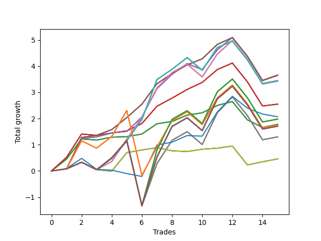

# Long Wallace 009 
- Symbol: SPY_Unlimited
- Date Range: 03/23/2022 - 07/08/2022
- Trading Period: 7:20-12:30
- Number of Trades: 15



| Name | Win Percent | Profit | Avg Profit / Trade | Avg Time / Trade |      | Name | Win Percent | Profit | Avg Profit / Trade | Avg Time / Trade |
| ---- | ----------- | ------ | ------------------ | ---------------- | ---- | ---- | ----------- | ------ | ------------------ | ---------------- |
| Sorted By <br> Profit | | | | | | Sorted By <br> Win Percentage ||||
| Sixty-Six | 80.00 | 1830.00 | 122.00 | 17:24 |     | Sixty-Seven | 86.67 | 1825.00 | 121.67 | 16:03 |
| Fifty-Eight | 80.00 | 1830.00 | 122.00 | 17:24 |     | Fifty-Nine | 86.67 | 1825.00 | 121.67 | 16:03 |
| Fifty | 80.00 | 1830.00 | 122.00 | 17:24 |     | Fifty-One | 86.67 | 1825.00 | 121.67 | 16:03 |
| Forty-Two | 80.00 | 1830.00 | 122.00 | 17:24 |     | Forty-Three | 86.67 | 1825.00 | 121.67 | 16:03 |
| Two | 80.00 | 1830.00 | 122.00 | 17:24 |     | Three | 86.67 | 1825.00 | 121.67 | 16:03 |
| Sixty-Seven | 86.67 | 1825.00 | 121.67 | 16:03 |     | Sixty-Six | 80.00 | 1830.00 | 122.00 | 17:24 |
| Fifty-Nine | 86.67 | 1825.00 | 121.67 | 16:03 |     | Fifty-Eight | 80.00 | 1830.00 | 122.00 | 17:24 |
| Fifty-One | 86.67 | 1825.00 | 121.67 | 16:03 |     | Fifty | 80.00 | 1830.00 | 122.00 | 17:24 |
| Forty-Three | 86.67 | 1825.00 | 121.67 | 16:03 |     | Forty-Two | 80.00 | 1830.00 | 122.00 | 17:24 |
| Three | 86.67 | 1825.00 | 121.67 | 16:03 |     | Two | 80.00 | 1830.00 | 122.00 | 17:24 |
| Sixty-Eight | 73.33 | 1725.00 | 115.00 | 22:00 |     | Sixty-Five | 80.00 | 1275.00 | 85.00 | 12:52 |
| Sixty | 73.33 | 1725.00 | 115.00 | 22:00 |     | Fifty-Seven | 80.00 | 1275.00 | 85.00 | 12:52 |
| Fifty-Two | 73.33 | 1725.00 | 115.00 | 22:00 |     | Forty-Nine | 80.00 | 1275.00 | 85.00 | 12:52 |
| Forty-Four | 73.33 | 1725.00 | 115.00 | 22:00 |     | Forty-One | 80.00 | 1275.00 | 85.00 | 12:52 |
| Four | 73.33 | 1725.00 | 115.00 | 22:00 |     | One | 80.00 | 1275.00 | 85.00 | 12:52 |
| Seventy-One | 73.33 | 1715.00 | 114.33 | 22:27 |     | Sixty-Four | 80.00 | 890.00 | 59.33 | 07:26 |
| Sixty-Three | 73.33 | 1715.00 | 114.33 | 22:27 |     | Fifty-Six | 80.00 | 890.00 | 59.33 | 07:26 |
| Fifty-Five | 73.33 | 1715.00 | 114.33 | 22:27 |     | Forty-Eight | 80.00 | 890.00 | 59.33 | 07:26 |
| Forty-Seven | 73.33 | 1715.00 | 114.33 | 22:27 |     | Forty | 80.00 | 890.00 | 59.33 | 07:26 |
| Seven | 73.33 | 1715.00 | 114.33 | 22:27 |     | Zero | 80.00 | 890.00 | 59.33 | 07:26 |
| Sixty-Five | 80.00 | 1275.00 | 85.00 | 12:52 |     | Sixty-Eight | 73.33 | 1725.00 | 115.00 | 22:00 |
| Fifty-Seven | 80.00 | 1275.00 | 85.00 | 12:52 |     | Sixty | 73.33 | 1725.00 | 115.00 | 22:00 |
| Forty-Nine | 80.00 | 1275.00 | 85.00 | 12:52 |     | Fifty-Two | 73.33 | 1725.00 | 115.00 | 22:00 |
| Forty-One | 80.00 | 1275.00 | 85.00 | 12:52 |     | Forty-Four | 73.33 | 1725.00 | 115.00 | 22:00 |
| One | 80.00 | 1275.00 | 85.00 | 12:52 |     | Four | 73.33 | 1725.00 | 115.00 | 22:00 |
| Seventy-Three | 46.67 | 1035.00 | 69.00 | 10:41 |     | Seventy-One | 73.33 | 1715.00 | 114.33 | 22:27 |
| One Hundred Twenty-Seven | 66.67 | 990.00 | 66.00 | 29:39 |     | Sixty-Three | 73.33 | 1715.00 | 114.33 | 22:27 |
| One Hundred Twenty-Two | 66.67 | 990.00 | 66.00 | 29:39 |     | Fifty-Five | 73.33 | 1715.00 | 114.33 | 22:27 |
| One Hundred Seventeen | 66.67 | 990.00 | 66.00 | 29:39 |     | Forty-Seven | 73.33 | 1715.00 | 114.33 | 22:27 |
| One Hundred Twelve | 66.67 | 990.00 | 66.00 | 29:39 |     | Seven | 73.33 | 1715.00 | 114.33 | 22:27 |
| Eighty-Two | 66.67 | 990.00 | 66.00 | 29:39 |     | One Hundred Twenty-Seven | 66.67 | 990.00 | 66.00 | 29:39 |
| Sixty-Four | 80.00 | 890.00 | 59.33 | 07:26 |     | One Hundred Twenty-Two | 66.67 | 990.00 | 66.00 | 29:39 |
| Fifty-Six | 80.00 | 890.00 | 59.33 | 07:26 |     | One Hundred Seventeen | 66.67 | 990.00 | 66.00 | 29:39 |
| Forty-Eight | 80.00 | 890.00 | 59.33 | 07:26 |     | One Hundred Twelve | 66.67 | 990.00 | 66.00 | 29:39 |
| Forty | 80.00 | 890.00 | 59.33 | 07:26 |     | Eighty-Two | 66.67 | 990.00 | 66.00 | 29:39 |
| Zero | 80.00 | 890.00 | 59.33 | 07:26 |     | One Hundred Twenty-Six | 66.67 | 875.00 | 58.33 | 25:21 |
| One Hundred Twenty-Six | 66.67 | 875.00 | 58.33 | 25:21 |     | One Hundred Twenty-One | 66.67 | 875.00 | 58.33 | 25:21 |
| One Hundred Twenty-One | 66.67 | 875.00 | 58.33 | 25:21 |     | One Hundred Sixteen | 66.67 | 875.00 | 58.33 | 25:21 |
| One Hundred Sixteen | 66.67 | 875.00 | 58.33 | 25:21 |     | One Hundred Eleven | 66.67 | 875.00 | 58.33 | 25:21 |
| One Hundred Eleven | 66.67 | 875.00 | 58.33 | 25:21 |     | Eighty-One | 66.67 | 875.00 | 58.33 | 25:21 |
| Eighty-One | 66.67 | 875.00 | 58.33 | 25:21 |     | One Hundred Thirty | 66.67 | 855.00 | 57.00 | 29:55 |
| One Hundred Thirty | 66.67 | 855.00 | 57.00 | 29:55 |     | One Hundred Twenty-Nine | 66.67 | 855.00 | 57.00 | 29:55 |
| One Hundred Twenty-Nine | 66.67 | 855.00 | 57.00 | 29:55 |     | One Hundred Twenty-Eight | 66.67 | 855.00 | 57.00 | 29:55 |
| One Hundred Twenty-Eight | 66.67 | 855.00 | 57.00 | 29:55 |     | One Hundred Twenty-Five | 66.67 | 855.00 | 57.00 | 29:55 |
| One Hundred Twenty-Five | 66.67 | 855.00 | 57.00 | 29:55 |     | One Hundred Twenty-Four | 66.67 | 855.00 | 57.00 | 29:55 |
| One Hundred Twenty-Four | 66.67 | 855.00 | 57.00 | 29:55 |     | One Hundred Twenty-Three | 66.67 | 855.00 | 57.00 | 29:55 |
| One Hundred Twenty-Three | 66.67 | 855.00 | 57.00 | 29:55 |     | One Hundred Twenty | 66.67 | 855.00 | 57.00 | 29:55 |
| One Hundred Twenty | 66.67 | 855.00 | 57.00 | 29:55 |     | One Hundred Ninteen | 66.67 | 855.00 | 57.00 | 29:55 |
| One Hundred Ninteen | 66.67 | 855.00 | 57.00 | 29:55 |     | One Hundred Eighteen | 66.67 | 855.00 | 57.00 | 29:55 |
| One Hundred Eighteen | 66.67 | 855.00 | 57.00 | 29:55 |     | One Hundred Fifteen | 66.67 | 855.00 | 57.00 | 29:55 |
| One Hundred Fifteen | 66.67 | 855.00 | 57.00 | 29:55 |     | One Hundred Fourteen | 66.67 | 855.00 | 57.00 | 29:55 |
| One Hundred Fourteen | 66.67 | 855.00 | 57.00 | 29:55 |     | One Hundred Thirteen | 66.67 | 855.00 | 57.00 | 29:55 |
| One Hundred Thirteen | 66.67 | 855.00 | 57.00 | 29:55 |     | Eighty-Five | 66.67 | 855.00 | 57.00 | 29:55 |
| Eighty-Five | 66.67 | 855.00 | 57.00 | 29:55 |     | Eighty-Four | 66.67 | 855.00 | 57.00 | 29:55 |
| Eighty-Four | 66.67 | 855.00 | 57.00 | 29:55 |     | Eighty-Three | 66.67 | 855.00 | 57.00 | 29:55 |
| Eighty-Three | 66.67 | 855.00 | 57.00 | 29:55 |     | Sixty-Nine | 66.67 | 650.00 | 43.33 | 27:06 |
| Sixty-Nine | 66.67 | 650.00 | 43.33 | 27:06 |     | Sixty-One | 66.67 | 650.00 | 43.33 | 27:06 |
| Sixty-One | 66.67 | 650.00 | 43.33 | 27:06 |     | Fifty-Three | 66.67 | 650.00 | 43.33 | 27:06 |
| Fifty-Three | 66.67 | 650.00 | 43.33 | 27:06 |     | Forty-Five | 66.67 | 650.00 | 43.33 | 27:06 |
| Forty-Five | 66.67 | 650.00 | 43.33 | 27:06 |     | Five | 66.67 | 650.00 | 43.33 | 27:06 |
| Five | 66.67 | 650.00 | 43.33 | 27:06 |     | Seventy | 66.67 | 230.00 | 15.33 | 11:32 |
| Seventy | 66.67 | 230.00 | 15.33 | 11:32 |     | Sixty-Two | 66.67 | 230.00 | 15.33 | 11:32 |
| Sixty-Two | 66.67 | 230.00 | 15.33 | 11:32 |     | Fifty-Four | 66.67 | 230.00 | 15.33 | 11:32 |
| Fifty-Four | 66.67 | 230.00 | 15.33 | 11:32 |     | Forty-Six | 66.67 | 230.00 | 15.33 | 11:32 |
| Forty-Six | 66.67 | 230.00 | 15.33 | 11:32 |     | Six | 66.67 | 230.00 | 15.33 | 11:32 |
| Six | 66.67 | 230.00 | 15.33 | 11:32 |     | Seventy-Three | 46.67 | 1035.00 | 69.00 | 10:41 |

## NO STOPLOSS

### Test Zero
* Sell when price hits the middle line of the 20p bollinger
* No Stoploss
* Results:
```
Total Trades: 15
Percent Up: 80.00
Percent Down: 20.00
Total Points Moved Up: 1.78
Potential Profit: 890.00
Total Points Ups: 2.81 Count Ups: 12
Total Points Downs: -1.03 Count Downs: 3
```

<details><summary>Trades</summary>

<code>In: 2022-03-23 09:47:00		Out: 2022-03-23 09:53:00		Total Position Time: 06:00		Total Move Up: 0.45		Total to Date: 0.45</code> <br />
<code>In: 2022-03-25 08:29:00		Out: 2022-03-25 08:36:40		Total Position Time: 07:40		Total Move Up: 0.77		Total to Date: 1.22</code> <br />
<code>In: 2022-03-31 09:23:00		Out: 2022-03-31 09:32:25		Total Position Time: 09:25		Total Move Up: -0.04		Total to Date: 1.18</code> <br />
<code>In: 2022-04-04 10:03:00		Out: 2022-04-04 10:09:45		Total Position Time: 06:45		Total Move Up: 0.11		Total to Date: 1.29</code> <br />
<code>In: 2022-04-20 09:14:00		Out: 2022-04-20 09:30:50		Total Position Time: 16:50		Total Move Up: 0.02		Total to Date: 1.31</code> <br />
<code>In: 2022-04-27 11:40:00		Out: 2022-04-27 11:40:10		Total Position Time: 00:10		Total Move Up: 0.10		Total to Date: 1.41</code> <br />
<code>In: 2022-05-23 10:23:00		Out: 2022-05-23 10:26:30		Total Position Time: 03:30		Total Move Up: 0.39		Total to Date: 1.80</code> <br />
<code>In: 2022-05-26 08:50:00		Out: 2022-05-26 08:54:00		Total Position Time: 04:00		Total Move Up: 0.09		Total to Date: 1.89</code> <br />
<code>In: 2022-05-26 11:38:00		Out: 2022-05-26 11:45:05		Total Position Time: 07:05		Total Move Up: 0.24		Total to Date: 2.13</code> <br />
<code>In: 2022-05-26 12:06:00		Out: 2022-05-26 12:06:10		Total Position Time: 00:10		Total Move Up: 0.09		Total to Date: 2.22</code> <br />
<code>In: 2022-05-27 08:04:00		Out: 2022-05-27 08:06:55		Total Position Time: 02:55		Total Move Up: 0.28		Total to Date: 2.50</code> <br />
<code>In: 2022-05-27 09:52:00		Out: 2022-05-27 09:53:05		Total Position Time: 01:05		Total Move Up: 0.15		Total to Date: 2.65</code> <br />
<code>In: 2022-06-15 07:35:00		Out: 2022-06-15 07:58:55		Total Position Time: 23:55		Total Move Up: -0.70		Total to Date: 1.95</code> <br />
<code>In: 2022-06-21 08:42:00		Out: 2022-06-21 08:57:50		Total Position Time: 15:50		Total Move Up: -0.29		Total to Date: 1.66</code> <br />
<code>In: 2022-06-27 10:45:00		Out: 2022-06-27 10:51:15		Total Position Time: 06:15		Total Move Up: 0.12		Total to Date: 1.78</code> <br />


</details>

### Test One
* Sell when the price hits the upper line of the 20p 1std bollinger
* No Stoploss
* Results:
```
Total Trades: 15
Percent Up: 80.00
Percent Down: 20.00
Total Points Moved Up: 2.55
Potential Profit: 1275.00
Total Points Ups: 4.24 Count Ups: 12
Total Points Downs: -1.69 Count Downs: 3
```

<details><summary>Trades</summary>

<code>In: 2022-03-23 09:47:00		Out: 2022-03-23 09:59:10		Total Position Time: 12:10		Total Move Up: 0.52		Total to Date: 0.52</code> <br />
<code>In: 2022-03-25 08:29:00		Out: 2022-03-25 08:41:05		Total Position Time: 12:05		Total Move Up: 0.89		Total to Date: 1.41</code> <br />
<code>In: 2022-03-31 09:23:00		Out: 2022-03-31 09:40:45		Total Position Time: 17:45		Total Move Up: -0.05		Total to Date: 1.36</code> <br />
<code>In: 2022-04-04 10:03:00		Out: 2022-04-04 10:17:55		Total Position Time: 14:55		Total Move Up: 0.09		Total to Date: 1.45</code> <br />
<code>In: 2022-04-20 09:14:00		Out: 2022-04-20 09:30:55		Total Position Time: 16:55		Total Move Up: 0.08		Total to Date: 1.53</code> <br />
<code>In: 2022-04-27 11:40:00		Out: 2022-04-27 11:42:30		Total Position Time: 02:30		Total Move Up: 0.28		Total to Date: 1.81</code> <br />
<code>In: 2022-05-23 10:23:00		Out: 2022-05-23 10:32:35		Total Position Time: 09:35		Total Move Up: 0.66		Total to Date: 2.47</code> <br />
<code>In: 2022-05-26 08:50:00		Out: 2022-05-26 08:55:25		Total Position Time: 05:25		Total Move Up: 0.31		Total to Date: 2.78</code> <br />
<code>In: 2022-05-26 11:38:00		Out: 2022-05-26 11:50:15		Total Position Time: 12:15		Total Move Up: 0.33		Total to Date: 3.11</code> <br />
<code>In: 2022-05-26 12:06:00		Out: 2022-05-26 12:08:00		Total Position Time: 02:00		Total Move Up: 0.27		Total to Date: 3.38</code> <br />
<code>In: 2022-05-27 08:04:00		Out: 2022-05-27 08:11:00		Total Position Time: 07:00		Total Move Up: 0.49		Total to Date: 3.87</code> <br />
<code>In: 2022-05-27 09:52:00		Out: 2022-05-27 09:54:20		Total Position Time: 02:20		Total Move Up: 0.25		Total to Date: 4.12</code> <br />
<code>In: 2022-06-15 07:35:00		Out: 2022-06-15 08:04:55		Total Position Time: 29:55		Total Move Up: -0.72		Total to Date: 3.40</code> <br />
<code>In: 2022-06-21 08:42:00		Out: 2022-06-21 09:11:55		Total Position Time: 29:55		Total Move Up: -0.92		Total to Date: 2.48</code> <br />
<code>In: 2022-06-27 10:45:00		Out: 2022-06-27 11:03:15		Total Position Time: 18:15		Total Move Up: 0.07		Total to Date: 2.55</code> <br />


</details>

### Test Two
* Sell when the price hits the upper line of the 20p 2std bollinger
* No Stoploss
* Results:
```
Total Trades: 15
Percent Up: 80.00
Percent Down: 20.00
Total Points Moved Up: 3.66
Potential Profit: 1830.00
Total Points Ups: 5.53 Count Ups: 12
Total Points Downs: -1.87 Count Downs: 3
```

<details><summary>Trades</summary>

<code>In: 2022-03-23 09:47:00		Out: 2022-03-23 10:16:55		Total Position Time: 29:55		Total Move Up: 0.08		Total to Date: 0.08</code> <br />
<code>In: 2022-03-25 08:29:00		Out: 2022-03-25 08:41:45		Total Position Time: 12:45		Total Move Up: 1.16		Total to Date: 1.24</code> <br />
<code>In: 2022-03-31 09:23:00		Out: 2022-03-31 09:44:20		Total Position Time: 21:20		Total Move Up: 0.06		Total to Date: 1.30</code> <br />
<code>In: 2022-04-04 10:03:00		Out: 2022-04-04 10:18:15		Total Position Time: 15:15		Total Move Up: 0.15		Total to Date: 1.45</code> <br />
<code>In: 2022-04-20 09:14:00		Out: 2022-04-20 09:31:05		Total Position Time: 17:05		Total Move Up: 0.06		Total to Date: 1.51</code> <br />
<code>In: 2022-04-27 11:40:00		Out: 2022-04-27 11:42:40		Total Position Time: 02:40		Total Move Up: 0.55		Total to Date: 2.06</code> <br />
<code>In: 2022-05-23 10:23:00		Out: 2022-05-23 10:33:15		Total Position Time: 10:15		Total Move Up: 1.08		Total to Date: 3.14</code> <br />
<code>In: 2022-05-26 08:50:00		Out: 2022-05-26 08:56:50		Total Position Time: 06:50		Total Move Up: 0.55		Total to Date: 3.69</code> <br />
<code>In: 2022-05-26 11:38:00		Out: 2022-05-26 11:54:10		Total Position Time: 16:10		Total Move Up: 0.41		Total to Date: 4.10</code> <br />
<code>In: 2022-05-26 12:06:00		Out: 2022-05-26 12:34:30		Total Position Time: 28:30		Total Move Up: -0.23		Total to Date: 3.87</code> <br />
<code>In: 2022-05-27 08:04:00		Out: 2022-05-27 08:12:15		Total Position Time: 08:15		Total Move Up: 0.75		Total to Date: 4.62</code> <br />
<code>In: 2022-05-27 09:52:00		Out: 2022-05-27 09:55:40		Total Position Time: 03:40		Total Move Up: 0.48		Total to Date: 5.10</code> <br />
<code>In: 2022-06-15 07:35:00		Out: 2022-06-15 08:04:55		Total Position Time: 29:55		Total Move Up: -0.72		Total to Date: 4.38</code> <br />
<code>In: 2022-06-21 08:42:00		Out: 2022-06-21 09:11:55		Total Position Time: 29:55		Total Move Up: -0.92		Total to Date: 3.46</code> <br />
<code>In: 2022-06-27 10:45:00		Out: 2022-06-27 11:13:35		Total Position Time: 28:35		Total Move Up: 0.20		Total to Date: 3.66</code> <br />


</details>

### Test Three
* Sell when price hits the middle line of the 50p bollinger
* No Stoploss
* Results:
```
Total Trades: 15
Percent Up: 86.67
Percent Down: 13.33
Total Points Moved Up: 3.65
Potential Profit: 1825.00
Total Points Ups: 5.29 Count Ups: 13
Total Points Downs: -1.64 Count Downs: 2
```

<details><summary>Trades</summary>

<code>In: 2022-03-23 09:47:00		Out: 2022-03-23 10:16:55		Total Position Time: 29:55		Total Move Up: 0.08		Total to Date: 0.08</code> <br />
<code>In: 2022-03-25 08:29:00		Out: 2022-03-25 08:52:45		Total Position Time: 23:45		Total Move Up: 1.20		Total to Date: 1.28</code> <br />
<code>In: 2022-03-31 09:23:00		Out: 2022-03-31 09:45:10		Total Position Time: 22:10		Total Move Up: 0.08		Total to Date: 1.36</code> <br />
<code>In: 2022-04-04 10:03:00		Out: 2022-04-04 10:19:05		Total Position Time: 16:05		Total Move Up: 0.22		Total to Date: 1.58</code> <br />
<code>In: 2022-04-20 09:14:00		Out: 2022-04-20 09:32:40		Total Position Time: 18:40		Total Move Up: 0.46		Total to Date: 2.04</code> <br />
<code>In: 2022-04-27 11:40:00		Out: 2022-04-27 11:42:35		Total Position Time: 02:35		Total Move Up: 0.51		Total to Date: 2.55</code> <br />
<code>In: 2022-05-23 10:23:00		Out: 2022-05-23 10:33:00		Total Position Time: 10:00		Total Move Up: 0.78		Total to Date: 3.33</code> <br />
<code>In: 2022-05-26 08:50:00		Out: 2022-05-26 08:55:30		Total Position Time: 05:30		Total Move Up: 0.39		Total to Date: 3.72</code> <br />
<code>In: 2022-05-26 11:38:00		Out: 2022-05-26 11:50:15		Total Position Time: 12:15		Total Move Up: 0.33		Total to Date: 4.05</code> <br />
<code>In: 2022-05-26 12:06:00		Out: 2022-05-26 12:07:55		Total Position Time: 01:55		Total Move Up: 0.23		Total to Date: 4.28</code> <br />
<code>In: 2022-05-27 08:04:00		Out: 2022-05-27 08:11:10		Total Position Time: 07:10		Total Move Up: 0.55		Total to Date: 4.83</code> <br />
<code>In: 2022-05-27 09:52:00		Out: 2022-05-27 09:54:30		Total Position Time: 02:30		Total Move Up: 0.26		Total to Date: 5.09</code> <br />
<code>In: 2022-06-15 07:35:00		Out: 2022-06-15 08:04:55		Total Position Time: 29:55		Total Move Up: -0.72		Total to Date: 4.37</code> <br />
<code>In: 2022-06-21 08:42:00		Out: 2022-06-21 09:11:55		Total Position Time: 29:55		Total Move Up: -0.92		Total to Date: 3.45</code> <br />
<code>In: 2022-06-27 10:45:00		Out: 2022-06-27 11:13:35		Total Position Time: 28:35		Total Move Up: 0.20		Total to Date: 3.65</code> <br />


</details>

### Test Four
* Sell when the price hits the upper line of the 50p 1std bollinger
* No Stoploss
* Results:
```
Total Trades: 15
Percent Up: 73.33
Percent Down: 26.67
Total Points Moved Up: 3.45
Potential Profit: 1725.00
Total Points Ups: 5.86 Count Ups: 11
Total Points Downs: -2.41 Count Downs: 4
```

<details><summary>Trades</summary>

<code>In: 2022-03-23 09:47:00		Out: 2022-03-23 10:16:55		Total Position Time: 29:55		Total Move Up: 0.08		Total to Date: 0.08</code> <br />
<code>In: 2022-03-25 08:29:00		Out: 2022-03-25 08:58:55		Total Position Time: 29:55		Total Move Up: 0.25		Total to Date: 0.33</code> <br />
<code>In: 2022-03-31 09:23:00		Out: 2022-03-31 09:52:55		Total Position Time: 29:55		Total Move Up: -0.28		Total to Date: 0.05</code> <br />
<code>In: 2022-04-04 10:03:00		Out: 2022-04-04 10:26:05		Total Position Time: 23:05		Total Move Up: 0.31		Total to Date: 0.36</code> <br />
<code>In: 2022-04-20 09:14:00		Out: 2022-04-20 09:36:45		Total Position Time: 22:45		Total Move Up: 0.85		Total to Date: 1.21</code> <br />
<code>In: 2022-04-27 11:40:00		Out: 2022-04-27 11:45:25		Total Position Time: 05:25		Total Move Up: 0.84		Total to Date: 2.05</code> <br />
<code>In: 2022-05-23 10:23:00		Out: 2022-05-23 10:36:15		Total Position Time: 13:15		Total Move Up: 1.12		Total to Date: 3.17</code> <br />
<code>In: 2022-05-26 08:50:00		Out: 2022-05-26 08:58:30		Total Position Time: 08:30		Total Move Up: 0.58		Total to Date: 3.75</code> <br />
<code>In: 2022-05-26 11:38:00		Out: 2022-05-26 12:07:55		Total Position Time: 29:55		Total Move Up: 0.33		Total to Date: 4.08</code> <br />
<code>In: 2022-05-26 12:06:00		Out: 2022-05-26 12:35:55		Total Position Time: 29:55		Total Move Up: -0.49		Total to Date: 3.59</code> <br />
<code>In: 2022-05-27 08:04:00		Out: 2022-05-27 08:16:05		Total Position Time: 12:05		Total Move Up: 0.87		Total to Date: 4.46</code> <br />
<code>In: 2022-05-27 09:52:00		Out: 2022-05-27 09:57:35		Total Position Time: 05:35		Total Move Up: 0.52		Total to Date: 4.98</code> <br />
<code>In: 2022-06-15 07:35:00		Out: 2022-06-15 08:04:55		Total Position Time: 29:55		Total Move Up: -0.72		Total to Date: 4.26</code> <br />
<code>In: 2022-06-21 08:42:00		Out: 2022-06-21 09:11:55		Total Position Time: 29:55		Total Move Up: -0.92		Total to Date: 3.34</code> <br />
<code>In: 2022-06-27 10:45:00		Out: 2022-06-27 11:14:55		Total Position Time: 29:55		Total Move Up: 0.11		Total to Date: 3.45</code> <br />


</details>

### Test Five
* Sell when the price hits the upper line of the 50p 2std bollinger
* No Stoploss
* Results:
```
Total Trades: 15
Percent Up: 66.67
Percent Down: 33.33
Total Points Moved Up: 1.30
Potential Profit: 650.00
Total Points Ups: 6.19 Count Ups: 10
Total Points Downs: -4.89 Count Downs: 5
```

<details><summary>Trades</summary>

<code>In: 2022-03-23 09:47:00		Out: 2022-03-23 10:16:55		Total Position Time: 29:55		Total Move Up: 0.08		Total to Date: 0.08</code> <br />
<code>In: 2022-03-25 08:29:00		Out: 2022-03-25 08:58:55		Total Position Time: 29:55		Total Move Up: 0.25		Total to Date: 0.33</code> <br />
<code>In: 2022-03-31 09:23:00		Out: 2022-03-31 09:52:55		Total Position Time: 29:55		Total Move Up: -0.28		Total to Date: 0.05</code> <br />
<code>In: 2022-04-04 10:03:00		Out: 2022-04-04 10:29:40		Total Position Time: 26:40		Total Move Up: 0.43		Total to Date: 0.48</code> <br />
<code>In: 2022-04-20 09:14:00		Out: 2022-04-20 09:43:55		Total Position Time: 29:55		Total Move Up: 0.66		Total to Date: 1.14</code> <br />
<code>In: 2022-04-27 11:40:00		Out: 2022-04-27 12:09:55		Total Position Time: 29:55		Total Move Up: -2.48		Total to Date: -1.34</code> <br />
<code>In: 2022-05-23 10:23:00		Out: 2022-05-23 10:47:45		Total Position Time: 24:45		Total Move Up: 1.62		Total to Date: 0.28</code> <br />
<code>In: 2022-05-26 08:50:00		Out: 2022-05-26 09:02:40		Total Position Time: 12:40		Total Move Up: 0.89		Total to Date: 1.17</code> <br />
<code>In: 2022-05-26 11:38:00		Out: 2022-05-26 12:07:55		Total Position Time: 29:55		Total Move Up: 0.33		Total to Date: 1.50</code> <br />
<code>In: 2022-05-26 12:06:00		Out: 2022-05-26 12:35:55		Total Position Time: 29:55		Total Move Up: -0.49		Total to Date: 1.01</code> <br />
<code>In: 2022-05-27 08:04:00		Out: 2022-05-27 08:33:55		Total Position Time: 29:55		Total Move Up: 1.21		Total to Date: 2.22</code> <br />
<code>In: 2022-05-27 09:52:00		Out: 2022-05-27 10:05:20		Total Position Time: 13:20		Total Move Up: 0.61		Total to Date: 2.83</code> <br />
<code>In: 2022-06-15 07:35:00		Out: 2022-06-15 08:04:55		Total Position Time: 29:55		Total Move Up: -0.72		Total to Date: 2.11</code> <br />
<code>In: 2022-06-21 08:42:00		Out: 2022-06-21 09:11:55		Total Position Time: 29:55		Total Move Up: -0.92		Total to Date: 1.19</code> <br />
<code>In: 2022-06-27 10:45:00		Out: 2022-06-27 11:14:55		Total Position Time: 29:55		Total Move Up: 0.11		Total to Date: 1.30</code> <br />


</details>

### Test Six
* Sell when the price hits the middle line of the 1std VWAP
* No Stoploss
* Results:
```
Total Trades: 15
Percent Up: 66.67
Percent Down: 33.33
Total Points Moved Up: 0.46
Potential Profit: 230.00
Total Points Ups: 1.67 Count Ups: 10
Total Points Downs: -1.21 Count Downs: 5
```

<details><summary>Trades</summary>

<code>In: 2022-03-23 09:47:00		Out: 2022-03-23 10:16:55		Total Position Time: 29:55		Total Move Up: 0.08		Total to Date: 0.08</code> <br />
<code>In: 2022-03-25 08:29:00		Out: 2022-03-25 08:58:55		Total Position Time: 29:55		Total Move Up: 0.25		Total to Date: 0.33</code> <br />
<code>In: 2022-03-31 09:23:00		Out: 2022-03-31 09:52:55		Total Position Time: 29:55		Total Move Up: -0.28		Total to Date: 0.05</code> <br />
<code>In: 2022-04-04 10:03:00		Out: 2022-04-04 10:03:10		Total Position Time: 00:10		Total Move Up: -0.06		Total to Date: -0.01</code> <br />
<code>In: 2022-04-20 09:14:00		Out: 2022-04-20 09:36:05		Total Position Time: 22:05		Total Move Up: 0.71		Total to Date: 0.70</code> <br />
<code>In: 2022-04-27 11:40:00		Out: 2022-04-27 11:40:10		Total Position Time: 00:10		Total Move Up: 0.10		Total to Date: 0.80</code> <br />
<code>In: 2022-05-23 10:23:00		Out: 2022-05-23 10:23:10		Total Position Time: 00:10		Total Move Up: 0.09		Total to Date: 0.89</code> <br />
<code>In: 2022-05-26 08:50:00		Out: 2022-05-26 08:50:10		Total Position Time: 00:10		Total Move Up: -0.12		Total to Date: 0.77</code> <br />
<code>In: 2022-05-26 11:38:00		Out: 2022-05-26 11:38:10		Total Position Time: 00:10		Total Move Up: -0.03		Total to Date: 0.74</code> <br />
<code>In: 2022-05-26 12:06:00		Out: 2022-05-26 12:06:10		Total Position Time: 00:10		Total Move Up: 0.09		Total to Date: 0.83</code> <br />
<code>In: 2022-05-27 08:04:00		Out: 2022-05-27 08:04:10		Total Position Time: 00:10		Total Move Up: 0.04		Total to Date: 0.87</code> <br />
<code>In: 2022-05-27 09:52:00		Out: 2022-05-27 09:52:10		Total Position Time: 00:10		Total Move Up: 0.08		Total to Date: 0.95</code> <br />
<code>In: 2022-06-15 07:35:00		Out: 2022-06-15 08:04:55		Total Position Time: 29:55		Total Move Up: -0.72		Total to Date: 0.23</code> <br />
<code>In: 2022-06-21 08:42:00		Out: 2022-06-21 08:42:10		Total Position Time: 00:10		Total Move Up: 0.12		Total to Date: 0.35</code> <br />
<code>In: 2022-06-27 10:45:00		Out: 2022-06-27 11:14:55		Total Position Time: 29:55		Total Move Up: 0.11		Total to Date: 0.46</code> <br />


</details>

### Test Seven
* Sell when the price hits the upper line of the 1std VWAP
* No Stoploss
* Results:
```
Total Trades: 15
Percent Up: 73.33
Percent Down: 26.67
Total Points Moved Up: 3.43
Potential Profit: 1715.00
Total Points Ups: 5.84 Count Ups: 11
Total Points Downs: -2.41 Count Downs: 4
```

<details><summary>Trades</summary>

<code>In: 2022-03-23 09:47:00		Out: 2022-03-23 10:16:55		Total Position Time: 29:55		Total Move Up: 0.08		Total to Date: 0.08</code> <br />
<code>In: 2022-03-25 08:29:00		Out: 2022-03-25 08:58:55		Total Position Time: 29:55		Total Move Up: 0.25		Total to Date: 0.33</code> <br />
<code>In: 2022-03-31 09:23:00		Out: 2022-03-31 09:52:55		Total Position Time: 29:55		Total Move Up: -0.28		Total to Date: 0.05</code> <br />
<code>In: 2022-04-04 10:03:00		Out: 2022-04-04 10:32:55		Total Position Time: 29:55		Total Move Up: 0.45		Total to Date: 0.50</code> <br />
<code>In: 2022-04-20 09:14:00		Out: 2022-04-20 09:43:55		Total Position Time: 29:55		Total Move Up: 0.66		Total to Date: 1.16</code> <br />
<code>In: 2022-04-27 11:40:00		Out: 2022-04-27 11:44:20		Total Position Time: 04:20		Total Move Up: 0.80		Total to Date: 1.96</code> <br />
<code>In: 2022-05-23 10:23:00		Out: 2022-05-23 10:46:25		Total Position Time: 23:25		Total Move Up: 1.53		Total to Date: 3.49</code> <br />
<code>In: 2022-05-26 08:50:00		Out: 2022-05-26 08:55:30		Total Position Time: 05:30		Total Move Up: 0.39		Total to Date: 3.88</code> <br />
<code>In: 2022-05-26 11:38:00		Out: 2022-05-26 11:57:50		Total Position Time: 19:50		Total Move Up: 0.45		Total to Date: 4.33</code> <br />
<code>In: 2022-05-26 12:06:00		Out: 2022-05-26 12:35:55		Total Position Time: 29:55		Total Move Up: -0.49		Total to Date: 3.84</code> <br />
<code>In: 2022-05-27 08:04:00		Out: 2022-05-27 08:16:05		Total Position Time: 12:05		Total Move Up: 0.87		Total to Date: 4.71</code> <br />
<code>In: 2022-05-27 09:52:00		Out: 2022-05-27 09:54:20		Total Position Time: 02:20		Total Move Up: 0.25		Total to Date: 4.96</code> <br />
<code>In: 2022-06-15 07:35:00		Out: 2022-06-15 08:04:55		Total Position Time: 29:55		Total Move Up: -0.72		Total to Date: 4.24</code> <br />
<code>In: 2022-06-21 08:42:00		Out: 2022-06-21 09:11:55		Total Position Time: 29:55		Total Move Up: -0.92		Total to Date: 3.32</code> <br />
<code>In: 2022-06-27 10:45:00		Out: 2022-06-27 11:14:55		Total Position Time: 29:55		Total Move Up: 0.11		Total to Date: 3.43</code> <br />


</details>

## STOPLOSS OF 5

### Test Forty
* Sell when price hits the middle line of the 20p bollinger
* Stoploss is 5 points
* Results:
```
Total Trades: 15
Percent Up: 80.00
Percent Down: 20.00
Total Points Moved Up: 1.78
Potential Profit: 890.00
Total Points Ups: 2.81 Count Ups: 12
Total Points Downs: -1.03 Count Downs: 3
```

<details><summary>Trades</summary>

<code>In: 2022-03-23 09:47:00		Out: 2022-03-23 09:53:00		Total Position Time: 06:00		Total Move Up: 0.45		Total to Date: 0.45</code> <br />
<code>In: 2022-03-25 08:29:00		Out: 2022-03-25 08:36:40		Total Position Time: 07:40		Total Move Up: 0.77		Total to Date: 1.22</code> <br />
<code>In: 2022-03-31 09:23:00		Out: 2022-03-31 09:32:25		Total Position Time: 09:25		Total Move Up: -0.04		Total to Date: 1.18</code> <br />
<code>In: 2022-04-04 10:03:00		Out: 2022-04-04 10:09:45		Total Position Time: 06:45		Total Move Up: 0.11		Total to Date: 1.29</code> <br />
<code>In: 2022-04-20 09:14:00		Out: 2022-04-20 09:30:50		Total Position Time: 16:50		Total Move Up: 0.02		Total to Date: 1.31</code> <br />
<code>In: 2022-04-27 11:40:00		Out: 2022-04-27 11:40:10		Total Position Time: 00:10		Total Move Up: 0.10		Total to Date: 1.41</code> <br />
<code>In: 2022-05-23 10:23:00		Out: 2022-05-23 10:26:30		Total Position Time: 03:30		Total Move Up: 0.39		Total to Date: 1.80</code> <br />
<code>In: 2022-05-26 08:50:00		Out: 2022-05-26 08:54:00		Total Position Time: 04:00		Total Move Up: 0.09		Total to Date: 1.89</code> <br />
<code>In: 2022-05-26 11:38:00		Out: 2022-05-26 11:45:05		Total Position Time: 07:05		Total Move Up: 0.24		Total to Date: 2.13</code> <br />
<code>In: 2022-05-26 12:06:00		Out: 2022-05-26 12:06:10		Total Position Time: 00:10		Total Move Up: 0.09		Total to Date: 2.22</code> <br />
<code>In: 2022-05-27 08:04:00		Out: 2022-05-27 08:06:55		Total Position Time: 02:55		Total Move Up: 0.28		Total to Date: 2.50</code> <br />
<code>In: 2022-05-27 09:52:00		Out: 2022-05-27 09:53:05		Total Position Time: 01:05		Total Move Up: 0.15		Total to Date: 2.65</code> <br />
<code>In: 2022-06-15 07:35:00		Out: 2022-06-15 07:58:55		Total Position Time: 23:55		Total Move Up: -0.70		Total to Date: 1.95</code> <br />
<code>In: 2022-06-21 08:42:00		Out: 2022-06-21 08:57:50		Total Position Time: 15:50		Total Move Up: -0.29		Total to Date: 1.66</code> <br />
<code>In: 2022-06-27 10:45:00		Out: 2022-06-27 10:51:15		Total Position Time: 06:15		Total Move Up: 0.12		Total to Date: 1.78</code> <br />


</details>

### Test Forty-One
* Sell when the price hits the upper line of the 20p 1std bollinger
* Stoploss is 5 points
* Results:
```
Total Trades: 15
Percent Up: 80.00
Percent Down: 20.00
Total Points Moved Up: 2.55
Potential Profit: 1275.00
Total Points Ups: 4.24 Count Ups: 12
Total Points Downs: -1.69 Count Downs: 3
```

<details><summary>Trades</summary>

<code>In: 2022-03-23 09:47:00		Out: 2022-03-23 09:59:10		Total Position Time: 12:10		Total Move Up: 0.52		Total to Date: 0.52</code> <br />
<code>In: 2022-03-25 08:29:00		Out: 2022-03-25 08:41:05		Total Position Time: 12:05		Total Move Up: 0.89		Total to Date: 1.41</code> <br />
<code>In: 2022-03-31 09:23:00		Out: 2022-03-31 09:40:45		Total Position Time: 17:45		Total Move Up: -0.05		Total to Date: 1.36</code> <br />
<code>In: 2022-04-04 10:03:00		Out: 2022-04-04 10:17:55		Total Position Time: 14:55		Total Move Up: 0.09		Total to Date: 1.45</code> <br />
<code>In: 2022-04-20 09:14:00		Out: 2022-04-20 09:30:55		Total Position Time: 16:55		Total Move Up: 0.08		Total to Date: 1.53</code> <br />
<code>In: 2022-04-27 11:40:00		Out: 2022-04-27 11:42:30		Total Position Time: 02:30		Total Move Up: 0.28		Total to Date: 1.81</code> <br />
<code>In: 2022-05-23 10:23:00		Out: 2022-05-23 10:32:35		Total Position Time: 09:35		Total Move Up: 0.66		Total to Date: 2.47</code> <br />
<code>In: 2022-05-26 08:50:00		Out: 2022-05-26 08:55:25		Total Position Time: 05:25		Total Move Up: 0.31		Total to Date: 2.78</code> <br />
<code>In: 2022-05-26 11:38:00		Out: 2022-05-26 11:50:15		Total Position Time: 12:15		Total Move Up: 0.33		Total to Date: 3.11</code> <br />
<code>In: 2022-05-26 12:06:00		Out: 2022-05-26 12:08:00		Total Position Time: 02:00		Total Move Up: 0.27		Total to Date: 3.38</code> <br />
<code>In: 2022-05-27 08:04:00		Out: 2022-05-27 08:11:00		Total Position Time: 07:00		Total Move Up: 0.49		Total to Date: 3.87</code> <br />
<code>In: 2022-05-27 09:52:00		Out: 2022-05-27 09:54:20		Total Position Time: 02:20		Total Move Up: 0.25		Total to Date: 4.12</code> <br />
<code>In: 2022-06-15 07:35:00		Out: 2022-06-15 08:04:55		Total Position Time: 29:55		Total Move Up: -0.72		Total to Date: 3.40</code> <br />
<code>In: 2022-06-21 08:42:00		Out: 2022-06-21 09:11:55		Total Position Time: 29:55		Total Move Up: -0.92		Total to Date: 2.48</code> <br />
<code>In: 2022-06-27 10:45:00		Out: 2022-06-27 11:03:15		Total Position Time: 18:15		Total Move Up: 0.07		Total to Date: 2.55</code> <br />


</details>

### Test Forty-Two
* Sell when the price hits the upper line of the 20p 2std bollinger
* Stoploss is 5 points
* Results:
```
Total Trades: 15
Percent Up: 80.00
Percent Down: 20.00
Total Points Moved Up: 3.66
Potential Profit: 1830.00
Total Points Ups: 5.53 Count Ups: 12
Total Points Downs: -1.87 Count Downs: 3
```

<details><summary>Trades</summary>

<code>In: 2022-03-23 09:47:00		Out: 2022-03-23 10:16:55		Total Position Time: 29:55		Total Move Up: 0.08		Total to Date: 0.08</code> <br />
<code>In: 2022-03-25 08:29:00		Out: 2022-03-25 08:41:45		Total Position Time: 12:45		Total Move Up: 1.16		Total to Date: 1.24</code> <br />
<code>In: 2022-03-31 09:23:00		Out: 2022-03-31 09:44:20		Total Position Time: 21:20		Total Move Up: 0.06		Total to Date: 1.30</code> <br />
<code>In: 2022-04-04 10:03:00		Out: 2022-04-04 10:18:15		Total Position Time: 15:15		Total Move Up: 0.15		Total to Date: 1.45</code> <br />
<code>In: 2022-04-20 09:14:00		Out: 2022-04-20 09:31:05		Total Position Time: 17:05		Total Move Up: 0.06		Total to Date: 1.51</code> <br />
<code>In: 2022-04-27 11:40:00		Out: 2022-04-27 11:42:40		Total Position Time: 02:40		Total Move Up: 0.55		Total to Date: 2.06</code> <br />
<code>In: 2022-05-23 10:23:00		Out: 2022-05-23 10:33:15		Total Position Time: 10:15		Total Move Up: 1.08		Total to Date: 3.14</code> <br />
<code>In: 2022-05-26 08:50:00		Out: 2022-05-26 08:56:50		Total Position Time: 06:50		Total Move Up: 0.55		Total to Date: 3.69</code> <br />
<code>In: 2022-05-26 11:38:00		Out: 2022-05-26 11:54:10		Total Position Time: 16:10		Total Move Up: 0.41		Total to Date: 4.10</code> <br />
<code>In: 2022-05-26 12:06:00		Out: 2022-05-26 12:34:30		Total Position Time: 28:30		Total Move Up: -0.23		Total to Date: 3.87</code> <br />
<code>In: 2022-05-27 08:04:00		Out: 2022-05-27 08:12:15		Total Position Time: 08:15		Total Move Up: 0.75		Total to Date: 4.62</code> <br />
<code>In: 2022-05-27 09:52:00		Out: 2022-05-27 09:55:40		Total Position Time: 03:40		Total Move Up: 0.48		Total to Date: 5.10</code> <br />
<code>In: 2022-06-15 07:35:00		Out: 2022-06-15 08:04:55		Total Position Time: 29:55		Total Move Up: -0.72		Total to Date: 4.38</code> <br />
<code>In: 2022-06-21 08:42:00		Out: 2022-06-21 09:11:55		Total Position Time: 29:55		Total Move Up: -0.92		Total to Date: 3.46</code> <br />
<code>In: 2022-06-27 10:45:00		Out: 2022-06-27 11:13:35		Total Position Time: 28:35		Total Move Up: 0.20		Total to Date: 3.66</code> <br />


</details>

### Test Forty-Three
* Sell when price hits the middle line of the 50p bollinger
* Stoploss is 5 points
* Results:
```
Total Trades: 15
Percent Up: 86.67
Percent Down: 13.33
Total Points Moved Up: 3.65
Potential Profit: 1825.00
Total Points Ups: 5.29 Count Ups: 13
Total Points Downs: -1.64 Count Downs: 2
```

<details><summary>Trades</summary>

<code>In: 2022-03-23 09:47:00		Out: 2022-03-23 10:16:55		Total Position Time: 29:55		Total Move Up: 0.08		Total to Date: 0.08</code> <br />
<code>In: 2022-03-25 08:29:00		Out: 2022-03-25 08:52:45		Total Position Time: 23:45		Total Move Up: 1.20		Total to Date: 1.28</code> <br />
<code>In: 2022-03-31 09:23:00		Out: 2022-03-31 09:45:10		Total Position Time: 22:10		Total Move Up: 0.08		Total to Date: 1.36</code> <br />
<code>In: 2022-04-04 10:03:00		Out: 2022-04-04 10:19:05		Total Position Time: 16:05		Total Move Up: 0.22		Total to Date: 1.58</code> <br />
<code>In: 2022-04-20 09:14:00		Out: 2022-04-20 09:32:40		Total Position Time: 18:40		Total Move Up: 0.46		Total to Date: 2.04</code> <br />
<code>In: 2022-04-27 11:40:00		Out: 2022-04-27 11:42:35		Total Position Time: 02:35		Total Move Up: 0.51		Total to Date: 2.55</code> <br />
<code>In: 2022-05-23 10:23:00		Out: 2022-05-23 10:33:00		Total Position Time: 10:00		Total Move Up: 0.78		Total to Date: 3.33</code> <br />
<code>In: 2022-05-26 08:50:00		Out: 2022-05-26 08:55:30		Total Position Time: 05:30		Total Move Up: 0.39		Total to Date: 3.72</code> <br />
<code>In: 2022-05-26 11:38:00		Out: 2022-05-26 11:50:15		Total Position Time: 12:15		Total Move Up: 0.33		Total to Date: 4.05</code> <br />
<code>In: 2022-05-26 12:06:00		Out: 2022-05-26 12:07:55		Total Position Time: 01:55		Total Move Up: 0.23		Total to Date: 4.28</code> <br />
<code>In: 2022-05-27 08:04:00		Out: 2022-05-27 08:11:10		Total Position Time: 07:10		Total Move Up: 0.55		Total to Date: 4.83</code> <br />
<code>In: 2022-05-27 09:52:00		Out: 2022-05-27 09:54:30		Total Position Time: 02:30		Total Move Up: 0.26		Total to Date: 5.09</code> <br />
<code>In: 2022-06-15 07:35:00		Out: 2022-06-15 08:04:55		Total Position Time: 29:55		Total Move Up: -0.72		Total to Date: 4.37</code> <br />
<code>In: 2022-06-21 08:42:00		Out: 2022-06-21 09:11:55		Total Position Time: 29:55		Total Move Up: -0.92		Total to Date: 3.45</code> <br />
<code>In: 2022-06-27 10:45:00		Out: 2022-06-27 11:13:35		Total Position Time: 28:35		Total Move Up: 0.20		Total to Date: 3.65</code> <br />


</details>

### Test Forty-Four
* Sell when the price hits the upper line of the 50p 1std bollinger
* Stoploss is 5 points
* Results:
```
Total Trades: 15
Percent Up: 73.33
Percent Down: 26.67
Total Points Moved Up: 3.45
Potential Profit: 1725.00
Total Points Ups: 5.86 Count Ups: 11
Total Points Downs: -2.41 Count Downs: 4
```

<details><summary>Trades</summary>

<code>In: 2022-03-23 09:47:00		Out: 2022-03-23 10:16:55		Total Position Time: 29:55		Total Move Up: 0.08		Total to Date: 0.08</code> <br />
<code>In: 2022-03-25 08:29:00		Out: 2022-03-25 08:58:55		Total Position Time: 29:55		Total Move Up: 0.25		Total to Date: 0.33</code> <br />
<code>In: 2022-03-31 09:23:00		Out: 2022-03-31 09:52:55		Total Position Time: 29:55		Total Move Up: -0.28		Total to Date: 0.05</code> <br />
<code>In: 2022-04-04 10:03:00		Out: 2022-04-04 10:26:05		Total Position Time: 23:05		Total Move Up: 0.31		Total to Date: 0.36</code> <br />
<code>In: 2022-04-20 09:14:00		Out: 2022-04-20 09:36:45		Total Position Time: 22:45		Total Move Up: 0.85		Total to Date: 1.21</code> <br />
<code>In: 2022-04-27 11:40:00		Out: 2022-04-27 11:45:25		Total Position Time: 05:25		Total Move Up: 0.84		Total to Date: 2.05</code> <br />
<code>In: 2022-05-23 10:23:00		Out: 2022-05-23 10:36:15		Total Position Time: 13:15		Total Move Up: 1.12		Total to Date: 3.17</code> <br />
<code>In: 2022-05-26 08:50:00		Out: 2022-05-26 08:58:30		Total Position Time: 08:30		Total Move Up: 0.58		Total to Date: 3.75</code> <br />
<code>In: 2022-05-26 11:38:00		Out: 2022-05-26 12:07:55		Total Position Time: 29:55		Total Move Up: 0.33		Total to Date: 4.08</code> <br />
<code>In: 2022-05-26 12:06:00		Out: 2022-05-26 12:35:55		Total Position Time: 29:55		Total Move Up: -0.49		Total to Date: 3.59</code> <br />
<code>In: 2022-05-27 08:04:00		Out: 2022-05-27 08:16:05		Total Position Time: 12:05		Total Move Up: 0.87		Total to Date: 4.46</code> <br />
<code>In: 2022-05-27 09:52:00		Out: 2022-05-27 09:57:35		Total Position Time: 05:35		Total Move Up: 0.52		Total to Date: 4.98</code> <br />
<code>In: 2022-06-15 07:35:00		Out: 2022-06-15 08:04:55		Total Position Time: 29:55		Total Move Up: -0.72		Total to Date: 4.26</code> <br />
<code>In: 2022-06-21 08:42:00		Out: 2022-06-21 09:11:55		Total Position Time: 29:55		Total Move Up: -0.92		Total to Date: 3.34</code> <br />
<code>In: 2022-06-27 10:45:00		Out: 2022-06-27 11:14:55		Total Position Time: 29:55		Total Move Up: 0.11		Total to Date: 3.45</code> <br />


</details>

### Test Forty-Five
* Sell when the price hits the upper line of the 50p 2std bollinger
* Stoploss is 5 points
* Results:
```
Total Trades: 15
Percent Up: 66.67
Percent Down: 33.33
Total Points Moved Up: 1.30
Potential Profit: 650.00
Total Points Ups: 6.19 Count Ups: 10
Total Points Downs: -4.89 Count Downs: 5
```

<details><summary>Trades</summary>

<code>In: 2022-03-23 09:47:00		Out: 2022-03-23 10:16:55		Total Position Time: 29:55		Total Move Up: 0.08		Total to Date: 0.08</code> <br />
<code>In: 2022-03-25 08:29:00		Out: 2022-03-25 08:58:55		Total Position Time: 29:55		Total Move Up: 0.25		Total to Date: 0.33</code> <br />
<code>In: 2022-03-31 09:23:00		Out: 2022-03-31 09:52:55		Total Position Time: 29:55		Total Move Up: -0.28		Total to Date: 0.05</code> <br />
<code>In: 2022-04-04 10:03:00		Out: 2022-04-04 10:29:40		Total Position Time: 26:40		Total Move Up: 0.43		Total to Date: 0.48</code> <br />
<code>In: 2022-04-20 09:14:00		Out: 2022-04-20 09:43:55		Total Position Time: 29:55		Total Move Up: 0.66		Total to Date: 1.14</code> <br />
<code>In: 2022-04-27 11:40:00		Out: 2022-04-27 12:09:55		Total Position Time: 29:55		Total Move Up: -2.48		Total to Date: -1.34</code> <br />
<code>In: 2022-05-23 10:23:00		Out: 2022-05-23 10:47:45		Total Position Time: 24:45		Total Move Up: 1.62		Total to Date: 0.28</code> <br />
<code>In: 2022-05-26 08:50:00		Out: 2022-05-26 09:02:40		Total Position Time: 12:40		Total Move Up: 0.89		Total to Date: 1.17</code> <br />
<code>In: 2022-05-26 11:38:00		Out: 2022-05-26 12:07:55		Total Position Time: 29:55		Total Move Up: 0.33		Total to Date: 1.50</code> <br />
<code>In: 2022-05-26 12:06:00		Out: 2022-05-26 12:35:55		Total Position Time: 29:55		Total Move Up: -0.49		Total to Date: 1.01</code> <br />
<code>In: 2022-05-27 08:04:00		Out: 2022-05-27 08:33:55		Total Position Time: 29:55		Total Move Up: 1.21		Total to Date: 2.22</code> <br />
<code>In: 2022-05-27 09:52:00		Out: 2022-05-27 10:05:20		Total Position Time: 13:20		Total Move Up: 0.61		Total to Date: 2.83</code> <br />
<code>In: 2022-06-15 07:35:00		Out: 2022-06-15 08:04:55		Total Position Time: 29:55		Total Move Up: -0.72		Total to Date: 2.11</code> <br />
<code>In: 2022-06-21 08:42:00		Out: 2022-06-21 09:11:55		Total Position Time: 29:55		Total Move Up: -0.92		Total to Date: 1.19</code> <br />
<code>In: 2022-06-27 10:45:00		Out: 2022-06-27 11:14:55		Total Position Time: 29:55		Total Move Up: 0.11		Total to Date: 1.30</code> <br />


</details>

### Test Forty-Six
* Sell when the price hits the middle line of the 1std VWAP
* Stoploss is 5 points
* Results:
```
Total Trades: 15
Percent Up: 66.67
Percent Down: 33.33
Total Points Moved Up: 0.46
Potential Profit: 230.00
Total Points Ups: 1.67 Count Ups: 10
Total Points Downs: -1.21 Count Downs: 5
```

<details><summary>Trades</summary>

<code>In: 2022-03-23 09:47:00		Out: 2022-03-23 10:16:55		Total Position Time: 29:55		Total Move Up: 0.08		Total to Date: 0.08</code> <br />
<code>In: 2022-03-25 08:29:00		Out: 2022-03-25 08:58:55		Total Position Time: 29:55		Total Move Up: 0.25		Total to Date: 0.33</code> <br />
<code>In: 2022-03-31 09:23:00		Out: 2022-03-31 09:52:55		Total Position Time: 29:55		Total Move Up: -0.28		Total to Date: 0.05</code> <br />
<code>In: 2022-04-04 10:03:00		Out: 2022-04-04 10:03:10		Total Position Time: 00:10		Total Move Up: -0.06		Total to Date: -0.01</code> <br />
<code>In: 2022-04-20 09:14:00		Out: 2022-04-20 09:36:05		Total Position Time: 22:05		Total Move Up: 0.71		Total to Date: 0.70</code> <br />
<code>In: 2022-04-27 11:40:00		Out: 2022-04-27 11:40:10		Total Position Time: 00:10		Total Move Up: 0.10		Total to Date: 0.80</code> <br />
<code>In: 2022-05-23 10:23:00		Out: 2022-05-23 10:23:10		Total Position Time: 00:10		Total Move Up: 0.09		Total to Date: 0.89</code> <br />
<code>In: 2022-05-26 08:50:00		Out: 2022-05-26 08:50:10		Total Position Time: 00:10		Total Move Up: -0.12		Total to Date: 0.77</code> <br />
<code>In: 2022-05-26 11:38:00		Out: 2022-05-26 11:38:10		Total Position Time: 00:10		Total Move Up: -0.03		Total to Date: 0.74</code> <br />
<code>In: 2022-05-26 12:06:00		Out: 2022-05-26 12:06:10		Total Position Time: 00:10		Total Move Up: 0.09		Total to Date: 0.83</code> <br />
<code>In: 2022-05-27 08:04:00		Out: 2022-05-27 08:04:10		Total Position Time: 00:10		Total Move Up: 0.04		Total to Date: 0.87</code> <br />
<code>In: 2022-05-27 09:52:00		Out: 2022-05-27 09:52:10		Total Position Time: 00:10		Total Move Up: 0.08		Total to Date: 0.95</code> <br />
<code>In: 2022-06-15 07:35:00		Out: 2022-06-15 08:04:55		Total Position Time: 29:55		Total Move Up: -0.72		Total to Date: 0.23</code> <br />
<code>In: 2022-06-21 08:42:00		Out: 2022-06-21 08:42:10		Total Position Time: 00:10		Total Move Up: 0.12		Total to Date: 0.35</code> <br />
<code>In: 2022-06-27 10:45:00		Out: 2022-06-27 11:14:55		Total Position Time: 29:55		Total Move Up: 0.11		Total to Date: 0.46</code> <br />


</details>

### Test Forty-Seven
* Sell when the price hits the upper line of the 1std VWAP
* Stoploss is 5 points
* Results:
```
Total Trades: 15
Percent Up: 73.33
Percent Down: 26.67
Total Points Moved Up: 3.43
Potential Profit: 1715.00
Total Points Ups: 5.84 Count Ups: 11
Total Points Downs: -2.41 Count Downs: 4
```

<details><summary>Trades</summary>

<code>In: 2022-03-23 09:47:00		Out: 2022-03-23 10:16:55		Total Position Time: 29:55		Total Move Up: 0.08		Total to Date: 0.08</code> <br />
<code>In: 2022-03-25 08:29:00		Out: 2022-03-25 08:58:55		Total Position Time: 29:55		Total Move Up: 0.25		Total to Date: 0.33</code> <br />
<code>In: 2022-03-31 09:23:00		Out: 2022-03-31 09:52:55		Total Position Time: 29:55		Total Move Up: -0.28		Total to Date: 0.05</code> <br />
<code>In: 2022-04-04 10:03:00		Out: 2022-04-04 10:32:55		Total Position Time: 29:55		Total Move Up: 0.45		Total to Date: 0.50</code> <br />
<code>In: 2022-04-20 09:14:00		Out: 2022-04-20 09:43:55		Total Position Time: 29:55		Total Move Up: 0.66		Total to Date: 1.16</code> <br />
<code>In: 2022-04-27 11:40:00		Out: 2022-04-27 11:44:20		Total Position Time: 04:20		Total Move Up: 0.80		Total to Date: 1.96</code> <br />
<code>In: 2022-05-23 10:23:00		Out: 2022-05-23 10:46:25		Total Position Time: 23:25		Total Move Up: 1.53		Total to Date: 3.49</code> <br />
<code>In: 2022-05-26 08:50:00		Out: 2022-05-26 08:55:30		Total Position Time: 05:30		Total Move Up: 0.39		Total to Date: 3.88</code> <br />
<code>In: 2022-05-26 11:38:00		Out: 2022-05-26 11:57:50		Total Position Time: 19:50		Total Move Up: 0.45		Total to Date: 4.33</code> <br />
<code>In: 2022-05-26 12:06:00		Out: 2022-05-26 12:35:55		Total Position Time: 29:55		Total Move Up: -0.49		Total to Date: 3.84</code> <br />
<code>In: 2022-05-27 08:04:00		Out: 2022-05-27 08:16:05		Total Position Time: 12:05		Total Move Up: 0.87		Total to Date: 4.71</code> <br />
<code>In: 2022-05-27 09:52:00		Out: 2022-05-27 09:54:20		Total Position Time: 02:20		Total Move Up: 0.25		Total to Date: 4.96</code> <br />
<code>In: 2022-06-15 07:35:00		Out: 2022-06-15 08:04:55		Total Position Time: 29:55		Total Move Up: -0.72		Total to Date: 4.24</code> <br />
<code>In: 2022-06-21 08:42:00		Out: 2022-06-21 09:11:55		Total Position Time: 29:55		Total Move Up: -0.92		Total to Date: 3.32</code> <br />
<code>In: 2022-06-27 10:45:00		Out: 2022-06-27 11:14:55		Total Position Time: 29:55		Total Move Up: 0.11		Total to Date: 3.43</code> <br />


</details>

## TRAIL STOP OF 5

### Test Forty-Eight
* Sell when price hits the middle line of the 20p bollinger
* Trailing Stop is 5 points
* Results:
```
Total Trades: 15
Percent Up: 80.00
Percent Down: 20.00
Total Points Moved Up: 1.78
Potential Profit: 890.00
Total Points Ups: 2.81 Count Ups: 12
Total Points Downs: -1.03 Count Downs: 3
```

<details><summary>Trades</summary>

<code>In: 2022-03-23 09:47:00		Out: 2022-03-23 09:53:00		Total Position Time: 06:00		Total Move Up: 0.45		Total to Date: 0.45</code> <br />
<code>In: 2022-03-25 08:29:00		Out: 2022-03-25 08:36:40		Total Position Time: 07:40		Total Move Up: 0.77		Total to Date: 1.22</code> <br />
<code>In: 2022-03-31 09:23:00		Out: 2022-03-31 09:32:25		Total Position Time: 09:25		Total Move Up: -0.04		Total to Date: 1.18</code> <br />
<code>In: 2022-04-04 10:03:00		Out: 2022-04-04 10:09:45		Total Position Time: 06:45		Total Move Up: 0.11		Total to Date: 1.29</code> <br />
<code>In: 2022-04-20 09:14:00		Out: 2022-04-20 09:30:50		Total Position Time: 16:50		Total Move Up: 0.02		Total to Date: 1.31</code> <br />
<code>In: 2022-04-27 11:40:00		Out: 2022-04-27 11:40:10		Total Position Time: 00:10		Total Move Up: 0.10		Total to Date: 1.41</code> <br />
<code>In: 2022-05-23 10:23:00		Out: 2022-05-23 10:26:30		Total Position Time: 03:30		Total Move Up: 0.39		Total to Date: 1.80</code> <br />
<code>In: 2022-05-26 08:50:00		Out: 2022-05-26 08:54:00		Total Position Time: 04:00		Total Move Up: 0.09		Total to Date: 1.89</code> <br />
<code>In: 2022-05-26 11:38:00		Out: 2022-05-26 11:45:05		Total Position Time: 07:05		Total Move Up: 0.24		Total to Date: 2.13</code> <br />
<code>In: 2022-05-26 12:06:00		Out: 2022-05-26 12:06:10		Total Position Time: 00:10		Total Move Up: 0.09		Total to Date: 2.22</code> <br />
<code>In: 2022-05-27 08:04:00		Out: 2022-05-27 08:06:55		Total Position Time: 02:55		Total Move Up: 0.28		Total to Date: 2.50</code> <br />
<code>In: 2022-05-27 09:52:00		Out: 2022-05-27 09:53:05		Total Position Time: 01:05		Total Move Up: 0.15		Total to Date: 2.65</code> <br />
<code>In: 2022-06-15 07:35:00		Out: 2022-06-15 07:58:55		Total Position Time: 23:55		Total Move Up: -0.70		Total to Date: 1.95</code> <br />
<code>In: 2022-06-21 08:42:00		Out: 2022-06-21 08:57:50		Total Position Time: 15:50		Total Move Up: -0.29		Total to Date: 1.66</code> <br />
<code>In: 2022-06-27 10:45:00		Out: 2022-06-27 10:51:15		Total Position Time: 06:15		Total Move Up: 0.12		Total to Date: 1.78</code> <br />


</details>

### Test Forty-Nine
* Sell when the price hits the upper line of the 20p 1std bollinger
* Trailing Stop is 5 points
* Results:
```
Total Trades: 15
Percent Up: 80.00
Percent Down: 20.00
Total Points Moved Up: 2.55
Potential Profit: 1275.00
Total Points Ups: 4.24 Count Ups: 12
Total Points Downs: -1.69 Count Downs: 3
```

<details><summary>Trades</summary>

<code>In: 2022-03-23 09:47:00		Out: 2022-03-23 09:59:10		Total Position Time: 12:10		Total Move Up: 0.52		Total to Date: 0.52</code> <br />
<code>In: 2022-03-25 08:29:00		Out: 2022-03-25 08:41:05		Total Position Time: 12:05		Total Move Up: 0.89		Total to Date: 1.41</code> <br />
<code>In: 2022-03-31 09:23:00		Out: 2022-03-31 09:40:45		Total Position Time: 17:45		Total Move Up: -0.05		Total to Date: 1.36</code> <br />
<code>In: 2022-04-04 10:03:00		Out: 2022-04-04 10:17:55		Total Position Time: 14:55		Total Move Up: 0.09		Total to Date: 1.45</code> <br />
<code>In: 2022-04-20 09:14:00		Out: 2022-04-20 09:30:55		Total Position Time: 16:55		Total Move Up: 0.08		Total to Date: 1.53</code> <br />
<code>In: 2022-04-27 11:40:00		Out: 2022-04-27 11:42:30		Total Position Time: 02:30		Total Move Up: 0.28		Total to Date: 1.81</code> <br />
<code>In: 2022-05-23 10:23:00		Out: 2022-05-23 10:32:35		Total Position Time: 09:35		Total Move Up: 0.66		Total to Date: 2.47</code> <br />
<code>In: 2022-05-26 08:50:00		Out: 2022-05-26 08:55:25		Total Position Time: 05:25		Total Move Up: 0.31		Total to Date: 2.78</code> <br />
<code>In: 2022-05-26 11:38:00		Out: 2022-05-26 11:50:15		Total Position Time: 12:15		Total Move Up: 0.33		Total to Date: 3.11</code> <br />
<code>In: 2022-05-26 12:06:00		Out: 2022-05-26 12:08:00		Total Position Time: 02:00		Total Move Up: 0.27		Total to Date: 3.38</code> <br />
<code>In: 2022-05-27 08:04:00		Out: 2022-05-27 08:11:00		Total Position Time: 07:00		Total Move Up: 0.49		Total to Date: 3.87</code> <br />
<code>In: 2022-05-27 09:52:00		Out: 2022-05-27 09:54:20		Total Position Time: 02:20		Total Move Up: 0.25		Total to Date: 4.12</code> <br />
<code>In: 2022-06-15 07:35:00		Out: 2022-06-15 08:04:55		Total Position Time: 29:55		Total Move Up: -0.72		Total to Date: 3.40</code> <br />
<code>In: 2022-06-21 08:42:00		Out: 2022-06-21 09:11:55		Total Position Time: 29:55		Total Move Up: -0.92		Total to Date: 2.48</code> <br />
<code>In: 2022-06-27 10:45:00		Out: 2022-06-27 11:03:15		Total Position Time: 18:15		Total Move Up: 0.07		Total to Date: 2.55</code> <br />


</details>

### Test Fifty
* Sell when the price hits the upper line of the 20p 2std bollinger
* Trailing Stop is 5 points
* Results:
```
Total Trades: 15
Percent Up: 80.00
Percent Down: 20.00
Total Points Moved Up: 3.66
Potential Profit: 1830.00
Total Points Ups: 5.53 Count Ups: 12
Total Points Downs: -1.87 Count Downs: 3
```

<details><summary>Trades</summary>

<code>In: 2022-03-23 09:47:00		Out: 2022-03-23 10:16:55		Total Position Time: 29:55		Total Move Up: 0.08		Total to Date: 0.08</code> <br />
<code>In: 2022-03-25 08:29:00		Out: 2022-03-25 08:41:45		Total Position Time: 12:45		Total Move Up: 1.16		Total to Date: 1.24</code> <br />
<code>In: 2022-03-31 09:23:00		Out: 2022-03-31 09:44:20		Total Position Time: 21:20		Total Move Up: 0.06		Total to Date: 1.30</code> <br />
<code>In: 2022-04-04 10:03:00		Out: 2022-04-04 10:18:15		Total Position Time: 15:15		Total Move Up: 0.15		Total to Date: 1.45</code> <br />
<code>In: 2022-04-20 09:14:00		Out: 2022-04-20 09:31:05		Total Position Time: 17:05		Total Move Up: 0.06		Total to Date: 1.51</code> <br />
<code>In: 2022-04-27 11:40:00		Out: 2022-04-27 11:42:40		Total Position Time: 02:40		Total Move Up: 0.55		Total to Date: 2.06</code> <br />
<code>In: 2022-05-23 10:23:00		Out: 2022-05-23 10:33:15		Total Position Time: 10:15		Total Move Up: 1.08		Total to Date: 3.14</code> <br />
<code>In: 2022-05-26 08:50:00		Out: 2022-05-26 08:56:50		Total Position Time: 06:50		Total Move Up: 0.55		Total to Date: 3.69</code> <br />
<code>In: 2022-05-26 11:38:00		Out: 2022-05-26 11:54:10		Total Position Time: 16:10		Total Move Up: 0.41		Total to Date: 4.10</code> <br />
<code>In: 2022-05-26 12:06:00		Out: 2022-05-26 12:34:30		Total Position Time: 28:30		Total Move Up: -0.23		Total to Date: 3.87</code> <br />
<code>In: 2022-05-27 08:04:00		Out: 2022-05-27 08:12:15		Total Position Time: 08:15		Total Move Up: 0.75		Total to Date: 4.62</code> <br />
<code>In: 2022-05-27 09:52:00		Out: 2022-05-27 09:55:40		Total Position Time: 03:40		Total Move Up: 0.48		Total to Date: 5.10</code> <br />
<code>In: 2022-06-15 07:35:00		Out: 2022-06-15 08:04:55		Total Position Time: 29:55		Total Move Up: -0.72		Total to Date: 4.38</code> <br />
<code>In: 2022-06-21 08:42:00		Out: 2022-06-21 09:11:55		Total Position Time: 29:55		Total Move Up: -0.92		Total to Date: 3.46</code> <br />
<code>In: 2022-06-27 10:45:00		Out: 2022-06-27 11:13:35		Total Position Time: 28:35		Total Move Up: 0.20		Total to Date: 3.66</code> <br />


</details>

### Test Fifty-One
* Sell when price hits the middle line of the 50p bollinger
* Trailing Stop is 5 points
* Results:
```
Total Trades: 15
Percent Up: 86.67
Percent Down: 13.33
Total Points Moved Up: 3.65
Potential Profit: 1825.00
Total Points Ups: 5.29 Count Ups: 13
Total Points Downs: -1.64 Count Downs: 2
```

<details><summary>Trades</summary>

<code>In: 2022-03-23 09:47:00		Out: 2022-03-23 10:16:55		Total Position Time: 29:55		Total Move Up: 0.08		Total to Date: 0.08</code> <br />
<code>In: 2022-03-25 08:29:00		Out: 2022-03-25 08:52:45		Total Position Time: 23:45		Total Move Up: 1.20		Total to Date: 1.28</code> <br />
<code>In: 2022-03-31 09:23:00		Out: 2022-03-31 09:45:10		Total Position Time: 22:10		Total Move Up: 0.08		Total to Date: 1.36</code> <br />
<code>In: 2022-04-04 10:03:00		Out: 2022-04-04 10:19:05		Total Position Time: 16:05		Total Move Up: 0.22		Total to Date: 1.58</code> <br />
<code>In: 2022-04-20 09:14:00		Out: 2022-04-20 09:32:40		Total Position Time: 18:40		Total Move Up: 0.46		Total to Date: 2.04</code> <br />
<code>In: 2022-04-27 11:40:00		Out: 2022-04-27 11:42:35		Total Position Time: 02:35		Total Move Up: 0.51		Total to Date: 2.55</code> <br />
<code>In: 2022-05-23 10:23:00		Out: 2022-05-23 10:33:00		Total Position Time: 10:00		Total Move Up: 0.78		Total to Date: 3.33</code> <br />
<code>In: 2022-05-26 08:50:00		Out: 2022-05-26 08:55:30		Total Position Time: 05:30		Total Move Up: 0.39		Total to Date: 3.72</code> <br />
<code>In: 2022-05-26 11:38:00		Out: 2022-05-26 11:50:15		Total Position Time: 12:15		Total Move Up: 0.33		Total to Date: 4.05</code> <br />
<code>In: 2022-05-26 12:06:00		Out: 2022-05-26 12:07:55		Total Position Time: 01:55		Total Move Up: 0.23		Total to Date: 4.28</code> <br />
<code>In: 2022-05-27 08:04:00		Out: 2022-05-27 08:11:10		Total Position Time: 07:10		Total Move Up: 0.55		Total to Date: 4.83</code> <br />
<code>In: 2022-05-27 09:52:00		Out: 2022-05-27 09:54:30		Total Position Time: 02:30		Total Move Up: 0.26		Total to Date: 5.09</code> <br />
<code>In: 2022-06-15 07:35:00		Out: 2022-06-15 08:04:55		Total Position Time: 29:55		Total Move Up: -0.72		Total to Date: 4.37</code> <br />
<code>In: 2022-06-21 08:42:00		Out: 2022-06-21 09:11:55		Total Position Time: 29:55		Total Move Up: -0.92		Total to Date: 3.45</code> <br />
<code>In: 2022-06-27 10:45:00		Out: 2022-06-27 11:13:35		Total Position Time: 28:35		Total Move Up: 0.20		Total to Date: 3.65</code> <br />


</details>

### Test Fifty-Two
* Sell when the price hits the upper line of the 50p 1std bollinger
* Trailing Stop is 5 points
* Results:
```
Total Trades: 15
Percent Up: 73.33
Percent Down: 26.67
Total Points Moved Up: 3.45
Potential Profit: 1725.00
Total Points Ups: 5.86 Count Ups: 11
Total Points Downs: -2.41 Count Downs: 4
```

<details><summary>Trades</summary>

<code>In: 2022-03-23 09:47:00		Out: 2022-03-23 10:16:55		Total Position Time: 29:55		Total Move Up: 0.08		Total to Date: 0.08</code> <br />
<code>In: 2022-03-25 08:29:00		Out: 2022-03-25 08:58:55		Total Position Time: 29:55		Total Move Up: 0.25		Total to Date: 0.33</code> <br />
<code>In: 2022-03-31 09:23:00		Out: 2022-03-31 09:52:55		Total Position Time: 29:55		Total Move Up: -0.28		Total to Date: 0.05</code> <br />
<code>In: 2022-04-04 10:03:00		Out: 2022-04-04 10:26:05		Total Position Time: 23:05		Total Move Up: 0.31		Total to Date: 0.36</code> <br />
<code>In: 2022-04-20 09:14:00		Out: 2022-04-20 09:36:45		Total Position Time: 22:45		Total Move Up: 0.85		Total to Date: 1.21</code> <br />
<code>In: 2022-04-27 11:40:00		Out: 2022-04-27 11:45:25		Total Position Time: 05:25		Total Move Up: 0.84		Total to Date: 2.05</code> <br />
<code>In: 2022-05-23 10:23:00		Out: 2022-05-23 10:36:15		Total Position Time: 13:15		Total Move Up: 1.12		Total to Date: 3.17</code> <br />
<code>In: 2022-05-26 08:50:00		Out: 2022-05-26 08:58:30		Total Position Time: 08:30		Total Move Up: 0.58		Total to Date: 3.75</code> <br />
<code>In: 2022-05-26 11:38:00		Out: 2022-05-26 12:07:55		Total Position Time: 29:55		Total Move Up: 0.33		Total to Date: 4.08</code> <br />
<code>In: 2022-05-26 12:06:00		Out: 2022-05-26 12:35:55		Total Position Time: 29:55		Total Move Up: -0.49		Total to Date: 3.59</code> <br />
<code>In: 2022-05-27 08:04:00		Out: 2022-05-27 08:16:05		Total Position Time: 12:05		Total Move Up: 0.87		Total to Date: 4.46</code> <br />
<code>In: 2022-05-27 09:52:00		Out: 2022-05-27 09:57:35		Total Position Time: 05:35		Total Move Up: 0.52		Total to Date: 4.98</code> <br />
<code>In: 2022-06-15 07:35:00		Out: 2022-06-15 08:04:55		Total Position Time: 29:55		Total Move Up: -0.72		Total to Date: 4.26</code> <br />
<code>In: 2022-06-21 08:42:00		Out: 2022-06-21 09:11:55		Total Position Time: 29:55		Total Move Up: -0.92		Total to Date: 3.34</code> <br />
<code>In: 2022-06-27 10:45:00		Out: 2022-06-27 11:14:55		Total Position Time: 29:55		Total Move Up: 0.11		Total to Date: 3.45</code> <br />


</details>

### Test Fifty-Three
* Sell when the price hits the upper line of the 50p 2std bollinger
* Trailing Stop is 5 points
* Results:
```
Total Trades: 15
Percent Up: 66.67
Percent Down: 33.33
Total Points Moved Up: 1.30
Potential Profit: 650.00
Total Points Ups: 6.19 Count Ups: 10
Total Points Downs: -4.89 Count Downs: 5
```

<details><summary>Trades</summary>

<code>In: 2022-03-23 09:47:00		Out: 2022-03-23 10:16:55		Total Position Time: 29:55		Total Move Up: 0.08		Total to Date: 0.08</code> <br />
<code>In: 2022-03-25 08:29:00		Out: 2022-03-25 08:58:55		Total Position Time: 29:55		Total Move Up: 0.25		Total to Date: 0.33</code> <br />
<code>In: 2022-03-31 09:23:00		Out: 2022-03-31 09:52:55		Total Position Time: 29:55		Total Move Up: -0.28		Total to Date: 0.05</code> <br />
<code>In: 2022-04-04 10:03:00		Out: 2022-04-04 10:29:40		Total Position Time: 26:40		Total Move Up: 0.43		Total to Date: 0.48</code> <br />
<code>In: 2022-04-20 09:14:00		Out: 2022-04-20 09:43:55		Total Position Time: 29:55		Total Move Up: 0.66		Total to Date: 1.14</code> <br />
<code>In: 2022-04-27 11:40:00		Out: 2022-04-27 12:09:55		Total Position Time: 29:55		Total Move Up: -2.48		Total to Date: -1.34</code> <br />
<code>In: 2022-05-23 10:23:00		Out: 2022-05-23 10:47:45		Total Position Time: 24:45		Total Move Up: 1.62		Total to Date: 0.28</code> <br />
<code>In: 2022-05-26 08:50:00		Out: 2022-05-26 09:02:40		Total Position Time: 12:40		Total Move Up: 0.89		Total to Date: 1.17</code> <br />
<code>In: 2022-05-26 11:38:00		Out: 2022-05-26 12:07:55		Total Position Time: 29:55		Total Move Up: 0.33		Total to Date: 1.50</code> <br />
<code>In: 2022-05-26 12:06:00		Out: 2022-05-26 12:35:55		Total Position Time: 29:55		Total Move Up: -0.49		Total to Date: 1.01</code> <br />
<code>In: 2022-05-27 08:04:00		Out: 2022-05-27 08:33:55		Total Position Time: 29:55		Total Move Up: 1.21		Total to Date: 2.22</code> <br />
<code>In: 2022-05-27 09:52:00		Out: 2022-05-27 10:05:20		Total Position Time: 13:20		Total Move Up: 0.61		Total to Date: 2.83</code> <br />
<code>In: 2022-06-15 07:35:00		Out: 2022-06-15 08:04:55		Total Position Time: 29:55		Total Move Up: -0.72		Total to Date: 2.11</code> <br />
<code>In: 2022-06-21 08:42:00		Out: 2022-06-21 09:11:55		Total Position Time: 29:55		Total Move Up: -0.92		Total to Date: 1.19</code> <br />
<code>In: 2022-06-27 10:45:00		Out: 2022-06-27 11:14:55		Total Position Time: 29:55		Total Move Up: 0.11		Total to Date: 1.30</code> <br />


</details>

### Test Fifty-Four
* Sell when the price hits the middle line of the 1std VWAP
* Trailing Stop is 5 points
* Results:
```
Total Trades: 15
Percent Up: 66.67
Percent Down: 33.33
Total Points Moved Up: 0.46
Potential Profit: 230.00
Total Points Ups: 1.67 Count Ups: 10
Total Points Downs: -1.21 Count Downs: 5
```

<details><summary>Trades</summary>

<code>In: 2022-03-23 09:47:00		Out: 2022-03-23 10:16:55		Total Position Time: 29:55		Total Move Up: 0.08		Total to Date: 0.08</code> <br />
<code>In: 2022-03-25 08:29:00		Out: 2022-03-25 08:58:55		Total Position Time: 29:55		Total Move Up: 0.25		Total to Date: 0.33</code> <br />
<code>In: 2022-03-31 09:23:00		Out: 2022-03-31 09:52:55		Total Position Time: 29:55		Total Move Up: -0.28		Total to Date: 0.05</code> <br />
<code>In: 2022-04-04 10:03:00		Out: 2022-04-04 10:03:10		Total Position Time: 00:10		Total Move Up: -0.06		Total to Date: -0.01</code> <br />
<code>In: 2022-04-20 09:14:00		Out: 2022-04-20 09:36:05		Total Position Time: 22:05		Total Move Up: 0.71		Total to Date: 0.70</code> <br />
<code>In: 2022-04-27 11:40:00		Out: 2022-04-27 11:40:10		Total Position Time: 00:10		Total Move Up: 0.10		Total to Date: 0.80</code> <br />
<code>In: 2022-05-23 10:23:00		Out: 2022-05-23 10:23:10		Total Position Time: 00:10		Total Move Up: 0.09		Total to Date: 0.89</code> <br />
<code>In: 2022-05-26 08:50:00		Out: 2022-05-26 08:50:10		Total Position Time: 00:10		Total Move Up: -0.12		Total to Date: 0.77</code> <br />
<code>In: 2022-05-26 11:38:00		Out: 2022-05-26 11:38:10		Total Position Time: 00:10		Total Move Up: -0.03		Total to Date: 0.74</code> <br />
<code>In: 2022-05-26 12:06:00		Out: 2022-05-26 12:06:10		Total Position Time: 00:10		Total Move Up: 0.09		Total to Date: 0.83</code> <br />
<code>In: 2022-05-27 08:04:00		Out: 2022-05-27 08:04:10		Total Position Time: 00:10		Total Move Up: 0.04		Total to Date: 0.87</code> <br />
<code>In: 2022-05-27 09:52:00		Out: 2022-05-27 09:52:10		Total Position Time: 00:10		Total Move Up: 0.08		Total to Date: 0.95</code> <br />
<code>In: 2022-06-15 07:35:00		Out: 2022-06-15 08:04:55		Total Position Time: 29:55		Total Move Up: -0.72		Total to Date: 0.23</code> <br />
<code>In: 2022-06-21 08:42:00		Out: 2022-06-21 08:42:10		Total Position Time: 00:10		Total Move Up: 0.12		Total to Date: 0.35</code> <br />
<code>In: 2022-06-27 10:45:00		Out: 2022-06-27 11:14:55		Total Position Time: 29:55		Total Move Up: 0.11		Total to Date: 0.46</code> <br />


</details>

### Test Fifty-Five
* Sell when the price hits the upper line of the 1std VWAP
* Trailing Stop is 5 points
* Results:
```
Total Trades: 15
Percent Up: 73.33
Percent Down: 26.67
Total Points Moved Up: 3.43
Potential Profit: 1715.00
Total Points Ups: 5.84 Count Ups: 11
Total Points Downs: -2.41 Count Downs: 4
```

<details><summary>Trades</summary>

<code>In: 2022-03-23 09:47:00		Out: 2022-03-23 10:16:55		Total Position Time: 29:55		Total Move Up: 0.08		Total to Date: 0.08</code> <br />
<code>In: 2022-03-25 08:29:00		Out: 2022-03-25 08:58:55		Total Position Time: 29:55		Total Move Up: 0.25		Total to Date: 0.33</code> <br />
<code>In: 2022-03-31 09:23:00		Out: 2022-03-31 09:52:55		Total Position Time: 29:55		Total Move Up: -0.28		Total to Date: 0.05</code> <br />
<code>In: 2022-04-04 10:03:00		Out: 2022-04-04 10:32:55		Total Position Time: 29:55		Total Move Up: 0.45		Total to Date: 0.50</code> <br />
<code>In: 2022-04-20 09:14:00		Out: 2022-04-20 09:43:55		Total Position Time: 29:55		Total Move Up: 0.66		Total to Date: 1.16</code> <br />
<code>In: 2022-04-27 11:40:00		Out: 2022-04-27 11:44:20		Total Position Time: 04:20		Total Move Up: 0.80		Total to Date: 1.96</code> <br />
<code>In: 2022-05-23 10:23:00		Out: 2022-05-23 10:46:25		Total Position Time: 23:25		Total Move Up: 1.53		Total to Date: 3.49</code> <br />
<code>In: 2022-05-26 08:50:00		Out: 2022-05-26 08:55:30		Total Position Time: 05:30		Total Move Up: 0.39		Total to Date: 3.88</code> <br />
<code>In: 2022-05-26 11:38:00		Out: 2022-05-26 11:57:50		Total Position Time: 19:50		Total Move Up: 0.45		Total to Date: 4.33</code> <br />
<code>In: 2022-05-26 12:06:00		Out: 2022-05-26 12:35:55		Total Position Time: 29:55		Total Move Up: -0.49		Total to Date: 3.84</code> <br />
<code>In: 2022-05-27 08:04:00		Out: 2022-05-27 08:16:05		Total Position Time: 12:05		Total Move Up: 0.87		Total to Date: 4.71</code> <br />
<code>In: 2022-05-27 09:52:00		Out: 2022-05-27 09:54:20		Total Position Time: 02:20		Total Move Up: 0.25		Total to Date: 4.96</code> <br />
<code>In: 2022-06-15 07:35:00		Out: 2022-06-15 08:04:55		Total Position Time: 29:55		Total Move Up: -0.72		Total to Date: 4.24</code> <br />
<code>In: 2022-06-21 08:42:00		Out: 2022-06-21 09:11:55		Total Position Time: 29:55		Total Move Up: -0.92		Total to Date: 3.32</code> <br />
<code>In: 2022-06-27 10:45:00		Out: 2022-06-27 11:14:55		Total Position Time: 29:55		Total Move Up: 0.11		Total to Date: 3.43</code> <br />


</details>

## STOPLOSS OF 10

### Test Fifty-Six
* Sell when price hits the middle line of the 20p bollinger
* Stoploss is 10 points
* Results:
```
Total Trades: 15
Percent Up: 80.00
Percent Down: 20.00
Total Points Moved Up: 1.78
Potential Profit: 890.00
Total Points Ups: 2.81 Count Ups: 12
Total Points Downs: -1.03 Count Downs: 3
```

<details><summary>Trades</summary>

<code>In: 2022-03-23 09:47:00		Out: 2022-03-23 09:53:00		Total Position Time: 06:00		Total Move Up: 0.45		Total to Date: 0.45</code> <br />
<code>In: 2022-03-25 08:29:00		Out: 2022-03-25 08:36:40		Total Position Time: 07:40		Total Move Up: 0.77		Total to Date: 1.22</code> <br />
<code>In: 2022-03-31 09:23:00		Out: 2022-03-31 09:32:25		Total Position Time: 09:25		Total Move Up: -0.04		Total to Date: 1.18</code> <br />
<code>In: 2022-04-04 10:03:00		Out: 2022-04-04 10:09:45		Total Position Time: 06:45		Total Move Up: 0.11		Total to Date: 1.29</code> <br />
<code>In: 2022-04-20 09:14:00		Out: 2022-04-20 09:30:50		Total Position Time: 16:50		Total Move Up: 0.02		Total to Date: 1.31</code> <br />
<code>In: 2022-04-27 11:40:00		Out: 2022-04-27 11:40:10		Total Position Time: 00:10		Total Move Up: 0.10		Total to Date: 1.41</code> <br />
<code>In: 2022-05-23 10:23:00		Out: 2022-05-23 10:26:30		Total Position Time: 03:30		Total Move Up: 0.39		Total to Date: 1.80</code> <br />
<code>In: 2022-05-26 08:50:00		Out: 2022-05-26 08:54:00		Total Position Time: 04:00		Total Move Up: 0.09		Total to Date: 1.89</code> <br />
<code>In: 2022-05-26 11:38:00		Out: 2022-05-26 11:45:05		Total Position Time: 07:05		Total Move Up: 0.24		Total to Date: 2.13</code> <br />
<code>In: 2022-05-26 12:06:00		Out: 2022-05-26 12:06:10		Total Position Time: 00:10		Total Move Up: 0.09		Total to Date: 2.22</code> <br />
<code>In: 2022-05-27 08:04:00		Out: 2022-05-27 08:06:55		Total Position Time: 02:55		Total Move Up: 0.28		Total to Date: 2.50</code> <br />
<code>In: 2022-05-27 09:52:00		Out: 2022-05-27 09:53:05		Total Position Time: 01:05		Total Move Up: 0.15		Total to Date: 2.65</code> <br />
<code>In: 2022-06-15 07:35:00		Out: 2022-06-15 07:58:55		Total Position Time: 23:55		Total Move Up: -0.70		Total to Date: 1.95</code> <br />
<code>In: 2022-06-21 08:42:00		Out: 2022-06-21 08:57:50		Total Position Time: 15:50		Total Move Up: -0.29		Total to Date: 1.66</code> <br />
<code>In: 2022-06-27 10:45:00		Out: 2022-06-27 10:51:15		Total Position Time: 06:15		Total Move Up: 0.12		Total to Date: 1.78</code> <br />


</details>

### Test Fifty-Seven
* Sell when the price hits the upper line of the 20p 1std bollinger
* Stoploss is 10 points
* Results:
```
Total Trades: 15
Percent Up: 80.00
Percent Down: 20.00
Total Points Moved Up: 2.55
Potential Profit: 1275.00
Total Points Ups: 4.24 Count Ups: 12
Total Points Downs: -1.69 Count Downs: 3
```

<details><summary>Trades</summary>

<code>In: 2022-03-23 09:47:00		Out: 2022-03-23 09:59:10		Total Position Time: 12:10		Total Move Up: 0.52		Total to Date: 0.52</code> <br />
<code>In: 2022-03-25 08:29:00		Out: 2022-03-25 08:41:05		Total Position Time: 12:05		Total Move Up: 0.89		Total to Date: 1.41</code> <br />
<code>In: 2022-03-31 09:23:00		Out: 2022-03-31 09:40:45		Total Position Time: 17:45		Total Move Up: -0.05		Total to Date: 1.36</code> <br />
<code>In: 2022-04-04 10:03:00		Out: 2022-04-04 10:17:55		Total Position Time: 14:55		Total Move Up: 0.09		Total to Date: 1.45</code> <br />
<code>In: 2022-04-20 09:14:00		Out: 2022-04-20 09:30:55		Total Position Time: 16:55		Total Move Up: 0.08		Total to Date: 1.53</code> <br />
<code>In: 2022-04-27 11:40:00		Out: 2022-04-27 11:42:30		Total Position Time: 02:30		Total Move Up: 0.28		Total to Date: 1.81</code> <br />
<code>In: 2022-05-23 10:23:00		Out: 2022-05-23 10:32:35		Total Position Time: 09:35		Total Move Up: 0.66		Total to Date: 2.47</code> <br />
<code>In: 2022-05-26 08:50:00		Out: 2022-05-26 08:55:25		Total Position Time: 05:25		Total Move Up: 0.31		Total to Date: 2.78</code> <br />
<code>In: 2022-05-26 11:38:00		Out: 2022-05-26 11:50:15		Total Position Time: 12:15		Total Move Up: 0.33		Total to Date: 3.11</code> <br />
<code>In: 2022-05-26 12:06:00		Out: 2022-05-26 12:08:00		Total Position Time: 02:00		Total Move Up: 0.27		Total to Date: 3.38</code> <br />
<code>In: 2022-05-27 08:04:00		Out: 2022-05-27 08:11:00		Total Position Time: 07:00		Total Move Up: 0.49		Total to Date: 3.87</code> <br />
<code>In: 2022-05-27 09:52:00		Out: 2022-05-27 09:54:20		Total Position Time: 02:20		Total Move Up: 0.25		Total to Date: 4.12</code> <br />
<code>In: 2022-06-15 07:35:00		Out: 2022-06-15 08:04:55		Total Position Time: 29:55		Total Move Up: -0.72		Total to Date: 3.40</code> <br />
<code>In: 2022-06-21 08:42:00		Out: 2022-06-21 09:11:55		Total Position Time: 29:55		Total Move Up: -0.92		Total to Date: 2.48</code> <br />
<code>In: 2022-06-27 10:45:00		Out: 2022-06-27 11:03:15		Total Position Time: 18:15		Total Move Up: 0.07		Total to Date: 2.55</code> <br />


</details>

### Test Fifty-Eight
* Sell when the price hits the upper line of the 20p 2std bollinger
* Stoploss is 10 points
* Results:
```
Total Trades: 15
Percent Up: 80.00
Percent Down: 20.00
Total Points Moved Up: 3.66
Potential Profit: 1830.00
Total Points Ups: 5.53 Count Ups: 12
Total Points Downs: -1.87 Count Downs: 3
```

<details><summary>Trades</summary>

<code>In: 2022-03-23 09:47:00		Out: 2022-03-23 10:16:55		Total Position Time: 29:55		Total Move Up: 0.08		Total to Date: 0.08</code> <br />
<code>In: 2022-03-25 08:29:00		Out: 2022-03-25 08:41:45		Total Position Time: 12:45		Total Move Up: 1.16		Total to Date: 1.24</code> <br />
<code>In: 2022-03-31 09:23:00		Out: 2022-03-31 09:44:20		Total Position Time: 21:20		Total Move Up: 0.06		Total to Date: 1.30</code> <br />
<code>In: 2022-04-04 10:03:00		Out: 2022-04-04 10:18:15		Total Position Time: 15:15		Total Move Up: 0.15		Total to Date: 1.45</code> <br />
<code>In: 2022-04-20 09:14:00		Out: 2022-04-20 09:31:05		Total Position Time: 17:05		Total Move Up: 0.06		Total to Date: 1.51</code> <br />
<code>In: 2022-04-27 11:40:00		Out: 2022-04-27 11:42:40		Total Position Time: 02:40		Total Move Up: 0.55		Total to Date: 2.06</code> <br />
<code>In: 2022-05-23 10:23:00		Out: 2022-05-23 10:33:15		Total Position Time: 10:15		Total Move Up: 1.08		Total to Date: 3.14</code> <br />
<code>In: 2022-05-26 08:50:00		Out: 2022-05-26 08:56:50		Total Position Time: 06:50		Total Move Up: 0.55		Total to Date: 3.69</code> <br />
<code>In: 2022-05-26 11:38:00		Out: 2022-05-26 11:54:10		Total Position Time: 16:10		Total Move Up: 0.41		Total to Date: 4.10</code> <br />
<code>In: 2022-05-26 12:06:00		Out: 2022-05-26 12:34:30		Total Position Time: 28:30		Total Move Up: -0.23		Total to Date: 3.87</code> <br />
<code>In: 2022-05-27 08:04:00		Out: 2022-05-27 08:12:15		Total Position Time: 08:15		Total Move Up: 0.75		Total to Date: 4.62</code> <br />
<code>In: 2022-05-27 09:52:00		Out: 2022-05-27 09:55:40		Total Position Time: 03:40		Total Move Up: 0.48		Total to Date: 5.10</code> <br />
<code>In: 2022-06-15 07:35:00		Out: 2022-06-15 08:04:55		Total Position Time: 29:55		Total Move Up: -0.72		Total to Date: 4.38</code> <br />
<code>In: 2022-06-21 08:42:00		Out: 2022-06-21 09:11:55		Total Position Time: 29:55		Total Move Up: -0.92		Total to Date: 3.46</code> <br />
<code>In: 2022-06-27 10:45:00		Out: 2022-06-27 11:13:35		Total Position Time: 28:35		Total Move Up: 0.20		Total to Date: 3.66</code> <br />


</details>

### Test Fifty-Nine
* Sell when price hits the middle line of the 50p bollinger
* Stoploss is 10 points
* Results:
```
Total Trades: 15
Percent Up: 86.67
Percent Down: 13.33
Total Points Moved Up: 3.65
Potential Profit: 1825.00
Total Points Ups: 5.29 Count Ups: 13
Total Points Downs: -1.64 Count Downs: 2
```

<details><summary>Trades</summary>

<code>In: 2022-03-23 09:47:00		Out: 2022-03-23 10:16:55		Total Position Time: 29:55		Total Move Up: 0.08		Total to Date: 0.08</code> <br />
<code>In: 2022-03-25 08:29:00		Out: 2022-03-25 08:52:45		Total Position Time: 23:45		Total Move Up: 1.20		Total to Date: 1.28</code> <br />
<code>In: 2022-03-31 09:23:00		Out: 2022-03-31 09:45:10		Total Position Time: 22:10		Total Move Up: 0.08		Total to Date: 1.36</code> <br />
<code>In: 2022-04-04 10:03:00		Out: 2022-04-04 10:19:05		Total Position Time: 16:05		Total Move Up: 0.22		Total to Date: 1.58</code> <br />
<code>In: 2022-04-20 09:14:00		Out: 2022-04-20 09:32:40		Total Position Time: 18:40		Total Move Up: 0.46		Total to Date: 2.04</code> <br />
<code>In: 2022-04-27 11:40:00		Out: 2022-04-27 11:42:35		Total Position Time: 02:35		Total Move Up: 0.51		Total to Date: 2.55</code> <br />
<code>In: 2022-05-23 10:23:00		Out: 2022-05-23 10:33:00		Total Position Time: 10:00		Total Move Up: 0.78		Total to Date: 3.33</code> <br />
<code>In: 2022-05-26 08:50:00		Out: 2022-05-26 08:55:30		Total Position Time: 05:30		Total Move Up: 0.39		Total to Date: 3.72</code> <br />
<code>In: 2022-05-26 11:38:00		Out: 2022-05-26 11:50:15		Total Position Time: 12:15		Total Move Up: 0.33		Total to Date: 4.05</code> <br />
<code>In: 2022-05-26 12:06:00		Out: 2022-05-26 12:07:55		Total Position Time: 01:55		Total Move Up: 0.23		Total to Date: 4.28</code> <br />
<code>In: 2022-05-27 08:04:00		Out: 2022-05-27 08:11:10		Total Position Time: 07:10		Total Move Up: 0.55		Total to Date: 4.83</code> <br />
<code>In: 2022-05-27 09:52:00		Out: 2022-05-27 09:54:30		Total Position Time: 02:30		Total Move Up: 0.26		Total to Date: 5.09</code> <br />
<code>In: 2022-06-15 07:35:00		Out: 2022-06-15 08:04:55		Total Position Time: 29:55		Total Move Up: -0.72		Total to Date: 4.37</code> <br />
<code>In: 2022-06-21 08:42:00		Out: 2022-06-21 09:11:55		Total Position Time: 29:55		Total Move Up: -0.92		Total to Date: 3.45</code> <br />
<code>In: 2022-06-27 10:45:00		Out: 2022-06-27 11:13:35		Total Position Time: 28:35		Total Move Up: 0.20		Total to Date: 3.65</code> <br />


</details>

### Test Sixty
* Sell when the price hits the upper line of the 50p 1std bollinger
* Stoploss is 10 points
* Results:
```
Total Trades: 15
Percent Up: 73.33
Percent Down: 26.67
Total Points Moved Up: 3.45
Potential Profit: 1725.00
Total Points Ups: 5.86 Count Ups: 11
Total Points Downs: -2.41 Count Downs: 4
```

<details><summary>Trades</summary>

<code>In: 2022-03-23 09:47:00		Out: 2022-03-23 10:16:55		Total Position Time: 29:55		Total Move Up: 0.08		Total to Date: 0.08</code> <br />
<code>In: 2022-03-25 08:29:00		Out: 2022-03-25 08:58:55		Total Position Time: 29:55		Total Move Up: 0.25		Total to Date: 0.33</code> <br />
<code>In: 2022-03-31 09:23:00		Out: 2022-03-31 09:52:55		Total Position Time: 29:55		Total Move Up: -0.28		Total to Date: 0.05</code> <br />
<code>In: 2022-04-04 10:03:00		Out: 2022-04-04 10:26:05		Total Position Time: 23:05		Total Move Up: 0.31		Total to Date: 0.36</code> <br />
<code>In: 2022-04-20 09:14:00		Out: 2022-04-20 09:36:45		Total Position Time: 22:45		Total Move Up: 0.85		Total to Date: 1.21</code> <br />
<code>In: 2022-04-27 11:40:00		Out: 2022-04-27 11:45:25		Total Position Time: 05:25		Total Move Up: 0.84		Total to Date: 2.05</code> <br />
<code>In: 2022-05-23 10:23:00		Out: 2022-05-23 10:36:15		Total Position Time: 13:15		Total Move Up: 1.12		Total to Date: 3.17</code> <br />
<code>In: 2022-05-26 08:50:00		Out: 2022-05-26 08:58:30		Total Position Time: 08:30		Total Move Up: 0.58		Total to Date: 3.75</code> <br />
<code>In: 2022-05-26 11:38:00		Out: 2022-05-26 12:07:55		Total Position Time: 29:55		Total Move Up: 0.33		Total to Date: 4.08</code> <br />
<code>In: 2022-05-26 12:06:00		Out: 2022-05-26 12:35:55		Total Position Time: 29:55		Total Move Up: -0.49		Total to Date: 3.59</code> <br />
<code>In: 2022-05-27 08:04:00		Out: 2022-05-27 08:16:05		Total Position Time: 12:05		Total Move Up: 0.87		Total to Date: 4.46</code> <br />
<code>In: 2022-05-27 09:52:00		Out: 2022-05-27 09:57:35		Total Position Time: 05:35		Total Move Up: 0.52		Total to Date: 4.98</code> <br />
<code>In: 2022-06-15 07:35:00		Out: 2022-06-15 08:04:55		Total Position Time: 29:55		Total Move Up: -0.72		Total to Date: 4.26</code> <br />
<code>In: 2022-06-21 08:42:00		Out: 2022-06-21 09:11:55		Total Position Time: 29:55		Total Move Up: -0.92		Total to Date: 3.34</code> <br />
<code>In: 2022-06-27 10:45:00		Out: 2022-06-27 11:14:55		Total Position Time: 29:55		Total Move Up: 0.11		Total to Date: 3.45</code> <br />


</details>

### Test Sixty-One
* Sell when the price hits the upper line of the 50p 2std bollinger
* Stoploss is 10 points
* Results:
```
Total Trades: 15
Percent Up: 66.67
Percent Down: 33.33
Total Points Moved Up: 1.30
Potential Profit: 650.00
Total Points Ups: 6.19 Count Ups: 10
Total Points Downs: -4.89 Count Downs: 5
```

<details><summary>Trades</summary>

<code>In: 2022-03-23 09:47:00		Out: 2022-03-23 10:16:55		Total Position Time: 29:55		Total Move Up: 0.08		Total to Date: 0.08</code> <br />
<code>In: 2022-03-25 08:29:00		Out: 2022-03-25 08:58:55		Total Position Time: 29:55		Total Move Up: 0.25		Total to Date: 0.33</code> <br />
<code>In: 2022-03-31 09:23:00		Out: 2022-03-31 09:52:55		Total Position Time: 29:55		Total Move Up: -0.28		Total to Date: 0.05</code> <br />
<code>In: 2022-04-04 10:03:00		Out: 2022-04-04 10:29:40		Total Position Time: 26:40		Total Move Up: 0.43		Total to Date: 0.48</code> <br />
<code>In: 2022-04-20 09:14:00		Out: 2022-04-20 09:43:55		Total Position Time: 29:55		Total Move Up: 0.66		Total to Date: 1.14</code> <br />
<code>In: 2022-04-27 11:40:00		Out: 2022-04-27 12:09:55		Total Position Time: 29:55		Total Move Up: -2.48		Total to Date: -1.34</code> <br />
<code>In: 2022-05-23 10:23:00		Out: 2022-05-23 10:47:45		Total Position Time: 24:45		Total Move Up: 1.62		Total to Date: 0.28</code> <br />
<code>In: 2022-05-26 08:50:00		Out: 2022-05-26 09:02:40		Total Position Time: 12:40		Total Move Up: 0.89		Total to Date: 1.17</code> <br />
<code>In: 2022-05-26 11:38:00		Out: 2022-05-26 12:07:55		Total Position Time: 29:55		Total Move Up: 0.33		Total to Date: 1.50</code> <br />
<code>In: 2022-05-26 12:06:00		Out: 2022-05-26 12:35:55		Total Position Time: 29:55		Total Move Up: -0.49		Total to Date: 1.01</code> <br />
<code>In: 2022-05-27 08:04:00		Out: 2022-05-27 08:33:55		Total Position Time: 29:55		Total Move Up: 1.21		Total to Date: 2.22</code> <br />
<code>In: 2022-05-27 09:52:00		Out: 2022-05-27 10:05:20		Total Position Time: 13:20		Total Move Up: 0.61		Total to Date: 2.83</code> <br />
<code>In: 2022-06-15 07:35:00		Out: 2022-06-15 08:04:55		Total Position Time: 29:55		Total Move Up: -0.72		Total to Date: 2.11</code> <br />
<code>In: 2022-06-21 08:42:00		Out: 2022-06-21 09:11:55		Total Position Time: 29:55		Total Move Up: -0.92		Total to Date: 1.19</code> <br />
<code>In: 2022-06-27 10:45:00		Out: 2022-06-27 11:14:55		Total Position Time: 29:55		Total Move Up: 0.11		Total to Date: 1.30</code> <br />


</details>

### Test Sixty-Two
* Sell when the price hits the middle line of the 1std VWAP
* Stoploss is 10 points
* Results:
```
Total Trades: 15
Percent Up: 66.67
Percent Down: 33.33
Total Points Moved Up: 0.46
Potential Profit: 230.00
Total Points Ups: 1.67 Count Ups: 10
Total Points Downs: -1.21 Count Downs: 5
```

<details><summary>Trades</summary>

<code>In: 2022-03-23 09:47:00		Out: 2022-03-23 10:16:55		Total Position Time: 29:55		Total Move Up: 0.08		Total to Date: 0.08</code> <br />
<code>In: 2022-03-25 08:29:00		Out: 2022-03-25 08:58:55		Total Position Time: 29:55		Total Move Up: 0.25		Total to Date: 0.33</code> <br />
<code>In: 2022-03-31 09:23:00		Out: 2022-03-31 09:52:55		Total Position Time: 29:55		Total Move Up: -0.28		Total to Date: 0.05</code> <br />
<code>In: 2022-04-04 10:03:00		Out: 2022-04-04 10:03:10		Total Position Time: 00:10		Total Move Up: -0.06		Total to Date: -0.01</code> <br />
<code>In: 2022-04-20 09:14:00		Out: 2022-04-20 09:36:05		Total Position Time: 22:05		Total Move Up: 0.71		Total to Date: 0.70</code> <br />
<code>In: 2022-04-27 11:40:00		Out: 2022-04-27 11:40:10		Total Position Time: 00:10		Total Move Up: 0.10		Total to Date: 0.80</code> <br />
<code>In: 2022-05-23 10:23:00		Out: 2022-05-23 10:23:10		Total Position Time: 00:10		Total Move Up: 0.09		Total to Date: 0.89</code> <br />
<code>In: 2022-05-26 08:50:00		Out: 2022-05-26 08:50:10		Total Position Time: 00:10		Total Move Up: -0.12		Total to Date: 0.77</code> <br />
<code>In: 2022-05-26 11:38:00		Out: 2022-05-26 11:38:10		Total Position Time: 00:10		Total Move Up: -0.03		Total to Date: 0.74</code> <br />
<code>In: 2022-05-26 12:06:00		Out: 2022-05-26 12:06:10		Total Position Time: 00:10		Total Move Up: 0.09		Total to Date: 0.83</code> <br />
<code>In: 2022-05-27 08:04:00		Out: 2022-05-27 08:04:10		Total Position Time: 00:10		Total Move Up: 0.04		Total to Date: 0.87</code> <br />
<code>In: 2022-05-27 09:52:00		Out: 2022-05-27 09:52:10		Total Position Time: 00:10		Total Move Up: 0.08		Total to Date: 0.95</code> <br />
<code>In: 2022-06-15 07:35:00		Out: 2022-06-15 08:04:55		Total Position Time: 29:55		Total Move Up: -0.72		Total to Date: 0.23</code> <br />
<code>In: 2022-06-21 08:42:00		Out: 2022-06-21 08:42:10		Total Position Time: 00:10		Total Move Up: 0.12		Total to Date: 0.35</code> <br />
<code>In: 2022-06-27 10:45:00		Out: 2022-06-27 11:14:55		Total Position Time: 29:55		Total Move Up: 0.11		Total to Date: 0.46</code> <br />


</details>

### Test Sixty-Three
* Sell when the price hits the upper line of the 1std VWAP
* Stoploss is 10 points
* Results:
```
Total Trades: 15
Percent Up: 73.33
Percent Down: 26.67
Total Points Moved Up: 3.43
Potential Profit: 1715.00
Total Points Ups: 5.84 Count Ups: 11
Total Points Downs: -2.41 Count Downs: 4
```

<details><summary>Trades</summary>

<code>In: 2022-03-23 09:47:00		Out: 2022-03-23 10:16:55		Total Position Time: 29:55		Total Move Up: 0.08		Total to Date: 0.08</code> <br />
<code>In: 2022-03-25 08:29:00		Out: 2022-03-25 08:58:55		Total Position Time: 29:55		Total Move Up: 0.25		Total to Date: 0.33</code> <br />
<code>In: 2022-03-31 09:23:00		Out: 2022-03-31 09:52:55		Total Position Time: 29:55		Total Move Up: -0.28		Total to Date: 0.05</code> <br />
<code>In: 2022-04-04 10:03:00		Out: 2022-04-04 10:32:55		Total Position Time: 29:55		Total Move Up: 0.45		Total to Date: 0.50</code> <br />
<code>In: 2022-04-20 09:14:00		Out: 2022-04-20 09:43:55		Total Position Time: 29:55		Total Move Up: 0.66		Total to Date: 1.16</code> <br />
<code>In: 2022-04-27 11:40:00		Out: 2022-04-27 11:44:20		Total Position Time: 04:20		Total Move Up: 0.80		Total to Date: 1.96</code> <br />
<code>In: 2022-05-23 10:23:00		Out: 2022-05-23 10:46:25		Total Position Time: 23:25		Total Move Up: 1.53		Total to Date: 3.49</code> <br />
<code>In: 2022-05-26 08:50:00		Out: 2022-05-26 08:55:30		Total Position Time: 05:30		Total Move Up: 0.39		Total to Date: 3.88</code> <br />
<code>In: 2022-05-26 11:38:00		Out: 2022-05-26 11:57:50		Total Position Time: 19:50		Total Move Up: 0.45		Total to Date: 4.33</code> <br />
<code>In: 2022-05-26 12:06:00		Out: 2022-05-26 12:35:55		Total Position Time: 29:55		Total Move Up: -0.49		Total to Date: 3.84</code> <br />
<code>In: 2022-05-27 08:04:00		Out: 2022-05-27 08:16:05		Total Position Time: 12:05		Total Move Up: 0.87		Total to Date: 4.71</code> <br />
<code>In: 2022-05-27 09:52:00		Out: 2022-05-27 09:54:20		Total Position Time: 02:20		Total Move Up: 0.25		Total to Date: 4.96</code> <br />
<code>In: 2022-06-15 07:35:00		Out: 2022-06-15 08:04:55		Total Position Time: 29:55		Total Move Up: -0.72		Total to Date: 4.24</code> <br />
<code>In: 2022-06-21 08:42:00		Out: 2022-06-21 09:11:55		Total Position Time: 29:55		Total Move Up: -0.92		Total to Date: 3.32</code> <br />
<code>In: 2022-06-27 10:45:00		Out: 2022-06-27 11:14:55		Total Position Time: 29:55		Total Move Up: 0.11		Total to Date: 3.43</code> <br />


</details>

## TRAIL STOP OF 10

### Test Sixty-Four
* Sell when price hits the middle line of the 20p bollinger
* Trailing Stop is 10 points
* Results:
```
Total Trades: 15
Percent Up: 80.00
Percent Down: 20.00
Total Points Moved Up: 1.78
Potential Profit: 890.00
Total Points Ups: 2.81 Count Ups: 12
Total Points Downs: -1.03 Count Downs: 3
```

<details><summary>Trades</summary>

<code>In: 2022-03-23 09:47:00		Out: 2022-03-23 09:53:00		Total Position Time: 06:00		Total Move Up: 0.45		Total to Date: 0.45</code> <br />
<code>In: 2022-03-25 08:29:00		Out: 2022-03-25 08:36:40		Total Position Time: 07:40		Total Move Up: 0.77		Total to Date: 1.22</code> <br />
<code>In: 2022-03-31 09:23:00		Out: 2022-03-31 09:32:25		Total Position Time: 09:25		Total Move Up: -0.04		Total to Date: 1.18</code> <br />
<code>In: 2022-04-04 10:03:00		Out: 2022-04-04 10:09:45		Total Position Time: 06:45		Total Move Up: 0.11		Total to Date: 1.29</code> <br />
<code>In: 2022-04-20 09:14:00		Out: 2022-04-20 09:30:50		Total Position Time: 16:50		Total Move Up: 0.02		Total to Date: 1.31</code> <br />
<code>In: 2022-04-27 11:40:00		Out: 2022-04-27 11:40:10		Total Position Time: 00:10		Total Move Up: 0.10		Total to Date: 1.41</code> <br />
<code>In: 2022-05-23 10:23:00		Out: 2022-05-23 10:26:30		Total Position Time: 03:30		Total Move Up: 0.39		Total to Date: 1.80</code> <br />
<code>In: 2022-05-26 08:50:00		Out: 2022-05-26 08:54:00		Total Position Time: 04:00		Total Move Up: 0.09		Total to Date: 1.89</code> <br />
<code>In: 2022-05-26 11:38:00		Out: 2022-05-26 11:45:05		Total Position Time: 07:05		Total Move Up: 0.24		Total to Date: 2.13</code> <br />
<code>In: 2022-05-26 12:06:00		Out: 2022-05-26 12:06:10		Total Position Time: 00:10		Total Move Up: 0.09		Total to Date: 2.22</code> <br />
<code>In: 2022-05-27 08:04:00		Out: 2022-05-27 08:06:55		Total Position Time: 02:55		Total Move Up: 0.28		Total to Date: 2.50</code> <br />
<code>In: 2022-05-27 09:52:00		Out: 2022-05-27 09:53:05		Total Position Time: 01:05		Total Move Up: 0.15		Total to Date: 2.65</code> <br />
<code>In: 2022-06-15 07:35:00		Out: 2022-06-15 07:58:55		Total Position Time: 23:55		Total Move Up: -0.70		Total to Date: 1.95</code> <br />
<code>In: 2022-06-21 08:42:00		Out: 2022-06-21 08:57:50		Total Position Time: 15:50		Total Move Up: -0.29		Total to Date: 1.66</code> <br />
<code>In: 2022-06-27 10:45:00		Out: 2022-06-27 10:51:15		Total Position Time: 06:15		Total Move Up: 0.12		Total to Date: 1.78</code> <br />


</details>

### Test Sixty-Five
* Sell when the price hits the upper line of the 20p 1std bollinger
* Trailing Stop is 10 points
* Results:
```
Total Trades: 15
Percent Up: 80.00
Percent Down: 20.00
Total Points Moved Up: 2.55
Potential Profit: 1275.00
Total Points Ups: 4.24 Count Ups: 12
Total Points Downs: -1.69 Count Downs: 3
```

<details><summary>Trades</summary>

<code>In: 2022-03-23 09:47:00		Out: 2022-03-23 09:59:10		Total Position Time: 12:10		Total Move Up: 0.52		Total to Date: 0.52</code> <br />
<code>In: 2022-03-25 08:29:00		Out: 2022-03-25 08:41:05		Total Position Time: 12:05		Total Move Up: 0.89		Total to Date: 1.41</code> <br />
<code>In: 2022-03-31 09:23:00		Out: 2022-03-31 09:40:45		Total Position Time: 17:45		Total Move Up: -0.05		Total to Date: 1.36</code> <br />
<code>In: 2022-04-04 10:03:00		Out: 2022-04-04 10:17:55		Total Position Time: 14:55		Total Move Up: 0.09		Total to Date: 1.45</code> <br />
<code>In: 2022-04-20 09:14:00		Out: 2022-04-20 09:30:55		Total Position Time: 16:55		Total Move Up: 0.08		Total to Date: 1.53</code> <br />
<code>In: 2022-04-27 11:40:00		Out: 2022-04-27 11:42:30		Total Position Time: 02:30		Total Move Up: 0.28		Total to Date: 1.81</code> <br />
<code>In: 2022-05-23 10:23:00		Out: 2022-05-23 10:32:35		Total Position Time: 09:35		Total Move Up: 0.66		Total to Date: 2.47</code> <br />
<code>In: 2022-05-26 08:50:00		Out: 2022-05-26 08:55:25		Total Position Time: 05:25		Total Move Up: 0.31		Total to Date: 2.78</code> <br />
<code>In: 2022-05-26 11:38:00		Out: 2022-05-26 11:50:15		Total Position Time: 12:15		Total Move Up: 0.33		Total to Date: 3.11</code> <br />
<code>In: 2022-05-26 12:06:00		Out: 2022-05-26 12:08:00		Total Position Time: 02:00		Total Move Up: 0.27		Total to Date: 3.38</code> <br />
<code>In: 2022-05-27 08:04:00		Out: 2022-05-27 08:11:00		Total Position Time: 07:00		Total Move Up: 0.49		Total to Date: 3.87</code> <br />
<code>In: 2022-05-27 09:52:00		Out: 2022-05-27 09:54:20		Total Position Time: 02:20		Total Move Up: 0.25		Total to Date: 4.12</code> <br />
<code>In: 2022-06-15 07:35:00		Out: 2022-06-15 08:04:55		Total Position Time: 29:55		Total Move Up: -0.72		Total to Date: 3.40</code> <br />
<code>In: 2022-06-21 08:42:00		Out: 2022-06-21 09:11:55		Total Position Time: 29:55		Total Move Up: -0.92		Total to Date: 2.48</code> <br />
<code>In: 2022-06-27 10:45:00		Out: 2022-06-27 11:03:15		Total Position Time: 18:15		Total Move Up: 0.07		Total to Date: 2.55</code> <br />


</details>

### Test Sixty-Six
* Sell when the price hits the upper line of the 20p 2std bollinger
* Trailing Stop is 10 points
* Results:
```
Total Trades: 15
Percent Up: 80.00
Percent Down: 20.00
Total Points Moved Up: 3.66
Potential Profit: 1830.00
Total Points Ups: 5.53 Count Ups: 12
Total Points Downs: -1.87 Count Downs: 3
```

<details><summary>Trades</summary>

<code>In: 2022-03-23 09:47:00		Out: 2022-03-23 10:16:55		Total Position Time: 29:55		Total Move Up: 0.08		Total to Date: 0.08</code> <br />
<code>In: 2022-03-25 08:29:00		Out: 2022-03-25 08:41:45		Total Position Time: 12:45		Total Move Up: 1.16		Total to Date: 1.24</code> <br />
<code>In: 2022-03-31 09:23:00		Out: 2022-03-31 09:44:20		Total Position Time: 21:20		Total Move Up: 0.06		Total to Date: 1.30</code> <br />
<code>In: 2022-04-04 10:03:00		Out: 2022-04-04 10:18:15		Total Position Time: 15:15		Total Move Up: 0.15		Total to Date: 1.45</code> <br />
<code>In: 2022-04-20 09:14:00		Out: 2022-04-20 09:31:05		Total Position Time: 17:05		Total Move Up: 0.06		Total to Date: 1.51</code> <br />
<code>In: 2022-04-27 11:40:00		Out: 2022-04-27 11:42:40		Total Position Time: 02:40		Total Move Up: 0.55		Total to Date: 2.06</code> <br />
<code>In: 2022-05-23 10:23:00		Out: 2022-05-23 10:33:15		Total Position Time: 10:15		Total Move Up: 1.08		Total to Date: 3.14</code> <br />
<code>In: 2022-05-26 08:50:00		Out: 2022-05-26 08:56:50		Total Position Time: 06:50		Total Move Up: 0.55		Total to Date: 3.69</code> <br />
<code>In: 2022-05-26 11:38:00		Out: 2022-05-26 11:54:10		Total Position Time: 16:10		Total Move Up: 0.41		Total to Date: 4.10</code> <br />
<code>In: 2022-05-26 12:06:00		Out: 2022-05-26 12:34:30		Total Position Time: 28:30		Total Move Up: -0.23		Total to Date: 3.87</code> <br />
<code>In: 2022-05-27 08:04:00		Out: 2022-05-27 08:12:15		Total Position Time: 08:15		Total Move Up: 0.75		Total to Date: 4.62</code> <br />
<code>In: 2022-05-27 09:52:00		Out: 2022-05-27 09:55:40		Total Position Time: 03:40		Total Move Up: 0.48		Total to Date: 5.10</code> <br />
<code>In: 2022-06-15 07:35:00		Out: 2022-06-15 08:04:55		Total Position Time: 29:55		Total Move Up: -0.72		Total to Date: 4.38</code> <br />
<code>In: 2022-06-21 08:42:00		Out: 2022-06-21 09:11:55		Total Position Time: 29:55		Total Move Up: -0.92		Total to Date: 3.46</code> <br />
<code>In: 2022-06-27 10:45:00		Out: 2022-06-27 11:13:35		Total Position Time: 28:35		Total Move Up: 0.20		Total to Date: 3.66</code> <br />


</details>

### Test Sixty-Seven
* Sell when price hits the middle line of the 50p bollinger
* Trailing Stop is 10 points
* Results:
```
Total Trades: 15
Percent Up: 86.67
Percent Down: 13.33
Total Points Moved Up: 3.65
Potential Profit: 1825.00
Total Points Ups: 5.29 Count Ups: 13
Total Points Downs: -1.64 Count Downs: 2
```

<details><summary>Trades</summary>

<code>In: 2022-03-23 09:47:00		Out: 2022-03-23 10:16:55		Total Position Time: 29:55		Total Move Up: 0.08		Total to Date: 0.08</code> <br />
<code>In: 2022-03-25 08:29:00		Out: 2022-03-25 08:52:45		Total Position Time: 23:45		Total Move Up: 1.20		Total to Date: 1.28</code> <br />
<code>In: 2022-03-31 09:23:00		Out: 2022-03-31 09:45:10		Total Position Time: 22:10		Total Move Up: 0.08		Total to Date: 1.36</code> <br />
<code>In: 2022-04-04 10:03:00		Out: 2022-04-04 10:19:05		Total Position Time: 16:05		Total Move Up: 0.22		Total to Date: 1.58</code> <br />
<code>In: 2022-04-20 09:14:00		Out: 2022-04-20 09:32:40		Total Position Time: 18:40		Total Move Up: 0.46		Total to Date: 2.04</code> <br />
<code>In: 2022-04-27 11:40:00		Out: 2022-04-27 11:42:35		Total Position Time: 02:35		Total Move Up: 0.51		Total to Date: 2.55</code> <br />
<code>In: 2022-05-23 10:23:00		Out: 2022-05-23 10:33:00		Total Position Time: 10:00		Total Move Up: 0.78		Total to Date: 3.33</code> <br />
<code>In: 2022-05-26 08:50:00		Out: 2022-05-26 08:55:30		Total Position Time: 05:30		Total Move Up: 0.39		Total to Date: 3.72</code> <br />
<code>In: 2022-05-26 11:38:00		Out: 2022-05-26 11:50:15		Total Position Time: 12:15		Total Move Up: 0.33		Total to Date: 4.05</code> <br />
<code>In: 2022-05-26 12:06:00		Out: 2022-05-26 12:07:55		Total Position Time: 01:55		Total Move Up: 0.23		Total to Date: 4.28</code> <br />
<code>In: 2022-05-27 08:04:00		Out: 2022-05-27 08:11:10		Total Position Time: 07:10		Total Move Up: 0.55		Total to Date: 4.83</code> <br />
<code>In: 2022-05-27 09:52:00		Out: 2022-05-27 09:54:30		Total Position Time: 02:30		Total Move Up: 0.26		Total to Date: 5.09</code> <br />
<code>In: 2022-06-15 07:35:00		Out: 2022-06-15 08:04:55		Total Position Time: 29:55		Total Move Up: -0.72		Total to Date: 4.37</code> <br />
<code>In: 2022-06-21 08:42:00		Out: 2022-06-21 09:11:55		Total Position Time: 29:55		Total Move Up: -0.92		Total to Date: 3.45</code> <br />
<code>In: 2022-06-27 10:45:00		Out: 2022-06-27 11:13:35		Total Position Time: 28:35		Total Move Up: 0.20		Total to Date: 3.65</code> <br />


</details>

### Test Sixty-Eight
* Sell when the price hits the upper line of the 50p 1std bollinger
* Trailing Stop is 10 points
* Results:
```
Total Trades: 15
Percent Up: 73.33
Percent Down: 26.67
Total Points Moved Up: 3.45
Potential Profit: 1725.00
Total Points Ups: 5.86 Count Ups: 11
Total Points Downs: -2.41 Count Downs: 4
```

<details><summary>Trades</summary>

<code>In: 2022-03-23 09:47:00		Out: 2022-03-23 10:16:55		Total Position Time: 29:55		Total Move Up: 0.08		Total to Date: 0.08</code> <br />
<code>In: 2022-03-25 08:29:00		Out: 2022-03-25 08:58:55		Total Position Time: 29:55		Total Move Up: 0.25		Total to Date: 0.33</code> <br />
<code>In: 2022-03-31 09:23:00		Out: 2022-03-31 09:52:55		Total Position Time: 29:55		Total Move Up: -0.28		Total to Date: 0.05</code> <br />
<code>In: 2022-04-04 10:03:00		Out: 2022-04-04 10:26:05		Total Position Time: 23:05		Total Move Up: 0.31		Total to Date: 0.36</code> <br />
<code>In: 2022-04-20 09:14:00		Out: 2022-04-20 09:36:45		Total Position Time: 22:45		Total Move Up: 0.85		Total to Date: 1.21</code> <br />
<code>In: 2022-04-27 11:40:00		Out: 2022-04-27 11:45:25		Total Position Time: 05:25		Total Move Up: 0.84		Total to Date: 2.05</code> <br />
<code>In: 2022-05-23 10:23:00		Out: 2022-05-23 10:36:15		Total Position Time: 13:15		Total Move Up: 1.12		Total to Date: 3.17</code> <br />
<code>In: 2022-05-26 08:50:00		Out: 2022-05-26 08:58:30		Total Position Time: 08:30		Total Move Up: 0.58		Total to Date: 3.75</code> <br />
<code>In: 2022-05-26 11:38:00		Out: 2022-05-26 12:07:55		Total Position Time: 29:55		Total Move Up: 0.33		Total to Date: 4.08</code> <br />
<code>In: 2022-05-26 12:06:00		Out: 2022-05-26 12:35:55		Total Position Time: 29:55		Total Move Up: -0.49		Total to Date: 3.59</code> <br />
<code>In: 2022-05-27 08:04:00		Out: 2022-05-27 08:16:05		Total Position Time: 12:05		Total Move Up: 0.87		Total to Date: 4.46</code> <br />
<code>In: 2022-05-27 09:52:00		Out: 2022-05-27 09:57:35		Total Position Time: 05:35		Total Move Up: 0.52		Total to Date: 4.98</code> <br />
<code>In: 2022-06-15 07:35:00		Out: 2022-06-15 08:04:55		Total Position Time: 29:55		Total Move Up: -0.72		Total to Date: 4.26</code> <br />
<code>In: 2022-06-21 08:42:00		Out: 2022-06-21 09:11:55		Total Position Time: 29:55		Total Move Up: -0.92		Total to Date: 3.34</code> <br />
<code>In: 2022-06-27 10:45:00		Out: 2022-06-27 11:14:55		Total Position Time: 29:55		Total Move Up: 0.11		Total to Date: 3.45</code> <br />


</details>

### Test Sixty-Nine
* Sell when the price hits the upper line of the 50p 2std bollinger
* Trailing Stop is 10 points
* Results:
```
Total Trades: 15
Percent Up: 66.67
Percent Down: 33.33
Total Points Moved Up: 1.30
Potential Profit: 650.00
Total Points Ups: 6.19 Count Ups: 10
Total Points Downs: -4.89 Count Downs: 5
```

<details><summary>Trades</summary>

<code>In: 2022-03-23 09:47:00		Out: 2022-03-23 10:16:55		Total Position Time: 29:55		Total Move Up: 0.08		Total to Date: 0.08</code> <br />
<code>In: 2022-03-25 08:29:00		Out: 2022-03-25 08:58:55		Total Position Time: 29:55		Total Move Up: 0.25		Total to Date: 0.33</code> <br />
<code>In: 2022-03-31 09:23:00		Out: 2022-03-31 09:52:55		Total Position Time: 29:55		Total Move Up: -0.28		Total to Date: 0.05</code> <br />
<code>In: 2022-04-04 10:03:00		Out: 2022-04-04 10:29:40		Total Position Time: 26:40		Total Move Up: 0.43		Total to Date: 0.48</code> <br />
<code>In: 2022-04-20 09:14:00		Out: 2022-04-20 09:43:55		Total Position Time: 29:55		Total Move Up: 0.66		Total to Date: 1.14</code> <br />
<code>In: 2022-04-27 11:40:00		Out: 2022-04-27 12:09:55		Total Position Time: 29:55		Total Move Up: -2.48		Total to Date: -1.34</code> <br />
<code>In: 2022-05-23 10:23:00		Out: 2022-05-23 10:47:45		Total Position Time: 24:45		Total Move Up: 1.62		Total to Date: 0.28</code> <br />
<code>In: 2022-05-26 08:50:00		Out: 2022-05-26 09:02:40		Total Position Time: 12:40		Total Move Up: 0.89		Total to Date: 1.17</code> <br />
<code>In: 2022-05-26 11:38:00		Out: 2022-05-26 12:07:55		Total Position Time: 29:55		Total Move Up: 0.33		Total to Date: 1.50</code> <br />
<code>In: 2022-05-26 12:06:00		Out: 2022-05-26 12:35:55		Total Position Time: 29:55		Total Move Up: -0.49		Total to Date: 1.01</code> <br />
<code>In: 2022-05-27 08:04:00		Out: 2022-05-27 08:33:55		Total Position Time: 29:55		Total Move Up: 1.21		Total to Date: 2.22</code> <br />
<code>In: 2022-05-27 09:52:00		Out: 2022-05-27 10:05:20		Total Position Time: 13:20		Total Move Up: 0.61		Total to Date: 2.83</code> <br />
<code>In: 2022-06-15 07:35:00		Out: 2022-06-15 08:04:55		Total Position Time: 29:55		Total Move Up: -0.72		Total to Date: 2.11</code> <br />
<code>In: 2022-06-21 08:42:00		Out: 2022-06-21 09:11:55		Total Position Time: 29:55		Total Move Up: -0.92		Total to Date: 1.19</code> <br />
<code>In: 2022-06-27 10:45:00		Out: 2022-06-27 11:14:55		Total Position Time: 29:55		Total Move Up: 0.11		Total to Date: 1.30</code> <br />


</details>

### Test Seventy
* Sell when the price hits the middle line of the 1std VWAP
* Trailing Stop is 10 points
* Results:
```
Total Trades: 15
Percent Up: 66.67
Percent Down: 33.33
Total Points Moved Up: 0.46
Potential Profit: 230.00
Total Points Ups: 1.67 Count Ups: 10
Total Points Downs: -1.21 Count Downs: 5
```

<details><summary>Trades</summary>

<code>In: 2022-03-23 09:47:00		Out: 2022-03-23 10:16:55		Total Position Time: 29:55		Total Move Up: 0.08		Total to Date: 0.08</code> <br />
<code>In: 2022-03-25 08:29:00		Out: 2022-03-25 08:58:55		Total Position Time: 29:55		Total Move Up: 0.25		Total to Date: 0.33</code> <br />
<code>In: 2022-03-31 09:23:00		Out: 2022-03-31 09:52:55		Total Position Time: 29:55		Total Move Up: -0.28		Total to Date: 0.05</code> <br />
<code>In: 2022-04-04 10:03:00		Out: 2022-04-04 10:03:10		Total Position Time: 00:10		Total Move Up: -0.06		Total to Date: -0.01</code> <br />
<code>In: 2022-04-20 09:14:00		Out: 2022-04-20 09:36:05		Total Position Time: 22:05		Total Move Up: 0.71		Total to Date: 0.70</code> <br />
<code>In: 2022-04-27 11:40:00		Out: 2022-04-27 11:40:10		Total Position Time: 00:10		Total Move Up: 0.10		Total to Date: 0.80</code> <br />
<code>In: 2022-05-23 10:23:00		Out: 2022-05-23 10:23:10		Total Position Time: 00:10		Total Move Up: 0.09		Total to Date: 0.89</code> <br />
<code>In: 2022-05-26 08:50:00		Out: 2022-05-26 08:50:10		Total Position Time: 00:10		Total Move Up: -0.12		Total to Date: 0.77</code> <br />
<code>In: 2022-05-26 11:38:00		Out: 2022-05-26 11:38:10		Total Position Time: 00:10		Total Move Up: -0.03		Total to Date: 0.74</code> <br />
<code>In: 2022-05-26 12:06:00		Out: 2022-05-26 12:06:10		Total Position Time: 00:10		Total Move Up: 0.09		Total to Date: 0.83</code> <br />
<code>In: 2022-05-27 08:04:00		Out: 2022-05-27 08:04:10		Total Position Time: 00:10		Total Move Up: 0.04		Total to Date: 0.87</code> <br />
<code>In: 2022-05-27 09:52:00		Out: 2022-05-27 09:52:10		Total Position Time: 00:10		Total Move Up: 0.08		Total to Date: 0.95</code> <br />
<code>In: 2022-06-15 07:35:00		Out: 2022-06-15 08:04:55		Total Position Time: 29:55		Total Move Up: -0.72		Total to Date: 0.23</code> <br />
<code>In: 2022-06-21 08:42:00		Out: 2022-06-21 08:42:10		Total Position Time: 00:10		Total Move Up: 0.12		Total to Date: 0.35</code> <br />
<code>In: 2022-06-27 10:45:00		Out: 2022-06-27 11:14:55		Total Position Time: 29:55		Total Move Up: 0.11		Total to Date: 0.46</code> <br />


</details>

### Test Seventy-One
* Sell when the price hits the upper line of the 1std VWAP
* Trailing Stop is 10 points
* Results:
```
Total Trades: 15
Percent Up: 73.33
Percent Down: 26.67
Total Points Moved Up: 3.43
Potential Profit: 1715.00
Total Points Ups: 5.84 Count Ups: 11
Total Points Downs: -2.41 Count Downs: 4
```

<details><summary>Trades</summary>

<code>In: 2022-03-23 09:47:00		Out: 2022-03-23 10:16:55		Total Position Time: 29:55		Total Move Up: 0.08		Total to Date: 0.08</code> <br />
<code>In: 2022-03-25 08:29:00		Out: 2022-03-25 08:58:55		Total Position Time: 29:55		Total Move Up: 0.25		Total to Date: 0.33</code> <br />
<code>In: 2022-03-31 09:23:00		Out: 2022-03-31 09:52:55		Total Position Time: 29:55		Total Move Up: -0.28		Total to Date: 0.05</code> <br />
<code>In: 2022-04-04 10:03:00		Out: 2022-04-04 10:32:55		Total Position Time: 29:55		Total Move Up: 0.45		Total to Date: 0.50</code> <br />
<code>In: 2022-04-20 09:14:00		Out: 2022-04-20 09:43:55		Total Position Time: 29:55		Total Move Up: 0.66		Total to Date: 1.16</code> <br />
<code>In: 2022-04-27 11:40:00		Out: 2022-04-27 11:44:20		Total Position Time: 04:20		Total Move Up: 0.80		Total to Date: 1.96</code> <br />
<code>In: 2022-05-23 10:23:00		Out: 2022-05-23 10:46:25		Total Position Time: 23:25		Total Move Up: 1.53		Total to Date: 3.49</code> <br />
<code>In: 2022-05-26 08:50:00		Out: 2022-05-26 08:55:30		Total Position Time: 05:30		Total Move Up: 0.39		Total to Date: 3.88</code> <br />
<code>In: 2022-05-26 11:38:00		Out: 2022-05-26 11:57:50		Total Position Time: 19:50		Total Move Up: 0.45		Total to Date: 4.33</code> <br />
<code>In: 2022-05-26 12:06:00		Out: 2022-05-26 12:35:55		Total Position Time: 29:55		Total Move Up: -0.49		Total to Date: 3.84</code> <br />
<code>In: 2022-05-27 08:04:00		Out: 2022-05-27 08:16:05		Total Position Time: 12:05		Total Move Up: 0.87		Total to Date: 4.71</code> <br />
<code>In: 2022-05-27 09:52:00		Out: 2022-05-27 09:54:20		Total Position Time: 02:20		Total Move Up: 0.25		Total to Date: 4.96</code> <br />
<code>In: 2022-06-15 07:35:00		Out: 2022-06-15 08:04:55		Total Position Time: 29:55		Total Move Up: -0.72		Total to Date: 4.24</code> <br />
<code>In: 2022-06-21 08:42:00		Out: 2022-06-21 09:11:55		Total Position Time: 29:55		Total Move Up: -0.92		Total to Date: 3.32</code> <br />
<code>In: 2022-06-27 10:45:00		Out: 2022-06-27 11:14:55		Total Position Time: 29:55		Total Move Up: 0.11		Total to Date: 3.43</code> <br />


</details>

## SPECIAL EXIT CONDITIONS 

### Test Seventy-Three
* Sell when the linear regression slope changes to negative
* No Stoploss
* Results:
```
Total Trades: 15
Percent Up: 46.67
Percent Down: 53.33
Total Points Moved Up: 2.07
Potential Profit: 1035.00
Total Points Ups: 3.56 Count Ups: 7
Total Points Downs: -1.49 Count Downs: 8
```

<details><summary>Trades</summary>

<code>In: 2022-03-23 09:47:00		Out: 2022-03-23 09:50:05		Total Position Time: 03:05		Total Move Up: 0.09		Total to Date: 0.09</code> <br />
<code>In: 2022-03-25 08:29:00		Out: 2022-03-25 08:32:05		Total Position Time: 03:05		Total Move Up: 0.39		Total to Date: 0.48</code> <br />
<code>In: 2022-03-31 09:23:00		Out: 2022-03-31 09:35:05		Total Position Time: 12:05		Total Move Up: -0.42		Total to Date: 0.06</code> <br />
<code>In: 2022-04-04 10:03:00		Out: 2022-04-04 10:16:05		Total Position Time: 13:05		Total Move Up: -0.03		Total to Date: 0.03</code> <br />
<code>In: 2022-04-20 09:14:00		Out: 2022-04-20 09:27:05		Total Position Time: 13:05		Total Move Up: -0.13		Total to Date: -0.10</code> <br />
<code>In: 2022-04-27 11:40:00		Out: 2022-04-27 11:49:05		Total Position Time: 09:05		Total Move Up: -0.11		Total to Date: -0.21</code> <br />
<code>In: 2022-05-23 10:23:00		Out: 2022-05-23 10:45:05		Total Position Time: 22:05		Total Move Up: 1.20		Total to Date: 0.99</code> <br />
<code>In: 2022-05-26 08:50:00		Out: 2022-05-26 08:55:05		Total Position Time: 05:05		Total Move Up: 0.11		Total to Date: 1.10</code> <br />
<code>In: 2022-05-26 11:38:00		Out: 2022-05-26 11:51:05		Total Position Time: 13:05		Total Move Up: 0.25		Total to Date: 1.35</code> <br />
<code>In: 2022-05-26 12:06:00		Out: 2022-05-26 12:07:05		Total Position Time: 01:05		Total Move Up: -0.02		Total to Date: 1.33</code> <br />
<code>In: 2022-05-27 08:04:00		Out: 2022-05-27 08:21:05		Total Position Time: 17:05		Total Move Up: 0.92		Total to Date: 2.25</code> <br />
<code>In: 2022-05-27 09:52:00		Out: 2022-05-27 10:05:05		Total Position Time: 13:05		Total Move Up: 0.60		Total to Date: 2.85</code> <br />
<code>In: 2022-06-15 07:35:00		Out: 2022-06-15 07:45:05		Total Position Time: 10:05		Total Move Up: -0.45		Total to Date: 2.40</code> <br />
<code>In: 2022-06-21 08:42:00		Out: 2022-06-21 08:52:05		Total Position Time: 10:05		Total Move Up: -0.23		Total to Date: 2.17</code> <br />
<code>In: 2022-06-27 10:45:00		Out: 2022-06-27 11:00:05		Total Position Time: 15:05		Total Move Up: -0.10		Total to Date: 2.07</code> <br />


</details>

## TAKE PROFIT

### Test Eighty-One
* Take Profit of 1 Point
* No Stoploss
* Results:
```
Total Trades: 15
Percent Up: 66.67
Percent Down: 33.33
Total Points Moved Up: 1.75
Potential Profit: 875.00
Total Points Ups: 6.64 Count Ups: 10
Total Points Downs: -4.89 Count Downs: 5
```

<details><summary>Trades</summary>

<code>In: 2022-03-23 09:47:00		Out: 2022-03-23 10:16:55		Total Position Time: 29:55		Total Move Up: 0.08		Total to Date: 0.08</code> <br />
<code>In: 2022-03-25 08:29:00		Out: 2022-03-25 08:41:20		Total Position Time: 12:20		Total Move Up: 1.07		Total to Date: 1.15</code> <br />
<code>In: 2022-03-31 09:23:00		Out: 2022-03-31 09:52:55		Total Position Time: 29:55		Total Move Up: -0.28		Total to Date: 0.87</code> <br />
<code>In: 2022-04-04 10:03:00		Out: 2022-04-04 10:32:55		Total Position Time: 29:55		Total Move Up: 0.45		Total to Date: 1.32</code> <br />
<code>In: 2022-04-20 09:14:00		Out: 2022-04-20 09:38:05		Total Position Time: 24:05		Total Move Up: 0.99		Total to Date: 2.31</code> <br />
<code>In: 2022-04-27 11:40:00		Out: 2022-04-27 12:09:55		Total Position Time: 29:55		Total Move Up: -2.48		Total to Date: -0.17</code> <br />
<code>In: 2022-05-23 10:23:00		Out: 2022-05-23 10:33:15		Total Position Time: 10:15		Total Move Up: 1.08		Total to Date: 0.91</code> <br />
<code>In: 2022-05-26 08:50:00		Out: 2022-05-26 09:11:40		Total Position Time: 21:40		Total Move Up: 1.02		Total to Date: 1.93</code> <br />
<code>In: 2022-05-26 11:38:00		Out: 2022-05-26 12:07:55		Total Position Time: 29:55		Total Move Up: 0.33		Total to Date: 2.26</code> <br />
<code>In: 2022-05-26 12:06:00		Out: 2022-05-26 12:35:55		Total Position Time: 29:55		Total Move Up: -0.49		Total to Date: 1.77</code> <br />
<code>In: 2022-05-27 08:04:00		Out: 2022-05-27 08:16:55		Total Position Time: 12:55		Total Move Up: 1.02		Total to Date: 2.79</code> <br />
<code>In: 2022-05-27 09:52:00		Out: 2022-05-27 10:21:55		Total Position Time: 29:55		Total Move Up: 0.49		Total to Date: 3.28</code> <br />
<code>In: 2022-06-15 07:35:00		Out: 2022-06-15 08:04:55		Total Position Time: 29:55		Total Move Up: -0.72		Total to Date: 2.56</code> <br />
<code>In: 2022-06-21 08:42:00		Out: 2022-06-21 09:11:55		Total Position Time: 29:55		Total Move Up: -0.92		Total to Date: 1.64</code> <br />
<code>In: 2022-06-27 10:45:00		Out: 2022-06-27 11:14:55		Total Position Time: 29:55		Total Move Up: 0.11		Total to Date: 1.75</code> <br />


</details>

### Test Eighty-Two
* Take Profit of 2 Point
* No Stoploss
* Results:
```
Total Trades: 15
Percent Up: 66.67
Percent Down: 33.33
Total Points Moved Up: 1.98
Potential Profit: 990.00
Total Points Ups: 6.87 Count Ups: 10
Total Points Downs: -4.89 Count Downs: 5
```

<details><summary>Trades</summary>

<code>In: 2022-03-23 09:47:00		Out: 2022-03-23 10:16:55		Total Position Time: 29:55		Total Move Up: 0.08		Total to Date: 0.08</code> <br />
<code>In: 2022-03-25 08:29:00		Out: 2022-03-25 08:58:55		Total Position Time: 29:55		Total Move Up: 0.25		Total to Date: 0.33</code> <br />
<code>In: 2022-03-31 09:23:00		Out: 2022-03-31 09:52:55		Total Position Time: 29:55		Total Move Up: -0.28		Total to Date: 0.05</code> <br />
<code>In: 2022-04-04 10:03:00		Out: 2022-04-04 10:32:55		Total Position Time: 29:55		Total Move Up: 0.45		Total to Date: 0.50</code> <br />
<code>In: 2022-04-20 09:14:00		Out: 2022-04-20 09:43:55		Total Position Time: 29:55		Total Move Up: 0.66		Total to Date: 1.16</code> <br />
<code>In: 2022-04-27 11:40:00		Out: 2022-04-27 12:09:55		Total Position Time: 29:55		Total Move Up: -2.48		Total to Date: -1.32</code> <br />
<code>In: 2022-05-23 10:23:00		Out: 2022-05-23 10:49:05		Total Position Time: 26:05		Total Move Up: 2.12		Total to Date: 0.80</code> <br />
<code>In: 2022-05-26 08:50:00		Out: 2022-05-26 09:19:55		Total Position Time: 29:55		Total Move Up: 1.17		Total to Date: 1.97</code> <br />
<code>In: 2022-05-26 11:38:00		Out: 2022-05-26 12:07:55		Total Position Time: 29:55		Total Move Up: 0.33		Total to Date: 2.30</code> <br />
<code>In: 2022-05-26 12:06:00		Out: 2022-05-26 12:35:55		Total Position Time: 29:55		Total Move Up: -0.49		Total to Date: 1.81</code> <br />
<code>In: 2022-05-27 08:04:00		Out: 2022-05-27 08:33:55		Total Position Time: 29:55		Total Move Up: 1.21		Total to Date: 3.02</code> <br />
<code>In: 2022-05-27 09:52:00		Out: 2022-05-27 10:21:55		Total Position Time: 29:55		Total Move Up: 0.49		Total to Date: 3.51</code> <br />
<code>In: 2022-06-15 07:35:00		Out: 2022-06-15 08:04:55		Total Position Time: 29:55		Total Move Up: -0.72		Total to Date: 2.79</code> <br />
<code>In: 2022-06-21 08:42:00		Out: 2022-06-21 09:11:55		Total Position Time: 29:55		Total Move Up: -0.92		Total to Date: 1.87</code> <br />
<code>In: 2022-06-27 10:45:00		Out: 2022-06-27 11:14:55		Total Position Time: 29:55		Total Move Up: 0.11		Total to Date: 1.98</code> <br />


</details>

### Test Eighty-Three
* Take Profit of 3 Point
* No Stoploss
* Results:
```
Total Trades: 15
Percent Up: 66.67
Percent Down: 33.33
Total Points Moved Up: 1.71
Potential Profit: 855.00
Total Points Ups: 6.60 Count Ups: 10
Total Points Downs: -4.89 Count Downs: 5
```

<details><summary>Trades</summary>

<code>In: 2022-03-23 09:47:00		Out: 2022-03-23 10:16:55		Total Position Time: 29:55		Total Move Up: 0.08		Total to Date: 0.08</code> <br />
<code>In: 2022-03-25 08:29:00		Out: 2022-03-25 08:58:55		Total Position Time: 29:55		Total Move Up: 0.25		Total to Date: 0.33</code> <br />
<code>In: 2022-03-31 09:23:00		Out: 2022-03-31 09:52:55		Total Position Time: 29:55		Total Move Up: -0.28		Total to Date: 0.05</code> <br />
<code>In: 2022-04-04 10:03:00		Out: 2022-04-04 10:32:55		Total Position Time: 29:55		Total Move Up: 0.45		Total to Date: 0.50</code> <br />
<code>In: 2022-04-20 09:14:00		Out: 2022-04-20 09:43:55		Total Position Time: 29:55		Total Move Up: 0.66		Total to Date: 1.16</code> <br />
<code>In: 2022-04-27 11:40:00		Out: 2022-04-27 12:09:55		Total Position Time: 29:55		Total Move Up: -2.48		Total to Date: -1.32</code> <br />
<code>In: 2022-05-23 10:23:00		Out: 2022-05-23 10:52:55		Total Position Time: 29:55		Total Move Up: 1.85		Total to Date: 0.53</code> <br />
<code>In: 2022-05-26 08:50:00		Out: 2022-05-26 09:19:55		Total Position Time: 29:55		Total Move Up: 1.17		Total to Date: 1.70</code> <br />
<code>In: 2022-05-26 11:38:00		Out: 2022-05-26 12:07:55		Total Position Time: 29:55		Total Move Up: 0.33		Total to Date: 2.03</code> <br />
<code>In: 2022-05-26 12:06:00		Out: 2022-05-26 12:35:55		Total Position Time: 29:55		Total Move Up: -0.49		Total to Date: 1.54</code> <br />
<code>In: 2022-05-27 08:04:00		Out: 2022-05-27 08:33:55		Total Position Time: 29:55		Total Move Up: 1.21		Total to Date: 2.75</code> <br />
<code>In: 2022-05-27 09:52:00		Out: 2022-05-27 10:21:55		Total Position Time: 29:55		Total Move Up: 0.49		Total to Date: 3.24</code> <br />
<code>In: 2022-06-15 07:35:00		Out: 2022-06-15 08:04:55		Total Position Time: 29:55		Total Move Up: -0.72		Total to Date: 2.52</code> <br />
<code>In: 2022-06-21 08:42:00		Out: 2022-06-21 09:11:55		Total Position Time: 29:55		Total Move Up: -0.92		Total to Date: 1.60</code> <br />
<code>In: 2022-06-27 10:45:00		Out: 2022-06-27 11:14:55		Total Position Time: 29:55		Total Move Up: 0.11		Total to Date: 1.71</code> <br />


</details>

### Test Eighty-Four
* Take Profit of 4 Point
* No Stoploss
* Results:
```
Total Trades: 15
Percent Up: 66.67
Percent Down: 33.33
Total Points Moved Up: 1.71
Potential Profit: 855.00
Total Points Ups: 6.60 Count Ups: 10
Total Points Downs: -4.89 Count Downs: 5
```

<details><summary>Trades</summary>

<code>In: 2022-03-23 09:47:00		Out: 2022-03-23 10:16:55		Total Position Time: 29:55		Total Move Up: 0.08		Total to Date: 0.08</code> <br />
<code>In: 2022-03-25 08:29:00		Out: 2022-03-25 08:58:55		Total Position Time: 29:55		Total Move Up: 0.25		Total to Date: 0.33</code> <br />
<code>In: 2022-03-31 09:23:00		Out: 2022-03-31 09:52:55		Total Position Time: 29:55		Total Move Up: -0.28		Total to Date: 0.05</code> <br />
<code>In: 2022-04-04 10:03:00		Out: 2022-04-04 10:32:55		Total Position Time: 29:55		Total Move Up: 0.45		Total to Date: 0.50</code> <br />
<code>In: 2022-04-20 09:14:00		Out: 2022-04-20 09:43:55		Total Position Time: 29:55		Total Move Up: 0.66		Total to Date: 1.16</code> <br />
<code>In: 2022-04-27 11:40:00		Out: 2022-04-27 12:09:55		Total Position Time: 29:55		Total Move Up: -2.48		Total to Date: -1.32</code> <br />
<code>In: 2022-05-23 10:23:00		Out: 2022-05-23 10:52:55		Total Position Time: 29:55		Total Move Up: 1.85		Total to Date: 0.53</code> <br />
<code>In: 2022-05-26 08:50:00		Out: 2022-05-26 09:19:55		Total Position Time: 29:55		Total Move Up: 1.17		Total to Date: 1.70</code> <br />
<code>In: 2022-05-26 11:38:00		Out: 2022-05-26 12:07:55		Total Position Time: 29:55		Total Move Up: 0.33		Total to Date: 2.03</code> <br />
<code>In: 2022-05-26 12:06:00		Out: 2022-05-26 12:35:55		Total Position Time: 29:55		Total Move Up: -0.49		Total to Date: 1.54</code> <br />
<code>In: 2022-05-27 08:04:00		Out: 2022-05-27 08:33:55		Total Position Time: 29:55		Total Move Up: 1.21		Total to Date: 2.75</code> <br />
<code>In: 2022-05-27 09:52:00		Out: 2022-05-27 10:21:55		Total Position Time: 29:55		Total Move Up: 0.49		Total to Date: 3.24</code> <br />
<code>In: 2022-06-15 07:35:00		Out: 2022-06-15 08:04:55		Total Position Time: 29:55		Total Move Up: -0.72		Total to Date: 2.52</code> <br />
<code>In: 2022-06-21 08:42:00		Out: 2022-06-21 09:11:55		Total Position Time: 29:55		Total Move Up: -0.92		Total to Date: 1.60</code> <br />
<code>In: 2022-06-27 10:45:00		Out: 2022-06-27 11:14:55		Total Position Time: 29:55		Total Move Up: 0.11		Total to Date: 1.71</code> <br />


</details>

### Test Eighty-Five
* Take Profit of 5 Point
* No Stoploss
* Results:
```
Total Trades: 15
Percent Up: 66.67
Percent Down: 33.33
Total Points Moved Up: 1.71
Potential Profit: 855.00
Total Points Ups: 6.60 Count Ups: 10
Total Points Downs: -4.89 Count Downs: 5
```

<details><summary>Trades</summary>

<code>In: 2022-03-23 09:47:00		Out: 2022-03-23 10:16:55		Total Position Time: 29:55		Total Move Up: 0.08		Total to Date: 0.08</code> <br />
<code>In: 2022-03-25 08:29:00		Out: 2022-03-25 08:58:55		Total Position Time: 29:55		Total Move Up: 0.25		Total to Date: 0.33</code> <br />
<code>In: 2022-03-31 09:23:00		Out: 2022-03-31 09:52:55		Total Position Time: 29:55		Total Move Up: -0.28		Total to Date: 0.05</code> <br />
<code>In: 2022-04-04 10:03:00		Out: 2022-04-04 10:32:55		Total Position Time: 29:55		Total Move Up: 0.45		Total to Date: 0.50</code> <br />
<code>In: 2022-04-20 09:14:00		Out: 2022-04-20 09:43:55		Total Position Time: 29:55		Total Move Up: 0.66		Total to Date: 1.16</code> <br />
<code>In: 2022-04-27 11:40:00		Out: 2022-04-27 12:09:55		Total Position Time: 29:55		Total Move Up: -2.48		Total to Date: -1.32</code> <br />
<code>In: 2022-05-23 10:23:00		Out: 2022-05-23 10:52:55		Total Position Time: 29:55		Total Move Up: 1.85		Total to Date: 0.53</code> <br />
<code>In: 2022-05-26 08:50:00		Out: 2022-05-26 09:19:55		Total Position Time: 29:55		Total Move Up: 1.17		Total to Date: 1.70</code> <br />
<code>In: 2022-05-26 11:38:00		Out: 2022-05-26 12:07:55		Total Position Time: 29:55		Total Move Up: 0.33		Total to Date: 2.03</code> <br />
<code>In: 2022-05-26 12:06:00		Out: 2022-05-26 12:35:55		Total Position Time: 29:55		Total Move Up: -0.49		Total to Date: 1.54</code> <br />
<code>In: 2022-05-27 08:04:00		Out: 2022-05-27 08:33:55		Total Position Time: 29:55		Total Move Up: 1.21		Total to Date: 2.75</code> <br />
<code>In: 2022-05-27 09:52:00		Out: 2022-05-27 10:21:55		Total Position Time: 29:55		Total Move Up: 0.49		Total to Date: 3.24</code> <br />
<code>In: 2022-06-15 07:35:00		Out: 2022-06-15 08:04:55		Total Position Time: 29:55		Total Move Up: -0.72		Total to Date: 2.52</code> <br />
<code>In: 2022-06-21 08:42:00		Out: 2022-06-21 09:11:55		Total Position Time: 29:55		Total Move Up: -0.92		Total to Date: 1.60</code> <br />
<code>In: 2022-06-27 10:45:00		Out: 2022-06-27 11:14:55		Total Position Time: 29:55		Total Move Up: 0.11		Total to Date: 1.71</code> <br />


</details>

## TAKE PROFIT Stoploss of Five

### Test One Hundred Eleven
* Take Profit of 1 Point
* Stoploss is 5 points
* Results:
```
Total Trades: 15
Percent Up: 66.67
Percent Down: 33.33
Total Points Moved Up: 1.75
Potential Profit: 875.00
Total Points Ups: 6.64 Count Ups: 10
Total Points Downs: -4.89 Count Downs: 5
```

<details><summary>Trades</summary>

<code>In: 2022-03-23 09:47:00		Out: 2022-03-23 10:16:55		Total Position Time: 29:55		Total Move Up: 0.08		Total to Date: 0.08</code> <br />
<code>In: 2022-03-25 08:29:00		Out: 2022-03-25 08:41:20		Total Position Time: 12:20		Total Move Up: 1.07		Total to Date: 1.15</code> <br />
<code>In: 2022-03-31 09:23:00		Out: 2022-03-31 09:52:55		Total Position Time: 29:55		Total Move Up: -0.28		Total to Date: 0.87</code> <br />
<code>In: 2022-04-04 10:03:00		Out: 2022-04-04 10:32:55		Total Position Time: 29:55		Total Move Up: 0.45		Total to Date: 1.32</code> <br />
<code>In: 2022-04-20 09:14:00		Out: 2022-04-20 09:38:05		Total Position Time: 24:05		Total Move Up: 0.99		Total to Date: 2.31</code> <br />
<code>In: 2022-04-27 11:40:00		Out: 2022-04-27 12:09:55		Total Position Time: 29:55		Total Move Up: -2.48		Total to Date: -0.17</code> <br />
<code>In: 2022-05-23 10:23:00		Out: 2022-05-23 10:33:15		Total Position Time: 10:15		Total Move Up: 1.08		Total to Date: 0.91</code> <br />
<code>In: 2022-05-26 08:50:00		Out: 2022-05-26 09:11:40		Total Position Time: 21:40		Total Move Up: 1.02		Total to Date: 1.93</code> <br />
<code>In: 2022-05-26 11:38:00		Out: 2022-05-26 12:07:55		Total Position Time: 29:55		Total Move Up: 0.33		Total to Date: 2.26</code> <br />
<code>In: 2022-05-26 12:06:00		Out: 2022-05-26 12:35:55		Total Position Time: 29:55		Total Move Up: -0.49		Total to Date: 1.77</code> <br />
<code>In: 2022-05-27 08:04:00		Out: 2022-05-27 08:16:55		Total Position Time: 12:55		Total Move Up: 1.02		Total to Date: 2.79</code> <br />
<code>In: 2022-05-27 09:52:00		Out: 2022-05-27 10:21:55		Total Position Time: 29:55		Total Move Up: 0.49		Total to Date: 3.28</code> <br />
<code>In: 2022-06-15 07:35:00		Out: 2022-06-15 08:04:55		Total Position Time: 29:55		Total Move Up: -0.72		Total to Date: 2.56</code> <br />
<code>In: 2022-06-21 08:42:00		Out: 2022-06-21 09:11:55		Total Position Time: 29:55		Total Move Up: -0.92		Total to Date: 1.64</code> <br />
<code>In: 2022-06-27 10:45:00		Out: 2022-06-27 11:14:55		Total Position Time: 29:55		Total Move Up: 0.11		Total to Date: 1.75</code> <br />


</details>

### Test One Hundred Twelve
* Take Profit of 2 Point
* Stoploss is 5 points
* Results:
```
Total Trades: 15
Percent Up: 66.67
Percent Down: 33.33
Total Points Moved Up: 1.98
Potential Profit: 990.00
Total Points Ups: 6.87 Count Ups: 10
Total Points Downs: -4.89 Count Downs: 5
```

<details><summary>Trades</summary>

<code>In: 2022-03-23 09:47:00		Out: 2022-03-23 10:16:55		Total Position Time: 29:55		Total Move Up: 0.08		Total to Date: 0.08</code> <br />
<code>In: 2022-03-25 08:29:00		Out: 2022-03-25 08:58:55		Total Position Time: 29:55		Total Move Up: 0.25		Total to Date: 0.33</code> <br />
<code>In: 2022-03-31 09:23:00		Out: 2022-03-31 09:52:55		Total Position Time: 29:55		Total Move Up: -0.28		Total to Date: 0.05</code> <br />
<code>In: 2022-04-04 10:03:00		Out: 2022-04-04 10:32:55		Total Position Time: 29:55		Total Move Up: 0.45		Total to Date: 0.50</code> <br />
<code>In: 2022-04-20 09:14:00		Out: 2022-04-20 09:43:55		Total Position Time: 29:55		Total Move Up: 0.66		Total to Date: 1.16</code> <br />
<code>In: 2022-04-27 11:40:00		Out: 2022-04-27 12:09:55		Total Position Time: 29:55		Total Move Up: -2.48		Total to Date: -1.32</code> <br />
<code>In: 2022-05-23 10:23:00		Out: 2022-05-23 10:49:05		Total Position Time: 26:05		Total Move Up: 2.12		Total to Date: 0.80</code> <br />
<code>In: 2022-05-26 08:50:00		Out: 2022-05-26 09:19:55		Total Position Time: 29:55		Total Move Up: 1.17		Total to Date: 1.97</code> <br />
<code>In: 2022-05-26 11:38:00		Out: 2022-05-26 12:07:55		Total Position Time: 29:55		Total Move Up: 0.33		Total to Date: 2.30</code> <br />
<code>In: 2022-05-26 12:06:00		Out: 2022-05-26 12:35:55		Total Position Time: 29:55		Total Move Up: -0.49		Total to Date: 1.81</code> <br />
<code>In: 2022-05-27 08:04:00		Out: 2022-05-27 08:33:55		Total Position Time: 29:55		Total Move Up: 1.21		Total to Date: 3.02</code> <br />
<code>In: 2022-05-27 09:52:00		Out: 2022-05-27 10:21:55		Total Position Time: 29:55		Total Move Up: 0.49		Total to Date: 3.51</code> <br />
<code>In: 2022-06-15 07:35:00		Out: 2022-06-15 08:04:55		Total Position Time: 29:55		Total Move Up: -0.72		Total to Date: 2.79</code> <br />
<code>In: 2022-06-21 08:42:00		Out: 2022-06-21 09:11:55		Total Position Time: 29:55		Total Move Up: -0.92		Total to Date: 1.87</code> <br />
<code>In: 2022-06-27 10:45:00		Out: 2022-06-27 11:14:55		Total Position Time: 29:55		Total Move Up: 0.11		Total to Date: 1.98</code> <br />


</details>

### Test One Hundred Thirteen
* Take Profit of 3 Point
* Stoploss is 5 points
* Results:
```
Total Trades: 15
Percent Up: 66.67
Percent Down: 33.33
Total Points Moved Up: 1.71
Potential Profit: 855.00
Total Points Ups: 6.60 Count Ups: 10
Total Points Downs: -4.89 Count Downs: 5
```

<details><summary>Trades</summary>

<code>In: 2022-03-23 09:47:00		Out: 2022-03-23 10:16:55		Total Position Time: 29:55		Total Move Up: 0.08		Total to Date: 0.08</code> <br />
<code>In: 2022-03-25 08:29:00		Out: 2022-03-25 08:58:55		Total Position Time: 29:55		Total Move Up: 0.25		Total to Date: 0.33</code> <br />
<code>In: 2022-03-31 09:23:00		Out: 2022-03-31 09:52:55		Total Position Time: 29:55		Total Move Up: -0.28		Total to Date: 0.05</code> <br />
<code>In: 2022-04-04 10:03:00		Out: 2022-04-04 10:32:55		Total Position Time: 29:55		Total Move Up: 0.45		Total to Date: 0.50</code> <br />
<code>In: 2022-04-20 09:14:00		Out: 2022-04-20 09:43:55		Total Position Time: 29:55		Total Move Up: 0.66		Total to Date: 1.16</code> <br />
<code>In: 2022-04-27 11:40:00		Out: 2022-04-27 12:09:55		Total Position Time: 29:55		Total Move Up: -2.48		Total to Date: -1.32</code> <br />
<code>In: 2022-05-23 10:23:00		Out: 2022-05-23 10:52:55		Total Position Time: 29:55		Total Move Up: 1.85		Total to Date: 0.53</code> <br />
<code>In: 2022-05-26 08:50:00		Out: 2022-05-26 09:19:55		Total Position Time: 29:55		Total Move Up: 1.17		Total to Date: 1.70</code> <br />
<code>In: 2022-05-26 11:38:00		Out: 2022-05-26 12:07:55		Total Position Time: 29:55		Total Move Up: 0.33		Total to Date: 2.03</code> <br />
<code>In: 2022-05-26 12:06:00		Out: 2022-05-26 12:35:55		Total Position Time: 29:55		Total Move Up: -0.49		Total to Date: 1.54</code> <br />
<code>In: 2022-05-27 08:04:00		Out: 2022-05-27 08:33:55		Total Position Time: 29:55		Total Move Up: 1.21		Total to Date: 2.75</code> <br />
<code>In: 2022-05-27 09:52:00		Out: 2022-05-27 10:21:55		Total Position Time: 29:55		Total Move Up: 0.49		Total to Date: 3.24</code> <br />
<code>In: 2022-06-15 07:35:00		Out: 2022-06-15 08:04:55		Total Position Time: 29:55		Total Move Up: -0.72		Total to Date: 2.52</code> <br />
<code>In: 2022-06-21 08:42:00		Out: 2022-06-21 09:11:55		Total Position Time: 29:55		Total Move Up: -0.92		Total to Date: 1.60</code> <br />
<code>In: 2022-06-27 10:45:00		Out: 2022-06-27 11:14:55		Total Position Time: 29:55		Total Move Up: 0.11		Total to Date: 1.71</code> <br />


</details>

### Test One Hundred Fourteen
* Take Profit of 4 Point
* Stoploss is 5 points
* Results:
```
Total Trades: 15
Percent Up: 66.67
Percent Down: 33.33
Total Points Moved Up: 1.71
Potential Profit: 855.00
Total Points Ups: 6.60 Count Ups: 10
Total Points Downs: -4.89 Count Downs: 5
```

<details><summary>Trades</summary>

<code>In: 2022-03-23 09:47:00		Out: 2022-03-23 10:16:55		Total Position Time: 29:55		Total Move Up: 0.08		Total to Date: 0.08</code> <br />
<code>In: 2022-03-25 08:29:00		Out: 2022-03-25 08:58:55		Total Position Time: 29:55		Total Move Up: 0.25		Total to Date: 0.33</code> <br />
<code>In: 2022-03-31 09:23:00		Out: 2022-03-31 09:52:55		Total Position Time: 29:55		Total Move Up: -0.28		Total to Date: 0.05</code> <br />
<code>In: 2022-04-04 10:03:00		Out: 2022-04-04 10:32:55		Total Position Time: 29:55		Total Move Up: 0.45		Total to Date: 0.50</code> <br />
<code>In: 2022-04-20 09:14:00		Out: 2022-04-20 09:43:55		Total Position Time: 29:55		Total Move Up: 0.66		Total to Date: 1.16</code> <br />
<code>In: 2022-04-27 11:40:00		Out: 2022-04-27 12:09:55		Total Position Time: 29:55		Total Move Up: -2.48		Total to Date: -1.32</code> <br />
<code>In: 2022-05-23 10:23:00		Out: 2022-05-23 10:52:55		Total Position Time: 29:55		Total Move Up: 1.85		Total to Date: 0.53</code> <br />
<code>In: 2022-05-26 08:50:00		Out: 2022-05-26 09:19:55		Total Position Time: 29:55		Total Move Up: 1.17		Total to Date: 1.70</code> <br />
<code>In: 2022-05-26 11:38:00		Out: 2022-05-26 12:07:55		Total Position Time: 29:55		Total Move Up: 0.33		Total to Date: 2.03</code> <br />
<code>In: 2022-05-26 12:06:00		Out: 2022-05-26 12:35:55		Total Position Time: 29:55		Total Move Up: -0.49		Total to Date: 1.54</code> <br />
<code>In: 2022-05-27 08:04:00		Out: 2022-05-27 08:33:55		Total Position Time: 29:55		Total Move Up: 1.21		Total to Date: 2.75</code> <br />
<code>In: 2022-05-27 09:52:00		Out: 2022-05-27 10:21:55		Total Position Time: 29:55		Total Move Up: 0.49		Total to Date: 3.24</code> <br />
<code>In: 2022-06-15 07:35:00		Out: 2022-06-15 08:04:55		Total Position Time: 29:55		Total Move Up: -0.72		Total to Date: 2.52</code> <br />
<code>In: 2022-06-21 08:42:00		Out: 2022-06-21 09:11:55		Total Position Time: 29:55		Total Move Up: -0.92		Total to Date: 1.60</code> <br />
<code>In: 2022-06-27 10:45:00		Out: 2022-06-27 11:14:55		Total Position Time: 29:55		Total Move Up: 0.11		Total to Date: 1.71</code> <br />


</details>

### Test One Hundred Fifteen
* Take Profit of 5 Point
* Stoploss is 5 points
* Results:
```
Total Trades: 15
Percent Up: 66.67
Percent Down: 33.33
Total Points Moved Up: 1.71
Potential Profit: 855.00
Total Points Ups: 6.60 Count Ups: 10
Total Points Downs: -4.89 Count Downs: 5
```

<details><summary>Trades</summary>

<code>In: 2022-03-23 09:47:00		Out: 2022-03-23 10:16:55		Total Position Time: 29:55		Total Move Up: 0.08		Total to Date: 0.08</code> <br />
<code>In: 2022-03-25 08:29:00		Out: 2022-03-25 08:58:55		Total Position Time: 29:55		Total Move Up: 0.25		Total to Date: 0.33</code> <br />
<code>In: 2022-03-31 09:23:00		Out: 2022-03-31 09:52:55		Total Position Time: 29:55		Total Move Up: -0.28		Total to Date: 0.05</code> <br />
<code>In: 2022-04-04 10:03:00		Out: 2022-04-04 10:32:55		Total Position Time: 29:55		Total Move Up: 0.45		Total to Date: 0.50</code> <br />
<code>In: 2022-04-20 09:14:00		Out: 2022-04-20 09:43:55		Total Position Time: 29:55		Total Move Up: 0.66		Total to Date: 1.16</code> <br />
<code>In: 2022-04-27 11:40:00		Out: 2022-04-27 12:09:55		Total Position Time: 29:55		Total Move Up: -2.48		Total to Date: -1.32</code> <br />
<code>In: 2022-05-23 10:23:00		Out: 2022-05-23 10:52:55		Total Position Time: 29:55		Total Move Up: 1.85		Total to Date: 0.53</code> <br />
<code>In: 2022-05-26 08:50:00		Out: 2022-05-26 09:19:55		Total Position Time: 29:55		Total Move Up: 1.17		Total to Date: 1.70</code> <br />
<code>In: 2022-05-26 11:38:00		Out: 2022-05-26 12:07:55		Total Position Time: 29:55		Total Move Up: 0.33		Total to Date: 2.03</code> <br />
<code>In: 2022-05-26 12:06:00		Out: 2022-05-26 12:35:55		Total Position Time: 29:55		Total Move Up: -0.49		Total to Date: 1.54</code> <br />
<code>In: 2022-05-27 08:04:00		Out: 2022-05-27 08:33:55		Total Position Time: 29:55		Total Move Up: 1.21		Total to Date: 2.75</code> <br />
<code>In: 2022-05-27 09:52:00		Out: 2022-05-27 10:21:55		Total Position Time: 29:55		Total Move Up: 0.49		Total to Date: 3.24</code> <br />
<code>In: 2022-06-15 07:35:00		Out: 2022-06-15 08:04:55		Total Position Time: 29:55		Total Move Up: -0.72		Total to Date: 2.52</code> <br />
<code>In: 2022-06-21 08:42:00		Out: 2022-06-21 09:11:55		Total Position Time: 29:55		Total Move Up: -0.92		Total to Date: 1.60</code> <br />
<code>In: 2022-06-27 10:45:00		Out: 2022-06-27 11:14:55		Total Position Time: 29:55		Total Move Up: 0.11		Total to Date: 1.71</code> <br />


</details>

## TAKE PROFIT Trailstop of Five

### Test One Hundred Sixteen
* Take Profit of 1 Point
* Trailing stop is 5 points
* Results:
```
Total Trades: 15
Percent Up: 66.67
Percent Down: 33.33
Total Points Moved Up: 1.75
Potential Profit: 875.00
Total Points Ups: 6.64 Count Ups: 10
Total Points Downs: -4.89 Count Downs: 5
```

<details><summary>Trades</summary>

<code>In: 2022-03-23 09:47:00		Out: 2022-03-23 10:16:55		Total Position Time: 29:55		Total Move Up: 0.08		Total to Date: 0.08</code> <br />
<code>In: 2022-03-25 08:29:00		Out: 2022-03-25 08:41:20		Total Position Time: 12:20		Total Move Up: 1.07		Total to Date: 1.15</code> <br />
<code>In: 2022-03-31 09:23:00		Out: 2022-03-31 09:52:55		Total Position Time: 29:55		Total Move Up: -0.28		Total to Date: 0.87</code> <br />
<code>In: 2022-04-04 10:03:00		Out: 2022-04-04 10:32:55		Total Position Time: 29:55		Total Move Up: 0.45		Total to Date: 1.32</code> <br />
<code>In: 2022-04-20 09:14:00		Out: 2022-04-20 09:38:05		Total Position Time: 24:05		Total Move Up: 0.99		Total to Date: 2.31</code> <br />
<code>In: 2022-04-27 11:40:00		Out: 2022-04-27 12:09:55		Total Position Time: 29:55		Total Move Up: -2.48		Total to Date: -0.17</code> <br />
<code>In: 2022-05-23 10:23:00		Out: 2022-05-23 10:33:15		Total Position Time: 10:15		Total Move Up: 1.08		Total to Date: 0.91</code> <br />
<code>In: 2022-05-26 08:50:00		Out: 2022-05-26 09:11:40		Total Position Time: 21:40		Total Move Up: 1.02		Total to Date: 1.93</code> <br />
<code>In: 2022-05-26 11:38:00		Out: 2022-05-26 12:07:55		Total Position Time: 29:55		Total Move Up: 0.33		Total to Date: 2.26</code> <br />
<code>In: 2022-05-26 12:06:00		Out: 2022-05-26 12:35:55		Total Position Time: 29:55		Total Move Up: -0.49		Total to Date: 1.77</code> <br />
<code>In: 2022-05-27 08:04:00		Out: 2022-05-27 08:16:55		Total Position Time: 12:55		Total Move Up: 1.02		Total to Date: 2.79</code> <br />
<code>In: 2022-05-27 09:52:00		Out: 2022-05-27 10:21:55		Total Position Time: 29:55		Total Move Up: 0.49		Total to Date: 3.28</code> <br />
<code>In: 2022-06-15 07:35:00		Out: 2022-06-15 08:04:55		Total Position Time: 29:55		Total Move Up: -0.72		Total to Date: 2.56</code> <br />
<code>In: 2022-06-21 08:42:00		Out: 2022-06-21 09:11:55		Total Position Time: 29:55		Total Move Up: -0.92		Total to Date: 1.64</code> <br />
<code>In: 2022-06-27 10:45:00		Out: 2022-06-27 11:14:55		Total Position Time: 29:55		Total Move Up: 0.11		Total to Date: 1.75</code> <br />


</details>

### Test One Hundred Seventeen
* Take Profit of 2 Point
* Trailing stop is 5 points
* Results:
```
Total Trades: 15
Percent Up: 66.67
Percent Down: 33.33
Total Points Moved Up: 1.98
Potential Profit: 990.00
Total Points Ups: 6.87 Count Ups: 10
Total Points Downs: -4.89 Count Downs: 5
```

<details><summary>Trades</summary>

<code>In: 2022-03-23 09:47:00		Out: 2022-03-23 10:16:55		Total Position Time: 29:55		Total Move Up: 0.08		Total to Date: 0.08</code> <br />
<code>In: 2022-03-25 08:29:00		Out: 2022-03-25 08:58:55		Total Position Time: 29:55		Total Move Up: 0.25		Total to Date: 0.33</code> <br />
<code>In: 2022-03-31 09:23:00		Out: 2022-03-31 09:52:55		Total Position Time: 29:55		Total Move Up: -0.28		Total to Date: 0.05</code> <br />
<code>In: 2022-04-04 10:03:00		Out: 2022-04-04 10:32:55		Total Position Time: 29:55		Total Move Up: 0.45		Total to Date: 0.50</code> <br />
<code>In: 2022-04-20 09:14:00		Out: 2022-04-20 09:43:55		Total Position Time: 29:55		Total Move Up: 0.66		Total to Date: 1.16</code> <br />
<code>In: 2022-04-27 11:40:00		Out: 2022-04-27 12:09:55		Total Position Time: 29:55		Total Move Up: -2.48		Total to Date: -1.32</code> <br />
<code>In: 2022-05-23 10:23:00		Out: 2022-05-23 10:49:05		Total Position Time: 26:05		Total Move Up: 2.12		Total to Date: 0.80</code> <br />
<code>In: 2022-05-26 08:50:00		Out: 2022-05-26 09:19:55		Total Position Time: 29:55		Total Move Up: 1.17		Total to Date: 1.97</code> <br />
<code>In: 2022-05-26 11:38:00		Out: 2022-05-26 12:07:55		Total Position Time: 29:55		Total Move Up: 0.33		Total to Date: 2.30</code> <br />
<code>In: 2022-05-26 12:06:00		Out: 2022-05-26 12:35:55		Total Position Time: 29:55		Total Move Up: -0.49		Total to Date: 1.81</code> <br />
<code>In: 2022-05-27 08:04:00		Out: 2022-05-27 08:33:55		Total Position Time: 29:55		Total Move Up: 1.21		Total to Date: 3.02</code> <br />
<code>In: 2022-05-27 09:52:00		Out: 2022-05-27 10:21:55		Total Position Time: 29:55		Total Move Up: 0.49		Total to Date: 3.51</code> <br />
<code>In: 2022-06-15 07:35:00		Out: 2022-06-15 08:04:55		Total Position Time: 29:55		Total Move Up: -0.72		Total to Date: 2.79</code> <br />
<code>In: 2022-06-21 08:42:00		Out: 2022-06-21 09:11:55		Total Position Time: 29:55		Total Move Up: -0.92		Total to Date: 1.87</code> <br />
<code>In: 2022-06-27 10:45:00		Out: 2022-06-27 11:14:55		Total Position Time: 29:55		Total Move Up: 0.11		Total to Date: 1.98</code> <br />


</details>

### Test One Hundred Eighteen
* Take Profit of 3 Point
* Trailing stop is 5 points
* Results:
```
Total Trades: 15
Percent Up: 66.67
Percent Down: 33.33
Total Points Moved Up: 1.71
Potential Profit: 855.00
Total Points Ups: 6.60 Count Ups: 10
Total Points Downs: -4.89 Count Downs: 5
```

<details><summary>Trades</summary>

<code>In: 2022-03-23 09:47:00		Out: 2022-03-23 10:16:55		Total Position Time: 29:55		Total Move Up: 0.08		Total to Date: 0.08</code> <br />
<code>In: 2022-03-25 08:29:00		Out: 2022-03-25 08:58:55		Total Position Time: 29:55		Total Move Up: 0.25		Total to Date: 0.33</code> <br />
<code>In: 2022-03-31 09:23:00		Out: 2022-03-31 09:52:55		Total Position Time: 29:55		Total Move Up: -0.28		Total to Date: 0.05</code> <br />
<code>In: 2022-04-04 10:03:00		Out: 2022-04-04 10:32:55		Total Position Time: 29:55		Total Move Up: 0.45		Total to Date: 0.50</code> <br />
<code>In: 2022-04-20 09:14:00		Out: 2022-04-20 09:43:55		Total Position Time: 29:55		Total Move Up: 0.66		Total to Date: 1.16</code> <br />
<code>In: 2022-04-27 11:40:00		Out: 2022-04-27 12:09:55		Total Position Time: 29:55		Total Move Up: -2.48		Total to Date: -1.32</code> <br />
<code>In: 2022-05-23 10:23:00		Out: 2022-05-23 10:52:55		Total Position Time: 29:55		Total Move Up: 1.85		Total to Date: 0.53</code> <br />
<code>In: 2022-05-26 08:50:00		Out: 2022-05-26 09:19:55		Total Position Time: 29:55		Total Move Up: 1.17		Total to Date: 1.70</code> <br />
<code>In: 2022-05-26 11:38:00		Out: 2022-05-26 12:07:55		Total Position Time: 29:55		Total Move Up: 0.33		Total to Date: 2.03</code> <br />
<code>In: 2022-05-26 12:06:00		Out: 2022-05-26 12:35:55		Total Position Time: 29:55		Total Move Up: -0.49		Total to Date: 1.54</code> <br />
<code>In: 2022-05-27 08:04:00		Out: 2022-05-27 08:33:55		Total Position Time: 29:55		Total Move Up: 1.21		Total to Date: 2.75</code> <br />
<code>In: 2022-05-27 09:52:00		Out: 2022-05-27 10:21:55		Total Position Time: 29:55		Total Move Up: 0.49		Total to Date: 3.24</code> <br />
<code>In: 2022-06-15 07:35:00		Out: 2022-06-15 08:04:55		Total Position Time: 29:55		Total Move Up: -0.72		Total to Date: 2.52</code> <br />
<code>In: 2022-06-21 08:42:00		Out: 2022-06-21 09:11:55		Total Position Time: 29:55		Total Move Up: -0.92		Total to Date: 1.60</code> <br />
<code>In: 2022-06-27 10:45:00		Out: 2022-06-27 11:14:55		Total Position Time: 29:55		Total Move Up: 0.11		Total to Date: 1.71</code> <br />


</details>

### Test One Hundred Ninteen
* Take Profit of 4 Point
* Trailing stop is 5 points
* Results:
```
Total Trades: 15
Percent Up: 66.67
Percent Down: 33.33
Total Points Moved Up: 1.71
Potential Profit: 855.00
Total Points Ups: 6.60 Count Ups: 10
Total Points Downs: -4.89 Count Downs: 5
```

<details><summary>Trades</summary>

<code>In: 2022-03-23 09:47:00		Out: 2022-03-23 10:16:55		Total Position Time: 29:55		Total Move Up: 0.08		Total to Date: 0.08</code> <br />
<code>In: 2022-03-25 08:29:00		Out: 2022-03-25 08:58:55		Total Position Time: 29:55		Total Move Up: 0.25		Total to Date: 0.33</code> <br />
<code>In: 2022-03-31 09:23:00		Out: 2022-03-31 09:52:55		Total Position Time: 29:55		Total Move Up: -0.28		Total to Date: 0.05</code> <br />
<code>In: 2022-04-04 10:03:00		Out: 2022-04-04 10:32:55		Total Position Time: 29:55		Total Move Up: 0.45		Total to Date: 0.50</code> <br />
<code>In: 2022-04-20 09:14:00		Out: 2022-04-20 09:43:55		Total Position Time: 29:55		Total Move Up: 0.66		Total to Date: 1.16</code> <br />
<code>In: 2022-04-27 11:40:00		Out: 2022-04-27 12:09:55		Total Position Time: 29:55		Total Move Up: -2.48		Total to Date: -1.32</code> <br />
<code>In: 2022-05-23 10:23:00		Out: 2022-05-23 10:52:55		Total Position Time: 29:55		Total Move Up: 1.85		Total to Date: 0.53</code> <br />
<code>In: 2022-05-26 08:50:00		Out: 2022-05-26 09:19:55		Total Position Time: 29:55		Total Move Up: 1.17		Total to Date: 1.70</code> <br />
<code>In: 2022-05-26 11:38:00		Out: 2022-05-26 12:07:55		Total Position Time: 29:55		Total Move Up: 0.33		Total to Date: 2.03</code> <br />
<code>In: 2022-05-26 12:06:00		Out: 2022-05-26 12:35:55		Total Position Time: 29:55		Total Move Up: -0.49		Total to Date: 1.54</code> <br />
<code>In: 2022-05-27 08:04:00		Out: 2022-05-27 08:33:55		Total Position Time: 29:55		Total Move Up: 1.21		Total to Date: 2.75</code> <br />
<code>In: 2022-05-27 09:52:00		Out: 2022-05-27 10:21:55		Total Position Time: 29:55		Total Move Up: 0.49		Total to Date: 3.24</code> <br />
<code>In: 2022-06-15 07:35:00		Out: 2022-06-15 08:04:55		Total Position Time: 29:55		Total Move Up: -0.72		Total to Date: 2.52</code> <br />
<code>In: 2022-06-21 08:42:00		Out: 2022-06-21 09:11:55		Total Position Time: 29:55		Total Move Up: -0.92		Total to Date: 1.60</code> <br />
<code>In: 2022-06-27 10:45:00		Out: 2022-06-27 11:14:55		Total Position Time: 29:55		Total Move Up: 0.11		Total to Date: 1.71</code> <br />


</details>

### Test One Hundred Twenty
* Take Profit of 5 Point
* Trailing stop is 5 points
* Results:
```
Total Trades: 15
Percent Up: 66.67
Percent Down: 33.33
Total Points Moved Up: 1.71
Potential Profit: 855.00
Total Points Ups: 6.60 Count Ups: 10
Total Points Downs: -4.89 Count Downs: 5
```

<details><summary>Trades</summary>

<code>In: 2022-03-23 09:47:00		Out: 2022-03-23 10:16:55		Total Position Time: 29:55		Total Move Up: 0.08		Total to Date: 0.08</code> <br />
<code>In: 2022-03-25 08:29:00		Out: 2022-03-25 08:58:55		Total Position Time: 29:55		Total Move Up: 0.25		Total to Date: 0.33</code> <br />
<code>In: 2022-03-31 09:23:00		Out: 2022-03-31 09:52:55		Total Position Time: 29:55		Total Move Up: -0.28		Total to Date: 0.05</code> <br />
<code>In: 2022-04-04 10:03:00		Out: 2022-04-04 10:32:55		Total Position Time: 29:55		Total Move Up: 0.45		Total to Date: 0.50</code> <br />
<code>In: 2022-04-20 09:14:00		Out: 2022-04-20 09:43:55		Total Position Time: 29:55		Total Move Up: 0.66		Total to Date: 1.16</code> <br />
<code>In: 2022-04-27 11:40:00		Out: 2022-04-27 12:09:55		Total Position Time: 29:55		Total Move Up: -2.48		Total to Date: -1.32</code> <br />
<code>In: 2022-05-23 10:23:00		Out: 2022-05-23 10:52:55		Total Position Time: 29:55		Total Move Up: 1.85		Total to Date: 0.53</code> <br />
<code>In: 2022-05-26 08:50:00		Out: 2022-05-26 09:19:55		Total Position Time: 29:55		Total Move Up: 1.17		Total to Date: 1.70</code> <br />
<code>In: 2022-05-26 11:38:00		Out: 2022-05-26 12:07:55		Total Position Time: 29:55		Total Move Up: 0.33		Total to Date: 2.03</code> <br />
<code>In: 2022-05-26 12:06:00		Out: 2022-05-26 12:35:55		Total Position Time: 29:55		Total Move Up: -0.49		Total to Date: 1.54</code> <br />
<code>In: 2022-05-27 08:04:00		Out: 2022-05-27 08:33:55		Total Position Time: 29:55		Total Move Up: 1.21		Total to Date: 2.75</code> <br />
<code>In: 2022-05-27 09:52:00		Out: 2022-05-27 10:21:55		Total Position Time: 29:55		Total Move Up: 0.49		Total to Date: 3.24</code> <br />
<code>In: 2022-06-15 07:35:00		Out: 2022-06-15 08:04:55		Total Position Time: 29:55		Total Move Up: -0.72		Total to Date: 2.52</code> <br />
<code>In: 2022-06-21 08:42:00		Out: 2022-06-21 09:11:55		Total Position Time: 29:55		Total Move Up: -0.92		Total to Date: 1.60</code> <br />
<code>In: 2022-06-27 10:45:00		Out: 2022-06-27 11:14:55		Total Position Time: 29:55		Total Move Up: 0.11		Total to Date: 1.71</code> <br />


</details>

## TAKE PROFIT Stoploss of Ten

### Test One Hundred Twenty-One
* Take Profit of 1 Point
* Stoploss is 10 points
* Results:
```
Total Trades: 15
Percent Up: 66.67
Percent Down: 33.33
Total Points Moved Up: 1.75
Potential Profit: 875.00
Total Points Ups: 6.64 Count Ups: 10
Total Points Downs: -4.89 Count Downs: 5
```

<details><summary>Trades</summary>

<code>In: 2022-03-23 09:47:00		Out: 2022-03-23 10:16:55		Total Position Time: 29:55		Total Move Up: 0.08		Total to Date: 0.08</code> <br />
<code>In: 2022-03-25 08:29:00		Out: 2022-03-25 08:41:20		Total Position Time: 12:20		Total Move Up: 1.07		Total to Date: 1.15</code> <br />
<code>In: 2022-03-31 09:23:00		Out: 2022-03-31 09:52:55		Total Position Time: 29:55		Total Move Up: -0.28		Total to Date: 0.87</code> <br />
<code>In: 2022-04-04 10:03:00		Out: 2022-04-04 10:32:55		Total Position Time: 29:55		Total Move Up: 0.45		Total to Date: 1.32</code> <br />
<code>In: 2022-04-20 09:14:00		Out: 2022-04-20 09:38:05		Total Position Time: 24:05		Total Move Up: 0.99		Total to Date: 2.31</code> <br />
<code>In: 2022-04-27 11:40:00		Out: 2022-04-27 12:09:55		Total Position Time: 29:55		Total Move Up: -2.48		Total to Date: -0.17</code> <br />
<code>In: 2022-05-23 10:23:00		Out: 2022-05-23 10:33:15		Total Position Time: 10:15		Total Move Up: 1.08		Total to Date: 0.91</code> <br />
<code>In: 2022-05-26 08:50:00		Out: 2022-05-26 09:11:40		Total Position Time: 21:40		Total Move Up: 1.02		Total to Date: 1.93</code> <br />
<code>In: 2022-05-26 11:38:00		Out: 2022-05-26 12:07:55		Total Position Time: 29:55		Total Move Up: 0.33		Total to Date: 2.26</code> <br />
<code>In: 2022-05-26 12:06:00		Out: 2022-05-26 12:35:55		Total Position Time: 29:55		Total Move Up: -0.49		Total to Date: 1.77</code> <br />
<code>In: 2022-05-27 08:04:00		Out: 2022-05-27 08:16:55		Total Position Time: 12:55		Total Move Up: 1.02		Total to Date: 2.79</code> <br />
<code>In: 2022-05-27 09:52:00		Out: 2022-05-27 10:21:55		Total Position Time: 29:55		Total Move Up: 0.49		Total to Date: 3.28</code> <br />
<code>In: 2022-06-15 07:35:00		Out: 2022-06-15 08:04:55		Total Position Time: 29:55		Total Move Up: -0.72		Total to Date: 2.56</code> <br />
<code>In: 2022-06-21 08:42:00		Out: 2022-06-21 09:11:55		Total Position Time: 29:55		Total Move Up: -0.92		Total to Date: 1.64</code> <br />
<code>In: 2022-06-27 10:45:00		Out: 2022-06-27 11:14:55		Total Position Time: 29:55		Total Move Up: 0.11		Total to Date: 1.75</code> <br />


</details>

### Test One Hundred Twenty-Two
* Take Profit of 2 Point
* Stoploss is 10 points
* Results:
```
Total Trades: 15
Percent Up: 66.67
Percent Down: 33.33
Total Points Moved Up: 1.98
Potential Profit: 990.00
Total Points Ups: 6.87 Count Ups: 10
Total Points Downs: -4.89 Count Downs: 5
```

<details><summary>Trades</summary>

<code>In: 2022-03-23 09:47:00		Out: 2022-03-23 10:16:55		Total Position Time: 29:55		Total Move Up: 0.08		Total to Date: 0.08</code> <br />
<code>In: 2022-03-25 08:29:00		Out: 2022-03-25 08:58:55		Total Position Time: 29:55		Total Move Up: 0.25		Total to Date: 0.33</code> <br />
<code>In: 2022-03-31 09:23:00		Out: 2022-03-31 09:52:55		Total Position Time: 29:55		Total Move Up: -0.28		Total to Date: 0.05</code> <br />
<code>In: 2022-04-04 10:03:00		Out: 2022-04-04 10:32:55		Total Position Time: 29:55		Total Move Up: 0.45		Total to Date: 0.50</code> <br />
<code>In: 2022-04-20 09:14:00		Out: 2022-04-20 09:43:55		Total Position Time: 29:55		Total Move Up: 0.66		Total to Date: 1.16</code> <br />
<code>In: 2022-04-27 11:40:00		Out: 2022-04-27 12:09:55		Total Position Time: 29:55		Total Move Up: -2.48		Total to Date: -1.32</code> <br />
<code>In: 2022-05-23 10:23:00		Out: 2022-05-23 10:49:05		Total Position Time: 26:05		Total Move Up: 2.12		Total to Date: 0.80</code> <br />
<code>In: 2022-05-26 08:50:00		Out: 2022-05-26 09:19:55		Total Position Time: 29:55		Total Move Up: 1.17		Total to Date: 1.97</code> <br />
<code>In: 2022-05-26 11:38:00		Out: 2022-05-26 12:07:55		Total Position Time: 29:55		Total Move Up: 0.33		Total to Date: 2.30</code> <br />
<code>In: 2022-05-26 12:06:00		Out: 2022-05-26 12:35:55		Total Position Time: 29:55		Total Move Up: -0.49		Total to Date: 1.81</code> <br />
<code>In: 2022-05-27 08:04:00		Out: 2022-05-27 08:33:55		Total Position Time: 29:55		Total Move Up: 1.21		Total to Date: 3.02</code> <br />
<code>In: 2022-05-27 09:52:00		Out: 2022-05-27 10:21:55		Total Position Time: 29:55		Total Move Up: 0.49		Total to Date: 3.51</code> <br />
<code>In: 2022-06-15 07:35:00		Out: 2022-06-15 08:04:55		Total Position Time: 29:55		Total Move Up: -0.72		Total to Date: 2.79</code> <br />
<code>In: 2022-06-21 08:42:00		Out: 2022-06-21 09:11:55		Total Position Time: 29:55		Total Move Up: -0.92		Total to Date: 1.87</code> <br />
<code>In: 2022-06-27 10:45:00		Out: 2022-06-27 11:14:55		Total Position Time: 29:55		Total Move Up: 0.11		Total to Date: 1.98</code> <br />


</details>

### Test One Hundred Twenty-Three
* Take Profit of 3 Point
* Stoploss is 10 points
* Results:
```
Total Trades: 15
Percent Up: 66.67
Percent Down: 33.33
Total Points Moved Up: 1.71
Potential Profit: 855.00
Total Points Ups: 6.60 Count Ups: 10
Total Points Downs: -4.89 Count Downs: 5
```

<details><summary>Trades</summary>

<code>In: 2022-03-23 09:47:00		Out: 2022-03-23 10:16:55		Total Position Time: 29:55		Total Move Up: 0.08		Total to Date: 0.08</code> <br />
<code>In: 2022-03-25 08:29:00		Out: 2022-03-25 08:58:55		Total Position Time: 29:55		Total Move Up: 0.25		Total to Date: 0.33</code> <br />
<code>In: 2022-03-31 09:23:00		Out: 2022-03-31 09:52:55		Total Position Time: 29:55		Total Move Up: -0.28		Total to Date: 0.05</code> <br />
<code>In: 2022-04-04 10:03:00		Out: 2022-04-04 10:32:55		Total Position Time: 29:55		Total Move Up: 0.45		Total to Date: 0.50</code> <br />
<code>In: 2022-04-20 09:14:00		Out: 2022-04-20 09:43:55		Total Position Time: 29:55		Total Move Up: 0.66		Total to Date: 1.16</code> <br />
<code>In: 2022-04-27 11:40:00		Out: 2022-04-27 12:09:55		Total Position Time: 29:55		Total Move Up: -2.48		Total to Date: -1.32</code> <br />
<code>In: 2022-05-23 10:23:00		Out: 2022-05-23 10:52:55		Total Position Time: 29:55		Total Move Up: 1.85		Total to Date: 0.53</code> <br />
<code>In: 2022-05-26 08:50:00		Out: 2022-05-26 09:19:55		Total Position Time: 29:55		Total Move Up: 1.17		Total to Date: 1.70</code> <br />
<code>In: 2022-05-26 11:38:00		Out: 2022-05-26 12:07:55		Total Position Time: 29:55		Total Move Up: 0.33		Total to Date: 2.03</code> <br />
<code>In: 2022-05-26 12:06:00		Out: 2022-05-26 12:35:55		Total Position Time: 29:55		Total Move Up: -0.49		Total to Date: 1.54</code> <br />
<code>In: 2022-05-27 08:04:00		Out: 2022-05-27 08:33:55		Total Position Time: 29:55		Total Move Up: 1.21		Total to Date: 2.75</code> <br />
<code>In: 2022-05-27 09:52:00		Out: 2022-05-27 10:21:55		Total Position Time: 29:55		Total Move Up: 0.49		Total to Date: 3.24</code> <br />
<code>In: 2022-06-15 07:35:00		Out: 2022-06-15 08:04:55		Total Position Time: 29:55		Total Move Up: -0.72		Total to Date: 2.52</code> <br />
<code>In: 2022-06-21 08:42:00		Out: 2022-06-21 09:11:55		Total Position Time: 29:55		Total Move Up: -0.92		Total to Date: 1.60</code> <br />
<code>In: 2022-06-27 10:45:00		Out: 2022-06-27 11:14:55		Total Position Time: 29:55		Total Move Up: 0.11		Total to Date: 1.71</code> <br />


</details>

### Test One Hundred Twenty-Four
* Take Profit of 4 Point
* Stoploss is 10 points
* Results:
```
Total Trades: 15
Percent Up: 66.67
Percent Down: 33.33
Total Points Moved Up: 1.71
Potential Profit: 855.00
Total Points Ups: 6.60 Count Ups: 10
Total Points Downs: -4.89 Count Downs: 5
```

<details><summary>Trades</summary>

<code>In: 2022-03-23 09:47:00		Out: 2022-03-23 10:16:55		Total Position Time: 29:55		Total Move Up: 0.08		Total to Date: 0.08</code> <br />
<code>In: 2022-03-25 08:29:00		Out: 2022-03-25 08:58:55		Total Position Time: 29:55		Total Move Up: 0.25		Total to Date: 0.33</code> <br />
<code>In: 2022-03-31 09:23:00		Out: 2022-03-31 09:52:55		Total Position Time: 29:55		Total Move Up: -0.28		Total to Date: 0.05</code> <br />
<code>In: 2022-04-04 10:03:00		Out: 2022-04-04 10:32:55		Total Position Time: 29:55		Total Move Up: 0.45		Total to Date: 0.50</code> <br />
<code>In: 2022-04-20 09:14:00		Out: 2022-04-20 09:43:55		Total Position Time: 29:55		Total Move Up: 0.66		Total to Date: 1.16</code> <br />
<code>In: 2022-04-27 11:40:00		Out: 2022-04-27 12:09:55		Total Position Time: 29:55		Total Move Up: -2.48		Total to Date: -1.32</code> <br />
<code>In: 2022-05-23 10:23:00		Out: 2022-05-23 10:52:55		Total Position Time: 29:55		Total Move Up: 1.85		Total to Date: 0.53</code> <br />
<code>In: 2022-05-26 08:50:00		Out: 2022-05-26 09:19:55		Total Position Time: 29:55		Total Move Up: 1.17		Total to Date: 1.70</code> <br />
<code>In: 2022-05-26 11:38:00		Out: 2022-05-26 12:07:55		Total Position Time: 29:55		Total Move Up: 0.33		Total to Date: 2.03</code> <br />
<code>In: 2022-05-26 12:06:00		Out: 2022-05-26 12:35:55		Total Position Time: 29:55		Total Move Up: -0.49		Total to Date: 1.54</code> <br />
<code>In: 2022-05-27 08:04:00		Out: 2022-05-27 08:33:55		Total Position Time: 29:55		Total Move Up: 1.21		Total to Date: 2.75</code> <br />
<code>In: 2022-05-27 09:52:00		Out: 2022-05-27 10:21:55		Total Position Time: 29:55		Total Move Up: 0.49		Total to Date: 3.24</code> <br />
<code>In: 2022-06-15 07:35:00		Out: 2022-06-15 08:04:55		Total Position Time: 29:55		Total Move Up: -0.72		Total to Date: 2.52</code> <br />
<code>In: 2022-06-21 08:42:00		Out: 2022-06-21 09:11:55		Total Position Time: 29:55		Total Move Up: -0.92		Total to Date: 1.60</code> <br />
<code>In: 2022-06-27 10:45:00		Out: 2022-06-27 11:14:55		Total Position Time: 29:55		Total Move Up: 0.11		Total to Date: 1.71</code> <br />


</details>

### Test One Hundred Twenty-Five
* Take Profit of 5 Point
* Stoploss is 10 points
* Results:
```
Total Trades: 15
Percent Up: 66.67
Percent Down: 33.33
Total Points Moved Up: 1.71
Potential Profit: 855.00
Total Points Ups: 6.60 Count Ups: 10
Total Points Downs: -4.89 Count Downs: 5
```

<details><summary>Trades</summary>

<code>In: 2022-03-23 09:47:00		Out: 2022-03-23 10:16:55		Total Position Time: 29:55		Total Move Up: 0.08		Total to Date: 0.08</code> <br />
<code>In: 2022-03-25 08:29:00		Out: 2022-03-25 08:58:55		Total Position Time: 29:55		Total Move Up: 0.25		Total to Date: 0.33</code> <br />
<code>In: 2022-03-31 09:23:00		Out: 2022-03-31 09:52:55		Total Position Time: 29:55		Total Move Up: -0.28		Total to Date: 0.05</code> <br />
<code>In: 2022-04-04 10:03:00		Out: 2022-04-04 10:32:55		Total Position Time: 29:55		Total Move Up: 0.45		Total to Date: 0.50</code> <br />
<code>In: 2022-04-20 09:14:00		Out: 2022-04-20 09:43:55		Total Position Time: 29:55		Total Move Up: 0.66		Total to Date: 1.16</code> <br />
<code>In: 2022-04-27 11:40:00		Out: 2022-04-27 12:09:55		Total Position Time: 29:55		Total Move Up: -2.48		Total to Date: -1.32</code> <br />
<code>In: 2022-05-23 10:23:00		Out: 2022-05-23 10:52:55		Total Position Time: 29:55		Total Move Up: 1.85		Total to Date: 0.53</code> <br />
<code>In: 2022-05-26 08:50:00		Out: 2022-05-26 09:19:55		Total Position Time: 29:55		Total Move Up: 1.17		Total to Date: 1.70</code> <br />
<code>In: 2022-05-26 11:38:00		Out: 2022-05-26 12:07:55		Total Position Time: 29:55		Total Move Up: 0.33		Total to Date: 2.03</code> <br />
<code>In: 2022-05-26 12:06:00		Out: 2022-05-26 12:35:55		Total Position Time: 29:55		Total Move Up: -0.49		Total to Date: 1.54</code> <br />
<code>In: 2022-05-27 08:04:00		Out: 2022-05-27 08:33:55		Total Position Time: 29:55		Total Move Up: 1.21		Total to Date: 2.75</code> <br />
<code>In: 2022-05-27 09:52:00		Out: 2022-05-27 10:21:55		Total Position Time: 29:55		Total Move Up: 0.49		Total to Date: 3.24</code> <br />
<code>In: 2022-06-15 07:35:00		Out: 2022-06-15 08:04:55		Total Position Time: 29:55		Total Move Up: -0.72		Total to Date: 2.52</code> <br />
<code>In: 2022-06-21 08:42:00		Out: 2022-06-21 09:11:55		Total Position Time: 29:55		Total Move Up: -0.92		Total to Date: 1.60</code> <br />
<code>In: 2022-06-27 10:45:00		Out: 2022-06-27 11:14:55		Total Position Time: 29:55		Total Move Up: 0.11		Total to Date: 1.71</code> <br />


</details>

## TAKE PROFIT Trailstop of Ten

### Test One Hundred Twenty-Six
* Take Profit of 1 Point
* Trailing stop is 10 points
* Results:
```
Total Trades: 15
Percent Up: 66.67
Percent Down: 33.33
Total Points Moved Up: 1.75
Potential Profit: 875.00
Total Points Ups: 6.64 Count Ups: 10
Total Points Downs: -4.89 Count Downs: 5
```

<details><summary>Trades</summary>

<code>In: 2022-03-23 09:47:00		Out: 2022-03-23 10:16:55		Total Position Time: 29:55		Total Move Up: 0.08		Total to Date: 0.08</code> <br />
<code>In: 2022-03-25 08:29:00		Out: 2022-03-25 08:41:20		Total Position Time: 12:20		Total Move Up: 1.07		Total to Date: 1.15</code> <br />
<code>In: 2022-03-31 09:23:00		Out: 2022-03-31 09:52:55		Total Position Time: 29:55		Total Move Up: -0.28		Total to Date: 0.87</code> <br />
<code>In: 2022-04-04 10:03:00		Out: 2022-04-04 10:32:55		Total Position Time: 29:55		Total Move Up: 0.45		Total to Date: 1.32</code> <br />
<code>In: 2022-04-20 09:14:00		Out: 2022-04-20 09:38:05		Total Position Time: 24:05		Total Move Up: 0.99		Total to Date: 2.31</code> <br />
<code>In: 2022-04-27 11:40:00		Out: 2022-04-27 12:09:55		Total Position Time: 29:55		Total Move Up: -2.48		Total to Date: -0.17</code> <br />
<code>In: 2022-05-23 10:23:00		Out: 2022-05-23 10:33:15		Total Position Time: 10:15		Total Move Up: 1.08		Total to Date: 0.91</code> <br />
<code>In: 2022-05-26 08:50:00		Out: 2022-05-26 09:11:40		Total Position Time: 21:40		Total Move Up: 1.02		Total to Date: 1.93</code> <br />
<code>In: 2022-05-26 11:38:00		Out: 2022-05-26 12:07:55		Total Position Time: 29:55		Total Move Up: 0.33		Total to Date: 2.26</code> <br />
<code>In: 2022-05-26 12:06:00		Out: 2022-05-26 12:35:55		Total Position Time: 29:55		Total Move Up: -0.49		Total to Date: 1.77</code> <br />
<code>In: 2022-05-27 08:04:00		Out: 2022-05-27 08:16:55		Total Position Time: 12:55		Total Move Up: 1.02		Total to Date: 2.79</code> <br />
<code>In: 2022-05-27 09:52:00		Out: 2022-05-27 10:21:55		Total Position Time: 29:55		Total Move Up: 0.49		Total to Date: 3.28</code> <br />
<code>In: 2022-06-15 07:35:00		Out: 2022-06-15 08:04:55		Total Position Time: 29:55		Total Move Up: -0.72		Total to Date: 2.56</code> <br />
<code>In: 2022-06-21 08:42:00		Out: 2022-06-21 09:11:55		Total Position Time: 29:55		Total Move Up: -0.92		Total to Date: 1.64</code> <br />
<code>In: 2022-06-27 10:45:00		Out: 2022-06-27 11:14:55		Total Position Time: 29:55		Total Move Up: 0.11		Total to Date: 1.75</code> <br />


</details>

### Test One Hundred Twenty-Seven
* Take Profit of 2 Point
* Trailing stop is 10 points
* Results:
```
Total Trades: 15
Percent Up: 66.67
Percent Down: 33.33
Total Points Moved Up: 1.98
Potential Profit: 990.00
Total Points Ups: 6.87 Count Ups: 10
Total Points Downs: -4.89 Count Downs: 5
```

<details><summary>Trades</summary>

<code>In: 2022-03-23 09:47:00		Out: 2022-03-23 10:16:55		Total Position Time: 29:55		Total Move Up: 0.08		Total to Date: 0.08</code> <br />
<code>In: 2022-03-25 08:29:00		Out: 2022-03-25 08:58:55		Total Position Time: 29:55		Total Move Up: 0.25		Total to Date: 0.33</code> <br />
<code>In: 2022-03-31 09:23:00		Out: 2022-03-31 09:52:55		Total Position Time: 29:55		Total Move Up: -0.28		Total to Date: 0.05</code> <br />
<code>In: 2022-04-04 10:03:00		Out: 2022-04-04 10:32:55		Total Position Time: 29:55		Total Move Up: 0.45		Total to Date: 0.50</code> <br />
<code>In: 2022-04-20 09:14:00		Out: 2022-04-20 09:43:55		Total Position Time: 29:55		Total Move Up: 0.66		Total to Date: 1.16</code> <br />
<code>In: 2022-04-27 11:40:00		Out: 2022-04-27 12:09:55		Total Position Time: 29:55		Total Move Up: -2.48		Total to Date: -1.32</code> <br />
<code>In: 2022-05-23 10:23:00		Out: 2022-05-23 10:49:05		Total Position Time: 26:05		Total Move Up: 2.12		Total to Date: 0.80</code> <br />
<code>In: 2022-05-26 08:50:00		Out: 2022-05-26 09:19:55		Total Position Time: 29:55		Total Move Up: 1.17		Total to Date: 1.97</code> <br />
<code>In: 2022-05-26 11:38:00		Out: 2022-05-26 12:07:55		Total Position Time: 29:55		Total Move Up: 0.33		Total to Date: 2.30</code> <br />
<code>In: 2022-05-26 12:06:00		Out: 2022-05-26 12:35:55		Total Position Time: 29:55		Total Move Up: -0.49		Total to Date: 1.81</code> <br />
<code>In: 2022-05-27 08:04:00		Out: 2022-05-27 08:33:55		Total Position Time: 29:55		Total Move Up: 1.21		Total to Date: 3.02</code> <br />
<code>In: 2022-05-27 09:52:00		Out: 2022-05-27 10:21:55		Total Position Time: 29:55		Total Move Up: 0.49		Total to Date: 3.51</code> <br />
<code>In: 2022-06-15 07:35:00		Out: 2022-06-15 08:04:55		Total Position Time: 29:55		Total Move Up: -0.72		Total to Date: 2.79</code> <br />
<code>In: 2022-06-21 08:42:00		Out: 2022-06-21 09:11:55		Total Position Time: 29:55		Total Move Up: -0.92		Total to Date: 1.87</code> <br />
<code>In: 2022-06-27 10:45:00		Out: 2022-06-27 11:14:55		Total Position Time: 29:55		Total Move Up: 0.11		Total to Date: 1.98</code> <br />


</details>

### Test One Hundred Twenty-Eight
* Take Profit of 3 Point
* Trailing stop is 10 points
* Results:
```
Total Trades: 15
Percent Up: 66.67
Percent Down: 33.33
Total Points Moved Up: 1.71
Potential Profit: 855.00
Total Points Ups: 6.60 Count Ups: 10
Total Points Downs: -4.89 Count Downs: 5
```

<details><summary>Trades</summary>

<code>In: 2022-03-23 09:47:00		Out: 2022-03-23 10:16:55		Total Position Time: 29:55		Total Move Up: 0.08		Total to Date: 0.08</code> <br />
<code>In: 2022-03-25 08:29:00		Out: 2022-03-25 08:58:55		Total Position Time: 29:55		Total Move Up: 0.25		Total to Date: 0.33</code> <br />
<code>In: 2022-03-31 09:23:00		Out: 2022-03-31 09:52:55		Total Position Time: 29:55		Total Move Up: -0.28		Total to Date: 0.05</code> <br />
<code>In: 2022-04-04 10:03:00		Out: 2022-04-04 10:32:55		Total Position Time: 29:55		Total Move Up: 0.45		Total to Date: 0.50</code> <br />
<code>In: 2022-04-20 09:14:00		Out: 2022-04-20 09:43:55		Total Position Time: 29:55		Total Move Up: 0.66		Total to Date: 1.16</code> <br />
<code>In: 2022-04-27 11:40:00		Out: 2022-04-27 12:09:55		Total Position Time: 29:55		Total Move Up: -2.48		Total to Date: -1.32</code> <br />
<code>In: 2022-05-23 10:23:00		Out: 2022-05-23 10:52:55		Total Position Time: 29:55		Total Move Up: 1.85		Total to Date: 0.53</code> <br />
<code>In: 2022-05-26 08:50:00		Out: 2022-05-26 09:19:55		Total Position Time: 29:55		Total Move Up: 1.17		Total to Date: 1.70</code> <br />
<code>In: 2022-05-26 11:38:00		Out: 2022-05-26 12:07:55		Total Position Time: 29:55		Total Move Up: 0.33		Total to Date: 2.03</code> <br />
<code>In: 2022-05-26 12:06:00		Out: 2022-05-26 12:35:55		Total Position Time: 29:55		Total Move Up: -0.49		Total to Date: 1.54</code> <br />
<code>In: 2022-05-27 08:04:00		Out: 2022-05-27 08:33:55		Total Position Time: 29:55		Total Move Up: 1.21		Total to Date: 2.75</code> <br />
<code>In: 2022-05-27 09:52:00		Out: 2022-05-27 10:21:55		Total Position Time: 29:55		Total Move Up: 0.49		Total to Date: 3.24</code> <br />
<code>In: 2022-06-15 07:35:00		Out: 2022-06-15 08:04:55		Total Position Time: 29:55		Total Move Up: -0.72		Total to Date: 2.52</code> <br />
<code>In: 2022-06-21 08:42:00		Out: 2022-06-21 09:11:55		Total Position Time: 29:55		Total Move Up: -0.92		Total to Date: 1.60</code> <br />
<code>In: 2022-06-27 10:45:00		Out: 2022-06-27 11:14:55		Total Position Time: 29:55		Total Move Up: 0.11		Total to Date: 1.71</code> <br />


</details>

### Test One Hundred Twenty-Nine
* Take Profit of 4 Point
* Trailing stop is 10 points
* Results:
```
Total Trades: 15
Percent Up: 66.67
Percent Down: 33.33
Total Points Moved Up: 1.71
Potential Profit: 855.00
Total Points Ups: 6.60 Count Ups: 10
Total Points Downs: -4.89 Count Downs: 5
```

<details><summary>Trades</summary>

<code>In: 2022-03-23 09:47:00		Out: 2022-03-23 10:16:55		Total Position Time: 29:55		Total Move Up: 0.08		Total to Date: 0.08</code> <br />
<code>In: 2022-03-25 08:29:00		Out: 2022-03-25 08:58:55		Total Position Time: 29:55		Total Move Up: 0.25		Total to Date: 0.33</code> <br />
<code>In: 2022-03-31 09:23:00		Out: 2022-03-31 09:52:55		Total Position Time: 29:55		Total Move Up: -0.28		Total to Date: 0.05</code> <br />
<code>In: 2022-04-04 10:03:00		Out: 2022-04-04 10:32:55		Total Position Time: 29:55		Total Move Up: 0.45		Total to Date: 0.50</code> <br />
<code>In: 2022-04-20 09:14:00		Out: 2022-04-20 09:43:55		Total Position Time: 29:55		Total Move Up: 0.66		Total to Date: 1.16</code> <br />
<code>In: 2022-04-27 11:40:00		Out: 2022-04-27 12:09:55		Total Position Time: 29:55		Total Move Up: -2.48		Total to Date: -1.32</code> <br />
<code>In: 2022-05-23 10:23:00		Out: 2022-05-23 10:52:55		Total Position Time: 29:55		Total Move Up: 1.85		Total to Date: 0.53</code> <br />
<code>In: 2022-05-26 08:50:00		Out: 2022-05-26 09:19:55		Total Position Time: 29:55		Total Move Up: 1.17		Total to Date: 1.70</code> <br />
<code>In: 2022-05-26 11:38:00		Out: 2022-05-26 12:07:55		Total Position Time: 29:55		Total Move Up: 0.33		Total to Date: 2.03</code> <br />
<code>In: 2022-05-26 12:06:00		Out: 2022-05-26 12:35:55		Total Position Time: 29:55		Total Move Up: -0.49		Total to Date: 1.54</code> <br />
<code>In: 2022-05-27 08:04:00		Out: 2022-05-27 08:33:55		Total Position Time: 29:55		Total Move Up: 1.21		Total to Date: 2.75</code> <br />
<code>In: 2022-05-27 09:52:00		Out: 2022-05-27 10:21:55		Total Position Time: 29:55		Total Move Up: 0.49		Total to Date: 3.24</code> <br />
<code>In: 2022-06-15 07:35:00		Out: 2022-06-15 08:04:55		Total Position Time: 29:55		Total Move Up: -0.72		Total to Date: 2.52</code> <br />
<code>In: 2022-06-21 08:42:00		Out: 2022-06-21 09:11:55		Total Position Time: 29:55		Total Move Up: -0.92		Total to Date: 1.60</code> <br />
<code>In: 2022-06-27 10:45:00		Out: 2022-06-27 11:14:55		Total Position Time: 29:55		Total Move Up: 0.11		Total to Date: 1.71</code> <br />


</details>

### Test One Hundred Thirty
* Take Profit of 5 Point
* Trailing stop is 10 points
* Results:
```
Total Trades: 15
Percent Up: 66.67
Percent Down: 33.33
Total Points Moved Up: 1.71
Potential Profit: 855.00
Total Points Ups: 6.60 Count Ups: 10
Total Points Downs: -4.89 Count Downs: 5
```

<details><summary>Trades</summary>

<code>In: 2022-03-23 09:47:00		Out: 2022-03-23 10:16:55		Total Position Time: 29:55		Total Move Up: 0.08		Total to Date: 0.08</code> <br />
<code>In: 2022-03-25 08:29:00		Out: 2022-03-25 08:58:55		Total Position Time: 29:55		Total Move Up: 0.25		Total to Date: 0.33</code> <br />
<code>In: 2022-03-31 09:23:00		Out: 2022-03-31 09:52:55		Total Position Time: 29:55		Total Move Up: -0.28		Total to Date: 0.05</code> <br />
<code>In: 2022-04-04 10:03:00		Out: 2022-04-04 10:32:55		Total Position Time: 29:55		Total Move Up: 0.45		Total to Date: 0.50</code> <br />
<code>In: 2022-04-20 09:14:00		Out: 2022-04-20 09:43:55		Total Position Time: 29:55		Total Move Up: 0.66		Total to Date: 1.16</code> <br />
<code>In: 2022-04-27 11:40:00		Out: 2022-04-27 12:09:55		Total Position Time: 29:55		Total Move Up: -2.48		Total to Date: -1.32</code> <br />
<code>In: 2022-05-23 10:23:00		Out: 2022-05-23 10:52:55		Total Position Time: 29:55		Total Move Up: 1.85		Total to Date: 0.53</code> <br />
<code>In: 2022-05-26 08:50:00		Out: 2022-05-26 09:19:55		Total Position Time: 29:55		Total Move Up: 1.17		Total to Date: 1.70</code> <br />
<code>In: 2022-05-26 11:38:00		Out: 2022-05-26 12:07:55		Total Position Time: 29:55		Total Move Up: 0.33		Total to Date: 2.03</code> <br />
<code>In: 2022-05-26 12:06:00		Out: 2022-05-26 12:35:55		Total Position Time: 29:55		Total Move Up: -0.49		Total to Date: 1.54</code> <br />
<code>In: 2022-05-27 08:04:00		Out: 2022-05-27 08:33:55		Total Position Time: 29:55		Total Move Up: 1.21		Total to Date: 2.75</code> <br />
<code>In: 2022-05-27 09:52:00		Out: 2022-05-27 10:21:55		Total Position Time: 29:55		Total Move Up: 0.49		Total to Date: 3.24</code> <br />
<code>In: 2022-06-15 07:35:00		Out: 2022-06-15 08:04:55		Total Position Time: 29:55		Total Move Up: -0.72		Total to Date: 2.52</code> <br />
<code>In: 2022-06-21 08:42:00		Out: 2022-06-21 09:11:55		Total Position Time: 29:55		Total Move Up: -0.92		Total to Date: 1.60</code> <br />
<code>In: 2022-06-27 10:45:00		Out: 2022-06-27 11:14:55		Total Position Time: 29:55		Total Move Up: 0.11		Total to Date: 1.71</code> <br />


</details>