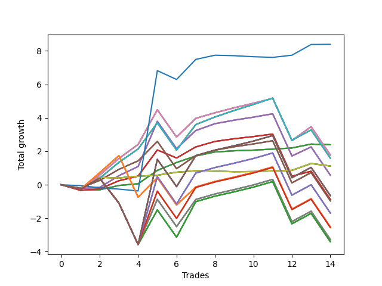

# Long Wallace 010 
- Symbol: SPY_Unlimited
- Date Range: 03/23/2022 - 07/08/2022
- Trading Period: 7:20-12:30
- Number of Trades: 14



| Name | Win Percent | Profit | Avg Profit / Trade | Avg Time / Trade |      | Name | Win Percent | Profit | Avg Profit / Trade | Avg Time / Trade |
| ---- | ----------- | ------ | ------------------ | ---------------- | ---- | ---- | ----------- | ------ | ------------------ | ---------------- |
| Sorted By <br> Profit | | | | | | Sorted By <br> Win Percentage ||||
| Seventy-Three | 42.86 | 4195.00 | 299.64 | 10:30 |     | Sixty-Four | 85.71 | 1195.00 | 85.36 | 07:10 |
| Sixty-Four | 85.71 | 1195.00 | 85.36 | 07:10 |     | Fifty-Six | 85.71 | 1195.00 | 85.36 | 07:10 |
| Fifty-Six | 85.71 | 1195.00 | 85.36 | 07:10 |     | Forty-Eight | 85.71 | 1195.00 | 85.36 | 07:10 |
| Forty-Eight | 85.71 | 1195.00 | 85.36 | 07:10 |     | Forty | 85.71 | 1195.00 | 85.36 | 07:10 |
| Forty | 85.71 | 1195.00 | 85.36 | 07:10 |     | Zero | 85.71 | 1195.00 | 85.36 | 07:10 |
| Zero | 85.71 | 1195.00 | 85.36 | 07:10 |     | Sixty-Eight | 71.43 | 890.00 | 63.57 | 22:25 |
| Sixty-Eight | 71.43 | 890.00 | 63.57 | 22:25 |     | Sixty | 71.43 | 890.00 | 63.57 | 22:25 |
| Sixty | 71.43 | 890.00 | 63.57 | 22:25 |     | Fifty-Two | 71.43 | 890.00 | 63.57 | 22:25 |
| Fifty-Two | 71.43 | 890.00 | 63.57 | 22:25 |     | Forty-Four | 71.43 | 890.00 | 63.57 | 22:25 |
| Forty-Four | 71.43 | 890.00 | 63.57 | 22:25 |     | Four | 71.43 | 890.00 | 63.57 | 22:25 |
| Four | 71.43 | 890.00 | 63.57 | 22:25 |     | Seventy-One | 71.43 | 795.00 | 56.79 | 23:26 |
| Seventy-One | 71.43 | 795.00 | 56.79 | 23:26 |     | Sixty-Three | 71.43 | 795.00 | 56.79 | 23:26 |
| Sixty-Three | 71.43 | 795.00 | 56.79 | 23:26 |     | Fifty-Five | 71.43 | 795.00 | 56.79 | 23:26 |
| Fifty-Five | 71.43 | 795.00 | 56.79 | 23:26 |     | Forty-Seven | 71.43 | 795.00 | 56.79 | 23:26 |
| Forty-Seven | 71.43 | 795.00 | 56.79 | 23:26 |     | Seven | 71.43 | 795.00 | 56.79 | 23:26 |
| Seven | 71.43 | 795.00 | 56.79 | 23:26 |     | Sixty-Six | 71.43 | 285.00 | 20.36 | 17:11 |
| Seventy | 64.29 | 560.00 | 40.00 | 05:04 |     | Fifty-Eight | 71.43 | 285.00 | 20.36 | 17:11 |
| Sixty-Two | 64.29 | 560.00 | 40.00 | 05:04 |     | Fifty | 71.43 | 285.00 | 20.36 | 17:11 |
| Fifty-Four | 64.29 | 560.00 | 40.00 | 05:04 |     | Forty-Two | 71.43 | 285.00 | 20.36 | 17:11 |
| Forty-Six | 64.29 | 560.00 | 40.00 | 05:04 |     | Two | 71.43 | 285.00 | 20.36 | 17:11 |
| Six | 64.29 | 560.00 | 40.00 | 05:04 |     | Sixty-Five | 71.43 | -440.00 | -31.43 | 15:02 |
| Sixty-Six | 71.43 | 285.00 | 20.36 | 17:11 |     | Fifty-Seven | 71.43 | -440.00 | -31.43 | 15:02 |
| Fifty-Eight | 71.43 | 285.00 | 20.36 | 17:11 |     | Forty-Nine | 71.43 | -440.00 | -31.43 | 15:02 |
| Fifty | 71.43 | 285.00 | 20.36 | 17:11 |     | Forty-One | 71.43 | -440.00 | -31.43 | 15:02 |
| Forty-Two | 71.43 | 285.00 | 20.36 | 17:11 |     | One | 71.43 | -440.00 | -31.43 | 15:02 |
| Two | 71.43 | 285.00 | 20.36 | 17:11 |     | Sixty-Seven | 71.43 | -480.00 | -34.29 | 18:23 |
| One Hundred Thirty | 57.14 | -325.00 | -23.21 | 28:33 |     | Fifty-Nine | 71.43 | -480.00 | -34.29 | 18:23 |
| One Hundred Twenty-Five | 57.14 | -325.00 | -23.21 | 28:33 |     | Fifty-One | 71.43 | -480.00 | -34.29 | 18:23 |
| One Hundred Twenty | 57.14 | -325.00 | -23.21 | 28:33 |     | Forty-Three | 71.43 | -480.00 | -34.29 | 18:23 |
| One Hundred Fifteen | 57.14 | -325.00 | -23.21 | 28:33 |     | Three | 71.43 | -480.00 | -34.29 | 18:23 |
| Eighty-Five | 57.14 | -325.00 | -23.21 | 28:33 |     | Seventy | 64.29 | 560.00 | 40.00 | 05:04 |
| Sixty-Five | 71.43 | -440.00 | -31.43 | 15:02 |     | Sixty-Two | 64.29 | 560.00 | 40.00 | 05:04 |
| Fifty-Seven | 71.43 | -440.00 | -31.43 | 15:02 |     | Fifty-Four | 64.29 | 560.00 | 40.00 | 05:04 |
| Forty-Nine | 71.43 | -440.00 | -31.43 | 15:02 |     | Forty-Six | 64.29 | 560.00 | 40.00 | 05:04 |
| Forty-One | 71.43 | -440.00 | -31.43 | 15:02 |     | Six | 64.29 | 560.00 | 40.00 | 05:04 |
| One | 71.43 | -440.00 | -31.43 | 15:02 |     | One Hundred Twenty-Six | 64.29 | -1260.00 | -90.00 | 25:27 |
| Sixty-Seven | 71.43 | -480.00 | -34.29 | 18:23 |     | One Hundred Twenty-One | 64.29 | -1260.00 | -90.00 | 25:27 |
| Fifty-Nine | 71.43 | -480.00 | -34.29 | 18:23 |     | One Hundred Sixteen | 64.29 | -1260.00 | -90.00 | 25:27 |
| Fifty-One | 71.43 | -480.00 | -34.29 | 18:23 |     | One Hundred Eleven | 64.29 | -1260.00 | -90.00 | 25:27 |
| Forty-Three | 71.43 | -480.00 | -34.29 | 18:23 |     | Eighty-One | 64.29 | -1260.00 | -90.00 | 25:27 |
| Three | 71.43 | -480.00 | -34.29 | 18:23 |     | One Hundred Thirty | 57.14 | -325.00 | -23.21 | 28:33 |
| One Hundred Twenty-Nine | 57.14 | -845.00 | -60.36 | 28:27 |     | One Hundred Twenty-Five | 57.14 | -325.00 | -23.21 | 28:33 |
| One Hundred Twenty-Four | 57.14 | -845.00 | -60.36 | 28:27 |     | One Hundred Twenty | 57.14 | -325.00 | -23.21 | 28:33 |
| One Hundred Ninteen | 57.14 | -845.00 | -60.36 | 28:27 |     | One Hundred Fifteen | 57.14 | -325.00 | -23.21 | 28:33 |
| One Hundred Fourteen | 57.14 | -845.00 | -60.36 | 28:27 |     | Eighty-Five | 57.14 | -325.00 | -23.21 | 28:33 |
| Eighty-Four | 57.14 | -845.00 | -60.36 | 28:27 |     | One Hundred Twenty-Nine | 57.14 | -845.00 | -60.36 | 28:27 |
| One Hundred Twenty-Six | 64.29 | -1260.00 | -90.00 | 25:27 |     | One Hundred Twenty-Four | 57.14 | -845.00 | -60.36 | 28:27 |
| One Hundred Twenty-One | 64.29 | -1260.00 | -90.00 | 25:27 |     | One Hundred Ninteen | 57.14 | -845.00 | -60.36 | 28:27 |
| One Hundred Sixteen | 64.29 | -1260.00 | -90.00 | 25:27 |     | One Hundred Fourteen | 57.14 | -845.00 | -60.36 | 28:27 |
| One Hundred Eleven | 64.29 | -1260.00 | -90.00 | 25:27 |     | Eighty-Four | 57.14 | -845.00 | -60.36 | 28:27 |
| Eighty-One | 64.29 | -1260.00 | -90.00 | 25:27 |     | One Hundred Twenty-Eight | 57.14 | -1275.00 | -91.07 | 28:20 |
| One Hundred Twenty-Eight | 57.14 | -1275.00 | -91.07 | 28:20 |     | One Hundred Twenty-Three | 57.14 | -1275.00 | -91.07 | 28:20 |
| One Hundred Twenty-Three | 57.14 | -1275.00 | -91.07 | 28:20 |     | One Hundred Eighteen | 57.14 | -1275.00 | -91.07 | 28:20 |
| One Hundred Eighteen | 57.14 | -1275.00 | -91.07 | 28:20 |     | One Hundred Thirteen | 57.14 | -1275.00 | -91.07 | 28:20 |
| One Hundred Thirteen | 57.14 | -1275.00 | -91.07 | 28:20 |     | Eighty-Three | 57.14 | -1275.00 | -91.07 | 28:20 |
| Eighty-Three | 57.14 | -1275.00 | -91.07 | 28:20 |     | Sixty-Nine | 57.14 | -1635.00 | -116.79 | 27:57 |
| Sixty-Nine | 57.14 | -1635.00 | -116.79 | 27:57 |     | Sixty-One | 57.14 | -1635.00 | -116.79 | 27:57 |
| Sixty-One | 57.14 | -1635.00 | -116.79 | 27:57 |     | Fifty-Three | 57.14 | -1635.00 | -116.79 | 27:57 |
| Fifty-Three | 57.14 | -1635.00 | -116.79 | 27:57 |     | Forty-Five | 57.14 | -1635.00 | -116.79 | 27:57 |
| Forty-Five | 57.14 | -1635.00 | -116.79 | 27:57 |     | Five | 57.14 | -1635.00 | -116.79 | 27:57 |
| Five | 57.14 | -1635.00 | -116.79 | 27:57 |     | One Hundred Twenty-Seven | 57.14 | -1700.00 | -121.43 | 27:56 |
| One Hundred Twenty-Seven | 57.14 | -1700.00 | -121.43 | 27:56 |     | One Hundred Twenty-Two | 57.14 | -1700.00 | -121.43 | 27:56 |
| One Hundred Twenty-Two | 57.14 | -1700.00 | -121.43 | 27:56 |     | One Hundred Seventeen | 57.14 | -1700.00 | -121.43 | 27:56 |
| One Hundred Seventeen | 57.14 | -1700.00 | -121.43 | 27:56 |     | One Hundred Twelve | 57.14 | -1700.00 | -121.43 | 27:56 |
| One Hundred Twelve | 57.14 | -1700.00 | -121.43 | 27:56 |     | Eighty-Two | 57.14 | -1700.00 | -121.43 | 27:56 |
| Eighty-Two | 57.14 | -1700.00 | -121.43 | 27:56 |     | Seventy-Three | 42.86 | 4195.00 | 299.64 | 10:30 |

## NO STOPLOSS

### Test Zero
* Sell when price hits the middle line of the 20p bollinger
* No Stoploss
* Results:
```
Total Trades: 14
Percent Up: 85.71
Percent Down: 14.29
Total Points Moved Up: 2.39
Potential Profit: 1195.00
Total Points Ups: 2.75 Count Ups: 12
Total Points Downs: -0.36 Count Downs: 2
```

<details><summary>Trades</summary>

<code>In: 2022-03-31 09:16:00		Out: 2022-03-31 09:32:25		Total Position Time: 16:25		Total Move Up: -0.32		Total to Date: -0.32</code> <br />
<code>In: 2022-04-20 09:14:00		Out: 2022-04-20 09:30:50		Total Position Time: 16:50		Total Move Up: 0.02		Total to Date: -0.30</code> <br />
<code>In: 2022-04-27 11:28:00		Out: 2022-04-27 11:32:15		Total Position Time: 04:15		Total Move Up: 0.26		Total to Date: -0.04</code> <br />
<code>In: 2022-04-27 11:40:00		Out: 2022-04-27 11:40:10		Total Position Time: 00:10		Total Move Up: 0.10		Total to Date: 0.06</code> <br />
<code>In: 2022-05-04 11:36:00		Out: 2022-05-04 11:36:40		Total Position Time: 00:40		Total Move Up: 0.80		Total to Date: 0.86</code> <br />
<code>In: 2022-05-06 10:56:00		Out: 2022-05-06 11:02:20		Total Position Time: 06:20		Total Move Up: 0.47		Total to Date: 1.33</code> <br />
<code>In: 2022-05-23 10:23:00		Out: 2022-05-23 10:26:30		Total Position Time: 03:30		Total Move Up: 0.39		Total to Date: 1.72</code> <br />
<code>In: 2022-05-26 11:38:00		Out: 2022-05-26 11:45:05		Total Position Time: 07:05		Total Move Up: 0.24		Total to Date: 1.96</code> <br />
<code>In: 2022-05-27 10:42:00		Out: 2022-05-27 10:51:05		Total Position Time: 09:05		Total Move Up: 0.07		Total to Date: 2.03</code> <br />
<code>In: 2022-05-27 10:43:00		Out: 2022-05-27 10:51:05		Total Position Time: 08:05		Total Move Up: 0.04		Total to Date: 2.07</code> <br />
<code>In: 2022-05-27 10:46:00		Out: 2022-05-27 10:51:05		Total Position Time: 05:05		Total Move Up: 0.06		Total to Date: 2.13</code> <br />
<code>In: 2022-06-08 09:10:00		Out: 2022-06-08 09:13:20		Total Position Time: 03:20		Total Move Up: 0.07		Total to Date: 2.20</code> <br />
<code>In: 2022-06-27 09:32:00		Out: 2022-06-27 09:41:05		Total Position Time: 09:05		Total Move Up: 0.23		Total to Date: 2.43</code> <br />
<code>In: 2022-06-30 11:28:00		Out: 2022-06-30 11:38:25		Total Position Time: 10:25		Total Move Up: -0.04		Total to Date: 2.39</code> <br />


</details>

### Test One
* Sell when the price hits the upper line of the 20p 1std bollinger
* No Stoploss
* Results:
```
Total Trades: 14
Percent Up: 71.43
Percent Down: 28.57
Total Points Moved Up: -0.88
Potential Profit: -440.00
Total Points Ups: 4.14 Count Ups: 10
Total Points Downs: -5.02 Count Downs: 4
```

<details><summary>Trades</summary>

<code>In: 2022-03-31 09:16:00		Out: 2022-03-31 09:40:45		Total Position Time: 24:45		Total Move Up: -0.33		Total to Date: -0.33</code> <br />
<code>In: 2022-04-20 09:14:00		Out: 2022-04-20 09:30:55		Total Position Time: 16:55		Total Move Up: 0.08		Total to Date: -0.25</code> <br />
<code>In: 2022-04-27 11:28:00		Out: 2022-04-27 11:35:55		Total Position Time: 07:55		Total Move Up: 0.49		Total to Date: 0.24</code> <br />
<code>In: 2022-04-27 11:40:00		Out: 2022-04-27 11:42:30		Total Position Time: 02:30		Total Move Up: 0.28		Total to Date: 0.52</code> <br />
<code>In: 2022-05-04 11:36:00		Out: 2022-05-04 11:41:35		Total Position Time: 05:35		Total Move Up: 1.56		Total to Date: 2.08</code> <br />
<code>In: 2022-05-06 10:56:00		Out: 2022-05-06 11:24:25		Total Position Time: 28:25		Total Move Up: -0.48		Total to Date: 1.60</code> <br />
<code>In: 2022-05-23 10:23:00		Out: 2022-05-23 10:32:35		Total Position Time: 09:35		Total Move Up: 0.66		Total to Date: 2.26</code> <br />
<code>In: 2022-05-26 11:38:00		Out: 2022-05-26 11:50:15		Total Position Time: 12:15		Total Move Up: 0.33		Total to Date: 2.59</code> <br />
<code>In: 2022-05-27 10:42:00		Out: 2022-05-27 10:53:55		Total Position Time: 11:55		Total Move Up: 0.16		Total to Date: 2.75</code> <br />
<code>In: 2022-05-27 10:43:00		Out: 2022-05-27 10:53:55		Total Position Time: 10:55		Total Move Up: 0.13		Total to Date: 2.88</code> <br />
<code>In: 2022-05-27 10:46:00		Out: 2022-05-27 10:53:55		Total Position Time: 07:55		Total Move Up: 0.15		Total to Date: 3.03</code> <br />
<code>In: 2022-06-08 09:10:00		Out: 2022-06-08 09:39:55		Total Position Time: 29:55		Total Move Up: -2.52		Total to Date: 0.51</code> <br />
<code>In: 2022-06-27 09:32:00		Out: 2022-06-27 09:44:05		Total Position Time: 12:05		Total Move Up: 0.30		Total to Date: 0.81</code> <br />
<code>In: 2022-06-30 11:28:00		Out: 2022-06-30 11:57:55		Total Position Time: 29:55		Total Move Up: -1.69		Total to Date: -0.88</code> <br />


</details>

### Test Two
* Sell when the price hits the upper line of the 20p 2std bollinger
* No Stoploss
* Results:
```
Total Trades: 14
Percent Up: 71.43
Percent Down: 28.57
Total Points Moved Up: 0.57
Potential Profit: 285.00
Total Points Ups: 6.63 Count Ups: 10
Total Points Downs: -6.06 Count Downs: 4
```

<details><summary>Trades</summary>

<code>In: 2022-03-31 09:16:00		Out: 2022-03-31 09:44:20		Total Position Time: 28:20		Total Move Up: -0.22		Total to Date: -0.22</code> <br />
<code>In: 2022-04-20 09:14:00		Out: 2022-04-20 09:31:05		Total Position Time: 17:05		Total Move Up: 0.06		Total to Date: -0.16</code> <br />
<code>In: 2022-04-27 11:28:00		Out: 2022-04-27 11:42:40		Total Position Time: 14:40		Total Move Up: 0.70		Total to Date: 0.54</code> <br />
<code>In: 2022-04-27 11:40:00		Out: 2022-04-27 11:42:40		Total Position Time: 02:40		Total Move Up: 0.55		Total to Date: 1.09</code> <br />
<code>In: 2022-05-04 11:36:00		Out: 2022-05-04 11:43:45		Total Position Time: 07:45		Total Move Up: 2.70		Total to Date: 3.79</code> <br />
<code>In: 2022-05-06 10:56:00		Out: 2022-05-06 11:25:55		Total Position Time: 29:55		Total Move Up: -1.63		Total to Date: 2.16</code> <br />
<code>In: 2022-05-23 10:23:00		Out: 2022-05-23 10:33:15		Total Position Time: 10:15		Total Move Up: 1.08		Total to Date: 3.24</code> <br />
<code>In: 2022-05-26 11:38:00		Out: 2022-05-26 11:54:10		Total Position Time: 16:10		Total Move Up: 0.41		Total to Date: 3.65</code> <br />
<code>In: 2022-05-27 10:42:00		Out: 2022-05-27 10:57:20		Total Position Time: 15:20		Total Move Up: 0.21		Total to Date: 3.86</code> <br />
<code>In: 2022-05-27 10:43:00		Out: 2022-05-27 10:57:20		Total Position Time: 14:20		Total Move Up: 0.18		Total to Date: 4.04</code> <br />
<code>In: 2022-05-27 10:46:00		Out: 2022-05-27 10:57:20		Total Position Time: 11:20		Total Move Up: 0.20		Total to Date: 4.24</code> <br />
<code>In: 2022-06-08 09:10:00		Out: 2022-06-08 09:39:55		Total Position Time: 29:55		Total Move Up: -2.52		Total to Date: 1.72</code> <br />
<code>In: 2022-06-27 09:32:00		Out: 2022-06-27 09:45:00		Total Position Time: 13:00		Total Move Up: 0.54		Total to Date: 2.26</code> <br />
<code>In: 2022-06-30 11:28:00		Out: 2022-06-30 11:57:55		Total Position Time: 29:55		Total Move Up: -1.69		Total to Date: 0.57</code> <br />


</details>

### Test Three
* Sell when price hits the middle line of the 50p bollinger
* No Stoploss
* Results:
```
Total Trades: 14
Percent Up: 71.43
Percent Down: 28.57
Total Points Moved Up: -0.96
Potential Profit: -480.00
Total Points Ups: 5.08 Count Ups: 10
Total Points Downs: -6.04 Count Downs: 4
```

<details><summary>Trades</summary>

<code>In: 2022-03-31 09:16:00		Out: 2022-03-31 09:45:10		Total Position Time: 29:10		Total Move Up: -0.20		Total to Date: -0.20</code> <br />
<code>In: 2022-04-20 09:14:00		Out: 2022-04-20 09:32:40		Total Position Time: 18:40		Total Move Up: 0.46		Total to Date: 0.26</code> <br />
<code>In: 2022-04-27 11:28:00		Out: 2022-04-27 11:42:35		Total Position Time: 14:35		Total Move Up: 0.66		Total to Date: 0.92</code> <br />
<code>In: 2022-04-27 11:40:00		Out: 2022-04-27 11:42:35		Total Position Time: 02:35		Total Move Up: 0.51		Total to Date: 1.43</code> <br />
<code>In: 2022-05-04 11:36:00		Out: 2022-05-04 11:41:15		Total Position Time: 05:15		Total Move Up: 1.16		Total to Date: 2.59</code> <br />
<code>In: 2022-05-06 10:56:00		Out: 2022-05-06 11:25:55		Total Position Time: 29:55		Total Move Up: -1.63		Total to Date: 0.96</code> <br />
<code>In: 2022-05-23 10:23:00		Out: 2022-05-23 10:33:00		Total Position Time: 10:00		Total Move Up: 0.78		Total to Date: 1.74</code> <br />
<code>In: 2022-05-26 11:38:00		Out: 2022-05-26 11:50:15		Total Position Time: 12:15		Total Move Up: 0.33		Total to Date: 2.07</code> <br />
<code>In: 2022-05-27 10:42:00		Out: 2022-05-27 11:04:25		Total Position Time: 22:25		Total Move Up: 0.20		Total to Date: 2.27</code> <br />
<code>In: 2022-05-27 10:43:00		Out: 2022-05-27 11:04:25		Total Position Time: 21:25		Total Move Up: 0.17		Total to Date: 2.44</code> <br />
<code>In: 2022-05-27 10:46:00		Out: 2022-05-27 11:04:25		Total Position Time: 18:25		Total Move Up: 0.19		Total to Date: 2.63</code> <br />
<code>In: 2022-06-08 09:10:00		Out: 2022-06-08 09:39:55		Total Position Time: 29:55		Total Move Up: -2.52		Total to Date: 0.11</code> <br />
<code>In: 2022-06-27 09:32:00		Out: 2022-06-27 09:45:05		Total Position Time: 13:05		Total Move Up: 0.62		Total to Date: 0.73</code> <br />
<code>In: 2022-06-30 11:28:00		Out: 2022-06-30 11:57:55		Total Position Time: 29:55		Total Move Up: -1.69		Total to Date: -0.96</code> <br />


</details>

### Test Four
* Sell when the price hits the upper line of the 50p 1std bollinger
* No Stoploss
* Results:
```
Total Trades: 14
Percent Up: 71.43
Percent Down: 28.57
Total Points Moved Up: 1.78
Potential Profit: 890.00
Total Points Ups: 7.89 Count Ups: 10
Total Points Downs: -6.11 Count Downs: 4
```

<details><summary>Trades</summary>

<code>In: 2022-03-31 09:16:00		Out: 2022-03-31 09:45:55		Total Position Time: 29:55		Total Move Up: -0.27		Total to Date: -0.27</code> <br />
<code>In: 2022-04-20 09:14:00		Out: 2022-04-20 09:36:45		Total Position Time: 22:45		Total Move Up: 0.85		Total to Date: 0.58</code> <br />
<code>In: 2022-04-27 11:28:00		Out: 2022-04-27 11:45:25		Total Position Time: 17:25		Total Move Up: 0.99		Total to Date: 1.57</code> <br />
<code>In: 2022-04-27 11:40:00		Out: 2022-04-27 11:45:25		Total Position Time: 05:25		Total Move Up: 0.84		Total to Date: 2.41</code> <br />
<code>In: 2022-05-04 11:36:00		Out: 2022-05-04 11:42:00		Total Position Time: 06:00		Total Move Up: 2.07		Total to Date: 4.48</code> <br />
<code>In: 2022-05-06 10:56:00		Out: 2022-05-06 11:25:55		Total Position Time: 29:55		Total Move Up: -1.63		Total to Date: 2.85</code> <br />
<code>In: 2022-05-23 10:23:00		Out: 2022-05-23 10:36:15		Total Position Time: 13:15		Total Move Up: 1.12		Total to Date: 3.97</code> <br />
<code>In: 2022-05-26 11:38:00		Out: 2022-05-26 12:07:55		Total Position Time: 29:55		Total Move Up: 0.33		Total to Date: 4.30</code> <br />
<code>In: 2022-05-27 10:42:00		Out: 2022-05-27 11:09:45		Total Position Time: 27:45		Total Move Up: 0.30		Total to Date: 4.60</code> <br />
<code>In: 2022-05-27 10:43:00		Out: 2022-05-27 11:09:45		Total Position Time: 26:45		Total Move Up: 0.27		Total to Date: 4.87</code> <br />
<code>In: 2022-05-27 10:46:00		Out: 2022-05-27 11:09:45		Total Position Time: 23:45		Total Move Up: 0.29		Total to Date: 5.16</code> <br />
<code>In: 2022-06-08 09:10:00		Out: 2022-06-08 09:39:55		Total Position Time: 29:55		Total Move Up: -2.52		Total to Date: 2.64</code> <br />
<code>In: 2022-06-27 09:32:00		Out: 2022-06-27 09:53:20		Total Position Time: 21:20		Total Move Up: 0.83		Total to Date: 3.47</code> <br />
<code>In: 2022-06-30 11:28:00		Out: 2022-06-30 11:57:55		Total Position Time: 29:55		Total Move Up: -1.69		Total to Date: 1.78</code> <br />


</details>

### Test Five
* Sell when the price hits the upper line of the 50p 2std bollinger
* No Stoploss
* Results:
```
Total Trades: 14
Percent Up: 57.14
Percent Down: 42.86
Total Points Moved Up: -3.27
Potential Profit: -1635.00
Total Points Ups: 6.80 Count Ups: 8
Total Points Downs: -10.07 Count Downs: 6
```

<details><summary>Trades</summary>

<code>In: 2022-03-31 09:16:00		Out: 2022-03-31 09:45:55		Total Position Time: 29:55		Total Move Up: -0.27		Total to Date: -0.27</code> <br />
<code>In: 2022-04-20 09:14:00		Out: 2022-04-20 09:43:55		Total Position Time: 29:55		Total Move Up: 0.66		Total to Date: 0.39</code> <br />
<code>In: 2022-04-27 11:28:00		Out: 2022-04-27 11:57:55		Total Position Time: 29:55		Total Move Up: -1.48		Total to Date: -1.09</code> <br />
<code>In: 2022-04-27 11:40:00		Out: 2022-04-27 12:09:55		Total Position Time: 29:55		Total Move Up: -2.48		Total to Date: -3.57</code> <br />
<code>In: 2022-05-04 11:36:00		Out: 2022-05-04 11:43:45		Total Position Time: 07:45		Total Move Up: 2.70		Total to Date: -0.87</code> <br />
<code>In: 2022-05-06 10:56:00		Out: 2022-05-06 11:25:55		Total Position Time: 29:55		Total Move Up: -1.63		Total to Date: -2.50</code> <br />
<code>In: 2022-05-23 10:23:00		Out: 2022-05-23 10:47:45		Total Position Time: 24:45		Total Move Up: 1.62		Total to Date: -0.88</code> <br />
<code>In: 2022-05-26 11:38:00		Out: 2022-05-26 12:07:55		Total Position Time: 29:55		Total Move Up: 0.33		Total to Date: -0.55</code> <br />
<code>In: 2022-05-27 10:42:00		Out: 2022-05-27 11:11:55		Total Position Time: 29:55		Total Move Up: 0.26		Total to Date: -0.29</code> <br />
<code>In: 2022-05-27 10:43:00		Out: 2022-05-27 11:12:55		Total Position Time: 29:55		Total Move Up: 0.28		Total to Date: -0.01</code> <br />
<code>In: 2022-05-27 10:46:00		Out: 2022-05-27 11:15:55		Total Position Time: 29:55		Total Move Up: 0.33		Total to Date: 0.32</code> <br />
<code>In: 2022-06-08 09:10:00		Out: 2022-06-08 09:39:55		Total Position Time: 29:55		Total Move Up: -2.52		Total to Date: -2.20</code> <br />
<code>In: 2022-06-27 09:32:00		Out: 2022-06-27 10:01:55		Total Position Time: 29:55		Total Move Up: 0.62		Total to Date: -1.58</code> <br />
<code>In: 2022-06-30 11:28:00		Out: 2022-06-30 11:57:55		Total Position Time: 29:55		Total Move Up: -1.69		Total to Date: -3.27</code> <br />


</details>

### Test Six
* Sell when the price hits the middle line of the 1std VWAP
* No Stoploss
* Results:
```
Total Trades: 14
Percent Up: 64.29
Percent Down: 35.71
Total Points Moved Up: 1.12
Potential Profit: 560.00
Total Points Ups: 1.63 Count Ups: 9
Total Points Downs: -0.51 Count Downs: 5
```

<details><summary>Trades</summary>

<code>In: 2022-03-31 09:16:00		Out: 2022-03-31 09:45:55		Total Position Time: 29:55		Total Move Up: -0.27		Total to Date: -0.27</code> <br />
<code>In: 2022-04-20 09:14:00		Out: 2022-04-20 09:36:05		Total Position Time: 22:05		Total Move Up: 0.71		Total to Date: 0.44</code> <br />
<code>In: 2022-04-27 11:28:00		Out: 2022-04-27 11:28:10		Total Position Time: 00:10		Total Move Up: -0.03		Total to Date: 0.41</code> <br />
<code>In: 2022-04-27 11:40:00		Out: 2022-04-27 11:40:10		Total Position Time: 00:10		Total Move Up: 0.10		Total to Date: 0.51</code> <br />
<code>In: 2022-05-04 11:36:00		Out: 2022-05-04 11:36:10		Total Position Time: 00:10		Total Move Up: 0.06		Total to Date: 0.57</code> <br />
<code>In: 2022-05-06 10:56:00		Out: 2022-05-06 11:01:00		Total Position Time: 05:00		Total Move Up: 0.18		Total to Date: 0.75</code> <br />
<code>In: 2022-05-23 10:23:00		Out: 2022-05-23 10:23:10		Total Position Time: 00:10		Total Move Up: 0.09		Total to Date: 0.84</code> <br />
<code>In: 2022-05-26 11:38:00		Out: 2022-05-26 11:38:10		Total Position Time: 00:10		Total Move Up: -0.03		Total to Date: 0.81</code> <br />
<code>In: 2022-05-27 10:42:00		Out: 2022-05-27 10:42:10		Total Position Time: 00:10		Total Move Up: -0.03		Total to Date: 0.78</code> <br />
<code>In: 2022-05-27 10:43:00		Out: 2022-05-27 10:43:10		Total Position Time: 00:10		Total Move Up: 0.01		Total to Date: 0.79</code> <br />
<code>In: 2022-05-27 10:46:00		Out: 2022-05-27 10:46:10		Total Position Time: 00:10		Total Move Up: 0.04		Total to Date: 0.83</code> <br />
<code>In: 2022-06-08 09:10:00		Out: 2022-06-08 09:10:10		Total Position Time: 00:10		Total Move Up: 0.03		Total to Date: 0.86</code> <br />
<code>In: 2022-06-27 09:32:00		Out: 2022-06-27 09:44:20		Total Position Time: 12:20		Total Move Up: 0.41		Total to Date: 1.27</code> <br />
<code>In: 2022-06-30 11:28:00		Out: 2022-06-30 11:28:10		Total Position Time: 00:10		Total Move Up: -0.15		Total to Date: 1.12</code> <br />


</details>

### Test Seven
* Sell when the price hits the upper line of the 1std VWAP
* No Stoploss
* Results:
```
Total Trades: 14
Percent Up: 71.43
Percent Down: 28.57
Total Points Moved Up: 1.59
Potential Profit: 795.00
Total Points Ups: 7.70 Count Ups: 10
Total Points Downs: -6.11 Count Downs: 4
```

<details><summary>Trades</summary>

<code>In: 2022-03-31 09:16:00		Out: 2022-03-31 09:45:55		Total Position Time: 29:55		Total Move Up: -0.27		Total to Date: -0.27</code> <br />
<code>In: 2022-04-20 09:14:00		Out: 2022-04-20 09:43:55		Total Position Time: 29:55		Total Move Up: 0.66		Total to Date: 0.39</code> <br />
<code>In: 2022-04-27 11:28:00		Out: 2022-04-27 11:44:20		Total Position Time: 16:20		Total Move Up: 0.95		Total to Date: 1.34</code> <br />
<code>In: 2022-04-27 11:40:00		Out: 2022-04-27 11:44:20		Total Position Time: 04:20		Total Move Up: 0.80		Total to Date: 2.14</code> <br />
<code>In: 2022-05-04 11:36:00		Out: 2022-05-04 11:41:35		Total Position Time: 05:35		Total Move Up: 1.56		Total to Date: 3.70</code> <br />
<code>In: 2022-05-06 10:56:00		Out: 2022-05-06 11:25:55		Total Position Time: 29:55		Total Move Up: -1.63		Total to Date: 2.07</code> <br />
<code>In: 2022-05-23 10:23:00		Out: 2022-05-23 10:46:25		Total Position Time: 23:25		Total Move Up: 1.53		Total to Date: 3.60</code> <br />
<code>In: 2022-05-26 11:38:00		Out: 2022-05-26 11:57:50		Total Position Time: 19:50		Total Move Up: 0.45		Total to Date: 4.05</code> <br />
<code>In: 2022-05-27 10:42:00		Out: 2022-05-27 11:10:05		Total Position Time: 28:05		Total Move Up: 0.39		Total to Date: 4.44</code> <br />
<code>In: 2022-05-27 10:43:00		Out: 2022-05-27 11:10:05		Total Position Time: 27:05		Total Move Up: 0.36		Total to Date: 4.80</code> <br />
<code>In: 2022-05-27 10:46:00		Out: 2022-05-27 11:10:05		Total Position Time: 24:05		Total Move Up: 0.38		Total to Date: 5.18</code> <br />
<code>In: 2022-06-08 09:10:00		Out: 2022-06-08 09:39:55		Total Position Time: 29:55		Total Move Up: -2.52		Total to Date: 2.66</code> <br />
<code>In: 2022-06-27 09:32:00		Out: 2022-06-27 10:01:55		Total Position Time: 29:55		Total Move Up: 0.62		Total to Date: 3.28</code> <br />
<code>In: 2022-06-30 11:28:00		Out: 2022-06-30 11:57:55		Total Position Time: 29:55		Total Move Up: -1.69		Total to Date: 1.59</code> <br />


</details>

## STOPLOSS OF 5

### Test Forty
* Sell when price hits the middle line of the 20p bollinger
* Stoploss is 5 points
* Results:
```
Total Trades: 14
Percent Up: 85.71
Percent Down: 14.29
Total Points Moved Up: 2.39
Potential Profit: 1195.00
Total Points Ups: 2.75 Count Ups: 12
Total Points Downs: -0.36 Count Downs: 2
```

<details><summary>Trades</summary>

<code>In: 2022-03-31 09:16:00		Out: 2022-03-31 09:32:25		Total Position Time: 16:25		Total Move Up: -0.32		Total to Date: -0.32</code> <br />
<code>In: 2022-04-20 09:14:00		Out: 2022-04-20 09:30:50		Total Position Time: 16:50		Total Move Up: 0.02		Total to Date: -0.30</code> <br />
<code>In: 2022-04-27 11:28:00		Out: 2022-04-27 11:32:15		Total Position Time: 04:15		Total Move Up: 0.26		Total to Date: -0.04</code> <br />
<code>In: 2022-04-27 11:40:00		Out: 2022-04-27 11:40:10		Total Position Time: 00:10		Total Move Up: 0.10		Total to Date: 0.06</code> <br />
<code>In: 2022-05-04 11:36:00		Out: 2022-05-04 11:36:40		Total Position Time: 00:40		Total Move Up: 0.80		Total to Date: 0.86</code> <br />
<code>In: 2022-05-06 10:56:00		Out: 2022-05-06 11:02:20		Total Position Time: 06:20		Total Move Up: 0.47		Total to Date: 1.33</code> <br />
<code>In: 2022-05-23 10:23:00		Out: 2022-05-23 10:26:30		Total Position Time: 03:30		Total Move Up: 0.39		Total to Date: 1.72</code> <br />
<code>In: 2022-05-26 11:38:00		Out: 2022-05-26 11:45:05		Total Position Time: 07:05		Total Move Up: 0.24		Total to Date: 1.96</code> <br />
<code>In: 2022-05-27 10:42:00		Out: 2022-05-27 10:51:05		Total Position Time: 09:05		Total Move Up: 0.07		Total to Date: 2.03</code> <br />
<code>In: 2022-05-27 10:43:00		Out: 2022-05-27 10:51:05		Total Position Time: 08:05		Total Move Up: 0.04		Total to Date: 2.07</code> <br />
<code>In: 2022-05-27 10:46:00		Out: 2022-05-27 10:51:05		Total Position Time: 05:05		Total Move Up: 0.06		Total to Date: 2.13</code> <br />
<code>In: 2022-06-08 09:10:00		Out: 2022-06-08 09:13:20		Total Position Time: 03:20		Total Move Up: 0.07		Total to Date: 2.20</code> <br />
<code>In: 2022-06-27 09:32:00		Out: 2022-06-27 09:41:05		Total Position Time: 09:05		Total Move Up: 0.23		Total to Date: 2.43</code> <br />
<code>In: 2022-06-30 11:28:00		Out: 2022-06-30 11:38:25		Total Position Time: 10:25		Total Move Up: -0.04		Total to Date: 2.39</code> <br />


</details>

### Test Forty-One
* Sell when the price hits the upper line of the 20p 1std bollinger
* Stoploss is 5 points
* Results:
```
Total Trades: 14
Percent Up: 71.43
Percent Down: 28.57
Total Points Moved Up: -0.88
Potential Profit: -440.00
Total Points Ups: 4.14 Count Ups: 10
Total Points Downs: -5.02 Count Downs: 4
```

<details><summary>Trades</summary>

<code>In: 2022-03-31 09:16:00		Out: 2022-03-31 09:40:45		Total Position Time: 24:45		Total Move Up: -0.33		Total to Date: -0.33</code> <br />
<code>In: 2022-04-20 09:14:00		Out: 2022-04-20 09:30:55		Total Position Time: 16:55		Total Move Up: 0.08		Total to Date: -0.25</code> <br />
<code>In: 2022-04-27 11:28:00		Out: 2022-04-27 11:35:55		Total Position Time: 07:55		Total Move Up: 0.49		Total to Date: 0.24</code> <br />
<code>In: 2022-04-27 11:40:00		Out: 2022-04-27 11:42:30		Total Position Time: 02:30		Total Move Up: 0.28		Total to Date: 0.52</code> <br />
<code>In: 2022-05-04 11:36:00		Out: 2022-05-04 11:41:35		Total Position Time: 05:35		Total Move Up: 1.56		Total to Date: 2.08</code> <br />
<code>In: 2022-05-06 10:56:00		Out: 2022-05-06 11:24:25		Total Position Time: 28:25		Total Move Up: -0.48		Total to Date: 1.60</code> <br />
<code>In: 2022-05-23 10:23:00		Out: 2022-05-23 10:32:35		Total Position Time: 09:35		Total Move Up: 0.66		Total to Date: 2.26</code> <br />
<code>In: 2022-05-26 11:38:00		Out: 2022-05-26 11:50:15		Total Position Time: 12:15		Total Move Up: 0.33		Total to Date: 2.59</code> <br />
<code>In: 2022-05-27 10:42:00		Out: 2022-05-27 10:53:55		Total Position Time: 11:55		Total Move Up: 0.16		Total to Date: 2.75</code> <br />
<code>In: 2022-05-27 10:43:00		Out: 2022-05-27 10:53:55		Total Position Time: 10:55		Total Move Up: 0.13		Total to Date: 2.88</code> <br />
<code>In: 2022-05-27 10:46:00		Out: 2022-05-27 10:53:55		Total Position Time: 07:55		Total Move Up: 0.15		Total to Date: 3.03</code> <br />
<code>In: 2022-06-08 09:10:00		Out: 2022-06-08 09:39:55		Total Position Time: 29:55		Total Move Up: -2.52		Total to Date: 0.51</code> <br />
<code>In: 2022-06-27 09:32:00		Out: 2022-06-27 09:44:05		Total Position Time: 12:05		Total Move Up: 0.30		Total to Date: 0.81</code> <br />
<code>In: 2022-06-30 11:28:00		Out: 2022-06-30 11:57:55		Total Position Time: 29:55		Total Move Up: -1.69		Total to Date: -0.88</code> <br />


</details>

### Test Forty-Two
* Sell when the price hits the upper line of the 20p 2std bollinger
* Stoploss is 5 points
* Results:
```
Total Trades: 14
Percent Up: 71.43
Percent Down: 28.57
Total Points Moved Up: 0.57
Potential Profit: 285.00
Total Points Ups: 6.63 Count Ups: 10
Total Points Downs: -6.06 Count Downs: 4
```

<details><summary>Trades</summary>

<code>In: 2022-03-31 09:16:00		Out: 2022-03-31 09:44:20		Total Position Time: 28:20		Total Move Up: -0.22		Total to Date: -0.22</code> <br />
<code>In: 2022-04-20 09:14:00		Out: 2022-04-20 09:31:05		Total Position Time: 17:05		Total Move Up: 0.06		Total to Date: -0.16</code> <br />
<code>In: 2022-04-27 11:28:00		Out: 2022-04-27 11:42:40		Total Position Time: 14:40		Total Move Up: 0.70		Total to Date: 0.54</code> <br />
<code>In: 2022-04-27 11:40:00		Out: 2022-04-27 11:42:40		Total Position Time: 02:40		Total Move Up: 0.55		Total to Date: 1.09</code> <br />
<code>In: 2022-05-04 11:36:00		Out: 2022-05-04 11:43:45		Total Position Time: 07:45		Total Move Up: 2.70		Total to Date: 3.79</code> <br />
<code>In: 2022-05-06 10:56:00		Out: 2022-05-06 11:25:55		Total Position Time: 29:55		Total Move Up: -1.63		Total to Date: 2.16</code> <br />
<code>In: 2022-05-23 10:23:00		Out: 2022-05-23 10:33:15		Total Position Time: 10:15		Total Move Up: 1.08		Total to Date: 3.24</code> <br />
<code>In: 2022-05-26 11:38:00		Out: 2022-05-26 11:54:10		Total Position Time: 16:10		Total Move Up: 0.41		Total to Date: 3.65</code> <br />
<code>In: 2022-05-27 10:42:00		Out: 2022-05-27 10:57:20		Total Position Time: 15:20		Total Move Up: 0.21		Total to Date: 3.86</code> <br />
<code>In: 2022-05-27 10:43:00		Out: 2022-05-27 10:57:20		Total Position Time: 14:20		Total Move Up: 0.18		Total to Date: 4.04</code> <br />
<code>In: 2022-05-27 10:46:00		Out: 2022-05-27 10:57:20		Total Position Time: 11:20		Total Move Up: 0.20		Total to Date: 4.24</code> <br />
<code>In: 2022-06-08 09:10:00		Out: 2022-06-08 09:39:55		Total Position Time: 29:55		Total Move Up: -2.52		Total to Date: 1.72</code> <br />
<code>In: 2022-06-27 09:32:00		Out: 2022-06-27 09:45:00		Total Position Time: 13:00		Total Move Up: 0.54		Total to Date: 2.26</code> <br />
<code>In: 2022-06-30 11:28:00		Out: 2022-06-30 11:57:55		Total Position Time: 29:55		Total Move Up: -1.69		Total to Date: 0.57</code> <br />


</details>

### Test Forty-Three
* Sell when price hits the middle line of the 50p bollinger
* Stoploss is 5 points
* Results:
```
Total Trades: 14
Percent Up: 71.43
Percent Down: 28.57
Total Points Moved Up: -0.96
Potential Profit: -480.00
Total Points Ups: 5.08 Count Ups: 10
Total Points Downs: -6.04 Count Downs: 4
```

<details><summary>Trades</summary>

<code>In: 2022-03-31 09:16:00		Out: 2022-03-31 09:45:10		Total Position Time: 29:10		Total Move Up: -0.20		Total to Date: -0.20</code> <br />
<code>In: 2022-04-20 09:14:00		Out: 2022-04-20 09:32:40		Total Position Time: 18:40		Total Move Up: 0.46		Total to Date: 0.26</code> <br />
<code>In: 2022-04-27 11:28:00		Out: 2022-04-27 11:42:35		Total Position Time: 14:35		Total Move Up: 0.66		Total to Date: 0.92</code> <br />
<code>In: 2022-04-27 11:40:00		Out: 2022-04-27 11:42:35		Total Position Time: 02:35		Total Move Up: 0.51		Total to Date: 1.43</code> <br />
<code>In: 2022-05-04 11:36:00		Out: 2022-05-04 11:41:15		Total Position Time: 05:15		Total Move Up: 1.16		Total to Date: 2.59</code> <br />
<code>In: 2022-05-06 10:56:00		Out: 2022-05-06 11:25:55		Total Position Time: 29:55		Total Move Up: -1.63		Total to Date: 0.96</code> <br />
<code>In: 2022-05-23 10:23:00		Out: 2022-05-23 10:33:00		Total Position Time: 10:00		Total Move Up: 0.78		Total to Date: 1.74</code> <br />
<code>In: 2022-05-26 11:38:00		Out: 2022-05-26 11:50:15		Total Position Time: 12:15		Total Move Up: 0.33		Total to Date: 2.07</code> <br />
<code>In: 2022-05-27 10:42:00		Out: 2022-05-27 11:04:25		Total Position Time: 22:25		Total Move Up: 0.20		Total to Date: 2.27</code> <br />
<code>In: 2022-05-27 10:43:00		Out: 2022-05-27 11:04:25		Total Position Time: 21:25		Total Move Up: 0.17		Total to Date: 2.44</code> <br />
<code>In: 2022-05-27 10:46:00		Out: 2022-05-27 11:04:25		Total Position Time: 18:25		Total Move Up: 0.19		Total to Date: 2.63</code> <br />
<code>In: 2022-06-08 09:10:00		Out: 2022-06-08 09:39:55		Total Position Time: 29:55		Total Move Up: -2.52		Total to Date: 0.11</code> <br />
<code>In: 2022-06-27 09:32:00		Out: 2022-06-27 09:45:05		Total Position Time: 13:05		Total Move Up: 0.62		Total to Date: 0.73</code> <br />
<code>In: 2022-06-30 11:28:00		Out: 2022-06-30 11:57:55		Total Position Time: 29:55		Total Move Up: -1.69		Total to Date: -0.96</code> <br />


</details>

### Test Forty-Four
* Sell when the price hits the upper line of the 50p 1std bollinger
* Stoploss is 5 points
* Results:
```
Total Trades: 14
Percent Up: 71.43
Percent Down: 28.57
Total Points Moved Up: 1.78
Potential Profit: 890.00
Total Points Ups: 7.89 Count Ups: 10
Total Points Downs: -6.11 Count Downs: 4
```

<details><summary>Trades</summary>

<code>In: 2022-03-31 09:16:00		Out: 2022-03-31 09:45:55		Total Position Time: 29:55		Total Move Up: -0.27		Total to Date: -0.27</code> <br />
<code>In: 2022-04-20 09:14:00		Out: 2022-04-20 09:36:45		Total Position Time: 22:45		Total Move Up: 0.85		Total to Date: 0.58</code> <br />
<code>In: 2022-04-27 11:28:00		Out: 2022-04-27 11:45:25		Total Position Time: 17:25		Total Move Up: 0.99		Total to Date: 1.57</code> <br />
<code>In: 2022-04-27 11:40:00		Out: 2022-04-27 11:45:25		Total Position Time: 05:25		Total Move Up: 0.84		Total to Date: 2.41</code> <br />
<code>In: 2022-05-04 11:36:00		Out: 2022-05-04 11:42:00		Total Position Time: 06:00		Total Move Up: 2.07		Total to Date: 4.48</code> <br />
<code>In: 2022-05-06 10:56:00		Out: 2022-05-06 11:25:55		Total Position Time: 29:55		Total Move Up: -1.63		Total to Date: 2.85</code> <br />
<code>In: 2022-05-23 10:23:00		Out: 2022-05-23 10:36:15		Total Position Time: 13:15		Total Move Up: 1.12		Total to Date: 3.97</code> <br />
<code>In: 2022-05-26 11:38:00		Out: 2022-05-26 12:07:55		Total Position Time: 29:55		Total Move Up: 0.33		Total to Date: 4.30</code> <br />
<code>In: 2022-05-27 10:42:00		Out: 2022-05-27 11:09:45		Total Position Time: 27:45		Total Move Up: 0.30		Total to Date: 4.60</code> <br />
<code>In: 2022-05-27 10:43:00		Out: 2022-05-27 11:09:45		Total Position Time: 26:45		Total Move Up: 0.27		Total to Date: 4.87</code> <br />
<code>In: 2022-05-27 10:46:00		Out: 2022-05-27 11:09:45		Total Position Time: 23:45		Total Move Up: 0.29		Total to Date: 5.16</code> <br />
<code>In: 2022-06-08 09:10:00		Out: 2022-06-08 09:39:55		Total Position Time: 29:55		Total Move Up: -2.52		Total to Date: 2.64</code> <br />
<code>In: 2022-06-27 09:32:00		Out: 2022-06-27 09:53:20		Total Position Time: 21:20		Total Move Up: 0.83		Total to Date: 3.47</code> <br />
<code>In: 2022-06-30 11:28:00		Out: 2022-06-30 11:57:55		Total Position Time: 29:55		Total Move Up: -1.69		Total to Date: 1.78</code> <br />


</details>

### Test Forty-Five
* Sell when the price hits the upper line of the 50p 2std bollinger
* Stoploss is 5 points
* Results:
```
Total Trades: 14
Percent Up: 57.14
Percent Down: 42.86
Total Points Moved Up: -3.27
Potential Profit: -1635.00
Total Points Ups: 6.80 Count Ups: 8
Total Points Downs: -10.07 Count Downs: 6
```

<details><summary>Trades</summary>

<code>In: 2022-03-31 09:16:00		Out: 2022-03-31 09:45:55		Total Position Time: 29:55		Total Move Up: -0.27		Total to Date: -0.27</code> <br />
<code>In: 2022-04-20 09:14:00		Out: 2022-04-20 09:43:55		Total Position Time: 29:55		Total Move Up: 0.66		Total to Date: 0.39</code> <br />
<code>In: 2022-04-27 11:28:00		Out: 2022-04-27 11:57:55		Total Position Time: 29:55		Total Move Up: -1.48		Total to Date: -1.09</code> <br />
<code>In: 2022-04-27 11:40:00		Out: 2022-04-27 12:09:55		Total Position Time: 29:55		Total Move Up: -2.48		Total to Date: -3.57</code> <br />
<code>In: 2022-05-04 11:36:00		Out: 2022-05-04 11:43:45		Total Position Time: 07:45		Total Move Up: 2.70		Total to Date: -0.87</code> <br />
<code>In: 2022-05-06 10:56:00		Out: 2022-05-06 11:25:55		Total Position Time: 29:55		Total Move Up: -1.63		Total to Date: -2.50</code> <br />
<code>In: 2022-05-23 10:23:00		Out: 2022-05-23 10:47:45		Total Position Time: 24:45		Total Move Up: 1.62		Total to Date: -0.88</code> <br />
<code>In: 2022-05-26 11:38:00		Out: 2022-05-26 12:07:55		Total Position Time: 29:55		Total Move Up: 0.33		Total to Date: -0.55</code> <br />
<code>In: 2022-05-27 10:42:00		Out: 2022-05-27 11:11:55		Total Position Time: 29:55		Total Move Up: 0.26		Total to Date: -0.29</code> <br />
<code>In: 2022-05-27 10:43:00		Out: 2022-05-27 11:12:55		Total Position Time: 29:55		Total Move Up: 0.28		Total to Date: -0.01</code> <br />
<code>In: 2022-05-27 10:46:00		Out: 2022-05-27 11:15:55		Total Position Time: 29:55		Total Move Up: 0.33		Total to Date: 0.32</code> <br />
<code>In: 2022-06-08 09:10:00		Out: 2022-06-08 09:39:55		Total Position Time: 29:55		Total Move Up: -2.52		Total to Date: -2.20</code> <br />
<code>In: 2022-06-27 09:32:00		Out: 2022-06-27 10:01:55		Total Position Time: 29:55		Total Move Up: 0.62		Total to Date: -1.58</code> <br />
<code>In: 2022-06-30 11:28:00		Out: 2022-06-30 11:57:55		Total Position Time: 29:55		Total Move Up: -1.69		Total to Date: -3.27</code> <br />


</details>

### Test Forty-Six
* Sell when the price hits the middle line of the 1std VWAP
* Stoploss is 5 points
* Results:
```
Total Trades: 14
Percent Up: 64.29
Percent Down: 35.71
Total Points Moved Up: 1.12
Potential Profit: 560.00
Total Points Ups: 1.63 Count Ups: 9
Total Points Downs: -0.51 Count Downs: 5
```

<details><summary>Trades</summary>

<code>In: 2022-03-31 09:16:00		Out: 2022-03-31 09:45:55		Total Position Time: 29:55		Total Move Up: -0.27		Total to Date: -0.27</code> <br />
<code>In: 2022-04-20 09:14:00		Out: 2022-04-20 09:36:05		Total Position Time: 22:05		Total Move Up: 0.71		Total to Date: 0.44</code> <br />
<code>In: 2022-04-27 11:28:00		Out: 2022-04-27 11:28:10		Total Position Time: 00:10		Total Move Up: -0.03		Total to Date: 0.41</code> <br />
<code>In: 2022-04-27 11:40:00		Out: 2022-04-27 11:40:10		Total Position Time: 00:10		Total Move Up: 0.10		Total to Date: 0.51</code> <br />
<code>In: 2022-05-04 11:36:00		Out: 2022-05-04 11:36:10		Total Position Time: 00:10		Total Move Up: 0.06		Total to Date: 0.57</code> <br />
<code>In: 2022-05-06 10:56:00		Out: 2022-05-06 11:01:00		Total Position Time: 05:00		Total Move Up: 0.18		Total to Date: 0.75</code> <br />
<code>In: 2022-05-23 10:23:00		Out: 2022-05-23 10:23:10		Total Position Time: 00:10		Total Move Up: 0.09		Total to Date: 0.84</code> <br />
<code>In: 2022-05-26 11:38:00		Out: 2022-05-26 11:38:10		Total Position Time: 00:10		Total Move Up: -0.03		Total to Date: 0.81</code> <br />
<code>In: 2022-05-27 10:42:00		Out: 2022-05-27 10:42:10		Total Position Time: 00:10		Total Move Up: -0.03		Total to Date: 0.78</code> <br />
<code>In: 2022-05-27 10:43:00		Out: 2022-05-27 10:43:10		Total Position Time: 00:10		Total Move Up: 0.01		Total to Date: 0.79</code> <br />
<code>In: 2022-05-27 10:46:00		Out: 2022-05-27 10:46:10		Total Position Time: 00:10		Total Move Up: 0.04		Total to Date: 0.83</code> <br />
<code>In: 2022-06-08 09:10:00		Out: 2022-06-08 09:10:10		Total Position Time: 00:10		Total Move Up: 0.03		Total to Date: 0.86</code> <br />
<code>In: 2022-06-27 09:32:00		Out: 2022-06-27 09:44:20		Total Position Time: 12:20		Total Move Up: 0.41		Total to Date: 1.27</code> <br />
<code>In: 2022-06-30 11:28:00		Out: 2022-06-30 11:28:10		Total Position Time: 00:10		Total Move Up: -0.15		Total to Date: 1.12</code> <br />


</details>

### Test Forty-Seven
* Sell when the price hits the upper line of the 1std VWAP
* Stoploss is 5 points
* Results:
```
Total Trades: 14
Percent Up: 71.43
Percent Down: 28.57
Total Points Moved Up: 1.59
Potential Profit: 795.00
Total Points Ups: 7.70 Count Ups: 10
Total Points Downs: -6.11 Count Downs: 4
```

<details><summary>Trades</summary>

<code>In: 2022-03-31 09:16:00		Out: 2022-03-31 09:45:55		Total Position Time: 29:55		Total Move Up: -0.27		Total to Date: -0.27</code> <br />
<code>In: 2022-04-20 09:14:00		Out: 2022-04-20 09:43:55		Total Position Time: 29:55		Total Move Up: 0.66		Total to Date: 0.39</code> <br />
<code>In: 2022-04-27 11:28:00		Out: 2022-04-27 11:44:20		Total Position Time: 16:20		Total Move Up: 0.95		Total to Date: 1.34</code> <br />
<code>In: 2022-04-27 11:40:00		Out: 2022-04-27 11:44:20		Total Position Time: 04:20		Total Move Up: 0.80		Total to Date: 2.14</code> <br />
<code>In: 2022-05-04 11:36:00		Out: 2022-05-04 11:41:35		Total Position Time: 05:35		Total Move Up: 1.56		Total to Date: 3.70</code> <br />
<code>In: 2022-05-06 10:56:00		Out: 2022-05-06 11:25:55		Total Position Time: 29:55		Total Move Up: -1.63		Total to Date: 2.07</code> <br />
<code>In: 2022-05-23 10:23:00		Out: 2022-05-23 10:46:25		Total Position Time: 23:25		Total Move Up: 1.53		Total to Date: 3.60</code> <br />
<code>In: 2022-05-26 11:38:00		Out: 2022-05-26 11:57:50		Total Position Time: 19:50		Total Move Up: 0.45		Total to Date: 4.05</code> <br />
<code>In: 2022-05-27 10:42:00		Out: 2022-05-27 11:10:05		Total Position Time: 28:05		Total Move Up: 0.39		Total to Date: 4.44</code> <br />
<code>In: 2022-05-27 10:43:00		Out: 2022-05-27 11:10:05		Total Position Time: 27:05		Total Move Up: 0.36		Total to Date: 4.80</code> <br />
<code>In: 2022-05-27 10:46:00		Out: 2022-05-27 11:10:05		Total Position Time: 24:05		Total Move Up: 0.38		Total to Date: 5.18</code> <br />
<code>In: 2022-06-08 09:10:00		Out: 2022-06-08 09:39:55		Total Position Time: 29:55		Total Move Up: -2.52		Total to Date: 2.66</code> <br />
<code>In: 2022-06-27 09:32:00		Out: 2022-06-27 10:01:55		Total Position Time: 29:55		Total Move Up: 0.62		Total to Date: 3.28</code> <br />
<code>In: 2022-06-30 11:28:00		Out: 2022-06-30 11:57:55		Total Position Time: 29:55		Total Move Up: -1.69		Total to Date: 1.59</code> <br />


</details>

## TRAIL STOP OF 5

### Test Forty-Eight
* Sell when price hits the middle line of the 20p bollinger
* Trailing Stop is 5 points
* Results:
```
Total Trades: 14
Percent Up: 85.71
Percent Down: 14.29
Total Points Moved Up: 2.39
Potential Profit: 1195.00
Total Points Ups: 2.75 Count Ups: 12
Total Points Downs: -0.36 Count Downs: 2
```

<details><summary>Trades</summary>

<code>In: 2022-03-31 09:16:00		Out: 2022-03-31 09:32:25		Total Position Time: 16:25		Total Move Up: -0.32		Total to Date: -0.32</code> <br />
<code>In: 2022-04-20 09:14:00		Out: 2022-04-20 09:30:50		Total Position Time: 16:50		Total Move Up: 0.02		Total to Date: -0.30</code> <br />
<code>In: 2022-04-27 11:28:00		Out: 2022-04-27 11:32:15		Total Position Time: 04:15		Total Move Up: 0.26		Total to Date: -0.04</code> <br />
<code>In: 2022-04-27 11:40:00		Out: 2022-04-27 11:40:10		Total Position Time: 00:10		Total Move Up: 0.10		Total to Date: 0.06</code> <br />
<code>In: 2022-05-04 11:36:00		Out: 2022-05-04 11:36:40		Total Position Time: 00:40		Total Move Up: 0.80		Total to Date: 0.86</code> <br />
<code>In: 2022-05-06 10:56:00		Out: 2022-05-06 11:02:20		Total Position Time: 06:20		Total Move Up: 0.47		Total to Date: 1.33</code> <br />
<code>In: 2022-05-23 10:23:00		Out: 2022-05-23 10:26:30		Total Position Time: 03:30		Total Move Up: 0.39		Total to Date: 1.72</code> <br />
<code>In: 2022-05-26 11:38:00		Out: 2022-05-26 11:45:05		Total Position Time: 07:05		Total Move Up: 0.24		Total to Date: 1.96</code> <br />
<code>In: 2022-05-27 10:42:00		Out: 2022-05-27 10:51:05		Total Position Time: 09:05		Total Move Up: 0.07		Total to Date: 2.03</code> <br />
<code>In: 2022-05-27 10:43:00		Out: 2022-05-27 10:51:05		Total Position Time: 08:05		Total Move Up: 0.04		Total to Date: 2.07</code> <br />
<code>In: 2022-05-27 10:46:00		Out: 2022-05-27 10:51:05		Total Position Time: 05:05		Total Move Up: 0.06		Total to Date: 2.13</code> <br />
<code>In: 2022-06-08 09:10:00		Out: 2022-06-08 09:13:20		Total Position Time: 03:20		Total Move Up: 0.07		Total to Date: 2.20</code> <br />
<code>In: 2022-06-27 09:32:00		Out: 2022-06-27 09:41:05		Total Position Time: 09:05		Total Move Up: 0.23		Total to Date: 2.43</code> <br />
<code>In: 2022-06-30 11:28:00		Out: 2022-06-30 11:38:25		Total Position Time: 10:25		Total Move Up: -0.04		Total to Date: 2.39</code> <br />


</details>

### Test Forty-Nine
* Sell when the price hits the upper line of the 20p 1std bollinger
* Trailing Stop is 5 points
* Results:
```
Total Trades: 14
Percent Up: 71.43
Percent Down: 28.57
Total Points Moved Up: -0.88
Potential Profit: -440.00
Total Points Ups: 4.14 Count Ups: 10
Total Points Downs: -5.02 Count Downs: 4
```

<details><summary>Trades</summary>

<code>In: 2022-03-31 09:16:00		Out: 2022-03-31 09:40:45		Total Position Time: 24:45		Total Move Up: -0.33		Total to Date: -0.33</code> <br />
<code>In: 2022-04-20 09:14:00		Out: 2022-04-20 09:30:55		Total Position Time: 16:55		Total Move Up: 0.08		Total to Date: -0.25</code> <br />
<code>In: 2022-04-27 11:28:00		Out: 2022-04-27 11:35:55		Total Position Time: 07:55		Total Move Up: 0.49		Total to Date: 0.24</code> <br />
<code>In: 2022-04-27 11:40:00		Out: 2022-04-27 11:42:30		Total Position Time: 02:30		Total Move Up: 0.28		Total to Date: 0.52</code> <br />
<code>In: 2022-05-04 11:36:00		Out: 2022-05-04 11:41:35		Total Position Time: 05:35		Total Move Up: 1.56		Total to Date: 2.08</code> <br />
<code>In: 2022-05-06 10:56:00		Out: 2022-05-06 11:24:25		Total Position Time: 28:25		Total Move Up: -0.48		Total to Date: 1.60</code> <br />
<code>In: 2022-05-23 10:23:00		Out: 2022-05-23 10:32:35		Total Position Time: 09:35		Total Move Up: 0.66		Total to Date: 2.26</code> <br />
<code>In: 2022-05-26 11:38:00		Out: 2022-05-26 11:50:15		Total Position Time: 12:15		Total Move Up: 0.33		Total to Date: 2.59</code> <br />
<code>In: 2022-05-27 10:42:00		Out: 2022-05-27 10:53:55		Total Position Time: 11:55		Total Move Up: 0.16		Total to Date: 2.75</code> <br />
<code>In: 2022-05-27 10:43:00		Out: 2022-05-27 10:53:55		Total Position Time: 10:55		Total Move Up: 0.13		Total to Date: 2.88</code> <br />
<code>In: 2022-05-27 10:46:00		Out: 2022-05-27 10:53:55		Total Position Time: 07:55		Total Move Up: 0.15		Total to Date: 3.03</code> <br />
<code>In: 2022-06-08 09:10:00		Out: 2022-06-08 09:39:55		Total Position Time: 29:55		Total Move Up: -2.52		Total to Date: 0.51</code> <br />
<code>In: 2022-06-27 09:32:00		Out: 2022-06-27 09:44:05		Total Position Time: 12:05		Total Move Up: 0.30		Total to Date: 0.81</code> <br />
<code>In: 2022-06-30 11:28:00		Out: 2022-06-30 11:57:55		Total Position Time: 29:55		Total Move Up: -1.69		Total to Date: -0.88</code> <br />


</details>

### Test Fifty
* Sell when the price hits the upper line of the 20p 2std bollinger
* Trailing Stop is 5 points
* Results:
```
Total Trades: 14
Percent Up: 71.43
Percent Down: 28.57
Total Points Moved Up: 0.57
Potential Profit: 285.00
Total Points Ups: 6.63 Count Ups: 10
Total Points Downs: -6.06 Count Downs: 4
```

<details><summary>Trades</summary>

<code>In: 2022-03-31 09:16:00		Out: 2022-03-31 09:44:20		Total Position Time: 28:20		Total Move Up: -0.22		Total to Date: -0.22</code> <br />
<code>In: 2022-04-20 09:14:00		Out: 2022-04-20 09:31:05		Total Position Time: 17:05		Total Move Up: 0.06		Total to Date: -0.16</code> <br />
<code>In: 2022-04-27 11:28:00		Out: 2022-04-27 11:42:40		Total Position Time: 14:40		Total Move Up: 0.70		Total to Date: 0.54</code> <br />
<code>In: 2022-04-27 11:40:00		Out: 2022-04-27 11:42:40		Total Position Time: 02:40		Total Move Up: 0.55		Total to Date: 1.09</code> <br />
<code>In: 2022-05-04 11:36:00		Out: 2022-05-04 11:43:45		Total Position Time: 07:45		Total Move Up: 2.70		Total to Date: 3.79</code> <br />
<code>In: 2022-05-06 10:56:00		Out: 2022-05-06 11:25:55		Total Position Time: 29:55		Total Move Up: -1.63		Total to Date: 2.16</code> <br />
<code>In: 2022-05-23 10:23:00		Out: 2022-05-23 10:33:15		Total Position Time: 10:15		Total Move Up: 1.08		Total to Date: 3.24</code> <br />
<code>In: 2022-05-26 11:38:00		Out: 2022-05-26 11:54:10		Total Position Time: 16:10		Total Move Up: 0.41		Total to Date: 3.65</code> <br />
<code>In: 2022-05-27 10:42:00		Out: 2022-05-27 10:57:20		Total Position Time: 15:20		Total Move Up: 0.21		Total to Date: 3.86</code> <br />
<code>In: 2022-05-27 10:43:00		Out: 2022-05-27 10:57:20		Total Position Time: 14:20		Total Move Up: 0.18		Total to Date: 4.04</code> <br />
<code>In: 2022-05-27 10:46:00		Out: 2022-05-27 10:57:20		Total Position Time: 11:20		Total Move Up: 0.20		Total to Date: 4.24</code> <br />
<code>In: 2022-06-08 09:10:00		Out: 2022-06-08 09:39:55		Total Position Time: 29:55		Total Move Up: -2.52		Total to Date: 1.72</code> <br />
<code>In: 2022-06-27 09:32:00		Out: 2022-06-27 09:45:00		Total Position Time: 13:00		Total Move Up: 0.54		Total to Date: 2.26</code> <br />
<code>In: 2022-06-30 11:28:00		Out: 2022-06-30 11:57:55		Total Position Time: 29:55		Total Move Up: -1.69		Total to Date: 0.57</code> <br />


</details>

### Test Fifty-One
* Sell when price hits the middle line of the 50p bollinger
* Trailing Stop is 5 points
* Results:
```
Total Trades: 14
Percent Up: 71.43
Percent Down: 28.57
Total Points Moved Up: -0.96
Potential Profit: -480.00
Total Points Ups: 5.08 Count Ups: 10
Total Points Downs: -6.04 Count Downs: 4
```

<details><summary>Trades</summary>

<code>In: 2022-03-31 09:16:00		Out: 2022-03-31 09:45:10		Total Position Time: 29:10		Total Move Up: -0.20		Total to Date: -0.20</code> <br />
<code>In: 2022-04-20 09:14:00		Out: 2022-04-20 09:32:40		Total Position Time: 18:40		Total Move Up: 0.46		Total to Date: 0.26</code> <br />
<code>In: 2022-04-27 11:28:00		Out: 2022-04-27 11:42:35		Total Position Time: 14:35		Total Move Up: 0.66		Total to Date: 0.92</code> <br />
<code>In: 2022-04-27 11:40:00		Out: 2022-04-27 11:42:35		Total Position Time: 02:35		Total Move Up: 0.51		Total to Date: 1.43</code> <br />
<code>In: 2022-05-04 11:36:00		Out: 2022-05-04 11:41:15		Total Position Time: 05:15		Total Move Up: 1.16		Total to Date: 2.59</code> <br />
<code>In: 2022-05-06 10:56:00		Out: 2022-05-06 11:25:55		Total Position Time: 29:55		Total Move Up: -1.63		Total to Date: 0.96</code> <br />
<code>In: 2022-05-23 10:23:00		Out: 2022-05-23 10:33:00		Total Position Time: 10:00		Total Move Up: 0.78		Total to Date: 1.74</code> <br />
<code>In: 2022-05-26 11:38:00		Out: 2022-05-26 11:50:15		Total Position Time: 12:15		Total Move Up: 0.33		Total to Date: 2.07</code> <br />
<code>In: 2022-05-27 10:42:00		Out: 2022-05-27 11:04:25		Total Position Time: 22:25		Total Move Up: 0.20		Total to Date: 2.27</code> <br />
<code>In: 2022-05-27 10:43:00		Out: 2022-05-27 11:04:25		Total Position Time: 21:25		Total Move Up: 0.17		Total to Date: 2.44</code> <br />
<code>In: 2022-05-27 10:46:00		Out: 2022-05-27 11:04:25		Total Position Time: 18:25		Total Move Up: 0.19		Total to Date: 2.63</code> <br />
<code>In: 2022-06-08 09:10:00		Out: 2022-06-08 09:39:55		Total Position Time: 29:55		Total Move Up: -2.52		Total to Date: 0.11</code> <br />
<code>In: 2022-06-27 09:32:00		Out: 2022-06-27 09:45:05		Total Position Time: 13:05		Total Move Up: 0.62		Total to Date: 0.73</code> <br />
<code>In: 2022-06-30 11:28:00		Out: 2022-06-30 11:57:55		Total Position Time: 29:55		Total Move Up: -1.69		Total to Date: -0.96</code> <br />


</details>

### Test Fifty-Two
* Sell when the price hits the upper line of the 50p 1std bollinger
* Trailing Stop is 5 points
* Results:
```
Total Trades: 14
Percent Up: 71.43
Percent Down: 28.57
Total Points Moved Up: 1.78
Potential Profit: 890.00
Total Points Ups: 7.89 Count Ups: 10
Total Points Downs: -6.11 Count Downs: 4
```

<details><summary>Trades</summary>

<code>In: 2022-03-31 09:16:00		Out: 2022-03-31 09:45:55		Total Position Time: 29:55		Total Move Up: -0.27		Total to Date: -0.27</code> <br />
<code>In: 2022-04-20 09:14:00		Out: 2022-04-20 09:36:45		Total Position Time: 22:45		Total Move Up: 0.85		Total to Date: 0.58</code> <br />
<code>In: 2022-04-27 11:28:00		Out: 2022-04-27 11:45:25		Total Position Time: 17:25		Total Move Up: 0.99		Total to Date: 1.57</code> <br />
<code>In: 2022-04-27 11:40:00		Out: 2022-04-27 11:45:25		Total Position Time: 05:25		Total Move Up: 0.84		Total to Date: 2.41</code> <br />
<code>In: 2022-05-04 11:36:00		Out: 2022-05-04 11:42:00		Total Position Time: 06:00		Total Move Up: 2.07		Total to Date: 4.48</code> <br />
<code>In: 2022-05-06 10:56:00		Out: 2022-05-06 11:25:55		Total Position Time: 29:55		Total Move Up: -1.63		Total to Date: 2.85</code> <br />
<code>In: 2022-05-23 10:23:00		Out: 2022-05-23 10:36:15		Total Position Time: 13:15		Total Move Up: 1.12		Total to Date: 3.97</code> <br />
<code>In: 2022-05-26 11:38:00		Out: 2022-05-26 12:07:55		Total Position Time: 29:55		Total Move Up: 0.33		Total to Date: 4.30</code> <br />
<code>In: 2022-05-27 10:42:00		Out: 2022-05-27 11:09:45		Total Position Time: 27:45		Total Move Up: 0.30		Total to Date: 4.60</code> <br />
<code>In: 2022-05-27 10:43:00		Out: 2022-05-27 11:09:45		Total Position Time: 26:45		Total Move Up: 0.27		Total to Date: 4.87</code> <br />
<code>In: 2022-05-27 10:46:00		Out: 2022-05-27 11:09:45		Total Position Time: 23:45		Total Move Up: 0.29		Total to Date: 5.16</code> <br />
<code>In: 2022-06-08 09:10:00		Out: 2022-06-08 09:39:55		Total Position Time: 29:55		Total Move Up: -2.52		Total to Date: 2.64</code> <br />
<code>In: 2022-06-27 09:32:00		Out: 2022-06-27 09:53:20		Total Position Time: 21:20		Total Move Up: 0.83		Total to Date: 3.47</code> <br />
<code>In: 2022-06-30 11:28:00		Out: 2022-06-30 11:57:55		Total Position Time: 29:55		Total Move Up: -1.69		Total to Date: 1.78</code> <br />


</details>

### Test Fifty-Three
* Sell when the price hits the upper line of the 50p 2std bollinger
* Trailing Stop is 5 points
* Results:
```
Total Trades: 14
Percent Up: 57.14
Percent Down: 42.86
Total Points Moved Up: -3.27
Potential Profit: -1635.00
Total Points Ups: 6.80 Count Ups: 8
Total Points Downs: -10.07 Count Downs: 6
```

<details><summary>Trades</summary>

<code>In: 2022-03-31 09:16:00		Out: 2022-03-31 09:45:55		Total Position Time: 29:55		Total Move Up: -0.27		Total to Date: -0.27</code> <br />
<code>In: 2022-04-20 09:14:00		Out: 2022-04-20 09:43:55		Total Position Time: 29:55		Total Move Up: 0.66		Total to Date: 0.39</code> <br />
<code>In: 2022-04-27 11:28:00		Out: 2022-04-27 11:57:55		Total Position Time: 29:55		Total Move Up: -1.48		Total to Date: -1.09</code> <br />
<code>In: 2022-04-27 11:40:00		Out: 2022-04-27 12:09:55		Total Position Time: 29:55		Total Move Up: -2.48		Total to Date: -3.57</code> <br />
<code>In: 2022-05-04 11:36:00		Out: 2022-05-04 11:43:45		Total Position Time: 07:45		Total Move Up: 2.70		Total to Date: -0.87</code> <br />
<code>In: 2022-05-06 10:56:00		Out: 2022-05-06 11:25:55		Total Position Time: 29:55		Total Move Up: -1.63		Total to Date: -2.50</code> <br />
<code>In: 2022-05-23 10:23:00		Out: 2022-05-23 10:47:45		Total Position Time: 24:45		Total Move Up: 1.62		Total to Date: -0.88</code> <br />
<code>In: 2022-05-26 11:38:00		Out: 2022-05-26 12:07:55		Total Position Time: 29:55		Total Move Up: 0.33		Total to Date: -0.55</code> <br />
<code>In: 2022-05-27 10:42:00		Out: 2022-05-27 11:11:55		Total Position Time: 29:55		Total Move Up: 0.26		Total to Date: -0.29</code> <br />
<code>In: 2022-05-27 10:43:00		Out: 2022-05-27 11:12:55		Total Position Time: 29:55		Total Move Up: 0.28		Total to Date: -0.01</code> <br />
<code>In: 2022-05-27 10:46:00		Out: 2022-05-27 11:15:55		Total Position Time: 29:55		Total Move Up: 0.33		Total to Date: 0.32</code> <br />
<code>In: 2022-06-08 09:10:00		Out: 2022-06-08 09:39:55		Total Position Time: 29:55		Total Move Up: -2.52		Total to Date: -2.20</code> <br />
<code>In: 2022-06-27 09:32:00		Out: 2022-06-27 10:01:55		Total Position Time: 29:55		Total Move Up: 0.62		Total to Date: -1.58</code> <br />
<code>In: 2022-06-30 11:28:00		Out: 2022-06-30 11:57:55		Total Position Time: 29:55		Total Move Up: -1.69		Total to Date: -3.27</code> <br />


</details>

### Test Fifty-Four
* Sell when the price hits the middle line of the 1std VWAP
* Trailing Stop is 5 points
* Results:
```
Total Trades: 14
Percent Up: 64.29
Percent Down: 35.71
Total Points Moved Up: 1.12
Potential Profit: 560.00
Total Points Ups: 1.63 Count Ups: 9
Total Points Downs: -0.51 Count Downs: 5
```

<details><summary>Trades</summary>

<code>In: 2022-03-31 09:16:00		Out: 2022-03-31 09:45:55		Total Position Time: 29:55		Total Move Up: -0.27		Total to Date: -0.27</code> <br />
<code>In: 2022-04-20 09:14:00		Out: 2022-04-20 09:36:05		Total Position Time: 22:05		Total Move Up: 0.71		Total to Date: 0.44</code> <br />
<code>In: 2022-04-27 11:28:00		Out: 2022-04-27 11:28:10		Total Position Time: 00:10		Total Move Up: -0.03		Total to Date: 0.41</code> <br />
<code>In: 2022-04-27 11:40:00		Out: 2022-04-27 11:40:10		Total Position Time: 00:10		Total Move Up: 0.10		Total to Date: 0.51</code> <br />
<code>In: 2022-05-04 11:36:00		Out: 2022-05-04 11:36:10		Total Position Time: 00:10		Total Move Up: 0.06		Total to Date: 0.57</code> <br />
<code>In: 2022-05-06 10:56:00		Out: 2022-05-06 11:01:00		Total Position Time: 05:00		Total Move Up: 0.18		Total to Date: 0.75</code> <br />
<code>In: 2022-05-23 10:23:00		Out: 2022-05-23 10:23:10		Total Position Time: 00:10		Total Move Up: 0.09		Total to Date: 0.84</code> <br />
<code>In: 2022-05-26 11:38:00		Out: 2022-05-26 11:38:10		Total Position Time: 00:10		Total Move Up: -0.03		Total to Date: 0.81</code> <br />
<code>In: 2022-05-27 10:42:00		Out: 2022-05-27 10:42:10		Total Position Time: 00:10		Total Move Up: -0.03		Total to Date: 0.78</code> <br />
<code>In: 2022-05-27 10:43:00		Out: 2022-05-27 10:43:10		Total Position Time: 00:10		Total Move Up: 0.01		Total to Date: 0.79</code> <br />
<code>In: 2022-05-27 10:46:00		Out: 2022-05-27 10:46:10		Total Position Time: 00:10		Total Move Up: 0.04		Total to Date: 0.83</code> <br />
<code>In: 2022-06-08 09:10:00		Out: 2022-06-08 09:10:10		Total Position Time: 00:10		Total Move Up: 0.03		Total to Date: 0.86</code> <br />
<code>In: 2022-06-27 09:32:00		Out: 2022-06-27 09:44:20		Total Position Time: 12:20		Total Move Up: 0.41		Total to Date: 1.27</code> <br />
<code>In: 2022-06-30 11:28:00		Out: 2022-06-30 11:28:10		Total Position Time: 00:10		Total Move Up: -0.15		Total to Date: 1.12</code> <br />


</details>

### Test Fifty-Five
* Sell when the price hits the upper line of the 1std VWAP
* Trailing Stop is 5 points
* Results:
```
Total Trades: 14
Percent Up: 71.43
Percent Down: 28.57
Total Points Moved Up: 1.59
Potential Profit: 795.00
Total Points Ups: 7.70 Count Ups: 10
Total Points Downs: -6.11 Count Downs: 4
```

<details><summary>Trades</summary>

<code>In: 2022-03-31 09:16:00		Out: 2022-03-31 09:45:55		Total Position Time: 29:55		Total Move Up: -0.27		Total to Date: -0.27</code> <br />
<code>In: 2022-04-20 09:14:00		Out: 2022-04-20 09:43:55		Total Position Time: 29:55		Total Move Up: 0.66		Total to Date: 0.39</code> <br />
<code>In: 2022-04-27 11:28:00		Out: 2022-04-27 11:44:20		Total Position Time: 16:20		Total Move Up: 0.95		Total to Date: 1.34</code> <br />
<code>In: 2022-04-27 11:40:00		Out: 2022-04-27 11:44:20		Total Position Time: 04:20		Total Move Up: 0.80		Total to Date: 2.14</code> <br />
<code>In: 2022-05-04 11:36:00		Out: 2022-05-04 11:41:35		Total Position Time: 05:35		Total Move Up: 1.56		Total to Date: 3.70</code> <br />
<code>In: 2022-05-06 10:56:00		Out: 2022-05-06 11:25:55		Total Position Time: 29:55		Total Move Up: -1.63		Total to Date: 2.07</code> <br />
<code>In: 2022-05-23 10:23:00		Out: 2022-05-23 10:46:25		Total Position Time: 23:25		Total Move Up: 1.53		Total to Date: 3.60</code> <br />
<code>In: 2022-05-26 11:38:00		Out: 2022-05-26 11:57:50		Total Position Time: 19:50		Total Move Up: 0.45		Total to Date: 4.05</code> <br />
<code>In: 2022-05-27 10:42:00		Out: 2022-05-27 11:10:05		Total Position Time: 28:05		Total Move Up: 0.39		Total to Date: 4.44</code> <br />
<code>In: 2022-05-27 10:43:00		Out: 2022-05-27 11:10:05		Total Position Time: 27:05		Total Move Up: 0.36		Total to Date: 4.80</code> <br />
<code>In: 2022-05-27 10:46:00		Out: 2022-05-27 11:10:05		Total Position Time: 24:05		Total Move Up: 0.38		Total to Date: 5.18</code> <br />
<code>In: 2022-06-08 09:10:00		Out: 2022-06-08 09:39:55		Total Position Time: 29:55		Total Move Up: -2.52		Total to Date: 2.66</code> <br />
<code>In: 2022-06-27 09:32:00		Out: 2022-06-27 10:01:55		Total Position Time: 29:55		Total Move Up: 0.62		Total to Date: 3.28</code> <br />
<code>In: 2022-06-30 11:28:00		Out: 2022-06-30 11:57:55		Total Position Time: 29:55		Total Move Up: -1.69		Total to Date: 1.59</code> <br />


</details>

## STOPLOSS OF 10

### Test Fifty-Six
* Sell when price hits the middle line of the 20p bollinger
* Stoploss is 10 points
* Results:
```
Total Trades: 14
Percent Up: 85.71
Percent Down: 14.29
Total Points Moved Up: 2.39
Potential Profit: 1195.00
Total Points Ups: 2.75 Count Ups: 12
Total Points Downs: -0.36 Count Downs: 2
```

<details><summary>Trades</summary>

<code>In: 2022-03-31 09:16:00		Out: 2022-03-31 09:32:25		Total Position Time: 16:25		Total Move Up: -0.32		Total to Date: -0.32</code> <br />
<code>In: 2022-04-20 09:14:00		Out: 2022-04-20 09:30:50		Total Position Time: 16:50		Total Move Up: 0.02		Total to Date: -0.30</code> <br />
<code>In: 2022-04-27 11:28:00		Out: 2022-04-27 11:32:15		Total Position Time: 04:15		Total Move Up: 0.26		Total to Date: -0.04</code> <br />
<code>In: 2022-04-27 11:40:00		Out: 2022-04-27 11:40:10		Total Position Time: 00:10		Total Move Up: 0.10		Total to Date: 0.06</code> <br />
<code>In: 2022-05-04 11:36:00		Out: 2022-05-04 11:36:40		Total Position Time: 00:40		Total Move Up: 0.80		Total to Date: 0.86</code> <br />
<code>In: 2022-05-06 10:56:00		Out: 2022-05-06 11:02:20		Total Position Time: 06:20		Total Move Up: 0.47		Total to Date: 1.33</code> <br />
<code>In: 2022-05-23 10:23:00		Out: 2022-05-23 10:26:30		Total Position Time: 03:30		Total Move Up: 0.39		Total to Date: 1.72</code> <br />
<code>In: 2022-05-26 11:38:00		Out: 2022-05-26 11:45:05		Total Position Time: 07:05		Total Move Up: 0.24		Total to Date: 1.96</code> <br />
<code>In: 2022-05-27 10:42:00		Out: 2022-05-27 10:51:05		Total Position Time: 09:05		Total Move Up: 0.07		Total to Date: 2.03</code> <br />
<code>In: 2022-05-27 10:43:00		Out: 2022-05-27 10:51:05		Total Position Time: 08:05		Total Move Up: 0.04		Total to Date: 2.07</code> <br />
<code>In: 2022-05-27 10:46:00		Out: 2022-05-27 10:51:05		Total Position Time: 05:05		Total Move Up: 0.06		Total to Date: 2.13</code> <br />
<code>In: 2022-06-08 09:10:00		Out: 2022-06-08 09:13:20		Total Position Time: 03:20		Total Move Up: 0.07		Total to Date: 2.20</code> <br />
<code>In: 2022-06-27 09:32:00		Out: 2022-06-27 09:41:05		Total Position Time: 09:05		Total Move Up: 0.23		Total to Date: 2.43</code> <br />
<code>In: 2022-06-30 11:28:00		Out: 2022-06-30 11:38:25		Total Position Time: 10:25		Total Move Up: -0.04		Total to Date: 2.39</code> <br />


</details>

### Test Fifty-Seven
* Sell when the price hits the upper line of the 20p 1std bollinger
* Stoploss is 10 points
* Results:
```
Total Trades: 14
Percent Up: 71.43
Percent Down: 28.57
Total Points Moved Up: -0.88
Potential Profit: -440.00
Total Points Ups: 4.14 Count Ups: 10
Total Points Downs: -5.02 Count Downs: 4
```

<details><summary>Trades</summary>

<code>In: 2022-03-31 09:16:00		Out: 2022-03-31 09:40:45		Total Position Time: 24:45		Total Move Up: -0.33		Total to Date: -0.33</code> <br />
<code>In: 2022-04-20 09:14:00		Out: 2022-04-20 09:30:55		Total Position Time: 16:55		Total Move Up: 0.08		Total to Date: -0.25</code> <br />
<code>In: 2022-04-27 11:28:00		Out: 2022-04-27 11:35:55		Total Position Time: 07:55		Total Move Up: 0.49		Total to Date: 0.24</code> <br />
<code>In: 2022-04-27 11:40:00		Out: 2022-04-27 11:42:30		Total Position Time: 02:30		Total Move Up: 0.28		Total to Date: 0.52</code> <br />
<code>In: 2022-05-04 11:36:00		Out: 2022-05-04 11:41:35		Total Position Time: 05:35		Total Move Up: 1.56		Total to Date: 2.08</code> <br />
<code>In: 2022-05-06 10:56:00		Out: 2022-05-06 11:24:25		Total Position Time: 28:25		Total Move Up: -0.48		Total to Date: 1.60</code> <br />
<code>In: 2022-05-23 10:23:00		Out: 2022-05-23 10:32:35		Total Position Time: 09:35		Total Move Up: 0.66		Total to Date: 2.26</code> <br />
<code>In: 2022-05-26 11:38:00		Out: 2022-05-26 11:50:15		Total Position Time: 12:15		Total Move Up: 0.33		Total to Date: 2.59</code> <br />
<code>In: 2022-05-27 10:42:00		Out: 2022-05-27 10:53:55		Total Position Time: 11:55		Total Move Up: 0.16		Total to Date: 2.75</code> <br />
<code>In: 2022-05-27 10:43:00		Out: 2022-05-27 10:53:55		Total Position Time: 10:55		Total Move Up: 0.13		Total to Date: 2.88</code> <br />
<code>In: 2022-05-27 10:46:00		Out: 2022-05-27 10:53:55		Total Position Time: 07:55		Total Move Up: 0.15		Total to Date: 3.03</code> <br />
<code>In: 2022-06-08 09:10:00		Out: 2022-06-08 09:39:55		Total Position Time: 29:55		Total Move Up: -2.52		Total to Date: 0.51</code> <br />
<code>In: 2022-06-27 09:32:00		Out: 2022-06-27 09:44:05		Total Position Time: 12:05		Total Move Up: 0.30		Total to Date: 0.81</code> <br />
<code>In: 2022-06-30 11:28:00		Out: 2022-06-30 11:57:55		Total Position Time: 29:55		Total Move Up: -1.69		Total to Date: -0.88</code> <br />


</details>

### Test Fifty-Eight
* Sell when the price hits the upper line of the 20p 2std bollinger
* Stoploss is 10 points
* Results:
```
Total Trades: 14
Percent Up: 71.43
Percent Down: 28.57
Total Points Moved Up: 0.57
Potential Profit: 285.00
Total Points Ups: 6.63 Count Ups: 10
Total Points Downs: -6.06 Count Downs: 4
```

<details><summary>Trades</summary>

<code>In: 2022-03-31 09:16:00		Out: 2022-03-31 09:44:20		Total Position Time: 28:20		Total Move Up: -0.22		Total to Date: -0.22</code> <br />
<code>In: 2022-04-20 09:14:00		Out: 2022-04-20 09:31:05		Total Position Time: 17:05		Total Move Up: 0.06		Total to Date: -0.16</code> <br />
<code>In: 2022-04-27 11:28:00		Out: 2022-04-27 11:42:40		Total Position Time: 14:40		Total Move Up: 0.70		Total to Date: 0.54</code> <br />
<code>In: 2022-04-27 11:40:00		Out: 2022-04-27 11:42:40		Total Position Time: 02:40		Total Move Up: 0.55		Total to Date: 1.09</code> <br />
<code>In: 2022-05-04 11:36:00		Out: 2022-05-04 11:43:45		Total Position Time: 07:45		Total Move Up: 2.70		Total to Date: 3.79</code> <br />
<code>In: 2022-05-06 10:56:00		Out: 2022-05-06 11:25:55		Total Position Time: 29:55		Total Move Up: -1.63		Total to Date: 2.16</code> <br />
<code>In: 2022-05-23 10:23:00		Out: 2022-05-23 10:33:15		Total Position Time: 10:15		Total Move Up: 1.08		Total to Date: 3.24</code> <br />
<code>In: 2022-05-26 11:38:00		Out: 2022-05-26 11:54:10		Total Position Time: 16:10		Total Move Up: 0.41		Total to Date: 3.65</code> <br />
<code>In: 2022-05-27 10:42:00		Out: 2022-05-27 10:57:20		Total Position Time: 15:20		Total Move Up: 0.21		Total to Date: 3.86</code> <br />
<code>In: 2022-05-27 10:43:00		Out: 2022-05-27 10:57:20		Total Position Time: 14:20		Total Move Up: 0.18		Total to Date: 4.04</code> <br />
<code>In: 2022-05-27 10:46:00		Out: 2022-05-27 10:57:20		Total Position Time: 11:20		Total Move Up: 0.20		Total to Date: 4.24</code> <br />
<code>In: 2022-06-08 09:10:00		Out: 2022-06-08 09:39:55		Total Position Time: 29:55		Total Move Up: -2.52		Total to Date: 1.72</code> <br />
<code>In: 2022-06-27 09:32:00		Out: 2022-06-27 09:45:00		Total Position Time: 13:00		Total Move Up: 0.54		Total to Date: 2.26</code> <br />
<code>In: 2022-06-30 11:28:00		Out: 2022-06-30 11:57:55		Total Position Time: 29:55		Total Move Up: -1.69		Total to Date: 0.57</code> <br />


</details>

### Test Fifty-Nine
* Sell when price hits the middle line of the 50p bollinger
* Stoploss is 10 points
* Results:
```
Total Trades: 14
Percent Up: 71.43
Percent Down: 28.57
Total Points Moved Up: -0.96
Potential Profit: -480.00
Total Points Ups: 5.08 Count Ups: 10
Total Points Downs: -6.04 Count Downs: 4
```

<details><summary>Trades</summary>

<code>In: 2022-03-31 09:16:00		Out: 2022-03-31 09:45:10		Total Position Time: 29:10		Total Move Up: -0.20		Total to Date: -0.20</code> <br />
<code>In: 2022-04-20 09:14:00		Out: 2022-04-20 09:32:40		Total Position Time: 18:40		Total Move Up: 0.46		Total to Date: 0.26</code> <br />
<code>In: 2022-04-27 11:28:00		Out: 2022-04-27 11:42:35		Total Position Time: 14:35		Total Move Up: 0.66		Total to Date: 0.92</code> <br />
<code>In: 2022-04-27 11:40:00		Out: 2022-04-27 11:42:35		Total Position Time: 02:35		Total Move Up: 0.51		Total to Date: 1.43</code> <br />
<code>In: 2022-05-04 11:36:00		Out: 2022-05-04 11:41:15		Total Position Time: 05:15		Total Move Up: 1.16		Total to Date: 2.59</code> <br />
<code>In: 2022-05-06 10:56:00		Out: 2022-05-06 11:25:55		Total Position Time: 29:55		Total Move Up: -1.63		Total to Date: 0.96</code> <br />
<code>In: 2022-05-23 10:23:00		Out: 2022-05-23 10:33:00		Total Position Time: 10:00		Total Move Up: 0.78		Total to Date: 1.74</code> <br />
<code>In: 2022-05-26 11:38:00		Out: 2022-05-26 11:50:15		Total Position Time: 12:15		Total Move Up: 0.33		Total to Date: 2.07</code> <br />
<code>In: 2022-05-27 10:42:00		Out: 2022-05-27 11:04:25		Total Position Time: 22:25		Total Move Up: 0.20		Total to Date: 2.27</code> <br />
<code>In: 2022-05-27 10:43:00		Out: 2022-05-27 11:04:25		Total Position Time: 21:25		Total Move Up: 0.17		Total to Date: 2.44</code> <br />
<code>In: 2022-05-27 10:46:00		Out: 2022-05-27 11:04:25		Total Position Time: 18:25		Total Move Up: 0.19		Total to Date: 2.63</code> <br />
<code>In: 2022-06-08 09:10:00		Out: 2022-06-08 09:39:55		Total Position Time: 29:55		Total Move Up: -2.52		Total to Date: 0.11</code> <br />
<code>In: 2022-06-27 09:32:00		Out: 2022-06-27 09:45:05		Total Position Time: 13:05		Total Move Up: 0.62		Total to Date: 0.73</code> <br />
<code>In: 2022-06-30 11:28:00		Out: 2022-06-30 11:57:55		Total Position Time: 29:55		Total Move Up: -1.69		Total to Date: -0.96</code> <br />


</details>

### Test Sixty
* Sell when the price hits the upper line of the 50p 1std bollinger
* Stoploss is 10 points
* Results:
```
Total Trades: 14
Percent Up: 71.43
Percent Down: 28.57
Total Points Moved Up: 1.78
Potential Profit: 890.00
Total Points Ups: 7.89 Count Ups: 10
Total Points Downs: -6.11 Count Downs: 4
```

<details><summary>Trades</summary>

<code>In: 2022-03-31 09:16:00		Out: 2022-03-31 09:45:55		Total Position Time: 29:55		Total Move Up: -0.27		Total to Date: -0.27</code> <br />
<code>In: 2022-04-20 09:14:00		Out: 2022-04-20 09:36:45		Total Position Time: 22:45		Total Move Up: 0.85		Total to Date: 0.58</code> <br />
<code>In: 2022-04-27 11:28:00		Out: 2022-04-27 11:45:25		Total Position Time: 17:25		Total Move Up: 0.99		Total to Date: 1.57</code> <br />
<code>In: 2022-04-27 11:40:00		Out: 2022-04-27 11:45:25		Total Position Time: 05:25		Total Move Up: 0.84		Total to Date: 2.41</code> <br />
<code>In: 2022-05-04 11:36:00		Out: 2022-05-04 11:42:00		Total Position Time: 06:00		Total Move Up: 2.07		Total to Date: 4.48</code> <br />
<code>In: 2022-05-06 10:56:00		Out: 2022-05-06 11:25:55		Total Position Time: 29:55		Total Move Up: -1.63		Total to Date: 2.85</code> <br />
<code>In: 2022-05-23 10:23:00		Out: 2022-05-23 10:36:15		Total Position Time: 13:15		Total Move Up: 1.12		Total to Date: 3.97</code> <br />
<code>In: 2022-05-26 11:38:00		Out: 2022-05-26 12:07:55		Total Position Time: 29:55		Total Move Up: 0.33		Total to Date: 4.30</code> <br />
<code>In: 2022-05-27 10:42:00		Out: 2022-05-27 11:09:45		Total Position Time: 27:45		Total Move Up: 0.30		Total to Date: 4.60</code> <br />
<code>In: 2022-05-27 10:43:00		Out: 2022-05-27 11:09:45		Total Position Time: 26:45		Total Move Up: 0.27		Total to Date: 4.87</code> <br />
<code>In: 2022-05-27 10:46:00		Out: 2022-05-27 11:09:45		Total Position Time: 23:45		Total Move Up: 0.29		Total to Date: 5.16</code> <br />
<code>In: 2022-06-08 09:10:00		Out: 2022-06-08 09:39:55		Total Position Time: 29:55		Total Move Up: -2.52		Total to Date: 2.64</code> <br />
<code>In: 2022-06-27 09:32:00		Out: 2022-06-27 09:53:20		Total Position Time: 21:20		Total Move Up: 0.83		Total to Date: 3.47</code> <br />
<code>In: 2022-06-30 11:28:00		Out: 2022-06-30 11:57:55		Total Position Time: 29:55		Total Move Up: -1.69		Total to Date: 1.78</code> <br />


</details>

### Test Sixty-One
* Sell when the price hits the upper line of the 50p 2std bollinger
* Stoploss is 10 points
* Results:
```
Total Trades: 14
Percent Up: 57.14
Percent Down: 42.86
Total Points Moved Up: -3.27
Potential Profit: -1635.00
Total Points Ups: 6.80 Count Ups: 8
Total Points Downs: -10.07 Count Downs: 6
```

<details><summary>Trades</summary>

<code>In: 2022-03-31 09:16:00		Out: 2022-03-31 09:45:55		Total Position Time: 29:55		Total Move Up: -0.27		Total to Date: -0.27</code> <br />
<code>In: 2022-04-20 09:14:00		Out: 2022-04-20 09:43:55		Total Position Time: 29:55		Total Move Up: 0.66		Total to Date: 0.39</code> <br />
<code>In: 2022-04-27 11:28:00		Out: 2022-04-27 11:57:55		Total Position Time: 29:55		Total Move Up: -1.48		Total to Date: -1.09</code> <br />
<code>In: 2022-04-27 11:40:00		Out: 2022-04-27 12:09:55		Total Position Time: 29:55		Total Move Up: -2.48		Total to Date: -3.57</code> <br />
<code>In: 2022-05-04 11:36:00		Out: 2022-05-04 11:43:45		Total Position Time: 07:45		Total Move Up: 2.70		Total to Date: -0.87</code> <br />
<code>In: 2022-05-06 10:56:00		Out: 2022-05-06 11:25:55		Total Position Time: 29:55		Total Move Up: -1.63		Total to Date: -2.50</code> <br />
<code>In: 2022-05-23 10:23:00		Out: 2022-05-23 10:47:45		Total Position Time: 24:45		Total Move Up: 1.62		Total to Date: -0.88</code> <br />
<code>In: 2022-05-26 11:38:00		Out: 2022-05-26 12:07:55		Total Position Time: 29:55		Total Move Up: 0.33		Total to Date: -0.55</code> <br />
<code>In: 2022-05-27 10:42:00		Out: 2022-05-27 11:11:55		Total Position Time: 29:55		Total Move Up: 0.26		Total to Date: -0.29</code> <br />
<code>In: 2022-05-27 10:43:00		Out: 2022-05-27 11:12:55		Total Position Time: 29:55		Total Move Up: 0.28		Total to Date: -0.01</code> <br />
<code>In: 2022-05-27 10:46:00		Out: 2022-05-27 11:15:55		Total Position Time: 29:55		Total Move Up: 0.33		Total to Date: 0.32</code> <br />
<code>In: 2022-06-08 09:10:00		Out: 2022-06-08 09:39:55		Total Position Time: 29:55		Total Move Up: -2.52		Total to Date: -2.20</code> <br />
<code>In: 2022-06-27 09:32:00		Out: 2022-06-27 10:01:55		Total Position Time: 29:55		Total Move Up: 0.62		Total to Date: -1.58</code> <br />
<code>In: 2022-06-30 11:28:00		Out: 2022-06-30 11:57:55		Total Position Time: 29:55		Total Move Up: -1.69		Total to Date: -3.27</code> <br />


</details>

### Test Sixty-Two
* Sell when the price hits the middle line of the 1std VWAP
* Stoploss is 10 points
* Results:
```
Total Trades: 14
Percent Up: 64.29
Percent Down: 35.71
Total Points Moved Up: 1.12
Potential Profit: 560.00
Total Points Ups: 1.63 Count Ups: 9
Total Points Downs: -0.51 Count Downs: 5
```

<details><summary>Trades</summary>

<code>In: 2022-03-31 09:16:00		Out: 2022-03-31 09:45:55		Total Position Time: 29:55		Total Move Up: -0.27		Total to Date: -0.27</code> <br />
<code>In: 2022-04-20 09:14:00		Out: 2022-04-20 09:36:05		Total Position Time: 22:05		Total Move Up: 0.71		Total to Date: 0.44</code> <br />
<code>In: 2022-04-27 11:28:00		Out: 2022-04-27 11:28:10		Total Position Time: 00:10		Total Move Up: -0.03		Total to Date: 0.41</code> <br />
<code>In: 2022-04-27 11:40:00		Out: 2022-04-27 11:40:10		Total Position Time: 00:10		Total Move Up: 0.10		Total to Date: 0.51</code> <br />
<code>In: 2022-05-04 11:36:00		Out: 2022-05-04 11:36:10		Total Position Time: 00:10		Total Move Up: 0.06		Total to Date: 0.57</code> <br />
<code>In: 2022-05-06 10:56:00		Out: 2022-05-06 11:01:00		Total Position Time: 05:00		Total Move Up: 0.18		Total to Date: 0.75</code> <br />
<code>In: 2022-05-23 10:23:00		Out: 2022-05-23 10:23:10		Total Position Time: 00:10		Total Move Up: 0.09		Total to Date: 0.84</code> <br />
<code>In: 2022-05-26 11:38:00		Out: 2022-05-26 11:38:10		Total Position Time: 00:10		Total Move Up: -0.03		Total to Date: 0.81</code> <br />
<code>In: 2022-05-27 10:42:00		Out: 2022-05-27 10:42:10		Total Position Time: 00:10		Total Move Up: -0.03		Total to Date: 0.78</code> <br />
<code>In: 2022-05-27 10:43:00		Out: 2022-05-27 10:43:10		Total Position Time: 00:10		Total Move Up: 0.01		Total to Date: 0.79</code> <br />
<code>In: 2022-05-27 10:46:00		Out: 2022-05-27 10:46:10		Total Position Time: 00:10		Total Move Up: 0.04		Total to Date: 0.83</code> <br />
<code>In: 2022-06-08 09:10:00		Out: 2022-06-08 09:10:10		Total Position Time: 00:10		Total Move Up: 0.03		Total to Date: 0.86</code> <br />
<code>In: 2022-06-27 09:32:00		Out: 2022-06-27 09:44:20		Total Position Time: 12:20		Total Move Up: 0.41		Total to Date: 1.27</code> <br />
<code>In: 2022-06-30 11:28:00		Out: 2022-06-30 11:28:10		Total Position Time: 00:10		Total Move Up: -0.15		Total to Date: 1.12</code> <br />


</details>

### Test Sixty-Three
* Sell when the price hits the upper line of the 1std VWAP
* Stoploss is 10 points
* Results:
```
Total Trades: 14
Percent Up: 71.43
Percent Down: 28.57
Total Points Moved Up: 1.59
Potential Profit: 795.00
Total Points Ups: 7.70 Count Ups: 10
Total Points Downs: -6.11 Count Downs: 4
```

<details><summary>Trades</summary>

<code>In: 2022-03-31 09:16:00		Out: 2022-03-31 09:45:55		Total Position Time: 29:55		Total Move Up: -0.27		Total to Date: -0.27</code> <br />
<code>In: 2022-04-20 09:14:00		Out: 2022-04-20 09:43:55		Total Position Time: 29:55		Total Move Up: 0.66		Total to Date: 0.39</code> <br />
<code>In: 2022-04-27 11:28:00		Out: 2022-04-27 11:44:20		Total Position Time: 16:20		Total Move Up: 0.95		Total to Date: 1.34</code> <br />
<code>In: 2022-04-27 11:40:00		Out: 2022-04-27 11:44:20		Total Position Time: 04:20		Total Move Up: 0.80		Total to Date: 2.14</code> <br />
<code>In: 2022-05-04 11:36:00		Out: 2022-05-04 11:41:35		Total Position Time: 05:35		Total Move Up: 1.56		Total to Date: 3.70</code> <br />
<code>In: 2022-05-06 10:56:00		Out: 2022-05-06 11:25:55		Total Position Time: 29:55		Total Move Up: -1.63		Total to Date: 2.07</code> <br />
<code>In: 2022-05-23 10:23:00		Out: 2022-05-23 10:46:25		Total Position Time: 23:25		Total Move Up: 1.53		Total to Date: 3.60</code> <br />
<code>In: 2022-05-26 11:38:00		Out: 2022-05-26 11:57:50		Total Position Time: 19:50		Total Move Up: 0.45		Total to Date: 4.05</code> <br />
<code>In: 2022-05-27 10:42:00		Out: 2022-05-27 11:10:05		Total Position Time: 28:05		Total Move Up: 0.39		Total to Date: 4.44</code> <br />
<code>In: 2022-05-27 10:43:00		Out: 2022-05-27 11:10:05		Total Position Time: 27:05		Total Move Up: 0.36		Total to Date: 4.80</code> <br />
<code>In: 2022-05-27 10:46:00		Out: 2022-05-27 11:10:05		Total Position Time: 24:05		Total Move Up: 0.38		Total to Date: 5.18</code> <br />
<code>In: 2022-06-08 09:10:00		Out: 2022-06-08 09:39:55		Total Position Time: 29:55		Total Move Up: -2.52		Total to Date: 2.66</code> <br />
<code>In: 2022-06-27 09:32:00		Out: 2022-06-27 10:01:55		Total Position Time: 29:55		Total Move Up: 0.62		Total to Date: 3.28</code> <br />
<code>In: 2022-06-30 11:28:00		Out: 2022-06-30 11:57:55		Total Position Time: 29:55		Total Move Up: -1.69		Total to Date: 1.59</code> <br />


</details>

## TRAIL STOP OF 10

### Test Sixty-Four
* Sell when price hits the middle line of the 20p bollinger
* Trailing Stop is 10 points
* Results:
```
Total Trades: 14
Percent Up: 85.71
Percent Down: 14.29
Total Points Moved Up: 2.39
Potential Profit: 1195.00
Total Points Ups: 2.75 Count Ups: 12
Total Points Downs: -0.36 Count Downs: 2
```

<details><summary>Trades</summary>

<code>In: 2022-03-31 09:16:00		Out: 2022-03-31 09:32:25		Total Position Time: 16:25		Total Move Up: -0.32		Total to Date: -0.32</code> <br />
<code>In: 2022-04-20 09:14:00		Out: 2022-04-20 09:30:50		Total Position Time: 16:50		Total Move Up: 0.02		Total to Date: -0.30</code> <br />
<code>In: 2022-04-27 11:28:00		Out: 2022-04-27 11:32:15		Total Position Time: 04:15		Total Move Up: 0.26		Total to Date: -0.04</code> <br />
<code>In: 2022-04-27 11:40:00		Out: 2022-04-27 11:40:10		Total Position Time: 00:10		Total Move Up: 0.10		Total to Date: 0.06</code> <br />
<code>In: 2022-05-04 11:36:00		Out: 2022-05-04 11:36:40		Total Position Time: 00:40		Total Move Up: 0.80		Total to Date: 0.86</code> <br />
<code>In: 2022-05-06 10:56:00		Out: 2022-05-06 11:02:20		Total Position Time: 06:20		Total Move Up: 0.47		Total to Date: 1.33</code> <br />
<code>In: 2022-05-23 10:23:00		Out: 2022-05-23 10:26:30		Total Position Time: 03:30		Total Move Up: 0.39		Total to Date: 1.72</code> <br />
<code>In: 2022-05-26 11:38:00		Out: 2022-05-26 11:45:05		Total Position Time: 07:05		Total Move Up: 0.24		Total to Date: 1.96</code> <br />
<code>In: 2022-05-27 10:42:00		Out: 2022-05-27 10:51:05		Total Position Time: 09:05		Total Move Up: 0.07		Total to Date: 2.03</code> <br />
<code>In: 2022-05-27 10:43:00		Out: 2022-05-27 10:51:05		Total Position Time: 08:05		Total Move Up: 0.04		Total to Date: 2.07</code> <br />
<code>In: 2022-05-27 10:46:00		Out: 2022-05-27 10:51:05		Total Position Time: 05:05		Total Move Up: 0.06		Total to Date: 2.13</code> <br />
<code>In: 2022-06-08 09:10:00		Out: 2022-06-08 09:13:20		Total Position Time: 03:20		Total Move Up: 0.07		Total to Date: 2.20</code> <br />
<code>In: 2022-06-27 09:32:00		Out: 2022-06-27 09:41:05		Total Position Time: 09:05		Total Move Up: 0.23		Total to Date: 2.43</code> <br />
<code>In: 2022-06-30 11:28:00		Out: 2022-06-30 11:38:25		Total Position Time: 10:25		Total Move Up: -0.04		Total to Date: 2.39</code> <br />


</details>

### Test Sixty-Five
* Sell when the price hits the upper line of the 20p 1std bollinger
* Trailing Stop is 10 points
* Results:
```
Total Trades: 14
Percent Up: 71.43
Percent Down: 28.57
Total Points Moved Up: -0.88
Potential Profit: -440.00
Total Points Ups: 4.14 Count Ups: 10
Total Points Downs: -5.02 Count Downs: 4
```

<details><summary>Trades</summary>

<code>In: 2022-03-31 09:16:00		Out: 2022-03-31 09:40:45		Total Position Time: 24:45		Total Move Up: -0.33		Total to Date: -0.33</code> <br />
<code>In: 2022-04-20 09:14:00		Out: 2022-04-20 09:30:55		Total Position Time: 16:55		Total Move Up: 0.08		Total to Date: -0.25</code> <br />
<code>In: 2022-04-27 11:28:00		Out: 2022-04-27 11:35:55		Total Position Time: 07:55		Total Move Up: 0.49		Total to Date: 0.24</code> <br />
<code>In: 2022-04-27 11:40:00		Out: 2022-04-27 11:42:30		Total Position Time: 02:30		Total Move Up: 0.28		Total to Date: 0.52</code> <br />
<code>In: 2022-05-04 11:36:00		Out: 2022-05-04 11:41:35		Total Position Time: 05:35		Total Move Up: 1.56		Total to Date: 2.08</code> <br />
<code>In: 2022-05-06 10:56:00		Out: 2022-05-06 11:24:25		Total Position Time: 28:25		Total Move Up: -0.48		Total to Date: 1.60</code> <br />
<code>In: 2022-05-23 10:23:00		Out: 2022-05-23 10:32:35		Total Position Time: 09:35		Total Move Up: 0.66		Total to Date: 2.26</code> <br />
<code>In: 2022-05-26 11:38:00		Out: 2022-05-26 11:50:15		Total Position Time: 12:15		Total Move Up: 0.33		Total to Date: 2.59</code> <br />
<code>In: 2022-05-27 10:42:00		Out: 2022-05-27 10:53:55		Total Position Time: 11:55		Total Move Up: 0.16		Total to Date: 2.75</code> <br />
<code>In: 2022-05-27 10:43:00		Out: 2022-05-27 10:53:55		Total Position Time: 10:55		Total Move Up: 0.13		Total to Date: 2.88</code> <br />
<code>In: 2022-05-27 10:46:00		Out: 2022-05-27 10:53:55		Total Position Time: 07:55		Total Move Up: 0.15		Total to Date: 3.03</code> <br />
<code>In: 2022-06-08 09:10:00		Out: 2022-06-08 09:39:55		Total Position Time: 29:55		Total Move Up: -2.52		Total to Date: 0.51</code> <br />
<code>In: 2022-06-27 09:32:00		Out: 2022-06-27 09:44:05		Total Position Time: 12:05		Total Move Up: 0.30		Total to Date: 0.81</code> <br />
<code>In: 2022-06-30 11:28:00		Out: 2022-06-30 11:57:55		Total Position Time: 29:55		Total Move Up: -1.69		Total to Date: -0.88</code> <br />


</details>

### Test Sixty-Six
* Sell when the price hits the upper line of the 20p 2std bollinger
* Trailing Stop is 10 points
* Results:
```
Total Trades: 14
Percent Up: 71.43
Percent Down: 28.57
Total Points Moved Up: 0.57
Potential Profit: 285.00
Total Points Ups: 6.63 Count Ups: 10
Total Points Downs: -6.06 Count Downs: 4
```

<details><summary>Trades</summary>

<code>In: 2022-03-31 09:16:00		Out: 2022-03-31 09:44:20		Total Position Time: 28:20		Total Move Up: -0.22		Total to Date: -0.22</code> <br />
<code>In: 2022-04-20 09:14:00		Out: 2022-04-20 09:31:05		Total Position Time: 17:05		Total Move Up: 0.06		Total to Date: -0.16</code> <br />
<code>In: 2022-04-27 11:28:00		Out: 2022-04-27 11:42:40		Total Position Time: 14:40		Total Move Up: 0.70		Total to Date: 0.54</code> <br />
<code>In: 2022-04-27 11:40:00		Out: 2022-04-27 11:42:40		Total Position Time: 02:40		Total Move Up: 0.55		Total to Date: 1.09</code> <br />
<code>In: 2022-05-04 11:36:00		Out: 2022-05-04 11:43:45		Total Position Time: 07:45		Total Move Up: 2.70		Total to Date: 3.79</code> <br />
<code>In: 2022-05-06 10:56:00		Out: 2022-05-06 11:25:55		Total Position Time: 29:55		Total Move Up: -1.63		Total to Date: 2.16</code> <br />
<code>In: 2022-05-23 10:23:00		Out: 2022-05-23 10:33:15		Total Position Time: 10:15		Total Move Up: 1.08		Total to Date: 3.24</code> <br />
<code>In: 2022-05-26 11:38:00		Out: 2022-05-26 11:54:10		Total Position Time: 16:10		Total Move Up: 0.41		Total to Date: 3.65</code> <br />
<code>In: 2022-05-27 10:42:00		Out: 2022-05-27 10:57:20		Total Position Time: 15:20		Total Move Up: 0.21		Total to Date: 3.86</code> <br />
<code>In: 2022-05-27 10:43:00		Out: 2022-05-27 10:57:20		Total Position Time: 14:20		Total Move Up: 0.18		Total to Date: 4.04</code> <br />
<code>In: 2022-05-27 10:46:00		Out: 2022-05-27 10:57:20		Total Position Time: 11:20		Total Move Up: 0.20		Total to Date: 4.24</code> <br />
<code>In: 2022-06-08 09:10:00		Out: 2022-06-08 09:39:55		Total Position Time: 29:55		Total Move Up: -2.52		Total to Date: 1.72</code> <br />
<code>In: 2022-06-27 09:32:00		Out: 2022-06-27 09:45:00		Total Position Time: 13:00		Total Move Up: 0.54		Total to Date: 2.26</code> <br />
<code>In: 2022-06-30 11:28:00		Out: 2022-06-30 11:57:55		Total Position Time: 29:55		Total Move Up: -1.69		Total to Date: 0.57</code> <br />


</details>

### Test Sixty-Seven
* Sell when price hits the middle line of the 50p bollinger
* Trailing Stop is 10 points
* Results:
```
Total Trades: 14
Percent Up: 71.43
Percent Down: 28.57
Total Points Moved Up: -0.96
Potential Profit: -480.00
Total Points Ups: 5.08 Count Ups: 10
Total Points Downs: -6.04 Count Downs: 4
```

<details><summary>Trades</summary>

<code>In: 2022-03-31 09:16:00		Out: 2022-03-31 09:45:10		Total Position Time: 29:10		Total Move Up: -0.20		Total to Date: -0.20</code> <br />
<code>In: 2022-04-20 09:14:00		Out: 2022-04-20 09:32:40		Total Position Time: 18:40		Total Move Up: 0.46		Total to Date: 0.26</code> <br />
<code>In: 2022-04-27 11:28:00		Out: 2022-04-27 11:42:35		Total Position Time: 14:35		Total Move Up: 0.66		Total to Date: 0.92</code> <br />
<code>In: 2022-04-27 11:40:00		Out: 2022-04-27 11:42:35		Total Position Time: 02:35		Total Move Up: 0.51		Total to Date: 1.43</code> <br />
<code>In: 2022-05-04 11:36:00		Out: 2022-05-04 11:41:15		Total Position Time: 05:15		Total Move Up: 1.16		Total to Date: 2.59</code> <br />
<code>In: 2022-05-06 10:56:00		Out: 2022-05-06 11:25:55		Total Position Time: 29:55		Total Move Up: -1.63		Total to Date: 0.96</code> <br />
<code>In: 2022-05-23 10:23:00		Out: 2022-05-23 10:33:00		Total Position Time: 10:00		Total Move Up: 0.78		Total to Date: 1.74</code> <br />
<code>In: 2022-05-26 11:38:00		Out: 2022-05-26 11:50:15		Total Position Time: 12:15		Total Move Up: 0.33		Total to Date: 2.07</code> <br />
<code>In: 2022-05-27 10:42:00		Out: 2022-05-27 11:04:25		Total Position Time: 22:25		Total Move Up: 0.20		Total to Date: 2.27</code> <br />
<code>In: 2022-05-27 10:43:00		Out: 2022-05-27 11:04:25		Total Position Time: 21:25		Total Move Up: 0.17		Total to Date: 2.44</code> <br />
<code>In: 2022-05-27 10:46:00		Out: 2022-05-27 11:04:25		Total Position Time: 18:25		Total Move Up: 0.19		Total to Date: 2.63</code> <br />
<code>In: 2022-06-08 09:10:00		Out: 2022-06-08 09:39:55		Total Position Time: 29:55		Total Move Up: -2.52		Total to Date: 0.11</code> <br />
<code>In: 2022-06-27 09:32:00		Out: 2022-06-27 09:45:05		Total Position Time: 13:05		Total Move Up: 0.62		Total to Date: 0.73</code> <br />
<code>In: 2022-06-30 11:28:00		Out: 2022-06-30 11:57:55		Total Position Time: 29:55		Total Move Up: -1.69		Total to Date: -0.96</code> <br />


</details>

### Test Sixty-Eight
* Sell when the price hits the upper line of the 50p 1std bollinger
* Trailing Stop is 10 points
* Results:
```
Total Trades: 14
Percent Up: 71.43
Percent Down: 28.57
Total Points Moved Up: 1.78
Potential Profit: 890.00
Total Points Ups: 7.89 Count Ups: 10
Total Points Downs: -6.11 Count Downs: 4
```

<details><summary>Trades</summary>

<code>In: 2022-03-31 09:16:00		Out: 2022-03-31 09:45:55		Total Position Time: 29:55		Total Move Up: -0.27		Total to Date: -0.27</code> <br />
<code>In: 2022-04-20 09:14:00		Out: 2022-04-20 09:36:45		Total Position Time: 22:45		Total Move Up: 0.85		Total to Date: 0.58</code> <br />
<code>In: 2022-04-27 11:28:00		Out: 2022-04-27 11:45:25		Total Position Time: 17:25		Total Move Up: 0.99		Total to Date: 1.57</code> <br />
<code>In: 2022-04-27 11:40:00		Out: 2022-04-27 11:45:25		Total Position Time: 05:25		Total Move Up: 0.84		Total to Date: 2.41</code> <br />
<code>In: 2022-05-04 11:36:00		Out: 2022-05-04 11:42:00		Total Position Time: 06:00		Total Move Up: 2.07		Total to Date: 4.48</code> <br />
<code>In: 2022-05-06 10:56:00		Out: 2022-05-06 11:25:55		Total Position Time: 29:55		Total Move Up: -1.63		Total to Date: 2.85</code> <br />
<code>In: 2022-05-23 10:23:00		Out: 2022-05-23 10:36:15		Total Position Time: 13:15		Total Move Up: 1.12		Total to Date: 3.97</code> <br />
<code>In: 2022-05-26 11:38:00		Out: 2022-05-26 12:07:55		Total Position Time: 29:55		Total Move Up: 0.33		Total to Date: 4.30</code> <br />
<code>In: 2022-05-27 10:42:00		Out: 2022-05-27 11:09:45		Total Position Time: 27:45		Total Move Up: 0.30		Total to Date: 4.60</code> <br />
<code>In: 2022-05-27 10:43:00		Out: 2022-05-27 11:09:45		Total Position Time: 26:45		Total Move Up: 0.27		Total to Date: 4.87</code> <br />
<code>In: 2022-05-27 10:46:00		Out: 2022-05-27 11:09:45		Total Position Time: 23:45		Total Move Up: 0.29		Total to Date: 5.16</code> <br />
<code>In: 2022-06-08 09:10:00		Out: 2022-06-08 09:39:55		Total Position Time: 29:55		Total Move Up: -2.52		Total to Date: 2.64</code> <br />
<code>In: 2022-06-27 09:32:00		Out: 2022-06-27 09:53:20		Total Position Time: 21:20		Total Move Up: 0.83		Total to Date: 3.47</code> <br />
<code>In: 2022-06-30 11:28:00		Out: 2022-06-30 11:57:55		Total Position Time: 29:55		Total Move Up: -1.69		Total to Date: 1.78</code> <br />


</details>

### Test Sixty-Nine
* Sell when the price hits the upper line of the 50p 2std bollinger
* Trailing Stop is 10 points
* Results:
```
Total Trades: 14
Percent Up: 57.14
Percent Down: 42.86
Total Points Moved Up: -3.27
Potential Profit: -1635.00
Total Points Ups: 6.80 Count Ups: 8
Total Points Downs: -10.07 Count Downs: 6
```

<details><summary>Trades</summary>

<code>In: 2022-03-31 09:16:00		Out: 2022-03-31 09:45:55		Total Position Time: 29:55		Total Move Up: -0.27		Total to Date: -0.27</code> <br />
<code>In: 2022-04-20 09:14:00		Out: 2022-04-20 09:43:55		Total Position Time: 29:55		Total Move Up: 0.66		Total to Date: 0.39</code> <br />
<code>In: 2022-04-27 11:28:00		Out: 2022-04-27 11:57:55		Total Position Time: 29:55		Total Move Up: -1.48		Total to Date: -1.09</code> <br />
<code>In: 2022-04-27 11:40:00		Out: 2022-04-27 12:09:55		Total Position Time: 29:55		Total Move Up: -2.48		Total to Date: -3.57</code> <br />
<code>In: 2022-05-04 11:36:00		Out: 2022-05-04 11:43:45		Total Position Time: 07:45		Total Move Up: 2.70		Total to Date: -0.87</code> <br />
<code>In: 2022-05-06 10:56:00		Out: 2022-05-06 11:25:55		Total Position Time: 29:55		Total Move Up: -1.63		Total to Date: -2.50</code> <br />
<code>In: 2022-05-23 10:23:00		Out: 2022-05-23 10:47:45		Total Position Time: 24:45		Total Move Up: 1.62		Total to Date: -0.88</code> <br />
<code>In: 2022-05-26 11:38:00		Out: 2022-05-26 12:07:55		Total Position Time: 29:55		Total Move Up: 0.33		Total to Date: -0.55</code> <br />
<code>In: 2022-05-27 10:42:00		Out: 2022-05-27 11:11:55		Total Position Time: 29:55		Total Move Up: 0.26		Total to Date: -0.29</code> <br />
<code>In: 2022-05-27 10:43:00		Out: 2022-05-27 11:12:55		Total Position Time: 29:55		Total Move Up: 0.28		Total to Date: -0.01</code> <br />
<code>In: 2022-05-27 10:46:00		Out: 2022-05-27 11:15:55		Total Position Time: 29:55		Total Move Up: 0.33		Total to Date: 0.32</code> <br />
<code>In: 2022-06-08 09:10:00		Out: 2022-06-08 09:39:55		Total Position Time: 29:55		Total Move Up: -2.52		Total to Date: -2.20</code> <br />
<code>In: 2022-06-27 09:32:00		Out: 2022-06-27 10:01:55		Total Position Time: 29:55		Total Move Up: 0.62		Total to Date: -1.58</code> <br />
<code>In: 2022-06-30 11:28:00		Out: 2022-06-30 11:57:55		Total Position Time: 29:55		Total Move Up: -1.69		Total to Date: -3.27</code> <br />


</details>

### Test Seventy
* Sell when the price hits the middle line of the 1std VWAP
* Trailing Stop is 10 points
* Results:
```
Total Trades: 14
Percent Up: 64.29
Percent Down: 35.71
Total Points Moved Up: 1.12
Potential Profit: 560.00
Total Points Ups: 1.63 Count Ups: 9
Total Points Downs: -0.51 Count Downs: 5
```

<details><summary>Trades</summary>

<code>In: 2022-03-31 09:16:00		Out: 2022-03-31 09:45:55		Total Position Time: 29:55		Total Move Up: -0.27		Total to Date: -0.27</code> <br />
<code>In: 2022-04-20 09:14:00		Out: 2022-04-20 09:36:05		Total Position Time: 22:05		Total Move Up: 0.71		Total to Date: 0.44</code> <br />
<code>In: 2022-04-27 11:28:00		Out: 2022-04-27 11:28:10		Total Position Time: 00:10		Total Move Up: -0.03		Total to Date: 0.41</code> <br />
<code>In: 2022-04-27 11:40:00		Out: 2022-04-27 11:40:10		Total Position Time: 00:10		Total Move Up: 0.10		Total to Date: 0.51</code> <br />
<code>In: 2022-05-04 11:36:00		Out: 2022-05-04 11:36:10		Total Position Time: 00:10		Total Move Up: 0.06		Total to Date: 0.57</code> <br />
<code>In: 2022-05-06 10:56:00		Out: 2022-05-06 11:01:00		Total Position Time: 05:00		Total Move Up: 0.18		Total to Date: 0.75</code> <br />
<code>In: 2022-05-23 10:23:00		Out: 2022-05-23 10:23:10		Total Position Time: 00:10		Total Move Up: 0.09		Total to Date: 0.84</code> <br />
<code>In: 2022-05-26 11:38:00		Out: 2022-05-26 11:38:10		Total Position Time: 00:10		Total Move Up: -0.03		Total to Date: 0.81</code> <br />
<code>In: 2022-05-27 10:42:00		Out: 2022-05-27 10:42:10		Total Position Time: 00:10		Total Move Up: -0.03		Total to Date: 0.78</code> <br />
<code>In: 2022-05-27 10:43:00		Out: 2022-05-27 10:43:10		Total Position Time: 00:10		Total Move Up: 0.01		Total to Date: 0.79</code> <br />
<code>In: 2022-05-27 10:46:00		Out: 2022-05-27 10:46:10		Total Position Time: 00:10		Total Move Up: 0.04		Total to Date: 0.83</code> <br />
<code>In: 2022-06-08 09:10:00		Out: 2022-06-08 09:10:10		Total Position Time: 00:10		Total Move Up: 0.03		Total to Date: 0.86</code> <br />
<code>In: 2022-06-27 09:32:00		Out: 2022-06-27 09:44:20		Total Position Time: 12:20		Total Move Up: 0.41		Total to Date: 1.27</code> <br />
<code>In: 2022-06-30 11:28:00		Out: 2022-06-30 11:28:10		Total Position Time: 00:10		Total Move Up: -0.15		Total to Date: 1.12</code> <br />


</details>

### Test Seventy-One
* Sell when the price hits the upper line of the 1std VWAP
* Trailing Stop is 10 points
* Results:
```
Total Trades: 14
Percent Up: 71.43
Percent Down: 28.57
Total Points Moved Up: 1.59
Potential Profit: 795.00
Total Points Ups: 7.70 Count Ups: 10
Total Points Downs: -6.11 Count Downs: 4
```

<details><summary>Trades</summary>

<code>In: 2022-03-31 09:16:00		Out: 2022-03-31 09:45:55		Total Position Time: 29:55		Total Move Up: -0.27		Total to Date: -0.27</code> <br />
<code>In: 2022-04-20 09:14:00		Out: 2022-04-20 09:43:55		Total Position Time: 29:55		Total Move Up: 0.66		Total to Date: 0.39</code> <br />
<code>In: 2022-04-27 11:28:00		Out: 2022-04-27 11:44:20		Total Position Time: 16:20		Total Move Up: 0.95		Total to Date: 1.34</code> <br />
<code>In: 2022-04-27 11:40:00		Out: 2022-04-27 11:44:20		Total Position Time: 04:20		Total Move Up: 0.80		Total to Date: 2.14</code> <br />
<code>In: 2022-05-04 11:36:00		Out: 2022-05-04 11:41:35		Total Position Time: 05:35		Total Move Up: 1.56		Total to Date: 3.70</code> <br />
<code>In: 2022-05-06 10:56:00		Out: 2022-05-06 11:25:55		Total Position Time: 29:55		Total Move Up: -1.63		Total to Date: 2.07</code> <br />
<code>In: 2022-05-23 10:23:00		Out: 2022-05-23 10:46:25		Total Position Time: 23:25		Total Move Up: 1.53		Total to Date: 3.60</code> <br />
<code>In: 2022-05-26 11:38:00		Out: 2022-05-26 11:57:50		Total Position Time: 19:50		Total Move Up: 0.45		Total to Date: 4.05</code> <br />
<code>In: 2022-05-27 10:42:00		Out: 2022-05-27 11:10:05		Total Position Time: 28:05		Total Move Up: 0.39		Total to Date: 4.44</code> <br />
<code>In: 2022-05-27 10:43:00		Out: 2022-05-27 11:10:05		Total Position Time: 27:05		Total Move Up: 0.36		Total to Date: 4.80</code> <br />
<code>In: 2022-05-27 10:46:00		Out: 2022-05-27 11:10:05		Total Position Time: 24:05		Total Move Up: 0.38		Total to Date: 5.18</code> <br />
<code>In: 2022-06-08 09:10:00		Out: 2022-06-08 09:39:55		Total Position Time: 29:55		Total Move Up: -2.52		Total to Date: 2.66</code> <br />
<code>In: 2022-06-27 09:32:00		Out: 2022-06-27 10:01:55		Total Position Time: 29:55		Total Move Up: 0.62		Total to Date: 3.28</code> <br />
<code>In: 2022-06-30 11:28:00		Out: 2022-06-30 11:57:55		Total Position Time: 29:55		Total Move Up: -1.69		Total to Date: 1.59</code> <br />


</details>

## SPECIAL EXIT CONDITIONS 

### Test Seventy-Three
* Sell when the linear regression slope changes to negative
* No Stoploss
* Results:
```
Total Trades: 14
Percent Up: 42.86
Percent Down: 57.14
Total Points Moved Up: 8.39
Potential Profit: 4195.00
Total Points Ups: 9.42 Count Ups: 6
Total Points Downs: -1.03 Count Downs: 8
```

<details><summary>Trades</summary>

<code>In: 2022-03-31 09:16:00		Out: 2022-03-31 09:17:05		Total Position Time: 01:05		Total Move Up: -0.05		Total to Date: -0.05</code> <br />
<code>In: 2022-04-20 09:14:00		Out: 2022-04-20 09:27:05		Total Position Time: 13:05		Total Move Up: -0.13		Total to Date: -0.18</code> <br />
<code>In: 2022-04-27 11:28:00		Out: 2022-04-27 11:38:05		Total Position Time: 10:05		Total Move Up: -0.08		Total to Date: -0.26</code> <br />
<code>In: 2022-04-27 11:40:00		Out: 2022-04-27 11:49:05		Total Position Time: 09:05		Total Move Up: -0.11		Total to Date: -0.37</code> <br />
<code>In: 2022-05-04 11:36:00		Out: 2022-05-04 11:59:05		Total Position Time: 23:05		Total Move Up: 7.19		Total to Date: 6.82</code> <br />
<code>In: 2022-05-06 10:56:00		Out: 2022-05-06 11:05:05		Total Position Time: 09:05		Total Move Up: -0.53		Total to Date: 6.29</code> <br />
<code>In: 2022-05-23 10:23:00		Out: 2022-05-23 10:45:05		Total Position Time: 22:05		Total Move Up: 1.20		Total to Date: 7.49</code> <br />
<code>In: 2022-05-26 11:38:00		Out: 2022-05-26 11:51:05		Total Position Time: 13:05		Total Move Up: 0.25		Total to Date: 7.74</code> <br />
<code>In: 2022-05-27 10:42:00		Out: 2022-05-27 10:47:05		Total Position Time: 05:05		Total Move Up: -0.03		Total to Date: 7.71</code> <br />
<code>In: 2022-05-27 10:43:00		Out: 2022-05-27 10:47:05		Total Position Time: 04:05		Total Move Up: -0.06		Total to Date: 7.65</code> <br />
<code>In: 2022-05-27 10:46:00		Out: 2022-05-27 10:47:05		Total Position Time: 01:05		Total Move Up: -0.04		Total to Date: 7.61</code> <br />
<code>In: 2022-06-08 09:10:00		Out: 2022-06-08 09:20:05		Total Position Time: 10:05		Total Move Up: 0.13		Total to Date: 7.74</code> <br />
<code>In: 2022-06-27 09:32:00		Out: 2022-06-27 09:57:05		Total Position Time: 25:05		Total Move Up: 0.64		Total to Date: 8.38</code> <br />
<code>In: 2022-06-30 11:28:00		Out: 2022-06-30 11:29:05		Total Position Time: 01:05		Total Move Up: 0.01		Total to Date: 8.39</code> <br />


</details>

## TAKE PROFIT

### Test Eighty-One
* Take Profit of 1 Point
* No Stoploss
* Results:
```
Total Trades: 14
Percent Up: 64.29
Percent Down: 35.71
Total Points Moved Up: -2.52
Potential Profit: -1260.00
Total Points Ups: 6.07 Count Ups: 9
Total Points Downs: -8.59 Count Downs: 5
```

<details><summary>Trades</summary>

<code>In: 2022-03-31 09:16:00		Out: 2022-03-31 09:45:55		Total Position Time: 29:55		Total Move Up: -0.27		Total to Date: -0.27</code> <br />
<code>In: 2022-04-20 09:14:00		Out: 2022-04-20 09:38:05		Total Position Time: 24:05		Total Move Up: 0.99		Total to Date: 0.72</code> <br />
<code>In: 2022-04-27 11:28:00		Out: 2022-04-27 11:45:35		Total Position Time: 17:35		Total Move Up: 1.02		Total to Date: 1.74</code> <br />
<code>In: 2022-04-27 11:40:00		Out: 2022-04-27 12:09:55		Total Position Time: 29:55		Total Move Up: -2.48		Total to Date: -0.74</code> <br />
<code>In: 2022-05-04 11:36:00		Out: 2022-05-04 11:41:15		Total Position Time: 05:15		Total Move Up: 1.16		Total to Date: 0.42</code> <br />
<code>In: 2022-05-06 10:56:00		Out: 2022-05-06 11:25:55		Total Position Time: 29:55		Total Move Up: -1.63		Total to Date: -1.21</code> <br />
<code>In: 2022-05-23 10:23:00		Out: 2022-05-23 10:33:15		Total Position Time: 10:15		Total Move Up: 1.08		Total to Date: -0.13</code> <br />
<code>In: 2022-05-26 11:38:00		Out: 2022-05-26 12:07:55		Total Position Time: 29:55		Total Move Up: 0.33		Total to Date: 0.20</code> <br />
<code>In: 2022-05-27 10:42:00		Out: 2022-05-27 11:11:55		Total Position Time: 29:55		Total Move Up: 0.26		Total to Date: 0.46</code> <br />
<code>In: 2022-05-27 10:43:00		Out: 2022-05-27 11:12:55		Total Position Time: 29:55		Total Move Up: 0.28		Total to Date: 0.74</code> <br />
<code>In: 2022-05-27 10:46:00		Out: 2022-05-27 11:15:55		Total Position Time: 29:55		Total Move Up: 0.33		Total to Date: 1.07</code> <br />
<code>In: 2022-06-08 09:10:00		Out: 2022-06-08 09:39:55		Total Position Time: 29:55		Total Move Up: -2.52		Total to Date: -1.45</code> <br />
<code>In: 2022-06-27 09:32:00		Out: 2022-06-27 10:01:55		Total Position Time: 29:55		Total Move Up: 0.62		Total to Date: -0.83</code> <br />
<code>In: 2022-06-30 11:28:00		Out: 2022-06-30 11:57:55		Total Position Time: 29:55		Total Move Up: -1.69		Total to Date: -2.52</code> <br />


</details>

### Test Eighty-Two
* Take Profit of 2 Point
* No Stoploss
* Results:
```
Total Trades: 14
Percent Up: 57.14
Percent Down: 42.86
Total Points Moved Up: -3.40
Potential Profit: -1700.00
Total Points Ups: 6.67 Count Ups: 8
Total Points Downs: -10.07 Count Downs: 6
```

<details><summary>Trades</summary>

<code>In: 2022-03-31 09:16:00		Out: 2022-03-31 09:45:55		Total Position Time: 29:55		Total Move Up: -0.27		Total to Date: -0.27</code> <br />
<code>In: 2022-04-20 09:14:00		Out: 2022-04-20 09:43:55		Total Position Time: 29:55		Total Move Up: 0.66		Total to Date: 0.39</code> <br />
<code>In: 2022-04-27 11:28:00		Out: 2022-04-27 11:57:55		Total Position Time: 29:55		Total Move Up: -1.48		Total to Date: -1.09</code> <br />
<code>In: 2022-04-27 11:40:00		Out: 2022-04-27 12:09:55		Total Position Time: 29:55		Total Move Up: -2.48		Total to Date: -3.57</code> <br />
<code>In: 2022-05-04 11:36:00		Out: 2022-05-04 11:42:00		Total Position Time: 06:00		Total Move Up: 2.07		Total to Date: -1.50</code> <br />
<code>In: 2022-05-06 10:56:00		Out: 2022-05-06 11:25:55		Total Position Time: 29:55		Total Move Up: -1.63		Total to Date: -3.13</code> <br />
<code>In: 2022-05-23 10:23:00		Out: 2022-05-23 10:49:05		Total Position Time: 26:05		Total Move Up: 2.12		Total to Date: -1.01</code> <br />
<code>In: 2022-05-26 11:38:00		Out: 2022-05-26 12:07:55		Total Position Time: 29:55		Total Move Up: 0.33		Total to Date: -0.68</code> <br />
<code>In: 2022-05-27 10:42:00		Out: 2022-05-27 11:11:55		Total Position Time: 29:55		Total Move Up: 0.26		Total to Date: -0.42</code> <br />
<code>In: 2022-05-27 10:43:00		Out: 2022-05-27 11:12:55		Total Position Time: 29:55		Total Move Up: 0.28		Total to Date: -0.14</code> <br />
<code>In: 2022-05-27 10:46:00		Out: 2022-05-27 11:15:55		Total Position Time: 29:55		Total Move Up: 0.33		Total to Date: 0.19</code> <br />
<code>In: 2022-06-08 09:10:00		Out: 2022-06-08 09:39:55		Total Position Time: 29:55		Total Move Up: -2.52		Total to Date: -2.33</code> <br />
<code>In: 2022-06-27 09:32:00		Out: 2022-06-27 10:01:55		Total Position Time: 29:55		Total Move Up: 0.62		Total to Date: -1.71</code> <br />
<code>In: 2022-06-30 11:28:00		Out: 2022-06-30 11:57:55		Total Position Time: 29:55		Total Move Up: -1.69		Total to Date: -3.40</code> <br />


</details>

### Test Eighty-Three
* Take Profit of 3 Point
* No Stoploss
* Results:
```
Total Trades: 14
Percent Up: 57.14
Percent Down: 42.86
Total Points Moved Up: -2.55
Potential Profit: -1275.00
Total Points Ups: 7.52 Count Ups: 8
Total Points Downs: -10.07 Count Downs: 6
```

<details><summary>Trades</summary>

<code>In: 2022-03-31 09:16:00		Out: 2022-03-31 09:45:55		Total Position Time: 29:55		Total Move Up: -0.27		Total to Date: -0.27</code> <br />
<code>In: 2022-04-20 09:14:00		Out: 2022-04-20 09:43:55		Total Position Time: 29:55		Total Move Up: 0.66		Total to Date: 0.39</code> <br />
<code>In: 2022-04-27 11:28:00		Out: 2022-04-27 11:57:55		Total Position Time: 29:55		Total Move Up: -1.48		Total to Date: -1.09</code> <br />
<code>In: 2022-04-27 11:40:00		Out: 2022-04-27 12:09:55		Total Position Time: 29:55		Total Move Up: -2.48		Total to Date: -3.57</code> <br />
<code>In: 2022-05-04 11:36:00		Out: 2022-05-04 11:43:55		Total Position Time: 07:55		Total Move Up: 3.19		Total to Date: -0.38</code> <br />
<code>In: 2022-05-06 10:56:00		Out: 2022-05-06 11:25:55		Total Position Time: 29:55		Total Move Up: -1.63		Total to Date: -2.01</code> <br />
<code>In: 2022-05-23 10:23:00		Out: 2022-05-23 10:52:55		Total Position Time: 29:55		Total Move Up: 1.85		Total to Date: -0.16</code> <br />
<code>In: 2022-05-26 11:38:00		Out: 2022-05-26 12:07:55		Total Position Time: 29:55		Total Move Up: 0.33		Total to Date: 0.17</code> <br />
<code>In: 2022-05-27 10:42:00		Out: 2022-05-27 11:11:55		Total Position Time: 29:55		Total Move Up: 0.26		Total to Date: 0.43</code> <br />
<code>In: 2022-05-27 10:43:00		Out: 2022-05-27 11:12:55		Total Position Time: 29:55		Total Move Up: 0.28		Total to Date: 0.71</code> <br />
<code>In: 2022-05-27 10:46:00		Out: 2022-05-27 11:15:55		Total Position Time: 29:55		Total Move Up: 0.33		Total to Date: 1.04</code> <br />
<code>In: 2022-06-08 09:10:00		Out: 2022-06-08 09:39:55		Total Position Time: 29:55		Total Move Up: -2.52		Total to Date: -1.48</code> <br />
<code>In: 2022-06-27 09:32:00		Out: 2022-06-27 10:01:55		Total Position Time: 29:55		Total Move Up: 0.62		Total to Date: -0.86</code> <br />
<code>In: 2022-06-30 11:28:00		Out: 2022-06-30 11:57:55		Total Position Time: 29:55		Total Move Up: -1.69		Total to Date: -2.55</code> <br />


</details>

### Test Eighty-Four
* Take Profit of 4 Point
* No Stoploss
* Results:
```
Total Trades: 14
Percent Up: 57.14
Percent Down: 42.86
Total Points Moved Up: -1.69
Potential Profit: -845.00
Total Points Ups: 8.38 Count Ups: 8
Total Points Downs: -10.07 Count Downs: 6
```

<details><summary>Trades</summary>

<code>In: 2022-03-31 09:16:00		Out: 2022-03-31 09:45:55		Total Position Time: 29:55		Total Move Up: -0.27		Total to Date: -0.27</code> <br />
<code>In: 2022-04-20 09:14:00		Out: 2022-04-20 09:43:55		Total Position Time: 29:55		Total Move Up: 0.66		Total to Date: 0.39</code> <br />
<code>In: 2022-04-27 11:28:00		Out: 2022-04-27 11:57:55		Total Position Time: 29:55		Total Move Up: -1.48		Total to Date: -1.09</code> <br />
<code>In: 2022-04-27 11:40:00		Out: 2022-04-27 12:09:55		Total Position Time: 29:55		Total Move Up: -2.48		Total to Date: -3.57</code> <br />
<code>In: 2022-05-04 11:36:00		Out: 2022-05-04 11:45:30		Total Position Time: 09:30		Total Move Up: 4.05		Total to Date: 0.48</code> <br />
<code>In: 2022-05-06 10:56:00		Out: 2022-05-06 11:25:55		Total Position Time: 29:55		Total Move Up: -1.63		Total to Date: -1.15</code> <br />
<code>In: 2022-05-23 10:23:00		Out: 2022-05-23 10:52:55		Total Position Time: 29:55		Total Move Up: 1.85		Total to Date: 0.70</code> <br />
<code>In: 2022-05-26 11:38:00		Out: 2022-05-26 12:07:55		Total Position Time: 29:55		Total Move Up: 0.33		Total to Date: 1.03</code> <br />
<code>In: 2022-05-27 10:42:00		Out: 2022-05-27 11:11:55		Total Position Time: 29:55		Total Move Up: 0.26		Total to Date: 1.29</code> <br />
<code>In: 2022-05-27 10:43:00		Out: 2022-05-27 11:12:55		Total Position Time: 29:55		Total Move Up: 0.28		Total to Date: 1.57</code> <br />
<code>In: 2022-05-27 10:46:00		Out: 2022-05-27 11:15:55		Total Position Time: 29:55		Total Move Up: 0.33		Total to Date: 1.90</code> <br />
<code>In: 2022-06-08 09:10:00		Out: 2022-06-08 09:39:55		Total Position Time: 29:55		Total Move Up: -2.52		Total to Date: -0.62</code> <br />
<code>In: 2022-06-27 09:32:00		Out: 2022-06-27 10:01:55		Total Position Time: 29:55		Total Move Up: 0.62		Total to Date: 0.00</code> <br />
<code>In: 2022-06-30 11:28:00		Out: 2022-06-30 11:57:55		Total Position Time: 29:55		Total Move Up: -1.69		Total to Date: -1.69</code> <br />


</details>

### Test Eighty-Five
* Take Profit of 5 Point
* No Stoploss
* Results:
```
Total Trades: 14
Percent Up: 57.14
Percent Down: 42.86
Total Points Moved Up: -0.65
Potential Profit: -325.00
Total Points Ups: 9.42 Count Ups: 8
Total Points Downs: -10.07 Count Downs: 6
```

<details><summary>Trades</summary>

<code>In: 2022-03-31 09:16:00		Out: 2022-03-31 09:45:55		Total Position Time: 29:55		Total Move Up: -0.27		Total to Date: -0.27</code> <br />
<code>In: 2022-04-20 09:14:00		Out: 2022-04-20 09:43:55		Total Position Time: 29:55		Total Move Up: 0.66		Total to Date: 0.39</code> <br />
<code>In: 2022-04-27 11:28:00		Out: 2022-04-27 11:57:55		Total Position Time: 29:55		Total Move Up: -1.48		Total to Date: -1.09</code> <br />
<code>In: 2022-04-27 11:40:00		Out: 2022-04-27 12:09:55		Total Position Time: 29:55		Total Move Up: -2.48		Total to Date: -3.57</code> <br />
<code>In: 2022-05-04 11:36:00		Out: 2022-05-04 11:47:00		Total Position Time: 11:00		Total Move Up: 5.09		Total to Date: 1.52</code> <br />
<code>In: 2022-05-06 10:56:00		Out: 2022-05-06 11:25:55		Total Position Time: 29:55		Total Move Up: -1.63		Total to Date: -0.11</code> <br />
<code>In: 2022-05-23 10:23:00		Out: 2022-05-23 10:52:55		Total Position Time: 29:55		Total Move Up: 1.85		Total to Date: 1.74</code> <br />
<code>In: 2022-05-26 11:38:00		Out: 2022-05-26 12:07:55		Total Position Time: 29:55		Total Move Up: 0.33		Total to Date: 2.07</code> <br />
<code>In: 2022-05-27 10:42:00		Out: 2022-05-27 11:11:55		Total Position Time: 29:55		Total Move Up: 0.26		Total to Date: 2.33</code> <br />
<code>In: 2022-05-27 10:43:00		Out: 2022-05-27 11:12:55		Total Position Time: 29:55		Total Move Up: 0.28		Total to Date: 2.61</code> <br />
<code>In: 2022-05-27 10:46:00		Out: 2022-05-27 11:15:55		Total Position Time: 29:55		Total Move Up: 0.33		Total to Date: 2.94</code> <br />
<code>In: 2022-06-08 09:10:00		Out: 2022-06-08 09:39:55		Total Position Time: 29:55		Total Move Up: -2.52		Total to Date: 0.42</code> <br />
<code>In: 2022-06-27 09:32:00		Out: 2022-06-27 10:01:55		Total Position Time: 29:55		Total Move Up: 0.62		Total to Date: 1.04</code> <br />
<code>In: 2022-06-30 11:28:00		Out: 2022-06-30 11:57:55		Total Position Time: 29:55		Total Move Up: -1.69		Total to Date: -0.65</code> <br />


</details>

## TAKE PROFIT Stoploss of Five

### Test One Hundred Eleven
* Take Profit of 1 Point
* Stoploss is 5 points
* Results:
```
Total Trades: 14
Percent Up: 64.29
Percent Down: 35.71
Total Points Moved Up: -2.52
Potential Profit: -1260.00
Total Points Ups: 6.07 Count Ups: 9
Total Points Downs: -8.59 Count Downs: 5
```

<details><summary>Trades</summary>

<code>In: 2022-03-31 09:16:00		Out: 2022-03-31 09:45:55		Total Position Time: 29:55		Total Move Up: -0.27		Total to Date: -0.27</code> <br />
<code>In: 2022-04-20 09:14:00		Out: 2022-04-20 09:38:05		Total Position Time: 24:05		Total Move Up: 0.99		Total to Date: 0.72</code> <br />
<code>In: 2022-04-27 11:28:00		Out: 2022-04-27 11:45:35		Total Position Time: 17:35		Total Move Up: 1.02		Total to Date: 1.74</code> <br />
<code>In: 2022-04-27 11:40:00		Out: 2022-04-27 12:09:55		Total Position Time: 29:55		Total Move Up: -2.48		Total to Date: -0.74</code> <br />
<code>In: 2022-05-04 11:36:00		Out: 2022-05-04 11:41:15		Total Position Time: 05:15		Total Move Up: 1.16		Total to Date: 0.42</code> <br />
<code>In: 2022-05-06 10:56:00		Out: 2022-05-06 11:25:55		Total Position Time: 29:55		Total Move Up: -1.63		Total to Date: -1.21</code> <br />
<code>In: 2022-05-23 10:23:00		Out: 2022-05-23 10:33:15		Total Position Time: 10:15		Total Move Up: 1.08		Total to Date: -0.13</code> <br />
<code>In: 2022-05-26 11:38:00		Out: 2022-05-26 12:07:55		Total Position Time: 29:55		Total Move Up: 0.33		Total to Date: 0.20</code> <br />
<code>In: 2022-05-27 10:42:00		Out: 2022-05-27 11:11:55		Total Position Time: 29:55		Total Move Up: 0.26		Total to Date: 0.46</code> <br />
<code>In: 2022-05-27 10:43:00		Out: 2022-05-27 11:12:55		Total Position Time: 29:55		Total Move Up: 0.28		Total to Date: 0.74</code> <br />
<code>In: 2022-05-27 10:46:00		Out: 2022-05-27 11:15:55		Total Position Time: 29:55		Total Move Up: 0.33		Total to Date: 1.07</code> <br />
<code>In: 2022-06-08 09:10:00		Out: 2022-06-08 09:39:55		Total Position Time: 29:55		Total Move Up: -2.52		Total to Date: -1.45</code> <br />
<code>In: 2022-06-27 09:32:00		Out: 2022-06-27 10:01:55		Total Position Time: 29:55		Total Move Up: 0.62		Total to Date: -0.83</code> <br />
<code>In: 2022-06-30 11:28:00		Out: 2022-06-30 11:57:55		Total Position Time: 29:55		Total Move Up: -1.69		Total to Date: -2.52</code> <br />


</details>

### Test One Hundred Twelve
* Take Profit of 2 Point
* Stoploss is 5 points
* Results:
```
Total Trades: 14
Percent Up: 57.14
Percent Down: 42.86
Total Points Moved Up: -3.40
Potential Profit: -1700.00
Total Points Ups: 6.67 Count Ups: 8
Total Points Downs: -10.07 Count Downs: 6
```

<details><summary>Trades</summary>

<code>In: 2022-03-31 09:16:00		Out: 2022-03-31 09:45:55		Total Position Time: 29:55		Total Move Up: -0.27		Total to Date: -0.27</code> <br />
<code>In: 2022-04-20 09:14:00		Out: 2022-04-20 09:43:55		Total Position Time: 29:55		Total Move Up: 0.66		Total to Date: 0.39</code> <br />
<code>In: 2022-04-27 11:28:00		Out: 2022-04-27 11:57:55		Total Position Time: 29:55		Total Move Up: -1.48		Total to Date: -1.09</code> <br />
<code>In: 2022-04-27 11:40:00		Out: 2022-04-27 12:09:55		Total Position Time: 29:55		Total Move Up: -2.48		Total to Date: -3.57</code> <br />
<code>In: 2022-05-04 11:36:00		Out: 2022-05-04 11:42:00		Total Position Time: 06:00		Total Move Up: 2.07		Total to Date: -1.50</code> <br />
<code>In: 2022-05-06 10:56:00		Out: 2022-05-06 11:25:55		Total Position Time: 29:55		Total Move Up: -1.63		Total to Date: -3.13</code> <br />
<code>In: 2022-05-23 10:23:00		Out: 2022-05-23 10:49:05		Total Position Time: 26:05		Total Move Up: 2.12		Total to Date: -1.01</code> <br />
<code>In: 2022-05-26 11:38:00		Out: 2022-05-26 12:07:55		Total Position Time: 29:55		Total Move Up: 0.33		Total to Date: -0.68</code> <br />
<code>In: 2022-05-27 10:42:00		Out: 2022-05-27 11:11:55		Total Position Time: 29:55		Total Move Up: 0.26		Total to Date: -0.42</code> <br />
<code>In: 2022-05-27 10:43:00		Out: 2022-05-27 11:12:55		Total Position Time: 29:55		Total Move Up: 0.28		Total to Date: -0.14</code> <br />
<code>In: 2022-05-27 10:46:00		Out: 2022-05-27 11:15:55		Total Position Time: 29:55		Total Move Up: 0.33		Total to Date: 0.19</code> <br />
<code>In: 2022-06-08 09:10:00		Out: 2022-06-08 09:39:55		Total Position Time: 29:55		Total Move Up: -2.52		Total to Date: -2.33</code> <br />
<code>In: 2022-06-27 09:32:00		Out: 2022-06-27 10:01:55		Total Position Time: 29:55		Total Move Up: 0.62		Total to Date: -1.71</code> <br />
<code>In: 2022-06-30 11:28:00		Out: 2022-06-30 11:57:55		Total Position Time: 29:55		Total Move Up: -1.69		Total to Date: -3.40</code> <br />


</details>

### Test One Hundred Thirteen
* Take Profit of 3 Point
* Stoploss is 5 points
* Results:
```
Total Trades: 14
Percent Up: 57.14
Percent Down: 42.86
Total Points Moved Up: -2.55
Potential Profit: -1275.00
Total Points Ups: 7.52 Count Ups: 8
Total Points Downs: -10.07 Count Downs: 6
```

<details><summary>Trades</summary>

<code>In: 2022-03-31 09:16:00		Out: 2022-03-31 09:45:55		Total Position Time: 29:55		Total Move Up: -0.27		Total to Date: -0.27</code> <br />
<code>In: 2022-04-20 09:14:00		Out: 2022-04-20 09:43:55		Total Position Time: 29:55		Total Move Up: 0.66		Total to Date: 0.39</code> <br />
<code>In: 2022-04-27 11:28:00		Out: 2022-04-27 11:57:55		Total Position Time: 29:55		Total Move Up: -1.48		Total to Date: -1.09</code> <br />
<code>In: 2022-04-27 11:40:00		Out: 2022-04-27 12:09:55		Total Position Time: 29:55		Total Move Up: -2.48		Total to Date: -3.57</code> <br />
<code>In: 2022-05-04 11:36:00		Out: 2022-05-04 11:43:55		Total Position Time: 07:55		Total Move Up: 3.19		Total to Date: -0.38</code> <br />
<code>In: 2022-05-06 10:56:00		Out: 2022-05-06 11:25:55		Total Position Time: 29:55		Total Move Up: -1.63		Total to Date: -2.01</code> <br />
<code>In: 2022-05-23 10:23:00		Out: 2022-05-23 10:52:55		Total Position Time: 29:55		Total Move Up: 1.85		Total to Date: -0.16</code> <br />
<code>In: 2022-05-26 11:38:00		Out: 2022-05-26 12:07:55		Total Position Time: 29:55		Total Move Up: 0.33		Total to Date: 0.17</code> <br />
<code>In: 2022-05-27 10:42:00		Out: 2022-05-27 11:11:55		Total Position Time: 29:55		Total Move Up: 0.26		Total to Date: 0.43</code> <br />
<code>In: 2022-05-27 10:43:00		Out: 2022-05-27 11:12:55		Total Position Time: 29:55		Total Move Up: 0.28		Total to Date: 0.71</code> <br />
<code>In: 2022-05-27 10:46:00		Out: 2022-05-27 11:15:55		Total Position Time: 29:55		Total Move Up: 0.33		Total to Date: 1.04</code> <br />
<code>In: 2022-06-08 09:10:00		Out: 2022-06-08 09:39:55		Total Position Time: 29:55		Total Move Up: -2.52		Total to Date: -1.48</code> <br />
<code>In: 2022-06-27 09:32:00		Out: 2022-06-27 10:01:55		Total Position Time: 29:55		Total Move Up: 0.62		Total to Date: -0.86</code> <br />
<code>In: 2022-06-30 11:28:00		Out: 2022-06-30 11:57:55		Total Position Time: 29:55		Total Move Up: -1.69		Total to Date: -2.55</code> <br />


</details>

### Test One Hundred Fourteen
* Take Profit of 4 Point
* Stoploss is 5 points
* Results:
```
Total Trades: 14
Percent Up: 57.14
Percent Down: 42.86
Total Points Moved Up: -1.69
Potential Profit: -845.00
Total Points Ups: 8.38 Count Ups: 8
Total Points Downs: -10.07 Count Downs: 6
```

<details><summary>Trades</summary>

<code>In: 2022-03-31 09:16:00		Out: 2022-03-31 09:45:55		Total Position Time: 29:55		Total Move Up: -0.27		Total to Date: -0.27</code> <br />
<code>In: 2022-04-20 09:14:00		Out: 2022-04-20 09:43:55		Total Position Time: 29:55		Total Move Up: 0.66		Total to Date: 0.39</code> <br />
<code>In: 2022-04-27 11:28:00		Out: 2022-04-27 11:57:55		Total Position Time: 29:55		Total Move Up: -1.48		Total to Date: -1.09</code> <br />
<code>In: 2022-04-27 11:40:00		Out: 2022-04-27 12:09:55		Total Position Time: 29:55		Total Move Up: -2.48		Total to Date: -3.57</code> <br />
<code>In: 2022-05-04 11:36:00		Out: 2022-05-04 11:45:30		Total Position Time: 09:30		Total Move Up: 4.05		Total to Date: 0.48</code> <br />
<code>In: 2022-05-06 10:56:00		Out: 2022-05-06 11:25:55		Total Position Time: 29:55		Total Move Up: -1.63		Total to Date: -1.15</code> <br />
<code>In: 2022-05-23 10:23:00		Out: 2022-05-23 10:52:55		Total Position Time: 29:55		Total Move Up: 1.85		Total to Date: 0.70</code> <br />
<code>In: 2022-05-26 11:38:00		Out: 2022-05-26 12:07:55		Total Position Time: 29:55		Total Move Up: 0.33		Total to Date: 1.03</code> <br />
<code>In: 2022-05-27 10:42:00		Out: 2022-05-27 11:11:55		Total Position Time: 29:55		Total Move Up: 0.26		Total to Date: 1.29</code> <br />
<code>In: 2022-05-27 10:43:00		Out: 2022-05-27 11:12:55		Total Position Time: 29:55		Total Move Up: 0.28		Total to Date: 1.57</code> <br />
<code>In: 2022-05-27 10:46:00		Out: 2022-05-27 11:15:55		Total Position Time: 29:55		Total Move Up: 0.33		Total to Date: 1.90</code> <br />
<code>In: 2022-06-08 09:10:00		Out: 2022-06-08 09:39:55		Total Position Time: 29:55		Total Move Up: -2.52		Total to Date: -0.62</code> <br />
<code>In: 2022-06-27 09:32:00		Out: 2022-06-27 10:01:55		Total Position Time: 29:55		Total Move Up: 0.62		Total to Date: 0.00</code> <br />
<code>In: 2022-06-30 11:28:00		Out: 2022-06-30 11:57:55		Total Position Time: 29:55		Total Move Up: -1.69		Total to Date: -1.69</code> <br />


</details>

### Test One Hundred Fifteen
* Take Profit of 5 Point
* Stoploss is 5 points
* Results:
```
Total Trades: 14
Percent Up: 57.14
Percent Down: 42.86
Total Points Moved Up: -0.65
Potential Profit: -325.00
Total Points Ups: 9.42 Count Ups: 8
Total Points Downs: -10.07 Count Downs: 6
```

<details><summary>Trades</summary>

<code>In: 2022-03-31 09:16:00		Out: 2022-03-31 09:45:55		Total Position Time: 29:55		Total Move Up: -0.27		Total to Date: -0.27</code> <br />
<code>In: 2022-04-20 09:14:00		Out: 2022-04-20 09:43:55		Total Position Time: 29:55		Total Move Up: 0.66		Total to Date: 0.39</code> <br />
<code>In: 2022-04-27 11:28:00		Out: 2022-04-27 11:57:55		Total Position Time: 29:55		Total Move Up: -1.48		Total to Date: -1.09</code> <br />
<code>In: 2022-04-27 11:40:00		Out: 2022-04-27 12:09:55		Total Position Time: 29:55		Total Move Up: -2.48		Total to Date: -3.57</code> <br />
<code>In: 2022-05-04 11:36:00		Out: 2022-05-04 11:47:00		Total Position Time: 11:00		Total Move Up: 5.09		Total to Date: 1.52</code> <br />
<code>In: 2022-05-06 10:56:00		Out: 2022-05-06 11:25:55		Total Position Time: 29:55		Total Move Up: -1.63		Total to Date: -0.11</code> <br />
<code>In: 2022-05-23 10:23:00		Out: 2022-05-23 10:52:55		Total Position Time: 29:55		Total Move Up: 1.85		Total to Date: 1.74</code> <br />
<code>In: 2022-05-26 11:38:00		Out: 2022-05-26 12:07:55		Total Position Time: 29:55		Total Move Up: 0.33		Total to Date: 2.07</code> <br />
<code>In: 2022-05-27 10:42:00		Out: 2022-05-27 11:11:55		Total Position Time: 29:55		Total Move Up: 0.26		Total to Date: 2.33</code> <br />
<code>In: 2022-05-27 10:43:00		Out: 2022-05-27 11:12:55		Total Position Time: 29:55		Total Move Up: 0.28		Total to Date: 2.61</code> <br />
<code>In: 2022-05-27 10:46:00		Out: 2022-05-27 11:15:55		Total Position Time: 29:55		Total Move Up: 0.33		Total to Date: 2.94</code> <br />
<code>In: 2022-06-08 09:10:00		Out: 2022-06-08 09:39:55		Total Position Time: 29:55		Total Move Up: -2.52		Total to Date: 0.42</code> <br />
<code>In: 2022-06-27 09:32:00		Out: 2022-06-27 10:01:55		Total Position Time: 29:55		Total Move Up: 0.62		Total to Date: 1.04</code> <br />
<code>In: 2022-06-30 11:28:00		Out: 2022-06-30 11:57:55		Total Position Time: 29:55		Total Move Up: -1.69		Total to Date: -0.65</code> <br />


</details>

## TAKE PROFIT Trailstop of Five

### Test One Hundred Sixteen
* Take Profit of 1 Point
* Trailing stop is 5 points
* Results:
```
Total Trades: 14
Percent Up: 64.29
Percent Down: 35.71
Total Points Moved Up: -2.52
Potential Profit: -1260.00
Total Points Ups: 6.07 Count Ups: 9
Total Points Downs: -8.59 Count Downs: 5
```

<details><summary>Trades</summary>

<code>In: 2022-03-31 09:16:00		Out: 2022-03-31 09:45:55		Total Position Time: 29:55		Total Move Up: -0.27		Total to Date: -0.27</code> <br />
<code>In: 2022-04-20 09:14:00		Out: 2022-04-20 09:38:05		Total Position Time: 24:05		Total Move Up: 0.99		Total to Date: 0.72</code> <br />
<code>In: 2022-04-27 11:28:00		Out: 2022-04-27 11:45:35		Total Position Time: 17:35		Total Move Up: 1.02		Total to Date: 1.74</code> <br />
<code>In: 2022-04-27 11:40:00		Out: 2022-04-27 12:09:55		Total Position Time: 29:55		Total Move Up: -2.48		Total to Date: -0.74</code> <br />
<code>In: 2022-05-04 11:36:00		Out: 2022-05-04 11:41:15		Total Position Time: 05:15		Total Move Up: 1.16		Total to Date: 0.42</code> <br />
<code>In: 2022-05-06 10:56:00		Out: 2022-05-06 11:25:55		Total Position Time: 29:55		Total Move Up: -1.63		Total to Date: -1.21</code> <br />
<code>In: 2022-05-23 10:23:00		Out: 2022-05-23 10:33:15		Total Position Time: 10:15		Total Move Up: 1.08		Total to Date: -0.13</code> <br />
<code>In: 2022-05-26 11:38:00		Out: 2022-05-26 12:07:55		Total Position Time: 29:55		Total Move Up: 0.33		Total to Date: 0.20</code> <br />
<code>In: 2022-05-27 10:42:00		Out: 2022-05-27 11:11:55		Total Position Time: 29:55		Total Move Up: 0.26		Total to Date: 0.46</code> <br />
<code>In: 2022-05-27 10:43:00		Out: 2022-05-27 11:12:55		Total Position Time: 29:55		Total Move Up: 0.28		Total to Date: 0.74</code> <br />
<code>In: 2022-05-27 10:46:00		Out: 2022-05-27 11:15:55		Total Position Time: 29:55		Total Move Up: 0.33		Total to Date: 1.07</code> <br />
<code>In: 2022-06-08 09:10:00		Out: 2022-06-08 09:39:55		Total Position Time: 29:55		Total Move Up: -2.52		Total to Date: -1.45</code> <br />
<code>In: 2022-06-27 09:32:00		Out: 2022-06-27 10:01:55		Total Position Time: 29:55		Total Move Up: 0.62		Total to Date: -0.83</code> <br />
<code>In: 2022-06-30 11:28:00		Out: 2022-06-30 11:57:55		Total Position Time: 29:55		Total Move Up: -1.69		Total to Date: -2.52</code> <br />


</details>

### Test One Hundred Seventeen
* Take Profit of 2 Point
* Trailing stop is 5 points
* Results:
```
Total Trades: 14
Percent Up: 57.14
Percent Down: 42.86
Total Points Moved Up: -3.40
Potential Profit: -1700.00
Total Points Ups: 6.67 Count Ups: 8
Total Points Downs: -10.07 Count Downs: 6
```

<details><summary>Trades</summary>

<code>In: 2022-03-31 09:16:00		Out: 2022-03-31 09:45:55		Total Position Time: 29:55		Total Move Up: -0.27		Total to Date: -0.27</code> <br />
<code>In: 2022-04-20 09:14:00		Out: 2022-04-20 09:43:55		Total Position Time: 29:55		Total Move Up: 0.66		Total to Date: 0.39</code> <br />
<code>In: 2022-04-27 11:28:00		Out: 2022-04-27 11:57:55		Total Position Time: 29:55		Total Move Up: -1.48		Total to Date: -1.09</code> <br />
<code>In: 2022-04-27 11:40:00		Out: 2022-04-27 12:09:55		Total Position Time: 29:55		Total Move Up: -2.48		Total to Date: -3.57</code> <br />
<code>In: 2022-05-04 11:36:00		Out: 2022-05-04 11:42:00		Total Position Time: 06:00		Total Move Up: 2.07		Total to Date: -1.50</code> <br />
<code>In: 2022-05-06 10:56:00		Out: 2022-05-06 11:25:55		Total Position Time: 29:55		Total Move Up: -1.63		Total to Date: -3.13</code> <br />
<code>In: 2022-05-23 10:23:00		Out: 2022-05-23 10:49:05		Total Position Time: 26:05		Total Move Up: 2.12		Total to Date: -1.01</code> <br />
<code>In: 2022-05-26 11:38:00		Out: 2022-05-26 12:07:55		Total Position Time: 29:55		Total Move Up: 0.33		Total to Date: -0.68</code> <br />
<code>In: 2022-05-27 10:42:00		Out: 2022-05-27 11:11:55		Total Position Time: 29:55		Total Move Up: 0.26		Total to Date: -0.42</code> <br />
<code>In: 2022-05-27 10:43:00		Out: 2022-05-27 11:12:55		Total Position Time: 29:55		Total Move Up: 0.28		Total to Date: -0.14</code> <br />
<code>In: 2022-05-27 10:46:00		Out: 2022-05-27 11:15:55		Total Position Time: 29:55		Total Move Up: 0.33		Total to Date: 0.19</code> <br />
<code>In: 2022-06-08 09:10:00		Out: 2022-06-08 09:39:55		Total Position Time: 29:55		Total Move Up: -2.52		Total to Date: -2.33</code> <br />
<code>In: 2022-06-27 09:32:00		Out: 2022-06-27 10:01:55		Total Position Time: 29:55		Total Move Up: 0.62		Total to Date: -1.71</code> <br />
<code>In: 2022-06-30 11:28:00		Out: 2022-06-30 11:57:55		Total Position Time: 29:55		Total Move Up: -1.69		Total to Date: -3.40</code> <br />


</details>

### Test One Hundred Eighteen
* Take Profit of 3 Point
* Trailing stop is 5 points
* Results:
```
Total Trades: 14
Percent Up: 57.14
Percent Down: 42.86
Total Points Moved Up: -2.55
Potential Profit: -1275.00
Total Points Ups: 7.52 Count Ups: 8
Total Points Downs: -10.07 Count Downs: 6
```

<details><summary>Trades</summary>

<code>In: 2022-03-31 09:16:00		Out: 2022-03-31 09:45:55		Total Position Time: 29:55		Total Move Up: -0.27		Total to Date: -0.27</code> <br />
<code>In: 2022-04-20 09:14:00		Out: 2022-04-20 09:43:55		Total Position Time: 29:55		Total Move Up: 0.66		Total to Date: 0.39</code> <br />
<code>In: 2022-04-27 11:28:00		Out: 2022-04-27 11:57:55		Total Position Time: 29:55		Total Move Up: -1.48		Total to Date: -1.09</code> <br />
<code>In: 2022-04-27 11:40:00		Out: 2022-04-27 12:09:55		Total Position Time: 29:55		Total Move Up: -2.48		Total to Date: -3.57</code> <br />
<code>In: 2022-05-04 11:36:00		Out: 2022-05-04 11:43:55		Total Position Time: 07:55		Total Move Up: 3.19		Total to Date: -0.38</code> <br />
<code>In: 2022-05-06 10:56:00		Out: 2022-05-06 11:25:55		Total Position Time: 29:55		Total Move Up: -1.63		Total to Date: -2.01</code> <br />
<code>In: 2022-05-23 10:23:00		Out: 2022-05-23 10:52:55		Total Position Time: 29:55		Total Move Up: 1.85		Total to Date: -0.16</code> <br />
<code>In: 2022-05-26 11:38:00		Out: 2022-05-26 12:07:55		Total Position Time: 29:55		Total Move Up: 0.33		Total to Date: 0.17</code> <br />
<code>In: 2022-05-27 10:42:00		Out: 2022-05-27 11:11:55		Total Position Time: 29:55		Total Move Up: 0.26		Total to Date: 0.43</code> <br />
<code>In: 2022-05-27 10:43:00		Out: 2022-05-27 11:12:55		Total Position Time: 29:55		Total Move Up: 0.28		Total to Date: 0.71</code> <br />
<code>In: 2022-05-27 10:46:00		Out: 2022-05-27 11:15:55		Total Position Time: 29:55		Total Move Up: 0.33		Total to Date: 1.04</code> <br />
<code>In: 2022-06-08 09:10:00		Out: 2022-06-08 09:39:55		Total Position Time: 29:55		Total Move Up: -2.52		Total to Date: -1.48</code> <br />
<code>In: 2022-06-27 09:32:00		Out: 2022-06-27 10:01:55		Total Position Time: 29:55		Total Move Up: 0.62		Total to Date: -0.86</code> <br />
<code>In: 2022-06-30 11:28:00		Out: 2022-06-30 11:57:55		Total Position Time: 29:55		Total Move Up: -1.69		Total to Date: -2.55</code> <br />


</details>

### Test One Hundred Ninteen
* Take Profit of 4 Point
* Trailing stop is 5 points
* Results:
```
Total Trades: 14
Percent Up: 57.14
Percent Down: 42.86
Total Points Moved Up: -1.69
Potential Profit: -845.00
Total Points Ups: 8.38 Count Ups: 8
Total Points Downs: -10.07 Count Downs: 6
```

<details><summary>Trades</summary>

<code>In: 2022-03-31 09:16:00		Out: 2022-03-31 09:45:55		Total Position Time: 29:55		Total Move Up: -0.27		Total to Date: -0.27</code> <br />
<code>In: 2022-04-20 09:14:00		Out: 2022-04-20 09:43:55		Total Position Time: 29:55		Total Move Up: 0.66		Total to Date: 0.39</code> <br />
<code>In: 2022-04-27 11:28:00		Out: 2022-04-27 11:57:55		Total Position Time: 29:55		Total Move Up: -1.48		Total to Date: -1.09</code> <br />
<code>In: 2022-04-27 11:40:00		Out: 2022-04-27 12:09:55		Total Position Time: 29:55		Total Move Up: -2.48		Total to Date: -3.57</code> <br />
<code>In: 2022-05-04 11:36:00		Out: 2022-05-04 11:45:30		Total Position Time: 09:30		Total Move Up: 4.05		Total to Date: 0.48</code> <br />
<code>In: 2022-05-06 10:56:00		Out: 2022-05-06 11:25:55		Total Position Time: 29:55		Total Move Up: -1.63		Total to Date: -1.15</code> <br />
<code>In: 2022-05-23 10:23:00		Out: 2022-05-23 10:52:55		Total Position Time: 29:55		Total Move Up: 1.85		Total to Date: 0.70</code> <br />
<code>In: 2022-05-26 11:38:00		Out: 2022-05-26 12:07:55		Total Position Time: 29:55		Total Move Up: 0.33		Total to Date: 1.03</code> <br />
<code>In: 2022-05-27 10:42:00		Out: 2022-05-27 11:11:55		Total Position Time: 29:55		Total Move Up: 0.26		Total to Date: 1.29</code> <br />
<code>In: 2022-05-27 10:43:00		Out: 2022-05-27 11:12:55		Total Position Time: 29:55		Total Move Up: 0.28		Total to Date: 1.57</code> <br />
<code>In: 2022-05-27 10:46:00		Out: 2022-05-27 11:15:55		Total Position Time: 29:55		Total Move Up: 0.33		Total to Date: 1.90</code> <br />
<code>In: 2022-06-08 09:10:00		Out: 2022-06-08 09:39:55		Total Position Time: 29:55		Total Move Up: -2.52		Total to Date: -0.62</code> <br />
<code>In: 2022-06-27 09:32:00		Out: 2022-06-27 10:01:55		Total Position Time: 29:55		Total Move Up: 0.62		Total to Date: 0.00</code> <br />
<code>In: 2022-06-30 11:28:00		Out: 2022-06-30 11:57:55		Total Position Time: 29:55		Total Move Up: -1.69		Total to Date: -1.69</code> <br />


</details>

### Test One Hundred Twenty
* Take Profit of 5 Point
* Trailing stop is 5 points
* Results:
```
Total Trades: 14
Percent Up: 57.14
Percent Down: 42.86
Total Points Moved Up: -0.65
Potential Profit: -325.00
Total Points Ups: 9.42 Count Ups: 8
Total Points Downs: -10.07 Count Downs: 6
```

<details><summary>Trades</summary>

<code>In: 2022-03-31 09:16:00		Out: 2022-03-31 09:45:55		Total Position Time: 29:55		Total Move Up: -0.27		Total to Date: -0.27</code> <br />
<code>In: 2022-04-20 09:14:00		Out: 2022-04-20 09:43:55		Total Position Time: 29:55		Total Move Up: 0.66		Total to Date: 0.39</code> <br />
<code>In: 2022-04-27 11:28:00		Out: 2022-04-27 11:57:55		Total Position Time: 29:55		Total Move Up: -1.48		Total to Date: -1.09</code> <br />
<code>In: 2022-04-27 11:40:00		Out: 2022-04-27 12:09:55		Total Position Time: 29:55		Total Move Up: -2.48		Total to Date: -3.57</code> <br />
<code>In: 2022-05-04 11:36:00		Out: 2022-05-04 11:47:00		Total Position Time: 11:00		Total Move Up: 5.09		Total to Date: 1.52</code> <br />
<code>In: 2022-05-06 10:56:00		Out: 2022-05-06 11:25:55		Total Position Time: 29:55		Total Move Up: -1.63		Total to Date: -0.11</code> <br />
<code>In: 2022-05-23 10:23:00		Out: 2022-05-23 10:52:55		Total Position Time: 29:55		Total Move Up: 1.85		Total to Date: 1.74</code> <br />
<code>In: 2022-05-26 11:38:00		Out: 2022-05-26 12:07:55		Total Position Time: 29:55		Total Move Up: 0.33		Total to Date: 2.07</code> <br />
<code>In: 2022-05-27 10:42:00		Out: 2022-05-27 11:11:55		Total Position Time: 29:55		Total Move Up: 0.26		Total to Date: 2.33</code> <br />
<code>In: 2022-05-27 10:43:00		Out: 2022-05-27 11:12:55		Total Position Time: 29:55		Total Move Up: 0.28		Total to Date: 2.61</code> <br />
<code>In: 2022-05-27 10:46:00		Out: 2022-05-27 11:15:55		Total Position Time: 29:55		Total Move Up: 0.33		Total to Date: 2.94</code> <br />
<code>In: 2022-06-08 09:10:00		Out: 2022-06-08 09:39:55		Total Position Time: 29:55		Total Move Up: -2.52		Total to Date: 0.42</code> <br />
<code>In: 2022-06-27 09:32:00		Out: 2022-06-27 10:01:55		Total Position Time: 29:55		Total Move Up: 0.62		Total to Date: 1.04</code> <br />
<code>In: 2022-06-30 11:28:00		Out: 2022-06-30 11:57:55		Total Position Time: 29:55		Total Move Up: -1.69		Total to Date: -0.65</code> <br />


</details>

## TAKE PROFIT Stoploss of Ten

### Test One Hundred Twenty-One
* Take Profit of 1 Point
* Stoploss is 10 points
* Results:
```
Total Trades: 14
Percent Up: 64.29
Percent Down: 35.71
Total Points Moved Up: -2.52
Potential Profit: -1260.00
Total Points Ups: 6.07 Count Ups: 9
Total Points Downs: -8.59 Count Downs: 5
```

<details><summary>Trades</summary>

<code>In: 2022-03-31 09:16:00		Out: 2022-03-31 09:45:55		Total Position Time: 29:55		Total Move Up: -0.27		Total to Date: -0.27</code> <br />
<code>In: 2022-04-20 09:14:00		Out: 2022-04-20 09:38:05		Total Position Time: 24:05		Total Move Up: 0.99		Total to Date: 0.72</code> <br />
<code>In: 2022-04-27 11:28:00		Out: 2022-04-27 11:45:35		Total Position Time: 17:35		Total Move Up: 1.02		Total to Date: 1.74</code> <br />
<code>In: 2022-04-27 11:40:00		Out: 2022-04-27 12:09:55		Total Position Time: 29:55		Total Move Up: -2.48		Total to Date: -0.74</code> <br />
<code>In: 2022-05-04 11:36:00		Out: 2022-05-04 11:41:15		Total Position Time: 05:15		Total Move Up: 1.16		Total to Date: 0.42</code> <br />
<code>In: 2022-05-06 10:56:00		Out: 2022-05-06 11:25:55		Total Position Time: 29:55		Total Move Up: -1.63		Total to Date: -1.21</code> <br />
<code>In: 2022-05-23 10:23:00		Out: 2022-05-23 10:33:15		Total Position Time: 10:15		Total Move Up: 1.08		Total to Date: -0.13</code> <br />
<code>In: 2022-05-26 11:38:00		Out: 2022-05-26 12:07:55		Total Position Time: 29:55		Total Move Up: 0.33		Total to Date: 0.20</code> <br />
<code>In: 2022-05-27 10:42:00		Out: 2022-05-27 11:11:55		Total Position Time: 29:55		Total Move Up: 0.26		Total to Date: 0.46</code> <br />
<code>In: 2022-05-27 10:43:00		Out: 2022-05-27 11:12:55		Total Position Time: 29:55		Total Move Up: 0.28		Total to Date: 0.74</code> <br />
<code>In: 2022-05-27 10:46:00		Out: 2022-05-27 11:15:55		Total Position Time: 29:55		Total Move Up: 0.33		Total to Date: 1.07</code> <br />
<code>In: 2022-06-08 09:10:00		Out: 2022-06-08 09:39:55		Total Position Time: 29:55		Total Move Up: -2.52		Total to Date: -1.45</code> <br />
<code>In: 2022-06-27 09:32:00		Out: 2022-06-27 10:01:55		Total Position Time: 29:55		Total Move Up: 0.62		Total to Date: -0.83</code> <br />
<code>In: 2022-06-30 11:28:00		Out: 2022-06-30 11:57:55		Total Position Time: 29:55		Total Move Up: -1.69		Total to Date: -2.52</code> <br />


</details>

### Test One Hundred Twenty-Two
* Take Profit of 2 Point
* Stoploss is 10 points
* Results:
```
Total Trades: 14
Percent Up: 57.14
Percent Down: 42.86
Total Points Moved Up: -3.40
Potential Profit: -1700.00
Total Points Ups: 6.67 Count Ups: 8
Total Points Downs: -10.07 Count Downs: 6
```

<details><summary>Trades</summary>

<code>In: 2022-03-31 09:16:00		Out: 2022-03-31 09:45:55		Total Position Time: 29:55		Total Move Up: -0.27		Total to Date: -0.27</code> <br />
<code>In: 2022-04-20 09:14:00		Out: 2022-04-20 09:43:55		Total Position Time: 29:55		Total Move Up: 0.66		Total to Date: 0.39</code> <br />
<code>In: 2022-04-27 11:28:00		Out: 2022-04-27 11:57:55		Total Position Time: 29:55		Total Move Up: -1.48		Total to Date: -1.09</code> <br />
<code>In: 2022-04-27 11:40:00		Out: 2022-04-27 12:09:55		Total Position Time: 29:55		Total Move Up: -2.48		Total to Date: -3.57</code> <br />
<code>In: 2022-05-04 11:36:00		Out: 2022-05-04 11:42:00		Total Position Time: 06:00		Total Move Up: 2.07		Total to Date: -1.50</code> <br />
<code>In: 2022-05-06 10:56:00		Out: 2022-05-06 11:25:55		Total Position Time: 29:55		Total Move Up: -1.63		Total to Date: -3.13</code> <br />
<code>In: 2022-05-23 10:23:00		Out: 2022-05-23 10:49:05		Total Position Time: 26:05		Total Move Up: 2.12		Total to Date: -1.01</code> <br />
<code>In: 2022-05-26 11:38:00		Out: 2022-05-26 12:07:55		Total Position Time: 29:55		Total Move Up: 0.33		Total to Date: -0.68</code> <br />
<code>In: 2022-05-27 10:42:00		Out: 2022-05-27 11:11:55		Total Position Time: 29:55		Total Move Up: 0.26		Total to Date: -0.42</code> <br />
<code>In: 2022-05-27 10:43:00		Out: 2022-05-27 11:12:55		Total Position Time: 29:55		Total Move Up: 0.28		Total to Date: -0.14</code> <br />
<code>In: 2022-05-27 10:46:00		Out: 2022-05-27 11:15:55		Total Position Time: 29:55		Total Move Up: 0.33		Total to Date: 0.19</code> <br />
<code>In: 2022-06-08 09:10:00		Out: 2022-06-08 09:39:55		Total Position Time: 29:55		Total Move Up: -2.52		Total to Date: -2.33</code> <br />
<code>In: 2022-06-27 09:32:00		Out: 2022-06-27 10:01:55		Total Position Time: 29:55		Total Move Up: 0.62		Total to Date: -1.71</code> <br />
<code>In: 2022-06-30 11:28:00		Out: 2022-06-30 11:57:55		Total Position Time: 29:55		Total Move Up: -1.69		Total to Date: -3.40</code> <br />


</details>

### Test One Hundred Twenty-Three
* Take Profit of 3 Point
* Stoploss is 10 points
* Results:
```
Total Trades: 14
Percent Up: 57.14
Percent Down: 42.86
Total Points Moved Up: -2.55
Potential Profit: -1275.00
Total Points Ups: 7.52 Count Ups: 8
Total Points Downs: -10.07 Count Downs: 6
```

<details><summary>Trades</summary>

<code>In: 2022-03-31 09:16:00		Out: 2022-03-31 09:45:55		Total Position Time: 29:55		Total Move Up: -0.27		Total to Date: -0.27</code> <br />
<code>In: 2022-04-20 09:14:00		Out: 2022-04-20 09:43:55		Total Position Time: 29:55		Total Move Up: 0.66		Total to Date: 0.39</code> <br />
<code>In: 2022-04-27 11:28:00		Out: 2022-04-27 11:57:55		Total Position Time: 29:55		Total Move Up: -1.48		Total to Date: -1.09</code> <br />
<code>In: 2022-04-27 11:40:00		Out: 2022-04-27 12:09:55		Total Position Time: 29:55		Total Move Up: -2.48		Total to Date: -3.57</code> <br />
<code>In: 2022-05-04 11:36:00		Out: 2022-05-04 11:43:55		Total Position Time: 07:55		Total Move Up: 3.19		Total to Date: -0.38</code> <br />
<code>In: 2022-05-06 10:56:00		Out: 2022-05-06 11:25:55		Total Position Time: 29:55		Total Move Up: -1.63		Total to Date: -2.01</code> <br />
<code>In: 2022-05-23 10:23:00		Out: 2022-05-23 10:52:55		Total Position Time: 29:55		Total Move Up: 1.85		Total to Date: -0.16</code> <br />
<code>In: 2022-05-26 11:38:00		Out: 2022-05-26 12:07:55		Total Position Time: 29:55		Total Move Up: 0.33		Total to Date: 0.17</code> <br />
<code>In: 2022-05-27 10:42:00		Out: 2022-05-27 11:11:55		Total Position Time: 29:55		Total Move Up: 0.26		Total to Date: 0.43</code> <br />
<code>In: 2022-05-27 10:43:00		Out: 2022-05-27 11:12:55		Total Position Time: 29:55		Total Move Up: 0.28		Total to Date: 0.71</code> <br />
<code>In: 2022-05-27 10:46:00		Out: 2022-05-27 11:15:55		Total Position Time: 29:55		Total Move Up: 0.33		Total to Date: 1.04</code> <br />
<code>In: 2022-06-08 09:10:00		Out: 2022-06-08 09:39:55		Total Position Time: 29:55		Total Move Up: -2.52		Total to Date: -1.48</code> <br />
<code>In: 2022-06-27 09:32:00		Out: 2022-06-27 10:01:55		Total Position Time: 29:55		Total Move Up: 0.62		Total to Date: -0.86</code> <br />
<code>In: 2022-06-30 11:28:00		Out: 2022-06-30 11:57:55		Total Position Time: 29:55		Total Move Up: -1.69		Total to Date: -2.55</code> <br />


</details>

### Test One Hundred Twenty-Four
* Take Profit of 4 Point
* Stoploss is 10 points
* Results:
```
Total Trades: 14
Percent Up: 57.14
Percent Down: 42.86
Total Points Moved Up: -1.69
Potential Profit: -845.00
Total Points Ups: 8.38 Count Ups: 8
Total Points Downs: -10.07 Count Downs: 6
```

<details><summary>Trades</summary>

<code>In: 2022-03-31 09:16:00		Out: 2022-03-31 09:45:55		Total Position Time: 29:55		Total Move Up: -0.27		Total to Date: -0.27</code> <br />
<code>In: 2022-04-20 09:14:00		Out: 2022-04-20 09:43:55		Total Position Time: 29:55		Total Move Up: 0.66		Total to Date: 0.39</code> <br />
<code>In: 2022-04-27 11:28:00		Out: 2022-04-27 11:57:55		Total Position Time: 29:55		Total Move Up: -1.48		Total to Date: -1.09</code> <br />
<code>In: 2022-04-27 11:40:00		Out: 2022-04-27 12:09:55		Total Position Time: 29:55		Total Move Up: -2.48		Total to Date: -3.57</code> <br />
<code>In: 2022-05-04 11:36:00		Out: 2022-05-04 11:45:30		Total Position Time: 09:30		Total Move Up: 4.05		Total to Date: 0.48</code> <br />
<code>In: 2022-05-06 10:56:00		Out: 2022-05-06 11:25:55		Total Position Time: 29:55		Total Move Up: -1.63		Total to Date: -1.15</code> <br />
<code>In: 2022-05-23 10:23:00		Out: 2022-05-23 10:52:55		Total Position Time: 29:55		Total Move Up: 1.85		Total to Date: 0.70</code> <br />
<code>In: 2022-05-26 11:38:00		Out: 2022-05-26 12:07:55		Total Position Time: 29:55		Total Move Up: 0.33		Total to Date: 1.03</code> <br />
<code>In: 2022-05-27 10:42:00		Out: 2022-05-27 11:11:55		Total Position Time: 29:55		Total Move Up: 0.26		Total to Date: 1.29</code> <br />
<code>In: 2022-05-27 10:43:00		Out: 2022-05-27 11:12:55		Total Position Time: 29:55		Total Move Up: 0.28		Total to Date: 1.57</code> <br />
<code>In: 2022-05-27 10:46:00		Out: 2022-05-27 11:15:55		Total Position Time: 29:55		Total Move Up: 0.33		Total to Date: 1.90</code> <br />
<code>In: 2022-06-08 09:10:00		Out: 2022-06-08 09:39:55		Total Position Time: 29:55		Total Move Up: -2.52		Total to Date: -0.62</code> <br />
<code>In: 2022-06-27 09:32:00		Out: 2022-06-27 10:01:55		Total Position Time: 29:55		Total Move Up: 0.62		Total to Date: 0.00</code> <br />
<code>In: 2022-06-30 11:28:00		Out: 2022-06-30 11:57:55		Total Position Time: 29:55		Total Move Up: -1.69		Total to Date: -1.69</code> <br />


</details>

### Test One Hundred Twenty-Five
* Take Profit of 5 Point
* Stoploss is 10 points
* Results:
```
Total Trades: 14
Percent Up: 57.14
Percent Down: 42.86
Total Points Moved Up: -0.65
Potential Profit: -325.00
Total Points Ups: 9.42 Count Ups: 8
Total Points Downs: -10.07 Count Downs: 6
```

<details><summary>Trades</summary>

<code>In: 2022-03-31 09:16:00		Out: 2022-03-31 09:45:55		Total Position Time: 29:55		Total Move Up: -0.27		Total to Date: -0.27</code> <br />
<code>In: 2022-04-20 09:14:00		Out: 2022-04-20 09:43:55		Total Position Time: 29:55		Total Move Up: 0.66		Total to Date: 0.39</code> <br />
<code>In: 2022-04-27 11:28:00		Out: 2022-04-27 11:57:55		Total Position Time: 29:55		Total Move Up: -1.48		Total to Date: -1.09</code> <br />
<code>In: 2022-04-27 11:40:00		Out: 2022-04-27 12:09:55		Total Position Time: 29:55		Total Move Up: -2.48		Total to Date: -3.57</code> <br />
<code>In: 2022-05-04 11:36:00		Out: 2022-05-04 11:47:00		Total Position Time: 11:00		Total Move Up: 5.09		Total to Date: 1.52</code> <br />
<code>In: 2022-05-06 10:56:00		Out: 2022-05-06 11:25:55		Total Position Time: 29:55		Total Move Up: -1.63		Total to Date: -0.11</code> <br />
<code>In: 2022-05-23 10:23:00		Out: 2022-05-23 10:52:55		Total Position Time: 29:55		Total Move Up: 1.85		Total to Date: 1.74</code> <br />
<code>In: 2022-05-26 11:38:00		Out: 2022-05-26 12:07:55		Total Position Time: 29:55		Total Move Up: 0.33		Total to Date: 2.07</code> <br />
<code>In: 2022-05-27 10:42:00		Out: 2022-05-27 11:11:55		Total Position Time: 29:55		Total Move Up: 0.26		Total to Date: 2.33</code> <br />
<code>In: 2022-05-27 10:43:00		Out: 2022-05-27 11:12:55		Total Position Time: 29:55		Total Move Up: 0.28		Total to Date: 2.61</code> <br />
<code>In: 2022-05-27 10:46:00		Out: 2022-05-27 11:15:55		Total Position Time: 29:55		Total Move Up: 0.33		Total to Date: 2.94</code> <br />
<code>In: 2022-06-08 09:10:00		Out: 2022-06-08 09:39:55		Total Position Time: 29:55		Total Move Up: -2.52		Total to Date: 0.42</code> <br />
<code>In: 2022-06-27 09:32:00		Out: 2022-06-27 10:01:55		Total Position Time: 29:55		Total Move Up: 0.62		Total to Date: 1.04</code> <br />
<code>In: 2022-06-30 11:28:00		Out: 2022-06-30 11:57:55		Total Position Time: 29:55		Total Move Up: -1.69		Total to Date: -0.65</code> <br />


</details>

## TAKE PROFIT Trailstop of Ten

### Test One Hundred Twenty-Six
* Take Profit of 1 Point
* Trailing stop is 10 points
* Results:
```
Total Trades: 14
Percent Up: 64.29
Percent Down: 35.71
Total Points Moved Up: -2.52
Potential Profit: -1260.00
Total Points Ups: 6.07 Count Ups: 9
Total Points Downs: -8.59 Count Downs: 5
```

<details><summary>Trades</summary>

<code>In: 2022-03-31 09:16:00		Out: 2022-03-31 09:45:55		Total Position Time: 29:55		Total Move Up: -0.27		Total to Date: -0.27</code> <br />
<code>In: 2022-04-20 09:14:00		Out: 2022-04-20 09:38:05		Total Position Time: 24:05		Total Move Up: 0.99		Total to Date: 0.72</code> <br />
<code>In: 2022-04-27 11:28:00		Out: 2022-04-27 11:45:35		Total Position Time: 17:35		Total Move Up: 1.02		Total to Date: 1.74</code> <br />
<code>In: 2022-04-27 11:40:00		Out: 2022-04-27 12:09:55		Total Position Time: 29:55		Total Move Up: -2.48		Total to Date: -0.74</code> <br />
<code>In: 2022-05-04 11:36:00		Out: 2022-05-04 11:41:15		Total Position Time: 05:15		Total Move Up: 1.16		Total to Date: 0.42</code> <br />
<code>In: 2022-05-06 10:56:00		Out: 2022-05-06 11:25:55		Total Position Time: 29:55		Total Move Up: -1.63		Total to Date: -1.21</code> <br />
<code>In: 2022-05-23 10:23:00		Out: 2022-05-23 10:33:15		Total Position Time: 10:15		Total Move Up: 1.08		Total to Date: -0.13</code> <br />
<code>In: 2022-05-26 11:38:00		Out: 2022-05-26 12:07:55		Total Position Time: 29:55		Total Move Up: 0.33		Total to Date: 0.20</code> <br />
<code>In: 2022-05-27 10:42:00		Out: 2022-05-27 11:11:55		Total Position Time: 29:55		Total Move Up: 0.26		Total to Date: 0.46</code> <br />
<code>In: 2022-05-27 10:43:00		Out: 2022-05-27 11:12:55		Total Position Time: 29:55		Total Move Up: 0.28		Total to Date: 0.74</code> <br />
<code>In: 2022-05-27 10:46:00		Out: 2022-05-27 11:15:55		Total Position Time: 29:55		Total Move Up: 0.33		Total to Date: 1.07</code> <br />
<code>In: 2022-06-08 09:10:00		Out: 2022-06-08 09:39:55		Total Position Time: 29:55		Total Move Up: -2.52		Total to Date: -1.45</code> <br />
<code>In: 2022-06-27 09:32:00		Out: 2022-06-27 10:01:55		Total Position Time: 29:55		Total Move Up: 0.62		Total to Date: -0.83</code> <br />
<code>In: 2022-06-30 11:28:00		Out: 2022-06-30 11:57:55		Total Position Time: 29:55		Total Move Up: -1.69		Total to Date: -2.52</code> <br />


</details>

### Test One Hundred Twenty-Seven
* Take Profit of 2 Point
* Trailing stop is 10 points
* Results:
```
Total Trades: 14
Percent Up: 57.14
Percent Down: 42.86
Total Points Moved Up: -3.40
Potential Profit: -1700.00
Total Points Ups: 6.67 Count Ups: 8
Total Points Downs: -10.07 Count Downs: 6
```

<details><summary>Trades</summary>

<code>In: 2022-03-31 09:16:00		Out: 2022-03-31 09:45:55		Total Position Time: 29:55		Total Move Up: -0.27		Total to Date: -0.27</code> <br />
<code>In: 2022-04-20 09:14:00		Out: 2022-04-20 09:43:55		Total Position Time: 29:55		Total Move Up: 0.66		Total to Date: 0.39</code> <br />
<code>In: 2022-04-27 11:28:00		Out: 2022-04-27 11:57:55		Total Position Time: 29:55		Total Move Up: -1.48		Total to Date: -1.09</code> <br />
<code>In: 2022-04-27 11:40:00		Out: 2022-04-27 12:09:55		Total Position Time: 29:55		Total Move Up: -2.48		Total to Date: -3.57</code> <br />
<code>In: 2022-05-04 11:36:00		Out: 2022-05-04 11:42:00		Total Position Time: 06:00		Total Move Up: 2.07		Total to Date: -1.50</code> <br />
<code>In: 2022-05-06 10:56:00		Out: 2022-05-06 11:25:55		Total Position Time: 29:55		Total Move Up: -1.63		Total to Date: -3.13</code> <br />
<code>In: 2022-05-23 10:23:00		Out: 2022-05-23 10:49:05		Total Position Time: 26:05		Total Move Up: 2.12		Total to Date: -1.01</code> <br />
<code>In: 2022-05-26 11:38:00		Out: 2022-05-26 12:07:55		Total Position Time: 29:55		Total Move Up: 0.33		Total to Date: -0.68</code> <br />
<code>In: 2022-05-27 10:42:00		Out: 2022-05-27 11:11:55		Total Position Time: 29:55		Total Move Up: 0.26		Total to Date: -0.42</code> <br />
<code>In: 2022-05-27 10:43:00		Out: 2022-05-27 11:12:55		Total Position Time: 29:55		Total Move Up: 0.28		Total to Date: -0.14</code> <br />
<code>In: 2022-05-27 10:46:00		Out: 2022-05-27 11:15:55		Total Position Time: 29:55		Total Move Up: 0.33		Total to Date: 0.19</code> <br />
<code>In: 2022-06-08 09:10:00		Out: 2022-06-08 09:39:55		Total Position Time: 29:55		Total Move Up: -2.52		Total to Date: -2.33</code> <br />
<code>In: 2022-06-27 09:32:00		Out: 2022-06-27 10:01:55		Total Position Time: 29:55		Total Move Up: 0.62		Total to Date: -1.71</code> <br />
<code>In: 2022-06-30 11:28:00		Out: 2022-06-30 11:57:55		Total Position Time: 29:55		Total Move Up: -1.69		Total to Date: -3.40</code> <br />


</details>

### Test One Hundred Twenty-Eight
* Take Profit of 3 Point
* Trailing stop is 10 points
* Results:
```
Total Trades: 14
Percent Up: 57.14
Percent Down: 42.86
Total Points Moved Up: -2.55
Potential Profit: -1275.00
Total Points Ups: 7.52 Count Ups: 8
Total Points Downs: -10.07 Count Downs: 6
```

<details><summary>Trades</summary>

<code>In: 2022-03-31 09:16:00		Out: 2022-03-31 09:45:55		Total Position Time: 29:55		Total Move Up: -0.27		Total to Date: -0.27</code> <br />
<code>In: 2022-04-20 09:14:00		Out: 2022-04-20 09:43:55		Total Position Time: 29:55		Total Move Up: 0.66		Total to Date: 0.39</code> <br />
<code>In: 2022-04-27 11:28:00		Out: 2022-04-27 11:57:55		Total Position Time: 29:55		Total Move Up: -1.48		Total to Date: -1.09</code> <br />
<code>In: 2022-04-27 11:40:00		Out: 2022-04-27 12:09:55		Total Position Time: 29:55		Total Move Up: -2.48		Total to Date: -3.57</code> <br />
<code>In: 2022-05-04 11:36:00		Out: 2022-05-04 11:43:55		Total Position Time: 07:55		Total Move Up: 3.19		Total to Date: -0.38</code> <br />
<code>In: 2022-05-06 10:56:00		Out: 2022-05-06 11:25:55		Total Position Time: 29:55		Total Move Up: -1.63		Total to Date: -2.01</code> <br />
<code>In: 2022-05-23 10:23:00		Out: 2022-05-23 10:52:55		Total Position Time: 29:55		Total Move Up: 1.85		Total to Date: -0.16</code> <br />
<code>In: 2022-05-26 11:38:00		Out: 2022-05-26 12:07:55		Total Position Time: 29:55		Total Move Up: 0.33		Total to Date: 0.17</code> <br />
<code>In: 2022-05-27 10:42:00		Out: 2022-05-27 11:11:55		Total Position Time: 29:55		Total Move Up: 0.26		Total to Date: 0.43</code> <br />
<code>In: 2022-05-27 10:43:00		Out: 2022-05-27 11:12:55		Total Position Time: 29:55		Total Move Up: 0.28		Total to Date: 0.71</code> <br />
<code>In: 2022-05-27 10:46:00		Out: 2022-05-27 11:15:55		Total Position Time: 29:55		Total Move Up: 0.33		Total to Date: 1.04</code> <br />
<code>In: 2022-06-08 09:10:00		Out: 2022-06-08 09:39:55		Total Position Time: 29:55		Total Move Up: -2.52		Total to Date: -1.48</code> <br />
<code>In: 2022-06-27 09:32:00		Out: 2022-06-27 10:01:55		Total Position Time: 29:55		Total Move Up: 0.62		Total to Date: -0.86</code> <br />
<code>In: 2022-06-30 11:28:00		Out: 2022-06-30 11:57:55		Total Position Time: 29:55		Total Move Up: -1.69		Total to Date: -2.55</code> <br />


</details>

### Test One Hundred Twenty-Nine
* Take Profit of 4 Point
* Trailing stop is 10 points
* Results:
```
Total Trades: 14
Percent Up: 57.14
Percent Down: 42.86
Total Points Moved Up: -1.69
Potential Profit: -845.00
Total Points Ups: 8.38 Count Ups: 8
Total Points Downs: -10.07 Count Downs: 6
```

<details><summary>Trades</summary>

<code>In: 2022-03-31 09:16:00		Out: 2022-03-31 09:45:55		Total Position Time: 29:55		Total Move Up: -0.27		Total to Date: -0.27</code> <br />
<code>In: 2022-04-20 09:14:00		Out: 2022-04-20 09:43:55		Total Position Time: 29:55		Total Move Up: 0.66		Total to Date: 0.39</code> <br />
<code>In: 2022-04-27 11:28:00		Out: 2022-04-27 11:57:55		Total Position Time: 29:55		Total Move Up: -1.48		Total to Date: -1.09</code> <br />
<code>In: 2022-04-27 11:40:00		Out: 2022-04-27 12:09:55		Total Position Time: 29:55		Total Move Up: -2.48		Total to Date: -3.57</code> <br />
<code>In: 2022-05-04 11:36:00		Out: 2022-05-04 11:45:30		Total Position Time: 09:30		Total Move Up: 4.05		Total to Date: 0.48</code> <br />
<code>In: 2022-05-06 10:56:00		Out: 2022-05-06 11:25:55		Total Position Time: 29:55		Total Move Up: -1.63		Total to Date: -1.15</code> <br />
<code>In: 2022-05-23 10:23:00		Out: 2022-05-23 10:52:55		Total Position Time: 29:55		Total Move Up: 1.85		Total to Date: 0.70</code> <br />
<code>In: 2022-05-26 11:38:00		Out: 2022-05-26 12:07:55		Total Position Time: 29:55		Total Move Up: 0.33		Total to Date: 1.03</code> <br />
<code>In: 2022-05-27 10:42:00		Out: 2022-05-27 11:11:55		Total Position Time: 29:55		Total Move Up: 0.26		Total to Date: 1.29</code> <br />
<code>In: 2022-05-27 10:43:00		Out: 2022-05-27 11:12:55		Total Position Time: 29:55		Total Move Up: 0.28		Total to Date: 1.57</code> <br />
<code>In: 2022-05-27 10:46:00		Out: 2022-05-27 11:15:55		Total Position Time: 29:55		Total Move Up: 0.33		Total to Date: 1.90</code> <br />
<code>In: 2022-06-08 09:10:00		Out: 2022-06-08 09:39:55		Total Position Time: 29:55		Total Move Up: -2.52		Total to Date: -0.62</code> <br />
<code>In: 2022-06-27 09:32:00		Out: 2022-06-27 10:01:55		Total Position Time: 29:55		Total Move Up: 0.62		Total to Date: 0.00</code> <br />
<code>In: 2022-06-30 11:28:00		Out: 2022-06-30 11:57:55		Total Position Time: 29:55		Total Move Up: -1.69		Total to Date: -1.69</code> <br />


</details>

### Test One Hundred Thirty
* Take Profit of 5 Point
* Trailing stop is 10 points
* Results:
```
Total Trades: 14
Percent Up: 57.14
Percent Down: 42.86
Total Points Moved Up: -0.65
Potential Profit: -325.00
Total Points Ups: 9.42 Count Ups: 8
Total Points Downs: -10.07 Count Downs: 6
```

<details><summary>Trades</summary>

<code>In: 2022-03-31 09:16:00		Out: 2022-03-31 09:45:55		Total Position Time: 29:55		Total Move Up: -0.27		Total to Date: -0.27</code> <br />
<code>In: 2022-04-20 09:14:00		Out: 2022-04-20 09:43:55		Total Position Time: 29:55		Total Move Up: 0.66		Total to Date: 0.39</code> <br />
<code>In: 2022-04-27 11:28:00		Out: 2022-04-27 11:57:55		Total Position Time: 29:55		Total Move Up: -1.48		Total to Date: -1.09</code> <br />
<code>In: 2022-04-27 11:40:00		Out: 2022-04-27 12:09:55		Total Position Time: 29:55		Total Move Up: -2.48		Total to Date: -3.57</code> <br />
<code>In: 2022-05-04 11:36:00		Out: 2022-05-04 11:47:00		Total Position Time: 11:00		Total Move Up: 5.09		Total to Date: 1.52</code> <br />
<code>In: 2022-05-06 10:56:00		Out: 2022-05-06 11:25:55		Total Position Time: 29:55		Total Move Up: -1.63		Total to Date: -0.11</code> <br />
<code>In: 2022-05-23 10:23:00		Out: 2022-05-23 10:52:55		Total Position Time: 29:55		Total Move Up: 1.85		Total to Date: 1.74</code> <br />
<code>In: 2022-05-26 11:38:00		Out: 2022-05-26 12:07:55		Total Position Time: 29:55		Total Move Up: 0.33		Total to Date: 2.07</code> <br />
<code>In: 2022-05-27 10:42:00		Out: 2022-05-27 11:11:55		Total Position Time: 29:55		Total Move Up: 0.26		Total to Date: 2.33</code> <br />
<code>In: 2022-05-27 10:43:00		Out: 2022-05-27 11:12:55		Total Position Time: 29:55		Total Move Up: 0.28		Total to Date: 2.61</code> <br />
<code>In: 2022-05-27 10:46:00		Out: 2022-05-27 11:15:55		Total Position Time: 29:55		Total Move Up: 0.33		Total to Date: 2.94</code> <br />
<code>In: 2022-06-08 09:10:00		Out: 2022-06-08 09:39:55		Total Position Time: 29:55		Total Move Up: -2.52		Total to Date: 0.42</code> <br />
<code>In: 2022-06-27 09:32:00		Out: 2022-06-27 10:01:55		Total Position Time: 29:55		Total Move Up: 0.62		Total to Date: 1.04</code> <br />
<code>In: 2022-06-30 11:28:00		Out: 2022-06-30 11:57:55		Total Position Time: 29:55		Total Move Up: -1.69		Total to Date: -0.65</code> <br />


</details>