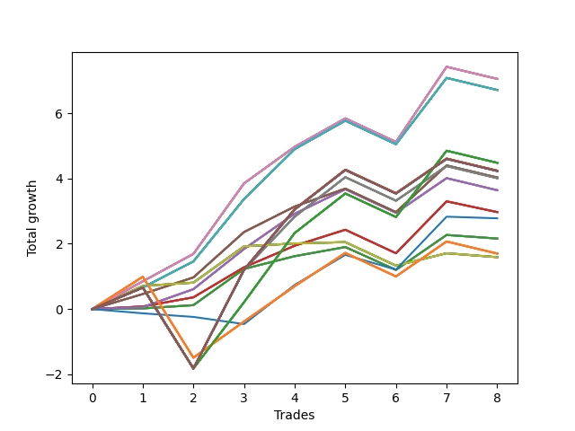

# Long Wallace 012 
- Symbol: SPY_Unlimited
- Date Range: 03/23/2022 - 07/08/2022
- Trading Period: 7:20-12:30
- Number of Trades: 8



| Name | Win Percent | Profit | Avg Profit / Trade | Avg Time / Trade |      | Name | Win Percent | Profit | Avg Profit / Trade | Avg Time / Trade |
| ---- | ----------- | ------ | ------------------ | ---------------- | ---- | ---- | ----------- | ------ | ------------------ | ---------------- |
| Sorted By <br> Profit | | | | | | Sorted By <br> Win Percentage ||||
| Sixty-Eight | 75.00 | 3525.00 | 440.62 | 18:15 |     | Sixty-Eight | 75.00 | 3525.00 | 440.62 | 18:15 |
| Sixty | 75.00 | 3525.00 | 440.62 | 18:15 |     | Sixty | 75.00 | 3525.00 | 440.62 | 18:15 |
| Fifty-Two | 75.00 | 3525.00 | 440.62 | 18:15 |     | Fifty-Two | 75.00 | 3525.00 | 440.62 | 18:15 |
| Forty-Four | 75.00 | 3525.00 | 440.62 | 18:15 |     | Forty-Four | 75.00 | 3525.00 | 440.62 | 18:15 |
| Four | 75.00 | 3525.00 | 440.62 | 18:15 |     | Four | 75.00 | 3525.00 | 440.62 | 18:15 |
| Seventy-One | 75.00 | 3355.00 | 419.37 | 19:41 |     | Seventy-One | 75.00 | 3355.00 | 419.37 | 19:41 |
| Sixty-Three | 75.00 | 3355.00 | 419.37 | 19:41 |     | Sixty-Three | 75.00 | 3355.00 | 419.37 | 19:41 |
| Fifty-Five | 75.00 | 3355.00 | 419.37 | 19:41 |     | Fifty-Five | 75.00 | 3355.00 | 419.37 | 19:41 |
| Forty-Seven | 75.00 | 3355.00 | 419.37 | 19:41 |     | Forty-Seven | 75.00 | 3355.00 | 419.37 | 19:41 |
| Seven | 75.00 | 3355.00 | 419.37 | 19:41 |     | Seven | 75.00 | 3355.00 | 419.37 | 19:41 |
| One Hundred Twenty-Seven | 62.50 | 2240.00 | 280.00 | 25:26 |     | Sixty-Seven | 75.00 | 2015.00 | 251.87 | 15:04 |
| One Hundred Twenty-Two | 62.50 | 2240.00 | 280.00 | 25:26 |     | Fifty-Nine | 75.00 | 2015.00 | 251.87 | 15:04 |
| One Hundred Seventeen | 62.50 | 2240.00 | 280.00 | 25:26 |     | Fifty-One | 75.00 | 2015.00 | 251.87 | 15:04 |
| One Hundred Twelve | 62.50 | 2240.00 | 280.00 | 25:26 |     | Forty-Three | 75.00 | 2015.00 | 251.87 | 15:04 |
| Eighty-Two | 62.50 | 2240.00 | 280.00 | 25:26 |     | Three | 75.00 | 2015.00 | 251.87 | 15:04 |
| One Hundred Twenty-Eight | 62.50 | 2120.00 | 265.00 | 29:15 |     | Sixty-Six | 75.00 | 1820.00 | 227.50 | 18:00 |
| One Hundred Twenty-Three | 62.50 | 2120.00 | 265.00 | 29:15 |     | Fifty-Eight | 75.00 | 1820.00 | 227.50 | 18:00 |
| One Hundred Eighteen | 62.50 | 2120.00 | 265.00 | 29:15 |     | Fifty | 75.00 | 1820.00 | 227.50 | 18:00 |
| One Hundred Thirteen | 62.50 | 2120.00 | 265.00 | 29:15 |     | Forty-Two | 75.00 | 1820.00 | 227.50 | 18:00 |
| Eighty-Three | 62.50 | 2120.00 | 265.00 | 29:15 |     | Two | 75.00 | 1820.00 | 227.50 | 18:00 |
| One Hundred Thirty | 62.50 | 2115.00 | 264.37 | 29:55 |     | Sixty-Five | 75.00 | 1485.00 | 185.62 | 14:25 |
| One Hundred Twenty-Nine | 62.50 | 2115.00 | 264.37 | 29:55 |     | Fifty-Seven | 75.00 | 1485.00 | 185.62 | 14:25 |
| One Hundred Twenty-Five | 62.50 | 2115.00 | 264.37 | 29:55 |     | Forty-Nine | 75.00 | 1485.00 | 185.62 | 14:25 |
| One Hundred Twenty-Four | 62.50 | 2115.00 | 264.37 | 29:55 |     | Forty-One | 75.00 | 1485.00 | 185.62 | 14:25 |
| One Hundred Twenty | 62.50 | 2115.00 | 264.37 | 29:55 |     | One | 75.00 | 1485.00 | 185.62 | 14:25 |
| One Hundred Ninteen | 62.50 | 2115.00 | 264.37 | 29:55 |     | Sixty-Four | 75.00 | 1080.00 | 135.00 | 08:23 |
| One Hundred Fifteen | 62.50 | 2115.00 | 264.37 | 29:55 |     | Fifty-Six | 75.00 | 1080.00 | 135.00 | 08:23 |
| One Hundred Fourteen | 62.50 | 2115.00 | 264.37 | 29:55 |     | Forty-Eight | 75.00 | 1080.00 | 135.00 | 08:23 |
| Eighty-Five | 62.50 | 2115.00 | 264.37 | 29:55 |     | Forty | 75.00 | 1080.00 | 135.00 | 08:23 |
| Eighty-Four | 62.50 | 2115.00 | 264.37 | 29:55 |     | Zero | 75.00 | 1080.00 | 135.00 | 08:23 |
| Sixty-Seven | 75.00 | 2015.00 | 251.87 | 15:04 |     | Seventy | 75.00 | 795.00 | 99.37 | 07:20 |
| Fifty-Nine | 75.00 | 2015.00 | 251.87 | 15:04 |     | Sixty-Two | 75.00 | 795.00 | 99.37 | 07:20 |
| Fifty-One | 75.00 | 2015.00 | 251.87 | 15:04 |     | Fifty-Four | 75.00 | 795.00 | 99.37 | 07:20 |
| Forty-Three | 75.00 | 2015.00 | 251.87 | 15:04 |     | Forty-Six | 75.00 | 795.00 | 99.37 | 07:20 |
| Three | 75.00 | 2015.00 | 251.87 | 15:04 |     | Six | 75.00 | 795.00 | 99.37 | 07:20 |
| Sixty-Nine | 62.50 | 2005.00 | 250.62 | 28:36 |     | One Hundred Twenty-Seven | 62.50 | 2240.00 | 280.00 | 25:26 |
| Sixty-One | 62.50 | 2005.00 | 250.62 | 28:36 |     | One Hundred Twenty-Two | 62.50 | 2240.00 | 280.00 | 25:26 |
| Fifty-Three | 62.50 | 2005.00 | 250.62 | 28:36 |     | One Hundred Seventeen | 62.50 | 2240.00 | 280.00 | 25:26 |
| Forty-Five | 62.50 | 2005.00 | 250.62 | 28:36 |     | One Hundred Twelve | 62.50 | 2240.00 | 280.00 | 25:26 |
| Five | 62.50 | 2005.00 | 250.62 | 28:36 |     | Eighty-Two | 62.50 | 2240.00 | 280.00 | 25:26 |
| Sixty-Six | 75.00 | 1820.00 | 227.50 | 18:00 |     | One Hundred Twenty-Eight | 62.50 | 2120.00 | 265.00 | 29:15 |
| Fifty-Eight | 75.00 | 1820.00 | 227.50 | 18:00 |     | One Hundred Twenty-Three | 62.50 | 2120.00 | 265.00 | 29:15 |
| Fifty | 75.00 | 1820.00 | 227.50 | 18:00 |     | One Hundred Eighteen | 62.50 | 2120.00 | 265.00 | 29:15 |
| Forty-Two | 75.00 | 1820.00 | 227.50 | 18:00 |     | One Hundred Thirteen | 62.50 | 2120.00 | 265.00 | 29:15 |
| Two | 75.00 | 1820.00 | 227.50 | 18:00 |     | Eighty-Three | 62.50 | 2120.00 | 265.00 | 29:15 |
| Sixty-Five | 75.00 | 1485.00 | 185.62 | 14:25 |     | One Hundred Thirty | 62.50 | 2115.00 | 264.37 | 29:55 |
| Fifty-Seven | 75.00 | 1485.00 | 185.62 | 14:25 |     | One Hundred Twenty-Nine | 62.50 | 2115.00 | 264.37 | 29:55 |
| Forty-Nine | 75.00 | 1485.00 | 185.62 | 14:25 |     | One Hundred Twenty-Five | 62.50 | 2115.00 | 264.37 | 29:55 |
| Forty-One | 75.00 | 1485.00 | 185.62 | 14:25 |     | One Hundred Twenty-Four | 62.50 | 2115.00 | 264.37 | 29:55 |
| One | 75.00 | 1485.00 | 185.62 | 14:25 |     | One Hundred Twenty | 62.50 | 2115.00 | 264.37 | 29:55 |
| Seventy-Three | 37.50 | 1390.00 | 173.75 | 12:57 |     | One Hundred Ninteen | 62.50 | 2115.00 | 264.37 | 29:55 |
| Sixty-Four | 75.00 | 1080.00 | 135.00 | 08:23 |     | One Hundred Fifteen | 62.50 | 2115.00 | 264.37 | 29:55 |
| Fifty-Six | 75.00 | 1080.00 | 135.00 | 08:23 |     | One Hundred Fourteen | 62.50 | 2115.00 | 264.37 | 29:55 |
| Forty-Eight | 75.00 | 1080.00 | 135.00 | 08:23 |     | Eighty-Five | 62.50 | 2115.00 | 264.37 | 29:55 |
| Forty | 75.00 | 1080.00 | 135.00 | 08:23 |     | Eighty-Four | 62.50 | 2115.00 | 264.37 | 29:55 |
| Zero | 75.00 | 1080.00 | 135.00 | 08:23 |     | Sixty-Nine | 62.50 | 2005.00 | 250.62 | 28:36 |
| One Hundred Twenty-Six | 62.50 | 850.00 | 106.25 | 18:14 |     | Sixty-One | 62.50 | 2005.00 | 250.62 | 28:36 |
| One Hundred Twenty-One | 62.50 | 850.00 | 106.25 | 18:14 |     | Fifty-Three | 62.50 | 2005.00 | 250.62 | 28:36 |
| One Hundred Sixteen | 62.50 | 850.00 | 106.25 | 18:14 |     | Forty-Five | 62.50 | 2005.00 | 250.62 | 28:36 |
| One Hundred Eleven | 62.50 | 850.00 | 106.25 | 18:14 |     | Five | 62.50 | 2005.00 | 250.62 | 28:36 |
| Eighty-One | 62.50 | 850.00 | 106.25 | 18:14 |     | One Hundred Twenty-Six | 62.50 | 850.00 | 106.25 | 18:14 |
| Seventy | 75.00 | 795.00 | 99.37 | 07:20 |     | One Hundred Twenty-One | 62.50 | 850.00 | 106.25 | 18:14 |
| Sixty-Two | 75.00 | 795.00 | 99.37 | 07:20 |     | One Hundred Sixteen | 62.50 | 850.00 | 106.25 | 18:14 |
| Fifty-Four | 75.00 | 795.00 | 99.37 | 07:20 |     | One Hundred Eleven | 62.50 | 850.00 | 106.25 | 18:14 |
| Forty-Six | 75.00 | 795.00 | 99.37 | 07:20 |     | Eighty-One | 62.50 | 850.00 | 106.25 | 18:14 |
| Six | 75.00 | 795.00 | 99.37 | 07:20 |     | Seventy-Three | 37.50 | 1390.00 | 173.75 | 12:57 |

## NO STOPLOSS

### Test Zero
* Sell when price hits the middle line of the 20p bollinger
* No Stoploss
* Results:
```
Total Trades: 8
Percent Up: 75.00
Percent Down: 25.00
Total Points Moved Up: 2.16
Potential Profit: 1080.00
Total Points Ups: 2.97 Count Ups: 6
Total Points Downs: -0.81 Count Downs: 2
```

<details><summary>Trades</summary>

<code>In: 2022-04-20 09:14:00		Out: 2022-04-20 09:30:50		Total Position Time: 16:50		Total Move Up: 0.02		Total to Date: 0.02</code> <br />
<code>In: 2022-04-27 11:40:00		Out: 2022-04-27 11:40:10		Total Position Time: 00:10		Total Move Up: 0.10		Total to Date: 0.12</code> <br />
<code>In: 2022-05-17 11:24:00		Out: 2022-05-17 11:27:25		Total Position Time: 03:25		Total Move Up: 1.11		Total to Date: 1.23</code> <br />
<code>In: 2022-05-23 10:23:00		Out: 2022-05-23 10:26:30		Total Position Time: 03:30		Total Move Up: 0.39		Total to Date: 1.62</code> <br />
<code>In: 2022-05-27 08:04:00		Out: 2022-05-27 08:06:55		Total Position Time: 02:55		Total Move Up: 0.28		Total to Date: 1.90</code> <br />
<code>In: 2022-06-15 07:35:00		Out: 2022-06-15 07:58:55		Total Position Time: 23:55		Total Move Up: -0.70		Total to Date: 1.20</code> <br />
<code>In: 2022-06-17 12:15:00		Out: 2022-06-17 12:20:30		Total Position Time: 05:30		Total Move Up: 1.07		Total to Date: 2.27</code> <br />
<code>In: 2022-06-21 08:47:00		Out: 2022-06-21 08:57:50		Total Position Time: 10:50		Total Move Up: -0.11		Total to Date: 2.16</code> <br />


</details>

### Test One
* Sell when the price hits the upper line of the 20p 1std bollinger
* No Stoploss
* Results:
```
Total Trades: 8
Percent Up: 75.00
Percent Down: 25.00
Total Points Moved Up: 2.97
Potential Profit: 1485.00
Total Points Ups: 4.02 Count Ups: 6
Total Points Downs: -1.05 Count Downs: 2
```

<details><summary>Trades</summary>

<code>In: 2022-04-20 09:14:00		Out: 2022-04-20 09:30:55		Total Position Time: 16:55		Total Move Up: 0.08		Total to Date: 0.08</code> <br />
<code>In: 2022-04-27 11:40:00		Out: 2022-04-27 11:42:30		Total Position Time: 02:30		Total Move Up: 0.28		Total to Date: 0.36</code> <br />
<code>In: 2022-05-17 11:24:00		Out: 2022-05-17 11:37:35		Total Position Time: 13:35		Total Move Up: 0.92		Total to Date: 1.28</code> <br />
<code>In: 2022-05-23 10:23:00		Out: 2022-05-23 10:32:35		Total Position Time: 09:35		Total Move Up: 0.66		Total to Date: 1.94</code> <br />
<code>In: 2022-05-27 08:04:00		Out: 2022-05-27 08:11:00		Total Position Time: 07:00		Total Move Up: 0.49		Total to Date: 2.43</code> <br />
<code>In: 2022-06-15 07:35:00		Out: 2022-06-15 08:04:55		Total Position Time: 29:55		Total Move Up: -0.72		Total to Date: 1.71</code> <br />
<code>In: 2022-06-17 12:15:00		Out: 2022-06-17 12:21:30		Total Position Time: 06:30		Total Move Up: 1.59		Total to Date: 3.30</code> <br />
<code>In: 2022-06-21 08:47:00		Out: 2022-06-21 09:16:20		Total Position Time: 29:20		Total Move Up: -0.33		Total to Date: 2.97</code> <br />


</details>

### Test Two
* Sell when the price hits the upper line of the 20p 2std bollinger
* No Stoploss
* Results:
```
Total Trades: 8
Percent Up: 75.00
Percent Down: 25.00
Total Points Moved Up: 3.64
Potential Profit: 1820.00
Total Points Ups: 4.73 Count Ups: 6
Total Points Downs: -1.09 Count Downs: 2
```

<details><summary>Trades</summary>

<code>In: 2022-04-20 09:14:00		Out: 2022-04-20 09:31:05		Total Position Time: 17:05		Total Move Up: 0.06		Total to Date: 0.06</code> <br />
<code>In: 2022-04-27 11:40:00		Out: 2022-04-27 11:42:40		Total Position Time: 02:40		Total Move Up: 0.55		Total to Date: 0.61</code> <br />
<code>In: 2022-05-17 11:24:00		Out: 2022-05-17 11:40:00		Total Position Time: 16:00		Total Move Up: 1.23		Total to Date: 1.84</code> <br />
<code>In: 2022-05-23 10:23:00		Out: 2022-05-23 10:33:15		Total Position Time: 10:15		Total Move Up: 1.08		Total to Date: 2.92</code> <br />
<code>In: 2022-05-27 08:04:00		Out: 2022-05-27 08:12:15		Total Position Time: 08:15		Total Move Up: 0.75		Total to Date: 3.67</code> <br />
<code>In: 2022-06-15 07:35:00		Out: 2022-06-15 08:04:55		Total Position Time: 29:55		Total Move Up: -0.72		Total to Date: 2.95</code> <br />
<code>In: 2022-06-17 12:15:00		Out: 2022-06-17 12:44:55		Total Position Time: 29:55		Total Move Up: 1.06		Total to Date: 4.01</code> <br />
<code>In: 2022-06-21 08:47:00		Out: 2022-06-21 09:16:55		Total Position Time: 29:55		Total Move Up: -0.37		Total to Date: 3.64</code> <br />


</details>

### Test Three
* Sell when price hits the middle line of the 50p bollinger
* No Stoploss
* Results:
```
Total Trades: 8
Percent Up: 75.00
Percent Down: 25.00
Total Points Moved Up: 4.03
Potential Profit: 2015.00
Total Points Ups: 5.12 Count Ups: 6
Total Points Downs: -1.09 Count Downs: 2
```

<details><summary>Trades</summary>

<code>In: 2022-04-20 09:14:00		Out: 2022-04-20 09:32:40		Total Position Time: 18:40		Total Move Up: 0.46		Total to Date: 0.46</code> <br />
<code>In: 2022-04-27 11:40:00		Out: 2022-04-27 11:42:35		Total Position Time: 02:35		Total Move Up: 0.51		Total to Date: 0.97</code> <br />
<code>In: 2022-05-17 11:24:00		Out: 2022-05-17 11:40:05		Total Position Time: 16:05		Total Move Up: 1.39		Total to Date: 2.36</code> <br />
<code>In: 2022-05-23 10:23:00		Out: 2022-05-23 10:33:00		Total Position Time: 10:00		Total Move Up: 0.78		Total to Date: 3.14</code> <br />
<code>In: 2022-05-27 08:04:00		Out: 2022-05-27 08:11:10		Total Position Time: 07:10		Total Move Up: 0.55		Total to Date: 3.69</code> <br />
<code>In: 2022-06-15 07:35:00		Out: 2022-06-15 08:04:55		Total Position Time: 29:55		Total Move Up: -0.72		Total to Date: 2.97</code> <br />
<code>In: 2022-06-17 12:15:00		Out: 2022-06-17 12:21:15		Total Position Time: 06:15		Total Move Up: 1.43		Total to Date: 4.40</code> <br />
<code>In: 2022-06-21 08:47:00		Out: 2022-06-21 09:16:55		Total Position Time: 29:55		Total Move Up: -0.37		Total to Date: 4.03</code> <br />


</details>

### Test Four
* Sell when the price hits the upper line of the 50p 1std bollinger
* No Stoploss
* Results:
```
Total Trades: 8
Percent Up: 75.00
Percent Down: 25.00
Total Points Moved Up: 7.05
Potential Profit: 3525.00
Total Points Ups: 8.14 Count Ups: 6
Total Points Downs: -1.09 Count Downs: 2
```

<details><summary>Trades</summary>

<code>In: 2022-04-20 09:14:00		Out: 2022-04-20 09:36:45		Total Position Time: 22:45		Total Move Up: 0.85		Total to Date: 0.85</code> <br />
<code>In: 2022-04-27 11:40:00		Out: 2022-04-27 11:45:25		Total Position Time: 05:25		Total Move Up: 0.84		Total to Date: 1.69</code> <br />
<code>In: 2022-05-17 11:24:00		Out: 2022-05-17 11:44:30		Total Position Time: 20:30		Total Move Up: 2.16		Total to Date: 3.85</code> <br />
<code>In: 2022-05-23 10:23:00		Out: 2022-05-23 10:36:15		Total Position Time: 13:15		Total Move Up: 1.12		Total to Date: 4.97</code> <br />
<code>In: 2022-05-27 08:04:00		Out: 2022-05-27 08:16:05		Total Position Time: 12:05		Total Move Up: 0.87		Total to Date: 5.84</code> <br />
<code>In: 2022-06-15 07:35:00		Out: 2022-06-15 08:04:55		Total Position Time: 29:55		Total Move Up: -0.72		Total to Date: 5.12</code> <br />
<code>In: 2022-06-17 12:15:00		Out: 2022-06-17 12:27:15		Total Position Time: 12:15		Total Move Up: 2.30		Total to Date: 7.42</code> <br />
<code>In: 2022-06-21 08:47:00		Out: 2022-06-21 09:16:55		Total Position Time: 29:55		Total Move Up: -0.37		Total to Date: 7.05</code> <br />


</details>

### Test Five
* Sell when the price hits the upper line of the 50p 2std bollinger
* No Stoploss
* Results:
```
Total Trades: 8
Percent Up: 62.50
Percent Down: 37.50
Total Points Moved Up: 4.01
Potential Profit: 2005.00
Total Points Ups: 7.58 Count Ups: 5
Total Points Downs: -3.57 Count Downs: 3
```

<details><summary>Trades</summary>

<code>In: 2022-04-20 09:14:00		Out: 2022-04-20 09:43:55		Total Position Time: 29:55		Total Move Up: 0.66		Total to Date: 0.66</code> <br />
<code>In: 2022-04-27 11:40:00		Out: 2022-04-27 12:09:55		Total Position Time: 29:55		Total Move Up: -2.48		Total to Date: -1.82</code> <br />
<code>In: 2022-05-17 11:24:00		Out: 2022-05-17 11:48:40		Total Position Time: 24:40		Total Move Up: 3.03		Total to Date: 1.21</code> <br />
<code>In: 2022-05-23 10:23:00		Out: 2022-05-23 10:47:45		Total Position Time: 24:45		Total Move Up: 1.62		Total to Date: 2.83</code> <br />
<code>In: 2022-05-27 08:04:00		Out: 2022-05-27 08:33:55		Total Position Time: 29:55		Total Move Up: 1.21		Total to Date: 4.04</code> <br />
<code>In: 2022-06-15 07:35:00		Out: 2022-06-15 08:04:55		Total Position Time: 29:55		Total Move Up: -0.72		Total to Date: 3.32</code> <br />
<code>In: 2022-06-17 12:15:00		Out: 2022-06-17 12:44:55		Total Position Time: 29:55		Total Move Up: 1.06		Total to Date: 4.38</code> <br />
<code>In: 2022-06-21 08:47:00		Out: 2022-06-21 09:16:55		Total Position Time: 29:55		Total Move Up: -0.37		Total to Date: 4.01</code> <br />


</details>

### Test Six
* Sell when the price hits the middle line of the 1std VWAP
* No Stoploss
* Results:
```
Total Trades: 8
Percent Up: 75.00
Percent Down: 25.00
Total Points Moved Up: 1.59
Potential Profit: 795.00
Total Points Ups: 2.43 Count Ups: 6
Total Points Downs: -0.84 Count Downs: 2
```

<details><summary>Trades</summary>

<code>In: 2022-04-20 09:14:00		Out: 2022-04-20 09:36:05		Total Position Time: 22:05		Total Move Up: 0.71		Total to Date: 0.71</code> <br />
<code>In: 2022-04-27 11:40:00		Out: 2022-04-27 11:40:10		Total Position Time: 00:10		Total Move Up: 0.10		Total to Date: 0.81</code> <br />
<code>In: 2022-05-17 11:24:00		Out: 2022-05-17 11:27:25		Total Position Time: 03:25		Total Move Up: 1.11		Total to Date: 1.92</code> <br />
<code>In: 2022-05-23 10:23:00		Out: 2022-05-23 10:23:10		Total Position Time: 00:10		Total Move Up: 0.09		Total to Date: 2.01</code> <br />
<code>In: 2022-05-27 08:04:00		Out: 2022-05-27 08:04:10		Total Position Time: 00:10		Total Move Up: 0.04		Total to Date: 2.05</code> <br />
<code>In: 2022-06-15 07:35:00		Out: 2022-06-15 08:04:55		Total Position Time: 29:55		Total Move Up: -0.72		Total to Date: 1.33</code> <br />
<code>In: 2022-06-17 12:15:00		Out: 2022-06-17 12:17:35		Total Position Time: 02:35		Total Move Up: 0.38		Total to Date: 1.71</code> <br />
<code>In: 2022-06-21 08:47:00		Out: 2022-06-21 08:47:10		Total Position Time: 00:10		Total Move Up: -0.12		Total to Date: 1.59</code> <br />


</details>

### Test Seven
* Sell when the price hits the upper line of the 1std VWAP
* No Stoploss
* Results:
```
Total Trades: 8
Percent Up: 75.00
Percent Down: 25.00
Total Points Moved Up: 6.71
Potential Profit: 3355.00
Total Points Ups: 7.80 Count Ups: 6
Total Points Downs: -1.09 Count Downs: 2
```

<details><summary>Trades</summary>

<code>In: 2022-04-20 09:14:00		Out: 2022-04-20 09:43:55		Total Position Time: 29:55		Total Move Up: 0.66		Total to Date: 0.66</code> <br />
<code>In: 2022-04-27 11:40:00		Out: 2022-04-27 11:44:20		Total Position Time: 04:20		Total Move Up: 0.80		Total to Date: 1.46</code> <br />
<code>In: 2022-05-17 11:24:00		Out: 2022-05-17 11:40:25		Total Position Time: 16:25		Total Move Up: 1.91		Total to Date: 3.37</code> <br />
<code>In: 2022-05-23 10:23:00		Out: 2022-05-23 10:46:25		Total Position Time: 23:25		Total Move Up: 1.53		Total to Date: 4.90</code> <br />
<code>In: 2022-05-27 08:04:00		Out: 2022-05-27 08:16:05		Total Position Time: 12:05		Total Move Up: 0.87		Total to Date: 5.77</code> <br />
<code>In: 2022-06-15 07:35:00		Out: 2022-06-15 08:04:55		Total Position Time: 29:55		Total Move Up: -0.72		Total to Date: 5.05</code> <br />
<code>In: 2022-06-17 12:15:00		Out: 2022-06-17 12:26:35		Total Position Time: 11:35		Total Move Up: 2.03		Total to Date: 7.08</code> <br />
<code>In: 2022-06-21 08:47:00		Out: 2022-06-21 09:16:55		Total Position Time: 29:55		Total Move Up: -0.37		Total to Date: 6.71</code> <br />


</details>

## STOPLOSS OF 5

### Test Forty
* Sell when price hits the middle line of the 20p bollinger
* Stoploss is 5 points
* Results:
```
Total Trades: 8
Percent Up: 75.00
Percent Down: 25.00
Total Points Moved Up: 2.16
Potential Profit: 1080.00
Total Points Ups: 2.97 Count Ups: 6
Total Points Downs: -0.81 Count Downs: 2
```

<details><summary>Trades</summary>

<code>In: 2022-04-20 09:14:00		Out: 2022-04-20 09:30:50		Total Position Time: 16:50		Total Move Up: 0.02		Total to Date: 0.02</code> <br />
<code>In: 2022-04-27 11:40:00		Out: 2022-04-27 11:40:10		Total Position Time: 00:10		Total Move Up: 0.10		Total to Date: 0.12</code> <br />
<code>In: 2022-05-17 11:24:00		Out: 2022-05-17 11:27:25		Total Position Time: 03:25		Total Move Up: 1.11		Total to Date: 1.23</code> <br />
<code>In: 2022-05-23 10:23:00		Out: 2022-05-23 10:26:30		Total Position Time: 03:30		Total Move Up: 0.39		Total to Date: 1.62</code> <br />
<code>In: 2022-05-27 08:04:00		Out: 2022-05-27 08:06:55		Total Position Time: 02:55		Total Move Up: 0.28		Total to Date: 1.90</code> <br />
<code>In: 2022-06-15 07:35:00		Out: 2022-06-15 07:58:55		Total Position Time: 23:55		Total Move Up: -0.70		Total to Date: 1.20</code> <br />
<code>In: 2022-06-17 12:15:00		Out: 2022-06-17 12:20:30		Total Position Time: 05:30		Total Move Up: 1.07		Total to Date: 2.27</code> <br />
<code>In: 2022-06-21 08:47:00		Out: 2022-06-21 08:57:50		Total Position Time: 10:50		Total Move Up: -0.11		Total to Date: 2.16</code> <br />


</details>

### Test Forty-One
* Sell when the price hits the upper line of the 20p 1std bollinger
* Stoploss is 5 points
* Results:
```
Total Trades: 8
Percent Up: 75.00
Percent Down: 25.00
Total Points Moved Up: 2.97
Potential Profit: 1485.00
Total Points Ups: 4.02 Count Ups: 6
Total Points Downs: -1.05 Count Downs: 2
```

<details><summary>Trades</summary>

<code>In: 2022-04-20 09:14:00		Out: 2022-04-20 09:30:55		Total Position Time: 16:55		Total Move Up: 0.08		Total to Date: 0.08</code> <br />
<code>In: 2022-04-27 11:40:00		Out: 2022-04-27 11:42:30		Total Position Time: 02:30		Total Move Up: 0.28		Total to Date: 0.36</code> <br />
<code>In: 2022-05-17 11:24:00		Out: 2022-05-17 11:37:35		Total Position Time: 13:35		Total Move Up: 0.92		Total to Date: 1.28</code> <br />
<code>In: 2022-05-23 10:23:00		Out: 2022-05-23 10:32:35		Total Position Time: 09:35		Total Move Up: 0.66		Total to Date: 1.94</code> <br />
<code>In: 2022-05-27 08:04:00		Out: 2022-05-27 08:11:00		Total Position Time: 07:00		Total Move Up: 0.49		Total to Date: 2.43</code> <br />
<code>In: 2022-06-15 07:35:00		Out: 2022-06-15 08:04:55		Total Position Time: 29:55		Total Move Up: -0.72		Total to Date: 1.71</code> <br />
<code>In: 2022-06-17 12:15:00		Out: 2022-06-17 12:21:30		Total Position Time: 06:30		Total Move Up: 1.59		Total to Date: 3.30</code> <br />
<code>In: 2022-06-21 08:47:00		Out: 2022-06-21 09:16:20		Total Position Time: 29:20		Total Move Up: -0.33		Total to Date: 2.97</code> <br />


</details>

### Test Forty-Two
* Sell when the price hits the upper line of the 20p 2std bollinger
* Stoploss is 5 points
* Results:
```
Total Trades: 8
Percent Up: 75.00
Percent Down: 25.00
Total Points Moved Up: 3.64
Potential Profit: 1820.00
Total Points Ups: 4.73 Count Ups: 6
Total Points Downs: -1.09 Count Downs: 2
```

<details><summary>Trades</summary>

<code>In: 2022-04-20 09:14:00		Out: 2022-04-20 09:31:05		Total Position Time: 17:05		Total Move Up: 0.06		Total to Date: 0.06</code> <br />
<code>In: 2022-04-27 11:40:00		Out: 2022-04-27 11:42:40		Total Position Time: 02:40		Total Move Up: 0.55		Total to Date: 0.61</code> <br />
<code>In: 2022-05-17 11:24:00		Out: 2022-05-17 11:40:00		Total Position Time: 16:00		Total Move Up: 1.23		Total to Date: 1.84</code> <br />
<code>In: 2022-05-23 10:23:00		Out: 2022-05-23 10:33:15		Total Position Time: 10:15		Total Move Up: 1.08		Total to Date: 2.92</code> <br />
<code>In: 2022-05-27 08:04:00		Out: 2022-05-27 08:12:15		Total Position Time: 08:15		Total Move Up: 0.75		Total to Date: 3.67</code> <br />
<code>In: 2022-06-15 07:35:00		Out: 2022-06-15 08:04:55		Total Position Time: 29:55		Total Move Up: -0.72		Total to Date: 2.95</code> <br />
<code>In: 2022-06-17 12:15:00		Out: 2022-06-17 12:44:55		Total Position Time: 29:55		Total Move Up: 1.06		Total to Date: 4.01</code> <br />
<code>In: 2022-06-21 08:47:00		Out: 2022-06-21 09:16:55		Total Position Time: 29:55		Total Move Up: -0.37		Total to Date: 3.64</code> <br />


</details>

### Test Forty-Three
* Sell when price hits the middle line of the 50p bollinger
* Stoploss is 5 points
* Results:
```
Total Trades: 8
Percent Up: 75.00
Percent Down: 25.00
Total Points Moved Up: 4.03
Potential Profit: 2015.00
Total Points Ups: 5.12 Count Ups: 6
Total Points Downs: -1.09 Count Downs: 2
```

<details><summary>Trades</summary>

<code>In: 2022-04-20 09:14:00		Out: 2022-04-20 09:32:40		Total Position Time: 18:40		Total Move Up: 0.46		Total to Date: 0.46</code> <br />
<code>In: 2022-04-27 11:40:00		Out: 2022-04-27 11:42:35		Total Position Time: 02:35		Total Move Up: 0.51		Total to Date: 0.97</code> <br />
<code>In: 2022-05-17 11:24:00		Out: 2022-05-17 11:40:05		Total Position Time: 16:05		Total Move Up: 1.39		Total to Date: 2.36</code> <br />
<code>In: 2022-05-23 10:23:00		Out: 2022-05-23 10:33:00		Total Position Time: 10:00		Total Move Up: 0.78		Total to Date: 3.14</code> <br />
<code>In: 2022-05-27 08:04:00		Out: 2022-05-27 08:11:10		Total Position Time: 07:10		Total Move Up: 0.55		Total to Date: 3.69</code> <br />
<code>In: 2022-06-15 07:35:00		Out: 2022-06-15 08:04:55		Total Position Time: 29:55		Total Move Up: -0.72		Total to Date: 2.97</code> <br />
<code>In: 2022-06-17 12:15:00		Out: 2022-06-17 12:21:15		Total Position Time: 06:15		Total Move Up: 1.43		Total to Date: 4.40</code> <br />
<code>In: 2022-06-21 08:47:00		Out: 2022-06-21 09:16:55		Total Position Time: 29:55		Total Move Up: -0.37		Total to Date: 4.03</code> <br />


</details>

### Test Forty-Four
* Sell when the price hits the upper line of the 50p 1std bollinger
* Stoploss is 5 points
* Results:
```
Total Trades: 8
Percent Up: 75.00
Percent Down: 25.00
Total Points Moved Up: 7.05
Potential Profit: 3525.00
Total Points Ups: 8.14 Count Ups: 6
Total Points Downs: -1.09 Count Downs: 2
```

<details><summary>Trades</summary>

<code>In: 2022-04-20 09:14:00		Out: 2022-04-20 09:36:45		Total Position Time: 22:45		Total Move Up: 0.85		Total to Date: 0.85</code> <br />
<code>In: 2022-04-27 11:40:00		Out: 2022-04-27 11:45:25		Total Position Time: 05:25		Total Move Up: 0.84		Total to Date: 1.69</code> <br />
<code>In: 2022-05-17 11:24:00		Out: 2022-05-17 11:44:30		Total Position Time: 20:30		Total Move Up: 2.16		Total to Date: 3.85</code> <br />
<code>In: 2022-05-23 10:23:00		Out: 2022-05-23 10:36:15		Total Position Time: 13:15		Total Move Up: 1.12		Total to Date: 4.97</code> <br />
<code>In: 2022-05-27 08:04:00		Out: 2022-05-27 08:16:05		Total Position Time: 12:05		Total Move Up: 0.87		Total to Date: 5.84</code> <br />
<code>In: 2022-06-15 07:35:00		Out: 2022-06-15 08:04:55		Total Position Time: 29:55		Total Move Up: -0.72		Total to Date: 5.12</code> <br />
<code>In: 2022-06-17 12:15:00		Out: 2022-06-17 12:27:15		Total Position Time: 12:15		Total Move Up: 2.30		Total to Date: 7.42</code> <br />
<code>In: 2022-06-21 08:47:00		Out: 2022-06-21 09:16:55		Total Position Time: 29:55		Total Move Up: -0.37		Total to Date: 7.05</code> <br />


</details>

### Test Forty-Five
* Sell when the price hits the upper line of the 50p 2std bollinger
* Stoploss is 5 points
* Results:
```
Total Trades: 8
Percent Up: 62.50
Percent Down: 37.50
Total Points Moved Up: 4.01
Potential Profit: 2005.00
Total Points Ups: 7.58 Count Ups: 5
Total Points Downs: -3.57 Count Downs: 3
```

<details><summary>Trades</summary>

<code>In: 2022-04-20 09:14:00		Out: 2022-04-20 09:43:55		Total Position Time: 29:55		Total Move Up: 0.66		Total to Date: 0.66</code> <br />
<code>In: 2022-04-27 11:40:00		Out: 2022-04-27 12:09:55		Total Position Time: 29:55		Total Move Up: -2.48		Total to Date: -1.82</code> <br />
<code>In: 2022-05-17 11:24:00		Out: 2022-05-17 11:48:40		Total Position Time: 24:40		Total Move Up: 3.03		Total to Date: 1.21</code> <br />
<code>In: 2022-05-23 10:23:00		Out: 2022-05-23 10:47:45		Total Position Time: 24:45		Total Move Up: 1.62		Total to Date: 2.83</code> <br />
<code>In: 2022-05-27 08:04:00		Out: 2022-05-27 08:33:55		Total Position Time: 29:55		Total Move Up: 1.21		Total to Date: 4.04</code> <br />
<code>In: 2022-06-15 07:35:00		Out: 2022-06-15 08:04:55		Total Position Time: 29:55		Total Move Up: -0.72		Total to Date: 3.32</code> <br />
<code>In: 2022-06-17 12:15:00		Out: 2022-06-17 12:44:55		Total Position Time: 29:55		Total Move Up: 1.06		Total to Date: 4.38</code> <br />
<code>In: 2022-06-21 08:47:00		Out: 2022-06-21 09:16:55		Total Position Time: 29:55		Total Move Up: -0.37		Total to Date: 4.01</code> <br />


</details>

### Test Forty-Six
* Sell when the price hits the middle line of the 1std VWAP
* Stoploss is 5 points
* Results:
```
Total Trades: 8
Percent Up: 75.00
Percent Down: 25.00
Total Points Moved Up: 1.59
Potential Profit: 795.00
Total Points Ups: 2.43 Count Ups: 6
Total Points Downs: -0.84 Count Downs: 2
```

<details><summary>Trades</summary>

<code>In: 2022-04-20 09:14:00		Out: 2022-04-20 09:36:05		Total Position Time: 22:05		Total Move Up: 0.71		Total to Date: 0.71</code> <br />
<code>In: 2022-04-27 11:40:00		Out: 2022-04-27 11:40:10		Total Position Time: 00:10		Total Move Up: 0.10		Total to Date: 0.81</code> <br />
<code>In: 2022-05-17 11:24:00		Out: 2022-05-17 11:27:25		Total Position Time: 03:25		Total Move Up: 1.11		Total to Date: 1.92</code> <br />
<code>In: 2022-05-23 10:23:00		Out: 2022-05-23 10:23:10		Total Position Time: 00:10		Total Move Up: 0.09		Total to Date: 2.01</code> <br />
<code>In: 2022-05-27 08:04:00		Out: 2022-05-27 08:04:10		Total Position Time: 00:10		Total Move Up: 0.04		Total to Date: 2.05</code> <br />
<code>In: 2022-06-15 07:35:00		Out: 2022-06-15 08:04:55		Total Position Time: 29:55		Total Move Up: -0.72		Total to Date: 1.33</code> <br />
<code>In: 2022-06-17 12:15:00		Out: 2022-06-17 12:17:35		Total Position Time: 02:35		Total Move Up: 0.38		Total to Date: 1.71</code> <br />
<code>In: 2022-06-21 08:47:00		Out: 2022-06-21 08:47:10		Total Position Time: 00:10		Total Move Up: -0.12		Total to Date: 1.59</code> <br />


</details>

### Test Forty-Seven
* Sell when the price hits the upper line of the 1std VWAP
* Stoploss is 5 points
* Results:
```
Total Trades: 8
Percent Up: 75.00
Percent Down: 25.00
Total Points Moved Up: 6.71
Potential Profit: 3355.00
Total Points Ups: 7.80 Count Ups: 6
Total Points Downs: -1.09 Count Downs: 2
```

<details><summary>Trades</summary>

<code>In: 2022-04-20 09:14:00		Out: 2022-04-20 09:43:55		Total Position Time: 29:55		Total Move Up: 0.66		Total to Date: 0.66</code> <br />
<code>In: 2022-04-27 11:40:00		Out: 2022-04-27 11:44:20		Total Position Time: 04:20		Total Move Up: 0.80		Total to Date: 1.46</code> <br />
<code>In: 2022-05-17 11:24:00		Out: 2022-05-17 11:40:25		Total Position Time: 16:25		Total Move Up: 1.91		Total to Date: 3.37</code> <br />
<code>In: 2022-05-23 10:23:00		Out: 2022-05-23 10:46:25		Total Position Time: 23:25		Total Move Up: 1.53		Total to Date: 4.90</code> <br />
<code>In: 2022-05-27 08:04:00		Out: 2022-05-27 08:16:05		Total Position Time: 12:05		Total Move Up: 0.87		Total to Date: 5.77</code> <br />
<code>In: 2022-06-15 07:35:00		Out: 2022-06-15 08:04:55		Total Position Time: 29:55		Total Move Up: -0.72		Total to Date: 5.05</code> <br />
<code>In: 2022-06-17 12:15:00		Out: 2022-06-17 12:26:35		Total Position Time: 11:35		Total Move Up: 2.03		Total to Date: 7.08</code> <br />
<code>In: 2022-06-21 08:47:00		Out: 2022-06-21 09:16:55		Total Position Time: 29:55		Total Move Up: -0.37		Total to Date: 6.71</code> <br />


</details>

## TRAIL STOP OF 5

### Test Forty-Eight
* Sell when price hits the middle line of the 20p bollinger
* Trailing Stop is 5 points
* Results:
```
Total Trades: 8
Percent Up: 75.00
Percent Down: 25.00
Total Points Moved Up: 2.16
Potential Profit: 1080.00
Total Points Ups: 2.97 Count Ups: 6
Total Points Downs: -0.81 Count Downs: 2
```

<details><summary>Trades</summary>

<code>In: 2022-04-20 09:14:00		Out: 2022-04-20 09:30:50		Total Position Time: 16:50		Total Move Up: 0.02		Total to Date: 0.02</code> <br />
<code>In: 2022-04-27 11:40:00		Out: 2022-04-27 11:40:10		Total Position Time: 00:10		Total Move Up: 0.10		Total to Date: 0.12</code> <br />
<code>In: 2022-05-17 11:24:00		Out: 2022-05-17 11:27:25		Total Position Time: 03:25		Total Move Up: 1.11		Total to Date: 1.23</code> <br />
<code>In: 2022-05-23 10:23:00		Out: 2022-05-23 10:26:30		Total Position Time: 03:30		Total Move Up: 0.39		Total to Date: 1.62</code> <br />
<code>In: 2022-05-27 08:04:00		Out: 2022-05-27 08:06:55		Total Position Time: 02:55		Total Move Up: 0.28		Total to Date: 1.90</code> <br />
<code>In: 2022-06-15 07:35:00		Out: 2022-06-15 07:58:55		Total Position Time: 23:55		Total Move Up: -0.70		Total to Date: 1.20</code> <br />
<code>In: 2022-06-17 12:15:00		Out: 2022-06-17 12:20:30		Total Position Time: 05:30		Total Move Up: 1.07		Total to Date: 2.27</code> <br />
<code>In: 2022-06-21 08:47:00		Out: 2022-06-21 08:57:50		Total Position Time: 10:50		Total Move Up: -0.11		Total to Date: 2.16</code> <br />


</details>

### Test Forty-Nine
* Sell when the price hits the upper line of the 20p 1std bollinger
* Trailing Stop is 5 points
* Results:
```
Total Trades: 8
Percent Up: 75.00
Percent Down: 25.00
Total Points Moved Up: 2.97
Potential Profit: 1485.00
Total Points Ups: 4.02 Count Ups: 6
Total Points Downs: -1.05 Count Downs: 2
```

<details><summary>Trades</summary>

<code>In: 2022-04-20 09:14:00		Out: 2022-04-20 09:30:55		Total Position Time: 16:55		Total Move Up: 0.08		Total to Date: 0.08</code> <br />
<code>In: 2022-04-27 11:40:00		Out: 2022-04-27 11:42:30		Total Position Time: 02:30		Total Move Up: 0.28		Total to Date: 0.36</code> <br />
<code>In: 2022-05-17 11:24:00		Out: 2022-05-17 11:37:35		Total Position Time: 13:35		Total Move Up: 0.92		Total to Date: 1.28</code> <br />
<code>In: 2022-05-23 10:23:00		Out: 2022-05-23 10:32:35		Total Position Time: 09:35		Total Move Up: 0.66		Total to Date: 1.94</code> <br />
<code>In: 2022-05-27 08:04:00		Out: 2022-05-27 08:11:00		Total Position Time: 07:00		Total Move Up: 0.49		Total to Date: 2.43</code> <br />
<code>In: 2022-06-15 07:35:00		Out: 2022-06-15 08:04:55		Total Position Time: 29:55		Total Move Up: -0.72		Total to Date: 1.71</code> <br />
<code>In: 2022-06-17 12:15:00		Out: 2022-06-17 12:21:30		Total Position Time: 06:30		Total Move Up: 1.59		Total to Date: 3.30</code> <br />
<code>In: 2022-06-21 08:47:00		Out: 2022-06-21 09:16:20		Total Position Time: 29:20		Total Move Up: -0.33		Total to Date: 2.97</code> <br />


</details>

### Test Fifty
* Sell when the price hits the upper line of the 20p 2std bollinger
* Trailing Stop is 5 points
* Results:
```
Total Trades: 8
Percent Up: 75.00
Percent Down: 25.00
Total Points Moved Up: 3.64
Potential Profit: 1820.00
Total Points Ups: 4.73 Count Ups: 6
Total Points Downs: -1.09 Count Downs: 2
```

<details><summary>Trades</summary>

<code>In: 2022-04-20 09:14:00		Out: 2022-04-20 09:31:05		Total Position Time: 17:05		Total Move Up: 0.06		Total to Date: 0.06</code> <br />
<code>In: 2022-04-27 11:40:00		Out: 2022-04-27 11:42:40		Total Position Time: 02:40		Total Move Up: 0.55		Total to Date: 0.61</code> <br />
<code>In: 2022-05-17 11:24:00		Out: 2022-05-17 11:40:00		Total Position Time: 16:00		Total Move Up: 1.23		Total to Date: 1.84</code> <br />
<code>In: 2022-05-23 10:23:00		Out: 2022-05-23 10:33:15		Total Position Time: 10:15		Total Move Up: 1.08		Total to Date: 2.92</code> <br />
<code>In: 2022-05-27 08:04:00		Out: 2022-05-27 08:12:15		Total Position Time: 08:15		Total Move Up: 0.75		Total to Date: 3.67</code> <br />
<code>In: 2022-06-15 07:35:00		Out: 2022-06-15 08:04:55		Total Position Time: 29:55		Total Move Up: -0.72		Total to Date: 2.95</code> <br />
<code>In: 2022-06-17 12:15:00		Out: 2022-06-17 12:44:55		Total Position Time: 29:55		Total Move Up: 1.06		Total to Date: 4.01</code> <br />
<code>In: 2022-06-21 08:47:00		Out: 2022-06-21 09:16:55		Total Position Time: 29:55		Total Move Up: -0.37		Total to Date: 3.64</code> <br />


</details>

### Test Fifty-One
* Sell when price hits the middle line of the 50p bollinger
* Trailing Stop is 5 points
* Results:
```
Total Trades: 8
Percent Up: 75.00
Percent Down: 25.00
Total Points Moved Up: 4.03
Potential Profit: 2015.00
Total Points Ups: 5.12 Count Ups: 6
Total Points Downs: -1.09 Count Downs: 2
```

<details><summary>Trades</summary>

<code>In: 2022-04-20 09:14:00		Out: 2022-04-20 09:32:40		Total Position Time: 18:40		Total Move Up: 0.46		Total to Date: 0.46</code> <br />
<code>In: 2022-04-27 11:40:00		Out: 2022-04-27 11:42:35		Total Position Time: 02:35		Total Move Up: 0.51		Total to Date: 0.97</code> <br />
<code>In: 2022-05-17 11:24:00		Out: 2022-05-17 11:40:05		Total Position Time: 16:05		Total Move Up: 1.39		Total to Date: 2.36</code> <br />
<code>In: 2022-05-23 10:23:00		Out: 2022-05-23 10:33:00		Total Position Time: 10:00		Total Move Up: 0.78		Total to Date: 3.14</code> <br />
<code>In: 2022-05-27 08:04:00		Out: 2022-05-27 08:11:10		Total Position Time: 07:10		Total Move Up: 0.55		Total to Date: 3.69</code> <br />
<code>In: 2022-06-15 07:35:00		Out: 2022-06-15 08:04:55		Total Position Time: 29:55		Total Move Up: -0.72		Total to Date: 2.97</code> <br />
<code>In: 2022-06-17 12:15:00		Out: 2022-06-17 12:21:15		Total Position Time: 06:15		Total Move Up: 1.43		Total to Date: 4.40</code> <br />
<code>In: 2022-06-21 08:47:00		Out: 2022-06-21 09:16:55		Total Position Time: 29:55		Total Move Up: -0.37		Total to Date: 4.03</code> <br />


</details>

### Test Fifty-Two
* Sell when the price hits the upper line of the 50p 1std bollinger
* Trailing Stop is 5 points
* Results:
```
Total Trades: 8
Percent Up: 75.00
Percent Down: 25.00
Total Points Moved Up: 7.05
Potential Profit: 3525.00
Total Points Ups: 8.14 Count Ups: 6
Total Points Downs: -1.09 Count Downs: 2
```

<details><summary>Trades</summary>

<code>In: 2022-04-20 09:14:00		Out: 2022-04-20 09:36:45		Total Position Time: 22:45		Total Move Up: 0.85		Total to Date: 0.85</code> <br />
<code>In: 2022-04-27 11:40:00		Out: 2022-04-27 11:45:25		Total Position Time: 05:25		Total Move Up: 0.84		Total to Date: 1.69</code> <br />
<code>In: 2022-05-17 11:24:00		Out: 2022-05-17 11:44:30		Total Position Time: 20:30		Total Move Up: 2.16		Total to Date: 3.85</code> <br />
<code>In: 2022-05-23 10:23:00		Out: 2022-05-23 10:36:15		Total Position Time: 13:15		Total Move Up: 1.12		Total to Date: 4.97</code> <br />
<code>In: 2022-05-27 08:04:00		Out: 2022-05-27 08:16:05		Total Position Time: 12:05		Total Move Up: 0.87		Total to Date: 5.84</code> <br />
<code>In: 2022-06-15 07:35:00		Out: 2022-06-15 08:04:55		Total Position Time: 29:55		Total Move Up: -0.72		Total to Date: 5.12</code> <br />
<code>In: 2022-06-17 12:15:00		Out: 2022-06-17 12:27:15		Total Position Time: 12:15		Total Move Up: 2.30		Total to Date: 7.42</code> <br />
<code>In: 2022-06-21 08:47:00		Out: 2022-06-21 09:16:55		Total Position Time: 29:55		Total Move Up: -0.37		Total to Date: 7.05</code> <br />


</details>

### Test Fifty-Three
* Sell when the price hits the upper line of the 50p 2std bollinger
* Trailing Stop is 5 points
* Results:
```
Total Trades: 8
Percent Up: 62.50
Percent Down: 37.50
Total Points Moved Up: 4.01
Potential Profit: 2005.00
Total Points Ups: 7.58 Count Ups: 5
Total Points Downs: -3.57 Count Downs: 3
```

<details><summary>Trades</summary>

<code>In: 2022-04-20 09:14:00		Out: 2022-04-20 09:43:55		Total Position Time: 29:55		Total Move Up: 0.66		Total to Date: 0.66</code> <br />
<code>In: 2022-04-27 11:40:00		Out: 2022-04-27 12:09:55		Total Position Time: 29:55		Total Move Up: -2.48		Total to Date: -1.82</code> <br />
<code>In: 2022-05-17 11:24:00		Out: 2022-05-17 11:48:40		Total Position Time: 24:40		Total Move Up: 3.03		Total to Date: 1.21</code> <br />
<code>In: 2022-05-23 10:23:00		Out: 2022-05-23 10:47:45		Total Position Time: 24:45		Total Move Up: 1.62		Total to Date: 2.83</code> <br />
<code>In: 2022-05-27 08:04:00		Out: 2022-05-27 08:33:55		Total Position Time: 29:55		Total Move Up: 1.21		Total to Date: 4.04</code> <br />
<code>In: 2022-06-15 07:35:00		Out: 2022-06-15 08:04:55		Total Position Time: 29:55		Total Move Up: -0.72		Total to Date: 3.32</code> <br />
<code>In: 2022-06-17 12:15:00		Out: 2022-06-17 12:44:55		Total Position Time: 29:55		Total Move Up: 1.06		Total to Date: 4.38</code> <br />
<code>In: 2022-06-21 08:47:00		Out: 2022-06-21 09:16:55		Total Position Time: 29:55		Total Move Up: -0.37		Total to Date: 4.01</code> <br />


</details>

### Test Fifty-Four
* Sell when the price hits the middle line of the 1std VWAP
* Trailing Stop is 5 points
* Results:
```
Total Trades: 8
Percent Up: 75.00
Percent Down: 25.00
Total Points Moved Up: 1.59
Potential Profit: 795.00
Total Points Ups: 2.43 Count Ups: 6
Total Points Downs: -0.84 Count Downs: 2
```

<details><summary>Trades</summary>

<code>In: 2022-04-20 09:14:00		Out: 2022-04-20 09:36:05		Total Position Time: 22:05		Total Move Up: 0.71		Total to Date: 0.71</code> <br />
<code>In: 2022-04-27 11:40:00		Out: 2022-04-27 11:40:10		Total Position Time: 00:10		Total Move Up: 0.10		Total to Date: 0.81</code> <br />
<code>In: 2022-05-17 11:24:00		Out: 2022-05-17 11:27:25		Total Position Time: 03:25		Total Move Up: 1.11		Total to Date: 1.92</code> <br />
<code>In: 2022-05-23 10:23:00		Out: 2022-05-23 10:23:10		Total Position Time: 00:10		Total Move Up: 0.09		Total to Date: 2.01</code> <br />
<code>In: 2022-05-27 08:04:00		Out: 2022-05-27 08:04:10		Total Position Time: 00:10		Total Move Up: 0.04		Total to Date: 2.05</code> <br />
<code>In: 2022-06-15 07:35:00		Out: 2022-06-15 08:04:55		Total Position Time: 29:55		Total Move Up: -0.72		Total to Date: 1.33</code> <br />
<code>In: 2022-06-17 12:15:00		Out: 2022-06-17 12:17:35		Total Position Time: 02:35		Total Move Up: 0.38		Total to Date: 1.71</code> <br />
<code>In: 2022-06-21 08:47:00		Out: 2022-06-21 08:47:10		Total Position Time: 00:10		Total Move Up: -0.12		Total to Date: 1.59</code> <br />


</details>

### Test Fifty-Five
* Sell when the price hits the upper line of the 1std VWAP
* Trailing Stop is 5 points
* Results:
```
Total Trades: 8
Percent Up: 75.00
Percent Down: 25.00
Total Points Moved Up: 6.71
Potential Profit: 3355.00
Total Points Ups: 7.80 Count Ups: 6
Total Points Downs: -1.09 Count Downs: 2
```

<details><summary>Trades</summary>

<code>In: 2022-04-20 09:14:00		Out: 2022-04-20 09:43:55		Total Position Time: 29:55		Total Move Up: 0.66		Total to Date: 0.66</code> <br />
<code>In: 2022-04-27 11:40:00		Out: 2022-04-27 11:44:20		Total Position Time: 04:20		Total Move Up: 0.80		Total to Date: 1.46</code> <br />
<code>In: 2022-05-17 11:24:00		Out: 2022-05-17 11:40:25		Total Position Time: 16:25		Total Move Up: 1.91		Total to Date: 3.37</code> <br />
<code>In: 2022-05-23 10:23:00		Out: 2022-05-23 10:46:25		Total Position Time: 23:25		Total Move Up: 1.53		Total to Date: 4.90</code> <br />
<code>In: 2022-05-27 08:04:00		Out: 2022-05-27 08:16:05		Total Position Time: 12:05		Total Move Up: 0.87		Total to Date: 5.77</code> <br />
<code>In: 2022-06-15 07:35:00		Out: 2022-06-15 08:04:55		Total Position Time: 29:55		Total Move Up: -0.72		Total to Date: 5.05</code> <br />
<code>In: 2022-06-17 12:15:00		Out: 2022-06-17 12:26:35		Total Position Time: 11:35		Total Move Up: 2.03		Total to Date: 7.08</code> <br />
<code>In: 2022-06-21 08:47:00		Out: 2022-06-21 09:16:55		Total Position Time: 29:55		Total Move Up: -0.37		Total to Date: 6.71</code> <br />


</details>

## STOPLOSS OF 10

### Test Fifty-Six
* Sell when price hits the middle line of the 20p bollinger
* Stoploss is 10 points
* Results:
```
Total Trades: 8
Percent Up: 75.00
Percent Down: 25.00
Total Points Moved Up: 2.16
Potential Profit: 1080.00
Total Points Ups: 2.97 Count Ups: 6
Total Points Downs: -0.81 Count Downs: 2
```

<details><summary>Trades</summary>

<code>In: 2022-04-20 09:14:00		Out: 2022-04-20 09:30:50		Total Position Time: 16:50		Total Move Up: 0.02		Total to Date: 0.02</code> <br />
<code>In: 2022-04-27 11:40:00		Out: 2022-04-27 11:40:10		Total Position Time: 00:10		Total Move Up: 0.10		Total to Date: 0.12</code> <br />
<code>In: 2022-05-17 11:24:00		Out: 2022-05-17 11:27:25		Total Position Time: 03:25		Total Move Up: 1.11		Total to Date: 1.23</code> <br />
<code>In: 2022-05-23 10:23:00		Out: 2022-05-23 10:26:30		Total Position Time: 03:30		Total Move Up: 0.39		Total to Date: 1.62</code> <br />
<code>In: 2022-05-27 08:04:00		Out: 2022-05-27 08:06:55		Total Position Time: 02:55		Total Move Up: 0.28		Total to Date: 1.90</code> <br />
<code>In: 2022-06-15 07:35:00		Out: 2022-06-15 07:58:55		Total Position Time: 23:55		Total Move Up: -0.70		Total to Date: 1.20</code> <br />
<code>In: 2022-06-17 12:15:00		Out: 2022-06-17 12:20:30		Total Position Time: 05:30		Total Move Up: 1.07		Total to Date: 2.27</code> <br />
<code>In: 2022-06-21 08:47:00		Out: 2022-06-21 08:57:50		Total Position Time: 10:50		Total Move Up: -0.11		Total to Date: 2.16</code> <br />


</details>

### Test Fifty-Seven
* Sell when the price hits the upper line of the 20p 1std bollinger
* Stoploss is 10 points
* Results:
```
Total Trades: 8
Percent Up: 75.00
Percent Down: 25.00
Total Points Moved Up: 2.97
Potential Profit: 1485.00
Total Points Ups: 4.02 Count Ups: 6
Total Points Downs: -1.05 Count Downs: 2
```

<details><summary>Trades</summary>

<code>In: 2022-04-20 09:14:00		Out: 2022-04-20 09:30:55		Total Position Time: 16:55		Total Move Up: 0.08		Total to Date: 0.08</code> <br />
<code>In: 2022-04-27 11:40:00		Out: 2022-04-27 11:42:30		Total Position Time: 02:30		Total Move Up: 0.28		Total to Date: 0.36</code> <br />
<code>In: 2022-05-17 11:24:00		Out: 2022-05-17 11:37:35		Total Position Time: 13:35		Total Move Up: 0.92		Total to Date: 1.28</code> <br />
<code>In: 2022-05-23 10:23:00		Out: 2022-05-23 10:32:35		Total Position Time: 09:35		Total Move Up: 0.66		Total to Date: 1.94</code> <br />
<code>In: 2022-05-27 08:04:00		Out: 2022-05-27 08:11:00		Total Position Time: 07:00		Total Move Up: 0.49		Total to Date: 2.43</code> <br />
<code>In: 2022-06-15 07:35:00		Out: 2022-06-15 08:04:55		Total Position Time: 29:55		Total Move Up: -0.72		Total to Date: 1.71</code> <br />
<code>In: 2022-06-17 12:15:00		Out: 2022-06-17 12:21:30		Total Position Time: 06:30		Total Move Up: 1.59		Total to Date: 3.30</code> <br />
<code>In: 2022-06-21 08:47:00		Out: 2022-06-21 09:16:20		Total Position Time: 29:20		Total Move Up: -0.33		Total to Date: 2.97</code> <br />


</details>

### Test Fifty-Eight
* Sell when the price hits the upper line of the 20p 2std bollinger
* Stoploss is 10 points
* Results:
```
Total Trades: 8
Percent Up: 75.00
Percent Down: 25.00
Total Points Moved Up: 3.64
Potential Profit: 1820.00
Total Points Ups: 4.73 Count Ups: 6
Total Points Downs: -1.09 Count Downs: 2
```

<details><summary>Trades</summary>

<code>In: 2022-04-20 09:14:00		Out: 2022-04-20 09:31:05		Total Position Time: 17:05		Total Move Up: 0.06		Total to Date: 0.06</code> <br />
<code>In: 2022-04-27 11:40:00		Out: 2022-04-27 11:42:40		Total Position Time: 02:40		Total Move Up: 0.55		Total to Date: 0.61</code> <br />
<code>In: 2022-05-17 11:24:00		Out: 2022-05-17 11:40:00		Total Position Time: 16:00		Total Move Up: 1.23		Total to Date: 1.84</code> <br />
<code>In: 2022-05-23 10:23:00		Out: 2022-05-23 10:33:15		Total Position Time: 10:15		Total Move Up: 1.08		Total to Date: 2.92</code> <br />
<code>In: 2022-05-27 08:04:00		Out: 2022-05-27 08:12:15		Total Position Time: 08:15		Total Move Up: 0.75		Total to Date: 3.67</code> <br />
<code>In: 2022-06-15 07:35:00		Out: 2022-06-15 08:04:55		Total Position Time: 29:55		Total Move Up: -0.72		Total to Date: 2.95</code> <br />
<code>In: 2022-06-17 12:15:00		Out: 2022-06-17 12:44:55		Total Position Time: 29:55		Total Move Up: 1.06		Total to Date: 4.01</code> <br />
<code>In: 2022-06-21 08:47:00		Out: 2022-06-21 09:16:55		Total Position Time: 29:55		Total Move Up: -0.37		Total to Date: 3.64</code> <br />


</details>

### Test Fifty-Nine
* Sell when price hits the middle line of the 50p bollinger
* Stoploss is 10 points
* Results:
```
Total Trades: 8
Percent Up: 75.00
Percent Down: 25.00
Total Points Moved Up: 4.03
Potential Profit: 2015.00
Total Points Ups: 5.12 Count Ups: 6
Total Points Downs: -1.09 Count Downs: 2
```

<details><summary>Trades</summary>

<code>In: 2022-04-20 09:14:00		Out: 2022-04-20 09:32:40		Total Position Time: 18:40		Total Move Up: 0.46		Total to Date: 0.46</code> <br />
<code>In: 2022-04-27 11:40:00		Out: 2022-04-27 11:42:35		Total Position Time: 02:35		Total Move Up: 0.51		Total to Date: 0.97</code> <br />
<code>In: 2022-05-17 11:24:00		Out: 2022-05-17 11:40:05		Total Position Time: 16:05		Total Move Up: 1.39		Total to Date: 2.36</code> <br />
<code>In: 2022-05-23 10:23:00		Out: 2022-05-23 10:33:00		Total Position Time: 10:00		Total Move Up: 0.78		Total to Date: 3.14</code> <br />
<code>In: 2022-05-27 08:04:00		Out: 2022-05-27 08:11:10		Total Position Time: 07:10		Total Move Up: 0.55		Total to Date: 3.69</code> <br />
<code>In: 2022-06-15 07:35:00		Out: 2022-06-15 08:04:55		Total Position Time: 29:55		Total Move Up: -0.72		Total to Date: 2.97</code> <br />
<code>In: 2022-06-17 12:15:00		Out: 2022-06-17 12:21:15		Total Position Time: 06:15		Total Move Up: 1.43		Total to Date: 4.40</code> <br />
<code>In: 2022-06-21 08:47:00		Out: 2022-06-21 09:16:55		Total Position Time: 29:55		Total Move Up: -0.37		Total to Date: 4.03</code> <br />


</details>

### Test Sixty
* Sell when the price hits the upper line of the 50p 1std bollinger
* Stoploss is 10 points
* Results:
```
Total Trades: 8
Percent Up: 75.00
Percent Down: 25.00
Total Points Moved Up: 7.05
Potential Profit: 3525.00
Total Points Ups: 8.14 Count Ups: 6
Total Points Downs: -1.09 Count Downs: 2
```

<details><summary>Trades</summary>

<code>In: 2022-04-20 09:14:00		Out: 2022-04-20 09:36:45		Total Position Time: 22:45		Total Move Up: 0.85		Total to Date: 0.85</code> <br />
<code>In: 2022-04-27 11:40:00		Out: 2022-04-27 11:45:25		Total Position Time: 05:25		Total Move Up: 0.84		Total to Date: 1.69</code> <br />
<code>In: 2022-05-17 11:24:00		Out: 2022-05-17 11:44:30		Total Position Time: 20:30		Total Move Up: 2.16		Total to Date: 3.85</code> <br />
<code>In: 2022-05-23 10:23:00		Out: 2022-05-23 10:36:15		Total Position Time: 13:15		Total Move Up: 1.12		Total to Date: 4.97</code> <br />
<code>In: 2022-05-27 08:04:00		Out: 2022-05-27 08:16:05		Total Position Time: 12:05		Total Move Up: 0.87		Total to Date: 5.84</code> <br />
<code>In: 2022-06-15 07:35:00		Out: 2022-06-15 08:04:55		Total Position Time: 29:55		Total Move Up: -0.72		Total to Date: 5.12</code> <br />
<code>In: 2022-06-17 12:15:00		Out: 2022-06-17 12:27:15		Total Position Time: 12:15		Total Move Up: 2.30		Total to Date: 7.42</code> <br />
<code>In: 2022-06-21 08:47:00		Out: 2022-06-21 09:16:55		Total Position Time: 29:55		Total Move Up: -0.37		Total to Date: 7.05</code> <br />


</details>

### Test Sixty-One
* Sell when the price hits the upper line of the 50p 2std bollinger
* Stoploss is 10 points
* Results:
```
Total Trades: 8
Percent Up: 62.50
Percent Down: 37.50
Total Points Moved Up: 4.01
Potential Profit: 2005.00
Total Points Ups: 7.58 Count Ups: 5
Total Points Downs: -3.57 Count Downs: 3
```

<details><summary>Trades</summary>

<code>In: 2022-04-20 09:14:00		Out: 2022-04-20 09:43:55		Total Position Time: 29:55		Total Move Up: 0.66		Total to Date: 0.66</code> <br />
<code>In: 2022-04-27 11:40:00		Out: 2022-04-27 12:09:55		Total Position Time: 29:55		Total Move Up: -2.48		Total to Date: -1.82</code> <br />
<code>In: 2022-05-17 11:24:00		Out: 2022-05-17 11:48:40		Total Position Time: 24:40		Total Move Up: 3.03		Total to Date: 1.21</code> <br />
<code>In: 2022-05-23 10:23:00		Out: 2022-05-23 10:47:45		Total Position Time: 24:45		Total Move Up: 1.62		Total to Date: 2.83</code> <br />
<code>In: 2022-05-27 08:04:00		Out: 2022-05-27 08:33:55		Total Position Time: 29:55		Total Move Up: 1.21		Total to Date: 4.04</code> <br />
<code>In: 2022-06-15 07:35:00		Out: 2022-06-15 08:04:55		Total Position Time: 29:55		Total Move Up: -0.72		Total to Date: 3.32</code> <br />
<code>In: 2022-06-17 12:15:00		Out: 2022-06-17 12:44:55		Total Position Time: 29:55		Total Move Up: 1.06		Total to Date: 4.38</code> <br />
<code>In: 2022-06-21 08:47:00		Out: 2022-06-21 09:16:55		Total Position Time: 29:55		Total Move Up: -0.37		Total to Date: 4.01</code> <br />


</details>

### Test Sixty-Two
* Sell when the price hits the middle line of the 1std VWAP
* Stoploss is 10 points
* Results:
```
Total Trades: 8
Percent Up: 75.00
Percent Down: 25.00
Total Points Moved Up: 1.59
Potential Profit: 795.00
Total Points Ups: 2.43 Count Ups: 6
Total Points Downs: -0.84 Count Downs: 2
```

<details><summary>Trades</summary>

<code>In: 2022-04-20 09:14:00		Out: 2022-04-20 09:36:05		Total Position Time: 22:05		Total Move Up: 0.71		Total to Date: 0.71</code> <br />
<code>In: 2022-04-27 11:40:00		Out: 2022-04-27 11:40:10		Total Position Time: 00:10		Total Move Up: 0.10		Total to Date: 0.81</code> <br />
<code>In: 2022-05-17 11:24:00		Out: 2022-05-17 11:27:25		Total Position Time: 03:25		Total Move Up: 1.11		Total to Date: 1.92</code> <br />
<code>In: 2022-05-23 10:23:00		Out: 2022-05-23 10:23:10		Total Position Time: 00:10		Total Move Up: 0.09		Total to Date: 2.01</code> <br />
<code>In: 2022-05-27 08:04:00		Out: 2022-05-27 08:04:10		Total Position Time: 00:10		Total Move Up: 0.04		Total to Date: 2.05</code> <br />
<code>In: 2022-06-15 07:35:00		Out: 2022-06-15 08:04:55		Total Position Time: 29:55		Total Move Up: -0.72		Total to Date: 1.33</code> <br />
<code>In: 2022-06-17 12:15:00		Out: 2022-06-17 12:17:35		Total Position Time: 02:35		Total Move Up: 0.38		Total to Date: 1.71</code> <br />
<code>In: 2022-06-21 08:47:00		Out: 2022-06-21 08:47:10		Total Position Time: 00:10		Total Move Up: -0.12		Total to Date: 1.59</code> <br />


</details>

### Test Sixty-Three
* Sell when the price hits the upper line of the 1std VWAP
* Stoploss is 10 points
* Results:
```
Total Trades: 8
Percent Up: 75.00
Percent Down: 25.00
Total Points Moved Up: 6.71
Potential Profit: 3355.00
Total Points Ups: 7.80 Count Ups: 6
Total Points Downs: -1.09 Count Downs: 2
```

<details><summary>Trades</summary>

<code>In: 2022-04-20 09:14:00		Out: 2022-04-20 09:43:55		Total Position Time: 29:55		Total Move Up: 0.66		Total to Date: 0.66</code> <br />
<code>In: 2022-04-27 11:40:00		Out: 2022-04-27 11:44:20		Total Position Time: 04:20		Total Move Up: 0.80		Total to Date: 1.46</code> <br />
<code>In: 2022-05-17 11:24:00		Out: 2022-05-17 11:40:25		Total Position Time: 16:25		Total Move Up: 1.91		Total to Date: 3.37</code> <br />
<code>In: 2022-05-23 10:23:00		Out: 2022-05-23 10:46:25		Total Position Time: 23:25		Total Move Up: 1.53		Total to Date: 4.90</code> <br />
<code>In: 2022-05-27 08:04:00		Out: 2022-05-27 08:16:05		Total Position Time: 12:05		Total Move Up: 0.87		Total to Date: 5.77</code> <br />
<code>In: 2022-06-15 07:35:00		Out: 2022-06-15 08:04:55		Total Position Time: 29:55		Total Move Up: -0.72		Total to Date: 5.05</code> <br />
<code>In: 2022-06-17 12:15:00		Out: 2022-06-17 12:26:35		Total Position Time: 11:35		Total Move Up: 2.03		Total to Date: 7.08</code> <br />
<code>In: 2022-06-21 08:47:00		Out: 2022-06-21 09:16:55		Total Position Time: 29:55		Total Move Up: -0.37		Total to Date: 6.71</code> <br />


</details>

## TRAIL STOP OF 10

### Test Sixty-Four
* Sell when price hits the middle line of the 20p bollinger
* Trailing Stop is 10 points
* Results:
```
Total Trades: 8
Percent Up: 75.00
Percent Down: 25.00
Total Points Moved Up: 2.16
Potential Profit: 1080.00
Total Points Ups: 2.97 Count Ups: 6
Total Points Downs: -0.81 Count Downs: 2
```

<details><summary>Trades</summary>

<code>In: 2022-04-20 09:14:00		Out: 2022-04-20 09:30:50		Total Position Time: 16:50		Total Move Up: 0.02		Total to Date: 0.02</code> <br />
<code>In: 2022-04-27 11:40:00		Out: 2022-04-27 11:40:10		Total Position Time: 00:10		Total Move Up: 0.10		Total to Date: 0.12</code> <br />
<code>In: 2022-05-17 11:24:00		Out: 2022-05-17 11:27:25		Total Position Time: 03:25		Total Move Up: 1.11		Total to Date: 1.23</code> <br />
<code>In: 2022-05-23 10:23:00		Out: 2022-05-23 10:26:30		Total Position Time: 03:30		Total Move Up: 0.39		Total to Date: 1.62</code> <br />
<code>In: 2022-05-27 08:04:00		Out: 2022-05-27 08:06:55		Total Position Time: 02:55		Total Move Up: 0.28		Total to Date: 1.90</code> <br />
<code>In: 2022-06-15 07:35:00		Out: 2022-06-15 07:58:55		Total Position Time: 23:55		Total Move Up: -0.70		Total to Date: 1.20</code> <br />
<code>In: 2022-06-17 12:15:00		Out: 2022-06-17 12:20:30		Total Position Time: 05:30		Total Move Up: 1.07		Total to Date: 2.27</code> <br />
<code>In: 2022-06-21 08:47:00		Out: 2022-06-21 08:57:50		Total Position Time: 10:50		Total Move Up: -0.11		Total to Date: 2.16</code> <br />


</details>

### Test Sixty-Five
* Sell when the price hits the upper line of the 20p 1std bollinger
* Trailing Stop is 10 points
* Results:
```
Total Trades: 8
Percent Up: 75.00
Percent Down: 25.00
Total Points Moved Up: 2.97
Potential Profit: 1485.00
Total Points Ups: 4.02 Count Ups: 6
Total Points Downs: -1.05 Count Downs: 2
```

<details><summary>Trades</summary>

<code>In: 2022-04-20 09:14:00		Out: 2022-04-20 09:30:55		Total Position Time: 16:55		Total Move Up: 0.08		Total to Date: 0.08</code> <br />
<code>In: 2022-04-27 11:40:00		Out: 2022-04-27 11:42:30		Total Position Time: 02:30		Total Move Up: 0.28		Total to Date: 0.36</code> <br />
<code>In: 2022-05-17 11:24:00		Out: 2022-05-17 11:37:35		Total Position Time: 13:35		Total Move Up: 0.92		Total to Date: 1.28</code> <br />
<code>In: 2022-05-23 10:23:00		Out: 2022-05-23 10:32:35		Total Position Time: 09:35		Total Move Up: 0.66		Total to Date: 1.94</code> <br />
<code>In: 2022-05-27 08:04:00		Out: 2022-05-27 08:11:00		Total Position Time: 07:00		Total Move Up: 0.49		Total to Date: 2.43</code> <br />
<code>In: 2022-06-15 07:35:00		Out: 2022-06-15 08:04:55		Total Position Time: 29:55		Total Move Up: -0.72		Total to Date: 1.71</code> <br />
<code>In: 2022-06-17 12:15:00		Out: 2022-06-17 12:21:30		Total Position Time: 06:30		Total Move Up: 1.59		Total to Date: 3.30</code> <br />
<code>In: 2022-06-21 08:47:00		Out: 2022-06-21 09:16:20		Total Position Time: 29:20		Total Move Up: -0.33		Total to Date: 2.97</code> <br />


</details>

### Test Sixty-Six
* Sell when the price hits the upper line of the 20p 2std bollinger
* Trailing Stop is 10 points
* Results:
```
Total Trades: 8
Percent Up: 75.00
Percent Down: 25.00
Total Points Moved Up: 3.64
Potential Profit: 1820.00
Total Points Ups: 4.73 Count Ups: 6
Total Points Downs: -1.09 Count Downs: 2
```

<details><summary>Trades</summary>

<code>In: 2022-04-20 09:14:00		Out: 2022-04-20 09:31:05		Total Position Time: 17:05		Total Move Up: 0.06		Total to Date: 0.06</code> <br />
<code>In: 2022-04-27 11:40:00		Out: 2022-04-27 11:42:40		Total Position Time: 02:40		Total Move Up: 0.55		Total to Date: 0.61</code> <br />
<code>In: 2022-05-17 11:24:00		Out: 2022-05-17 11:40:00		Total Position Time: 16:00		Total Move Up: 1.23		Total to Date: 1.84</code> <br />
<code>In: 2022-05-23 10:23:00		Out: 2022-05-23 10:33:15		Total Position Time: 10:15		Total Move Up: 1.08		Total to Date: 2.92</code> <br />
<code>In: 2022-05-27 08:04:00		Out: 2022-05-27 08:12:15		Total Position Time: 08:15		Total Move Up: 0.75		Total to Date: 3.67</code> <br />
<code>In: 2022-06-15 07:35:00		Out: 2022-06-15 08:04:55		Total Position Time: 29:55		Total Move Up: -0.72		Total to Date: 2.95</code> <br />
<code>In: 2022-06-17 12:15:00		Out: 2022-06-17 12:44:55		Total Position Time: 29:55		Total Move Up: 1.06		Total to Date: 4.01</code> <br />
<code>In: 2022-06-21 08:47:00		Out: 2022-06-21 09:16:55		Total Position Time: 29:55		Total Move Up: -0.37		Total to Date: 3.64</code> <br />


</details>

### Test Sixty-Seven
* Sell when price hits the middle line of the 50p bollinger
* Trailing Stop is 10 points
* Results:
```
Total Trades: 8
Percent Up: 75.00
Percent Down: 25.00
Total Points Moved Up: 4.03
Potential Profit: 2015.00
Total Points Ups: 5.12 Count Ups: 6
Total Points Downs: -1.09 Count Downs: 2
```

<details><summary>Trades</summary>

<code>In: 2022-04-20 09:14:00		Out: 2022-04-20 09:32:40		Total Position Time: 18:40		Total Move Up: 0.46		Total to Date: 0.46</code> <br />
<code>In: 2022-04-27 11:40:00		Out: 2022-04-27 11:42:35		Total Position Time: 02:35		Total Move Up: 0.51		Total to Date: 0.97</code> <br />
<code>In: 2022-05-17 11:24:00		Out: 2022-05-17 11:40:05		Total Position Time: 16:05		Total Move Up: 1.39		Total to Date: 2.36</code> <br />
<code>In: 2022-05-23 10:23:00		Out: 2022-05-23 10:33:00		Total Position Time: 10:00		Total Move Up: 0.78		Total to Date: 3.14</code> <br />
<code>In: 2022-05-27 08:04:00		Out: 2022-05-27 08:11:10		Total Position Time: 07:10		Total Move Up: 0.55		Total to Date: 3.69</code> <br />
<code>In: 2022-06-15 07:35:00		Out: 2022-06-15 08:04:55		Total Position Time: 29:55		Total Move Up: -0.72		Total to Date: 2.97</code> <br />
<code>In: 2022-06-17 12:15:00		Out: 2022-06-17 12:21:15		Total Position Time: 06:15		Total Move Up: 1.43		Total to Date: 4.40</code> <br />
<code>In: 2022-06-21 08:47:00		Out: 2022-06-21 09:16:55		Total Position Time: 29:55		Total Move Up: -0.37		Total to Date: 4.03</code> <br />


</details>

### Test Sixty-Eight
* Sell when the price hits the upper line of the 50p 1std bollinger
* Trailing Stop is 10 points
* Results:
```
Total Trades: 8
Percent Up: 75.00
Percent Down: 25.00
Total Points Moved Up: 7.05
Potential Profit: 3525.00
Total Points Ups: 8.14 Count Ups: 6
Total Points Downs: -1.09 Count Downs: 2
```

<details><summary>Trades</summary>

<code>In: 2022-04-20 09:14:00		Out: 2022-04-20 09:36:45		Total Position Time: 22:45		Total Move Up: 0.85		Total to Date: 0.85</code> <br />
<code>In: 2022-04-27 11:40:00		Out: 2022-04-27 11:45:25		Total Position Time: 05:25		Total Move Up: 0.84		Total to Date: 1.69</code> <br />
<code>In: 2022-05-17 11:24:00		Out: 2022-05-17 11:44:30		Total Position Time: 20:30		Total Move Up: 2.16		Total to Date: 3.85</code> <br />
<code>In: 2022-05-23 10:23:00		Out: 2022-05-23 10:36:15		Total Position Time: 13:15		Total Move Up: 1.12		Total to Date: 4.97</code> <br />
<code>In: 2022-05-27 08:04:00		Out: 2022-05-27 08:16:05		Total Position Time: 12:05		Total Move Up: 0.87		Total to Date: 5.84</code> <br />
<code>In: 2022-06-15 07:35:00		Out: 2022-06-15 08:04:55		Total Position Time: 29:55		Total Move Up: -0.72		Total to Date: 5.12</code> <br />
<code>In: 2022-06-17 12:15:00		Out: 2022-06-17 12:27:15		Total Position Time: 12:15		Total Move Up: 2.30		Total to Date: 7.42</code> <br />
<code>In: 2022-06-21 08:47:00		Out: 2022-06-21 09:16:55		Total Position Time: 29:55		Total Move Up: -0.37		Total to Date: 7.05</code> <br />


</details>

### Test Sixty-Nine
* Sell when the price hits the upper line of the 50p 2std bollinger
* Trailing Stop is 10 points
* Results:
```
Total Trades: 8
Percent Up: 62.50
Percent Down: 37.50
Total Points Moved Up: 4.01
Potential Profit: 2005.00
Total Points Ups: 7.58 Count Ups: 5
Total Points Downs: -3.57 Count Downs: 3
```

<details><summary>Trades</summary>

<code>In: 2022-04-20 09:14:00		Out: 2022-04-20 09:43:55		Total Position Time: 29:55		Total Move Up: 0.66		Total to Date: 0.66</code> <br />
<code>In: 2022-04-27 11:40:00		Out: 2022-04-27 12:09:55		Total Position Time: 29:55		Total Move Up: -2.48		Total to Date: -1.82</code> <br />
<code>In: 2022-05-17 11:24:00		Out: 2022-05-17 11:48:40		Total Position Time: 24:40		Total Move Up: 3.03		Total to Date: 1.21</code> <br />
<code>In: 2022-05-23 10:23:00		Out: 2022-05-23 10:47:45		Total Position Time: 24:45		Total Move Up: 1.62		Total to Date: 2.83</code> <br />
<code>In: 2022-05-27 08:04:00		Out: 2022-05-27 08:33:55		Total Position Time: 29:55		Total Move Up: 1.21		Total to Date: 4.04</code> <br />
<code>In: 2022-06-15 07:35:00		Out: 2022-06-15 08:04:55		Total Position Time: 29:55		Total Move Up: -0.72		Total to Date: 3.32</code> <br />
<code>In: 2022-06-17 12:15:00		Out: 2022-06-17 12:44:55		Total Position Time: 29:55		Total Move Up: 1.06		Total to Date: 4.38</code> <br />
<code>In: 2022-06-21 08:47:00		Out: 2022-06-21 09:16:55		Total Position Time: 29:55		Total Move Up: -0.37		Total to Date: 4.01</code> <br />


</details>

### Test Seventy
* Sell when the price hits the middle line of the 1std VWAP
* Trailing Stop is 10 points
* Results:
```
Total Trades: 8
Percent Up: 75.00
Percent Down: 25.00
Total Points Moved Up: 1.59
Potential Profit: 795.00
Total Points Ups: 2.43 Count Ups: 6
Total Points Downs: -0.84 Count Downs: 2
```

<details><summary>Trades</summary>

<code>In: 2022-04-20 09:14:00		Out: 2022-04-20 09:36:05		Total Position Time: 22:05		Total Move Up: 0.71		Total to Date: 0.71</code> <br />
<code>In: 2022-04-27 11:40:00		Out: 2022-04-27 11:40:10		Total Position Time: 00:10		Total Move Up: 0.10		Total to Date: 0.81</code> <br />
<code>In: 2022-05-17 11:24:00		Out: 2022-05-17 11:27:25		Total Position Time: 03:25		Total Move Up: 1.11		Total to Date: 1.92</code> <br />
<code>In: 2022-05-23 10:23:00		Out: 2022-05-23 10:23:10		Total Position Time: 00:10		Total Move Up: 0.09		Total to Date: 2.01</code> <br />
<code>In: 2022-05-27 08:04:00		Out: 2022-05-27 08:04:10		Total Position Time: 00:10		Total Move Up: 0.04		Total to Date: 2.05</code> <br />
<code>In: 2022-06-15 07:35:00		Out: 2022-06-15 08:04:55		Total Position Time: 29:55		Total Move Up: -0.72		Total to Date: 1.33</code> <br />
<code>In: 2022-06-17 12:15:00		Out: 2022-06-17 12:17:35		Total Position Time: 02:35		Total Move Up: 0.38		Total to Date: 1.71</code> <br />
<code>In: 2022-06-21 08:47:00		Out: 2022-06-21 08:47:10		Total Position Time: 00:10		Total Move Up: -0.12		Total to Date: 1.59</code> <br />


</details>

### Test Seventy-One
* Sell when the price hits the upper line of the 1std VWAP
* Trailing Stop is 10 points
* Results:
```
Total Trades: 8
Percent Up: 75.00
Percent Down: 25.00
Total Points Moved Up: 6.71
Potential Profit: 3355.00
Total Points Ups: 7.80 Count Ups: 6
Total Points Downs: -1.09 Count Downs: 2
```

<details><summary>Trades</summary>

<code>In: 2022-04-20 09:14:00		Out: 2022-04-20 09:43:55		Total Position Time: 29:55		Total Move Up: 0.66		Total to Date: 0.66</code> <br />
<code>In: 2022-04-27 11:40:00		Out: 2022-04-27 11:44:20		Total Position Time: 04:20		Total Move Up: 0.80		Total to Date: 1.46</code> <br />
<code>In: 2022-05-17 11:24:00		Out: 2022-05-17 11:40:25		Total Position Time: 16:25		Total Move Up: 1.91		Total to Date: 3.37</code> <br />
<code>In: 2022-05-23 10:23:00		Out: 2022-05-23 10:46:25		Total Position Time: 23:25		Total Move Up: 1.53		Total to Date: 4.90</code> <br />
<code>In: 2022-05-27 08:04:00		Out: 2022-05-27 08:16:05		Total Position Time: 12:05		Total Move Up: 0.87		Total to Date: 5.77</code> <br />
<code>In: 2022-06-15 07:35:00		Out: 2022-06-15 08:04:55		Total Position Time: 29:55		Total Move Up: -0.72		Total to Date: 5.05</code> <br />
<code>In: 2022-06-17 12:15:00		Out: 2022-06-17 12:26:35		Total Position Time: 11:35		Total Move Up: 2.03		Total to Date: 7.08</code> <br />
<code>In: 2022-06-21 08:47:00		Out: 2022-06-21 09:16:55		Total Position Time: 29:55		Total Move Up: -0.37		Total to Date: 6.71</code> <br />


</details>

## SPECIAL EXIT CONDITIONS 

### Test Seventy-Three
* Sell when the linear regression slope changes to negative
* No Stoploss
* Results:
```
Total Trades: 8
Percent Up: 37.50
Percent Down: 62.50
Total Points Moved Up: 2.78
Potential Profit: 1390.00
Total Points Ups: 3.74 Count Ups: 3
Total Points Downs: -0.96 Count Downs: 5
```

<details><summary>Trades</summary>

<code>In: 2022-04-20 09:14:00		Out: 2022-04-20 09:27:05		Total Position Time: 13:05		Total Move Up: -0.13		Total to Date: -0.13</code> <br />
<code>In: 2022-04-27 11:40:00		Out: 2022-04-27 11:49:05		Total Position Time: 09:05		Total Move Up: -0.11		Total to Date: -0.24</code> <br />
<code>In: 2022-05-17 11:24:00		Out: 2022-05-17 11:35:05		Total Position Time: 11:05		Total Move Up: -0.22		Total to Date: -0.46</code> <br />
<code>In: 2022-05-23 10:23:00		Out: 2022-05-23 10:45:05		Total Position Time: 22:05		Total Move Up: 1.20		Total to Date: 0.74</code> <br />
<code>In: 2022-05-27 08:04:00		Out: 2022-05-27 08:21:05		Total Position Time: 17:05		Total Move Up: 0.92		Total to Date: 1.66</code> <br />
<code>In: 2022-06-15 07:35:00		Out: 2022-06-15 07:45:05		Total Position Time: 10:05		Total Move Up: -0.45		Total to Date: 1.21</code> <br />
<code>In: 2022-06-17 12:15:00		Out: 2022-06-17 12:31:05		Total Position Time: 16:05		Total Move Up: 1.62		Total to Date: 2.83</code> <br />
<code>In: 2022-06-21 08:47:00		Out: 2022-06-21 08:52:05		Total Position Time: 05:05		Total Move Up: -0.05		Total to Date: 2.78</code> <br />


</details>

## TAKE PROFIT

### Test Eighty-One
* Take Profit of 1 Point
* No Stoploss
* Results:
```
Total Trades: 8
Percent Up: 62.50
Percent Down: 37.50
Total Points Moved Up: 1.70
Potential Profit: 850.00
Total Points Ups: 5.27 Count Ups: 5
Total Points Downs: -3.57 Count Downs: 3
```

<details><summary>Trades</summary>

<code>In: 2022-04-20 09:14:00		Out: 2022-04-20 09:38:05		Total Position Time: 24:05		Total Move Up: 0.99		Total to Date: 0.99</code> <br />
<code>In: 2022-04-27 11:40:00		Out: 2022-04-27 12:09:55		Total Position Time: 29:55		Total Move Up: -2.48		Total to Date: -1.49</code> <br />
<code>In: 2022-05-17 11:24:00		Out: 2022-05-17 11:27:25		Total Position Time: 03:25		Total Move Up: 1.11		Total to Date: -0.38</code> <br />
<code>In: 2022-05-23 10:23:00		Out: 2022-05-23 10:33:15		Total Position Time: 10:15		Total Move Up: 1.08		Total to Date: 0.70</code> <br />
<code>In: 2022-05-27 08:04:00		Out: 2022-05-27 08:16:55		Total Position Time: 12:55		Total Move Up: 1.02		Total to Date: 1.72</code> <br />
<code>In: 2022-06-15 07:35:00		Out: 2022-06-15 08:04:55		Total Position Time: 29:55		Total Move Up: -0.72		Total to Date: 1.00</code> <br />
<code>In: 2022-06-17 12:15:00		Out: 2022-06-17 12:20:30		Total Position Time: 05:30		Total Move Up: 1.07		Total to Date: 2.07</code> <br />
<code>In: 2022-06-21 08:47:00		Out: 2022-06-21 09:16:55		Total Position Time: 29:55		Total Move Up: -0.37		Total to Date: 1.70</code> <br />


</details>

### Test Eighty-Two
* Take Profit of 2 Point
* No Stoploss
* Results:
```
Total Trades: 8
Percent Up: 62.50
Percent Down: 37.50
Total Points Moved Up: 4.48
Potential Profit: 2240.00
Total Points Ups: 8.05 Count Ups: 5
Total Points Downs: -3.57 Count Downs: 3
```

<details><summary>Trades</summary>

<code>In: 2022-04-20 09:14:00		Out: 2022-04-20 09:43:55		Total Position Time: 29:55		Total Move Up: 0.66		Total to Date: 0.66</code> <br />
<code>In: 2022-04-27 11:40:00		Out: 2022-04-27 12:09:55		Total Position Time: 29:55		Total Move Up: -2.48		Total to Date: -1.82</code> <br />
<code>In: 2022-05-17 11:24:00		Out: 2022-05-17 11:40:20		Total Position Time: 16:20		Total Move Up: 2.03		Total to Date: 0.21</code> <br />
<code>In: 2022-05-23 10:23:00		Out: 2022-05-23 10:49:05		Total Position Time: 26:05		Total Move Up: 2.12		Total to Date: 2.33</code> <br />
<code>In: 2022-05-27 08:04:00		Out: 2022-05-27 08:33:55		Total Position Time: 29:55		Total Move Up: 1.21		Total to Date: 3.54</code> <br />
<code>In: 2022-06-15 07:35:00		Out: 2022-06-15 08:04:55		Total Position Time: 29:55		Total Move Up: -0.72		Total to Date: 2.82</code> <br />
<code>In: 2022-06-17 12:15:00		Out: 2022-06-17 12:26:35		Total Position Time: 11:35		Total Move Up: 2.03		Total to Date: 4.85</code> <br />
<code>In: 2022-06-21 08:47:00		Out: 2022-06-21 09:16:55		Total Position Time: 29:55		Total Move Up: -0.37		Total to Date: 4.48</code> <br />


</details>

### Test Eighty-Three
* Take Profit of 3 Point
* No Stoploss
* Results:
```
Total Trades: 8
Percent Up: 62.50
Percent Down: 37.50
Total Points Moved Up: 4.24
Potential Profit: 2120.00
Total Points Ups: 7.81 Count Ups: 5
Total Points Downs: -3.57 Count Downs: 3
```

<details><summary>Trades</summary>

<code>In: 2022-04-20 09:14:00		Out: 2022-04-20 09:43:55		Total Position Time: 29:55		Total Move Up: 0.66		Total to Date: 0.66</code> <br />
<code>In: 2022-04-27 11:40:00		Out: 2022-04-27 12:09:55		Total Position Time: 29:55		Total Move Up: -2.48		Total to Date: -1.82</code> <br />
<code>In: 2022-05-17 11:24:00		Out: 2022-05-17 11:48:40		Total Position Time: 24:40		Total Move Up: 3.03		Total to Date: 1.21</code> <br />
<code>In: 2022-05-23 10:23:00		Out: 2022-05-23 10:52:55		Total Position Time: 29:55		Total Move Up: 1.85		Total to Date: 3.06</code> <br />
<code>In: 2022-05-27 08:04:00		Out: 2022-05-27 08:33:55		Total Position Time: 29:55		Total Move Up: 1.21		Total to Date: 4.27</code> <br />
<code>In: 2022-06-15 07:35:00		Out: 2022-06-15 08:04:55		Total Position Time: 29:55		Total Move Up: -0.72		Total to Date: 3.55</code> <br />
<code>In: 2022-06-17 12:15:00		Out: 2022-06-17 12:44:55		Total Position Time: 29:55		Total Move Up: 1.06		Total to Date: 4.61</code> <br />
<code>In: 2022-06-21 08:47:00		Out: 2022-06-21 09:16:55		Total Position Time: 29:55		Total Move Up: -0.37		Total to Date: 4.24</code> <br />


</details>

### Test Eighty-Four
* Take Profit of 4 Point
* No Stoploss
* Results:
```
Total Trades: 8
Percent Up: 62.50
Percent Down: 37.50
Total Points Moved Up: 4.23
Potential Profit: 2115.00
Total Points Ups: 7.80 Count Ups: 5
Total Points Downs: -3.57 Count Downs: 3
```

<details><summary>Trades</summary>

<code>In: 2022-04-20 09:14:00		Out: 2022-04-20 09:43:55		Total Position Time: 29:55		Total Move Up: 0.66		Total to Date: 0.66</code> <br />
<code>In: 2022-04-27 11:40:00		Out: 2022-04-27 12:09:55		Total Position Time: 29:55		Total Move Up: -2.48		Total to Date: -1.82</code> <br />
<code>In: 2022-05-17 11:24:00		Out: 2022-05-17 11:53:55		Total Position Time: 29:55		Total Move Up: 3.02		Total to Date: 1.20</code> <br />
<code>In: 2022-05-23 10:23:00		Out: 2022-05-23 10:52:55		Total Position Time: 29:55		Total Move Up: 1.85		Total to Date: 3.05</code> <br />
<code>In: 2022-05-27 08:04:00		Out: 2022-05-27 08:33:55		Total Position Time: 29:55		Total Move Up: 1.21		Total to Date: 4.26</code> <br />
<code>In: 2022-06-15 07:35:00		Out: 2022-06-15 08:04:55		Total Position Time: 29:55		Total Move Up: -0.72		Total to Date: 3.54</code> <br />
<code>In: 2022-06-17 12:15:00		Out: 2022-06-17 12:44:55		Total Position Time: 29:55		Total Move Up: 1.06		Total to Date: 4.60</code> <br />
<code>In: 2022-06-21 08:47:00		Out: 2022-06-21 09:16:55		Total Position Time: 29:55		Total Move Up: -0.37		Total to Date: 4.23</code> <br />


</details>

### Test Eighty-Five
* Take Profit of 5 Point
* No Stoploss
* Results:
```
Total Trades: 8
Percent Up: 62.50
Percent Down: 37.50
Total Points Moved Up: 4.23
Potential Profit: 2115.00
Total Points Ups: 7.80 Count Ups: 5
Total Points Downs: -3.57 Count Downs: 3
```

<details><summary>Trades</summary>

<code>In: 2022-04-20 09:14:00		Out: 2022-04-20 09:43:55		Total Position Time: 29:55		Total Move Up: 0.66		Total to Date: 0.66</code> <br />
<code>In: 2022-04-27 11:40:00		Out: 2022-04-27 12:09:55		Total Position Time: 29:55		Total Move Up: -2.48		Total to Date: -1.82</code> <br />
<code>In: 2022-05-17 11:24:00		Out: 2022-05-17 11:53:55		Total Position Time: 29:55		Total Move Up: 3.02		Total to Date: 1.20</code> <br />
<code>In: 2022-05-23 10:23:00		Out: 2022-05-23 10:52:55		Total Position Time: 29:55		Total Move Up: 1.85		Total to Date: 3.05</code> <br />
<code>In: 2022-05-27 08:04:00		Out: 2022-05-27 08:33:55		Total Position Time: 29:55		Total Move Up: 1.21		Total to Date: 4.26</code> <br />
<code>In: 2022-06-15 07:35:00		Out: 2022-06-15 08:04:55		Total Position Time: 29:55		Total Move Up: -0.72		Total to Date: 3.54</code> <br />
<code>In: 2022-06-17 12:15:00		Out: 2022-06-17 12:44:55		Total Position Time: 29:55		Total Move Up: 1.06		Total to Date: 4.60</code> <br />
<code>In: 2022-06-21 08:47:00		Out: 2022-06-21 09:16:55		Total Position Time: 29:55		Total Move Up: -0.37		Total to Date: 4.23</code> <br />


</details>

## TAKE PROFIT Stoploss of Five

### Test One Hundred Eleven
* Take Profit of 1 Point
* Stoploss is 5 points
* Results:
```
Total Trades: 8
Percent Up: 62.50
Percent Down: 37.50
Total Points Moved Up: 1.70
Potential Profit: 850.00
Total Points Ups: 5.27 Count Ups: 5
Total Points Downs: -3.57 Count Downs: 3
```

<details><summary>Trades</summary>

<code>In: 2022-04-20 09:14:00		Out: 2022-04-20 09:38:05		Total Position Time: 24:05		Total Move Up: 0.99		Total to Date: 0.99</code> <br />
<code>In: 2022-04-27 11:40:00		Out: 2022-04-27 12:09:55		Total Position Time: 29:55		Total Move Up: -2.48		Total to Date: -1.49</code> <br />
<code>In: 2022-05-17 11:24:00		Out: 2022-05-17 11:27:25		Total Position Time: 03:25		Total Move Up: 1.11		Total to Date: -0.38</code> <br />
<code>In: 2022-05-23 10:23:00		Out: 2022-05-23 10:33:15		Total Position Time: 10:15		Total Move Up: 1.08		Total to Date: 0.70</code> <br />
<code>In: 2022-05-27 08:04:00		Out: 2022-05-27 08:16:55		Total Position Time: 12:55		Total Move Up: 1.02		Total to Date: 1.72</code> <br />
<code>In: 2022-06-15 07:35:00		Out: 2022-06-15 08:04:55		Total Position Time: 29:55		Total Move Up: -0.72		Total to Date: 1.00</code> <br />
<code>In: 2022-06-17 12:15:00		Out: 2022-06-17 12:20:30		Total Position Time: 05:30		Total Move Up: 1.07		Total to Date: 2.07</code> <br />
<code>In: 2022-06-21 08:47:00		Out: 2022-06-21 09:16:55		Total Position Time: 29:55		Total Move Up: -0.37		Total to Date: 1.70</code> <br />


</details>

### Test One Hundred Twelve
* Take Profit of 2 Point
* Stoploss is 5 points
* Results:
```
Total Trades: 8
Percent Up: 62.50
Percent Down: 37.50
Total Points Moved Up: 4.48
Potential Profit: 2240.00
Total Points Ups: 8.05 Count Ups: 5
Total Points Downs: -3.57 Count Downs: 3
```

<details><summary>Trades</summary>

<code>In: 2022-04-20 09:14:00		Out: 2022-04-20 09:43:55		Total Position Time: 29:55		Total Move Up: 0.66		Total to Date: 0.66</code> <br />
<code>In: 2022-04-27 11:40:00		Out: 2022-04-27 12:09:55		Total Position Time: 29:55		Total Move Up: -2.48		Total to Date: -1.82</code> <br />
<code>In: 2022-05-17 11:24:00		Out: 2022-05-17 11:40:20		Total Position Time: 16:20		Total Move Up: 2.03		Total to Date: 0.21</code> <br />
<code>In: 2022-05-23 10:23:00		Out: 2022-05-23 10:49:05		Total Position Time: 26:05		Total Move Up: 2.12		Total to Date: 2.33</code> <br />
<code>In: 2022-05-27 08:04:00		Out: 2022-05-27 08:33:55		Total Position Time: 29:55		Total Move Up: 1.21		Total to Date: 3.54</code> <br />
<code>In: 2022-06-15 07:35:00		Out: 2022-06-15 08:04:55		Total Position Time: 29:55		Total Move Up: -0.72		Total to Date: 2.82</code> <br />
<code>In: 2022-06-17 12:15:00		Out: 2022-06-17 12:26:35		Total Position Time: 11:35		Total Move Up: 2.03		Total to Date: 4.85</code> <br />
<code>In: 2022-06-21 08:47:00		Out: 2022-06-21 09:16:55		Total Position Time: 29:55		Total Move Up: -0.37		Total to Date: 4.48</code> <br />


</details>

### Test One Hundred Thirteen
* Take Profit of 3 Point
* Stoploss is 5 points
* Results:
```
Total Trades: 8
Percent Up: 62.50
Percent Down: 37.50
Total Points Moved Up: 4.24
Potential Profit: 2120.00
Total Points Ups: 7.81 Count Ups: 5
Total Points Downs: -3.57 Count Downs: 3
```

<details><summary>Trades</summary>

<code>In: 2022-04-20 09:14:00		Out: 2022-04-20 09:43:55		Total Position Time: 29:55		Total Move Up: 0.66		Total to Date: 0.66</code> <br />
<code>In: 2022-04-27 11:40:00		Out: 2022-04-27 12:09:55		Total Position Time: 29:55		Total Move Up: -2.48		Total to Date: -1.82</code> <br />
<code>In: 2022-05-17 11:24:00		Out: 2022-05-17 11:48:40		Total Position Time: 24:40		Total Move Up: 3.03		Total to Date: 1.21</code> <br />
<code>In: 2022-05-23 10:23:00		Out: 2022-05-23 10:52:55		Total Position Time: 29:55		Total Move Up: 1.85		Total to Date: 3.06</code> <br />
<code>In: 2022-05-27 08:04:00		Out: 2022-05-27 08:33:55		Total Position Time: 29:55		Total Move Up: 1.21		Total to Date: 4.27</code> <br />
<code>In: 2022-06-15 07:35:00		Out: 2022-06-15 08:04:55		Total Position Time: 29:55		Total Move Up: -0.72		Total to Date: 3.55</code> <br />
<code>In: 2022-06-17 12:15:00		Out: 2022-06-17 12:44:55		Total Position Time: 29:55		Total Move Up: 1.06		Total to Date: 4.61</code> <br />
<code>In: 2022-06-21 08:47:00		Out: 2022-06-21 09:16:55		Total Position Time: 29:55		Total Move Up: -0.37		Total to Date: 4.24</code> <br />


</details>

### Test One Hundred Fourteen
* Take Profit of 4 Point
* Stoploss is 5 points
* Results:
```
Total Trades: 8
Percent Up: 62.50
Percent Down: 37.50
Total Points Moved Up: 4.23
Potential Profit: 2115.00
Total Points Ups: 7.80 Count Ups: 5
Total Points Downs: -3.57 Count Downs: 3
```

<details><summary>Trades</summary>

<code>In: 2022-04-20 09:14:00		Out: 2022-04-20 09:43:55		Total Position Time: 29:55		Total Move Up: 0.66		Total to Date: 0.66</code> <br />
<code>In: 2022-04-27 11:40:00		Out: 2022-04-27 12:09:55		Total Position Time: 29:55		Total Move Up: -2.48		Total to Date: -1.82</code> <br />
<code>In: 2022-05-17 11:24:00		Out: 2022-05-17 11:53:55		Total Position Time: 29:55		Total Move Up: 3.02		Total to Date: 1.20</code> <br />
<code>In: 2022-05-23 10:23:00		Out: 2022-05-23 10:52:55		Total Position Time: 29:55		Total Move Up: 1.85		Total to Date: 3.05</code> <br />
<code>In: 2022-05-27 08:04:00		Out: 2022-05-27 08:33:55		Total Position Time: 29:55		Total Move Up: 1.21		Total to Date: 4.26</code> <br />
<code>In: 2022-06-15 07:35:00		Out: 2022-06-15 08:04:55		Total Position Time: 29:55		Total Move Up: -0.72		Total to Date: 3.54</code> <br />
<code>In: 2022-06-17 12:15:00		Out: 2022-06-17 12:44:55		Total Position Time: 29:55		Total Move Up: 1.06		Total to Date: 4.60</code> <br />
<code>In: 2022-06-21 08:47:00		Out: 2022-06-21 09:16:55		Total Position Time: 29:55		Total Move Up: -0.37		Total to Date: 4.23</code> <br />


</details>

### Test One Hundred Fifteen
* Take Profit of 5 Point
* Stoploss is 5 points
* Results:
```
Total Trades: 8
Percent Up: 62.50
Percent Down: 37.50
Total Points Moved Up: 4.23
Potential Profit: 2115.00
Total Points Ups: 7.80 Count Ups: 5
Total Points Downs: -3.57 Count Downs: 3
```

<details><summary>Trades</summary>

<code>In: 2022-04-20 09:14:00		Out: 2022-04-20 09:43:55		Total Position Time: 29:55		Total Move Up: 0.66		Total to Date: 0.66</code> <br />
<code>In: 2022-04-27 11:40:00		Out: 2022-04-27 12:09:55		Total Position Time: 29:55		Total Move Up: -2.48		Total to Date: -1.82</code> <br />
<code>In: 2022-05-17 11:24:00		Out: 2022-05-17 11:53:55		Total Position Time: 29:55		Total Move Up: 3.02		Total to Date: 1.20</code> <br />
<code>In: 2022-05-23 10:23:00		Out: 2022-05-23 10:52:55		Total Position Time: 29:55		Total Move Up: 1.85		Total to Date: 3.05</code> <br />
<code>In: 2022-05-27 08:04:00		Out: 2022-05-27 08:33:55		Total Position Time: 29:55		Total Move Up: 1.21		Total to Date: 4.26</code> <br />
<code>In: 2022-06-15 07:35:00		Out: 2022-06-15 08:04:55		Total Position Time: 29:55		Total Move Up: -0.72		Total to Date: 3.54</code> <br />
<code>In: 2022-06-17 12:15:00		Out: 2022-06-17 12:44:55		Total Position Time: 29:55		Total Move Up: 1.06		Total to Date: 4.60</code> <br />
<code>In: 2022-06-21 08:47:00		Out: 2022-06-21 09:16:55		Total Position Time: 29:55		Total Move Up: -0.37		Total to Date: 4.23</code> <br />


</details>

## TAKE PROFIT Trailstop of Five

### Test One Hundred Sixteen
* Take Profit of 1 Point
* Trailing stop is 5 points
* Results:
```
Total Trades: 8
Percent Up: 62.50
Percent Down: 37.50
Total Points Moved Up: 1.70
Potential Profit: 850.00
Total Points Ups: 5.27 Count Ups: 5
Total Points Downs: -3.57 Count Downs: 3
```

<details><summary>Trades</summary>

<code>In: 2022-04-20 09:14:00		Out: 2022-04-20 09:38:05		Total Position Time: 24:05		Total Move Up: 0.99		Total to Date: 0.99</code> <br />
<code>In: 2022-04-27 11:40:00		Out: 2022-04-27 12:09:55		Total Position Time: 29:55		Total Move Up: -2.48		Total to Date: -1.49</code> <br />
<code>In: 2022-05-17 11:24:00		Out: 2022-05-17 11:27:25		Total Position Time: 03:25		Total Move Up: 1.11		Total to Date: -0.38</code> <br />
<code>In: 2022-05-23 10:23:00		Out: 2022-05-23 10:33:15		Total Position Time: 10:15		Total Move Up: 1.08		Total to Date: 0.70</code> <br />
<code>In: 2022-05-27 08:04:00		Out: 2022-05-27 08:16:55		Total Position Time: 12:55		Total Move Up: 1.02		Total to Date: 1.72</code> <br />
<code>In: 2022-06-15 07:35:00		Out: 2022-06-15 08:04:55		Total Position Time: 29:55		Total Move Up: -0.72		Total to Date: 1.00</code> <br />
<code>In: 2022-06-17 12:15:00		Out: 2022-06-17 12:20:30		Total Position Time: 05:30		Total Move Up: 1.07		Total to Date: 2.07</code> <br />
<code>In: 2022-06-21 08:47:00		Out: 2022-06-21 09:16:55		Total Position Time: 29:55		Total Move Up: -0.37		Total to Date: 1.70</code> <br />


</details>

### Test One Hundred Seventeen
* Take Profit of 2 Point
* Trailing stop is 5 points
* Results:
```
Total Trades: 8
Percent Up: 62.50
Percent Down: 37.50
Total Points Moved Up: 4.48
Potential Profit: 2240.00
Total Points Ups: 8.05 Count Ups: 5
Total Points Downs: -3.57 Count Downs: 3
```

<details><summary>Trades</summary>

<code>In: 2022-04-20 09:14:00		Out: 2022-04-20 09:43:55		Total Position Time: 29:55		Total Move Up: 0.66		Total to Date: 0.66</code> <br />
<code>In: 2022-04-27 11:40:00		Out: 2022-04-27 12:09:55		Total Position Time: 29:55		Total Move Up: -2.48		Total to Date: -1.82</code> <br />
<code>In: 2022-05-17 11:24:00		Out: 2022-05-17 11:40:20		Total Position Time: 16:20		Total Move Up: 2.03		Total to Date: 0.21</code> <br />
<code>In: 2022-05-23 10:23:00		Out: 2022-05-23 10:49:05		Total Position Time: 26:05		Total Move Up: 2.12		Total to Date: 2.33</code> <br />
<code>In: 2022-05-27 08:04:00		Out: 2022-05-27 08:33:55		Total Position Time: 29:55		Total Move Up: 1.21		Total to Date: 3.54</code> <br />
<code>In: 2022-06-15 07:35:00		Out: 2022-06-15 08:04:55		Total Position Time: 29:55		Total Move Up: -0.72		Total to Date: 2.82</code> <br />
<code>In: 2022-06-17 12:15:00		Out: 2022-06-17 12:26:35		Total Position Time: 11:35		Total Move Up: 2.03		Total to Date: 4.85</code> <br />
<code>In: 2022-06-21 08:47:00		Out: 2022-06-21 09:16:55		Total Position Time: 29:55		Total Move Up: -0.37		Total to Date: 4.48</code> <br />


</details>

### Test One Hundred Eighteen
* Take Profit of 3 Point
* Trailing stop is 5 points
* Results:
```
Total Trades: 8
Percent Up: 62.50
Percent Down: 37.50
Total Points Moved Up: 4.24
Potential Profit: 2120.00
Total Points Ups: 7.81 Count Ups: 5
Total Points Downs: -3.57 Count Downs: 3
```

<details><summary>Trades</summary>

<code>In: 2022-04-20 09:14:00		Out: 2022-04-20 09:43:55		Total Position Time: 29:55		Total Move Up: 0.66		Total to Date: 0.66</code> <br />
<code>In: 2022-04-27 11:40:00		Out: 2022-04-27 12:09:55		Total Position Time: 29:55		Total Move Up: -2.48		Total to Date: -1.82</code> <br />
<code>In: 2022-05-17 11:24:00		Out: 2022-05-17 11:48:40		Total Position Time: 24:40		Total Move Up: 3.03		Total to Date: 1.21</code> <br />
<code>In: 2022-05-23 10:23:00		Out: 2022-05-23 10:52:55		Total Position Time: 29:55		Total Move Up: 1.85		Total to Date: 3.06</code> <br />
<code>In: 2022-05-27 08:04:00		Out: 2022-05-27 08:33:55		Total Position Time: 29:55		Total Move Up: 1.21		Total to Date: 4.27</code> <br />
<code>In: 2022-06-15 07:35:00		Out: 2022-06-15 08:04:55		Total Position Time: 29:55		Total Move Up: -0.72		Total to Date: 3.55</code> <br />
<code>In: 2022-06-17 12:15:00		Out: 2022-06-17 12:44:55		Total Position Time: 29:55		Total Move Up: 1.06		Total to Date: 4.61</code> <br />
<code>In: 2022-06-21 08:47:00		Out: 2022-06-21 09:16:55		Total Position Time: 29:55		Total Move Up: -0.37		Total to Date: 4.24</code> <br />


</details>

### Test One Hundred Ninteen
* Take Profit of 4 Point
* Trailing stop is 5 points
* Results:
```
Total Trades: 8
Percent Up: 62.50
Percent Down: 37.50
Total Points Moved Up: 4.23
Potential Profit: 2115.00
Total Points Ups: 7.80 Count Ups: 5
Total Points Downs: -3.57 Count Downs: 3
```

<details><summary>Trades</summary>

<code>In: 2022-04-20 09:14:00		Out: 2022-04-20 09:43:55		Total Position Time: 29:55		Total Move Up: 0.66		Total to Date: 0.66</code> <br />
<code>In: 2022-04-27 11:40:00		Out: 2022-04-27 12:09:55		Total Position Time: 29:55		Total Move Up: -2.48		Total to Date: -1.82</code> <br />
<code>In: 2022-05-17 11:24:00		Out: 2022-05-17 11:53:55		Total Position Time: 29:55		Total Move Up: 3.02		Total to Date: 1.20</code> <br />
<code>In: 2022-05-23 10:23:00		Out: 2022-05-23 10:52:55		Total Position Time: 29:55		Total Move Up: 1.85		Total to Date: 3.05</code> <br />
<code>In: 2022-05-27 08:04:00		Out: 2022-05-27 08:33:55		Total Position Time: 29:55		Total Move Up: 1.21		Total to Date: 4.26</code> <br />
<code>In: 2022-06-15 07:35:00		Out: 2022-06-15 08:04:55		Total Position Time: 29:55		Total Move Up: -0.72		Total to Date: 3.54</code> <br />
<code>In: 2022-06-17 12:15:00		Out: 2022-06-17 12:44:55		Total Position Time: 29:55		Total Move Up: 1.06		Total to Date: 4.60</code> <br />
<code>In: 2022-06-21 08:47:00		Out: 2022-06-21 09:16:55		Total Position Time: 29:55		Total Move Up: -0.37		Total to Date: 4.23</code> <br />


</details>

### Test One Hundred Twenty
* Take Profit of 5 Point
* Trailing stop is 5 points
* Results:
```
Total Trades: 8
Percent Up: 62.50
Percent Down: 37.50
Total Points Moved Up: 4.23
Potential Profit: 2115.00
Total Points Ups: 7.80 Count Ups: 5
Total Points Downs: -3.57 Count Downs: 3
```

<details><summary>Trades</summary>

<code>In: 2022-04-20 09:14:00		Out: 2022-04-20 09:43:55		Total Position Time: 29:55		Total Move Up: 0.66		Total to Date: 0.66</code> <br />
<code>In: 2022-04-27 11:40:00		Out: 2022-04-27 12:09:55		Total Position Time: 29:55		Total Move Up: -2.48		Total to Date: -1.82</code> <br />
<code>In: 2022-05-17 11:24:00		Out: 2022-05-17 11:53:55		Total Position Time: 29:55		Total Move Up: 3.02		Total to Date: 1.20</code> <br />
<code>In: 2022-05-23 10:23:00		Out: 2022-05-23 10:52:55		Total Position Time: 29:55		Total Move Up: 1.85		Total to Date: 3.05</code> <br />
<code>In: 2022-05-27 08:04:00		Out: 2022-05-27 08:33:55		Total Position Time: 29:55		Total Move Up: 1.21		Total to Date: 4.26</code> <br />
<code>In: 2022-06-15 07:35:00		Out: 2022-06-15 08:04:55		Total Position Time: 29:55		Total Move Up: -0.72		Total to Date: 3.54</code> <br />
<code>In: 2022-06-17 12:15:00		Out: 2022-06-17 12:44:55		Total Position Time: 29:55		Total Move Up: 1.06		Total to Date: 4.60</code> <br />
<code>In: 2022-06-21 08:47:00		Out: 2022-06-21 09:16:55		Total Position Time: 29:55		Total Move Up: -0.37		Total to Date: 4.23</code> <br />


</details>

## TAKE PROFIT Stoploss of Ten

### Test One Hundred Twenty-One
* Take Profit of 1 Point
* Stoploss is 10 points
* Results:
```
Total Trades: 8
Percent Up: 62.50
Percent Down: 37.50
Total Points Moved Up: 1.70
Potential Profit: 850.00
Total Points Ups: 5.27 Count Ups: 5
Total Points Downs: -3.57 Count Downs: 3
```

<details><summary>Trades</summary>

<code>In: 2022-04-20 09:14:00		Out: 2022-04-20 09:38:05		Total Position Time: 24:05		Total Move Up: 0.99		Total to Date: 0.99</code> <br />
<code>In: 2022-04-27 11:40:00		Out: 2022-04-27 12:09:55		Total Position Time: 29:55		Total Move Up: -2.48		Total to Date: -1.49</code> <br />
<code>In: 2022-05-17 11:24:00		Out: 2022-05-17 11:27:25		Total Position Time: 03:25		Total Move Up: 1.11		Total to Date: -0.38</code> <br />
<code>In: 2022-05-23 10:23:00		Out: 2022-05-23 10:33:15		Total Position Time: 10:15		Total Move Up: 1.08		Total to Date: 0.70</code> <br />
<code>In: 2022-05-27 08:04:00		Out: 2022-05-27 08:16:55		Total Position Time: 12:55		Total Move Up: 1.02		Total to Date: 1.72</code> <br />
<code>In: 2022-06-15 07:35:00		Out: 2022-06-15 08:04:55		Total Position Time: 29:55		Total Move Up: -0.72		Total to Date: 1.00</code> <br />
<code>In: 2022-06-17 12:15:00		Out: 2022-06-17 12:20:30		Total Position Time: 05:30		Total Move Up: 1.07		Total to Date: 2.07</code> <br />
<code>In: 2022-06-21 08:47:00		Out: 2022-06-21 09:16:55		Total Position Time: 29:55		Total Move Up: -0.37		Total to Date: 1.70</code> <br />


</details>

### Test One Hundred Twenty-Two
* Take Profit of 2 Point
* Stoploss is 10 points
* Results:
```
Total Trades: 8
Percent Up: 62.50
Percent Down: 37.50
Total Points Moved Up: 4.48
Potential Profit: 2240.00
Total Points Ups: 8.05 Count Ups: 5
Total Points Downs: -3.57 Count Downs: 3
```

<details><summary>Trades</summary>

<code>In: 2022-04-20 09:14:00		Out: 2022-04-20 09:43:55		Total Position Time: 29:55		Total Move Up: 0.66		Total to Date: 0.66</code> <br />
<code>In: 2022-04-27 11:40:00		Out: 2022-04-27 12:09:55		Total Position Time: 29:55		Total Move Up: -2.48		Total to Date: -1.82</code> <br />
<code>In: 2022-05-17 11:24:00		Out: 2022-05-17 11:40:20		Total Position Time: 16:20		Total Move Up: 2.03		Total to Date: 0.21</code> <br />
<code>In: 2022-05-23 10:23:00		Out: 2022-05-23 10:49:05		Total Position Time: 26:05		Total Move Up: 2.12		Total to Date: 2.33</code> <br />
<code>In: 2022-05-27 08:04:00		Out: 2022-05-27 08:33:55		Total Position Time: 29:55		Total Move Up: 1.21		Total to Date: 3.54</code> <br />
<code>In: 2022-06-15 07:35:00		Out: 2022-06-15 08:04:55		Total Position Time: 29:55		Total Move Up: -0.72		Total to Date: 2.82</code> <br />
<code>In: 2022-06-17 12:15:00		Out: 2022-06-17 12:26:35		Total Position Time: 11:35		Total Move Up: 2.03		Total to Date: 4.85</code> <br />
<code>In: 2022-06-21 08:47:00		Out: 2022-06-21 09:16:55		Total Position Time: 29:55		Total Move Up: -0.37		Total to Date: 4.48</code> <br />


</details>

### Test One Hundred Twenty-Three
* Take Profit of 3 Point
* Stoploss is 10 points
* Results:
```
Total Trades: 8
Percent Up: 62.50
Percent Down: 37.50
Total Points Moved Up: 4.24
Potential Profit: 2120.00
Total Points Ups: 7.81 Count Ups: 5
Total Points Downs: -3.57 Count Downs: 3
```

<details><summary>Trades</summary>

<code>In: 2022-04-20 09:14:00		Out: 2022-04-20 09:43:55		Total Position Time: 29:55		Total Move Up: 0.66		Total to Date: 0.66</code> <br />
<code>In: 2022-04-27 11:40:00		Out: 2022-04-27 12:09:55		Total Position Time: 29:55		Total Move Up: -2.48		Total to Date: -1.82</code> <br />
<code>In: 2022-05-17 11:24:00		Out: 2022-05-17 11:48:40		Total Position Time: 24:40		Total Move Up: 3.03		Total to Date: 1.21</code> <br />
<code>In: 2022-05-23 10:23:00		Out: 2022-05-23 10:52:55		Total Position Time: 29:55		Total Move Up: 1.85		Total to Date: 3.06</code> <br />
<code>In: 2022-05-27 08:04:00		Out: 2022-05-27 08:33:55		Total Position Time: 29:55		Total Move Up: 1.21		Total to Date: 4.27</code> <br />
<code>In: 2022-06-15 07:35:00		Out: 2022-06-15 08:04:55		Total Position Time: 29:55		Total Move Up: -0.72		Total to Date: 3.55</code> <br />
<code>In: 2022-06-17 12:15:00		Out: 2022-06-17 12:44:55		Total Position Time: 29:55		Total Move Up: 1.06		Total to Date: 4.61</code> <br />
<code>In: 2022-06-21 08:47:00		Out: 2022-06-21 09:16:55		Total Position Time: 29:55		Total Move Up: -0.37		Total to Date: 4.24</code> <br />


</details>

### Test One Hundred Twenty-Four
* Take Profit of 4 Point
* Stoploss is 10 points
* Results:
```
Total Trades: 8
Percent Up: 62.50
Percent Down: 37.50
Total Points Moved Up: 4.23
Potential Profit: 2115.00
Total Points Ups: 7.80 Count Ups: 5
Total Points Downs: -3.57 Count Downs: 3
```

<details><summary>Trades</summary>

<code>In: 2022-04-20 09:14:00		Out: 2022-04-20 09:43:55		Total Position Time: 29:55		Total Move Up: 0.66		Total to Date: 0.66</code> <br />
<code>In: 2022-04-27 11:40:00		Out: 2022-04-27 12:09:55		Total Position Time: 29:55		Total Move Up: -2.48		Total to Date: -1.82</code> <br />
<code>In: 2022-05-17 11:24:00		Out: 2022-05-17 11:53:55		Total Position Time: 29:55		Total Move Up: 3.02		Total to Date: 1.20</code> <br />
<code>In: 2022-05-23 10:23:00		Out: 2022-05-23 10:52:55		Total Position Time: 29:55		Total Move Up: 1.85		Total to Date: 3.05</code> <br />
<code>In: 2022-05-27 08:04:00		Out: 2022-05-27 08:33:55		Total Position Time: 29:55		Total Move Up: 1.21		Total to Date: 4.26</code> <br />
<code>In: 2022-06-15 07:35:00		Out: 2022-06-15 08:04:55		Total Position Time: 29:55		Total Move Up: -0.72		Total to Date: 3.54</code> <br />
<code>In: 2022-06-17 12:15:00		Out: 2022-06-17 12:44:55		Total Position Time: 29:55		Total Move Up: 1.06		Total to Date: 4.60</code> <br />
<code>In: 2022-06-21 08:47:00		Out: 2022-06-21 09:16:55		Total Position Time: 29:55		Total Move Up: -0.37		Total to Date: 4.23</code> <br />


</details>

### Test One Hundred Twenty-Five
* Take Profit of 5 Point
* Stoploss is 10 points
* Results:
```
Total Trades: 8
Percent Up: 62.50
Percent Down: 37.50
Total Points Moved Up: 4.23
Potential Profit: 2115.00
Total Points Ups: 7.80 Count Ups: 5
Total Points Downs: -3.57 Count Downs: 3
```

<details><summary>Trades</summary>

<code>In: 2022-04-20 09:14:00		Out: 2022-04-20 09:43:55		Total Position Time: 29:55		Total Move Up: 0.66		Total to Date: 0.66</code> <br />
<code>In: 2022-04-27 11:40:00		Out: 2022-04-27 12:09:55		Total Position Time: 29:55		Total Move Up: -2.48		Total to Date: -1.82</code> <br />
<code>In: 2022-05-17 11:24:00		Out: 2022-05-17 11:53:55		Total Position Time: 29:55		Total Move Up: 3.02		Total to Date: 1.20</code> <br />
<code>In: 2022-05-23 10:23:00		Out: 2022-05-23 10:52:55		Total Position Time: 29:55		Total Move Up: 1.85		Total to Date: 3.05</code> <br />
<code>In: 2022-05-27 08:04:00		Out: 2022-05-27 08:33:55		Total Position Time: 29:55		Total Move Up: 1.21		Total to Date: 4.26</code> <br />
<code>In: 2022-06-15 07:35:00		Out: 2022-06-15 08:04:55		Total Position Time: 29:55		Total Move Up: -0.72		Total to Date: 3.54</code> <br />
<code>In: 2022-06-17 12:15:00		Out: 2022-06-17 12:44:55		Total Position Time: 29:55		Total Move Up: 1.06		Total to Date: 4.60</code> <br />
<code>In: 2022-06-21 08:47:00		Out: 2022-06-21 09:16:55		Total Position Time: 29:55		Total Move Up: -0.37		Total to Date: 4.23</code> <br />


</details>

## TAKE PROFIT Trailstop of Ten

### Test One Hundred Twenty-Six
* Take Profit of 1 Point
* Trailing stop is 10 points
* Results:
```
Total Trades: 8
Percent Up: 62.50
Percent Down: 37.50
Total Points Moved Up: 1.70
Potential Profit: 850.00
Total Points Ups: 5.27 Count Ups: 5
Total Points Downs: -3.57 Count Downs: 3
```

<details><summary>Trades</summary>

<code>In: 2022-04-20 09:14:00		Out: 2022-04-20 09:38:05		Total Position Time: 24:05		Total Move Up: 0.99		Total to Date: 0.99</code> <br />
<code>In: 2022-04-27 11:40:00		Out: 2022-04-27 12:09:55		Total Position Time: 29:55		Total Move Up: -2.48		Total to Date: -1.49</code> <br />
<code>In: 2022-05-17 11:24:00		Out: 2022-05-17 11:27:25		Total Position Time: 03:25		Total Move Up: 1.11		Total to Date: -0.38</code> <br />
<code>In: 2022-05-23 10:23:00		Out: 2022-05-23 10:33:15		Total Position Time: 10:15		Total Move Up: 1.08		Total to Date: 0.70</code> <br />
<code>In: 2022-05-27 08:04:00		Out: 2022-05-27 08:16:55		Total Position Time: 12:55		Total Move Up: 1.02		Total to Date: 1.72</code> <br />
<code>In: 2022-06-15 07:35:00		Out: 2022-06-15 08:04:55		Total Position Time: 29:55		Total Move Up: -0.72		Total to Date: 1.00</code> <br />
<code>In: 2022-06-17 12:15:00		Out: 2022-06-17 12:20:30		Total Position Time: 05:30		Total Move Up: 1.07		Total to Date: 2.07</code> <br />
<code>In: 2022-06-21 08:47:00		Out: 2022-06-21 09:16:55		Total Position Time: 29:55		Total Move Up: -0.37		Total to Date: 1.70</code> <br />


</details>

### Test One Hundred Twenty-Seven
* Take Profit of 2 Point
* Trailing stop is 10 points
* Results:
```
Total Trades: 8
Percent Up: 62.50
Percent Down: 37.50
Total Points Moved Up: 4.48
Potential Profit: 2240.00
Total Points Ups: 8.05 Count Ups: 5
Total Points Downs: -3.57 Count Downs: 3
```

<details><summary>Trades</summary>

<code>In: 2022-04-20 09:14:00		Out: 2022-04-20 09:43:55		Total Position Time: 29:55		Total Move Up: 0.66		Total to Date: 0.66</code> <br />
<code>In: 2022-04-27 11:40:00		Out: 2022-04-27 12:09:55		Total Position Time: 29:55		Total Move Up: -2.48		Total to Date: -1.82</code> <br />
<code>In: 2022-05-17 11:24:00		Out: 2022-05-17 11:40:20		Total Position Time: 16:20		Total Move Up: 2.03		Total to Date: 0.21</code> <br />
<code>In: 2022-05-23 10:23:00		Out: 2022-05-23 10:49:05		Total Position Time: 26:05		Total Move Up: 2.12		Total to Date: 2.33</code> <br />
<code>In: 2022-05-27 08:04:00		Out: 2022-05-27 08:33:55		Total Position Time: 29:55		Total Move Up: 1.21		Total to Date: 3.54</code> <br />
<code>In: 2022-06-15 07:35:00		Out: 2022-06-15 08:04:55		Total Position Time: 29:55		Total Move Up: -0.72		Total to Date: 2.82</code> <br />
<code>In: 2022-06-17 12:15:00		Out: 2022-06-17 12:26:35		Total Position Time: 11:35		Total Move Up: 2.03		Total to Date: 4.85</code> <br />
<code>In: 2022-06-21 08:47:00		Out: 2022-06-21 09:16:55		Total Position Time: 29:55		Total Move Up: -0.37		Total to Date: 4.48</code> <br />


</details>

### Test One Hundred Twenty-Eight
* Take Profit of 3 Point
* Trailing stop is 10 points
* Results:
```
Total Trades: 8
Percent Up: 62.50
Percent Down: 37.50
Total Points Moved Up: 4.24
Potential Profit: 2120.00
Total Points Ups: 7.81 Count Ups: 5
Total Points Downs: -3.57 Count Downs: 3
```

<details><summary>Trades</summary>

<code>In: 2022-04-20 09:14:00		Out: 2022-04-20 09:43:55		Total Position Time: 29:55		Total Move Up: 0.66		Total to Date: 0.66</code> <br />
<code>In: 2022-04-27 11:40:00		Out: 2022-04-27 12:09:55		Total Position Time: 29:55		Total Move Up: -2.48		Total to Date: -1.82</code> <br />
<code>In: 2022-05-17 11:24:00		Out: 2022-05-17 11:48:40		Total Position Time: 24:40		Total Move Up: 3.03		Total to Date: 1.21</code> <br />
<code>In: 2022-05-23 10:23:00		Out: 2022-05-23 10:52:55		Total Position Time: 29:55		Total Move Up: 1.85		Total to Date: 3.06</code> <br />
<code>In: 2022-05-27 08:04:00		Out: 2022-05-27 08:33:55		Total Position Time: 29:55		Total Move Up: 1.21		Total to Date: 4.27</code> <br />
<code>In: 2022-06-15 07:35:00		Out: 2022-06-15 08:04:55		Total Position Time: 29:55		Total Move Up: -0.72		Total to Date: 3.55</code> <br />
<code>In: 2022-06-17 12:15:00		Out: 2022-06-17 12:44:55		Total Position Time: 29:55		Total Move Up: 1.06		Total to Date: 4.61</code> <br />
<code>In: 2022-06-21 08:47:00		Out: 2022-06-21 09:16:55		Total Position Time: 29:55		Total Move Up: -0.37		Total to Date: 4.24</code> <br />


</details>

### Test One Hundred Twenty-Nine
* Take Profit of 4 Point
* Trailing stop is 10 points
* Results:
```
Total Trades: 8
Percent Up: 62.50
Percent Down: 37.50
Total Points Moved Up: 4.23
Potential Profit: 2115.00
Total Points Ups: 7.80 Count Ups: 5
Total Points Downs: -3.57 Count Downs: 3
```

<details><summary>Trades</summary>

<code>In: 2022-04-20 09:14:00		Out: 2022-04-20 09:43:55		Total Position Time: 29:55		Total Move Up: 0.66		Total to Date: 0.66</code> <br />
<code>In: 2022-04-27 11:40:00		Out: 2022-04-27 12:09:55		Total Position Time: 29:55		Total Move Up: -2.48		Total to Date: -1.82</code> <br />
<code>In: 2022-05-17 11:24:00		Out: 2022-05-17 11:53:55		Total Position Time: 29:55		Total Move Up: 3.02		Total to Date: 1.20</code> <br />
<code>In: 2022-05-23 10:23:00		Out: 2022-05-23 10:52:55		Total Position Time: 29:55		Total Move Up: 1.85		Total to Date: 3.05</code> <br />
<code>In: 2022-05-27 08:04:00		Out: 2022-05-27 08:33:55		Total Position Time: 29:55		Total Move Up: 1.21		Total to Date: 4.26</code> <br />
<code>In: 2022-06-15 07:35:00		Out: 2022-06-15 08:04:55		Total Position Time: 29:55		Total Move Up: -0.72		Total to Date: 3.54</code> <br />
<code>In: 2022-06-17 12:15:00		Out: 2022-06-17 12:44:55		Total Position Time: 29:55		Total Move Up: 1.06		Total to Date: 4.60</code> <br />
<code>In: 2022-06-21 08:47:00		Out: 2022-06-21 09:16:55		Total Position Time: 29:55		Total Move Up: -0.37		Total to Date: 4.23</code> <br />


</details>

### Test One Hundred Thirty
* Take Profit of 5 Point
* Trailing stop is 10 points
* Results:
```
Total Trades: 8
Percent Up: 62.50
Percent Down: 37.50
Total Points Moved Up: 4.23
Potential Profit: 2115.00
Total Points Ups: 7.80 Count Ups: 5
Total Points Downs: -3.57 Count Downs: 3
```

<details><summary>Trades</summary>

<code>In: 2022-04-20 09:14:00		Out: 2022-04-20 09:43:55		Total Position Time: 29:55		Total Move Up: 0.66		Total to Date: 0.66</code> <br />
<code>In: 2022-04-27 11:40:00		Out: 2022-04-27 12:09:55		Total Position Time: 29:55		Total Move Up: -2.48		Total to Date: -1.82</code> <br />
<code>In: 2022-05-17 11:24:00		Out: 2022-05-17 11:53:55		Total Position Time: 29:55		Total Move Up: 3.02		Total to Date: 1.20</code> <br />
<code>In: 2022-05-23 10:23:00		Out: 2022-05-23 10:52:55		Total Position Time: 29:55		Total Move Up: 1.85		Total to Date: 3.05</code> <br />
<code>In: 2022-05-27 08:04:00		Out: 2022-05-27 08:33:55		Total Position Time: 29:55		Total Move Up: 1.21		Total to Date: 4.26</code> <br />
<code>In: 2022-06-15 07:35:00		Out: 2022-06-15 08:04:55		Total Position Time: 29:55		Total Move Up: -0.72		Total to Date: 3.54</code> <br />
<code>In: 2022-06-17 12:15:00		Out: 2022-06-17 12:44:55		Total Position Time: 29:55		Total Move Up: 1.06		Total to Date: 4.60</code> <br />
<code>In: 2022-06-21 08:47:00		Out: 2022-06-21 09:16:55		Total Position Time: 29:55		Total Move Up: -0.37		Total to Date: 4.23</code> <br />


</details>